# Reliable, Adaptive Flying Ad Hoc Multiple Access Protocol Based on Statistical Priority

Zhibin Ge , Yongxin Feng , Wenbo Zhang, and Yibin Feng

Abstract—Uncrewed aerial vehicles (UAV) are of great interest to the military, industrial, and scientific communities, playing an essential role in complex scenarios such as earthquake response, firefighting, and tactical surveillance. UAV clusters are widely deployed to facilitate these activities, where eficient collaboration relies on highly reliable wireless transmission technologies. Despite tremendous progress in wireless communications, performance remains limited by complex transmission environments. To achieve reliable access for UAV clusters under such conditions, a Reliable, Adaptive Multiple Access Protocol based on Statistical Priority (RA-SPMA) is proposed. This protocol manages Channel Occupancy Statistics (COS) within subnets to enhance realtime performance, implements dynamic threshold adjustments by modifying access thresholds for frame queues of diverse priorities in real-time, and incorporates window adaptive backof to address the limitations of binary exponential backof in M/G/1 queue models. Simulation results demonstrate that RA-SPMA significantly improves packet delivery rates while reducing endto-end delays compared to baseline protocols.

Index Terms—FANET, MAC protocol, SPMA, multi-access, reliable transmission.

## I. INTRODUCTION

[1], [2], especially situational awareness [3], environmental monitoring [4], and communication relaying [5]. As a result, users can efectively support complex missions in the air without requiring time-consuming equipment deployment on the ground [6]. For example, UAVs replace rescuers traversing hazardous areas for situational awareness and communication support [7], [8].

However, deploying FANETs under weak communication conditions places higher demands on Quality of Service(QoS), especially regarding delivery rate and latency [9]. Usually, the bandwidth is fixed, and the low signal-to-noise ratio under weak communication conditions limits the channel capacity. Therefore, access conflicts between transmitters should be avoided as much as possible through trafic control algorithms during multiple accesses. For example, the backof algorithm can reduce the number of pulse collisions caused by multiple accesses [10]. When the communication conditions become harsh, the most critical information access should be guaranteed first. Traditional multiple-access protocols cannot efectively handle multi-priority services and lack load-aware sensitivity [11]. The Statistical Priority-based Multiple Access can guarantee the delivery rate and delay of the most critical packets [12], and the COS can achieve real-time channel load sensing for a single UAV and adjust the access of each priority packet in time, which reduces the possibility of impulse collision [13].

## A. Related Works

The wide application of FANET in various fields shows that the multi-access access technology for UAV clusters is gradually developing towards low latency and high delivery. The MAC layer has been continuously developed and innovated as the most critical protocol layer to achieve the QoS [14]. The most commonly used MAC layer protocols in FANET include Time Division Multiple Access (TDMA), POLLING, and Conflict Avoidance Carrier Listening Multiple Access (CSMA/CA). Among them, the TDMA protocol divides the channel in the time domain. It ensures that the communication between nodes does not interfere with each other by allocating communication time slots for each node. However, it has a high latency and can only transmit data without high timeliness and transmission rate requirements [15]. The POLLING protocol has the presence of a central control node, which sends out interrogation messages to the surrounding nodes regularly and listens to the return frames. This scheme causes a waste of channel resources, and the network’s overall resistance to destruction is extremely low; once the central node is destroyed, the network will be instantly destroyed [16]. CSMA/CA protocol is a competitive access protocol that can control stable access to the channel to a certain extent but can not be used for multi-priority services to provide QoS [17]. In recent years, the SPMA scheme has ofered new ideas for FANET’s multiple access. In this paper, we review existing studies in the literature on model analysis and three core algorithms.

1) Model Analysis: SPMA protocol was originally designed for strongly adversarial, highly dynamic communication systems and has been applied to the U.S. Army’s Tactical Targeting Network Technology (TTNT) [18]. In recent years, new advances have been made regarding SPMA modelling. In [11], the authors investigated the MAC layer performance of IEEE 802.11p and cellularV2X (C-V2X) Mode 4 using

Discrete Time Markov Chain (DTMC) based models while considering parallel multi-priority data streams. Closed-form solutions for the steady-state probabilities of the models are obtained, which are then utilized to derive expressions for key performance indicators at the MAC layer. However, this model still adopts the channel sensing and retreat mechanism of CSMA/CA, which is suitable for wired networks with a small number of nodes but not for FANET. In [19], the authors presented an analytical methodology to study multipriority service access systems under saturated conditions, considering the trafic of dual-priority services. Utilizing a geometric method, they analyzed minimum access time (MAP) and burst success probability to calculate the packet transmission probability, as well as the throughput of the spatial network. In [20], the authors used three standard directional antenna models to verify the accuracy of the analytical framework derived in [19]. By comparing it with the conventional CSMA protocol, they demonstrated the superior eficacy of the SPMA protocol concept. By comparing nodes equipped with omnidirectional antennas, their results confirm the superiority of directional antennas in multi-priority service application scenarios. However, this model does not implement multipriority queues about protocol but diferentiates priorities at the node level. In [21], the authors investigated a framework for the discrete-time Markov process analysis, calculated medium access probability, average packet delivery rate, and system throughput of the SPMA protocol in saturated networks. This framework is based on the basic SPMA architecture and lacks the analysis of key algorithms.

2) Channel Occupancy Statistics: Currently, there are two mainstream COS algorithms, the pulse statistics-based [22], [23] and the Distributed Network Awareness (DNA) messagebased [24], [25]. In the pulse statistics-based COS, pulse counting is implemented by an integrated circuit. Pulse statistics are periodically encapsulated in packets and broadcast out, which undoubtedly increases the channel load and is particularly unsuitable for highly loaded FANETs. Regarding the DNA message-based COS, the COS information is packaged into a data field, inserted into the packet queue at the network layer, and transmitted out through the network layer packet flow. At the same time, the network layer also increases the statistical module to parse the statistical values in the received IP packets for the calculation of the global load statistics. On the one hand, packet loss and delay cause statistical errors, and on the other hand, aggravate the unnecessary channel load. Aiming at the problems of the above two COS algorithms, a hybrid channel load statistics is proposed in [26], i.e., using the pulse statistics in low Load and switching to DNA message in high Load. This scheme has limited improvement in COS accuracy and increases hardware costs. The latest research has also seen teams using intelligent algorithms to predict COS. In [27], the authors developed an enhanced algorithm for the intelligent detection of SPMA protocol channel states, leveraging recurrent neural networks. This methodology incorporates a trafic prediction technique, utilizing the learning attributes of these networks to decipher the latent features of historical trafic data. A trafic predictor is then constructed to project real-time predictions of trafic pulse arrivals, facilitating an estimation of the channel state. However, this predictive model-based COS algorithm requires computing and dataset support on the one hand, and the other hand, the model generalization is poor.

3) Threshold Setting: COS and threshold are the key parameters of the queue access mechanism, and the threshold setting determines the access ratio of diferent priority queues, which in turn afects the channel utilization. An earlier proposed algorithm was an improvement on TDMA and did not use a threshold as an access control parameter [28], but instead dynamically allocates time slots based on service priority. Although this mitigates the profound interference issue encountered when wireless signals coexist, it does not overcome the key problem of low capacity of TDMA nodes. Another part of the study is to do dynamic optimization. In [29], the authors formulated a continuous system integrating COS with priority characterization, thereby dynamically amending the access threshold. Although it improves the throughput and reduces the delay, it does not derive the individual priority thresholds and does not prioritize the guarantee of the highest priority service delivery rate. In [30], the authors proposed an adaptive threshold adjustment approach for the SPMA protocol. This strategy modifies the transmission threshold according to the change in the number of active nodes in the network, which improves the channel utilization to a certain extent. In practical applications, the transmission rate and Load of each node afect the accuracy of the COS, and this method of relying on the number of active nodes as the COS still has a large statistical error.

4) Backof: Backof algorithms can solve the problem of packet conflicts that occur in FANETs due to concurrent access to the channel. The most widely used backof algorithm is binary exponential backof (BEB) in the form included in the Ethernet [31] and WLAN [32] standards. Several studies have shown that BEB is unstable for the infinite node model and the finite node model if the system arrival rate is small enough [33], but unstable if the arrival rate is too large [34]. On the one hand, FANET under SPMA architecture requires support for an unlimited number of nodes, and the arrival rate of multiple prioritized services is too large, so the traditional BEB is not applicable. Recent studies have shown that the fallback parameter has a large impact on SPMA performance, and in [35], the authors propose a spatio-temporal mathematical model to assess the backof scheme for multi-priority services, integrating the backof process into a Geo/PH/1 discrete-time Markov chain (DTMC). This model is further incorporated into a stochastic geometric evaluation framework that analyzes the influence of backof parameters on the eficiency of multiaccess protocols with statistical priorities under varying load flows. This model verifies that dynamically adjusting the backof window is beneficial in improving successful delivery rates but lacks an analysis of the additional access delays introduced by the model.

## B. Motivations and Contributions

According to the above survey, the existing optimization objectives of multi-access schemes based on SPMA architecture mainly focus on transmission models, COS, and access threshold settings. Our search results show no existing research on the joint dynamic design of the three core algorithms under SPMA architecture, especially in complex environments. However, there are still some challenges in joint dynamic design, such as a) how to design the UAV cluster networking architecture and accurately count the channel load statistically; b) how to design the dynamic adjustment of access thresholds based on the channel state; and c) how to design the backof scheme based on the dynamic channel state. With these motivations, we propose a Reliable, Adaptive Multiple Access Protocol based on Statistical Priority. This protocol builds on the Statistical Priority-based Multiple Access (SPMA) [18] scheme and incorporates redesigned versions of the three principal modules: COS, threshold, and back of. The principal contributions of this article can be summarized as follows:

TABLE I  
MAIN NOTATIONS
<table><tr><td>Symbol</td><td>Definition</td></tr><tr><td>k</td><td>Cycle index</td></tr><tr><td>α</td><td>The adjustment factors for low load</td></tr><tr><td> $\beta$ </td><td>The adjustment factors for high load</td></tr><tr><td> $\varepsilon$ </td><td>The growth factor</td></tr><tr><td> $\gamma _ { k }$ </td><td>The weight assigned to the kth cycle</td></tr><tr><td> $T _ { w }$ </td><td>Cycle index boundary</td></tr><tr><td> $N _ { i }$ </td><td>The total number of data frames in the jth priority queue</td></tr><tr><td> $P _ { o u t }$ </td><td>The highest priority packet delivery rate</td></tr><tr><td> $C O S$ </td><td>Channel Occupancy Statistics</td></tr><tr><td> $L o a d _ { k }$ </td><td>The subnet load statistic value</td></tr><tr><td> $N _ { i s e n d }$ </td><td>The total number of data frames by node i during a cycle</td></tr><tr><td> $T _ { f r a m e }$ </td><td>Load counting period</td></tr><tr><td> $\ " { T h r e s h } _ { i }$ </td><td>Threshold value of the ith priority services</td></tr><tr><td> $T _ { b a c k o f f }$ </td><td>Backoff time</td></tr></table>

1) We propose a COS algorithm based on subnet trafic, which restricts the process of COS to subnets and employs a time-weighted algorithm to weight and sum statistical values over diferent statistical periods.

2) To adapt the access threshold to the changing COS, we propose a dynamic threshold adjustment algorithm. Instead of relying on static values, the access threshold for each prioritized data frame is dynamically modified based on COS within the subnet.

3) To adapt the M/G/1 queue, we propose an adaptive window-based backof algorithm. The size of the backof interval changes dynamically with the COS of the subnet.

## C. Paper Organization and Notation

The remainder of this paper is organized as follows. In Section II, we describe the system model, including the network model, the trafic control model, and the priority mapping model. In Section III, We design the algorithmic structure of RA-SPMA as well as the frame structure. In Section IV, we present the RA-SPMA process model and analyse the simulation results. Finally, we conclude this work. The main notations used in this paper are listed in Table I.

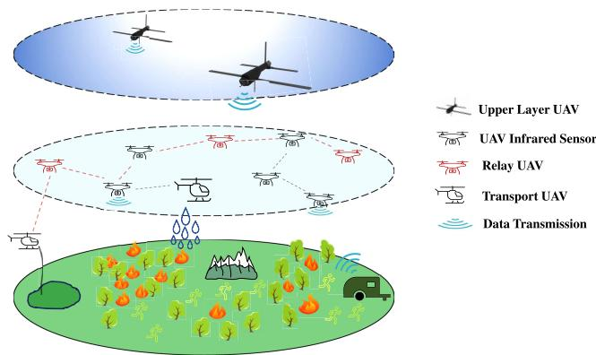  
Fig. 1. Hierarchical UAV cluster networking architecture.

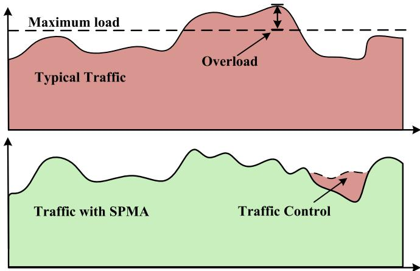  
Fig. 2. Conceptual diagram of typical trafic and SPMA trafic.

## II. SYSTEM MODEL

## A. Network Model

Within the structure of Wireless Networks, sensed information is directly sent to a central aggregation node by the nodes. Nevertheless, if these nodes fail, the network faces possible disconnection or loss of control [36]. A more flexible approach may be found when applying FANET architecture within a UAV cluster. In this model, communication between UAVs can be randomly established, allowing for smaller sub-networks in local areas. Intercommunication between these sub-networks is facilitated through boundary nodes. UAVs with high transmittal power capabilities can efectively supervise the entirety of the network while also ensuring communication relay during emergencies. The hierarchical UAV cluster networking architecture used in this study is illustrated in Fig. 1.

Fig. 1 shows the application of UAV clusters in a fire rescue scenario. This layered networking architecture facilitates overthe-horizon connectivity, thereby enabling the execution of ultra-long-range rescue missions.

## B. Trafic Control Model

SPMA implements trafic control using three primary techniques: load sensing, setting access thresholds, and establishing backof window parameters. Fig. 2 visualizes a typical trafic concept and its subsequent transformation after applying

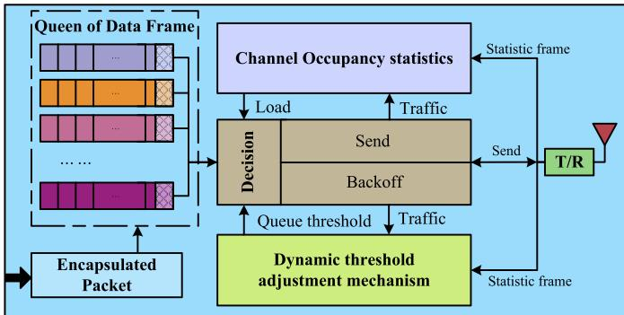  
Fig. 3. Block diagram of SPMA control algorithm.

SPMA. Fig. 3 illustrates the SPMA control algorithm block diagram incorporating service and statistical information flow. As the system load escalates, higher-priority data frames are progressively deferred. However, when the Load diminishes, the system can access lower-priority data frames. This strategy efectively modulates the increasing Load, ensuring that a particular load level is sustained to provide QoS assurance for higher-priority services.

Packets of varying priorities are encapsulated into frames and placed into designated priority queues for channel access. Transmission scheduling only proceeds when a pending queue is present, and the send threshold of this queue surpasses the current COS. In addition, the queuing mechanism timed each data frame for tracking purposes. If a queue timeout occurs, the queue is exited, the cache is released, and the queue is reassessed. Absent of a timeout, the pulse modulation phase in the physical layer is entered, and the queue is transmitted using frequency and time hopping. Upon pulse reception, the receiver stores them into a pulse bufer. Once all pulses have been received, the pulse frame undergoes reassembly and de-encapsulation, restoring the original packet. Concurrently, these processes continuously generate statistical information, interacting across three modules: COS, threshold adjustment, and transmission judgment.

## C. Priority Mapping Model

Priority mapping is the first step in implementing the diferentiated priority multiple access algorithm. We map the packets to $P _ { 0 }$ to $P _ { 7 }$ by extracting four attributes of the packets: Time Sensitivity (TS), QoS, Cyclicity, and Data Length (DL), as shown in Table II.

In Table II, TS is the most significant feature used to measure the priority of packets; the lower the delay requirement of a packet, the higher its priority usually is. QoS is the most important reference metric, and when the TS of the packets is at the same level, the packets requesting QoS are prioritized higher. The Cyclicity attribute is also a reference factor for measuring packet priority when the TS of packets is at the same level. Cyclicity message data usually has relatively low requirements for delay and does not require high-level QoS; its priority is lower. Messages with high TS requirements usually have shorter data lengths, so when the TS of the data is at the same level, the data length is considered first, i.e., the shorter the data length, the higher the priority of the packet.

TABLE II  
LIST OF PACKET ATTRIBUTES
<table><tr><td rowspan=1 colspan=1>Priority</td><td rowspan=1 colspan=1>TS</td><td rowspan=1 colspan=1>Qos</td><td rowspan=1 colspan=1>Cyclicity</td><td rowspan=1 colspan=1>DL</td></tr><tr><td rowspan=1 colspan=1>0</td><td rowspan=1 colspan=1>√</td><td rowspan=1 colspan=1>√</td><td rowspan=1 colspan=1>X</td><td rowspan=1 colspan=1>short</td></tr><tr><td rowspan=1 colspan=1>1</td><td rowspan=1 colspan=1>√</td><td rowspan=1 colspan=1>√</td><td rowspan=1 colspan=1>×</td><td rowspan=1 colspan=1>long</td></tr><tr><td rowspan=1 colspan=1>2</td><td rowspan=1 colspan=1>√</td><td rowspan=1 colspan=1>√</td><td rowspan=1 colspan=1>√</td><td rowspan=1 colspan=1>short</td></tr><tr><td rowspan=1 colspan=1>3</td><td rowspan=1 colspan=1>√</td><td rowspan=1 colspan=1>√</td><td rowspan=1 colspan=1>√</td><td rowspan=1 colspan=1>long</td></tr><tr><td rowspan=4 colspan=1>4</td><td rowspan=1 colspan=1>√</td><td rowspan=1 colspan=1>X</td><td rowspan=1 colspan=1>×</td><td rowspan=1 colspan=1>short</td></tr><tr><td rowspan=1 colspan=1>√</td><td rowspan=1 colspan=1>×</td><td rowspan=1 colspan=1>×</td><td rowspan=1 colspan=1>long</td></tr><tr><td rowspan=1 colspan=1>√</td><td rowspan=1 colspan=1>×</td><td rowspan=1 colspan=1>√</td><td rowspan=1 colspan=1>short</td></tr><tr><td rowspan=1 colspan=1>√</td><td rowspan=1 colspan=1>×</td><td rowspan=1 colspan=1>√</td><td rowspan=1 colspan=1>long</td></tr><tr><td rowspan=4 colspan=1>5</td><td rowspan=1 colspan=1>×</td><td rowspan=1 colspan=1>√</td><td rowspan=1 colspan=1>×</td><td rowspan=1 colspan=1>short</td></tr><tr><td rowspan=1 colspan=1>×</td><td rowspan=1 colspan=1>√</td><td rowspan=1 colspan=1>×</td><td rowspan=1 colspan=1>long</td></tr><tr><td rowspan=1 colspan=1>×</td><td rowspan=1 colspan=1>√</td><td rowspan=1 colspan=1>√</td><td rowspan=1 colspan=1>short</td></tr><tr><td rowspan=1 colspan=1>×</td><td rowspan=1 colspan=1>√</td><td rowspan=1 colspan=1>√</td><td rowspan=1 colspan=1>long</td></tr><tr><td rowspan=2 colspan=1>6</td><td rowspan=1 colspan=1>×</td><td rowspan=1 colspan=1>×</td><td rowspan=1 colspan=1>×</td><td rowspan=1 colspan=1>short</td></tr><tr><td rowspan=1 colspan=1>×</td><td rowspan=1 colspan=1>×</td><td rowspan=1 colspan=1>×</td><td rowspan=1 colspan=1>long</td></tr><tr><td rowspan=2 colspan=1>7</td><td rowspan=1 colspan=1>×</td><td rowspan=1 colspan=1>×</td><td rowspan=1 colspan=1>√</td><td rowspan=1 colspan=1>short</td></tr><tr><td rowspan=1 colspan=1>×</td><td rowspan=1 colspan=1>×</td><td rowspan=1 colspan=1>√</td><td rowspan=1 colspan=1>long</td></tr></table>

## III. RA-SPMA PROTOCOL

## A. Channel Occupancy Statistics

Based on the system model defined in Section II, The RA-SPMA protocol aims to alleviate the problem of signal conflict within a subnet. Since UAVs within subnetwork are directly connected, they establish communication connections to facilitate this operation. Therefore, only statistical frames within a single hop are collated while performing COS. Each node obtains the Load of its subnet in the kth cycle by creating a subnet load statistic value Load . The subnet load statistic value is defined in Eq. (1).

$$
L o a d _ { k } = \sum _ { i = 1 } ^ { i _ { m a x } } N _ { i _ { s e n d } }\tag{1}
$$

where $N _ { i s e n d }$ is the total number of data frames accessing the channel by node i during a cycle.

The statistics are periodically encapsulated into statistics frames and are then inserted into the head of the highestpriority queue. In general, diferent $L o a d _ { k }$ have diferent efects on COS, and the newer the $L o a d _ { k } .$ , the greater the efect on COS. In this paper, we consider a time-weighting-based method to calculate COS to reflect the efect of $L o a d _ { k }$ on COS about diferent cycles, given by Eq. (2).

$$
C O S = \sum _ { K = 1 } ^ { T _ { w } } \gamma _ { k } \times L o a d _ { k }\tag{2}
$$

where $\gamma _ { k }$ is the weight assigned to the kth cycle, and $k \in$ $[ 1 , \ldots , T _ { w } ]$

To analyze the relationship between $\gamma _ { k }$ and network stability while determining optimal $\gamma _ { k }$ values, we construct the Lyapunov function as shown in Eq. (3).

$$
V ( t ) = \frac { 1 } { 2 } \sum _ { k = 1 } ^ { T _ { w } } \gamma _ { k } \cdot ( \mathrm { L o a d } _ { k } ( t ) - \mathrm { L o a d } _ { \mathrm { e q } } ) ^ { 2 }\tag{3}
$$

The energy decay rate satisfies the following.

$$
\Delta V ( t ) \leq - \eta \cdot \operatorname* { m i n } _ { k } \gamma _ { k } \cdot V ( t ) , \quad \eta > 0\tag{4}
$$

Solving this diferential inequality yields the following.

$$
V ( t ) \leq V ( 0 ) \cdot e ^ { - \eta ( \operatorname* { m i n } _ { k } \gamma _ { k } ) t }\tag{5}
$$

This demonstrates that the convergence rate is determined by the exponential coeficient $\eta \cdot \mathrm { \ m i n } _ { k } \gamma _ { k } \mathrm { ; }$ when $\mathrm { m i n } _ { k } \gamma _ { k }$ decreases, the exponential decay slows down, resulting in lower system convergence rates. We set $\gamma _ { k }$ to an isotropic series with a tolerance of $d$ within the $T _ { w } ,$ , defined in Eqs. (6) and (7).

$$
\begin{array} { c } { \displaystyle \sum _ { K = 1 } ^ { T _ { w } } \gamma _ { k } = 1 , \gamma _ { k } \geq \gamma _ { k - 1 } > 0 } \\ { \gamma _ { 1 } = \displaystyle \frac { 1 } { T _ { w } } - \frac { ( T _ { w } - 1 ) \times d } { 2 } } \\ { \gamma _ { k } = \gamma _ { 1 } + ( k - 1 ) \times d } \end{array}\tag{6}
$$

(7)

Let $T _ { \mathrm { { f r a m e } } }$ denote the load counting period. To maximize the information content of the COS, $T _ { \mathrm { f r a m e } }$ is dynamically adjusted according to the measured COS value. The COS range is partitioned into N discrete intervals, with the adjustment procedure implemented as follows:

• Enter the initialization phase. In this phase, the timer is activated to respond to timer interrupts cyclically. $T _ { f r a m e }$ of this phase runs at the default value $T _ { d e f a u l t }$ . While interrupting, a statistics frame is generated and inserted at the beginning of the highest priority queue.

$N o d e _ { i }$ starts the load-counting module. It logs the cumulative total of data frames $N _ { i s e n d }$ accessed at the link layer within a single cycle. Once the timer responds to the interrupt, it combines $N _ { i s e n d }$ with COS from all nodes within the subnet. This process derives the subnet channel’s cumulative COS.

• The node begins modifying the COS period. This process commences when a new COS is created, at which point the timer restarts. $T _ { f r a m e }$ is impacted by COS, as represented in Eq. (8).

$$
T _ { f r a m e } = \left\{ \begin{array} { l l } { \alpha \times T _ { d e f a u l t } , } & { C O S < L o a d _ { l o w } } \\ { T _ { d e f a u l t } , } & { L o a d _ { l o w } \leq C O S \leq L o a d _ { m e d i u m } } \\ { \beta \times T _ { d e f a u l t } , } & { C O S > L o a d _ { m e d i u m } } \end{array} \right.\tag{8}
$$

where $\alpha$ and $\beta$ are the adjustment factors for low and high load conditions, these coeficients can be modified to more accurately align with the network’s current state.

We define three COS states: $h i g h .$ , medium, and low, to balance the impact of abrupt changes in COS values on the efectiveness of COS, thereby improving network stability. Special attention should be paid to the setting of load intervals. When the channel load changes sharply, decisions must be made promptly. Each load interval is set as $\left( 0 , \frac { 1 } { 2 } \mathrm { L o a d } _ { \mathrm { m a x } } , \frac { 3 } { 4 } \mathrm { L o a d } _ { \mathrm { m a x } } \right)$ , which correspond to the intervals of Loadlow, Loadmedium, and Loadhigh, respectively. Between $\scriptstyle { \frac { 1 } { 2 } } \mathrm { L o a d } _ { \mathrm { m a x } }$ and $\scriptstyle { \frac { 3 } { 4 } } \mathrm { L o a d } _ { \mathrm { m a x } }$ , the default counting period $T _ { \mathrm { d e f a u l t } }$ is used. When the load reaches $\frac { 3 } { 4 } \mathrm { L o a d } _ { \mathrm { m a x } }$ , a regulation factor $\beta$ is introduced to extend $T _ { \mathrm { f r a m e } } ,$ reducing the generation of statistical frames, which helps save channel resources and decrease the probability of pulse collisions. Conversely, when the channel load is lower than $\scriptstyle { \frac { 1 } { 2 } } \mathrm { L o a d } _ { \mathrm { m a x } }$ , a regulation factor is introduced to shorten $T _ { \mathrm { f r a m e } }$ and appropriately increase the generation of statistical frames, making the COS value more efective for access control. Regarding the determination of values for and $\beta ,$ they are selected through simulation experiments in Section IV-A.

## B. Dynamic Threshold Adjustment

Maximum access thresholds vary depending on the transceiver component. The maximum access threshold is a crucial parameter, serving as the highest priority service access threshold. Other priority service access thresholds are calculated from it. Setting an excessively high threshold could abruptly increase channel access, whereas an overly low threshold may result in insuficient channel access. Both scenarios adversely afect channel utilization and prevent the network throughput from reaching its system limit.

Hence, we designed the dynamic threshold adjustment algorithm(DTA). This algorithm harnesses feedback information from the real-time packet delivery rates, facilitating the dynamic adjustment of the maximum access threshold to ensure a consistent volume of subnet access. The strategy adeptly strikes a balance between channel utilization and system throughput, thereby stabilizing the network amidst various loads. It employs a slow-start, congestion-avoiding control strategy that utilizes high-speed exponential growth, additive enhancement, and short-bound dynamic adjustment trafic management. This allows for the dynamic regulation of queue access thresholds, assuring rapid and precise convergence towards an optimal setting.

The initial phase employs swift exponential growth to boost channel access rapidly. As the access volume grows excessively quickly, the network load surpasses the maximum, exemplified by the packet delivery rate of the highest priority falling below 90%. To counterbalance, channel access undergoes an immediate halving to enhance the packet delivery rate. During the network’s initial phase, the access threshold remains unknown, and a lower access threshold $T h r e s h _ { i n i t }$ is assigned to the highest priority queue. The algorithm for the first stage adjustment is represented in Eq. (9).

$$
T h r e s h _ { 0 } = T h r e s h _ { i n i t } ^ { t }\tag{9}
$$

where t is the first stage stepping index, and $T h r e s h _ { 0 }$ is half of the highest priority data frame queue access threshold obtained in the first adjustment stage.

The second adjustment phase uses a slow additive increment to increase the channel access gradually, given by Eq. (10).

$$
\begin{array} { l } { { T h r e s h _ { 0 } = \varepsilon * \Delta t + T h r e s h _ { 0 } } } \\ { { \qquad = \varepsilon * \Delta t + \frac { T h r e s h _ { i n i t } ^ { t } } { 2 } } } \end{array}\tag{10}
$$

where is the growth factor, ∆t is the second stage growth time, b is the initial value.

When the channel load access exceeds the actual threshold, i.e., when the packet delivery rate of the highest priority is less than 95%, the third adjustment stage is started. The third adjustment phase implements short-amplitude dynamic modification to alter the volume of channel access. As the threshold enlarges, the amount of channel access increases; conversely, when the threshold diminishes, the volume of channel access subsequently decreases. The T hresh is given by Eq. (11).

$$
T h r e s h _ { 0 } = L o a d _ { m a x } * ( 1 + \Delta P _ { o u t } )\tag{11}
$$

where $\Delta P _ { o u t }$ is the highest priority packet delivery rate obtained in two adjacent statistical cycles.

Based on the total number of frames sent on the sending side $N _ { s e n d }$ and the number of frames successfully received at the receiver $N _ { r e s t o r e } .$ , The highest priority packet delivery rate $P _ { o u t }$ is calculated by Eq. (12).

$$
P _ { o u t } = \frac { N _ { r e s t o r e } } { N _ { s e n d } }\tag{12}
$$

T hreshi is derived from the highest priority operational threshold as shown in Eq. (13).

$$
T h r e s h _ { i } = T h r e s h _ { 0 } - \sum _ { j = 0 } ^ { i - i } N _ { j }\tag{13}
$$

where T hreshi is the threshold value of the i-th priority services, and $N _ { j }$ represents the total number of data frames in the jth priority queue.

Utilizing the aforementioned dynamic access threshold adjustment model expedites the determination of thresholds for each priority queue following network initialization. Furthermore, these thresholds can be adaptively modified in response to significant alterations in service volume. To reduce the tuning cost of parameters in our experiments, we analyzed the convergence of the threshold adjustment algorithm. We modeled the third threshold adjustment process using a discrete-time negative feedback control system, where the feedback error signal is given by Equation (14).

$$
\Delta P _ { \mathrm { o u t } } ( t ) = P _ { 0 } ( t ) - P _ { 0 } ( t - 1 )\tag{14}
$$

Performing first-order approximation near the equilibrium point Thres $\mathrm { h } _ { 0 } ^ { * } = \mathrm { L o a d } _ { \operatorname* { m a x } }$ yields Eq. (15).

$$
P _ { 0 } ( t ) \approx P _ { 0 } ^ { * } - k \cdot ( \mathrm { T h r e s h } _ { 0 } ( t ) - \mathrm { L o a d } _ { \operatorname* { m a x } } )\tag{15}
$$

where $\begin{array} { r } { k \ = \ - \ \frac { \partial P _ { 0 } } { \partial \mathrm { T h r e s h } _ { 0 } } \Bigr | _ { \mathrm { T h r e s h } _ { 0 } ^ { * } } \ > \ 0 } \end{array}$ is the channel sensitivity coeficient.

Substituting into the original system yields Eq. (16).

$$
\mathrm { T h r e s h } _ { 0 } ( t + 1 ) \approx \mathrm { L o a d } _ { \mathrm { m a x } } + k \left( \mathrm { T h r e s h } _ { 0 } ( t - 1 ) - \mathrm { T h r e s h } _ { 0 } ( t ) \right)
$$

The state vector is given by Eq. (17).

(16)

$$
\mathbf { x } ( t ) = \left[ \begin{array} { c } { \mathrm { T h r e s h } _ { 0 } ( t ) - \mathrm { L o a d } _ { \operatorname* { m a x } } } \\ { \mathrm { T h r e s h } _ { 0 } ( t - 1 ) - \mathrm { L o a d } _ { \operatorname* { m a x } } } \end{array} \right]\tag{17}
$$

The state equation is given by Eq. (18).

$$
\mathbf { x } ( t + 1 ) = \mathbf { A } \mathbf { x } ( t ) , \quad \mathbf { A } = { \left[ \begin{array} { l l } { - k \ k } \\ { 1 } & { 0 } \end{array} \right] }\tag{18}
$$

The characteristic equation of matrix A is given by Eq. (19).

$$
\operatorname* { d e t } ( \lambda \mathbf { I } - \mathbf { A } ) = \lambda ^ { 2 } + k \lambda - k = 0\tag{19}
$$

The eigenvalues are obtained as shown in Eq. (20).

$$
\lambda = { \frac { - k \pm { \sqrt { k ^ { 2 } + 4 k } } } { 2 } }\tag{20}
$$

The system is asymptotically stable if and only if all eigenvalues satisfy | |  1, which requires: $k \in ( 0 , 1 )$ . In practical applications, the value of k can be constrained through beacon measurements to ensure system stability. As demonstrated in Section IV, experimental results validate the stability of the threshold adjustment scheme.

## C. Window Adaptive Backof

Within FANET architectures, the network environment for each communication unit varies significantly, and a static window backof algorithm may not be optimally adaptable to such networks. Consequently, we proposed a Window Adaptive Backof Algorithm (WABA) that modifies the backof interval multiplier based on the current packet delivery rate, enabling it to adjust to fluctuating external transmission attributes and network statuses. This approach prevents excessive channel resource wastage and the introduction of unnecessary delays intrinsic to the original backof algorithm. The packet delivery rate efectively bifurcates the network into stable and busy conditions. During the stable state, the network has fewer active nodes, ensuring good channel accessibility for these nodes. The adjustment for this state is depicted in Eq. (21).

$$
t _ { b a c k o f f } = R a n d o m \left( T _ { f r a m e } , T _ { f r a m e } \times ( i + 1 ) \right)\tag{21}
$$

where $T _ { f r a m e }$ is the minimum backof time for data frame access, and i is the priority number of frames.

The channel is stable and can maintain an exceptionally high packet delivery rate. It only requires appropriate management of the diferent priority queue data frame backof within the node, thereby ensuring priority access for high-priority data frames. During periods of network congestion, the competitive state among the nodes for the channel intensifies. As a response, employing a larger backof window to lessen the Load becomes necessary. This adjustment is represented in Eq. (22).

$$
{ t _ { b a c k o f f } = R a n d o m \left( t _ { b a c k o f f } , t _ { b a c k o f f } \times b \right) }\tag{22}
$$

where b is the maximum backof time adjustment factor for the channel busy state.

Various factors influence the packet delivery rate, including amplified external interference and a pronounced rise in channel occupancy. During periods of high network activity, the contention window necessitates substantial expansion to accommodate heightened network conflicts. As the network transitions from a busy to a stable state, the contention window for maximum priority data frames is reduced to zero. In contrast, other priority contention windows enter a phase of stable adjustment.

## D. Complexity Analysis

Based on the algorithm design described in the previous three sections, the complete operational workflow of RA-SPMA is presented in Algorithm 1, which integrates three core modules that work collaboratively: the COS module, the DTA module and the WABA module. Following the procedural steps outlined in Algorithm 1, the total time complexity corresponds to the upper bound of these three components, as expressed in Eq. (23).

Algorithm 1 Reliable, Adaptive Multiple Access Based on   
Statistical Priority   
1 Input: $N _ { i s e n d } , N _ { j } ,$ imax·   
2 Output: $S e n d _ { f l a g _ { i } } .$   
3 Initialize channel load $T h r e s h _ { i n i t } .$ , Statistical cycle   
$T _ { d e f a u l t } ;$   
4 Initialize algorithm parameters $\gamma _ { k } , T _ { w } , \alpha , \beta$ and ε;   
5 Initialize all $S e n d _ { f l a g _ { i } }$ to TRUE, $P _ { o u t }$ to 99%;   
6 while $P _ { o u t } > 9 0 \%$ do   
7 $T _ { f r a m e }$ out;   
8 $\bar { T h r e s h _ { 0 } } \gets ( T h r e s h _ { i n i t } , t + 1 ) ;$   
9 $P _ { o u t } \gets ( N _ { r e s t o r e } , N _ { s e n d } ) ;$   
10 end   
11 while $P _ { o u t } > 9 5 \%$ do   
12 $T _ { f r a m e } \ \mathrm { o u t } ;$   
13 $\mathop { T h r e s h _ { 0 } } \gets ( \varepsilon , \Delta t , T h r e s h _ { i n i t } , t + 1 ) ;$   
14 $P _ { o u t } \gets ( N _ { r e s t o r e } , N _ { s e n d } ) ;$   
15 end   
16 $L o a d _ { m a x } \gets T h r e s h _ { 0 } ;$   
17 while $T _ { f r a m e = 1 }$ do   
18 for $k { = } l { : } T _ { w }$ do   
19 for $\operatorname { i } { = } 0 { : } i _ { m a x }$ do   
20 $L o a d _ { k } \gets N _ { i s e n d } ;$   
21 end   
22 $C O S \gets \gamma _ { k } \times L o a d _ { k } ;$   
23 end   
24 $( L o a d _ { l o w } , L o a d _ { m e d i u m } ) \gets L o a d _ { m a x } ;$   
25 if $C O S < L o a d _ { l o w }$ then   
26 $\begin{array} { r l } { | } & { { } T _ { f r a m e }  \alpha \times T _ { d e f a u l t } ; } \end{array}$   
27 else if $C O S > L o a d _ { m e d i u m }$ then   
28 $T _ { f r a m e } \gets \beta \times T _ { d e f a u l t } ;$   
29 else   
30 $T _ { f r a m e } \gets T _ { d e f a u l t } ;$   
31 end   
32 $P _ { o u t } \gets ( N _ { r e s t o r e } , N _ { s e n d } ) ;$   
33 $T h r e s h _ { 0 } \gets ( L o a d _ { m a x } , \Delta P _ { o u t } ) ;$   
34 $T h r e s h _ { i } \gets ( T h r e s h _ { 0 } , N _ { j } ) ;$   
35 if $C O S < L o a d _ { m e d i u m }$ then   
36 Set $L o a d _ { s t a t e }$ to Stable;   
37 else   
38 Set $L o a d _ { s t a t e }$ to Busy;   
39 end   
40 if $( L o a d _ { s t a t e } = S t a b l e )$ then   
41 for $i = 0 : i _ { m a x }$ do   
42 $S e n d _ { f l a g } \gets ( C O S , T h r e s h _ { i } ) ;$   
43 $( t _ { b a c k o f f } ) \gets ( i , T _ { f r a m e } ) ;$   
44 end   
45 else   
46 for $i = 0 : i _ { m a x }$ do   
47 $S e n d _ { f l a g _ { i } } \gets ( C O S , T h r e s h _ { i } ) ;$   
48 $t _ { b a c k o f f } \gets ( b , T _ { b a c k o f f } ) ;$   
49 end   
50 end   
51 end

TABLE III  
COMPUTATIONAL COMPLEXITY COMPARISON OF MAC PROTOCOLS
<table><tr><td>Protocol</td><td>Time Complexity</td><td>Priority Support</td><td>Adaptability</td></tr><tr><td>RA-SPMA</td><td>O(n)</td><td>8 levels</td><td>Load-aware</td></tr><tr><td>SPMA</td><td> $\mathcal { O } \dot { ( 1 ) }$ </td><td>None</td><td>Static</td></tr><tr><td>802.11e</td><td> $\mathcal { O } ( n \log _ { 2 } n )$ </td><td>4 levels</td><td>Limited</td></tr><tr><td>TDMA</td><td>O(1)</td><td>None</td><td>Fixed-slot</td></tr><tr><td>CSMA/CA</td><td> $\mathcal { O } ( 2 ^ { N } )$ </td><td>None</td><td>Collision-dependent</td></tr></table>

$$
\begin{array} { r l } & { T _ { \mathrm { t o t a l } } = T _ { C O S } + T _ { D T A } + T _ { W A B A } } \\ & { \qquad = \mathcal { O } ( T _ { w } ) + \mathcal { O } ( i _ { \mathrm { m a x } } ) } \\ & { \qquad = \mathcal { O } ( n ) , \quad n = \operatorname* { m a x } ( T _ { w } , i _ { \mathrm { m a x } } ) } \end{array}\tag{23}
$$

The RA-SPMA protocol achieves an optimal balance between time complexity and dynamic adaptability requirements. As shown in Table III, its linear time complexity ${ \mathcal { O } } ( n )$ ensures multi-priority QoS without significant orderof-magnitude increases compared to conventional protocols. While Time Division Multiple Access (TDMA) with fixed time-slot allocation ofers lower time complexity (O(1)), it cannot accommodate multi-priority transmission requirements or dynamic loads. Although Statistical Priority-based Multiple Access (SPMA) supports service diferentiation, its static parameter design fails to adapt to dynamic channel load variations. The IEEE 802.11e Enhanced Distributed Channel Access (EDCA) protocol implements service differentiation through its Access Category (AC) mechanism, but its ${ \mathcal { O } } ( n \log _ { 2 } n )$ complexity originates from the standardmandated strict priority arbitration requirements. In contrast, RA-SPMA reduces the complexity to a lower order while maintaining 8-level service diferentiation through statistical priority mapping and subnet load awareness techniques. Compared to contention-based protocols like Carrier Sense Multiple Access with Collision Avoidance (CSMA/CA), which employs a binary exponential backof algorithm with $\mathcal { O } ( 2 ^ { N } )$ time complexity (where N represents backof count) that grows exponentially with increasing collisions and lacks native service diferentiation capabilities, RA-SPMA demonstrates superior scalability. A comprehensive performance comparison between RA-SPMA and other protocols will be presented in Section IV through detailed simulation analysis.

## E. Frame Structure

Packets are encapsulated into frames, each comprising data and additional information fields requisite for MAC layer processing. The final data frame, guided by the RA-SPMA access algorithm, transitions to the physical layer, where it undergoes operations such as modulation and coding before being transmitted as pulses via the wireless channel. During the IP packet encapsulation phase, packets derived from the network layer transform frames at the link layer by adding fields. The frame structure is depicted in Fig. 4.

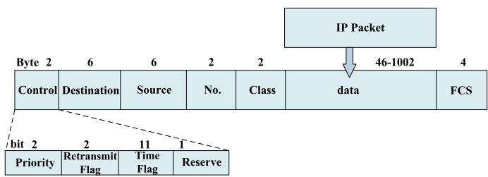  
Fig. 4. Frame structure of RA-SPMA.

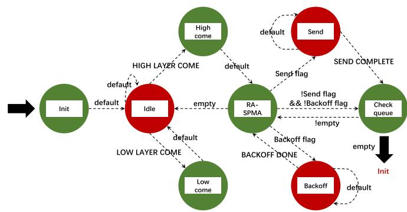  
Fig. 5. RA-SPMA process model.

This frame structured explicitly for the RA-SPMA algorithm holds 1024 Bytes, comprising a 2 Byte frame control field, 6 Byte destination address, 6 Byte source address, 2 Byte sequence number, 2 Byte class number, a variable 46-1002 Byte data segment, and a 4 Byte FCS checksum field. Within the 2 Byte frame control field, the first two bits are allocated to the service priority, another set of two bits to the retransmission flag, the time stamp utilizes the initial 11 bits, while the final bit remains reserved. Regarding the simulation design, two types of data frames are planned: service frames sourced from the resource generation module and broadcast frames intended for COS. These are coded as 00 for service frames and 11 for broadcast frames.

## IV. SIMULATION AND ANALYSIS

## A. Simulation Settings

The implementation details of the physical layer and link layer were developed in MATLAB and OPNET, respectively. Online co-simulation was achieved by integrating the MATLAB engine into OPNET’s pipeline model. The physical layer employs LDPC encoding with a code rate of $1 / 2$ and GMSK modulation, incorporating the 3GPP standard interleaver for robust decoding performance. The key simulation parameters are summarized in Table IV. Additionally, Fig. 5 illustrates the process model design of RA-SPMA.

The process model delineates the direction and processing of the packet flow within the simulation kernel. As depicted in Fig. 5, two state machines are in operation: a red-coloured mechanism that outlines the backof and dispatch processes for packets and a green-coloured apparatus that governs the queuing process of incoming packet flow at the network layer. The latter is further responsible for the statistical analysis and process management of the packet flow received. The RA-SPMA state machine is anchored centrally, which encapsulates the algorithm’s function code.

TABLE IV  
SIMULATION PARAMETERS
<table><tr><td>Parameter</td><td>Value</td></tr><tr><td>Threshinit /Mbps</td><td>5</td></tr><tr><td> $T _ { d e f a u l t } \ / \mathrm { { m s } }$ </td><td>250</td></tr><tr><td>Packet size /Byte</td><td>1024</td></tr><tr><td>Data Rate /Mbps</td><td>2</td></tr><tr><td>Radius of activities /km</td><td>100</td></tr><tr><td>Maximum Speed km/h</td><td>50</td></tr><tr><td>Carrier Frequency /MHz</td><td>51.25</td></tr><tr><td>Channel Coding Scheme</td><td>LDPC</td></tr><tr><td>Code Rate</td><td>1/2</td></tr><tr><td>Interleaving Scheme</td><td>Random interleaver</td></tr><tr><td>Interleaving Depth</td><td>16</td></tr><tr><td>Modulation Scheme</td><td>GMSK</td></tr><tr><td>Synchronization Method</td><td>Cyclic Correlation</td></tr></table>

We designed eight sets of experiments by configuring diferent protocol parameters to determine the optimal parameters for RA-SPMA. Then, we designed comparison experiments. Concerning SPMA, we employ a COS based on physical layer impulse statistics, a static threshold setting scheme, and a static window backof mechanism. In the comparison experiments, particular attention was paid to packet delivery rate, end-toend delay, and jitter. The protocol parameters are shown in Table V.

1) Packet Delivery Rate: It is one of the essential indexes used to evaluate the reliability of an algorithm. It corresponds to the ratio of the number of packets correctly received by the destination node over the total number of packets sent by the sending node.

2) End-to-End Delay: It represents the time ratio needed for all packets sent from the source node to the destination node over the total number of packets successfully transmitted, which can reflect the network congestion and routing smoothness to a certain extent.

3) Jitter: It’s usually defined as packet delay fluctuations. Jitter is often calculated in the form of mean, variance, etc., The presence of jitter afects the transmission quality of VOIP service in the network.

We investigate the efects of the three sets of parameters $T _ { w } , ( \alpha , \beta )$ , and  on the highest priority packets delivery rate α β εof RA-SPMA through eight groups of experiments, and the simulation results are shown in Fig. 6. We conclude that $T _ { w }$ has the greatest influence on the transfer rate, followed by $( \alpha ,$ $\beta )$ and then . $T _ { w }$ can directly afect the reliability of COS, $( \alpha , \beta )$ indirectly afects the reliability of COS by adjusting the length of $T _ { f } r a m e ,$ , and COS is the most critical parameter that determines the performance of RA-SPMA. only afects the speed of COS convergence during the initialization. We chose the parameter configuration of Group 6 to complete the next comparison simulation.

TABLE V  
LIST OF PROTOCOL PARAMETERS
<table><tr><td>Protocols</td><td>Groups</td><td> $T _ { w }$ </td><td> $( \alpha , \beta )$ </td><td>ε</td><td>Number of nodes / PC</td><td>Traffic Load / Mbps</td></tr><tr><td>SPMA</td><td></td><td>一</td><td></td><td></td><td>32-128</td><td>5-25</td></tr><tr><td rowspan="9"></td><td>Group 1</td><td>2</td><td>(0.8, 1.2)</td><td>0.005</td><td>32</td><td>10</td></tr><tr><td>Group 2</td><td>2</td><td>(0.8, 1.2)</td><td>0.006</td><td>32</td><td>10</td></tr><tr><td>Group 3</td><td>2</td><td>(0.6, 1.4)</td><td>0.005</td><td>32</td><td>10</td></tr><tr><td>Group 4</td><td>2</td><td>(0.6, 1.4)</td><td>0.006</td><td>32</td><td>10</td></tr><tr><td>Group 5</td><td>4</td><td>(0.8, 1.2)</td><td>0.005</td><td>32</td><td>10</td></tr><tr><td>Group 6</td><td>4</td><td>(0.8, 1.2)</td><td>0.006</td><td>32-128</td><td>5-25</td></tr><tr><td>Group 7</td><td>4</td><td>(0.6, 1.4)</td><td>0.005</td><td>32</td><td>10</td></tr><tr><td>Group 8</td><td>4</td><td>(0.6, 1.4)</td><td>0.006</td><td>32</td><td>10</td></tr><tr><td></td><td></td><td></td><td></td><td>32</td><td>5-25</td></tr><tr><td>802.11 802.11e</td><td></td><td></td><td></td><td></td><td>32</td><td>5-25</td></tr><tr><td>TDMA/CSMA</td><td></td><td></td><td></td><td></td><td>32</td><td>5-25</td></tr></table>

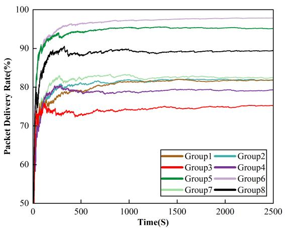  
Fig. 6. Packet delivery rate of eight groups.

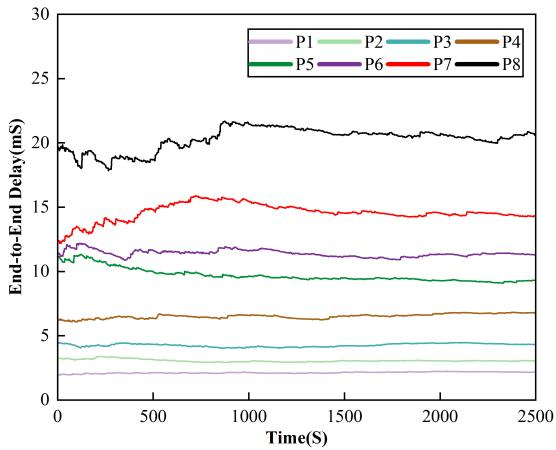

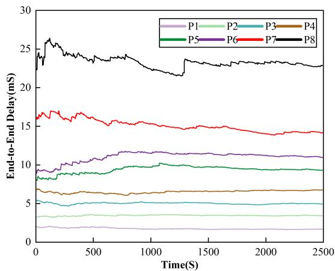  
Fig. 7. End-to-end delay with SPMA.  
Fig. 8. End-to-end delay with RA-SPMA.

## B. Performance Evaluation

We designed simulation experiments for a 10M trafic load and obtained experimental results for the SPMA and RA-SPMA algorithms. Fig. 7 shows that there is a significant diference in the end-to-end delay of the SPMA algorithm under each priority service, which collectively manifests itself in the fact that the higher the priority of the service, the lower the end-to-end delay and the end-to-end delay of the highest priority service is less than 2 ms—reflecting the advantage of the SPMA algorithm’s priority-diferentiated multiple access technique in controlling the end-to-end delay of high-priority services. Fig. 8 illustrates the end-to-end delay profile of the RA-SPMA algorithm for each priority service. The RA-SPMA algorithm outperforms the SPMA algorithm in terms of endto-end delay control for multi-priority services. However, there is little diference in the end-to-end delay control of higherpriority services. This is because the flow control of both algorithms prioritizes guaranteeing the delivery rate of the highest priority packets, whereas RA-SPMA adds dynamic adjustments to the thresholds and the backof window. This reduces the queuing delay of the low-priority queues and allows more lower-priority packets to access the channel promptly.

We count the average end-to-end delay of the two algorithms, as shown in Fig. 9. As the RA-SPMA algorithm adopts a better real-time load counting scheme based on the trafic of data frames within the subnet, the fluctuation of the curve of the RA-SPMA algorithm is more minor in 0-500S, and the network initialization time is shorter. 500 later, both curves tend to flatten out, and the diference between the two curves is in the range of 0.1-0.3 ms. To further analyze the impact of diferent algorithms on latency, We processed the two sets of data shown in Fig. 9 to obtain a set of jitter data, as shown in Fig. 10. The diference between the two algorithms is slight regarding jitter. Overall, the SPMA algorithm exhibits a higher level of delay, and its value fluctuates more; in terms of delay stability, the RA-SPMA algorithm is superior to the SPMA algorithm, implying more reliable transmission quality.

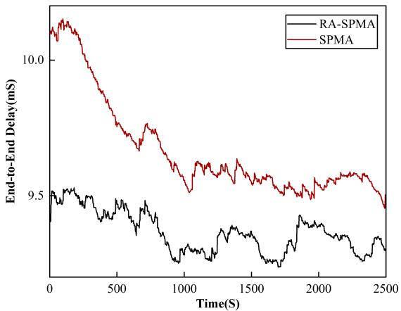  
Fig. 9. Comparison of average end-to-end delay.

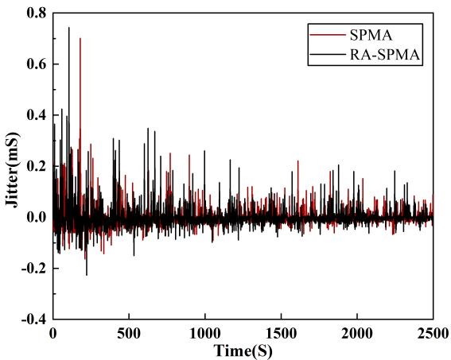

Fig. 10. Real time jitter.  
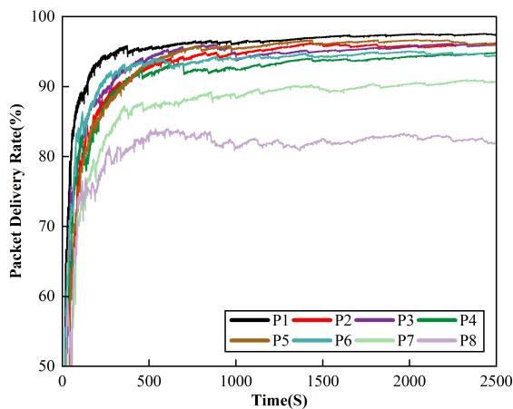  
Fig. 11. Packet delivery rate with SPMA.

Packet delivery rate variation curves of both access algorithms on all prioritized services are statistically obtained by setting the sampling period in the simulation. Fig. 11 shows the packet delivery rate of the SPMA algorithm for each priority service under 10M service volume, and it can be seen that after the simulation time advances to 2000S, the packet delivery rate of the highest priority service gradually reaches 96%. Other priority packet delivery rates are between 80% and 95%. Although SPMA achieves diferentiated access to diferent priority services, it performs poorly in suppressing access to low-priority services, and packet loss is profound for highpriority services. The packet delivery rate of the RA-SPMA algorithm for each priority service is shown in Fig. 12. The packet delivery rate of the highest priority service always stays above 99%, even close to 100%. The packet delivery rate for the other priority services fluctuates between 60% and 80%. Compared with SPMA, RA-SPMA significantly improves the guaranteed packet delivery rate of the highest priority services, and the performance of the packet delivery rate of each priority service is also significantly diferent. On the one hand, RA-SPMA provides accurate and real-time COS, and on the other hand, the dynamic threshold adjustment and backof window ensure that RA-SPMA can adapt to fluctuating network loads.

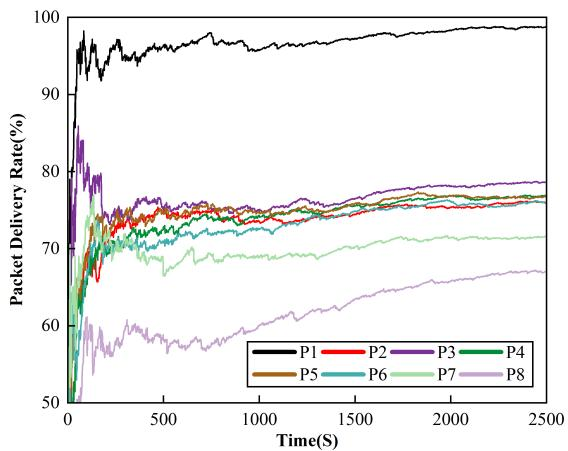  
Fig. 12. Packet delivery rate with RA-SPMA.

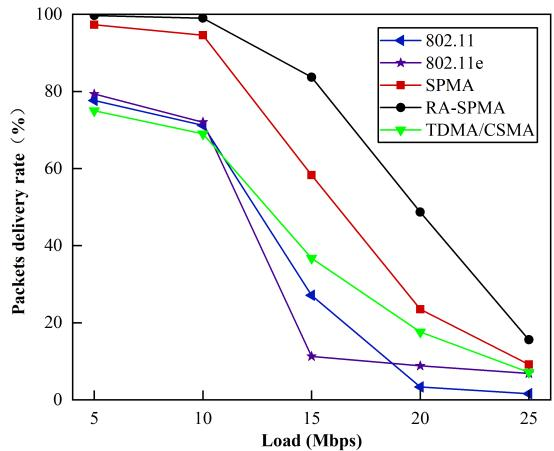  
Fig. 13. Average packet delivery rate of $P _ { 0 } .$

Next, we designed five simulation scenarios with diferent trafic loads and additionally introduced 802.11, 802.11e [37] and hybrid TDMA/CSMA [38] protocols as benchmark comparisons. The average packet delivery ratios of the five protocols under diferent trafic loads were statistically analyzed. The load interval is 5 - 25Mbps, and the load growth interval is 5Mbps. Fig. 13 shows the statistical results of the average packet delivery rate of all packets. As network load increases, the average transfer rate profile tends to decrease. Under the same load conditions, the RA-SPMA protocol has the best flow control performance and the highest average pass rate compared to the other three baseline protocols.

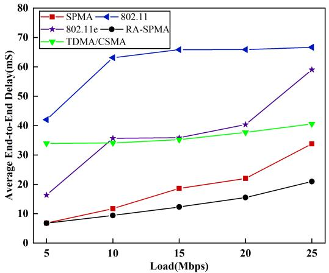

Fig. 14. Average end-to-end delay of $P _ { 0 } .$  
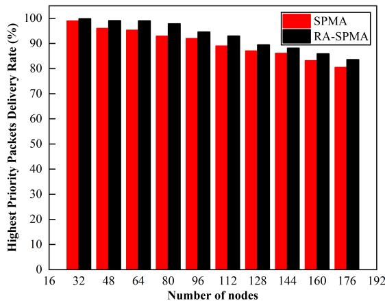  
Fig. 15. Average packet delivery rate of $P _ { 0 } .$

To explore the impact of service volume on the average endto-end delay, we set the load growth interval to 5 Mbps and obtain five sets of statistics on the average end-to-end delay, as shown in Fig. 14. With the increase in load, all four curves show an increasing trend and a large diference. Under the same load conditions, the RA-SPMA protocol performs the best in terms of delay control due to its dynamic backof as well as dynamic threshold adjustment strategy, which reduces some of the queuing delays. 802.11, 802.11e and hybrid TDMA/CSMA protocols are not suitable for multi-priority transmission scenarios, with larger delays.

The above results reflect the superiority of the RA-SPMA algorithm in terms of QoS. Next, we obtained two sets of simulation results using the number of nodes as a variable. Finally, we also give the proposed network node capacity for the RA-SPMA.

Fig. 15 shows the average packet delivery rate of the highest priority services under diferent numbers of nodes. The

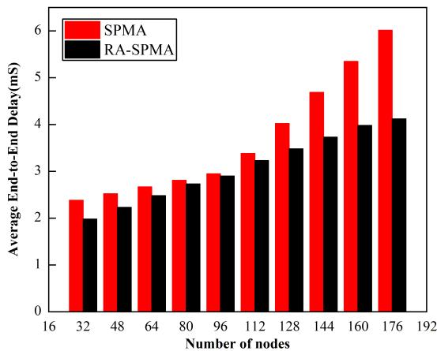  
Fig. 16. Average end-to-end delay.

SPMA algorithm can only guarantee a 99% packet delivery rate of the highest priority services with less than 32 nodes, whereas the RA-SPMA algorithm can still keep it above 99% with 64 nodes. RA-SPMA can adjust to the optimal access threshold and backof interval with diferent numbers of nodes so that low-priority services can be retreated promptly. Fig. 16 shows the end-to-end average delay of the two algorithms for scenarios with diferent numbers of nodes. The end-to-end average delay of RA-SPMA is significantly lower and is below 2ms with 32 nodes. As the number of nodes increases, the total service volume of the network increases; on the one hand, it starts to generate pulse overlap and increases the number of retransmissions. On the other hand, it increases the number of data frames in the bufer and the bufer delay. This leads to an increase in the average end-to-end delay, which eventually grows to 4.1ms.

Based on the two sets of comparison results shown in Fig. 15 and Fig. 16, we suggest that the maximum subnet node capacity of RA-SPMA is 32. With less than 32 nodes, RA-SPMA can simultaneously meet the targets of maximum network throughput of 10Mbps, highest priority packet delivery rate of not less than 99%, and end-to-end average delay of less than 2ms.

## V. CONCLUSION

In this article, we propose a Reliable, Adaptive Multiple Access Protocol Based on Statistical Priority. The RA-SPMA is tailored for Uncrewed Aerial Vehicle cluster networks in intricate settings. We designed a COS algorithm based on the trafic of data frames within the subnet to address the problems of high delay and significant error of the traditional COS algorithm. Complementing this adaptive approach, a dynamic adaptive threshold setting algorithm and a backof algorithm are also developed. Simulation results corroborate the proposed RA-SPMA algorithm’s ability to achieve a throughput of 10Mbps while ensuring that the success rate of the highestpriority service transmission at one time is no less than 99%, the end-to-end delay does not exceed 2ms, and support is given to a maximum node capacity of 32 nodes within the subnet. Although we have implemented the RA-SPMA model on the OPNET platform, we have not yet fully investigated the impact of physical-layer frequency hopping schemes and node mobility on protocol performance. This limitation may afect the concrete performance of our research results in real applications. In our future work, we are committed to building more complete experimental environments to break through this limitation. We believe that such eforts will enhance the credibility of our research and its universality at the application level, enabling us to contribute more valuable insights to the field.

## REFERENCES

[1] R. K. Sharma and D. B. Rawat, “Advances on security threats and countermeasures for cognitive radio networks: A survey,” IEEE Commun. Surveys Tuts., vol. 17, no. 2, pp. 1023–1043, 2nd Quart., 2015.

[2] ˙I. Bekmezci, O. K. Sahingoz, and S¸ . Temel, “Flying Ad-hoc networks (FANETs): A survey,” Ad Hoc Netw., vol. 11, no. 3, pp. 1254–1270, May 2013.

[3] C. Qu, F. B. Sorbelli, R. Singh, P. Calyam, and S. K. Das, “Environmentally-aware and energy-eficient multi-drone coordination and networking for disaster response,” IEEE Trans. Netw. Service Manage., vol. 20, no. 2, pp. 1093–1109, Jun. 2023.

[4] A. V. Savkin and H. Huang, “Navigation of a network of aerial drones for monitoring a frontier of a moving environmental disaster area,” IEEE Syst. J., vol. 14, no. 4, pp. 4746–4749, Dec. 2020.

[5] D. Yin, X. Yang, H. Yu, S. Chen, and C. Wang, “An air-to-ground relay communication planning method for UAVs swarm applications,” IEEE Trans. Intell. Vehicles, vol. 8, no. 4, pp. 2983–2997, Apr. 2023.

[6] X. Song, M. Cheng, L. Lei, and Y. Yang, “Multitask and multiobjective joint resource optimization for UAV-assisted air-ground integrated networks under emergency scenarios,” IEEE Internet Things J., vol. 10, no. 23, pp. 20342–20357, Dec. 2023.

[7] M. Erdelj, M. Krol, and E. Natalizio, “Wireless sensor networks and´ multi-UAV systems for natural disaster management,” Comput. Netw., vol. 124, pp. 72–86, Sep. 2017.

[8] W. Zafar and B. M. Khan, “A reliable, delay bounded and less complex communication protocol for multicluster FANETs,” Digit. Commun. Netw., vol. 3, no. 1, pp. 30–38, Feb. 2017.

[9] A. Srivastava and J. Prakash, “Future FANET with application and enabling techniques: Anatomization and sustainability issues,” Comput. Sci. Rev., vol. 39, Feb. 2021, Art. no. 100359.

[10] Y. Hu, H. Jin, and J.-B. Seo, “Asynchronous random access systems with immediate collision resolution for low power wide area networks,” IEEE Trans. Veh. Technol., vol. 73, no. 2, pp. 2755–2770, Feb. 2024.

[11] G. P. Wijesiri, J. Haapola, and T. Samarasinghe, “The efect of concurrent multi-priority data streams on the MAC layer performance of IEEE 802.11p and C-V2X mode 4,” IEEE Trans. Commun., vol. 70, no. 1, pp. 592–605, Jan. 2022.

[12] B. Zheng, Y. Li, W. Cheng, H. Wu, and W. Liu, “A multi-channel load awareness-based MAC protocol for flying ad hoc networks,” EURASIP J. Wireless Commun. Netw., vol. 2020, no. 1, pp. 1–18, Dec. 2020.

[13] F. Sun, Z. Deng, C. Wang, and Z. Li, “A networking scheme for FANET basing on SPMA protocol,” in Proc. IEEE 6th Int. Conf. Comput. Commun. (ICCC), Dec. 2020, pp. 182–187.

[14] M. Y. Arafat, S. Poudel, and S. Moh, “Medium access control protocols for flying ad hoc networks: A review,” IEEE Sensors J., vol. 21, no. 4, pp. 4097–4121, Feb. 2021.

[15] Y. Zou, Z. Wei, Y. Cui, X. Liu, and Z. Feng, “UD-MAC: Delay tolerant multiple access control protocol for unmanned aerial vehicle networks,” IEEE Sensors J., vol. 23, no. 19, pp. 23653–23663, Oct. 2023.

[16] M. Y.-K. Chua, F. R. Yu, J. Li, Y. Zhou, and L. Lamont, “MAC performance improvement in UAV ad-hoc networks with full-duplex radios and multi-packet reception capability,” in Proc. IEEE Int. Conf. Commun. (ICC), Jun. 2012, pp. 523–527.

[17] X. Huang, A. Liu, H. Zhou, K. Yu, W. Wang, and X. Shen, “FMAC: A self-adaptive MAC protocol for flocking of flying ad hoc network,” IEEE Internet Things J., vol. 8, no. 1, pp. 610–625, Jan. 2021.

[18] S. M. Clark, K. A. Hoback, and S. J. F. Zogg, “Statistical prioritybased multiple access system and method,” U.S. Patent U.S. Patent 7 680 077,B1, Mar. 16, 2010.

[19] Y. Zhang, Y. He, X. Wang, H. Sun, and T. Q. S. Quek, “Modeling and performance analysis of statistical priority-based multiple access: A stochastic geometry approach,” IEEE Internet Things J., vol. 9, no. 15, pp. 13942–13954, Aug. 2022.

[20] Y. Zhang, Y. He, H. Sun, X. Wang, and T. Q. S. Quek, “Performance analysis of statistical priority-based multiple access network with directional antennas,” IEEE Wireless Commun. Lett., vol. 11, no. 2, pp. 220–224, Feb. 2022.

[21] Y. Wei, X. Sun, Y. Zhang, and X. Wang, “Performance analysis of SPMA protocol: A Markov renewal process approach,” in Proc. IEEE Wireless Commun. Netw. Conf. (WCNC), Mar. 2021, pp. 1–6.

[22] Y. Chen and H.-S. Oh, “A survey of measurement-based spectrum occupancy modeling for cognitive radios,” IEEE Commun. Surveys Tuts., vol. 18, no. 1, pp. 848–859, 1st Quart., 2016.

[23] K. Das, N. N. Devi, and S. Moulik, “EADA: Energy-aware adaptive duty-cycle adjustment in superframe for IEEE 802.15.6-based wireless body area networks,” IEEE Sensors Lett., vol. 8, no. 8, pp. 1–4, Aug. 2024.

[24] T. Xu, M. Zhang, S. Yao, H. Hu, and H.-H. Chen, “Channel condition aware detection in statistical signal transmission,” IEEE Trans. Wireless Commun., vol. 16, no. 11, pp. 7221–7234, Nov. 2017.

[25] M. Minardi, T. X. Vu, I. Maity, C. Politis, and S. Chatzinotas, “Traficaware virtual network embedding with joint load balancing and datarate assignment for SDN-based networks,” IEEE Trans. Netw. Service Manage., vol. 21, no. 5, pp. 4936–4948, Oct. 2024.

[26] C. Shaofeng, “Hybrid channel load statistical method based on spma protocol,” Modern Navigat., vol. 23, no. 1, pp. 42–47, 2017.

[27] Y. Zhang, N. Lyu, J. Miao, Q. Gao, X. Wang, and Z. Chen, “Improved intelligent detection algorithm for spma protocol channel state based on recurrent neural network,” J. Beijing Univ. Aeronaut. Astronaut., vol. 49, no. 3, pp. 735–744, 2021.

[28] S. Bhandari and S. Moh, “A priority-based adaptive MAC protocol for wireless body area networks,” Sensors, vol. 16, no. 3, p. 401, Mar. 2016.

[29] S. Zhang, “A data link-oriented dynamic threshold statistical priority multiple access protocol,” J. Command Control, vol. 6, no. 1, pp. 75–80, 2020.

[30] P. Liu, C. Wang, M. Lei, M. Li, and M. Zhao, “Adaptive prioritythreshold setting strategy for statistical priority-based multiple access network,” in Proc. IEEE 91st Veh. Technol. Conf. (VTC-Spring), May 2020, pp. 1–5.

[31] R. M. Metcalfe and D. R. Boggs, “Ethernet: Distributed packet switching for local computer networks,” Commun. ACM, vol. 19, no. 7, pp. 395–404, Jul. 1976.

[32] G. Bianchi, “Performance analysis of the IEEE 802.11 distributed coordination function,” IEEE J. Sel. Areas Commun., vol. 18, no. 3, pp. 535–547, Mar. 2000.

[33] D. Aldous, “Ultimate instability of exponential back-of protocol for acknowledgment-based transmission control of random access communication channels,” IEEE Trans. Inf. Theory, vol. IT-33, no. 2, pp. 219–223, Mar. 1987.

[34] L. Dai and X. Sun, “A unified analysis of IEEE 802.11 DCF networks: Stability, throughput, and delay,” IEEE Trans. Mobile Comput., vol. 12, no. 8, pp. 1558–1572, Aug. 2013.

[35] Y. Zhang, Z. Zhang, H. Sun, and X. Wang, “On the backof scheme for SPMA network: A spatio-temporal mathematical model,” IEEE Commun. Lett., vol. 27, no. 9, pp. 2541–2545, Sep. 2023.

[36] U. N. Kar, D. Dash, D. K. Sanyal, D. Guha, and S. Chattopadhyay, “A survey of topology-transparent scheduling schemes in multi-hop packet radio networks,” IEEE Commun. Surveys Tuts., vol. 19, no. 4, pp. 2026–2049, 4th Quart., 2017.

[37] Y. Xiao, “Performance analysis of priority schemes for IEEE 802.11 and IEEE 802.11e wireless LANs,” IEEE Trans. Wireless Commun., vol. 4, no. 4, pp. 1506–1515, Jul. 2005.

[38] X. Zhang, X. Jiang, and M. Zhang, “A black-burst based time slot acquisition scheme for the hybrid TDMA/CSMA multichannel MAC in VANETs,” IEEE Wireless Commun. Lett., vol. 8, no. 1, pp. 137–140, Feb. 2019.

  
Zhibin Ge received the B.S. degree in computer science and technology and the M.S. degree in computer technology from Shenyang Ligong University, China, in 2019 and 2022, respectively. He is currently pursuing the Ph.D. degree in armament science and technology. His research interests include communication and information processing.

Yongxin Feng received the M.S. degree in computer science from Northeastern University in 2000 and the Ph.D. degree in computer science and technology from the School of Information Science and Engineering, Northeastern University, in 2003. She is currently a Professor with Shenyang Ligong University. She has published more than 100 papers in key academic journals and international conferences at home and abroad, and 75 of which have been indexed by EI/SCI. She has also published seven monographs and one teaching material, and

Yibin Feng received the B.S. degree from Shenyang Ligong University, China, in 2024, where he is currently pursuing the master’s degree with the School of Information Science and Engineering. His current research interests include communication and information systems.

16 patents have been authorized and applied for; meanwhile, ten software copyrights have been approved. She has been selected into the National Millions of Talents Project and has been rewarded as a Young and Middle-Aged Expert with outstanding contribution, a special allowance from the State Council Expert, an Outstanding Talent of the New Century in the Ministry of Education, an Outstanding Expert from Liaoning Province, and one of the first distinguished professors in Liaoning province. Her representative is researching awards, including the Second Prize for National Science and Technology Progress Awards, eleven awards for Provincial and Ministerial Science and Technological progress, including first, second, and third prizes. Her other science and technology awards include the Youth Science and Technology Award of China Ordnance Society, the Youth Science and Technology Award of Liaoning Province, and the Best Paper Award of the International Conference.

Wenbo Zhang received the Ph.D. degree in computer science and technology from Northeastern University, China, in March 2006. He is currently a Professor with the School of Information Science and Engineering, Shenyang Ligong University, China. He has published over 150 papers in related international conferences and journals. He has also published two monographs and one teaching material, and 12 patents have been authorized and applied for; meanwhile, eight software copyrights have been approved. His current research interests include the

Internet of Things, industrial wireless sensor networks, and underwater acoustic sensor networks. He had been awarded the ICINIS 2011 Best Paper Award and up to nine science and technology awards, including the National Science and Technology Progress Award and the Youth Science and Technology Awards from China Ordnance Society. He has served on the editorial board of up to ten journals, including Chinese Journal of Electronics and Journal of Astronautics.