# Reliable and Energy-Efficient Communications via Collaborative Beamforming for UAV Networks

Xiaoya Zheng , Geng Sun , Senior Member, IEEE, Jiahui Li , Student Member, IEEE, Shuang Liang , Qingqing Wu , Senior Member, IEEE, Minghao Yin , Member, IEEE, Dusit Niyato , Fellow, IEEE, and Victor C. M. Leung , Life Fellow, IEEE

Abstract— Unmanned aerial vehicles (UAVs) have been demonstrated to be a prominent component for wireless communications. In this work, we consider an emergency communication scenario wherein a UAV-based relay system collects data from ground users, and then uses different UAV-enabled virtual antenna arrays (UVAAs) to transmit the collected data to several remote base stations (BSs) via collaborative beamforming (CB). However, several adjacent aerial users (AUs) are carrying out other missions at the same time, which may be interfered by the signal transmitted by the UVAAs. Thus, we formulate a reliable and energy-efficient communication multi-objective optimization problem (RECMOP) to jointly maximize the minimum receiving signal-to-noise ratio (SNR) of the BSs, minimize the maximum average receiving SNR of the AUs, and minimize the propulsion power consumption of the UAVs, so that diminishing the energy cost while enhancing the system performance. The formulated

Manuscript received 3 December 2023; revised 12 March 2024; accepted 3 May 2024. Date of publication 21 May 2024; date of current version 11 October 2024. This work was supported in part by the National Natural Science Foundation of China under Grant 62272194 and Grant 62172186; in part by the Science and Technology Development Plan Project of Jilin Province under Grant 20230201087GX; in part by the National Research Foundation, Singapore; in part by the Infocomm Media Development Authority through its Future Communications Research and Development Programme; in part by the Defence Science Organisation (DSO) National Laboratories through the AI Singapore Programme (AISG) under Award AISG2-RP-2020-019 and Award FCP-ASTAR-TG-2022-003; and in part by Singapore Ministry of Education (MOE) Tier 1 under Grant RG87/22. An earlier version of this paper was presented at the 2022 IEEE Symposium on Computers and Communications (ISCC) [DOI: 10.1109/ISCC55528.2022.9912883]. The associate editor coordinating the review of this article and approving it for publication was A. Schmeink. (Corresponding authors: Geng Sun; Jiahui Li.)

Xiaoya Zheng and Jiahui Li are with the College of Computer Science and Technology, Jilin University, Changchun 130012, China (e-mail: xiaoya257248@foxmail.com; lijiahui0803@foxmail.com).

Geng Sun is with the College of Computer Science and Technology and the Key Laboratory of Symbolic Computation and Knowledge Engineering of Ministry of Education, Jilin University, Changchun 130012, China, and also with the College of Computing and Data Science, Nanyang Technological University, Singapore 639798 (e-mail: sungeng@jlu.edu.cn).

Shuang Liang and Minghao Yin are with the School of Information Science and Technology, Northeast Normal University, Changchun 130117, China (e-mail: liangshuang@nenu.edu.cn; ymh@nenu.edu.cn).

Qingqing Wu is with the Department of Electronic Engineering, Shanghai Jiao Tong University, Shanghai 200240, China (e-mail: qingqingwu@sjtu.edu.cn).

Dusit Niyato is with the College of Computing and Data Science, Nanyang Technological University, Singapore 639798 (e-mail: dniyato@ntu.edu.sg).

Victor C. M. Leung is with the College of Computer Science and Software Engineering, Shenzhen University, Shenzhen 518060, China, and also with the Department of Electrical and Computer Engineering, The University of British Columbia, Vancouver, BC V6T 1Z4, Canada (e-mail: vleung@ieee.org).

Color versions of one or more figures in this article are available at https://doi.org/10.1109/TWC.2024.3400523.

Digital Object Identifier 10.1109/TWC.2024.3400523

RECMOP is intricate since it is proven to be NP-hard and non-convex. Therefore, an improved multi-objective gravitational search algorithm (IMOGSA) with several specific designs is proposed to handle the formulated problem. Simulation results manifest that the proposed IMOGSA can effectively solve the formulated RECMOP, and it outperforms other benchmarks in both smaller and larger scale UAV networks. Moreover, extended simulation demonstrates the robustness of the proposed CB-based approach under several unexpected circumstances.

Index Terms— UAVs, virtual antenna array, collaborative beamforming, multi-objective optimization, reliable communication.

# I. INTRODUCTION

EMERGENCY communication network is urgent to beestablished when the terrestrial infrastructure malfunc- /established when the terrestrial infrastructure malfunctions, especially for the hard to reach areas [2], [3]. Due to the inherent characteristics of agile mobility, cost-effective, maneuverability and flexible deployment, the enthusiasm for dispatching unmammed aerial vehicles (UAVs) in emergency communications has skyrocketed since UAVs can provide reliable and efficient wireless communication services [4], [5], [6]. In conventional multiple UAVs-assisted cooperative transmission for emergency communications, UAVs are individually partitioned, with each UAV independently transmitting its own data. However, this mechanism has certain limitations, i.e., the UAVs are unable to communicate with the remote users due to the limited onboard resources of a UAV.

Collaborative beamforming (CB) has been demonstrated to be a feasible method in addressing the problems above [7]. To be specific, several UAVs can form a UAV-enabled virtual antenna array (UVAA) and adopt CB to transmit data to the legitimate base station (BS) directly. The advantages of applying CB are presented as follows. First, an N 2 fold gain in the received power at the receiver will be induced via N array elements. Accordingly, a beampattern with a high-gain main lobe pointing at the target receiver will be formed, then the long-distance transmission can be achieved. Moreover, due to the high gain, the data transmission task between UAVs and the receiver can be completed in a shorter time [8], [9]. Second, the participating UAVs are merely required to slightly adjust respective excitation current weight and placement, which will enhance the energy efficiency of UAVs. However, there still has a major issue that need to be tackled when applying CB in UAV networks. That is, the sidelobe levels (SLLs)

of the UVAA system will interfere with the adjacent aerial users (AUs). Specifically, in some scenarios, multiple UAVs are deployed in the sky and the central controller chooses the appropriate UAVs to execute missions [10]. In this case, the other unselected UAVs maintain hovering to save energy and wait for other commands from the controller, which will inevitably receive the signal that is transmitted by the selected UAVs. In other words, the unselected UAVs will be interfered.

Performing an appropriate UVAA can obtain a beam pattern with a high-gain mainlobe and inferior low-gain sidelobes, which will significantly improve the signal strength to the legitimate BSs and reduce the interference caused to the AUs, respectively. However, there are several factors that will influence performance of the considered UVAA system. Specifically, the UAVs can move to appropriate locations to improve the directivity of the mainlobe and suppress the SLLs. Moreover, the excitation current weight of each participating UAV is a critical factor that will impact the performance of the UVAA system. Thus, how to select the suitable locations and excitation current weights of UAVs is a critical issue.

In this paper, we apply CB to achieve reliable and energy-efficient communications for UAV networks. Accordingly, a multi-objective optimization problem is formulated to enhance the communication performance of the UVAA system and reduce the propulsion power consumption of all the participating UAVs. The main contributions of this work are listed as follows:

• CB-based UVAA System and Multi-objective Optimization Problem Formulation: We consider an emergency communication scenario where a UAV-based relay system harvests data from ground users and then performs different UVAAs to send the data to several BSs via CB. At the same time, several AUs that are carrying out other assignments may be interfered by the transmission process between the UVAA system and BSs. Then, we formulate a reliable and energy-efficient communication multi-objective optimization problem (RECMOP) to maximize the minimum receiving signal-to-noise ratio (SNR) of the BSs, minimize the maximum average receiving SNR of the AUs, and minimize the propulsion power consumption of all the UAVs.

• Meta-heuristic Algorithm: We propose an improved multi-objective gravitational search algorithm (IMOGSA) with several specific designs to solve the formulated RECMOP. Specifically, IMOGSA adopts quasiopposition based learning (QBL) strategy and discrete solution update strategy to enhance the quality of the initial solutions and deal with the discrete dimensions of solutions, respectively. Moreover, the proposed algorithm introduces an archive optimization method to improve the quality of solutions in the archive.

• Performance Analysis: Simulation results validate the effectiveness of the proposed IMOGSA in dealing with the formulated RECMOP. Moreover importantly, the proposed IMOGSA outperforms other benchmarks in both smaller and larger scale UAV networks. In addition, the performance analysis of the UVAA system under several unexpected circumstances is conducted, and then

the robustness of the proposed CB-based approach is shown.

The rest structure of this paper is organized as follows. Section II reviews several related works. Section III presents the models and preliminaries. Section IV formulates the RECMOP. Section V proposes the algorithm. Section VI shows the simulation results and Section VII concludes this work.

# II. RELATED WORK

In this paper, we consider to achieve reliable and energy-efficient communications of the UVAA system via using CB, and several related works are presented as follows. Moreover, the main comparisons between related works and this work are presented in Table I, and the details are discussed as follows.

# A. UAV-Assisted Emergency Communications

Some previous works have focused on deploying UAV to assist emergency communications. For example, Hu et al. [11] investigated the network recovery of disaster area based on the assistance of UAV and achieved the maximization of the uplink throughput through jointly optimizing the height of UAV, power control and bandwidth allocation. Huang et al. [12] considered the secure transmission in the emergency scenario and proposed a framework for UAV path designing to facilitate the data transmission and collection. Jiang et al. [13] studied the extension of life cycle with respect to medical-emergency facilities, and proposed a mechanism to deploy UAV to charge the wearable devices wirelessly. Lin et al. [14] considered to deploy a UAV as an aerial BS and attempted to seek out the optimal path to serve as many users as possible, subject to the limited battery capacity. Feng et al. [15] deployed UAVs to achieve wireless power transfer for Internet of Things (IoT) devices in emergency communication scenario. Zhang et al. [16] constructed a UAV-enabled emergency communication network wherein a UAV is deployed as mobile BS to achieve information collection from ground users. Moreover, Shah et al. [17] investigated UAV-assisted mobile edge computing to assist the emergency communication in disaster areas.

However, these aforementioned works concentrated on the improvement of communication performance, while none of them considered the energy consumption. Moreover, most of them only considered to dispatch a single UAV to assist the post-disaster relief, which is contrary to the practical scenarios.

# B. UAV-Based Relay System

There are several works that deploy the UAV-based relay system to facilitate the wireless communications between the source node and destination node. For example, Zeng et al. [18] deployed the UAV as a mobile relay to assist the wireless communication, and studied the throughput maximization problem under the mobility constraint. Zhang et al. [19] regarded the UAV as an amplify-andforward relay and aimed to minimize the outage probability of the relay node through designing the trajectory and transmit power of UAV. Wang et al. [20] investigated the secrecy rate maximization problem in the presence of an eavesdropper, and developed an iterative algorithm to handle the aforementioned problem. Wang et al. [21] deployed a UAV to forward the transmitted data from the cell-edge users towards the cellular BS. Wei et al. [22] integrated the intelligent reflecting surface (IRS) with UAV to assist the communications between the access point and multiple users. Su et al. [23] considered an IRS-UAV architecture to connect the BS and the user.

TABLE I COMPARISONS BETWEEN RELATED WORKS WITH THIS WORK 

<table><tr><td></td><td>Considered scenario</td><td>Relay strategies</td><td colspan="2">Optimization objective</td><td colspan="2">Optimization variables</td><td>Method</td></tr><tr><td>Reference</td><td>Emergency communications</td><td>Multiple UAVs-based relay communications</td><td>SNR</td><td>Energy</td><td>UAV location</td><td>Excitation current weight</td><td>GSA, QBL strategy, Discrete solution update strategy, Archive optimization method</td></tr><tr><td>[11]</td><td>√</td><td>×</td><td>×</td><td>×</td><td>√</td><td>×</td><td>×</td></tr><tr><td>[12]</td><td>√</td><td>×</td><td>×</td><td>×</td><td>√</td><td>×</td><td>×</td></tr><tr><td>[13]</td><td>√</td><td>×</td><td>×</td><td>×</td><td>√</td><td>×</td><td>×</td></tr><tr><td>[16]</td><td>√</td><td>×</td><td>×</td><td>×</td><td>√</td><td>×</td><td>×</td></tr><tr><td>[24]</td><td>×</td><td>√</td><td>×</td><td>×</td><td>×</td><td>×</td><td>×</td></tr><tr><td>[25]</td><td>√</td><td>√</td><td>×</td><td>×</td><td>×</td><td>×</td><td>×</td></tr><tr><td>[27]</td><td>×</td><td>×</td><td>√</td><td>×</td><td>√</td><td>×</td><td>×</td></tr><tr><td>[28]</td><td>×</td><td>×</td><td>√</td><td>×</td><td>√</td><td>×</td><td>×</td></tr><tr><td>[29]</td><td>×</td><td>×</td><td>√</td><td>×</td><td>×</td><td>×</td><td>×</td></tr><tr><td>[31]</td><td>×</td><td>√</td><td>√</td><td>×</td><td>×</td><td>×</td><td>×</td></tr><tr><td>[32]</td><td>×</td><td>×</td><td>×</td><td>√</td><td>×</td><td>×</td><td>×</td></tr><tr><td>[34]</td><td>×</td><td>×</td><td>×</td><td>√</td><td>×</td><td>×</td><td>×</td></tr><tr><td>[35]</td><td>×</td><td>×</td><td>×</td><td>√</td><td>×</td><td>×</td><td>×</td></tr><tr><td>[38]</td><td>×</td><td>×</td><td>×</td><td>√</td><td>√</td><td>×</td><td>×</td></tr><tr><td>[40]</td><td>×</td><td>×</td><td>×</td><td>×</td><td>√</td><td>×</td><td>×</td></tr><tr><td>This work</td><td>√</td><td>√</td><td>√</td><td>√</td><td>√</td><td>√</td><td>√</td></tr></table>

However, these aforementioned works considered the single UAV-based relay systems, which implies that they are incapable of handling the long-transmissions since the transmit power of a single UAV is limited.

Several works investigated the multiple UAVs-enabled relay systems. For example, Khallaf et al. [24] dispatched UAVs to establish a free-space optical communication link between a source and a destination. Yang et al. [25] considered a disaster scenario and deployed a UAV-based ad hoc networks over the affected area to provide communication services. Moreover, Yin et al. [26] proposed a planning scheme for relay UAVs to enable the data transmission between UAVs and ground device.

However, the locations of UAVs are scattered in the abovementioned works, which means that the completion time of the task will be inevitably extended.

# C. UAV Communications Optimizations

There are several works which regard the SNR or the propulsion power consumption as an effective metric to evaluate the performance of a communication network.

Some existing works have considered to maximize the SNR of the system. For example, Lu et al. [27] proposed to adopt aerial intelligent reflecting surface (AIRS) which has high deployment flexibility and wider reflection of signal to assist wireless networks, and they maximized the worst-case SNR through obtaining the optimal beamforming of the source node, the deployment and beamforming of the AIRS. Sabzehali et al. [28] considered a mmWave-based UAV communication scenario, and investigated the SNR maximization through determining the optimal 3D deployment and the orientation of UAVs. Park et al. [29] formulated an optimization problem to maximize the lower bound of the SNR in the downlink distributed antenna systems. Bushnaq et al. [30] studied a tethered UAV and regular UAV-assisted cellular traffic offloading scenario, and proposed a user association mechanism to maximize the end-to-end SNR. Then, they obtained the SNR coverage probability which refers to the probability that the received SNR is larger than a given threshold. Moreover, Sharma et al. [31] investigated a hybrid satellite-terrestrial network in which several UAV relays assist the wireless communications, and they evaluated the performance of SNR outage probability based on appropriate UAV relay selection.

Some existing works have considered to optimize the propulsion power consumption. For example, Cai et al. [32] maximized the energy efficiency by simultaneously optimizing the velocity, user scheduling, trajectory and transmit power. Sambo et al. [33] designed the UAV trajectory for the sake of minimizing the energy consumption. Moreover, Zeng et al. [34] derived the propulsion power consumption model firstly, and then achieved the minimization of propulsion power consumption through cooperatively designing the UAV trajectory, the communication time and the completion time of the whole task.

However, the aforementioned works only focused on single-objective optimization. In practical scenarios, multiple optimization objectives need to be jointly considered, i.e., the SNR and propulsion power consumption of UAVs are required to be simultaneously optimized.

# D. Schemes for Solving Optimization Problems

Various schemes are used to handle the optimization problems in the domain of UAV communications and networks.

For example, Zhang et al. [35] deployed a UAV to execute data collection task for IoT devices, aiming to minimize the age of information (AoI) and energy cost. Then, they adopted weighted factors to transform the multi-objective optimization problem into a single-objective optimization problem. However, it is challenging to find an applicable mechanism for weight assignment since the objectives are conflicted with each other. Deng et al. [36] investigated the UAV-enabled covert communications, and adopted convex optimization to deal with the formulated problem to improve the covertness of the system. However, convex optimization needs to transform the optimization problem. Dai et al. [37] adopted deep reinforcement learning (DRL) to joint design the user association and trajectory in the multi-UAV networks. However, DRL takes a lot of time to train the model.

Moreover, the meta-heuristic algorithms are also widely used in tackling optimization problem. For example, Liang et al. [38] deployed UAVs to execute wireless power transfer, and formulated an optimization problem to enhance the charging efficiency and diminish the energy consumption of UAVs via optimizing the placement of UAVs. Then, they proposed an improved firefly algorithm to deal with the formulated problem. Roberge et al. [39] used the genetic algorithm and particle swarm optimization to design the flight path of UAV, given the characteristics of the UAV and the complexity of the environment. Moreover, Pham et al. [40] proposed to adopt the Harris hawks optimization algorithm to maximize the sum rate of ground users.

However, the abovementioned meta-heuristic algorithms are proposed to deal with the problems whose solutions only contain continuous dimensions, which means that they are unable to deal with the problems with mixed decision variables.

Accordingly, a multi-objective optimization problem is formulated to improve the performance of the communication network. Then, a meta-heuristic algorithm is proposed to handle the formulated problem.

# III. MODELS AND PRELIMINARIES

# A. System Model

As shown in Fig. 1, we consider an emergency communication scenario, where a UAV-based relay system consists several rotary-wing UAVs denoted as $\mathcal { U } = \{ 1 , 2 , . . . , N _ { U } \}$ 一 needs to harvest data from ground users in a monitor area, and then transmits the collected data to several legitimate BSs denoted as $\ B = \{ 1 , \ 2 , \ . . . , \ N _ { B S } \}$ . During the transmission process above, several neighbouring AUs denoted as $\mathcal { A } \mathcal { U } = \{ 1$ , $2 , \ldots , N _ { A U } \}$ are performing other assignments, which will be interfered by the signal transmitted by the UAVs. The AUs can be detected by the UAVs equipped with cameras or radars. Moreover, the locations of the BSs and AUs are defined to be fixed and known.

In the considered network, the UAV-based relay system will cooperatively perform different UVAAs to transmit data to several BSs by adopting CB. Mathematically, a three-dimensional (3D) Cartesian coordinate system is adopted wherein the locations of the ith UAV, the jth BS, and the kth AU are denoted by (xUi , yUi , zUi ), (xBSj $( x _ { i } ^ { U } , y _ { i } ^ { U } , z _ { i } ^ { U } ) , ( x _ { j } ^ { B S } , \mathcal { \bar { Y } } _ { j } ^ { B S } , 0 )$ and $( x _ { k } ^ { A U } , y _ { k } ^ { A U } , z _ { k } ^ { A U } )$ , zAU ), respectively.

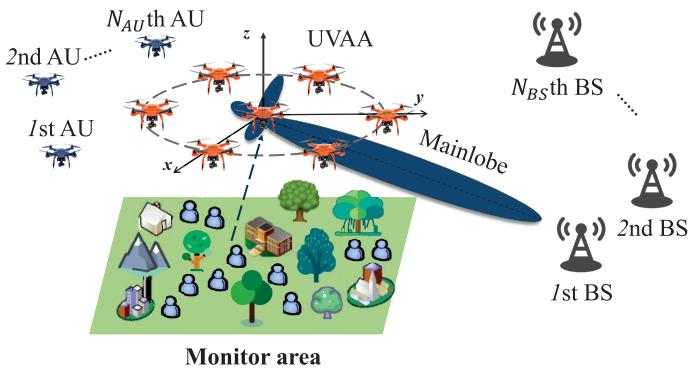

<details>
<summary>flowchart</summary>

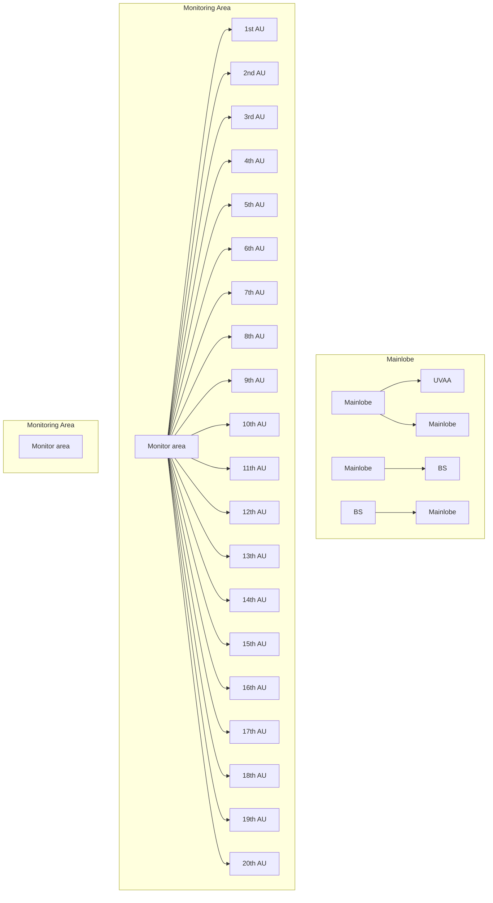
</details>

Fig. 1. Sketch map of a UVAA system in emergency communication scenario.

Remark 1: Once upon the collected data of a UAV reaches the upper limit or a UAV generates emergency data, the UAV needs to transmit the collected data to different remote BSs. Note that in certain scenarios, the BSs are not capable of establishing stable communication links with each other due to the long distance or other factors. Moreover, the collected data may need to be transmitted to different BSs for data backup or consistency check. Therefore, the UAVs are required to send the collected data to all the different remote BSs. □

1) Array Factor of the UVAA System: The array factor (AF) for characterizing the beam pattern of the UVAA system can be expressed as follows [41]:

$$
F (\theta , \phi) = \sum_ {i = 1} ^ {N _ {U}} I _ {i} e ^ {i _ {u} [ k _ {c} (x _ {i} ^ {U} \sin \theta \cos \phi + y _ {i} ^ {U} \sin \theta \sin \phi + z _ {i} ^ {U} \cos \theta) ]}, \tag {1}
$$

where $I _ { i }$ is the excitation current weight of the ith $\mathrm { U A V } , i _ { u }$ represents the imaginary unit, $k _ { c } = 2 \pi / \lambda$ refers to the phase constant, and λ is the wavelength. Moreover, $\theta \in [ 0 , \pi ]$ and $\phi \in [ - \pi , \pi ]$ are the elevation and azimuth angles, respectively.

2) Channel Model: Two channel models are considered in this work. Specifically, the communication between the UVAA system and AUs belongs to air-to-air (A2A) communication, which can be the line-of-sight (LoS) model. Moreover, to model the channel between the UVAA system and BSs which can be regarded as air-to-ground (A2G) propagation channel, the probabilistic LoS and non-LoS (NLoS) models are required to be considered simultaneously.

The path loss between the UVAA system u and the receiver r is given as follows [42]:

$$
L _ {u, r} = \left\{ \begin{array}{l l} (K _ {o} d _ {u, r}) ^ {\alpha} \mu_ {L o S}, & \text { LoS   link }, \\ (K _ {o} d _ {u, r}) ^ {\alpha} \mu_ {N L o S}, & \text { NLoS   link }, \end{array} \right. \tag {2}
$$

where $K _ { o } = 4 \pi f / c , f$ denotes the carrier frequency and c is the speed of light, $d _ { u , r }$ is the distance between the center of the UVAA system u and the receiver r. Note that the receiver r can be an AU or a remote BS. Moreover, α represents the path loss exponent, $\mu _ { L o S }$ and $\mu _ {  { N }  { L }  { o } S }$ are the attenuation factors of LoS and NLoS communication links, respectively.

Accordingly, the path loss of the A2A channel from the UVAA system u to the kth AU is given as follows [42]:

$$
L _ {u, k} ^ {A 2 A} = (K _ {o} d _ {u, k}) ^ {\alpha} \mu_ {L o S}. \tag {3}
$$

As for the A2G channel, the probability of having the LoS environment when the UVAA system u transmits data to the jth BS is as follows [43]:

$$
P _ {u, j} ^ {L o S} (\theta_ {u, j}) = \frac {1}{1 + a \exp (- b (\theta_ {u , j} - a))}, \tag {4}
$$

where a and b are the modeling parameters, $\theta _ { u , j }$ represents the elevation angle between the UVAA system u and the jth BS, which is gained by $\begin{array} { r } { \theta _ { u , j } = \frac { 1 8 0 } { \pi } \sin ^ { - 1 } \left( \frac { \triangle z _ { u , j } } { d _ { u , j } } \right) } \end{array}$ ( △zu,jd ), wherein △zu,j u,j $\triangle z _ { u , j }$ and $d _ { u , j }$ denote the vertical and horizontal distance between the UVAA system u and the jth receiver BS, respectively. Based on this, the probability of having the NLoS environment between the UVAA system u and the jth receiver BS can be described as follows:

$$
P _ {u, j} ^ {N L o S} (\theta_ {u, j}) = 1 - P _ {u, j} ^ {L o S} (\theta_ {u, j}). \tag {5}
$$

Accordingly, the average path loss of the A2G channel from the UVAA system u to the jth BS is given as follows [43]:

$$
L _ {u, j} ^ {A 2 G} = (K _ {o} d _ {u, j}) ^ {\alpha} [ \mu_ {L o S} P _ {u, j} ^ {L o S} + \mu_ {N L o S} P _ {u, j} ^ {N L o S} ]. \tag {6}
$$

3) SNR: SNR is a metric which can measure the signal strength and communication reliability by comparing the level of the desired signal to the level of noise. Specifically, the SNR from the UVAA system u to the jth BS, $S N R _ { u , j }$ , and that from the UVAA system u to the kth AU, $S N R _ { u , k }$ , are calculated as follows [44]:

$$
S N R _ {u, j} = 2 0 \log_ {1 0} \left(\frac {P _ {u} G _ {u , j}}{L _ {u , j} ^ {A 2 G} \sigma^ {2}}\right), \tag {7}
$$

and

$$
S N R _ {u, k} = 2 0 \log_ {1 0} \left(\frac {P _ {u} G _ {u , k}}{L _ {u , k} ^ {A 2 A} \sigma^ {2}}\right), \tag {8}
$$

where $\begin{array} { r } { P _ { u } = \sum _ { i = 1 } ^ { N _ { U } } I _ { i } ^ { 2 } P _ { t } } \end{array}$ e transmit power of the whole $I _ { i } ^ { 2 } P _ { t }$ power of the ith UAV and each UAV element has the same maximum transmit power, i.e., $P _ { t } .$ Moreover, $\sigma ^ { 2 }$ refers to the noise power. In addition, $G _ { u , j }$ and $G _ { u , k }$ represent the gains of the UVAA system u to the jth BS and the kth AU, respectively, which are expressed as follows [45]:

$$
G _ {u, j} = \frac {4 \pi | F (\theta_ {u , j} , \phi_ {u , j}) | ^ {2} w (\theta_ {u , j} , \phi_ {u , j}) ^ {2}}{\int_ {0} ^ {2 \pi} \int_ {0} ^ {\pi} | F (\theta , \phi) | ^ {2} w (\theta , \phi) ^ {2} \sin \theta d \theta d \phi} \eta , \tag {9}
$$

and

$$
G _ {u, k} = \frac {4 \pi | F (\theta_ {u , k} , \phi_ {u , k}) | ^ {2} w (\theta_ {u , k} , \phi_ {u , k}) ^ {2}}{\int_ {0} ^ {2 \pi} \int_ {0} ^ {\pi} | F (\theta , \phi) | ^ {2} w (\theta , \phi) ^ {2} \sin \theta d \theta d \phi} \eta , \tag {10}
$$

where $( \theta _ { u , j } , \phi _ { u , j } )$ and $( \theta _ { u , k } , \phi _ { u , k } )$ are the directions of the jth BS and the kth AU, respectively. Moreover, $w ( \theta , \phi )$ is the magnitude of the far-field beam pattern of each UAV element and $\eta \in [ 0 , 1 ]$ is the antenna array efficiency.

# B. Propulsion Power Consumption Model of UAV

For a rotary-wing UAV which flies in a 2D horizontal plane with speed $v ,$ the propulsion power consumption is given as follows [46]:

$$
\begin{array}{l} P (v) = P _ {B} (1 + \frac {3 v ^ {2}}{v _ {t i p} ^ {2}}) + P _ {I} (\sqrt {1 + \frac {v ^ {4}}{4 v _ {i v} ^ {4}}} - \frac {v ^ {2}}{2 v _ {i v} ^ {2}}) ^ {\frac {1}{2}} \\ + \frac {1}{2} d _ {0} \rho s A v ^ {3}, \tag {11} \\ \end{array}
$$

where $P _ { B }$ and $P _ { I }$ are the blade profile and induced power in hovering status, respectively. Moreover, $v _ { t i p }$ refers to the tip speed of the rotor blade, $v _ { i v }$ is the mean rotor induced velocity in hovering. In addition, d0, $\rho ,$ s and A denote the fuselage drag ratio, air density, rotor solidity and rotor disc area, respectively.

According to Eq. (11), the propulsion power consumption of a rotary-wing UAV flying in a 3D horizontal plane is presented as follows [46]:

$$
\begin{array}{l} E (T) \approx \int_ {0} ^ {T} P (v (t)) d t + \frac {1}{2} m _ {D} (v (T) ^ {2} - v (0) ^ {2}) \\ + m _ {D} g (h (T) - h (0)), \tag {12} \\ \end{array}
$$

where T refers to the end time of the flight, $v ( t )$ denotes the instantaneous UAV speed at time $t , m _ { D }$ and g are the mass of UAV and gravitational acceleration, respectively. Moreover, $v ( T )$ and $h ( T )$ represent the speed and height of the UAV at time T , respectively. In addition, v(0) and $h ( 0 )$ are the speed and height of the UAV at the initial moment, respectively.

Remark 2: In this work, the trajectories of UAVs are not optimized, and each UAV will adopt a strategy of horizontal flight followed by vertical flight. The reasons are briefly listed as follows. First, due to the lack of an accurate 3D energy consumption model for rotary-wing UAVs at present, several existing works suggest to model the oblique flight of a UAV in a 3D space as the horizontal and vertical components [47], [48], [49]. Second, complex flights of UAVs may induce uncertainty to the autonomous flights of rotary-wing UAVs, thus the adopted flight strategy possesses the ability to stabilize the flight process. Note that the collision among UAVs will not occur since the minimum distance between two adjacent UAVs is added into the constraints of the following formulated optimization problem. □

# C. Multi-Objective Optimization

Multi-objective optimization problem (MOP) involves more than one objective function that should be optimized simultaneously. Mathematically, an MOP can be formulated as follows [50]:

$$
\min _ {X} F = [ f _ {1} (x), f _ {2} (x), \dots , f _ {N _ {o}} (x) ], \tag {13}
$$

where x is the decision variable, X is a vector which contains all feasible decision variables. Moreover, $N _ { o }$ is the number of objective functions, and $f _ { o } ( x )$ represents the oth objective function.

Considering the conflicting relationship among the multiple objectives, the definition of Pareto dominance is introduced.

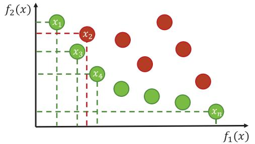

<details>
<summary>scatter</summary>

| Point | f1(x) | f2(x) |
|-------|-------|-------|
| x1    | 0.5   | 0.8   |
| x2    | 0.6   | 0.7   |
| x3    | 0.4   | 0.6   |
| x4    | 0.3   | 0.5   |
| xn    | 0.2   | 0.4   |
</details>

Fig. 2. Solution distribution of a bi-objective optimization problem.

To be specific, $x _ { 1 }$ is defined to dominate $x _ { 2 }$ if and only if $\forall o \in N _ { o } , f _ { o } ( x _ { 1 } ) \leq f _ { o } ( x _ { 2 } )$ and $\exists o \in N _ { o } , f _ { o } ( x _ { 1 } ) < f _ { o } ( x _ { 2 } )$ . Accordingly, the solution which is not dominated by any other solutions is called Pareto optimal solution. Through taking the bi-objective minimization optimization problem as an example, Fig. 2 demonstrates the domination relationship among solutions in a more intuitive way. As can be seen, $x _ { 3 }$ dominates $x _ { 2 }$ . Moreover, $X ^ { * } = \{ x _ { 1 } , x _ { 3 } , x _ { 4 } , \ldots , x _ { n } \}$ is a set of Pareto optimal solutions.

# IV. PROBLEM FORMULATION AND ANALYSIS

In this section, the optimization problem is formulated, and then the relevant analysis of the problem is given.

# A. Problem Formulation

The optimization problem contains three optimization objectives. The first objective is to maximize the minimum SNR of all the BSs, which can be achieved by adjusting the locations as well as excitation current weights of the participating UAVs and controlling the order that the UVAA system transmits data to the BSs. To control interference caused by the transmission process on the AUs, the second objective is introduced, which is to minimize the maximum average receiving SNR of the AUs. Moreover, shifting locations of UAVs will consume more propulsion power, and thus we define minimizing the propulsion power consumption of UAVs as the third optimization objective.

We define $X ~ = ~ [ \mathbb { C } ^ { \mathcal { U } } , \mathbb { I } ^ { \mathcal { U } } , \mathbb { O } ]$ as the solution of the formulated RECMOP. To be specific, inate matrix of the UVAA system with  denotes the location of the ith UAV. Mo $\mathbb { C } ^ { \mathcal { U } } = \{ \mathcal { C } _ { 1 } ^ { \mathcal { U } } , \mathcal { C } _ { 2 } ^ { \mathcal { U } } , \dots , \mathcal { C } _ { N _ { t r } } ^ { \mathcal { U } } \}$ C 2 , CUi $\mathcal { C } _ { i } ^ { U } =$ CNU } $\{ x _ { i } ^ { U } , y _ { i } ^ { U } , z _ { i } ^ { U } \}$ $\mathbb { I } ^ { \mathcal { U } } = \{ I _ { i } | \forall i \ \in \ \mathcal { U } \}$ represents the set of excitation current weights of UAVs, and O denotes the order that the UVAA system transmits data to different BSs. Accordingly, the optimization objectives are described as follows.

1) Optimization Objective 1: The first objective is to maximize the minimum receiving SNR of the several remote BSs so that the quality of signal received by each BS can be guaranteed. Accordingly, the first objective function is designed as follows:

$$
f _ {1} (\mathbb {C} ^ {\mathcal {U}}, \mathbb {I} ^ {\mathcal {U}}, \mathbb {O}) = \widetilde {\operatorname{Min}} _ {j \in \{1, 2,..., N _ {B S} \}} \{S N R _ {u, j} \}, \tag {14}
$$

where $\widetilde { \mathbf { M i n } } ( \cdot )$ is the operator that calculates the minimum value of a vector.

Remark 3: In this work, we choose to optimize SNR instead of transmission rate and the reasons are as follows. First, SNR is a paramount metric which is capable of evaluating the communication performance of a network, and it puts more emphasis on the quality of the signal. For instance, in certain scenarios, the communication link is defined as interruption if the receiving SNR is lower than the predefined threshold [51], which means that the data transmission process between the transmitter and the receiver is no longer meaningful. Second, according to the Shannon-Hartley theorem, a high transmission rate will be obtained if the SNR is comparatively high. In other words, transmission rate and SNR of certain communication network have the same change tendency [52]. Thus, the SNR is selected to be optimized in this work.

2) Optimization Objective 2: The positions of the several AUs are assumed to be known and stationary in the considered scenario, which is typical in a practical scenario, which implies that the interference caused by the UVAA system on the AUs can be mitigated by minimizing the maximum average receiving SNR of the AUs when the UVAA system transmits data to different BSs. Thus, the second objective function is expressed as follows:

$$
f _ {2} (\mathbb {C} ^ {\mathcal {U}}, \mathbb {I} ^ {\mathcal {U}}, \mathbb {O}) = \widetilde {\text { Max }} _ {j \in \{1, 2,..., N _ {B S} \}} \{\sum_ {k = 1} ^ {N _ {A U}} \frac {S N R _ {u , k} ^ {j}}{N _ {A U}} \}. \tag {15}
$$

where SN Rju,k $S N R _ { u , k } ^ { j }$ denotes the receiving SNR of the kth AU when the UVAA system transmits data to the jth BS.

3) Optimization Objective 3: The UAVs will move to suitable locations to perform an optimal UVAA for transmitting data to each receiver BS. However, additional propulsion power consumption will be induced during the flight process. Therefore, the third optimization objective is to minimize the propulsion power consumption of UAVs, and the corresponding objective function is defined as follows:

$$
f _ {3} (\mathbb {C} ^ {\mathcal {U}}, \mathbb {O}) = \sum_ {i = 1} ^ {N _ {U}} \sum_ {j = 1} ^ {N _ {B S}} E _ {i, j} (T _ {i, j}), \tag {16}
$$

where $T _ { i , j }$ represents the duration for the ith UAV to perform a UVAA to transmit data to the jth BS, and $E _ { i , j }$ represents the propulsion power consumption of the ith UAV for serving the jth BS.

Accordingly, the RECMOP is formulated as follows [53]:

$$
\min _ {X} F = \left\{- f _ {1}, f _ {2}, f _ {3} \right\}, \tag {17a}
$$

$$
\text { s.t. } C 1: 0 \leq I _ {i} \leq 1, \forall i \in \mathcal {U}, \tag {17b}
$$

$$
C 2: L _ {m i n} \leq x _ {i} ^ {U} \leq L _ {m a x}, \forall i \in \mathcal {U}, \tag {17c}
$$

$$
C 3: L _ {m i n} \leq y _ {i} ^ {U} \leq L _ {m a x}, \forall i \in \mathcal {U}, \tag {17d}
$$

$$
C 4: H _ {m i n} \leq z _ {i} ^ {U} \leq H _ {m a x}, \forall i \in \mathcal {U}, \tag {17e}
$$

$$
C 5: V _ {\text { min }} \leq v \leq V _ {\text { max }}, \forall i \in \mathcal {U}, \tag {17f}
$$

$$
C 6: \mathbb {O} ^ {\mathcal {B} \times 1} \in \mathcal {S O}, \tag {17g}
$$

$$
C 7: D _ {i _ {1}, i _ {2}} \geq D _ {\min}, \forall i _ {1}, i _ {2} \in \mathcal {U}, \tag {17h}
$$

where the constraint (17b) confines the value of excitation current weight of the ith UAV $I _ { i }$ to [0, 1], the constraints (17c) and (17d) indicate that the minimum and maximum ranges when UAVs fly in the horizontal plane are $L _ { m i n }$ and $L _ { m a x }$ , respectively, and the constraint (17e) manifests that the minimum and maximum ranges when UAVs fly in the vertical plane are $H _ { m i n }$ and $H _ { m a x } ,$ , respectively. The constraint (17f) indicates the lower bound $V _ { m i n }$ and upper bound $V _ { m a x }$ of the velocity of the UAVs, and SO in the constraint (17g) is the set of orders that the UVAA system transmits data to $N _ { B S }$ BSs, which has $N _ { B S } !$ permutations and is expressed as SO = {OB×1, $\mathbf { \bar { \mathcal { S } } } \mathbf { \mathcal { O } } = \{ \mathbb { O } _ { 1 } ^ { \vert \mathcal { B } \times 1 } , \dots , \mathbb { O } _ { n } ^ { \vert \mathcal { \bar { B } } \times 1 } , \dots , \mathbb { O } _ { N _ { B S } ! } ^ { \vert \mathcal { B } \times 1 } \}$ 1 , . . . , OB×1NBS!}, wherein OB×1n $\mathbb { O } _ { n } ^ { B \times 1 } =$ n $\{ O _ { 1 } , \dots , O _ { j } , \dots , O _ { N _ { B S } } | 1 ~ \le ~ j ~ \le ~ \overset { \sim } { N } _ { B S } , O _ { j } ~ \in ~ \mathcal { B } \}$ . For instance, $\mathbb { O } ^ { \tilde { B } \times 1 } = \{ 2 , 5 , \dots , 7 \}$ denotes that the UVAA system will transmit data to the 2nd, 5th, . . . , 7th BS sequentially. Moreover, the constraint (17h) indicates the minimum distance between two adjacent UAVs.

Remark 4: Note that the optimization directions of $f _ { 1 }$ and $f _ { 2 }$ are opposite. The reason is that we attempt to achieve the maximum of $f _ { 1 }$ and the minimum of $f _ { 2 } ,$ , so that the quality of the signal received by each BS will be improved and the interference on the AUs caused by the UVAA system can be reduced simultaneously. □

# B. Problem Analysis

Lemma 1: The first optimization objective function $f _ { 1 }$ of the formulated RECMOP is NP-hard since it is a nonlinear multi-dimensional 0-1 knapsack problem.

Proof: We first consider that the locations of UAVs and the order of transmitting data to different BSs are fixed and known. Thus, the solution space of the first optimization objective function only contains the excitation current weights of UAVs and it is expressed as $X ^ { \prime } = [ I _ { 1 } , I _ { 2 } , \ldots , I _ { N _ { U } } ]$ . In this case, the simplified first optimization objective function is defined as ${ \bf S } { \bf - R E C M O P } { \bf - } f _ { 1 }$ and it is expressed as follows:

$$
\min _ {X ^ {\prime}} - f _ {1} = - \widetilde {\operatorname{Min}} _ {j \in \{1, 2, \dots , N _ {B S} \}} \left\{S N R _ {u, j} \right\}, \tag {18a}
$$

$\begin{array} { r } { \mathrm { s . t . } \qquad C 1 : I _ { i } \in \{ 0 , 1 \} , \forall i \in \{ 1 , 2 , \ldots , N _ { U } \} , } \end{array}$ (18b)

$$
C 2: \sum_ {i = 1} ^ {N _ {U}} I _ {i} <   N _ {U}. \tag {18c}
$$

The ${ \mathrm { S } } { \mathrm { - R E C M O P } } { \mathrm { - } } f _ { 1 }$ is a nonlinear multi-dimensional 0-1 knapsack problem which has been proven to be NP-hard [54]. Thus, the S-RECMOP-f1 is NP-hard.

Lemma 2: The second optimization objective function $f _ { 2 } o f$ the formulated RECMOP is NP-hard.

Proof: The proof is similar to that of Lemma 1, and thus it is omitted.

Lemma 3: The third optimization objective function $f _ { 3 }$ of the formulated RECMOP is NP-hard since it is a typical traveling salesman problem.

Proof: To ease of presentation, the locations and excitation current weights of UAVs are regarded as the constants in this part. Then, the solution space can be expressed as $X ^ { \prime \prime } =$ [O]. Accordingly, the simplified third optimization objective function is defined as ${ \mathrm { S } } { \mathrm { - R E C M O P } } { - } f _ { 3 }$ , and it is reformulated as follows:

$$
\min _ {X ^ {\prime \prime}} f _ {3} = \sum_ {j = 1} ^ {N _ {B S} - 1} E _ {\mathcal {O} _ {j}, \mathcal {O} _ {j + 1}}, \tag {19a}
$$

$$
\text { s.t. } \quad \mathbb {O} ^ {\mathcal {B} \times 1} \in \mathcal {S O}, \tag {19b}
$$

where $E _ { \mathcal { O } _ { j } , \mathcal { O } _ { j + 1 } }$ represents the propulsion power consumption of UAVs from transmitting data to the $\mathcal { O } _ { j } 1$ th BS to that of the $\mathcal { O } _ { j + 1 }$ 1th BS. Clearly, the reformulated ${ \mathrm { S } } { \mathrm { - R E C M O P } } { - } f _ { 3 }$ is a typical traveling salesman problem that has been demonstrated to be NP-hard [55]. Thus, the ${ \mathrm { S } } { \mathrm { - R E C M O P } } { - } f _ { 3 }$ is NP-hard. ■

Proposition 1: The formulated RECMOP is NP-hard since the subproblems are NP-hard.

Proof: The formulated RECMOP is NP-hard since Lemmas 1, 2 and 3 show that the subproblems $f _ { 1 } , f _ { 2 }$ and $f _ { 3 }$ are NP-hard.

Proposition 2: The formulated RECMOP is a large-scale optimization problem since the number of solution dimensions grows linearly with the number of UAVs or BSs.

Proof: The solution space of the formulated RECMOP contains 3D coordinates of $\mathbf { U A V s } \left( \mathbb { C } ^ { \mathcal { U } } \right)$ , excitation current weights of UAVs $( \mathbb { I } ^ { \mathcal { U } } )$ as well as the order of transmitting data to the BSs (O), which means that there are $( 4 \times N _ { U } \times N _ { B S } + N _ { B S } )$ solution dimensions should be optimized. In particular, the scale of the formulated RECMOP will grow with the number of UAVs or BSs increases. Thus, the formulated RECMOP is a large-scale optimization problem [56]. ■

Proposition 3: The formulated RECMOP can be classified into a mixed integer programming problem, thus it is nonconvex.

Proof: The solution space of the formulated RECMOP contains continuous dimensions $( \mathbb { C } ^ { \mathcal { U } } , \mathbb { I } ^ { \mathcal { U } } )$ and discrete dimensions (O), so that the formulated RECMOP is a typical mixed integer programming problem (MINLP). Since MINLP is non-convex, the formulated RECMOP is also non-convex [57]. ■

# V. PROPOSED OPTIMIZATION METHOD

In this section, the motivation of applying meta-heuristic algorithm in solving the formulated problem is first presented. Then, the main framework of the conventional MOGSA is introduced. Finally, IMOGSA is proposed to tackle the formulated RECMOP.

# A. Motivation

There are three widely adopted methods to tackle the multi-objective optimization problems, which are DRL, convex optimization and meta-heuristic algorithms. DRL takes a lot of time to train the model, and it is more appropriate to deal with the problems with continuous time slots [58]. However, the formulated RECMOP is a single slot problem, which means that unnecessary overhead will be induced if the DRL is adopted to handle it. Moreover, the convex optimization is not good at tackling the problems with intricate constraints, e.g., the formulated RECMOP. In addition, metaheuristic algorithms are efficient methods in dealing with large-scale optimization problems which are NP-hard and nonconvex. Thus, a heuristic-based algorithm is proposed to solve the formulated RECMOP. On the one hand, meta-heuristic algorithms do not require a significant amount of time and cost to train models compared with the DRL. On the other hand, meta-heuristic algorithms do not need to transform the formulated problem as in convex optimization, which is equivalent to preserving the original solution space.

Among the various meta-heuristic algorithms, GSA is selected as the basic framework to deal with the formulated RECMOP, and the motivations are presented as follows.

• The Unique Update Strategy of Agent: In GSA, the position of each agent is updated based on the counterparts of all the other agents in current population, while the positions of agents in other meta-heuristic algorithms are mainly updated based on the global and/or individual optima. Thus, compared with other meta-heuristic algorithms, GSA has a lower probability of falling into local optimum in handling certain optimization problems due to the unique update strategy.   
• Strong Global Search Capabilities: During the process of calculating gravity, the force on any agent is expressed by the randomly weighted sum of the gravity of other agents, which helps introduce the uncertainty during the search process, making the algorithm to explore the search space more flexibly.   
• Simple Principle, Few Parameters and Easy to Implement: Compared with some meta-heuristic algorithms, e.g., squirrel search algorithm [59] and harris hawks optimization [60], GSA is characterized by simple principle and few parameters, which facilitaties the comprehension and implementation. In practical scenarios, the UAVs are required to execute the algorithm, hence the GSA will exhibit a shorter execution time and require less hardware resources.

In the following, the conventional GSA is briefly introduced.

# B. Conventional GSA

Enlightened by the Newton’s laws of gravitation and kinematics, GSA is a typical meta-heuristic algorithm and has been demonstrated to be efficient in finding the optimal solutions of different optimization problems [61], [62]. Specifically, the solution update method of GSA is expressed as follows [61]:

$$
X _ {i, d} ^ {t + 1} = X _ {i, d} ^ {t} + V _ {i, d} ^ {t + 1}, \tag {20}
$$

$$
V _ {i, d} ^ {t + 1} = \text { rand } \times V _ {i, d} ^ {t} + a _ {i, d} ^ {t}, \tag {21}
$$

where $X _ { i , d } ^ { t + 1 }$ an d V t+1 $V _ { i , d } ^ { t + 1 }$ are the position and velocity of the ith agent in the dth dimension at the t+1th iteration, respectively. Moreover, rand is a random number between 0 and 1, $a _ { i , d } ^ { t }$ refers to the acceleration of the ith agent in the dth dimension at the tth iteration, and it is given as follows [61]:

$$
a _ {i, d} ^ {t} = \frac {\sum_ {j = 1 , j \neq i} ^ {N _ {p o p}} r a n d \times F _ {i j , d} ^ {t}}{M _ {i i} ^ {t}}, \tag {22}
$$

where $M _ { i i } ^ { t }$ denotes the inertial mass of the ith agent. Moreover, $\sum _ { j = 1 , j \neq i } ^ { N _ { p o p } } r a n d \times F _ { i j , d } ^ { t }$ Npop is the total force of the other agents acting on the ith agent, wherein $N _ { p o p }$ refers to the number of agents in the population and $F _ { i j , d } ^ { t }$ is the force of the jth agent acting on the ith agent in the dth dimension, and it is written as follows:

$$
F _ {i j, d} ^ {t} = G ^ {t} \frac {M _ {p i} ^ {t} \times M _ {a j} ^ {t}}{R _ {i j} ^ {t} + \varepsilon} (X _ {j, d} ^ {t} - X _ {i, d} ^ {t}), \tag {23}
$$

where $G ^ { t }$ is the gravitational constant at the tth iteration which will change as the number of iterations increases, $R _ { i j } ^ { t }$ denotes the Euclidian distance between the ith and jth agents at the tth iteration, ε is a constant with a small value. Moreover, $M _ { p i } ^ { t }$ and $M _ { a j } ^ { t }$ are the passive gravitational mass of the ith agent and the active gravitational mass of the jth agent, respectively.

Several multi-objective versions of GSA have been proposed to handle the multi-objective optimization problems, which can be referred to [63] and [64]. The archive is adopted to save the Pareto optimal solutions in these algorithms. However, these algorithms are proposed to deal with the optimization problems only with continuous solution dimensions, which implies that they are incapable of handling the formulated RECMOP with hybrid decision variables. Thus, we propose IMOGSA to overcome the abovementioned challenge and improve the quality of solutions when dealing with the formulated RECMOP.

# C. IMOGSA

In this section, IMOGSA is introduced to deal with the formulated RECMOP. Specifically, IMOGSA adopts three specific designs which are the QBL strategy, the discrete solution update strategy and the archive optimization method. The details of the designs are shown as follows, and the general structure of IMOGSA is presented in Algorithm 1. Note that the number of agents in the population and the number of maximum iterations are denoted as $N _ { p o p }$ and $t _ { m a x } ,$ respectively. Moreover, $P _ { t } , \ F _ { t }$ and $A _ { t }$ are the population, fitness value set of the population and archive at the tth iteration, respectively. In addition, $P _ { m e r g e }$ is the mixed population and $F _ { m e r g e }$ refers to the corresponding fitness value set.

1) QBL Strategy: According to Proposition 2, the formulated RECMOP is a large-scale optimization problem, which implies that the algorithm may be trapped into local optimal easily when the quality of initial solutions is not high. Thus, to cope with the characteristic of the formulated RECMOP, we introduce a multi-step initialization method called QBL strategy. Specifically, the procedures of QBL are presented as follows [65].

First, the continuous dimensions of solutions in the initial population $X ^ { I }$ are generated, and the process is as follows:

$$
X _ {i, d} ^ {I} = L B _ {d} + \text { rand } * (U B _ {d} - L B _ {d}), \quad d = 1, 2, \dots , D _ {c}, \tag {24}
$$

where $X _ { i , d } ^ { I }$ represents the dth dimension of the ith solution in $X ^ { I } , \ L B _ { d }$ and $U B _ { d }$ refer to the lower and upper bounds of the dth dimension, respectively. Moreover, $D _ { c }$ denotes the number of continuous dimensions.

Second, the opposite population $X ^ { O }$ of the initial population $X ^ { I }$ is generated through using some heuristic rules, and the rule adopted in this work is given as follows:

$$
X _ {i, d} ^ {O} = U B _ {d} + L B _ {d} - X _ {i, d} ^ {I}, \quad d = 1, 2, \dots , D _ {c}, \tag {25}
$$

where $X _ { i , d } ^ { O }$ is the opposite point of $X _ { i , d } ^ { I } .$

Third, the strategy gains the quasi-opposite population $X ^ { Q }$ . Specifically, the continuous dimension of solutions in $X ^ { Q }$ is generated as follows:

$$
X _ {i, d} ^ {Q} = M _ {d} + \text { rand } * (X _ {i, d} ^ {O} - M _ {d}), \quad d = 1, 2, \dots , D _ {c}, \tag {26}
$$

Algorithm 1 IMOGSA   
Input: $N_{pop}$ , $t_{max}$ , $P_{0}$ , $F_{0}$ , $A_{0}$ , etc.
Output: $A_{t_{max}}$ .

1 $P_{0} \leftarrow \varnothing$ , $F_{0} \leftarrow \varnothing$ , $A_{0} \leftarrow \varnothing$ ;

2 Initialize $P_{0}$ by using QBL strategy;

3 for i = 1 to $N_{pop}$ do

4    Count $F_{0_{i}}$ of $X_{i}$ in $P_{0}$ : $F_{0_{i}} = [f_{i,1}, f_{i,2}, f_{i,3}]$ ;

5 $F_{0} \leftarrow F_{0} \cup F_{0_{i}}$ ;

6 end

7 Update $A_{0}$ based on $F_{0}$ ;

8 for t = 1 to $t_{max}$ do

9    Update $G^{t}$ ;

10 Calculate mass of agents in $P_{t-1}$ and $A_{t-1}$ ;

11 Select Food from $A_{t-1}$ based on roulette selection;

12 for i = 1 to $N_{pop}$ do

13    Count $a_{i}^{t}$ of the ith agent based on Eq. (22);

14    Update the continuous dimensions ( $C^{U}, I^{U}$ ) of $X_{i}$ in $P_{t}$ based on Eq. (20);

15    Update the discrete dimensions (O) of $X_{i}$ in $P_{t}$ based on Algorithm 2;

16    end

17 Generate $P_{cm}$ based on Algorithm 3;

18 $P_{merge} \leftarrow P_{t} \cup P_{cm}$ ;

19 Calculate $F_{merge}$ of $P_{merge}$ ;

20 Update $A_{t}$ based on $F_{merge}$ ;

21 end

22 Return $A_{t_{max}}$ .

where $M _ { d }$ is the middle point which is calculated by $L B _ { d } +$ $( U B _ { d } - L B _ { d } ) / 2$ .

Fourth, the initial population $X ^ { I }$ and quasi-opposite population $X ^ { Q }$ are integrated into a population symbolized as $\dot { X ^ { M } }$ , which is described as follows:

$$
X ^ {M} = X ^ {I} \cup X ^ {Q}. \tag {27}
$$

Finally, the strategy reserves a subset of the population $X ^ { M }$ according to the population size and the dominant relationship between agents.

Note that the discrete dimensions of each solution in the populations above are generated randomly.

2) Discrete Solution Update Strategy: Each solution of the formulated RECMOP contains both continuous $( \mathbb { C } ^ { \mathcal { U } } , \mathbb { I } ^ { \mathcal { U } } )$ and discrete (O) dimensions.

The continuous dimensions can be updated by the mechanism of GSA. However, the conventional meta-heuristic algorithms, e.g., GSA, cannot deal with the discrete dimensions since they are initially proposed to handle the problems whose solution only contains continuous dimensions. Therefore, the discrete solution update strategy is proposed in this work, which introduces the order-based crossover (OBX) and subtour exchange crossover (SEX), as show in Fig. 3. Accordingly, the details of the discrete solution update strategy are given in Algorithm 2.

The main steps of OBX for generating one of the offsprings are summarized as follows:

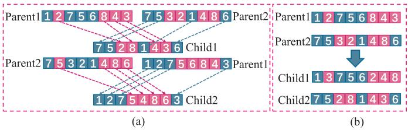

<details>
<summary>flowchart</summary>

```mermaid
graph TD
    subgraph (a)
        A1["Parent1"] --> B1["7 5 2 8 1 4 3 6"]
        A2["Parent2"] --> B2["7 5 3 2 1 4 8 6"]
        A3["Parent1"] --> B3["1 2 7 5 4 8 6 3"]
        A4["Parent2"] --> B4["1 2 7 5 4 8 6 3"]
    end
    subgraph (b)
        C1["Parent1"] --> D1["Parent2"]
        C2["Parent2"] --> D2["Child1"]
        C3["Parent1"] --> D3["Child2"]
        C4["Parent2"] --> D4["Child1"]
        C5["Parent1"] --> D5["Child2"]
    end
    style (a) fill:#f9f,stroke:#333
    style (b) fill:#bbf,stroke:#333
```
</details>

Fig. 3. Sketch maps of order-based crossover and subtour exchange crossover. (a) Order-based crossover. (b) Subtour exchange crossover.

Algorithm 2 Discrete Solution Update Strategy   
1 Define the discrete dimensions of Food $\mathbb{O}_{Food}$ .
2 if rand < 0.5 then
3 | $X_i(\mathbb{O})$ crosses with $\mathbb{O}_{Food}$ based on OBX;
4 else
5 | $X_i(\mathbb{O})$ crosses with $\mathbb{O}_{Food}$ based on SEX;
6 end
7 Return $X_i(\mathbb{O})$ ;

First, the OBX selects one sub-dimensions from parent1 and confirms the positions of unselected elements in parent2.

Second, the method exploits the selected sub-dimensions of parent1 and unselected elements of parent2 to generate one of the offsprings.

The main procedures of SEX are depicted as follows:

First, one sub-dimensions is selected from parent1 and the corresponding sequence of the sub-dimensions is ascertained in parent2.

Second, the SEX swaps the selected sub-dimensions while maintaining the positions of unselected elements unchanged.

3) Archive Optimization Method: Inspired by the non-dominated sorting genetic algorithm II (NSGA-II) [66], a new population is generated by using the crossover and mutation strategies on the solutions in the archive. Then, the new population is used to improve the quality of solutions in the archive.

The crossover operation of the continuous dimensions of two solutions $X _ { c 1 }$ and $X _ { c 2 }$ is expressed as follows:

$$
\left\{ \begin{array}{l} X _ {c 1, d} ^ {\prime} = \beta * X _ {c 1, d} + (1 - \beta) * X _ {c 2, d} \\ X _ {c 2, d} ^ {\prime} = \beta * X _ {c 2, d} + (1 - \beta) * X _ {c 1, d}, \end{array} \right. \tag {28}
$$

where $\beta$ is a random number matrix.

Moreover, the mutation operation concerning the continuous dimensions of solution $X _ { m }$ is designed as follows:

$$
X _ {m, d} ^ {\prime} = X _ {m, d} + \sigma * r a n d (1, n), \tag {29}
$$

where σ represents the mutation step and randn(1, n) denotes a random number matrix with 1 row and n column.

The crossover and mutation operations of the discrete dimensions are achieved by OBX and discrete mutation operator, respectively. Specifically, the discrete mutation operator is to select two different dimensions and exchange their positions.

The main procedures of the archive optimization method are presented in Algorithm 3. Note that $N _ { c }$ and $N _ { m }$ represent the numbers of solutions in crossover and mutation populations, respectively.

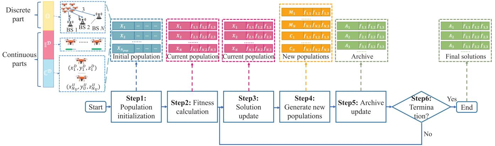

<details>
<summary>flowchart</summary>

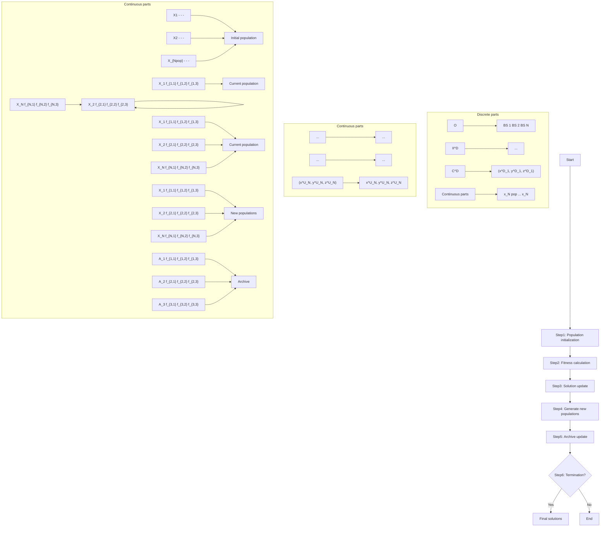
</details>

Fig. 4. The algorithm framework of IMOGSA for solving RECMOP.

Algorithm 3 Archive Optimization Method   
Input: $N_{c}$ , $N_{m}$ , $A_{t}$ .

Output: $P_{cm}$ .

1 $P_{c} \leftarrow \varnothing$ , $P_{m} \leftarrow \varnothing$ ;

2 for i = 1 to $N_{c}/2$ do

3 Select $X_{c1}$ and $X_{c2}$ from $A_{t}$ randomly;

4 Generate $X'_{c1}$ and $X'_{c2}$ based on Eq. (28) and OBX;

5 $P_{c} \leftarrow P_{c} \cup X'_{c1} \cup X'_{c2}$ ;

6 end

7 for i = 1 to $N_{m}$ do

8 Select $X_{m}$ from $A_{t}$ ;

9 Generate $X'_{m}$ by mutating $X_{m}$ based on Eq. (29) and discrete mutation operator;

10 $P_{m} \leftarrow P_{m} \cup X'_{m}$ ;

11 end

12 $P_{cm} \leftarrow P_{c} \cup P_{m}$ ;

13 Return $P_{cm}$ .

# D. Solving RECMOP With IMOGSA

Fig. 4 shows the framework of the proposed IMOGSA for handling the formulated RECMOP, and the details are as follows.

• Step 1: The proposed IMOGSA generates the initial population. Specifically, the continuous dimensions $( \mathbb { C } ^ { \mathcal { U } } , \mathbb { I } ^ { \mathcal { U } } )$ of each solution are initialized by using QBL strategy and the discrete dimensions (O) are initialized by generating a random sequence.   
• Step 2: The corresponding fitness value of each solution in the initial population is calculated and stored.   
• Step 3: The solutions in current population are updated according to the solution update mechanism of the conventional GSA and the proposed discrete solution update strategy. Moreover, the fitness values of solutions in current population are calculated and updated accordingly.

• Step 4: The proposed IMOGSA generates two new populations, i.e., the crossover and the mutation populations, according to the introduced archive optimization method.   
• Step 5: A set of dominant solutions are selected from the mixed population which contains current population and the two new populations. Then, these dominant solutions are saved in the archive.   
• Step 6: If the termination condition is met, the IMOGSA will stop, and the solutions in the archive will be regarded as final solutions. Otherwise, the algorithm continues.

# E. Analysis of the Proposed IMOGSA

In this part, the related analysis of the proposed IMOGSA is presented, which are the complexity analysis and convergence analysis.

Lemma 4: The computational complexity of the proposed IMOGSA is $\mathcal { O } ( t _ { m a x } \cdot N _ { o } \cdot N _ { p o p } ^ { 2 } )$ .

Proof: The number of objective functions, the population size and the maximum number of agents in the archive are symbolized as $N _ { o } , N _ { p o p }$ and $N _ { a r c } ,$ respectively. The computational complexity of the proposed IMOGSA is mainly decided by the calculation of objective functions and the rank of solutions in the archive. Accordingly, the computational complexity of computing objective functions is $\mathcal { O } ( N _ { o } \cdot N _ { p o p } )$ . Moreover, the computational complexity of ranking $N _ { a r c }$ solutions of each objective function in each iteration is $\mathcal { O } ( N _ { o } \cdot N _ { a r c } ^ { 2 } )$ . Based on the setting that $N _ { p o p }$ is equal to $N _ { a r c }$ , the computational complexity of ranking the solutions can be written as $\mathcal { O } ( N _ { o }$ · $N _ { p o p } ^ { 2 } )$ . Hence, the overall computational complexity of the proposed IMOGSA is $\mathcal { O } ( t _ { m a x } \cdot N _ { o } \cdot N _ { p o p } ^ { 2 } )$ . ■

Proposition 4: The proposed IMOGSA will be converged during the iteration process.

Proof: Given that $\bar { V } _ { i } ^ { t } ~ = ~ X _ { i } ^ { t } - X _ { i } ^ { t - 1 }$ , the solution update process of the ith agent at the tth iteration can be rewritten as follows:

$$
X _ {i} ^ {t + 1} = X _ {i} ^ {t} + V _ {i} ^ {t + 1}, \tag {30}
$$

$$
V _ {i} ^ {t + 1} = \text { rand } * (X _ {i} ^ {t} - X _ {i} ^ {t - 1}) + a _ {i} ^ {t}. \tag {31}
$$

According to Eqs. (30) and (31), the solution update process can be expressed as follows:

$$
X _ {i} ^ {t + 1} = (1 + \text { rand }) * X _ {i} ^ {t} - \text { rand } * X _ {i} ^ {t - 1} + a _ {i} ^ {t}. \tag {32}
$$

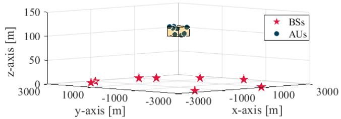  
Fig. 5. The locations of BSs and AUs.

Then, the expectation of $X _ { i } ^ { t + 1 }$ can be described as follows:

$$
\begin{array}{l} E [ X _ {i} ^ {t + 1} ] = E [ 1 + r a n d ] * E [ X _ {i} ^ {t} ] \\ - \quad E [ r a n d ] * E [ X _ {i} ^ {t - 1} ] + E [ a _ {i} ^ {t} ]. \tag {33} \\ \end{array}
$$

By defining the lower and upper bounds of rand as α and $\beta ,$ respectively, the recursive relationship among the positions of the ith agent at different iterations can be written as follows:

$$
\left[ \begin{array}{c} E \left[ X _ {i} ^ {t + 1} \right] \\ E \left[ X _ {i} ^ {t} \right] \end{array} \right] = \left[ \begin{array}{c c} \frac {2 + \alpha + \beta}{2} & - \frac {\alpha + \beta}{2} \\ 1 & 0 \end{array} \right] \left[ \begin{array}{c} E \left[ X _ {i} ^ {t} \right] \\ E \left[ X _ {i} ^ {t - 1} \right] \end{array} \right] + \left[ \begin{array}{c} E \left[ a _ {i} ^ {t} \right] \\ 0 \end{array} \right]. \tag {34}
$$

For ease of presentation, the coefficient matrix is written as follows:

$$
M _ {c} = \left[ \begin{array}{c c} \frac {2 + \alpha + \beta}{2} & - \frac {\alpha + \beta}{2} \\ 1 & 0 \end{array} \right]. \tag {35}
$$

According to [67] and [68], the necessary and sufficient condition to guarantee the convergence of the proposed IMOGSA is that the magnitude of the eigenvalues of M is smaller than 1. Given that α and $\beta$ are set to be 0 and 1, respectively, we can calculate $| M _ { c } | = ( \alpha + \beta ) / 2 = 0 . 5 < 1$ . Therefore, the proposed IMOGSA will converge within limited iterations. ■

# VI. SIMULATION RESULTS

In this section, we conduct simulations to demonstrate the effectiveness of the proposed IMOGSA. First, the simulation setups are given. Second, the proposed IMOGSA is adopted to tackle the RECMOP, and the simulation results are compared with several other benchmarks. Finally, the performance of the UVAA system under several unexpected circumstances is analyzed and discussed.

# A. Simulation Setups

To match reality, we consider smaller and larger scale UAV networks wherein the numbers of UAVs are set to be 8 and 16, respectively. In both of the considered networks, the UAVs are dispatched over a monitor area of $1 0 0 \times 1 0 0 ~ \mathrm { m ^ { 2 } }$ for ease of control. To be specific, the minimum and maximum horizontal flight ranges of UAVs are set to be 0 m and 100 m, and the vertical flight range of UAVs is confined from 90 m to 120 m, to establish communication links with high LoS probability with the BSs, enabling faster transmission rate for the air-toground link. Moreover, the related settings of BSs follows the existing work [44]. Specifically, the number of BSs is set to be 8, the locations of BSs are shown in Fig. 5. Given that the coverage radius of a BS is typically around 1 to 5 km [69], thus the considered BSs-related settings are reasonable. In addition, the locations of AUs are randomly generated near the UAVs. To be specific, the approximate area in which AUs are located is also shown in Fig. 5, wherein the horizontal and vertical locations of AUs are both confined from -200 m to 300 m. All the other simulation parameters follow the work in [70].

Several benchmark schemes are introduced for making comparisons with the proposed IMOGSA, which can be divided into two categories, i.e., meta-heuristic algorithms and the conventional multi-hop relay strategy, respectively.

• Meta-heuristic algorithms: Several meta-heuristic algorithms are introduced, which are NSGA-II [66], multi-objective dragonfly algorithm (MODA) [71], multi-objective grey wolf optimizer (MOGWO) [72], multi-objective salp swarm algorithm (MSSA) [73], and the conventional MOGSA. Note that the proposed discrete solution update strategy is adopted by the algorithms above so that they can deal with the discrete dimensions. Moreover, the number of maximum iterations and population size are defined to be 500 and 30, respectively.

• Multi-hop relay strategy: To make comparisons with the proposed CB-based approach, the conventional multi-hop UAV relay strategy is presented. To be specific, a group of UAVs are uniformly distributed between the monitor area and the receiver BSs successively.

# B. Simulation Results

1) Optimization Results Obtained by IMOGSA: Table II presents the numerical results regarding the SNR of each BS and that of the adjacent AUs when the UVAA system transmits related data to the BS in both smaller and larger scale UAV networks. First, it is apparent that the receiving SNR of a BS in the larger scale UAV network is almost 2 to 3 times that of the BS in the smaller scale UAV network. The reason is that with the number of UAV elements increases, the beam will be sharper and the energy is more concentrated, resulting in a higher SNR of the direction of each BS. Second, it can be find that the SNR of AUs will also increase with the expansion of the scale of UAV network, due to the increased radiation intensity of sidelobes. Finally, it is observed that the receiving SNR of each remote BS is much lower than that of the adjacent AUs, which is induced by the long distance between each BS and the UVAA system. However, even in this case, the achievable rate of the BS is close to $3 . 1 6 \times 1 0 ^ { 6 }$ bps given that the receiving SNR is 6 dB. In conclusion, the proposed IMOGSA can achieve satisfactory optimization results.

The moving paths of UAVs obtained by IMOGSA in both smaller and larger scale UAV networks for transmitting data to the first BS are visualized in Fig. 6. It is found that the optimized positions of UAVs are more compact and centralized than the initial positions of UAVs. The reason is that the centralized locations of elements contribute to a superior beam pattern with a high-gain mainlobe and low-gain sidelobes.

Ultimately, it is more preferable to deploy a larger scale UAV network if a higher receiving SNR of each BS is required to improve the communication performance. Moreover, the proposed CB-based approach is more suitable for smaller scale UAV network for reducing the propulsion power consumption of UAVs so that the UAVs can carry out more other missions.

TABLE II THE OPTIMIZED SNR OF BSS AND AUS OBTAINED BY THE PROPOSED IMOGSA IN SMALLER AND LARGER SCALE UAV NETWORKS 

<table><tr><td colspan="9">SNR in smaller scale UAV network [dB]</td><td colspan="10">SNR in larger scale UAV network [dB]</td></tr><tr><td>BS</td><td></td><td></td><td></td><td>AUs</td><td></td><td></td><td></td><td></td><td>BS</td><td></td><td></td><td></td><td>AUs</td><td></td><td></td><td></td><td></td><td></td></tr><tr><td>6.39</td><td>56.6</td><td>42.7</td><td>69.1</td><td>22.6</td><td>62.9</td><td>34.1</td><td>44.4</td><td>50.5</td><td>13.4</td><td>70.1</td><td>50.9</td><td>32.9</td><td>52.4</td><td>66.2</td><td>63.4</td><td>66.4</td><td>58.3</td><td></td></tr><tr><td>6.37</td><td>42.7</td><td>62.2</td><td>47.0</td><td>60.3</td><td>33.7</td><td>48.5</td><td>57.0</td><td>60.9</td><td>21.3</td><td>57.6</td><td>64.7</td><td>68.8</td><td>67.7</td><td>41.7</td><td>55.0</td><td>33.0</td><td>66.1</td><td></td></tr><tr><td>8.33</td><td>51.5</td><td>55.1</td><td>58.3</td><td>57.8</td><td>51.5</td><td>28.8</td><td>61.7</td><td>60.2</td><td>20.2</td><td>50.7</td><td>35.5</td><td>73.1</td><td>60.2</td><td>76.9</td><td>57.1</td><td>60.7</td><td>56.3</td><td></td></tr><tr><td>6.39</td><td>54.3</td><td>72.8</td><td>57.5</td><td>44.9</td><td>31.8</td><td>29.0</td><td>43.8</td><td>31.7</td><td>18.3</td><td>53.3</td><td>43.6</td><td>51.2</td><td>66.5</td><td>58.8</td><td>63.9</td><td>63.1</td><td>61.3</td><td></td></tr><tr><td>6.59</td><td>49.2</td><td>42.5</td><td>47.1</td><td>17.4</td><td>50.6</td><td>71.4</td><td>56.8</td><td>40.2</td><td>13.4</td><td>50.2</td><td>81.8</td><td>30.3</td><td>58.6</td><td>53.2</td><td>54.7</td><td>48.4</td><td>53.0</td><td></td></tr><tr><td>9.15</td><td>54.7</td><td>42.9</td><td>59.9</td><td>57.4</td><td>69.6</td><td>12.1</td><td>50.4</td><td>49.4</td><td>20.5</td><td>47.3</td><td>53.1</td><td>51.5</td><td>66.5</td><td>56.2</td><td>74.2</td><td>72.2</td><td>67.5</td><td></td></tr><tr><td>9.16</td><td>43.6</td><td>67.6</td><td>39.2</td><td>49.5</td><td>49.5</td><td>54.0</td><td>52.1</td><td>59.1</td><td>15.3</td><td>52.2</td><td>59.8</td><td>69.0</td><td>55.4</td><td>64.8</td><td>65.6</td><td>51.4</td><td>47.8</td><td></td></tr><tr><td>6.97</td><td>43.3</td><td>59.8</td><td>57.4</td><td>52.5</td><td>60.2</td><td>66.8</td><td>41.5</td><td>48.4</td><td>13.6</td><td>54.5</td><td>55.6</td><td>38.4</td><td>70.4</td><td>76.7</td><td>65.7</td><td>65.9</td><td>46.6</td><td></td></tr></table>

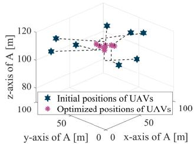

<details>
<summary>scatter</summary>

| Position Type       | x-axis (m) | y-axis (m) |
| ------------------- | ---------- | ---------- |
| Initial positions   | 50         | 100        |
| Optimized positions | 50         | 100        |
</details>

(a)

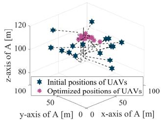

<details>
<summary>scatter</summary>

| Position Type       | X (y-axis) | Y (x-axis) | Z (z-axis) |
| ------------------- | ---------- | ---------- | ---------- |
| Initial positions   | 50         | 0          | 100        |
| Optimized positions | 50         | 0          | 100        |
</details>

(b)

Fig. 6. Moving paths of UAVs obtained by the proposed IMOGSA. (a) Smaller scale UAV network. (b) Larger scale UAV network.   
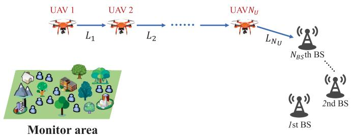

<details>
<summary>flowchart</summary>

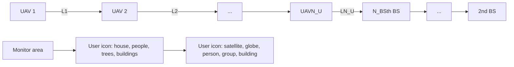
</details>

Fig. 8. Sketch map of the multi-hop UAV relay system.

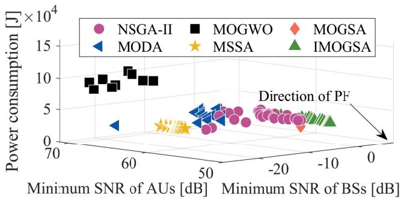

<details>
<summary>scatter</summary>

| Method   | Minimum SNR of AUs [dB] | Minimum SNR of BSs [dB] | Power consumption [J] ×10⁴ |
| -------- | ------------------------ | ------------------------ | -------------------------- |
| NSGA-II  | -20                      | -10                      | 3                          |
| NSGA-II  | -15                      | -8                       | 4                          |
| NSGA-II  | -10                      | -6                       | 5                          |
| NSGA-II  | -5                       | -4                       | 6                          |
| NSGA-II  | 0                        | -2                       | 7                          |
| MOGWO    | 60                       | 60                       | 10                         |
| MOGWO    | 50                       | 50                       | 9                          |
| MOGWO    | 40                       | 40                       | 8                          |
| MOGWO    | 30                       | 30                       | 7                          |
| MOGWO    | 20                       | 20                       | 6                          |
| MOGWO    | 10                       | 10                       | 5                          |
| MOGSA    | -15                      | -15                      | 2                          |
| MOGSA    | -10                      | -10                      | 3                          |
| MOGSA    | -5                       | -5                       | 4                          |
| MOGSA    | 0                        | 0                        | 5                          |
| MODA     | 60                       | 60                       | 3                          |
| MODA     | 50                       | 50                       | 4                          |
| MODA     | 40                       | 40                       | 5                          |
| MODA     | 30                       | 30                       | 6                          |
| MODA     | 20                       | 20                       | 7                          |
| MSSA     | 60                       | 60                       | 2                          |
| MSSA     | 50                       | 50                       | 3                          |
| MSSA     | 40                       | 40                       | 4                          |
| MSSA     | 30                       | 30                       | 5                          |
| MSSA     | 20                       | 20                       | 6                          |
| IMOGSA   | -15                      | -15                      | 3                          |
| IMOGSA   | -10                      | -10                      | 4                          |
| IMOGSA   | -5                       | -5                       | 5                          |
| IMOGSA   | 0                        | -2                       | 6                          |
Direction of PF<lcel>
</details>

(a) Smaller scale UAV network.

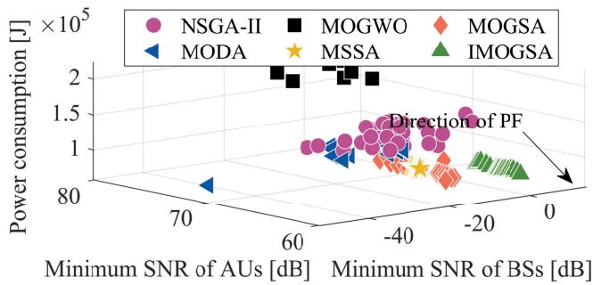

<details>
<summary>scatter</summary>

| Method   | Minimum SNR of AUs [dB] | Minimum SNR of BSs [dB] | Power consumption [J] |
|----------|--------------------------|--------------------------|------------------------|
| NSGA-II  | ~-40                     | ~-20                     | ~1.5                   |
| MODA     | ~-60                     | ~-80                     | ~1.0                   |
| MOGWO    | ~-40                     | ~-20                     | ~2.0                   |
| MSSA     | ~-40                     | ~-20                     | ~1.0                   |
| MOGSA    | ~-40                     | ~-20                     | ~1.5                   |
| IMOGSA   | ~-20                     | ~-20                     | ~1.0                   |
</details>

(b) Larger scale UAV network.   
Fig. 7. Solution distributions obtained by the proposed IMOGSA and other meta-heuristic algorithms.

2) Comparison Results of IMOGSA and Other Meta-Heuristic Algorithms: Fig. 7 illustrates the Pareto solution distributions obtained by the proposed IMOGSA and the other

TABLE IIICOMPARISON RESULTS OF THE MULTI-HOP RELAY STRATEGYAND THE PROPOSED IMOGSA

<table><tr><td rowspan="2">Method</td><td colspan="3">Smaller scale UAV network</td><td colspan="3">Larger scale UAV network</td></tr><tr><td> $f_1$  [dB]</td><td> $f_2$  [dB]</td><td> $f_3$  [J]</td><td> $f_1$  [dB]</td><td> $f_2$  [dB]</td><td> $f_3$  [J]</td></tr><tr><td>Multi-hop</td><td>45.6</td><td>67.9</td><td> $8.37 \times 10^5$ </td><td>215.1</td><td>228.9</td><td> $1.69 \times 10^6$ </td></tr><tr><td>IMOGSA</td><td>6.3</td><td>57.6</td><td> $2.11 \times 10^4$ </td><td>13.4</td><td>65.8</td><td> $5.99 \times 10^4$ </td></tr></table>

meta-heuristic algorithms in both smaller and larger scale UAV networks. It is found that the solutions obtained by the proposed IMOGSA are closer to the direction of Pareto front (PF), which implies that the performance of the proposed IMOGSA is better than the other adopted meta-heuristic algorithms. The reason is that the introduction of QBL strategy and archive optimization method will enhance the quality of solutions.

3) Comparison Results of IMOGSA and Multi-Hop UAV Relay Strategy: In the constructed multi-hop UAV relay system, $N _ { U }$ UAVs at the same altitude are uniformly deployed between the center of the monitor area and a receiver BS, as shown in Fig. 8. Once upon the current transmission process is finished, each relay UAV will fly to the next pre-designed location to execute another transmission mission. Specifically, the decode-and-forward protocol is adopted, and the communication link between the ith and i+1th relay UAVs is denoted as $L _ { i } ^ { j }$ when the receiver is the jth BS.

Table III presents the comparison results of the multi-hop relay strategy and the proposed IMOGSA. First, it is observed that compared with the proposed IMOGSA, the conventional multi-hop relay strategy will achieve exceptionally high receiving SNR of BSs. The reason is that the distance between the last-hop UAV and the receiver BS is comparatively close, which results in a low path loss and then the receiving SNR is improved accordingly. Similarly, the maximum average receiving SNR of AUs is also relatively high due to the close distance between the AUs and the UVAA system. Moreover, the multi-hop relay strategy will consume more propulsion power compared with IMOGSA since the UAVs are required to fly to respective remote position to construct an ad-hoc network. Generally speaking, if a very high receiving SNR or achievable rate of each BS is required, it is more appropriate to deploy a multi-hop relay network. Otherwise, the CB-based approach is more advisable.

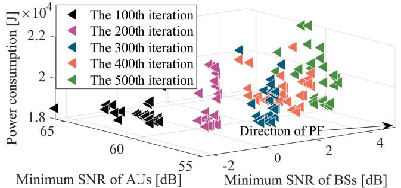

<details>
<summary>scatter</summary>

| Iteration | Minimum SNR of AUs [dB] | Minimum SNR of BSs [dB] |
| --------- | ------------------------ | ------------------------ |
| The 100th | 65                       | 65                       |
| The 200th | 60                       | 60                       |
| The 300th | 55                       | 55                       |
| The 400th | 50                       | 50                       |
| The 500th | 45                       | 45                       |
</details>

(a) Smaller scale UAV network.   
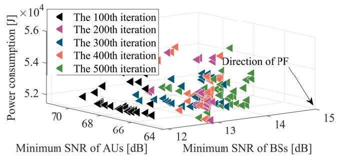  
(b)Larger scale UAV network.   
Fig. 9. Convergence analysis of the proposed IMOGSA. (a) Smaller scale UAV network. (b) Larger scale UAV network.

4) Convergence Analysis of the Proposed IMOGSA: In this part, the convergence analysis of the proposed IMOGSA is conducted through analyzing the changing trend of the Pareto solutions with the number of iterations. Specifically, Fig. 9 presents the Pareto solutions obtained in the 100th, 200th, 300th, 400th, and 500th iterations. It can be observed from the figure that the Pareto solution set gradually approaches the direction of PF as the number of iterations increases in both smaller and larger scale UAV networks. Moreover, with the number of iterations increasing, the movement range of the Pareto solution set becomes smaller. Therefore, the proposed IMOGSA will be converged during the iteration process, which is corresponds to Proposition 4.

# C. Performance Analysis Under Unexpected Circumstances

In this section, several unexpected circumstances are taken into consideration, which are a single damaged UAV element, position jitters of UAVs, position jitters of AUs and imperfect phase synchronization, respectively. The performance of the proposed CB-based approach under the circumstances above is estimated. Note that the simulations are only carried out in smaller scale UAV network for simplicity.

1) Single Damaged UAV: In this part, an unexpected circumstance where the component of a UAV is damaged so that the UAV is not capable of participating in the communication process is considered. In this case, other UAVs that exist in the system will continue to carry out the CB mission. To better mimic the real scenarios, the damaged UAV in the whole UVAA system is selected randomly, and it is also undefined that how many BSs that the UAV has served before it is damaged. Note that we only consider the situation that the UAV is damaged in the moment when it is prepared to serve the next BS after serving the former BS, and the scenarios in which the UAV is damaged during the process of sending data to a specific BS will be left as our future work.

Fig. 10 shows the performance of the UVAA system where a UAV element is damaged. To be specific, Figs. 10(a) and 10(b) signify that the damaged UAV has a serious impact on the minimum receiving SNR of BSs and the maximum average receiving SNR of AUs. Moreover, it is reasonable that the propulsion power consumption of UAVs is reduced since the damaged UAV is no longer participating in the communication, as shown in Fig. 10(c). Overall, we find that the proposed CB-based approach still has comparatively decent performance even when a single UAV element is damaged.

2) Position Jitters of UAVs: Due to the influence of wind, airflow, rainstorm, etc., the positions of UAVs will be shifted, which may yield a non-negligible impact on the performance of the UVAA system. Therefore, we conduct simulations to demonstrate how the system will operate when the position jitters of UAVs occur. Specifically, the normal distribution is exploited to generate random position jitters, and the maximum jitters of UAVs in 3D directions are designed as 0.2 m, 0.4 m, 0.6 m, 0.8 m and 1 m, respectively [74].

Fig. 11 intuitively demonstrates the impact that is generated by the position jitters of UAVs. Figs. 11(a) and 11(b) illustrate that the minimum receiving SNR of BSs is diminishing and the maximum average receiving SNR of AUs is increasing with the jitters of UAVs. The reason is that the beam pattern of the UVAA system is deteriorated. Moreover, Fig. 11(c) shows that the propulsion power consumption of UAVs will also be influenced, and it tends to be larger with the distance of jitter becomes further. However, the minimum receiving SNR of BSs is still above 2 dB even when the maximum jitter range of UAVs reaches 1 m, which corresponds that the achievable rate is above $2 . 3 2 \times 1 0 ^ { 6 }$ bps. In conclusion, the performance of the UVAA system will be slightly influenced if the position jitters occur.

3) Position Jitters of AUs: The AUs will also encounter the position jitters, thus we also conduct simulations to test whether the maximum average receiving SNR of AUs will change significantly when the jitters occur. Specifically, the maximum jitters of the AUs in 3D directions are the same as VI-C.2. Note that the receiving SNR of BSs and the propulsion power consumption of UAVs are not considered since they will not be influenced by the position jitters of AUs.

It is found from Fig. 12 that the maximum average receiving SNR of AUs is increasing with the jitters of UAVs enlarge. The reason is that there will be other sidelobes pointing at these AUs once upon the position jitters happen, while these sidelobes are not optimized and the corresponding radiation intensity is relatively high, resulting in the increase of the maximum average receiving SNR of AUs. To suppress the maximum SLL can overcome the abovementioned challenge brought by the position jitters of AUs, which will be left as our future work.

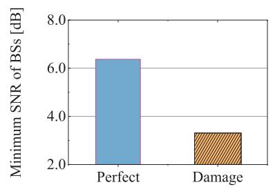

<details>
<summary>bar</summary>

| Condition | Minimum SNR of BSs [dB] |
| --------- | ------------------------ |
| Perfect   | 6.0                      |
| Damage    | 3.0                      |
</details>

(a)

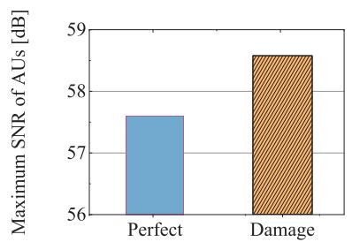

<details>
<summary>bar</summary>

| Condition | Maximum SNR of AUs [dB] |
| :--- | :--- |
| Perfect | 57.6 |
| Damage | 58.6 |
</details>

(b)

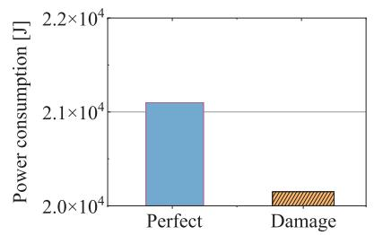

<details>
<summary>bar</summary>

| Condition | Power consumption [J] |
| :--- | :--- |
| Perfect | 21000 |
| Damage | 20000 |
</details>

(（c)

Fig. 10. Performance analysis of the UVAA system influenced by a damaged UAV. (a) Minimum SNR of BSs with a damaged UAV. (b) Maximum SNR of AUs with a damaged UAV. (c) Propulsion power consumption of UAVs with a damaged UAV.   
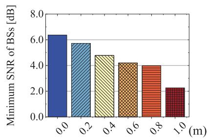

<details>
<summary>bar</summary>

| Parameter | Minimum SNR of BSs [dB] |
| --------- | ------------------------ |
| 0.0       | 6.5                      |
| 0.2       | 5.8                      |
| 0.4       | 4.8                      |
| 0.6       | 4.2                      |
| 0.8       | 4.0                      |
| 1.0       | 2.3                      |
</details>

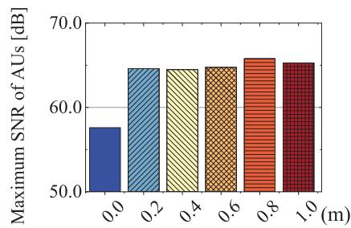

<details>
<summary>bar</summary>

| Threshold (m) | Maximum SNR of AUs [dB] |
| ------------- | ------------------------ |
| 0.0           | 57.0                     |
| 0.2           | 64.0                     |
| 0.4           | 64.0                     |
| 0.6           | 64.0                     |
| 0.8           | 65.0                     |
| 1.0           | 64.0                     |
</details>

(b)

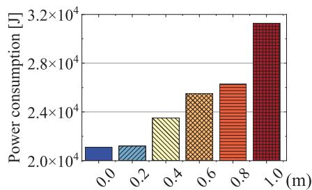

<details>
<summary>bar</summary>

| Distance (m) | Power consumption [J] |
| :--- | :--- |
| 0.0 | 20500 |
| 0.2 | 20700 |
| 0.4 | 23800 |
| 0.6 | 25800 |
| 0.8 | 27200 |
| 1.0 | 31800 |
</details>

Fig. 11. Performance analysis of the UVAA system influenced by position jitters of UAVs. (a) Minimum SNR of BSs with position jitters. (b) Maximum SNR of AUs with position jitters. (c) Propulsion power consumption of UAVs with position jitters.   
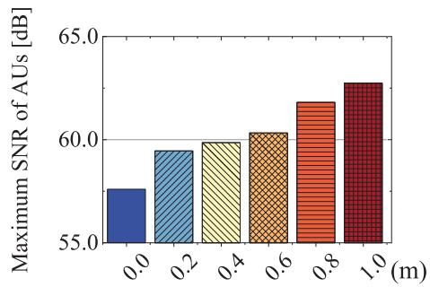

<details>
<summary>bar</summary>

| Distance (m) | Maximum SNR of AUs [dB] |
| :--- | :--- |
| 0.0 | 57.8 |
| 0.2 | 59.6 |
| 0.4 | 60.0 |
| 0.6 | 60.4 |
| 0.8 | 61.8 |
| 1.0 | 62.8 |
</details>

Fig. 12. Maximum receiving SNR of AUs influenced by position jitters of AUs.

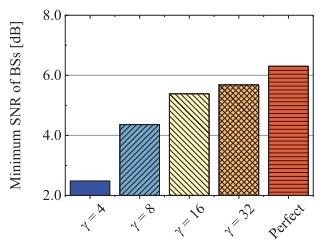

<details>
<summary>bar</summary>

| γ     | Minimum SNR of BSs [dB] |
|-------|--------------------------|
| 4     | 2.5                      |
| 8     | 4.5                      |
| 16    | 5.5                      |
| 32    | 5.8                      |
| Perfect | 6.5                    |
</details>

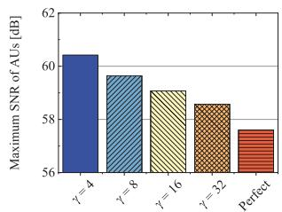

<details>
<summary>bar</summary>

| γ Value | Maximum SNR of AUs [dB] |
| ------- | ------------------------ |
| γ = 4   | 60.5                     |
| γ = 8   | 59.5                     |
| γ = 16  | 59.0                     |
| γ = 32  | 58.5                     |
| Perfect | 57.5                     |
</details>

(b)   
Fig. 13. Performance analysis of the UVAA system influenced by imperfect phase synchronization. (a) Minimum SNR of BSs with phase errors. (b) Maximum SNR of AUs with phase errors.

4) Imperfect Phase Synchronization: In this part, simulations are carried out to present the impact brought by the phase errors among UAVs on the performance of the UVAA system. Accordingly, the AF of the UVAA system is redefined as follows [75]:

$$
F ^ {\zeta} (\theta , \phi) = \sum_ {i = 1} ^ {N _ {U}} I _ {i} e ^ {i _ {u} \left[ k _ {c} (x _ {i} ^ {U} \sin \theta \cos \phi + y _ {i} ^ {U} \sin \theta \sin \phi + z _ {i} ^ {U} \cos \theta) + \zeta_ {i} \right]}, \tag {36}
$$

where $\zeta _ { i }$ represents the phase error of the ith UAV and it is assumed to obey the Tikhonov distribution with parameter $\gamma$ which determines the error size [76]. Note that the propulsion power consumption of UAVs is not considered in this part since it is only related with the locations of UAVs.

Fig. 13 shows the obtained results through considering the phase errors. Specifically, Fig. 13(a) shows that the minimum receiving SNR of BSs will be enhanced with the increasing of $\gamma ,$ and Fig. 13(b) manifests the maximum average receiving SNR of AUs tends to diminish with the $\gamma$ increases. Generally speaking, the imperfect phase synchronization inevitably has a mild influence on the performance of the UVAA system, however, the impact is gradually overcome with the propose of synchronization algorithms.

# VII. CONCLUSION

In this work, the UVAA-enabled emergency communication scenario was investigated. Specifically, we considered a UAV-based relay system that harvests data from ground users and then sends the collected data to several BSs via using CB. We formulated an RECMOP to cooperatively maximize the minimum receiving SNR of the BSs, minimize the maximum average receiving SNR of the neighbouring AUs and minimize the propulsion power consumption of the UAVs. To deal with the formulated RECMOP which is shown to be NP-hard and non-convex, an IMOGSA was proposed. Simulations were implemented and the results manifested the effectiveness of the proposed IMOGSA. Moreover, the results also illustrated that the proposed algorithm outperforms other benchmark schemes. In addition, several unexpected circumstances were analyzed and discussed, and the results suggested that the proposed CB-based approach will inevitably be affected by some exceptional cases, however, it is still able to complete data transmission.In the future, we will extend the proposed CB-based approach to more UAV-assisted wireless communication scenarios including UAVs-assisted wireless communications in post-disaster areas, wireless communications from UAVs to satellites, and UAVs-enabled covert communications.

# REFERENCES

[1] G. Sun, X. Zheng, Y. Lian, J. Li, and F. Mei, “Reliable UAV communication via collaborative beamforming: A multi-objective optimization approach,” in Proc. IEEE Symp. Comput. Commun. (ISCC), Aug. 2022, pp. 1–7.   
[2] Y. Cao, Y. Luo, H. Yang, and C. Luo, “UAV-based emergency communications: An iterative two-stage multi-agent soft actor-critic approach for optimal association and dynamic deployment,” IEEE Internet Things J., 2024, doi: 10.1109/JIOT.2023.3329346.   
[3] Y. Guan, S. Zou, H. Peng, W. Ni, Y. Sun, and H. Gao, “Cooperative UAV trajectory design for disaster area emergency communications: A multiagent PPO method,” IEEE Internet Things J., vol. 11, no. 5, pp. 8848–8859, Mar. 2024.   
[4] F. Lu et al., “Resource and trajectory optimization for UAV-relayassisted secure maritime MEC,” IEEE Trans. Commun., vol. 72, no. 3, pp. 1641–1652, Mar. 2024.   
[5] F. Yang, C. Wang, J. Xiong, N. Deng, N. Zhao, and Y. Li, “UAV-enabled robust covert communication against active wardens,” IEEE Trans. Veh. Technol., 2024.   
[6] L. Zhu, J. Zhang, Z. Xiao, X. Cao, X. Xia, and R. Schober, “Millimeterwave full-duplex UAV relay: Joint positioning, beamforming, and power control,” IEEE J. Sel. Areas Commun., vol. 38, no. 9, pp. 2057–2073, Sep. 2020.   
[7] S. Jayaprakasam, S. K. A. Rahim, and C. Y. Leow, “Distributed and collaborative beamforming in wireless sensor networks: Classifications, trends, and research directions,” IEEE Commun. Surveys Tuts., vol. 19, no. 4, pp. 2092–2116, 4th Quart., 2017.   
[8] L. Zhu, J. Zhang, Z. Xiao, X. Cao, D. O. Wu, and X.-G. Xia, “Joint power control and beamforming for uplink non-orthogonal multiple access in 5G millimeter-wave communications,” IEEE Trans. Wireless Commun., vol. 17, no. 9, pp. 6177–6189, Sep. 2018.   
[9] L. Zhu, J. Zhang, Z. Xiao, X. Cao, D. O. Wu, and X. Xia, “Millimeter-wave NOMA with user grouping, power allocation and hybrid beamforming,” IEEE Trans. Wireless Commun., vol. 18, no. 11, pp. 5065–5079, Nov. 2019.   
[10] P. S. Bithas, V. Nikolaidis, A. G. Kanatas, and G. K. Karagiannidis, “UAV-to-ground communications: Channel modeling and UAV selection,” IEEE Trans. Commun., vol. 68, no. 8, pp. 5135–5144, Aug. 2020.   
[11] B. Hu, L. Wang, S. Chen, J. Cui, and L. Chen, “An uplink throughput optimization scheme for UAV-enabled urban emergency communications,” IEEE Internet Things J., vol. 9, no. 6, pp. 4291–4302, Mar. 2022.   
[12] Z. Huang, C. Chen, and M. Pan, “Multiobjective UAV path planning for emergency information collection and transmission,” IEEE Internet Things J., vol. 7, no. 8, pp. 6993–7009, Aug. 2020.   
[13] Y. Jiang, Y. Ma, J. Liu, L. Hu, M. Chen, and I. Humar, “MER-WearNet: Medical-emergency response wearable networking powered by UAVassisted computing offloading and WPT,” IEEE Trans. Netw. Sci. Eng., vol. 9, no. 1, pp. 299–309, Jan. 2022.   
[14] Y. Lin, T. Wang, and S. Wang, “UAV-assisted emergency communications: An extended multi-armed bandit perspective,” IEEE Commun. Lett., vol. 23, no. 5, pp. 938–941, May 2019.

[15] W. Feng et al., “UAV-enabled SWIPT in IoT networks for emergency communications,” IEEE Wireless Commun., vol. 27, no. 5, pp. 140–147, Oct. 2020.   
[16] T. Zhang, J. Lei, Y. Liu, C. Feng, and A. Nallanathan, “Trajectory optimization for UAV emergency communication with limited user equipment energy: A safe-DQN approach,” IEEE Trans. Green Commun. Netw., vol. 5, no. 3, pp. 1236–1247, Sep. 2021.   
[17] Z. Shah, U. Javed, M. Naeem, S. Zeadally, and W. Ejaz, “Mobile edge computing (MEC)-enabled UAV placement and computation efficiency maximization in disaster scenario,” IEEE Trans. Veh. Technol., 2023.   
[18] Y. Zeng, R. Zhang, and T. J. Lim, “Throughput maximization for UAV-enabled mobile relaying systems,” IEEE Trans. Commun., vol. 64, no. 12, pp. 4983–4996, Dec. 2016.   
[19] S. Zhang, H. Zhang, Q. He, K. Bian, and L. Song, “Joint trajectory and power optimization for UAV relay networks,” IEEE Commun. Lett., vol. 22, no. 1, pp. 161–164, Jan. 2018.   
[20] Q. Wang, Z. Chen, W. Mei, and J. Fang, “Improving physical layer security using UAV-enabled mobile relaying,” IEEE Wireless Commun. Lett., vol. 6, no. 3, pp. 310–313, Jun. 2017.   
[21] T. Wang, Y. Li, and Y. Wu, “Energy-efficient UAV assisted secure relay transmission via cooperative computation offloading,” IEEE Trans. Green Commun. Netw., vol. 5, no. 4, pp. 1669–1683, Dec. 2021.   
[22] W. Wei, X. Pang, J. Tang, N. Zhao, X. Wang, and A. Nallanathan, “Secure transmission design for aerial IRS assisted wireless networks,” IEEE Trans. Commun., vol. 71, no. 6, pp. 3528–3540, Jun. 2023.   
[23] Y. Su, X. Pang, S. Chen, X. Jiang, N. Zhao, and F. R. Yu, “Spectrum and energy efficiency optimization in IRS-assisted UAV networks,” IEEE Trans. Commun., vol. 70, no. 10, pp. 6489–6502, Oct. 2022.   
[24] H. S. Khallaf, S. Hashima, M. Rihan, E. M. Mohamed, and H. M. Kasem, “Quantifying impact of pointing errors on secrecy performance of UAV-based relay-assisted FSO links,” IEEE Internet Things J., vol. 11, no. 2, pp. 2979–2989, Jan. 2024.   
[25] X. Yang, B. Han, G. Zhang, P. Zheng, J. Bai, and D. Qin, “NOMAassisted routing algorithm design for UAV ad hoc relay networks,” IEEE Sensors J., vol. 23, no. 3, pp. 3296–3312, Feb. 2023.   
[26] D. Yin, X. Yang, H. Yu, S. Chen, and C. Wang, “An air-to-ground relay communication planning method for UAVs swarm applications,” IEEE Trans. Intell. Vehicles, 2023, doi: 10.1109/TIV.2023.3237329.   
[27] H. Lu, Y. Zeng, S. Jin, and R. Zhang, “Aerial intelligent reflecting surface: Joint placement and passive beamforming design with 3D beam flattening,” IEEE Trans. Wireless Commun., vol. 20, no. 7, pp. 4128–4143, Jul. 2021.   
[28] J. Sabzehali, V. K. Shah, H. S. Dhillon, and J. H. Reed, “3D placement and orientation of mmWave-based UAVs for guaranteed LoS coverage,” IEEE Wireless Commun. Lett., vol. 10, no. 8, pp. 1662–1666, Aug. 2021.   
[29] E. Park, S.-R. Lee, and I. Lee, “Antenna placement optimization for distributed antenna systems,” IEEE Trans. Wireless Commun., vol. 11, no. 7, pp. 2468–2477, Jul. 2012.   
[30] O. M. Bushnaq, M. A. Kishk, A. Celik, M. Alouini, and T. Y. Al-Naffouri, “Optimal deployment of tethered drones for maximum cellular coverage in user clusters,” IEEE Trans. Wireless Commun., vol. 20, no. 3, pp. 2092–2108, Mar. 2021.   
[31] P. K. Sharma, D. Deepthi, and D. I. Kim, “Outage probability of 3-D mobile UAV relaying for hybrid satellite-terrestrial networks,” IEEE Commun. Lett., vol. 24, no. 2, pp. 418–422, Feb. 2020.   
[32] Y. Cai, Z. Wei, R. Li, D. W. Kwan Ng, and J. Yuan, “Energyefficient resource allocation for secure UAV communication systems,” in Proc. IEEE Wireless Commun. Netw. Conf. (WCNC), Apr. 2019, pp. 1–8.   
[33] Y. A. Sambo, P. V. Klaine, J. P. B. Nadas, and M. A. Imran, “Energy minimization UAV trajectory design for delay-tolerant emergency communication,” in Proc. IEEE Int. Conf. Commun. Workshops (ICC Workshops), May 2019, pp. 1–6.   
[34] Y. Zeng, J. Xu, and R. Zhang, “Energy minimization for wireless communication with rotary-wing UAV,” IEEE Trans. Wireless Commun., vol. 18, no. 4, pp. 2329–2345, Apr. 2019.   
[35] X. Zhang, Z. Chang, T. Hämäläinen, and G. Min, “AoI-energy tradeoff for data collection in UAV-assisted wireless networks,” IEEE Trans. Commun., vol. 72, no. 3, pp. 1849–1861, Mar. 2024, doi: 10.1109/TCOMM.2023.3337400.   
[36] D. Deng, S. Dang, X. Li, D. W. K. Ng, and A. Nallanathan, “Joint optimization for covert communications in UAV-assisted NOMA networks,” IEEE Trans. Veh. Technol., vol. 73, no. 1, pp. 1012–1026, Jan. 2024.

[37] C. Dai, K. Zhu, and E. Hossain, “Multi-agent deep reinforcement learning for joint decoupled user association and trajectory design in full-duplex multi-UAV networks,” IEEE Trans. Mobile Comput., vol. 22, no. 10, pp. 6056–6070, Oct. 2023.   
[38] S. Liang et al., “Charging UAV deployment for improving charging performance of wireless rechargeable sensor networks via joint optimization approach,” Comput. Netw., vol. 201, Dec. 2021, Art. no. 108573.   
[39] V. Roberge, M. Tarbouchi, and G. Labonte, “Comparison of parallel genetic algorithm and particle swarm optimization for real-time UAV path planning,” IEEE Trans. Ind. Informat., vol. 9, no. 1, pp. 132–141, Feb. 2013.   
[40] Q.-V. Pham, T. Huynh-The, M. Alazab, J. Zhao, and W.-J. Hwang, “Sum-rate maximization for UAV-assisted visible light communications using NOMA: Swarm intelligence meets machine learning,” IEEE Internet Things J., vol. 7, no. 10, pp. 10375–10387, Oct. 2020.   
[41] J. Li, H. Kang, G. Sun, S. Liang, Y. Liu, and Y. Zhang, “Physical layer secure communications based on collaborative beamforming for UAV networks: A multi-objective optimization approach,” in Proc. IEEE Conf. Comput. Commun., May 2021, pp. 1–10.   
[42] A. Rahmati et al., “Dynamic interference management for UAV-assisted wireless networks,” IEEE Trans. Wireless Commun., vol. 21, no. 4, pp. 2637–2653, Apr. 2022.   
[43] A. Al-Hourani, S. Kandeepan, and S. Lardner, “Optimal LAP altitude for maximum coverage,” IEEE Wireless Commun. Lett., vol. 3, no. 6, pp. 569–572, Dec. 2014.   
[44] G. Sun, J. Li, Y. Liu, S. Liang, and H. Kang, “Time and energy minimization communications based on collaborative beamforming for UAV networks: A multi-objective optimization method,” IEEE J. Sel. Areas Commun., vol. 39, no. 11, pp. 3555–3572, Nov. 2021.   
[45] M. Mozaffari, W. Saad, M. Bennis, and M. Debbah, “Communications and control for wireless drone-based antenna array,” IEEE Trans. Commun., vol. 67, no. 1, pp. 820–834, Jan. 2019.   
[46] Y. Zeng, Q. Wu, and R. Zhang, “Accessing from the sky: A tutorial on UAV communications for 5G and beyond,” Proc. IEEE, vol. 107, no. 12, pp. 2327–2375, Dec. 2019.   
[47] Z. Yang, W. Xu, and M. Shikh-Bahaei, “Energy efficient UAV communication with energy harvesting,” IEEE Trans. Veh. Technol., vol. 69, no. 2, pp. 1913–1927, Feb. 2019.   
[48] C. You and R. Zhang, “Hybrid offline-online design for UAV-enabled data harvesting in probabilistic LoS channels,” IEEE Trans. Wireless Commun., vol. 19, no. 6, pp. 3753–3768, Jun. 2020.   
[49] S.-F. Chou, A.-C. Pang, and Y.-J. Yu, “Energy-aware 3D unmanned aerial vehicle deployment for network throughput optimization,” IEEE Trans. Wireless Commun., vol. 19, no. 1, pp. 563–578, Jan. 2020.   
[50] I. Giagkiozis and P. J. Fleming, “Methods for multi-objective optimization: An analysis,” Inf. Sci., vol. 293, pp. 338–350, Feb. 2015.   
[51] T. Shafique, H. Tabassum, and E. Hossain, “End-to-end energyefficiency and reliability of UAV-assisted wireless data ferrying,” IEEE Trans. Commun., vol. 68, no. 3, pp. 1822–1837, Mar. 2020.   
[52] C. E. Shannon, “A mathematical theory of communication,” Bell Syst. Tech. J., vol. 27, no. 3, pp. 379–423, 1948.   
[53] Q. Lin et al., “A clustering-based evolutionary algorithm for manyobjective optimization problems,” IEEE Trans. Evol. Comput., vol. 23, no. 3, pp. 391–405, Jun. 2019.   
[54] P. Goos, U. Syafitri, B. Sartono, and A. R. Vazquez, “A nonlinear multidimensional knapsack problem in the optimal design of mixture experiments,” Eur. J. Oper. Res., vol. 281, no. 1, pp. 201–221, Feb. 2020.   
[55] M. Dorigo and L. M. Gambardella, “Ant colony system: A cooperative learning approach to the traveling salesman problem,” IEEE Trans. Evol. Comput., vol. 1, no. 1, pp. 53–66, Apr. 1997.   
[56] M. N. Omidvar, X. D. Li, Y. Mei, and X. Yao, “Cooperative co-evolution with differential grouping for large scale optimization,” IEEE Trans. Evol. Comput., vol. 18, no. 3, pp. 378–393, Jun. 2014.   
[57] H. Jiang, Z. Xiao, Z. Li, J. Xu, F. Zeng, and D. Wang, “An energyefficient framework for Internet of Things underlaying heterogeneous small cell networks,” IEEE Trans. Mobile Comput., vol. 21, no. 1, pp. 31–43, Jan. 2022.   
[58] H. Yang, Z. Xiong, J. Zhao, D. Niyato, L. Xiao, and Q. Wu, “Deep reinforcement learning-based intelligent reflecting surface for secure wireless communications,” IEEE Trans. Wireless Commun., vol. 20, no. 1, pp. 375–388, Jan. 2021.   
[59] M. Jain, V. Singh, and A. Rani, “A novel nature-inspired algorithm for optimization: Squirrel search algorithm,” Swarm Evol. Comput., vol. 44, pp. 148–175, Feb. 2019.

[60] A. A. Heidari, S. Mirjalili, H. Faris, I. Aljarah, M. Mafarja, and H. Chen, “Harris hawks optimization: Algorithm and applications,” Future Gener. Comput. Syst., vol. 97, pp. 849–872, Aug. 2019.   
[61] E. Rashedi, H. Nezamabadi-Pour, and S. Saryazdi, “GSA: A gravitational search algorithm,” Inf. Sci., vol. 179, no. 13, pp. 2232–2248, Jun. 2009.   
[62] E. Rashedi, E. Rashedi, and H. Nezamabadi-Pour, “A comprehensive survey on gravitational search algorithm,” Swarm Evol. Comput., vol. 41, pp. 141–158, Aug. 2018.   
[63] H. Nobahari, M. Nikusokhan, and P. Siarry, “A multi-objective gravitational search algorithm based on non-dominated sorting,” Int. J. Swarm Intell. Res., vol. 3, no. 3, pp. 32–49, Jul. 2012.   
[64] H. H. Reza and M. Rouhani, “A multi-objective gravitational search algorithm,” in Proc. IEEE 2nd Int. Conf. Comput. Intell. Commun. Syst. Netw., Jun. 2010, pp. 7–12.   
[65] B. Kazimipour, X. Li, and A. K. Qin, “A review of population initialization techniques for evolutionary algorithms,” in Proc. IEEE Congr. Evol. Comput. (CEC), Jul. 2014, pp. 2585–2592.   
[66] K. Deb, A. Pratap, S. Agarwal, and T. Meyarivan, “A fast and elitist multiobjective genetic algorithm: NSGA-II,” IEEE Trans. Evol. Comput., vol. 6, no. 2, pp. 182–197, Apr. 2002.   
[67] D. Li, W. Guo, A. Lerch, Y. Li, L. Wang, and Q. Wu, “An adaptive particle swarm optimizer with decoupled exploration and exploitation for large scale optimization,” Swarm Evol. Comput., vol. 60, Feb. 2021, Art. no. 100789.   
[68] M. R. Bonyadi and Z. Michalewicz, “Stability analysis of the particle swarm optimization without stagnation assumption,” IEEE Trans. Evol. Comput., vol. 20, no. 5, pp. 814–819, Oct. 2016.   
[69] H. D. Nguyen, K.-T. Tran, and N. Agoulmine, “Impact of interference on the system performance of Wimax relay 802.16j with sectoring,” in Proc. IEEE Int. Conf. Commun. (ICC), Jun. 2011, pp. 1–5.   
[70] J. Li et al., “Multi-objective optimization approaches for physical layer secure communications based on collaborative beamforming in UAV networks,” IEEE/ACM Trans. Netw., vol. 31, no. 4, pp. 1902–1917, Aug. 2023.   
[71] S. Mirjalili, “Dragonfly algorithm: A new meta-heuristic optimization technique for solving single-objective, discrete, and multi-objective problems,” Neural Comput. Appl., vol. 27, no. 4, pp. 1053–1073, May 2016.   
[72] S. Mirjalili, S. Saremi, S. M. Mirjalili, and L. D. S. Coelho, “Multiobjective grey wolf optimizer: A novel algorithm for multi-criterion optimization,” Exp. Syst. Appl., vol. 47, pp. 106–119, Apr. 2016.   
[73] S. Mirjalili, A. H. Gandomi, S. Z. Mirjalili, S. Saremi, H. Faris, and S. M. Mirjalili, “Salp swarm algorithm: A bio-inspired optimizer for engineering design problems,” Adv. Eng. Softw., vol. 114, pp. 163–191, Dec. 2017.   
[74] X. Li, J. Zhou, B. Duan, Y. Yang, Y. Zhang, and J. Fan, “Performance of planar arrays for microwave power transmission with position errors,” IEEE Antennas Wireless Propag. Lett., vol. 14, pp. 1794–1797, 2015.   
[75] A. Minturn, D. Vernekar, Y. L. Yang, and H. Sharif, “Distributed beamforming with imperfect phase synchronization for cognitive radio networks,” in Proc. IEEE Int. Conf. Commun. (ICC), Jun. 2013, pp. 4936–4940.   
[76] H. Jung, S.-W. Ko, and I.-H. Lee, “Secure transmission using linearly distributed virtual antenna array with element position perturbations,” IEEE Trans. Veh. Technol., vol. 70, no. 1, pp. 474–489, Jan. 2021.


<details>
<summary>natural_image</summary>

Portrait photo of a young woman with short dark hair against a solid blue background (no text or symbols visible)
</details>

Xiaoya Zheng received the B.S. degree in software engineering from Hebei Geology University in 2021. She is currently pursuing the M.S. degree with the College of Computer Science and Technology, Jilin University. Her research interests include UAV networks and optimization.


<details>
<summary>natural_image</summary>

Portrait photo of a man in formal attire against a blue background (no text or symbols visible)
</details>

Geng Sun (Senior Member, IEEE) received the B.S. degree in communication engineering from Dalian Polytechnic University, Dalian, China, in 2007, and the Ph.D. degree in computer science and technology from Jilin University in 2018. He was a Visiting Researcher with the School of Electrical and Computer Engineering, Georgia Institute of Technology, Atlanta, GA, USA. He is currently an Associate Professor with the College of Computer Science and Technology, Jilin University. His research interests include wireless networks, UAV communications, collaborative beamforming, and optimizations.


<details>
<summary>natural_image</summary>

Portrait of a man wearing glasses against a blue background (no text or symbols visible)
</details>

Minghao Yin (Member, IEEE) received the B.S. and M.S. degrees in computer science from Northeast Normal University, China, in 2001 and 2004, respectively, and the Ph.D. degree in computer science from Jilin University, China, in 2008. Since 2010, he has been the Dean of the Department of Computer Sciences, Northeast Normal University, where he is currently a Professor. He has authored two books and more than 100 articles. His research interests include swarm intelligence, automated reasoning, automated planning, and algorithms.


<details>
<summary>natural_image</summary>

Portrait photo of a young man in a collared shirt (no text or symbols visible)
</details>

Jiahui Li (Student Member, IEEE) received the B.S. degree in software engineering and the M.S. degree in computer science and technology from Jilin University, Changchun, China, in 2018 and 2021, respectively, where he is currently pursuing the Ph.D. degree in computer science. His current research interests include UAV networks, antenna arrays, and optimization.


<details>
<summary>natural_image</summary>

Portrait of a person wearing glasses and a dark jacket (no visible text or symbols)
</details>

Dusit Niyato (Fellow, IEEE) received the B.Eng. degree from the King Mongkut’s Institute of Technology Ladkrabang (KMITL), Thailand, in 1999, and the Ph.D. degree in electrical and computer engineering from the University of Manitoba, Canada, in 2008. He is currently a Professor with the School of Computer Science and Engineering, Nanyang Technological University, Singapore. His research interests include the Internet of Things (IoT), machine learning, and incentive mechanism design.


<details>
<summary>natural_image</summary>

Portrait photo of a woman with long dark hair wearing a collared shirt against a blue background (no text or symbols visible)
</details>

Shuang Liang received the B.S. degree in communication engineering from Dalian Polytechnic University, China, in 2011, and the M.S. degree in software engineering and the Ph.D. degree in computer science from Jilin University, China, in 2017 and 2022, respectively. She is currently a Post-Doctoral Researcher with the School of Information Science and Technology, Northeast Normal University. Her research interests include wireless communication, the design of array antennas, collaborative beamforming, and optimizations.


<details>
<summary>natural_image</summary>

Portrait of a smiling man wearing glasses and a suit (no text or symbols visible)
</details>

Victor C. M. Leung (Life Fellow, IEEE) was a Professor of electrical and computer engineering and the TELUS Mobility Research Chair at The University of British Columbia (UBC) when he retired from UBC in 2018 and became a Professor Emeritus. He is currently a Distinguished Professor in computer science and software engineering with Shenzhen University, China. He has coauthored more than 1300 journals/conference papers and book chapters. His research interests include wireless networks and mobile systems. He is a fellow of the


<details>
<summary>natural_image</summary>

Portrait of a man wearing glasses and a tie (no text or symbols visible)
</details>

Qingqing Wu (Senior Member, IEEE) received the B.Eng. degree in electronic engineering from the South China University of Technology in 2012 and the Ph.D. degree in electronic engineering from Shanghai Jiao Tong University (SJTU) in 2016. From 2016 to 2020, he was a Research Fellow with the Department of Electrical and Computer Engineering, National University of Singapore. He is currently an Associate Professor with SJTU. He has coauthored more than 100 IEEE journal articles with 26 ESI highly cited papers and eight ESI hot papers, which have received more than 18 000 Google citations. His current research interests include intelligent reflecting surface (IRS), unmanned aerial vehicle (UAV) communications, and MIMO transceiver design. He was listed as the Clarivate ESI Highly Cited Researcher in 2021 and 2022, the Most Influential Scholar Award in AI-2000 by Aminer in 2021, and the Worlds Top 2% Scientist by Stanford University in 2020 and 2021.

Royal Society of Canada (Academy of Science), the Canadian Academy of Engineering, and the Engineering Institute of Canada. He received the IEEE Vancouver Section Centennial Award, the 2011 UBC Killam Research Prize, the 2017 Canadian Award for Telecommunications Research, and the 2018 IEEE TCGCC Distinguished Technical Achievement Recognition Award. He has coauthored papers that won the 2017 IEEE ComSoc Fred W. Ellersick Prize, the 2017 IEEE SYSTEMS JOURNAL Best Paper Award, the 2018 IEEE CSIM Best Journal Paper Award, and the 2019 IEEE TCGCC Best Journal Paper Award. He is named in the current Clarivate Analytics list of “Highly Cited Researchers.” He is on the Editorial Boards of IEEE TRANSACTIONS ON GREEN COMMUNICATIONS AND NETWORKING, IEEE TRANSACTIONS ON CLOUD COMPUTING, IEEE ACCESS, IEEE NETWORK, and several other journals.