# Resource Allocation Scheme in STAR-RIS-Assisted NOMA Systems Based on UAV Energy Supply

Shuyu Meng , Xue Wang , Senior Member, IEEE, Xiaoying Sun , Member, IEEE, Yixuan Zou , Member, IEEE, and Yuanwei Liu , Fellow, IEEE

Abstract—In this paper, we introduce a novel simultaneous transmitting and reflecting reconfigurable intelligent surface (STAR-RIS) assisted non-orthogonal multiple access (NOMA) model designed for non-line-of-sight (NLoS) scenarios. To ensure energy self-sustainability, an uncrewed aerial vehicle (UAV) is introduced for wireless energy transfer. In the proposed model, ground users (GUs) situated in communication-obstructed environments are supported by STAR-RIS to connect with the base station (BS). Energy harvested from the UAV is utilized to enable prolonged communication with 360<sup>◦</sup> full spatial coverage. An optimization problem is formulated to maximize the system’s sum-rate and is decomposed into three subproblems: phaseshift optimization, power allocation, and time allocation. These subproblems are solved using semidefinite relaxation (SDR), Dinkelbach’s method, and game theory, respectively. A joint resource allocation algorithm based on the block coordinate descent (BCD) method is then proposed. Simulation results show that the proposed UAV-assisted STAR-RIS-NOMA scheme, combined with the BCD algorithm, achieves a 43.64% improvement in system capacity compared to existing approaches.

Index Terms—BCD, resource optimization, STAR-RIS, UAV, uplink NOMA.

## I. INTRODUCTION

O <sup>VER</sup> <sup>the</sup> <sup>past</sup> <sup>decade,</sup> <sup>the</sup> <sup>rapid</sup> <sup>development</sup> <sup>of</sup>intelligent transportation, telemedicine, and industrial intelligent transportation, telemedicine, and industrial automation has led to an explosive increase in data interaction [1]. This growth is accompanied by the flourishing of the Internet of Things (IoT), which places significant demands on wireless communication systems [2], [3]. To further illustrate the specific requirements of typical IoT scenarios for communication performance, we briefly list the requirement characteristics and challenges of several representative applications in Table I. Although the above performance requirements provide a clear direction for system design, these fields often face typical challenges, including unclear direct paths, unstable remote connections, and high energy consumption [4]. Traditional communication and power supply methods, such as microwave communications, wired connections, and battery power, encounter significant challenges in various applications. Microwave communications, for instance, depend on line-of-sight (LoS) transmission, which can be obstructed in complex terrains. Additionally, they exhibit weak resistance to interference in multi-user environments, leading to frequent disconnections. In remote industrial or mobile medical scenarios, the reliance on disposable or short-lived batteries necessitates frequent replacement or recharging. This not only escalates costs but also restricts the energy supply, thereby hindering equipment utilization and impeding business growth.

NOMA has attracted much attention because of its numerous benefits, including improved spectral efficiency, increased throughput at the cell edges, and reduced signaling overhead [5], [6], [7]. Recent studies have extended its application to short-packet communication and ultra-reliable low-latency communication (URLLC) scenarios. In short-packet communication, NOMA efficiently utilizes limited resources, while in URLLC scenarios, it demonstrates great potential in ensuring reliable and timely data transmission, highlighting its importance in next-generation wireless networks [8], [9]. Despite these advantages, the performance improvements offered by NOMA are inherently limited by the signal propagation environment, especially for users with minimal differences in channel gains [10]. Efforts to optimize NOMA schemes remain crucial to surmount these limitations and fully exploit the technology’s potential to fulfill the progressively changing requirements of contemporary wireless communication systems.

In recent years, reconfigurable intelligent surfaces (RIS) has received extensive attention for its ability to control the wireless propagation environment [11]. RIS technology involves integrating numerous low-cost passive reflective elements on a single plane. These elements can independently adjust the amplitude and phase of incident signals, allowing for the creation of three-dimensional passive beams that enhance or refine the directionality of signals [12]. This innovative approach facilitates the intelligent reconfiguration of wireless propagation environments, leading to notable enhancements in the performance of wireless communication networks. However, conventional RIS mainly functions as reflectors of incident signals, resulting in systems where the transmitting and receiving devices have to be on the same side of the RIS. This limitation restricts the deployment range of RIS and negatively affects its performance. To overcome this problem, the authors of [13] proposed the STAR-RIS. It can emit and reflect incident signals simultaneously, increasing the degree of freedom of wireless signal propagation. STAR-RIS can provide users with full-space services at any location within the system, realizing the flexibility of the RIS-assisted network and providing the possibility of large-scale network connectivity [14], [15]. By flexibly deploying and intelligently changing the transmission channel, STAR-RIS plays an even greater role in NOMA networks, which can further increase resource utilization efficiency and improve network performance. The mutually beneficial effect of the combination of STAR-RIS and NOMA has been demonstrated by numerous research works [16], [17], [18].

TABLE I  
TYPICAL IOT SCENARIOS AND NOMA-RELEVANT DEMANDS
<table><tr><td rowspan=1 colspan=1>Application Scenario</td><td rowspan=1 colspan=1>Communication Requirement (Rate / Latency)</td><td rowspan=1 colspan=1>Implication for Design</td></tr><tr><td rowspan=1 colspan=1>Industrial Automation</td><td rowspan=1 colspan=1>10Mbps/&lt;1ms</td><td rowspan=1 colspan=1>Requires ultra-reliable low-latency multi-user access</td></tr><tr><td rowspan=1 colspan=1>Vehicle-to-Everything (V2X)</td><td rowspan=1 colspan=1>1-10Mbps/&lt;1ms</td><td rowspan=1 colspan=1>Supports dense downlink user multiplexing</td></tr><tr><td rowspan=1 colspan=1>Medical Monitoring</td><td rowspan=1 colspan=1>0.5Mbps/&lt;100ms</td><td rowspan=1 colspan=1>Demands stable transmission with energy efficiency</td></tr><tr><td rowspan=1 colspan=1>Smart Grid</td><td rowspan=1 colspan=1>0.1-0.5Mbps/&lt;50ms</td><td rowspan=1 colspan=1>Enables massive uplink data reporting</td></tr></table>

In the STAR-RIS-NOMA network, the edge users are far away from the core nodes, and the signal transmission needs to go through long distances and complex environments, resulting in high signal transmission loss. According to the principle of electromagnetism, the high signal transmission loss will cause the equipment to increase the transmission power to maintain normal communications, which will result in a sharp increase in energy consumption [19]. Prolonged use of equipment under high energy consumption conditions leads to excessive battery discharge, which accelerates the decline of battery capacity. This rapid deterioration not only reduces the number of charging and discharging cycles but also shortens the service life of the equipment [20]. Consequently, the stability and sustainability of the entire network are compromised. Therefore, managing the energy consumption of the equipment effectively is a significant challenge [21]. To address this challenge, a UAV can be employed to prolong the longevity of STAR-RIS and user devices. UAVs are highly mobile, autonomous, and cost-effective tools that enhance service reliability for edge users and improve system energy efficiency [22]. The UAV’s flexibility and scalability offer rapid and effective emergency response capabilities, surpassing the benefits of adding backup batteries for directly charging the RIS and user equipment [23]. By employing UAVs, networks can effectively tackle issues such as equipment failure that may hinder edge users from connecting to the network due to distance or energy limitations. Furthermore, UAV enables the management of networks and facilitate the efficient distribution of energy from aerial vantage points. This strategic utilization not only enhances network coverage in a specific area but also optimizes energy consumption.

## A. Related Works

1) RIS-Assisted NOMA Networks: In [24], the authors proposed a partitioned RIS-based NOMA system mode, using three efficient search algorithms to improve system spectral efficiency by allocating RIS elements and physical resources among users. In [25], the authors constructed a multiuser dual-cell network based on RIS-NOMA, posed the target quality of service maximization problem, and cooptimized the BS power allocation and user clustering using two-stage optimization and Hungarian algorithms. In [26], the authors investigated a RIS-assisted unlicensed NOMA scheme and proposed a joint strategy for user device clustering. In [27], [28], the authors constructed a RIS-assisted NOMA wireless network transmission framework that utilized a deep deterministic policy gradient (DDPG) algorithm to optimize the deployment of RIS, which enhanced the system’s spectral efficiency. In [29] and [30], the authors evaluated the channel estimation error (CEE) and compared the system efficiency with imperfect channel state information (CSI) under different CEE conditions. In [31], the authors utilized statistical CSI to cope with the imperfect CSI problem in communication scenarios, simulating a real network environment.

2) STAR-RIS-Assisted NOMA Networks: In [13], the authors addressed a power minimization problem in an uplink NOMA system. They aimed to optimize network resources and establish the link between phase shift and power allocation coefficients to derive an approximate optimal solution. The authors in [32] developed a hybrid NOMA network framework assisted by STAR-RIS. This framework involved creating a NOMA user pair including a transmission user and a reflection user. These two NOMA users utilized the TDMA protocol to transmit information. In [17], the authors introduced a NOMA-based transmission scheme where both transmitted and reflected users share the same subchannel. The authors in [18] centered on optimizing energy efficiency within a STAR-RIS-assisted NOMA system using MIMO techniques. At the outset, they disassembled the MIMO-NOMA channel in a single-antenna NOMA channel using a zero-forcing precoding approach. In [33], the authors focused on the STAR-RISassisted NOMA model to maximize energy efficiency using MISO techniques. This involved jointly optimizing the phase shift and beam formation while introducing a novel rankone-constrained relaxation algorithm to address the limitations of Gaussian randomization. In [34], the authors developed a STAR-RIS-assisted NOMA communication model, focusing on finite block-length transmission. They proposed algorithms for the two STAR-RIS operating protocols to simultaneously optimize the system sum rate and minimize errors. In [35], the authors introduced a beamforming and clustering-based NOMA scheme in a multi-antenna BS system.

The above literature suggests that STAR-RIS-assisted NOMA can address capacity problems and improve access for edge users. However, the authors in [6] highlighted that NOMA networks still face interference mitigation challenges. Similarly, the authors in [14] pointed out that the STAR-RIS system suffered from high energy consumption and needed urgent attention. This suggests that relying solely on existing architectures makes achieving optimal performance challenging. However, UAVs, with their flexibility, mobility, and energy supply capabilities, have potential value and necessity for integration in STAR-RIS-assisted NOMA systems.

3) UAV-Assisted Communication Networks: Due to the aforementioned potential advantages, there is a growing academic interest in UAV-based communication systems. To further enhance network coverage and achieve high energy efficiency, existing research has focused on the integration between UAV and (STAR-)RIS [36], [37], [38], [39], [40], [41], [42], as well as UAV and NOMA [43], [44], [45]. In the UAV-assisted RIS system, prior studies [36], [37], [38], [39], [40] proposed the problem of optimizing the joint resource allocation of multiple UAV-RIS networks, leading to improved system performance. Likewise, in [41], the authors introduced a model for analyzing the performance of integrated UAV-RIS relay systems. Precise and approximate closed-form expressions regarding ergodic capacity, and energy efficiency were furnished for several distinct transmission models. In [42], the authors employed STAR-RIS to enhance UAV communication by optimizing network resources collectively. UAV is also important in NOMA systems where there is insufficient energy supply or edge users cannot access the networks. In [43] and [44], to minimize energy consumption, the authors optimized the UAV position and resource allocation scheme. In [45], the authors considered a hybrid full-duplex relay scheme in the UAV-RIS-NOMA network, where the RIS was deployed on a UAV repeater to assist the transmission.

The studies mentioned above have shown the benefits of UAV-assisted networks in improving coverage and system capacity. Moreover, UAVs can also be designed and implemented as solar-powered energy transmitters [46], [47]. This suggests a promising application for UAVs in addressing energy scarcity in communication networks, as encountered by STAR-RIS-NOMA networks. The STAR-RIS-NOMA network is typically used in obstructed environments where signal strength is weak. In such scenarios, users expend energy quickly while searching for signals, leading to premature depletion of their energy resources. Several studies have explored the modeling of energy transmission and usage. For example, in [48] and [49], the authors employed simultaneous wireless information and energy transmission (SWIPT) technology, which allows devices to collect energy while receiving information, and provides a new way to solve the problem of user energy consumption by designing transmission protocols and signal processing methods. However, research on the integration of UAVs with the STAR-RIS-NOMA network to address energy issues and balance system timeliness is underdeveloped and needs to be further explored. Moreover, the authors in [23] highlighted that while UAVs offer the advantage of providing energy to the system and addressing its high energy consumption, there is a concern regarding the potential decrease in system timeliness because of the extra time taken to supply energy to the UAVs. Therefore, further investigation is necessary.

It is worth noting that most of the existing studies on STAR-RIS-assisted NOMA focus on beamforming and resource allocation strategies under ideal deployment scenarios, but generally neglect dynamic channel variations and user energy requirements. Especially for UAV-assisted STAR-RIS-NOMA networks, systematic research remains insufficient for designing efficient resource allocation and energy supply schemes in highly blocked, unstable link and high energy consumption communication environments, requiring further investigation.

## B. Motivation and Contributions

This paper aims to investigate the challenges of non-lineof-sight (NLoS) communication in edge scenarios, which include obscured direct paths, unstable far-end connection links, and high energy consumption. Existing research has utilized RIS technology to address resource optimization in obstructed scenarios under the NOMA protocol [50]. However, issues such as limited coverage and frequent signal searches leading to rapid energy consumption by users persist. To solve this problem, we propose a UAV-assisted STAR-RIS-NOMA model by utilizing the reflection of the STAR-RIS and the energy supply of the UAV. The model offers comprehensive 360<sup>◦</sup> spatial coverage for information transmission, effectively addressing system energy consumption and remote user connection challenges. However, despite the potential advantages of UAV-assisted STAR-RIS-NOMA modeling, it also faces certain challenges that require further research. For instance, the complexity of serial interference cancellation associated with NOMA technology poses a significant challenge. Moreover, although UAVs facilitate energy provisioning in the system, the additional time allocated for energy supply potentially compromises the system’s timeliness. Therefore, complex interference and poor timeliness are key issues that need to be addressed. In this paper, we study the UAV-assisted STAR-RIS-NOMA model and propose a joint optimization algorithm based on BCD to solve the critical problem of user access in communication-blocking scenarios. By optimizing phase shift, power allocation, and time allocation, we achieve the maximum total system capacity while considering interference constraints and system timeliness. The main contributions are outlined as follows:

We propose a UAV-assisted STAR-RIS-NOMA model for high-capacity, long-duration communications where the communication link connection is unstable due to obstacle blockage. In this self-sustaining framework, STAR-RIS provides a stable connection to users who are blocked by buildings from accessing the network or remote users, and the UAV provides energy to the GUs.

TABLE II  
NOTATIONS
<table><tr><td rowspan=1 colspan=1>M, N</td><td rowspan=1 colspan=1>Number of groud users and time slots</td></tr><tr><td rowspan=1 colspan=1>T</td><td rowspan=1 colspan=1>Total UAV flight time</td></tr><tr><td rowspan=1 colspan=1>K</td><td rowspan=1 colspan=1>Number of STAR-RIS elements</td></tr><tr><td rowspan=1 colspan=1> $\mathbf { w } _ { B } , \mathbf { w } _ { S } , \mathbf { w } _ { m } , \mathbf { w } _ { U }$ </td><td rowspan=1 colspan=1>x-y coordinate of BS, STAR-RIS, $G U _ { m } ,$ UAV</td></tr><tr><td rowspan=1 colspan=1> $H _ { S } , H _ { U }$ </td><td rowspan=1 colspan=1>Fixed height of RIS and UAV</td></tr><tr><td rowspan=1 colspan=1> $\Theta _ { m } ^ { t }$ </td><td rowspan=1 colspan=1>Transmission phase shift matrix of STAR-RIS</td></tr><tr><td rowspan=1 colspan=1> $\Theta _ { m } ^ { r }$ </td><td rowspan=1 colspan=1>Reflection phase shift matrix of STAR-RIS</td></tr><tr><td rowspan=1 colspan=1> $P _ { m }$ </td><td rowspan=1 colspan=1>Transmit power of $G U _ { m }$ </td></tr><tr><td rowspan=1 colspan=1> $t _ { E } , t _ { M }$ </td><td rowspan=1 colspan=1>Time for energy harvesting and information transfer</td></tr><tr><td rowspan=1 colspan=1> $E _ { G , m } , E _ { S }$ </td><td rowspan=1 colspan=1>Energy collected by $G U _ { m }$ and RIS</td></tr><tr><td rowspan=1 colspan=1>w</td><td rowspan=1 colspan=1>Additive white Gaussian noise with variance σ2</td></tr></table>

We propose a hybrid NOMA transmission model that divides each time slot into two phases: energy collection and information transmission. During each time slot, GUs first harvest energy from the UAV, and then transmit information to the BS using the NOMA protocol. Based on the above model, we formulate a problem focused on maximizing the sum-rate subject to the user rate thresholds.

• To address the complex NP-hard, non-convex large-scale optimization problem, we systematically decomposed it into optimizing RIS phase-shift, power allocation, and time division for energy harvesting and information transmission. SDR is employed to address the RIS optimization problem, Dinkelbach’s method is applied to the power allocation issue, and game theory is utilized to optimize time allocation. A novel BCD-based joint resource allocation algorithm provides a suboptimal solution to enhance network resource efficiency, mitigate system interference, and improve communication timeliness.

• Simulation results demonstrate the rapid convergence of the proposed scheme to a near-optimal solution across varying parameter conditions. Compared to existing schemes and algorithms, the proposed UAV-assisted STAR-RIS-NOMA network can improve the system sum-rate by 43.64% on average.

## C. Organization and Notations

The part of the paper is organized as follows. Section II introduces the system model and formulate the optimization problem. Section III describes and illustrates the proposed algorithm in detail. Section IV provides the simulation results of the proposed algorithm. Section V is the conclusion.

The notations of this paper can be seen in Table II.

## II. NETWORK MODEL

## A. System Model

In this paper, an uplink NOMA communication system is investigated, as depicted in Fig. 1. In this system, ground users (GUs) cannot access the BS directly due to being at the cell’s edge or obstructed by buildings. Therefore, a LoS communication link with 360◦ coverage is established using STAR-RIS. In addition, to maintain communications, M GUs harvest energy from the UAV, providing additional support for seamless and efficient connectivity in challenging urban environments. The m-th ground user is designated as $G U _ { m } , \ m \in \mathcal { M } = \{ 1 , \ldots , M \}$ . The BS is located at x-y coordinate $\mathbf { w } _ { B } = \left[ x _ { B } , y _ { B } \right] ^ { T }$ , with the STAR-RIS positioned at a height of $H _ { S }$ and x-y coordinate of $\mathbf { w } _ { S } = \left[ x _ { S } , y _ { S } \right] ^ { T }$ The x-y coordinate of the m-th groud user are denoted by $\mathbf { w } _ { m } \ = \ \left[ x _ { m } , y _ { m } \right] ^ { T }$ . The UAV maintains a constant altitude $H _ { U }$ during its flight, with a flight duration of T divided into N timeslots, $T ~ = ~ N \delta$ . The UAV follows a predetermined flight path that passes sequentially above the ground users, starting from the initial position and continuing until reaching the finish line, with the x-y coordinate at the n-th time slot indicated as $\mathbf { w } _ { U } [ n ] = [ x _ { U } [ n ] , y _ { U } [ n ] ] ^ { T } , n \in \mathcal { N } = \{ 1 , \dots , N \}$

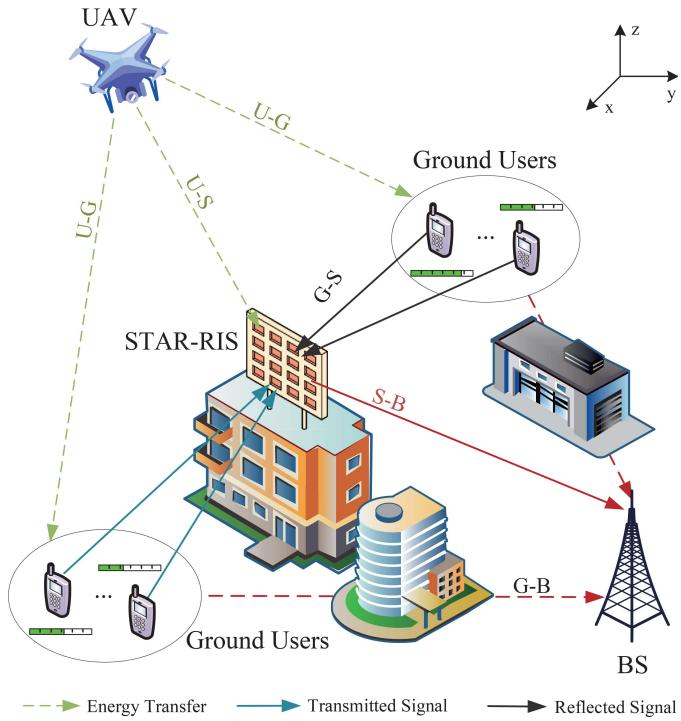  
Fig. 1. UAV-assisted STAR-RIS-NOMA model.

The STAR-RIS in this system is composed of K reflection elements. At the n-th time slot, we define the transmission coefficient matrices as $\Theta ^ { t } [ n ] \qquad = \qquad \mathrm { d i a g } \Big \{ \sqrt { \lambda _ { 1 } ^ { t } [ n ] } e ^ { j \theta _ { 1 } ^ { t } [ n ] } , \cdot \cdot \cdot , \sqrt { \lambda _ { K } ^ { t } [ n ] } e ^ { j \theta _ { K } ^ { t } [ n ] } \Big \} \mathrm { , }$ $\Theta ^ { t } [ n ] \ \in \ \mathbb { C } ^ { K \times K }$ , and the reflection coefficient matrices as $\begin{array} { r c l } { \Theta ^ { r } [ n ] } & { = } & { \mathrm { d i a g } \left\{ \sqrt { \lambda _ { 1 } ^ { r } [ n ] } e ^ { j \theta _ { 1 } ^ { r } [ n ] } , \cdots , \sqrt { \lambda _ { K } ^ { r } [ n ] } e ^ { j \theta _ { K } ^ { r } [ n ] } \right\} } \end{array}$ $\Theta ^ { r } [ n ] \in \mathbb { C } ^ { K \times K } . \quad \grave { \lambda } _ { k } ^ { t } [ n ]$ and $\theta _ { k } ^ { t } [ n ]$ are the transmitted amplitude and phase shift of the k-th element in the n-th time slot, respectively. $\lambda _ { k } ^ { r } [ n ]$ and $\theta _ { k } ^ { r } [ n ]$ are the reflected amplitude and phase shift of the k-th element in the n-th time slot, respectively. By the law of energy conservation, the transmission and reflection amplitudes of the k-th element must adhere to condition $\lambda _ { k } ^ { t } [ n ] + \lambda _ { k } ^ { r } [ n ] = 1$ . Additionally, the transmission and reflection phase shifts can be modified independently. The amplitude and phase shift of the k-th element satisfy conditions $\lambda _ { k } ^ { i } [ n ] \in [ 0 , 1 ]$ and $\theta _ { k } ^ { i } [ n ] \in [ 0 , 2 \pi )$ respectively. To enhance clarity in our discussion, we introduce the definition $\textit { i } \in \{ t , r \}$ , where t denotes the transmitted signal and r denotes the reflected signal.

It is worth noting that we adopt the independent phaseshift STAR-RIS model in this paper, which offers greater flexibility in transmission and reflection beamforming and facilitates efficient optimization. Our focus is on developing a performance-oriented design under this more general model. While coupled phase-shift STAR-RIS have also been studied for their hardware practicality [51], they fall beyond the scope of this paper and will be explored in future work.

## B. Channel Model

In the proposed model, LoS links (U-S, U-G, G-S, S-B) are modeled as Rician channels, while NLoS links (G-B) are modeled as Rayleigh channels. In particular, the U-S link is dominated by proximal LoS propagation with a simple environment, which can be approximated as a pure LoS channel. To obtain the maximum performance improvement, we assume that the BS has the ability to acquire the entire CSI of all channels [33], [34]. Consequently, the channel gains between the different links can be distinctly represented as described above [18].

$$
\pmb { h } _ { U S } [ n ] = \sqrt { \beta _ { 0 } D _ { U S } ^ { - 2 } [ n ] } \pmb { g } _ { U S } [ n ] ^ { T } ,\tag{1}
$$

$$
h _ { U G , m } [ n ] = \sqrt { \beta _ { 0 } D _ { U G , m } ^ { - \alpha } } g _ { U G , m } [ n ] ,\tag{2}
$$

$$
h _ { G S , m } [ n ] = \sqrt { \beta _ { 0 } D _ { G S , m } ^ { - \alpha } } g _ { G S , m } [ n ] ,\tag{3}
$$

$$
\begin{array} { r } { \pmb { h } _ { S B } = \sqrt { \beta _ { 0 } D _ { S B } ^ { - \alpha } } \pmb { g } _ { S B } , } \end{array}\tag{4}
$$

$$
h _ { G B , m } = \sqrt { \beta _ { 0 } D _ { G B , m } ^ { - \beta } \tilde { h } _ { m } } ,\tag{5}
$$

where $g _ { U S } [ n ] = \left\lceil 1 , e ^ { - j \frac { 2 \pi } { \lambda } \Delta \varphi _ { U S } [ n ] } , \dots , e ^ { - j \frac { 2 \pi } { \lambda } ( K - 1 ) \Delta \varphi _ { U S } [ n ] } \right\rceil$ $\begin{array} { r } { \pmb { g } _ { U G , m } [ n ] = \sqrt { \frac { \kappa } { 1 + \kappa } } \pmb { h } _ { U G , m } ^ { \mathrm { L o S } } + \sqrt { \frac { 1 } { \kappa + 1 } } \pmb { h } _ { U G , m } ^ { \mathrm { N L o S } } [ n ] , \pmb { g } _ { G S , m } [ n ] = } \end{array}$ $\begin{array} { r } { \sqrt { \frac { \kappa } { 1 + \kappa } } \pmb { h } _ { G S , m } ^ { \mathrm { L o S } } + \sqrt { \frac { 1 } { \kappa + 1 } } \pmb { h } _ { G S , m } ^ { \mathrm { N L o S } } [ n ] } \end{array}$ and $\begin{array} { r } { { \bf g } _ { S B } \ : = \ : \sqrt { \frac { \kappa } { 1 + \kappa } } h _ { S B } ^ { \mathrm { L o S } } + \ : } \end{array}$ $\scriptstyle { \sqrt { \frac { 1 } { \kappa + 1 } } } h _ { S B } ^ { \mathrm { N L o S } }$ Moreover, we assume that at the reference distance $d _ { 0 }$ of 1 meter, the channel gain is denoted by $\beta _ { 0 }$ . The distances of U-S, U-G, G-S, S-B, and G-B links at the n-th time slot are represented by $D _ { U S } [ n ] \ = \ \sqrt { \| { \bf w } _ { U } - { \bf w } _ { S } \| ^ { 2 } + \left( H _ { U } - H _ { S } \right) ^ { 2 } }$ $\begin{array} { r l r } { D _ { U G , m } [ n ] \quad } & { { } = } & { \sqrt { \| \mathbf { w } _ { U } - \mathbf { w } _ { m } \| ^ { 2 } + H _ { U } ^ { 2 } , \quad D _ { G S , m } } } \end{array}$ $\sqrt { \left\| { \bf w } _ { m } - { \bf w } _ { S } \right\| ^ { 2 } + H _ { S } ^ { 2 } , ~ D _ { S B } } ~ = ~ \sqrt { \left\| { \bf w } _ { S } - { \bf w } _ { B } \right\| ^ { 2 } + H _ { S } ^ { 2 } }$ and $D _ { G B , m } = \sqrt { \left\| \mathbf { w } _ { m } - \mathbf { w } _ { B } \right\| ^ { 2 } }$ , ∀m, n, respectively. In addition, $\lambda = c / f$ denotes the carrier wavelength, $\Delta$ represents the antenna separation, and κ is the Rician factor. Moreover, 2, α and $\beta$ are the path loss indices for LoS, Rician, and Rayleigh channels, respectively. $\varphi _ { S B }$ and $\varphi _ { G S , m }$ are the cosine of angle-of-departure in the S-B link and the cosine of angle-of-arrival in the G-S link, respectively, which can be expressed as follows:

$$
\varphi _ { S B } = \frac { x _ { S } - x _ { B } } { D _ { S B } } ,\tag{6}
$$

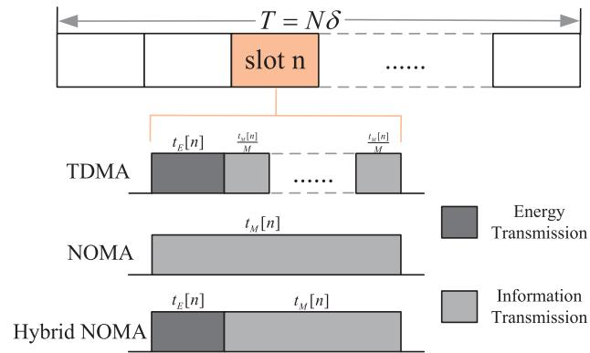  
Fig. 2. Conventional schemes and proposed hybrid NOMA scheme.

$$
\varphi _ { G S , m } = \frac { x _ { m } - x _ { S } } { D _ { G S , m } } .\tag{7}
$$

The LoS coefficient is denoted by $h _ { G S , m } ^ { \mathrm { L o S } }$ , which can be formulated as

$$
\begin{array} { r } { \pmb { h } _ { G S , m } ^ { \mathrm { L o S } } = \left[ 1 , e ^ { - j \frac { 2 \pi } { \lambda } \Delta \varphi _ { G S , m } } , \ldots , e ^ { - j \frac { 2 \pi } { \lambda } ( K - 1 ) \Delta \varphi _ { G S , m } } \right] ^ { T } , } \end{array}\tag{8}
$$

and $h _ { G S , m } ^ { \mathrm { N L o S } }$ is the NLoS coefficient, which obeys a circularly symmetric complex Gaussian distribution (CSCGD) with mean 0 and variance 1.

## C. Transmission Model

We define a novel hybrid NOMA transmission model and explain how energy and information are transmitted within it in this section. A time slot is divided into energy harvesting and information transmission phases. Initially, in the energy harvesting phase, users collect energy from the UAV. Subsequently, in the information transmission phase, they transmit information to the BS using the NOMA protocol. This model strictly adheres to the energy causality constraints and simplifies the transmission method of the network. Moreover, the method removes the need for additional RF chains or energy buffers, thereby reducing hardware complexity. This is of significant importance for energy-constrained networks [48] [49]. Unlike the traditional TDMA scheme, this method allows users to share the same power domain, thereby enhancing transmission efficiency. Additionally, our transmission model differs from conventional NOMA by allocating a portion of time for energy harvesting, ensuring users’ self-sustainability. The whole process is shown in Fig. 2.

1) Energy Transmission Stage: In time slot $n ,$ ground users collect energy from the UAV during the first part of time t<sub>E</sub>[n] for subsequent use. We assume that the UAV uses solar energy to recharge for self-sustainable flight. The initial energy of the $G U _ { m }$ itself is $E _ { 0 }$ . In case the energy collected from the UAV cannot sustain the energy consumption for message transmission, the message is transmitted using the users’ energy. The amount of energy gathered during this phase can be represented as

$$
E _ { G , m } [ n ] = \eta P _ { 0 } t _ { E } [ n ] \left| h _ { U G , m } [ n ] \right| ^ { 2 } ,\tag{9}
$$

following the condition $0 \leq \eta \leq 1$ outlined by the energy collection efficiency factor $\eta .$ In this paper, we take into account non-ideal efficiency $( \eta = 0 . 8 )$ , while the algorithm can adapt to any η value, making it scalable to different hardware conditions. $P _ { 0 }$ represents the constant transmitting power of the UAV. Concurrently, the STAR-RIS also acquires energy from the UAV in this period, which can be expressed by

$$
E _ { S } [ n ] = \eta P _ { 0 } t _ { E } [ n ] \left\| \pmb { h } _ { U S } [ n ] \right\| ^ { 2 } .\tag{10}
$$

Subsequently, in the $t _ { M } [ n ]$ , which is the latter part of time slot n, the GUs utilize the aggregated energy for information transmission and the combined duration satisfies constraint $t _ { E } [ n ] + t _ { M } [ n ] \leq \delta$

2) Information Transmission Stage: During the information transmission phase, GUs send signals to the BS in the same time domain using different power domains via the NOMA protocol. In the time slot $n ,$ the BS receives the signals from the GUs as

$$
y = \sum _ { m = 1 } ^ { M } \sum _ { n = 1 } ^ { N } h _ { m } [ n ] \sqrt { P _ { m } [ n ] } s _ { m } [ n ] + w ,\tag{11}
$$

where $s _ { m } [ n ]$ denotes the signal transmitted by $G U _ { m }$ in the n-th time slot, satisfying $\mathbb { E } [ | s _ { m } [ n ] | ^ { 2 } ] = 1$ , where $\mathbb { E } [ \cdot ]$ is the expectation of $[ \cdot ] , P _ { m } [ n ]$ denotes the transmitting power by $G U _ { m }$ at the n-th time slot, satisfying the constraint $0 ~ \leq$ $P _ { m } [ n ] \leq P _ { m } ^ { \operatorname* { m a x } } [ n ]$ , where $P _ { m } ^ { \mathrm { m a x } } [ n ]$ is the maximum transmit power limit. The simplified channel gain is represented as $\boldsymbol { h _ { m } } [ n ]$ , satisfying

$$
{ \pmb h } _ { m } [ n ] = { \pmb h } _ { S B } ^ { H } \Theta _ { m } ^ { i } [ n ] { \pmb h } _ { S G , m } [ n ] ,\tag{12}
$$

where $i \ \in \ \{ t , r \} , \ w \ \sim \ { \mathcal { C N } } \left( 0 , \sigma ^ { 2 } \right)$ is the additive Gaussian white noise, which obeys CSCGD with mean 0 and variance $\sigma ^ { 2 }$

In the message transmission phase, the NOMA protocol introduces additional inter-user interference, requiring the BS to determine the decoding order according to the channel quality ordering of the signals received by ground users. Subsequently, signals are decoded sequentially using the successive interference cancellation (SIC) technique to mitigate the interference. We assume that users are indexed in ascending order of their effective channel gains, i.e., $| h _ { 1 } [ n ] | ^ { 2 } ~ \leq$ $\dots \leq | \pmb { h } _ { M } [ n ] | ^ { 2 }$ , such that user M has the strongest channel. Since SIC decoding in uplink NOMA is executed at the BS, it proceeds in decreasing order of channel gain, i.e., starting from user M and continuing down to user 1. This ensures that strong interfering signals are decoded and canceled first [52]. The correct decoding order of the SIC is ensured by adjusting the transmission and reflection coefficients using STAR-RIS. To simplify the symbolic representation, a binary parameter is introduced to represent the decoding relationship between any two users:

$$
\zeta _ { a , b } = \left\{ \begin{array} { l l } { 1 , } & { i f | { \pmb h } _ { a } [ n ] | ^ { 2 } \geq | { \pmb h } _ { b } [ n ] | ^ { 2 } , } \\ { 0 , } & { o t h e r w i s e , } \end{array} \right.\tag{13}
$$

where $\zeta _ { a , b } = 1$ indicates that $G U _ { a }$ is decoded before $G U _ { b }$ In addition, this binary parameter satisfies the relation $\zeta _ { a , b } +$ $\zeta _ { b , a } = 1$ . The SINR at the BS can be represented as

$$
\gamma _ { m } [ n ] = \frac { | \pmb { h } _ { m } [ n ] | ^ { 2 } P _ { m } [ n ] } { \displaystyle \sum _ { j = 1 , j \neq m } ^ { M } \zeta _ { m , j } | \pmb { h } _ { j } [ n ] | ^ { 2 } P _ { j } [ n ] + \sigma ^ { 2 } } ,\tag{14}
$$

where $\sigma ^ { 2 }$ represents the background noise.

Based on the SINR expression in (14), and applying the Shannon capacity formula with the allocated transmission duration $t _ { M } [ n ]$ , the achievable rate of $G U _ { m }$ in time slot n can be expressed as

$$
R _ { m } [ n ] = t _ { M } [ n ] \log ( 1 + \gamma _ { m } [ n ] ) .\tag{15}
$$

## D. Problem Formulation

This paper concentrates on the system sum-rate maximization problem under the scenario described in the previous section. To simplify the symbolic representation, we define $\Theta ^ { i } ~ = ~ \{ \Theta _ { m } ^ { i } [ \bar { n } ] , \bar { \forall } m , n \} , ~ P ~ = ~ \{ { \bar { P } } _ { m } [ n ] , \forall m , n \} , ~ t _ { E } ~ = ~ \{ { \bar { Q } } _ { m } [ n ] , \forall m , n \} , ~ t _ { E } ~ = ~ \{ { \bar { Q } } _ { m } [ n ] , \forall m , n \} ,$ $\{ t _ { E } [ n ] , \forall \tilde { n } \}$ and $\pmb { t } _ { M } = \{ t _ { M } [ n ] , \forall n \}$ . Now, the joint optimization problem of phase-shift matrices, user transmit power, and time allocation for the UAV-assisted STAR-RIS-NOMA system can be formulated as

$$
\operatorname* { m a x } _ { \Theta , P , t _ { E } , t _ { M } } ~ \sum _ { n = 1 } ^ { N } \sum _ { m = 1 } ^ { M } R _ { m } [ n ]\tag{16}
$$

$$
\mathrm { s . t . } \sum _ { n = 1 } ^ { N } P _ { m } [ n ] t _ { M } [ n ] \leq \sum _ { n = 1 } ^ { N } E _ { G , m } [ n ] + E _ { 0 } , \forall m ,\tag{16a}
$$

$$
K \mu \sum _ { n = 1 } ^ { N } t _ { M } [ n ] \leq \sum _ { n = 1 } ^ { N } E _ { S } [ n ] ,\tag{16b}
$$

$$
t _ { E } [ n ] + t _ { M } [ n ] \leq \delta , \ \forall n ,
$$

$$
t _ { E } [ n ] , t _ { M } [ n ] \geq 0 , \ \forall n ,\tag{16c}
$$

$$
\lambda _ { k } ^ { t } [ n ] + \lambda _ { k } ^ { r } [ n ] = 1 , \lambda _ { k } ^ { i } [ n ] \in [ 0 , 1 ] , i \in \{ t , r \} , \ \forall k , n ,\tag{16d}
$$

$$
\theta _ { i } ^ { k } [ n ] \in [ 0 , 2 \pi ) , i \in \{ t , r \} , \forall k , n ,\tag{16e}
$$

$$
0 \leq P _ { m } [ n ] \leq P _ { m } ^ { \operatorname* { m a x } } [ n ] , \ \forall m , n ,\tag{16f}
$$

$$
R _ { m } [ n ] \geq R _ { m } ^ { \operatorname* { m i n } } [ n ] , \forall m , n ,\tag{16g}
$$

$$
\eta = \frac { \sum _ { m , n } I _ { m } [ n ] } { \sum _ { m , n } R _ { m } [ n ] } \leq \eta _ { m a x } ,\tag{16h}
$$

(16i)

where constraint (16a) requires that the total energy of the $G U _ { m } ,$ including its initial energy and allocated energy from the UAV, must be equal to or more than the energy it expends. Similarly, constraint (16b) dictates that the energy received by the STAR-RIS must be equal to or more than the energy it expends, where variable $\mu$ denotes the circuit energy consumption for each element. Moreover, constraint (16c) represents the total time constraint for energy harvesting and data transmitting at each time slot. Furthermore, constraints (16e) and (16f) are STAR-RIS amplitude and phase shift constraints. Constraint (16h) establishes the minimum transmitting rate threshold for GUs. Lastly, constraint (16i) represents that the system interference overhead is less than the preset threshold, where $I _ { m } [ n ] = \sum _ { j \neq m } | h _ { j } [ n ] | ^ { 2 } P _ { j } [ n ]$ , and we set $\eta _ { m a x } = 1 0 \%$

Since the three variables in the optimization problem are interdependent, they cannot be solved simultaneously, leading us to decompose the problem into three subproblems. The process is described in the following section.

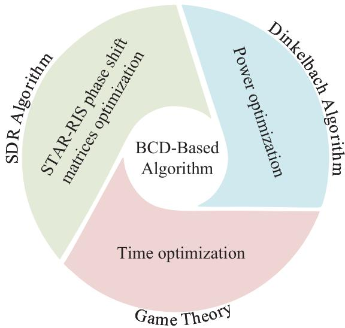  
Fig. 3. Flowchart of the proposed method.

## III. PROPOSED ALGORITHM

This section addresses the key optimization challenges associated with the proposed system. Initially, we employ the SDR algorithm to tackle the STAR-RIS phase-shift optimization problem. Next, we use the Dinkelbach algorithm to transform the user power allocation problem into a convex problem for resolution. We then apply game theory to optimize the time division ratio between energy harvesting and information transmitting. Finally, we introduce a joint optimization algorithm based on the block coordinate descent (BCD) method, which alternately optimizes three variables and includes a comprehensive complexity analysis. The flowchart of the proposed method is shown in Fig. 3.

## A. STAR-RIS Phase-Shift Optimization

Firstly, we solve the phase-shift matrices optimization subproblem of STAR-RIS. We assume that the power allocation of GUs and the time split ratio are given, i.e., $P = P ^ { * }$ ${ \bf t } _ { E } = { \bf t } _ { E } ^ { * }$ and $\mathbf { \ d _ { t } } \mathbf { \ d _ { M } } = \mathbf { \ d _ { t _ { M } ^ { * } } }$ . Thus, the STAR-RIS phase-shift matrices optimization problem is expressed as

$$
\operatorname* { m a x } _ { \Theta ^ { t / r } } \sum _ { n = 1 } ^ { N } \sum _ { m = 1 } ^ { M } R _ { m } [ n ]\tag{17}
$$

$$
s . t . \ ( 1 6 \mathrm { e } ) ( 1 6 \mathrm { f } ) ( 1 6 \mathrm { i } ) .\tag{17a}
$$

The objective function in this problem is non-convex, so we transformed it into a new problem of the following form using the Dinkelbach method:

$$
\operatorname* { m a x } _ { \Theta ^ { t / r } } \sum _ { n = 1 } ^ { N } \sum _ { m = 1 } ^ { M } t _ { M } [ n ] \log ( 1 + 2 v _ { n } \sqrt { A _ { n } } - v _ { n } ^ { 2 } B _ { n } )\tag{18}
$$

$$
s . t . \ ( 1 6 \mathrm { e } ) ( 1 6 \mathrm { f } ) .\tag{18a}
$$

where $A _ { n } ~ = ~ | { \hat { h } } _ { m } [ n ] | ^ { 2 } P _ { m } [ n ] , ~ B _ { n } ~ = ~ \sum _ { j = 1 , j \neq m } ^ { M } \zeta _ { m , j } | { h } _ { j } [ n ]$ $\rvert ^ { 2 } P _ { j } [ n ] + \sigma ^ { 2 }$ , and $v _ { n }$ continue to iterate until convergence, satisfying

$$
\ v _ { n } = { \frac { \sqrt { A _ { n } } } { B _ { n } } } .\tag{19}
$$

To simplify the symbolic representation, we reformulate the channel gain $\boldsymbol { h _ { m } } [ n ]$ in the following form:

$$
h _ { m } [ n ] = { h } _ { S B } ^ { H } \Theta _ { m } ^ { i } [ n ] h _ { G S , m } [ n ] = v _ { m } [ n ] w _ { i } [ n ] , i \in \{ t , r \} ,\tag{20}
$$

where $\begin{array} { r l r } { v _ { m } [ n ] \quad } & { { } = \quad } & { h _ { S B } ^ { H } d i a g ( { h _ { G S , m } [ n ] } ) , \quad w _ { i } [ n ] \quad } & { { } = } \end{array}$ $\left[ \sqrt { \lambda _ { 1 } ^ { i } [ n ] } e ^ { j \theta _ { 1 } ^ { i } [ n ] } , \cdot \cdot \cdot , \sqrt { \lambda _ { K } ^ { i } [ n ] } e ^ { j \theta _ { K } ^ { i } [ n ] } \right] ^ { T } , i \in \{ t , r \}$ . Thus, $\begin{array} { r c l r } { \dot { A _ { n } } } & { = } & { T r ( v _ { m } [ n ] \dot { \cal W } _ { i } [ \bar { n } \bar { ] } v _ { m } ^ { H } [ n ] ) P _ { m } [ n ] , i \mathrm {  ~ \in ~ } \{ t , r \} } \end{array}$ , where $W _ { i } [ n ] ~ = ~ w _ { i } [ n ] \pmb { w } _ { i } ^ { T } [ n ] , i ~ \in ~ \{ t , r \}$ , satisfying constraints ${ \bf W } _ { i } [ n ] \succeq 0 , R a n k ( \dot { \bf W } _ { i } [ n ] ) = 1$ and $D i a g ( { \cal W } _ { i } [ n ] ) = \lambda ^ { i } [ n ]$ where $\lambda ^ { i } [ n ] = [ \lambda _ { 1 } ^ { i } [ n ] , \dots , \lambda _ { K } ^ { i } [ n ] ]$

Next, the optimization problem can be re-expressed as

$$
\operatorname* { m a x } _ { W _ { i } [ n ] , \lambda ^ { i } [ n ] } \sum _ { n = 1 } ^ { N } \sum _ { m = 1 } ^ { M } t _ { M } [ n ] \log ( 1 + 2 v _ { n } \sqrt { A _ { n } } - v _ { n } ^ { 2 } B _ { n } )\tag{21}
$$

$$
s . t . \ D i a g ( W _ { i } [ n ] ) = { \lambda } ^ { i } [ n ] , i \in \{ t , r \} ,
$$

$$
R a n k ( W _ { i } [ n ] ) = 1 , i \in \{ t , r \} ,\tag{21a}
$$

$$
\mathbf { W } _ { i } [ n ] \succeq 0 , i \in \{ t , r \} ,\tag{21b}
$$

$$
( { 1 6 } \mathrm { e } ) ( { 1 6 } \mathrm { f } ) ( { 1 6 } \mathrm { i } ) .\tag{21c}
$$

(21d)

Currently, the rank 1 constraint in Eq. (21b) makes the problem still a non-convex one. It follows from other literature that this rank 1 constraint can be converted into the following form:

$$
| | W _ { i } [ n ] | | _ { * } - | | W _ { i } [ n ] | | _ { 2 } = 0 , \quad i \in \{ t , r \} ,\tag{22}
$$

where $| | \mathbf { \boldsymbol { W } } _ { i } [ n ] | | ,$ is the nuclear paradigm and $| | \mathbf { \boldsymbol { W } } _ { i } [ n ] | | _ { 2 }$ is the spectral paradigm, $\begin{array} { r } { \lvert \lvert \boldsymbol { W } _ { i } [ n ] \rvert \rvert _ { * } = \sum _ { i } \sigma _ { j } ( \boldsymbol { W } _ { i } [ n ] ) } \end{array}$ and $| | \boldsymbol { W } _ { i } [ n ] | | _ { 2 } = \sigma _ { 1 } ( \boldsymbol { W } _ { i } [ n ] )$ , respectively, where $\sigma _ { j } ( W _ { i } [ n ] )$ is the j-th largest singular value of the matrix $W _ { i } [ n ]$ . It can be observed that for any $\mathbf { W } _ { i } [ n ] \succeq 0 , W _ { i } [ n ] \in \mathbb { H } ^ { K }$ , the following inequality is satisfied:

$$
| | W _ { i } [ n ] | | _ { * } - | | W _ { i } [ n ] | | _ { 2 } \geq 0 .\tag{23}
$$

The above equation holds on the condition that the rank of the matrix $W _ { i } [ n ]$ is precisely 1, and only under this specific condition.

$\mathrm { A s } \ | | W _ { i } [ n ] | | _ { * } \ - \ | | W _ { i } [ n ] | | _ { 2 }$ is derived from the disparity of a non-convex function, its non-convexity persists. Thus, we employ the SCA approach and the first-order Taylor expansion to acquire an upper bound for this expression. Initially, during the j-th iteration, the following inequality is valid:

$$
| | W _ { i } [ n ] | | _ { * } - | | W _ { i } [ n ] | | _ { 2 } \leq | | W _ { i } [ n ] | | _ { * } - \tilde { W } _ { i } ^ { ( j ) } [ n ] ,\tag{24}
$$

where $\tilde { W } _ { i } ^ { ( j ) } [ n ]$ can be equated to $\vert \vert W _ { i } ^ { ( j ) } [ n ] \vert \vert _ { 2 } +$ $T r ( \chi ( W _ { i } ^ { ( j ) } [ n ] ) ( \chi ( W _ { i } ^ { ( j ) } [ n ] ) ^ { H } ( W _ { i } [ n ] \quad - \quad W _ { i } ^ { ( j ) } [ n ] ) )$ and $\chi ( X )$ is the eigenvector corresponding to the largest eigenvalue of matrix X.

For constraint (16i), let ${ \pmb v } _ { m } [ n ] = { \pmb h } _ { S B } \odot { \pmb h } _ { G S , m } [ n ]$ , and ${ \pmb I } _ { m } [ n ] = \sum _ { j \neq m } p _ { j } [ n ] { \pmb v } _ { m } [ n ] ^ { H } { \pmb W } _ { i } [ n ] { \pmb v } _ { m } [ n ]$ . Thus, we can get the new optimization problem:

$$
\operatorname* { m a x } _ { W _ { i } [ n ] , \lambda ^ { i } [ n ] } \sum _ { n = 1 } ^ { N } \sum _ { m = 1 } ^ { M } t _ { M } [ n ] \log ( 1 + 2 v _ { n } \sqrt { A _ { n } } - v _ { n } ^ { 2 } B _ { n } )
$$

$$
+ \rho \sum _ { i \in \{ t , r \} } { ( \| \pmb { W } _ { i } [ n ] \| _ { * } - \tilde { \pmb { W } } _ { i } ^ { ( j ) } [ n ] ) }\tag{25}
$$

$$
s . t . \ D i a g ( W _ { i } [ n ] ) = { \lambda } ^ { i } [ n ] , i \in \{ t , r \} ,\tag{25a}
$$

$$
\mathbf { W } _ { i } [ n ] \succeq 0 , i \in \{ t , r \} ,\tag{25b}
$$

$$
\sum _ { m , n } T r ( V _ { m } [ n ] W _ { i } [ n ] ) \leq \eta _ { m a x } \sum _ { m , n } R _ { m } ^ { ( j - 1 ) } [ n ] ,\tag{25c}
$$

$$
( 1 6 \mathrm { e } ) ( 1 6 \mathrm { f } ) ,\tag{25d}
$$

where $V _ { m } [ n ] = \pmb { v } _ { m } [ n ] \pmb { v } _ { m } ^ { H } [ n ] , \rho > 0$ is a penalty factor that ensures the balance between optimizing the original objective function and the penalty term. Driven by the optimization goal, the value of the penalty term will decrease with the increase of $\rho ,$ and when $\rho  + \infty ,$ , the penalty term gradually converges to 0. However, it should be noted that the initial value of $\rho$ has a significant impact on the effect of the algorithm. At the start of the iteration, if $\rho$ is too large, the focus of optimization will shift from the original function to the penalty item, which violates our intention. Hence, we need to initialize $\rho$ with a small value, and then gradually increase it until the convergence criterion of the rank-one constraint is met [53]:

$$
\operatorname* { m a x } \big ( \lVert W _ { i } [ n ] \rVert _ { * } - \tilde { W } _ { i } ^ { ( j ) } [ n ] \big ) , \quad i \in \{ t , r \} \le \epsilon ,\tag{26}
$$

where  is a predefined maximum violation of the equality constraint.

Currently, the problem has been transformed into a typical SDP convex problem and can be resolved using the CVX toolbox. This approach effectively addresses the key issues in STAR-RIS optimization by transforming the fractional objective using Dinkelbach’s method and relaxing the rank-1 constraint using SCA, maintaining a balance between computational complexity and solution quality. Finally, the solution $\pmb { w } _ { i } ^ { * } [ n ]$ of the original problem is reduced from $\mathbf { \bar { \boldsymbol { W } } } _ { i } [ n ]$ by the eigenvalue decomposition method.

Algorithm 1 SDR-Based Algorithm   
Initialize: $\Theta ^ { i } ( 0 ) , i \in \{ t , r \}$ , and $R _ { s u m } ^ { 0 } . \ \mathrm { S e t } \ j \ = \ 0 , \ \Delta _ { 1 } \ =$   
$1 0 ^ { - 3 }$ and $\Delta _ { 2 } = 1 0 ^ { - 3 } .$   
Update:   
1: $j = j + 1 ;$   
2: Calculate $R _ { s u m } ^ { j }$ by formula (15);   
3: while $\left| R _ { s u m } ^ { j } - R _ { s u m } ^ { j - 1 } \right| \geq \Delta _ { 1 }$ do   
4: Set $\dot { k } = 0$ and initialize feasible point $W _ { i } ( k )$   
5: $k = k + 1 ;$   
6: while m $a x _ { i \in \{ t , r \} } | | W _ { i } ( k ) | | _ { * } - | | W _ { i } ( k ) | | _ { 2 } \geq \Delta _ { 2 }$ and   
$\left| R _ { s u m } ^ { j } ( k ) - \dot { R } _ { s u m } ^ { j } ( k - 1 ) \right| \geq \Delta _ { 1 }$ do   
7: Update $v _ { n }$ by formula (19);   
8: Solve problem (25) to obtain $R _ { s u m } ^ { j } ( k )$ and update   
$W _ { i } ( k )$   
9: end while   
10: end while   
Result: $\Theta ^ { i * } , i \in \{ t , r \}$

The process is shown in Algorithm 1.

## B. Power Optimization

After obtaining the optimized phase-shift matrices and fixing $t _ { E }$ and $\mathbf { \Delta } t _ { M }$ , the power allocation problem is formulated as

follows:

$$
\operatorname* { m a x } _ { P } \sum _ { n = 1 } ^ { N } \sum _ { m = 1 } ^ { M } R _ { m } [ n ]\tag{27}
$$

$$
s . t . \ ( 1 6 \mathrm { a } ) ( 1 6 \mathrm { g } ) ( 1 6 \mathrm { h } ) ( 1 6 \mathrm { i } ) .\tag{27a}
$$

The objective function in this problem is non-convex, so we transformed it into a new problem of the following form using the Dinkelbach method:

$$
\operatorname* { m a x } _ { P } \sum _ { n = 1 } ^ { N } \sum _ { m = 1 } ^ { M } t _ { M } [ n ] \log ( 1 + 2 \omega _ { n } \sqrt { A _ { n } } - \omega _ { n } ^ { 2 } B _ { n } )\tag{28}
$$

$$
s . t . \ | \pmb { h _ { m } [ n ] } | ^ { 2 } P _ { m } [ n ] \geq \left( 2 ^ { \frac { R _ { m } ^ { \mathrm { m i n } } [ n ] } { t _ { M } [ n ] } } - 1 \right)
$$

$$
\left( \sum _ { j = 1 , j \neq m } ^ { M } \zeta _ { m , j } | \boldsymbol h _ { j } [ n ] | ^ { 2 } P _ { j } [ n ] + \sigma ^ { 2 } \right) ,\tag{28a}
$$

$$
\sum _ { m , n } \sum _ { j \neq m } | h _ { j } [ n ] | ^ { 2 } P _ { j } [ n ] \leq \eta _ { m a x } \sum _ { m , n } R _ { m } ^ { ( j - 1 ) } [ n ] ,\tag{28b}
$$

$$
( 1 6 \mathrm { a } ) ( 1 6 \mathrm { g } ) ,\tag{28c}
$$

$$
A _ { n } = | { \hat { h } } _ { m } [ n ] | ^ { 2 } P _ { m } [ n ] , B _ { n } = \sum _ { j = 1 , j \neq m } ^ { M } \zeta _ { m , j } | h _ { j } [ n ] | ^ { 2 } P _ { j } [ n ] + \sigma ^ { 2 } ,
$$

and $\omega _ { n }$ continue to iterate until convergence, satisfying

$$
\omega _ { n } = \frac { \sqrt { A _ { n } } } { B _ { n } } .\tag{29}
$$

```perl
Algorithm 2 Dinkelbach-Based Algorithm
Initialize: $P ( 0 )$ and $R _ { s u m } ( 0 )$ . Set $i = 0$ and $\Delta = 1 0 ^ { - 3 }$
Update:
1: $i = i + 1 ;$
2: Calculate $R _ { s u m } ( i )$ by formula (15);
3: while $| R _ { s u m } ( i ) - R _ { s u m } ( i - 1 ) | \geq \Delta$ do
4: Update $\omega _ { i }$ by formula (29);
5: Solve problem (28) to obtain $P ( i )$ and $R _ { s u m } ( i ) ;$
6: end while
Result: $P ^ { * }$
```

The problem has now been changed into a convex optimization one, and it can be addressed with the aid of the CVX toolbox. The transformed convex formulation preserves the essential structure of the original problem while enabling efficient solution through standard optimization techniques. The corresponding process is illustrated in Algorithm 2.

## C. Time Optimization

After obtaining the optimized phase-shift matrices and power allocation, the time allocation problem is expressed as follows:

$$
\begin{array} { l } { \displaystyle \operatorname* { m a x } _ { t _ { E } , t _ { M } } \sum _ { n = 1 } ^ { N } \sum _ { m = 1 } ^ { M } R _ { m } [ n ] } \\ { \displaystyle s . t . \ ( 1 6 { \mathrm { a } } ) ( 1 6 { \mathrm { b } } ) ( 1 6 { \mathrm { c } } ) ( 1 6 { \mathrm { d } } ) ( 1 6 { \mathrm { h } } ) ( 1 6 { \mathrm { i } } ) . } \end{array}\tag{30}
$$

(30a)

The problem can be solved by game theory. Game theory is a powerful mathematical tool for addressing resource allocation issues. This study proposes a game theory-based time allocation scheme that accurately models the complex interplay of competition and cooperation between energy transmission time and information transmission time in UAVassisted STAR-RIS-NOMA networks. By defining utility functions and equilibrium conditions, the scheme not only optimizes system throughput but also effectively balances energy transmission efficiency with information transmission needs. It continuously adjusts time allocation strategies to adapt to changing network conditions, such as UAV flight status, variations in user channel conditions, and RIS reflection characteristics. Furthermore, its distributed nature allows for the allocation of time resources to be adjusted based on the system’s real-time status and needs, reducing reliance on centralized control and decreasing system complexity.

First, construct the utility function

$$
\begin{array} { l } { \displaystyle { U _ { n } = \frac { t _ { M } ^ { 2 } [ n ] } { \sum _ { m = 1 } ^ { M } R _ { m } [ n ] } - B ^ { t _ { M } [ n ] } } } \\ { \displaystyle { = \frac { t _ { M } [ n ] } { \displaystyle { \sum _ { m = 1 } ^ { M } \log \left( 1 + \frac { | h _ { m } [ n ] | ^ { 2 } P _ { m } [ n ] } { \displaystyle { \sum _ { j = 1 , j \ne m } ^ { M } \zeta _ { m , j } | h _ { j } [ n ] | ^ { 2 } P _ { j } [ n ] + \sigma ^ { 2 } } } \right) } } - B ^ { t _ { M } [ n ] } } } \end{array}\tag{31}
$$

where $B \ \in \ ( 0 , 1 )$ is the regulating parameter. The utility function prevents the information transmission time from being excessively long and crowding out the energy collection time via the square term, while the exponential term $B ^ { t _ { M } [ n ] }$ characterizes the diminishing marginal utility of time allocation to ensure $t _ { M } [ n ]$ stays within a reasonable range. This design improves the transmission rate and prevents system inefficiency caused by unbalanced time allocation, thus realizing the optimal trade-off between energy and information transmission.

Lemma 1: The utility function $U _ { n }$ is valid and finite.

Proof: The validity and finiteness of the utility function can be proved by satisfying the following conditions:

$$
\begin{array} { l } { \displaystyle \frac { \partial U _ { n } } { \partial t _ { M } [ n ] } = \frac { 1 } { { \underbrace { \sum _ { m = 1 } ^ { M } \log \left( 1 + \frac { | h _ { m } [ n ] | ^ { 2 } P _ { m } [ n ] } { \sum _ { j = 1 , j \ne m } ^ { M } \zeta _ { m , j } | h _ { j } [ n ] | ^ { 2 } P _ { j } [ n ] + \sigma ^ { 2 } } \right) } } } } \\ { \displaystyle - B ^ { t _ { M } [ n ] } \ln B , } \end{array}\tag{32}
$$

$$
\frac { \partial ^ { 2 } U _ { n } } { \partial t _ { M } ^ { 2 } [ n ] } = - B ^ { t _ { M } [ n ] } ( \ln B ) ^ { 2 } < 0 .\tag{33}
$$

Theorem 2: The proposed game-theoretic time allocation model satisfies the Nash equilibrium.

Proof: The transmission time allocated to each user is limited to $t _ { M } [ n ] \ge 0$ . Therefore, the strategy space is nonempty, compact, and convex. Moreover, the utility function $U _ { n }$ is continuous. Furthermore, for any user, the second order derivative of the utility function concerning $t _ { M } [ n ]$ is less than 0 can be verified. This implies that $U _ { n }$ is to be concave concerning $t _ { M } [ n ]$ ]. This completes the proof.

Theorem 3: The Nash equilibrium is unique if the secondorder partial derivatives of $U _ { n }$ concerning $t _ { M } [ n ]$ satisfy the following equation for any user.

$$
\left| \frac { \partial ^ { 2 } U _ { n } } { \partial t _ { M } ^ { 2 } [ n ] } \right| \geq \left| \frac { \partial ^ { 2 } U _ { n } } { \partial t _ { M } [ n ] \partial t _ { E } [ n ] } \right|\tag{34}
$$

Proof: The best response function can be determined by solving the first-order derivative equation. Let

$$
\frac { \partial U _ { n } } { \partial t _ { M } [ n ] } = 0 ,\tag{35}
$$

the time allocation that satisfies the utility function maximization can be found:

$$
t _ { M } ^ { * } [ n ] = ( \ln B ) ^ { - 1 } \ln ^ { - 1 } \bigl ( \log \big ( 1\tag{36}
$$

From the proposed utility function, we can obtain

$$
\frac { \partial ^ { 2 } U _ { n } } { \partial t _ { M } ^ { 2 } [ n ] } = \frac { \partial ^ { 2 } U _ { n } } { \partial t _ { E } ^ { 2 } [ n ] } = - B ^ { t _ { M } [ n ] } ( \ln B ) ^ { 2 } < 0\tag{37}
$$

and

$$
\frac { \partial ^ { 2 } U _ { n } } { \partial t _ { M } [ n ] \partial t _ { E } [ n ] } = \frac { \partial ^ { 2 } U _ { n } } { \partial t _ { E } [ n ] \partial t _ { M } [ n ] } = 0 .\tag{38}
$$

To ensure the uniqueness of the Nash equilibrium, the optimal corresponding function must be contractive, i.e.,

$$
\left| \frac { \partial ^ { 2 } U _ { n } } { \partial t _ { M } ^ { 2 } [ n ] } \right| \geq \left| \frac { \partial ^ { 2 } U _ { n } } { \partial t _ { M } [ n ] \partial t _ { E } [ n ] } \right| .\tag{39}
$$

Since the above inequality holds constant, it can be proved that there exists a unique Nash equilibrium solution.

From the above proof, we can obtain the Hessian matrix

$$
H = \left[ \begin{array} { c c } { { - B ^ { t _ { M } [ n ] } ( \ln B ) ^ { 2 } } } & { { 0 } } \\ { { 0 } } & { { - B ^ { t _ { M } [ n ] } ( \ln B ) ^ { 2 } } } \end{array} \right] ,\tag{40}
$$

and the eigenvalue of the matrix is

$$
\lambda _ { 1 } = \lambda _ { 2 } = - B ^ { t _ { M } [ n ] } ( \ln B ) ^ { 2 } < 0 .\tag{41}
$$

The Hessian matrix is a negative definite matrix, which can prove that the time allocation problem constructed by game theory is a convex problem, and can be solved by the Lagrange multiplier method to obtain the best time allocation value.

Theorem 4: For $U _ { n }$ in (31) with B, the game-theoretic time allocation algorithm converges monotonically to an -Nash equilibrium within $K \le \bar { \mathrm { [ l o g ( } \epsilon / U _ { n } ^ { ( 0 ) } ) / \log B ] }$ iterations, where $U _ { n } ^ { \mathbf { \bar { ( 0 ) } } }$ denotes the initial utility. This bound is independent of the number of users due to the additive decomposition of $U _ { n }$ across users and the $O ( 1 / M )$ scaling of per-iteration utility changes. The convergence follows from the inequality $U _ { n } ^ { ( k \check { + } 1 ) } - \check { U } _ { n } ^ { ( k ) } \leq - ( 1 - \check { B } ) U _ { n } ^ { ( k ) }$ , derived via the negative definiteness of the Hessian matrix (40) and the boundedness of $B ^ { t _ { M } [ n ] }$ ln B for B.

Proof: The monotonic decreasing property $U _ { n } ^ { ( k + 1 ) } \leq B U _ { n } ^ { ( k ) }$ arises from the exponential term in (31) and the eigenvalues of the Hessian matrix in (41). Through the recursive relation, we can obtain $U _ { n } ^ { ( k ) } \leq B ^ { ( k ) } \bar { U } _ { n } ^ { ( 0 ) }$ . When $k \geq \log ( \epsilon / U _ { n } ^ { ( 0 ) } ) /$ log B, -convergence is achieved. The number of users is independent of the convergence bound because the utility function can be expressed as $\begin{array} { r } { \mathbf { \bar { \mathbf { \Gamma } } } ^ { \mathbf { \mathsf { U } } _ { n } } = \sum _ { m = 1 } ^ { M } f _ { m } ( t _ { M } [ n ] ) } \end{array}$ , where each $f _ { m }$ has $O ( 1 / M )$ sensitivity to $t _ { M } [ n ]$ variations, causing the aggregate $\Delta \dot { U } _ { n } ^ { ( k ) }$ to remain O(1) regardless of M .

Algorithm 3 Game Theory-Based Algorithm   
Initialize: $\mathbf { \ d } _ { t _ { E } ( 0 ) , \mathbf { \ d } _ { t _ { M } } ( 0 ) }$ . Set $i = 0$ and $\overline { { \Delta = 1 0 ^ { - 3 } } }$   
Update:   
1: $i = i + 1 ;$   
2: while $| U _ { n } ( i ) - U _ { n } ( i - 1 ) | \geq \Delta$ do   
3: Calculate the sum-rate by formula (15);   
4: Update $t _ { E }$ and $\mathbf { \Gamma } _ { t _ { M } ; }$   
5: end while   
Result: $\pmb { t } _ { E } ^ { * }$ and $\mathbf { \Delta } t _ { M } ^ { * } .$   
The process is shown in Algorithm 3.

D. BCD-Based Joint Resource Allocation Algorithm and Complexity Analysis

In this paper, we propose the BCD-based algorithm to solve this optimization problem. The algorithm mainly includes three steps: optimization of the STAR-RIS phase-shift matrices, power allocation, and optimization of the time-split ratio between energy harvesting and information transmission.

1) Optimization of the STAR-RIS Phase-Shift Matrices: Fix the power allocation values and time division ratio, the optimization results of the STAR-RIS phase-shift matrices are then obtained by the Dinkelbach, SDR, and SCA algorithm.

2) Power Allocation: According to the STAR-RIS phaseshift matrices optimization results, the power allocation values are optimized using the Dinkelbach algorithm.

Algorithm 4 BCD-Based Algorithm   
Initialize: $\overline { { ( \Theta ^ { i 0 } , P ^ { 0 } , } } t _ { E } ^ { 0 } , t _ { M } ^ { 0 } )$ and $R _ { s u m } ( 0 ) , i \in \{ t , r \}$ . Set   
$j = 0$ and $\Delta = 1 0 ^ { - 3 }$   
Update:   
1: $j = j + 1 ;$   
2: Calculate $R _ { s u m } ( j )$ by formula (15);   
3: while $| R _ { s u m } ( j ) - R _ { s u m } ( j \_ 1 ) | \geq \Delta$ do   
4: Given $( P ^ { j - 1 } , t _ { E } ^ { j - 1 } , t _ { M } ^ { j - 1 } )$ , update $\Theta ^ { i j }$ by solving (17);   
5: Given $( \Theta ^ { i j } , t _ { E _ { . } } ^ { j - 1 } , t _ { M } ^ { j - 1 } )$ , update $P ^ { j }$ by solving (27);   
6: Given $( \Theta ^ { i j } , \bar { P ^ { j } } )$ , update $\bar { \pmb { t _ { E } ^ { j } } } , \pmb { t _ { M } ^ { j } }$ by solving (30);   
7: end while   
Result: $\Theta ^ { i * } , P ^ { * }$ $\pmb { t } _ { E } ^ { * }$ and $\pmb { t } _ { M } ^ { * } , i \in \{ t , r \} .$

3) Optimization of the Time Split Ratio: Based on the STAR-RIS phase-shift matrices and power allocation optimization results, the game theory algorithm is used to optimize the time split ratio for energy harvesting and information transmitting.

During the optimization of the STAR-RIS phase-shift matrices, the complexity of the algorithm is chiefly dictated by the solution of the relaxed form of the convex problem (25). The algorithm complexity for solving the standard SDR problem is $\mathsf { \bar { O } } ( ( 2 K N ) ^ { 3 . 5 } )$ . In the process of power allocation optimization, the complexity of the algorithm hinges on resolving the relaxed variant of the convex problem (28). The algorithmic complexity can be roughly estimated as $\mathcal { O } ( ( M N ) ^ { 3 } )$ . During the optimization of the time split ratio between energy collection and information transmission, the complexity of the game theory algorithm is $\mathcal { O } ( N * G _ { \mathrm { m a x } } )$ , where K is the number of elements of the STAR-RIS phase-shift matrices, M is the number of ground users, N is the number of UAV time slots, and $G _ { \mathrm { m a x } }$ is the maximum number of iterations of the game theory. Therefore, the total complexity of the proposed algorithm in this paper is $\mathcal { O } ( ( 2 K N ) ^ { 3 . 5 } + ( M N ) ^ { 3 } + N { * } G _ { \mathrm { m a x } } )$

TABLE III  
COMPUTATIONAL COMPLEXITY OF KEY ALGORITHMS
<table><tr><td rowspan=1 colspan=1>Algorithm</td><td rowspan=1 colspan=1>Computational Complexity</td></tr><tr><td rowspan=1 colspan=1>SDR</td><td rowspan=1 colspan=1> $\overline { { \mathcal { O } ( ( 2 K N ) ^ { 3 . 5 } ) } }$ </td></tr><tr><td rowspan=1 colspan=1>Game theory</td><td rowspan=1 colspan=1> $\mathcal { O } ( N * G _ { \mathrm { m a x } } )$ </td></tr><tr><td rowspan=1 colspan=1>ADMM</td><td rowspan=1 colspan=1> $\overline { { \mathcal { O } ( I _ { \mathrm { A D M M } } \cdot K ^ { 3 } N ) } }$ </td></tr><tr><td rowspan=1 colspan=1>KOA</td><td rowspan=1 colspan=1> $\mathcal { O } ( N \cdot N _ { \mathrm { p } } \cdot T _ { \mathrm { m a x } } )$ </td></tr></table>

Denoting $R _ { s u m } ( \Theta ( t ) , P ( t ) , t _ { E } ( t ) , t _ { M } ( t ) )$ as the objective value, where $\Theta ( t ) , P ( t ) , t _ { E } ( t )$ , and $t _ { M } ( t )$ represent the t-th iteration value of the optimization variables. For the problem (17), we use the SDR method, which can strictly ensure that $R _ { s u m } ( \Theta ( t ) , P ( t ) , t _ { E } ( t ) , t _ { M } ( t ) ) \leq$ $R _ { s u m } ( \Theta ( t + 1 ) , P ( t ) , t _ { E } ( t ) , t _ { M } ( t ) )$ . For the problem (26), we use the Dinkelbach algorithm, which can strictly ensure that $R _ { s u m } ( \Theta ( t ) , P ( t ) , t _ { E } ( t ) , t _ { M } ( t ) ) \ \leq \ R _ { s u m } ( \Theta ( t ) , P ( t +$ $1 ) , t _ { E } ( t ) , t _ { M } ( t ) )$ . For the problem (29), the game theory can strictly ensure $R _ { s u m } ( \Theta ( t ) , P ( t ) , t _ { E } ( t ) , t _ { M } ( t ) ) \leq$ $R _ { s u m } ( \Theta ( t ) , P ( t ) , t _ { E } ( t + 1 ) , t _ { M } ( t + 1 ) ) \ [ 5 4 ] , \ [ 5 5 ]$

## IV. NUMERICAL RESULTS

In this section, numerical results are provided to demonstrate the effectiveness of the proposed algorithm. We employ the recently proposed Kepler optimization algorithm (KOA) as a benchmark for the time allocation problem [56], [57], and the classical alternating direction method of multipliers (ADMM) for the STAR-RIS phase-shift matrices optimization problem [58]. Specifically, to enhance clarity and facilitate comparison, the computational complexity of both the proposed algorithm and the benchmark schemes is summarized in Table III, where $I _ { \mathrm { A D M M } }$ denotes the number of iterations required for convergence, $N _ { \mathfrak { p } }$ is the population size, and $T _ { \mathrm { m a x } }$ is the number of iterations. Additionally, the proposed BCDbased joint resource allocation algorithm is compared with the following cases:

Uniform Energy Splitting (UES) STAR-RIS assisted NOMA system: In this case, it is assumed that the same transmission and reflection amplitude coefficients are used for all STAR-RIS elements, where $\lambda _ { k } ^ { t } = \tilde { \lambda } ^ { t }$ $\lambda _ { k } ^ { r } = \tilde { \lambda } ^ { r } , \forall k \in K$ and $\tilde { \lambda } ^ { t } + \tilde { \lambda } ^ { r } = 1$ . Then, the above equations are used to constrain the solution to the sumrate maximization problem.

RIS system: It is assumed that one RIS is employed to cover the user reflection area of the STAR-RIS, while another RIS is utilized to serve the user transmission area of the STAR-RIS, thereby attaining full space coverage. Each RIS is equipped with $M / 2$ elements to ensure a fair comparison. Subsequently, the sum-rate maximization problem is addressed under the above conditions.

TABLE IV SIMULATION PARAMETERS
<table><tr><td rowspan=1 colspan=1>Parameters</td><td rowspan=1 colspan=1>Value</td></tr><tr><td rowspan=1 colspan=1>Number of ground users, M</td><td rowspan=1 colspan=1>6</td></tr><tr><td rowspan=1 colspan=1>UAV flight time, T</td><td rowspan=1 colspan=1>30s</td></tr><tr><td rowspan=1 colspan=1>Number of STAR-RIS elements, K</td><td rowspan=1 colspan=1>50</td></tr><tr><td rowspan=1 colspan=1>Energy harvesting efficiency factor, η</td><td rowspan=1 colspan=1>0.8</td></tr><tr><td rowspan=1 colspan=1>Transmit power of UAV, $P _ { 0 }$ </td><td rowspan=1 colspan=1>40dBm</td></tr><tr><td rowspan=1 colspan=1>Noise power, $N _ { 0 }$ </td><td rowspan=1 colspan=1>-98dBm</td></tr><tr><td rowspan=1 colspan=1>Placement height of STAR-RIS, $H _ { S }$ </td><td rowspan=1 colspan=1>20m</td></tr><tr><td rowspan=1 colspan=1>UAV flight altitude, $H _ { U }$ </td><td rowspan=1 colspan=1>35m</td></tr><tr><td rowspan=1 colspan=1>Carrier frequency, f</td><td rowspan=1 colspan=1>3.6GHz</td></tr></table>

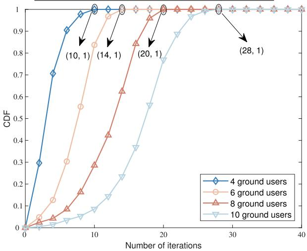  
Fig. 4. CDF of the number of iterations.

TDMA system: It is assumed that the users receive the energy emitted by the UAV during the first part of a time slot, while the remaining time of this time slot is equally divided among users for their information transmission. The proposed algorithm is used to solve the sum-rate maximization problem within this system.

The specific parameter values are shown in Table IV.

Fig. 4 illustrates the cumulative distribution function (CDF) of the number of iterations required by the BCD-based joint resource allocation algorithm proposed in this paper, which effectively demonstrates the algorithm’s convergence with different numbers of users in the network. For example, when the number of users in the network is 10, simulation results show that the proposed algorithm requires only 28 iterations on average to reach convergence. This result highlights the efficiency and effectiveness of the proposed method in achieving convergence in a multi-user communication environment.

Fig. 5 demonstrates the convergence characteristics when the user size is scaled up. Specifically, the potential game follows an increasing path of finite length. Within the framework of game theory, this property indicates that the game participants can reach a Nash equilibrium after a finite number of iterations. At this equilibrium, each participant chooses its own optimal strategy, taking into account the strategies of the others, which means that no participant can unilaterally change its strategy to obtain a better outcome. The game proposed in this paper has the finite improvement property (FIP), which ensures that the game converges to a stable solution. Moreover, the introduced utility deviation metric quantitatively shows that the algorithm is still able to achieve 0.5% convergence accuracy within 35 iterations even when the test size is scaled up, which fully satisfies the design requirement of 1% deviation within 50 iterations. These experimental results are consistent with theoretical analysis.

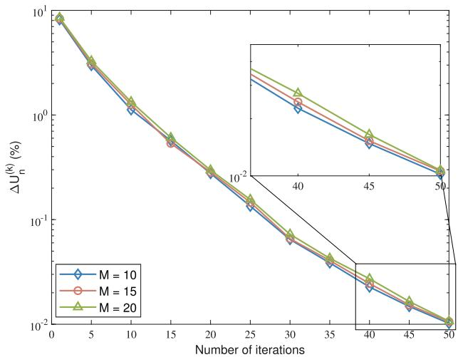

Fig. 5. Number of game theory iterations under different number of users.  
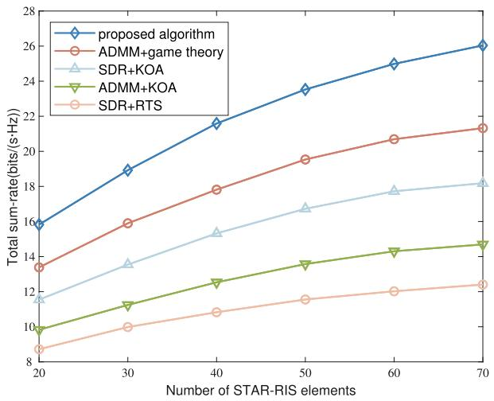  
Fig. 6. Sum-rate of various algorithms versus the number of STAR-RIS elements.

To highlight the systematic advantages of the proposed BCD-based joint optimization, Fig. 6 compares our scheme with several partial optimization strategies, including $\mathrm { ^ { \mathrm { c } } A D M M + K O A ^ { \mathrm { \prime \prime } } , \mathrm { ^ { \mathrm { c } } S D R + K O A ^ { \mathrm { \prime \prime } } , \mathrm { ^ { \mathrm { c } } A D M M + G a m e \ T h e o r y ^ { \mathrm { \prime \prime } } , } } }$ and $\mathrm { ^ { * } S D R { + } R T S ^ { , * } }$ , where $\mathbf { \ddot { \Gamma } } \mathbf { R } \mathbf { T } \mathbf { S } ^ { \prime }$ (random time splitting) refers to randomly selecting the duration of energy harvesting and information transmission in each time slot under the constraint of $t _ { E } [ n ] + t _ { M } [ n ] = \delta .$ The results show that compared with RTS, the time allocation strategy proposed in this paper improves the system sum-rate by an average of 48.47%, confirming the effectiveness of the game theory-based time optimization. Additionally, these benchmark methods adopt optimization techniques for single subproblems but lack the iterative coupling and coordination achievable by BCD. As shown in Fig. 6, the proposed BCD method outperforms the $\mathrm { ^ { 6 4 } S D R } + \mathrm { K O A } ^ { \mathrm { 3 } }$ method in sum-rate by 37.83%, verifying the effectiveness of the proposed algorithm.

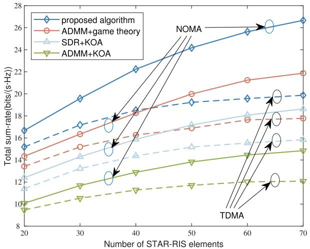

Fig. 7. Sum-rate of various schemes versus the number of STAR-RIS elements.  
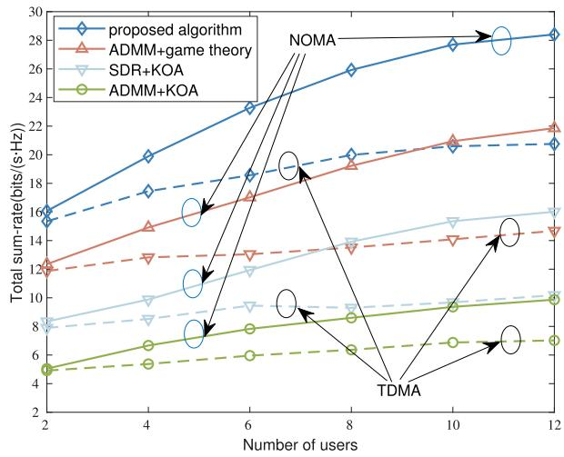  
Fig. 8. Sum-rate of various schemes versus the number of users.

Fig. 7 depicts the correlation between the system sum-rate and the number of STAR-RIS elements for different schemes. The simulation results show that the algorithm proposed in this paper has a significant advantage in terms of system sum-rate compared with the other three algorithms. This enhancement is attributed to the joint resource optimization algorithm based on the BCD algorithm proposed in this paper, which reasonably allocates the network resources while considering the actual situation of the system, maximizing the resource utilization of the system and enhancing the system performance. Moreover, when the number of STAR-RIS elements is small (e.g., 20), both NOMA and TDMA achieve comparable performance due to limited beamforming gain and weak effective channels. However, as the number increases, the STAR-RIS significantly enhances the effective channels, allowing NOMA to leverage its non-orthogonal access strategy and user channel disparities via SIC. This leads to a much faster growth in sum-rate for NOMA compared to TDMA.

Fig. 8 shows the correlation between the number of users in the system and the system sum-rate for various access modes as well as different algorithms. The simulation results show that both TDMA and NOMA systems achieve comparable performance when there is only one user in the system. As the number of users in the system increases, the sum-rate achieved by the NOMA scheme gradually approaches twice that of the TDMA scheme. When there are 12 users in the system, the sum-rate of the schemes proposed in this paper is significantly higher than the other schemes. This superiority indicates that STAR-RIS has the advantage of improving the channel quality and reducing the system interference in multiuser NOMA systems, which ultimately optimizes the utilization of system resources.

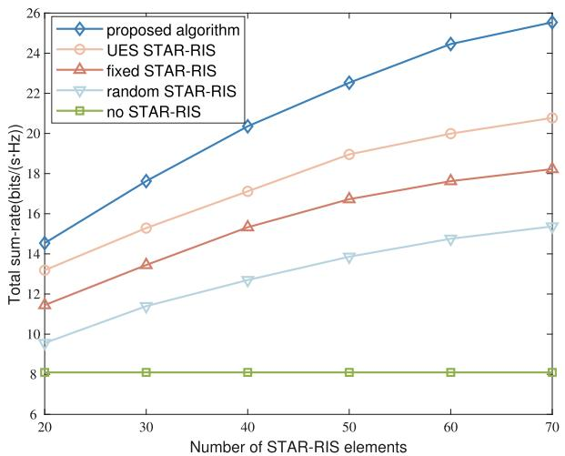  
Fig. 9. Sum-rate of various schemes versus the number of STAR-RIS elements.

Fig. 9 depicts the relationship between the number of STAR-RIS reflection elements and the sum-rate of the system. In the case of fixed STAR-RIS, we assume that the reflection and transmission coefficients of the STAR-RIS within this system are fixed. This provides a baseline for comparison. For random STAR-RIS, its reflection and transmission coefficients are randomly set. By analyzing the graph, we can observe how these different settings impact the overall sum-rate of the system as the number of reflection elements varies. The simulation results show that the network performance of the proposed scheme is better than the other three schemes. When the number of STAR-RIS reflective elements is in the range of 50-70, the network sum-rate of the proposed scheme is significantly higher than that of the fixed STAR-RIS scheme and the random STAR-RIS scheme, and the average network sum-rate is improved by about 19.76%. This suggests that in network scenarios where STAR-RIS is deployed, it is crucial to design the phase-shift matrices of STAR-RIS appropriately using optimization algorithms. The sum-rate of the proposed STAR-RIS phase-shifting matrices optimization scheme increases monotonically with the increase in the value of the reflection elements since more reflection elements promote greater growth, and the performance of STAR-RIS with the energy splitting mode applied in this paper is significantly better than that of STAR-RIS with uniform energy splitting. In addition, the network’s performance is poorer with the no-STAR-RIS scenario, evident from the results above. It is clear from the results that only UAV and NOMA techniques have limitations in effectively improving network throughput.

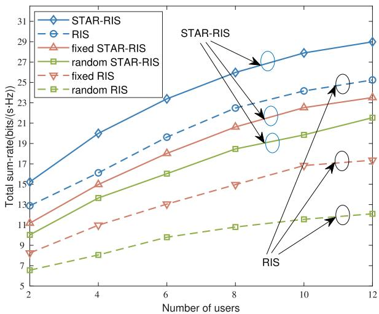

Fig. 10. Sum-rate of various schemes versus the number of users.  
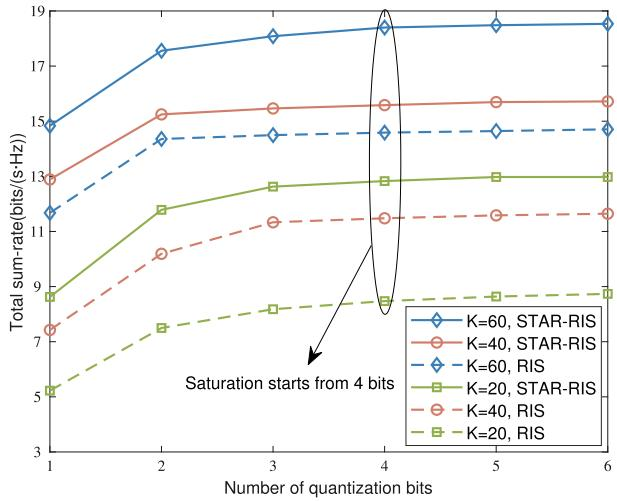  
Fig. 11. Sum-rate versus different number of quantization bits.

Fig. 10 shows the relationship between the number of users and the system sum-rate for different phase-shift matrices design schemes for RIS and STAR-RIS. Specifically, the fixed STAR-RIS configuration of the transmission and reflection amplitude coefficients are uniformly set to $\lambda _ { k } ^ { r } [ n ] ~ = ~ 0 . 6 ,$ $\lambda _ { k } ^ { t } [ n ] = 0 . 4$ , respectively, and the phase shifts are set using a simple linear progression based on a fixed angle of $4 5 ^ { \circ }$ The simulation results show that the system sum-rate for each scheme increases with the number of users. In addition, it is noticeable that STAR-RIS has a better performance than RIS, which indicates the advantage of STAR-RIS in enhancing the transmitting environment. When the number of users in the system is greater than or equal to 4, the performance of STAR-RIS has a more significant advantage over RIS, indicating the superiority of the proposed scheme in improving the system access.

In real-world applications, the hardware conditions for STAR-RIS are not perfect. Fig. 11 illustrates the network performance with discrete STAR-RIS phase shift matrices. In this scenario, the STAR-RIS phase shift matrices consist of discrete variables, with each phase shift’s range determined by the quantization bits of the STAR-RIS. After optimizing the phase shift matrices using the SDR algorithm in this paper, each element in the matrices selects the nearest discrete phase shift value from the given set to the optimized value. We plot the system sum-rate for varying numbers of STAR-RIS elements as the quantization bits range from 1 to 6. The system sum-rate gradually increases as the number of quantization bits grows from 1 to 4. When the number of quantization bits is greater than 4, the system sum-rate remains essentially constant. This indicates that the system performance tends to saturate at this point with the phase shift matrices taking discrete values. In addition, as the number of reflection elements increases, the sum-rate also increases, but the growth trend slows down. This is due to the fact that increasing the number of reflective elements does not compensate for the performance degradation caused by changing from continuous to discrete values of the phase shift matrices.

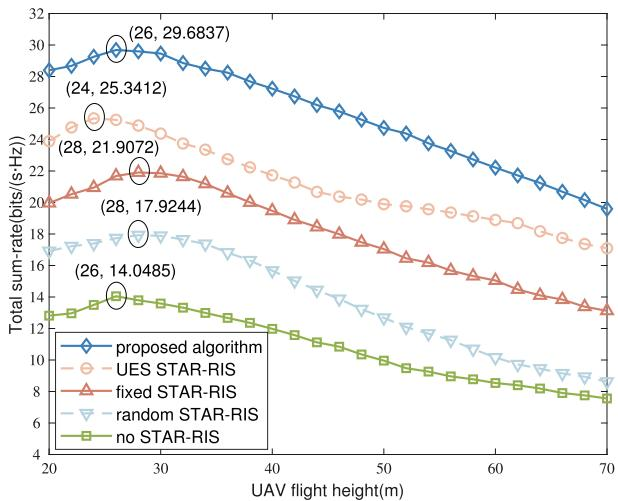  
Fig. 12. Sum-rate versus different UAV’s flight height.

Fig. 12 shows the effect of different flight altitudes of the UAV on the system sum-rate for the scheme proposed in this paper under the same parameter settings. The simulation results show that the system can obtain better performance when the flight altitude of the UAV is in the range of 24- 32 m. The system sum-rate gradually decreases when the flight altitude of the UAV is more than 32 m. This is because a suitable UAV flight altitude improves the quality of the UAV communication links and increases the energy transmission efficiency, which leads to an increase in the system sumrate. Severe multipath fading in low-altitude environments and increased path loss in high-altitude situations do not lead to optimal system performance. As the flight altitude of the UAV gradually increases, $D _ { U G , m } ^ { - \alpha }$ gradually decreases. At the same time, the elevation angles between the UAV and the GUs increase, resulting in a gradual increase in the value of $h _ { U G , m } ^ { \mathrm { L o S } } .$ . When the decreasing trend of $D _ { U G , m } ^ { - \alpha }$ is greater than the increasing trend of $h _ { U G , m } ^ { \mathrm { L o S } } ,$ the curve changes from an increasing magnitude to a decreasing one.

Fig. 13 illustrates the energy consumption performance of the proposed algorithm and the benchmark algorithms in both the average scenario and the worst-case scenario under different communication time settings. In the average scenario, it is assumed that the ground users are uniformly distributed within the UAV coverage area, the channel conditions are relatively good, and the energy harvesting efficiency is high.

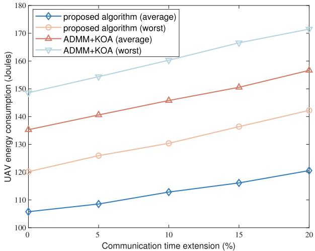

Fig. 13. Sum-rate of various schemes versus the communication time extension.  
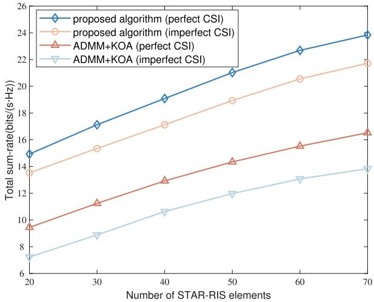  
Fig. 14. Sum-rate of various schemes versus the number of STAR-RIS elements.

Thus, the system can meet the communication and energy requirements with relatively low energy consumption. In the worst-case scenario, however, most users are located far from the UAV or are blocked by obstacles. As a result, the channel quality is poor, and the energy arrival efficiency is significantly reduced. According to the energy modeling formula in this paper, to ensure the minimum energy harvesting constraint of users, the system needs to increase the transmission power and extend the communication time, which leads to an increase in the UAV’s energy consumption. Additionally, in the worst-case scenario, the phase regulation capability of STAR-RIS will also be limited, causing a further decline in the overall energy efficiency of the system. Therefore, the energy consumption curve in the worst-case scenario is significantly higher than that in the average scenario.

In practice, the user’s CSI is usually imperfect. Due to the passive nature of STAR-RIS and the complexity of the channel, obtaining an accurate CSI for the links associated with STAR-RIS is challenging. To consider the impact of this on the resource allocation results of the system proposed in this paper, we refer to [29] to evaluate the CEE to characterize the CSI uncertainty due to various factors during CSI acquisition in STAR-RIS-assisted systems, as detailed in Appendix.

Fig. 14 evaluates the network performance of the proposed algorithm under the condition of imperfect CSI. The simulation results confirm that the algorithm proposed in this paper applies to real-world communication scenarios, highlighting the performance gap between the actual network conditions and the theoretical upper limit. In addition, the simulation results show that all algorithms can achieve a higher system sum-rate under the condition of perfect CSI. It is worth noting that the algorithm proposed in this paper outperforms other algorithms.

## V. CONCLUSION

In this paper, we designed a STAR-RIS-NOMA network powered by a UAV to facilitate multiuser energy-intensive communication in obstructed scenarios. To maximize the system sum-rate, a joint resource allocation scheme based on the BCD algorithm was proposed. Within this scheme, the STAR-RIS phase-shift optimization problem was solved using SDR, while the power allocation problem was addressed through the Dinkelbach algorithm. Furthermore, game theory was employed to optimize the energy harvesting and message transmission time split ratio. The performance of the proposed method was evaluated through simulation results focusing on the total system sum-rate. The results showed that the proposed joint optimization algorithm in this paper effectively enhanced the system sum-rate in scenarios with unstable communication links caused by obstacle blocking.

## APPENDIX

To assess the CEE, we refer to the true channel as $\boldsymbol { h _ { m } } [ n ]$ and the estimated channel as $\hat { h } _ { m } [ n ]$ . Then the CEE can be measured in decibels (dB) as follows

$$
C E E = 1 0 \log _ { 1 0 } \left( \frac { \mathcal { E } [ | | \pmb { h _ { m } [ n ] } - \hat { \pmb { h _ { m } [ n ] } } | | _ { 2 } ^ { 2 } ] } { \mathcal { E } [ | | \pmb { h _ { m } [ n ] } | | _ { 2 } ^ { 2 } ] } \right) ,\tag{42}
$$

CEE assesses the accuracy of channel estimation. The smaller the value of CEE, the more precise the channel estimation is.

## REFERENCES

[1] D. Bepari et al., “A survey on applications of cache-aided NOMA,” IEEE Commun. Surveys Tuts., vol. 25, no. 3, pp. 1571–1603, 3rd Quart., 2023.

[2] W. Wei, X. Pang, C. Xing, N. Zhao, and D. Niyato, “STAR-RIS aided secure NOMA integrated sensing and communication,” IEEE Trans. Wireless Commun., vol. 23, no. 9, pp. 10712–10725, Sep. 2024.

[3] R. K. Senapati and P. J. Tanna, “Deep learning-based NOMA system for enhancement of 5G networks: A review,” IEEE Trans. Neural Netw. Learn. Syst., vol. 35, no. 3, pp. 3380–3394, Mar. 2024.

[4] K. Guo, M. Wu, X. Li, H. Song, and N. Kumar, “Deep reinforcement learning and NOMA-based multi-objective RIS-assisted IS-UAV-TNs: Trajectory optimization and beamforming design,” IEEE Trans. Intell. Transp. Syst., vol. 24, no. 9, pp. 10197–10210, Sep. 2023.

[5] L. Dai, B. Wang, Z. Ding, Z. Wang, S. Chen, and L. Hanzo, “A survey of non-orthogonal multiple access for 5G,” IEEE Commun. Surveys Tuts., vol. 20, no. 3, pp. 2294–2323, 3rd Quart., 2018.

[6] Y. Wang, J. Wang, V. W. S. Wong, and X. You, “Effective throughput maximization of NOMA with practical modulations,” IEEE J. Sel. Areas Commun., vol. 40, no. 4, pp. 1084–1100, Apr. 2022.

[7] S. Meng, X. Wang, H. Zhang, Z. Qian, Y. Zou, and Y. Liu, “Capacity enhancement for D2D-assisted cooperative NOMA systems,” IEEE Trans. Commun., early access, Dec. 14, 2024, doi: 10.1109/ TCOMM.2024.3519526.

[8] J. Zheng, T. Wu, X. Lai, C. Pan, M. Elkashlan, and K.-K. Wong, “FASassisted NOMA short-packet communication systems,” IEEE Trans. Veh. Technol., vol. 73, no. 7, pp. 10732–10737, Jul. 2024.

[9] J. Zheng, T. Wu, J. Yao, C. Yuen, Z. Ding, and F. Adachi, “Exploring the impact of RIS on cooperative NOMA URLLC systems: A theoretical perspective,” 2024, arXiv:2410.17609.

[10] W. Feng et al., “Resource allocation for power minimization in RISassisted multi-UAV networks with NOMA,” IEEE Trans. Commun., vol. 71, no. 11, pp. 6662–6676, Nov. 2023.

[11] Q. Wu and R. Zhang, “Towards smart and reconfigurable environment: Intelligent reflecting surface aided wireless network,” IEEE Commun. Mag., vol. 58, no. 1, pp. 106–112, Jan. 2020.

[12] A. S. de Sena et al., “What role do intelligent reflecting surfaces play in multi-antenna non-orthogonal multiple access?,” IEEE Wireless Commun., vol. 27, no. 5, pp. 24–31, Oct. 2020.

[13] Y. Liu et al., “STAR: Simultaneous transmission and reflection for 360 coverage by intelligent surfaces,” IEEE Wireless Commun., vol. 28, no. 6, pp. 102–109, Dec. 2021.

[14] X. Mu, Y. Liu, L. Guo, J. Lin, and R. Schober, “Simultaneously transmitting and reflecting (STAR) RIS aided wireless communications,” IEEE Trans. Wireless Commun., vol. 21, no. 5, pp. 3083–3098, May 2022.

[15] J. Xu, Y. Liu, X. Mu, and O. A. Dobre, “STAR-RISs: Simultaneous transmitting and reflecting reconfigurable intelligent surfaces,” IEEE Commun. Lett., vol. 25, no. 9, pp. 3134–3138, Sep. 2021.

[16] H. Ma, H. Wang, H. Li, and Y. Feng, “Transmit power minimization for STAR-RIS-empowered uplink NOMA system,” IEEE Wireless Commun Lett., vol. 11, no. 11, pp. 2430–2434, Nov. 2022.

[17] J. Zuo, Y. Liu, Z. Ding, L. Song, and H. V. Poor, “Joint design for simultaneously transmitting and reflecting (STAR) RIS assisted NOMA systems,” IEEE Trans. Wireless Commun., vol. 22, no. 1, pp. 611–626, Jan. 2023.

[18] F. Fang, B. Wu, S. Fu, Z. Ding, and X. Wang, “Energy-efficient design of STAR-RIS aided MIMO-NOMA networks,” IEEE Trans. Commun., vol. 71, no. 1, pp. 498–511, Jan. 2023.

[19] Y. Ai, J. B. Andersen, and M. Cheffena, “Path-loss prediction for an industrial indoor environment based on room electromagnetics,” IEEE Trans. Antennas Propag., vol. 65, no. 7, pp. 3664–3674, Jul. 2017.

[20] A. Laforgue et al., “Effects of fast charging at low temperature on a high energy Li-ion battery,” J. Electrochem. Soc., vol. 167, no. 14, Nov. 2020, Art. no. 140521.

[21] T. Wang, F. Fang, and Z. Ding, “An SCA and relaxation based energy efficiency optimization for multi-user RIS-assisted NOMA networks,” IEEE Trans. Veh. Technol., vol. 71, no. 6, pp. 6843–6847, Jun. 2022.

[22] L. Yang, F. Meng, J. Zhang, M. O. Hasna, and M. D. Renzo, “On the performance of RIS-assisted dual-hop UAV communication systems,” IEEE Trans. Veh. Technol., vol. 69, no. 9, pp. 10385–10390, Sep. 2020.

[23] M. Mozaffari, W. Saad, M. Bennis, Y.-H. Nam, and M. Debbah, “A tutorial on UAVs for wireless networks: Applications, challenges, and open problems,” IEEE Commun. Surveys Tuts., vol. 21, no. 3, pp. 2334–2360, 3rd Quart., 2019.

[24] A. Khaleel and E. Basar, “A novel NOMA solution with RIS partitioning,” IEEE J. Sel. Topics Signal Process., vol. 16, no. 1, pp. 70–81, Jan. 2022.

[25] M. Elhattab, M. A. Arfaoui, C. Assi, and A. Ghrayeb, “RIS-assisted joint transmission in a two-cell downlink NOMA cellular system,” IEEE J. Sel. Areas Commun., vol. 40, no. 4, pp. 1270–1286, Apr. 2022.

[26] F. Kilinc, R. A. Tasci, A. Celik, A. Abdallah, A. M. Eltawil, and E. Basar, “RIS-assisted grant-free NOMA: User pairing, RIS assignment, and phase shift alignment,” IEEE Trans. Cognit. Commun. Netw., vol. 9, no. 5, pp. 1257–1270, Oct. 2023.

[27] Z. Yang, Y. Liu, Y. Chen, and N. Al-Dhahir, “Machine learning for user partitioning and phase shifters design in RIS-aided NOMA networks,” IEEE Trans. Commun., vol. 69, no. 11, pp. 7414–7428, Nov. 2021.

[28] R. Zhong, X. Liu, Y. Liu, Y. Chen, and Z. Han, “Mobile reconfigurable intelligent surfaces for NOMA networks: Federated learning approaches,” IEEE Trans. Wireless Commun., vol. 21, no. 11, pp. 10020–10034, Nov. 2022.

[29] F. Zhu et al., “Robust beamforming for RIS-aided communications: Gradient-based manifold meta learning,” IEEE Trans. Wireless Commun., vol. 23, no. 11, pp. 15945–15956, Nov. 2024.

[30] X. Wang et al., “Robust beamforming with gradient-based liquid neural network,” IEEE Wireless Commun. Lett., vol. 13, no. 11, pp. 3020–3024, Nov. 2024.

[31] X. Gan, C. Zhong, C. Huang, and Z. Zhang, “RIS-assisted multiuser MISO communications exploiting statistical CSI,” IEEE Trans. Commun., vol. 69, no. 10, pp. 6781–6792, Oct. 2021.

[32] J. Lei, T. Zhang, and Y. Liu, “Hybrid NOMA for STAR-RIS enhanced communication,” IEEE Trans. Veh. Technol., vol. 73, no. 1, pp. 1497–1502, Jan. 2024.

[33] T. Wang, F. Fang, and Z. Ding, “Joint phase shift and beamforming design in a multi-user MISO STAR-RIS assisted downlink NOMA network,” IEEE Trans. Veh. Technol., vol. 72, no. 7, pp. 9031–9043, Jul. 2023.

[34] S. Lv, X. Xu, S. Han, Y. Liu, P. Zhang, and A. Nallanathan, “STAR-RIS enhanced finite blocklength transmission for uplink NOMA networks,” IEEE Trans. Commun., vol. 72, no. 1, pp. 273–287, Jan. 2024.

[35] Q. Gao, Y. Liu, X. Mu, M. Jia, D. Li, and L. Hanzo, “Joint location and beamforming design for STAR-RIS assisted NOMA systems,” IEEE Trans. Commun., vol. 71, no. 4, pp. 2532–2546, Apr. 2023.

[36] S. Li, B. Duo, X. Yuan, Y.-C. Liang, and M. Di Renzo, “Reconfigurable intelligent surface assisted UAV communication: Joint trajectory design and passive beamforming,” IEEE Wireless Commun. Lett., vol. 9, no. 5, pp. 716–720, May 2020.

[37] Z. Wei et al., “Sum-rate maximization for IRS-assisted UAV OFDMA communication systems,” IEEE Trans. Wireless Commun., vol. 20, no. 4, pp. 2530–2550, Apr. 2021.

[38] A. Khalili, E. M. Monfared, S. Zargari, M. R. Javan, N. M. Yamchi, and E. A. Jorswieck, “Resource management for transmit power minimization in UAV-assisted RIS HetNets supported by dual connectivity,” IEEE Trans. Wireless Commun., vol. 21, no. 3, pp. 1806–1822, Mar. 2022.

[39] K. Tian, B. Duo, S. Li, Y. Zuo, and X. Yuan, “Hybrid uplink and downlink transmissions for full-duplex UAV communication with RIS,” IEEE Wireless Commun. Lett., vol. 11, no. 4, pp. 866–870, Apr. 2022.

[40] X. Liu, Y. Yu, F. Li, and T. S. Durrani, “Throughput maximization for RIS-UAV relaying communications,” IEEE Trans. Intell. Transp. Syst., vol. 23, no. 10, pp. 19569–19574, Oct. 2022.

[41] T. Shafique, H. Tabassum, and E. Hossain, “Optimization of wireless relaying with flexible UAV-borne reflecting surfaces,” IEEE Trans. Commun., vol. 69, no. 1, pp. 309–325, Jan. 2021.

[42] Q. Zhang, Y. Zhao, H. Li, S. Hou, and Z. Song, “Joint optimization of STAR-RIS assisted UAV communication systems,” IEEE Wireless Commun. Lett., vol. 11, no. 11, pp. 2390–2394, Nov. 2022.

[43] Z. Wang, T. Lv, J. Zeng, and W. Ni, “Placement and resource allocation of wireless-powered multiantenna UAV for energy-efficient multiuser NOMA,” IEEE Trans. Wireless Commun., vol. 21, no. 10, pp. 8757–8771, Oct. 2022.

[44] I. Azam, M. B. Shahab, and S. Y. Shin, “Energy-efficient pairing and power allocation for NOMA UAV network under QoS constraints,” IEEE Internet Things J., vol. 9, no. 24, pp. 25011–25026, Dec. 2022.

[45] S. K. Singh, K. Agrawal, K. Singh, C.-P. Li, and Z. Ding, “NOMA enhanced hybrid RIS-UAV-Assisted full-duplex communication system with imperfect SIC and CSI,” IEEE Trans. Commun., vol. 70, no. 11, pp. 7609–7627, Nov. 2022.

[46] Z. Hadzi-Velkov, S. Pejoski, N. Zlatanov, and R. Schober, “UAV-assisted wireless powered relay networks with cyclical NOMA-TDMA,” IEEE Wireless Commun. Lett., vol. 9, no. 12, pp. 2088–2092, Dec. 2020.

[47] K. Reddy and A. Poondla, “Performance analysis of solar powered unmanned aerial vehicle,” Renew. Energy, vol. 104, pp. 20–29, Apr. 2017.

[48] Z. Peng, R. Liu, C. Pan, Z. Zhang, and J. Wang, “Energy minimization for active RIS-aided UAV-enabled SWIPT systems,” IEEE Commun. Lett., vol. 28, no. 6, pp. 1372–1376, Jun. 2024.

[49] Z. Yang, X. Miao, L. Ding, G. Pan, S. Wang, and J. An, “Optimal SWIPT transmission in RIS-based air–ground wireless communication,” IEEE Trans. Aerosp. Electron. Syst., vol. 60, no. 4, pp. 4310–4322, Aug. 2024.

[50] M. Zeng, X. Li, G. Li, W. Hao, and O. A. Dobre, “Sum rate maximization for IRS-assisted uplink NOMA,” IEEE Commun. Lett., vol. 25, no. 1, pp. 234–238, Jan. 2021.

[51] S. Huang et al., “Average sum-rate maximization for coupled phase-shift STAR-RIS enhanced multi-user MISO-OFDM system,” IEEE Trans. Commun., vol. 72, no. 3, pp. 1457–1473, Mar. 2024.

[52] L. Guo, J. Jia, J. Chen, and X. Wang, “Secure communication optimization in NOMA systems with UAV-mounted STAR-RIS,” IEEE Trans. Inf. Forensics Security, vol. 19, pp. 2300–2314, 2024.

[53] G. Zhu, X. Mu, L. Guo, A. Huang, and S. Xu, “Robust resource allocation for STAR-RIS assisted SWIPT systems,” IEEE Trans. Wireless Commun., vol. 23, no. 6, pp. 5616–5631, Jun. 2024.

[54] Q. Wu and R. Zhang, “Intelligent reflecting surface enhanced wireless network via joint active and passive beamforming,” IEEE Trans. Wireless Commun., vol. 18, no. 11, pp. 5394–5409, Nov. 2019.

[55] H. Guo, Y.-C. Liang, J. Chen, and E. G. Larsson, “Weighted sum-rate maximization for reconfigurable intelligent surface aided

wireless networks,” IEEE Trans. Wireless Commun., vol. 19, no. 5, pp. 3064–3076, May 2020.

[56] M. Abdel-Basset, R. Mohamed, S. A. A. Azeem, M. Jameel, and M. Abouhawwash, “Kepler optimization algorithm: A new metaheuristic algorithm inspired by Kepler’s laws of planetary motion,” Knowl.-Based Syst., vol. 268, May 2023, Art. no. 110454.

[57] S. Dong, X. Zhang, R. Huang, L. Huang, Y. Meng, and Y. Jiang, “A simplified fractional-order model adapted to temperature and aging for fast estimation of state of power of lithium-titanate batteries,” IEEE Trans. Transport. Electrific., vol. 11, no. 2, pp. 5484–5496, Apr. 2025.

[58] X. He, J. Wang, and Y. Gong, “Efficient algorithms for RIS aided hybrid beamforming with MSE constraints,” IEEE Trans. Wireless Commun., vol. 23, no. 3, pp. 1742–1754, Mar. 2024.

  
Shuyu Meng received the B.S. degree in communication engineering from Jilin University, China, in 2021, where she is currently pursuing the Ph.D. degree in information and communication engineering. Her research interests include device-to-device (D2D), non-orthogonal multiple access (NOMA), and reconfigurable intelligent surface (RIS).

  
Xue Wang (Senior Member, IEEE) received the M.E. and Ph.D. degrees in communication and information systems from Jilin University, China, in 2009 and 2012, respectively. Since 2021, she has been a Full Professor with the Department of Communication Engineering, Jilin University. Her research focuses on key technologies of SAGIN, the application of artificial intelligence in the next generation communication systems, and multi-access edge computing.


Xiaoying Sun (Member, IEEE) received the Ph.D. degree from Jilin University, Changchun, China, in 2005. He is currently a Professor with Jilin University. His research interests include human–computer interaction, haptic feedback, and communication engineering.


Yixuan Zou (Member, IEEE) received the B.Sc. and M.Sc. degrees in mathematics from Imperial College London, U.K., in 2017 and 2018, respectively, and the Ph.D. degree in computer science from the Queen Mary University of London in 2022. She is currently a Lecturer (an Assistant Professor) with the School of Electronic Engineering and Computer Science, Queen Mary University of London. She is an Academic Fellow at the Digital Environment Research Institute (DERI). Her research interests include artificial intelligence (AI) for wire-

less communications,non-orthogonal multiple access (NOMA), IRSs/RISs aided communications, and resource allocation for 6G networks. She served as a Technical Program Committee Member for IEEE VTC-Fall 2023–2025, MECOM 2024, and ICC 2025. She served as the Session Chair for various workshops and symposiums at IEEE ICC 2023, Globecom 2023, and ICC 2024. She serves as the Co-Chair for the Communication Theory Symposium at ICC 2026 and the Guest Editor for IEEE TRANSACTIONS ON NETWORK SCIENCE AND ENGINEERING. She served as the Local Management Officer for NGMA-ETI 1st & 2nd QMUL 6G Workshop.


Yuanwei Liu (Fellow, IEEE) received the Ph.D. degree from the Queen Mary University of London (QMUL), London, U.K., in 2016.

He is currently a tenured Full Professor with the Department of Electrical and Electronic Engineering (EEE), The University of Hong Kong (HKU), and a Visiting Professor at QMUL. Prior to that, he was a Senior Lecturer (an Associate Professor) and a Lecturer (an Assistant Professor) at QMUL from 2021 to 2024 and from 2017 to 2021, respectively, and a Post-Doctoral Research Fellow at King’s College

London (KCL), London, from 2016 to 2017. His research interests include non-orthogonal multiple access, reconfigurable intelligent surface, near field communications, integrated sensing and communications, and machine learning. He is a fellow of AAIA and AIIA, a Web of Science Highly Cited Researcher, an IEEE Communication Society Distinguished Lecturer, an IEEE Vehicular Technology Society Distinguished Lecturer, the Rapporteur of the ETSI Industry Specification Group on Reconfigurable Intelligent Surfaces on work item of “Multi-Functional Reconfigurable Intelligent Surfaces (RIS): Modeling, Optimization, and Operation,” and an U.K. Representative of the URSI Commission C on “Radio Communication Systems and Signal Processing” from 2023 to 2024. He was listed as one of 35 Innovators Under 35 China by MIT Technology Review in 2022. He received the IEEE ComSoc Outstanding Young Researcher Award for EMEA in 2020. He received the 2020 IEEE Signal Processing and Computing for Communications (SPCC) Technical Committee Early Achievement Award and the IEEE Communication Theory Technical Committee (CTTC) 2021 Early Achievement Award. He received the IEEE ComSoc Outstanding Nominee for the Best Young Professionals Award in 2021. He was a co-recipient of the 2024 IEEE Communications Society Heinrich Hertz Award, the Best Student Paper Award in IEEE VTC2022-Fall, the Best Paper Award in ISWCS 2022, the 2022 IEEE SPCC-TC Best Paper Award, the 2023 IEEE ICCT Best Paper Award, and the 2023 IEEE ISAP Best Emerging Technologies Paper Award. He serves as the Publicity Co-Chair for IEEE VTC 2019-Fall, the Panel Co-Chair for IEEE WCNC 2024, and the Symposium Co-Chair for several flagship conferences, such as IEEE GLOBECOM, ICC, and VTC. He served as the Academic Chair for the Next Generation Multiple Access Emerging Technology Initiative and the Vice Chair for the SPCC and Technical Committee on Cognitive Networks (TCCN) from 2023 to 2024. He serves as the Co-Editor-in-Chief for the IEEE ComSoc TC Newsletter, an Area Editor for IEEE TRANSACTIONS ON COMMUNICATIONS and IEEE COMMUNICATIONS LETTERS, and an Editor for IEEE COMMUNICATIONS SURVEYS AND TUTORIALS, IEEE TRANSACTIONS ON WIRELESS COMMU-NICATIONS, IEEE TRANSACTIONS ON VEHICULAR TECHNOLOGY, IEEE TRANSACTIONS ON NETWORK SCIENCE AND ENGINEERING, and IEEE TRANSACTIONS ON COGNITIVE COMMUNICATIONS AND NETWORKING. He serves as the (Leading) Guest Editor for P IEEE on Next Generation Multiple Access, IEEE J S A COMMUNICATIONS on Next Generation Multiple Access, IEEE JOURNAL OF SELECTED TOPICS IN SIGNAL PROCESSING on Intelligent Signal Processing and Learning for Next Generation Multiple Access, and IEEE Network on Next Generation Multiple Access for 6G. For more information, please visit his website: https://www.eee.hku.hk/yuanwei/