# Resource Allocation and Trajectory Design for MISO UAV-Assisted MEC Networks

Boyang Liu , Yiyao Wan , Fuhui Zhou , Senior Member, IEEE, Qihui Wu , Senior Member, IEEE, and Rose Qingyang Hu , Fellow, IEEE

Abstract—Mobile Edge Computing (MEC) is a promising technology in the next generation network, which provides computing services for user equipments (UEs) to reduce the task delay and prolong the usage time of UEs. To address the deficiency of poor channel quality caused by multipath and blockages in traditional MEC networks, a multiple input single output (MISO) UAV-assisted MEC network is studied. A system energy consumption minimization problem is formulated by jointly optimizing the the UAV’s beamforming vectors, the UAV’s central processing unit (CPU) frequency, the UAV’s trajectory, the UEs’ transmission power and the UEs’ CPU frequency subject to the constraints on the task, the UAV’s trajectory, and the UEs’ computation tasks. A three-stage iterative algorithm is proposed to solve the challenging non-convex problem. The closed-form expressions for the optimal UAV CPU frequency and the transmission power of UEs are derived. Simulation results show that the proposed algorithm is superior to the benchmark schemes in terms of energy consumption, and the convergence performance is guaranteed.

Index Terms—Mobile edge computing (MEC), unmanned aerial vehicle (UAV), multiple input single output (MISO).

# I. INTRODUCTION

W ITH the rapid development of 5G and the Internet ofThings (IoT) technology, massive smart devices need Things (IoT) technology,massivesmart devices need to access the network and the amount of task data in the network reaches an unprecedented size [1]. Moreover, diverse emerging sophisticated Internet applications are emerging, such

Manuscript received May 13, 2021; revised August 12, 2021 and November 2, 2021; accepted January 2, 2022. Date of publication January 6, 2022; date of current version May 20, 2022. This work was supported in part by the National Key R&D Program of China under Grant 2020YFB1807602, in part by the Basic Research Program for Natural Science of Shaanxi Province of China under Grant 2020JQ-851, in part by the Research Program of Education Bureau of Shaanxi Province under Grant 19JK0796, in part by the National Natural Science Foundation of China under Grants 62071223 and 62031012, and in part by the Young Elite Scientist Sponsorship Program by CAST. The review of this article was coordinated by Dr. Beatriz Lorenzo. (Corresponding author: Fuhui Zhou.)

Boyang Liu and Yiyao Wan are with the College of Communications and Information Engineering, Xi’an University of Posts and Telecommunications, Xi’an 710000, China (e-mail: liuboyang@xupt.edu.cn; yiyaowan@ stu.xupt.edu.cn).

Fuhui Zhou and Qihui Wu are with the College of Electronic and Information Engineering, Nanjing University of Aeronautics and Astronautics, Nanjing 210000, China, and also with the Key Laboratory of Dynamic Cognitive System of Electromagnetic Spectrum Space, Nanjing University of Aeronautics and Astronautics, Nanjing 210000, China (e-mail: zhoufuhui@ieee.org; wuqihui2014@sina.com).

Rose Qingyang Hu is with the Department of Electrical and Computer Engineering, Utah State University, Logan, UT 84322 USA (e-mail: rosehu@ieee.org).

Digital Object Identifier 10.1109/TVT.2022.3140833

as online gaming, virtual reality, augmented reality, etc., most of which have strict requirements for latency, security, and other metrics [2]. In order to provide high quality service to user equipments (UEs) and guarantee their quality of service (QoS) requirements, it is necessary to perform a large number of computing tasks on wireless devices in a short duration. However, UEs usually have a limited battery capacity and limited computation capability, making it challenging to handle these computation-intensive and latency-sensitive tasks locally. Although cloud computing can offload the computing tasks of UEs to cloud servers to relieve the pressure of mobile devices, in the case of IoT, offloading massive computing data to cloud servers can result in core network congestion and excessive delay issue.

Mobile edge computing (MEC) is regarded as a promising technology by providing cloud-like computation services to UEs and liberates UEs from heavy computation tasks. By deploying MEC servers at the edge of the network (i.e., at a wireless access point (AP) or a base station (BS) near the UEs, etc.) to provide computation services for UEs, energy consumption and delay caused by communication and local computing can both be significantly reduced [3]–[10]. However, terrestrial MEC servers are usually fixed on the ground and the links are usually dominated by non-line-of-sight (NLoS) due to the multipath and blockages [11]. Thus, the transmission rate is severely limited due to the poor channel quality. Besides, due to the fixed deployment locations, the coverage and flexibility of terrestrial MEC servers can be restricted, which results in higher costs for operators. Moreover, terrestrial MEC is restricted in the event of natural disasters or in remote areas where it is difficult to deploy traditional stationary BS [12]–[14].

Recently, owing to the advantages of unmanned aerial vehicle (UAV) for its flexible movement, easy deployment, and line-ofsight (LoS) connections, the UAV-assisted MEC system poses new opportunities to address above challenges in terrestrial MEC system [15]–[17]. Compared to the conventional MEC network, by deploying a powerful MEC server on a UAV, a high-speed connection can be established between the UEs and the MEC server using the LoS channel brought by the UAV [18]–[21]. Besides, due to the high mobility of the UAV, the UAV can carry the MEC server close to UEs to provide services. Thus, UEs’ energy consumption and transmission delay caused by long-distance transmission can be significantly reduced. Furthermore, by utilizing UAV as a mobile relay, the throughput, reliability, and the coverage of the network can be further enhanced through the dynamic adjustment of relay locations [22]–[24]. In particular, the UAV can be used to establish low-cost emergency communication systems when natural disasters cause the destruction of traditional terrestrial communication base stations [25]–[26].

Motivated by the above mentioned facts, a multiple antennas UAV-assisted MEC network is studied in this paper. In order to minimize the total energy consumption (including energy consumption associated with communication, computation, and the UAV’s flying), the UEs’ CPU frequency, UEs’ transmission power, UAV’s trajectory, UAV’s CPU frequency, and the UAV’s beamforming vector are jointly optimized. To the authors’ best knowledge, there has been no investigation to study the UAV-assisted MEC networks considering multiple antennas techniques.

# A. Related Works

MEC has been extensively investigated in terms of improving energy efficiency or reducing the latency [3]–[6]. In order to further improve the performance of the MEC system, the authors in [7]–[10] have explored multiple antennas techniques to the traditional MEC network. In [18]–[21], the authors have studied the resource allocation and trajectory design scheme in the UAVassisted MEC network. Recently, the resource allocation and trajectory design of the UAV-assisted MEC network when the UAV is both a mobile computing server and a relay have been studied [22]–[24]. The details for the related works are given as follows.

Energy consumption and delay, as important indicators to measure the performance of MEC systems, have been widely studied. In [4], the physical layer security of the NOMA MECaware networks was studied, where the authors considered a practically passive eavesdropping scenario and the goal was to minimize the weighted sum-energy consumption while meeting the computation latency constraints and the secrecy outage probability constraints. To evaluate the performance of the system more comprehensively, the trade-off between power consumption of UEs and the delay of computation tasks was investigated by jointly optimizing the CPU frequencies of UEs, transmit power, and bandwidth [5]. In [6], the computation efficiency (defined as the number of computed bits divided by the corresponding energy consumption) maximization problem was considered and the trade-off between local computing and data offloading was analyzed.

By deploying multi-antennas at the MEC server, the system’s spectral and energy efficiency can be significantly improved [7]– [10]. In particular, the authors in [7] proposed a cell-free (CF) massive MIMO MEC framework and obtained successful communication and computing probabilities based on stochastic geometry and queueing theory. The optimal computation task offloading and resource allocation scheme was derived under perfect and imperfect channel state information (CSI) estimation in [8]. In [9], a framework for a multi-access edge computingenhanced heterogeneous network based on massive MIMO and small cells was proposed. In [10], by applying massive MIMO in MEC network, the spectral and energy efficiencies were significantly improved.

Unlike traditional terrestrial MEC networks considered in [3]–[10], efforts in [18]–[25] have been made to design UAV-assisted MEC networks. Specifically, an innovative UAVassisted MEC network was proposed in [18] and the UAV position, resource allocation, task splitting decisions were jointly optimized to minimize the weighted sum of the service delay of all IoT devices and UAV energy consumption. The authors in [19] utilized the UAV as an aerial BS to collect data and compute tasks from ground UEs and aimed at minimizing the sum of the maximum delay among all UEs. A multi-UAV enabled wireless network was further investigated in [20] and the minimum UEs throughput was maximized by jointly optimizing the trajectory and user scheduling. The authors in [21] jointly optimized the bit allocation for communication in both uplink and downlink and the UAV’s trajectory, with the goal of minimizing the mobile energy consumption where the UAV is deployed to offer offloading opportunities to UEs.

Different from [18]–[21], the UAV is not only utilized as a MEC server but also as a relay, thus the performance of the network can be further enhanced through the dynamic adjustment of relay locations [22]–[24]. The authors in [22] studied the weighted sum energy consumption minimization problem and proposed an alternating algorithm to obtain the optimal computation resource scheduling, bandwidth allocation, and the UAV’s trajectory. In [23], the total energy consumption was minimized by jointly optimizing the bits allocation, time scheduling, power allocation, and the UAV trajectory design. A two-stage iterative algorithm was proposed to alternatively optimize the design variables. The authors in [24] optimized the trajectory of the UAV, the transmit power of UAV, and the mobile device to minimize the outage probability of the proposed UAV-Assisted network.

Resource allocation problems have been widely investigated in traditional terrestrial networks [3]–[6], the MEC system with multi-antennas technology [7]–[10]. Besides, the resource allocation and the trajectory design schemes have been studied in the UAV-assisted MEC network [18]–[21], and UAV-assisted relay networks [22]–[24]. However, the current works only considered the case of UAV equipped with a single antenna. Moreover, few investigations have been conducted for designing resource allocation schemes to guarantee the UEs’ computation result downloading quality in the UAV-assisted network. Furthermore, resource allocation and trajectory design schemes proposed in the above-mentioned works are invalid for multi-antennas UAVassisted network since the channel gain not only depends on the distance between the UAV and the UEs, but also relies on the angles of departure (AoD). Since the design of beamformings for the UAV can further improve system performance and ensuring the result downloading quality of UEs [7]–[10], in this paper, we exploit multiple antennas techniques to further enhance the performance of the MEC systems and consider a resource allocation and trajectory joint design problem. However, the considered problem is difficult to tackle since the AoDs from the UAV to UEs are determined by the UAV’s trajectory and UEs’ location and there are complex coupling among the optimization variables.

# B. Contributions and Organization

Unlike previous works [3]–[10], this paper studied the trajectory design and the resource allocation problem in the multiantennas UAV-assisted MEC network, where the multi-antennas UAV is not only utilized as a mobile edge computing server but also as a relay to offload computation tasks to the AP. The deployment of the MEC server and multiple antennas on the UAV can reduce interference among UEs, increase networks’ throughput, alleviate back-haul capacity pressure, reduce signaling overhead [7]–[10], and enable the establishment of low-cost emergency MEC networks in the event of natural disasters. To extend the service time of the UAV, in this paper, the optimal trajectory design and resource allocation scheme is obtained. The main contributions are summarized as follows:

1) It is the first time that the resource allocation and the trajectory design framework are formulated in the multi-antenna UAV-assisted MEC network. In the proposed network, the unprocessed computation tasks of the UEs can be partially or completely offloaded to the UAV for computation. Besides, the UAV is also utilized as a mobile relay which can transmit the computation tasks to the AP. The UAV’s beamforming is designed to further enhance the system performance and guarantee the computation result downloading quality of UEs. The goal is to minimize the total energy consumption while ensuring that all UEs’ computation tasks can be processed within a specified time period and ensuring the UEs’ computation result downloading quality requirements.

2) Under the proposed scheme, in each time slot, the formulated total energy consumption minimization problem is a challenge non-convex optimization problem. To solve this intractable problem, a three three-stage alternating algorithm is proposed. The Lagrangian duality method, sub-gradient method, derived rank-one solution, and the successive convex approximation (SCA) method are utilized to solve the intractable nonconvex sub-problems. Besides, the closed-form expressions of the optimal UAV CPU frequency and the transmission power of UEs are derived for any given UAV’s locations and beamforming vectors. The derived results show that the UEs’ offloading decision is determined by the CSI between the UAV and UEs.

3) The simulation results show the superiority of the proposed algorithm compared with other benchmark designs in terms of total energy consumption. Moreover, the proposed multiple antennas scheme has more obvious advantages in the scenario with more intensive computation tasks. In addition, the convergence of the proposed algorithm can be guaranteed.

The remainder of this paper is organized as follows. Section II the system model is presented. Section III presents a resource allocation and the trajectory design under the proposed scheme. Simulation results are presented in Section IV. Section V concludes the paper.

Notations:In this paper, matrices and vectors are denoted by boldface capital boldface and lower case letters, respectively. | · | and - · - denote the absolute value of a complex scalar and the Euclidean norm of a vector, respectively. $\mathbf { \hat { h } } ^ { T }$ and $\mathbf { h } ^ { H }$ represent the transpose and conjugate transpose of vector h. $\mathbb { C } ^ { \sum _ { k } ^ { \mathbf { a } } \times N }$ and $\mathbb { R } ^ { M \times N }$ denote the set of $M \times N$ complex-valued and real-valued matrices, respectively.

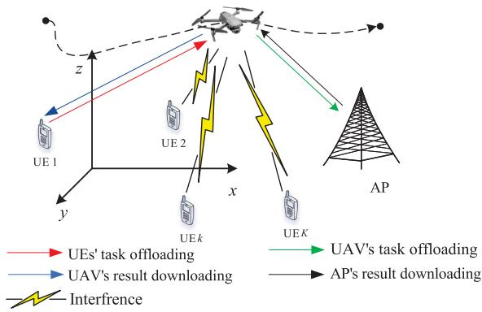

<details>
<summary>flowchart</summary>

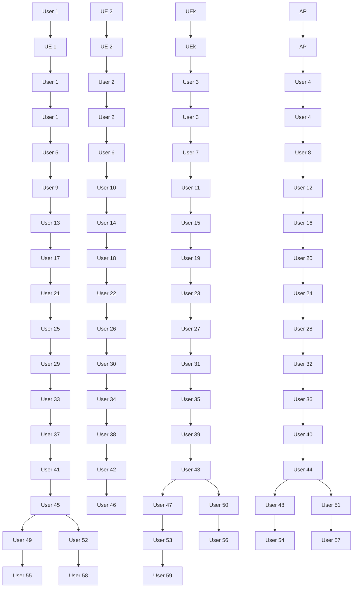
</details>

Fig. 1. A UAV-enabled MEC system.

# II. SYSTEM MODEL

A UAV-assisted MEC system is considered in Fig. 1, which consists of one UAV equipped with $M = M _ { x } \times M _ { y }$ uniform =planar array (UPA) antennas, K ground UEs equipped with a single antenna, and one AP. Let ${ \mathcal { K } } \triangleq \{ 1 , 2 , \dots , K \}$ denote the =set of UEs. Each UE k has periodical computation-intensive tasks to be executed. Let $\mathcal { W } _ { k } = \left( I _ { k } , C _ { k } , t _ { k } \right)$ denote the task of UE k, where $I _ { k } , C _ { k }$ , and $t _ { k }$ = ( )represent the input data size, the number of CPU cycles required to process 1-bit of task data, and the task latency constraint, respectively. Similar to [23], let $t _ { k } = T , \forall k \in \mathcal { K }$ , which means that all UEs are requested to =complete the task within the same time duration T . However, due to the limited computing resource, it is difficult for UEs to complete such computationally intensive tasks locally within the time horizon T . Thus, UEs need to offload part or all of their computing tasks to the UAV through the wireless links and the UAV is equipped with an MEC server to provide computing services to UEs. The partial offloading mode is applied. Thus, the computation tasks of the UEs are bitwise independent and can be arbitrarily divided into two parts. One part is executed locally at the UEs and the other part is offloaded to the UAV for computing [23]. In addition, taking advantage of the LoS path brought by the UAV, the UAV can be identified as a mobile relay to offload mission data to the AP that has stable power supplies and is equipped with a powerful computing server. Thus, the system performance and stability can be further improved [11].

# A. The UAV Trajectory Model

A three-dimensional Cartesian coordinate system is considered, where all the UEs are fixed on the ground and the horizontal coordinate of the k UE is denoted by $\mathbf { u } _ { k } = ( x _ { u , k } , y _ { u , k } ) ^ { T }$ . In th = ( )order to avoid collisions, the UAV flies at a constant altitude H that is higher than the highest obstacle in the service area. During the mission period of T , the UAV flies from the initial location qI to the final location qF and provides service for the UEs. Let $\mathbf { q } ( t ) = ( x _ { q } ( t ) , y _ { q } ( t ) ) ^ { T } , t \in [ 0 , T ]$ denote the horizontal co-( ) = ( ( ) ( )) [ ]ordinates of the UAV at time t. In order to facilitate the UAV trajectory algorithm design, the discrete path planning approach is adopted. In particular, the mission period is divided into N sufficiently small time slots based on the maximum speed of the UAV, i.e., ${ \cal T } { = } N \Delta _ { \cal T }$ . Let $\mathcal { N } \triangleq \{ 1 , 2 , \dots , N \}$ denote the set of time slots. The time slot $\Delta _ { T }$ is chosen to be sufficiently small for Δthe location of the UAV to be approximately constant within each time slot. Therefore, the trajectory of the UAV can be denoted by N discrete trajectory points and its horizontal location in the n time slot can be expressed as $\mathbf { q } [ n ] = ( q _ { x } [ n ] , q _ { y } [ n ] ) ^ { T } , \forall n \in \mathcal { N }$ h.

# B. The UAV-Assisted Channel Transmission Model

Based on the field measurement in [11], when the service area side length is 40 and the UAV flight altitude is 20 , m mthe probability of line-of-sight (LoS) is close to 1. Thus, in this work it is assumed that the channel between the UAV and the UEs is dominated by $\mathrm { L o S ^ { 1 } }$ [20], [27]. Besides, it is assumed that the exact location of UEs can be obtained by the UAV. It can be achieved via the UEs performing handshaking with the UAV regularly [28]. As a result, the channel state information (CSI) between UEs and the UAV can be determined by its location. Specifically, the channel power gain from the UAV to the k thUE as well as the AP at the n time slot can be respectively expressed as

$$
\mathbf {h} _ {k} [ n ] = \frac {\sqrt {\rho} \mathbf {a} _ {k} [ n ]}{\sqrt {\| \mathbf {q} [ n ] - \mathbf {u} _ {k} \| ^ {2} + H ^ {2}}}, \tag {1a}
$$

$$
\mathbf {h} _ {a} [ n ] = \frac {\sqrt {\rho} \mathbf {a} _ {a} [ n ]}{\sqrt {\| \mathbf {q} [ n ] - \mathbf {u} _ {a} \| ^ {2} + H ^ {2}}}, \tag {1b}
$$

where $\rho = ( \lambda _ { c } ~ 4 \pi ) ^ { 2 }$ and $\lambda _ { c }$ denotes the wavelength of the center = ( )frequency of the information carrier. ${ \mathbf { a } } _ { k } [ n ]$ and ${ \mathbf a } _ { a } [ n ]$ denote the [ ] [ ]channel vectors between the UAV and the k UE as well as the thAP in the n time slot, respectively. In particular, ${ \mathbf a } _ { k } [ n ]$ and ${ \mathbf { a } } _ { a } [ n ]$ thcan be respectively given by [28]

$$
\begin{array}{l} \mathbf {a} _ {k} [ n ] = \left(1, \dots , e ^ {- j \frac {2 \pi b f _ {c}}{c} \sin \varpi_ {k} [ n ] (m _ {x} - 1) \cos \phi_ {k} [ n ]} \right., \\ \left. \dots , e ^ {- j \frac {2 \pi b f _ {c}}{c} \sin \varpi_ {k} [ n ] (M _ {x} - 1) \cos \phi_ {k} [ n ]}\right) \\ \otimes \left(1, \dots , e ^ {- j \frac {2 \pi b f _ {c}}{c} \sin \varpi_ {k} [ n ] (m _ {y} - 1) \sin \phi_ {k} [ n ]} \right., \\ \dots , e ^ {- j \frac {2 \pi b f _ {c}}{c} \sin \varpi_ {k} [ n ] (M _ {y} - 1) \sin \phi_ {k} [ n ]}\left. \right); \tag {2a} \\ \end{array}
$$

$$
\begin{array}{l} \mathbf {a} _ {a} [ n ] = \left(1, \dots , e ^ {- j \frac {2 \pi b f _ {c}}{c} \sin \varpi_ {a} [ n ] (m _ {x} - 1) \cos \phi_ {a} [ n ]}, \right. \\ \left. \dots , e ^ {- j \frac {2 \pi b f _ {c}}{c} \sin \varpi_ {a} [ n ] (M _ {x} - 1) \cos \phi_ {a} [ n ]}\right) \\ \otimes \left(1, \dots , e ^ {- j \frac {2 \pi b f _ {c}}{c} \sin \varpi_ {a} [ n ] (m _ {y} - 1) \sin \phi_ {a} [ n ]}, \right. \\ \dots , e ^ {- j \frac {2 \pi b f _ {c}}{c} \sin \varpi_ {a} [ n ] (M _ {y} - 1) \sin \phi_ {a} [ n ]}\left. \right), \tag {2b} \\ \end{array}
$$

where b denotes the distance between the antenna elements and c is the speed of light; $f _ { c }$ is the center frequency of the information carrier; $m _ { x }$ and $m _ { y }$ represent the index of the rows and columns

1In scenarios where the flight altitude of UAVs needs to change according to the terrain, such as urban scenarios where tall buildings exist, the air-toground channel is no longer dominated by LoS. In this case, the investigation of probabilistic LoS and Rician fading channel models is valuable, which will be investigated in our future work.

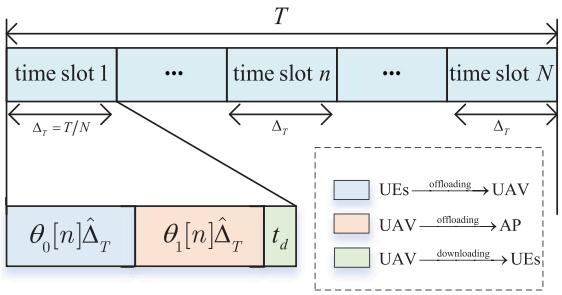

<details>
<summary>flowchart</summary>

```mermaid
graph TD
    A["time slot 1"] --> B["..."]
    B --> C["time slot n"]
    C --> D["..."]
    D --> E["time slot N"]
    F["θ₀[n"]Δ̂ₜ] --> G["θ₁[n"]Δ̂ₜ]
    G --> H["t_d"]
    I["Δ_T = T/N"] --> J["Δ_T"]
    K["UEs"] --> L["offloading"] --> M["UAV"]
    N["UAV"] --> O["offloading"] --> P["AP"]
    Q["UAV"] --> R["downloading"] --> S["UES"]
```
</details>

Fig. 2. Illustration of computation bits offloading.

of the UPA, respectively; $\varpi _ { k } [ n ]$ and $\varpi _ { a } [ n ]$ denote the vertical angle of departure (AoD) from the UAV to the k UE as well as the $\mathbf { A P }$ at the n time slot, respectively; $\phi _ { k } [ n ]$ thand $\phi _ { a } [ n ]$ denote th [ ] [ ]the horizontal AoD from the UAV to the k UE as well as the thAP in the n time slot, respectively. In particular, AoDs can be respectively expressed as

$$
\varpi_ {k} [ n ] = \arcsin \frac {H _ {0}}{\sqrt {\left\| \mathbf {q} [ n ] - \mathbf {u} _ {k} \right\| ^ {2} + H ^ {2}}}; \tag {3a}
$$

$$
\phi_ {k} [ n ] = \arccos \frac {y _ {q} [ n ] - y _ {k}}{\| \mathbf {q} [ n ] - \mathbf {u} _ {k} \|}; \tag {3b}
$$

$$
\varpi_ {a} [ n ] = \arcsin \frac {H}{\sqrt {\| \mathbf {q} [ n ] - \mathbf {u} _ {a} \| ^ {2} + H ^ {2}}}; \tag {3c}
$$

$$
\phi_ {k} [ n ] = \arccos \frac {y _ {q} [ n ] - y _ {a}}{\| \mathbf {q} [ n ] - \mathbf {u} _ {a} \|}. \tag {3d}
$$

In the proposed scheme, the time slot is chosen to be sufficiently small and the UAV flies through a small distance due to limited mobility. Based on the block fading channel model, the channel can be considered to remain constant within a time slot [31].

# C. Computation Model

As shown in Fig. 2, since the size of the results is usually small compared to the input task data, the duration of results downloading from the UAV to UEs is set to be the same small constant $t _ { d } .$ . For the ease of exposition, let $\widehat { \Delta } _ { T } = \Delta _ { T } - t _ { d }$ and $\theta _ { 0 } [ n ]$ percent of $\widehat { \Delta } _ { T }$ Δ = Δis used for UEs offloading part of tasks to the UAV and $\theta _ { 1 } [ n ]$ percent of $\widehat { \Delta } _ { T }$ is used to the UAV for offloading the tasks to the AP. Obviously, the following equation can be obtained

$$
\theta_ {0} [ n ] + \theta_ {1} [ n ] = 1. \tag {4}
$$

1) Local Computing: Each UE has a limited computation capability to perform the local computing and the computation resource varies over time, which is one of the optimized variables and denoted as $f _ { l , k } [ n ]$ . Let $C _ { k }$ denote the required number of [ ]CPU cycles to process one bit of computation task. Therefore, the computation tasks executed locally at the k UE can be expressed as

$$
l _ {l, k} [ n ] = \frac {f _ {l , k} [ n ]}{C _ {k}} \Delta_ {T}, \forall k \in \mathcal {K}, \forall n \in \mathcal {N}. \tag {5}
$$

Thus, according to [22], the energy consumption of the k UE for local computing can be expressed as

$$
E _ {l, k} [ n ] = v _ {l} f _ {l, k} ^ {3} [ n ] \widehat {\Delta} _ {T}, \forall k \in \mathcal {K}, \forall n \in \mathcal {N}, \tag {6}
$$

where υl denotes the effective capacitance coefficient of the processor’s chip at the k UE. Besides, the constant υl is thdetermined by the architecture of the k UE’s chip.

th2) UEs’ Computation Offloading: In order to avoid interference, time division multiple access (TDMA) protocol is applied. In this case, during the offloading process, each UE is assigned the same offloading time duration to ensure fairness. Let $p _ { k } [ n ]$ [ ]denote the transmission power of the k UE in the n time th tslot. Thus, the number of offloading bits can be given by

$$
l _ {o, k} [ n ] = \theta_ {0} [ n ] \frac {\hat {\Delta} _ {T}}{K} B \log_ {2} \left(1 + \frac {p _ {k} [ n ] \| \mathbf {h} _ {k} [ n ] \| ^ {2}}{\sigma_ {u} ^ {2}}\right), \tag {7}
$$

where $\sigma _ { u } ^ { 2 }$ denotes the power of additive White Gaussian noise (AWGN) at the UAV receiver and B denotes the bandwidth of communication. Therefore, the energy consumption of the k UE for computation offloading can be expressed as

$$
E _ {o, k} [ n ] = p _ {k} [ n ] \theta_ {0} [ n ] \frac {\widehat {\Delta} _ {T}}{K}. \tag {8}
$$

After all the UEs have completed computation offloading in each time slot, the UAV performs computing. The number of the k UE’s computation tasks calculated by the UAV in the n thtime slot can be expressed as

$$
l _ {u, k} [ n ] = \frac {f _ {u , k} [ n ]}{C _ {k}} \theta_ {1} [ n ] \widehat {\Delta} _ {T}, \forall k \in \mathcal {K}, \forall n \in \mathcal {N}, \tag {9}
$$

where $f _ { u , k } [ n ]$ denotes the UAV computing resource assigned to [ ]the k UE in the nth time slot with a unit of cycles per second. thThus, the energy consumption of the UAV for computing the tasks offloaded from the k UE can be expressed as [22]

$$
E _ {u, k} ^ {l} \left[ n \right] = v _ {u} f _ {u, k} ^ {3} \left[ n \right] \theta_ {1} \left[ n \right] \widehat {\Delta} _ {T}, \forall k \in \mathcal {K}, \forall n \in \mathcal {N}, \tag {10}
$$

where $v _ { u }$ denotes the effective capacitance coefficient of the processor’s chip at the UAV. Besides, the constant $\upsilon _ { u }$ is determined by the architecture of the UAV onboard server.

3) UAV’s Computation Offloading: In order to guarantee the quality of service (QoS) of UEs, the UAV needs to offload part of the tasks that the UAV cannot perform timely to the AP for computing. Let $\mathbf { w } _ { u , a } [ n ] \in \mathbb { C } ^ { M \times 1 } , \forall n \in \mathcal { N }$ denote the [ ]beamforming vector from the UAV to the AP. Based on the Cauchy-Schwartz inequality, the SNR obtained by the AP can be expressed as

$$
\gamma_ {a} = \frac {P _ {a} [ n ] \| \mathbf {h} _ {a} [ n ] \| _ {2} ^ {2}}{\sigma_ {a} ^ {2}}, \tag {11}
$$

where $P _ { a } [ n ] = c _ { a } ^ { 2 } \mathbf { h } _ { a } ^ { H } [ n ] \mathbf { h } _ { a } [ n ]$ and $c _ { a }$ is a non-zero constraint [ ] = [ ] [ ]and satisfies the following constraint

$$
c _ {a} ^ {2} \mathbf {h} _ {a} ^ {H} [ n ] \mathbf {h} _ {a} [ n ] \leq P _ {\max}, \tag {12}
$$

where $P _ { \mathrm { m a x } }$ denotes the maximum transmission power of the UAV. In order to ensure that all unprocessed task data are offloaded to AP, the following equation needs to be satisfied

$$
P _ {a} [ n ] = \frac {\sigma_ {a} ^ {2}}{\| \mathbf {h} _ {a} [ n ] \| _ {2} ^ {2}} \left(2 ^ {\frac {\sum_ {i = 1} ^ {K} \left(l _ {o , k} [ n ] - l _ {u , k} [ n ]\right)}{B \theta_ {1} [ n ] \widehat {\Delta} _ {T} [ n ]}} - 1\right), \forall n \in \mathcal {N}. \tag {13}
$$

Thus, the energy consumption of the UAV for offloading tasks to the AP can be expressed as

$$
E _ {u, a} [ n ] = P _ {a} [ n ] \theta_ {1} [ n ] \widehat {\Delta} _ {T}, \forall n \in \mathcal {N}. \tag {14}
$$

4) Results Downloading: After the AP and the UAV have processed the computation tasks, the output of the computed task needs to be downloaded to the corresponding UE. Due to the existence of severe blockage, the AP cannot directly transmit the computation results to the UEs, and transmits the results to the UAV through a separate bandwidth using the TDMA manner. Then, the UAV transmits the computation results (including the results data from UAV’s computing and received from the AP) to the UEs through a high-rate LoS channel2 [22]. The resulting signal received by the k UE in the n time slot can be given by

$$
\begin{array}{l} y _ {k} [ n ] = \mathbf {h} _ {k} ^ {H} [ n ] \mathbf {w} _ {u, k} [ n ] s _ {k} [ n ] \\ + \sum_ {z \in K \backslash \{k \}} \mathbf {h} _ {k} ^ {H} [ n ] \mathbf {w} _ {u, z} [ n ] s _ {z} [ n ] \\ + n _ {k} [ n ], z \neq k, \forall j, k \in \mathcal {K}, n \in \mathcal {N}, \tag {15} \\ \end{array}
$$

where $\mathbf { w } _ { u , k } [ n ]$ denotes the beamforming vector from the UAV [ ]to the k UE in the nth time slot. As a result, the SINR of the $j \mathrm { t h } ( j \neq k )$ UE can be expressed as

$$
\gamma_ {k} [ n ] = \frac {\left| \mathbf {h} _ {k} ^ {H} [ n ] \mathbf {w} _ {u , k} [ n ] \right| ^ {2}}{\sum_ {z \in K \backslash \{k \}} \left| \mathbf {h} _ {k} ^ {H} [ n ] \mathbf {w} _ {u , z} [ n ] \right| ^ {2} + \sigma^ {2}}, \tag {16}
$$

where $\sigma ^ { 2 }$ denotes the noise power at UEs. Considering the importance of the results data, their SINR requires strict control to guarantee the computation result downloading quality of UEs.

5) Flying Model: The UAV velocity between the n time slot and the n − 1 time slot can be expressed as

$$
\mathbf {v} [ n ] = \frac {\mathbf {q} [ n ] - \mathbf {q} [ n - 1 ]}{\Delta_ {T}}, \forall n \in \mathcal {N}. \tag {17}
$$

According to [29], the propulsion power consumption can be modeled as

$$
\begin{array}{l} P \left(\| \mathbf {v} [ n ] \|\right) = P _ {0} \left(1 + \frac {3 \| \mathbf {v} [ n ] \| ^ {2}}{U _ {t i p} ^ {2}}\right) + \frac {1}{2} d _ {0} \rho_ {0} s A \| \mathbf {v} [ n ] \| ^ {3} \\ + P _ {H} \left(\sqrt {1 + \frac {\| \mathbf {v} [ n ] \| ^ {4}}{4 v _ {0} ^ {4}}} - \frac {\| \mathbf {v} [ n ] \| ^ {2}}{2 v _ {0} ^ {2}}\right) ^ {\frac {1}{2}}, \tag {18} \\ \end{array}
$$

2Since the AP is powered by a stable grid in practice, ultra-high performance processing servers can be deployed and ultra-high rate communication can be supported. Therefore, similiar to [22], the computing time of the AP and results download transmission time from the AP to UAV are assumed negligible.

where $\forall n \in \mathcal { N } , P _ { 0 }$ and $P _ { H }$ are both constants and denote the blade profile power and induced power, respectively; $U _ { t i p }$ is the tip speed of the rotor blade; v0 is a constant and represents the mean rotor induced velocity when the UAV hovers; $\rho _ { 0 } , A .$ , d0, and s denote the air density, the rotor disc area, the fuselage drag ratio, and the rotor solidity, respectively.

The total energy consumption of the UAV in each time slot consists of four components: computational energy consumption; tasks offloading energy consumption; results downloading energy consumption; and the energy consumption for guaranteeing flight, which can be expressed as

$$
\begin{array}{l} E _ {U} [ n ] = \sum_ {k = 1} ^ {K} E _ {u, k} ^ {l} [ n ] + E _ {u, a} [ n ] + \sum_ {k = 1} ^ {K} \mathbf {w} _ {u, k} ^ {H} [ n ] \mathbf {w} _ {u, k} [ n ] t _ {d} \\ + P \left(\| \mathbf {v} [ n ] \|\right) \Delta_ {T}, \forall n \in \mathcal {N}. \tag {19} \\ \end{array}
$$

The total energy consumption by all the UEs is made up of both locally computing energy consumption and energy consumption from offloading the tasks to the UAV. Specifically, it can be given by

$$
E _ {I} [ n ] = \sum_ {k = 1} ^ {K} (E _ {l, k} [ n ] + E _ {o, k} [ n ]), \forall n \in \mathcal {N}. \tag {20}
$$

# III. RESOURCE ALLOCATION AND TRAJECTORY DESIGN UNDER THE PROPOSED SCHEME

# A. Problem Formulation

In this subsection, we tackle the problem of minimizing the sum of all the UEs and the UAV weighted total power consumption under the proposed scheme. However, AoDs in (3a)–(3d) depend on the UAV location, which makes the optimization problem highly non-convex. Therefore, it is unrealistic to optimize the entire trajectory of the UAV by a single optimization problem. Fortunately, since the number of time slots N is large enough, the displacement of the UAV during a single time slot is very small. Therefore, it is reasonable to assume that AoDs remain unchanged during one time slot [30]. Based on this, the AoDs in the nth time slot can be approximately replaced by the AoDs at the end of the n − 1 th time slot to further obtain N ( )optimization subproblems. Specifically, in the nth time slot, the corresponding design problem is formulated as

$$
\mathbf {P} _ {1}: \min _ {\mathbf {L}, \mathbf {w} _ {u}, \mathbf {q} [ n ]} E _ {I} [ n ] + \eta E _ {U} [ n ] \tag {21a}
$$

$$
\begin{array}{l} s. t. \frac {f _ {l , k} [ n ]}{C _ {k}} \Delta_ {T} + \theta_ {0} [ n ] \frac {\widehat {\Delta} _ {T}}{K} B \log_ {2} \left(1 + \frac {p _ {k} [ n ] \| \mathbf {h} _ {k} [ n ] \| ^ {2}}{\sigma_ {u} ^ {2}}\right) \\ \geq Q _ {k}, \forall k \in \mathcal {K}, \forall n \in \mathcal {N}, \end{array} \tag {21b}
$$

$$
l _ {u, k} [ n ] \leq l _ {o, k} [ n ], \forall k \in \mathcal {K}, \forall n \in \mathcal {N}, \tag {21c}
$$

$$
0 \leq f _ {l, k} [ n ] \leq f _ {l, \max}, \forall k \in \mathcal {K}, \forall n \in \mathcal {N}, \tag {21d}
$$

$$
0 \leq f _ {u, k} [ n ], \forall k \in \mathcal {K}, \forall n \in \mathcal {N}, \tag {21e}
$$

$$
\sum_ {k = 1} ^ {K} f _ {u, k} \left[ n \right] \leq f _ {u, m a x}, \forall n \in \mathcal {N}, \tag {21f}
$$

$$
0 \leq p _ {k} [ n ] \leq p _ {l, \max}, \forall k \in \mathcal {K}, \forall n \in \mathcal {N}, \tag {21g}
$$

$$
\sum_ {k = 1} ^ {K} \mathbf {w} _ {u, k} ^ {H} [ n ] \mathbf {w} _ {u, k} [ n ] \leq p _ {u, \max}, \forall n \in \mathcal {N}, \tag {21h}
$$

$$
\begin{array}{l} 0 \leq \frac {\sigma^ {2}}{\| \mathbf {h} _ {a} [ n ] \| _ {2} ^ {2}} \left(2 ^ {\frac {\sum_ {i = 1} ^ {K} \left(l _ {o , k} [ n ] - l _ {u , k} [ n ]\right)}{B \theta_ {1} [ n ] \widehat {\Delta} _ {T}}} - 1\right) \\ \leq p _ {u, \max}, \forall n \in \mathcal {N}, \end{array} \tag {21i}
$$

$$
\left\| \mathbf {q} [ n ] - \mathbf {q} [ n - 1 ] \right\| \leq d _ {\min}, \forall n \in \mathcal {N}, \tag {21j}
$$

$$
\mathbf {q} [ 0 ] = \mathbf {q} _ {I}, \mathbf {q} [ N + 1 ] = \mathbf {q} _ {F}, \tag {21k}
$$

$$
\left\| \mathbf {q} [ n ] - \mathbf {q} _ {F} \right\| \leq (N - n + 1) d _ {\min}, \forall n \in \mathcal {N}, \tag {211}
$$

$$
V _ {\max} \Delta_ {T} \geq d _ {\min}, \forall n \in \mathcal {N}, \tag {21m}
$$

$$
\begin{array}{l} \frac {\left| \mathbf {h} _ {k} ^ {H} [ n ] \mathbf {w} _ {u , k} [ n ] \right| ^ {2}}{\sum_ {\mathrm{z} \in K \backslash \{k \}} \left| \mathbf {h} _ {k} ^ {H} [ n ] \mathbf {w} _ {u , z} [ n ] \right| ^ {2} + \sigma^ {2}} \geq \Gamma_ {r e q, k}, \\ \forall k \in \mathcal {K}, n \in \mathcal {N}, \end{array} \tag {21n}
$$

$$
\begin{array}{c} \frac {\left| \mathbf {h} _ {j} ^ {H} [ n ] \mathbf {w} _ {u , k} [ n ] \right| ^ {2}}{\sum_ {z \in K \backslash \{k \}} \left| \mathbf {h} _ {j} ^ {H} [ n ] \mathbf {w} _ {u , z} [ n ] \right| ^ {2} + \sigma^ {2}} \leq \Gamma_ {s e q, k}, \\ \forall k, j \in \mathcal {K}, n \in \mathcal {N}, \end{array} \tag {21o}
$$

where $Q _ { k } = \left( I _ { k } \ N \right)$ in the constraint (21b) denotes the in-= ( )put data size of the task to be performed in each time slot; $\theta = [ \theta _ { 0 } [ n ] , \theta _ { 1 } [ n ] ] , \mathbf { L } = \{ f _ { l , k } [ \bar { n } ] , f _ { u , k } [ n ] , p _ { k } [ n ] \} , \mathbf { w } _ { u } =$ $\{ \mathbf { w } _ { u , k } [ n ] \} _ { k = 1 } ^ { K } .$ ], and $\mathbf { t } = \{ t [ n ] \}$ [ ] [ ] [ ] =denote the set of the designed [ ] = [ ]variables. (21b) ensures that each UE can complete their tasks timely; (21c) is the causal constraint in order to guarantee that the number of bits of the kth UE performed in the nth time slot is no larger than the number of bits offloaded by the kth UE in the same time slot; (21d)–(21f) are the maximum CPU frequency constraints for the UAV and UEs; (21g) and (21h) are the maximum transmission power constraint for the UAV and UEs; (21i) ensures that all unprocessed task data of the UAV can be offloaded to the AP, in order to guarantee the QoS of UEs; $d _ { \mathrm { m i n } }$ in constraint (21j) denotes the maximum displacement of the UAV between two adjacent time slots, and the channel can be considered constant within this distance; (21k) determines the initial and final points of the UAV and the UAV flies to the final point with maximum speed within a time slot after the task is completed; (21l) ensures that the UAV can reach the final point at the N  1 th time slot; (21m) is the mobility constraint of the ( + )UAV; (21n) and (21o) denote the UEs’ minimum required SINR and maximum tolerable interference, respectively. Moreover, $\Gamma _ { r e q , k }$ and $\Gamma _ { s e q , k }$ denote the kth UE’s minimum required SINR Γ Γand maximum tolerated interference, respectively, which are set according to the actual task requirements (computation load and latency requirements), ensuring both the timely feedback of task result data and the UEs’ computation result downloading quality.3

Note that the problem $\mathbf { P } _ { 1 }$ is non-convex due to the complex coupling among the optimization variables. Specifically, the

3In the simulation, $\Gamma _ { r e q , k }$ is a constant and is larger than the required SINR when all of the UEs’ tasks are completely offloaded in order to guarantee the timely feedback of the computation results and the communication quality of the UEs.

non-convexity arises from the non-convex objective function, the constraints (21b), (21c), (21i), (21n), and (21o), which make the problem intractable to solve. To overcome these challenges, a three-stage alternating optimization algorithm is developed for obtaining the optimal solution of P1 by fixing parts of optimization variables and optimizing others. Specifically, the original problem $\mathbf { P } _ { 1 }$ is decomposed into three manageable subproblems, which are analyzed in the following subsections.

# B. CPU Frequency and UEs Transmission Power Optimization

In this subsection, for any given feasible UAV beamforming vector $\mathbf { w } _ { u }$ , and the UAV location ${ \bf q } [ n ]$ in the nth time slot, the [ ]CPU frequency and UEs transmission power allocation of the original problem $\mathbf { P } _ { 1 }$ can be optimized by solving the following subproblem

$$
\mathbf {P} _ {1. 1}: \min _ {\mathbf {L}} \mathcal {E} _ {1} \left(\mathbf {L}, \mathbf {w} _ {u}, \mathbf {q} [ n ]\right) \tag {22a}
$$

$$
\text { s.t. } (2 1 b) - (2 1 g), (2 1 i). \tag {22b}
$$

The expression for the objective function of problem $\mathrm { P _ { 1 . 1 } }$ is given in (23), shown at the bottom of this page. Obviously, $\mathbf { P } _ { 1 . }$ 1 is non-convex and is still difficult to solve. In order to solve the non-convex exponential term of the objective function, we first introduce an auxiliary variable $\beta _ { 0 } [ n ]$ , which satisfies

$$
\begin{array}{l} 2 \frac {\sum_ {i = 1} ^ {K} \left(\theta_ {0} [ n ] \frac {\widehat {\Delta} _ {T}}{K} B \log_ {2} \left(1 + \frac {p _ {k} [ n ] \left\| \mathbf {h} _ {k} [ n ] \right\| ^ {2}}{\sigma_ {u} ^ {2}}\right) - \frac {f _ {u , k} [ n ]}{C _ {k}} \theta_ {1} [ n ] \widehat {\Delta} _ {T}\right)}{B \theta_ {1} [ n ] \widehat {\Delta} _ {T}} \tag {24a} \\ \leq \beta_ {0} [ n ], \\ \end{array}
$$

$$
1 \leq \beta_ {0} [ n ] \leq \beta_ {0, \max} [ n ], \tag {24b}
$$

where $\beta _ { 0 , \mathrm { m a x } } [ n ]$ denotes the maximum value of $\beta _ { 0 } [ n ]$ and sat-[ ]isfies the following equation

$$
\beta_ {0, \max} [ n ] = \frac {\left\| \mathbf {h} _ {a} [ n ] \right\| _ {2} ^ {2}}{\sigma_ {a} ^ {2}} p _ {u, \max} + 1. \tag {25}
$$

The constraint (24a) is further transformed into the following form

$$
\begin{array}{l} \sum_ {i = 1} ^ {K} \log_ {2} \left(1 + \frac {p _ {k} [ n ] \| \mathbf {h} _ {k} [ n ] \| ^ {2}}{\sigma_ {u} ^ {2}}\right) \\ \leq \frac {K \theta_ {1} [ n ]}{\theta_ {0} [ n ]} \log_ {2} \beta_ {0} [ n ] + \frac {K \theta_ {1} [ n ]}{B \theta_ {0} [ n ]} \sum_ {k = 1} ^ {K} \frac {f _ {u , k} [ n ]}{C _ {k}}. \tag {26} \\ \end{array}
$$

The left-hand side (LHS) of above inequality is non-convex respect to transmissions power $p _ { k } [ n ]$ . Fortunately, the SCA method can be applied to transform the non-convex constraint into a locally convex approximation form. In particular, for a given local feasible point $p _ { k , m } [ n ]$ , where m is the number of the [ ]SCA iterations, the global upper bound of the logarithm term in the inequality (26) LHS is given as

$$
\log_ {2} \left(1 + p _ {k} [ n ] \frac {\| \mathbf {h} _ {k} [ n ] \| ^ {2}}{\sigma_ {u} ^ {2}}\right) \leq c _ {1, k, m} [ n ] + c _ {2, k, m} [ n ] p _ {k} [ n ], \tag {27}
$$

where $c _ { 1 , k , m } [ n ]$ and $c _ { 2 , k , m } [ n ]$ are given as, respectively,

$$
\begin{array}{l} c _ {1, k, m} [ n ] = \log_ {2} \left(1 + p _ {k, m} [ n ] \frac {\| \mathbf {h} _ {k} [ n ] \| ^ {2}}{\sigma_ {u} ^ {2}}\right) \\ - \frac {1}{1 + p _ {k , m} [ n ] \frac {\left\| \mathbf {h} _ {k} [ n ] \right\| ^ {2}}{\sigma_ {u} ^ {2}}} \frac {\left\| \mathbf {h} _ {k} [ n ] \right\| ^ {2}}{\sigma_ {u} ^ {2} \ln 2} p _ {k, m} [ n ], \tag {28a} \\ \end{array}
$$

$$
c _ {2, k, m} [ n ] = \frac {1}{1 + p _ {k , m} [ n ] \frac {\| \mathbf {h} _ {k} [ n ] \| ^ {2}}{\sigma_ {u} ^ {2}}} \frac {\| \mathbf {h} _ {k} [ n ] \| ^ {2}}{\sigma_ {u} ^ {2} \ln 2}, \tag {28b}
$$

where $p _ { k , m } [ n ]$ denotes any given feasible point at the mth SCA [ ]iteration. According to (24a) and (27), the inequality constraint can be given as

$$
\begin{array}{l} \sum_ {k = 1} ^ {K} c _ {2, k, m} [ n ] p _ {k} [ n ] \leq \frac {K \theta_ {1} [ n ]}{B \theta_ {0} [ n ]} \sum_ {k = 1} ^ {K} \frac {f _ {u , k} [ n ]}{C _ {k}} \\ + \frac {K \theta_ {1} [ n ]}{\theta_ {0} [ n ]} \log_ {2} \beta_ {0} [ n ] - \sum_ {i = 1} ^ {K} c _ {1, k, m} [ n ]. \tag {29} \\ \end{array}
$$

Therefore, in each SCA iteration the local convex approximation problem for $\mathbf { P } _ { 1 . 1 }$ can be given as

$$
\widetilde {\mathbf {P}} _ {1. 1}: \min _ {\mathbf {L}, \beta_ {0} [ n ]} \widetilde {\mathcal {E}} _ {1} (\mathbf {L}, \mathbf {w} _ {u}, \mathbf {q} [ n ], \beta_ {0} [ n ]) \tag {30a}
$$

$$
\text { s.t. } (2 1 b) - (2 1 g), (2 4 b), (2 9). \tag {30b}
$$

The expression for the objective function of problem $\widetilde { \mathbf { P } } _ { 1 . 1 }$ is given in (31), shown at the bottom of the next page. It is easy to prove that problem $\widetilde { \mathbf { P } } _ { 1 . 1 }$ is convex and can be efficiently solved by using Lagrange duality method, based on which the closed-form optimal solutions is obtained to draw further insights. Let $f _ { l , k } ^ { * } [ n ] , f _ { u , k } ^ { * } [ n ] , \beta _ { 0 } ^ { * } [ n ]$ , and $p _ { k } ^ { * } [ n ]$ where

$$
\begin{array}{l} \mathcal {E} _ {1} = \eta \left(\sum_ {k = 1} ^ {K} v _ {u} f _ {u, k} ^ {3} [ n ] \theta_ {1} [ n ] \widehat {\Delta} _ {T} + \frac {\sigma_ {a} ^ {2}}{\| \mathbf {h} _ {a} [ n ] \| _ {2} ^ {2}} \left(2 ^ \frac {\sum_ {i = 1} ^ {K} \left(\theta_ {0} [ n ] \frac {\widehat {\Delta} _ {T}}{K} B \log_ {2} \left(1 + \frac {p _ {k} [ n ] \| \mathbf {h} _ {k} [ n ] \| ^ {2}}{\sigma_ {u} ^ {2}}\right) - \frac {f _ {u , k} [ n ]}{C _ {k}} \theta_ {1} [ n ] \widehat {\Delta} _ {T}\right)}{B \theta_ {1} [ n ] \widehat {\Delta} _ {T}} - 1\right) \theta_ {1} [ n ] \widehat {\Delta} _ {T}\right) \\ + \sum_ {k = 1} ^ {K} \left(\upsilon_ {l} f _ {l, k} ^ {3} [ n ] \Delta_ {T} + p _ {k} [ n ] \theta_ {0} [ n ] \frac {\widehat {\Delta} _ {T}}{K}\right) \tag {23} \\ \end{array}
$$

$\forall k \in K , \forall n \in \mathcal N$ denote the optimal UEs CPU frequency, the optimal UAV CPU frequency, the optimal auxiliary variable, and the optimal transmission power of UEs, respectively. By solving $\mathbf { P } _ { 1 . 1 }$ , Theorem 1 can be stated as follows.

Theorem 1: Let $\lambda _ { k , n } , \varphi _ { k , n } , \mu _ { n }$ , and $\kappa _ { n }$ denote the nonnegative Lagrangian multipliers associated with constraints (21b), (21c), (21f), and (29), respectively. The optimal solutions can be given in (32), shown at the bottom of this page.

Proof: The prove of Theorem 1 is similar to [31]. Due to space constraints, we omit the details.

Remark 1: It can be seen from Theorem 1 that the UEs’ offloading decision is determined by the CSI between the UAV and UEs. Specifically, the UEs only offload the task data to the UAV when the channel power gain is greater than a certain threshold, namely,

$$
\left\| \mathbf {h} _ {k} [ n ] \right\| ^ {2} > \frac {\left(\theta_ {0} [ n ] \frac {\widehat {\Delta} _ {T}}{K} + \kappa_ {n} c _ {1 , k , m} [ n ]\right) \sigma_ {u} ^ {2} \ln 2}{\left(\lambda_ {k , n} + \varphi_ {k , n}\right) \theta_ {0} [ n ] \frac {\widehat {\Delta} _ {T}}{K} B}. \tag {33}
$$

The details for solving problem $\mathbf { P } _ { 1 . 1 }$ is summarized in Table I.

# C. UAV Beamforming Optimization

In this subsection, for any given UAV location ${ \bf q } [ n ]$ , the optimal CPU frequency and UEs transmission power obtained by solving $\mathbf { P } _ { 1 . 1 }$ , the UAV beamforming is designed to further decrease the total energy consumption and ensure the UEs’ computation result downloading quality. The corresponding optimization problem is formulated as

$$
\mathbf {P} _ {1. 2}: \min _ {\mathbf {w} [ n ]} \sum_ {k = 1} ^ {K} \mathbf {w} _ {u, k} ^ {T} [ n ] \mathbf {w} _ {u, k} [ n ] t _ {d} \tag {34a}
$$

$$
\text { s.t. } (2 1 h), (2 1 n), (2 1 o). \tag {34b}
$$

Note that problem $\mathbf { P } _ { 1 . 2 }$ is a non-convex optimization problem due to the coupling of optimization variables in constraints (21n) and (21o). In order to facilitate the solving of the problem, we define $\mathbf { W } _ { u , k } [ n ] = \mathbf { w } _ { u , k } [ n ] \mathbf { w } _ { u , k } ^ { T } [ n ] , \forall k \in \mathcal { K } , \forall n \in \mathcal { N }$ . As a result, problem $\mathbf { P } _ { 1 . 2 }$ = [ ] [ ]can be further expressed in a more solvable form P1.2.1 $\mathbf { P } _ { 1 . 2 . 1 }$

$$
\mathbf {P} _ {1. 2. 1}: \min _ {\mathbf {W} _ {u} [ n ]} \sum_ {k = 1} ^ {K} T r \left(\mathbf {W} _ {u, k} [ n ]\right) t _ {d} \tag {35a}
$$

$$
\text { s.t. } T r \left(\mathbf {H} _ {k} [ n ] \mathbf {W} _ {u, k} [ n ]\right)
$$

$$
\widetilde {\mathcal {E}} _ {1} = \eta \left(\sum_ {k = 1} ^ {K} v _ {u} f _ {u, k} ^ {3} [ n ] \theta_ {1} [ n ] \widehat {\Delta} _ {T} + \frac {\sigma_ {a} ^ {2}}{\| \mathbf {h} _ {a} [ n ] \| _ {2} ^ {2}} \theta_ {1} [ n ] \widehat {\Delta} _ {T} \beta_ {0} [ n ]\right) + \sum_ {k = 1} ^ {K} \left(v _ {l} f _ {l, k} ^ {3} [ n ] \Delta_ {T} + p _ {k} [ n ] \theta_ {0} [ n ] \frac {\widehat {\Delta} _ {T}}{K}\right). \tag {31}
$$

$$
f _ {l, k} ^ {*} [ n ] = \min \left(\sqrt {\frac {\lambda_ {k , n}}{3 v _ {l} C _ {k}}}, f _ {l, m a x}\right); \tag {32a}
$$

$$
f _ {u, k} ^ {*} [ n ] = \left\{ \begin{array}{l} 0, \frac {\kappa_ {n} K \theta_ {1} [ n ]}{B C _ {k} \theta_ {0} [ n ]} - \mu_ {n} - \frac {\varphi_ {k , n} \theta_ {1} [ n ] \widehat {\Delta} _ {T}}{C _ {k}} \leq 0 \\ \sqrt {\frac {1}{3 \eta v _ {u} \theta_ {1} [ n ] \widehat {\Delta} _ {T}} \left(\frac {\kappa_ {n} K \theta_ {1} [ n ]}{B C _ {k} \theta_ {0} [ n ]} - \mu_ {n} - \frac {\varphi_ {k , n} \theta_ {1} [ n ] \widehat {\Delta} _ {T}}{C _ {k}}\right)}, 0 \leq \sqrt {\frac {1}{3 \eta v _ {u} \theta_ {1} [ n ] \widehat {\Delta} _ {T}} \left(\frac {\kappa_ {n} K \theta_ {1} [ n ]}{B C _ {k} \theta_ {0} [ n ]} - \mu_ {n} - \frac {\varphi_ {k , n} \theta_ {1} [ n | \widehat {\Delta} _ {T}}{C _ {k}}\right)} \leq f _ {u, \max}; \\ f _ {u, \max}, \sqrt {\frac {1}{3 \eta v _ {u} \theta_ {1} [ n ] \widehat {\Delta} _ {T}} \left(\frac {\kappa_ {n} K \theta_ {1} [ n ]}{B C _ {k} \theta_ {0} [ n ]} - \mu_ {n} - \frac {\varphi_ {k , n} \theta_ {1} [ n \| \widehat {\Delta} _ {T}}{C _ {k}}\right)} \geq f _ {u, \max} \end{array} \right. \tag {32b}
$$

$$
\beta_ {0} ^ {*} [ n ] = \left\{ \begin{array}{l} 1, \frac {\kappa_ {n} K \| \mathbf {h} _ {a} [ n ] \| _ {2} ^ {2}}{\eta \sigma_ {a} ^ {2} \theta_ {0} [ n ] \widehat {\Delta} _ {T} \ln 2} \leq 1 \\ \frac {\kappa_ {n} K \| \mathbf {h} _ {a} [ n ] \| _ {2} ^ {2}}{\eta \sigma_ {a} ^ {2} \theta_ {0} [ n ] \widehat {\Delta} _ {T} \ln 2}, 1 \leq \frac {\kappa_ {n} K \| \mathbf {h} _ {a} [ n ] \| _ {2} ^ {2}}{\eta \sigma_ {a} ^ {2} \theta_ {0} [ n ] \widehat {\Delta} _ {T} \ln 2} \leq \beta_ {0, \max} [ n ]; \\ \beta_ {0, \max} [ n ], \frac {\kappa_ {n} K \| \mathbf {h} _ {a} [ n ] \| _ {2} ^ {2}}{\eta \sigma_ {a} ^ {2} \theta_ {0} [ n ] \widehat {\Delta} _ {T} \ln 2} \geq \beta_ {0, \max} [ n ] \end{array} \right. \tag {32c}
$$

$$
p _ {k} ^ {*} [ n ] = \left\{ \begin{array}{l} 0, \frac {\left(\lambda_ {k , n} + \varphi_ {k , n}\right) \theta_ {0} [ n ] \frac {\widehat {\Delta} T}{K} B}{\left(\theta_ {0} [ n ] \frac {\widehat {\Delta} T}{K} + \kappa_ {n} c _ {1 , k , m} [ n ]\right) \ln 2} - \frac {\sigma_ {u} ^ {2}}{\| \mathbf {h} _ {k} [ n ] \| ^ {2}} <   0 \\ \frac {\left(\lambda_ {k , n} + \varphi_ {k , n}\right) \theta_ {0} [ n ] \frac {\widehat {\Delta} T}{K} B}{\left(\theta_ {0} [ n ] \frac {\widehat {\Delta} T}{K} + \kappa_ {n} c _ {1 , k , m} [ n ]\right) \ln 2} - - \frac {\sigma_ {u} ^ {2}}{\| \mathbf {h} _ {k} [ n ] \| ^ {2}}, 0 \leq \frac {\left(\lambda_ {k , n} + \varphi_ {k , n}\right) \theta_ {0} [ n ] \frac {\widehat {\Delta} T}{K} B}{\left(\theta_ {0} [ n ] \frac {\widehat {\Delta} T}{K} + \kappa_ {n} c _ {1 , k , m} [ n ]\right) \ln 2} - & \frac {\sigma_ {u} ^ {2}}{\| \mathbf {h} _ {k} [ n ] \| ^ {2}} \leq p _ {l, \max} \\ p _ {\max}, \frac {\left(\lambda_ {k , n} + \varphi_ {k , n}\right) \theta_ {0} [ n ] \frac {\widehat {\Delta} T}{K} B}{\left(\theta_ {0} [ n ] \frac {\widehat {\Delta} T}{K} + \kappa_ {n} c _ {1 , k , m} [ n ]\right) \ln 2} - + p _ {l, \max} \end{array} \right. \tag {32d}
$$

$$
- \Gamma_ {r e q, k} \sum_ {z \in K \backslash \{k \}} T r \left(\mathbf {H} _ {k} [ n ] \mathbf {W} _ {u, z} [ n ]\right)
$$

$$
\geq \Gamma_ {r e q, k} \sigma^ {2}, \forall k \in \mathcal {K}, \forall n \in \mathcal {N}, \tag {35b}
$$

$$
T r \left(\mathbf {H} _ {j} [ n ] \mathbf {W} _ {u, k} [ n ]\right)
$$

$$
- \Gamma_ {s e q, k} \sum_ {z \in K \backslash \{k \}} T r \left(\mathbf {H} _ {j} [ n ] \mathbf {W} _ {u, z} [ n ]\right)
$$

$$
\leq \Gamma_ {s e q, k} \sigma^ {2}, \forall k, j \in \mathcal {K}, k \neq j, \forall n \in \mathcal {N}, \tag {35c}
$$

$$
\sum_ {k = 1} ^ {K} T r \left(\mathbf {W} _ {u, k} [ n ]\right) \leq p _ {u, \max}, \forall n \in \mathcal {N}, \tag {35d}
$$

$$
\mathbf {W} _ {l, n} \succeq 0, \forall n \in \mathcal {N}, \tag {35e}
$$

$$
\operatorname{Rank} (\mathbf {W} _ {u, k}) = 1, \forall n \in \mathcal {N}. \tag {35f}
$$

The rank-one constraint (35f) is imposed to guarantee that the original optimization variable, i.e. the beamforming vector $\mathbf { w } _ { u } .$ , can be recovered from the introduced design variable $\mathbf { W } _ { u , k }$ . However, problem $\mathbf { P } _ { 1 . 2 . 1 }$ is non-convex due to the rank-one constraint. To tackle this problem, the semi-definite programming (SDP) relaxation is employed to remove the rank-one constraint from problem $\mathbf { P } _ { 1 . 2 . 1 }$ . Theorem 2 is given to present that the rank-one solution can be obtained.

Theorem 2: When the minimum acceptable SINR of the kth UE is not zero, i.e. $\Gamma _ { s e q , k } > 0 , \forall k \in \mathcal { K }$ , the optimal beamforming matrix W∗ to $\mathbf { P } _ { 1 . 2 . 1 }$ is always rank-one.

Proof: See Appendix A.

After dropping the constraint (35f), the convex optimization problem $\mathbf { P } _ { 1 . 2 . 1 }$ can be efficiently solved by using convex solvers such as CVX. Thus, the optimal beamforming vector of the UAV can be obtained by eigenvalue decomposition.

# D. UAV Trajectory Optimization

In this subsection, the optimization problem of the UAV trajectory is studied to further decrease the total energy consumption. Based on the optimized resource allocation obtained in the previous two steps, the problem is expressed as follows

$$
\mathbf {P} _ {1. 3}: \min _ {\mathbf {q} [ n ]} \mathcal {E} _ {2} (\mathbf {L}, \mathbf {w} _ {u}, \mathbf {q}) \tag {36a}
$$

$$
\text { s.t. } (2 1 b), (2 1 c), (2 1 i), (2 1 j) - (2 1 o). \tag {36b}
$$

The expression for the objective function of problem $\mathbf { P } _ { 1 . 3 }$ is given in (37), shown at the bottom of this page. $\mathbf { P } _ { 1 . 3 }$ is non-convex and the non-convexity comes from the coupling of design variables in the objective function (37) and constraints (21b), (21c), (21i), (21n), and (21o), which make the problem difficult to solve. To address these challenges, we first introduce the auxiliary variables $v _ { 1 } [ n ] , v _ { 2 } [ n ]$ , which satisfy

$$
v _ {1} [ n ] \geq \| \mathbf {v} [ n ] \|, \tag {38a}
$$

$$
v _ {2} ^ {2} [ n ] \geq \sqrt {1 + \frac {v _ {1} ^ {4} [ n ]}{4 v _ {0} ^ {4}}} - \frac {v _ {1} ^ {2} [ n ]}{2 v _ {0} ^ {2}}, \tag {38b}
$$

respectively. Then, the following inequality can be obtained

$$
v _ {2} ^ {2} [ n ] + \frac {v _ {1} ^ {2} [ n ]}{v _ {0} ^ {2}} \geq \frac {1}{v _ {2} ^ {2} [ n ]}. \tag {39}
$$

Then, the auxiliary variable $\beta _ { 1 } [ n ]$ is introduced and satisfies

$$
2 \frac {\sum_ {i = 1} ^ {K} \left(\theta_ {0} [ n ] \frac {\widehat {\Delta} _ {T}}{K} B \log_ {2} \left(1 + \frac {p _ {k} [ n ] \left\| \mathbf {h} _ {k} [ n ] \right\| ^ {2}}{\sigma_ {u} ^ {2}}\right) - \frac {f _ {u , k} [ n ]}{C _ {k}} \theta_ {1} [ n ] \widehat {\Delta} _ {T}\right)}{B \theta_ {1} [ n ] \widehat {\Delta} _ {T}} \leq \beta_ {1} [ n ], \tag {40a}
$$

$$
1 \leq \beta_ {1} [ n ] \leq \beta_ {1, \max} [ n ], \tag {40b}
$$

where $\beta _ { 1 , \mathrm { { m a x } } } [ n ]$ denotes the maximum value of the auxiliary variable $\beta _ { 1 } [ n ]$ [ ], which can be given as

$$
\beta_ {1, \max} [ n ] = \frac {\rho_ {\max}}{\| \mathbf {q} [ n ] - \mathbf {u} _ {a} \| ^ {2} + H ^ {2}} + 1, \tag {41}
$$

where $\rho _ { \mathrm { m a x } } = ( \rho \mathbf { a } _ { a } ^ { H } [ n ] \mathbf { a } _ { a } [ n ] p _ { u , \mathrm { m a x } } ~ \sigma _ { a } ^ { 2 } )$ . Auxiliary variables $\beta _ { 2 } ^ { k } [ n ] , k = 1 , 2 , \ldots , K$ ] [ ] )is introduced to further relax the constraint (40a), which satisfies

$$
\log_ {2} \left(1 + \frac {p _ {k} [ n ] \| \mathbf {h} _ {k} [ n ] \| ^ {2}}{\sigma_ {u} ^ {2}}\right) \leq \beta_ {2} ^ {k} [ n ]. \tag {42}
$$

As a result, constraint (40a) is finally transformed to

$$
\sum_ {i = 1} ^ {K} \left(\theta_ {0} [ n ] \frac {\widehat {\Delta} _ {T}}{K} B \beta_ {2} ^ {k} [ n ] - \frac {f _ {u , k} [ n ]}{C _ {k}} \theta_ {1} [ n ] \widehat {\Delta} _ {T}\right)
$$

$$
\leq B \theta_ {1} [ n ] \widehat {\Delta} _ {T} \log_ {2} (\beta_ {1} [ n ]). \tag {43}
$$

Besides, the non-convex constraint (40b) can be expressed as

$$
\left\| \mathbf {q} [ n ] - \mathbf {u} _ {a} \right\| ^ {2} + H ^ {2} \leq \frac {\rho_ {\max}}{\beta_ {1} [ n ] - 1}. \tag {44}
$$

Then, by introducing the auxiliary variables $\beta _ { 3 } ^ { k } [ n ] , k =$ $1 , 2 , \ldots , K$ , constraint (42) is relaxed into

$$
\beta_ {3} ^ {k} [ n ] - H ^ {2} \leq \| \mathbf {q} [ n ] - \mathbf {u} _ {k} \| ^ {2}, \tag {45a}
$$

$$
\frac {\rho_ {k}}{\beta_ {3} ^ {k} [ n ]} \leq 2 ^ {\beta_ {2} ^ {k} [ n ]} - 1. \tag {45b}
$$

$$
\mathcal {E} _ {2} = \frac {\sigma_ {a} ^ {2}}{\| \mathbf {h} _ {a} [ n ] \| _ {2} ^ {2}} \left(2 ^ {\sum_ {i = 1} ^ {K} \left(\theta_ {0} [ n ] \frac {\widehat {\Delta} _ {T}}{K} B \log_ {2} \left(1 + \frac {p _ {k} [ n ] \| \mathbf {h} _ {k} [ n ] \| ^ {2}}{\sigma_ {u} ^ {2}}\right) - \frac {f _ {u , k} [ n ]}{C _ {k}} \theta_ {1} [ n ] \widehat {\Delta} _ {T}\right)} - 1\right) \theta_ {1} [ n ] \widehat {\Delta} _ {T} + P (\| \mathbf {v} [ n ] \|) \Delta_ {T} \tag {37}
$$

Then, let $\rho _ { a } [ n ] = ( \theta _ { 1 } [ n ] \widehat { \Delta } _ { T } \sigma _ { a } ^ { 2 } \ \rho \mathbf { a } _ { a } ^ { H } [ n ] \mathbf { a } _ { a } [ n ] )$ . Thus, the first [ ] = ( [ ]Δ [ ] [ ])item of the objective function can be expressed as

$$
\begin{array}{l} g [ n ] = \rho_ {a} [ n ] \beta_ {1} [ n ] \| \mathbf {q} [ n ] - \mathbf {u} _ {a} \| ^ {2} + \rho_ {a} [ n ] H ^ {2} \beta_ {1} [ n ] \\ - \rho_ {a} [ n ] \| \mathbf {q} [ n ] - \mathbf {u} _ {a} \| ^ {2}. \tag {46} \\ \end{array}
$$

Then, we introduce the slack variable $\beta _ { 4 } [ n ]$ , which satisfies

$$
\left\| \mathbf {q} [ n ] - \mathbf {u} _ {a} \right\| ^ {2} \leq \beta_ {4} [ n ]. \tag {47}
$$

Thus, the upper bound of (46) can be expressed as

$$
\widetilde {g} [ n ] = \rho_ {a} [ n ] \beta_ {1} [ n ] \beta_ {4} [ n ] - \rho_ {a} [ n ] \beta_ {4} [ n ] + \rho_ {a} [ n ] H ^ {2} \beta_ {1} [ n ]. \tag {48}
$$

For simplicity of expression, let

$$
\rho_ {\mathbf {w} _ {u, z}} ^ {k} \left[ n \right] = \rho \mathbf {w} _ {u, z} ^ {H} \left[ n \right] \mathbf {a} _ {k} \left[ n \right] \mathbf {a} _ {k} ^ {H} \left[ n \right] \mathbf {w} _ {u, z} \left[ n \right]; \tag {49a}
$$

$$
\rho_ {\mathbf {w} _ {u, k}} ^ {j} \left[ n \right] = \rho \mathbf {w} _ {u, k} ^ {H} \left[ n \right] \mathbf {a} _ {j} \left[ n \right] \mathbf {a} _ {j} ^ {H} \left[ n \right] \mathbf {w} _ {u, k} \left[ n \right]; \tag {49b}
$$

$$
\rho_ {\mathbf {w} _ {u, z}} ^ {j} \left[ n \right] = \rho \mathbf {w} _ {u, z} ^ {H} \left[ n \right] \mathbf {a} _ {j} \left[ n \right] \mathbf {a} _ {j} ^ {H} \left[ n \right] \mathbf {w} _ {u, z} \left[ n \right]. \tag {49c}
$$

Then, constraints (21n) and (21o) can be respectively expressed as

$$
\begin{array}{l} \frac {\rho_ {\mathbf {w} _ {u , k}} ^ {k} [ n ]}{\Gamma_ {r e q , k} \sigma^ {2}} - \frac {1}{\sigma^ {2}} \sum_ {z \in K \backslash \{k \}} \rho_ {\mathbf {w} _ {u, z}} ^ {k} [ n ] \\ \geq \left\| \mathbf {q} [ n ] - \mathbf {u} _ {k} \right\| ^ {2} + H ^ {2}, \forall k \in \mathcal {K}, \forall n \in \mathcal {N}, \tag {50a} \\ \end{array}
$$

$$
\frac {\rho_ {\mathbf {w} _ {u , k}} ^ {j} [ n ]}{\Gamma_ {s e q , k} \sigma^ {2}} - \frac {1}{\sigma^ {2}} \sum_ {z \in K \backslash \{k \}} \rho_ {\mathbf {w} _ {u, z}} ^ {j} [ n ]
$$

$$
\leq \left\| \mathbf {q} [ n ] - \mathbf {u} _ {j} \right\| ^ {2} + H ^ {2}, \forall k, j \in \mathcal {K}, k \neq j, \forall n \in \mathcal {N}. \tag {50b}
$$

As for non-convex constraints (39), (44), (45a), (45b), (48), (21b), (21c), and (50b) the SCA algorithm outlined in [32] can be applied to obtain the convex approximations, which can be respectively expressed as

$$
\chi_ {1, m} [ n ] \geq \frac {1}{v _ {2} ^ {2} [ n ]}; \tag {51a}
$$

$$
\left\| \mathbf {q} [ n ] - \mathbf {u} _ {a} \right\| ^ {2} + H ^ {2} \leq \chi_ {2, m} [ n ]; \tag {51b}
$$

$$
\beta_ {3} ^ {k} [ n ] - H ^ {2} \leq \chi_ {3, m} ^ {k} [ n ]; \tag {51c}
$$

$$
\frac {\rho_ {k}}{\beta_ {3} ^ {k} [ n ]} + 1 \leq \chi_ {4, m} ^ {k} [ n ]; \tag {51d}
$$

$$
\beta_ {1} [ n ] \beta_ {4} [ n ] \approx \chi_ {5, m} [ n ]; \tag {51e}
$$

$$
\frac {f _ {l , k} [ n ]}{C _ {k}} \Delta_ {T} + \theta_ {0} [ n ] \frac {\widehat {\Delta} _ {T}}{K} B \chi_ {6, m} ^ {k} [ n ] \geq Q _ {k}; \tag {51f}
$$

$$
\frac {f _ {u , k} [ n ]}{C _ {k}} \theta_ {1} [ n ] \widehat {\Delta} _ {T} \leq \theta_ {0} [ n ] \frac {\widehat {\Delta} _ {T}}{K} B \chi_ {6, m} ^ {k} [ n ]; \tag {51g}
$$

$$
\frac {\rho_ {\mathbf {w} _ {u , k}} ^ {j} [ n ]}{\Gamma_ {s e q , k} \sigma^ {2}} - \frac {1}{\sigma^ {2}} \sum_ {z \in K \backslash \{k \}} \rho_ {\mathbf {w} _ {u, z}} ^ {j} [ n ] \leq \chi_ {7, m} ^ {k} [ n ] + H ^ {2}; \tag {51h}
$$

where the local convex approximations $\chi _ { 1 , m } - \chi _ { 7 , m } ^ { k } [ n ]$ are [ ]respectively given in (52), shown at the bottom of this page; $\{ \beta _ { 1 , m } [ n ] , \mathbf { q } _ { m } [ n ] , 2 ^ { \beta _ { 2 , m } ^ { k } [ n ] } , \beta _ { 1 , m } [ n ] , \beta _ { 1 , m } [ n ] \} _ { n = 1 } ^ { N }$ denotes [ ] [ ] [ ] [ ]the given set of feasible points; τ1 is a small positive constant. For brevity, define $\mathcal { V } \triangleq \{ v _ { 1 } [ n ] , v _ { 2 } [ n ] \}$ and $\beta \stackrel { \Delta } { = }$ $\{ \beta _ { 1 } [ n ] , \beta _ { 2 } [ n ] , \beta _ { 3 } [ n ] , \beta _ { 4 } [ n ] \}$ = [ ] [ ] =as the set of auxiliary variables. By [ ] [ ] [ ] [ ]applying the SCA algorithm, the upper bound value of the original problem $\mathbf { P } _ { 1 . 3 }$ can be obtained by solving the following problem

$$
\begin{array}{l} \widetilde {\mathbf {P}} _ {1. 3}: \min _ {\mathbf {q} [ n ], \mathcal {V}, \beta} \rho_ {a} [ n ] \chi_ {5, m} [ n ] - \rho_ {a} [ n ] \beta_ {4} [ n ] \\ + \rho_ {a} [ n ] H ^ {2} \beta_ {1} [ n ] + P _ {1} (v _ {1} [ n ]) \Delta_ {T} \tag {53a} \\ \end{array}
$$

$$
\text { s.t. } \quad \beta_ {1} [ n ] \geq 1, \beta_ {2} ^ {k} [ n ] \geq 0, \beta_ {3} ^ {k} [ n ] \geq 0, \beta_ {4} [ n ]
$$

$$
\geq 0, \forall k \in \mathcal {K}, \tag {53b}
$$

$$
(2 1 j) - (2 1 m), (3 8 a), (4 3), (4 7),
$$

$$
(5 1 a) - (5 1 d), (5 1 f) - (5 1 h). \tag {53c}
$$

It is easy to prove that problem $ { \widetilde { \mathbf { P } } } _ { 1 . 3 }$ is convex and can be efficiently solved by using standard convex optimization solvers

$$
\chi_ {1, m} [ n ] \triangleq v _ {2, m} ^ {2} [ n ] + \frac {v _ {1 , m} ^ {2} [ n ]}{v _ {0} ^ {2}} + 2 v _ {2, m} [ n ] (v _ {2} [ n ] - v _ {2, m} [ n ]) + 2 \frac {v _ {1 , j} [ n ]}{v _ {0} ^ {2}} (v _ {1} [ n ] - v _ {1, m} [ n ]); \tag {52a}
$$

$$
\chi_ {2, m} [ n ] = \frac {\rho_ {\max}}{\beta_ {3 , m} [ n ] - 1} - \frac {\rho_ {\max}}{(\beta_ {3 , m} [ n ] - 1) ^ {2}} (\beta_ {3} [ n ] - \beta_ {3, m} [ n ]); \tag {52b}
$$

$$
\chi_ {3, m} ^ {k} [ n ] = \left\| \mathbf {q} _ {m} [ n ] - \mathbf {u} _ {k} \right\| ^ {2} + 2 \left(\mathbf {q} _ {m} [ n ] - \mathbf {u} _ {k}\right) ^ {T} (\mathbf {q} [ n ] - \mathbf {q} _ {m} [ n ]); \tag {52c}
$$

$$
\chi_ {4, m} ^ {k} [ n ] = 2 ^ {\beta_ {2, m} ^ {k} [ n ]} + 2 ^ {\beta_ {2, m} ^ {k} [ n ]} \ln 2 \left(\beta_ {2} ^ {k} [ n ] - \beta_ {2, m} ^ {k} [ n ]\right); \tag {52d}
$$

$$
\chi_ {5, m} [ n ] = \beta_ {1, m} [ n ] \beta_ {4} [ n ] + \beta_ {1} [ n ] \beta_ {4, m} [ n ] + \frac {\tau_ {1}}{2} (\beta_ {1} [ n ] - \beta_ {1, m} [ n ]) ^ {2} + \frac {\tau_ {1}}{2} (\beta_ {4} [ n ] - \beta_ {4, m} [ n ]) ^ {2}; \tag {52e}
$$

$$
\chi_ {6, m} ^ {k} [ n ] = \log_ {2} \left(1 + \frac {\rho_ {k}}{\| \mathbf {q} _ {m} [ n ] - \mathbf {u} _ {k} \| ^ {2} + H ^ {2}}\right) - \frac {1}{\ln 2} \frac {\rho_ {k} \left(\| \mathbf {q} [ n ] - \mathbf {u} _ {k} \| ^ {2} - \| \mathbf {q} _ {m} [ n ] - \mathbf {u} _ {k} \| ^ {2}\right)}{\left(\| \mathbf {q} _ {m} [ n ] - \mathbf {u} _ {k} \| ^ {2} + H ^ {2} + \rho_ {k}\right) \left(\| \mathbf {q} _ {m} [ n ] - \mathbf {u} _ {k} \| ^ {2} + H ^ {2}\right)}; \tag {52f}
$$

$$
\chi_ {7, m} ^ {k} [ n ] = \left\| \mathbf {q} _ {m} [ n ] - \mathbf {u} _ {j} \right\| ^ {2} + 2 \left(\mathbf {q} _ {m} [ n ] - \mathbf {u} _ {j}\right) ^ {T} (\mathbf {q} [ n ] - \mathbf {q} _ {m} [ n ]) \tag {52g}
$$

such as CVX. In summary, the original joint optimization problem $\mathbf { P } _ { 1 }$ of resource allocation and the UAV trajectory design can be solved by a three-stage alternating optimization algorithm. Specifically, for the subproblem $\mathrm { P _ { 1 . \cdot } }$ 1, the close-form expressions of the optimal solutions are derived based on the duality method and sub-gradient method. As for problem $\mathrm { P _ { 1 . 2 } }$ , we prove that the rank-one solution can always be obtained based on the SDP relaxation. For subproblem $\mathrm { P _ { 1 . 3 } }$ , the optimal solutions are obtained by iteratively solving the locally convex approximation problem based on the SCA method.

Remark 2: The convergence of the proposed SCA-based algorithm can be guaranteed if the step-size $r ^ { i } [ n ]$ is selected such that $r ^ { i } [ n ] \in ( 0 , { \bar { 1 } } ] , r ^ { i } [ n ] \to 0 .$ , and $\bar { \sum _ { i } } r ^ { i } [ n ] \stackrel { \cdot } { = } \infty$ . The sequence [ ] ( ] [ ] [ ] =of design variables is bounded and the SCA-based algorithm can converge to the stationary point of the original non-convex problem. In the outer loop, the AO-based algorithm also ensures that the objective function is non-increasing and converges to a stationary point monotonically. We demonstrate the convergence performance of the proposed algorithm in simulation.

Remark 3: The complexity of the proposed algorithm comes from three parts [31]. The first aspect is from the application of the SCA algorithm and the subgradient method for solving the problem $\mathbf { P } _ { 1 . 1 }$ . Let $K _ { 1 }$ and $\epsilon _ { 1 }$ denote the number of SCA algorithm iterations and the computational accuracy of the subgradient method, respectively. The complexity of solving $\mathbf { P } _ { 1 1 }$ is $\mathcal { O } ( K _ { 1 } \epsilon _ { 1 } ^ { - 2 } )$ , where $\mathcal { O } ( \cdot )$ is the big-O notation. ( ) ( )The second aspect is from the application of interior point method (IPM) for solving the problem $\mathbf { P } _ { 1 2 . 1 }$ of optimizing the UAV’s beamforming. According to the works in [33], the the computation complexity of problem $\mathbf { P } _ { 1 . 2 . 1 }$ can be denoted as $\mathcal { O } [ \sqrt { K ^ { 2 } M } n _ { W } ( K ^ { \bar { 2 } } M ^ { 3 } + n _ { W } K ^ { 2 } M ^ { 2 } + n _ { W } ^ { 2 } ) ]$ , where $n _ { W } =$ $\mathcal { O } ( K M )$ ( + + )] =. The third aspect comes from the application of SCA ( )algorithm for solving the problem $\mathbf { P } _ { 1 . 3 } .$ . The third aspect comes from the application of SCA algorithm for solving the problem $\mathbf { P } _ { 1 . 3 }$ . Let $K _ { 2 }$ and $\epsilon _ { 2 }$ denote the number of SCA algorithm iterations and the accepted duality gap, respectively. The complexity of solving $\mathcal { O } ( K _ { 2 } \bar { K } ^ { 2 } \log ( \epsilon _ { 2 } ^ { - 1 } ) )$ . As a result, the total complexity ( log( ))of the proposed algorithm is given in (54), shown at the bottom of this page.

# IV. SIMULATION RESULTS

In this section, the numerical results are presented to compare the performance of our proposed design with other benchmark solutions. Besides, the convergence performance of the proposed algorithm is also evaluated. The details of parameter setup are shown in Table II. To illustrate the performance advantages of our proposed design, the following two benchmark designs are proposed for comparisons. The first scheme is the no AP design: in this design, there is no AP assistance in the system, and all computation tasks are completed by UEs and the UAV. The second scheme is the offload only design: in this design, UEs

# TABLE I A DUAL ALGORITHM FOR SOLVING $\mathbf { P } _ { 1 . 1 }$

Algorithm 1: A Dual Algorithm for Solving $\mathbf { P } _ { 1 . 1 }$   
1: Setting: $Q_{k}, C_{k}, f_{l,\max}, f_{u,\max}, f_{u,\max}, k \in K,$ given the initial feasible UAV transmission power $w_{u}$ , the time schedule $\theta$ , the location of UAV q, and tolerance errors $\xi_{1}, \xi_{2}$ 2: Initialization:
the SCA iteration index m = 0,
local feasible UEs transmission power $p_{k,m}[n]$ , where $\forall n \in N, k \in K,$ the feasible step size $r \in (0,1]$ .

3: Repeat 1:
initialize the subgradient iteration index i = 1.

Repeat 2:
Based on Theorem 1, obtain $L_{m}^{*,i}[n]$ .
Update $\lambda_{k,n}^{i}(m), \varphi_{k,n}^{i}(m), \mu_{n}^{i}(m)$ , and $\kappa_{n}^{i}(m)$ , where $\forall n \in N, k \in K,$ set $m = m + 1;$ if $\|L_{m}^{*}[n] - L_{m-1}^{*}[n]\| \leq \xi_{2}$ $L^{*,i}[n] = L_{m}^{*,i}[n]; break;$ end

end Repeat 2
update $p_{k}^{i}[n] = p_{k}^{i}[n] + r\left[p_{k}^{i}[n] - p_{k}^{*,i}[n]\right],$ update the SCA iterative number $i = i + 1.$ if $\left|\widetilde{\varepsilon}_{1}^{i} - \widetilde{\varepsilon}_{1}^{i-1}\right| \leq \xi_{1}$ $p_{k}^{*}[n] = p_{k}^{i}[n]; break;$ end

end Repeat 1

4: Obtain solutions: $f_{l,k}^{*}[n], f_{u,k}^{*}[n],$ and $p_{k}^{*}[n].$

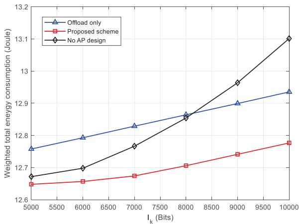

<details>
<summary>line</summary>

| I_k (Bits) | Offload only | Proposed scheme | No AP design |
| ---------- | ------------ | --------------- | ------------ |
| 5000       | 12.78        | 12.65           | 12.68        |
| 6000       | 12.80        | 12.66           | 12.70        |
| 7000       | 12.83        | 12.68           | 12.77        |
| 8000       | 12.87        | 12.71           | 12.87        |
| 9000       | 12.90        | 12.75           | 12.98        |
| 10000      | 12.94        | 12.78           | 13.11        |
</details>

Fig. 3. The weighted total energy consumption versus the task bits $I _ { k }$ under different schemes.

don’t perform calculations, and all task data are offload to the UAV, which can perform calculations and offload to the AP.

Fig. 3 shows the total energy consumption versus the task size. First, with the increase of the number of task bits $I _ { k }$ , the weighted total energy consumption of the three schemes all increases, but the weighted total energy consumption of the proposed scheme is always lower than the other two benchmark

$$
\mathcal {O} \left(K _ {1} \frac {1}{\epsilon_ {1} ^ {2}} + \sqrt {K ^ {2} M} n _ {W} \left(K ^ {2} M ^ {3} + n _ {W} K ^ {2} M ^ {2} + n _ {W} ^ {2}\right) + K _ {2} K ^ {3} \log \left(\epsilon_ {2} ^ {- 1}\right)\right) \tag {54}
$$

TABLE II SIMULATION PARAMETERS 

<table><tr><td>Parameters</td><td>Notation</td><td>Typical Values</td></tr><tr><td>Maximum CPU frequency of UEs</td><td> $f_{l,\text{max}}$ </td><td>1 MHz</td></tr><tr><td>Maximum CPU frequency of the UAV</td><td> $f_{u,\text{max}}$ </td><td>1 GHz</td></tr><tr><td>Flight altitude of the UAV</td><td>H</td><td>20 M</td></tr><tr><td>Maximum transmission power of UEs</td><td> $p_{l,\text{max}}$ </td><td>2 W</td></tr><tr><td>Maximum transmission power the UAV</td><td> $p_{u,\text{max}}$ </td><td>10 W</td></tr><tr><td>Initial location of the UAV</td><td> $\mathbf{q}_I$ </td><td>(0,0) m</td></tr><tr><td>Final location of the UAV</td><td> $\mathbf{q}_F$ </td><td>(40,40) m</td></tr><tr><td>The UAV&#x27;s maximum speed</td><td> $V_{max}$ </td><td>20 m/s</td></tr><tr><td>The UAV&#x27;s maximum displacement</td><td> $d_{min}$ </td><td>8 m</td></tr><tr><td>Tip speed of the rotor blade</td><td> $U_{tip}$ </td><td>120 m/s</td></tr><tr><td>Mean rotor induced velocity</td><td> $v_0$ </td><td>4.03</td></tr><tr><td>Air density</td><td> $ρ_0$ </td><td>1.225 kg/m3</td></tr><tr><td>Rotor disc area</td><td>A</td><td>0.503 m2</td></tr><tr><td>Fuselage drag ratio</td><td> $d_0$ </td><td>0.6</td></tr><tr><td>Rotor solidity</td><td>s</td><td>0.05</td></tr><tr><td>The total system bandwidth</td><td>B</td><td>30 MHz</td></tr><tr><td>The total task completion time</td><td>T</td><td>6 seconds</td></tr><tr><td>Required CPU cycles per bit</td><td> $C_k(k \in \mathcal{K})$ </td><td>1000 cycles/bit</td></tr><tr><td>UEs&#x27; task input data size</td><td> $I_k(k \in \mathcal{K})$ </td><td>10000 bits</td></tr><tr><td>Number of time slots</td><td>N</td><td>10</td></tr><tr><td>The weight for energy consumption for the UAV</td><td>η</td><td>0.01</td></tr><tr><td>Results downloading duration</td><td> $t_d$ </td><td>0.01 seconds</td></tr><tr><td>UEs&#x27; required SINR</td><td> $\Gamma_{req,k}(k \in \mathcal{K})$ </td><td>-10 dB</td></tr><tr><td>UEs&#x27; maximum tolerable interference SINR</td><td> $\Gamma_{seq,k}(k \in \mathcal{K})$ </td><td>-5 dB</td></tr><tr><td>Time allocation</td><td> $θ_0[n](n \in \mathcal{N})$ </td><td>0.5</td></tr></table>

schemes, which shows the effectiveness of our proposed algorithm. Second, when the task bit number is lower than , 8100bitsthe total weighted energy consumption of the no AP design scheme is lower than that of the offload only scheme. With the increase of the number of task bits, the advantage of the scheme without AP decreases gradually. Moreover, when the number of computation tasks is greater than , the total weighted 8100bitsenergy consumption of the offload only scheme is lower than that of the no AP design scheme, and the advantage becomes more obvious with the increase of the number of bits. The reason for this phenomenon is that the MEC server onboard the UAV can effectively process the offloaded mission data from UEs when the computation tasks are relatively small. In other words, the UAV prefers to perform calculations rather than offload to the AP at low task bits to save energy. Therefore, reasonable allocation of UEs and the UAV computation tasks is more energy-saving than the offload only scheme. However, when the number of task bits is large (more than ), the UAV will consume more energy to perform calculations than offload the task bits to the AP. Thus, in computationally intensive task situations, schemes with the AP assistance will be more advantageous. Especially, as can be seen from Fig. 3, with the increase of the task bits, the increment of weighted total energy consumption in schemes with AP assistance (i.e. the proposed scheme and offload only scheme) is smaller than that in the no AP design scheme, especially in the computation-intensive case. This indicates the suitability of the AP-assisted architecture for computationally intensive task scenarios.

Fig. 4 shows the trajectory and speed of the UAV under different UEs distributions and the AP position. The positions of UEs under uniform distribution are set as: $\mathbf { u } _ { 1 } = ( 2 2 . 5 , 2 . 5 ) , \mathbf { u } _ { 2 } = ( 2 7 . 5 , 7 . 5 ) , \mathbf { u } _ { 3 } = ( 3 2 . 5 , 1 2 . 5 ) , \mathbf { u } _ { 4 } =$ $( 2 0 , 3 0 ) , { \mathbf { u } } _ { 5 } = ( 2 5 , 3 5 ) , { \mathbf { u } } _ { 6 } = ( 3 0 , 4 0 )$ , the positions ( ) = ( ) = ( )of UEs under non-uniform distribution are set as: $\mathbf { u } _ { 1 } = ( 3 0 , 1 2 ) , \mathbf { u } _ { 2 } = ( 3 2 . 5 , 1 4 . 5 ) , \mathbf { u } _ { 3 } = ( 2 7 . 5 , 4 2 ) , \mathbf { u } _ { 4 } =$ $( 2 , 4 1 ) , \mathbf { u } _ { 5 } = ( 2 7 . 5 , 4 7 ) , \mathbf { u } _ { 6 } = ( 3 0 , 4 4 . 5 )$ ( ) =, and the positions ( ) = ( ) = ( )of UEs under equal spaced distribution are set as: ${ \bf u } _ { 1 } =$ $( 0 , 7 ) , \mathbf { u } _ { 2 } = ( 5 , 1 2 ) , \mathbf { u } _ { 3 } = ( 1 0 , 1 7 ) , \mathbf { u } _ { 4 } = ( 1 7 . 5 , 2 4 . 5 ) .$ , u5 $( 2 5 , 3 2 ) , \mathbf { u } _ { 6 } = ( 3 0 , 3 4 . 5 )$ ( ) = ( ) =. Combining Fig. 4(a) and (b), it can ( ) = ( )be seen that when the UEs are distributed on two sides, the UAV flies in the middle of all UEs and the UAV flies closer to the side with high density of UEs to reduce energy consumption. It can be seen from Fig. 4(c) that when UEs are equal spaced distributed, the UAV flies as close to the UEs as possible, which can save energy. Furthermore, it also can be observed that the coordinates of the AP also have a significant impact on the UAV’s trajectory. Specifically, the UAV flies as close to the AP as possible to reduce its energy consumption when offloading to the AP. As seen from Fig. 4(d), 4(e), and 4(f), at some positions the UAV hovers or flies at a very low speed. This is due to the fact that the UAV reaches a beneficial service position at that time slot and the UAV hovers or flies at a slow speed at that position to reduce energy consumption. Fig. 5 depicts the weighted total energy consumption w.r.t. the computation tasks under different antennas numbers and user numbers. As can be seen in Fig. 5, the weighted total energy consumption increases with the number of UEs, due to the fact that the UAV and UEs need to consume more energy to perform calculations and transmission. Besides, the energy consumption of all schemes increases with the amount of computational tasks, but the increment of energy consumption is less for the scheme with a higher number of antennas. This indicates that the proposed scheme of UAV equipped with multiple antennas is better adapted to the computationally intensive tasks. Moreover, for the same number of UEs and task bits, the energy consumption of the scheme with  ×  UPA antennas is significantly lower 3 3than that of the scheme with  ×  UPA antennas, which 2 2demonstrates the effectiveness of the proposed algorithm.

Fig. 6 shows the variation of the total energy consumption with the number of iterations in the first time slot, in which four cases with different UEs distributions and task bit $I _ { k } , k \in \mathcal { K }$ are given to compare, besides the subplot in Fig. 6 shows the variation of the total energy consumption starting from the second iteration. Fig. 7 shows the variation curve of the total energy consumption decrement between two adjacent iterations with the number of iterations starting from the second iteration of the algorithm. It can be seen from Fig. 6 that there is a large reduction in the total energy consumption between the first and second iterations of the four scheme while the reduction tends to stabilize from the second iteration onward. The reason for this phenomenon is that the proposed three-stage alternating optimization algorithm optimizes the relevant design variables such as UEs transmission power based on the UAV’s position obtained from the previous time slot optimization (i.e. the initial location in the first time slot). However, UEs’ transmission power is higher since the UAV’s initial location is far from UEs, which further leads to higher total energy consumption. After the first algorithm iteration, the UAV is located closer to the UEs, thus the transmission power is significantly reduced. However, from the second iteration onward, the position of the UAV has changed little and the decrement of the objective function value tends to be stable. Moreover, the convergence of the proposed algorithm can be guaranteed.

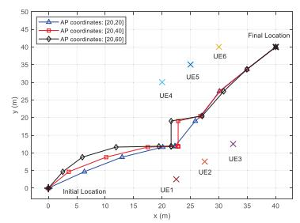

<details>
<summary>line</summary>

| x (m) | AP coordinates: [20.20] | AP coordinates: [20.40] | AP coordinates: [20.60] |
|-------|--------------------------|--------------------------|--------------------------|
| 0     | 0                        | 0                        | 0                        |
| 5     | 5                        | 5                        | 5                        |
| 10    | 10                       | 10                       | 10                       |
| 15    | 15                       | 15                       | 15                       |
| 20    | 20                       | 20                       | 20                       |
| 25    | 25                       | 25                       | 25                       |
| 30    | 30                       | 30                       | 30                       |
| 35    | 35                       | 35                       | 35                       |
| 40    | 40                       | 40                       | 40                       |
</details>

(a)

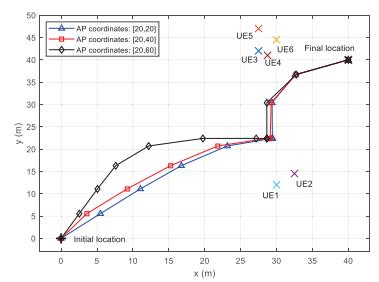

<details>
<summary>line</summary>

| x (m) | AP coordinates: [20,26] | AP coordinates: [20,46] | AP coordinates: [20,80] |
|-------|--------------------------|--------------------------|--------------------------|
| 0     | 0                        | 0                        | 0                        |
| 5     | 5                        | 5                        | 10                       |
| 10    | 10                       | 10                       | 15                       |
| 15    | 15                       | 15                       | 20                       |
| 20    | 20                       | 20                       | 25                       |
| 25    | 25                       | 25                       | 30                       |
| 30    | 30                       | 30                       | 35                       |
| 35    | 35                       | 35                       | 40                       |
| 40    | 40                       | 40                       | 45                       |
</details>

(b)

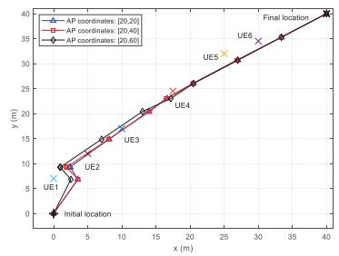

<details>
<summary>line</summary>

| Point | AP coordinates: [20,20] (x, y) | AP coordinates: [20,40] (x, y) | AP coordinates: [20,60] (x, y) |
|---|---|---|---|
| UE1 | 1 | 8 | 9 |
| UE2 | 3 | 7 | 10 |
| UE3 | 10 | 15 | 16 |
| UE4 | 15 | 20 | 21 |
| UE5 | 18 | 24 | 25 |
| UE6 | 30 | 33 | 34 |
| UE1 & UE2 & UE3 & UE4 & UE5 & UE6 & Final location | 1 | 10 | 11 |
| Initial location | 0 | 0 | 0 |
The chart displays a single linear trend with labeled endpoints for each coordinate.
</details>

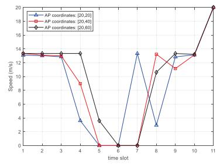

<details>
<summary>line</summary>

| time slot | AP coordinates: [20,20) | AP coordinates: [20,40) | AP coordinates: [20,60) |
| --------- | ---------------------- | ---------------------- | ---------------------- |
| 1         | 13.5                   | 13.5                   | 13.5                   |
| 2         | 13.5                   | 13.5                   | 13.5                   |
| 3         | 13.5                   | 13.5                   | 13.5                   |
| 4         | 4.0                    | 9.5                    | 13.5                   |
| 5         | 0.0                    | 0.0                    | 4.0                    |
| 6         | 0.0                    | 0.0                    | 0.0                    |
| 7         | 13.5                   | 13.5                   | 13.5                   |
| 8         | 3.0                    | 13.5                   | 11.0                   |
| 9         | 13.5                   | 13.5                   | 13.5                   |
| 10        | 13.5                   | 13.5                   | 13.5                   |
| 11        | 20.0                   | 20.0                   | 20.0                   |
</details>

(d)

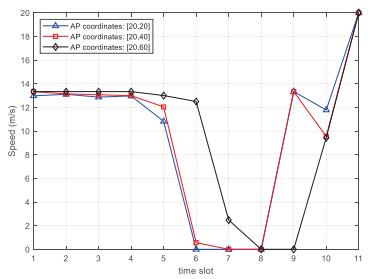

<details>
<summary>line</summary>

| time slot | AP coordinates: [20,26] | AP coordinates: [20,40] | AP coordinates: [20,60] |
| --------- | ------------------------ | ------------------------ | ------------------------ |
| 1         | 13.5                     | 13.5                     | 13.5                     |
| 2         | 13.5                     | 13.5                     | 13.5                     |
| 3         | 13.5                     | 13.5                     | 13.5                     |
| 4         | 13.5                     | 13.5                     | 13.5                     |
| 5         | 12.0                     | 12.0                     | 12.0                     |
| 6         | 0.5                      | 0.5                      | 0.5                      |
| 7         | 0.0                      | 0.0                      | 0.0                      |
| 8         | 0.0                      | 0.0                      | 0.0                      |
| 9         | 13.5                     | 13.5                     | 13.5                     |
| 10        | 12.0                     | 12.0                     | 12.0                     |
| 11        | 20.0                     | 20.0                     | 20.0                     |
</details>

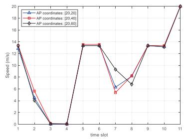

<details>
<summary>line</summary>

| time slot | AP coordinates: [20,20] (m/s) | AP coordinates: [20,40] (m/s) | AP coordinates: [20,60] (m/s) |
| :--- | :--- | :--- | :--- |
| 1 | 13.5 | 13.5 | 13.5 |
| 2 | 4.5 | 5.5 | 4.5 |
| 3 | 0.0 | 0.0 | 0.0 |
| 4 | 0.0 | 0.0 | 0.0 |
| 5 | 13.5 | 13.5 | 13.5 |
| 6 | 13.5 | 13.5 | 13.5 |
| 7 | 6.0 | 5.5 | 9.5 |
| 8 | 13.5 | 8.5 | 6.5 |
| 9 | 13.5 | 13.5 | 13.5 |
| 10 | 13.5 | 13.5 | 13.5 |
| 11 | 19.5 | 19.5 | 20.0 |
</details>

(f)

Fig. 4. (a) The UAV trajectory under the uniform UEs distribution. (b) The UAV trajectory under the non-uniform UEs distribution. (c) The UAV trajectory under the equal spaced UEs distribution. (d) The UAV velocity under the uniform UEs distribution. (e) The UAV velocity under the non-uniform UEs distributio. (f) The UAV velocity under the euqal spaced UEs distribution.   
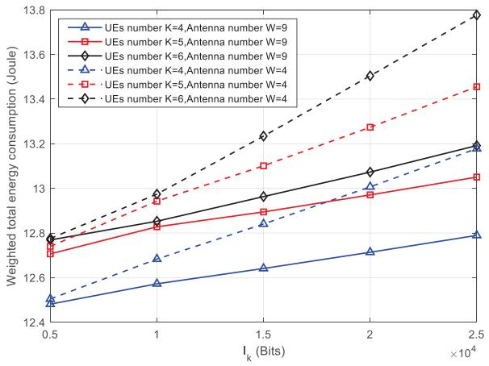

<details>
<summary>line</summary>

| I_k (Bits) | UEs number K=4, Antenna number W=9 | UEs number K=5, Antenna number W=9 | UEs number K=6, Antenna number W=9 | UEs number K=4, Antenna number W=4 | UEs number K=5, Antenna number W=4 | UEs number K=6, Antenna number W=4 |
| ---------- | ---------------------------------- | ---------------------------------- | ---------------------------------- | ---------------------------------- | ---------------------------------- | ---------------------------------- |
| 0.5e4      | 12.5                               | 12.7                               | 12.8                               | 12.6                               | 12.8                               | 12.8                               |
| 1.0e4      | 12.6                               | 12.8                               | 12.9                               | 12.7                               | 12.9                               | 13.0                               |
| 1.5e4      | 12.7                               | 12.9                               | 13.0                               | 12.8                               | 13.0                               | 13.2                               |
| 2.0e4      | 12.8                               | 13.0                               | 13.1                               | 12.9                               | 13.2                               | 13.5                               |
| 2.5e4      | 12.9                               | 13.1                               | 13.2                               | 13.0                               | 13.4                               | 13.8                               |
</details>

Fig. 5. The weighted total energy consumption versus the task under different UEs and antennas number.

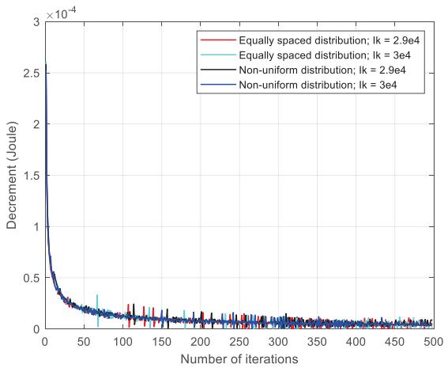

<details>
<summary>line</summary>

| Number of iterations | Equally spaced distribution; Ik = 2.9e4 | Equally spaced distribution; Ik = 3e4 | Non-uniform distribution; Ik = 2.9e4 | Non-uniform distribution; Ik = 3e4 |
| -------------------- | -------------------------------------- | ------------------------------------ | ----------------------------------- | --------------------------------- |
| 0                    | 2.5e-4                                 | 2.5e-4                               | 2.5e-4                              | 2.5e-4                            |
| 50                   | 0.2e-4                                 | 0.2e-4                               | 0.2e-4                              | 0.2e-4                            |
| 100                  | 0.1e-4                                 | 0.1e-4                               | 0.1e-4                              | 0.1e-4                            |
| 150                  | 0.05e-4                                | 0.05e-4                              | 0.05e-4                             | 0.05e-4                           |
| 200                  | 0.03e-4                                | 0.03e-4                              | 0.03e-4                             | 0.03e-4                           |
| 250                  | 0.02e-4                                | 0.02e-4                              | 0.02e-4                             | 0.02e-4                           |
| 300                  | 0.015e-4                               | 0.015e-4                             | 0.015e-4                            | 0.015e-4                          |
| 350                  | 0.01e-4                                | 0.01e-4                              | 0.01e-4                             | 0.01e-4                           |
| 400                  | 0.008e-4                               | 0.008e-4                             | 0.008e-4                            | 0.008e-4                          |
| 450                  | 0.006e-4                               | 0.006e-4                             | 0.006e-4                            | 0.006e-4                          |
| 500                  | 0.005e-4                               | 0.005e-4                             | 0.005e-4                            | 0.005e-4                          |
</details>

Fig. 7. The reduction of the weighted total power consumption between iterations.

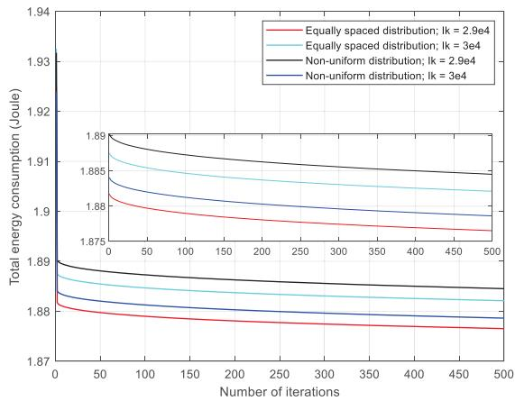

<details>
<summary>line</summary>

| Number of iterations | Equally spaced distribution; Ik = 2.9e4 | Equally spaced distribution; Ik = 3e4 | Non-uniform distribution; Ik = 2.9e4 | Non-uniform distribution; Ik = 3e4 |
| -------------------- | ---------------------------------------- | -------------------------------------- | ------------------------------------- | ----------------------------------- |
| 0                    | 1.88                                     | 1.89                                   | 1.89                                  | 1.89                                |
| 50                   | 1.88                                     | 1.89                                   | 1.89                                  | 1.89                                |
| 100                  | 1.88                                     | 1.89                                   | 1.89                                  | 1.89                                |
| 150                  | 1.88                                     | 1.89                                   | 1.89                                  | 1.89                                |
| 200                  | 1.88                                     | 1.89                                   | 1.89                                  | 1.89                                |
| 250                  | 1.88                                     | 1.89                                   | 1.89                                  | 1.89                                |
| 300                  | 1.88                                     | 1.89                                   | 1.89                                  | 1.89                                |
| 350                  | 1.88                                     | 1.89                                   | 1.89                                  | 1.89                                |
| 400                  | 1.88                                     | 1.89                                   | 1.89                                  | 1.89                                |
| 450                  | 1.88                                     | 1.89                                   | 1.89                                  | 1.89                                |
| 500                  | 1.88                                     | 1.89                                   | 1.89                                  | 1.89                                |
</details>

Fig. 6. The weighted total power consumption versus the number of iterations.

Fig. 8 shows the trajectory and speed of the UAV under different UAV maximum displacement $d _ { \mathrm { m i n } }$ . Combing Fig. 8(a) and Fig. 8(b), it can be seen that when the UAV maximum displacement in two adjacent time slots is larger, the UAV flies with the maximum displacement toward the optimal transmission position, and then hovers or flies slowly at the optimal transmission position to reduce transmission energy consumption. In particular, schemes with the larger UAV maximum displacement correspond to larger flight speeds and longer hover times around the optimal transmission position. Therefore, the larger UAV maximum displacement schemes are more beneficial for communication. However, for the scheme that the maximum displacement of the UAV is small, $\mathrm { i . e . , } d _ { \mathrm { m i n } } = 5 . 4 \mathrm { m }$ , the UAV = mflies almost uniformly along a straight line from the initial point to the final point due to the final point constraint (21 k). Moreover, the UAV propulsion energy equation (18) shows that the UAV consumes less energy when flying at a constant speed than flying fast or hovering. Therefore, the smaller UAV maximum displacement schemes are more beneficial for UAV flying.

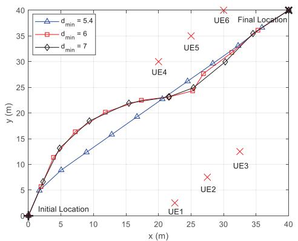

<details>
<summary>line</summary>

| x (m) | y (m) | d_min |
|-------|-------|-------|
| 0     | 0     | 5.4   |
| 2     | 5     | 5.4   |
| 5     | 10    | 5.4   |
| 10    | 15    | 5.4   |
| 15    | 20    | 5.4   |
| 20    | 25    | 5.4   |
| 25    | 30    | 5.4   |
| 30    | 35    | 5.4   |
| 35    | 40    | 5.4   |
| 40    | 40    | 5.4   |
| 20    | 25    | 6     |
| 25    | 30    | 6     |
| 30    | 35    | 6     |
| 35    | 40    | 6     |
| 20    | 25    | 7     |
| 25    | 30    | 7     |
| 30    | 35    | 7     |
| 35    | 40    | 7     |
| 20    | 25    | 8     |
| 25    | 30    | 8     |
| 30    | 35    | 8     |
| 35    | 40    | 8     |
| 20    | 25    | 9     |
| 25    | 30    | 9     |
| 30    | 35    | 9     |
| 35    | 40    | 9     |
| 20    | 25    | Final Location |
| 25    | 30    | Final Location |
| 30    | 35    | Final Location |
| 35    | 40    | Final Location |
| 20    | UE1   | Final Location |
| 25    | UE2   | Final Location |
| 30    | UE3   | Final Location |
| 35    | UE4   | Final Location |
| 40    | UE5   | Final Location |
| 40    | UE6   | Final Location |
| 40    | UE1   | Final Location |
| 40    | UE2   | Final Location |
| 40    | UE3   | Final Location |
| 40    | UE4   | Final Location |
| 40    | UE5   | Final Location |
| 40    | UE6   | Final Location |
| 40    | UE1   | Final Location |
| 40    | UE2   | Final Location |
| 40    | UE3   | Final Location |
| 40    | UE4   | Final Location |
| 40    | UE5   | Final Location |
</details>

(a)   
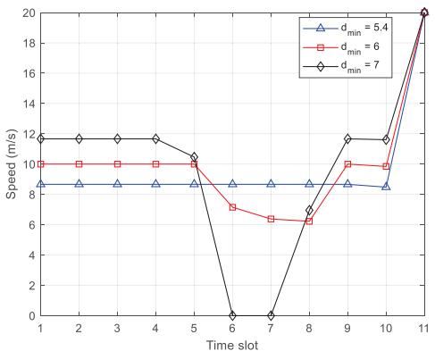

<details>
<summary>line</summary>

| Time slot | d_min = 5.4 | d_min = 6 | d_min = 7 |
| --------- | ----------- | --------- | --------- |
| 1         | 9           | 10        | 12        |
| 2         | 9           | 10        | 12        |
| 3         | 9           | 10        | 12        |
| 4         | 9           | 10        | 12        |
| 5         | 9           | 10        | 10        |
| 6         | 9           | 7         | 0         |
| 7         | 9           | 6         | 0         |
| 8         | 9           | 6         | 7         |
| 9         | 9           | 10        | 12        |
| 10        | 9           | 10        | 12        |
| 11        | 20          | 20        | 20        |
</details>

(b)   
Fig. 8. (a) The trajectory of the UAV under different UAV maximum displacements dmin, (b) The UAV velocity under different UAV maximum displacements $d _ { \mathrm { m i n } }$ .

Fig. 9 depicts the variation of total system energy consumption with the UAV maximum displacement for different task bits. As can be seen from Fig. 9, in general the total energy consumption of the system decreases with the UAV maximum displacement. The reason is the decrease of the UAV flight energy consumption. Specifically, the flight energy consumption of the UAV accounts for most of the total energy consumption of the system. However, when the UAV maximum displacement is too small, the UAV flies almost along a straight line, resulting in a significant increase of the communication-related energy consumption and eventually resulting in an increase of the total energy consumption of the system. This demonstrates the importance of the UAV trajectory design in reducing communication-related energy consumption.

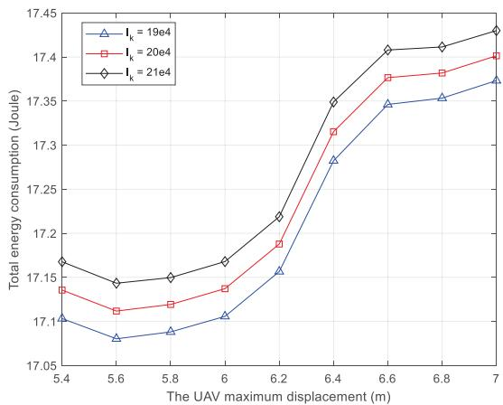

<details>
<summary>line</summary>

| The UAV maximum displacement (m) | I_k = 19e4 | I_k = 20e4 | I_k = 21e4 |
| -------------------------------- | ---------- | ---------- | ---------- |
| 5.4                              | 17.11      | 17.13      | 17.16      |
| 5.6                              | 17.09      | 17.11      | 17.14      |
| 5.8                              | 17.09      | 17.12      | 17.15      |
| 6.0                              | 17.10      | 17.13      | 17.16      |
| 6.2                              | 17.15      | 17.19      | 17.22      |
| 6.4                              | 17.29      | 17.32      | 17.35      |
| 6.6                              | 17.34      | 17.38      | 17.40      |
| 6.8                              | 17.35      | 17.39      | 17.41      |
| 7.0                              | 17.37      | 17.40      | 17.43      |
</details>

Fig. 9. The variation of total system energy consumption with the UAV maximum displacement for different task bits.

# V. CONCLUSION

In this paper, the total energy consumption minimization problem in the MISO UAV-assisted MEC network was studied by jointly optimizing the UAV’s beamforming vectors, the UAV’s CPU frequency, the UAV’s trajectory, the UEs’ transmission power and the UEs’ CPU frequency. To tackle the intractable non-convex problem, a three-stage alternative algorithm was proposed. The closed-form expressions for the optimal UAV CPU frequency and the transmission power of UEs were derived. The derived results shown that the UEs offloading decision is determined by the CSI between the UAV and UEs. Simulations results demonstrate the effectiveness and superiority of the proposed algorithm compared with other benchmark schemes, especially in the case of computation-intensive tasks.

# APPENDIX A PROOF OF THEOREM 1

After dropping the rank-one constraint (35f), the problem $\mathbf { P } _ { 1 . 2 . 1 }$ is convex and further satisfies the Slater constraint [34]– [35]. Hence, the strong duality holds between the original problem and the dual problem, and the optimal solutions can be obtained by solving the dual problem equivalently. Besides, let $\eta _ { 1 , k } , \eta _ { 2 , k }$ , and $\eta _ { 3 , k }$ respectively denote the nonnegative Lagrange multipliers associated with constraints (35b), (35c), and (35d); $\mathbf { D } _ { k } \in \mathbb { C } ^ { M \times M }$ denotes the Lagrange multiplier matrix for the positive semidefinite constraint (35e), where $k \in \mathcal { K }$ . The Lagrangian function of the problem $\mathbf { P } _ { 1 . 2 . 1 }$ can be given by (55), shown at the top of the next page. Thus, the dual problem can be expressed as

$$
\max _ {\eta_ {1, k}, \eta_ {2, k}, \eta_ {3, k} \geq 0, \mathbf {D} _ {k} \succeq 0} \min _ {\mathbf {W}} \mathcal {L} _ {1}. \tag {56}
$$

Let $\mathbf { W } _ { l , k } ^ { * }$ denote the optimal transmission matrix; $\mathbf { D } _ { k } ^ { * }$ denotes the optimal Lagrange multiplier matrix; $\eta _ { 1 , k } ^ { * } , \eta _ { 2 , k } ^ { * } .$ , and $\eta _ { 3 , k } ^ { * }$

$$
\begin{array}{l} \mathcal {L} _ {1} = \sum_ {k = 1} ^ {K} T r \left(\mathbf {W} _ {u, k} [ n ]\right) - \sum_ {k = 1} ^ {K} \eta_ {1, k} \left(T r \left(\mathbf {H} _ {k} [ n ] \mathbf {W} _ {u, k} [ n ]\right) - \Gamma_ {r e q, k} \sum_ {z \in K \backslash \{k \}} T r \left(\mathbf {H} _ {k} [ n ] \mathbf {W} _ {u, z} [ n ]\right) - \Gamma_ {r e q, k} \sigma^ {2}\right) \\ + \sum_ {k = 1} ^ {K} \eta_ {2, k} \left(T r \left(\mathbf {H} _ {j} [ n ] \mathbf {W} _ {u, k} [ n ]\right) - \Gamma_ {s e q, k} \sum_ {z \in K \backslash \{k \}} T r \left(\mathbf {H} _ {j} [ n ] \mathbf {W} _ {u, z} [ n ]\right) - \Gamma_ {s e q, k} \sigma^ {2}\right) \\ + \eta_ {3, k} \left(\sum_ {k = 1} ^ {K} T r \left(\mathbf {W} _ {u, k} [ n ]\right) - p _ {u, \max}\right) - \sum_ {k = 1} ^ {K} T r \left(\mathbf {D} _ {k} \mathbf {W} _ {u, k} [ n ]\right) \tag {55} \\ \end{array}
$$

denote the optimal Lagrange multiplier. Based on the Karush-Kuhn-Tucker (KKT) condition, the following relations can be obtained

$$
\mathbf {D} _ {k} ^ {*} \succeq 0, \eta_ {1, k} ^ {*}, \eta_ {2, k} ^ {*}, \eta_ {3, k} ^ {*} \geq 0, \forall k \in \mathcal {K}; \tag {57a}
$$

$$
\mathbf {D} _ {k} ^ {*} \mathbf {W} _ {u, k} ^ {*} = \mathbf {0}, \forall k \in \mathcal {K}; \tag {57b}
$$

$$
\nabla_ {\mathbf {W} _ {u, k} ^ {*}} \mathcal {L}, \forall k \in \mathcal {K}; \tag {57c}
$$

where $\nabla _ { \mathbf { W } _ { u , k } ^ { * } } \mathcal { L }$ denotes the gradient of the Lagrangian function u,k with respect to the optimal transmission matrix $\mathbf { W } _ { u , k } ^ { * }$ u,k . Specifically, (57c) can be given as

$$
\mathbf {D} _ {k, n} ^ {* H} = \left(1 + \eta_ {3} ^ {*}\right) \mathbf {I} _ {M} - \boldsymbol {\Xi}, \tag {58}
$$

where

$$
\boldsymbol {\Xi} = \eta_ {2, k} ^ {*} \mathbf {H} _ {j} [ n ] - \eta_ {1, k} ^ {*} \mathbf {H} _ {k} [ n ]. \tag {59}
$$

Assume that $\Xi$ is a negative definite matrix. According to (58), $\mathbf { D } _ { k } ^ { * }$ is a positive definite matrix, which is full rank. Then based on the KKT condition (57b), the optimal transmission matrix $\mathbf { W } _ { u , k } ^ { * }$ u,k has to be a null matrix, which can’t be the optimal solution when the minimum acceptable SINR $\Gamma _ { s e q , k } > 0 , \forall k \in \mathcal { K }$ . Therefore, Γwe focus on the case where Ξ is a positive semidefinite matrix. Furthermore, to ensure that $\mathbf { D } _ { k , n } ^ { * }$ is positive semidefinite, the real-valued maximum eigenvalue $\xi _ { \Xi } ^ { \mathrm { m a x } }$ of matrix Ξ must satisfy $0 \leq \xi _ { \Xi } ^ { \operatorname* { m a x } } \leq 1 + \eta _ { 3 } ^ { * }$ . However, if $\xi _ { \Xi } ^ { \mathrm { m a x } } < 1 + \eta _ { 3 } ^ { * }$ , then $\mathbf { D } _ { k } ^ { * }$ is a + +negative definite matrix, which is full rank and results in the $\mathbf { W } _ { u , k } ^ { * }$ must be a null matrix which can’t be the optimal solution for $\ddot { \Gamma } _ { s e q , k } > 0 , \forall k \in \mathcal { K }$ . Thus, there must be $\xi _ { \Xi } ^ { \mathrm { m a x } } = 1 + \eta _ { 3 } ^ { * }$ space of ΓBesides, to obtain the bounded optimal solution $\mathbf { D } _ { k } ^ { * }$ must be spanned by $\mathbf { a } _ { \Xi , \operatorname* { m a x } } \in \mathbb { C } ^ { M \times 1 }$ $\mathbf { W } _ { u , k } ^ { * }$ , where aΞ,max u,k +, the null represents the unit-norm eigenvector corresponding to the realvalued maximum eigenvalue of Ξ, i.e., D∗k,naΞ,max  0. As a =result, based on the KKT condition (57b), the rank of the optimal transmission matrix is one. The proof for Theorem 2 is complete.

# REFERENCES

[1] H. Zhang, J. Li, B. Wen, Y. Xun, and J. Liu, “Connecting intelligent things in smart hospitals using NB-IoT,” IEEE Internet Things J., vol. 5, no. 3, pp. 1550–1560, Jun. 2018.   
[2] Y. Mao, C. You, J. Zhang, K. Huang, and K. B. Letaief, “A survey on mobile edge computing: The communication perspective,” IEEE Commun. Surv. Tuts., vol. 19, no. 4, pp. 2322–2358, Oct.–Dec. 2017.   
[3] Y. Wu, Y. Wang, F. Zhou, and R. Q. Hu, “Computation efficiency maximization in OFDMA-based mobile edge computing networks,” IEEE Commun. Lett., vol. 24, no. 1, pp. 159–163, Jan. 2020.

[4] W. Wu, F. Zhou, R. Q. Hu, and B. Wang, “Energy-efficient resource allocation for secure NOMA-enabled mobile edge computing networks,” IEEE Trans. Commun., vol. 68, no. 1, pp. 493–505, Jan. 2020.   
[5] Y. Mao, J. Zhang, S. H. Song, and K. B. Letaief, “Power-delay tradeoff in multi-user mobile-edge computing systems,” in Proc. IEEE Glob. Commun. Conf., Washington, DC, USA, 2016, pp. 1–6.   
[6] H. Sun, F. Zhou, and R. Q. Hu, “Joint offloading and computation energy efficiency maximization in a mobile edge computing system,” IEEE Trans. Veh. Technol., vol. 68, no. 3, pp. 3052–3056, Mar. 2019.   
[7] S. Mukherjee and J. Lee, “Edge computing-enabled cell-free massive MIMO systems,” IEEE Trans. Wireless Commun., vol. 19, no. 4, pp. 2884–2899, Apr. 2020.   
[8] T. T. Nguyen and L. B. Le, “Computation offloading in MIMO based mobile edge computing systems under perfect and imperfect CSI estimation,” in Proc. IEEE Int. Conf. Commun., Kansas City, MO, USA, 2018, pp. 1–6.   
[9] C. Wang, R. C. Elliott, D. Feng, W. A. Krzymien, S. Zhang, and J. Melzer, “A framework for MEC-Enhanced small-cell HetNet with massive MIMO,” IEEE Wireless Commun., vol. 27, no. 4, pp. 64–72, Aug. 2020.   
[10] M. Zeng, W. Hao, O. A. Dobre, Z. Ding, and H. V. Poor, “Massive MIMOassisted mobile edge computing: Exciting possibilities for computation offloading,” IEEE Veh. Technol. Mag., vol. 15, no. 2, pp. 31–38, Jun. 2020.   
[11] X. Lin et al., “The sky is not the limit: LTE for unmanned aerial vehicles,” IEEE Commun. Mag., vol. 56, no. 4, pp. 204–210, Apr. 2018.   
[12] N. Kato et al., “Optimizing space-air-ground integrated networks by artificial intelligence,” IEEE Wireless Commun., vol. 26, no. 4, pp. 140–147, Aug. 2019.   
[13] Y. Zeng, R. Zhang, and T. J. Lim, “Wireless communications with unmanned aerial vehicles: Opportunities and challenges,” IEEE Commun. Mag., vol. 54, no. 5, pp. 36–42, May 2016.   
[14] J. Hu, M. Jiang, Q. Zhang, Q. Li, and J. Qin, “Joint optimization of UAV position, time slot allocation, and computation task partition in multiuser aerial mobile-edge computing systems,” IEEE Trans. Veh. Technol., vol. 68, no. 7, pp. 7231–7235, Jul. 2019.   
[15] Y. Takahashi, Y. Kawamoto, H. Nishiyama, N. Kato, F. Ono, and R. Miura, “A novel radio resource optimization method for relay-based unmanned aerial vehicles,” IEEE Wireless Commun., vol. 17, no. 11, pp. 7352–7363, Nov. 2018.   
[16] F. Tang, Z. M. Fadlullah, B. Mao, N. Kato, F. Ono, and R. Miura, “On a novel adaptive UAV-mounted cloudlet-aided recommendation system for LBSNs,” IEEE Trans. Emer. Topics Comput, vol. 7, no. 4, pp. 565–577, Oct.–Dec. 2019.   
[17] Y. Kawamoto, H. Nishiyama, N. Kato, F. Ono, and R. Miura, “Toward future unmanned aerial vehicle networks: Architecture, resource allocation and field experiments,” IEEE Wireless Commun., vol. 26, no. 1, pp. 94–99, Feb. 2019.   
[18] Z. Yu et al., “Caching UAV assisted secure transmission in hyper-dense networks based on interference alignment,” IEEE Internet Things J., vol. 66, no. 5, pp. 2281–2294, May 2018.   
[19] Q. Hu, Y. Cai, G. Yu, Z. Qin, M. Zhao, and G. Y. Li, “Joint offloading and trajectory design for UAV-enabled mobile edge computing systems,” IEEE Internet Things J., vol. 6, no. 2, pp. 1879–1892, Apr. 2019.   
[20] Q. Wu, Y. Zeng, and R. Zhang, “Joint trajectory and communication design for Multi-UAV enabled wireless networks,” IEEE Trans. Wireless Commun., vol. 17, no. 3, pp. 2109–2121, Mar. 2018.   
[21] S. Jeong, O. Simeone, and J. Kang, “Mobile edge computing via a UAV-Mounted cloudlet: Optimization of bit allocation and path planning,” IEEE Trans. Veh. Technol., vol. 67, no. 3, pp. 2049–2063, Mar. 2018.   
[22] X. Hu, K. Wong, K. Yang, and Z. Zheng, “UAV-assisted relaying and edge computing: Scheduling and trajectory optimization,” IEEE Trans. Wireless Commun., vol. 18, no. 10, pp. 4738–4752, Oct. 2019.

[23] T. Zhang, Y. Xu, J. Loo, D. Yang, and L. Xiao, “Joint computation and communication design for UAV-assisted mobile edge computing in IoT,” IEEE Trans. Ind. Informat., vol. 16, no. 8, pp. 5505–5516, Aug. 2020.   
[24] S. Zhang, H. Zhang, Q. He, K. Bian, and L. Song, “Joint trajectory and power optimization for UAV relay networks,” IEEE Commun. Lett., vol. 22, no. 1, pp. 161–164, Jan. 2018.   
[25] Y. Zeng and R. Zhang, “Energy-efficient UAV communication with trajectory optimization,” IEEE Trans. Wireless Commun., vol. 16, no. 6, pp. 3747–3760, Jun. 2017.   
[26] Y. Liu, S. Xie, and Y. Zhang, “Cooperative offloading and resource management for UAV-enabled mobile edge computing in power IoT system,” IEEE Trans. Veh. Technol., vol. 69, no. 10, pp. 12229–12239, Oct. 2020.   
[27] Y. Zhou, F. Zhou, H. Zhou, D. W. K. Ng, and R. Q. Hu, “Robust trajectory and transmit power optimization for secure UAV-enabled cognitive radio networks,” IEEE Trans. Commun., vol. 68, no. 7, pp. 4022–4034, Jul. 2020.   
[28] Y. Cai, Z. Wei, R. Li, D. W. K. Ng, and J. Yuan, “Joint trajectory and resource allocation design for energy-efficient secure UAV communication systems,” IEEE Trans. Commun., vol. 68, no. 7, pp. 4536–4553, Jul. 2020.   
[29] Y. Zeng, J. Xu, and R. Zhang, “Energy minimization for wireless communication with rotary-Wing UAV,” IEEE Trans. Wireless Commun., vol. 18, no. 4, pp. 2329–2345, Apr. 2019.   
[30] D. Xu, Y. Sun, D. W. K. Ng, and R. Schober, “Multiuser MISO UAV communications in uncertain environments with no-fly zones: Robust trajectory and resource allocation design,” IEEE Trans. Commun., vol. 68, no. 5, pp. 3153–3172, May 2020.   
[31] F. Zhou, Y. Wu, R. Q. Hu, and Y. Qian, “Computation rate maximization in UAV-enabled wireless-powered mobile-edge computing systems,” IEEE J. Sel. Areas Commun., vol. 36, no. 9, pp. 1927–1941, Sep. 2018.   
[32] G. Scutari, F. Facchinei, and L. Lampariello, “Parallel and distributed methods for constrained nonconvex optimization part I: Theory,” IEEE Trans. Signal Process., vol. 65, no. 8, pp. 1929–1944, Apr. 2017.   
[33] K. Wang, A. M. So, T. Chang, W. Ma, and C. Chi, “Outage constrained robust transmit optimization for multiuser MISO downlinks: Tractable approximations by conic optimization,” IEEE Trans. Signal Process., vol. 62, no. 21, pp. 5690–5705, Nov. 2014.   
[34] Y. Sun, D. W. K. Ng, J. Zhu, and R. Schober, “Robust and secure resource allocation for full-duplex MISO multicarrier NOMA systems,” IEEE Trans. Commun., vol. 66, no. 9, pp. 4119–4137, Sep. 2018.   
[35] S. Boyd and L. Vandenberghe, Convex Optimization. Cambridge, U.K.: Cambridge Univ. Press, 2004.


<details>
<summary>natural_image</summary>

Portrait photo of a man in formal attire (no text or symbols visible)
</details>

Fuhui Zhou (Senior Member, IEEE) received the Ph.D. degree from Xidian University, Xi’an, China, in 2016. He is currently a Full Professor with the College of Electronic and Information Engineering, Nanjing University of Aeronautics and Astronautics, Nanjing, China. He was a Senior Research Fellow with Utah State University, Logan, UT, USA. He has authored or coauthored more than 140 papers, including IEEE JSAC, TWC, and TCOM. His research interests include cognitive intelligence, RF machine learning, knowledge graph, edge intelligence, resource alloca-

tion, and UAV communications. He was the recipient of the Young Elite Scientist Award of China and URSI GASS Young Scientist Award. He was the Editor of the IEEE TRANSACTIONS ON COMMUNICATIONS, IEEE SYSTEMS JOURNAL, IEEE WIRELESS COMMUNICATIONS LETTERS, and Physical Communications.

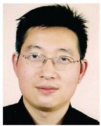

<details>
<summary>natural_image</summary>

Portrait of a man wearing glasses and a dark shirt (no text or symbols visible)
</details>

Qihui Wu (Senior Member, IEEE) received the B.S. degree in communications engineering, and the M.S. and Ph.D. degrees in communications and information systems from the Institute of Communications Engineering, Nanjing, China, in 1994, 1997, and 2000, respectively. From 2003 to 2005, he was a Postdoctoral Research Associate with Southeast University, Nanjing, China. From 2005 to 2007, he was an Associate Professor with the College of Communications Engineering, PLA University of Science and Technology, Nanjing, China, where he was a Full

Professor from 2008 to 2016. Since May 2016, he has been a Full Professor with the College of Electronic and Information Engineering, Nanjing University of Aeronautics and Astronautics, Nanjing, China. From March 2011 to September 2011, he was an Advanced Visiting Scholar with the Stevens Institute of Technology, Hoboken, NJ, USA. His current research interests include wireless communications and statistical signal processing, with emphasis on system design of software defined radio, cognitive radio, and smart radio.


<details>
<summary>natural_image</summary>

Portrait of a man wearing glasses and a black shirt (no text or symbols visible)
</details>

Boyang Liu received the B.S. and Ph.D. degrees from Xidian University, Xi’an, China, in 2011 and 2016, respectively. In 2017, he joined the School of Communication and Information Engineering, Xi’an University of Posts and Telecommunications, Xi’an, China. His research interests include mobile edge computing, resource allocation and UAV communications, green communications, cognitive radio, energy harvesting, wireless-powered communications.

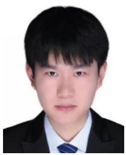

<details>
<summary>natural_image</summary>

Portrait photo of a young man in formal attire (no text or symbols visible)
</details>

Yiyao Wan received the bachelor’s degree in Internet of Things engineering in 2019 from the Xi’an University of Posts and Telecommunications, Xi’an, China, where he is currently working toward the master’s degree with the School of Communications and Information Engineering. His research interests include UAV communications, RF machine learning, cognitive intelligence, and edge computing.


<details>
<summary>natural_image</summary>

Portrait of a smiling woman with dark hair and bangs, wearing a patterned top (no text or symbols visible)
</details>

Rose Qingyang Hu (Fellow, IEEE) received the Ph.D. degree from the University of Kansas, Lawrence, KS, USA. She is currently a Professor with Electrical and Computer Engineering Department and an Associate Dean of research with the College of Engineering, Utah State University, Logan, UT, USA. She also directs Communications Network Innovation Lab, Utah State University. Besides a decade academia experience, she has more than ten years of R&D experience with Nortel, Blackberry, and Intel, as a Technical Manager, a Senior Wireless System

Architect, and a Senior Research Scientist, actively participating in industrial 3G/4G technology development, standardization, system level simulation, and performance evaluation. She has authored or coauthored more than 270 papers in top IEEE journals and conferences and also holds numerous patents in her research filed, which include next-generation wireless system design and optimization, mobile edge computing, V2X communications, artificial intelligence in wireless networks, wireless system modeling, and performance analysis. Prof. Hu is currently on the Editorial Boards of the IEEE TRANSACTIONS ON WIRE-LESS COMMUNICATIONS, IEEE TRANSACTIONS ON VEHICULAR TECHNOLOGY, and IEEE WIRELESS COMMUNICATIONS. She was also the TPC Co-Chair of IEEE ICC 2018. She was an IEEE Communications Society Distinguished Lecturer during 2015–2018 and is an IEEE Vehicular Technology Society Distinguished Lecturer during 2020–2022. He was the recipient of the best paper awards from the IEEE GLOBECOM 2012, IEEE ICC 2015, IEEE VTC Spring 2016, and IEEE ICC 2016.