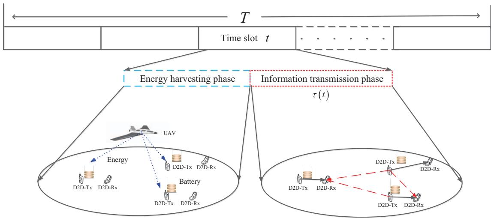
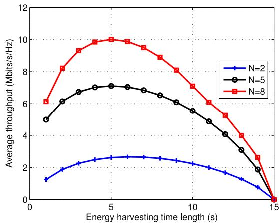
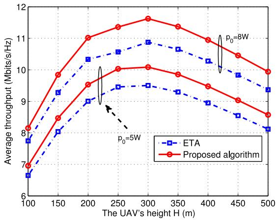
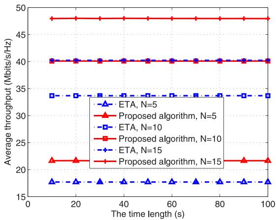
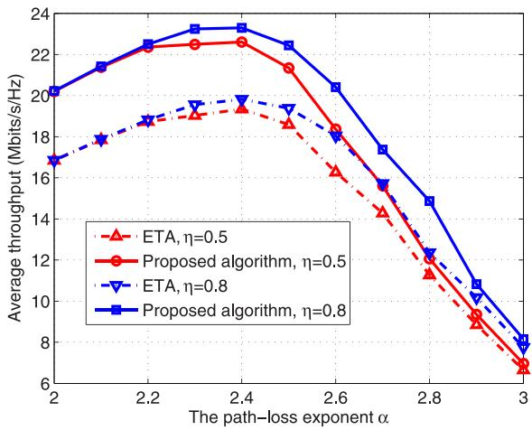

# Resource Allocation for Energy Harvesting-Powered D2D Communication Underlaying UAV-Assisted Networks

Haichao Wang, Jinlong Wang, Senior Member, IEEE, Guoru Ding , Senior Member, IEEE, Le Wang, Theodoros A. Tsiftsis, Senior Member, IEEE, and Prabhat Kumar Sharma, Senior Member, IEEE

Abstract—In this paper, we investigate the resource allocation problem for unmanned aerial vehicle (UAV)-assisted networks, where a UAV acting as an energy source provides radio frequency energy for multiple energy harvesting-powered device-to-device (D2D) pairs with much information to be transmitted. The goal is to maximize the average throughput within a time horizon while satisfying the energy causality constraint under a generalized harvest-transmit-store model, which results in a non-convex problem. By introducing the Lagrangian relaxation method, we analytically show that the behavior of all D2D pairs at each time slot is exclusive: harvesting energy or transmitting information signals. The formulated non-convex optimization problem is thus transformed into a mixed integer nonlinear programming (MINIP). We then design an efficient resource allocation algorithm to solve this MINIP, where D.C. (difference of two convex functions) programming and golden section method are combined to achieve a suboptimal solution. Furthermore, we provide an idea to reduce the computational complexity for facilitating the application in practice. Simulations are conducted to validate the effectiveness of the proposed algorithm and evaluate the system throughput performance.

Index Terms—Device-to-device, energy harvesting, resource allocation, unmanned aerial vehicle.

## I. INTRODUCTION

networking have attracted considerable attention recently

Manuscript received July 18, 2017; revised September 21, 2017; accepted October 18, 2017. Date of publication October 27, 2017; date of current version March 16, 2018. This work was supported in part by the National Natural Science Foundation of China under Grant 61501510, in part by the Natural Science Foundation of Jiangsu Province under Grant BK20150717, in part by the China Post-Doctoral Science Funded Project under Grant 2016M590398, and in part by the Jiangsu Planned Projects for Post-Doctoral Research Funds under Grant 1501009A. This paper appeared in part at the International Conference and Communications (ICC) 2017, Paris, France, May 2017 [1]. The associate editor coordinating the review of this paper and approving it for publication was E. Ayanoglu. (Corresponding author: Guoru Ding.)

Digital Object Identifier 10.1109/TGCN.2017.2767203 due to the inherent agility. UAVs can rapidly provide network access acting as flying base stations to enhance the wireless coverage and boost the throughput of existing cellular networks [2]. They can also be deployed as mobile relays to provide communication connectivity for two or more separated users without reliable direct communication links [3], [4]. Compared with traditional static base stations or relays, UAV-assisted base stations (relays) can greatly improve system performance by dynamically adjusting locations since a line of sight (LOS) communication link can be established between the UAV and served users in most scenarios [5], [6]. However, a few emerging technical challenges are urgently to be addressed for taking full advantage of the benefits of UAVs, such as the frequently changing network topology and channel state, coexistence of UAVs and small cells. To this end, the channel modeling [7]–[9] and performance analysis of UAV-assisted wireless networks [10]–[14] are recently investigated.

It has been shown in [7] that the air-to-ground (ATG) channel is closely related to the elevation angle between the airborne platform and the ground user. An empirical prop agation prediction model between a high altitude platform and a terrestrial terminal is described in [8]. For mobile communications from low altitude platforms, a statistical propagation model is proposed in [9]. With aforementioned channel models, the deployment of UAVs is investigated in the literature. For example, the optimal deployment of multiple UAVs is investigated for maximizing the downlink coverage in [12]. Additionally, for device-to-device (D2D) communications, the coverage and rate performances are discussed in details in [13] and [14]. In [13], a network for the coexistence between D2D communications and a UAV is considered. The performance is studied for two cases: static UAV and mobile UAV. The coverage probability and achievable throughput of drone small cells are investigated in [14], where the network is modelled by 3-dimensional Poisson point process. As mentioned above, although there are a few works related to the UAV-assisted wireless communication networks, they optimize the system performance from the view of UAV deployment [10]–[14]. Few of existing works concentrate on the resource allocation to improve the system performance.

In this paper, we investigate the resource allocation problem for UAV-assisted networks, where a UAV acting as an energy source provides radio frequency (RF) energy for multiple

H. Wang, J. Wang, and L. Wang are with the College of Communications Engineering, Army Engineering University of PLA, Nanjing 210007, China (e-mail: whcwl0919@sina.com; wjl543@sina.com; wlwhc0919@sina.com).

low-power D2D pairs, which generally do not have persistent energy source. For some wireless users such as sensor nodes installed under the bridge, stable energy supply may be difficult to be achieved because of their hard-to-reach positions. RF energy harvesting is a promising technology to prolong network lifetime, and recently the RF energy harvesting networks are explored in several works [15]–[24]. In the literature of energy harvesting based communications, following two models are widely explored: Harvest-then-transmit [16]–[20] and harvest-transmit-store models [21]–[24]. Harvest-transmitstore model is more general and realistic compared with harvest-then-transmit model as in harvest-transmit-store model harvested energy can be directly used, or stored and then used. Different from our previous work [1], that focused on a harvest-then-transmit model, in this paper, we investigate the resource allocation problem under a harvest-transmit-store framework. Specifically, at each time slot, D2D pairs can perform energy harvesting and further storing the energy or transmitting information. Therefore, the behavior of all D2D pairs at each time slot within a time horizon T should be jointly optimized: Harvesting energy or transmitting information signals.

In addition, since we consider the scenario that multiple D2D pairs are allowed to use the same spectrum, their mutual interference should be carefully addressed to improve the system performance [25]–[29]. Power control is one of effective strategies that have been widely studied. Therefore, the investigated resource allocation problem in this paper is formulated as a joint time and power optimization problem. However, joint optimization for multiple interfering D2D pairs is quite complicated since it causes a non-convex optimization problem. In this paper, we design an efficient resource allocation algorithm and in-depth simulations are conducted to verify the effectiveness of the proposed algorithm. Specifically, the main contributions of this paper are summarized as follows:

• We formulate the resource allocation problem underlaying UAV-assisted networks with the aim of maximizing the average throughput as a non-convex optimization problem, while taking into account the energy causality constraints.

• We analytically prove that the formulated problem can be transformed into a mixed integer nonlinear programming (MINIP) by introducing the Lagrangian relaxation method. Furthermore, we design an efficient resource allocation algorithm to address the transformed MINIP, where D.C. (difference of two convex functions) programming and golden section method are combined to find a suboptimal solution.

• We conduct in-depth simulations to validate the effectiveness of the proposed algorithm. The impacts of key system factors, such as UAV’s height, time length and path-loss exponent, etc., are investigated. We observe that the optimal throughput is almost the same with different time lengths, which is consistent with theoretical analysis.

The rest of this paper is organized as follows. In Section II, we illustrate the system model and formulate the optimization problem. Then, we analyze the formulated problem by introducing the Lagrangian relaxation method and transform it into a tractable issue in Section III. Following that, we design an efficient resource allocation algorithm in Section IV. In Section V, we present simulation results to verify the effectiveness of the proposed algorithm. Finally, we conclude the paper in Section VI.

## II. SYSTEM MODEL AND PROBLEM FORMULATION

Consider a UAV-assisted network with energy harvestingpowered D2D communications, where a UAV acting as a dedicated energy source provides energy for multiple D2D pairs. In this work, we consider the case that the spectrum allocation has been accomplished and all the interested D2D pairs operate over the same frequency spectrum. The D2D pairs herein are either referred to any low-power nodes, or can be regarded as sensor nodes which possess much important information to be transmitted, however, it is considered that these nodes do not have any fixed energy sources. Further, for satisfying the energy requirements of the D2D pairs, the energy harvesting technology is employed. Compared with static energy source, the UAV can dynamically adjust its position to improve the energy transfer efficiency. Different from our previous work based on the harvest-then-transmit protocol, a generalized harvest-transmit-store model is considered in this paper as shown in Fig. 1. This means that we focus on the resource optimization within a finite time horizon denoted by $\mathcal { T } = \{ 1 , 2 , \dots , t , \dots , T \}$ , not just a time slot t as investigated in [1]. Specifically, at each time slot t, D2D-Txs can harvest energy from the RF energy transmitted by the UAV, i.e., energy harvesting phase. Meanwhile, they can also utilize the energy harvested from initial time to time slot t for transmitting information signals, i.e., information transmission phase.

The set of D2D pairs is denoted by $\begin{array} { r l } { \mathcal { N } } & { { } = } \end{array}$ $\{ 1 , 2 , \ldots , n , \ldots , N \}$ , and let $p _ { n } ( t )$ denote the transmission power of the n-th D2D-Tx at t-th time slot. The information transmission time length is denoted by τ (t) at t-th time slot. Following [16], we consider a normalized unit time slot in the sequel without loss of generality. Therefore, the term T not only is the total time length, but also represents the number of time slots. The energy harvesting time length is thus given by $( 1 - \tau ( t ) )$ at t-th time slot. Assume that the energy harvesting efficiency is $0 ~ < ~ \eta ~ < ~ 1$ . The energy harvested at the n-th D2D-Tx is given by

$$
E _ { n } ( t ) = ( 1 - \tau ( t ) ) \eta p _ { 0 } g _ { n } ,\tag{1}
$$

where $p _ { 0 }$ is the transmission power of UAV and $g _ { n }$ is the channel power gain from the UAV to n-th D2D-Tx. Consider the case that $p _ { 0 }$ is sufficiently large such that the energy harvested from the noise can be ignored. Note that the received power should exceed certain threshold such that the transistors can be turned on and the energy harvesting circuit is able to work. Actually, the energy harvesting efficiency also depends on the strength of received wireless power [30]. Moreover, the harvested energy cannot be used for transmission solely. At each D2D-Tx, a fixed portion of the harvested energy given by (1) is used for its information transmission. A simplified model is used here which follows [16], [19]. Since each user can only utilize the harvested and stored energy, we have the following energy causality constraint:

  
Fig. 1. A considered harvest-transmit-store model for energy harvesting-powered D2D communication networks, where a UAV serves N = 3 D2D pairs. At each time slot, the D2D pairs perform energy harvesting and information transmission.

$$
\sum _ { k = 1 } ^ { t } \tau ( k ) p _ { n } ( k ) \leq \sum _ { k = 1 } ^ { t } ( 1 - \tau ( k ) ) \eta p _ { 0 } g _ { n } , \forall t \in \mathcal { T } , n \in \mathcal { N } .\tag{2}
$$

Denote $g _ { n , n }$ as the channel power gain from the n-th D2D-Tx to its receiver. The channel power gain of the interference link from the n-th D2D-Tx to the m-th D2D receiver (D2D-Rx) is denoted by $g _ { n , m } .$ . The channel between D2D-Tx and D2D-Rx can be modeled as $g _ { n , n } = \beta _ { 0 } \rho _ { n } ^ { 2 } D ^ { - \alpha }$ , where $\beta _ { 0 }$ is the channel power gain at the reference distance $d _ { 0 } , \rho _ { n } ^ { 2 }$ is an exponentially distributed random variable with unit mean, D is the distance between D2D-Tx and D2D-Rx, and α represents the path loss exponent for D2D link. However, the ATG (i.e., from the UAV to a D2D user) channel is different from the groundto-ground channel. As is discussed in [7]–[9], the authors put it forward that two main propagation groups can be considered independently with corresponding probabilities of occurrence, i.e., LOS and NLOS. To facilitate the following analysis, the UAV is considered to be located at the origin of the Cartesian coordinate system at a fixed altitude H. Depending on the LOS or NLOS links, the channel power gain from the UAV to the n-th D2D-Tx located at (x, y) is respectively given by

$$
g _ { U , n } ( x , y ) = { \left\{ \begin{array} { l l } { \left( { \sqrt { x ^ { 2 } + y ^ { 2 } + H ^ { 2 } } } \right) ^ { - \alpha _ { u } } , } & { L O S { \mathrm { ~ l i n k } } , } \\ { \eta { \left( { \sqrt { x ^ { 2 } + y ^ { 2 } + H ^ { 2 } } } \right) } ^ { - \alpha _ { u } } , } & { N L O S { \mathrm { ~ l i n k } } , } \end{array} \right. }\tag{3}
$$

where $\alpha _ { u }$ is the path loss exponent for UAV-user link and $\eta$ is an additional attenuation factor due to the NLOS connection. Notice that the multiple reflected component is neglected since the probability of having the multipath fading is significantly lower than that of having the LOS and NLOS groups [13]. The probability of LOS link is related to the location of the D2D-Tx and the UAV, the elevation angle θ between them and the environment. We can use the following form to approximate the LOS probability [13]:

$$
\mathrm { P r } _ { L O S } = \frac { 1 } { 1 + a \exp ( - b [ \theta - a ] ) } ,\tag{4}
$$

where a and b are constant values depending on the environ ment, such as density and height of buildings, street width, etc. And the elevation angle θ (measured in “degree”) is given by

$$
\theta = \frac { 1 8 0 } { \pi } \times \sin ^ { - 1 } \Bigg ( \frac { H } { \sqrt { x ^ { 2 } + y ^ { 2 } + H ^ { 2 } } } \Bigg ) .\tag{5}
$$

The probability of having NLOS link is $\mathrm { P r } _ { N L O S } = 1 - \mathrm { P r } _ { L O S }$ Therefore, the channel power gain $g _ { U , n } ( x , y )$ between the UAV and the D2D-Tx can be expressed as follows:

$$
\begin{array} { l } { { g _ { U , n } ( x , y ) = \mathrm { P r } _ { L O S } \times \left( \sqrt { x ^ { 2 } + y ^ { 2 } + H ^ { 2 } } \right) ^ { - \alpha _ { u } } } } \\ { { + \mathrm { P r } _ { N L O S } \times \eta \biggl ( \sqrt { x ^ { 2 } + y ^ { 2 } + H ^ { 2 } } \biggr ) ^ { - \alpha _ { u } } . } } \end{array}\tag{6}
$$

Since all D2D-Txs transmit information signals simultaneously over the same spectrum resource, the signal to interference plus noise ratio (SINR) received by the n-th D2D-Rx at t-th time slot is as follows:

$$
\gamma _ { n } ( t ) = \frac { p _ { n } ( t ) g _ { n , n } } { \sum _ { m \neq n } ^ { N } p _ { m } ( t ) g _ { m , n } + \sigma ^ { 2 } } ,\tag{7}
$$

where $\sigma ^ { 2 }$ is the noise power spectral density. The achievable throughput at the receiver in bits/second/Hz is given by

$$
r _ { n } ( t ) = \tau ( t ) \mathrm { l o g } _ { 2 } ( 1 + \gamma _ { n } ( t ) ) .\tag{8}
$$

The aim of this work is to maximize the average throughput of all D2D pairs within a finite time horizon T, while satisfying the energy causality constraints. Thus, the optimization problem can be formulated as the following:

$$
\begin{array} { r l r } { \displaystyle \operatorname* { m a x } _ { \{ \tau ( t ) \} , \{ p _ { n } ( t ) \} } } & { \displaystyle \frac { 1 } { T } \sum _ { t = 1 } ^ { T } \tau ( t ) \sum _ { n = 1 } ^ { N } \log _ { 2 } ( 1 + \gamma _ { n } ( t ) ) } & \\ { \mathit { s . t . } } & { C 1 : \displaystyle \sum _ { k = 1 } ^ { t } \tau ( k ) p _ { n } ( k ) \leq \sum _ { k = 1 } ^ { t } E _ { n } ( k ) , \forall t \in \mathcal { T } , n \in \mathcal { K } , } & \\ & { } & { C 2 : 0 \leq \tau ( t ) \leq 1 , \forall t \in \mathcal { T } , } \\ & { } & { C 3 : p _ { n } ( t ) \geq 0 , \forall t \in \mathcal { T } , n \in \mathcal { N } . } & { \displaystyle ( 9 . } \end{array}
$$

C1 is the energy causality constraint and guarantees that the consumed energy by any D2D-Tx cannot exceed its harvested energy. C2 and C3 are the time and power control constraints.

The optimization problem (9) is non-convex due to the coupling of multiple variables and thus the standard convex optimization methods cannot be used to efficiently solve this problem. In the sequel, we analyze the investigated problem by using Lagrangian relaxation method. Afterwards, an efficient resource allocation algorithm is designed by exploiting the structure of the objective function and constraints.

## III. PROBLEM ANALYSIS BY INTRODUCING LAGRANGIAN RELAXATION METHOD

To solve the optimization problem (9), we first introduce the Lagrangian relaxation method for turning it into a tractable form. The key idea of Lagrangian relaxation method is to add complex constraints to the objective function and then solve a sequence of optimization problems [31]. We can observe that the power and time allocations at different time slots are only coupled via the energy causality constraints C1 of (9), which can be further decoupled as follows by studying its partial Lagrangian. Denote $\{ \lambda _ { t , n } ~ \geq ~ 0 \}$ as the Lagrange multipliers corresponding to the C1 of (9). Then, the partial Lagrangian is given by

$$
\begin{array} { r l } & { \mathcal { L } \big ( \{ \tau ( t ) \} , \{ p _ { n } ( t ) \} , \big \{ \lambda _ { t , n } \} \big ) } \\ & { \quad = \cfrac { 1 } { T } \displaystyle \sum _ { t = 1 } ^ { T } \tau ( t ) \sum _ { n = 1 } ^ { N } \log _ { 2 } ( 1 + \gamma _ { n } ( t ) ) } \\ & { \quad \quad - \displaystyle \sum _ { t = 1 } ^ { T } \sum _ { n = 1 } ^ { N } \lambda _ { t , n } \Bigg [ \sum _ { k = 1 } ^ { t } \tau ( k ) p _ { n } ( k ) - \sum _ { k = 1 } ^ { t } ( 1 - \tau ( k ) ) \eta p _ { 0 } g _ { n } \Bigg ] . } \end{array}\tag{10}
$$

Denote $f _ { n } ( k ) = \tau ( k ) p _ { n } ( k ) - ( 1 - \tau ( k ) ) \eta p _ { 0 } g _ { n }$ . Then, we have

$$
\begin{array} { l } { { \displaystyle \sum _ { t = 1 } ^ { T } \sum _ { n = 1 } ^ { N } \lambda _ { t , n } \Biggl [ \sum _ { k = 1 } ^ { t } \tau ( k ) p _ { n } ( k ) - \sum _ { k = 1 } ^ { t } ( 1 - \tau ( k ) ) \eta p _ { 0 } g _ { n } \Biggr ] } } \\ { { = \displaystyle \sum _ { t = 1 } ^ { T } \sum _ { n = 1 } ^ { N } \lambda _ { t , n } \sum _ { k = 1 } ^ { t } f _ { n } ( k ) = \sum _ { t = 1 } ^ { T } \sum _ { n = 1 } ^ { N } \lambda _ { t , n } \bigl [ f _ { n } ( 1 ) + \cdot \cdot \cdot + f _ { n } ( t ) \bigr ] . } } \end{array}\tag{11}
$$

By exchanging the order of two summation signs, there is

$$
\begin{array} { r l } & { \displaystyle \sum _ { i = 1 } ^ { T } \sum _ { j = 1 } ^ { N } \lambda _ { i , n } [ f _ { i } ( 1 ) + \cdots + f _ { n } ( i ) ] } \\ & { \displaystyle = \sum _ { m = 1 } ^ { N } \sum _ { i = 1 } ^ { T } \lambda _ { i , n } [ f _ { i } ( 1 ) + \cdots + f _ { n } ( i ) ] } \\ & { \displaystyle = \sum _ { m = 1 } ^ { N } \left\{ \lambda _ { 1 , n } f _ { m } ( 1 ) + \cdots + \lambda _ { T , n } [ f _ { i } ( 1 ) + \cdots + f _ { n } ( T ) ] \right\} } \\ & { \displaystyle = \sum _ { m = 1 } ^ { N } \left\{ \lambda _ { 1 , n , d } [ f _ { i } ( 1 ) + \cdots + \lambda _ { T , n } [ f _ { i } ( 1 ) + \cdots + f _ { n } ( T ) ] \right\} } \\ & { \displaystyle = \sum _ { m = 1 } ^ { N } \left\{ \left[ \lambda _ { 1 , n } + \cdots + \lambda _ { T , n } \right] f _ { n } ( 1 ) + \cdots + \lambda _ { T , n } f _ { m } ( T ) \right\} } \\ & { \displaystyle = \sum _ { m = 1 } ^ { N } \sum _ { i = 1 } ^ { T } \left[ \lambda _ { i , n } + \cdots + \lambda _ { T , n } \right] f _ { n } ( i ) , } \end{array}\tag{12}
$$

Algorithm 1 Proposed Lagrangian Relaxation Method for   
Solving the Problem (9)   
1: Set the parameters $k = 0 ;$ , maximum iteration number $k _ { \mathrm { m a x } }$   
2: Set $\left\{ \lambda _ { t , n } \right\} \gets 0 .$   
3: Find the optimal solution $\left( \left\{ \tau ^ { \prime } ( t ) \right\} , \left\{ p _ { n } ^ { \prime } ( t ) \right\} \right)$ to the prob  
lem (14).   
4: If all constraints in (9) are all satisfied   
5: $( \{ \tau ^ { * } ( t ) \} , \{ p _ { n } { } ^ { * } ( t ) \} ) = \left( \left\{ \tau ^ { \prime } ( t ) \right\} , \left\{ p _ { n } { } ^ { \prime } ( t ) \right\} \right)$   
6: End   
7: Set $\left\{ \lambda _ { t , n } \right\} \gets \left\{ c _ { t , n } \right\}$   
8: Repeat   
9: Solve the problem (14) with given $\left\{ \lambda _ { t , n } \right\}$   
10: Update $\left\{ \lambda _ { t , n } ^ { - } \right\}$ according to its subgradient   
11: Until some termination conditions are met   
12: Return the solution $( \{ \tau ^ { * } ( t ) \} , \{ p _ { n } ^ { * } ( t ) \} )$

which further results in

$$
\begin{array} { r l r } {  { \mathcal { L } \big ( \{ \tau ( t ) \} , \{ p _ { n } ( t ) \} , \big \{ \lambda _ { t , n } \} \big ) } } \\ & { } & { = \frac { 1 } { T } \sum _ { t = 1 } ^ { T } \tau ( t ) \sum _ { n = 1 } ^ { N } \log _ { 2 } ( 1 + \gamma _ { n } ( t ) ) } \\ & { } & { \quad - \displaystyle \sum _ { t = 1 } ^ { T } \sum _ { n = 1 } ^ { N } \beta _ { t , n } \big [ \tau ( t ) p _ { n } ( t ) - ( 1 - \tau ( t ) ) \eta p _ { 0 } g _ { n } \big ] , } \end{array}\tag{13}
$$

where $\begin{array} { r } { \beta _ { t , n } = \sum _ { l = t } ^ { T } \lambda _ { l , n } } \end{array}$

With above partial Lagrangian, the Lagrangian dual function is defined as

$$
\begin{array} { r l } { g \big ( \big \{ \lambda _ { t , n } \big \} \big ) = \underset { \{ \tau ( t ) \} , \{ p _ { n } ( t ) \} } { \operatorname* { m a x } } } & { \mathcal { L } \big ( \{ \tau ( t ) \} , \{ p _ { n } ( t ) \} , \big \{ \lambda _ { t , n } \big \} \big ) } \\ { s . t . } & { 0 \leq \tau ( t ) \leq 1 , \forall t \in \mathcal { T } , } \\ & { p _ { n } ( t ) \geq 0 , \forall t \in \mathcal { T } , n \in \mathcal { N } . } \end{array}\tag{14}
$$

Hence, we can obtain either an optimal solution or a feasible solution by solving the following dual problem:

$$
\operatorname* { m i n } _ { \left\{ \lambda _ { t , n } \right\} } g \Bigl ( \left\{ \lambda _ { t , n } \right\} \Bigr ) .\tag{15}
$$

Lagrange multipliers $\{ \lambda _ { t , n } \geq 0 \}$ make a tradeoff between original objective and constraint C1. If the constraint is satisfied, decreasing the $\{ \lambda _ { t , n } ~ \geq ~ 0 \}$ is to focus on the original objective. Otherwise, we should increase the $\{ \lambda _ { t , n } \geq 0 \}$ to force the constraint to be true. They can be updated according to some criterions, such as subgradient method. Therefore, the whole procedure for solving the problem (9) is shown in Algorithm 1.

The remaining work is thus to solve the non-convex optimization problem (14) with given $\{ \lambda _ { t , n } \}$ (Step. 9 in Algorithm 1). It follows from (14) that the problem can be deposed as T independent optimization problems:

$$
\operatorname* { m a x } _ { \{ \tau ( t ) \} , \{ p _ { n } ( t ) \} } \mathcal { L } _ { t } \big ( \{ \tau ( t ) \} , \{ p _ { n } ( t ) \} , \big \{ \lambda _ { t , n } \big \} \big ) ,\tag{16}
$$

where

$$
\begin{array} { l } { { \displaystyle { \mathcal { L } } _ { t } \Big ( \{ \tau ( t ) \} , \{ p _ { n } ( t ) \} , \big \{ \lambda _ { t , n } \big \} \Big ) } \ ~ } \\ { { \displaystyle ~ = \frac { \tau ( t ) } { T } \sum _ { n = 1 } ^ { N } \log _ { 2 } ( 1 + \gamma _ { n } ( t ) ) } \ ~ } \\ { { \displaystyle ~ - \sum _ { n = 1 } ^ { N } \beta _ { t , n } \Big [ \tau ( t ) p _ { n } ( t ) - ( 1 - \tau ( t ) ) \eta p _ { 0 } g _ { n } \Big ] } . } \end{array}\tag{17}
$$

At each time slot t, we should solve the optimization problem (16), which is charactered by the following Lemma 1.

Lemma 1: The optimal solution to the problem (16) must satisfy the following condition: The information transmission time length τ (t) is binary, i.e., $\tau ( t ) = \{ 0 , 1 \}$

Proof: Observe that

$$
\begin{array} { r l r } {  { \mathcal { L } _ { t } \big ( \{ \tau ( t ) \} , \{ p _ { n } ( t ) \} , \big \{ \lambda _ { t , n } \} \big ) } } \\ & { } & { = \tau ( t ) \Bigg [ \frac { 1 } { T } \sum _ { n = 1 } ^ { N } \log _ { 2 } ( 1 + \gamma _ { n } ( t ) ) - \sum _ { n = 1 } ^ { N } \beta _ { t , n } \big [ p _ { n } ( t ) + \eta p _ { 0 } g _ { n } \big ] \Bigg ] } \\ & { } & { + \sum _ { n = 1 } ^ { N } \beta _ { t , n } \eta p _ { 0 } g _ { n } , \quad \quad ( 1 8 ) } \end{array}
$$

which is a linear function with respect to $\tau ( t )$ . Therefore, the maximum value must be obtained at endpoints, i.e., $\tau ( t ) ~ = ~ \{ 0 , 1 \}$ since $0 ~ \leq ~ \tau ( t ) ~ \leq ~ 1$ . Specifically, if there is $\begin{array} { r l } { \sum _ { n = 1 } ^ { N } \log _ { 2 } ( 1 + \gamma _ { n } ( t ) ) / T } & { > \sum _ { n = 1 } ^ { N } \beta _ { t , n } [ p _ { n } ( t ) + \eta p _ { 0 } g _ { n } ] } \end{array}$ , we have $\tau ( t ) = 1$ . Otherwise, $\tau ( t ) = 0 .$ ■

Lemma 1 indicates that the optimization variables {τ (t)} are discrete and thus the optimization problem (14) is a MINIP. Although we may achieve an optimal solution to the problem (14) with given $\{ \lambda _ { t , n } \}$ , varying $\{ \lambda _ { t , n } \}$ at each iteration in Algorithm 1 can easily make this algorithm unstable. Thus, the Algorithm 1 is not efficient to solve the problem (9) especially due to the fact that there are discrete variables.

By further analyzing the problem structure, we formulate the following Theorem that is helpful for designing an efficient algorithm:

Theorem 1: If there exists a time slot t such that $\tau ( t ) = 0$ there must be $\tau ( k ) = 0 , \forall k \leq t .$

Proof: The proof is relegated in Appendix A.

It is shown from Theorem 1 that the whole time horizon T can be indeed divided into two parts: the first part (1 ∼ $k )$ is used to harvest energy and the second $( k + 1 \sim T )$ is used to transmit information signals. Notice that $k < T$ must be satisfied to ensure that there is at least one time slot for information transmission. Thus, the optimization problem (9) is to find optimal energy harvesting time $k ^ { * }$ and transmission power ${ \{ p _ { n } } ^ { * } ( t ) \}$ for maximizing the average throughput. The investigated problem can be reformulated as follows:

$$
\begin{array} { r l } { \displaystyle \operatorname* { m a x } _ { \{ p _ { n } ( t ) \} , k } } & { \displaystyle R = \frac { 1 } { T } \sum _ { t = k + 1 } ^ { T } \sum _ { n = 1 } ^ { N } \log _ { 2 } ( 1 + \gamma _ { n } ( t ) ) } \\ { \displaystyle s . t . } & { \displaystyle \sum _ { t = k + 1 } ^ { T } p _ { n } ( t ) \leq \sum _ { t = 1 } ^ { k } \eta p _ { 0 } g _ { n } , \forall k , n , } \\ { \displaystyle p _ { n } ( t ) \geq 0 , \forall t , n , } \\ { \displaystyle k \in \{ 1 , 2 , . . . , T - 1 \} . } \end{array}\tag{19}
$$

The joint time and power optimization problem is thus transformed into an equivalent MINIP, which is still difficult to be addressed in a straightforward manner. In the next section, we address this problem and design an efficient algorithm resorting to D.C. programming and golden section method.

## IV. EFFICIENT RESOURCE ALLOCATION ALGORITHM

In this section, the transformed MINIP is solved by considering two subproblems: Power optimization with given energy harvesting time k and energy harvesting time optimization with optimal transmission power. We first investigate the power optimization subproblem and it can be written as the following:

$$
\begin{array} { r l } { \displaystyle \operatorname* { m a x } _ { \{ p _ { n } ( t ) \} } } & { \displaystyle R = \frac { 1 } { T } \sum _ { t = k + 1 } ^ { T } \sum _ { n = 1 } ^ { N } \log _ { 2 } ( 1 + \gamma _ { n } ( t ) ) } \\ { \displaystyle s . t . } & { \displaystyle \sum _ { t = k + 1 } ^ { T } p _ { n } ( t ) \leq \sum _ { t = 1 } ^ { k } \eta p _ { 0 } g _ { n } , \forall n , } \\ { \displaystyle p _ { n } ( t ) \geq 0 , \forall t , n , } \end{array}\tag{20}
$$

where the objective function R is still non-convex and the optimal solution is thus intractable to be achieved. In the sequel, we propose an iterative algorithm via analyzing the structure of objective function.

Denote the following concave functions [32]:

$$
\begin{array} { r } { w _ { n } ( \{ p _ { n } ( t ) \} ) = \log _ { 2 } \Bigl ( \sum _ { m = 1 } ^ { N } p _ { m } ( t ) g _ { m , n } + \sigma ^ { 2 } \Bigr ) , } \\ { \nu _ { n } ( \{ p _ { n } ( t ) \} ) = \log _ { 2 } \Bigl ( \sum _ { m \neq n } ^ { N } p _ { m } ( t ) g _ { m , n } + \sigma ^ { 2 } \Bigr ) . } \end{array}\tag{21}
$$

Notice that there is

$$
\begin{array} { l } { { \displaystyle R = \frac { 1 } { T } \sum _ { t = k + 1 } ^ { T } \sum _ { n = 1 } ^ { N } \log _ { 2 } ( 1 + \gamma _ { n } ( t ) ) } } \\ { { \displaystyle \ = \frac { 1 } { T } \sum _ { t = k + 1 } ^ { T } \sum _ { n = 1 } ^ { N } w _ { n } ( \{ p _ { n } ( t ) \} ) - \frac { 1 } { T } \sum _ { t = k + 1 } ^ { T } \sum _ { n = 1 } ^ { N } \nu _ { n } ( \{ p _ { n } ( t ) \} ) , } } \end{array}\tag{22}
$$

which is the difference of two concave functions. Then, we have the following result.

Lemma 2: Given a feasible transmission power ${ \{ p _ { n } } ^ { \prime } ( t ) \}$ , there is

$$
\begin{array} { r l r } {  { R ( \{ p _ { n } ( t ) \} ) \geq R \big ( \{ p _ { n } ( t ) \} , \big \{ p _ { n } ^ { \prime } ( t ) \big \} \big ) } } \\ & { } & { = \frac { 1 } { T } \sum _ { t = k + 1 } ^ { T } \sum _ { n = 1 } ^ { N } w _ { n } ( \{ p _ { n } ( t ) \} ) - \frac { 1 } { T } \sum _ { t = k + 1 } ^ { T } \sum _ { n = 1 } ^ { N } \nu _ { n } \big ( \big \{ p _ { n } ^ { \prime } ( t ) \big \} \big ) } \\ & { } & { \quad - \ \frac { 1 } { T } \sum _ { t = k + 1 } ^ { T } \sum _ { n = 1 } ^ { N } \bigl \langle \nabla \nu _ { n } \big ( \big \{ p _ { n } ^ { \prime } ( t ) \big \} \big ) , \{ p _ { n } ( t ) \} - \big \{ p _ { n } ^ { \prime } ( t ) \big \} \big \rangle , } \end{array}\tag{23}
$$

where the l-th component of the $\nabla \nu _ { n } ( \{ p _ { n } ( t ) \} )$ is given by

$$
\nabla \nu _ { n } ^ { l } ( \{ p _ { n } ( t ) \} ) = \left\{ \begin{array} { l l } { \frac { g _ { l , n } } { \ln 2 \sum _ { m \neq n } ^ { N } p _ { m } ( t ) g _ { m , n } + \sigma ^ { 2 } } , } & { l \neq n , } \\ { 0 , } & { l = n . } \end{array} \right.\tag{24}
$$

Proof: Since $\nu _ { n } ( \{ p _ { n } ( t ) \} )$ is concave, based on the firstorder condition of a concave function, we have $\nu _ { n } ( \{ p _ { n } ( t ) \} ) \leq$ $\nu _ { n } ( \{ p _ { n } ^ { \prime } ( t ) \} ) + \langle \nabla \nu _ { n } ( \{ p _ { n } ^ { \prime } ( t ) \} ) , \{ p _ { n } ( t ) \} - \{ p _ { n } ^ { \prime } ( t ) \} \rangle$ at any given point ${ \{ p _ { n } } ^ { \prime } ( t ) \}$ . Thus, $\begin{array} { r l r } { R ( \{ p _ { n } ( t ) \} ) } & { { } \geq } & { R ( \{ p _ { n } ( t ) \} , \{ p _ { n } ^ { \prime } ( t ) \} ) } \end{array}$ Moreover, if $\begin{array} { r c l } { \{ p _ { n } ( t ) \} } & { = } & { \{ p _ { n } ^ { \prime } ( t ) \} } \end{array}$ , there is $\begin{array} { r l } { R ( \{ p _ { n } ( t ) \} ) } & { { } = } \end{array}$ $R ( \{ p _ { n } ( t ) \} , \{ p _ { n } ^ { \prime } ( t ) \} )$ . So $R ( \{ p _ { n } ( t ) \} , \{ p _ { n } ^ { \prime } ( t ) \} )$ provides a tight lower bound for function $R ( \{ p _ { n } ( t ) \} )$ at ${ \{ p _ { n } } ^ { \prime } ( t ) \}$

Algorithm 2 Successive Power Optimization With Given   
Energy Harvesting Time   
1: Initialize the energy harvesting time k and a feasible   
solution $\left\{ p _ { n } ^ { \prime } ( t ) \right\}$   
2: Repeat   
3: Solve the problem (25) to get an optimal solu  
tion $\{ p _ { n } ^ { \circ } ( t ) \}$ for given $\left\{ p _ { n } ^ { \prime } ( t ) \right\}$ with standard convex   
optimization techniques   
Update $\left\{ p _ { n } ^ { \prime } ( t ) \right\} = \left\{ p _ { n } ^ { \circ } ( t ) \right\}$   
5: Until some termination conditions are met   
6: Return a suboptimal solution $\{ { p _ { n } } ^ { * } ( t ) \} = \{ { p _ { n } } ^ { \prime } ( t ) \}$

Obviously, the lower bound $R ( \{ p _ { n } ( t ) \} , \{ p _ { n } ^ { \prime } ( t ) \} )$ is a concave function. Based on Lemma 1, an iterative algorithm can be developed to solve the optimization problem (20). Denote $\{ p _ { n } ( t ) \} ^ { s } = \{ p _ { n } ^ { \prime } ( t ) \}$ as a feasible solution to the problem (20) at the s-th iteration. We can iteratively solve following convex problems to obtain a series of solutions:

$$
\begin{array} { r l } { \displaystyle \operatorname* { m a x } _ { \{ p _ { n } ( t ) \} } } & { R \big ( \{ p _ { n } ( t ) \} , \big \{ { p _ { n } } ^ { \prime } ( t ) \big \} \big ) } \\ { \displaystyle s . t . } & { \displaystyle \sum _ { t = k + 1 } ^ { T } p _ { n } ( t ) \leq \sum _ { t = 1 } ^ { k } \eta p _ { 0 } g _ { n } , \forall n , } \\ { \displaystyle p _ { n } ( t ) \geq 0 , \forall t , n , } \end{array}\tag{25}
$$

which can be solved by standard convex optimization techniques [32]. The procedure for solving the problem (20) is shown in Algorithm 2.

Denote $\{ p _ { n } ( t ) \} ^ { s }$ as the s-th optimal solution to the problem (25). Therefore, there is

$$
\begin{array} { r l } & { R \Big ( \{ p _ { n } ( t ) \} ^ { s + 1 } \Big ) \geq R \Big ( \{ p _ { n } ( t ) \} ^ { s + 1 } , \{ p _ { n } ( t ) \} ^ { s } \Big ) } \\ & { \quad \quad = \underset { \{ p _ { n } ( t ) \} } { \operatorname* { m a x } } R \big ( \{ p _ { n } ( t ) \} , \{ p _ { n } ( t ) \} ^ { s } \big ) } \\ & { \quad \quad \geq R \big ( \{ p _ { n } ( t ) \} ^ { s } , \{ p _ { n } ( t ) \} ^ { s } \big ) = R \big ( \{ p _ { n } ( t ) \} ^ { s } \big ) . } \end{array}\tag{26}
$$

The first $\because$ stems from the fact that $R ( \{ p _ { n } ( t ) \} ^ { s + 1 } , \{ p _ { n } ( t ) \} ^ { s } )$ provides a lower bound for $R ( \{ p _ { n } ( t ) \} ^ { s + 1 } )$ at $\{ p _ { n } ( t ) \} ^ { s }$ . The second is due to the fact that $\{ p _ { n } ( t ) \} ^ { s + 1 }$ is the optimal solution at the $( s + 1 ) \lrcorner \mathrm { t h }$ iteration. It can be observed that the resulting values with Algorithm 2 are non-decreasing at each iteration. Moreover, it must be upper bounded by the optimal value of (20). Thus, the convergence of Algorithm 2 is guaranteed.

The power optimization can be achieved by solving a sequence of convex problems with given energy harvesting time k. Therefore, next task is to find the optimal energy harvesting time k to maximize the achievable rate, which is a single variable optimization. There are many optimization techniques for this problem, such as Newton method and bisection method. However, the optimization variable k is discrete and these algorithms are not suitable for use. In this paper, we employ golden section method to search for a suboptimal solution. The key idea of golden section method is to calculate values of different points and the region is narrowed at each iteration by comparing these values.

Algorithm 3 Resource Allocation Algorithm   
1: Initialize $\overline { { a _ { 0 } = 1 , b _ { 0 } = T - 1 } }$ , reduction factor $\rho ,$ and   
iteration number $l = 1$   
2: If $l = = 1$   
3: Select two points $^ { a _ { l } , }$ bl according to (27) and compare   
$f ( a _ { l } ) , f ( b _ { l } )$   
4: $\mathbf { I f } ~ f ( a _ { l } ) \le f ( b _ { l } )$   
5: $a _ { 0 } = a _ { l } , b _ { 0 } = b _ { 0 }$   
6: Else   
7: $a _ { 0 } = a _ { 0 } , b _ { 0 } = b _ { l }$   
8: End   
9: End   
10: Repeat   
11: $\mathbf { I f } ~ f ( a _ { l } ) \le f ( b _ { l } )$   
12: $a _ { 0 } = a _ { l } , a _ { l + 1 } = \lfloor a _ { l } + \rho ( b _ { 0 } - a _ { l } ) \rfloor , b _ { l + 1 } = b _ { l }$   
13: Else   
14: $b _ { 0 } = b _ { l } , b _ { l + 1 } { = } \lfloor a _ { l } + ( 1 - \rho ) ( b _ { 0 } - a _ { l } ) \rfloor , a _ { l + 1 } = a _ { l }$   
15: End   
16: Compute the corresponding values $f ( a _ { l + 1 } )$ and $f ( b _ { l + 1 } )$   
by using Algorithm 2   
17: Until some termination conditions are met   
18: Return a suboptimal solution $k ^ { * }$ and ${ \{ p _ { n } } ^ { * } ( t ) \}$

Denote $a _ { 0 } = 1$ and $b _ { 0 } = T - 1$ as the initial points. At the first iteration, another two points are selected as follows:

$$
\begin{array} { l } { a _ { 1 } = \lfloor a _ { 0 } + \rho ( b _ { 0 } - a _ { 0 } ) \rfloor , } \\ { b _ { 1 } = \lfloor a _ { 0 } + ( 1 - \rho ) ( b _ { 0 } - a _ { 0 } ) \rfloor , } \end{array}\tag{27}
$$

where • denotes rounding down operation and $\rho$ is reduction factor. The rounding down operation • is actually a floor function, which ensures that the obtained results lie in the feasible region since the energy harvesting time is an integer.

Let $\begin{array} { r } { f ( k ) ~ = ~ \underset { \{ n _ { * } ( t ) \} } { \mathrm { m a x } } R ~ = ~ \bar { \sum } _ { t = k + 1 } ^ { T } \sum _ { n = 1 } ^ { N } \log _ { 2 } ( 1 + \gamma _ { n } ( t ) ) / T , } \end{array}$ which can be obtained by using Algorithm 2. $\mathrm { I f } f ( a _ { 1 } ) \leq f ( b _ { 1 } )$ the optimal solution must be obtained within the interval $[ a _ { 1 } , b _ { 0 } ]$ . Otherwise, it is located in the interval $[ a _ { 0 } , b _ { 1 } ]$ . At the following (l + 1)-th iteration, a or b can be used and thus we should only select one point. Finally, the overall procedure for solving the optimization problem (19) is presented in Algorithm 3.

From Step. 10-16, the feasible region is narrowed by ratio $( 1 - \rho )$ at each iteration. The resulting interval experiencing l step is compressed to $( 1 - \rho ) ^ { l }$ of initial interval. Thus, the iteration number is about log T. Since Algorithm 2 is to solve a sequence of convex problems, the complexity of Algorithm 2 is about $O ( ( T - 1 ) ^ { 3 } N ^ { 3 } )$ if interior point method is applied, where $( T - 1 ) N$ is the number of optimization variables. Although it can be achieved within polynomial time, it is still not what we expected since there may be a long time span T. The following theorem provides an approach to reduce the computational complexity.

Theorem 2: The optimal throughput of problem (19) is almost the same with different time lengths T.

TABLE I  
KEY PARAMETERS USED IN SIMULATIONS
<table><tr><td>Parameter</td><td>Value</td><td>Comments</td></tr><tr><td> $p _ { 0 }$ </td><td>5W</td><td>The transmission power of the UAV</td></tr><tr><td> $\sigma ^ { 2 }$ </td><td>-130 dBm/Hz</td><td>The white power spectral density</td></tr><tr><td> $\eta$ </td><td>0.5</td><td>The energy harvesting efficiency</td></tr><tr><td> $D _ { \mathrm { m a x } }$ </td><td>50 m</td><td>Maximum distance between</td></tr><tr><td> $\alpha$ </td><td>3</td><td>D2D-Tx and D2D-Rx</td></tr><tr><td></td><td></td><td>The path-loss exponent The channel power gain</td></tr><tr><td> $\beta _ { 0 }$ </td><td>-30 dB</td><td>at the reference distance</td></tr><tr><td rowspan="2"> $a , b$ </td><td>11.95, 0.136</td><td>The ATG channel parameters</td></tr><tr><td></td><td>for urban environment</td></tr><tr><td>η</td><td>20 dB</td><td>The excessive attenuation factor</td></tr><tr><td> $H$ </td><td>100 m</td><td>The altitude of the UAV</td></tr><tr><td> $\rho$ </td><td>0.3820</td><td>Reduction factor</td></tr></table>

Proof: See Appendix B for the proof.

Theorem 2 shows that we can achieve optimization with large time length $T _ { 1 }$ by addressing the optimization problem with small time length $T _ { 2 }$ , which potentially reduces the computational complexity.

## V. SIMULATIONS AND DISCUSSIONS

In this section, we perform a series of experiments to evaluate the performance of the proposed algorithm for energy harvesting-powered D2D communications in a $1 0 0 0 \times \mathrm { ~ \ ' ~ } 1 0 0 0 ~ \mathrm { ~ m } ^ { 2 }$ area, where the D2D pairs are randomly distributed and the maximum distance between D2D-Tx and D2D-Rx is 50 m. Unless specified otherwise, the system parameters are set as in Table I. The communication bandwidth is set to be 1 MHz. The time length T and number of D2D pairs N vary according to the specific simulation scenarios. The termination condition of Algorithm 3 is $| b _ { 0 } - a _ { 0 } | \leq 4$ This is based on the fact $\lfloor \rho ( b _ { 0 } - a _ { 0 } ) \rfloor \geq 1$ , and thus $\lfloor b _ { 0 } - a _ { 0 } \rfloor \ge 3$ . We consider an equal time allocation (ETA) method for the benchmark. That is, half of total time length T is used to harvest energy and another is employed to transmit information signals, where power control is also performed according to Algorithm 2.

Fig. 2 depicts the average throughput under different energy harvesting time lengths, where the total time length is 15 s and the numbers of D2D pairs are respectively 2, 5, 8. Obviously, the average throughput grows with increasing number of D2D pairs, which benefits from higher spectrum utilization. Moreover, a tradeoff between energy harvesting time length and information transmission time length can be observed. Specifically, longer energy harvesting time length, on the one hand, means that more time is used to harvest energy and thus more energy can be provided to transmit information for each D2D pair. On the other hand, available time for information transmission potentially decreases, which results in a tradeoff of different time lengths. Such result implies the necessity of time optimization in order to realize the throughput maximization.

  
Fig. 2. The average throughput under different energy harvesting time lengths with total time length $T = \bar { 1 5 s }$

  
Fig. 3. The average throughput under different UAV’s heights H.

The throughput performance of the proposed algorithm under varied UAV’s heights with different transmission power $p _ { 0 }$ is shown in Fig. 3, where the total time length $T = 3 0 ~ \mathrm { s }$ and the number of D2D pairs $N = 5$ . Compared with ETA scheme, the proposed algorithm can achieve better performance in all cases, which indicates the effectiveness of the proposed algorithm. Generally speaking, the average throughput would increase/decrease with high/low transmission power $p _ { 0 }$ since D2D pairs can harvest more/less energy for information transmission within the same energy harvesting time length. However, it can be seen from Fig. 3 that the average throughput does not decrease monotonously with the increasing UAV’s height. This can be explained by the characteristic of ATG channel: Raising the UAV’s height will enlarge the distance between the UAV and D2D pairs, which also increases the probability of LOS link since the elevation angle θ is enlarged. Therefore, raising the UAV’s height may also achieve better link performance. However, with sufficiently high UAV’s height, the distance between the UAV and D2D pairs dominates the wireless link, resulting in the losses of harvested energy. Therefore, the throughput decreases as shown in Fig. 3.

In Fig. 4, we present the average throughput under dif ferent time lengths T, where the numbers of D2D pairs are respectively N = 5, 10, 15 and the path poss exponent is 2. We can see that the average throughput is not sensitive to the total time length, which is just illustrated in Theorem 2. Specifically, the average throughput is closely related to the total time length and transmission power. For any longer time length T, a short time length ωT can be found to achieve almost the same throughput by scaling its corresponding time, while maintaining the same transmission power. In addition, the throughput gains against ETA scheme grow with increasing number of D2D pairs, which validates the effectiveness of the proposed algorithm, especially for massive connections.

  
Fig. 4. The average throughput under different time lengths T.

  
Fig. 5. The average throughput under different path-loss exponents α.

To further evaluate the impacts of key system factors, we plot the average throughput under different path-loss exponents α in Fig. 5, where energy harvesting efficiency η is also investigated. Obviously, higher energy harvesting efficiency results in higher average throughput since more energy is harvested and used to transmit information signals. Moreover, similar with the impact of the UAV’s height, the path-loss exponent is a double sword. That is to say, D2D pairs can harvest more energy with lower path-loss exponent. Meanwhile, the mutual interference among multiple D2D pairs also strengthens in this case, which indirectly degrades the throughput performance. In addition, the interference plays a vital role with low path-loss exponent. Therefore, the average throughput under different energy harvesting efficiencies is almost the same in this case as shown in Fig. 5. With increasing path-loss exponent, the throughput gap becomes larger under different energy harvesting efficiencies.

## VI. CONCLUSION

In this paper, we investigated the resource allocation problem for UAV-assisted networks, where a UAV acting as an energy source provides energy for multiple energy harvestingpowered D2D pairs with much information to be transmitted. The formulated non-convex optimization problem was proved to be a MINIP by introducing Lagrangian relaxation method. We designed an efficient resource allocation algorithm to solve the MINIP, where D.C. programming and golden section method were combined to achieve a suboptimal solution. Simulation results verify the effectiveness of proposed algorithm. For future work, the scenario that UAV acts as a mobile energy source should be investigated. Mobile energy source offers additional flexibility where the UAV’s trajectory is also considered. Such a problem is important but hard to be addressed because UAV’s trajectory optimization essentially involves an infinite number of variables.

## APPENDIX A

Observing $\mathcal { L } _ { t } ( \{ \tau ( t ) \} , \{ p _ { n } ( t ) \} , \{ \lambda _ { t , n } \} )$ , we can easily find that $\tau ( t ) = 0$ means that there is max $R _ { t } \le 0$ , where

$$
R _ { t } = \frac { 1 } { T } \sum _ { n = 1 } ^ { N } \log _ { 2 } ( 1 + \gamma _ { n } ( t ) ) - \sum _ { n = 1 } ^ { N } \beta _ { t , n } \big [ p _ { n } ( t ) + \eta p _ { 0 } g _ { n } \big ] .\tag{28}
$$

Notice that $\begin{array} { r c l } { \beta _ { t , n } } & { = } & { \sum _ { l = t } ^ { T } \lambda _ { l , n } } \end{array}$ is non-increasing and can be rewritten as $\begin{array} { r } { \beta _ { t , n } ~ = ~ \sum _ { l = k } ^ { T } \lambda _ { l , n } ~ - ~ \sum _ { l = k } ^ { t - 1 } \lambda _ { l , n } ~ = ~ \beta _ { k , n } ~ - ~ } \end{array}$ $\begin{array} { r } { \sum _ { l = k } ^ { t - 1 } \lambda _ { l , n } , \forall k < t . } \end{array}$ Then, there is

$$
\begin{array} { l } { \displaystyle R _ { t } = \frac { 1 } { T } \sum _ { n = 1 } ^ { N } \log _ { 2 } ( 1 + \gamma _ { n } ( t ) ) } \\ { \displaystyle \quad - \sum _ { n = 1 } ^ { N } \Bigg [ \beta _ { k , n } - \sum _ { l = k } ^ { t - 1 } \lambda _ { \ell , n } \Bigg ] \big [ p _ { n } ( t ) + \eta p _ { 0 } g _ { n } \big ] } \\ { \displaystyle = \frac { 1 } { T } \sum _ { n = 1 } ^ { N } \log _ { 2 } ( 1 + \gamma _ { n } ( t ) ) - \sum _ { n = 1 } ^ { N } \beta _ { k , n } \big [ p _ { n } ( t ) + \eta p _ { 0 } g _ { n } \big ] } \\ { \displaystyle \quad + \sum _ { n = 1 } ^ { N } \sum _ { l = k } ^ { t - 1 } \lambda _ { \ell , n } \big [ p _ { n } ( t ) + \eta p _ { 0 } g _ { n } \big ] . } \end{array}\tag{29}
$$

On the other hand,

$$
\begin{array} { r l r } {  { R _ { k } = \frac { 1 } { T } \sum _ { n = 1 } ^ { N } \log _ { 2 } ( 1 + \gamma _ { n } ( k ) ) - \sum _ { n = 1 } ^ { N } \beta _ { k , n } \big [ p _ { n } ( k ) + \eta p _ { 0 } g _ { n } \big ] } } \\ & { } & \\ & { } & { \leq \frac { 1 } { T } \sum _ { n = 1 } ^ { N } \log _ { 2 } ( 1 + \gamma _ { n } ( k ) ) - \sum _ { n = 1 } ^ { N } \beta _ { k , n } \big [ p _ { n } ( k ) + \eta p _ { 0 } g _ { n } \big ] } \\ & { } & \\ & { } & { + \sum _ { n = 1 } ^ { N } \sum _ { l = k } ^ { t - 1 } \lambda _ { l , n } \big [ p _ { n } ( k ) + \eta p _ { 0 } g _ { n } \big ] \qquad ( \mathrm { L } } \end{array}\tag{30}
$$

since the last term is always non-negative. Moreover,

$$
\begin{array} { r l } {  { \operatorname* { m a x } \ R _ { k } \le \operatorname* { m a x } \frac { 1 } { T } \sum _ { n = 1 } ^ { N } \log _ { 2 } ( 1 + \gamma _ { n } ( k ) ) } } \\ & { \quad - \sum _ { n = 1 } ^ { N } \beta _ { k , n } \big [ p _ { n } ( k ) + \eta p _ { 0 } g _ { n } \big ] } \\ & { \quad + \sum _ { n = 1 } ^ { N } \sum _ { l = k } ^ { l - 1 } \lambda _ { l , n } \big [ p _ { n } ( k ) + \eta p _ { 0 } g _ { n } \big ] } \\ & { = \operatorname* { m a x } \ R _ { k } . } \end{array}\tag{31}
$$

Since max $\begin{array} { r l r l r l } { R _ { t } } & { { } } & { \leq } & { { } } & { 0 } \end{array}$ and $\lambda _ { l , n } \quad \quad \ge \quad \quad 0 ,$ there must be max $\begin{array} { r l r l } { R _ { k } } & { { } \le } & { } & { { } 0 . } \end{array}$ Moreover, considering $\begin{array} { r l r } { \mathcal { L } _ { k } ( \{ \tau ( k ) \} , \{ p _ { n } ( t ) \} , \{ \lambda _ { k , n } \} ) } & { { } = } & { \tau ( k ) R _ { k } + \sum _ { n = 1 } ^ { N } \beta _ { k , n } \eta p _ { 0 } g _ { n } , } \end{array}$ we have $\tau ^ { * } ( k ) \ = \ \arg \operatorname* { m a x } _ { - \varepsilon  \hphantom { - } } \mathcal { L } _ { k } ( \{ \tau ( k ) \} , \{ p _ { n } ( t ) \} , \{ \lambda _ { k , n } \} ) \ = \ 0$ τ (k)   
Therefore, the Theorem 1 is proved.

## APPENDIX B

Denote $\begin{array} { r l r } { \mathcal { T } _ { 1 } } & { { } = } & { \{ 1 , 2 , \dots , t , \dots , T _ { 1 } \} } \end{array}$ and $\begin{array} { r l } { \mathcal { T } _ { 2 } } & { { } = } \end{array}$ $\{ 1 , 2 , \ldots , t , \ldots , T _ { 2 } \}$ as two different time lengths, and $T _ { 2 } = \omega T _ { 1 }$ with $0 < \omega < 1$ . Then, the optimization problems with different time lengths are respectively given by

$$
\begin{array} { l } { \displaystyle \min _ { \{ p _ { n } ( t ) \} , k } } & { \displaystyle R _ { 1 } = \frac { 1 } { T _ { 1 } } \sum _ { t = k + 1 } ^ { T _ { 1 } } \sum _ { n = 1 } ^ { N } \log _ { 2 } ( 1 + \gamma _ { n } ( t ) ) } \\ { \displaystyle s . t . \quad \sum _ { t = k + 1 } ^ { T _ { 1 } } p _ { n } ( t ) \le \sum _ { t = 1 } ^ { k } \eta p _ { 0 } { g _ { n } } , \forall k , n , } \\ { \displaystyle p _ { n } ( t ) \ge 0 , \forall t , n , } \\ { \displaystyle k \in \{ 1 , 2 , . . . , T _ { 1 } - 1 \} , } \end{array}\tag{32}
$$

and

$$
\begin{array} { r l r } {  { \operatorname* { m a x } _ { \{ p _ { n } ( t ) \} , k } } } \ R _ { 2 } = \frac { 1 } { T _ { 2 } } \sum _ { t = k + 1 } ^ { T _ { 2 } } \sum _ { n = 1 } ^ { N } \log _ { 2 } ( 1 + \gamma _ { n } ( t ) )  \\ & { } & { \quad s . t . \ \sum _ { t = k + 1 } ^ { T _ { 2 } } p _ { n } ( t ) \leq \sum _ { t = 1 } ^ { k } \eta p _ { 0 } g _ { n } , \forall k , n , } \\ & { } & { \quad p _ { n } ( t ) \geq 0 , \forall t , n , } \\ & { } & { \quad k \in \{ 1 , 2 , . . . , T _ { 2 } - 1 \} . } \end{array}\tag{33}
$$

Since we consider a normalized unit time slot, the difference of two optimization problems ( (32) and (33)) lies in the number of time slots. Because $T _ { 2 } ~ = ~ \omega T _ { 1 }$ , we can assume the time slot length of optimization problem (33) is $\omega .$ Thus, the time slot number of problem (33) can be also regarded as $T _ { 1 }$ . The energy causality constraint in (33) is thus given by

$$
\sum _ { t = k + 1 } ^ { T _ { 1 } } \omega p _ { n } ( t ) \leq \sum _ { t = 1 } ^ { k } \omega \eta p _ { 0 } g _ { n } , \forall k , n .\tag{34}
$$

Notice that the $T _ { 1 }$ in (34) is the number of time slot. The objective function can be further written as

$$
\begin{array} { c } { { R _ { 2 } = \displaystyle \frac { 1 } { T _ { 2 } } \sum _ { t = k + 1 } ^ { T _ { 2 } } \sum _ { n = 1 } ^ { N } \log _ { 2 } ( 1 + \gamma _ { n } ( t ) ) } } \\ { { = \displaystyle \frac { 1 } { T _ { 2 } } \sum _ { t = k + 1 } ^ { T _ { 1 } } \sum _ { n = 1 } ^ { N } \log _ { 2 } ( 1 + \gamma _ { n } ( t ) ) } } \\ { { \displaystyle T _ { 2 } { \stackrel { \mathrm { \scriptsize { = } } \omega T _ { 1 } } { = } } \ \frac { 1 } { \omega T _ { 1 } } \sum _ { \iota = k + 1 } ^ { T _ { 1 } } \sum _ { \boldsymbol { \omega } = 1 } ^ { N } \log _ { 2 } ( 1 + \gamma _ { n } ( t ) ) } } \\ { { = \displaystyle \frac { 1 } { T _ { 1 } } \sum _ { \iota = k + 1 } ^ { T _ { 1 } } \sum _ { n = 1 } ^ { N } \log _ { 2 } ( 1 + \gamma _ { n } ( t ) ) . } } \end{array}\tag{35}
$$

Then, the problem (33) can be reformulated as follows:

$$
\begin{array} { r l r } {  { \operatorname* { m a x } _ { \{ p _ { n } ( t ) \} , k } } } \ & { \displaystyle R _ { 2 } = \frac { 1 } { T _ { 1 } } \sum _ { t = k + 1 } ^ { T _ { 1 } } \sum _ { n = 1 } ^ { N } \log _ { 2 } ( 1 + \gamma _ { n } ( t ) ) } \\ & { \quad } & { \displaystyle s . t . \sum _ { t = k + 1 } ^ { T _ { 1 } } \omega p _ { n } ( t ) \leq \sum _ { t = 1 } ^ { k } \omega \eta p _ { 0 } g _ { n } , \forall k , n , } \\ & { } & { p _ { n } ( t ) \geq 0 , \forall t , n , } \\ & { } & { k \in \{ 1 , 2 , . . . , T _ { 1 } - 1 \} . } \end{array}\tag{36}
$$

Therefore, the optimization problems (36) and (32) are equivalent. Denote $k ^ { * }$ as the optimal solution to the problem (36). The optimal solution $k _ { 2 } ^ { * }$ is thus $k _ { 2 } ^ { * } = \omega k ^ { * }$ . Considering that the optimization variables are discrete, $k _ { 2 } ^ { * }$ may be not strictly integer. However, we can always find a close to optimal solution. Thus, the optimal throughput of the problem shown in (19) is almost the same with different time lengths T.

## REFERENCES

[1] H. Wang et al., “Resource allocation for energy harvesting-powered D2D communications underlaying cellular networks,” in Proc. Int. Conf. Commun. (ICC), Paris, France, May 2017, pp. 1–6.

[2] Y. Zeng, R. Zhang, and T. J. Lim, “Wireless communications with unmanned aerial vehicles: Opportunities and challenges,” IEEE Commun. Mag., vol. 54, no. 5, pp. 36–42, May 2016.

[3] Y. Zeng, R. Zhang, and T. J. Lim, “Throughput maximization for UAV-enabled mobile relaying systems,” IEEE Trans. Commun., vol. 64, no. 12, pp. 4983–4996, Dec. 2016.

[4] D. Orfanus, E. P. de Freitas, and F. Eliassen, “Self-organization as a supporting paradigm for military UAV relay networks,” IEEE Commun. Lett., vol. 20, no. 4, pp. 804–807, Apr. 2016.

[5] J. Zhang, Y. Zeng, and R. Zhang, “Spectrum and energy efficiency maximization in UAV-enabled mobile relaying,” in Proc. Int. Conf. Commun. (ICC), Paris, France, May 2017, pp. 1–6.

[6] J. Yoon, Y. Jin, N. Batsoyol, and H. Lee, “Adaptive path planning of UAVs for delivering delay-sensitive information to ad-hoc nodes,” in Proc. Wireless Commun. Netw. Conf. (WCNC), San Francisco, CA, USA, Mar. 2017, pp. 1–6.

[7] Q. Feng, J. McGeehan, E. K. Tameh, and A. R. Nix, “Path loss models for air-to-ground radio channels in urban environments,” in Proc. IEEE Veh. Technol. Conf. (VTC), Melbourne, VIC, Australia, May 2006, pp. 2901–2905.

[8] J. Holis and P. Pechac, “Elevation dependent shadowing model for mobile communications via high altitude platforms in built-up areas,” IEEE Trans. Antennas Propag., vol. 56, no. 4, pp. 1078–1084, Apr. 2008.

[9] A. A. Hourani, S. Kandeepan, and A. Jamalipour, “Modeling air-toground path loss for low altitude platforms in urban environments,” in Proc. IEEE Glob. Telecommun. Conf. (GLOBECOM), Austin, TX, USA, Dec. 2014, pp. 2898–2904.

[10] A. A. Hourani, S. Kandeepan, and S. Lardner, “Optimal LAP altitude for maximum coverage,” IEEE Wireless Commun. Lett., vol. 3, no. 6, pp. 569–572, Dec. 2014.

[11] M. Mozaffari, W. Saad, M. Bennis, and M. Debbah, “Drone small cells in the clouds: Design, deployment and performance analysis,” in Proc. IEEE Glob. Commun. Conf. (GLOBECOM), San Diego, CA, USA, Dec. 2015, pp. 1–6.

[12] M. Mozaffari, W. Saad, M. Bennis, and M. Debbah, “Efficient deployment of multiple unmanned aerial vehicles for optimal wireless coverage,” IEEE Commun. Lett., vol. 20, no. 8, pp. 1647–1650, Aug. 2016.

[13] M. Mozaffari, W. Saad, M. Bennis, and M. Debbah, “Unmanned aerial vehicle with underlaid device-to-device communications: Performance and tradeoffs,” IEEE Trans. Wireless Commun., vol. 15, no. 6, pp. 3949–3963, Jun. 2016.

[14] C. Zhang and W. Zhang, “Spectrum sharing for drone networks,” IEEE J. Sel. Areas Commun., vol. 35, no. 1, pp. 136–144, Jan. 2017.

[15] X. Lu, P. Wang, D. Niyato, D. I. Kim, and Z. Han, “Wireless networks with RF energy harvesting: A contemporary survey,” IEEE Commun. Surveys Tuts., vol. 17, no. 2, pp. 757–789, 2nd Quart., 2015.

[16] H. Ju and R. Zhang, “Throughput maximization in wireless powered communication networks,” IEEE Trans. Wireless Commun., vol. 13, no. 1, pp. 418–428, Jan. 2014.

[17] L. Liu, R. Zhang, and K.-C. Chua, “Multi-antenna wireless powered communication with energy beamforming,” IEEE Trans. Commun., vol. 62, no. 12, pp. 4349–4361, Dec. 2014.

[18] C. Guo, B. Liao, L. Huang, Q. Li, and X. Lin, “Convexity of fairness-aware resource allocation in wireless powered communication networks,” IEEE Commun. Lett., vol. 20, no. 3, pp. 474–477, Mar. 2016.

[19] S. Wang, M. Xia, and Y.-C. Wu, “Multipair two-way relay network with harvest-then-transmit users: Resolving pairwise uplink-downlink coupling,” IEEE J. Sel. Topics Signal Process., vol. 10, no. 8, pp. 1506–1521, Dec. 2016.

[20] S. Lohani, R. A. Loodaricheh, E. Hossain, and V. K. Bhargava, “On multiuser resource allocation in relay-based wireless-powered uplink cellular networks,” IEEE Trans. Wireless Commun., vol. 15, no. 3, pp. 1851–1865, Mar. 2016.

[21] H. Liu, K. J. Kim, K. S. Kwak, and H. V. Poor, “QoS-constrained relay control for full-duplex relaying with SWIPT,” IEEE Trans. Wireless Commun., vol. 16, no. 5, pp. 2936–2949, May 2017.

[22] P. Du, Q. Yang, Z. Shen, and K. S. Kwak, “Distortion minimization in wireless sensor networks with energy harvesting,” IEEE Commun. Lett., vol. 21, no. 6, pp. 1393–1396, Jun. 2017.

[23] R. V. Bhat, M. Motani, and T. J. Lim, “Energy harvesting communication using finite-capacity batteries with internal resistance,” IEEE Trans. Wireless Commun., vol. 16, no. 5, pp. 2822–2834, May 2017.

[24] A. Ortiz, H. Al-Shatri, X. Li, T. Weber, and A. Klein, “Reinforcement learning for energy harvesting decode-andforward two-hop communications,” IEEE Trans. Green Commun. Netw., vol. 1, no. 3, pp. 309–319, Sep. 2017. [Online]. Available: http://ieeexplore.ieee.org/document/7926350/

[25] A. Asadi, Q. Wang, and V. Mancuso, “A survey on device-to-device communication in cellular networks,” IEEE Commun. Surveys Tuts., vol. 16, no. 4, pp. 1801–1819, 4th Quart., 2014.

[26] W. Zhao and S. Wang, “Resource allocation for device-to-device communication underlaying cellular networks: An alternating optimization method,” IEEE Commun. Lett., vol. 19, no. 8, pp. 1398–1401, Aug. 2015.

[27] W. Zhao and S. Wang, “Resource sharing scheme for device-to-device communication underlaying cellular networks,” IEEE Trans. Commun., vol. 63, no. 12, pp. 4838–4848, Dec. 2015.

[28] R. Yin, G. Yu, H. Zhang, Z. Zhang, and G. Y. Li, “Pricing-based interference coordination for D2D communications in cellular networks,” IEEE Trans. Wireless Commun., vol. 14, no. 3, pp. 1519–1532, Mar. 2015.

[29] H. Zhang et al., “Resource allocation for cognitive small cell networks: A cooperative bargaining game theoretic approach,” IEEE Trans. Wireless Commun., vol. 14, no. 6, pp. 3481–3493, Jun. 2015.

[30] C. R. Valenta and G. D. Durgin, “Harvesting wireless power: Survey of energy-harvester conversion efficiency in far-field, wireless power transfer systems,” IEEE Microw. Mag., vol. 15, no. 4, pp. 108–120, Jun. 2014.

[31] Q. Shi, C. Peng, W. Xu, M. Hong, and Y. Cai, “Energy efficiency optimization for MISO SWIPT systems with zero-forcing beamforming,” IEEE Trans. Signal Process., vol. 64, no. 4, pp. 842–854, Feb. 2016.

[32] S. P. Boyd and L. Vandenberghe, Convex Optimization. Cambridge, U.K.: Cambridge Univ. Press, 2004.

Haichao Wang received the B.S. degree in electronic engineering from the College of Communications Engineering, Nanjing, China, in 2014, where he is currently pursuing the Ph.D. degree in communications and information system. His research interests focus on interference mitigation techniques, green communications, UAV communications, and convex optimization techniques.

Jinlong Wang received the B.S. degree in wireless communications and the M.S. and Ph.D. degrees in communications and electronic systems from the Institute of Communications Engineering, Nanjing, China, in 1983, 1986, and 1992, respectively. He is currently a Professor with the Army Engineering University, Nanjing, China.

His current research interests span a wide range of topics in wireless communications and signal processing, including cognitive radio networks, HF communications, cooperative communications, and

wireless security. He has published extensively in internationally renowned journals, including the IEEE Communications Magazine, the IEEE Signal Processing Magazine, the IEEE TRANSACTIONS ON COMMUNICATIONS, the IEEE TRANSACTIONS ON WIRELESS COMMUNICATIONS, and the IEEE TRANSACTIONS ON VEHICULAR TECHNOLOGY in the above areas. He is the Co-Chair of IEEE Nanjing Section.

Guoru Ding (S’10–M’14–SM’16) received the B.S. degree (Hons.) in electrical engineering from Xidian University, Xi’an, China, in 2008 and the Ph.D. degree (Hons.) in communications and information systems from the College of Communications Engineering, Nanjing, China, in 2014. Since 2014, he has been an Assistant Professor in the College of Communications and a Research Fellow with National High Frequency Communications Research Center of China. Since April 2015, he has been a Post-Doctoral Research Associate with the National

Mobile Communications Research Laboratory, Southeast University, Nanjing. His research interests include cognitive radio networks, massive MIMO, machine learning, and big data analytics over wireless networks.

He was a recipient of the best paper awards from EAI MLICOM 2016, IEEE Vehicular Technology Conference (VTC) 2014-Fall, and IEEE WCSP 2009, the Alexander von Humboldt Fellowship in 2017, and the Excellent Doctoral Thesis Award of China Institute of Communications in 2016. He has served as a Guest Editor of the IEEE JOURNAL ON SELECTED AREAS IN COMMUNICATIONS (Special Issue on Spectrum Sharing and Aggregation in Future Wireless Networks). He is currently an Associate Editor of the Journal of Communications and Information Networks, KSII Transactions on Internet and Information Systems and AEU-International Journal of Electronics and Communications. He has acted as a Technical Program Committee member for a number of international conferences, including the IEEE Global Communications Conference, IEEE International Conference on Communications, and IEEE VTC. He is a Voting Member of the IEEE 1900.6 Standard Association Working Group.

  
Le Wang received the B.S. degree in electronic engineering from the College of Communications Engineering, Nanjing, China, in 2014, where she is currently pursuing the M.S. degree in communications and information system. Her research interests focus on resource allocation, channel estimate, and convex optimization techniques.

Theodoros A. Tsiftsis (S’02–M’04–SM’10) was born in Lamia, Greece, in 1970. He received the B.Sc. degree in physics from the Aristotle University of Thessaloniki, Greece, in 1993, the M.Sc. degree in digital systems engineering from the Heriot-Watt University, Edinburgh, U.K., in 1995, the M.Sc. degree in decision sciences from the Athens University of Economics and Business in 2000, and the Ph.D. degree in electrical engineering from the University of Patras, Greece, in 2006. He joined the Technological Educational Institute of

Central Greece, in 2010. He is currently an Associate Professor of communication technologies with the School of Engineering, Nazarbayev University, Astana, Kazakhstan. He has authored or co-authored over 120 technical papers in scientific journals and international conferences. His research interests include the broad areas of cooperative communications, cognitive radio, communication theory, wireless powered communication systems, and optical wireless communication systems.

Dr. Tsiftsis acts as a Reviewer for several international journals and conferences. He has served as a Senior or an Associate Editor on the Editorial Boards of the IEEE TRANSACTIONS ON VEHICULAR TECHNOLOGY and IEEE COMMUNICATIONS LETTERS. He is currently an Area Editor for Wireless Communications II of the IEEE TRANSACTIONS ON COMMUNICATIONS and an Associate Editor of the IEEE TRANSACTIONS ON MOBILE COMPUTING.

Prabhat Kumar Sharma (S’12–M’15–SM’17) received the B.Tech. degree in electronics and communication engineering and VLSI design from Uttar Pradesh Technical University, Lucknow, the M.Tech. degree in electronics and communication engineering and VLSI design from the Malaviya National Institute of Technology, Jaipur, and the Ph.D. degree in wireless communications from the University of Delhi in 2015. He is an Assistant Professor with the Department of Electronics and Communication Engineering, Visvesvaraya National

Institute of Technology, Nagpur, India. He has authored over 40 journal and conferences papers. His current research interests include cognitive radio, freespace optical communication, and full duplex wireless communications. He was a recipient of Visvesvaraya Young Faculty Research Fellowship from Ministry of Electronics and Information Technology, Government of India.