# Resource Allocation for UAV Swarm-Assisted Green ISAC Networks via Multi-Agent RL

Qian Zhu , Rongke Liu , Senior Member, IEEE, Qirui Liu , Graduate Student Member, IEEE, and Changwen Chen , Life Fellow, IEEE

Abstract—Integrated sensing and communication (ISAC) technology based on unmanned aerial vehicles (UAVs) has recently been recognized as an indispensable functionality for the upcoming Sixth Generation (6G) green wireless networks. However, in harsh environments such as rural isolated areas, the resource allocation of sensing-communication service for UAVs, still seriously affects the ISAC network performance due to its inevitable defect of limited power energy. Different from previous studies, we propose a sensing-communication resource allocation analytical framework, which innovatively focuses on utilizing reinforcement learning (RL) to provide sensing prior information for UAVs, thereby obtaining satisfactory sensing and communication services for ground terminals (GTs). We first analyze the effects of resource allocation on communication and sensing respectively. On this basis, we form a sensing-communication optimization problem from the perspective of RL, specifically maximizing the total energy efficiency of the UAVs while providing sensing prior information. To solve this composite optimization problem, we first propose an improved FBSS algorithm to initialize the Q-table for UAVs for sensing purpose, and further develop a distributed Q-learning based scheme that enables each UAV to discover the optimal strategy for maximizing its expected reward. Compared with the state-of-the-art benchmarks, the numerical results show that the communication performance of the proposed method is improved by more than 40% on average. In addition, this scheme can enhance the sensing accuracy of the studied network by more than 20% without sacrificing the communication capability.

Index Terms—Integrated sensing and communication (ISAC), unmanned aerial vehicle (UAV) swarm, resource allocation, green network, reinforcement learning (RL).

## I. INTRODUCTION

## A. Motivations and Related Works

W ITH the vigorous and in-depth development of futuresixth generation (6G) green networks, integrated sens- sixth generation (6G) green networks, integrated sensing and communication (ISAC) technology, as one of the crucial and popular research interests, has been widely concerned by the industry and academia [1]. ISAC technology, aiming to form a virtuous circle of mutual benefit of sensing and communication, has a wide application prospect in many special scenarios, such as intelligent transportation, smart cities, and remote detection during recent years [2], [3], [4]. However, these application scenarios are often deployed in harsh electromagnetic environments, such as disaster-stricken areas, urban canyons and isolated areas, where global navigation satellite system (GNSS) and other traditional sensing technologies may suffer serious performance degradation due to continual non-line-of-sight (NLoS) propagation [5], [6] and available anchor nodes with imperfect geometry [7], [8]. In this case, unmanned aerial vehicle (UAV) swarm, with their inherent advantages such as high flexibility, controllable mobility and efficient inter-aircraft information coordination, can act as aerial base stations (BSs) to assist the operation of ISAC networks, making up for the deficiency of GNSS and expanding network coverage [9], [10].

With collaborative interconnection and intelligence, UAV swarm-assisted ISAC networks have been envisioned as a promising solution to get the benefits of a boost in network capacity, a greater network coverage, and a better quality of service (QoS) for ground terminals (GTs). Unfortunately, due to the limited battery capacity of the UAVs themselves, the industry is particularly concerned about the energy efficiency issue, thereby extending the service life of the UAV swarmassisted ISAC networks, which is also in line with the purpose of 6G green networks perfectly [11].

Many relevant studies have shown that the resources allocation such as transmission power, spectrum and user service strategy of UAVs, as a key issue to be solved, is essential to further enhance the energy efficiency and coverage for UAV-enabled networks. In [12], an algorithm for joint optimization of 3-D trajectory and energy consumption is proposed to maximize the communication transmission rate of GTs. Literature [13] investigates the UAV communication issue with the objective of maximizing the average energy efficiency by jointly considering the time slot assignment, transmit power control and bandwidth allocation of the target devices. Nevertheless, both studies above are mainly usercentric and lack UAV-centric considerations in networks. The energy-efficient resource allocation problem in UAV-assisted networks is introduced in [14], [15], both of which take UAV as the entry point to achieve the purpose of green energy saving by jointly optimizing the spectrum, power and other resources. Unfortunately, they focus only on UAV communication networks, and there is a lack of similar analysis for ISAC networks. In short, at the level of sensing-communication integration, there is still a lack of research in the field to consider UAVs energy efficiency from the perspective of resource allocation strategies.

Moreover, the inherent dynamics and unpredictability of UAV swarm’s operating environment, influenced by factors like flight-trajectory obstacles and fluctuating demands of GTs, necessitate a high degree of adaptability and intelligence [16], [17]. Traditional deterministic or heuristic algorithms may not fully meet these needs due to their inherent limitations in terms of adaptability and scalability, especially considering the multi-resource allocation decision making of the network. In response to this difficulty, Reinforcement Learning (RL) has been proposed and has shown promising results [18]. RL-based algorithms possess the prominent advantages of solving model-free dynamic programming problems, dealing with complex environments and long-term return problems, and offering an optimal solution for handling dynamic scenes [19], [20]. In [21], a new method of virtual training is proposed, which has smaller state space and more reasonable construction of reward function, so as to improve algorithm convergence speed, but the influence of prior knowledge on RL network is not discussed. Reference [22] considers the priority constraints among sensors, and the objective is to minimize the maximum response time of monitoring. However, the authors overlook the energy consumption of the network as an important performance indicator. In conclusion, the current research in the field is still mainly focused on communication network, and the research on UAV-assisted ISAC network is relatively lacking.

Combined with the above considerations, we shall focus particularly on the influence of resource allocation using RL in ISAC networks on communication and sensing performance. Unlike the previous studies, we explore the potential for improvement of ISAC property in the form of providing prior information for multiple UAV agents. Besides, the above research point can also provide theoretical support for future UAV-assisted ISAC network design meeting more requirements simultaneously, which also has tremendous potential in the aspect of promoting sensing accuracy while reducing communication energy consumption. To the best of our knowledge, this is the first work to probe into the resource allocation for both sensing and communication in UAV swarm-assisted ISAC network from the perspective of providing priori information for UAV swarm.

## B. Main Contributions

In this paper, a sensing-communication co-design resource allocation framework is proposed to improve the sensing accuracy of UAV-assisted ISAC networks while optimizing UAVs’ communication energy efficiency. In particular, providing sensing prior knowledge for UAVs is innovatively introduced into the proposed framework. Specifically, the main contributions of our research are summarized as follows.

1) We consider a practical UAV swarm-assisted ISAC network consisting of multiple low-altitude UAVs to provide sensing and communication services for GTs in rural isolated area, which is essentially a realistic dynamic two-dimensional (2-D) scene with instantaneous coordinates vectors.

2) We derive the performance indicators of communication and sensing respectively, analyze the impact of UAV-centric resource allocation on communication and sensing successively, and finally form the related optimization problem.

3) We design an improved FBSS (Fast Base Station Selection) algorithm to explore the sensing capability of UAV swarm-assisted ISAC networks in 2) by providing UAVs with location sensing prior knowledge.

4) We propose a distributed Q-learning based resource allocation algorithm to solve the optimization problem formed in 2). Further, we compare and analyze the proposed design with benchmark methods in terms of algorithm effectiveness, sensing, and communication levels respectively.

The remainder of this article is organized as follows. The system model of Section III presents the resource allocationoriented sensing-communication framework and forms related optimization problems in detail. Section IV proposes the improved FBSS algorithm and distributed Q-learning based approach to solve the optimization problems in Section III. Section V provides numerical results to demonstrate the effectiveness and superiority of the proposed algorithms in sensing and communication levels. Finally, the concluding remarks are drawn in Section VI.

The main notations used in this article are elaborated on as follows. A denotes a matrix, a denotes a column vector, and a denotes a scalar. $| | \mathbf { A } | | _ { F }$ represents the Frobenius norm of A, whereas $\mathbf { A } ^ { T } , \mathbf { A } ^ { \dot { H } } , \ddot { \mathbf { A } ^ { - 1 } }$ indicates its transpose, conjugate transpose, and inverse, respectively. diag(·) and blkdiag(·) denote the diagonal and block diagonal matrices, respectively. IN is the $N \times N$ identity matrix and ${ \bf 0 } _ { N \times M }$ represents the N × M all-zero matrix.

## II. SYSTEM MODEL

In this paper, as shown in Fig. 1, we consider a typical rural isolated area consisting of M moving low-altitude UAVs and L stationary GTs. In such harsh scenario, conventional technologies such as GNSS and terrestrial cellular-based sensing-communication service fail to meet GTs’ requirements due to network coverage severely degraded [23]. The UAVs and GTs are denoted by sets $\mathcal { M } \ = \ \{ 1 , 2 , \dotsc , M \}$ and $\mathcal { L } ~ = ~ \{ 1 , 2 , \ldots , L \}$ , respectively. We assume that the whole UAV swarm is deployed at the edge of the studied ISAC network, and it has realized accurate self-positioning through the available ground BS and aerial reference stations (ARSs) in advance [24], [25]. The ground BS acts as a central controller, storing the location information of each UAV, and is responsible for issuing resource allocation and scheduling instructions for each UAV. The trajectory of each UAV is known and available to each GT, and can be denoted by the 2-D coordinate at time t for UAV-m as ${ \bf u } _ { m } ( t ) \ = \quad$ $( \dot { \boldsymbol { x } } _ { m } ( t ) , \boldsymbol { y } _ { m } ( t ) ) ^ { T } \in \mathbb { R } ^ { 2 \times 1 } , m \in \mathcal { M }$ . The fixed altitude of the UAV-m is $H _ { m }$ , which can be easily and precisely measured by professional equipments, such as barometers [26], and the measurement accuracy can reach sub-meter level. The true fixed coordinate of GT-l is $\mathbf { v } _ { l } = ( x _ { l } , y _ { l } ) ^ { T } \in \mathbb { R } ^ { 2 \times 1 } , l \in \mathcal { L } ,$ and each GT’s sensing-communication process is independent of each other.

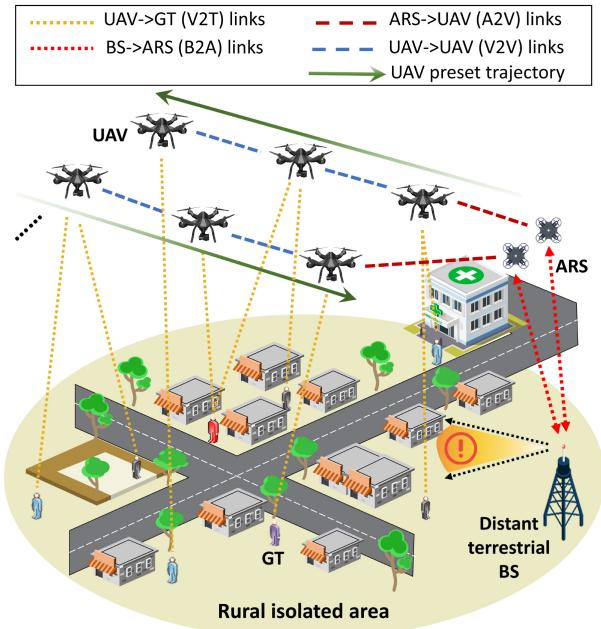  
Fig. 1. In a rural isolated area, UAV swarm provides sensing and communication services for GTs at the edge of the network.

For convenience, assuming that there are always clear lineof-sight (LoS) paths between UAV-GT links, under which TDOA measurements could achieve quite high sensing accuracy [27], [28]. In addition, it should be noted here, we assume that the sensing error caused by time synchronization can be compensated by some existing mature solutions [29]. During the focused period $T _ { \mathrm { t o t a l } }$ , in order to cover the entire target area as much as possible to ensure sensing-communication performance, the whole UAV swarm is divided into several groups, which start from opposite directions, cross over the target area in a straight line at the fixed speed ${ \dot { \mathbf { s } } } _ { U A V }$ , while completing the data upload and device positioning for GTs on the ground. During flight, each UAV acts as a mobile data collector and aerial anchor node, providing sensingcommunication services for the GTs. The circular light green area in which GNSS and terrestrial cellular services are completely disrupted is called the “waiting service area”, as shown in Fig. 1.

The operation process of the UAV swarm-assisted ISAC network is described as follows. Preliminaries: The UAVs have the ability to transmit or receive signals exclusively for communication or sensing purposes according to the selected power level, and the GTs are also capable of receiving the corresponding signals [7]. Step 1: By utilizing the signals received from a certain number of the UAV anchors, each GT obtains the TDOA estimations and relevant channel quality information. Step 2: Considering the adaptability and operability with the scene, each GT estimates its position and receives the downlink data through the air-to-ground (A2G) channel by utilizing the multilateral localization algorithm and the information obtained in Step 1 [30].

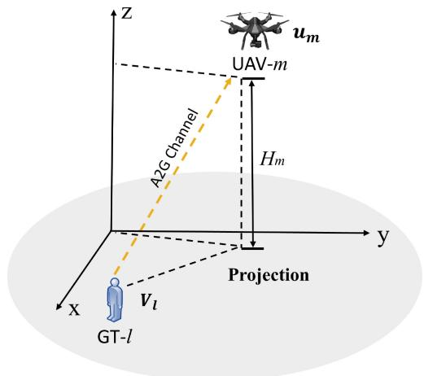  
Fig. 2. Communication model of UAV swarm-assisted ISAC network.

To facilitate the analysis, we assume that the considered UAV swarm-assisted ISAC network operates on a discretetime basis where the time axis is partitioned into equal non-overlapping time intervals (slots) [31]. It should be stated that a time slot t is small enough that the communication or sensing parameters of UAVs are assumed to remain constant during each time slot t. Besides, each UAV holds the channel state information (CSI) of all GTs and decisions for a fixed time interval $T _ { s } \geq 1$ slots, which is called decision period. We consider the following transmission scheduling for the resource allocation of UAV swarm: Any UAV is assigned a time slot t to start its sensing-communication transmission task and must finish the task to select the new tactic by the end of its decision period, i.e., at time slot $t + T _ { s }$

In the following subsections, we introduce the mathematical models of energy efficiency and positioning performance of UAV swarm to measure the sensing-communication performance in the studied ISAC network.

## A. Communication Model

As shown in Fig. 2, we consider the scenario in which UAV swarm perform communication task for GTs. For the sake of analysis, we assume that at the time slot t, the channel power gain of LoS between UAV-m and GT-l follows the free space propagation model and can be expressed as

$$
g _ { m , l } ( t ) = \beta _ { 0 } d _ { m , l } ^ { - \alpha } ( t ) = \frac { \beta _ { 0 } } { ( \| \mathbf { v } _ { l } - \mathbf { u } _ { m } ( t ) \| ^ { 2 } + H _ { m } ^ { 2 } ) ^ { \frac { \alpha } { 2 } } } ,\tag{1}
$$

where $\beta _ { 0 } ~ = ~ ( \frac { 4 \pi f _ { c } } { c } ) ^ { 2 }$ is the reference path loss when the distance is 1 m; α is the path loss exponent (PLE) of the A2G channel under LoS conditions; $f _ { c }$ and c are the main frequency and the speed of light, respectively.

In the UAV-to-GT transmission, let $a _ { m } ^ { l } ( t )$ be the indicator of GTs. Specifically, $a _ { m } ^ { l } ( t ) = 1$ if GT-l served by UAV-m in time slot t; $a _ { m } ^ { l } ( t ) = 0$ , otherwise. In order to ensure the service quality and reliability of the UAVs, it satisfies

$$
\sum _ { l = 1 } ^ { \mathrm { L } } a _ { m } ^ { l } ( t ) \leq 1 , \forall m \in \mathcal { M } .\tag{2}
$$

That is each UAV can only service a single GT for each time slot. This assumption avoids the additional burden of greater computation on UAVs with limited energy resources. In addition, the service capabilities of UAVs in the same time slot can be further expanded to meet scenarios with greater sensing-communication demands. In this paper, discrete transmit power control is adopted at UAV swarm. The transmit power values by each UAV to communicate with its respective connected GT can be expressed as a vector P, and $\mathbf { P } = \{ P _ { 1 } , P _ { 2 } , \ldots , P _ { K } \}$ . That is, there are K power levels of 1 2the UAVs, which is expressed as a set $\mathcal { K } = \{ 1 , 2 \ , \ldots , \mathbf { K } \}$ Let $p _ { m } ^ { k } ( t )$ be the indicator of the UAV’s power. Similarly, if $p _ { m } ^ { k } ( t ) = 1$ , it means that the UAV selects power as $P _ { k }$ at time slot t; if $p _ { m } ^ { k } ( t ) = 0$ , the UAV’s transmitting power is 0. It should be noted that, only one power level can be selected at each time slot t by UAV-m for the purposes of reliability, so the following formula holds

$$
\sum _ { k = 1 } ^ { \mathrm { K } } p _ { m } ^ { k } ( t ) \leq 1 , \forall m \in \mathcal { M } .\tag{3}
$$

According to the above, the Signal to Interference plus Noise Ratio (SINR) from UAV-m to GT-l link at time slot t is further obtained as follows

$$
\gamma _ { m , l } ( t ) = \frac { a _ { m } ^ { l } ( t ) \cdot P _ { m } ( t ) \cdot g _ { m , l } ( t ) } { \sigma ^ { 2 } + I _ { m , l } ( t ) } ,\tag{4}
$$

where $P _ { m } ( t )$ denotes the transmit power selected by UAVm at time slot t. $I _ { m , l } ( t )$ is the interference to UAV-m with $\begin{array} { r } { I _ { m , l } ( t ) = \sum _ { j \in \mathcal { M } , j \not = m } P _ { j } ( t ) \cdot g _ { j , l } ( t ) } \end{array}$ , which means the co-=channel interference from other UAVs and $\sigma ^ { 2 }$ means the noise power. Therefore, the SINR of UAV-m at any time slot t is given by

$$
\gamma _ { m } ( t ) = \sum _ { l \in \mathcal { L } } \gamma _ { m , l } ( t ) .\tag{5}
$$

Then, the throughput achieved by the selected user and power level (bits/s) of UAV-m is denoted by

$$
R _ { m } ( t ) = B \cdot \log _ { 2 } ( 1 + \gamma _ { m } ( t ) ) ,\tag{6}
$$

where B means the signal bandwidth. Furthermore, the energy consumption of the UAV-m in time slot t can be expressed as follows

$$
E _ { m } ( t ) = \omega _ { 0 } \cdot P _ { m } ( t ) ,\tag{7}
$$

where ω means the cost per unit level of power.

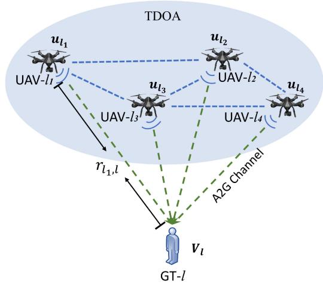  
Fig. 3. Sensing model of UAV swarm-assisted ISAC network.

## B. Sensing Model

As shown in Fig. 3, consider at time slot t in target space where $M _ { 0 }$ moving UAVs are providing sensing services for GT-l. Since the sensing process that each GT in the UAV swarm-assisted ISAC network we studied are completely independent, subsequent theoretical derivation and analysis will be discussed with GT-l positioning as an example. It should be declared that in order to improve the clarity and readability of the paper, time slot t is ignored in the formula derivation in this subsection. Assume that the set of UAV anchor nodes serving the GT-l is ${ \mathcal { V } } _ { l } = \{ l _ { 1 } , l _ { 2 } , \dots , l _ { M _ { 0 } } \}$ , and it holds $M _ { 0 } \ge 4 ~ [ 3 2 ]$ 1 2 0. Without loss of generality, we set the first 0UAV to be the reference UAV BS and the actual Euclidean distance between GT-l and the $l _ { i } .$ -th UAV is [33]

$$
r _ { l _ { i } , l } = \| \mathbf { u } _ { l _ { i } } - \mathbf { v } _ { l } \| = \sqrt { \left( \mathbf { u } _ { l _ { i } } - \mathbf { v } _ { l } \right) ^ { T } \left( \mathbf { u } _ { l _ { i } } - \mathbf { v } _ { l } \right) } ,\tag{8}
$$

where $i = 1 , 2 , \ldots , M _ { 0 } ,$ then the range difference of arrival 0(RDOA) from the UAV pair $\mathbf { v } _ { l _ { i } }$ and $\mathbf { v } _ { l _ { 1 } }$ is denoted as

$$
r _ { l _ { i } l _ { 1 } , l } = r _ { l _ { i } , l } - r _ { l _ { 1 } , l } .\tag{9}
$$

In practical scenarios, the additive noise is ubiquitous in TDOA $\mathbf { T } _ { d , l } = [ \Delta t _ { l _ { 2 } l _ { 1 } , l } , \Delta t _ { l _ { 3 } l _ { 1 } , l } , \dots , \Delta t _ { l _ { M _ { 0 } } l _ { 1 } , l } ] ^ { T }$ . In addition, each element in $\mathbf { T } _ { d , l }$ 1 3 1 0 1represents the time observations of the corresponding UAV pairs. Let $\mathbf { d } _ { l }$ be the measurement vectors of RD, we have

$$
\mathbf { d } _ { l } = \left[ d _ { l _ { 2 } l _ { 1 } , l } , d _ { l _ { 3 } l _ { 1 } , l } , \ldots , d _ { l _ { M _ { 0 } } l _ { 1 } , l } \right] ^ { T } = c \mathbf { T } _ { d , l } = \mathbf { r } _ { l } + \Delta \mathbf { r } _ { l } ,\tag{10}
$$

where $\mathbf { r } _ { l } = [ r _ { l _ { 2 } l _ { 1 } , l } , r _ { l _ { 3 } l _ { 1 } , l } , \dots , r _ { l _ { M _ { 0 } } l _ { 1 } , l } ] ^ { T }$ denotes the RD 2 1 3 1 0 1vectors without noise. The corresponding noise vectors $\Delta \mathbf { r } _ { l } = [ \Delta r _ { l _ { 2 } l _ { 1 } , l } , \Delta r _ { l _ { 3 } l _ { 1 } , l } , \dots , \Delta r _ { l _ { M _ { 0 } } l _ { 1 } , l } ] ^ { T }$ is assumed to be 2 1 3 1 0 1zero-mean Gaussian random vectors with known covariance matrices $\mathbf { Q } _ { \Delta \alpha _ { l } }$ , which is denoted as

$$
\mathbb { E } \left[ \Delta \mathbf { r } _ { l } \Delta \mathbf { r } _ { l } ^ { T } \right] = \mathbf { Q } _ { \Delta \pmb { \alpha } _ { l } } ,\tag{11}
$$

where $\mathbb { E } [ \cdot ]$ is the expectation operation.

Cramer-Rao lower bound (CRLB) has been widely used in signal processing and parameter estimation to ascertain the lower bound of all unbiased estimates [34]. Therefore, the best attainable accuracy for estimating the GT-l’s position $\mathbf { u } _ { l }$ is limited by the CRLB. Let $p ( \mathbf { d } _ { l } | \mathbf { u } _ { l } )$ be the probability density function of $\mathbf { d } _ { l }$ and parameterize it by the vector $\mathbf { u } _ { l }$ . The Fisher Information Matrix (FIM) of $\mathbf { u } _ { l }$ can be denoted as [35]

$$
\mathbf { J } _ { \mathbf { u } _ { l } } = \operatorname { E } \left[ \left( \frac { \partial \ln p ( \mathbf { d } _ { l } | \mathbf { u } _ { l } ) } { \partial \mathbf { u } _ { l } ^ { T } } \right) ^ { T } \left( \frac { \partial \ln p ( \mathbf { d } _ { l } | \mathbf { u } _ { l } ) } { \partial \mathbf { u } _ { l } ^ { T } } \right) \right] .\tag{12}
$$

Therefore, according to CRLB is the inverse of matrix $\mathbf { J } _ { \mathbf { u } _ { l } }$ it can be obtained by

$$
\mathbf { C R L B } ( \mathbf { u } _ { l } ) = \left\{ \left( \frac { \partial \mathbf { d } _ { l } ( \mathbf { u } _ { l } ) } { \partial \mathbf { u } _ { l } ^ { T } } \right) ^ { T } \mathbf { Q } _ { \Delta \alpha _ { l } } ^ { - 1 } \left( \frac { \partial \mathbf { d } _ { l } ( \mathbf { u } _ { l } ) } { \partial \mathbf { u } _ { l } ^ { T } } \right) \right\} ^ { - 1 }\tag{, (13}
$$

where the expression of $\partial \mathbf { d } _ { l } ( \mathbf { u } _ { l } ) / \partial \mathbf { u } _ { l } ^ { T }$ is given as follows

$$
\frac { \partial \mathbf { d } _ { l } } { \partial \mathbf { u } _ { l } ^ { T } } = \left[ \frac { \left( \mathbf { v } _ { l _ { 2 } } - \mathbf { u } _ { l } \right) ^ { T } } { r _ { l _ { 2 } , l } } - \frac { \left( \mathbf { v } _ { l _ { 1 } } - \mathbf { u } _ { l } \right) ^ { T } } { r _ { l _ { 1 } , l } }  \\ { \vdots } \\ { \left( \mathbf { v } _ { l _ { M _ { 0 } } } - \mathbf { u } _ { l } \right) ^ { T } } { r _ { l _ { M _ { 0 } } , l } } - \frac { \left( \mathbf { v } _ { l _ { 1 } } - \mathbf { u } _ { l } \right) ^ { T } } { r _ { l _ { 1 } , l } }  \right] .\tag{14}
$$

More specifically, we have

$$
C R L B ( \mathbf { u } _ { l } ) = t r ( \mathbf { C R L B } ( \mathbf { u } _ { l } ) ) ,\tag{15}
$$

which means the sum of the elements on the diagonal line according to (13).

## III. RESOURCE ALLOCATION FRAMEWORK FOR ISAC NETWORKS AND PROBLEM FORMULATION

In this section, the effect of resource allocation strategies on the studied UAV swarm-assisted ISAC network is investigated, and corresponding sensing and communication performance are analyzed respectively. On this basis, the above research are introduced into the proposed optimization problem, so as to ensure the sensing-communication performance of the network concerned.

## A. Resource Allocation Analysis on Communication for Multi-Agent RL

As can be seen from formula (4), to boost channel throughput, each UAV transmits at the highest possible power level, which in turn leads to increased interference to other UAVs. Hence, it is rational to consider the trade-off between the achieved throughput and the consumed power [31]. Specifically, the use of minimum energy consumption to transmit the most data, thereby improving the energy use efficiency of the ISAC network. In addition, as discussed in [19], the reward function defines the goal of the agent’s learning problem, which can inform the agent what is a good or bad event. In this case, the UAV as the agent can thus continue to learn in the long term along the direction of optimizing energy efficiency. In order to provide reliable communication QoS, the UAV’s main target of the resource allocation of joint user and power level selection is to ensure that the SNR $\gamma _ { m } ( t )$ provided by UAVs at any time slot is not less than a predefined threshold. Specifically, the mathematical form can be expressed as

$$
\gamma _ { m } ( t ) \geq \gamma _ { t h r } , \forall m \in \mathcal { M } ,\tag{16}
$$

where $\gamma _ { t h r }$ denotes the predefined communication QoS threshold.

At time slot t, when the communication QoS between the UAV and GT does not reach the threshold $\gamma _ { t h r } ,$ , we consider it a communication failure, and thus the reward is zero. That is, if the above constraint (16) is satisfied, the UAV-m receives a reward $r _ { m } ( t )$ , defined as the ratio of throughput to energy consumption of UAV-m at this moment. Otherwise, it obtains zero reward. In summary, according to formulas (6) and (7), the instantaneous reward expression $r _ { m } ( t )$ of UAV-m at time slot t is as follows

$$
r _ { m } ( t ) = \left\{ \begin{array} { l l } { \frac { R _ { m } ( t ) } { E _ { m } ( t ) } , } & { \mathrm { i f } \gamma _ { m } ( t ) \geq \gamma _ { t h r } } \\ { 0 , } & { \mathrm { e l s e } . } \end{array} \right.\tag{17}
$$

Note that in (17), at any time slot $t ,$ the immediate reward of UAV-m relies on the observed information: the individual GT and power level decisions of UAV-m, i.e., $a _ { m } ( t )$ and $p _ { m } ( t )$ . It should be noted that we omitted the fixed energy consumption of UAVs such as data processing [36]. In addition, since the flight trajectory of each UAV is pre-defined and known throughout its flight, we assume that each UAV can always find at least one GT meeting the QoS requirements in each time slot [37].

On the basis of the previous, we continue to introduce the set of all possible GT joint power level decisions made by ${ \mathrm { U A V } } { \cdot } m , m \in { \mathcal { M } }$ , which can be expressed as

$$
\Theta _ { m } = \mathcal { A } _ { m } \otimes \mathcal { P } _ { m } ,\tag{18}
$$

where ⊗ denotes the Cartesian product operation. The $A _ { m }$ and $\mathcal { P } _ { m }$ expressions in the above equation are as follows

$$
\begin{array} { l } { \displaystyle \mathcal { A } _ { m } = \Bigg \{ a _ { m } ( t ) \in \mathcal { L } \big \vert \displaystyle \sum _ { l \in \mathcal { L } } a _ { m } ^ { l } ( t ) \leq 1 \Bigg \} , \forall m \in \mathcal { M } . } \\ { \displaystyle \mathcal { P } _ { m } = \Bigg \{ p _ { m } ( t ) \in { \bf P } \big \vert \displaystyle \sum _ { k \in \mathcal { K } } p _ { m } ^ { k } ( t ) \leq 1 \Bigg \} , \forall m \in \mathcal { M } . } \end{array}\tag{19}
$$

(20)

Consequently, to maximize the UAV’s long-term rewards in (17), the goal of UAV-m is to make an optimal selection $\theta _ { m } ^ { * } ( t ) = ( a _ { m } ^ { * } ( t ) , p _ { m } ^ { * } ( t ) ) \in \Theta _ { m }$ . Therefore, for UAV-m, m ∈ M, the optimization problem can be formulated by

$$
\theta _ { m } ^ { * } ( t ) = \arg \operatorname* { m a x } _ { \theta _ { m } \in \Theta _ { m } } r _ { m } ( t ) .\tag{21}
$$

Note that the optimal decision $\theta _ { m } ^ { * } ( t )$ directly determines the maximum energy efficiency of the UAV-m at time slot t. In addition, the energy efficiency optimization for the considered UAV swarm-assisted ISAC network consists of M subproblems, which corresponds to M different UAVs. The optimization goal of each agent UAV-m is to maximize its expected reward over time.

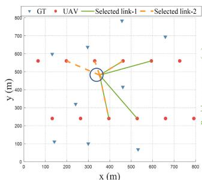  
(a)

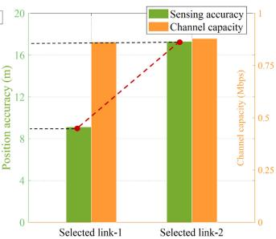  
(b)  
Fig. 4. A simulation example of different resource allocation for a same GV: (a) scenario, (b) performance results of sensing and communication.

## B. Resource Allocation Analysis on Sensing for Multi-Agent RL

In terms of UAV’s energy consumption, there is an inherent contradiction between the two services of communication and sensing. Specifically, communication services usually require UAVs to be as close as possible to GTs to reduce path losses during wireless signal propagation and increase channel capacity, thereby reducing the energy overhead required for data transmission by GTs [38]. However, if the UAV is too close to the GT, the relative position relationship between the two will be changed to a large extent, making the geometry of the UAVs is not conducive to achieving high positioning accuracy, thus seriously affecting UAVs’ ability to provide wireless sensing services for GTs.

According to the above analysis, it can be concluded that different UAVs selected by GTs will result in different sensing performance for the ISAC network. Specifically, for UAVm, the resource allocation of selecting GTs, i.e., variable $a _ { m } ^ { l } ( t )$ , affects the sensing capability of the ISAC network. Conversely, for the same GT to be served, different UAV links will also bring different positioning accuracy. To further analyze this point, we operate a simulation experiment in the following scenario, as shown in Fig. 4 (a). Obviously, for the same GT circled in Fig. 4 (a), two UAV subset links with basically the same communication performance can be found. Specifically, both the selected UAV subset links can achieve about 0.87 Mbit/s communication performance. Nevertheless, the sensing aspect of the two is far from the same due to the different geometry of the UAV links, with the position accuracy of 9 m and 17 m respectively, as shown in Fig. 4 (b). Therefore, it can be concluded that the resource allocation $a _ { m } ^ { l } ( t )$ is closely related to the sensing capability of the ISAC network. Furthermore, adopting reasonable resource allocation strategy of UAVs is significant to make a trade-off between communication and sensing for the studied UAV swarmassisted ISAC network.

It should be stated that since RL is closely related to time t, we will rewrite $C R L B ( { \mathbf { u } } _ { l } )$ in formula (15) as $C R L B _ { t } ( { \mathbf { u } } _ { l } )$ in the following paragraphs. Combining the above considerations, we assume that for each agent UAV-m, sensing is assigned as the “priori information” and communication the “posteriori information”. In particular, suppose that UAVm provides the GT-l with a sensing accuracy, that is the sensing priori information of UAV-m, recorded as $\mathcal { S } _ { m } ( t )$ at time t, which is highly related to the variable $C R L B ( { \mathbf { u } } _ { l } )$ in formula (15). Specifically, if UAV-m provides position services for GT-l at time slot t, it holds $\begin{array} { r } { S _ { m } ( t ) = \frac { \bar { 1 } } { \bar { C } R L B _ { t } ( { \bf u } _ { l } ) } } \end{array}$ . It should ( )be stated that we assign the posterior knowledge of UAV-m as the instantaneous reward expression $r _ { m } ( t )$ at time slot t in equation (17).

In addition, we adopt a future discounted reward [17] as the sensing-communication performance measurement for each UAV. Specifically, at time slot t in the process, the discount reward $V _ { m } ( t )$ is the sum of the returns in the current time slot, that is, the prior knowledge $\mathcal { S } _ { m } ( t )$ , plus the future returns discounted by a constant factor, that is, the posterior knowledge $r _ { m } ( t )$ . More specifically, the mathematical form can be expressed as [31]

$$
V _ { m } ( t ) = \sum _ { \tau = 0 } ^ { + \infty } \delta ^ { \tau } \underbrace { \Bigg [ r _ { m } ( t + \tau + 1 ) } _ { \mathrm { c o m m u n i c a t i o n } } + \underbrace { S _ { m } ( t + \tau + 1 ) } _ { \mathrm { s e n s i n g } } \Bigg ] ,\tag{22}
$$

where $\delta$ represents the discount factor with $0 \leq \delta < 1$ and $\delta ^ { \tau }$ ensures the convergence of the UAV’s learning process. Specifically, the value of δ reflects the effect of future rewards on the optimal strategies: if δ is close to 0, it means that the strategy emphasizes the near-term gain, i.e., sensing accuracy; On the contrary, if δ value is close to 1, it gives more weights to future rewards, that is the energy efficiency at the communication level, and we say these strategies are visionary.

To sum up, each agent UAV-m is regarded as a learning agent whose task is to make a sensing-communication tradeoff about resource allocation to maximize the energy efficiency of the target ISAC network. On this basis, the problem to introduce the specific strategy of “prior information” can be further considered to guide the learning process of UAVs.

## C. Optimization Problem Formulation

According to Section II, Section III-A and Section III-B, we focus on maximizing the total energy efficiency of all UAVs across all time slots, while utilizing sensing performance to give UAV swarm prior knowledge. Specifically, we set the total time slots $T _ { \mathrm { t o t a l } } = 1 0 0 0 0 t$ and the sensing time interval $T _ { \mathrm { s e n s i n g } } = 1 0 0 0 t$ total, that is, after every time period $T _ { \mathrm { s e n s i n g } } .$ , an sensing sensinginitial CRLB assignment operation is performed on the UAV swarm, thus giving the UAVs the prior information of sensing. It should be stated that since the number of sensing time slots is much smaller than that of communication, the energy used for sensing is negligible [38]. Therefore, the final optimization problem of this paper can be formed as follows

$$
\begin{array} { r l } { ( \mathrm { P 1 } ) { : } ~ \displaystyle { \operatorname* { m a x } _ { \Theta _ { m } } } ~ \displaystyle { \sum _ { m = 1 } ^ { M } } \left[ \sum _ { t = 1 } ^ { T _ { \mathrm { { t o t a l } } } / t } r _ { m } ( t ) + \sum _ { t = 1 } ^ { T _ { \mathrm { { t o t a l } } } / T _ { \mathrm { { s e n s i n g } } } } S _ { m } ( 1 0 0 0 t ) \right] } \\ { \mathrm { s . t . } ~ \mathrm { C 1 } { : } ~ a _ { m } ^ { l } ( t ) \in \{ 0 , 1 \} , ~ } & { \forall l , m } \\ { \displaystyle { \mathrm { C 2 } : } ~ \displaystyle { \sum _ { l = 1 } ^ { L _ { m } ^ { l } } ( t ) \leq 1 } , ~ } & { \forall m \in \mathcal { M } } \\ { \displaystyle } & { \mathrm { C 3 } { : } ~ p _ { m } ^ { k } ( t ) \in \{ 0 , 1 \} , ~ } \end{array}
$$

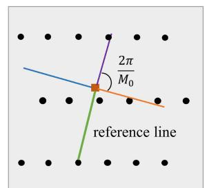

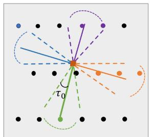  
(b) Second Step: Group the UAV BSs according to their azimuths

(a) First Step: Find the UAV BS with the minimal elevation and set four azimuths  
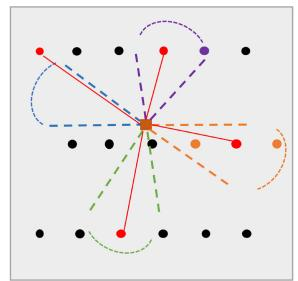  
(c) Third Step: Find the UAV BS subset with the minimal CRLB

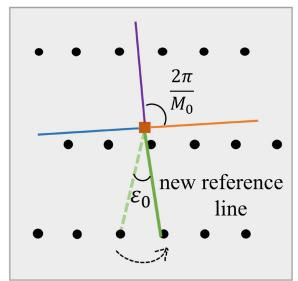  
(d) Fourth Step: Update reference UAV BS and repeat steps (a) \~ (c) to get the optimal subset  
Fig. 5. The proposed improved FBSS algorithm.

$$
\begin{array} { r l r l } & { \displaystyle \mathrm { K } p _ { m } ^ { k } } \\ & { \displaystyle \mathrm { C } 4 \colon \sum _ { k = 1 } ^ { \mathrm { K } p _ { m } ^ { k } } ( t ) \le 1 , \quad } & & { \forall m \in \mathcal { M } } \\ & { \displaystyle \mathrm { C } 5 \colon \gamma _ { m } \big ( t \big ) \ge \gamma _ { t h r } , \quad } & & { \forall m \in \mathcal { M } } \\ & { \displaystyle \mathrm { C } 6 \colon 0 \le P _ { k } \le P _ { K } , \quad } & & { \forall k \in \mathcal { K } } \\ & { \displaystyle \mathrm { C } 7 \colon M _ { 0 } \ge 4 , \quad } & & { \forall k \in \mathcal { K } , } \end{array}\tag{23}
$$

where C1 and C2 respectively represent resource constraints of service GTs and the corresponding number of service GTs per time slot. Similarly, C3 and C4 respectively represent resource constraints on the power levels used by service GTs and the corresponding power number per time slot. C5 is the communication QoS reliability constraints and C6 is the constraints of transmitters maximum power. C7 is the constraint on the number of UAVs that provide sensing services for each GT.

It is obvious that the selection of resource allocation strategy $\theta _ { m } \in \Theta _ { m }$ calculated by the central controller and the introduction of sensing prior information both have a profound impact on the energy efficiency of UAVs. In next section, we propose a multi-agent RL based method to solve the optimization problem (P1).

## IV. THE PROPOSED MULTI-AGENT RL-BASED OPTIMIZATION METHOD

As the recognized milestone in the development of RL, Q-learning is generally regarded as one of the most popular model-free optimization algorithms, which is fully suitable for solving the scientific problems concerned in this paper [31]. Further, considering saving computing resources and accelerating convergence speed, we choose distributed Q-learning algorithm to solve the resource allocation problem concerned, and each UAV agent selects the optimal decision according to the Q-table [39].

Algorithm 1 The Proposed Improved FBSS Algorithm   
Preliminary Selection:   
1: Compute the elevation $\phi _ { l , M _ { 0 } }$ and azimuth $\varphi _ { l , M _ { 0 } }$ between   
0the GT-l and each UAV base station $m _ { 0 } ;$   
2: Select the BS $m _ { 0 } ^ { * }$ 0with the minimum elevation as the   
0reference node (Fig. 5(a)), i.e., m∗ = arg min $\phi _ { l , M _ { 0 } } ;$   
$\stackrel { \smile } { m _ { 0 } } \in \mathcal { V } _ { l }$   
3: Set four grouping reference azimuths: $\varphi _ { 1 } ^ { * } = \dot { \varphi } _ { l , m _ { 0 } ^ { * } } , \varphi _ { 2 } ^ { * } =$   
$\varphi _ { l , m _ { 0 } ^ { * } } + { \frac { 1 \pi } { 2 } } , \varphi _ { 3 } ^ { * } = \varphi _ { l , m _ { 0 } ^ { * } } + \pi$ and $\begin{array} { r } { \varphi _ { 4 } ^ { * } = \varphi _ { l , m _ { 0 } ^ { * } } + \frac { 3 \pi } { 2 } } \end{array}$   
$( \mathrm { F i g . ~ } 5 ( \mathrm { a } ) ) ;$   
4: Group the BSs according to the difference between the   
azimuth of each BS and grouping reference azimuths   
(Fig. 5(b)), that is, the BS $m _ { 0 }$ is assigned to group i   
$( i _ { 0 } \in \{ 1 , 2 , 3 , 4 \} )$ if $\left| \varphi _ { l , m _ { 0 } } - \varphi _ { i _ { 0 } } ^ { * } \right| \leq \tau _ { 0 } ;$   
0 05: If the number of BSs assigned to group i is zero, increase   
the value of $\tau _ { 0 }$ 0and regroup the BSs until there is at least   
0one UAV BS in each group;   
Secondary Selection:   
6: Select one UAV BS from each group to form a sub  
set and compute its corresponding CRLB according to   
formula (15). Traverse all subsets available through this   
approach, the quasi-optimal subset $\mathbf { o } _ { l , 1 } ^ { * }$ with minimum   
1CRLB is assigned to the GT-l for positioning (Fig. 5(c)).   
Tertiary Selection:   
7: Update the reference line according to the rotating step   
Angle ε (Fig. 5(d), then repeat the above steps 3 to 6   
to get $\mathbf { o } _ { l , 1 } ^ { * } , \mathbf { o } _ { l , 2 } ^ { * } , . . . , \mathbf { o } _ { l , \pi / 2 \varepsilon _ { 0 } } ^ { * }$ in turn. Finally, the optimal   
subset $\mathbf { o } _ { l } ^ { \ast }$ 2 2 0is obtained by comparing the CRLB of the   
$\pi / 2 \varepsilon _ { 0 }$ quasi-optimal subsets.

In this section, we first introduce the method of providing prior information for UAV swarm, which is one of the highlights of our research. Subsequently, to illustrate learning process, we propose a distributed Q-Learning based resource allocation algorithm for maximizing the expected long-term reward of the considered multi-UAV assisted ISAC network.

## A. Initialization of the Q-Table

In accordance with Section III-B, providing the sensing accuracy to the UAVs as “prior information” can provide sufficient possibilities for the sensing performance of the considered ISAC network. Different from the conventions of existing research, where initial values of the Q-table are often set to zero, we quantified the ability of the UAV to provide sensing services for GT into the corresponding position in the Q-table through formula (15). In addition, it can be seen from the above Fig. 4, for the same GT, different UAVs provide different sensing accuracy. Therefore, in order to more accurately characterize the sensing capability of each UAV, we need to reasonably select a subset of UAVs for each GT to provide optimal sensing services. Next, we take GT-l as an example to illustrate the process of selecting the optimal subset of UAVs.

The proposed method for selecting UAV subsets is an improvement based on the FBSS method in [38]. Specifically, the FBSS algorithm is grouped by angles and can quickly select a subset of BSs with good geometric configuration from a large number of ground BSs with low computational complexity. In particular, on the basis of the former, we add a rotating step Angle to further modify the reference BS, so as to add a layer of search operation, and finally get the optimal subset UAVs of the GT-l with higher sensing accuracy. The implementation process of the proposed improved FBSS algorithm is shown in Fig. 5 and Algorithm 1. It should be noted that the Algorithm 1 is a general algorithm, and the number of groups can be set to any reasonable value according to the actual scene requirements, such as 4, 5 or 6. In Fig. 5, we illustrate with the group number of 4 as an example.

Algorithm 1 above selects the optimal UAV subset $\mathbf { 0 } _ { l } ^ { \ast }$ for GT-l. Next, we focus on how subset $\mathbf { 0 } _ { l } ^ { \ast }$ is applied to initial valuation. To illustrate the process of Q-table initialization, the size of the Q-table needs to be declared first. Each UAV-m in the considered ISAC system is regarded as an agent and operates in two states. Specifically, if the communication QoS meets formula (16), it means that the UAV-m is in the working state at time t, denoted state = 1, i.e., ξ∗; otherwise, denoted state = 0, i.e., $\xi _ { 2 } ^ { * }$ 1. In terms of decision space $\Theta _ { m }$ , as can 2be obtained in Section III-A, for any UAV-m, there are $K L$ resource allocation decisions. In summary, the Q-table can be represented by the matrix $Q _ { 2 \times K L }$

2For clarity of expression, we will rewrite $\theta _ { m } ( t )$ as $\theta _ { m } ^ { t }$ in the following while the meaning remains unchanged, and similar variable $s _ { m } ( t )$ will be treated in the same way $s _ { m } ^ { t }$ . In this case, the Q-table initialization process for UAV-m at time t is as follows. From Algorithm 1, for GT-l at time t, its optimal subset of UAVs is $\mathbf { 0 } _ { l } ^ { \ast }$ , which includes $M _ { 0 }$ optimal UAVs. On the other hand, for the $M _ { 0 }$ 0UAVs selected above, when they 0make the decision to select GTs, if GT-l is also selected at time t, we assign the $S _ { m } ( t )$ , that is, value $\frac { 1 } { C R L B _ { t } ( { \mathbf { u } } _ { l } ) }$ to all selected elements containing GT-l in the row of $\dot { \xi } _ { 1 } ^ { * }$ in the matrix $Q _ { 2 \times K L }$ , and the other elements in matrix $Q _ { 2 \times K L }$ are 2 2assigned the value zero. The above initialization process is mathematically modeled as: At time t, for any $m \in { \mathbf { o } } _ { l } ^ { * } ,$ , if UAV-m and GT-l are two-way selections, then the following formula holds

$$
\frac { 1 } { C R L B _ { t } ( \mathbf { u } _ { l } ) } = Q \big ( \xi _ { 1 } ^ { * } , \theta _ { m } ^ { t } \big ) ,\tag{24}
$$

where $Q ( \xi _ { 1 } ^ { * } , \theta _ { m } ^ { t } )$ represents the initial reward value of action $\theta _ { m } ^ { t }$ 1selected by UAV-m in state $\xi _ { 1 } ^ { * }$ at time t. In addition, at that 1time slot, other elements of the Q-table are directly assigned to zero.

Regarding the above process, the following points need to be highlighted here. First, each UAV agent has its own exclusive Q-table of the same size, and is trained in strict accordance with its own Q-table. Second, in each time interval T , due to the change of the position information of the UAVs, it is necessary to re-assign the initial value of the Q-table for each UAV agent according to the above method. Third, the prior information given to the UAV is stored in the control unit of the UAV in advance. For the UAV-m, once the “twoway selection” is triggered, the optimal UAV subset $\mathbf { 0 } _ { l } ^ { \ast }$ of the target user GT-l will be immediately mobilized to provide positioning services.

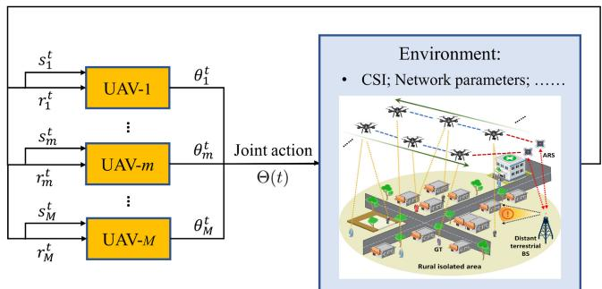  
Fig. 6. Illustration of Multi-Agent RL framework for the focused ISAC networks.

## B. Distributed Q-Learning Based Resource Allocation for Multi-UAV ISAC Networks

After the Q-table initialization process, in this subsection, an algorithm based on distributed Q-Learning continues to be proposed to solve the resource allocation problem for multi-UAV ISAC networks. Fig. 6 describes the core structure of Multi-Agent RL studied in this paper. Specifically, for each UAV-m, its left side represents the locally observed information at time slot t, that is, state $s _ { m } ^ { t }$ and reward $r _ { m } ^ { t }$ ; the right side represents the action for UAV-m at time slot t. In this case, an agent-independent method is proposed, for which all UAV agents conduct a decision algorithm independently but share a common structure based on Q-learning to finally get the optimal decision of the whole network. Specifically, the selection of an action in each iteration depends on two states of the Q-function: $s _ { m }$ and its successors. Thus, the Q-value provides insight on the future quality of the actions in the subsequent states. The update rule of Q-value in distributed Q learning [39] is given as equation (25) explicitly, shown at the bottom of the page, where $\hat { s } _ { m } ^ { \prime }$ and $\theta _ { m } ^ { \prime }$ correspond to $s _ { m } ^ { t + 1 }$ and $\theta _ { m } ^ { t + 1 }$ , respectively. According to (25), the optimal action of each agent can be solved recursively from the corresponding action values. Specifically, the Q-values in each Q-table will be updated only when the next Q-value is greater than current Q-value. In addition, $Q _ { m } ^ { t }$ means the action value of UAV-m at the time slot t.

Another key point in the operation of the Q-learning is the agent’s action selection mechanism, which is used by the agent to select the actions to be performed during the learning process. With it, the agent can strike a balance between exploration and exploitation, specifically, the agent can reinforce the good evaluations it already knows, while also exploring new actions. There are many methods to choose

$$
Q _ { m } ^ { t + 1 } ( s _ { m } , \theta _ { m } ) = \left\{ \begin{array} { l l } { \operatorname* { m a x } \left\{ Q _ { m } ^ { t } ( s _ { m } , \theta _ { m } ) , \ r _ { m } ^ { t + 1 } + \delta \operatorname* { m a x } _ { \theta _ { m } ^ { \prime } \in \Theta _ { m } } Q _ { m } ^ { t } ( s _ { m } ^ { \prime } , \theta _ { m } ^ { \prime } ) \right\} , \ \mathrm { i f } \ s _ { m } = s _ { m } ^ { t } \mathrm { ~ a n d ~ } \theta _ { m } = \theta _ { m } ^ { t } , } \\ { Q _ { m } ^ { t } ( s _ { m } , \theta _ { m } ) , \ } & { \mathrm { o t h e r w i s e } . } \end{array} \right.\tag{25}
$$

subsequent actions based on the current action value, and in this paper we consider -greedy strategy [31], which is denoted as follows:

select action randomly with probability .

select the best action that corresponds to the highest Q-value at the moment, with probability $1 { - } \epsilon$

As such, the probability of selecting action $\theta _ { m }$ at state $s _ { m }$ for UAV-m is given by

$$
\pi _ { m } ( s _ { m } , \theta _ { m } ) = \left\{ \begin{array} { l } { { 1 - \epsilon , \mathrm { i f } Q _ { m } \mathrm { o f } \theta _ { m } \mathrm { i s } \mathrm { t h e } \mathrm { h i g h e s t } , } } \\ { { \epsilon , \mathrm { o t h e r w i s e } . } } \end{array} \right. ( 2 6 )
$$

$$
\epsilon \in ( 0 , 1 )
$$

To sum up, each UAV agent runs the Q-learning procedure independently in the proposed Multi-Agent algorithm. For agent UAV-m, $m \in { \mathcal { M } } .$ , the operation process of the proposed distributed Q-learning based algorithm, referred to as D-Q algorithm, is summarized in Algorithm 2. To be specific, at time slot $t ,$ first, the agent obtains the initial Q-value according to Section IV-A, so as to get the prior information. Then, the initial state of the agent UAV-m is determined by the selection strategy. Finally, the agent UAV-m gets the optimal decision $\theta _ { m } ^ { * } ( t )$ through target iterations. It is worth highlighting that more sophisticated multi-node joint learning algorithms with interaction between the UAVs as well as cooperative quantitative sensing-communication modelings would be considered in our future research.

## V. SIMULATION RESULTS AND DISCUSSION

In this section, a series of simulation experiments are carried out to evaluate the resource allocation performance of the UAV swarm-assisted IASC network, and the corresponding numerical results are given. Firstly, the feasibility and effectiveness of the proposed scheme, including the improved FBSS method and the D-Q algorithm are verified by a set of experiments in this paper. Then, we discuss the influence of different parameter Settings in distributed Q-learning on system energy efficiency. And finally, we further demonstrate the superiority of the proposed method in terms of sensing and communication performance respectively. Table I summarizes the key simulation parameters used in this section, and the other parameters have been clearly stated in the corresponding positions of the paper.

We consider an UAV swarm-assisted ISAC network under a discrete time series with M = 12 UAVs fly over the target area at the fixed speed $\dot { \bf s } _ { U A V } = 1 0$ m/s. Besides, $L = 1 0$ GTs located in a square area with side length 800 m and the center is the coordinate (400,400,0). In this scenario, the UAV swarm fly on the considered region based on the predefined trajectories to provide sensing-communication services for ${ \mathrm { G T s } } ,$ while the location of the GTs is randomly distributed and fixed. It should be stated that, a random method according to some specific constraints is selected as the benchmark comparison in our research, which is an common and advanced approach in related field [7], [23].

## A. The Validity Test of the Proposed Scheme

According to the system parameter Settings, the joint deployment of UAV swarm and GTs in the considered network under a certain time slice is shown in Fig. 7 (a), which is in line with the actual situation. In addition, it can be seen that for the same circled GT, the UAV links selected by the random method (solid green lines) and the proposed improved FBSS algorithm (dashed yellow lines) are also shown in Fig. 7 (a), which has significant advantages in terms of geometry and provides solid conditions for positioning performance. On this basis, we further compare the influence of the proposed improved FBSS algorithm and other benchmark methods on the positioning accuracy of 10 GTs, including the random method and the FBSS method in the literature [38]. Specifically, Fig. 7 (b) shows the localization accuracy comparison of all GTs in the scenario of Fig. 7 (a). It is clear that the proposed design (green broken line) has a distinct advantage in terms of sensing accuracy compared to the other two methods. This is due to the proposed scheme utilizes the global search capability formed by the two-layer cycle to further ensure that the UAV subset geometry is more conducive to the GTs. What’s more, the sensing effect of the proposed design is basically stable at the positioning accuracy of about 5.42 m, which verifies all GTs have high sensing performance by virtue of the efficient optimization ability of the proposed algorithm itself. In other words, it provides highprecision sensing capabilities for the studied ISAC network.

Algorithm 2 Proposed Distributed Q-Learning (D-Q) Based   
Resource Allocation Algorithm   
1: Initialization:   
2: Set $t = 0$ and the learning parameters $\delta$ and $\epsilon .$   
3: for $\forall m \in { \mathcal { M } }$ do   
4: Initialize the action-value $Q _ { m } ^ { t } ( s _ { m } , \theta _ { m } )$ according to   
Algorithm 1 and (24);   
5: Initialize the state $s _ { m } = s _ { m } ^ { t } = 0 ;$   
6: end for   
7: Main Loop:   
8: while $t < T$ do   
9: for $\mathrm { U A V } – m , \forall m \in \mathcal { M }$ do   
10: generate a random number $x \in ( 0 , 1 )$   
11: if $x < \epsilon$ then   
12: select action randomly.   
13: else   
14: select the action $\theta _ { m } \in \Theta _ { m }$ characterized by the   
maximum Q-value.   
15: end if   
16: Update the instantaneous reward $V _ { m } ( t )$ according to   
formula (22).   
17: Update the action-value $Q _ { m } ^ { t + 1 } ( s _ { m } , \theta _ { m } )$ according to   
formula (25).   
18: Update the strategy $\pi _ { m } ( s _ { m } , \theta _ { m } )$ according to (26).   
19: Update $t = t + 1$ and the state $s _ { m } = s _ { m } ^ { t }$   
20: end for   
21: end while

TABLE I SIMULATION PARAMETERS
<table><tr><td>Parameter</td><td>Value</td></tr><tr><td>Main frequency (fc)</td><td>2.6 GHz</td></tr><tr><td>Signal bandwidth (B)</td><td>20 MHz</td></tr><tr><td>Measurement noise variance  $( \sigma ^ { 2 } )$ </td><td>1dB</td></tr><tr><td>Reference path loss at 1m (β0)</td><td> $1 . 0 1 \times 1 0 ^ { 4 }$ </td></tr><tr><td>PLE of A2A channels under LoS conditions (α)</td><td>2</td></tr><tr><td>Number of UAVs (M)</td><td>12</td></tr><tr><td>Number of GTs (L)</td><td>10</td></tr><tr><td>Number of transmit power levels (K)</td><td>8</td></tr><tr><td>Maximum transmit power of  $\mathrm { U A V s } ~ ( P _ { K } )$ </td><td>8dBm</td></tr><tr><td>Cost per unit level of power (ωo)</td><td>1</td></tr><tr><td>Communication QoS threshold  $( \gamma _ { t h r } )$ </td><td>5 dB</td></tr><tr><td>Number of anchor nodes per  $\mathrm { G T } \ ( M _ { 0 } )$ </td><td>5</td></tr><tr><td>Height of UAVs  $( H _ { m } )$ </td><td>200 m</td></tr><tr><td>Fixed flight speed of  $\mathrm { U A V s } ~ ( \dot { \bf s } _ { U A V } )$ </td><td>10 m/s</td></tr><tr><td>Discount factor (δ)</td><td>0.5</td></tr><tr><td>Decision period  $( T _ { s } )$ </td><td>0.001 s</td></tr><tr><td>Deployment boundary of GTs (min)</td><td>0 m</td></tr><tr><td>Deployment boundary of GTs (max)</td><td>800 m</td></tr><tr><td>Diameter of the studied area</td><td>800 m</td></tr></table>

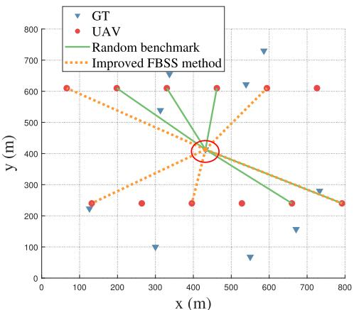  
(a)

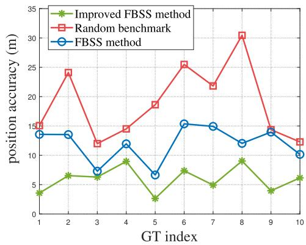  
(b)  
Fig. 7. Results comparison of the proposed improved FBSS method and the other benchmarks: the (a) UAVs selection scenario and (b) positioning accuracy of all GTs in Fig. 7 (a) scenario.

Next, we continue to focus on the feasibility of the proposed D-Q algorithm as shown in Fig. 8. For illustrative purposes, Fig. 8 (a) shows the comparison of the total energy efficiency of all UAVs in single time slot under the proposed D-Q algorithm and the naive random benchmark. It should be noted that the naive random benchmark here means that the UAVs choose the strategy randomly, rather than following the Q-table. As it can be observed from Fig. 8(a), the total reward of UAVs increases with the algorithm iterations. This is because the long-term reward of UAVs can be improved by the proposed D-Q algorithm. In addition, the reward using random method also shows a slow upward trend because of the introduction of sensing prior information, as shown in formula (22). Correspondingly, Fig. 8(b) illustrates the total reward with different $\epsilon = \{ 0 . 2 , 0 . 5 , 0 . 9 \}$ . It can be seen that the curves of the total reward become flat when t is higher than 900 time slots. The above results can be interpreted as follows: if  goes to 1, each UAV will choose a random action with higher probabilities. As a result, the reward value of UAVs tends to get smaller. What’s more, this trend also proves the effectivity of the proposed D-Q algorithm.

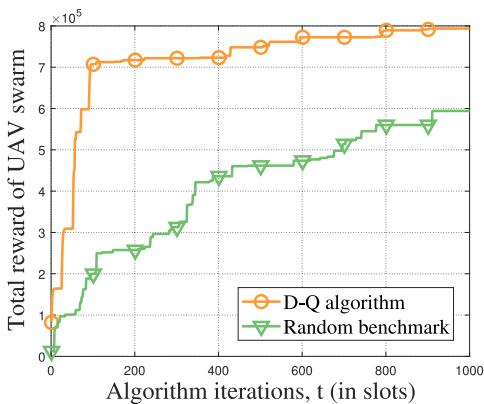  
(a)

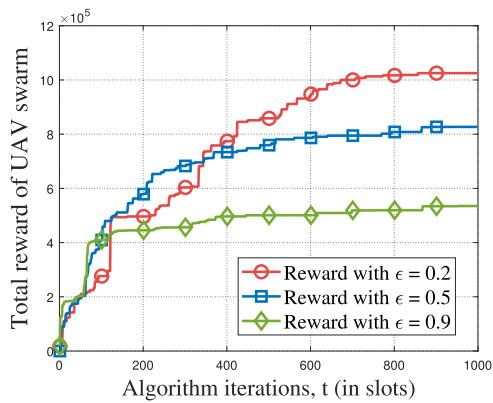  
(b)  
Fig. 8. Simulation results of the effectiveness of D-Q algorithm: (a) comparison results with random benchmark and (b) influence of different exploration factors on D-Q algorithm.

## B. The Superiority of the Proposed Scheme in Sensing

To illustrate the influence of the proposed algorithm on the sensing performance in the considered ISAC network, we first verified the effect of introducing the sensing prior information on the network energy efficiency, as shown in Fig. 9. Surprisingly, the introduction of improved FBSS method to provide prior information to the UAVs play a key role in the early learning process of the agents. On the one hand, the introduction of prior information seems to provide the possibility to improve the energy efficiency of UAVs; On the other hand, the convergence rate is also improved to some extent. Specifically, the curves of the total reward with prior information become flat when t is higher than 800 time slots. However, the curve without prior information has not yet reached convergence at this moment. It must be noted that the single simulation results are weak and cannot be convincing. On this basis, further experiments are needed to analyze the proposed algorithm on the network sensing capability.

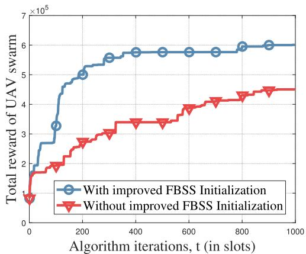  
Fig. 9. Comparison of single simulation example results under different improved FBSS initialization constraints.

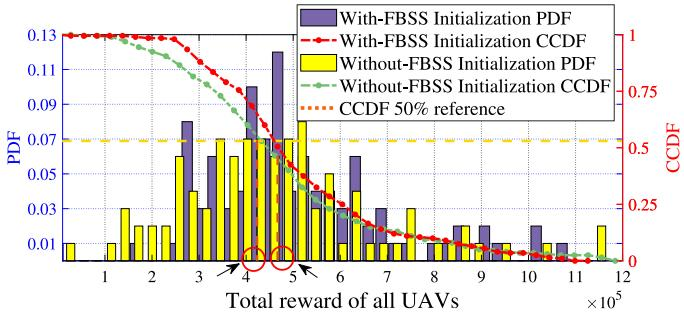  
(a)

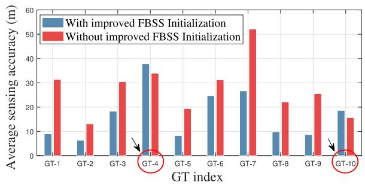  
(b)  
Fig. 10. Statistical results: (a) the energy efficiency optimized solutions of the proposed scheme and (b) the corresponding GT positioning accuracy under different FBSS-based constraints.

It’s worth noting that Fig. 9 shows the resulting instance of a single sensing time interval $T _ { \mathrm { s e n s i n g } }$ simulation, which sensinghas certain randomness. For making the evaluation of the proposed method more statistically significant, 100 Monte-Carlo comparative simulations are implemented, including the probability density function (PDF) and the complementary cumulative distribution functions (CCDF) of the optimized reward. In Fig. 10 (a), each data volume represents the sum of the reward values of all UAVs at $\epsilon = 0 . 2$ within a sensing time interval $T _ { \mathrm { s e n s i n g } }$ . Numerically speaking, the range of the total reward for UAVs is $1 . 6 \times 1 0 ^ { 5 }$ to $1 0 . 8 \times 1 0 ^ { 5 }$ with sensing prior information, that is, with the improved FBSS algorithm, and in half of these results, greater than $4 . 7 \ \times \ 1 0 ^ { 5 } ;$ on the other hand, the benchmark (without the improved FBSS algorithm) is slightly inferior, ranging from $0 . 2 \times 1 0 ^ { 5 }$ to $1 1 . 6 \times 1 0 ^ { 5 }$ and similarly, half of these results are higher than $4 . 2 \times 1 0 ^ { 5 }$ Therefore, it is clear to conclude that the proposed improved FBSS algorithm can improve the energy efficiency of the ISAC network by 11.9%. The reason for this result is that, the introduction of prior information indicates a direction for the learning and decision-making process of UAVs to continuously improve the network energy efficiency.

At the same time, the positioning accuracy obtained by the sensing prior knowledge for GTs is also recorded, as shown in Fig. 10 (b), aiming to discuss the influence of the proposed scheme on sensing under the same set of experiments as in Fig. 10 (a). Specifically, Fig. 10 (b) is the average positioning accuracy of each GT in 100 Monte Carlo experiments. As can be seen from Fig. 10 (b), the positioning accuracy of GTs ranges from 5.6 m to 37.8 m with the proposed improved FBSS method (blue bar). In contrast, the positioning accuracy range obtained by the benchmark method (red bar) is 13.2 m to 52.1 m. By comparison, except for GT-4 and GT-10, the positioning accuracy of each GT has been improved to varying degrees, ranging from 24% to 96%. Overall, the average positioning accuracy of all GTs is improved by about 20% or more. The reason for the situation with GT-4 and GT-10 is that, providing the sensing prior information to the UAVs only provides an optimization direction for the agents, and does not represent the final sensing result. Moreover, $\epsilon = 0 . 2$ means that the agent has a 20% probability for making a random decision, rather than optimizing the GT selection by following the Q-table exactly.

## C. The Superiority of the Proposed Scheme in Communication

As discussed in Section III-C, we set up the energy efficiency optimization problem of communication and sensing from the perspective of resource allocation, aiming to realize the communication enhancement capability of the studied ISAC network. In addition, it is indisputable that the introduction of the sensing prior information can improve the positioning ability of the ISAC network, but it should not be based on the sacrifice of communication performance, otherwise it is of little significance. With these considerations above, to further verify the effect of the proposed scheme on the network communication performance, we conducted another set of experiments, and the simulation comparison results are shown in Fig. 11 and Fig. 12.

First, we show the energy efficiency optimization process of each UAV in a single sensing time interval T , sensingas shown in Fig. 11 (a). It is clear that each UAV has been learning in the direction of its own optimal decision $\theta _ { m } ^ { * } ( t )$ , and that the energy efficiency optimization learning process for each agent is accurate and effective. On this basis, similarly, we conducted 100 Monte-Carlo simulations and presented the comparative results in Fig. 11 (b). Specifically speaking, it shows the average value of optimized energy efficiency of each UAV in 100 sets of experiments under different constraints, including with or without the proposed improved FBSS algorithm. Obviously, the proposed scheme has a slight advantage in improving the communication energy efficiency of the studied ISAC network, but there is basically no significant difference between the two, and there are still a few special cases of UAV-9 and UAV-10. Overall, the efficiency improvement rate for each UAV is about 11.2% in numerical terms. This is due to that the introduction of sensing information provides certain prior knowledge for the decisionmaking training process of UAVs, thus assisting its energy efficiency optimization. Therefore, it can be concluded that providing sensing prior information for UAVs will not only not affect the communication ability of the ISAC network, but also bring a weak “communication enhancement” effect.

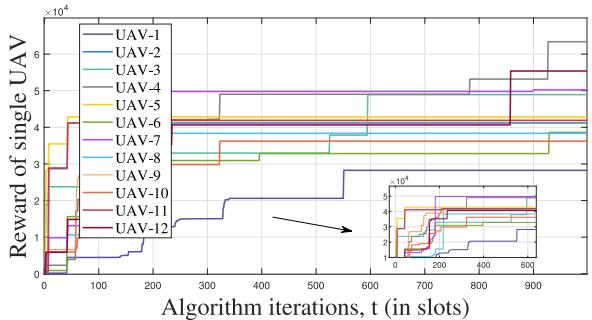  
(a)

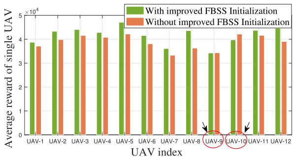  
(b)  
Fig. 11. Simulation and statistical results: (a) the learning process of each UAV at time interval $T _ { \mathrm { s e n s i n g } }$ and (b) the energy efficiency optimization sensingresults for each UAV under different FBSS-based constraints.

In order to further explore the superiority of the proposed scheme at the communication level, we use the naive random method to carry out comparative experiments, that is, for each UAV agent, every decision is selected randomly, rather than strictly according to its Q-table. Specifically, 100 Monte-Carlo simulations are implemented, including the energy efficiency statistics and the performance improvement ratio compared with the random benchmark, and the results obtained are shown in Fig. 12. The PDF and the CCDF of the optimized energy efficiency is shown in Fig. 12 (a), where the optimized ranges from $0 . 5 \times 1 0 ^ { 5 }$ to $9 . 8 \times 1 0 ^ { 5 }$ , and half of the optimization results greater than $4 . 7 \times 1 0 ^ { 5 }$ . The PDF of the energy efficiency improvement compared with the benchmark is shown in

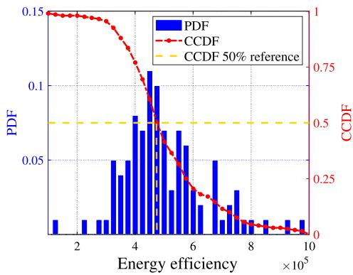  
(a)

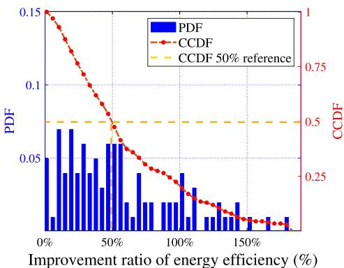  
(b)  
Fig. 12. Statistical results: (a) the energy efficiency of the optimized solutions using the proposed scheme; and (b) the improvement ratio of the energy efficiency compared with the random benchmark approach.

Fig. 12(b), where the improvement ranges from 5.82% to 174.56%. In combination with Fig. 12 (a) and Fig. 12 (b), it can be concluded that the probability of improving the network energy efficiency by more than 49.6% is 50%, and half of the corresponding energy efficiency cases for UAVs are more than $4 . 7 \times 1 0 ^ { 5 }$ . On the whole, the proposed method can improve UAV energy efficiency by an average of more than 40%. Compared with the benchmark method, the main reason for the obvious advantage of the proposed scheme is that D-Q algorithm guarantees the communication performance of the considered ISAC network with its powerful local optimal decision learning ability.

In summary, the introduction of sensing prior information effectively improves the sensing capability without degrading the network communication performance. At the same time, the proposed D-Q algorithm can further guarantee the communication energy efficiency of the network by virtue of its powerful model-free training and optimization ability. Therefore, it is reasonable to infer that the proposed scheme has certain guiding significance in the engineering application of UAV swarm-assisted ISAC network with common requirements of sensing and communication.

## VI. CONCLUSION

In this paper, we propose a general sensing-communication analytical framework for UAV swarm-assisted ISAC networks, where UAVs are tasked with providing both sensing and communication services to GTs. Different from previous studies, this paper focuses on utilizing RL to provide sensing prior information for UAVs, which not only meets the QoS of GT communication, but also enforces sensing capabilities for ISAC networks. Specifically, we first use the proposed improved FBSS algorithm to accurately measure the sensing ability of each UAV, and assign it to the corresponding position of the Q-table. Further, for the dynamic resource allocation of multi-UAV networks, a distributed Q-learning algorithm is proposed to optimize the energy efficiency of UAVs, in which the goal of each UAV is to find a resource allocation strategy for maximizing its expected reward. The proposed scheme is evaluated on benchmarks with different constraints at various levels, which provides prerequisite value for our follow-up research on resource utilization and energy efficiency of UAV swarm under the proposed scheme. The numerical results show the feasibility of the proposed scheme. Compared with the random benchmarks with specific constraints, the communication performance of the proposed method is improved by more than 40% on average. In addition, this method can enhance the sensing accuracy by more than 20% without sacrificing the communication performance.

In the longer term, the framework of resource allocation via multi-agent RL has the potential to play a vital role in the future ISAC networks. We hope this article could provide meaningful inspiration for bringing a new paradigm for the future green wireless networks.

## REFERENCES

[1] A. Liu et al., “A survey on fundamental limits of integrated sensing and communication,” IEEE Commun. Surveys Tuts., vol. 24, no. 2, pp. 994–1034, 2nd Quart., 2022.

[2] B. Li, W. Liu, W. Xie, N. Zhang, and Y. Zhang, “Adaptive digital twin for UAV-assisted integrated sensing, communication, and computation networks,” IEEE Trans. Green Commun. Netw., vol. 7, no. 4, pp. 1996–2009, Jul. 2023.

[3] T. Zhang, G. Li, S. Wang, G. Zhu, G. Chen, and R. Wang, “ISACaccelerated edge intelligence: Framework, optimization, and analysis,” IEEE Trans. Green Commun. Netw., vol. 7, no. 1, pp. 455–468, Jan. 2023.

[4] J. Zhang, J. Xu, W. Lu, N. Zhao, X. Wang, and D. Niyato, “Secure transmission for IRS-aided UAV-ISAC networks,” IEEE Trans. Wireless Commun., vol. 23, no. 9, pp. 12256–12269, Sep. 2024.

[5] D. Lu, S. Jiang, B. Cai, W. Shangguan, X. Liu, and J. Luan, “Quantitative analysis of GNSS performance under railway obstruction environment,” in Proc. IEEE/ION Posit., Loc. Navig. Symp. (PLANS), 2018, pp. 1074–1080.

[6] X. Zhang et al., “A unified NOMA framework in beam-hopping satellite communication systems,” IEEE Trans. Aerosp. Electron. Syst., vol. 59, no. 5, pp. 5390–5404, Oct. 2023.

[7] Q. Liu, R. Liu, Z. Wang, and J. S. Thompson, “UAV swarm-enabled localization in isolated region: A rigidity-constrained deployment perspective,” IEEE Wireless Commun. Lett., vol. 10, no. 9, pp. 2032–2036, Jun. 2021.

[8] Q. Zhu, R. Liu, Z. Wang, Q. Liu, and L. Han, “Ranging code design for UAV swarm self-positioning in green aerial IoT,” IEEE Internet Things J., vol. 10, no. 7, pp. 6298–6311, May 2023.

[9] Y. Zeng, J. Lyu, and R. Zhang, “Cellular-connected UAV: Potential, challenges, and promising technologies,” IEEE Wireless Commun., vol. 26, no. 1, pp. 120–127, Sep. 2018.

[10] Z. Xiao, P. Xia, and X.-G. Xia, “Enabling UAV cellular with millimeterwave communication: Potentials and approaches,” IEEE Commun. Mag., vol. 54, no. 5, pp. 66–73, May 2016.

[11] Y. Xu, Z. Liu, C. Huang, and C. Yuen, “Robust resource allocation algorithm for energy-harvesting-based D2D communication underlaying UAV-assisted networks,” IEEE Internet Things J., vol. 8, no. 23, pp. 17161–17171, May 2021.

[12] Y. Guo, S. Yin, and J. Hao, “Resource allocation and 3-D trajectory design in wireless networks assisted by rechargeable UAV,” IEEE Wireless Commun. Lett., vol. 8, no. 3, pp. 781–784, Jan. 2019.

[13] X.-R. Xu, Y.-H. Xu, W. Zhou, and A. Nallanathan, “Energy efficient resource allocation for UAV-served energy harvesting-supported cognitive industrial M2M networks,” IEEE Wireless Commun. Lett., vol. 12, no. 8, pp. 1454–1458, May 2023.

[14] K. Chen, Y. Wang, J. Zhao, X. Wang, and Z. Fei, “URLLC-oriented joint power control and resource allocation in UAV-assisted networks,” IEEE Internet Things J., vol. 8, no. 12, pp. 10103–10116, Jan. 2021.

[15] P. Chen, X. Zhou, J. Zhao, F. Shen, and S. Sun, “Energy-efficient resource allocation for secure D2D communications underlaying UAVenabled networks,” IEEE Trans. Veh. Technol., vol. 71, no. 7, pp. 7519–7531, Apr. 2022.

[16] Y. Bai, H. Zhao, X. Zhang, Z. Chang, R. Jäntti, and K. Yang, “Toward autonomous multi-UAV wireless network: A survey of reinforcement learning-based approaches,” IEEE Commun. Surveys Tuts., vol. 25, no. 4, pp. 3038–3067, 4th Quart., 2023.

[17] C.-W. Fu, M.-L. Ku, Y.-J. Chen, and T. Q. S. Quek, “UAV trajectory, user association, and power control for multi-UAV-enabled energy-harvesting communications: Offline design and online reinforcement learning,” IEEE Internet Things J., vol. 11, no. 6, pp. 9781–9800, Oct. 2024.

[18] T. Li et al., “Applications of multi-agent reinforcement learning in future internet: A comprehensive survey,” IEEE Commun. Surveys Tuts., vol. 24, no. 2, pp. 1240–1279, Mar. 2022.

[19] L. Lei, Y. Tan, K. Zheng, S. Liu, K. Zhang, and X. Shen, “Deep reinforcement learning for autonomous Internet of Things: Model, applications and challenges,” IEEE Commun. Surveys Tuts., vol. 22, no. 3, pp. 1722–1760, 3rd Quart., 2020.

[20] Y. Xiao, J. Liu, J. Wu, and N. Ansari, “Leveraging deep reinforcement learning for traffic engineering: A survey,” IEEE Commun. Surveys Tuts., vol. 23, no. 4, pp. 2064–2097, 4th Quart., 2021.

[21] Z. Li, Y. Lu, X. Li, Z. Wang, W. Qiao, and Y. Liu, “UAV networks against multiple maneuvering smart jamming with knowledge-based reinforcement learning,” IEEE Internet Things J., vol. 8, no. 15, pp. 12289–12310, Mar. 2021.

[22] L. Sun, L. Wan, and X. Wang, “Learning-based resource allocation strategy for industrial IoT in UAV-enabled MEC systems,” IEEE Trans. Ind. Informat., vol. 17, no. 7, pp. 5031–5040, Sep. 2021.

[23] Q. Zhu, R. Liu, Z. Wang, Q. Liu, and C. Chen, “Sensing-communication co-design for UAV swarm-assisted vehicular network in perspective of doppler,” IEEE Trans. Veh. Technol., vol. 73, no. 2, pp. 2578–2592, Sep. 2024.

[24] N. Zhao et al., “UAV-assisted emergency networks in disasters,” IEEE Wireless Commun., vol. 26, no. 1, pp. 45–51, Jun. 2019.

[25] N. Zhao et al., “Caching UAV assisted secure transmission in hyper-dense networks based on interference alignment,” IEEE Trans. Commun., vol. 66, no. 5, pp. 2281–2294, Oct. 2018.

[26] J. Rantanen, L. Ruotsalainen, M. Kirkko-Jaakkola, and M. Mäkelä, “Height measurement in seamless indoor/outdoor infrastructure-free navigation,” IEEE Trans. Instrum. Meas., vol. 68, no. 4, pp. 1199–1209, Sep. 2019.

[27] K. Ho and W. Xu, “An accurate algebraic solution for moving source location using TDOA and FDOA measurements,” IEEE Trans. Signal Process., vol. 52, no. 9, pp. 2453–2463, Jun. 2004.

[28] G. Xie, Principles of GPS and Receiver Design. Beijing, China: Publ. House Electron. Ind., Apr. 2009, vol. 7.

[29] B. J. Choi, H. Liang, X. Shen, and W. Zhuang, “DCS: Distributed asynchronous clock synchronization in delay tolerant networks,” IEEE Trans. Parallel Distrib. Syst., vol. 23, no. 3, pp. 491–504, Mar. 2012.

[30] W. Khawaja, I. Guvenc, D. W. Matolak, U.-C. Fiebig, and N. Schneckenburger, “A survey of air-to-ground propagation channel modeling for unmanned aerial vehicles,” IEEE Commun. Surveys Tuts., vol. 21, no. 3, pp. 2361–2391, Jan. 2019.

[31] J. Cui, Y. Liu, and A. Nallanathan, “Multi-agent reinforcement learningbased resource allocation for UAV networks,” IEEE Trans. Wireless Commun., vol. 19, no. 2, pp. 729–743, Aug. 2020.

[32] K. Niu, X. Wang, F. Zhang, R. Zheng, Z. Yao, and D. Zhang, “Rethinking Doppler effect for accurate velocity estimation with commodity WiFi devices,” IEEE J. Sel. Areas Commun., vol. 40, no. 7, pp. 2164–2178, Oct. 2022.

[33] Y. Li, Z. Peng, and C. Li, “Potential active shooter detection using a portable radar sensor with micro-Doppler and range-Doppler analysis,” in Proc. Int. Appl. Comput. Electromagn. Soc. Symp. (ACES), 2017, pp. 1–2.

[34] Y. Zhao, X. Fan, C.-Z. Xu, and X. Li, “ER-CRLB: An extended recursive cramér–Rao lower bound fundamental analysis method for indoor localization systems,” IEEE Trans. Veh. Technol., vol. 66, no. 2, pp. 1605–1618, Jun. 2017.

[35] Y. Shen, H. Wymeersch, and M. Z. Win, “Fundamental limits of wideband cooperative localization via fisher information,” in Proc. IEEE Wireless Commun. Netw. Conf., 2007, pp. 3951–3955.

[36] M. Wang, S. Shi, S. Gu, N. Zhang, and X. Gu, “Intelligent resource allocation in UAV-enabled mobile edge computing networks,” in Proc. IEEE 92nd Veh. Technol. Conf. (VTC), 2020, pp. 1–5.

[37] Q. Zhu, R. Liu, X. Lv, Q. Meng, and Y. Wang, “AoI-optimal trajectory planning in UAV-assisted ISAC networks,” in Proc. IEEE 23rd Int. Conf. Commun. Technol. (ICCT), 2023, pp. 428–433.

[38] Z. Wang, R. Liu, Q. Liu, J. S. Thompson, and M. Kadoch, “Energyefficient data collection and device positioning in UAV-assisted IoT,” IEEE Internet Things J., vol. 7, no. 2, pp. 1122–1139, Dec. 2019.

[39] S.-W. Lin, C.-C. Chu, and C.-F. Tung, “Data-driven distributed Q-learning droop control for frequency synchronization and voltage restoration in isolated AC micro-grids,” IEEE Trans. Ind. Appl, vol. 59, no. 6, pp. 7306–7317, Aug. 2023.

Qian Zhu received the B.S. degree in electronic science and technology from the Taiyuan University of Technology in 2017, and the M.S. degree in computer technology from the University of Chinese Academy of Sciences, Beijing, China, in 2020, where she is currently pursuing the Ph.D. degree with the School of Electronic and Information Engineering.

Her current research interests include 5G positioning, wireless communication, integrated sensing and communication, unmanned aerial vehicles, and the

applications of these technologies and Internet of Things networks.

Rongke Liu (Senior Member, IEEE) received the B.S. and Ph.D. degrees from Beihang University in 1996 and 2002, respectively.

He is currently a Full Professor with the School of Electronics and Information Engineering, Beihang University, where he is the President of the Shenzhen Institute. He was a Visiting Professor with the Florida Institution of Technology, USA, in 2006; The University of Tokyo, Japan, in 2015; and The University of Edinburgh, U.K., in 2018, respectively. He received the support of the New Century

Excellent Talents Program from the Minister of Education, China. He has attended many special programs, such as China Terrestrial Digital Broadcast Standard. He has published over 200 papers in international conferences and journals. He has been granted more than 40 patents. His current research interest covers wireless communication 5G/6G, and satellite Internet.

Qirui Liu (Graduate Student Member, IEEE) received the B.S. degree in communication engineering from the School of Computer and Communication Engineering, University of Science and Technology Beijing in 2019. He is currently pursuing the Ph.D. degree with the School of Electronic and Information Engineering, Beihang University, China.

His current research interests include global navigation satellite system, localization techniques, indoor positioning and navigation, and the

applications of these technologies to 5G and Internet of Things networks.

Changwen Chen (Life Fellow, IEEE) received the B.S. degree from the University of Science and Technology of China, Hefei, China, in 1983, the M.S.E.E. degree from the University of Southern California, Los Angeles, CA, USA, in 1986, and the Ph.D. degree from the University of Illinois at Urbana–Champaign, Champaign, IL, USA, in 1992.

He is currently the Chair Professor of Visual Computing with Hong Kong Polytechnic University. He was an Empire Innovation Professor of Computer Science and Engineering with the University at

Buffalo, State University of New York from 2008 to 2021. His research expands a broad range of topics in multimedia communication, the Internet of Video Things, multimedia systems, image/video processing, machine learning, and multimedia signal processing. He has served as the Editor-in-Chief for the IEEE TRANSACTIONS ON MULTIMEDIA from January 2014 to December 2016 and IEEE TRANSACTIONS ON CIRCUITS AND SYSTEM FOR VIDEO TECHNOLOGY from January 2006 to December 2009. He has been an Editor for several other major IEEE Transactions and Journals, including the Proceedings of the IEEE, IEEE JOURNAL OF SELECTED AREAS IN COMMUNICATIONS, and IEEE JOURNAL OF EMERGING AND SELECTED TOPICS IN CIRCUITS AND SYSTEMS.