# Resource and Trajectory Optimization for UAV-Relay-Assisted Secure Maritime MEC

Fangwei Lu, Gongliang Liu , Member, IEEE, Weidang Lu , Senior Member, IEEE, Yuan Gao , Jiang Cao, Nan Zhao , Senior Member, IEEE, and Arumugam Nallanathan , Fellow, IEEE

Abstract— With the evolutional development of maritime networks, the explosive growth of maritime data has put forward elevated demands for the computing capabilities of maritime devices (MDs). Unmanned aerial vehicle (UAV) is able to alleviate the computing pressure of MDs by forwarding the computing tasks to the edge server on the coast. However, UAV relaying introduces a significant security challenge due to the vulnerability of line-of-sight (LoS) communication channels, which can be exploited for eavesdropping on computing tasks. In this paper, an efficient secure communication scheme is proposed for UAVrelay-assisted maritime mobile edge computing (MEC) with a flying eavesdropper. The secure computing capacity of MDs is maximized by jointly optimizing the transmit power, time slot allocation factor, computation optimization and UAV trajectory. Due to multi-variable coupling, the formulated optimization problem (OP) is non-convex. We first transform OP by introducing auxiliary variables. Then, the transformed OP is decomposed and solved in an iterative manner by applying block coordinate descent (BCD) and successive convex approximation (SCA). Numerical results show that the secure computing capability of the UAV-relay-assisted maritime MEC system of proposed secure communication scheme can be effectively improved compared with benchmarks.

Index Terms— Secure transmission, MEC, UAV-relay, maritime communications.

Manuscript received 2 June 2023; revised 17 September 2023; accepted 28 October 2023. Date of publication 7 November 2023; date of current version 19 March 2024. This work is funded by National Natural Science Foundation under grant of 62271447, 61971156, 62222121 and 62341110, Shandong Provincial Natural Science Foundation under grant of ZR2020MF141, Fundamental Research Funds for the Provincial Universities of Zhejiang under grant of RF-C2023008. The associate editor coordinating the review of this article and approving it for publication was C. Li. (Corresponding authors: Gongliang Liu; Weidang Lu.)

Fangwei Lu and Gongliang Liu are with the Department of Communication Engineering, Harbin Institute of Technology, Weihai 264209, China (e-mail: lufangwei2022@163.com; liugl@hit.edu.cn).

Weidang Lu is with the College of Information Engineering, Zhejiang University of Technology, Hangzhou 310023, China (e-mail: luweid@zjut.edu.cn).

Yuan Gao and Jiang Cao are with the Academy of Military Science of the PLA, Beijing 100084, China (e-mail: yuangao08@tsinghua.edu.cn; caojiangjk@outlook.com).

Nan Zhao is with the School of Information and Communication Engineering, Dalian University of Technology, Dalian 116024, China (e-mail: zhaonan@dlut.edu.cn).

Arumugam Nallanathan is with the School of Electronic Engineering and Computer Science, Queen Mary University of London, E1 4NS London, U.K. (e-mail: a.nallanathan@qmul.ac.uk).

Color versions of one or more figures in this article are available at https://doi.org/10.1109/TCOMM.2023.3330884.

Digital Object Identifier 10.1109/TCOMM.2023.3330884

# I. INTRODUCTION

WITH the evolutional development of technologicaladvancements, the maritime services are becoming advancements, the maritime services are becoming more and more important, e.g., maritime fishery, transportation, search and rescue, and military activities. To better realize miscellaneous maritime services, it is urgent to establish reliable links between maritime devices (MDs) and the coast [1]. The explosive growth of massive maritime data will put forward higher requirements for the computing capabilities of MDs [2]. Through offloading the computation tasks to the edge servers with more powerful capability deployed on the coast, mobile edge computing (MEC) has the capability to effectively alleviate the computation pressure of MDs [3]. However, most of MDs are deployed far from the coast. Limited by the maritime infrastructure and poor maritime channels, the direct communication between MDs and the coastal edge server (CES) is always difficult to support the transmission of massive computing tasks.

Taking advantage of the inherent characteristics of high mobility and flexibility [4], [5], unmanned aerial vehicles (UAVs) can be utilized to enhance the transmission quality between MDs and CES by serving as a mobile relay [6]. Through the optimization of both relay trajectory and power, Zeng et al. utilized the controllable channel changes caused by relay movement under the constraints of UAV movement and information causality, leading to an improvement in endto-end throughput [7]. Chen et al. analyzed the interrupt performance and bit error rate of single and multi-hop links in multiple UAVs relaying systems through designing the optimal placement of UAVs [8]. In [9], Zhao et al. presented a framework that utilizes UAVs to establish information exchange via multi-hop UAV relaying. Zhong et al. in [10] handled uncertain channel models and communication node locations for the UAV-assisted-relaying networks. Liang et al. investigated a UAV-assisted bidirectional relaying scheme that involved multiple ground user pairs [11]. Zhang et al. utilized UAV-assisted decode-and-forward relaying by adjusting placement of the UAV to enhance the caching performance [12]. Zhan et al. minimized the completion time and energy consumption of the UAV-enabled MEC system by jointly designing the computation offloading, resource allocation and UAV trajectory [13].

With the assistance of UAV relaying, the flexibility of MEC can be enhanced [14]. Specifically, UAV can facilitate the offloading of computing tasks to the CES that possesses superior computational capabilities [15]. Hu et al. studied the effectiveness of UAV-assisted MEC with various constraints, such as task bandwidth allocation, information causality, and UAV trajectory [16]. Liu et al. maximized the energy-efficiency of the maritime system by jointly optimizing the UAV’s trajectory and the individual transmit power levels of the source and the UAV relay nodes [17]. Na et al. investigated a high-efficiency scheme for UAV relaying communication maritime system with the UAV trajectory and resource allocation optimization [18]. Zhang and Ansari jointly optimized the UAV deployment, terminal association, time allocation of access and backhaul links, computing resource distribution to minimize the average delay of terminals, with UAVs serving as computing and relaying nodes [19]. Liu et al. investigated a multi-input single-output UAV-assisted MEC scheme that addressed the challenges of poor channel quality due to multi-path and blocking in traditional MEC networks [20]. He et al. in [21] proposed a scheme for multi-hop task offloading based on dynamic computing that aimed to achieve more powerful remote edge computing using multiple UAVs. Zhao et al. in [22] presented an optimization framework that involves UAV-assisted vehicle computing and offloading, in which the offloading decision problem was transformed into a multi-player computational offloading sequence game problem.

Nevertheless, due to the line-of-sight (LoS) characteristics, the offloaded data of UAV-assisted MEC networks can be easily eavesdropped, causing serious security threat [23]. Physical layer security enables the achievement of secure offloading, protecting the data against malicious eavesdropping [24], [25]. Wang et al. investigated transmission optimization in a four-node system with the goal of maximizing the secure rate, and proposed an iterative algorithm based on the differenceof-concave method [26]. Zhou et al. conducted a joint secure transmission optimization of UAV position, computing power, user association, transmit power and offloading ratio with multiple eavesdropping UAVs [27]. Li et al. investigated a energy-saving scheme for UAV-MEC secure transmissions, where the optimization of transmit power, task allocation, and UAV placement was performed with considering secure offloading rate constraints [28]. Xu et al. employed a two-UAV framework to facilitate secure transmissions with the existence of multiple ground eavesdroppers, where one UAV was utilized for offloading tasks, while the other was dedicated to mitigating the risk of malicious eavesdropping [29]. Meanwhile, a secure computation scheme was investigated by Lu et al. to overcome the secure threat in UAV-assisted MEC, where one UAV offering computing services to the users and another UAV eavesdropping on the transmission of their data [30], [31]. Comparing with the ground eavesdroppers, which are deployed at the fixed positions in the existing works, UAV eavesdroppers will have much better channel condition. Thus, the information can be easily eavesdropped by flying UAVs. The major challenges for considering UAV eavesdroppers are to consider the anti-collision constraint between UAVs, which is not considered for ground eavesdroppers.

However, the secure transmission in UAV-relay-assisted maritime MEC has not been well studied in existing works. Thus, an effective secure communication scheme is proposed in this paper for the UAV-relay-assisted maritime MEC network. Specifically, a UAV relay $( \mathrm { U A V } _ { r } )$ helps MDs offload tasks to a CES, while a UAV eavesdropper $( \mathrm { U A V } _ { e } )$ eavesdrops the offloaded data. To prevent eavesdropping, a coastal jammer (CJ) generates the jamming signals to disrupt $\mathrm { U A V } _ { e }$ eavesdropping. $\mathrm { U A V } _ { r }$ trajectory, time slot allocation, transmit power and computing assignment are optimized to maximize the minimum secure computing capacity of MDs. The contributions are summarized as follows.

• Due to the LoS transmission, the secure transmission remains as a challenging issue in UAV-relay assisted maritime MEC networks, which has not been well studied in the existing works. Thus, we propose a secure communication scheme for UAV-relay-assisted maritime MEC networks.   
• In the proposed scheme, UAVr helps MDs to offload computing tasks to CES. CJ emits the jamming signals to disrupt UAVe eavesdropping. Considering the constraints of the flight speed and anti-collision of UAV, the transmit power of MDs and $\mathrm { U A V } _ { r } ,$ the local computing capacity of MDs, an optimization problem (OP) is formulated to maximize the minimum secure computing capacity by optimizing the transmit power, time slot allocation factor, computation allocation and UAV trajectory.   
• To tackle this multivariate coupling OP, a block coordinate descent (BCD) based joint optimization algorithm is proposed. Specifically, we first introduce auxiliary variables to facilitate the transformation of OP into an equivalent form. Subsequently, OP is decomposed into a set of subproblems. Then, based on SCA, the approximate solution is efficiently obtained in an iterative way. Furthermore, the feasibility and complexity of the proposed scheme are discussed to prove the effectiveness.

The rest of the paper is organized as follows. The UAVrelay-assisted secure maritime MEC system is introduced in Section II. Section III formulates the problem of maximizing secure computing capacity. A BCD-based joint optimization algorithm is studied in Section IV to solve OP. Numerical results are shown and analyzed in Section V. Section VI concludes the paper.

# II. SYSTEM MODEL

A UAV-relay-assisted secure maritime MEC system is considered as shown in Fig. 1. There are K MDs, two UAVs (UAVr and $\mathrm { U A V } _ { e } ) .$ , one CES and one CJ. UAVr forwards the computing tasks of MDs to CES through amplify-andforward (AF) relaying. $\mathrm { U A V } _ { e }$ eavesdrops the transmission from MDs to $\mathrm { U A V } _ { r } .$ CJ sends the jamming signal to disrupt the eavesdropping. We assume that CES has prior knowledge of the jamming signal sent by CJ because CES and CJ belong to the legitimate network, the jamming signal sent by CJ are friendly to CES. Thus, CES will not be affected by the artificial jamming signals. However, UAVe is unaware of CJ’s presence because $\mathrm { U A V } _ { e }$ is a mobile eavesdropper and it does not belong to the legitimate network. We assume that $\mathrm { U A V } _ { r }$ and CES already know the channel state information among CES, CJ, $\mathrm { U A V } _ { r }$ and MDs in advance by means of synthetic aperture radar, etc. The symbols used are shown in Table I.

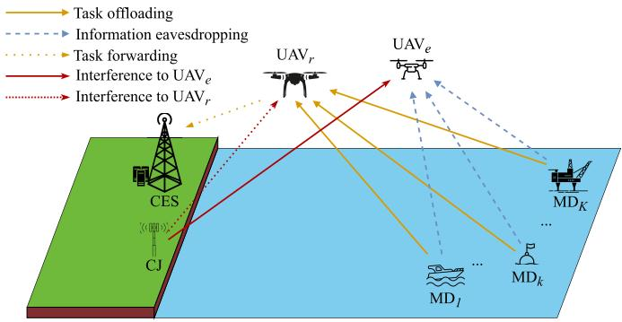

flowchart

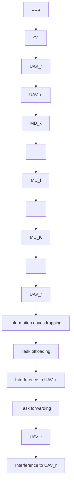

Fig. 1. UAV-relay-assisted secure maritime MEC system.

TABLE I NOTATIONS 

<table><tr><td>Notation</td><td>Description</td></tr><tr><td> $\mathbf{v}_{k}$ </td><td>Location of  $MD_{k}$ </td></tr><tr><td> $\mathbf{v}_{s}$ </td><td>Location of CES</td></tr><tr><td> $\mathbf{v}_{j}$ </td><td>Location of CJ</td></tr><tr><td> $\mathbf{u}_{i}[n]$ </td><td>Location of  $UAV_{i}$ </td></tr><tr><td> $H_{i}$ </td><td>Altitude of  $UAV_{i}$ </td></tr><tr><td> $\varphi_{t}$ </td><td>Length of the time slot</td></tr><tr><td> $T$ </td><td>Flight period of UAVs</td></tr><tr><td> $N$ </td><td>Number of total time slots</td></tr><tr><td> $\mathbf{u}_{i}^{I}$ </td><td>Initial position of  $UAV_{i}$ </td></tr><tr><td> $\mathbf{u}_{i}^{F}$ </td><td>Final position of  $UAV_{i}$ </td></tr><tr><td> $V_{i}^{\max}$ </td><td>Maximum speed of  $UAV_{i}$ </td></tr><tr><td> $d_{\min}$ </td><td>Minimum distance between UAVs</td></tr><tr><td> $\widetilde{G}[n]$ </td><td>Power ratio of the signal</td></tr><tr><td> $\beta_{0}$ </td><td>Channel power gain at a unit distance</td></tr><tr><td> $P_{k}^{\max}$ </td><td>Peak power of  $MD_{k}$ </td></tr><tr><td> $P_{r}^{\max}$ </td><td>Peak power of  $UAV_{r}$ </td></tr><tr><td> $p_{k}[n]$ </td><td>Transmit power of  $MD_{k}$ </td></tr><tr><td> $p_{r}[n]$ </td><td>Transmit power of  $UAV_{r}$ </td></tr><tr><td> $\xi_{k}[n]$ </td><td>Time slot allocation factor</td></tr><tr><td> $x_{k}[n]$ </td><td>Transmit signal of  $MD_{k}$ </td></tr><tr><td> $x_{j}[n]$ </td><td>Transmit signal of CJ</td></tr><tr><td> $n_{r}$ </td><td>Noise power of  $UAV_{r}$ </td></tr><tr><td> $n_{e}$ </td><td>Noise power of  $UAV_{e}$ </td></tr><tr><td> $n_{s}$ </td><td>Noise power of CES</td></tr><tr><td> $c_{k}$ </td><td>CPU cycles for MD calculating per bit</td></tr><tr><td> $c_{s}$ </td><td>CPU cycles for CES calculating per bit</td></tr><tr><td> $l_{k,\text{loc}}[n]$ </td><td>Local computing allocation of  $MD_{k}$ </td></tr><tr><td> $F_{k}^{\max}$ </td><td>Peak CPU frequency of MD</td></tr><tr><td> $F_{s}^{\max}$ </td><td>Peak CPU frequency of CES</td></tr><tr><td> $W$ </td><td>Communication bandwidth</td></tr><tr><td> $Q_{k}$ </td><td>Secure computing requirement of  $MD_{k}$ </td></tr><tr><td> $k_{k}$ </td><td>CPU capacity coefficient of MDs</td></tr><tr><td> $P_{k}^{\text{ave}}$ </td><td>Power budge of  $MD_{k}$ </td></tr></table>

The horizontal coordinates of $\mathrm { M D } _ { k } .$ , CES and CJ are described as $\mathbf { v } _ { u _ { 0 } } = ( x _ { u _ { 0 } } , y _ { u _ { 0 } } ) ^ { T } , u _ { 0 } \in \{ k , s , j \}$ , where $k \in$ ${ \cal K } = \{ 1 , 2 , \dots , K \}$ . The flight period of UAVs is given by $T , T \geq 0 .$ . The position of $\mathrm { U A V } _ { i }$ at time t is denoted as ${ \bf u } _ { i } ( t ) , i \in \{ r , e \} , t \in [ 0 , T ]$ . Assume that the altitude of $\mathrm { U A V } _ { i }$ is constant, denoted by $H _ { i }$ . To simplify the discussion, $T$ is uniformly partitioned into N discrete time slots. Thus, the length of a single slot is $\varphi _ { t } = T / N$ . In slot n, the position of $\mathrm { U A V } _ { i }$ is denoted as ${ \bf u } _ { i } [ n ] = ( x _ { i } [ n ] , y _ { i } [ n ] ) ^ { T }$ .

Assume that $\mathrm { U A V } _ { i }$ flies from the setting initial position $\mathbf { u } _ { i } ^ { I }$ to the setting final position $\mathbf { u } _ { i } ^ { F }$ within the period $T .$ The flight speed of $\mathrm { U A V } _ { r }$ cannot exceed $V _ { r } ^ { \mathrm { m a x } }$ . Then, the maximum allowable displacement of $\mathrm { U A V } _ { r }$ in a single time slot is $l _ { r } ^ { \operatorname* { m a x } } = V _ { r } ^ { \operatorname* { m a x } } \varphi _ { t }$ . Then, we have

$$
\mathbf {u} _ {r} [ 1 ] = \mathbf {u} _ {r} ^ {I}, \tag {1a}
$$

$$
\mathbf {u} _ {r} [ N ] = \mathbf {u} _ {r} ^ {F}, \tag {1b}
$$

$$
\left\| \mathbf {u} _ {r} [ n + 1 ] - \mathbf {u} _ {r} [ n ] \right\| \leq l _ {r} ^ {\max}. \tag {1c}
$$

To avoid collision of $\mathrm { U A V } _ { r }$ and $\mathrm { U A V } _ { e } ,$ the minimum collision avoidance distance between them is $d _ { \mathrm { m i n } }$ . We have

$$
\left\| \mathbf {u} _ {r} [ n ] - \mathbf {u} _ {e} [ n ] \right\| ^ {2} \geq d _ {\min} ^ {2}. \tag {2}
$$

In this work, we use distance-dependent path loss model [29]. In slot $n ,$ the distances between $\mathrm { M D } _ { k }$ and $\mathrm { U A V } _ { r } ,$ $\mathbf { M D } _ { k }$ and $\mathrm { U A V } _ { e } , \mathrm { C J }$ and $\mathrm { U A V } _ { r } , \mathrm { C J }$ and $\mathrm { U A V } _ { e } , \mathrm { U A V } _ { r }$ and CES can be respectively expressed as

$$
d _ {u _ {1}, u _ {2}} [ n ] = \sqrt {H _ {u _ {2}} ^ {2} + \| \mathbf {u} _ {u _ {2}} - \mathbf {v} _ {u _ {1}} \| ^ {2}}, \tag {3}
$$

where $( u _ { 1 } , u _ { 2 } ) \in \{ ( k , r ) , ( k , e ) , ( j , r ) , ( j , e ) , ( s , r ) \}$ .

Since CES and CJ are deployed on the coast, we consider them to be approximated as maritime nodes. Thus, the channels between $\mathrm { M D } _ { k }$ and $\mathbf { U A V } _ { r } , \mathbf { M D } _ { k }$ and $\mathrm { U A V } _ { e } , \mathrm { C J }$ and $\mathrm { U A V } _ { r } ,$ CJ and $\mathrm { U A V } _ { e } , \mathrm { U A V } _ { r }$ and CES can be considered as air-tosea channels. They follow Rician fading, which can be taken as composite channels of large-scale fading and small-scale fading [32], [33]. Thus, the corresponding channel coefficients can be expressed as

$$
\begin{array}{l} h _ {u _ {1}, u _ {2}} [ n ] = g _ {u _ {1}, u _ {2}} [ n ] \widetilde {h} _ {u _ {1}, u _ {2}} [ n ] \\ = \sqrt {\frac {\beta_ {0}}{d _ {u _ {1} , u _ {2}} ^ {2} [ n ]}} \left(\sqrt {\frac {\widetilde {G} [ n ]}{\widetilde {G} [ n ] + 1}} + \sqrt {\frac {1}{\widetilde {G} [ n ] + 1}} \widetilde {g} _ {u _ {1}, u _ {2}} [ n ]\right) ^ {2}, \tag {4} \\ \end{array}
$$

where $\{ g _ { u _ { 1 } , u _ { 2 } } [ n ] \}$ and $\{ \widetilde { h } _ { u _ { 1 } , u _ { 2 } } [ n ] \}$ are the large-scale fading coefficients and small-scale fading coefficients, respectively. $\beta _ { 0 }$ is channel power gain at a unit distance on the LoS component of the signal, and ${ \widetilde { G } } [ n ]$ is the power ratio of the LoS to the non-line-of-sight (NLoS) signal. $\widetilde { g } _ { u _ { 1 } , u _ { 2 } } [ n ] \ \in$ $\mathcal { C N } ( 0 , 1 )$ e is the ratio of the NLoS component matrix between the LoS component matrix of the signal.

Define $P _ { k } ^ { \mathrm { m a x } }$ and $P _ { r } ^ { \mathrm { m a x } }$ as the peak power of $\mathrm { M D } _ { k }$ and $\mathrm { U A V } _ { r }$ , respectively. The transmit power of $\mathrm { M D } _ { k }$ and $\mathrm { U A V } _ { r }$ need to satisfy

$$
0 \leq p _ {k} [ n ] \leq P _ {k} ^ {\max}, \quad \forall k, n, \tag {5a}
$$

$$
0 \leq p _ {r} [ n ] \leq P _ {r} ^ {\max}, \quad \forall k, n. \tag {5b}
$$

# III. PROBLEM FORMULATION

In the previous section, the flight period $T$ is uniformly partitioned into N discrete time slots based on the flight trajectory of UAVs. In each slot, every MD can access the UAVr for task forwarding and offloading. To avoid the communication interference between MDs, task offloading is performed using time-division-multiple-access, where one slot is further partitioned into K subslots. The length of time allocated to $\mathrm { M D } _ { k }$ is $\xi _ { k } [ n ] \varphi _ { t } .$ , where $\xi _ { k } [ n ]$ is time slot allocation factor. $\xi _ { k } [ n ]$ is limited by

$$
\sum_ {k = 1} ^ {K} \xi_ {k} [ n ] \leq 1, \quad \forall n, \tag {6a}
$$

$$
0 \leq \xi_ {k} [ n ] \leq 1, \quad \forall k, n. \tag {6b}
$$

# A. Communication Model

Each subslot $\xi _ { k } [ n ] \varphi _ { t }$ is further divided into two phases with equal length of time.

In the first phase, $\mathrm { M D } _ { k }$ offloads its computing task to $\mathrm { U A V } _ { r } .$ , which will be eavesdropped by $\mathrm { U A V } _ { e } .$ CJ transmits signals to interfere the eavesdropping of $\mathrm { U A V } _ { e }$ . Thus, the signal received in the first phase of $\mathrm { U A V } _ { r }$ is

$$
y _ {k, r} ^ {(1)} [ n ] = \sqrt {p _ {k} [ n ]} h _ {k, r} [ n ] x _ {k} [ n ] + \sqrt {P _ {j}} h _ {j, r} [ n ] x _ {j} [ n ] + n _ {r}, \quad \forall k, n, \tag {7}
$$

where $P _ { j }$ is the transmit power of CJ, $x _ { k } [ n ]$ and $x _ { j } [ n ]$ is the information sent by $\mathrm { M D } _ { k }$ and CJ, respectively, and $n _ { r }$ is the received noise of $\mathrm { U A V } _ { r }$ .

Assume that $x _ { k } [ n ]$ and $x _ { k } [ j ]$ are both normalized,

$$
\mathbb {E} \{\| x _ {k} [ n ] \| ^ {2} \} = \mathbb {E} \{\| x _ {j} [ n ] \| ^ {2} \} = 1, \quad \forall n. \tag {8}
$$

When $\mathrm { U A V } _ { e }$ eavesdrops the transmission from $\mathrm { M D } _ { k }$ to $\mathrm { U A V } _ { r }$ in the first phase, it also receives the interfering signal transmitted by CJ. Thus, the signal received by UAVe is

$$
y _ {k, e} ^ {(1)} [ n ] = \sqrt {p _ {k} [ n ]} h _ {k, e} [ n ] x _ {k} [ n ] + \sqrt {P _ {j}} h _ {j, e} x _ {j} [ n ] + n _ {e}, \quad \forall k, n, \tag {9}
$$

where $n _ { e }$ is the received noise of $\mathrm { U A V } _ { e }$ .

As $\mathrm { U A V } _ { e }$ cannot distinguish the interfering signal transmitted by CJ, the SINR of $\mathrm { U A V } _ { e }$ eavesdropping on the signal from $\mathbf { M D } _ { k }$ to $\mathrm { U A V } _ { r }$ can be expressed as

$$
\gamma_ {k, e} [ n ] = \frac {\left| h _ {k , e} [ n ] \right| ^ {2} p _ {k} [ n ]}{\left| h _ {j , e} [ n ] \right| ^ {2} P _ {j} + n _ {e} ^ {2}}, \quad \forall k, n. \tag {10}
$$

In the second phase, $\mathrm { U A V } _ { r }$ forwards the information to CES via AF. The amplification factor is

$$
G _ {k, r} [ n ] = \sqrt {\frac {p _ {r} [ n ]}{| h _ {k , r} [ n ] | ^ {2} p _ {k} [ n ] + | h _ {j , r} [ n ] | ^ {2} P _ {j} + n _ {r} ^ {2}}}, \quad \forall k, n, \tag {11}
$$

where $p _ { r } [ n ]$ is $\mathrm { U A V } _ { r } \mathrm { ' s }$ transmit power.

Then, the signal received by CES is

$$
y _ {r, s} ^ {(2)} [ n ] = G _ {k, r} [ n ] h _ {r, s} [ n ] y _ {k, r} ^ {(1)} [ n ] + n _ {s}, \tag {12}
$$

where $n _ { s }$ is the received noise of CES.

Since CES knows the interfering signal of CJ in advance, the SINR of CES from $\mathrm { M D } _ { k }$ is written as (13), shown at the bottom of the next page.

Therefore, the task offloading rate from $\mathbf { M D } _ { k }$ to CES is

$$
\Phi_ {k, s} [ n ] = \log_ {2} \left(1 + \gamma_ {k, s} [ n ]\right), \quad \forall k, n. \tag {14}
$$

The eavesdropping rate from $\mathrm { M D } _ { k }$ to $\mathrm { U A V } _ { e }$ is

$$
\Phi_ {k, e} [ n ] = \log_ {2} \left(1 + \gamma_ {k, e} [ n ]\right), \quad \forall k, n. \tag {15}
$$

Then, the secure offloading rate from $\mathrm { M D } _ { k }$ to CES is

$$
\Phi_ {k, \sec} [ n ] \triangleq (\Phi_ {k, s} [ n ] - \Phi_ {k, e} [ n ]) ^ {+}. \tag {16}
$$

# B. Computing Model

A partial offload strategy is adopted at MDs, in which, a part of tasks are executed on MDs, and the other tasks are forwarded to CES through UAVr for execution.

Assume that the number of CPU cycles for $\mathrm { M D } _ { k }$ when calculating a single bit data are $c _ { k }$ . The amount of data computed locally by $\mathbf { M D } _ { k }$ in slot n are $l _ { k , \mathrm { l o c } } [ n ]$ . Assume that $ { \mathrm { M D } } _ { k }  { \mathrm { \Delta } } ^ { \prime } \mathrm { s }$ maximum CPU frequency is $F _ { k } ^ { \mathrm { m a x } }$ . Thus, we have

$$
c _ {k} l _ {k, \text { loc }} [ n ] \leq \varphi_ {t} F _ {k} ^ {\max}, \quad \forall k, n. \tag {17}
$$

Define the CPU cycles of CES to calculate a single bit data as $c _ { s } ,$ and CES’s maximum CPU frequency as $F _ { s } ^ { \mathrm { m a x } }$ . Thus, the number of bits computed on CES cannot exceed its computing capacity, satisfying

$$
\frac {1}{2} c _ {s} W \xi_ {k} [ n ] \varphi_ {t} \Phi_ {k, \sec} [ n ] \leq \frac {1}{2} \varphi_ {t} \xi_ {k} [ n ] F _ {s} ^ {\max}, \tag {18}
$$

where W is bandwidth.

Define the minimum secure computing requirement of $\mathrm { M D } _ { k }$ as $Q _ { k }$ . To guarantee the secure computing requirement of each MD, we have

$$
l _ {k, \text { loc }} [ n ] + \frac {1}{2} W \xi_ {k} [ n ] \varphi_ {t} \Phi_ {k, \text { sec }} [ n ] \geq Q _ {k}, \quad \forall k, n. \tag {19}
$$

If tasks are computed locally at $\mathrm { M D } _ { k } .$ , the energy consumption can be written as

$$
E _ {k, \text { loc }} [ n ] = \frac {k _ {k} \left(c _ {k} l _ {k , \text { loc }} [ n ]\right) ^ {3}}{\varphi_ {t} ^ {2}}, \tag {20}
$$

where $k _ { k }$ denotes the effective capacitance coefficient of $\mathrm { M D } _ { k }$ .

On the other hand, if tasks are computed remotely at CES, the energy of $\mathrm { M D } _ { k }$ is consumed at transmitting

$$
E _ {k, \text { trans }} [ n ] = \frac {1}{2} \xi_ {k} [ n ] \varphi_ {t} p _ {k} [ n ]. \tag {21}
$$

The energy consumption of $\mathrm { M D } _ { k }$ in the whole period $T$ should satisfy

$$
\frac {1}{T} \sum_ {n = 1} ^ {N} (E _ {k, \mathrm{loc}} [ n ] + E _ {k, \mathrm{trans}} [ n ]) \leq P _ {k} ^ {\mathrm{ave}}, \quad \forall k, \tag {22}
$$

where $P _ { k } ^ { \mathrm { a v e } }$ is the average power limit of $\mathrm { M D } _ { k }$

# C. Problem Formulation

The secure computing capacity of $\mathrm { M D } _ { k }$ is defined as the average number of bits that $\mathrm { M D } _ { k }$ can achieve, which is composed of local and offloading computation,

$$
\overline {{{\Phi}}} _ {k, \sec} \triangleq \frac {1}{T} \left(\frac {1}{2} W \varphi_ {t} \sum_ {n = 1} ^ {N} \xi_ {k} [ n ] \Phi_ {k, \sec} [ n ] + \sum_ {n = 1} ^ {N} l _ {k, \text { loc }} [ n ]\right), \quad \forall k. \tag {23}
$$

Our optimization target is to maximize the minimum secure computing capacity of the system by optimizing the time slot allocation factor $\xi _ { k } [ n ] , \mathrm { M D } _ { k }$ transmit power $p _ { k } [ n ]$ , $\mathrm { U A V } _ { r }$ transmit power $p _ { r } [ n ]$ , the amount of data computed at $\mathrm { M D } _ { k }$ locally $l _ { k , \mathrm { l o c } } [ n ]$ and the UAVr trajectory ${ \mathbf { u } } _ { r } [ n ]$ , which can be formulated as

$$
\text {(P1)}: \max _ {\{\xi_ {k} [ n ], p _ {k} [ n ], p _ {r} [ n ], l _ {k, \text {loc}} [ n ], \mathbf {u} _ {r} [ n ] \}} \min _ {\forall k} \overline {{\Phi}} _ {k, \text {sec}}
$$

$$
\text { s.t. } (1), (2), (5), (6), (1 7) - (2 2), \tag {24}
$$

Due to the coupling of multi-variables, the non-convexity of constraints (2), (18), (19) and (22), the original problem (P1) is non-convex. Specifically, the constraint (2) is non-convex. Constraints (18) and (19) are related to $\Phi _ { k , \mathrm { s e c } } [ n ]$ , which is composed of multiple optimization variables, $\mathrm { e . g . } , \ p _ { k } [ n ]$ , $p _ { r } [ n ] , \mathbf { u } _ { r } [ n ]$ , making (18) and (19) multi-variable coupled and non-convex. Moreover, the constraint (22) is also related to multiple optimization variables, e.g., $\xi _ { k } [ n ] , \ p _ { k } [ n ] , \ l _ { k , \mathrm { l o c } } [ n ]$ , making (22) non-convex.

# IV. PROBLEM SOLUTION

To simplify the resolution of the problem (1), we transform it into an equality form with three auxiliary variables $\theta , \theta _ { 1 , k } [ n ]$ and $\theta _ { 2 , k } [ n ]$

$$
\text {(P2)}: \max _ {\mathcal {Z}} \theta \tag {25a}
$$

$$
\text { s.t. } (1), (2), (5), (6), (1 7), (2 2),
$$

$$
\theta \leq \frac {1}{T} \left(\frac {1}{2} W \varphi_ {t} \sum_ {n = 1} ^ {N} \xi_ {k} [ n ] \left(\theta_ {1, k} [ n ] - \theta_ {2, k} [ n ]\right) \right.
$$

$$
\left. + \sum_ {n = 1} ^ {N} l _ {k, \text {loc}} [ n ]\right), \quad \forall k, \tag {25b}
$$

$$
\theta_ {1, k} [ n ] \leq \Phi_ {k, s} [ n ], \quad \forall k, n, \tag {25c}
$$

$$
\theta_ {2, k} [ n ] \geq \Phi_ {k, e} [ n ], \quad \forall k, n, \tag {25d}
$$

$$
c _ {s} W \left(\theta_ {1, k} [ n ] - \theta_ {2, k} [ n ]\right) \leq F _ {s} ^ {\max}, \quad \forall k, n, \tag {25e}
$$

$$
l _ {k, \text { loc }} [ n ] + \frac {1}{2} B \xi_ {k} [ n ] \varphi_ {t} (\theta_ {1, k} [ n ] - \theta_ {2, k} [ n ]) \geq Q _ {k},
$$

$$
\forall k, n, \tag {25f}
$$

where $\begin{array} { r l r } { \mathcal { Z } } & { { } = } & { \{ \xi _ { k } [ n ] , p _ { k } [ n ] , p _ { r } [ n ] , l _ { k , \mathrm { l o c } } [ n ] , { \bf u } _ { r } [ n ] , \theta _ { 1 , k } [ n ] , } \end{array}$ $\theta _ { 2 , k } [ n ] \}$ .

For (18), (19) and (23), by setting $p _ { k } [ n ] = 0 , p _ { r } [ n ] = 0$ and $l _ { k , \mathrm { l o c } } [ n ] = 0$ , at least the value of zero can be obtained. Thus, we can omit the operator $[ \cdot ] ^ { + }$ . We introduce the auxiliary variable s as the lower bound of $\overline { { \Phi } } _ { k , \mathrm { s e c } }$ as shown in (25b). Meanwhile, $\theta _ { 1 , k } [ n ]$ is introduced to represent the lower bound of $\Phi _ { k , s } [ n ]$ and $\theta _ { 2 , k } [ n ]$ is introduced to represent the upper bound of $\Phi _ { k , e } [ n ]$ , as shown in (25c) and (25d), respectively. The value of θ can be always enlarged, unless the equality in (25b) is hold at the optimal solution. Similarly, in order to achieve the optimal solution, it is necessary for at least one equality in equations (25c) and (25e) to hold, thereby ensuring the same value as the problem (P1). Therefore, in the case of $\theta _ { 2 , k } [ n ]$ , the equality $\theta _ { 2 , k } [ n ] = \operatorname* { m a x } \Phi _ { k , e } [ n ]$ must hold at the optimal solution. Otherwise, if $\theta _ { 2 , k } [ n ]$ is not equal to max $\Phi _ { k , e } [ n ]$ , it can always be decreased, leading to a larger value of the objective function. Therefore, the transformed problem (P2) is equivalent to (P1).

To overcome the problem (P2), a BCD-based joint optimization algorithm is proposed. We adopt a two-step approach with block structures of the variables. In Step 1, the variables $\mathcal { Z } \backslash \mathbf { u } _ { r } [ n ]$ are optimized by considering ${ \mathbf { u } } _ { r } [ n ]$ at a fixed value. Subsequently, in Step 2, the variables ${ \mathbf { u } } _ { r } [ n ]$ is optimized by considering $\mathcal { Z } \backslash \mathbf { u } _ { r } [ n ]$ fixed.

# A. Step 1: Optimizing $\mathcal { Z } \backslash \mathbf { u } _ { r } [ n ]$

For fixed ${ \mathbf { u } } _ { r } [ n ]$ , the problem (P2) can be re-expressed as

$$
(\mathrm{P3}): \max _ {\mathcal {Z}} \theta
$$

$$
\text { s.t. } (5), (6), (1 7), (2 2), (2 5 \mathrm{b}) - (2 5 \mathrm{f}). \tag {26}
$$

The problem (P3) has non-convex constraints, which are shown as (22),(25b)-(25d), and(25f). As a result, the problem (P3) is also non-convex. To overcome this non-convexity, we can utilize the BCD to solve [34]. Specifically, we can obtain the time slot allocation factor of MDk ξk[n], MDk transmit power $p _ { k } [ n ]$ , $\mathrm { U A V } _ { r }$ transmit power $p _ { r } [ n ]$ , and $\mathrm { M D } _ { k }$ local computation allocation $l _ { k , \mathrm { l o c } } [ n ]$ by fixing the other values in an iterative manner.

1) Time Allocation: For the fixed $\mathbf { M D } _ { k }$ transmit power $p _ { k } [ n ]$ , UAVr transmit power $p _ { r } [ n ]$ and $\mathbf { M D } _ { k }$ local computation allocation $l _ { k , \mathrm { l o c } } [ n ]$ , the OP (P3) is

$$
\text {(P3.1)}: \max _ {\{\xi_ {k} [ n ], \theta_ {1, k} [ n ], \theta_ {2, k} [ n ] \}} \theta
$$

$$
\text { s.t. } (6), (2 2), (2 5 b) - (2 5 f). \tag {27}
$$

(P3.1) is a typical convex OP, which is solved using traditional convex optimization methods such as CVX [35].

2) $M D _ { k }$ Transmit Power: For the fixed time slot allocation factor $\xi _ { k } [ n ]$ , UAVr transmit power $p _ { r } [ n ]$ and $\mathbf { M D } _ { k }$ local computation allocation $l _ { k , \mathrm { l o c } } [ n ]$ ], the OP (P3) is formulated as

$$
\text {(P3.2)}: \max _ {\{p _ {k} [ n ], \theta_ {1, k} [ n ], \theta_ {2, k} [ n ] \}} \theta
$$

$$
\text { s.t. } (5 \mathrm{a}), (2 2), (2 5 \mathrm{b}) - (2 5 \mathrm{f}). \tag {28}
$$

Because of (25c) and (25d)’s non-convexity, (P3.2) is difficult to solve. The OP (P3.2) can be solved by SCA [36], where problem (P3.2) can be approximated as the convex problem in each iteration. The transmit power of $\mathbf { M D } _ { k }$ is obtained via iterations.

Assume that $p _ { k } ^ { ( i ) } [ n ]$ is the value of the ith iteration of the transmit power $p _ { k } [ n ]$ of $\mathrm { M D } _ { k }$ . By applying SCA, we take the first-order Taylor expansion at the given $p _ { k } ^ { ( i ) } [ n ]$ , and convert (25c) to

$$
\theta_ {1, k} [ n ] \leq \log_ {2} \left(1 + \frac {a _ {1} p _ {k} ^ {(i)} [ n ]}{b _ {1} p _ {k} ^ {(i)} [ n ] + c _ {1}}\right)
$$

$$
+ \frac {a _ {1} c _ {1}}{\ln 2} \frac {p _ {k} [ n ] - p _ {k} ^ {(i)} [ n ]}{\left((a _ {1} + b _ {1}) p _ {k} ^ {(i)} [ n ] + c _ {1}\right) \left(b _ {1} p _ {k} ^ {(i)} [ n ] + c _ {1}\right)}, \tag {29}
$$

$$
\gamma_ {k, s} [ n ] = \frac {p _ {k} [ n ] \left| h _ {k , r} [ n ] \right| ^ {2} p _ {r} [ n ] \left| h _ {r , s} [ n ] \right| ^ {2}}{p _ {r} [ n ] \left| h _ {r , s} [ n ] \right| ^ {2} n _ {r} ^ {2} + p _ {k} [ n ] \left| h _ {k , r} [ n ] \right| ^ {2} n _ {s} ^ {2} + P _ {j} \left| h _ {j , r} [ n ] \right| ^ {2} n _ {s} ^ {2} + n _ {r} ^ {2} n _ {s} ^ {2}}, \quad \forall k, n \tag {13}
$$

where

$$
\left\{ \begin{array}{l} a _ {1} = | h _ {k, r} [ n ] | ^ {2} p _ {r} [ n ] | h _ {r, s} [ n ] | ^ {2}, \\ b _ {1} = | h _ {k, r} [ n ] | ^ {2} n _ {s} ^ {2}, \\ c _ {1} = p _ {r} [ n ] | h _ {r, s} [ n ] | ^ {2} n _ {r} ^ {2} + P _ {j} | h _ {j, r} [ n ] | ^ {2} n _ {s} ^ {2} + n _ {r} ^ {2} n _ {s} ^ {2}. \end{array} \right. \tag {30}
$$

(25d) can be similarly converted to

$$
\theta_ {2, k} [ n ] \geq \log_ {2} \left(1 + \frac {a _ {2} p _ {k} ^ {(i)} [ n ]}{b _ {2}}\right) + \frac {a _ {2}}{\ln 2} \frac {p _ {k} [ n ] - p _ {k} ^ {(i)} [ n ]}{a _ {2} p _ {k} ^ {(i)} [ n ] + b _ {2}}, \quad \forall k, n, \tag {31}
$$

where

$$
\left\{ \begin{array}{l} a _ {2} = | h _ {k, e} [ n ] | ^ {2}, \\ b _ {2} = | h _ {j, e} [ n ] | ^ {2} P _ {j} + n _ {e} ^ {2}. \end{array} \right. \tag {32}
$$

Thus, the problem (P3.2) can be reformulated as

$$
\text {(P3.2.1)}: \max _ {\{p _ {k} [ n ], \theta_ {1, k} [ n ], \theta_ {2, k} [ n ] \}} \theta
$$

$$
\text { s   .   t   . } (5 \mathrm{a}), (2 2), (2 5 \mathrm{b}), (2 5 \mathrm{e}), (2 5 \mathrm{f}), (2 9), (3 1). \tag {33}
$$

Note that (P3.2.1) is convex, which can be solved through CVX.

3) $U A V _ { r }$ Transmit Power: For the fixed time slot allocation factor $\xi _ { k } [ n ]$ , $\mathrm { M D } _ { k }$ transmit power $p _ { k } [ n ]$ and $\mathrm { M D } _ { k }$ local computation allocation $l _ { k , \mathrm { l o c } } [ n ]$ , the $\mathrm { O P } \left( \mathrm { P } 3 \right)$ can be formulated as

$$
\text {(P3.3)}: \max _ {\{p _ {r} [ n ], \theta_ {1, k} [ n ], \theta_ {2, k} [ n ] \}} \theta
$$

$$
\text { s.t. } (5 \mathrm{b}), (2 5 \mathrm{b}) - (2 5 \mathrm{f}). \tag {34}
$$

The problem (P3.3) is difficult to solve as (25c) is nonconvex. Similarly, we can use SCA to solve it. Assume that $p _ { r } ^ { ( i ) } [ n ]$ is the value of the $i _ { \mathrm { t h } }$ iteration of the transmit power $p _ { r } [ n ]$ of $\mathrm { U A V } _ { r }$ . With the given point $p _ { r } ^ { ( i ) } [ n ]$ , through taking the first-order of Taylor expansion, we can convert (25c) as

$$
\begin{array}{l} \theta_ {1, k} [ n ] \\ \leq \log_ {2} \left(1 + \frac {a _ {3} p _ {r} ^ {(i)} [ n ]}{b _ {3} p _ {r} ^ {(i)} [ n ] + c _ {3}}\right) \\ + \frac {a _ {3} c _ {3}}{\ln 2} \frac {p _ {r} [ n ] - p _ {r} ^ {(i)} [ n ]}{\left((a _ {3} + b _ {3}) p _ {r} ^ {(i)} [ n ] + c _ {3}\right) \left(b _ {3} p _ {r} ^ {(i)} [ n ] + c _ {3}\right)}, \quad \forall k, n, \tag {35} \\ \end{array}
$$

where

$$
\left\{ \begin{array}{l} a _ {3} = p _ {k} [ n ] \left| h _ {k, r} [ n ] \right| ^ {2} \left| h _ {r, s} [ n ] \right| ^ {2}, \\ b _ {3} = \left| h _ {r, s} [ n ] \right| ^ {2} n _ {r} ^ {2}, \\ c _ {3} = p _ {k} [ n ] \left| h _ {k, r} [ n ] \right| ^ {2} n _ {s} ^ {2} + P _ {j} \left| h _ {j, r} [ n ] \right| ^ {2} n _ {s} ^ {2} + n _ {r} ^ {2} n _ {s} ^ {2}. \end{array} \right. \tag {36}
$$

Then, the problem (P3.3) can be reformulated as

$$
\text {(P3.3.1)}: \max _ {\{p _ {r} [ n ], \theta_ {1, k} [ n ], \theta_ {2, k} [ n ] \}} \theta
$$

$$
\text { s.t. } (5 \mathrm{b}), (2 5 \mathrm{b}), (2 5 \mathrm{d}) - (2 5 \mathrm{f}), (3 5). \tag {37}
$$

The constraints of the problem (P3.3.1) are all linear. Thus, the problem (P3.3.1) is typically convex, which can be solved by CVX.

4) $M D _ { k }$ Local Computation Allocation: For the fixed time slot allocation factor $\xi _ { k } [ n ]$ ], $\mathrm { M D } _ { k }$ transmit power $p _ { k } [ n ]$ and $\mathrm { U A V } _ { \mathcal { r } }$ r transmit power $p _ { r } [ n ]$ ], the OP (P3) can be formulated as

$$
\text {(P3.4)}: \max _ {\{l _ {k, \operatorname{loc}} [ n ], \theta_ {1, k} [ n ], \theta_ {2, k} [ n ] \}} \theta
$$

$$
\text { s.t. } (1 7), (2 2), (2 5 \mathrm{b}) - (2 5 \mathrm{f}). \tag {38}
$$

As the constraint (22) is convex, and the rest constraints are linear, (P3.4) can be solved by CVX.

# B. Step 2: Optimizing ${ \mathbf { u } } _ { r } [ n ]$

By fixing the time slot allocation factor $\xi _ { k } [ n ]$ , $\mathrm { M D } _ { k }$ transmit power $p _ { k } [ n ]$ , UAVr transmit power $p _ { r } [ n ]$ , and $\mathrm { M D } _ { k }$ local computation allocation lk, loc[n], we can reformulat the problem (P2) as

$$
\text {(P4)}: \max _ {\{\mathbf {u} _ {r} [ n ], \theta_ {1, k} [ n ], \theta_ {2, k} [ n ] \}} \theta
$$

$$
\text { s.t. } (1), (2), (2 5 \mathrm{b}) - (2 5 \mathrm{f}), \tag {39}
$$

where the constraints (2) and (25c) are non-convex.

Similarly, we can use SCA to solve it. Assume that $\mathbf { u } _ { r } ^ { ( i ) } [ n ]$ is the value of the $i _ { \mathrm { t h } }$ iteration of the trajectory of $\mathrm { U A V } _ { r } ,$ through taking the first-order Taylor expansion, (2) and (25c) are converted to

$$
\begin{array}{l} \left\| \mathbf {u} _ {r} ^ {(i)} [ n ] - \mathbf {u} _ {e} [ n ] \right\| ^ {2} \\ + 2 \left(\mathbf {u} _ {r} ^ {(i)} [ n ] - \mathbf {u} _ {e} [ n ]\right) \cdot \left(\mathbf {u} _ {r} [ n ] - \mathbf {u} _ {r} ^ {(i)} [ n ]\right) \geq d _ {\min} ^ {2}, \quad \forall k, n. \tag {40} \\ \end{array}
$$

$$
\theta_ {1, k} [ n ] \leq f _ {1, \mathrm{T}} (\mathbf {u} _ {r} [ n ]) - f _ {2, \mathrm{T}} (\mathbf {u} _ {r} [ n ]), \quad \forall k, n, \tag {41}
$$

where $f _ { \alpha , \mathrm { T } } ( \mathbf { u } _ { r } [ n ] ) , \alpha \in \{ 1 , 2 \}$ , can be written as (42), shown at the bottom of the next page, where $f _ { \alpha } ( \mathbf { u } _ { r } ^ { ( i ) } [ n ] )$ can be written as

$$
f _ {\alpha} (\mathbf {u} _ {r} ^ {(i)} [ n ]) = \log_ {2} \left(g _ {\alpha} (\mathbf {u} _ {r} ^ {(i)} [ n ])\right), \quad \forall k, n, \tag {43}
$$

where $g _ { 1 } ( \mathbf { u } _ { r } ^ { ( i ) } [ n ] )$ and $g _ { 2 } ( \mathbf { u } _ { r } ^ { ( i ) } [ n ] )$ are written as (44a) and (44b), shown at the bottom of the next page, and $\nabla g _ { 1 } ( \mathbf { u } _ { r } ^ { ( i ) } [ n ] )$ and $\nabla g _ { 2 } ( \mathbf { u } _ { r } ^ { ( i ) } [ n ] )$ can be written as (45a) and (45b), shown at the bottom of the next page, where

$$
a _ {u _ {1}, u _ {2}} [ n ] = \left(\sqrt {\frac {\widetilde {G} [ n ]}{\widetilde {G} [ n ] + 1}} + \sqrt {\frac {1}{\widetilde {G} [ n ] + 1}} \widetilde {g} _ {u _ {1}, u _ {2}} [ n ]\right) ^ {4}, \tag {46}
$$

where $( u _ { 1 } , u _ { 2 } ) \in \{ ( k , r ) , ( s , r ) , ( j , r ) \}$ .

Then, the problem (P4) can be reformulated as

$$
\text {(P4.1)}: \max _ {\{\mathbf {u} _ {r} [ n ], \theta_ {1, k} [ n ], \theta_ {2, k} [ n ] \}} \theta
$$

$$
\text { s.t. } (1), (2 5 \mathrm{b}), (2 5 \mathrm{d}) - (2 5 \mathrm{f}), (4 0), (4 1). \tag {47}
$$

Note that (P4.1) is typically convex, which can be solved by CVX.

The original problem (P1) can be solved by iteratively solving the problems (P3) and (P4) to approach the global optimal solution, in which the variables are optimized by updating in an alternating manner as shown in Algorithm 1.

Algorithm 1 BCD-Based Joint Optimization Algorithm   
1: Init: $\mathcal{V}^{(0)}[n]=\{\xi_{k}^{(0)}[n],p_{k}^{(0)}[n],p_{r}^{(0)}[n],l_{k,\mathrm{loc}}^{(0)}[n],\mathbf{u}_{r}^{(0)}[n]\}$ ,
set $\varepsilon>0$ .
2: repeat
3: By $\mathcal{V}^{(i)}[n]\backslash\xi_{k}^{(i)}[n]$ , solve the problem (P3.1), obtain and update time allocation $\xi_{k}[n]$ .
4: By $\mathcal{V}^{(i)}[n]\backslash p_{k}^{(i)}[n]$ , solve the problem (P3.2), obtain and update $MD_{k}$ transmit power $p_{k}[n]$ .
5: By $\mathcal{V}^{(i)}[n]\backslash p_{r}^{(i)}[n]$ , solve the problem (P3.3), obtain and update $UAV_{r}$ transmit power $p_{r}[n]$ .
6: By $\mathcal{V}^{(i)}[n]\backslash l_{k,\mathrm{loc}}^{(i)}[n]$ , solve the problem (P3.4), obtain and update $MD_{k}$ local computation allocation $l_{k,\mathrm{loc}}[n]$ .
7: By $\mathcal{V}^{(i)}[n]\backslash\mathbf{u}_{r}^{(i)}[n]$ , solve the problem (P4), obtain and update $UAV_{r}$ trajectory $u_{r}[n]$ .
8: Update $i\leftarrow i+1$ .
9: until The accuracy $\varepsilon$ is achieved or i reaches $I_{1}$ .
10: Output: $\xi_{k}[n]$ , $p_{k}[n]$ , $p_{r}[n]$ , $l_{k,\mathrm{loc}}[n]$ , $u_{r}[n]$ .

# C. Feasibility and Complexity of Algorithm 1

The required $Q _ { k }$ may not satisfy the initialization parameters on the initial iteration. To make the problem solvable, we first check the feasibility of Algorithm 1 by optimizing the problem as

$$
\text {(P5)}: \max _ {\{\xi_ {k} [ n ], p _ {k} [ n ], p _ {r} [ n ], l _ {k, \mathrm{loc}} [ n ], \mathbf {u} _ {r} [ n ] \}} Q _ {k} ^ {u} \tag {48a}
$$

$$
\text { s   .   t   . } (1), (2), (5), (6), (1 7), (1 8), (2 2),
$$

$$
l _ {k, \mathrm{loc}} [ n ] + \frac {1}{2} W \xi_ {k} [ n ] \varphi_ {t} \Phi_ {k, \mathrm{sec}} \geq Q _ {k} ^ {u},
$$

$$
\forall k, n. \tag {48b}
$$

Through solving the problem (P5), we can obtain $Q _ { k } ^ { u } .$ Subsequently, we can assess the feasibility of Algorithm 1 and adjust the parameter initialization accordingly to ensure better performance [29].

In each iteration of the proposed algorithm, there are two standard convex optimization solutions and three SCA techniques, and the number of variables involved is $4 K N + N .$ . Taking $I _ { 1 }$ as the iteration number of BCD algorithm, we have the complexity of Algorithm 1 given as $I _ { 1 } \bar { O } ( ( K N ) ^ { 3 . 5 } \log ( 1 / \varepsilon ) )$ [37].

# V. NUMERICAL RESULTS

In this section, we first evaluate the convergence of the proposed algorithm. Then, the impact of different constraints on the max-min secure computing capacity is compared. Lastly, we conduct a comparison between the proposed algorithm and four benchmark approaches. Some parameters are provided in Table II, and others are as follows [5], [31].

$$
f _ {\alpha , \mathrm{T}} \left(\mathbf {u} _ {r} [ n ]\right) = f _ {\alpha} \left(\mathbf {u} _ {r} ^ {(i)} [ n ]\right) + \nabla f _ {\alpha} \left(\mathbf {u} _ {r} ^ {(i)} [ n ]\right) \left(\mathbf {u} _ {r} [ n ] - \mathbf {u} _ {r} ^ {(i)} [ n ]\right) = f _ {\alpha} \left(\mathbf {u} _ {r} ^ {(i)} [ n ]\right) + \frac {\nabla g _ {\alpha} \left(\mathbf {u} _ {r} ^ {(i)} [ n ]\right)}{g _ {\alpha} \left(\mathbf {u} _ {r} ^ {(i)} [ n ]\right) \ln 2} \left(\mathbf {u} _ {r} [ n ] - \mathbf {u} _ {r} ^ {(i)} [ n ]\right), \quad \forall k, n \tag {42}
$$

$$
\begin{array}{l} g _ {1} (\mathbf {u} _ {r} ^ {(i)} [ n ]) = n _ {r} ^ {2} n _ {s} ^ {2} d _ {j, r} ^ {2} [ n ] d _ {k, r} ^ {2} [ n ] d _ {r, s} ^ {2} [ n ] + a _ {j, r} [ n ] n _ {s} ^ {2} P _ {j} \beta_ {0} d _ {k, r} ^ {2} [ n ] d _ {r, s} ^ {2} [ n ] + a _ {k, r} [ n ] n _ {s} ^ {2} p _ {k} [ n ] \beta_ {0} d _ {j, r} ^ {2} [ n ] d _ {r, s} ^ {2} [ n ] \\ + a _ {r, s} [ n ] n _ {r} ^ {2} p _ {r} [ n ] \beta_ {0} d _ {j, r} ^ {2} [ n ] d _ {k, r} ^ {2} [ n ] + a _ {k, r} [ n ] a _ {r, s} [ n ] p _ {k} [ n ] p _ {r} [ n ] \beta_ {0} ^ {2} d _ {j, r} ^ {2} [ n ], \forall k, n, (44a) \\ g _ {2} (\mathbf {u} _ {r} ^ {(i)} [ n ]) = n _ {r} ^ {2} n _ {s} ^ {2} d _ {j, r} ^ {2} [ n ] d _ {k, r} ^ {2} [ n ] d _ {r, s} ^ {2} [ n ] + a _ {j, r} [ n ] n _ {s} ^ {2} P _ {j} \beta_ {0} d _ {k, r} ^ {2} [ n ] d _ {r, s} ^ {2} [ n ] + a _ {k, r} [ n ] n _ {s} ^ {2} p _ {k} [ n ] \beta_ {0} d _ {j, r} ^ {2} [ n ] d _ {r, s} ^ {2} [ n ] \\ + a _ {r, s} [ n ] n _ {r} ^ {2} p _ {r} [ n ] \beta_ {0} d _ {j, r} ^ {2} [ n ] d _ {k, r} ^ {2} [ n ], \forall k, n (44b) \\ \end{array}
$$

$$
\begin{array}{l} \nabla g _ {1} \left(\mathbf {u} _ {r} ^ {(i)} [ n ]\right) = 2 n _ {r} ^ {2} n _ {s} ^ {2} \left(\left(\mathbf {u} _ {r} ^ {(i)} [ n ] - \mathbf {v} _ {j}\right) d _ {k, r} ^ {2} [ n ] d _ {r, s} ^ {2} [ n ] + d _ {j, r} ^ {2} [ n ] \left(\mathbf {u} _ {r} ^ {(i)} [ n ] - \mathbf {v} _ {k}\right) d _ {r, s} ^ {2} [ n ] + d _ {j, r} ^ {2} [ n ] d _ {k, r} ^ {2} [ n ] \left(\mathbf {u} _ {r} ^ {(i)} [ n ] - \mathbf {v} _ {s}\right)\right) \\ + 2 a _ {j, r} [ n ] n _ {s} ^ {2} P _ {j} \beta_ {0} \left((\mathbf {u} _ {r} ^ {(i)} [ n ] - \mathbf {v} _ {k}) d _ {r, s} ^ {2} [ n ] + d _ {k, r} ^ {2} [ n ] (\mathbf {u} _ {r} ^ {(i)} [ n ] - \mathbf {v} _ {s})\right) \\ + 2 a _ {k, r} [ n ] n _ {s} ^ {2} p _ {k} [ n ] \beta_ {0} \left(\left(\mathbf {u} _ {r} ^ {(i)} [ n ] - \mathbf {v} _ {j}\right) d _ {r, s} ^ {2} [ n ] + d _ {j, r} ^ {2} [ n ] \left(\mathbf {u} _ {r} ^ {(i)} [ n ] - \mathbf {v} _ {s}\right)\right) \\ + 2 a _ {r, s} [ n ] n _ {r} ^ {2} p _ {r} [ n ] \beta_ {0} \left((\mathbf {u} _ {r} ^ {(i)} [ n ] - \mathbf {v} _ {j}) d _ {k, r} ^ {2} [ n ] + d _ {j, r} ^ {2} [ n ] (\mathbf {u} _ {r} ^ {(i)} [ n ] - \mathbf {v} _ {k})\right) \\ + 2 a _ {k, r} [ n ] a _ {r, s} [ n ] p _ {k} [ n ] p _ {r} [ n ] \beta_ {0} ^ {2} (\mathbf {u} _ {r} ^ {(i)} [ n ] - \mathbf {v} _ {j}), \quad \forall k, n, \tag {45a} \\ \end{array}
$$

$$
\nabla g _ {2} (\mathbf {u} _ {r} ^ {(i)} [ n ]) = 2 \left. n _ {r} ^ {2} n _ {s} ^ {2} \left((\mathbf {u} _ {r} ^ {(i)} [ n ] - \mathbf {v} _ {j}) d _ {k, r} ^ {2} [ n ] d _ {r, s} ^ {2} [ n ] + d _ {j, r} ^ {2} [ n ] (\mathbf {u} _ {r} ^ {(i)} [ n ] - \mathbf {v} _ {k}) d _ {r, s} ^ {2} [ n ] + d _ {j, r} ^ {2} [ n ] d _ {k, r} ^ {2} [ n ] (\mathbf {u} _ {r} ^ {(i)} [ n ] - \mathbf {v} _ {s})\right) \right.
$$

$$
+ 2 a _ {j, r} [ n ] n _ {s} ^ {2} P _ {j} \beta_ {0} \left((\mathbf {u} _ {r} ^ {(i)} [ n ] - \mathbf {v} _ {k}) d _ {r, s} ^ {2} [ n ] + d _ {k, r} ^ {2} [ n ] (\mathbf {u} _ {r} ^ {(i)} [ n ] - \mathbf {v} _ {s})\right)
$$

$$
+ 2 a _ {k, r} [ n ] n _ {s} ^ {2} p _ {k} [ n ] \beta_ {0} \left((\mathbf {u} _ {r} ^ {(i)} [ n ] - \mathbf {v} _ {j}) d _ {r, s} ^ {2} [ n ] + d _ {j, r} ^ {2} [ n ] (\mathbf {u} _ {r} ^ {(i)} [ n ] - \mathbf {v} _ {s})\right)
$$

$$
+ 2 a _ {r, s} [ n ] n _ {r} ^ {2} p _ {r} [ n ] \beta_ {0} \left(\left(\mathbf {u} _ {r} ^ {(i)} [ n ] - \mathbf {v} _ {j}\right) d _ {k, r} ^ {2} [ n ] + d _ {j, r} ^ {2} [ n ] \left(\mathbf {u} _ {r} ^ {(i)} [ n ] - \mathbf {v} _ {k}\right)\right), \quad \forall k, n \tag {45b}
$$

TABLE II PARAMETER SETTING 

<table><tr><td>Parameters</td><td>Values</td></tr><tr><td>Channel power gain at a unit distance</td><td> $\beta_0 = -60$  dB</td></tr><tr><td>Altitude of UAVs</td><td> $H_r = H_e = 100$  m</td></tr><tr><td>The power ratio of signal matrix</td><td> $\widetilde{G}[n] = 30$ </td></tr><tr><td>Length of the time slot</td><td> $\varphi_t = 0.5$  s</td></tr><tr><td>Received noise power</td><td> $n_r = n_e = n_s = -110$  dBm</td></tr><tr><td>CPU cycles required per bit computing</td><td> $c_k = c_s = 10^3$  cycles/bit</td></tr><tr><td>Maximum CPU frequency</td><td> $F_k^{\max} = 10^9$  Hz,  $F_s^{\max} = 10^{12}$  Hz</td></tr><tr><td>Communication bandwidth</td><td> $W = 1$  MHz</td></tr><tr><td>MDkCPU capacity coefficient</td><td> $k_k = 10^{-27}$ </td></tr><tr><td>MDkpower budget</td><td> $P_k^{\text{ave}} = 1$  W</td></tr></table>

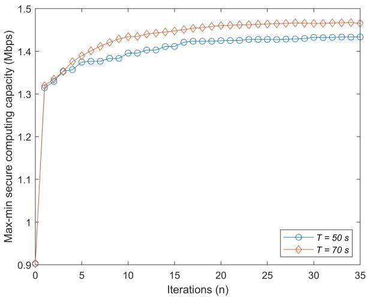

line

| Iterations (n) | T = 50 s | T = 70 s |
| -------------- | -------- | -------- |
| 0              | 0.9      | 0.9      |
| 5              | 1.35     | 1.38     |
| 10             | 1.38     | 1.42     |
| 15             | 1.41     | 1.44     |
| 20             | 1.42     | 1.45     |
| 25             | 1.42     | 1.46     |
| 30             | 1.42     | 1.46     |
| 35             | 1.42     | 1.46     |

Fig. 2. Convergence of Algorithm 1 with different values of T , where $P _ { k } ^ { \mathrm { { \bar { m a x } } } } = 0 . 2$ W, $\breve { P } _ { r } ^ { \mathrm { m a x } } = 0 . 5 \ : \mathrm { V }$ W and $P _ { j } = 0 . 5 ~ \mathrm { W } .$ .

Within a sea area of $1 5 0 0 \times 2 0 0 0 \mathrm { m ^ { 2 } }$ , we deploy five MDs in our proposed scheme. The locations of CES and CJ are both fixed at $[ 0 , 0 ] ^ { T }$ . UAVr flies from $\mathbf { u } _ { r } ^ { I } = [ 0 , 0 ] ^ { T } \mathbf { \epsilon } _ { \mathrm { t o } } \mathbf { u } _ { r } ^ { F } =$ 1 $[ 2 0 0 0 , 0 ] ^ { T }$ , and UAVe flies from $\mathbf { u } _ { e } ^ { I } \ = \ [ 0 , \bar { 7 } 5 0 ] ^ { \bar { T } } \ \mathbf { t o } \ \mathbf { u } _ { e } ^ { \dot { F } } \ =$ $[ 2 0 0 0 , - 7 5 0 ] ^ { T }$ , in meters. The maximum speed of UAVr is set as $V _ { r } ^ { \mathrm { m a x } } = 5 0$ m/s. The minimum collision avoidance distance between UAVs is set as $d _ { \operatorname* { m i n } } = 1 \ \operatorname* { m . } \ \mathrm { U A V } _ { e }$ flies along a straight line with a constant speed.

Fig. 2 shows the convergence of our proposed algorithm while considering different values of T . In Fig. 2, it becomes apparent that an increase in the value of T results in a corresponding increase in the max-min secure computing capacity. This occurrence can be attributed to the fact that as T grows larger, the UAVr can be afforded more time to approach the MDs, enabling it to deliver improved service quality. The extended duration allows the UAVr to establish closer proximity with the MDs. Thus, enhancing the overall performance and contributing to the higher secure computing capacity.

Fig. 3 and Fig. 4 show the optimized trajectories of UAVr in our proposed scheme with different T . Meanwhile, the given trajectory of $\mathrm { U A V } _ { e }$ is also shown. In the case of $T = 5 0 ~ \mathrm { s }$ as shown in Fig. 3, because of the short time, UAVr almost passes over a few MDs during the flight. With longer time $T = 7 0$ s as shown in Fig. 4, UAVr can pass over more MDs, obtaining more time slots staying above each MD. Thus, the hovering time over each MD will be longer, resulting in better performance as illustrated in Fig. 6 and Fig. 7.

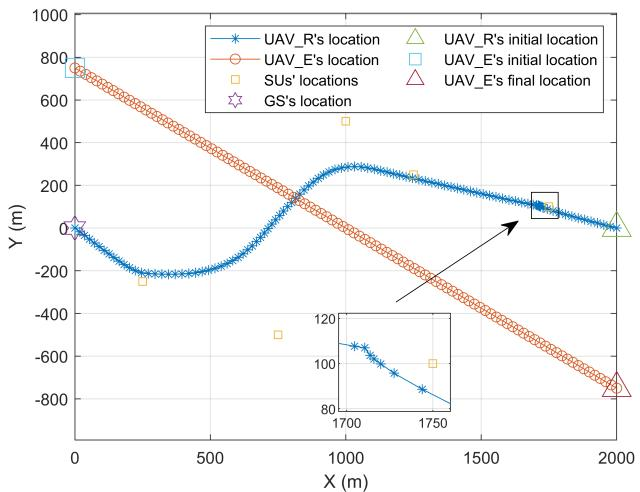  
Fig. 3. Optimized trajectories for UAVr vs. T , where $P _ { k } ^ { \mathrm { m a x } } = 0 . 1$ W, $P _ { r } ^ { \mathrm { { m a x } } } = 0 . 5$ W, $P _ { j } = { \breve { 0 } } . 5 ~ \mathrm { W } ,$ and $T = 5 0$ s.

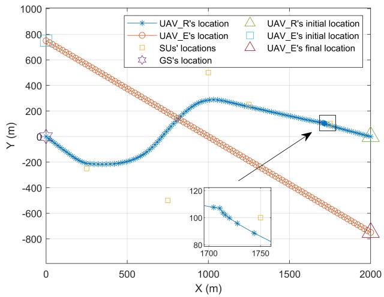

line

| Location Type       | X (m) | Y (m) |
| ------------------- | ----- | ----- |
| UAV_R's            | 0     | 0     |
| UAV_R's            | 200   | -200  |
| UAV_R's            | 400   | -200  |
| UAV_R's            | 600   | -200  |
| UAV_R's            | 800   | -200  |
| UAV_R's            | 1000  | 300   |
| UAV_R's            | 1200  | 200   |
| UAV_R's            | 1400  | 100   |
| UAV_R's            | 1600  | 50    |
| UAV_R's            | 1800  | 0     |
| UAV_R's            | 2000  | -50   |
| UAV_E's            | 0     | 800   |
| UAV_E's            | 200   | 600   |
| UAV_E's            | 400   | 400   |
| UAV_E's            | 600   | 200   |
| UAV_E's            | 800   | 0     |
| UAV_E's            | 1000  | -200  |
| UAV_E's            | 1200  | -400  |
| UAV_E's            | 1400  | -600  |
| UAV_E's            | 1600  | -800  |
| UAV_E's            | 1800  | -1000 |
| SUVs'               | 200   | -250  |
| SUVs'               | 400   | -550  |
| SUVs'               | 600   | -150  |
| SUVs'               | 800   | -350  |
| SUVs'               | 1000  | -550  |
| SUVs'               | 1200  | -750  |
| SUVs'               | 1400  | -950  |
| SUVs'               | 1600  | -1150 |
| SUVs'               | 1800  | -1350 |
| SUVs'               | 2000  | -1550 |
| GS's                | 20    | 5     |
| GS's                | 40    | -5    |
| GS's                | 60    | -15   |
| GS's                | 80    | -35   |
| GS's                | 100   | -55   |
| GS's                | 120   | -75   |
| GS's                | 140   | -95   |
| GS's                | 160   | -115  |
| GS's                | 180   | -135  |
| GS's                | 200   | -155  |
| UAV_R's initial    | 1750  | -85   |
| UAV_E's initial    | 1750  | -95   |
| UAV_E's initial    | 1750  | -115  |
| UAV_E's initial    | 1750  | -135  |
| UAV_E's initial    | 1750  | -155  |
| UAV_E's initial    | 1750  | -175  |
| UAV_E's final      | 1750  | -85   |
| UAV_E's final      | 1750  | -95   |
| UAV_E's final      | 1750  | -115  |
| UAV_E's final      | 1750  | -135  |
| UAV_E's final      | 1750  | -155  |
| UAV_E's final      | 1750  | -175  |
| UAV_E's final      | 1750  | -195  |
| UAV_E's final      | 1750  | -215  |
| UAV_E's final      | 1750  | -235  |
| UAV_E's final      | 1750  | -255  |
| UAV_E's final      | 1750  | -275  |
| UAV_E's final      | 1750  | -295  |
| UAV_E's final      | 1750  | -315  |
| UAV_E's final      | 1750  | -335  |
| UAV_E's final      | 1750  | -355  |
| UAV_E's final      | 1750  | -375  |
| UAV_E's final      | 1750  | -395  |
| UAV_E's final      | 1750  | -415  |
| UAV_E's final      | 1750  | -435  |
| UAV_E's final      | 1750  | -455  |
| UAV_E's final      | 1750  | -475  |
| UAV_E's final      | 1750  | -495  |
| UAV_E's final      | 1750  | -515  |
| UAV_E's final      | 1750  | -535  |
| UAV_E's final      | 1750  | -555  |
| UAV_E's final      | 1750  | -575  |
| UAV_E's final      | 1750  | -595  |
| UAV_E's final      | 1750  | -615  |
| UAV_E's final      | 1750  | -635  |
| UAV_E's final      | 1750  | -655  |
| UAV_E's final      | 1750  | -675  |
| UAV_E's final      | 1750  | -695  |
| UAV_E's final      | 1750  | -715  |
| UAV_E's final      | 1750  | -735  |
| UAV_E's final      | 1750  | -755  |
| UAV_E's final      | 1750  | -775  |
| UAV_E's final      | 1750  | -795  |
| UAV_E's final      | 1750  | -815  |
| UAV_E's final      | 1750  | -835  |
| UAV_E's final      | 1750  | -855  |
| UAV_E's final      | 1750  | -875  |
| UAV_E's final      | 1750  | -895<nl>

Fig. 4. Optimized trajectories for UAVr vs. T , where $P _ { k } ^ { \operatorname* { m a x } } = 0 . 1 \ \mathrm { W } ,$ $P _ { r } ^ { \mathrm { { \bar { m a x } } } } = 0 . { \bar { 5 } }$ W, $P _ { j } = { \breve { 0 } } . 5 ~ \mathrm { W } ,$ and $T = 7 0$ s.

Fig. 5 illustrates the optimized speeds for $\mathrm { U A V } _ { r }$ with different T . As shown in Fig. 3 and Fig. 4, UAVr will pass over as many MDs as possible, and hover over each MD as long as possible. It results that UAVr flies away from a MD as fast as possible, and slows down slowly when it approaches next MD. As shown in Fig. 5(a), there is a significant change in the speed of UAVr between time slot 80 and 90, indicating that $\mathrm { U A V } _ { r }$ stays above the corresponding MD for a longer period of time. And in Fig. 5(b), a similar change in speed occurs five times. It can be seen that $\mathrm { U A V } _ { r }$ has more time to approach MDs to provide better service due to the increase T .

Fig. 6 illustrates the max-min secure computing capacity with different values of $P _ { k } ^ { \mathrm { m a x } }$ . It can be observed that with the increase of $P _ { k } ^ { \mathrm { m a x } }$ , the max-min secure computing capacity is becoming larger. This is because with higher transmit power, MDs will have more energy to offload computing tasks to CES through $\mathrm { U A V } _ { r }$ , which has more powerful computing ability.

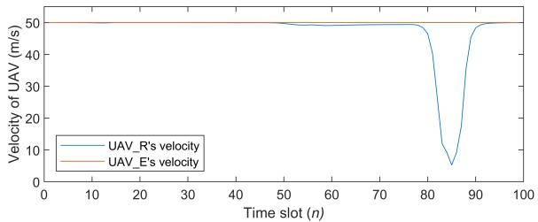

line

| Time slot (n) | UAV_R's velocity (m/s) | UAV_E's velocity (m/s) |
| ------------- | ---------------------- | ---------------------- |
| 0             | 50                     | 50                     |
| 50            | 50                     | 50                     |
| 60            | 50                     | 50                     |
| 70            | 50                     | 50                     |
| 80            | 50                     | 50                     |
| 85            | 5                      | 50                     |
| 90            | 50                     | 50                     |
| 100           | 50                     | 50                     |

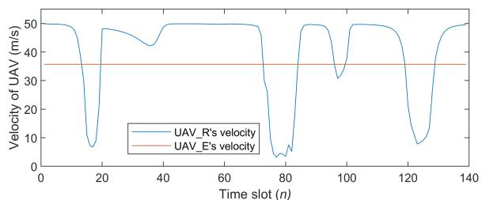

line

| Time slot (n) | UAV_R's velocity (m/s) | UAV_E's velocity (m/s) |
| ------------- | ---------------------- | ---------------------- |
| 0             | 50                     | 35                     |
| 20            | 5                      | 35                     |
| 40            | 50                     | 35                     |
| 60            | 50                     | 35                     |
| 80            | 5                      | 35                     |
| 100           | 50                     | 35                     |
| 120           | 5                      | 35                     |
| 140           | 50                     | 35                     |

（b）  
Fig. 5. Optimized flight speeds for UAVr with different T , where $P _ { k } ^ { \mathrm { { \bar { m a x } } } } ~ = ~ 0 . 1$ W, ${ P _ { r } ^ { \mathrm { m a x } } } ^ { - } = \ \dot { 0 } . 5$ W and $P _ { j } ~ = ~ 0 . 5 ~ \mathrm { W } .$ (a) $T \ = \ 5 0 \ \mathrm { \ s } ,$ , (b) $T = 7 0 ~ \mathrm { s }$ s.

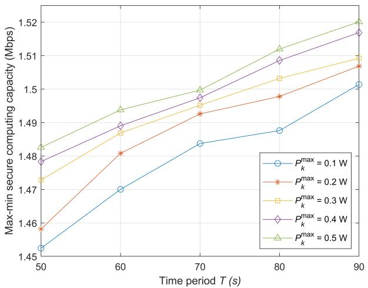

line

| Time period T (s) | P_max_k = 0.1 W | P_max_k = 0.2 W | P_max_k = 0.3 W | P_max_k = 0.4 W | P_max_k = 0.5 W |
| ----------------- | --------------- | --------------- | --------------- | --------------- | --------------- |
| 50                | 1.45            | 1.46            | 1.47            | 1.48            | 1.48            |
| 60                | 1.47            | 1.48            | 1.49            | 1.49            | 1.49            |
| 70                | 1.48            | 1.49            | 1.50            | 1.50            | 1.50            |
| 80                | 1.49            | 1.50            | 1.51            | 1.51            | 1.51            |
| 90                | 1.50            | 1.51            | 1.52            | 1.52            | 1.52            |

Fig. 6. S0.8 W and ing capacity with different $P _ { k } ^ { \mathrm { m a x } }$ , where $P _ { r } ^ { \mathrm { m a x } } =$ $P _ { j } = 0 . 5 \mathrm { \dot { W } } .$

Fig. 7 shows the max-min secure computing capacity with different values of $P _ { r } ^ { \mathrm { m a x } }$ . When $P _ { r } ^ { \mathrm { m a x } }$ becomes larger, $\mathrm { U A V } _ { r }$ can forward more information to CES with larger information rate. While CJ only transmits the jamming signal in the first phase of each time slot. Thus, for the information forwarded by $\mathrm { U A V } _ { r }$ to CES, the effective transmission rate increases with larger $P _ { r } ^ { \mathrm { m a x } }$ , resulting in a better performance.

Fig. 8 shows the max-min secure computing capacity with different values of $P _ { j }$ . It can be observed that with increase of $P _ { j }$ , the max-min secure computing capacity is becoming larger. This is because CES knows the interference signal emitted by CJ in advance, while UAVe does not. When $P _ { j }$ increases, producing stronger interference to the $\mathrm { U A V } _ { e } ,$ resulting in a smaller eavesdropping rate.

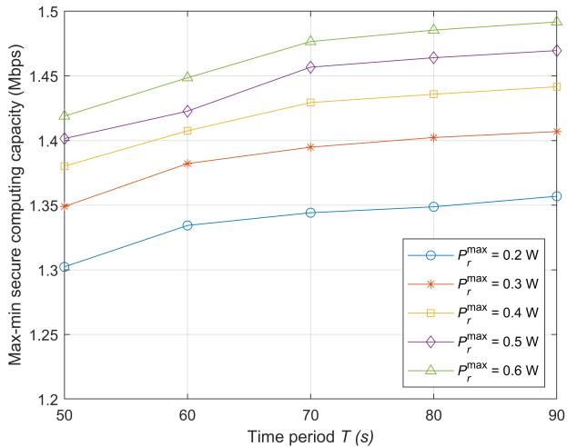

line

| Time period T (s) | P_max_r = 0.2 W | P_max_r = 0.3 W | P_max_r = 0.4 W | P_max_r = 0.5 W | P_max_r = 0.6 W |
| ----------------- | --------------- | --------------- | --------------- | --------------- | --------------- |
| 50                | 1.30            | 1.35            | 1.38            | 1.40            | 1.42            |
| 60                | 1.33            | 1.38            | 1.41            | 1.42            | 1.45            |
| 70                | 1.34            | 1.39            | 1.43            | 1.46            | 1.48            |
| 80                | 1.35            | 1.40            | 1.44            | 1.47            | 1.49            |
| 90                | 1.36            | 1.41            | 1.45            | 1.48            | 1.50            |

Fig. 7. Secure computing capacity with different $P _ { r } ^ { \mathrm { m a x } }$ , where $P _ { k } ^ { \mathrm { m a x } } =$ 0.1 W and $P _ { j } = 0 . 5 { \mathrm { ~ \AA } }$ .

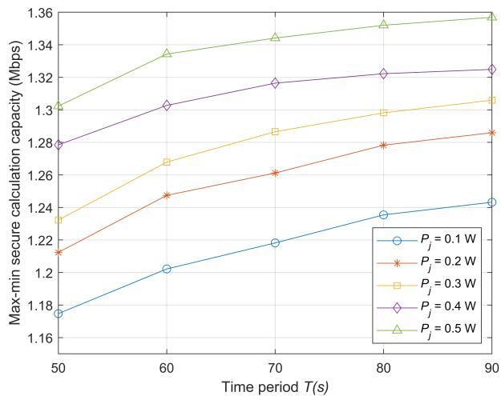

line

| Time period T(s) | P_j = 0.1 W | P_j = 0.2 W | P_j = 0.3 W | P_j = 0.4 W | P_j = 0.5 W |
| ---------------- | ----------- | ----------- | ----------- | ----------- | ----------- |
| 50               | 1.18        | 1.22        | 1.23        | 1.28        | 1.30        |
| 60               | 1.20        | 1.25        | 1.27        | 1.30        | 1.34        |
| 70               | 1.22        | 1.26        | 1.29        | 1.32        | 1.35        |
| 80               | 1.24        | 1.28        | 1.30        | 1.32        | 1.36        |
| 90               | 1.24        | 1.29        | 1.31        | 1.33        | 1.36        |

${ \mathrm { F i g } } .$ . puting capacity with different . $P _ { j } .$ , where $P _ { k } ^ { \mathrm { m a x } } = 0 . 1 ~ \mathrm { W }$ $P _ { r } ^ { \mathrm { m a x } } = 0 . 2 ~ \mathrm { W } .$

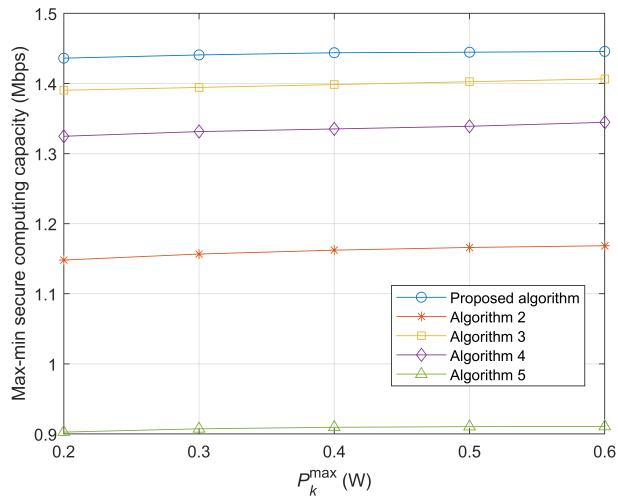

line

| P_max_k (W) | Proposed algorithm | Algorithm 2 | Algorithm 3 | Algorithm 4 | Algorithm 5 |
| ----------- | ------------------ | ----------- | ----------- | ----------- | ----------- |
| 0.2         | 1.45               | 1.15        | 1.39        | 1.33        | 0.90        |
| 0.3         | 1.45               | 1.16        | 1.39        | 1.34        | 0.90        |
| 0.4         | 1.45               | 1.16        | 1.40        | 1.34        | 0.90        |
| 0.5         | 1.45               | 1.17        | 1.40        | 1.34        | 0.90        |
| 0.6         | 1.45               | 1.17        | 1.41        | 1.35        | 0.90        |

com and ty with diff Algorithm $P _ { k } ^ { \mathrm { m a x } }$ , where ur benc $T = 5 0 \ \mathrm { s } ,$ $P _ { r } ^ { \mathrm { { m a x } } } = 0 . 5 ~ \mathrm { { W } }$ $\begin{array} { r } { P _ { j } = 0 . \dot { 5 } \ \mathrm { W } . } \end{array}$ $2 \cdot 5$

Fig. 9 and Fig. 10 illustrate the secure computing capacity comparisons of our proposed algorithm with four benchmarks with the same target of maximizing secure computing capacity of the system. The specific descriptions of four benchmarks are as follows.

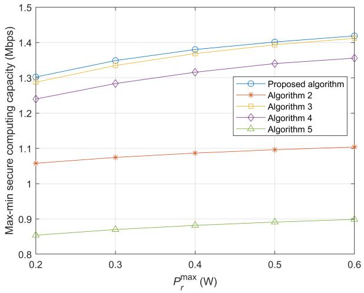

line

| P_max_r (W) | Proposed algorithm | Algorithm 2 | Algorithm 3 | Algorithm 4 | Algorithm 5 |
| ----------- | ------------------ | ----------- | ----------- | ----------- | ----------- |
| 0.2         | 1.30               | 1.06        | 1.29        | 1.24        | 0.85        |
| 0.3         | 1.35               | 1.07        | 1.33        | 1.29        | 0.87        |
| 0.4         | 1.38               | 1.08        | 1.37        | 1.32        | 0.88        |
| 0.5         | 1.40               | 1.09        | 1.40        | 1.34        | 0.89        |
| 0.6         | 1.42               | 1.10        | 1.42        | 1.35        | 0.90        |

Fig. 10. Secure computing capacity with different $P _ { r } ^ { \mathrm { m a x } }$ , where $T = 5 0 \ { \mathrm { s } } ,$ $P _ { k } ^ { \mathrm { m a x } } = 0 . 1$ W and $\bar { P } _ { j } = \mathrm { 0 . 5 } $ W. Algorithm $2 \cdot 5$ r   are four benchmarks.

Algorithm 2: The time slot allocation factor $\xi _ { k } [ n ]$ is fixed, while $\mathrm { M D } _ { k }$ transmit power $p _ { k } [ n ] , \mathrm { U A V } _ { r }$ transmit power $p _ { r } [ n ]$ , $\mathrm { M D } _ { k }$ local computation allocation $l _ { k , \mathrm { l o c } } [ n ]$ , and UAVr trajectory ${ \mathbf { u } } _ { r } [ n ]$ are optimized.

Algorithm $3 \colon \mathrm { M D } _ { k }$ transmit power $p _ { k } [ n ]$ is fixed, while the time slot allocation factor $\xi _ { k } [ n ]$ , $\mathbf { M D } _ { k }$ local computation allocation $l _ { k , \mathrm { l o c } } [ n ]$ , UAVr transmit power $p _ { r } [ n ]$ , and $\mathrm { U A V } _ { r }$ trajectory ${ \mathbf { u } } _ { r } [ n ]$ are optimized.

Algorithm 4: UAVr transmit power $p _ { r } [ n ]$ is fixed, while the time slot allocation factor $\xi _ { k } [ n ]$ , MDk local computation allocation $l _ { k , \mathrm { l o c } } [ n ]$ , $\mathbf { M D } _ { k }$ transmit power $p _ { k } [ n ]$ ], and $\mathrm { U A V } _ { r }$ trajectory ${ \mathbf { u } } _ { r } [ n ]$ are optimized.

Algorithm 5: $\mathrm { U A V } _ { r }$ trajectory ${ \mathbf { u } } _ { r } [ n ]$ is fixed, while the time slot allocation factor $\xi _ { k } [ n ] , \mathrm { M D } _ { k }$ local computation allocation $l _ { k , \mathrm { l o c } } [ n ]$ , $\mathbf { M D } _ { k }$ transmit power $p _ { k } [ n ]$ , and $\mathrm { U A V } _ { r }$ transmit power $p _ { r } [ n ]$ are optimized.

By comparing the secure computing capacity of the proposed algorithm with four benchmarks having different $P _ { k } ^ { \mathrm { m a x } }$ values in Fig. 9, it is evident that the proposed algorithm is better. The proposed algorithm outperforms four benchmarks with different values of $P _ { k } ^ { \mathrm { m a x } }$ . Furthermore, the proposed algorithm optimizes the time slot allocation factor when it is compared to Algorithm 2, highlighting the importance of this factor in improving performance. In addition to optimizing the transmit power of $\mathbf { M D } _ { k }$ , the proposed algorithm significantly improves performance compared to Algorithm 3. Furthermore, the proposed algorithm optimizes the transmit power of $\mathrm { U A V } _ { r }$ to enhance performance, a factor not considered in Algorithm 4. Finally, compared to Algorithm 5, the proposed algorithm also optimizes the $\mathrm { U A V } _ { r }$ trajectory, indicating the significance of this factor in improving performance.

In Fig. 10, it is evident that the proposed algorithm outperforms four benchmarks with different values of $P _ { r } ^ { \mathrm { m a x } }$ . It can be observed that Algorithm 2 achieves a lower performance in secure offloading rate as it does not optimize the time slot allocation factor. Similarly, Algorithm 3 achieves a lower performance in secure offloading rate as it does not optimize $\mathbf { M D } _ { k }$ transmit power. Algorithm 4 achieves a lower performance in secure offloading rate as it does not optimize UAVr transmit power. Finally, Algorithm 5 achieves a lower performance in secure offloading rate as it does not optimize UAVr trajectory. This highlights the significance of optimizing time slot allocation factor, $\mathrm { M D } _ { k }$ and $\mathrm { U A V } _ { r }$ transmit powers, and $\mathrm { U A V } _ { r }$ trajectory in enhancing the overall performance of the proposed algorithm.

# VI. CONCLUSION

In this paper, a secure communication scheme was proposed to enhance the secure computing capacity performance for the UAV-relay-assisted maritime MEC, where UAVr helps to forward the offloading tasks of MDs to CES. To reduce UAVe eavesdropping, CJ generates the interfering signals. The max-min secure computing capacity of MDs is achieved by optimizing the UAV trajectory, time slot allocation, transmit power and computation allocation with the constraints of UAVr flight speed, UAV anti-collision, $\mathrm { U A V } _ { r }$ transmit power, MDs transmit power, MDs local computation ability, MDs computing task requirements and CES CPU frequency. The formulated $\mathrm { O P }$ is non-convexity because of the coupling of multiple variables. We first transform OP by introducing auxiliary variables. Then, the transformed OP is decomposed and solved in an iterative manner by applying BCD and SCA. The simulation results show that the proposed algorithm can achieve better secure computing capacity performance compared with four benchmarks.

# REFERENCES

[1] T. Xia, M. M. Wang, J. Zhang, and L. Wang, “Maritime Internet of Things: Challenges and solutions,” IEEE Wireless Commun., vol. 27, no. 2, pp. 188–196, Apr. 2020.   
[2] Y. Li, Y. Zhang, W. Li, and T. Jiang, “Marine wireless big data: Efficient transmission, related applications, and challenges,” IEEE Wireless Commun., vol. 25, no. 1, pp. 19–25, Feb. 2018.   
[3] Y. Mao, C. You, J. Zhang, K. Huang, and K. B. Letaief, “A survey on mobile edge computing: The communication perspective,” IEEE Commun. Surveys Tuts., vol. 19, no. 4, pp. 2322–2358, 4th Quart., 2017.   
[4] M. Mozaffari, X. Lin, and S. Hayes, “Toward 6G with connected sky: UAVs and beyond,” IEEE Commun. Mag., vol. 59, no. 12, pp. 74–80, Dec. 2021.   
[5] T. Zhang, Y. Xu, J. Loo, D. Yang, and L. Xiao, “Joint computation and communication design for UAV-assisted mobile edge computing in IoT,” IEEE Trans. Ind. Informat., vol. 16, no. 8, pp. 5505–5516, Aug. 2020.   
[6] A. Fotouhi et al., “Survey on UAV cellular communications: Practical aspects, standardization advancements, regulation, and security challenges,” IEEE Commun. Surveys Tuts., vol. 21, no. 4, pp. 3417–3442, 4th Quart., 2019.   
[7] Y. Zeng, R. Zhang, and T. J. Lim, “Throughput maximization for UAV-enabled mobile relaying systems,” IEEE Trans. Commun., vol. 64, no. 12, pp. 4983–4996, Dec. 2016.   
[8] Y. Chen, N. Zhao, Z. Ding, and M.-S. Alouini, “Multiple UAVs as relays: Multi-hop single link versus multiple dual-hop links,” IEEE Trans. Wireless Commun., vol. 17, no. 9, pp. 6348–6359, Sep. 2018.   
[9] N. Zhao et al., “UAV-assisted emergency networks in disasters,” IEEE Wireless Commun., vol. 26, no. 1, pp. 45–51, Feb. 2019.   
[10] X. Zhong, Y. Guo, N. Li, and Y. Chen, “Joint optimization of relay deployment, channel allocation, and relay assignment for UAVs-aided D2D networks,” IEEE/ACM Trans. Netw., vol. 28, no. 2, pp. 804–817, Apr. 2020.   
[11] Y. Liang, L. Xiao, D. Yang, Y. Liu, and T. Zhang, “Joint trajectory and resource optimization for UAV-aided two-way relay networks,” IEEE Trans. Veh. Technol., vol. 71, no. 1, pp. 639–652, Jan. 2022.

[12] J. Zhang, F. Liang, B. Li, Z. Yang, Y. Wu, and H. Zhu, “Placement optimization of caching UAV-assisted mobile relay maritime communication,” China Commun., vol. 17, no. 8, pp. 209–219, Aug. 2020.   
[13] C. Zhan, H. Hu, X. Sui, Z. Liu, and D. Niyato, “Completion time and energy optimization in the UAV-enabled mobile-edge computing system,” IEEE Internet Things J., vol. 7, no. 8, pp. 7808–7822, Aug. 2020.   
[14] F. Zhou, R. Q. Hu, Z. Li, and Y. Wang, “Mobile edge computing in unmanned aerial vehicle networks,” IEEE Wireless Commun., vol. 27, no. 1, pp. 140–146, Feb. 2020.   
[15] Q. Hu, Y. Cai, G. Yu, Z. Qin, M. Zhao, and G. Y. Li, “Joint offloading and trajectory design for UAV-enabled mobile edge computing systems,” IEEE Internet Things J., vol. 6, no. 2, pp. 1879–1892, Apr. 2019.   
[16] X. Hu, K.-K. Wong, K. Yang, and Z. Zheng, “UAV-assisted relaying and edge computing: Scheduling and trajectory optimization,” IEEE Trans. Wireless Commun., vol. 18, no. 10, pp. 4738–4752, Oct. 2019.   
[17] L. Guo, X. Ji, and S. Zhang, “Energy-efficient full-duplex UAV relaying with trajectory optimization and power control in maritime communication environments,” China Commun., vol. 19, no. 12, pp. 216–231, Dec. 2022.   
[18] Z. Na, C. Ji, B. Lin, and N. Zhang, “Joint optimization of trajectory and resource allocation in secure UAV relaying communications for Internet of Things,” IEEE Internet Things J., vol. 9, no. 17, pp. 16284–16296, Sep. 2022.   
[19] L. Zhang and N. Ansari, “Optimizing the operation cost for UAV-aided mobile edge computing,” IEEE Trans. Veh. Technol., vol. 70, no. 6, pp. 6085–6093, Jun. 2021.   
[20] B. Liu, Y. Wan, F. Zhou, Q. Wu, and R. Q. Hu, “Resource allocation and trajectory design for MISO UAV-assisted MEC networks,” IEEE Trans. Veh. Technol., vol. 71, no. 5, pp. 4933–4948, May 2022.   
[21] X. He, R. Jin, and H. Dai, “Multi-hop task offloading with on-thefly computation for multi-UAV remote edge computing,” IEEE Trans. Commun., vol. 70, no. 2, pp. 1332–1344, Feb. 2022.   
[22] L. Zhao, K. Yang, Z. Tan, X. Li, S. Sharma, and Z. Liu, “A novel cost optimization strategy for SDN-enabled UAV-assisted vehicular computation offloading,” IEEE Trans. Intell. Transp. Syst., vol. 22, no. 6, pp. 3664–3674, Jun. 2021.   
[23] B. Li, Z. Fei, Y. Zhang, and M. Guizani, “Secure UAV communication networks over 5G,” IEEE Wireless Commun., vol. 26, no. 5, pp. 114–120, Oct. 2019.   
[24] Y. Liu, H.-H. Chen, and L. Wang, “Physical layer security for next generation wireless networks: Theories, technologies, and challenges,” IEEE Commun. Surveys Tuts., vol. 19, no. 1, pp. 347–376, 1st Quart., 2017.   
[25] D. Wang, B. Bai, W. Zhao, and Z. Han, “A survey of optimization approaches for wireless physical layer security,” IEEE Commun. Surveys Tuts., vol. 21, no. 2, pp. 1878–1911, 2nd Quart., 2019.   
[26] Q. Wang, Z. Chen, W. Mei, and J. Fang, “Improving physical layer security using UAV-enabled mobile relaying,” IEEE Wireless Commun. Lett., vol. 6, no. 3, pp. 310–313, Jun. 2017.   
[27] Y. Zhou et al., “Secure communications for UAV-enabled mobile edge computing systems,” IEEE Trans. Commun., vol. 68, no. 1, pp. 376–388, Jan. 2020.   
[28] Y. Li, Y. Fang, and L. Qiu, “Joint computation offloading and communication design for secure UAV-enabled MEC systems,” in Proc. IEEE Wireless Commun. Netw. Conf. (WCNC), Nanjing, China, Mar. 2021, pp. 1–6.   
[29] Y. Xu, T. Zhang, D. Yang, Y. Liu, and M. Tao, “Joint resource and trajectory optimization for security in UAV-assisted MEC systems,” IEEE Trans. Commun., vol. 69, no. 1, pp. 573–588, Jan. 2021.   
[30] W. Lu et al., “Resource and trajectory optimization for secure communications in dual unmanned aerial vehicle mobile edge computing systems,” IEEE Trans. Ind. Informat., vol. 18, no. 4, pp. 2704–2713, Apr. 2022.   
[31] W. Lu et al., “Secure NOMA-based UAV-MEC network towards a flying eavesdropper,” IEEE Trans. Commun., vol. 70, no. 5, pp. 3364–3376, May 2022.   
[32] W. Wang et al., “Robust 3D-trajectory and time switching optimization for dual-UAV-enabled secure communications,” IEEE J. Sel. Areas Commun., vol. 39, no. 11, pp. 3334–3347, Nov. 2021.   
[33] Enhanced LTE Support for Aerial Vehicles. Accessed: Jul. 16, 2017. [Online]. Available: ftp://www.3gpp.org/specs/archive/36\_series/36.777   
[34] P. Tseng, “Convergence of a block coordinate descent method for nondifferentiable minimization,” J. Optim. Theory Appl., vol. 109, no. 3, pp. 475–494, Jun. 2001.   
[35] S. P. Boyd and L. Vandenberghe, Convex Optimization. Cambridge, U.K.: Cambridge Univ. Press, 2004.

[36] B. R. Marks and G. P. Wright, “Technical note—A general inner approximation algorithm for nonconvex mathematical programs,” Oper. Res., vol. 26, no. 4, pp. 681–683, Aug. 1978.   
[37] M. Li, N. Cheng, J. Gao, Y. Wang, L. Zhao, and X. Shen, “Energyefficient UAV-assisted mobile edge computing: Resource allocation and trajectory optimization,” IEEE Trans. Veh. Technol., vol. 69, no. 3, pp. 3424–3438, Mar. 2020.

natural_image

Portrait of a young man against a blue background (no text or symbols visible)

Fangwei Lu is currently pursuing the Ph.D. degree with the Harbin Institute of Technology, Harbin, China. His current research interests include UAV communication, mobile edge computing, and cooperative communications.

natural_image

Portrait photo of a man wearing a striped sweater (no text or symbols visible)

Gongliang Liu (Member, IEEE) received the B.Sc. degree in measuring and control technology and instrumentations and the M.Sc. and Ph.D. degrees in information and communication engineering from the Harbin Institute of Technology (HIT), Harbin, China, in 2001, 2003, and 2007, respectively. He was a Visiting Scholar with The University of British Columbia, Vancouver, BC, Canada, from August 2015 to August 2016. He is currently a Professor with HIT, Weihai, China. His research interests include wireless communications and networks,

satellite communications, and underwater communications.

natural_image

Portrait of a man wearing glasses and a dark jacket (no text or symbols visible)

Weidang Lu (Senior Member, IEEE) received the Ph.D. degree in information and communication engineering from the Harbin Institute of Technology in 2012. He was a Visiting Scholar with Nanyang Technology University, Singapore, The Chinese University of Hong Kong, China, and Southern University of Science and Technology, China. He is currently a Professor with the College of Information Engineering, Zhejiang University of Technology, Hangzhou, China. His current research interests include UAV communication, simultaneous

wireless information and power transfer, cooperative communications, and physical layer security for wireless systems.

natural_image

Portrait photo of a man wearing a gray T-shirt (no text or symbols visible)

Yuan Gao received the B.S. degree from PLA Information Engineering University, China, in 2008, and the M.S. and Ph.D. degrees from the Department of Electronic Engineering, Tsinghua University, China, in 2011 and 2014, respectively. He is currently an Research Fellow with the Academy of Military Science of the PLA. He has authored over 40 academic papers in peer-reviewed international journals and conferences. His research interests include wireless communication systems, satellite communication systems, network control theory, and

big data. He is a member of ACM. He is an Associate Editor for several international journals, including IEEE ACCESS and the EURASIP Journal on Wireless Communications and Networking and Sensors. He has also been a guest editor of several special issues. He also serves as a Guest Reviewer and a TPC Member of several journals and international conferences, including the IEEE JOURNAL ON SELECTED AREAS IN COMMUNICATIONS, IEEE TRANSACTIONS ON WIRELESS COMMUNICATIONS, IEEE TRANSACTIONS ON COMMUNICATIONS, IEEE COMMUNICATIONS LETTERS, IEEE ICC, and IEEE WCNC.

natural_image

Portrait of an older man with gray hair wearing a gray polo shirt (no text or symbols visible)

Jiang Cao received the M.S. and Ph.D. degrees in computational engineering from the National University of Defense Technology, Changsha, China, in 2000 and 2010, respectively. He is currently a Researcher with the Academy of Military Science, Beijing, China. His research interests include the basic theory of artificial intelligence and the specific application methods of artificial intelligence in typical scenes.

natural_image

Portrait of a man wearing glasses and a striped shirt against a blue background (no text or symbols visible)

Nan Zhao (Senior Member, IEEE) received the Ph.D. degree in information and communication engineering from the Harbin Institute of Technology, Harbin, China, in 2011.

He is currently a Professor with the Dalian University of Technology, China. He is serving on the editorial boards of IEEE WIRELESS COMMU-NICATIONS, IEEE WIRELESS COMMUNICATIONS LETTERS, and IEEE TRANSACTIONS ON GREEN COMMUNICATIONS AND NETWORKING. He won the best paper awards in IEEE VTC 2017 Spring,

ICNC 2018, WCSP 2018, and WCSP 2019. He also received the IEEE Communications Society Asia–Pacific Board Outstanding Young Researcher Award in 2018.

natural_image

Portrait of a man wearing glasses and a suit (no text or symbols visible)

Arumugam Nallanathan (Fellow, IEEE) has been a Professor in wireless communications and the Head of the Communication Systems Research (CSR) Group, School of Electronic Engineering and Computer Science, Queen Mary University of London, since September 2017. He was with the Department of Informatics, King’s College London, from December 2007 to August 2017, where he was a Professor in wireless communications from April 2013 to August 2017 and a Visiting Professor in September 2017. He was an Assistant Professor with

the Department of Electrical and Computer Engineering, National University of Singapore, from August 2000 to December 2007. His research interests include artificial intelligence for wireless systems, beyond 5G wireless networks, the Internet of Things (IoT), and molecular communications. He has published nearly 500 technical papers in scientific journals and international conferences. He is a co-recipient of the Best Paper Awards presented at the IEEE International Conference on Communications 2016 (ICC’2016), IEEE Global Communications Conference 2017 (GLOBECOM’2017), and IEEE Vehicular Technology Conference 2018 (VTC’2018). He is an IEEE Distinguished Lecturer. He has been selected as a Web of Science Highly Cited Researcher in 2016 and AI 2000 Internet of Things Most Influential Scholar in 2020. He is the Editor-at-Large of IEEE TRANSACTIONS ON COMMUNICATIONS and a Senior Editor of IEEE WIRELESS COMMUNICA-TIONS LETTERS. He was an Editor of IEEE TRANSACTIONS ON WIRELESS COMMUNICATIONS (2006–2011), IEEE TRANSACTIONS ON VEHICULAR TECHNOLOGY (2006–2017), and IEEE SIGNAL PROCESSING LETTERS. He served as the Chair for the Signal Processing and Communication Electronics Technical Committee of IEEE Communications Society and the technical program chair and a member of technical program committees in numerous IEEE conferences. He received the IEEE Communications Society SPCE Outstanding Service Award 2012 and IEEE Communications Society RCC Outstanding Service Award 2014.