# Robust Computation Offloading and Trajectory Optimization for Multi-UAV-Assisted MEC: A Multiagent DRL Approach

Bin Li , Member, IEEE, Rongrong Yang, Lei Liu , Member, IEEE, Junyi Wang , Member, IEEE, Ning Zhang , Senior Member, IEEE, and Mianxiong Dong , Senior Member, IEEE

Abstract—For multiple unmanned-aerial-vehicles (UAVs)- assisted mobile-edge computing (MEC) networks, we study the problem of combined computation and communication for user equipments deployed with multitype tasks. Specifically, we consider that the MEC network encompasses both communication and computation uncertainties, where the partial channel state information and the inaccurate estimation of task complexity are only available. We introduce a robust design accounting for these uncertainties and minimize the total weighted energy consumption by jointly optimizing UAV trajectory, task partition, as well as the computation and communication resource allocation in the multi-UAV scenario. The formulated problem is challenging to solve with the coupled optimization variables and the high uncertainties. To overcome this issue, we reformulate a multiagent Markov decision process and propose a multiagent proximal policy optimization with Beta distribution framework to achieve a flexible learning policy. Numerical results demonstrate the effectiveness and robustness of the proposed algorithm for the multi-UAV-assisted MEC network, which outperforms the representative benchmarks of the deep reinforcement learning and heuristic algorithms.

Manuscript received 12 June 2023; revised 9 July 2023; accepted 26 July 2023. Date of publication 1 August 2023; date of current version 24 January 2024. This work was supported in part by the National Natural Science Foundation of China under Grant 62101277; in part by the Natural Science Foundation of Jiangsu Province under Grant BK20200822; in part by the Open Research Fund of Key Laboratory of Broadband Wireless Communication and Sensor Network Technology (Nanjing University of Posts and Telecommunications), Ministry of Education under Grant JZNY202103; in part by the Natural Science Foundation of Guangdong Province of China under Grant 2022A1515010988; and in part by the Postgraduate Research and Practice Innovation Program of Jiangsu Province under Grant KYCX23\_1389. (Corresponding author: Lei Liu.)

Bin Li and Rongrong Yang are with the School of Computer and Software, Jiangsu Collaborative Innovation Center of Atmospheric Environment and Equipment Technology, Nanjing University of Information Science and Technology, Nanjing 210044, China, and also with the Key Laboratory of Broadband Wireless Communication and Sensor Network Technology, Ministry of Education, Nanjing University of Posts and Telecommunications, Nanjing 210003, China (e-mail: bin.li@nuist.edu.cn; 202212210020@nuist.edu.cn).

Lei Liu is with the Guangzhou Institute of Technology, Xidian University, Guangzhou 510555, China (e-mail: tianjiaoliulei@163.com).

Junyi Wang is with the School of Information and Communication, Guilin University of Electronic Technology, Guilin 541004, China (e-mail: wangjy@ guet.edu.cn).

Ning Zhang is with the Department of Electrical and Computer Engineering, University of Windsor, Windsor, ON N9B 3P4, Canada (e-mail: ning.zhang@ uwindsor.ca).

Mianxiong Dong is with the Department of Sciences and Informatics, Muroran Institute of Technology, Muroran 0508585, Japan (e-mail: mx.dong@ csse.muroran-it.ac.jp).

Digital Object Identifier 10.1109/JIOT.2023.3300718

Index Terms—Communication uncertainty, computation uncertainty, mobile-edge computing (MEC), multiagent deep reinforcement learning (MADRL), robust design.

# I. INTRODUCTION

A S THE Internet of Things (IoT) era continues to advance,modern society is becoming increasingly reliant on IoT technology [1]. This has led to the creation of the massive data at the edge nodes of the networks. How to deal with these data quickly and effectively has become a significant problem, which is worthy of consideration. Mobile-edge computing (MEC) as a new computing paradigm has been introduced, where nearby servers are utilized as edge clouds to provide user equipments (UEs) with powerful cloud computing capabilities while significantly reducing the time delay of computation offloading [2].

Nevertheless, serving intensive tasks in remote areas is very challenging due to poor communication conditions and unstable MEC environments [3]. Meanwhile, in some hotspot areas, when a large number of UEs require computation-intensive services simultaneously, the limited computation and storage resources pose a formidable challenge for MEC servers in guaranteeing the satisfactory user experience. To tackle these issues, flexible location deployment of edge servers is essential. Hence, unmanned aerial vehicle (UAV) has been used as a popular platform for the MEC network owing to its superior ability of high mobility and coverage enhancement, where UAV edge server can assist in the remote areas and alleviate congestion in hotspot areas to ensure the high-quality computing services.

Although UAV-assisted MEC network has attracted enormous research interests, it still faces many uncertainties in practice. First, computation offloading is subject to unpredictable delivery time and packet loss rate owing to the heterogeneous MEC networks, which in turn leads to the unreliable edge computing nodes [4]. In addition, offloading decision is usually dependent on the accurate channel state information (CSI), it is quite difficult to obtain [5]. The timevarying channels based on precise CSI bring uncertainties with respect to the computation offloading rate, thus increasing the offloading delay. Moreover, in practical applications, the task complexity of the computing tasks can only be obtained exactly after the task is completed. As a result, there may be unexpected delays in the calculation time, even the system fails to return the results to mobile devices in a timely manner. Under such conditions, robust design plays a crucial role in providing worst case performance guarantees against possible failures.

A single UAV cannot efficiently serve a large number of UEs owing to the restricted coverage and computing capability, which in nature spurs our exploration of multi-UAV cooperation. Also, edge networks may experience uncertainties in both communication and computation, but previous studies mainly focused on individual robustness [6]. To address the above problem, we propose a robust offloading scheme in the MEC network where multiple UAVs collaborate to serve numerous UEs. We jointly consider the imperfect CSI between UAVs and UEs, as well as the uncertainties related to the task complexity. Our scheme aims to enhance the robustness of the system while minimizing the weighted energy consumption. The main technical contributions of this article are summarized as follows.

1) We investigate the computation uncertainties and communication uncertainties in a multi-UAV-assisted MEC network. To ensure the robustness of the computation offloading process, we formulate a problem for minimizing the total energy consumption of the system through the joint optimization of UAV trajectories, selection factors between UAVs and UEs, task partition, as well as the communication and computation resources between UAVs and UEs.   
2) The formulated problem involves tightly coupled optimization variables and the uncertainty constraints, posing a challenge to find the global optimal solution. To this end, we resort to the deep reinforcement learning and propose a multiagent proximal policy optimization (MAPPO) algorithm. Additionally, to eliminate the boundary effects caused by Gaussian distribution in the original MAPPO algorithm, we utilize the Beta distribution in the output of the actor network.   
3) We evaluate the complexity of the MAPPO with Beta distribution (b-MAPPO) algorithm and demonstrate its convergence and robustness in guaranteeing the energy consumption minimization under the bounded estimation errors through the numerical results.

The remainder of this article is organized as follows. Related works are reviewed in Section II. In Section III, we introduce the system model. Then, we propose the b-MAPPO framework and analyze its complexity in Section IV. Section V provides extensive simulations to verify the robustness and effectiveness of the proposed algorithm. Finally, Section VI makes a conclusion.

# II. RELATED WORK

Several studies try to tackle the related issues for computation offloading in MEC networks, such as service delay [7], [8], bandwidth [9], power consumption [10], or balance time and energy consumption [11]. The conventional studies on MEC networks mainly focus on fixed base stations deployed on the ground, but lack service flexibility. To address this limitation, UAV is introduced into the MEC networks [12], [13], [14], [15] to enhance the user experience in remote areas or hotspot areas. By taking into account the dependencies between various tasks, Xu et al. [12] investigated the energy consumption minimization problem by jointly optimizing the resource allocation, UAV trajectory, and offloading decision. Xu et al. [13] conducted the research on minimizing the average energy consumption for multi-UAV cellular-connected MEC networks. Luo et al. [14] designed a two-layer optimization approach which jointly optimizes bit allocation, UAV trajectory, and UAV task scheduling with the objective of minimizing the energy consumption for UEs. In [15], a multi-UAV-assisted MEC framework was used, where a UAV is controlled by a dedicated agent to jointly optimize the trajectory and offloading decisions of the UAV. Xu et al. [16] jointly optimized terminal device scheduling, time slot size, and UAV trajectories to minimize the completion time of the tasks under the considering of both partial offloading and binary offloading modes. Zhao et al. [17] considered a scenario with multiedge-cloud and multi-UAV and employed multiagent deep reinforcement learning (MADRL) to solve the computation offloading problem with the aim of minimizing the sum cost. The work in [18] took into account the coordination advantage of multiple UAVs in a fleeted way and maximized the system energy efficiency via alternating direction method of multipliers algorithm and Lyapunov optimization. Although the above researches have well-applied UAVs into MEC to enhance the network flexibility, they did not consider the robustness problem.

For practical MEC networks, the availability of CSI and the task complexity are one of the utmost significant problems in implementing the computation offloading. As a result, robust design is critical to offer performance guarantees for optimization problems with the uncertainties. Generally, the robust design can be classified into three types: 1) scheduling robustness design; 2) channel robustness design; and 3) computation robustness design. For scheduling robustness design, Qu et al. [19] formulated a robust task scheduling problem in the case of uncertain offloading failure with the purpose of minimizing the latency. Wang et al. [20] proposed a robust anti-edge server fault task offloading scheme to overcome the dynamics of edge servers. For channel robustness design, Ling et al. [21] presented a hybrid offloading scheme with backscatter communication under imperfect CSI with the aim of minimizing the end-to-end system latency. Wu et al. [22] considered a robust offloading strategy against realistic channel estimation errors in fog-IoT systems and minimized the power consumption of UEs with the latency requirements. In computation robustness design, Tan et al. [23] investigated the fog radio access network in which the knowledge of computation provision with bounded perturbations is inaccurate and developed a computation offloading mechanism with the goal of minimizing the UEs’ energy consumption. Li et al. [24] focused on the demand uncertainty with a single cache-enabled UAV and minimized the delay brought by the UAV-assisted caching by jointly optimizing the trajectory and caching of the

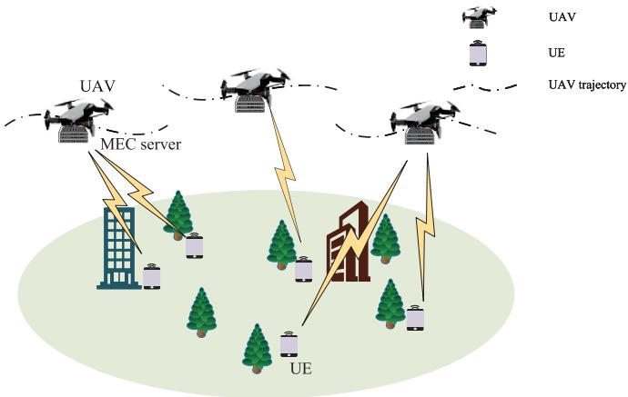

flowchart

```mermaid
graph TD
    A["UAV"] --> B["MEC server"]
    C["UE"] --> D["Urban Center"]
    E["UAV"] --> F["Drone"]
    G["UE"] --> H["Drone"]
    I["UAV"] --> J["Drone"]
    K["UE"] --> L["Drone"]
    M["UAV"] --> N["Drone"]
    O["UAV"] --> P["Drone"]
    Q["UAV"] --> R["Drone"]
    S["UAV"] --> T["Drone"]
    U["UAV"] --> V["Drone"]
    W["UAV"] --> X["Drone"]
    Y["UAV"] --> Z["Drone"]
    AA["UAV"] --> AB["Drone"]
    AC["UAV"] --> AD["Drone"]
    AE["UAV"] --> AF["Drone"]
    AG["UAV"] --> AH["Drone"]
    AI["UAV"] --> AJ["Drone"]
    AK["UAV"] --> AL["Drone"]
    AM["UAV"] --> AN["Drone"]
    AO["UAV"] --> AP["Drone"]
    AQ["UAV"] --> AR["Drone"]
    AS["UAV"] --> AT["Drone"]
    AU["UAV"] --> AV["Drone"]
    AW["UAV"] --> AX["Drone"]
    AY["UAV"] --> AZ["Drone"]
    BA["UAV"] --> BB["Drone"]
    BC["UAV"] --> BD["Drone"]
    BE["UAV"] --> BF["Drone"]
    BG["UAV"] --> BH["Drone"]
    BI["UAV"] --> BJ["Drone"]
    BK["UAV"] --> BL["Drone"]
```

Fig. 1. System model of the proposed multi-UAV-assisted MEC network.

UAV. Wang et al. [25] minimized the maximum system delay in a multitask MEC network with a base station by taking into account the communication and computation uncertainties. In view of prior work, there is little research focusing on the robust computation offloading in UAV-assisted MEC networks. Against this background, we investigate the communication and computation uncertainties in a multi-UAV-assisted MEC network. Unlike the existing work [25], we take the collaboration between UAVs into consideration to provide services for UEs more flexibly.

# III. SYSTEM MODEL AND PROBLEM FORMULATION

We investigate a multi-UAV-assisted MEC network as shown in Fig. 1, which is composed of M UAVs and K UEs. Note that UAVs consist of a uniform planar array (UPA) with $A t = A _ { x } \times A _ { y }$ antennas and UEs are equipped with one single antenna each. To facilitate expression and analysis, we define the collection of indexes for UAVs as $\forall m \in \mathcal { M } \triangleq \{ 1 , 2 , \dots , M \}$ , the collection of indexes for UEs as $\forall k \in { \mathcal { K } } \triangleq \{ 1 , 2 , \dots , K \}$ }, and the collection of indexes for time slots as $\forall n \in \mathcal { N } \triangleq \{ 1 , 2 , \dots , N \}$ . And we define UAVs’ flight period as $T = N \delta$ , in which δ is the time duration of the time slot. Assume that the resource-intensive computation tasks are generated in each time slot for each UE. These tasks need to be completed during a given time deadline. We define the task of UE k during the nth time slot as $D _ { k } [ n ]$ . Considering the limited resources of UEs and based on the position information of UAVs, each UE can select a UAV for computation offloading. The matching factor between UAVs and UEs can be represented as

$$
\sum_ {m = 1} ^ {M} \alpha_ {k, m} \leq 1 \quad \forall k \in \mathcal {K} \tag {1}
$$

$$
\alpha_ {k, m} \in \{0, 1 \} \quad \forall k \in \mathcal {K}, m \in \mathcal {M} \tag {2}
$$

where $\alpha _ { k , m } = 1$ if UAV m is chosen to offload the tasks by UE $k ,$ and $\alpha _ { k , m } = 0$ otherwise.

# A. UAV Movement Model

Without loss of generality, we will use the Cartesian coordinate system. The fixed position of UE k can be represented as $\mathbf u _ { k } = ( x _ { k } , y _ { k } ) ^ { \mathrm { T } }$ , while $\mathbf { \bar { q } } _ { m } [ n ] = ( x _ { m } [ n ] , y _ { m } [ n ] ) ^ { \mathrm { T } }$ represents the horizontal coordinate of UAV m during the nth time slot. Assume that UAVs maintain a constant altitude H above the ground such that they can avoid frequent ascent and descent to save energy.

To avoid collisions and conflicts, the UAVs need to consider the positions and movements of other UAVs while planning their own paths, thus ensuring effective task execution. Therefore, the transformations of UAV positions between different time slots, which are related to flight speed $\mathbf { v } _ { m } [ n ]$ and acceleration $\mathbf { a } _ { m } [ n ]$ , should satisfy the following constraints:

$$
\mathbf {q} _ {m} [ n + 1 ] = \mathbf {q} _ {m} [ n ] + \mathbf {v} _ {m} [ n ] \delta + \frac {1}{2} \mathbf {a} _ {m} [ n ] \delta^ {2}, \tag {3}
$$

$$
\left\| \mathbf {q} _ {i} [ n ] - \mathbf {q} _ {j} [ n ] \right\| ^ {2} \geq d _ {\dim} ^ {2} \tag {4}
$$

where $d _ { \mathrm { d i m } }$ is the minimum safe distance when UAVs flying. And $\| \mathbf { a } _ { m } [ n ] \|$ is given by

$$
\| \mathbf {a} _ {m} [ n ] \| = \frac {\| \mathbf {v} _ {m} [ n + 1 ] \| - \| \mathbf {v} _ {m} [ n ] \|}{\delta}. \tag {5}
$$

When a UAV flies, its propulsion power consumption $p _ { m } ^ { \mathrm { f l y } } [ n ]$ fly is modeled as [26]

$$
\begin{array}{l} p _ {m} ^ {\text { fly }} [ n ] = \frac {1}{2} d _ {0} \rho g A _ {0} \| \mathbf {v} _ {m} [ n ] \| ^ {3} + P _ {1} \left(1 + \frac {3 \| \mathbf {v} _ {m} [ n ] \| ^ {2}}{U _ {\text { tip }} ^ {2}}\right) \\ + P _ {2} \left(\sqrt {1 + \frac {\| \mathbf {v} _ {m} [ n ] \| ^ {4}}{4 v _ {0} ^ {4}}} - \frac {\| \mathbf {v} _ {m} [ n ] \| ^ {2}}{2 v _ {0} ^ {2}}\right) ^ {\frac {1}{2}} \tag {6} \\ \end{array}
$$

where $P _ { 1 }$ is the power of UAV’s blade, $P _ { 2 }$ is the induced power during hovering, $\nu _ { 0 }$ is the mean velocity of rotors, and $\rho$ is the air density. $U _ { \mathrm { t i p } }$ is the blade’s tip speed, $d _ { 0 }$ denotes the fuselage drag ratio, $A _ { 0 }$ represents the area of rotors, and $g$ means the rotor solidity.

Consequently, the flying energy consumption of UAV m during the nth time slot is calculated as $E _ { m } ^ { \mathrm { H y } } [ n ] = p _ { m } ^ { \mathrm { f l y } } [ n ] \ \delta$ .

The total energy consumption of flight during the nth time slot is written as

$$
E _ {\text { fly }} [ n ] = \sum_ {m = 1} ^ {M} E _ {m} ^ {\text { fly }} [ n ]. \tag {7}
$$

# B. Communication Model

In the complex environment with obstacles like buildings and trees, the Line-of-Sight (LoS) links between UEs and UAVs are obstructed. Consequently, the channels between UAVs and UEs exhibit Rayleigh block fading, which encompasses both Non-LoS (NLoS) and LoS components. The estimated CSI between UAV m and UE k during the nth time slot is calculated as [27]

$$
\hat {\mathbf {h}} _ {k, m} [ n ] = \sqrt {\rho d _ {k , m} ^ {- \beta} [ n ]} \left(\sqrt {\frac {\varsigma}{\varsigma + 1}} \bar {\mathbf {h}} _ {k, m} ^ {L} [ n ] + \sqrt {\frac {1}{1 + \varsigma}} \tilde {\mathbf {h}} _ {k, m} ^ {N} [ n ]\right) \tag {8}
$$

where $\beta$ denotes the path-loss exponent, $d _ { k , m } [ n ]$ denotes the distance between UAV m and UE k during the nth time slot, and $\varsigma$ denotes the Rician factor. $\bar { \mathbf { h } } _ { k , m } ^ { L } [ n ] \in \mathbb { C } ^ { A t \times 1 }$ is the LoS component from UAV m to UE k during the nth time slot, which is denoted as

$$
\begin{array}{l} \bar {\mathbf {h}} _ {k, m} ^ {L} [ n ] = \left(1, \dots , e ^ {- j \frac {2 \pi b f _ {c}}{c} \sin \bar {\omega} _ {k, m} [ n ] (a _ {x} - 1) \cos \phi_ {k, m} [ n ]}\right) \\ , \dots , e ^ {- j \frac {2 \pi b f _ {c}}{c} \sin \bar {\omega} _ {k, m} [ n ] (A _ {x} - 1) \cos \phi_ {k, m} [ n ]}) \\ \otimes \left(1, \dots , e ^ {- j \frac {2 \pi b f _ {c}}{c} \sin \bar {\omega} _ {k, m} [ n ] (a _ {y} - 1) \sin \phi_ {k, m} [ n ]}\right) \\ , \dots , e ^ {- j \frac {2 \pi b f _ {c}}{c} \sin \bar {\omega} _ {k, m} [ n ] (A _ {y} - 1) \sin \phi_ {k, m} [ n ]}) \tag {9} \\ \end{array}
$$

where we define b as the antenna interelement spacing, and c as the UAVs’ speed when they fly. The parameter $\cdot f _ { c }$ represents the center frequency of the information carrier while $a _ { x }$ and $a _ { y }$ denote the row and column indices of UPA. We define the horizontal Angle of Departure (AoD) and the vertical AoD from UAV m to UE k during the nth time slot as $\phi _ { k , m } [ n ]$ and $\bar { \omega } _ { k , m } [ n ]$ , respectively. Particularly, the AoDs can be formulated as [26]

$$
\bar {\omega} _ {k, m} [ n ] = \arcsin \frac {H}{\sqrt {\| \mathbf {q} _ {m} [ n ] - \mathbf {u} _ {k} \| ^ {2} + H ^ {2}}} \tag {10}
$$

$$
\phi_ {k, m} [ n ] = \arccos \frac {y _ {m} [ n ] - y _ {k}}{\| \mathbf {q} _ {m} [ n ] - \mathbf {u} _ {k} \|}. \tag {11}
$$

Besides, the NLoS component $\tilde { \mathbf { h } } _ { k , m } ^ { N } \in \mathbb { C } ^ { A t \times 1 }$ ∈ CAt×1 is given by a complex Gvariance, i.e., $\tilde { \mathbf { h } } _ { k , m } ^ { N } \sim \mathcal { C N } ( \mathbf { 0 } , \mathbf { I } )$ ted with zero mean and unit.

In practical MEC networks, acquiring perfect CSI is challenging due to limitations, such as feedback, quantization errors, and channel estimation. To account for these uncertainties, a commonly used approach is to employ a deterministic imperfect channel model [25], which can be written as

$$
\mathbf {h} _ {k, m} [ n ] = \hat {\mathbf {h}} _ {k, m} [ n ] + \Delta \mathbf {h} _ {k, m} [ n ], \| \Delta \mathbf {h} _ {k, m} [ n ] \| \leq \varepsilon_ {k, m} \tag {12}
$$

in which $\hat { \mathbf { h } } _ { k , m } [ n ]$ represents the estimated CSI and $\Delta \mathbf { h } _ { k , m } [ n ]$ represents the channel error vector, subject to the constraint that the norm of $\Delta \mathbf { h } _ { k , m } [ n ]$ falls within a given radius $\varepsilon _ { k , m } .$ .

It is desirable to utilize UAVs for edge computing by offloading tasks to them. After the tasks are finished, the computed results are transmitted to UEs through the downlink. To accomplish this, we begin by creating a transmit signal of the task $D _ { k } [ n ]$ as $x _ { k } [ n ] = \sqrt { p _ { k } [ n ] } s _ { k } [ n ]$ , in which $p _ { k } [ n ]$ is the transmission power of UE k during the nth time slot. $s _ { k } [ n ]$ represents the unit-norm signal for the task $D _ { k } [ n ]$ , which is distributed according to the Gaussian distribution. Besides, the UAVs employ beamforming techniques to mitigate the interference between channels. Hence, the signal received by UAV m is written as

$$
\begin{array}{l} y _ {k, m} [ n ] = \mathbf {w} _ {k, m} ^ {\mathrm{H}} [ n ] \mathbf {h} _ {k, m} [ n ] \sqrt {p _ {k} [ n ]} s _ {k} [ n ] \\ + \sum_ {j = 1} ^ {M} \sum_ {i = 1, i \neq k} ^ {K} \mathbf {w} _ {k, m} ^ {\mathrm{H}} [ n ] \alpha_ {i, j} \mathbf {h} _ {i, j} [ n ] \sqrt {p _ {i} [ n ]} s _ {i} [ n ] \\ + \mathbf {w} _ {k, m} ^ {\mathrm{H}} [ n ] \mathbf {n} \tag {13} \\ \end{array}
$$

where $\mathbf { w } _ { k , m } [ n ]$ represents the unit-norm receive beamforming vector between UE k and UAV m during the nth time slot with $\mathbf { w } _ { k . m } ^ { \mathrm { H } } [ n ] \mathbf { w } _ { k , m } [ n ] = 1$ . Besides, $\mathbf { n } \sim \mathcal { C N } ( \mathbf { 0 } , \sigma ^ { 2 } \mathbf { I } )$ represents the complex vector of additive white Gaussian noise with noise variance $\sigma ^ { 2 } .$ . Accordingly, the resulting signal-to-interferenceplus-noise ratio is calculated as

$$
\Gamma_ {k, m} [ n ] = \frac {\left| \mathbf {w} _ {k , m} ^ {\mathrm{H}} [ n ] \mathbf {h} _ {k , m} [ n ] \right| ^ {2} p _ {k} [ n ]}{\sum_ {j = 1} ^ {M} \sum_ {i = 1 , i \neq k} ^ {K} \alpha_ {i , j} \left| \mathbf {w} _ {k , m} ^ {\mathrm{H}} [ n ] \mathbf {h} _ {i , j} [ n ] \right| ^ {2} p _ {i} [ n ] + \sigma^ {2}}. \tag {14}
$$

Thus, the offloading rate from UE k to UAV m during the nth time slot is written as

$$
R _ {k, m} [ n ] = B \log_ {2} \big (1 + \Gamma_ {k, m} [ n ] \big) \tag {15}
$$

where B denotes the channel bandwidth.

# C. Computing Model

In this article, we consider different types of tasks, which can be defined as $\mathcal { Z } \triangleq \{ 1 , 2 , \ldots , Z \}$ . The task of UE k being accomplished in the nth time slot is represented by $D _ { k } [ n ] = ( d _ { k } [ n ] , c _ { z } )$ , where $d _ { k } [ n ]$ is the size of the data created by UE k during time slot n, and $c _ { z }$ represents the task complexity associated with the task type $z ,$ indicating the needed CPU processing capacity. In practical scenarios, the task complexity $c _ { z }$ is not always known, leading to computation uncertainty. This uncertainty is similar to physical world situations in which the tasks’ sizes can be measured, while their processing time remains indeterminate before they are executed. Despite the uncertainty surrounding $c _ { z } ,$ we can utilize the long-term statistical information of multitype tasks to evaluate their task complexity, which is given by

$$
c _ {z} = \hat {c} _ {z} + \Delta \delta_ {z}, | \Delta \delta_ {z} | \leq \varepsilon_ {z} \tag {16}
$$

in which $\hat { c } _ { z }$ represents the estimated task complexity of $c _ { z } ,$ and $\Delta \delta _ { z }$ is the corresponding estimation error. The permissible range of $\Delta \delta _ { z }$ is confined within a radius of $\varepsilon _ { z } .$ . In order to schedule the task of UE k during time slot n with task type z, the matching factor between them is given by

$$
\zeta_ {k, z} [ n ] \in \{0, 1 \} \quad \forall k \in \mathcal {K} \quad \forall z \in \mathcal {Z} \tag {17}
$$

$$
\sum_ {z = 1} ^ {Z} \zeta_ {k, z} [ n ] = 1 \quad \forall k \in \mathcal {K} \tag {18}
$$

where $\zeta _ { k , z } [ n ] = 1$ if the task for UE k during the time slot n matches the task type $z ,$ and $\zeta _ { k , z } [ n ] = 0$ otherwise.

Due to the constraints in computational resources and energy, it may not be feasible to complete a task locally within the desired time frame. In such cases, we employ a partial offloading mode in this article and divide it into two parts. The part with the data size of $d _ { k } ^ { o } [ n ] \ = \ \rho _ { k } [ n ] d _ { k } [ n ]$ is executed on UAV m, while the remaining part with the data size of $d _ { k } ^ { l } [ n ] = ( 1 - \rho _ { k } [ n ] )$ ) $d _ { k } [ n ]$ is processed locally, in which $\rho _ { k } [ n ] ( 0 \leq \rho _ { k } [ n ] \leq 1 )$ is defined as the task-partition factor.

1) Local Computing: When the task $D _ { k } ^ { l } [ n ] = ( d _ { k } ^ { l } [ n ] , c _ { z } )$ is processed locally by UE k, the time delay can be calculated as

$$
t _ {k} ^ {l} [ n ] = \frac {\sum_ {z = 1} ^ {Z} d _ {k} ^ {l} [ n ] c _ {z} \zeta_ {k , z} [ n ]}{f _ {k} [ n ]} \tag {19}
$$

where $f _ { k } [ n ]$ in [cycles/s] is UE $k \mathrm { { s } }$ CPU frequency in the nth time slot.

The energy consumption of local computing for UE k during the nth time slot is calculated as

$$
E _ {k} ^ {l} [ n ] = \sum_ {z = 1} ^ {Z} \kappa d _ {k} ^ {l} [ n ] c _ {z} (f _ {k} [ n ]) ^ {2} \zeta_ {k, z} [ n ] \tag {20}
$$

in which we define κ as the effective capacitance coefficient relying on the chip structure used. Thus, the sum energy consumption of local computing during the nth time slot is given by

$$
E _ {l} [ n ] = \sum_ {k = 1} ^ {K} E _ {k} ^ {l} [ n ]. \tag {21}
$$

2) Computation Offloading: When UE k offloads $D _ { k } ^ { o } [ n ] =$ $( d _ { k } ^ { o } [ n ] , c _ { z } )$ to UAV m, the time delay is given by

$$
t _ {k} ^ {o} [ n ] = \frac {d _ {k} ^ {o} [ n ]}{\sum_ {m = 1} ^ {M} \alpha_ {k , m} R _ {k , m} [ n ]}. \tag {22}
$$

The energy consumption of transmission for UE k during the nth time slot is calculated as $E _ { k } ^ { o } [ n ] = p _ { k } [ n ] t _ { k } ^ { o } [ n ] .$ , in which we define $p _ { k } [ n ]$ as UE $k \mathrm { { s } }$ transmission power. Thus, the sum energy consumption of transmitting the tasks from UEs to UAVs during the nth time slot is given by

$$
E _ {o} [ n ] = \sum_ {k = 1} ^ {K} E _ {k} ^ {o} [ n ]. \tag {23}
$$

Moreover, the time delay of computing $d _ { k } ^ { o } [ n ]$ during the nth time slot is given by

$$
t _ {k} ^ {u} [ n ] = \frac {\sum_ {m = 1} ^ {M} \sum_ {z = 1} ^ {Z} \zeta_ {k , z} [ n ] c _ {z} d _ {k} ^ {o} [ n ] \alpha_ {k , m}}{\sum_ {m = 1} ^ {M} \alpha_ {k , m} f _ {k , m} ^ {u} [ n ]} \tag {24}
$$

in which $f _ { k . m } ^ { u } [ n ]$ represents the allocated CPU frequency for UE k by UAV m.

Therefore, the service delay of UE k is given by

$$
t _ {k} [ n ] = \max \left\{t _ {k} ^ {o} [ n ] + t _ {k} ^ {u} [ n ], t _ {k} ^ {l} [ n ] \right\}. \tag {25}
$$

For UAV $m ,$ the total energy consumption during the nth time slot is denoted by

$$
E _ {m} ^ {u} [ n ] = \kappa \sum_ {k = 1} ^ {K} \left(\sum_ {z = 1} ^ {Z} \zeta_ {k, z} [ n ] c _ {z} d _ {k} ^ {o} [ n ] \alpha_ {k, m} f _ {k, m} ^ {u} [ n ] ^ {2}\right). \tag {26}
$$

The $\mathrm { U A V s } '$ sum energy consumption of computing during the nth time slot is given by

$$
E _ {u} [ n ] = \sum_ {m = 1} ^ {M} E _ {m} ^ {u} [ n ]. \tag {27}
$$

Thus, the sum weighted energy consumption in $T$ can be denoted by

$$
E _ {\text { total }} = \sum_ {n = 1} ^ {N} (E _ {l} [ n ] + E _ {o} [ n ]) + \omega \big (E _ {u} [ n ] + E _ {\mathrm{fly}} [ n ] \big) \tag {28}
$$

in which ω denotes the nonnegative constant weight factor.

# D. Problem Formulation

Our purpose is to minimize the sum weighted energy consumption in the system by jointly configuring the flying trajectory $( \mathrm { i . e . , ~ } \mathbf { q } \ \triangleq \ \{ \mathbf { q } _ { m } [ n ] \forall n \in \mathcal { N } , m \in \mathcal { M } \} )$ ), the beamforming vector of communication symbols w $\triangleq \{ \mathbf { w } _ { k , m } [ n ]$ ∀n ∈ $\mathcal { N } , m \in \mathcal { M } , k \in \mathcal { K } \}$ , the task-partition factor $\pmb { \rho } \triangleq \{ \rho _ { k } [ n ]$ ∀k ∈ ${ \mathcal { K } } , n \ \in { \mathcal { N } } \}$ , the matching factor between UAVs and UEs $\pmb { \alpha } \triangleq \{ \alpha _ { k , m } \forall k \in \mathcal { K } , m \in \mathcal { M } \}$ , the CPU frequency of UEs $\mathbf { f } _ { l } \triangleq \{ f _ { k } [ n ] \forall n \in \mathcal { N } , k \in \mathcal { K } \}$ and the computational resource allocation of UAVs $\mathbf { f } _ { u } \triangleq \{ f _ { k , m } ^ { u } [ n ]$ ∀n $\in \mathcal { N } , m \in \mathcal { M } , k \in \mathcal { K } \}$ . The optimization problem is denoted by

$$
\max _ {\mathbf {w}, \boldsymbol {\rho}, \mathbf {q}, \boldsymbol {\alpha}, \mathbf {f} _ {l}, \mathbf {f} _ {u}} E _ {\text { total }} \tag {29a}
$$

$$
\text { s.t. } \quad 0 \leq \rho_ {k} [ n ] \leq 1 \quad \forall n \in \mathcal {N}, k \in \mathcal {K} \tag {29b}
$$

$$
\sum_ {m = 1} ^ {M} \alpha_ {k, m} \leq 1 \quad \forall k \in \mathcal {K} \tag {29c}
$$

$$
\alpha_ {k, m} \in \{0, 1 \} \quad \forall m \in \mathcal {M}, k \in \mathcal {K} \tag {29d}
$$

$$
\sum_ {z = 1} ^ {Z} \zeta_ {k, z} [ n ] = 1 \quad \forall k \in \mathcal {K} \tag {29e}
$$

$$
\zeta_ {k, z} [ n ] \in \{0, 1 \} \quad \forall k \in \mathcal {K}, z \in \mathcal {Z} \tag {29f}
$$

$$
\left\| \mathbf {a} _ {m} [ n ] \right\| \leq a _ {\max} \quad \forall n \in \mathcal {N}, m \in \mathcal {M} \tag {29g}
$$

$$
\left\| \mathbf {v} _ {m} [ n ] \right\| \leq v _ {\max} \quad \forall n \in \mathcal {N}, m \in \mathcal {M} \tag {29h}
$$

$$
\left\| \mathbf {q} _ {i} [ n ] - \mathbf {q} _ {j} [ n ] \right\| ^ {2} \geq d _ {\text { dim }} ^ {2} \quad \forall i, j \in \mathcal {M}, i \neq j \tag {29i}
$$

$$
0 \leq p _ {k} [ n ] \leq p _ {k, \max} \quad \forall n \in \mathcal {N}, k \in \mathcal {K} \tag {29j}
$$

$$
0 \leq f _ {k} [ n ] \leq f _ {k, \max} \quad \forall n \in \mathcal {N}, k \in \mathcal {K} \tag {29k}
$$

$$
0 \leq f _ {k, m} ^ {u} [ n ] \leq f _ {u, \max} \quad \forall k \in \mathcal {K}, n \in \mathcal {N}, m \in \mathcal {M} \tag {291}
$$

$$
0 \leq \sum_ {k = 1} ^ {K} \alpha_ {k, m} [ n ] f _ {k, m} ^ {u} [ n ] \leq f _ {u, \max} \quad \forall m \in \mathcal {M}, n \in \mathcal {N} \tag {29m}
$$

$$
\max _ {| \Delta \delta_ {z} |, \| \Delta h _ {k, m} [ n ] \|} t _ {k} [ n ] \leq \delta \quad \forall k \in \mathcal {K}, n \in \mathcal {N} \tag {29n}
$$

$$
\| \Delta \mathbf {h} _ {k, m} [ n ] \| \leq \varepsilon_ {k, m} \quad \forall m \in \mathcal {M}, n \in \mathcal {N}, k \in \mathcal {K} \tag {29o}
$$

$$
\left| \Delta \delta_ {z} \right| \leq \varepsilon_ {z} \quad \forall z \in \mathcal {Z} \tag {29p}
$$

where $p _ { k , \mathrm { m a x } }$ is the maximum transmission power, and $f _ { k , }$ ,max and $f _ { u , \mathrm { m a x } }$ are the maximum CPU frequency of UEs and ${ \mathrm { U A V s } } ,$ respectively. $\nu _ { \mathrm { m a x } }$ is the maximum speed when UAVs fly and $a _ { \mathrm { m a x } }$ is the maximum UAV acceleration. Constraint (29b) represents the task offloading ratio. Constraints (29c) and (29d) reflect that the UE is limited to connecting with a single UAV at most. Constraints (29e) and (29f) reflect that the task only belongs to one task type. Constraints (29g) and (29h) are $\mathrm { U A V s } '$ speed and acceleration limitations. Constraint (29i) is the minimum safe distance limitation between UAVs. Constraint (29j) is the transmission power requirements of UEs. Constraints (29k)–(29m) are the computation resource constraints of UEs and UAVs. Constraint (29n) denotes the computing delay requirements. Constraints (29o) and (29p) are the robust constraints related to communication and computation.

# IV. MAPPO-BASED ALGORITHM FOR ROBUST OFFLOADING AND TRAJECTORY OPTIMIZATION

It can be derived that problem (29) belongs to a complicated nonconvex problem since it includes a highly nonconvex objective function and discrete variables. Moreover, the uncertainties and dynamic features of the environment, caused by the time-varying channel conditions and diverse task types, invoke a significant challenge for traditional offline optimization techniques. To achieve a real-time online decision making for configuring heterogeneous resources, DRL has been proposed to determine the optimal joint configuration. However, the training scenarios featuring high-dimensional action and state spaces are intractable to handle for singleagent DRL algorithms. In addition, the latency cost will rise as a result of the frequent synchronization of state information between network entities. Thus, we propose a training framework based on MAPPO for the multi-UAV-assisted MEC network, which enables the collaboration and distribution of multiple policy types to jointly determine the optimization variables.

# A. Modeling of Multiagent MDP

In this network, there are multiple UAVs and UEs, and the optimization problem exhibits distributional characteristics of real-world scenarios. Hence, the problem can be expressed as a multiagent Markov decision process (MDP). Typically, MDP involves three essential components: 1) a reward function ; 2) a state space $s ;$ and 3) an action space ${ \mathcal { A } } .$ . In a multiagent system, each agent $i \in \mathcal { T } \triangleq \{ 1 , 2 , \dots , I \}$ makes observations denoted by $o _ { n } ^ { i }$ at time step n. And all agents’ partial observations are combined to obtain the global state $s _ { n }$ . To facilitate decision making and achieve near-optimal solutions, we propose to decompose the general policy into two policies, one for UE agents and another for UAV agents. Thus, we have $I = K + M .$ . Besides, the global state space $\mathcal { S } = \mathcal { O } _ { 1 } \times \cdots \times \mathcal { O } _ { I }$ is the Cartesian product of all observation spaces $\mathcal { O } _ { i }$ while the action space $\mathcal { A } = \mathcal { A } _ { 1 } \times \cdots \times \mathcal { A } _ { I }$ is the Cartesian product of all action spaces $\mathbf { } A _ { i }$ for all agents. These two types of policies can be presented as follows.

1) UE Agent: The UE agent emphasizes the local computing for UEs and configures task offloading accordingly. The index set of UE agents can be given by $I _ { 1 } \triangleq \{ 1 , 2 , \dots , K \}$ . Besides, observing the locations of both themselves and UAVs, as well as the task-related information, is necessary to determine the association to UAVs and the offloading proportion.

Observation: The observation of the UE agent is denoted as

$$
o _ {n} ^ {k} = \left\{k, \mathbf {q} _ {m} [ n ], D _ {k} [ n ], \mathbf {u} _ {k}, \zeta_ {k, z} [ n ] \quad \forall m \in \mathcal {M} \quad \forall z \in \mathcal {Z} \right\} \tag {30}
$$

where each UE is only capable of accessing its own location information through a positioning service while the information of all UAVs can be accessed by UEs since UAVs act as servers. To minimize the energy consumption during computing, the CPU frequency $\hat { f } _ { k } [ n ]$ can be simply estimated by using the dynamic voltage frequency scaling technology, which can be expressed by the following equation $\begin{array} { r } { \hat { f } _ { k } [ n ] = \operatorname* { m i n } \{ f _ { k , \mathrm { m a x } } , ( [ \sum _ { z = 1 } ^ { Z } \rho _ { k } [ n ] d _ { k } [ n ] \zeta _ { k , z } [ n ] ] / t _ { k } [ n ] ) \} } \end{array}$ .

Action: The action of the UE agent should reflect the decision variables, and therefore can be given by

$$
a _ {n} ^ {k} = \left\{\alpha_ {k, m}, \rho_ {k} [ n ] \quad \forall m \in \mathcal {M} \right\}. \tag {31}
$$

For (29c) and (29d), $\hat { m } _ { k } = \arg \operatorname* { m a x } _ { m } \{ \hat { \alpha } _ { k , m } \forall m \in \mathcal { M } \}$ is selected as the associated UAV of UE k, and $\hat { \alpha } _ { k , m }$ denotes the output of the policy model. Besides, $\hat { \rho } _ { k } [ n ] \leq 0$ represents the case of fully local computing. Hence, we can map the range of output $\hat { \rho } _ { k } [ n ]$ into [−ε, 1] where $\varepsilon > 0 .$ .

Reward: To design an effective UE agent policy, its reward function should include both the objective and the penalty for not meeting the latency requirements. Furthermore, the decomposition of the energy consumption of UEs and their associated UAVs for each individual UE also needs to be taken into account. As a result, the reward can be denoted as

$$
r _ {n} ^ {k} = - E _ {k} ^ {\omega} [ n ] P _ {T, k} ^ {u} (n) \tag {32}
$$

in which

$$
E _ {k} ^ {\omega} [ n ] = E _ {k} ^ {l} [ n ] + E _ {k} ^ {o} [ n ] + \omega \sum_ {m = 1} ^ {M} \alpha_ {k, m} \Big (E _ {m} ^ {u} [ n ] + E _ {m} ^ {\mathrm{fly}} [ n ] \Big)
$$

represents UE $k \mathrm { { s } }$ weighted energy consumption. $P _ { T , k } ^ { u } ( n )$ is calculated as

$$
P _ {T, k} ^ {u} (n) = P \big (t _ {k} [ n ], t _ {k} ^ {\max} [ n ], t _ {k} ^ {\max} [ n ] \big) \tag {33}
$$

where

$$
P (r, p, q) = 2 - \exp \left(- \lceil (r - p) / q \rceil^ {+}\right). \tag {34}
$$

2) UAV Agent: The CPU frequency allocation for UEs served by UAVs, as well as the control of UAVs’ flying speed, should be managed by UAVs. The index set of UAV agents can be given by $I _ { 2 } \triangleq \{ K + 1 , K + 2 , \dots , K + M \}$ . The observation, action, and reward of the UAV agent can be illustrated as follows.

Observation: Every UAV is capable of acquiring both the computation offloading information and the location of UEs served by itself. Hence, the observation of each agent can be given by

$$
o _ {n} ^ {K + m} = \left\{m, \mathbf {u} _ {k} [ n ], \mathbf {q} _ {m} [ n ], \mathbf {q} _ {- m} [ n ] \right.
$$

$$
\rho_ {k} [ n ], D _ {k} [ n ] \quad \forall k \in \mathcal {K} _ {m} \} \tag {35}
$$

in which we define $\kappa _ { m }$ as UEs served by UAV m, and −m as the indexes in set $\mathcal { M } \backslash m$ .

Action: The UAVs can improve the fairness of UEs by deciding their movement and allocating the CPU frequency to process UEs’ tasks. Hence, the actions of UAV agents are denoted as

$$
a _ {n} ^ {K + m} = \left\{\boldsymbol {a} _ {m} [ n ], \mathbf {w} _ {k, m} [ n ], f _ {k, m} [ n ] \quad \forall k \in \mathcal {K} _ {m} \right\}. \tag {36}
$$

We define $\hat { \pmb { a } } _ { m } [ n ] = [ \| \pmb { a } _ { m } [ n ] \| , \phi _ { m } [ n ] ]$ as the output acceleration, where $\phi _ { m } [ n ]$ denotes the angular acceleration. Besides, a vector with a length of K + 1 can be used to represent the available computation resources of a UAV and the proportion of resources allocated to each UE. If UAV m does not serve UEs, it will be multiplied by zero. Thus, the estimated value of CPU frequency can be considered as a representation of the action taken.

Reward: The UAV m should balance the energy consumption and the distance to UEs to improve the channel gain and fairness simultaneously. Besides, it is important to take into consideration the penalties induced by collisions and objects flying out. Thus, the reward can be denoted as follows:

$$
\begin{array}{l} r _ {n} ^ {m} = - \left(\kappa_ {1} \tilde {E} _ {m} [ n ] + \kappa_ {2} P (\| \boldsymbol {q} _ {m} [ n ] \right. \\ - \frac {1}{| \mathcal {K} _ {m} |} \sum_ {k \in \mathcal {K} _ {m}} \alpha_ {k, m} \boldsymbol {u} _ {k} [ n ] \|, d _ {\text {th}}, X)) P _ {n, T} ^ {m} P _ {n, o} ^ {m} P _ {n, c} ^ {m} \tag {37} \\ \end{array}
$$

in which $\kappa _ { 1 }$ and $\kappa _ { 2 }$ are both defined as the adjustment factors, X represents the width of square service region, and $d _ { \mathrm { t h } }$ represents the threshold distance between UAVs and UEs. We define $\tilde { E } _ { m } [ n ]$ as the weighted average energy consumption, which is modeled as

$$
\begin{array}{l} \tilde {E} _ {m} [ n ] = \frac {1}{| \mathcal {K} _ {m} |} \sum_ {k \in \mathcal {K} _ {m}} \Bigl [ \alpha_ {k, m} \Bigl (E _ {k} ^ {o} [ n ] + E _ {k} ^ {l} [ n ] \Bigr) \\ \left. + \varpi \left(E _ {m} ^ {u} [ n ] + E _ {m} ^ {\text { fly }} [ n ]\right) \right] \tag {38} \\ \end{array}
$$

where $\varpi$ is the adjusting factor. The penalties are, respectively, given by Pmn,T $P _ { n , T } ^ { m } , P _ { n , o } ^ { m } ,$ n,T Pmn,o, and Pmn,c $P _ { n , c } ^ { m }$ . Specifically, the penalty for not meeting the latency requirements of UEs served by UAV m is represented by

$$
P _ {n, T} ^ {m} = \frac {1}{| \mathcal {K} _ {m} |} \sum_ {k \in \mathcal {K} _ {m}} P \left(\alpha_ {k, m} t _ {k} [ n ], t _ {k} ^ {\max [ n ]}, t _ {k} ^ {\max [ n ]}\right) \tag {39}
$$

the penalty for flying out of the service region is given by

$$
P _ {n, o} ^ {m} = 1 + \frac {1}{v _ {\max}} \| \boldsymbol {q} _ {m} [ n ] - \operatorname{clip} (\boldsymbol {q} _ {m} [ n ], 0, X) \| \tag {40}
$$

and the penalty for not maintaining a safe distance between UAVs is represented by

$$
P _ {n, c} ^ {m} = \sum_ {j = 1, j \neq m} ^ {M} P \left(d _ {\min}, \| \boldsymbol {q} _ {m} - \boldsymbol {q} _ {j} \|, d _ {\min}\right). \tag {41}
$$

# B. MAPPO-Based DRL Training Framework

On-policy DRL approaches are widely known for their stable training performance and efficient use of computational resources, allowing devices to allocate more resources to other significant functions. Thus, MAPPO is designed to train the multiagent policies that can achieve high performance on the target task while maintaining training stability. MAPPO is an on-policy MADRL algorithm based on the actor–critic framework, which has shown excellent results on diverse tasks. In MAPPO, the actor network $\theta _ { u }$ expresses actions, the critic network $\omega _ { u }$ evaluates the state-value function, and the shared policy of UE or UAV agents is represented by $\pi _ { \theta _ { u } }$ .

For easy deployment in distributed networks, the centralized training and decentralized executing framework is considered as shown in Fig. 2. Under this framework, UEs and UAVs perform computation offloading based on the actions provided by their respective actor networks and send their experiences to the training center. Then, the global environment state is evaluated by the observations of agents, the buffers are updated, and the prediction values are obtained. After updating the actor and critic networks, the parameters of the actor network are downloaded to UAVs and UEs. Moreover, note that the network parameters are shared among the homogeneous agents.

In this framework, the state-value function of the uth type of agents is represented by

$$
V _ {u, i} ^ {\pi} (s _ {n}, \theta_ {u}) = \mathbb {E} \left\{\sum_ {l = 0} ^ {\infty} \gamma_ {u} ^ {l} \mathcal {R} _ {u, i} (s _ {n + l}, a _ {n + l} | s _ {n} = s, \pi) \right\} \tag {42}
$$

in which $\mathbb { E } \{ \cdot \}$ represents the expectation operation, $\mathcal { R } _ { u , i }$ represents the reward function of the ith agent of the uth type of agent, $a _ { n }$ is the action of all agents, π is the policy of agents, and the discount factor $\gamma _ { u }$ represents the significance of forthcoming rewards for all agents. The action-value function can be denoted as

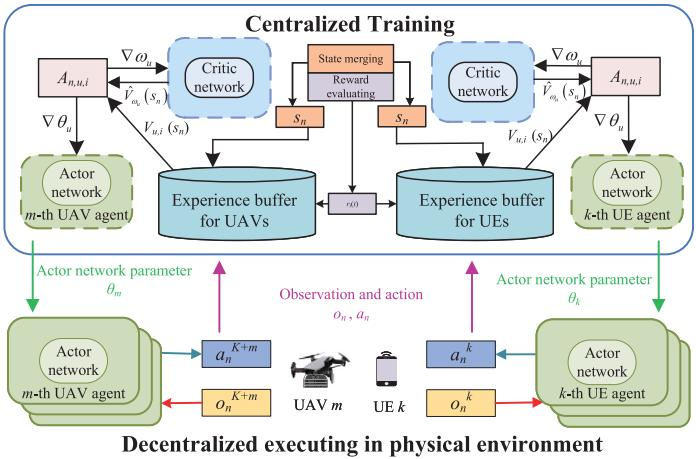

flowchart

```mermaid
graph TD
    A["Actor network m-th UAV agent"] --> B["Actor network parameter θm"]
    B --> C["Observation and action o_n, a_n"]
    C --> D["Actor network parameter θk"]
    D --> E["Decentralized executing in physical environment"]
    E --> F["Actor network k-th UE agent"]
    F --> G["Experience buffer for UAVs"]
    G --> H["Critic network"]
    H --> I["State merging"]
    I --> J["V_u,i (s_n)"]
    J --> K["Experience buffer for UEs"]
    K --> L["Critic network"]
    L --> M["V_u,i (s_n)"]
    M --> N["Actor network k-th UE agent"]
    N --> O["Decentralized executing in physical environment"]
    O --> P["Actor network k-th UE agent"]
    P --> Q["Experience buffer for UAVs"]
    Q --> R["Critic network"]
    R --> S["V_u,i (s_n)"]
    S --> T["Experience buffer for UEs"]
    T --> U["Critic network"]
    U --> V["V_u,i (s_n)"]
    V --> W["Actor network k-th UE agent"]
    W --> X["Decentralized executing in physical environment"]
    X --> Y["Actor network k-th UE agent"]
    Y --> Z["Critic network"]
    Z --> AA["V_u,i (s_n)"]
    AA --> AB["Experience buffer for UAVs"]
    AB --> AC["Critic network"]
    AC --> AD["V_u,i (s_n)"]
    AD --> AE["Actor network k-th UE agent"]
    AE --> AF["Critic network"]
    AF --> AG["V_u,i (s_n)"]
    AG --> AH["Experience buffer for UAVs"]
    AH --> AI["Critic network"]
    AI --> AJ["V_u,i (s_n)"]
    AJ --> AK["Actor network k-th UE agent"]
    AK --> AL["Critic network"]
    AL --> AM["V_u,i (s_n)"]
    AM --> AN["Experience buffer for UAVs"]
    AN --> AO["Critic network"]
    AO --> AP["V_u,i (s_n)"]
    AP --> AQ["Actor network k-th UE agent"]
    AQ --> AR["Critic network"]
    AR --> AS["V_u,i (s_n)"]
    AS --> AT["Experience buffer for UAVs"]
    AT --> AU["Critic network"]
    AU --> AV["V_u,i (s_n)"]
    AV --> AW["Actor network k-th UE agent"]
    AW --> AX["Critic network"]
    AX --> AY["V_u,i (s_n)"]
    AY --> AZ["Experience buffer for UAVs"]
    AZ --> BA["Critic network"]
    BA --> BB["V_u,i (s_n)"]
    BB --> BC["Actor network k-th UE agent"]
    BC --> BD["Critic network"]
    BD --> BE["V_u,i (s_n)"]
    BE --> BF["Experience buffer for UAVs"]
    BF --> BG["Critic network"]
    BG --> BH["V_u,i (s_n)"]
    BH --> BI["Actor network k-th UE agent"]
    BI --> BJ["Critic network"]
    BJ --> BK["V_u,i (s_n)"]
    BK --> BL["Actor network k-th UE agent"]
```

Fig. 2. Training framework of b-MAPPO.

$$
Q _ {u, i} ^ {\pi} (s _ {n}, a _ {n}) = \mathbb {E} \left\{\sum_ {l = 0} ^ {\infty} \gamma_ {u} ^ {l} \mathbb {R} _ {u, i} (s _ {n + l}, a _ {n + l}) | s _ {n} = s, a _ {n} = a, \pi \right\}. \tag {43}
$$

On this basis, to calculate the advantage value of each action which can be used to update the strategy, the advantage function can be denoted as $A _ { n , u , i } \ =$ $\mathcal { Q } _ { u , i } ^ { \pi } ( s _ { n } , a _ { n } ) - V _ { u , i } ^ { \pi } ( s _ { n } )$ , and it can be evaluated as ${ \hat { A } } _ { u } ( s _ { n } ) =$ $\begin{array} { r } { \sum _ { l = 0 } ^ { \infty } ( \gamma _ { u } \lambda ) ^ { l } ( r _ { n + l } + \gamma _ { u } V _ { u } ( s _ { n + l + 1 } ) - V _ { u } ( s _ { n } ) ) } \end{array}$ by utilizing the state-value $V _ { u } ( s _ { n } )$ . It should be noted that we make use of the generalized advantage estimation (GAE) to estimate the advantage function, and λ represents the GAE factor, which plays a significant role in balancing the bias and variance of the rewards. Besides, $\delta _ { n } = ( r _ { n } + \gamma _ { u } V _ { u } ( s _ { n + 1 } ) - V _ { u } ( s _ { n + l } ) )$ denotes the temporal-difference error. Denoting $\hat { V } _ { \omega _ { u } } ( s _ { n } )$ as the statevalue function estimated by the critic network, we can use the following loss function to update the critic network:

$$
J (\omega_ {u}) = \frac {1}{2} \Big [ \hat {V} _ {\omega_ {u}} (s _ {n}) - V _ {u} (s _ {n}) \Big ] ^ {2}. \tag {44}
$$

For the actor networks, the clipping factor $\varepsilon$ is introduced into the MAPPO algorithm in order to limit the update ratio of policy. Thus, the actor network’s loss function is calculated as

$$
\begin{array}{l} J \left(\theta_ {u}\right) = \mathbb {E} \left\{\min \left[ \operatorname{clip} \left(\frac {\pi_ {\theta_ {u}} \left(a _ {n} \mid s _ {n}\right)}{\pi_ {\theta_ {u} ^ {\prime}} \left(a _ {n} \mid s _ {n}\right)}, 1 - \varepsilon , 1 + \varepsilon\right) \hat {A} _ {u} \left(s _ {n}\right) \right. \right. \\ \left. \left. \frac {\pi_ {\theta_ {u}} (a _ {n} | s _ {n})}{\pi_ {\theta_ {u} ^ {\prime}} (a _ {n} | s _ {n})} \hat {A} _ {u} (s _ {n}) \right] + \psi S _ {n, u} \right\} \tag {45} \\ \end{array}
$$

in which $\theta _ { u } ^ { \prime }$ denotes the parameters of the old policy. The update ratio is denoted by $( [ \pi _ { \theta _ { u } } ( a _ { n } | s _ { n } ) ] / [ \pi _ { \theta _ { u } ^ { \prime } } ( a _ { n } | s _ { n } ) ] )$ , and the policy entropy of the degree of exploration is represented as $\psi S _ { n , u } .$ Thus, we can utilize the gradients $\nabla \theta _ { u } = ( \partial J ( \theta _ { u } ) / \partial \theta _ { u } )$ and $\nabla \omega _ { u } ~ = ~ ( \partial J ( \omega _ { u } ) / \partial \omega _ { u } )$ to update the actor and critic networks.

Algorithm 1 Proposed b-MAPPO Training Framework   
1: Initialize the maximum training episodes Mt, the episode length epi and the PPO epochs epc.
2: Initialize critic networks $\omega_{i}$ , actor networks $\theta_{i}$ of UEs and UAVs, $\forall i \in \{1, 2\}$ ;
3: for ep=1 to Mt do
4:    for n=1 to epi do
5:    Obtain observations $o_{n}^{i}$ from the environment, $\forall i \in I_{1}$ ;
6:    Execute actions $a_{n}^{i}, \forall i \in I_{1}$ ;
7:    Obtain observations $o_{n}^{i}$ from the environment, $\forall i \in I_{2}$ ;
8:    Execute actions $a_{n}^{i}, \forall i \in I_{2}$ ;
9:    The UEs and UAVs send the observations and actions to the execution center and the center measures the rewards $r_{n}^{i}$ ;
10:    end for
11: Calculate log-probability $p_{n}^{i}, \forall i \in I, n \in \{1, \ldots, epi\}$ ;
12: Summarize the transitions $tre_{n}^{i} = \{o_{n}^{i}, a_{n}^{i}, r_{n}^{i}, s(n), p_{n}^{i}, \forall i \in I, n \in \{1, \ldots, epi\}\}$ in buffers;
13:    for epo = 1 to epc do
14:    for agents $i \in I$ do
15:    Adjust $\omega_{i}$ and $\theta_{i}$ according to (44) and (45);
16:    end for
17:    end for
18: end for

# C. Beta Policy

In policy-based DRL algorithms, the Gaussian distribution has been widely utilized to model the output of actor networks. However, this distribution is unbounded, whereas many actions have predefined lower and upper limits. As a result, these actions must be constrained within these boundaries, which in turn creates the boundary effects that negatively impact performance [28]. In addition, setting a small initial variance in the Gaussian distribution to reduce boundary effects can limit the exploration ability of the network by concentrating the probability density too much. Conversely, setting a larger variance can lead to the values of actions being clipped at the boundaries, thereby reducing exploration. Therefore, we introduce the Beta distribution into the actor network’s output. The Beta distribution with respect to x is denoted as [29]

$$
f (s, \tau , \zeta) = \frac {\Gamma (\tau + \zeta)}{\Gamma (\tau) \Gamma (\zeta)} s ^ {\tau - 1} (1 - s) ^ {\zeta - 1}. \tag {46}
$$

It can be derived that (46) has a bounded domain, and thus it is adaptable to the actions that have double boundaries. Moreover, it also facilitates the algorithm to conduct more uniform exploration during the early stage of training. Correspondingly, compared to the Gaussian distribution, the Beta distribution typically exhibits higher probability density near its boundaries. Based on the Beta distribution, we summarize the b-MAPPO training framework, and the pseudocode is shown in Algorithm 1.

# D. Complexity Analysis

In this section, we analyze the computational complexity of the proposed b-MAPPO algorithm. In this framework, for multilayer perceptron (MLP), the computational complexity of the ith layer can be expressed as $\mathcal { O } ( L _ { i - 1 } L _ { i } + L _ { i } L _ { i + 1 } )$ , in which the number of neurons in the ith layer is defined as $L _ { i } .$ . Thus, the computational complexity of an I-layer MLP

TABLE I SIMULATION PARAMETERS 

<table><tr><td>Parameters</td><td>Values</td><td>Parameters</td><td>Values</td></tr><tr><td> $Z$ </td><td>5</td><td> $H$ </td><td>200 m</td></tr><tr><td> $\varepsilon_{k,m}$ </td><td>0.05</td><td> $\varepsilon_z$ </td><td>20</td></tr><tr><td> $B$ </td><td>10 MHz</td><td> $\delta$ </td><td>1.0 s</td></tr><tr><td> $p_{k,\text{max}}$ </td><td>0.5 W</td><td> $f_{k,\text{max}}$ </td><td>1 GHz</td></tr><tr><td> $f_{d,\text{max}}$ </td><td>10 GHz</td><td> $A$ </td><td>4</td></tr><tr><td> $a_{\text{max}}$ </td><td>5 m/s $^2$ </td><td> $v_{\text{max}}$ </td><td>20 m/s</td></tr><tr><td> $P_1$ </td><td>59.03 W</td><td> $P_2$ </td><td>79.07 W</td></tr><tr><td> $U_{\text{tip}}$ </td><td>120 m/s</td><td> $A_0$ </td><td>0.5030 m/s $^2$ </td></tr><tr><td> $v_0$ </td><td>3.6 m/s</td><td> $s$ </td><td>0.05</td></tr><tr><td> $\sigma^2$ </td><td>-85 dBm</td><td> $\varsigma$ </td><td>10</td></tr></table>

can be denoted as $\begin{array} { r } { \mathcal { O } ( \sum _ { i = 2 } ^ { I - 1 } L _ { i - 1 } L _ { i } + L _ { i } L _ { i + 1 } ) } \end{array}$ . In our algorithm, the actor networks have one MLP each, and the critic networks have one MLP for value output and two encoders for two types of agents. Besides, due to the fact that in a decision step, the agents are capable of computing their actor networks in parallel, the complexity can be represented as $\begin{array} { r } { \mathcal { O } ( \sum _ { i = 2 } ^ { I - 1 } L _ { i - 1 } \bar { L } _ { i } + L _ { i } L _ { i + 1 } ) } \end{array}$ . Thus, with all Mt episodes, the time complexity of the training algorithm is $\begin{array} { r } { \mathcal { O } ( \operatorname { M t } ( \exp \mathrm { i } ( \sum _ { i = 2 } ^ { I - 1 } L _ { i - 1 } L _ { i } + L _ { i } L _ { i + 1 } ) ) ) } \end{array}$ .

# V. NUMERICAL RESULTS

This section presents simulation experiments to illustrate the effectiveness of the proposed b-MAPPO training framework in a multi-UAV-assisted MEC network. In the simulation, we set UAVs’ service region to be a square-shaped area with a side length of 1000 m, where UEs are randomly and uniformly distributed and the initial horizontal locations of UAVs are randomly set with $x , y \in [ 0$ , 1000] m. The number of UEs is $K = 2 0$ and the number of UAVs is $M = 5$ . The size of task is uniformly distributed in $[ D _ { \mathrm { m i n } } , D _ { \mathrm { m a x } } ] ,$ , in which $D _ { \mathrm { m i n } }$ and $D _ { \mathrm { m a x } }$ are set to be 3.5 and 4.5 Mb as default [33]. The mean number of cycles per bit for the tasks is $c _ { z } \in [ 5 0 0 , 1 5 0 0 ]$ . The confidence interval is set as 95%. To algorithm setup, we use the value normalization and all the rewards are forced into [−5, 5]. The maximum training episodes are Mt = 300 episodes, the episode length epi, which represents T, is 200 steps, the discount factor is $\gamma _ { u } = 0 . 9 8$ , the learning rate is 0.0005, and the optimizer we used is Adam. Other parameter settings of the simulation are summarized in Table I, according to prior work [25], [29], [34].

We compare the performance of the proposed b-MAPPO algorithm with the following benchmarks.

1) Pure-MAPPO: The method is the original MAPPO algorithm without the use of the Beta distribution-based improvement mechanism, and it shares the same reward function, action space, and state space as the proposed algorithm [30].   
2) Multiagent Deep Deterministic Policy Gradient (MADDPG): This method is currently popular and reliable multiagent reinforcement learning algorithm adopted by works, such as [15] and [31]. It consists of

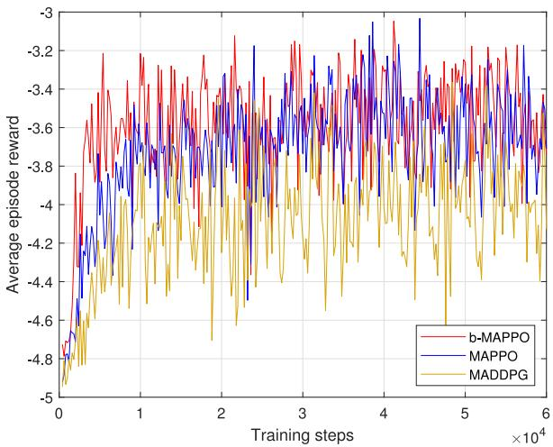

line

| Training steps (x10^4) | b-MAPPO | MAPPO | MADDPG |
| ---------------------- | ------- | ----- | ------ |
| 0                      | -4.8    | -4.8  | -4.9   |
| 1                      | -3.6    | -3.7  | -4.2   |
| 2                      | -3.4    | -3.5  | -4.5   |
| 3                      | -3.2    | -3.3  | -4.3   |
| 4                      | -3.1    | -3.2  | -4.1   |
| 5                      | -3.3    | -3.4  | -4.0   |
| 6                      | -3.5    | -3.6  | -4.2   |

Fig. 3. Convergence versus UE agents.

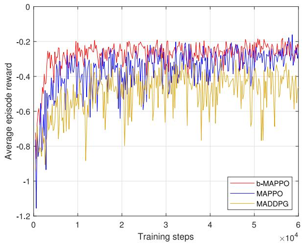

line

| Training steps (x10^4) | b-MAPPO | MAPPO | MADDPG |
| ---------------------- | ------- | ----- | ------ |
| 0                      | -0.6    | -1.2  | -0.8   |
| 1                      | -0.2    | -0.4  | -0.6   |
| 2                      | -0.2    | -0.3  | -0.7   |
| 3                      | -0.2    | -0.3  | -0.5   |
| 4                      | -0.2    | -0.3  | -0.6   |
| 5                      | -0.2    | -0.3  | -0.7   |
| 6                      | -0.2    | -0.3  | -0.6   |

Fig. 4. Convergence versus UAV agents.

dual actor networks and dual critic networks, where the output of the actor network serves as the action values, which are then added with certain exploration noise, and the action-value function is evaluated by the critic network.

3) Greedy: This algorithm greedily selects the UAV trajectory, the task partition, and the computation and communication resource allocation in the nth time slot to minimize the energy consumption, based on the current knowledge.   
4) DRL+CVX: This algorithm uses the CVX solver for obtaining the optimal task partition variable and uses our b-MAPPO to find the near-optimal UAV trajectory and the allocation of computation and communication resources, similar to [32].

In Figs. 3 and 4, we demonstrate the convergence performance of the proposed b-MAPPO algorithm compared to other benchmark methods. With the number of training iterations growing larger, the reward obtained by all the algorithms gradually improves, indicating the efficacy of the MADRL algorithms for computation offloading. Moreover, it is obvious that the b-MAPPO algorithm achieves the highest reward and exhibits a faster convergence rate compared to the Pure-MAPPO with Gaussian distribution and MADDPG algorithms. Thus, it proves that the Beta distribution has a better effect than the Gaussian distribution in our network. Besides, we can find from Fig. 3 that the reward received by UE agents shows a gradual improvement over time and the proposed b-MAPPO scheme achieves an average episode reward of approximately −3.05, which is the highest value observed in the experiment. Fig. 4 illustrates how UAV agents adjust their policy to achieve a satisfactory tradeoff between the positioning of the served UEs and the energy consumption.

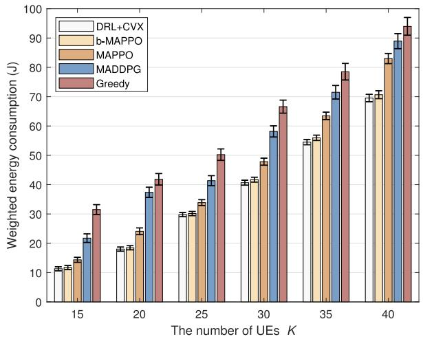

bar

| The number of UEs K | DRL+CVX | b-MAPPO | MAPPO | MADDPG | Greedy |
| ------------------- | ------- | ------- | ----- | ------ | ------ |
| 15                  | 12      | 13      | 15    | 22     | 32     |
| 20                  | 18      | 20      | 25    | 38     | 42     |
| 25                  | 30      | 32      | 35    | 42     | 50     |
| 30                  | 42      | 48      | 50    | 60     | 68     |
| 35                  | 55      | 65      | 70    | 75     | 80     |
| 40                  | 70      | 85      | 90    | 95     | 98     |

Fig. 5. Performance comparison versus different numbers of UEs.

Fig. 5 provides a comparison of the weighted energy consumption for different numbers of UEs. The results indicate that the DRL-based algorithms perform better than the Greedy algorithm since the DRL-based algorithms can adapt to uncertain environments by continuously interacting with the environment, while the Greedy algorithm is more prone to getting stuck in the local optimal solution. Furthermore, the b-MAPPO algorithm outperforms MAPPO and MADDPG algorithms, and there is still a significant performance gap between the MADDPG-based and MAPPO-based algorithms. Besides, our algorithm shows minimal difference compared to the DRL+CVX algorithm with a lower computational complexity. Additionally, as the number of UEs increases, the weighted energy consumption also increases. This is because more UEs need more computation and communication resources and the increase in signal interference between UEs results in slower transmission rates.

Fig. 6 compares the performance of five schemes versus different numbers of UAVs under K = 30 UEs. As the number of UAVs increases, there is a noticeable trend of the reduced weighted energy consumption. This phenomenon can be explained by the fact that a larger pool of computational resources becomes available with the growth in the number of UAVs. This allows the agents to achieve a better tradeoff between the computing load on UAVs and UEs, thereby reducing the overall weighted energy consumption. Moreover, our b-MAPPO scheme outperforms MAPPO, MADDPG, and Greedy in all scenarios, and it shows only a small performance gap compared to the DRL+CVX algorithm.

Fig. 7 displays the average energy consumption of UAVs and UEs for different weight factors ω to investigate the relationship on energy consumption between UEs and UAVs. As observed, with the growth of the weight factor $\omega ,$ the energy consumption of the UE slowly increases, while the UAV’s energy consumption decreases. This is attributed to the tradeoff function of $\omega$ on the objective, which changes the relative importance of energy consumption for both UEs and UAVs, leading to corresponding changes in policies. The relative importance of energy consumption can be evaluated based on factors such as power capacity.

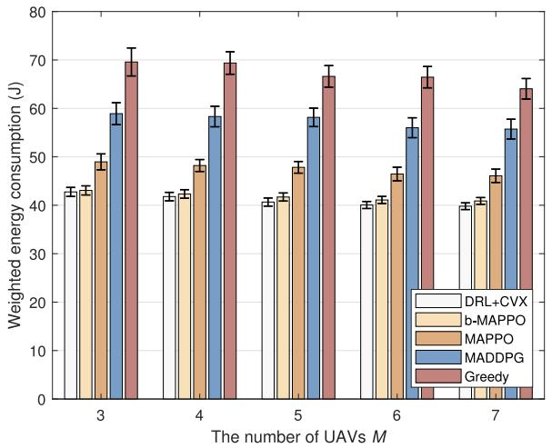

bar

| The number of UAVs M | DRL+CVX | b-MAPPO | MAPPO | MADDPG | Greedy |
| --------------------- | ------- | ------- | ----- | ------ | ------ |
| 3                     | 43      | 44      | 49    | 59     | 70     |
| 4                     | 42      | 43      | 48    | 58     | 69     |
| 5                     | 41      | 42      | 48    | 58     | 67     |
| 6                     | 40      | 41      | 46    | 56     | 66     |
| 7                     | 40      | 41      | 46    | 55     | 64     |

Fig. 6. Performance comparison versus different numbers of UAVs.

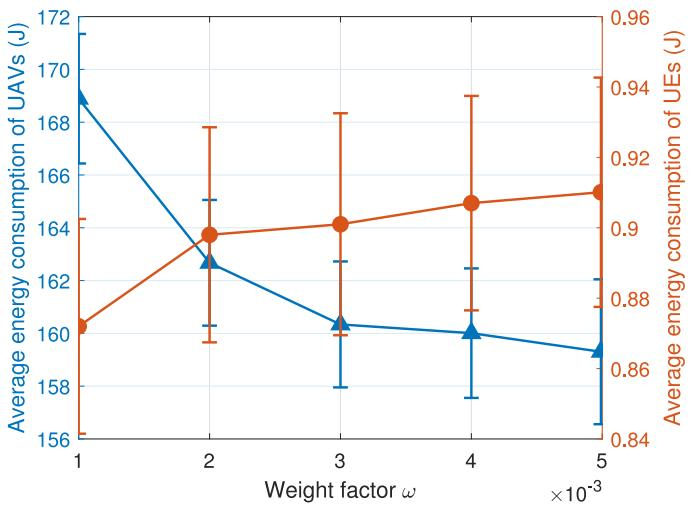

line

| Weight factor ω (×10⁻³) | Average energy consumption of UAVs (J) | Average energy consumption of UEs (J) |
| ------------------------ | -------------------------------------- | ------------------------------------- |
| 1                        | 169                                    | 0.86                                  |
| 2                        | 163                                    | 0.90                                  |
| 3                        | 161                                    | 0.90                                  |
| 4                        | 160                                    | 0.91                                  |
| 5                        | 159                                    | 0.91                                  |

Fig. 7. Influence of weight factor ω on energy consumption.

Fig. 8 illustrates the impact of task complexity estimation error bounds on performance, with different distributions of task complexity $c _ { z }$ across intervals. The results indicate that wider intervals of task complexity $c _ { z }$ lead to higher weighted energy consumption. This can be attributed to the fact that a larger $c _ { z }$ requires more computational workload for the task, resulting in greater energy consumption, even under the same estimation error bound. Moreover, as the estimation error bound increases, the energy consumption also increases. The reason is that a larger error bound leads to greater uncertainty in computation.

In Fig. 9, the impact of various channel estimation error bounds on different data sizes is illustrated. It is evident that as the channel estimation error bound grows, the system’s energy consumption also increases. The reason is that a larger error bound $\varepsilon _ { k , m }$ implies higher communication uncertainty, which leads to a more significant performance degradation for a given data size. Additionally, the weighted energy consumption increases with the growth of the data size. The reason is that the larger data size requires more resources for transmission and computation, leading to the growth of the system’s weighted energy consumption.

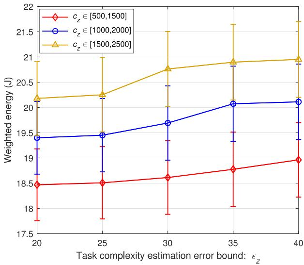

line

| Task complexity estimation error bound: ε_z | Weighted energy (J) for c_z ∈ [500,1500] | Weighted energy (J) for c_z ∈ [1000,2000] | Weighted energy (J) for c_z ∈ [1500,2500] |
| ------------------------------------------- | ------------------------------------------ | ------------------------------------------ | ------------------------------------------ |
| 20                                          | 18.5                                       | 19.4                                       | 20.2                                       |
| 25                                          | 18.6                                       | 19.5                                       | 20.3                                       |
| 30                                          | 18.7                                       | 19.7                                       | 20.8                                       |
| 35                                          | 18.8                                       | 20.1                                       | 20.9                                       |
| 40                                          | 18.9                                       | 20.1                                       | 21.0                                       |

Fig. 8. Performance versus different task complexity estimation error bounds under different task complexity.   
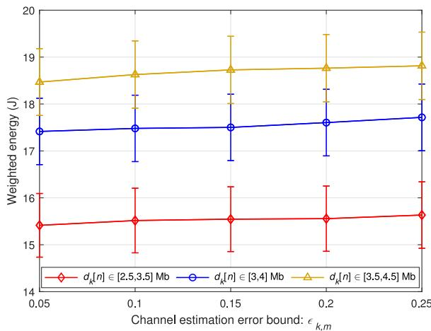

line

| Channel estimation error bound: ε_k,m | d_k[n] ∈ [2.5,3.5] Mb | d_k[n] ∈ [3,4] Mb | d_k[n] ∈ [3.5,4.5] Mb |
| ------------------------------------- | --------------------- | ----------------- | --------------------- |
| 0.05                                  | 15.5                  | 17.5              | 18.5                  |
| 0.1                                   | 15.6                  | 17.5              | 18.6                  |
| 0.15                                  | 15.6                  | 17.5              | 18.7                  |
| 0.2                                   | 15.6                  | 17.6              | 18.7                  |
| 0.25                                  | 15.7                  | 17.7              | 18.8                  |

Fig. 9. Performance versus different channel estimation error bounds under different task sizes.

In Fig. 10, we demonstrate the trajectories of UAVs. It is evident that UAVs have the capability to identify regions with a higher concentration of UEs and adjust their positions accordingly based on UE distribution. Additionally, the figure portrays how the reward mechanism can assist UAVs in discovering a relatively equitable area for UEs and then move gradually to conserve flying energy consumption.

# VI. CONCLUSION

In this article, considering both the communication and computation uncertainties, we proposed a robust computation offloading scheme for the multi-UAV-assisted MEC networks.

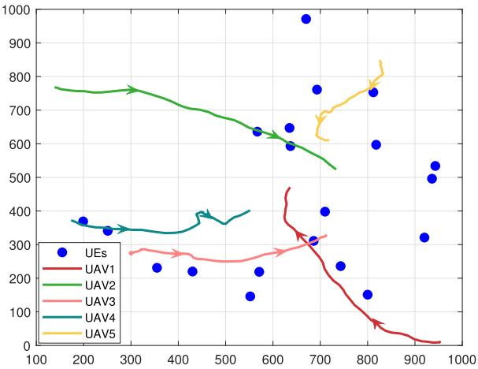

line

| X    | UEs  | UAV1 | UAV2 | UAV3 | UAV4 | UAV5 |
|------|------|------|------|------|------|------|
| 200  | 370  |      | 760  |      | 370  |      |
| 300  | 340  |      | 760  |      | 340  |      |
| 400  | 230  |      |      | 280  |      |      |
| 500  |      |      |      |      |      |      |
| 600  | 640  |      |      |      |      |      |
| 700  | 960  |      |      |      |      |      |
| 800  | 760  |      |      |      |      |      |
| 900  | 540  |      |      |      |      |      |
| 1000 |      |      |      |      |      |      |

Fig. 10. Example of trajectories of UAVs under K = 20 and M = 5.

We formulated a system energy consumption minimization problem by the joint optimization of the beamforming vector, the task-partition factor, the flying trajectory, the matching factor, and the CPU frequency of UEs and UAVs. In order to address the optimization problem, a b-MAPPO distribution framework was developed to achieve an optimal learning strategy efficiently. Extensive numerical results showed that the proposed scheme outperforms the benchmarks in reducing energy consumption. In our future work, we will further investigate the scenario in which different types of tasks are allowed to use different offloading rates.

# REFERENCES

[1] S. Deng, H. Zhao, W. Fang, J. Yin, S. Dustdar, and A. Y. Zomaya, “Edge intelligence: The confluence of edge computing and artificial intelligence,” IEEE Internet Things J., vol. 7, no. 8, pp. 7457–7469, Aug. 2020.   
[2] F. Spinelli and V. Mancuso, “Toward enabled industrial verticals in 5G: A survey on MEC-based approaches to provisioning and flexibility,” IEEE Commun. Surveys Tuts., vol. 23, no. 1, pp. 596–630, 1st Quart., 2021.   
[3] Q. Chen, H. Zhu, L. Yang, X. Chen, S. Pollin, and E. Vinogradov, “Edge computing assisted autonomous flight for UAV: Synergies between vision and communications,” IEEE Commun. Mag., vol. 59, no. 1, pp. 28–33, Jan. 2021.   
[4] D. Lu, Y. Qu, F. Wu, H. Dai, C. Dong, and G. Chen, “Robust server placement for edge computing,” in Proc. IEEE IPDPS, New Orleans, LA, USA, 2020, pp. 285–294.   
[5] Y. Mao, C. You, J. Zhang, K. Huang, and K. B. Letaief, “A survey on mobile edge computing: The communication perspective,” IEEE Commun. Surveys Tuts., vol. 19, no. 4, pp. 2322–2358, 4th Quart., 2017.   
[6] N. Eshraghi and B. Liang, “Joint offloading decision and resource allocation with uncertain task computing requirement,” in Proc. IEEE INFOCOM, Paris, France, 2019, pp. 1414–1422.   
[7] M. Tang and V. W. S. Wong, “Deep reinforcement learning for task offloading in mobile edge computing systems,” IEEE Trans. Mobile Comput., vol. 21, no. 6, pp. 1985–1997, Jun. 2022.   
[8] G. Yang, L. Hou, X. He, D. He, S. Chan, and M. Guizani, “Offloading time optimization via markov decision process in mobile-edge computing,” IEEE Internet Things J., vol. 8, no. 4, pp. 2483–2493, Feb. 2021.   
[9] L. Zhang, Y. Sun, Z. Chen, and S. Roy, “Communications-cachingcomputing resource allocation for bidirectional data computation in mobile edge networks,” IEEE Trans. Commun., vol. 69, no. 3, pp. 1496–1509, Mar. 2021.   
[10] M. Masoudi and C. Cavdar, “Device vs edge computing for mobile services: Delay-aware decision making to minimize power consumption,” IEEE Trans. Mobile Comput., vol. 20, no. 12, pp. 3324–3337, Dec. 2021.

[11] W. Zhang, G. Zhang, and S. Mao, “Joint parallel offloading and load balancing for cooperative-MEC systems with delay constraints,” IEEE Trans. Veh. Technol., vol. 71, no. 4, pp. 4249–4263, Apr. 2022.   
[12] B. Xu, Z. Kuang, J. Gao, L. Zhao, and C. Wu, “Joint offloading decision and trajectory design for UAV-enabled edge computing with task dependency,” IEEE Trans. Wireless Commun., vol. 22, no. 8, pp. 5043–5055, Aug. 2023.   
[13] Y. Xu, T. Zhang, Y. Liu, D. Yang, L. Xiao, and M. Tao, “Cellularconnected multi-UAV MEC networks: An online stochastic optimization approach,” IEEE Trans. Commun., vol. 70, no. 10, pp. 6630–6647, Oct. 2022.   
[14] Y. Luo, W. Ding, and B. Zhang, “Optimization of task scheduling and dynamic service strategy for multi-UAV-enabled mobile-edge computing system,” IEEE Trans. Cogn. Commun. Netw., vol. 7, no. 3, pp. 970–984, Sep. 2021.   
[15] L. Wang, K. Wang, C. Pan, W. Xu, N. Aslam, and L. Hanzo, “Multiagent deep reinforcement learning-based trajectory planning for multi-UAV assisted mobile edge computing,” IEEE Trans. Cogn. Commun. Netw., vol. 7, no. 1, pp. 73–84, Mar. 2021.   
[16] Y. Xu, T. Zhang, J. Loo, D. Yang, and L. Xiao, “Completion time minimization for UAV-assisted mobile-edge computing systems,” IEEE Trans. Veh. Technol., vol. 70, no. 11, pp. 12253–12259, Nov. 2021.   
[17] N. Zhao, Z. Ye, Y. Pei, Y.-C. Liang, and D. Niyato, “Multi-agent deep reinforcement learning for task offloading in UAV-assisted mobile edge computing,” IEEE Trans. Wireless Commun., vol. 21, no. 9, pp. 6949–6960, Sep. 2022.   
[18] X. Qi, J. Chong, Q. Zhang, and Z. Yang, “Collaborative computation offloading in the multi-UAV fleeted mobile edge computing network via connected dominating set,” IEEE Trans. Veh. Technol., vol. 71, no. 10, pp. 10832–10848, Oct. 2022.   
[19] Y. Qu et al., “Robust offloading scheduling for mobile edge computing,” IEEE Trans. Mobile Comput., vol. 21, no. 7, pp. 2581–2595, Jul. 2022.   
[20] H. Wang, H. Xu, H. Huang, M. Chen, and S. Chen, “Robust task offloading in dynamic edge computing,” IEEE Trans. Mobile Comput., vol. 22, no. 1, pp. 500–514, Jan. 2023.   
[21] Z. Ling, F. Hu, Y. Zhang, L. Fan, F. Gao, and Z. Han, “Distributionally robust chance-constrained backscatter communication-assisted computation offloading in WBANs,” IEEE Trans. Commun., vol. 69, no. 5, pp. 3395–3408, May 2021.   
[22] Z. Wu, B. Li, Z. Fei, Z. Zheng, B. Li, and Z. Han, “Energy-efficient robust computation offloading for fog-IoT systems,” IEEE Trans. Veh. Technol., vol. 69, no. 4, pp. 4417–4425, Apr. 2020.   
[23] J. Tan, T.-H. Chang, K. Guo, and T. Q. S. Quek, “Robust computation offloading in fog radio access network with fronthaul compression,” IEEE Trans. Wireless Commun., vol. 20, no. 10, pp. 6506–6521, Oct. 2021.   
[24] X. Li, J. Liu, N. Zhao, and X. Wang, “UAV-assisted edge caching under uncertain demand: A data-driven distributionally robust joint strategy,” IEEE Trans. Commun., vol. 70, no. 5, pp. 3499–3511, May 2022.   
[25] Q. Wang, X. Chen, and Q. Qi, “Task-driven robust integration of communication and computation for edge-intelligent networks,” IEEE Trans. Commun., vol. 71, no. 1, pp. 244–255, Jan. 2023.   
[26] B. Liu, Y. Wan, F. Zhou, Q. Wu, and R. Q. Hu, “Resource allocation and trajectory design for MISO UAV-assisted MEC networks,” IEEE Trans. Veh. Technol., vol. 71, no. 5, pp. 4933–4948, May 2022.   
[27] M. Hua, L. Yang, Q. Wu, C. Pan, C. Li, and A. L. Swindlehurst, “UAVassisted intelligent reflecting surface symbiotic radio system,” IEEE Trans. Wireless Commun., vol. 20, no. 9, pp. 5769–5785, Sep. 2021.   
[28] P.-W. Chou, D. Maturana, and S. Scherer, “Improving stochastic policy gradients in continuous control with deep reinforcement learning using the beta distribution,” in Proc. 34th Int. Conf. Mach. Learn., 2017, pp. 834–843.   
[29] W. Liu, B. Li, W. Xie, Y. Dai, and Z. Fei, “Energy efficient computation offloading in aerial edge networks with multi-agent cooperation,” IEEE Trans. Wireless Commun., early access, Jan. 18, 2023, doi: 10.1109/TWC.2023.3235997.   
[30] J. Ji, K. Zhu, and L. Cai, “Trajectory and communication design for cache-enabled UAVs in cellular networks: A deep reinforcement learning approach,” IEEE Trans. Mobile Comput., early access, Jun. 13, 2022, doi: 10.1109/TMC.2022.3181308.   
[31] A. M. Seid, G. O. Boateng, B. Mareri, G. Sun, and W. Jiang, “Multiagent DRL for task offloading and resource allocation in multi-UAV enabled IoT edge network,” IEEE Trans. Netw. Service Manag., vol. 18, no. 4, pp. 4531–4547, Dec. 2021.

[32] S. Zhang, H. Gu, K. Chi, L. Huang, K. Yu, and S. Mumtaz, “DRL-based partial offloading for maximizing sum computation rate of wireless powered mobile edge computing network,” IEEE Trans. Wireless Commun., vol. 21, no. 12, pp. 10934–10948, Dec. 2022.   
[33] H. Sun, W. Shi, X. Liang, and Y. Yu, “VU: Edge computingenabled video usefulness detection and its application in large-scale video surveillance systems,” IEEE Internet Things J., vol. 7, no. 2, pp. 800–817, Feb. 2020.   
[34] Z. Yu, Y. Gong, S. Gong, and Y. Guo, “Joint task offloading and resource allocation in UAV-enabled mobile edge computing,” IEEE Internet Things J., vol. 7, no. 4, pp. 3147–3159, Apr. 2020.

natural_image

Portrait of a man wearing glasses and a suit (no text or symbols visible)

Junyi Wang (Member, IEEE) received the M.S. degree in fundamental mathematics from Xiangtan University, Xiangtan, China, in 2003, and the Ph.D. degree in signal and information processing from Beijing University of Posts and Telecommunications, Beijing, China, in 2008.

He is currently a Professor with the Academy of Information and Communication, Guilin University of Electronic Technology, Guilin, China. His current research interests include stochastic network optimization and network coding.

natural_image

Portrait of a young man in a collared shirt (no text or symbols visible)

Bin Li (Member, IEEE) received the Ph.D. degree in information and communication engineering from Beijing Institute of Technology, Beijing, China, in 2019.

From 2013 to 2014, he was a Research Assistant with the Department of Electronic and Information Engineering, The Hong Kong Polytechnic University, Hong Kong. From 2017 to 2018, he was a visiting student with the Department of Informatics, University of Oslo, Oslo, Norway. In 2019, he joined the School of Computer Science,

Nanjing University of Information Science and Technology, Nanjing, China. His research interests include unmanned aerial vehicle communications, reconfigurable intelligent surface, and mobile-edge computing.

natural_image

Portrait of a woman with short dark hair wearing a collared shirt (no text or symbols visible)

Rongrong Yang received the B.S. degree from Nanjing University of Information Science and Technology, Nanjing, China, in 2022, where she is currently pursuing the M.S. degree with the School of Computer and Software.

Her current research interests include mobile-edge computing and deep reinforcement learning.

natural_image

Portrait photo of a man in formal suit and tie (no text or symbols visible)

Lei Liu (Member, IEEE) received the B.Eng. degree in electronic information engineering from Zhengzhou University, Zhengzhou, China, in 2010, and the M.Sc. and Ph.D. degrees in communication and information systems from Xidian University, Xi’an, China, in 2013 and 2019, respectively.

From 2013 to 2015, he worked with a subsidiary of China Electronics Corporation, Shenzhen, China. From 2018 to 2019, he was supported by the China Scholarship Council to be a visiting Ph.D. student with the University of Oslo, Oslo, Norway. From

2020 to 2022, he was a Lecturer with the School of Telecommunications Engineering, Xidian University, where he is currently an Associate Professor with Xidian Guangzhou Institute of Technology. His research interests include vehicular ad hoc networks, intelligent transportation, edge intelligence, and distributed computing.

natural_image

Portrait of a man wearing glasses and a suit (no text or symbols visible)

Ning Zhang (Senior Member, IEEE) received the Ph.D. degree in electrical and computer engineering from the University of Waterloo, Waterloo, ON, Canada, in 2015.

After that, he was a Postdoctoral Research Fellow with the University of Waterloo and the University of Toronto, Toronto, ON, Canada, respectively. Since 2020, he has been an Associate Professor with the Department of Electrical and Computer Engineering, University of Windsor, Windsor, ON, Canada. His research interests include connected

vehicles, mobile-edge computing, wireless networking, and security.

Dr. Zhang received a number of Best Paper Awards from conferences and journals, such as IEEE Globecom, IEEE ICC, IEEE ICCC, IEEE WCSP, and Journal of Communications and Information Networks. He also received the IEEE TCSVC Rising Star Award and the IEEE ComSoc Young Professionals Outstanding Nominee Award. He is a Highly Cited Researcher (Web of Science). He serves as the Vice Chair for IEEE Technical Committee on Cognitive Networks and IEEE Technical Committee on Big Data. He serves/served as an Associate Editor for IEEE TRANSACTIONS ON MOBILE COMPUTING, IEEE COMMUNICATIONS SURVEYS AND TUTORIALS, IEEE INTERNET OF THINGS JOURNAL, and IEEE TRANSACTIONS ON COGNITIVE COMMUNICATIONS AND NETWORKING. He also serves/served as the TPC Chair for IEEE VTC 2021 and IEEE SAGC 2020, the General Chair for IEEE SAGC 2021, and the Chair for track of several international conferences and workshops, including IEEE ICC, VTC, INFOCOM Workshop, and Mobicom Workshop.

natural_image

Portrait of a man wearing glasses and a suit (no text or symbols visible)

Mianxiong Dong (Senior Member, IEEE) received the B.Eng., M.Sc., and Ph.D. degrees in computer science and engineering from the University of Aizu, Wakamatsu, Japan, in 2006, 2008, and 2013, respectively.

He is the youngest ever Vice President and a Professor with Muroran Institute of Technology, Muroran, Japan. He was a JSPS Research Fellow with the School of Computer Science and Engineering, The University of Aizu and a Visiting Scholar with the BBCR Group, University of

Waterloo, Waterloo, ON, Canada, supported by the JSPS Excellent Young Researcher Overseas Visit Program from April 2010 to August 2011.

Dr. Dong was selected as a Foreigner Research Fellow (a total of three recipients all over Japan) by NEC C&C Foundation in 2011. He is the recipient of the IEEE TCSC Early Career Award 2016, the IEEE SCSTC Outstanding Young Researcher Award 2017, The 12th IEEE ComSoc Asia–Pacific Young Researcher Award 2017, the Funai Research Award 2018, the NISTEP Researcher 2018 (one of only 11 people in Japan) in recognition of significant contributions in science and technology, the 2019 Best Paper Award for IEEE TRANSACTIONS ON EMERGING TOPICS IN COMPUTING from IEEE Computer Society, and The 9th IEEE Asia–Pacific Outstanding Paper Award 2020 from Communication Society. He is a Clarivate Analytics 2019 Highly Cited Researcher (Web of Science).