# Robust Position and Power Optimization for Full-Duplex UAV Relay-Assisted Cellular Network Enhanced by NOMA

Huan Li , Daosen Zhai , Member, IEEE, Ruonan Zhang , Member, IEEE, Lei Liu , Member, IEEE, Dusit Niyato , Fellow, IEEE, and Yan Zhang , Fellow, IEEE

Abstract—As the sixth generation wireless technology evolves, applications such as, holography, autonomous driving, and telemedicine require enhanced data rates, reliability, and spectral efficiency. Unmanned Aerial Vehicles (UAVs) have gained attention due to their flexible deployment, line-of-sight transmission, and dynamic adaptability. However, UAV-assisted communication encounters challenges stemming from UAV position deviations caused by environmental factors such as wind and turbulence, which degrade transmission reliability. To address these problems, we propose a Non-Orthogonal Multiple Accessbased full-duplex UAV relay protocol to improve the system transmission rate. The protocol utilizes successive interference cancellation for signal separation and maximal ratio combining for signal enhancement. Considering UAV position uncertainty, we formulate a robust optimization problem for joint UAV position optimization and power allocation. By employing the Bernstein-type inequality, we transform the probabilistic constraints into the deterministic constraints and solve the problem using a block coordinate descent-based algorithm. Simulation results demonstrate that, compared to the benchmark schemes, the proposed strategy improves system throughput and exhibits enhanced robustness, particularly under significant UAV position deviations.

Index Terms—Unmanned aerial vehicle, relay protocol, nonorthogonal multiple access, robust optimization.

Received 27 March 2025; revised 9 September 2025; accepted 13 November 2025. Date of publication 26 November 2025; date of current version 22 December 2025. This work was supported in part by the National Natural Science Foundation of China under Grant 62232013, Grant 62271402, and Grant 62171385; in part by the Innovation Capability Support Plan of Shaanxi Province under Grant 2024ZC-KJXX-077; and in part by the Aeronautical Science Foundation of China under Grant 2024Z021053001. The associate editor coordinating the review of this article and approving it for publication was S. Bi. (Corresponding author: Daosen Zhai.)

## I. INTRODUCTION

W ITH the rapid development of the next-generation wireless communication technologies, mobile internet and the Internet of Things (IoT) are placing higher demands on communication rates, latency, and reliability [1]. In the future, the sixth generation wireless networks (6G) will support emerging applications such as ultra high definition (UHD) video transmission, holographic communication, autonomous driving, and telemedicine. These applications pose unprecedented challenges to network performance. For example, UHD video and holographic communication require extremely high data transmission rates, while autonomous driving and telemedicine impose stringent reliability requirements [2]. Addressing these challenges necessitates not only network architectures with higher spectral efficiency but also more robust network optimization methods.

To meet the high-performance requirements of 6G, integrated terrestrial-aerial networks (ITAN) have emerged as a crucial development direction [3]. Unmanned aerial vehicles (UAVs), as an integral component of ITAN, can effectively extend network coverage and enhance communication rates due to their flexibility in deployment, Line-of-Sight (LoS) transmission, and dynamic adjustment capabilities [4]. In particular, UAV relays can be rapidly deployed in hotspot areas or emergency scenarios, providing on-demand coverage and capacity supplementation [5]. Therefore, UAV relays hold significant research value and application potential in wireless networks.

In terms of enhancing spectral efficiency and communication capacity, non-orthogonal multiple access (NOMA) technology has demonstrated significant advantages [6]. Unlike traditional orthogonal multiple access (OMA), NOMA allows multiple users to share the same time-frequency resources by multiplexing their signals in the power domain [7]. By exploiting channel differences among users, NOMA achieves signal separation through superposition coding and successive interference cancellation (SIC) techniques [8]. It is particularly useful in scenarios where there is a significant channel condition disparity among users, such as in UAVassisted communication systems with both near and far users. In this senario, UAVs can dynamically adjust their deployment to increase the power difference among signals, promoting the signal separation and improve the system throughput [9].

Despite the potential of the UAV relay, its practical application faces reliability issues. UAVs are susceptible to environmental factors such as wind and air currents during flight, leading to positional deviations. In addition, inherent inaccuracies in positioning systems, such as Global Positioning System (GPS), can further affect the stability and performance of communication links. These problems may result in inaccurate channel state information, increased interference, and communication interruptions, which constrain the communication performance of UAV relays [10]. Additionally, given the inherent variability in UAV’s position, it forces the problem model to differ from deterministic ones. For analytical tractability, existing approaches often consider robustness under the worst-case scenario. However, the worst case typically occurs with very low probability, and designing solely for it may lead to overly conservative solutions, which hinders practical applicability and limits system performance [11].

Motivated by the aforementioned issues, we design a NOMA-based full-duplex (FD) UAV relay protocol to improve the transmission rate for user equipments (UEs). In particular, considering UAV position deviation, we jointly optimize the UAV position and power allocation to maximize system throughput and enhance communication reliability. The main contributions can be summarized as follows:

We propose a NOMA-based FD UAV relay protocol to enhance the transmission rate of UEs. In this protocol, signals from both the base station (BS) and the UAV relay are separated using SIC, and the maximal ratio combining (MRC) technique is employed to exploit the temporal diversity gain.

To address UAV position uncertainty, we formulate a robust optimization problem involving UAV position and power allocation. To solve the problem, we first apply Bernstein-type inequalities to transform the probabilistic constraints into deterministic ones. Then, the problem is decoupled and solved with a block coordinate descent (BCD)-based iteration algorithm.

Simulation results demonstrate that the proposed transmission protocol improves the throughput of the relay system. Furthermore, while the proposed robust optimization algorithm achieves slightly lower throughput than that of the non-robust scheme under ideal conditions, it exhibits superior robustness, particularly in scenarios with significant UAV position deviation.

The rest of the paper is organized as follows: We present the related works in Section II. Section III introduces the system model and the formulated joint optimization problem. Then, we present the proposed robust optimization algorithm in Section IV. Section V provides simulations to evaluate our proposal and we conclude this paper in Section VI.

## II. RELATED WORK

## A. UAV Relay-Assisted Wireless Communication

UAV relays, with their on-demand deployment advantages, have been applied in various scenarios. Considerable studies have focused on utilizing UAV relays to enhance coverage [12], [13], [14], maximize throughput [15], [16], [17], and reduce energy consumption [18], [19]. For coverage enhancement, the authors in [12] proposed user-centric UAV relay coverage strategies based on real geographic data, while the authors in [13] evaluated coverage performance using Monte Carlo methods. Furthermore, a machine learning method was proposed to enhance the coverage of air ground collaborative network in [14]. However, these studies mainly focus on network-wide coverage extension but lack specific relay protocol designs, which limits their applicability to practical system implementations. In terms of throughput, UAV relays were employed to address UE mobility and power constraints, ensuring high throughput for Internet of Vehicles communications in [15]. For millimeter-wave communications, the authors in [16] optimized the UAV relay probing strategies to maximize the achievable throughput, while in [17], the authors focused on the UAV-enabled relay network with simultaneous wireless information and power transfer. While these works significantly improve throughput, they largely rely on traditional half-duplex (HD) designs, and overlook the potential benefits of advanced FD relay techniques. For energy saving, the authors in [18] optimized the stage durations, transmission power, and trajectory in UAV relay-enabled wireless power transfer network, while a joint unit association, UAV deployment, and resource allocation problem was considered to improve energy efficiency in [19]. These works emphasize energy efficiency but are mostly confined to conventional OMA-based relays, leaving potential gains from advanced multiple access technologies.

## B. NOMA Technology in UAV Communication

NOMA technology has been widely applied in the research of UAV communication systems to enhance spectrum efficiency and system capacity [20], [21], [22], [23]. The authors in [20] utilized NOMA in aerial reconfigurable intelligent surface (RIS)-assisted UAV networks to enhance throughput during the data collection, while the authors in [21] focused on the secrecy and proposed a new artificial noise scheme for dual-hop NOMA-aided UAV networks. For the optimization strategies, the authors in [22] designed a UAV grouping and power allocation method based on channel gain difference to maximize the network capacity, whereas the authors in [23] designed a hybrid sparrow search algorithm to optimize the deployment of NOMA-UAV BSs for high spectrum efficiency. These studies demonstrate the benefits of NOMA in spectral utilization and system capacity. However, they generally assume that UAVs hover stably, overlooking the fact that UAV positions are particularly susceptible to environmental factors, which may result in positioning deviations. In addition, NOMA has also attracted considerable attention in the design of the UAV relay transmission [24], [25], [26]. The authors in [24] derived the approximate closed-form expressions of sum spectrum/energy efficiency in a UAV-enabled multipleinput multiple-out NOMA FD relay system, while the authors in [25] studied the expression for average block error rate, throughput, and goodput. In terms of network optimization, the authors in [26] improved the throughput of UAV NOMA relay systems by optimizing relay deployment, user grouping, and transmission power control. Although the introduction of NOMA enhances the performance of relay transmissions, UAV positioning deviations affect both the forward and backhaul links, and thus robustness to such errors should be given additional consideration.

## C. Robustness Against UAV Uncertainty

The uncertainty in UAV’s position and attitude, can lead to fluctuations in UAV communication performance [27], [28]. The authors in [27] conducted offset effect analysis and beam training design for UAV communication, considering both UAV attitude and position errors. The authors in [28] further proposed a beamforming scheme based on the artificial bee colony algorithm, which maintains high spectral efficiency under UAV offset. These studies are valuable for quantifying the impact of UAV offset. However, they are mostly limited to the analysis of downlink UAV transmissions and do not consider that, in relay transmissions, UAV position offset-induced communication fluctuations involve multiple links, which amplifies the effects of uncertainties [29], [30]. The authors in [29] investigated the impact of atmospheric turbulence on the delay in UAV relay networks and optimized the caching and flight strategies under worst-case distributions, while the authors in [30] modeled this problems using robust mean field game theory and proposed a scheme to minimize system delay under the worst case. However, a purely worst-case design can be overly conservative and may lead to resource underutilization. Therefore, probabilistic robust designs are essential to balance reliability and efficiency [31], [32]. In [31], the authors modeled the UAV jitter as a Gaussian distribution and handled the chance constraints through the Bernstein-type inequality. Based this study, the authors in [32] designed a robust resource allocation problem to minimize the system energy consumption. These works utilize the Bernstein-type inequality to simplify probabilistic constraints, which enables efficient handling of UAV uncertainties and ultimately achieves reliable robust performance.

## D. Summary

In summary, previous works on UAV relays, NOMA technology, and robust optimization provide valuable foundations, yet most of them treat these aspects in isolation. Few studies address the combined challenge of robustness under UAV uncertainty with NOMA-enhanced FD relays. Our contribution lies in filling this gap by proposing a robust joint position and power optimization framework for FD UAV relay-assisted cellular networks enhanced by NOMA, ensuring both efficiency and reliability in practical deployments.

## III. SYSTEM MODEL AND PROBLEM FORMULATION

In this section, we introduce the proposed FD UAV relay protocol which integrates NOMA and MRC techniques. Additionally, a UAV position uncertainty model is introduced to account for position errors. Based on this, we formulate a robust optimization problem to maximize the system transmission rate while satisfying the minimum rate requirements.

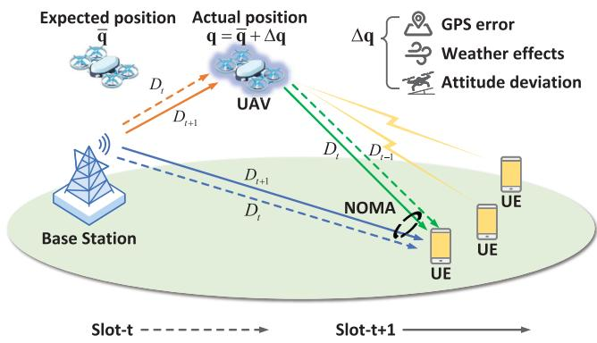  
Fig. 1. The UAV-assisted cellular network with position uncertainty.

## A. System Model

As shown in Fig. 1, we consider a UAV-assisted urban macro (UMa) scenario, which consists of K UEs, denoted by $\mathcal { K } \ \triangleq \ \{ 1 , 2 , \dots , K \}$ and one BS. When user density increases or traffic growth causes severe network congestion, the transmission rate provided solely by the terrestrial network often fails to meet user demands. This issue is particularly pronounced for UEs located at the cell edges, who usually experience severe signal attenuation and limited link quality. To address this problem, we propose deploying an FD rotary-wing UAV as the communication relay. The UAV decodes and forwards wireless signals transmitted by the BS using NOMA-based Decode-and-forward (DF) relay protocol, thereby improving the data transmission rates for UEs. Note that UAV trajectory cruising causes fluctuations in UE transmission rates. However, in mobile networks, UEs usually need continuous and stable communication. Therefore, we deploy the UAV at a fixed position rather than allowing continuous movement. It is periodically redeployed according to the movement of UEs to achieve stable and reliable communication.

Without loss of generality, the three-dimensional Cartesian coordinate system is adopted to represent the positions of the BS, UE, and UAV. The BS is assumed to deployed at a fixed position $\mathbf { w } _ { b } = \left[ x _ { b } , y _ { b } , H _ { b } \right] ^ { T }$ , where $H _ { b }$ denotes the height of the transmission source above the ground. The K UEs are located far from the BS, with positions represented as ${ \bf w } _ { k } =$ $\left[ x _ { k } , y _ { k } , H \right] ^ { T }$ . The UAV’s deployment position is defined as the variable $\mathbf { w } _ { u } = [ x _ { u } , y _ { u } , z _ { u } ] ^ { T }$ . The distances from the UAV to the BS and to UE k are expressed as $d _ { b , u } = | | \mathbf { w } _ { b } - \mathbf { w } _ { u } | |$ and $d _ { u , k } = | | \mathbf { w } _ { u } - \mathbf { w } _ { k } | |$ , respectively.

The 3GPP channel modeling study indicates that the statistical LoS probability becomes very high when the UAV hovers at an altitude substantially above ground BS antennas [33]. Therefore, following [34], [35], [36] and to reduce modeling complexity, we assume a free-space path loss model for the BS to UAV link, which can be expressed as

$$
h _ { b , u } = \beta _ { 0 } d _ { b , u } ^ { - 2 } = \frac { \beta _ { 0 } } { | | \mathbf { w } _ { b } - \mathbf { w } _ { u } | | ^ { 2 } } ,\tag{1}
$$

where $\beta _ { 0 }$ represents the received power at the unit reference distance. The channel power gain from the UAV to UE k is calculated in the same manner as $h _ { u , k }$ . In practice, the movement of UAVs across different positions affects the channel state, but obtaining instantaneous conditions over the entire airspace is infeasible. Thus, a time-averaged channel model is adopted. During redeployment, UAVs can periodically update long-term channel statistics from local channel state, which partially reflects real airspace conditions.

In contrast, the channel between the BS and the UE is assumed to follow the Non-Line-of-Sight (NLoS) model under the UMa scenario, with the path loss model [37] expressed as

$$
\begin{array} { r } { P L _ { b , k } = 3 2 . 4 + 3 0 \log \left( d _ { b , k } \right) + 2 0 \log \left( f _ { b } \right) , } \end{array}\tag{2}
$$

where $d _ { b , k } = | | \mathbf { w } _ { b } - \mathbf { w } _ { k } | |$ denotes the distance between the BS and the UE k. The channel power gain can be further calculated by $h _ { b , k } = 1 0 ^ { - \frac { P L _ { b , k } } { 1 0 } }$

## B. NOMA-Based UAV Relay Protocol

In the considered cellular network, UEs access the BS using Orthogonal Frequency-Division Multiple Access (OFDMA), where the BS transmits data to all UEs simultaneously. To improve system performance without altering the access method or BS transmission mode, we introduce a FD UAV relay operating under a NOMA-based DF protocol.

The transmission is divided into small time slots, as shown in Fig. 1. In slot t, the BS encodes data $D _ { t }$ and transmits it to target user k. Since the BS broadcasts, the UAV also receives $D _ { t }$ . In the following slot t + 1, the UAV decodes, re-encodes, and forwards $D _ { t }$ to user k, while the BS transmits new data $D _ { t + 1 }$

The UAV works in FD mode and applies self-interference cancellation to mitigate the impact of its own transmission on simultaneous reception. Hence, during slot $t ,$ the achievable transmission rate of $D _ { t }$ over the BS-to-UAV link is

$$
R _ { b , k } = \log _ { 2 } \left( 1 + \frac { p _ { b , k } h _ { b , u } } { \sigma _ { 0 } ^ { 2 } } \right) = \log _ { 2 } \left( 1 + \frac { p _ { b , k } \beta _ { 0 } } { \sigma _ { 0 } ^ { 2 } | | \mathbf { w } _ { b } - \mathbf { w } _ { u } | | ^ { 2 } } \right) ,\tag{3}
$$

where $p _ { b , k }$ denotes the transmission power allocated to UE k from the BS. Since the signal transmission scheme of the BS remains unchanged, ${ p } _ { b , k }$ is considered constant in the static scenario. $\sigma _ { 0 } ^ { 2 }$ denotes the power of the Gaussian white noise.

In slot $t + 1$ , UE k receives signal $Y _ { t + 1 }$ including $D _ { t }$ forwarded from the UAV and $D _ { t + 1 }$ sent from the BS. We illustrate the specific successive decoding process of $Y _ { t + 1 }$ in Fig. 2. Because the UAV’s air-to-ground channel typically experiences lower path loss, its forwarded signal dominates. Thus, SIC first decodes the UAV-forwarded data $D _ { t }$ from the received signal $Y _ { t + 1 }$ . After decoding, $D _ { t }$ is reconstructed using the estimated symbol sequence and the corresponding channel coefficient. This reconstructed signal, which originates from the UAV transmission, is then subtracted from $Y _ { t + 1 }$ to mitigate interference. The residual signal mainly consists of the BS-transmitted data $D _ { t + 1 }$ , which can subsequently be decoded with improved reliability. The achievable rate of $D _ { t }$ over the UAV-to-UE link is

$$
R _ { u , k } = \log _ { 2 } \left( 1 + \frac { p _ { u , k } h _ { u , k } } { p _ { b , k } h _ { b , k } + \sigma _ { 0 } ^ { 2 } } \right)
$$

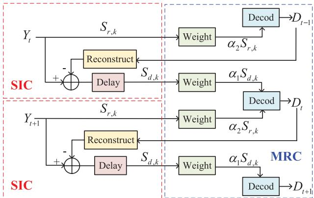  
Fig. 2. The decoding process for NOMA-based UAV relay protocol.

$$
= \log _ { 2 } \left( 1 + \frac { p _ { u , k } \beta _ { 0 } } { \left( p _ { b , k } h _ { b , k } + \sigma _ { 0 } ^ { 2 } \right) \left| | { \bf w } _ { u } - { \bf w } _ { k } | | ^ { 2 } \right) } \right) ,\tag{4}
$$

where $p _ { u , k }$ denotes the UAV transmission power allocated to UE k, which is constrained by

$$
0 \leq p _ { u , k } \leq p _ { u } ^ { \operatorname* { m a x } } , \ \forall k \in K ,\tag{5}
$$

$$
\sum _ { k \in \mathcal { K } } p _ { u , k } \leq p _ { u } ^ { \mathrm { t o t } } ,\tag{6}
$$

where $p _ { u } ^ { \mathrm { m a x } }$ denotes the maximum transmission power for each UE and $p _ { u } ^ { \mathrm { t o t } }$ denotes the total transmission power of the UAV.

However, for DF relaying, the end-to-end relay rate is limited by the weaker of the two hops. Therefore, the overall transmission rate of $D _ { t }$ over the relay link is given by

$$
\begin{array} { r l } & { R _ { r , k } = \operatorname* { m i n } \left( R _ { b , k } , R _ { u , k } \right) } \\ & { \quad = \log _ { 2 } \left( 1 + \operatorname* { m i n } \left( S _ { b , k } , S _ { u , k } \right) \right) } \\ & { \quad = \log _ { 2 } \left( 1 + \operatorname* { m i n } \left( \frac { p _ { b , k } h _ { b , u } } { \sigma _ { 0 } ^ { 2 } } , \frac { p _ { u , k } h _ { u , k } } { p _ { b , k } h _ { b , k } + \sigma _ { 0 } ^ { 2 } } \right) \right) . } \end{array}\tag{7}
$$

Recall that in slot t, the UE also directly receives the broadcast signal from the BS containing $D _ { t }$ . As the weaker component in $Y _ { t }$ shown in Fig. 2, its SINR during the SIC process is given by

$$
S _ { d , k } = \frac { p _ { b , k } h _ { b , k } } { \sigma _ { 0 } ^ { 2 } } .\tag{8}
$$

Since $D _ { t }$ reaches user k via both the direct BS-to-UE link in slot t and the UAV relay link in slot t + 1, we can align the two signals and apply MRC for decoding. This time-domain diversity yields the overall rate $R _ { k } ^ { \mathrm { F D } }$ for $D _ { t }$ , given by

$$
\begin{array} { r l } & { R _ { k } ^ { \mathrm { F D } } { = } \log _ { 2 } \biggl ( 1 { + } \operatorname* { m i n } \left( S _ { b , u } , S _ { u , k } \right) { + } S _ { d , k } \biggr ) } \\ & { \qquad { = } \log _ { 2 } \biggl ( 1 { + } \operatorname* { m i n } \left( \frac { p _ { b , k } h _ { b , u } } { \sigma _ { 0 } ^ { 2 } } , \frac { p _ { u , k } h _ { u , k } } { p _ { b , k } h _ { b , k } + \sigma _ { 0 } ^ { 2 } } \right) { + } \frac { p _ { b , k } h _ { b , k } } { \sigma _ { 0 } ^ { 2 } } \biggr ) } \end{array}\tag{9}
$$

Since the data transmission across consecutive time slots is stable, the transmission rate $R _ { k } ^ { \mathrm { F D } }$ of $D _ { t }$ can also represent the average transmission rate of UE k. In other words, $R _ { k } ^ { \mathrm { F D } }$ characterizes not only the instantaneous rate in a single slot but also the long-term average performance of UE k over the entire transmission process.

For the transmission rate $R _ { k } ^ { \mathrm { F D } }$ in (9), the minimization term min $( S _ { b , u } , S _ { u , k } )$ makes the expression complicated to handle. To simplify the analysis while preserving optimality, we introduce an SINR constraint, summarized as Proposition 1.

Proposition 1: By introducing a SINR constraint, defined as

$$
S _ { b , k } = \frac { p _ { b , k } h _ { b , u } } { \sigma _ { 0 } ^ { 2 } } \geq S _ { u , k } = \frac { p _ { u , k } h _ { u , k } } { p _ { b , k } h _ { b , k } + \sigma _ { 0 } ^ { 2 } } ,\tag{10}
$$

the transmission rate $R _ { k } ^ { \mathrm { F D } }$ can be simplified to

$$
\begin{array} { r l r } {  { R _ { k } ^ { \mathrm { F D } } = \log _ { 2 } ( 1 + S _ { u , k } + S _ { d , k } ) } } \\ & { } & { = \log _ { 2 } ( 1 + \frac { p _ { u , k } h _ { u , k } } { p _ { b , k } h _ { b , k } + \sigma _ { 0 } ^ { 2 } } + \frac { p _ { b , k } h _ { b , k } } { \sigma _ { 0 } ^ { 2 } } ) . } \end{array}\tag{11}
$$

Proof[Proof of Proposition $I J { \cdot }$ Based on the minimization term in (9), we can analyze two cases:

When $S _ { b , k } > S _ { u , k } :$ The transmission rate $R _ { k } ^ { \mathrm { F D } }$ is directly given by $\log _ { 2 } { ( 1 + S _ { u , k } + S _ { d , k } ) }$ . This corresponds to the case when the SINR constraint $S _ { b , k } \ge S _ { u , k }$ is naturally satisfied and min $( S _ { b , u } , S _ { u , k } ) = S _ { u , k } .$

When $S _ { b , k } ~ \le ~ S _ { u , k }$ : We further incorporate transmission power control to enforce the same structural consistency. Specifically, since the UAV transmission power $p _ { u , k }$ is adjustable, we impose the SINR consistency constraint (10). By tuning $p _ { u , k }$ such that $p _ { u , k } = \frac { S _ { b , k } \left( p _ { b , k } h _ { b , k } + \sigma _ { 0 } ^ { 2 } \right) } { h _ { u . k } }$ , we guarantee that $S _ { u , k } = S _ { b , k }$ . With this treatment, the minimization is maintained as min $( S _ { b , u } , S _ { u , k } ) = S _ { u , k }$

In both cases, introducing the constraint (10) effectively simplifies the transmission rate to (11). This treatment neither changes the achievable rate nor affects the optimality of the optimization problem, while it also reduces the $\mathrm { U A V } \mathbf { \hat { s } }$ transmission power, avoiding unnecessary resource consumption. Therefore, constraint (10) is a tractable reformulation rather than an unrealistic assumption.

This protocol offers several advantages. Firstly, the introduction of the UAV relay does not affect the original transmission mechanism of the BS, including transmission power and channel allocation, thereby avoiding additional overheads. Secondly, $D _ { t }$ is fully decoded within slot $t + 1$ , maintaining the same delay as the typical OMA-based relay protocol. More importantly, the proposed protocol achieves higher transmission rates. In the OMA-based relay protocol, only the relay signal with higher received power can be utilized. As a result, its transmission rate $R _ { k } ^ { \mathrm { { O M A } } }$ is limited to $R _ { r , k } .$ , significantly lower than that achieved by the proposed protocol. Additionally, our previously proposed NOMA-based HD scheme [38], with the further integration of MRC, has an achievable transmission rate given by

$$
\begin{array} { l } { { \displaystyle R _ { k } ^ { \mathrm { H F } } = \frac { 1 } { 2 } \mathrm { l o g } _ { 2 } \left( 1 + \mathrm { m i n } \left( \frac { p _ { b , k } h _ { b , u } } { \sigma _ { 0 } ^ { 2 } } , \frac { p _ { u , k } h _ { u , k } } { p _ { b , k } h _ { b , k } + \sigma _ { 0 } ^ { 2 } } \right) + \frac { p _ { b , k } h _ { b , k } } { \sigma _ { 0 } ^ { 2 } } \right) } } \\ { { \displaystyle ~ + \frac { 1 } { 2 } \log _ { 2 } \left( 1 + \frac { p _ { b , k } h _ { b , k } } { \sigma _ { 0 } ^ { 2 } } \right) . } } \end{array}
$$

This scheme accomplishes data forwarding through two consecutive time slots, so the transmission rate is the average of two parts. Clearly, its transmission rate is lower than that of the proposed FD scheme.

## C. Uncertainty Model for UAV Position

Furthermore, we consider the uncertainty in UAV positioning and its impact on the transmission rate of the relay system. In practical applications, factors such as GPS positioning errors, strong winds, and inadequate attitude control can lead to UAV positioning inaccuracies. These errors may cause fluctuations in relay transmission rates, potentially rendering the system unable to meet the minimum rate requirements of users. To address the impact of UAV positional drift on system performance, we investigate a robust strategy that considers UAV uncertainty. Correspondingly, the uncertainty model for UAV position is modeled as

$$
\begin{array} { r } { \mathbf { w } _ { u } = \overline { { \mathbf { w } } } _ { u } + \Delta \mathbf { w } _ { u } , } \end{array}\tag{13}
$$

where $\mathbf { w } _ { u }$ denotes the actual position, $\overline { { \mathbf { w } } } _ { u }$ denotes the expected position, and $\Delta { \bf w } _ { u }$ denotes the deviation error. According to the study in [31], the three-dimensional error $\Delta { \bf w } _ { u }$ , influenced by various factors, can be modeled as an independently distributed Gaussian random variable, with the distribution of

$$
\Delta \mathbf { w } _ { u } \sim { \mathcal { N } } \left( 0 , \sigma ^ { 2 } I _ { 3 } \right) ,\tag{14}
$$

where σ denotes the standard deviation of the error, and $\boldsymbol { I } _ { 3 }$ is a third order unit matrix.

Due to the position deviation, the transmission rate in (11) introduces uncertainty. To ensure robust compliance with the UE rate requirements, we formulate the corresponding probabilistic constraint, given by

$$
\begin{array} { r l } & { \phantom { \sum } _ { k } \int _ { \Omega } ( 1 + \frac { p _ { u , k } h _ { u , k } } { p _ { b , k } h _ { b , k } + \sigma _ { 0 } ^ { 2 } } + \frac { p _ { b , k } h _ { b , k } } { \sigma _ { 0 } ^ { 2 } } ) \geq R _ { k } ^ { \mathrm { r e q } } ) } \\ & { \phantom { \sum } } \\ & { \geq 1 - \rho _ { k } ^ { \mathrm { r e q } } , \forall k \in \mathcal K , } \end{array}\tag{15}
$$

where $R _ { k } ^ { \mathrm { r e q } }$ represents the UE transmission rate requirement and $\rho _ { k }$ represents the outage probability that the actual transmission rate fails to meet the required threshold. In addition, the SINR constraint (10)of the relay link, which also involves the UAV’s position, is redefined as

$$
\operatorname* { P r } _ { \Delta \mathbf { w } _ { u } } \left\{ \frac { p _ { b , k } h _ { b , u } } { \sigma _ { 0 } ^ { 2 } } \geq \frac { p _ { u , k } h _ { u , k } } { p _ { b , k } h _ { b , k } + \sigma _ { 0 } ^ { 2 } } \right\} \geq 1 - \rho _ { k } ^ { \mathrm { r e l } } , \forall k \in \mathcal { K } ,\tag{16}
$$

where $\rho _ { k } ^ { \mathrm { r e l } }$ represents the outage probability of violating the SINR constraint in (10).

## D. Problem Formulation

For cellular networks, we intend to maximize the UE transmission rate to enhance network service capacity while satisfying the minimum rate requirements of the UEs. Considering the potential drift in UAV position, it is essential to perform robust optimization of its deployment position. Note that, although a lower UAV altitude generally reduces path loss and improves transmission, the UAV’s altitude is considered as an optimization variable in our robust optimization. Environmental effects can also cause altitude deviations that, if not accounted for, may degrade relay link performance. Additionally, the UAV’s power allocation strategy must adapt to the system’s robustness requirements. Therefore, the Chance-Constrained Programming (CCP) problem involving the robust deployment of the UAV $\overline { { \mathbf { w } } } _ { u } = \left[ \overline { { x } } _ { u } , \overline { { y } } _ { u } , \overline { { z } } _ { u } \right] ^ { T }$ and the transmission power allocation $\mathbf { P } ~ = ~ \left\{ p _ { u , k } \right\} _ { k \in \mathcal { K } }$ can be formulated as

$$
\operatorname* { m a x } _ { \overline { { \mathbf { w } } } _ { u } , \mathbf { P } } \overline { { R } } = \frac { 1 } { K } \sum _ { k \in { \mathcal { K } } } R _ { k } ^ { \mathrm { F D } }\tag{17a}
$$

$$
\mathrm { s . t . } \operatorname* { P r } _ { \Delta \mathbf { w } _ { u } } \left\{ \log _ { 2 } \left( 1 + \frac { p _ { u , k } h _ { u , k } } { p _ { b , k } h _ { b , k } + \sigma _ { 0 } ^ { 2 } } + \frac { p _ { b , k } h _ { b , k } } { \sigma _ { 0 } ^ { 2 } } \right) \geq R _ { k } ^ { \mathrm { r e q } } \right\}
$$

$$
\geq 1 - \rho _ { k } ^ { \mathrm { r e q } } , \forall k \in \mathcal { K } ,\tag{17b}
$$

$$
\operatorname* { P r } _ { \Delta \mathbf { w } _ { u } } \left\{ \frac { p _ { b , k } h _ { b , u } } { \sigma _ { 0 } ^ { 2 } } \geq \frac { p _ { u , k } h _ { u , k } } { p _ { b , k } h _ { b , k } + \sigma _ { 0 } ^ { 2 } } \right\} \geq 1 - \rho _ { k } ^ { \mathrm { r e l } } , \forall k \in \mathcal { K } ,\tag{17c}
$$

$$
0 \leq p _ { u , k } \leq p _ { u } ^ { \operatorname* { m a x } } , \ \forall k \in K ,\tag{17d}
$$

$$
\sum _ { k \in \mathcal K } p _ { u , k } \le p _ { u } ^ { \mathrm { t o t } } ,\tag{17e}
$$

$$
x _ { \mathrm { m i n } } \leq \overline { { x } } _ { u } \leq x _ { \mathrm { m a x } } ,\tag{17f}
$$

$$
y _ { \operatorname* { m i n } } \leq \overline { { y } } _ { u } \leq y _ { \operatorname* { m a x } } ,\tag{17g}
$$

$$
z _ { \mathrm { m i n } } \le \bar { z } _ { u } \le z _ { \mathrm { m a x } } ,\tag{17h}
$$

where the objective function (17a) is to maximize the average UE transmission rate R. Constraint (17b) is the probabilistic constraint that satisfies the UE transmission rate demand $R _ { k } ^ { \mathrm { r e q } }$ with a probability of $1 - \rho _ { k } ^ { \mathrm { r e q } }$ . Constraint (17c) provides a probabilistic guarantee that $\frac { p _ { u , k } h _ { u , k } } { p _ { b , k } h _ { b , k } + \sigma _ { 0 } ^ { 2 } }$ remains less than or equal to $\frac { p _ { b , k } h _ { b , u } } { \sigma _ { 0 } ^ { 2 } }$ , with a probability greater than or equal to $1 - \rho _ { k } ^ { \mathrm { r e l } }$ . Constraints (17d) and (17e) together give the UAV transmission power limits. Constraints (17f)-(17h) specify the UAV’s deployment range. The formulated problem is complex, presenting three main challenges. First, the UAV position $\overline { { \mathbf { w } } } _ { u }$ and transmission power P are coupled with each other, jointly influencing the transmission rate of the relay system. Second, the deviation of the UAV position introduces intricate effects on the relay link performance. Third, the probabilistic nature of constraints (17b) and (17c) hinders the effective application of conventional convex optimization methods.

## IV. ROBUST OPTIMIZATION AGAINST UAV POSITION DEVIATION

In this section, we first address the uncertainties present in (17) by reformulating the probabilistic constraints. Specifically, we transform the probabilistic constraints into a deterministic form using the Bernstein-type inequality that provides an explicit upper bound on the tail probability of random variables. Subsequently, to address the coupling between $\overline { { \mathbf { w } } } _ { u }$ and P, we decouple the problem in (17) into two subproblems, i.e., the UAV deployment optimization and UAV transmission power allocation. The BCD method is used for the iterative solution. Finally, we provide the initiation method and analyze the convergence and complexity of the proposed algorithm.

## A. Problem Transformation and Decomposition

To address the coupling of optimization variables in the objective function, we introduce slack variables $\eta = \left\{ \eta _ { k } \right\} _ { k \in \mathcal { K } } ,$ where each $\eta _ { k }$ serves as the lower bound of $R _ { k } ^ { \mathrm { F D } }$ . Notably, $R _ { k } ^ { \mathrm { F D } }$ also appears on the left-hand side of constraint (17b). By leveraging this relation, we replace $R _ { k } ^ { \mathrm { F D } }$ with $\eta _ { k }$ and add an additional constraint to preserve equivalence. In this way, problem (17) can be reformulated as

$$
\operatorname* { m a x } _ { \overline { { \mathbf { w } } } _ { u } , \mathbf { P } , \eta } , ~ \overline { { \eta } } = \frac { 1 } { K } \sum _ { k \in \mathcal { K } } \eta _ { k }\tag{18a}
$$

$$
\mathrm { s . t . } \ \operatorname* { P r } _ { \Delta \mathbf { w } _ { u } } \left\{ \log _ { 2 } \left( 1 + \frac { p _ { u , k } h _ { u , k } } { p _ { b , k } h _ { b , k } + \sigma _ { 0 } ^ { 2 } } + \frac { p _ { b , k } h _ { b , k } } { \sigma _ { 0 } ^ { 2 } } \right) \geq \eta _ { k } \right\}
$$

$$
\geq 1 - \rho _ { k } ^ { \mathrm { r e q } } , \forall k \in \mathcal { K } ,\tag{18b}
$$

$$
\eta _ { k } \geq R _ { k } ^ { \mathrm { r e q } } , \forall k \in \mathcal { K } ,\tag{18c}
$$

$$
( 1 7 c ) , ( 1 7 d ) , ( 1 7 e ) , ( 1 7 f ) , ( 1 7 g ) , ( 1 7 h ) .\tag{18d}
$$

To transform the probabilistic constraint (18b) into a deterministic constraint, we rewrite the rate requirement constraint within the probabilistic inequation (18b) as

$$
\frac { p _ { u , k } \beta _ { 0 } } { ( p _ { b , k } h _ { b , k } + \sigma _ { 0 } ^ { 2 } ) | | { \mathbf { w } _ { u } } - { \mathbf { w } } _ { k } | | ^ { 2 } } \geq 2 ^ { \eta _ { k } } - 1 - \frac { p _ { b , k } h _ { b , k } } { \sigma _ { 0 } ^ { 2 } } , \forall k \in \mathcal { K } .\tag{19}
$$

Since the UAV only provides relay service to the UEs whose rate requirements are not metby the terrestrial BS, we always have $\begin{array} { r } { R _ { b , k } = \log _ { 2 } \left( 1 + \frac { p _ { b , k } h _ { b , u } } { \sigma _ { 0 } ^ { 2 } } \right) < R _ { k } ^ { \mathrm { r e q } } \le \eta _ { k } } \end{array}$ , i.e., $2 ^ { \eta _ { k } } - 1 -$ $\frac { p _ { b , k } h _ { b , k } } { \sigma _ { 0 } ^ { 2 } } > 0$ . Therefore, (19) can be further written as

$$
\begin{array} { r l } & { \| \Delta \mathbf { w } _ { u } \| ^ { 2 } + 2 \Delta \mathbf { w } _ { u } ^ { T } ( \overline { { \mathbf { w } } } _ { u } - \mathbf { w } _ { k } ) + \| \overline { { \mathbf { w } } } _ { u } - \mathbf { w } _ { k } \| ^ { 2 } } \\ & { \quad - \frac { p _ { u , k } \beta _ { 0 } } { ( p _ { b , k } h _ { b , k } + \sigma _ { 0 } ^ { 2 } ) \left( 2 ^ { \eta _ { k } } - 1 - \frac { p _ { b , k } h _ { b , k } } { \sigma _ { 0 } ^ { 2 } } \right) } \leq 0 , \forall k \in \mathcal { K } , } \end{array}\tag{20}
$$

which is a quadratic Gaussian function with respect to $\Delta { \mathbf w } _ { u } .$ To handle the probabilistic constraint in this form, we apply the Bernstein-type inequality to transform it into a deterministic constraint, as described in Proposition 2 [10].

Proposition 2: Define $\mathbf { A } \in \mathbb { H } ^ { N }$ as a N-dimensional Hermitian matrix, $\mathbf { x } \sim \mathcal { C N } ( 0 , I _ { N } )$ as a vector following the standard Circularly Symmetric Complex Gaussian $( \mathbf { C } \mathbf { S } \mathbf { C } \mathbf { \check { G } } ) , \mathbf { b } \in \mathbb { C } ^ { N \times 1 }$ as an N-dimensional complex vector, and $c , \rho$ as real numbers, where $\rho \in ( 0 , 1 ]$ . Then, the following equation holds:

$$
\begin{array} { l } { \displaystyle \operatorname* { P r } _ { \mathbf { x } } \{ \mathbf { x } ^ { H } \mathbf { A } \mathbf { x } + 2 \mathrm { R e } \{ \mathbf { x } ^ { H } \mathbf { b } \} + c \geq 0 \} \geq 1 - \rho } \\ { \displaystyle ~ } \\ { \displaystyle \Leftarrow \{ \| [ \begin{array} { l } { \mathrm { T r } ( \mathbf { A } ) - \sqrt { - 2 \ln ( \rho ) } v + \ln ( \rho ) \nu + c \geq 0 , } \\ { \| [ \begin{array} { l } { \mathrm { v e c } ( \mathbf { A } ) } \\ { \sqrt { 2 } \mathbf { b } } \end{array} ] \| \leq v , } \\ { \nu I _ { N } + \mathbf { A } \succeq \mathbf { 0 } , \nu \geq 0 , } \end{array}  } \end{array}\tag{21}
$$

where υ and ν are introduced slack variables. $\operatorname { T r } \left( \cdot \right)$ and vec (·) represent the trace and vectorization operations, respectively. It provides a tractable deterministic safe approximation for the original probabilistic constraint. The Bernstein-type bound provides a sufficient condition in the sense that whenever the deterministic constraint is satisfied, the original probabilistic constraint is guaranteed to be met. Although this formulation is conservative, it effectively ensures feasibility.

According to the uncertainty model in (14), $\frac { \Delta \mathbf { w } _ { u } } { \sigma }$ follows the standard Gaussian distribution. Thus, the inequality in (20) can be further rewritten as

$$
\begin{array} { r l r } & { } & { - \sigma ^ { 2 } \left\| \frac { \Delta \mathbf { w } _ { u } } { \sigma } \right\| ^ { 2 } - 2 \sigma \frac { \Delta \mathbf { w } _ { u } ^ { T } } { \sigma } \left( \overline { { \mathbf { w } } } _ { u } - \mathbf { w } _ { k } \right) - \left\| \overline { { \mathbf { w } } } _ { u } - \mathbf { w } _ { k } \right\| ^ { 2 } } \\ & { } & { + \frac { p _ { u , k } \beta _ { 0 } } { \left( p _ { b , k } h _ { b , k } + \sigma _ { 0 } ^ { 2 } \right) \left( 2 ^ { \eta _ { k } } - 1 - \frac { p _ { b , k } h _ { b , k } } { \sigma _ { 0 } ^ { 2 } } \right) } \geq 0 , \forall k \in \mathcal { K } . } \end{array}\tag{22}
$$

According to Proposition 2, the probabilistic constraint (18a) satisfies the standard form of Bernstein-type inequality. As a result, we can transform the probabilistic constraint (18a) into the deterministic form, given by

$$
\begin{array} { r l } & { \left( \mathrm { T r } \left( \mathbf { A } _ { k } ^ { \mathrm { r e q } } \right) - \sqrt { - 2 \ln \left( \rho _ { k } ^ { \mathrm { r e q } } \right) } v _ { k } ^ { \mathrm { r e q } } + \ln \left( \rho ^ { \mathrm { r e q } } \right) \nu _ { k } ^ { \mathrm { r e q } } \right. } \\ & { \left. \quad + c _ { k } ^ { \mathrm { r e q } } \geq 0 , \forall k \in \mathcal { K } , \right. } \end{array}\tag{23a}
$$

$$
\left\{ \begin{array} { l l } { \left\| \left[ \begin{array} { c } { \mathrm { v e c } \left( \mathbf { A } _ { k } ^ { \mathrm { r e q } } \right) } \\ { \sqrt { 2 } \mathbf { b } _ { k } ^ { \mathrm { r e q } } } \end{array} \right] \right\| \leq v _ { k } ^ { \mathrm { r e q } } , \ \forall k \in { \mathcal K } , } \end{array} \right.\tag{23b}
$$

$$
\begin{array} { r } { \left\lfloor { \bf \Pi } _ { \nu _ { k } ^ { \mathrm { r e q } } } { \cal I } _ { 3 } + { \bf A } _ { k } ^ { \mathrm { r e q } } \succeq { \bf 0 } , ~ { \nu } _ { k } ^ { \mathrm { r e q } } \geq 0 , ~ \forall k \in \mathcal { K } , \right. } \end{array}\tag{23c}
$$

where

$$
\begin{array} { r l } { \left\{ { \bf A } _ { k } ^ { \mathrm { r e q } } = \right. } & { { } \quad \left. - \sigma ^ { 2 } I _ { 3 } , \right. } \end{array}\tag{24a}
$$

$$
\begin{array} { r l r } { \mathbf { b } _ { k } ^ { \mathrm { r e q } } = } & { { } } & { - \sigma \left( \overline { { \mathbf { w } } } _ { u } - \mathbf { w } _ { k } \right) , } \end{array}\tag{24b}
$$

$$
\begin{array} { r l r } { c _ { k } ^ { \mathrm { r e q } } = } & { { } } & { - { \left| \left| { \overline { { \mathbf { w } } } _ { u } } - \mathbf { w } _ { k } \right| \right| } ^ { 2 } } \end{array}
$$

$$
\boxed { \begin{array} { r l r } { \begin{array} { r l } & { } & { + \frac { p _ { u , k } \beta _ { 0 } } { \left( p _ { b , k } h _ { b , k } + \sigma _ { 0 } ^ { 2 } \right) \left( 2 ^ { \eta _ { k } } - 1 - \frac { p _ { b , k } h _ { b , k } } { \sigma _ { 0 } ^ { 2 } } \right) } , } \end{array} } } \end{array}\tag{24c}
$$

and $\mu _ { \mathrm { r e q } } = \{ v _ { k } ^ { \mathrm { r e q } } , \nu _ { k } ^ { \mathrm { r e q } } \} _ { \forall k \in \mathcal { K } }$ are the newly introduced slack variables. At this point, constraint (18a) is converted into deterministic constraints (23a) - (23c).

Similarly, the SINR constraint within the probabilistic inequation (17c) can be rewritten as

$$
\begin{array} { l } { \displaystyle | | \mathbf { w } _ { u } - \mathbf { w } _ { k } | | ^ { 2 } - \frac { p _ { u , k } } { \Big ( p _ { b , k } h _ { b , k } + \sigma _ { 0 } ^ { 2 } \Big ) \frac { p _ { b , k } } { \sigma _ { 0 } ^ { 2 } } } | | \mathbf { w } _ { u } - \mathbf { w } _ { b } | | ^ { 2 } } \\ { \displaystyle = \left( 1 - \lambda _ { k } \right) \sigma ^ { 2 } \left\| \frac { \Delta \mathbf { w } _ { u } } { \sigma } \right\| ^ { 2 } + 2 \sigma \frac { \Delta \mathbf { w } _ { u } ^ { T } } { \sigma } \Big ( \overline { { \mathbf { w } } } _ { u } - \mathbf { w } _ { k } - \lambda _ { k } \big ( \overline { { \mathbf { w } } } _ { u } - \mathbf { w } _ { b } \big ) \Big ) } \\ { \displaystyle \qquad + \left| | \overline { { \mathbf { w } } } _ { u } - \mathbf { w } _ { k } | \right| ^ { 2 } - \lambda _ { k } \left| | \overline { { \mathbf { w } } } _ { u } - \mathbf { w } _ { b } | \right| ^ { 2 } \geq 0 , ~ \forall k \in \mathcal { K } , \qquad ( 2 5 ) } \end{array}
$$

where $\lambda _ { k } = \frac { p _ { u , k } } { \left( p _ { b , k } h _ { b , k } + \sigma _ { 0 } ^ { 2 } \right) \frac { p _ { b , k } } { \sigma _ { \mathrm { { o } } } ^ { 2 } } }$ is linear with respect to $p _ { u , k }$

Then the probabilistic constraint (17c) can be transformed into

$$
\begin{array}{c} \begin{array} { r l } & { \left( \mathrm { T r } \left( \mathbf { A } _ { k } ^ { \mathrm { r e l } } \right) - \sqrt { - 2 \ln \left( \rho _ { k } ^ { \mathrm { r e l } } \right) } v _ { k } ^ { \mathrm { r e l } } + \ln \left( \rho ^ { \mathrm { r e l } } \right) \nu _ { k } ^ { \mathrm { r e l } } \right. } \\ & { ~ \left. ~ + c _ { k } ^ { \mathrm { r e l } } \geq 0 , \forall k \in \mathcal { K } , \right.} \end{array}   \end{array}\tag{26a}
$$

$$
\left\{ \begin{array} { l l } { \left\| \left[ \begin{array} { c } { \mathrm { v e c } \left( \mathbf { A } _ { k } ^ { \mathrm { r e l } } \right) } \\ { \sqrt { 2 } \mathbf { b } _ { k } ^ { \mathrm { r e l } } } \end{array} \right] \right\| \leq v _ { k } ^ { \mathrm { r e l } } , \forall k \in { \mathcal K } , } \end{array} \right.\tag{26b}
$$

$$
\begin{array} { r } { \left\lfloor { \bf \Pi } _ { \nu _ { k } ^ { \mathrm { r e l } } } { \cal I } _ { 3 } + { \bf A } _ { k } ^ { \mathrm { r e l } } \succeq { \bf 0 } , ~ { \nu } _ { k } ^ { \mathrm { r e l } } \geq 0 , ~ \forall k \in \mathcal { K } , \right. } \end{array}\tag{26c}
$$

where

$$
\begin{array} { r l } { \{ { \bf A } _ { k } ^ { \mathrm { r e l } } = } & { { } \qquad \sigma ^ { 2 } ( 1 - \lambda _ { k } ) , } \end{array}\tag{27a}
$$

$$
\left\{ \begin{array} { l l } { \mathbf { b } _ { k } ^ { \mathrm { r e l } } = } & { \qquad \sigma \Big ( \overline { { \mathbf { w } } } _ { u } - \mathbf { w } _ { k } - \lambda _ { k } \left( \overline { { \mathbf { w } } } _ { u } - \mathbf { w } _ { b } \right) \Big ) , } \end{array} \right.\tag{27b}
$$

$$
\begin{array} { r l r } { \left| \begin{array} { l } { c _ { k } ^ { \mathrm { r e l } } = } & { { } } & { \quad \lvert \lvert \overline { { \mathbf { w } } } _ { u } - \mathbf { w } _ { k } \rvert \rvert ^ { 2 } - \lambda _ { k } \lvert \lvert \overline { { \mathbf { w } } } _ { u } - \mathbf { w } _ { b } \rvert \rvert ^ { 2 } , } \end{array} \right. } \end{array}\tag{27c}
$$

and $\mu _ { \mathrm { r e l } } = \left\{ v _ { k } ^ { \mathrm { r e l } } , \nu _ { k } ^ { \mathrm { r e l } } \right\} _ { \forall k \in \mathcal { K } }$ are the corresponding introduced slack variables. Eventually, according to the Bernstein-type inequality, the CCP problem in (18) is transformed into a deterministic optimization problem, given by

$$
\begin{array} { l } { { \displaystyle \operatorname* { m a x } _ { \mathbf { w } _ { u } , \mathbf { P } , \eta } \overline { { { \eta } } } = \frac { 1 } { K } \sum _ { k \in K } \eta _ { k } } \ ~ } \\ { { \displaystyle \ w _ { \mathrm { e q } } , \mu _ { \mathrm { r e l } } } \ ~ } \\ { { \displaystyle ~ \mathrm { s . t . } ~ ( r e q 1 ) , ( r e q 2 ) , ( r e q 3 ) , ( r e l 1 ) , ( r e l 2 ) , ( r e l 3 ) , } \ } \\ { { \displaystyle ~ ( 1 8 c ) , ( 1 7 d ) , ( 1 7 e ) , ( 1 7 f ) , ( 1 7 g ) , ( 1 7 h ) } . } \end{array}\tag{28a}
$$

(28b)

In the above deterministic optimization problem, the slack variables $\mu _ { \mathrm { r e q } }$ and $\mu _ { \mathrm { r e l } }$ appear in a convex manner in both the objective and the constraints, and therefore do not contribute to the computational complexity. The main difficulty arises from the coupling among $\overline { { \mathbf { w } } } _ { u }$ , P, and $\mathbf { \eta } _ { \eta } ,$ particularly in constraints (23a), (26a), (26b), and (26c). This coupling renders the problem in (28) highly complex and non-convex. To address this challenge, we decouple the problem into two subproblems. One focuses on UAV position optimization, and the other on power allocation, represented as

$$
\operatorname* { m a x } _ { \overline { { \mathbf { w } } } _ { u } , \eta , \mu _ { \mathrm { r e q } } , \mu _ { \mathrm { r e l } } } \overline { { \eta } } = \frac { 1 } { K } \sum _ { k \in \mathcal { K } } \eta _ { k }\tag{29a}
$$

$$
\begin{array} { c } { { \mathrm { s . t . ~ } ( r e q 1 ) , ( r e q 2 ) , ( r e q 3 ) , ( r e l 1 ) , ( r e l 2 ) , } } \\ { { ( r e l 3 ) , ( 1 8 c ) , ( 1 7 f ) , ( 1 7 g ) , ( 1 7 h ) . } } \end{array}\tag{29b}
$$

and

$$
\begin{array} { l } { { \displaystyle \operatorname* { m a x } _ { \mathbf { P } , \eta , \mu _ { \mathrm { r e q } } , \mu _ { \mathrm { r e l } } } \overline { { { \eta } } } = \frac { 1 } { K } \sum _ { k \in { \mathcal K } } \eta _ { k } } } \\ { { \displaystyle \mathrm { s . t . } \ ( r e q 1 ) , ( r e q 2 ) , ( r e q 3 ) , ( r e l 1 ) , ( r e l 2 ) , } } \\ { { \displaystyle ( r e l 3 ) , ( 1 8 c ) , ( 1 7 d ) , ( 1 7 e ) , } } \end{array}\tag{30a}
$$

(30b)

respectively. Decomposing the original problem (28) into subproblems (29) and (30) simplifies the structure, making them more tractable for solution via Successive Convex Approximation (SCA) within the BCD framework.

## B. UAV Position Optimization

Although the two optimization variables are decoupled, constraints (23a) and (26a) in subproblem (29) remain nonconvex. Specifically, for any given strategy $\mathbf { P } ^ { * }$ , the constraint (23a) is convex with respect to $v _ { k } ^ { \mathrm { r e q } } , \nu _ { k } ^ { \mathrm { r e q } }$ , and $\overline { { \mathbf { w } } } _ { u } .$ , but neither convex nor concave with respect to $\eta _ { k }$ . Thus, we introduce the auxiliary variables $\phi = \left\{ \phi _ { k } \right\} _ { k \in \mathcal { K } }$ with the convex inequality

$$
2 ^ { \eta _ { k } } - 1 - \frac { p _ { b , k } h _ { b , k } } { \sigma _ { 0 } ^ { 2 } } \leq \phi _ { k } , \forall k \in { \cal K } ,\tag{31}
$$

and constraint (23a) can be reformulated as

$$
\mathrm { T r } \left( { \bf A } _ { k } ^ { \mathrm { r e q } } \right) - \sqrt { - 2 \ln \left( \rho _ { k } ^ { \mathrm { r e q } } \right) } v _ { k } ^ { \mathrm { r e q } } + \ln \left( \rho ^ { \mathrm { r e q } } \right) \nu _ { k } ^ { \mathrm { r e q } }
$$

$$
- \left\| \overline { { \mathbf { w } } } _ { u } - \mathbf { w } _ { k } \right\| ^ { 2 } + \frac { p _ { u , k } ^ { * } \beta _ { 0 } } { \left( p _ { b , k } h _ { b , k } + \sigma _ { 0 } ^ { 2 } \right) \phi _ { k } } \geq 0 , \forall k \in \mathcal { K } ,\tag{32}
$$

where the left-hand side is convex with respect to $\phi _ { k }$ Thus, we can employ the SCA method to further convexify it. SCA approximates non-convex objectives and constraints with convex surrogates, enabling subproblem to be efficiently solved via convex optimization. Compared with exhaustive search or generic non-convex solvers, it substantially reduces computational and memory costs. Taking the first-order Taylor expansion of (32) at $\phi _ { k } ^ { 0 }$ , we can obtain the lower bound of $\displaystyle \frac { 1 } { \phi _ { k } }$ which can be expressed as

$$
\frac { 1 } { \phi _ { k } } \geq \frac { 2 } { \phi _ { k } ^ { 0 } } - \left( \frac { 1 } { \phi _ { k } ^ { 0 } } \right) ^ { 2 } \phi _ { k } , \forall k \in { \mathcal { K } } .\tag{33}
$$

Substituting this to (32), the inequality can be convexified as

$$
\begin{array} { r l } & { \operatorname { T r } \left( \mathbf { A } _ { k } ^ { \mathrm { r e q } } \right) - \sqrt { - 2 \ln \left( \rho _ { k } ^ { \mathrm { r e q } } \right) } v _ { k } ^ { \mathrm { r e q } } + \ln \left( \rho ^ { \mathrm { r e q } } \right) \nu _ { k } ^ { \mathrm { r e q } } - \left. \overline { { \mathbf { w } } } _ { u } - \mathbf { w } _ { k } \right. ^ { 2 } } \\ & { \quad + \frac { p _ { u , k } ^ { * } \beta _ { 0 } } { p _ { b , k } h _ { b , k } + \sigma _ { 0 } ^ { 2 } } \left( \frac { 2 } { \phi _ { k } ^ { 0 } } - \left( \frac { 1 } { \phi _ { k } ^ { 0 } } \right) ^ { 2 } \phi _ { k } \right) \ge 0 , \forall k \in \mathcal { K } . ( 3 4 ) } \end{array}
$$

Since $\phi _ { k }$ is approximated by its lower bound, constraint (34) becomes stricter than (32), ensuring that the optimal solution of the approximated problem remains a feasible solution to the original problem in (29).

Similarly, for the nonconvex constraint (26a), we also use the SCA method. In (26a), the first-order Taylor expansion of convex item $| | \overline { { \mathbf { w } } } _ { u } - \mathbf { w } _ { k } | | ^ { 2 }$ at $\overline { { \mathbf { w } } } _ { u } ^ { 0 }$ yields

$$
{ { \left\| { { { \overline { { \mathbf { w } } } } _ { u } } } - { { \mathbf { w } } _ { k } } \right\| } ^ { 2 } } \geq { { \left\| { { { \overline { { \mathbf { w } } } } _ { u } ^ { 0 } } - { { \mathbf { w } } _ { k } } } \right\| } ^ { 2 } } + 2 \left( { { { \overline { { \mathbf { w } } } } _ { u } ^ { 0 } } - { { \mathbf { w } } _ { k } } } \right) ^ { T } \left( { { { \overline { { \mathbf { w } } } } _ { u } } - { { \overline { { \mathbf { w } } } } _ { u } ^ { 0 } } } \right) .\tag{35}
$$

Substituting this into (26a), we can obtain

$$
\begin{array} { r l } & { \operatorname { T r } \left( \mathbf { A } _ { k } ^ { \mathrm { r e l } } \right) - \sqrt { - 2 \ln \left( \rho _ { k } ^ { \mathrm { r e l } } \right) } \upsilon _ { k } ^ { \mathrm { r e l } } + \ln \left( \rho ^ { \mathrm { r e l } } \right) \upsilon _ { k } ^ { \mathrm { r e l } } } \\ & { \quad \quad + \left. \overline { { \mathbf { w } } } _ { u } ^ { 0 } - \mathbf { w } _ { k } \right. ^ { 2 } + 2 \left( \overline { { \mathbf { w } } } _ { u } ^ { 0 } - \mathbf { w } _ { k } \right) ^ { T } \left( \overline { { \mathbf { w } } } _ { u } - \overline { { \mathbf { w } } } _ { u } ^ { 0 } \right) } \\ & { \quad \quad - \lambda _ { k } ^ { * } | | \overline { { \mathbf { w } } } _ { u } - \mathbf { w } _ { b } | | ^ { 2 } \geq 0 , \forall k \in \mathcal { K } , } \end{array}\tag{36}
$$

which is stricter than (26a) and convex with respect to $\overline { { \mathbf { w } } } _ { u } .$

Eventually, the UAV position optimization subproblem (29) is reformulated as an approximation at $\phi ^ { 0 }$ and $\overline { { \mathbf { w } } } _ { u } ^ { 0 }$ , given by

$$
\begin{array} { r l r } {  { \frac { \operatorname* { m a x } } { \mathbf { w } _ { u } , \eta , \mu _ { \mathrm { r e q } } } \overline { { \eta } } = \frac { 1 } { K } \sum _ { k \in K } \eta _ { k } } } \\ & { } & { \quad \mathrm { s . t . ~ } ( 3 1 ) , ( 3 4 ) , ( 3 6 ) , ( r e q 2 ) , ( r e q 3 ) , ( r e l 2 ) , } \\ & { } & { \quad ( r e l 3 ) , ( 1 8 c ) , ( 1 7 f ) , ( 1 7 g ) , ( 1 7 h ) , } \end{array}\tag{37a}
$$

(37b)

which is convex with respect to all the variables and hence can be solved efficiently. Then, we can iteratively solve the approximation problem (37) during the SCA procedure, such that it eventually converges to the solution of problem (29).

## C. UAV Transmission Power Allocation

In subproblem (30), the variables P and η are coupled with each other. For any given UAV position $\overline { { \mathbf { w } } } _ { u } ^ { * }$ , the constraint (23a) is non-convex with respect to $p _ { u , k }$ and $\eta _ { k }$

Similar to (31), we introduce the auxiliary variables $\varphi =$ $\{ \varphi _ { k } \} _ { k \in \mathcal K }$ and $\psi = \{ \psi _ { k } \} _ { k \in \mathcal K }$ that satisfy

$$
p _ { u , k } \ge \varphi _ { k } ^ { 2 } , \ \forall k \in { \mathcal { K } } ,\tag{38}
$$

and

$$
2 ^ { \eta _ { k } } - 1 - \frac { p _ { b , k } h _ { b , k } } { \sigma _ { 0 } ^ { 2 } } \leq \psi _ { k } , \forall k \in \mathcal { K } ,\tag{39}
$$

respectively. We can easily verify that the inqualities in (38) and (39) are convex with respect to $p _ { u , k } , \varphi _ { k } , \eta _ { k }$ , and $\psi _ { k }$ . The constraint (23a) can be transformed into

$$
\begin{array} { r l } & { \operatorname { T r } \left( { \percase { \mathbf { A } } } _ { k } ^ { \mathrm { r e q } } \right) - \sqrt { - 2 \ln \left( \rho _ { k } ^ { \mathrm { r e q } } \right) } v _ { k } ^ { \mathrm { r e q } } + \ln \left( \rho ^ { \mathrm { r e q } } \right) \nu _ { k } ^ { \mathrm { r e q } } } \\ & { \phantom { { = } } - \left\| \overline { { \mathbf { w } } } _ { u } ^ { * } - { \percase { \mathbf { w } } } _ { k } \right\| ^ { 2 } + \frac { \beta _ { 0 } } { \left( p _ { b , k } h _ { b , k } + \sigma _ { 0 } ^ { 2 } \right) } \frac { \varphi _ { k } ^ { 2 } } { \psi _ { k } } \geq 0 , \forall k \in \mathcal { K } . } \end{array}\tag{40}
$$

The left-hand side of (40) is convex with respect to $\varphi _ { k }$ and $\psi _ { k }$ . Let $\varphi ^ { 0 }$ and $\psi ^ { 0 }$ represent the solutions at the n-th iteration. We can obtain the lower bound of the convex item $\frac { \varphi _ { k } ^ { 2 } } { \psi _ { k } }$ , i.e.,

$$
\frac { \varphi _ { k } ^ { 2 } } { \phi _ { k } } \geq \frac { \left( \varphi _ { k } ^ { 0 } \right) ^ { 2 } } { \phi _ { k } ^ { 0 } } + \frac { 2 \varphi _ { k } ^ { 0 } } { \psi _ { k } ^ { 0 } } \left( \varphi _ { k } - \varphi _ { k } ^ { 0 } \right) - \left( \frac { \varphi _ { k } ^ { 0 } } { \psi _ { k } ^ { 0 } } \right) ^ { 2 } \left( \psi _ { k } - \psi _ { k } ^ { 0 } \right) .\tag{41}
$$

Then, the inequality in (40) is further convexified as

$$
\begin{array} { r l } & { \mathrm { T r } \left( { \mathbf { A } } _ { k } ^ { \mathrm { r e q } } \right) - \sqrt { - 2 \ln \left( \rho _ { k } ^ { \mathrm { r e q } } \right) } v _ { k } ^ { \mathrm { r e q } } + \ln \left( \rho ^ { \mathrm { r e q } } \right) \nu _ { k } ^ { \mathrm { r e q } } } \\ & { \quad - \left. \overline { { \mathbf { w } } } _ { u } ^ { * } - { \mathbf { w } } _ { b } \right. ^ { 2 } + \frac { \beta _ { 0 } } { p _ { b , k } h _ { b , k } + \sigma _ { 0 } ^ { 2 } } \left( \frac { \left( \varphi _ { k } ^ { 0 } \right) ^ { 2 } } { \phi _ { k } ^ { 0 } } \right. } \\ & { \quad \left. + \frac { 2 \varphi _ { k } ^ { 0 } } { \psi _ { k } ^ { 0 } } \left( \varphi _ { k } - \varphi _ { k } ^ { 0 } \right) - \left( \frac { \varphi _ { k } ^ { 0 } } { \psi _ { k } ^ { 0 } } \right) ^ { 2 } \left( \psi _ { k } - \psi _ { k } ^ { 0 } \right) \right) \geq 0 , \forall k \in \mathcal { K } . } \end{array}\tag{42}
$$

Based on the discussion above, the problem in (30) can be approximated as convex, given by

$$
\begin{array} { r l r } { \underset { { \bf { P } } , \eta , \mu _ { \mathrm { { r e q } } } } { \mathrm { m a x } } } & { \displaystyle \overline { { \eta } } = \frac { 1 } { K } \sum _ { k \in \mathcal { K } } \eta _ { k } } & { ( 4 3 \mathrm { a } } \\ { \mu _ { \mathrm { { r e l } } } , \varphi , \psi } & { } & \\ { { \mathrm { s . t . } } } & { ( 3 8 ) , ( 3 9 ) , ( 4 2 ) , ( r e q 2 ) , ( r e q 3 ) , ( r e l 1 ) , ( r e l 2 ) , } \\ & { } & { ( r e l 3 ) , ( 1 8 c ) , ( 1 7 f ) , ( 1 7 g ) , ( 1 7 h ) . } \end{array}
$$

By iteratively solving the problem in (43) until convergence, we can obtain the solution of subproblem (30).

## D. Initialization

Based on the BCD method, we can obtain the solution of the original problem in (28) by solving the two subproblems alternately. However, since the approach relies on the iterative algorithm, a feasible initial solution is essential. In particular, the problems in (37) and (43) involve multiple slack variables and constraints. Moreover, the initial solution must be carefully selected to accelerate convergence and reduce the algorithm’s runtime as much as possible.

In alternating iterations, we first optimize the problem in (37). When solving it for the first time, we have to provide the feasible initial solution $\left\{ \overline { { \mathbf { w } } } _ { u } ^ { 0 } , \mathbf { P } ^ { 0 } , \boldsymbol { \phi } ^ { 0 } \right\}$ . For $\overline { { \mathbf { w } } } _ { u } ^ { 0 } .$ , considering that the transmission power level of BS is higher than that of the communication equipment mounted on the UAV, placing the UAV near the UEs, as suggested by (7), can usually improve the overall transmission rate of the relay link. Therefore, the horizontal position of the UAV is set at the center of all UEs to minimize the distance, and the altitude is set to the lowest feasible height, i.e.,

$$
\overline { { \mathbf { w } } } _ { u } ^ { 0 } = \left[ \frac { 1 } { K } \sum _ { k \in \mathcal { K } } x _ { k } , \frac { 1 } { K } \sum _ { k \in \mathcal { K } } y _ { k } , z _ { \operatorname* { m i n } } \right] ^ { T } .\tag{44}
$$

For $\phi ^ { 0 }$ , we set it to the value that exactly satisfies the minimum UE transmission rate requirement. Substituting $\eta _ { k } =$ $R _ { k } ^ { \mathrm { r e q } }$ into (31), we can get

$$
\phi _ { k } ^ { 0 } = 2 ^ { R _ { k } ^ { \mathrm { r e q } } } - 1 - \frac { p _ { b , k } h _ { b , k } } { \sigma _ { 0 } ^ { 2 } } , \forall k \in \mathcal { K } .\tag{45}
$$

To obtain $\mathbf { P } ^ { 0 }$ , we first set the variables $\mu _ { \mathrm { r e q } }$ and $\mu _ { \mathrm { r e l } }$ at the boundaries of constraints (23b), (23c), (26b), and (26c), i.e.,

$$
\hat { v } _ { k } ^ { \mathrm { r e q } } = \left\| \left[ \begin{array} { c c } { - \mathrm { v e c } \left( \sigma ^ { 2 } I _ { 3 } \right) } \\ { - \sqrt { 2 } \sigma \left( \overline { { \mathbf { w } } } _ { u } ^ { 0 } - \mathbf { w } _ { k } \right) } \end{array} \right] \right\| , \forall k \in { \mathcal { K } } ,\tag{46}
$$

$$
\hat { \nu } _ { k } ^ { \mathrm { r e q } } = \sigma , \forall k \in \mathcal { K } ,\tag{47}
$$

and

$$
\hat { v } _ { k } ^ { \mathrm { r e l } } = \left. \left[ \begin{array} { c } { \mathrm { v e c } \Big ( \sigma ^ { 2 } \left( 1 - \lambda _ { k } ^ { 0 } \right) \Big ) } \\ { \sqrt { 2 } \sigma \left( \overline { { \mathbf { w } } } _ { u } - \mathbf { w } _ { k } - \lambda _ { k } ^ { 0 } \left( \overline { { \mathbf { w } } } _ { u } - \mathbf { w } _ { b } \right) \right) } \end{array} \right] \right. , \forall k \in \mathcal { K } ,\tag{48}
$$

$$
\hat { \nu } _ { k } ^ { \mathrm { r e l } } = \operatorname* { m a x } \left( 0 , - \sigma ^ { 2 } \left( 1 - \lambda _ { k } ^ { 0 } \right) \right) \geq 0 , \forall k \in \mathcal { K } ,\tag{49}
$$

where $\lambda _ { k } ^ { 0 } = \frac { p _ { u , k } ^ { 0 } } { \left( p _ { b , k } h _ { b , k } + \sigma _ { 0 } ^ { 2 } \right) \frac { p _ { b , k } } { \sigma _ { \alpha } ^ { 2 } } }$ is liner with respect to $p _ { u , k } ^ { 0 } .$

Given $\overline { { \mathbf { w } } } _ { u } ^ { 0 } , \boldsymbol { \phi } ^ { 0 } , \hat { \mu } _ { \mathrm { r e q } } ^ { 0 } ,$ and $\hat { \mu } _ { \mathrm { r e l } } ^ { 0 } .$ , we can solve the following convex optimization problem to obtain $\mathbf { P } ^ { 0 }$ , as given by

$$
\operatorname* { m a x } _ { \mathbf { P } ^ { 0 } , \eta } \overline { { \eta } } = \frac { 1 } { K } \sum _ { k \in K } \eta _ { k }\tag{50a}
$$

$$
\mathrm { s . t . ~ } \gamma _ { k } ^ { \mathrm { r e q } } + \frac { p _ { u , k } ^ { 0 } \beta _ { 0 } } { \left( p _ { b , k } h _ { b , k } + \sigma _ { 0 } ^ { 2 } \right) \phi _ { k } ^ { 0 } } \geq 0 , \ \forall k \in { \mathcal K } ,\tag{50b}
$$

$$
\begin{array} { r } { \gamma _ { k } ^ { \mathrm { r e l } } - \lambda _ { k } ^ { 0 } | | \overline { { \mathbf { w } } } _ { u } - \mathbf { w } _ { b } | | ^ { 2 } \geq 0 , \ \forall k \in \mathcal { K } , } \end{array}\tag{50c}
$$

$$
( 1 8 c ) , ( 1 7 d ) , ( 1 7 e ) ,\tag{50d}
$$

where $\begin{array} { r } { \gamma _ { k } ^ { \mathrm { r e q } } = \mathrm { T r } \left( - \sigma ^ { 2 } I _ { 3 } \right) - \sqrt { - 2 \ln \left( \rho _ { k } ^ { \mathrm { r e q } } \right) } v _ { k } ^ { \mathrm { r e q } } + \ln \left( \rho ^ { \mathrm { r e q } } \right) \nu _ { k } ^ { \mathrm { r e q } } - } \end{array}$ $\left\| \overline { { \mathbf { w } } } _ { u } ^ { 0 } - \mathbf { w } _ { k } \right\| ^ { 2 }$ is a constant, and $\gamma _ { k } ^ { \mathrm { r e l } } = \mathrm { T r } \Big ( \sigma ^ { 2 } \big ( 1 - \lambda _ { k } ^ { 0 } \big ) \Big ) +$ $- \sqrt { - 2 \ln \left( \rho _ { k } ^ { \mathrm { r e l } } \right) } v _ { k } ^ { \mathrm { r e l } } + \ln \left( \rho ^ { \mathrm { r e l } } \right) \nu _ { k } ^ { \mathrm { r e l } } + \left. \left. \overline { { \mathbf { w } } } _ { u } ^ { 0 } - \mathbf { w } _ { k } \right. \right. ^ { 2 }$ is concave with respect to $p _ { u , k } ^ { 0 } .$

Since the problem in (50) corresponds to the problem in (28) after substituting $\overline { { \mathbf { w } } } _ { u } ^ { 0 } , \ \phi ^ { 0 } , \ \hat { \pmb \mu } _ { \mathrm { r e q } } ^ { 0 ^ { \bullet } }$ and $\hat { \mu } _ { \mathrm { r e l } } ^ { 0 }$ , the solution $\mathbf { P } ^ { 0 }$ must be feasible for the slack problem in (37). Moreover, as the objective function in (50a) still aims to maximize the average transmission rate, the optimal value η under the initial solution $\left\{ \overline { { \mathbf { w } } } _ { u } ^ { 0 } , \phi ^ { 0 } , \mathbf { P } ^ { 0 } \right\}$ is already acceptable. Consequently, this initiation approach can accelerate convergence.

For the problem in (43), it is necessary to provide initial solutions $\left\{ \varphi ^ { 0 } , \psi ^ { 0 } \right\}$ . Assuming that the problem in (37) iteratively converges to solution $\left\{ \overline { { \mathbf { w } } } _ { u } ^ { * } , \phi ^ { * } , \bar { \mu _ { \mathrm { r e q } } ^ { * } } , \mu _ { \mathrm { r e l } } ^ { * } , \eta ^ { * } \right\}$ , we can set $\varphi _ { k } ^ { 0 }$ and $\psi _ { k } ^ { 0 }$ as

$$
\varphi _ { k } ^ { 0 } = \phi _ { k } ^ { * } , \ \psi _ { k } ^ { 0 } = \sqrt { p _ { u , k } ^ { 0 } } , \ \forall k \in { \mathcal K } ,\tag{51}
$$

This ensures that the constraints in (37) are equivalent to those in (43) when $\mathrm { ~ \bf ~ P ~ } = \mathrm { ~ \bf ~ P ^ { 0 } ~ }$ . In other words, solution $\left\{ \mathbf { P } ^ { 0 } , \eta ^ { * } , \mu _ { \mathrm { r e q } } ^ { * } , \mu _ { \mathrm { r e l } } ^ { * } , \varphi ^ { 0 } , \psi ^ { 0 } \right\}$ must be feasible for the problem in (43) and is thus set as an initial solution.

Algorithm 1 Robust Optimization Algorithm for UAV Relay   
Transmission With Position Deviation   
1 Initialization: Obtain the initial solution $\{ \overline { { \mathbf { w } } } _ { u } ^ { 0 } , \mathbf { P } ^ { 0 } , \phi ^ { 0 } \}$   
based on (44)-(50);   
2 repeat   
3 $\overline { { \eta } } ^ { 0 } \gets \overline { { \eta } } \left( \overline { { \mathbf { w } } } _ { u } ^ { 0 } , \mathbf { P } ^ { 0 } \right)$   
4 repeat   
5 $\overline { { \eta } } _ { \mathrm { r e q } } ^ { 0 }  \overline { { \eta } } ( \overline { { \mathbf { w } } } _ { u } ^ { 0 } , \mathbf { P } ^ { 0 } ) ;$   
6 Solve the convex problem in (37) to obtain the   
optimal solution $\left\{ \overline { { \mathbf { w } } } _ { u } ^ { * } , \boldsymbol { \phi } ^ { * } , \mu _ { \mathrm { r e q } } ^ { * } , \mu _ { \mathrm { r e l } } ^ { * } , \boldsymbol { \eta } ^ { * } \right\}$   
7 $\overline { { \mathbf { w } } } _ { u } ^ { 0 }  \overline { { \mathbf { w } } } _ { u } ^ { * }$ and $\phi ^ { 0 }  \phi ^ { * } ;$   
8 until $| \overline { { { \eta } } } _ { \mathrm { r e q } } ^ { 0 } - \overline { { { \eta } } } \left( \overline { { { \bf w } } } _ { u } ^ { * } , { \bf P } ^ { 0 } \right) | < \varepsilon _ { 1 } ;$   
9 $\varphi ^ { 0 }  \phi ^ { * }$ and $\psi ^ { 0 }  \sqrt { \mathbf { P } ^ { 0 } } ;$   
10 repeat   
11 $\overline { { \eta } } _ { \mathrm { r e l } } ^ { 0 }  \overline { { \eta } } ( \overline { { \mathbf { w } } } _ { u } ^ { 0 } , \mathbf { P } ^ { 0 } ) ;$   
12 Solve the convex problem in (43) to obtain the   
optimal solution $\left\{ \mathbf { P } ^ { * } , \boldsymbol { \eta } ^ { * } , \boldsymbol { \mu } _ { \mathrm { r e q } } ^ { * } , \boldsymbol { \mu } _ { \mathrm { r e l } } ^ { * } , \boldsymbol { \varphi } ^ { * } , \boldsymbol { \psi } ^ { * } \right\}$   
13 $\varphi ^ { 0 }  \varphi ^ { * } ,$ and $\psi ^ { 0 }  \psi ^ { * } ;$   
14 until $| \overline { { { \eta } } } _ { \mathrm { r e l } } ^ { 0 } - \overline { { { \eta } } } \left( \overline { { { \bf w } } } _ { u } ^ { 0 } , { \bf P } ^ { * } \right) | < \varepsilon _ { 2 } ;$   
15 $\mathbf { P } ^ { 0 }  \mathbf { \hat { P } } ^ { * } ;$   
16 until $| \overline { { { \eta } } } ^ { 0 } - \overline { { { \eta } } } \left( \overline { { { \bf w } } } _ { u } ^ { * } , { \bf P } ^ { * } \right) | < \varepsilon ;$   
17 Output: Provide the solution $\{ \overline { { \mathbf { w } } } _ { u } ^ { * } , \mathbf { P } ^ { * } \}$ for the problem   
in (17);

## E. Overall Algorithm

Based on the above discussion, we first transform the robust optimization problem considering UAV position deviation into a solvable form with deterministic constraints. Furthermore, the problem is decoupled into two subproblems. For each subproblem, the SCA method is employed to solve it after providing an initial solution. By iterating the two SCA procedures, we finally obtain the solution to the original problem. Therefore, the procedure of proposed robust optimization algorithm can be summarized in Algorithm 1. The convergence tolerances, defined as $\varepsilon , \varepsilon _ { 1 }$ , and $\varepsilon _ { 2 } ,$ , jointly characterize the convergence accuracy of the whole iteration procedure.

Then, we evaluate the convergence property of Algorithm 1 using the analysis method in [39], summarized as follows:

Proposition 3: Under the initialization of (44)-(51), the outer-loop iteration of Algorithm 1 generates a monotonically non-decreasing sequence of objective values $\{ \overline { { { \eta } } } \left[ n \right] \} _ { n = 0 } ^ { \infty } ,$ thereby guaranteeing global convergence.

Proof: [Proof of Proposition 3] During the outer loop from the n-th to n + 1-th step, the change of the objective function η can be expressed as

$$
\begin{array} { r } { \overline { { \eta } } \left[ n \right] = \overline { { \eta } } _ { \mathrm { r e q } } \left( \overline { { \mathbf { w } } } _ { u } ^ { 0 } , \mathbf { P } ^ { 0 } \right) \overset { ( a ) } { \leq } \overline { { \eta } } _ { \mathrm { r e q } } \left( \overline { { \mathbf { w } } } _ { u } ^ { \xi _ { 1 } } , \mathbf { P } ^ { 0 } \right) \overset { ( b ) } { = } \overline { { \eta } } _ { \mathrm { r e l } } \left( \overline { { \mathbf { w } } } _ { u } ^ { \xi _ { 1 } } , \mathbf { P } ^ { 0 } \right) } \\ { \overset { ( c ) } { \leq } \overline { { \eta } } _ { \mathrm { r e l } } \left( \overline { { \mathbf { w } } } _ { u } ^ { \xi _ { 1 } } , \mathbf { P } ^ { \xi _ { 2 } } \right) = \overline { { \eta } } \left[ n + 1 \right] . \qquad ( 5 2 } \end{array}
$$

The entire process is driven by two SCA procedures. The first SCA procedure optimizes the variable $\overline { { \mathbf { w } } } _ { u } .$ and through $\xi _ { 1 }$ iterations, the objective value monotonically improves (marked as $( a ) )$ . The initialization of $\{ \varphi ^ { 0 } , \psi ^ { 0 } \}$ ensures that $\left\{ \overline { { \mathbf { w } } } _ { u } ^ { \xi _ { 1 } } , \mathbf { P } ^ { 0 } \right\}$ is a feasible solution to the problem in (43), and the initial value $\overline { { \eta } } _ { \mathrm { r e l } } \left( \overline { { \mathbf { w } } } _ { u } ^ { \xi _ { 1 } } , \mathbf { P } ^ { 1 } \right)$ is equivalent to $\overline { { \eta } } _ { \mathrm { r e q } } \left( \overline { { \mathbf { w } } } _ { u } ^ { \xi _ { 1 } } , \mathbf { P } ^ { 0 } \right)$ (marked as (b)). Subsequently, the second SCA procedure optimizes the variable $\mathbf { P } ,$ and further improves the objective value after $\xi _ { 2 }$ iterations (marked as (c)). This multi-stage optimization strategy guarantees the monotonic increase of the objective value η during each outer loop, i.e., $\overline { { { \eta } } } \left[ n + 1 \right] ~ \geq ~ \overline { { { \eta } } } \left[ n \right]$ Therefore, Algorithm 1 ensures global convergence through non-decreasing iterations.

TABLE I  
SIMULATION PARAMETERS
<table><tr><td rowspan=1 colspan=1>Parameter</td><td rowspan=1 colspan=1>Notation</td><td rowspan=1 colspan=1>Value</td></tr><tr><td rowspan=1 colspan=1>Number of UEs</td><td rowspan=1 colspan=1>K</td><td rowspan=1 colspan=1>10</td></tr><tr><td rowspan=1 colspan=1>Height of the BS</td><td rowspan=1 colspan=1> $H _ { b }$ </td><td rowspan=1 colspan=1>35 m</td></tr><tr><td rowspan=1 colspan=1>Height of the UE</td><td rowspan=1 colspan=1> $H$ </td><td rowspan=1 colspan=1>1.5 m</td></tr><tr><td rowspan=1 colspan=1>Height of the UAV</td><td rowspan=1 colspan=1> $[ z _ { \mathrm { m i n } } , z _ { \mathrm { m a x } } ]$ </td><td rowspan=1 colspan=1>[50,200] m</td></tr><tr><td rowspan=1 colspan=1>Channel power gain at 1m</td><td rowspan=1 colspan=1> $\beta _ { 0 }$ </td><td rowspan=1 colspan=1>-40 dB</td></tr><tr><td rowspan=1 colspan=1>Carrier frequency</td><td rowspan=1 colspan=1> $f _ { b }$ </td><td rowspan=1 colspan=1>2.4 GHz</td></tr><tr><td rowspan=1 colspan=1>Ambient noise power</td><td rowspan=1 colspan=1> $\sigma _ { 0 }$ </td><td rowspan=1 colspan=1>-100 dBm</td></tr><tr><td rowspan=1 colspan=1>Total power of the UAV</td><td rowspan=1 colspan=1> $p _ { u } ^ { \mathrm { t o t } }$ </td><td rowspan=1 colspan=1>0.5 W</td></tr><tr><td rowspan=1 colspan=1>Maximum power for single UE</td><td rowspan=1 colspan=1> $p _ { u } ^ { \mathrm { m a x } }$ </td><td rowspan=1 colspan=1>0.1 W</td></tr><tr><td rowspan=1 colspan=1>Transmission rate requirement</td><td rowspan=1 colspan=1> $R _ { k } ^ { \mathrm { r e q } }$ </td><td rowspan=1 colspan=1>6 bps/Hz</td></tr><tr><td rowspan=1 colspan=1>Positional deviation of the UAV</td><td rowspan=1 colspan=1>σ</td><td rowspan=1 colspan=1>10 m</td></tr><tr><td rowspan=1 colspan=1>Maximum outage probility</td><td rowspan=1 colspan=1> $\overline { { \rho _ { k } ^ { \mathrm { r e q } } , \rho _ { k } ^ { \mathrm { r e l } } } }$ </td><td rowspan=1 colspan=1>0.01</td></tr><tr><td rowspan=1 colspan=1>Convergence accuracy</td><td rowspan=1 colspan=1> $\varepsilon , \varepsilon _ { 1 } , \varepsilon _ { 2 }$ </td><td rowspan=1 colspan=1>0.01</td></tr></table>

According to the method in [40], we analyze the complexity of Algorithm 1, which primarily dominated by the convex optimization computations in steps 6 and 12. In general, the worst-case complexity of solving a convex problem with N variables to the accuracy of  using the interior point method is ${ \cal O } \left( N ^ { 3 . 5 } \log { ( 1 / \epsilon ) } \right)$ [41]. In step $^ { 6 , }$ the problem in (37) involve $3 \dot { K }$ optimization variables and 4K slack variables, so the computational complexity is $O \left( \left( 7 K \right) ^ { 3 . 5 } \log \left( 1 / \epsilon _ { 1 } \right) \right)$ , where $\epsilon _ { 1 }$ is the desired accuracy. Similarly, the complexity of step 12 is $O \left( \left( 6 K \right) ^ { 3 . 5 } \log \left( 1 / \epsilon _ { 2 } \right) \right)$ with the precision $\epsilon _ { 2 } ,$ as (43) consists of K optimization variables and 5K slack variables. Assuming the average number of iterations in the outer loop is $\xi ,$ , the overall complexity of the proposed algorithm is given by ${ \cal O } \left( \xi \left( \xi _ { 1 } \left( \left( 7 K \right) ^ { 3 . 5 } \log \bar { ( } 1 / \epsilon _ { 1 } ) \right) ^ { - } + \bar { \xi _ { 2 } } \left( \left( 6 K \right) ^ { 3 . 5 } \log \bar { ( } 1 / \bar { \epsilon } _ { 2 } ) \right) \right) \right)$

## V. SIMULATION RESULTS

In this section, we present comprehensive numerical results to evaluate the effectiveness and performance of the proposed UAV relay protocol and robust optimization algorithm. The analysis considers different parameters and comparison schemes to demonstrate their efficiency and robustness.

In the simulation scenarios, the BS is located at the origin, and multiple UEs are distributed within a circular area centered at (500, 500) m with a radius of 300 m, following the Poisson distribution. A UAV is dispatched to perform data relay tasks in this 800 m ×800 m region. Unless otherwise stated, the default values of commonly used system parameters are provided in Table I. Note that the UAV relay protocol does not alter the BS’s transmission mode. Therefore, we assume that the BS employs a fair power allocation strategy to maximize the minimum transmission rate among UEs, subject to the limits of the total power $p _ { b } ^ { \mathrm { t o t } } = 4 0 ~ \mathrm { W }$ and single-user power $p _ { b } ^ { \operatorname* { m a x } } \ = \ 1 0 \ \mathrm { ~ W } .$ . Due to the long distance, direct BS transmission alone fails to meet UE rate requirements.

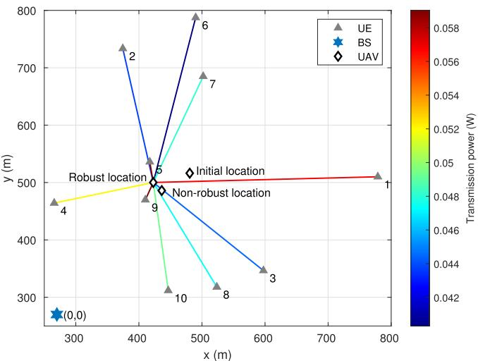  
(a) Expected UAV position and power allocation without considering UAV deviation.

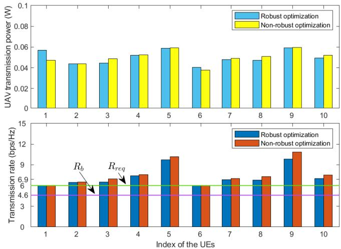  
(b) Expected transmission power and rate without considering UAV deviation.  
Fig. 3. Comparison of robust and non-robust optimization results in a specific scenario.

Fig. 3 compares the simulation results optimized by robust and non-robust scheme for a given specific scenario. As a baseline, the non-robust optimization scheme adopts the iterative approach proposed in [42] to jointly optimize UAV deployment and transmission power. However, it does not consider UAV position uncertainty, thus only accounting for the deterministic constraints in (15) and (16). Fig. 3(a) depicts the scenario setup and UAV deployment locations while Fig. 3(b) presents the corresponding UE transmission power and rates. The transmission power of each UE is visualized as a heatmap along the UAV-UE links, where color variations represent power levels. In Fig. 3(b), the UE transmission rate requirement $R _ { \mathrm { r e q } }$ and the achievable rate $R _ { b }$ under fairness-based ground BS transmission. It can be seen that $R _ { b } ~ = ~ 4 . 8 ~ \mathrm { \ b p s / H z } ~ < ~ 6 ~ \mathrm { b p s / H z } ~ = ~ R _ { \mathrm { r e q } }$ in this scenario, indicating the ground BS alone cannot meet the UE rate demands. With introduction of the UAV relay, both the robust and non-robust schemes further improve the average rate of the UE while satisfying the rate requirements of all UEs. This demonstrates the effectiveness of the proposed UAV relay protocol and the proposed robust algorithm in terms of transmission rate enhancement. Further analysis of Fig. 3(b) reveals that the robust scheme achieves lower transmission rates compared to the non-robust scheme. There are two main manifestations. First, for higher transmission power levels, the rates achieved by the robust and non-robust schemes are nearly identical, as observed for UE-1 and UE-6. Second, for the same transmission power levels, the robust scheme yields lower rates, as seen for UE-4 and UE-5. This indicates that the optimization solution of the robust scheme tends to be more conservative and sacrifices some optimality to achieve better reliability and stability. The non-robust scheme, although having a higher expected transmission rate, lacks stability in uncertain environments, resulting in a concerning actual performance. In addition, it can be observed that for distant UEs, particularly UE-1 and UE-6, the UAV allocates just enough power to meet $R _ { \mathrm { r e q } }$ due to high path loss, as the allocated additional power provides minimal improvement. Conversely, excess power is distributed to nearby UEs, such as UE-5 and UE-9, contributing to an enhancement in the average rate. This reflects that the proposed algorithm efficiently adjusts the power allocation to enhance network performance.

In Fig. 4 we provide a quantitative analysis of the algorithm complexity and compare the impact of different convergence precisions on algorithm convergence. As shown in Fig. 4(a), for the robust optimization, higher precision improves the average UE transmission rate but result in more iterations. However, the diminishing marginal return effect is observed. When the precision reaches $\varepsilon = 0 . 0 1$ , higher precision has negligible impact on the objective function while significantly increasing iterations. Therefore, we adopt $\varepsilon = 0 . 0 1$ in simulations to balance the performance and computational cost. With this precision, the average iteration numbers of the complexity formula are $\xi _ { 1 } = 2 . 6 7 , \xi _ { 2 } = 1 . 3 3$ for the inner loop, and $\xi ~ = ~ 3$ for the outer loop. Fig. 4(b) illustrates the actual runtime of the proposed algorithm. Simulation results indicate that the runtime of the robust algorithm is approximately 8-16 seconds, which is acceptable since UAV position updates occur relatively slowly. The algorithm usually does not need to be re-executed as long as user positions remain largely unchanged. For scenarios with mobile users, the convergence accuracy can be adjusted according to user speeds to balance computational efficiency and transmission performance. In summary, the algorithm complexity remains at a low and fully acceptable level. This demonstrates that SCA and BCD is not only theoretically sound but also computationally efficient and effective for the complex coupling structure of our problem. In addition, comparing the convergence curves, robust optimization requires more iterations and computation time than non-robust optimization at the same precision. This can be attributed to two factors: first, converting the 2K probabilistic constraints to 6K deterministic constraints increases active constraints, requiring more iterations for convergence; second, introducing slack variables expands the search space, leading to more steps to approach a local optimum.

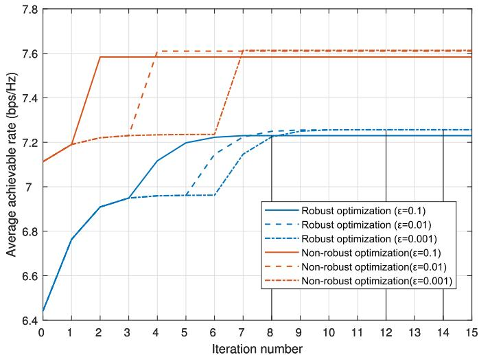  
(a) Number of iterations under different accuracy levels

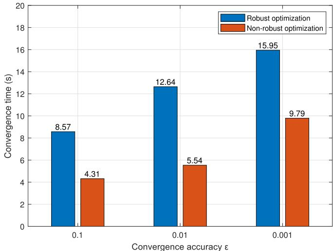  
(b) Convergence time under different accuracy levels.  
Fig. 4. Convergence performance under different accuracy levels.

Figs. 5 and 6 compare the probability distributions of the transmission rate and relay SINR difference for two optimization schemes. Fig. 5 shows the UE transmission rate distribution with standard deviation of the UAV distribution modeled by a Gaussian distribution with σ and outage probability ρ. Specifically, we focus on UE-1 from Fig. 3, which has a transmission rate requirement of 6 bps/Hz. Considering that UAV positioning accuracy highly depends on environmental conditions and available infrastructure, we adopt two representative error levels for evaluation: a typical scenario with $\sigma = 5$ m (e.g., open-sky environments with relatively precise GPS) and a more adverse scenario with $\sigma = 1 0$ m (e.g., urban canyons or emergency deployments without advanced localization support) [43]. Similarly, $\rho$ is set to 0.1 for general requirements and 0.01 for more stringent demands. The comparison reveals that the robust optimization can meets the transmission rate requirement with a probability of $1 - \rho ,$ while the non-robust optimization has a higher probability of violating this constraint. This demonstrates the effectiveness of the proposed robust optimization in ensuring reliable data transmission. In addition, in the robust optimization, the mean value of the expected transmission rate is higher as $\sigma$ increases. This is attributed to the increased offset of the UAV, leading to more severe performance degradation, and hence more communication resources are allocated to augment the margin. Similarly, as $\rho$ decreases, the expected transmission rate also shows an upward trend. These results show that robust optimization adapts to varying network conditions for improving system performance. In addition, the results show that the actual success probability is typically higher than $1 - \rho$ by about 5.44%, 0.20%, 4.67%, and 0.10% for the four simulation groups, which indicates that the Bernstein-type inequality provides robustness while remaining sufficiently tight. Especially when $\rho$ is smaller and $\sigma$ is larger, the constraint exhibits a significant tightening trend. Therefore, although the inequality introduces some conservatism, it provides a tractable deterministic form, and the performance loss is acceptable. Fig. 6 evaluates the reliability of constraint (17c) by simulating the distribution of the SINR difference between the two relay segments, defined as $S _ { \mathrm { d i f } } = S _ { b , k } - S _ { u , k }$ , which should not exceed 0. The results show that both robust and non-robust optimization schemes meet the constraint (17c), and have little sensitivity to $\sigma$ and $\rho .$ This is because under the current parameters, constraint (17c) may well be inactive, and the UAV deviation is not so significant as to cause a violation.

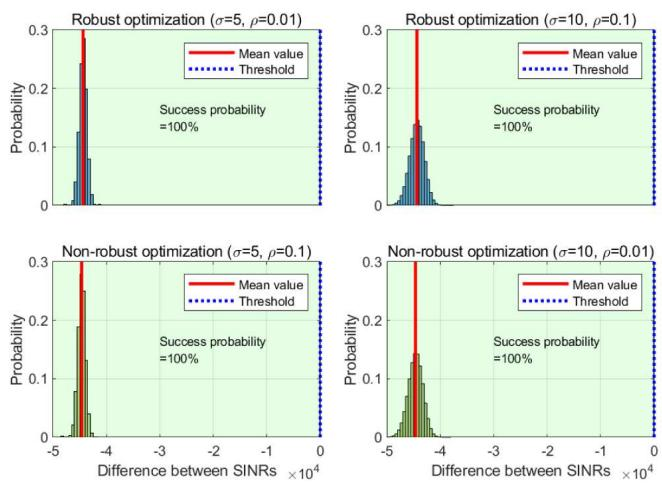

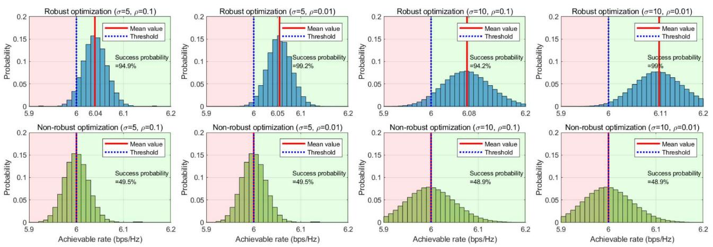  
Fig. 5. Probability distribution of transmission rate for robust and non-robust optimization.  
Fig. 6. Probability distribution of relay SINR difference for robust and nonrobust optimization.

Fig. 7 compares the proposed NOMA-based FD UAV relay scheme with four benchmark schemes, namely, the FD OMA scheme (BTI) [44], the FD OMA scheme (worst-case) [45], the HD NOMA scheme [38], and the HD OMA scheme [15], to provide a comprehensive performance evaluation. FD and HD refer to the duplex operation modes. NOMA employs SIC and MRC techniques to separate interference and combine signals, while OMA does not perform signal separation. For the benchmark schemes, the Bernstein-type inequality method is adopted to handle probabilistic constraints, whereas the FD OMA scheme (worst-case) ensures robustness by optimizing under worst-case network conditions. Figs. 7(a) and 7(b) illustrate the impact of user number and UAV transmission power on the average transmission rate, respectively. As shown in Fig. 7(a), as the user number increases, UAV transmission power becomes insufficient, causing a decline in transmission rates for all schemes. This observation is further corroborated by the increasing trend in Fig. 7(b). Moreover, with further increases in user number, all schemes tend to stabilize, indicating that transmission rates do not decrease dramatically in dense-user scenarios. Among them, the FD NOMA scheme consistently achieves the best performance, followed by the FD OMA scheme, whereas the HD NOMA and HD OMA schemes exhibit more severe degradation. This is because self-interference cancellation enables the FD relay to achieve more efficient bidirectional communication compared to HD relays, and NOMA allows multiple signals to reuse the same frequency-time resources, further enhancing throughput relative to conventional OMA. The comparison between the two FD OMA schemes further reveals that the Bernsteintype inequality method achieves higher transmission rates than the worst-case method. This is because the worst-case design considers UAV position deviation in the most unfavorable conditions, resulting in more conservative resource allocation and, consequently, degraded network performance. These results confirm that the adopted robust approach effectively addresses the proposed probabilistic optimization problem.

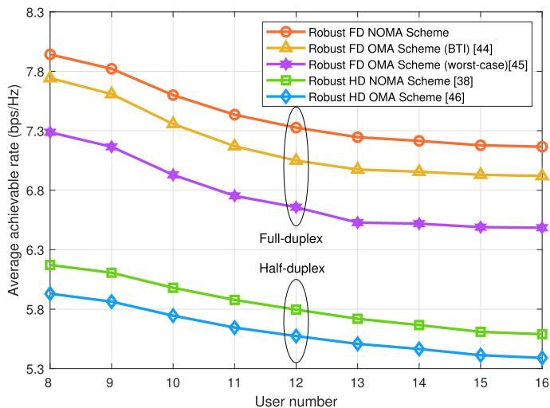  
(a) Impact of UE number K on average transmission rate.

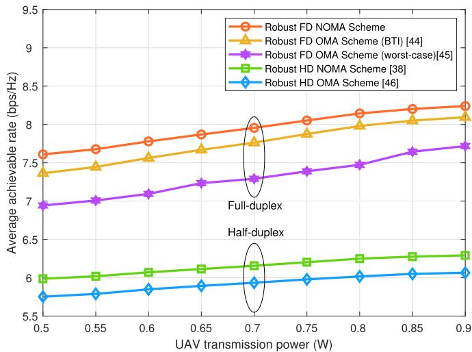  
(b) Impact of UAV maximum power $p _ { u } ^ { \mathrm { t o t } }$ on average transmission rate  
Fig. 7. Comparison of transmission rates across different UAV relay schemes.

In Fig. 8, to evaluate the performance of proposed robust joint optimization (RJO) algorithm for UAV position optimization and power allocation, we compare it with three baseline schemes: robust optimization w/o position optimization (RWPO), robust optimization w/o power allocation (RWPA), and the robust initialization (RIT) scheme. These schemes are not jointly optimized and the RIT scheme uses the initialization method in (44)-(50). Figs. 8(a) and 8(b) show how the user number and rate requirement impact transmission rates. As the two variables increases, the transmission rates of all schemes decrease. The RJO scheme outperforms the RWPO scheme, followed by the RWPA scheme, with the RIT scheme showing the worst performance. The performance gap highlights the benefits of jointly optimizing UAV position and power allocation. In addition, while the RWPO and RWPA schemes show similar performance for few users, their divergence increases as the user numbers rises. The

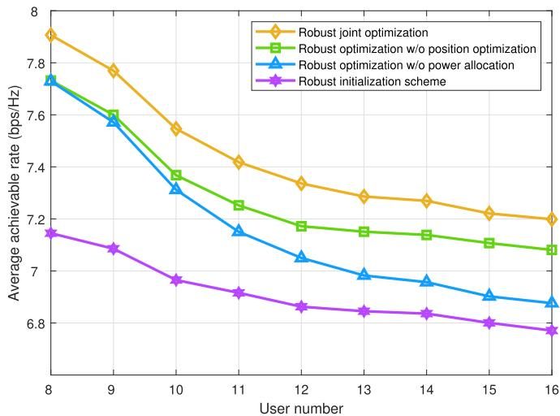

(a) Impact of UE number K on average transmission rate.  
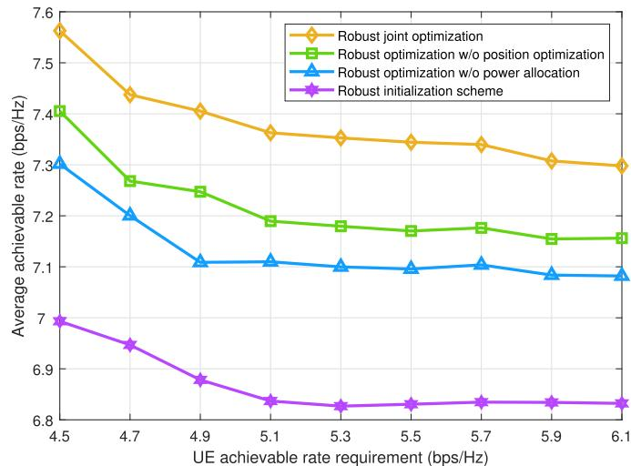  
(b) Impact of UE rate requirement $R _ { k } ^ { \mathrm { r e q } }$ on average transmission rate.  
Fig. 8. Comparison of transmission rates across different optimization strategies.

RWPO scheme performance gradually approaches that of the RJO scheme, while the RWPA scheme trends closer to the RIT scheme, suggesting that radio frequency resources become the key limitation as user density grows. Besides, despite the RIT scheme’s lowest transmission rate, its minimal complexity allows it to be efficient in scenarios that requires rapid responses.

## VI. CONCLUSION

In this paper, we have proposed a NOMA-based FD UAV relay protocol to enhance transmission performance. By utilizing SIC for signal separation and MRC for time diversity gain, the proposed scheme has effectively improved system throughput. To address UAV position deviations, we have formulated a robust optimization problem for joint UAV position optimization and power allocation, which has been efficiently solved using a SCA-based approach. Simulation results have demonstrated that the proposed strategy achieved higher throughput and demonstrated enhanced robustness. These results validated the effectiveness of the proposed strategy in ensuring reliable UAV-assisted communication in dynamic environments.

Although this work has demonstrated the effectiveness of the proposed strategy, there are still several aspects worth further exploration. For example, more practical channel models that incorporate small-scale fading and mobility effects could be investigated. Extending the framework to multi-UAV cooperative scenarios is also a promising direction. In addition, integrating learning-based approaches with robust optimization may provide efficient solutions in large-scale dynamic networks. These issues will be the focus of our future research.

## REFERENCES

[1] C.-X. Wang et al., “On the road to 6G: Visions, requirements, key technologies, and testbeds,” IEEE Commun. Surveys Tuts., vol. 25, no. 2, pp. 905–974, 2nd Quart. 2023.

[2] X. D. Duan et al., “6G architecture design: From overall, logical and networking perspective,” IEEE Commun. Mag., vol. 61, no. 7, pp. 158–164, Jul. 2023.

[3] Z. Sha et al., “Pioneering air-ground integrated mobility: A knowledgedriven space-air-ground integrated network for 6G on-demand service,” IEEE Netw., vol. 39, no. 5, pp. 182–190, Sep. 2025.

[4] P. Cao et al., “Computational intelligence algorithms for UAV swarm networking and collaboration: A comprehensive survey and future directions,” IEEE Commun. Surveys Tuts., vol. 26, no. 4, pp. 2684–2728, 4th Quart., 2024.

[5] D. Zhai, H. Li, X. Tang, R. Zhang, and H. Cao, “Joint position optimization, user association, and resource allocation for load balancing in UAV-assisted wireless networks,” Digit. Commun. Netw., vol. 10, no. 1, pp. 25–37, Feb. 2024.

[6] A. Ahmed et al., “Unveiling the potential of NOMA: A journey to next-generation multiple access,” IEEE Commun. Surveys Tuts., vol. 27, no. 5, pp. 3099–3164, Oct. 2025.

[7] G. Taricco, “Fair power allocation policies for power-domain nonorthogonal multiple access transmission with complete or limited successive interference cancellation,” IEEE Access, vol. 11, pp. 46793–46803, 2023.

[8] B. Clerckx et al., “Multiple access techniques for intelligent and multifunctional 6G: Tutorial, survey, and outlook,” Proc. IEEE, vol. 112, no. 7, pp. 832–879, Jul. 2024.

[9] J. Li, X. B. Zhai, H. Qian, R. Zhang, and X. Liu, “Joint trajectory design and power allocation in NOMA-based UAV networks,” IEEE Trans. Veh. Technol., vol. 73, no. 2, pp. 2345–2357, Feb. 2024.

[10] Y. Zhou, F. Zhou, H. Zhou, D. W. K. Ng, and R. Q. Hu, “Robust trajectory and transmit power optimization for secure UAV-enabled cognitive radio networks,” IEEE Trans. Commun., vol. 68, no. 7, pp. 4022–4034, Jul. 2020.

[11] J. Wang, Y. Sun, B. Wang, and T. Ushio, “Mission-aware UAV deployment for post-disaster scenarios: A worst-case SAC-based approach,” IEEE Trans. Veh. Technol., vol. 73, no. 2, pp. 2712–2727, Feb. 2024.

[12] Y. Zhang, J. V. Krogmeier, C. R. Anderson, and D. J. Love, “Largescale cellular coverage simulation and analyses for follow-me UAV data relay,” IEEE Trans. Wireless Commun., vol. 23, no. 3, pp. 2396–2412, Mar. 2024.

[13] S. Thapliyal, R. Pandey, and C. Charan, “Coverage analysis under imperfect SIC for EH-enabled UAV-NOMA cellular network in finite blocklength framework,” IEEE Wireless Commun. Lett., vol. 13, no. 9, pp. 2442–2446, Sep. 2024.

[14] H. Li, D. Zhai, R. Zhang, C. Wang, and X. Tang, “Joint ABS deployment and TBS antenna downtilt optimization for coverage maximization,” IEEE Wireless Commun. Lett., vol. 11, no. 7, pp. 1329–1333, Jul. 2022.

[15] Y. Su, M. Liwang, Z. Chen, and X. Du, “Toward optimal deployment of UAV relays in UAV-assisted Internet of Vehicles,” IEEE Trans. Veh. Technol., vol. 72, no. 10, pp. 13392–13405, Oct. 2023.

[16] Z. Song, J. An, H. Ding, and H. Dai, “Optimal relay probing for UAV millimeter wave communications with beam training overhead,” IEEE Trans. Veh. Technol., vol. 72, no. 6, pp. 7351–7363, Jun. 2023.

[17] H. Yu, M. Ju, and H.-C. Yang, “Aggregate throughput maximization for UAV-enabled relay networks with wireless power transfer: Joint trajectory and power optimization,” IEEE Trans. Veh. Technol., vol. 73, no. 6, pp. 8253–8265, Jun. 2024.

[18] Z. He et al., “Energy minimization for UAV-enabled wireless power transfer and relay networks,” IEEE Internet Things J., vol. 10, no. 21, pp. 19141–19152, Nov. 2023.

[19] H. Li et al., “Energy-efficient deployment and resource allocation for O-RAN-enabled UAV-assisted communication,” IEEE Trans. Green Commun. Netw., vol. 8, no. 3, pp. 1128–1140, Sep. 2024.

[20] S. Zhao et al., “Exploiting NOMA transmissions in multi-UAV-assisted wireless networks: From aerial-RIS to mode-switching UAVs,” IEEE Trans. Wireless Commun., vol. 24, no. 3, pp. 2530–2544, Mar. 2025.

[21] Z. Cao et al., “Employing artificial noise for secure NOMA-aided UAV transmissions,” IEEE Internet Things J., vol. 12, no. 2, pp. 2279–2282, Jan. 2025.

[22] X. Fan, H. Zhou, K. Sun, X. Chen, and N. Wang, “Channel assignment and power allocation utilizing NOMA in long-distance UAV wireless communication,” IEEE Trans. Veh. Technol., vol. 72, no. 10, pp. 12970–12982, Oct. 2023.

[23] J. Chen, X. Li, J. Xu, and Y. Wang, “Deployment for NOMA-UAV base stations based on hybrid sparrow search algorithm,” IEEE Trans. Aerosp. Electron. Syst., vol. 59, no. 5, pp. 6138–6149, Oct. 2023.

[24] X. Li et al., “UAV-enabled multi-pair massive MIMO-NOMA relay systems with low-resolution ADCs/DACs,” IEEE Trans. Veh. Technol., vol. 73, no. 2, pp. 2171–2186, Feb. 2024.

[25] T. M. Hoang, L. T. Dung, B. C. Nguyen, X. N. Tran, and G. T. Luu, “Analysis of multiantenna UAV-aided NOMA relay systems for shortpacket communications between multiuser pairs,” IEEE Trans. Aerosp. Electron. Syst., vol. 60, no. 3, pp. 3237–3254, Jun. 2024.

[26] X. Guo, B. Li, J. Wu, R. Zhang, and X. Cheng, “Joint uplink and downlink NOMA for UAV relaying network with multi-pair users,” IEEE Trans. Wireless Commun., vol. 23, no. 12, pp. 18549–18562, Dec. 2024.

[27] W. Wang and W. Zhang, “Jittering effects analysis and beam training design for UAV millimeter wave communications,” IEEE Trans. Wireless Commun., vol. 21, no. 5, pp. 3131–3146, May 2022.

[28] K. Lee, D. You, H. Noh, and C. Lee, “Robust beamforming for UAV communication with jittering effects,” IEEE Wireless Commun. Lett., vol. 14, no. 1, pp. 48–52, Jan. 2025.

[29] Y. Chen, B. Ai, Y. Niu, H. Zhang, and Z. Han, “Energy-constrained computation offloading in space-air-ground integrated networks using distributionally robust optimization,” IEEE Trans. Veh. Technol., vol. 70, no. 11, pp. 12113–12125, Nov. 2021.

[30] L. Li et al., “Delay optimization in multi-UAV edge caching networks: A robust mean field game,” IEEE Trans. Veh. Technol., vol. 70, no. 1, pp. 808–819, Jan. 2021.

[31] X. Tang, H. Zhang, R. Zhang, D. Zhou, Y. Zhang, and Z. Han, “Robust trajectory and offloading for energy-efficient UAV edge computing in industrial Internet of Things,” IEEE Trans. Ind. Informat., vol. 20, no. 1, pp. 38–49, Jan. 2024.

[32] C. Wang, X. Tang, D. Zhai, R. Zhang, N. Ussipov, and Y. Zhang, “Energy-efficient federated learning through UAV edge under location uncertainties,” IEEE Trans. Netw. Sci. Eng., vol. 12, no. 1, pp. 223–236, Jan. 2025.

[33] Study on Enhanced LTE Support for Aerial Vehicles, document TR 36.777, 3GPP, Sophia Antipolis, France, 2018.

[34] Z. Lyu, G. Zhu, and J. Xu, “Joint maneuver and beamforming design for UAV-enabled integrated sensing and communication,” IEEE Trans. Wireless Commun., vol. 22, no. 4, pp. 2424–2440, Apr. 2023.

[35] K. Meng, Q. Wu, S. Ma, W. Chen, K. Wang, and J. Li, “Throughput maximization for UAV-enabled integrated periodic sensing and communication,” IEEE Trans. Wireless Commun., vol. 22, no. 1, pp. 671–687, Jan. 2023.

[36] Y. Qin, Z. Zhang, X. Li, W. Huangfu, and H. Zhang, “Deep reinforcement learning based resource allocation and trajectory planning in integrated sensing and communications UAV network,” IEEE Trans. Wireless Commun., vol. 22, no. 11, pp. 8158–8169, Nov. 2023.

[37] Study on Channel Model for Frequencies From 0.5 to 100 GHz (Release 18), Standard TR 38.901 V14.0.0, 3GPP Technical Specification Group Radio Access Network, Mar. 2024.

[38] D. Zhai, H. Li, X. Tang, R. Zhang, Z. Ding, and F. R. Yu, “Height optimization and resource allocation for NOMA enhanced UAV-aided relay networks,” IEEE Trans. Commun., vol. 69, no. 2, pp. 962–975, Feb. 2021.

[39] Q. Wu, Y. Zeng, and R. Zhang, “Joint trajectory and communication design for multi-UAV enabled wireless networks,” IEEE Trans. Wireless Commun., vol. 17, no. 3, pp. 2109–2121, Mar. 2018.

[40] X. Xu, Y. Liu, X. Mu, Q. Chen, and Z. Ding, “Cluster-free NOMA communications toward next generation multiple access,” IEEE Trans. Commun., vol. 71, no. 4, pp. 2184–2200, Apr. 2023.

[41] J. Gondzio, “Interior point methods in the year 2025,” EURO J. Comput. Optim., vol. 13, Feb. 2025, Art. no. 100105.

[42] H. Li, D. Zhai, R. Zhang, K. Kaur, and S. Singh, “Efficient GBS sleep strategy of UAV assisted wireless networks for energy saving,” in Proc. IEEE Int. Conf. Commun., May 2023, pp. 4998–5003.

[43] Wikipedia.(2024). Error Analysis for the GPS. Accessed: Dec. 22, 2024. [Online]. Available: https://en.wikipedia.org/wiki/ Error analysis for the Global Positioning System

[44] A. H. Gazestani, S. A. Ghorashi, Z. Yang, and M. Shikh-Bahaei, “Joint optimization of power and location in full-duplex UAV enabled systems,” IEEE Syst. J., vol. 16, no. 1, pp. 914–921, Mar. 2022.

[45] Z. Liu, B. Zhu, Y. Xie, K. Ma, and X. Guan, “UAV-aided secure communication with imperfect eavesdropper location: Robust design for jamming power and trajectory,” IEEE Trans. Veh. Technol., vol. 73, no. 5, pp. 7276–7286, May 2024.

Lei Liu (Member, IEEE) received the B.Eng. degree in communication engineering from Zhengzhou University, Zhengzhou, China, in 2010, and the M.Sc. and Ph.D. degrees in communication engineering from Xidian University, Xi’an, China, in 2013 and 2019, respectively. From 2013 to 2015, he was with technology company. From 2018 to 2019, he was supported by China Scholarship Council to be a Visiting Ph.D. Student with the University of Oslo, Oslo, Norway. He is currently a Lecturer with the Department of Electrical Engineering and Computer

Science, Xidian University. His research interests include vehicular ad hoc networks, intelligent transportation, mobile-edge computing, and the Internet of Things.

  
Huan Li received the B.E. degree in telecommunication engineering from Northwestern Polytechnical University, Xi’an, China, in 2020, where he is currently pursuing the Ph.D. degree in information and communication engineering. His research interests include massive access techniques, air-and-ground integrated networks, and resource allocation in wireless communications.

Daosen Zhai (Member, IEEE) received the B.E. degree in telecommunication engineering from Shandong University, Weihai, China, in 2012, and the Ph.D. degree in communication and information systems from Xidian University, Xi’an, China, in 2017. He is currently an Assistant Professor with the School of Electronics and Information, Northwestern Polytechnical University, Xi’an. His research interests include radio resource management in B5G and 6G, massive access techniques, air-and-ground integrated networks, convex opti-

Dusit Niyato (Fellow, IEEE) is a Professor with the College of Computing and Data Science (CCDS), Nanyang Technological University, Singapore. His research interests are in the areas of mobile generative AI, edge intelligence, quantum computing and networking, and incentive mechanism design. He is a fellow of IET. He was named as the 2017–2024 highly cited researcher in computer science. He is the Member-at-Large to the Board of Governors of IEEE Communications Society from 2024 to 2026. He is serving as the Editor-in-Chief for IEEE

TRANSACTIONS ON NETWORK SCIENCE AND ENGINEERING. He is also the past Editor-in-Chief and a current Area Editor of IEEE COMMUNICATIONS SURVEYS AND TUTORIALS, an Area Editor of IEEE TRANSACTIONS ON VEHICULAR TECHNOLOGY, a Topical Editor of IEEE INTERNET OF THINGS JOURNAL, and a Lead Series Editor of IEEE Communications Magazine.

mization, and graph theory and their applications in wireless communications.

Ruonan Zhang (Member, IEEE) received the B.S. and M.Sc. degrees in electrical and electronics engineering from Xi’an Jiaotong University, Xi’an, China, in 2000 and 2003, respectively, and the Ph.D. degree in electrical and electronics engineering from the University of Victoria, Victoria, BC, Canada, in 2010. From 2003 to 2006, he was an IC Design Engineer with Motorola Inc., and Freescale Semiconductor Inc., Tianjin, China. Since 2010, he has been with the Department of Communication Engineering, Northwestern Polytechnical University,

Xi’an, where he is currently a Professor. His research interests include wireless channel measurement and modeling, architecture and protocol design of wireless networks, and satellite communications. He was a Local Arrangement Co-Chair of IEEE/CIC International Conference on Communications in China in 2013, the Industry Track and Workshop Chair of IEEE International Conference on High Performance Switching and Routing in 2019, and an Associate Editor of Journal of Communications and Networks.

Yan Zhang (Fellow, IEEE) received the Ph.D. degree from the School of Electrical and Electronics Engineering, Nanyang Technological University, Singapore. He is currently a Full Professor with the University of Electronic Science and Technology of China. His research interests include next generation wireless networks leading to 6G, green, and secure cyber-physical systems. He is a fellow of IET; and an Elected Member of Academia Europaea (MAE), the Royal Norwegian Society of Sciences and Letters (DKNVS), and Norwegian Academy of Technolog ical Sciences (NTVA). In 2018, he was a recipient of the global Clarivate Analytics “Highly Cited Researcher” Award (Web of Science top 1% most cited worldwide). He is a Co-EiC of IEEE TRANSACTIONS ON INDUS-TRIAL INFORMATICS, an Area Editor of IEEE TRANSACTIONS ON GREEN COMMUNICATIONS AND NETWORKING, a Senior Editor of IEEE SYS-TEMS JOURNAL, and an associate editor of several IEEE TRANSACTIONS/ magazine.