# Robust and Energy-Eficient Multi-UAV Trajectory Planning for Data Collection: A Game-Theoretic and Deep Reinforcement Learning Approach

Nan Qi , Senior Member, IEEE, Hua Jiang , Sa Xiao , Daolong Wu, Fuhui Zhou , Senior Member, IEEE, Chunguo Li , Senior Member, IEEE, and Shi Jin , Fellow, IEEE

Abstract—In an open electromagnetic environment, multiunmanned aerial vehicle (UAV) communications may sufer from intermittent data transmissions, incomplete information on jammers and geographical obstacles. This deteriorates the UAV-ground and UAV-UAV wireless communications, potentially leading to physical collisions and posing significant safety risks. While existing studies rarely account for intermittent UAV connectivity and the associated communication costs, this paper proposes an efective cooperative approach utilizing grid map exploration and experience sharing. Specifically, game-theoretic methods are employed to facilitate distributed cooperative information exchange. Although each UAV seeks to maximize its individual utility, the proposed mechanism incentivizes cooperation to achieve the collective mission. To mitigate collaboration interruptions caused by intermittent transmission, we propose an opportunistic cooperative reinforcement learning framework combined with Long Short-Term Memory (LSTM)-based predictive learning, which explicitly accounts for the dynamic communication costs of UAVs. Empirical evaluations demonstrate that our algorithm significantly outperforms existing non-cooperative methods, with a 31% improvement in converged reward compared to the non-cooperative baseline. Furthermore, it exhibits superior stability and data collection eficiency compared to established multi-agent baselines (e.g., MADDPG,

MAPPO). Particularly, the system’s performance robustness regarding the LSTM prediction accuracy is rigorously evaluated, confirming its resilience against intermittent communication.

Index Terms—UAV, cooperative learning, deep reinforcement learning, trajectory planning, exact potential game.

## I. INTRODUCTION

W ITH significant advancements in wireless communi- cation and unmanned aerial vehicle (UAV) manufacturing technology, UAVs, with their autonomous control, low cost, and high flexibility, have found wide-ranging applications in various fields such as civilian travel photography, commercial performances, precision agriculture [1], [2], [3]. In addition, UAVs can provide rescue and support in disaster and emergency situations, such as establishing temporary communication links during natural disasters or medical emergencies [4], [5]. They ofer greater flexibility and lower costs compared to satellite communication [6]. The rapid development of the Internet of Things (IoT) is integrating various objects into the internet by equipping them with microcontrollers, transceivers, and appropriate protocol stacks, enabling communication between devices and users [7]. As the scale and complexity of IoT grow, collecting data from IoT devices in stable and complex terrain networks becomes increasingly challenging. UAVs are an efective solution to this challenge in complex and unknown areas, where they are widely used for data collection from sensors [8], [9].

However, UAVs encounter numerous challenges, including limited flight duration and energy budget. Addressing efective task execution within these energy limitations is crucial and presents a pertinent research focus. Recent studies verify that reinforcement learning, particularly deep reinforcement learning (DRL), ofers promising solutions for UAV navigation and task planning in complex, large-scale network environments [10], [11]. DRL integrates reinforcement learning with deep learning techniques, thus overcoming the restrictions of traditional reinforcement learning by eficiently handling large state and action spaces. This enables UAVs to make flight action decisions online in uncertain and complex environments [12].

However, a single UAV often lacks suficient resources to independently complete complex tasks, necessitating cooperation among multiple UAVs [13]. Collaborative decisionmaking among UAVs can improve task planning and trajectory optimization, thereby enhancing task execution eficiency. In complex environments such as battlefield operations and disaster relief, UAV swarms frequently encounter challenges like intermittent communication, incomplete information, and evolving task demands [14]. Consequently, this paper investigates the optimization of UAV swarm communication to tackle the issue of intermittent information exchange in resourceconstrained, dynamic environments, thereby strengthening the robustness of UAV cooperative reinforcement learning systems for eficient trajectory planning and data collection.

## A. Related Works and Motivations

Recently, significant advancements have been made in developing trajectory planning and data collection methods for UAV-assisted communications. Trajectory planning plays a critical role in enabling UAV-assisted communication, especially in complex environments where UAVs must avoid obstacles to ensure their safety. Traditional trajectory planning methods typically focus on minimizing mission time or energy consumption. For instance, the authors in [15] proposed a K-means-based trajectory optimization algorithm to minimize mission time while considering UAV speed and communication constraints. However, these methods often assume static environments and are not applicable to urban scenarios with dynamic characteristics. To overcome this limitation, the authors in [16] introduced an artificial intelligence (AI)-based framework that integrated clustering and neural trajectory solvers to minimize the Age of Information (AoI) in UAV-assisted wireless sensor networks. Based on these advancements, reinforcement learning techniques have been widely adopted to enhance trajectory planning. For example, in [17], the authors proposed a two-level DRL framework for online trajectory planning and data collection in dynamic environments. Similarly, [18] and [19] utilized a Double Q-learning algorithm to optimize UAV routes in urban environments with continuous-time constraints. In related UAV trajectory optimization studies, the authors in [20] investigated energy-eficient 3D trajectory planning for flying base stations, the authors in [21] optimized multiple UAV trajectories in multicell networks with adjustable overlapping coverage, and the authors in [22] developed multiobjective trajectory optimization algorithms for multi-UAV-assisted mobile edge computing. These works provide valuable optimization formulations, but they mainly rely on centralized planning or ofline search and do not explicitly address decentralized online cooperation under intermittent inter-UAV communication in the presence of jammers.

Cooperative learning among UAVs has emerged as a key enabler for eficient multi-UAV task accomplishment. While traditional methods often focus on individual UAV optimization, recent studies show that global objectives can be eficiently achieved via collaboration. For instance, the authors in [23] proposed a distributed cooperative Deep Q-Network (DQN) framework that enabled UAVs to share local observations and construct a global map for non-overlapping coverage. In [24], a cooperative approach significantly improved area coverage and collision avoidance. However, in scenarios with narrow passages or dynamically changing environments, static cooperation frameworks may fail to adapt. To address this, the authors in [25] developed a multi-UAV adaptive cooperative formation trajectory planning method based on an improved Multi-Agent Twin Delayed Deep Deterministic Policy Gradient (MATD3) algorithm. By integrating LSTM networks, this method enhanced the adaptability of UAVs to dynamic unknown environments, ensuring eficient coop eration even in complex obstacles and narrow passages. These studies demonstrate that cooperative learning not only improves individual UAV performance but also enables the entire UAV network to operate more efectively in complex environments.

Game theory provides a theoretical framework for multiuser distributed decision-making and a theoretical basis for obtaining stable solutions in multi-agent systems. Game theory has also been extensively applied to UAV trajectory planning and cooperative learning. Traditional game-theoretic approaches often focus on achieving Nash Equilibrium (NE) in static and known settings. For example, the authors in [26] proposed a potential game model where UAVs iteratively updated their service allocations to achieve Nash Equilibrium, optimizing both task allocation and trajectory planning. However, these methods assume complete information and fail to account for the uncertainties in dynamic environments. The authors in [27] introduced a potential game-based model for multi-UAV cooperative search and coverage. To further enhance UAV decision-making in dynamic and uncertain environments, game-theoretic approaches can be readily integrated with reinforcement learning techniques to achieve stable Nash Equilibrium solutions [28]. For example, [29] proposed a state-based game with actor–critic (SBG-AC) algorithm for distributed control in UAV swarms. This approach combined potential games with reinforcement learning, ensuring convergence and efective learning.

Despite these advancements, dynamic environments still pose additional challenges for UAV-integrated communications, including unknown jammers, obstacles, intermittent connectivity, and incomplete environmental information. To address the incomplete-information problem, the authors in [30] introduced a Bayesian optimization-enhanced deep reinforcement learning framework that jointly optimizes UAV trajectories and multi-hop network formation, while the authors in [31] applied deep reinforcement learning to optimize UAV path planning for better connectivity. Under communication constraints, the authors in [32] and [33] studied bandwidth-eficient multi-agent communication through event-triggered transmission and adaptive message sizing, respectively. In the UAV domain, the authors in [34] proposed a joint task assignment and trajectory planning scheme with a communication budget to compensate for limited communication, and the authors in [35] considered robust UAV swarm communication recovery. However, these studies mainly focused on network formation, connectivity enhancement, communication budgeting, bandwidth-eficient message exchange, or topology recovery. In general, most existing methods either assume relatively stable communication links or handle communication constraints through predefined communication mechanisms, which may not hold in urban environments with tall buildings, unknown and dynamic jammers that disrupt inter-UAV information exchange.

TABLE I  
LIST OF NOTATIONS
<table><tr><td rowspan=1 colspan=1>Variables</td><td rowspan=1 colspan=1>Explanation</td></tr><tr><td rowspan=1 colspan=1> $\mathcal { M } = \{ 1 , 2 , . . . , M \}$ </td><td rowspan=1 colspan=1>Set of UAVs</td></tr><tr><td rowspan=1 colspan=1> $\mathcal { I } = \{ 1 , 2 , . . . , J \}$ </td><td rowspan=1 colspan=1>Set of jammers</td></tr><tr><td rowspan=1 colspan=1> ${ \mathcal { K } } = \{ 1 , 2 , . . . , K \}$ </td><td rowspan=1 colspan=1>Set of base stations</td></tr><tr><td rowspan=1 colspan=1> $\mathcal { C } = \{ 1 , 2 , . . . , C \}$ </td><td rowspan=1 colspan=1>Set of available channels</td></tr><tr><td rowspan=1 colspan=1> $\mathcal { A } = \{ 0 , 1 , 2 , 3 , 4 , 5 \}$ </td><td rowspan=1 colspan=1>Set of UAV&#x27;s actions</td></tr><tr><td rowspan=1 colspan=1> $R _ { k } ( t )$ </td><td rowspan=1 colspan=1>The channel capacity</td></tr><tr><td rowspan=1 colspan=1> $\Delta D ( t )$ </td><td rowspan=1 colspan=1>The amount of data collected from t to t + 1</td></tr><tr><td rowspan=1 colspan=1> $l _ { k } ( n )$ </td><td rowspan=1 colspan=1>The scheduling variable</td></tr><tr><td rowspan=1 colspan=1> $w _ { i j } ( a _ { i } , a _ { j } )$ </td><td rowspan=1 colspan=1>The cost of communication between two UAVs</td></tr><tr><td rowspan=1 colspan=1> $U _ { i } ( a )$ </td><td rowspan=1 colspan=1>The utility function of the UAV i</td></tr></table>

## B. Contributions and Organization

This paper focuses on robust and energy-eficient multi-UAV trajectory planning for data collection, utilizing a game-theoretic and deep reinforcement learning approach in a complex urban environment with unknown obstacles and random jammers. In general, the main contributions of this paper are as follows.

• Firstly, we propose a distributed learning framework grounded in potential game theory. This formulation guarantees the existence of a Nash Equilibrium, providing a rigorous theoretical basis for decentralized agents to independently converge to stable cooperation strategies, addressing the non-stationarity issue in multi-agent learning.

• Secondly, we introduce an opportunistic interaction mechanism that explicitly accounts for communication costs. By quantifying the trade-of between information value and exchange overhead, this approach achieves energyeficient cooperation, minimizing unnecessary interactions in resource-constrained environments.

Thirdly, we develop an LSTM-based predictive compensation module to mitigate intermittent connectivity. This enables agents to infer neighbor actions during communication interruptions. Empirical evaluations confirm that this mechanism significantly enhances system robustness and stability compared to conventional cooperative schemes.

The remainder of this paper is organized as follows. Section II illustrates the system model and problem formulation of our proposed robust cooperation method. Section III presents the details of our proposed OCMA-DDQN-LSTM algorithm. Simulation results and discussions are shown in Section IV. Section V concludes this paper and discusses future work.

## II. SYSTEM MODEL

In the scenario shown in Fig. 1, there are M UAVs, K base stations and J jammers, the set of UAVs is denoted as $\mathcal { M } = \{ 1 , 2 , \ldots , M \}$ , the set of base stations is denoted as $\mathcal { K } ~ = ~ \{ 1 , 2 , . . . , K \}$ , and the set of random jammers is denoted as $\mathcal { I } = \{ 1 , 2 , \ldots J \}$ . The set of available channels is denoted as $\mathcal { C } = \{ 1 , 2 , \ldots , C \}$ . Each UAV independently selects actions for trajectory planning and communicates with a base station for data collection. During decision-making, UAVs integrate local observations with information from neighbouring UAVs to optimize trajectory planning and data collection through information exchanges. Additionally, the information exchange may be intermittent.

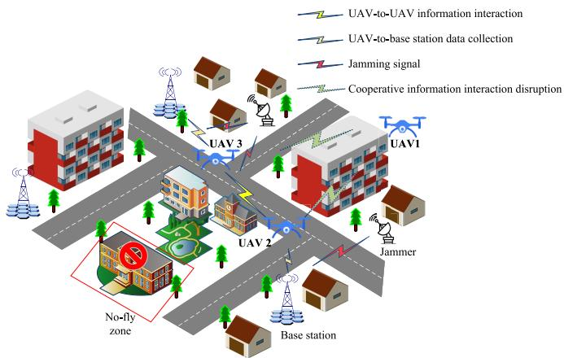  
Fig. 1. Multi-UAV trajectory planning and data collection under intermittent cooperation.

As depicted in Fig. 1, complex terrain and external jammers are considered. UAV 2 navigates obstacle avoidance based on local observations for data collection from the base station and also incorporates the cooperative data from other UAVs, such as UAV 3 (in the absence of jamming) and UAV 1 (when communication is not blocked by tall structures or jammers). Malicious jammers deteriorate both UAV-to-UAV communications and the collection of data from the base station.

## A. Scenario Assumptions

The scenario assumptions adopted in this work are summarized as follows. (1) The operational airspace is discretized into an L × L grid, and all UAVs are assumed to fly at a fixed altitude H . (2) Each UAV action corresponds to moving to an adjacent grid cell, hovering, or landing. (3) The jammer parameters, including position, transmission power, beamwidth, and quantity, are randomly initialized at the beginning of each episode and remain unchanged during that episode. (4) Physical movement and communication scheduling are modeled on diferent timescales. Each movement step consists of four communication slots, with each slot lasting one second, and thus one grid transition requires 4 s. (5) The achievable communication rate is assumed to remain constant within each slot. Time Division Multiple Access (TDMA) is adopted for both UAV-to-base-station data collection and inter-UAV information exchange to avoid simultaneous transmissions. The UAV-to-base-station data-collection link and the inter-UAV information-exchange link are treated as diferent communication links.

## B. UAV Communication Rate Model

In the real-world environment, the communication link between a UAV and base station is influenced by factors such as UAV altitude, characteristics of the urban environment, and interference from other wireless devices. The Signal to Noise Ratio (SNR) is used to measure the quality of the UAV communication link in time-varying channels. Based on the SNR, the maximum data transmission rate can be calculated, which quantifies the data amount collected by the UAV from the base station at a given time. A hybrid Line of Sight (LoS) and Non-Line of Sight (NLoS) model in [36] is considered. As the UAVs are exposed to malicious jammers, such as from directional sources, the Signal-to-Interference-plus-Noise Ratio (SINR) can be calculated by

$$
S I N R _ { k } ( t ) = \frac { P _ { r } ( t ) } { I ( t ) + N } = \frac { P _ { k } d _ { k } ( t ) ^ { - \alpha _ { l } } 1 0 ^ { \frac { \eta _ { l } } { 1 0 } } } { \displaystyle \sum _ { j = 1 } ^ { J } P _ { j } d _ { k } ( t ) ^ { - \alpha _ { l } } 1 0 ^ { \frac { \eta _ { l } } { 1 0 } } + \sigma ^ { 2 } } ,\tag{1}
$$

where $P _ { k }$ represents the transmission power of the k-th base station signal, $\sigma ^ { 2 }$ denotes the white Gaussian noise power received by the UAV, $d _ { k } ( t )$ is the distance from the k-th base station at time t, is the path loss exponent, indicating the rate at which the signal decays or diminishes with increasing distance. This parameter is determined by environmental conditions such as urban, suburban, and rural areas. Additionally, Line of Sight (LoS) and Non-Line of Sight (NLoS) transmissions also afect the path loss exponent. The component accounts for the shadowing efect, which is the variation in signal strength due to obstacles, and is modeled as a Gaussian random variable $\eta _ { l } \sim \mathcal { N } ( 0 , \sigma _ { l } ^ { 2 } )$ . l depends on the environmental conditions and whether it is in LoS or NLoS conditions, $l \in \{ \mathrm { L o S } , \mathrm { N L o S } \}$

Then the maximum transmission rate between the UAV and the k-th base station can be calculated by

$$
R _ { k } ( t ) = \log _ { 2 } ( 1 + S I N R _ { k } ( t ) ) ,\tag{2}
$$

where $R _ { k } ( t )$ is the channel capacity. In addition, in order to ensure high-quality communication between the base station and the UAV, the communication rate threshold $\gamma$ is set for the data collection between the UAV and the base station, i.e.,

$$
R _ { k } ( t ) \geq \gamma .\tag{3}
$$

The UAV communicates with the k-th base station only when the attainable data rate exceeds a threshold . Specifically, at each communication step, the UAV communicates with the base station with the highest data rate and collects the remaining data. Let $l _ { k } ( n )$ represent the connection status with the k-th base station at the n-th communication step, the scheduling variable $l _ { k } ( n )$ can be calculated by

$$
\sum _ { i = 1 } ^ { k } l _ { k } ( n ) \leq 1 , \forall n \in \{ 0 , \ldots , N \} , \forall k \in \{ 0 , \ldots , K \} ,
$$

$$
l _ { k } ( n ) \in \{ 0 , 1 \} , \forall n \in \{ 0 , \ldots , N \} , \forall k \in \{ 0 , \ldots , K \} .\tag{4}
$$

Then the amount of data collected by the UAV at time t to t + 1 can be calculated by

$$
\Delta D ( t ) = \sum _ { n = 1 } ^ { N } \sum _ { k = 1 } ^ { K } l _ { k } ( n ) R _ { k } ( n ) .\tag{5}
$$

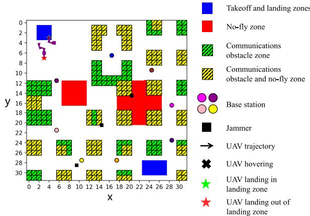  
Fig. 2. Grid map diagram.

## C. UAV Cooperative Information Interactions Model

In complex environments, single UAVs have limited ability to acquire information, and jammers in the environment may interrupt information interaction between UAVs. This section develops a cooperative information interaction model. UAVs make better decisions by using past cooperative data and their own history of actions, even when disconnected from the group. This is achieved through occasional information sharing between UAVs, enhancing the reliability of UAV path planning and data gathering.

The map in [36] is considered, and the original 320m ×320m map is gridded into a 32 × 32 grid as shown in Fig. 2. It contains most of the regularly distributed city blocks, like the streets, as well as the two no-fly zones and the open space in the upper left corner. It features distinct zones: yellow for tall buildings, green for short buildings, blue for take-of and landing, and red for no-fly zones. Additionally, one grid unit represents the UAV movement distance in one step.

A single UAV may encounter insuficient local observation information, hindering its ability to independently optimize its trajectory for maximizing data collection. When information sharing is enabled, multiple UAVs can collaboratively explore unknown areas of interest through cooperative learning. This approach aims to maximize the weighted sum data collection rate and energy eficiency of the UAVs while minimizing the communication costs between UAVs. First, we introduce a grid area exploration degree for the grid map, which can be calculated by

$$
S _ { i j } = \left\{ \begin{array} { l l } { { 1 } } & { { \mathrm { , i f ~ } \mathrm { g r i d } ( i , j ) \mathrm { ~ h a s ~ b e e n ~ s e a r c h e d } } } \\ { { 0 } } & { { \mathrm { , e l s e } } } \end{array} \right. ,\tag{6}
$$

where i and j represent the row and column of the gridded map, respectively. The exploration of the region is shared as part of the information exchanged when UAVs interact with each other. Subsequently, the UAVs select actions based on the output of their individual action neural networks and the exploration degree of each region. This approach prevents multiple UAVs from covering the same area, thereby optimizing the exploration of unknown regions.

Inter-agent Spacing is introduced to characterize the value of empirical information. Considering the diferent environmental locations of UAVs at the same time, as shown in Fig. 3, the value of the experience information between UAVs varies with the change of the distance between them. When the distance between two UAVs falls within the observation range of the simulated movement over a period of time, the experience information of the two UAVs is most efective for each other. If two UAVs are too close, their observation space and experience information are highly overlapping, which is not conducive to UAVs’ exploration of complex environments. Similarly, if the distance between two UAVs is too far, the guiding value of each other’s experience information to the other is very low, and the benefit is less than the cost when considering the UAV communication cost.

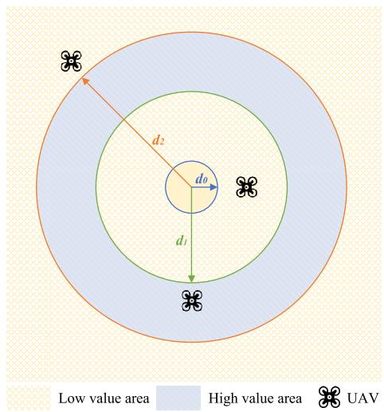  
Fig. 3. Experience value circles diagram.

We introduce a measure of the value of their own observation and historical experience (including obstacle avoidance information, etc.) to other UAVs at time t. The UAV shares its own observation and experience information opportunistically, the probability value is expressed as

$$
P _ { m n } ( t ) = \left\{ \begin{array} { l l } { \displaystyle \frac { d } { d _ { 1 } } } & { \mathrm { , i f } \ d _ { 0 } < d < d _ { 1 } } \\ { 1 } & { \mathrm { , i f } \ d _ { 1 } < d < d _ { 2 } } \\ { \displaystyle \frac { d _ { 2 } } { d } } & { \mathrm { , i f } \ d > d _ { 2 } } \end{array} \right. ,\tag{7}
$$

where d is the distance between UAV m and UAV n, and $d _ { 1 } , d _ { 2 }$ denote the distance thresholds between diferent value circles, and $d _ { 0 }$ is the critical collision avoidance distance of the UAV. The UAV probabilistically shares its experience based on this metric, and the other UAVs will adjust their own maneuver choices based on the shared information to optimize the UAVs trajectory and data collection.

## D. Predictive Learning Under Interaction Interruption

In the practical complex environment, the cooperative information interaction between UAVs cannot be guaranteed. In order to improve the robustness of UAV trajectory planning and data collection when disconnecting, we predict UAV movements with an LSTM network. The UAV continuously updates the action data it receives from other UAVs over time. During collaborative information exchange, it updates the stored information of the other UAVs, maintaining a continuous time series that exhibits long-term trends. LSTM is chosen because it can learn long-term dependencies and handle inputs of varying lengths, making it particularly suitable for sequence modeling problems.

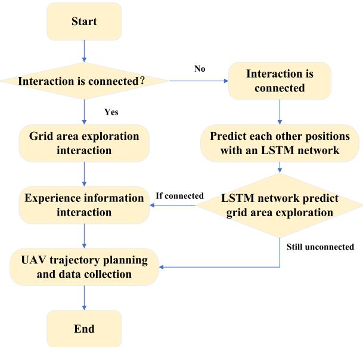  
Fig. 4. Robust collaborative flowchart.

As shown in Fig. 4, when a UAV is connected to others, it records and stores the positions and action sequences of other UAVs during information exchange. If the collaborative information interaction is interrupted, the UAV predicts the positions of other UAVs at time t. This prediction is based on their known positions prior to the disconnection. The UAV then uses these predictions to complete the map information. Furthermore, when a disconnection occurs, the UAV extracts the experience during the disconnection for learning and network updating. This process enhances the robustness of UAVs trajectory planning and data collection, even when collaborative information interaction is disrupted.

## E. UAV Game Model

In this article, the multi-UAV cooperative trajectory planning and data collection problem is modeled as a bilateral symmetric interaction game. Specifically, this game model can be expressed as $\mathcal { G } = \{ \mathcal { M } , \mathcal { A } , \mathcal { U } \}$ , where M is the set of UAVs, A is the set of actions and U is the utility functions of the UAVs. The UAVs are considered as participants in the game, interacting and selecting the best strategy to maximize data collection with minimum energy consumption and information interaction cost.

The utility function depends on the amount of data collected by the UAV, the energy consumption and the cost of cooperative information interactions. Each UAV has its own sensing range. As more data is collected, the UAV needs more cooperative interactions and energy to complete the task. To minimize the energy loss, the UAV needs to reduce the number of information interactions and the flight energy consumption. On this basis, there is an equilibrium between the data collection, the cost of the cooperative information interaction and the energy consumption of UAVs.

Considering the cooperative reinforcement learning scenario between two UAVs i, j, after UAV i performs the action $a _ { i } .$ The cost of information interaction between the two UAVs is $w _ { i j } ( a _ { i } , a _ { j } )$ , which is included by the interaction of grid area exploration and the sharing of experience information. At the same time the cost of cooperative information interaction under the same state is equal for the two UAVs, that is

$$
w _ { i j } ( a _ { i } , a _ { j } ) = w _ { j i } ( a _ { j } , a _ { i } ) .\tag{8}
$$

The UAV data collection reward is related to the amount of data collected by the UAV in a certain period of time, which is derived in Eq. (5). The data collection reward of the i-th UAV, denoted as $F _ { i } ( a _ { i } )$ , can be specifically calculated by

$$
F _ { i } ( a _ { i } ) = \beta _ { d } \Delta D ( t ) = \beta _ { d } \sum _ { n = 1 } ^ { N } \sum _ { k = 1 } ^ { K } l _ { k } ( n ) R _ { k } ( n ) ,\tag{9}
$$

where $\beta _ { d }$ is the data collection incentive coeficient. Let $E _ { i } ( a _ { i } )$ denote the energy consumption of UAV i. The utility function $U _ { i } ( a )$ of the UAV i can be calculated by

$$
U _ { i } ( a ) = F _ { i } ( a _ { i } ) - \sum _ { j \neq i } w _ { i j } ( a _ { i } , a _ { j } ) - E _ { i } ( a _ { i } ) ,\tag{10}
$$

where a is the set of two UAV actions. The utility of UAVs is negatively afected by cooperative information interaction and increased energy consumption. Conversely, the utility function is positively influenced by the indirect increase in UAV data collection. Crucially, this utility function serves as the theoretical basis for the reward design in the subsequent reinforcement learning algorithm, ensuring that the agent’s maximization objective aligns with the NE of the game. In this paper, the objective of the UAV game optimization is to maximize the utility of the UAVs, that is

$$
A ^ { * } = \arg \operatorname* { m a x } _ { a \in \mathcal { A } } U _ { i } ( a ) ,\tag{11}
$$

where $\mathcal { A } = \{ 0 , 1 , 2 , 3 , 4 , 5 \}$ is the action set, which represents the movement of the UAV to the east, south, west, north, landing, and hovering, respectively.

Theorem 1 (Exact potential game [37]): The bilateral interaction game constructed G is an exact potential game that possesses at least one pure-strategy Nash Equilibrium and the optimal solution to the UAV utility maximization problem is a pure-strategy Nash Equilibrium solution to the game.

Proof: Refer to Appendix A.

## III. DDQN-BASED MULTI-UAV COOPERATIVEREINFORCEMENT LEARNING ALGORITHM

The analysis in the previous section shows that the multi-UAV system admits an equilibrium among cooperative information-interaction cost, data-collection reward, and energy consumption. However, realizing this equilibrium requires sequential trajectory decisions in a time-varying environment with changing UAV-base-station rates, complex urban obstacles, and jammer variations across episodes. This makes the problem a dynamic long-horizon combinatorial task that is dificult to solve eficiently online by traditional methods.

Therefore, deep reinforcement learning (DRL) is adopted for online policy learning.

In scenarios where UAV-to-UAV communications are prone to interruption, existing multi-agent reinforcement learning methods exhibit significant limitations. Specifically, Multi-Agent Deep Deterministic Policy Gradient (MADDPG) and Multi-Agent Proximal Policy Optimization (MAPPO) are included as representative MARL baselines, but both follow the centralized training with decentralized execution (CTDE) paradigm and therefore rely on joint-state information during training. Under intermittent inter-UAV communication, this information may become stale or asynchronous, thereby reducing the reliability of value estimation and coordination updates in this setting. In addition, value-decomposition methods such as Q-value Mixing Network (QMIX) assume a shared team reward and a centralized mixing structure, whereas our formulation is based on decentralized local observations and individually evaluated game-theoretic utilities. Therefore, DDQN is adopted as the main learning framework in this paper, while MAPPO and MADDPG are retained as representative comparison baselines under the same interrupted-communication setting. In the proposed DRL framework, the equilibrium-seeking computation is carried out during ofline training, so online action selection only requires direct forward inference of the trained network.

In this section, based on the theory of reinforcement learning, the opportunistic cooperative multi-agent double deep Q-network based on LSTM predictive learning (OCMA-DDQN-LSTM) is designed to solve the above mentioned equilibrium solution of cooperative information interaction overhead, energy consumption and UAV trajectory planning and data collection.

## A. Structure of DDQN Algorithm

In the multi-UAV trajectory planning and data-collection scenario considered in this paper, the UAVs act as distributed agents that make decisions based on local observations and opportunistically exchanged cooperative information. Each UAV inputs its local observation into a neural-network-based policy and outputs an action while receiving the corresponding reward through interaction with the environment and other UAVs. Since the control space is discrete and the learning process must remain compatible with decentralized local observations under intermittent inter-UAV communication, DDQN is adopted as the main learning framework, whose decoupled action selection and value evaluation help alleviate Q-value overestimation [39]. The detailed definition of the MDP is as follows:

(1) State space: When UAVs execute complex tasks, defining an appropriate state space is crucial, as it provides the necessary information for decision-making. In the urban scenario discussed in this paper, the state of the UAV is defined as follows:

$$
\begin{array} { c } { { s ( t ) = \{ l _ { 1 } ^ { G B S } ( t ) , l _ { 2 } ^ { G B S } ( t ) , \ldots , l _ { k } ^ { G B S } ( t ) } } \\ { { l _ { 1 } ^ { J a m } ( t ) , l _ { 2 } ^ { J a m } ( t ) , \ldots , l _ { j } ^ { J a m } ( t ) } } \\ { { l ^ { l a n d } ( t ) , l ^ { b l o c k } ( t ) , l ^ { n } ( t ) , l ( t ) , b ( t ) \} , } } \end{array}\tag{12}
$$

where $l _ { k } ^ { G B S } ( t )$ and $l _ { j } ^ { J a m } ( t )$ denote the location information of the base stations and jammers at time $t , l _ { l a n d } ( t )$ denotes the takeof and landing zone information, $l _ { b l o c k } ( t )$ denotes the locations of buildings afecting communication, $l _ { n } ( t )$ denotes the no-fly-zone information, l(t) denotes the UAV location, and $b ( t )$ denotes the remaining battery level of the UAV. Since the UAV requires the relative positions of the above state information on the map, we adopt a map-processing approach similar to that in [40]. By converting the absolute positions of features in the map into positions relative to the current UAV position, the map is represented in two forms: a compressed global map and an uncompressed cropped local map centered on the UAV.

(2) Action space: The action space used in the DDQN learning process is identical to the strategy set defined in Section II-E. Thus, the action at time t of UAV m is defined as

$$
a _ { m } ( t ) \in { \mathcal { A } } .\tag{13}
$$

To guarantee the safety of the UAV, if the UAV chooses to enter the no-fly zone or collide with a tall building after its operation, the UAV will directly reset its position to the previous one and increment the collision count. It should be noted that this discrete action space is adopted as a high-level decision abstraction for cooperative trajectory planning. As a result, continuous flight dynamics, such as smooth heading adjustment, acceleration constraints, and altitude adaptation, are not explicitly modeled in the current formulation.

(3) Reward function: Directly mapping the utility function derived in the potential game model (Eq. 10) to the learning objective, we design the reward function $r _ { m } ( t )$ for UAV m at time t as:

$$
\begin{array} { r l } & { r _ { m } ( t ) = - r _ { m o \nu } + \varepsilon _ { c o l } \Delta D _ { m } ( t ) } \\ & { ~ - r _ { c o p } - r _ { c r a s h } + r _ { l a n d } + \varepsilon _ { e l e } E _ { m } ( t ) , } \end{array}\tag{14}
$$

where $- r _ { m o \nu }$ denotes a movement penalty to minimize the number of movement steps, $\varepsilon _ { c o l } \Delta D _ { m } ( t )$ denotes reward during data collection, where ${ \varepsilon } _ { c o l }$ is a data collection reward coeficient, $\Delta D _ { m } ( t )$ is the amount of data collected, $- r _ { c o p }$ denotes the cost of cooperative information interaction of the $\mathrm { U A V } , ~ { - r _ { c r a s h } }$ denotes a penalty if the UAV collides with obstacle or enters into no-fly zone, $r _ { l a n d } + \varepsilon _ { e l e } E _ { m } ( t )$ denotes a reward for a successful landing of the UAV, where $r _ { l a n d }$ is a bonus for arriving at a designated landing zone to ensure a safe touchdown, and $\varepsilon _ { e l e }$ is a power remaining reward coeficient, and $E _ { m } ( t )$ ε is the power remaining when the UAV successfully completes the task of landing to reduce the energy consumption of the UAV. It is important to note that the weight coeficients $( { \bf e . g . } , \ \varepsilon _ { c o l } , \varepsilon _ { e l e } )$ normalize these physically distinct terms into a comparable reward scale.

The RL agent’s maximization of cumulative reward $r _ { m } ( t )$ is therefore aligned with the game-theoretic utility $U _ { i } ( a )$ Since the exact potential game formulation has established an equilibrium-oriented coordination structure, the reward design used in decentralized DDQN training remains aligned with that structure. This alignment provides a common optimization target for decentralized policy updates, which helps reduce conflicting updates and alleviate oscillatory learning behavior.

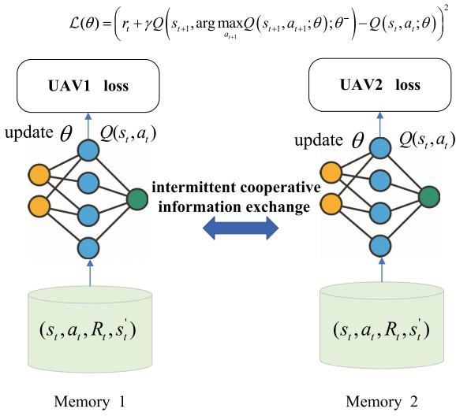  
Fig. 5. DDQN training process.

(4) State transition probability: The state transition is modeled as a deterministic update subject to environmental constraints:

$$
P ( s _ { t + 1 } | s _ { t } , a _ { t } ) = \left\{ { \begin{array} { l l } { 1 , } & { { \mathrm { i f ~ } } s _ { t + 1 } = f ( s _ { t } , a _ { t } ) } \\ { 0 , } & { { \mathrm { o t h e r w i s e } } } \end{array} } \right.\tag{15}
$$

where $f ( s _ { t } , a _ { t } )$ represents the deterministic state update ,function. If the tentative position based on action $a _ { t }$ violates boundary limits or results in a collision, it returns the current position $s _ { t } ;$ otherwise, it returns the new position.

The training process of cooperative trajectory planning and data collection for UAV based on DDQN is shown in Fig. 5. When the UAV outputs an action based on the current state using the training network, it is rewarded and transitions to the next state. The experience, denoted as $( s _ { t } , a _ { t } , r _ { t } , s _ { t + 1 } )$ , is stored in the replay bufer. During training, samples are randomly drawn from this bufer to train the network.

## B. Structure of LSTM Network

In our proposed framework, the LSTM network is employed to predict the future actions of neighboring UAVs by analyzing their historical behavioral patterns. It is important to note that the LSTM module is trained online within each episode. Since the jammer’s position is randomized at the start of an episode but remains static throughout its duration, this online strategy allows the UAV to dynamically learn the specific behavioral patterns of its neighbors for the current environment. To efectively capture both the motion dynamics and environmental constraints, the input has been structured as a temporal sliding window of length $T = 8 ,$ , resulting in a tensor shape of (8 33). Within this sequence, the feature vector at each time step is defined as:

$$
x _ { t } = [ \mathbf { a } _ { o n e h o t } , \mathbf { p } _ { n o r m } , \mathbf { m } _ { l o c a l } ] ,\tag{16}
$$

where $\mathbf { a } _ { o n e h o t } ~ \in ~ \mathbb { R } ^ { 6 }$ represents the one-hot encoded vector of the neighbor $\mathrm { U A V } ^ { \ , } \mathbf { s }$ previous action, corresponding to the discrete action space (North, South, East, West, Hover, Land). $\mathbf { p } _ { n o r m } \in \mathbb { R } ^ { 2 }$ denotes the normalized 2D coordinates $( x , y )$ of ,the neighbor UAV, scaled to [0 1] based on the map size. $\mathbf { m } _ { l o c a l } \in \mathbb { R } ^ { 2 5 }$ is a flattened $5 \times 5$ local observation map centered on the $\mathrm { U A V } ^ { \ , } \mathbf { s }$ position. This local map incorporates critical environmental context, such as obstacles, jammers and No-Fly Zones, allowing collision avoidance rules to be implicitly learned by the LSTM.

Algorithm 1 Opportunistic Cooperative Multi-Agent Double   
Deep Q-Network Based on LSTM Predictive learning(OCMA-  
DDQN-LSTM)   
Input: $D _ { i }$ - empty replay bufer; $\theta _ { i }$ - initial policy network   
parameters and $\theta _ { i } ^ { - }$ - initial target network parameters.   
1: for $e p i s o d e = 1 , 2 , \cdots , N$ do   
2: , , ,Initialize the state sequence $s _ { i } .$   
3: for movement = 1 2 · · · M do   
4: for $U A V i = 1 , 2 , \cdots , K$ do   
5: , , ,if the UAV is connected with others then   
6: The UAV shares grid area exploration and expe  
rience information.   
7: else   
8: Use an LSTM network to predict grid area   
exploration.   
9: Extract experience learning until connected.   
10: end if   
11: Select an action based on the interaction with other   
UAVs and own DDQN network.   
12: Execute action $a _ { t }$ for trajectory planning and data   
collection.   
13: Observe the reward $r _ { t }$ and next state $s _ { t + 1 } .$   
14: Store the experience transition $( s _ { t } , a _ { t } , r _ { t } , s _ { t + 1 } )$ into   
$D _ { i }$   
15: Randomly sample a minibatch of transitions   
$( s _ { t } , a _ { t } , r _ { t } , s _ { t + 1 } )$ from $D _ { i } .$   
16: Update the Q-network parameters $\theta _ { i }$ with the loss   
function.   
17: Soft update the target parameters.   
18: end for   
19: end for   
20: end for

To mitigate the impact of potential prediction errors, we introduce a confidence-based filtering mechanism. The agent utilizes the Softmax output probability to quantify prediction uncertainty. A prediction is executed only if its confidence score exceeds a pre-defined threshold $\tau$ (set to 0.95 based on preliminary experiments). Predictions with low confidence $( \le \ T )$ are discarded, and the agent retains the last known valid state for that time step. This mechanism efectively filters out ambiguous scenarios while maintaining high accuracy for critical coordination. It is worth noting that the proposed fully distributed architecture inherently supports scalability. Conceptually, each UAV decides based on local observations of $M _ { n }$ neighbors. Computationally, the LSTM inference complexity depends on $M _ { n }$ rather than the global population M. Thus, the computational load per agent remains manageable even as the swarm size increases.

## IV. SIMULATION RESULTS AND DISCUSSION

In this section, simulation experiments are conducted to analyze the proposed multi-UAV cooperative reinforcement learning robust trajectory planning and data collection algorithms. Given that UAV actions are discrete, we compare the performance of other algorithms (MAPPO, MADDPG, DuelingDQN, DDQN without cooperation). These algorithms utilize the same neural network model and training parameters, and are implemented using TensorFlow. The experiments were conducted on a computer equipped with an i7-14700KF CPU and an RTX 4060Ti GPU. The simulation settings and results are presented below.

## A. Simulation Setting

The simulation experiments are conducted in the urban scenario shown in Fig. 2. The core scenario assumptions have been summarized in Section II-A. To normalize the transmission and noise powers, we define a reference celledge SNR of −25 dB. This value corresponds to the link quality between a ground-level UAV at the map center and an unobstructed device at the grid corner. Each UAV collects data from eight base stations. In each episode, the base stations maintain fixed map coordinates, initial data, and transmit power. The propagation parameter in Eq. (1) is set according to [41], as detailed in Table II.

Each UAV is assumed to maintain a constant speed during each movement. It can either hover or move at a fixed speed.1 In this paper, the energy consumption model accounts for both propulsion energy and the energy required by communication and onboard computing modules. The episode is terminated when the UAV lands or its battery is exhausted, with the initial battery charge set at 150 units. Considering that the communication channel changes faster than the $\mathrm { U A V } ^ { \ , } \mathbf { s }$ movement, each movement step is divided into four 1-second communication time slots. Thus, it takes 4 seconds for the UAV to move across one grid, with the communication rate assumed consistent within each slot.

The detailed hyperparameters for both the DDQN and LSTM networks, including the number of neurons, activation functions, and training configurations, are listed in Table II. We compare the performance of the proposed algorithm (OCMA-DDQN-LSTM) against the uncooperative DDQN, OCMA-DDQN, OCMA-DuelingDQN-LSTM and adapted cooperative MARL baselines (MADDPG, MAPPO). We also analyze the impact of multiple UAVs with diferent experience value circle sizes to select the appropriate experience value.

1Without loss of generality, our framework can be extended to support velocity optimization. Supplementary experiments with discrete velocity control (e.g., 2.5 m/s and 5 m/s) have confirmed that the algorithm successfully adapts to expanded action spaces while maintaining convergence stability.

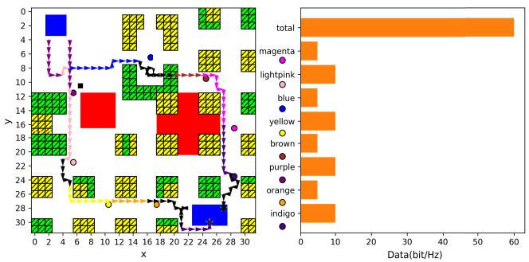

TABLE II  
PARAMETER SETTING
<table><tr><td>Parameter</td><td>Value</td></tr><tr><td>A. Scenario Parameters</td><td></td></tr><tr><td>L</td><td>32</td></tr><tr><td>H</td><td>10 m</td></tr><tr><td> $\alpha _ { \mathrm { L o S } }$ </td><td>2.27</td></tr><tr><td> $\alpha _ { \mathrm { N L o S } }$ </td><td>3.64</td></tr><tr><td> $\sigma _ { \mathrm { L o S } } ^ { 2 }$ </td><td>2.0</td></tr><tr><td> $\sigma _ { \mathrm { N L 0 S } } ^ { 2 }$ </td><td>5.0</td></tr><tr><td>Jammer Power</td><td>[10, 20, 30, 40, 50] W</td></tr><tr><td>Jammer Beamwidth</td><td>[30°, 60°, 90°]</td></tr><tr><td>Jammer Quantity</td><td>[1, 2, 3]</td></tr><tr><td>Jammer Position</td><td>Randomly initialized per episode</td></tr><tr><td>Circle of experience value  $d _ { 0 } , d _ { 1 } , d _ { 2 }$ </td><td>2m, 100m, 200m</td></tr><tr><td>B. DDQN</td><td></td></tr><tr><td>Learning Rate</td><td>0.00003</td></tr><tr><td>Discount Factor</td><td>0.99</td></tr><tr><td>Memory size</td><td>30000</td></tr><tr><td>Episode</td><td>4500</td></tr><tr><td>Batch Size</td><td>128</td></tr><tr><td>Soft Update Coefficient</td><td> $5 \times 1 0 ^ { - 4 }$ </td></tr><tr><td>Network Model</td><td>three-layer fully-connected neural</td></tr><tr><td>The number of neurons</td><td>network (512, 512, 512)</td></tr><tr><td>Activation Function</td><td>ReLU</td></tr><tr><td>C. LSTM</td><td></td></tr><tr><td>Input Shape</td><td>(8,33)</td></tr><tr><td>LSTM Layers</td><td>2 (Stacked)</td></tr><tr><td>Units per Layer</td><td>64</td></tr><tr><td>Activation Function</td><td>Tanh</td></tr><tr><td>Output Layer</td><td>Dense (6 units)</td></tr><tr><td>Optimizer</td><td>Adam</td></tr><tr><td>Learning Rate</td><td>0.001</td></tr><tr><td>Loss Function</td><td>sparse softmax cross-entropy</td></tr><tr><td>Training Epochs</td><td>1</td></tr><tr><td>Training Trigger</td><td>Every 5 steps</td></tr></table>

TABLE III

FLOPS AND TRAINABLE PARAMS COMPARISON OF THREE ALGORITHMS
<table><tr><td rowspan=1 colspan=1>Metrics Methods</td><td rowspan=1 colspan=1>FLOPs</td><td rowspan=1 colspan=1>TrainableParams</td></tr><tr><td rowspan=1 colspan=1>OCMA-DDQN-LSTM</td><td rowspan=1 colspan=1>35349922</td><td rowspan=1 colspan=1>35291102</td></tr><tr><td rowspan=1 colspan=1>OCMA-DDQN</td><td rowspan=1 colspan=1>35226394</td><td rowspan=1 colspan=1>35232600</td></tr><tr><td rowspan=1 colspan=1>OC-MAPPO-LSTM</td><td rowspan=1 colspan=1>7925867</td><td rowspan=1 colspan=1>7750531</td></tr><tr><td rowspan=1 colspan=1>OC-MADDPG-LSTM</td><td rowspan=1 colspan=1>123030790</td><td rowspan=1 colspan=1>30778264</td></tr><tr><td rowspan=1 colspan=1>OCMA-DuelingDQN-LSTM</td><td rowspan=1 colspan=1>36641564</td><td rowspan=1 colspan=1>36425580</td></tr><tr><td rowspan=1 colspan=1>DDQN without cooperation</td><td rowspan=1 colspan=1>35226390</td><td rowspan=1 colspan=1>35232600</td></tr></table>

Fig. 6. Schematic of UAV maximum reward episode trajectory planning (left) and data collection (right).

## B. Energy Consumption and Complexity Analysis

In this section, we provide a detailed breakdown of the energy consumption model and analyze the computational complexity to assess the practical feasibility of the proposed system.

1) Propulsion Energy Modeling: The propulsion energy constitutes the primary component of the UAV’s energy budget. Adopting the aerodynamic model from [42], we calculate the power consumption for hovering $( P _ { \mathrm { h o v e r } } )$ and level flight (P(V)). The hovering power $( V = 0 )$ is derived as:

$$
P _ { \mathrm { h o v e r } } = P _ { \mathrm { 0 } } + P _ { i } \approx 1 6 8 . 4 9 ~ \mathrm { W } .\tag{17}
$$

For level flight at velocity V, the power is expressed as:

$$
\begin{array} { r l r } {  { P ( V ) = P _ { 0 } ( 1 + \frac { 3 V ^ { 2 } } { U _ { \mathrm { t i p } } ^ { 2 } } ) } } \\ & { } & { + P _ { i } ( \sqrt { 1 + \frac { V ^ { 4 } } { 4 \nu _ { 0 } ^ { 4 } } } - \frac { V ^ { 2 } } { 2 \nu _ { 0 } ^ { 2 } } ) ^ { 1 / 2 } + \frac { 1 } { 2 } d _ { 0 } \rho s A V ^ { 3 } . } \end{array}\tag{18}
$$

With $V = 2 . 5 \mathrm { \ m } / \mathrm { s } .$ , the flight power is $P ( 2 . 5 ) ~ \approx ~ 1 6 0 . 6 5$ W. Consequently, for a time step of $t = 4 \ \mathrm { s } .$ , the propulsion energy is $E _ { \mathrm { p r o p } } \approx 6 4 2 . 6 \mathrm { ~ J ~ }$ . To facilitate discrete state space modeling, we discretized the UAV’s total battery capacity into 150 units. We defined the hovering energy consumption per step $\mathrm { ~ ( \approx ~ } \mathbf { 6 } 7 4 \mathrm { ~ J ) ~ }$ as the baseline for 1.0 unit. Based on this mapping, the propulsion energy for level flight (642.6 J) corresponds to approximately 0.95 units.

2) Communication and Computational Overhead: The system also accounts for the static power of the onboard computer and communication modules, modeled as a constant term $P _ { \mathrm { c o m } } ~ = ~ 1 0$ W. This yields a static energy consumption of $E _ { \mathrm { c o m } } ~ = ~ 4 0 ~ \mathrm { J }$ per step, which maps to 0.06 battery units. Regarding complexity, the inference latency on an NVIDIA Jetson Nano (≈ 125 GFLOPS FP32) is estimated. Given the FLOPs in Table III, the single-step inference time is $T _ { \mathrm { i n f } }$ ≈ 0 28 ms. This latency (0.28 ms) is significantly shorter than the channel coherence time of fast fading, ensuring that the decision is made based on valid channel state information. The resulting dynamic computational energy $( E _ { \mathrm { a l g } } \approx 0 . 0 0 2 8 ~ \mathrm { J ) }$ is negligible. This confirms that the algorithm is computationally lightweight and the energy model is dominated by propulsion costs.

## C. UAV Trajectory Planning Performance

To verify the efectiveness of our proposed OCMA-DDQN-LSTM method, we consider a real urban scenario in Fig. 2. In this case, we take two UAVs as an example and simulate their trajectory planning and data collection. Fig. 6 gives a schematic view of the results. The initial positions of eight base stations are set to be (29,17), (6,22), (17,7), (11,28), (25,10), (6,12), (18,28), (29,24), and the amount of data is set to [5,10,5,10,5,10,5,10,5,10] bit/Hz for simulation experiments. We choose the best performance after convergence as shown in Fig. 6. Fig. 6 (left) shows that both UAVs are able to avoid obstacles and collect data smoothly. The blue area in the map is the take-of and landing zone, the green is the short building (UAV can fly over), the yellow and red are the tall building with no-fly zone (UAV cannot fly over), the circle and the square are the base station and jammers, respectively. The arrows with the color indicate that the UAV is collecting the data from the base station with the corresponding color in this moving step. If the arrows are black, the UAV communication is interfered by the jammers or the UAV does not collect data from any base station. Fig. 6 (right) shows the amount of data collected by the UAV. The length of the blue bar corresponds to the amount of uncollected data, the orange color is the amount of collected data, and all orange bars indicate that the UAV has completed all data collection.

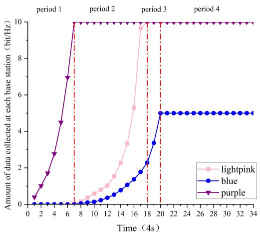  
(a)

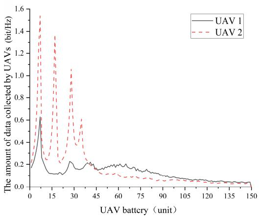  
(b)  
Fig. 7. Dynamics of data collection: (a) Data collected from three representative base stations; (b) Average collected data per step for the two UAVs.

## D. UAV Data Collection Performance

Fig. 7(a) illustrates the data collection volume over time. We designate the UAV originating from (5,4) as UAV A and the one from (3,4) as UAV B. With a step duration of 4 seconds, the data collection process from the first three base stations can be analyzed in four distinct periods, as correlated with the trajectory in Fig. 6.

In period 1, both UAVs are closest to the PURPLE base station. Consequently, the high communication rate enables rapid data collection for both UAVs. In period 2, UAV A primarily collects data from the LIGHTPINK base station, while UAV B targets the BLUE base station. Notably, the complex environment (tall buildings) near the BLUE base station slows down UAV B’s collection rate. As the UAVs approach their targets, the transmission rate increases continuously. However, the curve’s slope eventually flattens as the remaining data volume at the base station diminishes. In period 3, UAV A is impacted by jammers and obstacles, halting its data collection. Conversely, UAV B continues to collect data from the BLUE base station with an increasing rate. In period 4, both UAVs successfully complete collection from the initial base stations and proceed to subsequent targets. Following the same process, they execute trajectory planning to land after completing all tasks. This phase corresponds to the final trajectory segment in Fig. 6(left), confirming that the proposed cooperative algorithm successfully accomplishes the mission.

Fig. 7(b) demonstrates the dynamic data collection change of each UAV. Each UAV initially possesses 150 units of battery. Due to the influence of the time-varying channel and intermittent cooperative information interactions, the UAV’s data collection volume fluctuates, but it has basically completed the data collection when approximately 135 battery units have been consumed. The UAV has completed the data collection process and has a certain amount of remaining power to ensure that the UAV can land in the designated area smoothly with a reasonable trajectory.

## E. Performance Comparison Among Diferent Algorithms

1) Reward Performance Comparison: This paper compares the proposed OCMA-DDQN-LSTM method against five baselines: the non-cooperative DDQN, OCMA-DDQN (without LSTM), and three cooperative variants based on DuelingDQN, MAPPO, and MADDPG (all enhanced with LSTM for fair comparison). The convergence performance is shown in Fig. 8(a), where solid lines represent the average reward over multiple independent runs and shaded regions indicate the standard deviation. It is observed that all cooperative algorithms significantly outperform the non-cooperative baseline, achieving convergence after approximately 2500 episodes. Statistics over the converged interval further support that the proposed OCMA-DDQN-LSTM maintains a high converged reward with relatively small reward fluctuation under intermittent communication. As shown in Fig. 9(a), our method improves the reward by about 31% compared to the non-cooperative approach. This result is consistent with the discussion in Section III: under intermittent connectivity, the proposed decentralized learning framework performs better under the execution condition than CTDE-style baselines that demand joint-state information. Compared with OCMA-DDQN, the proposed OCMA-DDQN-LSTM provides a moderate but consistent improvement in the converged reward and data collection ratio. More importantly, the main benefit of the LSTM module lies in improved robustness and more stable task performance under intermittent communication interruptions.

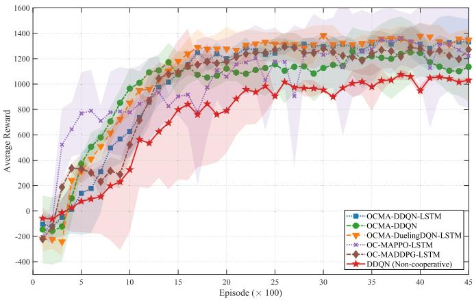  
(a)

Fig. 8. Comparison chart of average reward (left) and data collection ratio (right).  
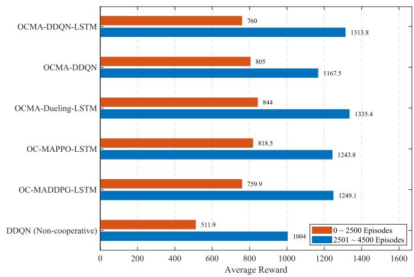  
(a)  
Fig. 9. Comparison chart of average reward (left) and collection ratio (right).

2) Data Collection Ratio Comparison: The data collection ratio is defined as the ratio of the amount of data collected by the UAV to the total amount of data. As can be seen in Fig. 8(b) and Fig. 9(b), the proposed OCMA-DDQN-LSTM algorithm achieves the highest data collection ratio, reaching an average of 0.923 after convergence. This outperforms both the OCMA-DuelingDQN-LSTM (0.911) and the MARL baselines (MADDPG: 0.908, MAPPO: 0.897), indicating that our method completes the primary mission more efectively. The remaining uncollected data typically corresponds to nodes located in ineficient positions or near jammers. The agent strategically chooses to bypass these nodes to conserve energy for a safe return. Note that for critical data scenarios, the UAV can utilize the available “Hover” action to ensure the complete transmission of high-priority data, albeit at the cost of higher energy consumption.

3) Battery Consumption Comparison: Fig. 10(a) illustrates the variation in battery consumption rate across diferent algorithms. The battery consumption ratio is defined as the total energy consumed during the mission relative to the initial battery capacity. As observed, the proposed OCMA-DDQN-LSTM algorithm exhibits the lowest consumption rate, retaining more than 10% of the battery upon landing. This energy eficiency directly correlates with the optimized trajectory planning, which minimizes unnecessary maneuvers while ensuring high data collection (as shown in Fig. 7). In contrast, the non-cooperative DDQN and OCMA-DDQN algorithms show significantly higher consumption rates, indicating ineficient path planning in dynamic environments.

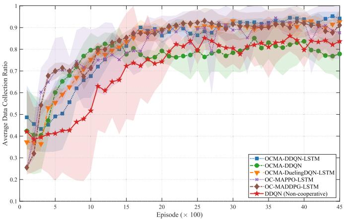  
(b)

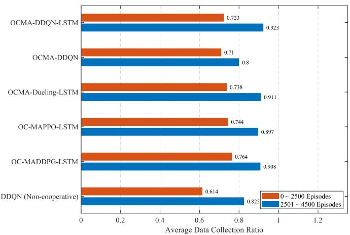  
(b)

4) Collision Counter Comparison: Fig. 10(b) presents the convergence of the collision count, defined as the number of times the UAV triggers a position reset due to obstacle collision or no-fly zone violation. The proposed OCMA-DDQN-LSTM achieves the lowest collision rate after convergence, maintaining near-zero incidents. This significant reduction compared to uncoordinated baselines demonstrates the efectiveness of the cooperative mechanism in enhancing safety.

5) LSTM-Based Prediction Accuracy: We further analyzed the sensitivity of prediction accuracy to interruption duration, as shown in Fig. 11. Results show that accuracy remains exceptionally high (≈ 80%) for the first 2 steps after disconnection. This is physically grounded in our map-aware architecture: within

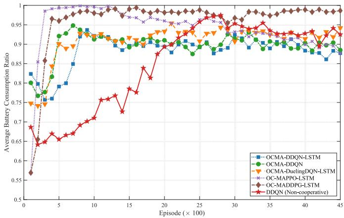  
(a)

Fig. 10. Comparison of average battery consumption ratio (left) and collision counter (right).  
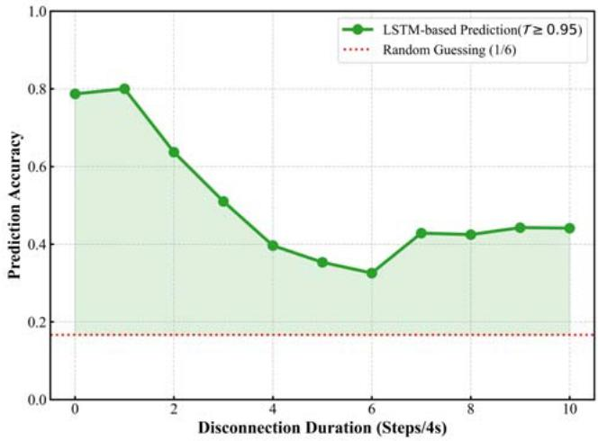

Fig. 11. Duration of interruption versus LSTM-based prediction accuracy graph.  
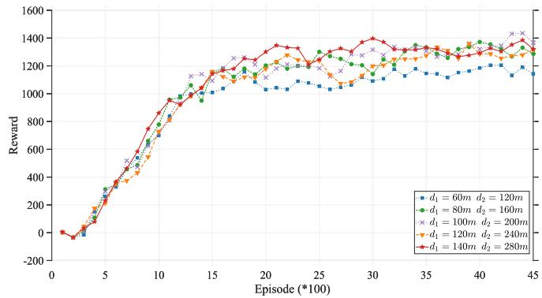  
Fig. 12. Schematic of the variation in the dynamic average amount of data collected by UAVs.

2 steps, the $\mathrm { U A V } ^ { \ , } \mathbf { s }$ movement is fully constrained within its observed $5 \times 5$ local map, ensuring valid predictions. This window is suficient to bridge typical intermittent communication gaps efectively.

6) Diferent Experience Circles Comparison: Fig. 12 illustrates the overall reward earned by the UAV across varying distances of experience circles represented by $d _ { 1 }$ and $d _ { 2 } .$ Diferent values are associated with diverse probabilities of experience sharing and consequent reward discrepancies. Initially, suitable distances $d _ { 1 }$ and $d _ { 2 }$ were established considering the urban map’s dimensions from a macro viewpoint, with the corresponding rewards for diferent distances outlined. It is evident that the experience values at varying distances significantly influence the UAV path planning and data collection strategies.

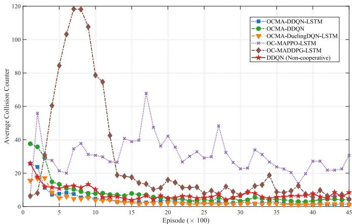  
(b)

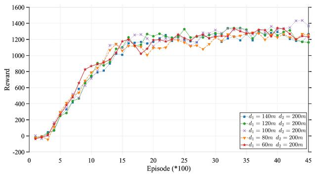  
(a)

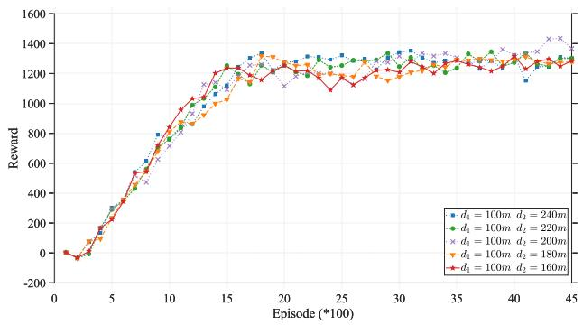  
(b)  
Fig. 13. Reward variation with distance: (a) d1; (b) $d _ { 2 } .$

Once the approximate range of distance values was established, we examined the efects of varying $d _ { 1 }$ and $d _ { 2 }$ on $\mathrm { U A V } \mathbf { \hat { s } }$ performance. In Fig. 13(a), $d _ { 1 }$ is held constant while diferent values of $d _ { 2 }$ are employed to assess their impact. A larger $d _ { 2 }$ leads to a higher frequency of information interaction and consequently increases the cost of collaborative information exchange. The benefits may outweigh the costs in complex scenarios, but in simple environments more frequent collaborative interactions result in higher communication costs. That, in turn, afects the task completion rate and convergence performance of the UAVs. In Fig. 13(b), $d _ { 2 }$ remains constant while diferent values of $d _ { 1 }$ are analyzed. A larger $d _ { 1 }$ results in a lower frequency of information interaction. The two figures clearly demonstrate that setting the experience value circle parameters to $d _ { 1 } = 1 0 0$ m and $d _ { 2 } = 2 0 0$ m is reasonable.

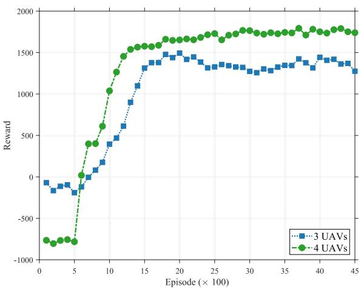  
(a)

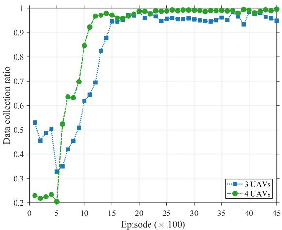

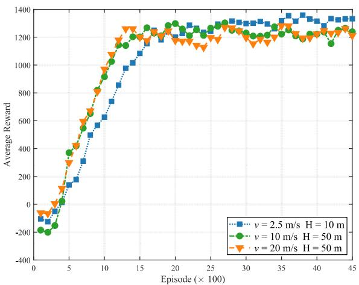  
(c)

(b)  
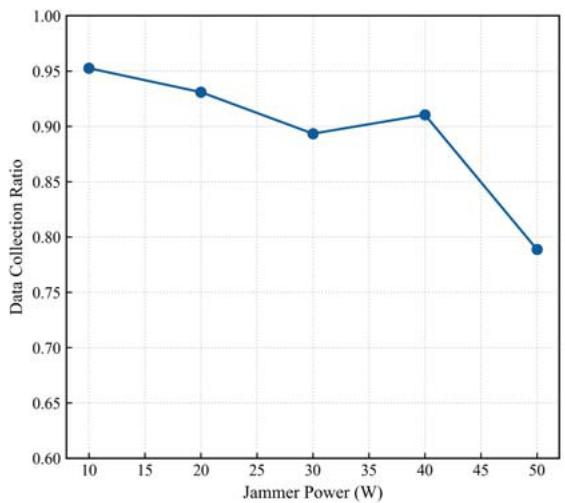  
(d)  
Fig. 14. Scalability and robustness analysis: (a) Average Reward convergence with 3 and 4 UAVs; (b) Data Collection Ratio convergence with 3 and 4 UAVs; (c) Average Reward under diferent flight velocities; (d) Impact of jammer configurations on Data Collection Ratio.

7) FLOPs and Trainable Params Comparison: As shown in Table III, we also compared the FLOPs and trainable parameters required by two UAVs with diferent algorithms. It can be seen that the proposed collaborative learning method does not incur excessive computational overhead while improving performance, and also provides the possibility for actual deployment in the future.

## F. Scalability and Robustness Analysis

To rigorously validate the general applicability of our framework, we conducted extensive supplementary experiments covering larger swarm sizes, realistic flight velocities, and specific parameter sensitivities.

1) Scalability With Larger Swarms: We expanded the system to 3 and 4 UAVs. To accommodate the increased team size, the total data capacity of the base stations was scaled up to 90 bit/Hz (for 3 UAVs) and 120 bit/Hz (for 4 UAVs). As shown in Fig. 14(a), stable convergence is maintained when the swarm size increases to 3 and 4 UAVs under proportionally scaled task loads. Crucially, Fig. 14(b) demonstrates that the Data Collection Ratio stabilizes at high levels (95%-99%) in the converged phase, indicating that the distributed formulation remains efective for larger teams in the tested settings.

2) Impact of Flight Velocity: To further evaluate the algorithm’s adaptability to diverse operational requirements, we extended the simulation to include higher flight velocities of 10 m s and 20 m s at a fixed altitude of $H = 5 0 \ m .$ . Corre-/ /spondingly, the map size was scaled up to 1280m × 1280 m to match the expanded operational range. Fig. 14(c) shows that stable convergence is maintained at higher flight velocities. This is because the enlarged map preserves the relative spatial structure in the local observation window, while the increased communication distance at higher speed slightly reduces the achievable reward.

3) Sensitivity Analysis to Key Parameters: While the standard training incorporates randomized initialization, we further conducted controlled experiments to isolate the sensitivity to specific parameters, particularly the jammer transmission power. In this analysis, the jammer quantity was fixed at 2 and the beamwidth at $6 0 ^ { \circ }$ , while the transmission power was varied from 10 W to 50 W. As illustrated in Fig. 14(d), increasing the jammer power inevitably expands the efective interference range, thereby reducing the navigable airspace. Consequently, a slight decline in the Data Collection Ratio is observed, which aligns with the physical constraints of the environment. However, even under the maximum tested power of 50 W, the algorithm maintains a collection ratio of approximately 80%, demonstrating its capability to preserve mission-critical performance under intensified interference conditions. In addition, a sensitivity analysis of the data-collection reward coeficient $\beta _ { d }$ shows that $\beta _ { d } ~ = ~ 3 0$ provides the best tradeof among data collection ratio, battery consumption ratio, and collision performance in the current setting.

4) Practical Applicability and Limitations: The current framework has several practical limitations. First, its predictive and cooperative gains rely on the assumption that interrupted information remains informative over a short horizon; therefore, performance may degrade when communication outages become much longer or when interference conditions vary rapidly within a mission. Second, the present validation mainly covers swarm sizes up to 4 UAVs, short-to-medium interruption durations, and episode-wise static jammer settings, which defines the current boundary conditions of the method. Third, as the swarm size increases further, coordination overhead, shared information, and the dificulty of decentralized decision making all grow, posing scalability challenges to the current mechanism.

## V. CONCLUSION

In this paper, we addressed the challenges of intermittent connectivity and limited flight time in complex multi-UAV environments. To enhance mission robustness, we proposed an autonomous cooperative framework integrating LSTM-based predictive learning and potential game theory. Specifically, an LSTM module was developed to maintain efective trajectory planning during communication interruptions, while a potential game formulation was employed to balance cooperative information exchange and operational costs. Based on this theoretical foundation, the OCMA-DDQN-LSTM algorithm was designed to optimize data collection and energy eficiency in dynamic settings. Simulation results have verified that the proposed method enables UAVs to achieve robust performance, significantly outperforming noncooperative and standard MARL baselines. Future work will extend the current framework toward more realistic flight settings, including continuous control formulations and adaptive maneuvering. In addition, the extension to larger UAV swarms will be further investigated to examine scalability under more complex coordination and interference conditions.

## APPENDIX A PROOF OF THEOREM 1

To prove the existence of an equilibrium solution to the above game, construct the potential function as

$$
\phi ( a ) = \frac { 1 } { 2 } \sum _ { i } \sum _ { j \neq i } - w _ { i j } ( a _ { i } , a _ { j } ) + \sum _ { i } \left( F _ { i } ( a _ { i } ) - E _ { i } ( a _ { i } ) \right)\tag{19}
$$

when the unilateral action of UAV i changes from $a _ { i }$ to $b _ { i }$ , the potential function changes to

$$
\begin{array} { l } { \displaystyle \phi ( a | b _ { i } ) - \phi ( a ) } \\ { \displaystyle = \frac { 1 } { 2 } \sum _ { i } \sum _ { j \neq i } - w _ { i j } ( b _ { i } , a _ { j } ) + \sum _ { i } ( F _ { i } ( a _ { i } ) - E _ { i } ( a _ { i } ) ) } \\ { \displaystyle ~ - \frac { 1 } { 2 } \sum _ { i } \sum _ { j \neq i } - w _ { i j } ( a _ { i } , a _ { j } ) - \sum _ { i } ( F _ { i } ( a _ { i } ) - E _ { i } ( a _ { i } ) ) } \\ { \displaystyle = \frac { 1 } { 2 } \left( - w _ { i j } ( b _ { i } , a _ { j } ) - w _ { j i } ( a _ { j } , b _ { i } ) \right) } \\ { \displaystyle ~ - \frac { 1 } { 2 } \left( - w _ { i j } ( a _ { i } , a _ { j } ) - w _ { j i } ( a _ { j } , a _ { i } ) \right) } \\ { \displaystyle ~ + ( F _ { i } ( b _ { i } ) - E _ { i } ( b _ { i } ) ) - ( F _ { i } ( a _ { i } ) - E _ { i } ( a _ { i } ) ) } \end{array}\tag{20}
$$

according to Eq. (8) and Eq. (20),

$$
\begin{array} { r l } & { \phi ( a \backslash b _ { i } ) - \phi ( a ) = - w _ { i j } ( b _ { i } , a _ { j } ) + w _ { i j } ( a _ { i } , a _ { j } ) } \\ & { \qquad + \left( F _ { i } ( b _ { i } ) - E _ { i } ( b _ { i } ) \right) - \left( F _ { i } ( a _ { i } ) - E _ { i } ( a _ { i } ) \right) } \\ & { \qquad = U _ { i } ( a \backslash b _ { i } ) - U _ { i } ( a ) . } \end{array}\tag{21}
$$

The above game is an exact potential game, where a unilateral action change by any UAV results in the same amount of change in the utility function and the same amount of change in the potential function. The stochastic channel term only afects the realized data collection amount, but it does not change the unilateral utility diference structure. Therefore, the game admits at least one pure strategy Nash Equilibrium solution [37]. Thus, there is an equilibrium between UAV data collection and cooperative information interaction and energy consumption. Therefore, Theorem 1 is proved.

## REFERENCES

[1] R. Shakeri et al., “Design challenges of multi-UAV systems in cyberphysical applications: A comprehensive survey and future directions,” IEEE Commun. Surveys Tuts., vol. 21, no. 4, pp. 3340–3385, 4th Quart., 2019.

[2] M. Mozafari, W. Saad, M. Bennis, Y.-H. Nam, and M. Debbah, “A tutorial on UAVs for wireless networks: Applications, challenges, and open problems,” IEEE Commun. Surveys Tuts., vol. 21, no. 3, pp. 2334–2360, 3rd Quart., 2019.

[3] S. Hayat, E. Yanmaz, and R. Muzafar, “Survey on unmanned aerial vehicle networks for civil applications: A communications viewpoint,” IEEE Commun. Surveys Tuts., vol. 18, no. 4, pp. 2624–2661, 4th Quart., 2016.

[4] B. Li, Z. Fei, and Y. Zhang, “UAV communications for 5G and beyond: Recent advances and future trends,” IEEE Internet Things J., vol. 6, no. 2, pp. 2241–2263, Apr. 2019.

[5] M. Erdelj, E. Natalizio, K. R. Chowdhury, and I. F. Akyildiz, “Help from the sky: Leveraging UAVs for disaster management,” IEEE Pervasive Comput., vol. 16, no. 1, pp. 24–32, Jan. 2017.

[6] Y. Zeng, R. Zhang, and T. J. Lim, “Wireless communications with unmanned aerial vehicles: Opportunities and challenges,” IEEE Commun. Mag., vol. 54, no. 5, pp. 36–42, May 2016.

[7] L. Atzori, A. Iera, and G. Morabito, “The Internet of Things: A Survey,” Comput. Netw., vol. 54, no. 15, pp. 2787–2805, Oct. 2010.

[8] A. H. M. Jakaria et al., “Trajectory synthesis for a UAV swarm based on resilient data collection objectives,” IEEE Trans. Netw. Service Manage., vol. 20, no. 1, pp. 138–151, Mar. 2023.

[9] Z. Wei et al., “UAV-assisted data collection for Internet of Things: A survey,” IEEE Internet Things J., vol. 9, no. 17, pp. 15460–15483, Sep. 2022.

[10] T. Ding, N. Liu, Z.-M. Yan, L. Liu, and L.-Z. Cui, “An eficient reinforcement learning game framework for UAV-enabled wireless sensor network data collection,” J. Comput. Sci. Technol., vol. 37, no. 6, pp. 1356–1368, Nov. 2022.

[11] N. C. Luong et al., “Applications of deep reinforcement learning in communications and networking: A survey,” IEEE Commun. Surveys Tuts., vol. 21, no. 4, pp. 3133–3174, 4th Quart., 2019.

[12] S. A. H. Mohsan, N. Q. H. Othman, Y. Li, M. H. Alsharif, and M. A. Khan, “Unmanned aerial vehicles (UAVs): Practical aspects, applications, open challenges, security issues, and future trends,” Intell. Service Robot., vol. 16, no. 1, pp. 109–137, Jan. 2023.

[13] Y. Zhou, N. Cheng, N. Lu, and X. S. Shen, “Multi-UAVaided networks: Aerial-ground cooperative vehicular networking architecture,” IEEE Veh. Technol. Mag., vol. 10, no. 4, pp. 36–44, Dec. 2015.

[14] S. Padakandla, “A survey of reinforcement learning algorithms for dynamically varying environments,” ACM Comput. Surv., vol. 54, no. 6, pp. 1–25, Jul. 2022.

[15] S. Xu, X. Zhang, C. Li, D. Wang, and L. Yang, “Deep reinforcement learning approach for joint trajectory design in multi-UAV IoT networks,” IEEE Trans. Veh. Technol., vol. 71, no. 3, pp. 3389–3394, Mar. 2022.

[16] T. Wu et al., “A novel AI-based framework for AoI-optimal trajectory planning in UAV-assisted wireless sensor networks,” IEEE Trans. Wireless Commun., vol. 21, no. 4, pp. 2462–2475, Apr. 2022.

[17] S. Li, F. Wu, S. Luo, Z. Fan, J. Chen, and S. Fu, “Dynamic online trajectory planning for a UAV-enabled data collection system,” IEEE Trans. Veh. Technol., vol. 71, no. 12, pp. 13332–13343, Dec. 2022.

[18] B. Khamidehi and E. S. Sousa, “A double Q-learning approach for navigation of aerial vehicles with connectivity constraint,” in Proc. IEEE Int. Conf. Commun. (ICC), Dublin, Ireland, Jun. 2020, pp. 1–6.

[19] H. Bayerlein, M. Theile, M. Caccamo, and D. Gesbert, “Multi-UAV path planning for wireless data harvesting with deep reinforcement learning,” IEEE Open J. Commun. Soc., vol. 2, pp. 1171–1187, 2021.

[20] M. J. Sobouti, A. H. Mohajerzadeh, S. A. H. Seno, and H. Yanikomeroglu, “Managing sets of flying base stations using energy eficient 3D trajectory planning in cellular networks,” IEEE Sensors J., vol. 23, no. 10, pp. 10983–10997, May 2023.

[21] J. Lee and V. Friderikos, “Multiple UAVs trajectory optimization in multicell networks with adjustable overlapping coverage,” IEEE Internet Things J., vol. 10, no. 10, pp. 9122–9135, May 2023.

[22] M. Abdel-Basset, R. Mohamed, I. M. Hezam, K. M. Sallam, A. Foul, and I. A. Hameed, “Multiobjective trajectory optimization algorithms for solving multi-UAV-assisted mobile edge computing problem,” J. Cloud Comput., vol. 13, no. 1, Feb. 2024, Art. no. 35.

[23] W. Hu et al., “Multi-UAV coverage path planning: A distributed online cooperation method,” IEEE Trans. Veh. Technol., vol. 72, no. 9, pp. 11727–11740, Sep. 2023.

[24] J. Wang, C. Jiang, Z. Han, Y. Ren, R. G. Maunder, and L. Hanzo, “Taking drones to the next level: Cooperative distributed unmanned-aerial-vehicular networks for small and mini drones,” IEEE Veh. Technol. Mag., vol. 12, no. 3, pp. 73–82, Sep. 2017.

[25] X. Xing, Z. Zhou, Y. Li, B. Xiao, and Y. Xun, “Multi-UAV adaptive cooperative formation trajectory planning based on an improved MATD3 algorithm of deep reinforcement learning,” IEEE Trans. Veh. Technol., vol. 73, no. 9, pp. 12484–12499, Sep. 2024.

[26] A. Gao, Q. Wang, W. Liang, and Z. Ding, “Game combined multiagent reinforcement learning approach for UAV assisted ofloading,” IEEE Trans. Veh. Technol., vol. 70, no. 12, pp. 12888–12901, Dec. 2021.

[27] X. Gong, T. Su, W. Zhao, K. Chi, Y. Yang, and C. Yao, “A potential game approach to multi-UAV accurate coverage based on deterministic radio wave propagation model in urban area,” IEEE Access, vol. 11, pp. 68560–68568, 2023.

[28] L. Jia et al., “Game theory and reinforcement learning for anti-jamming defense in wireless communications: Current research, challenges, and solutions,” IEEE Commun. Surveys Tuts., vol. 27, no. 3, pp. 1798–1838, Jun. 2025.

[29] I. A. Nemer, T. R. Sheltami, S. Belhaiza, and A. S. Mahmoud, “Energyeficient UAV movement control for fair communication coverage: A deep reinforcement learning approach,” Sensors, vol. 22, no. 5, p. 1919, Mar. 2022.

[30] S. Gong, M. Wang, B. Gu, W. Zhang, D. T. Hoang, and D. Niyato, “Bayesian optimization enhanced deep reinforcement learning for trajectory planning and network formation in multi-UAV networks,” IEEE Trans. Veh. Technol., vol. 72, no. 8, pp. 10933–10948, Aug. 2023.

[31] S. Zhu, L. Gui, N. Cheng, F. Sun, and Q. Zhang, “Joint design of access point selection and path planning for UAV-assisted cellular networks,” IEEE Internet Things J., vol. 7, no. 1, pp. 220–233, Jan. 2020.

[32] G. Hu, Y. Zhu, D. Zhao, M. Zhao, and J. Hao, “Event-triggered communication network with limited-bandwidth constraint for multiagent reinforcement learning,” IEEE Trans. Neural Netw. Learn. Syst., vol. 34, no. 8, pp. 3966–3978, Aug. 2023.

[33] Q. Sun, D. Steckelmacher, Y. Yao, A. Nowe, and R. Avalos,´ “Dynamic size message scheduling for multi-agent communication under limited bandwidth,” IEEE Trans. Mobile Comput., vol. 23, no. 12, pp. 15080–15097, Dec. 2024.

[34] Z. Lu, G. Wu, F. Zhou, and Q. Wu, “Intelligently joint task assignment and trajectory planning for UAV cluster with limited communication,” IEEE Trans. Veh. Technol., vol. 73, no. 9, pp. 13122–13137, Sep. 2024.

[35] Y. Peng, J. Wu, T. Duan, Y. Liu, Z. Zhang, and J. Zhang, “Prioritized recovery strategy for robust UAV swarm communication via graph reinforcement learning,” IEEE Internet Things J., vol. 12, no. 13, pp. 23891–23904, Jul. 2025.

[36] H. Bayerlein, M. Theile, M. Caccamo, and D. Gesbert, “UAV path planning for wireless data harvesting: A deep reinforcement learning approach,” in Proc. IEEE Global Commun. Conf. (GLOBECOM), Dec. 2020, pp. 1–6.

[37] D. Monderer and L. S. Shapley, “Potential games,” Games Econ. Behav., vol. 14, no. 1, pp. 124–143, May 1996.

[38] V. Mnih et al., “Human-level control through deep reinforcement learning,” Nature, vol. 518, no. 7540, pp. 529–533, Feb. 2015.

[39] H. V. Hasselt, A. Guez, and D. Silver, “Deep reinforcement learning with double Q-learning,” in Proc. AAAI, Mar. 2016, vol. 30, no. 1, pp. 2094–2100.

[40] M. Theile, H. Bayerlein, R. Nai, D. Gesbert, and M. Caccamo, “UAV path planning using global and local map information with deep reinforcement learning,” in Proc. 20th Int. Conf. Adv. Robot. (ICAR), Ljubljana, Slovenia, Dec. 2021, pp. 539–546.

[41] Study on Channel Model for Frequencies From 0.5 to 100 GHz (Release 14), document TR 38.901, 3GPP, May 2017.

[42] Y. Zeng, J. Xu, and R. Zhang, “Energy minimization for wireless communication with rotary-wing UAV,” IEEE Trans. Wireless Commun., vol. 18, no. 4, pp. 2329–2345, Apr. 2019.

Nan Qi (Senior Member, IEEE) received the B.Sc. and Ph.D. degrees in communications engineering from Northwestern Polytechnical University (NPU), China, in 2011 and 2017, respectively. From 2013 to 2015, she was a Visiting Scholar with the Department of Electrical Engineering, KTH Royal Institute of Technology, Sweden. She is currently an Assistant Professor with the Department of Electronic Engineering, Nanjing University of Aeronautics and Astronautics, China. She is also a Post-Doctoral Scholar with the National Mobile Communications

Research Laboratory, Southeast University, China. Her research interests include UAV-assisted communications, optimization of wireless communications, opportunistic spectrum access, learning theory, and game theory.

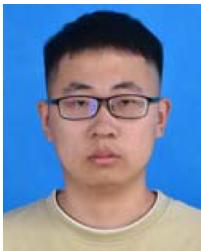

Hua Jiang received the B.S. degree in information engineering from Nanjing University of Aeronautics and Astronautics in 2024, where he is currently pursuing the M.S. degree in electronic and information engineering.

Sa Xiao received the B.S.E., M.S.E., and Ph.D. degrees from the University of Electronic Science and Technology of China, Chengdu, China, in 2009, 2012, and 2017, respectively. From February 2015 to August 2015, he was a Visiting Student with the Department of Electrical and Computer Engineering, Southern Illinois University, Carbondale, IL, USA. He also worked as a Visiting Student with the Division of Electrical and Computer Engineering, Louisiana State University, Baton Rouge, LA, USA, from August 2015 to February 2017. Currently, he is an Associate Professor with the National Key Laboratory of Science and Technology on Communications, University of Electronic Science and Technology of China. His research interests include covert communications, intelligent communications, and the Internet of Things communications.

Daolong Wu received the Ph.D. degree in communications and information system from Xidian University, China, in 2016. He is currently a Senior Engineer with the 20th Institute of China Electronics Technology Group Corporation (CETC). His research interests include waveform design, antijamming, signal processing, and spectrum sensing.

Fuhui Zhou (Senior Member, IEEE) is currently a Full Professor with Nanjing University of Aeronautics and Astronautics. His research interests focus on cognitive radio, RF machine learning, knowledge graph, edge intelligence, resource allocation, and UAV communications. He was awarded as the Young Elite Scientist Award of China and URSI GASS Young Scientist Award. He serves as an Editor for IEEE TRANSACTIONS ON COM-MUNICATIONS, IEEE SYSTEMS JOURNAL, IEEE WIRELESS COMMUNICATIONS LETTERS, IEEE ACCESS, and Physical Communications.

Chunguo Li (Senior Member, IEEE) received the B.S. degree in wireless communications from Shandong University in 2005 and the Ph.D. degree in wireless communications from Southeast University, Nanjing, China, in 2010. In July 2010, he joined as a Faculty Member with Southeast University, where he was an Associate Professor from 2012 to 2016 and has been a Full Professor since 2017. From June 2012 to June 2013, he was a Post-Doctoral Researcher with Concordia University, Montreal, Canada. From July 2013 to August 2014, he was with the DSL Laboratory, Stanford University, as a Visiting Associate Professor. From August 2017 to July 2019, he was an Adjunct Professor with Xizang Minzu University, under the supporting Tibet Program organized by China National Human Resources Ministry. His research interests include 6G cellfree distributed MIMO wireless communications, information theories, and AI based audio signal processing. He is a fellow of IET and China Institute of Communications (CIC) and the Chair of the IEEE Computational Intelligence Society Nanjing Chapter and the Advisory Committee for Instruments Industry in Jiangsu Province. He served as an editor for a couple of international journals and the session chair for many international conferences.

Shi Jin (Fellow, IEEE) received the B.S. degree in communications engineering from Guilin University of Electronic Technology, Guilin, China, in 1996, the M.S. degree from Nanjing University of Posts and Telecommunications, Nanjing, China, in 2003, and the Ph.D. degree in information and communications engineering from Southeast University, Nanjing, in 2007. From June 2007 to October 2009, he was a Research Fellow with the Adastral Park Research Campus, University College London, London, U.K. He is currently a Faculty Member of the National

Mobile Communications Research Laboratory, Southeast University. His research interests include space-time wireless communications, random matrix theory, information theory, intelligent communications, and reconfigurable intelligent surfaces. He and his co-authors have been awarded the 2010 Young Author Best Paper Award by the IEEE Signal Processing Society and the 2011 IEEE Communications Society Stephen O. Rice Prize Paper Award in the field of communication theory. He also serves as an Associate Editor for IEEE TRANSACTIONS ON WIRELESS COMMUNICATIONS, IEEE COMMUNICATIONS LETTERS, and IET Communications.