# SG-MAPG: A Three-Layer Hierarchical Model for Service Fairness and Cost Optimization in UAV-Assisted MEC Systems

Zhihui Bi, Fan Yang, Zhenyu Li, Guanqi Liu, Zhufang Kuang, Member, IEEE

Abstract—Unmanned aerial vehicles (UAVs) play an important role in mobile edge computing (MEC) systems because of their high mobility and flexibility. However, existing task offloading strategies suffer from considerable resource allocation imbalances in multi-agent decision-making, leading to UAVs overload, increased task delays, and higher operational costs. To address these issues, this paper presents a Three-Layer Multi-Agent Strategic Decision-Making Model (3L-MSADM) that integrates Markov Decision Processes (MDP), Stackelberg game theory, and auction mechanisms to optimize task offloading, mitigate resource imbalances, and enhance computational efficiency. Additionally, a task offloading ratio optimization mechanism is proposed to dynamically adjust task distribution according to system load, thereby minimizing task latency and improving overall efficiency. Furthermore, we introduce the Stackelberg-guided multi-agent policy gradient (SG-MAPG) algorithm, utilizing a centralized training and decentralized execution (CTDE) paradigm to improve decision-making efficiency and service fairness. Simulation results demonstrate that our approach improves service fairness by $12 . 3 \%$ and reduces system costs by $2 2 . 7 \%$ compared to benchmark algorithms, significantly enhancing the task processing capabilities of UAVs-assisted MEC systems. This study provides an innovative solution for multi-agent decision-making and resource management in wireless networks, offering substantial theoretical and practical contributions.

Index Terms—Deep Reinforcement Learning, Mobile edge computing, Stackelberg Game, Task Offloading, Trajectory design.

# I. INTRODUCTION

# A. Motivation

W ITH the rapid development of technologies such asthe Internet of Things (IoT) [1], autonomous driv- the Internet of Things (IoT）[1],autonomous driving, and smart cities [2], [3], the demand for low-latency computing has increased significantly. However, spatial and resource constraints limit the ability of base stations (BSs) to handle traffic surges and complex deployment environments [4]. Unmanned aerial vehicles (UAVs) have thus been introduced as a flexible complement to mobile edge computing (MEC), enabling dynamic deployment and adaptive resource allocation [5]. Compared with conventional BSs, UAVs can more effectively respond to traffic dynamics in challenging scenarios by adjusting their positions and service capacities. Despite progress in distributed load balancing, efficient task offloading and resource scheduling in multi-BS and multi-UAV systems remain unresolved.

This challenge persists largely because existing studies predominantly focus on task offloading optimization in single-UAV systems [6]. Although multi-UAV cooperation has been

investigated in isolated dimensions, including trajectory planning [7], task offloading [8], resource management [9], and load balancing [10], these studies remain fragmented and narrowly scoped. As a result, the strong coupling among mobility control, offloading decisions, and resource allocation is rarely addressed in a unified framework.

In practical UAV-MEC deployments, spatiotemporally uneven and time-varying user distributions further exacerbate these limitations. Sudden traffic surges, such as those arising in large public gatherings or tourist hotspots [5], [11], can trigger redundant UAV responses, communication interference, and network congestion in the absence of coordinated control. Meanwhile, insufficient air–ground coordination may hinder effective task offloading to BSs, increasing system latency and energy consumption. Conversely, static UAV activation under low-demand conditions leads to unnecessary energy expenditure and inefficient resource utilization, even when ground infrastructure has sufficient capacity. These inefficiencies highlight the urgent need for adaptive and collaborative UAV-MEC control strategies.

User fairness constitutes another critical yet frequently overlooked dimension in UAV-assisted MEC systems. Under limited resources, existing strategies tend to prioritize users with favorable channel conditions or high task demands, marginalizing users in sparsely covered or remote regions, particularly in emergency scenarios. Ignoring fairness can drive UAV deployment toward extreme patterns, including excessive concentration in dense urban areas or redundant operation near well-provisioned BSs, both of which waste resources without improving service coverage. Ensuring balanced UAV deployment is therefore essential for equitable MEC service provisioning.

Against this background, reinforcement learning (RL) and game-theoretic approaches [12], especially multi-agent reinforcement learning (MARL) [13], have emerged as promising tools for enabling intelligent UAV coordination. While these methods offer the potential to jointly consider user fairness and system responsiveness, designing scalable and efficient solutions that simultaneously address fairness, latency, and resource utilization in large-scale, highly dynamic UAV-MEC environments remains an open challenge.

To address the coupled challenges of latency, energy consumption, and user fairness in UAV-assisted MEC systems, this paper develops a three-tier Stackelberg game framework that explicitly captures the hierarchical decision-making interactions among BSs, UAVs, and UEs. Unlike conventional

approaches based on static equilibrium analysis, the proposed framework integrates multi-agent deep reinforcement learning (MADRL) to approximate the Stackelberg equilibrium through policy convergence, enabling adaptive optimization in dynamic and high-dimensional environments while preserving system stability. The resulting hybrid Stackelberg–MADRL design models both cooperative and competitive behaviors across tiers and supports joint optimization of task scheduling, resource allocation, and UAV trajectory control under time-varying network conditions. In this project, we

• Adopt a three-tier Stackelberg–Markov decision model (3L-MSADM) that integrates MDP [14], Stackelberg game theory [15], and auction mechanisms to characterize the hierarchical interactions among BSs, UAVs, and UEs. By incorporating dynamic pricing and task allocation schemes, the model enables agents at different tiers to adapt their strategies based on system feedback, while jointly accounting for system efficiency and service fairness.

• Introduce an innovative task offloading ratio method, which represents offloading decisions as continuous allocation ratios, transforming the task assignment problem into a differentiable continuous optimization problem. This method reduces the dimensionality of the decision space, enables smooth task distribution among UAVs and BSs, and jointly optimizes latency.

• Propose a Stackelberg-guided multi-agent policy gradient (SG-MAPG), which incorporates Stackelberg hierarchical guidance signals into distributed multi-agent policy updates. The hierarchical guidance directs agents’ strategy adjustments, achieving coordinated optimization across tiers, and jointly optimizing task scheduling, resource allocation, and UAV trajectories in high-dimensional continuous action spaces, enhancing convergence efficiency and overall scheduling performance.

To the best of the author’s knowledge, no systematic analytical study has addressed UAV flight trajectory and multi-UAV–multi-BS resource allocation jointly in multi-agent systems, especially in high-dimensional continuous action spaces. This work develops a unified Stackelberg–MADRL framework, providing both theoretical modeling and practical mechanism design to achieve multi-objective joint optimization in dynamic large-scale UAV-MEC systems.

The paper is organized as follows: Section II reviews related works. Section III introduces the system model and problem formulation. Section IV details the SG-MAPG algorithm. Section V presents simulation results and discussion. Finally, Section VI concludes the study.

# B. Related Work

Recent advances in UAV-assisted MEC have shifted from conventional single-objective optimization to more integrated frameworks addressing latency, energy efficiency, and fairness. Nevertheless, despite notable methodological progress, most existing works still fall short of handling complex multiobjective tradeoffs under dynamic constraints.

In latency optimization, Nie et al. proposed a hierarchical reinforcement learning framework with attention mechanisms for dynamic task prioritization, significantly reducing response

times via intelligent workload distribution [16]. However, it primarily targets latency, overlooking energy efficiency and fairness, limiting applicability in resource-constrained UAV networks. Zhu et al. leveraged graph neural networks to model inter-UAV dependencies, enabling distributed processing while preserving communication integrity [5], but assumes relatively stable links, reducing effectiveness in large-scale dynamic environments.

In game-theoretic approaches, Le et al. developed an auction-based framework with reputation and adaptive bidding to enhance resource utilization [17], yet it neglects fairness and struggles with multi-dimensional objectives. Tong et al. introduced a hybrid Stackelberg-deep learning model for equilibrium prediction [18], achieving joint optimization, but primarily addresses static equilibria and lacks robustness under rapid dynamics.

In energy efficiency research, Fan et al. proposed a convex optimization framework with transfer learning for trajectory prediction, achieving notable energy savings through anticipatory path planning [19]. However, it assumes predictable UAV trajectories, limiting adaptability in uncertain or adversarial settings. Zhao et al. introduced reinforcement learningbased dynamic voltage and frequency scaling [10], advancing energy-aware computing benchmarks, yet focusing mainly on device-level optimization without considering system-level tradeoffs involving latency and fairness. Chen et al. enhanced federated learning via clustering algorithms to improve data heterogeneity handling and computational efficiency [5], but UAV-specific mobility challenges and fairness issues remain unaddressed.

In service fairness, Wang et al. designed an MADDPG framework with novel reward shaping and adaptive priority adjustment, setting new standards for fairness-aware optimization [6]. Still, their method incurs high training complexity and struggles to generalize under diverse network conditions. Hossain et al. advanced non-cooperative game theory with dynamic strategy adaptation, demonstrating unprecedented fairness in volatile networks [20]. However, their approach primarily considers fairness in isolation, without integrating latency or energy efficiency objectives.

Although these advances represent paradigm shifts across latency, energy, fairness, and coordination, existing methods often optimize objectives in isolation, rely on simplifying assumptions, or suffer from scalability and adaptability limitations. This motivates the need for an integrated framework that jointly addresses latency–energy–fairness tradeoffs in dynamic UAV-MEC environments, which is the focus of this work.

# II. SYSTEM MODEL AND PROBLEM FORMULATION

To address computational heterogeneity between BSs and UAVs and coordinate task offloading in UAV-assisted MEC systems, we propose a hierarchical three-tier Stackelberg framework with dynamic pricing. Each layer optimizes its local objective while inter-layer dependencies induce tightly coupled decisions across heterogeneous agents. By modeling self-interested interactions via hierarchical pricing and response mechanisms, the framework directs tasks toward suitable computing nodes. Unlike cooperative game approaches

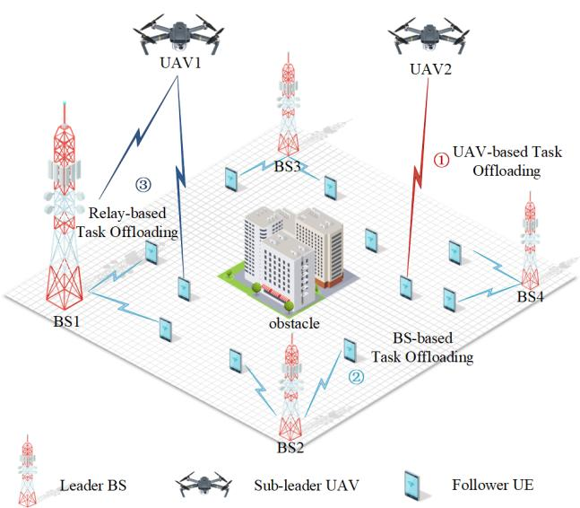  
Fig. 1: Multi UAV-assisted multi-BS MEC system model.

that prioritize global optimality, this design captures both individual rationality and system efficiency, mitigating inefficiencies arising from passive participation in long-term resource allocation.

As illustrated in Fig. 1, this study constructs an MEC system model. $N$ UEs are assumed to be randomly distributed within a square region of side length $L$ , represented by the set $N = \{ n \mid n = 1 , 2 , \ldots , N \}$ . Consistent with practical deployment scenarios such as urban surveillance, post-disaster recovery, and remote-area monitoring, $M$ UAVs are deployed over the target region. The UAVs, indexed by the set $M =$ $\{ m \mid m = 1 , 2 , \ldots , M \}$ , operate at a fixed altitude $h _ { u a v }$ and a constant speed $v _ { u a v }$ . Such constrained mobility is consistent with practical low-altitude flight regulations and typical UAV deployment scenarios, which simplifies trajectory planning and reduces control overhead [21], [22]. The fixed-altitude assumption facilitates air-to-ground channel modeling, while the constant-speed assumption enables effective characterization of UAV trajectory evolution and energy consumption under limited onboard energy, thereby allowing the analysis to focus on task offloading and computational resource scheduling. In addition, a set of BSs, denoted as $K = \{ k \mid k = 1 , 2 , \ldots , K \}$ , is deployed around the region to support cooperative task offloading.

The limited computational capabilities of UEs mean that they are unable to execute tasks locally and must rely on external computing resources. In the introduced multi-UAVsassisted MEC system, UAVs are constrained by computational capacity, energy supply, and bandwidth availability, thereby offering only a finite amount of computational resources. In contrast, BSs, equipped with MEC servers, possess significantly greater computational power. Thus, this study adopts the following three task offloading strategies: (1) UEs offload tasks directly to UAVs for computation; (2) UEs offload tasks directly to BSs for computation; and (3) UEs offload tasks to UAVs, which process part locally and forward the rest to

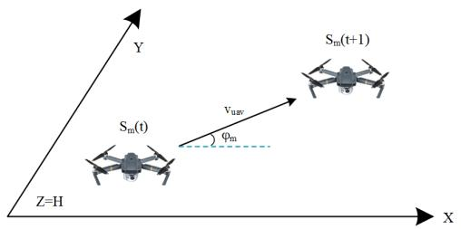  
Fig. 2: UAV mobility model.

BSs according to the allocation ratio $\nu _ { m } ( t )$ , thereby enabling a relay-based task offloading mechanism.

Each UE generates delay-sensitive tasks with data size $D _ { n } ( t )$ in each time slot (TS). The complete service time set is represented as $T S _ { s } = \{ 1 , 2 , \dots , t \}$ . Within each time slot $t$ , UAV $m$ first determines its flight angle $\varphi _ { m } ( t )$ and moves in the corresponding direction.

# A. UAV Mobility

The 3D coordinates of UAV $m$ at time $t$ are presented as

$$
S _ {m} (t) = \left[ x _ {m} (t), y _ {m} (t), h _ {u a v} \right] ^ {T}. \tag {1}
$$

where $x _ { m } ( t )$ , $y _ { m } ( t )$ , and $h _ { m } ( t )$ represent the X, Y, and Z coordinates of UAV $m$ at time $t$ , respectively. The UAV’s flight altitude is fixed at $h _ { u a v }$ , so the position of UAV $m$ at the next time slot $t + 1$ can be represented as

$$
S _ {m} (t + 1) = \left[ x _ {m} (t + 1), y _ {m} (t + 1), h _ {u a v} \right]. \tag {2}
$$

Assuming all UAVs have a flight speed of $v _ { u a v }$ and UAV $m$ flies at a horizontal angle $\varphi _ { m } ( t ) \in [ 0 , 2 \pi )$ , the horizontal coordinates $x _ { m } ( t + 1 )$ and $y _ { m } ( t + 1 )$ can be updated using as the following formulas:

$$
x _ {m} (t + 1) = x _ {m} (t) + v _ {u a v} (t) \cos (\varphi_ {m} (t)), \tag {3}
$$

$$
y _ {m} (t + 1) = y _ {m} (t) + v _ {u a v} (t) \sin (\varphi_ {m} (t)). \tag {4}
$$

equations (1)–(3) The following movement constraints must be applied to ensure that the UAVs move within the designated square-shaped area:

$$
0 \leq x _ {m} (t) \leq L, \forall m \in M, t \in T, \tag {5}
$$

$$
0 \leq y _ {m} (t) \leq L, \forall m \in M, t \in T. \tag {6}
$$

# B. UAV-based Task Offloading

We represent the position of UE $n$ as $\begin{array} { r l } { S _ { n } ( t ) } & { { } = } \end{array}$ $[ x _ { n } ( t ) , y _ { n } ( t ) , 0 ] ^ { T }$ , where $x _ { n } ( t )$ and $y _ { n } ( t )$ are the X and $\mathrm { Y }$ coordinates, respectively. The distance between UE $n$ and UAV $m$ can be expressed as

$$
d _ {n, m} (t) = \sqrt {\left(S _ {m} (t) - S _ {n} (t)\right) ^ {2}}. \tag {7}
$$

Due to obstacles such as tall buildings, UAV–UE communication often cannot maintain line-of-sight (LoS) links. To account for environmental changes affecting signal attenuation, a probabilistic LoS channel model [23] is employed.

Specifically, the expected channel gained from UE $n$ to UAV $m$ can be expressed as:

$$
g _ {n, m} (t) = \left[ P _ {n, m} ^ {L o S} + \left(1 - P _ {n, m} ^ {L o S}\right) \kappa \right] ^ {- 1} \beta_ {0} \left(d _ {n, m}\right) ^ {- 2}, \tag {8}
$$

where $P _ { n , m } ^ { L o S }$ is the probability of LoS communication between UE $n$ and UAV m, κ is the additional attenuation factor due to Non-LoS (NLoS) propagation [24], typically less than 1. The path loss constant $\beta _ { 0 }$ for the channel is defined as $\beta _ { 0 } =$ $\left( { \frac { 4 \pi } { \lambda } } \right) ^ { 2 }$ , where $\lambda$ is the carrier wavelength, representing the basic attenuation characteristics of the signal in free space.

The probability of LoS communication, $P _ { L o S } ( \theta )$ , is typically expressed as a function of the elevation angle $\theta$ between the transmitter and receiver, and is given by

$$
P ^ {L o S} (\theta) = \frac {1}{1 + a \exp (- b (\theta - a))}, \tag {9}
$$

where $a$ and $b$ are the model parameters, and $\theta$ is the angle between the transmitter and receiver.

We assume that all UE $n$ have the same transmission power $P _ { u e }$ . The task offloading data rate from UE to UAV can be expressed as

$$
R _ {n, m} (t) = B _ {u a v} \log_ {2} \left(1 + \frac {P _ {u e} g _ {n , m} (t)}{\sigma^ {2}}\right), \tag {10}
$$

where $B _ { u a v }$ is the UAV’s bandwidth, and $\sigma ^ { 2 }$ denotes the power of the additive white Gaussian noise.

$D _ { n } ( t )$ represents the task size at UE $n$ at time $t$ . On the basis of the above equation, the transmission latency $T _ { n , m } ^ { t r }$ of the task from UE $n$ to UAV $m$ can be expressed as

$$
T _ {n, m} ^ {t r} (t) = \frac {\left(1 - \nu_ {m , k} (t)\right) \cdot D _ {n} (t)}{R _ {n , m} (t)}. \tag {11}
$$

Here, $\nu _ { m , k } ( t ) \in [ 0 , 1 ]$ represents the fraction of UE $m$ ’s task offloaded to BS $k$ , while the remaining fraction, $1 - \nu _ { m , k } ( t )$ , is processed locally by UAV $m$ . In particular, $\nu _ { m , k } ( t ) = 0$ indicates full local processing by the UAV, and $\nu _ { m , k } ( t ) = 1$ indicates full offloading to the BS.

Similarly, the transmission energy consumption between UE $n$ and UAV $m$ can be defined as:

$$
E _ {n, m} ^ {t r} (t) = P _ {u e} T _ {n, m} ^ {t r} (t) = \frac {\left(1 - \nu_ {m , k} (t)\right) \cdot D _ {n} (t)}{R _ {n , m} (t)} P _ {u e}, \tag {12}
$$

The parameter $P _ { u e }$ represents the transmission power required for offloading task $D _ { n } ( t )$ from the mobile device to the edge server.

The computation latency of the UAV can be expressed as

$$
T _ {n, m} ^ {\text {c o m}} (t) = \frac {(1 - \nu_ {m , k} (t)) \cdot D _ {n} (t) \cdot C _ {m}}{f _ {m}}, \tag {13}
$$

where $f _ { m }$ denotes the computation resources allocated from UAV $n$ to UE $m$ . To optimize resource utilization, each UAV allocates computation resources to its served UEs according to their actual demands, with $f _ { m } \in [ 1 , 3 ]$ GHz.

Then, considering the computation time $T _ { n , m } ^ { c o m } ( t )$ and the power consumption [25], the energy consumption of UAV $m$ handling the task of UE $n$ can be obtained as

$$
E _ {n, m} ^ {\text {c o m}} (t) = \kappa \left[ f _ {m} \right] ^ {3} T _ {n, m} ^ {\text {c o m}} (t), \tag {14}
$$

where $\kappa \geq 0$ is the effective switched capacitance.

When the offloading scheme follows the UAV-based task offloading mode, the total system delay caused by UE $n$ offloading its computation task to UAV $m$ can be expressed as

$$
T _ {n, m} ^ {\text {t o t a l}} (t) = T _ {n, m} ^ {t r} (t) + T _ {n, m} ^ {\text {c o m}} (t). \tag {15}
$$

Similarly, under this offloading mode, the total system energy consumption caused by UE $n$ offloading its task to UAV $m$ is given by

$$
E _ {n, m} ^ {\text {t o t a l}} (t) = E _ {n, m} ^ {t r} (t) + E _ {n, m} ^ {\text {c o m}} (t). \tag {16}
$$

# C. BS-Based Task Offloading

If UE $n$ chooses to offload the task to BS k for processing, then the calculation is similar to that for UE $n$ . First, we need to calculate the distance between UE $n$ and the ground $\mathbf { B S } \mathbf { \Lambda } _ { k }$ which can be expressed as

$$
d _ {n, k} (t) = \sqrt {\left(S _ {k} (t) - S _ {n} (t)\right) ^ {2}}. \tag {17}
$$

where $S _ { k }$ is the coordinate of $\mathbf { B S } \mathbf { \Lambda } _ { k }$

The expected channel power gained from UE $n$ to BS $k$ at time $t$ can be expressed as

$$
g _ {n, k} (t) = \left(P _ {n, k} ^ {L o S} + \left(1 - P _ {n, k} ^ {L o S}\right) \cdot \kappa\right) \cdot \beta_ {0} \cdot d _ {n, k} ^ {- 2}, \tag {18}
$$

where P LoS $P _ { n , k } ^ { L o S }$ represents the LoS probability between UE $n$ and BS k.

The data transmission rate for offloading tasks from UE $n$ to BS $k$ can be expressed as

$$
R _ {n, k} (t) = B _ {b s} \log_ {2} \left(1 + \frac {P _ {u e} g _ {n , k} (t)}{\sigma^ {2}}\right), \tag {19}
$$

where $B _ { b s }$ is the BS’s bandwidth.

The transmission latency $T _ { n , k } ^ { t r } ( t )$ /1， of the task from UE $n$ to BS $k$ can be expressed as

$$
T _ {n, k} ^ {t r} (t) = \frac {\nu_ {m , k} (t) \cdot D _ {n} (t) \cdot}{R _ {n , k} (t)}. \tag {20}
$$

Similarly, the transmission energy consumption between UE $n$ and BS $k$ can be defined as

$$
E _ {n, k} ^ {t r} (t) = P _ {u e} T _ {n, k} ^ {t r} (t) = \frac {\nu_ {m , k} (t) \cdot D _ {n} (t)}{R _ {n , k} (t)} P _ {u e}, \tag {21}
$$

The total computation latency of the BS can be expressed as

$$
T _ {n, k} ^ {\text {c o m}} (t) = \frac {\nu_ {m , k} (t) \cdot D _ {n} (t) \cdot C _ {m}}{f _ {k}}, \tag {22}
$$

where $f _ { k }$ denotes the computation resource allocated to UE $n$ m by the BS $k$ .

The total energy consumption of BS $k$ taht handles the task of UE $n$ can be obtained as

$$
E _ {n, k} ^ {\text {c o m}} (t) = \kappa \left[ f _ {k} \right] ^ {3} T _ {n, k} ^ {\text {c o m}} (t). \tag {23}
$$

When the offloading scheme follows the BS-based task offloading mode, the total system delay caused by UE $n$ offloading its computation task to BS $k$ can be expressed as

$$
T _ {n, k} ^ {\text {t o t a l}} (t) = T _ {n, k} ^ {\text {t r}} (t) + T _ {n, k} ^ {\text {c o m}} (t). \tag {24}
$$

Similarly, under this offloading mode, the total system energy consumption caused by UE $n$ offloading its task to BS $k$ is given by

$$
E _ {n, k} ^ {\text {t o t a l}} (t) = E _ {n, k} ^ {t r} (t) + E _ {n, k} ^ {\text {c o m}} (t). \tag {25}
$$

# D. Relay-Based Task Offloading

In the case of relay offloading, the first step is to calculate the distance between UAV $m$ and BS $k$ as follows:

$$
d _ {m, k} (t) = \sqrt {\left(S _ {m} (t) - S _ {k} (t)\right) ^ {2}}. \tag {26}
$$

The expected channel power gained from UAV $m$ to BS $k$ at time $t$ can be expressed as

$$
g _ {m, k} (t) = \left(P _ {m, k} ^ {L o S} + \left(1 - P _ {m, k} ^ {L o S}\right) \cdot \kappa\right) \cdot \beta_ {0} \cdot d _ {m, k} ^ {- 2}, \tag {27}
$$

where P LoS $P _ { m , k } ^ { L o S }$ represents the LoS probability between UAV $m$ and BS $k$ .

We assume that all UAVs $m$ have the same transmission power $P _ { u a v }$ . Then, the task offloading data rate from UAV to BS can be expressed as

$$
R _ {m, k} (t) = B _ {k} \log_ {2} \left(1 + \frac {P _ {u a v} g _ {m , k} (t)}{\sigma^ {2}}\right). \tag {28}
$$

The transmission latency $T _ { m , k } ^ { t r }$ of the task from UAV $m$ to BS $k$ in the relay offloading scenario can be expressed as

$$
T _ {m, k} ^ {t r} (t) = \frac {\nu_ {m , k} (t) \cdot D _ {n} (t)}{R _ {m , k} (t)}. \tag {29}
$$

Similarly, the transmission energy consumption between UAV $m$ and BS $k$ can be defined as

$$
E _ {m, k} ^ {t r} (t) = P _ {u a v} T _ {m, k} ^ {t r} (t) = \frac {\nu_ {m , k} (t) \cdot D _ {n} (t)}{R _ {m , k} (t)} P _ {u a v}, \tag {30}
$$

Given that communication and computation processes are typically executed independently, UAV $m$ can simultaneously offload a task to BS $k$ and perform local computation. Consequently, the total delay experienced by UAV $m$ in the relayassisted offloading scenario can be formulated as follows:

$$
T _ {n, m, k} ^ {\text {t o t a l}} (t) = T _ {n, m} ^ {t r} (t) + \max  \left(T _ {n, m} ^ {\text {c o m}} (t), T _ {m, k} ^ {t r} (t) + T _ {n, k} ^ {\text {c o m}} (t)\right). \tag {31}
$$

According to Equation (31), the total latency in the relaybased task offloading mode is jointly determined by the transmission delay from the UE to the UAV and the maximum delay between two parallel branches.

To minimize total system latency, we adopt the delay equalization principle, where the execution delays of the two parallel branches are aligned to avoid pipeline bottlenecks and minimize overall task completion latency [26].

$$
T _ {n, m} ^ {\text {c o m}} (t) = T _ {m, k} ^ {t r} (t) + T _ {n, k} ^ {\text {c o m}} (t). \tag {32}
$$

Substituting the expressions of each term from Equation (13), (22), and (29) respectively

$$
\frac {(1 - \nu_ {m , k} (t)) D _ {n} (t) C _ {m}}{f _ {m}} = \frac {\nu_ {m , k} (t) D _ {n} (t)}{R _ {m , k} (t)} + \frac {\nu_ {m , k} (t) D _ {n} (t) C _ {m}}{f _ {k}}. \tag {33}
$$

By eliminating the common term $D _ { n } ( t )$ on both sides and rearranging the equation, we obtain a closed-form expression for the task allocation ratio $\nu _ { m , k } ( t )$ .

$$
\nu_ {m, k} (t) = \frac {C _ {m} f _ {m} R _ {m , k} (t)}{f _ {k} f _ {m} + C _ {m} f _ {m} R _ {m , k} (t) + C _ {m} f _ {k} R _ {m , k} (t)} \tag {34}
$$

# Algorithm 1 3L-MSADM

1: Input:obtain service UE $z _ { n } ( t )$ and UAV price influence coefficient $q$ from actor network $\pi _ { \alpha _ { m } } [ o _ { m } ( t ) ]$ .   
2: for each BS $k \in K$ do   
3: Compute computational resources price $M _ { n , k } ^ { c o m }$ from Equation (39).   
4: for each UAV $m \in M$ do   
5: Obtain UE computation cost $M _ { n , m } ^ { c o m }$ from Equation (42).   
6: $M _ { m , k } ^ { r e l }$   
7: Compute task allocation ratio $v _ { m , k } ( t )$ form Equation (34).   
8: end for   
9: end for   
10: for each BS $k \in K$ do   
11: Select offloading method minimizing BS utility from Equation (41).   
12: for each UAV $m \in M$ do   
13: Select offloading method minimizing UAV utility from Equation (43).   
14: end for   
15: end for   
16: for each UE $n \in N$ do   
17: Select offloading method that minimizes system cost from Equation (45).   
18: end for

During relay-based task offloading, the total energy consumption of the system can be expressed as

$$
E _ {n, m, k} ^ {\text {t o t a l}} (t) = E _ {n, m} ^ {t r} (t) + E _ {n, m} ^ {\text {c o m}} (t) + E _ {m, k} ^ {t r} (t) + E _ {n, k} ^ {\text {c o m}} (t). \tag {35}
$$

# E. UE Fairness of System

We define $A _ { n } ( t )$ to indicate whether UE $n$ has been served. Thus, the indicator function can be expressed as:

$$
A _ {n} (t) = \left\{ \begin{array}{l l} 1, & \text {i f} n = z _ {n} (t), \forall n \in N, \\ 0, & \text {o t h e r w i s e}, \end{array} \right. \tag {36}
$$

where $z _ { n } ( t )$ denotes the selection of UE by the system at time slot $t$ .

The fairness measure of the system is defined as

$$
f _ {u e} (t) = \frac {\left(\sum_ {n = 1} ^ {N} \sum_ {t = 1} ^ {T} A _ {n} (t)\right) ^ {2}}{N \sum_ {n = 1} ^ {N} \left(\sum_ {t = 1} ^ {T} A _ {n} (t)\right) ^ {2}}, \tag {37}
$$

where $N$ is the total number of UEs, and $T$ is the total number of time slots.

The fairness metric in Equation (37) is based on Jain’s fairness index [27], measuring how evenly task offloading is allocated among all UEs over time [28], [29].

# F. Offloading Schemes

To optimize task offloading and resource allocation in multitier edge computing environments, this paper establishes a 3L-MSADM. In this hierarchy, the BS assumes the leader role due

to its fixed deployment and abundant computational resources, the UAV acts as a sub-leader by leveraging flexible mobility and adaptive pricing, and the UE, as a task generator with limited local computing capacity, responds optimally to the announced pricing strategies as a follower. The overall objective is to minimize system-wide energy consumption while ensuring load balancing and user fairness in computational resource allocation, as detailed in Algorithm 1.

Similar to References [9] and [30], we represent the weighted sum of energy consumption $E$ and execution delay $T$ as the system cost. Here, $E ^ { t o t a l } ( t )$ and $T ^ { t o t a l } ( t )$ represent the total energy consumed during transmission and computation, and the total time required for execution, respectively. The system cost is given by

$$
V (t) = w _ {1} E ^ {\text {t o t a l}} (t) + w _ {2} T ^ {\text {t o t a l}} (t). \tag {38}
$$

The coefficients $w _ { 1 }$ and $w _ { 2 }$ represent the relative weights of energy consumption and execution delay in the system cost, and are both set to 0.5.

As the main leader, the BS decides whether to execute tasks locally or receive part of the workload via relay UAVs.

The pricing strategy for BS computing resources is defined as

$$
M _ {n, k} ^ {\text {c o m}} = \eta_ {b s} \cdot R _ {n, k} (t), \tag {39}
$$

where $\eta _ { b s }$ is a pricing coefficient that reflects the impact of the transmission rate $R _ { n , k } ( t )$ on computation pricing.

The BS consumes a certain amount of energy while providing computing resources. Let $\delta$ denote the cost per unit of energy consumption, then the cost of completing the computation is

$$
C _ {k} ^ {\text {c o m}} = \delta \cdot E _ {k} ^ {\text {c o m}} (t). \tag {40}
$$

The BS determines the optimal offloading policy by maximizing its utility function $U _ { k }$

$$
U _ {k} = \left\{ \begin{array}{l l} M _ {n, k} ^ {\text {c o m}} - C _ {k} ^ {\text {c o m}}, & \text {i f} \nu_ {m, k} (t) = 1, \\ M _ {n, k} ^ {\text {c o m}} - C _ {k} ^ {\text {c o m}} - M _ {m, k} ^ {\text {r e l}}, & \text {i f} \nu_ {m, k} (t) \neq 0. \end{array} \right. \tag {41}
$$

where M rel $M _ { m , k } ^ { r e l } = \eta _ { u a v } \cdot R _ { m , k } ( t )$ represents the relaying cost. Here, $\eta _ { u a v }$ is an incentive coefficient reflecting the BS’s willingness to compensate UAVs. The inclusion of $R _ { m , k } ( t )$ links the reward to the achievable transmission rate, encouraging UAVs to support relaying with higher throughput.

As a sub-leader, the UAV decides whether to execute the task locally or relay it to the BS. The UAV’s pricing strategy partially depends on the BS’s price through a coupling coefficient $q ~ \in ~ [ 0 , 1 ]$ , which captures the influence of the BS’s pricing on the UAV’s decisions to achieve cross-layer coordination [31].

The collaborative price between user $n$ and UAV $m$ is defined as

$$
M _ {n, m} ^ {\text {c o m}} = q \cdot M _ {b s} ^ {\text {c o m}}, \tag {42}
$$

where $\begin{array} { r } { M _ { b s } ^ { c o m } = \frac { 1 } { K } \sum _ { k = 1 } ^ { K } M _ { n , k } ^ { c o m } } \end{array}$ M com denotes the average communication price set by the leader BSs. This cooperative pricing mechanism reduces inter-layer price discrepancies, thereby preventing task congestion and resource imbalance under dynamic network conditions such as load fluctuations

and link quality variations [32], [33]. It also enhances the adaptability and fairness of resource allocation in multi-tier offloading systems.

The UAV maximizes its utility function $U _ { m }$

$$
U _ {m} = \left\{ \begin{array}{l l} M _ {n, m} ^ {\text {c o m}} - C _ {m} ^ {\text {c o m}}, & \text {i f} \nu_ {m, k} (t) = 0, \\ M _ {n, m} ^ {\text {c o m}} - C _ {m} ^ {\text {c o m}} + M _ {m, k} ^ {\text {r e l}} - C _ {m, k} ^ {\text {t r}}, & \text {i f} \nu_ {m, k} (t) \neq 1. \end{array} \right. \tag {43}
$$

Here, $C _ { m } ^ { c o m }$ represents the UAV’s local execution cost, and Ctr $C _ { m , k } ^ { t r }$ is the cost of transmitting the task to the BS, defined as

$$
C _ {m, k} ^ {t r} = \delta \cdot E _ {m, k} ^ {t r} (t). \tag {44}
$$

In the Stackelberg game framework, the UE, as a follower, computes the corresponding system costs $V _ { k } ^ { t r u e } ( t )$ and $V _ { m } ^ { t r u e } ( t )$ on the basis of the maximum utilities $U _ { k }$ and $U _ { m }$ selected by the BS and UAV, respectively, as formulated in Equation (38).

The UE’s offloading decision aims to select the option with the lowest computational cost, thereby optimizing resource allocation and minimizing the overall computational cost $V _ { t r u e } ( t )$ :

$$
V _ {t r u e} (t) = \min  \left(V _ {k} ^ {t r u e} (t), V _ {m} ^ {t r u e} (t)\right). \tag {45}
$$

# G. Problem Framework and Assumptions

Our ultimate system-level objective is to minimize total system cost while ensuring fairness across UEs.

This problem can be formalized as the following optimization problem:

$$
P: \max  _ {W, Z} \frac {f _ {u e} (t)}{V _ {\text {t r u e}} (t)} \tag {46a}
$$

s.t.

$$
0 \leq \nu_ {m, k} (t) \leq 1 \tag {46b}
$$

$$
0 \leq \varphi_ {m} (t) \leq 2 \pi \tag {46c}
$$

$$
0 \leq q \leq 1 \tag {46d}
$$

$$
e q u a t i o n s: (5) - (6) \tag {46e}
$$

where $W = \{ \nu _ { m , k } ( t ) , \varphi _ { m } ( t ) , q , \forall m \in M , k \in K , t \in T \}$ denotes the set of continuous decision variables, and $Z =$ $\{ A _ { n } ( t ) , \forall n \in N , t \in T \}$ denotes the set of discrete decision variables. The restriction (46b) represents the limit of the task load rate, (46c) enforces the range of the movement direction of the UAV, (46d) limits the influence price and (46e) ensures that the UAVs operate within the defined movement region.

Traditional optimization methods are often inadequate for such high-dimensional, dynamic, and partially observable problems. To this end, we propose an innovative solution approach capable of approximating the optimal policy under limited environmental information. The detailed methodology will be presented in the following sections.

# III. PROBLEM SOLUTION

In UAV-assisted MEC systems, UAVs determine their served UEs $z _ { n } ( t )$ , price influence coefficients $q$ , and flight angles $\varphi _ { m } ( t )$ , which jointly affect the system state. The total system cost depends on the current state and all UAVs’ joint actions, while the next state evolves stochastically from the previous state–action pair. Under this formulation, task offloading optimization can be modeled as an MDP. We adopt a MADRL algorithm within the centralized training and decentralized execution (CTDE) framework [34], leveraging centralized collaboration and decentralized autonomy to efficiently optimize strategies in complex dynamic environments.

# A. MARL-based Stackelberg Approximation

In practical UAV-assisted mobile edge computing systems, the proposed three-layer Stackelberg game involves highdimensional continuous decision variables, strong inter-agent coupling, and dynamic environmental states. Under such conditions, deriving closed-form equilibrium solutions via classical backward induction becomes analytically intractable. To address this challenge, we employ MARL to approximate the equilibrium strategies of the hierarchical game. Accordingly, the optimization process is implemented in a reversed order $( \mathrm { U E } \to \mathrm { U A V } \to \mathrm { B S }$ ), which reflects the learning-based convergence of interdependent strategies rather than a strict analytical derivation sequence.

The strategy spaces of the three decision layers are modeled as continuous and bounded sets. Specifically, the BS pricing strategy space is defined as $P = \{ p \in \mathbb { R } ^ { d } \}$ , the UAV decision strategy space as $A = \{ a \in \mathbb { R } ^ { d ^ { \prime } } \}$ , and the UE offloading strategy space as $X = \{ x \in \mathbb { R } ^ { d ^ { \prime \prime } } \}$ .

At the UE layer, given the UAV strategy $a ^ { * }$ and the BS pricing strategy $p ^ { * }$ , each UE determines its optimal offloading decision by minimizing its individual cost function, which jointly accounts for communication latency, computation delay, and energy consumption:

$$
x ^ {*} = \arg \min  _ {x \in X} V _ {\text {t r u e}} \left(x, a ^ {*}, p ^ {*}\right). \tag {47}
$$

Under the adopted communication and computation models, the feasible strategy set $X$ is convex, and the cost function $V _ { t r u e } ( \cdot )$ is continuous and strictly convex with respect to the UE decision variable $x$ . Therefore, for any given $( \boldsymbol { a } ^ { * } , \boldsymbol { p } ^ { * } )$ , the UE-level optimization admits a unique optimal solution, ensuring a well-defined and single-valued best-response mapping.

At the UAV layer, given the BS pricing strategy $p ^ { * }$ and the UE best-response $x ^ { * } ( a , p ^ { * } )$ , each UAV seeks to maximize its utility function:

$$
a ^ {*} = \arg \max  _ {a \in A} U _ {m} \left(a, p ^ {*}, x ^ {*} \left(a, p ^ {*}\right)\right). \tag {48}
$$

Since the UAV strategy space is compact and the utility function $U _ { m } ( \cdot )$ is continuous, the existence of at least one Nash equilibrium at the UAV layer is guaranteed by standard fixed-point arguments. However, due to coupling among UAVs in trajectory control, spectrum sharing, and computational resource allocation, the UAV-layer equilibrium is not guaranteed to be unique in general.

At the BS layer, the BS acts as the Stackelberg leader and optimizes its pricing strategy by anticipating the equilibrium responses of both the UAV and UE layers:

$$
p ^ {*} = \arg \max  _ {p \in P} U _ {k} (p, a ^ {*} (p), x ^ {*} (a ^ {*} (p), p)). \tag {49}
$$

Given that the BS strategy space $P$ is a closed and bounded set and that the BS utility function $U _ { k } ( \cdot )$ is continuous, the existence of an optimal BS pricing strategy is ensured. Nevertheless, due to the non-convexity induced by hierarchical interactions and cross-layer coupling, uniqueness of the BSlevel solution cannot be theoretically guaranteed.

Based on the above analysis, the proposed three-layer Stackelberg game admits at least one Stackelberg equilibrium under the defined cost functions and constraints. However, global uniqueness of the equilibrium is generally not guaranteed [35]. To address the analytical intractability and potential nonuniqueness in dynamic high-dimensional environments, we employ MARL as a numerical approximation tool. Through iterative interaction with the environment, agents learn stable equilibrium policies, approximating the mappings $x ^ { * } ( a , p )$ and $a ^ { * } ( p )$ , thereby achieving convergence to near-equilibrium solutions while capturing UAV mobility, dynamic user association, and cross-layer pricing effects.

# B. SG-MAPG Algorithm

Building on the Stackelberg interaction that yields approximate equilibria, UAV decision-making is formulated as a MDP, enabling DRL to approximate equilibrium strategies in dynamic and high-dimensional environments. For each UAV agent, the MDP is defined by the tuple $( S ( t ) , A ( t ) , R ( t ) , S ( t +$ 1)), where $S ( t )$ represents the system state at time $t .$ , $A ( t )$ denotes the set of available actions, $R ( t )$ is the immediate reward received after executing an action, and $S ( t + 1 )$ is the next state.

At time slot $t .$ , the agent observes its local state $o ( t )$ and selects an action $a ( t )$ according to the current policy. The environment returns a deterministic immediate reward $r ( t )$ determined by $( o ( t ) , a ( t ) )$ and transits to the next state accordingly. Through repeated interactions over time slots, the policy is optimized to maximize the expected cumulative discounted return $G ( t )$ , defined as

$$
G (t) = r (1) + \gamma r (2) + \gamma^ {2} r (3) + \dots + \gamma^ {t - 1} r (t), \tag {50}
$$

where $\gamma$ is the discount factor, typically in the range [0, 1], which determines the importance of future rewards relative to immediate rewards.

In the model, each UAV is treated as an independent agent. Within this framework, we define the state space, action space, and reward function for the agent as follows:

1) State Space $S ( t )$ $( t ) \colon S ( t ) = \{ o _ { 1 } ( t ) , o _ { 2 } ( t ) , \ldots , o _ { m } ( t ) \} ,$ , where $m \in M$ represents the agent index. Each observation $o _ { m } ( t )$ includes the location of the agent $C _ { m } ( t )$ and its interaction history with the UE, denoted $A _ { i } ( t )$ , indicating whether the UE $i$ has been served by the agent $m$ at time $t$ .   
2) Action Space $A ( t ) \colon A ( t ) \ = \ \{ a _ { m } ( t ) , m \in \ M \}$ ,where $a _ { m } ( t )$ represents the action taken by agent $m$ at time slot

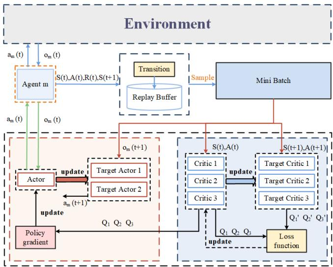  
Fig. 3: Structure of the SG-MAPG algorithm.

t, which includes four components: the selection of UE $z _ { n } ( t )$ , the flight angle of the UAV $\phi _ { m } ( t )$ , the resource size, and the price coefficient affected by the BSs.

3) Reward Function $R ( t )$ :

$$
R (t) = \left\{r _ {m} (t), m \in M \right\}, \tag {51}
$$

where the reward function $r _ { m } ( t )$ of agent $m$ is defined as:

$$
r _ {m} (t) = \frac {f _ {u e} (t)}{V _ {\text {t r u e}} (t)} + \sum_ {m ^ {\prime} = 1} ^ {m} \left(P _ {m} ^ {\text {c o l}} + P _ {m} ^ {\text {r a n g e}} + P _ {m} ^ {\text {u e}}\right), \tag {52}
$$

in which the UAV and other aircraft or obstacles, $P _ { m } ^ { c o l }$ m is the penalty term due to collisions between $P _ { m } ^ { r a n g e }$ is the penalty term when the UAV flies beyond the defined flight boundaries, and $P _ { m } ^ { u e }$ is the penalty term for UE’s equipment.

The components of the reward function are normalized, with larger weights assigned to the penalty terms to strictly enforce constraints and maintain feasible strategies. As defined in Eq. (38), $V _ { t r u e } ( t )$ comprises energy consumption and execution delay, with symmetric weights applied to balance these components, thereby ensuring numerical stability and avoiding bias in the reward.

As shown in Fig. 3, this paper employs a MARL algorithm, SG-MAPG, for UAV swarm collaborative control. The algorithm extends the TD3 framework and integrates nine neural networks (1 online actor, 2 target actors, 3 online critics, and 3 target critics), effectively addressing the non-stationarity problem inherent in multi-agent systems. The core design of the algorithm is as follows:

1) Target Actor Network: The standard MATD3 algorithm utilizes a single target actor network. SG-MAPG extends the target actor component to a binocular structure, comprising two target actor networks $( \alpha _ { 1 } ^ { \prime } , \alpha _ { 2 } ^ { \prime } )$ . The final target action is determined by averaging the outputs of the two networks

$$
a _ {\text {t a r g e t}} ^ {\prime} = \frac {1}{2} \left(\alpha_ {1} ^ {\prime} + \alpha_ {2} ^ {\prime}\right) \tag {53}
$$

The binocular target actor adds a forward pass for target action evaluation without nested optimization or explicit equilibrium computation. Its computational cost scales linearly

Algorithm 2 SG-MAPG

1: Input: Actor network weights $\alpha$ , Critic network weights $\{ \beta _ { i } \} _ { i = 1 , 2 , 3 }$ , and target network weights $\{ \alpha _ { i } ^ { \prime } \} _ { i = 1 , 2 }$ and $\{ \beta _ { i } ^ { \prime } \} _ { i = 1 , 2 , 3 }$ .   
2: Output: Optimized actor network weights $\alpha$ for all agents.   
3: for each UAV $m$ in $M$ do   
4: Initialize the actor network and target actor network weights as $\alpha _ { m }$ and $\{ \alpha ^ { \prime } \} _ { i = 1 , 2 }$ .   
5: Initialize the critic network and target critic network weights as $\{ \beta \} _ { i = 1 , 2 , 3 }$ and $\{ \beta ^ { \prime } \} _ { i = 1 , 2 , 3 }$ .   
6: Initialize replay buffer $B _ { m }$   
7: end for   
8: for each episode in $\{ 1 , 2 , \dots , e p i s o d e \_ m a x \}$ do   
9: Initialize the environment   
10: for each time step $t \in \{ 1 , 2 , \dots , T _ { \mathrm { m a x } } \}$ do   
11: Obtain service UE $z _ { n } ( t )$ , UAV price influence coefficient $q$ and flight angle $\varphi _ { m } ( t )$ from actor network $\pi _ { \alpha _ { m } } [ o _ { m } ( t ) ]$ .   
12: Refer to Algorithm 1 for details of the interaction process between UEs, UAVs, and BSs in each time slot.   
13: Obtain $S ( t )$ , A(t), $S ( t + 1 )$ and $R ( t )$   
14: for each UAV $m$ in $M$ do   
15: Store the transition $D _ { t r a n }$ in replay buffer $B _ { m }$   
16: if learning is enabled then   
17: Sample $k _ { d }$ mini-batch transitions from replay buffer $B _ { m }$ .   
18: Update the critic network according to (61).   
19: Update the actor network according to (62).   
20: Update the target networks with updating rate $\tau$ according to (63), and (64).   
21: end if   
22: end for   
23: end for   
24: end for

with UAVs and target actors, $O ( 2 \cdot M \cdot f _ { a c t o r } ( S ( t ) ) )$ , where $f _ { a c t o r } ( S ( t ) )$ is the inference cost of a single actor. Compared to MATD3’s single-target actor, this overhead is minor and remains dominated by critic updates during training.

The dual-actor architecture mitigates Q-value overestimation arising from inter-agent policy coupling by distributing biases inherent in centralized training. Parallel actors also promote diverse policy exploration, reducing correlated action dependencies in cooperative tasks and enhancing training stability under decentralized execution.

2) Critic Collaborative Optimization: Unlike MATD3, which employs dual-critic networks, SG-MAPG adopts a triple-critic architecture $( \beta _ { 1 } , \beta _ { 2 } , \beta _ { 3 } )$ along with synchronized target networks (β′1, β′2, β′3). The target Q-value is conservatively estimated using the minimum value among all target critics:

$$
Q _ {m} ^ {\text {t a r g e t}} = \min  \left(Q _ {m} ^ {\beta_ {1} ^ {\prime}}, Q _ {m} ^ {\beta_ {2} ^ {\prime}}, Q _ {m} ^ {\beta_ {3} ^ {\prime}}\right) \tag {54}
$$

This conservative value estimation suppresses outliers induced by partial observability and non-stationary inter-agent interactions, thereby ensuring consistent value propagation

TABLE I: Algorithm 1 and environment parameters   

<table><tr><td>Parameter</td><td>Value</td></tr><tr><td>Number of UEs n</td><td>20</td></tr><tr><td>Flight speed of UAV vuav</td><td>20 m/s</td></tr><tr><td>Modeling parameter a</td><td>2.42</td></tr><tr><td>Modeling parameter b</td><td>0.29</td></tr><tr><td>Additional attenuation factor κ</td><td>0.06</td></tr><tr><td>Length of area l</td><td>100 m</td></tr><tr><td>Height of UAV hm</td><td>30 m</td></tr><tr><td>Transmission power of UAV Puav</td><td>0.2 W</td></tr><tr><td>Transmission power of UE Pue</td><td>0.1 W</td></tr><tr><td>Bandwidth of UAV Buav</td><td>1 MHz</td></tr><tr><td>Bandwidth of BS Bbs</td><td>10 MHz</td></tr><tr><td>CPU frequency of UAV fm</td><td>2 GHz</td></tr><tr><td>CPU frequency of BSfk</td><td>5 GHz</td></tr><tr><td>Number of CPU cycles Cm</td><td>1000 cycles/bit</td></tr><tr><td>Price influence coefficient η</td><td>[0, 1]</td></tr><tr><td>Task size Dn</td><td>[2.0, 2.1] Mbits</td></tr></table>

across agents. From a computational perspective, the primary overhead of SG-MAPG lies in the critic update, including joint state–action evaluation, target Q-value estimation, and gradient backpropagation.

For a system with $M$ UAV agents, state dimension $S ( t )$ , and joint action dimension $A ( t )$ , the computational complexity of critic updates scales as

$$
O \left(3 \cdot M \cdot f _ {\text {c r i t i c}} (S (t), A (t))\right), \tag {55}
$$

where $f _ { c r i t i c } ( S ( t ) , A ( t ) )$ denotes the cost of a single critic forward–backward pass. In comparison, the standard MATD3 algorithm incurs a complexity of

$$
O (2 \cdot M \cdot f _ {\text {c r i t i c}} (S (t), A (t))). \tag {56}
$$

Although SG-MAPG introduces approximately $1 . 5 \times$ higher critic-related computation, this overhead eliminates the need for explicit multi-level equilibrium solving in Stackelberg games. Instead, hierarchical equilibrium strategies emerge implicitly through repeated MARL updates, making the overall computational complexity tractable and scalable in large-scale UAV–MEC systems.

A CTDE DRL framework is developed to address the nonstationarity issue in multi-agent systems. During centralized training, the critic networks use each agent’s local state $o _ { m } ( t )$ and action $a _ { m } ( t )$ to compute Q-values $Q _ { m } ^ { \beta _ { 1 } } [ S ( t ) , A ( t ) ]$ , $Q _ { m } ^ { \beta _ { 2 } } [ S ( t ) , A ( t ) ]$ , and $Q _ { m } ^ { \beta _ { 3 } } [ S ( t ) , A ( t ) ]$ ]derived from the global state $S ( t )$ and joint action $A ( t )$ , alleviating the reward instability typically found in single-agent environments (e.g., UAV collisions).On the basis of the global state $S ( t )$ and joint action $A ( t )$ , the critic network calculates Q-values $Q _ { m } ^ { \beta _ { i } } [ S ( t ) , A ( t ) ]$ $( i \ = \ 1 , 2 , 3 )$ to evaluate the quality of the actions in the current state. Agents optimize their actor networks $\pi _ { m } ^ { \alpha } [ \cdot ]$ on the basis of feedback from the critic networks and guide their policies toward the optimal region evaluated by the critics. In decentralized execution, agents act independently using learned deterministic policies, eliminating reliance on critics.

The pseudo-code is summarized in Algorithm 2. Actor and critic parameters $\alpha _ { m }$ and $\{ \beta _ { i } \} _ { i = 1 , 2 , 3 }$ are first initialized, alongside the replay buffer $B _ { m }$ . The target networks inherit their parameters from the primary networks. The agent then interacts with the environment, acquiring its observation $o _ { m } ( t )$ and selecting an action $a _ { m } ( t )$ accordingly.

TABLE II: System parameters and their values   

<table><tr><td>Parameter</td><td>Value</td></tr><tr><td>Path loss exponent β0</td><td>-50 dB</td></tr><tr><td>Transmission noise σ2</td><td>-100 dBm</td></tr><tr><td>Discount factor γ</td><td>0.99</td></tr><tr><td>Replay buffer size Bm</td><td>200000</td></tr><tr><td>Training begin mini size Bmin</td><td>1000</td></tr><tr><td>Mini-batch size kd</td><td>256</td></tr><tr><td>Target update rate τ</td><td>0.01</td></tr><tr><td>Random noise ε</td><td>0.02</td></tr><tr><td>Maximum episode episode max</td><td>5000</td></tr><tr><td>Punishment of range Prange</td><td>-60</td></tr><tr><td>Punishment of collision Pcol</td><td>-60</td></tr><tr><td>Punishment of UE PUE</td><td>-20</td></tr><tr><td>Time slots Tmax</td><td>20</td></tr></table>

A random perturbation $\epsilon$ is injected into the target actor network to reduce overestimation in the state-action value function and to prevent the policy from converging to a local optimum. The modified target action $a _ { m } ( t )$ is expressed as follows:

$$
a _ {m} (t) = \pi_ {m} ^ {\alpha} [ o _ {m} (t) ] + \epsilon \tag {57}
$$

Furthermore, the UAV determines the task allocation ratio $\nu _ { m , k } ( t )$ for each BS k. In addition to task allocation, the agent $m$ optimizes UE selection $z _ { n } ( t )$ , flight trajectory $\phi _ { m } ( t )$ , and the pricing factor $\mu$ , and dynamically adjusts UAV pricing in response to BS costs.

In the interaction between agents and the environment, the agent executes actions $A ( t )$ and task allocation ratios $\nu ( t ) =$ $\{ \nu _ { 1 } ( t ) , \ldots , \nu _ { m , k } ( t ) \}$ , achieving a transition from state $S ( t )$ to $S ( t + 1 )$ . Each agent receives an immediate reward $r _ { m } ( t )$ based on the reward function (47), with $S ( t )$ representing the current state and $A ( t )$ representing the actions taken by the agent. The reward $R ( t )$ and the next state $S ( t + 1 )$ jointly form the transition used to update the critic networks, which is defined as:

$$
D _ {t r a n} \triangleq [ S (t), A (t), R (t), S (t + 1) ], \tag {58}
$$

and stored in the replay buffer $B _ { m }$ . Once the number of transitions stored in $B _ { m }$ exceeds a predefined threshold $B _ { m i n }$ , the system begins training nine neural networks to optimize each agent’s decision-making process.

As shown in Fig. 3, $k _ { d }$ data points are randomly sampled from the replay buffer $B _ { m }$ to form a mini-batch and thus enhance training efficiency. The target action $a _ { m } ( t + 1 )$ is computed by inputting the next state $o _ { m } ( t + 1 )$ into the target actor network $\pi _ { m } ^ { \alpha ^ { \prime } } [ o _ { m } ( t + 1 ) ]$ . No exploration noise is added at this stage, ensuring that the computed action is the optimal action under the current policy. Specifically, for agent $m$ , the target action is calculated as:

$$
\widetilde {a} _ {m} (t + 1) = \pi_ {m} ^ {\alpha^ {\prime}} [ o _ {m} (t + 1) ]. \tag {59}
$$

The target value $y _ { m } ( t )$ is calculated as:

$$
y _ {m} (t) = r _ {m} (t) + \gamma \min  _ {i = 1, 2, 3} Q _ {m} ^ {\beta_ {i} ^ {\prime}} [ S (t + 1), \widetilde {A} (t + 1) ], \tag {60}
$$

Subsequently, to accurately estimate the action–value function, three Q-values $\{ Q _ { m } ^ { \beta _ { i } } [ S ( t ) , A ( t ) ] \} _ { i = 1 } ^ { 3 }$ are evaluated for

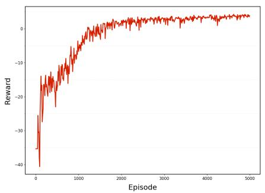  
(a) M=2, Fixed-Speed UAVs, Fixed UEs

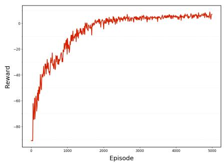  
(b) $\mathbf { M } = 3$ , Fixed-Speed UAVs, Fixed UEs

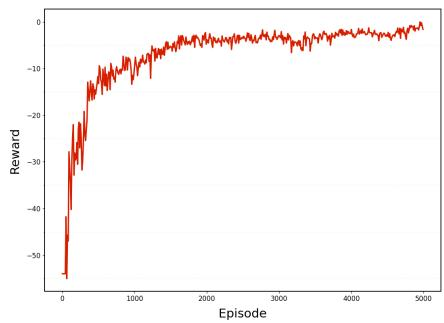  
(c) $\mathbf { M } { = } 2$ , Variable-Speed UAVs, Fixed UEs

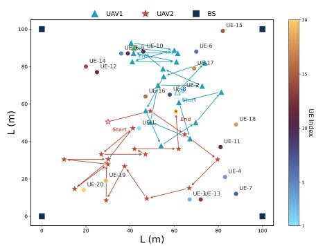  
Fig. 4: UAVs’ training curve of SG-MAPG   
(a) $\mathbf { M } { = } 2$ , Fixed-Speed UAVs, Fixed UEs

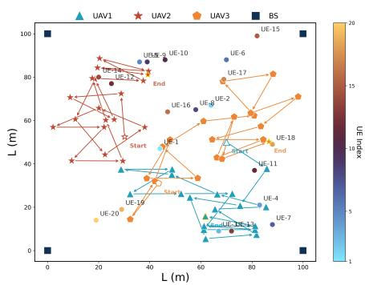  
(b) $\mathbf { M } { = } 3$ , Fixed-Speed UAVs, Fixed UEs

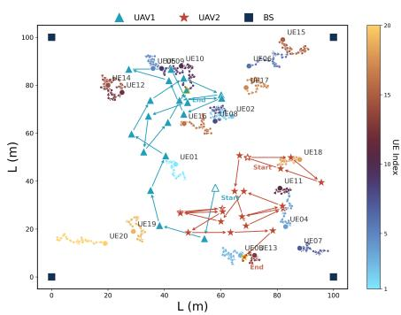  
(c) ${ \bf M } = 2$ , Variable-Speed UAVs, Fixed UEs   
Fig. 5: UAVs’ trajectories of SG-MAPG

the selected action $A ( t )$ under the current state $S ( t )$ . These Q-values are optimized by minimizing their deviation from the target value $y _ { m } ( t )$ , thereby improving the critics’ accuracy in assessing agent behavior. Accordingly, the parameters of the three critic networks are updated by minimizing the following loss function:

$$
L _ {\beta_ {i}} (t) = \frac {1}{k _ {d}} \sum_ {j = 1} ^ {k _ {d}} \left(y _ {m} (t) - Q _ {m} ^ {\beta_ {i}} [ S (t), A (t) ]\right) ^ {2}, \quad i = 1, 2, 3. \tag {61}
$$

Furthermore, agent $m$ updates the parameters of its actor network using the policy gradient approach [36], formulated as:

$$
\begin{array}{l} \nabla_ {\alpha} J = \frac {1}{k _ {d}} \sum_ {j = 1} ^ {k _ {d}} \nabla_ {\alpha} \pi_ {\alpha} ^ {m} [ o _ {m} (t) ] \nabla_ {a _ {m}} Q _ {m} ^ {\beta_ {i}} [ S (t), \widetilde {a} _ {1} (t), \dots , \widetilde {a} _ {M} (t) ] \\ a _ {m} = \pi_ {m} ^ {\alpha} [ o _ {m} (t) ], \quad m \in M, \quad i = 1, 2, 3. \tag {62} \\ \end{array}
$$

Currently, five target networks for agent $m$ have not been updated. Assuming our target learning rate is $\tau$ , the target network updates can be defined by the following equations:

$$
\alpha_ {i} ^ {\prime} = \tau \alpha + (1 - \tau) \alpha_ {i} ^ {\prime}, \quad i = 1, 2 \tag {63}
$$

$$
\beta_ {i} ^ {\prime} = \tau \beta_ {i} + (1 - \tau) \beta_ {i} ^ {\prime}, \quad i = 1, 2, 3 \tag {64}
$$

The steps of the algorithm have been introduced. We conducted simulation experiments in the next section to confirm the feasibility of our solution.

# IV. SIMULATION EXPERIMENT ANALYSIS

In this section, we perform simulations to evaluate the developed solution. A total of 20 UEs are randomly distributed within a $1 0 0 \mathrm { m }$ square area, while BSs are located at the four corners of the square. The remaining environmental simulation parameters are summarized in Table I. For both the actor and critic networks, we employ a five-layer fully connected neural network architecture with layer sizes of [512, 400, 400, 256, 128]. The learning rates for the actor and critic networks are set to $6 \times 1 0 ^ { - 5 }$ and $1 0 ^ { - 4 }$ . Both networks are optimized using the Adam optimizer. The main hyperparameters of the algorithm are listed in Table II.

The training performance is illustrated in Fig. 4, where SG-MAPG curves are smoothed using a moving average for visualization. In Fig. 4a, under the two-UAV setting, the average reward increases rapidly during early training, stabilizes after approximately 2,000 episodes, and then converges steadily.

Fig. 4c depicts the scenario with dynamic UAVs and UEs, where UAV and UE speeds are constrained to $v _ { u a v } \in [ 1 0 , 2 0 ]$ and $v _ { u e } \in [ 0 , 3 ]$ , respectively. Compared with the static case, moderate environmental dynamics accelerate convergence to around 1,700 episodes and yield a higher steady reward. This suggests that controlled mobility-induced non-stationarity facilitates efficient exploration without compromising training stability. All trained models and hyperparameters were retained for subsequent validation.

Fig. 5 illustrates the UAV trajectories learned by SG-MAPG under two- and three-UAV deployments. Throughout the service horizon, UAVs adapt their positions in response to

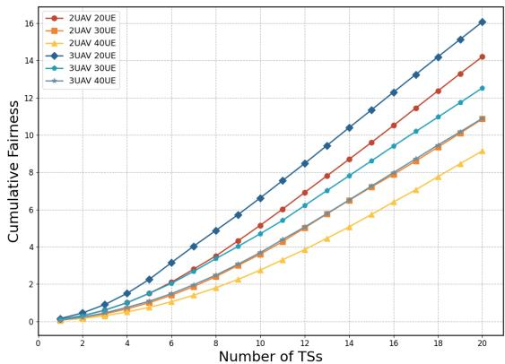  
Fig. 6: Effect of the number of UEs in the first 20 TSs on UAV service fairness.

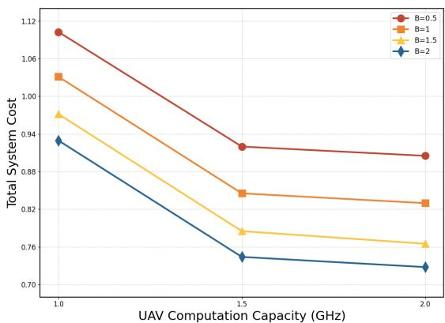  
Fig. 7: Impact of UAV computation capacity and bandwidth on system cost.

environmental dynamics to balance UE service fairness and system cost. UEs located near the BS preferentially offload tasks to the BS, while UAVs maintain a proper separation from the BS and reposition to extend coverage over underserved regions, thereby avoiding redundant service overlap.

In the two-UAV case shown in Fig. 5a, UAV 2 primarily moves horizontally to expand lower-area coverage, whereas UAV 1 shifts upward to serve upper-region UEs. This spatial differentiation enables BS-proximal UEs to be handled by the BS, improving throughput and reducing unnecessary UAV workload. When a third UAV is introduced (Fig. 5b), the coverage region expands accordingly, allowing service demand to be distributed more evenly. As demonstrated in Fig. 5c, this coordinated behavior persists under dynamic UE mobility, confirming the robustness of SG-MAPG in realistic deployment scenarios.

This study investigates system fairness under varying UE densities. As shown in Fig. 6, increasing the number of UEs raises the computational load. Deploying additional UAVs enhances task offloading efficiency, improving overall performance and accelerating fairness for a given UE count. In multi-UE scenarios, insufficient UAVs cause resource allocation imbalance and reduced fairness, emphasizing the importance of proper UAV scaling. Conversely, at low UE densities, fewer UAVs can still maintain high fairness. Notably, during

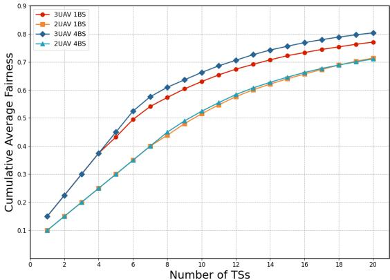

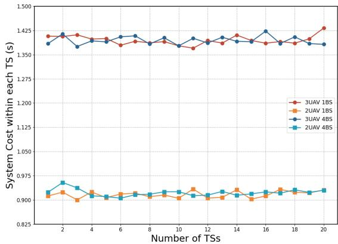  
(a) Fairness in different numbers of BSs   
(b) System Cost in different numbers of BSs   
Fig. 8: Fairness and system cost in different numbers of BSs

the first 20 TSs, deploying three UAVs increases fairness by approximately $1 5 . 4 \%$ compared with two UAVs, highlighting the impact of UAV deployment on fairness optimization.

Fig. 7 shows the system cost under different UAV computation capacities $f _ { m }$ and communication bandwidths $B _ { u a v }$ . Increasing $B _ { u a v }$ improves link rates and reduces offloading latency and communication energy consumption, leading to a lower system cost. A higher computation capacity further shortens processing delay and improves overall efficiency. These results demonstrate that jointly enhancing communication and computation resources effectively mitigates load imbalance and reduces the total system cost.

Moreover, bandwidth variation also indirectly affects fairness. Increased bandwidth boosts link rates, mitigating task backlog and delay asymmetry under congestion. These effects are captured by the composite cost $V _ { t r u e } ( t )$ in the reward function (52), guiding subsequent policy updates. As a result, fairness adapts through bandwidth-driven adjustments in pricing, scheduling, and offloading.

After analyzing the impact of UE scale on fairness, we examine multi-BS scenarios. Fig. 8a shows that with sufficient UAVs (e.g., 3), adding BSs slightly improves fairness. With fewer UAVs (e.g., 2), fairness stabilizes at 0.72 regardless of BS count, indicating UAVs predominantly drive fairness gains.

Fig. 8b indicates that system cost is largely insensitive to BS quantity, implying that cost reduction in multi-BS settings primarily relies on UAV number and deployment rather than

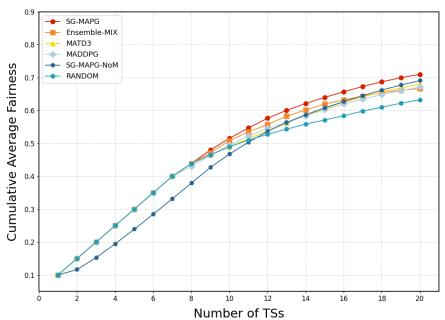  
(a) M=2, Fixed-Speed UAVs, Fixed UEs

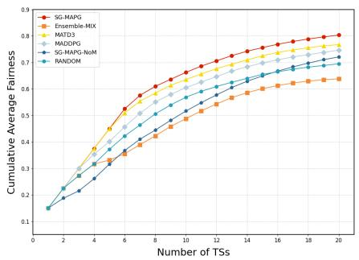  
(b) $\mathbf { M } = 3$ , Fixed-Speed UAVs, Fixed UEs

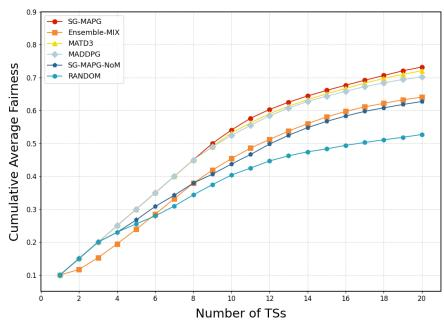  
(c) $\mathbf { M } { = } 2$ , Variable-Speed UAVs, Fixed UEs

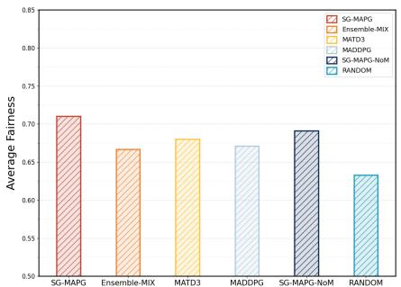  
Fig. 9: Cumulative average fairness of SG-MAPG and benchmark algorithms within the same TSs in UAVs   
(a) M=2, Fixed-Speed UAVs, Fixed UEs

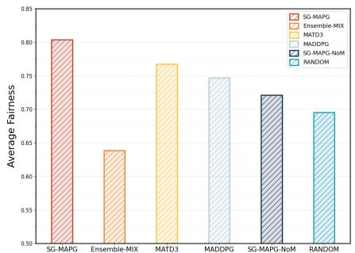  
(b) M=3, Fixed-Speed UAVs, Fixed UEss

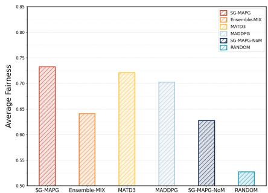  
(c) $\mathbf { M } { = } 2$ , Variable-Speed UAVs, Fixed UEs   
Fig. 10: Average fairness over long TSs of SG-MAPG and benchmark algorithms within the same TSs in UAVs

BS expansion. Therefore, UAV deployment is more critical than BS addition for fairness and cost control.

To further assess the performance of our algorithm, we compare the cases of two UAVs and three UAVs with the following benchmark solutions:

1) MATD3: Employs the 3L-MSADM framework for task offloading, where the UAV flight angles $\phi _ { m } ( t )$ and UE selections $z _ { n } ( t )$ are determined via the MATD3 [37] algorithm.   
2) Ensemble-MIX: Within the 3L-MSADM model, UAV flight angles $\phi _ { m } ( t )$ and UE selections $z _ { n } ( t )$ are derived using Ensemble-MIX [38].   
3) MADDPG: Utilizes the same 3L-MSADM framework to determine $\phi _ { m } ( t )$ and $z _ { n } ( t )$ via the MADDPG [39] algorithm.   
4) SG-MAPG-NoM: Implements a random task allocation ratio $v _ { m } ( t )$ , while UAV flight angles $\phi _ { m } ( t )$ and UE selections $z _ { n } ( t )$ are obtained through the SG-MAPG policy.   
5) RANDOM: Fully random scheme, where task allocation ratios $v _ { m } ( t )$ , UAV flight angles $\phi _ { m } ( t )$ , and UE selections $z _ { n } ( t )$ are all randomly generated.

In Fig. 9a, we illustrate the average fairness per TS of two UAVs over the first 20 TSs, with the average fairness computed as $\begin{array} { r } { F _ { A F } ( t ) = \frac { 1 } { T } \sum _ { t = 1 } ^ { T } f _ { u e } ( t ) } \end{array}$ , where the computation of $f _ { u e } ( t )$ is based on the Equation (37), and focused on illustrating the short-term dynamic trends of the algorithms.

As shown in Fig. 9a, SG-MAPG exhibits the most robust fairness performance. While comparable to other methods in

the initial TSs, it achieves sustained superiority thereafter by mitigating overestimation through multiple critics and a dual-objective actor, which enhances policy robustness with negligible impact from residual uncertainty. MATD3 improves stability via twin critics, whereas MADDPG remains vulnerable to overestimation, leading to instability in dynamic UAVassisted MEC scenarios.

EnsembleMix performs comparably to MADDPG with two UAVs, but its fairness degrades rapidly as the system scales or UE mobility increases, occasionally falling below RANDOM. This is mainly due to its kurtosis-based action prioritization and uncertainty-weighted critics, which amplify nonstationarity and inter-agent coupling in larger systems.

SG-MAPG-NoM underperforms SG-MAPG because its random, cost-unaware offloading prevents effective systemlevel coordination. RANDOM exhibits superficially stable fairness due to unbiased offloading, but incurs substantially higher system cost in the absence of task scheduling and resource optimization.

When the number of UAVs increases to three, as in Fig. 9b, the advantages of SG-MAPG become more pronounced, particularly after TS 5, showing strong adaptability to dynamic system changes and improved stability.

In Fig. 9c, when both UEs and UAVs are mobile, the UAV’s movement speed affects fairness through coupled channel dynamics and learning feedback. The time-varying UAV–UE distance causes fluctuations in channel gain, rate, and offloading latency, while higher UAV velocity enables quicker responses to underserved areas and reduces long-term service imbalance. Mobility-induced variations also modify the system

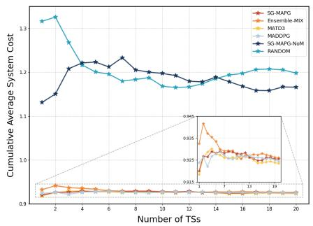  
(a) M=2, Fixed-Speed UAVs, Fixed UEs

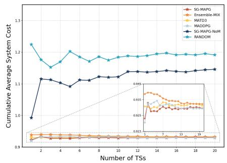  
(b) $\mathbf { M } = 3$ , Fixed-Speed UAVs, Fixed UEs

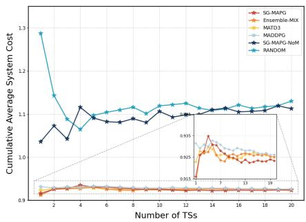  
(c) $\mathbf { M } { = } 2$ , Variable-Speed UAVs, Fixed UEs

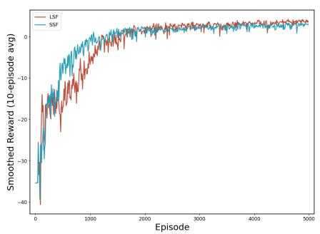  
Fig. 11: Cumulative average system cost of SG-MAPG and benchmark algorithms within the same TSs in UAVs   
(a) Training Convergence

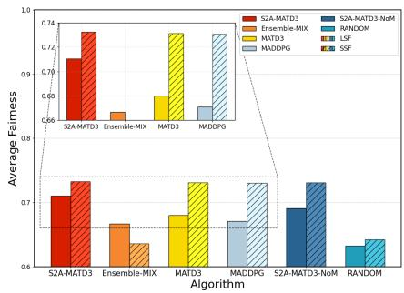  
(b) ASC of Algorithms

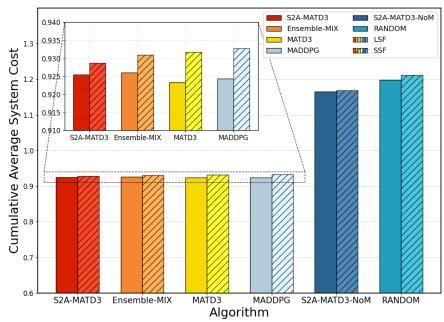  
(c) AF of Algorithms   
Fig. 12: Performance comparison under small-scale and large-scale fading scenarios

cost $V _ { t r u e }$ , which appears in the reward function (52), thereby influencing the learning behavior in pricing, trajectory, and scheduling. SG-MAPG maintains high fairness under such dynamic conditions, confirming its robustness in environments with strong mobility.

Fig. 10a presents the early-phase long-term average fairness with two UAVs. SG-MAPG improves fairness by $1 2 . 3 \%$ over RANDOM. With more UAVs, its advantage grows, yielding substantial gains after the fifth second. As shown in Fig. 10b, with three UAVs, SG-MAPG attains $5 \%$ higher fairness than MATD3 and $1 5 . 6 \%$ higher than RANDOM. Under dynamic UE mobility (Fig. 10c), SG-MAPG achieves $73 \%$ fairness, $40 \%$ above RANDOM.

Fig. 11a details the cumulative average system cost for 2 UAVs up to the current TS, computed as $V _ { A S C } ( t ) ~ =$ $\begin{array} { r } { \frac { 1 } { T } \sum _ { t = 1 } ^ { T } V _ { t r u e } ( t ) } \end{array}$ using (38) and (45). RANDOM ignores the spatial distribution among UEs, UAVs, and BSs, assigning tasks purely at random, resulting in the highest cost. MAD-DPG, MATD3, and SG-MAPG leverage the 3L-MSADM model and optimal offloading ratios to reduce system cost. SG-MAPG-NoM, which omits the impact of offloading on UAV trajectories, performs slightly better than RANDOM. Overall, SG-MAPG lowers system cost by $2 2 . 7 \%$ versus RANDOM for 2 UAVs (Fig. 11c) and $2 8 . 1 \%$ for 3 UAVs (Fig. 11b) under dynamic UE mobility. These results confirm that SG-MAPG optimizes UAV task allocation, stabilizes the system, and improves UE service efficiency.

Fig. 12a illustrates large-scale fading (LSF) versus smallscale fading (SSF). Incorporating the fast-varying channel gain $h _ { m } ( t )$ increases uncertainty. Fig. 12a shows that this

randomness promotes broader exploration in early training, accelerating convergence relative to LSF. Fig. 12b demonstrates that SSF enhances fairness, with SG-MAPG consistently surpassing all baselines. Fig. 12c presents the corresponding system costs. While all algorithms incur higher costs under SSF, SG-MAPG exhibits the smallest increase, underscoring its robustness to channel fluctuations. Introducing $\begin{array} { r l } {  { \frac { 1 } { 2 } | h _ { m } ( t ) | ^ { 2 } } } \end{array}$ thus accelerates convergence but elevates system cost, while SG-MAPG maintains superior fairness and efficiency in highly dynamic UAV-assisted MEC scenarios.

# V. CONCLUSION

This paper developed a 3L-MSADM integrated with the SG-MAPG algorithm to jointly optimize task offloading and resource allocation in UAV-assisted MEC systems. Simulation results demonstrate that the proposed approach effectively reduces system cost, improves user fairness, and enhances overall system performance. While the current study relies on simulation-based evaluation, future work will extend the framework to real UAV–MEC testbeds, incorporate more heterogeneous and dynamic network conditions, and explore lightweight learning mechanisms to further improve scalability and practical deployability.

# VI. ACKNOWLEDGMENTS

This work was supported in part by the National Natural Science Foundation of China under Grant 61902436, in part by the HuNan Provincial Natural Science Foundation of China under Grant 2019JJ50996, The corresponding author is Fan Yang.

# REFERENCES

[1] S. E. Bibri, J. Krogstie, A. Kaboli, and A. Alahi, “Smarter eco-cities and their leading-edge artificial intelligence of things solutions for environmental sustainability: A comprehensive systematic review,” Environmental Science and Ecotechnology, vol. 19, p. 100 330, 2024.   
[2] L. Chen, P. Wu, K. Chitta, B. Jaeger, A. Geiger, and H. Li, “End-to-end autonomous driving: Challenges and frontiers,” IEEE Transactions on Pattern Analysis and Machine Intelligence, 2024.   
[3] D. C. Nguyen, Q.-V. Pham, P. N. Pathirana, et al., “Federated learning for smart healthcare: A survey,” ACM Computing Surveys (Csur), vol. 55, no. 3, pp. 1–37, 2022.   
[4] C. Park and J. Lee, “Mobile edge computing-enabled heterogeneous networks,” IEEE Transactions on Wireless Communications, vol. 20, no. 2, pp. 1038–1051, 2020.   
[5] Q. Chen, H. Zhu, L. Yang, X. Chen, S. Pollin, and E. Vinogradov, “Edge computing assisted autonomous flight for uav: Synergies between vision and communications,” IEEE Communications Magazine, vol. 59, no. 1, pp. 28–33, 2021.   
[6] L. Wang, K. Wang, C. Pan, W. Xu, N. Aslam, and L. Hanzo, “Multi-agent deep reinforcement learning-based trajectory planning for multi-uav assisted mobile edge computing,” IEEE Transactions on Cognitive Communications and Networking, vol. 7, no. 1, pp. 73–84, 2020.   
[7] E. M. Mohamed, M. A. Alnakhli, and M. M. Fouda, “Joint uav trajectory planning and leo-sat selection in sagin,” IEEE Open Journal of the Communications Society, vol. 5, pp. 1624–1638, 2024.   
[8] S. Dong, J. Tang, K. Abbas, et al., “Task offloading strategies for mobile edge computing: A survey,” Computer Networks, p. 110 791, 2024.   
[9] Z. Yu, Y. Gong, S. Gong, and Y. Guo, “Joint task offloading and resource allocation in uav-enabled mobile edge computing,” IEEE Internet of Things Journal, vol. 7, no. 4, pp. 3147–3159, 2020.   
[10] N. Zhao, Z. Ye, Y. Pei, Y.-C. Liang, and D. Niyato, “Multi-agent deep reinforcement learning for task offloading in uav-assisted mobile edge computing,” IEEE Transactions on Wireless Communications, vol. 21, no. 9, pp. 6949–6960, 2022.   
[11] Q. Song, Y. Zeng, J. Xu, and S. Jin, “A survey of prototype and experiment for uav communications,” Science China Information Sciences, vol. 64, pp. 1–21, 2021.   
[12] H. Peters, Game theory: A Multi-leveled approach. Springer, 2015.   
[13] P. Leroy, P. G. Morato, J. Pisane, A. Kolios, and D. Ernst, “Imp-marl: A suite of environments for largescale infrastructure management planning via marl,” Advances in Neural Information Processing Systems, vol. 36, pp. 53 522–53 551, 2023.

[14] L. Wen, E. H. Tseng, H. Peng, and S. Zhang, “Dream to adapt: Meta reinforcement learning by latent context imagination and mdp imagination,” IEEE Robotics and Automation Letters, 2024.   
[15] Y. Zhang, H. Zhao, B. Li, and X. Wang, “Research on dynamic pricing and operation optimization strategy of integrated energy system based on stackelberg game,” International Journal of Electrical Power & Energy Systems, vol. 143, p. 108 446, 2022.   
[16] J. Nie, J. Mu, Q. Zhou, and X. Jing, “Offloading strategy for uav-assisted mobile edge computing with computation rate maximization,” in 2023 IEEE International Symposium on Broadband Multimedia Systems and Broadcasting (BMSB), IEEE, 2023, pp. 1–6.   
[17] T. H. T. Le, N. H. Tran, T. LeAnh, et al., “Auction mechanism for dynamic bandwidth allocation in multitenant edge computing,” IEEE Transactions on Vehicular Technology, vol. 69, no. 12, pp. 15 162–15 176, 2020.   
[18] Z. Tong, Y. Zhang, J. Mei, W. Ai, K. Li, and K. Li, “Stackelberg game-based bandwidth allocation and resource pricing for multi-user in mec system,” IEEE Internet of Things Journal, 2024.   
[19] L. Fan, W. Yan, X. Chen, Z. Chen, and Q. Shi, “An energy efficient design for uav communication with mobile edge computing,” China Communications, vol. 16, no. 1, pp. 26–36, 2019.   
[20] M. D. Hossain, T. Sultana, M. A. Hossain, et al., “Dynamic task offloading for cloud-assisted vehicular edge computing networks: A non-cooperative game theoretic approach,” Sensors, vol. 22, no. 10, p. 3678, 2022.   
[21] P. Li and J. Xu, “Fundamental rate limits of uav-enabled multiple access channel with trajectory optimization,” IEEE Transactions on wireless communications, vol. 19, no. 1, pp. 458–474, 2019.   
[22] Y. Hu, X. Yuan, J. Xu, and A. Schmeink, “Optimal 1d trajectory design for uav-enabled multiuser wireless power transfer,” IEEE Transactions on Communications, vol. 67, no. 8, pp. 5674–5688, 2019.   
[23] Y. Zeng, Q. Wu, and R. Zhang, “Accessing from the sky: A tutorial on uav communications for 5g and beyond,” Proceedings of the IEEE, vol. 107, no. 12, pp. 2327–2375, 2019.   
[24] R. E. Nkrow, B. Silva, D. Boshoff, G. Hancke, M. Gidlund, and A. Abu-Mahfouz, “Nlos identification and mitigation for time-based indoor localization systems: Survey and future research directions,” ACM Computing Surveys, vol. 56, no. 12, pp. 1–41, 2024.   
[25] G. Yang, Y.-C. Liang, R. Zhang, and Y. Pei, “Modulation in the air: Backscatter communication over ambient ofdm carrier,” IEEE Transactions on Communications, vol. 66, no. 3, pp. 1219–1233, 2017.   
[26] X. Chen, H. Zhang, and K. B. Letaief, “Joint offloading and resource allocation for computation and communication in mobile cloud with computing access point,” IEEE Transactions on Wireless Communications, vol. 18, no. 4, pp. 2225–2238, 2019.

[27] R. Jain, D. Chiu, and W. Hawe, “A quantitative measure of fairness and discrimination for resource allocation in shared computer systems,” Digital Equipment Corporation, Tech. Rep. TR-301, 1984, DEC Research Report.   
[28] X. Li, Y. Chen, and Z. Han, “Fairness-aware resource allocation for multi-user wireless networks: A survey,” IEEE Communications Surveys & Tutorials, vol. 23, no. 1, pp. 20–46, 2021.   
[29] Y. Zhang, M. Chen, and T. Liu, “Fair resource allocation in heterogeneous wireless networks: A comprehensive review,” IEEE Transactions on Wireless Communications, vol. 21, no. 3, pp. 2013–2030, Mar. 2022.   
[30] A. Asheralieva and D. Niyato, “Hierarchical gametheoretic and reinforcement learning framework for computational offloading in uav-enabled mobile edge computing networks with multiple service providers,” IEEE Internet of Things Journal, vol. 6, no. 5, pp. 8753– 8769, 2019.   
[31] J. Du, Z. Kong, A. Sun, et al., “Maddpg-based joint service placement and task offloading in mec empowered air–ground integrated networks,” IEEE Internet of Things Journal, vol. 11, no. 6, pp. 10 600–10 615, 2023.   
[32] Y. Mao, J. Zhang, and K. B. Letaief, “Dynamic computation offloading for mobile-edge computing with energy harvesting devices,” IEEE Transactions on Mobile Computing, vol. 19, no. 10, pp. 2320–2333, 2020.   
[33] L. Lei, Z. Zhong, C. Lin, and X. Shen, “Operatorcontrolled device-to-device communications in lteadvanced networks,” IEEE Wireless Communications, vol. 19, no. 3, pp. 96–104, 2018.   
[34] X. Liu and B. Jin, “Information-theoretic multi-agent algorithm based on the ctde framework,” in 2024 9th International Conference on Electronic Technology and Information Science (ICETIS), IEEE, 2024, pp. 511– 516.   
[35] A. A. Kulkarni and U. V. Shanbhag, “An existence result for hierarchical stackelberg v/s stackelberg games,” IEEE Transactions on Automatic Control, vol. 60, no. 12, pp. 3379–3384, 2015.   
[36] F. Ding, L. Xu, D. Meng, X.-B. Jin, A. Alsaedi, and T. Hayat, “Gradient estimation algorithms for the parameter identification of bilinear systems using the auxiliary model,” Journal of Computational and Applied Mathematics, vol. 369, p. 112 575, 2020.   
[37] S. Fujimoto, H. Hoof, and D. Meger, “Addressing function approximation error in actor-critic methods,” in International conference on machine learning, PMLR, 2018, pp. 1587–1596.   
[38] T. Danino and N. Shimkin, “Ensemble-mix: Enhancing sample efficiency in multi-agent rl using ensemble methods,” arXiv preprint arXiv:2506.02841, 2025.   
[39] R. Lowe, Y. I. Wu, A. Tamar, J. Harb, O. Pieter Abbeel, and I. Mordatch, “Multi-agent actor-critic for mixed cooperative-competitive environments,” Advances in neural information processing systems, vol. 30, 2017.

# BIOGRAPHY SECTION

Zhihui Bi is currently pursuing the B.Eng. degree in Computer Science and Technology at the School of Computer Science and Mathematics, Central South University of Forestry and Technology, Changsha, China. Her current research interests include dynamic game theory, edge computing, and reinforcement learning.

Fan Yang is currently an associate professor with Central South University of Forestry and Technology. He received the Ph.D. degree in computer science and engineering from Hunan University, China, in 2016. He was a visit scholar at Michigan State University, US, from 2014-2015. His research interests include Cyber Physical Systems, Embedded Systems and Edge Computing.

Zhenyu Li received the B.Eng in mechanical engineering department of Hunan Institute of Science and Technology, Yueyang, China, 2021. He is currently pursuing the M.Sc. degree with the Department of Computer Science and Engineering, The Central South University of Forestry and Technology, Chang Sha, China. His recently research interests include mobile edge computing, reinforcement learning.

Guanqi Liu is currently an undergraduate student majoring in Automation at the School of Electronic Information and Physics, Central South University of Forestry and Technology. His recent research interests include graph-based remote sensing image segmentation and edge learning.

Zhufang Kuang received the M.Sc. and Ph.D. degrees in computer science from National University of Defense Technology and Central South University, Changsha, China, 2006 and 2012, respectively. He was a Post-Doctoral Researcher with the School of Software, Central South University, Changsha, China. From 2015 to 2016. He was a Visiting Scholar/Professor with the University of Victoria, Victoria, BC, Canada. He is currently a Full Professor with the Department of Computer Science at the Central South University of Forestry and

Technology. His current research interests include wireless communications and networking, Internet of things (IoT), mobile edge computing, artificial intelligence. Dr. Kuang is a Distinguished Member of CCF, a member of the CCF Internet of Things Council and a member of the CCF Network and Data Communications Council, and ACM. He is a Chair of CCF YOCSEF CHANGSHA from 2022 to 2023.