# SLIM+: Jointly Optimizing EIV Placement and UAV Fleet Sizing for Deadline-Driven Tasks

Jianping Huang, Feng Shan, Member, IEEE and Junzhou Luo, Member, IEEE

Abstract—Unmanned Aerial Vehicles (UAVs) are crucial for deadline-driven tasks but face dual bottlenecks: limited flight endurance and constrained onboard processing for data-intensive tasks. Edge Intelligent Vehicles (EIVs) can effectively serve as mobile logistical and computational hubs to alleviate these issues. However, existing research on such air-ground collaboration often assumes predetermined EIV locations and a fixed UAV fleet. This inflexibility leads to costly resource over-provisioning or mission failures under tight deadlines. Motivated by this, this paper studies the SLIM+ problem, which focuses on jointly optimizing proactive EIV placements and UAV fleet sizing to minimize total deployment cost. This problem is challenging due to the deep coupling between strategic EIV placement, which shapes the mission structure, and the resulting operational cost of the UAV fleet. Therefore, we propose a novel two-level algorithm, where the outer layer employs dynamic programming to strategically place EIVs to partition the mission into independent route segments, while the inner layer consists of two complementary algorithms to determine the minimum UAV fleet size and optimal speeds for each segment: an optimal DP-based method and an approximation algorithm with a theoretical guarantee. Extensive simulations show that our integrated solution reduces total deployment cost by an average of 21.9% compared to baseline solutions, highlighting the benefits of a fully optimized codeployment strategy.

## I. INTRODUCTION

The burgeoning low-altitude economy is accelerating the digital transformation of physical industries, from creating digital twins for critical infrastructure to automating largescale agricultural operations [1]–[3]. In this context, Unmanned Aerial Vehicles (UAVs) are emerging as key enablers, functioning as highly mobile sensing platforms [4]–[6]. Applications such as disaster rescue [7], surveillance [8], and intelligent transport [9] are inherently data-intensive and timesensitive. Critically, the raw and high-fidelity data collected in these missions requires extensive processing to generate actionable intelligence within strict time constraints, i.e., deadlines, as any delay can severely impact performance. Given that a single UAV has limited onboard resources, it cannot effectively handle complex and deadline-constrained tasks. Thus, considerable research has been dedicated to optimizing task scheduling with multiple UAVs [8], [10].

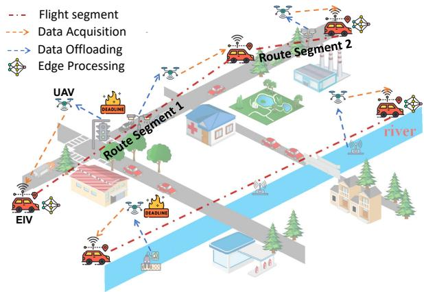  
Fig. 1. A common application scenario where a set of heterogeneous tasks are distributed along a linear route, such as a road or river. Multiple EIVs are strategically placed to form independent route segments, each served by a dedicated UAV team. Each deployed UAV acquires data from assigned tasks using specific equipment, and then offloads it to the nearest EIV for processing before each task’s deadline.

Scaling up multi-UAV task scheduling, however, exposes two fundamental bottlenecks: UAV logistics and on-site data processing. First, in logistics, tasks dispersed over large areas often exceed a UAV’s flight range. The sheer flight time required for a UAV to reach distant tasks can make meeting deadlines physically impossible, regardless of its energy capacity. This situation needs forward-deployed logistical hubs to facilitate UAV relay operations. Second, from a dataprocessing perspective, equipment like LiDAR [11] or hyperspectral cameras [12] generates massive high-fidelity data that must be processed quickly. Transmitting this raw data to a remote cloud incurs prohibitive latency, while UAVs lack the onboard computational power for complex analysis due to Size, Weight, and Power (SWaP) constraints [13]. To tackle these issues, we utilize a collaborative air-ground architecture based on multi-functional mobile ground nodes, termed Edge Intelligent Vehicles (EIVs). These EIVs function as logistical hubs for UAV operations (e.g., DJI Dock [14] and Skydio Dock [15]) and as powerful edge computing nodes for local data processing. This integration creates an efficient “collectin-the-air, process-on-the-ground” paradigm.

While this collaborative air-ground architecture is promising, existing research fails to address the essential challenge of effectively deploying both EIVs and UAVs. From the UAV perspective, most studies assume a fixed fleet, optimizing metrics like energy or system utility within this framework [10], [16]. However, this is impractical for deadline-driven tasks, as each UAV’s onboard energy limits its task capacity and operational range [17], [18]. A fixed UAV fleet size can either lead to mission failures due to energy depletion or result in overdeployment, increasing cost and risks such as malfunctions and collisions [19], [20]. Although some research aims to minimize UAV numbers [21]–[25], it typically overlooks deadline constraints, risking failures in emergencies [10], [26], [27]. Regarding EIVs, most studies treat them as reactive nodes within predefined mission structures [16], [28]–[30], which limits scalability and adaptivity. Such inefficient deployment of UAVs and EIVs can waste resources and violate task deadlines due to excessive flight times and communication delays. Therefore, strategically deploying multiple EIVs is crucial, yet a significant gap exists in jointly optimizing EIV placement and UAV fleet size under stringent constraints.

Motivated by this, we investigate a novel co-optimization Scheduling problem of EIV placement and UAV fleet sizing for deadLIne-driven tasks with Minimum deployment cost (SLIM+). As illustrated in Fig. 1, we consider a prevalent scenario where a set of heterogeneous tasks are distributed along a straight route [17], [23], e.g., power transmission lines [31], roads [32], water/oil/gas pipelines [33] or rivers/coasts [34]. Each task requires a minimum data volume to be processed before its deadline. In this context, strategically placing EIVs divides the route into independent segments, each served by a dedicated UAV fleet. Each UAV fleet departs from the initial EIV, follows the route to sequentially serve assigned tasks, and offloads data to the nearest EIV for real-time processing, ensuring task deadlines are met. The goal is to minimize the total deployment cost of both EIVs and UAVs by jointly determining: (i) the optimal EIV placements, (ii) the minimum number of UAVs and their flight speeds for each segment, and (iii) a feasible deadline-compliant schedule for each UAV. Solving this problem is non-trivial due to several challenges:

• A key challenge lies in the tight coupling between EIV placement and UAV fleet sizing. Each EIV location decision reshapes the UAV optimization space by altering segment boundaries and task distributions. This creates a trade-off: while an additional EIV may decrease the required UAV fleet size, its deployment cost could exceed the savings. Thus, achieving a globally optimal balance is intractable, as a single stringent task deadline can force an otherwise inefficient EIV placement.

• Even within a single segment, minimizing deployment cost is NP-hard due to a trilemma involving deadline compliance, limited energy, and fleet size. Meeting deadlines demands high flight speeds, which deplete the energy budget and reduce each UAV’s endurance for tasks. This requires more UAVs. In contrast, slower speeds conserve energy and allow a single UAV to manage more tasks, but risk deadline violations, leading to a larger fleet for parallel task completion.

• Even with a fixed UAV fleet, scheduling is challenging due to the strict no-turn-back restriction and the sequential nature of tasks. Designing an optimal task schedule is complex, even for a single UAV. Focusing on early tasks can lead to insufficient energy for later ones, risking deadline violations. Conversely, prioritizing later tasks may result in neglecting earlier tasks.

To address these challenges, we propose a novel two-layer optimization approach. We first focus on the fundamental subproblem of minimizing the UAV fleet size for a single predefined route segment, termed SLIM, for which we develop both optimal and approximation algorithms to handle diverse scales. Building on this, we employ a high-level DP framework to solve the full SLIM+ problem by strategically optimizing EIV placements, using our SLIM solver as a core subroutine to evaluate the cost of each potential segment. Our main contributions are summarized as follows:

• We formulate the novel SLIM+ problem, establishing the first co-optimization framework for strategic EIV placement and operational UAV fleet sizing. Traditional approaches often assume predetermined ground support and fixed UAV fleets, leading to costly over-provisioning or mission failure. In contrast, our model minimizes the total deployment cost by dynamically determining the optimal EIV locations, the required UAV fleet size and flight speed for each mission segment, all under stringent deadline and sequential service constraints.

• We design two complementary algorithms to solve the subproblem SLIM: an optimal DP-based method SLIM-DP for small-scale scenarios, and an approximation algorithm SLIM-AG that delivers a 2(2α + 1)-approximation guarantee, where α reflects task deadline variability, enabling scalable handling of large-scale task distributions.

• We propose a two-layer optimization approach DP-AG for the SLIM+ problem. The outer layer employs a DP method with flight speed pruning to identify the optimal EIV placements, with the inner layer applying our SLIM solver as a subroutine to calculate the minimum UAV deployment cost for each potential segment. This effectively balances EIV deployment cost with UAV requirements, offering a unified strategy for mission-critical systems.

• Extensive simulations validate our algorithms’ performance. Results show that SLIM-AG uses about 15% more UAVs on average than the optimal solution, reducing the average UAV fleet size by 21.3% compared to state-ofthe-art baselines. Furthermore, our DP-AG consistently outperforms other baseline strategies for optimizing EIV placement, achieving average cost savings of 21.9%.

The rest of this paper is organized as follows. Section II investigates the related work. Section III presents the system model and problem formulation. The proposed algorithms are introduced in Section IV and Section V. Simulations are conducted in Section VI, and Section VII concludes the paper.

## II. RELATED WORK

This section reviews related works on time-constrained task scheduling, UAV fleet size minimization, and joint optimization of air and ground resources. We also highlight the differences between these studies and our work in Table I.

## A. Time-Constrained Task Scheduling

Time-constrained scheduling is crucial for UAV-assisted mission-critical applications. Some studies focus on minimizing overall task delay, such as using a UAV to offload tasks from overloaded vehicular edge computing nodes while satisfying the UAV’s long-term energy budget [29]. Others aim to maximize system utility, typically balancing task completion delay and energy consumption in multi-layer computing architectures [10]. A significant and recent trend considers information freshness (AoI) as the primary metric. To tackle the inherent complexity, Zhan et al. [43] propose both optimization-based and deep reinforcement learning (DRL) methods, while Li et al. [9] introduce an attentiondriven multi-agent reinforcement learning (MARL) framework to optimize AoI for highly dynamic environments. Zhao et al. [44] further refines AoI by modeling freshness over the entire uplink–downlink cycle. Another closely related branch explicitly considers hard and inviolable deadlines, but these studies usually optimize different objectives. For example, Khochare et al. [40] co-schedule flight routes and onboard analytics to maximize captured value under deadlines, and Dong et al. [36] jointly optimize deadline-aware offloading and UAV trajectories to maximize profit-based utility.

TABLE I  
CONTRIBUTION COMPARISON WITH PRIOR WORK
<table><tr><td>Reference</td><td>Hard Deadline Sequential Tasks Fleet Size Opt. EIV Opt.</td><td></td><td></td></tr><tr><td>[16], [35], [36]</td><td>x</td><td>√</td><td>x</td></tr><tr><td>[29], [37], [38]</td><td>√</td><td></td><td>x</td></tr><tr><td>[21]–[25], [39], [40]</td><td>x</td><td></td><td>x</td></tr><tr><td>[10], [30], [41], [42]</td><td>√</td><td></td><td>√</td></tr><tr><td>[9], [43], [44]</td><td>x</td><td></td><td>x</td></tr><tr><td>Our Work</td><td>√</td><td></td><td>√</td></tr></table>

While these works typically assume a predetermined UAV fleet size, this assumption can lead to over-provisioning or mission failures under tight deadlines. In contrast, our work focuses on minimizing total deployment cost by treating fleet sizing as a first-class decision variable, within a framework that explicitly models the interactions among data acquisition, communication, and processing times.

## B. UAV Fleet Size Minimization

A significant body of research in UAV mission planning assumes a fixed fleet size [18], [36], [40]. While these approaches provide valuable insights, they focus more on operational aspects than on the fundamental strategic elements of deployment. In contrast, a distinct line of research addresses the strategic objective of minimizing UAV fleet size. Some studies establish the groundwork in specific contexts, such as reducing the number of UAV-mounted base stations for communication coverage [21] or minimizing UAVs for data collection missions subject to a total tour duration limit [22], [23]. Building upon this, Gong et al. [24] integrate fleet size minimization into more complex frameworks involving 3-dimensional environments and multi-objective optimization, and Chang et al. [25] develop improved approximation algorithms that significantly reduce the required number of UAVs compared to previous methods.

However, the existing literature on fleet size minimization suffers from three key limitations when applied to our problem domain. First, most studies do not enforce the hard deadlines and strict sequential service constraints that are critical in many real-world missions. Second, even the few works that do consider deadlines, such as Ye et al. [39], typically frame the problem around a single ground node and fail to address missions requiring a strategically deployed, multi-vehicle support infrastructure. Third, the most fundamental limitation is the narrow focus on a single UAV resource layer. This overlooks the critical interplay between the aerial fleet and ground-based resources, which is essential in our context.

## C. Joint Optimization of Air and Ground Resources

The synergy between UAV-assisted task scheduling and ground-based edge computing has emerged as a crucial research area, driven by the need to process large volumes of aerial data for some applications, such as real-time object detection using high-resolution imagery [32]. A common architectural approach involves UAVs offloading computationintensive tasks to fixed and pre-deployed ground edge computing infrastructure. For example, Ye et al. [16] utilize a fixed base station equipped with a server and battery swapping services to minimize operational cost, and Wang et al. [28] focus on optimizing UAV data collection missions with the assistance of static wireless charging platforms. To overcome the limitations of fixed infrastructure, research increasingly incorporates mobile ground vehicles for on-demand support. Some models treat these vehicles as providing logistical aids, such as mobile recharging stations that extend a UAV’s operational range during coverage tasks [35], [41]. More advanced frameworks empower ground vehicles as computing nodes. For example, Sun et al. [10] propose a three-layer architecture leveraging vehicle fog computing for post-disaster rescue, Wang et al. [37] utilize unmanned surface vehicles for ocean surveillance tasks, and Dai et al. [30] design a vehicle-assisted computing offloading architecture to enhance UAV offloading efficiency by utilizing moving vehicles in smart cities.

However, existing studies typically treat ground support as an exogenous and reactive resource, where it is either predeployed at fixed locations or follows predefined trajectories, and UAV scheduling must adapt to these predetermined configurations. For example, placing chargers/EIVs at fixed intervals may mismatch non-uniform task densities and deadlines, which can increase the required UAV fleet or even lead to missed deadlines compared to placements tailored to the task distribution [41], [42]. In contrast, we treat EIV placement as a proactive decision variable and jointly optimize it with UAV fleet sizing to minimize the end-to-end deployment cost under hard deadlines.

## III. SYSTEM MODEL AND PROBLEM FORMULATION

## A. System Overview

As illustrated in Fig. 2, our system integrates a set of deadline-driven tasks with a collaborative fleet of UAVs and EIVs. The key notations are summarized in Table II.

Deadline-Driven Tasks. We consider a set of n tasks distributed along a linear route, indexed as $P = \{ p _ { 1 } , \cdots , p _ { n } \}$ UAVs are employed to acquire data at the specific task locations. Each task $p _ { j } \in P$ is defined by its location $l ( p _ { j } )$ the data volume $\nu _ { j }$ to be collected by the assigned UAV’s onboard sensors, and a hard deadline $d _ { j }$ by which all associated operations must be completed. As depicted in Fig. 1, this model captures modern data-intensive applications, where the massive data requires significant off-board processing to yield actionable insights, rendering SWaP-constrained UAVs infeasible for complex onboard computation. Thus, this model relies on offloading the collected data to more powerful ground edge nodes for timely processing.

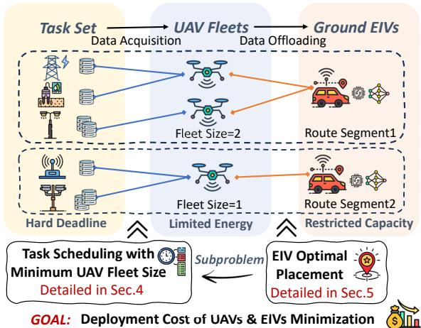  
Fig. 2. System Overview.

TABLE II SUMMARY OF KEY NOTATIONS
<table><tr><td>Symbol</td><td>Description</td></tr><tr><td colspan="2">Decision Variables</td></tr><tr><td> $S$ </td><td>Set of deployed EIVs,  $S = \{ s _ { 1 } , \ldots , s _ { K } \}$ </td></tr><tr><td> $m _ { k } , v _ { k }$ </td><td>Number of UAVs and flight speed in route segment</td></tr><tr><td> $x _ { i , j , z }$ </td><td>Binary variable for UAV  $u _ { i }$  serving task  $p _ { z }$  after  $p _ { j } .$  The start time of UAV serving task  $p _ { j } \mathbf { \bar { s } }$  service.</td></tr><tr><td> $t _ { i , j }$ </td><td> $u _ { i }$ </td></tr><tr><td colspan="2">Key Parameters</td></tr><tr><td> $P$ </td><td>Set of all tasks,  $P = \{ p 1 , \ldots \land \ , p _ { n } \}$ </td></tr><tr><td> $l ( p _ { j } ) , \mathcal { V } _ { j } , d _ { j }$ </td><td>Location, data volume and deadline of task  $p _ { j } .$ </td></tr><tr><td> $w _ { e } \big ( s _ { k } \big ) , \mathsf { T } _ { s } \big ( s _ { k } \big )$ </td><td>Deployment cost and setup time of EIV sk.</td></tr><tr><td>Γ</td><td>UAV support capacity of EIV.</td></tr><tr><td> $B$ </td><td>Communication bandwidth of EIV.</td></tr><tr><td> $w _ { u }$ </td><td>Deployment cost of a UAV.</td></tr><tr><td> $\varepsilon$ </td><td>Energy budget of a UAV.</td></tr><tr><td> $\mathbb { P } ( v )$ </td><td>UAV flight power as a function of speed v.</td></tr><tr><td>η</td><td>UAV hovering power coefficient.</td></tr><tr><td> $\dot { P } _ { k } , U _ { k }$ </td><td>Subset of tasks and UAVs in route segment k.</td></tr><tr><td> $q _ { j , k }$ </td><td>Total service time for task pj in segment k.</td></tr></table>

EIV Placement. Let S denote the EIV placement decision, which involves selecting an optimal subset of task locations for EIV deployment. We can explicitly represent the chosen locations as $S = \left\{ s _ { 1 } , s _ { 2 } , \dotsc , s _ { K } \right\} \subseteq P ,$ , where $K \ = \ | S |$ is a key decision variable and each $s _ { k }$ corresponds to a specific task location. This matches common deployments where EIVs are stationed at accessible inspection points (task sites), enabling reliable access and short-range offloading. These EIVs act as powerful edge nodes and logistical hubs for UAV operations (e.g., launch, recovery, and recharge), forming the architectural backbone of the mission. Each $s _ { k }$ is characterized by a deployment cost $w _ { e } ( s _ { k } )$ , a UAV support capacity Γ, a communication bandwidth $B ,$ and a setup time $T _ { s } ( s _ { k } )$ , which indicates the duration needed for an EIV to travel from its depot and become fully operational at location $s _ { k }$ . Importantly, the EIV placement $S$ can partition the route into $K + 1$ independent route segments.

UAV and Route Segment. As illustrated in Fig. 2, for each route segment k, i.e., $[ s _ { k } , s _ { k + 1 } ]$ from EIV $s _ { k }$ to $s _ { k + 1 } .$ a dedicated fleet of identical UAVs, $U _ { k } ~ = ~ \{ u _ { 1 } , \cdot \cdot \cdot , u _ { m _ { k } } \}$ is dispatched to serve all tasks located in this segment. Each UAV has an energy budget $\mathcal { E }$ and a deployment cost $w _ { u }$ . All $m _ { k }$ UAVs launch from $s _ { k }$ and fly along the route segment at a common optimized speed $v _ { k } \in [ v _ { m i n } , v _ { m a x } ]$ . They serve the assigned tasks sequentially without turning back, which aligns with the sequential nature of inspection tasks along linear infrastructures, such as pipelines or railways, where backtracking is inefficient and increases flight energy.

Task Service Time. When task $p _ { j }$ is assigned to UAV $u _ { i }$ in route segment k, the total service time $q _ { j , k }$ comprises three key components:

$$
q _ { j , k } = \underbrace { \frac { \mathcal { V } _ { j } } { \mu _ { j } ^ { s } } } _ { \mathrm { D a t a ~ A c q u i s i t i o n } } + \underbrace { \frac { \mathcal { V } _ { j } } { B \log _ { 2 } ( 1 + \mathrm { S N R } _ { j , k ^ { \prime } } ) } } _ { \mathrm { D a t a ~ O f f l o a d i n g } } + \underbrace { \frac { \mathcal { V } _ { j } } { \mu _ { k ^ { \prime } } } } _ { \mathrm { E d g e ~ P r o c e s s i n g } } ,\tag{1}
$$

First, the data acquisition time is the duration the UAV hovers to collect data $\nu _ { j }$ at a given acquisition rate $\mu _ { j } ^ { s }$ . Next, the data offloading time is necessary to transmit $\nu _ { j }$ to the nearest EIV $s _ { k ^ { \prime } }$ which can be either $s _ { k }$ or $s _ { k + 1 }$ . This offloading time is computed by considering the communication bandwidth $B$ and the signal-to-noise ratio $\mathrm { S N R } _ { j , k ^ { \prime } }$ that depends on the communication distances [10]. Lastly, the edge processing time indicates the duration required for $s _ { k ^ { \prime } }$ to process the transmitted data $\nu _ { j }$ at a processing rate $\mu _ { k ^ { \prime } }$

## B. Intra-Route Segment Task Scheduling Model

Since each route segment is independent in our scenario, we now focus on the intra-route segment task scheduling. Let $P _ { k }$ be the task subset located in any route segment $k ,$ spanning from EIV $s _ { k }$ to $s _ { k + 1 }$ . Without loss of generality, let $n _ { k } = | P _ { k } | .$ p<sub>0</sub> and $p _ { n _ { k } + 1 }$ denote the start node $s _ { k }$ and end node $s _ { k + 1 }$ respectively, allowing us to define a unified set of nodes for scheduling, $\bar { P } _ { k } = P _ { k } \cup \{ p _ { 0 } , p _ { n _ { k } + 1 } \}$

To clarify, let $x _ { i , j , z }$ be a binary variable indicating whether UAV $u _ { i }$ acquires data from task $p _ { z }$ immediately after task $p _ { j } \colon$

$$
x _ { i , j , z } = \left\{ { 1 , \begin{array} { l l } { { 1 , } } & { { \mathrm { i f } \ u _ { i } \ \mathrm { a c q u i r e s \ d a t a \ f r o m } \ p _ { z } \ \mathrm { a f t e r } \ p _ { j } , } } \\ { { 0 , } } & { { \mathrm { o t h e r w i s e , } } } \end{array} } \right.\tag{2}
$$

We ensure each UAV departs from $s _ { k }$ and arrives at $s _ { k + 1 }$ by the following constraints:

$$
\sum _ { z = 1 } ^ { n _ { k } } x _ { i , 0 , z } = 1 , \sum _ { j = 1 } ^ { n _ { k } } x _ { i , j , n _ { k } + 1 } = 1 , \forall u _ { i } \in U _ { k } .\tag{3}
$$

From the perspective of UAVs, a UAV is allowed to acquire data from a task if and only if it arrives at that task location, which implies that

$$
\sum _ { j = 0 } ^ { h - 1 } x _ { i , j , h } = \sum _ { z = h + 1 } ^ { n _ { k } + 1 } x _ { i , h , z } , \forall p _ { h } \in \bar { P } _ { k } , \forall u _ { i } \in U _ { k } .\tag{4}
$$

From the perspective of tasks, a task is processed exactly once by exactly one UAV, therefore,

$$
\sum _ { i = 1 } ^ { m _ { k } } \sum _ { j = 0 } ^ { z - 1 } x _ { i , j , z } = 1 , \forall p _ { z } \in P _ { k } .\tag{5}
$$

We define the time at which UAV $u _ { i }$ starts acquiring data from $p _ { j }$ as $t _ { i , j }$ , and $t _ { i , 0 }$ corresponds to its departure from $p _ { 0 }$ The valid $t _ { i , j }$ must satisfy:

$$
t _ { i , j } + q _ { j , k } \le d _ { j } , \forall u _ { i } \in U _ { k } , \forall p _ { j } \in \bar { P } _ { k } ,\tag{6}
$$

where $q _ { j , k }$ is total task service time as stated in Eq. (1). Meanwhile, when a UAV flies between any two tasks, $e . g .$ from $p _ { j }$ to $p _ { z }$ (where $j < z )$ , it requires a flight time $\tau _ { j , z } ( v _ { k } )$ with a speed $v _ { k }$ . Hence, we use the following constraint to further restrict $t _ { i , j } \mathrm { : }$

$$
\begin{array} { r l } & { ( t _ { i , j } + q _ { j , k } + \tau _ { j , z } ( v _ { k } ) - t _ { i , z } ) x _ { i , j , z } \leq 0 , } \\ & { \qquad \forall u _ { i } \in U _ { k } , \forall p _ { j } , p _ { z } \in \bar { P } _ { k } , j < z . } \end{array}\tag{7}
$$

Here, the service time at the virtual start depot is $q _ { 0 , k } = 0$ Furthermore, the UAV fleet size in any route segment k cannot exceed EIV capacity:

$$
m _ { k } = \sum _ { u _ { i } \in U _ { k } } \sum _ { p _ { z } \in \bar { P } _ { k } , z > 0 } x _ { i , 0 , z } \le \Gamma .\tag{8}
$$

As indicated in Eq. (3), summing $x _ { i , 0 , z } = 1$ over $u _ { i } \in U _ { k }$ correctly yields the total number of deployed UAVs.

## C. UAV Mobility and Energy Model

The energy consumption of UAVs is a critical factor that directly affects the efficiency and scalability of task scheduling. Assume that the energy budget of each UAV is mainly consumed by two components: one for flight, denoted as $\mathcal { E } _ { f } ^ { i }$ , and another for serving tasks, denoted as $\mathcal { E } _ { e } ^ { i } .$ . This separation follows from the flight-hover phase structure, and any mode-switching overhead can be incorporated as a small additive term. Suppose that a UAV serves tasks using hovering mode [45], the correlation coefficient of hovering cost is represented by $\eta ,$ depending on UAV’s physical characteristics such as propeller efficiency and air density [18]. Therefore,

$$
\mathcal { E } _ { e } ^ { i } = \eta \sum _ { z = 1 } ^ { n _ { k } } \left( \frac { \mathcal { V } _ { z } } { \mu _ { z } ^ { s } } \sum _ { \substack { j \in \bar { P } _ { k } , j \neq z } } x _ { i , j , z } \right) , \forall u _ { i } \in U _ { k }\tag{9}
$$

In practice, the flight cost of UAV is primarily related to its speed [18], [45]. Let $\mathbb { P } ( v _ { k } )$ represent the energy power varying with the speed $v _ { k }$ . Accordingly, $\mathcal { E } _ { f } ^ { i }$ can be expressed as:

$$
\mathcal { E } _ { f } ^ { i } = \frac { \mathbb { P } ( v _ { k } ) ( l ( s _ { k + 1 } ) - l ( s _ { k } ) ) } { v _ { k } } , \forall u _ { i } \in U _ { k } .\tag{10}
$$

Clearly, each UAV has the following energy budget constraint:

$$
\begin{array} { r } { \mathcal { E } _ { e } ^ { i } + \mathcal { E } _ { f } ^ { i } \leq \mathcal { E } . } \end{array}\tag{11}
$$

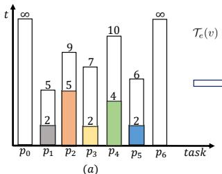

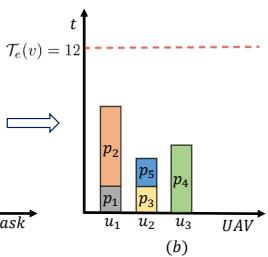  
Fig. 3. In (a), we illustrate the SLIM problem with five tasks, each having different requirements. For example, task p<sub>1</sub> requires 2 units of service time and must finish before a deadline of 10. p<sub>0</sub> and p<sub>6</sub> are the start and end points, respectively. In (b), a feasible solution is shown using three deployed $\mathrm { \bar { U } A V s , }$ assuming the total duration $\mathcal { T } _ { e } ( v )$ is 12 units. UAV u<sub>1</sub> has remaining duration for task $p _ { 4 }$ but misses its deadline. Assigning p<sub>4</sub> to UAV u<sub>2</sub> with service order $( i . e . , p _ { 3 } , p _ { 4 } , p _ { 5 } )$ violates the deadline of $p _ { 5 }$ . Thus, a new UAV, u<sub>3</sub>, is deployed to handle p<sub>4</sub>.

## D. Problem Formulation

This work focuses on a novel co-optimization Scheduling problem of EIV placement and UAV fleet size for deadLInedriven tasks with Minimum deployment cost (SLIM+). The detailed definition is as follows:

Definition 1 (SLIM+ Problem). Given the models outlined above, SLIM+ seeks to minimize the total deployment cost of EIVs and UAVs, while satisfying the constraints for task scheduling defined in Eqs. $( 3 ) – ( 7 ) ,$ , as well as the constraints for EIV capacity and UAV energy budget specified in Eq. (8) and Eq. (11). To achieve this objective, the problem involves jointly determining: (i) the optimal EIV placement locations S; (ii) the flight speed v<sub>k</sub> for each route segment k; and (iii) a feasible schedule $( \{ x _ { i , j , z } \} , \{ t _ { i , j } \} )$ for each UAV $u _ { i } .$

Mathematically, this problem can be formulated as follows:

$$
\begin{array} { r l } { ( \mathbf { S L I M + } ) } & { \displaystyle \operatorname* { m i n } \underset { s _ { k } \in S } { \sum } w _ { e } ( s _ { k } ) + \sum _ { k = 0 } ^ { | S | } w _ { u } m _ { k } } \\ & { \quad \mathrm { s . t . } \quad E q s . ~ ( 2 ) - ( 8 ) , ( 1 1 ) . } \end{array}
$$

Problem Challenges. SLIM+ is computationally intractable due to the following complexities. Firstly, the EIV placement S directly impacts the structure of each route segment, particularly the task service times $\{ q _ { j , k } \}$ as stated in Eq. (1), which depend on communication distance. This prevents the use of standard decomposition methods that assume static parameters for each segment route. Next, the model requires jointly optimizing binary variables $\{ x _ { i , j , z } \}$ , flight speeds $\{ v _ { k } \}$ and start times $\{ t _ { i , j } \}$ with the nonlinear energy constraint in Eq. (10), which makes the problem strongly NP-hard. Finally, even with fixed S and $\{ v _ { k } \}$ , finding a feasible schedule remains a variant of vehicle routing problems [46], further complicated by the strict sequential ordering constraint. Thus, the following section decouples the SLIM+ problem and first addresses a fundamental subproblem, termed SLIM, which focuses on the minimum number of UAVs required to serve all tasks within a single predefined route segment and a given flight speed.

## IV. SOLUTION TO SLIM PROBLEM

In this section, we address the subproblem SLIM, serving as a building block for the SLIM+ problem. We begin with an enhanced formulation of the SLIM problem, highlighting its hardness. Then, we propose two complementary algorithms: SLIM-DP, which provides an optimal solution for small-scale instances, and SLIM-AG, an approximation algorithm with theoretical performance guarantees for larger-scale scenarios.

## A. SLIM Problem Formulation

Definition 2 (SLIM Problem). Given a set of tasks $P _ { k } =$ $\{ p _ { 1 } , \cdots , p _ { n _ { k } } \}$ in route segment k starting at time $T _ { s } ,$ each task $p _ { j } \in P _ { k }$ is defined by a service time $q _ { j }$ and a deadline $d _ { j } .$ . With a fixed UAV flight speed $v _ { k } ,$ , the SLIM problem aims to find the minimum number of UAVs, $m _ { k } ,$ , required to schedule all tasks following their order while meeting deadlines.

For simplicity and without loss of generality, we drop the segment index k and consider a generic instance with n tasks. As introduced in Section III, let $p _ { 0 }$ and $p _ { n + 1 }$ denote the virtual start and end EIVs for this segment, and define the augmented set of nodes as $\bar { P } = P \cup \{ p _ { 0 } , p _ { n + 1 } \}$ . Crucially, the task service times $\{ q _ { j } \}$ can be predetermined given $p _ { 0 } , p _ { n + 1 }$ and v. A key challenge is the energy coupling between flight and serving tasks. To tackle this, we make an observation.

Observation 1. For a given UAV speed v in a fixed route segment, the total flight energy and the flight time to any task are predetermined constants.

This insight has two key implications for problem formulation. First, for a given route segment, the total flight energy $\begin{array} { r } { \mathcal { E } _ { i } ^ { f } ( v ) = \mathbb { P } ( v ) \frac { l ( p _ { n + 1 } ) - l ( p _ { 0 } ) } { v } } \end{array}$ is fixed, so we can focus on the maximum duration for task service, denoted as $\mathcal { T } _ { e } ( v )$

$$
\sum _ { p _ { z } \in P } \sum _ { p _ { j } \in \bar { P } } x _ { i , j , z } q _ { z } \leq \mathcal { T } _ { e } ( v ) = \frac { \mathcal { E } - \mathcal { E } _ { i } ^ { f } ( v ) } { \eta } .\tag{12}
$$

Second, the flight time from $p _ { 0 }$ to any task $p _ { j }$ is constant, allowing us to define the effective scheduling deadline $d _ { j } ^ { \prime }$ :

$$
d _ { j } ^ { \prime } ( v ) = d _ { j } - \frac { l ( p _ { j } ) - l ( p _ { 0 } ) } { v } - T _ { s } .\tag{13}
$$

These transformations clearly define the core constraints as $\mathcal { T } _ { e } ( v )$ and $d _ { j } ^ { \prime } ( v )$ , resulting in a pure scheduling issue within the SLIM problem. The objective is to minimize the number of UAVs by reducing the count of UAVs departing from the start EIV, which is formulated as follows:

$$
\begin{array} { r l } { ( \mathrm { S L I M } ) } & { \displaystyle \operatorname* { m i n } \sum _ { u _ { i } \in U } \sum _ { p _ { z } \in \bar { P } , z > 0 } x _ { i , 0 , z } } \\ & { \quad \mathrm { s . t . } \quad E q s . ~ ( 5 ) - ( 7 ) , ( 1 2 ) . } \end{array}
$$

An illustrative example of SLIM and its feasible solution is demonstrated in Fig. 3, and we have the following lemma.

Lemma 1. Let workload denote the total task service time of a UAV. In the optimal solution to the SLIM problem, there are no idle intervals within the workload of any UAV.

Algorithm 1: SLIM-DP(P, v, T<sub>s</sub>)   
1 Function B(m):   
2 $W _ { i } = 0 , i = 1 , \cdots , m ; U ( 0 , { \mathcal { W } } ) = { \top } ;$   
3 Calculate $\mathcal { T } _ { e } ( v )$ and $\{ d _ { j } ^ { \prime } \}$ using Eqs. (12) and (13);   
4 for p<sub>j</sub> $( 1 \leq j \leq n )$ and $\mathcal { W } \in \bar { \{ \mathcal { W } \vert U ( j - 1 , \mathcal { W } ) \} }$ do   
5 for $u _ { i } ( \bar { 1 } \leq i \leq m )$ do   
6 if $W _ { i } + q _ { j } \leq$ min $( \mathcal { T } _ { e } ( v ) , d _ { j } ^ { \prime } ( v ) )$ then   
7 $\mathcal { W } _ { i } ^ { ' } = ( W _ { 1 } , \cdot \cdot \cdot , W _ { i } + q _ { j } , \cdot \cdot \cdot , W _ { m } ) ;$   
8 $U ( j ,$ sort(W<sup>′</sup> )) = ⊤;   
9 Return $\exists \dot { W } , U ( n , W ) \dot { = } \vec { \top } ;$   
10 $\begin{array} { r } { l = 1 , r = n ; } \end{array}$   
11 while $l < r$ do   
12 $m = \lceil ( l + r ) / 2 \rceil ;$   
13 if B(m) = ⊤ then   
14 r = m;   
15 else   
16 l = m + 1;   
17 return m;

Proof. We prove this by contradiction. Assume an idle interval $[ t _ { 1 } , t _ { 2 } ]$ exists within a UAV’s workload in the optimal solution, where $t _ { 1 } < t _ { 2 }$ . Let task $p _ { j }$ be scheduled immediately after this interval at $[ t _ { 2 } , t _ { 2 } + q _ { j } ]$ . Since all tasks are generated at time 0, we can shift the interval to $[ t _ { 1 } , t _ { 1 } + q _ { j } ]$ . This shift satisfies $t _ { 1 } + q _ { j } < t _ { 2 } + q _ { j } \leq d _ { j }$ and eliminates the idle interval. This contradicts the assumption that the solution is optimal. □

Hardness of SLIM Problem. The SLIM problem can be reduced to the NP-hard bin packing problem (BPP), where tasks are “items”, and UAVs act as “bins” defined by their available task service duration, i.e., $\mathcal { T } _ { e } ( v )$ . However, SLIM is more complex than BPP. First, hard deadlines restrict which “bin” an “item” can occupy. Second, the sequential task order forbids arbitrary service, meaning an item’s position within a bin is not interchangeable. As a result, we propose two new algorithms, detailed in the following subsections.

## B. An Optimal Dynamic Programming Based Solution

In this subsection, we present an optimal solution to the SLIM problem. The core idea of this algorithm is designing a DP based auxiliary function, denoted as $B ( m )$ , to estimate the feasibility of completing all tasks with a given m UAVs. Then we integrate bisection to search for the minimum number of UAVs required, which serves as the input to B(m).

As outlined in Algorithm 1, the algorithm takes the task set P and a fixed flight speed v as input. It first calculates the corresponding maximum service duration $\mathcal { T } _ { e } ( v )$ and the set of effective deadlines $\{ d _ { j } ^ { \prime } ( v ) \}$ for all tasks, as these parameters define the constraints for the scheduling subproblem. To determine the feasibility for a given number of UAVs, m, the function $B ( m )$ employs DP. We define a Boolean state $U ( j , \mathcal { W } )$ , which is true if the first j tasks can be feasibly scheduled, and false otherwise. The vector ${ \mathcal { W } } = \{ W _ { 1 } , \ldots , W _ { m } \}$ represents the cumulative workload (total service time of assigned tasks) for each of the m UAVs. To significantly reduce the state space, we break the symmetry among identical UAVs by enforcing a sorted order on the workloads, such that $W _ { 1 } \leq W _ { 2 } \leq \cdot \cdot \cdot \leq W _ { m }$ . The base case for the recursion is $U ( 0 , \{ 0 , \dots , 0 \} ) ~ = ~ \top$ , indicating that no tasks can be completed when there is no workload. The DP then iterates through tasks $j = 1 , \dotsc , n$ and $\mathrm { U A V s \ } i = 1 , \dots , m$ . For a task $p _ { j }$ to be assigned to a UAV $u _ { i } ,$ , its new total workload must satisfy both the energy and deadline constraints. We encapsulate this feasibility check in a condition $\ A ( W _ { i } , p _ { j } , v ) ;$

$$
\begin{array} { r } { A ( W _ { i } , p _ { j } , v ) \equiv W _ { i } + q _ { j } \leq \operatorname* { m i n } ( \mathcal { T } _ { e } ( v ) , d _ { j } ^ { \prime } ( v ) ) . } \end{array}\tag{14}
$$

The state transition equation updates the state for task $p _ { j }$ based on the reachable states from task $p _ { j - 1 \cdot \mathrm { ~ A ~ } }$ state $U ( j , \mathbf { \hat { \mathcal { W } } } ^ { \prime } )$ is true if there exists a prior true state $U ( j - 1 , \mathcal { W } )$ from which $\mathcal { W } ^ { \prime }$ can be reached by a feasible assignment of $p _ { j }$ to $u _ { i } \colon$

$$
U ( j , \mathcal { W } ^ { \prime } ) = \bigcup _ { i = 1 } ^ { m } \Big ( A ( W _ { i } , p _ { j } , v ) \wedge U ( j - 1 , \mathcal { W } ) \Big ) ,\tag{15}
$$

where $\mathcal { W } ^ { \prime }$ is the new, sorted workload vector after updating $W _ { i }$ with $q _ { j }$ . After iterating through all tasks, the function $B ( m )$ returns true if any state $U ( n , \mathcal { W } )$ is true, confirming that a valid schedule for all n tasks with m UAVs exists. Since any task can be assigned to a new UAV and $U ( j , \mathcal { W } )$ is monotonic, we apply the bisection search for the optimal m.

Remarks. SLIM-DP produces the optimal solution with time complexity of $O \big ( \frac { n ^ { . } m ^ { 2 } C ^ { m } \ln m } { m ! } \big )$ , where m is determined in O(ln n) steps through bisection search. During algorithm execution, the number of valid states, i.e., $U ( j , \mathcal { W } ) = \top$ typically remains below $C ^ { m } / m !$ . Here, $C = \mathcal { T } _ { e } ( v ) / \epsilon$ , with ϵ being the known minimum time unit for task execution. This is because states that fail to satisfy $W _ { i } + q _ { j } \le \operatorname* { m i n } ( \mathcal { T } _ { e } ( v ) , d _ { j } ^ { \prime } ( v ) )$ are discarded, which prevents further exploration in the search tree. Section VI demonstrates that SLIM-DP performs well in most real-time applications within small-scale scenarios. To further enhance its performance, we can implement proactive pruning policies, such as eliminating states early if either of the following conditions is met. (1) Before processing task $p _ { j }$ for a state $U ( j - 1 , \mathcal { W } )$ , if min<sub>i</sub> $W _ { i } + q _ { j } > \operatorname* { m i n } ( \mathcal { T } _ { e } ( v ) , d _ { j } ^ { \prime } ( v ) )$ then this state cannot transition and can be discarded. (2) For a state $U ( j \mathrm { ~ - ~ } 1 , \mathcal { W } )$ , let $d _ { \mathrm { m a x } } ^ { \prime } ( j , v ) = \mathrm { m a x } _ { k \geq j } d _ { k } ^ { \prime } ( v )$ $\begin{array} { r } { D ( j , v ) = \operatorname* { m i n } ( \mathcal { T } _ { e } ( v ) , d _ { \operatorname* { m a x } } ^ { \prime } ( j , v ) ) ; \operatorname { i f } \sum _ { i = 1 } ^ { m } \operatorname* { m a x } \{ 0 , \stackrel {  } { D } ( j , v ) - } \end{array}$ $\begin{array} { r } { W _ { i } \} < \sum _ { k = j } ^ { n } q _ { k } } \end{array}$ , we can discard this state since even under the loosest remaining deadline (and energy limit) its residual capacity is insufficient.

## C. An Efficient Approximation Solution

Considering that SLIM-DP is computationally complex in scenarios with larger task distributions, in this section, we propose a provable and efficient approximation algorithm, termed SLIM-AG. The key idea of SLIM-AG consists of three steps: (1) Using a novel slack-sorting based scheduling method to solve a relaxed version, SLIM-U, that temporarily ignores UAV energy constraints; (2) Converting the solution of SLIM-U to handle energy constraints through another relaxed version, SLIM-F, that allows fractional task service; (3) Transforming the fractional solution with a task movement strategy to obtain a feasible solution for SLIM. We now introduce these two relaxed variants of the SLIM problem:

Definition 3 (SLIM-U Problem). A SLIM problem is called the SLIM-U problem if it satisfies: UAVs have unlimited energy $( \mathrm { i . e . , } \mathcal { E } \to \infty )$ , removing the constraint in Eq. (12).

```perl
Algorithm 2: Alg(U)
1 Let m = 1 be the initial usage number of UAVs;
2 Sort all tasks of $P$ in non-decreasing order of slacks;
3 while there exists a task that is not served do
4 Let $p _ { j ^ { \prime } }$ be the task with the smallest slack;
5 for u<sub>i</sub> $( i = 1 , \cdots , m )$ do
6 if $W _ { i } + q _ { j ^ { \prime } } > d _ { j ^ { \prime } } ^ { \prime }$ then
7 Continue;
8 if appending $p _ { j ^ { \prime } }$ to $u _ { i }$ causes a bad sequence then
9 Insert $p _ { j ^ { \prime } }$ into u<sub>i</sub>’s sequence at the index-ordered
position and update the resulting workloads;
10 if $\exists p _ { k }$ cannot be served by $u _ { i }$ then
11 Deploy the m-th $\mathrm { U A V } ; m = m + 1$ and
break;
12 Let u<sub>i</sub> serve $p _ { j ^ { \prime } }$ and break;
13 if $p _ { j ^ { \prime } }$ cannot be served by any UAV then
14 $m = m + 1 ;$
15 Deploy the m-th UAV for $p _ { j ^ { \prime } } ;$
16 return m;
```

Definition 4 (SLIM-F Problem). A SLIM problem is called the SLIM-F problem if it satisfies: tasks can be served fractionally by multiple UAVs, i.e., the constraint in Eq. (5) is removed, while keeping their total required service duration.

Let $O p t ( U ) , O p t ( F )$ and $O p t ( S )$ denote the optimal solutions of the SLIM-U, SLIM-F and SLIM problems, respectively. Similarly, $A l g ( U )$ $A l g ( F )$ and $A l g ( S )$ represent the feasible solutions for these problems.

Lemma 2. $O p t ( U ) \leq O p t ( S )$ and $\frac { \sum _ { j = 1 } ^ { n } q _ { j } } { \mathcal { T } _ { e } ( v ) } \leq O p t ( S )$

Proof. We prove this lemma from two aspects: (1) According to Definition 3, SLIM-U differs from SLIM only in that it relaxes the UAV energy constraint. Hence, any feasible solution of SLIM is also a feasible solution of SLIM-U, and we have $O p t ( S ) ~ \ge ~ O p t ( U )$ . (2) Consider a relaxed version of SLIM that ignores both deadline constraints and task indivisibility. The minimum number of required UAVs in this case is $\frac { \sum _ { i = 1 } ^ { n } q _ { i } } { \mathcal { T } _ { e } ( v ) }$ . Since this relaxed version has fewer constraints than SLIM, we have $\begin{array} { r } { O p t { ( S ) } \ge \frac { \sum _ { i = 1 } ^ { n } q _ { i } } { T _ { e } ( v ) } } \end{array}$ □

1) A feasible solution for SLIM-U: Note that each UAV must sequentially serve tasks indexed by their locations. Therefore, any solution for SLIM-U must follow the good sequence, where the task service order of a UAV preserves increasing task indices. A sequence violating this order is classified as a bad sequence. Naturally, we can transform a bad sequence into a good sequence by reordering tasks in increasing index order, provided that each task can still be completed before deadline after the adjustment.

The core idea of this algorithm is to greedily schedule the tasks with increasing slacks in a good sequence. Here, slack is defined as $\delta _ { k } ( v ) = d _ { k } ^ { \prime } ( v ) - q _ { k } , \forall p _ { k }$ , representing the flexibility window for scheduling each task. Specifically, as described in Algorithm 2, we first sort tasks by non-decreasing slacks. Then, we schedule tasks from the smallest to the largest slack to ensure efficient resource utilization. We use $W _ { i }$ to denote the workload of each UAV $u _ { i } .$ , where $W _ { i } \ \leq \ T _ { e } ( v )$ as introduced in Lemma 1. Assume that a task $p _ { j ^ { \prime } }$ is under consideration and m UAVs have been deployed. We iterate over m UAVs to check whether any UAV u can serve $p _ { j ^ { \prime } }$ check whether $W _ { i } + q _ { j ^ { \prime } } > d _ { i ^ { \prime } } ^ { \prime } ( v )$ . If none of m UAVs can handle $p _ { j ^ { \prime } }$ , we must deploy a new UAV for $p _ { j ^ { \prime } }$ as shown at Line 15; Otherwise, we then still consider whether appending $p _ { j ^ { \prime } }$ to this UAV would result in a good sequence. If so, $u _ { i }$ can serve $p _ { j ^ { \prime } }$ . However, if it results in a bad sequence where the index of $p _ { j ^ { \prime } }$ is smaller than that of the last task $p _ { k }$ in the workload of $u _ { i } ~ ( i . e . , ~ j ^ { \prime } ~ < ~ k )$ , we have to adjust the service order to a good sequence as described in Line 9.

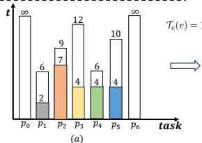

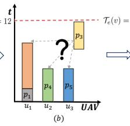

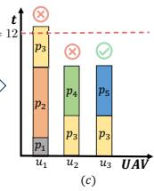  
Fig. 4. An example of task scheduling using SLIM-AG. In (a), five tasks with varying requirements are sorted by increasing slacks, i.e., $\delta _ { 4 } ( v ) < \delta _ { 2 } ( v ) <$ $\delta _ { 5 } \bar { ( } v ) \ \bar { ~ } < \ \bar { \delta } _ { 1 } ( v ) < \delta _ { 3 } ( v )$ . Assume task p<sub>3</sub> is under consideration, and (b) shows the current state with three UAVs already scheduled. In (c), p<sub>3</sub> is attempted to be allocated to u<sub>1</sub>, u<sub>2</sub> and u<sub>3</sub>. Assigning p<sub>3</sub> to u<sub>1</sub> exceeds the duration limit, i.e., $2 + 7 + 4 > 1 2$ , making it infeasible. Assigning $p _ { 3 }$ to u<sub>2</sub> would require placing it before $p _ { 4 }$ to be a good sequence. However, despite $4 + 4 < \dot { 1 2 } ,$ it violates $ { p _ { 4 } } ^ {  { \prime } }  { \mathrm { s } }$ deadline of 6, rendering it infeasible. Conversely, assigning p<sub>3</sub> to u<sub>3</sub> by inserting it before p<sub>5</sub> yields a feasible solution.

Therefore, we attempt to insert $p _ { j ^ { \prime } }$ in the correct location and recalculate the start times for all subsequent tasks, which may lead to two possible cases: (1) As shown in Line 12 of Algorithm 2, after adjustment, each task $p _ { k }$ has already been served by $u _ { i }$ meets its deadline, i.e., $W _ { i } + q _ { k } \le d _ { k } ^ { \prime } ( v )$ . In this case, the service order is transformed into good sequence without any issue; (2) There exists a task, say $p _ { k } ,$ where $k >$ $j ^ { \prime } .$ . Inserting $p _ { j ^ { \prime } }$ before $p _ { k }$ results in $W _ { i } ^ { \prime } + q _ { k } > d _ { k } ^ { \prime } ( v )$ (where $W _ { i } ^ { \prime }$ is the workload before serving $p _ { k } )$ , violating the deadline constraint. Hence, $p _ { j ^ { \prime } }$ cannot be served by $u _ { i }$ , and a new UAV is necessary as shown in Line 11 of Algorithm 2, which must satisfy good sequence. The while-loop repeats until all tasks are served; the algorithm then returns the required number of UAVs. For further clarity, we provide an example to illustrate the key steps of task scheduling in Fig. 4. Next, we present the theoretical analysis of $A l g ( U )$ in Theorem 1.

$$
A l g ( U ) \le 2 \alpha \cdot O p t ( U )
$$

$$
d _ { m a x } = \operatorname* { m a x } _ { p _ { k } \in P } d _ { k } ^ { \prime } ( v )
$$

$$
\begin{array} { r } { \alpha = \lceil \frac { d _ { m a x } } { d _ { m i n } } \rceil . } \end{array}
$$

$$
\begin{array} { r } { d _ { m i n } = \operatorname* { m i n } _ { p _ { k } \in P } d _ { k } ^ { \prime } ( v ) } \end{array}
$$

Proof. Let $m ^ { * } = O p t ( U )$ and $m = A l g ( U )$ denote the number of UAVs used in the optimal and our feasible solutions, respectively. For any problem instance I, let $M ^ { * } ( I )$ and $M ( I )$ denote its optimal and feasible solutions.

We prove this theorem by contradiction. We consider the first task $p ^ { * }$ (in the order processed by Algorithm 2) that triggers deploying the m-th UAV, and denote its effective deadline by $d ^ { * } ( v )$ Let I<sup>′</sup> be the set of tasks allocated before $p ^ { * }$ , with $M ( I ^ { \prime } ) = m - 1$ . Now we focus on the tasks in $I ^ { \# } = I ^ { \prime } \cup \{ p ^ { * } \}$ with $M ^ { * } ( I ^ { \# } ) = m ^ { * }$ and $M ( I ^ { \# } ) = m . \operatorname { A t }$ first, we sort all tasks in $I ^ { \# }$ in non-increasing order of deadlines. We then construct a set $s ( m )$ by selecting the first $\alpha m ^ { * }$ tasks from the sorted list, which have top $\alpha m ^ { * }$ deadlines, with each task in $s ( m )$ denoted as $p _ { k _ { i } }$ with deadline $d _ { k \div } ^ { \prime } ( v ) , i = 1 , \cdots , \alpha m ^ { * }$ Similarly, we create another set $S ( m ^ { * } ) \subset S ( m )$ by picking up the first $m ^ { * }$ tasks from the sorted list, which have top $m ^ { * }$ deadlines, and denoted each task in $\boldsymbol { \mathcal { S } } ( \boldsymbol { m } ^ { * } )$ as $\tilde { p } _ { k } .$ with deadline $\tilde { d } _ { k _ { i } } ^ { \prime } ( v ) , i = 1 , \cdots , m ^ { * }$ . Since the optimal solution must be feasible with $m ^ { * } ~ { \mathrm { U A V s } }$ , and each $\mathrm { U A V } \mathbf { \hat { s } }$ workload must not exceed one of the top m<sup>∗</sup> deadlines in $\boldsymbol { S } ( \boldsymbol { m } ^ { * } )$ , thus:

$$
\sum _ { i = 1 } ^ { \alpha m ^ { * } } d _ { k _ { i } } ^ { \prime } ( v ) \geq \sum _ { i = 1 } ^ { m ^ { * } } \tilde { d } _ { k _ { i } } ^ { \prime } ( v ) \geq \sum _ { p _ { k } \in I ^ { \# } } q _ { k } .\tag{16}
$$

As described in Algorithm 2, now there are two possible cases that $p ^ { * }$ cannot be served by the first $m - 1$ UAVs:

Case1: Deadline Violation. $p ^ { * }$ cannot be completed before its deadline by any of the existing $m - 1$ UAVs [47], i.e., $W _ { i } > \delta ^ { * } ( v ) = d ^ { * } ( v ) - q ^ { * } , i = 1 , \cdots , m - 1$ . Since $\delta ^ { * } ( v )$ is the largest slack among the tasks processed up to and including $p ^ { * } , i . e . , \delta ^ { * } ( v ) \geq \delta _ { j } ( v ) , \forall p _ { j } \in I ^ { \# }$ , we have $\delta ^ { * } ( v ) \geq \delta _ { k _ { i } } ( v ) =$ $d _ { k _ { i } } ^ { \prime } ( v ) - q _ { k _ { i } } , \forall p _ { k _ { i } } \in \mathcal { S } ( m )$ . Therefore, $W _ { i } + q _ { k _ { i } } > d _ { k _ { i } } ^ { \prime } ( v )$ None of the first m−1 UAVs can append any task from $\dot { S } ( m )$ without violating its effective deadline. When $m > 2 \alpha m ^ { * }$ we have $m - 1 \geq \alpha m ^ { * }$ ; hence we can select an arbitrary subset of αm<sup>∗</sup> UAVs among the first $m - 1$ and index them as $u _ { 1 } , \ldots , u _ { \alpha m ^ { * } }$ without loss of generality. In particular, for each $i = 1 , \ldots , \alpha m ^ { * }$ , UAV $u _ { i }$ cannot append any task from $s ( m )$ without violating its effective deadline, which implies:

$$
\sum _ { i = 1 } ^ { \alpha m ^ { * } } ( W _ { i } + q _ { k _ { i } } ) > \sum _ { i = 1 } ^ { \alpha m ^ { * } } d _ { k _ { i } } ^ { \prime } ( v ) .\tag{17}
$$

Together with Eq. (16), we have:

$$
\begin{array} { l } { \displaystyle \sum _ { p _ { k } \in I ^ { \# } } q _ { k } \geq \sum _ { i = 1 } ^ { \alpha m ^ { * } } ( W _ { i } + q _ { k _ { i } } ) > \sum _ { i = 1 } ^ { \alpha m ^ { * } } d _ { k _ { i } } ^ { \prime } ( v ) } \\ { \geq \displaystyle \sum _ { i = 1 } ^ { m ^ { * } } \tilde { d } _ { k _ { i } } ^ { \prime } ( v ) \geq \sum _ { p _ { k } \in I ^ { \# } } q _ { k } . } \end{array}\tag{18}
$$

Case2: Good Sequence Violation. Inserting $p ^ { * }$ violates the good sequence requirement and cannot be resolved. We attempt to insert $p ^ { * }$ into the correct location to keep the index order. If the insertion of $p ^ { * }$ leads to an irreparable goodsequence violation, then for each existing $\mathrm { U A V } ~ u _ { i }$ (and hence for at least $\alpha m ^ { * }$ of them when $m > 2 \alpha m ^ { * } )$ , there exists a blocking task with index greater than $p ^ { * }$ whose deadline constraint becomes violated after the insertion. We denote one such task for UAV $u _ { i }$ by $\tilde { p } _ { i }$ , and let $\tilde { W _ { i } }$ be the workload right before serving $\tilde { p } _ { i }$ in the adjusted sequence. Then, we have:

$$
\sum _ { i = 1 } ^ { \alpha m ^ { * } } ( \tilde { W } _ { i } + \tilde { q } _ { i } ) > \sum _ { i = 1 } ^ { \alpha m ^ { * } } \tilde { d } _ { i } ^ { \prime } ( v )\tag{19}
$$

Since $d _ { \mathrm { m a x } }$ and $d _ { \mathrm { m i n } }$ are the maximum and minimum effective deadlines, and $\begin{array} { r } { \alpha = \left\lceil \frac { d _ { \mathrm { m a x } } } { d _ { \mathrm { m i n } } } \right\rceil } \end{array}$ . Hence,

$$
\frac { 1 } { \alpha } d _ { m a x } \leq d _ { m i n } \leq \tilde { d } _ { i } ^ { \prime } ( v ) , i = 1 , \cdots , \alpha m ^ { * } .\tag{20}
$$

□

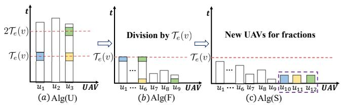  
Fig. 5. In (a), a feasible solution of $S L I M – U$ generated by Algorithm 2 uses three UAVs. Then, dividing this solution by the length of $\mathcal { T } _ { e } ( v )$ to obtain a feasible solution to SLIM-F as depicted in (b). Note that three tasks (shown in color) are fractionally served. In (c), by assigning fractional tasks with new ${ \mathrm { U A V s } } ,$ we obtain a feasible solution to SLIM with twelve UAVs required.

Combining Eq. (16), Eq. (19) and Eq. (20), we obtain:

$$
\begin{array} { r l r } {  { \sum _ { p _ { k } \in I ^ { \# } } q _ { k } \geq \sum _ { i = 1 } ^ { \alpha m ^ { * } } ( \tilde { W } _ { i } + \tilde { q } _ { i } ) > \sum _ { i = 1 } ^ { \alpha m ^ { * } } \tilde { d } _ { i } ^ { \prime } ( v ) \geq \sum _ { i = 1 } ^ { \alpha m ^ { * } } d _ { m i n } } } \\ & { } & { \geq m ^ { * } \cdot d _ { m a x } \geq \sum _ { i = 1 } ^ { m ^ { * } } \tilde { d } _ { k _ { i } } ^ { \prime } ( v ) \geq \sum _ { p _ { k } \in I ^ { \# } } q _ { k } . } \end{array}\tag{21}
$$

In both cases, we obtain a contradiction (see Eqs. (18) and (21)). Therefore, the assumption $m > 2 \alpha m ^ { * }$ is false, and we conclude $m \leq 2 \alpha m ^ { * } , { \mathrm { i . e . , ~ } } A l g ( U ) \leq 2 \alpha \cdot O p t ( U )$ □

2) A feasible solution for SLIM-F: In the SLIM-F problem, each UAV has a maximum duration for task service, $\mathcal { T } _ { e } ( v )$ and tasks can be served fractionally by multiple UAVs. Based on $A l g ( U )$ from Algorithm 2, we can intuitively construct a feasible solution $A l g ( F )$ by dividing each $\mathrm { U A V } \mathbf { \dot { s } }$ workload in $A l g ( U )$ into segments of length $\mathcal { T } _ { e } ( v )$ . Through this division process, we observe the following key properties:

Observation 2. In the schedule of $A l g ( F )$ , a task can be served by at most two $U A V s ,$ and a UAV can serve fractional tasks for at most two tasks.

Proof. In this model, a task can be served by at least one newly assigned UAV. On one hand, by evenly dividing the workload of UAV with the length of $\mathcal { T } _ { e } ( v )$ , a task is divided at most two parts, allocated to two UAVs. On the other hand, fractional tasks occur only at the start and end of the workload of UAV, which can be divided by the last UAV. □

Lemma 3. $\begin{array} { r } { A l g ( F ) \le \frac { \sum _ { k = 1 } ^ { n } q _ { k } } { \mathcal { T } _ { e } ( v ) } + O p t ( U ) . } \end{array}$

Proof. Let the workload of each $\mathrm { U A V } u _ { i }$ in $A l g ( U )$ be $W _ { i } ( U )$ From Lemma 1, there is no idle time within the workload, so we have $W _ { i } ( U ) = a _ { i } \cdot \mathcal { T } _ { e } ( v ) + \mathcal { T } _ { e } ^ { \prime } ( v )$ , where $a _ { i } \in \mathbb { N } ^ { + }$ and ${ \mathcal T } _ { e } ^ { \prime } ( v ) < { \mathcal T } _ { e } ( v )$ . This indicates that transitioning from $A l g ( U )$ to $A l g ( F )$ replaces each UAV with $a _ { i } + 1$ UAVs of duration $\mathcal { T } _ { e } ( v )$ , with one UAV having workload ${ \mathcal { T } } _ { e } ^ { \prime } ( v )$ . Thereby,

$$
\begin{array} { r } { \displaystyle \sum _ { k = 1 } ^ { n } q _ { k } = \sum _ { i = 1 } ^ { A l g ( U ) } W _ { i } ( U ) = \sum _ { i = 1 } ^ { A l g ( U ) } \big ( a _ { i } \cdot \mathcal { T } _ { e } ( v ) + \mathcal { T } _ { e } ^ { \prime } ( v ) \big ) } \\ { \displaystyle \geq \mathcal { T } _ { e } ( v ) \sum _ { i = 1 } ^ { A l g ( U ) } a _ { i } = \mathcal { T } _ { e } ( v ) \big ( A l g ( F ) - A l g ( U ) \big ) , } \end{array}\tag{22}
$$

which means $\begin{array} { r } { A l g ( F ) \le \frac { \sum _ { k = 1 } ^ { n } q _ { k } } { \mathcal { T } _ { e } ( v ) } + O p t ( U ) . } \end{array}$

Algorithm 3: SLIM-AG(P, v, T<sub>s</sub>)   
1 Calculate ${ \mathcal { T } } _ { e } ( v )$ and $\{ d _ { j } ^ { \prime } \}$ using Eqs. (12) and (13);   
2 Obtain $A l g ( \dot { U } )$ using Algorithm 2;   
3 Obtain $A l g ( F )$ by dividing each UAV with the length of   
${ \mathcal { T } } _ { e } ( v )$ in the schedule of ${ \dot { A l g } } ( U ) ;$   
4 Obtain $A l g ( S )$ by assigning the tasks with fractional service   
in $A l g ( \bar { F } )$ to new $\mathrm { U A V s } ;$   
5 return ${ \dot { A l g } } ( S )$

3) A feasible solution for SLIM: By converting the schedule from $A l g ( F )$ , we can construct a feasible solution $A l g ( S )$ $i . e . ,$ , the SLIM-AG Algorithm as presented in Algorithm 3. We assign tasks with fractional service in $A l g ( F )$ to newly deployed UAVs, satisfying all constraints specified in the SLIM problem. Fig. 5 provides a visual demonstration of the solution transformation from SLIM-U to $S L I M { \cdot } F ,$ and finally to SLIM. Particularly, from $A l g ( F )$ to $A l g ( S )$ , we have:

Theorem 2. $A l g ( S ) \leq 2 \cdot A l g ( F )$

Proof. Let $m ( F ) ~ = ~ A l g ( F )$ . The UAVs in the solution $A l g ( S )$ consist of two parts: those serving tasks that were not split in $A l g ( F )$ , and those serving tasks that were. From Observation 2, a task is split into at most two parts. By creating a new schedule where each pair of fractional parts belonging to the same original task is served by one new UAV, we can cover all fractional tasks. The number of fractional tasks is at most $2 \cdot m ( F )$ . The number of additional UAVs needed is thus at most $m ( F )$ . Therefore, the total number of UAVs is bounded by $A l g ( S ) \leq m ( F ) + m ( F ) = 2 \cdot A l g ( F )$

Therefore, combining with the previous lemmas and theorems, we derive the following theorem.

Theorem 3. SLIM-AG produces a $2 ( 2 \alpha + 1 )$ -approximation in $O ( n ^ { 2 } )$ time.

Proof. Firstly, to obtain $A l g ( U )$ using Algorithm 2, the while loop repeats at most n times, and its inner for loop also iterates no more than n times. Then, to obtain $A l g ( F )$ from $A l g ( U )$ by division and to derive $A l g ( S )$ from $A l g ( F )$ by movement, it needs no more than n steps. Therefore, the time complexity of SLIM-AG is $O ( n ^ { 2 } )$ . Next, we combine Theorem 2 and Theorem 1, along with Lemma 3 and Lemma 2 to prove the bounded approximation ratio of $S L I M { \mathrm { - } } A G$

$$
\begin{array} { r l } { A l g ( S ) \leq 2 \cdot A l g ( F ) } \\ & { \leq 2 \cdot \left( A l g ( U ) + \frac { \sum _ { k = 1 } ^ { n } q _ { k } } { T _ { e } ( v ) } \right) } \\ & { \leq 2 ( 2 \alpha \cdot O p t ( U ) + \frac { \sum _ { k = 1 } ^ { n } q _ { k } } { T _ { e } ( v ) } ) } \\ & { \leq 2 ( 2 \alpha \cdot O p t ( S ) + \frac { \sum _ { k = 1 } ^ { n } q _ { k } } { T _ { e } ( v ) } ) } \\ & { \leq 2 ( 2 \alpha \cdot O p t ( S ) + \frac { \sum _ { k = 1 } ^ { n } q _ { k } } { T _ { e } ( v ) } ) } \\ & { \leq 2 ( 2 \alpha + 1 ) \cdot O p t ( S ) , } \end{array}\tag{23}
$$

where the first inequality is according to Theorem 2, the second one is from the Lemma 3, the third one is based on Theorem 1, the last two inequalities are due to Lemma 2.

```latex
Algorithm 4: $D P \mathrm { - } A G ( P , \mathcal { E } , w _ { e } , w _ { u } , B , \Gamma , \{ T _ { s } ( p _ { i } ) \} )$
$\textbf { 1 } S ^ { * } = \emptyset , S _ { 0 } = 0 , F _ { 0 } = 0 , F _ { i } = \infty , \forall i = 1 , \cdots , n , \Delta v ;$
2 for $p _ { i } ( 1 \leq i \leq n )$ do
3 for $p _ { j } ( 1 \leq j \leq i )$ do
4 $\bar { P } ^ { \prime } = \{ \bar { p } _ { j } , \dots , p _ { i } \} , m ^ { * } = \infty ;$
5 Update $q _ { k }$ and $d _ { k }$ for all $p _ { k } \in P ^ { \prime }$ based on EIV at
$\displaystyle \bar { l } ( p _ { j - 1 } ) .$ , using Eq. (1) and (13);
6 Prune speed range $[ v _ { m i n } ^ { \prime } , v _ { m a x } ^ { \prime } ]$ using Eq. (26) and
$( 2 7 ) ;$
7 for $v ^ { \prime }$ in $[ v _ { m i n } ^ { \prime } , v _ { m a x } ^ { \prime } ]$ with discrete step ∆v do
8 $T _ { s } =$ max $\{ T _ { s } ( p _ { j - 1 } ) , T _ { s } ( p _ { i } ) \} ;$
9 $m ^ { \prime } = S L I M { \cdot } A G ( P ^ { \prime } , v ^ { \prime } , T _ { s } ) ;$
10 $\mathbf { i f } \ m ^ { \prime } < m ^ { * }$ and $m ^ { \prime } \leq \Gamma$ then
11 $| \quad m ^ { * } = m ^ { \prime } ;$
12 $\begin{array} { r } { \dot { C } _ { j , i } \stackrel { \cdot } { = } w _ { e } ( p _ { j - 1 } ) + w _ { u } \cdot m ^ { * } ; } \end{array}$
13 if $F _ { j - 1 } + C _ { j , i } < F _ { i }$ then
14 $\begin{array} { r } { \mathbf { \tilde { \rho } } ^ { F _ { i } } = F _ { j - 1 } + C _ { j , i } ; \ S _ { i } = j ; } \end{array}$
15 $\dot { k } = \dot { n } ;$
16 while $k > 0$ do
17 $S ^ { * } = S ^ { * } \cup \{ S _ { k } - 1 \} ; k = S _ { k } - 1 ;$
18 return $S ^ { * } , F _ { n } ;$
```

## V. SOLUTION TO SLIM+ PROBLEM

In this section, we focus on the full SLIM+ problem. The key challenge is to identify optimal EIV placements to minimize total deployment cost. To address this, we propose a twolayer optimization approach, called DP-AG. The outer layer uses DP to identify optimal EIV deployments by partitioning the entire route into segments. The inner layer applies our SLIM solver as a subroutine to optimize UAV fleet size based on the optimized flight speed for each potential segment.

## A. Optimal EIV Placement via Dynamic Programming

In this subsection, we aim to determine the optimal EIV placement that minimizes total deployment cost, modeled as a DP process. We define an optimization function $F _ { i }$ as the minimum cost to schedule the first i tasks, from $p _ { 1 }$ to $p _ { i }$ Our objective is to compute $F _ { n } ,$ , where the base case is $F _ { 0 } =$ 0. The state transition equation is formulated by considering all possible start points $( i . e .$ , EIV locations) for the last route segment ending at task $p _ { i }$ . If the last segment covers tasks from $p _ { j }$ to $p _ { i }$ , the total cost combines the optimal cost for the preceding subproblem, $F _ { j - 1 }$ , with the cost of the new segment, denoted as $C _ { j , i }$ . The recurrence relation is therefore:

$$
F _ { i } = \operatorname* { m i n } _ { 1 \leq j \leq i } \left\{ F _ { j - 1 } + C _ { j , i } \right\} ,\tag{24}
$$

where $C _ { j , i }$ represents the minimum cost to service tasks $\{ p _ { j } , \hdots , p _ { i } \}$ within a single route segment. We present Fig. 6 to illustrate such state transition, and Algorithm 4 provides a detailed description of this process. The following subsection will explain how $C _ { j , i }$ is calculated.

## B. Intra-Route Segment Cost $C _ { j , i }$ Computation

Assuming a route segment includes tasks $P ^ { \prime } = \{ p _ { j } , . . . , p _ { i } \}$ with a starting time $T _ { s } = \mathrm { m a x } \{ T _ { s } ( p _ { j - 1 } ) , T _ { s } ( p _ { i } ) \}$ (ensuring that both the start and end EIVs are available), the total deployment cost is calculated by summing the cost of deploying an EIV at location $l ( p _ { j - 1 } )$ and the cost associated with the UAV fleet needed for that segment, i.e., $C _ { j , i } = w _ { e } ( p _ { j - 1 } ) + w _ { u } \cdot m _ { j , i } ^ { * } .$ Here, $m _ { j , i } ^ { * }$ is the minimum number of UAVs used, which is a function of the flight speed $v ^ { \prime } .$ . Thus, finding $m _ { j , i } ^ { * }$ requires an optimization over the speed:

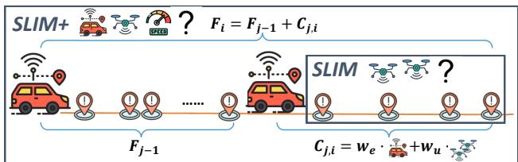  
Fig. 6. The DP process of determining the optimal EIV placements.

$$
m _ { j , i } ^ { * } = \operatorname* { m i n } _ { \substack { v ^ { \prime } \in [ v _ { m i n } , v _ { m a x } ] } } \mathrm { S L I M } ( P ^ { \prime } , v ^ { \prime } , T _ { s } ) ,\tag{25}
$$

where SLIM(·) refers to the SLIM solver, $e . g .$ , SLIM-AG outlined in Algorithm 3, involving two preprocessing steps.

Update Task Service Times and Deadlines. Consider the task subset $P ^ { \prime } = \{ p _ { j } , . . . , p _ { i } \}$ with a flight speed $v ^ { \prime } .$ The UAV fleet departs from the EIV located at the previous segment’s end, $i . e . , \ l ( p _ { j - 1 } )$ , with $l ( p _ { 0 } )$ being the mission start. It then arrives at the end EIV of the segment, placed at $l ( p _ { i } )$ . Since the communication delay depends on the distance between the UAV and the nearest EIV (either $l ( p _ { j - 1 } )$ or $l ( p _ { i } ) )$ , we first need to update the service time for each task according to Eq. (1). Recall that we make a simplification for the SLIM problem via Observation 1, thereby we must also update the task deadlines based on the flight speed $v ^ { \prime }$ and starting time $T _ { s } ,$ as discussed in Eq. (13). This step is critical as it couples the EIV placement decision with the task scheduling subproblem.

Pruned UAV Flight Speed Search. For a task subset $P ^ { \prime } =$ $\{ p _ { j } , \ldots , p _ { i } \}$ , a naive search for the optimal speed $v ^ { * }$ over $[ v _ { m i n } , v _ { m a x } ]$ can be computationally expensive. To streamline this process, we establish a tighter and more feasible speed range $[ v _ { m i n } ^ { \prime } , v _ { m a x } ^ { \prime } ]$ . First, we derive the speed lower bound based on deadlines. A UAV must reach any task $p _ { l } \in P ^ { \prime }$ before its deadline, resulting in the following constraint:

$$
v ^ { \prime } \geq \operatorname* { m a x } _ { p _ { l } \in P ^ { \prime } } \left( \frac { l ( p _ { l } ) - l ( p _ { j - 1 } ) } { d _ { l } - q _ { l , j - 1 } - T _ { s } } \right) \triangleq v _ { m i n } ^ { \prime } ,\tag{26}
$$

Any speed below $v _ { m i n } ^ { \prime }$ makes it impossible to complete at least one task on time. Next, we impose constraints based on the UAV’s energy budget E. The energy consumed during flight must leave sufficient reserve to accomplish the most demanding task within the segment, thus,

$$
\mathcal { E } - \frac { \mathbb { P } ( v ^ { \prime } ) \cdot ( l ( p _ { i } ) - l ( p _ { j - 1 } ) ) } { v ^ { \prime } } \geq \eta \cdot q _ { \operatorname* { m a x } } ,\tag{27}
$$

where $q _ { \operatorname* { m a x } } \ = \ \operatorname* { m a x } _ { p _ { l } \in P ^ { \prime } } \left\{ q _ { l , j - 1 } \right\}$ is the maximum service time of tasks within the segment. This inequality limits the flight speed from being too high and thus defines a feasible upper bound, $v _ { m a x } ^ { \prime }$ . With the pruned range $[ v _ { m i n } ^ { \prime } , v _ { m a x } ^ { \prime } ]$ , we can efficiently determine the minimum number of UAVs. By discretizing this range with a step size of $\Delta v$ and invoking the SLIM solver (e.g., SLIM-AG) for each candidate speed, selecting the minimum fleet size returned.

TABLE III  
PARAMETER SETTINGS FOR SIMULATION SCENARIOS
<table><tr><td>Parameter</td><td>Range for SLIM (Large)</td><td>Range for SLIM+</td></tr><tr><td>Number of Tasks</td><td>[100, 500]</td><td>[200, 800]</td></tr><tr><td>UAV Energy Budget (kJ)</td><td>[435, 465]</td><td>[100, 400]</td></tr><tr><td>Minimum Task Deadline (s)</td><td>[90, 240]</td><td>[90, 240]</td></tr><tr><td>Route Length (km)</td><td>10</td><td>[5, 30]</td></tr><tr><td>Avg. Data Volume (MB)</td><td>300</td><td>[200, 500]</td></tr><tr><td>EIV Inference Rate (Mbps)</td><td>100</td><td>[50, 250]</td></tr><tr><td>EIV Cost Ratio  $( w _ { e } / w _ { u } )$ </td><td>5</td><td>[2, 10]</td></tr></table>

Note: Small-scale SLIM simulations use n ∈ [10, 20] and E ∈ [360, 460] kJ.

Our proposed DP-AG algorithm is presented in Algorithm 4. To reconstruct the optimal EIV placement, we use a predecessor array, $S _ { i } .$ which stores the starting index j of the last segment in the optimal solution for the first i tasks. After computing all $F _ { i }$ values up to $F _ { n } ,$ we can backtrack from $S _ { n }$ to identify all segment boundaries, which correspond to the optimal EIV placements $S ^ { * }$

Theorem 4. The time complexity of the DP-AG algorithm is $O ( n ^ { 4 } { \frac { v _ { m a x } - v _ { m i n } } { \Delta v } } )$

Proof. The DP enumerates all segment endpoints (j, i) with $1 \leq j \leq i \leq n .$ , yielding $O ( n ^ { 2 } )$ candidate segments. For a fixed segment with $\ell = i - j + 1$ tasks, we discretize the feasible speed range with step $\Delta v ,$ so the number of speed candidates is at most $\frac { v _ { \operatorname* { m a x } } - v _ { \operatorname* { m i n } } } { \Delta v } .$ . For each candidate speed, we call the intra-segment solver SLIM-AG (Algorithm 3) on ℓ tasks, which runs in $O ( \ell ^ { 2 } )$ time. Therefore, computing $C _ { j , i }$ costs $O ( N _ { v } \ell ^ { 2 } )$ , and the total time is $O \big ( n ^ { 4 } { \frac { v _ { \mathrm { m a x } } - v _ { \mathrm { m i n } } } { \Delta v } } \big )$ where we use $\ell \leq n .$ □

## VI. SIMULATION

## A. Simulation setup

In this section, we implement our proposed algorithms for SLIM+ in Section V and its subproblem SLIM in Section IV. First, we evaluate the performance of the SLIM-AG algorithm compared to the optimal $S L I M – D P$ algorithm in the SLIM problem. Due to the inherent computational complexity of $S L I M – D P ,$ these simulations are categorized into two types: small-scale and large-scale scenarios, based on the task distribution scale. This dual comparison approach helps evaluate both the optimality gap and practical advantages of our proposed solution. Second, building on the SLIM solver (i.e., SLIM-AG), we evaluate the performance of the twolayer algorithm DP-AG, which particularly optimizes EIV placement, compared to several baseline placement strategies.

UAV Scheduling Baselines in SLIM. In small-scale scenarios, we compare our SLIM-AG with the optimal SLIM-DP. For large-scale scenarios, we compare with the three modified state-of-the-art scheduling algorithms:

• NF-GPA [23], [24]: It assigns the longest task subsequence that a UAV can handle with the energy budget, without considering deadlines. Then it iteratively reassigns deadline-violating tasks to new UAVs. Finally, it attempts to merge UAVs to minimize their total number.

• GBF [48]: A greedy algorithm that initially sorts tasks by non-decreasing deadlines and schedules them sequentially. When the sequential service constraint is violated (i.e., earlier-indexed tasks scheduled after later ones), it moves affected tasks to new UAVs and performs UAV merging when possible.

• MEFN [39]. It sorts tasks by non-increasing service time, and then assigns tasks to UAVs using a first-fit strategy while meeting deadlines. Then it also adjusts the sequence of tasks as the same as GBF.

EIV Placement Baselines in SLIM+. To evaluate the EIV placement strategy, we compare our DP-AG against several baseline strategies:

• TSCA-Lite [41]: Place EIVs near clusters of tasks with the most stringent deadlines.

• K-Means [49]: Cluster the tasks into K clusters, and then place EIVs at the centroid of each cluster.

• Greedy-SetCover [50]: Greedily place an EIV at the location that can handle the most tasks.

• Uniform-K: A naive approach that partitions the route into K segments of equal length.

All placement methods invoke the same intra-segment SLIM solver (e.g., SLIM-AG) to evaluate each segment, so their main computational difference lies in the outer placement strategy. For reference, the outer-loop complexities are O(n log n) for TSCA-Lite, $O ( n K I )$ for K-Means (with I iterations), $O ( K n ^ { 2 } )$ for Greedy-SetCover, and $O ( n )$ for Uniform-K.

Parameter Settings. Our simulations are based on a realistic EIV-UAV collaborative system model. For tasks, we set the average data acquisition rate at each location to 10 Mbps, with a maximum deadline of 400 s. We also consider various task distributions, including uniform, clustered, linear increasing, linear decreasing, bimodal, and random distributions. For the UAVs, we adopt the energy consumption model from [17], [18], where the hovering power coefficient η is 0.389kJ/s, and the flight power function is given by $\mathbb { P } ( v ) = 0 . 0 7 v ^ { 3 } +$ $0 . 0 3 9 1 v ^ { 2 } - 1 3 . 1 9 6 v + 3 9 0 . 9 5$ . The flight speed is constrained to the range of [5, 30] m/s, and the search space is discretized with a step of 0.5 m/s. Each UAV incurs a deployment cost of $w _ { u } ~ = ~ 1 0 0$ . In our simulations, we focus on strategic placement, assuming EIVs are pre-deployed and homogeneous to facilitate a controlled comparison. Therefore, each EIV has a setup time of 0 and a communication bandwidth of 10 MHz, allowing it to support up to 20 UAVs. In addition, each EIV incurs a deployment cost $w _ { e }$ defined as a ratio relative to $w _ { u } ,$ and maintains a consistent processing rate. The value ranges of key parameters are detailed in Table III. These simulations are divided into two main categories: In SLIM, we test small-scale scenarios $( e . g . , \ n \leq 2 0 )$ to validate against the optimal and large-scale scenarios for scalability; In SLIM+, we evaluate the end-to-end performance of the complete framework, focusing on the system’s adaptability to large-scale challenges, such as longer routes and varying EIV-to-UAV cost ratio.

## B. Simulation Results

1) Performance of UAV Scheduling Algorithms: To validate the efficacy of our proposed scheduler, we benchmark SLIM-

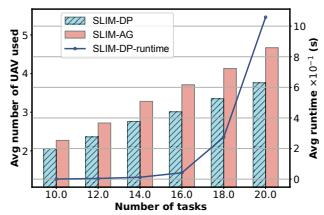  
(a)

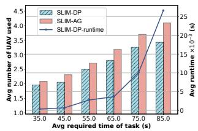  
(b)

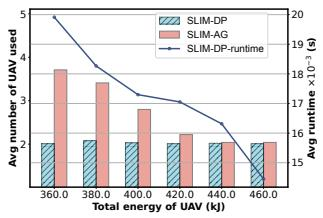  
(c)

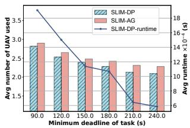  
(d)

Fig. 7. Performance comparison of the SLIM-AG algorithm with the optimal SLIM-DP algorithm in small-scale scenarios.  
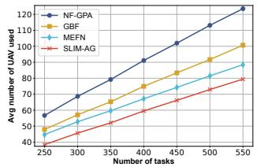  
(a)

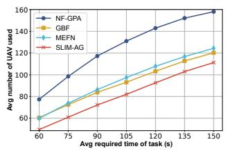  
(b)

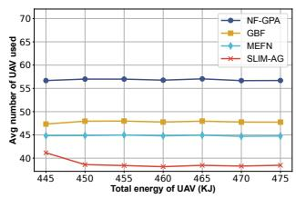  
(c)

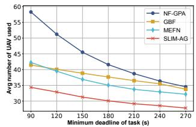  
(d)

Fig. 8. Performance comparison of the SLIM-AG algorithm with state-of-the-art baselines in large-scale task distributions.  
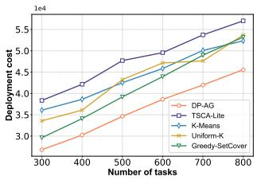  
(a)

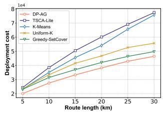  
(b)

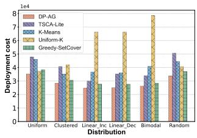

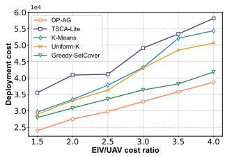

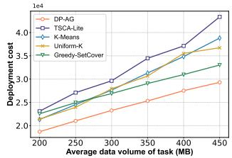  
(e)

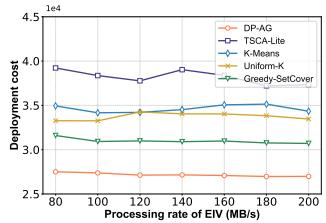  
(f)

(c)  
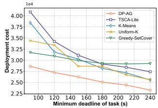  
(g)

(d)  
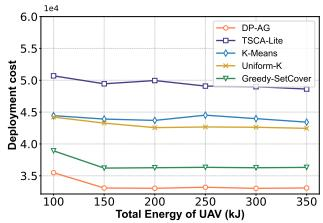  
(h)  
Fig. 9. Performance comparison of the DP-AG algorithm with baseline strategies for EIV placements.

AG against the optimal SLIM-DP in small-scale scenarios and demonstrate its scalable superiority over state-of-the-art baselines in large-scale settings.

Performance Against the Optimal Solution. In smallscale scenarios, where finding the true optimum is computationally feasible, SLIM-AG proves to be highly effective. As shown in Fig. 7(a) and Fig. 7(b), with the number of tasks and task requirements growing, SLIM-AG uses about 15% more UAVs on average than the optimal SLIM-DP (i.e., $m _ { S L I M - A G } / m _ { S L I M - D P }$ ≈ 1.18). Although the worst-case approximation ratio $2 ( 2 \alpha + 1 )$ can be large $( e . g . , \ \approx \ 1 1 . 6 8$ when $d _ { \operatorname* { m a x } } / d _ { \operatorname* { m i n } } \approx 2 . 4 2 )$ , the observed ratio is close to 1.18, indicating that the bound is conservative in practice. Furthermore, the gap narrows further as minimum task deadline increases in Fig. 7(d) or the UAV energy budget increases in Fig. 7(c), becoming nearly negligible at higher energy levels. Furthermore, the running time of SLIM-DP peaks at 1.05s and averages 0.23s, as indicated in Fig. 7(a), which is sufficient for most real-time applications in smaller instances, like timesensitive data collection and surveillance. This performance confirms the suitability of SLIM-AG as a powerful and reliable scheduler for various practical problems.

Robustness and Scalability in Large-Scale Scenarios. In addition to closely approximating the optimal solution, SLIM-AG shows performance advantages over existing approaches in large-scale deployments, reducing the average required UAV fleet by 21.3% compared to its competitors. Its superiority is particularly evident in two challenging scenarios. (1) In high workload scenarios, as the number of tasks (Fig. 8(a)) and their average service time (Fig. 8(b)) increase, the performance gap widens. This is because deadline-agnostic approaches like NF-GPA fail, as their intuitive energy-based packing creates numerous deadline violations that require inefficiently deploying additional UAVs, while SLIM-AG’s deadline-aware operation avoids this issue. (2) In scenarios with tight constraints, such as low UAV energy (Fig. 8(c)) or strict heterogeneous deadlines (Fig. 8(d)), SLIM-AG shows its advantage. As constraints relax, such as with more uniform and lenient deadlines, the scheduling problem becomes easier, and the performance of all deadline-aware algorithms naturally converges. Overall, these results demonstrate that SLIM-AG’s slack-based scheduling offers a significant practical advantage, especially in the constrained scenarios relevant to real-world missions.

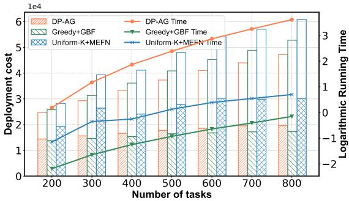  
Fig. 10. Overall performance comparison of the DP-AG algorithm with baseline algorithms for the SLIM+ problem.

2) Effectiveness of EIV Placement Strategies: After establishing SLIM-AG as the UAV scheduling algorithm, we now turn to the core of the SLIM+ framework, i.e., the twolayer algorithm DP-AG. We compare DP-AG with representative baselines to show the value of its global optimization capabilities across various challenges. As shown in Fig. 9, DP-AG consistently achieves the lowest deployment cost, outperforming the next best baseline by 19.5% to 29.5%. Notably, as problem complexity increases, the performance gap widens, highlighting the limitations of heuristic methods.

Adaptability to Structural and Cost Complexity. DP-AG excels in complex scenarios, showcasing adaptability to structural and cost pressures, as illustrated in Fig. 9(a)-(d). Its performance improves with an increasing number of tasks (Fig. 9(a)) and longer routes (Fig. 9(b)), effectively exploring solution spaces where myopic heuristics, like Greedy-SetCover, often get trapped in local optima. This is particularly evident in non-uniform task distributions. As shown in Fig. 9(c), DP-AG strategically positions EIVs within dense task clusters in bimodal scenarios, achieving a notable 66.5% cost reduction compared to the naive Uniform-K strategy. Additionally, DP-AG adeptly adapts to varying cost factors. As the EIV-to-UAV cost ratio fluctuates, DP-AG skillfully navigates the trade-off between ground and aerial resources. For instance, at a high-cost ratio of 4 in Fig. 9(d), its advantage over the best baseline expands to 33.4%.

Intelligent Adaptation to Task and System Constraints. This scenario involves a delicate trade-off between communication overhead and computational capacity, as analyzed in Fig. 9(e) and (f). As the average task data volume increases, communication time becomes the main contributor to total service time. Our proposed algorithm achieves an average 18.9% cost reduction by optimally positioning EIVs to minimize communication bottlenecks for high-demand tasks.

Conversely, improvements in the EIV processing rate benefit all algorithms, but the gains remain marginal; for example, increasing the processing rate from 80 to 200 Mbps reduces cost by at most 5% for the best baseline. This analysis reveals that strategically placing EIVs to reduce communication latency is more impactful than simply upgrading processing power. Furthermore, DP-AG maintains robust performance under varying operational constraints. As shown in Fig. 9(g) and (h), it effectively manages tighter task deadlines, achieving an average saving of 16%, and limited UAV energy budgets, with an average saving of 23.2%. DP-AG consistently identifies cost-effective solutions, balancing the number of EIVs and UAVs to meet these constraints.

3) Overall Performance and Scalability Analysis: We illustrate the benefits of integrating our optimal deployment strategy with an efficient scheduling algorithm. We compare DP-AG against representative end-to-end baseline combinations: Greedy-GBF, which pairs a strong heuristic deployment Greedy-SetCover with a strong scheduler GBF, and Uniform-NF, which combines Uniform-K with NF-GPA, representing a naive approach. This evaluation focuses on the trade-off between offline planning time and deployment cost savings, as visualized in Fig. 10. DP-AG consistently achieves the lowest deployment cost, reducing expenses by up to 21.9% compared to the competitive Greedy-GBF baseline. As problem scales increase, the performance gap widens, showing the value of global optimization in complex scenarios. Fig. 10 also presents the computational cost for this optimality. The running time for DP-AG is approximately 25s for planning with 700 tasks, shown on a logarithmic scale, while the baselines complete in under 5s due to their lower complexity. Overall, our DP-AG offers significant cost reductions through strategic offline planning, where its one-time computational investment yields ongoing savings in physical deployment, making it highly attractive for cost-driven operations.

## C. Framework Validation and Real-World Case Study

To connect abstract simulations with practical deployment, this subsection illustrates the end-to-end functionality of DP-AG through an operational workflow and a case study using real-world urban data.

Operational Workflow. At the core of our system lies a centralized Schedule Center (e.g., a ground control station), which hosts the Mission Planner module where the DP-AG algorithm operates. As shown in Fig. 11, the operation unfolds in two phases. In the offline planning phase, the Mission Planner receives all high-level Task Requests, including the task set and system parameters like energy budgets and component costs. It then runs the DP-AG algorithm to produce a complete and globally optimal mission plan. This output plan includes EIV placement locations, the required UAV fleet size for each route segment, and detailed task schedules and flight speeds for every UAV. In the online service phase, the generated plan is translated into concrete deployment commands. Orders are sent to EIVs (e.g., via WiFi), while detailed flight plans and task schedules are dispatched to UAV fleets (e.g., via MAVLink). Afterward, these physical deployments autonomously serve their assigned missions.

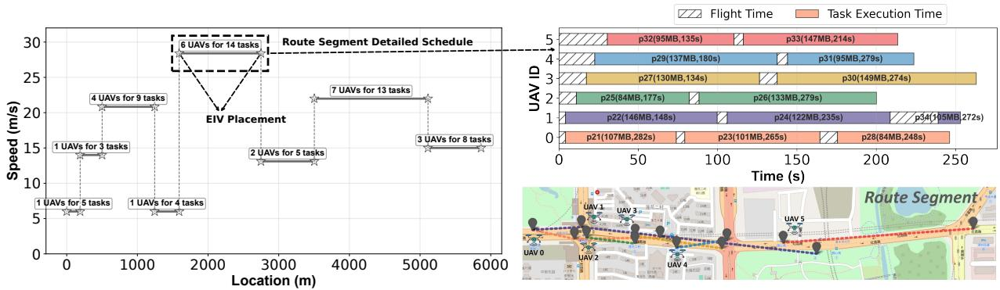

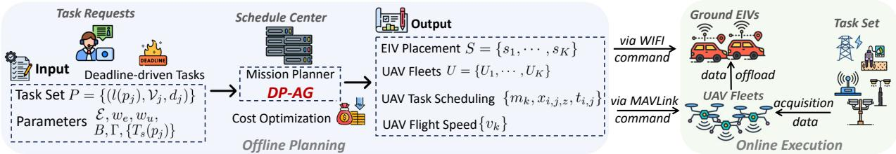  
Fig. 11. The end-to-end operational workflow of EIV-UAV system. During the offline planning phase, the Mission Planner module processes all inputs and serves the DP-AG algorithm for cost optimization, resulting in a detailed output plan. In the online service phase, this plan is sent as commands to the EIVs and UAVs, directing their deployment and autonomous operations.  
Fig. 12. Real-world case study of the DP-AG algorithm for the SLIM+ problem. In the left panel, DP-AG suggests placing 8 EIVs along the route, creating 8 segments with optimized flight speeds. The right panel displays a geographical map at the bottom and a Gantt chart for UAV scheduling of segment 5 at the top, confirming that all tasks are completed before their deadlines while respecting flight (shadowed bars) and energy constraints.

Case Study on Urban Infrastructure Monitoring. To demonstrate this workflow on a realistic problem, we apply our framework to a scenario derived from the Shenzhen public transportation system [51]. We model a 6000 m route where bus stops and traffic lights represent task nodes requiring periodic surveillance. Upon feeding this scenario into our Mission Planner, DP-AG generates a comprehensive deployment and operational plan. The high-level output, depicted in the left panel of Fig. 12, recommends the placement of 8 EIVs, which optimally partitions the extensive route into 8 manageable route segments. The right panel of Fig. 12 offers a detailed example of the 5-th route segment’s plan. The bottom map illustrates the optimized and non-conflicting flight paths for the 6 UAVs required for this specific route segment [52]. Crucially, the top accompanying Gantt chart validates the timeline for each UAV’s service, confirming that all tasks are completed before their respective deadlines (e.g., p<sub>21</sub>, p<sub>23</sub>, p<sub>28</sub> for UAV u<sub>0</sub>), while respecting the flight (shadowed bars) and energy constraints. This case study reflects our framework’s capability to translate a complex urban challenge into a feasible, costeffective, and actionable multi-agent mission plan.

## VII. CONCLUSION AND FUTURE WORK

This paper investigates the SLIM+ problem, aiming to minimize deployment cost for multi-UAV systems handling deadline-driven tasks. We introduce a novel co-optimization framework that strategically places EIVs and sizes the UAV fleet. Our hierarchical solution decouples the problem, first addressing a low-level subproblem to determine the minimum UAV requirement for a predefined route segment. We develop two complementary algorithms: SLIM-DP uses dynamic programming (DP) to achieve optimal scheduling in small-scale scenarios, while SLIM-AG offers an efficient approximation for large-scale scenarios. We then extend these algorithms to address the SLIM+ problem via a DP-based algorithm for high-level EIV placement. Extensive simulations validate our approach. Results indicate that our SLIM-AG achieves about 85% of the optimal SLIM-DP’s performance while reducing the average number of UAVs by 21.3% compared to state-ofthe-art methods. Additionally, our DP-AG realizes significant cost savings, reducing end-to-end deployment cost by up to 21.9% compared to baselines.

Future work could explore several promising directions. One focus area is managing dynamic task arrivals and service times, which would require adapting the offline plan in an online manner. Another direction involves incorporating heterogeneous fleets, where UAVs and EIVs have varying capabilities and costs, adding complexity to the co-optimization problem. Lastly, extending the framework from linear routes to non-linear routes would broaden its applicability to a wider array of realistic missions.

## REFERENCES

[1] W. Xie, F. Qi, L. Liu, and Q. Liu, “Radar imaging based uav digital twin for wireless channel modeling in mobile networks,” IEEE Journal on Selected Areas in Communications, vol. 41, no. 11, pp. 3702–3710, 2023.

[2] P. Cao, L. Lei, G. Shen, S. Cai, X. Liu, X. Liu, and S. Tian, “Uav swarm cooperative search based on scalable multiagent deep reinforcement learning with digital twin-enabled sim-to-real transfer,” IEEE Transactions on Mobile Computing, 2025.

[3] G. Sun, X. Zheng, J. Li, H. Kang, and S. Liang, “Collaborative wsn-uav data collection in smart agriculture: A bi-objective optimization scheme,” ACM Transactions on Sensor Networks, 2023.

[4] J. Huang, F. Shan, J. Luo, R. Xiong, and W. Wu, “Assume: an optimal algorithm to minimize uav energy by altitude and speed scheduling,” IEEE Transactions on Mobile Computing, 2025.

[5] Y. Wang, J. Huang, F. Shan, Y. Gao, R. Xiong, and J. Luo, “Optimizing joint speed and altitude schedule for uav data collection in low-altitude airspace,” IEEE Transactions on Mobile Computing, 2025.

[6] X. Zheng, Y. Wu, L. Fan, X. Lei, R. Q. Hu, and G. K. Karagiannidis, “Dual-functional uav-empowered space-air-ground networks: Joint communication and sensing,” IEEE Journal on Selected Areas in Communications, 2024.

[7] Z. Huang, W. Wu, K. Wu, H. Yuan, C. Fu, F. Shan, J. Wang, and J. Luo, “Li2: a new learning-based approach to timely monitoring of points-ofinterest with uav,” IEEE Transactions on Mobile Computing, 2024.

[8] A. V. Savkin and H. Huang, “Multi-UAV navigation for optimized video surveillance of ground vehicles on uneven terrains,” IEEE Transactions on Intelligent Transportation Systems, vol. 24, no. 9, pp. 10 238–10 242, 2023.

[9] X. Li, W. Huangfu, X. Xu, J. Huo, and K. Long, “Attention-driven marl for aoi minimization in uav-assisted intelligent transport systems,” IEEE Transactions on Intelligent Transportation Systems, 2025.

[10] G. Sun, L. He, Z. Sun, Q. Wu, S. Liang, J. Li, D. Niyato, and V. C. Leung, “Joint task offloading and resource allocation in aerial-terrestrial UAV networks with edge and fog computing for post-disaster rescue,” IEEE Transactions on Mobile Computing, 2024.

[11] F. Zhu, Y. Ren, L. Yin, F. Kong, Q. Liu, R. Xue, W. Liu, Y. Cai, G. Lu, H. Li et al., “Swarm-lio2: Decentralized, efficient lidar-inertial odometry for uav swarms,” IEEE Transactions on Robotics, 2024.

[12] P. Duan, X. Kang, P. Ghamisi, and S. Li, “Hyperspectral remote sensing benchmark database for oil spill detection with an isolation forest-guided unsupervised detector,” IEEE Transactions on Geoscience and Remote Sensing, vol. 61, pp. 1–11, 2023.

[13] G. K. Pandey, D. S. Gurjar, S. Yadav, Y. Jiang, and C. Yuen, “Uavassisted communications with rf energy harvesting: A comprehensive survey,” IEEE Communications Surveys & Tutorials, vol. 27, pp. 782– 838, 2025.

[14] “Dji dock 2,” https://enterprise.dji.com/cn/dock-2, Sept. 2025.

[15] “Skydio dock,” https://www.skydio.com/dock, Sept. 2025.

[16] D. Ye, Z. Sun, W. Zhong, J. Kang, X. Huang, D. I. Kim, S. Xie, and C. Yuen, “Optimal flight speed scheduling and battery swapping in uav-enabled mobile edge computing,” IEEE Transactions on Mobile Computing, 2025.

[17] F. Shan, J. Luo, R. Xiong, W. Wu, and J. Li, “Looking before crossing: An optimal algorithm to minimize UAV energy by speed scheduling with a practical flight energy model,” in IEEE INFOCOM 2020-IEEE Conference on Computer Communications. IEEE, 2020, pp. 1758– 1767.

[18] F. Shan, J. Huang, R. Xiong, F. Dong, J. Luo, and S. Wang, “Energyefficient general PoI-visiting by UAV with a practical flight energy model,” IEEE Transactions on Mobile Computing, vol. 22, no. 11, pp. 6427–6444, 2022.

[19] M. R. Rezaee, N. A. W. A. Hamid, M. Hussin, and Z. A. Zukarnain, “Comprehensive review of drones collision avoidance schemes: Challenges and open issues,” IEEE Transactions on Intelligent Transportation Systems, 2024.

[20] M. Sherman, S. Shao, X. Sun, and J. Zheng, “Counter UAV swarms: Challenges, considerations, and future directions in UAV warfare,” IEEE Wireless Communications, 2024.

[21] C. Zhang, L. Zhang, L. Zhu, T. Zhang, Z. Xiao, and X.-G. Xia, “3D deployment of multiple UAV-mounted base stations for UAV communications,” IEEE Transactions on Communications, vol. 69, no. 4, pp. 2473–2488, 2021.

[22] J. Zhang, Z. Li, W. Xu, J. Peng, W. Liang, Z. Xu, X. Ren, and X. Jia, “Minimizing the number of deployed UAVs for delay-bounded data collection of IoT devices,” in IEEE INFOCOM 2021-IEEE Conference on Computer Communications. IEEE, 2021, pp. 1–10.

[23] W. Wu, S. Sun, F. Shan, M. Yang, and J. Luo, “Energy-constrained UAV flight scheduling for IoT data collection with 60 GHz communication,” IEEE Transactions on Vehicular Technology, vol. 71, no. 10, pp. 10 991– 11 005, 2022.

[24] H. Gong, B. Huang, and B. Jia, “Energy-efficient 3-d uav ground node accessing using the minimum number of uavs,” IEEE Transactions on Mobile Computing, vol. 23, no. 12, pp. 12 046–12 060, 2024.

[25] S.-W. Chang, J.-J. Kuo, M.-J. Kao, B.-Z. Chen, and Q.-J. Wang, “Near-optimal uav deployment for delay-bounded data collection in iot

networks,” in IEEE INFOCOM 2024-IEEE Conference on Computer Communications. IEEE, 2024, pp. 111–120.

[26] Y. Wang, Z. Su, Q. Xu, R. Li, T. H. Luan, and P. Wang, “A secure and intelligent data sharing scheme for UAV-assisted disaster rescue,” IEEE/ACM Transactions on Networking, vol. 31, no. 6, pp. 2422–2438, 2023.

[27] S. Qi, B. Lin, Y. Deng, X. Chen, and Y. Fang, “Minimizing maximum latency of task offloading for multi-UAV-assisted maritime search and rescue,” IEEE transactions on vehicular technology, 2024.

[28] R. Wang, D. Li, Q. Wu, K. Meng, B. Feng, and L. Cong, “Rechargeable uav trajectory optimization for real-time persistent data collection of large-scale sensor networks,” IEEE Transactions on Communications, 2024.

[29] X. Dai, Z. Xiao, H. Jiang, and J. C. Lui, “UAV-assisted task offloading in vehicular edge computing networks,” IEEE Transactions on Mobile Computing, vol. 23, no. 4, pp. 2520–2534, 2023.

[30] M. Dai, Z. Su, Q. Xu, and N. Zhang, “Vehicle assisted computing offloading for unmanned aerial vehicles in smart city,” IEEE Transactions on Intelligent Transportation Systems, vol. 22, no. 3, pp. 1932–1944, 2021.

[31] Y. Luo, X. Yu, D. Yang, and B. Zhou, “A survey of intelligent transmission line inspection based on unmanned aerial vehicle,” Artificial Intelligence Review, vol. 56, no. 1, pp. 173–201, 2023.

[32] N. Hoanh and T. V. Pham, “A multi-task framework for car detection from high-resolution uav imagery focusing on road regions,” IEEE Transactions on Intelligent Transportation Systems, 2024.

[33] L. C. Sousa, Y. M. da Silva, G. G. de Castro, C. L. Souza, G. Berger, D. Brandao, J. T. Dias, M. F. Pinto˜ et al., “Autonomous path follow UAV to assist onshore pipe inspection tasks,” in 2022 7th International Conference on Robotics and Automation Engineering (ICRAE). IEEE, 2022, pp. 112–117.

[34] J. Jessin, C. Heinzlef, N. Long, and D. Serre, “A systematic review of UAVs for island coastal environment and risk monitoring: Towards a resilience assessment,” Drones, vol. 7, no. 3, p. 206, 2023.

[35] N. Karapetyan, A. B. Asghar, A. Bhaskar, G. Shi, D. Manocha, and P. Tokekar, “Ag-cvg: Coverage planning with a mobile recharging ugv and an energy-constrained uav,” in 2024 IEEE International Conference on Robotics and Automation (ICRA). IEEE, 2024, pp. 2617–2623.

[36] X. Dong, S. Zhao, X. Liu, Z. Di, Y. Zhang, and Y. Shen, “Joint trajectory planning and task offloading for mimo uav-aided mobile edge computing,” IEEE Transactions on Mobile Computing, 2024.

[37] Z. Wang, J. Du, C. Jiang, Y. Ren, and X.-P. Zhang, “Uav-assisted target tracking and computation offloading in usv-based mec networks,” IEEE Transactions on Mobile Computing, vol. 23, no. 12, pp. 11 389–11 405, 2024.

[38] Y. Liu, Q. Deng, Z. Zeng, A. Liu, and Z. Li, “A hybrid optimization framework for age of information minimization in uav-assisted mcs,” IEEE Transactions on Services Computing, 2025.

[39] W. Ye, L. Zhao, J. Zhou, S. Xu, and F. Xiao, “Energy-efficient flight scheduling and trajectory optimization in uav-aided edge computing networks,” IEEE Transactions on Network Science and Engineering, vol. 11, no. 5, pp. 4591–4602, 2024.

[40] A. Khochare, F. B. Sorbelli, Y. Simmhan, and S. K. Das, “Improved algorithms for co-scheduling of edge analytics and routes for UAV fleet missions,” IEEE/ACM Transactions on Networking, vol. 32, no. 1, pp. 17–33, 2023.

[41] C. Lin, J. Zhou, C. Guo, H. Song, G. Wu, and M. S. Obaidat, “Tsca: A temporal-spatial real-time charging scheduling algorithm for ondemand architecture in wireless rechargeable sensor networks,” IEEE Transactions on Mobile Computing, vol. 17, no. 1, pp. 211–224, 2017.

[42] J. Xu, K. Zhou, S. Wu, H. Dai, L. Xu, and L. Liu, “Robust faulttolerant placement of wireless chargers for directional charging,” IEEE Transactions on Mobile Computing, vol. 23, no. 5, pp. 5295–5309, 2023.

[43] C. Zhan, H. Hu, J. Wang, Z. Liu, and S. Mao, “Tradeoff between age of information and operation time for uav sensing over multi-cell cellular networks,” IEEE Transactions on Mobile Computing, vol. 23, no. 4, pp. 2976–2991, 2023.

[44] M. Zhao, Y. Xiao, J. Yao, T. Wang, J. Lee, and T. Q. Quek, “Updownlink aoi-driven multi-source data collection in uav-assisted wireless sensor networks,” IEEE Transactions on Wireless Communications, 2024.

[45] Y. Zeng, J. Xu, and R. Zhang, “Energy minimization for wireless communication with rotary-wing UAV,” IEEE transactions on wireless communications, vol. 18, no. 4, pp. 2329–2345, 2019.

[46] O. Braysy and M. Gendreau, “Vehicle routing problem with time¨ windows, part i: Route construction and local search algorithms,” Transportation science, vol. 39, no. 1, pp. 104–118, 2005.

[47] G. Yu and G. Zhang, “Scheduling with a minimum number of machines,” Operations Research Letters, vol. 37, no. 2, pp. 97–101, 2009.

[48] M. Cieliebak, T. Erlebach, F. Hennecke, B. Weber, and P. Widmayer, “Scheduling with release times and deadlines on a minimum number of machines,” in TCS 2024-International Conference on Theoretical Computer Science. Springer, 2004, pp. 209–222.

[49] A. Likas, N. Vlassis, and J. J. Verbeek, “The global k-means clustering algorithm,” Pattern recognition, vol. 36, no. 2, pp. 451–461, 2003.

[50] D. S. Hochbaum, “Approximation algorithms for the set covering and vertex cover problems,” SIAM Journal on computing, vol. 11, no. 3, pp. 555–556, 1982.

[51] “Shenzhen transport,” https://opendata.sz.gov.cn/data/dataSet/ toDataDetails/29200\ 00403628, Sept. 2025.

[52] “Openstreetmap,” https://www.openstreetmap.org/, Sept. 2025.

  
Jianping Huang received the BS degree from Nanjing University of Science and Technology, China, in 2019, and the MS degree in computer science from Southeast University, China, in 2022. She is currently working toward the PhD degree with the School of Computer Science and Engineering, Southeast University. Her research interests are in UAV energy consumption, UAV scheduling, and flight planning.


Feng Shan received the Ph.D. degree in computer science from Southeast University, Nanjing, China, in 2015. He visited the School of Computing and Engineering, University of Missouri-Kansas City, Kansas City, MO, USA, from 2010 to 2012. He is currently an Associate Professor with the School of Computer Science and Engineering, Southeast University. His research interests include the areas of Internet of Things, wireless networks, swarm intelligence, and algorithm design and analysis.


Junzhou Luo (Member, IEEE) received the B.Sc. degree in applied mathematics and the M.S. and Ph.D. degrees in computer network, all from Southeast University, China, in 1982, 1992, and 2000, respectively. He is a full professor in the School of Computer Science and Engineering, Southeast University. He is a member of the IEEE Computer Society and co-chair of IEEE SMC Technical Committee on Computer Supported Cooperative Work in Design, and he is a member of the ACM and chair of ACM SIGCOMM China. His research interests are next generation network architecture, network security, cloud computing, and wireless LAN.