# SLIPT Enabled Ground-to-UAV FSO Communication for SAGNET in 6G-IoT Systems

Kavitha Kamatchi , Kavitha Pillappan, V. Angayarkanni , and Prabu Krishnan , Senior Member, IEEE

Abstract—The development of 6G-IoT aims to provide seamless connectivity across space, air, ground, sea, and underwater networks. Uncrewed Aerial Vehicles (UAVs) with Free-Space Optical (FSO) communication are crucial in these networks, but their power limitations challenge sustained operation. This paper explores Simultaneous Lightwave Information and Power Transfer (SLIPT) for Ground-to-UAV (G2U) FSO communication, focusing on four methods: AC-DC separation (ADS), time switching (TS), power splitting (PS), and time switching-power splitting (TSPS). We derive closed-form expressions for harvested energy, Symbol Error Rate (SER), and outage probability under a generalized Málaga distribution, considering atmospheric attenuation, turbulence, and pointing errors. Our study examines the impact of SLIPT methods on harvested energy and SER, analyzing link distances, atmospheric conditions, pointing errors, and weather. Optimal beamwidth and receiver Field of View (FOV) values are identified to maximize energy and minimize SER. Findings show the TSPS method yields the highest harvested energy, achieving 0.04 mJ under strong turbulence, due to its dual-phase approach. The proposed SLIPT methods enhance UAV energy efficiency and improve SER performance, achieving a SER of $\bar { \bf 1 0 } ^ { - 4 }$ at an SNR of 30 dB, providing key insights for 6G-IoT optimization.

Index Terms—Energy harvesting, SLIPT, 6G-IoT, SAGNET, FSO, UAV.

## I. INTRODUCTION

N THE ever-evolving landscape of communication tech-I nologies, the advent of 6G marks a paradigm shift, promising unprecedented connectivity and capabilities [1]. The demand for seamless and high-performance communication becomes imperative in the future characterized by the Internet of Things (IoT) [2]. Uncrewed Aerial Vehicles (UAVs) are a promising technology with a wide range of applications including networking and communication. The integration of UAVs into the IoT ecosystem holds immense potential for expanding connectivity and enabling novel applications [3]. UAV-based communication in 6G-IoT demands ultra-high reliability, low latency, coverage, enhanced security, energy efficiency, support for diverse UAV scenarios and integration with terrestrial networks [4], [5], [6].

While Radio Frequency (RF) technology has long been a cornerstone in communication systems, the demand for high data rates in 6G-IoT scenarios, such as real-time data analytics and ultra-responsive control, and prolonged and energy-efficient UAV missions, may exceed its capabilities. Free-Space Optical (FSO) communication emerges as a compelling alternative to RF in this context, offering several advantages like significantly higher data rates,reduced vulnerability to eavesdropping and energy efficiency. An FSO-based UAV-based aerial base station (ABS) provides wireless connectivity to ground users offering rapid deployment, flexible coverage and higher data rates [7]. Such systems are utilized as Disaster Response, Temporary Hotspots, Remote Connectivity, Broadcast and Multimedia [8].

The limitations associated with energy or power in UAVs are critical considerations that influence their operational capabilities and endurance. Despite advancements in battery technology, UAVs are constrained by the amount of energy their batteries can store, imposing a limit on mission duration and operational range. Energy Harvesting (EH) techniques present promising solutions to mitigate these limitations. Traditional solar-based energy harvesting methods encounter challenges such as intermittency due to sunlight dependence, making them less reliable in adverse weather or shaded environments. An unified approach, Simultaneous Lightwave Information and Power Transfer (SLIPT) is proposed in [9], [10], that utilizes the same light source to transmit both information and power, potentially revolutionizing wireless communication and energy harvesting. SLIPT for underwater visible light communication systems is investigated in [11]. In this study, the optimal splitting factors are identified to maximize the harvested energy while maintaining a specified bit error rate and threshold spectral efficiency.

In [12], buffer aided UAVs are integrated in the relayassisted FSO systems in two simple integration scenarios. UAV used as mobile aerial base station to enhance wireless connectivity is studied in [13]. Open-loop stability analysis of hovering multirotors an FSO link is simulated in [14]. Demonstration of 100-m roundtrip 80 Gbps angular momentum based FSO communication between ground and UAV is studied in [15]. The impact of turbulence and pointing errors in FSO based inter-UAV communication systems is studied in [16]. UAV assisted FSO channel models are proposed between Ground-UAV, UAV-UAV, and UAV-Ground in [17], [18], [19], [20]. A deep reinforcement learning (DRL)-based energy-efficient optimization scheme is proposed in [21] to optimize the UAV trajectory, RIS phase shift, and active transmit beamforming matrix under the constraint of UAV energy consumption.

TABLE I COMPARISON BETWEEN THE PROPOSED WORK AND EXISTING LITERATURE
<table><tr><td rowspan=1 colspan=1>References</td><td rowspan=1 colspan=1>System</td><td rowspan=1 colspan=1>Channel Model</td><td rowspan=1 colspan=1>Turbulence</td><td rowspan=1 colspan=1>PE</td><td rowspan=1 colspan=1>AoA</td><td rowspan=1 colspan=1>HE</td><td rowspan=1 colspan=1>BER</td><td rowspan=1 colspan=1>OP</td><td rowspan=1 colspan=1>Impact onperformance</td></tr><tr><td rowspan=1 colspan=1>[28]</td><td rowspan=1 colspan=1>UAV BasedFSO</td><td rowspan=1 colspan=1>Málaga</td><td rowspan=1 colspan=1>√</td><td rowspan=1 colspan=1>√</td><td rowspan=1 colspan=1>√</td><td rowspan=1 colspan=1></td><td rowspan=1 colspan=1>√</td><td rowspan=1 colspan=1>√</td><td rowspan=1 colspan=1>G2U,U2U,U2G link lengthReceivers&#x27; FOV</td></tr><tr><td rowspan=1 colspan=1>[11]</td><td rowspan=1 colspan=1>UWOC</td><td rowspan=1 colspan=1>LN</td><td rowspan=1 colspan=1>√</td><td rowspan=1 colspan=1></td><td rowspan=1 colspan=1></td><td rowspan=1 colspan=1>√</td><td rowspan=1 colspan=1>√</td><td rowspan=1 colspan=1>√</td><td rowspan=1 colspan=1>Optimization ofTS and PS factors</td></tr><tr><td rowspan=1 colspan=1>[17]</td><td rowspan=1 colspan=1>UAV BasedFSO</td><td rowspan=1 colspan=1>LN, GG</td><td rowspan=1 colspan=1>√</td><td rowspan=1 colspan=1>√</td><td rowspan=1 colspan=1>√</td><td rowspan=1 colspan=1></td><td rowspan=1 colspan=1></td><td rowspan=1 colspan=1></td><td rowspan=1 colspan=1>G2U,U2U,U2G link lengthUAVs&#x27; FOV</td></tr><tr><td rowspan=1 colspan=1>[29]</td><td rowspan=1 colspan=1>ROIRS Dual hopUAV Based FSO</td><td rowspan=1 colspan=1>GG</td><td rowspan=1 colspan=1>√</td><td rowspan=1 colspan=1>√</td><td rowspan=1 colspan=1>√</td><td rowspan=1 colspan=1></td><td rowspan=1 colspan=1>√</td><td rowspan=1 colspan=1>√</td><td rowspan=1 colspan=1>AoA fluctuationsGeometric Misalignment Loss (GML)</td></tr><tr><td rowspan=1 colspan=1>[30]</td><td rowspan=1 colspan=1>UAV BasedFSO</td><td rowspan=1 colspan=1>GG</td><td rowspan=1 colspan=1>√</td><td rowspan=1 colspan=1>√</td><td rowspan=1 colspan=1>√</td><td rowspan=1 colspan=1></td><td rowspan=1 colspan=1>√</td><td rowspan=1 colspan=1>√</td><td rowspan=1 colspan=1>Optimization of FOVBeamwidth, location of UAV</td></tr><tr><td rowspan=1 colspan=1>[31]</td><td rowspan=1 colspan=1>U2G with APD andPointing Errors</td><td rowspan=1 colspan=1>LN, GG</td><td rowspan=1 colspan=1>√</td><td rowspan=1 colspan=1>√</td><td rowspan=1 colspan=1>√</td><td rowspan=1 colspan=1></td><td rowspan=1 colspan=1>√</td><td rowspan=1 colspan=1></td><td rowspan=1 colspan=1>APD Gain</td></tr><tr><td rowspan=1 colspan=1>[32]</td><td rowspan=1 colspan=1>UAV AssistedHybrid RF/FSO</td><td rowspan=1 colspan=1>NakagamiExponential Weibull</td><td rowspan=1 colspan=1>√</td><td rowspan=1 colspan=1>√</td><td rowspan=1 colspan=1></td><td rowspan=1 colspan=1></td><td rowspan=1 colspan=1>√</td><td rowspan=1 colspan=1>√</td><td rowspan=1 colspan=1>Receiver ApertureRf fading parameters</td></tr><tr><td rowspan=1 colspan=1>[16]</td><td rowspan=1 colspan=1>UAV - UAVFSO</td><td rowspan=1 colspan=1>GG, LN</td><td rowspan=1 colspan=1>√</td><td rowspan=1 colspan=1>√</td><td rowspan=1 colspan=1>√</td><td rowspan=1 colspan=1></td><td rowspan=1 colspan=1>√</td><td rowspan=1 colspan=1>√</td><td rowspan=1 colspan=1>Rytov VarianceUAV orientationlink range, beamwidth</td></tr><tr><td rowspan=1 colspan=1>Proposed Work</td><td rowspan=1 colspan=1>Ground-to-UAVFSO link</td><td rowspan=1 colspan=1>Málaga</td><td rowspan=1 colspan=1>√</td><td rowspan=1 colspan=1>√</td><td rowspan=1 colspan=1>1</td><td rowspan=1 colspan=1>√</td><td rowspan=1 colspan=1>√</td><td rowspan=1 colspan=1>√</td><td rowspan=1 colspan=1>UAV&#x27;s FOV, link lengthSLIPT methods, weather conditionspointing error</td></tr><tr><td rowspan=1 colspan=10>PE - Pointing Errors; AoA - Angle of Arrival;HE - Harvested Energy; BER - Bit Error Rate; OP - Outage Probability;UAV - Unmanned Aerial Vehicle; FSO - Free Space Optics; G2U - Ground-to-UAV; U2U - UAV-to-UAV;U2G - UAV-to-Ground; FOV - Field of View; UWOC - Underwater Wireless Optical Communication;LN - Log-normal; TS - Time Switching; PS - Power Splitting; GG - Gamma-Gamma;RORIS - Reconfigurable Optical Reflecting Intelligent Surface; APD - Avalanche Photo Diode; RF - Radio Frequency;SLIPT - Simultaneous Lightwave Information and Power Transfer</td></tr></table>

UAVs plays a crucial role in the Space-Air-Ground Integrated Network (SAGIN) architecture: an infrastructure to support the high data rates and low latency requirements of 6G applications. Benefits of UAV for relay assistance and backhaul connectivity is studied in [12], [22]. Closed form channel models are derived under different turbulence regimes for ground-to-High Altitude Platform (HAP) FSO link in [23]. UAV-assisted FSO relay system with a decode-and-forward (DF) relaying scheme is being analyzed in [24]. The research in [25] focuses on studying a UAVbased hybrid dual-hop FSO/Underwater Optical Wireless Communication (UWOC) system with a decode-and-forward relay. Performance Analysis of a UAV-Assisted RF/FSO Relaying Systems under the amplified-and-forward protocol with variable gain is carried out for Internet of Vehicles [26] and in SAGIN [27]. In [28], analysis of Ground-to-UAV (G2U), UAV-to-UAV (U2U), and UAV-to-Ground (U2G) links, considering the generalized Málaga distribution is performed for both heterodyne (HD) and direct detection (DD). The performance of all-optical FSO system with UAV as relay and using reconfigurable optical intelligent reflecting surface (ROIRS) is done in [29].

An investigation is conducted in a serial FSO decode-andforward relaying system employing a hovering UAV in [30]. Optimization schemes are proposed to optimize the beam width, field-of-view and UAVs’ locations. The study in [31] sought to enhance the performance of FSO communications between UAVs and ground stations, specifically focusing on minimizing the Symbol Error Rate (SER). The system recommends the use of subcarrier intensity modulation and an avalanche photo-diode (APD) to mitigate the combined impact of atmospheric turbulence and pointing errors caused by fluctuations in the UAV’s position. The efficiency of UAVassisted multi-hop parallel hybrid FSO and RF communication systems is evaluated by the authors in [32], considering scenarios with and without pointing errors (PE). The analysis focuses on evaluating the BER and outage probability, considering the Exponential Weibull turbulence model for FSO and Nakagami fading model for RF sub-link.

In the context of High-Speed Train (HST) networks, FSObased UAV communication offers several unique advantages like flexibility, coverage extention and disaster response. UAVbased FSO for HSTs backhauling is proposed in [33], [34]. Authors in [35] examined the average spectral efficiency across different modulation schemes in UAV applications aimed at high-speed communications. Examining FSO communication links between UAVs and ground stations, considering different data rates and wavelengths, across a range of weather conditions in the United Arab Emirates (UAE) is performed in [36]. An UAV-assisted dual-hop FSO system with amplify-andforward protocol in Gamma-Gamma and Málaga turbulence channels is analyzed in [37]. The proposed SLIPT based Ground-to-UAV FSO system is compared with existing literature in Table I.

## A. Motivations

Building upon prior studies exploring vibration and solar energy harvesting in mini UAVs [38] and resource allocation in UAV-assisted networks [39], [40], [41] for energy harvesting, we introduce a novel approach that implements SLIPT methods in the ground-to-UAV FSO link. By deploying strategies such as AC-DC Separation (ADS) method, Time Switching (TS), Power Splitting (PS), and TSPS method, we optimize energy harvesting and allocation, thus significantly enhancing the energy efficiency and overall performance of UAV systems. To the best of the authors’ knowledge, the application of SLIPT in the ground-to-UAV FSO link has not been explored in any previous literature.

We conducted a thorough analysis of harvested energy using different SLIPT techniques such as ADS, TS, PS, and TSPS methods. Our analysis indicates that the TSPS method can be advantageous as it utilizes both AC and DC components for energy harvesting. However, in many similar works, [9], [42], [43], [44], [45], energy harvesting is achieved by simply blocking the DC component of the received signal and passing it through the energy harvesting branch.

## B. Contributions

We have derived unified closed-form expressions for the Harvested Energy using various SLIPT techniques such as ADS, TS, PS, and TSPS. These expressions are based on the statistical function of the channel, taking into account atmospheric attenuation, atmospheric turbulenceinduced fading modelled using the Málaga distribution, non-zero boresight pointing errors, and angle of arrival (AoA) fluctuations.

Based on these statistical functions, closed-form expressions for the outage probability and average Symbol Error Rate (SER) are also derived.

In addition, the effect of various parameters such as link distances, atmospheric turbulence, pointing error severity, receiver’s FOV, weather conditions, and beam width on the Harvested Energy and communication performance are studied.

Finally, the optimal SLIPT technique that maximizes Harvested energy and optimal values of beamwidth and receiver’s FOV that minimize average SER are determined.

The remainder of the paper is organized as follows: Section II elucidates the SLIPT strategies and the system model for the Ground-to-UAV (G2U) FSO communication system. In Section III, a UAV-based FSO statistical channel model is presented for the proposed system. Section IV provides a detailed performance analysis, focusing on harvested energy, SER, and outage probability. The results and discussions are presented in Section V, and the paper concludes with Section VI.

## II. SYSTEM MODEL

A Ground to UAV FSO communication system based on SLIPT technology is proposed in this paper, as depicted in Fig. 1. The ground station houses the FSO transmitter, which sends data to the receiver mounted on the UAV. The power limitation of UAV is addressed by suggesting the implementation of energy harvesting through an SLIPT receiver onboard the UAV. The link parameters of the G2U communication system are represented within a Cartesian coordinate system, wherein the mean orientation vectors of both the transmitter and receiver UAV are positioned along the Z-axis. Their mean spatial locations are at [0, 0, 0] and [0, 0, Z] respectively. The instantaneous angular misalignments of the UAV in the [x, z] and [y, z] coordinate planes are represented by $\theta _ { r x }$ and $\theta _ { r y } ,$ respectively [28]. The instantaneous position of UAV due to misalignment is at $[ x _ { r } , y _ { r } , Z + z _ { r } ]$

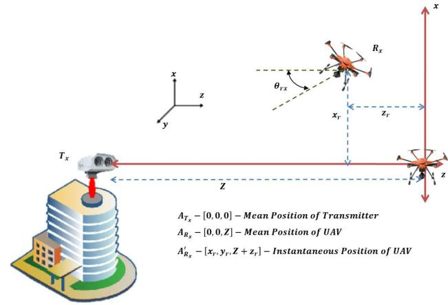  
Fig. 1. Schematic representation of hovering UAV.

The block diagram of SLIPT based Ground to UAV FSO system is shown in Fig. 2. A system employing Subcarrier Intensity Modulation and direct detection (SIM/DD) for FSO communication is considered. In this system, an RF subcarrier is initially pre-modulated with the information sequence in the electrical domain through the M-ary Phase Shift Keying (MPSK) signaling. This offers better signal to noise performance, improved spectral efficiency and supports higher order modulation schemes [46], [47]. This pre-modulated subcarrier is subsequently employed to modulate the intensity of the laser beam. In the proposed system, the incoming bit stream is subjected to modulation using MPSK, where M represents the modulation order, and the peak amplitude of the modulated symbol x is restricted to $A \in [ 0 , ( I _ { H } - I _ { L } ) / 2 ]$ to avoid clipping distortion, where $I _ { L }$ and $I _ { H }$ indicate the minimum and the maximum input bias current. To ensure that the resulting signal remains non-negative, a DC bias B is added to x [10]. The emitted optical signal can be written as [9]

$$
P _ { t } = S ( B + x )\tag{1}
$$

where S is the slope efficiency of the laser diode.

The emitted optical signal is subject to various losses in FSO channel, 1) Atmospheric path loss, 2) Atmospheric turbulence induced fading 3) pointing errors due to receiver UAV’s position deviation and 4) link interruption due to AoA fluctuations. The receiver UAV is equipped with functionality of energy harvesting. Thus, in addition to detecting information over the FSO link, the UAV can also harness energy from the firsthop FSO link by extracting the DC component of the received optical signal. This harvested energy can then be utilized to relay data to a ground station or another UAV via the secondhop RF/FSO link. The received optical power can be given as $P _ { r } = I P _ { t }$ where I is the combined channel coefficient. The converted electrical current at the photodetector is given by

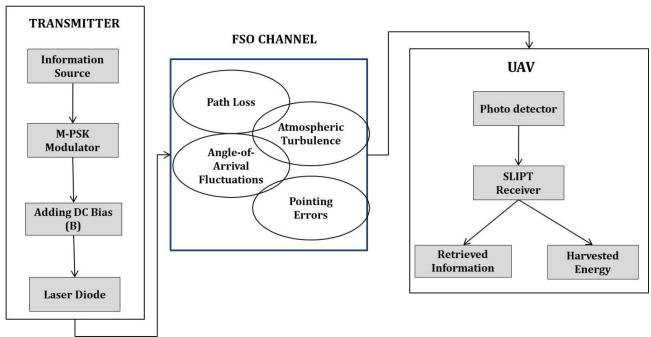  
Fig. 2. System Model.

$$
\begin{array} { l } { { i _ { r } = r I P _ { t } + n } } \\ { { \ = r I S B + r I S x + n } } \\ { { \ = I _ { D C } ^ { \prime } + I _ { A C } + n } } \end{array}\tag{2}
$$

where $I _ { D C } ^ { \prime }$ and $I _ { A C }$ are the DC and AC components, r is the photodetector responsivity and n is the zero-mean Gaussian random variable, i.e., $n \sim \mathcal N ( 0 , \sigma ^ { 2 } )$ .

## A. SLIPT Strategies

In this work, four methods are considered processing the received signal for EH and Information Decoding (ID) modes. Let the time duration of EH and ID modes be $T _ { E H } \le T _ { t o t }$ and $T _ { I D } \leq T _ { t o t }$ respectively. The total DC component of the received electrical current used for energy harvesting is given by [11]

$$
I _ { D C } = \left\{ \begin{array} { l l } { I _ { D C } ^ { \prime } } & { \mathrm { i f ~ o n l y ~ D C ~ c o m p o n e n t ~ i s ~ u s e d } } \\ { I _ { D C } ^ { \prime } + \zeta \overline { { I } } _ { A C } \mathrm { ~ i f ~ b o t h ~ A C ~ a n d ~ D C ~ c o m p o n e n t s ~ a r e ~ u s e d } } \end{array} \right.\tag{3}
$$

where $\zeta$ is the AC-DC conversion efficiency and

$$
\begin{array} { l } { I _ { D C } ^ { \prime } = r I S B } \\ { \overline { { I } } _ { A C } = \mathbb { E } [ I _ { A C } ] = r I S \mathbb { E } [ x ] = r I S A } \end{array}\tag{4}
$$

AC-DC Separation (ADS) method: In this method, both ID and EH are performed simultaneously, i.e., $T _ { I D } = T _ { E H } =$ $T _ { t o t }$ , by blocking AC component using an inductor for EH mode and blocking DC component using a capacitor for ID mode (see Fig. 3a). The current fed to EH and ID modes is given by

$$
\begin{array} { l } { { I _ { I D } = \overline { { { I } } } _ { A C } + n } } \\ { { I _ { E H } = I _ { D C } ^ { \prime } } } \end{array}\tag{5}
$$

Time Switching (TS) method: In this method, the receiver switches between ID and EH modes at the time $T _ { I D } = \tau T _ { t o t }$ and $T _ { E H } = ( 1 - \tau ) T _ { t o t }$ respectively where $\tau \in [ 0 , 1 ]$ is the time switching factor (see Fig. 3b).

Phase I (ID mode): The aim is to operate the receiver only to decode the information. Hence, the transmitter eliminates DC bias, i.e., B = 0 and $A \ : = \ : I _ { H }$ . The current fed to the Information Decoder is given by

$$
I _ { I D } = \overline { { I } } _ { A C } + n\tag{6}
$$

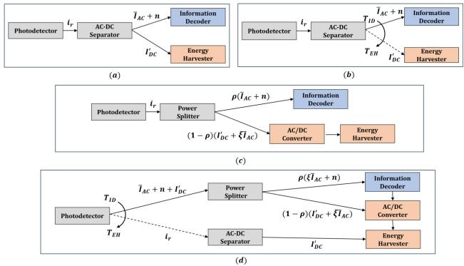  
Fig. 3. Receiver Architecture for a) ADS method b) TS method c) PS method and d) TSPS method.

Phase II (EH mode): The aim is to maximize the harvested energy. Hence, the transmitter removes the AC component and maximizes DC component, i.e., $A = 0$ and $B \ = \ I _ { H }$ . The current fed to the Energy Harvester is given by

$$
I _ { E H } = I _ { D C } ^ { \prime }\tag{7}
$$

Power Splitting (PS) method: The receiver performs ID and EH simultaneously, i.e., $T _ { I D } = t _ { E H } = t _ { t o t }$ (see Fig. 3c). The received power is split into two for EH and ID modes by a factor $\rho \in [ 0 , 1 ]$ . The current fed to the two modes are given by

$$
\begin{array} { l } { { I _ { I D } = \rho \big ( \overline { { { I } } } _ { A C } + n \big ) } } \\ { { I _ { E H } = ( 1 - \rho ) \big ( I _ { D C } ^ { \prime } + \zeta \overline { { { I } } } _ { A C } \big ) } } \end{array}\tag{8}
$$

Time Switching - Power Splitting (TSPS) method: In this hybrid method, the TS and PS strategies are combined wherein during ID mode of TS method, the DC component present in the transmitted signal is efficiently utilized for energy harvesting using a power splitter (see Fig. 3d).

Phase I (ID mode): During the time $T _ { I D } ~ = ~ \tau T _ { t o t }$ , the transmitter sends both AC and DC components. The received signal power is split into two streams by the factor $\rho$ to be fed to EH and ID blocks simultaneously.

$$
\begin{array} { l } { { I _ { I D } = \rho ( \overline { { { I } } } _ { A C } + n ) } } \\ { { I _ { E H } = ( 1 - \rho ) ( I _ { D C } ^ { \prime } + \zeta \overline { { { I } } } _ { A C } ) } } \end{array}\tag{9}
$$

Phase II (EH mode): During time $T _ { E H } = ( 1 - \tau ) T _ { t o t } .$ only EH mode is active to maximize the harvested energy. The transmitter removes the AC component and maximizes DC component, i.e., $A = 0$ and $B = I _ { H }$

$$
I _ { E H } = I _ { D C } ^ { \prime }\tag{10}
$$

Thus the total power fed to energy harvester during the whole frame duration $T _ { t o t }$ is given by

$$
I _ { E H } = ( 1 - \rho ) ( I _ { D C } ^ { \prime } + \zeta \overline { { I } } _ { A C } ) + I _ { D C } ^ { \prime }\tag{11}
$$

## III. CHANNEL MODEL

The combined channel model of the Ground-to-UAV FSO link is given by

$$
I = h I _ { a l } I _ { p l } I _ { A o A }\tag{12}
$$

where h is the atmospheric path loss, $I _ { a l }$ is the turbulence induced fading, $I _ { p l }$ is the pointing errors due to hovering of UAV and $I _ { A o A }$ is the link interruption due to AoA fluctuations.

1) Atmospheric Path Loss: For an optical link of length $Z ,$ the atmospheric path loss is modelled using Beer’s-Lambert law [17] as

$$
h = \exp \left( - \zeta _ { 1 } Z \right)\tag{13}
$$

where $\zeta _ { 1 }$ is the attenuation parameter.

2) Atmospheric Turbulence-Induced Fading: The optical turbulence fading between Ground-to-UAV under all turbulence regime can be modelled using generalized Málaga distribution. The PDF of Málaga distribution is given by [48]

$$
f _ { a l } ( I _ { a l } ) = A _ { M } \sum _ { m = 1 } ^ { \beta } a _ { m } h _ { a l } ^ { ( \alpha + m ) / 2 - 1 } K _ { \alpha - m } \Biggl ( 2 \sqrt { \frac { \alpha \beta I _ { a l } } { g \beta + \Omega ^ { \prime } } } \Biggr )\tag{14}
$$

where

$$
\begin{array} { l } { { A _ { M } = \displaystyle \frac { 2 \alpha ^ { \alpha / 2 } } { g ^ { 1 + \alpha / 2 } \Gamma ( \alpha ) } \bigg ( \frac { g \beta } { g \beta + \Omega ^ { \prime } } \bigg ) ^ { \beta + \alpha / 2 } } } \\ { { a _ { m } = \displaystyle \binom { \beta - 1 } { m - 1 } \frac { \left( g \beta + \Omega ^ { \prime } \right) ^ { 1 - \frac { m } { 2 } } } { ( m - 1 ) ! } \bigg ( \frac { \Omega ^ { \prime } } { g } \bigg ) ^ { m - 1 } \bigg ( \frac { \alpha } { \beta } \bigg ) ^ { \frac { m } { 2 } } } } \end{array}
$$

α and $\beta$ are large scale and small scale scattering parameters given by [49]

$$
\begin{array} { r l } & { \alpha = \left[ \exp \left( \frac { 0 . 4 9 \sigma _ { R } ^ { 2 } } { \left( 1 + 1 . 1 1 \sigma _ { R } ^ { 1 2 / 5 } \right) ^ { 7 / 6 } } \right) - 1 \right] ^ { - 1 } } \\ & { \beta = \left[ \exp \left( \frac { 0 . 5 1 \sigma _ { R } ^ { 2 } } { \left( 1 + 0 . 6 9 \sigma _ { R } ^ { 1 2 / 5 } \right) ^ { 5 / 6 } } \right) - 1 \right] ^ { - 1 } } \end{array}
$$

where $\sigma _ { R } ^ { 2 } = 1 . 2 3 C _ { n } ^ { 2 } k ^ { 7 / 6 } Z ^ { 1 1 / 6 }$ is the Rytov variance. $K _ { v } ( )$ is the modified Bessel function of second kind of order v. The remaining parameters are given in Table II.

3) Pointing Errors: Considering the Gaussian beam footprint at the receiver aperture of radius $r _ { a }$ , as shown in Fig. 4, the loss due to radial displacement $r _ { d }$ between center of beam and receiver aperture is expressed as [50]

$$
I _ { p l } \approx A _ { 0 } \exp \left( - \frac { 2 r _ { d } ^ { 2 } } { w _ { z } ^ { 2 } } \right)\tag{15}
$$

where $\begin{array} { r c l } { A _ { 0 } } & { = } & { e r f ( v ) ^ { 2 } } \end{array}$ is the fraction of power at the receiver when there is no pointing errors and $w _ { z } \approx$ $\begin{array} { r } { w _ { o z } \sqrt { 1 + \Theta ( \frac { \lambda Z } { \pi w _ { o z } ^ { 2 } } ) ^ { 2 } } } \end{array}$ is the Gaussian beamwaist. The remaining parameters are listed in Table II. In the Ground-to-UAV link, the radial displacement vector $( r _ { d } ~ = ~ [ x _ { d } , y _ { d } ]$ is the resultant of two error vectors [28]. i) Displacement vector resulting from deviations in the transmitter’s position $( r _ { t } =$ $[ x _ { t } , y _ { t } ] )$ ii) Displacement vector resulting from deviations in the UAV’s position $( r _ { r } = [ x _ { r } , y _ { r } ] )$ , i.e.,

$$
x _ { d } = x _ { t } + x _ { r } , y _ { d } = y _ { t } + y _ { r }\tag{16}
$$

TABLE II SUMMARY OF NOTATIONS
<table><tr><td>Parameter</td><td>Definition</td></tr><tr><td>SLIPT parameters  $\overline { { M } }$ </td><td></td></tr><tr><td colspan="2">Constellation size</td></tr><tr><td> $_ x$ </td><td>MPSK symbol</td></tr><tr><td> $A$ </td><td>Peak amplitude of transmitted symbol</td></tr><tr><td> $[ I _ { L } , I _ { H } ]$ </td><td>Minimum and maximum input bias current</td></tr><tr><td> $\bar { B }$ </td><td>DC bias</td></tr><tr><td> $P _ { t }$ </td><td>Transmitted Optical power</td></tr><tr><td> $S$ </td><td>Slope efficiency of laser diode</td></tr><tr><td> $P _ { r }$ </td><td></td></tr><tr><td> $i _ { r }$ </td><td>Received Optical power Electrical current at the photodetector</td></tr><tr><td></td><td></td></tr><tr><td> $\underline { { \dot { I _ { D C } } } }$   $\bar { I _ { A C } }$ </td><td>DC component in received current</td></tr><tr><td> $n$ </td><td>AC component in the received current</td></tr><tr><td> $I _ { D C }$ </td><td>zero-mean Gaussian noise</td></tr><tr><td></td><td>Total DC component used for</td></tr><tr><td> $r$ </td><td>energy harvesting photodetector responsivity</td></tr><tr><td> $\sigma ^ { 2 }$ </td><td>Noise variance</td></tr><tr><td> $\zeta$ </td><td>AC-DC conversion efficiency</td></tr><tr><td> $I _ { A C }$ </td><td>Average of AC component</td></tr><tr><td> $I _ { E H }$  and  $I _ { I D }$ </td><td>Current fed to energy harvester</td></tr><tr><td></td><td>and Information decoder</td></tr><tr><td> $T _ { t o t }$ </td><td>Total time duration of a frame</td></tr><tr><td> $T _ { E H }$  and  $T _ { I D }$ </td><td>Time duration of EH and ID modes</td></tr><tr><td> $\tau$ </td><td>Time switching factor</td></tr><tr><td> $\rho$ </td><td>Power splitting factor</td></tr><tr><td> $P _ { M P P }$ </td><td>Maximum power of solar panel</td></tr><tr><td> $V _ { O C }$ </td><td>Open circuit voltage</td></tr><tr><td> $V _ { t }$ </td><td>Thermal voltage</td></tr><tr><td> $I _ { 0 }$   $F$ </td><td>Dark saturation current</td></tr><tr><td>Channel parameters  $\overline { { I } }$ </td><td>Fill factor</td></tr><tr><td rowspan="4"> $h$ </td><td></td></tr><tr><td>Combined channel parameter Atmospheric Path loss</td></tr><tr><td></td></tr><tr><td></td></tr><tr><td> $Z$ </td><td>Atmospheric path loss</td></tr><tr><td></td><td>Distance between transmitter</td></tr><tr><td></td><td>and UAV receiver</td></tr><tr><td> $\zeta _ { 1 }$ </td><td></td></tr><tr><td>Atmospheric Turbulence</td><td>attenuation parameter</td></tr><tr><td> $\begin{array} { c } { { I _ { a l } } } \\ { { C ? } } \end{array}$ </td><td></td></tr><tr><td> $C _ { n } ^ { 2 }$ </td><td>atmospheric turbulence loss</td></tr><tr><td> $k$ </td><td>refractive index structure parameter</td></tr><tr><td> $\lambda$ </td><td>wave number  $k = 2 \pi / \lambda$ </td></tr><tr><td>g</td><td>wavelength</td></tr><tr><td> $\bar { 2 } b _ { 0 }$ </td><td> $g = 2 b _ { 0 } \mathbf { \check { ( } 1 } - \rho 1 \mathbf { ) }$ </td></tr><tr><td> $0 < \rho 1 < 1$ </td><td>Average power of total scatter component Amount of scattering power</td></tr><tr><td></td><td>coupled to LOS component</td></tr><tr><td> $\Omega ^ { \prime }$ </td><td></td></tr><tr><td> $\Omega$ </td><td> $\bar { \Omega ^ { \prime } } \dot { = } \Omega + 2 b _ { 0 } \rho _ { 1 } + \hat { 2 } \sqrt { 2 b _ { 0 } \rho _ { 1 } \Omega } \cos ( \phi _ { a } - \phi$  Average power of LOS component</td></tr><tr><td> $\phi _ { a }$   $\phi _ { a }$ </td><td>Phase of LOS component</td></tr><tr><td>Pointing Errors</td><td>Phase of coupled-to-LOS scatter component</td></tr><tr><td colspan="2"> $I _ { p l }$  Power loss due to pointing error</td></tr><tr><td colspan="2"> $v$   $\sqrt { \frac { \pi } { 2 } } \frac { r _ { a } } { w _ { z } }$   $r _ { a }$  Receiver aperture radius</td></tr><tr><td colspan="2"></td></tr><tr><td colspan="2"> $w _ { z }$  Gaussian beamwaist</td></tr><tr><td colspan="2"> $1 + 2 w _ { o z } ^ { 2 } / \rho ^ { 2 } ( Z )$   $\overset { \cdot } { \rho } ( Z ) = ( 0 . 5 5 C _ { n } ^ { 2 } k ^ { 2 } Z ) ^ { - 3 / }$ </td></tr><tr><td colspan="2"> $\Theta$  coherence length</td></tr><tr><td colspan="2"> $\rho ( Z )$ </td></tr><tr><td colspan="2"></td></tr><tr><td colspan="2"> $w _ { o z }$  beamwidth at  $r _ { d } = [ x _ { d } , y _ { d } ]$ </td></tr><tr><td colspan="2">Radial displacement vector  $r _ { t } = [ x _ { t } , y _ { t } ]$ </td></tr><tr><td colspan="2">Displacement vector resulting from deviation</td></tr><tr><td colspan="2">in the transmitter&#x27;s position deviation</td></tr><tr><td colspan="2"> $r _ { r } = [ x _ { r } , y _ { r } ]$  Displacement vector resulting from deviation</td></tr><tr><td colspan="2">in the UAV&#x27;s position deviation</td></tr><tr><td colspan="2"> $\sigma _ { m } ^ { 2 }$  Total displacement variance Pointing error coefficient</td></tr><tr><td colspan="2"></td></tr><tr><td colspan="2"> $\zeta _ { m o d } ^ { \omega }$   $w _ { z e q }$  AoA fluctuations</td></tr><tr><td colspan="2">Equivalent beamwidth  $I _ { A o A }$ </td></tr><tr><td colspan="2"></td></tr><tr><td colspan="2">Link interruption coefficient</td></tr><tr><td colspan="2">Angle of Arrival (AoA)</td></tr><tr><td colspan="2"> $\theta _ { a }$  Receiver UAV&#x27;s Field of View</td></tr><tr><td colspan="2"> $\theta _ { F O V }$ </td></tr><tr><td colspan="2"> $\theta _ { r x } \ \mathrm { a n d } \ \theta _ { r y }$  instantaneous angular misalignment</td></tr><tr><td colspan="2"></td></tr><tr><td colspan="2">UAVs boresight angle</td></tr><tr><td colspan="2">of the UAV  $\theta _ { r x } ^ { \prime }$  and  $\theta _ { r y } ^ { \prime }$  γ Instantaneous SNR</td></tr></table>

The position deviations, $x _ { t } , x _ { r } .$ , y and $y _ { r }$ occur due to several random events, and therefore assumed to follow Gaussian distribution with zero mean and variance $\sigma _ { t x } ^ { 2 } , \sigma _ { r x } ^ { 2 } , \sigma _ { t y } ^ { 2 }$ and $\sigma _ { r y } ^ { 2 }$

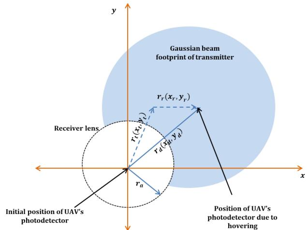  
Fig. 4. Pointing errors caused by misalignment between Gaussian beam footprint and receiver aperture.

respectively. Hence

$$
\begin{array} { r } { x _ { d } \sim \mathcal { N } \Big ( 0 , \sigma _ { t x } ^ { 2 } + \sigma _ { r x } ^ { 2 } \Big ) } \\ { y _ { d } \sim \mathcal { N } \Big ( 0 , \sigma _ { t y } ^ { 2 } + \sigma _ { r y } ^ { 2 } \Big ) } \end{array}\tag{17}
$$

The PDF of $r _ { d }$ is given by the modified Rayleigh distribution [49]

$$
f _ { r _ { d } } ( r _ { d } ) \approx \frac { r _ { d } } { \sigma _ { m } ^ { 2 } } e x p \left( \frac { - r _ { d } ^ { 2 } } { 2 \sigma _ { m } ^ { 2 } } \right) , r _ { d } \geq 0\tag{18}
$$

where $\sigma _ { m } ^ { 2 }$ is the total displacement variance given by

$$
\sigma _ { m } ^ { 2 } = \sigma _ { t x } ^ { 2 } + \sigma _ { r x } ^ { 2 } + \sigma _ { t y } ^ { 2 } + \sigma _ { r y } ^ { 2 }\tag{19}
$$

using (15) and (18), the PDF of pointing errors is written as [28]

$$
f _ { I _ { p l } } ( I _ { p l } ) = \frac { \zeta _ { m o d } ^ { 2 } } { A _ { 0 } ^ { \zeta _ { m o d } ^ { 2 } } } I _ { p l } ^ { \zeta _ { m o d } ^ { 2 } - 1 }\tag{20}
$$

where $\begin{array} { l l l } { \zeta _ { m o d } } & { = } & { { \frac { w _ { z e q } } { 2 \sigma _ { m } } } } \end{array}$ is the pointing error coefficient and $\begin{array} { r } { w _ { z e q } = \frac { w _ { z } ^ { 2 } \sqrt { 2 } e r f ( v ) } { 2 v e x p ( - v ^ { 2 } ) } } \end{array}$ is the equivalent beamwidth.

4) AoA Flucturations: AoA fluctuations refers to variations in the angle at which the signal from the ground station reaches the UAV. This can occur due to UAV vibrations and impact the quality and reliability of the communication link. This phenomenon can be represented using the link interruption coefficient $I _ { A o A }$

$$
I _ { A o A } = { \left\{ \begin{array} { l l } { 1 , } & { { \mathrm { i f ~ } } \theta _ { a } \leq \theta _ { F O V } } \\ { 0 , } & { { \mathrm { i f ~ } } \theta _ { a } \geq \theta _ { F O V } } \end{array} \right. }\tag{21}
$$

where $\theta _ { F O V }$ is the UAV’s Field of View (FOV) and $\theta _ { a }$ is the AoA given by [28]

$$
\theta _ { a } = \sqrt { \theta _ { r x } ^ { 2 } + \theta _ { r y } ^ { 2 } }\tag{22}
$$

$\theta _ { r x }$ and $\theta _ { r y }$ are Gaussian random variables such that $\theta _ { r x } \sim$ $\mathcal { N } ( \theta _ { r x } ^ { \prime } , \sigma _ { r x a } ^ { 2 } )$ and $\theta _ { r y } \sim \mathcal { N } ( \theta _ { r y } ^ { \prime } , \sigma _ { r y a } ^ { 2 } )$ where $\theta _ { r x } ^ { \prime }$ and $\theta _ { r y } ^ { \prime }$ are the UAVs boresight angle and $\sigma _ { r x a }$ and $\sigma _ { r y a }$ are the SD of the UAV orientation in $x - z$ and $y - z$ plane respectively. The

PDF of the AoA is modeled by Beckmann distribution, which is approximated using a modified Rayleigh distribution as

$$
f _ { \theta _ { a } } ( \theta _ { a } ) \approx \frac { \theta _ { a } } { \sigma _ { a } ^ { 2 } } e x p \left( \frac { - \theta _ { a } ^ { 2 } } { 2 \sigma _ { a } ^ { 2 } } \right) , \theta _ { a } \geq 0\tag{23}
$$

where $\begin{array} { r } { \sigma _ { a \mathrm { ~ } } ^ { 2 } = ( \frac { 3 \theta _ { r x } ^ { ' 2 } \sigma _ { r x a } ^ { 4 } + 3 \theta _ { r y } ^ { ' 2 } \sigma _ { r y a } ^ { 4 } + \sigma _ { r x a } ^ { 6 } + \sigma _ { r y a } ^ { 6 } } { 2 } ) ^ { 1 / 3 } } \\ { 3 ) , \mathrm { t h e ~ P D F ~ o f ~ A o A ~ f l u c t u a t i o n s ~ i s ~ g i v e n ~ a s } } \end{array}$ using (21) and (2

$$
f _ { I _ { A o A } } ( I _ { A o A } ) = a _ { 1 } \delta ( I _ { A o A } ) + ( 1 - a _ { 1 } ) \delta ( I _ { A o A } - 1 )\tag{24}
$$

where $a _ { 1 } = e x p \big ( \frac { - \theta _ { F O V } ^ { 2 } } { 2 \sigma _ { a } ^ { 2 } } \big )$ and δ( ) is the dirac delta function. The PDF of the combined channel is given by [28]

$$
\begin{array} { c } { { f _ { I } ( I ) \approx a _ { 1 } \delta ( I ) + \displaystyle \frac { ( 1 - a _ { 1 } ) \zeta _ { \mathrm { m o d } } ^ { 2 } A _ { M } } { 2 I } \sum _ { m = 1 } ^ { \beta } b _ { m } } } \\ { { \times G _ { 1 , 3 } ^ { 3 , 0 } \displaystyle \biggl ( \frac { B _ { 1 } I } { h A _ { 0 } } \biggr | \zeta _ { \mathrm { m o d } } ^ { 2 } { \zeta } _ { m , m } ^ { 2 } \biggr ) } } \end{array}\tag{25}
$$

where $\begin{array} { r l r l r l r } { B _ { 1 } } & { { } = } & { } & { \frac { \alpha \beta } { g \beta + \Omega ^ { \prime } } , } & { b _ { m } } & { { } = } & { } & { a _ { m } B ^ { \frac { - ( \alpha + m ) } { 2 } } } \end{array}$ and $G _ { p , q } ^ { m , n } ( z |  { } _ { b _ { 1 } , . . . , b _ { q } } ^ { a _ { 1 } , . . . , a _ { p } } ) $ is the MeijerG function. The instantaneous SNR and average electrical SNR can be written as

$$
\gamma = \frac { I ^ { 2 } ( r S A ) ^ { 2 } } { \sigma ^ { 2 } }\tag{26}
$$

$$
\overline { { { \gamma } } } = ( k _ { 1 } A _ { 0 } h ) ^ { 2 } \frac { ( r S A ) ^ { 2 } } { \sigma ^ { 2 } }\tag{27}
$$

where $\mathbb { E } [ I ^ { 2 } ] = ( k _ { 1 } A _ { 0 } h ) ^ { 2 }$ and $\begin{array} { r } { k _ { 1 } = \frac { \zeta _ { m o d } ^ { 2 } } { \zeta _ { m o d } ^ { 2 } + 1 } ( g + \Omega ^ { \prime } ) ( 1 - a _ { 1 } ) } \end{array}$ By applying random variable transformation using

$$
\gamma = \frac { \overline { { \gamma } } I ^ { 2 } } { ( k _ { 1 } A _ { 0 } h ) ^ { 2 } }\tag{28}
$$

the PDF of the instantaneous SNR is obtained as

$$
\begin{array} { r } { f _ { \gamma } ( \gamma ) \approx a _ { 1 } \delta \biggl ( \sqrt { \frac { \gamma } { \overline { { \gamma } } } } k _ { 1 } A _ { 0 } h \biggr ) + ( 1 - a _ { 1 } ) \frac { \zeta _ { m o d } ^ { 2 } A _ { M } } { 4 \gamma } } \\ { \displaystyle \sum _ { m = 1 } ^ { \beta } b _ { m } G _ { 1 , 3 } ^ { 3 , 0 } \biggl ( k _ { 1 } B _ { 1 } \sqrt { \frac { \gamma } { \overline { { \gamma } } } } \biggl | \zeta _ { m o d } ^ { 2 } + 1 _ { } \biggr . } \end{array}\tag{29}
$$

Integrating the PDF using [51, (07.34.21.0084.01)], the CDF is given by

$$
\begin{array} { l } { { \displaystyle F _ { \gamma } ( \gamma ) \approx a _ { 1 } + ( 1 - a _ { 1 } ) \frac { \zeta _ { m o d } ^ { 2 } A _ { M } } { 8 \pi } } } \\ { { \displaystyle \sum _ { m = 1 } ^ { \beta } b _ { m } 2 ^ { \alpha + m - 1 } G _ { 3 , 7 } ^ { 6 , 1 } \left( \frac { ( k _ { 1 } B _ { 1 } ) ^ { 2 } \gamma } { 1 6 \overline { { \gamma } } } \ \bigg | 1 , K _ { 2 } \right) } } \end{array}\tag{30}
$$

where K2 = ζ2mod +1 ζ2mod +2 and K3 = 2 2   
ζ2mod α α+1 m m+1 2 2 , 2 , 2 , 2 , 2

## IV. PERFORMANCE ANALYSIS

In this section, the closed form expressions of the Harvested energy, outage probability and average SER is derived.

## A. Harvested Energy

The maximum power of the solar panel is given by $P _ { M P P } =$ $F I _ { D C } V _ { O C }$ [52] where $\begin{array} { r } { V _ { O C } = \bar { V _ { t } } l n ( 1 + \bar { \frac { \tau _ { D C } } { I _ { 0 } } } ) } \end{array}$ is the open circuit voltage. Multiplying the maximum power by the time duration of EH mode and replacing $I _ { D C }$ by the current to the energy harvester $I _ { E H }$ the harvested energy can be written as

$$
E = T _ { E H } F I _ { E H } V _ { t } l n \biggl ( 1 + { \frac { I _ { E H } } { I _ { 0 } } } \biggr )\tag{31}
$$

The other parameters are defined in Table II.

ADS Method: In this method $T _ { E H } = T _ { t o t }$ and substituting (4) and (5) in (31) and averaging over the PDF in (25), the average energy harvested is given as

$$
E _ { A D S } = \int _ { 0 } ^ { \infty } T _ { t o t } F r I h S B V _ { t } l n \biggl ( 1 + { \frac { r I h S B } { I _ { 0 } } } \biggr ) f _ { I } ( I ) d I\tag{32}
$$

using the identity, $\begin{array} { r l r } { l n ( 1 \mathrm { ~ + ~ } x ) } & { { } = } & { { \bf G } _ { 2 , 2 } ^ { 1 , 2 } \bigg ( x \Big | 1 , 1 \Big ) } \end{array}$ and [51, (07.34.21.0013.01)], the closed form expression for the harvested energy using ADS method is given as

$$
E _ { A D S } = E _ { 1 } \sum _ { m = 1 } ^ { \beta } b _ { m } G _ { 3 , 5 } ^ { 5 , 1 } \bigg ( \frac { B _ { 1 } I _ { 0 } } { r h S B A _ { 0 } } \bigg | \frac { K _ { 4 } } { K _ { 5 } } \bigg )\tag{33}
$$

where $\begin{array} { r l r } { E _ { 1 } } & { = } & { T _ { t o t } F V _ { t } I _ { 0 } ( 1 - a _ { 1 } ) \frac { \zeta _ { m o d } ^ { 2 } A _ { M } } { 2 } , K _ { 4 } = [ 1 + } \end{array}$ $\zeta _ { m o d } ^ { 2 } , - 1 , 0 ]$ and $K _ { 5 } = [ \zeta _ { m o d } ^ { 2 } , - 1 , - 1 , \bar { \alpha _ { , } } m ]$

TS Method: The average energy harvested in EH mode of TS method, is the same as (33), where $T _ { t o t }$ and B are replaced by $( 1 - \tau ) T _ { t o t }$ and $I _ { H }$

$$
E _ { T S } = ( 1 - \tau ) E _ { 1 } \sum _ { m = 1 } ^ { \beta } b _ { m } G _ { 3 , 5 } ^ { 5 , 1 } \left( \frac { B _ { 1 } I _ { 0 } } { r h S I _ { H } A _ { 0 } } \bigg | \frac { K _ { 4 } } { K _ { 5 } } \right)\tag{34}
$$

PS Method: In this method, EH and ID modes are operated simultaneously, $T _ { E H } = T _ { t o t }$ . Substituting (4) and (8) in (31), the closed form expression for the PS method is given as

$$
E _ { P S } = E _ { 1 } \sum _ { m = 1 } ^ { \beta } b _ { m } G _ { 3 , 5 } ^ { 5 , 1 } \bigg ( \frac { B _ { 1 } I _ { 0 } } { h A _ { 0 } ( 1 - \rho ) ( B + \zeta A ) r S } \bigg | \frac { K _ { 4 } } { K _ { 5 } } \bigg )\tag{35}
$$

TSPS Method: In this method, the energy is harvested in both the phases, i.e., at time $\tau T _ { t o t }$ in ID mode and at time $( 1 - \tau ) T _ { t o t }$ in EH mode. The energy at phase I is the same as that of the PS method except for $T _ { E H } = \tau T _ { t o t }$ and that of phase II is the same as that of the TS method. The closed form expression for the TSPS method is given as

$$
E _ { T S P S } = \tau E _ { P S } + E _ { T S }\tag{36}
$$

## B. Outage Probability

The probability that the instantaneous SNR drops below a specific threshold is represented by the outage probability $\gamma _ { t h } ,$ which can result in communication outage or failure. It is given by [49]

$$
P _ { o u t } ( \gamma _ { t h } ) = P _ { o u t } ( \gamma < \gamma _ { t h } ) = F _ { \gamma } ( \gamma _ { t h } )\tag{37}
$$

which is obtained by calculating CDF of instantaneous SNR (30) at $\gamma _ { t h }$

## C. SER Calculation

The conditional SER of the MPSK signal is given as

$$
p _ { ( e / \gamma ) } ( \gamma ) \approx \frac { A } { 2 } e r f c \Big ( s i n \Big ( \frac { \pi } { M } \Big ) \sqrt { \gamma } \Big )\tag{38}
$$

where

$$
A = \left\{ { \begin{array} { l } { 1 , \ \mathrm { f o r } \ M = 2 } \\ { 2 , \ \mathrm { f o r } \ M > 2 } \end{array} } \right.\tag{39}
$$

and $e r f c ( \cdot )$ denotes complementary error function. However, when SLIPT is employed, the receiver operates in ID mode only during the duration $T _ { I D }$ , while spending the remaining of the total duration $T _ { t o t }$ in EH mode. Hence SER needs to scaled by the factor $T _ { I D } / T _ { t o t }$ On averaging the PDF in (29), the SER for the Ground-to-UAV communication systems is given as

$$
S E R = \int _ { 0 } ^ { \infty } \frac { T _ { I D } } { T _ { t o t } } p _ { ( e / \gamma ) } ( \gamma ) f _ { \gamma } ( \gamma )\tag{40}
$$

ADS Method: In this method, $T _ { I D } = T _ { t o t }$ . Using the identity $e r f c ( x ) = \mathbf { G } _ { 1 , 2 } ^ { 2 , 0 } \bigg ( x ^ { 2 } \bigg | _ { 0 , 0 . 5 } ^ { 1 } \bigg )$ and [51, (07.34.21.0013.01)], the closed form expression for the SER using ADS method is given as

$$
\begin{array} { c } { { S E R _ { A D S } \approx \displaystyle \frac { A a _ { 1 } } { 2 } + \frac { A _ { M } \zeta _ { m o d } ^ { 2 } A ( 1 - a _ { 1 } ) } { 1 6 \pi \sqrt { \pi } } \sum _ { m = 1 } ^ { \beta } b _ { m } 2 ^ { \alpha + m - 1 } } } \\ { { \times G _ { 4 , 7 } ^ { 6 , 2 } \left( \frac { ( k _ { 1 } B _ { 1 } ) ^ { 2 } } { s i n ^ { 2 } ( \pi / M ) 1 6 \overline { { { \gamma } } } } \ \Bigg | { 1 , 0 . 5 , K _ { 2 } } \right) ~ ( 4 1 } } \end{array}
$$

TS Method: The average SER takes the same form as (41), however as the duration in which the receiver works in ID mode is $T _ { I D } = \tau T _ { t o t }$ . Therefore,

$$
S E R _ { T S } = \tau S E R _ { A D S }\tag{42}
$$

PS Method: As shown in (8), the average SER of PS method is obtained by multiplying Average AC component, $\overline { { I } } _ { A C }$ and noise n by the power splitting factor $\rho .$ Hence

$$
S E R _ { P S } = S E R _ { A D S }\tag{43}
$$

TSPS Method: As shown in (9), the SER for TSPS method is obtained just by multiplying SER of PS method by τ .

$$
S E R _ { T S P S } = \tau S E R _ { P S }\tag{44}
$$

## V. RESULTS AND DISCUSSIONS

In this section, the performance of SLIPT methods in Ground-to-UAV link under consideration for different channel conditions are presented. The system and channel parameters used for simulation are listed in Table III, unless specified otherwise.

Fig. 5 shows the effect of link distance and receiver’s Field of View $( \theta _ { F O V } )$ on the Harvested energy for all SLIPT methods. Strong turbulence is assumed with $w _ { z } ~ = ~ 3 m$ . It has been observed that the TSPS method achieves the highest harvested energy compared to other SLIPT strategies due to its dual-phase approach that optimally combines TS and PS (see Table IV). Additionally, in all SLIPT methods, as $\theta _ { F O V }$ is increased from 6 mrad to 12 mrad, the harvested energy also increases. This is because the increase in $\theta _ { F O V }$ reduces the effect of AoA fluctuations. Therefore, based on these results, only the ADS method and TS-PS will be considered in the remaining simulations as they outperform the TS and PS variants.

TABLE III CHANNEL AND SYSTEM PARAMETERS
<table><tr><td rowspan=1 colspan=1>Parameter</td><td rowspan=1 colspan=1>Value</td><td rowspan=1 colspan=1>Reference</td></tr><tr><td rowspan=1 colspan=1> $\overline { { T _ { t o t } } }$ </td><td rowspan=1 colspan=1>1</td><td rowspan=1 colspan=1>[9]</td></tr><tr><td rowspan=1 colspan=1> $\overline { { \mathrm { ~ F ~ } } }$ </td><td rowspan=1 colspan=1> $\overline { { 0 . 7 5 } }$ </td><td rowspan=1 colspan=1>[53]</td></tr><tr><td rowspan=1 colspan=1> $\overline { { I _ { 0 } } }$ </td><td rowspan=1 colspan=1> $\overline { { 1 0 ^ { - 9 } \mathrm { ~ A ~ } } }$ </td><td rowspan=1 colspan=1>[53]</td></tr><tr><td rowspan=1 colspan=1> $\overline { { V _ { t } } }$ </td><td rowspan=1 colspan=1> $2 5 ~ \mathrm { m v }$ </td><td rowspan=1 colspan=1>[53]</td></tr><tr><td rowspan=1 colspan=1> $r$ </td><td rowspan=1 colspan=1>0.6 A/W</td><td rowspan=1 colspan=1>[53]</td></tr><tr><td rowspan=1 colspan=1> $\overline { S }$ </td><td rowspan=1 colspan=1>1.33 W/A</td><td rowspan=1 colspan=1>[11]</td></tr><tr><td rowspan=1 colspan=1> $\overline { { I _ { L } } }$ </td><td rowspan=1 colspan=1>200 mA</td><td rowspan=1 colspan=1>[11]</td></tr><tr><td rowspan=1 colspan=1> $I _ { H }$ </td><td rowspan=1 colspan=1>1200 mA</td><td rowspan=1 colspan=1>[11]</td></tr><tr><td rowspan=1 colspan=1> $\bar { \lambda }$ </td><td rowspan=1 colspan=1>1550 nm</td><td rowspan=1 colspan=1>[28]</td></tr><tr><td rowspan=1 colspan=1> $\overline { { \zeta } }$ </td><td rowspan=1 colspan=1>0.3</td><td rowspan=1 colspan=1>[28]</td></tr><tr><td rowspan=1 colspan=1> $r _ { a }$ </td><td rowspan=1 colspan=1>5 cm</td><td rowspan=1 colspan=1>[28]</td></tr><tr><td rowspan=1 colspan=1> $w _ { z }$ </td><td rowspan=1 colspan=1>3 m</td><td rowspan=1 colspan=1>[28]</td></tr><tr><td rowspan=1 colspan=1> $\sigma _ { t } x , \sigma _ { r } x$ </td><td rowspan=1 colspan=1>40 cm</td><td rowspan=1 colspan=1>[28]</td></tr><tr><td rowspan=1 colspan=1> $\sigma _ { t } y , \sigma _ { r } y$ </td><td rowspan=1 colspan=1>30 cm</td><td rowspan=1 colspan=1>[28]</td></tr><tr><td rowspan=1 colspan=1> $\zeta _ { 1 }$ </td><td rowspan=1 colspan=1>0.43 (Clear air)4.2 (Haze)5.8 (Moderate Rain)10.2 (Heavy Rain)</td><td rowspan=1 colspan=1>[54]</td></tr><tr><td rowspan=1 colspan=1> $\frac { \overline { { c _ { n } ^ { 2 } } } } { Z }$ </td><td rowspan=1 colspan=1> $\overline { { 1 . 7 * 1 0 ^ { - 1 3 } } }$ </td><td rowspan=1 colspan=1>[55]</td></tr><tr><td rowspan=1 colspan=1></td><td rowspan=1 colspan=1>[200,1000] m</td><td rowspan=1 colspan=1>-</td></tr><tr><td rowspan=1 colspan=1> $\rho$ </td><td rowspan=1 colspan=1>0.596</td><td rowspan=1 colspan=1>[48]</td></tr><tr><td rowspan=1 colspan=1> $\overline { { \Omega } }$ </td><td rowspan=1 colspan=1>1.3265</td><td rowspan=1 colspan=1>[48]</td></tr><tr><td rowspan=1 colspan=1> $\overline { { b _ { 0 } } }$ </td><td rowspan=1 colspan=1>0.1079</td><td rowspan=1 colspan=1>[48]</td></tr><tr><td rowspan=1 colspan=1> $\overline { { \phi _ { a } - \phi _ { b } } }$ </td><td rowspan=1 colspan=1> $\overline { { \pi / 2 } }$ </td><td rowspan=1 colspan=1>[48]</td></tr><tr><td rowspan=1 colspan=1> $\sigma$ </td><td rowspan=1 colspan=1>10-14</td><td rowspan=1 colspan=1>[54]</td></tr><tr><td rowspan=1 colspan=1> $\sigma _ { a }$ </td><td rowspan=1 colspan=1>3.45 mrad</td><td rowspan=1 colspan=1>[28]</td></tr></table>

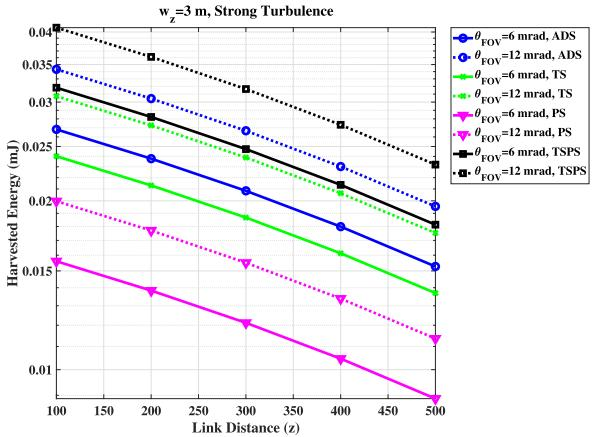  
Fig. 5. Harvested energy versus Link distance for all SLIPT methods for different $\theta _ { F O V }$

Fig. 6 shows the effect of pointing errors on the harvested energy in ADS and TSPS methods. Two pointing error values are considered, $\zeta _ { m o d } = 9 . 0 2$ and $\zeta _ { m o d } = 5 . 0 7$ . It must be noted that the severity of pointing error tends to be low for high values of $\zeta _ { m o d }$ and vice versa. Hence an increase in harvested energy by 0.22 mJ is obtained for $\zeta _ { m o d } = 9 . 0 2$ as compared to that of $\zeta _ { m o d } = 5 . 0 7$ in TSPS method and about 0.015 mJ in ADS method.

In Fig. 7, the harvested energy is plotted with respect to $\theta _ { F O V }$ for different values of $\sigma _ { a }$ for the link distance of 200 m. It is observed that the optimum value of $\theta _ { F O V }$ is 12 mrad for $\sigma _ { a } = 3 . 2 m r a d , 2 0$ mrad for $\sigma _ { a } = 6$ .4mrad and 32 mrad for $\sigma _ { a } ~ = ~ 9 . 9 m r a d$ . The increase in the optimum value of $\theta _ { F O V }$ with increase in $\sigma _ { a }$ is due to the fact that to offset the effect, the receiver’s FOV should increase in tandem with an increase in the AoA at the receiver. However, the background noise also increases with increase in $\theta _ { F O V }$ and hence there is a trade-off between AoA fluctuations and background noise. Hence, the optimum value of $\sigma _ { a \mathrm { ~ } } = \ 3 . 4 5 m r a d$ is used in further simulations.

TABLE IV  
COMPARISON OF SLIPT STRATEGIES
<table><tr><td rowspan=1 colspan=1>SLIPTStrategies</td><td rowspan=1 colspan=1>EHDuration</td><td rowspan=1 colspan=1>Source forEH</td><td rowspan=1 colspan=1>Inference</td></tr><tr><td rowspan=1 colspan=1>ADSMethod</td><td rowspan=1 colspan=1> $\overline { { T _ { \mathrm { t o t } } } }$ </td><td rowspan=1 colspan=1>B</td><td rowspan=1 colspan=1>Straightforwardmethod. Less energyin total duration.</td></tr><tr><td rowspan=1 colspan=1>TS method</td><td rowspan=1 colspan=1> $( 1 - \tau ) T _ { \mathrm { t o t } }$ </td><td rowspan=1 colspan=1> $\overline { { B _ { \mathrm { m a x } } } }$ </td><td rowspan=1 colspan=1>More energy in lessthan the total dura-tion.</td></tr><tr><td rowspan=1 colspan=1>PS method</td><td rowspan=1 colspan=1> $\overline { { T _ { \mathrm { t o t } } } }$ </td><td rowspan=1 colspan=1> $\overline { { ( 1 - \rho ) ( x + } }$  $\dot { B } )$ </td><td rowspan=1 colspan=1>Less energy in totalduration.</td></tr><tr><td rowspan=2 colspan=1>TSPS method</td><td rowspan=1 colspan=1>Phase    I: $\tau T _ { \mathrm { t o t } }$ </td><td rowspan=1 colspan=1> $\overline { { ( 1 - \rho ) ( x + } }$  $B )$ </td><td rowspan=2 colspan=1>More energy in totalduration.</td></tr><tr><td rowspan=1 colspan=1>Phase   II: $( 1 - \tau ) T _ { \mathrm { t o t } }$ </td><td rowspan=1 colspan=1> $\overline { { B _ { \mathrm { m a x } } } }$ </td></tr></table>

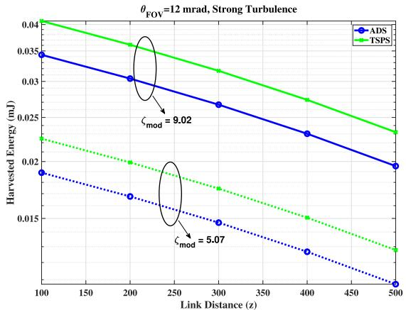  
Fig. 6. Harvested energy versus Link distance in ADS and TSPS methods for different $\zeta _ { m o d } .$

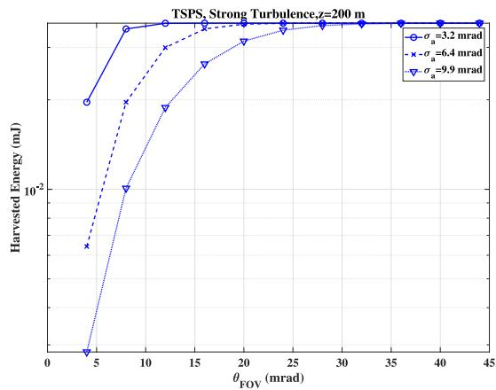  
Fig. 7. Harvested energy versus $\theta _ { F O V }$ in TSPS for different $\sigma _ { a }$

Fig. 8 shows the harvested energy with regard to link distance and FOV angle. It is observed that the harvested energy is maximum at short link distance. Also, irrespective of the link distance,the harvested energy remains the same above the optimal value of the receiver’s FOV angle.

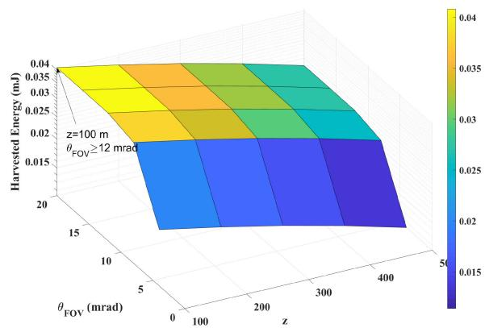  
Fig. 8. Harvested energy versus $\theta _ { F O V }$ and link distance.

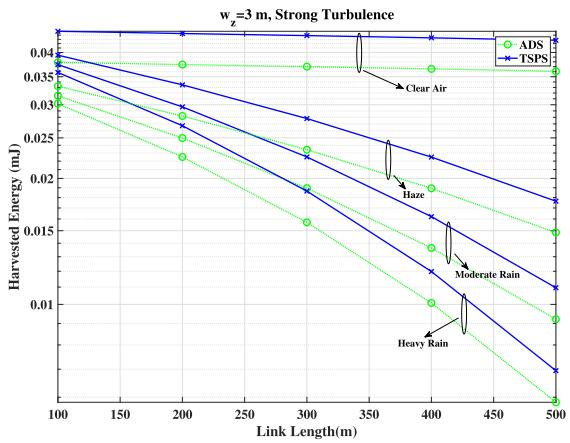  
Fig. 9. Harvested energy versus link distance for different weather conditions

Fig. 9 shows the plot of the harvested energy as a function of link distance for different weather conditions, i.e., clear air, haze, moderate rain and heavy rain. It is observed that to achieve the harvested energy atleast half that of clear air scenario, the maximum link distance can only be 370 m when there is haze, 270 m during moderate rain and 220 m during heavy rain.

Fig. 10 shows the outage probability for different link distances at $\theta _ { F O V } ~ = ~ 1 2 m r a d .$ $w _ { z } ~ = ~ 3 m , ~ \gamma _ { t h } ~ = ~ 5 d B$ It can be seen that as the distance increases, the outage probability also increases, because scattering and scintillation effects become more significant with longer distances. Also, the performance improves for larger values of pointing error coefficient because from (20), for higher values of the pointing error coefficient, the severity of pointing error is relatively low.

Fig. 11 shows the outage probability with regard to average SNR for different values of $\theta _ { F O V }$ at the threshold SNR $\gamma _ { t h } =$ 5dB and 10dB. As seen from the plot, with a higher threshold SNR, the system is less tolerant to atmospheric attenuation and noise, making it more likely for the communication link to experience an outage. An increase in receiver’s FOV helps in capturing more of the variations caused by atmospheric turbulence, leading to decrease in outage probability until the optimum value of $\theta _ { F O V }$ (12mrad in our case). Increasing beyond the optimum value will only increase the susceptibility to interference.

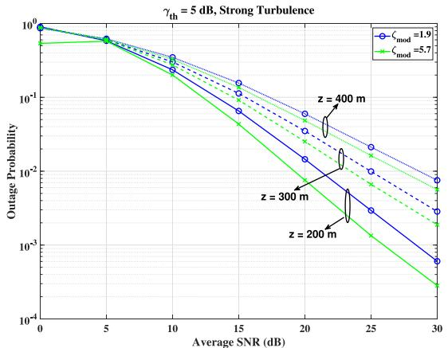  
Fig. 10. Outage Probability versus SNR for different link distance and pointing errors.

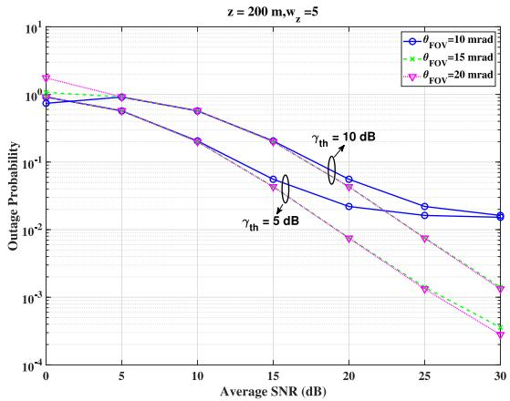  
Fig. 11. Outage Probability against SNR for various receiver’s FOV $( \theta _ { F O V } )$ and threshold SNR $( \gamma _ { t h } )$

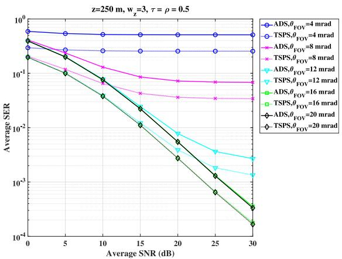  
Fig. 12. SER versus average SNR for different $\theta _ { F O V }$ in ADS and TSPS Methods.

Fig. 12 shows the average SER versus average SNR plot for a link distance of 250m with the time switching and power splitting factors, $\tau = \rho = 0 . 5 .$ . Significant improvement in SER performance is visible with respect to $\theta _ { F O V }$ until its optimum value. Also, the performance is better in TSPS method compared to ADS method.

Pointing error severity is more pronounced in UAV-based links, making it crucial to adjust the beamwidth to improve system performance. In equation (14), β represents small-scale eddy in atmospheric turbulence. As shown in equation (20), $\zeta _ { m o d } ^ { 2 }$ represents the pointing error coefficient, which is the ratio of squared equivalent beam width to displacement variance. When $\zeta _ { m o d } ^ { 2 } < \beta$ , pointing error becomes dominant. Hence the beamwidth $w _ { z }$ should be chosen so as to satisfy the condition, $\zeta _ { m o d } ^ { 2 } \geq \beta _ { \mathrm { i } }$ . Hence the minimum value of beamwidth is given by letting $\zeta _ { m o d } ^ { 2 } = \beta .$

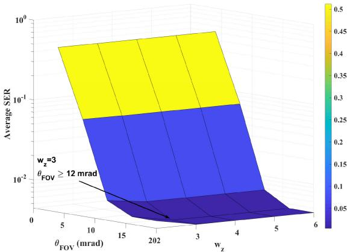  
Fig. 13. SER versus wz and $\theta _ { F O V }$

z=250 m, TSPS, Strong Turbulence  
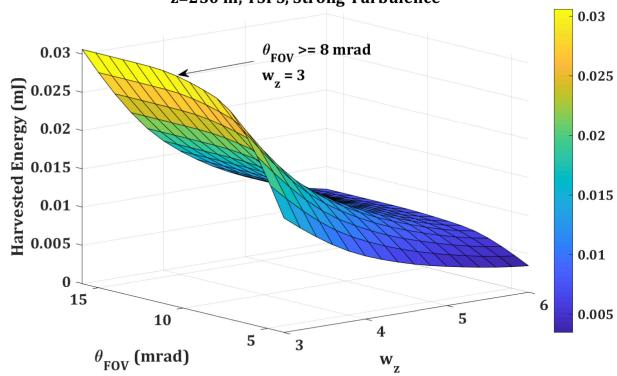  
Fig. 14. Harvested Energy versus $w _ { z }$ and $\theta _ { F O V }$

$$
w _ { z } ^ { m i n } = \sqrt { 4 \beta \sigma _ { m } ^ { 2 } - \frac { 3 } { 3 \sqrt { 2 } } }\tag{45}
$$

Fig. 13 shows the performance plot of SER as a function of beam waist $w _ { z }$ and receiver’s Field of View with link distance $z = 2 5 0 m$ . The SER performance improves with increase in $w _ { z }$ and $\theta _ { F O V }$ because the AoA fluctuations and pointing errors have less impact.

In Fig. 14, the Harvested Energy is plotted as a function of beam waist $w _ { z }$ and receiver’s FOV $\theta _ { F O V }$ at a link distance of $z = 2 5 0 m$ under strong turbulence. Although $w _ { z } > w _ { z } ^ { m i n }$ reduces the impairments due to pointing errors, it also spreads energy over a larger angular area, leading to a decrease in the harvested energy. Additionally, an increase in $\theta _ { F O V }$ initially results in an increase in harvested energy, but it levels off after reaching the optimal value.

## VI. CONCLUSION

In this paper, the performance of Ground-to-UAV FSO link with SLIPT capability is investigated considering atmospheric turbulence, attenuation, AoA fluctuations and Pointing errors. Performance of different SLIPT methods based on time switching and/or power splitting is analyzed. A closed form expressions for average harvested energy, SER and Outage Probability are derived considering generalized Málaga distribution and IM/DD detection. The numerical results demonstrate the potential of SLIPT-based FSO for enabling energy-efficient and reliable communication in 6G-IoT scenarios with UAVs. The TSPS method achieves the highest harvested energy compared to other SLIPT strategies, making it a preferred choice for energy-constrained UAVs. Increasing the receiver’s FOV up to its optimal value helps mitigate the impact of atmospheric turbulence and pointing errors, improving harvested energy and communication performance. The results demonstrated that Link distance, weather conditions, and pointing error severity significantly influence the system’s performance. Adaptive power allocation and beam pointing techniques can be developed as the future work to maximize communication reliability and energy efficiency.

## REFERENCES

[1] M. Vaezi et al., “Cellular, wide-area, and non-terrestrial IOT: A survey on 5G advances and the road toward 6G,” IEEE Commun. Surveys Tuts., vol. 24, no. 2, pp. 1117–1174, 2nd Quart., 2022.

[2] F. Guo, F. R. Yu, H. Zhang, X. Li, H. Ji, and V. C. M. Leung, “Enabling massive IoT toward 6G: A comprehensive survey,” IEEE Internet Things J., vol. 8, no. 15, pp. 11891–11915, Aug. 2021.

[3] D. C. Nguyen et al., “6G Internet of Things: A comprehensive survey,” IEEE Internet Things J., vol. 9, no. 1, pp. 359–383, Jan. 2022.

[4] C. L. Stergiou, K. E. Psannis, and B. B. Gupta, “IoT-based big data secure management in the fog over a 6G wireless network,” IEEE Internet Things J., vol. 8, no. 7, pp. 5164–5171, Apr. 2021.

[5] S. H. Alsamhi et al., “Computing in the sky: A survey on intelligent ubiquitous computing for UAV-assisted 6G networks and industry 4.0/5.0,” Drones, vol. 6, no. 7, p. 177, 2022.

[6] S. N. R. Chaudhri, N. S. Alsamhi, S. H. Shvetsov, A. V. Almalki, and F. A. Almalki, “Zero-padding and spatial augmentation-based gas sensor node optimization approach in resource-constrained 6G-IoT paradigm,” Sensors, vol. 22, no. 8, p. 3039, 2022.

[7] W. Liu, J. Ding, J. Zheng, X. Chen, and I. Chih-Lin, “Relay-assisted technology in optical wireless communications: A survey,” IEEE Access, vol. 8, pp. 194384–194409, 2020.

[8] W. Fawaz, R. Atallah, C. Assi, and M. Khabbaz, “Unmanned aerial vehicles as store-carry-forward nodes for vehicular networks,” IEEE Access, vol. 5, pp. 23710–23718, 2017.

[9] P. D. Diamantoulakis, G. K. Karagiannidis, and Z. Ding, “Simultaneous lightwave information and power transfer (SLIPT),” IEEE Trans. Green Commun. Netw., vol. 2, no. 3, pp. 764–773, Sep. 2018.

[10] T. Rakia, H.-C. Yang, F. Gebali, and M.-S. Alouini, “Optimal design of dual-hop VLC/RF communication system with energy harvesting,” IEEE Commun. Lett., vol. 20, no. 10, pp. 1979–1982, Oct. 2016

[11] M. Uysal, S. Ghasvarianjahromi, M. Karbalayghareh, P. D. Diamantoulakis, G. K. Karagiannidis, and S. M. Sait, “SLIPT for underwater visible light communications: Performance analysis and optimization,” IEEE Trans. Wireless Commun., vol. 20, no. 10, pp. 6715–6728, Oct. 2021.

[12] W. Fawaz, C. Abou-Rjeily, and C. Assi, “UAV-aided cooperation for FSO communication systems,” IEEE Commun. Mag., vol. 56, no. 1, pp. 70–75, Jan. 2018.

[13] E. Kalantari, M. Z. Shakir, H. Yanikomeroglu, and A. Yongacoglu, “Backhaul-aware robust 3D drone placement in 5G+ wireless networks,” in Proc. IEEE Int. Conf. Commun. Workshops (ICC Workshops), Paris, France 2017, pp. 109–114, doi: 10.1109/ICCW.2017.7962642.

[14] A. Kaadan, H. H. Refai, and P. G. LoPresti, “Multielement FSO transceivers alignment for inter-UAV communications,” J. Lightw. Technol., vol. 32, no. 24, pp. 4785–4795, Dec. 15, 2014.

[15] L. Li et al., “80-Gbit/s 100-m free-space optical data transmission link via a flying UAV using multiplexing of orbital-angular-momentum beams,” 2017, arXiv:1708.02923.

[16] V. R. Nallagonda, and P. Krishnan, “Performance analysis of FSO based inter-UAV communication systems,” Opt. Quant. Electron., vol. 53, p. 192, Mar. 2021.

[17] M. T. Dabiri, S. M. S. Sadough, and M. A. Khalighi, “Channel modeling and parameter optimization for hovering UAV-based free-space optical links,” IEEE J. Sel. Areas Commun., vol. 36, no. 9, pp. 2104–2113, Sep. 2018.

[18] M. T. Dabiri and S. M. S. Sadough, “Optimal placement of UAV-assisted free-space optical communication systems with DF relaying,” IEEE Commun. Lett., vol. 24, no. 1, pp. 155–158, Jan. 2020.

[19] M. T. Dabiri, S. M. S. Sadough, and I. S. Ansari, “Tractable optical channel modeling between UAVs,” IEEE Trans. Veh. Technol., vol. 68, no. 12, pp. 11543–11550, Dec. 2019.

[20] F. Yang, J. Cheng, and T. A. Tsiftsis, “Free-space optical communication with nonzero boresight pointing errors,” IEEE Trans. Commun., vol. 62, no. 2, pp. 713–725, Feb. 2014.

[21] M. Wu et al., “Deep reinforcement learning-based energy efficiency optimization for RIS-aided integrated satellite-aerial-terrestrial relay networks,” IEEE Trans. Commun., vol. 72, no. 7, pp. 4163–4178, Jul. 2024.

[22] M. Alzenad, M. Z. Shakir, H. Yanikomeroglu, and M.-S. Alouini, “FSO-based vertical backhaul/fronthaul framework for 5G+ wireless networks,” IEEE Commun. Mag., vol. 56, no. 1, pp. 218–224, Jan. 2018.

[23] H. Safi, A. Dargahi, J. Cheng, and M. Safari, “Analytical channel model and link design optimization for ground-to-HAP free-space optical communications,” J. Lightw. Technol., vol. 38, no. 18, pp. 5036–5047, Sep. 15, 2020.

[24] P. Li, X. Wei, X. Tang, J. Deng, and J. Xu, “UAV-assisted free space optical communication system with decode-and-forward relaying,” IEEE Trans. Veh. Technol., vol. 73, no. 10, pp. 14102–14112, Oct. 2024.

[25] J.-Y. Wang, P. Feng, L.-H. Hong, H.-N. Yang, and N. Liu, “Performance evaluation and optimization of UAV-based hybrid dual-hop FSO/UOWC systems,” IEEE Syst. J., vol. 18, no. 2, pp. 1020–1031, Jun. 2024.

[26] G. Xu and Z. Song, “Performance analysis of a UAV-assisted RF/FSO relaying systems for Internet of Vehicles,” IEEE Internet Things J., vol. 9, no. 8, pp. 5730–5741, Apr. 2022.

[27] L. Qu, G. Xu, Z. Zeng, N. Zhang, and Q. Zhang, “UAV-assisted RF/FSO relay system for space-air-ground integrated network: A performance analysis,” IEEE Trans. Wireless Commun., vol. 21, no. 8, pp. 6211–6225, Aug. 2022.

[28] D. Singh and R. Swaminathan, “Comprehensive performance analysis of hovering UAV-based FSO communication system,” IEEE Photon. J., vol. 14, no. 5, pp. 1–13, Oct. 2022.

[29] P. Saxena and Y. H. Chung, “On the performance of all-optical RORIS dual hop UAV based FSO systems,” ICT Exp., vol. 9, no. 3, pp. 466–472, 2023.

[30] J.-Y. Wang, Y. Ma, R.-R. Lu, J.-B. Wang, M. Lin, and J. Cheng, “Hovering UAV-based FSO communications: Channel modelling, performance analysis, and parameter optimization,” IEEE J. Sel. Areas Commun., vol. 39, no. 10, pp. 2946–2959, Oct. 2021.

[31] H. D. Trung, “Performance of UAV-to-ground FSO communications with APD and pointing errors,” Appl. Syst. Innov., vol. 4, no. 3, p. 65, 2021.

[32] Y. Wu, D. Kong, Q. Wang, and G. Li, “Performance analysis of UAVassisted hybrid FSO/RF communication systems under various weather conditions,” Sensors, vol. 23, no. 17, p. 7638, 2023.

[33] H. S. Khallaf and M. Uysal, “UAV-based FSO communications for high speed train backhauling,” in Proc. IEEE Wireless Commun. Netw. Conf. (WCNC), 2019, pp. 1–6.

[34] H. S. Khallaf and M. Uysal, “Comprehensive study on UAV-based FSO links for high-speed train backhauling,” Appl. Opt., vol. 60, no. 27, pp. 8239–8247, Sep. 2021.

[35] I. Swamidoss„ A. Almarzooqi, A. Alsaadi, and S. Sayadi, “Average spectral efficiency analysis of FSO communication link over atmospheric turbulence channel using various modulation techniques for UAV application,” in Proc. Environ. Effects Light Propag. Adapt. Syst. II, 2019, pp. 171–178.

[36] A. Almarzooqi, I. Swamidoss, A. A. AlMansoori, and S. Sayadi, “BER analysis of FSO communication link over UAE weather conditions for UAV applications,” in Proc. Environ. Effects Light Propag. Adapt. Syst. II, 2019, pp. 156–162.

[37] M. Xu, G. Xu, Y. Dong, W. Wang, Q. Zhang, and Z. Song, “UAV-assisted FSO communication system with amplify-and-forward protocol under AOA fluctuations: A performance analysis,” China Commun., vol. 20, no. 11, pp. 111–130, Nov. 2023.

[38] S. R. Anton and D. J. Inman, “Vibration energy harvesting for unmanned aerial vehicles,” in Proc. Active Passive Smart Struct. Integr. Syst., 2008, pp. 621–632.

[39] D. B. Ha, V. T. Truong, T. V. Truong, and T. M. Phan, “STAR-RISaided UAV NOMA mobile edge computing network with RF energy harvesting,” Mobile Netw. Appl., vol. 28, no. 6 pp. 2245–2257, 2023.

[40] H. Wang, J. Wang, G. Ding, L. Wang, T. A. Tsiftsis, and P. K. Sharma, “Resource allocation for energy harvesting-powered D2D communication underlaying UAV-assisted networks,” IEEE Trans. Green Commun. Netw., vol. 2, no. 1, pp. 14–24, Mar. 2018.

[41] J. Chen et al., “Performance analysis of UAV-assisted DF relaying network with hardware impairments and energy harvesting,” Wireless Netw., vol. 30, pp. 3061–3073, Mar. 2024.

[42] C. Abou-Rjeily and G. Kaddoum, “Free space optical cooperative communications via an energy harvesting harvest-store-use relay,” IEEE Trans. Wireless Commun., vol. 19, no. 10, pp. 6564–6577, Oct. 2020.

[43] G. Pan, P. D. Diamantoulakis, Z. Ma, Z. Ding, and G. K. Karagiannidis, “Simultaneous lightwave information and power transfer: Policies, techniques, and future directions,” IEEE Access, vol. 7, pp. 28250–28257, 2019.

[44] C. Abou-Rjeily, G. Kaddoum, and G. K. Karagiannidis, “Ground-toair FSO communications: when high data rate communication meets efficient energy harvesting with simple designs,” Opt. Exp., vol. 27, no. 23, pp. 34079–34092, 2019.

[45] H.-V. Tran, G. Kaddoum, P. D. Diamantoulakis, C. Abou-Rjeily, and G. K. Karagiannidis, “Ultra-small cell networks with collaborative RF and lightwave power transfer,” IEEE Trans. Commun., vol. 67, no. 9, pp. 6243–6255, Sep. 2019.

[46] M. Hassan, M. Hossain, and J. Cheng, “Subcarrier intensity modulated optical wireless communications: A survey from communication theory perspective,” ZTE Commun., vol. 14, no. 2, pp. 2–12, 2016.

[47] G. G. Soni, A. Tripathi, A. Mandloi, and S. Gupta, “Effect of wind pressure and modulation schemes on rain interrupted optical wireless links under tropical climates,” Opt. Quant. Electron., vol. 51, pp. 1–10, May 2019.

[48] I. S. Ansari, F. Yilmaz, and M.-S. Alouini, “Performance analysis of free-space optical links over Málaga ( ) turbulence channels with pointing errors,” IEEE Trans. Wireless Commun., vol. 15, no. 1, pp. 91–102, Jan. 2016.

[49] R. Boluda-Ruiz, A. García-Zambrana, C. Castillo-Vázquez, and B. Castillo-Vázquez, “Novel approximation of misalignment fading modeled by Beckmann distribution on free-space optical links,” Opt. Exp., vol. 24, no. 20, pp. 22635–22649, 2016.

[50] A. A. Farid and S. Hranilovic, “Outage capacity optimization for freespace optical links with pointing errors,” J. Lightw. Technol., vol. 25, no. 7, pp. 1702–1710, Jul. 2007.

[51] (Wolfram Res. Inc., Champaign IL, USA). Mathematica Edition: Version (2024). [Online]. Available: https://functions.wolfram.com/HypergeometricFunctions/MeijerG/

[52] C. Li, W. Jia, Q. Tao, and M. Sun, “Solar cell phone charger performance in indoor environment,” in Proc. 37th Annu. Northeast Bioeng. Conf. (NEBEC), 2011, pp. 1–2.

[53] E. Lorenzo, Solar Electricity: Engineering of Photovoltaic Systems. Sevilla, Spain: Progensa, 1994.

[54] B. He and R. Schober, “Bit-interleaved coded modulation for hybrid RF/FSO systems,” IEEE Trans. Commun., vol. 57, no. 12, pp. 3753–3763, Dec. 2009.

[55] H. Kaushal and G. Kaddoum, “Optical communication in space: Challenges and mitigation techniques,” IEEE Commun. Surveys Tuts., vol. 19, no. 1, pp. 57–96, 1st Quart., 2017.

  
Kavitha Kamatchi was born in India, in 1982. She received the B.E. degree in electronics and communication engineering from Madurai Kamaraj University, India, in 2003, the M.E. degree in wireless technologies from the Thiagarajar College of Engineering, Madurai, India, in 2007, and the Ph.D. degree in information and communication from Anna University, Chennai, in 2016. She has 17 years of teaching experience. Her current research interests include MIMO OFDM, FSO, and UWOC. She is a Life Member of the Indian Society for Technical Education.

Kavitha Pillappan was born in India, in 1979. She received the B.E. degree in electronics and communication engineering from Bharathidasan University, India, in 2002, and the M.E. degree in communication systems from the Thiagarajar College of Engineering, Madurai, India, in 2009, and the Ph.D. degree in information and communication from Anna University, Chennai, in 2019. She has 16 years of teaching experience. Her current research interests include wireless networks, MIMO OFDM, probability, and stochastic analysis. She is a Life

Member of the Indian Society for Technical Education.

V. Angayarkanni received the bachelor’s degree in electronics and communications from Bharathidasan University, India, in 2003, the master’s degree in communication systems with 9th rank from Anna University, Chennai, India, in 2005, and the Ph.D. degree with the SSN College of Engineering, affiliated to Anna University, in 2018. She is an Assistant Professor with the Department of Computing Technologies, SRM Institute of Science and Technology, Chennai, India. She has 15 years of teaching and research experience. Her professional interests include video coding in WSN, machine learning, IoT, and digital twin.

Prabu Krishnan (Senior Member, IEEE) graduate and postgraduate from Anna University in 2007 and 2010, respectively. He is currently pursuing the Ph.D. degree with NIT Trichy.

He is an Associate Professor with the Department of Electronics and Communication Engineering, National Institute of Technology Karnataka, Surathkal. Prior to this, he was an Associate Professor with VIT University Vellore’s SENSE, as well as EEC, SRM Group, LICET, the Loyola Group of Institutions, and SGC Services Pvt. Ltd.

in the CIPA Project NIC Puducherry. Over all he has 12+ years of experience with the wireless and optical communications domain. He is a Notable Alumnus of Anna University. He mentored around 40 Ph.D. and master’s students. He disseminated pertinent knowledge through 81 technical papers, 66 international journals, 16 international conferences, two book chapters, and one book, and 100+ invited or conference talks. He is one among the top 2% of scientists worldwide, as acknowledged by Elsevier and Stanford University U.S. consecutively in the last five years from 2020 to 2024. His world rank is 222 in the field of Optoelectronics & Photonics in 2024. His research interests include wireless optical communication (FSO, VLC, and underwater), optical sensors, nano-photonics, 5G, antennas, and 6G-IoT. He received the Fellowships from the Government of India, including the University Grant Commission and the Technical Education Quality Improvement Programme. He has also been honored with the TEQIP International Foreign Travel Grant for his laboratory visits to Nanyang Technological University, Singapore.