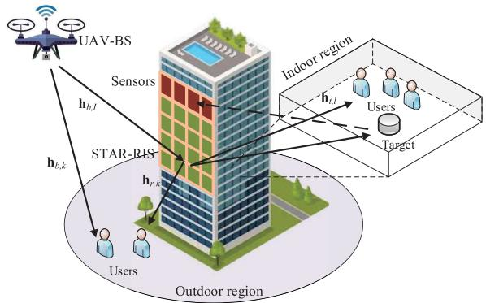
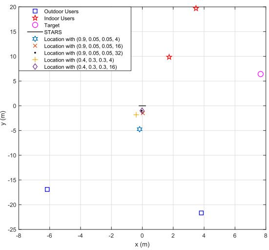
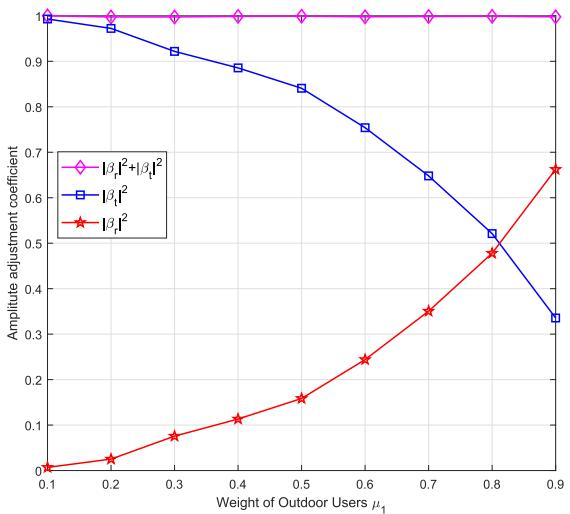
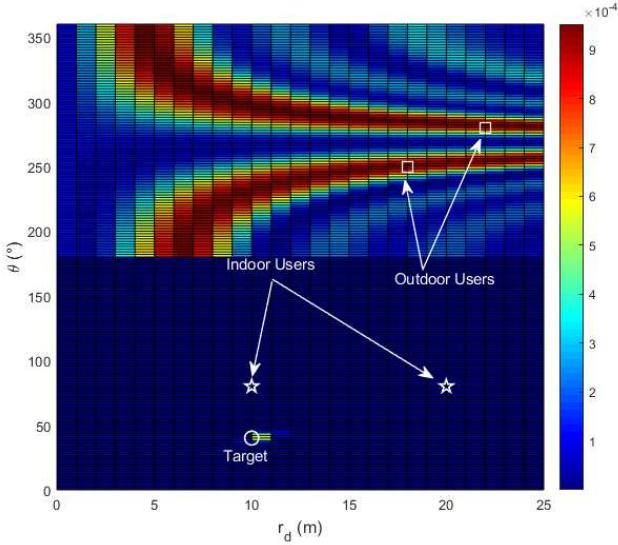
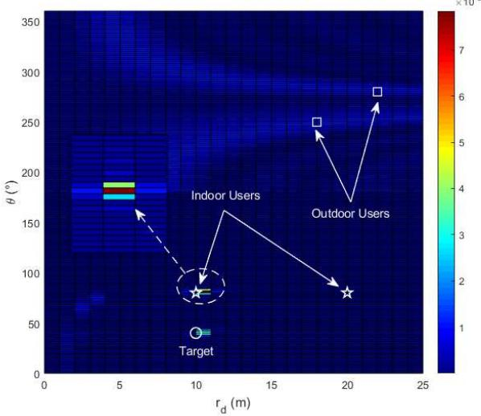
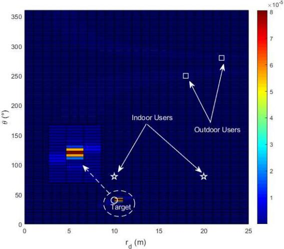
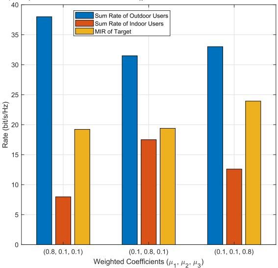
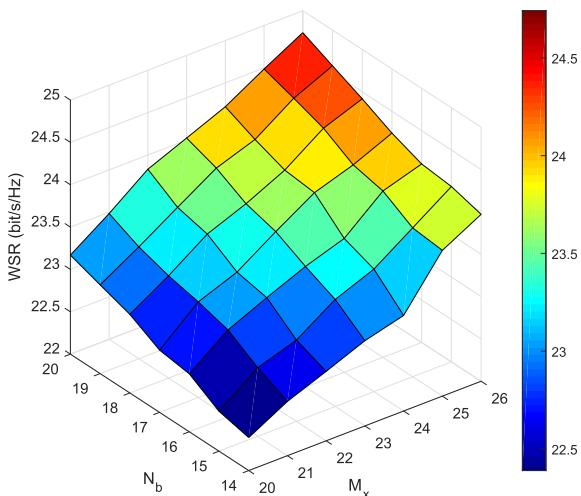
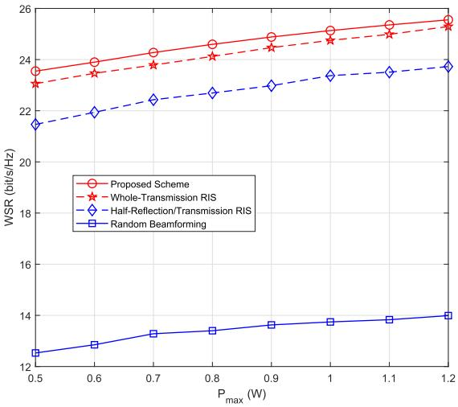

# STAR-RIS Enabled Air-Ground Near-Field ISAC

Qiulei Huang , Zhaohui Song , Senior Member, IEEE, Zehui Xiong , Senior Member, IEEE, Guanjun Xu , Senior Member, IEEE, Nan Zhao , Senior Member, IEEE, and Dusit Niyato , Fellow, IEEE

Abstract—Simultaneously transmitting and reflecting reconfigurable intelligent surface (STAR-RIS) can be assembled in the air-ground integrated sensing and communication (ISAC) to significantly enhance the coverage and sensing performance. However, the near-field effect should be further considered with higher carrier frequency and increasing number of STAR-RIS elements. In this paper, we propose a STAR-RIS enabled airground near-field ISAC scheme, where an unmanned aerial vehicle (UAV) is deployed as the mobile base station (BS) and the semi-passive STAR-RIS architecture is adopted to alleviate the severe path loss. Specifically, we maximize the weighted sum rate to guarantee both the communication and sensing functionalities by jointly modifying the beamforming vectors at the BS, the reflection/transmission matrices of the STAR-RIS and, the hovering location of the UAV to well match the near-field effect, which is non-convex with coupled variables. To address this challenge, we first decompose the problem into three subproblems via block coordinate descent. Then, the semidefinite relaxation and successive convex approximation are leveraged to recast these subproblems into convex ones. Finally, we develop an alternating algorithm with low complexity to iteratively solve them. Simulation results are shown to demonstrate the superiority and validity of the proposed scheme.

Index Terms—Integrated sensing and communication, nearfield effect, simultaneously transmitting and reflecting reconfigurable intelligent surface, unmanned aerial vehicle.

## I. INTRODUCTION

NTEGRATED sensing and communication (ISAC) has I been developing as a remedy to overcome the increasing burden of spectrum and connectivity towards the future wireless networks [2]. On the one hand, the costly hardware and signal processing framework for communication can be also applied to radar. On the other hand, the investigation on communication has entered into the millimeter-wave band, which gradually coincides with the frequency band of radar [3]. With this unified platform, the base stations (BSs) can obtain the sensing information of targets while providing the communication service [4]. Owing to these benefits, ISAC has become a hot topic since the sensing information will play a more vital role in various scenarios, such as vehicle-to-everything, augmented reality, metaverse, etc. [5], [6]. In addition, there naturally exists a tradeoff between sensing and communication functions in ISAC. Depending on different demands, the designs for ISAC can be summarized into three directions: sensing-based [7], communication-based [8] and co-designed [9]. One remarkable thing is that wireless channels have a huge impact on both the communication and sensing performance. Although both the line-of-sight (LoS) and non-LoS (NLoS) links can be used to enhance the wireless communications, the radar function heavily relies on the LoS links [10], which creates a challenge for ISAC.

Recently, unmanned aerial vehicles (UAVs) are expected to be deployed as the mobile platforms to enhance both the communication and sensing performance for ISAC [11], which can establish high-quality air-ground links. Furthermore, the coverage can be expanded with the high mobility of UAVs to provide additional degrees of freedom (DoFs) [12]. As a result, UAV-assisted ISAC has become an attention-grabbed research direction [13], [14]. In [13], the weighted throughput was maximized by Lyu et al. for UAV-enabled ISAC networks through jointly modifying the UAV maneuver and beamforming. An ISAC framework was designed by Deng et al. to improve the resource utilization and performance in [14] via jointly optimizing the communication and sensing beamforming, and the UAV’s trajectory.

On the other hand, reconfigurable intelligent surface (RIS) has been treated as another bright technology to address the practical issues of ISAC [15], [16]. The RIS can reconstruct the wireless propagation and build an extra link by controlling its low-cost elements [17]. Nevertheless, the users on both sides of RIS cannot be concurrently supported by the conventional design, which greatly confines its freedom and flexibility [18]. Fortunately, the simultaneously transmitting and reflecting reconfigurable intelligent surface (STAR-RIS) was advanced by Xu et al. in [19] to bring the full spatial service of 360◦. In this way, the coverage performance can be greatly strengthened for the ISAC assisted by STAR-RIS [20], [21]. The fairness between communication and sensing was guaranteed in [20] by Wang et al. with the optimized beamforming vectors and STAR-RIS matrices. Liu et al. maximized the sensing signalto-noise ratio for the STAR-RIS empowered ISAC networks in [21] through jointly modifying the beamforming at the BS and the transmission/reflecting phase shifts of STAR-RIS. More recently, a structure with the dedicated sensors equipped on the RIS was designed to mitigate the severe path loss for sensing, namely, semi-passive RIS [22]. In [23], this technology was employed by Wang et al. to further enhance the sensing performance for the STAR-RIS-assisted ISAC.

At the same time, the plane-wave propagation is becoming no longer applicable in wireless communication with higher carrier frequency and the large-scale RIS, which results in an inevitable near-filed effect [24]. As derived in [24], the nearfield condition can hold when the distance between RIS and users is less than the Rayleigh distance $\textstyle { \frac { 2 L ^ { 2 } } { \lambda } }$ , where L denotes the effective aperture of RIS and λ is the radio wavelength. With the applications of large-scale antenna array and millimeter wave system, it can be predicted that the Rayleigh distance will increase from a few centimeters to several meters or even tens of meters [25]. Thus, the near-field effect should be fully considered in the future wireless communication systems. In the near-field region, the high-quality channels with shorter distance and larger-scale antenna array can introduce an additional DoF regarding distance, which can provide a new design feasibility for ISAC [26]. As a consequence, some research studies on the near-field effect for ISAC have aroused widespread attentions [27], [28]. Specifically, Cong et al. discussed the novel near-field ISAC with challenges and directions in [27]. In [28], Luo et al. investigated the trajectory of the beam squint in near-field communications to localize users assisted by the true-time-delay lines.

Thanks to these advantages, the combination between UAVs and RISs for the ISAC has been reckoned as a potential mean to further boost the overall performance [29]. Compared to [20], [21] with the fixed BS, we deploy a UAV as the areal BS to tackle the severe signal blockage by leveraging its enhanced flexibility and performance. However, the optimization of the UAV’s location still remains a great challenge [30]. Meanwhile, most existing studies ignore the near-field effect when designing the ISAC. Inspired by the above studies, we propose a scheme for STAR-RIS-enabled air-ground near-field ISAC. In summary, the main contributions are detailed as follows.

Instead of the conventional RIS, STAR-RIS is employed to realize the full-space service and enhance both the sensing and communication performance, which will inevitably cause near-field effect due to its large scale. Meanwhile, we integrate the active sensors on the transmission side of STAR-RIS to mitigate the severe path loss caused by multiple hops. Moreover, a UAV is deployed as the areal BS to address the signal blockage by utilizing its mobility and high altitude.

To balance the sensing and communication performance, we propose a weighted sum rate (WSR) maximization algorithm for STAR-RIS enabled air-ground ISAC, where the active beamforming at the BS, reflection/transmission matrices of the STAR-RIS and hovering location of the UAV are jointly optimized while taking the near-field effect into account.

• We first decompose the non-convex problem into three subproblems by block coordinate descent (BCD) for the coupled variables. Subsequently, these subproblems are reconstructed into convex ones through semidefinite relaxation (SDR) and successive convex approximation (SCA). Thus, the original problem can be addressed iteratively.

The remainders of the article are arranged as follows. In Section II, we detail the system model and formulate a problem to maximize the WSR. Section III provides an alternately iterative algorithm to address the original problem. Simulation results are illustrated in Section IV to evaluate the performance with the conclusion followed in Section V.

Notations: $\mathbb { C } ^ { M \times N }$ represents the $M \times N$ complex space. diag(x) indicates the diagonal matrix generated via the vector ${ \bf x } . { \bf \Xi } ( \cdot ) ^ { T }$ and $( \cdot ) ^ { H }$ denote the transpose operator and conjugate transpose operator, respectively. $\mathbf { \mathbb { E } } [ \cdot ]$ refers to the statistical expectation. kxk and |s| represent the Euclidean norm of x and the absolute value of the complex scalar s, respectively. The $M \times M$ identity matrix is symbolized as $\mathbf { I } _ { M } . \mathcal { C } \mathcal { N } ( \mathbf { 0 } , \mathbf { I } _ { M } )$ stands for the complex Gaussian distribution with the mean vector 0 and covariance matrix $\mathbf { I } _ { M } . \mathrm { R e } ( \cdot )$ is the real operator. $\operatorname { T r } ( \mathbf { S } )$ and Ra(S) respectively denote the trace and rank of the square matrix S.

## II. SYSTEM MODEL AND PROBLEM FORMULATION

As illustrated in Fig. 1, we consider a STAR-RIS enabled air-ground near-field ISAC system, where the UAV acts as an aerial BS with $N _ { b }$ antennas in a uniform linear array (ULA) to serve the single-antenna users and sense the target. The entire space is divided by a STAR-RIS into the outdoor reflection space with $K _ { o }$ users and the indoor transmission space including $L _ { i }$ users and a sensing target. For convenience, we represent the sets of the outdoor and indoor users as $\mathcal { K } _ { o } = \{ 1 , 2 , \cdots , K _ { o } \}$ and $\mathcal { L } _ { i } = \{ 1 , 2 , \cdots , L _ { i } \}$ , respectively.

The large-scale STAR-RIS is deployed with $\begin{array} { r l } { M _ { r } } & { { } = } \end{array}$ $( 2 M _ { x } + 1 ) ~ \times ~ ( 2 M _ { z } + 1 )$ passive elements in a uniform planar array (UPA) denoted by the set $\begin{array} { r l } { \mathcal { M } _ { r } } & { { } = } \end{array}$ $\left\{ - \frac { M _ { r } - 1 } { 2 } , \cdot \cdot \cdot , 0 , \dot { \cdot } \dot { \cdot } \cdot , \frac { M _ { r } - 1 } { 2 } \right\}$ , where $2 M _ { x } + 1$ and $2 M _ { z } + 1$ are the numbers of elements along x- and z-axis, respectively. Furthermore, a ULA consisting of $N _ { s } ~ = ~ 2 M _ { x } + 1$ sensing elements is mounted on the STAR-RIS to address the severe path loss, the set of which is represented by $\mathcal { N } _ { s } ~ = ~ \{ - M _ { x } , \cdot \cdot \cdot , 0 , \cdot \cdot \cdot , M _ { x } \}$ . Assisted by these sensing elements, the echo signal can be directly processed at the STAR-RIS.

## A. Far-Field Channels

The STAR-RIS adopts the energy splitting model to simultaneously transmit and reflect the signals. In this way, the reflection and transmission matrices can be denoted as $\Phi _ { r } =$ diag $\left\{ \Theta _ { r } \right\}$ and $\Phi _ { t } = \mathrm { d i a g } \left\{ \Theta _ { t } \right\}$ , respectively, where

$$
\Theta _ { r } = \left[ \sqrt { \beta _ { r } ^ { - \frac { M _ { r } - 1 } { 2 } } } e ^ { j \theta _ { r } ^ { - \frac { M _ { r } - 1 } { 2 } } } , \cdots , \sqrt { \beta _ { r } ^ { \frac { M _ { r } - 1 } { 2 } } } e ^ { j \theta _ { r } ^ { \frac { M _ { r } - 1 } { 2 } } } \right] ,\tag{1a}
$$

$$
\Theta _ { t } = \left[ \sqrt { \beta _ { t } ^ { - \frac { M _ { r } - 1 } { 2 } } } e ^ { j \theta _ { t } ^ { - \frac { M _ { r } - 1 } { 2 } } } , \cdot \cdot \cdot , \sqrt { \beta _ { t } ^ { \frac { M _ { r } - 1 } { 2 } } } e ^ { j \theta _ { t } ^ { \frac { M _ { r } - 1 } { 2 } } } \right] .\tag{1b}
$$

In (1a) and (1b), $\sqrt { \beta _ { r } ^ { m } } , \ \sqrt { \beta _ { t } ^ { m } }$ and $\theta _ { r } ^ { m } , \theta _ { t } ^ { m } , m \in \mathcal { M } _ { r }$ refer to the reflection/transmission amplitude and phase of the m-th element, respectively, subject to

$$
\beta _ { r } ^ { m } , \beta _ { t } ^ { m } \in [ 0 , 1 ] , \beta _ { r } ^ { m } + \beta _ { t } ^ { m } = 1 , \theta _ { r } ^ { m } , \theta _ { r } ^ { m } \in [ 0 , 2 \pi ) .\tag{2}
$$

  
Fig. 1. STAR-RIS enabled Air-Ground near-field ISAC system.

The location of the UAV is denoted as $\mathbf { q } _ { b } ~ = ~ [ x _ { b } , y _ { b } ] ^ { T }$ with the altitude of $z _ { b } .$ . The k-th outdoor user is denoted by $U _ { o , k } , k \in \mathcal { K } _ { o } ,$ the horizontal coordinates of which are $\mathbf { q } _ { o , k } = [ x _ { o , k } , y _ { o , k } ] ^ { T }$ . Thus, the distance from the UAV to $U _ { o , k }$ can be written as

$$
d _ { b , k } = \sqrt { \left\| \mathbf { q } _ { b } - \mathbf { q } _ { o , k } \right\| ^ { 2 } + z _ { b } ^ { 2 } } .\tag{3}
$$

Owing to the relatively high altitude and limited antennas of the UAV, the outdoor users are located in the far field of the UAV and the channels between them can be regarded as Rician channels [31]. As a result, the direct channel between the UAV and $U _ { o , k }$ can be formulated as

$$
\mathbf { h } _ { b , k } = \sqrt { \rho d _ { b , k } ^ { - \alpha _ { d } } } \left( \sqrt { \frac { K _ { d } } { 1 + K _ { d } } } \mathbf { h } _ { b , k } ^ { L } + \sqrt { \frac { 1 } { 1 + K _ { d } } } \mathbf { h } _ { b , k } ^ { N L } \right) , k \in \mathcal { K } _ { o } ,\tag{4}
$$

where $\rho$ refers to the reference channel gain at unit distance, $K _ { d }$ represents the Rician factor among the UAV and outdoor users, $\alpha _ { d }$ denotes the path-loss coefficient from the UAV to outdoor users, $\mathbf { h } _ { b , k } ^ { L } \in \bar { \mathbb { C } } ^ { 1 \times N _ { b } }$ is the corresponding deterministic LoS component and $\mathbf { h } _ { b , k } ^ { N L }$ is the random NLoS component obeying $\mathcal { C N } ( \mathbf { 0 } , \mathbf { I } _ { N _ { b } } )$

Moreover, the STAR-RIS is also in the far field of the UAV. Without the loss of generality, the reference position of the STAR-RIS is set as the center of its passive part $\mathbf { \bar { q } } _ { r } ^ { 0 } = [ x _ { r } , y _ { r } ] ^ { T }$ with the height of $z _ { r }$ . The distance from the UAV to STAR-RIS can be given as

$$
d _ { b } = \sqrt { \left\| \mathbf q _ { b } - \mathbf q _ { r } ^ { 0 } \right\| ^ { 2 } + \left( z _ { b } - z _ { r } \right) ^ { 2 } } .\tag{5}
$$

Similarly, the Rician fading can be also adopted for the UAV to the STAR-RIS link as

$$
\mathbf { h } _ { b , I } = \sqrt { \rho d _ { b } ^ { - \alpha _ { r } } } \left( \sqrt { \frac { K _ { r } } { 1 + K _ { r } } } \mathbf { h } _ { b , I } ^ { L } + \sqrt { \frac { 1 } { 1 + K _ { r } } } \mathbf { h } _ { b , I } ^ { N L } \right) ,\tag{6}
$$

where $\alpha _ { r }$ and $K _ { r }$ are the corresponding path-loss coefficient and Rician factor, respectively, and $\mathbf { h } _ { b , I } ^ { L ^ { \prime } } \ \in \ \mathbb { C } ^ { M _ { r } \times N _ { b } }$ and $\mathbf { h } _ { b , I } ^ { N L } \sim \mathcal { C N } ( \mathbf { 0 } , \mathbf { I } _ { M _ { r } N _ { b } } )$ denote the LoS and NLoS components of the STAR-RIS-UAV channel.

## B. Near-Field Channels

Due to the massive elements and relatively short distance, the outdoor and indoor users are all in the near-field area of the STAR-RIS [32]. Let $\Delta$ represents the distance between two adjacent elements of the STAR-RIS. We can denote the index of the m-th element as $m = m _ { z } ( 2 M _ { x } + 1 ) + m _ { x }$ whose coordinates are $\mathbf q _ { r } ^ { m } = [ x _ { r } + m _ { x } \Delta , y _ { r } ]$ with the height of $z _ { r } + m _ { z } \Delta , m \in \mathcal { M } _ { r } , m _ { x } = - M _ { x } , \cdot \cdot \cdot , 0 , \cdot \cdot \cdot , M _ { x }$ and $m _ { z } = - M _ { z } , \cdot \cdot \cdot , 0 , \cdot \cdot , M _ { z }$ . The distance from $U _ { o , k }$ to the m-th passive element of the STAR-RIS can be written as

$$
d _ { r , m , k } = \sqrt { \left\| \mathbf { q } _ { r } ^ { m } - \mathbf { q } _ { o , k } \right\| ^ { 2 } + \left( z _ { r } + m _ { z } \Delta \right) ^ { 2 } } .\tag{7}
$$

Then, the $\mathrm { S T A R - R I S - } U _ { o , k }$ channel can be modeled as

$$
\mathbf { h } _ { r , k } = \sqrt { \rho d _ { r , 0 , k } ^ { - 2 } } \mathbf { c } _ { r , k } \in \mathbb { C } ^ { M _ { r } \times 1 } ,\tag{8}
$$

and the m-th entry of which can be calculated as

$$
[ \mathbf { c } _ { r , k } ] _ { m } = e ^ { - j \frac { 2 \pi } { \lambda } d _ { r , m , k } } ,\tag{9}
$$

where λ indicates the carrier wavelength.

Accordingly, the effective channel from the UAV to $U _ { o , k }$ can be expressed as

$$
\begin{array} { r } { \mathbf { h } _ { o , k } = \mathbf { h } _ { b , k } + \mathbf { h } _ { r , k } ^ { H } \Phi _ { r } \mathbf { h } _ { b , I } \in \mathbb { C } ^ { 1 \times N _ { b } } , k \in \mathcal { K } _ { o } . } \end{array}\tag{10}
$$

In the indoor region, the l-th user is denoted as $U _ { i , l } , l \in { \mathcal { L } } _ { i } ,$ which locates at $\mathbf { q } _ { i , l } = [ x _ { i , l } , y _ { i , l } ] ^ { T }$ with the height of $z _ { i , l } .$ Then, we can calculate the distance between the m-th passive element and $U _ { i , l }$ as

$$
d _ { i , m , l } = \sqrt { \left\| \mathbf { q } _ { r } ^ { m } - \mathbf { q } _ { i , l } \right\| ^ { 2 } + \left( z _ { r } + m _ { z } \Delta - z _ { i , l } \right) ^ { 2 } } .\tag{11}
$$

We can obtain the $\mathbf { S T A R - R I S - } U _ { i , l }$ channel as

$$
\mathbf { h } _ { u , l } = \sqrt { \rho d _ { i , 0 , l } ^ { - 2 } } \mathbf { c } _ { u , l } \in \mathbb { C } ^ { M _ { r } \times 1 } ,\tag{12a}
$$

$$
[ \mathbf { c } _ { u , l } ] _ { m } = e ^ { - j \frac { 2 \pi } { \lambda } d _ { i , m , l } } .\tag{12b}
$$

Thus, the channel from the UAV to $U _ { i , l }$ can be written as

$$
\mathbf { h } _ { i , l } = \mathbf { h } _ { u , l } ^ { H } \Phi _ { t } \mathbf { h } _ { b , I } \in \mathbb { C } ^ { 1 \times N _ { b } } .\tag{13}
$$

For sensing, the location of the target is defined as $\mathbf { q } _ { t } =$ $[ x _ { t } , y _ { t } ] ^ { T }$ with the height of $z _ { t }$ in the near-field of both the STAR-RIS passive and sensing parts. Herewith, the distances from the m-th passive and n-th sensing elements to the target can be respectively calculated as

$$
d _ { t , m } = \sqrt { \| \mathbf { q } _ { r } ^ { m } - \mathbf { q } _ { t } \| ^ { 2 } + \left( z _ { r } + m _ { z } \Delta - z _ { t } \right) ^ { 2 } , m \in \mathcal { M } _ { r } , }\tag{14}
$$

$$
d _ { s , n } = \sqrt { \left\| \mathbf { q } _ { s } ^ { n } - \mathbf { q } _ { t } \right\| ^ { 2 } + \left( z _ { r } + ( M _ { z } + 1 ) \Delta - z _ { t } \right) ^ { 2 } } , n \in \mathcal { N } _ { s } ,\tag{15}
$$

where $\mathbf q _ { s } ^ { n } = [ x _ { r } + n \Delta , y _ { r } ]$ denotes the horizontal coordinates of the n-th sensing element. Then, the STAR-RIS-target-sensor echo channel can be expressed as

$$
\mathbf { H } _ { s } = \langle \mathbf { h } _ { t } \mathbf { h } _ { s } ^ { T } \in \mathbb { C } ^ { M _ { r } \times N _ { s } } ,\tag{16}
$$

where ζ refers to the complex amplitude related to the roundtrip path-loss and the complex reflection factor of the target, and $\mathbf { h } _ { t } \in \mathbb { C } ^ { M _ { r } \times 1 }$ and $\mathbf { h } _ { s } \in \mathbb { C } ^ { N _ { s } \times 1 }$ can be written as

$$
[ \mathbf { h } _ { t } ] _ { m } = e ^ { - j \frac { 2 \pi } { \lambda } d _ { t , m } } , m \in \mathcal { M } _ { r } ,\tag{17a}
$$

$$
[ \mathbf h _ { s } ] _ { c } = e ^ { - j \frac { 2 \pi } { \lambda } d _ { s , n } } , n \in \mathcal N _ { s } .\tag{17b}
$$

Consequently, the echo channel from the target can be formulated as

$$
\mathbf { H } _ { t } = \mathbf { H } _ { s } ^ { H } \Phi _ { t } \mathbf { h } _ { b , I } \in \mathbb { C } ^ { N _ { s } \times N _ { b } } .\tag{18}
$$

Remark 1: Based on the channel models, we can observe that a unique distance domain is introduced into the near-field channels, which is considered as a new design feasibility. In this way, the users can be served with low inter-user interference even if two users are at the same angle, which cannot be realized in the case of the far-field channels. Furthermore, this means that the receivers can simultaneously obtain both the distance and angle information form the sensing signals in the near-field ISAC systems.

## C. Problem Formulation

Define the beamforming vectors for $U _ { o , k }$ and $U _ { i , l }$ as ${ \mathbf { w } } _ { o , k }$ and $\mathbf { w } _ { i , l }$ , respectively. Based on the above model, the received signals at $U _ { o , k }$ and $U _ { i , l }$ can be given by

$$
r _ { o , k } = \mathbf { h } _ { o , k } \left( \sum _ { \overline { { k } } \in \mathcal { K } _ { o } } \mathbf { w } _ { o , \overline { { k } } } s _ { o , \overline { { k } } } + \sum _ { l \in \mathcal { L } _ { i } } \mathbf { w } _ { i , l } s _ { i , l } \right) + n _ { o , k } ,\tag{19a}
$$

$$
r _ { i , l } = \mathbf { h } _ { i , l } \left( \sum _ { k \in \mathcal { K } _ { o } } \mathbf { w } _ { o , k } s _ { o , k } + \sum _ { \bar { l } \in \mathcal { L } _ { i } } \mathbf { w } _ { i , \bar { l } } s _ { i , \bar { l } } \right) + n _ { i , l } ,\tag{19b}
$$

where $s _ { o , k }$ and $s _ { i , l }$ refer to the transmitted ISAC signals satisfying E $\left\lceil \left| s _ { o , k } \right| ^ { 2 } \right\rceil = \mathbb { E } \left\lceil \left| s _ { i , l } \right| ^ { 2 } \right\rceil = 1$ , respectively. Both $n _ { o , k }$ and $n _ { i , l }$ are the additive white Gaussian noise (AWGN) with zero mean and variance $\sigma ^ { 2 }$

In this way, the achievable rate of $U _ { o , k }$ and $U _ { i , l }$ can be respectively written as

$$
R _ { o , k } = \log _ { 2 } \left( 1 + \frac { { \left| { \bf { h } } _ { o , k } { { \bf { w } } _ { o , k } } \right| } ^ { 2 } } { { \sum _ { \overline { { k } } \in { \cal K } _ { o } \backslash k } { { \left| { \bf { h } } _ { o , k } { { \bf { w } } _ { o , \overline { { k } } } } \right| } ^ { 2 } } } + { \sum _ { l \in \mathcal { L } _ { i } } { { \left| { \bf { h } } _ { o , k } { { \bf { w } } _ { i , l } } \right| } ^ { 2 } } } + \sigma ^ { 2 } } \right)  ,\tag{20a}
$$

$$
R _ { i , l } \mathrm { = l o g } _ { 2 } \Bigg ( 1 + \frac { { \left| { \bf h } _ { i , l } { \bf w } _ { i , l } \right| } ^ { 2 } } { \sum _ { k \in \mathcal { K } _ { o } } { \left| { \bf h } _ { i , l } { \bf w } _ { o , k } \right| } ^ { 2 } + \sum _ { \bar { l } \in \mathcal { L } _ { i } \sqrt { \left| { \bf h } _ { i , l } { \bf w } _ { i , \bar { l } } \right| } ^ { 2 } + \sigma ^ { 2 } } } \Bigg ) .\tag{20b}
$$

In addition, the communication signals can be utilized to realize sensing simultaneously. Thus, the received echo signal from the target can be given as

$$
\mathbf { r } _ { t } = \mathbf { H } _ { t } \left( \sum _ { k \in \mathcal { K } _ { o } } \mathbf { w } _ { o , k } s _ { o , k } + \sum _ { l \in \mathcal { L } _ { i } } \mathbf { w } _ { i , l } s _ { i , l } \right) + \mathbf { n } _ { t } ,\tag{21}
$$

where $\mathbf { n } _ { t } \sim \mathcal { C N } \left( \mathbf { 0 } , \sigma ^ { 2 } \mathbf { I } _ { N _ { s } } \right)$ is the AWGN with the covariance matrix $\sigma ^ { 2 } \mathbf { I } _ { N _ { s } }$ s

To evaluate the sensing performance of the target, we introduce the radar mutual information rate (MIR) [33], which is derived from the information theory as

$$
R _ { t } = \log _ { 2 } \left( 1 + \frac { \sum _ { k \in \mathcal { K } _ { o } } \left\| \mathbf { H } _ { t } \mathbf { w } _ { o , k } \right\| ^ { 2 } + \sum _ { l \in \mathcal { L } _ { i } } \left\| \mathbf { H } _ { t } \mathbf { w } _ { i , l } \right\| ^ { 2 } } { \sigma ^ { 2 } } \right)\tag{22}
$$

Then, we propose a WSR maximization problem to achieve the performance tradeoff between communication and sensing. The objective function can be defined as

$$
R _ { w } = \mu _ { 1 } \sum _ { k \in \mathcal { K } _ { o } } R _ { o , k } + \mu _ { 2 } \sum _ { l \in \mathcal { L } _ { i } } R _ { i , l } + \mu _ { 3 } R _ { t } ,\tag{23}
$$

where $\mu _ { 1 } , \mu _ { 2 }$ and $\mu _ { 3 }$ are the corresponding weighted coefficient satisfying

$$
\mu _ { 1 } + \mu _ { 2 } + \mu _ { 3 } = 1 .\tag{24}
$$

As a result, the optimization problem can be formulated as

$$
\begin{array} { c c } { \displaystyle \operatorname* { m a x } _ { \mathbf { w } _ { o , k } , \mathbf { w } _ { i , l } } } & { R _ { w } } \\ { \mathbf { q } _ { b } , \boldsymbol { \Phi } _ { r } , \boldsymbol { \Phi } _ { t } } & { } \end{array}\tag{25a}
$$

$$
s . t . \quad y _ { b } \leq y _ { r } - \varepsilon ,\tag{25b}
$$

$$
R _ { t } \geq \eta _ { t } ,\tag{25c}
$$

$$
R _ { o , k } \geq \eta _ { o , k } , k \in \mathcal { K } _ { o } ,
$$

$$
R _ { i , l } \geq \eta _ { i , l } , l \in \mathcal { L } _ { i } ,\tag{25d}
$$

(25e)

$$
\sum _ { k \in { \mathcal { K } } _ { o } } \| \mathbf { w } _ { o , k } \| ^ { 2 } + \sum _ { l \in { \mathcal { L } } _ { i } } \| \mathbf { w } _ { i , l } \| ^ { 2 } + \| \mathbf { w } _ { t } \| ^ { 2 } \leq P _ { m a x } ,\tag{25f}
$$

$$
\beta _ { r } ^ { m } , \beta _ { t } ^ { m } \in [ 0 , 1 ] , \beta _ { r } ^ { m } + \beta _ { t } ^ { m } = 1 ,\tag{25g}
$$

$$
\theta _ { r } ^ { m } , \theta _ { r } ^ { m } \in [ 0 , 2 \pi ) , m \in \mathcal { M } _ { r } ,\tag{25h}
$$

where ε denotes the minimum distance along y-axis between the UAV and STAR-RIS to maintain the reflection and transmission regions, $\eta _ { t } , ~ \eta _ { o , k }$ and $\eta _ { i , l }$ are the quality of service (QoS) requirements of the target, $U _ { o , k }$ and $U _ { i , l }$ , respectively, and $P _ { m a x }$ indicates the maximum transmit power of the UAV.

It is challenging to address (25) directly due to its nonconvexity. Thereby, we propose an iterative algorithm to optimize the beamforming, reflection/transmission matrices and hovering location in the following section.

## III. MAXIMAL WSR SCHEME

In this section, we concentrate on tackling the non-convex optimization of WSR, which is first decomposed into three subproblems by BCD. Then, the sub-optimal solutions of beamforming, reflection/transmission matrices and location are obtained by separately solving their approximate forms through SDR and SCA. An alternating algorithm is designed to solve the original problem.

## A. Beamforming Optimization

First, we fix the phase shift of the STAR-RIS and the UAV location to optimize the beamforming vectors as

$$
\operatorname* { m a x } _ { \mathbf { w } _ { o , k } , \mathbf { w } _ { i , l } } R _ { w }\tag{26a}
$$

$$
s . t . . \ R _ { t } \geq \eta _ { t } ,\tag{26b}
$$

$$
R _ { o , k } \geq \eta _ { o , k } , k \in \mathcal { K } _ { o } ,\tag{26c}
$$

$$
R _ { i , l } \geq \eta _ { i , l } , l \in \mathcal { L } _ { i } ,\tag{26d}
$$

$$
\sum _ { k \in \mathcal { K } _ { o } } \lVert \mathbf { w } _ { o , k } \rVert ^ { 2 } + \sum _ { l \in \mathcal { L } _ { i } } \lVert \mathbf { w } _ { i , l } \rVert ^ { 2 } \leq P _ { m a x } .\tag{26e}
$$

To solve the problem, we convert it into a standard semidefinite programming (SDP). In this way, we first rewrite the channels $\mathbf { h } _ { o , k }$ and ${ \bf h } _ { i , l }$ as

$$
\mathbf { H } _ { o , k } = \mathbf { h } _ { o , k } ^ { H } \mathbf { h } _ { o , k } , \mathbf { H } _ { i , l } = \mathbf { h } _ { i , l } ^ { H } \mathbf { h } _ { i , l } .\tag{27}
$$

In addition, we define the n-th row of $\mathbf { H } _ { t }$ as $\mathbf { h } _ { t , n }$ , which can be reformulated as

$$
\mathbf { H } _ { t , n } = \mathbf { h } _ { t , n } ^ { H } \mathbf { h } _ { t , n } , n \in \mathcal { N } _ { s } .\tag{28}
$$

Then, we can obtain the Hermitian matrices of beamforming vectors as

$$
\begin{array} { r } { { \mathbf { W } } _ { o , k } = { \mathbf { w } } _ { o , k } { \mathbf { w } } _ { o , k } ^ { H } , { \mathbf { W } } _ { i , l } = { \mathbf { w } } _ { i , l } { \mathbf { w } } _ { i , l } ^ { H } , } \end{array}\tag{29}
$$

which are subject to

$$
\mathbf { W } _ { o , k } \succcurlyeq 0 , \mathbf { W } _ { i , l } \succcurlyeq 0 , \mathrm { R a } ( \mathbf { W } _ { o , k } ) = \mathrm { R a } ( \mathbf { W } _ { i , l } ) = 1 .\tag{30}
$$

Accordingly, we can re-express $R _ { o , k }$ and $R _ { i , l }$ as (31), shown at the bottom of the page, which are both concave-minusconcave expressions. Thus, we approximate them via the firstorder Taylor expansion as

$$
\begin{array} { r l } & { \widehat { R } _ { o , k } \leq \widehat { R } _ { o , k } ^ { [ u b ] } \triangleq \widehat { R } _ { o , k } ^ { ( a ) } } \\ & { \quad + \operatorname { T r } \Bigg [ \mathbf { A } _ { o , k } ^ { ( a ) } \Bigg ( \underset { \overline { { k } } \in { \mathscr { K } _ { o } } \setminus k } { \sum } \mathbf { W } _ { o , \overline { { k } } } + \underset { l \in { \mathscr { L } _ { i } } } { \sum } \mathbf { W } _ { i , l } - \underset { \overline { { k } } \in { \mathscr { K } _ { o } } \setminus k } { \sum } \mathbf { W } _ { o , \overline { { k } } } ^ { ( a ) } - \underset { l \in { \mathscr { L } _ { i } } } { \sum } \mathbf { W } _ { i , l } ^ { ( a ) } \Bigg ) \Bigg ] , } \end{array}\tag{32a}
$$

$$
\begin{array} { r l } & { \widehat { R } _ { i , l } \leq \widehat { R } _ { i , l } ^ { [ u b ] } \triangleq \widehat { R } _ { i , l } ^ { ( a ) } } \\ & { \quad + \operatorname { T r } \Bigg [ \mathbf { A } _ { i , l } ^ { ( a ) } \left( \underset { k \in \mathcal { K } _ { o } } { \sum } \mathbf { W } _ { o , k } + \underset { \bar { l } \in \mathcal { L } _ { i } \backslash l } { \sum } \mathbf { W } _ { i , \bar { l } } - \underset { k \in \mathcal { K } _ { o } } { \sum } \mathbf { W } _ { o , k } ^ { ( a ) } - \underset { \bar { l } \in \mathcal { L } _ { i } \backslash l } { \sum } \mathbf { W } _ { i , \bar { l } } ^ { ( a ) } \right) \Bigg ] , } \end{array}\tag{32b}
$$

where a is the iteration index, $\mathbf { W } _ { o , k } ^ { ( a ) }$ and $\mathbf { W } _ { i , l } ^ { ( a ) }$ represent the optimized beamforming vectors in the a-th iteration. Applying, $\widehat { R } _ { o , k } ^ { ( a ) }$ and $\widehat { R } _ { i , l } ^ { ( a ) }$ can be calculated via (31a) and (31b), respectively. In (32), $\mathbf { A } _ { o , k } ^ { ( a ) }$ and ${ \bf A } _ { i , l } ^ { ( a ) }$ can be given as

$$
\mathbf { A } _ { o , k } ^ { ( a ) } = \frac { \mathbf { H } _ { o , k } \log _ { 2 } ( e ) } { \mathrm { T r } \Bigg [ \mathbf { H } _ { o , k } \Bigg ( \sum _ { \substack { \overline { { k } } \in \mathcal { K } _ { o } \backslash k } } \mathbf { W } _ { o , \overline { { k } } } ^ { ( a ) } + \sum _ { l \in \mathcal { L } _ { i } } \mathbf { W } _ { i , l } ^ { ( a ) } \Bigg ) \Bigg ] + \sigma ^ { 2 } } ,\tag{33a}
$$

$$
\mathbf { A } _ { i , l } ^ { ( a ) } = \frac { \mathbf { H } _ { i , l } \log _ { 2 } ( e ) } { \mathrm { T r } \Bigg [ \mathbf { H } _ { i , l } \left( \sum _ { k \in \mathcal { K } _ { o } } \mathbf { W } _ { o , k } ^ { ( a ) } + \sum _ { \bar { l } \in \mathcal { L } _ { i } \backslash l } \mathbf { W } _ { i , \bar { l } } ^ { ( a ) } \right) \Bigg ] + \sigma ^ { 2 } } .\tag{33b}
$$

For $R _ { t } .$ , it can be rewritten into a concave function as

$$
R _ { t } = \log _ { 2 } \left( 1 + \frac { \underset { n \in \mathcal { N } _ { s } } { \sum } \mathrm { T r } \left[ \mathbf { \bar { H } } _ { t , n } \left( \underset { k \in \mathcal { K } _ { o } } { \sum } \mathbf { W } _ { o , k } + \underset { l \in \mathcal { L } _ { i } } { \sum } \mathbf { W } _ { i , l } \right) \right] } { \sigma ^ { 2 } } \right) .\tag{34}
$$

We present Proposition 1 to transform the constraints (26c) and (26d) into the convex ones.

Proposition 1: (26c) and (26d) can be converted as

$$
\mathrm { T r } \left( \mathbf { H } _ { o , k } \mathbf { W } _ { o , k } \right) \geq
$$

$$
\left( 2 ^ { \eta _ { o , k } } - 1 \right) \left( \mathrm { T r } \bigg [ \mathbf { H } _ { o , k } \left( \sum _ { \overline { { k } } \in K _ { o } \backslash k } \mathbf { W } _ { o , \overline { { k } } } + \sum _ { l \in \mathcal { L } _ { i } } \mathbf { W } _ { i , l } \right) \bigg ] + \sigma ^ { 2 } \right) ,\tag{35a}
$$

$$
\mathrm { T r } \left( \mathbf { H } _ { i , l } \mathbf { W } _ { i , l } \right) \geq
$$

$$
\begin{array} { r l } & { \mathrm { { { I r } } } \left( \mathbf H _ { i , l } \mathbf W _ { i , l } \right) \geq } \\ & { \left( \mathrm { { 2 } } ^ { \eta _ { i , l } } - 1 \right) \left( \mathrm { { T r } } \left[ \mathbf H _ { i , l } \left( \displaystyle \sum _ { k \in { \mathcal K } _ { o } } \mathbf W _ { o , k } + \displaystyle \sum _ { \bar { l } \in { \mathcal L } _ { i } \backslash l } \mathbf W _ { i , \bar { l } } \right) \right] + \sigma ^ { 2 } \right) . } \end{array}\tag{35b}
$$

Proof: For (26c), we can obtain

$$
\log _ { 2 } \left( 1 + \frac { \mathrm { T r } \left( \mathbf { H } _ { o , k } \mathbf { W } _ { o , k } \right) } { \mathrm { T r } \left[ \mathbf { H } _ { o , k } \left( \underset { \overline { { k } } \in \mathcal { N } _ { o } \backslash k } { \sum } \mathbf { W } _ { o , \overline { { k } } } + \underset { l \in \mathcal { L } _ { i } } { \sum } \mathbf { W } _ { i , l } \right) \right] + \sigma ^ { 2 } } \right) \geq \eta _ { o , k } ,\tag{36}
$$

which can be further deformed as

$$
\begin{array} { r l } & { \frac { \mathrm { T r } \left( \mathbf H _ { o , k } \mathbf W _ { o , k } \right) } { \mathrm { T r } \left[ \mathbf H _ { o , k } \left( \underset { \overline { { k } } \in { \mathscr K } _ { o } \setminus k } { \sum } \mathbf W _ { o , \overline { { k } } } + \underset { l \in { \mathscr L } _ { i } } { \sum } \mathbf W _ { i , l } \right) \right] + \sigma ^ { 2 } } \geq 2 ^ { \eta _ { o , k } } - 1 . } \end{array}\tag{37}
$$

In this way, we can derive (35a). Similarly, (35b) can be achieved for (26d).

Consequently, the beamforming optimization can be transformed into an SDP as

$$
\begin{array} { r l } { \underset { { \mathbf { W } _ { o , k } } \times 0 } { \operatorname* { m a x } } } & { { } \mu _ { 1 } \underset { k \in \mathcal { K } _ { o } } { \sum } \left( \overline { { R } } _ { o , k } - \widehat { R } _ { o , k } ^ { [ u b ] } \right) + \mu _ { 2 } \underset { l \in \mathcal { L } _ { i } } { \sum } \left( \overline { { R } } _ { i , l } - \widehat { R } _ { i , l } ^ { [ u b ] } \right) + \mu _ { 3 } R _ { t } } \\ { { \mathbf { W } _ { i , l } } \succeq 0 } & { { } \quad k \in \mathcal { K } _ { o } } \end{array}
$$

s.t. (35a) and (35b),

$$
R _ { t } \geq \eta _ { t } ,\tag{38a}
$$

$$
\mathrm { R a } ( \mathbf { W } _ { o , k } ) = \mathrm { R a } ( \mathbf { W } _ { i , l } ) = 1 ,\tag{38b}
$$

(38c)

$$
\sum _ { k \in \mathcal { K } _ { o } } \mathrm { T r } ( \mathbf { W } _ { o , k } ) + \sum _ { l \in \mathcal { L } _ { i } } \mathrm { T r } ( \mathbf { W } _ { i , l } ) \leq P _ { m a x } ,\tag{38d}
$$

which is non-convex due to the rank-1 constraint. Thus, we relax (38c) to tackle the obstacle.

Remark 2: It is worth noting that the solution of the relaxed (38) is rank-1, which can be proved as follows. For the relaxed (38) with $K _ { o } + L _ { i } + 2$ constraints, the optimal solution $\mathbf { W } _ { o , k } ^ { * }$ and $\mathbf { W } _ { i , l } ^ { * }$ should satisfy the condition according to [34] as

$$
\sum _ { k \in \mathcal { K } _ { o } } \mathrm { { R a } } ^ { 2 } \left( \mathbf { W } _ { o , k } ^ { * } \right) + \sum _ { l \in \mathcal { L } _ { i } } \mathrm { { R a } } ^ { 2 } \left( \mathbf { W } _ { i , l } ^ { * } \right) \leq K _ { o } + L _ { i } + 2 .\tag{39}
$$

Meanwhile, to satisfy the QoS requirements of each user, the rank of the solution cannot be equal to 0. As a result, the optimized solution is rank-1 to ensure that (39) holds. Then, the beamforming vectors can be obtained by eigenvalue decomposition.

$$
{ \cal R } _ { o , k } = \log _ { 2 } \left( \mathrm { T r } \left[ { \bf H } _ { o , k } \left( \sum _ { \vec { k } \in \mathcal { K } _ { \alpha } } { \bf W } _ { o , \vec { k } } + \sum _ { l \in \mathcal { L } _ { \kappa } } { \bf W } _ { i , l } \right) \right] + \sigma ^ { 2 } \right) - \log _ { 2 } \left( \mathrm { T r } \left[ { \bf H } _ { o , k } \left( \sum _ { \vec { k } \in \mathcal { K } _ { \alpha } \backslash k } { \bf W } _ { o , \vec { k } } + \sum _ { l \in \mathcal { L } _ { i } } { \bf W } _ { i , l } \right) \right] + \sigma ^ { 2 } \right) \triangleq \overline { { { \cal R } } } _ { o , k } - \widehat { { \cal R } } _ { o , k } ,\tag{31a}
$$

$$
R _ { i , l } = \log _ { 2 } \left( \mathrm { T r } \left[ \mathbf { H } _ { i , l } \left( \sum _ { k \in \mathcal { K } _ { \omega } } \mathbf { W } _ { \omega , k } + \sum _ { \bar { l } \in \mathcal { L } _ { i } } \mathbf { W } _ { i , \bar { l } } \right) \right] + \sigma ^ { 2 } \right) - \log _ { 2 } \left( \mathrm { T r } \left[ \mathbf { H } _ { i , l } \left( \sum _ { k \in \mathcal { K } _ { \omega } } \mathbf { W } _ { \omega , k } + \sum _ { \bar { l } \in \mathcal { L } _ { i } \backslash l } \mathbf { W } _ { i , \bar { l } } \right) \right] + \sigma ^ { 2 } \right) \triangleq \overline { { R } } _ { i , l } - \widehat { R } _ { i , l } .\tag{31b}
$$

## B. Transmission/Reflection Matrix Optimization

With any given beamforming vectors and location, the transmission/reflection matrix can be decomposed as

$$
\operatorname* { m a x } _ { \Phi _ { r } , \Phi _ { t } } R _ { w }\tag{40a}
$$

$$
s . t . . \ R _ { t } \geq \eta _ { t } ,\tag{40b}
$$

$$
R _ { o , k } \geq \eta _ { o , k } , k \in \mathcal { K } _ { o } ,\tag{40c}
$$

$$
R _ { i , l } \geq \eta _ { i , l } , l \in \mathcal { L } _ { i } ,\tag{40d}
$$

$$
\beta _ { r } ^ { m } , \beta _ { t } ^ { m } \in [ 0 , 1 ] , \beta _ { r } ^ { m } + \beta _ { t } ^ { m } = 1 ,\tag{40e}
$$

$$
{ \theta } _ { r } ^ { m } , { \theta } _ { r } ^ { m } \in [ 0 , 2 \pi ) , m \in \mathcal { M } _ { r } .\tag{40f}
$$

Given that Φr = diag {Θr} and $\Phi _ { t } = \mathrm { d i a g } \left\{ \Theta _ { t } \right\}$ , we can recalculate the channels as

$$
\mathbf h _ { o , k } = \mathbf h _ { b , k } + \mathbf h _ { r , k } ^ { H } \Phi _ { r } \mathbf h _ { b , I } = \mathbf h _ { b , k } + \Theta _ { r } \mathrm { d i a g } \left( \mathbf h _ { r , k } ^ { H } \right) \mathbf h _ { b , I } ,\tag{41a}
$$

$$
\mathbf { h } _ { i , l } = \mathbf { h } _ { u , l } ^ { H } \Phi _ { t } \mathbf { h } _ { b , I } = \Theta _ { t } \mathrm { d i a g } \left( \mathbf { h } _ { u , l } ^ { H } \right) \mathbf { h } _ { b , I } ,\tag{41b}
$$

which are linear with respect to $\Theta _ { r }$ or $\Theta _ { t }$ . Similarly, $\mathbf { h } _ { t , n }$ can be rewritten as

$$
\mathbf { h } _ { t , n } = \mathbf { h } _ { s , n } ^ { H } \Phi _ { t } \mathbf { h } _ { b , I } = \Theta _ { t } \mathrm { d i a g } \left( \mathbf { h } _ { s , n } ^ { H } \right) \mathbf { h } _ { b , I } , n \in \mathcal { N } _ { s } ,\tag{42}
$$

where $\mathbf { h } _ { s , n }$ is the n-th column of Hs.

To transform (40a) into a concave function, we introduce the following variables as

$$
g _ { o , k } \leq \frac { \left| \mathbf { h } _ { o , k } \mathbf { w } _ { o , k } \right| ^ { 2 } } { \sum _ { \overline { { k } } \in \mathcal { K } _ { o } \backslash k } \left| \mathbf { h } _ { o , k } \mathbf { w } _ { o , \overline { { k } } } \right| ^ { 2 } + \sum _ { l \in \mathcal { L } _ { i } } \left| \mathbf { h } _ { o , k } \mathbf { w } _ { i , l } \right| ^ { 2 } + \sigma ^ { 2 } } ,\tag{43a}
$$

$$
g _ { i , l } \leq \frac { \left| \mathbf { h } _ { i , l } \mathbf { w } _ { i , l } \right| ^ { 2 } } { \sum _ { k \in \mathcal { K } _ { o } } { \left| \mathbf { h } _ { i , l } \mathbf { w } _ { o , k } \right| ^ { 2 } } + \sum _ { \bar { l } \in \mathcal { L } _ { i } \setminus \bar { l } } { \left| \mathbf { h } _ { i , l } \mathbf { w } _ { i , \bar { l } } \right| ^ { 2 } } + \sigma ^ { 2 } } ,\tag{43b}
$$

$$
g _ { t } \leq \frac { { \sum _ { n \in \mathcal { N } _ { s } } } { \left( { \sum _ { k \in \mathcal { K } _ { o } } { \left| { { \bf { h } } _ { t , n } } { { \bf { w } } _ { o , k } } \right| } ^ { 2 } } \right)} \mathrm { + } { \sum _ { l \in \mathcal { L } _ { i } } { \left| { { \bf { h } } _ { t , n } } { { \bf { w } } _ { i , l } } \right| } ^ { 2 } }  }  { { \sigma ^ { 2 } } } ,\tag{43c}
$$

which are non-convex. To convert them into convex ones, we first rewrite (43a) as

$$
\sum _ { \overline { { k } } \in { \cal K } _ { o } \setminus k } \Big | { \bf h } _ { o , k } { \bf w } _ { o , \overline { { k } } } \Big | ^ { 2 } { + } \sum _ { l \in { \cal L } _ { i } } \big | { \bf h } _ { o , k } { \bf w } _ { i , l } \big | ^ { 2 } { + } \sigma ^ { 2 } \leq \frac { \big | { \bf h } _ { o , k } { \bf w } _ { o , k } \big | ^ { 2 } } { g _ { o , k } } .\tag{44}
$$

Note that the right side of (44) is jointly convex regarding $\Theta _ { r }$ and $g _ { o , k }$ . Thus, we approximate it by the first-order Taylor expansion as

$$
\frac { \big | \mathbf { h } _ { o , k } \mathbf { w } _ { o , k } \big | ^ { 2 } } { g _ { o , k } } \geq \frac { 2 \mathrm { R e } \left[ \left( \mathbf { \hat { h } } _ { o , k } ^ { ( a ) } \mathbf { w } _ { o , k } \right) ^ { H } \left( \mathbf { h } _ { o , k } \mathbf { w } _ { o , k } \right) \right] } { g _ { o , k } ^ { ( a ) } } - \frac { \big | \mathbf { \hat { h } } _ { o , k } ^ { ( a ) } \mathbf { w } _ { o , k } \big | ^ { 2 } g _ { o , k } } { \left( g _ { o , k } ^ { ( a ) } \right) ^ { 2 } } ,\tag{45}
$$

where $\mathbf { h } _ { o , k } ^ { ( a ) }$ is calculated by substituting $\Theta _ { r } ^ { ( a ) }$ into (41a). In this way, we can re-express (43a) as

$$
\begin{array} { r l } & { \sum _ { \overline { { k } } \in \mathcal { K } _ { o } \backslash k } \Big | \mathbf { h } _ { o , k } \mathbf { w } _ { o , \overline { { k } } } \Big | ^ { 2 } + \sum _ { l \in \mathcal { L } _ { i } } \big | \mathbf { h } _ { o , k } \mathbf { w } _ { i , l } \big | ^ { 2 } + \sigma ^ { 2 } } \\ & { \quad \leq \frac { 2 \mathrm { R e } \left[ \left( \mathbf { h } _ { o , k } ^ { ( a ) } \mathbf { w } _ { o , k } \right) ^ { H } \left( \mathbf { h } _ { o , k } \mathbf { w } _ { o , k } \right) \right] } { g _ { o , k } ^ { ( a ) } } - \frac { \Big | \mathbf { h } _ { o , k } ^ { ( a ) } \mathbf { w } _ { o , k } \Big | ^ { 2 } } { \left( g _ { o , k } ^ { ( a ) } \right) ^ { 2 } } g _ { o , k } . } \end{array}\tag{46}
$$

Similarly, we can convert (43b) into

$$
{ \sum } _ { k \in \mathcal { K } _ { o } } \big | \mathbf { h } _ { i , l } \mathbf { w } _ { o , k } \big | ^ { 2 } + { \sum } _ { \bar { l } \in \mathcal { L } _ { i } \setminus l } \Big | \mathbf { h } _ { i , l } \mathbf { w } _ { i , \bar { l } } \Big | ^ { 2 } + \sigma ^ { 2 }
$$

$$
\begin{array} { r l } & { \leq \frac { 2 \mathrm { R e } \left[ \left( \mathbf { h } _ { i , l } ^ { \left( a \right) } \mathbf { w } _ { i , l } \right) ^ { H } \left( \mathbf { h } _ { i , l } \mathbf { w } _ { i , l } \right) \right] } { g _ { i , l } ^ { \left( a \right) } } - \frac { \left| \mathbf { h } _ { i , l } ^ { \left( a \right) } \mathbf { w } _ { i , l } \right| ^ { 2 } } { \left( g _ { i , l } ^ { \left( a \right) } \right) ^ { 2 } } g _ { i , l } . } \end{array}\tag{47}
$$

For (43c), we give the following definition to simplify the expression as

$$
\Omega _ { t } = \sum _ { n \in \mathcal { N } _ { s } } ( \mathrm { d i a g } ( \mathbf { h } _ { s , n } ^ { H } ) \mathbf { h } _ { b , I } ( \sum _ { k \in \mathcal { K } _ { o } } \mathbf { w } _ { o , k } \mathbf { w } _ { o , k } ^ { H } 
$$

$$
+  \sum _ { l \in \mathcal { L } _ { i } } \mathbf { w } _ { i , l } \mathbf { w } _ { i , l } ^ { H } + \mathbf { w } _ { t } \mathbf { w } _ { t } ^ { H } ) \mathbf { h } _ { b , I } ^ { H } \mathrm { d i a g } ( \mathbf { h } _ { s , n } ) ) .\tag{48}
$$

Herewith, we can reformulate (43c) as

$$
g _ { t } \leq \frac { \Theta _ { t } \Omega _ { t } \Theta _ { t } ^ { H } } { \sigma ^ { 2 } } ,\tag{49}
$$

the right-hand side of which can be approximated as

$$
\begin{array} { r } { \boldsymbol { \Theta } _ { t } \boldsymbol { \Omega } _ { t } \boldsymbol { \Theta } _ { t } ^ { H } \ge 2 \mathrm { R e } \left[ \boldsymbol { \Theta } _ { t } \boldsymbol { \Omega } _ { t } \left( \boldsymbol { \Theta } _ { t } ^ { ( a ) } \right) ^ { H } \right] - \boldsymbol { \Theta } _ { t } ^ { ( a ) } \boldsymbol { \Omega } _ { t } \left( \boldsymbol { \Theta } _ { t } ^ { ( a ) } \right) ^ { H } . } \end{array}\tag{50}
$$

Accordingly, we can obtain the lower bound of the objective function as

$$
\begin{array} { c } { { R _ { w } \geq \mu _ { 1 } \displaystyle \sum _ { k \in \mathcal { K } _ { o } } \log _ { 2 } { \left( 1 + g _ { o , k } \right) } + \mu _ { 2 } \displaystyle \sum _ { l \in \mathcal { L } _ { i } } \log _ { 2 } { \left( 1 + g _ { i , l } \right) } } } \\ { { + \mu _ { 3 } \log _ { 2 } { \left( 1 + g _ { t } \right) } \triangleq R _ { w } ^ { \left[ l b \right] } . } } \end{array}\tag{51}
$$

Remark 3: Notice that (40e) and (40f) are also non-convex constraints. To reformulate them, we first consider $[ \Theta _ { r } ] _ { m } \triangleq $ $\sqrt { \beta _ { r } ^ { m } } e ^ { j \theta _ { r } ^ { m } }$ and $[ \Theta _ { t } ] _ { m } \ \triangleq \ \sqrt { \beta _ { t } ^ { m } } e ^ { j \theta _ { m } ^ { t } }$ . Then, (40e) and (40f) can be rewritten as

$$
\left| \left[ \Theta _ { r } \right] _ { m } \right| ^ { 2 } + \left| \left[ \Theta _ { t } \right] _ { m } \right| ^ { 2 } \leq 1 .\tag{52}
$$

Although (52) is not strictly limited to be 1, the sum amplitude of each STAR-RIS element will always reach the upper bound of 1 due to the observation from empirical evidence that the higher amplitude can achieve better performance under the same phase condition.

Based on the above derivation, the reflection and transmission matrices can be optimized as

$$
\operatorname* { m a x } _ { g _ { o , k } , g _ { i , l } , g _ { t } } \quad R _ { w } ^ { [ l b ] }\tag{53a}
$$

$$
s . t . \quad \log _ { 2 } { ( 1 + g _ { t } ) } \geq \eta _ { t } ,\tag{53b}
$$

$$
\log _ { 2 } { ( 1 + g _ { o , k } ) } \geq \eta _ { o , k } , k \in { \mathcal { K } } _ { o } ,\tag{53c}
$$

$$
\log _ { 2 } { ( 1 + g _ { i , l } ) } \geq \eta _ { i , l } , l \in \mathcal { L } _ { i } ,
$$

$$
( 4 6 ) , ( 4 7 ) , ( 5 2 ) ,\tag{53d}
$$

(53e)

$$
{ { g } _ { t } } \le 2 \mathrm { { R e } } { \left[ { { \Theta } _ { t } } \Omega _ { t } { { \left( { { \Theta } _ { t } ^ { \left( a \right) } } \right) } ^ { H } } \right] } - { { \Theta } _ { t } ^ { \left( a \right) } } \Omega _ { t } { { \left( { { \Theta } _ { t } ^ { \left( a \right) } } \right) } ^ { H } } ,\tag{53f}
$$

which is a convex problem. In this way, we can tackle it via CVX directly.

Remark 4: Due to hardware limitations of the STAR-RIS, the phase shifts are typically discrete, which may lead to a performance degradation. However, as shown in [35], this gap can be ignored when the number of STAR-RIS elements is large enough (e.g., 300 elements with $2 ^ { 3 } = 8$ patterns). Meanwhile, the optimal solution can be approximated by selecting the nearest discrete phase shifts. Furthermore, the proposed scheme can incorporate the amplitude degradation under the hardware limitations by modifying the constraint (52) as

$$
\left| \left[ \Theta _ { r } \right] _ { m } \right| ^ { 2 } + \left| \left[ \Theta _ { t } \right] _ { m } \right| ^ { 2 } \leq c _ { m } ,\tag{54}
$$

where $0 < c _ { m } \leq 1$ refers to the amplitude degradation factor of the m-th element.

## C. Location Optimization

After obtaining the optimized beamforming and phase shift, we can optimize the location of the UAV as

$$
\operatorname* { m a x } _ { \mathbf { q } _ { b } } \ R _ { w }\tag{55a}
$$

$$
s . t . \quad y _ { b } \leq y _ { r } - \varepsilon ,\tag{55b}
$$

$$
R _ { t } \geq \eta _ { t } ,\tag{55c}
$$

$$
R _ { o , k } \geq \eta _ { o , k } , k \in \mathcal { K } _ { o } ,\tag{55d}
$$

$$
R _ { i , l } \geq \eta _ { i , l } , l \in \mathcal { L } _ { i } .\tag{55e}
$$

To address this non-convex problem, we approximate it into a convex one as follows.

Since the small-scale fading introduced by the changing location of the UAV is tough to depict and solve in $\operatorname { C V X } ,$ most related works fix it when optimizing, and then update the small-scale fading according to the optimized location. This method is also exploited in this paper for simplicity. Meanwhile, to guarantee the accuracy of the approximation, we give the following constraint in the (a + 1)-th iteration as

$$
\left\| \mathbf { q } _ { b } - \mathbf { q } _ { b } ^ { \left( a \right) } \right\| ^ { 2 } \leq D _ { M } ^ { 2 } ,\tag{56}
$$

where $D _ { M }$ is defined as the trust radius.

Assume that hb, $\mathbf { \Psi } _ { J } = \sqrt { d _ { b } ^ { - \alpha _ { r } } } \mathbf { h } _ { b , I } ^ { \prime }$ and $\mathbf { h } _ { b , k } = \sqrt { d _ { b , k } ^ { - \alpha _ { d } } } \mathbf { h } _ { b , k } ^ { \prime } .$ To simplify the expression, define

$$
\mathbf { f } _ { k } = \left[ \sqrt { d _ { b } ^ { - \alpha _ { r } } } , \sqrt { d _ { b , k } ^ { - \alpha _ { d } } } \right] ^ { T } ,\tag{57a}
$$

$$
\widehat { \mathbf { w } } = \sum _ { k \in \mathcal { K } _ { o } } \mathbf { w } _ { o , k } + \sum _ { l \in \mathcal { L } _ { i } } \mathbf { w } _ { i , l } + \mathbf { w } _ { t } ,\tag{57b}
$$

$$
\widetilde { \mathbf { w } } _ { o , k } = \sum _ { \overline { { k } } \in \mathcal { K } _ { o } \backslash k } \mathbf { w } _ { o , \overline { { k } } } + \sum _ { l \in \mathcal { L } _ { i } } \mathbf { w } _ { i , l } + \mathbf { w } _ { t } .\tag{57c}
$$

Accordingly, we can rewrite $R _ { o , k }$ as

$$
\begin{array} { r l } & { R _ { o , k } = \log _ { 2 } \left( \frac { \mathbf { f } _ { k } ^ { T } \mathbf { F } _ { o , k } \mathbf { f } _ { k } + \sigma ^ { 2 } } { \mathbf { f } _ { k } ^ { T } \mathbf { F } _ { o , k } ^ { \prime } \mathbf { f } _ { k } + \sigma ^ { 2 } } \right) , } \\ & { \qquad = \log _ { 2 } \left( \mathbf { f } _ { k } ^ { T } \mathbf { F } _ { o , k } \mathbf { f } _ { k } + \sigma ^ { 2 } \right) - \log _ { 2 } \left( \mathbf { f } _ { k } ^ { T } \mathbf { F } _ { o , k } ^ { \prime } \mathbf { f } _ { k } + \sigma ^ { 2 } \right) } \end{array}\tag{58}
$$

where

$$
\mathbf { F } _ { o , k } = \left[ \mathbf { h } _ { b , k } ^ { \prime } \widehat { \mathbf { w } } , \mathbf { h } _ { r , k } ^ { H } \Phi _ { r } \mathbf { h } _ { b , I } ^ { \prime } \widehat { \mathbf { w } } \right] ^ { H }
$$

$$
\cdot \left[ \mathbf { h } _ { b , k } ^ { \prime } \widehat { \mathbf { w } } , \mathbf { h } _ { r , k } ^ { H } \boldsymbol { \Phi } _ { r } \mathbf { h } _ { b , I } ^ { \prime } \widehat { \mathbf { w } } \right] ,\tag{59a}
$$

$$
\mathbf { F } _ { o , k } ^ { \prime } = \left[ \mathbf { h } _ { b , k } ^ { \prime } \widetilde { \mathbf { w } } _ { o , k } , \mathbf { h } _ { r , k } ^ { H } \pmb { \Phi } _ { r } \mathbf { h } _ { b , I } ^ { \prime } \widetilde { \mathbf { w } } _ { o , k } \right] ^ { H }
$$

$$
\cdot \left[ \mathbf { h } _ { b , k } ^ { \prime } \widetilde { \mathbf { W } } _ { o , k } , \mathbf { h } _ { r , k } ^ { H } \Phi _ { r } \mathbf { h } _ { b , I } ^ { \prime } \widetilde { \mathbf { W } } _ { o , k } \right] .\tag{59b}
$$

Then, we introduce the auxiliary variables $v _ { b } , u _ { b , k } , \chi _ { o , k }$ and $\tau _ { o , k }$ satisfying

$$
\sqrt { d _ { b } ^ { - \alpha _ { r } } } \geq v _ { b } , \sqrt { d _ { b , k } ^ { - \alpha _ { d } } } \geq u _ { b , k } ,\tag{60a}
$$

$$
\sqrt { d _ { b } ^ { - \alpha _ { r } } } \leq v _ { b } ^ { \prime } , \sqrt { d _ { b , k } ^ { - \alpha _ { d } } } \leq u _ { b , k } ^ { \prime } ,\tag{60b}
$$

$$
\widetilde { \mathbf { f } } _ { k } ^ { T } \mathbf { F } _ { o , k } \widehat { \mathbf { f } } _ { k } \geq \chi _ { o , k } ,\tag{60c}
$$

$$
\widetilde { \mathbf { f } } _ { k } ^ { T } \mathbf { F } _ { o , k } ^ { \prime } \widetilde { \mathbf { f } } _ { k } + \sigma ^ { 2 } \leq 2 ^ { \tau _ { o , k } } ,\tag{60d}
$$

where $\widehat { \mathbf { f } } _ { k } \ = \ [ v _ { b } , u _ { b , k } ] ^ { T }$ and $\widetilde { \mathbf { f } } _ { k } ~ = ~ [ v _ { b } ^ { \prime } , u _ { b , k } ^ { \prime } ] ^ { T }$ . We further transform (60a) and (60b) into

$$
\left\| \mathbf { q } _ { b } - \mathbf { q } _ { r } ^ { 0 } \right\| ^ { 2 } + \left( z _ { b } - z _ { r } \right) ^ { 2 } \leq v _ { b } ^ { - \frac { 4 } { \alpha _ { r } } } ,\tag{61a}
$$

$$
\left\| \mathbf { q } _ { b } - \mathbf { q } _ { o , k } \right\| ^ { 2 } + z _ { b } ^ { 2 } \leq u _ { b , k } ^ { - \frac { 4 } { \alpha _ { d } } } ,\tag{61b}
$$

$$
\left\| \mathbf { q } _ { b } - \mathbf { q } _ { r } ^ { 0 } \right\| ^ { 2 } + \left( z _ { b } - z _ { r } \right) ^ { 2 } \geq \left( v _ { b } ^ { \prime } \right) ^ { - \frac { 4 } { \alpha _ { r } } } ,\tag{61c}
$$

$$
\left\| \mathbf { q } _ { b } - \mathbf { q } _ { o , k } \right\| ^ { 2 } + z _ { b } ^ { 2 } \geq \left( u _ { b , k } ^ { \prime } \right) ^ { - \frac { 4 } { \alpha _ { d } } } .\tag{61d}
$$

Note that the right-hand sides of (60d), (61a) and (61b) are convex. Accordingly, we can convert them as

$$
v _ { b } ^ { - \frac { 4 } { \alpha _ { r } } } \geq \left( 1 + \frac { 4 } { \alpha _ { r } } \right) \left[ v _ { b } ^ { ( a ) } \right] ^ { - \frac { 4 } { \alpha _ { r } } } - \frac { 4 } { \alpha _ { r } } \left[ v _ { b } ^ { ( a ) } \right] ^ { - \frac { 4 } { \alpha _ { r } } - 1 } v _ { b } ,\tag{62a}
$$

$$
u _ { b , k } ^ { - \frac { 4 } { \alpha _ { d } } } \geq \bigg ( 1 + \frac { 4 } { \alpha _ { d } } \bigg ) \Big [ u _ { b , k } ^ { ( a ) } \Big ] ^ { - \frac { 4 } { \alpha _ { d } } } - \frac { 4 } { \alpha _ { d } } \Big [ u _ { b , k } ^ { ( a ) } \Big ] ^ { - \frac { 4 } { \alpha _ { d } } - 1 } u _ { b , k } ,
$$

$$
2 ^ { \tau _ { o , k } } \geq 2 ^ { \tau _ { o , k } ^ { ( a ) } } \left( \ln 2 \tau _ { o , k } - \ln 2 \tau _ { o , k } ^ { ( a ) } + 1 \right) .\tag{62b}
$$

(62c)

In this way, we can obtain

$$
\begin{array} { l } { \displaystyle \left\| \mathbf { q } _ { b } - \mathbf { q } _ { r } ^ { 0 } \right\| ^ { 2 } + \left( z _ { b } - z _ { r } \right) ^ { 2 } \leq } \\ { \displaystyle \left( 1 + \frac { 4 } { \alpha _ { r } } \right) \Big [ v _ { b } ^ { ( a ) } \Big ] ^ { - \frac { 4 } { \alpha _ { r } } } - \frac { 4 } { \alpha _ { r } } \Big [ v _ { b } ^ { ( a ) } \Big ] ^ { - \frac { 4 } { \alpha _ { r } } - 1 } v _ { b } , } \end{array}\tag{63a}
$$

$$
\left\| \mathbf { q } _ { b } - \mathbf { q } _ { o , k } \right\| ^ { 2 } + z _ { b } ^ { 2 } \leq
$$

$$
\bigg ( 1 + \frac { 4 } { \alpha _ { d } } \bigg ) \Big [ u _ { b , k } ^ { ( a ) } \Big ] ^ { - \frac { 4 } { \alpha _ { d } } } - \frac { 4 } { \alpha _ { d } } \Big [ u _ { b , k } ^ { ( a ) } \Big ] ^ { - \frac { 4 } { \alpha _ { d } } - 1 } u _ { b , k } ,\tag{63b}
$$

$$
\widetilde { \mathbf { f } } _ { k } ^ { T } \mathbf { F } _ { o , k } ^ { \prime } \widetilde { \mathbf { f } } _ { k } + \sigma ^ { 2 } \leq 2 ^ { \tau _ { o , k } ^ { ( a ) } } \left( \ln 2 \tau _ { o , k } - \ln 2 \tau _ { o , k } ^ { ( a ) } + 1 \right) ,\tag{63c}
$$

which are all convex constraints.

For (60c), (61c) and (61d), we can further deduce these left-hand sides as

$$
\widehat { \mathbf { f } } _ { k } ^ { T } \mathbf { F } _ { o , k } \widehat { \mathbf { f } } _ { k } \geq 2 \mathrm { R e } \left[ \left[ \widehat { \mathbf { f } } _ { k } ^ { ( a ) } \right] ^ { T } \mathbf { F } _ { o , k } \widehat { \mathbf { f } } _ { k } \right] - \left[ \widehat { \mathbf { f } } _ { k } ^ { ( a ) } \right] ^ { T } \mathbf { F } _ { o , k } \widehat { \mathbf { f } } _ { k } ^ { ( a ) } ,\tag{64a}
$$

$$
d _ { b } ^ { 2 } \geq \left( d _ { b } ^ { ( a ) } \right) ^ { 2 } + 2 \left( \mathbf { q } _ { b } ^ { ( a ) } - \mathbf { q } _ { r } ^ { 0 } \right) ^ { T } \left( \mathbf { q } _ { b } - \mathbf { q } _ { b } ^ { ( a ) } \right) ,\tag{64b}
$$

$$
d _ { b , k } ^ { 2 } \geq \left( d _ { b , k } ^ { ( a ) } \right) ^ { 2 } + 2 \left( \ P _ { b } ^ { ( a ) } - \ P _ { o , k } \right) ^ { T } \left( \ P _ { b } - \ P _ { b } ^ { ( a ) } \right) .\tag{64c}
$$

Herewith, the constraints can be re-expressed as

$$
\left( d _ { b } ^ { ( a ) } \right) ^ { 2 } + 2 \left( \ P _ { b } ^ { ( a ) } - \ P _ { r } ^ { 0 } \right) ^ { T } \left( \ P _ { b } - \ P _ { b } ^ { ( a ) } \right) \geq ( v _ { b } ^ { \prime } ) ^ { - \frac { 4 } { \alpha _ { r } } } ,\tag{65a}
$$

$$
\left( d _ { b , k } ^ { ( a ) } \right) ^ { 2 } + 2 \left( \ P _ { b } ^ { ( a ) } - \ P _ { o , k } \right) ^ { T } \left( \ P _ { b } - \ P _ { b } ^ { ( a ) } \right) \geq \left( u _ { b , k } ^ { \prime } \right) ^ { - \frac { 4 } { \alpha _ { d } } } ,\tag{65b}
$$

$$
\mathrm { R e } \left[ \left[ \widehat { \mathbf { f } } _ { k } ^ { ( a ) } \right] ^ { T } \mathbf { F } _ { o , k } \widehat { \mathbf { f } } _ { k } \right] - \left[ \widehat { \mathbf { f } } _ { k } ^ { ( a ) } \right] ^ { T } \mathbf { F } _ { o , k } \widehat { \mathbf { f } } _ { k } ^ { ( a ) } \geq \chi _ { o , k } .\tag{65c}
$$

Let $\mathbf { h } _ { i , l } \triangleq \sqrt { d _ { b } ^ { - \alpha _ { r } } } \mathbf { h } _ { i , l } ^ { \prime }$ , and we can rewrite $R _ { i , l }$ as

$$
R _ { i , l } = \log _ { 2 } { \left( \frac { \varphi _ { i , l } } { d _ { b } ^ { \alpha _ { r } } } + \sigma ^ { 2 } \right) } - \log _ { 2 } { \left( \frac { \psi _ { i , l } } { d _ { b } ^ { \alpha _ { r } } } + \sigma ^ { 2 } \right) } ,\tag{66}
$$

where

$$
\varphi _ { i , l } = \sum _ { k \in \mathcal { K } _ { o } } \left. \mathbf { h } _ { i , l } ^ { \prime } \mathbf { w } _ { o , k } \right. ^ { 2 } + \sum _ { l \in \mathcal { L } _ { i } } \left. \mathbf { h } _ { i , l } ^ { \prime } \mathbf { w } _ { i , l } \right. ^ { 2 } ,\tag{67a}
$$

$$
\psi _ { i , l } = \sum _ { k \in \mathcal { K } _ { o } } \left| \mathbf { h } _ { i , l } ^ { \prime } \mathbf { w } _ { o , k } \right| ^ { 2 } + \sum _ { \bar { l } \in \mathcal { L } _ { i } \setminus l } \left| \mathbf { h } _ { i , l } ^ { \prime } \mathbf { w } _ { i , \bar { l } } \right| ^ { 2 } .\tag{67b}
$$

It can be observed that $R _ { i , l }$ is convex-minus-convex regarding $d _ { b } ^ { \alpha _ { r } }$ . Thus, we can derive its lower bound as

$$
R _ { i , l } \geq \log _ { 2 } \left( \sigma ^ { 2 } + \frac { \varphi _ { i , l } } { \left( d _ { b } ^ { ( a ) } \right) ^ { \alpha _ { r } } } \right) + C _ { i , l } ^ { ( a ) } \left( d _ { b } ^ { \alpha _ { r } } - \left( d _ { b } ^ { ( a ) } \right) ^ { \alpha _ { r } } \right)
$$

$$
- \log _ { 2 } \left( \psi _ { i , l } e ^ { \alpha _ { r } \delta } + \sigma ^ { 2 } \right) \triangleq R _ { i , l } ^ { [ l b ] } ,\tag{68}
$$

where

$$
C _ { i , l } ^ { ( a ) } = \frac { - \varphi _ { i , l } \alpha _ { r } } { \ln 4 \left( \varphi _ { i , l } \left( d _ { b } ^ { ( a ) } \right) ^ { 2 } + \sigma ^ { 2 } \left( d _ { b } ^ { ( a ) } \right) ^ { 1 + \alpha _ { r } / 2 } \right) } ,\tag{69}
$$

and the slack variable δ in (68) should be subject to

$$
\begin{array} { r } { e ^ { - 2 \delta } \leq \left( d _ { b } ^ { ( a ) } \right) ^ { 2 } + 2 \left( \ P _ { b } ^ { ( a ) } - \ P _ { r } ^ { 0 } \right) ^ { T } \left( \ P _ { b } - \ P _ { b } ^ { ( a ) } \right) . } \end{array}\tag{70}
$$

For $R _ { t }$ , we denote $\mathbf { H } _ { t } \triangleq \sqrt { d _ { b } ^ { - \alpha _ { r } } } \mathbf { H } _ { t } ^ { \prime }$ , and define

$$
\varpi _ { t } = \sum _ { k \in \mathcal { K } _ { o } } \left. \mathbf { H } _ { t } ^ { \prime } \mathbf { w } _ { o , k } \right. ^ { 2 } + \sum _ { l \in \mathcal { L } _ { i } } \left. \mathbf { H } _ { t } ^ { \prime } \mathbf { w } _ { i , l } \right. ^ { 2 } .\tag{71}
$$

Thus, $R _ { t }$ can be reformulated as

$$
R _ { t } = \log _ { 2 } \biggl ( 1 + \frac { \varpi _ { t } } { d _ { b } ^ { \alpha _ { r } } \sigma ^ { 2 } } \biggr ) ,\tag{72}
$$

which is convex related to $d _ { b } ^ { 2 } .$ . Then, we have the first-order Taylor expansions of $R _ { t }$ as

$$
R _ { t } \geq R _ { t } ^ { [ l b ] } \triangleq \log _ { 2 } \left( 1 + \frac { \varpi _ { t } } { \left( d _ { b } ^ { ( a ) } \right) ^ { \alpha _ { r } } \sigma ^ { 2 } } \right) + D _ { t } ^ { ( a ) } \Big ( d _ { b } ^ { \alpha _ { r } } - \left( d _ { b } ^ { ( a ) } \right) ^ { \alpha _ { r } } \Big ) ,\tag{73}
$$

where

$$
D _ { t } ^ { ( a ) } = \frac { - \varpi _ { t } \alpha _ { r } } { \ln 4 \left( \varpi _ { t } \left( d _ { b } ^ { ( a ) } \right) ^ { 2 } + \sigma ^ { 2 } \left( d _ { b } ^ { ( a ) } \right) ^ { 1 + \alpha _ { r } / 2 } \right) } \cdot\tag{74}
$$

Finally, we can obtain the surrogate function of $R _ { w }$ as

$$
\begin{array} { c } { { R _ { w } \geq R _ { w } ^ { [ l b ] } \triangleq \mu _ { 1 } \displaystyle \sum _ { k \in {  { \mathcal K } } _ { o } } \left( \log _ { 2 } \left( \sigma ^ { 2 } + \chi _ { o , k } \right) - \tau _ { o , k } \right) } } \\ { { + \mu _ { 2 } \displaystyle \sum _ { l \in {  { \mathcal L } } _ { i } } R _ { i , l } ^ { [ l b ] } + \mu _ { 3 } R _ { t } ^ { [ l b ] } . } } \end{array}\tag{75}
$$

As a result, the hovering location optimization of the UAV can be recast into a convex problem as

$$
\begin{array} { r l r } & { \operatorname* { m a x } _ { \theta _ { b } , \tau _ { o , k } , v _ { b } , u _ { b , k } } R _ { w } ^ { [ l b ] } } & \\ & { v _ { b } ^ { \prime } , u _ { b , k } ^ { \prime } , \chi _ { o , k } } & \\ & { s . t . \quad \quad y _ { b } \leq y _ { r } , } \end{array}\tag{76a}
$$

$$
R _ { t } ^ { [ l b ] } \geq \eta _ { t } ,
$$

$$
R _ { i , l } ^ { [ l b ] } \geq \eta _ { i , l } , l \in \mathcal { L } _ { i } ,\tag{76b}
$$

(76c)

$$
\log _ { 2 } ( \sigma ^ { 2 } + \chi _ { o , k } ) - \tau _ { o , k } \geq \eta _ { o , k } , k \in \mathcal { K } _ { o } ,\tag{76d}
$$

$$
( 5 6 ) , ( \mathrm { { \ t 3 a } ) - ( \mathrm { { \ t 3 c } ) , ( \mathrm { { \ t 5 a } ) - ( \mathrm { { \ t 5 c } ) , ( \mathrm { { \ t 7 0 } ) , } } } } }\tag{76e}
$$

which can be directly solved via CVX.

## D. Iterative Algorithm

After converting these subproblems into convex ones, we propose an alternating optimization algorithm to address the original problem. The specific steps are detailed in Algorithm 1, where ξ is the convergence threshold. $\boldsymbol { R } _ { \boldsymbol { w } } ^ { ( a ) }$ is denoted as the optimized WSR in the a-th iteration.

Algorithm 1 Iterative Optimization Algorithm for (25)   
1 Initialization: Initialize $\mathbf { w } _ { i , l } ^ { ( 0 ) } , \mathbf { w } _ { o , k } ^ { ( 0 ) } , \Phi _ { r } ^ { ( 0 ) } , \Phi _ { t } ^ { ( 0 ) }$ and $\mathbf { q } _ { b } ^ { ( 0 ) }$   
Calculate $R _ { w } ^ { \left( 0 \right) }$ via the initial settings, and set the iteration   
index $a = 0$   
2 Repeat   
3 Update: $a = a + 1 .$   
4 Optimize the beamforming vectors by tackling (38).   
5 With $\mathbf { w } _ { i , l } ^ { ( a ) } , \ \mathbf { w } _ { o , k } ^ { ( a ) }$ and the given location, solve (53) to   
obtain the optimal phase shift of STAR-RIS.   
6 Solve (76) to decide the hovering location of the UAV.   
7 Until: $\begin{array} { r } { \dot { R } _ { w } ^ { ( a ) } - R _ { w } ^ { ( a - 1 ) } \leq \xi . } \end{array}$   
8 Output: $\mathbf { w } _ { i , l } ^ { ( a ) } , \mathbf { w } _ { o , k } ^ { ( a ) } , \Phi _ { r } ^ { \overline { { ( a ) } } } , \Phi _ { t } ^ { ( a ) }$ and $\mathbf { q } _ { b } ^ { ( a ) }$

The WSR has an upper bound due to the limited resource. Meanwhile, the objective value can maintain non-decreasing in each iteration. Accordingly, it can be confirmed that Algorithm 1 is convergent. The computational complexity is mainly led by solving (38), (53) and (76), which have $N _ { b } \left( K _ { o } + L _ { i } \right)$ $2 M _ { r } { + } K _ { o } { + } L _ { i } { + } 1$ and 4 $K _ { o } { + 4 }$ variables, respectively. As a result, the complexity of Algorithm 1 can be calculated according to [36], [37] as

$$
{ \cal O } \big ( S _ { i } \big ( N _ { b } ^ { 3 . 5 } ( K _ { o } + L _ { i } ) ^ { 3 . 5 } + ( 2 M _ { r } + K _ { o } + L _ { i } + 1 ) ^ { 3 . 5 } + ( 4 K _ { o } + 4 ) ^ { 3 . 5 } \big ) \big ) ,\tag{77}
$$

where $S _ { i }$ refers to the number of iterations. Based on the above analysis, it can be concluded that the complexity will increase with the number of antennas and STAR-RIS elements, which will lead to the increase of both the iterations and run time.

## IV. SIMULATION RESULTS AND DISCUSSION

In this section, we assess the performance of the proposed scheme via simulations. Unless explicitly specified, the following parameters are the default settings. The power of AGWN is -110 dBm [5], the transmit power is 1.0 W [14], λ = 30 mm and ρ = −52.44 dB [32]. To satisfy the near-field hypothesis, let $M _ { r } = 4 1 \times 4 1 = 1 6 8 1$ . The UAV flies at 100 m to perform communication and sensing, and the STAR-RIS is fixed at ${ \bf q } _ { r } ^ { 0 } = { \bf \{ } 0 , 0 ] $ with the height of 20 m. There are two indoor users and two outdoor users, i.e., $K _ { o } = L _ { i } = 2$ . For the direct links of outdoor users, the Rician factor $K _ { d }$ and path loss $\alpha _ { d }$ are set as 3 and 2.1, respectively. As for the UAV-to-STARS-RIS link, $K _ { r } = 4$ and $\alpha _ { r } = 2 . 2$ . For convenience, assume that $\eta _ { i , l } = \eta _ { o , k } = \eta _ { t } = 1 \ \mathrm { b i t / s / H z } .$

Fig. 2. Optimized locations of the UAV with different weight factors and antenna number.  
  
Fig. 3. Energy splitting coefficients of STAR-RIS with different weights of outdoor users.

In Fig. 2, we show the optimized locations of the UAV via different weighted coefficients and number of antennas. There are two users in both outdoor and indoor regions, i.e., $K _ { o } = L _ { i } = 2$ . As can be seen from the result, the UAV will get closer to the STAR-RIS when the weight of the outdoor users is reduced. This is because the indoor users and the target obtain the communication and sensing services relying on the STAR-RIS. As a result, the UAV will be closer to the STAR-RIS to improve the channel quality for the indoor users and the target with the decrease of outdoor user weight. Furthermore, we can observe that the UAV will also approach the STAR-RIS with increasing number of antennas. This phenomenon can be explained as follows. The outdoor users have the higher channel conditions with direct links, which makes their performance more prone to saturation. Thus, the UAV will be closer to the STAR-RIS to provide better performance of the WSR with the number of antennas.

The energy split for transmission and reflection of STAR-RIS is depicted in Fig. 3 with different outdoor user weights $\mu _ { 1 }$ , where $\mu _ { 2 } ~ = ~ \mu _ { 3 }$ . For the large-scale elements of STAR-RIS, we calculate the average of the energy splitting coefficients, i.e., $\begin{array} { r } { | \beta _ { r } | ^ { 2 } = \sum _ { m \in \mathcal { M } _ { r } } | \beta _ { r } ^ { m } | ^ { 2 } / M _ { r } } \end{array}$ and $| \beta _ { t } | ^ { 2 } =$ $\begin{array} { r } { \sum _ { m \in { \mathcal M } _ { r } } | \beta _ { t } ^ { m } | ^ { 2 } / \dot { M } _ { r } } \end{array}$ . It shows that the sum of energy splitting coefficients is 1, which proves the effectiveness of (52). Furthermore, we can see that the energy split for transmission descends with the weight of the outdoor users, while the energy allocated for reflection presents an opposite trend. This phenomenon can be attributed to the fact that the resource will tend to be allocated to the users with higher weight.

Fig. 4. Beampattern gain with the weighted coefficients $( \mu _ { 1 } , \mu _ { 2 } , \mu _ { 3 } ) \ =$ (0.8, 0.1, 0.1) and antenna number $N _ { b } = 3 6$  
  
Fig. 5. Beampattern gain with the weighted coefficients $( \mu _ { 1 } , \mu _ { 2 } , \mu _ { 3 } ) \ =$ (0.1, 0.8, 0.1) and antenna number $N _ { b } = 3 6$

From Fig. 4 to Fig. 6, the optimized beampatterns with different weighted coefficients $\left( \mu _ { 1 } , \mu _ { 2 } , \mu _ { 3 } \right)$ and antenna number $N _ { b }$ are presented to demonstrate the focusing effect. We define $r _ { d }$ and θ as the horizontal distance to the original point and the angle toward the x- axis, respectively. Then, the corresponding horizontal location can be denoted as $\mathbf { q } _ { x } = [ r _ { d } \cos \theta , r _ { d }$ sin $\theta ]$ Herewith, the simplified beampattern gain in the indoor region can be expressed as

$$
\mathbb { E } \left( \sum _ { k \in \mathcal { K } _ { o } } \Bigl \lvert \mathbf { a } _ { t } ^ { H } ( \theta , r _ { d } ) \Phi _ { t } \mathbf { h } _ { b , I } \mathbf { w } _ { o , k } \Bigr \rvert ^ { 2 } + \sum _ { l \in \mathcal { L } _ { i } } \Bigl \lvert \mathbf { a } _ { t } ^ { H } ( \theta , r _ { d } ) \Phi _ { t } \mathbf { h } _ { b , I } \mathbf { w } _ { i , l } \Bigr \rvert ^ { 2 } \right) ,\tag{78}
$$

where $\mathbf { a } _ { t } ^ { H } ( \theta , r _ { d } )$ is calculated through substituting $\mathbf { q } _ { i , l } \mathrm { \ b y \ } \mathbf { q } _ { x }$ in (11) and $( 1 2 \mathrm { b } ) , r _ { d } \in [ 0 , 2 5 ]$ and $\theta \in [ 0 , 1 8 0 )$ . For the outdoor loaded on July 05,2026 at 10:42:57 UTC from IEEE Xplore. Restrictions apply.

Fig. 6. Beampattern gain with the weighted coefficients $( \mu _ { 1 } , \mu _ { 2 } , \mu _ { 3 } ) \ =$ (0.1, 0.1, 0.8) and antenna number $N _ { b } = 3 6 .$  
  
Fig. 7. Sum rate of users and MIR of the target with different weighted coefficients.

region, the simplified beampattern gain can be given by

$$
\sum _ { k \in \mathcal { K } _ { o } } \mathbb { E } \left( \big | \big ( \mathbf { a } _ { d , k } ( \theta , r _ { d } ) + \mathbf { a } _ { r } ^ { H } ( \theta , r _ { d } ) \Phi _ { r } \mathbf { h } _ { b , I } \big ) \mathbf { w } _ { o , k } \big | ^ { 2 } \right) ;\tag{79}
$$

where $\mathbf { a } _ { d , k } ( \theta , r _ { d } )$ and ${ \bf a } _ { r } ( \theta , r _ { d } )$ can be obtained by adopting ${ \bf q } _ { x }$ in (4) and (9), $r _ { d } ~ \in ~ [ 0 , 2 5 ]$ and $\theta ~ \in ~ ( 1 8 0 , 3 6 0 ]$ . It can be observed that the optimized beamforming vectors are actually directed at the users and the target, which indicates the effectiveness of the proposed scheme. Moreover, we can find that the focusing effect in the indoor region is better than that in the outdoor region. This is because the channels in the outdoor region are mainly dominated by direct links, which are modeled as the Rician fading in the far-field, while the indoor users are all in the near field of STAR-RIS with more DoFs. In this way, the indoor region can achieve better sensing performance. We can also find that the beam will illuminate the high-weight users more effectively. This is because that more energy will be concentrated on the users with larger weight to maximize the WSR.

The impact of the weighted coefficients on the sum rate of outdoor/indoor users and the MIR of the target is investigated in Fig. 7. We can see that the performance of specific users can be improved by increasing the corresponding weighted coefficient. Specifically, the sum rate of indoor users can be further enhanced when their weighted factor increases from 0.1 to 0.8. Herewith, the indoor users can receive a higher beampattern gain, which is also reflected in Fig. 5. This demonstrates that we can strengthen the performance of desired users and turn the beamforming to their directions by adjusting the corresponding weight.

Fig. 8. Optimized WSR with different $M _ { r } = ( 2 M _ { x } + 1 ) ^ { 2 }$ and $N _ { b } .$  
  
Fig. 9. Comparison of proposed scheme with benchmarks at different $P _ { m a x }$

Fig. 8 depicts the average WSR with different number of antennas and STAR-RIS elements. As shown in the figure, the WSR increases with ascending $N _ { b }$ and Mr because the users and the target can benefit from the larger beamforming gain with increasing $N _ { b }$ or $M _ { r }$ . In this way, we can equip more antennas at the BS side and deploy more elements at the IRS to improve the communication and sensing performance.

To further assess the performance of the proposed scheme, we compare it with three benchmarks related to WSR with different transmit power $P _ { m a x }$ in Fig. 9, where the weighted factors $\left( \mu _ { 1 } , \mu _ { 2 } , \mu _ { 3 } \right)$ are set as $( 1 / 3 , 1 / 3 , 1 / 3 )$ “Whole-Transmission $\mathbf { R } \mathbf { I } \boldsymbol { \mathrm { S } } ^ { \prime }$ stands for the case of deploying the transmission-only RIS with the same element number and placement as STAR-RIS to serve the indoor users. “Half-Reflection/Transmission RIS” corresponds to the scenario that one transmission RIS with $\frac { M _ { r } + 1 } { 2 }$ elements and one reflection RIS with $\textstyle { \frac { M _ { r } - 1 } { \cosh } }$ elements are employed to realize the full-space nloaded on July 05,2026 at 10:42:57 UTC from IEEE Xplore. Restrictions apply.

service [23]. The benchmark “Random Beamforming” denotes the joint phase-shift and location optimization scheme with randomly generated beamforming vectors. From the results, we can conclude that the proposed scheme has the optimal performance. In addition, it can be found that the benchmark “Whole-Transmission RIS” can achieve an approximate performance of the proposed scheme. This is because that the target and the indoor users are all in the transmission side with higher weight. Meanwhile, there are stronger direct links between the UAV and outdoor users in the reflection side. As a result, the amplitude of transmission for STAR-RIS elements in the proposed scheme will be close to 1 to maximize the WSR as shown in Fig. 3. In addition, the benchmark “Random Beamforming” has the lowest WSR, which verifies the superiority of the proposed joint optimization scheme.

## V. CONCLUSION

In this paper, we have proposed a STAR-RIS-enabled airground ISAC scheme, where the UAV is deployed as the mobile BS with the near-field effect considered due to the utilization of large-scale STAR-RIS. Meanwhile, we have employed the semi-passive STAR-RIS architecture to alleviate the path loss. Considering the tradeoff between the communication and sensing performance, the weighted sum rate is maximized through jointly optimizing the beamforming vectors, reflection/transmission matrices and UAV’s location, which is a non-convex problem. Thus, we have first decompose it into three subproblems via BCD, which were then recast into tractable approximate subproblems through SDR and SCA. In the end, we have used an alternating algorithm to iteratively address them until convergence. Simulation results have confirmed the significant increase in performance gained by the proposed STAR-RIS-enabled air-ground ISAC scheme.

## REFERENCES

[1] Q. Huang, Z. Song, Z. Xiong, G. Xu, N. Zhao, and D. Niyato, “Joint design of trajectory and near-field beamforming for STAR-RIS-enabled ISAC,” in Proc. 16th Int. Conf. Wireless Commun. Signal Process. (WCSP), Hefei, China, Oct. 2024, pp. 175–180.

[2] J. A. Zhang et al., “Enabling joint communication and radar sensing in mobile networks—A survey,” IEEE Commun. Surveys Tuts., vol. 24, no. 1, pp. 306–345, 1st Quart., 2022.

[3] Z. Xiao and Y. Zeng, “Waveform design and performance analysis for full-duplex integrated sensing and communication,” IEEE J. Sel. Areas Commun., vol. 40, no. 6, pp. 1823–1837, Jun. 2022.

[4] D. Xu, X. Yu, D. W. K. Ng, A. Schmeink, and R. Schober, “Robust and secure resource allocation for ISAC systems: A novel optimization framework for variable-length snapshots,” IEEE Trans. Commun., vol. 70, no. 12, pp. 8196–8214, Dec. 2022.

[5] Z. Yang, D. Li, N. Zhao, Z. Wu, Y. Li, and D. Niyato, “Secure precoding optimization for NOMA-aided integrated sensing and communication,” IEEE Trans. Commun., vol. 70, no. 12, pp. 8370–8382, Dec. 2022.

[6] A. Kaushik et al., “Toward integrated sensing and communications for 6G: Key enabling technologies, standardization, and challenges,” IEEE Commun. Standards Mag., vol. 8, no. 2, pp. 52–59, Jun. 2024.

[7] C. Sturm and W. Wiesbeck, “Waveform design and signal processing aspects for fusion of wireless communications and radar sensing,” Proc. IEEE, vol. 99, no. 7, pp. 1236–1259, Jul. 2011.

[8] A. Hassanien, M. G. Amin, E. Aboutanios, and B. Himed, “Dualfunction radar communication systems: A solution to the spectrum congestion problem,” IEEE Signal Process. Mag., vol. 36, no. 5, pp. 115–126, Sep. 2019.

[9] F. Liu, C. Masouros, A. Li, H. Sun, and L. Hanzo, “MU-MIMO communications with MIMO radar: From co-existence to joint transmission,” IEEE Trans. Wireless Commun., vol. 17, no. 4, pp. 2755–2770, Apr. 2018.

[10] F. Liu et al., “Integrated sensing and communications: Toward dualfunctional wireless networks for 6G and beyond,” IEEE J. Sel. Areas Commun., vol. 40, no. 6, pp. 1728–1767, Jun. 2022.

[11] J. Mu, R. Zhang, Y. Cui, N. Gao, and X. Jing, “UAV meets integrated sensing and communication: Challenges and future directions,” IEEE Commun. Mag., vol. 61, no. 5, pp. 62–67, May 2023.

[12] K. Meng, Q. Wu, S. Ma, W. Chen, and T. Q. S. Quek, “UAV trajectory and beamforming optimization for integrated periodic sensing and communication,” IEEE Wireless Commun. Lett., vol. 11, no. 6, pp. 1211–1215, Jun. 2022.

[13] Z. Lyu, G. Zhu, and J. Xu, “Joint maneuver and beamforming design for UAV-enabled integrated sensing and communication,” IEEE Trans. Wireless Commun., vol. 22, no. 4, pp. 2424–2440, Apr. 2023.

[14] C. Deng, X. Fang, and X. Wang, “Beamforming design and trajectory optimization for UAV-empowered adaptable integrated sensing and communication,” IEEE Trans. Wireless Commun., vol. 22, no. 11, pp. 8512–8526, Nov. 2023.

[15] R. Liu, M. Li, H. Luo, Q. Liu, and A. L. Swindlehurst, “Integrated sensing and communication with reconfigurable intelligent surfaces: Opportunities, applications, and future directions,” IEEE Wireless Commun., vol. 30, no. 1, pp. 50–57, Feb. 2023.

[16] M. Luan, B. Wang, Z. Chang, T. Ham¨ al¨ ainen, and F. Hu, “Robust¨ beamforming design for RIS-aided integrated sensing and communication system,” IEEE Trans. Intell. Transp. Syst., vol. 24, no. 6, pp. 6227–6243, Jun. 2023.

[17] J. Xu et al., “IRS-UAV assisted secure integrated sensing and communication,” IEEE Wireless Commun., vol. 31, no. 5, pp. 61–67, Oct. 2024.

[18] X. Mu, Y. Liu, L. Guo, J. Lin, and R. Schober, “Simultaneously transmitting and reflecting (STAR) RIS aided wireless communications,” IEEE Trans. Wireless Commun., vol. 21, no. 5, pp. 3083–3098, May 2022.

[19] J. Xu, Y. Liu, X. Mu, and O. A. Dobre, “STAR-RISs: Simultaneous transmitting and reflecting reconfigurable intelligent surfaces,” IEEE Commun. Lett., vol. 25, no. 9, pp. 3134–3138, Sep. 2021.

[20] Y. Wang et al., “Optimizing the fairness of STAR-RIS and NOMA assisted integrated sensing and communication systems,” IEEE Trans. Wireless Commun., vol. 23, no. 6, pp. 5895–5907, Jun. 2024.

[21] Z. Liu, X. Li, H. Ji, H. Zhang, and V. C. M. Leung, “Toward STAR-RIS-empowered integrated sensing and communications: Joint active and passive beamforming design,” IEEE Trans. Veh. Technol., vol. 72, no. 12, pp. 15991–16005, Dec. 2023.

[22] X. Shao, C. You, W. Ma, X. Chen, and R. Zhang, “Target sensing with intelligent reflecting surface: Architecture and performance,” IEEE J. Sel. Areas Commun., vol. 40, no. 7, pp. 2070–2084, Jul. 2022.

[23] Z. Wang, X. Mu, and Y. Liu, “STARS enabled integrated sensing and communications,” IEEE Trans. Wireless Commun., vol. 22, no. 10, pp. 6750–6765, Oct. 2023.

[24] K. T. Selvan and R. Janaswamy, “Fraunhofer and Fresnel distances: Unified derivation for aperture antennas,” IEEE Antennas Propag. Mag., vol. 59, no. 4, pp. 12–15, Aug. 2017.

[25] Y. Pan, C. Pan, S. Jin, and J. Wang, “RIS-aided near-field localization and channel estimation for the terahertz system,” IEEE J. Sel. Topics Signal Process., vol. 17, no. 4, pp. 878–892, Jul. 2023.

[26] Z. Wang, X. Mu, and Y. Liu, “Near-field integrated sensing and communications,” IEEE Commun. Lett., vol. 27, no. 8, pp. 2048–2052, Aug. 2023.

[27] J. Cong et al., “Near-field integrated sensing and communication: Opportunities and challenges,” IEEE Wireless Commun., vol. 31, no. 6, pp. 162–169, Dec. 2024.

[28] H. Luo, F. Gao, W. Yuan, and S. Zhang, “Beam squint assisted user localization in near-field integrated sensing and communications systems,” IEEE Trans. Wireless Commun., vol. 23, no. 5, pp. 4504–4517, May 2024.

[29] J. Zhang, J. Xu, W. Lu, N. Zhao, X. Wang, and D. Niyato, “Secure transmission for IRS-aided UAV-ISAC networks,” IEEE Trans. Wireless Commun., vol. 23, no. 9, pp. 12256–12269, Sep. 2024.

[30] A. A. Salem, M. H. Ismail, and A. S. Ibrahim, “Active reconfigurable intelligent surface-assisted MISO integrated sensing and communication systems for secure operation,” IEEE Trans. Veh. Technol., vol. 72, no. 4, pp. 4919–4931, Apr. 2023.

[31] W. Tang et al., “Wireless communications with reconfigurable intelligent surface: Path loss modeling and experimental measurement,” IEEE Trans. Wireless Commun., vol. 20, no. 1, pp. 421–439, Jan. 2021.

[32] D. Shen, L. Dai, X. Su, and S. Suo, “Multi-beam design for near-field extremely large-scale RIS-aided wireless communications,” IEEE Trans. Green Commun. Netw., vol. 7, no. 3, pp. 1542–1553, Sep. 2023.

[33] Y. Liu, S. Liu, X. Liu, Z. Liu, and T. S. Durrani, “Sensing fairness based energy efficiency optimization for UAV enabled integrated sensing and communication,” IEEE Wireless Commun. Lett., vol. 12, no. 10, pp. 1702–1706, Oct. 2023.

[34] Z.-Q. Luo, W.-k. Ma, A. M. So, Y. Ye, and S. Zhang, “Semidefinite relaxation of quadratic optimization problems,” IEEE Signal Process. Mag., vol. 27, no. 3, pp. 20–34, May 2010.

[35] H. Zhang, B. Di, L. Song, and Z. Han, “Reconfigurable intelligent surfaces assisted communications with limited phase shifts: How many phase shifts are enough?,” IEEE Trans. Veh. Technol., vol. 69, no. 4, pp. 4498–4502, Apr. 2020.

[36] Q. Huang, W. Wang, W. Lu, N. Zhao, A. Nallanathan, and X. Wang, “Resource allocation for multi-cluster NOMA-UAV networks,” IEEE Trans. Commun., vol. 70, no. 12, pp. 8448–8459, Dec. 2022.

[37] W. Wei, X. Pang, J. Tang, N. Zhao, X. Wang, and A. Nallanathan, “Secure transmission design for aerial IRS assisted wireless networks,” IEEE Trans. Commun., vol. 71, no. 6, pp. 3528–3540, Jun. 2023.

  
Qiulei Huang received the B.S. degree from Dalian University of Technology, China, in 2021, where he is currently pursuing the Ph.D. degree with the School of Information and Communication Engineering. His current research interests include non-orthogonal multiple access, unmanned aerial vehicle communication, resource optimization, and near-field communication.

Zhaohui Song (Senior Member, IEEE) received the B.S., M.E., and Ph.D. degrees from Harbin Institute of Technology, Harbin, China, in 1992, 1998, and 2006, respectively. He has been a Professor with Harbin Institute of Technology. He has been a Professor with Hangzhou Dianzi University since 2022. His research interests include antenna theory and technology, microwave circuits and systems, electromagnetic wave propagation theory, space information perception, and transmission.

Zehui Xiong (Senior Member, IEEE) received the Ph.D. degree from Nanyang Technological University. He was a Visiting Scholar with Princeton University and the University of Waterloo. He is currently a Full Professor with the School of Electronics, Electrical Engineering and Computer Science, Queen’s University Belfast, U.K. Prior to that, he was with Singapore University of Technology and Design, and Alibaba-NTU Singapore Joint Research Institute. Recognized as a Clarivate Highly Cited Researcher, he has published over 250 peerreviewed research articles in leading journals, with numerous best paper awards from international flagship conferences. Featured in Forbes Asia 30U30, he serves as an editor for many leading journals and the chair for numerous international conferences. His honors include the IEEE Asia Pacific Outstanding Young Researcher Award, the IEEE Early Career Award for Excellence in Scalable Computing, the IEEE Technical Committee on Blockchain and Distributed Ledger Technologies Early Career Award, the IEEE Internet Technical Committee Early Achievement Award, the IEEE TCSVC Rising Star Award, the IEEE TCI Rising Star Award, the IEEE TCCLD Rising Star Award, the IEEE ComSoc Outstanding Paper Award, the IEEE Best Land Transport Paper Award, the IEEE Asia Pacific Outstanding Paper Award, the IEEE CSIM Technical Committee Best Journal Paper Award, the IEEE SPCC Technical Committee Best Paper Award, the IEEE Big Data Best Influential Conference Paper Award, and the IEEE VTS Singapore Best Paper Award.

Guanjun Xu (Senior Member, IEEE) received the B.E. degree in electronic engineering from Chaohu University, Hefei, China, in 2010, the M.E. degree in communication and information systems from the Southwest University of Science and Technology, Mianyang, China, in 2013, and the Ph.D. degree in information and communication engineering from Harbin Institute of Technology, China, in 2017. After that, he was a Professor with East China Normal University, China. He is currently a Professor with the Space Information Research Institute, Hangzhou

Dianzi University, China. His research interests include electromagnetic wave propagation over fading channels, wave scattering in random media, and deep space communication. He has received the Best Paper Award in ISEMC 2023, WCSP 2022, and ISAP 2015; and the Young Elite Scientist Sponsorship Program by CAST in 2020. He also serves as a section editor and a guest editor for several international journals and serves/served as the TPC co-chair of some well-known conferences and international workshops.

Nan Zhao (Senior Member, IEEE) received the Ph.D. degree in information and communication engineering from Harbin Institute of Technology, Harbin, China, in 2011. He is currently a Professor with Dalian University of Technology, China. He is serving on the editorial boards of IEEE COM-MUNICATIONS SURVEYS AND TUTORIALS, IEEE TRANSACTIONS ON COMMUNICATIONS, IEEE WIRELESS COMMUNICATIONS, and IEEE WIRE-LESS COMMUNICATIONS LETTERS. He won the best paper awards in IEEE ICC 2025, IEEE/CIC

ICCC 2025, IEEE VTC 2017 Spring, and IEEE ICNC 2018.

Dusit Niyato (Fellow, IEEE) received the B.Eng. degree from the King Mongkut’s Institute of Technology Ladkrabang (KMITL), Thailand, and the Ph.D. degree in electrical and computer engineering from the University of Manitoba, Canada. He is currently a Professor with the College of Computing and Data Science, Nanyang Technological University, Singapore. His research interests include sustainability, edge intelligence, decentralized machine learning, and incentive mechanism design.