# Safe and Energy-Efficient Trajectory Planning for Heterogeneous Multi-UAV Enabled Mobile Edge Computing

Xiuling Zhang , Riheng Jia , Member, IEEE, Quanjun Yin , Zhonglong Zheng , Member, IEEE, and Minglu Li , Fellow, IEEE

Abstract—Mobile edge computing (MEC) has recently gained significant attention as a promising solution for processing delaysensitive and resource-intensive computational jobs. Existing system schedulers in MEC networks typically assume homogeneous service providers, uniformly distributed user equipment (UE), and identical service requirements, making them unsuitable for practical MEC scenarios where jobs are randomly generated with varying service and completion time requirements. Thus, in this work, we jointly optimize job scheduling and resource allocation in a heterogeneous multi-unmanned aerial vehicle (UAV) enabled MEC network, considering practical factors such as diverse service requirements of jobs, unknown distribution of UEs, and spatialtemporal job arrivals. We aim to reduce the overall job miss rate and the average energy consumption of both UAVs and UEs by jointly planning safe UAV trajectories and onboard resource allocation. To learn uncertain and dynamic UE-side states (e.g., job arrivals and mobility patterns) and ensure the UAV’s safety during the flight, we propose a multi-agent safe reinforcement learning algorithm that combines a Shared Soft Actor-Critic architecture for extracting features of heterogeneous UAVs and a two-agent Markov Game of Intervention mechanism for collision avoidance, named SSAC-MGI. In particular, SSAC-MGI further incorporates a fine-grained resource allocation scheme to improve onboard resource utilization and reduce job miss rate. Extensive real trace-driven simulations based on Alibaba cluster data validate the effectiveness and superiority of SSAC-MGI, compared with several state-of-the-art algorithms.

Index Terms—Mobile edge computing, multi-UAV system, cooperative trajectory planning, safe reinforcement learning, job scheduling, resource allocation.

# I. INTRODUCTION

# A. Background

T HE proliferation of edge-based machine learning applica-tions, such as natural language processing and intelligent tions, such as natural language processing and intelligent

Received 17 May 2025; revised 3 November 2025; accepted 11 November 2025. Date of publication 14 November 2025; date of current version 6 March 2026. This work was supported by the National Natural Science Foundation of China under Grant 62272417, Grant 62272419, and Grant 62320106006. Recommended for acceptance by Y. Zeng. (Corresponding author: Riheng Jia.)

Xiuling Zhang and Quanjun Yin are with the College of Systems Engineering, National University of Defense Technology, Changsha 410073, China (e-mail: xiuling@nudt.edu.cn; yin_quanjun@163.com).

Riheng Jia, Zhonglong Zheng, and Minglu Li are with the School of Computer Science and Technology, Zhejiang Normal University, Jinhua 321004, China (e-mail: rihengjia@zjnu.edu.cn; zhonglong@zjnu.edu.cn; mlli@zjnu.edu.cn).

Digital Object Identifier 10.1109/TMC.2025.3632884

question answering, has led to a surge in the creation and utilization of execution workflows at the network edge [1]. These workflows usually require dedicated computational resources, such as pre-deployed edge compute instances [2], to meet stringent real-time requirements. However, the constraints of limited computational capacity and battery life of user equipment (UE) render the local execution of such workflows impractical. In addition, the dynamic and unpredictable distribution of UEs (e.g., due to the mobility), combined with the diverse and time-varying computational demands, poses substantial challenges for statically deployed edge servers. Recent advances in unmanned aerial vehicle (UAV) technologies, encompassing autonomous navigation, infrastructure monitoring, and onboard computing [3], have catalyzed the emergence of UAV enabled mobile edge computing (MEC) as a promising paradigm for delivering workflows directly at the network edge [4], [5], [6], [7], [8].

UAVs acting as MEC platforms can support agile mobility and achieve high probability of line-of-sight (LoS) communication, thereby offering enhanced deployment flexibility and wide-area coverage tailored to the computational demands at the network edge. Furthermore, recent advances in distributed training and inference of multi-modal foundation models over next-generation (6G) wireless networks [9] provide a system foundation for deploying intelligent services at the wireless edge, including UAV-enabled MECNs. Despite these advantages, several inherent limitations hinder the full potential of UAV-assisted MECNs: (i) the UAV’s limited battery capacity constrains its service duration; (ii) the UAV’s limited onboard storage imposes constraints on both the diversity and quantity of pre-deployed computational resources; and (iii) the dynamic and unpredictable distribution of UEs, the timevarying and diverse computational demands, and the tight coupling between job scheduling and resource allocation together add the complexity to UAV enabled MEC problems. Although UAV-assisted MECNs have been widely studied [8], [10], [11], [12], [13], most existing work either focus on a single UAV or treat multiple UAVs as independent entities [14]. In fact, effective collaboration among UAVs especially when they have heterogeneous service capabilities, can significantly improve the job scheduling and resource utilization, thus enhancing the quality of service (QoS) for UEs.

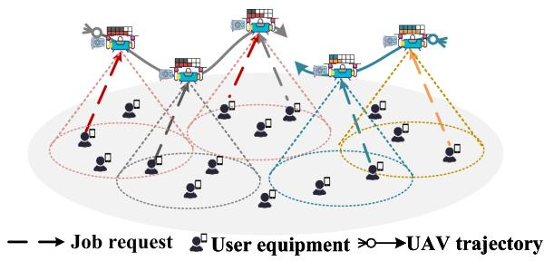  
Fig. 1. Multi-UAV enabled MECN model.

# B. A Brief Introduction of Our Work and Challenges

In this work, we consider a dynamic and stochastic multi-UAV enabled MECN, where both the locations of $\mathrm { U E s ^ { 1 } }$ and the arrivals of job requests at UEs are unknown to UAVs in advance. Each UE generates job requests associated with specific service types and resource requirements, and the aggregate job requests arrivals across the network follow a Poisson process. Considering the UAV’s limited onboard storage capacity, it is unrealistic for each UAV being equipped with all types of computing services. Thus, we assume that each UAV is heterogeneous regarding its pre-deployed service types and resource capacity designated for executing instances of each service type. For example, in Fig. 1, each UAV is equipped with two service types (represented by different colors), and provisioned with dedicated resources to execute workflow instances of the corresponding types. While multiple heterogeneous UAVs enable the broad service coverage and rich computational resources, they also pose significant challenges such as collision-free trajectory planning and service-constrained job scheduling (i.e., UEs may have to find an appropriate UAV with their required service types to upload job requests), especially when the MECN has job arrivals with spatial-temporal dynamics and diverse service demands. To this end, we propose a safe and cooperative trajectory planning method for multiple heterogeneous UAVs, with the objective of reducing the job miss rate and the average energy consumption of both UAVs and UEs. We summarize the main challenges of solving this problem as follows:

- Heterogeneity of UAVs in service types and resource capacities: The constrained service types and resource capacities on each UAV cause the UAV to fly back and forth within the network to collect the appropriate job requests to serve, which significantly increases the flight energy consumption. Conversely, designing energy-conserving trajectories can reduce the flight energy consumption, which however may increase the job waiting time on the UE side. This trade-off needs to be carefully handled for achieving both low energy consumption and timely job completion in UAV enabled MECNs.   
- Job arrivals with spatial-temporal dynamics and diverse service demands: Since job requests are randomly generated at each UE and UEs may randomly move within the network, the job arrivals across the entire network present

1UEs can be either static with random spatial distribution or mobile with uncertain mobility trajectories.

spatial-temporal dynamics, which are difficult to predict. Thus, it is challenging to safely and efficiently schedule the UAVs in such a complex, dynamic and unpredictable MEC environment to achieve high QoS for UEs, especially when considering the strict and diverse completion deadlines of different jobs.

- Coupled multiple optimization objectives: The optimization objectives in this work, i.e., the job miss rate, the average energy consumption of both UAVs and UEs, and the overall flight safety, are interdependent and conflicting, therefore making the cooperative trajectory planning challenging. For example, to avoid the mutual collision, UAVs may need to frequently alter their flight routes (e.g., deviate from their optimal routes), which however may increase the energy consumption or the job miss rate.

To address the aforementioned challenges, we propose a multi-agent safe reinforcement learning algorithm that integrates a Shared Soft Actor-Critic (SSAC) architecture for extracting UAV-specific heterogeneous features and a two-agent Markov Game of Intervention (MGI) for collision avoidance, named SSAC-MGI. By leveraging consistency in certain onboard resource dimensions, such as service types, available CPU, and memory, among heterogeneous UAVs, we construct a set of shared policy networks that encode their common characteristics into high-level and transferable skills, thereby reducing the policy complexity associated with trajectory planning. We model the interaction between heterogeneous UAVs and the MECN environment as a decentralized partially observable Markov decision process (Dec-POMDP), and adopt a decentralized training and decentralized execution (DTDE) framework, where each UAV independently makes real-time flight decisions based solely on its local observations, while the policies are optimized to maximize global system rewards. The main contributions of this work are as follows:

- We propose a novel framework that jointly optimizes safety-aware and energy-efficient trajectory for service provisioning in heterogeneous multi-UAV enabled MECNs, handling dynamic arriving, delay-sensitive UE requests, without requiring inter-UAV communication. The problem is formulated as a two-agent Dec-POMDP, which is solved by proposing a novel multi-agent safe reinforcement learning algorithm called SSAC-MGI.   
- SSAC-MGI incorporates a two-agent MGI mechanism, where each UAV is jointly controlled by a safety agent and a standard agent. Specifically, the safety agent aims to prevent the UAV from colliding with other UAVs or obstacles during the mission, while the standard agent aims to improve the UAV’s mission performance by minimizing the job miss rate and reducing the average energy consumption. In contrast to traditional approaches that incorporate safety via reward shaping, our method explicitly decouples safety control from task performance optimization, thereby improving the training convergence and enabling a better trade-off between safety and task performance in UAV enabled MECNs.   
- We design a Round-Robin instance allocation method for assigning computational instances to workflow queues on

TABLE I KEY DIFFERENCES BETWEEN OUR WORK AND MAIN RELEVANT LITERATURE   

<table><tr><td>Literature</td><td>Dynamic Requests1</td><td>Inaccessible2</td><td>Heterogeneous3</td><td>Learning based</td><td>Optimization Goals</td></tr><tr><td>[5], [6], [11], [15]</td><td>X</td><td>X</td><td>X</td><td>X</td><td>Energy efficiency, completion time</td></tr><tr><td>[10], [16]</td><td>X</td><td>✓</td><td>X</td><td>✓</td><td>Sum transmit rate, quality of experience (QoE)</td></tr><tr><td>[7], [17]</td><td>✓ (Random)</td><td>X</td><td>✓ (Resource)</td><td>X</td><td>QoE, service latency</td></tr><tr><td>[18], [19]</td><td>X</td><td>✓</td><td>✓ (Parameters)</td><td>✓</td><td>Energy efficiency</td></tr><tr><td>[20], [21]</td><td>X</td><td>✓</td><td>X</td><td>✓</td><td>Fairness throughput</td></tr><tr><td>[12], [13]</td><td>✓ (Continuous)</td><td>X</td><td>X</td><td>✓</td><td>Energy efficiency, service latency</td></tr><tr><td>Our work</td><td>✓ (Random)</td><td>✓</td><td>✓ (Resource)</td><td>✓</td><td>Energy efficiency, safety, job miss rate</td></tr></table>

1Continuousandrandomindicate thatUEsgeneraterequests ithercontiuouslyoratrandomintervalsduringthesystemoperationtime.   
2Inaccessible refers to the scenario where UEs’locations are unknown (including the case when UEsare mobile).   
3HeterogenesindicatestediferencsintasdemansanUAprovdedsicetypes mputigesouesorteeter

UAVs. This method enhances resource utilization and improves the likelihood that each workflow is completed before its deadline. We conduct simulation experiments in a multi-UAV enabled MECN environment constructed based on real-world data, including UE locations from Twitter and workflow traces from Alibaba. Extensive evaluations across diverse scenarios demonstrate the superiority and robustness of SSAC-MGI, compared with several state-ofthe-art approaches.

# II. RELATED WORK

In this section, we provide the literature review on UAV trajectory planning in MECNs. In particular, Table I summarizes the key differences between our work and main relevant work.

# A. Non-Learning Based UAV Trajectory Planning in MECNs

In the following, we review existing studies on optimization scenarios involving single-UAV solutions and multi-UAV cooperative approaches, with a particular focus on methods that transform non-convex problems into convex formulations.

Trajectory Planning for a Single UAV: To address the problem that severely blocked UEs cannot fully utilize the computing resources of access points (APs), Hu et al. [5] investigated a UAV-assisted MEC architecture that enables the simultaneous utilization of computing resources at both the UAV and the AP. They proposed an alternating optimization algorithm that jointly optimizes the computation scheduling, bandwidth allocation, and UAV trajectory to minimize the weighted sum of energy consumption of the UAV and UEs, under several practical constraints. Further, Li et al. [6] employed the successive convex approximation technique together with the Dinkelbach algorithm to maximize the UAV’s energy efficiency by jointly optimizing the UAV’s trajectory, user transmission power, and computation load allocation. Similarly, Hu et al. [15] developed a multi-stage alternating optimization algorithm based on the Dinkelbach method and block coordinate descent (BCD) method to jointly optimize the computation scheduling, transmission power control, and 3D UAV trajectory.

Trajectory Planning for Multiple UAVs: Since a single UAV is constrained in energy and computation capacity, which may not satisfy users’ service demands especially in large-scale MECNs,

cooperative multi-UAV enabled MEC systems have gained increasing attention for their flexibility, scalability, and enhanced task processing capability. For example, Zhou et al. [17] proposed a comprehensive optimization framework to minimize the service latency taking into account unique characteristics of UAVs. By leveraging the Lyapunov optimization technique and a dependent rounding technique, the proposed framework jointly determines the cache placement, UAV trajectories, UE– UAV associations, and task offloading, subject to the energy and resource constraints of UAVs. Similarly, the authors in [7] investigated the joint optimization of task offloading, resource allocation, trajectory planning, and service cache placement under energy and delay constraints, and the goal is to reduce the service latency while ensuring the fairness among UEs.

# B. Learning Based UAV Trajectory Planning in MECNs

Traditional non-learning based methods rely on exact system model and entail high computational complexity, limiting their applicability in solving large scale or highly dynamic problems. Given the highly complex and dynamic MEC environment, deep reinforcement learning (DRL) has emerged as a promising solution due to its adaptability and performance advantages. For example, Liu et al. [10] proposed a multi-agent Q-learning based algorithm for joint trajectory design and power control, leveraging predicted user mobility to maximize the instantaneous sum transmission rate while satisfying the rate requirement of users. Similarly, to handle the high-dimensional and continuous action space, Zhao et al. [12] proposed a cooperative multi-agent DRL algorithm based on TD3, which jointly optimizes UAV trajectories, task offloading, and transmission power to minimize total system costs. Hao et al. [22] investigated task offloading in a UAV-assisted MEC system with multi-UAV collaboration, highlighting task priorities and a binary offloading mode. Song et al. [21] investigated a multi-objective proximal policy optimization algorithm for joint trajectory control and task offloading, aiming to minimize the task delay and UAVs’ energy consumption and maximize the number of collected tasks. Liu et al. [13] proposed a decentralized DRL based framework to control each UAV in a distributed manner, aiming to maximize the average coverage score while minimizing the energy consumption. Wang et al. [18] proposed the soft hierarchical DRL network and dual-end federated reinforcement learning as

decentralized navigation policy frameworks to address the UAV heterogeneity characterized by varying system parameters.

Compared with most existing work on MECNs including the above mentioned literature, the novelty of this work is summarized as follows: (i) unlike methods in [18], [19] that assigned each UAV to independently train a policy network for a specific spatially partitioned cluster of users, we collaboratively train all heterogeneous UAVs to jointly serve the entire network, thereby better accommodating the diverse service demands with spatial-temporal dynamics; (ii) in contrast to previous studies such as [13], [23], which adopted the centralized training and decentralized execution (CTDE) paradigm, we employ the SSAC architecture and train it with DTDE, thus avoiding the significant communication and computational overhead caused by transmitting and integrating all UAV observations; (iii) most existing DRL methods, such as [22], were unable to learn multiple policies in a single training process to accommodate diverse objective preferences among heterogeneous UAVs. In this work, we adopt a policy-sharing paradigm to facilitate knowledge sharing among heterogeneous UAVs with varying features along the same dimensions, thereby enabling the learning of a unified policy.

# III. SYSTEM MODEL

As shown in Fig. 1, we consider a heterogeneous multi-UAVenabled MECN comprising $M$ static or mobile UEs, denoted by the set $\mathcal { M } = \{ 1 , \dots , M \}$ , and $N$ rotary-wing UAVs, denoted by the set $\mathcal { N } = \{ 1 , \ldots , N \}$ . The network heterogeneity arises = 1from two aspects: 1) each UE randomly generates job requests with diverse resource demands during network operation; 2) each UAV hosts a subset of all available service types, thereby introducing the inter-UAV resource heterogeneity. Job requests are randomly generated by the UEs. Each job, which contains the input data and workflow execution description, is scheduled to be processed by certain UAVs. Given the limited storage capacity of UAVs and highly diverse service demands of UEs, each UAV is assumed to be pre-configured with a subset of the available computational instance types, representing the available service types. The instance type and the corresponding quantity may differ in different UAVs, and the union of instance types across all UAVs can cover the full range of the request types generated by all UEs. We assume a time-slot model $\mathbb { T } = \{ 1 , 2 , \dots , T \}$ , = 1 2where each time slot has an equal time interval. During the MECN operation, UAVs dynamically plan their trajectories based on service type constraints and available resources to efficiently schedule and process jobs. Table II summarizes the main system parameters.

# A. Job Request Model

Based on the time-slot model, the three-dimensional (3D) coordinate of UE $m$ at time slot $t$ is denoted by $l _ { m } ^ { t } =$ $( x _ { m } ^ { t } , y _ { m } ^ { t } , 0 ) , \forall m \in \mathcal { M } , \ t \in \mathbb { T }$ =. In the following, we describe ( 0)the job in detail by analyzing its generation, composition and execution.

1) Job Generation: To model the random job generation process, we assume that, in each time slot, the number of jobs generated by all UEs in the MECN follows a Poisson distribution

TABLE II ILLUSTRATION OF MAIN SYSTEM PARAMETERS   

<table><tr><td>Symbols</td><td>Definitions</td></tr><tr><td>m ∈ M</td><td>Index of UEs</td></tr><tr><td>n ∈ N</td><td>Index of UAVs</td></tr><tr><td>t ∈ T</td><td>Index of time slots</td></tr><tr><td>γmt⊂ Γ</td><td>A set of jobs generated and accumulated by UE m at t</td></tr><tr><td>jk∈ γmt</td><td>A job indexed by k</td></tr><tr><td>Rn⊂ R</td><td>The set of resource types deployed on UAV n</td></tr><tr><td>r∈ Rn</td><td>Index of resource types deployed on UAV n</td></tr><tr><td>rk∈ R</td><td>The resource type required by job jk</td></tr><tr><td>viK</td><td>The i-th task within job jk</td></tr><tr><td>tGk</td><td>Generation time of jk</td></tr><tr><td>φiK</td><td>Successful execution duration of task viKin jk</td></tr><tr><td>ξ</td><td>The deadline tightness factor of tasks</td></tr><tr><td>Φm,k</td><td>The job request of jk from UE m</td></tr><tr><td>tck</td><td>The latest completion timestamp of jk</td></tr><tr><td>tek,i</td><td>The actual execution timestamp of viK</td></tr><tr><td>tfk,i</td><td>The final completed timestamp of viK</td></tr><tr><td>dhor,i,t</td><td>The horizontal distance between UE m and UAV n</td></tr><tr><td>htm,n</td><td>The channel gain between UE m and UAV n</td></tr><tr><td>Ωk</td><td>Data size of job jk formed as a request file</td></tr><tr><td>ptm</td><td>The transmission power of user m for uploading</td></tr><tr><td>PLoSm,n</td><td>The LoS probability between UE m and UAV n</td></tr><tr><td>PNLOSm,n</td><td>The NLOS probability between UE m and UAV n</td></tr><tr><td>ytm,n,k</td><td>Whether job jk is successfully uploaded to UAV n at t</td></tr><tr><td>Itnn</td><td>Idle state of UAV n at t (idle is 1 or busy is 0)</td></tr><tr><td>DTn</td><td>Queue of job requests received by UAV n at t</td></tr><tr><td>vcpuRn</td><td>Capacity of type-r CPU cores in UAV n</td></tr><tr><td>vmemRn</td><td>Capacity of type-r memory in UAV n</td></tr><tr><td>xtvki,vmr</td><td>Number of type-r computation instances allocated</td></tr><tr><td>to taskviKon UAV n at time slot t</td><td>The flight power of UAV n at time slot t</td></tr></table>

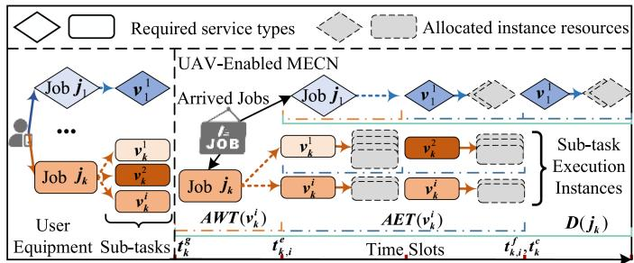  
Fig. 2. Job request and process model.

with rate parameter $\lambda$ . The set of jobs that are newly generated and historically accumulated at UE $m$ at location $l _ { m } ^ { t }$ is denoted by $\gamma _ { m } ^ { t } = \{ j _ { 1 } , j _ { 2 } , . ~ . ~ . ~ , j _ { k } \}$ , where $j _ { k }$ denotes the job with index $k$ =. The set of all newly generated and accumulated jobs in the MECN at time slot $t$ is defined as $\Gamma = \{ \gamma _ { 1 } ^ { t } , \gamma _ { 2 } ^ { t } , . . . , \gamma _ { M } ^ { t } \}$ , $\forall t \in$ T. Let $t _ { k } ^ { g }$ Γ =denote the generation time of job $j _ { k }$ at the corresponding UE. When UEs send job requests, they provide their current locations, job generation time, and workflow details.

2) Job Composition: As shown in the left part of Fig. 2, each job $j _ { k }$ may comprise multiple independent sub-tasks (represented by different colors), all of which require the same service type. In the rest of this paper, we use “task” to denote “sub-task” for simplicity. We define $r _ { k }$ as the type of

computational resource required by all tasks within job $j _ { k }$ . According to the Alibaba cluster trace [24], each task is executed via finer-grained computational instances, which are regarded as the smallest atomic units of execution [2]. The $i$ -th task within job $j _ { k }$ is denoted by $v _ { k } ^ { i }$ . The resources needed to execute a single instance of task $v _ { k } ^ { i }$ include CPU cores and memory, denoted by $v c p u _ { k } ^ { i }$ and $v m e m _ { k } ^ { i }$ , respectively. The UAV, as the executor of the job, can specify the degree of parallelism for each task, which is represented by the number of instances $n u m _ { k } ^ { i }$ . The successful execution time of a task with a parallelism degree of $n u m _ { k } ^ { i }$ is denoted as $\phi _ { k } ^ { i }$ . Therefore, the metadata for task $v _ { k } ^ { i }$ can be represented as a tuple $\{ ( v c p u _ { k } ^ { i } , v m e m _ { k } ^ { i } ) , n u m _ { k } ^ { i } , \phi _ { k } ^ { i } \}$ . ( )A job request is formally defined as t $\Phi _ { m , k } ^ { t } =$ $\langle l _ { m } ^ { t } , t _ { k } ^ { g } , r _ { k } , \{ ( v c p u _ { k } ^ { i } , v m e m _ { k } ^ { i } ) , n u m _ { k } ^ { i } , \phi _ { k } ^ { i } \} _ { \forall v _ { k } ^ { i } \in j _ { k } } \rangle$ , where the job generation time satisfies $t _ { k } ^ { g } \leq t$ .

3) Job Execution Timeline: Each job can be scheduled to any UAV equipped with the required service type. As shown in the right part of Fig. 2, the actual execution timestamp $t _ { k , i } ^ { e }$ of each task $v _ { k } ^ { i }$ in job $j _ { k }$ is defined as the time when the UAV begins allocating instances for the task. Thetask is fully completed at timestamp $t _ { k , i } ^ { f }$ ecution ends when the. Therefore, the actual execution time (AET) is defined as $\mathbf { \boldsymbol { A } } E T ( \boldsymbol { v } _ { k } ^ { i } ) = t _ { k , i } ^ { f } - t _ { k , i } ^ { e }$ . ( ) =Prior to execution, the task may either wait in the job queue at the UE side or remain in the UAV’s request queue. The actual waiting time (AWT) is given by $A W T ( v _ { k } ^ { i } ) = t _ { k , i } ^ { e } - t _ { k } ^ { g }$ . Thus, the actual finish time (AFT) of $v _ { k } ^ { i }$ ( )is given by

$$
A F T \left(v _ {k} ^ {i}\right) = A W T \left(v _ {k} ^ {i}\right) + A E T \left(v _ {k} ^ {i}\right). \tag {1}
$$

The completion timestamp $t _ { k } ^ { c }$ of job $j _ { k }$ is given by

$$
t _ {k} ^ {c} = t _ {k} ^ {g} + \max  \left\{A F T \left(v _ {k} ^ {i}\right), \forall v _ {k} ^ {i} \in j _ {k} \right\}. \tag {2}
$$

In this work, we assume that a job is successfully completed only if all its constituent tasks are completed within their allocated time budgets. Specifically, each task $v _ { k } ^ { i }$ is associated with a time budget $\xi \phi _ { k } ^ { i }$ , where $\phi _ { k } ^ { i }$ denotes its minimum required execution time and $\xi \ge 1$ reflects the allowed slackness [2]. 1The success of a task requires satisfying the following deadline constraint

$$
t _ {k} ^ {g} + A F T \left(v _ {k} ^ {i}\right) \leq t _ {k} ^ {g} + \xi \phi_ {k} ^ {i}, \forall v _ {k} ^ {i} \in j _ {k}, \tag {3}
$$

and the success of a job requires satisfying the following constraint

$$
t _ {k} ^ {c} \leq D (j _ {k}) := \max  _ {v _ {k} ^ {i} \in j _ {k}} \left\{t _ {k} ^ {g} + \xi \phi_ {k} ^ {i} \right\}, \quad \forall j _ {k} \in \Gamma , \tag {4}
$$

where $D ( j _ { k } )$ represents the deadline of job $j _ { k }$ .

# B. UAV-UE Communication Model

The position of the $n$ -th UAV at time slot $t$ is given by $l _ { n } ^ { t } =$ $( x _ { n } ^ { t } , y _ { n } ^ { t } , H ) , \forall n \in \mathcal { N } , t \in \mathbb { T }$ , where $H$ =is the height of the UAV ( )and is assumed to be a constant. For UE $m$ , its horizontal distance to UAV $n$ is given by

$$
\begin{array}{l} d _ {m, n} ^ {h o r i, t} = \sqrt {\left(x _ {m} ^ {t} - x _ {n} ^ {t}\right) ^ {2} + \left(y _ {m} ^ {t} - y _ {n} ^ {t}\right) ^ {2}}, \\ \forall m \in \mathcal {M}, n \in \mathcal {N}, t \in \mathbb {T}. \tag {5} \\ \end{array}
$$

The prerequisite for successful communication between UAV and UE is that UE $m$ must be located within the coverage area of UAV $n$ [25], that is

$$
d _ {m, n} ^ {h o r i, t} \leq Z, \forall j _ {k} \in \gamma_ {m} ^ {t}, m \in \mathcal {M}, n \in \mathcal {N}, t \in \mathbb {T}, \tag {6}
$$

where $Z = H t a n \theta$ is the coverage radius of UAV $n$ .

=In this communication model, the communication link between the UE and UAV is referred to as ground-to-air (GTA) link. Specifically, the probability of line-of-sight (LoS) transmission between UE $m$ and UAV $n$ is defined as

$$
P _ {m, n} ^ {L o S} = \frac {1}{1 + \rho e ^ {- \beta [ \theta_ {m , n} - \rho ]}}, \tag {7}
$$

where $\rho$ and $\beta$ represent environmental parameters, while θm,n $\begin{array} { r } { \theta _ { m , n } = { \frac { 1 8 0 } { \pi } } \sin ^ { - 1 } ( { \frac { H } { d _ { m , n } ^ { e l e v } } } ) } \end{array}$ and $d _ { m , n } ^ { e l e v } = \sqrt { ( d _ { m , n } ^ { h o r i } ) ^ { 2 } + H ^ { 2 } }$ denote the elevation angle (in degrees) and the Euclidean distance between UE $m$ and UAV $n$ , respectively. In particular, the probability of non-line-of-sight (NLoS) transmission between UE $m$ and UAV $n$ can be obtained as $P _ { m , n } ^ { N L o S } = 1 - P _ { m , n } ^ { L o S }$ . = 1Following the free space path-loss (PL) model, the channel’s power gain between UE $m$ and UAV $n$ at time slot $t$ is given by

$$
h _ {m, n} ^ {t} = \omega_ {0} ^ {- 1} \left(d _ {m, n} ^ {\text {e l e v}, t}\right) ^ {- \alpha} \left[ P _ {m, n} ^ {L o S} \mu_ {L o S} + P _ {m, n} ^ {N L o S} \mu_ {N L o S} \right] ^ {- 1}, \tag {8}
$$

where $\begin{array} { r } { \omega _ { 0 } = ( \frac { 4 \pi f _ { c } } { c } ) ^ { 2 } } \end{array}$ , and $f _ { c }$ represents the carrier frequency and $c$ = ( )denotes the speed of light. We denote $\alpha$ as the path loss exponent. The average additional losses for LoS and NLoS connections, denoted by $\mu _ { L o S }$ and $\mu _ {  { N }  { L }  { o } S }$ respectively, are constants determined by the specific propagation environment.

Without loss of generality, we assume that the ground UEs can communicate with their respective serving UAV via orthogonal frequency-division multiple access (OFDMA) [12], [18], [26]. Then, the interference between different UEs within the UAV’s coverage area can be eliminated. Therefore, the achievable data transmission rate between the UE $m$ and UAV $n$ is given by

$$
\Omega_ {m, n} ^ {t} = B _ {0} \log_ {2} \left[ 1 + \frac {p _ {m} ^ {t} h _ {m , n} ^ {t}}{B _ {0} N _ {0}} \right], \forall m \in \mathcal {M}, t \in \mathbb {T}, \tag {9}
$$

where $B _ { 0 }$ is the allocated channel bandwidth and $N _ { 0 }$ denotes the power spectral density of the additive white Gaussian noise (AWGN) at the UAV. The transmit power of UE $m$ is constrained by

$$
0 \leq p _ {m} ^ {t} \leq p _ {\max }, \forall m \in \mathcal {M}, t \in \mathbb {T}, \tag {10}
$$

where $p _ { \mathrm { m a x } }$ denotes the UE’s maximum transmit power.

In this work, we assume that the size of each job request follows a normal distribution, i.e., $\Omega _ { k } \sim \mathcal N ( \Omega ^ { t h } , \sigma ^ { 2 } )$ , where $\Omega ^ { t h }$ Ω (Ωrepresents the threshold for data transmission.

Lemma 1: For a UAV’s coverage region with its radius of $Z$ , in order to ensure that any UE within this region can upload its job request to the UAV with a minimum achievable data transmission rate of at least $\Omega ^ { \mathrm { t h } }$ , the UE’s maximum transmit Ωpower must satisfy the following lower bound as

$$
p _ {\max } \geq \omega_ {0} \mu_ {N L o S} B _ {0} N _ {0} \left(2 ^ {\frac {\Omega^ {t h}}{B _ {0}}} - 1\right) \left| \sqrt {Z ^ {2} + H ^ {2}} \right| ^ {\alpha}. \tag {11}
$$

The detailed proof of Lemma 1 is presented in Appendix A.

Furthermore, we incorporate Rician and Rayleigh fading channels [27] to quantify their effects on UAV-UE association and transmit power, as formulated in Lemma 2.

Lemma 2 (Path-loss-only vs. fading channels): Let $\Omega ^ { \mathrm { t h } }$ be the per-slot upload demand, $p _ { \mathrm { m a x } }$ Ωthe maximum transmit power. Define $C = B _ { 0 } N _ { 0 } \big ( 2 ^ { \Omega ^ { \mathrm { t h / } } B _ { 0 } } - 1 \big )$ , the pure PL gain is $h =$ $G ( d )$ = 2, and the fading gain $h = \dot { G } ( d ) Y$ =(for unit-mean Rician $Y$ ( )with factor $\kappa > 0$ = ( ), and Rayleigh with $\kappa = 0$ ). Thus, for any

$d \in ( 0 , d _ { \operatorname* { m a x } } ]$ , the minimum-gain threshold

$$
y := Y _ {\min } (d) = \frac {C}{G (d) p _ {\max }} = \left(d / d _ {\max }\right) ^ {\alpha} \in (0, 1 ].
$$

( )i) Success Probability of job request upload

$$
P _ {\text {s u c c}} ^ {\text {R a y l e i g h}} <   P _ {\text {s u c c}} ^ {\text {R i c i a n}} <   P _ {\text {s u c c}} ^ {\text {P L}} = 1. \tag {12}
$$

ii) Expected transmit power conditioned on success. For $\begin{array} { r } { \bar { p } _ { \mathrm { P L } } = \frac { C } { G ( d ) } , \bar { p } _ { \mathrm { R i c } } = \frac { C } { G ( d ) } \Phi _ { \mathrm { R i c } } ( \kappa , y ) , \bar { p } _ { \mathrm { R a y } } = \frac { C } { G ( d ) } g ( y ) } \end{array}$ ¯where $\Phi _ { \mathrm { R i c } } ( \kappa , y ) : = \mathbb { E } [ 1 / Y | Y \geq y ]$ ), $g ( y ) : = e ^ { \dot { y } } E _ { 1 } ( y )$ . Φ ( ) := [1Define the unique thresholds

$$
\begin{array}{l} y _ {\star} (\kappa): \Phi_ {\operatorname {R i c}} (\kappa , y _ {\star}) = 1, \quad Y _ {\star}: g (Y _ {\star}) = 1, \\ y _ {\times} (\kappa): \Phi_ {\operatorname {R i c}} (\kappa , y _ {\times}) = g (y _ {\times}). \\ \end{array}
$$

Thus,

$$
\bar {p} _ {\mathrm {P L}} <   \bar {p} _ {\mathrm {R i c}} <   \bar {p} _ {\mathrm {R a y}}, \quad 0 <   d <   d _ {\mathrm {c r i t}}, \tag {13}
$$

where $d _ { \mathrm { c r i t } } = d _ { \mathrm { m a x } } \operatorname* { m i n } \{ Y _ { \star } ^ { 1 / \alpha } , y _ { \star } ( \kappa ) ^ { 1 / \alpha } , y _ { \times } ( \kappa ) ^ { 1 / \alpha } \}$ . = min ( ) ( )The detailed proof of Lemma 2 is presented in Appendix B.

# C. UAV Enabled Data Processing Model

The UAV, served as a mobile data processing platform, operates in three stages during each time slot: (1) Moving to a new location; (2) Establishing UE-UAV associations and receiving job requests; (3) Performing computation based on its available resource and request queue state.

1) UAV Movement Model: At the beginning of time slot $t$ , the UAV flies from its last location $l _ { n } ^ { t - 1 }$ to its next location $l _ { n } ^ { t }$ with a flight direction $\psi _ { n } ^ { t }$ and a flight speed $\boldsymbol { v } _ { n } ^ { t }$ . Actually, the variable $\psi _ { n } ^ { t }$ represents the flight direction of the UAV in current time slot $t$ , which is updated from its flight direction $\psi _ { n } ^ { t - 1 }$ in last time slot $t - 1$ by adding the rotation angle $\varphi _ { n } ^ { t }$ to $\psi _ { n } ^ { t - 1 }$ 1The rotation angle $\varphi _ { n } ^ { t }$ is constrained within a bounded range, i.e., $\varphi _ { n } ^ { t } \in [ \varphi _ { \operatorname* { m i n } } , \varphi _ { \operatorname* { m a x } } ]$ (e.g., $\varphi _ { n } ^ { t } \in [ - ( \pi / 4 ) , ( \pi / 4 ) ] )$ . Based on [ ]the updated flight direction $\psi _ { n } ^ { t }$ [ ( 4) ( 4)], the UAV selects a flight speed constrained by a maximum allowable speed

$$
v _ {n} ^ {t} = \left\| l _ {n} ^ {t} - l _ {n} ^ {t - 1} \right\| _ {2} \leq V _ {\max } \tag {14}
$$

Thus, the movement of the UAV is jointly decided by the set $\{ l _ { n } ^ { t - 1 } , \psi _ { n } ^ { t - 1 } , \varphi _ { n } ^ { t } , v _ { n } ^ { t } \}$ , and the location of the UAV evolves as

$$
x _ {n} ^ {t} = x _ {n} ^ {t - 1} + v _ {n} ^ {t} \cos \left(\psi_ {n} ^ {t - 1} + \varphi_ {n} ^ {t}\right),
$$

$$
y _ {n} ^ {t} = y _ {n} ^ {t - 1} + v _ {n} ^ {t} \sin \left(\psi_ {n} ^ {t - 1} + \varphi_ {n} ^ {t}\right). \tag {15}
$$

2) Job Request Upload Model: A job request can be uploaded to a certain UAV only when the corresponding UE is located within the UAV’s coverage area, which is defined in Inequality (6). In addition, the resource type required by the job must be included in the UAV’s onboard resource set, i.e.,

$$
r _ {k} \in \mathcal {R} _ {n}, \forall j _ {k} \in \Gamma , n \in \mathcal {N}, \tag {16}
$$

where $\mathcal { R } _ { n }$ is the set of resource types deployed on UAV $n$ and the total set of resource types deployed on all UAVs is $\textstyle \bigcup _ { n \in { \mathcal { N } } } { \mathcal { R } } _ { n } =$ $\mathcal { R }$ . For each UE $m$ =, the amount of uploaded data during a time slot is represented as a function of the transmit power and the channel’s power gain: divided into equal-len $\Omega _ { m , n } ^ { t } = f ( p _ { m , n } ^ { t } , h _ { m , n } ^ { t } ) .$ . Since the time isboth the UAV and UE remain stationary during each time slot and the channel gain keeps constant during each time slot as well. Fig. 3 illustrates the relationship between the uploaded data size and the UE’s transmit power $p _ { m , n } ^ { t }$ , under the assumption that the channel gain

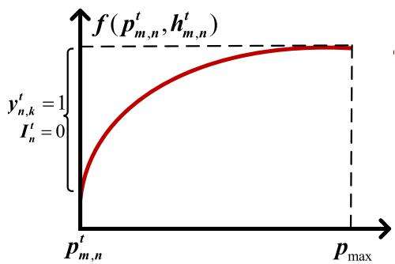  
Fig. 3. The uploaded data size is a function of the UE’s transmit power and the channel gain between the UE and its associated UAV at each time slot.

$h _ { m , n } ^ { t }$ remains fixed within a time slot. The channel gain $h _ { m , n } ^ { t }$ is determined by the current locations of the UE and the UAV. For example, if a certain UE located far from the UAV (but within the UAV’s coverage area) attempts to upload a job request with a large data volume, it is likely that the uploading cannot be completed within the current time slot. The binary variable $y _ { n , k } ^ { t } \in \{ 0 , 1 \}$ , which indicates the association between UAV $n$ and job $j _ { k }$ of UE $m$ , and the idle state variable ${ \bf { I } } _ { n } ^ { t }$ of UAV $n$ are defined as:

- If the association between the UE and the UAV satisfies Constraints (6) and (16) and $f ( p _ { m , n } ^ { t } , h _ { m , n } ^ { t } ) \geq \Omega _ { k }$ , i.e., there exists $p _ { m , n } ^ { t } \leq p _ { \operatorname* { m a x } }$ ( ) Ωthat enables the successful job upload in the current time slot, then set $y _ { n , k } ^ { t } = 1$ , ${ \bf { I } } _ { n } ^ { t } = 0$   
- Conversely, if $f ( p _ { m , n } ^ { t } , h _ { m , n } ^ { t } ) < \Omega _ { k }$ = 1 I = 0, even when using the (maximum transmit power $p _ { \mathrm { m a x } }$ Ω, the job cannot be successful uploaded. Therefore, we set $y _ { n , k } ^ { t } = 0 , \mathbf { I } ^ { t } = 1$ .   
= 0 I = 1- In another case, if there exist multiple requests $j _ { k } \in \gamma _ { m } ^ { t }$ satisfying $y _ { n , k } ^ { t } = 1$ , the UAV remains in a busy state from time $t$ to $\begin{array} { r } { t + \sum _ { j _ { k } \in \gamma _ { m } ^ { t } } y _ { n , k } } \end{array}$ , i.e., ${ \bf { I } } _ { n } ^ { t ^ { \prime } } = 0 , \forall t ^ { \prime } \in [ t , t +$ $\begin{array} { r } { \operatorname* { m a x } \{ \sum _ { j _ { k } \in \gamma _ { m } ^ { t } } y _ { n , k } , \breve { \forall m } \in \mathcal { M } \} \vert } \end{array}$ I = 0 [ +. This indicates that the max ]UAV must wait until all requests from UEs that meet the uploading requirement have been uploaded.

It should be noted that each job can only be uploaded to a single UAV. This also implies that each UE is associated with a single UAV during each time slot. Accordingly, the following association constraint must be satisfied:

$$
y _ {n, k} \in \{0, 1 \}, \quad \sum_ {n \in \mathcal {N}} y _ {n, k} \leq 1, \forall j _ {k} \in \Gamma . \tag {17}
$$

3) Instance Allocation and Execution Model: The UAVs, functioning as mobile servers, are pre-configured with computational resources for a set of supported service types $\mathcal { R } _ { n } \subset$ $\mathcal { R }$ . The set of resource capacity deployed on UAV $n$ is denoted by $v m _ { n } = \{ \langle v c p u _ { n } ^ { r } , v m e m _ { n } ^ { r } \rangle | r \in \mathscr { R } _ { n } \}$ , where $v c p u _ { n } ^ { r }$ =and vmemrn denote the number of virtual CPU cores and the amount of memory configured for service type $r$ , respectively. The UAV allocates computational resources to tasks in its job queue $\mathcal { D } _ { n } ^ { t }$ based on its available resource capacity $v m _ { n }$ to execute the corresponding jobs. Specifically, it determines the number of execution instances and allocates the necessary resources for each instance. All execution instances assigned to a task have identical CPU cores and memory requirements. The number of computation instances assigned to execute task $v _ { k } ^ { i }$ in $v m _ { n } ^ { r }$ at

each time slot $t$ is denoted by $x _ { v _ { k } ^ { i } , v m _ { n } ^ { r } } ^ { t }$ , where xt $x _ { v _ { k } ^ { i } , v m _ { n } ^ { r } } ^ { t } \in \mathbb { Z } _ { 0 } ^ { + }$ indicates the actual level of parallelism for executing task $v _ { k } ^ { i }$ . The resource constraints for instance execution at each time slot $t \in \mathbb { T }$ are defined as

$$
\sum_ {v _ {k} ^ {i} \in \mathcal {D} _ {n} ^ {t}} x _ {v _ {k} ^ {i}, v m _ {n} ^ {r}} ^ {t} \cdot v c p u _ {k} ^ {i} \leq v c p u _ {n} ^ {r}, \forall r \in \mathcal {R} _ {n}, \forall n \in \mathcal {N}, \tag {18}
$$

$$
\sum_ {v _ {k} ^ {i} \in \mathcal {D} _ {n} ^ {t}} x _ {v _ {k} ^ {i}, v m _ {n} ^ {r}} ^ {t} \cdot v m e m _ {k} ^ {i} \leq v m e m _ {n} ^ {r}, \forall r \in \mathcal {R} _ {n}, \forall n \in \mathcal {N}. \tag {19}
$$

# D. Energy Consumption Model

In general, the energy consumption of the UE consists of the movement energy and the energy used for uploading job requests. Since the mobility of the UE is self-controlled in practical scenarios, in this work, we only consider the UE’s energy consumption of data uploading, which is defined as

$$
E _ {m} ^ {t} = \sum_ {j _ {k} \in \gamma_ {m} ^ {t}} y _ {n, k} ^ {t} \cdot p _ {m} ^ {t}, \quad \forall m \in \mathcal {M}, \forall t \in \mathbb {T}. \tag {20}
$$

In general, the UAV’s energy consumption consists of the energy used during flight, hovering, communication, and computation. Since the energy consumed during either communication or computation is negligible compared to the flight (hovering) energy consumption [6], [28], in this work, we only consider the UAV’s flight and hovering energy consumption. According to [29], we assume that the UAV’s flight energy consumed during each time slot, i.e., the flight power, is defined as

$$
\begin{array}{l} p _ {n} ^ {t} (v _ {n} ^ {t}) = P _ {0} \left(1 + \frac {3 (v _ {n} ^ {t}) ^ {2}}{U _ {\mathrm {t i p}} ^ {2}}\right) + P _ {i} \left(\sqrt {1 + \frac {(v _ {n} ^ {t}) ^ {4}}{4 v _ {0} ^ {4}}} - \frac {(v _ {n} ^ {t}) ^ {2}}{2 v _ {0} ^ {2}}\right) ^ {\frac {1}{2}} \\ + \frac {d _ {0} \iota s A \left(v _ {n} ^ {t}\right) ^ {3}}{2}, \quad \forall n \in \mathcal {N}, \forall t \in \mathbb {T}, \tag {21} \\ \end{array}
$$

where $P _ { 0 } , P _ { i } , U _ { \mathrm { t i p } } , v _ { 0 } , d _ { 0 } , s , \rho$ , and $A$ represent the UAV’s constant mechanical parameters. The total flight energy consumption of the $n$ -th UAV during time slot $t$ is expressed as

$$
E _ {n} ^ {t} = p _ {n} ^ {t} \left(v _ {n} ^ {t}\right), \forall n \in \mathcal {N}, \forall t \in \mathbb {T}. \tag {22}
$$

In particular, we use $p _ { n } ^ { t } ( v _ { n } ^ { t } = 0 )$ to represent the UAV’s hovering ( = 0)energy consumption during time slot $t$ [29].

# IV. PROBLEM FORMULATION

We define a missed job as one that contains at least one subtask which fails to complete its computation before its deadline, i.e., violating Constraint (3). Our objective is to minimize the job miss rate and the average energy consumption of both UAVs and UEs within a finite time horizon $T$ , subject to each UAV’s resource and UE association constraints. To eliminate scale differences among performance metrics, we normalize them using the maximum transmit power of UEs and the maximum propulsion power of UAVs as reference values. The problem is formulated as follows.

$$
\min  _ {n \in \mathcal {N}, j _ {k} \in \Gamma , r \in \mathcal {R}} F (\mathcal {Q}) = \frac {1}{T} \sum_ {t} ^ {T} \left\{\left(\frac {N _ {\text {m i s s}} ^ {t}}{N _ {\text {s u c c}} ^ {t} + N _ {\text {m i s s}} ^ {t}}\right) + \zeta \right.
$$

$$
\left. \left(\frac {1}{\sum_ {j _ {k} \in \Gamma} y _ {n , k} ^ {t}} \frac {\sum_ {j _ {k} \in \Gamma} E _ {m} ^ {t}}{\sum_ {j _ {k} \in \Gamma} y _ {n , k} ^ {t} p _ {\max }} + \frac {1}{N} \frac {\sum_ {n = 1} ^ {N} E _ {n} ^ {t}}{\sum_ {n = 1} ^ {N} p _ {n} ^ {t} \left(v _ {\max }\right)}\right) \right\} \tag {23}
$$

subject to

$$
(6), (1 4), (1 7), (1 8), (1 9),
$$

$$
0 \leq p _ {m} ^ {t} \leq p _ {\max }, \forall m \in \mathcal {M}, t \in \mathbb {T}, \tag {24}
$$

$$
x _ {v _ {k} ^ {i}, v m _ {n} ^ {r}} ^ {t} \in \mathbb {Z} _ {0} ^ {+}, \forall v _ {k} ^ {i} \in \mathcal {D} _ {n} ^ {t}, r \in \mathcal {R} _ {n}, \forall n \in \mathcal {N}, \forall t \in \mathbb {T}, \tag {25}
$$

where $\mathcal { Q } = \{ l _ { n } ^ { t } , p _ { n } ^ { t } , y _ { n , k } ^ { t } , x _ { v _ { k } ^ { i } , v m _ { n } ^ { r } } \}$ is the variable set and $\zeta$ is the = weight used to balance the job miss rate and energy consumption. Constraint (6) specifies the communication coverage of the UAV, and (14) defines the maximum flight speed of each UAV. Constraints (18) and (19) ensure that the total CPU cores and memory resources consumed by all executed instances on each UAV during a time slot do not exceed the UAV’s resource capacity. Constraint (17) ensures that each job request can be uploaded to at most one UAV. Constraint (24) specifies the maximum transmit power of each UE. Constraint (25) ensures that the number of computation instances allocated to each sub-task is a non-negative integer.

Each UAV aims to appropriately plan its flight trajectory to receive more job requests while reducing the energy consumption of both itself and the associated UEs. Meanwhile, each UAV needs to navigate carefully to avoid collisions with either obstacles or other UAVs, due to the lack of sufficient communication among UAVs. We assume that each UAV has a physical size of radius $r _ { d }$ , and all potential obstacles are modeled with the same physical size of radius $r _ { d }$ . In each time slot $t$ , a safety violation occurs if the Euclidean distance between the center of UAV $n$ and the center of obstacle (another UAV) $o _ { j }$ is smaller than $2 r _ { d }$ , i.e., $\lVert l _ { n } ^ { t } - o _ { j } ^ { t } \rVert _ { 2 } < 2 r _ { d }$ . We define $C _ { n } ^ { t }$ as the 2safety violation cost of UAV $n$ 2at time slot $t$ , which is given as follow [30].

$$
C _ {n} ^ {t} = \left\{ \begin{array}{l l} 2 r _ {d} - \| l _ {n} ^ {t} - o _ {j} ^ {t} \| _ {2}, & \text {i f} \| l _ {n} ^ {t} - o _ {j} ^ {t} \| _ {2} <   2 r _ {d}; \\ 0, & \text {o t h e r w i s e .} \end{array} \right. \tag {26}
$$

It can be observed that the smaller distance between the UAV and the obstacle results in the severer safety violation. Therefore, in this work, we aim to minimize the cumulative safety violation costs during UAV operation, while reducing the effect on the overall optimization objective $F ( \mathcal { Q } )$ .

( )The problem is a complex multi-objective optimization problem involving multi-UAV cooperative trajectory planning. To effectively capture the sequential and stochastic nature of UAV decision-making, the discrete-time trajectory planning is naturally formulated as a Markov decision process (MDP), in which each UAV selects a flight decision based on its current state, resulting in a probability distribution over future states. Reinforcement learning (RL) is well-suited for solving such MDPs by learning a policy that maximizes the expected cumulative reward, while naturally accommodating multi-objective optimization problems without requiring explicit convexity assumptions, and effectively balancing competing objectives through reward design and policy exploration.

# V. PROPOSED METHOD

In the following, we first model our problem as a decentralized partially observable Markov decision process (Dec-POMDP), which generalizes the single-agent POMDP to cooperative multi-agent setting [31]. Then, we introduce the multi-agent safe reinforcement learning algorithm framework. Finally, we illustrate the design and implementation details of the proposed SSAC-MGI algorithm.

# A. Dec-POMDP Formulation

The Dec-POMDP effectively models a team of cooperative agents operating in a stochastic and partially observable environment. It is formally defined as a tuple $\mathcal { G } =$ $\langle \mathcal { N } , \mathcal { S } , \mathcal { A } , \mathcal { P } , \mathcal { O } , \mathcal { R } , \gamma \rangle$ , where $\mathcal { N }$ is the set of $N$ =UAV agents, and $\boldsymbol { s }$ is a set of states. The sets of joint actions and joint observations are denoted as $\mathcal { A } \equiv \{ \mathcal { A } _ { n } \} _ { n \in \mathcal { N } }$ and ${ \mathcal { O } } \equiv \{ { \mathcal { O } } _ { n } \} _ { n \in { \mathcal { N } } }$ , respectively. The state transition probability space is denoted by $\mathcal { P }$ , and $\mathcal { R }$ denotes the reward function. The discount factor $\gamma \in [ 0 , 1 ]$ denotes the temporal discounting of future rewards.

[0 1]Observation space $\mathcal { O }$ : ${ \mathcal { O } } _ { n }$ denotes the set of observations available to UAV $n$ . At each time slot $t$ , the environment emits a joint observation $o ^ { t } = \{ o _ { 1 } ^ { t } , \ldots , o _ { N } ^ { t } \}$ , where each UAV $n$ only =has access to its local observation $o _ { n } ^ { t } \in \mathcal { O } _ { n }$ . The local observation $o _ { n } ^ { t }$ encapsulates the relevant state information required for UAV $n$ to make movement decisions, which includes the UAV’s own status information and the task-related information in its job queue $\mathcal { D } _ { n } ^ { t }$ . Specifically, the status information includes the current idle state $\mathbf { I } _ { n } ^ { t }$ , 3D position $l _ { n } ^ { t }$ , movement orientation $\varphi _ { n } ^ { t }$ I, and the available type-specific onboard resources of UAV $n$ . Moreover, the resource utilization reflects the proportion of resources consumed by the execution of task instances within the job queue. Specifically, the CPU utilization is defined as

$$
u _ {v c p u _ {n} ^ {r}} ^ {t} = \frac {\sum_ {j _ {k} \in \mathcal {D} _ {n} ^ {t}} \sum_ {v _ {k} ^ {i} \in j _ {k}} v c p u _ {k} ^ {i} \cdot x _ {v _ {k} ^ {i} , v m _ {n} ^ {r}} ^ {t}}{v c p u _ {n} ^ {r}}, \tag {27}
$$

and the memory utilization is defined as

$$
u _ {v m e m _ {n} ^ {r}} ^ {t} = \frac {\sum_ {j _ {k} \in \mathcal {D} _ {n} ^ {t}} \sum_ {v _ {k} ^ {i} \in j _ {k}} v m e m _ {k} ^ {i} \cdot x _ {v _ {k} ^ {i} , v m _ {n} ^ {r}} ^ {t}}{v m e m _ {n} ^ {r}}. \tag {28}
$$

Therefore, the local observation is defined as

$$
\left. o _ {n} ^ {t} = \left\{\mathbf {I} _ {n} ^ {t}, l _ {n} ^ {t}, \varphi_ {n} ^ {t}, \left\langle u _ {v c p u _ {n} ^ {r}} ^ {t}, u _ {v m e m _ {n} ^ {r}} ^ {t} \right\rangle_ {r \in \mathcal {R} _ {n}} \right\} \in \mathcal {O} _ {n}. \right. \tag {29}
$$

The concatenated local observations from all UAVs, denoted as $o ^ { t } = \{ o _ { n } ^ { t } \} _ { n \in \mathcal { N } }$ , is defined as the global state $s ^ { t } \in S$ .

=Action space $\mathcal { A }$ : ${ \mathcal { A } } _ { n }$ denotes the set of admissible actions for UAV $n$ , which remains consistent across all UAVs in terms of the action dimensionality. At each time step $t$ , each UAV $n$ selects a flight action $\boldsymbol { a } _ { n } ^ { t }$ , forming the joint action $a ^ { t } = \{ a _ { 1 } ^ { t } , \ldots , a _ { N } ^ { t } \}$ . The individual action $a _ { n } ^ { t }$ =represents the UAV’s movement decision, which consists of a rotation angle $\varphi _ { n } ^ { t } \in [ \varphi _ { \operatorname* { m i n } } , \varphi _ { \operatorname* { m a x } } ]$ and a flight speed $v _ { n } ^ { t } \in [ 0 , V _ { \mathrm { m a x } } ]$ [ ]. Accordingly, the action taken by the UAV $n$ [0at time slot $t$ ]is represented as

$$
a _ {n} ^ {t} = \left\{\varphi_ {n} ^ {t}, v _ {n} ^ {t} \right\} \in \mathcal {A} _ {n}. \tag {30}
$$

In particular, for UAVs in busy states (i.e., $\mathbf { I } _ { n } ^ { t } = 0 ,$ ), the action is fixed as $a _ { n } ^ { t } = \{ \varphi _ { n } ^ { t - 1 } , 0 \}$ I = 0, indicating that the UAV remains = 0stationary while maintaining its previous orientation.

State transition probability $\mathcal { P }$ : The impact of a joint action on the environment is characterized by the transition probability function $\mathcal { P } : \mathcal { S } \times \mathcal { A } \times \mathcal { S }  [ 0 , 1 ]$ , which defines the : [0 1]state transition dynamics through the probability distribution $P ( s ^ { t + 1 } | s ^ { t } , a ^ { t } )$ . It specifies the likelihood of transitioning from ( )the current state $s ^ { t }$ to the next state $s ^ { t + 1 }$ upon executing the joint action $a ^ { t }$ , which corresponds to the movement decisions of all idle UAVs. In this work, the transition is deterministic, as the next state is fully determined by the current state and the joint action of all idle UAVs.

Reward function $\mathcal { R }$ : At each transition, the environment emits a reward defined by the mapping $R : S \times \mathcal { A }  \mathcal { R }$ , which is :designed to minimize the job miss rate and the average energy consumption of both UAVs and UEs. As the two objectives specified in Equation  are directly influenced by the UAV tra-(23)jectories, the reward function is accordingly defined as Equation (31). The reward function is designed to guide the policy towards learning UAV trajectories that prioritize the resource-matched job requests, thereby minimizing both the job miss rate and the energy consumption during flight.

$$
R _ {n} ^ {t} \left(o _ {n} ^ {t}, a _ {n} ^ {t}\right) = \left\{ \begin{array}{l} \frac {N _ {s} ^ {t}}{N _ {s} ^ {t} + N _ {n} ^ {t}}, \text {i f} \sum_ {j _ {k} \in \Gamma} y _ {n, k} ^ {t} > 0, \\ \frac {N _ {s} ^ {t}}{N _ {s} ^ {t} + N _ {n} ^ {t}} - \zeta \left(\frac {\sum_ {j _ {k} \in \Gamma} E _ {m} ^ {t}}{\sum_ {j _ {k} \in \Gamma} y _ {n , k} ^ {t} p _ {\max }} + \frac {E _ {n} ^ {t}}{p _ {n} ^ {t} (v _ {\max })}\right), \end{array} \right. \tag {31}
$$

where $N _ { s } ^ { t }$ denotes the number of tasks completed before their deadlines, and $N _ { n } ^ { t }$ denotes the number of tasks that miss their deadlines. Based on the reward function, if a UAV accepts at least one request, its reward is determined by the task success rate. Otherwise, the reward balances the task success rate and the energy consumption on both the UAV and UE sides.

# B. Multi-Agent Safe Reinforcement Learning Framework Based on Markov Games of Intervention

Reinforcement learning enables autonomous agents to learn complex behaviors through the interaction with the environment to maximize expected returns. However, using the trial-and-error exploration during the training process may lead to unsafe actions and cause certain damages to the agent. In this work, UAVs are modeled as agents that are trained under the multi-agent reinforcement learning (MARL) framework to learn movement strategies that optimize system-level objectives. However, for pursuing high-reward regions, UAVs may risk colliding with obstacles including other UAVs. To address the challenge of safe exploration, prior work has adopted either constrained Markov decision process (c-MDP) formulations [32] or reward shaping techniques [33] to guide policies towards constraint satisfaction. However, c-MDP based methods are usually difficult to be extended to settings with unknown dynamics, while reward shaping typically provides no safety guarantees during the learning process. To enable finer-grained control, we propose a two-agent Markov game model for each UAV, in which a Standard Agent learns a reward-maximizing policy, while a Safety Agent enforces system safety both during and after training.

Two-Agent based Dec-POMDP: To support our proposed two-agent model, we extend the standard Dec-POMDP formulation in Subsection V-A to $\mathcal { W } =$ $\langle \{ g _ { 1 } ^ { \mathrm { s t a n d } } , g _ { 2 } ^ { \mathrm { s a f e } } \} , S , \mathcal { A } , \mathcal { A } ^ { \mathrm { s a f e } } , \mathcal { P } , R _ { 1 } , R _ { 2 } , \gamma \rangle$ , where ${ \mathcal { A } } ^ { { \mathrm { s a f e } } } \subseteq A$

denotes the action set available to the Safety Agent $g _ { n } ^ { \mathrm { s a f e } }$ . We define two reward functions: $R _ { 1 } : S \times \mathcal { A } \times \mathcal { A } ^ { \mathrm { s a f e } }  \mathbb { R }$ for the Standard Agent ${ g } _ { n } ^ { \mathrm { s t a n d } }$ , and $R _ { 2 } : S \times \mathcal { A } \times \mathcal { A } ^ { \mathrm { s a f e } } \to \mathbb { R }$ for the Safety Agent $g _ { n } ^ { \mathrm { s a f e } }$ :. The transition probability function $\mathcal { P } { : } S \times \mathcal { A } \times \mathcal { A } ^ { \mathrm { s a f e } }  [ 0 , 1 ]$ takes the states and actions of : [0 1]both agents as input. The Standard Agent and the Safety Agent operate under Markov policies $\pi : \mathcal { S \times A } \to [ 0 , 1 ]$ and $\pi ^ { \mathrm { s a f e } } : S \times \mathcal { A } ^ { \mathrm { s a f e } }  [ 0 , 1 ]$ : [0 1], respectively, drawn from the :policy sets  and $\Pi ^ { \mathrm { s a f e } } \subset \Pi$ . Notably, $\Pi ^ { \mathrm { s a f e } }$ consists of Π Π Π Πdeterministic mappings, whereas  comprises stochastic Πpolicies. This distinction allows the Safety Agent to override the Standard Agent’s exploratory actions and to execute precise, risk-averse behaviors to prevent the system from entering unsafe states. The action overriding is implemented through a triggered intervention, which is determined by a binary policy $\mathbf { g } : { \mathcal { S } }  0 , 1$ integrated into the Safety Agent.

: 0 1Standard Agent Objective: The Standard Agent aims to learn an optimal policy $\pi ^ { * } \in \Pi$ that maximizes the expected cu-Πmulative reward. In our context, this objective corresponds to minimizing the job miss rate and reducing the average energy consumption of both UAVs and UEs throughout the training process. At each time step, the Standard Agent samples an action $a _ { t } \sim \pi ( \cdot \mid s _ { t } )$ , while the Safety Agent selects an action $a _ { t } ^ { \mathrm { s a f e } } \sim \pi ^ { \mathrm { s a f e } } ( \cdot \mid s _ { t } )$ )when an intervention is triggered, which is ( )determined by the binary intervention policy $\mathbf { g } ( s _ { t } ) \in \{ 0 , 1 \}$ . g( )The action actually executed by the UAV is defined as

$$
\tilde {a} _ {t} = \mathbf {g} \left(s _ {t}\right) \cdot a _ {t} ^ {\text {s a f e}} + \left(1 - \mathbf {g} \left(s _ {t}\right)\right) \cdot a _ {t}, \tag {32}
$$

where the Safety Agent overrides the Standard Agent if and only if an intervention occurs (i.e., $\mathbf { g } ( s _ { t } ) = 1$ ). The Standard Agent g( ) = 1follows its stochastic policy in states where no intervention occurs, aiming to find an optimal policy that maximizes the expected cumulative reward under the influence of the Safety Agent as follow:

$$
\pi^ {*} = \arg \max  _ {\pi} \mathbb {E} _ {\pi , (\pi^ {\text {s a f e}}, \mathbf {g})} \left[ \sum_ {t = 0} ^ {T} \gamma^ {t} R _ {1} ^ {t} \left(s _ {t}, \tilde {a} _ {t}\right) \mid s _ {0} = s \right]. \tag {33}
$$

The corresponding reward function for the Standard Agent at each time step is given by

$$
R _ {1} ^ {t} \left(s _ {t}, \tilde {a} _ {t}\right) = \mathbf {g} \left(s _ {t}\right) \cdot R \left(s _ {t}, a _ {t} ^ {\text {s a f e}}\right) + \left(1 - \mathbf {g} \left(s _ {t}\right)\right) \cdot R \left(s _ {t}, a _ {t}\right), \tag {34}
$$

which ensures that the reward is assigned according to the action actually executed and the location where the intervention occurs.

Safety Agent Objective: The Safety Agent aims to learn an intervention mechanism comprising a gating policy  and a safety policy $\pi ^ { \mathrm { s a f e } }$ g, which together minimize the risk of unsafe actions while avoiding excessive interference with the Standard Agent. Similar to the Standard Agent, it seeks an optimal policy $( \pi ^ { \mathrm { s a f e } } , \mathbf { g } ) ^ { * } \in \Pi ^ { \mathrm { s a f e } }$ that maximizes the expected return, which is ( g)defined as

$$
\left. \left(\pi^ {\text {s a f e}}, \mathbf {g}\right) ^ {*} = \underset {\left(\pi^ {\text {s a f e}}, \mathbf {g}\right)} {\arg \max } \mathbb {E} _ {\pi , \left(\pi^ {\text {s a f e}}, \mathbf {g}\right)} \left[ \sum_ {t = 0} ^ {T} \gamma^ {t} R _ {2} ^ {t} \left(s _ {t}, \tilde {a} _ {t}\right) \mid s _ {0} = s \right]. \right. \tag {35}
$$

To encourage selective and meaningful interventions, the Safety Agent incurs a cost whenever it overrides the Standard Agent’s action. The reward function for the Safety Agent at each time

Algorithm 1: SSAC-MGI.  
Input: The UAV set $\mathcal{N}$ , the shared critic NN $Q_{\omega}$ and policy NN $\pi_{\theta}$ for each SAC module Output: The optimal cooperative $\pi^{*},(\pi^{\mathrm{safe}},\mathbf{g})^{*}$ 1 Initialize data buffers $\mathcal{C}^{stand},\mathcal{C}^{safe},\mathcal{C}^{int}$ 2 Initialize hyper-parameters $\theta ,\omega_1,\omega_2$ , and target network $\bar{\omega}_{1}\gets \omega_{1}$ $\bar{\omega}_2\gets \omega_2$ for SAC module 3 for episode $\leftarrow 1$ to episode max do 4 t $\leftarrow 1$ 5 while t $\leq T$ do 6 for n $\in \mathcal{N}_{idle}^{t}$ (set of idle UAVs at t) do 7 Obtain $o_n^t$ and $s_n^t$ Sample a standard action $a_{n,t}^{stand}\sim \pi_{\theta}(\cdot |o_n^t)$ a safe action $a_{n,t}^{safe}\sim \pi_{\theta}^{safe}(\cdot |o_n^t)$ , and an intervention action $a_{n,t}^{int}\sim \mathbf{g}(\cdot |o_n^t)\in \{0,1\}$ if $a_{n,t}^{int} = 0$ then Apply standard action $\tilde{a}_n^t = a_{n,t}^{stand}$ else if $a_{n,t}^{int} = 1$ then Apply safe action $\tilde{a}_n^t = a_{n,t}^{safe}$ State transition $o_n^{t + 1}\sim P(\cdot |\tilde{a}_n^t,s_n^t)$ 14 Ensure that $y_{n,k}^{t},\forall j_{k}\in \Gamma$ , and allocate instances to $v_{k}^{i}\in \mathcal{D}_{n}^{t}$ using Algorithm 2 15 Compute reward $R(o_n^t,\tilde{a}_n^t)$ and safety violation $C(o_n^t,\tilde{a}_n^t)$ for all $n\in \mathcal{N}_{idle}^{t}$ 16 Obtain $R_1^t,R_2^t,R_{int}^t$ for all $n\in \mathcal{N}_{idle}^{t}$ Add the samples $(o_n^t,\tilde{a}_n^t,R_1^t,o_n^{t + 1}),(o_n^t,\tilde{a}_n^t,R_2^t,o_n^{t + 1})$ ,and $(o_n^t,a_{n,t}^{int},R_{int}^t,o_n^{t + 1})$ of all UAVs to Ctask,Csafe,Cint, respectively. 18 t $\leftarrow t + 1$ For Each policy in $\{\pi ,(\pi^{safe},\mathbf{g})\}$ do 20 Sample a batch of B from its corresponding C Update $\omega_{i}\gets \omega_{i} - \lambda_{Q}\widehat{\nabla}_{\omega_{i}}J_{Q}(\omega_{i})$ for $i\in \{1,2\}$ 22 Update $\theta \leftarrow \theta -\lambda_{\pi}\widehat{\nabla}_{\theta}J_{\pi}(\theta)$ 23 Update $\eta \leftarrow \eta -\lambda \widehat{\nabla}_{\eta}J(\eta)$ [34] 24 Update $\bar{\omega}_i\gets \tau \omega_i + (1 - \tau)\bar{\omega}_i$ , for $i\in \{1,2\}$

step is defined as:

$$
R _ {2} ^ {t} \left(s _ {t}, \tilde {a} _ {t}\right) = - \left[ \begin{array}{l} \mathbf {g} \left(s _ {t}\right) \cdot C \left(s _ {t}, a _ {t} ^ {\text {s a f e}}\right) + \\ \left(1 - \mathbf {g} \left(s _ {t}\right)\right) \cdot C \left(s _ {t}, a _ {t}\right) \end{array} \right] - \delta , \tag {36}
$$

where $C ( \cdot )$ is the cost function that quantifies violations of ( )predefined safety constraints, such as minimum safe distances between UAVs and obstacles (as defined in Equation (26)), and $\delta \in \mathbb { R } ^ { + }$ is a fixed penalty associated with each intervention. The intervention policy $\mathbf { g } ( s _ { t } )$ is optimized using the same reward g( )function structure, denoted by

$$
R _ {\text {i n t}} ^ {t} \left(s _ {t}, \tilde {a} _ {t}\right) = - \left[ \begin{array}{l} \mathbf {g} \left(s _ {t}\right) \cdot C \left(s _ {t}, a _ {t} ^ {\text {s a f e}}\right) + \\ \left(1 - \mathbf {g} \left(s _ {t}\right)\right) \cdot C \left(s _ {t}, a _ {t}\right) \end{array} \right] - \delta \cdot \mathbf {g} \left(s _ {t}\right), \tag {37}
$$

which is jointly trained alongside the safety action policy $\pi ^ { \mathrm { s a f e } }$ , ensuring coherent behavior and consistent learning objectives within a unified safety-aware framework.

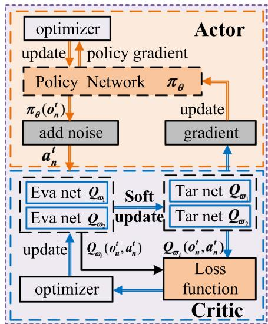

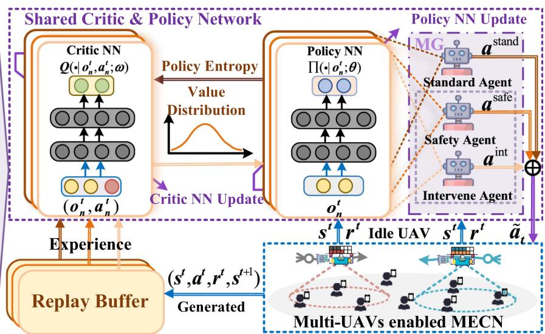  
Fig. 4. Algorithm framework.

Safety Intervention in Two-Agent Markov Game: This process refers to a sequential decision-making paradigm involving two agents that alternately control the UAV to balance reward optimization and safety enforcement. The Safety Agent learns a set of intervention points, which are characterized by when and where the intervention is needed, to identify critical states and determine appropriate actions to ensure system safety. This intervention mechanism is an integral part of the Safety Agent’s decision-making process. However, jointly optimizing the intervention policy and the value functions of the safety policy may lead to instability during the training process. To mitigate this issue, we decouple the optimization process by training the intervention policy  separately using a gradient-based RL galgorithm named Soft Actor-Critic (SAC) [34]. Building upon the safety intervention mechanism, we design a parallel SAC training architecture comprising both a standard policy and a safety policy (which includes a parallel intervention policy), shared across multiple UAV agents. This architecture enables the UAVs to collaboratively learn trajectory planning policies that are both safe and efficient.

# C. Design and Implementation of SSAC-MGI Algorithm

Algorithm Architecture: We design three independent SAC modules to implement the shared network in our proposed multi-agent safe reinforcement learning framework. As illustrated in Fig. 4, these modules correspond to the standard, safety, and intervention policies, which are jointly optimized within the SSAC-MGI framework. Each UAV interacts with the MECN environment via the shared network integrating these three policies. The interaction data are stored separately in policy-specific replay buffers, each of which is used to train and update its corresponding SAC module. The entire system operates as specified by Algorithm 1. Specifically, we begin by initializing the replay buffers for the three SAC models, along with their actor (i.e., policy) parameters $\theta$ and critic network parameters $\omega _ { i }$ (for $i \in \{ 1 , 2 \}$ ), as well as the corresponding target

network parameters $\bar { \omega } _ { i }$ . At each timestep, idle UAVs forward ¯their local observations to the three shared policies. Guided by ${ \bf g } ( o _ { n } ^ { t } )$ , each UAV performs $\tilde { a } _ { n } ^ { t }$ from the standard or safety policy, g( ) ˜triggering the joint state transition. This action schedules UAV trajectories, thereby determining the spatial-temporal placement of tasks across the fleet. Each UAV subsequently invokes the inner round-robin (RR) module (Algorithm 2) to allocate UErequested resources based on its instantaneous load. The reward from the joint effect of UAV trajectory and resource allocation establishes a feedback loop that iteratively updates the UAV scheduling policies. Line 17 of Algorithm 1 routes interaction data to dedicated replay buffers for subsequent SAC updates. Thus, RR serves as an embedded module within the policy learning framework, enabling trajectory-planning-driven joint optimization of scheduling and resource allocation.

Round-Robin Based Instance Allocation: We propose a Round-Robin strategy to allocate task instances requested by job workflows to virtual machines (VMs) deployed on UAVs. At the beginning of each time slot, the available CPU cores and memory resources of all VMs are reset. UEs upload their job requests to the UAVs based on their current locations, as described in Step (2) of Subsection III-C. The accumulated job requests $\mathcal { D } _ { n } ^ { t }$ are then sorted based on the remaining execution time of the most urgent task in each job. Each UAV iteratively selects jobs from the sorted list and prioritizes tasks within each job by the task’s deadline urgency. For each task, the UAV first checks whether all instances required for execution $( \phi _ { k } ^ { i } \cdot n u m _ { k } ^ { i } )$ have been completed. If not, it calculates the maximum number of instances that can be allocated based on the currently available CPU and memory resources. The actual allocation is further adjusted depending on whether the task is approaching its deadline. Specifically, deadline-imminent tasks are prioritized and allocated sufficient execution instances to ensure timely completion, while those with sufficient remaining time are allocated fewer execution instances, based on the average number of execution instances per remaining available time slot, thereby ensuring that as many tasks as possible are executed promptly and do not

Algorithm 2: Round-Robin for Instance Allocation.   
1 Reinitialize vcpu $^r$ and $\mathsf{vmem}_n^r\forall r\in \mathcal{R}_n,n\in \mathcal{N}$ 2 for $n\in \mathcal{N}$ do   
3 Update $\mathcal{D}_n^t$ after job requests are uploaded by UEs (see Step (2) in Subsection III-C)   
4 Sort $\mathcal{D}_n^t (\uparrow) = \left\{j_k\in \mathcal{D}_n^t\big|\min_{v_k^i\in j_k}(\xi \phi_k^i -(t - t_k^g))\right\}$ 5 Initialize $Rr\gets 0$ // Round-robin index   
6 while $\mathcal{D}_n^t\neq \emptyset$ and Check(vcpu $^r$ ,vmem $^r$ ) $=$ True do   
7 Sort $j_{k}(\uparrow) = \{v_{k}^{i}\in j_{k}\mid$ sort by $(\xi \phi_{k}^{i} - (t - t_{k}^{g}))\}$ 8 for $v_{k}^{i}\in j_{k}$ do   
9 if CheckStatus $(v_{k}^{i}) =$ done then   
10 continue // skip completed task   
11 $x_{v_k^i,vm_n^r}^\prime = \min \left\{\left\lfloor \frac{vcpu_n^r}{vcpu_k^i},\frac{vmem_n^r}{vmem_k^i}\right\rfloor \right\}$ 12 if $\xi \phi_k^i -AWT(v_k^i)\geq \phi_k^i$ then   
13 $\begin{array}{rl}{x_{v_k^i,vm_n^r}} & {= \min \left\{x_{v_k^i,vm_n^r}^\prime ,num_k^i\right\}} \end{array}$ 14 else   
15 $x_{v_k^i,vm_n^r}'' = \frac{num_k^i\cdot\phi_k^i}{\xi\phi_k^i - AWT(v_k^i)}$ 16 if $Rr = 0$ and $x_{v_k^i,vm_n^r}^\prime < x_{v_k^i,vm_n^r}^\prime$ then Remove $j_{k}$ from $\mathcal{D}_n^t$ Break // $j_{k}$ is missed   
17 else   
18 $x_{v_k^i,vm_n^r} = \min \left\{x_{v_k^i,vm_n^r}^\prime ,x_{v_k^i,vm_n^r}^\prime \right\}$ 19 $vcpu_{n}^{-}\gets vcpu_{n}^{-}\gets vcpu_{k}^{-}\cdot x_{v_{k}^{i},vm_{n}^{r}}$ 20 $vmem_{n}^{-}\gets vmem_{n}^{-}\gets vmem_{k}^{-}\cdot x_{v_{k}^{i},vm_{n}^{r}}$ 21 $Rr\gets Rr + 1$ 24 if ChechStatus $(j_{k}) =$ done then Remove $j_{k}$ from $\mathcal{D}_n^t$ // Complete $j_{k}$

experience excessive delays. If a job cannot be satisfied with its required resource during the first round, it is dropped to avoid resource wastage. After each round, the resource counters are updated, and the round-robin index is incremented to ensure fair allocation across all jobs. Additionally, completed jobs are identified and removed from the job queue to prevent redundant instance allocation in subsequent rounds.

Policy Update: In MARL, agents either learn with centralized value functions or rely solely on local observations. MASAC (Multi-Agent SAC) employs a centralized value function to leverage global information, whereas ISAC (Independent SAC) utilizes local observations for both policy and value functions, enabling scalable decentralized learning. Following the ISAC paradigm, our framework treats each UAV as an independent agent with access to its local observations only. To improve the training efficiency, we adopt a shared policy architecture, in which all UAVs share network parameters but interact with the environment and learn independently. Within this structure, the shared policy is optimized to maximize each agent’s expected long-term return. To further promote exploration and policy robustness, we adopt an entropy-augmented objective that incorporates a policy entropy term $\mathcal { H }$ into the reward formulation [34], [35]. This encourages agents to explore diverse actions and prevents premature convergence. The objective of each policy

is defined as follow [36].

$$
\mathcal {J} _ {\pi} = \mathbb {E} _ {\left(s _ {t}, a _ {t}\right) \sim \Pi} \left[ \sum_ {t = 0} ^ {T} \left[ R _ {t} \left(s _ {t}, a _ {t}\right) + \eta \mathcal {H} (\pi (\cdot | s _ {t})) \right] \right], \tag {38}
$$

where

$$
\begin{array}{l} \mathcal {H} (\pi (\cdot | s)) = - \int_ {a \in \mathcal {A}} \pi (a | s) \log \pi (a | s) d a \\ = \mathbb {E} _ {a \sim \pi (| s)} [ - \log \pi (a | s) ]. \tag {39} \\ \end{array}
$$

The temperature parameter $\eta$ controls the trade-off between the entropy term and the reward. As $\eta  0$ , maximum entropy re-0inforcement learning asymptotically converges to conventional reinforcement learning.

To find the optimal policy that maximizes the objective in Equation (39), we evaluate the Q-function of the current policy and update the policy using an off-policy gradient step based on a soft policy iteration formulation. Specifically, in the policy evaluation step of soft policy iteration, we start from any function $Q : S \times \mathcal { A }  \mathbb { R }$ and repeatedly apply a modified Bellman :backup operator $\mathcal { T } ^ { \pi }$ defined as

$$
\mathcal {T} ^ {\pi} Q \left(s _ {t}, a _ {t}\right) \triangleq R _ {t} \left(s _ {t}, a _ {t}\right) + \gamma \mathbb {E} _ {s _ {t + 1} \sim p} [ V (s _ {t + 1}) ], \tag {40}
$$

where $V ( s _ { t } ) = \mathbb { E } _ { a _ { t } \sim \pi } [ Q ( s _ { t } , a _ { t } ) - \eta \log \pi ( a _ { t } | s _ { t } ) ]$ is the soft ( ) = [ ( ) log ( )]state value function. In the policy improvement step, we update the policy toward the exponential of the new soft Q-function, for each state, we update the policy according to

$$
\pi_ {\text {n e w}} = \arg \min  _ {\pi^ {\prime} \in \Pi} D _ {\mathrm {K L}} \left( \right.\pi^ {\prime} (\cdot | s _ {t}) \left\| \right. \frac {\exp \left(\frac {1}{\eta} Q ^ {\pi_ {\text {o l d}}} (s _ {t} , \cdot)\right)}{Z ^ {\pi_ {\text {o l d}}} (s _ {t})}\left. \right), \tag {41}
$$

where the partition function $Z ^ { \pi _ { \mathrm { o l d } } } \left( s _ { t } \right)$ normalizes the distribution ( )and can be omitted during optimization [34]. We employ function approximators (i.e., neural networks) for both the soft Qfunction and the policy, and alternate between optimizing these networks via stochastic gradient descent (SGD). As described in Algorithm 1, each SAC module employs a tractable policy network $\pi _ { \boldsymbol { \theta } } ( \cdot | s _ { t } )$ , along with two soft Q-functions modeled by ( )neural networks, parameterized as $Q _ { \omega _ { 1 } } ( s _ { t } , a _ { t } ) , Q _ { \omega _ { 2 } } ( s _ { t } , a _ { t } )$ . To ( ) ( )stabilize training and mitigate Q-value overestimating, each Qnetwork $Q _ { \omega _ { i } }$ is accompanied by a target Q-network $Q _ { \bar { \omega } _ { i } }$ , where $i \in \{ 1 , 2 \}$ . The soft Q-functions are trained by minimizing the 1 2soft Bellman residual:

$$
\begin{array}{l} J _ {Q} \left(\omega_ {i}\right) = \mathbb {E} _ {\left(s _ {t}, a _ {t}\right) \sim \mathcal {C}} \left[ \frac {1}{2} \left(Q _ {\omega_ {i}} \left(s _ {t}, a _ {t}\right) - \left(R _ {t} \left(s _ {t}, a _ {t}\right) \right. \right. \right. \\ \left. + \gamma \mathbb {E} _ {s _ {t + 1} \sim p} \left[ V _ {\bar {\omega}} \left(s _ {t + 1}\right) \right]\right) ^ {2} ], \tag {42} \\ \end{array}
$$

where $V _ { \bar { \omega } } ( s _ { t + 1 } ) = \mathbb { E } _ { a _ { t + 1 } \sim \pi _ { \theta } } [ \operatorname* { m i n } _ { i = 1 , 2 } Q _ { \bar { \omega } _ { i } } ( s _ { t + 1 } , a _ { t + 1 } ) -$

$\eta \log \pi _ { \boldsymbol { \theta } } \big ( a _ { t + 1 } | \boldsymbol { s } _ { t + 1 } \big ) \big ]$ . The target Q-function parameters log ( )]are updated using an exponential moving average of the corresponding soft Q-function weights. The policy parameters are updated by minimizing the KL-divergence in Equation (43), scaled by the temperature $\eta$ and ignoring the constant log-partition function.

$$
J _ {\pi} (\theta) = D _ {K L} \left(\pi_ {\theta} ^ {\text {n e w}} (\cdot | s _ {t}) \left\| \frac {\exp \left(\frac {1}{\eta} Q ^ {\pi_ {\text {o l d}}} (s _ {t} , \cdot)\right)}{Z ^ {\pi_ {\text {o l d}}} (s _ {t})}\right) \right.
$$

$$
= \mathbb {E} _ {\mathcal {C}, \pi_ {\theta}} \left[ \eta \log \pi_ {\theta} (a _ {t} | s _ {t}) - \min  _ {i = 1, 2} Q _ {\omega_ {i}} (s _ {t}, a _ {t}) \right]. \tag {43}
$$

# D. Convergence and Complexity Analysis

Convergence Analysis: Given the safety policy $\pi ^ { \mathrm { s a f e , g } }$ , let $\tau _ { k } \in \mathbb { T }$ denote the $k$ -th intervention time. The intervention operator is defined in Equation (44) shown at the bottom of this page. Following the Bellman update rule, the safety Bellman operator used for value iteration is defined in Equation (45) shown at the bottom of this page; it captures the nested, sequential interaction between the two agents and returns the smaller expected future safety cost. The optimal value function $v _ { \mathrm { s a f e } } ^ { * } ( s )$ is characterized as the unique fixed point of $\tau$ ( ), which is approximated via the Q-learning variant in Equation (46) (shown at the bottom of this page) with step-size $\alpha _ { t }$ . The stochastic approximation theory ensures almost-sure convergence of this variant to the fixed point, as established by Theorem 1(optimality) and Theorem 2 and 3 (convergence) in [37], while the optimal value function induces a deterministic sequence of interventions times. Furthermore, by extracting only dimension-invariant features across all UAVs while preserving the linear function-approximation conditions for Q-learning convergence, the shared network enables Algorithm 1 to inherit above convergence guarantees.

Time Complexity: The SSAC-MGI algorithm jointly trains three parallel SAC modules (standard, safety, and intervention) and incorporates a nested round-robin instance allocator. Let $J$ denote the maximum number of pending jobs per UAV, $V$ the maximum number of sub-tasks per job, $d$ and $a$ the dimensions of the state and action spaces, and $B$ the batch size used for updates. At each time step, the algorithm performs the following operations: (i) Action amp transition: each idle UAV samples & ;actions from the three policies and updates its state, $O ( N )$ . (ii) ( )Instance allocation: Algorithm 2 runs once per timestep, looping over all $N$ UVAs. For each UAV $n$ , the job queue $\mathcal { D } _ { t } ^ { n } ( \leq J )$ is first sorted by deadlines in $O ( J \log J )$ ( ), and re-orders at most $V$ sub-tasks per job incurs $O ( V )$ ( log )time. Consequently, the step time complexity is $O \big ( N J V \log V \big )$ . (iii) Reward amp buffer uplog & ;date: each UAV computes its reward and safety cost incurs $O ( N )$ ( )time. (iv) Policy update: At each episode’s end, the three SAC modules are trained on a batch of $B$ samples, their forward and backward propagation require $O ( B ( d + a ) )$ time per module. Let $E$ ( ( + ))denote the number of training episodes, the overall time complexity is therefore $O { \big ( } E \cdot ( T \cdot N J V \log V + B ( d + a ) ) { \big ) }$ .

( log + ( + ))Space Complexity: the primary sources of memory consumption include the neural network parameters, replay buffers,

instance-allocation storage, and temporary UAV-state storage. Each SAC module maintains an actor, two critic and two target critic networks, let $P$ be the total number of trainable parameters, yielding a memory cost of $O ( P )$ . Furthermore, three replay ( )buffers (one per SAC module), each storing up to $C$ transition tuples of dimension $O ( d + a )$ , for $O ( C ( d + a ) )$ space overall. ( + )To hold all pending sub-tasks across $N$ ( + ))UAVs, each with up to $J$ jobs of at most of $V$ sub-tasks, requiring $O ( N J V )$ . In addition, ( )the storage of intermediate states across UAVs and time steps further contributes $O ( T N d )$ space. Therefore, the total space complexity is $O \big ( P + C ( d + a ) + N J V + T N d \big )$ .

# VI. EVALUATION

# A. Experimental Setup

We implement a simulation environment for the multi-UAV enabled MECN using the proposed SSAC-MGI algorithm, which is built upon the OpenAI Gym interface. To reflect realistic workloads, we incorporate two real-world datasets: the Alibaba Cluster Traces V2017 and V2018 [24]. From these datasets, we filter workflows with job types in $\{ 3 , 8 , 1 0 , 1 2 \}$ and task-level parallelism $n u m _ { k } ^ { i } \in [ 1 0 , 1 0 0 ]$ 3 8 10 12to simulate job [10 100]requests from UEs. For static and mobile UEs, we use movement traces from 20 Twitter users located near Oxford Street, London, on March 14, 2018 [38], selecting users who posted at least three tweets that day [10]. Each UAV, acting as a MEC platform, is equipped with two resource types selected from the following configurations: [{3:(1856,20.01)}, {8:(3520,37.95)}, {10:(2048,22.08)}, {12:(3584,38.64)}], where each VM has 64 CPU cores and 0.690 memory units [39]. In each tuple, the key indicates the resource type, and the value indicates the pre-allocated resources (CPU, memory). Simulation parameters follow [29], [40], with defaults listed in Table III unless otherwise specified. The source code of our algorithm is available on GitHub2.

Traces data: We independently filter 1,754 tasks from the ‘tbl_batch_task’ table in both Trace V2017 and Trace V2018 by selecting those whose durations satisfy $\xi \phi _ { k } ^ { i } \in ( 0 , 3 0 0 ]$ for all $v _ { k } ^ { i } \in \Gamma$ , where $\xi = 1 . 5$ (0 300]denotes the UE-specified deadline Γ = 1 5coefficient [2]. All 4,756,733 instances are associated with 1,754 tasks originating from 912 jobs in Trace V2017, and 2,647,977 instances associated with 1,754 tasks originating from 1,594 jobs in Trace V2018. The job characteristics of the two datasets, including the distributions of job types and requested CPU

2The code of our multi-UAV enabled MECN implementation is publicly available at: https://github.com/xiulingzhang22/SSAC-MGI.

$$
\mathcal {M} ^ {(\pi^ {\text {s a f e}}, \mathbf {g})} Q _ {\text {s a f e}} \left(s _ {\tau_ {k}}, a _ {\tau_ {k}} ^ {\text {s a f e}}\right) = R _ {2} \left(s _ {\tau_ {k}}, a _ {\tau_ {k}} ^ {\text {s a f e}}\right) + \gamma \sum_ {s ^ {\prime} \in \mathcal {S}} P \left(s ^ {\prime} \mid s _ {\tau_ {k}}, a _ {\tau_ {k}} ^ {\text {s a f e}}\right) v _ {\text {s a f e}} ^ {\pi^ {\text {s t a n d}}, (\pi^ {\text {s a f e}}, \mathbf {g})} \left(s ^ {\prime}\right), \forall \tau_ {k} \in \mathbb {T}. \tag {44}
$$

$$
\mathcal {T} v _ {\text {s a f e}} ^ {\pi^ {\text {s t a n d}}, \left(\pi^ {\text {s a f e}}, \mathbf {g}\right)} (s): = \max  \left\{\underbrace {\mathcal {M} ^ {\left(\pi^ {\text {s a f e}} , \mathbf {g}\right)} Q _ {\text {s a f e}} \left(s _ {\tau_ {k}} , a _ {\tau_ {k}} ^ {\text {s a f e}}\right)} _ {\text {i n t e r v i t i o n}}, \underbrace {R _ {\text {i n t}} \left(s , a ^ {\text {s t a n d}}\right) + \gamma \sum_ {s ^ {\prime} \in S} P \left(s ^ {\prime} \mid s , a ^ {\text {s t a n d}}\right) v _ {\text {s a f e}} ^ {\pi^ {\text {s t a n d}}, \left(\pi^ {\text {s a f e}}, \mathbf {g}\right)} \left(s ^ {\prime}\right)} _ {\text {n o i n t e r v i t i o n}} \right\}. \tag {45}
$$

$$
Q _ {t + 1} \left(s _ {t}, a _ {t}\right) = Q _ {t} \left(s _ {t}, a _ {t}\right) + \alpha_ {t} \left(s _ {t}, a _ {t}\right) \left[ \max  \left\{\mathcal {M} ^ {\left(\pi^ {\text {s a f e}}, \mathbf {g}\right)} Q _ {t} \left(s _ {t}, a _ {t}\right), R \left(s _ {t}, a _ {t}\right) + \gamma \max  _ {a ^ {\prime} \in \mathcal {A}} Q _ {t} \left(s _ {t + 1}, a ^ {\prime}\right) \right\} - Q _ {t} \left(s _ {t}, a _ {t}\right) \right]. \tag {46}
$$

TABLE III KEY PARAMETERS OF SIMULATION   

<table><tr><td>Parameters</td><td>Value</td></tr><tr><td>Side length of the 2D plane</td><td>500 × 500 (m)</td></tr><tr><td>The number of UAVs</td><td>N = {2,3,4,5,6}</td></tr><tr><td>Set of all resource type identifiers</td><td>R = {3,8,10,12}</td></tr><tr><td>The number of UEs</td><td>M = 20</td></tr><tr><td>The azimuth angle of UAV</td><td>θ = 30°</td></tr><tr><td>The hovering altitude of UAV</td><td>H = 100m</td></tr><tr><td>The operating period of UAVs</td><td>T = 300s</td></tr><tr><td>Communication bandwidth of UAV</td><td>B0 = 1MHz</td></tr><tr><td>The power spectral density</td><td>N0 = 1 × 10-20w/MHz</td></tr><tr><td>Environment model constants</td><td>ρ = 11.95, β = 0.14</td></tr><tr><td>Additional path loss for LoS/NLoS</td><td>3dB/23dB</td></tr><tr><td>The carrier frequency</td><td>fc = 2GHz</td></tr><tr><td>The speed of light</td><td>c = 3 × 108m/s</td></tr><tr><td>Data size of request file (in MB)</td><td>Ωk ∼ N(1.7,0.1)</td></tr><tr><td>The maximum UAV speed</td><td>50m/s</td></tr><tr><td>Transmit power of the UAVs</td><td>pn=5 W</td></tr><tr><td>Rotor blade tip speed</td><td>Utip = 120m/s,</td></tr><tr><td>Rotor disc area in m2</td><td>A = 0.503</td></tr><tr><td>Air density in kg/m3</td><td>ι = 1.225kg/m3</td></tr><tr><td>Mean rotor induce velocity in hover</td><td>v0 = 4.03m/s</td></tr><tr><td>Rotor solidity, Fuselage drag ratio</td><td>s = 0.05,d0 = 0.6</td></tr><tr><td>Hovering power components</td><td>P0 = 79.86, Pi = 88.63</td></tr><tr><td>The physical radius of UAV</td><td>rd = 5m</td></tr><tr><td>Number of neurons per hidden layer</td><td>h=64</td></tr><tr><td>Reward discount factor</td><td>γ=0.99</td></tr><tr><td>Learning rate</td><td>λ=0.0001</td></tr><tr><td>The temperature parameter</td><td>η=1</td></tr><tr><td>Memory replay buffer</td><td>C=100000</td></tr></table>

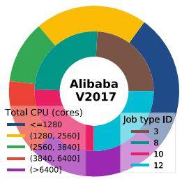

  
Fig. 5. Job characterization of Alibaba traces. The outer circle shows the number of jobs within each range of required total CPU cores, while the inner circle shows the number of jobs for each resource type category.

cores3, are shown in Fig. 5. At each time slot, UE-generated jobs are randomly sampled from the filtered dataset, following the Poisson arrival rate of $\begin{array} { r } { k ( \Delta t ) = \frac { | \Gamma | } { T } } \end{array}$ , as illustrated in Fig. 6(a). (Δ ) = The distributions of task duration are shown in Fig. 6(b) and (c). It can be seen that most tasks in Trace V2018 have shorter durations and tighter deadlines.

Baseline algorithms: As no existing methods can directly solve the proposed problem, we compare SSAC-MGI with several adapted baselines and a manual UAV trajectory policy. To ensure a fair comparison, all baselines are implemented within the same system framework as SSAC-MGI.

- SSAC-MGI First Come First Service (SSAC-MGI-FCFS): A variant of SSAC-MGI in which the embedded roundrobin resource allocation strategy is replaced by a classical first-come-first-served (FCFS) scheme, where each

3CPU request values in the trace are divided by 100 to reflect the actual request, as the basic unit for batch tasks is $1 0 ^ { - 2 }$ CPU [39].

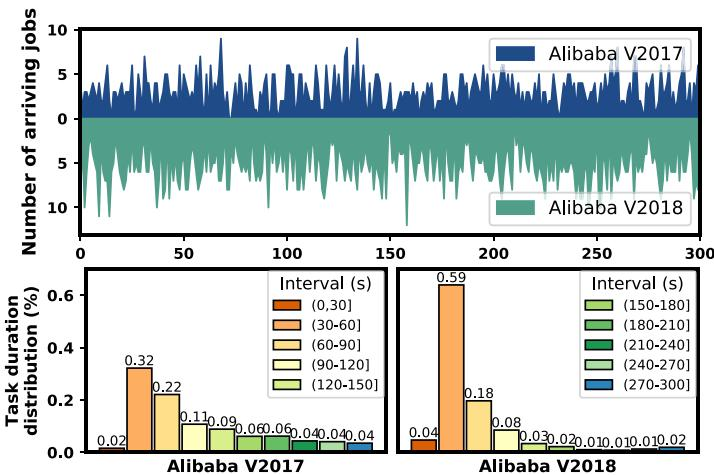  
Fig. 6. The Alibaba trace analysis includes: (a) number of arriving job requests per time slot; (b) the duration distribution of 1754 tasks within jobs.

job in the queue is sequentially allocated all the available resources required to execute its tasks.

- Shared Soft Actor-Critic (SSAC): An unconstrained MARL baseline where each UAV independently selects actions from a shared SAC policy [34], instead of employing our set of standard, safety, and intervention policies. To minimize the system-level safety cost, safety signals are embedded into the reward function, a typical reward-shaping approach in unconstrained RL. However, such methods often suffer from restricted exploration, potentially leading to suboptimal performance.   
- Shared Trust Region Policy Optimization (STRPO): An unconstrained MARL baseline similar to SSAC is a rewardshaping RL approach, which is constructed by replacing SAC with Trust Region Policy Optimization (TRPO) [41], while retaining the policy architecture and training procedure used in SSAC-MGI.   
- Shared Constrained Policy Optimization (SCPO): A constrained MARL baseline based on Constrained Policy Optimization (CPO) [42], which enforces safety constraints by dynamically adjusting a penalty coefficient during training. While integrated into the same shared training framework, CPO differs from our approach in that it directly embeds safety handling into policy optimization. This comparison highlights the benefits of explicitly decoupling safety control from policy learning, particularly in terms of flexibility and performance under complex safety requirements.   
- Manual UAV Trajectory Planning Policy (MANUAL) [18]: A handcrafted baseline policy that focuses solely on providing computing services. In our implementation, the entire MECN coverage area is partitioned into a $5 0 \times 5 0 \mathrm { m }$ 50 50grid. To ensure full-area coverage and improve service performance, each UAV alternately follows one of two manually designed trajectories with opposite counter-clockwise directions, as illustrated in Fig. 7.

# B. Performance Comparison and Convergence Analysis

Fig. 8 presents the learning curves of SSAC-MGI compared with all aforementioned unconstrained and constrained RL algorithms in a scenario involving three UAVs. Experimental results

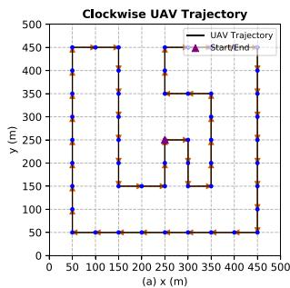

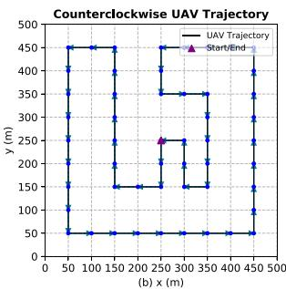  
Fig. 7. Two manual UAV trajectories [18].

across two random seeds demonstrate that SSAC-MGI consistently outperforms all baseline algorithms by achieving the highest cumulative rewards and the lowest safety violation costs on both trace datasets. Moreover, it exhibits faster convergence and overall enhanced performance. These improvements are gained owing to the ability of our algorithm to decouple the objectives of reward maximization and safety cost minimization via a two-agent Markov game intervention model. Further analysis of the training reward curves in Fig. 8 reveals that the cumulative reward per episode for V2017 (in subfigure (a)) is higher than that for V2018 (in subfigure (c)). This observation can be explained by two key differences: (i) Jobs in V2017 show a more balanced distribution across resource types, as illustrated in Fig. 5(a); (ii) Compared to V2018, most jobs in V2017 have looser and more uniformly distributed deadlines, as shown in Fig. 6(b) and (c).

We also present the convergence curves of key evaluation metrics observed during the training process with the proposed SSAC-MGI algorithm. The results are compared with those of the MANUAL policy based on the system objectives defined in Equation (23), including the job miss rate, UAV energy cost (i.e., the normalized average energy consumption per UAV movement per time slot), and UE energy cost (i.e., the normalized average energy consumption per job uploaded by UEs per time slot), and the safety metric defined in Equation (26). Fig. 9 shows that all evaluation metrics under the SSAC-MGI algorithm gradually stabilize within a bounded range across both datasets, demonstrating convergence during training. Under the configuration with two manually predefined and synchronized flight trajectories in clockwise and counter-clockwise directions, the system achieves full spatial coverage, the lowest job miss rate, and the lowest average energy consumption on the UE side. However, even with only three UAVs deployed, this manual strategy suffers from elevated safety risks and significantly higher energy consumption on the UAV side. In contrast, the proposed SSAC-MGI algorithm incurs negligible safety cost and demonstrates significantly lower UAV energy consumption, thereby ensuring system safety throughout training and deployment. While the job miss rate achieved by our algorithm is slightly higher than that achieved by the manual policy, it can be effectively mitigated by deploying a larger number of UAVs.

# C. Performance Evaluation With Varying Numbers of UAVs

The results shown in Figs. 10 and 11 are averaged over 100 testing episodes for each algorithm under different UAV configurations, with the number of UAVs ranging from 2 to 6.

To evaluate the overall performance of the proposed algorithm with respect to the three considered key metrics, we define a utility function as $f ( u ) = 1 - ( w _ { 1 } r _ { 1 } + w _ { 2 } r _ { 2 } + w _ { 3 } r _ { 3 } )$ , where $r _ { 1 } , r _ { 2 }$ , and $r _ { 3 }$ ( ) = 1 ( + + )represent the job miss rate, UAV energy cost, and UE energy cost, respectively. The weights are set equally, i.e., $\begin{array} { r } { w _ { 1 } = w _ { 2 } = w _ { 3 } = \frac { 1 } { 3 } , } \end{array}$ . Based on the defined utility function, lower =values of $r _ { 1 }$ , $r _ { 2 }$ =, and $r _ { 3 }$ lead to a higher utility score, indicating better overall performance.

In both Figs. 10 and 11, we observe that increasing the number of UAVs generally improves the overall system performance. This aligns with the intuitive understanding that deploying more UAVs enhances network service capacity and reduces the overall job miss rate. However, this improvement comes at the cost of increased safety violation risks. As the number of UAVs increases, all baseline algorithms experience a rise in total safety violation costs, primarily due to the higher likelihood of in-flight collisions with obstacles or other UAVs. In terms of safety performance, SSAC-MGI consistently outperforms all baselines across different configurations, exhibiting significantly lower safety costs. In contrast, MANUAL shows a steep increase in safety violation costs as the number of UAVs increases, while its utility scores remain relatively stagnant. This is mainly because MANUAL focuses solely on achieving full UE coverage. Even though we manually define two opposite-direction trajectories to mitigate conflicts, collisions still occur when UAVs remain stationary to handle multiple incoming job requests, as in the case of two UAVs. Furthermore, SSAC-MGI demonstrates stable and robust performance across both dataset distributions. In the V2018 dataset, where tasks are shorter and deadlines are tighter, UAVs must move more frequently to handle rapid job arrivals. This increased movement leads to relatively higher safety violation costs and slightly reduced utility scores, especially in scenarios with fewer UAVs.

Figs. 12 and 13 present the results of three evaluation metrics under the proposed SSAC-MGI algorithm, with the number of UAVs ranging from 2 to 6 and values averaged over 100 testing episodes on both datasets. The energy consumption metrics denote the average energy usage per UAV and per UE’s uploading request during each time slot, respectively. As shown in both figures, increasing the number of UAVs consistently reduces the system’s job miss rate, which is the primary factor contributing to the improvement in utility scores. Consistent with previous observations, the job miss rate in dataset V2018 remains higher than that in V2017, as its tasks generally require more concentrated resource types and have shorter execution durations. Another consistent finding from both figures is the trade-off between UAV and UE energy consumption, i.e., relatively higher UAV energy consumption is usually associated with lower UE energy consumption. This occurs because UE transmission energy is passively influenced by channel conditions, which depend on UAV proximity, coverage radius, available resource types, and the UE’s transmit power constraint. Since UAV and UE energy consumption are inherently coupled, reducing UAV mobility to save energy may increase UE energy consumption, as users are forced to transmit over longer distances with higher transmit power due to suboptimal UAV positioning. Conversely, allowing UAVs to consume more energy through proactive repositioning can alleviate the energy burden on UEs by improving channel quality and reducing transmission distance.

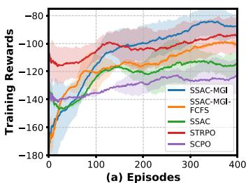

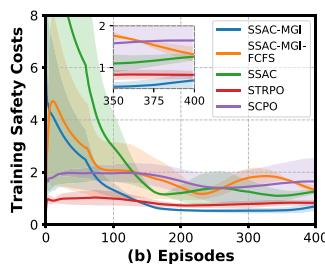

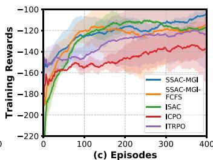

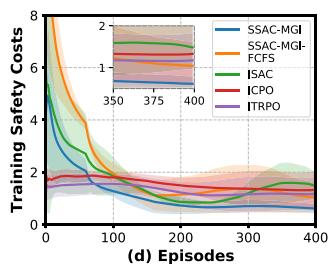  
Fig. 8. Training rewards and training safety costs in datasets V2017 (left (a) and (b)) and V2018 (right (c) and (d).

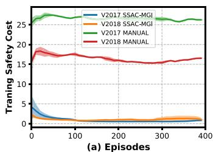

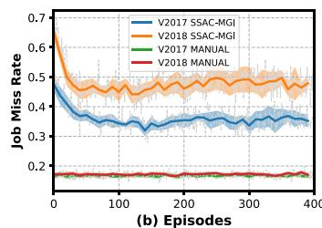

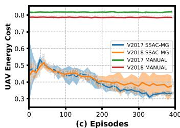

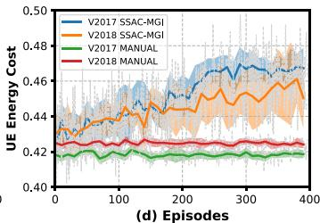  
Fig. 9. Performance comparison between SSAC-MGI and the manual policy in terms of safety cost, job miss rate, average UAV energy consumption, and average UE uploading energy consumption on two datasets.

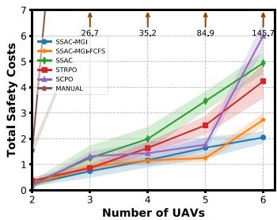

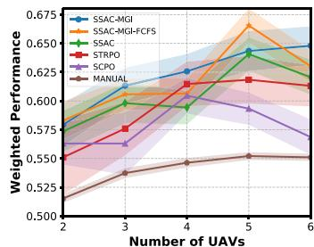  
Fig. 10. Performance comparison during testing on V2017 dataset: (a) total safety cost; (b) weighted utility of job miss rate and energy cost.

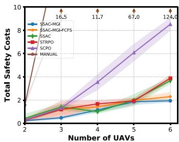

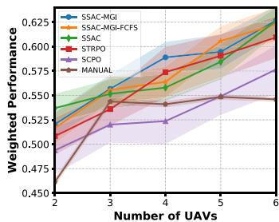  
Fig. 11. Performance comparison during testing on V2018 dataset: (a) total safety cost; (b) weighted utility of job miss rate and energy cost.

# D. Scalability Evaluation Under Varying Numbers of UAVs and Three Channel Models

We evaluate the scalability of the SSAC-MGI algorithm under varying UAV numbers and fading channel models by expanding the MECN area from $5 0 0 \mathrm { m } \times 5 0 0 \mathrm { m }$ with 2–6 UAVs and 20 UEs to $1 0 0 0 \mathrm { m } \times 1 0 0 0 \mathrm { m }$ 0 500 with 8–12 UAVs and 50 UEs, and 1000 1000by employing a large-scale path-loss model, a practical Rician fading model, and a Rayleigh fading model. The results shown

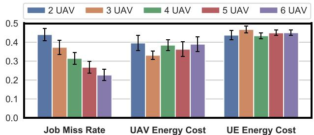  
Fig. 12. SSAC-MGI performance on V2017 with different number of UAVs.

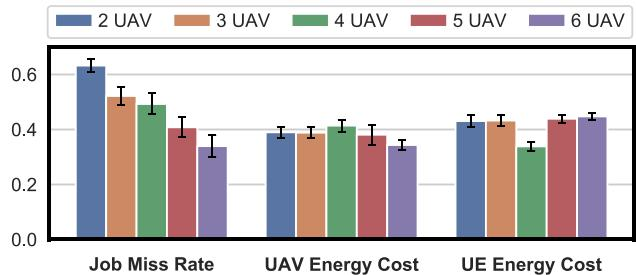  
Fig. 13. SSAC-MGI performance on V2018 with different number of UAVs.

in Table IV for each average performance metric are collected from the 500-th to the 600-th training episodes.

For dataset V2017, we set the Rician factor to $\kappa { = } 0$ , thereby = 0reducing the channel model to Rayleigh fading. For dataset V2018, following the configuration in [27], we adopt $\kappa { = } 4$ . = 4Although these datasets employ different fading models, their performance trends are consistent, allowing us to discuss them jointly. First, across both datasets, increasing the UAV count raises the total safety cost while lowering the job-miss rate, corroborating our findings in Subsection VI-C. Second, expanding

TABLE IV SCALABILITY OF SSAC-MGI WITH A VARYING NUMBER OF UAVS AND THREE CHANNEL MODELS   

<table><tr><td rowspan="2">Dataset</td><td rowspan="2">UAV</td><td colspan="5">Path-loss fading channel model</td><td colspan="5">Rayleigh (V2017) / Rician (V2018) fading channel model</td></tr><tr><td>SC (↓)</td><td>Job MR (↓)</td><td>UAV EC (↓)</td><td>UE EC (↓)</td><td>CPU-U (↑)</td><td>SC (↓)</td><td>Job MR (↓)</td><td>UAV EC (↓)</td><td>UE EC (↓)</td><td>CPU-U (↑)</td></tr><tr><td rowspan="5">V2017</td><td>8</td><td>4.45 ± 0.05</td><td>0.39 ± 0.03</td><td>0.42 ± 0.01</td><td>0.44 ± 0.01</td><td>0.82 ± 0.02</td><td>4.59 ± 0.04</td><td>0.39 ± 0.03</td><td>0.43 ± 0.01</td><td>0.95 ± 0.05</td><td>0.83 ± 0.01</td></tr><tr><td>9</td><td>6.43 ± 0.02</td><td>0.38 ± 0.03</td><td>0.42 ± 0.01</td><td>0.44 ± 0.01</td><td>0.82 ± 0.02</td><td>6.13 ± 0.06</td><td>0.39 ± 0.03</td><td>0.43 ± 0.01</td><td>0.94 ± 0.05</td><td>0.82 ± 0.01</td></tr><tr><td>10</td><td>6.81 ± 0.13</td><td>0.36 ± 0.02</td><td>0.42 ± 0.01</td><td>0.44 ± 0.01</td><td>0.82 ± 0.01</td><td>7.25 ± 0.06</td><td>0.35 ± 0.03</td><td>0.43 ± 0.01</td><td>0.93 ± 0.04</td><td>0.82 ± 0.02</td></tr><tr><td>11</td><td>9.22 ± 0.14</td><td>0.35 ± 0.03</td><td>0.43 ± 0.01</td><td>0.44 ± 0.01</td><td>0.81 ± 0.02</td><td>10.17 ± 0.14</td><td>0.33 ± 0.03</td><td>0.44 ± 0.01</td><td>0.93 ± 0.05</td><td>0.81 ± 0.01</td></tr><tr><td>12</td><td>13.07 ± 0.32</td><td>0.34 ± 0.03</td><td>0.43 ± 0.01</td><td>0.44 ± 0.01</td><td>0.81 ± 0.01</td><td>9.97 ± 0.08</td><td>0.31 ± 0.03</td><td>0.43 ± 0.01</td><td>0.93 ± 0.04</td><td>0.82 ± 0.02</td></tr><tr><td rowspan="5">V2018</td><td>8</td><td>4.85 ± 0.12</td><td>0.57 ± 0.03</td><td>0.41 ± 0.01</td><td>0.44 ± 0.01</td><td>0.76 ± 0.02</td><td>4.77 ± 0.13</td><td>0.56 ± 0.03</td><td>0.42 ± 0.01</td><td>0.66 ± 0.03</td><td>0.77 ± 0.02</td></tr><tr><td>9</td><td>6.66 ± 0.23</td><td>0.53 ± 0.03</td><td>0.42 ± 0.01</td><td>0.44 ± 0.02</td><td>0.76 ± 0.02</td><td>5.95 ± 0.08</td><td>0.52 ± 0.03</td><td>0.42 ± 0.01</td><td>0.66 ± 0.03</td><td>0.77 ± 0.02</td></tr><tr><td>10</td><td>7.09 ± 0.12</td><td>0.52 ± 0.03</td><td>0.42 ± 0.01</td><td>0.44 ± 0.01</td><td>0.75 ± 0.02</td><td>6.79 ± 0.12</td><td>0.52 ± 0.03</td><td>0.42 ± 0.01</td><td>0.66 ± 0.03</td><td>0.76 ± 0.02</td></tr><tr><td>11</td><td>8.81 ± 0.08</td><td>0.47 ± 0.04</td><td>0.42 ± 0.01</td><td>0.44 ± 0.01</td><td>0.74 ± 0.02</td><td>10.56 ± 0.18</td><td>0.50 ± 0.03</td><td>0.42 ± 0.01</td><td>0.65 ± 0.03</td><td>0.75 ± 0.02</td></tr><tr><td>12</td><td>9.49 ± 0.11</td><td>0.45 ± 0.04</td><td>0.42 ± 0.01</td><td>0.44 ± 0.01</td><td>0.74 ± 0.01</td><td>11.79 ± 0.29</td><td>0.47 ± 0.04</td><td>0.42 ± 0.01</td><td>0.65 ± 0.02</td><td>0.75 ± 0.01</td></tr></table>

Annotation:SC:safetycost; JobMR: job-missrate; UAVEC: UAVenergycost; UEEC: UEenergycost; CPU-U:CPUutliation.

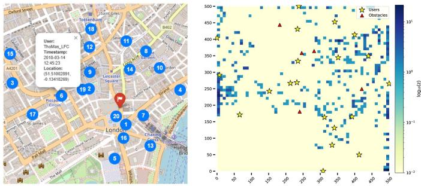  
Fig. 14. UAV-learned trajectory distribution with static UEs.

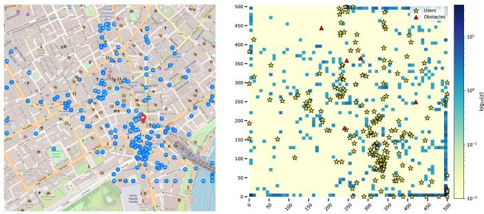  
Fig. 15. UAV-learned trajectory distribution with mobile UEs.

the MECN area increases the average UAV–UE travel distance while also resulting in a sparser UE distribution, causing a slight rise in the average energy cost of UAVs and UEs. Furthermore, the additional UAVs deployed in larger scales provide sufficient computational capacity, so the average energy cost between UAVs and UEs remains nearly unchanged, making the energy trade-off negligible. Third, despite the variability introduced by Rician and Rayleigh fading, SSAC-MGI adapts to these stochastic channels and sustains safety costs and job-miss rates comparable to those under the deterministic path-loss model. With this set of experimental parameters, for all three fading models, the measured average UE energy cost follows the theoretical ordering $\bar { p } _ { \mathrm { P L } } < \bar { p } _ { \mathrm { R i c } } < \bar { p } _ { \mathrm { R a y } }$ established in Lemma 2, ¯ ¯ ¯indicating that the UE requires the larger transmit power to guarantee the successful request uploading under fading channels, compared with that under the path loss channel. In summary, these consistent trends across varying numbers of UAVs and three fading channel models in a larger-scale MECN validate the scalability and robustness of SSAC-MGI.

# E. Analysis of UAV-Learned Trajectory Distributions With Mobile/Static UEs and Static Obstacles

We conduct a detailed analysis of the trajectory distributions learned by SSAC-MGI in a representative scenario comprising 3 UAVs and 20 UEs, incorporating both static and mobile UEs. To simulate mobility diversity and positioning errors, small Gaussian noise is added to introduce controlled randomness. This analysis provides a visualization of UAVs’ safety-aware trajectories.

Figs. 14 and 15 present the resulting UAV trajectory distributions under a 3-UAV setting on the V2017 dataset. In each figure,

the left panel shows UE locations overlaid on a Google Map, while the right panel projects these positions onto a $5 0 0 \times 5 0 0$ 500 5002D coordinate plane. UAV trajectories over 300 time slots are visualized using heatmaps, with color intensity representing the frequency of UAV presence. To better highlight the distributional differences in UAV locations, we apply a logarithmic transformation $( \log _ { 1 0 } z )$ to the visit frequency, where $z$ denotes the logcumulative number of UAV visits to each location duration the mission. Yellow pentagrams indicate UEs, while red triangles represent static obstacles. The results in Fig. 14 illustrate that, under static UEs, the UAVs tend to align their trajectories closely with the UE locations, despite not having prior knowledge of their positions. Moreover, the UAV trajectories consistently avoid the red static obstacles, demonstrating effective obstacleaware planning. Furthermore, Fig. 15 illustrates the scenario in which each UE moves randomly within the network. The results demonstrate that the learned UAV trajectories effectively adapt to the spatial dynamics of mobile UEs, achieving both adaptive coverage and reliable obstacle avoidance. In addition, the accumulated safety violation costs in Fig. 10 are below 1 when the number of UAVs is 3, which indicates effective collision avoidance among UAVs. This indicates strong adaptability of the proposed method to varying UE mobility patterns, while ensuring safe, goal-directed trajectory planning.

# VII. CONCLUSION AND FUTURE WORK

In this work, we investigated the cooperative trajectory optimization of heterogeneous UAVs in realistic MEC environments characterized by uncertain UE locations and dynamic computation request arrivals. We propose SSAC-MGI, a multi-agent safe reinforcement learning framework designed to generate

environment-adaptive trajectory planning policies. It incorporates a fine-grained onboard resource allocation mechanism to ensure both trajectory safety and efficient resource utilization in heterogeneous UAV systems operating under stochastic conditions. To evaluate our approach, we construct a realistic UAV-enabled MEC environment using actual user distributions and real-world Alibaba job traces. Extensive simulations demonstrate that our method significantly outperforms existing baselines in terms of job miss rate and average energy consumption of both UAVs and UEs, while maintaining safety under unseen scenarios.

For real-world deployment of such MECN, achieving highfidelity environmental sensing, including precise UE localization and accurate channel state estimation, is critical, as delays or errors can degrade trajectory planning performance. Compared with large-scale static UAV deployments, which necessitate numerous drones stationed at fixed locations, our approach enables dynamic coverage using substantially fewer units. Nonetheless, ensuring absolute safety requires not only guidance from our scheduling policy but also real-time perception and online finetuning. To address these requirements, future work will explore multi-modal learning techniques for real-time perception, integrating image-based UE localization, obstacles detection, and analysis of historical trajectory information flows to provide richer observations and more informed trajectory guidance. Near-range UAV identification will further enable finer-grained trajectory adjustments. The current work serves as a preliminary exploration in this direction.

# ILLUSTRATION OF MAIN TECHNICAL TERMS AND ACRONYMS

- Mobile edge computing networking (MECN): A network consisting of user equipment (mobile/static) and edge servers that relocates cloud-level computing, storage, and networking capabilities from the core network to the radioaccess edge, thereby reducing end-to-end latency, alleviating back-haul congestion, and enabling context-aware, real-time services for 5/6G applications.   
- Unmanned aerial vehicle (UAV): In this work, the UAV is regarded as the mobile edge server equipped with dedicated computational resources.   
- User equipment (UE): UE refers to a service objective by UAV, which randomly generates job requests with diverse resource demands during the network operation.   
- Decentralized partially observable Markov decision process (Dec-POMDP): The Dec-POMDP model extends single-agent POMDP models by considering joint actions and observations. POMDP extends the MDP model by incorporating observations and their probability of occurrence conditional on the state of the environment.   
- Decentralized training and decentralized execution (DTDE), Centralized training and decentralized execution (CTDE): MARL is commonly categorized as either centralized or decentralized. Centralized approaches learn one policy to emit joint actions for all agents, whereas DTDE let each agent optimize its own reward. CTDE assumes a training stage during which the learning algorithm can

access data from all agents to learn decentralized (locallyexecutable) agent policies.

- Soft actor-critic (SAC), Trust Region Policy Optimization (TRPO), constrained policy optimization (CPO): All the three are policy-gradient methods aiming at stable return gains: SAC boosts sample efficiency via maximum-entropy reward shaping; TRPO enforces monotonic improvement with a KL trust-region constraint; CPO layers cost bounds on TRPO to guarantee safety.

# REFERENCES

[1] S. A. Noghabi, L. Cox, S. Agarwal, and G. Ananthanarayanan, “The emerging landscape of edge computing,” GetMobile, Mobile Comput. Commun., vol. 23, no. 4, pp. 11–20, 2020.   
[2] L. Lin, L. Pan, and S. Liu, “SpotDAG: An RL-based algorithm for DAG workflow scheduling in heterogeneous cloud environments,” IEEE Trans. Serv. Comput., vol. 17, no. 5, pp. 2904–2917, Sep./Oct. 2024.   
[3] S. Mittal, “A survey on optimized implementation of deep learning models on the NVIDIA Jetson platform,” J. Syst. Archit., vol. 97, pp. 428–442, 2019.   
[4] F. Zhou, Y. Wu, R. Q. Hu, and Y. Qian, “Computation rate maximization in UAV-enabled wireless-powered mobile-edge computing systems,” IEEE J. Sel. Areas Commun., vol. 36, no. 9, pp. 1927–1941, Sep. 2018.   
[5] X. Hu, K.-K. Wong, K. Yang, and Z. Zheng, “UAV-assisted relaying and edge computing: Scheduling and trajectory optimization,” IEEE Trans. Wireless Commun., vol. 18, no. 10, pp. 4738–4752, Oct. 2019.   
[6] M. Li, N. Cheng, J. Gao, Y. Wang, L. Zhao, and X. Shen, “Energy-efficient UAV-assisted mobile edge computing: Resource allocation and trajectory optimization,” IEEE Trans. Veh. Technol., vol. 69, no. 3, pp. 3424–3438, Mar. 2020.   
[7] X. Gao and L. Zhai, “Service experience oriented cooperative computing in cache-enabled UAVs assisted MEC networks,” IEEE Trans. Mobile Comput., vol. 23, no. 10, pp. 9721–9736, Oct. 2024.   
[8] T. Zhang, Y. Xu, J. Loo, D. Yang, and L. Xiao, “Joint computation and communication design for UAV-assisted mobile edge computing in IoT,” IEEE Trans. Ind. Informat., vol. 16, no. 8, pp. 5505–5516, Aug. 2020.   
[9] J. Du, T. Lin, C. Jiang, Q. Yang, C. F. Bader, and Z. Han, “Distributed foundation models for multi-modal learning in 6G wireless networks,” IEEE Wireless Commun., vol. 31, no. 3, pp. 20–30, Jun. 2024.   
[10] X. Liu, Y. Liu, Y. Chen, and L. Hanzo, “Trajectory design and power control for multi-UAV assisted wireless networks: A machine learning approach,” IEEE Trans. Veh. Technol., vol. 68, no. 8, pp. 7957–7969, Aug. 2019.   
[11] Y. Miao, K. Hwang, D. Wu, Y. Hao, and M. Chen, “Drone swarm path planning for mobile edge computing in industrial Internet of Things,” IEEE Trans. Ind. Informat., vol. 19, no. 5, pp. 6836–6848, May 2023.   
[12] N. Zhao, Z. Ye, Y. Pei, Y.-C. Liang, and D. Niyato, “Multi-agent deep reinforcement learning for task offloading in UAV-assisted mobile edge computing,” IEEE Trans. Wireless Commun., vol. 21, no. 9, pp. 6949–6960, Sep. 2022.   
[13] C. H. Liu, X. Ma, X. Gao, and J. Tang, “Distributed energy-efficient multi-UAV navigation for long-term communication coverage by deep reinforcement learning,” IEEE Trans. Mobile Comput., vol. 19, no. 6, pp. 1274–1285, Jun. 2020.   
[14] Y. Zhu, M. Chen, S. Wang, Y. Hu, Y. Liu, and C. Yin, “Collaborative reinforcement learning based unmanned aerial vehicle (UAV) trajectory design for 3D UAV tracking,” IEEE Trans. Mobile Comput., vol. 23, no. 12, pp. 10787–10802, Dec. 2024.   
[15] Z. Hu, F. Zeng, Z. Xiao, B. Fu, H. Jiang, and H. Chen, “Computation efficiency maximization and QOE-provisioning in UAV-enabled MEC communication systems,” IEEE Trans. Netw. Sci. Eng., vol. 8, no. 2, pp. 1630–1645, Apr.–Jun. 2021.   
[16] L. Spampinato, D. Ferretti, C. Buratti, and R. Marini, “Joint trajectory design and radio resource management for UAV-aided vehicular networks,” IEEE Trans. Veh. Technol.,vol. 74, no. 1, pp. 847–860, Jan. 2025.   
[17] R. Zhou, X. Wu, H. Tan, and R. Zhang, “Two time-scale joint service caching and task offloading for UAV-assisted mobile edge computing,” in Proc. IEEE INFOCOM Conf. Comput. Commun., 2022, pp. 1189–1198.   
[18] P. Wang et al., “Decentralized navigation with heterogeneous federated reinforcement learning for UAV-enabled mobile edge computing,” IEEE Trans. Mobile Comput., vol. 23, no. 12, pp. 13621–13638, Dec. 2024.

[19] Z. Ning, Y. Yang, X. Wang, Q. Song, L. Guo, and A. Jamalipour, “Multiagent deep reinforcement learning based UAV trajectory optimization for differentiated services,” IEEE Trans. Mobile Comput., vol. 23, no. 5, pp. 5818–5834, May 2024.   
[20] S. Yin and F. R. Yu, “Resource allocation and trajectory design in UAVaided cellular networks based on multiagent reinforcement learning,” IEEE Internet Things J., vol. 9, no. 4, pp. 2933–2943, Feb. 2022.   
[21] F. Song et al., “Evolutionary multi-objective reinforcement learning based trajectory control and task offloading in UAV-assisted mobile edge computing,” IEEE Trans. Mobile Comput., vol. 22, no. 12, pp. 7387–7405, Dec. 2022.   
[22] H. Hao, C. Xu, W. Zhang, S. Yang, and G.-M. Muntean, “Joint task offloading, resource allocation, and trajectory design for multi-UAV cooperative edge computing with task priority,” IEEE Trans. Mobile Comput., vol. 23, no. 9, pp. 8649–8663, Sep. 2024.   
[23] Y. Sixing and F. Yu, “Resource allocation and trajectory design in UAVaided cellular networks based on multiagent reinforcement learning,” IEEE Internet Things J., vol. 9, no. 4, pp. 2933–2943, Feb. 2022.   
[24] Alibaba, “Alibaba cluster trace program,” 2022, Accessed: Nov. 31, 2022. [Online]. Available: https://github.com/alibaba/clusterdata/tree/v2018,   
[25] Y. Wang, Z.-Y. Ru, K. Wang, and P.-Q. Huang, “Joint deployment and task scheduling optimization for large-scale mobile users in multi-UAVenabled mobile edge computing,” IEEE Trans. Cybern., vol. 50, no. 9, pp. 3984–3997, Sep. 2020.   
[26] H. Hydher, D. N. K. Jayakody, K. T. Hemachandra, and T. Samarasinghe, “UAV deployment for data collection in energy constrained WSN system,” in Proc. IEEE Conf. Comput. Commun. Workshops, 2022, pp. 1–6.   
[27] Y. Han, L. Liu, L. Duan, and R. Zhang, “Towards reliable UAV swarm communication in D2D-enhanced cellular networks,” IEEE Trans. Wireless Commun., vol. 20, no. 3, pp. 1567–1581, Mar. 2021.   
[28] N. Lin, Y. Fan, L. Zhao, X. Li, and M. Guizani, “Green: A global energy efficiency maximization strategy for multi-UAV enabled communication systems,” IEEE Trans. Mobile Comput., vol. 22, no. 12, pp. 7104–7120, Dec. 2023.   
[29] Y. Zeng, J. Xu, and R. Zhang, “Energy minimization for wireless communication with rotary-wing UAV,” IEEE Trans. Wireless Commun., vol. 18, no. 4, pp. 2329–2345, Apr. 2019.   
[30] X. Zhang, R. Jia, Q. Yin, Z. Zheng, and M. Li, “Intelligent trajectory design and charging scheduling in wireless rechargeable sensor networks with obstacles,” IEEE Trans. Mobile Comput., vol. 23, no. 9, pp. 8664–8679, Sep. 2024.   
[31] F. A. Oliehoek et al., A Concise Introduction to Decentralized POMDPs, vol. 1. Berlin, Germany: Springer, 2016.   
[32] E. Altman, “Constrained Markov decision processes with total cost criteria: Lagrangian approach and dual linear program,” Math. Methods Operations Res., vol. 48, pp. 387–417, 1998.   
[33] A. Hans, D. Schneegaß, A. M. Schäfer, and S. Udluft, “Safe exploration for reinforcement learning,” in Proc. Euro. Symp. Artif. Neural Netw., 2008, pp. 143–148.   
[34] T. Haarnoja, A. Zhou, P. Abbeel, and S. Levine, “Soft actor-critic: Offpolicy maximum entropy deep reinforcement learning with a stochastic actor,” in Proc. Int. Conf. Mach. Learn., 2018, pp. 1861–1870.   
[35] T. Haarnoja et al., “Soft actor-critic algorithms and applications,” 2018, arXiv:1812.05905.   
[36] J. Duan, Y. Guan, S. E. Li, Y. Ren, Q. Sun, and B. Cheng, “Distributional soft actor-critic: Off-policy reinforcement learning for addressing value estimation errors,” IEEE Trans. Neural Netw. Learn. Syst., vol. 33, no. 11, pp. 6584–6589, Nov. 2022.   
[37] D. Mguni et al., “DESTa: A framework for safe reinforcement learning with Markov games of intervention,” 2023, arXiv:2110.14468.   
[38] Twitter, “Twitter-dataset,” 2018. [Online]. Available: https://github.com/ pswf/Twitter-Dataset/blob/master/Dataset   
[39] Q. Liu and Z. Yu, “The elasticity and plasticity in semi-containerized co-locating cloud workload: A view from Alibaba trace,” in Proc. ACM Symp. Cloud Comput., 2018, pp. 347–360.   
[40] R. Jia, Q. Fu, Z. Zheng, G. Zhang, and M. Li, “Energy and time tradeoff optimization for multi-UAV enabled data collection of IoT devices,” IEEE/ACM Trans. Netw., vol. 32, no. 6, pp. 5172–5187, Dec. 2024.   
[41] J. Schulman, S. Levine, P. Abbeel, M. Jordan, and P. Moritz, “Trust region policy optimization,” in Proc. Int. Conf. Mach. Learn., 2015, pp. 1889–1897.   
[42] J. Achiam, D. Held, A. Tamar, and P. Abbeel, “Constrained policy optimization,” in Proc. Int. Conf. Mach. Learn., 2017, pp. 22–31.

Xiuling Zhang received the MS degree in software engineering from Zhejiang Normal University, China, in 2022. She is currently working toward the PhD degree with the College of Systems Engineering, National University of Defense Technology, Changsha, China. From 2023 to 2025, she was a visiting student with the Engineering Systems and Design Pillar, Singapore University of Technology and Design, Singapore. Her current research interests include mobile edge computing, smart IoT, and reinforcement learning.

Riheng Jia (Member, IEEE) received the BE degree in electronics and information engineering from the Huazhong University of Science and Technology, China, in 2012, and the PhD degree in computer science and technology from Shanghai Jiao Tong University, Shanghai, China, in 2018. He is currently an associate professor with the School of Computer Science and Technology, Zhejiang Normal University, China. His current research interests include wireless networks, energy harvesting networks, and smart IoT.

Quanjun Yin was born in Hunan, China, in 1978. He received the BS, MS, and PhD degrees in simulation engineering from the College of Systems Engineering, National University of Defense Technology, Changsha, China, in 2008. His research interests include cognitive process modeling, qualitative spatial reasoning and planning, cooperation and negotiation, cloud-based simulation, and edge computing.

Zhonglong Zheng (Member, IEEE) received the BE degree from the China University of Petroleum, China, in 1999, and the PhD degree from Shanghai Jiao Tong University, China, in 2005. He is currently a full professor with the School of Computer Science and Technology, Zhejiang Normal University, China. His research interests include machine learning, computer vision, and blockchain.

Minglu Li (Fellow, IEEE) received the PhD degree in computer software from Shanghai Jiao Tong University in 1996. He is currently a full professor and the director of Artificial Intelligence Internet of Things Center, Zhejiang Normal University. He is also the director of Network Computing Center, Shanghai Jiao Tong University. He has authored or coauthored more than 400 papers in academic journals and international conferences. His research interests include vehicular networks, Big Data, cloud computing, and wireless sensor networks. He was the chairman of

Technical Committee on Services Computing from 2004 to 2016 and Technical Committee on Distributed Processing from 2005 to 2017, of IEEE Computer Society in Great China region. He was the general co-chair of IEEE SCC, IEEE CCGrid, IEEE ICPADS, and IEEE IPDPS, and the vice chair of IEEE INFOCOM. He was also a PC member of more than 50 international conferences including IEEE INFOCOM 2009-2016 and IEEE CCGrid 2008.