# Scalable Deployment of Aerial Networks via Radio Tomographic Attenuation Mapping

Ayon Chakraborty , Member, IEEE, Subrata Das, and Pranav Ramesh

Abstract—A key challenge in deploying Unmanned Aerial Vehicle (UAV)-based wireless networks is determining optimal UAV placement in 3D space to ensure robust connectivity for ground users. This requires estimating the signal propagation loss across the aerial region for each user, typically represented as a Radio Environment Map (REM). Existing approaches often rely on learning-based or interpolation methods using sparse, noisy measurements, but such maps must be recomputed as users move, incurring high measurement overhead and limiting scalability. In this paper, we present SKYSCALE, a Radio Tomographic Imaging (RTI)-based framework that estimates the wireless attenuation characteristics of the environment - terrain-dependent properties that remain invariant to UE locations. By decoupling REM estimation from UE-specific measurements, SKYSCALE enables scalable and low-overhead deployment across dynamic network conditions. We implement and evaluate SKYSCALE on a custom-built WiFi UAV testbed, a real-world LTE trace, and high-fidelity 5G simulation datasets. Across these settings, SKYSCALE reduces measurement costs by 10 or more compared to state-of-the-art REM estimation methods, while maintaining high accuracy under user mobility and UE churn.

Index Terms—Aerial wireless networks, network deployment, radio environment mapping, tomographic imaging.

## I. INTRODUCTION

R <sup>ECENTLY,</sup> <sup>Unmanned</sup> <sup>Aerial</sup> <sup>Vehicle</sup> <sup>(UAV)-based</sup> <sup>plat-</sup>forms have emerged as a cost-effective and flexible solution for deploying wireless network infrastructure, particularly in ad-hoc or resource-constrained settings [1], [2], [3]. These UAVs function as flying base stations, providing wireless connectivity to clients (e.g., user equipments or UEs) located on the ground. A critical requirement for such deployments is to position the UAV in 3D airspace in a manner that optimizes the overall channel quality of the radio access network (RAN) across a set of spatially distributed UEs [4], [5]. Additionally, the UAV must continuously adjust its location in response to UE mobility [2]. This necessitates mapping the channel quality, such as signal-to-noise ratio (SNR) or received signal strength (RSS), throughout the aerial space for each UE on the ground. Such maps are commonly referred to as Radio Environment

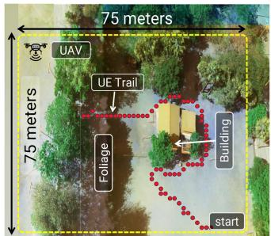

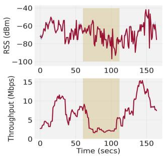  
Fig. 1. A top view of our deployment arena shows the UAV, acting as a WiFi base station at 40 meters height (top left). The figure illustrates the variation in Received Signal Strength (RSS) and TCP throughput (measured with iperf3) between a stationary UAV and a mobile UE following the marked trail. Note the 6–7× drop in throughput and ≈35 dB drop in RSS (shaded box) as the UE moves behind the building. To optimize performance for mobile UEs, the UAV must dynamically reposition based on real-time REM estimation.

Maps or REMs. The problem of estimating REMs is extensively studied in the wireless literature, including empirical research specifically focused on optimizing UAV network deployments [1], [2], [3].

The goal is to determine the UAV’s optimal operating point, which hinges on accurate REM estimation. It is important to note that only the uplink transmissions from the UEs to the UAV are relevant for REM estimation, as all wireless channel information must be available on the UAV side. At each point within the discretized aerial space, a utility metric is calculated by statistically aggregating the estimated REMs for each UE, such as by using the median RSS across the UEs. The point at which the utility metric assumes the highest value is regarded as the optimal operating position of the UAV. With slight variations in algorithmic details, most work done on aerial network deployments adopt more or less similar strategies [6], [7], [8]. For instance, some research focuses on designing efficient measurement trajectories to enhance REM accuracy [2], [3], while others aim to improve interpolation techniques for predicting patches within the REM that lack sufficient measurements [6]. A common constraint in all such optimization efforts is the limited flight endurance of UAVs, typically few tens of minutes. Therefore, it is preferable for UAVs to spend more time providing communication services rather than gathering measurements for REM estimation.

Lack of scalability: UAV positioning strategies are effective when UEs remain relatively static. However, as UEs move, REMs must be re-estimated, and the utility metric recalculated across the aerial space. In Fig. 1, we demonstrate the effect of such UE movement on the network capacity (keeping the UAV stationary). This requires the UAV to gather fresh measurements corresponding to the re-positioned UEs, update the relevant REMs and move to its new optimal position. For a network with moderate UE dynamics, natural for any real deployment setting, such approaches clearly do not scale well. As the demand for UAV-based network deployments grows, addressing these scalability challenges is crucial for fully realizing the potential of this technology.

Our contribution in this paper is driven by a key insight that directly addresses the scalability challenge. While UE mobility causes REMs to vary significantly, the propagation environment or the terrain remains unchanged. By estimating the wireless attenuation characteristics of the terrain, we can predict REMs for any arbitrary UE position. Unlike existing methods that require fresh measurements for each new REM estimation, our approach leverages cumulative historical measurements (Section V-A, see Figs. 15 and 13). Although initial measurements are necessary, the need for additional measurements diminishes drastically with subsequent UE mobility, eventually approaching near-zero (Section V-D, see Figs. 12 and 14).

In this paper, we leverage the key observation outlined above to develop SKYSCALE, a robust and scalable REM estimation strategy that adapts to arbitrary UE mobility. SKYSCALE utilizes Radio Tomographic Imaging (RTI) to model the wireless attenuation properties of the surrounding environment. RTI based techniques discretize the 3D space into voxels and predict the attenuation coefficient for each such voxel. The attenuation coefficient denotes the extent by which a signal’s power is degraded (aka, propagation loss) as it passes through such a voxel. The attenuation coefficients tagged onto each voxel in the 3D space make up what is referred to as the attenuation map or attenuation image. This map enables the precise estimation of total wireless propagation loss for signals traveling from a UE to a UAV, facilitating accurate REM estimation

RTI techniques rely on a spatially distributed set of transmitter-receiver pairs at known locations, where each pair records the total propagation loss from the transmitter (UE) to the receiver (UAV). As previously mentioned, estimating REMs from the attenuation map is relatively straightforward, known as the forward problem). However, RTI attempts to solve the inverse problem – reconstructing the attenuation map from partial measurements of a few REMs (further details in Section II-B). While RTI appears to be a promising approach, the vast number of voxels in 3D space poses significant challenges, making this solution computationally prohibitive. For instance, considering an area with dimensions 100 m×100 m and an overall height of 50 m, a resolution of 1 m results in half a million voxels! This is prohibitive not only in terms of the computation time but also in terms of onboard compute available on such UAVs (see Fig. 3).

We deploy SKYSCALE on a real testbed consisting of a custombuilt UAV hosting a WiFi network. Additionally, we evaluate the performance of SKYSCALE on (a) a real LTE dataset (SKYRAN [2]) and (b) two large scale 5G datasets obtained using the NVIDIA SIONNA [9], a state-of-the-art wireless PHY simulation framework. Overall, SKYSCALE can reduce the UAV’s measurement effort by up to 10× when compared to state-of-theart interpolation based techniques (Fig. 15). Also SKYSCALE by design leverages UE mobility to obtain spatially diverse measurements without requiring any movement of its own. We make the following key contributions in this paper.

To our knowledge, this is the first work to harness RTI for optimizing ground-to-air channels in aerial networks. With SKYSCALE, the UAV adapts rapidly to dynamic network conditions, seamlessly supporting mobile UEs with zero additional overhead. Such diminishing overhead makes SKYSCALE superior to non-RTI approaches, ensuring scalability and sustainability for long-term deployments.

\- We tackle the computational challenges of running RTIbased algorithms directly onboard the UAV. Our efficient processing of imagery data reduces the computational load by 50–100×, enabling real-time performance.

We design and implement the SKYSCALE prototype using a custom-built UAV that provides WiFi connectivity. Additionally, we demonstrate the effectiveness of SKYSCALE across diverse terrains and wireless traces. Compared to state-of-the-art approaches, SKYSCALE contains the REM estimation error with ≈3 dB, while reducing additional measurement data by 10× or more in the long run.

## II. MOTIVATION AND BACKGROUND

## A. Adapting REM Estimation to UE Mobility

As discussed earlier, much of the existing literature in this research area focuses on predicting REMs from scratch each time UEs relocate. These predictions often involve intelligent interpolation from newly obtained measurements, such as Gaussian Process Regression/Kriging [7], or rely on machine learning (ML) and deep learning (DL) techniques that handle sparser or noisier data. Additional cues, such as satellite or UAV imagery, are sometimes incorporated to enhance accuracy. While these methods are effective and produce nearly accurate REMs, a key question remains: do historical measurements or trained models retain their relevance as UEs move? A straightforward answer is no, as real-world terrains often experience significant REM changes due to non-line-of-sight (NLoS) blockages when a UE relocates (see Fig. 1). Consequently, historical measurements are not directly effective in enhancing the accuracy of the current REM. In our deployment spanning a 75 m × 75 m terrain, we observe that ≈2 minutes worth of fresh in-flight measurements are necessary to reliably reconstruct the REM for a fixed set of UEs (median error ≤3 dB compared to a separately collected ground truth REM with more granular measurements). Given the limited endurance of UAVs – 20 minutes on a single battery cycle in our case – devoting a significant portion of flight time to gathering measurements is impractical.

We also explore popular deep generative models (e.g., U-Net) to evaluate their potential for REM estimation. We train a U-Net model similar to the one in [3], using UAV imagery of the terrain along with UE locations as inputs to predict the resulting REM. During training, we provide complete REM instances for seven different UE locations, encompassing ≈10K measurements from ≈20 minutes of flight time. However, we observe that the model was unable to generalize REM predictions for arbitrary UE locations, with a median prediction error of 8–10 dB. This outcome highlights a critical limitation: the substantial training overhead and data requirements undermine the scalability of UAV network deployments. Moreover, attempting to improve the U-Net model with additional measurements seems impractical and unjustified. In scenarios with significant UE churn or mobile UEs, such methods are poorly suited to updating REMs in real time and adaptively repositioning the UAV. Additionally, training such models exceeds the computational capacity of the onboard systems available on typical UAVs.

These challenges prompt us to seek a more effective representation primitive of the REM that can generalize across historical measurements and scale accordingly. One promising approach is to focus on the spatial attenuation characteristics of the terrain, which can be accurately estimated using Radio Tomographic Imaging (RTI) techniques.

## B. Radio Tomographic Imaging (RTI) Primer

Wireless signals attenuate as they propagate through a medium, with significant losses occurring as they pass through physical objects such as buildings or foliage [10]. The extent of this attenuation is influenced by both the distance the signal travels and the material properties $( \mathrm { e . g . }$ ., permittivity) of the medium it traverses. To establish an analytical framework for RTI, we begin by discretizing the 3D space into <sup>N</sup> volume elements or voxels each with dimension $\delta ^ { 3 }$ (where the resolution is $\delta )$ RTI estimates a volumetric attenuation field. Let <sup>N</sup> be the total number of voxels in the 3D region. We represent the unknown attenuation values by the vector $\mathbf { x } = [ x _ { 1 } , x _ { 2 } , \ldots , x _ { N } ] ^ { \top } \in \mathbb { R } ^ { N }$ where $x _ { i }$ is the scalar attenuation coefficient of the $i ^ { \mathrm { { t h } } }$ voxel. We define a 3D coordinate system with an arbitrary origin within the region of interest, such that each voxel corresponds to a single unit along each dimension. Fig. 2 shows a schematic of the setup – the UAV collects RSS measurements for each UE along its trajectory.

Let the $k ^ { t h }$ UE, denoted by $\mathrm { U E } _ { k }$ , be located at $\ell _ { u e } ^ { k }$ . We assume that the UAV has knowledge of the UE locations. A common approach involves the mobile UAV estimating its distance or range to the UEs on the ground. This ranging process can be integrated directly into the communication protocol, for instance, WiFi Fine Time Measurement (FTM) [11]. As the UAV moves along its trajectory, it forms a synthetic aperture [2], [12], which can then be used to multilaterate and accurately determine the locations of individual UEs. The trajectory of the UAV is represented as $[ \ell ^ { 1 } , \ell ^ { 2 } , \ell ^ { 3 } \cdots ]$ , where $\ell ^ { t }$ denotes the $t ^ { t h }$ voxel or step along the trajectory. The UAV’s trajectory forms a synthetic aperture where, at each voxel, it records the received signal strength (RSS) from the set of available UEs. In such a setup, let m denote the measurement vector, where each entry $m _ { t } ^ { k }$ represents the RSS recorded for $\mathrm { U E } _ { k }$ at receiver location $\ell ^ { \dot { t } }$

For a given measurement $m _ { t } ^ { k }$ , the transmitter and receiver being located at $\ell _ { u e } ^ { k }$ and $\ell ^ { t }$ respectively, let $\nu _ { k , \nu }$ denote the set of voxels traced by the straight line connecting them. We model $m _ { t } ^ { k }$ (i.e., the total propagation loss recorded at $\ell ^ { t } )$ as a sum of the attenuation coefficients of the voxels belonging to the set $\mathcal { V } _ { k , t }$

$$
{ m } _ { t } ^ { k } = \sum _ { i \in \mathcal { V } _ { k , t } } x _ { i }\tag{1}
$$

For different UEs, the set $\nu _ { k , \ast }$ <sub>t</sub> varies (depending on $k )$ and adds spatial diversity to the RSS measurements. Additionally, when a UE changes its location, say, from $\ell _ { u e } ^ { k _ { 1 } }$ to $\ell _ { u e } ^ { k _ { 2 } }$ we consider this to be equivalent to a new UE at location $\ell _ { u e } ^ { k _ { 2 } }$ . We define a binary projection matrix $\mathbf { A } \in \{ 0 , 1 \} ^ { R \times N }$ whose entries, $a _ { i j }$ encode which voxels are intersected by each measurement ray. Here, <sup>R</sup> is the total number of measurements in m and <sup>N</sup> is the total number of voxels in the discretized volume. Each row vector $\mathbf { a } _ { r , : }$ corresponds to a single measurement (from a specific UE at a specific UAV location), and each column corresponds to a voxel. An entry $a _ { r , j } = 1$ indicates that the measurement ray associated with row <sup>r</sup> intersects voxel $j ,$ , and $a _ { r , j } = 0$ otherwise. Intuitively, each row of A marks the subset of voxels that contribute to the attenuation affecting the corresponding entry in the measurement vector m.

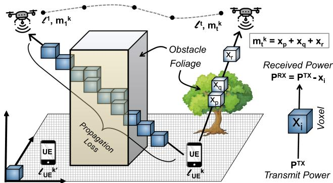  
Fig. 2. RTI schematic for SKYSCALE. The signal from each UE reaches the UAV through multiple voxels, each contributing to the propagation loss based on its attenuation coefficient, such as free space or foliage.

$$
\mathbf { A } = { \left[ \begin{array} { l l l l l } { 0 } & { 1 } & { \cdots } & { 0 } \\ { 1 } & { 0 } & { \cdots } & { 1 } \\ { \vdots } & { \vdots } & { \ddots } & { \vdots } \\ { 1 } & { 0 } & { \cdots } & { 0 } \end{array} \right] } \qquad \mathbf { x } = { \left[ \begin{array} { l } { x _ { 1 } } \\ { x _ { 2 } } \\ { \vdots } \\ { x _ { N } } \end{array} \right] } \qquad \mathbf { m } = { \left[ \begin{array} { l } { m _ { 1 } ^ { * } } \\ { m _ { 2 } ^ { * } } \\ { \vdots } \\ { m _ { R } ^ { * } } \end{array} \right] }
$$

$$
\mathbf { A x } = \mathbf { m }\tag{2}
$$

Here, the superscript $" * >$ $m _ { r } ^ { * }$ indicates that the $r ^ { \mathrm { t h } }$ row may correspond to a measurement from any UE; the rows are simply stacked in the order in which measurements are acquired, without imposing a fixed UE ordering. The system of linear equations in (2) are our RTI equations, the solution to which is the volumetric attenuation image (x). We summarize the list of symbols used in our analysis in Table I.

Inverse problem and ill-posedness: Given A and $\mathbf { x } ,$ it is straightforward to compute m, aka, the forward problem. Rather, RTI solves the inverse problem, which is to estimate x from the measurement set and the projection matrix (computed from location traces). Since the RSS measurements are typically contaminated with noise, hence we can solve for x in the least squares sense,

$$
\hat { x } _ { l s } = \underset { x } { \arg \operatorname* { m i n } } | | \mathbf { A x } - \mathbf { m } | | ^ { 2 }\tag{3}
$$

The solution to (3) is equivalent to taking the Moore-Penrose Pseudoinverse on m, i.e., $\hat { x } = ( \mathbf { A } ^ { T } \mathbf { A } ) ^ { - 1 } \mathbf { A } ^ { T } \mathbf { m }$ . However, A needs to be full-rank which may not always hold. This renders the problem ill-posed, where even slight variations in the input m cause the solution <sup>x</sup>ˆ to vary drastically. To contain the magnitude of variation, a regularization term is added to (3), shown in (4),

TABLE I  
NOTATIONS USED IN THE RTI FORMULATION (SECTION 2)
<table><tr><td>Symbol</td><td>Description</td></tr><tr><td> $N$ </td><td>Total number of voxels in the 3D volume</td></tr><tr><td> $\mathbf { x } \in \mathbb { R } ^ { N }$ </td><td>Vectorized voxel attenuation field</td></tr><tr><td> $x _ { i }$ </td><td>Attenuation coefficient of voxel i</td></tr><tr><td> $\ell ^ { t }$ </td><td>UAV location (voxel index) at trajectory step t</td></tr><tr><td> $\ell _ { u e } ^ { k }$ </td><td>Location of UEk</td></tr><tr><td> $m _ { t } ^ { k }$ </td><td>RSS measurement for  $\mathrm { U E } _ { k }$  at UAV location  $\ell ^ { t }$ </td></tr><tr><td>m  $\mathbf { \Psi } _ { \cdot } \in \mathbb { R } ^ { R }$ </td><td>Stacked measurement vector (R measurements)</td></tr><tr><td> $\nu _ { k , \cdot }$  2</td><td>Set of voxels intersected by ray from  $\mathrm { U E } _ { k }$  to  $\ell ^ { t }$ </td></tr><tr><td> $\mathbf { A } \in \{ 0 , 1 \} ^ { R \times N }$ </td><td>Projection matrix encoding voxel-ray intersections</td></tr><tr><td> $a _ { r , j } \in \{ 0 , 1 \}$ </td><td>Indicator: voxel  $j ^ { \prime } \mathrm { s }$  contribution to measurement r</td></tr><tr><td> $L$ </td><td>Regularization operator (e.g., Laplacian)</td></tr><tr><td> $\beta$ </td><td>Regularization weight (Tikhonov parameter)</td></tr><tr><td> $\hat { \mathbf { x } } _ { l , s }$ </td><td>Least-squares estimate of attenuation field  $, \mathbf { x }$ </td></tr><tr><td> $\hat { \mathbf { x } } _ { r }$ </td><td>Regularized estimate of attenuation field, x</td></tr></table>

$$
{ { \hat { x } } _ { r } } = \mathop { \sf { a r g } } _ { \boldsymbol { x } } \mathop { \operatorname* { m i n } } _ { } | | \mathbf { A } \mathbf { x } - \mathbf { m } | | ^ { 2 } + \beta | | L \mathbf { x } | | ^ { 2 }\tag{4}
$$

Equation 4 is referred to as the generalized Tikhonov regularization [13] and is a common tool for solving ill-posed inverse problems. $\beta > 0$ is a hyperparameter and <sup>L</sup> denotes the regularization operator. Note that such regularized inversion can also be expressed in the least squares form as,

$$
\hat { x } _ { r } = ( ( \mathbf { A } ^ { T } \mathbf { A } + \beta L ^ { T } L ) ^ { - 1 } \mathbf { A } ^ { T } ) \mathbf { m }\tag{5}
$$

SKYSCALE adopts the solution demonstrated by (5) for estimating the attenuation image.

Computational challenges: To provide context, we present preliminary results on computational resource usage while running the vanilla RTI algorithm in our testbed environment, which covers a volume of 75 m×75 m×40 m. We vary the voxel dimension from 3.5 m down to 1 m and observe the computation time and the runtime memory usage for the UAV’s onboard computer (a Raspberry Pi 4, 1.5 GHz clock with 8 GB main memory) and a ground station laptop computer (3 GHz clock with 16 GB main memory). As shown in Fig. 3, the onboard computer is unable to process voxel dimensions smaller than 2.5 m.

## III. DESIGN OF THE SKYSCALE SYSTEM

SKYSCALE addresses the critical gap between the measurement overhead for re-estimating REMs as UEs relocate and the overall communication performance. Under the hood, SKYSCALE uses an RTI based approach with improved computational efficiency to estimate the RF attenuation image. To achieve such efficiency, we reduce the effective number of voxels in the RTI computation atleast by two orders of magnitude, based on the similarity among adjoining voxels. This enables SKYSCALE operate at real time on a modest amount of compute available onboard the UAV. The similarity among the adjoining voxels is estimated from the stereoscopic imagery of the underlying terrain taken from the UAV. Next, SKYSCALE computes a trajectory that is optimized to improve the attenuation image reconstruction for a fixed flight time budget. SKYSCALE’s novelty lies in the fact that future measurements corresponding to relocated UEs will still be relevant and further improve the accuracy of the attenuation image. Overall, the availability of the attenuation image massively scales the REM estimation for any UE location, including mobile UEs. Fig. 4 shows a schematic of the different stages involved in SKYSCALE which we discuss in the following.

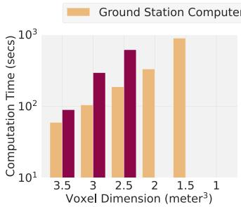

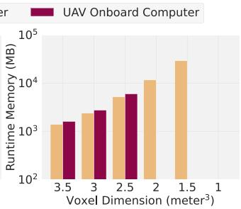  
Fig. 3. Benchmark results for computation time and runtime memory usage for running the vanilla RTI scheme (5) on the UAV’s onboard Raspberry Pi computer and a well provisioned laptop. Due to memory constraints, the onboard computer is not able to run the solution if the voxel dimension is less than 2.5 m.

## A. Dimensionality Reduction for RTI

As discussed in Section II-B, the attenuation image $\mathbf { x } \in \mathbb { R } ^ { N }$ effectively captures the attenuation coefficient $x _ { i }$ for each of the <sup>N</sup> voxels in the 3D space. The vanilla RTI method, which solves this <sup>N</sup> dimensional problem, can become computationally prohibitive as <sup>N</sup> increases with finer resolution <sup>δ</sup> (see Fig. 3). To address the issue of such bloated dimensionality, we leverage the UAV’s stereoscopic imagery. Specifically, we compute a pixel-based depth map of the underlying terrain and perform image segmentation on it. These segments identify regions with similar obstacle characteristics, such as dense foliage, building tops, or open spaces.

Segmentation Schemes: We use the WATERSHED algorithm [14] on the depth map to perform segmentation. WATER-SHED is a simple, training-free method with a low computational footprint, making it suitable for onboard UAV compute. SKYSCALE is agnostic to the specific segmentation algorithm as long as it remains lightweight and does not require site-specific training. In addition to WATERSHED, we evaluate DL-based models such as U-NET [15] and FASTSAM [16]. Here, FASTSAM is included not as the most recent foundation-model segmentation approach, but as a representative of the class of lightweight, accelerated large-model derivatives. More recent segmentation architectures (e.g., transformer-based or fine-tuned foundation models) were not evaluated because they require significantly higher GPU resources and onboard memory, making them impractical for our UAV platform. As shown in Fig. 5, DL methods incur 30–180× higher energy consumption. Since our goal is to identify large-scale attenuators (buildings, foliage, walls) rather than pixel-precise contours, the incremental accuracy gains from these models provide diminishing returns relative to their cost. Consequently, WATERSHED offers the best tradeoff between accuracy and efficiency.

Segments in 3D space: The above segmentation algorithms initially produce 2D regions on the depth map. Corresponding voxels in each region are marked as occupied across all 2D slices comprising the 3D volume, from ground level up to the segment’s average height. These voxels are grouped together into specific 3D segments. Hereafter, segment implicitly refers to its 3D counterpart unless explicitly noted otherwise.

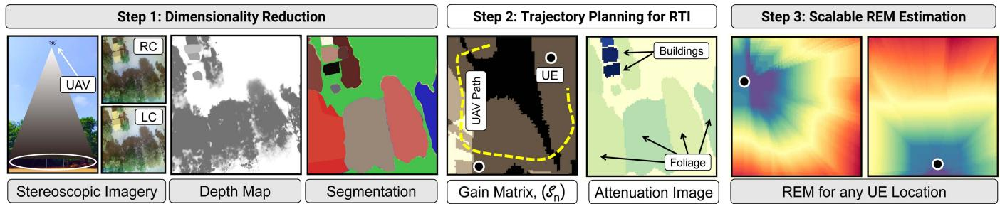  
Fig. 4. The different stages of SKYSCALE. LC and RC indicate the left and right camera perspectives from the stereo cam. First the segments are identified on which to perform the RTI. Second, measurements are taken covering the maximal number of segments and the attenuation image is compute. Next, for any given UE location the corresponding REM can be estimated.

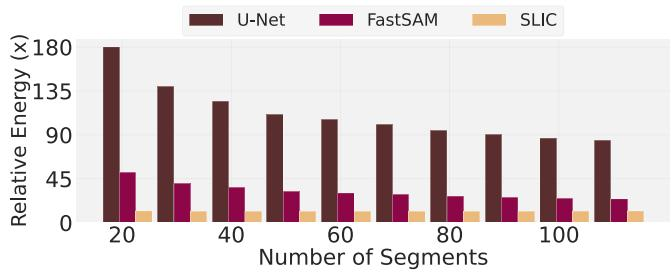  
Fig. 5. Relative energy consumption of three segmentation schemes (two deep-learning based, viz., U-NET and FASTSAM, and one classical, viz., SLIC) with the WATERSHED algorithm. We adopt the WATERSHED algorithm in our SKYSCALE system due to its simplicity, accuracy and energy efficiency.

We assume voxels within a segment share a uniform attenuation coefficient. This assumption introduces a tradeoff between the number of segments and the computational resources required. Generally, smaller segment sizes result in a greater number of segments, enhancing REM accuracy but also increasing computational demands (see Fig. 18). We found that segments generated by the WATERSHED algorithm effectively balance accuracy and computational efficiency. Segments corresponding to the maximum depth are categorized as open or ground areas and consolidated into a single freespace segment, where all voxels exhibit freespace propagation loss.

## B. Attenuation Image Estimation

We now solve a smaller version of the RTI problem, where we estimate $\mathbf { x } \in \mathbb { R } ^ { P }$ (as opposed to $\mathbb { R } ^ { N }$ with $P \ll N )$ . Here <sup>P</sup> denotes the number of segments or the reduced dimension of the problem and each element $x _ { p }$ within x denotes the attenuation coefficient of all voxels contained by the $p ^ { t h }$ segment. We denote the <sup>P</sup> segments as $S _ { 1 } , S _ { 2 } , \cdots S _ { P }$

1) RTI Approach for SKYSCALE: From Section II-B, recall that the UAV traverses through the path $[ \ell ^ { 1 } , \ell ^ { 2 } , \ell ^ { 3 } \cdot \cdot \cdot ]$ collecting propagation loss measurements, where $\ell ^ { t }$ denotes the $t ^ { t h }$ voxel along the trajectory. Let $m _ { t } ^ { k }$ denote the UAV’s measurement at location $\ell ^ { n }$ for the $k ^ { t h }$ UE located at $\ell _ { u e } ^ { k }$ . For the straight line connecting $l ^ { t }$ and $l _ { u e } ^ { k } ,$ let $d _ { i } ^ { t } , \cdot \cdot \cdot d _ { i } ^ { t }$ be the non-zero distances intercepted by segments $S _ { i } , \ldots , S _ { j }$ in terms of voxel units. We denote such collection of segment identifiers pertaining to $\mathrm { U E } _ { k }$ by the set $\mathcal { Z } _ { k , t } = \{ i , \dots , j \}$ . Equation (1) can now be re-written as,

$$
m _ { t } ^ { k } = \sum _ { p \in \mathcal { Z } _ { k , t } } d _ { p } ^ { t } x _ { p }\tag{6}
$$

$x _ { p }$ denotes the attenuation coefficient of each of the voxels within $S _ { p }$ and $d _ { p }$ is the length of the signal path (in voxel units) through $S _ { p }$ . For SKYSCALE, the RTI equations are,

$$
\mathbf { A } = { \left[ \begin{array} { l l l l l } { d _ { 1 } ^ { 1 } } & { d _ { 2 } ^ { 1 } } & { \cdots } & { d _ { P } ^ { 1 } } \\ { d _ { 1 } ^ { 2 } } & { d _ { 2 } ^ { 2 } } & { \cdots } & { d _ { P } ^ { 2 } } \\ { \vdots } & { \vdots } & { \ddots } & { \vdots } \\ { d _ { 1 } ^ { R } } & { d _ { 2 } ^ { R } } & { \cdots } & { d _ { P } ^ { R } } \end{array} \right] } \mathbf { x } = { \left[ \begin{array} { l } { x _ { 1 } } \\ { x _ { 2 } } \\ { \vdots } \\ { x _ { P } } \end{array} \right] } _ { P \times 1 } \mathbf { m } = { \left[ \begin{array} { l } { m _ { 1 } ^ { * } } \\ { m _ { 2 } ^ { * } } \\ { \vdots } \\ { m _ { R } ^ { * } } \end{array} \right] } _ { R \times 1 }
$$

In the above equation, each row in the projection matrix A denotes a measurement and each column corresponds to one of the <sup>P</sup> segments. $d _ { p } ^ { r } \in \mathbf { A }$ denotes the length of the signal path intercepted by the $p ^ { t h }$ segment $S _ { p }$ corresponding to the $\bar { \boldsymbol { r } } ^ { t h }$ measurement $m _ { r } ^ { * } \ ( ^ { * } * ^ { * }$ is used to indicate any relevant UE location). $d _ { p } ^ { r }$ is zero if the signal is not intercepted by the $p ^ { t h }$ segment.

2) Choice of Regularization Operator: The choice of the regularization operator plays a critical role in determining the effective signal-to-noise ratio (SNR) of the reconstructed attenuation image. Since the RTI inverse problem is ill-posed, the operator <sup>L</sup> implicitly controls which spatial frequencies are amplified or suppressed. In the process, it shapes the noise floor, the smoothness of the solution as well as the fidelity of structural edges. We use the regularized least-squares formulation in (5) to solve for X and evaluate several candidate operators before selecting the Laplacian as our default choice. Specifically, we compare the performance of the following operators:

\- Identity (L = I): This corresponds to classic Tikhonov (or ridge) regularization, penalizing the norm $\lVert \mathbf { x } \rVert _ { 2 } ^ { 2 }$ . Although it limits large coefficient magnitudes, it does not exploit any spatial structure in x.

\- Laplacian: L is the discrete graph Laplacian operator defined over the voxel adjacency graph. It approximates the second-order spatial derivative. Specifically, for a voxel <sup>i</sup> with neighbors $j \in \mathsf { N H } ( i )$ , (NH(<sup>.</sup>) denotes the neighborhood function) the Laplacian operator is given by:

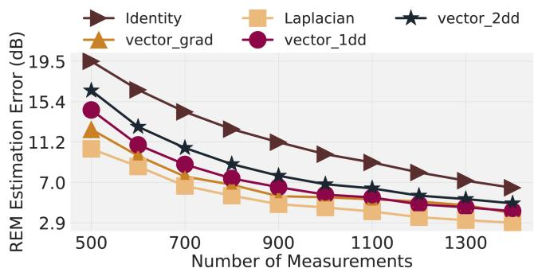  
Fig. 6. Effect of the choice of regularization operator (L) on the tomographic reconstruction and the eventual REM estimation error. Overall, the Laplacian operator performs best in a variety of terrain scenarios.

$$
[ L \mathbf { x } ] _ { i } = \mathbf { x } _ { i } - { \frac { 1 } { | \mathsf { N H } ( i ) | } } \sum _ { j \in \mathsf { N H } ( i ) } \mathbf { x } _ { j }\tag{8}
$$

This operator promotes piecewise smoothness while preserving sharp discontinuities, which correspond to edges between physical objects like walls and vegetation. When used for regularization, it effectively filters out highfrequency variations (noise) but allows for boundarypreserving transitions in the reconstructed field.

\- vector\_grad: L implements the first-order discrete spatial gradient using forward finite differences. Let $\mathbf { D } _ { x } , \mathbf { D } _ { y } , \mathbf { D } _ { z }$ denote the finite-difference operators along the three spatial axes; we construct <sup>L</sup> by stacking them vertically, i.e., $L = [ \mathbf { D } _ { x } ^ { \top } \mathbf { D } _ { y } ^ { \top } \mathbf { D } _ { z } ^ { \top } ] ^ { \top }$ . When used inside the Tikhonov penalty $\beta L ^ { T } L ,$ it penalizes $\| \nabla \mathbf { x } \| _ { 2 } ^ { 2 }$ and thus enforces spatial smoothness. However, because it applies an $L _ { 2 }$ penalty on the gradient (unlike Total Variation’s $L _ { 1 }$ form), it oversmooths sharp transitions such as building or foliage boundaries that are critical for accurate RF attenuation modeling.

vector\_1dd / vector\_2dd: These operators apply directional finite differences rather than full 3D gradients. Let $\mathbf { D } _ { x } , \mathbf { D } _ { y } , \mathbf { D } _ { z }$ denote the forward finite-difference operators along the three axes. Then, $L _ { \mathrm { 1 d d } } = \mathbf { D } _ { x }$ and $\bar { L _ { 2 \mathrm { d d } } } = [  { \mathbf { D } } _ { x } ^ { \top } \  { \mathbf { D } } _ { y } ^ { \top } ] ^ { \top }$ . Thus, vector\_1dd penalizes variation only along a single axis (e.g., horizontal or vertical), while vector\_2dd penalizes variation along two planar axes. In the Tikhonov term <sup>β</sup> $L ^ { T } L$ , these operators enforce anisotropic smoothing that can be useful when attenuation varies predominantly along one or two spatial directions (e.g., elongated corridors or vegetation belts). However, by ignoring gradients along the remaining axes, they may under-regularize or distort structures that do not align with the chosen directions.

In Fig. 6, we compare reconstruction performance under different regularization operators. The choice of <sup>L</sup> determines the spectral filtering of the inverse problem: the penalty $\| L \mathbf { x } \| _ { 2 } ^ { 2 }$ controls which spatial frequencies are suppressed, and thus directly influences the effective SNR of the recovered attenuation image. The Laplacian operator acts as a second-order smoothness prior that attenuates high-frequency noise while preserving coherent<sub>Authorized</sub> <sub>licensed</sub> <sub>use</sub> <sub>limited</sub> <sub>to:</sub> <sub>LNM</sub> <sub>Institute</sub> <sub>of</sub> <sub>Information</sub> <sub>Technology.</sub> <sub>Dow</sub> edges. Since large-scale obstructions correspond to low–mid frequency content and measurement or voxelization noise appears as high-frequency components, Laplacian regularization naturally suppresses noise without erasing important structural boundaries, improving stability in this ill-posed RTI setting. In contrast, the identity operator imposes no spatial coupling and cannot reject voxel-level noise, while first-order gradient penalties (vector\_grad, vector\_1dd, vector\_2dd) oversmooth sharp transitions due to their $L _ { 2 }$ formulation and can introduce directional artifacts. Overall, the Laplacian strikes the best balance between smoothness and edge preservation, yields better numerical conditioning, and generalizes robustly across terrains. Hence, we adopt it as the default regularizer in SKYSCALE.

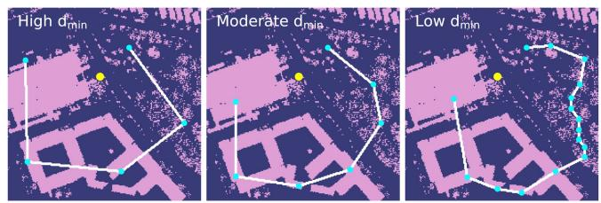

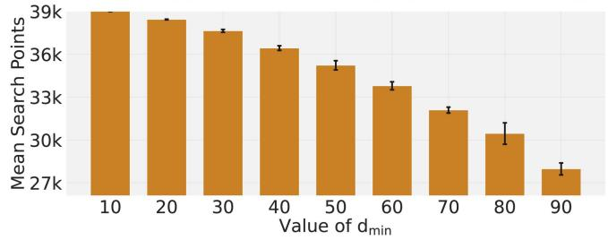  
Fig. 7. Top: Sample trajectories for high, moderate and lower values of $d _ { m i n }$ Bottom: Mean search space size during trajectory planning as a function of the $d _ { m i n }$ parameter.

3) Trajectory Planning: Given the limited flight time endurance of the UAV, it is critical to optimize the length of the measurement trajectory while improving the accuracy of the attenuation image. Let U denote the set of navigable voxel identifiers where the UAV can fly and take measurements. Considering <sup>K</sup> UEs in our system, we initialize the segment sets, $S _ { n }$ for each voxel $n \in \mathcal { U } { \mathrm { ~ a s ~ } }$

$$
S _ { n } = \bigcup _ { \forall k \in \{ 1 \cdots K \} } \mathcal { Z } _ { k , n }\tag{9}
$$

Effectively, $\left| { { S _ { n } } } \right|$ indicates the number of segments that can be seen by the UAV from the $n ^ { t h }$ voxel, i.e., this ensures that such segments has non-zero column entries in the projection matrix A (| · | is the set cardinality operator). We refer to the collection of all $\left| S _ { n } \right|$ superimposed on the aerial as the gain matrix. SKYSCALE’s trajectory planning algorithm chooses a path vector, θ (defined by a specific voxel order), that maximizes the total number of intercepted segments while keeping the length minimal or upper bounded by a budget, <sup>C</sup>. Specifically, SKYSCALE has the following goal.

$$
\Theta _ { o p t } = \underset { \Theta } { \mathrm { a r g } } \underset { \forall n \in \Theta } { \mathrm { m a x } } \big \vert \bigcup _ { \forall n \in \Theta } S _ { n } \big \vert , s . t . , \mathtt { p a t h \_ l e n g t h } ( \Theta ) \le c\tag{10}
$$

$\theta _ { o p t }$ denotes the optimal trajectory with the total path length given by the function path\_length() in (10). Considering S = {1<sup>,</sup> 2<sup>, . . . , P</sup> } as the set of all segment identifiers, and <sub>loaded</sub> <sub>on</sub> <sub>July</sub> <sub>05,2026</sub> <sub>at</sub> <sub>09:56:17</sub> <sub>UTC</sub> <sub>from</sub> <sub>IEEE</sub> <sub>Xplore.</sub> <sub>Restrictions</sub> <sub>apply.</sub> $\begin{array} { r } { S _ { n } \subset S , \forall n \in \mathcal { U } , } \end{array}$ (10) reduces to a variation of the SET COVER or the MAX-COVERAGE problem which is well-known to be NP-Hard. In the following, we propose a greedy heuristic, specifically keeping the distance constraint in mind. We intend to minimize the cost per unseen segment, where the cost depends on the distance between the current $( \ell ^ { c u r } )$ and the next voxel (see line 5 of Algorithm 1).

```powershell
Algorithm 1: RTI Trajectory Planning Algorithm.
1 Input: $\ell ^ { 0 } , d _ { m i n } , c ,$ SETS: $\mathcal { U } , S$ and $\textstyle S _ { n } \forall n \in { \mathcal { U } }$
2 Output: θ (optimal trajectory)
3 $\theta  [ \ell ^ { 0 } ] , \ell ^ { c u r }  \ell ^ { 0 }$
4 while $ { \boldsymbol { S } } \neq \emptyset$ and $c \geq 0$ do
5 $i  a .$ rgmin $\frac { \mathrm { d i s t } ( \ell ^ { c u r } , \ell ^ { n } ) } { S \bigcap S _ { n } } , \mathrm { s . t . } ,$
n∈u
dist $( \ell ^ { \dot { c } \dot { u } \dot { r } } , \ell ^ { n } ) \geq d _ { m i n }$
6 $S \gets S \setminus S _ { i }$
7 $c  c -$ dist $( \ell ^ { c u r } , \ell ^ { n } )$
8 uav_path $\gets \mathsf { B }$ resenham3D $( \ell ^ { c u r } , \ell ^ { i } )$
9 for voxel n ∈ uav_path do
10 $S \gets S \setminus S _ { n }$
11 θ.add_to_list(ln)
12 end
13 $\ell ^ { c u r } \gets \ell ^ { i }$
14 end
15 return θ
```

The UAV’s starting voxel in the aerial space, once it reaches the desired height, is denoted by $\ell ^ { 0 }$ and U denotes the set of navigable voxels. The total allocated distance budget is <sup>c</sup>. dist(<sup>i</sup>, <sup>j</sup>) computes the Euclidean distance between the voxels <sup>i</sup> and $j ,$ , whereas Bresenham<sub>3D</sub> $( \ell ^ { i } , \ell ^ { j } )$ enumerates the voxel path approximating the line segment connecting voxels <sup>i</sup> and <sup>j</sup> [17]. The distance threshold $d _ { m i n }$ used in line 5 trades off between the exploration of unseen segments away from <sup>cur</sup> versus exploitation of segments in the close proximity of $\ell ^ { c u r }$ , for solving the RTI equations. Algorithm 1 uses the weighted version of the GREEDY SET COVER [18] where the weight is determined by the distance from $\ell ^ { c u r }$ to the next chosen voxel, $\ell ^ { i } .$ . Additionally, note that the journey from $\ell ^ { c u r }$ to $\ell ^ { i }$ encounters new segments enriching the explored pool of segments further. The weighted GREEDY SET COVER is known to have an approximation ratio of the $N ^ { t h }$ Harmonic number, $\begin{array} { r } { \frac { H _ { N } } { \lambda } = 1 + \frac { 1 } { 2 } + \frac { 1 } { 3 } + \frac { 1 } { 4 } \cdot \cdot \cdot + \frac { 1 } { N } , \mathrm { i . e . , } \Theta = \Theta _ { o p t } . H _ { N } } \end{array}$ , where $N =$ $| \mathcal { U } |$

4) Choice $o f d _ { m i n } .$ The parameter $d _ { m i n }$ controls the balance between spatial exploration and local sampling density. Larger values encourage longer jumps and rapid segment coverage, whereas smaller values bias the UAV toward fine-grained measurement collection. $d _ { m i n }$ is estimated once per deployment based on a lightweight offline calibration.

To determine this value, we perform a sweep of candidate $d _ { m i n }$ values across four representative terrains (Fig. 11) and compute the resulting pareto frontier between REM accuracy and flight-time budget. The $d _ { m i n }$ achieving the best tradeoff $( \mathrm { i . e . }$ minimum increase in flight time for a marginal improvement in REM accuracy) is labeled as the optimal value for that terrain.

These labeled pairs form a small training set for a simple regression model that maps terrain features such as histogram statistics of the segmented depth map and the chosen voxel resolution to an appropriate $d _ { m i n } . \mathrm { A }$ useful heuristic that emerges from this calibration is, $d _ { m i n } \approx \lambda _ { 1 } \ : \Delta _ { \mathrm { s e g } } + \lambda _ { 2 } \ : v _ { \mathrm {  t } }$ , where $\Delta _ { \mathrm { s e g } }$ is the median inter-segment centroid distance, <sup>v</sup> is the voxel size and $( \lambda _ { 1 } , \lambda _ { 2 } )$ are fitted coefficients. This captures the intuition that exploration steps should scale with both the structural heterogeneity of the terrain and the tomographic resolution. The resulting prediction error of $5 - 8$ m preserves 90–95% of the optimal performance, making it sufficiently accurate for initializing the trajectory planner in practice.

## C. REM Estimation and Incremental Updates

The attenuation image derived from the RTI method (7) enables estimating the REM at any UE location. However, real deployments involve multiple flight sessions, continuous UE mobility and frequent UE churn that requires regular incremental updates of the RTI equations as demonstrated in Section V-A and Section V-D. The quality and stability of the reconstructed attenuation image fundamentally depend on the rank of the projection matrix (A). Intuitively, fresh measurements significantly improve reconstruction accuracy primarily if they contribute new, independent information, thus increasing the rank of A. However, repeatedly computing the exact rank (e.g., performing full Singular Value Decomposition) is computationally prohibitive, particularly given the limited onboard computational resources of UAVs. Thus, it is critical to incrementally update the RTI equations intelligently, balancing computational load and accuracy.

To illustrate the effectiveness of incremental rank updates, we design a controlled experiment where the maximum achievable rank of the projection matrix is constrained to approximately 100. Fig. 8 (top) shows how the rank of the projection matrix A increases steadily as the UAV traverses longer trajectories; rising rapidly at first, but gradually plateauing as spatial redundancy grows. Fig. 8 (bottom) complements this by showing that beyond a certain rank threshold, improvements in REM estimation accuracy become marginal. This reflects a classic case of diminishing returns, where continued data collection offers little added value. In our setup, we observe that once the rank exceeds 60, additional measurements contribute minimally to the tomographic reconstruction and no longer enhance the quality of the estimated REM. Therefore, aggressively pursuing higher rank beyond this point is computationally inefficient.

Although our experiments show that the rank saturates around 60, this value is not universal and depends strongly on the spatial diversity of measurements. The effective rank of A increases only when new measurements traverse geometrically distinct paths; thus, 20 measurements from a single UE moving through 20 locations are far more informative than 20 measurements from 20 UEs clustered in the same area. In environments where UE positions or UAV trajectories are less diverse, a higher rank may be required before reconstruction accuracy stabilizes. For this reason, we rely not on an absolute rank threshold, but on the incremental gain in estimated rank: once additional measurements cease to increase rank meaningfully, we treat the REM as sufficiently resolved. This criterion generalizes across terrains and avoids unnecessary measurement overhead.

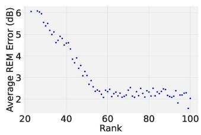

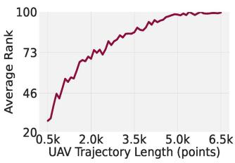  
Fig. 8. Incremental rank & REM improvement. Top: rank growth vs. UAV path length. Bottom: REM error vs. rank, showing diminishing returns.

Given these insights, our goal is to estimate rank changes efficiently, allowing incremental updates without frequent expensive computations.

Efficient Rank Estimation Methods: We experimentally evaluate three distinct approaches to incrementally update and estimate the rank of A efficiently and compare it to the true rank corresponding to the measurements.

\- QR Decomposition (Accurate but Expensive): A reliable method that accurately computes matrix rank, but with high computational complexity $( O ( n ^ { 3 } ) )$ ). While accurate, it is impractical for onboard real-time operations.

\- Lanczos Method (Moderately Accurate, Moderate Cost): Utilizes iterative eigenvalue decomposition to approximate rank incrementally, significantly reducing computational overhead compared to QR decomposition. It offers a good balance between accuracy and computational efficiency.

Convex Hull Area Heuristic (Low Cost, Approximate): We propose a lightweight heuristic for estimating rank growth based on the area of the convex hull traced by the UAV’s trajectory. The underlying intuition is simple – a larger convex hull generally indicates greater spatial diversity in the measurements, which correlates with a higher rank of the projection matrix. While this method does not yield precise rank values, it is computationally trivial and particularly useful in scenarios where approximate rank tracking is sufficient. The convex hull area serves as a proxy for relative rank growth rather than its absolute value. In practice, we are primarily interested in detecting meaningful increments in rank to decide when to trigger reconstruction updates, rather than computing the exact rank itself.

In Fig. 9, we quantitatively compare these three methods against the ground truth rank. On the left figure, we illustrate four distinct flight paths that contribute to different rank growths starting from a common path. The QR method closely matches true rank growth, whereas Lanczos provides a computationally feasible compromise. The convex hull heuristic method is somewhat less precise, however can quickly approximate rank changes without overwhelming onboard compute.

## IV. UAV TESTBED AND EVALUATION DATASETS

We evaluate SKYSCALE in an arena of size 75 m×75 m using our custom-built UAV platform. Additionally, we also use a few

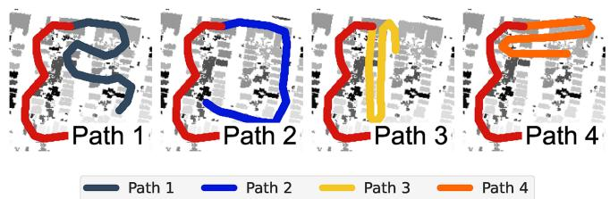

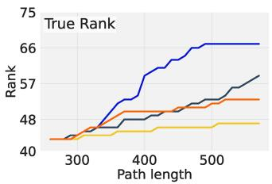

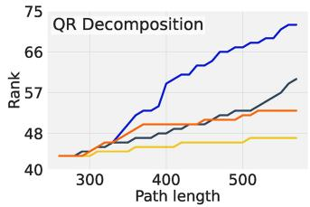

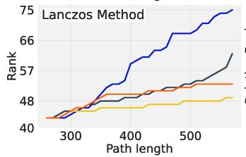

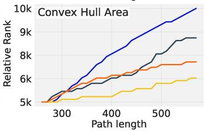  
Fig. 9. Rank-estimator comparison. Rank growth along different UAV paths $( \mathsf { P a t h } _ { 1 } \mathsf { - P a t h } _ { 4 } )$ starting from a fixed segment. We compare three rankestimation methods: QR, Lanczos, and a fast ConvexHull heuristic. Lanczos offers the best accuracy–efficiency tradeoff, while the ConvexHull method provides a lightweight approximation for resource-limited settings.

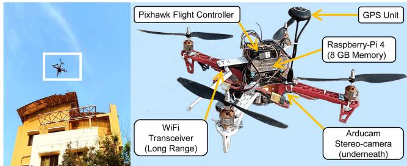  
Fig. 10. Our SKYSCALE UAV acts as a flying WiFi base station and can simultaneously provide network connectivity to 8+ UEs on ground.

more traces that add diversity to our dataset in terms of terrain complexity and wireless frequencies.

## A. UAV Implementation and Testbed Dataset

The UAV, shown in Fig. 10, is a lightweight custom-built quadcopter with a flight endurance of ≈ 20 minutes. It uses a pixhawk 2.4.8 flight controller, programmable for controlled flights along custom trajectories. The UAV is equipped with a Raspberry Pi 4 (RPI) with 8 GB RAM, which gathers sensory and telemetry data from the flight controller and executes all trajectory planning algorithms. We use the Robot Operating System (ROS) on the UAV’s RPI to handle communication and control. Additionally, the majority of in-flight power consumption is dedicated to the motors that keep the UAV airborne, with less than 5% of the power allocated to computational tasks such as depth imagery processing, segmentation, and attenuation image estimation.

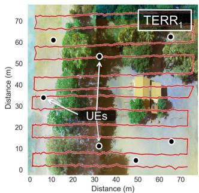

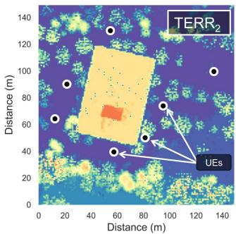

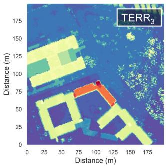

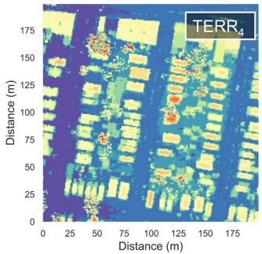  
Fig. 11. (Top-Left) Location of the seven RPI UEs are marked on the map where SKYSCALE testbed is deployed. A sample UAV trajectory is also shown while collecting groundtruth measurements. (Top-Right and Bottom) The three remaining figures represent the depth maps for TERR (seven UEs marked), TERR $^ 3$ and TERR <sub>4</sub>. We obtained these maps from the LiDAR traces publicly available at SRTM archives.

Depth maps: The UAV is also equipped with an Arducam stereo camera [19] that provides synchronized frames for depth map estimation. We utilize OPENCV libraries, specifically the StereoBM block matching algorithm, to compute the disparity map of the scene. StereoBM allows us to specify the number of disparity levels, representing different gradations (or relative distance buckets) in the depth map. We have calibrated our system to convert the disparity map into a true depth map. Additionally, as discussed in Section III-A we perform image segmentation using the WATERSHED algorithm on the depth map to initialize the RTI problem. By adjusting the disparity settings or inputs for the segmentation algorithm (e.g., the number of markers for WATERSHED), we can control the number of segments generated.

WiFi Network and Coverage Arena: The RPI is configured to host a WiFi base station, using an external WiFi dongle paired with a high-gain (4 dBi, omnidirectional) antenna, which achieves a line-of-sight (LOS) range of approximately 150 meters. We operate on WiFi channel 6 in the 2.4 GHz band, free from interference within our test arena. The network is deployed across a 75 m×75 m area, with the UAV maintaining an altitude of 40–45 meters. The arena features a mix of open spaces, two medium-sized buildings, and dense foliage (see Fig. 1) providing a diverse set of LOS and non-line-of-sight (NLOS) scenarios.

SKYSCALEWiFi dataset (TERR <sub>1</sub>). We deploy seven RPIs as UEs at different ground locations, all connected to SKYSCALE ’s WiFi network. To collect ground truth measurements, the UAV flies a crisscrossed path across the entire 75 m×75 m area at an altitude of ≈ 40 meters (Fig. 11). Using the iperf3 tool, we continuously measure TCP throughput between the UAV and each UE. For each UE, we log GPS coordinates, WiFi RSS, and average TCP throughput. In SKYSCALE, we assume the locations of UEs are known. In total, we collect over 10K measurements for seven UEs across a ≈20 minute UAV flight.

## B. Other Datasets

Towards making our empirical analysis more comprehensive, we use a few datasets as mentioned below.

SKYRANLTE dataset (TERR <sub>2</sub>). SKYRAN [2] addresses a similar placement problem in an LTE network, where the UAV hosts an onboard LTE eNodeB operating over an undisclosed frequency in the sub-1 GHz band. Seven LTE enabled smartphones are deployed in a 200 m×200 m arena (Fig. 11 top-right). Due to the absence of UEs in one section of the area, we use a slightly smaller region for our deployment. The arena features a large office building and sparsely distributed foliage. Highly granular REM data is available for all seven UE locations, enabling trace-driven simulations on the collected data.

NVIDIA SIONNA5G dataset<sup>1</sup> (TERR $^ 3$ and TERR $_ 4 )$ . In the SKYSCALE WiFi and the SKYRAN LTE datasets we have access to the groundtruth signal map, which can be used to estimate the REM prediction errors, however, the true attenuation coefficients are unknown. We use NVIDIA SIONNA [9], that provides state-ofthe-art GPU based ray tracing framework to simulate wireless coverage incorporating configurable terrains maps and material properties of the obstacles. We choose two types of areas, TERR $_ 3 \colon$ a 200 m×200 m relatively sparser area with tall buildings (Fig. 11 bottom-left), and, TERR<sub>4</sub>: a 200 m×200 m residential area with a complex topography (Fig. 11 bottom-right). TERR $^ 3$ and TERR are based on true locations – the structural information of such locations are available as 3D shape files from OPENSTREETMAP [20]. SIONNA ’s simulation framework can directly integrate structural information to create 5G coverage maps (frequency used 3.59 GHz). It also provides an option to attach material properties to the structures (as recommended by ITU P.2040 [21]). For our simulation, we assign different combinations of properties (brick, concrete, wood and foliage).

Depth Maps: For datasets TERR <sub>2</sub>, TERR <sub>3</sub> and TERR <sub>4</sub>, we do not have access to stereoscopic images, hence we directly used a LiDAR-based depth map from the SRTM database [22]. The same depth maps are presented in Fig. 11.

## V. PERFORMANCE EVALUATION

We evaluate the overall performance of SKYSCALE using the datasets described above. In the following analysis, we focus on the key performance metrics that are central to the design and operation of our system. Throughout this section, we assume a UAV speed of ≈2 m/sec.

## A. Scalability: RTI Versus REM Interpolation

Through Figs. 12 – 15, we demonstrate how SKYSCALE outperforms interpolation based methods by an appreciable margin making such deployments sustainable for longer term operations. We design experiments where the UAV takes a series of flights and in each successive flight a fraction of the UEs relocate. We study the total flight time spent in collecting measurements to keep the average REM estimation error below 3 dB. Note that the 3 dB threshold is used only as an offline evaluation metric; in practice, SKYSCALE does not rely on REM error but instead triggers additional measurement collection based on the observed saturation of the estimated rank.

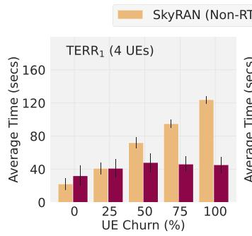

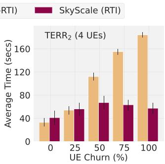  
Fig. 12. Even under high UE churns, SKYSCALE offers a 3–4× reduction in average flight budget compared to interpolation based techniques like SKYRAN.

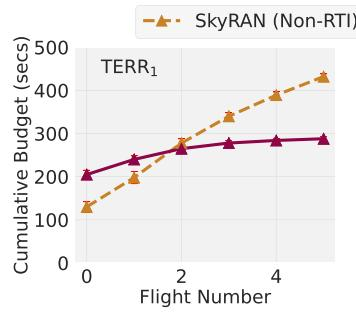

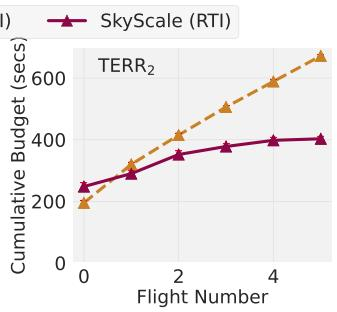  
Fig. 13. For an UE churn of 50%, SKYSCALE can maintain an average REM accuracy of 3 dB with ≈300 s worth of measurements.

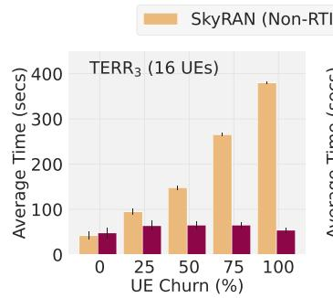

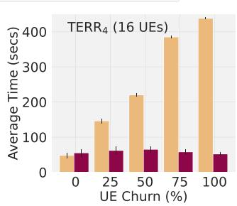  
Fig. 14. As the number of flights increase (10 flights), the relative benefit of SKYSCALE over SKYRAN is highlighted.

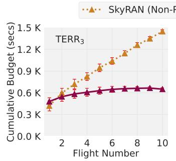

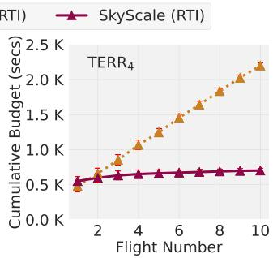  
Fig. 15. Cumulative budget for an UE churn of 50%. The requirement of fresh measurements beyond a point is NIL for SKYSCALE which bolsters its sustainability for relatively longer term deployments.

Experiment 1: Specifically, for TERR <sub>1</sub> and TERR $^ { 2 , }$ , we choose a random subset of four UEs out of the seven deployed UEs. We perform REM estimation for six consecutive flights under various degrees of UE churn. UE churn here refers to the fraction of UEs that relocate at the start of each flight. We vary the UE churn from 0 to 100% in steps of 25%. 25%, 50%, 75% and 100% UE churn indicates that one, two, three and all four out of the set of four UEs change their position.

Fig. 12 shows the average flight time of six consecutive flights while collecting measurements in order to contain the average REM estimation error within 3 dB. We use SKYRAN as a candidate for our baseline interpolation scheme which also incorporates its own intelligent trajectory design. Although in absence of UE churn, SKYRAN’s average flight time is ≈8–10% lower compared to SKYSCALE, it soon worsens as UEs relocate. For an extreme case, where the network is highly dynamic with 100% UE churn, SKYSCALE cuts down the average flight time by a factor of 3–4×. Additionally, note that for a static setup (0% UE churn), interpolation based techniques work well as the REMs do not change and one-time measurement is sufficient. RTI incurs some additional overhead in such cases to estimate the attenuation image. In Fig. 13, we drill down further onto the specific scenario with 50% UE churn and present the cumulative flight time used over the six successive flights. For an RTI based technique like SKYSCALE, requirement of additional measurements diminishes to almost nil beyond a certain point. However, interpolation based methods fundamentally require fresh measurements in order to re-estimate the REM, irrespective of how intelligent and optimized the trajectory planning is.

Experiment 2: For TERR <sub>3</sub> and TERR $^ { 4 , }$ we present a similar set of results in Figs. 14 and 15, but with a relatively scaled up setup involving 16 UEs. Here we show an average of ten successive flights to reinforce the point how RTI based REM estimation gets massively scalable and sustainable for longer term operations. Interestingly, Fig. 14 demonstrates a reduction of average flight time upto 8–10× for high UE churns. Fig. 15 shows a micro-benchmark for the case with 50% UE churn, i.e., eight out of the sixteen UEs relocate before each flight. As expected, SKYSCALE learns the attenuation image within a cumulative flight time of ≈600 seconds and further measurements are unnecessary to reliably predict the REM, unlike SKYRAN.

## B. Trajectory Planning and Segment Discovery

SOTA baseline algorithms: We evaluate SKYSCALE’s trajectory planning scheme (Algorithm 1) and compare its performance with some state-of-the-art (SOTA) baseline approaches. Note that, such baselines are originally reported in literature in the context of REM interpolation. We demonstrate their performance limitation in an RTI setting. The three baseline approaches are as follows.

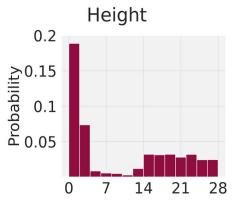

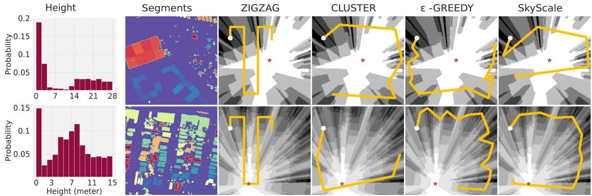

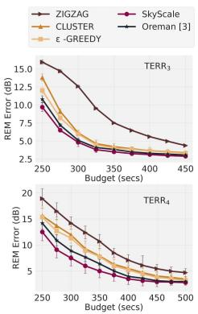  
Fig. 16. Height histograms for terrains TERR and TERR , as obtained from the SRTM provided depth maps. Segmentation of the depth map is shown. The four rightmost plots on both rows present computed trajectories based on the gain matrix (S). Total trajectory length for both case is 500 meters. The initial gain matrix is also shown in the background. On the extreme right, we show an overall comparison of the REM error obtained for the different SOTA methods.

(a) ZIGZAG: We implement ZIGZAG as a standard rasterscan trajectory where the UAV flies along uniformly spaced horizontal (or vertical) lines with an approximate sweep spacing of 5 m. The UAV traverses the entire region at a constant altitude, producing a deterministic coverage pattern commonly used in aerial surveying (see Fig. 11, TERR <sub>1</sub>.).

(b) CLUSTER: Such techniques cluster regions [2], [23] on the REM based on measurement values. Next, it assigns an uncertainty value to each cluster where a higher value necessitates more measurements. Definition of the uncertainty metric is subject to specific works in literature (SKYRAN uses the spatial gradient of RSS values [2], OREMAN estimates it from aerial imagery [3] and so on). Further, a shortest path (Dijkstra’s algorithm [3]) or route (Traveling Salesman Problem [2]) is constructed connecting clusters with higher uncertainty values. We use the SKYRAN specific path planning algorithm – we first cluster the coarse REM inferred from initial measurements using <sup>k</sup>-means (<sup>k</sup> = 15 for TERR and <sup>k</sup> = 25 for TERR $\scriptstyle \mathrm { 2 ^ { - T E R R } 4 } )$ . Each cluster is assigned an uncertainty value computed from the spatial RSS gradient, and the UAV visits clusters in decreasing uncertainty order using a shortest distance tour.

(c) <sup></sup>-GREEDY: Such techniques [24], [25] add a small amount of randomness in their exploration procedure. At each step, the UAV either selects the next waypoint with maximal gain measured using predicted signal variance with probability (1 − <sup></sup>) or samples a random unvisited waypoint with probability <sup></sup>. We use $\epsilon = 0 . 1$ , a value widely adopted in exploration-exploitation tradeoffs [24], [25]. The gain function and waypoint set are identical to those used in our system to ensure a fair comparison. Other extensions to <sup></sup>-GREEDY include sophisticated exploration strategies like Upper Confidence Bound algorithms or Reinforcement Learning but we do not explore them due to the substantial amount of time they take to stabilize.

All the above baselines along with SKYSCALE take as input the gain matrix, S and computes a path. In Fig. 16, we show sample paths constructed by the four algorithms for terrains TERR $^ 3$ and

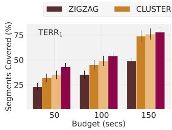

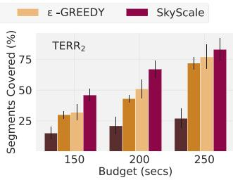  
Fig. 17. With increasing flight budget the UAV discovers new segments and incorporates them to the RTI equations.

TERR <sub>4</sub>. In the rightmost figure (top and bottom), we demonstrate how SKYSCALE outperforms state-of-the-art trajectory planning techniques, achieving a lower RSS estimation error for the same traversed path length.

Segment discovery: We show (Fig. 17) that the GREEDY SET COVER based approach in SKYSCALE is able to discover more segments based on a fixed budget while compared to its counterparts. The commonly used ZIGZAG strategy shows a relatively poor performance. In this context, we also discuss the implication of the depth map segmentation algorithm, in particular the number of segments. Fig. 18 shows the REM estimation accuracy and the associated resource usage for RTI (∝ A , projection matrix) as a joint dependency on the number of segments and the number of measurements taken. First, using larger number of segments without sufficient measurements leads to poor accuracy. Second, using lesser number of segments make the attenuation image coarse grained leading to poorer accuracy. Given the computational constraints (Fig. 18 (right)) and desired REM accuracy, one can choose the right number of segments. While Fig. 18 captures how segment count and measurement sufficiency jointly determine accuracy, voxel size influences REM performance through the same effect: finer voxels create more segments, whereas coarser voxels merge structural detail. We perform a small sweep on the voxel dimension that confirms the accuracy improvement with finer resolutions that quickly reaches diminishing returns once segment granularity is adequate. This aligns with Fig. 18, showing that voxel size matters mainly through its impact on segment count.

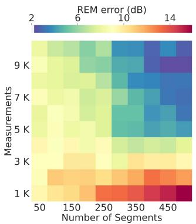

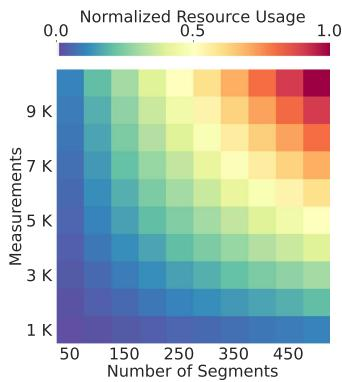  
Fig. 18. (Left) The joint dependency of the number of segments and the amount of measurements in determining an accurate attenuation image and hence, accurate REMs. (Right) Normalized resource usage for the same set of parameters. This analysis helps optimize accuracy based on available computational resources.

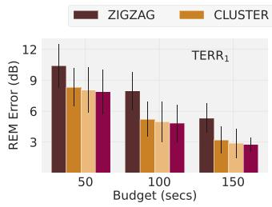

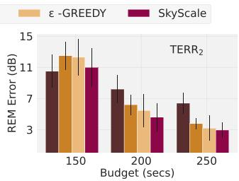  
Fig. 19. Overall REM errors with increasing measurements for terrains TERR <sub>1</sub> and TERR <sub>2</sub>.

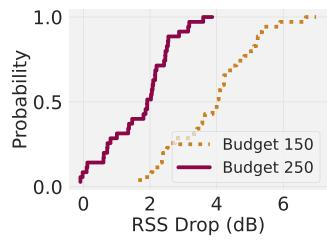

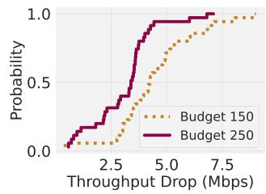  
Fig. 20. Results related to Experiment 3. TCP Throughput (iperf3) and RSS drop under UE churn.

## C. Overall REM Prediction Performance

We now discuss some results related to the REM prediction performance. Both for terrains TERR <sub>1</sub> and TERR <sub>2</sub>, we see a quick improvement in the REM accuracy with a reasonable budget (Fig. 19).

Experiment 3, $\left( \mathbf { T E R R } _ { 1 } \right)$ . We do another elaborate scalability study on end-to-end performance. For TERR <sub>1</sub>, we split the seven UEs into two disjoint groups containing four and three UEs each in all possible combinations $( \binom { 7 } { 3 } = 3 5 )$ . The attenuation map is always estimated with the first group of UEs and the UAV is positioned to serve the second group of UEs. In Fig. 20, we present the CDF of the drop in RSS (median 3–4 dB) and

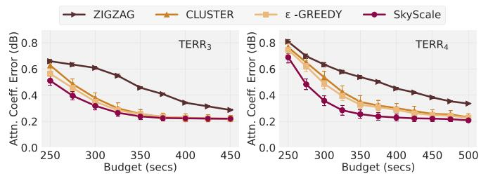  
Fig. 21. SKYSCALE is able to predict the attenuation coefficient within an accuracy of 0.2 dB.

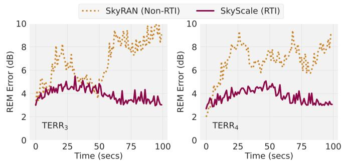  
Fig. 22. Results related to Experiment 4. SKYSCALE makes the best out UE mobility to keep a stable performance, unlike SKYRAN.

TCP throughput (median 1–3 Mbps) as compared to that for the optimal position. The variance can be primarily attributed to the asymmetry in the UE positions within the arena. These results based on our real UAV network testbed demonstrates the effectiveness of SKYSCALE.

Attenuation coefficient: In Fig. 21, for the simulated datasets TERR $^ 3$ and TERR <sub>4</sub>, we present the average prediction error of the attenuation coefficient of the segments. After a reasonable budget (as the REM estimation error ≤ 3 dB), the attenuation coefficient prediction error is less than 0.2 dB. The true coefficients were fixed by us while setting up the SIONNA simulation.

## D. Adapting to UE Mobility in Real-Time

Finally, we report one of the crucial contribution that SKYSCALE makes, i.e., adapting to UE mobility in real-time.

Experiment 4, $\mathbf { ( T E R R _ { 3 } }$ and $\mathbf { T E R R } _ { 4 } )$ . The UAV initially flies for 500 seconds, keeping the REM error for each of the 16 UEs within 3 dB. Over the next 100 seconds, UEs move randomly within the arena. In SKYRAN (non-RTI), no new data updates the REM after the initial flight. However, SKYSCALE, even without further UAV movement, leverages UE mobility to incorporate new measurements into the RTI framework, incrementally updating the attenuation image whenever new segment information is added to the system and improving accuracy. Consequently, the UAV then moves to the new optimal location. Fig. 22 shows SKYSCALE maintaining the REM error around 3–4 dB, with some fluctuations due to simulator-introduced AWGN noise.

## VI. LIMITATIONS OF SKYSCALE

While SKYSCALE demonstrates significant performance gains over state-of-the-art approaches, particularly in dynamic and mobile deployments, there are certain limitations of our system that we discuss here. SKYSCALE’s core advantage stems from leveraging user mobility to incrementally refine the underlying attenuation image via tomographic reconstruction. However, this design inherently assumes the presence of meaningful UE movement over time to introduce spatial diversity in signal measurements.

Lack of UE Mobility: In relatively static environments, where user equipment (UE) locations remain fixed and UE churn is minimal or absent, SKYSCALE’s ability to gather new informative measurements is severely constrained. Since the RTI framework relies on the diversity of signal paths to update the attenuation image, a lack of UEs or their mobility leads to a stagnation in the reconstruction process. In such cases, the projection matrix does not gain additional rank, and no significant update to the attenuation image can occur without external intervention (e.g., forced UAV movement or synthetic diversity). Consequently, as shown in Figs. 12 and 14, in scenarios with zero UE churn, traditional interpolation-based methods such as SKYRAN often outperform SKYSCALE in terms of REM accuracy and measurement efficiency. These approaches, while less generalizable across mobility, are more effective in static settings where the overhead of RTI-based reconstruction does not translate to tangible performance gains.

Improper Segmentation: Another limitation lies in the initial calibration phase of SKYSCALE. The accuracy of the attenuation image depends on the quality and coverage of early measurements. Poor initialization - due to limited flight budget, occlusions, or suboptimal trajectories - can lead to persistent reconstruction errors. Furthermore, while SKYSCALE incorporates dimensionality reduction to ensure real-time operation on lightweight UAV platforms, the segmentation quality directly impacts the granularity of the attenuation image. Oversegmentation may overload onboard compute, while undersegmentation can obscure important environmental features.

Rank Tracking and Computation Overhead: While our lowrank update and trajectory planning strategies are designed to support real-time operation, they still involve non-trivial computational overheads. To manage this, we explored multiple strategies for estimating the effective rank of the projection matrix during incremental updates. In particular, we compared three methods: QR Decomposition, Lanczos, and the Convex Hull Area heuristic. In complex terrains with irregular obstructions or highly anisotropic propagation characteristics, reliance on the convex hull method may lead to inaccurate estimates of rank progress, thereby triggering RTI updates prematurely or too late, ultimately degrading REM reconstruction accuracy. In such cases, when computational resources permit, more robust techniques like Lanczos or even full QR Decomposition (for offline or post-flight processing) are recommended to ensure reliable rank tracking and accurate REM updates. Choosing an inappropriate rank estimation method for the terrain and resolution needs can undermine the benefits of SKYSCALE’s incremental update mechanism, leading to avoidable reconstruction errors or wasted compute cycles.

## VII. RELATED WORKS

Recent research in UAV-based wireless networks explores various aspects of communication, networking, and sensing.

This discussion focuses on efficiently constructing REMs and optimizing UAV placement to enhance overall communication performance. Most existing literature relies on simulations for evaluation, while prototyping and testbed deployments are increasingly rare.

Deep learning (DL) based REM generation: While classical interpolation based methods (e.g., Kriging [26]) have been around, recent works capitalizes on the advances of DL techniques (U-Net, cGAN - [27], [28]) to efficiently reconstruct the REMs. DL techniques, e.g., CNNs or GANs, require access to huge volume of ‘groundtruth’ information for training which makes it impractical to adopt in such scenario. The trajectory optimization problem has been benefited by some recent progress in Reinforcement Learning( [24], [25] and Multi-Arm Bandits [29]. Although these algorithms can operate in real-time, they require significant time to stabilize.

Structural (3D) reconstruction using UAV sensing: Some works in this area focus on UAV-based sensing for reconstructing terrain or structures in 3D. This includes techniques such as mmWave sensing [30], photogrammetry from aerial images [31], and recent advancements using Neural Radiance Fields (NeRFs) [32] or Gaussian Splats [33]. While these methods provide detailed 3D reconstructions, they do not directly create attenuation maps, making them unsuitable for direct REM generation.

REM and RTI related to UAV based deployments: A few works exist that directly compute the 2D or 3D REM [2], [3], [34], [35] based on intelligent spatial sampling and trajectory optimization [5], [6], [7]. [8] uses an existing tomographic map for UAV placement but does not discuss any RTI technique. [36] introduces the first work on using RTI for scaling network deployments.

## VIII. CONCLUSION

In this work, we introduced SKYSCALE, a scalable UAV positioning system tailored for dynamic networks. Our approach is among the first to experimentally leverage RTI in UAV-based wireless networks. SKYSCALEminimizes additional measurements during long-term operations, outperforming state-of-theart interpolation methods by reducing measurement costs by 10× or more. While SKYSCALEmay underperform in static scenarios with few UEs, we suggest intelligently combining RTI with interpolation techniques to optimize performance based on network dynamics.

## REFERENCES

[1] K. Sundaresan, E. Chai, A. Chakraborty, and S. Rangarajan, “SkyLiTE: End-to-end design of low-altitude UAV networks for providing LTE connectivity,” 2018, arXiv:1802.06042.

[2] A. Chakraborty, E. Chai, K. Sundaresan, and S. Rangarajan, “SkyRAN: A self-organizing LTE RAN in the sky,” in Proc. 14th Int. Conf. Emerg. Netw. EXperiments Technol., 2018, pp. 280–292.

[3] N. C. Matson and K. Sundaresan, “Online radio environment map creation via UAV vision for aerial networks,” in Proc. IEEE INFOCOM 2024 - IEEE Conf. Comput. Commun., 2024, pp. 81–90.

[4] P. Q. Viet and D. Romero, “Aerial base station placement: A tutorial introduction,” IEEE Commun. Mag., vol. 60, no. 5, pp. 44–49, May 2022.

[5] R. K. Sheshadri, E. Chai, K. Sundaresan, and S. Rangarajan, “SkyHAUL: A Self-organizing gigabit network in the sky,” in Proc. 22nd Int. Symp. Theory, Algorithmic Foundations, Protoc. Des. Mob. Netw. Mob. Comput., 2021, pp. 101–110.

[6] S. Zhang and R. Zhang, “Radio map-based 3D path planning for cellularconnected UAV,” IEEE Trans. Wireless Commun., vol. 20, no. 3, pp. 1975–1989, Mar. 2021.

[7] D. Romero and S.-J. Kim, “Radio map estimation: A data-driven approach to spectrum cartography,” IEEE Signal Process. Mag., vol. 39, no. 6, pp. 53–72, Nov. 2022.

[8] D. Romero, P. Q. Viet, and G. Leus, “Aerial base station placement leveraging radio tomographic maps,” in Proc. ICASSP IEEE Int. Conf. Acoustics, Speech Signal Process., 2022, pp. 5358–5362.

[9] “NVIDIA sionna wireless simulation framework.” Accessed: Jan. 23, 2026. [Online]. Available: https://nvlabs.github.io/sionna/examples/ Sionna\_Ray\_Tracing\_Introduction.htm

[10] J. R. Hampton, S. Yao, T. Kroeger, C. Carducci, and C. Murphy, “Dronebased forest propagation measurements for ground-to-air EMI applications,” IEEE Antennas Wireless Propag. Lett., vol. 18, no. 12, pp. 2627–2631, Dec. 2019.

[11] M. Ibrahim et al., “Verification: Accuracy evaluation of WiFi fine time measurements on an open platform,” in Proc. 24th Annu. Int. Conf. Mob. Comput. Netw., 2018, pp. 417–427.

[12] A. Dhekne, A. Chakraborty, K. Sundaresan, and S. Rangarajan, “TrackIO: Tracking first responders inside-out,” in Proc. USENIX NSDI, 2019, pp. 751–764.

[13] J. Wilson and N. Patwari, “Radio tomographic imaging with wireless networks,” IEEE Trans. Mobile Comput., vol. 9, no. 5, pp. 621–632, May 2010.

[14] F. Meyer, “Color image segmentation,” in Proc. Int. Conf. Image Process. its Appl., 1992, pp. 303–306.

[15] R. Levie, Ç. Yapar, G. Kutyniok, and G. Caire, “RadioUNet: Fast radio map estimation with convolutional neural networks,” IEEE Trans. Wireless Commun., vol. 20, no. 6, pp. 4001–4015, Jun. 2021.

[16] C. Zhang et al., “Faster Segment Anything: Towards lightweight SAM for Mobile Applications,” 2023, arXiv:2306.14289.

[17] J. E. Bresenham, “Algorithm for computer control of a digital plotter,” in Proc. Seminal Graphics: Pioneering Efforts Shaped Field, 1998, pp. 1–6.

[18] V. N. Ivanova-Rohling, “Neighborhood-based strategies for widening of the greedy algorithm of the set cover problem,” in Proc. 19th Int. Conf. Comput. Syst. Technol., 2018, pp. 27–32.

[19] Arducam, “Stereo-camera for raspberry pi.” Accessed: Jan. 23, 2026. [Online]. Available: https://www.arducam.com/product/b0195- synchronized-stereo-camera-hat-raspberry-pi/

[20] “OpenStreetMap.” Accessed: Jan. 23, 2026. [Online]. Available: https: //www.openstreetmap.org/

[21] “ITU, Effects of building materials and structures on radiowave propagation above about 100 MHz.” Accessed: Jan. 23, 2026. [Online]. Available: https://www.itu.int/rec/R-REC-P.2040/en

[22] NASA EarthData, “Shuttle radar topography mission database.” Accessed: Jan. 23, 2026. [Online]. Available: https://www.earthdata.nasa. gov/sensors/srtm

[23] J. Chen, C. Du, Y. Zhang, P. Han, and W. Wei, “A clustering-based coverage path planning method for autonomous heterogeneous UAVs,” IEEE Trans. Intell. Transp. Syst., vol. 23, no. 12, pp. 25546–25556, Dec. 2022.

[24] J. Steiger, N. Lu, and S. Sorour, “Learning for path planning and coverage mapping in UAV-assisted emergency communications,” in Proc. GLOBE-COM 2020-2020 IEEE Glob. Commun. Conf., 2020, pp. 1–6.

[25] Y. Zeng, X. Xu, S. Jin, and R. Zhang, “Simultaneous navigation and radio mapping for cellular-connected UAV with deep reinforcement learning,” IEEE Trans. Wireless Commun., vol. 20, no. 7, pp. 4205–4220, Jul. 2021.

[26] A. Chakraborty, M. S. Rahman, H. Gupta, and S. R. Das, “SpecSense: Crowdsensing for efficient querying of spectrum occupancy,” in Proc. IEEE INFOCOM 2017 - IEEE Conf. Comput. Commun., 2017, pp. 1–9.

[27] A. Chaves-Villota and C. A. Viteri-Mera, “DeepREM: Deep-learningbased radio environment map estimation from sparse measurements,” IEEE Access, vol. 11, pp. 48697–48714, 2023.

[28] B. S. Shawel et al., “A deep-learning approach to a volumetric radio environment map construction for UAV-Assisted networks,” Int. J. Antennas Propag., vol. 2024, 2024, Art. no. 9062023.

[29] A. H. Arani, M. M. Azari, P. Hu, Y. Zhu, H. Yanikomeroglu, and S. Safavi-Naeini, “Reinforcement learning for energy-efficient trajectory design of UAVs,” IEEE Internet Things J., vol. 9, no. 11, pp. 9060–9070, Jun. 2022.

[30] F. Ahmad et al., “AeroTraj: Trajectory planning for fast, and accurate 3D reconstruction using a drone-based LiDAR,” in Proc. ACM Interactive, Mobile, Wearable Ubiquitous Technol., 2023, vol. 7, no. 3, pp. 1–28.

[31] E. Bylow, R. Maier, F. Kahl, and C. Olsson, “Combining depth fusion and photometric stereo for fine-detailed 3 D models,” in Proc. Scand. Conf. Image Anal., 2019, pp. 261–274.

[32] L. F. Rosas-Ordaz et al., “An overview of NeRF methods for aerial robotics,” in Proc. Mach. Learn. Complex Unmanned Syst., 2024, pp. 236–258.

[33] D. Charatan, S. L. Li, A. Tagliasacchi, and V. Sitzmann, “pixelSplat: 3 D Gaussian splats from image pairs for scalable generalizable 3 D reconstruction,” in Proc. IEEE Conf. Comput. Vis. Pattern Recognit., 2024, pp. 19457–19467.

[34] R. Shrestha, D. Romero, and S. P. Chepuri, “Spectrum surveying: Active radio map estimation with autonomous UAVs,” IEEE Trans. Wireless Commun., vol. 22, no. 1, pp. 627–641, Jan. 2023.

[35] Q. Wu, F. Shen, Z. Wang, and G. Ding, “3 D spectrum mapping based on ROI-driven UAV deployment,” IEEE Netw., vol. 34, no. 5, pp. 24–31, Sep./Oct. 2020.

[36] S. Das and A. Chakraborty, “SkyScale: A radio tomographic approach towards scaling UAV network deployments,” in Proc. 25th Int. Symp. Theory, Algorithmic Foundations, Protoc. Des. Mobile Netw. Mobile Comput., 2024, pp. 341–350.


Ayon Chakraborty (Member, IEEE) received the BE degree in computer science and engineering from Jadavpur University, India in 2011, and the PhD degree in computer science from SUNY Stony Brook, NY, USA, in 2017. Since 2020, he has been with the Department of Computer Science and Engineering, Indian Institute of Technology Madras, India, where he is currently an Assistant Professor. He authors or coauthors and serves on the Program Committees of top networking and mobile computing conferences. His research interests include system-level design of future intelligent wireless systems and sensing technologies, spanning both algorithm design, as well as system prototyping.


Subrata Das received the MS (Research) degree in 2024, from the Department of Computer Science and Engineering, Indian Institute of Technology Madras, under the supervision of Prof. Ayon Chakraborty. He received the BTech degree in computer science and engineering from the Tripura Institute of Technology, in 2017, and the MTech degree in computer science and engineering from the National Institute of Technology Rourkela, in 2020. His MS research focuses on aerial wireless networks.


Pranav Ramesh is currently working toward the BTech degree with the Department of Computer Science and Engineering, Indian Institute of Technology Madras. His research interests include the broad area of computer systems and their applicability to real life applications, on integrating various sensing approaches with unmanned aerial vehicles. He works on both the algorithmic and system-level aspects of unmanned aerial vehicles for various IoT and surveillance-based sensing systems.