# Scale-Reconfigurable Multi-Agent Reinforcement Learning for Aerial Networks in Dynamic Environments

Gyu Seon Kim, Member, IEEE, Emily Jimin Roh, Soyi Jung, Senior Member, IEEE, Soohyun Park, Member, IEEE, and Joongheon Kim, Senior Member, IEEE

Abstract—The enormous cube satellites (CubeSats) constellation and numerous unmanned aerial vehicles (UAVs) deployments are essential to building a realistic aerial access network (AAN) service environment and maintaining global coverage. This vast scenario challenges ground stations (GSs) in selecting and scheduling CubeSats/UAVs for effective global AAN service. Specifically, it implies challenges in deciding which non-terrestrial network (NTN) devices the GSs will receive global network services from. There is also a problem with the number of NTN devices that GSs need to cover, which changes over time, creating dynamic topologies under uncertainty. In conventional reinforcement learning, there is also a firm limit to the number of NTN devices that must be fixed during training and inference, which is practically impossible in the AAN scenario. To tackle these issues, this paper introduces a novel scale-reconfigurable multi-agent reinforcement learning (SR-MARL). This approach utilizes flexible neural networks that adjust their architecture in response to the fluctuating number and type of NTN devices within the GSs’ communication range. This allows for adaptive management and control of GS operations in a dynamic NTN node environment. The performance evaluation outcomes indicate that the proposed algorithm surpasses other benchmarks, achieving an average network performance of 1.64x greater and an average residual energy of NTN devices 2.39x higher.

Index Terms—Scale-Reconfigurable Multi-Agent Reinforcement Learning, Low Earth Orbit (LEO) Satellite, Unmanned Aerial Vehicles (UAV)

## I. INTRODUCTION

Recently, ultra-small-scale satellites, which are called cube satellites (CubeSats), have become increasingly prevalent as a new application within non-terrestrial networks (NTNs) for providing global network services [1], [2]. Traditionally, geostationary (GEO) satellites have facilitated these aerial access network (AAN) services [3]–[6]. However, their substantial distance from Earth of 36, 000 km contributes to significant latency issues of 260 ms on average, impeding the delivery of real-time global AAN services [7]. CubeSats, classified as low Earth orbit (LEO) satellites that orbit at an altitude of approximately 500 km, offer a more viable solution for real-time networking due to their reduced latency of 20 ms compared to GEO satellites [7], [8]. Nonetheless, the lower altitude of LEO satellites limits the coverage area of each CubeSat, necessitating a significantly larger number to maintain seamless global networking and to overcome the smaller coverage due to the closer distance [9], [10]. As a result, developing an efficient algorithm for deploying many CubeSats is crucial for ensuring seamless global AAN services [11], [12].

For more details, employing CubeSats for global network services necessitates decision-making regarding selecting specific CubeSats for global AAN service provisioning in scenarios where numerous CubeSats are present [13], [14]. This eventually results in a scheduling problem, i.e., the selection problem of which NTN device will be selected. Several ground stations (GSs) must cooperatively select CubeSats for global AAN services, i.e., deciding which CubeSat the GS will receive global network services from. However, CubeSats face inherent limitations in providing AAN services autonomously due to their restricted size, fixed orbit according to an orbital element, and energy capacities [15]. These constraints necessitate supplementary support from additional devices in the sky to ensure comprehensive coverage and continuous service. Therefore, despite the potential for multiple CubeSats to cooperatively cover extensive areas, coverage and AAN performance gaps may persist in remote regions, polar areas, or locations with significant communication overheads [16]. These shadow zones represent areas where service is either degraded or absent, highlighting the challenges in achieving uniform global AAN with only CubeSat networks [17]. Integrating new aerial vehicles that cover specific local areas with the CubeSat infrastructure is essential for seamless global AAN service [18]. Unmanned aerial vehicles (UAVs), unlike CubeSats, do not move on a fixed trajectory and can have greater mobility, allowing them to respond more adaptively to dynamic environments [19]–[21]. These supplementary devices can provide critical support in areas of coverage improvement and capacity enhancement, ensuring more reliable reaches [22].

In scenarios with numerous CubeSats and UAVs, an efficient algorithm that helps GSs minimize the energy use of NTN devices and maximize the performance of AAN services is critical. In the case of CubeSats, their geographical positions, defined by latitude and longitude, shift continuously due to their orbital movement [23], [24]. CubeSats also face environmental challenges, such as damage from cosmic rays and solar winds, which can impair their functionality and reduce their operational lifespan. These factors result in a dynamic environment. The operational environment for UAVs is also highly dynamic and uncertain, characterized by challenges such as random vortices and gusts [25]. Reinforcement learning (RL) excels in managing these dynamic and uncertain environments, adapting effectively to real-time changes [26]– [31]. Specifically, because a realistic networking environment requires multiple GSs, multi-agent RL (MARL) can be the best solution, with multiple GSs acting as agents [32]–[34]. Unlike conventional MARL, MARL proposed in this paper helps to cooperatively perform tasks by sharing the state information observed by each GS during the training process through mutual communication between GSs [35]–[37]. This encourages several GSs to work together to achieve a common goal, even when certain GSs do not have all the information about their environment. In this paper, the joint goal of GSs is to simultaneously optimize the residual energy of NTN devices with low energy levels and the performance of AAN services. Therefore, implementing the cooperative MARL algorithm must be considered to achieve this goal effectively. However, the dynamic nature of CubeSat and UAV constellations poses significant challenges for GS, which is tasked with maintaining uninterrupted global AAN services. As these aerial and orbital platforms move, the type and number of NTN devices within the communication range of a GS vary over time [38]. This variability blocks the GS’s ability to work to enable consistently robust AAN services, necessitating a highly adaptive approach to GS’s neural network (NN) management and control. In response to these challenges, because adopting flexible NNs at the GS becomes advantageous and essential, this paper proposes a Scale-Reconfigurable MARL (SR-MARL) capable of responding to dynamic NTN scale environments. Traditional static NN architectures are ill-equipped to handle the rapid and unpredictable changes in network topology caused by the high mobility of CubeSats and UAVs [39]. Unlike traditional NN architectures, SR-MARL offers the distinct advantage of adjustable width of NN, i.e., the number of active neurons (nodes), enabling dynamic scaling of NN capacity to meet real-time demands without compromising computational efficiency [40]. This feature is crucial in environments where network nodes like CubeSats and UAVs frequently enter and exit the communication range of terrestrial GSs, thus altering the network topology. As shown in Fig. 1, the SR-MARL can scale its processing capacity and NN width up or down based on the current network load and the number of available NTN devices. For example, in Fig. 1, when numerous NTN devices are connected to the GS, the GS fully utilizes all available NN resources (a, green). In contrast, when a relatively limited number of NTN devices are connected, the GS conserves NN resources according to the number of NTN devices (b, red). In addition to improving the performance of NNs, SR-MARL can alleviate the overall computational cost of NNs and provide practical deep learning-based applications in environments where optimal NN sizes change frequently. Additionally, this paper constructs a realistic experimental environment to demonstrate the efficacy and practical applicability of the proposed SR-MARL. This environment includes actual data from CubeSats currently in orbit, aerodynamic data from real UAVs, and flight conditions that mimic severe vortices encountered in the atmosphere. Furthermore, the modeling of CubeSats and UAVs incorporates governing aerodynamic equations commonly used in aerospace engineering [41].

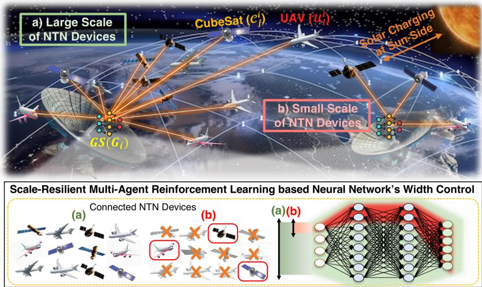  
Fig. 1. A reference aerial access network model used in the proposed scale-reconfigurable multi-agent reinforcement learning approach.

## A. Contributions

The main contributions of this paper are as follows.

• Firstly, this paper represents the inaugural effort to design a network comprising multiple CubeSats/UAVs to provide global AAN through the application of flexible NNs based MARL. The uniqueness of this SR-MARL stems from its strong adaptability to dynamic network node number changes. Such environmentally adaptive NN-based MARL is essential for highly dynamic and uncertain air/space environments.

TABLE I  
SUMMARY OF RELATED WORK BY UTILIZATION, PROBLEM SCENARIOS, AND PROPOSED SOLUTIONS.
<table><tr><td rowspan=1 colspan=1>Utilization</td><td rowspan=1 colspan=1>Ref.</td><td rowspan=1 colspan=1>Problem Scenario</td><td rowspan=1 colspan=1>Proposed Solution</td></tr><tr><td rowspan=1 colspan=1>UAV</td><td rowspan=1 colspan=1>[42,43][44][45][46][47]</td><td rowspan=1 colspan=1>Multi-UAV collaboration in dynamic environments.Optimization of UAV trajectories in multi-UAV systems.Vehicular network systems with UAV base stations.Communication in SAR without base stations.Post-disaster UAV coordination for MEC.</td><td rowspan=1 colspan=1>MARL to optimize collaboration and resource management.Action-branching QMIX algorithm.Dual-layer nested decision-making framework.Heterogeneous vehicles multi-agent proximal policy optimization.RL-based joint path and task scheduling.</td></tr><tr><td rowspan=1 colspan=1>Satellites</td><td rowspan=1 colspan=1>[48,49][50][51][52][53]</td><td rowspan=1 colspan=1>Minimizing average satellite handovers.6G non-terrestrial networks with LEO satellites and UAVs.Ultra-dense networks with grant-free random access.LISL networks in LEO constellations.Dynamic routing in LEO megaconstellations.</td><td rowspan=1 colspan=1>Load-aware satellite handover strategy based on MARLAnt colony optimization and MARL-based hierarchical caching.MARL for joint access control and power optimization.MARL for dynamic link scheduling and routing.DRL-based adaptive multipath routing.</td></tr><tr><td rowspan=1 colspan=1>SNN</td><td rowspan=1 colspan=1>[54,55][56][57][58]</td><td rowspan=1 colspan=1>Flexible runtime operation in deep learning models.Federated learning under varying channel and data distributionsAdaptive navigation and sensing in varying contexts.Lightweight multi-scale image enhancement.</td><td rowspan=1 colspan=1>Universal slimmable networks with variable-width architecture.Superposition coding over slimmable neural networks.Adaptive context-aware navigation via dynamic slimmable networks.Multi-scale convolutional attention network.</td></tr></table>

• Secondly, the reward function for AAN services takes into account communication indicators and equations considered in actual AAN systems, such as antenna gain, carrier-to-noise ratio (CNR), and the reward function for the residual energy of NTN devices is meticulously designed to encourage cooperative and balanced energy consumption across numerous CubeSats/UAVs. Additionally, it introduces the SR-MARL based sustainable energy management reward that differentially considers the sun-side and dark-side conditions for efficient energy utilization in CubeSats, which are prone to low energy levels due to their compact sizes.

• Lastly, the effectiveness is assessed under realistic conditions involving actual CubeSats and airborne UAVs. The CubeSats’ orbit is derived from the two-line element (TLE).

## II. PRELIMINARIES

## A. Related Work

Table I summarizes representative studies spanning UAV networks, satellite-based NTN systems, and slimmable neural network (SNN) architectures, providing a structured overview of major problem settings and algorithmic trends. The following discussion highlights the limitations of prior approaches and clarifies the research gap addressed by SR-MARL. UAV Control Systems. Recent MARL-based UAV studies have advanced cooperative search, coverage optimization, and energy-aware transmission, yet most assume fixed-width neural policies that cannot adapt to dynamic agent populations. Surveyed UAV MARL frameworks [42], cooperative search models [43], and multi-UAV coverage designs [44] rely on static network structures, limiting scalability in environments where UAV visibility fluctuates. Energy-aware transmission schemes based on action-branching [45] and maritime SAR trajectory–communication MARL [46] further illustrate the rigid architectural assumptions of prior work. A similar constraint is observed in distributed UAV–vehicular coordination models such as [47], where policy networks are trained for a fixed swarm size. These limitations highlight the absence of scalable or reconfigurable architectures in UAV MARL. The SR-MARL framework resolves this issue by employing a slimmable actor–critic design that adapts neural width to the number of visible NTN devices, reducing inference cost while improving robustness and sample efficiency.

Satellites and NTN Utilization. Research in satellite and NTN MARL has primarily addressed handover, access control, and link scheduling, yet existing models typically assume fixed observation dimensions and predetermined constellation sizes. Load-aware and propagation-adaptive handover schemes [48], [49], hierarchical NTN caching [50], and random-access MARL for ultra-dense networks [51] lack the architectural flexibility required to cope with dynamic satellite visibility. Inter-satellite link scheduling approaches [52] similarly train policies tied to fixed constellation structures, limiting generalization to sparse or dense topologies. Recent NTN routing models [53] reinforce this pattern by adopting monolithic DRL policies that do not scale with variable satellite counts. These constraints leave dynamic constellation variability largely unaddressed. SR-MARL introduces dynamic slimmability into MARL, enabling neural-width scaling with real-time visibility conditions and offering improved inference efficiency and stability under varying NTN densities.

SNN Utilization. Slimmable and width-adaptive neural networks offer promising computational flexibility, but existing work remains focused on computer vision or singleagent tasks. Foundational SNN models [54], [55], federated slimmable training [56], and adaptive navigation networks [57] all lack mechanisms for multi-agent coordination or dynamic observation spaces. Moreover, these methods do not address multi-agent communication constraints or the highly variable input dimensionality characteristic of NTN environments. Recent multi-width attention networks [58] provide improved scalability for perception tasks but do not extend to decentralized or centralized–decentralized MARL. SR-MARL fills this gap by integrating SNN with a multi-agent actor–critic framework, enabling coordinated agents to operate under widthadaptive policies that match real-time NTN visibility. This yields lower inference complexity, reduced redundancy during training, and higher robustness to dynamic environmental conditions.

Unlike prior scalable MARL approaches, SR-MARL departs fundamentally in both architectural design and practical adaptability. Attention-based methods such as A-MAPPO enhance MAPPO with fixed-width attention modules to model agent interactions [59], while MF-QMIX improves scalability through mean-field approximations within a valuedecomposition framework [60]. However, both rely on static network capacities that do not adapt to dynamically varying agent visibility. Similarly, GPMA achieves scalability by enforcing permutation invariance and equivariance via hypernetworks and heterogeneous graph representations [61], yet its MARL policies remain fixed-width and tailored to static industrial scheduling settings. In contrast, SR-MARL introduces a scale-reconfigurable actor–critic architecture that dynamically adjusts neural width according to real-time NTN visibility, enabling adaptive computational complexity, finergrained policy adaptation, improved sample efficiency, and robust operation under highly dynamic and heterogeneous satellite–UAV network conditions.

## B. Key Objectives and System Scenarios

The AAN consists of three components: $i ) ~ \mathcal { T } ~ \mathrm { G S s } , ~ i i ) ~ \mathcal { T }$ CubeSats, and iii) L UAVs. Each GS is identified as i-th GS, i.e., $G _ { i } ,$ where $\forall G _ { i } \in \mathcal { F }$ and $| { \mathcal { F } } | = { \mathcal { T } }$ . Each CubeSat is referred to as $j \cdot$ -th CubSat, i.e., $\mathcal { C } _ { j }$ , where $\forall { \mathcal { C } } _ { j } \in { \mathfrak { J } }$ and $| \Im | = \mathcal { I }$ . Each UAV is labeled as, l-th UAV, $i . e . , u _ { l }$ , where $\forall { \mathit { U } } _ { l } \in \ \mathfrak { U }$ and $| \mathfrak { U } | = \mathcal { U }$ . Here, $\mathcal { C } _ { j } ^ { i }$ and $\mathcal { U } _ { l } ^ { i }$ refer to the specific $\mathcal { C } _ { j }$ and $\mathcal { U } _ { l }$ that are within the monitoring capabilities of $G _ { i } .$ Each $G _ { i }$ is engaged in selecting multiple CubeSats and UAVs to receive energy-efficient global AAN services. Ultimately, this selection process aims to optimize the provision of global AAN services using the designated $\mathcal { C } _ { j } ^ { i }$ and $\mathcal { U } _ { l } ^ { i }$ , taking into account their energy statuses to balance energy consumption with global AAN service performance. Table II presents a summary of all mathematical symbols and variables used throughout the system modeling.

## III. MODELING

## A. Dynamics Modeling of UAV for Aerial Networks

Due to their relatively small size, UAVs have good maneuverability, which makes them useful for providing networking in dynamic environments. However, their physical small size limits the battery capacity. The propulsion energy consumption, $i . e . , \bar { \mathcal { V } } _ { l } ^ { \mathcal { U } } ( \bar { \wp } _ { l } ^ { \mathcal { U } } ( \dot { t } ) )$ for the l-th UAV to follow the displacement, i.e., trajectory $\bar { \wp } _ { l } ^ { \mathcal { U } } ( t )$ , over time is expressed as, $\begin{array} { r } { \bar { \mathcal { V } } _ { l } ^ { \bar { \mathcal { U } } } ( \bar { \mathcal { O } } _ { l } ^ { \mathcal { U } } ( t ) ) = \int _ { 0 } ^ { t } \mathcal { P } ( t ) \bar { d t } } \end{array}$ , where $\mathcal { P } ( t )$ denotes the power [62]. Then, at $t = \tau$ , the propulsion energy consumption up to time $\tau$ can be expressed as,

$$
\begin{array} { r l } & { \mathcal { V } _ { l } ^ { \boldsymbol { u } } ( \vec { \wp } _ { l } ^ { \boldsymbol { u } } ( t ) ) = \displaystyle \int _ { 0 } ^ { \tau } { \mathcal { M } _ { l } ^ { \boldsymbol { u } } \vec { \binom { \boldsymbol { u } } { \boldsymbol { \hat { \boldsymbol { \delta } } _ { l } ^ { T } } } } ( t ) \vec { \hbar } _ { l } ( t ) d t } + } \\ & { \int _ { 0 } ^ { \tau } \left[ \eta _ { 1 } ^ { \mathcal { U } _ { l } } \| \vec { \hbar } _ { l } ( t ) \| ^ { 3 } + \frac { \eta _ { 2 } ^ { \mathcal { U } _ { l } } } { \| \vec { \hbar } _ { l } ( t ) \| } \left( 1 + \frac { \| \vec { \mathscr { D } _ { l } } ( t ) \| ^ { 2 } - \frac { ( \vec { \mathscr { D } _ { l } } ^ { T } ( t ) \vec { \hbar } _ { l } ( t ) ) ^ { 2 } } { \| \vec { \mu } _ { l } ( t ) \| ^ { 2 } } } { \| \vec { g } ^ { 2 } \| } \right) \right] d t , } \end{array}\tag{1}
$$

TABLE II LIST OF NOTATIONS.
<table><tr><td>Symbol  $\overline { { \mathcal { T } } }$ </td><td>Description Number of GSs.</td></tr><tr><td> $\mathcal { I }$   $\mathcal { L }$   $G _ { i }$   $\mathcal { F }$   $\mathscr { C } _ { j }$   $\Im$   $\mathcal { U } _ { l }$   $\mathfrak { U }$   ${ \bar { \boldsymbol { \mathrm { U } } } } ^ { \mathcal { U } } ( \cdot )$   $\mathcal { P } ( t )$   $\wp _ { l } ^ { \mathcal { U } } ( t )$   $\mathcal { M } _ { l } ^ { u }$   $\vec { \mathcal { O } } _ { l } ( t )$   $\vec { \hbar } _ { l } ( t )$   $g _ { \mathbf { \Phi } _ { . } }$   $\eta _ { 1 } ^ { \mathcal { U } _ { l } }$   $\eta _ { \cdot } ^ { \dot { \mathcal { U } } _ { l } }$   $\rho _ { l } ^ { \mathcal { U } }$   $C _ { D _ { \Omega } } ^ { \mathcal { U } _ { l } }$   $A _ { l } ^ { \mathcal { U } }$   $\mathcal { W } _ { l }$   $e _ { 0 } ^ { \mathcal { U } _ { l } }$   $\check { \mathcal { A } } _ { \mathcal { R } } { } ^ { u _ { l } }$   $\mathcal { E } _ { l } ^ { \mathcal { U } }$   $\mathcal { Q } _ { l } ^ { \mathcal { U } }$   $\mathcal { K } _ { l } ^ { \mathcal { U } }$   $\boldsymbol { \Xi } _ { \scriptscriptstyle I } ^ { \scriptscriptstyle \dot { \mathcal { U } } }$   $\Theta _ { l } ^ { \mathcal { U } }$   $\Psi _ { l } ^ { \mathcal { U } }$   $\supset _ { \perp }$   $\Game _ { \parallel }$  v  $\hat { k }$   $\vec { \mathcal { H } }$  Xeうが</td><td>Number of CubeSats. Number of UAVs. i-th GS. Set of all GSs. j-th CubeSat. Set of all CubeSats. l-th UAV. Set of all UAVs. UAV total energy consumption. Instantaneous propulsion power at time t. 3D position of l-th UAV at time t. Mass of l-th UAV. Acceleration vector of l-th UAV at time t. Velocity vector of l-th UAV at time t. Gravitational acceleration (magnitude / norm of  $\vec { g } )$  Parasitic drag coefficient term of l-th UAV. Induced drag coefficient term of l-th UAV. Air density for l-th UAV. Zero-lift parasite drag coefficient of l-th UAV. Wing surface (reference) area of l-th UAV. Weight of l-th UAV. Wing span efficiency factor of l-th UAV. Wing aspect ratio of l-th UAV. Forward (body x-axis) velocity of l-th UAV. Side (body y-axis) velocity of l-th UAV. Vertical (body z-axis) velocity of l-th UAV.</td></tr></table>

where $\mathbb { S } _ { l } ^ { \mathcal { U } } ( \vec { \wp } _ { l } ^ { \mathcal { U } } ( t ) ) , \vec { \wp } _ { l } ^ { \mathcal { U } } ( t ) , \mathcal { M } _ { l } ^ { \mathcal { U } } , \vec { \supset _ { l } } ( t ) , \vec { \hbar } _ { l } ( t )$ , ∆t, and $\vec { g }$ stand for energy required, trajectory vector (displacement vector), mass of UAV, acceleration vector, velocity vector of l-th UAV, time step difference, and gravitational acceleration vector. In (1), the two parameters $\eta _ { 1 } ^ { \breve { \mathscr { A } } _ { l } }$ and $\eta _ { 2 } ^ { \mathcal { U } _ { l } }$ can be expressed as,

$$
\eta _ { 1 } ^ { \mathcal { U } _ { l } } \triangleq \frac { 1 } { 2 } \rho _ { l } ^ { \mathcal { U } } C _ { D _ { 0 } } ^ { \mathcal { U } _ { l } } A _ { l } ^ { \mathcal { U } } ,\tag{2}
$$

$$
\eta _ { 2 } ^ { \mathcal { U } _ { l } } \triangleq \frac { 2 \mathcal { W } _ { l } ^ { 2 } } { ( \pi e _ { 0 } ^ { \mathcal { U } _ { l } } \mathcal { A } _ { \mathcal { R } } ^ { \mathcal { U } _ { l } } ) \rho _ { l } ^ { \mathcal { U } } A _ { l } ^ { \mathcal { U } } } ,\tag{3}
$$

respectively. These parameters are influenced by various aerodynamic factors, including air density, the UAV’s drag coefficient, and its wing area. In (2) and (3), $\rho _ { l } ^ { \mathcal { U } } , \ C _ { D _ { 0 } } ^ { \mathcal { U } _ { l } } , \ A _ { l } ^ { \mathcal { U } }$ $\mathcal { W } _ { l } , \ e _ { 0 } ^ { \mathcal { U } _ { l } }$ , and $\mathcal { A } _ { \mathcal { R } } { } ^ { \mathcal { U } _ { l } }$ denote density of the air, parasite drag coefficient at zero lift, wing area, weight, wing span efficiency, and aspect ratio of the wings of l-th UAV, which is the ratio of the wing span to its aerodynamic breadth, respectively.

TABLE III  
PARAMETER VALUES OF THE UAV [63]–[67].
<table><tr><td>Notation</td><td>Value</td></tr><tr><td>Mass of the UAV,  $\mathcal { M } _ { l } ^ { \mathcal { U } }$  Density of the air,  $\rho _ { l } ^ { \mathcal { U } }$  Parasite drag coefficient at zero lift of the UAV,  $C _ { D _ { 0 } } ^ { \mathcal { U } _ { l } }$  Magnitude of gravitational acceleration vector,  $\big \| \vec { g } ^ { 2 } \big \| ^ { \mathrm { \Delta } }$  Wing area of the UAV,  $A _ { l } ^ { \mathcal { U } }$ </td><td>2,177 [kg]  $0 . 0 8 9 [ \mathrm { k g } / \mathrm { m } ^ { 3 } ]$  0.4135 9.81 [m/s2] 160.5 [ft2]</td></tr></table>

These UAV-related parameters are summarized in Table III. It is important to note that the UAV considered in this paper represents a large fixed-wing or eVTOL-class aerial vehicle rather than a small multirotor drone commonly associated with the term UAV in the mobile computing community. The parameter values in Table III are based on realistic aircraftscale specifications and are intended to model high-endurance aerial platforms suitable for wide-area communication and networking missions. Moreover, the first term in (1) can be represented as,

$$
\begin{array} { r l } & { \displaystyle \int _ { 0 } ^ { \tau } \mathcal { M } _ { l } ^ { \boldsymbol { \chi } } \vec { \mathcal { D } _ { l } } ^ { T } ( t ) \vec { \hbar } _ { l } ( t ) d t = \int _ { 0 } ^ { \tau } \mathcal { M } _ { l } ^ { \boldsymbol { \chi } } \dot { \vec { h } } _ { l } ^ { T } ( t ) \vec { \hbar _ { l } } ( t ) d t } \\ & { \quad \quad \quad \quad \quad = \frac { 1 } { 2 } \mathcal { M } _ { l } ^ { \boldsymbol { \chi } } | | \vec { \hbar _ { l } } ( \tau ) | | ^ { 2 } - \frac { 1 } { 2 } \mathcal { M } _ { l } ^ { \boldsymbol { \chi } } | | \vec { h _ { l } } ( 0 ) | | ^ { 2 } , } \end{array}\tag{4}
$$

where the equality in (4) is derived from the integral identity, i.e., $\begin{array} { r } { \int \vec { \hbar _ { l } ^ { T } } ( t ) \vec { \hbar _ { l } } ( t ) d t = \frac { 1 } { 2 } \| \vec { \hbar _ { l } } ( t ) \| ^ { 2 } } \end{array}$ . In (1), the displacement vector $\vec { \wp } ( t )$ , especially, trajectory vector $\bar { \wp } _ { l } ^ { \mathcal { U } } ( t )$ of l-th UAV in Cartesian coordinate system is defined as $\begin{array} { r l } { \dot { \wp } _ { l } ^ { \mathcal { U } } ( t ) \triangleq } & { { } } \end{array}$ $\{ \mathcal { D } _ { x } ^ { \mathcal { U } _ { l } } , \mathcal { D } _ { y } ^ { \mathcal { U } _ { l } } , \mathcal { D } _ { z } ^ { \mathcal { U } _ { l } } \}$ , which are defined as (10), (11), and (12), where $\begin{array} { r } { \boldsymbol { \mathcal { S } } ( \cdot ) , \boldsymbol { \mathcal { \bar { C } } } ( \cdot ) , \mathcal { E } _ { l } ^ { \mathcal { U } } , \mathcal { Q } _ { l } ^ { \mathcal { U } } } \end{array}$ , and $\mathcal { K } _ { l } ^ { \mathcal { U } }$ denote the sin(·), cos(·), forward velocity (x-axis), side velocity (y-axis), vertical velocity (z-axis) in the body axis coordinate system of l-th UAV. Here, $\mathcal { D } _ { x } ^ { \mathcal { U } _ { l } } , \mathcal { D } _ { y } ^ { \mathcal { U } _ { l } }$ , and $\mathcal { D } _ { z } ^ { \mathcal { U } _ { l } }$ denote the $x \cdot , y \cdot$ , and z-components, respectively, of the l-th UAV’s trajectory vector. Furthermore, $\Xi _ { l } ^ { \bar { U } } , \Theta _ { l } ^ { \bar { U } }$ , and $\Psi _ { l } ^ { \mathcal { U } }$ are the bank angle, pitch angle, and heading angle of l-th UAV. The term $\| \vec { \hbar } _ { l } ( t ) \|$ in (1) can be expressed as,

$$
\| { \dot { \vec { h } } } _ { l } ( t ) \| = ( { \dot { x _ { l } ^ { \smash { \prime } } } } ^ { 2 } + y _ { l } ^ { \smash { \prime } } + z _ { l } ^ { \smash { \prime } } ) ^ { \frac { 1 } { 2 } } ,\tag{5}
$$

where $\dot { x } _ { l } ^ { \mathcal { U } } , \dot { y } _ { l } ^ { \mathcal { U } }$ , and $\dot { z } _ { l } ^ { \mathcal { U } }$ are the velocities of l-th UAV for each axis in the ground axis coordinate system. The velocity of l-th UAV in the ground axis coordinate system is expressed as,

$$
\left[ \dot { x } _ { l } ^ { \mathcal { U } } \quad \dot { y } _ { l } ^ { \mathcal { U } } \quad \dot { z } _ { l } ^ { \mathcal { U } } \right] ^ { T } = \varrho _ { z } ^ { \mathcal { U } _ { l } } \times \varrho _ { y } ^ { \mathcal { U } _ { l } } \times \varrho _ { x } ^ { \mathcal { U } _ { l } } \times \left[ \mathcal { E } _ { l } ^ { \mathcal { U } } \quad \mathcal { Q } _ { l } ^ { \mathcal { U } } \quad \mathcal { K } _ { l } ^ { \mathcal { U } } \right] ^ { T } ,\tag{6}
$$

where $\varrho _ { z } , \varrho _ { y }$ , and $\varrho _ { x }$ stand for the coordinate transformation matrix over yaw, pitch, and roll. To mathematically analyze the UAV’s motion and ensure a unified coordinate representation, a coordinate transformation from the body axis to the ground axis frame is required, $i . e . , \mathrm { F r a m e } _ { \mathrm { B o d y } }  \mathrm { F r a m e } _ { \mathrm { E a r t h } } .$ In this paper, 3-2-1 Euler angles-to-angle transformation sequence is used, and each matrix can be expressed as [68],

$$
\varrho _ { z } = \left[ \begin{array} { c c c } { \mathcal { C } ( \Psi _ { l } ^ { \mathcal { U } } ) } & { - \mathcal { S } ( \Psi _ { l } ^ { \mathcal { U } } ) } & { 0 } \\ { \mathcal { S } ( \Psi _ { l } ^ { \mathcal { U } } ) } & { \mathcal { C } ( \Psi _ { l } ^ { \mathcal { U } } ) } & { 0 } \\ { 0 } & { 0 } & { 1 } \end{array} \right] ,\tag{7}
$$

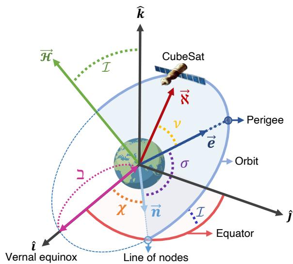  
Fig. 2. Geometric explanation of the CubeSat’s orbital elements.

$$
\varrho _ { y } = \left[ \begin{array} { c c c } { \mathcal { C } ( \Theta _ { l } ^ { \mathcal { U } } ) } & { 0 } & { \mathcal { S } ( \Theta _ { l } ^ { \mathcal { U } } ) } \\ { 0 } & { 1 } & { 0 } \\ { - \mathcal { S } ( \Theta _ { l } ^ { \mathcal { U } } ) } & { 0 } & { \mathcal { C } ( \Theta _ { l } ^ { \mathcal { U } } ) } \end{array} \right] ,\tag{8}
$$

$$
\varrho _ { x } = \left[ \begin{array} { c c c } { { 1 } } & { { 0 } } & { { 0 } } \\ { { 0 } } & { { \mathcal { C } ( \Xi _ { l } ^ { \mathcal { U } } ) } } & { { - { \cal S } ( \Xi _ { l } ^ { \mathcal { U } } ) } } \\ { { 0 } } & { { { \cal S } ( \Xi _ { l } ^ { \mathcal { U } } ) } } & { { \mathcal { C } ( \Xi _ { l } ^ { \mathcal { U } } ) } } \end{array} \right] .\tag{9}
$$

The position and trajectory of the UAV can be obtained by integrating the velocity for each axis over time, as in (10), (11), and (12).

Lemma 1. Without any external action in a closed system, the total propulsion energy consumption of the dynamically expressed UAV is calculated by (1).

Proof. Four main forces are acting on UAV: gravity, i.e., weight (W), lift (L), Thrust (F ), and drag (D), which mean the forces acting down, up, forward, and backward on UAV, respectively. The drag of UAVs moving at subsonic speed ℏ to which the incompressible Bernoulli equation is applied is expressed as,

$$
\mathcal { D } = \underbrace { \frac { 1 } { 2 } \rho C _ { D _ { 0 } } A \hbar ^ { 2 } } _ { p a r a s i t i c ~ d r a g } + \underbrace { \frac { 2 \mathcal { L } ^ { 2 } } { ( \pi e _ { 0 } \mathcal { A } _ { \mathcal { R } } ) \rho A \hbar ^ { 2 } } } _ { i n d u c e d ~ d r a g } ,\tag{13}
$$

where first and last terms denote the parasitic drag and induced drag, respectively. The above equation can be rewritten for convenience, $i . e . ,$

$$
\mathcal { D } = \eta _ { 1 } \hbar ^ { 2 } + \frac { \eta _ { 2 } \kappa ^ { 2 } } { \hbar ^ { 2 } } ,\tag{14}
$$

where κ is the load factor, which is the ratio of lift to weight, $i . e . , \kappa \triangleq \mathcal { L } / \mathcal { W }$ . Therefore, the following equation can be obtained, $\mathcal { L } = \mathcal { W }$ and $\mathcal { F } = \mathcal { M } \supset + \mathcal { D }$ by Newton’s laws of

$$
\begin{array} { r l } & { \mathcal { D } _ { x } ^ { \mu _ { i } } \triangleq \displaystyle \int _ { t } ^ { T } \big [ \{ \xi _ { i } ^ { \mu } \mathcal { C } ( \Phi _ { i } ^ { \mu } ) \mathcal { C } ( \Theta _ { i } ^ { \mu } ) \} + \{ \mathcal { O } _ { i } ^ { \mu } ( \mathcal { S } ( \Xi _ { i } ^ { \mu } ) \mathcal { S } ( \Theta _ { i } ^ { \mu } ) \mathcal { C } ( \Phi _ { i } ^ { \mu } ) - \mathcal { S } ( \Phi _ { i } ^ { \mu } ) \mathcal { C } ( \Xi _ { i } ^ { \mu } ) ) \} + \big \{ K _ { i } ^ { \mu } ( \mathcal { S } ( \Xi _ { i } ^ { \mu } ) \mathcal { S } ( \Phi _ { i } ^ { \mu } ) + \mathcal { S } ( \Theta _ { i } ^ { \mu } ) \mathcal { C } ( \Xi _ { i } ^ { \mu } ) ) \} \big ] \Delta t } \\ & { \mathcal { D } _ { y } ^ { \mu _ { i } } \triangleq \displaystyle \int _ { t } ^ { T } \big [ \{ \xi _ { i } ^ { \mu } \mathcal { S } ( \Phi _ { i } ^ { \mu } ) \mathcal { C } ( \Theta _ { i } ^ { \mu } ) \} + \{ \mathcal { O } _ { i } ^ { \mu } ( \mathcal { S } ( \Xi _ { i } ^ { \mu } ) \mathcal { S } ( \Psi _ { i } ^ { \mu } ) \mathcal { S } ( \Theta _ { i } ^ { \mu } ) + \mathcal { C } ( \Xi _ { i } ^ { \mu } ) \mathcal { C } ( \Psi _ { i } ^ { \mu } ) ) \} - \{ K _ { i } ^ { \mu } ( \mathcal { S } ( \Xi _ { i } ^ { \mu } ) \mathcal { C } ( \Psi _ { i } ^ { \mu } ) + \mathcal { S } ( \Psi _ { i } ^ { \mu } ) \mathcal { S } ( \Theta _ { i } ^ { \mu } ) \mathcal { C } ( \Xi _ { i } ^ { \mu } ) ) \} \big ] \Delta t } \\ &  \mathcal { D } _ { z } ^ { \mu _ { i } } \triangleq \displaystyle \int _ { t } ^ { T } \big [ \{ \xi _ { i } ^  - \ \end{array}\tag{10}
$$

(11)

(12)

motion, i.e.,

$$
\begin{array} { r l } & { \vec { P } ( \tau ) - \vec { P } ( t _ { 0 } ) = \mathcal { M } \vec { \hbar } ( \tau ) - \mathcal { M } \vec { \hbar } ( t _ { 0 } ) = \displaystyle \int _ { t _ { 0 } } ^ { \tau } \vec { F } ( t ) d t } \\ & { \quad \quad \quad = \displaystyle \int _ { t _ { 0 } } ^ { \tau } \frac { \Delta } { \Delta t } ( \mathcal { M } \vec { \hbar } ) ( t ) d t = \int _ { t _ { 0 } } ^ { \tau } \mathcal { M } \vec { \mathcal { O } } ( t ) d t , } \end{array}\tag{15}
$$

where $\vec { F } , \vec { P } ( \tau )$ , and $\vec { P } ( t _ { 0 } )$ stand for the total force vector applied to the system, momentum vectors at times τ and $t _ { 0 }$ respectively. As a result, the power required $( \mathcal { P } _ { R e q } )$ is equal to the amount of work per unit over time, which is defined as the dot product of force (thrust) and velocity, i.e.,

$$
\mathcal { P } _ { R e q } ( \hbar , \odot ) = | \vec { \mathcal { F } } \cdot \vec { \hbar } | = \left| \eta _ { 1 } \hbar ^ { 3 } + \frac { \eta _ { 2 } } { \hbar } + \mathcal { M } \odot \hbar \right| .\tag{16}
$$

However, when the UAV rolls to a banked position to change the flight direction, the lift produces a lateral (horizontal) component that supports the centrifugal acceleration, $i . e . ,$ the acceleration component perpendicular to the velocity. At this time, $\mathrm { i f } \ \Xi$ is the bank angle, the physical quantities associated with the UAV are geometrically as $\mathcal { L } \cdot \mathcal { C } ( \Xi ) = \mathcal { W }$ $\mathcal { L } \cdot \mathcal { S } ( \Xi ) \ = \ \mathcal { M } \supset _ { \perp }$ , and $\mathcal { F } - \mathcal { D } \ = \ \mathcal { M } \supset _ { \| }$ where $\supset _ { \perp }$ and $\Game _ { \parallel }$ are acceleration components perpendicular and parallel to the horizontal plane. When the UAV flies obliquely, the bank angle Ξ and $\supset _ { \perp }$ have the following geometric relationship, $\begin{array} { r } { i . e . , \ T ( \Xi ) = \frac { \mathcal { D } _ { \perp } } { g } } \end{array}$ , where $\tau ( \cdot )$ means the tan(·). Due to this, κ is expressed as,

$$
\kappa = \frac { \mathcal { L } } { \mathcal { W } } = \frac { \mathcal { L } } { \mathcal { L } \mathcal { C } ( \Xi ) } = ( 1 + \mathcal { T } ^ { 2 } ( \Xi ) ) ^ { \frac { 1 } { 2 } } = ( \frac { \mathcal { D } _ { \perp } } { g ^ { 2 } } ) ^ { \frac { 1 } { 2 } } .\tag{17}
$$

Then the thrust can be expressed as,

$$
\mathcal { F } = \eta _ { 1 } \hbar ^ { 2 } + \frac { \eta _ { 2 } } { \hbar ^ { 2 } } \left( 1 + \frac { \mathcal { D } _ { \perp } ^ { 2 } } { g ^ { 2 } } \right) + \mathcal { M } \mathcal { D } _ { \parallel } .\tag{18}
$$

Accordingly, the power required is defined as,

$$
\mathcal { P } _ { R e q } ( \hbar , \hat { v } _ { \parallel } , \hat { v } _ { \perp } ) = | \mathcal { F } | \hbar = \left| \eta _ { 1 } \hbar ^ { 3 } + \frac { \eta _ { 2 } } { \hbar } \left( 1 + \frac { \hat { v } _ { \perp } ^ { 2 } } { g ^ { 2 } } \right) + \mathcal { M } \hat { v } _ { \parallel } \hbar \right|\tag{19}
$$

Given $\vec { \hbar }$ and ${ \vec { \circ } } ,$ the tangential and centrifugal accelerations are expressed as,

$$
\mathcal { O } _ { \parallel } = \frac { \vec { \supset } ^ { T } \vec { \hbar } } { \vert \vert \vec { \hbar } \vert \vert } ,\tag{20}
$$

$$
\Theta _ { \perp } = ( \| \vec { \supset } \| ^ { 2 } - \frac { ( \vec { \supset } ^ { T } \vec { \hbar } ) ^ { 2 } } { | \vec { \hbar } | ^ { 2 } } ) ^ { \frac { 1 } { 2 } } ,\tag{21}
$$

respectively. Based on the above facts, $\mathcal { P } _ { R e q } ( \hbar , \supset _ { \parallel } , \supset _ { \perp } )$ can

be rewritten as (22),

$$
\mathcal { P } _ { R e q } ( \vec { h } , \vec { \bigcirc } ) = \bigg | \eta _ { 1 } \| { \vec { h } } \| ^ { 3 } + \frac { \eta _ { 2 } } { \| { \vec { h } } \| } \bigg ( 1 + \frac { \| \vec { \bigcirc } \| ^ { 2 } - \frac { ( \vec { \bigcirc } ^ { T } \vec { h } ) ^ { 2 } } { \| { \vec { h } } \| ^ { 2 } } } { g ^ { 2 } } \bigg ) + \mathcal { M } \vec { \partial } ^ { T } \vec { h } \bigg | .\tag{22}
$$

For the UAV following $\vec { \wp } ( t )$ with $\vec { \hbar } ( t ) = \dot { \vec { \sigma } } ( t )$ and $\begin{array} { r l } { \vec { \mathcal { O } } ( t ) = } & { { } } \end{array}$ $\dot { \vec { \hbar } } ( t ) = \ddot { \vec { \sigma } } ( t )$ , the total propulsion energy consumption up to time τ is subsequently defined as,

$$
\bar { \mathcal { D } } ( \vec { \wp } ( t ) ) = \int _ { 0 } ^ { \tau } \mathcal { P } _ { R e q } ( \vec { \hbar } ( t ) , \vec { \supset } ( t ) ) d t .\tag{23}
$$

Finally, by substituting $\mathcal { P } _ { R e q } ( \vec { h }$ and $\vec { \supset } \big )$ of (22) into the above, the total propulsion energy consumption is (1). Note that (23) is defined in continuous time using the differential dt.

## B. Dynamics Modeling of CubeSat for Space Networks

TLE represents a data format essential for predicting the orbit and position of satellites [69]. The orbital geometry for these orbital elements and the physical quantities needed to track the CubeSat’s position are shown as Fig. 2. First of all, the inclination (υ) represents how much CubeSat’s orbit is tilted with respect to the equator of the Earth. This is equivalent to the angle between the coordinate axis ˆk and the angular momentum vector $( \vec { \mathcal { H } } )$ . Additionally, the ascending node (χ) refers to the right ascension of the line $o f$ nodes (⃗n). Moreover, the vector (⃗e) represents the eccentricity vector. In addition, the semi-major axis vector $( \vec { \beth } )$ serves as the major radius of the CubeSat’s elliptical orbit. Additionally, the argument of perigee (σ) means the angle from the line of nodes to perigee based on the equator of the Earth. The true anomaly (ν) represents the angle from the perigee to the current position of the CubeSat. Lastly, the conic section vector (⃗ℵ) is a vector directed from the Earth’s center to the position of the CubeSat.

The position of the CubeSat must be accurately identified in order to calculate the distance between the GS and the CubeSat. The TLE data is raw; thus, to predict the position of the CubeSat, the orbital elements listed in the TLE must be converted to latitude and longitude. Latitude (ϕ) and longitude (λ) are required in the orbital coordinate system to identify the time-varying CubeSat position. The latitude $( \mathcal { Z } _ { j } ^ { \phi } ( t ) )$ and longitude $( \mathcal { Z } _ { j } ^ { \lambda } ( t ) )$ of the j-th CubeSat at t is expressed as,

$$
\mathcal { Z } _ { j } ^ { \phi } ( t ) \triangleq S ^ { - 1 } \left( \frac { \boldsymbol { B } _ { \varpi } [ 3 ] } { \| \boldsymbol { B } _ { \varpi } \| } \right) ,\tag{24}
$$

$$
\mathcal { Z } _ { j } ^ { \lambda } ( t ) = \mathrm { a t a n 2 } \left( \sqrt { 1 - \left( \frac { \mathcal { B } _ { \varpi } [ 1 ] } { \| \mathcal { B } _ { \varpi } \| \mathcal { C } ( \mathcal { Z } _ { j } ^ { \phi } ( t ) ) } \right) ^ { 2 } } , \frac { \mathcal { B } _ { \varpi } [ 1 ] } { \| \mathcal { B } _ { \varpi } \| \mathcal { C } ( \mathcal { Z } _ { j } ^ { \phi } ( t ) ) } \right) ,\tag{25}
$$

where $B _ { \varpi } [ 3 ]$ and $B _ { \varpi } [ 1 ]$ stand for $B _ { \varpi } \mathrm { { ' s } }$ first and third elements, respectively. To avoid the quadrant ambiguity inherent in inverse cosine, the longitude computation in (25) is expressed using the two-argument inverse tangent operator (equivalent to atan2), ensuring that the full [-π, π] longitude range is correctly determined. In (24) and (25), the matrix $p _ { \varpi }$ is expressed as,

$$
\begin{array} { r } { B _ { \varpi } \triangleq \left[ \varkappa _ { 1 } \times \varkappa _ { 2 } \times \varkappa _ { 3 } \times \varkappa _ { 4 } \right] \times \mathcal { V } _ { 4 } , } \end{array}\tag{26}
$$

where $\varkappa _ { 1 } , \varkappa _ { 2 } , \varkappa _ { 3 }$ , and $\varkappa _ { 4 }$ denote the coordinate transformation matrices, which can be calculated as,

$$
\begin{array} { r l r } { \varkappa _ { 1 } = \left[ \begin{array} { c c c } { \mathcal { C } ( \chi ) } & { \mathcal { S } ( \chi ) } & { 0 } \\ { - \mathcal { S } ( \chi ) } & { \mathcal { C } ( \chi ) } & { 0 } \\ { 0 } & { 0 } & { 1 } \end{array} \right] , \varkappa _ { 2 } = } & { \left[ \begin{array} { c c c } { 1 } & { 0 } & { 0 } \\ { 0 } & { \mathcal { C } ( v ) } & { \mathcal { S } ( v ) } \\ { 0 } & { - \mathcal { S } ( v ) } & { \mathcal { C } ( v ) } \end{array} \right] } \end{array}
$$

$$
\begin{array} { r l } { \varkappa _ { 3 } = \left[ \begin{array} { c c c } { \mathcal { C } ( \sigma ) } & { \mathcal { S } ( \sigma ) } & { 0 } \\ { - \mathcal { S } ( \sigma ) } & { \mathcal { C } ( \sigma ) } & { 0 } \\ { 0 } & { 0 } & { 1 } \end{array} \right] , \varkappa _ { 4 } = } & { { } \left[ \begin{array} { c c c } { \mathcal { C } ( \varepsilon ) } & { \mathcal { S } ( \varepsilon ) } & { 0 } \\ { - \mathcal { S } ( \varepsilon ) } & { \mathcal { C } ( \varepsilon ) } & { 0 } \\ { 0 } & { 0 } & { 1 } \end{array} \right] , } \end{array}\tag{27}
$$

where ε denotes the angle at which the Earth rotates [70]. In this paper, ε is explicitly defined as the Greenwich sidereal angle (GSA), i.e., the time-varying Earth rotation angle required for converting Earth-centered inertial (ECI) coordinates to Earth-centered earth-fixed (ECEF) coordinates. Thus, the final rotation $\varkappa _ { 4 }$ corresponds to the Earth rotation about its spin axis, ensuring a proper alignment from inertial to Earthfixed coordinates. Then, the matrix $\nu _ { 4 }$ can be expressed as,

$$
\mathcal { V } _ { 4 } = \left[ \aleph \mathcal { C } ( \nu ) \quad \aleph \mathcal { S } ( \nu ) \quad 0 \right] ^ { T } .\tag{28}
$$

This matrix is transformed from the celestial coordinate system to the orbital coordinate system through the coordinate transformation matrices. In (28), ℵ is expressed as,

$$
\aleph = \frac { \mathcal { H } ^ { 2 } / \mu } { 1 + e \cdot \mathcal { C } ( \nu ) } ,\tag{29}
$$

where $\mu$ is the standard gravitational parameter. The H represents the magnitude of vector $\vec { \mathcal { H } } , i . e . , \mathcal { H } = | \vec { \mathcal { H } } |$ , which is formulated as,

$$
\mathcal { H } = \{ \mu | \vec { \exists } | ( 1 - e ^ { 2 } ) \} ^ { \frac { 1 } { 2 } } .\tag{30}
$$

Furthermore, ν is the true anomaly, which is expressed as,

$$
\nu = 2 \mathcal { T } ^ { - 1 } \left( ( \frac { 1 + e } { 1 - e } ) ^ { \frac { 1 } { 2 } } \mathcal { T } \left( \frac { E } { 2 } \right) \right) ,\tag{31}
$$

where $E$ stands for the eccentric anomaly, which can be formulated as, ${ \cal E } ~ = ~ { \cal M } + e \sin { \cal M }$ . Here, M is the mean anomaly and refers to the angle for CubeSat’s average position, which is in TLE. The parameters required to calculate the latitude and longitude of the CubeSat are summarized in Table IV. It is important to note that the variables necessary for the calculation are derived from the TLE data [71], [72].

The reward defined in (45), includes the distance between i-th GS and j-th CubeSat, which can be expressed as, $\mathcal { I } _ { j } ^ { i } ( t ) = \{ \mathcal { T } _ { \mathcal { H } _ { j } ^ { i } } ( t ) ^ { 2 } + \mathcal { T } _ { \mathcal { V } _ { j } ^ { i } } ( t ) ^ { 2 } \} ^ { \frac { 1 } { 2 } }$ , where $\mathcal { I } _ { \mathcal { H } _ { j } } ^ { \ i } ( t )$ and $\mathcal { T } _ { \mathcal { V } _ { j } } ^ { ~ i } ( t )$ are horizontal/vertical distances between the i-th GS and the j-th CubeSat. Here, the vertical distance corresponds to the altitude of the CubeSat, and the horizontal distance is expressed as,

TABLE IV  
PARAMETER VALUES FOR CUBESAT POSITION CALCULATIONS [73].
<table><tr><td>Constant</td><td>II Value</td></tr><tr><td>Gravitational Constant, G Mass of the Earth, Me</td><td>6.673 e-20 5.974 e+24 kg</td></tr><tr><td>Radius of the Earth, Re Standard Gravitational Parameter,  $\mu = G M _ { e }$ </td><td>6.378 e+6 m  $3 . 9 8 6 \ \mathrm { e } { + } 1 4 \ m ^ { 3 } \ s ^ { - 2 }$ </td></tr></table>

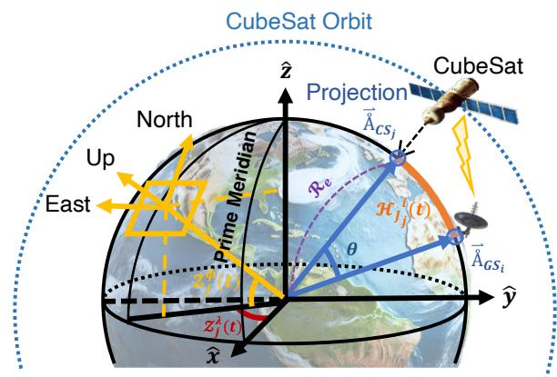  
Fig. 3. Distance between the i-th GS and the j-th CubeSat.

$$
\begin{array} { r } { \mathcal { I } _ { \mathcal { H } _ { j } ^ { i } } ( t ) = \mathcal { R } _ { e } \mathcal { C } ^ { - 1 } [ \mathcal { C } ( \mathcal { Z } _ { i } ^ { \phi } ( t ) ) \mathcal { C } ( \mathcal { Z } _ { j } ^ { \phi } ( t ) ) \mathcal { C } ( \mathcal { Z } _ { i } ^ { \lambda } ( t ) - \mathcal { Z } _ { j } ^ { \lambda } ( t ) ) } \\ { + \mathcal { S } ( \mathcal { Z } _ { i } ^ { \phi } ( t ) ) \mathcal { S } ( \mathcal { Z } _ { j } ^ { \phi } ( t ) ) ] , \quad ( } \end{array}\tag{32}
$$

where $\mathcal { R } _ { e } , \mathcal { Z } _ { i } ^ { \phi } ( t )$ and $\mathcal { Z } _ { i } ^ { \lambda } ( t )$ are the radius of the Earth with a value of $6 . 3 7 8 \times 1 0 ^ { 6 }$ m, latitude and longitude of i-th GS at time step t. The distance between the l-th UAV and the i-th GS is also expressed as, $\mathcal { T } _ { l } ^ { i } ( t ) = \{ \mathcal { T } _ { \mathcal { H } _ { l } ^ { i } } ( t ) ^ { 2 } + \mathcal { T } _ { \mathcal { V } _ { l } } { } ^ { i } ( t ) ^ { 2 } \} ^ { \frac { 1 } { 2 } }$ where $\mathcal { I } _ { \mathcal { H } l } ^ { ~ i } ( t )$ and $\mathcal { T } _ { \nu l } ^ { ~ i } ( t )$ are the horizontal/vertical distances between the i-th GS and the l-th UAV. Here, $\mathcal { I } _ { \nu _ { l } } { } ^ { i } ( t )$ is the elevation of the UAV, and $\mathcal { I } _ { \mathcal { H } l } ^ { \ i } ( t )$ is also expressed as,

$$
\mathcal { I } _ { \mathcal { H } _ { l } ^ { i } } ( t ) = \mathcal { R } _ { e } \mathcal { C } ^ { - 1 } [ \mathcal { C } ( \mathcal { Z } _ { i } ^ { \phi } ( t ) ) \mathcal { C } ( \mathcal { Z } _ { l } ^ { \phi } ( t ) ) \mathcal { C } ( \mathcal { Z } _ { i } ^ { \lambda } ( t ) - \mathcal { Z } _ { l } ^ { \lambda } ( t ) ) + \mathcal { S } ( \mathcal { Z } _ { i } ^ { \phi } ( t ) ) \mathcal { S } ( \mathcal { Z } _ { l } ^ { \phi } ( t ) ) ] ,\tag{33}
$$

where $\mathcal { Z } _ { l } ^ { \phi } ( t )$ and $\mathcal { Z } _ { l } ^ { \lambda } ( t )$ are the latitude and longitude of l-th UAV. The trajectory vector of the l-th UAV is expressed as,

$$
\vec { \wp } _ { l } ^ { \mathcal { U } } ( t ) \triangleq \{ \mathcal { D } _ { x } ^ { \mathcal { U } _ { l } } , \mathcal { D } _ { y } ^ { \mathcal { U } _ { l } } , \mathcal { D } _ { z } ^ { \mathcal { U } _ { l } } \} ,\tag{34}
$$

where $\mathcal { D } _ { x } ^ { \mathcal { U } _ { l } } , \mathcal { D } _ { y } ^ { \mathcal { U } _ { l } }$ , and $\mathcal { D } _ { z } ^ { \mathcal { U } _ { l } }$ stand for the $x , y ,$ and z Cartesian coordinates of l-th UAV. They can be rewritten as,

$$
\mathcal { Z } _ { l } ^ { \phi } ( t ) = \mathcal { T } ^ { - 1 } ( \frac { \mathcal { D } _ { z } ^ { \mathcal { U } _ { l } } } { ( \mathcal { D } _ { x } ^ { \mathcal { U } _ { l } } { } ^ { 2 } + \mathcal { D } _ { y } ^ { \mathcal { U } _ { l } } { } ^ { 2 } ) ^ { \frac { 1 } { 2 } } } ) ,\tag{35}
$$

$$
\mathcal { Z } _ { l } ^ { \lambda } ( t ) = \mathcal { T } ^ { - 1 } 2 ( \mathcal { D } _ { y } ^ { \mathcal { U } _ { l } } , \mathcal { D } _ { x } ^ { \mathcal { U } _ { l } } ) ,\tag{36}
$$

$$
\mathcal { Z } _ { l } ^ { \mathcal { H } } ( t ) = \mathcal { I } \nu _ { l } ^ { i } ( t ) = ( \mathcal { D } _ { x } ^ { \mathcal { U } _ { l } ^ { 2 } } + \mathcal { D } _ { y } ^ { \mathcal { U } _ { l } ^ { 2 } } + \mathcal { D } _ { z } ^ { \mathcal { U } _ { l } ^ { 2 } } ) ^ { \frac { 1 } { 2 } } - \mathcal { R } _ { e } .\tag{37}
$$

Here, $\mathcal { T } ^ { - 1 } 2 ( \cdot , \cdot )$ receives relative coordinates $( \mathcal { D } _ { y } ^ { \mathcal { U } _ { l } } , \mathcal { D } _ { x } ^ { \mathcal { U } _ { l } } )$ and returns the absolute angle to a radian of [-π, π].

Lemma 2. The distance between the i-th GS and the $j -$

th CubeSat can be calculated as, $\begin{array} { r } { \mathcal { T } _ { j } ^ { i } ( t ) ~ = ~ \{ \mathcal { T } _ { \mathcal { H } _ { j } } { } ^ { i } ( t ) ^ { 2 } ~ + } \end{array}$ $\mathcal { I } _ { \mathcal { V } _ { j } ^ { \smash { \scriptstyle i } } } ( t ) ^ { 2 } \} ^ { \frac { 1 } { 2 } }$ , where $\mathcal { I } _ { \mathcal { H } _ { j } } ^ { \ i } ( t )$ is expressed in (32).

Proof. As illustrated in Fig. 3, there are two vectors, which are expressed as, $\vec { \mathring { A } } _ { G S _ { i } } = ( x _ { i } , y _ { i } , z _ { i } )$ and $\vec { \hat { A } } _ { C S _ { j } } = ( x _ { j } , y _ { j } , z _ { j } )$ The angle between the two vectors is calculated as,

$$
\theta = \mathcal { C } ^ { - 1 } \frac { x _ { i } x _ { j } + y _ { i } y _ { j } + z _ { i } z _ { j } } { ( x _ { i } ^ { 2 } + y _ { i } ^ { 2 } + z _ { i } ^ { 2 } ) ^ { \frac { 1 } { 2 } } \ ( x _ { j } ^ { 2 } + y _ { j } ^ { 2 } + z _ { j } ^ { 2 } ) ^ { \frac { 1 } { 2 } } } ,\tag{38}
$$

where each coordinate value can be rewritten as follows,

$$
\left[ \begin{array} { c } { x _ { i } } \\ { y _ { i } } \\ { z _ { i } } \end{array} \right] = \left[ \begin{array} { c } { \mathcal { R } _ { e } \mathcal { C } ( \mathcal { Z } _ { i } ^ { \phi } ( t ) ) \mathcal { C } ( \mathcal { Z } _ { i } ^ { \lambda } ( t ) ) } \\ { \mathcal { R } _ { e } \mathcal { C } ( \mathcal { Z } _ { i } ^ { \phi } ( t ) ) \mathcal { S } ( \mathcal { Z } _ { i } ^ { \lambda } ( t ) ) } \\ { \mathcal { R } _ { e } \mathcal { S } ( \mathcal { Z } _ { i } ^ { \phi } ( t ) ) } \end{array} \right] ,\tag{39}
$$

$$
\left[ \begin{array} { c } { x _ { j } } \\ { y _ { j } } \\ { z _ { j } } \end{array} \right] = \left[ \begin{array} { c } { \mathcal { R } _ { e } \mathcal { C } ( \mathcal { Z } _ { j } ^ { \phi } ( t ) ) \mathcal { C } ( \mathcal { Z } _ { j } ^ { \lambda } ( t ) ) } \\ { \mathcal { R } _ { e } \mathcal { C } ( \mathcal { Z } _ { j } ^ { \phi } ( t ) ) \mathcal { S } ( \mathcal { Z } _ { j } ^ { \lambda } ( t ) ) } \\ { \mathcal { R } _ { e } \mathcal { S } ( \mathcal { Z } _ { j } ^ { \phi } ( t ) ) } \end{array} \right] .\tag{40}
$$

Assume that the magnitudes of the two vectors are equal, i.e., same as Earth’s radius, which can be expressed $\mathrm { a s , }$

$$
( x _ { i } ^ { 2 } + y _ { i } ^ { 2 } + z _ { i } ^ { 2 } ) ^ { \frac { 1 } { 2 } } = ( x _ { j } ^ { 2 } + y _ { j } ^ { 2 } + z _ { j } ^ { 2 } ) ^ { \frac { 1 } { 2 } } = \mathcal { R } _ { e } .\tag{41}
$$

Because the two vectors are defined in (39) and (40), their dot product is defined $\mathbf { a s } ,$

$$
\begin{array} { r l } & { x _ { i } x _ { j } + y _ { i } y _ { j } + z _ { i } z _ { j } } \\ & { = \mathcal { R } _ { e } ^ { 2 } \mathcal { C } ^ { - 1 } \Big [ \mathcal { C } ( \mathcal { Z } _ { i } ^ { \phi } ( t ) ) \mathcal { C } ( \mathcal { Z } _ { j } ^ { \phi } ( t ) ) \mathcal { C } ( \mathcal { Z } _ { i } ^ { \lambda } ( t ) - \mathcal { Z } _ { j } ^ { \lambda } ( t ) ) } \\ & { \qquad ( \mathcal { L } ) } \end{array} + S ( \mathcal { Z } _ { i } ^ { \phi } ( t ) ) S ( \mathcal { Z } _ { j } ^ { \phi } ( t ) ) \Big ] .\tag{42}
$$

According to the arc length of a circle formula, i.e., $\mathcal { I } _ { \mathcal { H } _ { j } } { ' } ( t ) ~ = ~ \mathcal { R } _ { e } \theta$ , the horizontal distance $\mathcal { I } _ { \mathcal { H } _ { j } } ^ { \ i } ( t )$ , which is represented by the orange line in Fig. 3, can be expressed as, $\mathcal { I } _ { \mathcal { H } _ { j } ^ { i } } ( t ) = \mathbf { \bar { \mathcal { R } } } _ { e } \mathcal { C } ^ { - 1 } [ \mathcal { C } ( \bar { \mathcal { Z } } _ { i } ^ { \phi } ( t ) ) \mathcal { C } ( \mathcal { Z } _ { j } ^ { \phi } ( \bar { t } ) ) \mathcal { C } ( \mathcal { Z } _ { i } ^ { \lambda } ( t ) - \mathcal { Z } _ { j } ^ { \hat { \lambda } } ( t ) ) +$ $S ( \mathcal { Z } _ { i } ^ { \phi } ( \cdot ) ) S ( \mathcal { Z } _ { j } ^ { \phi } ( t ) ) ]$ , which is equivalent to (32). □

## C. Seamless Global Communications via NTN Devices

When GS selects specific UAVs and CubeSats for scheduling, it is important to jointly optimize the global networking performance and residual energy of NTN devices. Achieving these goals simultaneously requires a tightly designed reward function that reflects the objectives of SR-MARL. The main objective (reward), i.e., Ri, for each i-th GS is expressed as,

$$
\begin{array} { r l r } { \left. { \operatorname* { m a x } _ { \mathfrak { S } _ { j } ^ { i } ( t ) , \mathfrak { S } _ { l } ^ { i } ( t ) } : \operatorname* { l i m } _ { \tau \to \infty } \frac { 1 } { \tau } \sum _ { t = 0 } ^ { \tau - 1 } \Bigg ( \sum _ { \forall j \in \mathfrak { I } ^ { i } } \mathfrak { R } _ { i } \left( \mathcal { I } _ { j } ^ { i } ( t ) , \mathfrak { S } _ { j } ^ { i } ( t ) \right) } } \\ & { } & { + \sum _ { \forall l \in \mathfrak { L } ^ { i } } \mathfrak { R } _ { i } \left( \mathcal { I } _ { l } ^ { i } ( t ) , \mathfrak { S } _ { l } ^ { i } ( t ) \right) \Bigg ) , \quad ( 4 3 \frac { \textnormal { d } _ { l } ^ { i } ( t ) } { \textnormal { d } _ { l } ^ { i } ( t ) } + \mathfrak { I } _ { l } ^ { i } ( t ) \right) } \end{array}
$$

where $\mathfrak { S } _ { j } ^ { i } ( t )$ and $\mathfrak { S } _ { l } ^ { i } ( t )$ denote the i-th GS’s selection vector for j-th CubeSat/l-th UAV, respectively. The ${ \mathfrak { S } } _ { j } ^ { i } ( t )$ and $\mathfrak { S } _ { l } ^ { i } ( t )$ are subject to, $\begin{array} { r l r } { \sum _ { \forall j \in \mathfrak { F } ^ { i } } \sum _ { \forall l \in \mathfrak { L } ^ { i } } \Bigg ( \mathfrak { S } _ { j } ^ { i } ( t ) + \mathfrak { S } _ { l } ^ { i } ( t ) \Bigg ) } & { \leq } & { \bar { \mathfrak { M } } _ { i } } \end{array}$ where $\bar { \mathfrak { W } } _ { i }$ is the maximum number of NTN devices that the i-th GS can access. The selection vectors of CubeSat and UAV are subject to the following constraints, $\mathfrak { S } _ { i } ^ { i } ( t ) \in \{ 0 , 1 \}$ $\mathfrak { S } _ { l } ^ { i } ( t ) \in \{ 0 , 1 \} , \forall j \in \mathfrak { J } ^ { i }$ , and $\forall l \in \mathfrak { L } ^ { i }$ , where $\check { \mathfrak { J } } ^ { i }$ and Li are the sets of CubeSats/UAVs within the coverage of the i-th GS. The reward function of the i-th GS in (43) is expressed as,

$$
\begin{array} { r l } & { \Re _ { i } \left( \mathcal { I } _ { j } ^ { i } ( t ) , \mathfrak { S } _ { j } ^ { i } ( t ) \right) + \Re _ { i } \left( \mathcal { I } _ { l } ^ { i } ( t ) , \mathfrak { S } _ { l } ^ { i } ( t ) \right) = } \\ & { \qquad \Re _ { i } \left( \mathcal { I } _ { j } ^ { i } ( t ) , \mathfrak { S } _ { j } ^ { i } ( t ) \right) - \mathfrak { E } _ { i } \left( t , \mathfrak { S } _ { j } ^ { i } ( t ) \right) } \\ & { \qquad + \Re _ { i } \left( t , \mathfrak { S } _ { l } ^ { i } ( t ) \right) - \mathfrak { E } _ { i } \left( t , \mathfrak { S } _ { l } ^ { i } ( t ) \right) , } \end{array}\tag{44}
$$

where $\mathfrak { N } _ { i } \left( \mathcal { I } _ { j } ^ { i } ( t ) , \mathfrak { E } _ { j } ^ { i } ( t ) \right) , \mathfrak { C } _ { i } \left( t , \mathfrak { S } _ { j } ^ { i } ( t ) \right) , \mathfrak { N } _ { i } \left( \mathcal { I } _ { j } ^ { i } ( t ) , \mathfrak { E } _ { l } ^ { i } ( t ) \right)$ , and $\mathfrak { C } _ { i } \left( t , \mathfrak { S } _ { j } ^ { i } ( t ) \right)$ represent the networking function and energy consumption function of the i-th GS for the $j \cdot$ th CubeSat/l-th UAV. The sum of networking function is expressed as,

$$
\begin{array} { r l } & { \Re _ { i } \left( \mathcal { I } _ { j } ^ { i } ( t ) , \mathfrak { S } _ { j } ^ { i } ( t ) \right) + \Re _ { i } \left( \mathcal { T } _ { l } ^ { i } ( t ) , \mathfrak { S } _ { l } ^ { i } ( t ) \right) } \\ & { = \displaystyle \sum _ { \forall j \in \mathfrak { I } ^ { i } } \left\{ \Lambda ( \mathcal { I } _ { j } ^ { i } ( t ) ) \cdot \Gamma _ { j } ^ { \mathcal { C } } ( t ) \cdot \mathbf { C } \mathbf { N R } ( \mathcal { I } _ { j } ^ { i } ( t ) ) + \Delta \bar { \Phi } _ { j } ^ { i } ( \mathcal { I } _ { j } ^ { i } ( t ) ) ^ { - 1 } \right\} \cdot \mathfrak { S } _ { j } ^ { i } ( t ) } \\ & { \quad + \displaystyle \sum _ { \forall l \in \mathfrak { L } ^ { i } } \left\{ \Lambda ( \mathcal { I } _ { l } ^ { i } ( t ) ) \cdot \Gamma _ { l } ^ { \mathcal { U } } ( t ) \cdot \mathbf { C } \mathbf { N R } ( \mathcal { I } _ { l } ^ { i } ( t ) ) + \mathfrak { P } _ { l _ { \mathrm { l o s } } } ^ { i } ( \mathcal { I } _ { \mathcal { H } } ^ { i } ( t ) ) \right\} \cdot \mathfrak { S } _ { l } ^ { i } ( t ) , } \end{array}\tag{45}
$$

where $\Lambda ( \mathcal { I } _ { j } ^ { i } ( t ) ) , \Lambda ( \mathcal { I } _ { l } ^ { i } ( t ) ) , \Gamma _ { j } ^ { c } ( t ) , \Gamma _ { l } ^ { \mathcal { U } } ( t ) , \mathbf { C } \mathbf { N } \mathbf { R } ( \mathcal { I } _ { j } ^ { i } ( t ) )$ , and $\mathbf { C N R } ( \mathcal { T } _ { l } ^ { i } ( t ) )$ are network quality function, capacity, CNR of the link between i-th GS and its associated NTN devices. $\mathfrak { P } _ { l L o S } ^ { i } ( \mathcal { I } _ { \mathcal { H } l } ^ { i } ( t ) )$ are the line of sight (LoS) probability between i-th GS-l-th UAV, and $\Phi ( \mathcal { T } _ { j } ^ { i } ( t ) )$ represents elevation/azimuth angle difference of the link between the i-th GS and the j-th CubeSat. Firstly, the network quality function of j-th CubeSat and l-th UAV can be expressed as,

$$
\Lambda ( \mathcal { I } _ { k } ^ { i } ( t ) ) \triangleq \left( 1 + \exp \left( - \psi _ { \alpha } \left( \zeta _ { k } ^ { i } ( \mathcal { I } _ { k } ^ { i } ( t ) ) - \psi _ { \beta } \right) \right) \right) ^ { - 1 } ,\tag{46}
$$

where $\psi _ { \alpha } ~ = ~ 0 . 0 1$ and $\psi _ { \beta } ~ = ~ 1 , 0 2 4$ (network quality coefficients). The subscript k below satisfies the following constraints, i.e., $\forall k \in \{ j , l \}$ , and j and l mean notation for CubeSat and UAV. In (46), $\zeta _ { k } ^ { i } ( \mathcal { T } _ { k } ^ { i } ( t ) )$ is expressed as,

$$
\zeta _ { k } ^ { i } ( \mathcal { I } _ { k } ^ { i } ( t ) ) = \mathfrak { B } _ { k } ^ { i } \cdot \log _ { 2 } \left( 1 + \mathbf { S N R } ( \mathcal { I } _ { k } ^ { i } ( t ) ) \right) ,\tag{47}
$$

where $\mathfrak { B } _ { k } ^ { i }$ and $\mathbf { S N R } ( \mathcal { T } _ { k } ^ { i } ( t ) )$ are bandwidth and signal-to-noise ratio (SNR) of j-th CubeSat/l-th UAV. Secondly, in (45), the CNR of the link can be expressed as,

$$
\mathbf { C N R } ( \mathcal { T } _ { k } ^ { i } ( t ) ) = \frac { \mathcal { P } _ { i } ^ { k } ( \mathcal { T } _ { k } ^ { i } ( t ) ) } { \mathcal { N } _ { i } ^ { k } } = \frac { \mathcal { P } _ { k } ^ { i } \mathcal { G } _ { k } ^ { i } \mathcal { G } _ { i } [ \frac { 1 } { \mathcal { L } _ { F S } ( \mathcal { T } _ { k } ^ { i } ( t ) ) \cdot \mathcal { L } _ { 0 } } ] } { k \mathcal { T } _ { i } b _ { N } }\tag{48}
$$

where $\mathcal { P } _ { i } ^ { k } ( \mathcal { T } _ { k } ^ { i } ( t ) ) , \mathcal { N } _ { i } ^ { k } , \mathcal { P } _ { k } ^ { i } , \mathcal { G } _ { k } ^ { i } , \mathcal { G } _ { i } , \mathcal { L } _ { F S } ( \mathcal { T } _ { k } ^ { i } ( t ) ) , \mathcal { L } _ { 0 } , k , \mathcal { T } _ { i } , b _ { N }$ and $\mathbf { E I R } \mathbf { P } _ { k } ^ { i }$ refer to GS’s received power, noise power at the GS’s receiver antenna terminals, NTN devices’s transmitted power, NTN device’s transmit antenna gain, GS’s receive antenna gain, free space path loss, all other losses, Boltzmann’s constant, GS’s receiver system noise temperature, noise bandwidth, and effective isotropic radiated power (EIRP), i.e.,

$$
\mathbf { E I R P } _ { k } ^ { i } = \mathcal { P } _ { k } ^ { i } \mathcal { G } _ { k } ^ { i } ,\tag{49}
$$

when i-th GS receives networking services from k-th NTN devices (j-th CubeSat/l-th UAV). In (48), antenna gain $\mathcal { G } _ { u }$ of device u can be expressed as,

$$
\mathcal { G } _ { u } = \varphi _ { A } \frac { 4 \pi A _ { u } } { \Omega } = \varphi _ { A } \frac { 4 \pi } { \Omega ^ { 2 } } \left( \frac { \pi \mathfrak { D } _ { u } ^ { 2 } } { 4 } \right) = \varphi _ { A } \left( \frac { \pi \mathfrak { D } _ { u } } { \Omega } \right) ^ { 2 } .\tag{50}
$$

Furthermore, it can also be expressed in dB form as follows, $\mathcal { G } _ { u } = 1 0 \log \left( 1 0 9 . 6 6 \mathfrak { F } ^ { 2 } \mathfrak { D } _ { u } ^ { 2 } \varphi _ { A } \right)$ , where $\varphi _ { A } , \Omega , \mathfrak { F }$ , and $\mathfrak { D } _ { u }$ stand for aperture efficiency of device u, wavelength, frequency, and antenna diameter of device u. The subscript u below satisfies the following constraints, i.e., $\forall u \in \{ i , j , l \}$ , and $i , j$ and l mean notation for GS, CubeSat and UAV. Moreover, all other losses can be rewritten as,

$$
\mathcal { L } _ { \mathrm { 0 } } = \sum ( O t h e r \ l o s s e s ) ,\tag{51}
$$

and may originate from the free space path, or from hardware components such as antenna feeds and line losses. This type of noise arises from random variations because numerous minor effects from various sources accumulate and collectively form a Gaussian distribution. Furthermore, the noise power at the GS’s receiver antenna terminals can be expressed as,

$$
\begin{array} { r } { \mathcal { N } _ { i } ^ { k } = k \mathcal { T } _ { i } b _ { N } . } \end{array}\tag{52}
$$

The GS’s received power can be defined as,

$$
\mathcal { P } _ { i } ^ { k } ( \mathcal { I } _ { k } ^ { i } ( t ) ) = \mathcal { P } _ { k } ^ { i } \mathcal { G } _ { k } ^ { i } \mathcal { G } _ { i } [ \frac { 1 } { \mathcal { L } _ { F S } ( \mathcal { I } _ { k } ^ { i } ( t ) ) \cdot \mathcal { L } _ { 0 } } ] .\tag{53}
$$

Thus, the term $\mathcal { P } _ { i } ^ { k } ( \mathcal { T } _ { k } ^ { i } ( t ) )$ can be expressed as,

$$
\mathcal { P } _ { i } ^ { k } ( \mathcal { T } _ { k } ^ { i } ( t ) ) = \omega _ { i } \cdot \mathfrak { A } _ { e } = \frac { \mathcal { P } _ { k } ^ { i } \mathcal { G } _ { k } ^ { i } } { 4 \pi \mathcal { T } _ { k } ^ { i } ( t ) ^ { 2 } } \mathfrak { U } _ { e } ,\tag{54}
$$

where ω and ${ \mathfrak { A } } _ { e }$ are the power flux density (PFD) and effective area of the GS’s receiver antenna. In (54), the effective area of the GS’s receiver antenna can be calculated as, $\begin{array} { r } { \mathfrak { A } _ { e } = \frac { \mathcal { G } _ { i } \Omega ^ { 2 } } { 4 \pi } } \end{array}$ Thus, i-th GS’s received power can be defined as,

$$
\begin{array} { r l } & { \mathcal { P } _ { i } ^ { k } ( \mathcal { T } _ { k } ^ { i } ( t ) ) = \underbrace { \left[ \frac { \mathcal { P } _ { k } ^ { i } \mathcal { G } _ { k } ^ { i } } { 4 \pi \mathcal { T } _ { k } ^ { i } ( t ) ^ { 2 } } \right] } _ { P o w e r f u x ~ d e n s i t y } \cdot \underbrace { \left[ \frac { \Omega ^ { 2 } } { 4 \pi } \right] } _ { S p r e a d i n g ~ l o s s } } \\ & { ~ = \mathcal { P } _ { k } ^ { i } \mathcal { G } _ { k } ^ { i } \mathcal { G } _ { i } \left[ \left( \frac { \Omega } { 4 \pi \mathcal { T } _ { k } ^ { i } ( t ) } \right) ^ { 2 } \right] , } \end{array}\tag{55}
$$

where the expression within the brackets in the last term represents the inverse square loss, i.e., $\mathcal { L } _ { F S } ( \mathcal { T } _ { k } ^ { i } ( t ) )$ ), which can be expressed as,

$$
\mathcal { L } _ { F S } ( \mathcal { T } _ { k } ^ { i } ( t ) ) = \left( \frac { 4 \pi \mathcal { T } _ { k } ^ { i } ( t ) } { \Omega } \right) ^ { 2 } = \left( \frac { 4 \pi \mathcal { T } _ { k } ^ { i } ( t ) \mathfrak { F } } { \mathfrak { c } } \right) ^ { 2 } ,\tag{56}
$$

where c is the velocity of light. Note that the free space path loss $( \mathcal { L } _ { F S } ( \mathcal { T } _ { k } ^ { i } ( t ) ) )$ is proportional to the square of the path distance $( \mathcal { T } _ { k } ^ { i } ( t ) )$ between i-th GS and k-th NTN device, $i . e .$ j-th CubeSat/l-th UAV. For $\mathcal { T } _ { k } ^ { i } ( t )$ in km, and F in $G H z ,$ the above can be rewritten in dB form, $\mathcal { L } _ { F S } ( \mathcal { T } _ { k } ^ { i } ( t ) ) = 2 0 \log ( \mathfrak { F } ) +$ $2 0 \log \left( \mathcal { T } _ { k } ^ { i } ( t ) \right) + 9 2 . 4 4$ . Thirdly, in (45), the elevation/azimuth angle differences, i.e., $\Delta \bar { \Phi } _ { j } ^ { i } ( \mathcal { I } _ { j } ^ { i } ( t ) )$ can be expressed as,

$$
\Delta \bar { \Phi } _ { j } ^ { i } ( \mathcal { I } _ { j } ^ { i } ( t ) ) = \{ \Delta \bar { \Pi } _ { j } ^ { i } ( \mathcal { I } _ { j } ^ { i } ( t ) ) ^ { 2 } + \Delta \bar { \varsigma } _ { j } ^ { i } ( t ) ^ { 2 } \} ^ { \frac { 1 } { 2 } } ,\tag{57}
$$

where $\Delta \bar { \Pi } _ { j } ^ { i } ( \mathcal { I } _ { j } ^ { i } ( t ) )$ and $\Delta \varsigma _ { j } ^ { i } ( t )$ denote the elevation/azimuth angle differences. The elevation angle difference, i.e., $\Delta \bar { \Pi } _ { j } ^ { i } ( \mathcal { I } _ { j } ^ { i } ( t ) )$ , can be expressed as,

$$
\Delta \bar { \Pi } _ { j } ^ { i } ( \mathcal { I } _ { j } ^ { i } ( t ) ) = \Pi _ { i } ( t ) - \Pi _ { j } ^ { i } ( \mathcal { I } _ { j } ^ { i } ( t ) ) ,\tag{58}
$$

where $\Pi _ { i } ( t )$ and $\Pi _ { j } ^ { i } ( \mathcal { I } _ { j } ^ { i } ( t ) )$ denote the true elevation angle of the i-th GS and calculated elevation angle between i-th GS and j-th CubeSat. The latter is expressed as,

$$
\Pi _ { j } ^ { i } ( \mathcal { I } _ { j } ^ { i } ( t ) ) = \mathcal { C } ^ { - 1 } \left( \frac { \mathcal { R } _ { e } + \mathcal { I } _ { \mathcal { V } _ { j } ^ { i } } ( t ) } { \mathcal { I } _ { j } ^ { i } ( t ) } ( 1 - \mathcal { C } ^ { 2 } ( \Upsilon ( t ) ) \mathcal { C } ^ { 2 } ( \mathcal { Z } _ { i } ^ { \phi } ( t ) ) ) ^ { \frac { 1 } { 2 } } \right) ,\tag{59}
$$

where $\Upsilon ( t )$ is the differential longitude between i-th GS and j-th CubeSat, which can be rewritten as, $\Upsilon ( t ) = \mathcal { Z } _ { i } ^ { \lambda } ( t ) -$ $\mathcal { Z } _ { j } ^ { \lambda } ( t )$ . Furthermore, the azimuth angle difference, $i . e . , \Delta \bar { \varsigma } _ { i } ^ { i } ( t )$ is expressed as, $\Delta \bar { \varsigma } _ { j } ^ { i } ( t ) = \varsigma _ { i } ( t ) - \varsigma _ { j } ^ { i } ( t )$ , where $\varsigma _ { i } ( t )$ and ${ \check { \varsigma } } _ { j } ^ { i } ( t )$ represent the true azimuth angle of the i-th GS and calculated azimuth angle between the i-th ${ \mathrm { G S } } {  } j { \mathrm { - t h } }$ CubeSat at time step t. The latter can be obtained by the following function $f n ( \cdot )$ i.e., $\varsigma _ { j } ^ { i } ( t ) = f n ( \mathfrak { d } _ { j } ^ { i } ( t ) )$ , where $\widetilde { \partial } _ { j } ^ { i } ( t )$ can be expressed as,

$$
\vec { \partial } _ { j } ^ { i } ( t ) = \boldsymbol { S } ^ { - 1 } \left[ \frac { \mathcal { S } \left( | \mathcal { Z } _ { i } ^ { \lambda } ( t ) - \mathcal { Z } _ { j } ^ { \lambda } ( t ) | \right) } { \mathcal { S } \left( \mathcal { C } ^ { - 1 } \left( \mathcal { C } ( \mathcal { Z } _ { i } ^ { \lambda } ( t ) - \mathcal { Z } _ { j } ^ { \lambda } ( t ) ) \mathcal { C } ( \mathcal { Z } _ { i } ^ { \phi } ( t ) ) \right) \right) } \right] ,\tag{60}
$$

which is called the intermediate angle $( \mathfrak { F } _ { j } ^ { i } ( t ) )$ . The azimuth angle $( \varsigma _ { j } ^ { i } ( t ) )$ is calculated from the intermediate angle $( \mho _ { j } ^ { i } ( t ) )$ based on one of four potential conditions, which are determined by the relative positions of the i-th GS and the subsatellite (SS) point on the Earth’s surface. The function $f n ( \cdot )$ converts the intermediate angle into azimuth angles, which can be expressed as,

$$
\begin{array} { r } { \varsigma _ { j } ^ { i } ( t ) = \left\{ \begin{array} { l l } { \vec { 0 } _ { j } ^ { i } ( t ) } & { i f ) \ S S \ p o i n t \ i s \ l o c a t e d \ t o \ N E \ o f G S } \\ { 2 \pi - \vec { 0 } _ { j } ^ { i } ( t ) } & { i f ) \ S S \ p o i n t \ i s \ l o c a t e d \ t o \ N W \ o f G S } \\ { \pi - \vec { 0 } _ { j } ^ { i } ( t ) } & { i f ) \ S S \ p o i n t \ i s \ l o c a t e d \ t o \ S E \ o f G S } \\ { \pi + \vec { 0 } _ { j } ^ { i } ( t ) } & { i f ) \ S S \ p o i n t \ i s \ l o c a t e d \ t o \ S W \ o f G S } \end{array} \right. } \end{array}\tag{61}
$$

In (61), NE, NW, SE, and SW signify the north east, north west, south east, and south west, respectively. Fourthly, The probability of geometric LoS probability between a terrestrial transmitter at $\mathcal { Z } _ { i } ^ { \mathcal { H } } ( t )$ and a receiver at $\mathcal { Z } _ { l } ^ { \mathcal { H } }$ is proposed. Therefore, the geometric LoS probability, $i . e . , \mathcal { \bar { P } } _ { l L o S } ^ { i } ( \mathcal { I } _ { \mathcal { H } l } ^ { i } ( t ) )$ between i-th GS and l-th UAV in an urban environment can be expressed as,

$$
\begin{array} { l } { \displaystyle \mathfrak { P } _ { l L o S } ^ { i } ( \mathcal { I } _ { \mathcal { H } } ^ { i } ( t ) ) = } \\ { \displaystyle \prod _ { n = 0 } ^ { m } \left[ 1 - \exp \left( - \frac { \left( \mathcal { Z } _ { i } ^ { \mathcal { H } } - \left( n + \frac 1 2 \right) \cdot ( \frac { \mathcal { Z } _ { i } ^ { \mathcal { H } } - \mathcal { Z } _ { l } ^ { \mathcal { H } } } { m ( \mathcal { I } _ { \mathcal { H } } ^ { i } ( t ) ) + 1 } ) \right) ^ { 2 } } { 2 \ell _ { i } ^ { 2 } } \right) \right] , } \end{array}\tag{62}
$$

where $m ( \mathcal { I } _ { \mathcal { H } } { } _ { l } ^ { i } ( t ) ) = \mathrm { f l o o r } \Big ( \mathcal { I } _ { \mathcal { H } } { } _ { l } ^ { i } ( t ) \cdot ( \alpha \beta ) ^ { \frac { 1 } { 2 } } - 1 \Big )$ , where α and $\beta$ denote the proportion of built-up land area relative to the total land area and the average number of buildings per unit area, respectively. In (62), n and $\ell _ { i }$ stand for merely the product index and a scale parameter that characterizes the distribution of building heights according to the Rayleigh probability density function, which can be expressed as, $\dot { f } _ { R } ( H _ { i } ) \stackrel { - } { = } \left( H _ { i } / \ell _ { i } ^ { 2 } \right) \exp \left( - H _ { i } ^ { 2 } / 2 \ell _ { i } ^ { 2 } \right)$ , where $H _ { i }$ represents the height of the building near the i-th GS. Note that the higher the value of $\mathfrak { P } _ { l L o S } ^ { i } ( \mathcal { T } _ { \mathcal { H } l } ^ { i } ( t ) )$ calculated in (62), the higher the probability that the l-th UAV and the i-th GS are in LoS. It is important to note that the geometric LoS does not depend on the system frequency and that (62) is universal, applicable to any heights $\mathcal { Z } _ { i } ^ { \mathcal { H } }$ and $\mathcal { Z } _ { l } ^ { \mathcal { H } }$ . Furthermore, it is essential to recognize that the plot generated from the series in (62) will smooth out for large values of $\mathcal { Z } _ { l } ^ { \mathcal { H } }$ (same as $\mathcal { J } _ { \nu _ { l } ^ { i } } ( t ) )$ , allowing the LoS probability to be regarded as a continuous function dependent on $\mathfrak { U } _ { l } ^ { i } ( t )$ and environmental parameters, where $\mathfrak { U } _ { l } ^ { i } ( t )$ is the elevation angle of l-th UAV within the coverage of i-th GS [74]. Here, the elevation angle, i.e., Ui(t), can be calculated as,

$$
\mathfrak { U } _ { l } ^ { i } ( t ) = \mathcal { T } ^ { - 1 } ( \mathcal { T } \nu _ { l } ^ { i } ( t ) / \mathcal { T } \varkappa _ { l } ^ { i } ( t ) ) ,\tag{63}
$$

For each $\alpha , \beta ,$ and $\ell _ { r }$ in various environments, the trend of (62) can be approximated to a simple modified Sigmoid (Scurve) [75]. Thus, $\mathfrak { P } _ { l _ { L o S } } ^ { i } ( \mathcal { T } _ { \mathcal { H } l } { } ^ { i } ( t ) )$ in (62) is expressed as,

$$
\mathfrak { P } _ { L o S } ( \mathfrak { A } _ { l } ^ { i } ( t ) ) = ( 1 + \mathcal { V } \exp \bigl ( - \mathcal { X } ( \mathfrak { A } _ { l } ^ { i } ( t ) - \mathcal { Y } ) \bigr ) ) ^ { - 1 } ,\tag{64}
$$

where X and Y are S-curve parameters, which can be assumed as, $\alpha \times \beta$ and $\ell _ { i } .$ . The latter in the reward function, i.e., the sum of energy consumption function is expressed as,

$$
\begin{array} { r l } & { \mathfrak { C } _ { i } ( t , \mathfrak { S } _ { j } ^ { \sharp } ( t ) ) + \mathfrak { C } _ { i } ( t , \mathfrak { S } _ { i } ^ { \sharp } ( t ) ) } \\ & { = \displaystyle \sum _ { \forall j \in \mathcal { I } ^ { * } } \{ \underbrace { \mathfrak { S } _ { j \operatorname* { m a x } } ^ { \mathcal { C } } - \int _ { t } ^ { \tau } P _ { j } ^ { i } \Delta t + \int _ { t } ^ { \tau } { F } _ { j } ^ { i } \Delta t } _ { R e i l a l \ : o n e r g y \ : \sigma \ : f i b e i \ : \ : \mathcal { O } _ { i } \ : \ : \mathcal { O } _ { i } ^ { \mathcal { C } } ( t ) } \} ^ { - 1 } \cdot \mathfrak { S } _ { j } ^ { i } ( t ) \cdot \underbrace { \mathfrak { S } _ { i } ^ { \sharp } ( t ) \cdot \underbrace { \mathfrak { S } _ { i } ^ { \mathcal { C } } ( t ) } _ { \ : \ : ( \mathrm { c o p e r a t i o n } ) } } _ { \substack { \mathrm { t o n e r g y \ : \sigma \ : f i b e _ { i } \ : j \ : \ : \ : / k _ { i } \ : \ : } } } } \\ &  + \displaystyle \sum _ { \forall i \in \mathcal { L } ^ { \sharp } } \{ \underbrace { \mathfrak { U } _ { i \ : m a x } ^ { \mathcal { U } } - \mathfrak { U } _ { i } ^ { \mathcal { U } } ( \vec { \wp } _ { i } ^ { \mathcal { U } } ( t ) ) - \int _ { t } ^ { \tau } \mathcal { P } _ { i } ^ { i } \Delta t } _  \ : \ : \ : ( \mathrm { c o l } \ : i ) \ : \ : \ : \langle \ : \mathfrak { S } _ { i } ^ { \sharp } ( t ) \cdot \ : \ : \underbrace { \mathfrak { V } _ { i } ^ { \mathcal { U } } ( t ) } _ { \ : \ : \ : ( \mathrm { c o l u e r g y \ : \sigma \ : f i b e _ { i } \ : \ : L _ { i } \ : i \ : i \ : i \ : i \ : i \ : i \ : i \ : i \ : i \ : i \ : i \ : i \ : i \ : i \ : i \ : i } } _  R e i l a t \ : \ : \mathcal { O } _ { i } ^  \mathcal { A } \end{array}
$$

where $\mathbb { S } _ { j _ { m a x } } ^ { \mathcal { C } } , \mathcal { P } _ { j } ^ { i } , F _ { j } ^ { i } , \mathcal { V } _ { l _ { m a x } } ^ { \mathcal { U } } , \mathcal { V } _ { l } ^ { \mathcal { U } } ( \vec { \sigma } _ { l } ^ { \mathcal { U } } ( t ) ) , \mathcal { P } _ { l } ^ { i } , \Omega _ { i } ^ { \mathcal { C } } ( t )$ , and $\mathfrak { Q } _ { i } ^ { \mathcal { U } } ( t )$ are the maximum energy of j-th CubeSat, j-th Cube-Sat’s transmitted power, power charged by solar energy when the j-th CubeSat faces the Sun, maximum energy of l-th UAV, total propulsion energy consumption of l-th UAV, l-th UAV’s transmitted power, standard deviation of residual energies of j-th CubeSat and l-th UAV. Regarding the energy status of the CubeSats, CubeSats that rely on solar power for battery charging, $i . e . ,$ , photovoltaic (PV)-charged, can be positioned in different regions of their orbits, which include i) sun-side, where they receive sunlight for power generation, and ii) darkside, where sunlight is not available for charging. The Cube-Sats located on the sun-side can be simultaneously recharged with energy, whereas they consume the stored energy for the global AAN services. In this context, CubeSats positioned on the sun-side always have an abundant energy supply, whereas CubeSats on the dark-side operate with limited energy. Therefore, efficient energy management is essential for CubeSats to make optimal and efficient usage of their available energy resources. The CubeSat, operating in an orbit approximately 500 km above the Earth’s surface, completes one revolution in roughly 100 minutes. This follows Kepler’s third law, which states that the square of a CubeSat’s orbital semi-major axis is proportional to the cube of its orbital period [76]. Therefore, at an orbital altitude of about 500 km with an orbital period of 100 minutes, the CubeSat receives solar energy from its PV panel for approximately 50 minutes while traversing the sunlit portion of its orbit. The cooperation terms in (65), $i . e . , \Omega _ { i } ^ { \mathcal { C } } ( t )$ and $\Omega _ { i } ^ { U } ( t )$ help minimize the variance of residual energy states of CubeSats $( \bar { \mathcal { V } } _ { j } ^ { \mathcal { C } } ( t ) )$ and UAVs $( \bar { \mathcal { V } } _ { l } ^ { \mathcal { U } } ( t ) )$ , preventing speeding energy consumption for any specific NTN devices and enabling cooperative minimization of energy consumption. These terms encourage the absence of inferior NTN devices regarding energy consumption.

## IV. ALGORITHM DESIGN

## A. Scale-Reconfigurable Multi-Agent Reinforcement Learning and its Advantages

In a dynamic NTN device environment, ultimate goals are made possible by the NN architecture of SR-MARL. Fig. 4 shows a more detailed concept of NN used in SR-MARL. From the conceptual diagram of the NN used by SR-MARL in Fig. $^ { 4 , }$ the green nodes, orange nodes, black nodes, light orange nodes, and light black node denote the output nodes, $i . e . ,$ , action nodes, input nodes, i.e., state nodes, hidden nodes, dead input nodes, and dead hidden nodes. The propagation direction of the NN proceeds from left to right. The maximum number of NTN devices a particular $G _ { i }$ can monitor at t is ${ \bar { \mathfrak { M } } } _ { i }$ However, it should be noted that this does not imply the use of a fixed number of NTN devices, i.e., UAVs and CubeSats, in the experimental environment. The experimental environment considers more than ${ \bar { \mathfrak { M } } } _ { i }$ NTN devices, where ${ \bar { \mathfrak { M } } } _ { i }$ simply represents the maximum number of NTN devices that the i-th ${ \mathrm { G S } } , i . e . , G _ { i } ,$ can monitor at time t. That ${ \mathrm { i s } } ,$ in the experimental environment with more than W¯ NTN devices, the $G _ { i }$ can monitor only up to ${ \bar { \mathfrak { M } } } _ { i }$ NTN devices at any given moment due to its limited monitoring capability. Moreover, note that this does not imply that the $G _ { i }$ is constantly communicating with ${ \bar { \mathfrak { M } } } _ { i }$ NTN devices. Depending on the communication conditions and the relative positions of the NTN devices and the $G _ { i } ,$ the $G _ { i }$ must adaptively manage the NTN devices. The following example illustrates the operating mechanism of the proposed algorithm based on a width-adjustable NN and highlights its advantages in environments with dynamically changing NTN devices. As can be seen in Fig. 4(1), if the number of NTN devices $( { \mathfrak { W } } _ { i } )$ monitored by $G _ { i }$ at t is equal to the maximum value ${ \bar { \mathfrak { M } } } _ { i }$ , the $G _ { i }$ uses all the active NN nodes it can utilize (in this case, a slimmable ratio, $i . e . , \ \tilde { r } { = } 1 )$ However, it is impossible for $G _ { i }$ to constantly monitor the same number and type of NTN devices because the positions of the $\mathcal { C } _ { j }$ and $\mathcal { U } _ { l }$ relative to the $G _ { i }$ continue to change over time. If the number of NTN devices that the $G _ { i }$ can monitor is halved at time $t + 1$ , the hidden nodes and input node of the $G _ { i }$ are also halved equally (in this case, the slimmable ratio, $i . e . , \tilde { r } { = } \frac { 1 } { 2 } )$ . As the number of NTN devices has decreased, $G _ { i }$ no longer needs to utilize all of its NN capacity, which wastes resources and energy. As can be seen in Fig. 4(3), if the number of NTN devices that $G _ { i }$ can monitor is further reduced by a quarter, then $G _ { i }$ at $t + 2$ will use only a quarter of the maximum capacity of the NN that it can utilize (in this case, the slimmable ratio, $i . e . , \ \tilde { r } { = } \frac { 1 } { 4 } )$ . As such, flexible

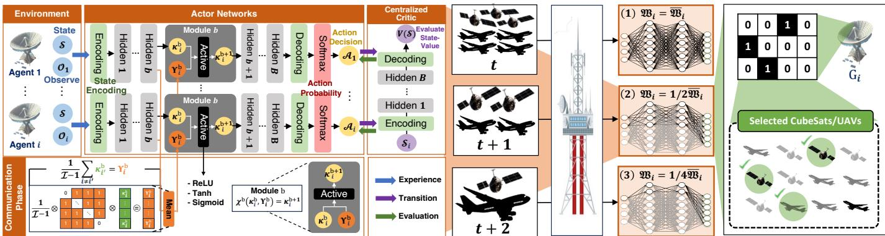  
Fig. 4. The proposed SR-MARL architecture in an environment where CubeSat and UAV move dynamically.

NNs in SR-MARL adaptively adjust their NN widths based on the number of dynamically changing NTN devices, and, as shown in Fig. 4, GSs learn to cooperatively achieve their goals by sharing information about their observations. The explanation of observation information sharing for cooperative goal achievement is provided in Sec. IV-D.

The principal advantages of the SR-MARL lie in its capability to regulate NN training resource consumption without necessitating the development of separate models for distinct operational scenarios. This characteristic proves particularly beneficial for deployment across heterogeneous devices that exhibit varying hardware capacities, ranging from highperformance computing servers to resource-constrained mobile platforms. Moreover, the SR-MARL framework improves computational efficiency and mitigates redundancy in model storage, promoting optimal utilization of available system resources. In essence, SR-MARL signifies a significant advancement toward flexible and resource-efficient deep learning architectures, effectively addressing the increasing demand for adaptive artificial intelligence (AI) systems in diverse and dynamically changing operational environments. A key distinguishing property of SR-MARL is its inherent adaptability to input data of varying dimensions, unlike conventional fixed NNs, which depend on pre-processing mechanisms, e.g., autoencoders, padding, or data augmentation, to conform data to static deep NN architectures [77]. This adaptability enables SR-MARL to directly process raw input data without auxiliary pre-processing steps that may introduce noise and lead to performance degradation.

To ensure stable training and inference under dynamic width changes, the proposed SR-MARL employs layer normalization (LN) in each hidden layer of the actor and critic networks. The network width is adjusted by dynamically activating a subset of neurons within each hidden layer, while the maximum layer dimensionality remains fixed. This design choice avoids the need for width-specific batch statistics, which are commonly required in SNN with batch normalization. However, for completeness, it should be noted that prior SNNs that adopt batch normalization (BN) typically require width-specific normalization statistics or switchable BN to avoid mismatched running statistics across widths [78]. Unlike BN, which depends on mini-batch statistics and maintains running estimates that can become inconsistent across different widths, LN computes the mean and variance from the activations within a single sample across feature dimensions and performs the same computation during training and inference [79]. The LN is applied over the active neurons within each layer. Because LN normalizes activations across feature dimensions within each sample, it remains invariant to batch size and naturally supports dynamically changing network widths. Since normalization statistics are computed across features within each individual sample, LN remains well-defined under dynamic neuron activation and does not require width-specific statistics or calibration. As a result, the proposed SR-MARL architecture does not require switchable BN or separate normalization statistics for different widths, enabling stable training and inference under dynamically varying numbers of active input and hidden nodes.

The proposed width control mechanism selectively activates or deactivates input and hidden nodes according to the number of observable NTN devices. This mechanism is fundamentally different from zero-padding, as inactive nodes are explicitly masked and do not participate in either forward or backward computation. Accordingly, padding values do not influence the policy output. It is noted that the proposed architecture is not designed as a fully permutation-invariant set encoder. Permutation invariance is required only when the input is an unordered set [80]. Instead, SR-MARL adopts an orderconsistent structured input representation, where each input slot corresponds to a deterministic and physically meaningful ordering of NTN devices. Specifically, NTN devices are indexed based on predefined physical criteria, e.g., relative geometry, link quality, or visibility, yielding a canonical ordering that is consistent across time. Consequently, width adaptation operates on a structured and order-consistent representation rather than arbitrary permutations. As a result, different permutations of the same physical device set do not occur in the considered system model. Such order-consistent designs are commonly used in practice when inputs have inherent structure or semantic meaning, and permutation invariance is not required by the problem formulation [81]. In this context, width control operates on structured inputs rather than unordered sets, ensuring stable policy behavior while enabling adaptive complexity reduction.

## B. Computing Overhead and Computational Complexity

As the proposed SR-MARL approach is deployed on resource-constrained GSs, it is necessary to manage and evaluate its computational overhead and complexity properly. The NN in SR-MARL can activate a specific activation node based on the number of NTN devices assigned to the $G _ { i }$ . Based on this, SR-MARL offers reduced complexity in environments with dynamic inputs. This is accomplished by reducing the number of floating-point operations per second (FLOPS) through selective weight activation. This demonstrates an advantage in computational complexity under dynamic input environments. In the conventional fixed NN, the linear transformation is expressed as,

$$
\mathbf { y } = \hat { \mathbf { W } } \cdot \mathbf { x } + \hat { \mathbf { b } } ,\tag{65}
$$

where $\mathbf { y } , \ \hat { \mathbf { W } } , \ \mathbf { x } ,$ and $\hat { \textbf { b } }$ denote the resulting output vector, weight matrix, input vector, and bias vector, respectively. Accordingly, the computing overhead and computational complexity of the conventional fixed NN remain fixed at $\mathcal { O } ( n m )$ even when the original input dimensionality is significantly smaller than x [82]. Here, the terms n and $m$ denote the number of rows in the weight matrix Wˆ and the number of columns in the pre-processed input x, respectively. Conversely, in the proposed SR-MARL, the adaptive weight matrix $\bar { \mathbf { W } } _ { \mathrm { S R - M A R I } }$ and adaptive bias vector $\bar { \mathbf { b } } _ { \mathrm { S R - M A R I } }$ dynamically adjust according to the input size ratio, $i . e . ,$ , slimmable ratio (r˜). Consequently, the computing overhead and computational complexity can be expressed as,

$$
\mathcal { O } _ { \mathtt { S R } - \mathtt { M A R L } } ( n m \cdot \tilde { r } ^ { 2 } ) , \quad \forall \tilde { r } \in \mathbb { R } ( 0 , 1 ] .\tag{66}
$$

It is important to note that the reduction of both the input and hidden dimensions with respect to $\tilde { r }$ is not a universal property of all width-adaptive NNs. While the input dimension naturally decreases as fewer CubeSats and UAVs are visible, the proportional reduction of the hidden-layer width is a deliberate architectural design choice of the proposed SR-MARL. Therefore, the complexity result in (66) reflects the specific scale-reconfigurable network design adopted in this paper.

This complexity analysis shows the complexity difference between the fixed NN and the proposed SR-MARL under the same number of agents. The computational complexities of the conventional fixed NN and the proposed SR-MARL increase as the number of agents increases. Furthermore, as the system expands to larger constellations, i.e., increasing number of NTN devices, the action dimension of the agent increases, which in turn escalates the computational complexity for both fixed NN and proposed SR-MARL [83], [84]. Additional training cost arises from the centralized critic and interagent communication during training, both of which generally increase with the number of GS agents. Nevertheless, because the proposed SR-MARL activates only the subset of neurons required for the currently visible CubeSats and UAVs, the complexity grows adaptively with the effective number of observed NTN devices rather than remaining fixed at the worst-case network size.

## C. SR-MARL Modeling

The intrinsic dynamism of CubeSats and UAVs, combined with environmental uncertainties, leads to rapid, abrupt changes in state information. In such a dynamic environment, RL can be a good solution, as agents, i.e., GSs, continue to interact with the time-varying environment. Because the type and number of NTN devices assigned to the i-th GS constantly change over time, SR-MARL, which flexibly adjusts the NN size, must be deployed. Our modeling formalizes the problem as the Markov decision process (MDP) for scenarios in which multiple GSs receive global network services from multiple NTN devices. However, in the process of formulating the problem with MDP, a realistic option is to formulate the environment with a decentralized partially observable MDP (DPO-MDP) due to the physical constraints that GSs cannot directly observe all environmental states, $e . g .$ , information about all CubeSats and UAVs. Because DPO-MDP makes sequential decisions based on only partial information about the environment, problem solving is usually more complex than in a fully observable MDP (FO-MDP), but DPO-MDP increases practical applicability by handling realistic scenarios with multiple GSs and multiple NTN devices. The DPO-MDP of the global aerial networking with I GSs, J CubeSats, and L UAVs consists of the following, $\langle \mathcal { T } , \mathfrak { I } , \mathfrak { L } , S , \mathcal { O } , \mathcal { A } , \mathfrak { R } , \mathcal { P } , \mathcal { Z } , \gamma \rangle$ where $s \in S$ represents a set of ground truth states. Subsequently, $\mathrm { o } _ { i } \in { \mathcal { O } } _ { i }$ and $\mathrm { a } _ { i } \in { \mathcal { A } } _ { i }$ denote the set of observations and actions for the i-th GS. It should be noted that these two sets may collectively be referred to as $O _ { j } ~ \subset ~ { \mathcal { O } }$ and $A _ { j } ~ \subset ~ { \mathcal { A } }$ . At each time step, each GS receives a reward, i.e., $\Re _ { i } \left( \mathcal { T } _ { j } ^ { i } ( t ) , \mathfrak { S } _ { j } ^ { i } ( t ) \right) + \Re _ { i } \left( \mathcal { T } _ { l } ^ { i } ( t ) , \mathfrak { S } _ { l } ^ { i } ( t ) \right)$ , upon choosing action a. This choice is made while accessing joint observation information o, based on the conditional observation probability $\mathcal { Z } ( s ^ { \prime } , \mathbf { a } , \mathbf { 0 } ) = \mathcal { S } \times \mathcal { A }  \mathcal { O }$ . Then, the global state s transitions to the next state $s ^ { \prime }$ according to the state transition probability function, i.e., ${ \mathcal { P } } ( s ^ { \prime } | s , \mathbf { a } ) = { \mathcal { S } } \times A \to S ^ { \prime }$ . Finally, γ is the discount factor representing the importance of future reward for current reward, where $\gamma \in [ 0 , 1 ]$

1) State & Observation: In the context of GS, CubeSat and UAV networks, which are designed to establish a global network service, the ground truth state space is defined as,

$$
\begin{array} { l } { S ( t ) \triangleq \left\{ \underset { i \in \mathcal { Z } } { \bigcup } \left\{ \mathcal { Z } _ { i } ( t ) , \mathfrak { V } _ { i } ( t ) , \mathcal { P } _ { i } ( t ) , \Pi _ { i } ( t ) , \varsigma _ { i } ( t ) \right\} , \right. } \\ { \left. \bigcup _ { j \in \mathfrak { I } } \left\{ \mathcal { Z } _ { j } ( t ) , \mathbf { S N R } ( \mathcal { I } _ { j } ^ { i } ( t ) ) , \Gamma _ { j } ^ { \mathcal { C } } ( t ) , \mathcal { L } _ { F S } ( \mathcal { I } _ { j } ^ { i } ( t ) ) , \varsigma _ { j } ^ { i } ( t ) , \Pi _ { j } ^ { i } ( \mathcal { I } _ { j } ^ { i } ( t ) ) , \bar { \mathcal { V } } _ { j } ^ { \mathcal { C } } ( t ) \right\} , \right. } \\ { \left. \bigcup _ { l \in \mathfrak { L } } \left\{ \mathcal { Z } _ { l } ( t ) , \mathbf { S N R } ( \mathcal { T } _ { l } ^ { i } ( t ) ) , \Gamma _ { l } ^ { \mathcal { U } } ( t ) , \mathcal { L } _ { F S } ( \mathcal { I } _ { l } ^ { i } ( t ) ) , \mathfrak { A } _ { l } ^ { i } ( t ) , \bar { \mathcal { V } } _ { l } ^ { \mathcal { U } } ( t ) \right\} \right\} } \end{array}\tag{67}
$$

where $\mathcal { Z } _ { i } ( t ) , \mathfrak { M } _ { i } , \mathcal { P } _ { i } ( t ) , \Pi _ { i } ( t ) , \varsigma _ { i } ( t )$ stand for the aggregation of position of i-th GS, number of NTN devices allocated in i-th $\mathrm { G S } ^ { \prime } \mathrm { s }$ neural network (number of NTN devices within the communication range of i-th GS), i-th GS’s received power, true elevation angle of the i-th GS, true azimuth angle of the i-th GS. Furthermore, the terms $\mathcal { Z } _ { j } ( t ) , \mathcal { Z } _ { l } ( t ) , \mathbf { S N R } ( \mathcal { T } _ { i } ^ { i } ( t ) )$ $\mathbf { S N R } ( \mathcal { T } _ { l } ^ { i } ( t ) ) , \Gamma _ { j } ^ { \mathcal { C } } ( t ) , \Gamma _ { l } ^ { \mathcal { U } } ( t ) , \mathcal { L } _ { F S } ( \mathcal { T } _ { j } ^ { i } ( t ) ) , \mathcal { L } _ { F S } ( \mathcal { T } _ { l } ^ { i } ( t ) ) , \bar { \mathcal { V } } _ { j } ^ { \mathcal { C } } ( t )$ and $\bar { \mathcal { V } } _ { l } ^ { \mathcal { U } } ( t )$ denote the aggregation of position, SNR, capacity, free space path loss, and residual energy of the j-th CubeSat/lth UAV allocated in the i-th GS. Additionally, the terms $\varsigma _ { j } ^ { i } ( t ) , \Pi _ { j } ^ { i } ( \mathcal { I } _ { j } ^ { i } ( t ) )$ , and $\mathfrak { U } _ { l } ^ { i } ( t )$ account for calculated azimuth angle, calculated elevation angle between the i-th GS and j-th CubeSat, elevation angle of l-th UAV within the coverage of i-th GS, respectively. Here, the positional details of the i-th GS, j-th CubeSat, and l-th UAV are specified as,

$$
\mathcal { Z } _ { i } ( t ) = \{ \mathcal { Z } _ { i } ^ { \phi } ( t ) , \mathcal { Z } _ { i } ^ { \lambda } ( t ) , \mathcal { Z } _ { i } ^ { H } ( t ) \} ,\tag{68}
$$

$$
\mathcal { Z } _ { j } ( t ) = \{ \mathcal { Z } _ { j } ^ { \phi } ( t ) , \mathcal { Z } _ { j } ^ { \lambda } ( t ) , \mathcal { Z } _ { j } ^ { H } ( t ) , \mathcal { \vec { O } } _ { j } ^ { \mathcal { C } } ( t ) \} ,\tag{69}
$$

$$
\mathcal { Z } _ { l } ( t ) = \{ \mathcal { Z } _ { l } ^ { \phi } ( t ) , \mathcal { Z } _ { l } ^ { \lambda } ( t ) , \mathcal { Z } _ { l } ^ { H } ( t ) , \bar { \mathcal { O } } _ { l } ^ { \mathcal { U } } ( t ) \} ,\tag{70}
$$

where $\mathcal { Z } _ { i } ^ { \phi } ( t ) , \mathcal { Z } _ { i } ^ { \lambda } ( t ) , \mathcal { Z } _ { i } ^ { H } ( t ) , \mathcal { Z } _ { j } ^ { \phi } ( t ) , \mathcal { Z } _ { j } ^ { \lambda } ( t ) , \mathcal { Z } _ { j } ^ { H } ( t ) , \mathcal { Z } _ { l } ^ { \phi } ( t )$ $\mathcal { Z } _ { l } ^ { \lambda } ( t )$ , and $\mathcal { Z } _ { l } ^ { H } ( t )$ represent the latitude, longitude, and altitude of i-th GS, j-th CubeSat, and l-th UAV. Moreover, the terms $\wp _ { j } ^ { c } ( t )$ and $\vec { \wp } _ { l } ^ { U } ( t )$ are the moving vector of j-th CubeSat and trajectory vector of the l-th UAV.

2) Action: The action of i-th GS is represented as $\mathbf { \mathcal { A } } ( t ) =$ $[ \mathcal { G } _ { j } ^ { i } ( t ) , \mathcal { G } _ { l } ^ { i } ( t ) ]$ , wherein $\mathfrak { S } _ { j } ^ { i } ( t )$ and $\mathfrak { S } _ { l } ^ { i } ( t )$ are elements of the set {0, 1}, i.e., $\mathfrak { S } _ { j } ^ { i } ( t ) \ \in \ \{ 0 , 1 \} , \ \tilde { \mathfrak { S } } _ { l } ^ { i } ( t ) \ \in \ \{ 0 , 1 \}$ . This expression indicates whether i-th GS receives global network services from j-th CubeSat and l-th UAV. If the i-th GS receive global network service from the j-th CubeSat and l-th UAV, the i-th GS’s selection vectors for the j-th CubeSat/l-th UAV become $\mathfrak { S } _ { j } ^ { i } ( t ) = 1$ and $\mathfrak { S } _ { l } ^ { i } ( t ) = 1$ , otherwise they are expressed as $\mathfrak { S } _ { i } ^ { i } ( t ) = 0$ and $\mathfrak { S } _ { l } ^ { i } ( t ) = 0$

3) Reward: Each GS learns to maximize the reward function designed in (44), which depends on the action decisions $( \mathfrak { S } _ { j } ^ { i } ( t )$ and $\mathfrak { S } _ { l } ^ { i } ( t ) )$ taken by the i-th GS. Fundamentally, the operational principle stipulates that each GS orchestrates the scheduling of CubeSats and UAVs to enhance the efficiency of global network services. Simultaneously, it aims to reduce both the total and the variability of energy consumption across the CubeSats and UAVs. In general, the efficiency of global network services and the residual energy of NTN devices are inversely proportional, thus it is important to optimize them simultaneously for realistic global ANN.

## D. Observation Information Sharing

Our proposed SR-MARL provides intercommunication between multiple GSs through a communication phase when multiple actors learn hidden variables, as shown in Fig. 4. Therefore, GSs acquire knowledge of hidden variables through the communication phase. This process of exchanging observational information proves especially advantageous when multiple GSs strive to attain a shared objective in the DPO-MDP environment, where GSs cannot observe the global state. In an environment where such observational information is limited, GSs explore the state S and the corresponding $_ { i - }$ th GS observational information ${ \mathcal { O } } _ { i } .$ First, the state S and the observation $O _ { i }$ acquired by the i-th GS are encoded into hidden variables $\kappa _ { i } ^ { 1 }$ in the first hidden layer, which can be expressed as,

$$
\kappa _ { i } ^ { 1 } = E n c o d e r ( S , { \mathcal { O } } _ { i } ) .\tag{71}
$$

As the hidden variables advance into deeper layers, communication variables are entered simultaneously. The communication variable for the i-th GS in the b-th hidden layer, denoted

as $\Upsilon _ { i } ^ { b } .$ , is determined by averaging the hidden variables of the other GSs, which is expressed as,

$$
\Upsilon _ { i } ^ { b } = \frac { 1 } { \mathcal { T } - 1 } et { } { ' } \sum _ { i \neq i ^ { \prime } } \kappa _ { i ^ { \prime } } ^ { b } .\tag{72}
$$

The (b+1)-th hidden variable is computed by combining the bth hidden variable and the b-th communication variable though the single agent module $\chi ^ { b } ( \cdot )$ , which returns output vector $\kappa _ { i } ^ { b + 1 }$ . This process is expressed as, $\kappa _ { i } ^ { b + 1 } = \chi ^ { b } ( \kappa _ { i } ^ { b } , \bar { \Upsilon } _ { i } ^ { b } )$ , with

$$
\chi ^ { b } ( \cdot ) = A c t i \nu ( C o n c a t ( \kappa _ { i } ^ { b } , \Upsilon _ { i } ^ { b } ) ) ,\tag{73}
$$

where Activ and Concat represent the activation and concatenation functions. Accordingly, the action distribution of the i-th GS is ultimately derived by decoding the output of the last B-th layer. The action distribution of the i-th GS can be expressed as, $\aleph _ { \pmb { \vartheta } _ { i } } ( A _ { i } ; \mathcal { O } _ { i } ) = D e c o d e r \left( \kappa _ { i } ^ { B } \right)$ . As the propagation reaches the deeper hidden layers, the action distribution of the i-th GS can be rewritten as,

$$
\aleph _ { \pmb { \vartheta } _ { i } } ( \mathcal { A } _ { i } ; \mathcal { O } _ { i } ) = Q ( \mathcal { O } _ { i } , \mathcal { A } _ { i } , ; [ \pmb { \vartheta } _ { 1 } , \dots , \pmb { \vartheta } _ { i } , \dots , \pmb { \vartheta } _ { \mathcal { T } } ] ) ,\tag{74}
$$

where $Q ( \mathcal { O } _ { i } , \mathcal { A } _ { i } )$ is the GS’s state-action value function, commonly referred to as the Q-function. The dependence of the Q-value of the i-th GS on the NN parameters of other GSs $\vartheta _ { \mathcal { T } } .$ , implies that all GSs conduct cooperative AAN services using their observations and the observational information from other GSs.

## E. SR-MARL based Parameterized Policy Training

The GSs, utilizing actor networks, explore the environment in a distributed manner, while a centralized critic network evaluates the current state of the GS. Initially, the centralized critic, regarded as a ground control tower, examines the effectiveness of the current policies implemented by the decentralized actors. Consequently, the GSs aim to learn the NN parameter φ to approximate the value of the joint state value function $V _ { \varphi } ( \cdot )$ , which can be expressed as,

$$
V _ { \varphi } ( \mathrm { s } ) = \mathbb { E } _ { \mathrm { s } \sim \mathbf { E } , \mathrm { a } \sim \pi _ { \vartheta } } \left[ \sum _ { u = t } ^ { \tau } \gamma ^ { u - t } \cdot \mathcal { R } ( \mathrm { s } ^ { u } , \mathbf { a } ^ { u } , \mathrm { s } ^ { u + 1 } ) \right] .\tag{75}
$$

Therefore, the centralized critic learns its parameters $\varphi$ for loss function minimization, which is expressed as,

$$
\nabla _ { \varphi } L ( \varphi ) = \sum _ { t = 1 } ^ { \tau } \nabla \varphi \left| \delta _ { \varphi } ^ { t } \right| ^ { 2 } ,\tag{76}
$$

where ${ \delta } _ { \varphi } ^ { t }$ represents the temporal difference (TD) error, which can be expressed as,

$$
\begin{array} { r } { \delta _ { \varphi } ^ { t } = \underbrace { \Re ( \mathrm { s } ^ { t } , \mathbf { a } ^ { t } , \mathbf { s } ^ { t + 1 } ) + \gamma V _ { \varphi } ( \mathrm { s } ^ { t + 1 } ) } _ { \mathrm { T D ~ T a r g e t } } - V _ { \varphi } ( \mathrm { s } ^ { t } ) , } \end{array}\tag{77}
$$

where the TD target is computed based on the Bellman optimality equation and is expressed as the sum of the present reward at t and the discounted cumulative reward of the future at time t + 1.In this approach, the temporal-difference (TD)-based actor-critic method refines previous estimates with future predictions. To minimize the difference between the current state value function, $i . e . , \ V _ { \varphi } ( \cdot )$ , which is determined by the centralized critic, and the TD target, the critic NN parameters are adjusted to reduce the TD error, $i . e . , \delta _ { \varphi } ^ { t }$ . It can be mathematically expressed as,

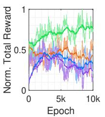  
SR-MARL (Proposed)  
(a) Reward.

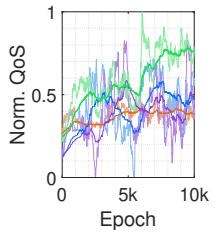  
(b) QoS.  
MARL (Padding)

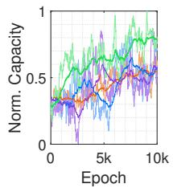  
(c) Capacity.

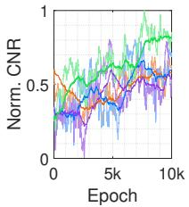  
(d) CNR.

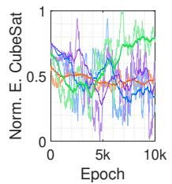  
(e) Energy of CubeSats.

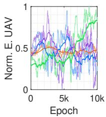

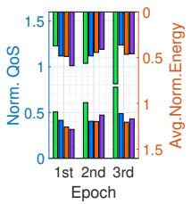  
(g) QoS vs. Energy.

(f) Energy of UAVs.  
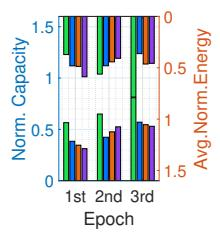  
(h) Capacity vs. Energy.

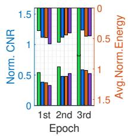  
(i) CNR vs. Energy.

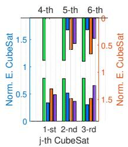  
(j) Residual energy for each CubeSat

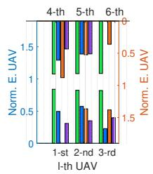

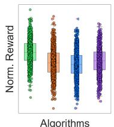  
(k) Residual energy for (l) Reward value distrieach UAV. bution.  
Fig. 5. Global ANN service performance and residual energy of CubeSats & UAVs during the training epochs.

$$
\boldsymbol { \varphi } ^ { t + 1 } \approx \boldsymbol { \varphi } ^ { t } + \alpha _ { \mathrm { c r i t i c } } \times [ \delta _ { \boldsymbol { \varphi } } ^ { t } \cdot \nabla _ { \boldsymbol { \varphi } } V _ { \boldsymbol { \varphi } } ( \mathrm { s } ^ { t } ) ] ,\tag{78}
$$

where $\alpha _ { \mathrm { c r i t i c } }$ represents the learning rate of the critic network. Secondly, the distributed actors, regarded as GSs, must learn the optimal policy with ϑ. The action taken by the j-th GS at t is determined by the parameterized policy function that yields the highest value, which is expressed as,

$$
\mathrm { a } _ { i } ^ { t } = \arg \operatorname* { m a x } _ { \mathrm { a } ^ { t } } \pi _ { \vartheta _ { i } } ( \mathrm { a } ^ { t } | \mathrm { O } _ { i } ^ { t } ) .\tag{79}
$$

At the final stage of NN, the action is produced and the policy of the i-th GS is represented as,

$$
\pi _ { \pmb { \vartheta } _ { i } } ( \mathbf { a } ^ { t } | \mathrm { O } _ { i } ^ { t } ) \triangleq s o f t m a x ( \aleph _ { \pmb { \vartheta } _ { i } } ( \mathcal { A } _ { i } ; \mathrm { O } _ { i } ) ) ,\tag{80}
$$

where softmax(·) denotes softmax function. Consequently, the gradient of the objective function is formulated as,

$$
\begin{array} { r } { \nabla _ { \vartheta _ { i } } F ( \vartheta _ { i } ) = \mathbb { E } _ { \mathrm { O } _ { i } \sim \mathbf { E } } \left[ \sum _ { t = 1 } ^ { T } \delta _ { \varphi } ^ { t } \cdot \nabla _ { \vartheta } \log \pi _ { \vartheta _ { i } } ( \mathrm { a } _ { i } ^ { t } | \mathrm { O } _ { i } ^ { t } ) \right] . } \end{array}\tag{81}
$$

Then ϑ of the distributed actors is optimized as,

$$
\pmb { \vartheta } _ { i } ^ { t + 1 } \approx \pmb { \vartheta } _ { i } ^ { t } + \alpha _ { \mathrm { a c t o r } } \times [ \delta _ { \varphi } ^ { t } \cdot \nabla _ { \pmb { \vartheta } } \log \pi _ { \pmb { \vartheta } _ { i } } ( \mathbf { a } _ { i } ^ { t } | \mathbf { \cal O } _ { i } ^ { t } ) ] ,\tag{82}
$$

where $\alpha _ { \mathrm { a c t o r } }$ is the learning rate.

## V. EXPERIMENTS

## A. Experimental Setting

To increase the practical applicability of the proposed algorithm, the experimental environment is designed based on real satellites orbiting in space. The TLE data retrieved from Celestrak [71] and Space-Track [72] is transformed from orbital elements into the temporal latitudes and longitudes of CubeSats. The latitude and longitude of each CubeSat

## TABLE V

SPECIFICATIONS OF SIMULATION PLATFORMS, SOFTWARE VERSIONS, AND SIMULATION PARAMETERS.
<table><tr><td rowspan=1 colspan=2>System (Notation)                 Specification (Value)</td></tr><tr><td rowspan=1 colspan=1>Platform (PC)</td><td rowspan=1 colspan=1>CPU: AMD Ryzen 9 7950X (4.50 GHz)Memory: DDR5 64 GBSSD: 2TB TLCHDD: 2 TBVGA: GeForce RTX 4090 24 GBThe number of cores: 16,384</td></tr><tr><td rowspan=1 colspan=1>Software version</td><td rowspan=1 colspan=1>Python version: v3.8.9NVIDIA-SMI version: v545.92Conda: v22.11.1CUDA version: v12.3PyTorch version: v2.2.0Numpy: v1.24.3</td></tr><tr><td rowspan=1 colspan=1>Simulation parameter</td><td rowspan=1 colspan=1>Number of GSs/CubeSats/UAVs: 4, 6, 6Discount factor: 0.98Batch size: 128Initial value of exploration rate: 0.3Annealing exploration rate: 5 × 10−5Learning rate of actors: 10−3Learning rate of critic: 10-4Training epochs: 10, 000Activation function: ReLUOptimizer: Adam</td></tr></table>

calculated here are used to calculate the distance to GS by (32), which plays an important role in obtaining multiple global networking performance indicators. Table V presents a summary of the specifications of the simulation platform, the software versions, and the simulation parameters used in the experiment. In this paper, it is explicitly assumed that the GS is always connected to at least one NTN device, i.e., either a UAV or a CubeSat, at any given time. Therefore, the scenario where the GS can only connect to UAVs without any CubeSat connectivity does not occur in the considered system model. Moreover, it should be noted that it does not assume that all UAVs can directly connect to satellites.

Benchmarks. The benchmarks used in this paper are as follows, i) MARL (training method with zero padding, i.e., a static neural network); ii) SR-MARL (w/o communication) (independent learning method without cooperation through mutual communication), and iii) SR-RL (training method with single GS, i.e., agent).

## B. Training Performance

Fig. 5(a) is the normalized reward performance of the proposed algorithms and benchmarks in DPO-MDP. Fig. 5(a) highlights that the SR-MARL proposed in this paper outper forms other benchmarks in reward performance. On the othe hand, other benchmarks show inconsistent learning perfor mance, which is reflected in lower rewards than SR-MARL. As seen from Fig. 5(l), the proposed SR-MARL also shows a higher average reward than other benchmarks. The normalized rewards of SR-MARL and other benchmarks in the DPO MDP and FO-MDP environments are summarized in Table VI. As summarized in Table VI, SR-MARL gets the greatest reward value of 0.775 in DPO-MDP and 0.734 in FO-MDP. In particular, only the proposed algorithm allows GS to receive higher rewards in DPO-MDP than in FO-MDP, regardless of information loss. On the other hand, other benchmarks imply that the rewards in DPO-MDP are lower than those in FO MDP and are vulnerable to information loss in PO-MDP. This demonstrates that the observation sharing of SR-MARL during training helps to provide global AAN services to multiple NTN devices. This improvement originates from how observation sharing aggregates complementary information across agents. In the considered NTN environment, each agent observes only a limited local state, e.g., partial link geometry, local channel or traffic conditions, which is insufficient to infer the global system state when used in isolation. By sharing observations, the aggregated representation implicitly reconstructs missing state components that are not locally observable. Specifically, concat-based aggregation enables each agent to access a richer contextual embedding that captures spatially distributed in formation. This aggregation mitigates observability gaps by reducing state aliasing, where different global states appear identical under local observations. As a result, the effective belief over the underlying MDP becomes more informative, even though the environment remains partially observable. Furthermore, observation sharing improves training stability by reducing policy gradient variance [85]. In FO-MDP set tings, agents rely solely on local, noisy observations, which leads to high variance in value estimation and unstable learning dynamics. In contrast, shared observations provide a smoother and more consistent input distribution to the policy network, resulting in more stable critic estimation and faster convergence. This effect is particularly pronounced in dynamic NTN scenarios, where topology and channel conditions vary rapidly

In Figs. 5(b)-(f), SR-MARL has the highest QoS, capacity, CNR, and residual energy of NTN devices. In contrast, other benchmarks cannot simultaneously optimize the energy of multiple communication-related metrics and NTN devices. These results can be further examined in more detail in terms of figures, as shown in Table VII. SR-MARL outperforms other benchmarks on all performance metrics. SR-MARL has about 2 times higher QoS, 1.44 times higher capacity, 1.5 times higher CNR, 2.33 times higher residual energy of CubeSat, and 2.44 times higher residual energy of UAV than other benchmarks. This means that the network performance of SR-MARL AAN services and the residual energy of NTN devices can be optimized simultaneously to effectively provide global AAN services in a dynamic environment. Figs. 5(g)-(i) show the relationship between each networking indicator and the average residual energy of NTN devices in the training stage. The training epoch is divided into three, i.e., 1st (0- 4,000 epochs), 2nd (4,001-7,000 epochs), 3rd (7,001-10,000 epochs). The bottom bar shows the networking indicators, and the top bar shows the mean residual energy of the NTN devices. SR-MARL simultaneously maximizes the average residual energy of multiple networking performance indicators and NTN devices as the training progresses. Finally, Figs. 5(j)- (k) show the residual energy for each NTN device. Only the proposed SR-MARL optimizes the residual energy of all NTN devices without dead NTN devices. However, other benchmarks have large residual energy variations between NTN devices and even dead NTN.

TABLE VI  
COMPARISON OF NORMALIZED CONVERGENCE REWARD VALUES OF PROPOSED ALGORITHM AND BENCHMARKS.
<table><tr><td colspan="4">Reward Convergence in DPO-MDP and FO-MDP</td></tr><tr><td>Algorithm</td><td>DPO-MDP</td><td colspan="2">FO-MDP</td></tr><tr><td>Proposed</td><td>0.775</td><td>H 0.734</td><td>H</td></tr><tr><td>MARL (Padding)</td><td>0.329 H</td><td>0.391</td><td>H</td></tr><tr><td>SR-MARL (w/o)</td><td>0.446 H</td><td>0.471</td><td>H</td></tr><tr><td>SR-RL (Single RL)</td><td>0.234 H</td><td>0.297</td><td>H</td></tr></table>

TABLE VII

TOTAL NORMALIZED CONVERGENCE COMMUNICATION INDICATOR PERFORMANCES AND RESIDUAL ENERGY OF NTN DEVICES.
<table><tr><td>Indicators</td><td>Proposed</td><td>MARL (Padding)</td><td>SR-MARL (w/o)</td><td>SR-RL</td></tr><tr><td>QoS</td><td>0.7673</td><td>0.4926</td><td>0.3860</td><td>0.4790</td></tr><tr><td>Capacity</td><td>0.7945</td><td>0.5802</td><td>0.5532</td><td>0.5722</td></tr><tr><td>CNR</td><td>0.8234</td><td>0.6012</td><td>0.5784</td><td>0.5479</td></tr><tr><td>E. CubeSat</td><td>0.7822</td><td>0.3350</td><td>0.4728</td><td>0.4107</td></tr><tr><td>E. UAV</td><td>0.8261</td><td>0.3389</td><td>0.4783</td><td>0.4154</td></tr></table>

## VI. CONCLUSION AND FUTURE WORK

This paper successfully developed and validated the SR-MARL model using flexible NNs to manage the dynamic conditions of NTNs composed of CubeSats and UAVs. The adaptive capabilities of the SR-MARL, which dynamically adjust the size of NN processing capacity in response to changing network conditions, have proven essential for maintaining uninterrupted global AAN services, as demonstrated in an experimental environment similar to that of the air/space domain. This is demonstrated by evaluating its superiority in an experimental environment similar to that of air/space. This approach supports the stability and efficiency of the AAN and lays a robust foundation for the future expansion of aerial network infrastructures. The proposed SR-MARL is expected to be particularly beneficial in larger-scale aerial access networks involving tens or hundreds of CubeSats and UAVs, where the number of visible NTN devices fluctuates significantly over time. In such scenarios, dynamically adjusting the NN width can reduce unnecessary computations compared with fixed-width architectures designed for worstcase network sizes. However, the overall training cost of MARL, including centralized critic updates and inter-agent communication, will continue to increase as the number of GS agents and network scales, i.e., number of NTN devices, grow. Therefore, extending SR-MARL to very large constellations may require additional techniques such as hierarchical coordination, distributed training, or parameter sharing, which constitute important directions for future work.

## REFERENCES

[1] H. Sun, H. Zhang, H. Ma, and V. C. Leung, “Joint scheduling, computing, and load balancing for time sensitive traffic in SDN-enabled spaceair-ground integrated 6G networks: A federated reinforcement learning approach,” IEEE Transactions on Mobile Computing, vol. 24, no. 10, pp. 9995–10 008, 2025.

[2] C. Yang, J. Yuan, Y. Wu, Q. Sun, A. Zhou, S. Wang, and M. Xu, “Communication-efficient satellite-ground federated learning through progressive weight quantization,” IEEE Transactions on Mobile Computing, vol. 23, no. 9, pp. 8999–9011, September 2024.

[3] T. S. Abdu, S. Kisseleff, E. Lagunas, and S. Chatzinotas, “Flexible resource optimization for GEO multibeam satellite communication system,” IEEE Transactions on Wireless Communications, vol. 20, no. 12, pp. 7888–7902, December 2021.

[4] H. Huang, Y. Cai, G. Min, H. Wang, G. Liu, and D. O. Wu, “Accurate prediction of network distance via federated deep reinforcement learning,” IEEE/ACM Transactions on Networking, vol. 32, no. 4, pp. 3301–3314, August 2024.

[5] N. Hui, Q. Sun, J. Zeng, L. Tian, Y. Wang, and Y. Zhou, “Mixed numerology-based intelligent resource management in a sliced 6G space–terrestrial integrated radio access network,” IEEE Transactions on Mobile Computing, vol. 24, no. 3, pp. 1338–1356, March 2025.

[6] D. S. Lakew, A.-T. Tran, N.-N. Dao, and S. Cho, “Intelligent self-optimization for task offloading in LEO-MEC-assisted energyharvesting-UAV systems,” IEEE Transactions on Network Science and Engineering, vol. 11, no. 6, pp. 5135–5148, November-December 2024.

[7] S. Ma et al., “Network characteristics of LEO satellite constellations: A starlink-based measurement from end users,” in Proc. IEEE Conf. Computer Communications (INFOCOM), NY, USA, May 2023.

[8] L. Jiang, Y. Zhang, J. Yin, X. Zhang, and B. Liu, “LEOTP: An information-centric transport layer protocol for LEO satellite networks,” in Proc. IEEE International Conf. on Distributed Computing Systems (ICDCS), Hong Kong, Hong Kong, july 2023, pp. 579–590.

[9] W. Zhang, P. Liao, D. Yang, Q. Ye, S. Mao, and H. Zhang, “Towards deterministic satellite-terrestrial integrated networks via resource adaptation and differentiated scheduling,” IEEE Transactions on Mobile Computing, vol. 24, no. 10, pp. 11 092–11 109, 2025.

[10] Z. Lin, Z. Chen, Z. Fang, X. Chen, X. Wang, and Y. Gao, “Fedsn: A federated learning framework over heterogeneous LEO satellite networks,” IEEE Transactions on Mobile Computing, vol. 24, no. 3, pp. 1293–1307, March 2025.

[11] Y. Yang, K. Lou, E. Wang, W. Liu, J. Shang, X. Song, D. Li, and J. Wu, “Multi-agent reinforcement learning based file caching strategy in mobile edge computing,” IEEE/ACM Transactions on Networking, vol. 31, no. 6, pp. 3159–3174, December 2023.

[12] J. Wang, R. Zhang, J. Yuan, and J. Luo, “Multi-CubeSat relative position and attitude determination based on array signal detection in formation flying,” IEEE Transactions on Aerospace and Electronic Systems, vol. 55, no. 6, pp. 3378–3393, December 2019.

[13] B. Hussein, A. M. Massoud, and T. Khattab, “Optimized load-scheduling algorithm for CubeSat’s electric power system management considering communication link,” IEEE Transactions on Aerospace and Electronic Systems, vol. 59, no. 6, pp. 7455–7468, December 2023.

[14] N. H. Tran, W. Bao, A. Y. Zomaya, M. N. H. Nguyen, and C. S. Hong, “Federated learning over wireless networks: Optimization model design and analysis,” in Proc. IEEE Conf. Computer Communications (INFOCOM), Paris, France, April 2019, pp. 1387–1395.

[15] A. Edpuganti, V. Khadkikar, M. S. El Moursi, H. Zeineldin, N. Al-Sayari, and K. Al Hosani, “A comprehensive review on CubeSat electrical power system architectures,” IEEE Transactions on Power Electronics, vol. 37, no. 3, pp. 3161–3177, September 2021.

[16] I. U. Zaman, J. E. Velazco, and O. Boyraz, “Omnidirectional optical crosslinks for CubeSats: Transmitter optimization,” IEEE Transactions on Aerospace and Electronic Systems, vol. 56, no. 6, pp. 4556–4566, December 2020.

[17] B. A. Kristiansen, J. T. Gravdahl, S. Gros, and T. A. Johansen, “Energy optimal attitude control and task execution for a solar-powered spacecraft,” IEEE Transactions on Control Systems Technology, vol. 32, no. 4, pp. 1212–1225, July 2024.

[18] G. Pan, J. Ye, J. An, and M.-S. Alouini, “Latency versus reliability in LEO mega-constellations: Terrestrial, aerial, or space relay?” IEEE Transactions on Mobile Computing, vol. 22, no. 9, pp. 5330–5345, September 2023.

[19] S. Li, C. Xiang, W. Xu, J. Peng, Z. Xu, J. Li, W. Liang, and X. Jia, “Coverage maximization of heterogeneous UAV networks,” in Proc. IEEE International Conf. on Distributed Computing Systems (ICDCS), Hong Kong, Hong Kong, july 2023, pp. 120–130.

[20] H. Hao, C. Xu, W. Zhang, S. Yang, and G.-M. Muntean, “Joint task offloading, resource allocation, and trajectory design for multi-UAV cooperative edge computing with task priority,” IEEE Transactions on Mobile Computing, vol. 23, no. 9, pp. 8649–8663, September 2024.

[21] T. P. Truong, H. V. Nguyen, N.-N. Dao, W. Noh, and S. Cho, “Orthogonalized RSMA-based flexible multi access in digital twin edge networks,” IEEE Transactions on Wireless Communications, vol. 23, no. 12, pp. 18 740–18 756, December 2024.

[22] N. Saeed, A. Elzanaty, H. Almorad, H. Dahrouj, T. Y. Al-Naffouri, and M.-S. Alouini, “CubeSat communications: Recent advances and future challenges,” IEEE Communications Surveys & Tutorials, vol. 22, no. 3, pp. 1839–1862, Thirdquarter 2020.

[23] H. Shi and L. Chen, “Downlink transmission scheduling with data sharing,” IEEE/ACM Transactions on Networking, vol. 30, no. 3, pp. 1193–1202, June 2022.

[24] J. D. Liddle, A. P. Holt, S. J. Jason, K. A. O’Donnell, and E. J. Stevens, “Space science with CubeSats and nanosatellites,” Nature Astronomy, vol. 4, no. 11, pp. 1026–1030, November 2020.

[25] J. Li, G. Sun, H. Kang, A. Wang, S. Liang, Y. Liu, and Y. Zhang, “Multi-objective optimization approaches for physical layer secure communications based on collaborative beamforming in UAV networks,” IEEE/ACM Transactions on Networking, vol. 31, no. 4, pp. 1902–1917, August 2023.

[26] G. Song, L. He, T. Chen, J. Lin, L. Fan, K. Wen, Z. Wang, and J. Yang, “PMap: Reinforcement learning-based internet-wide port scanning,” IEEE/ACM Transactions on Networking, vol. 32, no. 6, pp. 5524–5538, December 2024.

[27] L. Yang, X. Li, M. Sun, and C. Sun, “Hybrid policy-based reinforcement learning of adaptive energy management for the energy transmissionconstrained island group,” IEEE Transactions on Industrial Informatics, vol. 19, no. 11, pp. 10 751–10 762, November 2023.

[28] M. Goudarzi, M. Palaniswami, and R. Buyya, “A distributed deep reinforcement learning technique for application placement in edge and fog computing environments,” IEEE Transactions on Mobile Computing, vol. 22, no. 5, pp. 2491–2505, May 2023.

[29] T. Sen and H. Shen, “Distributed training for deep learning models on an edge computing network using shielded reinforcement learning,” in Proc. IEEE Int’l Conf. Distributed Computing Systems (ICDCS), Bologna, Italy, July 2022, pp. 581–591.

[30] S. Kumari and A. Pratap, “Maximizing service provider’s profit in multiuav 5G network via deep reinforcement learning and graph coloring,” IEEE Transactions on Mobile Computing, vol. 24, no. 10, pp. 10 377– 10 388, 2025.

[31] M. Yang, D. Gao, W. Zhang, D. Yang, D. Niyato, H. Zhang, and V. C. M. Leung, “Deep reinforcement learning-based joint caching and routing in AI-driven networks,” IEEE Transactions on Mobile Computing, vol. 24, no. 3, pp. 1322–1337, March 2025.

[32] P. Hu, Y. Chen, L. Pan, Z. Fang, F. Xiao, and L. Huang, “Multiuser delay-constrained scheduling with deep recurrent reinforcement learning,” IEEE/ACM Transactions on Networking, vol. 32, no. 3, pp. 2344–2359, June 2024.

[33] M. George, B. S, and M. K. Roberts, “Design of routing protocols for heterogeneous WSN based on multi-agent reinforcement learning,” in Proc. IEEE Int’l Conf. Distributed Computing Systems (ICDCS), Jersey City, NJ, USA, July 2024, pp. 72–76.

[34] W. Han, E. Wang, B. Liu, Z. Liu, X. Shao, L. Wu, and J. Wang, “Leveraging CAVs to improve traffic efficiency: An MARL-based approach,” in

Proc. IEEE Int’l Conf. Distributed Computing Systems (ICDCS), Jersey City, NJ, USA, July 2024, pp. 1143–1153.

[35] H. Tian, X. Liao, C. Zeng, D. Sun, J. Zhang, and K. Chen, “Efficient DRL-based congestion control with ultra-low overhead,” IEEE/ACM Transactions on Networking, vol. 32, no. 3, pp. 1888–1903, June 2024.

[36] S. Sukhbaatar, a. szlam, and R. Fergus, “Learning multiagent communication with backpropagation,” in Proc. Advances in Neural Information Processing Systems (NIPS), Barcelona, Spain, December 2016.

[37] S. Park, J. Chung, C. Park, S. Jung, M. Choi, S. Cho, and J. Kim, “Joint quantum reinforcement learning and stabilized control for spatiotemporal coordination in metaverse,” IEEE Transactions on Mobile Computing, vol. 23, no. 12, pp. 12 410–12 427, December 2024.

[38] C.-C. Hsu, C.-Y. Jian, E.-S. Tu, C.-M. Lee, and G.-L. Chen, “Realtime compressed sensing for joint hyperspectral image transmission and restoration for CubeSat,” IEEE Transactions on Geoscience and Remote Sensing, vol. 62, pp. 1–16, March 2024.

[39] Y. Han, G. Huang, S. Song, L. Yang, H. Wang, and Y. Wang, “Dynamic neural networks: A survey,” IEEE Transactions on Pattern Analysis and Machine Intelligence, vol. 44, no. 11, pp. 7436–7456, November 2022.

[40] Z. Han et al., “Time-varying topology model for dynamic routing in LEO satellite constellation networks,” IEEE Transactions on Vehicular Technology, vol. 72, no. 3, pp. 3440–3454, March 2022.

[41] Y. Hu, Z. Lu, and W. Liao, “Speed-adaptive dynamic surface attitude control for a satellite with moving masses under input constraints,” Transactions of the Institute of Measurement and Control, vol. 42, no. 16, pp. 3091–3109, July 2020.

[42] Z. Ning and L. Xie, “A survey on multi-agent reinforcement learning and its application,” Journal of Automation and Intelligence, vol. 3, no. 2, pp. 73–91, June 2024.

[43] Y. Hou, J. Zhao, R. Zhang, X. Cheng, and L. Yang, “UAV swarm cooperative target search: A multi-agent reinforcement learning approach,” IEEE Transactions on Intelligent Vehicles, vol. 9, no. 1, pp. 568–578, January 2024.

[44] Q. T. Do et al., “Multi-UAV aided energy-aware transmissions in mmWave communication network: Action-branching QMIX network,” Journal of Network and Computer Applications, vol. 230, p. 103948, June 2024.

[45] H. Fu, J. Wang, J. Chen, P. Ren, Z. Zhang, and G. Zhao, “Dense multiagent reinforcement learning aided multi-UAV information coverage for vehicular networks,” IEEE Internet of Things Journal, vol. 11, no. 12, pp. 21 274–21 286, June 2024.

[46] C. Lei, S. Wu, Y. Yang, J. Xue, and Q. Zhang, “Joint trajectory and communication optimization for heterogeneous vehicles in maritime SAR: multi-agent reinforcement learning,” IEEE Transactions on Vehicular Technology, vol. 73, no. 9, pp. 12 328–12 344, September 2024.

[47] M. H. Adnan, Z. A. Zukarnain, and S. K. Subramaniam, “Efficient multi-UAV coordination via RL: Joint path planning and task scheduling for post-disaster UAV-assisted MEC systems,” Computer Networks, p. 111822, November 2025.

[48] S. He, T. Wang, and S. Wang, “Load-aware satellite handover strategy based on multi-agent reinforcement learning,” in Proc. IEEE Global Communications Conf. (GLOBECOM), Taipei, Taiwan, December 2020, pp. 1–6.

[49] H. Liu, Y. Wang, P. Li, and J. Cheng, “A multi-agent deep reinforcement learning-based handover scheme for mega-constellation under dynamic propagation conditions,” IEEE Transactions on Wireless Communications, vol. 23, no. 10, pp. 13 579–13 596, October 2024.

[50] Y. Liu, B. Mao, H. Guo, and J. Liu, “An intelligent hierarchical caching and asynchronous updating scheme for 6G non-terrestrial networks,” in Proc. IEEE Wireless Communications and Networking Conference (WCNC), Dubai, United Arab Emirates, April 2024, pp. 1–6.

[51] J. Youn, J. Park, S. Kim, S. Ahn, Y. Kim, D. Kim, and S. Cho, “MARLbased access control for grant-free non-orthogonal random access in UDN,” IEEE Internet of Things Journal, vol. 11, no. 17, pp. 28 421 – 28 436, September 2024.

[52] G. Wang, F. Yang, J. Song, and Z. Han, “Optimization for dynamic laser inter-satellite link scheduling with routing: A multi-agent deep reinforcement learning approach,” IEEE Transactions on Communications, vol. 72, no. 5, pp. 2762–2778, May 2023.

[53] C. Han, W. Xiong, and R. Yu, “Deep reinforcement learning-based multipath routing for LEO megaconstellation networks,” Electronics, vol. 13, no. 15, p. 3054, August 2024.

[54] W. J. Yun, Y. Kwak, H. Baek, S. Jung, M. Ji, M. Bennis, J. Park, and J. Kim, “SlimFL: Federated learning with superposition coding over slimmable neural networks,” IEEE/ACM Transactions on Networking, vol. 31, no. 6, pp. 2499–2514, December 2023.

[55] C. Li, G. Wang, B. Wang, X. Liang, Z. Li, and X. Chang, “Dynamic slimmable network,” in Proc. IEEE/CVF Conf. Computer Vision and Pattern Recognition (CVPR), Nashville, TN, USA, June 2021, pp. 8607– 8617.

[56] T. K. Johnsen and M. Levorato, “NaviSlim: Adaptive context-aware navigation and sensing via dynamic slimmable networks,” in Proc. IEEE/ACM International Conf. on Internet-of-Things Design and Implementation (IoTDI), Hong Kong, Hong Kong, May 2024, pp. 110–121.

[57] J. Yu and T. S. Huang, “Universally slimmable networks and improved training techniques,” in Proc. IEEE/CVF Conf. Computer Vision (ICCV), Seoul, South Korea, October 2019, pp. 1803–1811.

[58] F. Xie, P. Lu, and X. Liu, “Multi-scale convolutional attention network for lightweight image super-resolution,” Journal of Visual Communication and Image Representation, vol. 95, p. 103889, September 2023.

[59] Z. Feng, J. Sun, and G. Wang, “A-MAPPO: Attention-enhanced multiagent proximal policy optimization,” in Proc. Aerospace Frontiers Conference, Beijing, China, April 2025, pp. 281–292.

[60] E. Zhang, H. Tang, X.-P. Zhang, and W. Ding, “Mean-field aided QMIX: A scalable and flexible Q-learning approach for large-scale agent groups,” in Proc, IEEE International Conference on Acoustics, Speech and Signal Processing (ICASSP), Hyderabad, India, April 2025, pp. 1–5.

[61] Y. Zeng, A. Liu, S. Huang, X. Chen, W. Liang, and X. Zhou, “Permutation-invariant and equivariant multiagent reinforcement learning for flexible manufacturing in industrial IoT,” IEEE Internet of Things Journal, vol. 12, no. 18, pp. 37 863–37 875, September 2025.

[62] Y. Zeng and R. Zhang, “Energy-efficient UAV communication with trajectory optimization,” IEEE Transactions on Wireless Communications, vol. 16, no. 6, pp. 3747–3760, 2017.

[63] P. S. Moller, “Review of selected advanced air mobility aircraft,” August 2022.

[64] A. Jha, N. Prabhakar, D. Karbowski, and B. German, “Urban air mobility: A preliminary case study for Chicago and Atlanta,” in Proc. IEEE/AIAA Transportation Electrification Conference and Electric Aircraft Technologies Symposium (ITEC+EATS), Anaheim, CA, USA, June 2022, pp. 300–306.

[65] E. B. Onat, V. Bulusu, A. Chakrabarty, M. Hansen, R. Sengupta, and B. Sridhar, “Evaluating eVTOL network performance and fleet dynamics through simulation-based analysis,” in Proc. AIAA Scitech 2024 Forum, Orlando, FL, January 2024, pp. 336–352.

[66] P. S. Moller, “Performance evaluation of select personal air vehicles,” Moller International, Tech. Rep., June 2020.

[67] D. Zhang, Y. Chen, and X. Fu, “Tanker wake effects on the trailing UAV in autonomous aerial refueling,” Journal of Applied Fluid Mechanics, vol. 13, no. 2, pp. 629–637, March 2020.

[68] R. Pio, “Euler angle transformations,” IEEE Transactions on Automatic Control, vol. 11, no. 4, pp. 707–715, October 1966.

[69] D. Wang, H. Qin, and Z. Huang, “Doppler positioning of LEO satellites based on orbit error compensation and weighting,” IEEE Transactions on Instrumentation and Measurement, vol. 72, pp. 1–11, June 2023.

[70] J. Ye, G. Pan, and M.-S. Alouini, “Earth rotation-aware non-stationary satellite communication systems: Modeling and analysis,” IEEE Transactions on Wireless Communications, vol. 20, no. 9, pp. 5942–5956, September 2021.

[71] “Celestrack.” [Online]. Available: https://celestrak.org/

[72] “Space-track.” [Online]. Available: https://www.spacetrack.org/auth/login

[73] S. Park, G. S. Kim, S. Jung, and J. Kim, “Markov decision policies for distributed angular routing in LEO mobile satellite constellation networks,” IEEE Internet of Things Journal, vol. 11, no. 23, pp. 38 744– 38 754, December 2024.

[74] A. Al-Hourani, S. Kandeepan, and S. Lardner, “Optimal LAP altitude for maximum coverage,” IEEE Wireless Communications Letters, vol. 3, no. 6, pp. 569–572, December 2014.

[75] J. Holis and P. Pechac, “Elevation dependent shadowing model for mobile communications via high altitude platforms in built-up areas,” IEEE Transactions on Antennas and Propagation, vol. 56, no. 4, pp. 1078–1084, April 2008.

[76] G. S. Kim, Y. Cho, S. Park, S. Jung, and J. Kim, “Quantum multiagent reinforcement learning for joint cube satellites and high-altitude longendurance aerial vehicles in SAGIN,” IEEE Transactions on Aerospace and Electronic Systems, vol. 61, no. 4, pp. 9490–9510, August 2025.

[77] Z. Jiang, C. Li, X. Chang, L. Chen, J. Zhu, and Y. Yang, “Dynamic slimmable denoising network,” IEEE Transactions on Image Processing, vol. 32, pp. 1583–1598, February 2023.

[78] J. Yu and T. S. Huang, “Universally slimmable networks and improved training techniques,” in Proc. IEEE/CVF International Conference on Computer Vision (ICCV), Seoul, Korea, October 2019, pp. 1803–1811.

[79] J. L. Ba, J. R. Kiros, and G. E. Hinton, “Layer normalization,” arXiv preprint arXiv:1607.06450, December 2016.

[80] M. Zaheer, S. Kottur, S. Ravanbakhsh, B. Poczos, R. R. Salakhutdinov, and A. J. Smola, “Deep sets,” in Proc. Advances in Neural Information Processing Systems (NIPS), vol. 30, Long Beach, California, USA, December 2017.

[81] C. R. Qi, H. Su, K. Mo, and L. J. Guibas, “Pointnet: Deep learning on point sets for 3d classification and segmentation,” in Proc. IEEE Conference on Computer Vision and Pattern Recognition (CVPR), Honolulu, Hawaii, USA, July 2017, pp. 652–660.

[82] H. Baek, G. S. Kim, S. Park, A. F. Molisch, and J. Kim, “Slimmable federated reinforcement learning for energy-efficient proactive caching,” IEEE Transactions on Networking, vol. 33, no. 4, pp. 2079–2094, August 2025.

[83] G. S. Kim, S. Lee, I.-S. Cho, S. Park, and J. Kim, “Quantum reinforcement learning for lightweight LEO satellite routing,” IEEE Internet of Things Journal, vol. 12, no. 14, pp. 28 986–29 004, July 2025.

[84] G. S. Kim, Y. Cho, J. Chung, S. Park, S. Jung, Z. Han, and J. Kim, “Quantum multi-agent reinforcement learning for cooperative mobile access in space-air-ground integrated networks,” IEEE Transactions on Mobile Computing, vol. 25, no. 1, pp. 1200–1218, January 2026.

[85] R. Lowe, Y. WU, A. Tamar, J. Harb, O. Pieter Abbeel, and I. Mordatch, “Multi-agent actor-critic for mixed cooperative-competitive environments,” in Proc. Advances in Neural Information Processing Systems (NIPS), vol. 30, Long Beach, CA, USA, December 2017, pp. 6379– 6390.

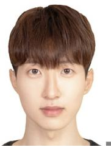

Gyu Seon Kim (Member, IEEE) is a postdoctoral researcher with the Department of Electrical and Computer Engineering, Korea University, Seoul, Republic of Korea. He was a visiting scholar with the Department of Electrical and Computer Engineering, University of Houston, Houston, TX, USA, from 2025 to 2026. He received the Ph.D. degree in electrical and computer engineering from Korea University, Seoul, Republic of Korea, in 2026, and the B.S. degree in aerospace engineering from Inha University, Incheon, Republic of Korea, in 2023. His research interests include deep reinforcement learning and its applications to autonomous aerospace systems.

Dr. Kim received the IEEE Seoul Section Student Paper Contest Award in 2023 and the IEEE Vehicular Technology Society (VTS) Student Scholarship Award in 2025.

Emily Jimin Roh has been pursuing a Ph.D. degree in electrical and computer engineering at Korea University, Seoul, Republic of Korea, since March 2024. She received a B.S. degree in intelligent mechatronics engineering with a major in unmanned vehicle engineering from Sejong University, Seoul, Republic of Korea, in February 2024 (with honor, 6-semester early graduation). Her research focuses include deep learning algorithms, quantum machine learning, and their applications to multimedia systems.

She was a recipient of Bronze Paper Award from IEEE Seoul Section Student Paper Contest (2024).

Soyi Jung (Member, Senior IEEE) has been an assistant professor at the Department of Electrical of Computer Engineering, Ajou University, Suwon, Republic of Korea, since September 2022. Before joining Ajou University, she was an assistant professor at Hallym University, Chuncheon, Republic of Korea, from 2021 to 2022; a visiting scholar at Donald Bren School of Information and Computer Sciences, University of California, Irvine, CA, USA, from 2021 to 2022; a research professor at Korea University, Seoul, Republic of Korea, in 2021; and a researcher at Korea Testing and Research (KTR) Institute, Gwacheon, Republic of Korea, from 2015 to 2016. She received her B.S., M.S., and Ph.D. degrees in electrical and computer engineering from Ajou University, Suwon, Republic of Korea, in 2013, 2015, and 2021, respectively. She was a recipient of Best Paper Award by KICS (2015), Young Women Researcher Award by WISET and KICS (2015), Bronze Paper Award from IEEE Seoul Section Student Paper Contest (2018), ICT Paper Contest Award by Electronic Times (2019), IEEE ICOIN Best Paper Award (2021), and IEEE Vehicular Technology Society (VTS) Seoul Chapter Awards (2021, 2022).

Soohyun Park (Member, IEEE) has been an assistant professor at Sookmyung Women’s University, Seoul, Republic of Korea, since March 2024. She was a postdoctoral scholar at the Department of Electrical and Computer Engineering, Korea University, Seoul, Republic of Korea, from September 2023 to February 2024, where she received her Ph.D. degree in electrical and computer engineering, in August 2023. She also received her B.S. degree in computer science and engineering from Chung-Ang University, Seoul, Republic of Korea, in February

2019. She was a recipient of the Best Reviewer Award by ICT Express (2021), IEEE Vehicular Technology Society (VTS) Seoul Chapter Awards, and IEEE ICDCS Best Runner Up Poster Paper Award (2025).

Joongheon Kim (M’06–SM’18) has been with Korea University, Seoul, Korea, since 2019, where he is currently a professor at the Department of Electrical and Computer Engineering, an adjunct professor at the Department of Communications Engineering (sponsored by Samsung Electronics), Department of Semiconductor Engineering (sponsored by SK Hynix); and a director at Net-Zero CAFE (Connectivity and Autonomy for Future Ecosystem) Research Center (sponsored by the Korean Ministry of Science and ICT). He also has been a visiting

professor at Seoul National University Hospital, Seoul, Korea, since 2025. He received the B.S. and M.S. degrees in computer science and engineering from Korea University, Seoul, Korea, in 2004 and 2006; and the Ph.D. degree in computer science from the University of Southern California (USC), Los Angeles, California, USA, in 2014. Before joining Korea University, he was a research engineer with LG Electronics, Seoul, Korea, from 2006 to 2009; a systems engineer with Intel Corporation, Santa Clara in Silicon Valley, California, USA, from 2013 to 2016; and an assistant professor with Chung-Ang University, Seoul, Korea, from 2016 to 2019.

He serves as editor for ACM COMPUTING SURVEYS, IEEE COMMUNICA-TIONS SURVEYS AND TUTORIALS, IEEE TRANSACTIONS ON VEHICULAR TECHNOLOGY, and IEEE INTERNET OF THINGS JOURNAL. He was a recipient of Annenberg Graduate Fellowship with his Ph.D. admission from USC (2009), Intel Corporation Next Generation and Standards (NGS) Division Recognition Award (2015), IEEE SYSTEMS JOURNAL Best Paper Award (2020), IEEE ComSoc Multimedia Communications Technical Committee (MMTC) Outstanding Young Researcher Award (2020), and IEEE ComSoc MMTC Best Journal Paper Award (2021).