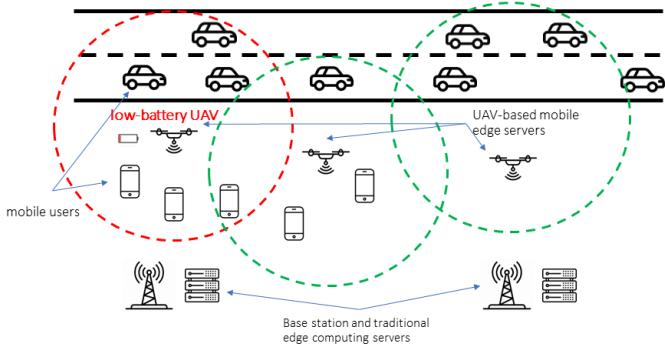
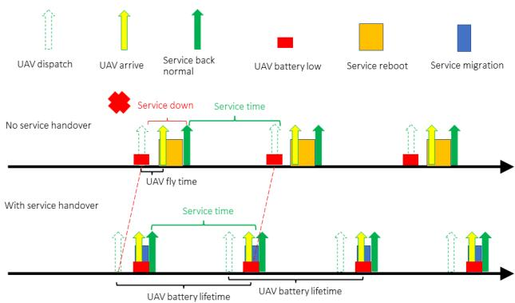
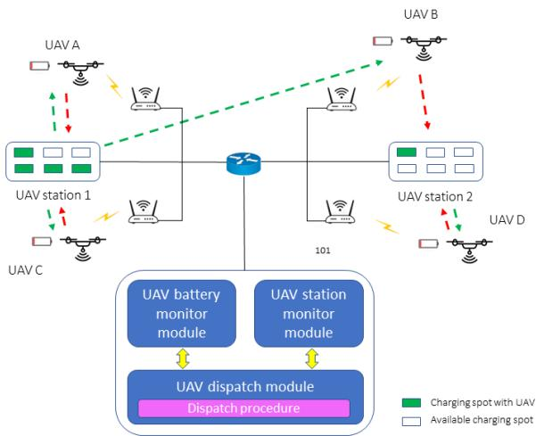
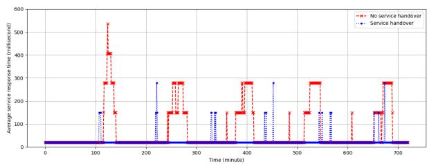

# Seamless Service Handover in UAV-based Mobile Edge Computing

Zilong Ye<sup>(1)(2)</sup>, Philip N. Ji<sup>(1)</sup>, and Ting Wang<sup>(1)</sup>

<sup>(1)</sup> NEC Laboratories America, 4 Independence Way, Suite 200, Princeton, NJ 08540 <sup>(2)</sup> California State University Los Angeles, 5151 State University Drive, Los Angeles, CA 90032 zilong.ye@calstatela.edu, pji@nec-labs.com, ting@nec-labs.com

Abstract—Unmanned aerial vehicles (UAVs), such as drones, can carry high-performance computing devices (e.g., servers) to provide flexible and on-demand data processing services for the users in the network edge, leading to the so-called mobile edge computing. In mobile edge computing, researchers have already explored how to optimize the computation offloading and the trajectory planning of UAVs, as well as how to perform the service handover when mobile users move from one location to another. However, there is one critical challenge that has been neglected in past research, which is the limited battery life of UAVs. On average, commercial-level drones only have a battery life of around 30 minutes to 2 hours. As a result, during operation, mobile edge computing carriers have to frequently deal with service handovers that require shifting users and their computing jobs from low-battery UAVs to new fully-charged UAVs. This is the first work that focuses on addressing this challenge with the goal of providing continuous and uninterrupted mobile edge computing service. In particular, we propose a seamless service handover system that achieves minimum service downtime when handling the duty shift between low-battery UAVs and new fullycharged UAVs. In addition, we propose a novel UAV dispatch algorithm that provides guidelines about how to dispatch new fully-charged UAVs and where to retrieve low-battery UAVs, with the objective of maximizing UAVs’ service time. The effectiveness of the proposed service handover system and the proposed UAV dispatch algorithm is demonstrated through comprehensive simulations using a time-series event-driven simulator.

Index Terms—mobile edge computing, service handover, lowbattery UAVs

## I. INTRODUCTION

In recent years, edge computing [1] has been widely deployed to accommodate the ever-increasing computing demands from the network edge, such as mobile applications, the Internet of Things, distributed machine learning applications, etc. Compared to traditional cloud computing, edge computing brings computing resources closer to the user, thus offering faster data processing with reduced response time for the users. In recent research efforts, mobile edge computing [2] [3] has been proposed as a way to complement existing edge computing. In mobile edge computing, unmanned aerial vehicles (UAVs), such as drones, are used to carry edge servers to provide computing and data processing services to any location where there is a demand. Unlike traditional edge computing that deploys edge servers in fixed locations, mobile edge computing is not bounded by physical deployment constraints, as the edge servers are carried by UAVs. Thanks to the mobility of UAVs, they can go to places that are challenging for humans or other ground-based vehicles to access in an ondemand manner. This makes UAV-based mobile edge computing to be a promising solution to provide a flexible, topologyreconfigurable, and on-demand computing and data processing services. For example, it can be used to provide additional computing and data processing services to hotspot areas with surging demands that overwhelm the capacity of the existing edge computing infrastructure, e.g., highways or local routes that have traffic jams during rush hours in big cities, as shown in Fig. 1. It can also be used to provide reliable computing and data processing services in challenged communication environments (such as battlefields, or post-disaster areas) or the areas without terrestrial networks (such as dessert). Hence, mobile edge computing is a promising component for the nextgeneration network and computing ecosystem.

  
Fig. 1. UAV-based mobile edge computing

The existing related works (with more details to be presented in Section II) have extensively investigated two main challenges. The first challenge is about optimizing the computation offloading, considering binary or partial offloading mode [4] [5]. The objectives considered in these studies include minimizing energy consumption or minimizing average job completion time. Some recent research efforts considered jointly optimizing the computation offloading and the trajectory planning of UAVs, such as [6] [7]. The second challenge, which is closely related to our study, is about how to perform service handover in traditional edge computing [8] - [11]. Here, the edge servers are in fixed locations, and thus the service handover stems from the need when mobile users move from one service area to another. However, after studying these existing works, we identify a critical challenge that has been neglected by the existing works in the operational aspect of mobile edge computing. We notice that commercial-level UAVs have a short battery life of 30 minutes to 2 hours (although it may go up to 24 hours if solar power is equipped or tethered drone system is considered [12]). Therefore, it is certainly foreseen that mobile edge computing carriers have to frequently deal with low-battery UAVs during operation. For example, as shown in Fig. 1, a low-battery UAV must fly back to a UAV station for charging, while a new fully-charged UAV is required to arrive to the area and take over the duties (e.g., the users and their computing tasks) from the original low-battery UAV. The open challenge is how to provide a continuous and uninterrupted computing and data processing service to the users when there are frequent occurrences of low-battery UAVs. So far, to the best of our knowledge, there is no existing work that addresses this challenge.

In this work, for the first time, we study the service handover problem caused by low-battery UAVs in mobile edge computing. We propose a seamless service handover system that can achieve the minimum service downtime and provide continuous and uninterrupted service to the users. In addition, we propose a novel UAV dispatch algorithm that provides guidelines about (1) the dispatch of new fully-charged UAVs (and the attached edge servers) to take over the duties from the low-battery UAVs, and (2) selects the appropriate UAV station for retrieving low-battery UAVs. The proposed algorithm aims at maximizing the service time of UAVs while considering the remaining battery of low-battery UAVs, their distances to the UAV stations, as well as the availability of charging spots in the UAV stations. Finally, we develop a time-series eventdriven simulator to evaluate the performance of the proposed solutions. Comprehensive simulations have been conducted to demonstrate and validate the effectiveness of the proposed solution.

The organization of the paper is as follows. We first introduce the related work in Section II. Then, we present the proposed seamless service handover system and the UAV dispatch algorithm in Section III. After that, we analyze the performance of the proposed solutions through simulations in Section IV. Finally, we conclude the paper in Section V.

## II. RELATED WORK

In mobile edge computing, UAVs can play different roles, including UAVs acting as users, edge servers, and relays, respectively [2] [3]. Our study in this work focuses on utilizing UAVs as edge servers (e.g., UAVs carry servers to provide computing services). The existing works that consider UAVs as edge servers have investigated two main challenges. The first challenge is about how to optimize the computation offloading. There are wo types of offloading modes that have been considered, including binary offloading (e.g., a task can only be computed on either a mobile device or an edge server) and partial offloading (e.g., a task can be divided into chunks, and these chunks can be computed on a mobile device and on one or more edge servers simultaneously). The authors in [4] proposed a binary offloading scheme that can minimize energy consumption while taking into consideration of the delay constraint. The authors in [5] considered partial offloading and proposed a deep Q-network to adjust the offloading ratio and the transmission bandwidth to minimize the total cost that includes both energy consumption and job completion time. Furthermore, the authors in [6] and [7] explored how to jointly optimize the computation offloading and the UAV trajectory planning in order to achieve cost-efficient mobile edge computing. The second challenge that has been extensively studied and is closely relevant to our study is live service migration in mobile edge computing [8] - [11]. In these works, the edge servers are deployed in fixed locations, so there is a demand for migrating the computing tasks when mobile users move from one edge server’s service area to another. The challenge involves determining when to switch a user from the current edge server to another, selecting the appropriate new edge server for resuming the computing tasks, and finding a low-latency and low-cost migration path. The objective is to provide a high-quality service to the users with minimum downtime and uninterrupted service [8] [9]. The works in [10] and [11] applied Markov decision processing and machine learning techniques, respectively, to make the optimal decisions for service migration.

Distinguished from the above-mentioned existing works that explored optimizing the deployment of mobile edge computing, our study in this work mainly focuses on the operational aspect of mobile edge computing. In particular, our work focuses on mitigating the service interruption and offering continuous and uninterrupted services in the moment when there occurs low-battery UAVs. The service handover that we refer to involves migrating users and their computing tasks from low-battery UAVs to new fully-charged UAVs for continuous service. The other research issues, such as the security of data during service handovers or energy consumption impacted by variable weather, are not considered in this current work, but may be considered in our future work.

## III. SEAMLESS SERVICE HANDOVER IN MOBILE EDGE COMPUTING

In this section, we will first introduce the challenge brought by low-battery UAVs in mobile edge computing. After that, we will present the design principles of the proposed seamless service handover system, followed by the novel UAV dispatch algorithm. Note that our study focuses on utilizing UAVs as edge servers. Therefore, in the following parts, when we refer to UAVs, we assume there are edge servers onboard.

## A. The challenge of low-battery UAVs

Mobile edge computing carriers face a critical challenge during operation due to the short battery life of UAVs, which typically ranges from 30 minutes to 2 hours. As shown in Fig. 1, when a UAV’s battery becomes low, it must fly back to a UAV station for charging. In order to continue providing service for the users in the area currently served by the low-battery UAV, a new fully-charged UAV is required to be sent to that area and take over the duty from the lowbattery UAV. Here, there are several open challenges that need to be addressed, including (1) selecting which UAV station to send a new fully-charged UAV to the area currently served by the low-battery UAV? (2) determining when to launch the new fully-charged to fly to the service area? (3) reconnecting the existing users to the new UAV when it arrives? (4) identifying which UAV station to retrieve the lowbattery UAV for charging. When addressing these challenges, the mobile edge computing carriers needs to maintain a highquality of service for the users, e.g., a smooth service transition with minimum downtime. Hence, the objective of handling low-battery UAVs and the consequent duty shift is set as minimizing service downtime or minimizing average response time.

  
Fig. 2. Service handover v.s. No service handover

In Fig. 2, we theoretically compare the performance of mobile edge computing service with and without an efficient service handover. When there is no service handover, users who are currently served by the low-battery UAV may experience a significant downtime before they can resume their computing tasks. The service downtime comes from two main sources. Firstly, the mobile edge computing service is not accessible to the users during the period when the low-battery UAV returns to a charging station and the new fully-charged UAV is still in route to the service area. Secondly, upon arrival of the new fully-charged UAV at the service area, the original low-battery UAV has already return to a charging station. As a result, the new fully-charged UAV is required to reboot the service from scratch. This process involves the reloading of data and computing model, as well as recomputing all the jobs from scratch. Such a service reboot process incurs a significant amount of time during which the mobile edge computing service is inaccessible to users.

In order to reduce the service downtime, we propose a seamless service handover approach. As shown in Fig. 2, with service handover, a new fully-charged UAV will be dispatched ahead of time, so that it can arrive at the service area before the low-battery UAV returns to a UAV station for charging. Such a plan-ahead dispatch takes into consideration of the remaining battery of the low-battery UAV, as well as the time required for migrating all the users and their computing tasks from one UAV to another. In this way, the new fully-charged UAV can take over all duties, including the users, their data, their computing tasks, and the current states of their computing tasks, from the low-battery UAV before its battery dies. Such service migration or duty shift time is significantly shorter compared to the service reboot time when no service handover is applied. As a result, users only experience a very short downtime when they are switched from the original UAV to the new one. Therefore, the proposed seamless service handover approach can achieve an almost uninterrupted and continuous mobile edge computing service.

## B. The Seamless Service Handover System

The architecture of the proposed seamless service handover system is illustrated in Fig. 3. The system consists of three main components, including (1) UAVs that carry mobile edge servers, (2) UAV stations that are used for storing and charging UAVs, and (3) a centralized controller that orchestrates the dispatch and harness of UAVs. These components are interconnected through commercial network services. For example, UAV stations communicate with the centralized controller through wired connections (e.g., cable), UAVs connect with the centralized controller (as well as other UAVs and UAV stations) through wireless networks such as WiFi or LTE. The proposed centralized controller can be deployed in a local computer or in a remote cloud. In the following parts, we will present the design details of various modules in the centralized controller.

The centralized controller consists of three main modules, which are the UAV battery monitor module, the UAV station monitor module, and the UAV dispatch module. When a currently serving UAV’s battery becomes low, it sends a low battery request to the centralized controller. This request is received by the UAV battery monitor module. Then, the centralized controller scans the available resources across all the UAV stations via the UAV station monitor module. Based on the obtained information, such as the low-battery UAV’s location and the available resources at the UAV stations, the UAV dispatch module determines the following assignments, (1) which UAV station should launch a new fully-charged UAV to shift duty with the low-battery UAV, (2) when to launch the new fully-charged UAV, and (3) which UAV station should harness or retrieve the low-battery UAV for charging. These dispatch assignments will be sent from the centralized controller to the UAVs and the UAV stations to execute service handover operation.

The UAV battery monitor module is used for monitoring the UAV battery information and receiving the UAV low battery requests. More specifically, it consists of an active monitoring part and a passive monitoring part. Firstly, as for the active monitoring part, the UAV battery monitor module periodically sends small-size heartbeat messages to all the currently serving UAVs to collect their geographical information and the remaining battery information. Once the UAVs receive such heartbeat messages, they will send their location and battery information back to the UAV battery monitor module. The battery information of all the currently serving UAVs will be stored in a database in the UAV battery monitor module. In the database, when a currently serving UAV is found with a low battery, the UAV battery monitor module will generate a request to the UAV dispatch module. Secondly, as for the passive monitoring part, the UAV battery monitor module has a listening port that is always waiting for any low-battery request initiated by UAVs. Here, a low-battery request includes the UAV’s geographical location information (e.g., the UAV’s longitude and latitude information) and the remaining battery information. Once the UAV battery monitor module receives a low battery request, it will forward it to the UAV dispatch module to generate a dispatch assignment for the service handover.

The UAV station monitor module is used for monitoring the resources across all UAV stations. More specifically, it keeps track of the usage of the charging spots in each UAV station. The UAV station monitor module periodically sends heartbeat messages to all UAV stations to collect their resource availability. As a respond to the heartbeat message, a UAV station sends back (1) the geographical coordinates of the UAV station (e.g., longitude and latitude), (2) the number of fully charged UAVs available at the station, and (3) the number of available charging spots at the station. This information is received and stored in a database managed by the UAV station monitor module. In addition, UAV stations can proactively contact the UAV station monitor module to update their resource availability information. For example, UAV stations can proactively sends messages to the UAV station monitor module, reporting UAVs that are damaged or charging spots that are under maintenance.

The UAV dispatch module is the key component in the proposed centralized controller. Upon receiving a low-battery request, the UAV dispatch module examines the low-battery UAV’s information (e.g., its geographical location and the remaining battery) and the available resources across all UAV stations. Then, it runs a novel UAV dispatch algorithm (to be described in detail in the next subsection) to determine the UAV dispatch and harness assignments for performing the service handover operations. More specifically, the UAV dispatch module will make the assignments for (1) which UAV station launches a new fully-charged UAV to replace the lowbattery UAV, (2) when to launch a new fully-charged UAV, and (3) which UAV station retrieves (or harnesses) the lowbattery UAV for charging. The dispatch assignments will be sent to the low-battery UAV and the selected UAV stations for execution.

There are communication channels inside the centralized controller. The first channel facilitates communication between the UAV battery monitor module and the UAV dispatch module. The UAV battery monitor module can use this channel to send low-battery requests to the UAV dispatch module. Using this channel, the UAV dispatch module can proactively collect the battery information of all currently serving UAVs. The second communication channel is between the UAV station monitor module and the UAV dispatch module. It can be used by the UAV dispatch module to collect the UAV station’s resource availability information, such as the UAV station’s geographical information, the available fully charged UAVs in the station, and the available charging spots in the station.

  
Fig. 3. The system architecture of the service handover

## C. The UAV dispatch algorithm

The proposed UAV dispatch algorithm is the key component in the proposed seamless service handover system. It is designed with the objective of maximizing the service time of UAVs. The algorithm consists of the following three main steps.

Step 1: The algorithm sorts all low-battery requests according to the remaining battery of UAVs in ascending order. In this manner, the UAV that has the lowest remaining battery is prioritized in the dispatch process.

Step 2: For each low-battery request, the algorithm determines which UAV station is used for retrieving the low-battery UAV. More specifically, the algorithm checks if the processing UAV station is within the reachability of the low-battery UAV, taking into consideration of the remaining battery in the lowbattery UAV and the time that is required for the service handover operation (e.g., the time to transfer the data, the computing models, and the current states of the computations, from the low-battery UAV to the new fully-charged UAV given the available network bandwidth). In addition, the algorithm checks if the processing UAV station has enough charging spots to host the low-battery UAV. If the processing UAV station satisfies these requirements, then it will be considered as a candidate; otherwise, the algorithm continues to examine the next UAV station. Finally, the algorithm selects the candidate UAV station that is closest to the low-battery UAV as the station for harness or retrieval.

Step 3: The algorithm decides which UAV station should launch a new fully-charged UAV and when the launch should be executed. In particular, the algorithm prioritizes the selected retrieval UAV station for launching a new fully-charged UAV. If the selected retrieval UAV station has available new fullycharged UAVs, then it will be selected as the UAV station for launching as well. Otherwise, the algorithm examines all the UAV stations and selects the one that has available new fullycharged UAVs and is closest to the low-battery UAV as the station for launching. For example, in Fig. 3, UAV station 2 is selected as the retrieval station for UAV B. However, there is only one fully-charged UAV available at the station, which will be dispatched to replace UAV D. Hence, UAV station 1 is selected to launch a new fully-charged UAV to replace UAV B and take over its duties. In terms of the time to execute the launch process, it is determined by the remaining battery of the low-battery UAVs and the distance between the lowbattery UAV and the selected UAV station for lauching. The pseudocode of the proposed algorithm is shown as follows.

```txt
Algorithm 1 The UAV Dispatch Scheme
1: sort the low-battery UAVs requests according to their remaining battery life
2: for each low-battery UAV do
3:    for each station do
4:    if station has enough charging spots then
5:    if station is closest to UAV then
6:    Mark station with H for harness
7:    end if
8:    end if
9:    end for
10:    if station H has new fully-charged UAVs then
11:    Mark station H with D to dispatch new UAV
12:    else
13:    for each station do
14:    if station has fully-charged UAVs then
15:    if station is closest to UAV then
16:    Mark station with D for dispatch
17:    end if
18:    end if
19:    end for
20:    end if
21:    calculate launch time T
22: end for
23: return station D and H, as well as launch time T
```

## IV. SIMULATION RESULTS

We develop a time-series event-driven simulator to evaluate the performance of the proposed seamless service handover system and the UAV dispatch algorithm. The simulation parameter settings are designed according to real-world scenarios. The experiment scenario is about using mobile edge computing to provide service to several hotspot areas in a big city that has an area of 30 miles by 30 miles. The mobile edge computing infrastructure consists of 4 UAV stations, distributed randomly across the city. Each UAV station has 20 UAVs and 20 charging spots. At the beginning of the simulation, each UAV is fully charged with a battery life of 120 minutes. However, the battery life may vary between 115 to 125 minutes, depending on the number of users being served by the UAV (e.g., a UAV that is serving more users will involve a higher energy consumption, and thus the battery may last shorter time. The UAV’s flying speed is set to 50 miles per hour. From the user’s point of view, there are four hotspot areas in the simulation, with their locations randomly generated across the city. Initially, each hotspot area has 10 users who request computing jobs to be done through the mobile edge computing service. Each computing job lasts for 9 to 12 minutes. As time goes on, there arrive new users and computing requests every minute. More specifically, 5 new users and their computing jobs will be added to each hotspot every minute. Each of these computing jobs also lasts between 9 to 12 minutes. To evaluate the user’s experience and service quality, we consider using the matrix of service response time that is defined as follows. When the UAV-based edge server functions well, the user will experience a response time between 20 to 60 milliseconds. However, if the UAV-based edge server is not in the area (e.g., due to a low-battery UAV flying back to a station for charging), then the response time is set to be between 460 to 800 milliseconds. This measurement is consistent with certain smartphone applications and video game feedback to the users. For example, in the famous mobile game “Kings of Glory”, when the server is not accessible, users will receive a “460” notice (even if the actual response time is longer than 460 milliseconds). Based on these settings, we conduct the simulation for 12 hours (e.g., 720 minutes) and compare the performance of mobile edge computing service with and without the proposed seamless service handover system. The simulation results are discussed in the following parts.

  
Fig. 4. Average response time for users as a matter of time

We focus on analyzing the average service response time as one of the most important factors of user experience and service quality. As shown in Fig. 4, we compare the average response time of mobile edge computing with and without the proposed service handover system as time progresses. Here, we measure the service response time for all the users and take the average. We can observe that there are a few average response time spikes during the 12 hours simulation period, no matter whether the mobile edge computing applies service handover or not. These spikes appear due to the occurrences of low-battery UAVs, which require the affected users to resume their computing tasks in a new UAV. The width of the spikes corresponds to the time that the service is down. We can clearly see that the width of spikes for mobile edge computing with service handover is much smaller than that of mobile edge computing without service handover. This indicates that the service downtime in mobile edge computing with service handover is minimized. The small downtime is only affected by the time that the affected users switch to the new UAV. As a comparison, the service downtime by mobile edge computing without service handover is large. This is because the service is down when the low-battery UAV flies back to a station for charging before a new fully-charged UAV arrives. In addition, the service is also not available during the service reboot process (e.g., reload data and recompute the computing tasks from scratch). The results in Fig. 4 demonstrate that, with the proposed service handover system, the mobile edge service can achieve a smooth and (almost) uninterrupted service with minimum service downtime when dealing with low-battery UAVs, thus offering a better experience to users. However, we also observe that there are tradeoffs to using the proposed service handover. Firstly, there are more frequent response time spikes for mobile edge computing with service handover, compared to that without service handover. This is because the new fully-charged UAVs fly ahead of time using the proposed service handover system, which causes the UAVs’ battery to drain earlier. Secondly, we analyze the number of UAVs that are used during the 12 hours simulation period. As shown in the second column in Table I, more UAVs are used in mobile edge computing that applies service over, compared to that without service handover. This implies that the smooth and uninterrupted service comes at the cost of using more UAVs. We plan to study mitigating these tradeoffs in our future work.

TABLE I

<table><tr><td></td><td>No. of UAVs</td><td>Service time</td><td>Users served</td></tr><tr><td>No service handover</td><td>24</td><td>98.3</td><td>180.5</td></tr><tr><td>Service handover</td><td>28</td><td>102</td><td>197.6</td></tr></table>

In addition, we analyze the average service time per UAV for mobile edge computing with and without service handover. The results are shown in Table I (the third column). We can see that the average service time for mobile edge computing with service over (102) is larger than that without service handover (98.3). This is because the time required for service handover (e.g., migrating users, their data, the computing models, and the current computing states from one edge server to another) is much shorter than the time that is needed for service reboot (which involves collecting the data, the computing model from the users and re-computing the tasks from scratch).

Furthermore, we analyze the average number of users that are well served (with a response time lower than 60 milliseconds) per minute for mobile edge computing with and without service handover. The results are shown in Table I (the fourth column). We find out that mobile edge computing with service handover can serve more users (197.6) than that without service handover (180.5). This is because the service downtime brought by service handover is significantly shorter than that without service handover. Hence, more users will benefit from that, and thus receive high-quality service.

## V. CONCLUSION

In this work, we have investigated a critical operational challenge in mobile edge computing that has not been studied before, which is how to handle low-battery UAVs to provide continuous and uninterrupted service to users. Given the battery life of UAVs, mobile edge computing carriers have to deal with low-battery UAVs frequently. Therefore, it is critically important to address this issue for maintaining a high-quality operation of the mobile edge computing service. To this end, we have proposed a seamless service handover system that can achieve the minimum service downtime for the users. In addition, we have proposed a novel UAV dispatch scheme that can maximize the service time of UAVs. The proposed solutions have been demonstrated and validated through comprehensive simulations using a time-series event-driven simulator. From the simulation results, we have found that the average service response time achieved by the proposed service handover system is stably small, with only a few shortgap spikes (downtime). Through analysis, we have found that such a smooth service handover system comes at the cost of involving more UAVs to support the service. The simulation results have also shown that the proposed solutions can lead to serving more users per minute and achieving

## REFERENCES

[1] W. Khan, E. Ahmed, S. Hakak, I. Yaqoob, A. Ahmed, “Edge computing: A survey, Future Generation Computer Systems,” in Elsevier Future Generation Computer Systems, vol. 97, 2019, pp. 219-235

[2] P. Mach and Z. Becvar, “Mobile Edge Computing: A Survey on Architecture and Computation Offloading,” in IEEE Communications Surveys & Tutorials, vol. 19, no. 3, pp. 1628-1656, 2017

[3] F. Zhou, R. Q. Hu, Z. Li and Y. Wang, “Mobile Edge Computing in Unmanned Aerial Vehicle Networks,” in IEEE Wireless Communications, vol. 27, no. 1, pp. 140-146, 2020

[4] D. Callegaro and M. Levorato, “Optimal Edge Computing for Infrastructure-Assisted UAV Systems,” in IEEE Transactions on Vehicular Technology, vol. 70, no. 2, pp. 1782-1792, 2021

[5] L. Chen, X. Kuang, F. Zhu and J. Xia, “Intelligent Mobile Edge Computing Networks for Internet of Things,” in IEEE Access, vol. 9, pp. 95665-95674, 2021

[6] J. Xiong, H. Guo and J. Liu, “Task Offloading in UAV-Aided Edge Computing: Bit Allocation and Trajectory Optimization,” in IEEE Communications Letters, vol. 23, no. 3, pp. 538-541, 2019

[7] J. Zhang et al., “Computation-Efficient Offloading and Trajectory Scheduling for Multi-UAV Assisted Mobile Edge Computing,” in IEEE Transactions on Vehicular Technology, vol. 69, no. 2, pp. 2114-2125, 2020

[8] A. Machen, S. Wang, K. K. Leung, B. J. Ko and T. Salonidis, “Live Service Migration in Mobile Edge Clouds,” in IEEE Wireless Communications, vol. 25, no. 1, pp. 140-147, 2018

[9] F. Brandherm, J. Gedeon, O. Abboud and M. Muhlh ¨ auser, “Big-¨ MEC: Scalable Service Migration for Mobile Edge Computing,” 2022 IEEE/ACM 7th Symposium on Edge Computing (SEC), Seattle, WA, USA, 2022

[10] A. Machen, S. Wang, K. K. Leung, B. J. Ko and T. Salonidis, “Live Service Migration in Mobile Edge Clouds,” in IEEE Wireless Communications, vol. 25, no. 1, pp. 140-147, February 2018

[11] J. Wang, J. Hu, G. Min, Q. Ni and T. El-Ghazawi, “Online Service Migration in Mobile Edge with Incomplete System Information: A Deep Recurrent Actor-Critic Learning Approach,” in IEEE Transactions on Mobile Computing, 2022

[12] O. M. Bushnaq, M. A. Kishk, A. Celik, M. -S. Alouini and T. Y. Al-Naffouri, “Optimal Deployment of Tethered Drones for Maximum Cellular Coverage in User Clusters,” in IEEE Transactions on Wireless Communications, vol. 20, no. 3, pp. 2092-2108, 2021.