# Secrecy-Aware UAV Path Planning and Ofloading Strategy Optimization Using Deep Reinforcement Learning and Particle Swarm Optimization

Aliia Beishenalieva , Member, IEEE, and Sang-Jo Yoo , Member, IEEE

Abstract—Eficient management of limited resources, reduced data transmission latency, and improved overall network performance are critical in ground networks. This paper proposes a hierarchical sensing and ofloading framework for intelligent transportation systems (ITS), where unmanned aerial vehicles (UAVs) act as mobile data aggregators to support ITS monitoring in areas beyond roadside unit (RSU) coverage, during RSU outages, or under severe ground network congestion. By enabling localized ofloading, the framework ensures the timely delivery of critical ITS data. The proposed secrecy-aware approach enhances the resilience, eficiency, and integrity of ITS sensing and communications. Although UAVs ofer advantages such as high mobility, on-demand deployment, and reliance on line-ofsight (LoS) communication channels, they remain vulnerable to security threats. To counter eavesdropping and jamming threats, the proposed method combines policy-gradient reinforcement learning with protective jamming and secrecy-aware transmission scheduling, enabling UAVs to adaptively adjust flight paths, transmit power, and time slot assignments. A multi-objective reward function is designed to jointly optimize secrecy rate, communication delay, and energy consumption under adversarial conditions. Extensive simulations confirm the proposed model’s efectiveness in enhancing communication security and operational eficiency across varying threat scenarios.

Index Terms—Dynamic data ofloading, deep reinforcement learning (DRL), UAV path planning, physical layer security, Internet of Things (IoT).

## I. INTRODUCTION

N MODERN intelligent transportation systems (ITS), diverse data sources including (i) vehicle-mounted onboard sensors, (ii) stationary roadside sensing infrastructure, and (iii) localized data aggregators, continuously generate information related to vehicle dynamics, trafic conditions, and environmental hazards. These data streams are typically relayed via roadside units (RSUs) to centralized ITS servers. However, RSU-based connectivity can be compromised due to physical failures, limited coverage, congestion in ground vehicle networks, or cyberattacks [1], [2]. To address these vulnera bilities, we propose a UAV-assisted architecture that augments RSU connectivity and enables the secure ofloading of ITS critical data in adverse or disrupted scenarios. UAVs are characterized by their high mobility and line-of-sight (LoS) channel capabilities, enabling them to efectively support a wide range of ground network environments [3], [4]. Their versatility allows seamless integration with various network configurations, including IoT [5], Internet of Vehicles (IoV) [6], mobile networks [7], fixed networks, and both wired and wireless networks. As demand for ofloading in diverse three-dimensional (3D) environments increases, UAV-based solutions become increasingly significant [8]. UAVs ofer adaptable coverage and connectivity, making them ideal for dynamic and heterogeneous networks. Despite their advantages, UAV-based communications are highly vulnerable to security attacks, such as eavesdropping and jamming, due to their broadcast nature and the potential exposure of their flight paths [9]. Malicious eavesdroppers can intercept confidential information, while jammers can disrupt communication links, posing serious threats to data integrity and availability. Therefore, addressing these security challenges is crucial for the safe and reliable operation of UAV-assisted networks. Recent work have focused on maximizing the secrecy rate in UAV and ground communications through advanced UAV path planning and power control strategies [10], [11]. By optimizing the trajectories of UAVs, it is possible to enhance the resilience of communication systems against eavesdropping and jamming attacks. Notably, techniques involving Deep Reinforcement Learning (DRL) have shown promise in dynamically adjusting UAV paths and transmission power to maintain high secrecy rates [12], [13]. However, unresolved issues remain in UAV path planning for communication security. The impact of multiple eavesdroppers and cooperative malicious attackers, where eavesdroppers and jammers collaborate, needs further study. Additionally, the threat posed by malicious UAVs (i.e., not ground eavesdroppers), capable of better overhearing data from numerous ground edge units, has been largely overlooked. Furthermore, the challenge of serving a group of ground units within one coverage area while securing their communication has not been adequately addressed. Eficient allocation of time slots and control of frame length to ensure the secrecy rate are also essential considerations that require attention. Recent works have studied UAV-assisted data collection and trajectory optimization in IoT networks, mainly targeting energy or delay reduction [2], [14], while others focused on secure communication under jamming and eavesdropping [15], [16], [17], [18]. Yet, most approaches treat mobility and communication separately or rely on static iterative methods, leaving a gap for integrated, security-aware UAV control frameworks, which this paper addresses.

## A. Related Work

The UAV’s advanced sensing capabilities are underpinned by recent progress in aerial object detection and tracking. Techniques such as Residual Channel-attention (RCA) networks [19], innovative domain-adaptive YOLO frameworks [20], [21], and hybrid morphological and motion-based vehicle tracking methods [22], [23] provide robust, real-time perception from aerial perspectives, crucial for accurately detecting ofloading opportunities and potential security threats. Highprecision trajectory tracking and reliable timing are further enabled by multiband circularly-polarized GNSS antenna designs [24], [25], [26], which deliver resilient positioning performance even in challenging, interference-heavy environments. In addition, deep learning applied to UAV-based remote sensing has proven highly efective for tasks such as rapid post-disaster damage assessment [27], supporting critical emergency response functions considered in this work.

The use of UAVs for communication with ground users and ofloading trafic demand has been extensively studied, highlighting its significance in various domains. Reference [8] presents a comprehensive taxonomy and analysis of UAVenabled 5G network slicing, highlighting the potential of UAVs as agile, on-demand components in virtualized multi-service architectures. The paper mainly focuses on service isolation and QoS management across heterogeneous 5G slices. Reference [28] proposed a hybrid satellite-terrestrial network employing UAVs as a mobile relay base. This approach aimed to maximize the number of served users by optimizing UAV trajectory and user link selection through a combination of a graph neural network (GNN) for optimal link selection and model-free reinforcement learning (RL) for UAV location adjustments. Reference [29] introduced a UAV-assisted vehicular edge computing network (VECN) paradigm to address emergency communication needs in vehicular networks. They optimized UAV flight trajectories while reducing energy consumption using deep reinforcement learning (DRL). Reference [2] focused on using UAVs in mobile edge computing (MEC) to overcome IoT device limitations in wireless networks. They introduced a deep deterministic policy gradient algorithm based on a greedy strategy to optimize UAV scheduling and task allocation, aiming to minimize system energy consumption and time delay. In [30], a neural trajectory solver was proposed to optimize UAV trajectory planning for data gathering purposes. Similarly, [7] utilized multiple UAVs to sense and communicate with ground users (GUs). This study addressed optimization challenges through a joint formulation of user association, UAV trajectory planning, and power allocation, aiming to maximize spectral eficiency using soft actor-critic (SAC).

Gao et al. [31] presented a multiobjective RL solution for optimizing joint trajectory control and task ofloading in multi-UAV-enabled mobile edge computing systems, focusing on minimizing task latency and UAV energy consumption while maximizing task collection. In [32], resource-aware UAV operations was proposed where a joint optimization of UAV trajectories, scheduling, and energy replenishment using unmanned ground vehicles (UGVs) was proposed to minimize the Age of Information (AoI) in data collection tasks. In [29], the authors proposed a decentralized joint trajectory planning and task ofloading approach utilizing a multiagent actor-critic algorithm to solve a multiobjective problem. In [33], an RLbased approach for time-varying data collection in unfamiliar environments was proposed. Here, the UAV’s new position is determined based on both spatial and temporal substates, optimizing its trajectory for eficient data gathering. In addition to ofloading and edge computing, UAV-assisted peer-to-peer (P2P) architectures have been explored to enhance data sharing in dynamic vehicular environments. A P2P overlay using interconnected UAVs as an aerial backbone was proposed in [34], leveraging distributed hashing and multi-agent deep reinforcement learning.

To ensure the efectiveness of secure communication and data collection, it is critical to enhance the design of UAV path planning methodologies. Consequently, several studies have been conducted to prevent eavesdropping in the context of UAV operations. In [15], the authors explored a dual-UAV secure communication system where one UAV sends confidential messages to a mobile user while another transmits noise signals to confuse eavesdroppers. This study optimized the worst-case secrecy rate by jointly designing 3D UAV trajectories and time allocation under practical constraints. Another work considered the dual-UAV secure data collection [16] proposed a scheme that maximizes secrecy rate and energy eficiency. Dong et al. [17] also focused on optimizing the secrecy transmission in a UAV swarm-enabled communication network. They proposed a joint optimization of transmit power, power allocation, beamforming, and UAV trajectory to maximize the average achievable secrecy rate. However, these works relied on iterative traditional methods such as successive convex approximation and Dinkelbach methods.

In [10], improved dual-UAV-based communication security was proposed. The authors employed RL to design UAV path planning taking into account the mobility of GUs and bi-directional communication, though the UAV height was fixed. Authors of [12] proposed a system with relay and jammer UAVs to address security threats, utilizing the DRL algorithm to jointly optimize trajectory and transmit power, though they considered a ground eavesdropper. Reference [18] proposed a DRL-based secure ofloading method specifically for video ofloading scenarios, considering the presence of UAV eavesdroppers. Their primary objective was to minimize overall system energy consumption. In [13], the authors proposed multi-agent RL for UAV swarm communication optimization, focusing on relay selection and power allocation, although this scheme was designed solely to counter jamming attacks. Reference [35] proposed a DRL-based approach for joint trajectory design and resource allocation in secure, energy-eficient UAV networks, where multiple UAVs transmit data to a central server while harvesting energy from a wireless charging station.

## B. Motivation and Contributions

The aforementioned papers on UAV path design for ground trafic ofloading and secure communication primarily relied on traditional iterative methods, which entail significant computational complexity. Some prior works also exclusively address either combating malicious eavesdropping or malicious jamming, often disregarding the existence of a legitimate jammer. Moreover, earlier studies assumed that legitimate UAVs fly at a fixed height, with one time slot typically allocated for each ground unit. To address these challenges, we propose a hybrid framework that jointly optimizes UAV mobility paths and communication resource allocation in adversarial IoT environments. Specifically, we design a policy gradientbased deep reinforcement learning (PGDRL) algorithm to dynamically plan secure UAV trajectories that avoid jamming or eavesdropping threats, while minimizing delay and energy consumption. In parallel, a particle swarm optimization (PSO) module is employed to perform real-time slot allocation based on the most recent system state, ensuring responsiveness to changing demand patterns. This synergy between longterm learning and short-term optimization enables the system to support eficient and secure data delivery, even under unpredictable and hostile network conditions. The main contributions of this work are as follows:

1) Hybrid Optimization of Secure Mobility and Resource Control: We propose a hybrid optimization framework that integrates Policy Gradient-based Deep Reinforcement Learning (PGDRL) for high-level UAV trajectory and transmission control with Particle Swarm Optimization (PSO) for finegrained slot scheduling. This dual-layered architecture enables joint optimization of mobility, ofloading, and secure communication in a scalable and interpretable manner.

2) UAV Trajectory, Power, and Activity Control via DRL under Adversarial Threats: The primary objective of this work is to gather more data from ground users while ensuring secure communication between LSUs and GEUs. To achieve this, we have developed an algorithm that regulates the transmission power and trajectory of legitimate UAVs, as well as adjusts the transmission power of ground edge units. Additionally, we control the modes of legitimate jamming UAVs (LJUs) including their movement modes (i.e., move or stay) and activity modes (i.e., broadcast artificial noise (AN) or idle). By leveraging PGDRL techniques, we efectively address the nonconvex nature of this problem to optimize system performance.

3) Slot Allocation within UAV Coverage with Limited Frame Length: In scenarios involving malicious UAVs, it is crucial for legitimate serving UAVs to avoid prolonged hovering over specific positions. To address this, we have implemented a limited frame length (FL) for hovering at any given position, which is dynamically determined based on factors such as the number of GEUs within the coverage area, the achievable rate from GEU to LSU, and the amount of data each GEU needs to transmit. Furthermore, we optimize resource utilization within the UAV coverage area while adhering to the frame length constraints. To achieve these optimizations, we employed the Particle Swarm Optimization (PSO) algorithm.

4) Security-Aware Ofloading Metric Incorporating Contextual and Adversarial Factors: We propose a novel security-aware decision metric that guides ofloading and communication strategies by considering contextual and adversarial conditions, rather than relying solely on traditional data rate maximization. This metric reflects (i) the actual amount of securely delivered data, (ii) the fulfillment ratio of ofloading demand, (iii) the revisit interval for each ground region, and (iv) the estimated threat level based on the presence of nearby malicious UAVs. By integrating these factors, the proposed approach supports more informed, resilient, and adaptive decision-making in dynamic and threat-prone environments.

5) Multi-Metric Performance Optimization via Unified Reward Function: We formulate a multi-objective reward function that maximizes secrecy rate and task success rate and minimizes energy consumption and latency. The unified formulation facilitates balanced performance across competing system objectives and enables robust, real-time decisionmaking.

## II. SYSTEM ARCHITECTURE

In this section, we provide a comprehensive overview of the overall system architecture underpinning our proposed work ofering detailed insights into each component’s design and functionality. Specifically, we delve into the intricacies of the system model, UAV coverage definition, communication models, UAV operational models, and constraints.

## A. System Model

In modern ITS, a wide range of sensing data such as vehicle status for autonomous driving, environmental conditions from roadside sensors, and aggregated situational awareness is continuously generated and must be delivered to edge or cloudbased servers for processing and decision-making. These data originate from ground edge units (GEUs), which include onvehicle sensors, fixed roadside environmental sensors, local roadside data aggregators, and aggregators positioned near intersections. Typically, GEUs forward the collected information to nearby roadside units (RSUs), which then relay it to higher-level ITS infrastructure such as edge servers or cloud platforms. However, relying solely on RSU-based or vehicular ad-hoc networking infrastructure may not be suficient in highly dynamic or disaster-prone environments. Network fragmentation, RSU inaccessibility, or trafic surges can hinder real-time connectivity and timely data delivery. To address these limitations, our proposed framework incorporates UAVassisted task ofloading. UAVs dynamically traverse regions with high ofloading demand or poor RSU coverage to collect sensing and control data directly from GEUs including vehicles, local aggregators, and fixed sensors. Then UAVs relay it to the central processing units. This hierarchical structure, as illustrated in Fig. 1, consists of multiple data layers. (i) Ground level: vehicles and fixed roadside sensors generate data. (ii) Aggregation level: local roadside aggregators/intersection-side aggregators preprocess and bufer data. (iii) Aerial layer:

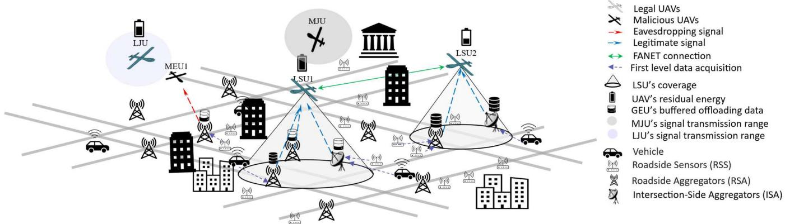  
Fig. 1. System Model.

UAVs support data collection in disconnected or overloaded zones. (iv) Cloud/Core: final destination for analysis, longterm storage, and global coordination.

Multiple LSUs, which efectively serve as aerial base stations to collect bufered data from GEUs. Also, there are multiple mobile malicious eavesdropper UAVs (MEUs) that attempt to intercept data transmitted from GEUs to LSUs. In order to prevent data eavesdropping, multiple LJUs that emit artificial noise to confuse malicious eavesdroppers without interfering with legitimate communication. These LJUs operate under learned policies that determine their movement (stay or move) and activity (jam or idle) modes, contributing to a flexible and responsive defense strategy. AN emitted by LJUs towards MEUs entails intentionally producing interference to disrupt the signal received by the eavesdropper, hindering their capability to intercept and comprehend the transmitted data [36]. All LSUs are familiar with the $\mathrm { L J U } ^ { \prime } \mathbf { s }$ signal patterns and can easily extract the necessary data from the AN. Similarly, multiple mobile malicious jammer UAVs (MJUs) broadcast noise to suppress LSUs which afects secure data collection. The set of legitimate serving UAVs is denoted by ${ \mathcal { L } } S U =$ $\left\{ l s u _ { s } = l s u _ { 1 } , \cdot \cdot \cdot , l s u _ { N _ { l s u } } \right\}$ , the set of legitimate jamming UAVs is denoted by $\mathcal { L T U } = \left\{ l j u _ { l j } = l j u _ { 1 } , \cdot \cdot \cdot , l j u _ { N _ { l j u } } \right\}$ , and the set of ground edge units is denoted by $\mathcal { G U } = \left\{ g u _ { g } = g u _ { 1 } , \cdot \cdot \cdot , g u _ { N _ { g u } } \right\}$ operate in the 3-D environment $X [ x _ { m i n } , x _ { m a x } ] , \ Y [ y _ { m i n } , y _ { m a x } ] .$ and $Z [ z _ { m i n } , z _ { m a x } ]$ . Moreover, the set of malicious eavesdropping UAVs and malicious jamming UAVs are represented as $\begin{array} { r c l } { \mathcal { M E U } } & { = } & { \left\{ m e u _ { e } = m e u _ { 1 } , \cdot \cdot \cdot , m e u _ { N _ { m e u } } \right\} } \end{array}$ and $\begin{array} { r l } { M \mathcal { I } \mathcal { U } } & { { } = } \end{array}$ $\left\{ m j u _ { m j } = m j u _ { 1 } , \cdot \cdot \cdot , m j u _ { N _ { m j u } } \right\}$ , respectively. According to the position, antenna angle, and transmission power of s−th LSU, communication coverage is established. The set of ground edge units covered by $l s u _ { s }$ is $\mathcal { G U } _ { s } = \left\{ g u _ { g } ^ { s } = g u _ { 1 } ^ { s } , \cdot \cdot \cdot , g u _ { N _ { g u } ^ { s } } ^ { s } \right\}$ The GEUs are randomly deployed at $\dot { W } _ { g } [ x _ { g } , y _ { g } , z _ { g } ] \in \mathbb { R } ^ { 3 }$ and each ground edge unit $g u _ { g }$ is assigned a specific priority level, $p l _ { g } \in \mathsf { [ P L ^ { \mathnormal { m i n } } , P L ^ { \mathnormal { m a x } } ] }$ . This level prioritizes military, governmental, or emergency operations. Each $g u _ { g }$ generates dynamic ofloading trafic during its active ON status, storing the data in a bufer for transmission. During its operational period, the LSU dynamically relocates to various positions within the environment to provide service to the $g u _ { g } .$ Each relocation corresponds to the frame length, which is dynamically determined by factors such as the number of GEUs and the density of ofloading data within the LSU’s coverage area. This FL is composed of discrete time slots, n, within the range $n ~ \in ~ [ 0 , N _ { m a x } ^ { t s } ]$ , where $N _ { m a x } ^ { t s }$ is the maximum number of time slots. The frame length in seconds is represented as $F L \ = \ n \times l _ { t s } ,$ where $l _ { t s }$ is a slot length. Accordingly, FL ranges from 0 to a maximum value, denoted as $F L _ { m a x } \ =$ $N _ { m a x } ^ { t s } \times l _ { t s } ,$ , indicating the maximum duration the UAV can remain stationary in one position. Once the frame length is set, the LSU remains stationary to cover the designated area. After the frame ends, it must relocate, even if some GEUs remain unserved. To ensure secure communication, the LSU also considers relocation if malicious UAVs enter critical zones interference (jamming) or overhearing (eavesdropping) ranges, where the risk of data interception is significantly higher. LSUs operate asynchronously until their energy reserves are depleted, at which point they return to a recharge station. However, it is assumed that ground edge units and malicious UAVs do not have energy limitations to simulate a worst-case security scenario in which the proposed defense framework must remain efective under persistent and aggressive adversarial behavior.

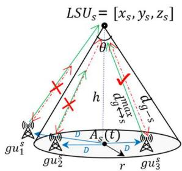  
Fig. 2. LSU coverage definition.

## B. UAV Coverage Definition and Communication Model

In this paper, we assume that legitimate serving UAVs utilize a directional antenna, while legitimate jamming UAVs, ground edge units, and malicious UAVs employ an omnidirectional antenna. The coverage size of legitimate serving UAVs varies depending on factors such as antenna angle, height, transmission power of $l s u _ { s } ,$ and transmission power of $g u _ { g }$ . All

UAVs maintain a height within the range $h _ { u a v } \in [ h _ { m i n } , h _ { m a x } ]$ To ascertain whether $g u _ { g }$ ,is within the lsus coverage area, a two-stage verification process is executed. In Fig. 2, lsu hovers at position $W _ { s } = [ x _ { s } , y _ { s } , z _ { s } ] \in \mathbb { R } ^ { 3 }$ with height h. First, , ,using h and antenna angle we can check if $g u _ { g }$ is inside the surface area $A _ { s }$ at time t.

$$
r = h \times \tan { \frac { \theta } { 2 } }\tag{1}
$$

$$
D = \sqrt { ( x _ { s } - x _ { g } ) ^ { 2 } + ( y _ { s } - y _ { g } ) ^ { 2 } }\tag{2}
$$

$$
D \leq r ^ { 2 }\tag{3}
$$

where $[ x _ { g } , y _ { g } ]$ is the 2D coordinate of ground edge unit g. If (3) is satisfied, then the second verification is checked as follows:

$$
d _ { g  s } ^ { m a x } \geq d _ { g - s }\tag{4}
$$

$d _ { g - s }$ is the 3D Cartesian distance between the ground edge unit and the UAV. $d _ { g  s } ^ { m a x }$ is the maximum communication distance.

$$
d _ { g - s } = \ \sqrt { ( x _ { g } - x _ { s } ) ^ { 2 } + ( y _ { g } - y _ { s } ) ^ { 2 } + ( z _ { g } - z _ { s } ) ^ { 2 } }\tag{5}
$$

$$
d _ { s - g } ^ { c o m } ( t ) = \ \sqrt { \frac { \lambda ^ { 2 } G _ { r } G _ { t } P _ { s } ( t ) } { 8 \pi ^ { 2 } \left( 1 - c o s \frac { \theta } { 2 } \right) P _ { r } ^ { m i n } } }\tag{6}
$$

$$
d _ { g - s } ^ { c o m } ( t ) = ~ \sqrt { \frac { \lambda ^ { 2 } G _ { r } G _ { t } P _ { g } ( t ) } { ( 4 \pi ) ^ { 2 } P _ { r } ^ { m i n } } }\tag{7}
$$

$$
d _ { g  s } ^ { m a x } = m i n ( d _ { s - g } ^ { c o m } ( t ) , d _ { g - s } ^ { c o m } ( t ) ) ,\tag{8}
$$

where $d _ { s - g } ^ { c o m } ( t )$ is communication distance from lsu to $g u _ { g } ,$ $d _ { g - s } ^ { c o m } ( t )$ is communication distance from $g u _ { g }$ to $l s u _ { s } , \ P _ { s } ( \acute { t } )$ and $P _ { g } ( t )$ are transmission power of lsu and $g u _ { g }$ at time t, respectively, $P _ { r } ^ { m i n }$ is minimum decodable power, is the wavelength, $G _ { r }$ and $G _ { t }$ are receiving and transmitting antenna gains, respectively. In this work, Friis’s path loss model is used which is simple and accurate in predicting signal loss in free-space conditions, making it an essential tool for designing wireless communication systems. The model quantifies the reduction in signal strength over distance in an ideal, unobstructed LoS environment. Once the communication coverage is defined, time slots for each $g u _ { g }$ can be allocated. However, if the maximum communication distance $d _ { g  s } ^ { m a x }$ is larger than the 3D Cartesian distance between $g u _ { g }$ and meu (9), then the transmitted data will be overheard by the eavesdropper (10).

$$
d _ { g - e } = \sqrt { ( x _ { g } - x _ { e } ) ^ { 2 } + ( y _ { g } - y _ { e } ) ^ { 2 } + ( z _ { g } - z _ { e } ) ^ { 2 } }\tag{9}
$$

$$
d _ { g  s } ^ { m a x } \geq d _ { g - e }\tag{10}
$$

Fig. 3 illustrates the detailed communication between elements within the environment. Notably, LSUs directly exchange information with each other. Consequently, the flying ad-hoc network (FANET) serves as a fundamental element for facilitating information exchange and transmitting gathered data. In order to sustain the connectivity within the FANET system, all serving UAVs should maintain a distance $d _ { s  s }$ either among themselves or with the central server, i.e., the ground base station (GBS).

$$
d _ { s  s } ^ { m i n } \leq d _ { s  s } \leq d _ { s  s } ^ { m a x }\tag{11}
$$

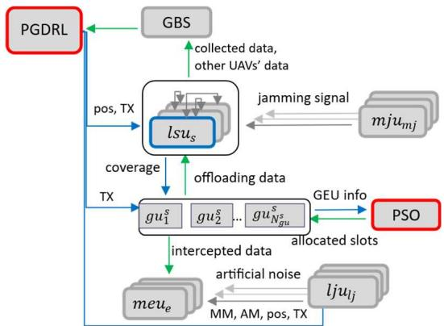  
Fig. 3. Detailed block diagram of PGDRL and PSO components.

$$
d _ { s  s } ^ { m a x } = \sqrt { \frac { \lambda ^ { 2 } G _ { r } G _ { t } P _ { l s u - l s u } } { ( 4 \pi ) ^ { 2 } P _ { r } ^ { m i n } } } ,\tag{12}
$$

where $d _ { s  s } ^ { m a x }$ and $d _ { s  s } ^ { m i n }$ are maximum and minimum communication distances between LSUs, relatively. $P _ { l s u - l s u }$ is the maximum transmission power of one serving UAV to another. If the LSU operates in isolation, without communication with other UAVs or GBS, it incurs a penalty.

## C. UAV Operational Model and Constraints

Serving UAVs operate asynchronously based on their frame durations. Upon completing a frame, each LSU evaluates its next move considering the positions of other LSUs, MJUs, MEUs, and GEU-related data (location, size, priority, frequency, and delay). LSUs may relocate or remain in place, while MJUs conserve energy by switching between jamming (ON) and idle (OFF) modes. Malicious UAVs move freely on independent schedules. LSUs are vulnerable when jammers enter the interference range or eavesdroppers approach the overhearing range, both of which significantly threaten secrecy. In such cases, the LSU must decide whether to stay or relocate. Additional system constraints are also considered in this study. Energy constraints: since the energy capacity of legitimate UAVs (i.e., lsus and $l j u _ { l j } )$ is limited, the UAV should return to recharge when the residual energy of UAVs does not satisfy the energy constraint of (13). The initial energy of $l s u _ { s }$ and $l j u _ { l j }$ are $I E _ { s }$ and $I E _ { l j } ,$ respectively.

$$
E _ { i } \left( t \right) \geq E _ { m i n } , i \epsilon \left\{ s , l j \right\} .\tag{13}
$$

Transmission power constraints: Power of LSU, LJU, and GEU, $P _ { s } , \ P _ { l j } ,$ and $P _ { g } ,$ respectively, should be within the minimum and maximum range of the respective attributes. It is worth noting that the power of GEUs is controlled individually for each GEU.

$$
P _ { s } ^ { m i n } \le P _ { s } ( t ) \le P _ { s } ^ { m a x }
$$

$$
P _ { l j } ^ { m i n } \le P _ { l j } ( t ) \le P _ { l j } ^ { m a x }\tag{14}
$$

(15)

$$
P _ { g } ^ { m i n } \leq P _ { g } \left( t \right) \leq P _ { g } ^ { m a x } .\tag{16}
$$

Frame length constraints: We set the maximum time duration for which the LSU can hover over a specific location. This predetermined time is defined as the maximum frame length, denoted as $F L _ { m a x }$ . The frame length of a UAV at time $t ,$ which is dynamically determined by the proposed algorithm, should satisfy the constraint of (17) and it is the sum of allocated slots to the ground edge unit in the $l s u _ { s }$ coverage as in (18).

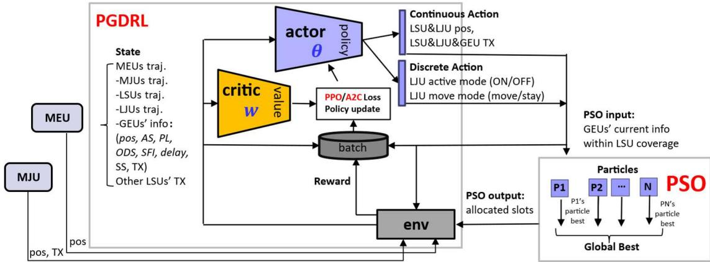  
Fig. 4. Learning architecture of the proposed framework.

$$
F L ( t ) \leq F L _ { m a x }\tag{17}
$$

$$
F L ( t ) = \sum _ { \forall g \in \mathrm { G U } _ { s } } N _ { g } ^ { t s } ,\tag{18}
$$

where $\mathcal { G U } _ { s }$ is the set of GEUs within $l s u _ { s }$ coverage. $N _ { g } ^ { t s }$ is the number of timeslots allocated for $g u _ { g } .$ To further improve robustness, our method implements adaptive exposure minimization strategies: hovering time is reduced in high-risk zones, and time-slot allocation dynamically avoids areas likely to be targeted by adversaries. Scheduling constraints: The LSU has a single-user access policy, meaning it can only serve one GEU in one time slot within its coverage area. In (19), ${ \mathfrak { s } } _ { g } \left( n \right)$ is an index to indicate whether the slot n is allocated to $g u _ { g }$ (i.e., ${ \mathfrak { s } } _ { g } \left( n \right) = 1 )$ or not (i.e., ${ \mathfrak { s } } _ { g } \left( n \right) = 0 )$ . When $g u _ { g }$ is being served in time slot $n ,$ no other GEUs can utilize the slot.

$$
\begin{array} { r l } & { \displaystyle \sum _ { \forall g \in \mathrm { G U } _ { s } } \mathfrak { s } _ { g } \left( n \right) \leq 1 , \forall n \in \left\{ 1 , \cdots , \frac { F L \left( t \right) } { l _ { t s } } \right\} } \\ & { \mathfrak { s } _ { g } \left( n \right) \in \left\{ 0 , 1 \right\} , \forall g \in \mathrm { G U } _ { s } . } \end{array}\tag{19}
$$

## D. Problem Formulation

The security threats in this system originate from the interception of sensitive transportation data such as autonomous vehicle states, intersection congestion levels, or emergency incident reports. UAVs operating in these roles must ensure both secure collection and transmission of ITS-critical data, particularly in contested or compromised network segments. UAVs deployed in intelligent IoT environments often operate over wireless channels that are inherently vulnerable to security breaches such as eavesdropping, jamming, and data interception. These threats not only compromise data integrity but also disrupt critical sensing operations. Additionally, due to limited edge computing capacity and coverage, task ofloading requests may experience delays, collisions, or outright rejection, especially during network congestion or adversarial attacks. Furthermore, the constrained communication resources (e.g., limited time slots or shared channels) result in severe communication bottlenecks, leading to increased transmission delay and packet loss. These interconnected challenges necessitate a unified optimization approach that simultaneously considers security, delay, and energy a gap that this work aims to address. This non-convex optimization problem involves UAV trajectories, activity modes, transmission power, and slot allocation. Traditional methods cannot handle such complexity. To address this, we propose a twostage approach: PGDRL for optimizing trajectory and power, followed by PSO for slot allocation. This framework enhances secrecy, energy eficiency, and delay performance in UAVenabled communication systems.

## E. Learning Model

Trajectory optimization via PGDRL allows UAVs to learn mobility policies that proactively avoid dynamically changing eavesdropping and jamming zones. The UAVs are guided by observed adversarial behavior to reduce their exposure to potential threats. The DRL agent continuously observes real-time user state variables, including trafic queue lengths, ofloading request volumes, and wireless channel conditions. This enables it to adapt the policy to rapidly changing demand environments. Fig. 4 illustrates the proposed learning architecture integrating PGDRL and PSO. The DRL agent receives state information from the environment, processes it through an actor-critic network, and outputs actions via policy gradients. These actions are refined by the PSO module for slot allocation, after which rewards are computed and stored with the corresponding state-action data. Once the batch size is reached, training is performed using A2C or PPO loss functions. This integration leverages DRL for adaptive decision-making and PSO for eficient optimization in dynamic environments.

## III. DRL-ASSISTED UAV TRAJECTORY AND POWER CONTROL

This section introduces a novel UAV operational design using DRL to optimize ofloading services while prioritizing the secrecy rate of GEUs. The proposed PGDRL model dynamically controls UAV mobility and power allocation to avoid regions under jamming or eavesdropping risk, thus preserving the integrity of trafic sensor data. PSO scheduling further ensures timely ofloading of high-priority ITS information, especially from neglected or RSU-disconnected zones. Our method focuses on controlling multiple parameters, including the trajectories of LSUs and LJUs, transmission power of UAVs and GEUs, and the operating and movement modes of LJUs. We also detail the DRL framework, defining state–action pairs and the proposed reward function. After optimizing trajectory and power control, Section IV introduces a PSO-based slot allocation scheme to ensure eficient resource utilization in the UAV-enabled communication system.

## A. DRL Algorithm

RL enables agents to make decisions by interacting with their environment to maximize cumulative rewards. DRL extends RL with neural networks to manage complex state and action spaces. Policy Gradient methods directly optimize policies via gradient ascent, making them efective for high-dimensional, continuous domains. Actor-Critic (AC) architectures further enhance learning by combining a policylearning actor with a value-estimating critic.

One of the algorithms of the AC class is A2C (advantage actor-critic) [37]. The “advantage” refers to the diference between the actual return obtained from taking an action in a given state and the expected return estimated by the critic. This advantage provides a measure of how much better or worse an action is compared to the average action value in a given state. The A2C algorithm is advantageous for its stability and eficiency, making it well-suited for real-world applications. The loss function of A2C is as follows:

$$
L _ { t } ^ { A 2 C + V F + S } \left( \theta \right) = L _ { t } ^ { A 2 C } \left( \theta \right) - c _ { 1 } L _ { t } ^ { V F } \left( \theta _ { w } \right) + c _ { 2 } \mathrm { E } \left[ \pi _ { \theta } \right] \left( s _ { t } \right)\tag{20}
$$

$$
L _ { t } ^ { A 2 C } \left( \theta \right) = \log \pi _ { \theta } ( a _ { t } | s _ { t } ) A ( s _ { t } , a _ { t } )\tag{21}
$$

$$
A ( s _ { t } , a _ { t } ) = R _ { t + 1 } + \gamma V \left( s _ { t + 1 } \right) - V ( s _ { t } ) ,\tag{22}
$$

where is a policy network parameter, $c _ { 1 }$ and $c _ { 2 }$ are coeficients. $L _ { t } ^ { V F }$ is a value function, typically a squared-error loss, and E denotes an entropy bonus. A is the advantage function, is the policy function, $R _ { t + 1 }$ is an immediate reward after taking action $a _ { t }$ at state $s _ { t } , ~ \gamma$ is a discount factor, V is the value function.

Another algorithm utilizing the AC framework is PPO [38]. PPO improves upon A2C by introducing a surrogate objective function that constrains the policy updates. Instead of updating the policy based solely on advantages, PPO limits the size of policy changes to ensure stability during training. This is achieved by clipping the ratio between the new and old policy probabilities, preventing large policy updates that could lead to instability [39]. The objective function of the PPO-Clip is shown in (23).

$$
L _ { t } ^ { C L I P + V F + S } \left( \theta \right) = \hat { \mathbb { E } } _ { t } \left[ L _ { t } ^ { C L I P } \left( \theta \right) - c _ { 1 } L _ { t } ^ { V F } \left( \theta _ { w } \right) \right.
$$

$$
+ c _ { 2 } \varepsilon \left[ \pi _ { \theta } \right] \left( s _ { t } \right) ]\tag{23}
$$

$$
L _ { t } ^ { C L I P } \left( \theta \right) = \hat { \mathbb { E } } _ { t } \left[ m i n \left( r _ { t } \left( \theta \right) \hat { A } _ { t } , c l i p ( r _ { t } \left( \theta \right) , 1 - \epsilon , 1 + \epsilon ) \hat { A } _ { t } \right) \right] ,\tag{24}
$$

where $r _ { t } \left( \theta \right)$ is a probability ratio of old and new policies, $\hat { A } _ { t }$ is an estimated advantage function, and  is a PPO-Clip hyperparameter. The main components of DRL are state,

action, state transition probability, and immediate reward: $< \mathcal { S } , \mathcal { A } , \mathcal { P } , \mathcal { R } >$

## B. Step 1: State Definition

By integrating a comprehensive set of state information, the UAV can efectively perceive and interpret its surroundings. The state information includes the locations of all legitimate and malicious UAVs as well as ground edge units. It records whether each ground unit is generating an ofloading demand, its priority level, the size and average delay of bufered data, how frequently it is served, and whether it is currently being served by another UAV. If being served, the state also includes its transmission power, along with the transmission power of other serving UAVs. The proposed state space at time t is formulated as in (25).

$$
\begin{array} { r } { S \left( t \right) = \left\{ W _ { \forall s } \left( t \right) , W _ { \forall l j } \left( t \right) , W _ { \forall e } \left( t \right) , W _ { \forall m j } \left( t \right) , W _ { \forall g } \left( t \right) , A S _ { \forall g } \left( t \right) , \right. } \\ { \left. P L _ { \forall g } , B D O _ { \forall g } ( t ) , S F I _ { \forall g } ( t ) , A D _ { \forall g } \left( t \right) , S S _ { \forall g } ( t ) , P _ { \forall g } ( t ) , P _ { \forall s } ( t ) \right\} , } \end{array}\tag{25}
$$

where $W _ { s } ( t ) \in \mathbb { R } ^ { 3 }$ , and $W _ { l j } ( t ) \in \mathbb { R } ^ { 3 }$ indicate the locations of LSUs and LJUs, respectively. Likewise, $W _ { e } ( t ) \in \mathbb { R } ^ { 3 } , W _ { m j } ( t ) \in$ $\mathbb { R } ^ { 3 }$ , and $W _ { g } ( t ) \in \mathbb { R } ^ { 3 }$ represent the positions of MEUs, MJUs, and GEUs, respectively. $A S _ { g } ( t )$ denotes the activity status whether $g u _ { g }$ is currently in ON ofloading demand status (i.e., generating ofloading demand) or OFF status. Each ground edge unit has an assigned priority level, denoted as $P L _ { g } ,$ which is determined by the urgency of the information, the nature of the military operation, and the requirements of the governmental operation. Furthermore, the state information includes other crucial data about GEUs such as the size of bufered data for ofloading $B D O _ { g } ( t )$ , average delay of the bufered data at time tA $D _ { g } \left( t \right)$ , and the serving frequency index $S F I _ { g } ( t )$ . Additionally, $S S _ { g } ( t )$ is a serving status, determining whether the $g u _ { g }$ is being served by another LSU or not. If the $g u _ { g }$ is being served by another LSU, $P _ { g } ( t )$ expresses the transmission power of $g u _ { g } .$ . Similarly, $P _ { s } ( t )$ is the transmission power of other LSUs.

## C. Step 2: Action Definition

The action space refers to the set of actions that an agent can take in a given environment. The proposed action space consists of two parts: a discrete set and a continuous set. The discrete actions define the operating modes of legitimate jamming UAVs, including whether they stay in place or move, and whether they broadcast a jamming signal or remain idle to save energy. The continuous actions specify the next movement location and transmission power for the serving UAV, the new location and transmission power for a jamming UAV if it moves or broadcasts, and the transmission power for all ground units within the serving UAV’s coverage area.

$$
\begin{array} { r l } & { \mathcal { A } \left( t \right) = \{ \mathcal { A } _ { d } \left( t \right) , \mathcal { A } _ { c } \left( t \right) \} } \\ & { \mathcal { A } _ { d } \left( t \right) = \left\{ M M _ { \forall l j } ( t ) , A M _ { \forall l j } ( t ) \right\} } \\ & { \mathcal { A } _ { c } \left( t \right) = \left\{ W _ { s } ( t ) , P _ { s } ( t ) , W _ { \forall l j } ( t ) , P _ { \forall l j } ( t ) , P _ { \forall g u _ { g } ^ { s } } ( t ) \right\} . } \end{array}\tag{26}
$$

In (26), the discrete action space $\mathbf { } A _ { d } \left( t \right)$ represents the operating modes of legitimate jamming UAVs. $M M _ { l j } ( t )$ indicates whether $l j u _ { l j }$ will remain at its current location or move to another location. $A M _ { l j } ( t )$ specifies whether $l j u _ { l j }$ will broadcast a jamming signal or remain idle to save energy. The continuous action space $A _ { c } \left( t \right)$ includes the next movement location $W _ { s } ( t )$ and transmission power $P _ { s } ( t )$ for the $l s u _ { s }$ that needs to decide whether to move at time t. Additionally, $W _ { l j } ( t )$ represents the new location of $l j u _ { l j }$ if the $M M _ { l j } ( t )$ mode is set to move, and $P _ { l j } ( t )$ represents the transmission power of $l j u _ { l j }$ if the $A M _ { l j } ( t )$ mode is set to jamming signal broadcasting. The final action parameter in $A _ { c } \left( t \right)$ is the transmission power of all $g u _ { g }$ within the coverage area of the new position of $l s u _ { s }$

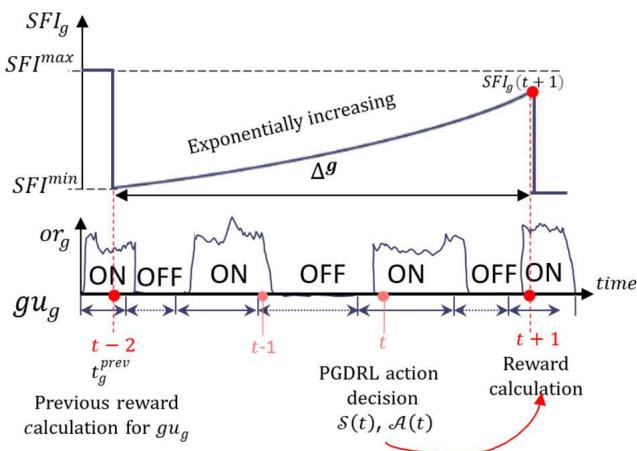  
Fig. 5. ON/OFF mode of GEUs and SFI function.

## D. Step 3: Reward Function

The proposed reward function is designed to maximize the acquisition of secure data and reduce the average data transmission delay, while concurrently minimizing energy consumption. As seen in Fig. 5, if the action $\boldsymbol { \mathcal { A } } \left( t \right)$ is taken at state $S \left( t \right)$ at time $t ,$ the reward is calculated at time $( t + 1 )$ , and it is represented as $R _ { t o t a l } ( t { + } 1 )$ . The total reward is composed of data, delay, and energy components: $R _ { d a t a } ( t + 1 ) , R _ { d e l a y } ( t + 1 )$ and $R _ { e n e r g y } ( t + 1 )$ , respectively. The data reward reflects the volume of data collected, its importance or urgency, its age, and the security of the transmission channel. The delay reward promotes actions that minimize the average waiting time of unserved data, thereby enhancing system responsiveness. The energy reward accounts for the total energy consumed by serving and jamming UAVs during flying, hovering, and communication, including the broadcasting of artificial noise by jamming UAVs, to encourage energy-eficient operation.

1) Data Reward $R _ { d a t a } ( t + 1 ) .$ : The data reward comprises several components, including the total amount of served ofloading data $S O D _ { g } \left( t + 1 \right)$ , service satisfaction index $S S I _ { g } \left( t + 1 \right)$ , served frequency index $S F I _ { g } \left( t + 1 \right)$ , secrecy rate $R _ { s } ,$ and priority level $P L _ { g }$ of ground edge unit. Fig. 5 illustrates the operational status of GEU, which can be either ON or OFF at time t. The activity duration varies individually for each GEU. During the ON status of $g u _ { g } ,$ , dynamic trafic demand (i.e., ofloading rate $o r _ { g } )$ is generated. Conversely, during the OFF status, no ofloading data is generated. The generated ofloading demand should be handled by the LSU.

The bufered data for ofloading at $( t + 1 )$ of the ground edge unit $g u _ { g }$ is represented as $B D O _ { g } ( t + 1 )$ . Depending on the number of allocated time slots, either a portion or the entirety $B D O _ { g } ( t + 1 )$ can be transmitted. The served ofloading data size of $g u _ { g }$ between time t and $( t { + } 1 )$ is addressed as $S O D _ { g } \left( t + 1 \right)$

The ratio between the available bufered data size and the served data size of $g u _ { g }$ is termed the service satisfaction index $S S I _ { g } ( t + 1 )$ .

$$
S S I _ { g } \left( t + 1 \right) = \frac { S O D _ { g } \left( t + 1 \right) } { B D O _ { g } \left( t + 1 \right) }\tag{27}
$$

The served frequency index $S F I _ { g } \left( t + 1 \right)$ is an index to show how long the GEU was not visited, indicating a freshness of ofloading data. Starting from the LSU’s visiting time, the index exponentially increases as time goes on until the LSU’s next visiting time. In Fig. 5, we assume $g u _ { g }$ was previously visited at $( t - 2 ) ( \mathrm { i } . \mathrm { e } . , t _ { g } ^ { p r e \bar { \nu } } )$ and the service is provided again at time $( t + 1 )$ . The elapsed time is $\Delta ^ { g }$ , which is the subtraction of the current time and the previous LSU visiting time of $g u _ { g }$

$$
\begin{array}{c} \begin{array} { r l } { S F I _ { g } \left( t + 1 \right) = \left\{ a \times \exp { \left( \Delta ^ { g } \right) } + b \right.} & { , i f \Delta ^ { g } \leq r t } \\ { S F I ^ { m a x } } & { o t h e r w i s e } \\ { a = \frac { S F I ^ { m a x } - S F I ^ { m i n } } { e ^ { r t } - 1 } , b = S F I ^ { m i n } - a , } \end{array}   \end{array}\tag{28}
$$

where $S F I ^ { m a x }$ and $S F I ^ { m i n }$ are maximum and minimum values. rt is the recovery time, meaning that once rt has elapsed since $t _ { g } ^ { p r e \nu } , S F I _ { g } ( t + 1 )$ reaches its maximum level and maintains that level until the next serving time. $S F I ^ { m a x }$ shows that $g u _ { g }$ has not received the service for a long time.

In this study, we evaluate physical layer security using the secrecy rate [10], [40], defined as:

$$
R _ { s } = [ R _ { l } - R _ { e } ] ^ { + }\tag{29}
$$

where $R _ { l }$ is the achievable transmission rate to the legitimate receiver, and $R _ { e }$ is the rate achievable by the eavesdropper. The operator $[ \cdot ] ^ { + }$ denotes max(0 ·), ensuring non-negative secrecy rates. Intuitively, a positive secrecy rate indicates that the legitimate receiver can decode more information than the eavesdropper, thus preserving communication confidentiality.

$$
R _ { l } = l o g _ { 2 } ( 1 + \frac { P _ { g } ( t ) \times h _ { g  s } ( t ) } { P _ { m j } ( t ) \times h _ { m j  s } ( t + 1 ) + \sigma ^ { 2 } } )\tag{30}
$$

$$
R _ { e } = l o g _ { 2 } ( 1 + \frac { P _ { g } ( t ) \times h _ { g  e } ( t + 1 ) } { P _ { l j } ( t ) \times h _ { l j  e } ( t + 1 ) + \sigma ^ { 2 } } )\tag{31}
$$

$$
h _ { i  j } ( t + 1 ) = \frac { a _ { 0 } } { d _ { i  j } ( t + 1 ) ^ { 2 } } ,
$$

$$
i \in g , m j , l j ; j \in s , e\tag{32}
$$

where is a noise power, $P _ { m j } ( t )$ is a transmission power of $m j u _ { m j } , h _ { i  j }$ denotes a channel gain and $a _ { 0 }$ indicates a channel power gain at the reference distance of 1 m. The ultimate data reward is formulated as (33), where $P L _ { g }$ is a priority level of $g u _ { g }$

$$
\begin{array} { r l r } {  { R _ { d a t a } ( t + 1 ) = \sum _ { g \in \mathrm { { \bf G U } } _ { s } } P L _ { g } \times S O D _ { g } ( t + 1 ) \times S S I _ { g } ( t + 1 ) } } \\ & { } & { \times S F I _ { g } ( t + 1 ) \times R _ { s } \quad \quad \quad ( \mathrm { ~ \it ~ \Omega ~ } ) } \end{array}\tag{33}
$$

2) Delay Reward $R _ { d e l a y } ( t + 1 ) .$ : The average delay plays a pivotal role in assessing the eficiency and responsiveness of the communication system. Hence, in our context, the delay reward reduces the average delay $A D _ { g } \left( t \right)$ experienced by unserved data of $g u _ { g }$ . In Fig. 5, if the delay after the LSU’s service at time $( \bar { t } + 1 )$ is less than the delay at time t, this signifies an increase in the delay reward. The total delay reward $R _ { d e l a y } ( t + 1 )$ aims to minimize the average delay encountered by all GEUs within the coverage area of $l s u _ { s }$

$$
R _ { d e l a y } \left( t + 1 \right) = - \left[ \sum _ { \forall g \in \mathrm { G U } _ { s } } \left( A D _ { g } \left( t + 1 \right) - A D _ { g } \left( t \right) \right) \right]\tag{34}
$$

3) Energy Reward $R _ { e n e r g y } ( t + 1 ) .$ : The energy reward component quantifies the total energy consumption of both the LSU (35) and LJU (36), across key operational activities. For the LSU, this includes flying energy $E _ { s } ^ { f l y } ( t + 1 )$ for repositioning, hovering energy $E _ { s } ^ { h o \nu } ( t + 1 )$ during data collection, and communication energy $E _ { s } ^ { c o m } ( t + 1 )$ for data transmission with GEUs. For the LJU, communication energy also accounts for the transmission of artificial noise (AN) used in jamming adversarial links. By aggregating these components, the energy reward captures the system’s overall energy eficiency and operational sustainability.

$$
E _ { s } ( t + 1 ) = E _ { s } ^ { f l y } ( t + 1 ) + E _ { s } ^ { h o v } ( t + 1 ) + E _ { s } ^ { c o m } ( t + 1 )\tag{35}
$$

$$
E _ { j } ( t + 1 ) = E _ { j } ^ { f l y } ( t + 1 ) + E _ { j } ^ { h o v } ( t + 1 ) + E _ { j } ^ { c o m } ( t + 1 )\tag{36}
$$

Accordingly, the final energy reward is computed as in (37). Here, $\nu _ { n } ^ { e }$ is energy normalization value.

$$
R _ { e n e r g y } \left( t + 1 \right) = - \frac { \left( E _ { s } ( t + 1 ) + E _ { j } ( t + 1 ) \right) } { \nu _ { n } ^ { e } }\tag{37}
$$

4) Total Reward $R _ { t o t a l } ( t + l ) \colon$ : The Aggregate Reward Is Defined by the Following Equation

$$
\begin{array} { r l } & { R \left( t + 1 \right) = w _ { 1 } ^ { r } R _ { d a t a } \left( t + 1 \right) + w _ { 2 } ^ { r } R _ { d e l a y } \left( t + 1 \right) } \\ & { ~ + w _ { 3 } ^ { r } R _ { e n e r g y } ( t + 1 ) } \end{array}\tag{38}
$$

where $w _ { 1 } ^ { r } , w _ { 2 } ^ { r } .$ , and $w _ { 3 } ^ { r }$ represent weight coeficients: $w _ { 1 } ^ { r } + w _ { 2 } ^ { r } +$ $w _ { 3 } ^ { r } = 1$

In scenarios involving isolated LSU, neglecting FANET communication, a penalty is applied to the aggregated reward. This isolated penalty, denoted as $p _ { s } ^ { I S O }$ , is subtracted from the total reward of (38) according to:

$$
R _ { t o t a l } ( t + 1 ) = R ( t + 1 ) \times \left( 1 - p _ { s } ^ { I S O } \right)\tag{39}
$$

Algorithm 1 outlines the detailed process of model learning and UAV trajectory control.

Beyond protective jamming, increasing UAV transmission power can improve data rate and secrecy but also accelerates battery depletion, limiting mission time. Our framework addresses this trade-of through a multi-objective reward function that jointly optimizes energy, secrecy, and latency. By dynamically adjusting reward weights, UAVs can adapt to context prioritizing secrecy and throughput in high-risk areas or energy eficiency during extended missions ensuring flexible and eficient decision-making across diverse scenarios.

Algorithm 1 Proposed PGDRL -Based Trajectory and Trans  
mission Power Control   
Input: Hyper parameters   
Output: Trajectory of LSU and LJU to securely collect offloading data   
repeat   
Initialize UAVs positions   
Initialize energy of LSU and LJU, $I E _ { \forall s }$ and $I E _ { \forall l j }$   
Initialize batch size B   
repeat   
Define an LSU to move according to its service finishing time   
Observe state S   
Execute action A according to policy π   
# LSU moves with new TX, LJU moves or stays   
# LJU transmits AN or stays idle   
Define the LSU coverage using (4)   
Allocate slots using Algorithm 2   
Calculate the immediate reward R using (39)   
Update the state   
Collect the set of samples: $< \mathcal { S } , \mathcal { A } , \mathcal { P } , \mathcal { R } >$   
until $E _ { \forall s } \leq E _ { m i n }$   
if B is done then   
Calculate loss function using (20) or (23)   
Update policy π   
end if   
until MaxEpisode

## IV. PSO-ASSISTED COVERAGE-BASED SLOT ALLOCATION

In this section, we delve into the proposed approach of utilizing PSO to facilitate coverage-based slot allocation within the context of UAV-enabled communication systems. Similar to [32], we consider slot allocation based on both the Age of Information (AoI) and transmission power. We adopt the Particle Swarm Optimization (PSO) algorithm for slot allocation due to its proven efectiveness in solving non-convex multi-objective problems. PSO ofers a favorable trade-of between computational eficiency and solution quality, making it suitable for real-time UAV-assisted ITS environments. Once trajectory and transmission power settings are defined, the subsequent task is to eficiently allocate communication slots to GEUs covered by the $\mathrm { U A V } \mathbf { \hat { s } }$ communication range. Leveraging PSO’s optimization capabilities, this approach aims to dynamically distribute slots among covered GEUs in a manner that optimizes resource utilization and communication eficiency. Since the slot allocation is handled using PSO, it does not depend on the slower convergence of DRL. PSO optimizes slot assignment based on current system state without longterm learning so that the system remains responsive even under sudden demand changes at the time scale of slot allocation.

## A. PSO Algorithm

The PSO is a population-based stochastic optimization algorithm where candidate solutions (particles) iteratively update their positions in a multidimensional search space to find an optimal solution [41]. It starts by randomly initializing particles within this space. Each particle then adjusts its position (40) and velocity (41) based on its own experience and the swarm’s behavior. Through this process, particles gradually converge toward the optimal solution. PSO is known for its simplicity, eficiency, and versatility, with applications in various fields [5].

Algorithm 2 Proposed PSO -based Slot Allocation   
Input: LSU coverage information, BDO, TX, PL, SFI, delay of GEUs   
Output: Allocated slots for GEUs within the coverage   
repeat # Initialization   
repeat   
Randomly generate particle positions   
$t s _ { p } ^ { 0 } = \left\lceil t \bar { s _ { g u _ { 1 } ^ { s } } } , t s _ { g u _ { 2 } ^ { s } } ^ { 0 } , \bar { \cdots } , t s _ { g u _ { N _ { g u } ^ { s } } ^ { 1 } } ^ { 0 } \right\rceil$   
Calculate framelength $\begin{array} { r } { F L = \sum _ { g = 1 } ^ { g u _ { N _ { g u } ^ { s } } ^ { s } } t s _ { g u _ { g } } ^ { 0 } } \end{array}$   
until $F L \leq F L _ { m a x }$   
Randomly generate particle velocity   
$v _ { p } ^ { 0 } = \left[ v _ { g u _ { 1 } ^ { s } } ^ { 0 ^ { - } } , v _ { g u _ { 2 } ^ { s } } ^ { 0 } , \cdots , v _ { g u _ { N _ { g u } ^ { s } } ^ { s } } ^ { 0 } \right]$   
$F _ { p } ^ { 0 }$ ← Compute fitness function for $t s _ { p } ^ { 0 }$ using (42)   
until $\mathbf { \nabla } _ { \cdot } p = N _ { p } ,$ Number of particles   
Particle best value $p b _ { p } ^ { \mathrm { v a l } } = F _ { p } ^ { 0 } ,$   
Particle best position $p b _ { p } ^ { \mathrm p 0 s }  t s _ { p } ^ { 0 }$   
Global best value $g b ^ { v a l }$ = max(pbval)   
Global best position $g b ^ { p o s }  t s _ { a r } ^ { 0 }$   
argmax (pbval)   
repeat # Iteration   
repeat   
repeat   
Update velocity $v _ { p g } ^ { q }$ using (40)   
Update position $t \dot { s } _ { p } ^ { q }$ using (41)   
Calculate framelength $\begin{array} { r } { F L = \sum _ { g = 1 } ^ { g u _ { N _ { g u } ^ { s } } ^ { s } } t s _ { g u _ { g } } ^ { 0 } } \end{array}$   
$F _ { p } ^ { q }$ ← Compute fitness function for $t s _ { p } ^ { q }$ using (42)   
until $F L \leq F L$ max   
$\mathbf { i f } \ F _ { p } ^ { q } > p b _ { p } ^ { \mathrm { v a l } }$ then   
$p b _ { p } ^ { v a l } \stackrel { r } {  } F _ { p } ^ { q } , p b _ { p } ^ { p o s }  t s _ { p } ^ { q }$   
end if   
$\underset { 1 } { \mathbf { i f } } F _ { p } ^ { q } > g b$ then   
一 $\dot { g b ^ { v a l } }  F _ { p } ^ { q } , g b ^ { p o s }  t s _ { p } ^ { q }$   
end if   
until $p = N _ { p }$   
until $q = N _ { i t e r } ,$ , MaxIteration   
$t s \gets \bar { g } b ^ { p o s }$

In the context of UAV-enabled data collection from GEUs, the slot allocation problem within the UAV’s coverage area poses a significant optimization challenge. The objective is to allocate slots to GEUs eficiently within a maximum predefined frame length $F L _ { m a x } .$ , ensuring optimal utilization of resources and minimizing communication delays. To address this problem, the PSO algorithm emerges as a promising solution. Throughout the PSO iteration $q ~ = ~ 1 , 2 , \cdots , N _ { i t e r }$ process each PSO particle $p = 1 , 2 , \cdots , N _ { p }$ generates various combinations of slots and evaluates them based on a predefined fitness function. This fitness function assesses the quality of each slot allocation scheme, considering factors such as communication eficiency, fairness among ground edge units, energy consumption, and adherence to the maximum frame length constraint. As shown in Algorithm 2, by iteratively updating particle positions, i.e., slot allocations for GEUs, $t s _ { p } ^ { q } .$ , and velocities, $\nu _ { p g } ^ { q } ,$ according to the PSO’s optimization mechanism, the algorithm converges towards a solution that optimally allocates slots to ground edge units. It maximizes the overall system performance while satisfying operational constraints.

$$
\nu _ { p g } ^ { q } = \omega \nu _ { p g } ^ { q - 1 } + c _ { 1 } r _ { 1 } \left( p b _ { p g } ^ { q - 1 } - t s _ { p g } ^ { q - 1 } \right) + c _ { 2 } r _ { 2 } \left( g b _ { g } ^ { q - 1 } - t s _ { p g } ^ { q - 1 } \right)
$$

$$
g = g u _ { 1 } ^ { s } , \cdot \cdot \cdot , g u _ { N _ { g u } ^ { s } } ^ { s }\tag{40}
$$

$$
t s _ { p } ^ { q } = t s _ { p } ^ { q - 1 } + \nu _ { p } ^ { q }\tag{41}
$$

TABLE I  
NOTATION LIST
<table><tr><td rowspan=1 colspan=1>Notation</td><td rowspan=1 colspan=1>Description</td></tr><tr><td rowspan=1 colspan=1> $l s u _ { s } , \mathcal { L S U } , N _ { l s u } , s$ </td><td rowspan=1 colspan=1>Representation, set, number, index of LSUs</td></tr><tr><td rowspan=1 colspan=1> $\overline { { l j u _ { l j } , \mathcal { L } \mathcal { J } \mathcal { U } , N _ { l j u } , l j } }$ </td><td rowspan=1 colspan=1>Representation, set, number, index of LJUs</td></tr><tr><td rowspan=1 colspan=1> $m e u _ { e } , \mathcal { M E U } , N _ { m e u } , e$ </td><td rowspan=1 colspan=1>Representation, set, number, index of MEUs</td></tr><tr><td rowspan=1 colspan=1> $m j u _ { m j } , \mathcal { M T U } , N _ { m j u } , m j$ </td><td rowspan=1 colspan=1>Representation, set, number, index of MJUs</td></tr><tr><td rowspan=1 colspan=1> $g u _ { g } , \mathcal { G } \mathcal { U } , N _ { g u } , g$ </td><td rowspan=1 colspan=1>Representation, set, number, index of GEUs</td></tr><tr><td rowspan=1 colspan=1> ${ \underline { { p l _ { g } } } }$ </td><td rowspan=1 colspan=1>Priority level of $g u _ { g }$ </td></tr><tr><td rowspan=1 colspan=1> $F L$ </td><td rowspan=1 colspan=1>Frame length</td></tr></table>

where $\omega$ is inertia weight, $c _ { 1 }$ and $c _ { 2 }$ are particle and global bests, respectively, and $r _ { 1 } .$ , r2 are random numbers between 0 to 1. $\nu _ { p g } ^ { q - 1 }$ is the previous velocity of particle $p$ for ground edge unit g, $p b _ { p g } ^ { q - 1 }$ is the previous particle best, $t s _ { p g } ^ { q - 1 }$ is the previous position of particle $p , \ g b _ { g } ^ { q - 1 }$ is the previous global best position $( \mathrm { i . e . }$ , the best slot allocation for the ground edge unit $g )$

## B. Fitness Function

The fitness function in the PSO algorithm serves as a crucial metric for evaluating the quality of each potential solution, i.e., slot allocation scheme. During the PSO optimization process, particles (representing potential solutions) adjust their positions and velocities based on the fitness values obtained through evaluation against this function. By iteratively refining solutions to maximize fitness function $F ,$ PSO converges towards an optimal or near-optimal slot allocation scheme that balances the competing objectives and constraints efectively. The proposed PSO fitness function is represented in (42), where $F _ { d a t a } \left( t + 1 \right) = R _ { d a t a } ( t + 1 )$ and $F _ { d e l a y } \left( t + 1 \right) = R _ { d e l a y } ( t +$ 1).

$$
F ( t + 1 ) = w _ { 1 } ^ { r } F _ { d a t a } ( t + 1 ) + w _ { 2 } ^ { r } F _ { d e l a y } ( t + 1 ) + w _ { 3 } ^ { r } F _ { e n e r g y } ( t + 1 )\tag{42}
$$

However, within the fitness function utilized in PSO, we focused solely on the hovering energy of $l s u _ { s } ,$ as the UAV has already transitioned to its new position and has consumed energy for movement. In (43), $\nu _ { n } ^ { e , s }$ means normalization value.

$$
F _ { e n e r g y } = - \frac { E _ { s } ^ { h o \nu } } { \nu _ { n } ^ { e , s } }\tag{43}
$$

## V. SIMULATION RESULTS

In this section, we provide numerical simulation outcomes to assess the eficacy of the suggested approaches. Simulation parameters are listed in Table II.

GEUs are modeled as fixed roadside sensor stations and aggregators located near intersections, highways, and trafic bottlenecks. Simulations illustrate how UAVs ensure continuous data acquisition within the ITS hierarchy. While real-world testing was not conducted due to cost, complexity, and regulatory barriers, a real map of Incheon, South Korea, was used for simulation. 100 GEUs with 3 diferent priority levels are uniformly distributed in the 3-D, $5 0 0 \times 5 0 0 \times 1 0 0 ~ \mathrm { m }$ , environment. The ON and OFF statuses of GEUs are determined by an exponential distribution, with each GEU having its unique average values. The environment includes 10 hotspots with elevated trafic data, characterized by higher mean values ∈ [10], [11], [12], [13], [15], [16] in Gaussian distribution. GEUs outside of hotspots generate data with a mean of 2. Two

TABLE II  
SIMULATION PARAMETERS
<table><tr><td rowspan=1 colspan=1>Parameter</td><td rowspan=1 colspan=1>Definition</td><td rowspan=1 colspan=1>Value</td><td rowspan=1 colspan=1>Parameter</td><td rowspan=1 colspan=1>Definition</td><td rowspan=1 colspan=1>Value</td></tr><tr><td rowspan=1 colspan=1> $N _ { l s u } , N _ { l j u }$ </td><td rowspan=1 colspan=1>Number of LSUs and LJUs</td><td rowspan=1 colspan=1>2; 1</td><td rowspan=1 colspan=1> $[ P _ { g } ^ { m i n } , P _ { g } ^ { m a x } ]$ </td><td rowspan=1 colspan=1>Transmission power range of GEUs</td><td rowspan=1 colspan=1>[0,50 mW]</td></tr><tr><td rowspan=1 colspan=1> $\underline { { N _ { m e u } } } , N _ { m j u }$ </td><td rowspan=1 colspan=1>Number of MEUs and MJUs</td><td rowspan=1 colspan=1>3;1</td><td rowspan=1 colspan=1> $[ P _ { s } ^ { m i n } , P _ { s } ^ { m a x } ]$ </td><td rowspan=1 colspan=1>Transmission power range of LSU</td><td rowspan=1 colspan=1>[0, 15 mW]</td></tr><tr><td rowspan=1 colspan=1> $N _ { g u }$ </td><td rowspan=1 colspan=1>Number of GEUs</td><td rowspan=1 colspan=1>100</td><td rowspan=1 colspan=1> $[ P _ { j } ^ { m i n } , P _ { j } ^ { m a x } ]$ </td><td rowspan=1 colspan=1>Transmission power range of LJU</td><td rowspan=1 colspan=1>[0, 15 mW]</td></tr><tr><td rowspan=1 colspan=1> $P L _ { g }$ </td><td rowspan=1 colspan=1>Priority level</td><td rowspan=1 colspan=1>0.2; 0.3; 0.5</td><td rowspan=1 colspan=1> $\underline { { v _ { n } ^ { e } } }$ </td><td rowspan=1 colspan=1>Energy normalization value</td><td rowspan=1 colspan=1>100</td></tr><tr><td rowspan=1 colspan=1> $( \mathrm { x } , \mathrm { y } , \mathrm { z } )$ </td><td rowspan=1 colspan=1>Environment size</td><td rowspan=1 colspan=1>500; 500; 100 m</td><td rowspan=1 colspan=1> $\underline { w _ { 1 } ^ { r } , w _ { 2 } ^ { r } , w _ { 3 } ^ { r } }$ </td><td rowspan=1 colspan=1>Weight value of data, energy, delay rewards</td><td rowspan=1 colspan=1>0.7; 0.2; 0.1</td></tr><tr><td rowspan=1 colspan=1> $[ h _ { m i n } , h _ { m a x } ]$ </td><td rowspan=1 colspan=1>Flying height range</td><td rowspan=1 colspan=1>[10, 95 m]</td><td rowspan=1 colspan=1> $\overline { { p _ { s } ^ { I S O } } }$ </td><td rowspan=1 colspan=1>Isolated penalty</td><td rowspan=1 colspan=1>0.3</td></tr><tr><td rowspan=1 colspan=1> $\underline { { I E _ { s } , I E _ { l j } } }$ </td><td rowspan=1 colspan=1>Initial energy of LSU and LJU</td><td rowspan=1 colspan=1>50,000; 50,000 J</td><td rowspan=1 colspan=1> $\underline { { \lambda , G _ { r } , G _ { t } } }$ </td><td rowspan=1 colspan=1>Wavelength, antenna gains</td><td rowspan=1 colspan=1>1/3; 1; 1</td></tr><tr><td rowspan=1 colspan=1>v</td><td rowspan=1 colspan=1>Velocity of UAVs</td><td rowspan=1 colspan=1>20 m/s</td><td rowspan=1 colspan=1> $\sigma$ </td><td rowspan=1 colspan=1>Noise power</td><td rowspan=1 colspan=1> $1 0 ^ { - 1 0 } ~ \mathrm { m W }$ </td></tr><tr><td rowspan=1 colspan=1> $\theta _ { s }$ </td><td rowspan=1 colspan=1>Antenna angle of LSU</td><td rowspan=1 colspan=1>90°</td><td rowspan=1 colspan=1> $P _ { r } ^ { m i n }$ </td><td rowspan=1 colspan=1>Min decodable power</td><td rowspan=1 colspan=1> $1 0 ^ { - 5 . 5 } \mathrm { m W }$ </td></tr><tr><td rowspan=1 colspan=1> $\underline { { F L } } _ { m a x } , l _ { t s }$ </td><td rowspan=1 colspan=1>Max frame length and slot length</td><td rowspan=1 colspan=1>20 slots; 0.5 sec</td><td rowspan=1 colspan=1> $\underline { { a _ { 0 } } }$ </td><td rowspan=1 colspan=1>Channel power gain at the ref. distance of 1 m</td><td rowspan=1 colspan=1> $1 0 ^ { - 5 } ~ \mathrm { m W }$ </td></tr><tr><td rowspan=1 colspan=1> $S F I ^ { m i n } , S F I ^ { m a x }$ </td><td rowspan=1 colspan=1>Min and max SFI of sensors</td><td rowspan=1 colspan=1>0.1;2</td><td rowspan=1 colspan=1> $\underline { { \alpha _ { a c t o r } } } , \alpha _ { c r i t i c }$ </td><td rowspan=1 colspan=1>Learning rate of actor and critic</td><td rowspan=1 colspan=1> $1 0 ^ { - 4 } ; 1 0 ^ { - 3 }$ </td></tr><tr><td rowspan=1 colspan=1>rt</td><td rowspan=1 colspan=1>SFI recovery time</td><td rowspan=1 colspan=1>50 sec</td><td rowspan=1 colspan=1> $\gamma , \epsilon , N _ { b a t c h }$ </td><td rowspan=1 colspan=1>Discount factor; PPO clip ratio; batch size</td><td rowspan=1 colspan=1>0.99; 0.2;60</td></tr><tr><td rowspan=1 colspan=1> $t _ { s t a y } ^ { m e u _ { e } } ~ , t _ { s t a y } ^ { m j u _ { m j } }$ </td><td rowspan=1 colspan=1>Staying time of MEUs and MJU</td><td rowspan=1 colspan=1>20;30;35 and 25 sec</td><td rowspan=1 colspan=1> $N _ { p } , N _ { i t e r }$ </td><td rowspan=1 colspan=1>Number of PSO particles and PSO iterations</td><td rowspan=1 colspan=1>30;20</td></tr><tr><td rowspan=1 colspan=1> $P _ { m j }$ </td><td rowspan=1 colspan=1>Transmission power of MJU</td><td rowspan=1 colspan=1>8mW</td><td rowspan=1 colspan=1> $\underline { { v _ { p } ^ { m i n } , v _ { p } ^ { m a x } } }$ </td><td rowspan=1 colspan=1>Min and max PSO particle velocity</td><td rowspan=1 colspan=1> $- 1 ; 1$ </td></tr><tr><td rowspan=1 colspan=1> $\underline { { r _ { e a v } , r _ { j a m } } }$ </td><td rowspan=1 colspan=1>Overhearing and interference range</td><td rowspan=1 colspan=1> $5 0 ; 6 5 \mathrm { m }$ </td><td rowspan=1 colspan=1> $c _ { 1 } , c _ { 2 }$ </td><td rowspan=1 colspan=1>PSO weights of particle best, global best</td><td rowspan=1 colspan=1>2; 2</td></tr></table>

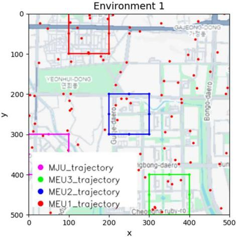  
(a)

Environment 2  
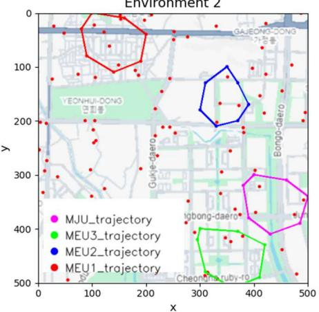  
(b)  
Fig. 6. Simulation environments: (a) environment 1; (b) environment 2.

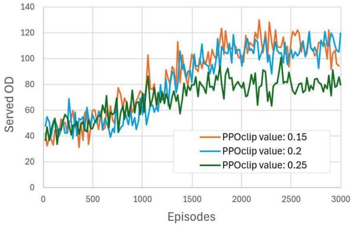  
Fig. 7. Served ofloading demand comparison for diferent PPO clip values.

LSUs fly in 3D environment and manage excessive trafic from GEUs, while one LJU disrupts MEUs. Three MEUs and one MJU adhere to predetermined trajectories across various regions. As illustrated in Fig. 6, two types of malicious UAV trajectories are considered. In Fig. 6(a), the MEUs and MJU follow square-shaped trajectories at a fixed altitude of 30 m, whereas in Fig. 6(b), the trajectories are irregular with dynamically varying altitudes. For our simulations we used the environment 1. The legitimate UAVs operate within their initial energy limit of 50,000 J. The energy consumption of legitimate UAVs is calculated according to [42].

## A. PGDRL-Based UAV Path Planning Performance

The PPO algorithm was implemented with 3,000 episodes and a batch size of 60 to optimize the trajectory and transmission power of legitimate UAVs. Diferent values of the PPO clipping parameter were tested to determine the most suitable configuration for subsequent simulations. As shown in Fig. 7, the total served ofloading demand was compared across diferent clipping values, while Table III reports the total reward averaged over each 1,000 episodes, highlighting faster convergence. Based on these indicators, a clipping value of 0.2 provided more stable and superior results and was therefore selected for the remaining simulations. Subsequently, we evaluated the robustness of the proposed mechanism under varying reward weight configurations. The data reward weight was reduced from 0.7 to 0.4, yielding three sets: (0.7, 0.1, 0.2), (0.5, 0.3, 0.2), and (0.4, 0.3, 0.3). As shown in Fig. 8(a), total reward converged across all sets, with variations mainly afecting the overall reward magnitude. Fig. 8(b) shows the standard deviation of rewards for set 1 (0.7, 0.1, 0.2) across random seeds, highlighting robustness to stochastic efects. Set 1 was used for subsequent evaluations.

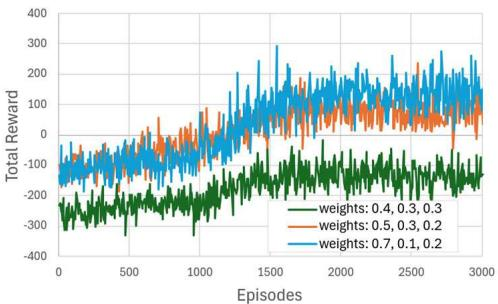  
(a)

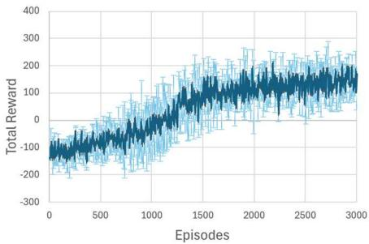  
(b)  
Fig. 8. Weight parameters performance: (a) total reward comparison for diferent weight parameters; (b) weight parameter with error bars of diferent random seeds.

TABLE III  
TOTAL REWARD FOR DIFFERENT CLIP VALUES
<table><tr><td rowspan=1 colspan=1>Episodes/ PPO clip</td><td rowspan=1 colspan=1>0.15</td><td rowspan=1 colspan=1>0.2</td><td rowspan=1 colspan=1>0.25</td></tr><tr><td rowspan=1 colspan=1>1000</td><td rowspan=1 colspan=1>-63.4</td><td rowspan=1 colspan=1>-93.2</td><td rowspan=1 colspan=1>-86.0</td></tr><tr><td rowspan=1 colspan=1>2000</td><td rowspan=1 colspan=1>64.1</td><td rowspan=1 colspan=1>67.9</td><td rowspan=1 colspan=1>-41.9</td></tr><tr><td rowspan=1 colspan=1>3000</td><td rowspan=1 colspan=1>107.4</td><td rowspan=1 colspan=1>135.9</td><td rowspan=1 colspan=1>-41.3</td></tr></table>

TABLE IV

AVAILABLE OFFLOADING REQUESTS AND SUCCESSFULLY SERVED DEMAND
<table><tr><td rowspan=1 colspan=1></td><td rowspan=1 colspan=2>100 GEUs</td><td rowspan=1 colspan=2>150 GEUs</td><td rowspan=1 colspan=2>200 GEUs</td></tr><tr><td rowspan=1 colspan=1>Episodes</td><td rowspan=1 colspan=1>Avail.OD</td><td rowspan=1 colspan=1>ServedOD</td><td rowspan=1 colspan=1>Avail.OD</td><td rowspan=1 colspan=1>ServedOD</td><td rowspan=1 colspan=1>Avail.OD</td><td rowspan=1 colspan=1>ServedOD</td></tr><tr><td rowspan=1 colspan=1>1000</td><td rowspan=1 colspan=1>77.4</td><td rowspan=1 colspan=1>50.2</td><td rowspan=1 colspan=1>138.8</td><td rowspan=1 colspan=1>84.9</td><td rowspan=1 colspan=1>159.7</td><td rowspan=1 colspan=1>101.9</td></tr><tr><td rowspan=1 colspan=1>2000</td><td rowspan=1 colspan=1>104.1</td><td rowspan=1 colspan=1>87.2</td><td rowspan=1 colspan=1>172.4</td><td rowspan=1 colspan=1>136.3</td><td rowspan=1 colspan=1>214.5</td><td rowspan=1 colspan=1>139.8</td></tr><tr><td rowspan=1 colspan=1>3000</td><td rowspan=1 colspan=1>112.1</td><td rowspan=1 colspan=1>106.8</td><td rowspan=1 colspan=1>178.7</td><td rowspan=1 colspan=1>162.2</td><td rowspan=1 colspan=1>232.1</td><td rowspan=1 colspan=1>181.8</td></tr></table>

Figures 9–11 present the system performance under different numbers of GEUs. Specifically, Fig. 9 reports the total number of GEUs covered by LSUs, while Figs. 10 and 11 illustrate the total legitimate rate and total malicious rate across episodes, respectively. In all cases, the results demonstrate convergence, although a higher number of GEUs leads to an increased malicious rate. Table IV presents a comprehensive analysis of the available ofloading demand and the successfully served demand under diferent numbers of GEUs. Since frame length is one of the key system constraints, the legitimate serving UAV allocates transmission slots among ground edge units accordingly.

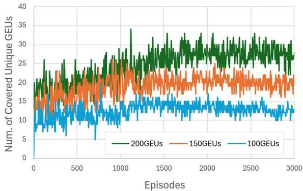  
Fig. 9. Number of covered unique GEUs in case of diferent number of GEUs.

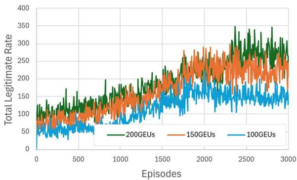  
Fig. 10. Total legitimate rate performance in case of diferent number of GEUs.

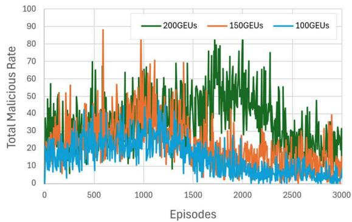  
Fig. 11. Total malicious rate in case of diferent number of GEUs.

Fig. 12 and Fig. 13, along with Table V, analyze system performance under varying numbers of LSUs in environments with 100 and 200 GEUs. Fig. 12 compares the data, energy, and delay reward components, while Fig. 13 shows the total number of ON mode of LJUs. Table V further details secrecy rate, served ofloading demand, and total reward. Results reveal that when GEUs are fewer but LSUs are more, the total reward decreases since LSUs consume energy without suficient data to collect.

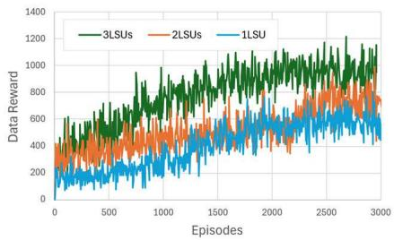  
(a)

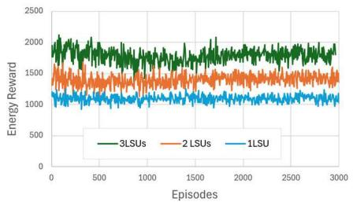  
(b)

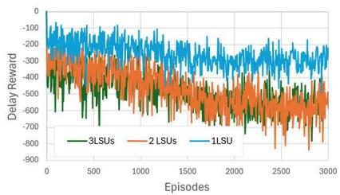  
(c)

Fig. 12. Diferent number of LSUs comparison in terms of: (a) data reward; (b) energy reward; (c) delay reward.  
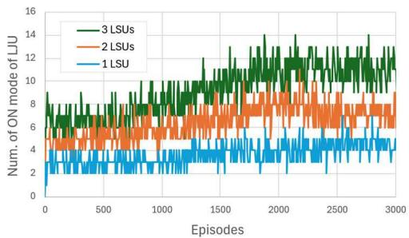  
Fig. 13. Number of ON mode of LJU over diferent number of LSUs cases.

TABLE V  
COMPUTATIONAL COMPLEXITY
<table><tr><td rowspan=1 colspan=1></td><td rowspan=1 colspan=2>1 LSU</td><td rowspan=1 colspan=2>2 LSUs</td><td rowspan=1 colspan=2>3 LSUs</td></tr><tr><td rowspan=1 colspan=1>Dif. # of GEUs</td><td rowspan=1 colspan=1>100</td><td rowspan=1 colspan=1>200</td><td rowspan=1 colspan=1>100</td><td rowspan=1 colspan=1>200</td><td rowspan=1 colspan=1>100</td><td rowspan=1 colspan=1>200</td></tr><tr><td rowspan=1 colspan=1>Secrecy Rate</td><td rowspan=1 colspan=1>62.8</td><td rowspan=1 colspan=1>182.3</td><td rowspan=1 colspan=1>142.9</td><td rowspan=1 colspan=1>236.9</td><td rowspan=1 colspan=1>167.1</td><td rowspan=1 colspan=1>368.2</td></tr><tr><td rowspan=1 colspan=1>Served OD</td><td rowspan=1 colspan=1>80.5</td><td rowspan=1 colspan=1>144.1</td><td rowspan=1 colspan=1>109.2</td><td rowspan=1 colspan=1>182.5</td><td rowspan=1 colspan=1>102.6</td><td rowspan=1 colspan=1>261.6</td></tr><tr><td rowspan=1 colspan=1>Total Reward</td><td rowspan=1 colspan=1>16.2</td><td rowspan=1 colspan=1>210.3</td><td rowspan=1 colspan=1>136.2</td><td rowspan=1 colspan=1>243.9</td><td rowspan=1 colspan=1>-57.5</td><td rowspan=1 colspan=1>327.3</td></tr></table>

To demonstrate the versatility of the proposed path planning framework across diferent environments, we introduced uneven trajectories with dynamic altitudes for malicious UAVs in Fig. 6(b), as opposed to the fixed-height square trajectories in Fig. 6(a). In both scenarios, LSUs strategically navigate to avoid malicious UAVs while prioritizing hovering over hotspot regions. As illustrated in Fig. 14(a), the total delay reward decreases, while Fig. 14(b) shows an improvement in secrecy rate for both environments. Notably, the results in Environment 2 are superior, primarily due to the dynamic altitude variation of malicious UAVs.

The computational complexity of PPO training can be expressed as follows: the critic network update requires O(K × $B \ \times L _ { V } )$ operations, while the actor network update requires $O ( K \times B \times L _ { A } ) ,$ , where B denotes the batch size, K is the number of epochs per batch, $L _ { A }$ represents the cost of actor forward/backward propagation, and $L _ { V }$ represents the cost of critic forward/backward propagation.

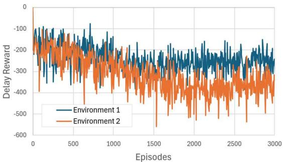

(a)  
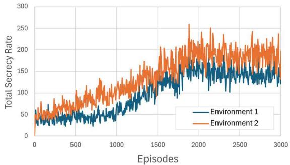  
(b)  
${ \mathrm { F i g . } }$ 14. Comparison of performance in diferent environments: (a) delay reward and (b) total secrecy rate.

## B. PSO-Based Slot Allocation Performance

For slot allocation, we employed the PSO algorithm. To select optimal hyperparameters particularly the number of particles we evaluated three cases with 20, 30, and 50 particles over 20 iterations. As shown in Fig. 15, all three cases converged to the best solution within 10 iterations; therefore, a particle size of 30 was chosen for subsequent simulations. To validate our approach, we compared PSO with alternative methods: a genetic algorithm (GA), full search, and random allocation. For GA, two cases were tested with population sizes of 30 and 50 over 20 iterations (same as PSO). The population size of 30 failed to find the optimal solution, while the population size of 50 converged noticeably slower than PSO.

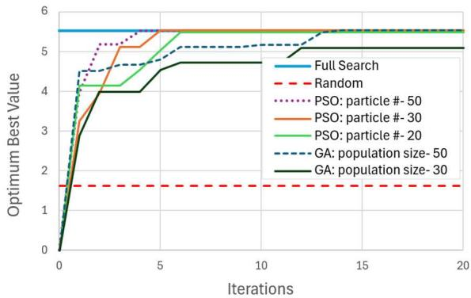  
Fig. 15. Slot allocation methods performance.

TABLE VI  
COMPUTATIONAL COMPLEXITY
<table><tr><td rowspan=1 colspan=1>Method</td><td rowspan=1 colspan=1>Computational Complexity</td><td rowspan=1 colspan=1>Example Case</td></tr><tr><td rowspan=1 colspan=1>Full Search</td><td rowspan=1 colspan=1> $O ( F L _ { m a x } N _ { g u } ^ { s } )$ </td><td rowspan=1 colspan=1> $2 0 ^ { 5 } = 3 , 2 0 0 , 0 0 0$ </td></tr><tr><td rowspan=1 colspan=1>GA</td><td rowspan=1 colspan=1> $O ( N _ { p o p } \times N _ { i t e r } )$ </td><td rowspan=1 colspan=1> $5 0 \times 2 0 = 1 , 0 0 0$ </td></tr><tr><td rowspan=1 colspan=1>PSO</td><td rowspan=1 colspan=1> $O ( N _ { p } \times N _ { i t e r } )$ </td><td rowspan=1 colspan=1> $3 0 \times 2 0 = 6 0 0$ </td></tr></table>

This is consistent with the fact that GA is typically configured with larger populations (≈ 50) and more iterations (≈ 100) [43], [44]. The “Full Search” method exhaustively evaluates all possible allocations, while the “Random” method assigns slots arbitrarily (averaged over 10 runs). Table VI compares computational complexity of three methods. For example, with a frame length of 20 slots and 5 currently covered GEUs, “Full Search” requires up to 3,200,000 evaluations, whereas PSO and GA require far fewer computations. In this case, PSO uses only about 0.02% of the computational resources needed by “Full Search,” demonstrating its eficiency.

## C. Methods Comparison

Existing research does not fully address our joint objectives. Most prior studies focus on either eavesdropping or jamming in isolation, often overlooking the role of legitimate jammers. In contrast, our framework integrates trajectory design with transmission power control and LJU mode selection. Unlike works that allocate slots per UAV movement, we allocate slots within the LSU’s coverage area. Most importantly, our multi-objective design simultaneously maximizes secure data collection while minimizing delay and energy consumption, distinguishing our approach from existing literature.

Addition to PPO, we implemented the A2C algorithm within the Policy Gradient DRL framework to provide a broader performance comparison. The main distinction between PPO and A2C lies in their loss calculation strategies. Furthermore, inspired by the hierarchical reward function (HRF) introduced in [18], which assigns high penalties to constraint violations, we incorporated additional penalties into our reward design. Fig. 16 illustrates the total reward. It can be observed that HRF-PPO initially struggles to learn, showing limited progress before 1000 episodes, after which it begins to converge more efectively.

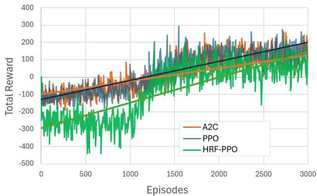  
Fig. 16. Total reward of PPO, A2C, and HRF-PPO.

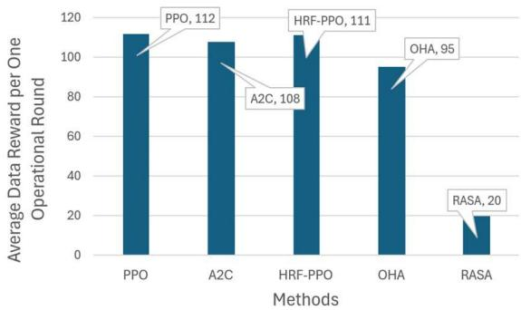  
Fig. 17. Average data reward comparison.

TABLE VII  
OPERATION DURATION FOR COMPARISON METHODS
<table><tr><td rowspan=1 colspan=1>Methods</td><td rowspan=1 colspan=1>PPO</td><td rowspan=1 colspan=1>A2C</td><td rowspan=1 colspan=1>HRF-PPO</td><td rowspan=1 colspan=1>OHA</td><td rowspan=1 colspan=1>RASA</td></tr><tr><td rowspan=1 colspan=1>Total OperationTime per Episode</td><td rowspan=1 colspan=1>77.4</td><td rowspan=1 colspan=1>50.2</td><td rowspan=1 colspan=1>138.8</td><td rowspan=1 colspan=1>159.7</td><td rowspan=1 colspan=1>101.9</td></tr></table>

In addition to the proposed PPO and A2C methods, we incorporated two baseline algorithms for comparison: (1) the Optimum Hovering Algorithm (OHA), where UAVs continuously hover over hotspot regions until their energy is depleted, and (2) the Random Action Selection Algorithm (RASA), in which UAV positioning, power allocation, and LJU mode selection are randomized. Fig. 17 compares these methods in terms of average data reward, where PPO demonstrates superior performance. For PPO and A2C, results were averaged over 1,000 post-convergence episodes, while for the random methods, an average across 10 trials was considered. Furthermore, Table VII reports the time required for UAVs to complete a full operational cycle (i.e., from mission start until returning to the base station for recharging). Notably, the OHA requires nearly twice as long as other methods to complete one cycle.

Moreover, although the objective of [35] difers from ours, we re-implemented their algorithm within our simulation environment to provide a fair comparison. As shown in Fig. 18, the baseline approach converges more quickly, consistent with the authors’ findings. However, our proposed method achieves a comparatively higher secrecy rate per time slot.

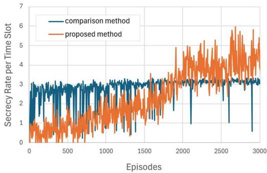  
Fig. 18. Secrecy rate for the proposed work compared with an existing approach.

## VI. CONCLUSION AND DISCUSSIONS

In conclusion, our paper presents a comprehensive approach to maximize the served ofloading data amount from ground edge units while enhancing data security in multiple UAVenabled communication systems. By integrating UAVs into a layered ITS sensing and ofloading architecture, the proposed framework enhances the security, reliability, and coverage of intelligent transportation systems. This is especially critical in situations where RSU connectivity is disrupted or coverage gaps exist, positioning UAVs as a key enabler of resilient and secure ITS operations. We address the challenges posed by multiple malicious eavesdropping UAVs and malicious jamming UAVs in dynamic environments through the development of novel algorithms. First, we proposed the PGDRL algorithm to control UAV transmission power, activity, and trajectory. Then, we addressed challenges such as dynamic trafic demand and user activity through strategic slot allocation using the PSO algorithm. Additionally, we introduced a versatile reward function to optimize energy consumption, delay, and data security objectives. Our proposed two-stage solution combining PGDRL and PSO algorithms, ofers a promising framework for optimizing UAV communication systems while enhancing data security. Finally, our comprehensive simulation results demonstrated outstanding performance across various metrics compared to other methods.

Although the real-world deployment of a secure UAVassisted ITS system remains challenging due to the absence of publicly available datasets and the dificulty of establishing large-scale aerial–ground testbeds, our simulation setup reflects realistic environmental constraints. These include urban trafic dynamics, adversarial attack modeling, and UAV regulation-compliant behavior. We aim to advance this research by developing a prototype-based field validation system and integrating hardware-in-the-loop simulations to bridge the gap between theoretical models and practical deployment. While the proposed model efectively addresses mobile jamming and eavesdropping attacks by learning adaptive defense policies, it assumes that malicious UAVs operate under predefined or probabilistic mobility patterns. In real-world deployments, attackers may adopt adaptive learning-based strategies that exploit the defender’s behavior or interfere with its learning process. To mitigate such intelligent adversaries, future extensions of this work may incorporate meta-reinforcement learning or game-theoretic adversarial learning frameworks that enable dynamic co-evolution of strategies and cooperative attacks. Integrating such mechanisms will further enhance the robustness and applicability of the proposed system in complex and contested environments.

## REFERENCES

[1] W. Lee and T. Kim, “Multiagent reinforcement learning in controlling ofloading ratio and trajectory for multi-UAV mobile-edge computing,” IEEE Internet Things J., vol. 11, no. 2, pp. 3417–3429, Jan. 2024.

[2] N. Lin et al., “Deep-reinforcement-learning-based computation ofloading for servicing dynamic demand in multi-UAV-assisted IoT network,” IEEE Internet Things J., vol. 11, no. 10, pp. 17249–17263, May 2024.

[3] Z. Chang, H. Deng, L. You, G. Min, S. Garg, and G. Kaddoum, “Trajectory design and resource allocation for multi-UAV networks: Deep reinforcement learning approaches,” IEEE Trans. Netw. Sci. Eng., vol. 10, no. 5, pp. 2940–2951, Sep. 2023.

[4] J. Cho, S. Ki, and H. Lee, “Predictive path planning of multiple UAVs for efective network hotspot coverage,” IEEE Trans. Veh. Technol., vol. 72, no. 12, pp. 16683–16700, Dec. 2023.

[5] A. Beishenalieva and S.-J. Yoo, “Multiobjective 3-D UAV movement planning in wireless sensor networks using bioinspired swarm intelligence,” IEEE Internet Things J., vol. 10, no. 9, pp. 8096–8110, May 2023.

[6] J. Yan, X. Zhao, and Z. Li, “Deep-reinforcement-learning-based computation ofloading in UAV-assisted vehicular edge computing networks,” IEEE Internet Things J., vol. 11, no. 11, pp. 19882–19897, Jun. 2024.

[7] Y. Qin, Z. Zhang, X. Li, W. Huangfu, and H. Zhang, “Deep reinforcement learning based resource allocation and trajectory planning in integrated sensing and communications UAV network,” IEEE Trans. Wireless Commun., vol. 22, no. 11, pp. 8158–8168, Nov. 2023.

[8] T. Bouzid, N. Chaib, M. L. Bensaad, and O. S. Oubbati, “5G network slicing with unmanned aerial vehicles: Taxonomy, survey, and future directions,” Trans. Emerg. Telecommun. Technol., vol. 34, no. 3, pp. e472–1, Mar. 2023.

[9] A. Hyadi, Z. Rezki, and M.-S. Alouini, “An overview of physical layer security in wireless communication systems with CSIT uncertainty,” IEEE Access, vol. 4, pp. 6121–6132, 2016.

[10] H. Kang, X. Chang, J. Misic, V. B. Miˇ sic, J. Fan, and J. Bai, “Improvingˇ dual-UAV aided ground-UAV bi-directional communication security: Joint UAV trajectory and transmit power optimization,” IEEE Trans. Veh. Technol., vol. 71, no. 10, pp. 10570–10583, Oct. 2022.

[11] Z. Wang et al., “Joint flight scheduling and task allocation for secure data collection in UAV-aided IoTs,” Comput. Netw., vol. 207, pp. 1–11, Apr. 2022.

[12] M. Shao, J. Yan, and X. Zhao, “Secrecy rate maximization by cooperative jamming for UAV-enabled relay system with mobile nodes,” IEEE Internet Things J., vol. 10, no. 15, pp. 13168–13180, Aug. 2023.

[13] Z. Lv, L. Xiao, Y. Du, G. Niu, C. Xing, and W. Xu, “Multiagent reinforcement learning based UAV swarm communications against jamming,” IEEE Trans. Wireless Commun., vol. 22, no. 12, pp. 9063–9075, Dec. 2023.

[14] Z. Gao, J. Fu, Z. Jing, Y. Dai, and L. Yang, “MOIPC-MAAC: Communication-assisted multiobjective MARL for trajectory planning and task ofloading in multi-UAV-assisted MEC,” IEEE Internet Things J., vol. 11, no. 10, pp. 18483–18502, May 2024.

[15] W. Wang et al., “Robust 3D-trajectory and time switching optimization for dual-UAV-enabled secure communications,” IEEE J. Sel. Areas Commun., vol. 39, no. 11, pp. 3334–3347, Nov. 2021.

[16] R. Zhang, X. Pang, W. Lu, N. Zhao, Y. Chen, and D. Niyato, “Dual-UAV enabled secure data collection with propulsion limitation,” IEEE Trans. Wireless Commun., vol. 20, no. 11, pp. 7445–7459, Nov. 2021.

[17] R. Dong, B. Wang, K. Cao, and T. Cheng, “Securing transmission for UAV swarm-enabled communication network,” IEEE Syst. J., vol. 16, no. 4, pp. 5200–5211, Dec. 2022.

[18] T. Zhao, F. Li, and L. He, “Secure video ofloading in multi-UAV-enabled MEC networks: A deep reinforcement learning approach,” IEEE Internet Things J., vol. 11, no. 2, pp. 2950–2963, Jan. 2024.

[19] A. Gomaa and O. M. Saad, “Residual channel-attention (RCA) network for remote sensing image scene classification,” Multimedia Tools Appl., vol. 84, no. 28, pp. 33837–33861, Jan. 2025.

[20] A. Gomaa, “Advanced domain adaptation technique for object detection leveraging semi-automated dataset construction and enhanced YOLOv8,” in Proc. 6th Novel Intell. Lead. Emerg. Sci. Conf. (NILES), Oct. 2024, pp. 211–214.

[21] A. Gomaa and A. Abdalrazik, “Novel deep learning domain adaptation approach for object detection using semi-self-building dataset and modified YOLOv4,” World Electr. Veh. J., vol. 15, no. 6, pp. 1–19, Jun. 2024.

[22] A. Gomaa, M. M. Abdelwahab, and M. Abo-Zahhad, “Eficient vehicle detection and tracking strategy in aerial videos by employing morphological operations and feature points motion analysis,” Multimedia Tools Appl., vol. 79, nos. 35–36, pp. 26023–26043, Jul. 2020.

[23] A. Gomaa, M. M. Abdelwahab, and M. Abo-Zahhad, “Real-time algorithm for simultaneous vehicle detection and tracking in aerial view videos,” in Proc. IEEE 61st Int. Midwest Symp. Circuits Syst. (MWSCAS), Windsor, ON, Canada, Aug. 2018, pp. 222–225.

[24] A. Abdalrazik, A. Gomaa, and A. Afifi, “Multiband circularlypolarized stacked elliptical patch antenna with eye-shaped slot for GNSS applications,” Int. J. Microw. Wireless Technol., vol. 16, no. 7, pp. 1229–1235, Sep. 2024.

[25] A. Abdalrazik, A. Gomaa, and A. A. Kishk, “A wide axial-ratio beamwidth circularly-polarized oval patch antenna with sunlight-shaped slots for gnss and Wimax applications,” Wireless Netw., vol. 28, no. 8, pp. 3779–3786, Aug. 2022.

[26] A. Gomaa, A. Afifi, and A. Abdalrazik, “A dual-band wide axial-ratio beamwidth circularly-polarized antenna with V-shaped slot for L2/L5 GNSS applications,” in Proc. 6th Novel Intell. Lead. Emerg. Sci. Conf. (NILES), Oct. 2024, pp. 119–122.

[27] M. Salem, A. Gomaa, and N. Tsurusaki, “Detection of earthquakeinduced building damages using remote sensing data and deep learning: A case study of mashiki town, Japan,” in Proc. IEEE Int. Geosci. Remote Sens. Symp., Jul. 2023, pp. 2350–2353.

[28] Y.-J. Chen, W. Chen, and M.-L. Ku, “Trajectory design and link selection in UAV-assisted hybrid satellite-terrestrial network,” IEEE Commun. Lett., vol. 26, no. 7, pp. 1643–1647, Jul. 2022.

[29] Z. Wu, Z. Yang, C. Yang, J. Lin, Y. Liu, and X. Chen, “Joint deployment and trajectory optimization in UAV-assisted vehicular edge computing networks,” J. Commun. Netw., vol. 24, no. 1, pp. 47–58, Feb. 2022.

[30] T. Wu et al., “A novel AI-based framework for AoI-optimal trajectory planning in UAV-assisted wireless sensor networks,” IEEE Trans. Wireless Commun., vol. 21, no. 4, pp. 2462–2475, Apr. 2022.

[31] Z. Gao, L. Yang, and Y. Dai, “MO-AVC: Deep-reinforcement-learningbased trajectory control and task ofloading in multi-UAV-enabled MEC systems,” IEEE Internet Things J., vol. 11, no. 7, pp. 11395–11414, Apr. 2024.

[32] K. Messaoudi, A. Baz, O. Sami Oubbati, A. Rachedi, T. Bendouma, and M. Atiquzzaman, “UGV charging stations for UAV-assisted AoI-aware data collection,” IEEE Trans. Cognit. Commun. Netw., vol. 10, no. 6, pp. 2325–2343, Dec. 2024.

[33] A. Beishenalieva and S.-J. Yoo, “UAV path planning for data gathering in wireless sensor networks: Spatial and temporal substate-based Qlearning,” IEEE Internet Things J., vol. 11, no. 6, pp. 9572–9586, Mar. 2024.

[34] A. I. Ameur, O. S. Oubbati, A. Lakas, A. Rachedi, and M. B. Yagoubi, “Eficient vehicular data sharing using aerial P2P backbone,” IEEE Trans. Intell. Vehicles, vol. 10, no. 1, pp. 413–426, Jan. 2025.

[35] A. Alwarafy et al., “Deep reinforcement learning-based joint trajectory design and resource allocation for secure and energy-eficient UAV networks,” IEEE Open J. Commun. Soc., vol. 6, pp. 1–16, 2025.

[36] J. Zhu, J. Mo, and M. Tao, “Cooperative secret communication with artificial noise in symmetric interference channel,” IEEE Commun. Lett., vol. 14, no. 10, pp. 885–887, Oct. 2010.

[37] V. Mnih et al., “Asynchronous methods for deep reinforcement learning,” 2016, arXiv:1602.01783.

[38] J. Schulman, F. Wolski, P. Dhariwal, A. Radford, and O. Klimov, “Proximal policy optimization algorithms,” 2017, arXiv:1707.06347.

[39] A. Al-Hilo, M. Samir, C. Assi, S. Sharafeddine, and D. Ebrahimi, “UAV-assisted content delivery in intelligent transportation systems-joint trajectory planning and cache management,” IEEE Trans. Intell. Transp. Syst., vol. 22, no. 8, pp. 5155–5167, Aug. 2021.

[40] M. Li, X. Tao, N. Li, H. Wu, and J. Xu, “Secrecy energy eficiency maximization in UAV-enabled wireless sensor networks without Eavesdropper’s CSI,” IEEE Internet Things J., vol. 9, no. 5, pp. 3346–3358, Mar. 2022.

[41] M. Clerc and J. Kennedy, “The particle swarm–explosion, stability, and convergence in a multidimensional complex space,” IEEE Trans. Evol. Comput., vol. 6, no. 1, pp. 58–73, Feb. 2002.

[42] H. V. Abeywickrama, B. A. Jayawickrama, Y. He, and E. Dutkiewicz, “Comprehensive energy consumption model for unmanned aerial vehicles, based on empirical studies of battery performance,” IEEE Access, vol. 6, pp. 58383–58394, 2018.

[43] Y. Teng, Y. Zhang, M. Song, Y. Dong, and L. Wang, “Genetic algorithm based adaptive resource allocation in OFDMA system for heterogeneous trafic,” in Proc. IEEE 20th Int. Symp. Pers., Indoor Mobile Radio Commun., Sep. 2009, pp. 2060–2064.

[44] W. Sun, W. Xie, and J. He, “Data link network resource allocation method based on genetic algorithm,” in Proc. IEEE 3rd Inf. Technol., Netw., Electron. Autom. Control Conf. (ITNEC), Chengdu, China, Mar. 2019, pp. 1875–1880.

  
Aliia Beishenalieva (Member, IEEE) received the B.S. degree in telematics from Kyrgyz State Technical University, Bishkek, Kyrgyzstan, in 2020, and the M.S. degree in electrical and computer engineering from Inha University, Incheon, South Korea, in 2023, where she is currently pursuing the Ph.D. degree with the Multimedia Network Laboratory. Her research interests include WSN, FANET, machine learning, RL, the Internet of Things, and UAV path planning.

Sang-Jo Yoo (Member, IEEE) received the B.S. degree in electronic communication engineering from Hanyang University, Seoul, South Korea, in 1988, and the M.S. and Ph.D. degrees in electrical engineering from Korea Advanced Institute of Science and Technology, Daejeon, South Korea, in 1990 and 2000, respectively. From 1990 to 2001, he was a member of the Technical Staf with the KT Research and Development Group, Seoul. From 1994 to 1995 and from 2007 to 2008, he was a Guest Researcher with the National Institute of Standards

and Technology, Gaithersburg, MD, USA. Since 2001, he has been with Inha University, Incheon, South Korea, where he is currently a Professor with the Electrical and Computer Engineering Department. His current research interests include ML, cognitive radio networks, vehicular networks, wireless sensor networks, and the Internet of Things.