# Secrecy-Driven Energy Minimization in Federated-Learning-Assisted Marine Digital Twin Networks

Li Ping Qian , Senior Member, IEEE, Mingqing Li , Graduate Student Member, IEEE, Ping Ye, Qian Wang Member, IEEE, Bin Lin , Senior Member, IEEE, Yuan Wu , Senior Member, IEEE, and Xiaoniu Yang

Abstract—Digital twin has been emerging as a promising paradigm that connects physical entities and digital space, and continuously evolves to optimize the physical systems. In this article, we focus on studying efficient communication and computation scheme when constructing the Marine Internet of Things (M-IoT)’s digital twin with secrecy provisioning. Specifically, the digital twin model is trained based on federated learning, in which all the unmanned surface vehicles deliver the trained models with nonorthogonal multiple access (NOMA) to the high-altitude platform (HAP) for global model aggregation. Considering the potential eavesdropping on the radio signals of HAP, we utilize the chaotic sequences to spread the model information before the global model broadcasting. In this framework, we aim to minimize the total energy consumption for constructing the digital twin of M-IoT by jointly optimizing the global accuracy, the local accuracy, the HAP’s transmission power and NOMA transmission duration, subject to the secrecy provisioning and latency constraint. An effective low-complexity algorithm is proposed to tackle this joint optimization problem with the use of a layered feature. Finally, numerical results are given to validate the performance gain of the proposed scheme, in comparison with the fixed accuracy scheme, the nonspread spectrum scheme and the time division multiple access transmission scheme.

Manuscript received 5 July 2023; accepted 4 August 2023. Date of publication 16 August 2023; date of current version 24 January 2024. This work was supported in part by the Intergovernmental International Cooperation in Science and Technology Innovation Program under Grant 2019YFE0111600; in part by the National Natural Science Foundation of China under Grant 62122069, Grant 62072490, Grant 62071431, Grant 62201507, and Grant 61971083; in part by the Liaoning Revitalization Talents Program under Grant XLYC2002078; in part by the Major Key Project of PCL under Grant PCL2021A03-1; in part by FDCT-MOST under Grant 0066/2019/AMJ; in part by FDCT under Grant 0158/2022/A; in part by the Guangdong Basic and Applied Basic Research Foundation under Grant 2022A1515011287; and in part by the Research Grant of University of Macau under Grant MYRG2020-00107-IOTSC. (Corresponding author: Yuan Wu.)

Li Ping Qian, Ping Ye, and Qian Wang are with the College of Information Engineering, Zhejiang University of Technology, Hangzhou 310023, China (e-mail: lpqian@zjut.edu.cn).

Mingqing Li is with the College of Information Engineering, Zhejiang University of Technology, Hangzhou 310023, China, and also with Zhuhai UM Science and Technology Research Institute, Zhuhai 519031, China (e-mail: mingqinglee@163.com).

Bin Lin is with the Department of Communication Engineering, Dalian Maritime University, Dalian 116026, China (e-mail: binlin@dlmu.edu.cn).

Yuan Wu is with the State Key Laboratory of Internet of Things for Smart City and the Department of Computer Information Science, University of Macau, Macau, China, and also with Zhuhai UM Science and Technology Research Institute, Zhuhai 519031, China (e-mail: yuanwu@um.edu.mo).

Xiaoniu Yang is with the Institute of Cyberspace Security, Zhejiang University of Technology, Hangzhou 310023, China, and also with the Science and Technology on Communication Information Security Control Laboratory, Jiaxing 314033, China (e-mail: yxn2117@126.com).

Digital Object Identifier 10.1109/JIOT.2023.3305711

Index Terms—Digital twin, energy minimization, federated learning (FL), joint optimization, nonorthogonal multiple access (NOMA), secrecy provisioning.

# I. INTRODUCTION

HE RAPID growth and deployment of B5G/6G systems T have motivated many emerging services and applications which are resource-hungry and Quality-of-Service (QoS) sensitive, e.g., autonomous driving, metaverse, and the advanced Marine Internet of Things (M-IoT) [1], [2], [3], [4]. In M-IoT, massive marine data on environmental protection, marine resource monitoring, and so on are collected by offshore devices, such as maritime sensors and unmanned surface vehicles (USVs). M-IoT’s energy-saving and QoS can be achieved by properly allocating multidimensional resources, including communication, computation, and so on [5], [6], [7], [8], [9]. As an emerging technology, digital twin continuously evolves, monitors, and optimizes the physical systems by constructing the digital replicas of physical entities and interacting with these physical entities [10], [11]. By building the digital twin of M-IoT, the QoS of M-IoT can be significantly improved for reaping the benefits of the digital twin, e.g., the data privacy in trading the digital twin model. However, there are several critical challenges to be solved.

Due to the sensitive nature of data, it is increasingly impossible to upload data to a centralized data center for analysis and utilization [12], [13]. Moreover, uploading a large amount of data to the data center leads to a heavy burden on resource consumption (e.g., bandwidth and transmit-power usages) [14], [15]. Thanks to leveraging the computing power of mobile devices, federated learning (FL) that enables the data distributed on individual mobile devices and learns a shared model by aggregating locally computed updates via a central coordinating server has received more and more attention [16], [17]. Thus, FL provides a promising solution to address the above challenges for training the digital twin of the M-IoT, in which the USVs train local models with their respective data, and the high-altitude platform (HAP) serves as a model aggregator in FL.

Although the FL framework can address the difficulty of data privacy and reduce the resource consumption of data transmission, the potential communication security issue is unavoidable. Due to the inherent broadcasting nature of wireless communication, the radio signal can be eavesdropped on and further decoded in a brute-force manner by malicious users [18]. Moreover, the construction of digital twin in FL procedure generally requires multiple times of model aggregation at the HAP, which means that there is frequent model-data transmission between HAP and USVs. This undoubtedly increases the risk of information being eavesdropped on. Thanks to the physical layer security, we can adopt promising technology to protect the information of wireless communication. It enables us to measure the security throughput quantitatively, which is the information that cannot be wiretapped [19], [20]. In this work, we perform the chaotic spread spectrum technology on the broadcasting information, which improves the communication security at the physical layer with the advantages of noise-like property, unpredictability, and wide-band spectrum [21], [22]. In addition, the security probability is adopted in this work to quantify the QoS of wireless communication security.

Based on the Shannon formula, the throughput increases with the increase of communication bandwidth. For these offshore USVs, however, the available bandwidth is so limited that it would lead to high latency in the FL procedure when the orthogonal multiple access (OMA) is adopted. As a promising technology to achieve high-spectrum efficiency and high throughput in the fifth-generation network, nonorthogonal multiple access (NOMA) allows multiusers to reuse the same frequency simultaneously and eliminates the co-channel interference with the successive interference cancelation (SIC) [23], [24], [25], [26]. When uploading the locally trained models for aggregation, we consider that all the USVs form an NOMA group and deliver their trained local models to the HAP via NOMA transmission. In addition, considering that the offshore equipment (i.e., USVs and HAP) cannot obtain an always-available energy supply and the energy reserve is limited, we aim to minimize the energy consumption of the M-IoT networks.

Motivated by the above considerations, in this work, we investigate the efficient data communication and computation when constructing an FL-assisted marine digital twin network subject to eavesdropping attacks. The detailed contributions are summarized as follows.

1) We consider an FL framework to construct the marine digital twin with secrecy provisioning in the M-IoT consisting of a HAP, an eavesdropper, a group of USVs, and the digital twin of these physical entities. All USVs serve as local parameter-model servers and train local models with their own data, and further deliver their separately trained models to the HAP for model aggregation. Then, the HAP broadcasts the aggregated model to USVs for the next round of model training. Considering the potential risk of eavesdropping on the broadcast signals in the frequent model-data communication between HAP and USVs, we perform the chaotic spread spectrum technology to enhance the physical layer security and introduce security probability to quantify the QoS of communication security.

2) Considering the limited energy reserve and the lack of an always-available energy supply for these offshore

equipment, we aim to minimize the total energy consumption of the FL-assisted marine digital twin network by optimizing the global accuracy, the local accuracy, the HAP’s transmission power, and model uploading duration. Despite the complex form of this joint optimization problem, we layer it into a top problem for optimizing the global accuracy and the local accuracy, and a subproblem for optimizing the other variables. We prove the optimal solutions to this problem to be unique and propose an effective low-complexity algorithm to tackle this problem.

3) Numerical results are presented to evaluate the performance of our proposed algorithm in terms of optimality and time efficiency. We also demonstrate the performance gain of our proposed scheme by comparing it with the fixed accuracy scheme, the nonspread spectrum scheme and the time division multiple access (TDMA) transmission scheme.

We organize the remainder of this article as follows. First, we review the related works in Section II. Then, we present the system model and problem formulation in Section III. And we introduce the layered algorithm to solve the joint optimization problem in Sections IV and V. Next, we present numerical results to evaluate the performance of our proposed algorithm in Section VI. Finally, we conclude the work and discuss the future research directions in Section VII.

# II. LITERATURE REVIEW

Many research efforts have been devoted to investigating the digital virtual replication of physical entities for reaping the benefits of digital twin, which monitors, controls and optimizes the physical object through its life cycle. Tang et al. [10] and Wang et al. [11] presented comprehensive surveys on digital twin, which includes digital twin’s definitions, features, typical applications and challenges. Zhou et al. [27] investigated the digital twin-assisted resource scheduling problem in fifth generation edge computing-empowered distribution grid, and a secure and latency-aware digital twin-assisted resource scheduling algorithm was presented to address critical challenges, such as high latency, low accuracy, and security threats. Dai et al. [28] exploited a digital twin network to build a stochastic task arrival model for industrial IoT, and the Lyapunov optimization technique and asynchronous actorcritic algorithm were utilized to minimize the long-term energy efficiency. Liu et al. [29] proposed a digital twin-supported edge intelligent cooperation scheme to optimize computation and communication resource allocation in the Internet of Vehicles when the quality of experience requirements of delaysensitive applications was met. Dai and Zhang [30] proposed a digital twin-enabled vehicle edge computing network, where the offloading scheme and resource allocation can be adaptively managed by the digital twin to minimize the total time consumption of task execution. Xu et al. [31] jointly considered the computation offloading and service caching to avoid the repetitive executions of the same tasks in transportation systems, and the digital twin was utilized to generate offloading strategies for achieving the minimal system latency.

The construction of digital twin is subject to the exponential growth of data generation and the increasingly valued concept of data security, and thus distributed learning methods are adopted to construct digital twin, i.e., FL, have received more and more attention [32], [33], [34], [35], [36]. Yang et al. [32] investigated the energy efficiency and computation resource allocation for ${ \mathrm { F L } } ,$ and an iterative algorithm was proposed to minimize the total energy consumption. Chen et al. [33] proposed a communication framework for FL algorithms over wireless networks, where the FL training loss was minimized to improve the identification accuracy by jointly considering the user selection and resource allocation. Wu et al. [34] designed a parallel segmentationbased learning scheme integrating FL to solve the problem of long training delay in traditional segmentation learning, and proposed resource management algorithms to accelerate the learning and reduce network communication and local computing overhead. Do et al. [35] investigated a UAVassisted energy harvesting network that enables sustainable FL, where the long-term energy constraint was transformed into a deterministic problem, and a deep reinforcement learning framework was proposed to jointly consider the UAV placement and resource allocation to maximize the long-term FL performance. Ruby et al. [36] integrated a two-tier FL network to achieve energy-efficient computation and communication, where minimal energy consumption was achieved by effective resource allocation.

Constructing digital twin in the FL procedure generally requires multiple times of model-data transmission between HAP and USVs, which is vulnerable to being eavesdropped on. The physical layer security provides a promising technology to protect wireless communication, and it has attracted lots of interest [37], [38], [39], [40], [41], [42]. Jameel et al. [37] and Angueira et al. [38] presented comprehensive surveys on cooperative relaying and jamming strategies for wireless communication at the physical layer. Qian et al. [39] investigated the energy-efficient multiaccess mobile edge computing with secrecy provisioning, and the secrecy of edge devices was characterized by offloading throughput with guaranteed secrecy provisioning. Li et al. [40] proposed a framework of cognitive ambient backscatter communication, and the outage probability was invoked to investigate the reliability and security of the framework. Kang et al. [41] investigated a dual-UAV aided communication system to improve the communication security between ground devices and UAVs, where one UAV served communications for mobile ground devices, and the other UAV jammer was invoked to confuse eavesdroppers. Zheng et al. [42] investigated the physical layer security of the uplink millimeter wave communication for vehicleto-everything network, and two uplink association schemes were proposed, i.e., the smallest distance association scheme and the largest power association scheme, numerical results outperform in term of secrecy throughput.

Most existing works on FL-assisted digital twin networks rarely consider communication security and efficient computation in M-IoT. Therefore, we investigate an FL framework to construct the marine digital twin with secrecy provisioning and efficient computation.

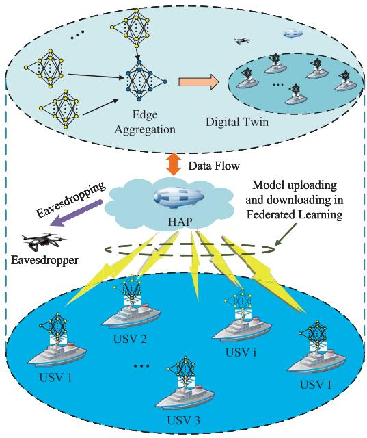

flowchart

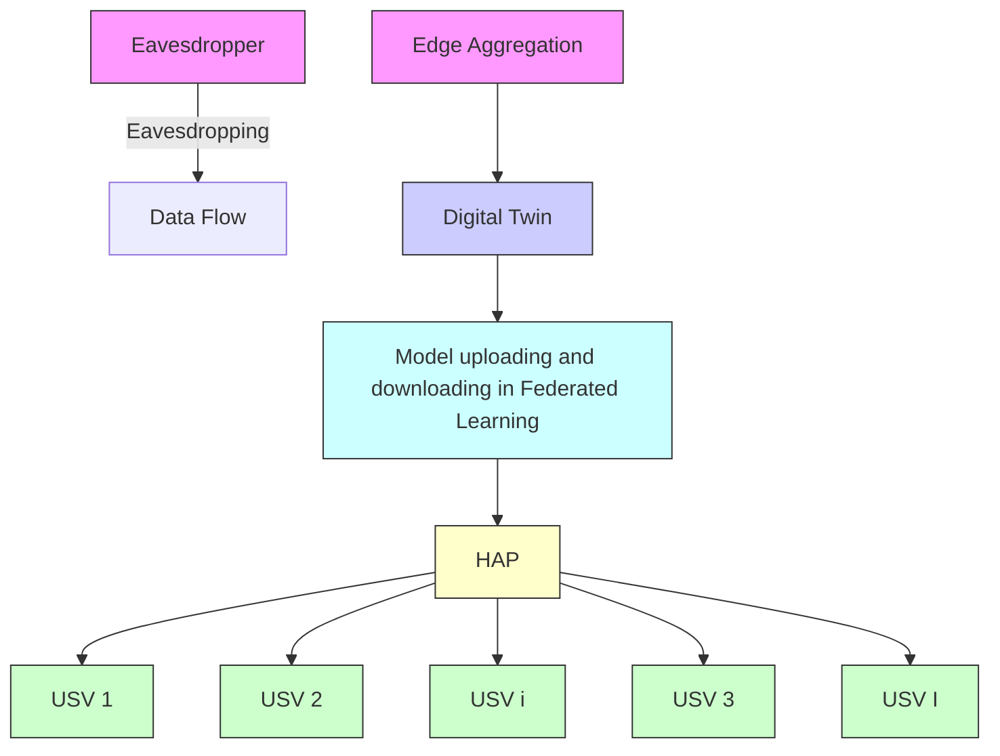

Fig. 1. System model of FL-assisted marine digital twin network.   
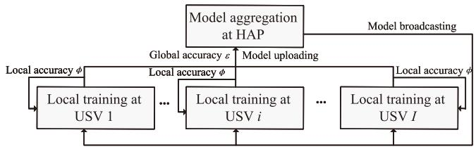

flowchart

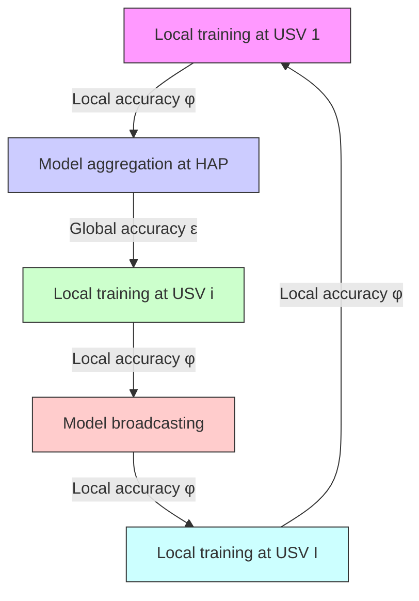

Fig. 2. Framework of FL procedure.

# III. SYSTEM MODEL AND PROBLEM FORMULATION

In this article, we consider an FL framework to construct the marine digital twin network, as depictured in Fig. 1, which consists of a HAP, an eavesdropper, a group of USVs, and the digital twin of the above physical entities. For data privacy protection and resource consumption reduction, the FL framework is adopted to provide auxiliaries for training the digital twin model. In the FL procedure, we consider that all USVs upload the trained models to the HAP via NOMA. Assume that the malicious eavesdropper intends to overhear the global model information broadcasted by the $\mathrm { H A P . ^ { 1 } }$ To address this eavesdropping attack, chaotic sequences are used by the HAP to spread the information before it broadcasts the global model to USVs.

# A. FL-Assisted Digital Twin Model

In this work, the digital twin of the physical entities is constructed by the HAP server to optimize the system energy consumption. FL is adopted to assist the digital twin construction, and the framework of FL between USVs and HAP is shown in Fig. 2. We use set $\mathcal { T } = \{ 1 , 2 , \hdots , I \}$ to denote the group of USVs, and each USV i trains the local model with its

1From the eavesdropper’s perspective, wiretapping the global information would be a wise choice, since the new global model generated by the HAP contains information from all local nodes and is more generalized than each of the local models.

local data set $\mathcal { D } _ { i }$ , referring to [27], the loss function of USV i is denoted as

$$
F _ {i} (\boldsymbol {w}) = \frac {\sum_ {k = 1} ^ {D _ {i}} f _ {i} (\boldsymbol {w} , \boldsymbol {x} _ {i k} , y _ {i k})}{D _ {i}}, i \in \mathcal {I} \tag {1}
$$

where w is the global model, $D _ { i }$ indicates the size of data set $\mathcal { D } _ { i } , y _ { i k }$ is the corresponding target output when $\boldsymbol { x } _ { i k }$ denotes the input of the kth sample of $\mathcal { D } _ { i } ,$ , and $f _ { i } ( { \pmb w } , { \pmb x } _ { i k } , y _ { i k } )$ represents the deviation between the real output and the target output.

In particular, in the nth global iteration, each USV i updates the mth local iteration model ${ \pmb w } _ { i } ^ { ( n , m ) }$ with the gradient descent method, i.e.,

$$
\boldsymbol {w} _ {i} ^ {(n, m + 1)} = \boldsymbol {w} _ {i} ^ {(n, m)} - \lambda_ {i} \nabla F _ {i} \left(\boldsymbol {w} _ {i} ^ {(n, m)}\right), i \in \mathcal {I} \tag {2}
$$

where $\lambda _ { i }$ is the learning step.

In this work, we use a 4-tuple set, which is denoted by DT to characterize the system digital twin

$$
D T = \left\{\mathcal {M}, \{\mathcal {D} _ {i} \} _ {i \in \mathcal {I}}, \epsilon , \phi \right\} \tag {3}
$$

where the parameter denotes the set of the global models and the local models, parameters  and φ represent the global accuracy and local accuracy, respectively. And  and φ are used to indicate the solution accuracy of global and local problems [43], which will be employed as follows.

Given the global model $\pmb { w } ^ { ( n ) }$ , each USV i solves the following optimization problem

$$
\begin{array}{l} \min _ {\boldsymbol {d} _ {i}} G _ {i} \left(\boldsymbol {w} ^ {(n)}, \boldsymbol {d} _ {i}\right) = F _ {i} \left(\boldsymbol {w} ^ {(n)} + \boldsymbol {d} _ {i}\right) \\ - \left[ \nabla F _ {i} \left(\boldsymbol {w} ^ {(n)}\right) - \beta \nabla F \left(\boldsymbol {w} ^ {(n)}\right) \right] ^ {T} \boldsymbol {d} _ {i}, i \in \mathcal {I} \tag {4} \\ \end{array}
$$

where $\beta$ is a constant value, the solution $\pmb { d } _ { i }$ denotes the difference between the global model and the local model of USV $i ,$ and $\begin{array} { r } { \nabla F ( \pmb { w } ^ { ( n ) } ) = ( 1 / I ) \sum _ { i = 1 } ^ { I } \nabla F _ { i } ( \pmb { w } ^ { ( n ) } ) } \end{array}$ . The gradient descent method is adopted to solve the optimization problem (4), i.e.,

$$
\boldsymbol {d} _ {i} ^ {(n, m + 1)} = \boldsymbol {d} _ {i} ^ {(n, m)} - \alpha \nabla G _ {i} \left(\boldsymbol {w} ^ {(n)}, \boldsymbol {d} _ {i} ^ {(n, m)}\right), i \in \mathcal {I} \tag {5}
$$

where $\alpha$ denotes the learning step, and ${ \pmb d } _ { i } ^ { ( n , m ) }$ indicates the value of $\pmb { d } _ { i }$ at the mth local iteration with the given global model $\pmb { w } ^ { ( n ) }$ . With the local accuracy $\phi ,$ the solution to problem (4) is defined as

$$
\begin{array}{l} G _ {i} \left(\boldsymbol {w} ^ {(n)}, \boldsymbol {d} _ {i} ^ {(n, m)}\right) - G _ {i} \left(\boldsymbol {w} ^ {(n)}, \boldsymbol {d} _ {i} ^ {(n, *)}\right) \leq \phi \left[ G _ {i} \left(\boldsymbol {w} ^ {(n)}, \boldsymbol {d} _ {i} ^ {(n, 0)}\right) \right. \\ \left. - G _ {i} \left(\boldsymbol {w} ^ {(n)}, \boldsymbol {d} _ {i} ^ {(n, *)}\right) \right] \tag {6} \\ \end{array}
$$

where $\pmb { d } _ { i } ^ { ( n , * ) }$ is the optimal solution to problem (4).

In the HAP, the FL framework is deployed to perform the model aggregation based on the updated models from USVs. The global model is generated for the next iteration with ${ \pmb d } _ { i } ^ { ( n ) } =$ ${ \pmb d } _ { i } ^ { ( n , m ) }$ ), referring to [32] it is given by

$$
\boldsymbol {w} ^ {(n + 1)} = \boldsymbol {w} ^ {(n)} + \frac {1}{I} \sum_ {i = 1} ^ {I} \boldsymbol {d} _ {i} ^ {(n)}. \tag {7}
$$

The global iteration continues until the aggregated loss function $F ( w )$ reaches its minimum, i.e.,

$$
\boldsymbol {w} ^ {*} = \arg \min _ {\boldsymbol {w}} F (\boldsymbol {w}) = \arg \min _ {\boldsymbol {w}} \frac {\sum_ {i = 1} ^ {I} F _ {i} (\boldsymbol {w})}{\sum_ {i = 1} ^ {I} D _ {i}}. \tag {8}
$$

We assume that $F _ { i } ( w )$ is L-Lipschitz and γ -strongly convex, i.e., $\gamma I \leq \nabla ^ { 2 } F _ { i } ( w ) \leq L I$ . In particular, referring to [32], when we set $\alpha < ( 2 / L )$ , the number of local iterations denoted by M for achieving the accuracy φ in (6) can be derived as

$$
M \geq \frac {2}{(2 - \alpha L) \alpha \gamma} \log_ {2} \left(\frac {1}{\phi}\right) = A \log_ {2} \left(\frac {1}{\phi}\right) \tag {9}
$$

where $A = ( 2 / [ ( 2 - \alpha L ) \alpha \gamma ] )$ . Similarly, we set $0 ~ < ~ \beta ~ \leq$ $( \gamma / L )$ , the number of global iterations denoted by N can be approximated with the global accuracy  to obtain the optimal solution to problem (8) as

$$
N \geq \frac {2 L ^ {2} \ln \left(\frac {1}{\epsilon}\right)}{\gamma^ {2} \beta (1 - \phi)} = B \frac {\ln \left(\frac {1}{\epsilon}\right)}{1 - \phi} \tag {10}
$$

where $\begin{array} { l l l } { B } & { = } & { [ ( 2 L ^ { 2 } ) / ( \gamma ^ { 2 } \beta ) ] } \end{array}$ . In the following, we adopt the lower boundaries to represent the parameters M and N according to (9) and (10), respectively.2

# B. Local Training and Model Uploading

In each round of the global iterations, there are four phases in the FL framework to construct the marine digital twin. First, each USV performs the local model training with its local data set. Then, all the USVs upload the trained local models to the HAP via NOMA. Next, the HAP performs the model aggregation on the uploaded models to update the global model, and then broadcasts the updated global model to the USVs for the next round of global iterations.

With the CPU power consumption model [44], the USV i’s energy consumption on the local training in a global iteration is

$$
E _ {i} ^ {L} = M \eta \rho D _ {i} (u _ {i}) ^ {2}, i \in \mathcal {I} \tag {11}
$$

where $\eta$ is the CPU power efficiency of USVs, $\rho$ denotes the required CPU cycle numbers for processing one sample data at the USVs, and $u _ { i }$ indicates USV $i \gamma _ { \mathrm { s } }$ CPU processing rate. Correspondingly, the time delay for USV i to complete the local training is

$$
t _ {i} ^ {L} = M \frac {\rho D _ {i}}{u _ {i}}, i \in \mathcal {I}. \tag {12}
$$

We consider that all the USVs upload the locally trained models $\{ w _ { i } \} _ { i \in \mathcal { T } }$ via NOMA, then the HAP eliminates the cochannel interference with SIC and decodes signals in the descending order of channel power gains. For USV i, the transmission power is

$$
p _ {i} = \frac {n _ {S}}{g _ {i}} \left(2 ^ {\frac {w _ {i}}{t ^ {U W}}} - 1\right) 2 ^ {\frac {\sum_ {g _ {j} <   g _ {i} , i , j \in \mathcal {I} , j \neq i} w _ {j}}{t ^ {U W}}}, i \in \mathcal {I} \tag {13}
$$

$^ 2 \mathrm { I n }$ this work, we aim to study an energy consumption minimization problem of FL-assisted marine digital twin network. Referring to [32], it contributes to minimizing the energy consumption by adopting the lower boundaries to denote the numbers of both global and local iterations, and the FL would require more iterations of local model training for achieving a smaller local accuracy, while the number of global iterations is determined by variables  and φ.

where parameter nS denotes the background noise power around the HAP, $g _ { i }$ is the channel power gain from USV i to the HAP, $w _ { x }$ with $x \in \{ i , j \} \in \mathcal { T }$ indicates the uploaded model size of $\operatorname { U S V } _ { \mathbf { \alpha } , \mathbf { \beta } } t ^ { U }$ represents the duration of model uploading, and W is the channel bandwidth. Note that the values of $\{ g _ { i } \} _ { i \in \mathcal { T } }$ are dynamic due to USVs’ fluctuation, caused by marine factors, such as the sea wave. Following [45], the measured coherence time of wireless channels is within the range of 1–10 s, thus we assume that the channel power gains {gi}i∈ remain unchanged in a round of global iterations, but vary in different global iterations. Then, the energy consumption for USV i to upload its model is

$$
E _ {i} ^ {U} = t ^ {U} p _ {i}, i \in \mathcal {I}. \tag {14}
$$

# C. Edge Aggregation and Model Broadcasting

The energy consumed for the edge aggregation shares the same CPU power consumption model with USVs, i.e., (11). Let the parameter $\eta _ { S }$ denote HAP’s CPU power efficiency, the parameter $\rho _ { S }$ be the number of CPU cycles for processing 1-bit data at the HAP, and the parameter $u _ { S }$ indicate HAP’s processing rate. Then the energy consumption of the model aggregation is expressed as

$$
E _ {S} ^ {E} = \eta_ {S} \rho_ {S} (u _ {S}) ^ {2} \sum_ {i = 1} ^ {I} w _ {i} \tag {15}
$$

meanwhile, similar to (12), the time delay of the model aggregation is calculated as

$$
t _ {S} ^ {E} = \frac {\rho_ {S} \sum_ {i = 1} ^ {I} w _ {i}}{u _ {S}}. \tag {16}
$$

In the downlink communication, the HAP applies chaotic sequences to spread the global model information, which effectively improves communication security with the advantages of noise-like property, unpredictability, and wide-band spectrum [21]. Specifically, a chaotic binary sequence x0 with the length of L-bit is produced by a sequence generator. We take advantage of the aperiodicity of chaotic sequences and cyclically shift $\scriptstyle { \boldsymbol { x } } _ { 0 }$ to the right by one bit to obtain different spreading sequences, which are expressed as $\begin{array} { l l l } { \mathcal { L } } & { = } & { \left\{ \pmb { x } _ { 0 } , \pmb { x } _ { 1 } , \dots , \pmb { x } _ { L - 1 } \right\} } \end{array}$ . For the broadcasting model $w ,$ there are $2 ^ { K }$ kinds of decimal numbers for each K-bit information as indexes, and $2 ^ { K } = L$ . Then, each K-bit original information is spread by multiplying it with its correspondingly indexed spread spectrum sequence in set ${ \mathcal { L } } ,$ where the original signal’s chip $T _ { 0 }$ and the spreading sequence’s chip $T _ { \mathrm { s } }$ satisfy $K T _ { \mathrm { o } } = L T _ { \mathrm { s } }$ , and thus the spread spectrum bandwidth becomes $W ( L / K )$ . We consider that the set of spread spectrum sequences is known at the USVs, and the despreading operation can be realized by dividing the received signal by its corresponding sequence. Referring to [46] and [47], we introduce the security throughput $R _ { S } ^ { \mathrm { s e c } }$ to quantitatively describe the information security in the physical layer, which is given by

$$
R _ {S} ^ {\mathrm{sec}} = W \frac {L}{K} \left[ \log_ {2} (1 + p _ {S} \hat {g}) - \log_ {2} \left(1 + \frac {p _ {S} g _ {\mathrm{SE}}}{\frac {L}{K} n _ {E}}\right) \right] ^ {+} \tag {17}
$$

where $[ x ] ^ { + }$ means max{x, 0}, parameter pS indicates the $\mathrm { H A P } ^ { \prime } \mathrm { s }$ transmission power, $\begin{array} { r } { \hat { g } = \operatorname* { m i n } _ { \forall i \in { \mathcal { T } } } \{ ( g _ { i } / [ ( L / K ) n _ { i } ] ) \} } \end{array}$ , and $n _ { i }$ and $n _ { E }$ are the background noise power around USV i and the eavesdropper at the channel bandwidth of $W ,$ , respectively. And $p s \hat { g }$ denotes the minimum signal to interference plus noise ratio (SINR) between the HAP and all USVs, the parameter gSE is the channel gain between the HAP and the eavesdropper.

Theorem 1: The security throughput $R _ { S } ^ { \mathrm { s e c } }$ increases as the channel bandwidth W increases to $W ( L / \tilde { K } )$ .

Proof: Please refer to the Appendix.

Furthermore, according to [48] and [49], we can introduce the secrecy probability and set a limitation on $R _ { S } ^ { \mathrm { s e c } }$ to guarantee the quality of secure communication, which is given as

$$
\operatorname * {P r} \left(\frac {w}{R _ {S} ^ {\mathrm{sec}}} \leq t _ {S} ^ {D}\right) \geq \phi_ {0} \tag {18}
$$

where w is the global model size, $t _ { S } ^ { D }$ is the duration for model broadcasting, and $\phi _ { 0 }$ denotes the threshold of security probability. The HAP broadcasts the global model w to all USVs with duration $t _ { S } ^ { D }$ and its corresponding energy consumption is

$$
E _ {S} ^ {D} = t _ {S} ^ {D} p _ {S}. \tag {19}
$$

In a practice scenario, since the eavesdropper generally intends to conceal its information, the accurate channel state information is usually difficult to obtain. But the statistics information about the eavesdropper is available. Referring to [50], the channel power gain gSE between the HAP and the eavesdropper follows an exponential distribution with a mean value of $\theta ,$ , which indicates the eavesdropping strength. Then, the distribution function of gSE is

$$
\operatorname * {P r} (g _ {\mathrm{SE}} \leq x) = F (x, \theta) = \left\{ \begin{array}{l l} 1 - e ^ {- \frac {x}{\theta}}, & x \geq 0 \\ 0, & x <   0. \end{array} \right. \tag {20}
$$

# D. Problem Formulation

Driven by the energy efficiency of constructing the marine digital twin, we study a total energy minimization (TEM) problem that jointly optimizes the global accuracy , the local accuracy $\phi .$ , the HAP’s transmission power $p _ { S }$ and model uploading duration $t ^ { U }$ as follows:

$$
\text {(TEM)} \colon \min E ^ {\mathrm{tot}} = N \left[ \sum_ {i = 1} ^ {I} \left(E _ {i} ^ {\mathrm{L}} + E _ {i} ^ {U}\right) + E _ {S} ^ {E} + E _ {S} ^ {D} \right]
$$

$\mathrm { s u b j e c t ~ t o : } \ N \big [ \operatorname* { m a x } _ { \forall i \in \mathcal { T } } \{ t _ { i } ^ { \mathrm { L } } \} + t ^ { U } + t _ { S } ^ { E } + t _ { S } ^ { D } \big ] \leq T$ (21)

$$
0 \leq \epsilon \leq \epsilon^ {\max} \tag {22}
$$

$$
0 \leq \phi \leq \phi^ {\max} \tag {23}
$$

$$
0 \leq p _ {S} \leq P _ {S} ^ {\max} \tag {24}
$$

$$
p _ {i} \leq P _ {i} ^ {\max}, \forall i \in \mathcal {I} \tag {25}
$$

constraint (18)

variables: $\epsilon , \phi , p _ { S } , t ^ { U } .$

Constraint (18) ensures that the probability of security communication is larger than the set threshold. Constraint (21) ensures that the total delay for completing the FL procedure cannot exceed the delay requirement. Constraints (22) and (23) are the value ranges of  and $\phi ,$ respectively. In constraint (24), $P _ { S } ^ { \mathrm { m a x } }$ is HAP’s maximum transmission power, and constraint (25) means that each USV’s transmission power cannot exceed its maximum transmission power.

Problem (TEM) is in the form of nonconvex optimization, and it is intractable to solve this problem, especially in the case of complex constraints and objective function. To address this difficulty, we take the vertical decomposition approach as follows. We first obtain the optimal solutions to $p _ { S }$ and $t ^ { U }$ under the condition that the values of  and φ are given, which is defined as the following Problem (TEM-Sub)

$\left( \mathrm { T E M - S u b } \right) \colon \mathrm { ~ m i n ~ } E ^ { \mathrm { t o t } }$

$\mathrm { s u b j e c t ~ t o : ~ c o n s t r a i n t s ~ ( 1 8 ) , ( 2 1 ) , ( 2 4 ) ~ a n d ~ ( 2 5 ) }$

$\mathrm { v a r i a b l e s : } p _ { S } , t ^ { U } .$

Then, we further solve the optimization problem with respect to  and $\phi$ with the optimal solutions to $p _ { S }$ and $t ^ { U }$ , which is defined as the following Problem (TEM-Top)

(TEM-Top): min Etot

subject to: constraints (22) and (23)

variables: , φ.

# IV. MONOTONIC OPTIMIZATION FOR PROBLEM (TEM-SUB)

In this section, we start to analyze the mathematical relationship between the objective function $E ^ { \mathrm { t o t } }$ and the variables to be optimized in Problem (TEM-Sub), when the values of  and φ are given. Specifically, 1) the energy $E _ { i } ^ { U }$ , consumed by USV i to train its local model in a round of global iterations, is only determined by the variable $t ^ { U } { \rangle } ~ 2 )$ the energy $E _ { S } ^ { D }$ , consumed by the HAP to broadcast the aggregated global model to USVs for the next round of model training, is only determined by the variable $p _ { S }$ . The above analysis motivates us first to determine the monotonicity of objective function $E ^ { \mathrm { t o t } }$ with respect to $p _ { S }$ and $t ^ { U }$ , respectively. Then, we derive the value ranges of $p _ { S }$ and $t ^ { U }$ from the constraints, where we can determine the optimal solutions to $p _ { S }$ and $t ^ { U }$ with the derived monotonicity relation. Two important propositions are presented to obtain the optimal solutions to HAP’s transmission power $p \mathrm { s }$ and NOMA transmission duration $t ^ { U }$ in the closed-form expressions.

# A. Solution to HAP’s Transmission Power $p _ { S }$

With the analysis of the mathematical relationship between the objective function $E ^ { \mathrm { t o t } }$ and variable $p _ { S } .$ we can find $E ^ { \mathrm { t o t } }$ increases with $p _ { S }$ . Thus, once we obtain the lower boundary of $\mathbf { i t } ,$ then the closed-form solution to $p _ { S }$ follows, which is shown in the following Proposition 1 in detail.

Proposition 1: The optimal solution to pS is always obtained at its lower boundary, and $p _ { S } ^ { * } = ( [ 2 ^ { ( w / W U t _ { S } ^ { D } ) } - 1 ] / [ \hat { g } + ( [ \theta \ln ( 1 - \phi _ { 0 } ) 2 ^ { ( w / W U t _ { S } ^ { D } ) } ] / U n _ { E } ) ] )$ .

Proof: At the positive value of (17), constraint (18) can be transformed into a probability problem about gSE as

$$
\operatorname * {P r} \left(\frac {w}{R _ {S} ^ {\mathrm{sec}}} \leq t _ {S} ^ {D}\right) = \operatorname * {P r} \left(\log_ {2} \left(\frac {1 + p _ {S} \hat {g}}{1 + g _ {\mathrm{SE}} V}\right) \geq \frac {w}{W U t _ {S} ^ {D}}\right)
$$

$$
\begin{array}{l} = \operatorname * {P r} \left(g _ {\mathrm{SE}} \leq \frac {1 + p _ {S} \hat {g} - 2 ^ {\frac {w}{W U t _ {S} ^ {D}}}}{2 ^ {\frac {w}{W U t _ {S} ^ {D}}} V}\right) \\ = \operatorname * {P r} (g _ {\mathrm{SE}} \leq G) \tag {26} \\ \end{array}
$$

where $U = ( L / K )$ and $V = ( p _ { S } / [ n _ { E } ( L / K ) ] )$ . For convenience, we set $G = ( [ 1 + p _ { S } \hat { g } - 2 ^ { ( w / W U t _ { S } ^ { D } ) } ] / [ 2 ^ { ( w / W U t _ { S } ^ { D } ) } V ] )$ . Then, by combining constraint (18) and the statistical properties of exponential distribution in (20), we can obtain

$$
\operatorname * {P r} (g _ {\mathrm{SE}} \leq G) = 1 - e ^ {- \frac {G}{\theta}} \geq \phi_ {0}. \tag {27}
$$

Furthermore, from the above inequality (27), we can derive the lower boundary of $p _ { S } ,$ , i.e.,

$$
p _ {S} \geq \frac {2 ^ {\frac {w}{W U _ {S} ^ {D}}} - 1}{\hat {g} + \frac {\theta \ln (1 - \phi_ {0}) 2 ^ {\frac {w}{W U _ {S} ^ {D}}}}{U n _ {E}}}. \tag {28}
$$

With constraint (24), the value range of pS is represented as $\begin{array}{c} \begin{array} { r l r } { p _ { S } } & { { } \in } & { [ ( 2 ^ { ( w / [ W U t _ { S } ^ { D } ] ) } ~ - ~ 1 ) / [ \hat { g } ~ + ~ ( \theta \ln ( 1 ~ - \phantom { \eta } \end{array} ) ] } \end{array}$ $\phi _ { 0 } ) 2 ^ { ( w / [ W U t _ { S } ^ { D } ] ) } / { U n _ { E } } ) ] , P _ { S } ^ { \operatorname* { m a x } } ] .$ .

We can find that the objective function $E ^ { \mathrm { t o t } }$ monotonically increases with $p _ { S }$ . Consequently, the optimal solution to pS is always obtained at its lower boundary. Together with (28), Proposition 1 follows.

# B. Solution to Model Uploading Duration $t ^ { U }$

It is noticed that the variable $t ^ { U }$ only determines the model uploading energy consumption -Ii=1 EUi . $\sum _ { i = 1 } ^ { I } E _ { i _ { - } } ^ { U }$ Thus, once we derive the monotonicity between $E _ { i } ^ { U }$ and $\dot { t } ^ { U }$ , the optimal solution to $t ^ { U }$ can be obtained to minimize the objective function $E ^ { \mathrm { t o t } }$ , which is described in the following Proposition 2.

Proposition 2: The optimal solution to $t ^ { U }$ is always derived at its upper boundary, which is determined by the values of  and $\phi .$ .

Proof: By (13) and (14), we can get the expression of $E _ { i } ^ { U }$ with respect to $t ^ { U }$ as

$$
E _ {i} ^ {U} = t ^ {U} p _ {i} = \frac {n _ {S}}{g _ {i}} \left(2 ^ {\frac {C + D}{t ^ {U}}} - 2 ^ {\frac {D}{t ^ {U}}}\right) t ^ {U}, i \in \mathcal {I} \tag {29}
$$

where $C = ( w _ { i } / W ) > 0$ and $\begin{array} { r } { D = [ ( \sum _ { g _ { i } < g _ { i } , i , j \in \mathcal { T } , j \neq i } w _ { j } ) / W ] > } \end{array}$ 0. We take the first derivative of $E _ { i } ^ { U }$ with respect to $t ^ { U }$ as

$$
\begin{array}{l} \frac {\partial E _ {i} ^ {U}}{\partial t ^ {U}} = \frac {n _ {S}}{g _ {i}} \left[ 2 ^ {\frac {C + D}{t ^ {U}}} \left(1 - \ln 2 \frac {C + D}{t ^ {U}}\right) - 2 ^ {\frac {D}{t ^ {U}}} \left(1 - \ln 2 \frac {D}{t ^ {U}}\right) \right] \\ = \frac {n _ {S}}{g _ {i}} [ h (C + D) - h (D) ] \tag {30} \\ \end{array}
$$

where the auxiliary function h(x) is

$$
h (x) = 2 ^ {\frac {x}{t ^ {U}}} \left(1 - \ln 2 \frac {x}{t ^ {U}}\right), \quad (x > 0) \tag {31}
$$

and we can get its first derivative with respect to x as

$$
\frac {\partial h (x)}{\partial x} = - x \frac {(\ln 2) ^ {2}}{(t ^ {U}) ^ {2}} 2 ^ {\frac {x}{t ^ {U}}} <   0. \tag {32}
$$

Based on (32), the function h(x) monotonically decreases with x. Thus, we have $h ( C + D ) - h ( D ) < 0$ in (30). Thus, we have $[ ( \partial E _ { i } ^ { U } ) / ( \partial t ^ { U } ) ] < 0$ , which implies that $E _ { i } ^ { U }$ monotonically decreases with $t ^ { U }$ .

Meanwhile, by constraint (21), we can get the upper boundary of $t ^ { U }$ as

$$
\begin{array}{l} t ^ {U} \leq \frac {T}{N} - \max _ {\forall i \in \mathcal {I}} \left\{t _ {i} ^ {\mathrm{L}} \right\} - t _ {S} ^ {E} - t _ {S} ^ {D} \tag {33} \\ \leq \underbrace {\frac {T}{B ^ {\frac {\ln \frac {1}{\epsilon}}{1 - \phi}}} - \max _ {\forall i \in \mathcal {I}} \left\{A \log_ {2} \left(\frac {1}{\phi}\right) \rho \frac {D _ {i}}{u _ {i}} \right\} - t _ {S} ^ {E} - t _ {S} ^ {D}} _ {t ^ {U} (\epsilon , \phi)}. \\ \end{array}
$$

Together with the decreasing nature of $E _ { i } ^ { U }$ with $t ^ { U } ,$ , the optimal solution $t ^ { U ^ { * } } , \mathrm { i . e . , } t ^ { U ^ { * } } = t ^ { U } ( \epsilon , \phi )$ i , is always achieved at the minimum value of Problem (TEM-Sub). Therefore, Proposition 2 follows.

With the monotonic optimization for variables in Problem (TEM-Sub), we derive the optimal solutions to $p _ { S }$ and $t ^ { U }$ in the closed-form expressions. Then, we focus on solving Problem (TEM-Top) with respect to  and $\phi$ with the closed-form solutions to $p _ { S }$ and $t ^ { \dot { U } }$ in the following Section V.

# V. ALGORITHM DESIGN FOR PROBLEM (TEM-TOP)

In this section, we focus on solving the Problem (TEM-Top). By invoking the closed-form solutions to $p _ { \mathrm { S } }$ and $t ^ { U }$ obtained in Section IV, the Problem (TEM-Top) can be transformed into an equivalent problem with  and $\phi$ as follows:

(TEM-T): min Etot $E ^ { \mathrm { t o t } }$

subject to: constraints (22) and (23),

$$
\begin{array}{l} \frac {n _ {S}}{g _ {i}} \left(2 ^ {\frac {w _ {i}}{t ^ {U} (\epsilon , \phi) W}} - 1\right) 2 ^ {\frac {\sum_ {g _ {j} <   g _ {i} , i , j \in \mathcal {I} , j \neq i} w _ {j}}{t ^ {U} (\epsilon , \phi) W}} \\ \leq P _ {i} ^ {\max}, \forall i \in \mathcal {I} \tag {34} \\ \end{array}
$$

variables: $\epsilon , \phi .$ .

Note that constraints (22) and (23) present the value ranges of $\epsilon$ and $\phi ,$ , respectively. Constraint (34) is the limitation on $\{ p _ { i } \} _ { i \in { \mathcal { I } } } .$ which is obtained by substituting $t ^ { U } ( \epsilon , \phi )$ into constraint (25).

To simplify the complex forms of $t ^ { U } ( \epsilon , \phi )$ and constraint (34), we introduce auxiliary variables $\{ R _ { i } \} _ { i \in \mathcal { T } }$ and $\{ x _ { i } \} _ { i \in { \mathscr { T } } }$ , where auxiliary variable $R _ { i }$ denotes the throughput between the HAP and USV $i ,$ and auxiliary variable xi presents the SINR between the HAP and USV i. Then, the presentations of $R _ { i }$ and $x _ { i }$ are given as

$$
R _ {i} = W \log_ {2} (1 + x _ {i}), \forall i \in \mathcal {I} \tag {35}
$$

$$
x _ {i} = \frac {p _ {i} g _ {i}}{n _ {S} + \sum_ {g _ {j} <   g _ {i} , i , j \in \mathcal {I} , j \neq i} p _ {j} g _ {j}}, \forall i \in \mathcal {I}. \tag {36}
$$

The NOMA duration $t ^ { U }$ to upload local model $w _ { i }$ can be calculated as $t ^ { U } = [ ( w _ { i } ) / R _ { i } ] \ \forall i \in \mathcal { T }$ , and thus the energy consumed to upload local models in one global iteration is calculated as

$$
\sum_ {i = 1} ^ {I} E _ {i} ^ {U} = \sum_ {i = 1} ^ {I} \frac {w _ {i}}{R _ {i}} p _ {i}. \tag {37}
$$

Note that the increase of throughput $R _ { i }$ can decrease the model uploading energy consumption, and thus (35) can be relaxed to

$$
R _ {i} \leq W \log_ {2} (1 + x _ {i}), i \in \mathcal {I}. \tag {38}
$$

This is because the optimal solution to $R _ { i }$ is always obtained when inequality (38) is active.

By solving a set of (36), the NOMA transmission power $p _ { i }$ of USV i can be rewritten as

$$
p _ {i} = \frac {n _ {S} x _ {i}}{g _ {i}} \prod_ {g _ {j} <   g _ {i}, i, j \in \mathcal {I}, j \neq i} (1 + x _ {j}), i \in \mathcal {I}. \tag {39}
$$

Thus, we have the transformed objective function of $E ^ { \mathrm { t o t } }$ as

$$
E ^ {\text { tot }} = B \frac {\ln \left(\frac {1}{\epsilon}\right)}{1 - \phi} \left[ \sum_ {i = 1} ^ {I} \left(A \log_ {2} \left(\frac {1}{\phi}\right) \eta \rho D _ {i} (u _ {i}) ^ {2} + \right. \right.
$$

$$
\left. \frac {w _ {i} n _ {S} x _ {i}}{R _ {i} g _ {i}} \prod_ {g _ {j} <   g _ {i}, i, j \in \mathcal {I}, j \neq i} (1 + x _ {j})\right) + E _ {S} ^ {E} + E _ {S} ^ {D} \Bigg ] \tag {40}
$$

and the equivalent transformation of Problem (TEM-T) is expressed as follows:

(TEM-E): min $E ^ { \mathrm { t o t } }$

subject to: constraints (22), (23) and (38)

$$
\frac {n _ {S} x _ {i}}{g _ {i}} \prod_ {g _ {j} <   g _ {i}, i, j \in \mathcal {I}, j \neq i} (1 + x _ {j}) \leq P _ {i} ^ {\max} \forall i \in \mathcal {I} \tag {41}
$$

variables: $\epsilon , \phi , x _ { i } > 0 , R _ { i } > 0 \forall i \in \mathcal { T } .$

To demonstrate that the optimal solutions to the Problem (TEM-T) are unique, we further perform one-to-one logarithmic domain and value range transformation on Problem (TEM-E). Thus, the objective function is transformed as

$$
\begin{array}{l} \ln E ^ {\mathrm{tot}} = \ln (- B \widetilde {\epsilon}) - \ln \left(1 - e ^ {\widetilde {\phi}}\right) + \ln \left[ \sum_ {i = 1} ^ {I} \left(- A \frac {\widetilde {\phi}}{\ln 2} \eta \rho D _ {i} (u _ {i}) ^ {2} \right. \right. \\ \left. + \frac {w _ {i} n _ {S}}{g _ {i}} e ^ {\widetilde {x} _ {i} - \widetilde {R} _ {i}} \prod_ {g _ {j} <   g _ {i}, i, j \in \mathcal {I}, j \neq i} \left(1 + e ^ {\widetilde {x} _ {j}}\right)\right) + E _ {S} ^ {E} + E _ {S} ^ {D} \Bigg ] \tag {42} \\ \end{array}
$$

where $\widetilde { \epsilon } = \ln \epsilon \leq \ln \epsilon ^ { \operatorname* { m a x } } \leq 0 , \widetilde { \phi } = \ln \phi \leq \ln \phi ^ { \operatorname* { m a x } } \leq 0 ,$ $\widetilde { x } _ { i } \ = \ \ln x _ { i } ,$ and $\widetilde { R } _ { i } \ = \ \ln R _ { i } \ \forall i \ \in \ \mathcal { I }$ . We further denote the #transformed problem as follows:

(TEM-Log): min ln Etot

$\mathrm { s u b j e c t ~ t o : } \ \widetilde \epsilon \le \ln \epsilon ^ { \mathrm { m a x } }$ (43)

$$
\widetilde {\phi} \leq \ln \phi^ {\max} \tag {44}
$$

$$
\ln \left(\frac {n _ {S}}{g _ {i}}\right) + \widetilde {x} _ {i} + \sum_ {g _ {j} <   g _ {i}, i, j \in \mathcal {I}, j \neq i} \left(1 + e ^ {\widetilde {x} _ {j}}\right)
$$

$$
\leq \ln P _ {i} ^ {\max} \forall i \in \mathcal {I} \tag {45}
$$

$$
\widetilde {R} _ {i} - \ln \left[ W \log_ {2} \left(1 + e ^ {\widetilde {x} _ {i}}\right) \right] \leq 0, \forall i \in \mathcal {I} (4 6)
$$

variables: $\widetilde { \epsilon } , \widetilde { \phi } , \widetilde { x } _ { i } , \widetilde { R } _ { i } \forall i \in \mathcal { T }$

Theorem 2: Problem (TEM-Log) is quasi-convex with respect to $\widetilde { \epsilon } , \widetilde { \phi } , \{ \widetilde { x } _ { i } \} _ { i \in \mathcal { T } }$ and $\{ \widetilde { R } _ { i } \} _ { i \in \mathcal { I } }$ .

\# #Proof: By the definition of convex set, we have that constraints (43) and (44) are convex, and by the properties of geometric programming, we have that constraints (45) and (46) are also convex [51]. Thus, the domain of function ln $E ^ { \mathrm { t o t } }$ is convex.

By (42), all sublevel sets of ln $E ^ { \mathrm { t o t } }$ with respect to $\widetilde { \epsilon }$ are convex, and the domain of ln $E ^ { \mathrm { t o t } }$ is convex, thus ln $E ^ { \mathrm { t o t } }$ is quasi-convex with respect to $\widetilde { \epsilon } ,$ so do $\{ \widetilde { x } _ { i } \} _ { i \in { \mathcal { I } } }$ and $\{ \widetilde { R } _ { i } \} _ { i \in \mathcal { T } }$ . To derive the characteristic of ln $E ^ { \mathrm { t o t } }$ #with respect to $\phi ,$ We take the first derivative of ln $E ^ { \mathrm { t o t } }$ with respect to it, which is shown as (47) at the bottom of the page, where $A _ { i } = A \eta \rho D _ { i } ( u _ { i } ) ^ { 2 }$ . The denominator portion of [(∂ ln $E ^ { \mathrm { t o t } } ) / \partial \widetilde { \phi } ]$ is larger than 0, and the numerator is defined as function $F ( \widetilde { \phi } )$

$$
\begin{array}{l} F (\widetilde {\phi}) = e ^ {\widetilde {\phi}} \bigg (\sum_ {i = 1} ^ {I} \Big (- A _ {i} \frac {\widetilde {\phi}}{\ln 2} + \frac {w _ {i} n _ {S}}{g _ {i}} e ^ {\widetilde {x} _ {i} - \widetilde {R} _ {i}} \prod_ {g _ {j} <   g _ {i}, i, j \in \mathcal {I}, j \neq i} (1 + e ^ {\widetilde {x} _ {j}}) \Big) \\ \left. + E _ {S} ^ {E} + E _ {S} ^ {D}\right) + \left(1 - e ^ {\widetilde {\phi}}\right) \sum_ {i = 1} ^ {I} \left(- \frac {A _ {i}}{\ln 2}\right). \tag {48} \\ \end{array}
$$

We continue to obtain the monotonic property of $F ( \widetilde { \phi } )$ , and take the first derivative of it as

$$
\begin{array}{l} \frac {\partial F (\widetilde {\phi})}{\partial \widetilde {\phi}} = e ^ {\widetilde {\phi}} \left[ \sum_ {i = 1} ^ {I} \left(- A _ {i} \frac {\widetilde {\phi}}{\ln 2} + \frac {w _ {i} n _ {S}}{g _ {i}} e ^ {\widetilde {x} _ {i} - \widetilde {R} _ {i}} \prod_ {g _ {j} <   g _ {i}, i, j \in \mathcal {I}, j \neq i} \left(1 + e ^ {\widetilde {x} _ {j}}\right)\right) \right. \\ \left. + E _ {S} ^ {E} + E _ {S} ^ {D} \right] > 0 \tag {49} \\ \end{array}
$$

which shows that $F ( \widetilde { \phi } )$ is strictly monotonically increasing.

Moreover, the value range of $\widetilde { \phi }$ is $( - \infty , \ln \phi ^ { \mathrm { m a x } } ]$ , and when $\widetilde { \phi }$ approaches negative infinity, we have $F ( \widetilde \phi ) _ { \widetilde \phi  - \infty } =$ $- \textstyle \sum _ { i = 1 } ^ { I } ( A _ { i } / \ln 2 ) < 0$ , and at the value of 0, we have $F ( 0 ) =$ $\begin{array} { r } { \sum _ { i = 1 } ^ { I } ( [ ( w _ { i } n _ { S } ) / g _ { i } ] e ^ { \widetilde { x } _ { i } - \widetilde { R } _ { i } } \prod _ { g _ { i } < g _ { i } , i , j \in \mathcal { T } , j \neq i } ( 1 + e ^ { \widetilde { x } _ { j } } ) ) + E _ { S } ^ { E } + E _ { S } ^ { D } > 0 . } \end{array}$ Therefore, there is always a unique $\widetilde { \phi } _ { 0 } \in ( - \infty , 0 ]$ satisfying $F ( \widetilde { \phi } _ { 0 } ) = 0$ . And there are two cases of the mathematical relation between $\widetilde { \phi } _ { 0 }$ and ln $\phi ^ { \mathrm { m a x } }$ , i.e., 1) when ln $\phi ^ { \mathrm { { m a x } } } \leq \widetilde { \phi } _ { 0 } .$ , ln $E ^ { \mathrm { t o t } }$ is nonincreasing with respect to ${ \widetilde { \phi } } ,$ since $F ( \widetilde { \phi } ) \leq 0$ , furthermore [(∂ ln $E ^ { \mathrm { t o t } } ) / \partial \widetilde { \phi } ] \leq 0 ;$ 2) when ln $\phi ^ { \mathrm { m a x } } > \widetilde { \phi } _ { 0 } .$ , ln $E ^ { \mathrm { t o t } }$ is nonincreasing in $( - \infty , \tilde { \phi } _ { 0 } ]$ , because of [(∂ ln $E ^ { \mathrm { t o t } } ) / \partial \widetilde { \phi } ] \leq 0$ , and ln $E ^ { \mathrm { t o t } }$ is nondecreasing in $( \widetilde { \phi } _ { 0 }$ , ln $\phi ^ { \mathrm { { m a x } } } ]$ with respect to $\widetilde { \phi }$ with [(∂ ln $E ^ { \mathrm { t o t } } ) / \partial \widetilde { \phi } ] > \bar { 0 }$ . By the monotonicity of ln $E ^ { \mathrm { t o t } }$ , both the two cases show that ln $E ^ { \mathrm { t o t } }$ is still quasi-convex with respect to $\widetilde { \phi }$ [51].

Therefore, Problem (TEM-Log) is quasi-convex with respect to $\begin{array} { r } { \widetilde { \epsilon } , \widetilde { \phi } , \{ \widetilde { x } _ { i } \} _ { i \in \mathcal { T } } } \end{array}$ and $\{ \widetilde { R } _ { i } \} _ { i \in \mathcal { I } }$ , and Theorem 2 follows.

Although there is no general monotonicity between the energy consumption and variables in Problem (TEM-T), fortunately, we have Theorem 2 to show that the problem is quasi-convex. The optimal solutions to the problem are unique, which enables it to be obtained by low-complexity searching. Then, we propose a low-complexity search-based algorithm, i.e., low-complexity search algorithm (LCS), to obtain the optimal solutions $( \epsilon ^ { * } , \phi ^ { * } )$ . The key idea of the LCS algorithm works as follows. First, we determine a set of feasible solutions $( \epsilon , \phi )$ as the initial solutions. It is worth noting that the initial solutions impact the final solutions obtained by the proposed algorithm. To obtain a set of high-quality initial solutions, we randomly generate J sets of feasible solutions and select the best one set as the initial solutions. Then, we perform a myopic approach on $( \epsilon , \phi )$ to generate a better set of solutions based on the comparison of corresponding total energy consumption, until the feasible solutions cannot be further updated. The myopic search can improve the efficiency of finding the optimal $( \epsilon ^ { * } , \phi ^ { * } )$ . The following Theorem 3 presents the time complexity of the proposed LCS algorithm, and more details about the LCS algorithm are shown in Algorithm 1.

Algorithm 1 LCS Algorithm to Solve Problem (TEM-T)   
1: Initialization: Set the step size $\Delta\epsilon$ , $\Delta\phi$ as a small number, and set $\mathcal{J}=\{1,2,\ldots J\}$ .

2: Randomly generate $J$ sets of feasible solutions $\{(\epsilon_i,\phi_i)\}_{i\in\mathcal{J}}$ , and calculate the corresponding total energy consumption $\{E_i^{\mathrm{tot}}\}_{i\in\mathcal{J}}$ .

3: Reorder $\{E_i^{\mathrm{tot}}\}_{i\in\mathcal{J}}$ in descending order, set CBV = $E_J^{\mathrm{tot}}$ and CBS = ( $\epsilon_J$ , $\phi_J$ ).

4: while the current best solution CBS changes do

5: for $\epsilon=\epsilon_J-\Delta\epsilon:\Delta\epsilon:\epsilon_J+\Delta\epsilon$ do

6: for $\phi=\phi_J-\Delta\phi:\Delta\phi:\phi_J+\Delta\phi$ do

7: if ( $\epsilon$ , $\phi$ ) ∈ [0, $\epsilon^{\max}$ ] × [0, $\phi^{\max}$ ] then

8: According to eq. (13), compute $\{p_i\}_{i\in\mathcal{I}}$ with current $\epsilon$ and $\phi$ .

9: if Constraint (34) is feasible then

10: Compute $E^{\mathrm{tot}}$ and compare it with CBV.

11: if $E^{\mathrm{tot}}<CBV$ then

12: Set CBV = $E^{\mathrm{tot}}$ and ( $\epsilon_J$ , $\phi_J$ ) = ( $\epsilon$ , $\phi$ ).

13: end if

14: end if

15: end if

16: end for

17: end for

18: end while

19: Output: Set the minimal value for the total energy consumption as CBV, and set the optimal solutions as ( $\epsilon^*$ , $\phi^*$ ) = CBS.

Theorem 3: The time complexity of the proposed LCS algorithm to obtain optimal solutions $( \epsilon ^ { * } , \phi ^ { * } )$ is of O(max $\{ [ ( | \epsilon _ { J } - \epsilon ^ { * } | ) / \Delta \epsilon ] , [ ( | \phi _ { J } - \phi ^ { * } | ) / \Delta \phi ] \} )$ .

Proof: For each loop in the while loops (from step 5 to step 17), the time complexity of the myopic search is calculated as $\mathcal { O } ( ( ( [ ( \epsilon _ { J } + \Delta \epsilon ) - ( \epsilon _ { J } - \Delta \epsilon ) ] / \Delta \epsilon ) +$ $1 ) ( ( [ ( \phi _ { J } + \Delta \phi ) - ( \phi _ { J } - \Delta \phi ) ] / \Delta \phi ) + 1 ) ) , \mathrm { i . e . , ~ } \mathcal { O } ( 1 )$ . As for

$$
\begin{array}{l} \frac {\partial \ln E ^ {\mathrm{tot}}}{\partial \widetilde {\phi}} = \frac {e ^ {\widetilde {\phi}}}{1 - e ^ {\widetilde {\phi}}} + \frac {\sum_ {i = 1} ^ {I} \left(- \frac {A _ {i}}{\ln 2}\right)}{\sum_ {i = 1} ^ {I} \left(- A _ {i} \frac {\widetilde {\phi}}{\ln 2} + \frac {w _ {i} n _ {S}}{g _ {i}} e ^ {\widetilde {x} _ {i} - \widetilde {R} _ {i}} \prod_ {g _ {j} <   g _ {i} , i , j \in \mathcal {I} , j \neq i} (1 + e ^ {\widetilde {x} _ {j}})\right) + E _ {S} ^ {E} + E _ {S} ^ {D}} \\ = \frac {e ^ {\widetilde {\phi}} \bigg (\sum_ {i = 1} ^ {I} \Big (- A _ {i} \frac {\widetilde {\phi}}{\ln 2} + \frac {w _ {i} n _ {S}}{g _ {i}} e ^ {\widetilde {x} _ {i} - \widetilde {R} _ {i}} \prod_ {g _ {j} <   g _ {i} , i , j \in \mathcal {I} , j \neq i} \big (1 + e ^ {\widetilde {x} _ {j}} \big) \Big) + E _ {S} ^ {E} + E _ {S} ^ {D} \bigg) + \Big (1 - e ^ {\widetilde {\phi}} \Big) \sum_ {i = 1} ^ {I} \Big (- \frac {A _ {i}}{\ln 2} \Big)}{\Big (1 - e ^ {\widetilde {\phi}} \Big) \Big [ \sum_ {i = 1} ^ {I} \big (- A _ {i} \frac {\widetilde {\phi}}{\ln 2} + \frac {w _ {i} n _ {S}}{g _ {i}} e ^ {\widetilde {x} _ {i} - \widetilde {R} _ {i}} \prod_ {g _ {j} <   g _ {i} , i , j \in \mathcal {I} , j \neq i}} \big (1 + e ^ {\widetilde {x} _ {j}} \big) \big) + E _ {S} ^ {E} + E _ {S} ^ {D} \Big ] \\ = \frac {F (\widetilde {\phi})}{\left(1 - e ^ {\widetilde {\phi}}\right) \left[ \sum_ {i = 1} ^ {I} \left(- A _ {i} \frac {\widetilde {\phi}}{\ln 2} + \frac {w _ {i} n _ {S}}{g _ {i}} e ^ {\widetilde {x} _ {i} - \widetilde {R} _ {i}} \prod_ {g _ {j} <   g _ {i} , i , j \in \mathcal {I} , j \neq i} \left(1 + e ^ {\widetilde {x} _ {j}}\right)\right) + E _ {S} ^ {E} + E _ {S} ^ {D} \right]}, \widetilde {\phi} \in (- \infty , \ln \phi^ {\max} ] \subseteq (- \infty , 0 ] \tag {47} \\ \end{array}
$$

TABLE I SIMULATION PARAMETER SETTINGS 

<table><tr><td>Parameters</td><td>Values</td><td>Parameters</td><td>Values</td></tr><tr><td> $t_{\text{S}}^{\text{D}}$ </td><td>0.5sec</td><td> $L/K$ </td><td>32/5</td></tr><tr><td> $\phi_0$ </td><td>0.9</td><td> $\theta$ </td><td> $5 \times 10^{-8}$ </td></tr><tr><td> $\alpha$ </td><td>0.1</td><td> $\beta$ </td><td>0.3</td></tr><tr><td> $\eta$ </td><td> $10^{-27}$ </td><td> $\rho$ </td><td> $10^{4}$ cycles/sample</td></tr><tr><td> $u_i, \forall i \in \mathcal{I}$ </td><td>1GHz</td><td> $\eta_{\text{S}}$ </td><td> $10^{-29}$ </td></tr><tr><td> $\rho_{\text{S}}$ </td><td> $10^{3}$ cycles/bit</td><td> $u_{\text{S}}$ </td><td>4Gbps</td></tr><tr><td> $J$ </td><td>1000</td><td> $\{ \Delta \epsilon, \Delta \phi \}$ </td><td> $\{ 0.0001, 0.0001 \}$ </td></tr></table>

the while loops (from step 4 to step 18), with the initial solutions $( \epsilon _ { J } , \phi _ { J } )$ and optimal solutions $( \epsilon ^ { * } , \phi ^ { * } )$ , the update iterations for  to obtain $\epsilon ^ { * }$ are $[ ( | \epsilon _ { J } - \epsilon ^ { * } | ) / \Delta \epsilon ] .$ , and the update iterations for $\phi$ to obtain $\phi ^ { * }$ are $[ ( | \phi _ { J } - \phi ^ { * } | ) / \Delta \phi ]$ . By the myopic search, the update iterations of the while loops in the LCS algorithm for obtaining the optimal solutions $( \epsilon ^ { * } , \phi ^ { * } )$ are max $\{ [ ( | \epsilon _ { J } - \epsilon ^ { * } | ) / \Delta \epsilon ] , [ ( | \phi _ { J } - \phi ^ { * } | ) / \Delta \phi ] \}$ . With the above analysis, the time complexity of the proposed LCS algorithm is calculated as $\mathcal { O } ( \operatorname* { m a x } \{ [ ( | \epsilon _ { J } - \epsilon ^ { * } | ) / \Delta \epsilon ] , [ ( | \phi _ { J } - \phi ^ { * } | ) / \Delta \phi ] \} )$ . Therefore, Theorem 3 follows.

# VI. NUMERICAL RESULTS

In this section, we aim to validate the performance of our proposed algorithm. And we present the detailed numerical results to demonstrate the performance improvement of our proposed scheme.

The simulation parameters are set as follows. The model size is 1.6 Mbits, and the channel bandwidth W is 3 MHz. The noise power are set as $\begin{array} { r l } { [ n _ { E } , n _ { S } , n _ { i } ] } & { { } = } \end{array}$ $[ 1 0 ^ { - 8 } , 1 0 ^ { - 8 } , 1 0 ^ { - 8 } ]$ W $\forall i \in { \mathcal { T } } .$ . HAP’s maximum transmission power is 10 W, and each USV’s transmission power cannot exceed 5 W. The channel power gains $\{ g _ { i } \} _ { i \in \mathcal { T } }$ between HAP and USVs are randomly generated in the value range of $[ 1 , 1 0 ] \times 1 0 ^ { - 8 }$ , and the number of USV data samples is randomly set between [450, 550] [32]. The maximum values of global accuracy and local accuracy are set as $( \epsilon ^ { \mathrm { m a x } } , \phi ^ { \mathrm { m a x } } ) =$ (0.2, 0.2). And other parameters are set in the following Table I. All the simulations are performed on a PC of Intel Core i5-8300H CPU @2.30 GHz.

# A. Evaluation of the Proposed Algorithm

In this simulation, we validate the optimality and time complexity of the proposed algorithm when a scenario with 4 USVs is considered.

Fig. 3 validates the optimality loss of our proposed algorithm. For the comparison target, we compare the energy consumption $E ^ { \mathrm { t o t } }$ obtained by the proposed LCS algorithm with those obtained by LINGO’s global solver and linear search, whose results are set as benchmarks, respectively. For the LCS algorithm, the optimality loss compared with LINGO and linear search is 0.280% and 0.271%, respectively. The optimality loss is sufficiently small, which demonstrates that our proposed LCS algorithm can approach the optimality. Moreover, it is reasonable to find that the total energy consumption $E ^ { \mathrm { t o t } }$ decreases with the increase of delay T. This

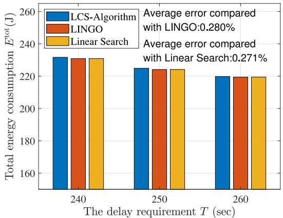  
Fig. 3. Optimality of the proposed LCS algorithm.

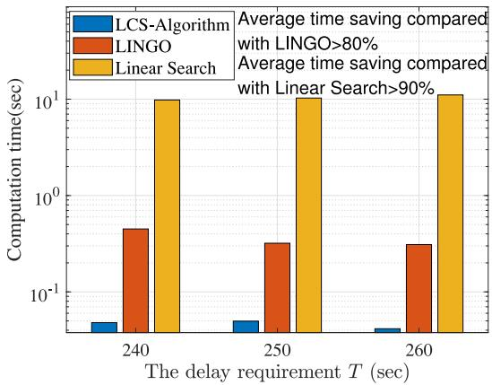

bar

| The delay requirement T (sec) | LCS-Algorithm | LINGO | Linear Search |
| ------------------------------ | ------------- | ----- | ------------- |
| 240                            | 0.05          | 0.5   | 10.0          |
| 250                            | 0.05          | 0.4   | 10.0          |
| 260                            | 0.02          | 0.4   | 10.0          |

Fig. 4. Time complexity of the proposed LCS algorithm.

is because the system sacrifices the delay requirement for completing the digital twin model training.

In addition to the accuracy verification, we validate the time complexity in Fig. 4 when the delay requirement T is set as [240, 250, 260] s in turn. It is surprising to see that compared with LINGO and linear search, our LCS algorithm can save computational time by more than 80% and 90%, respectively. The results imply that our proposed algorithm has significantly lower time complexity, and it reduces the time complexity of linear search significantly. Note that the time complexity of two-dimension linear search is ${ \mathcal O } ( ( [ \epsilon ^ { \mathrm { m a x } } / \Delta \epsilon ] +$ $1 ) ( [ \phi ^ { \operatorname* { m a x } } / \Delta \phi ] + 1 ) )$ , i.e., $\mathcal { O } ( [ ( \epsilon ^ { \operatorname* { m a x } } \phi ^ { \operatorname* { m a x } } ) / ( \Delta \epsilon \Delta \phi ) ] )$ ), while the time complexity of the proposed LCS algorithm is O(max $\{ [ ( | \epsilon _ { J } - \epsilon ^ { * } | ) / \Delta \epsilon ] , [ ( | \phi _ { J } - \phi ^ { * } | ) \Delta \phi ] \} )$ , which is significantly smaller than that of linear search.

# B. Evaluation of the Proposed Scheme

In this section, we validate the performance of our proposed scheme by comparing it with the fixed accuracy scheme, the nonspread spectrum scheme and the TDMA transmission scheme. In addition, we also demonstrate the performance of the total energy consumption, the global and local iterations with respect to the eavesdropping strength. The simulation settings follow the previous ones.

In Figs. 5 and 6, we use the convolution neural network (CNN) to perform FL on the MNIST data set [52]. For comparison, we also show the results of the scheme that fixes the local accuracy as $\phi = 0 . 5 \phi ^ { \mathrm { m a x } }$ . In Fig. 5, we can see that the loss function value decreases as the number of global iterations increases, and the scheme of ${ \phi } = 0 . 5 \phi ^ { \mathrm { m a x } }$ converges faster than our proposed scheme. Fig. 6 presents the accuracy comparison on the test data set between the proposed scheme and the scheme of $\phi \ : = \ : 0 . 5 \phi ^ { \mathrm { m a x } }$ , and the accuracy of the scheme that fixes the local accuracy as $\phi = 0 . 5 \phi ^ { \mathrm { m a x } }$ can be slightly higher. This is because that we aim to minimize the energy consumption of the FL-assisted marine IoT network, which makes a sacrifice in the accuracy of specific models.

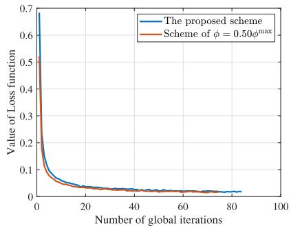

line

| Number of global iterations | The proposed scheme | Scheme of φ = 0.50φ_max |
| --------------------------- | ------------------- | ----------------------- |
| 0                           | 0.7                 | 0.7                     |
| 20                          | 0.05                | 0.06                    |
| 40                          | 0.03                | 0.04                    |
| 60                          | 0.02                | 0.03                    |
| 80                          | 0.01                | 0.02                    |
| 100                         | 0.01                | 0.01                    |

Fig. 5. Comparison of loss function values of CNN on the MNIST data set.

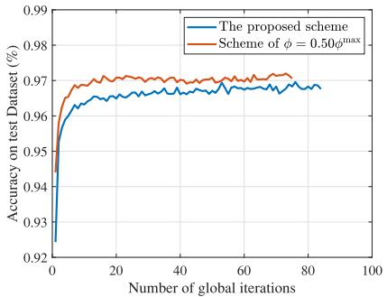

line

| Number of global iterations | The proposed scheme | Scheme of φ = 0.50φ^max |
| --------------------------- | ------------------- | ------------------------ |
| 0                           | 0.92                | 0.94                     |
| 20                          | 0.965               | 0.97                     |
| 40                          | 0.968               | 0.97                     |
| 60                          | 0.967               | 0.97                     |
| 80                          | 0.968               | 0.97                     |
| 100                         | 0.967               | 0.97                     |

Fig. 6. Comparison of test accuracy of CNN on the MNIST data set.

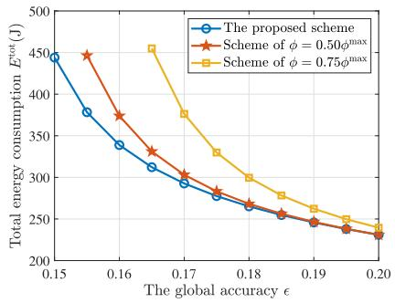

line

| The global accuracy ε | The proposed scheme | Scheme of φ = 0.50φ_max | Scheme of φ = 0.75φ_max |
| --------------------- | ------------------- | ----------------------- | ----------------------- |
| 0.15                  | 450                 | 450                     | 450                     |
| 0.16                  | 380                 | 380                     | 450                     |
| 0.17                  | 310                 | 310                     | 380                     |
| 0.18                  | 270                 | 270                     | 320                     |
| 0.19                  | 250                 | 250                     | 270                     |
| 0.20                  | 230                 | 230                     | 240                     |

Fig. 7. Performance gain of the proposed scheme compared with the fixed local accuracy schemes.

Fig. 7 evaluates the performance of our proposed scheme by comparing it with the schemes of $\phi ~ = ~ 0 . 5 \phi ^ { \mathrm { m a x } }$ and $\phi = 0 . 7 5 \phi ^ { \mathrm { m a x } }$ . We can find that our proposed scheme outperforms in terms of energy consumption. Besides, the energy consumption of all the schemes decreases with the increase of global accuracy , and the difference in energy consumption of different schemes decreases gradually.

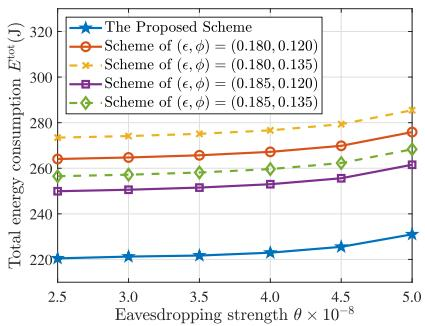

line

| Eavesdropping strength θ × 10⁻⁸ | The Proposed Scheme | Scheme of (ε, φ) = (0.180, 0.120) | Scheme of (ε, φ) = (0.180, 0.135) | Scheme of (ε, φ) = (0.185, 0.120) | Scheme of (ε, φ) = (0.185, 0.135) |
| ------------------------------- | ------------------- | ---------------------------------- | ---------------------------------- | ---------------------------------- | ---------------------------------- |
| 2.5                             | 220                 | 260                                | 275                                | 245                                | 255                                |
| 3.0                             | 222                 | 262                                | 278                                | 248                                | 258                                |
| 3.5                             | 224                 | 264                                | 280                                | 250                                | 260                                |
| 4.0                             | 226                 | 266                                | 282                                | 252                                | 262                                |
| 4.5                             | 228                 | 268                                | 284                                | 254                                | 264                                |
| 5.0                             | 230                 | 270                                | 286                                | 256                                | 266                                |

Fig. 8. Performance comparison between the proposed scheme and the fixed global accuracy and local accuracy schemes versus different eavesdropping strengths θ .

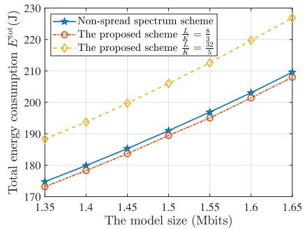

line

| The model size (Mbits) | Non-spread spectrum scheme | The proposed scheme L/K = 0.52 | The proposed scheme L/K = 0.42 |
| ---------------------- | -------------------------- | ------------------------------ | ------------------------------ |
| 1.35                   | 175                        | 173                            | 189                            |
| 1.4                    | 180                        | 178                            | 194                            |
| 1.45                   | 185                        | 183                            | 200                            |
| 1.5                    | 190                        | 188                            | 206                            |
| 1.55                   | 195                        | 193                            | 212                            |
| 1.6                    | 200                        | 198                            | 218                            |
| 1.65                   | 205                        | 203                            | 224                            |

Fig. 9. Performance comparison between the proposed scheme and the nonspread spectrum scheme versus different model sizes.

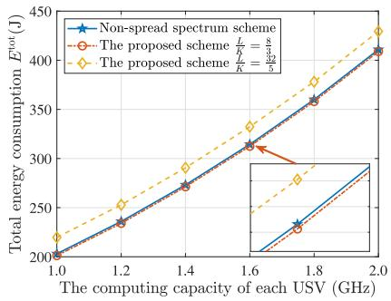

line

| The computing capacity of each USV (GHz) | Non-spread spectrum scheme | The proposed scheme (L/K = 4.8) | The proposed scheme (L/K = 5.2) |
| ---------------------------------------- | --------------------------- | --------------------------------- | --------------------------------- |
| 1.0                                      | 200                         | 200                               | 200                               |
| 1.2                                      | 230                         | 230                               | 250                               |
| 1.4                                      | 270                         | 270                               | 300                               |
| 1.6                                      | 310                         | 310                               | 350                               |
| 1.8                                      | 360                         | 360                               | 400                               |
| 2.0                                      | 410                         | 410                               | 450                               |

Fig. 10. Performance comparison between the proposed scheme and the nonspread spectrum scheme versus different computing capacities of USVs.

Fig. 8 demonstrates the performance of our proposed scheme versus different eavesdropping strengths θ. For comparison, we set the global accuracy and local accuracy as different fixed values. Note that $E ^ { \mathrm { t o t } }$ increases when $\theta$ increases as expected. It is because under the increasing eavesdropping intensity, the marine FL-aided digital twin network has to strengthen the resource allocation to satisfy the various constraints. Specifically, by the expression of the closed-form solution to $p _ { S } .$ , we can find that the value of $p _ { S } ^ { * }$ increases with respect to the eavesdropping strength θ, which leads to an increase in total energy consumption. Besides, our proposed scheme outperforms the scheme of fixed local accuracy and global accuracy, since the global accuracy and the local accuracy are jointly optimized in our proposed scheme.

Fig. 9 evaluates the performance of our proposed spread spectrum scheme in comparison with the nonspread spectrum scheme versus different model sizes. We can see that more energy is consumed as the computing workload increases for all the schemes. Fig. 10 presents the detailed energy consumption when the computing capability of USVs varies from 1.0 to 2.0 GHz. The total energy consumption of all the schemes increases with respect to the computing capability of USVs. According to Theorem 1, the security throughput $R _ { S } ^ { \mathrm { s e c } }$ increases with respect to the channel bandwidth $W ,$ i.e., the security throughput $R _ { S } ^ { \mathrm { s e c } }$ of our proposed scheme is larger than that of the nonspread spectrum scheme. However, both Figs. 9 and 10 show that the total energy consumption $E ^ { \mathrm { t o t } }$ of our proposed scheme may be higher than that of the nonspread spectrum scheme. Thus, we have to make a tradeoff on the energy consumption and security throughput in the FL-assisted marine digital twin network.

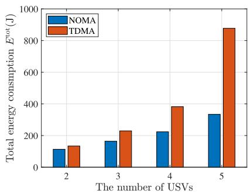

bar

| The number of USVs | NOMA (J) | TDMA (J) |
|---|---|---|
| 2 | 120 | 140 |
| 3 | 170 | 230 |
| 4 | 230 | 390 |
| 5 | 340 | 880 |

Fig. 11. Performance gain of the proposed scheme compared with TDMA scheme versus different USV numbers.

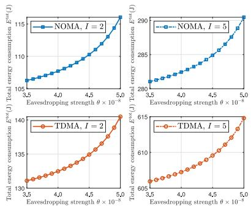

line

| Eavesdropping strength θ × 10⁻⁸ | NOMA, I = 2 | NOMA, I = 5 | TDMA, I = 2 | TDMA, I = 5 |
| ------------------------------ | ----------- | ----------- | ----------- | ----------- |
| 3.0                            | 105         | 280         | 130         | 605         |
| 4.0                            | 107         | 282         | 132         | 607         |
| 5.0                            | 110         | 285         | 135         | 610         |
| 6.0                            | 113         | 288         | 138         | 613         |
| 7.0                            | 116         | 290         | 140         | 615         |
| 8.0                            | 119         | 292         | 142         | 617         |
| 9.0                            | 122         | 294         | 144         | 619         |
| 10.0                           | 125         | 296         | 146         | 621         |
| 11.0                           | 128         | 298         | 148         | 623         |
| 12.0                           | 131         | 300         | 150         | 625         |
| 13.0                           | 134         | 302         | 152         | 627         |
| 14.0                           | 137         | 304         | 154         | 629         |
| 15.0                           | 140         | 306         | 156         | 631         |
| 16.0                           | 143         | 308         | 158         | 633         |
| 17.0                           | 146         | 310         | 160         | 635         |
| 18.0                           | 149         | 312         | 162         | 637         |
| 19.0                           | 152         | 314         | 164         | 639         |
| 20.0                           | 155         | 316         | 166         | 641         |
| 21.0                           | 158         | 318         | 168         | 643         |
| 22.0                           | 161         | 320         | 170         | 645         |
| 23.0                           | 164         | 322         | 172         | 647         |
| 24.0                           | 167         | 324         | 174         | 649         |
| 25.0                           | 170         | 326         | 176         | 651         |
| 26.0                           | 173         | 328         | 178         | 653         |
| 27.0                           | 176         | 330         | 180         | 655         |
| 28.0                           | 179         | 332         | 182         | 657         |
| 29.0                           | 182         | 334         | 184         | 659         |
| 30.0                           | 185         | 336         | 186         | 661         |
| 31.0                           | 188         | 338         | 188         | 663         |
| 32.0                           | 191         | 340         | 190         | 665         |
| 33.0                           | 194         | 342         | 192         | 667         |
| 34.0                           | 197         | 344         | 194         | 669         |
| 35.0                           | 200         | 346         | 196         | 671         |
| 36.0                           | -           | -           | -           | -           |
| 37.0                           | -           | -           | -           | -           |
| 38.0                           | -           | -           | -           | -           |
| 39.0                           | -           | -           | -           | -           |
| 40.0                           | -           | -           | -           | -           |
| 41.0                           | -           | -           | -           | -           |
| 42.0                           | -           | -           | -           | -           |
| 43.0                           | -           | -           | -           | -           |
| 44.0                           | -           | -           | -           | -           |
| 45.0                           | -           | -           | -           | -           |
| 46.0                           | -           | -           | -           | -           |
| 47.0                           | -           | -           | -           | -           |
| 48.0                           | -           | -           | -           | -           |
| 49.0                           | -           | -           | -           | -           |
| 50.0                           | -           | -           | -           | -           |
| π/π (θ × θ × θ × θ × θ × θ × θ × θ × θ × θ × θ × θ × θ × θ × θ × θ × θ × θ × θ × θ × θ × θ × θ × θ × θ × θ × θ × θ × θ × θ × θ × θ × θ × θ × θ = π/π / π/π * θ × θ × θ × θ × θ × θ × θ × θ × θ × θ × θ × θ × θ × θ × θ × θ × θ × θ × θ × θ × θ × θ × θ × θ × θ × θ × θ × θ × θ × θ × θ × θ × θ × φ/π / π/π * θ × θ × θ × θ × θ × θ × θ × θ × θ × θ × θ × θ × θ × θ × θ × θ × θ × φ/π / π/π * φ/π * φ/π * φ/π * φ/π * φ/π * φ/π * φ/π * φ/π * φ/π * φ/π * φ/π * φ/π * φ/π * φ/π * φ/π * φ/π * φ/π * φ/π * φ/π * φ/π * φ/π * φ/π * φ/π * φ/π * φ/π * f/π / π/π * φ/π * φ/π * φ/π * φ/π * φ/π * φ/π * φ/π * φ/π * φ/π * φ/π * φ/π * φ/π * φ/π * φ/π * φ/π * φ/π * φ/π * φ/π * φ/π * f/f / π/π * φ/f * φ/f * φ/f * φ/f * φ/f * φ/f * φ/f * φ/f * φ/f * φ/f * φ/f * φ/f * φ/f * φ/f * φ/f * φ/f * f/f / π/π / π/π * φ/f / φ/f * φ/f * φ/f * φ/f * φ/f * φ/f * φ/f * φ/f * f/f / π/π / π/π * φ/f / φ/f * φ/f * φ/f * φ/f * φ/f * φ/f * f/f / π/π / π/π * φ/f / φ/f * φ/f * φ/f * φ/f * φ/f * f/f / π/π / π/π * φ/f / φ/f * φ/f * φ/f * f/f / π/π / π/π * φ/f / φ/f * f/f / π/π / π/π * f/f / f/f / π/π / π/π * f/f / f/f / π/π / π/π : π/π / π/π : π/π / π/π : π/π / π/π : π/π / π/π : π/π / π/π : π/π / π/π : π/π / π/π : π/π / π/π : π/π / π/π : π/π / π/π : π/π / π/π : π/π / π/π : π/π (with label 'NOMA, I = N') |
| π (θ × θ)                      | ~15          (E^est(J)) |
| ε (E^est(J))                   | ~28          (E^est(J)) |
| ε (E^est(N))                   | ~3            (E^est(J)) |
| ε (E^est(N))                   | ~4            (E^est(J)) |
| ε (E^est(N))                   | ~5            (E^est(J)) |
| ε (E^est(N))                   | ~6            (E^est(J)) |
| ε (E^est(N))                   | ~7            (E^est(J)) |
| ε (E^est(N))                   | ~8            (E^est(J)) |
| ε (E^est(N))                   | ~9            (E^est(J)) |
| ε (E^est(N))                   | ~10          (E^est(J)) |
| ε (E^est(N))                   | ~11          (E^est(J)) |
| ε (E^est(N))                   | ~12          (E^est(J)) |
| ε (E^est(N))                   | ~13          (E^est(J)) |
| ε (E^est(N))                   | ~14          (E^est(J)) |
| ε (E^est(N))                   | ~15          (E^est(J)) |
| ε (E^est(N))                   | ~16          (E^est(J)) |
| ε (E^est(N))                   | ~17          (E^est(J)) |
| ε (E^est(N))                   | ~18          (E^est(J)) |
| ε (E^est(N))                   | ~19          (E^est(J)) |
| ε (E^est(N))                   | ~20          (E^est(J)) |
| ε (E^est(N))                   | ~21          (E^est(J)) |
| ε (E^est(N))                   | ~22          (E^est(J)) |
| ε (E^est(N))                   | ~23          (E^est(J)) |
| ε (E^est(N))                   | ~24          (E^est(J)) |
| ε (E^est(N))                   | ~25          (E^est(J)) |
| ε (E^est(N))                   | ~26          (E^est(J)) |
| ε (E^est(N))                   | ~27          (E^est(J)) |
| ε (E^est(N))                   | ~28          (E^est(J)) |
| ε (E^est(N))                   | ~29          (E^est(J)) |
| ε (E^est(N))                   | ~3            (E^est(J))
| ε (E^est(N))                   | ~4            (E^est(J))
|
| ε (E^est(N))                   | ~5            (E^est(J))
|
| ε (E^est(N))                   | ~6            (E^est(J))
|
| ε (E^est(N))                   | ~7            (E^est(J))
|
| ε (E^est(N))                   | ~8            (E^est(J))
|
| ε (E^est(N))                   | ~9            (E^est(J))
|
| ε (E^est(N))                   | ~10          (E^est(J))
|
| ε (E^est(N))                   | ~11          (E^est(J))
|
| ε (E^st(N))                   | ~12          (E^est(J))
|
| ε (E^st(N))                   | ~13          (E^st(J))
|
| ε (E^st(N))                   | ~14          (E^st(J))
|
| ε (E^st(N))                   | ~15          (E^st(J))
|
| ε (E^st(N))                   | ~16          (E^st(J))
|
| ε (E^st(N))                   | ~17          (E^st(J))
|
| ε (E^st(N))                   | ~18          (E^st(J))
|
| ε (E^st(N))                   | ~19          (E^st(J))
|
| ε (E^st(N))                   | ~2             (-)     |
| ε (E^st(N))                   | ~3            (-)     |
| ε (E^st(N))                   | ~4            (-)     |
| ε (E^st(N))                   | ~5            (-)     |
| ε (E^st(N))                   | ~6            (-)     |
| ε (E^st(N))                   | ~7            (-)     |
| ε (E^st(N))                   | ~8            (-)     |
| ε (E^st(N))                   | ~9            (-)     |
| ε (E^st(N))                   | ~10          (-)    |
| ε (E^st(N))                   | ~11          (-)    |
| ε (E^st(N))                   | ~12          (-)    |
| ε (E^st(N))                   | ~13          (-)    |
| ε (E^st(N))                   | ~14          (-)    |
| ε (E^st(N))                   | ~15          (-)    |
| ε (E^st(N))                   | ~16          (-)    |
| ε (E^st(N))                   | ~17          (-)    |
| ε (E^st(N))                   | ~18          (-)    |
| ε (E^st(N))                   | ~19          (-)    |
| ε (E^st(N))                   | ~2             (-)     |
| ε (E^st(N))                   | ~3            (-)     |
| ε (E^st(N))                   | ~4            (-)     |
| ε (E^st(N))                   | ~5            (-)     |
| ε (E^st(N))                   | ~6            (-)     |
| ε (E^st(N))                   | ~7            (-)|

Fig. 12. Performance gain of the proposed scheme compared with TDMA scheme versus different USV numbers and eavesdropping strengths θ.

Fig. 11 demonstrates the performance of our proposed NOMA transmission scheme in comparison with the TDMA transmission scheme versus different USV numbers. We can see that the total energy consumption of both schemes increases as the density of USVs increases. And our proposed NOMA transmission scheme performs better than the TDMA transmission scheme. Specifically, our proposed scheme can save 36.79% energy consumption on average compared with the TDMA transmission scheme.

Fig. 12 demonstrates the performance gain of our proposed scheme via NOMA transmission in comparison with the TDMA transmission scheme versus different eavesdropping intensities. We can see that the total energy consumption of both schemes increases as the eavesdropping intensity increases. In addition, Fig. 12 shows that our proposed scheme outperforms the TDMA transmission scheme at the same number of USVs. Specifically, our proposed scheme can save 18.39% and 53.32% energy consumption when the number of USVs is set as I = 2 and $I = 5 ,$ , respectively. In Fig. 13, the energy consumption of both multiple access schemes increases as the USV’s computing capacity varies from 1.2 to 2.2 GHz, and the proposed NOMA transmission scheme outperforms the TDMA transmission scheme. To be specific, compared with the TDMA transmission scheme, it can save 11.08% and 47.27% energy consumption when the number of USVs is set as 2 and 5, respectively. In brief, our proposed scheme can save a higher proportion of energy consumption when more USVs participate in the FL-assisted marine digital twin networks.

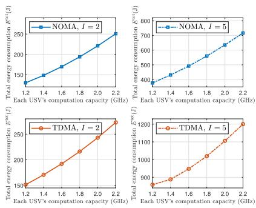

line

| Method | USV's computation capacity (GHz) | Total energy consumption E^ext (J) |
|--------|----------------------------------|-----------------------------------|
| NOMA, I = 2 | 1.2 | 1300 |
| NOMA, I = 2 | 1.4 | 1500 |
| NOMA, I = 2 | 1.6 | 1700 |
| NOMA, I = 2 | 1.8 | 2000 |
| NOMA, I = 2 | 2.0 | 2300 |
| NOMA, I = 2 | 2.2 | 2500 |
| NOMA, I = 5 | 1.2 | 400 |
| NOMA, I = 5 | 1.4 | 450 |
| NOMA, I = 5 | 1.6 | 500 |
| NOMA, I = 5 | 1.8 | 550 |
| NOMA, I = 5 | 2.0 | 600 |
| NOMA, I = 5 | 2.2 | 700 |
| TDMA, I = 2 | 1.2 | 1500 |
| TDMA, I = 2 | 1.4 | 1700 |
| TDMA, I = 2 | 1.6 | 2000 |
| TDMA, I = 2 | 1.8 | 2300 |
| TDMA, I = 2 | 2.0 | 2600 |
| TDMA, I = 2 | 2.2 | 3000 |
| TDMA, I = 5 | 1.2 | 800 |
| TDMA, I = 5 | 1.4 | 900 |
| TDMA, I = 5 | 1.6 | 1050 |
| TDMA, I = 5 | 1.8 | 1200 |
| TDMA, I = 5 | 2.0 | 1350 |
| TDMA, I = 5 | 2.2 | 1600 |

Fig. 13. Performance gain of the proposed scheme compared with TDMA scheme versus different USV numbers and USV computing capacity.

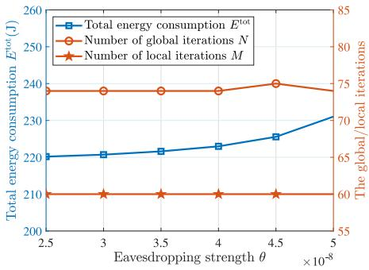

line

| Eavesdropping strength θ ×10⁻⁸ | Total energy consumption E^tot (J) | Number of global iterations N | Number of local iterations M |
| ------------------------------ | ----------------------------------- | ----------------------------- | ---------------------------- |
| 2.5                            | 220                                 | 75                            | 60                           |
| 3                              | 221                                 | 75                            | 60                           |
| 3.5                            | 222                                 | 75                            | 60                           |
| 4                              | 223                                 | 75                            | 60                           |
| 4.5                            | 225                                 | 76                            | 60                           |
| 5                              | 230                                 | 75                            | 60                           |

Fig. 14. Performance of energy consumption and global/local iterations versus different eavesdropping strengths θ .

Fig. 14 shows the performance of the total energy consumption $E ^ { \mathrm { t o t } }$ , the numbers of global and local iterations versus different eavesdropping strengths θ. It can be seen that $E ^ { \mathrm { t o t } }$ increases with θ, since the energy consumed by the HAP to broadcast the global model increases with the eavesdropping strength. Specifically, the HAP has to strengthen the transmission power to satisfy communication security, as the closed-form solution to $p _ { S }$ in Proposition 1 implies. Besides, Fig. 14 also shows that the numbers of global and local iterations, i.e., N and M, do not change with the eavesdropping strength relatively. This implies that there is no correlation between the global iterations, the local iterations and the eavesdropping strength.

# VII. CONCLUSION

In this work, we have investigated an FL-assisted marine digital twin network subject to eavesdropping attacks. Specifically, we adopt the FL framework to construct the digital twin of the M-IoT, in which each USV uploads its trained local model to the HAP for model aggregation, and the potential communication risk that a malicious eavesdropper intends to wiretap the aggregated model information is considered. The chaotic spread spectrum technology and secrecy probability analysis are introduced to enhance secure communication in the downlink. Aiming to achieve the minimum energy consumption of the M-IoT, we formulate an optimization problem by jointly optimizing the global accuracy, the local accuracy, the $\mathrm { H A P } ^ { \prime } \mathrm { s }$ transmission power, and the model uploading duration. To solve the joint optimization problem efficiently, we vertically layer it into a top problem with respect to the global accuracy and the local accuracy as well as a subproblem with respect to the $\mathrm { H A P } ^ { \prime } \mathrm { s }$ transmission power and model uploading duration. We prove the optimal solution to this problem to be unique and propose an efficient LCS algorithm to tackle it. Numerical results validate the performance of our proposed algorithm in terms of optimality and time efficiency, and show the performance gain compared with the fixed accuracy scheme, the nonspread spectrum scheme and the TDMA transmission scheme. In our future work, we will take the asynchronous uploading and aggregation of models into consideration, which is a challenging research direction.

# APPENDIX

# PROOF OF THEOREM 1

Parameters $\hat { n } _ { i }$ and $\hat { n } _ { E }$ are used to denote the noise power spectral density of USV i and the eavesdropper, respectively. Then the security throughput $R _ { S } ^ { \mathrm { s e c } }$ at the bandwidth of W can be represented as

$$
R _ {S} ^ {\mathrm{sec}} = W \left[ \log_ {2} (1 + p _ {S} \hat {g}) - \log_ {2} \left(1 + \frac {p _ {S} g _ {\mathrm{SE}}}{W \hat {n} _ {E}}\right) \right] ^ {+} \tag {50}
$$

where $\hat { g } = \textstyle \operatorname* { m i n } _ { \forall i \in { \mathcal { T } } } \{ ( g _ { i } / W \hat { n } _ { i } ) \}$ .

To simplify the expression of (50) at positive values, we introduce two auxiliary variables $P = \mathrm { m i n } _ { \forall i \in \mathcal { T } } \{ ( p _ { S } g _ { i } / \hat { n } _ { i } ) \}$ } and $Q = ( p _ { S } g _ { \mathrm { S E } } / \hat { n } _ { E } )$ , and $P > Q$ . Thus, the security throughput $R _ { S } ^ { \mathrm { s e c } }$ can be rewritten as

$$
R _ {S} ^ {\mathrm{sec}} = W \left[ \log_ {2} \left(1 + \frac {P}{W}\right) - \log_ {2} \left(1 + \frac {Q}{W}\right) \right]. \tag {51}
$$

Get the first derivative of $R _ { S } ^ { \mathrm { s e c } }$ concerning W, which is shown as

$$
\begin{array}{l} \frac {\partial R _ {S} ^ {\mathrm{sec}}}{\partial W} = \log_ {2} \left(1 + \frac {P}{W}\right) - \frac {P}{\ln 2 (W + P)} \\ - \left[ \log_ {2} \left(1 + \frac {Q}{W}\right) - \frac {Q}{\ln 2 (W + Q)} \right] \\ = \log_ {2} \left(1 + \frac {P}{W}\right) - \frac {1}{\ln 2 \left(1 + \frac {W}{P}\right)} \\ - \left[ \log_ {2} \left(1 + \frac {Q}{W}\right) - \frac {1}{\ln 2 \left(1 + \frac {W}{Q}\right)} \right] \\ = f (P) - f (Q) \tag {52} \\ \end{array}
$$

where function $f ( x ) = \log _ { 2 } ( 1 + [ x / W ] ) - ( 1 / [ \ln 2 ( 1 + [ W / x ] ) ] )$ and $x > 0$ .

Similarly, getting the first derivative of $f ( x )$ concerning x, then we have the following:

$$
f (x) ^ {\prime} = \frac {x}{\ln 2 (W + x) ^ {2}} > 0 \tag {53}
$$

and $P > Q , f ( P ) - f ( Q ) > 0$ . Thus, we can draw the conclusion that $( \partial R _ { S } ^ { \mathrm { s e c } } / \partial W ) > 0$ , i.e., $R _ { S } ^ { \mathrm { s e c } }$ monotonic increases with respect to W.

Correspondingly, the spread spectrum bandwidth is $W ( L / K ) = W ( 2 ^ { K } / K ) > W$ , where K is a positive integer, then $R _ { S } ^ { \mathrm { s e c } } ( W [ L / K ] ) ~ > ~ R _ { S } ^ { \mathrm { s e c } } ( W )$ , i.e., the security througbandwidth W increases to $R _ { S } ^ { \mathrm { s e c } }$ $W ( L / K )$ thus, Theorem 1 follows.

# REFERENCES

[1] T. K. Rodrigues, J. Liu, and N. Kato, “Offloading decision for mobile multi-access edge computing in a multi-tiered 6G network,” IEEE Trans. Emerg. Topics Comput., vol. 10, no. 3, pp. 1414–1427, Jul.-Sep. 2022.   
[2] S. Aslam, M. P. Michaelides, and H. Herodotou, “Internet of Ships: A survey on architectures, emerging applications, and challenges,” IEEE Internet Things J., vol. 7, no. 10, pp. 9714–9727, Oct. 2020.   
[3] Y. Zhu, B. Mao, and N. Kato, “A dynamic task scheduling strategy for multi-access edge computing in IRS-aided vehicular networks,” IEEE Trans. Emerg. Topics Comput., vol. 10, no. 4, pp. 1761–1771, Oct.- Dec. 2022.   
[4] B. Qian, H. Zhou, T. Ma, K. Yu, Q. Yu, and X. Shen, “Multi-operator spectrum sharing for massive IoT coexisting in 5G/B5G wireless networks,” IEEE J. Sel. Areas Commun., vol. 39, no. 3, pp. 881–895, Mar. 2021.   
[5] J. Zhang, M. Dai, and Z. Su, “Task allocation with unmanned surface vehicles in smart ocean IoT,” IEEE Internet Things J., vol. 7, no. 10, pp. 9702–9713, Oct. 2020.   
[6] Y. Chen, J. Zhao, J. Hu, S. Wan, and J. Huang, “Distributed task offloading and resource purchasing in NOMA-enabled mobile edge computing: Hierarchical game theoretical approaches,” ACM Trans. Embed. Comput. Syst., to be published, doi: 10.1145/3597023.   
[7] W. Wu et al., “Dynamic RAN slicing for service-oriented vehicular networks via constrained learning,” IEEE J. Sel. Areas Commun., vol. 39, no. 7, pp. 2076–2089, Jul. 2021.   
[8] H. Zhou, N. Cheng, Q. Yu, X. S. Shen, D. Shan, and F. Bai, “Toward multi-radio vehicular data piping for dynamic DSRC/TVWSspectrum sharing,” IEEE J. Sel. Areas Commun., vol. 34, no. 10, pp. 2575–2588, Oct. 2016.   
[9] H. Zhou, N. Cheng, J. Wang, J. Chen, Q. Yu, and X. Shen, “Toward dynamic link utilization for efficient vehicular edge content distribution,” IEEE Trans. Veh. Technol., vol. 68, no. 9, pp. 8301–8313, Sep. 2019.   
[10] F. Tang, X. Chen, T. K. Rodrigues, M. Zhao, and N. Kato, “Survey on digital twin edge networks (DITEN) toward 6G,” IEEE Open J. Commun. Soc., vol. 3, pp. 1360–1381, 2022.   
[11] Z. Wang et al., “Mobility digital twin: Concept, architecture, case study, and future challenges,” IEEE Internet Things J., vol. 9, no. 18, pp. 17452–17467, Sep. 2022.   
[12] N. Zhang, M. Tao, J. Wang, and F. Xu, “Fundamental limits of communication efficiency for model aggregation in distributed learning: A rate-distortion approach,” IEEE Trans. Commun., vol. 71, no. 1, pp. 173–186, Jan. 2023.   
[13] Z. Md. Fadlullah and N. Kato, “HCP: Heterogeneous computing platform for federated learning based collaborative content caching towards 6G networks,” IEEE Trans. Emerg. Topics Comput., vol. 10, no. 1, pp. 112–123, Jan.–Mar. 2022.   
[14] B. Ghimire and D. B. Rawat, “Recent advances on federated learning for cybersecurity and cybersecurity for federated learning for Internet of Things,” IEEE Internet Things J., vol. 9, no. 11, pp. 8229–8249, Jun. 2022.   
[15] B. Gu, A. Xu, Z. Huo, C. Deng, and H. Huang, “Privacy-preserving asynchronous vertical federated learning algorithms for multiparty collaborative learning,” IEEE Trans. Neural Netw. Learn. Syst., vol. 33, no. 11, pp. 6103–6115, Nov. 2022.

[16] Y. Wu, Y. Song, T. Wang, L. Qian, and T. Q. S. Quek, “Non-orthogonal multiple access assisted federated learning via wireless power transfer: A cost-efficient approach,” IEEE Trans. Commun., vol. 70, no. 4, pp. 2853–2869, Apr. 2022.   
[17] R. V. da Silva, J. Choi, J. Park, G. Brante, and R. D. Souza, “Multichannel ALOHA optimization for federated learning with multiple models,” IEEE Wireless Commun. Lett., vol. 11, no. 10, pp. 2180–2184, Oct. 2022.   
[18] W. Zhang, J. Chen, Y. Kuo, and Y. Zhou, “Artificial-noise-aided optimal beamforming in layered physical layer security,” IEEE Commun. Lett., vol. 23, no. 1, pp. 72–75, Jan. 2019.   
[19] H. Li, S. Zhao, Y. Li, and C. Peng, “Sum secrecy rate maximization in NOMA-based cognitive satellite-terrestrial network,” IEEE Wireless Commun. Lett., vol. 10, no. 10, pp. 2230–2234, Oct. 2021.   
[20] L. Qian, W. Wu, W. Lu, Y. Wu, B. Lin, and T. Q. S. Quek, “Secrecy-based energy-efficient mobile edge computing via cooperative non-orthogonal multiple access transmission,” IEEE Trans. Commun., vol. 69, no. 7, pp. 4659–4677, Jul. 2021.   
[21] G. Yuan, Z. Chen, X. Gao, and Y. Zhang, “Enhancing the security of chaotic direct sequence spread spectrum communication through WFRFT,” IEEE Commun. Lett., vol. 25, no. 9, pp. 2834–2838, Sep. 2021.   
[22] H. Wen et al., “Secure optical image communication using double random transformation and memristive chaos,” IEEE Photonics J., vol. 15, no. 1, pp. 1–11, Feb. 2023.   
[23] W. Chen, H. Ding, S. Wang, D. B. da Costa, F. Gong, and P. H. J. Nardelli, “Backscatter cooperation in NOMA communications systems,” IEEE Trans. Wireless Commun., vol. 20, no. 6, pp. 3458–3474, Jun. 2021.   
[24] M. A. Arfaoui, A. Ghrayeb, C. Assi, and M. Qaraqe, “CoMP-assisted NOMA and cooperative NOMA in indoor VLC cellular systems,” IEEE Trans. Commun., vol. 70, no. 9, pp. 6020–6034, Sep. 2022.   
[25] Z. Shi, J. Liu, S. Zhang, and N. Kato, “Multi-agent deep reinforcement learning for massive access in 5G and beyond ultra-dense NOMA system,” IEEE Trans. Wireless Commun., vol. 21, no. 5, pp. 3057–3070, May 2022.   
[26] L. P. Qian, H. Zhang, Q. Wang, Y. Wu, and B. Lin, “Joint multi-domain resource allocation and trajectory optimization in UAV-assisted maritime IoT networks,” IEEE Internet Things J., vol. 10, no. 1, pp. 539–552, Jan. 2023.   
[27] Z. Zhou et al., “Secure and latency-aware digital twin assisted resource scheduling for 5G edge computing-empowered distribution grids,” IEEE Trans. Ind. Informat., vol. 18, no. 7, pp. 4933–4943, Jul. 2022.   
[28] Y. Dai, K. Zhang, S. Maharjan, and Y. Zhang, “Deep reinforcement learning for stochastic computation offloading in digital twin networks,” IEEE Trans. Ind. Informat., vol. 17, no. 7, pp. 4968–4977, Jul. 2021.   
[29] T. Liu et al., “Resource allocation in DT-assisted Internet of Vehicles via edge intelligent cooperation,” IEEE Internet Things J., vol. 9, no. 18, pp. 17608–17626, Sep. 2022.   
[30] Y. Dai and Y. Zhang, “Adaptive digital twin for vehicular edge computing and networks,” J. Commun. Inf. Netw., vol. 7, no. 1, pp. 48–59, Mar. 2022.   
[31] X. Xu, Z. Liu, M. Bilal, S. Vimal, and H. Song, “Computation offloading and service caching for intelligent transportation systems with digital twin,” IEEE Trans. Intell. Transp. Syst., vol. 23, no. 11, pp. 20757–20772, Nov. 2022.   
[32] Z. Yang, M. Chen, W. Saad, C. S. Hong, and M. Shikh-Bahaei, “Energy efficient federated learning over wireless communication networks,” IEEE Trans. Wireless Commun., vol. 20, no. 3, pp. 1935–1949, Mar. 2021.   
[33] M. Chen, Z. Yang, W. Saad, C. Yin, H. V. Poor, and S. Cui, “A joint learning and communications framework for federated learning over wireless networks,” IEEE Trans. Wireless Commun., vol. 20, no. 1, pp. 269–283, Jan. 2021.   
[34] W. Wu et al., “Split learning over wireless networks: Parallel design and resource management,” IEEE J. Sel. Areas Commun., vol. 41, no. 4, pp. 1051–1066, Apr. 2023.   
[35] Q. V. Do, Q.-V. Pham, and W.-J. Hwang, “Deep reinforcement learning for energy-efficient federated learning in UAV-enabled wireless powered networks,” IEEE Commun. Lett., vol. 26, no. 1, pp. 99–103, Jan. 2022.   
[36] R. Ruby, H. Yang, F. A. P. de Figueiredo, T. Huynh-The, and K. Wu, “Energy-efficient multiprocessor-based computation and communication resource allocation in two-tier federated learning networks,” IEEE Internet Things J., vol. 10, no. 7, pp. 5689–5703, Apr. 2023.   
[37] F. Jameel, S. Wyne, G. Kaddoum, and T. Q. Duong, “A comprehensive survey on cooperative relaying and jamming strategies for physical layer security,” IEEE Commun. Surveys Tuts., vol. 21, no. 3, pp. 2734–2771, 3rd Quart., 2019.

[38] P. Angueira et al., “A survey of physical layer techniques for secure wireless communications in industry,” IEEE Commun. Surveys Tuts., vol. 24, no. 2, pp. 810–838, 2nd Quart., 2022.   
[39] L. P. Qian, Y. Wu, N. Yu, D. Wang, F. Jiang, and W. Jia, “Energyefficient multi-access mobile edge computing with secrecy provisioning,” IEEE Trans. Mobile Comput., vol. 22, no. 1, pp. 237–252, Jan. 2023.   
[40] X. Li et al., “Physical layer security of cognitive ambient backscatter communications for green Internet-of-Things,” IEEE Trans. Green Commun. Netw., vol. 5, no. 3, pp. 1066–1076, Sep. 2021.   
[41] H. Kang, X. Chang, J. Mišic, V. B. Miši ´ c, J. Fan, and J. Bai, “Improving ´ dual-UAV aided ground-UAV bi-directional communication security: Joint UAV trajectory and transmit power optimization,” IEEE Trans. Veh. Technol., vol. 71, no. 10, pp. 10570–10583, Oct. 2022.   
[42] T.-X. Zheng et al., “Physical-layer security of uplink mmWave transmissions in cellular V2X networks,” IEEE Trans. Wireless Commun., vol. 21, no. 11, pp. 9818–9833, Nov. 2022.   
[43] N. H. Tran, W. Bao, A. Zomaya, M. N. H. Nguyen, and C. S. Hong, “Federated learning over wireless networks: optimization model design and analysis,” in Proc. IEEE INFOCOM, 2019, pp. 1387–1395.   
[44] F. Wang, J. Xu, X. Wang, and S. Cui, “Joint offloading and computing optimization in wireless powered mobile-edge computing systems,” IEEE Trans. Wireless Commun., vol. 17, no. 3, pp. 1784–1797, Mar. 2018.   
[45] S. Herbert, I. Wassell, T.-H. Loh, and J. Rigelsford, “Characterizing the spectral properties and time variation of the in-vehicle wireless communication channel,” IEEE Trans. Commun., vol. 62, no. 7, pp. 2390–2399, Jul. 2014.   
[46] Y. Huo, Y. Tian, L. Ma, X. Cheng, and T. Jing, “Jamming strategies for physical layer security,” IEEE Wireless Commun., vol. 25, no. 1, pp. 148–153, Feb. 2018.   
[47] N. Zhang, N. Cheng, N. Lu, X. Zhang, J. W. Mark, and X. Shen, “Partner selection and incentive mechanism for physical layer security,” IEEE Trans. Wireless Commun., vol. 14, no. 8, pp. 4265–4276, Aug. 2015.   
[48] X. Zhou, M. R. McKay, B. Maham, and A. Hjørungnes, “Rethinking the secrecy outage formulation: A secure transmission design perspective,” IEEE Commun. Lett., vol. 15, no. 3, pp. 302–304, Mar. 2011.   
[49] B. He, A. Liu, N. Yang, and V. K. N. Lau, “On the design of secure non-orthogonal multiple access systems,” IEEE J. Sel. Areas Commun., vol. 35, no. 10, pp. 2196–2206, Oct. 2017.   
[50] J. Yue, C. Ma, H. Yu, and W. Zhou, “Secrecy-based access control for device-to-device communication underlaying cellular networks,” IEEE Commun. Lett., vol. 17, no. 11, pp. 2068–2071, Nov. 2013.   
[51] S. Boyd, S. P. Boyd, and L. Vandenberghe, Convex Optimization. Cambridge, U.K.: Cambridge Univ. Press, 2004.   
[52] B. McMahan, E. Moore, D. Ramage, S. Hampson, and B. A. y Arcas, “Communication-efficient learning of deep networks from decentralized data,” in Proc. Artif. Intell. Stat., 2017, pp. 1273–1282.

natural_image

Portrait of a woman with glasses and shoulder-length hair (no text or symbols visible)

Li Ping Qian (Senior Member, IEEE) received the Ph.D. degree in information engineering from The Chinese University of Hong Kong, Hong Kong, in 2010.

She worked as a Postdoctoral Research Associate with the Chinese University of Hong Kong, from 2010 to 2011. Since 2011, she has been with the College of Information Engineering, Zhejiang University of Technology, Hangzhou, China, where she is currently a Full Professor. From 2016 to 2017, she was a Visiting Scholar with the Broadband

Communications Research Group, Department of Electrical and Computer Engineering, University of Waterloo, Waterloo, ON, Canada. Her research interests include wireless communication and networking, resource management in wireless networks, massive IoTs, mobile edge computing, emerging multiple access techniques, and machine-learning-oriented toward wireless communications.

Prof. Qian was a co-recipient of the IEEE Marconi Prize Paper Award in Wireless Communications in 2011; the Best Paper Award from IEEE ICC 2016; the Best Paper Award from IEEE Communication Society GCCTC 2017; the Best Paper Award from the Digital Communications and Networking in 2021; and the Best Paper Award from IEEE WCNC 2023. She was an Associate Editor of the IET Communications from 2016 to 2022. She is currently on the editorial board of IEEE TRANSACTIONS ON COGNITIVE COMMUNICATIONS AND NETWORKING.

natural_image

Portrait of a man wearing glasses and a dark shirt (no text or symbols visible)

Mingqing Li (Graduate Student Member, IEEE) received the B.E. degree in communication engineering from Nanjing University of Information Science and Technology, Nanjing, China, in 2021. He is currently pursuing the master’s degree with the College of Information Engineering, Zhejiang University of Technology, Hangzhou, China.

His current research interest focuses on nonorthogonal multiple access, physical-layer security, and mobile edge computing.

natural_image

Portrait of a person with short hair and neutral expression (no text or symbols visible)

Ping Ye received the B.E. degree in electronic information science and technology from Wuhan Polytechnic University, Wuhan, China, in 2020. She is currently pursuing the master’s degree with the College of Information Engineering, Zhejiang University of Technology, Hangzhou, China.

Her current research interest focuses on machine learning.

natural_image

Portrait of a woman with shoulder-length dark hair and earrings (no text or symbols visible)

Qian Wang (Member, IEEE) received the B.Eng. degree in communications engineering from Harbin Engineering University, Harbin, China, in 2012, and the Ph.D. degree in electrical and computer engineering from the National University of Singapore, Singapore, in 2017, where she got the Honor of Presidents Graduate Fellowship.

From 2017 to 2019, she worked as a Research Engineer with Huawei 2012 Lab, Central Research Institute, Shenzhen, China, where she contributed to IEEE 802.11ad/ay Standards. She is currently a

Research Associate Professor with the College of Information Engineering, Zhejiang University of Technology, Hangzhou, China. Her research interests mainly involve in communication and information theory, signal processing algorithms, network optimization, and security analysis.

Dr. Wang is a member of Optical Society of America and the Senior Member of China Communication Society.

natural_image

Portrait of a woman in a dark collared shirt (no text or symbols visible)

Bin Lin (Senior Member, IEEE) received the B.S. and M.S. degrees from Dalian Maritime University, Dalian, China, in 1999 and 2003, respectively, and the Ph.D. degree from the Broadband Communications Research Group, Department of Electrical and Computer Engineering, University of Waterloo, Waterloo, ON, Canada, in 2009.

She is currently a Full Professor with the Department of Information Science and Technology, Dalian Maritime University. From 2016 to 2015, she was a Visiting Scholar with George Washington

University, Washington, DC, USA. Her current research interests include wireless communications, network dimensioning and optimization, resource allocation, artificial intelligence, maritime communication networks, edge/cloud computing, wireless sensor networks, and Internet of Things.

Dr. Lin is an Associate Editor for IET Communications.

natural_image

Portrait of a man wearing glasses and a collared shirt (no text or symbols visible)

Yuan Wu (Senior Member, IEEE) received the Ph.D. degree in electronic and computer engineering from The Hong Kong University of Science and Technology, Hong Kong, in 2010.

He is currently an Associate Professor with the State Key Laboratory of Internet of Things for Smart City, University of Macau, Macau, China, and also with the Department of Computer and Information Science, University of Macau. From 2016 to 2017, he was a Visiting Scholar with the Department of Electrical and Computer Engineering, University of

Waterloo, Waterloo, ON, Canada. His research interests include resource management for wireless networks, green communications and computing, edge computing and edge intelligence, and energy informatics.

Dr. Wu was the recipient of the Best Paper Award from the IEEE ICC’2016, WCSP’2016, IEEE TCGCC’2017, and IEEE WCNC2023. He is currently on the editorial board of IEEE TRANSACTIONS ON VEHICULAR TECHNOLOGY, IEEE TRANSACTIONS ON NETWORK SCIENCE AND ENGINEERING, and IEEE INTERNET OF THINGS JOURNAL.

natural_image

Portrait of a man wearing glasses and a suit (no text or symbols visible)

Xiaoniu Yang received the B.S. and M.S. degrees from Xidian Univerisity, Xi’an, China, in 1982 and 1988, respectively.

He is currently a Chief Scientist with the Science and Technology on Communication Information Security Control Laboratory, Jiaxing, China. He is also an Academician with the Chinese Academy of Engineering and a Ph.D. Supervisor with Zhejiang University of Technology, Hangzhou, China. He published the first software radio book Software Radio Principles and Applications (Publishing

House of Electronics Industry, China, 2001) in China along with C. Lou and J. Xu. He holds more than 40 patents. His current research interests include software-defined satellite, big data for radio signals, and deep learning-based signal processing.

Dr. Yang is a Fellow of the Chinese Institute of Electronics.