# Secrecy Energy Efficiency Maximization for UAV-Enabled Mobile Relaying

Lin Xiao , Member, IEEE, Yu Xu, Dingcheng Yang , Member, IEEE, and Yong Zeng , Member, IEEE

Abstract—This paper investigates the secrecy energy efficiency (SEE) maximization problem for unmanned aerial vehicle (UAV) enabled mobile relaying system, where a high-mobility UAV is exploited to assist transmitting confidential information from a ground source to a legitimate ground destination, in the presence of a potential eavesdropper. We aim to maximize the SEE of the UAV by jointly optimizing the communication scheduling, power allocation, and UAV trajectory over a given time horizon. The formulated problem is non-convex that is challenging to be optimally solved. To make the problem more tractable, we decompose the problem into three subproblems, and propose an efficient iterative algorithm that alternately optimizes each block of the variables with the others fixed. Moreover, the practical scenario with uncertain eavesdropper location is investigated to evaluate the performance of the proposed solution. Double circular flight and running track shape flight cases are considered to drawn more insights. Simulation results show that the proposed design significantly improves the SEE of the UAV, as compared to the benchmark schemes.

Index Terms—UAV communication, physical layer security, mobile relaying, secrecy energy efficiency, trajectory design.

## I. INTRODUCTION

O WING to their high mobility, the ability of on-demanddeployment and the capability of establishing line-of- deployment and the capability of establishing line-ofsight (LoS) communication links, unmanned aerial vehicles (UAVs) have recently attracted significant research interest in wireless communications [1]. Typical use cases of UAVenabled communications include temporary traffic offloading in cellular hotspots, mobile relaying [2]–[6], as well as information dissemination and data collection [7]–[10]. Compared to the traditional terrestrial communications with ground base stations (BSs) or access points (APs), UAVenabled communications have the advantages such as more flexible networking architecture and potentially low deployment cost. On one hand, UAV-enabled communication systems are especially suitable for on-demand coverage or unexpected events due to the swift and flexible deployment of UAVs. On the other hand, it is more likely for the UAV BSs/APs to establish line-of-sight (LoS) communication link with the ground nodes, which may significantly improve the link capacity. In addition, UAV-enabled communications provide a new degree of freedom for performance enhancement via UAV trajectory design. Generally speaking, UAV-enabled communications can best suit the communication requirement by dynamically adjusting the UAV positions, subject to practical mobility constraints, such as those on the initial/final locations, maximum speed, and maximum acceleration. However, the limited on-board energy of UAVs is one of the most critical challenges for UAV-enabled communications, since besides the conventional communication-related energy, UAVs also require additional propulsion energy to maintain aloft. To tackle such issues, the analytical energy consumption models have been developed for fixed-wing [11] and rotary-wing [12] UAVs, respectively. Based on [11], the work [6] studied the spectrum and energy efficiency maximization issues in a UAVenable mobile relaying system. In [13], an interesting trade-off between the UAV energy consumption and that of the ground nodes was revealed, via joint UAV trajectory and communication resource allocation. The work [14] studied UAV-assisted emergency networks, in which UAVs were deployed to assist communication for ground users in disasters.

One especially promising use case for UAVs in wireless communications is UAV-enabled mobile relaying. In [5], the authors proposed a UAV-enabled mobile relaying system, where throughput maximization problem is considered via joint transmit power allocation and relay trajectory optimization. On the other hand, for UAV-enabled wireless communication systems, how to ensure secure transmission of confidential information in the presence of intentional or unintentional eavesdropping is another important problem, due to the broadcast and shared nature of wireless channels. The secrecy rate is the main design metric in physicallayer security and has been investigated in many prior works (e.g., [15]–[20]). In the existing literature on physical-layer security, one of the challenging problems is that the eavesdropper is generally passive so that it is difficult to obtain its channel state information (CSI). This motivates us to resolve the CSI of the potential eavesdropper by using UAV because the channel power gain can be easily obtained by obtaining the eavesdropper’s location, while the potential eavesdropper’s location can be detected by the UAV via a UAV-mounted camera or radar [21]. In [22], the physical layer security in

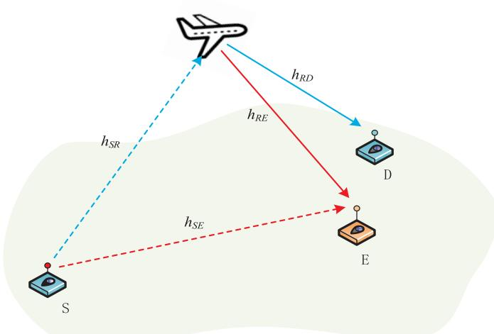  
Fig. 1. Illustration of physical-layer security in a UAV-enabled mobile relaying system.

UAV-enabled mobile relaying system was studied with the goal of the secrecy rate (SR) maximization, but it did not focus on the UAV trajectory optimization and ignored the communication link between the source and eavesdropper. Moreover, the works [23] and [24] investigated the secure rotary-wing UAV communications. The authors considered the UAV-enabled BS that serves multiple ground users in the presence of a potential eavesdropper, and their goal is to maximize the energy efficiency of the UAV by jointly optimizing the transmit power and user scheduling as well as the trajectory [23]. The authors in [24] studied a UAV-ground secure communication system in the co-existence of multiple potential eavesdroppers, and an optimization problem was formulated to maximize worstcase secrecy rate via joint robust UAV trajectory and transmit power optimization.

On the other hand, considering the practical application scenarios, there are many applications for UAV missions with actually pre-specified mission completion time, such as for periodic sensing, aerial inspection, data collection, electronic surveillance and so on. The critical assumption for these applications is that the endurance of the UAV is sufficiently long so that the energy will not be depleted before the specified flight period. Fortunately, the endurance of a typical fixed-wing UAV (e.g., Borey-10 from UAVOS Company, Volanti from Carbonix Company) can be last for 2 - 4 Hours, depending on the flying status/trajectories. Combining the fixed flight time application and secrecy transmission scenario, apart from the total energy consumption constraint, it would be interesting to investigate the secrecy energy efficiency issue for the fixed flight period to give energy-efficient designs.

In this paper, we consider the physical-layer security in UAV-enabled mobile relaying system as shown in Fig. 1, where a UAV is employed to relay the information from a ground source node to a ground destination node in the presence of a potential eavesdropper. To maximally explore the UAV’s controllable mobility, we adopt the delay-tolerant decode-and-forward (DF) transmission protocol. Specifically, the UAV would firstly fly sufficiently close to source node, collect the data and buffer it for a relatively large timescale, then, fly sufficiently close to the destination node and forward the data to the destination node. This is known as Collect-Store-Forward transmission protocol. The direct link between the source and destination is assumed to be severely blocked. Our aim is to maximize the secrecy energy efficiency (SEE) of the UAV for the given finite time horizon, via jointly optimizing the communication scheduling, the source/relay power allocation, and UAV’s trajectory so as to strike a tradeoff between the secrecy rate and the energy consumption of the UAV. In our proposed design, the UAV’s mobility is subject to the initial/final location constraint as well as the maximum speed/acceleration constraint. Moreover, we assume that the UAV operates in time-division duplexing (TDD) mode. The formulated problem for SEE maximization is a mixed integer non-convex maximization problem that is difficult to be optimally solved. To tackle this problem, we propose an efficient iterative problem by applying successive convex approximation (SCA) and Dinkelbach’s algorithm to obtain a high-quality suboptimal solution. Numerical results validate our proposed joint design method, and also show the significant performance gain, as compared to the benchmarks.

The rest of the paper is organised as follows. Section II introduces the system model, communication protocol of the UAV-enabled mobile relaying and formulate the secrecy energy efficiency optimization problem. In Section III, we proposed the high-quality suboptimal solution and present the practical implementation issue for the uncertain eavesdropper location scenario. Simulation results are shown in Section IV, followed by conclusions in Section V.

## II. SYSTEM MODEL AND PROBLEM FORMULATION

## A. System Model

As shown in Fig. 1, we consider a wireless communication system where a UAV is dispatched to assist information transmission form a source node (denoted by S) to a legitimate destination node (denoted by D) in the presence of an eavesdropper (denoted by E). The link between S and D is assumed to be severely blocked. Without loss of generality, a three-dimensional (3D) Cartesian coordinate system is considered. The nodes S, D and E are located at the fixed locations on the ground, whose horizontal coordinates are denoted by $\mathbf { w } _ { S } = [ x _ { s } , y _ { s } ] ^ { T } , \mathbf { w } _ { D } = [ x _ { D } , y _ { D } ] ^ { T } , \mathbf { w } _ { E } = [ x _ { E } , x _ { E } ] ^ { T }$ , respectively. The distance from S to the eavesdropper node can be given as:

$$
d _ { S E } = \lVert \mathbf { w } _ { S } - \mathbf { w } _ { E } \rVert\tag{1}
$$

The UAV is assumed to fly at a fixed altitude H from a given initial location to a final location within a finite time horizon T. At any time instant $t \in [ 0 , T ]$ , the time-varying coordinate of the UAV can be expressed as $[ x ( t ) , y ( t ) , \dot { H } ] ^ { T }$ and the corresponding horizontal coordinate is denoted as $\mathbf { q } ( t ) = [ x ( t ) , y ( t ) ]$ . As thus, the UAV’s velocity and acceleration at any time instant can be expressed as $\mathbf { v } ( t ) = { \dot { \mathbf { q } } } ( t )$ and $\mathbf { a } ( t ) = { \ddot { \mathbf { q } } } ( t )$ , respectively.

For ease of exposition, the time horizon T is discretized into N time slots with a sufficiently small and equal-spaced time interval $\delta _ { t } .$ , i.e., $\begin{array} { r c l } { T } & { = } & { N \delta _ { t } } \end{array}$ . For notational convenience, we let $\mathcal { N } = \{ 0 , 1 , \ldots , N \}$ represent the time slot set. Therefore, the UAV’s trajectory ${ \bf q } ( t )$ within the time interval T can be approximately represented by the sequence $\{ \mathbf { q } [ n ] = [ x [ n ] , y [ n ] ] ^ { \hat { T } } \} _ { n = 1 } ^ { N }$ , where $\mathbf { \bar { q } } [ n ] \triangleq \mathbf { q } ( n \bar { \delta } _ { t } )$ denotes the [ ] = [ [ ] [ ]]UAV location at time slot $n ,$ with $n \in \mathcal N .$ . Then, for any time slot $n ,$ the distance from S to the mobile relaying UAV can be denoted as:

$$
d _ { S R } [ n ] = { \sqrt { \| \mathbf { q } [ n ] - \mathbf { w } _ { S } \| ^ { 2 } + H ^ { 2 } } }\tag{2}
$$

Similarly, the distance from the UAV to D and E can be respectively expressed as:

$$
d _ { R D } [ n ] = { \sqrt { \| \mathbf { q } [ n ] - \mathbf { w } _ { D } \| ^ { 2 } + H ^ { 2 } } }\tag{3}
$$

$$
d _ { R E } [ n ] = { \sqrt { \| \mathbf { q } [ n ] - \mathbf { w } _ { E } \| ^ { 2 } + H ^ { 2 } } }\tag{4}
$$

The initial and final locations of the UAV are denoted as ${ \bf q } _ { 0 } =$ $[ x _ { 0 } , y _ { 0 } ] ^ { T }$ and $\mathbf q _ { F } = [ x _ { F } , y _ { F } ] ^ { T }$ , respectively. Hence, we have

$$
{ \bf q } [ 0 ] = { \bf q } _ { 0 }\tag{5}
$$

$$
{ \bf q } [ N ] = { \bf q } _ { F } .\tag{6}
$$

By using Taylor expansion, the UAV’s location, velocity and acceleration are related as [11]:

$$
{ \bf q } [ n + 1 ] = { \bf q } [ n ] + { \bf v } [ n ] \delta _ { t } + \frac { 1 } { 2 } { \bf a } [ n ] \delta _ { t } ^ { 2 }\tag{7}
$$

$$
\mathbf { v } [ n + 1 ] = \mathbf { v } [ n ] + \mathbf { a } [ n ] \delta _ { t } .\tag{8}
$$

where $n = 0 , 1 , \ldots , N - 1$ . We further impose the constraint that the UAV should have the same velocity at the initial and final locations, and it is subject to the maximum velocity and acceleration. These constraints can be expressed as follows:

$$
\mathbf { v } [ 0 ] = \mathbf { v } [ N ]\tag{9}
$$

$$
\| \mathbf { v } [ n ] \| \leq V _ { m a x } , \forall n
$$

$$
\| \mathbf { a } [ n ] \| \leq a _ { m a x } , \forall n .\tag{10}
$$

(11)

The modelling of wireless channels for UAV-toground/ground-to-UAV links is an active ongoing research area by many research groups [25]–[34]. While the smallscale fading can be mainly modelled as the classical Rician or Nakagami-m fading models, the large-scale path loss and shadowing modelling is usually more involved. Most existing models can be classified as three categories: namely the free-space LoS model [25], the modelling based on altitude/angle-dependent channel parameters [26]–[28], and the probabilistic LoS channel modelling [31]–[34]. To illustrate the most essential design insights and for ease of exposition, we adopt the LoS communication model for the UAV-to-ground/ground-to-UAV links in this paper. This is a reasonable assumption for certain environment such as in rural area where there is little blockage and scattering, and/or when the UAV flies at sufficiently high altitude so that there is high probability of clear LoS link with the ground nodes of interest. Furthermore, the Doppler effect caused by the UAV’s mobility is assumed to be perfectly compensated [5], [11]. As a result, the channel power gain from S to the UAV follows from the free space path loss model, which can be expressed as:

$$
h _ { S R } [ n ] = \beta _ { 0 } d _ { S R } ^ { - 2 } [ n ] = \frac { \beta _ { 0 } } { \| \mathbf { q } [ n ] - \mathbf { w } _ { S } \| ^ { 2 } + H ^ { 2 } } , \forall n ,\tag{12}
$$

where $\beta _ { 0 }$ denotes the channel power gain at the reference distance $d _ { 0 } = 1$ meter. Similarly, channel power gains from the UAV to D and E can be respectively expressed as:

$$
h _ { R D } [ n ] = \beta _ { 0 } d _ { R D } ^ { - 2 } [ n ] = \frac { \beta _ { 0 } } { \| \mathbf { q } [ n ] - \mathbf { w } _ { D } \| ^ { 2 } + H ^ { 2 } } , \forall n ,\tag{13}
$$

$$
h _ { R E } [ n ] = \beta _ { 0 } d _ { R E } ^ { - 2 } [ n ] = \frac { \beta _ { 0 } } { \| \mathbf { q } [ n ] - \mathbf { w } _ { E } \| ^ { 2 } + H ^ { 2 } } , \forall n ,\tag{14}
$$

Since the eavesdropper node and the source node are located on the ground, the channel model between S and E is modeled to constitute both distance-dependent path loss and small-scale Rayleigh fading [35], which can be expressed as:

$$
h _ { S E } [ n ] = K \zeta _ { S E } [ n ] \beta _ { 0 } d _ { S E } ^ { - \alpha } , \forall n ,\tag{15}
$$

where K is a constant determined by system parameters, $\zeta _ { S E }$ denotes the exponentially distributed random variable with unit mean accounting for Rayleigh fading, and α is the path loss exponent. In order to study the fundamental secrecy energy efficiency performance limits of mobile relaying system, we assume that the UAV relay perfectly knows the global CSI of all links among source node, UAV, eavesdropper and destination node. Note that the global CSI assumption has been commonly made in the literature (see, e.g., the secrecy communication with jamming [36] and the cognitive radio in [37], [38]), and the obtained results may provide a useful benchmark when the more practical imperfect or no CSI scenario is considered. We will consider one practical scenario with the eavesdropper’s location unknown in Section III-E.

Denote by $p _ { s } [ n ]$ and $p _ { r } [ n ]$ as the transmit power of the source node S and the UAV, respectively, which need to satisfy the following constraints:

$$
\frac { 1 } { N } \sum _ { n = 1 } ^ { N } p _ { s } [ n ] \le \bar { P _ { s } }\tag{16}
$$

$$
\frac { 1 } { N } \sum _ { n = 1 } ^ { N } p _ { r } [ n ] \leq \bar { P _ { r } }
$$

$$
p _ { s } [ n ] \leq P _ { s } ^ { m a x }\tag{17}
$$

(18)

$$
p _ { r } [ n ] \leq P _ { r } ^ { m a x }\tag{19}
$$

where $\bar { P } _ { s } \geq 0$ and $\bar { P } _ { r } \geq 0$ are given average power budget at the source node S and the UAV respectively.

Besides, we assume that the half-duplex relaying with TDD operation is adopted by the UAV. Thus, we introduce a variable $\lambda [ n ] \in [ 0 , 1 ]$ to indicate the communication scheduling, with $\lambda [ n ]$ denoting the fraction of the time slot n that is [ ]allocated for the UAV to receive information from S, while $1 - \lambda [ n ]$ is the fraction that the UAV forwards information to D. Therefore, at time slot n, the achievable rate from S to

the UAV can be expressed as:

$$
\begin{array} { l } { { r _ { S R } [ n ] = \lambda [ n ] \log _ { 2 } \left( 1 + \frac { { p _ { s } [ n ] h _ { S R } [ n ] } } { { \sigma ^ { 2 } } } \right) } } \\ { { = \lambda [ n ] \log _ { 2 } \left( 1 + \frac { \gamma _ { 0 } { p _ { s } [ n ] } } { { \| { { \bf { q } } [ n ] - { \bf { w } } _ { S } } \| ^ { 2 } } + H ^ { 2 } } \right) } } \end{array}\tag{20}
$$

where $\sigma ^ { 2 }$ is the white Gaussian noise power at the UAV receiver, and $\begin{array} { r } { \gamma _ { 0 } = \frac { \beta _ { 0 } } { \sigma ^ { 2 } } } \end{array}$ denotes the reference received signal-tonoise ratio (SNR) at the reference distance $d _ { 0 } = 1$ meter. The achievable rate at time slot n from S to E can be expressed as:

$$
\begin{array} { r } { r _ { S E } [ n ] = \lambda [ n ] \log _ { 2 } \biggr ( 1 + \frac { p _ { s } [ n ] h _ { S E } [ n ] } { \sigma ^ { 2 } } \biggr ) } \\ { = \lambda [ n ] \log _ { 2 } \biggr ( 1 + \hat { h } _ { S E } [ n ] p _ { s } [ n ] \biggr ) } \end{array}\tag{21}
$$

where $\begin{array} { r } { \hat { h } _ { S E } [ n ] = \frac { h _ { S E } [ n ] } { \sigma ^ { 2 } } } \end{array}$ . Similarly, the achievable rate from [ ] =the mobile UAV to D and E in time slot n can be respectively expressed as:

$$
\begin{array} { c } { { r _ { R E } [ n ] = ( 1 - \lambda [ n ] ) \log _ { 2 } \left( 1 + \frac { p _ { r } [ n ] h _ { R E } [ n ] } { \sigma ^ { 2 } } \right) } } \\ { { = ( 1 - \lambda [ n ] ) \log _ { 2 } \left( 1 + \frac { \gamma _ { 0 } p _ { r } [ n ] } { \| \mathbf { q } [ n ] - \mathbf { w } _ { E } \| ^ { 2 } + H ^ { 2 } } \right) } } \end{array}\tag{22}
$$

(23)

To maximally exploit the fully controllable UAV mobility, the Collect-Store-Forward transmission protocol is adopted, where the transmission phases for S→R and $R { \longrightarrow } D$ links are dynamically determined. The UAV forwards the received data with the corresponding code-book and modulation methods to fully exploit the time-varying channel. In this case, the eavesdropper is unable to recognize the two specific slots allocated for $S { \longrightarrow } R$ and $R { \longrightarrow } D$ that transmit the same data. Moreover, it could not distinguish whether the received data is from the source node or from the UAV. Therefore, the eavesdropper has no additional information to know when it should collect the received signal from the two hops or which operation it should adopt to combine the received signals. In other words, in practice, it is usually very difficult, if not impossible, for the eavesdropper to perform MRC [39]–[41]. Therefore, we believe that it is more appropriate to consider the secrecy transmission rate separately for each transmission phase. Then, based on the equation (20)-(23), the secrecy throughput from S to the UAV over the N time slots can be written as:

$$
R _ { S e c } ^ { s r } = B \delta _ { t } \sum _ { n = 1 } ^ { N } [ r _ { S R } [ n ] - r _ { S E } [ n ] ] ^ { + }\tag{24}
$$

where $[ a ] ^ { + } \stackrel { \Delta } { = }$ a, . With (22) and (23), the secrecy [ ] max( 0)throughput from the UAV to D over the N time slots can be expressed as:

$$
R _ { S e c } ^ { r d } = B \delta _ { t } \sum _ { n = 1 } ^ { N } [ r _ { R D } [ n ] - r _ { R E } [ n ] ] ^ { + }\tag{25}
$$

We assume that the UAV adopts the DF relaying in the considered secure communications system. As the Collect-Store-Forward transmission protocol is adopted to exploit the movement-induced channel variations, the UAV would store the received data in a buffer before forwarding it to the destination node. The information-causality constraint is imposed to ensure that the data forwarded by the UAV is originated from that in the UAV buffer [5], [22]. Therefore, with the secrecy information-causality constraint, the UAV relay can only forward the secrecy data that has been previously received from the source node. As a result, at any time slot, the total information bits that has been forwarded by the UAV should be no more than the secrecy bits it received from S. Hence, by assuming that the processing delay at the UAV is one slot, the following secrecy information-causality constraints need to be satisfied:

$$
\sum _ { j = 2 } ^ { r _ { R D } [ 1 ] } [ r _ { R D } [ j ] - r _ { R D } [ j ] ] ^ { + } \le \sum _ { j = 1 } ^ { r _ { R E } [ 1 ] } [ r _ { S R } [ j ] - r _ { S E } [ j ] ] ^ { + } ,\tag{26}
$$

In this paper, the communication-related energy consumption of the UAV such as signal processing is ignored as it is usually much smaller than the propulsion energy of the UAV [11]. Based on [11], an effective upper bound for the propulsion energy consumption of fixed-wing UAV with velocity v[n] and acceleration a[n] can be expressed as:

$$
E _ { U A V } = \delta _ { t } \sum _ { n = 1 } ^ { N } \left[ c _ { 1 } \| \mathbf { v } [ n ] \| ^ { 3 } + { \frac { c _ { 2 } } { \| \mathbf { v } [ n ] \| } } \left( 1 + { \frac { \| \mathbf { a } [ n ] \| ^ { 2 } } { g ^ { 2 } } } \right) \right] + \Delta _ { k }\tag{27}
$$

where c1 and $c _ { 2 }$ are two constant parameters related to aerodynamics, g represents the gravitational acceleration. Moreover, $\begin{array} { r } { \Delta _ { k } = \frac { 1 } { 2 } \bar { m } ( \| \mathbf { \bar { v } } [ N ] \| ^ { 2 } - \| \mathbf { \bar { v } } [ 1 ] \| ^ { 2 } ) } \end{array}$ denotes the change of kinetic energy of the UAV, whose value is only related to the UAV’s mass m as well as the initial and final speeds. With the constraint (9), the kinetic energy of UAV is $\Delta _ { k } = 0$ . Therefore, for the expression in (27), it actually consists of three terms by removing the parenthesis, i.e., $c _ { 1 } \| \mathbf { v } [ n ] \| ^ { 3 }$ $\frac { c _ { 2 } } { | | \mathbf { v } [ n ] | | }$ and $\frac { c _ { 2 } \| \mathbf { a } [ n ] \| ^ { 2 } } { g ^ { 2 } \| \mathbf { v } [ n ] \| }$ . Evidently, the term of $c _ { 1 } \| \mathbf { v } [ n ] \| ^ { 3 }$ is convex with regard to v[n], and the terms of $\frac { c _ { 2 } } { \| \mathbf { v } [ n ] \| }$ and $\frac { c _ { 2 } \| \mathbf { a } [ n ] \| ^ { 2 } } { g ^ { 2 } \| \mathbf { v } [ n ] \| }$ are nonconvex with regard to the variables. It can be readily verified that the expression $\left\| \mathbf { v } [ n ] \right\|$ is convex, while the expression of $\frac { 1 } { \| \mathbf { v } [ n ] \| }$ is non-convex. As a result, the expression in (27) is non-convex and the convex relaxation method is needed to tackle this expression.

## B. Problem Formulation

In this paper, we consider the SEE issue for the UAVenabled mobile relaying system. Our objective is to maximize the SEE by jointly optimizing the communication scheduling, transmit power and UAV trajectory. The problem can be

mathematically formulated as:

$$
\operatorname* { m a x } _ { \lambda , p _ { s } , p _ { r } , \mathbf { q } , \mathbf { v } , \mathbf { a } } \quad \frac { B \sum _ { n = 1 } ^ { N } ( r _ { R D } [ n ] - r _ { R E } [ n ] ) } { \sum _ { n = 1 } ^ { N } \left[ c _ { 1 } \| \mathbf { v } [ n ] \| ^ { 3 } + \frac { c _ { 2 } } { \| \mathbf { v } [ n ] \| } \left( 1 + \frac { \| \mathbf { a } [ n ] \| ^ { 2 } } { g ^ { 2 } } \right) \right] }\tag{P1}
$$

. .

$$
\sum _ { j = 2 } ^ { n } [ r _ { R D } [ j ] - r _ { R E } [ j ] ] ^ { + } \leq \sum _ { j = 1 } ^ { n - 1 } [ r _ { S R } [ j ] - r _ { S E } [ j ] ] ^ { + } ,
$$

$$
n = 2 , \ldots , N .\tag{28}
$$

$$
{ \bf q } [ 0 ] = { \bf q } _ { 0 } , { \bf q } [ N ] = { \bf q } _ { F } ,\tag{29}
$$

$$
0 \leq \lambda [ n ] \leq 1 ,\tag{30}
$$

$$
{ \bf q } [ n + 1 ] = { \bf q } [ n ] + { \bf v } [ n ] \delta _ { t } + \frac { 1 } { 2 } { \bf a } [ n ] \delta _ { t } ^ { 2 } ,\tag{31}
$$

$$
\mathbf { v } [ n + 1 ] = \mathbf { v } [ n ] + \mathbf { a } [ n ] \delta _ { t } ,\tag{32}
$$

$$
\mathbf { v } [ 0 ] = \mathbf { v } [ N ] ,\tag{33}
$$

$$
\| \mathbf { v } [ n ] \| \leq V _ { m a x } , \| \mathbf { a } [ n ] \| \leq a _ { m a x } , \forall n ,\tag{34}
$$

$$
\frac { 1 } { N } \sum _ { n = 1 } ^ { N } p _ { s } [ n ] \le \bar { P } _ { s }\tag{35}
$$

$$
\frac { 1 } { N } \sum _ { n = 1 } ^ { N } p _ { r } [ n ] \leq \bar { P _ { r } }\tag{36}
$$

$$
p _ { s } [ n ] \leq P _ { s } ^ { m a x }\tag{37}
$$

$$
p _ { r } [ n ] \leq P _ { r } ^ { m a x }\tag{38}
$$

where $[ \cdot ] ^ { + } \mathbf { s }$ are omitted since the objective function in (P1) and right-hand side (RHS) of (24) must be non-negative at the optimal solution. Otherwise, the value of the objective function can be non-decreased by setting $p _ { r } [ n ] = 0$ and $p _ { s } [ n ] = 0$ without violating the constraints in (16) and (17).

Note that (P1) is a mixed-integer non-convex problem where the constraint (28) is non-convex, and the objective function is also non-concave and complex. Besides the constraint in (30) involves integer constraint. Therefore, the problem (P1) is challenging to be solved optimally.

## III. PROPOSED SOLUTION

In this section, a sub-optimal solution is proposed to deal with the formulated optimization problem. SCA and Dinkelbach’s techniques are adopted to deal with the (P1) problem, and an efficient iterative algorithm is proposed. Specifically, problem (P1) is decomposed into three subproblems to optimize the communication scheduling variable $\{ \lambda [ n ] \}$ and transmit power $\{ p _ { s } [ n ] , p _ { r } [ n ] \}$ , as well as the UAV’s trajectory {q[n]}, respectively. A suboptimal solution can be obtained by alternately solving these three subproblems in an iterative manner until the algorithm converges.

## A. Subproblem1: Communication Scheduling Optimization

To make the formulated problem more tractable, we first consider the communication scheduling optimization subproblem. For any given transmit power $\{ p _ { s } ^ { m } [ n ] , p _ { r } ^ { m } [ n ] \}$ and UAV’s trajectory $\{ \mathbf q _ { m } [ n ] \}$ , where m denoting the m-th iteration, the energy consumption of the UAV is constant. Therefore, problem (P1) can be reformulated as:

P .

$$
\sum _ { n = 1 } ^ { N } ( 1 - \lambda [ n ] ) \left[ \log _ { 2 } \left( 1 + { \frac { \gamma _ { 0 } p _ { r } ^ { m } [ n ] } { \| \mathbf { q } _ { m } [ n ] - \mathbf { w } _ { D } \| ^ { 2 } + H ^ { 2 } } } \right) \right.\tag{maxmax{λ[n]}}
$$

$$
- \log _ { 2 } \biggl ( 1 + \frac { \gamma _ { 0 } p _ { r } ^ { m } [ n ] } { \| \mathbf { q } _ { m } [ n ] - \mathbf { w } _ { E } \| ^ { 2 } + H ^ { 2 } } \biggr ) \biggr ]\tag{39}
$$

$$
\quad \mathrm { s . t . } \quad \quad 0 \leq \lambda [ n ] \leq 1\tag{40}
$$

$$
\sum _ { j = 2 } ^ { n } ( 1 - \lambda [ j ] ) \left( \log _ { 2 } \left( 1 + \frac { \gamma _ { 0 } p _ { r } ^ { m } [ j ] } { \| \mathbf { q } _ { m } [ j ] - \mathbf { w } _ { D } \| ^ { 2 } + H ^ { 2 } } \right) \right.
$$

$$
- \log _ { 2 } \left( 1 + \frac { \gamma _ { 0 } p _ { r } ^ { m } [ j ] } { \| \mathbf { q } _ { m } [ j ] - \mathbf { w } _ { E } \| ^ { 2 } + H ^ { 2 } } \right) \Biggr )
$$

$$
\leq \sum _ { j = 1 } ^ { n - 1 } \lambda [ j ] \biggl ( \log _ { 2 } \biggl ( 1 + \frac { \gamma _ { 0 } p _ { s } ^ { m } [ j ] } { \| \mathbf { q } _ { m } [ j ] - \mathbf { w } _ { S } \| ^ { 2 } + H ^ { 2 } } \biggr )
$$

$$
- \log _ { 2 } \Bigl ( 1 + \hat { h } _ { S E } [ j ] p _ { s } ^ { m } [ j ] \Bigr ) \Bigr )\tag{41}
$$

Note that the constraints in (40) and (41) are linear with respect to $\{ \lambda [ n ] \}$ for given transmit power and UAV trajectory. Hence, problem (P1.1) is a convex optimization problem that can be efficiently solved by standard convex optimization tools such as CVX [42]

## B. Subproblem2: Transmit Power Optimization

In this section, we investigate the transmit power optimization sub-problem. Considering the (m 1)-th iteration, suppose that the communication scheduling solution $\{ \lambda _ { m + 1 } [ n ] \}$ and UAV’s trajectory $\{ \mathbf q _ { m } [ n ] \}$ are given. Then, the problem (P1) can be reformulated as:

P .

$$
\begin{array} { c } { { \displaystyle \operatorname* { m a x } _ { \{ p _ { s } [ n ] , p _ { r } [ n ] \} } \sum _ { n = 1 } ^ { N } ( 1 - \lambda _ { m + 1 } [ n ] ) \Big [ \log _ { 2 } \Big ( 1 + \hat { h } _ { R D } ^ { m } [ n ] p _ { r } [ n ] \Big ) } } \\ { { - \log _ { 2 } \Big ( 1 + \hat { h } _ { R E } ^ { m } [ n ] p _ { r } [ n ] \Big ) \Big ] } } \end{array}
$$

$$
\mathrm { s . t . } \quad \frac { 1 } { N } \sum _ { n = 1 } ^ { N } p _ { s } [ n ] \leq \bar { P } _ { s }\tag{42}
$$

$$
\frac { 1 } { N } \sum _ { n = 1 } ^ { N } p _ { r } [ n ] \leq \bar { P _ { r } }
$$

$$
p _ { s } [ n ] \leq P _ { s } ^ { m a x }\tag{43}
$$

$$
p _ { r } [ n ] \leq P _ { r } ^ { m a x }\tag{44}
$$

$$
\sum _ { j = 2 } ^ { n } ( 1 - \lambda _ { m + 1 } [ j ] ) \left[ \log _ { 2 } \left( 1 + \hat { h } _ { R D } ^ { m } [ j ] p _ { r } [ j ] \right) \right.\tag{45}
$$

$$
- \log _ { 2 } \Bigl ( 1 + \hat { h } _ { R E } ^ { m } [ j ] p _ { r } [ j ] \Bigr ) \Bigr ]
$$

$$
\begin{array} { r l r } {  { \le \sum _ { j = 1 } ^ { n - 1 } \lambda _ { m + 1 } [ j ] \Big ( \log _ { 2 } \Big ( 1 + \hat { h } _ { S R } ^ { m } [ j ] p _ { s } [ j ] \Big ) } } \\ & { } & { - \log _ { 2 } \Big ( 1 + \hat { h } _ { S E } [ j ] p _ { s } [ j ] \Big ) \Big ) \forall n . } \end{array}\tag{46}
$$

where $\begin{array} { r } { \hat { h } _ { R D } ^ { m } = \frac { \gamma _ { 0 } } { \Vert \mathbf { q } _ { m } [ n ] - \mathbf { w } _ { D } \Vert ^ { 2 } + H ^ { 2 } } , \ : \hat { h } _ { R E } ^ { m } = \frac { \gamma _ { 0 } } { \Vert \mathbf { q } _ { m } [ n ] - \mathbf { w } _ { E } \Vert ^ { 2 } + H ^ { 2 } } } \end{array}$ and $\begin{array} { r } { \hat { h } _ { S R } ^ { m } = \frac { \cdots \gamma _ { 0 } ^ { } } { \Vert \mathbf { q } _ { m } [ n ] - \mathbf { w } _ { S } \Vert ^ { 2 } + H ^ { 2 } } } \end{array}$ . Note that the problem (P1.2) is non-convex as the objective function is non-concave and the casusality constraints in (46) is non-convex. To tackle this issue, convex approximation method is adopted. By introducing slack variables $\{ \hat { r } _ { R D } [ n ] \}$ }, we obtain the following problem:

$$
\begin{array} { c l } { { \displaystyle ( { \bf P } 1 . 2 . 1 ) \operatorname* { m a x } _ { \{ p _ { s } [ n ] , p _ { r } [ n ] \} } } } & { { \displaystyle \sum _ { n = 1 } ^ { N } ( 1 - \lambda _ { m + 1 } [ n ] ) } } \\ { { } } & { { \left[ \hat { r } _ { R D } [ n ] - \log _ { 2 } \left( 1 + \hat { h } _ { R E } ^ { m } [ n ] p _ { r } [ n ] \right) \right] } } \end{array}\tag{P . .}
$$

$$
\mathrm { s . t . } \ \frac { 1 } { N } \sum _ { n = 1 } ^ { N } p _ { s } [ n ] \leq \bar { P _ { s } }\tag{47}
$$

$$
\frac { 1 } { N } \sum _ { n = 1 } ^ { N } p _ { r } [ n ] \leq \bar { P _ { r } }\tag{48}
$$

$$
p _ { s } [ n ] \leq P _ { s } ^ { m a x }\tag{49}
$$

$$
p _ { r } [ n ] \leq P _ { r } ^ { m a x }\tag{50}
$$

$$
\sum _ { j = 2 } ^ { n } ( 1 - \lambda _ { m + 1 } [ n ] ) \left[ \hat { r } _ { R D } [ n ] - \log _ { 2 } \Bigl ( 1 + \hat { h } _ { R E } ^ { m } [ n ] p _ { r } [ n ] \Bigr ) \right]
$$

$$
\begin{array} { r l r } {  { \le \sum _ { j = 1 } ^ { n - 1 } \lambda _ { m + 1 } [ j ] } } & { \Big [ \log _ { 2 } \Big ( 1 + \hat { h } _ { S R } ^ { m } [ j ] p _ { s } [ j ] \Big ) } \\ & { } & { - \log _ { 2 } \Big ( 1 + \hat { h } _ { S E } [ j ] p _ { s } [ j ] \Big ) \Big ] , \forall n . } \end{array}\tag{51}
$$

$$
\hat { r } _ { R D } [ n ] \leq \log _ { 2 } \Bigl ( 1 + \hat { h } _ { R D } ^ { m } [ n ] p _ { r } [ n ] \Bigr ) , \forall n .\tag{52}
$$

Specifically, it can be verified that there always exists one optimal solution to problem (P1.2.1) where all the constraints in (52) are satisfied with equalities. Otherwise, we can always decrease $p _ { r } [ n ]$ without decreasing the objective function value. Therefore, problem (P1.2.1) is equivalent to problem (P1.2).

Note that problem (P1.2.1) is still a non-convex problem due to the non-concave objective functions as well as the non-convex constraint in (51). To deal with the nonconvexity, SCA technique is applied to obtain an approximate solution. In particular, for the term of $\log _ { 2 } ( 1 { \ } +$ $\hat { h } _ { R E } ^ { m } [ n ] p _ { r } [ n ] )$ in the objective function of (P1.2.1), it is concave with respect to $p _ { r } [ n ]$ . Thus, its first-order Taylor expansion at the given local point $\{ p _ { r } ^ { m } [ n ] \}$ is a global over-estimator, i.e.,

$$
\begin{array} { r l r } { \log _ { 2 } \biggr ( 1 + \hat { h } _ { R E } ^ { m } [ n ] p _ { r } [ n ] \biggr ) } & { \leq \log _ { 2 } \biggr ( 1 + \hat { h } _ { R E } ^ { m } [ n ] p _ { r } ^ { m } [ n ] \biggr ) } & \\ & { } & { + \frac { \hat { h } _ { R E } ^ { m } [ n ] \bigl ( p _ { r } [ n ] - p _ { r } ^ { m } [ n ] \bigr ) } { 1 + \hat { h } _ { R E } ^ { m } [ n ] p _ { r } ^ { m } [ n ] } } \\ & { } & { \triangleq \hat { r } _ { R E } ^ { u b } [ n ] \qquad ( \mathfrak { L } ^ { \mathrm { q } } ) } \end{array}\tag{53}
$$

Similarly, for the concave term of $\log _ { 2 } ( 1 + \hat { h } _ { S E } p _ { s } [ j ] )$ in the RHS of the constraint (51), by the given point $p _ { s } ^ { m } [ j ]$ , it can

be upper-bounded as:

$$
\begin{array} { l } { { \log _ { 2 } \Bigl ( 1 + \hat { h } _ { S E } [ j ] p _ { s } [ j ] \Bigr ) \le \log _ { 2 } \Bigl ( 1 + \hat { h } _ { S E } [ j ] p _ { s } ^ { m } [ j ] \Bigr ) } } \\ { ~ + \frac { \hat { h } _ { S E } [ j ] \bigl ( p _ { s } [ j ] - p _ { s } ^ { m } [ j ] \bigr ) } { 1 + \hat { h } _ { S E } [ j ] p _ { s } ^ { m } [ j ] } } \\ { \triangleq \hat { r } _ { S E } ^ { u b } [ j ] } \end{array}\tag{54}
$$

Adopting (53) and (54) to reformulated the problem (P1.2.1), it can be approximated as the following problem, which can be presented as:

$$
\operatorname* { m a x } _ { \{ p _ { s } [ n ] , p _ { r } [ n ] \} } \sum _ { n = 1 } ^ { N } ( 1 - \lambda _ { m + 1 } [ n ] ) \Big [ \hat { r } _ { R D } [ n ] - \hat { r } _ { R E } ^ { u b } [ n ] \Big ]
$$

. . , ,

$$
\sum _ { j = 2 } ^ { n } ( 1 - \lambda _ { m + 1 } [ n ] ) \left[ \hat { r } _ { R D } [ n ] - \hat { r } _ { R E } ^ { u b } [ n ] \right]
$$

$$
\leq \sum _ { j = 1 } ^ { n - 1 } \lambda _ { m + 1 } [ j ] \left[ \log _ { 2 } \left( 1 + \hat { h } _ { S R } ^ { m } [ j ] p _ { s } [ j ] \right) - \hat { r } _ { S E } ^ { u b } [ j ] \right]\tag{55}
$$

Note that the problem (P1.2.2) is convex problem, which can be efficiently solved by standard convex optimization tools such as CVX. Moreover, the first-order Taylor expansion in (53) suggests that the objective values of (P1.2.1) and (P1.2.2) are equal only at $\{ p _ { r } ^ { m } [ n ] \}$ , and problem (P1.2.2) maximizes the lower bound of the objective function of problem (P1.2.1), the objective value of (P1.2.1) with the solution achieved by solving problem (P1.2.2) is always no smaller than that with the given point $\{ p _ { r } ^ { m } [ n ] \}$

## C. Subproblem 3: Trajectory Optimization

In this section, we consider UAV trajectory optimization sub-problem of (P1) with the fixed communication scheduling $\{ \lambda _ { m + 1 } [ n ] \}$ and transmit power $\{ p _ { s } ^ { m + 1 } [ n ] , p _ { r } ^ { m + 1 } [ n ] \}$ at the (m 1)-th iteration. This subproblem is formulated as:

$$
\begin{array} { r l } & { \frac { \mathrm { m a x } } { \left\{ \mathbf { q } [ n ] , \mathbf { v } [ n ] , \mathbf { a } [ n ] \right\} } } \\ & { \frac { \sum _ { n = 1 } ^ { N } ( 1 - \lambda _ { m + 1 } [ n ] ) \log _ { 2 } \left( 1 + \frac { \gamma _ { 0 } p _ { r } ^ { m + 1 } [ n ] } { \| \mathbf { q } [ n ] - \mathbf { v } _ { D } \| ^ { 2 } + H ^ { 2 } } \right) } { \sum _ { n = 1 } ^ { N } \left[ c _ { 1 } \| \mathbf { v } [ n ] \| ^ { 3 } + \frac { c _ { 2 } } { \| \mathbf { v } [ n ] \| } \left( 1 + \frac { \| \mathbf { a } [ n ] \| ^ { 2 } } { g ^ { 2 } } \right) \right] } } \\ & { - \frac { \sum _ { n = 1 } ^ { N } ( 1 - \lambda _ { m + 1 } [ n ] ) \log _ { 2 } \left( 1 + \frac { \gamma _ { 0 } p _ { r } ^ { m + 1 } [ n ] } { \| \mathbf { q } [ n ] - \mathbf { w } _ { E } \| ^ { 2 } + H ^ { 2 } } \right) } { \sum _ { n = 1 } ^ { N } \left[ c _ { 1 } \| \mathbf { v } [ n ] \| ^ { 3 } + \frac { c _ { 2 } } { \| \mathbf { v } [ n ] \| ^ { 2 } } \left( 1 + \frac { \| \mathbf { a } [ n ] \| ^ { 2 } } { g ^ { 2 } } \right) \right] } } \end{array}\tag{P1.3}
$$

$$
s . t . \quad ( 5 ) - ( 1 1 ) , ( 2 8 )
$$

Note that this subproblem is challenging to solve optimally due to the non-convexity of the objective function of (P1) and the information-causality constraints in (28) with respect to the trajectory {q[n]}. As a result, we propose an approximate solution by applying SCA method and Dinkelbach’s algorithm. First, by introducing slack variables ${ \mathbf U } _ { r d } = \{ u _ { r d } [ n ] \} , { \mathbf U } _ { r e } =$ $\{ u _ { r e } [ n ] \} , \mathbf { U } _ { s r } = \{ u _ { s r } [ n ] \} , \tau = \{ \tau [ n ] \}$ , and $\mathbf { s } = \{ s [ n ] \}$ , the problem (P1.3) can be reformulated as:

P . .

$$
\begin{array} { r l } & { \underset { \left\{ \mathbf { q } , \mathbf { v } , \mathbf { a } , \mathbf { U } _ { r d } , \mathbf { U } _ { r e } , \mathbf { U } _ { s r } , \tau , \mathbf { s } \right\} } { \mathrm { m a x } } } \\ & { \frac { \sum _ { n = 1 } ^ { N } \left[ \left( 1 - \lambda _ { m + 1 } [ n ] \right) \left( s [ n ] - \log _ { 2 } \left( 1 + \frac { \gamma _ { 0 } p _ { r } ^ { m + 1 } [ n ] } { u _ { r e } [ n ] } \right) \right) \right] } { \sum _ { n = 1 } ^ { N } \left[ c _ { 1 } \| \mathbf { v } [ n ] \| ^ { 3 } + \frac { c _ { 2 } } { \tau [ n ] } \left( 1 + \frac { \| \mathbf { a } [ n ] \| ^ { 2 } } { g ^ { 2 } } \right) \right] } } \end{array}
$$

. . −

$$
u _ { r d } \geq \| \mathbf { q } [ n ] - \mathbf { w } _ { D } \| ^ { 2 } + H ^ { 2 } , \forall n ,\tag{56}
$$

$$
u _ { r e } \leq \| \mathbf { q } [ n ] - \mathbf { w } _ { E } \| ^ { 2 } + H ^ { 2 } , \forall n ,\tag{57}
$$

$$
u _ { r e } \geq 0 , \forall n ,\tag{58}
$$

$$
\begin{array} { r } { u _ { s r } \geq \| \mathbf q [ n ] - \mathbf w _ { S } \| ^ { 2 } + H ^ { 2 } , \forall n , } \end{array}\tag{59}
$$

$$
\tau ^ { 2 } [ n ] \leq \| \mathbf { v } [ n ] \| ^ { 2 } , \forall n ,\tag{60}
$$

$$
s [ n ] \leq \log _ { 2 } \biggl ( 1 + \frac { \gamma _ { 0 } p _ { r } ^ { m + 1 } [ n ] } { u _ { r d } [ n ] } \biggr ) , \forall n ,\tag{61}
$$

$$
\sum _ { j = 2 } ^ { n } \Big [ \big ( 1 - \lambda _ { m + 1 } [ j ] \big ) \bigg ( s [ j ] - \log _ { 2 } \bigg ( 1 + \frac { \gamma _ { 0 } p _ { r } ^ { m + 1 } [ j ] } { u _ { r e } [ j ] } \bigg ) \bigg ) \Big ]
$$

$$
\begin{array} { r l r } {  { \leq \sum _ { j = 1 } ^ { n - 1 } \lambda _ { m + 1 } [ j ] \biggl [ \log _ { 2 } \biggl ( 1 + \frac { \gamma _ { 0 } p _ { s } ^ { m + 1 } [ j ] } { u _ { s r } [ j ] } \biggr ) } } \\ & { } & { \qquad - \log _ { 2 } \Bigl ( 1 + \hat { h } _ { S E } p _ { s } ^ { m + 1 } [ j ] \Bigr ) \biggr ] , \forall n , } \end{array}
$$

$$
s [ n ] \geq 0 , \forall n\tag{62}
$$

(63)

It can be verified that at the optimal solution of problem (P1.3.1)), the constraints (56), (57), (60)-(62) should hold with equalities. This is due to that: $u _ { r d } [ n ]$ can be decreased to improve the objective value; $u _ { r e } [ n ] , \tau [ n ]$ can be increased to improve the objective value; $u _ { s r } [ n ]$ [ ]can be decreased to achieve a larger upper bound of the objective function, and s[n] can be increased to achieve a larger lower upper bound of the objective function, which lead to the non-decreasing of the objective value. Therefore, problems (P1.3) and (P1.3.1) are equivalent. Note that the problem (P1.3.1) is a non-convex problem since the constraints (57), (60-62) are non-convex. Next, we focus on solving the non-convexity of problem (P1.3.1).

As for the constraint in (57), the term $\| \mathbf { q } [ n ] - \mathbf { w } _ { E } \| ^ { 2 } + H ^ { 2 }$ is convex with respect to q[n]. Hence, we can obtain its lower bound function via its first-order Taylor expansion at any given point $\{ \mathbf q _ { m } [ n ] \}$ , which is a global under-estimator [4], [11], i.e.,

$$
\begin{array} { r l r } & { \| \mathbf { q } [ n ] - \mathbf { w } _ { E } \| ^ { 2 } + H ^ { 2 } \geq \| \mathbf { { q } } _ { m } [ n ] - \mathbf { w } _ { E } \| ^ { 2 } + H ^ { 2 } } & \\ & { \qquad + 2 ( \mathbf { { q } } _ { m } [ n ] - \mathbf { w } _ { E } ) ^ { T } ( \mathbf { { q } } [ n ] - \mathbf { { q } } _ { m } [ n ] ) } & \\ & { \qquad \triangleq \omega _ { r e } ^ { l b } [ n ] . } & { \quad { \mathrm { ~ } } ( 6 4 ) } \end{array}
$$

Similarly, for the RHS of the constraints in (60) and (61), they are convex functions of v[n] and $u _ { r d } [ n ]$ , respectively. Thus, based on the Taylor approximation method, we can obtain their lower bound functions by given any point {v[n]} and $\{ u _ { r d } ^ { m } [ n ] \}$ , respectively, i.e.,

$$
\begin{array} { r l } & { \| \mathbf { v } [ n ] \| ^ { 2 } \geq \| \mathbf { v } _ { m } [ n ] \| ^ { 2 } + 2 ( \mathbf { v } _ { m } [ n ] ) ^ { T } ( \mathbf { v } [ n ] - \mathbf { v } _ { m } [ n ] ) } \\ & { \qquad \triangleq \omega _ { v } ^ { l b } [ n ] , } \end{array}\tag{65}
$$

$$
\log _ { 2 } \left( 1 + \frac { \gamma _ { 0 } p _ { r } ^ { m + 1 } [ n ] } { u _ { r d } [ n ] } \right)
$$

$$
\geq A _ { r d } ^ { m } [ n ] - B _ { r d } ^ { m } [ n ] ( u _ { r d } [ n ] - u _ { r d } ^ { m } [ n ] ) \triangleq \varphi _ { r d } ^ { l b } [ n ] ,\tag{66}
$$

where

$$
\begin{array} { l } { { \displaystyle { \cal A } _ { r d } ^ { m } [ n ] = \log _ { 2 } \left( 1 + \frac { \gamma _ { 0 } p _ { r } ^ { m + 1 } [ n ] } { u _ { r d } ^ { m } [ n ] } \right) } } \\ { { \displaystyle { \cal B } _ { r d } ^ { m } [ n ] = \frac { 1 } { \ln 2 } \frac { \gamma _ { 0 } p _ { r } ^ { m + 1 } [ n ] } { u _ { r d } ^ { m } [ n ] \left( u _ { r d } ^ { m } [ n ] + \gamma _ { 0 } p _ { r } ^ { m + 1 } [ n ] \right) } } } \end{array}\tag{67}
$$

(68)

Note that the information-causality constraint in (62) is nonconvex. To make it feasible for convex optimization, SCA method is applied. Note that the terms of $\begin{array} { r } { \dot { \log _ { 2 } } ( 1 + \frac { \gamma _ { 0 } p _ { s } ^ { \dot { m } + 1 } [ j ] } { u _ { s r } [ j ] } ) } \end{array}$ and $\begin{array} { r } { \log _ { 2 } ( 1 + \frac { \gamma _ { 0 } p _ { r } ^ { m + 1 } [ j ] } { u _ { r e } [ j ] } ) } \end{array}$ in (62) is a convex function with respect to $u _ { s r } [ j ] \ u _ { r e } [ j ]$ , respectively. So they can be respectively lower bounded at any given point $\{ u _ { s r } ^ { m } [ j ] \}$ and $\{ u _ { r e } ^ { m } [ j ] \}$ as follows:

$$
\begin{array} { r l r } {  { \log _ { 2 } \biggl ( 1 + \frac { \gamma _ { 0 } p _ { s } ^ { m + 1 } [ j ] } { u _ { s r } [ j ] } \biggr ) } } \\ & { } & { \geq A _ { s r } ^ { m } [ j ] - B _ { s r } ^ { m } [ j ] \bigl ( u _ { s r } [ j ] - u _ { s r } ^ { m } [ j ] \bigr ) \triangleq \varphi _ { s r } ^ { l b } [ j ] , } \\ & { } & { \log _ { 2 } \biggl ( 1 + \frac { \gamma _ { 0 } p _ { r } ^ { m + 1 } [ j ] } { u _ { r e } [ j ] } \biggr ) } \\ & { } & { \geq A _ { r e } ^ { m } [ j ] - B _ { r e } ^ { m } [ j ] \bigl ( u _ { r e } [ j ] - u _ { r e } ^ { m } [ j ] \bigr ) \triangleq \varphi _ { r e } ^ { l b } [ j ] , } \end{array}\tag{69}
$$

where

(70)

$$
A _ { s r } ^ { m } [ j ] = \log _ { 2 } \biggl ( 1 + \frac { \gamma _ { 0 } p _ { s } ^ { m + 1 } [ j ] } { u _ { s r } ^ { m } [ j ] } \biggr )\tag{71}
$$

$$
A _ { r e } ^ { m } [ j ] = \log _ { 2 } \biggl ( 1 + \frac { \gamma _ { 0 } p _ { r } ^ { m + 1 } [ j ] } { u _ { r e } ^ { m } [ j ] } \biggr )\tag{72}
$$

$$
B _ { s r } ^ { m } [ j ] = \frac { 1 } { \ln 2 } \frac { \gamma _ { 0 } p _ { s } ^ { m + 1 } [ j ] } { u _ { s r } ^ { m } [ j ] \Big ( u _ { s r } ^ { m } [ j ] + \gamma _ { 0 } p _ { s } ^ { m + 1 } [ j ] \Big ) }\tag{73}
$$

$$
B _ { r e } ^ { m } [ j ] = \frac { 1 } { \ln 2 } \frac { \gamma _ { 0 } p _ { r } ^ { m + 1 } [ j ] } { u _ { r e } ^ { m } [ j ] \Big ( u _ { r e } ^ { m } [ j ] + \gamma _ { 0 } p _ { r } ^ { m + 1 } [ j ] \Big ) }\tag{74}
$$

Therefore, with (64)–(66), (69) and (70), problem (P1.3.1) is reformulated as:

P . .

$$
\begin{array} { l } { \underset { \left\{ \mathbf { q } , \mathbf { v } , \mathbf { a } , \mathbf { U } _ { r d } , \mathbf { U } _ { r e } , \mathbf { U } _ { s r } , \tau , \mathbf { s } \right\} } { \mathrm { m a x } } } \\ { \sum _ { n = 1 } ^ { N } \Bigl [ ( 1 - \lambda _ { m + 1 } [ n ] ) \Bigl ( s [ n ] - \varphi _ { r e } ^ { l b } [ n ] \Bigr ) \Bigr ] } \\ { \sum _ { n = 1 } ^ { N } \Bigl [ c _ { 1 } \| \mathbf { v } [ n ] \| ^ { 3 } + \frac { c _ { 2 } } { \tau [ n ] } \Bigl ( 1 + \frac { \| \mathbf { a } [ n ] \| ^ { 2 } } { g ^ { 2 } } \Bigr ) \Bigr ] } \end{array}
$$

$$
\begin{array} { r l } { \mathrm { s . t . } } & { { } ( 5 ) - ( 1 1 ) , ( 5 6 ) , ( 5 8 ) , ( 5 9 ) , ( 6 3 ) } \end{array}
$$

$$
u _ { r e } \leq \omega _ { r e } ^ { l b } [ n ] , \quad \forall n ,
$$

$$
\tau ^ { 2 } [ n ] \leq \omega _ { v } ^ { l b } [ n ] , \quad \forall n ,\tag{75}
$$

(76)

$$
s [ n ] \leq \varphi _ { r d } ^ { l b } [ n ] , \quad \forall n ,\tag{77}
$$

$$
\sum _ { j = 2 } ^ { n } \Bigl [ ( 1 - \lambda _ { m + 1 } [ n ] ) \Bigl ( s [ n ] - \varphi _ { r e } ^ { l b } [ n ] \Bigr ) \Bigr ]
$$

$$
\leq \sum _ { j = 1 } ^ { n - 1 } \lambda _ { m + 1 } [ j ] \Bigl [ \varphi _ { s r } ^ { l b } [ j ] - \log _ { 2 } \Bigl ( 1 + \hat { h } _ { S E } p _ { s } ^ { m + 1 } [ j ] \Bigr ) \Bigr ] , \forall n .\tag{78}
$$

Note that all constraints of problem (P1.3.2) are convex, and the objective function of (P1.3.2) consists of a concave numerator and a convex denominator, which motives us to employ the Dinkelbach’s algorithm to efficiently solve this fractional programming problem [4], [11]. The convergence of the Dinkelbachs algorithm is briefly discussed as follows. For any factional programming maximum problem with the objective function denoted as $\ F i ( x )$ , if $f ( x )$ is concave and $h ( x )$ is convex, and its constraint set is convex, then the Dinkelbachs algorithm is guaranteed to converge. Moreover, the convergence rate of Dinkelbachs algorithm is known to be super-linear [43]. In addition, the problem (P1.3.2) actually maximizes the lower bound of the objective function, as a result, the obtained solution by solving (P1.3.1) should be non-decreasing over iterations.

Algorithm 1: Proposed solution for solving problem (P1)   
1: Initialize $\{ p _ { s } ^ { m } [ n ] , p _ { r } ^ { m } [ n ] , \mathbf { q } _ { m } [ n ] , \mathbf { v } _ { m } [ n ] \}$ , slack variables   
$\{ u _ { r d } ^ { m } [ n ] , u _ { s r } ^ { m } [ n ] \}$ , accuracy $\epsilon \geq 0 ,$ Let $m = 0 ;$   
2: Repeat:   
3: Solve problem (P1.1) for the given $\{ p _ { s } ^ { m } [ n ] , p _ { r } ^ { m } [ n ] ,$   
$\mathbf { q } _ { m } [ n ] , \hat { \mathbf { v } } _ { m } [ n ] \}$ , denote the optimal solution as $\{ \lambda _ { m + 1 } [ n ] \} ;$   
4: Solve problem (P1.2) for the given $\{ \lambda _ { m + 1 } [ n ] , \mathbf { q } _ { m } [ n ] .$   
$\mathbf { v } _ { m } [ n ] \}$ , denote the optimal solution as $\{ p _ { s } ^ { m + 1 } [ \bar { n } ] , p _ { r } ^ { m + 1 } [ n ] \} ;$   
5: Solve problem (P1.3.1) for the given $\{ \lambda _ { m + 1 } [ n ] , p _ { s } ^ { m + 1 } [ n ] ,$   
$p _ { r } ^ { m + 1 } [ n ] , \mathbf q _ { m } [ n ] , \mathbf v _ { m } [ n ] \}$ and $\{ u _ { r d } ^ { m } [ n ] , u _ { s r } ^ { m } [ n ] \}$ , and denote the   
optimal solution as $\{ \mathbf { q } _ { m + 1 } [ n ] , \mathbf { v } _ { m + 1 } ^ { \sim } [ n ] , u _ { r d } ^ { m + 1 } [ n ] , u _ { s r } ^ { m + 1 } [ n ] \}$   
6: Update m $\gets m + 1$   
7: Until: Converges to the prescribed accuracy €.

## D. Overall Algorithm

In summary, an efficient algorithm is proposed to solve problem (P1.1) (P1.2) and (P1.3.1) alternately via applying the SCA technique and Dinkelbach’s algorithm. Since the optimal value of (P1) is finite, and the objective value of (P1) with the solutions obtained by solving these subproblems is nondecreasing in each iterations. Moreover, for each iteration, only convex optimization problems need to be solved, the worst-case computational complexity is polynomial, which is affordable for the UAV-enabled relay network. The proposed iterative algorithm is guaranteed to converge. The details of the proposed algorithm are shown in Table I.

## E. Extension to Uncertain Eavesdropper Location

Preceding sections focused on characterizing the fundamental performance limits of UAV-enabled secrecy mobile relaying system with perfect information on the eavesdropper’s location and global CSI at the UAV. In this section, we discuss the practical case with uncertain eavesdropper location, and propose an efficient relaxation method to evaluate the system secrecy energy efficiency. In the following, we particularly focus on modelling the channel states between the eavesdropper and source node or UAV.

In practical scenarios, it is difficult to identify the precise location of eavesdropper node. However, by using radar/camera equipped at the UAV, it is possible for the UAV to detect the eavesdropper within a certain area. Suppose the eavesdropper is located within a circular area with a radius of $r ,$ as illustrated in Fig. 2.

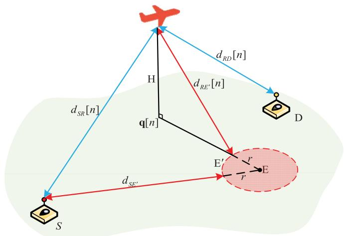  
Fig. 2. Illustration of eavesdropper within a certain area.

Considering the upper bound of the channel state $\tilde { h } _ { S E }$ between source node and eavesdropper, the distance of the distance-dependent path loss should be shorten as $d _ { S E ^ { \prime } } =$ $d _ { S E } - r .$ . Then, the channel state between S and E can be revised as: $h _ { S E ^ { \prime } } [ n ] = K \zeta _ { S E } [ n ] \beta _ { 0 } d _ { S E ^ { \prime } } ^ { - \alpha }$ . It is assumed that the small-scale Rayleigh fading is different order of the magnitude compared to the distance-dependent path loss. Therefore, it would be reasonable for the upper bound assumption. For the UAV relaying phase, the distance $d _ { R E }$ between UAV and eavesdropper should be modeled as the distance $d _ { R E ^ { \prime } }$ between UAV and the nearest point $E ^ { \prime }$ on the uncertain area circle to the UAV. Then, the upper bound of channel state $\tilde { h } _ { R E }$ between UAV and eavesdropper can be stated as:

$$
\begin{array} { r } { \tilde { h } _ { R E } [ n ] = \left\{ \begin{array} { l l } { \frac { \beta _ { 0 } } { ( \| \mathbf { q } [ n ] - \mathbf { w } _ { E } \| - r ) ^ { 2 } + H ^ { 2 } } , \| \mathbf { q } [ n ] - \mathbf { w } _ { E } \| \ge r } \\ { ~ } \\ { \frac { \beta _ { 0 } } { H ^ { 2 } } , ~ } \end{array} \right. } \end{array}\tag{79}
$$

From (79), it is well comprehended that when the UAV flies outside the eavesdropper’s area, the shortest distance between the UAV and this area is $\sqrt { ( \| \mathbf { q } [ n ] - \mathbf { w } _ { E } \| - r ) ^ { 2 } + H ^ { 2 } }$ . While if the UAV hovers over the eavesdropper’s area, the corresponding shortest distance between the UAV and this area becomes H.

Then, similar to the scenario with precise eavesdropper location and global CSI, the proposed techniques can be applied to address the secrecy energy efficiency problems for this scenario. The details are omitted here for brevity.

## F. UAV Trajectory Initialization

In order to properly balance the secrecy information causality constraints of the system, in this subsection, the UAV initial trajectory is set as a double-circular initial trajectory as shown in Fig. 3, where the UAV flies following two circles. The two circles are connected by a straight line segment (from point I to point F) as described in Fig. 3. The UAV is assumed to start the task from the initial location (denoted by I) and flies over the first circle with one lap (It can also be set as several laps such as l laps, if the time N is sufficiently large). After that, the UAV takes straight flight over the straight line $( I {  } F )$ . Moreover, it flies following the second circular path around the final location point F for one lap (It can also be set as several laps, depending on the UAV’s speed and flying duration). At last, it finishes the task, landing at the final location F.

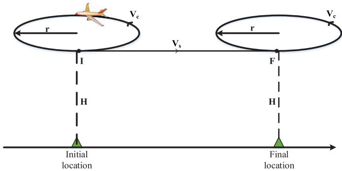  
Fig. 3. Illustration of double-circular UAV initial trajectory.

For simplifying the initialization procedure, suppose the speed of UAV during the period is a constant value $V , 0 \leq$ $V \leq V _ { m a x }$ 0. Assume that the duration for UAV flying through the straight line $( I {  } F )$ is denoted by $N _ { s }$ time slots. In addition, suppose that the UAV flies over the two circles with the same time slots $N _ { c } .$ , thus we have $\begin{array} { r } { N _ { c } = \frac { N - N _ { s } } { 2 } } \end{array}$ . Moreover, it means that the two circles have a same radius r, which can be denoted by $\begin{array} { r } { r \ = \ \frac { V N _ { c } \delta _ { t } } { 2 \pi } } \end{array}$ . It is noted that we need to let $N _ { c }$ as an integer, define $N _ { s } = f _ { e v e n } ( T / V _ { s } )$ , where $f _ { e v e n } ( x )$ represents that x rounds to the nearest even number, such as $f _ { e v e n } ( 3 . 7 ) ~ = ~ 4 , ~ f _ { e v e n } ( 8 . 9 ) ~ = ~ 8 .$ . Therefore, given the initial and final location coordinate ${ \bf q } _ { 0 } = [ x _ { 0 } , y _ { 0 } ] ^ { T }$ and $\mathbf { q } _ { F } ~ = ~ [ x _ { F } , y _ { F } ] ^ { T }$ , the two circular trajectories can be respectively expressed as:

$$
\begin{array} { r l } & { \mathbf { q } _ { c 1 } ^ { 0 } [ n ] = \Bigg [ x _ { 0 } + r \cos \left( \frac { 2 \pi \left( n - 1 \right) } { N _ { c } - 1 } - \frac { \pi } { 2 } \right) } \\ & { \qquad \quad ( y _ { 0 } + r ) + r \sin \left( \frac { 2 \pi \left( n - 1 \right) } { N _ { c } - 1 } - \frac { \pi } { 2 } \right) \Bigg ] } \\ & { \qquad n = 1 , 2 , 3 , \dots , N _ { c } } \\ & { \mathbf { q } _ { c 2 } ^ { 0 } [ n ] = \Bigg [ x _ { F } + r \cos \left( \frac { 2 \pi \left( n - N _ { c } - N _ { s } - 1 \right) } { N _ { c } - 1 } - \frac { \pi } { 2 } \right) } \\ & { \qquad \quad ( y _ { F } + r ) + r \sin \left( \frac { 2 \pi \left( n - N _ { c } - N _ { s } - 1 \right) } { N _ { c } - 1 } - \frac { \pi } { 2 } \right) \Bigg ] } \\ & { \qquad n = N _ { c } + N _ { s } + 1 , \dots , N _ { s } } \end{array}
$$

where $( x _ { 0 } , y _ { 0 } + r )$ and $( x _ { F } , y _ { F } + r )$ represent the coordinates of the centre of the two circles, respectively.

For the UAV’s flight over the straight segment $( I {  } F )$ , the UAV flies with constant speed. Thus, the trajectory from I to F can be expressed as:

$$
{ \bf q } _ { s } ^ { 0 } [ n ] = { \bf q } _ { 0 } + \frac { n - N _ { c } } { N _ { s } } ( { \bf q } _ { F } - { \bf q } _ { 0 } ) , n = N _ { c } + 1 , \ldots , N _ { c } + N _ { s }\tag{82}
$$

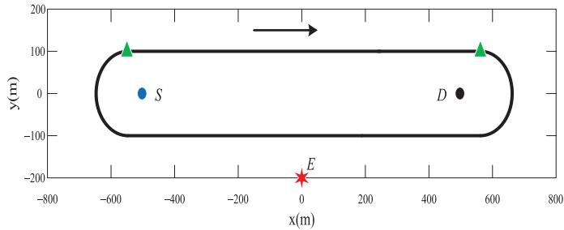  
Fig. 4. Illustration of running track shape trajectory.

In summary, the double-circular initial trajectory of the UAV can be given as follows:

$$
\mathbf { q } ^ { 0 } [ n ] = \left\{ \begin{array} { l l } { \mathbf { q } _ { c 1 } ^ { 0 } [ n ] , } & { n = 1 , 2 , \dots , N _ { c } , } \\ { \mathbf { q } _ { s } ^ { 0 } [ n ] , } & { n = N _ { c } + 1 , \dots , N _ { c } + N _ { s } , } \\ { \mathbf { q } _ { c 2 } ^ { 0 } [ n ] , } & { n = N _ { c } + N _ { s } + 1 , \dots , N . } \end{array} \right.\tag{83}
$$

## IV. NUMERICAL RESULTS

In this section, numerical results are provided to validate the proposed algorithm that jointly optimizes the communication scheduling, power allocation and UAV trajectory. Specifically, we adopt three special designs as the benchmarks to be compared with the proposed solution. They are described as follows:

1) The design of double-circular flight with optimal resource allocation (denoted by DCF design) are shown as Fig. 3. With this scheme, the UAV may fly several circles according to the flight time. Furthermore, the radius of the circles and the flying speed are chosen to be the optimal values for maximal energy efficient as described in [11], such as r 158 m, $V _ { c } { = } 2 5 . 6 7$ m/s. For the straight flying path between two circles, the UAV flying speed is chosen near the energy efficient value of straight flying as in [11]. It should be noted that the number of circular flying and the straight flying velocity should meet the flight time and initial/final location constraint.

2) The design of running track shape flight with optimal resource allocation (denoted by RTF design) are shown as Fig. 4. The UAV taking off point and landing point are set as the tangential points of the half circle. It is assumed that the UAV can fly in circles around the running track shape with constant velocity. Then, the actual value of UAV flying velocity would be chosen near the energy efficient value as described in [11] to meet the flight time and initial/final location constraint.

3) The design of secrecy capacity maximization with optimal trajectory planning (denoted by SCM design). It is aim to maximize the secrecy throughput without considering the UAV’s energy consumption. In order to evaluate the amount of UAV’s total energy consumption for this case, we set a minimum speed constraint for the UAV as $V _ { \mathrm { m i n } } = 5 \mathrm { m / s }$ . Then the total energy consumption model can be calculated by the expression (27).

The locations of source node S, legitimate destination node D and eavesdropper node E are fixed at $[ 5 0 0 , 0 ] ^ { T } , [ - 5 0 0 , 0 ] ^ { T }$ , and $[ 0 , - 2 0 0 ] ^ { T }$ , respectively. The UAV [500 0] [ 500 0]is assume to fly at $\scriptstyle H = 1 0 0 { \mathrm { m } }$ 200], and the corresponding ini-=tial and final locations is set to $\mathbf { q } _ { 0 } ~ = ~ \left[ - 5 5 \dot { 0 } , 1 0 0 \right] ^ { \tilde { T } }$ and $\mathbf { q } _ { F } ~ = ~ \left[ 5 5 0 , 1 0 0 \right] ^ { T }$ , respectively. The communication bandwidth for information reception/transmission is set as 1 MHz. For the ground-to-groud channel between S and $E ,$ the path loss constant is set as $K = 1 0 ^ { - 3 }$ , and the path loss exponent factor is $\alpha = 3$ . Moreover, the noise power is set to $\sigma ^ { 2 } \mathrm { \ = } \mathrm { - } 1 1 0 \mathrm { d } \mathrm { B m }$ , and the reference channel power is set to $\beta _ { 0 } = - 5 0 \mathrm { d B }$ . The length of each time slot is set as $\delta _ { t } = 1 \mathrm { s }$ The average transmit power budgets of the source node and UAV is set to $\bar { P } _ { s } = \bar { P } _ { r } = 1 0 \mathrm { d } \mathrm { B m }$ . The peak power of the source and destination is set as $P _ { s } ^ { m a x } = P _ { r } ^ { m a x } = 1 6 \mathrm { d } \mathrm { B m }$ . The maximum speed and acceleration of UAV is set as $V _ { m a x } = 4 0 \mathrm { m / s }$ and $a _ { m a x } = 5 \mathrm { m } / \mathrm { s } ^ { 2 }$ , respectively. Besides, base on [11], we set $c _ { 1 } = 9 . 2 6 \times 1 0 ^ { - 4 } , c _ { 2 } = 2 2 5 0$ . The accuracy in Algorithm 1 is set as $\epsilon = 1 0 ^ { - 5 }$

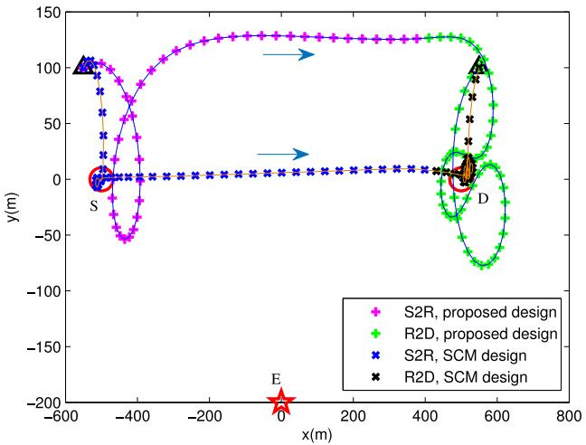  
(a) $T = 1 0 0 s$

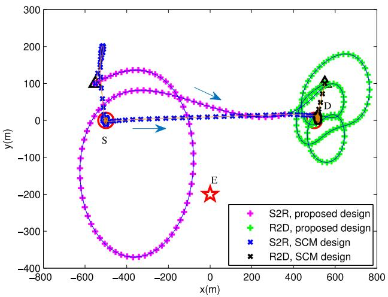  
(c) $T = 2 0 0 s$  
Fig. 5. UAV trajectories for different period T.

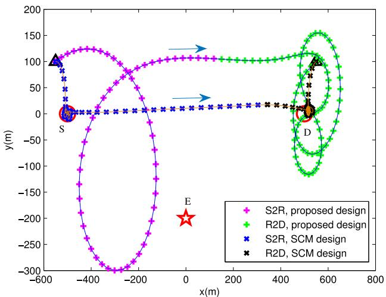  
(b) $T = 1 5 0 s$

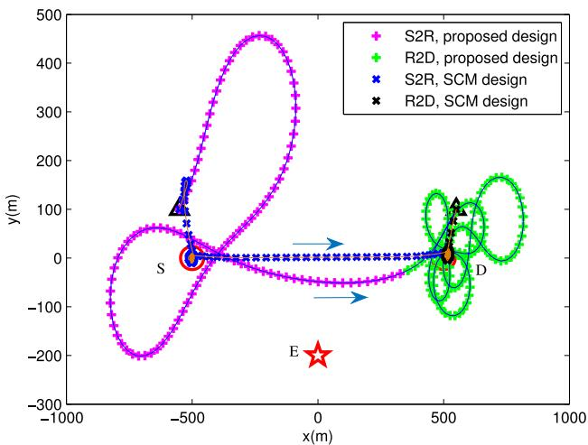  
(d) $T = 2 5 0 s$

= 10Fig. 5 shows the optimal UAV trajectories of proposed solution and SCM design within different period T specifically. The source node S and legitimate destination node D are marked with $\cdot _ { \bigcirc } ,$ . The eavesdropper node E and the initial/final location are marked with $\cdot _ { \star } \cdot$ and $^ { \bullet } \triangle ^ { \bullet }$ , respectively. To illustrate the $\mathrm { U A V } _ { \mathrm { \Delta } }$ location and the communication scheduling in each slot, the trajectory is sampled every second with two different colors and the sampled points are marked with ‘ or $^ \bullet \times \ \cdot$ for different designs.

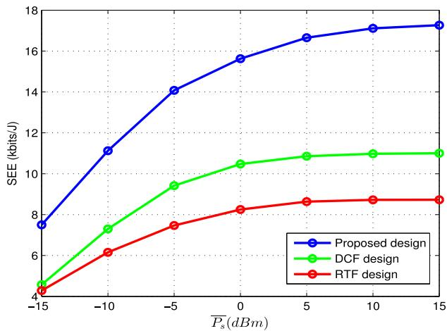  
Fig. 6. SEE versus average power $\bar { P } _ { s }$ for $\mathrm { T } { = } 2 0 0 \mathrm { s } .$

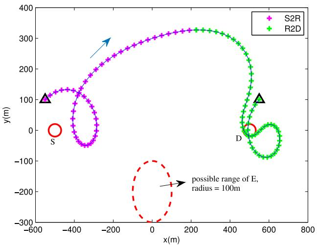  
(a) $T = 1 0 0 s$

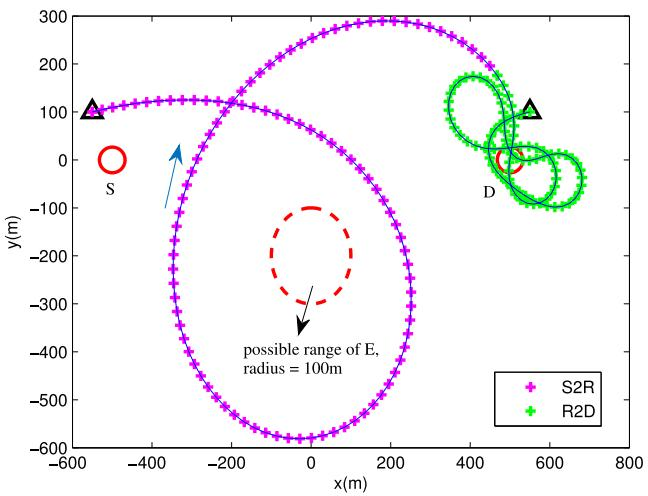  
(c) $T = 2 0 0 s$  
Fig. 7. UAV trajectories under uncertain eavesdropper location scenario.

From Fig. 5, it can be observed that the UAV first collects information from S (denoted by S→R phase), then flies closer to D for data forwarding (denoted by R→D phase). For the SCM design, the trajectory curves have sharp turnings, which is obviously energy-inefficient or even physically impossible for fixed-wing UAVs.

For the proposed solution, the UAV trajectory of $S { \longrightarrow } R$ phase has a larger turning radius, even flying close to the eavesdropper as shown in Fig. 5(c). The UAV trajectory of $R { \longrightarrow } D$ phase follows an approximately ‘8’-shape. They are asymmetric trajectories. It is noted that the optimal trajectory reveals that there are different goals between S→R phase and $R { \longrightarrow } D$ phase. As the eavesdropper rate of S→R phase is independent on the UAV’s trajectory and the information-causality constraint, the UAV does not need to collect the data as much as possible during S→R phase. The optimal UAV trajectory planning for S→R phase would be dominated by the energy efficient flight. Therefore, it is reasonable for this phase to have larger turning radius to decrease the UAV’s propulsion energy consumption. For the R→D phase, both the transmission rate $r _ { R D }$ and the eavesdropper rate $r _ { R E }$ are both dominated by the UAV’s trajectory. Therefore, the secrecy rate of R→D phase would be more sensitive to the UAV’s location. Then, the secrecy rate would act as a more important role to the trajectory optimization. UAV should fly closely to the destination node, which can guarantee that the objective function of problem P1 is nonnegative to achieve higher secrecy rate.

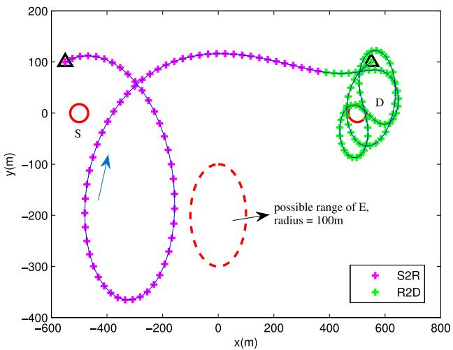  
(b) $T = 1 5 0 s$

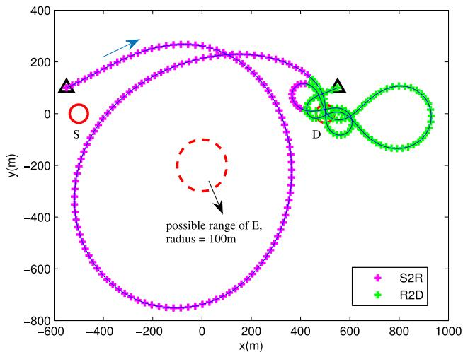  
(d) $T = 2 5 0 s$

Fig. 6 shows the secrecy energy efficiency (SEE) of different schemes versus the average power budget $\bar { P } _ { s }$ for time horizon ${ T / = } 2 0 0 \mathrm { s }$ . It is observed that the SEE firstly increases with the increasing of $\bar { P } _ { s } ,$ , as expected. When the value of $\bar { P } _ { s }$ is smaller, the UAV has enough capacity for forwarding the collected secrecy information from S to D. As $\bar { P } _ { s }$ increases, the collected information would gradually reach to the upper limit of the UAV’s forwarding capacity since $\bar { P } _ { r }$ is limited. Moreover, noted that the proposed method always achieves the best SEE since the UAV has the largest degree of freedom for trajectory optimization.

TABLE II SEE COMPARISON OF DIFFERENT CASES
<table><tr><td>Horizon</td><td>Proposed design</td><td>SCM design</td><td>Uncertain Location Scenario</td><td>DCF design</td><td>RTF</td></tr><tr><td> $T ( s )$ </td><td> $( k b i t s / J )$ </td><td> $( k b i t s / J )$ </td><td> $( k b i t s / J )$ </td><td> $( k b i t s / J )$ </td><td>design  $( k b i t s / J )$ </td></tr><tr><td>100</td><td>15.86</td><td>7.59</td><td>15.08</td><td>8.67</td><td>7.99</td></tr><tr><td>150</td><td>16.88</td><td>8.04</td><td>15.87</td><td>9.15</td><td>8.19</td></tr><tr><td>200</td><td>17.05</td><td>7.86</td><td>16.09 15.90</td><td>10.97</td><td>8.72</td></tr><tr><td>250</td><td>16.64</td><td>7.85 7.83</td><td>15.52</td><td>11.11 11.30</td><td>8.85</td></tr><tr><td>300 350</td><td>16.40 15.52</td><td>7.80</td><td>14.67</td><td>11.45</td><td>8.94</td></tr><tr><td>400</td><td>15.31</td><td>7.78</td><td>14.50</td><td>11.47</td><td>8.98</td></tr><tr><td></td><td></td><td></td><td>14.24</td><td></td><td>9.01</td></tr><tr><td>450</td><td>15.18</td><td>7.75</td><td></td><td>11.40</td><td>8.91</td></tr></table>

Moreover, suppose that the eavesdropper’s allocation is not perfectly known, e.g., it only knows that the eavesdropper is located within a circular area with a radius of 100m. In this case, as shown in the Fig. 7, the UAV would fly with more larger turning radius to save the propulsion energy during the S→R phase. and the resulting trajectory for $R { \longrightarrow } D$ phase is gathered at the destination node and maintains the trajectory keep away from the eavesdropper’s area. Generally, the UAV trajectory has the same trend with the proposed solution in ideal scenario, especially in short flight time scenario.

In order to show the effectiveness of the information causality in (28), the received secrecy data at the destination node (denoted by $R _ { S e c } ^ { r d } )$ and the available secrecy bits at UAV (denoted by $R _ { S e c } ^ { s r } )$ versus each time slot for $T { = } 1 5 0 \mathrm { s }$ , and $\scriptstyle T = 2 5 0 { \mathrm { s } }$ are plotted in Fig. 8. It can be observed that during the whole time horizon, the available secrecy bits at UAV is always no less than the received secrecy data at the destination node. Moreover, combining the Fig. 7(d) and the uncertain case in Fig. 8(b), it can be observed that when the distance between UAV and D is not close enough compared to the distance between UAV and eavesdropper, the UAV would adopt to receive the information from S to enhance the $R _ { S e c } ^ { s r }$ . Until the UAV flying hover around D and has good enough secrecy channel, it would transmits the secrecy information to D until the information causality constraint in (26) holds with equality, which validates our proposed design.

Table II shows the SEE comparison between the proposed solution and the benchmarks in different time horizon T. Compared to the fixed trajectory solutions such as DCF design and RTF design, it can be observed that the proposed method outperforms them for any T, which indicates that the UAV trajectory optimization plays an important role in SEE improvement, as expected. In general, the SEE performance of proposed solution can maintain at a good level with some fluctuations as shown in Fig. 9. Through the period T increasing, the optimal SEE would be firstly increased due to the UAV’s velocity is gradually close to the optimal value as in [11], then it would be decreased since the frequently turning operation would be acted to maintain the UAV’s location near D, which could cost much prolusion energy. For the UAV’s uncertain location scenario, its SEE performance is slightly degraded compared to the ideal scenario with perfect CSI, but it still outperforms the benchmark methods. In summary, from Table II, the values of SEE with different methods demonstrate that the proposed SCA based design has great advantages to achieve the better performance compared to the benchmark schemes.

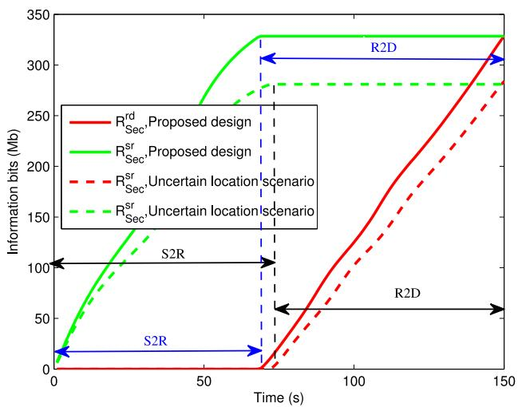  
(a) $T = 1 5 0 s$

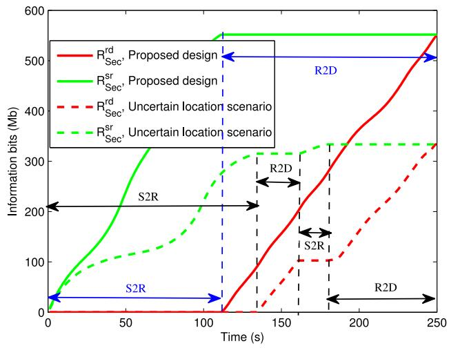  
(b) $T = 2 5 0 s$

Fig. 8. Illustration of the information-causality constraint.  
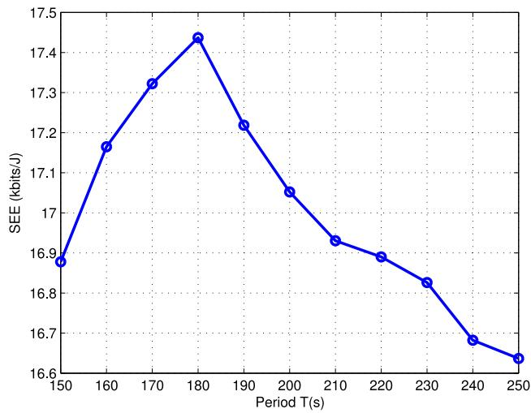  
Fig. 9. The SEE performance of proposed solution over different T.

## V. CONCLUSION

In this paper, we investigate the physical-layer secure communication in a new UAV-enable mobile relaying system. The objective is to maximize the secrecy energy efficiency of the UAV over a finite time horizon by jointly designing the communication scheduling, transmit power allocation and UAV trajectory, subject to the maximum speed/acceleration and average transmit power constraints. To solve the formulated mixed integer and non-convex problem, an efficient iterative algorithm is proposed by applying SCA method and Dinkelbach’s algorithm. In particular, we adopt three special cases as benchmarks to illustrate the performance of the proposed design. Numerical results validate our proposed algorithm and also show that the SEE of the UAV can be significantly enhanced under the proposed design, as compared to the benchmarks. The extension of our proposed design to the more general UAV-ground channel models, such as the altitude/angle-dependent channel parameters or probabilistic LoS channel model is highly non-trivial, which require more in-depth study and will be left as our future work.

## REFERENCES

[1] Y. Zeng, R. Zhang, and T. J. Lim, “Wireless communications with unmanned aerial vehicles: Opportunities and challenges,” IEEE Commun. Mag., vol. 54, no. 5, pp. 36–42, May 2016.

[2] P. Yang, X. Cao, C. Yin, Z. Xiao, X. Xi, and D. Wu, “Proactive dronecell deployment: Overload relief for a cellular network under flash crowd traffic,” IEEE Trans. Intell. Transp. Syst., vol. 18, no. 10, pp. 2877–2892, Oct. 2017.

[3] M. Chen, M. Mozaffari, W. Saad, C. Yin, M. Debbah, and C. S. Hong, “Caching in the sky: Proactive deployment of cache-enabled unmanned aerial vehicles for optimized quality-of-experience,” IEEE J. Sel. Areas Commun., vol. 35, no. 5, pp. 1046–1061, May 2017.

[4] Q. Wu, Y. Zeng, and R. Zhang, “Joint trajectory and communication design for multi-UAV enabled wireless networks,” IEEE Trans. Wireless Commun., vol. 17, no. 3, pp. 2109–2121, Mar. 2018.

[5] Y. Zeng, R. Zhang, and T. J. Lim, “Throughput maximization for UAV-enabled mobile relaying systems,” IEEE Trans. Commun., vol. 64, no. 12, pp. 4983–4996, Dec. 2016.

[6] J. Zhang, Y. Zeng, and R. Zhang, “Spectrum and energy efficiency maximization in UAV-enabled mobile relaying,” in Proc. IEEE Int. Conf. Commun. (ICC), Paris, France, 2017, pp. 1–6.

[7] Y. Zeng, X. Xu, and R. Zhang, “Trajectory design for completion time minimization in UAV-enabled multicasting,” IEEE Trans. Wireless Commun., vol. 17, no. 4, pp. 2233–2246, Apr. 2018.

[8] C. Zhan, Y. Zeng, and R. Zhang, “Energy-efficient data collection in UAV enabled wireless sensor network,” IEEE Wireless Commun. Lett., vol. 7, no. 3, pp. 328–331, Jun. 2018.

[9] Q. Wu and R. Zhang, “Common throughput maximization in UAVenabled OFDMA systems with delay consideration,” IEEE Trans. Commun., vol. 66, no. 12, pp. 6614–6627, Dec. 2018.

[10] J. Lyu, Y. Zeng, and R. Zhang, “Cyclical multiple access in UAV-aided communications: A throughput-delay tradeoff,” IEEE Wireless Commun Lett., vol. 5, no. 6, pp. 600–603, Dec. 2016.

[11] Y. Zeng and R. Zhang, “Energy-efficient UAV communication with trajectory optimization,” IEEE Trans. Wireless Commun., vol. 16, no. 6, pp. 3747–3760, Jun. 2017.

[12] Y. Zeng, J. Xu, and R. Zhang, “Energy minimization for wireless communication with rotary-wing UAV,” IEEE Trans. Wireless Commun., vol. 18, no. 4, pp. 2329–2345, Apr. 2019.

[13] D. Yang, Q. Wu, Y. Zeng, and R. Zhang, “Energy trade-off in ground-to-UAV wireless communication via trajectory design,” IEEE Trans. Veh. Technol., vol. 67, no. 7, pp. 6721–6726, Jul. 2018.

[14] N. Zhao et al., “UAV-assisted emergency networks in disasters,” IEEE Wireless Commun., vol. 26, no. 1, pp. 45–51, Feb. 2019.

[15] P. K. Gopala, L. Lai, and H. E. Gamal, “On the secrecy capacity of fading channels,” IEEE Trans. Inf. Theory, vol. 54, no. 10, pp. 4687–4698, Oct. 2008.

[16] N. Zhao et al., “Caching UAV assisted secure transmission in hyper-dense networks based on interference alignment,” IEEE Trans. Commun., vol. 66, no. 5, pp. 2281–2294, May 2018.

[17] G. Zheng, I. Krikidis, J. Li, A. P. Petropulu, and B. Ottersten, “Improving physical layer secrecy using full-duplex jamming receivers,” IEEE Trans Signal Process., vol. 61, no. 20, pp. 4962–4974, Oct. 2013.

[18] Q. Li, Y. Yang, W.-K. Ma, M. Lin, J. Ge, and J. Lin, “Robust cooperative beamforming and artificial noise design for physical-layer secrecy in AF multi-antenna multi-relay networks,” IEEE Trans. Signal Process., vol. 63, no. 1, pp. 206–220, Jan. 2015.

[19] G. Zhang, Q. Wu, M. Cui, and R. Zhang, “Securing UAV communications via trajectory optimization,” in Proc. IEEE Glob. Commun. Conf. (GLOBECOM), Singapore, 2017, pp. 1–6.

[20] A. Li, Q. Wu, and R. Zhang, “UAV-enabled cooperative jamming for improving secrecy of ground wiretap channel,” IEEE Wireless Commun. Lett., vol. 8, no. 1, pp. 181–184, Feb. 2019.

[21] M. Caris et al., “mm-Wave SAR demonstrator as a test bed for advanced solutions in microwave imaging,” IEEE Trans. Signal Process., vol. 29, no. 7, pp. 8–15, Jul. 2014.

[22] Q. Wang, Z. Chen, W. Mei, and J. Fang, “Improving physical layer security using UAV-enabled mobile relaying,” IEEE Wireless Commun. Lett., vol. 6, no. 3, pp. 310–313, Mar. 2017.

[23] Y. Cai, Z. Wei, R. Li, D. W. K. Ng, and J. Yuan, “Energy-efficient resource allocation for secure UAV communication systems,” in Proc. IEEE Wireless Commun. Netw. Conf. (WCNC), Apr. 2019, pp. 1–8.

[24] M. Cui, G. Zhang, Q. Wu, and D. W. K. Ng, “Robust trajectory and transmit power design for secure UAV communications,” IEEE Trans. Veh. Technol., vol. 67, no. 9, pp. 9042–9046, Sep. 2018.

[25] S. Chandrasekharan et al., “Designing and implementing future aerial communication networks,” IEEE Commun. Mag., vol. 54, no. 5, pp. 26–34, May 2016.

[26] A. Al-Hourani and K. Gomez, “Modeling cellular-to-UAV path-loss for suburban environments,” IEEE Wireless Commun. Lett., vol. 7, no. 1, pp. 82–85, Feb. 2018.

[27] M. M. Azari, F. Rosas, K. C. Chen, and S. Pollin, “Ultra reliable UAV communication using altitude and cooperation diversity,” IEEE Trans. Commun., vol. 66, no. 1, pp. 330–344, Jan. 2018.

[28] R. Amorim, H. C. Nguyen, P. E. Mogensen, I. Z. Kovacs, J. Wigard, and T. B. Sørensen, “Radio channel modeling for UAV communication over cellular networks,” IEEE Wireless Commun. Lett., vol. 6, no. 4, pp. 514–517, Aug. 2017.

[29] A. Al-Hourani, S. Kandeepan, and S. Lardner, “Optimal LAP altitude for maximum coverage,” IEEE Wireless Commun. Lett., vol. 3, no. 6, pp. 569–572, Dec. 2014.

[30] D. W. Matolak and R. Sun, “Unmanned aircraft systems: Air-ground channel characterization for future applications,” IEEE Veh. Technol. Mag., vol. 10, no. 2, pp. 79–85, Jun. 2015.

[31] Q. Feng, E. K. Tameh, A. R. Nix, and J. McGeehan, “Modelling the likelihood of line-of-sight for air-to-ground radio propagation in urban environments,” in Proc. IEEE Glob. Commun. Conf. (GLOBECOM), Dec. 2006, pp. 1–6.

[32] Q. Feng, J. McGeehan, E. K. Tameh, A. R. Nix, and J. McGeehan, “Path loss models for air-to-ground radio channels in urban environments,” in Proc. IEEE Veh. Technol. Conf. (VTC), May 2006, pp. 1–6.

[33] A. Al-Hourani, S. Kandeepan, and A. Jamalipour, “Modeling air-toground path loss for low altitude platforms in urban environments,” in Proc. IEEE Glob. Commun. Conf. (GLOBECOM), Dec. 2014, pp. 1–6.

[34] “Enhanced LTE support for aerial vehicles,” 3GPP, Sophia Antipolis, France, Rep. TR 36.777. Accessed: May 17, 2019. [Online]. Available: ftp://www.3gpp.org/specs/archive/36\_series/36.777

[35] D. Feng, L. Lu, Y. Yuan-Wu, G. Y. Li, G. Feng, and S. Li, “Deviceto-device communications underlaying cellular networks,” IEEE Trans. Commun., vol. 61, no. 8, pp. 3541–3551, Aug. 2013.

[36] A. Kashyap, T. Basar, and R. Srikant, “Correlated jamming on MIMO Gaussian fading channels,” IEEE Trans. Inf. Theory, vol. 50, no. 9, pp. 2119–2123, Sep. 2004.

[37] N. Devroye, P. Mitran, and V. Tarokh, “Achievable rates in cognitive radio channels,” IEEE Trans. Inf. Theory, vol. 52, no. 5, pp. 1813–1827, May 2006.

[38] A. Jovicic and P. Viswanath, “Cognitive radio: An information-theoretic perspective,” IEEE Trans. Inf. Theory, vol. 55, no. 9, pp. 3945–3958, Sep. 2009.

[39] D. W. K. Ng, E. S. Lo, and R. Schober, “Secure resource allocation and scheduling for OFDMA decode-and-forward relay networks,” IEEE Trans. Wireless Commun., vol. 10, no. 10, pp. 3528–3540, Oct. 2011.

[40] J. Mo, M. Tao, and Y. Liu, “Relay placement for physical layer security: A secure connection perspective,” IEEE Commun. Lett., vol. 16, no. 6, pp. 878–881, Jun. 2012.

[41] T.-X. Zheng, H.-M. Wang, F. Liu, and M. H. Lee, “Outage constrained secrecy throughput maximization for DF relay networks,” IEEE Trans. Commun., vol. 63, no. 5, pp. 1741–1755, May 2015.

[42] M. Grant and S. Boyd. (2014). CVX: MATLAB Software for Disciplined Convex Programming. Accessed: Jan. 2014. [Online]. Available: http://cvxr.com/cvx

[43] W. Dinkelbach, “On nonlinear fractional programming,” Manag. Sci., vol. 13, no. 7, pp. 492–498, 1967.

  
Lin Xiao received the Ph.D. degree from the School of Electronic Engineering and Computer Science, Queen Mary University of London in 2010. She was with the China Academy of Telecommunication Research of MITT for one year. She is currently an Associate Professor with the Information Engineering School, Nanchang University. Her research interests include wireless communication and networks, in particular, radio network planning and optimization, radio resource management, relay network, and cooperation communication.

Yu Xu received the B.S. degree from the Information Engineering School, Jiangxi University of Science and Technology, Ganzhou, China, in 2015. He is currently pursuing the master’s degree with the Information Engineering School, Nanchang University. His research interests include unmanned aerial vehicle communications and wireless resource management.

Dingcheng Yang received the B.S. degree in electronic engineering and the Ph.D. degree in space physics from Wuhan University in 2006 and 2012, respectively. He is currently an Associate Professor with the Information Engineering School, Nanchang University. He has published over 50 papers, including journal papers in the IEEE TRANSACTIONS ON VEHICULAR TECHNOLOGY and conference papers in conferences such as IEEE GlOBECOM. His research interests are cooperation communications, IoT/cyber-physical systems, UAV communications, and wireless resource management.

Yong Zeng (S’12–M’14) received the Bachelor of Engineering (First-Class Hons.) and Ph.D. degrees from Nanyang Technological University, Singapore, in 2009 and 2014, respectively.

He is with the National Mobile Communications Research Laboratory, Southeast University, China, and also with the Purple Mountain Laboratories, Nanjing, China. From 2013 to 2018, he was a Research Fellow and Senior Research Fellow with the Department of Electrical and Computer Engineering, National University of Singapore.

From 2018 to 2019, he was a Lecturer with the School of Electrical and Information Engineering, University of Sydney, Australia. He was a recipient of the Australia Research Council Discovery Early Career Researcher Award, the 2018 IEEE Communications Society Asia–Pacific Outstanding Young Researcher Award, the 2017 IEEE Communications Society Heinrich Hertz Prize Paper Award, the 2017 IEEE TRANSACTIONS ON WIRELESS COMMUNICATIONS Best Reviewer, and the 2015 and 2017 IEEE WIRELESS COMMUNICATIONS LETTERS Exemplary Reviewer. He serves as an Associated Editor for IEEE COMMUNICATIONS LETTERS and IEEE ACCESS, and the Leading Guest Editor for IEEE WIRELESS COMMUNICATIONS on “Integrating UAVs into 5G and Beyond” and China Communications on “Network-Connected UAV Communications.” He is the Workshop Co-Chair for ICC 2018/2019/2020 on UAV communications, and the Tutorial Speaker for Globecom 2018/2019 and ICC 2019 tutorials on UAV communications.