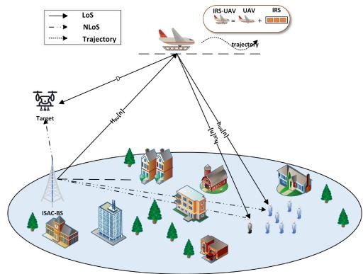
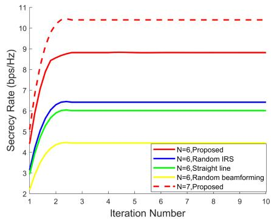
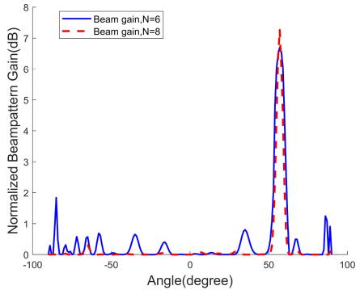
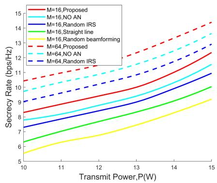
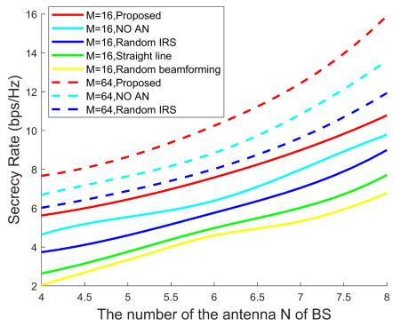
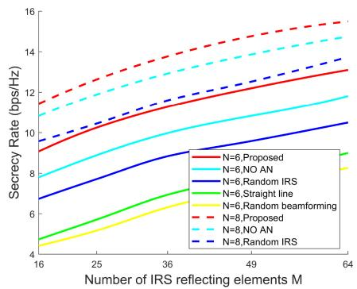
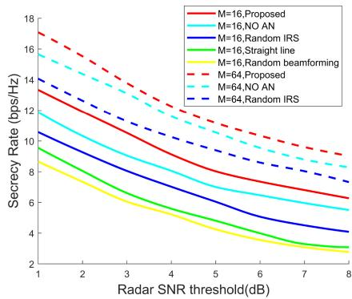
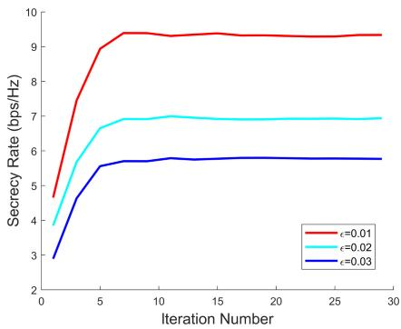
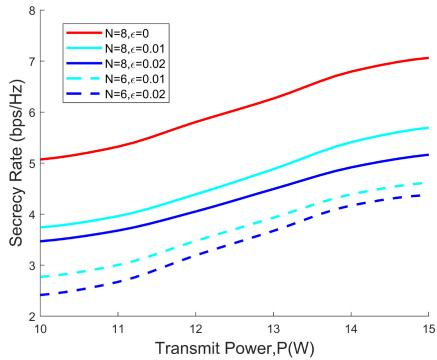
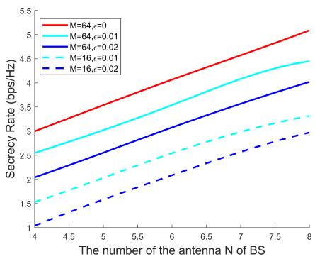

# Secrecy Rate Maximization for IRS-Enabled UAV-ISAC Systems via Phase Shifting Adjustment and Resource Allocation

Yuxin Guo , Xiangdong Jia , Member, IEEE, Mangang Xie , Member, IEEE, and Yue Li

Abstract—To address the challenge of spectrum resource shortage, integrated sensing and communication (ISAC) technology significantly improves system efficiency through hardware-based spectrum sharing. However, its open-channel characteristics and functional coupling introduce security vulnerabilities and performance bottlenecks. This paper proposes an innovative architecture for an intelligent reflecting surface (IRS)-assisted autonomous aerial vehicle (UAV) cooperative dual-function base station (ISAC-BS). This architecture jointly optimizes active beamforming, IRS phase shift, and UAV trajectory to enhance both secure communication and sensing accuracy. Within this architecture, the ISAC-BS carries out secure communication and sensing tasks while using artificial noise (AN) to interfere with potential eavesdropping, further improving performance. Two optimization algorithms were designed for all link channel state information (CSI) scenarios. Under perfect CSI conditions, the alternating optimization (AO) framework provides a closed-form solution for the IRS, incorporates fractional programmingbased beamforming, and utilizes successive convex approximation (SCA)-based trajectory optimization sequentially. Under imperfect CSI, the robustness of the S-process is introduced. Simulation results show that the proposed algorithm significantly improves the secrecy rate and positioning accuracy compared to the baseline scheme while ensuring convergence. This provides a new paradigm for enhancing security and enabling collaborative optimization in ISAC systems with open channels.

Index Terms—Integrated sensing and communication, intelligent reflecting surface, autonomous aerial vehicle, artificial noise, physical layer security.

## I. INTRODUCTION

spectrum resources [1], and integrated sensing and communication (ISAC) technology has emerged as a pivotal solution to overcome the spectrum efficiency bottleneck [2]. ISAC technology integrates sensing and communication functions via hardware resource sharing, thereby significantly enhancing spectrum utilization [3] and is recognized as one of the core technologies for 6G [4]. However, while enabling dualfunction services, ISAC faces two security challenges. The open channel is vulnerable to malicious attacks [5], and functional coupling can easily lead to performance bottlenecks. Existing studies employ artificial noise (AN) [6], beamforming optimization [7], [8], and resource allocation [9] to enhance security, particularly when the channel state information (CSI) of the user and eavesdropper is imperfect. However, most of these studies are limited to static scenarios, making it difficult to address the challenges of performance optimization in complex dynamic environments.

Intelligent Reflecting Surfaces (IRS) has garnered significant attention for its ability to reconfigure wireless environments intelligently [10]. By optimizing the reflection coefficient, IRS can not only enhance the legitimate user signal and suppress eavesdropping interference to improve the secrecy rate [11] but also dynamically reconstruct the channel environment, create a virtual line-of-sight link to extend coverage, suppress signal fading, and support sensing functions [12], [13]. Its two-dimensional planar array comprises low-cost reflectors [14], which can intelligently adjust the phase and amplitude of electromagnetic waves to achieve signal enhancement or interference suppression [15], [16]. Existing studies have addressed the secure communication challenges in dual-function radar and communications (DFRC) systems by jointly optimizing base station (BS) beamforming and IRS reflection coefficients [17] and have proposed nonorthogonal multiple access (NOMA) enhancement schemes to improve the security of ISAC systems [18]. However, the traditional fixed IRS deployment method has inherent defects. Static locations lead to limited vision, and it is challenging to meet dynamic communication requirements in real-time, which significantly limits performance in complex scenarios [19].

In contrast, autonomous aerial vehicles (UAV) have emerged as a new paradigm for enhancing wireless communications, replacing traditional BS or relays due to their flexibility and cost-effectiveness [20], [21]. They can overcome geographical restrictions to achieve three-dimensional movement. When carrying IRS, they can optimize their spatial positions in realtime and dynamically regulate the signal propagation path. Compared to static IRS, the IRS-UAV cooperative system can actively track signal requirements, eliminate coverage prevent limited vision, dynamically adjust the signal propagation path, and significantly enhance communication quality. In remote monitoring scenarios, ground IRS struggle to cover large areas, whereas IRS-UAV can traverse complex terrains like mountains and forests to provide accurate signal coverage for monitoring terminals. In dynamic network scenarios, such as large-scale events and emergency rescue operations, efficient links can be rapidly established to adapt to changing requirements. The challenges of designing secure communication trajectories for ISAC systems without UAV assistance are addressed in [22]. IRS-assisted UAV communication is explored in [23] to maximize system throughput. In [24], the minimum beam gain in the target sensing direction is enhanced by optimizing phase shift and trajectory.

In summary, the cooperation between IRS and UAV enables dynamic regulation of the wireless environment, effectively enhances signal coverage in complex scenarios, and ensures the performance of integrated ISAC. While ISAC optimization has been extensively explored in existing studies, research on secure communication and localization for IRS-UAV-assisted systems remains limited. In this paper, we innovatively propose the ISAC-BS architecture with IRS-UAV collaboration to simultaneously enhance system security and positioning accuracy. Compared to existing works, the unique contributions and challenges of this paper are as follows.

• The paper proposes the ISAC-BS architecture, which integrates security perception and communication through collaboration between IRS and UAV. This architecture addresses the limitations of static IRS environments by leveraging the dynamic reconfigurability of IRS and the three-dimensional mobility of UAV. It jointly optimizes the IRS phase shift, beamforming, and UAV trajectory to maximize the secrecy rate while adhering to the constraints of the sensing signal-to-noise ratio (SNR) threshold and the users signal-to-interference noise ratio (SINR). This approach tackles the key challenges related to security rate limitations and sensing performance in ISAC systems. Additionally, based on the completeness of CSI at the BS, two optimization models–robust and non-robust–are developed.

• For the full-link CSI scenario where the BS is known, the objective function and constraint variables are strongly coupled, forming a non-convex optimization problem. Hence, the alternating optimization (AO) framework is designed to decouple it into three sub-problems. 1) The closed-form solution of the IRS phase shift is derived based on the system’s structural characteristics. 2) The beamforming is transformed into a convex programming problem using quadratic transformation. 3) The trajectory is optimized using successive convex approximation (SCA).

• To address the challenge of the BS lacking CSI for all links in practical scenarios, a robust transmission strategy is proposed. The resulting optimization problem with infinitely many constraints is more challenging to solve. For beamforming design, the S-process and Schur complement is used to transform infinitely many constraints into finitely many linear matrix inequalities (LMIs). For trajectory optimization, methods involving SCA, inequality transformation are used for iterative processing. Finally, joint optimization is achieved using the AO algorithm.

  
Fig. 1. IRS-UAV-assisted ISAC secure transmission system.

• Simulation results show that compared with the benchmark scheme, the proposed algorithm significantly enhances the secrecy rate and positioning accuracy while ensuring convergence. Through convergence analysis and complexity evaluation, the practical application value of the IRS-UAV collaborative architecture and optimization algorithm is verified.

The remainder of this paper is organized as follows. Section II formulates the IRS-UAV collaborative ISAC system model and outlines the problem. In Section III, the AO algorithm is designed to maximize the secrecy rate for the ideal CSI scenario. Section IV proposes robust optimization schemes to address CSI uncertainties. Section V presents and analyzes the numerical results of the proposed algorithm. Section VI concludes.

## II. SYSTEM MODEL AND PROBLEM FORMULATION

## A. System Model

As depicted in Fig. 1, this paper investigates a secure IRS-UAV-assisted ISAC system comprising an ISAC-BS equipped with J antennas, an IRS with M reflective units of uniform planar arrays (UPA), K legitimate users, an eavesdropper, and a stationary aerial target. The IRS-UAV operates at a fixed altitude with a reflection coefficient matrix denoted as Φ[n] = diag $[ \delta _ { 1 } e ^ { j \varphi _ { 1 } [ n ] } , \delta _ { 2 } e ^ { j \varphi _ { 2 } [ n ] } , \dots , \delta _ { M } e ^ { j \varphi _ { M } [ n ] } ]$ , where $\psi _ { m } [ n ] = \delta _ { m } e ^ { j \varphi _ { m } [ n ] }$ represents the magnitude, $\delta _ { m } \in [ 0 , 1 ]$ and $\psi _ { m } [ n ] \ \in \ [ 0 , 2 \pi ]$ represent the phase shift of the m-th element at the n-th time slot, respectively. To reduce control costs, the optimization objective is set to maximize signal reflection, which is capped at $\delta _ { m } = 1 , \forall n \in \mathbb { N } .$ . The specific transmission protocol is as follows. 1) CSI is acquired via pilot signals, and the downlink channel is estimated using channel reciprocity [25]. Simultaneously, target information is obtained by analyzing the echo [26]. 2) The BS calculates resource allocation and UAV trajectory and derives the closed form solution of the IRS phase shift. The system divides time T into N time slots, $T = N \delta _ { t }$ , with each time slot split into two subplots according to β. The first subslot is used for target sensing, while the second subslot is used for communication and AN transmission to prevent eavesdropping.

Without loss of generality, this paper employs the three-dimensional Cartesian coordinate system for description and analysis. In this coordinate system, the coordinates of the BS and the target are denoted as $\mathbf q _ { b } ~ = ~ [ x _ { b } , y _ { b } , H _ { b } ] ^ { T }$ and $\mathbf q _ { r } = [ x _ { r } , y _ { r } , \bar { H } _ { r } ] ^ { T }$ , respectively, while the coordinates of the legitimate users and the eavesdropper are denoted as $\pmb { q } _ { i } = [ x _ { i } , y _ { i } , 0 ] ^ { T } , i \in \{ u _ { k } , e _ { k } \}$ , respectively. The horizontal coordinate of the IRS-UAV in the n-th time slot is defined as $\pmb { q } [ n ] = \{ x [ n ] , y [ n ] \} ^ { T } , n \in \{ 1 , 2 , \dots , N \}$ . Then ${ \pmb q } [ n ]$ should satisfy

$$
{ \pmb q } [ 1 ] = { \pmb q } _ { 0 } , { \pmb q } [ N ] = { \pmb q } _ { F } , \forall n ,\tag{1a}
$$

$$
\| \pmb q [ n + 1 ] - \pmb q [ n ] \| \leq v _ { m a x } \delta _ { t } , \forall n .\tag{1b}
$$

where $\pmb q _ { 0 }$ and $q _ { F }$ denote the starting and ending positions of the UAV respectively, and $v _ { m a x }$ is the maximum horizontal velocity of the UAV.

1) Channel Model: We assume that the channel modeling adheres to Rician fading, and the direct link $h _ { b i } \in \mathbb { C } ^ { 1 \times \breve { J } }$ between the BS and the k-th legitimate user and the eavesdropper can be modeled as

$$
\begin{array} { l } { { \displaystyle h _ { b i } = \sqrt { L _ { 0 } d _ { b i } ^ { - \gamma } } \tilde { G } _ { b i } } } \\ { { \displaystyle ~ = \sqrt { L _ { 0 } d _ { b i } ^ { - \gamma } } \left( \sqrt { \frac { K } { 1 + K } } \tilde { h } _ { b i } ^ { L o S } + \sqrt { \frac { 1 } { 1 + K } } \tilde { h } _ { b i } ^ { N L o S } \right) } } \end{array}\tag{. (2}
$$

where γ represents the path loss index [27], $L _ { 0 }$ represents the reference path loss at a distance of 1m, and the distances from the BS to the k-th legitimate user and eavesdropper are given by $d _ { b i }$

LoS links are assumed to dominate all ground-to-air channels as well as air-to-air channels. The channel matrix $H _ { b r } \in$ $\mathbb { C } ^ { M \times J }$ can be modeled as follows

$$
H _ { b r } [ n ] = \sqrt { L _ { 0 } d _ { b r } ^ { - \gamma } [ n ] } \tilde { \cal H } _ { b r } [ n ] ,\tag{3}
$$

where $\tilde { H } _ { b r } [ n ] \ = \ { \pmb { \alpha } } _ { M } { } ^ { T } { \pmb { \alpha } } _ { J } , \ { \pmb { \alpha } } _ { M } { } ^ { T }$ and $\pmb { \alpha } _ { J }$ are the array responses, which can be calculated as follows

$$
\pmb { \alpha } _ { M } = \alpha _ { x } ( \phi _ { b r } [ n ] , \theta _ { b r } [ n ] ) \otimes \alpha _ { z } ( \phi _ { b r } [ n ] , \theta _ { b r } [ n ] ) ,\tag{4}
$$

$$
\pmb { \alpha } _ { J } = \left[ 1 , e ^ { - j \frac { 2 \pi } { \lambda } \widetilde { d } \cos \phi _ { i } [ n ] } , \dots , e ^ { - j \frac { 2 \pi } { \lambda } \widetilde { d } \left( J - 1 \right) \cos \phi _ { i } [ n ] } \right]\tag{5}
$$

where $\phi _ { i } [ n ]$ denotes the angle of departure (AoD) of the IRS and $\theta _ { b r } [ n ] , \phi _ { b r } [ n ]$ represent the vertical and horizontal angles of arrival (AoA) of the BS-IRS link in the n-th time slot.

Similarly, the channel vectors $\boldsymbol { h _ { r \imath } } [ n ] ~ \in ~ \mathbb { C } ^ { M \times 1 }$ can be expressed as follows

$$
h _ { r \imath } [ n ] = \sqrt { L _ { 0 } d _ { r \imath } ^ { - \gamma } [ n ] } \tilde { h } _ { r \imath } [ n ] ,\tag{6}
$$

where $\ i \in \{ i , t \}$ . The terms $\widetilde { h } _ { r i } [ n ]$ can be given by

$$
\begin{array} { r l } & { \tilde { h } _ { r i } [ n ] = \left[ 1 , \dots , e ^ { - j \frac { 2 \pi } { \lambda } d \left( M _ { x } - 1 \right) \sin \theta _ { r i } [ n ] \cos \phi _ { r i } [ n ] } \right] } \\ & { \qquad \otimes \left[ 1 , \dots , e ^ { - j \frac { 2 \pi } { \lambda } d \left( M _ { z } - 1 \right) \sin \theta _ { r i } [ n ] \sin \phi _ { r i } [ n ] } \right] , } \end{array}\tag{7}
$$

2) Communication Model: Based on the channel model, it is assumed that all channels experience quasi-static flat fading. Then, the transmitted signal of the BS can be expressed as ${ \textbf { \em x } } =$ $\begin{array} { r } { \sum _ { k = 1 } ^ { K } w _ { k } [ n ] s _ { k } + n . } \end{array}$ , where $\boldsymbol { w } _ { k } \in \mathbb { C } ^ { J \times 1 }$ is the beamforming vector, $E \big \{ s _ { k } s _ { k } ^ { H } \big \} \ = \ 1$ . The AN model n has a uniformly distributed power spectral density across the entire frequency band, i.e., $\mathbf { \Phi } _ { n } \sim \mathcal { C } \dot { \mathcal { N } } ( 0 , \sigma _ { a } ^ { 2 } )$ . Moreover, the AN introduction increases the total transmit power, requiring the following constraints to be satisfied

$$
\sum _ { k = 1 } ^ { K } \| w _ { k } [ n ] \| ^ { 2 } + \sigma _ { a } ^ { 2 } \leq P .\tag{8}
$$

The received signal at the n-th time slot are expressed as $y _ { i } [ n ] ~ = ~ h _ { i } { } ^ { H } [ n ] x + n _ { i }$ , where $h _ { i } ^ { ~ H } [ n ] ~ \stackrel { \triangle } { = } ~ h _ { b i } [ n ] ~ +$ $( h _ { r i } [ \bar { n } ] ) ^ { \bar { H } } \Phi [ n ] H _ { b r } [ \bar { n } ]$ and $n _ { i } \sim \mathcal { C N } ( 0 , \sigma _ { i } ^ { 2 } )$ . Therefore, the achievable rate for the k-th legitimate user and the eavesdropping rate for the k-th user are expressed as follows, respectively

$$
R _ { i } [ n ] = ( 1 - \beta ) l o g _ { 2 } \left( 1 + \frac { | { h _ { i } } ^ { H } [ n ] w _ { k } [ n ] | ^ { 2 } } { \sigma _ { a } ^ { 2 } + \sigma _ { i } ^ { 2 } } \right) .\tag{9}
$$

3) Sensing Model: ISAC technology achieves parallel radar perception and communication processing through spectrum sharing, effectively avoiding the self-interference and mutual interference issues prevalent in traditional systems [28]. To enhance target sensing efficiency, the IRS-UAV constructs a virtual LoS link from the BS to the target. The echo signal received by the BS can be modeled as follows

$$
\begin{array} { c } { { y _ { r } [ n ] = \Big ( C + { H _ { b r } } ^ { H } [ n ] \Phi [ n ] D \Phi ^ { H } [ n ] H _ { b r } [ n ] \Big ) x + n _ { t } } } \\ { { { } } } \\ { { = { h _ { r } } ^ { H } [ n ] x + n _ { r } . \qquad } } \end{array}\tag{10}
$$

where $n _ { r } \sim \mathcal { C N } ( 0 , \sigma _ { r } ^ { 2 } )$ is a complex Gaussian random process with zero mean and unit variance.

Moreover, $\ b { C } \in \mathbb { C } ^ { J \times J }$ and $\pmb { D } \in \mathbb { C } ^ { M \times M }$ denote the target response matrices of the BS and IRS, respectively. These matrices characterize the responses of the BS and IRS to target signals [29], namely

$$
\begin{array} { r } { \pmb { C } = \xi _ { 1 } \pmb { a } ( \theta ) \pmb { a } ^ { H } ( \theta ) , \pmb { D } = \xi _ { 2 } \pmb { b } ( \phi ) \pmb { b } ^ { H } ( \phi ) . } \end{array}
$$

where this model is based on the clutter-free model $[ 3 0 ] . \xi _ { 1 } , \xi _ { 2 }$ is the complex path loss coefficient and the vector ${ \pmb a } ( \theta ) \in$ $\mathbb { C } ^ { J \times 1 }$ is the steering vector of the BS, which is expressed as $\pmb { a } ( \theta ) = [ 1 , e ^ { - j \frac { 2 \pi } { \lambda } d s \overleftarrow { i n } \theta [ n ] } , \ldots , e ^ { - j \frac { 2 \pi } { \lambda } d \left( J - 1 \right) s i n \theta [ n ] } ]$ . Then, the SNR of the target over n time slots is expressed as follows

$$
S N R _ { r } [ n ] = \frac { | { h _ { r } } ^ { H } [ n ] { w _ { k } } [ n ] | ^ { 2 } } { \sigma _ { r } ^ { 2 } } .\tag{11}
$$

## B. Problem Formulation

The objective of this paper is to maximize the secrecy rate of the IRS-UAV-assisted ISAC system by jointly optimizing $\{ \Phi [ n ] , { w _ { k } [ n ] } , Q [ n ] \}$ under the constraint of satisfying the target sensing SNR requirement.

1) Perfect CSI: In this case, the CSI of all links is known at the BS [31]. Thus, the problem P1 is formulated as

$$
\mathrm { P 1 : } \operatorname* { m a x } _ { \Phi [ n ] , w _ { k } [ n ] , Q [ n ] } \frac { 1 } { 2 } \sum _ { n = 1 } ^ { N } \sum _ { k = 1 } ^ { K } [ R _ { u _ { k } } [ n ] - R _ { e _ { k } } [ n ] ] ,\tag{12a}
$$

$$
s . t . \sum _ { n = 1 } ^ { N } S N R _ { r } [ n ] \geq \mu ,\tag{12b}
$$

$$
\psi _ { m } [ n ] \in [ 0 , 2 \pi ] , m = 1 , 2 , \ldots , M ,\tag{12c}
$$

$$
( 1 \mathrm { a } ) , ( 1 \mathrm { b } ) , ( 8 ) .\tag{12d}
$$

where (12b) ensures that the SNR at the BS meets a minimum requirement, (8) states that the total transmission power should not exceed the maximum allowable limit.

2) Imperfect CSI: In this case, all links of CSI are not available at the BS and the potential target locations within a certain area are unknown, namely $\Lambda _ { 1 } = [ \theta - \Delta \theta ] , \Lambda _ { 2 } =$ $[ \phi - \Delta \phi ]$ are known. The CSI obtained at the BS is assumed to have bounded error [32], and the channel models are expressed as follows, respectively

$$
\begin{array} { r l } & { \quad \hat { h } _ { b i } = h _ { b i } + \Delta h _ { b i } , \mathcal { H } _ { b i } \{ \| \Delta h _ { b i } \| _ { F } \leq \epsilon \} , } \\ & { \quad \hat { h } _ { r i } [ n ] = h _ { r i } [ n ] + \Delta h _ { r i } [ n ] , \mathcal { H } _ { r i } \{ \| \Delta h _ { r i } [ n ] \| _ { F } \leq \epsilon \} , } \\ & { \quad \hat { H } _ { b r } [ n ] = H _ { b r } [ n ] + \Delta H _ { b r } [ n ] , \mathcal { H } _ { b r } \{ \| \Delta H _ { b r } [ n ] \| _ { F } \leq \epsilon \} . } \end{array}
$$

where $h _ { b i } , h _ { r i } [ n ] , H _ { b r } [ n ]$ are the estimated channels, $\Delta h _ { b i } , \Delta h _ { r i } [ n ] , \Delta H _ { b r } [ n ]$ denotes some CSI uncertainty error in the n-th time slot. Thus, problem P2 is formulated in the following form

$$
\mathrm { P 2 : } \operatorname* { m a x } _ { \Phi [ n ] , w _ { k } [ n ] , Q [ n ] } \operatorname* { m i n } _ { \Delta h \leq \epsilon } \frac { 1 } { 2 } \sum _ { n = 1 } ^ { N } \sum _ { k = 1 } ^ { K } \Bigl [ R _ { u _ { k } } ^ { r o b } [ n ] - R _ { e _ { k } } ^ { r o b } [ n ] \Bigr ] ,\tag{13a}
$$

$$
s . t . \sum _ { n = 1 } ^ { N } S N R _ { r } ^ { r o b } [ n ] \ge \mu , \Delta H _ { b r } [ n ] \in \mathcal { H } _ { b r } , \Lambda _ { 1 , 2 } ,\tag{13b}
$$

$$
\psi _ { m } ^ { r o b } [ n ] \in [ 0 , 2 \pi ] , m = 1 , 2 , \ldots , M ,\tag{13c}
$$

$$
( 1 \mathrm { a } ) , ( 1 \mathrm { b } ) , ( 8 ) .\tag{13d}
$$

## III. THE SECRECY RATE IS JOINTLY OPTIMIZED FOR THE CASE OF PERFECT CSI

In this section, we consider the joint optimization of the secrecy rate for the case where CSI is known at the BS for all links, which provides a performance upper bound for the case with imperfect CSI. To solve problem P1, an AO algorithm is proposed to solve the constraint coupling between optimization variables in different blocks.

## A. IRS Phase Shift Optimization

Note that problem P1 is challenging to solve directly. To facilitate problem design, the closed-form solution of the phase shift is derived using the system’s unique structural characteristics. Specifically, when the LoS component of the direct link aligns with the LoS of the reflected link, the IRSassisted channel quality can achieve an effective suboptimal solution [33]. Therefore, we can express the phase shift policy for the m-th element during the communication and sensing service at time slot n as a weighted sum

$$
\varphi _ { m } [ n ] = \sum _ { k = 1 } ^ { K } \bigl ( \varphi _ { m , u _ { k } } [ n ] - \varphi _ { m , e _ { k } } [ n ] \bigr ) .\tag{14}
$$

where $\begin{array} { r } { \varphi _ { m , i } [ n ] = \frac { 2 \pi d } { \lambda _ { \ast } } ( \Theta ^ { R B } [ n ] + \Theta ^ { R i } [ n ] ) . \ \Theta ^ { R B } [ n ] , \ \Theta ^ { R i } [ n ] } \end{array}$ represent the AOA from the IRS to the BS, users and eavesdropper, respectively.

## B. Active Beamforming Optimization

For any given $\{ \Phi [ n ] , Q [ n ] \}$ , the original nonconvex problem can be reformulated as follows

$$
\begin{array} { r l r } {  { \mathrm { P 1 - 1 : } \operatorname* { m a x } _ { w _ { k } [ n ] } \frac { 1 } { 2 } \sum _ { n = 1 } ^ { N } \sum _ { k = 1 } ^ { K } [ R _ { u _ { k } } [ n ] - R _ { e _ { k } } [ n ] ] + \chi \sigma _ { a } ^ { 2 } , } } \\ & { } & { s . t . ( 8 ) , ( 1 2 \mathrm { b } ) . } \end{array}\tag{15a}
$$

(15b)

where to guide the optimization process to AN power allocation, we introduce a linear penalty term penalty $= \chi \sigma _ { a } ^ { 2 }$ proportional to AN power in the objective function, where χ is the weight coefficient.

Lemma 1: Consider the function $f ( t ) = l n ( 1 + t ) - t +$ $\frac { ( 1 + t ) x } { 1 + x }$ , for any $x > 0$ ,we have, $l n ( 1 + x ) = \operatorname* { m a x } _ { t \geq 0 } f ( t )$ and the optimal solution is given by $t = x$

For the non-convex property of problem P1-1, we introduce the Lemma 1 [34]. According to Lemma 1, we construct a convex approximation function, which can be used as a valid lower bound of the original objective function. Thus, by introducing an auxiliary variable y , we have

$$
R _ { u _ { k } } [ n ] \geq ( 1 - \beta ) \bigg [ l n ( 1 + y _ { 1 } ) - y _ { 1 } + \frac { ( 1 + y _ { 1 } ) S I N R _ { u _ { k } } [ n ] } { 1 + S I N R _ { u _ { k } } [ n ] } \bigg ] ,
$$

By applying Lemma 1

$$
\dot { R } _ { u _ { k } } [ n ] = ( 1 - \beta ) \bigg [ l n ( 1 + y _ { 1 } ) - y _ { 1 }
$$

$$
+ \frac { ( 1 + y _ { 1 } ) { h } _ { { u } _ { k } } [ n ] { w } _ { k } [ n ] { w } _ { k } ^ { H } [ n ] { h } _ { { u } _ { k } } ^ { H } [ n ] } { { h } _ { { u } _ { k } } [ n ] { w } _ { k } [ n ] { w } _ { k } ^ { H } [ n ] { h } _ { { u } _ { k } } ^ { H } [ n ] + \sigma _ { a } ^ { 2 } + \sigma _ { { u } _ { k } } ^ { 2 } } \bigg ] ,\tag{16}
$$

A quadratic transformation is employed to establish a lower bound on $\dot { R } _ { u _ { k } } [ n ]$ by introducing a new auxiliary variable $^ { c , }$ thus we have

$$
\begin{array} { r l } & { \dot { R } _ { u _ { k } } ^ { * } [ n ] = ( 1 - \beta ) \bigg [ \mathrm { l n } ( 1 + y _ { 1 } ) - y _ { 1 } } \\ & { \qquad + 2 \sqrt { 1 + y _ { 1 } } \mathrm { R e } \{ c ^ { * } h _ { u _ { k } } [ n ] w _ { k } [ n ] \} } \\ & { \qquad - c ^ { * } c \bigg ( h _ { u _ { k } } [ n ] w _ { k } [ n ] w _ { k } ^ { \cal H } [ n ] h _ { u _ { k } } ^ { \cal H } [ n ] + \sigma _ { a } ^ { 2 } + \sigma _ { u _ { k } } ^ { 2 } \bigg ) \bigg ] , } \end{array}\tag{17}
$$

The optimal c can be obtained as follows

$$
c = \frac { \sqrt { ( 1 + y _ { 1 } ) } h _ { u _ { k } } [ n ] w _ { k } [ n ] } { h _ { u _ { k } } [ n ] w _ { k } [ n ] { w _ { k } } ^ { H } [ n ] { h _ { u _ { k } } } ^ { H } [ n ] } .
$$

The derivation of $\dot { R } _ { e _ { k } } ^ { * } [ n ]$ is the same as above. Thus, we have

$$
\dot { R } _ { s e c } ^ { * } [ n ] = ( 1 - \beta ) \left( - w _ { k } [ n ] ^ { H } { \cal L } _ { w } w _ { k } [ n ] + 2 \mathrm { R e } \{ { \bf 1 } _ { w } ^ { H } w _ { k } [ n ] \} + l _ { w } \right) .\tag{18}
$$

where

$$
{ \cal L } _ { w } = c ^ { * } c h _ { { u _ { k } } } [ n ] { h _ { { u _ { k } } } } ^ { H } [ n ] - { z ^ { * } } z h _ { { e _ { k } } } [ n ] { h _ { { e _ { k } } } } ^ { H } [ n ] ,
$$

$$
{ { \bf 1 } _ { w } } ^ { H } = \sqrt { 1 + y _ { 1 } } c ^ { * } h _ { u _ { k } } [ n ] - \sqrt { 1 + y _ { 2 } } z ^ { * } h _ { e _ { k } } [ n ] ,
$$

$$
\begin{array} { c } { { l _ { w } = l n ( 1 + y _ { 1 } ) - y _ { 1 } - l n ( 1 + y _ { 2 } ) + y _ { 2 } } } \\ { { - c ^ { * } c \Big ( \sigma _ { a } ^ { 2 } + \sigma _ { u _ { k } } ^ { 2 } \Big ) + z ^ { * } z \Big ( \sigma _ { a } ^ { 2 } + \sigma _ { e _ { k } } ^ { 2 } \Big ) . } } \end{array}
$$

In order to solve the above constraint problem, SCA method is used to approximate and transform the original constraint into convex constraint. Let $\begin{array} { r } { h _ { r } ^ { * } [ n ] = \frac { h _ { r } [ n ] \big | \bigstar _ { r } ^ { \smile } H [ n ] } { \sigma _ { \infty } ^ { 2 } } } \end{array}$ , then the first-order Taylor expansion of equation with respect to the point ${ w _ { k } } ^ { ( n ) } [ n ]$ can be expressed as

$$
w _ { k } [ n ] { h _ { r } } ^ { * } [ n ] { w _ { k } } ^ { H } [ n ] \ge { \dot { h _ { r } } } ^ { * } [ n ] = 2 \mathrm { R e } \{ w _ { k } [ n ] { h _ { r } } ^ { * } [ n ] { w _ { k } } ^ { ( n ) , H } [ n ] \}
$$

$$
- \left. w _ { k } ^ { ( n ) } [ n ] { h _ { r } } ^ { \ast } [ n ] w _ { k } ^ { ( n ) , H } [ n ] . \right.\tag{19}
$$

Then the problem P1-1 is reformulated as

$$
\mathrm { P 1 - 2 : } \operatorname* { m a x } _ { w _ { k } [ n ] , \sigma _ { a } ^ { 2 } } \frac { 1 } { 2 } \sum _ { n = 1 } ^ { N } \sum _ { k = 1 } ^ { K } \dot { R } _ { s e c } ^ { * } [ n ] + \chi \sigma _ { a } ^ { 2 } ,\tag{20a}
$$

$$
s . t . \sum _ { n = 1 } ^ { N } { \dot { h _ { r } } } ^ { * } [ n ] \geq \mu ,\tag{20b}
$$

(20c)

Problem P1-2 is already a convex problem and can be solved by a CVX [35] solver.

## C. UAV Trajectory Optimization

For any given $\{ \Phi [ n ] , w _ { k } \}$ , the original non-convex problem can be reformulated as

$$
\mathrm { P 1 - 3 } \colon \operatorname* { m a x } _ { Q [ n ] } \frac { 1 } { 2 } \sum _ { n = 1 } ^ { N } \sum _ { k = 1 } ^ { K } \Bigl [ \ddot { R } _ { u _ { k } } ^ { * } [ n ] - \ddot { R } _ { e _ { k } } ^ { * } [ n ] \Bigr ] ,\tag{21a}
$$

$$
s . t . ( 1 \ r _ { 0 } ) , ( 1 \ r _ { 0 } ) , ( 1 \ r 2 \ r _ { 0 } ) .\tag{21b}
$$

To address the non-convexity challenge induced by the distance term $Q [ n ]$ in problem P1-3, we introduce slack variables $s = \{ s [ n ] \} _ { n = 1 } ^ { N } , u \ = \ \{ u [ n ] \} _ { n = 1 } ^ { N } , e \ = \ \{ e [ n ] \} _ { n = 1 } ^ { N }$ and $\tau [ n ]$ to approximate calculation $d _ { b r } [ n ] , d _ { r u _ { k } } [ n ] , d _ { r e _ { k } } [ n ]$ and the achievable rate of the eavesdropper. Therefore, $\ddot { R } _ { u _ { k } } ^ { * } [ n ]$ can be reformulated as follows

$$
\ddot { R } _ { u _ { k } } ^ { * } [ n ] = ( 1 - \beta ) l o g _ { 2 } [ 1 + \frac { 1 } { \sigma _ { a } ^ { 2 } + \sigma _ { u _ { k } } ^ { 2 } } \bigg | A _ { u _ { k } } + \frac { B _ { u _ { k } } } { u ^ { \gamma / 2 } [ n ] s ^ { \gamma / 2 } [ n ] } | ^ { 2 } ] ,
$$

$$
\ddot { R } _ { e _ { k } } ^ { * } [ n ] = ( 1 - \beta ) l o g _ { 2 } \left[ 1 + \frac { 1 } { \sigma _ { a } ^ { 2 } + \sigma _ { e _ { k } } ^ { 2 } } \bigg | A _ { e _ { k } } + \frac { B _ { e _ { k } } } { e ^ { \gamma / 2 } [ n ] s ^ { \gamma / 2 } [ n ] } \bigg | ^ { 2 } \right] .\tag{22}
$$

where

$$
\begin{array} { r } { A _ { i } = \sqrt { L _ { 0 } d _ { b i } ^ { - \gamma } } \Big | \tilde { G } _ { b i } w _ { k } [ n ] \Big | , } \\ { B _ { i } = L _ { 0 } \Big | \tilde { h } _ { r i } [ n ] \Phi [ n ] \tilde { H } _ { b r } [ n ] w _ { k } [ n ] \Big | . } \end{array}
$$

Then problem P1-3 is rewritten as follows

$$
\mathrm { P 1 } \mathit { 4 } : \operatorname* { m a x } _ { Q [ n ] , \tau [ n ] } \frac { 1 } { 2 } \sum _ { n = 1 } ^ { N } \sum _ { k = 1 } ^ { K } \Bigl [ \ddot { R } _ { u _ { k } } ^ { * } [ n ] - \tau [ n ] \Bigr ] ,\tag{23a}
$$

$$
s . t . \ddot { R } _ { e _ { k } } ^ { * } [ n ] \leq \tau [ n ] ,\tag{23b}
$$

$$
\begin{array} { r } { d _ { b r } [ n ] \leq s [ n ] , \forall n , } \end{array}
$$

$$
d _ { r u _ { k } } [ n ] \leq u [ n ] , \forall n , k ,\tag{23c}
$$

(23d)

$$
d _ { r e _ { k } } [ n ] \leq e [ n ] , \forall n ,\tag{23e}
$$

$$
( 1 \mathrm { a } ) , ( 1 \mathrm { b } ) , ( 1 2 \mathrm { b } ) .\tag{23f}
$$

After the above transformation analysis, it can be seen that the subproblem P1-4 still exhibit non-convex characteristics. Using SCA method in expansion point $\{ s _ { 0 } [ n ] , u _ { 0 } [ n ] , e _ { 0 } [ n ] \}$ }, $\because et { } { ' } { \overrightarrow { R } } _ { u _ { k } } ^ { * } [ n ]$ lower structure is as follows

$$
\begin{array} { r l } { \ddot { R } _ { u _ { k } } ^ { * } [ n ] } & { \ge \overleftrightarrow { R } _ { u _ { k } } ^ { * } [ n ] = ( 1 - \beta ) \bigg [ \log _ { 2 } A _ { 0 } [ n ] + } \\ & { \displaystyle \frac { B _ { 0 } [ n ] } { A _ { 0 } [ n ] \ln 2 } ( u [ n ] - u _ { 0 } [ n ] ) + \frac { C _ { 0 } [ n ] } { A _ { 0 } [ n ] \ln 2 } ( s [ n ] - s _ { 0 } [ n ] ) \bigg ] , } \end{array}\tag{24}
$$

where

$$
A _ { 0 } [ n ] = 1 + \frac { 1 } { \sigma _ { a } ^ { 2 } + \sigma _ { u _ { k } } ^ { 2 } } \left( A _ { { u _ { k } } } { } ^ { 2 } + \frac { 2 A _ { { u _ { k } } } B _ { { u _ { k } } } } { s _ { 0 } ^ { \gamma / 2 } [ n ] u _ { 0 } ^ { \gamma / 2 } [ n ] } + \frac { B _ { { u _ { k } } } ^ { 2 } } { s _ { 0 } ^ { \gamma } [ n ] u _ { 0 } ^ { \gamma } [ n ] } \right) ,
$$

$$
B _ { 0 } [ n ] = - \frac { 1 } { \sigma _ { a } ^ { 2 } + \sigma _ { u _ { k } } ^ { 2 } } \left( \frac { \gamma / 2 A _ { u _ { k } } B _ { u _ { k } } } { s _ { 0 } ^ { \gamma / 2 } [ n ] u _ { 0 } ^ { \gamma / 2 + 1 } [ n ] } + \frac { \gamma B _ { u _ { k } } ^ { 2 } } { s _ { 0 } ^ { \gamma } [ n ] u _ { 0 } ^ { \gamma + 1 } [ n ] } \right) ,
$$

$$
C _ { 0 } [ n ] = - \frac { 1 } { \sigma _ { a } ^ { 2 } + \sigma _ { u _ { k } } ^ { 2 } } \left( \frac { \gamma / 2 A _ { u _ { k } } B _ { u _ { k } } } { s _ { 0 } ^ { \gamma / 2 + 1 } [ n ] u _ { 0 } ^ { \gamma / 2 } [ n ] } + \frac { \gamma B _ { u _ { k } } ^ { 2 } } { s _ { 0 } ^ { \gamma + 1 } [ n ] u _ { 0 } ^ { \gamma } [ n ] } \right) ,
$$

$$
A _ { 1 } [ n ] = \frac { 1 } { \sigma _ { r } ^ { 2 } } \left( C _ { 1 } ^ { 2 } + \frac { G ^ { 2 } } { s _ { 0 } ^ { 2 \gamma } [ n ] } + \frac { 2 G C _ { 1 } } { s _ { 0 } ^ { \gamma } [ n ] } \right) .
$$

Similarly, the first-order Taylor expansion of the right end of the constraint (23c)-(23e) as $- s ^ { 2 } [ \bar { n } ] \leq s _ { 0 } ^ { 2 } [ n ] - 2 s _ { 0 } \bar { [ } n ] s [ n ] .$ $- u ^ { 2 } [ n ] \leq u _ { 0 } ^ { 2 } [ n ] - 2 u _ { 0 } [ n ] u [ n ] , - e ^ { 2 } \bar { [ n ] } \leq e _ { 0 } ^ { 2 } \bar { [ n ] } - 2 e _ { 0 } \bar { [ n ] } e [ n ]$ Then, Problem P1-4 is transformed as follows

$$
\mathrm { P 1 } \ – \ \hat { 5 } : \ \operatorname* { m a x } _ { Q [ n ] , \tau [ n ] , s , u , e , t } \frac { 1 } { 2 } \sum _ { n = 1 } ^ { N } \sum _ { k = 1 } ^ { K } \Big [ \dddot { R } _ { u _ { k } } ^ { * } [ n ] - \tau [ n ] \Big ] ,\tag{25a}
$$

$$
s . t . \sum _ { n = 1 } ^ { N } A _ { 1 } [ n ] + B _ { 1 } [ n ] s [ n ] \geq \mu , \forall n ,\tag{25b}
$$

$$
\ddot { R } _ { e _ { k } } ^ { * } [ n ] \leq \tau [ n ] , \forall n ,\tag{25c}
$$

$$
( d _ { r u _ { k } } [ n ] ) ^ { 2 } + u _ { 0 } ^ { 2 } [ n ] - 2 u _ { 0 } [ n ] u [ n ] \leq 0 , \forall n , k ,\tag{25d}
$$

$$
( d _ { r e _ { k } } [ n ] ) ^ { 2 } + e _ { 0 } ^ { 2 } [ n ] - 2 e _ { 0 } [ n ] e [ n ] \leq 0 , \forall n ,\tag{25e}
$$

$$
( d _ { b r } [ n ] ) ^ { 2 } + s _ { 0 } ^ { 2 } [ n ] - 2 s _ { 0 } [ n ] s [ n ] \leq 0 , \forall n ,\tag{25f}
$$

$$
( d _ { r t } [ n ] ) ^ { 2 } + t _ { 0 } ^ { 2 } [ n ] - 2 t _ { 0 } [ n ] t [ n ] \leq 0 , \forall n ,\tag{25g}
$$

$$
( 1 \mathbf { a } ) \ ( 1 \mathbf { b } ) .\tag{25h}
$$

Following these approximations, the objective function of the maximization problem P1-5 is convex and the feasible solution space formed by all constraints also exhibits convexity. Thus, problem P1-5 is a convex optimization problem, it can be solved efficiently using the standard solver CVX.

## D. Overall Algorithm

As shown in Algorithm 1, this study proposes an iterative solution method based on the AO framework, and the convergence is proved as follows. In the l-th iteration $( l \geq 1 )$ the objective function value of problem P1 exhibits the non-decreasing property after updating the subproblem. Let $R _ { s e c } ( \Phi [ n ] , { \pmb w } _ { { \pmb k } } [ n ] , { \pmb Q } [ n ] )$ denote the objective function of

## Algorithm 1 Alternating Iterative Algorithm for Solving P1 Algorithm 1 Alternating Iterative Algorithm for Solving P1

1. Input: Initialize the phase shift matrix $\Phi ^ { ( 0 ) } [ n ]$ , the active beamforming ${ w _ { k } } ^ { ( 0 ) } [ n ]$ , the UAV flight trajectory $Q ^ { ( 0 ) } [ n ]$ the iteration number $l ~ = ~ 0$ and the maximum iteration number L.

2. repeat

3. repeat

4. Given ${ w _ { k } } ^ { ( l ) } [ n ]$ and $Q ^ { ( l ) } [ n ] , \Phi ^ { * } [ n ]$ is obtained by solving (14).

5. Initialize the variables c and $z .$

6. Given $\Phi ^ { * } [ n ]$ and $Q ^ { ( l ) } [ n ] , \ c ^ { * } , \ z ^ { * }$ and ${ w _ { k } } ^ { * } [ n ]$ is obtained by solving (20).

7. Update $c ^ { ( l ) } \gets c ^ { * } , z ^ { ( l ) } \gets z ^ { * }$

8. Initialize the variables $u _ { 0 } , \ e _ { 0 } , \ s _ { 0 }$ and $r _ { 0 } .$

9. Given $\Phi ^ { * } [ n ]$ and $w _ { k } { } ^ { * } [ n ] , u , e , s , r$ and $Q ^ { * } [ n ]$ is obtained by solving (25).

$$
u ^ { ( \bar { l } ) }  u , e ^ { ( l ) }  e , s ^ { ( l ) }  s , r ^ { ( l ) }  r .
$$

11. set $l  l + 1 .$

12. until $\left\| \frac { \widetilde { R } _ { s e c } ^ { ( l ) } [ n ] - \widetilde { R } _ { s e c } ^ { ( l - 1 ) } [ n ] } { \widetilde { R } _ { s e c } ^ { ( l ) } [ n ] } \right\| \le \varepsilon \ \mathrm { o r } \ l > l ^ { m a x } ;$

13. Output: The optimal $\Phi ^ { * } [ n ] , \stackrel { ! ! } { w _ { k } } ^ { * } [ n ]$ and $Q ^ { * } [ n ]$

the problem P1. In addition, the $R _ { s e c , Q } ^ { 1 } ( \Phi [ n ] , { \pmb w } _ { \pmb { k } } [ n ] , { \pmb Q } [ n ] )$ defined as P1-5 target function.

$$
R _ { s e c } \Big ( \Phi ^ { * } [ n ] , { w _ { k } } ^ { * } [ n ] , Q ^ { ( l - 1 ) } [ n ] \Big ) ,\tag{26}
$$

$$
= { \cal R } _ { s e c , Q } ^ { 1 } \Big ( \Phi ^ { * } [ n ] , { w _ { k } } ^ { * } [ n ] , Q ^ { ( l - 1 ) } [ n ] \Big ) ,\tag{27}
$$

$$
\leq R _ { s e c , Q } ^ { 1 } ( \Phi ^ { * } [ n ] , { w _ { k } } ^ { * } [ n ] , Q ^ { * } [ n ] ) ,\tag{28}
$$

$$
= { \cal R } _ { s e c } ( \Phi ^ { * } [ n ] , { w _ { k } } ^ { * } [ n ] , Q ^ { * } [ n ] ) .\tag{29}
$$

where the validity of (27) is since the first-order Taylor expansion of P1-5 is tight at a given local point. Eq. (28) holds because $Q ^ { * } [ n ]$ is an optimal solution to the problem P1-5. Therefore, similar derivations can be provided.

$$
\begin{array} { r l } & { R _ { s e c } \Big ( \Phi ^ { ( l - 1 ) } [ n ] , { w _ { k } } ^ { ( l - 1 ) } [ n ] , { Q } ^ { ( l - 1 ) } [ n ] \Big ) } \\ & { \quad \le R _ { s e c } ( \Phi ^ { * } [ n ] , { w _ { k } } ^ { * } [ n ] , { Q } ^ { * } [ n ] ) . } \end{array}\tag{30}
$$

In other words, the optimization value generated by each iteration of Algorithm 1 exhibits non-decreasing monotonicity, i.e., $R _ { s e c } ^ { ( l + 1 ) } ~ \ge ~ R _ { s e c } ^ { ( l ) }$ . Additionally, the objective value has an upper bound, which is the secrecy rate. Consequently, Algorithm 1 converges. Furthermore, the complexity of the algorithm is analyzed, and the total complexity is $\mathcal { O } ( M N +$ $L \bar { N } K + L ( K N ) ^ { 3 . 5 } )$ .

## IV. THE SECRECY RATE IS JOINTLY OPTIMIZED FOR THE IMPERFECT CSI CASE

However, due to the channel estimation error, feedback delay and other factors, the system often cannot obtain perfect CSI in the actual communication environment. In this chapter, a robust optimization algorithm will be proposed for a more practical scenario, that is, when CSI is imperfect.

## A. Robust IRS Phase Shift Optimization

For the robust design, we need to consider the worst case of the channel error while maintaining the efficiency of the closed-form solution. Then the robust phase shift of the m-th reflecting element in the n-th time slot is expressed as follows

$$
\varphi _ { m } ^ { r o b } [ n ] = \sum _ { k = 1 } ^ { K } \Bigl ( \varphi _ { m , u _ { k } } ^ { r o b } [ n ] - \varphi _ { m , e _ { k } } ^ { r o b } [ n ] \Bigr ) .\tag{31}
$$

where the error compensation term is expressed as $\Delta \Theta _ { i } [ n ] =$ arctan $( \frac { \epsilon } { \sqrt { 1 - \epsilon } } )$

## B. Robust Active Beamforming Optimization

We first collate the compound channel error as $\| \Delta h _ { i } [ n ] \| \leq$ $\epsilon \| { \cal H } _ { b r } [ n ] \| _ { F } + \| h _ { r i } ^ { H } [ n ] \| \epsilon + \epsilon$ . Then, the robustness constraint for SNR/SINR are as follows, respectively.

$$
\left| \left( h _ { i } [ n ] + \Delta h _ { i } [ n ] \right) w _ { k } [ n ] \right| ^ { 2 } \geq \eta _ { i } \Big ( \sigma _ { a } ^ { 2 } + \sigma _ { i } ^ { 2 } \Big ) , \| \Delta h _ { i } [ n ] \| \leq \epsilon _ { i } , ( 3 2 )
$$

$$
| ( h _ { r } [ n ] + \Delta h _ { r } [ n ] ) w _ { k } [ n ] | ^ { 2 } \geq \mu \sigma _ { r } ^ { 2 } , \| \Delta h _ { r } [ n ] \| \leq \epsilon _ { r } .\tag{33}
$$

The aforementioned constraints are extended to derive quadratic inequalities, namely Equations (34) and (35), presented at the bottom of the page. To solve the dimensionless inequality constraints involved in the above equation, we transform the infinite number of constraints into an equivalent form with only a finite number of LMIs by applying the following Lemma 2.

Lemma 2 (General S-Procedure [36]): There is a set of quadratic inequality constraints $f _ { i } ( z ) = z _ { H } A _ { i } + 2 R e \{ b _ { i } ^ { H } z \} +$ $c _ { i } \geq 0 , i = 1 , \ldots , I .$ . By Lemma $^ { 2 , }$ a necessary and sufficient condition for $f _ { 0 } ( z ) \geq 0$ to hold for all $f _ { i } ( z ) \geq 0$ is that there exists a nonnegative real number $\lambda _ { i } \geq 0$ such that

$$
\left[ \begin{array} { l } { { \cal A } _ { 0 } ~ b _ { 0 } } \\  { \cal b } _ { 0 } ^ { H } ~ c _ { 0 } \rule { 0 ex } { 5 ex } \right] - \sum _ { i _ { 1 } = 1 } ^ { I _ { 1 } } \lambda _ { i _ { 1 } } \left[ \begin{array} { l } { { \cal A } _ { i _ { 1 } } ~ b _ { i _ { 1 } } } \\  b _ { i _ { 1 } } ^ { H } ~ c _ { i _ { 1 } } \rule { 0 ex } { 5 ex } \right] \succeq 0 . \end{array} \end{array}
$$

In other words, the infinite constraint problem is transformed into the LMIs problem by introducing the lagrange multiplier $\lambda _ { i } .$ . Before citing Lemma 2, we first rewrite the nonlinear partial equivalence in constraints (34) and (35) into the following form by adopting Schurs complement [37].

$$
\begin{array} { r } { \left[ \begin{array} { c c c } { t _ { 2 } } & { { \pmb { h _ { \imath } } } ^ { H } [ n ] { \pmb { w _ { k } } } [ n ] } \\ { \pmb { w _ { k } } ^ { H } [ n ] { \pmb { h _ { \imath } } } ^ { H } [ n ] } & { 1 } \end{array} \right] \succeq 0 , } \end{array}\tag{36}
$$

$$
\begin{array} { r } { \left( \Delta h _ { i } ^ { \mathrm { ~ \textit { H } } } [ n ] w _ { k } [ n ] \right) \left( w _ { k } ^ { \mathrm { ~ \textit { H } } } [ n ] \Delta h _ { i } [ n ] \right) + 2 \mathrm { R e } \left\{ h _ { i } ^ { \mathrm { ~ \textit { H } } } [ n ] w _ { k } [ n ] w _ { k } ^ { \mathrm { ~ \textit { H } } } [ n ] \Delta h _ { i } [ n ] \right\} + | \hat { h } _ { i } [ n ] w _ { k } [ n ] | ^ { 2 } - \eta _ { i } \left( \sigma _ { a } ^ { 2 } + \sigma _ { i } ^ { 2 } \right) \geq 0 , } \end{array}\tag{34}
$$

$$
\begin{array} { r } { \biggr ( \Delta h _ { r } ^ { ~ H } [ n ] w _ { k } [ n ] \biggr ) \biggr ( w _ { k } ^ { ~ H } [ n ] \Delta h _ { r } [ n ] \biggr ) + 2 \mathrm { R e } \biggr \{ h _ { r } ^ { ~ H } [ n ] w _ { k } [ n ] w _ { k } ^ { ~ H } [ n ] \Delta h _ { r } [ n ] \biggr \} + | \hat { h } _ { r } [ n ] w _ { k } [ n ] | ^ { 2 } - \mu \sigma _ { r } ^ { 2 } \geq 0 . } \end{array}\tag{35}
$$

where $t _ { \iota } \geq | { h _ { \iota } } ^ { H } [ n ] { w _ { k } } [ n ] | ^ { 2 }$ . Then, by Lemma 2, the quadratic inequalities (34) and (35) translate into the following LMIs constraints. Non-negative lagrange multipliers are introduced to correspond to the channel error bounds of the user and the sensing target, respectively.

$$
\begin{array} { r } { [ w _ { k } [ n ] { w _ { k } } ^ { H } [ n ] - \lambda _ { i } I \qquad w _ { k } [ n ] { w _ { k } } ^ { H } [ n ] { h _ { i } } [ n ]  \qquad } \\ {   { h _ { i } } ^ { H } [ n ] { w _ { k } } [ n ] { w _ { k } } ^ { H } [ n ] \ t _ { i } - \eta _ { i } ( \sigma _ { a } ^ { 2 } + \sigma _ { i } ^ { 2 } ) - \lambda _ { i } \epsilon _ { i } ^ { 2 } ] \succeq 0 , } \end{array}\tag{37}
$$

$$
\begin{array} { r } { \left[ w _ { k } [ n ] { w _ { k } } ^ { H } [ n ] - \lambda _ { r } I \ - w _ { k } [ n ] { w _ { k } } ^ { H } [ n ] h _ { r } [ n ] \right] } \\ { \left[ { h _ { r } } ^ { H } [ n ] { w _ { k } } [ n ] { w _ { k } } ^ { H } [ n ] \ t _ { r } - \mu \sigma _ { r } ^ { 2 } - \lambda _ { r } \epsilon _ { r } ^ { 2 } \ \right] \ \succeq 0 . } \end{array}\tag{38}
$$

Combining the above LMIs constraints with the power constraints, we obtain the following problem

$$
\begin{array} { r l r } { \mathrm { P 2 - 1 : } } & { \underset { w _ { k } [ n ] , \lambda _ { k } , \lambda _ { e } , \eta _ { u _ { k } } , \eta _ { e _ { k } } } { \operatorname* { m a x } } \frac { 1 } { 2 } \underset { n = 1 } { \overset { N } { \sum } } \underset { k = 1 } { \overset { K } { \sum } } } & \\ & { \left( - w _ { k } [ n ] L _ { w } \ L ^ { r o b } w _ { k } [ n ] + 2 \mathrm { R e } \{ \mathbf { 1 } _ { w } \ L ^ { r o b , H } w _ { k } [ n ] \} + l _ { w } \right) + \chi \sigma _ { a } ^ { 2 } , } & \end{array}
$$

(8), (37), (38).

(39a)

(39b)

## C. Robust UAV Trajectory Optimization

To solve the UAV flight trajectory with imperfect CSI, we introduce the slack variables $\{ \xi _ { u k } [ n ] , \xi _ { e k } [ n ] , n = 1 , \ldots , N \}$ and formulate the trajectory problem as follows

$$
\mathrm { P 2 - 2 : } \operatorname* { m a x } _ { Q [ n ] } \operatorname* { m i n } _ { \Delta h \leq \epsilon } \frac { 1 } { 2 } \sum _ { n = 1 } ^ { N } \sum _ { k = 1 } ^ { K } \big [ R _ { u _ { k } } ^ { r o b } [ n ] - R _ { e _ { k } } ^ { r o b } [ n ] \big ] ,\tag{40a}
$$

$$
\begin{array} { r l } { s . t . } & { \left| \left( \widehat { h } _ { r u _ { k } } ^ { \quad H } [ n ] \Phi [ n ] \widehat { H } _ { b r } [ n ] + \widehat { h } _ { b u _ { k } } \right) w _ { k } [ n ] \right| ^ { 2 } \geq \xi _ { u _ { k } } [ n ] , } \end{array}\tag{40b}
$$

$$
\left| \left( \hat { h } _ { r e _ { k } } { } ^ { H } [ n ] \Phi [ n ] \hat { H } _ { b r } [ n ] + \hat { h } _ { b e _ { k } } \right) w _ { k } [ n ] \right| ^ { 2 } \leq \xi _ { e _ { k } } [ n ] ,
$$

(1a) (1b) (13b). 

(40c)

(40d)-

For the constraints (40b), (40c) and (13b) by applying the triangle inequality and Cauchy-Schwartz inequality [38], the inequalities (41) - (43), shown at the bottom of the page are obtained, respectively. Note that $E _ { 1 } [ n ] , E _ { 2 } [ n ] , E _ { 3 } [ n ]$ are complex nonconvex containment flight trajectories, ${ E } _ { 4 } [ n ]$ is a constant independent of the flight trajectory. To solve this problem, it is reasonable to use the trajectory $\pmb { Q } ^ { ( k - 1 ) }$ to approximate, since the distance between the IRS-UAV and the ground node is much larger than the distance change between two iterations.

Squaring both sides of Equations (41) yields Equation (44), shown at the bottom of the page below. To further solve the above equation, we introduce slack variables $u _ { 1 } ~ = ~ \{ u _ { 1 } [ n ] \} _ { n = 1 } ^ { N } , s _ { 1 } ~ = ~ \{ s _ { 1 } [ n ] \} _ { n = 1 } ^ { N }$ that satisfy $u _ { 1 } [ n ] \ \geq$ $d _ { r u _ { k } } [ n ] , s _ { 1 } [ n ] \ \geq \ d _ { b r } [ n ]$ , and by using a first-order Taylor series, $F _ { 1 } [ n ]$ can be expressed as follows

$$
\begin{array} { r l } & { F _ { 1 } [ n ] \ge E _ { 1 } ^ { 2 } [ n ] u _ { 1 } ^ { - \gamma } [ n ] s _ { 1 } ^ { - \gamma } [ n ] \ge E _ { 1 } ^ { 2 } [ n ] \Big [ ( 1 + 2 \gamma ) u _ { 0 } ^ { - \gamma } [ n ] s _ { 0 } ^ { - \gamma } [ n ] } \\ & { \qquad - \gamma u _ { 0 } ^ { - \gamma - 1 } [ n ] s _ { 0 } ^ { - \gamma } [ n ] u _ { 1 } [ n ] - \gamma u _ { 0 } ^ { - \gamma } [ n ] s _ { 0 } ^ { - \gamma - 1 } [ n ] s _ { 1 } [ n ] \Big ] \triangleq \bar { F } _ { 1 } [ n ] , } \end{array}
$$

$$
F _ { 2 } [ n ] \geq E _ { 2 } ^ { 2 } [ n ] \Big [ ( 1 + \gamma ) u _ { 0 } ^ { - \gamma } [ n ] - \gamma u _ { 0 } ^ { - \gamma - 1 } [ n ] u _ { 1 } [ n ] \Big ] \triangleq \bar { F } _ { 2 } [ n ] ,
$$

Similarly, introducing slack variables $e _ { 1 } = \{ e _ { 1 } [ n ] \} _ { n = 1 } ^ { N } , s _ { 2 } =$ $\{ s _ { 1 } [ n ] \} _ { n = 1 } ^ { \bar { N } }$ that satisfy $e _ { 1 } [ n ] \ \leq \ d _ { r e _ { k } } [ n ] , s _ { 2 } [ n ] \ \leq \ d _ { b r } [ n ]$ $F _ { 1 0 } [ n ] , \stackrel { \cdot \cdot } { F _ { 1 1 } } [ n ]$ can be expressed as follows

$$
F _ { 1 0 } [ n ] \leq { \frac { E _ { 5 } ^ { 2 } [ n ] } { 2 } } \left[ \left( e _ { 1 } ^ { - \gamma } [ n ] + s _ { 2 } ^ { - \gamma } [ n ] \right) ^ { 2 } - e _ { 1 } ^ { - 2 \gamma } [ n ] - s _ { 2 } ^ { - 2 \gamma } [ n ] \right]
$$

$$
\leq \frac { E _ { 5 } ^ { 2 } [ n ] } { 2 } \Big [ \Big ( e _ { 1 } ^ { - \gamma } [ n ] + s _ { 2 } ^ { - \gamma } [ n ] \Big ) ^ { 2 } - ( 1 + 2 \gamma ) e _ { 0 } ^ { - 2 \gamma } [ n ]
$$

$$
+ 2 \gamma e _ { 0 } ^ { - 2 \gamma - 1 } [ n ] e _ { 1 } [ n ] - ( 1 + 2 \gamma ) s _ { 0 } ^ { - 2 \gamma } [ n ] \Bigr ] \stackrel { \Delta } { = } \bar { F } _ { 1 0 } [ n ] ,
$$

$$
F _ { 1 1 } [ n ] \leq E _ { 6 } ^ { 2 } [ n ] e _ { 1 } ^ { - \gamma } [ n ] \triangleq \bar { F } _ { 1 1 } [ n ] .
$$

$$
\begin{array} { r l } &  \begin{array} { r l } & { \frac { 1 } { \sqrt { \pi } } \frac { \partial } { \partial x _ { i } } \frac { \partial } { \partial y _ { i } } \frac { \partial } { \partial x _ { i } } \frac { \partial } { \partial x _ { i } } \frac { \partial } { \partial x _ { i } } \frac { \partial } { \partial x _ { i } } \frac { \partial } { \partial x _ { i } } \frac { \partial } { \partial x _ { i } } \frac { \partial } { \partial x _ { i } } \frac { \partial } { \partial x _ { i } } \frac { \partial } { \partial x _ { i } } \frac { \partial } { \partial x _ { i } } \frac { \partial } { \partial x _ { i } } \frac { \partial } { \partial x _ { i } } \frac { \partial } { \partial x _ { i } } \frac { \partial } { \partial x _ { i } } \frac { \partial } { \partial x _ { i } } \frac { \partial } { \partial x _ { i } } \frac { \partial } { \partial x _ { i } } \frac { \partial } { \partial x _ { i } } \frac { \partial } { \partial x _ { i } } \frac { \partial } { \partial x _ { i } } \frac { \partial } { \partial x _ { i } } \frac { \partial } { \partial x _ { i } } \frac { \partial } { \partial x _ { i } } \frac { \partial } { \partial x _ { i } } \frac { \partial } { \partial x _ { i } } \frac { \partial } { \partial x _ { i } } \frac { \partial } { \partial x _ { i } } \frac { \partial } { \partial x _ { i } } \frac { \partial } { \partial x _ { i } } \frac { \partial } { \partial x _ { i } } } \\ &  - \frac { 1 } { \sqrt { \pi } } \frac { \partial } { \partial x _ { i } } \frac { \partial } { \partial x _ { i } } \frac { \partial } { \partial x _ { i } } \frac { \partial } { \partial x _ { i } } \frac { \partial } { \partial x _ { i } } \frac { \partial } { \partial x _ { i } } \frac { \partial } { \partial x _ { i } } \frac { \partial } { \partial x _ { i } } \frac { \partial } { \partial x _ { i } } \frac { \partial } { \partial x _ { i } } \frac { \partial }  \ \end{array} \end{array}\tag{41}
$$

42)

43)

44)

Next, according to $u _ { 1 } = \{ u _ { 1 } [ n ] \} _ { n = 1 } ^ { N } , s _ { 1 } = \{ s _ { 1 } [ n ] \} _ { n = 1 } ^ { N }$ , it is easy to make $d _ { r u _ { k } } ^ { \bar { 2 } } [ n ] - u _ { 1 } ^ { 2 } [ \bar { n } ] \leq \bar { 0 }$ and $\begin{array} { r } { \dot { ~ } d _ { b r } ^ { 2 } [ n ] - s _ { 1 } ^ { 2 } [ n ] \stackrel { . . . } { \le } 0 . } \end{array}$ . By first-order Taylor approximation, the two inequality constraints are replaced by

$$
d _ { r u _ { k } } ^ { 2 } [ n ] - u _ { 0 } ^ { 2 } [ n ] - 2 u _ { 0 } [ n ] u _ { 1 } [ n ] \leq 0 ,\tag{45}
$$

$$
d _ { b r } ^ { 2 } [ n ] - s _ { 0 } ^ { 2 } [ n ] - 2 s _ { 0 } [ n ] s _ { 1 } [ n ] \leq 0 .\tag{46}
$$

Similarly, according to $e _ { 1 } = \{ e _ { 1 } [ n ] \} _ { n = 1 } ^ { N } , s _ { 2 } = \{ s _ { 2 } [ n ] \} _ { n = 1 } ^ { N }$ , so that $e _ { 1 } ^ { 2 } [ \bar { n } ] - d _ { r e _ { k } } ^ { 2 } [ n ] \stackrel {  } { = } 0$ and $s _ { 2 } ^ { 2 } [ n ] - d _ { b r } ^ { 2 } [ n ] \leq 0$ are replaced by

$$
e _ { 1 } ^ { 2 } [ n ] + \Big | q ^ { ( k ) } [ n ] \Big | ^ { 2 } - 2 \Big ( q ^ { ( k ) } [ n ] - q _ { e _ { k } } \Big ) ^ { T } q [ n ] - \big | q _ { e _ { k } } \big | ^ { 2 } \leq 0 ,\tag{47}
$$

$$
s _ { 2 } ^ { 2 } [ n ] + \Big | \pmb { q } ^ { ( k ) } [ n ] \Big | ^ { 2 } - 2 \Big ( \pmb { q } ^ { ( k ) } [ n ] - \pmb { q } _ { b } \Big ) ^ { T } \pmb { q } [ n ] - | \pmb { q } _ { b } | ^ { 2 } \le 0 .\tag{48}
$$

Based on the above analysis, constraints (40b), (40c) and (13b) translate to

$$
\bar { F } _ { 1 } [ n ] - \bar { F } _ { 2 } [ n ] - \bar { F } _ { 3 } [ n ] + E _ { 4 } ^ { 2 } [ n ] + \bar { F } _ { 4 } [ n ] + \bar { F } _ { 5 } [ n ] + \bar { F } _ { 6 } [ n ]
$$

$$
+ \bar { F } _ { 7 } [ n ] + \bar { F } _ { 8 } [ n ] + \bar { F } _ { 9 } [ n ] \geq \xi _ { u _ { k } } [ n ] ,\tag{49}
$$

$$
\bar { F } _ { 1 0 } [ n ] + \bar { F } _ { 1 1 } [ n ] + \bar { F } _ { 1 2 } [ n ] + E _ { 8 } ^ { 2 } [ n ] + \bar { F } _ { 1 3 } [ n ] + \bar { F } _ { 1 4 } [ n ]
$$

$$
+ \bar { F } _ { 1 5 } [ n ] + \bar { F } _ { 1 6 } [ n ] + \bar { F } _ { 1 7 } [ n ] + \bar { F } _ { 1 8 } [ n ] \leq \xi _ { e _ { k } } [ n ] ,\tag{50}
$$

$$
\sum _ { n = 1 } ^ { N } \bar { F } _ { 1 9 } [ n ] - \bar { F } _ { 2 0 } [ n ] + E _ { 1 1 } ^ { 2 } [ n ] + \bar { F } _ { 2 2 } [ n ] + \bar { F } _ { 2 3 } [ n ] \geq \mu \sigma _ { r } ^ { 2 } .\tag{51}
$$

Finally, we focus on resolving the nonconvexity of the objective function in Problem P2-2. It is worth noting that some part of the objective function (40a) can be approximated by $\begin{array} { r l r } { \left. R _ { e _ { k } } ^ { r o b } [ n ] \right. } & { { } \approx } & { \left. { R } _ { e _ { k } } ^ { * , r o b } [ n ] \right. \quad = } \end{array}$ $\begin{array} { r } { \log _ { 2 } ( 1 + \frac { \xi _ { e _ { k } } ^ { 0 } [ n ] } { \sigma _ { a } ^ { 2 } + \sigma _ { e _ { k } } ^ { 2 } } ) + \frac { \xi _ { e _ { k } } [ n ] - \overleftarrow { \xi } _ { e _ { k } } ^ { 0 } [ n ] } { \ln { 2 ( \sigma _ { a } ^ { 2 } + \sigma _ { e _ { k } } ^ { 2 } + \xi _ { e _ { k } } ^ { 0 } [ n ] ) } } } \end{array}$ . We define $\Gamma \triangleq$ $\{ Q [ n ] , \xi _ { u _ { k } } [ n ] , \xi _ { e _ { k } } ^ { \sim } [ n ] , u _ { 1 } , s _ { 1 } , e _ { 1 } , s _ { 2 } \}$ . Therefore, problem $P 2 - 2$ is transformed into convex problem $P 2 - 3 .$ , which is solved by CVX tool.

$$
\mathrm { P 2 - 3 : } \operatorname* { m a x } _ { \Gamma } \operatorname* { m i n } _ { \Delta h \leq \epsilon } \frac { 1 } { 2 } \sum _ { n = 1 } ^ { N } \sum _ { k = 1 } ^ { K } \Bigl [ R _ { u _ { k } } ^ { r o b } [ n ] - R _ { e _ { k } } ^ { * , r o b } [ n ] \Bigr ]\tag{52a}
$$

$$
{ \mathrm { s . t . } } ( 1 { \mathrm { a } } ) , ( 1 { \mathrm { b } } ) , ( 4 5 ) - ( 5 1 ) .\tag{52b}
$$

## V. SIMULATION RESULTS

In this section, simulation experiments are conducted to evaluate the performance of the proposed scheme and compare it with four benchmark schemes, random IRS phase shift (Random IRS), no artificial noise (NO AN), fixed UAV trajectory (Straight line), and random active beamforming (Random beamforming). In the experimental scenario, the BS is placed at the origin, with legitimate users and eavesdropper randomly and uniformly distributed on the ground. The IRS-UAV flies from its initial position (−500,20,100) at a fixed altitude of 100 meters to its termination position (500,20,100). Other key parameter settings are listed in Table I.

## A. Perfect CSI Case

1) Fig. 2 depicts the convergence properties of the proposed AO algorithm. The secrecy rate of each scheme increases with the number of iterations and tends to stabilize after approximately two iterations. Compared to the other four benchmark schemes, the proposed scheme achieves a significantly higher secrecy rate upon convergence. Further analysis indicates that increasing the number of base station antennas provides additional beamforming gain, which enhances the secrecy rate of the ISAC system.

TABLE I SIMULATION PARAMETERS
<table><tr><td>Parameters</td><td>Value</td></tr><tr><td>BS transmit power</td><td> $P = 1 2 \mathrm { ~ W ~ }$ </td></tr><tr><td>Height of target</td><td> $H _ { t } = 6 0$ </td></tr><tr><td>Number of IRS reflection units</td><td>M = 16</td></tr><tr><td>Path loss at  $d _ { 0 } = 1 \mathrm { ~ n ~ }$  1</td><td>L0 = −20 dB</td></tr><tr><td>Noise power Number of BS transmitting antennas</td><td> $\sigma _ { i } ^ { 2 } = - 8 0 ~ \mathrm { d B m }$ </td></tr><tr><td>Number of users</td><td>N = 6</td></tr><tr><td></td><td>K = 4</td></tr><tr><td>UAV flight time</td><td>T = 50</td></tr><tr><td>Path-loss exponent</td><td>γ = 2</td></tr><tr><td>Reflection unit spacing</td><td> $d = \lambda / 2$ </td></tr><tr><td>Min SNR for BS radar</td><td> $\mu = 3 ~ \mathrm { d B }$ </td></tr><tr><td>Iteration accuracy</td><td> $\epsilon = 1 0 ^ { - 4 }$ </td></tr></table>

  
Fig. 2. Convergence behavior of the proposed algorithm.

2) Fig. 3 demonstrates that as N increases, the directivity of the main lobe is significantly enhanced, the width is reduced, and the energy of the side lobes is suppressed. This behavior effectively concentrates the system energy in the target direction while minimizing signal radiation in non-target areas. Furthermore, the design incorporates AN to actively interfere with non-target directions, thereby further suppressing sidelobes and mitigating the risk of eavesdropping. Thus, the results of mainlobe enhancement and sidelobe suppression in the figure validate that AN effectively enhances physical layer security and mitigates information leakage.

3) Fig. 4 illustrates the relationship between the secrecy rate and the transmit power P for different values of M. Benefiting from the additional communication links provided by the IRS, the proposed scheme significantly outperforms the baseline scheme, with security performance improving as M increases. Furthermore, the configuration with M=64 outperforms the configuration with $M { = } 1 6$ due to higher spatial degrees of freedom (DoF). The introduction of AN effectively reduces the eavesdropper’s SINR, enhances the system’s perception capability, and significantly improves the security performance of the ISAC system.

4) Fig. 5 illustrates the relationship between the secrecy rate and the number of antennas N for different values of M. The secrecy rate of all schemes increases as the number of antennas increases, and the proposed scheme demonstrates significant advantages over the baseline scheme. This improvement is primarily attributed to the higher DoF resulting from the increased number of antennas. This allows the system to achieve spatial multiplexing gain without increasing bandwidth or BS density. Additionally, the increased beamforming gain not only enhances the user reception rate but also effectively suppresses the eavesdropping signal, thereby improving the overall security of the ISAC system.

  
Fig. 3. Normalized beampattern gain versus angles for different N.

Fig. 4. The secrecy rate versus the transmit power of BS.  
  
Fig. 5. The secrecy rate versus the number of the antenna of BS.

5) Fig. 6 illustrates the relationship between the secrecy rate and the number of reflection elements M for different values of N. The secrecy rate of all schemes increases as M increases, indicating that a higher number of reflective elements enables more refined beamforming and effectively reduces inter-user interference. As the number of BS antennas increases, the integration of the IRS into the ISAC system further enhances communication quality and improves the security of information transmission.

  
Fig. 6. The secrecy rate versus the number of reflection units of the IRS.

  
Fig. 7. The secrecy rate versus BS sensing threshold.

6) Fig. 7 illustrates the relationship between the secrecy rate and the sensing SNR threshold $\mu$ for different values of M. The secrecy rate of all schemes decreases as $\mu$ increases. This indicates that while increasing the sensing threshold enhances detection capability, it also compresses communication power allocation, resulting in a lower transmission rate and a higher risk of information leakage. This underscores the necessity of balancing communication and sensing performance in ISAC system design and reasonably setting the sensing threshold to achieve collaborative optimization.

## B. Imperfect CSI Case

In this subsection, we consider the case of imperfect CSI, and the above scheme is used to solve the resulting problem. For ease of exposition, we assume that each independent channel has the same level of CSI error, which is $\epsilon = \epsilon _ { b i } =$ $\epsilon _ { r i } = \epsilon _ { b r } , \epsilon \in [ 0 , 1 )$

1) In Fig. 8, the convergence behavior under different error conditions is examined. The experimental results demonstrate that the secrecy rate of the proposed algorithm converges as the number of iterations increases, even when the error level continues to grow. This phenomenon demonstrates the robustness of the proposed algorithm in an imperfect channel environment, and the system maintains its convergence properties even in the presence of varying error levels.

2) Fig. 9 illustrates how the secrecy rate varies with P for different N and  scenarios. The secrecy rate increases monotonically with increasing P, with larger $N$ values yielding more significant performance improvements due to enhanced beamforming gain. Compared to ideal CSI, non-ideal CSI causes a slight downward shift in the performance curve. However, the system still maintains good secrecy performance, demonstrating the robustness of the design. When P exceeds 14W , the secrecy rate increases gradually. This indicates that in practical applications, there should be a trade-off between power consumption and performance gain.

  
Fig. 8. The convergence properties under different .

Fig. 9. The secrecy rate versus P under different M and .  
  
Fig. 10. The secrecy rate versus N under different M and .

3) Fig. 10 examines the variation in system secrecy rate with the number of N for different values of M and , where = 0 represents an ideal CSI scenario. Simulation results demonstrate that the secrecy rate exhibits monotonic growth with increasing N in each configuration. This indicates that by jointly optimizing beamforming, phase shift, and trajectory design, the system can still achieve performance improvements under imperfect CSI conditions, even with notable channel errors.

## VI. CONCLUSION

This research has investigated secure wireless transmission of UAV-assisted IRS within the context of ISAC. We propose an optimization problem to maximize the secrecy rate of the IRS-UAV system. Specifically, we jointly optimize the active beamforming, IRS phase shift, and UAV trajectory to maximize the secrecy rate, ensuring the minimum sensing threshold at the BS. We decompose the problem into three subproblems and address them sequentially through alternating optimization. Initially, we optimize the active beamforming and IRS phase shift. Subsequently, we optimize the UAV trajectory using SCA and Taylor approximation. Additionally, AN is strategically introduced into the system to block eavesdropping and enhance the secrecy rate. Under conditions of imperfect CSI and unknown target positions, the proposed framework demonstrates robust performance through meticulous design and optimization. The numerical results demonstrate that the proposed IRS-UAV framework can substantially enhance the security of ISAC systems.

## REFERENCES

[1] S. Zhang, C. Xiang, and S. Xu, “6G: Connecting everything by 1000 times price reduction,” IEEE Open J. Veh. Technol., vol. 1, pp. 107–115, 2020.

[2] S. Cai, L. Chen, Y. Chen, H. Yin, and W. Wang, “Pulse-based ISAC: Data recovery and ranging estimation for multi-path fading channels,” IEEE Trans. Commun., vol. 71, no. 8, pp. 4819–4838, Aug. 2023.

[3] F. Liu et al., “Integrated sensing and communications: Toward dualfunctional wireless networks for 6G and beyond,” IEEE J. Sel. Areas Commun., vol. 40, no. 6, pp. 1728–1767, Jun. 2022.

[4] Z. Wei et al., “Integrated sensing and communication signals toward 5G-A and 6G: A survey,” IEEE Internet Things J., vol. 10, no. 13, pp. 11068–11092, Jul. 2023.

[5] Y. Cui, F. Liu, X. Jing, and J. Mu, “Integrating sensing and communications for ubiquitous IoT: Applications, trends, and challenges,” IEEE Netw., vol. 35, no. 5, pp. 158–167, Sep./Oct. 2021.

[6] P. Liu, Z. Fei, X. Wang, B. Li, Y. Huang, and Z. Zhang, “Outage constrained robust secure beamforming in integrated sensing and communication systems,” IEEE Wireless Commun. Lett., vol. 11, no. 11, pp. 2260–2264, Nov. 2022.

[7] Y. Liu, Z. Zhu, Q. Cui, and H. Duo, “Artificial-noise-aided secure transmit beamforming for MU-MISO integrated sensing and communication systems,” in Proc. IEEE Int. Conf. Commun. Workshops (ICC Workshops), Denver, CO, USA, 2024, pp. 1219–1224.

[8] J. Zou, C. Masouros, F. Liu, and S. Sun, “Securing the sensing functionality in ISAC networks: An artificial noise design,” IEEE Trans. Veh. Technol., vol. 73, no. 11, pp. 17800–17805, Nov. 2024.

[9] N. Su, F. Liu, Z. Wei, Y.-F. Liu, and C. Masouros, “Secure dualfunctional radar-communication transmission: Exploiting interference for resilience against target eavesdropping,” IEEE Trans. Wireless Commun., vol. 21, no. 9, pp. 7238–7252, Sep. 2022.

[10] T. V. Chien, H. Q. Ngo, S. Chatzinotas, and B. Ottersten, “Reconfigurable intelligent surface-assisted massive MIMO: Favorable propagation, channel hardening, and rank deficiency [Lecture Notes],” IEEE Signal Process. Mag., vol. 39, no. 3, pp. 97–104, May 2022.

[11] G. C. Alexandropoulos, K. D. Katsanos, M. Wen, and D. B. Da Costa, “Counteracting eavesdropper attacks through reconfigurable intelligent surfaces: A new threat model and secrecy rate optimization,” IEEE Open J. Commun. Soc., vol. 4, pp. 1285–1302, 2023.

[12] J. Li, L. Zhang, K. Xue, Y. Fang, and Q. Sun, “Secure transmission by leveraging multiple intelligent reflecting surfaces in MISO systems,” IEEE Trans. Mobile Comput., vol. 22, no. 4, pp. 2387–2401, Apr. 2023.

[13] G. C. Alexandropoulos et al., “RIS-enabled smart wireless environments: Deployment scenarios, network architecture, bandwidth and area of influence,” J. Wireless Commun. Netw., vol. 2023, p. 103, Oct. 2023.

[14] M. Z. Siddiqi and T. Mir, “Reconfigurable intelligent surface-aided wireless communications: An overview,” Intell. Converg. Netw., vol. 3, no. 1, pp. 33–63, Mar. 2022.

[15] Q. Wu and R. Zhang, “Beamforming optimization for intelligent reflecting surface with discrete phase shifts,” in Proc. IEEE Int. Conf. Acoust., Speech Signal Process. (ICASSP), Brighton, U.K., 2019, pp. 7830–7833.

[16] C. Huang, A. Zappone, G. C. Alexandropoulos, M. Debbah, and C. Yuen, “Reconfigurable intelligent surfaces for energy efficiency in wireless communication,” IEEE Trans. Wireless Commun., vol. 18, no. 8, pp. 4157–4170, Aug. 2019.

[17] Y. Zhang et al., “Secure wireless communication in active RIS-assisted DFRC systems,” IEEE Trans. Veh. Technol., vol. 74, no. 1, pp. 626–640, Jan. 2025.

[18] D. Li, H. Yang, Z. Yang, N. Zhao, Z. Wu, and T. Q. S. Quek, “NOMAenhanced IRS-ISAC: A security approach,” in Proc. IEEE Wireless Commun. Netw. Conf. (WCNC), Dubai, UAE, 2024, pp. 1–6.

[19] Y. Zeng, J. Lyu, and R. Zhang, “Cellular-connected UAV: Potential, challenges, and promising technologies,” IEEE Wireless Commun., vol. 26, no. 1, pp. 120–127, Feb. 2019.

[20] X. Tang, N. Liu, R. Zhang, and Z. Han, “Deep learning-assisted secure UAV-relaying networks with channel uncertainties,” IEEE Trans. Veh. Technol., vol. 71, no. 5, pp. 5048–5059, May 2022.

[21] M. Nikooroo and Z. Becvar, “Optimization of total power consumed by flying base station serving mobile users,” IEEE Trans. Netw. Sci. Eng., vol. 9, no. 4, pp. 2815–2832, Jul./Aug. 2022.

[22] J. Wu, W. Yuan, and L. Hanzo, “When UAVs meet ISAC: Realtime trajectory design for secure communications,” IEEE Trans. Veh. Technol., vol. 72, no. 12, pp. 16766–16771, Dec. 2023.

[23] J. Li and J. Liu, “Sum rate maximization via reconfigurable intelligent surface in UAV communication: Phase shift and trajectory optimization,” in Proc. IEEE/CIC Int. Conf. Commun. China (ICCC), Chongqing, China, 2020, pp. 124–129.

[24] L. Zhao and B. Li, “Phase design and trajectory optimization of IRSassisted UAV-ISAC system,” in Proc. 9th Int. Conf. Comput. Commun. (ICCC), Chengdu, China, 2023, pp. 659–663.

[25] Q. Wu, S. Zhang, B. Zheng, C. You, and R. Zhang, “Intelligent reflecting surface-aided wireless communications: A tutorial,” IEEE Trans. Commun., vol. 69, no. 5, pp. 3313–3351, May 2021.

[26] A. Elzanaty, A. Guerra, F. Guidi, and M.-S. Alouini, “Reconfigurable intelligent surfaces for localization: Position and orientation error bounds,” IEEE Trans. Signal Process., vol. 69, pp. 5386–5402, 2021.

[27] V. Erceg et al., “An empirically based path loss model for wireless channels in suburban environments,” IEEE J. Sel. Areas Commun., vol. 17, no. 7, pp. 1205–1211, Jul. 1999.

[28] O. B. Akan and M. Arik, “Internet of radars: Sensing versus sending with joint radar-communications,” IEEE Commun. Mag., vol. 58, no. 9, pp. 13–19, Sep. 2020.

[29] M. Luan, B. Wang, Z. Chang, T. Hämäläinen, and F. Hu, “Robust beamforming design for RIS-aided integrated sensing and communication system,” IEEE Trans. Intell. Transp. Syst., vol. 24, no. 6, pp. 6227–6243, Jun. 2023.

[30] S. Sun, W. U. Bajwa, and A. P. Petropulu, “MIMO-MC radar: A MIMO radar approach based on matrix completion,” IEEE Trans. Aerosp. Electron. Syst., vol. 51, no. 3, pp. 1839–1852, Jul. 2015.

[31] S. Li, B. Duo, X. Yuan, Y.-C. Liang, and M. Di Renzo, “Reconfigurable intelligent surface assisted UAV communication: Joint trajectory design and passive beamforming,” IEEE Wireless Commun. Lett., vol. 9, no. 5, pp. 716–720, May 2020.

[32] S. Lin, Y. Xu, H. Wang, and G. Ding, “Multi-antenna covert communication assisted by UAV-RIS with imperfect CSI,” IEEE Trans. Wireless Commun., vol. 23, no. 10, pp. 13841–13855, Oct. 2024.

[33] Y. Cai, Z. Wei, S. Hu, C. Liu, D. W. K. Ng, and J. Yuan, “Resource allocation and 3D trajectory design for power-efficient IRS-assisted UAV-NOMA communications,” IEEE Trans. Wireless Commun., vol. 21, no. 12, pp. 10315–10334, Dec. 2022.

[34] Z. Peng, R. Weng, C. Pan, G. Zhou, M. D. Renzo, and A. L. Swindlehurst, “Robust transmission design for RIS-assisted secure multiuser communication systems in the presence of hardware impairments,” IEEE Trans. Wireless Commun., vol. 22, no. 11, pp. 7506–7521, Nov. 2023.

[35] S. Boyd and M. Grant (CVX Res., Inc., Austin, TX, USA). CVX: MATLAB Sofware for Disciplined Convex Programming. Dec. 11, 2024. [Online]. Available: http://cvxr.com/cvx/

[36] S. Boyd, L. El Ghaoui, E. Feron, and V. Balakrishnan, Linear Matrix Inequalities in System and Control Theory. Philadelphia, PA, USA: Soc. Ind. Appl. Math., 1994.

[37] G. Zhou, C. Pan, H. Ren, K. Wang, and A. Nallanathan, “A framework of robust transmission design for IRS-aided MISO communications with imperfect cascaded channels,” IEEE Trans. Signal Process., vol. 68, pp. 5092–5106, 2020.

[38] J. Si et al., “Covert transmission assisted by intelligent reflecting surface,” IEEE Trans. Commun., vol. 69, no. 8, pp. 5394–5408, Aug. 2021.

Yuxin Guo received the B.E. degree in Internet of Things engineering from the Tianjin University of Science and Technology, Tianjin, China, in 2021. She is currently pursuing the M.E. degree in software engineering with the College of Computer Science and Engineering, Northwest Normal University, Lanzhou, China. Her research interests are the intelligent reflecting surfaces assist communication, the age of information, and physical layer security.

Xiangdong Jia (Member, IEEE) received the M.S. degree in communication and information engineering from Anhui University, Hefei, China, in 2007, and the Ph.D. degree in communication and information engineering from the Nanjing University of Posts and Telecommunications, Nanjing, China, in 2011. He is currently a Professor with the College of Computer Science and Engineering, Northwest Normal University, Lanzhou, China. His research interests include wireless communications, next generation networks, cooperative communications, cognitive radio, massive MIMO, and age of information.

Mangang Xie (Member, IEEE) received the Ph.D. degree in cyberspace security from Sun Yat-sen University, Guangzhou, China, in 2022. He is currently an Associate Professor with the College of Computer Science and Engineering, Northwest Normal University, Lanzhou, China. His current research interests include the age of information, the Internet of Things, heterogeneous networks, channel coding theory, and their applications.

Yue Li received the B.E. degree in Internet of Things engineering from Northwest Normal University, Lanzhou, China, in 2022, where she is currently pursuing the M.E. degree in computer science and technology with the College of Computer Science and Engineering. Her research interest is the age of information.