# Secrecy Sum Rate Maximization in UAV-IRS Assisted Networks With Credit-Aware Cooperative Multi-Agent Reinforcement Learning

Xulong Li , Student Member, IEEE, Jiahao Huo , Member, IEEE, Wei Huangfu , Member, IEEE, Keping Long , Senior Member, IEEE, and Haijun Zhang , Fellow, IEEE

Abstract—The integration of intelligent reflective surfaces (IRS) on uncrewed aerial vehicles (UAVs), termed UAV-IRS, to bolster wireless communications has emerged as a hotspot of academic research and industrial application. In this paper, we investigate the problem of secure communication in the harsh communication environment assisted by multiple UAV-IRSs, where the UAV-IRSs act as relays to assist the downlink secure communication between the base station and the users. To maximize the security sum rate between the base station and the users, the trajectory planning and phase shift design of multiple UAV-IRS needs to be jointly optimized. To solve this complex non-convex optimization problem, we introduce a distributed collaborative optimization scheme for multiple UAV-IRSs called credit-aware cooperative multi-agent reinforcement learning (MARL), which takes MARL as the base algorithm, and then solves the credit allocation problem among multiple UAV-IRSs by using cooperative game theory to facilitate exploration, and finally constrains non-cooperative behaviors among UAV-IRSs by using the primal-dual optimization algorithm to promote cooperation. Finally, the effectiveness and superiority of the proposed scheme is verified by comprehensive simulation experiments.

Index Terms—uncrewed aerial vehicle (UAV), intelligent reflective surfaces (IRS), multi-agent reinforcement learning (MARL), primal-dual optimization.

## I. INTRODUCTION

W <sup>IRELESS</sup> <sup>communication</sup> <sup>technology</sup> <sup>is</sup> <sup>vital</sup> <sup>in</sup> <sup>con-</sup> temporary society, accelerating the flow of information and enabling widespread interconnectivity. However, in complex and changing communication environments, obstacles such as mountains and buildings often cause the direct communication link between terrestrial base stations and users to suffer from severe signal attenuation or even complete loss of connectivity. Intelligent reflective surfaces (IRS), a key technology for beyond fifth-generation (B5G) and sixthgeneration (6G) networks, is emerging as a promising solution to this challenge [1]. IRS consists of a large number of low-cost passive reflective elements. By dynamically coding each reflective element to achieve the adjustment of reflected signal amplitude or phase, IRS can reconfigure the wireless environment to increase channel capacity and extend coverage [2]. Compared with traditional relay systems, IRS-based relay wireless communication systems have many advantages, such as lower energy consumption, lower hardware cost, higher freedom and flexibility, and higher spectral efficiency [3].

Since the mobility of users and the dynamics of the network environment, the deployment location of IRS has a great impact on the system performance. However, IRSs in terrestrial networks are usually fixedly deployed on rooftops, walls, etc., and the deployment location of IRSs cannot be changed in real-time according to dynamically changing demands due to the limitations of cost, cityscape planning, and so on. Fortunately, with the advantages of mobility agility, deployment flexibility, and low cost, the application of uncrewed aerial vehicles (UAVs) in the field of communication has gained increasing attention in recent years [4], [5]. In particular, as a flexible and mobile communication platform, UAVs can effectively improve their deployment flexibility by carrying IRSs on UAVs (UAV-IRS), which cleverly combines the flexible deployment of UAVs and the efficient reflective characteristics of IRSs [6].

In addition, two fundamental characteristics of wireless communication, namely broadcasting and superposition, make wireless transmissions inherently vulnerable to security breaches, which has become a critical issue in modern wireless communication systems [7]. The emergence of UAV-IRS introduces novel avenues for enhancing the physical layer security of wireless communication networks. Specifically, the IRS modifies the wireless communication environment by passively reflecting incoming signals. This not only amplifies the communication link for legitimate users but also attenuates it for unauthorized eavesdroppers, thereby bolstering system security [8].

## A. Related Works

1) Integration of IRS and UAV in Wireless Communication System: Integration of IRS and UAV is an emerging research direction in the field of wireless communication in recent years, attracting extensive attention from scholars. Existing mainstream schemes to IRS integration with UAVs can be categorized into two kinds. One kind is to install IRS at a fixed location on the ground to assist the communication of UAVs [9], [10], [11], [12], [13], [14], [15]. In [9], the weighted sum of data rates between the UAV and the users assisted by the ground-based IRS is maximized by jointly optimizing the trajectory of the UAV, the active beamforming of the UAV, and the passive transmit/reflect beamforming of the IRS. A sample efficient distributed robust deep reinforcement learning (DRL) based scheme is proposed in [10] to jointly optimize the trajectory of the UAV, the reflection coefficient matrix of the IRS, and the transmission power to maximize the data rate for all users. In [11], a novel ground-based IRSassisted UAV communication system with joint UAV trajectory and passive beamforming for IRS is investigated. Then, a closed-form solution for the optimal passive beamforming of the IRS is given and a UAV trajectory optimization scheme based on successive convex approximations (SCA) is proposed to maximize the average achievable data rate. In [12], the authors maximize the total rate of the considered network by jointly optimizing the trajectory and transmit power of the UAV and the reflection matrix of the ground IRS. In [13], the authors minimize the bit error rate by jointly optimizing the UAV trajectory, IRS phase shift matrix and IRS scheduling. In order to maximize the energy efficiency, the authors proposed DRL-based and combined Lagrangian duality and penalty-semidefinite relaxation based schemes in [14] and [15], respectively.

Another kind is to carry IRS on the UAV to aid communication, which effectively combines the advantages of UAVs and IRSs [16], [17], [18], [19], [20], [21], [22], [23], [24]. A reconfigurable wireless relay system assisted by IRSs carried by multiple UAVs is considered in [16] and [17], where an alternating optimization based scheme is proposed to jointly optimize the UAV trajectory, power allocation, active and passive beamforming to maximize the weighted sum of data rates. In [18], the outage probability, data rate, and energy efficiency performance in wireless communication networks with three modes of UAV-only, IRS-only, and UAV-IRS integration are investigated and the optimal solution is derived using the quadratic transform as a tool for fractional programming. In [19], UAV-IRS as a relay and airborne BS-assisted vehicle-tovehicle communication is investigated, and a scheme based on SCA is proposed to maximize the average bit rate of the vehicles in UAV-to-vehicle and vehicle-to-vehicle communication while ensuring the minimum communication rate requirement. In [20] and [21], the authors jointly optimize the deployment and phase shift of UAV-IRS, the transmit power of the users, and the data update time with the goal of minimizing the average age of information (AoI) of the data received at the base station (BS). In order to maximize the data rate for all users, the authors in [22] proposed a DRL-based scheme to jointly optimize the flight trajectory and IRS phase shift matrix. In [23], the authors jointly optimize the artificial noise power, UAV trajectory, and phase-shift matrix of the IRS in order to maximize the secrecy rate while guaranteeing the quality of service (QoS) requirements for legitimate users. In [24], the authors propose a DRL-based joint optimization of UAV trajectories and IRS phase-shift matrices in order to improve the system capacity of the UAV-IRS-assisted nonorthogonal multiple access(NOMA) network.

2) Multi-UAV Collaboration for Wireless Communication Network: According to whether multiple UAVs can communicate directly with each other or whether there is an information sharing mechanism, the mode of multi-UAV collaboration to assist wireless communication networks can be categorized into centralized collaboration [25], [26], [27], [28] and distributed collaboration [29], [30], [31]. In the centralized collaboration model, there is usually a central controller in the system, which provides centralized control of all UAVs based on global information. In [25] and [26], the authors propose soft actor-critic (SAC)- and Twin Delayed Deep Deterministic policy gradient (TD3)-based collaborative optimization schemes for the multi-UAV-assisted task offloading and data collection problems, respectively. In [27] and [28], the authors propose a collaborative optimization scheme based on the SCA algorithm with the objective of minimizing the total energy consumption of the multi-UAV-assisted mobile edge computing (MEC) offloading system. In the distributed optimization model, UAVs cannot interact with each other for information due to poor communication environments or high communication costs, so they need to make decisions based on their own incomplete observation information with different or the same objectives. In [29], the authors proposed a distributed collaborative optimization scheme based on adversarial multi-agent reinforcement learning (MARL) algorithm in order to maximize the efficiency of security task offloading in a multi-UAV assisted MEC system. In [30], the authors propose a distributed collaborative optimization scheme based on MARL, where multiple UAVs maximize the system’s computational efficiency by collaboratively optimiz ing the flight trajectories and resource allocation strategies; In [31], the authors propose a multi-UAV-assisted decentralized user allocation and dynamic service scheme based on a twolayer MARL technique. However, the current solution for the multi-UAV distributed cooperative optimization problem is not complete enough, and further in-depth exploration and research is urgently needed.

## B. Motivations and Contributions

Although the integration of IRS with UAVs brings substantial benefits, the wide and non-uniform distribution of users and obstacles such as buildings in real wireless communication environments pose the challenge that a single UAV-IRS system can hardly fulfill the secure communication needs of all users [32]. Specifically, the distance and angle between the user and the UAV-IRS are complex and variable, and the obstruction of the building constitutes a significant obstacle to wireless signal propagation. Therefore, even if the UAV-IRS has the ability to adjust the phase shift of the reflecting units, a single UAV-IRS cannot effectively reflect the signal from the base station to all users at the same time, thereby threatening the communication security and quality of service of some users and causing serious adverse effects on the fairness among users. To further improve the service quality and fairness of users and to satisfy the service requirements of all users as much as possible, multiple UAV-IRSs usually collaborate to improve the wireless communication environment [33]. In addition, UAVs are often unable to communicate with each other in real-time due to poor or costly communication environments, which means that UAVs need to make decisions independently based on their incomplete observation information.

MARL is an effective solution to address the above challenges, where each UAV-RIS is modeled as an agent and improves its strategies based on the reward information fed back from interactions with the environment [34]. However, the performance of the wireless communication system is the result of multiple UAV-IRSs working together to assist, i.e., only receiving team reward feedback from the environment that is shared by all agents, which severely hinders the exploration and cooperation of agents. Therefore, to optimize the learning process and achieve efficient collaboration among agents, it is crucial to fairly assign individual rewards to each agent based on their contributions to system performance (i.e., the credit assignment problem) while mitigating competition among agents. Although some research work [35], [36] has been done on this issue, it is still an important and challenging task.

Based on the above motivation, we study secure wireless communication networks in which the BS sends data to legitimate users on the ground in the presence of multiple illegal eavesdroppers. In addition, there are multiple UAVs carrying IRSs that work together to enhance the communication link between the BS and the legitimate users, while suppressing the communication link with the illegal eavesdroppers. Subsequently, we propose a credit-aware cooperative MARL-based joint optimization scheme for UAV trajectory optimization and IRS phase-shift matrix, which integrates MARL, cooperative game theory, and primal pairwise optimization. The main contributions of this paper are summarized as follows.

1) We investigate the problem of secure downlink communication assisted by multiple UAV-IRSs, where the harsh communication environment poses a significant obstacle to the communication channel between UAV-IRSs. Therefore, we model this problem as a distributed collaboration problem between multiple UAV-IRSs, with the goal of maximizing the sum of the achievable security rates for all users in multiple time slots.

2) To solve the above problem, we propose a multi-UAV-IRS distributed collaboration scheme called credit-aware cooperative MARL, which consists of three parts. First, we use MARL as the base algorithm, which utilizes the centralized training with distributed execution paradigm to achieve distributed collaboration among UAV-IRSs. Then, we utilize cooperative game theory to solve the credit allocation problem among multiple UAV-IRSs to facilitate exploration. Finally, we utilize the primaldual optimization algorithm to constrain non-cooperative behaviors among the UAV-IRSs to facilitate cooperation.

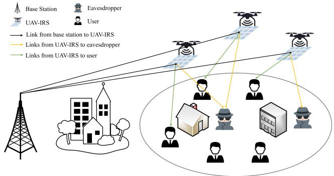  
Fig. 1. The multiple UAV-IRS-assisted secure wireless communications system model.

3) In order to demonstrate the effectiveness and superiority of the proposed scheme, we comprehensively compare it with the existing state-of-the-art schemes in diverse scenarios with different numbers of UAVs, IRS elements, and users through multiple sets of simulation experiments. The experimental results clearly demonstrate the advantages of the proposed scheme and its efficient distributed collaboration capability among multiple UAV-IRSs.

It is worth noting that the proposed scheme has good generalizability and can be applied to a variety of multi-agent systems, providing a novel and effective approach to solve the multi-agent distributed collaboration problem.

The rest of the paper is organized as follows. Section II presents a system model of a secure wireless communication network aided by multiple UAV-IRS and formulates the optimization problem of this paper. Section III reconstructs the problem in the framework of Markov games and Section IV proposes a credit-aware cooperative MARL based scheme. Simulation experiments are carried out in Section V and the conclusions are drawn in Section VI.

Notation: In this paper, scalars are denoted by italic letters, and vectors and matrices are represented by bold-face letters. $\mathbf { X } ^ { T } , \mathbf { X } ^ { H }$ denotes the transpose and conjugate transpose of vector or matrix X, respectively, and diag(X) denotes a diagonal matrix with the elements of vector X on the main diagonal. $\mathbb { C } ^ { N \times M }$ denotes the set of $N \times M$ complex-valued vectors. |X| denotes the absolute value of a scalar X. ||X|| denotes the Euclidean norm of vector or matrix X. The logarithm with base 2 of a scalar X is denoted by $\log _ { 2 } ( X )$ . <sup>E</sup>[X] denotes the statistical expectation operation.

## II. SYSTEM MODEL AND PROBLEM FORMULATION

As shown in Fig. 1, we consider a multi-UAV-IRS-assisted secure communication network for harsh communication environments, where a BS with K antennas, M single-antenna users, and E single-antenna eavesdroppers are deployed on the ground, and N UAVs equipped with IRS are deployed in the air, and each IRS has L reflection elements. In addition, we define a discrete decision time frame that consists of $T$ equal time slots, and each duration δ. At each time slot $t \in \mathcal { T } = \{ 1 , 2 , \dots , T \}$ , the BS sends data to the user. We assume that the direct signal link from the BS to the user is blocked due to the harsh communication environment. Therefore, we consider a two-hop communication system assisted by UAV-IRS, i.e., the BS sends data to the user through UAV-IRS reflection and relaying. Given the persistent risk of unauthorized eavesdroppers intercepting data transmitted from the BS to the user, it is essential that multiple UAV-IRSs cooperate to optimize their phase shifts and trajectories in order to increase the data transmission rate available to the user while reducing the transmission rate of eavesdropped data.

## A. Channel Model

Let $\begin{array} { l l l l l } { { { \cal K } ~ = } } & { { \{ 1 , 2 , \ldots , K \} , ~ { \mathcal { M } } ~ = } } & { { \{ 1 , 2 , \ldots , M \} , ~ { \mathcal { E } } } } & { { = } } & { { { \bar { } } } } \end{array}$ $\{ 1 , 2 , \ldots , E \} , \mathcal { N } = \{ 1 , 2 , \ldots , N \} , \mathrm { ~ a n d ~ } \mathcal { L } = \{ 1 , 2 , \ldots , L \}$ denote the sets of antennas of the BS, users, eavesdroppers, UAVs, and IRS reflective elements, respectively.

We construct a three-dimensional Cartesian coordinate system in the target area. The coordinates of the BS are $\mathbf { Q } _ { B } =$ $( 0 , 0 , z _ { B } )$ , where $z _ { B }$ is the height of the antenna of the BS. At time slot t, the coordinates of the mth user are ${ \bf Q } _ { I } ^ { m } ( t ) = $ $( x _ { I } ^ { m } ( t ) , y _ { I } ^ { m } ( t ) , 0 )$ and the eth eavesdropper are ${ \bf Q } _ { E } ^ { e } ( t ) \ = $ $( x _ { E } ^ { e } ( t ) , y _ { E } ^ { e } ( t ) , 0 )$ . We assume that the user and the eavesdropper roam randomly within the target area. The coordinates of the nth UAV-IRS are $\mathbf { Q } _ { U } ^ { n } ( t ) = ( x _ { U } ^ { n } ( t ) , y _ { U } ^ { n } ( t ) , z _ { U } ^ { n } ( t ) )$ ). The UAVs can fly in the range of altitude from $z _ { m i n } \mathrm { \Delta t o \ z _ { \it m a x } , i . e . }$ $z _ { U } ^ { n } ( t ) \in [ z _ { m i n } , z _ { m a x } ]$ . We omit the index t of the time slot in the absence of ambiguity to simplify in the following.

Let $\mathbf { H } _ { B U } ^ { n } \ \in \ \mathbb { C } ^ { K \times L } , \ \mathbf { H } _ { U I } ^ { n , m } \ \in \ \mathbb { C } ^ { 1 \times L }$ , and $\mathbf { H } _ { U E } ^ { n , e } \ \in \ \mathbb { C } ^ { 1 \times L }$ denote the channel coefficients from the BS to nth UAV-IRS, from the nth UAV-IRS to the mth user, and from the nth UAV to the eth eavesdropper, respectively. We model the above channels as the Rician channel. So the channel from the BS to the nth UAVs can be described as follows

$$
\mathbf { H } _ { B U } ^ { n } = \underbrace { \sqrt { \rho d _ { B U } ^ { n } - \xi } } _ { \mathrm { p a t h \ l o s s } } \underbrace { \left( \sqrt { \frac { \beta } { \beta + 1 } } \mathbf { h } _ { B U } ^ { n } + \sqrt { \frac { 1 } { \beta + 1 } } \mathbf { g } _ { B U } ^ { n } \right) } _ { \mathrm { a r r a y \ r e s p o n s e ( s m a l l \mathrm { - } s c a l e \ f a d i n g ) } } ,\tag{1}
$$

where $d _ { B U } ^ { n } = | | \mathbf { Q } _ { B } - \mathbf { Q } _ { U } ^ { n } | |$ is the distance between BS and nth $\mathrm { U A V } , \rho$ is the power gain at the reference distance of 1 m, $\beta$ is the Rician factor, ξ is the path loss factor, $\mathbf { g } _ { B U } ^ { n }$ is nonlight of sight (NLoS) components of the channels, which follows a standard complex normal distribution $( \mathrm { i . e . , } \mathbf { g } _ { B U } ^ { n } \sim C N ( 0 , 1 ) )$ and $\mathbf { h } _ { B U } ^ { n }$ is light of sight (LoS) components of the channels, which is given by

$$
\mathbf { h } _ { B U } ^ { n } = \pmb { a } _ { B U } ^ { R } \left( \varphi _ { B U } ^ { A } ( \mathbf { Q } _ { B } , \mathbf { Q } _ { U } ^ { n } ) \right) { \pmb { a } _ { B U } ^ { T } } ^ { H } \left( \varphi _ { B U } ^ { D } ( \mathbf { Q } _ { B } , \mathbf { Q } _ { U } ^ { n } ) \right)\tag{2}
$$

where $\begin{array} { r } { \varphi _ { B U } ^ { A } ( { \bf Q } _ { B } , { \bf Q } _ { U } ^ { n } ) \ = \ \operatorname { a r c c o s } \left( \frac { z _ { B } - z _ { U } ^ { n } } { | | { \bf Q } _ { B } - { \bf Q } _ { I } ^ { m } | | } \right) } \end{array}$ is the angleof-arrival (AoA) of the link from the BS to nth UAV, $\begin{array} { r } { \varphi _ { B U } ^ { D } ( \mathbf { Q } _ { B } , \mathbf { Q } _ { U } ^ { n } ) = \frac { \pi } { 2 } - \varphi _ { B U } ^ { A } ( \mathbf { Q } _ { B } , \mathbf { Q } _ { U } ^ { n } ) } \end{array}$ is the angle-of-departure (AoD), ${ \pmb a } _ { B U } ^ { R } \left( \varphi _ { B U } ^ { A } ( { \bf Q } _ { B } , { \bf Q } _ { U } ^ { n } ) \right)$ and $\mathbf { a } _ { B U } ^ { T } \left( \varphi _ { B U } ^ { D } ( \mathbf { Q } _ { B } , \mathbf { Q } _ { U } ^ { \bar { n } } ) \right)$ are the receive and transmit array response for the nth UAV and the BS can be given respectively by [14]

$$
\begin{array} { r l } & { { \mathbf { \boldsymbol { a } } _ { B U } ^ { R } \left( \varphi _ { B U } ^ { A } ( { \bf { \boldsymbol { Q } } } _ { B } , { \bf { \boldsymbol { Q } } } _ { U } ^ { n } ) \right) } } \\ & { = \left[ 1 , e ^ { - j 2 \pi \frac { d } { \lambda } \cos ( \varphi _ { B U } ^ { A } ( { \bf { \boldsymbol { Q } } } _ { B } , { \bf { \boldsymbol { Q } } } _ { U } ^ { n } ) ) } , \right. } \\ & { \quad \left. \dots , e ^ { - j 2 \pi \frac { d } { \lambda } ( L - 1 ) \cos ( \varphi _ { B U } ^ { A } ( { \bf { \boldsymbol { Q } } } _ { B } , { \bf { \boldsymbol { Q } } } _ { U } ^ { n } ) ) } \right] ^ { T } , } \end{array}\tag{3}
$$

and

$$
\begin{array} { r l } & { a _ { B U } ^ { T } \left( \varphi _ { B U } ^ { D } ( \mathbf { Q } _ { B } , \mathbf { Q } _ { U } ^ { n } ) \right) } \\ & { \quad = \left[ 1 , e ^ { - j 2 \pi \frac { d } { \lambda } \cos ( \varphi _ { B U } ^ { D } ( \mathbf { Q } _ { B } , \mathbf { Q } _ { U } ^ { n } ) ) } , \right. } \\ & { \quad \left. \quad \cdots \mathrm { ~ } , e ^ { - j 2 \pi \frac { d } { \lambda } ( K - 1 ) \cos ( \varphi _ { B U } ^ { D } ( \mathbf { Q } _ { B } , \mathbf { Q } _ { U } ^ { n } ) ) } \right] ^ { T } , } \end{array}\tag{4}
$$

where $d$ and λ are the antenna separation distance and the carrier wavelength, respectively.

Similarly, the Rician channel from the n-th UAV to the mth user and e-th eavesdropper can be described as follows

$$
\mathbf { H } _ { U I } ^ { n , m } = \underbrace { \sqrt { \rho d _ { U I } ^ { n , m - \xi } } } _ { \mathrm { p a t h ~ l o s s } } \underbrace { \left( \sqrt { \frac { \beta } { \beta + 1 } } \mathbf { h } _ { U I } ^ { n , m } + \sqrt { \frac { 1 } { \beta + 1 } } \mathbf { g } _ { U I } ^ { n , m } \right) } _ { \mathrm { a r r a y ~ r e s p o n s e ( s m a l l - s c a l e ~ f a d i n g ) } } ,\tag{5}
$$

and

$$
\mathbf { H } _ { U E } ^ { n , e } = \underbrace { \sqrt { \rho d _ { U E } ^ { n , e } - \xi } } _ { \mathrm { p a t h \ l o s s } } \underbrace { \left( \sqrt { \frac { \beta } { \beta + 1 } } \mathbf { h } _ { U E } ^ { n , e } + \sqrt { \frac { 1 } { \beta + 1 } } \mathbf { g } _ { U E } ^ { n , e } \right) } _ { \mathrm { a r r a y \ r e s p o n s e ( s m a l l \ - s c a l e \ f a d i n g ) } } ,\tag{6}
$$

where $d _ { U I } ^ { n , m } = | | \mathbf { Q } _ { U } ^ { n } - \mathbf { Q } _ { I } ^ { m } | |$ and $d _ { U E } ^ { n , e } = | | \mathbf { Q } _ { U } ^ { n } - \mathbf { Q } _ { E } ^ { e } | |$ are the distance from nth UAV to the mth user and e-th eavesdropper, respectively, $\mathbf { g } _ { U E } ^ { n , e } \sim C N ( 0 , 1 ) , \mathbf { g } _ { U I } ^ { n , m } \sim C N ( 0 , 1 ) , \mathbf { h } _ { U I } ^ { n , m }$ and $\mathbf { h } _ { U E } ^ { n , \top }$ can be given respectively by

$$
\mathbf { h } _ { U I } ^ { n , m } = { \pmb { a } _ { U I } ^ { T } } ^ { H } \left( \varphi _ { U I } ^ { D } ( \mathbf { Q } _ { U } ^ { n } , \mathbf { Q } _ { I } ^ { m } ) \right) ,\tag{7}
$$

and

$$
\mathbf { h } _ { U E } ^ { n , e } = { \pmb { a } _ { U E } ^ { T } } ^ { H } \left( \varphi _ { U E } ^ { D } ( \mathbf { Q } _ { U } ^ { n } , \mathbf { Q } _ { E } ^ { e } ) \right) ,\tag{8}
$$

where $\begin{array} { r l r } { \varphi _ { U I } ^ { D } ( { \bf Q } _ { U } ^ { n } , { \bf Q } _ { I } ^ { m } ) } & { { } = } & { \mathrm { a r c c o s } \left( \frac { z _ { U } ^ { n } } { | | { \bf Q } _ { U } ^ { n } - { \bf Q } _ { I } ^ { m } | | } \right) } \end{array}$ and $\begin{array} { r l r } { \varphi _ { U E } ^ { D } ( { \bf Q } _ { U } ^ { n } , { \bf Q } _ { E } ^ { e } ) } & { { } = } & { \operatorname { a r c c o s } \left( \frac { z _ { U } ^ { n } } { | | { \bf Q } _ { U } ^ { n } - { \bf Q } _ { E } ^ { e } | | } \right) } \end{array}$ are the AoD of the link from the ith UAV-IRS to the mth user and $e \mathrm { - }$ th eavesdropper, respectively, $\mathbf { a } _ { U I } ^ { T } \left( \varphi _ { U I } ^ { D } ( \mathbf { Q } _ { U } ^ { n } , \mathbf { Q } _ { I } ^ { m } ) \right)$ and $\mathbf { a } _ { U E } ^ { T } \left( \varphi _ { U E } ^ { D } ( \bar { \mathbf { Q } } _ { U } ^ { \bar { n } } , \mathbf { Q } _ { E } ^ { e } ) \right)$ are reflect array response arising, which can be given respectively by

$$
\begin{array} { r l } & { \mathbf { a } _ { U I } ^ { T } \left( \varphi _ { U I } ^ { D } ( \mathbf { Q } _ { U } ^ { n } , \mathbf { Q } _ { I } ^ { m } ) \right) } \\ & { \ = \left[ 1 , e ^ { - j 2 \pi \frac { d } { \lambda } \cos ( \varphi _ { U I } ^ { D } ( \mathbf { Q } _ { U } ^ { n } , \mathbf { Q } _ { I } ^ { m } ) ) } , \right. } \\ & { \quad \left. \dots , e ^ { - j 2 \pi \frac { d } { \lambda } ( L - 1 ) \cos ( \varphi _ { U I } ^ { D } ( \mathbf { Q } _ { U } ^ { n } , \mathbf { Q } _ { I } ^ { m } ) ) } \right] ^ { T } , } \end{array}\tag{9}
$$

and

$$
\begin{array} { r l } & { \mathbf { a } _ { U E } ^ { T } \left( \varphi _ { U E } ^ { D } ( \mathbf { { \mathbf { Q } } } _ { U } ^ { n } , \mathbf { { \mathbf { Q } } } _ { E } ^ { e } ) \right) } \\ & { \ = \Big [ 1 , e ^ { - j 2 \pi \frac { d } { \lambda } \cos ( \varphi _ { U E } ^ { D } ( \mathbf { { Q } } _ { U } ^ { n } , \mathbf { { Q } } _ { E } ^ { e } ) ) } , } \\ & { \quad \cdots , e ^ { - j 2 \pi \frac { d } { \lambda } ( L - 1 ) \cos ( \varphi _ { U E } ^ { D } ( \mathbf { { Q } } _ { U } ^ { n } , \mathbf { { Q } } _ { E } ^ { e } ) ) } \Big ] ^ { T } . } \end{array}\tag{10}
$$

B. Signal Model

Let $\Theta _ { n } ~ = ~ \mathrm { d i a g } ( \omega _ { n , 1 } e ^ { j \theta _ { n , 1 } } , \omega _ { n , 2 } e ^ { j \theta _ { n , 2 } } , \cdot \cdot \cdot ~ , \omega _ { n , L } e ^ { j \theta _ { n , L } } ) ~ \in$ $\mathbb { C } ^ { 1 \times L }$ denote the reflection coefficient diagonal matrix associated with effective phase shifts at the nth UAV-IRS, where $\omega _ { n , l } ~ \in ~ [ 0 , 1 ]$ denote the amplitude reflection factor, and $\theta _ { n , l } \in [ 0 , 2 \pi )$ denote the phase shift coefficient. We assume that $\omega _ { n , l } = 1 , \forall n \in \mathcal { N } , l \in \mathcal { L }$ to achieve full reflection.

Since the direct signal link from the BS to the users is blocked, we can express the received signal at the mth user

$$
\begin{array} { r l r } {  { \mathbf { a } ^ { \mathbf { a } } } } \\ & { \leq } \\ & { = \underbrace { ( \displaystyle \sum _ { n = 1 } ^ { N } { \mathbf { H } _ { U I } ^ { n , m } \Theta _ { n } \mathbf { H } _ { B U } ^ { n } } ) \mathbf { w } _ { m } \sqrt { p _ { m } } x _ { m } } _ { \mathrm { d e s i r e d ~ s i g n a l } } } \\ & { } & { + \underbrace { ( \displaystyle \sum _ { n = 1 } ^ { N } { \mathbf { H } _ { U I } ^ { n , m } \Theta _ { n } \mathbf { H } _ { B U } ^ { n } } ) \displaystyle \sum _ { m ^ { \prime } = 1 , m ^ { \prime } \neq m } ^ { M } { \mathbf { w } _ { m ^ { \prime } } \sqrt { p _ { m ^ { \prime } } } x _ { m } ^ { \prime } } } _ { \mathrm { i n t e r f e r e c t e } } + n _ { m } , } \end{array}\tag{11}
$$

where $x _ { m } , p _ { m } .$ , and $\mathbf { w } _ { m } \in \mathbb { C } ^ { K \times 1 }$ are the information sequence, the transmit power, and the active beamforming vector for the mth user at the BS, respectively, and $n _ { m }$ denotes the additive complex Gaussian noise with the with zero mean and variance $\sigma _ { m } ^ { 2 }$ at the mth user. Accordingly, we can represent the received signal of the eth eavesdropper when eavesdropping on the signal sent from the BS to the mth user as

$$
\begin{array} { r l } & { y _ { I E } ^ { m _ { e } } } \\ & { = \underbrace { \left( \displaystyle \sum _ { n = 1 } ^ { N } { \bf H } _ { U E } ^ { n , e } \Theta _ { n } { \bf H } _ { B U } ^ { n } \right) { \bf w } _ { m } \sqrt { p _ { m } } x _ { m } } _ { \mathrm { d e s i r e d ~ s i g n a l } } } \\ & { \quad + \underbrace { \left( \displaystyle \sum _ { n = 1 } ^ { N } { \bf H } _ { U E } ^ { n , e } \Theta _ { n } { \bf H } _ { B U } ^ { n } \right) \displaystyle \sum _ { m ^ { \prime } = 1 , m ^ { \prime } \ne m } ^ { M } { \bf w } _ { m } ^ { \prime } \sqrt { p _ { m ^ { \prime } } } x _ { m } ^ { \prime } } _ { \mathrm { i n t e f f e n e s e } } + n _ { e } , } \end{array}\tag{12}
$$

where $n _ { e }$ denotes the additive complex Gaussian noise with the with zero mean and variance $\sigma _ { e } ^ { 2 }$ at the eth eavesdropper.

We assume that the BS adopts a low complexity zeroforcing precoding scheme to eliminate multi-user interference, and adopts an average transmit power allocation scheme, i.e., $\begin{array} { r c l } { p _ { m } } & { = } & { \frac { P _ { m a x } } { M } } \end{array}$ , where $P _ { m a x } \mathrm { i s }$ the maximum transmit power of BS.<sup>1</sup> The precoding matrix is given by $\begin{array} { r c l } { \tilde { \textbf { W } } } & { = } & { \mathbf { G } _ { B I } ^ { H } ( \mathbf { G } _ { B I } \mathbf { G } _ { B I } ^ { H } ) ^ { - 1 } } \end{array}$ , where $\tilde { \textbf { W } } = \ \{ \tilde { \bf w } _ { 1 } , \cdot \cdot \cdot , \tilde { \bf w } _ { M } \} \in$ ${ \mathbb C } ^ { M \times K } , \stackrel { { \scriptscriptstyle \partial } ^ { \perp } } { \mathbf { G } } _ { B I } = \{ \mathbf { G } _ { B I } ^ { 1 } , \cdot \cdot \cdot , \mathbf { G } _ { B I } ^ { M } \} \in \stackrel { \tilde { \mathbb { C } } ^ { M } \times L } { \mathbb { C } } ^ { \tilde { M } \times L } , \mathbf { G } _ { B I } ^ { m } =$ $\begin{array} { r } { \left( \sum _ { n = 1 } ^ { N } \mathbf { H } _ { U I } ^ { n , m } \Theta _ { n } \mathbf { H } _ { B U } ^ { n } \right) \in \mathbb { C } ^ { 1 \times L } } \end{array}$ , then normalise $\begin{array} { r } { \mathbf { w } _ { m } = \frac { \tilde { \mathbf { w } } _ { m } } { | | \tilde { \mathbf { w } } _ { m } | | } } \end{array}$ [9].

Therefore, the signal-to-interference-plus-noise ratio (SINR) for the received signal in Eq. (11) and Eq. (12) are given respectively by

SINR<sup>m</sup><sub>I</sub>

$$
= \frac { \left| { \left( \sum _ { n = 1 } ^ { N } { \mathbf { H } _ { U I } ^ { n , m } \boldsymbol { \Theta } _ { n } } { \mathbf { H } _ { B U } ^ { n } } \right) \mathbf { w } _ { m } } \right| ^ { 2 } p _ { m } } { \sum _ { m ^ { \prime } = 1 , m ^ { \prime } \neq m } ^ { M } { \left| { \left( \sum _ { n = 1 } ^ { N } { \mathbf { H } _ { U I } ^ { n , m } \boldsymbol { \Theta } _ { n } } { \mathbf { H } _ { B U } ^ { n } } \right) \mathbf { w } _ { m ^ { \prime } } } \right| ^ { 2 } } } { p _ { m ^ { \prime } } } + \sigma _ { m } ^ { 2 } ,\tag{13}
$$

<sup>1</sup>This paper focuses on the decision-making of UAVs, so we just take ZF precoding and average transmission power allocation as a feasible solution. In fact, the use of other precoding methods and transmission power allocation strategies on the BS will not affect the effectiveness of the proposed scheme and subsequent discussions.

and

$$
\begin{array} { r l } {  { \mathrm { S I N R } _ { I E } ^ { m , e } } } \\ & { = \frac { \bigg | ( \displaystyle \sum _ { n = 1 } ^ { N } \mathbf { H } _ { U E } ^ { n , e } \Theta _ { n } \mathbf { H } _ { B U } ^ { n } ) \mathbf { w } _ { m } \bigg | ^ { 2 } p _ { m } } { \displaystyle \sum _ { m ^ { \prime } = 1 , m ^ { \prime } \neq m } ^ { M } \bigg | ( \displaystyle \sum _ { n = 1 } ^ { N } \mathbf { H } _ { U E } ^ { n , e } \Theta _ { n } \mathbf { H } _ { B U } ^ { n } ) \mathbf { w } _ { m ^ { \prime } } \bigg | ^ { 2 } p _ { m ^ { \prime } } + \sigma _ { e } ^ { 2 } } . } \end{array}\tag{14}
$$

Therefore, the achievable secrecy rate from the BS to the mth user can be expressed as

$$
R _ { I } ^ { m } = \biggl [ \mathrm { l o g } _ { 2 } ( 1 + \mathrm { S I N R } _ { I } ^ { m } ) - \underset { \forall e \in \mathcal { E } } { \operatorname* { m a x } } \mathrm { l o g } _ { 2 } ( 1 + \mathrm { S I N R } _ { I E } ^ { m , e } ) \biggr ] ^ { + } ,\tag{15}
$$

where $[ X ] ^ { + } = \operatorname* { m a x } \{ X , 0 \}$ . And the achievable secrecy sum rate can be expressed as

$$
R _ { I } = \sum _ { m = 1 } ^ { M } R _ { I } ^ { m } .\tag{16}
$$

## C. Problem Formulation

In this paper, we focus on maximizing the achievable secrecy sum rate of the multi-UAV-IRS assisted downlink secure communication network as described in the previous section by optimizing the trajectory ${ \bf Q } _ { U } \ = \ \{ { \bf Q } _ { U } ^ { n } ( t ) , \forall n \ \in$ $\mathcal { N } , t \in \mathcal { T } \}$ of the UAVs and the phase-shift matrix $\Theta =$ $\{ \Theta _ { n } ( t ) , \forall \bar { n } \in \mathcal { N } , t \in \mathcal { T } \}$ of the IRSs. Therefore, the optimization problem can be formulated as

$$
\operatorname { P 1 : } \operatorname* { m a x } _ { \mathbf { Q } _ { U } , \Theta } \sum _ { t = 1 } ^ { T } R _ { I } ( t )\tag{17}
$$

$$
\mathrm { s . t . } 0 \leq x _ { U } ^ { n } ( t ) \leq L _ { m a x } , \forall n \in \mathcal { N } , t \in \mathcal { T } ,
$$

$$
0 \leq y _ { U } ^ { n } ( t ) \leq L _ { m a x } , \forall n \in \mathcal { N } , t \in \mathcal { T } ,\tag{17a}
$$

(17b)

$$
z _ { m i n } \le z _ { U } ^ { n } ( t ) \le z _ { m a x } , \forall n \in \mathcal { N } , t \in \mathcal { T } ,\tag{17c}
$$

$$
| | \mathbf { Q } _ { U } ^ { n } ( t ) - \mathbf { Q } _ { U } ^ { n } ( t - 1 ) | | \leq V _ { U } ^ { m a x } , \forall n \in N , t \in \mathcal { T } ,\tag{17d}
$$

$$
0 \leq \theta _ { n , l } ( t ) \leq 2 \pi , \forall n \in \mathcal { N } , l \in \mathcal { L } , t \in \mathcal { T } ,\tag{17e}
$$

$$
R _ { t h } \leq R _ { I } ^ { m } ( t ) , \forall m \in \mathcal { M } , t \in \mathcal { T } ,\tag{17f}
$$

where $L _ { m a x }$ is the side length of the square target area and $V _ { U } ^ { m a x }$ is the maximum displacement of the UAV at each time slot. Constraints (17b)-(17d) are the range constraints within which the UAVs can ${ \mathrm { ~ \ f y , ~ } }$ constraint (17e) is the velocity constraint of the UAVs, constraint (17f) denotes the feasible range of the phase shift of the reflective units of the IRS, and constraint (17g) is the minimum secure data rate $R _ { t h }$ constraint between the BS and the user. Clearly, the problem (17) presents a non-convex nature with respect to both optimisation variables $\mathbf { Q } _ { U }$ and Θ.

## III. PROBLEM RECONSTRUCTION

Problem P1 is a non-convex multi-timeslot cumulative performance optimization problem with Markov property, which is difficult to solve using traditional methods. Moreover, UAVs often operate independently due to adverse communication conditions or high costs. Consequently, the collaboration among UAVs becomes crucial for trajectory planning and

IRS reflection phase-shift decisions based on their incomplete observations, aiming to maximize the achievable secrecy sum rate while considering the impact of subsequent system dynamics on decision-making for optimal multi-timeslot cumulative performance. To address the above challenges, we modelled the optimisation problem given in Eq. (17) as a Markov game with multiple agents. Specifically, we define a tuple $\langle \mathbf { N } , \mathbf { O } , \mathbf { A } , \mathbf { R } , P \rangle$ for modelling the Markov game, where N is the set of agents, $\mathbf { O } \ = \ \{ \mathbf { O } _ { 1 } , \cdot \cdot \cdot , \mathbf { O } _ { N } \}$ and $\mathbf { A } ~ = ~ \left\{ \mathbf { A } _ { 1 } , \cdots , \mathbf { A } _ { N } \right\}$ represent the agents’ observation space and action space, respectively, R represents the reward function, and P is the state transfer probability. Corresponding to this paper, each UAV-IRS is an agent of the Markov game. And the O, A and R are defined as follows.

## A. Observation Space

Similar to the existing work [37], [38], we assume that perfect CSI of the link from the user and the BS to the UAV-IRS can be acquired by existing channel estimation methods using guided-frequency signals sent by the $\mathrm { u s e r } . ^ { 2 }$ In addition, although eavesdroppers usually do not send guidedfrequency signals to BSs and UAVs to hide their presence. However, channel estimation can still be performed using signals leaked by eavesdroppers, but the acquired link CSI is crude and outdated. So the observation $o _ { n } ( t ) \in \mathbf { O } _ { n }$ of the nth UAV includes the coordinates of the UAV, perfect channel information of the link from the user and BS to the UAV-IRS, and the estimated channel information from the UAV-IRS to the eavesdropper, which can be expressed as

$$
o _ { n } ( t ) = \{ \mathbf { Q } _ { U } ^ { n } ( t ) , \mathbf { H } _ { B U } ^ { n } ( t ) , \{ \mathbf { H } _ { U I } ^ { n , m } ( t ) \} _ { m \in \mathcal { M } } , \{ \tilde { \mathbf { H } } _ { U E } ^ { n , e } ( t ) \} _ { e \in \mathcal { E } } \} ,\tag{18}
$$

where $\tilde { \mathbf { H } } _ { U E } ^ { n , e } ( t ) = \mathbf { H } _ { U E } ^ { n , e } ( t ) + \Delta \mathbf { H } _ { U E } ^ { n , e } ( t )$ denote the estimated channel vector from the nth UAV-IRS to the e eavesdropper, and $\Delta \mathbf { H } _ { I J E } ^ { n , e }$ denote channel estimation error vector with $\bar { | | } \Delta \mathbf { H } _ { U E } ^ { n , e } | | ^ { 2 } \leq \xi _ { U E } ^ { 2 } , \xi _ { U E }$ refers to the radius of the bounded error region.

## B. Action Space

At each time slot, the UAV needs to decide the trajectory and the phase shift matrix of the UAV-IRS based on its observation information, so the action $a _ { n } \in \mathbf { A } _ { n }$ of the nth UAV can be expressed as

$$
a _ { n } ( t ) = \{ \Delta \mathbf { Q } _ { U } ^ { n } ( t ) , \boldsymbol { \Theta } _ { n } ( t ) \} ,\tag{19}
$$

where $\Delta \mathbf { Q } _ { U } ^ { n } ( t ) = \mathbf { Q } _ { U } ^ { n } ( t ) - \mathbf { Q } _ { U } ^ { n } ( t - 1 )$ is the flight displacement of the nth UAV at time slot t.

## C. Reward Function

Reward is the feedback given by the environment after agents take action and is used to evaluate the performance of the policy in MARL. The design of the reward function is crucial and it needs to coincide with the optimisation objective to maximise the achievable secrecy sum rate of the system. Since multiple UAV-IRS collaborate together in this paper to assist in the downlink secure communication from the BS to the user, all the UAVs share a team reward function which can be expressed as

$$
r ( t | \mathbf { o } ( t ) , \mathbf { a } ( t ) ) = \sum _ { m = 1 } ^ { M } \left[ R _ { I } ^ { m } ( t ) - \mathbb { I } _ { R _ { t h } \leq R _ { I } ^ { m } } ( t ) P \right] ,\tag{20}
$$

where ${ \bf o } ( t ) = \{ o _ { 1 } ( t ) , \cdots , o _ { N } ( t ) \} , { \bf a } ( t ) = \{ a _ { 1 } ( t ) , \cdots , a _ { N } ( t ) \}$ $\mathbb { I } _ { R _ { t h } \leq R _ { I } ^ { m } } ( t ) \ \in \ \{ 0 , 1 \}$ denotes whether the secure data rate achievable by the mth user satisfies the constraint (17g) or not, and its value is 0 when it is satisfied and 1 otherwise, and P is a constant greater than zero.

The policy $\pi _ { n }$ of the nth UAV-IRS is defined as a mapping of the probability of going from given observation $o _ { n }$ to action $a _ { n } , \mathrm { i } . \mathbf { e } . , \pi _ { n } : \mathbf { O } _ { n } \to \mathbf { A } _ { n }$ . The goal of the learning for all UAV-IRSs is to acquire an optimal policy $\pi _ { n } ^ { * }$ that maximises the long term cumulative discount team reward, which is defined as $\begin{array} { r } { \bar { G } ( t ) = \sum _ { t = t ^ { \prime } } ^ { T } \gamma ^ { t - t ^ { \prime } } r ( \mathbf { 0 } ( t ) , \mathbf { a } ( t ) ) } \end{array}$ , where $\gamma$ is the discount factor.

## IV. PROPOSED SOLUTION

In this section, we first obtains agent-specific individual rewards based on cooperative game theory. Then, we propose a credit-aware cooperative MARL-based scheme, which integrates MARL, cooperative game theory, and primal pairwise optimization.

## A. Cooperative Game Theory-Based Agent-Specific Individual Reward

The above Markov game can usually be solved by multiagent reinforcement learning algorithms. All UAVs can only receive one shared team reward at each time slot, i.e., Eq. (20). This makes it difficult for the UAVs to know how much they actually contribute to the team rewards, i.e., it is difficult to quantify the individual contributions of the UAVs. Consequently, each UAV can only optimise its own policy based on shared team rewards. This situation often leads to a scenario where some UAVs acquire effective policies and significantly enhance the team reward, while others with less effective policies become lazy and reduce their willingness to explore and learn, as they realise that exploring is likely to have a negative impact on the team reward. Therefore, in order to avoid the emergence of lazy agents (UAVs), it is crucial to allocate individual rewards fairly according to each UAV’s contribution to the team reward. Next, we introduce an individual reward allocation scheme based on cooperative game theory.

1) Cooperative Game Theory: A cooperative game including N agents (players) can be represented by $G = \{ \mathcal { N } , \mathcal { C } , v \}$ , where $\mathcal { N } ~ = ~ \{ 1 , 2 , \cdots , N \}$ is the set of agents, C is an subset of N representing a coalition of multiple agents, $v ( \mathcal { C } ) \in \mathcal { R } , \forall \mathcal { C } \subseteq \mathcal { N }$ is the characteristic function representing the benefits of the coalition C [39]. The Shapley value and the Banzhaf value are two commonly used methods for fairly calculating the contribution of the agents n involved in the cooperative game to the coalition ${ \mathcal { N } } ,$ which can be expressed as respectively

$$
C _ { S h a p l e y } ( \mathcal { N } , n ) = \sum _ { \mathcal { C } \subseteq N \setminus n } \frac { | \mathcal { C } | ! ( | \mathcal { N } | - | \mathcal { C } | - 1 ) ! } { | \mathcal { N } | ! } M C ( \mathcal { C } , n ) ,\tag{21}
$$

and

$$
C _ { B a n z h a f } ( \mathcal { N } , n ) = \frac { 1 } { 2 ^ { | \mathcal { N } | - 1 } } \sum _ { \mathcal { C } \subseteq \mathcal { N } \setminus n } M C ( \mathcal { C } , n ) ,\tag{22}
$$

where |C| and $| \mathcal { N } |$ are the number of agents in the coalition $\mathcal { C }$ and $\mathcal { N } , M C ( \mathcal { C } , n )$ is the marginal contribution of agent n to coalition $\mathcal { C }$ which is defined as the difference between the characteristic of the coalition after this agent joins and before, i.e., $M C ( \mathcal C , n ) = v ( \mathcal C \cup n ) - v ( \mathcal C )$ . Intuitively, the Shapley value is the weighted sum of the marginal contributions of all possible coalitions excluding agent n (the weights are related to the number of agents of the coalition), while the Banzhaf value is their average. In particular, the number of all possible coalitions other than the agent n is $2 ^ { | { \mathcal { N } } | - 1 }$

```latex
Algorithm 1 Agent-specific Individual Reward Based on
Cooperative Game Theory
Input: $\{ \mathbf { H } _ { B U } ^ { n } ( t ) , \{ \mathbf { H } _ { U I } ^ { n , m } ( t ) \} _ { m \in \mathcal { M } } , \{ \mathbf { H } _ { U E } ^ { n , e } ( t ) \} _ { e \in \mathcal { E } } \} _ { n \in \mathcal { N } } .$
1: for ${ \mathcal { C } } \subseteq { \mathcal { N } }$ do
2: for $m \in \mathcal { M }$ do
3: Calculate the achievable secure data rate of the m
th user with the assistance of the UAV-IRSs in the
coalition C according to Eq. (24).
4: Determine whether the secure data rate achieved
by the mth users meets the constraints, i.e.,
$\mathbb { I } _ { R _ { t h } \leq R _ { I } ^ { m } ( \mathcal { C } ) } .$
5: end for
6: Calculate the characteristic function v(C) according to
Eq. (23).
7: end for
8: for $n \in \mathcal N$ do
9: for ${ \mathcal { C } } \subseteq { \mathcal { N } } \backslash n$ do
10: Calculate the marginal contribution $M C ( \mathcal { C } , n )$ for
the nth UAV-IRS.
11: end for
12: Calculate the agent-specific individual reward $r _ { n } ^ { I }$ for
the nth UAV-IRS according to Eq. (25).
13: end for
Output: The agent-specific individual reward $\begin{array} { r l } { \mathbf { r } ^ { I } } & { { } = } \end{array}$
$\mathbf { \bar { \{ } }  r _ { 1 } ^ { I } , \ \cdots , r _ { N } ^ { I } \bar  \}$ of all UAV-IRSs.
```

2) Agent-Specific Individual Reward: Next, we propose an agent-specific individual reward allocation scheme based on cooperative game theory, the details of which are shown in Algorithm 1. Specifically, according to Eq. (20), the characteristic function of a coalition $\mathcal { C }$ consisting of multiple UAV-IRSs is defined as

$$
v ( \mathcal { C } ) = \sum _ { m = 1 } ^ { M } \left[ R _ { I } ^ { m } ( \mathcal { C } ) - \mathbb { I } _ { R _ { t h } \leq R _ { I } ^ { m } ( \mathcal { C } ) } P \right] ,\tag{23}
$$

where $R _ { I } ^ { m } ( { \mathcal { C } } )$ is the achievable secure rate of the mth user with the assistance of the UAV-IRSs in the coalition ${ \mathcal { C } } ,$ i.e. Eq. (24), shown at the bottom of the page.

Then, we calculate each UAV-IRS’s contribution to the team reward based on the Shapley value in Eq. (21), and fairly design individual rewards for them based on this. The agentspecific individual reward of agent n can be express as

$$
\begin{array} { l } { { \displaystyle r _ { n } ^ { I } \big ( { \bf { o } } ( t ) , { \bf { a } } ( t ) \big ) = C _ { S h a p l e y } ( N , n ) } \ ~ } \\ { { \displaystyle = \sum _ { \mathcal { C } \subseteq \mathcal { N } \setminus n } \frac { | \mathcal { C } | ! \big ( | N | - | \mathcal { C } | - 1 \big ) ! } { | \mathcal { N } | ! } M C ( \mathcal { C } , n ) } . } \end{array}\tag{25}
$$

where $\begin{array} { r } { M C ( \mathcal { C } , n ) = \sum _ { m = 1 } ^ { M } \Big [ R _ { I } ^ { m } ( \mathcal { C } \cup n ) - \mathbb { I } _ { R _ { t h } \leq R _ { I } ^ { m } ( \mathcal { C } \cup n ) } P \Big ] - } \end{array}$ $\begin{array} { r } { \sum _ { m = 1 } ^ { M } \bigg [ R _ { I } ^ { m } ( \mathcal { C } ) - \mathbb { I } _ { R _ { t h } \leq R _ { I } ^ { m } ( \mathcal { C } ) } \bigg ] } \end{array}$ , and the sum of the contributions (individual reward) of all UAV-IRS is equal to the benefit of the coalition N (team reward), i.e. $\begin{array} { r } { \sum _ { n = 1 } ^ { N } r _ { n } ^ { I } = \sum _ { n = 1 } ^ { N } C _ { S h a p l e y } ( n ) = v ( N ) = r . } \end{array}$

## B. Credit-Aware Cooperative MARL-Based Scheme

According to Problem P1, our optimisation objective is to maximise the achievable secrecy sum rate of the system with the cooperative assistance of all UAV-IRSs. However, directly optimising the individual rewards based on cooperative game theory as described above may lead to a deviation from the original cooperative-oriented learning objective, i.e., Eq. (26), shown at the bottom of the next page. This is because there may be competition between UAV-IRSs, and when an UAV-IRS is maximising its own contribution to the team reward it can harm the contributions of other UAV-IRSs, thus making the team reward lower. Therefore, the competitive behaviour of UAV-IRSs needs to be constrained to promote cooperation between them.

1) Constrained Markov Game: The process of multiple UAV-IRSs maximising their cumulative discount individual rewards under the constraint of non-cooperative behaviour can be modelled as a constrained Markov game. It can be represented by the tuple $\langle \mathbf { N } , \mathbf { O } , \mathbf { A } , \mathbf { R } , \mathbf { C } , P \rangle$ , where N, O, A, and, P as in the previously described Markov game at section III, R is the UAV-IRS’s individual reward, i.e.,

$$
\begin{array} { r } { R _ { I } ^ { m } ( \mathcal { C } ) = \Bigg [ \log _ { 2 } \left( 1 + \frac { | \left( \sum _ { n \in \mathcal { C } } \mathbf { H } _ { U I } ^ { n , m } \Theta _ { n } \mathbf { H } _ { B U } ^ { n } \right) \mathbf { w } _ { m } | ^ { 2 } } { \sum _ { m ^ { \prime } = 1 , m ^ { \prime } \neq m } ^ { M } | \left( \sum _ { n \in \mathcal { C } } \mathbf { H } _ { U I } ^ { n , m } \Theta _ { n } \mathbf { H } _ { B U } ^ { n } \right) \mathbf { w } _ { m ^ { \prime } } | ^ { 2 } + \sigma _ { m } ^ { 2 } } \right) } \\ { - \underset { \forall e \in \mathcal { E } } { \operatorname* { m a x } } \log _ { 2 } \left( 1 + \frac { | \left( \sum _ { n \in \mathcal { C } } \mathbf { H } _ { U E } ^ { n , e } \Theta _ { n } \mathbf { H } _ { B U } ^ { n } \right) \mathbf { w } _ { m } | ^ { 2 } } { \sum _ { m ^ { \prime } = 1 , m ^ { \prime } \neq m } ^ { M } | \left( \sum _ { n \in \mathcal { C } } \mathbf { H } _ { U E } ^ { n , e } \Theta _ { n } \mathbf { H } _ { B U } ^ { n } \right) \mathbf { w } _ { m ^ { \prime } } | ^ { 2 } + \sigma _ { e } ^ { 2 } } \right) \Bigg ] ^ { + } , } \end{array}\tag{24}
$$

Eq. (25), C is the cost function to penalise the non-cooperative behaviours of the UAV-IRS that undermine the team rewards. Then, we define the cost function $c _ { n } \in \mathbf { C }$ of agent n as

$$
c _ { n } ( \mathbf { o } ( t ) , \mathbf { a } ( t ) ) = { \left\{ \begin{array} { l l } { 1 , } & { n \not \in { \mathcal { C } } ^ { \star } = \arg \operatorname* { m a x } _ { { \mathcal { C } } \in { \mathcal { N } } } v ( { \mathcal { C } } ) , } \\ { 0 , } & { { \mathrm { o t h e r w i s e } } , } \end{array} \right. }\tag{27}
$$

where ${ \mathcal { C } } ^ { \star }$ is the optimal coalition. In particular, the optimal coalition when all UAV-IRS are able to co-operate effectively should include all UAV-IRS, i.e., ${ \mathcal { C } } ^ { \star } = { \mathcal { N } }$

With non-cooperative behavioural constraints, each UAV-IRS maximizes its cumulative discounted individual reward. Therefore, the constrainted optimisation problem for UAV-IRS n can be expressed as

$$
\begin{array} { r l } & { \operatorname* { m a x } _ { \pi _ { n } } \mathbb { E } _ { a _ { n } \sim \pi _ { n } } \left[ \displaystyle \sum _ { t } \gamma ^ { t } r _ { n } ^ { I } ( \mathbf { 0 } ( t ) , \mathbf { a } ( t ) ) \right] } \\ & { \mathrm { s . t . } \mathbb { E } _ { a _ { n } \sim \pi _ { n } } \left[ \displaystyle \sum _ { t } \gamma ^ { t } c _ { n } ( \mathbf { 0 } ( t ) , \mathbf { a } ( t ) ) \right] = 0 . } \end{array}\tag{28}
$$

Further, in order to enable the UAV-IRSs to fully explore based on individual rewards in the early stages of training while learning to cooperate effectively in the later stages of training, we transform the above equation-constrained optimisation problem into an inequality-constrained optimisation problem, i.e.

$$
\begin{array} { r l } & { \operatorname* { m a x } _ { \pi _ { n } } \mathbb { E } _ { a _ { n } \sim \pi _ { n } } \left[ \displaystyle \sum _ { t } \gamma ^ { t } r _ { n } ^ { I } ( \mathbf { 0 } ( t ) , \mathbf { a } ( t ) ) \right] } \\ & { \mathrm { s . t . } \mathbb { E } _ { a _ { n } \sim \pi _ { n } } \left[ \displaystyle \sum _ { t } \gamma ^ { t } \left( c _ { n } ( \mathbf { 0 } ( t ) , \mathbf { a } ( t ) ) - d \right) \right] \leq 0 , } \end{array}\tag{29}
$$

where d is a decreasing auxiliary variable to progressively strengthen the constraints on non-cooperative behaviours.

The inequality constrained optimisation problem described above can usually be solved using the Lagrangian multiplier method. The Lagrangian method introduces the Lagrangianmultiplier $\lambda _ { n } .$ , i.e.,

$$
\begin{array} { r l } & { L ( \pi _ { n } , \lambda _ { n } ) = \mathbb { E } _ { a _ { n } \sim \pi _ { n } } \left[ \displaystyle \sum _ { t } \gamma ^ { t } r _ { n } ^ { I } ( \mathbf { 0 } ( t ) , \mathbf { a } ( t ) ) \right] } \\ & { \quad \quad \quad - \lambda _ { n } \mathbb { E } _ { a _ { n } \sim \pi _ { n } } \left[ \displaystyle \sum _ { t } \gamma ^ { t } \left( c _ { n } ( \mathbf { 0 } ( t ) , \mathbf { a } ( t ) ) - d \right) \right] . } \end{array}\tag{30}
$$

Then, the original constrained optimisation problem in Eq. (29) can then be transformed into an unconstrained optimisation problem as follows

$$
( \pi _ { n } ^ { \star } , \lambda _ { n } ^ { \star } ) = \arg \operatorname* { m i n } _ { \lambda _ { n } \geq 0 } \operatorname* { m a x } _ { \pi _ { n } } L ( \pi _ { n } , \lambda _ { n } ) .\tag{31}
$$

It can then be solved by updating $\pi _ { n }$ and $\lambda _ { n }$ alternately in the following way

$$
\begin{array} { r } { \pi _ { n } ( t + 1 ) = \pi _ { n } ( t ) + \alpha _ { \pi _ { n } } \nabla _ { \pi _ { n } } L ( \pi _ { n } , \lambda _ { n } ) , } \\ { \lambda _ { n } ( t + 1 ) = \pi _ { n } ( t ) - \alpha _ { \lambda _ { n } } \nabla _ { \lambda _ { n } } L ( \pi _ { n } , \lambda _ { n } ) , } \end{array}\tag{32}
$$

where $\alpha _ { \pi _ { n } } , \alpha _ { \lambda _ { n } } ~ > ~ 0$ are the step sizes for $\pi _ { n }$ and $\lambda _ { n } ,$ respectively.

2) PD-CMASAC: SAC is a stochastic policy reinforcement learning algorithm that maximises the policy entropy while maximising the cumulative discount reward [40]. The multi-agent SAC (MASAC) extends SAC to a multi-agent environment based on the centralised training with distributed execution (CTDE) framework.

In this paper, we propose a credit-aware cooperative MARL based scheme, called PD-CMASAC, which takes MASAC as the base algorithm, solves the credit allocation problem between UAV-IRS using cooperative game theory to facilitate exploration, and solves the above cooperative constrained Markov game problem using primal-dual optimization algorithm to facilitate cooperation.

The framework of PD-CMASAC is shown in Fig. 2, each UAV-IRS maximises both the cumulative individual reward and the policy entropy under non-cooperative behavioural constraints. So the problem of UAV-IRS n is further formulated as

$$
\begin{array} { r l } & { \operatorname* { m a x } _ { \pi _ { \theta _ { n } } } \mathbb { E } _ { a _ { n } \sim \pi _ { \theta _ { n } } } \Big [ \displaystyle \sum _ { t } \gamma ^ { t } r _ { n } ^ { I } ( \mathbf { 0 } ( t ) , \mathbf { a } ( t ) ) } \\ & { \qquad + \displaystyle \sum _ { t } \gamma ^ { t } \Psi _ { n } H \big ( \pi _ { \theta _ { n } } \left( \cdot | o _ { n } ( t ) \right) \big ) \Big ] } \\ & { \qquad \mathrm { s . t . ~ } \mathbb { E } _ { a _ { n } \sim \pi _ { \theta _ { n } } } \left[ \displaystyle \sum _ { t } \gamma ^ { t } \left( c _ { n } ( \mathbf { 0 } ( t ) , \mathbf { a } ( t ) ) - d \right) \right] \leq 0 , } \end{array}\tag{33}
$$

where $\pi _ { \theta _ { n } }$ is the policy network of UAV-IRS n with parameters $\theta _ { n }$ , and $H ( \pi _ { \theta _ { n } } \left( \cdot | o _ { n } ( t ) ) \right) = - \log \pi _ { \theta _ { n } } \left( a _ { n } ( t ) | o _ { n } ( t ) \right)$ is the policy entropy.

At each time slot, the UAV-IRS’s policy network acquires actions based on local observations and adds noise for exploration. The joint actions are then applied to the environment and the team rewards r and observations $\mathbf { 0 } ^ { \prime } = \{ o _ { 1 } ^ { \prime } , \cdot \cdot \cdot , o _ { N } ^ { \prime } \}$ for the next time slot are acquired, calculate the agent-specific individual reward $\textbf { r } ^ { I } ~ = ~ \hat { \{ } r _ { 1 } ^ { I } , \hat { } \cdot \cdot \cdot , r _ { N } ^ { I } \}$ for all UAV-IRSs based on cooperative game theory, and calculate the cost ${ \bf c } = \{ c _ { 1 } , \cdots , c _ { N } \}$ for all UAV-IRSs according to Eq. (27). The experience tuple $< \ \mathbf { o } , \mathbf { a } , \mathbf { r } ^ { I } , \mathbf { c } , \mathbf { o } ^ { \prime } \ >$ resulting from the interaction with the environment are shared to the experience replay buffer D. Finally, a small set of experience tuples B

$$
\begin{array} { r l } & { \underset { \pi _ { n } } { \arg \operatorname* { m a x } } \mathbb { E } \left[ \sum _ { t = t ^ { \prime } } ^ { T } \gamma ^ { t - t ^ { \prime } } r ( \mathbf { o } ( t ) , \mathbf { a } ( t ) ) \bigg | \pi _ { n ^ { \prime } } = \underset { \pi _ { n ^ { \prime } } } { \arg \operatorname* { m a x } } \mathbb { E } \left[ \sum _ { t = t ^ { \prime } } ^ { T } \gamma ^ { t - t ^ { \prime } } r ( \mathbf { o } ( t ) , \mathbf { a } ( t ) ) \right] , \forall n ^ { \prime } \in \mathcal { N } \backslash n \right] } \\ & { \neq \arg \underset { \pi _ { n } } { \arg \operatorname* { m a x } } \mathbb { E } \left[ \sum _ { t = t ^ { \prime } } ^ { T } \gamma ^ { t - t ^ { \prime } } r _ { n } ^ { T } ( \mathbf { 0 } ( t ) , \mathbf { a } ( t ) ) \bigg | \pi _ { n ^ { \prime } } = \underset { \pi _ { n ^ { \prime } } } { \arg \operatorname* { m a x } } \mathbb { E } \left[ \sum _ { t = t ^ { \prime } } ^ { T } \gamma ^ { t - t ^ { \prime } } r _ { n ^ { \prime } } ^ { T } ( \mathbf { 0 } ( t ) , \mathbf { a } ( t ) ) \right] , \forall n ^ { \prime } \in \mathcal { N } \backslash n \right] , } \end{array}\tag{26}
$$

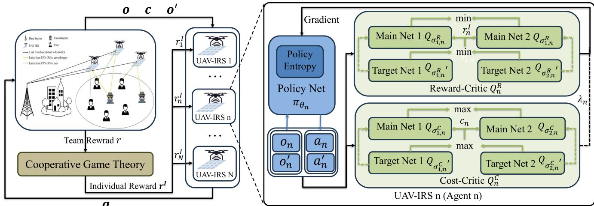  
Fig. 2. The framework of the proposed PD-CMASAC based scheme.

with size |B| is randomly selected from D for updating the parameters of the network.<sup>3</sup>

In the centralised training phase, each UAV-IRS learns two separate kinds of critic (Q-functions) to be learned, one of which is the reward-critic $Q ^ { R }$ for individual reward and policy entropy, i.e.,

$$
\begin{array} { r l r } {  { Q _ { \pi _ { \theta _ { n } } } ^ { R } ( \mathbf { o } , \mathbf { a } ) } } \\ & { } & { = \mathbb { E } _ { a _ { n } \sim \pi _ { \theta _ { n } } } [ \sum _ { t = t ^ { \prime } } ^ { T } \gamma ^ { t - t ^ { \prime } } r _ { n } ^ { I } ( \mathbf { o } ( t ) , \mathbf { a } ( t ) )  } \\ & { } & { \quad -  \sum _ { t = t ^ { \prime } + 1 } ^ { T } \gamma ^ { t - t ^ { \prime } } \Psi _ { n } \log \pi _ { \theta _ { n } } ( \cdot | o _ { n } ) \bigg | \mathbf { o } ( t ^ { \prime } ) = \mathbf { o } , \mathbf { a } ( t ^ { \prime } ) = \mathbf { o } ] , } \end{array}\tag{34}
$$

the other is the constraint-critic $Q ^ { C }$ for constrained cost, i.e.,

$$
\begin{array} { c } { { \displaystyle Q _ { \pi _ { n } } ^ { C } ( \mathbf { 0 } , \mathbf { a } ) = \mathbb { E } _ { a _ { n } \sim \pi _ { \theta _ { n } } } [ \sum _ { { t = t ^ { \prime } } } ^ { T } \gamma ^ { t - { t ^ { \prime } } } ( c _ { n } ( \mathbf { 0 } ( t ) , \mathbf { a } ( t ) ) - d )  } } \\ { { \displaystyle  | \mathbf { 0 } ( { t ^ { \prime } } ) = \mathbf { 0 } , \mathbf { a } ( { t ^ { \prime } } ) = \mathbf { 0 } ] . } } \end{array}\tag{35}
$$

<sup>3</sup>We assume that there is a data center for global information collection and processing (including calculation of individual rewards, updating of network parameters, etc.) in the centralized training phase, which can be either a base station or a UAV-IRS. It is worth noting that the data center is not needed in the distributed execution phase.

The reward-critic $Q ^ { R }$ includes two main reward-critic networks $Q _ { \sigma _ { 1 , n } ^ { R } } , \ Q _ { \sigma _ { 2 , { n } } ^ { R } }$ with parameters $\sigma _ { 1 , n } ^ { R } , ~ \sigma _ { 2 , n } ^ { R }$ and two target reward-critic networks $Q _ { \sigma _ { 1 , n } ^ { R ^ { \prime } } } , \ Q _ { \sigma _ { 2 , n } ^ { R ^ { \prime } } }$ with parameters $\sigma _ { 1 , n } ^ { R ^ { \prime } } , \sigma _ { 2 , n } ^ { R ^ { \prime } }$ . The main reward-critic network can be learned by minimizing the soft Bellman residuals as follows

$$
J ( \sigma _ { i , n } ^ { R } ) = \frac { 1 } { \left| B \right| } \sum _ { \mathbf { o } , \mathbf { a } , r _ { n } ^ { I } \in B } \left[ \left( Q _ { \sigma _ { i , n } ^ { R } } \left( \mathbf { o } , \mathbf { a } \right) - y _ { n } ^ { R } \right) ^ { 2 } \right] ,\tag{36}
$$

where $i = 1 , 2$ , and $y _ { n } ^ { R }$ is the target value of main rewardcritic network. To alleviate the problem of overestimating the reward-Q-function, both reward-critic networks use a single target, calculated using whichever of the two reward-critic networks gives a smaller target value, i.e.,

$$
y _ { n } ^ { R } = r _ { n } ^ { I } + \gamma \left[ \operatorname* { m i n } _ { i = 1 , 2 } { Q _ { \sigma _ { i , n } ^ { R } } } , \left( { \mathbf { o } ^ { \prime } } , \tilde { \mathbf { a } } ^ { \prime } \right) - \Psi _ { n } \log \pi _ { \theta _ { n } } \left( \tilde { a } _ { n } ^ { \prime } | o _ { n } ^ { \prime } \right) \right] ,\tag{37}
$$

where $\tilde { \mathbf { a } } ^ { \prime } = \{ \tilde { a } _ { 1 } ^ { \prime } , \cdots , \tilde { a } _ { N } ^ { \prime } \}$ , and $\tilde { a } _ { n } ^ { \prime } \sim \pi _ { \theta _ { n } } \left( \cdot | o _ { n } ^ { \prime } \right)$

Similarly, the constraint-critic $Q ^ { C }$ includes two main constraint-critic networks $Q _ { \sigma _ { 1 , n } ^ { C } } , Q _ { \sigma _ { 2 , n } ^ { C } }$ with parameters $\sigma _ { 1 , n } ^ { C } ,$ $\sigma _ { 2 , n } ^ { C }$ and two target constraint-critic networks $Q _ { \sigma _ { 1 , n } ^ { C ^ { \prime } } } , \ Q _ { \sigma _ { 2 , n } ^ { C ^ { \prime } } }$ with parameters $\sigma _ { 1 , n } ^ { C ^ { \prime } } , \sigma _ { 2 , n } ^ { C ^ { \prime } }$ . The main constraint-critic network can be learned by minimizing the soft Bellman residuals as follows

$$
J ( \sigma _ { i , n } ^ { C } ) = \frac { 1 } { \left| B \right| } \sum _ { \mathbf { o } , \mathbf { a } , c _ { n } \in B } \left[ \left( Q _ { \sigma _ { i , n } ^ { C } } \left( \mathbf { o } , \mathbf { a } \right) - y _ { n } ^ { C } \right) ^ { 2 } \right] ,\tag{39}
$$

$$
\begin{array} { l } { { \displaystyle { \cal L } _ { E } ( \pi _ { \theta _ { n } } , \lambda _ { n } ) = { \mathbb { E } } _ { a _ { n } \sim \pi _ { \theta _ { n } } } \left[ \displaystyle { \sum _ { t } \gamma ^ { t } \left[ r _ { n } ^ { I } ( { \mathbf { o } } ( t ) , { \mathbf { a } } ( t ) ) - \Psi _ { n } \log \pi _ { \theta _ { n } } \left( a _ { n } ( t ) \right. o _ { n } ( t ) ) \right] - \lambda _ { n } \sum _ { t } \gamma ^ { t } \left( c _ { n } ( { \mathbf { o } } ( t ) , { \mathbf { a } } ( t ) ) - d \right) } \right] } \ ~ } \\ { { \displaystyle ~ = { \mathbb { E } } _ { a _ { n } \sim \pi _ { \theta _ { n } } } \left[ - \Psi _ { n } \log \pi _ { \theta _ { n } } \left( a _ { n } ( t ) \vert o _ { n } ( t ) \right) \right] + { \mathbb { E } } _ { a _ { n } \sim \pi _ { \theta _ { n } } } \left[ \displaystyle { \sum _ { t } \gamma ^ { t } r _ { n } ^ { I } ( { \mathbf { o } } ( t ) , { \mathbf { a } } ( t ) ) } \right. } \ ~ } \\ { { \displaystyle ~ \left. ~ - \sum _ { t } \gamma ^ { t + 1 } \Psi _ { n } \log \pi _ { \theta _ { n } } \left( a _ { n } ( t + 1 ) \right. o _ { n } ( t + 1 ) \right) - \lambda _ { n } { \mathbb { E } } _ { a _ { n } \sim \pi _ { \theta _ { n } } } \left[ \displaystyle { \sum _ { t } \gamma ^ { t } \left( c _ { n } ( { \mathbf { o } } ( t ) , { \mathbf { a } } ( t ) ) - d \right) } \right] } \ ~ } \\   \displaystyle ~ = - \Psi _ { n } \log \pi _ { \theta _ { n } } \left( \hat { a } _ { n } \vert o _ { n } \right) + \displaystyle  \operatorname* { m i n } _ { i = 1 , 2 } Q _ { \sigma _ { i , n } } ^ { R } \left( { \mathbf { o } } , { \mathbf { a } } \right) - \lambda _ { n } \displaystyle  \ \end{array}\tag{38}
$$

where $i = 1 , 2$ , and $y _ { n } ^ { C }$ is the target value of main constraintcritic network. To alleviate the problem of underestimating the constraint-Q-function, both constraint-critic networks use a single target, calculated using whichever of the two constraintcritic networks gives a smaller target value, i.e.,

$$
y _ { n } ^ { C } = \left( c _ { n } - d \right) + \gamma \operatorname* { m a x } _ { i = 1 , 2 } Q _ { \sigma _ { i , n } ^ { C } } { ' } \left( \bullet ^ { \prime } , \tilde { \mathbf { a } } ^ { \prime } \right) .\tag{40}
$$

The inequality optimisation problem in Eq. (33) with respect to the Lagrangian function can be expressed as Eq. (38), shown at the bottom of the previous page. It can then be transformed into an unconstrained optimisation problem as follows

$$
( \pi _ { \theta _ { n } } ^ { \star } , \lambda _ { n } ^ { \star } ) = \arg \operatorname* { m i n } _ { \lambda _ { n } \geq 0 } \operatorname* { m a x } _ { \pi _ { \theta _ { n } } } L _ { E } ( \pi _ { \theta _ { n } } , \lambda _ { n } ) .\tag{41}
$$

So the policy network $\pi _ { \theta _ { \pi } }$ can be updated by maximizing $L _ { E } ( \pi _ { \theta _ { n } } | \lambda _ { n } )$ , i.e.,

$$
\begin{array} { c }  { \displaystyle { J ( \theta _ { n } ) = \frac { 1 } { | B | } \sum _ { \mathbf { 0 } , \mathbf { a } \in B } \Big [ - \Psi _ { n } \log \pi _ { \theta _ { n } } \left( \tilde { a } _ { n } | o _ { n } \right) + \operatorname* { m i n } _ { i = 1 , 2 } Q _ { \sigma _ { i , n } ^ { R } } \left( \mathbf { 0 } , \mathbf { a } \right) } } \\ { { - \lambda _ { n } \operatorname* { m a x } _ { i = 1 , 2 } Q _ { \sigma _ { i , n } ^ { C } } \left( \mathbf { 0 } , \mathbf { a } \right) \Big ] , } } \end{array}
$$

where $a _ { n } \sim \pi _ { \theta _ { n } } \left( \cdot | o _ { n } \right)$ . The Lagrangian-multiplier $\lambda _ { n }$ can be updated by minimizing $L _ { E } ( \lambda _ { n } | \pi _ { \theta _ { n } } )$ , i.e.,

$$
J ( \lambda _ { n } ) = \frac { 1 } { \left| { \cal B } \right| } \sum _ { { \bf o } , { \bf a } \in { \cal B } } \left[ - \lambda _ { n } \operatorname* { m a x } _ { i = 1 , 2 } Q _ { \sigma _ { i , n } ^ { C } } \left( { \bf 0 } , { \bf a } \right) \right] .\tag{43}
$$

In this paper, the update method of adaptive temperature parameter is used, which can be expressed as

$$
J ( \Psi _ { n } ) = \frac { 1 } { | B | } \sum _ { o _ { n } \in B } \left[ - \Psi _ { n } \log \pi _ { \theta _ { n } } \left( \widetilde { a } _ { n } | o _ { n } \right) - \Psi _ { n } H \right] ,\tag{44}
$$

where $\tilde { a } _ { n } \sim \pi _ { \theta _ { n } } ( \cdot | o _ { n } )$ , and H is the target policy entropy. The update method of the target reward-critic network and target constraint-critic network is soft update, which can be expressed as

$$
\begin{array} { r l } & { \phi _ { n , i } ^ { R ^ { \prime } } = \tau \phi _ { n , i } ^ { R } + ( 1 - \tau ) \phi _ { n , i } ^ { R ^ { \prime } } , i = 1 , 2 , } \\ & { \phi _ { n , i } ^ { C ^ { \prime } } = \tau \phi _ { n , i } ^ { C } + ( 1 - \tau ) \phi _ { n , i } ^ { C ^ { \prime } } , i = 1 , 2 , } \end{array}\tag{45}
$$

where τ is the soft update parameter. The details of the proposed scheme are shown in Algorithm 2.

## C. Computational Complexity and Scalability Analysis

In this subsection, we perform a complexity analysis of the proposed PD-CMASAC based trajectory planning and phase shift design scheme based on Algorithm 1 and Algorithm 2. Specifically, the training process of the scheme includes $N _ { e p i }$ epoichs, and each epoich includes T time slots. The complexity of each time slot mainly comes from calculating individual rewards based on Algorithm 1 (line 7 of Algorithm 2) and updating the parameters of networks by gradient backpropagation (lines 11 to 18 of Algorithm 2). First, by analyzing Algorithm 1 it is known that the complexity of calculating individual rewards is $O ( ( M + N ) N ! )$ ). Then, the complexity of updating the parameters of networks is $O ( | B | ( O _ { P } + O _ { R } + O _ { C } ) )$ ), where $O _ { P } , O _ { R }$ and $O _ { C }$ are the complexity of updating the parameters of the policy network, the

Algorithm 2 Trajectory Planning and Phase-Shift Design via   
PD-CMASAC Algorithm   
Input: Initialized main network parameters: $\theta _ { n } , \ \sigma _ { n , 1 } ^ { R } , \ \sigma _ { n , 2 } ^ { R } ,$ $\sigma _ { n , 1 } ^ { C } , \sigma _ { n , 2 } ^ { C } , \forall n \in \mathcal { N } ,$ 1: Set the target network parameters: ${ \sigma _ { n , 1 } ^ { R } } ^ { \prime }  \sigma _ { n , 1 } ^ { R } , { \sigma _ { n , 2 } ^ { R } } ^ { \prime } $ $\sigma _ { n , 2 } ^ { R } , { \sigma _ { n , 1 } ^ { C } } ^ { \prime }  \sigma _ { n , 1 } ^ { C } , { \sigma _ { n , 2 } ^ { C } } ^ { \prime }  \sigma _ { n , 2 } ^ { C } , \forall n \in \mathcal { N } .$   
2: for $n _ { e p i } \mathrm { i n } \left\{ 1 , . . . , N _ { e p i } \right\}$ do 3: Reset initial observation o. 4: for t in $\{ 1 , . . . , T \}$ do   
5: For each UAV-IRS, selects action $\begin{array} { r l } { a _ { n } } & { { } \sim } \end{array}$ $\pi _ { \theta _ { n } } ( o _ { n } ) , \forall n \in \textit { N }$ w.r.t. the current policy $\pi _ { \boldsymbol { \theta } _ { n } } .$ 6: Execute actions $\textbf { a } = ~ \{ a _ { 1 } , \cdot \cdot \cdot , a _ { N } \}$ and observe team reward r and observation o of next time slot. 7: Calculate the individual reward $\mathbf { r } ^ { \mathbf { I } } = \{ r _ { 1 } ^ { I } , \cdot \cdot \cdot , r _ { N } ^ { I } \}$ for all UAV-IRSs based on Algorithm 1. 8: Calculate the cost ${ \bf { c } } = \{ c _ { 1 } , \cdots , c _ { N } \}$ for all UAV-IRSs according to Eq. (27). 9: Store the experience tuple $< \mathbf { o } , \mathbf { a } , \mathbf { r } ^ { \mathbf { I } } , \mathbf { o } ^ { \prime } , \mathbf { c } >$ in D, and $\mathbf { o }  \mathbf { o } ^ { \prime } .$   
10: Sample a random minibatch B of tuples from D.   
11: for n in $\{ 1 , \cdots , N \}$ do   
12: Update the parameter of main reward-critic network of nth UAV-IRS by minimizing $J ( \sigma _ { i , n } ^ { R } ) , i = 1 , 2 .$   
13: Update the parameter of main cost-critic network of nth UAV-IRS by minimizing $J ( \sigma _ { i , n } ^ { C } ) , i = 1 , 2 .$   
14: Update the parameter of policy network of nth UAV-IRS by maximizing $J ( \theta _ { n } )$   
15: Update the Lagrangian-multiplier $\lambda _ { n }$ of nth UAV-IRS by minimizing $J ( \lambda _ { n } )$   
16: Update the temperature parameter $\Psi _ { n }$ of nth UAV-IRS by minimizing $J ( \Psi _ { n } )$   
17: Update the parameter of target reward-critic network and target cost-critic network of nth UAV-IRS according to Eq. (45).   
18: end for   
19: end for   
20: end for   
Output: The policy networks $\pi _ { \theta _ { n } } , \forall n \in \mathcal { N }$ for all UAV-IRSs.

rewarded critic network, and the costly critic network, respectively, which are related to the structure of the network mainly. Therefore, the complexity of the training process of the scheme is $O _ { T } = O ( N _ { e p i } T \left( ( N + M ) N ! + | B | ( O _ { P } + O _ { R } + O _ { C } ) \right) )$

Considering that the number of UAVs is usually not very large in practice, the proposed scheme has good scalability in the training phase. In addition, in the distributed execution phase of the proposed scheme, the UAVs are able to utilize the trained policy network to achieve efficient distributed cooperation based on their respective incomplete observation information, i.e., this complexity does not increase due to the increase in the number of UAVs, which indicates that the scalability of the system is effectively ensured in the distributed execution phase.

TABLE I  
LIST OF PARAMETERS
<table><tr><td>Parameter</td><td>Value</td></tr><tr><td>Size of minibatch  $\overline { { | B | } }$ </td><td>256 [26]</td></tr><tr><td>Soft update rate τ</td><td>0.01 [26]</td></tr><tr><td>Size of experience replay buffer D</td><td>1000000 [26]</td></tr><tr><td>Discount factor  $\gamma$ </td><td>0.96 [26]</td></tr><tr><td>Altitude range for  $\mathrm { U A V \ f i g h t s }$ </td><td>50-120 m [29]</td></tr><tr><td>Learning rate of reward/cost-critic network</td><td>0.001 [41]</td></tr><tr><td>Learning rate of policy network</td><td>0.0005 [41]</td></tr><tr><td>Learning rate of temperature parameter</td><td>0.0005 [41]</td></tr><tr><td>Maximum transmit power of BS  $P _ { m a x }$ </td><td>40 dBm [42]</td></tr></table>

## V. SIMULATION EXPERIMENTS AND ANALYSIS

In this section we first describe the simulation experiment setup and the baseline schemes. We then verify through extensive experiments that the proposed PD-CMASAC-based scheme outperforms the baseline scheme in dealing with the multiple UAV-IRS assisted secure communication problem in this paper.

## A. Experimental Parameter Settings

In the simulation, we consider a multiple UAV-IRS assisted secure wireless system and assume that the users and eavesdroppers move randomly following the Gaussian-Markov model in the target area with a side length of 1 km [29]. The number of users, eavesdroppers and UAV-IRS are 20, 2 and 3, respectively. The number of reflective elements for each UAV-IRS is 15, and the number of antennas at the BS is the same as that of the users. Then we set $\rho = 2 0 ~ \mathrm { d B } , \xi = 2 . 2$ $\beta = 1 0 ~ \mathrm { d B }$ , and $d = \lambda / 2$ [16]. The policy network, rewardcritic network, and constraint-critic network are all three-layer multilayer perceptron (MLP) networks with the number of nodes in the hidden layer being 128, 256 and 256 respectively. The other parameters are shown in Table I.

In addition, for better quantitative analysis, we compare the following scenarios as a baseline with the proposed algorithm as follows.

1) MASAC with team reward (MASAC-TR): MASAC-TR means that all UAV-IRSs optimise their strategies directly using team reward as the learning reward.

2) MASAC with individual reward (MASAC-IR): MASAC-IR means that all UAV-IRSs optimise their strategies by using the individual reward calculated based on cooperative game theory as the learning reward.

3) MASAC with reward shaping (MASAC-RS): MASAC-RS means that all UAV-IRSs optimise their strategies by using the weighted sum of individual and team rewards as the learning reward.

## B. Simulation Results and Analysis

1) Performance of Proposed Algorithm and Baselines: In Fig. 3 (a) and (b), the relationship between the number of episodes of the proposed PD-CMASAC algorithm and the three baseline algorithms in the training phase and the system secure rate sum and cost are shown, respectively (light translucent lines are the original data, and the dark non-transparent lines are the data after a moving average is applied to the original data of the corresponding colours). It can be seen that the proposed PD-CMASAC algorithm has a significantly higher system safety sum rate and compared to the three baseline algorithms, and the cost is also lower than MASAC-IR and MASAC-RS, and only higher than MASAC-TR. This is because in MASAC-TR, all UAV-IRSs are only able to improve their own strategies based on the team rewards, which will make the UAV-IRS unable to quantify their own contribution to the team reward and cannot know the advantages and disadvantages of their own strategies, which leads to inefficient exploration. Therefore, MASAC-TR has the lowest sum of system safety rates despite its low cost (i.e., the degree of cooperation is higher). In MASAC-IR and MASAC-RS, although individual rewards based on cooperative game theory are introduced, which improves the exploration efficiency to some extent. But the introduction of individual rewards changes the original cooperation-driven optimisation objective and intensifies the competition between UAV-IRS. So the system safety sum rates of MASAC-IR and MASAC-RS is improved relative to MASAC-TR, but its cost is also significantly increased (i.e. reduced degree of cooperation). In the proposed PD-CMASAC, individual rewards based on cooperative game theory are used as learning rewards, while non-cooperative behaviours between UAV-IRS are constrained to promote cooperation. This allows UAV-IRS to explore and learn efficiently under the constraint of cooperation. So PD-CMASAC has the highest sum of system safety rates and will be less costly (higher degree of cooperation).

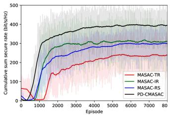  
(a)

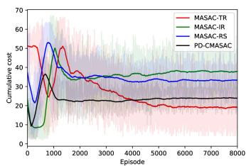  
(b)  
Fig. 3. The system sum secure rate and the cost versus the number of training episodes. (a) The system sum secure rate. (b) The cost.

Fig. 4 (a)-(d) show the system security rate of the four algorithms in one episode of the evaluation phase versus the time step, where the red line is the actual achievable system security rate with the assistance of all UAV-IRSs at each time step, and the blue line is the achievable security rate of the system with the assistance of the optimal UAV-IRS coalition ${ \mathcal { C } } ^ { \star }$ at each time step. The optimal coalition is formed by all UAV-IRSs $( \mathrm { i . e . , ~ } \mathcal { N } = \mathcal { C ^ { \star } } = \arg \operatorname* { m a x } _ { \mathcal { C } \in \mathcal { N } } v ( \mathcal { C } ) )$ when the points of red and blue align, indicating effective cooperation among all UAV-IRSs. It can be seen that MASAC-TR has the best co-operation, followed by PD-CMASAC, and MASAC-IR and MASAC-RS are the worst. However, PD-CMASAC has the best high system security rate, followed by MASAC-IR and MASAC-RS, and MASAC-TR is the worst. This indicates that the proposed PD-CMASAC enables all UAV-IRS to achieve the highest system safety rate while maintaining efficient cooperation, which validates the superiority of the proposed algorithm.

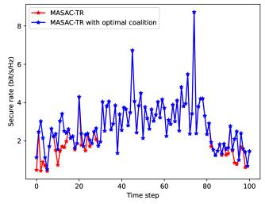  
(a)

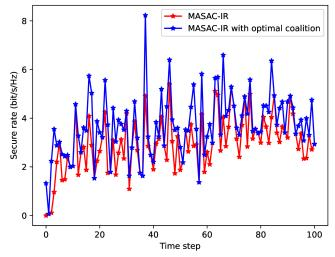  
(b)

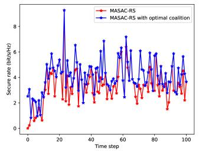  
(c)

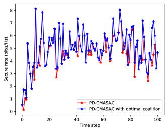  
(d)

Fig. 4. Relationship between secure rate and time step in the evaluation phases of the four algorithms. (a) MASAC-TR. (b) MASAC-IR. (c) MASAC-RS (d) PD-CMASAC.  
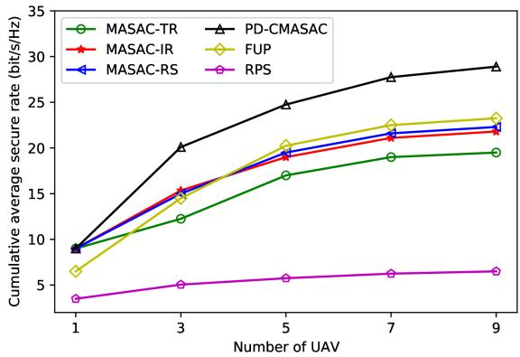  
Fig. 5. Performances against the number of UAVs.

2) Performance With Different Number of UAVs: Fig. 5 shows the cumulative average security rate of users for the six algorithms versus the number of $\mathrm { U A V s . ^ { 4 } }$ As can be seen from the figure, the average security rate shows an increasing trend as the number of UAVs increases, but the rate of this increase gradually slows down. This phenomenon can be explained in two ways: first, as the number of UAVs increases, the distributed co-optimization problem among them becomes more complex and challenging, which naturally leads to a flattening of the efficiency improvement. Second, although increasing the number of UAVs can contribute to the growth of average security rate, the enhancement effect is diminishing, i.e., there is a diminishing marginal utility phenomenon, due to the limitations of other key factors, such as bandwidth resources. It is worth noting that in the scenario where the number of UAVs is 1, the team rewards are equivalent to the individual rewards as there is no need for inter-UAV collaboration, which makes the four scenarios, PD-CMASAC, MASAC-TR, MASAC-IR, and MASAC-RS, identical in terms of practical implementations and cumulative average security rates.

3) Performance With Different Number of Reflection Elements: To further, validate the effectiveness of the proposed algorithm, we also compare the random phase shift (RPS) and fixed UAV-IRS position (FUP) as baseline schemes. In the RPS scheme, we randomly selected the phase shift of the RIS and optimized the trajectory of the UAV-IRSs using PD-CMASAC. Conversely, in the FUP scheme, we maintained the UAV-IRSs at their initial positions and optimized the phase shift of the IRS based on PD-CMASAC. Fig. 6 shows the average security rate of the users for the six algorithms as relation of the number of reflection elements of the IRS. It can be seen that the average security rate increases with the number of reflection elements, which is as expected. This is due to the fact that the increase in the number of IRS reflection elements adds more degrees of freedom to the design of the phase shift thus allowing better enhancement of the channel for legitimate users and suppression of the channel for eavesdroppers.

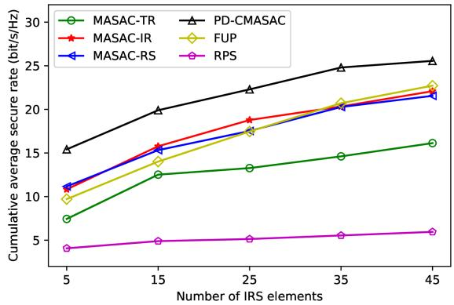  
Fig. 6. Performances against the number of IRS elements.

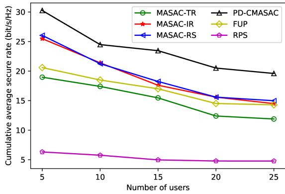  
Fig. 7. Performances against the number of users.

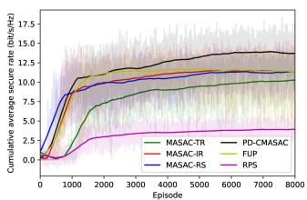  
(a)

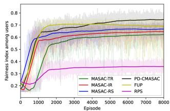  
(b)  
Fig. 8. Cumulative average secure rate and fairness index among users versus the number of training episodes. (a) Cumulative average secure rate. (b) Fairness index among users.

4) Performance With Different Number of Users: Fig. 7 shows the average security rate of users for the six algorithms versus the number of users. It can be seen that the average security rate shows a decreasing trend with the increase in the number of users. This is due to the fact that the increase in the number of users makes the interference between users during data transmission increase, while the trajectory planning and phase design of the UAV-IRS in order to take into account all the users becomes more challenging. In addition, the optimisation of the phase shift of IRS by FUP through PD-CMASAC achieves a high average security rate in all the different scenarios, whereas the performance of RPS in are poor due to the fact that the phase shift of its IRS is randomly selected and does not help the communication efficiently according to the channel. However, in scenarios with reflective elements and users with different IRSs, the proposed algorithm has significant advantages over all baselines, which fully validates the superiority of the proposed algorithm. This is mainly due to the fact that the proposed PD-CMASAC algorithm promotes exploration with individual rewards based on cooperative game theory as learning rewards, while constraining non-cooperative behaviours between UAV-IRS promotes cooperation.

5) Performance Aimed at User Fairness Security Sum Rate: In some application scenarios, it is crucial to ensure fairness among users. Although the constraint (17g) in Problem 17 sets a minimum secure data rate for each user as a way to take fairness into account to some extent, this measure may not be able to fully satisfy the stringent requirements for user fairness in all scenarios. Therefore, in order to improve user fairness more effectively, we propose to introduce a notion of user fairness security sum rate as an optimization objective to replace the original secure data rate in Eq. 16. The user fairness security sum rate can be expressed as

$$
R _ { I F } = \sum _ { m = 1 } ^ { M } R _ { I } ^ { m } + \omega _ { F } F _ { I } .\tag{46}
$$

where $\omega _ { F }$ is the weighting factor, and $F _ { I }$ is the Jain’s fairness index, which can be written as

$$
F _ { I } = \frac { \left( \sum _ { m = 1 } ^ { M } R _ { I } ^ { m } \right) ^ { 2 } } { M \sum _ { m = 1 } ^ { M } R _ { I } ^ { m ^ { 2 } } } ,\tag{47}
$$

where ${ \cal F } _ { { \cal I } } ~ \in ~ [ 0 , 1 ]$ . This fairness metric indicates that the system is most fair when each user’s secure data rate is equal, in which case $F _ { I } = 1$

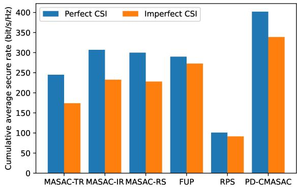  
Fig. 9. Performance of the different schemes with perfect CSI and imperfect CSI scenarios.

Fig. 8 shows the curves of cumulative average security rate and fairness index among users with respect to the number of training episodes for several schemes with $\mathbf { M } = 2 0 , \mathbf { N } = 3 ,$ and $\mathrm { ~ L ~ } = 1 5 .$ . It can be seen that, as with the experimental results discussed previously, the proposed scheme has a significant advantage over the other baseline schemes, i.e., it has the highest cumulative average security rate and fairness index among users. This indicates that the proposed scheme has excellent robustness to the optimization objective. In addition, the security sum rate in the experimental results with the user fairness security sum rate (Eq. 46) as the optimization objective is lower compared to the optimization objective with maximizing the security sum rate (Eq. 16), which is due to the fact that the optimization objective of the user fairness security sum rate needs to take into account the fairness among users while maximizing the security sum rate.

6) Performance With Perfect CSI and Imperfect CSI: The above experiments and analysis are based on perfect CSI of the link from the user and the BS to the UAV-IRS, but in practice this is usually difficult to capture and often has channel estimation errors. Therefore, in order to verify the robustness of the proposed scheme in the scenario of imperfect CSI, we present the cumulative average security rate of the different schemes in the scenarios of perfect CSI and imperfect CSI in Fig. 9. In the imperfect CSI scenario, the perfect CSI from the user and the BS to the UAV-IRS link is not available and is replaced by an imperfect CSI with estimation error, i.e., the agent’s observation (Eq. 18) is rewritten to

$$
\widetilde { o } _ { n } ( t ) = \{ \mathbf { Q } _ { U } ^ { n } ( t ) , \tilde { \mathbf { H } } _ { B U } ^ { n } ( t ) , \{ \tilde { \mathbf { H } } _ { U I } ^ { n , m } ( t ) \} _ { m \in \mathcal { M } } , \{ \tilde { \mathbf { H } } _ { U E } ^ { n , e } ( t ) \} _ { e \in \mathcal { E } } \} ,\tag{48}
$$

where $\tilde { \mathbf { H } } _ { B U } ^ { n } ( t ) \ = \ \mathbf { H } _ { B U } ^ { n } ( t ) + \Delta \mathbf { H } _ { B U } ^ { n } ( t )$ and $\begin{array} { r l } { \tilde { \mathbf { H } } _ { U I } ^ { n , m } ( t ) } & { { } = } \end{array}$ $\mathbf { H } _ { U I } ^ { n , m } ( t ) + \Delta \mathbf { H } _ { U I } ^ { n , m } ( t )$ denote the estimated channel vector from the m user and BS to the nth UAV-IRS to the BS, and $\Delta { \bf H } _ { B U } ^ { n }$ and $\Delta \mathbf { H } _ { U I } ^ { n , m }$ denote channel estimation error vector with $| | \Delta \mathbf { H } _ { B U } ^ { n } | | ^ { 2 } \leq \xi _ { B U } ^ { 2 }$ and $| | \Delta \mathbf { H } _ { U I } ^ { n , m } | | ^ { 2 } \leq \xi _ { U I } ^ { 2 }$ , ξ<sub>BU</sub> and $\xi _ { U I }$ refer to the radius of the bounded error region.

It can be seen that the cumulative average security rates of several schemes in the imperfect CSI scenario are reduced compared to the perfect CSI scenario, and the RPS scheme having the smallest reduction, which stems from the fact that its non-optimized random phase-shift design is naturally robust to CSI errors. However, the cumulative average security rate of the proposed scheme is the largest in both perfect CSI and imperfect CSI scenarios, which is mainly due to the fact that the proposed scheme can better facilitate the distributed collaboration among UAV-IRSs, and also proves the effectiveness and superiority of the proposed scheme in the imperfect CSI scenario.

In summary, the proposed PD-CMASAC-based scheme has more superior performance than the existing schemes in various parameters and scenarios, so although the scheme has the limitations of oversimplified assumptions on BS decision making, locally optimal solutions, and high computational complexity, it is still an innovative and promising direction that deserves to be further explored in depth.

## VI. CONCLUSION

In this paper, we investigate a secure communication system assisted by multiple UAV-IR systems in harsh communication environments and consider the distributed joint problem of trajectory planning and phase shift design for multiple UAVs. The optimisation problem is modelled as a Markov game and a MARL-based scheme is proposed. However, considering that the signals received by the user are the result of the superposition of the signals reflected from all the UAV-IRS, all the agents (UAV-IRSs) can only improve their own strategies by maximising the same team rewards during the training process, which leads to inefficient exploration. Therefore, we utilise cooperative game theory to quantify the contribution of each UAV-IRS to the team reward as the individual reward. Further, consider that the introduction of individual rewards changes the original cooperation-oriented learning objective, while increasing competition among UAV-IRS. In order to promote cooperation, we constrain the non-cooperative behaviour of UAV-IRS and propose a primal-dual optimization-based cooperative MARL scheme. Simulation results validate the superiority of the proposed scheme against the baseline scheme, achieving the highest safe rate sum in different scenarios. The proposed scheme has good generalization and can be applied to a variety of multi-agent systems (e.g., UAV formation control, intelligent traffic management, etc.), providing a novel and effective approach to solve the multiagent distributed collaboration problem. In future work, we will aim to explore the joint optimization of the decisions of the UAV and BS to address the limitation that the proposed scheme is too simplistic in its assumptions about the BS’s decisions.

## REFERENCES

[1] Q. Wu and R. Zhang, “Towards smart and reconfigurable environment: Intelligent reflecting surface aided wireless network,” IEEE Commun. Mag., vol. 58, no. 1, pp. 106–112, Jan. 2020.

[2] M. A. ElMossallamy, H. Zhang, L. Song, K. G. Seddik, Z. Han, and G. Y. Li, “Reconfigurable intelligent surfaces for wireless communications: Principles, challenges, and opportunities,” IEEE Trans. Cognit. Commun. Netw., vol. 6, no. 3, pp. 990–1002, Sep. 2020.

[3] Q. Wu and R. Zhang, “Intelligent reflecting surface enhanced wireless network via joint active and passive beamforming,” IEEE Trans. Wireless Commun., vol. 18, no. 11, pp. 5394–5409, Nov. 2019.

[4] Y. Zeng, R. Zhang, and T. J. Lim, “Wireless communications with unmanned aerial vehicles: Opportunities and challenges,” IEEE Commun. Mag., vol. 54, no. 5, pp. 36–42, May 2016.

[5] H. Zhang, J. Zhang, and K. Long, “Energy efficiency optimization for NOMA UAV network with imperfect CSI,” IEEE J. Sel. Areas Commun., vol. 38, no. 12, pp. 2798–2809, Dec. 2020.

[6] M. Mozaffari, W. Saad, M. Bennis, Y.-H. Nam, and M. Debbah, “A tutorial on UAVs for wireless networks: Applications, challenges, and open problems,” IEEE Commun. Surveys Tuts., vol. 21, no. 3, pp. 2334–2360, 3rd Quart., 2019.

[7] N. Yang, L. Wang, G. Geraci, M. Elkashlan, J. Yuan, and M. Di Renzo, “Safeguarding 5G wireless communication networks using physical layer security,” IEEE Commun. Mag., vol. 53, no. 4, pp. 20–27, Apr. 2015.

[8] J. Chen, Y.-C. Liang, Y. Pei, and H. Guo, “Intelligent reflecting surface: A programmable wireless environment for physical layer security,” IEEE Access, vol. 7, pp. 82599–82612, 2019.

[9] J. Zhao, Y. Zhu, X. Mu, K. Cai, Y. Liu, and L. Hanzo, “Simultaneously transmitting and reflecting reconfigurable intelligent surface (STAR-RIS) assisted UAV communications,” IEEE J. Sel. Areas Commun., vol. 40, no. 10, pp. 3041–3056, Oct. 2022.

[10] J. Zhao, L. Yu, K. Cai, Y. Zhu, and Z. Han, “RIS-aided ground-aerial NOMA communications: A distributionally robust DRL approach,” IEEE J. Sel. Areas Commun., vol. 40, no. 4, pp. 1287–1301, Apr. 2022.

[11] S. Li, B. Duo, X. Yuan, Y.-C. Liang, and M. Di Renzo, “Reconfigurable intelligent surface assisted UAV communication: Joint trajectory design and passive beamforming,” IEEE Wireless Commun. Lett., vol. 9, no. 5, pp. 716–720, May 2020.

[12] X. Mu, Y. Liu, L. Guo, J. Lin, and H. V. Poor, “Intelligent reflecting surface enhanced multi-UAV NOMA networks,” IEEE J. Sel. Areas Commun., vol. 39, no. 10, pp. 3051–3066, Oct. 2021.

[13] M. Hua, L. Yang, Q. Wu, C. Pan, C. Li, and A. L. Swindlehurst, “UAVassisted intelligent reflecting surface symbiotic radio system,” IEEE Trans. Wireless Commun., vol. 20, no. 9, pp. 5769–5785, Sep. 2021.

[14] K. K. Nguyen, S. R. Khosravirad, D. B. da Costa, L. D. Nguyen, and T. Q. Duong, “Reconfigurable intelligent surface-assisted multi-UAV networks: Efficient resource allocation with deep reinforcement learning,” IEEE J. Sel. Topics Signal Process., vol. 16, no. 3, pp. 358–368, Apr. 2022.

[15] X. Zhang, H. Zhang, W. Du, K. Long, and G. K. Karagiannidis, “Joint resource allocation and reflecting design in IRS-UAV communication networks with SWIPT,” IEEE Trans. Wireless Commun., vol. 23, no. 4, pp. 2533–2546, Apr. 2024.

[16] L. Ge, H. Zhang, J.-B. Wang, and G. Y. Li, “Reconfigurable wireless relaying with multi-UAV-carried intelligent reflecting surfaces,” IEEE Trans. Veh. Technol., vol. 72, no. 4, pp. 4932–4947, Apr. 2023.

[17] M. D. Nguyen, L. B. Le, and A. Girard, “UAV placement and resource allocation for intelligent reflecting surface assisted UAV-based wireless networks,” IEEE Commun. Lett., vol. 26, no. 5, pp. 1106–1110, May 2022.

[18] T. Shafique, H. Tabassum, and E. Hossain, “Optimization of wireless relaying with flexible UAV-borne reflecting surfaces,” IEEE Trans. Commun., vol. 69, no. 1, pp. 309–325, Jan. 2021.

[19] P. Wang, D. Li, Y. Zhang, and X. Chen, “UAV-assisted vehicular communication system optimization with aerial base station and intelligent reflecting surface,” IEEE Trans. Intell. Vehicles, early access, Oct. 13, 2024, doi: 10.1109/TIV.2023.3324385.

[20] W. Jiang, B. Ai, M. Li, W. Wu, and X. Shen, “Average age-ofinformation minimization in aerial IRS-assisted data delivery,” IEEE Internet Things J., vol. 10, no. 17, pp. 15133–15146, Sep. 2023.

[21] M. Samir, M. Elhattab, C. Assi, S. Sharafeddine, and A. Ghrayeb, “Optimizing age of information through aerial reconfigurable intelligent surfaces: A deep reinforcement learning approach,” IEEE Trans. Veh. Technol., vol. 70, no. 4, pp. 3978–3983, Apr. 2021.

[22] T. P. Truong, V. D. Tuong, N.-N. Dao, and S. Cho, “FlyReflect: Joint flying IRS trajectory and phase shift design using deep reinforcement learning,” IEEE Internet Things J., vol. 10, no. 5, pp. 4605–4620, Mar. 2023.

[23] H. Yang, S. Liu, L. Xiao, Y. Zhang, Z. Xiong, and W. Zhuang, “Learning-based reliable and secure transmission for UAV-RIS-assisted communication systems,” IEEE Trans. Wireless Commun., vol. 23, no. 7, pp. 6954–6967, Jul. 2024.

[24] H. Zhang, M. Huang, H. Zhou, X. Wang, N. Wang, and K. Long, “Capacity maximization in RIS-UAV networks: A DDQN-based trajectory and phase shift optimization approach,” IEEE Trans. Wireless Commun., vol. 22, no. 4, pp. 2583–2591, Apr. 2023.

[25] X. Li, X. Xu, J. Huo, and W. Huangfu, “AoI minimization in UAVassisted IoT network: A reinforcement learning approach,” in Proc. Int. Conf. Ubiquitous Commun. (Ucom), Jul. 2023, pp. 315–320.

[26] X. Li, Y. Qin, J. Huo, and W. Huangfu, “Computation offloading and trajectory planning of multi-UAV-enabled MEC: A knowledge-assisted multiagent reinforcement learning approach,” IEEE Trans. Veh. Technol., vol. 73, no. 5, pp. 7077–7088, May 2024.

[27] S. Shen, H. Yang, K. Yang, K. Wang, and G. Zhang, “AoI-aware joint resource allocation in multi-UAV aided multi-access edge computing systems,” IEEE Trans. Netw. Sci. Eng., vol. 11, no. 3, pp. 2596–2609, Mar. 2023.

[28] Y. Xu, T. Zhang, Y. Liu, D. Yang, L. Xiao, and M. Tao, “Cellularconnected multi-UAV MEC networks: An online stochastic optimization approach,” IEEE Trans. Commun., vol. 70, no. 10, pp. 6630–6647, Oct. 2022.

[29] X. Li, W. Huangfu, X. Xu, J. Huo, and K. Long, “Secure offloading with adversarial multi-agent reinforcement learning against intelligent eavesdroppers in UAV-enabled mobile edge computing,” IEEE Trans. Mobile Comput., vol. 23, no. 12, pp. 1–15, Dec. 2024.

[30] B. Shi, Z. Chen, and Z. Xu, “A deep reinforcement learning based approach for optimizing trajectory and frequency in energy constrained multi-UAV assisted MEC system,” IEEE Trans. Netw. Service Manage., early access, Feb. 6, 2024, doi: 10.1109/TNSM.2024.3362949.

[31] Y. Luo, Y. Wang, Y. Lei, C. Wang, D. Zhang, and W. Ding, “Decentralized user allocation and dynamic service for multi-UAVenabled MEC system,” IEEE Trans. Veh. Technol., vol. 73, no. 1, pp. 1306–1321, Jan. 2024.

[32] L. Ge, H. Zhang, and J.-B. Wang, “Joint placement and beamforming design in multi-UAV-IRS assisted multiuser communication,” in Proc. IEEE Global Commun. Conf., Dec. 2021, pp. 1–6.

[33] G. Iacovelli, A. Coluccia, and L. A. Grieco, “Multi-UAV IRS-assisted communications: Multinode channel modeling and fair sum-rate optimization via deep reinforcement learning,” IEEE Internet Things J., vol. 11, no. 3, pp. 4470–4482, Feb. 2024.

[34] D. Han, C. X. Lu, T. Michalak, and M. Wooldridge, “Multiagent model-based credit assignment for continuous control,” 2021, arXiv:2112.13937.

[35] P. Sunehag et al., “Value-decomposition networks for cooperative multiagent learning,” 2017, arXiv:1706.05296.

[36] R. Lowe et al., “Multi-agent actor-critic for mixed cooperativecompetitive environments,” in Proc. Adv. Neural Inf. Process. Syst., 2017, pp. 6382–6393.

[37] C. Liu, Y. Li, D. W. K. Ng, J. Yuan, and L. Dong, “Dual-sided active-IOS-enhanced secure multi-cell systems exploiting eavesdroppers’ statistical CSI,” IEEE Trans. Wireless Commun., vol. 24, no. 4, pp. 2663–2679, Apr. 2025.

[38] C. Wang et al., “Joint association, beamforming, and resource allocation for multi-IRS enabled MU-MISO systems with RSMA,” IEEE Trans. Mobile Comput., vol. 24, no. 3, pp. 1602–1620, Mar. 2025.

[39] G. Chalkiadakis, E. Elkind, and M. Wooldridge, Computational Aspects of Cooperative Game Theory. Cham, Switzerland: Springer, 2022.

[40] T. Haarnoja, A. Zhou, P. Abbeel, and S. Levine, “Soft actor-critic: Offpolicy maximum entropy deep reinforcement learning with a stochastic actor,” in Proc. Int. Conf. Mach. Learn., 2018, pp. 1861–1870.

[41] H. Hashida, Y. Kawamoto, N. Kato, M. Iwabuchi, and T. Murakami, “IRS-aided communications without channel state information relying on deep reinforcement learning,” in Proc. IEEE Global Commun. Conf., Dec. 2022, pp. 1211–1216.

[42] H. Yang, Z. Xiong, J. Zhao, D. Niyato, L. Xiao, and Q. Wu, “Deep reinforcement learning-based intelligent reflecting surface for secure wireless communications,” IEEE Trans. Wireless Commun., vol. 20, no. 1, pp. 375–388, Jan. 2021.

  
Xulong Li (Student Member, IEEE) is currently pursuing the Ph.D. degree in information and communication engineering with the School of Computer and Communication Engineering, University of Science and Technology Beijing (USTB). His current research interests include mobile edge computing, the Internet of Things, and deep reinforcement learning.

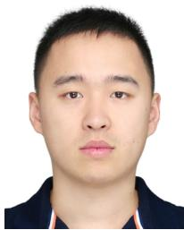

Jiahao Huo (Member, IEEE) received the Ph.D. degree from the University of Science and Technology Beijing, in 2019. He is currently a Professor with the University of Science and Technology Beijing. His research interests include high-capacity IM/DD systems for optical interconnect, UAV secure communication, and digital signal processing techniques for advanced modulation formats.


Wei Huangfu (Member, IEEE) received the M.S. and Ph.D. degrees in electronic engineering from Tsinghua University, Beijing, China, in 1998 and 2001, respectively. He is currently a Full Professor with the School of Computer and Communication Engineering, University of Science and Technology Beijing (USTB). His main research interests include statistical signal processing, the Internet of Things, cooperative communications networks, and wireless sensor networks.


Keping Long (Senior Member, IEEE) received the M.S. and Ph.D. degrees in electric circuit and system from the University of Electronic Science and Technology of China (UESTC), Chengdu, China, in 1995 and 1998, respectively. He is currently a Professor with the School of Computer and Communication Engineering, University of Science and Technology Beijing (USTB). His main research interests include statistical signal processing, channel estimation in multiple-input multiple-output (MIMO) orthogonal frequency division multiplexing (OFDM) systems, cooperative communications, and computer networks.


Haijun Zhang (Fellow, IEEE) is currently a Full Professor with the University of Science and Technology Beijing, China. He was a Post-Doctoral Research Fellow with the Department of Electrical and Computer Engineering, The University of British Columbia (UBC), Canada. He received the IEEE ComSoc Asia–Pacific Best Young Researcher Award in 2019, the IEEE CSIM Technical Committee Best Journal Paper Award in 2018, and the IEEE ComSoc Young Author Best Paper Award in 2017. He serves/served as the Track Co-Chair for

VTC Fall 2022 and WCNC 2020/2021; the Symposium Chair for Globecom 2019; the TPC Co-Chair for INFOCOM 2018 Workshop on Integrating Edge Computing, Caching, and Offloading in Next Generation Networks; and the General Co-Chair for GameNets 2016. He serves as an Editor for IEEE TRANSACTIONS ON WIRELESS COMMUNICATIONS, IEEE TRANSACTIONS ON INFORMATION FORENSICS AND SECURITY, and IEEE TRANSACTIONS ON COMMUNICATIONS. He is a Distinguished Lecturer of IEEE.