# Secure Split Offloading and Trajectory Design for UAV-Assisted Multi-Exit Collaborative DNN Inference

Mengru Wu, Haonan Wu, Weidang Lu, Zhaolong Ning, Lei Guo, and Abbas Jamalipour, Fellow, IEEE

Abstract—Collaborative inference (CI) has emerged as a promising paradigm in mobile edge computing, where deep neural network (DNN) models are split and collaboratively processed by wireless devices and edge servers to reduce communication overhead and improve inference efficiency. Unmanned aerial vehicles (UAVs) with agile mobility present significant potential as edge servers in such systems. However, the limited computation resources of UAV servers and the inherent security vulnerabilities of ground-to-air channels pose challenges to UAV-assisted CI. To address these issues, this paper proposes a novel UAVassisted CI framework via multi-exit DNNs and cooperative jamming. Specifically, this framework integrates an early-exit (EE) mechanism to alleviate computational burdens and employs a cooperative UAV jammer to transmit jamming signals to ensure secure split offloading. Our objective is to minimize total energy consumption while maximizing inference accuracy, subject to inference delay requirements and secure offloading rate constraints by jointly optimizing dual-UAV trajectories, EE selection, DNN partitioning, and computation resource allocation. To solve the formulated mixed-integer nonlinear programming problem, we first derive a closed-form solution for computation resource allocation and reformulate the optimization problem accordingly. We then develop an efficient alternating optimization algorithm that employs the successive convex approximation method for UAVs’ trajectory design and a discrete whale optimization algorithm for EE selection and DNN partitioning. Extensive simulation results demonstrate that the proposed scheme outperforms baselines.

Index Terms—Computation offloading, mobile edge computing, resource allocation, unmanned aerial vehicle.

## I. INTRODUCTION

The sixth-generation (6G) mobile communication networks are anticipated to enable ubiquitous intelligent services, such as autonomous driving and object recognition [1], [2]. To facilitate such services, deep neural networks (DNNs) play a crucial role in executing inference tasks [3]. However, wireless devices suffer from limited computing and caching capabilities and struggle to perform DNN inference independently. This challenge is particularly pronounced in large-scale and highaccuracy DNN inference scenarios, where on-device inference is barely feasible. By deploying DNNs at the network edge, mobile edge computing (MEC) has emerged as a promising technology for providing devices with enhanced computational support [4]. In this way, devices can offload inference tasks to nearby edge servers for performing DNN inference, which can alleviate computational burdens on devices.

While MEC provides considerable benefits, directly offloading raw inference tasks incurs substantial communication overhead, as high-dimensional data needs to be transmitted from devices to edge servers. Recently, end-edge collaborative inference (CI) via DNN partitioning has emerged as a prospective approach to address this issue [5]. In the CI framework, a DNN used for task inference is divided into two non-overlapping parts according to a specific partitioning point. The first part of the DNN, which has a computationally lightweight workload, is processed by a device to extract lowdimensional intermediate feature data (IFD). On this basis, the IFD is transmitted to an edge server, which can execute the remaining part of the DNN to complete CI [6]. However, edge servers deployed at static base stations have limited applicability in scenarios that lack ground infrastructure [7]. In such cases, incorporating the flexibility of unmanned aerial vehicles (UAVs) into CI systems can extend service coverage by dynamically adjusting UAVs’ positions and leveraging their line-of-sight communication capacity [8].

There is no doubt that UAV-assisted CI plays an essential role in facilitating ubiquitous services for 6G networks. Nevertheless, two critical challenges hinder the practical deployment of UAV-assisted CI in supporting low-latency inference applications. The first obstacle is the limited computation and energy resources of a UAV server. Although a UAV possesses more resources than devices, it cannot be viewed as a server with unlimited resources [9]. Therefore, it is crucial to develop efficient CI strategies that reduce computational workloads on the UAV, thereby mitigating these resource constraints. A further critical challenge stems from the broadcast nature of ground-to-air channels, which undermines the secure transmission of IFD. By intercepting IFD, eavesdroppers (Eves) can potentially reconstruct the original task data or infer sensitive attributes [10]. Hence, ensuring transmission security during split offloading becomes a critical issue.

Motivated by the above discussions, this paper proposes an efficient and secure UAV-assisted CI framework with multiexit DNNs and cooperative jamming. Specifically, to alleviate the computation burden and energy consumption of a UAV server, an early-exit (EE) mechanism is introduced to provide flexible inference depth, so that inference can terminate at shallower DNN layers [11]. In addition, to ensure the secure transmission of IFD over vulnerable wireless links, a cooperative jamming mechanism is employed, where a dedicated UAV jammer is deployed to achieve physical-layer security during split offloading [12]. In the proposed framework, these mechanisms are inherently coupled. To be specific, EE selection determines achievable DNN inference depth, which further affects the DNN partitioning, the trajectories of the UAV server and the UAV jammer, and the computation resource allocation of the UAV server. Meanwhile, cooperative jamming via adjusting the UAV jammer’s positions also affects the mobility of the UAV server due to collision avoidance, which in turn affects the feasible design of EE selection and DNN partitioning. Accordingly, the proposed framework is built on a unified design to ensure efficient and secure CI services. To summarize, the key contributions of this paper are listed as follows:

• We propose a novel UAV-assisted CI framework that integrates multi-exit DNNs and cooperative jamming for supporting efficient and secure co-inference. In this framework, the EE mechanism is employed to reduce computational burdens by allowing an inference task to exit from a DNN. Furthermore, a secure split offloading scheme is developed in which a UAV jammer transmits jamming signals to prevent an Eve from intercepting IFD extracted by each device. By jointly optimizing dual-UAV trajectories, EE selection, DNN partitioning, and the UAV server’s computation resource allocation, we aim to minimize total energy consumption while maximizing inference accuracy, subject to inference delay requirements and secure offloading rate constraints.

• To solve the formulated problem, we first derive a closedform solution for computation resource allocation, which enables reformulating the original problem into a more tractable form. Then, we develop an efficient alternating optimization algorithm that decomposes the problem into three subproblems. To handle trajectory optimization for both UAVs, we employ first-order Taylor expansion and successive convex approximation (SCA) to convert them into convex problems. For EE selection and DNN partitioning, we design a discrete whale optimization algorithm (DWOA) to efficiently obtain a suboptimal solution. On this basis, the three subproblems are iteratively solved until convergence.

• Through extensive simulations, we demonstrate that the proposed algorithms of alternating optimization, SCA, and DWOA achieve convergence performance within a limited number of iterations. Furthermore, we illustrate that our proposed scheme consistently outperforms baselines across diverse system configurations in terms of inference energy and accuracy.

The remainder of this paper is organized as follows: Section II reviews related studies. Section III presents our proposed UAV-assisted CI framework and formulates a multidimensional optimization problem. Section IV details our proposed alternating optimization algorithm. Section V provides extensive numerical evaluations and analysis, and Section VI concludes the paper.

## II. RELATED WORK

This section first provides a brief review of related studies on DNN partitioning-based CI in MEC networks and secure offloading in UAV-assisted MEC networks.

## A. DNN Partitioning-Based CI in MEC Networks

Thanks to recent advancements in DNNs, DNN partitioningbased CI has become an efficient approach to enhance the performance of inference tasks on resource-constrained devices. To enable fast and efficient CI, DNN partitioning and resource allocation have been explored in [13]-[16] to minimize the inference delay or energy consumption of MEC networks. In these studies, wireless devices process the initial layers of a DNN to extract IFD, which is then offloaded to an edge server to complete the remaining DNN layers and facilitate co-inference. To further accelerate task inference, the authors in [17] introduced a multi-exit DNN inference mechanism that permits an inference task to exit early, avoiding traversal through an entire DNN. Additionally, their work addressed the joint optimization of EE selection, model partitioning, and resource allocation to minimize an average inference latency. In [18], the authors maximized accuracy-aware gains in MEC networks by dynamically selecting EE points and DNN partitioning points for multiple inference task streams. Also, the authors in [19] studied the accuracy-aware gain function in satellite computing networks, where both dynamic programming and learning-based algorithms were developed to determine EE and DNN partitioning points.

Since ground infrastructure is unavailable in some regions, UAVs have been regarded as an emerging paradigm for hosting edge servers to deliver CI services. Specifically, the authors in [20] focused on DNN partitioning-based CI within a UAV swarm, where a UAV responsible for an inference task cooperates with a UAV server. On this basis, the work addressed bandwidth allocation, DNN partitioning, task offloading, and the optimization of local computation and transmission power. To process sensing data in a multi-UAV network, the authors in [21] proposed adaptively segmenting a DNN into two parts, which are respectively deployed on a UAV and a base station to enable co-inference. The authors in [22] explored a split offloading system that consists of a UAV server and multiple ground devices. By allocating DNN layers to a device and the UAV server, the work in [22] examined a joint design of UAV trajectory, DNN partitioning, and time scheduling to minimize the energy consumption of the UAV.

## B. Secure Offloading in UAV-Assisted MEC Networks

Recently, securing computation offloading in MEC networks has primarily focused on two research directions, i.e., encrypting data using encryption algorithms [23] and physicallayer security based on Wyner’s information-theoretic security [24]. Different from upper-layer encryption, physical-layer security aims to enhance the distinction between legitimate and malicious wireless channels by leveraging the inherent properties of wireless transmission [25]. Since this work focuses on securing split offloading from the physical-layer security perspective, we review related research on physicallayer security-assisted secure offloading in the following.

TABLE I  
COMPARISON BETWEEN OUR WORK AND RELATED WORKS
<table><tr><td rowspan=1 colspan=1>References</td><td rowspan=1 colspan=1>Scenarios</td><td rowspan=1 colspan=1>DNNpartitioning</td><td rowspan=1 colspan=1>Secureoffloading</td><td rowspan=1 colspan=1>Multi-exitDNNs</td><td rowspan=1 colspan=1>Objective</td></tr><tr><td rowspan=1 colspan=1>[13]</td><td rowspan=1 colspan=1>Ground server-enabled CI</td><td rowspan=1 colspan=1>√</td><td rowspan=1 colspan=1>×</td><td rowspan=1 colspan=1>×</td><td rowspan=1 colspan=1>Latency minimization</td></tr><tr><td rowspan=1 colspan=1>[14]</td><td rowspan=1 colspan=1>Ground server-enabled CI</td><td rowspan=1 colspan=1>√</td><td rowspan=1 colspan=1>×</td><td rowspan=1 colspan=1>×</td><td rowspan=1 colspan=1>Energy minimization</td></tr><tr><td rowspan=1 colspan=1>[15], [16]</td><td rowspan=1 colspan=1>Ground server-enabled CI</td><td rowspan=1 colspan=1>√</td><td rowspan=1 colspan=1>X</td><td rowspan=1 colspan=1>×</td><td rowspan=1 colspan=1>Latency and energy minimization</td></tr><tr><td rowspan=1 colspan=1>[17]</td><td rowspan=1 colspan=1>Ground server-enabled CI</td><td rowspan=1 colspan=1>√</td><td rowspan=1 colspan=1>×</td><td rowspan=1 colspan=1>√</td><td rowspan=1 colspan=1>Latency minimization</td></tr><tr><td rowspan=1 colspan=1>[18]</td><td rowspan=1 colspan=1>Ground server-enabled CI</td><td rowspan=1 colspan=1>√</td><td rowspan=1 colspan=1>X</td><td rowspan=1 colspan=1>√</td><td rowspan=1 colspan=1>Tradeoff between processing timeand inference accuracy</td></tr><tr><td rowspan=1 colspan=1>[19]</td><td rowspan=1 colspan=1>Satellite server-enabled CI</td><td rowspan=1 colspan=1>√</td><td rowspan=1 colspan=1>X</td><td rowspan=1 colspan=1>√</td><td rowspan=1 colspan=1>Tradeoff between processing timeand inference accuracy</td></tr><tr><td rowspan=1 colspan=1>[20]</td><td rowspan=1 colspan=1>UAV-assisted CI</td><td rowspan=1 colspan=1>√</td><td rowspan=1 colspan=1>X</td><td rowspan=1 colspan=1>×</td><td rowspan=1 colspan=1>Latency and energy minimization</td></tr><tr><td rowspan=1 colspan=1>[21]</td><td rowspan=1 colspan=1>UAV-assisted CI</td><td rowspan=1 colspan=1>√</td><td rowspan=1 colspan=1>×</td><td rowspan=1 colspan=1>×</td><td rowspan=1 colspan=1>Transmission rate maximization</td></tr><tr><td rowspan=1 colspan=1>[22]</td><td rowspan=1 colspan=1>UAV-assisted CI</td><td rowspan=1 colspan=1>√</td><td rowspan=1 colspan=1>X</td><td rowspan=1 colspan=1>X</td><td rowspan=1 colspan=1>Energy minimization</td></tr><tr><td rowspan=1 colspan=1>[26]</td><td rowspan=1 colspan=1>Multi-UAV-assisted MEC</td><td rowspan=1 colspan=1>X</td><td rowspan=1 colspan=1>√</td><td rowspan=1 colspan=1>×</td><td rowspan=1 colspan=1>Secrecy transmission rate maximization</td></tr><tr><td rowspan=1 colspan=1>[27]</td><td rowspan=1 colspan=1>UAV-assisted MEC</td><td rowspan=1 colspan=1>X</td><td rowspan=1 colspan=1>√</td><td rowspan=1 colspan=1>X</td><td rowspan=1 colspan=1>Energy minimization</td></tr><tr><td rowspan=1 colspan=1>[28]</td><td rowspan=1 colspan=1>Single UAV-assisted MEC</td><td rowspan=1 colspan=1>X</td><td rowspan=1 colspan=1>√</td><td rowspan=1 colspan=1>×</td><td rowspan=1 colspan=1>Secrecy transmission rate maximization</td></tr><tr><td rowspan=1 colspan=1>[29]</td><td rowspan=1 colspan=1>Multi-UAV-assisted MEC</td><td rowspan=1 colspan=1>×</td><td rowspan=1 colspan=1>√</td><td rowspan=1 colspan=1>×</td><td rowspan=1 colspan=1>Secure computation efficiency maximization</td></tr><tr><td rowspan=1 colspan=1>[30]</td><td rowspan=1 colspan=1>Multi-UAV-assisted MEC</td><td rowspan=1 colspan=1>×</td><td rowspan=1 colspan=1>√</td><td rowspan=1 colspan=1>X</td><td rowspan=1 colspan=1>Latency minimization</td></tr><tr><td rowspan=1 colspan=1>Our work</td><td rowspan=1 colspan=1>Dual-UAV-assisted CI</td><td rowspan=1 colspan=1>√</td><td rowspan=1 colspan=1>√</td><td rowspan=1 colspan=1>√</td><td rowspan=1 colspan=1>Minimizing total energy consumptionand maximizing inference accuracy</td></tr></table>

To prevent potential eavesdropping during computation offloading, the authors in [26] investigated cooperative jammingaided secure offloading in a UAV-assisted MEC network, where a fixed-location base station is deployed to interfere with Eves during offloading. Furthermore, this work jointly optimized UAV trajectory design, offloading decisions, and resource allocation to maximize the minimum secure computing capacity. To minimize energy consumption, the authors in [27] jointly designed UAV trajectories, resource allocation, and beamforming in a UAV-assisted MEC network under channel uncertainty. The authors in [28] investigated secure offloading in a UAV-assisted MEC network against mobile collusive Eves and employed an iterative method to maximize the secrecy transmission rate. Taking into account aerial and ground Eves, the authors in [29] explored UAV-assisted and reconfigurable intelligent surface-enabled MEC, where secure offloading from ground devices to a UAV and from the UAV to a base station was investigated. Our previous work in [30] also examined security-aware computation offloading in a multi-UAV-assisted MEC network, where the mission completion latency was minimized subject to secrecy offload rate requirements and available energy constraints.

## C. Summary

Existing studies in [13]-[19] laid a solid foundation for DNN partitioning-based CI in MEC networks. However, these works relied on fixed-location ground edge servers, which are not suitable for scenarios without ground infrastructure. While [20]–[22] investigated UAVs as edge servers for CI, the security of IFD transmission was overlooked. Considering the benefits of physical-layer security for secure offloading, [26]-[30] provided valuable insights. However, these studies did not address DNN partitioning-based CI. To the best of our knowledge, this is the first study that focuses on the co-design of secure split offloading and trajectory planning for UAVassisted CI using multi-exit DNNs. For clarity, we present Table I to highlight the key differences between our work and related studies.

## III. SYSTEM MODEL AND PROBLEM FORMULATION

As illustrated in Fig. 1, we focus on a UAV-assisted CI system consisting of a UAV server, mobile devices indexed by ${ \mathcal { K } } \triangleq \{ 1 , 2 , \cdots , K \}$ , a friendly UAV jammer, and an Eve.1 The considered system is modeled over multiple time slots, where all channels are treated as quasi-static. At each time slot $n \in \mathcal { N } \overset { \Delta } { = } \{ 1 , 2 , \cdots , N \}$ , device k ∈ K moves according to a random walk model, where its moving direction and speed are independently generated from a uniform distribution [32], [33]. Meanwhile, each device handles a computationally intensive DNN-based inference task (e.g., ResNet-18-based face recognition [36]), which may exceed its local processing capacity. To address this issue, we adopt a strategy that combines DNN partitioning with the EE mechanism. Specifically, each device processes the initial layers of a DNN and offloads the resulting IFD to the UAV server. Then, the UAV server handles the remaining DNN segment. Moreover, the EE mechanism enables an inference task to terminate at an adaptive depth within the DNN, thereby accelerating the inference process. However, due to the open nature of ground-to-air channels, split offloading is vulnerable to eavesdropping. To prevent the malicious interception of the Eve on IFD, we propose a secure split offloading scheme that leverages cooperative jamming, where the UAV jammer transmits artificial noise to confuse the Eve. Next, we present the details of CI and secure split offloading.

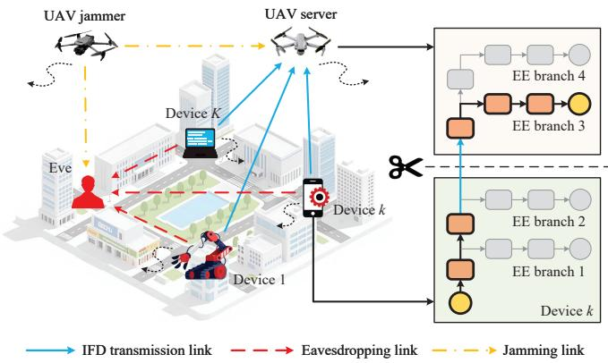  
Fig. 1. UAV-assisted CI via multi-exit DNNs and cooperative jamming.

## A. CI via Multi-Exit DNNs

1) Multi-Exit DNNs: A multi-exit DNN model for task inference consists of a sequence of DNN layers indexed by $\mathcal { M } \overset { \Delta } { = } \{ 0 , 1 , \cdots , M \}$ , which can form the main branch of the DNN. In this model, the output of layer $m \in \mathcal { M }$ serves as the input for layer $m + 1$ . We utilize $s _ { k } [ n ] \in \mathcal { M }$ to denote an EE point for executing device k’s inference task at time slot $n ,$ and $\tilde { \mathcal { M } } \overset { \Delta } { = } \{ 0 , 1 , \cdots , M _ { s _ { k } [ n ] } \}$ is defined as the set of DNN layers for an exit branch. As for DNN layers with nonsequential connections (e.g., residual block), we treat them as modular units and insert an EE point between two units.

Based on the above multi-exit DNN structure, an inference task can be terminated at a shallower layer, which reduces the computational burden of the UAV server but may also degrade inference accuracy. Therefore, the EE mechanism introduces a tradeoff between inference accuracy and computational costs. To quantify the impact of different EE points on inference accuracy, the adopted multi-exit DNN is trained and tested offline, so that the inference accuracy of each EE point can be obtained [35], [36]. On this basis, a data regression approach is further employed to derive the mathematical accuracy function $\Gamma ( s _ { k } [ n ] )$ with respect to $s _ { k } [ n ]$

2) Collaborative Inference: To achieve CI, $m _ { k } [ n ] \in \tilde { \mathcal { M } }$ is utilized to indicate the DNN partitioning point for device $k ,$ which means that device k executes the initial layers from 0 to $m _ { k } [ n ]$ and the UAV server handles the remaining layers from $m _ { k } [ n ] + 1$ to $M _ { s _ { k } [ n ] }$ . Thus, the overall computation workloads required for processing device k’s inference task are distributed between device k and the UAV server as

$$
L _ { k } ^ { \mathrm { l o } } [ n ] = \sum _ { m = 0 } ^ { m _ { k } [ n ] } l _ { m } ,\tag{1}
$$

$$
{ \cal L } _ { k } ^ { \mathrm { U A V } } [ n ] = \sum _ { m = m _ { k } [ n ] + 1 } ^ { M _ { s _ { k } [ n ] } } l _ { m } ,\tag{2}
$$

where $l _ { m }$ signifies the number of floating-point operations (FLOPs) required to process layer m. Note that $m _ { k } [ n ] = 0$ means that the UAV server entirely performs device k’s inference task. In contrast, $m _ { k } [ n ] = M _ { s _ { k } [ n ] }$ implies that device k executes its inference task locally.

Let $f _ { k } ^ { \mathrm { l o } }$ represent the local CPU frequency of device k for processing its inference task. The corresponding local inference delay and energy consumption are respectively expressed as

$$
T _ { k } ^ { \mathrm { l o } } [ n ] = \frac { L _ { k } ^ { \mathrm { l o } } [ n ] } { C _ { 0 } f _ { k } ^ { \mathrm { l o } } } ,\tag{3}
$$

$$
E _ { k } ^ { \mathrm { l o } } [ n ] = \frac { \zeta _ { k } L _ { k } ^ { \mathrm { l o } } [ n ] ( f _ { k } ^ { \mathrm { l o } } ) ^ { 2 } } { C _ { 0 } } ,\tag{4}
$$

where $\zeta _ { k }$ denotes the effective capacitance coefficient of device $k ,$ and $C _ { 0 }$ is a conversion factor from FLOPs to CPU cycles. Given that the UAV server handles inference tasks for numerous devices, the total computing ability of the UAV server is constrained by

$$
\sum _ { k = 1 } ^ { K } f _ { k } ^ { \mathrm { U A V } } [ n ] \leq f _ { \operatorname* { m a x } } ,\tag{5}
$$

where $f _ { k } ^ { \mathrm { U A V } } [ n ]$ is defined as the computing capacity assigned to process device $k ' \mathrm { s }$ task and $f _ { \mathrm { m a x } }$ means the maximum computing capability of the UAV server. Also, we can respectively obtain the UAV inference delay and energy consumption as

$$
T _ { k } ^ { \mathrm { U A V } } [ n ] = \frac { L _ { k } ^ { \mathrm { U A V } } [ n ] } { C _ { 0 } f _ { k } ^ { \mathrm { U A V } } [ n ] } ,\tag{6}
$$

$$
E _ { k } ^ { \mathrm { U A V } } [ n ] = \frac { \zeta _ { I } L _ { k } ^ { \mathrm { U A V } } [ n ] f _ { k } ^ { \mathrm { U A V } } [ n ] ^ { 2 } } { C _ { 0 } } ,\tag{7}
$$

where $\zeta _ { I }$ represents the UAV server’s effective capacitance coefficient.

## B. Secure Split Offloading

Enabling CI involves transmitting IFD from devices to the UAV server over ground-to-air channels. Since wireless channels are inherently open, IFD is susceptible to interception by the Eve. To mitigate this threat, the UAV jammer proactively transmits jamming signals to disrupt eavesdropping attempts.

1) UAV Mobility Model: Similar to [37] and [38], we consider that both the UAV server and the UAV jammer fly at an altitude of $H . ^ { 2 }$ Besides, the UAV’s horizontal coordinates are denoted by ${ \bf q } _ { I } [ n ] = [ x _ { I } [ n ] , y _ { I } [ n ] ] ^ { T }$ and ${ \bf q } _ { J } [ n ] =$ $[ x _ { J } [ n ] , y _ { J } [ n ] ] ^ { T }$ , respectively. Due to the speed limitation of each UAV, we have

$$
| | \mathbf { q } _ { U } [ n + 1 ] - \mathbf { q } _ { U } [ n ] | | \leq \tau V _ { \operatorname* { m a x } } , \quad \forall n \in \mathcal { N } \backslash \{ N \} ,\tag{8}
$$

where $U \in \{ I , J \}$ , τ means the duration of each time slot, and $V _ { \mathrm { m a x } }$ is the maximum speed of each UAV. Note that each UAV is required to return to an initial position ${ \bf q } _ { U } ^ { 0 }$ after completing its mission. Thus, we can derive

$$
\mathbf { q } _ { U } [ 1 ] = \mathbf { q } _ { U } [ N ] = \mathbf { q } _ { U } ^ { 0 } .\tag{9}
$$

2Although 3D trajectory design can provide additional freedom, it also leads to higher energy consumption and raises flight instability. Therefore, this paper considers a fixed flight altitude from the perspectives of energy efficiency and flight safety.

Also, the minimum distance $d _ { \mathrm { m i n } }$ between the UAVs should be considered to avoid collision, i.e.,

$$
\lVert \mathbf { q } _ { I } [ n ] - \mathbf { q } _ { J } [ n ] \rVert \geq d _ { \operatorname* { m i n } } .\tag{10}
$$

Moreover, the propulsion energy consumption of each UAV depends on its flight speed, which is calculated by

$$
\begin{array} { r l } & { E _ { U } ^ { \mathrm { f l y } } [ n ] = P _ { 0 } \displaystyle \sum _ { n = 1 } ^ { N } \left( \tau + \frac { 3 \Delta _ { U } [ n ] ^ { 2 } } { \tau U _ { \mathrm { t i p } } ^ { 2 } } \right) + \frac { 1 } { 2 } d _ { 0 } \rho s A _ { \mathrm { r o t o r } } \sum _ { n = 1 } ^ { N } \frac { \Delta _ { U } [ n ] ^ { 3 } } { \tau ^ { 2 } } } \\ & { \quad \quad \quad + P _ { 1 } \displaystyle \sum _ { n = 1 } ^ { N } \left( \sqrt { \tau ^ { 4 } + \frac { \Delta _ { U } [ n ] ^ { 4 } } { 4 v _ { 0 } ^ { 4 } } } - \frac { \Delta _ { U } [ n ] ^ { 2 } } { 2 v _ { 0 } ^ { 2 } } \right) ^ { \frac { 1 } { 2 } } , } \end{array}\tag{11}
$$

where $\Delta _ { U } [ n ] = | | \mathbf { q } _ { U } [ n ] - \mathbf { q } _ { U } [ n - 1 ] | |$ is the $\mathrm { U A V } _ { \mathrm { \Delta } }$ flight distance during time slot n. Besides, $P _ { 0 }$ and $P _ { 1 }$ respectively mean the blade profile power and induced power of the UAV, $U _ { t i p }$ represents the tip speed of the rotor blade, $d _ { 0 }$ and $\rho$ denote the fuselage drag ratio and air density, $A _ { \mathrm { r o t o r } }$ and s indicate the rotor disk area and rotor solidity, and v0 refers to the average rotor-induced speed during hovering.

2) Channel Model: Since both UAVs are assumed to operate at relatively high altitudes, line-of-sight propagation is dominant for both ground-to-air and air-to-air channels [39]. This setting is applicable to various practical scenarios, particularly in suburban or open areas. Thus, the channel coefficient from device k to the UAV server, as well as those from the UAV jammer to the UAV server and the Eve, can be respectively expressed as

$$
h _ { k , I } [ n ] = \sqrt { \frac { \beta _ { 0 } } { | | \mathbf { q } _ { I } [ n ] - \mathbf { q } _ { k } [ n ] | | ^ { 2 } + H ^ { 2 } } } ,\tag{12}
$$

$$
h _ { J , I } [ n ] = \sqrt { \frac { \beta _ { 0 } } { | | \mathbf { q } _ { J } [ n ] - \mathbf { q } _ { I } [ n ] | | ^ { 2 } } } ,\tag{13}
$$

$$
h _ { J , E } [ n ] = \sqrt { \frac { \beta _ { 0 } } { | | \mathbf { q } _ { J } [ n ] - \mathbf { q } _ { E } | | ^ { 2 } + H ^ { 2 } } } ,\tag{14}
$$

where $\beta _ { 0 }$ represents the channel gain at the reference distance of 1 m, $\mathbf q _ { k } [ \dot { n } ] = [ x _ { k } [ n ] , y _ { k } [ n ] ] ^ { T }$ means the horizontal location of device $k ,$ , and $\mathbf q _ { E } = [ x _ { E } , y _ { E } ] ^ { T }$ is the horizontal location of the Eve. We note that Eve usually hides its position to enhance eavesdropping capacity. In this context, we adopt a bounded error model $\mathbf { q } _ { E } \in \Theta _ { E } \triangleq \{ | | \mathbf { q } _ { E } - \mathbf { \tilde { q } } _ { E } | | \leq \chi \}$ to characterize the uncertain location of the Eve, where $\tilde { \bf q } _ { E } = [ \tilde { x } _ { E } , \tilde { y } _ { E } ] ^ { T }$ refers to an estimated Eve’s location and $\chi$ indicates the maximum estimation error. For the terrestrial channel between device k and the Eve, we employ the large-scale path loss and the small-scale Rayleigh fading as

$$
h _ { k , E } [ n ] = \sqrt { \frac { \beta _ { 0 } } { | | \mathbf { q } _ { k } [ n ] - \mathbf { q } _ { E } | | ^ { \alpha } } \xi } ,\tag{15}
$$

where α is the path loss exponent and $\xi$ follows an exponential distribution with unit mean.

3) Secure Split Offloading: When performing split offloading, each device occupies orthogonal spectrum resources to avoid interference. Meanwhile, the UAV jammer sends artificial noise to prevent eavesdropping. On this basis, we respectively derive the offloading rate from device k to the UAV server and the achievable eavesdropping rate at the Eve as

$$
R _ { k , I } [ n ] = B \mathrm { l o g } _ { 2 } \left( 1 + \frac { | h _ { k , I } [ n ] | ^ { 2 } P _ { k } } { \kappa | h _ { J , I } [ n ] | ^ { 2 } P _ { J } + \sigma _ { I } ^ { 2 } } \right) ,\tag{16}
$$

$$
R _ { k , E } [ n ] = B \mathrm { l o g } _ { 2 } \left( 1 + \frac { | h _ { k , E } [ n ] | ^ { 2 } P _ { k } } { | h _ { J , E } [ n ] | ^ { 2 } P _ { J } + \sigma _ { E } ^ { 2 } } \right) ,\tag{17}
$$

where B is the transmission bandwidth, $P _ { k }$ and $P _ { J }$ respectively denote the transmit power of device k and the UAV jammer, κ represents the interference cancellation factor, and $\sigma _ { I } ^ { 2 }$ and $\sigma _ { E } ^ { 2 }$ refer to the noise power. Given the imperfect knowledge of the Eve’s position, we proceed to derive the worst-case secure offloading rate. Specifically, by applying the triangle inequality on $| | \widetilde { \mathbf { q } } _ { E } - \mathbf { q } _ { E } | | \leq \chi ,$ the lower bound for the distance between device k and the Eve can be written as

$$
\begin{array} { r l } & { \| \mathbf { q } _ { k } [ n ] - \mathbf { q } _ { E } \| \geq \| \mathbf { q } _ { k } [ n ] - \tilde { \mathbf { q } } _ { E } \| - \| \tilde { \mathbf { q } } _ { E } - \mathbf { q } _ { E } \| } \\ & { \qquad \geq \| \mathbf { q } _ { k } [ n ] - \tilde { \mathbf { q } } _ { E } \| - \chi . } \end{array}\tag{18}
$$

Similarly, the upper bound for the distance between the UAV jammer and the Eve is derived as

$$
\begin{array} { r l } & { \| \mathbf { q } _ { J } [ n ] - \mathbf { q } _ { E } \| \leq \| \mathbf { q } _ { J } [ n ] - \tilde { \mathbf { q } } _ { E } \| + \| \tilde { \mathbf { q } } _ { E } - \mathbf { q } _ { E } \| } \\ & { \qquad \leq \| \mathbf { q } _ { J } [ n ] - \tilde { \mathbf { q } } _ { E } \| + \chi . } \end{array}\tag{19}
$$

Accordingly, the secure split offloading rate from device k to the UAV server can be expressed as

$$
R _ { k , I } ^ { \mathrm { s e c } } [ n ] = ( R _ { k , I } [ n ] - \tilde { R } _ { k , E } [ n ] ) ^ { + } ,\tag{20}
$$

where

$$
\widetilde { R } _ { k , E } [ n ] { = } B \log _ { 2 } \left( 1 + \frac { | h _ { k , E } ^ { \operatorname* { m a x } } [ n ] | ^ { 2 } P _ { k } } { | h _ { J , E } ^ { \operatorname* { m i n } } [ n ] | ^ { 2 } P _ { J } + \sigma _ { E } ^ { 2 } } \right) .\tag{21}
$$

Here, $\begin{array} { r } { ( \cdot ) ^ { + } = \operatorname* { m a x } \lbrace 0 , \cdot \rbrace , h _ { k , E } ^ { \operatorname* { m a x } } [ n ] = \frac { \beta _ { 0 } } { ( \lvert \lvert \mathbf { q } _ { k } [ n ] - \tilde { \mathbf { q } } _ { E } \rvert \rvert - \chi ) ^ { \alpha } } \xi , } \end{array}$ and $\begin{array} { r } { h _ { J , E } ^ { \operatorname* { m i n } } [ n ] = \frac { \beta _ { 0 } } { ( | | \mathbf { q } _ { J } [ n ] - \tilde { \mathbf { q } } _ { \mathbf { E } } | | + \chi ) ^ { 2 } + H ^ { 2 } } } \end{array}$ . Meanwhile, the split offloading delay and device k’s energy consumption for transmitting IFD can be respectively given by

$$
T _ { k } ^ { \mathrm { s o } } [ n ] = \frac { \phi _ { m _ { k } [ n ] } } { R _ { k , I } [ n ] } ,\tag{22}
$$

$$
E _ { k } ^ { \mathrm { s o } } [ n ] = \frac { P _ { k } \phi _ { m _ { k } [ n ] } } { R _ { k , I } [ n ] } ,\tag{23}
$$

where $\phi _ { m _ { k } [ n ] }$ indicates the size of IFD extracted by $m _ { k } [ n ]$

## C. Problem Formulation

Since the sizes of inference results are usually small $( \mathrm { e . g . }$ a classification label or a low-dimensional prediction vector), the transmission delay for sending back inference results is negligible. Therefore, the total inference delay for device k’s task consists of the local inference delay, the split offloading delay, and the UAV inference delay, which can be written as

$$
T _ { k } ^ { \mathrm { t o t a l } } [ n ] = T _ { k } ^ { \mathrm { l o } } [ n ] + T _ { k } ^ { \mathrm { s o } } [ n ] + T _ { k } ^ { \mathrm { U A V } } [ n ] .\tag{24}
$$

Also, the energy consumption of device k can be expressed as

$$
E _ { k } [ n ] = E _ { k } ^ { \mathrm { l o } } [ n ] + E _ { k } ^ { \mathrm { s o } } [ n ] .\tag{25}
$$

We aim to minimize the total energy consumption of devices and UAVs while maximizing inference accuracy. To this end, we jointly optimize dual-UAV trajectories, EE selection, DNN partitioning, and the computation resource allocation of the UAV server. By defining $\mathbf { Q } _ { I } \ : = \ : \{ \mathbf { q } _ { I } [ n ] , \forall n \in \mathcal { N } \} , \ : \mathbf { Q } _ { J } \ : =$ $\{ \mathbf { q } _ { J } [ n ] , \forall n \in \mathcal { N } \} , \mathbf { S } \ = \ \{ s _ { k } [ n ] , \forall n \in \mathcal { N } , \forall k \in \mathcal { K } \}$ , M = $\{ m _ { k } [ n ] , \forall n \in \mathcal { N } , \forall k \in \mathcal { K } \}$ , and $\mathbf { \bar { F } } = \{ f _ { k } ^ { \mathrm { U A V } } [ n ] , \forall n \in \mathcal { N } , \forall k \in$ $\kappa \}$ , the optimization problem can be given by

$$
\mathcal { P } _ { 0 } \underset { \mathbf { Q } _ { I } , \mathbf { Q } , J } { \operatorname* { m i n } } \sum _ { n = 1 } ^ { N } ( E _ { I } [ n ] + E _ { J } [ n ] + \underset { k = 1 } { \overset { K } { \sum } } E _ { k } [ n ] - \underset { k = 1 } { \overset { K } { \sum } } \omega _ { \Gamma } \Gamma ( s _ { k } [ n ] ) )\tag{26a}
$$

$$
\mathrm { s . t . } T _ { k } ^ { \mathrm { t o t a l } } [ n ] \leq \tau , \forall k \in { \mathcal K } , \forall n \in { \mathcal N } ,\tag{26b}
$$

$$
R _ { k , I } ^ { \mathrm { s e c } } [ n ] \geq R _ { \mathrm { m i n } } , \forall k \in { \mathcal { K } } , \forall n \in { \mathcal { N } } ,\tag{26c}
$$

$$
\Gamma ( s _ { k } [ n ] ) \geq \mu _ { \mathrm { m i n } } , \forall k \in { \mathcal { K } } , \forall n \in { \mathcal { N } } ,\tag{26d}
$$

$$
| | \mathbf { q } _ { U } [ n + 1 ] - \mathbf { q } _ { U } [ n ] | | \leq \tau V _ { \operatorname* { m a x } } , \ \forall n \in \mathcal { N } \backslash \{ N \} ,\tag{26e}
$$

$$
\mathbf { q } _ { U } [ 1 ] = \mathbf { q } _ { U } [ N ] = \mathbf { q } _ { U } ^ { 0 } , \ U \in \{ I , J \} ,\tag{26f}
$$

$$
\begin{array} { r } { \vert \vert \mathbf { q } _ { I } [ n ] - \mathbf { q } _ { J } [ n ] \vert \vert \geq d _ { \operatorname* { m i n } } , \ \forall n \in \mathcal { N } , } \end{array}\tag{26g}
$$

$$
\sum _ { k = 1 } ^ { K } f _ { k } ^ { \mathrm { U A V } } [ n ] \leq f _ { \operatorname* { m a x } } , \ \forall n \in \mathcal N ,\tag{26h}
$$

$$
s _ { k } [ n ] \in \{ 0 , 1 , \cdots , M \} , \ \forall k \in \mathcal { K } , \ \forall n \in \mathcal { N } ,\tag{26i}
$$

$$
m _ { k } [ n ] \in \{ 0 , 1 , \cdots , M _ { s _ { k } [ n ] } \} , \ \forall k \in \mathcal { K } , \ \forall n \in \mathcal { N } ,\tag{26j}
$$

$$
f _ { k } ^ { \mathrm { U A V } } [ n ] \geq 0 , \forall k \in { \mathcal { K } } , \forall n \in { \mathcal { N } } ,\tag{26k}
$$

where $\begin{array} { r c l } { { E _ { I } [ n ] } } & { { = } } & { { \omega _ { I } E _ { I } ^ { \mathrm { f l y } } [ n ] + \displaystyle \sum _ { k = 1 } ^ { K } E _ { k } ^ { \mathrm { U A V } } [ n ] } } \end{array}$ and $E _ { J } [ n ] ~ =$ $\omega _ { J } E _ { J } ^ { \mathrm { f i y } } [ n ] + P _ { J } [ n ] \tau$ . Here, $\omega _ { I }$ and $\omega _ { J }$ are weight coefficients used to balance the energy consumption of the $\mathrm { U A V s } . ^ { 3 }$ Besides, ωΓ represents a weight coefficient related to inference accuracy, $R _ { \mathrm { m i n } }$ denotes the minimum secure offloading rate, and $\mu _ { \mathrm { m i n } }$ refers to the minimum accuracy threshold. Additionally, (26b) ensures that the total inference delay for completing device k’s task does not exceed the maximum allowable delay. Constraint (26c) enforces the secure split offloading constraint, which provides information-theoretic security and prevents the Eve from successfully eavesdropping. (26d) guarantees that the inference accuracy requirement is met. Constraint (26e) limits the mobility of each UAV, and (26f) ensures that each UAV returns to its initial location after completing its mission. Constraint (26g) prevents a collision between the UAV server and the UAV jammer. Constraint (26h) limits the computing capacity of the UAV server. Finally, (26i)-(26k) define the feasible regions for the optimization variables.

## IV. PROPOSED ALGORITHM

The formulated problem focuses on inference performance of energy and accuracy (IPEA), which involves a strong coupling between continuous and discrete variables, rendering $\mathcal { P } _ { 0 }$ a challenging mixed-integer nonlinear programming problem. In this section, we first derive a closed-form solution for computation resource allocation by employing the Karush-Kuhn-Tucker (KKT) conditions. By incorporating the closedform solution, $\mathcal { P } _ { 0 }$ can be converted into an optimization problem that addresses UAV trajectories, EE selection, and DNN partitioning. Then, the reformulated problem is decoupled into three subproblems that are iteratively solved using an alternating optimization method.

To deal with ${ \mathcal P } _ { 0 } .$ we first provide the following proposition to deduce the closed-form for the optimal computation resource allocation.

Proposition 1: Given UAV trajectories, EE selection, and DNN partitioning, the optimal computation resource allocation to problem $\mathcal { P } _ { 0 }$ can be written as

$$
f _ { k } ^ { \mathrm { U A V } ^ { * } } [ n ] = \frac { L _ { k } ^ { \mathrm { U A V } } [ n ] } { C _ { 0 } \left( \tau - T _ { k } ^ { \mathrm { l o } } [ n ] - T _ { k } ^ { \mathrm { s o } } [ n ] \right) } .\tag{27}
$$

Proof: Please refer to Appendix A.

According to Proposition 1, we can derive the optimal computation resource allocation of the UAV server concerning $\mathbf { Q } _ { I } , \mathbf { Q } _ { J } , \mathbf { S }$ , and M. Accordingly, we can substitute this closedform solution in (27) into $\mathcal { P } _ { 0 }$ . Thus, the resulting optimization problem can be expressed as

$$
\mathcal { P } _ { 0 } ^ { \prime } : \operatorname* { m i n } _ { \mathbf { Q } _ { I } , \mathbf { Q } _ { J } , \mathbf { \Lambda } _ { n = 1 } } \sum _ { \mathbf { \Lambda } } ^ { N } ( \omega _ { I } E _ { I } ^ { \mathrm { H y } } [ n ] + \sum _ { k = 1 } ^ { K } \frac { \zeta _ { I } L _ { k } ^ { \mathrm { U A V } } [ n ] f _ { k } ^ { \mathrm { U A V } ^ { * } } [ n ] ^ { 2 } } { C _ { 0 } }
$$

$$
+ E _ { J } [ n ] + \sum _ { k = 1 } ^ { K } E _ { k } [ n ] - \sum _ { k = 1 } ^ { K } \omega _ { \Gamma } \Gamma ( s _ { k } [ n ] ) )\tag{28a}
$$

$$
\mathrm { s . t . } ( 2 6 \mathrm { c } ) - ( 2 6 \mathrm { g } ) , ( 2 6 \mathrm { i } ) , \mathrm { a n d } ( 2 6 \mathrm { j } ) ,\tag{28b}
$$

$$
\sum _ { k = 1 } ^ { K } f _ { k } ^ { \mathrm { U A V } ^ { * } } [ n ] \leq f _ { \operatorname* { m a x } } , \ \forall n \in \mathcal { N } ,\tag{28c}
$$

$$
T _ { k } ^ { \mathrm { l o } } [ n ] + T _ { k } ^ { \mathrm { s o } } [ n ] \leq \tau , \ \forall k \in K , \ \forall n \in \mathcal { N } .\tag{28d}
$$

To address $\mathcal { P } _ { 0 } ^ { \prime } .$ , we then employ the alternating optimization approach to decompose the problem into three subproblems that respectively determine $\mathbf { Q } _ { I } , \mathbf { Q } _ { J }$ , and {S, M}. Next, we present details for solving the three subproblems.

## A. UAV Server’s Trajectory Optimization

Given the trajectory of the UAV jammer, EE selection, and DNN partitioning, this subsection determines the trajectory of the UAV server. Therefore, this subproblem can be formulated as

$$
\begin{array} { r l r } {  { \mathcal { P } _ { 1 } : \operatorname* { m i n } _ { \mathbf { Q } _ { I } } \sum _ { n = 1 } ^ { N } \big ( \omega _ { I } E _ { I } ^ { \mathrm { f l y } } [ n ] + \sum _ { k = 1 } ^ { K } \frac { \zeta _ { I } L _ { k } ^ { \mathrm { U A V } } [ n ] f _ { k } ^ { \mathrm { U A V } ^ { * } } [ n ] ^ { 2 } } { C _ { 0 } } } } \\ & { } & { + E _ { J } [ n ] + \sum _ { k = 1 } ^ { K } E _ { k } [ n ] - \sum _ { k = 1 } ^ { K } \omega _ { \Gamma } \Gamma ( s _ { k } [ n ] ) \big ) } \\ & { } & { \mathrm { s . t . ~ } \big ( 2 6 \mathbf { c } \big ) , ( 2 6 \mathbf { e } ) - \big ( 2 6 \mathbf { g } ) , ( 2 8 \mathbf { c } ) , \mathrm { a n d ~ } \big ( 2 8 \mathbf { d } \big ) . } \end{array}\tag{29a}
$$

(29b)

Due to the non-convex objective function in (29a) and complicated constraints in (26c), (26g), (28c), and (28d), $\mathcal { P } _ { 1 }$ is challenging to tackle.

We first deal with the complex form of $R _ { k , I } [ n ]$ that appears in (29a), (26c), (28c), and (28d) by introducing auxiliary variable sets ${ \bf I } = \{ I _ { k } [ n ] , \forall k \in \mathcal { K } , \forall n \in \mathcal { N } \} , { \bf G } = \{ G [ n ] , \forall n \in$ $\mathcal { N } \}$ , and $\mathbf { D } \ = \ \{ D [ n ] , \forall n \ \in \ \mathcal { N } \}$ that satisfy the following constraints:

$$
I _ { k } [ n ] \geq \frac { ( | | \mathbf { q } _ { I } [ n ] - \mathbf { q } _ { k } [ n ] | | ^ { 2 } + H ^ { 2 } ) \sigma ^ { 2 } } { P _ { k } \beta _ { 0 } } ,\tag{30}
$$

$$
G [ n ] \ge \frac { \kappa P J _ { 0 } } { \sigma ^ { 2 } D [ n ] } + 1 ,\tag{31}
$$

$$
D [ n ] \leq | | \mathbf { q } _ { I } [ n ] - \mathbf { q } _ { J } [ n ] | | ^ { 2 } .\tag{32}
$$

Based on (30) and (31), we have

$$
R _ { k , I } [ n ] \geq \hat { R } _ { k , I } [ n ] \stackrel { \Delta } { = } B \mathrm { l o g } _ { 2 } \left( 1 + \frac { 1 } { I _ { k } [ n ] G [ n ] } \right) .\tag{33}
$$

Proposition $2 \colon \hat { R } _ { k , I } [ n ]$ in (33) is jointly convex with respect to (w.r.t.) $I _ { k } [ n ]$ and $G [ n ]$

Proof: Please refer to Appendix B.

According to Proposition 2, we can make constraint (26c) tractable by deriving the lower bound of $\hat { R } _ { k , I } [ n ]$ using the first-order Taylor expansion. We express the lower bound of $\hat { R } _ { k , I } [ n ]$ as

$$
\begin{array} { r l } & { \hat { R } _ { k , I } [ n ] \geq \hat { R } _ { k , I } ^ { ( i ) } [ n ] \triangleq B \mathrm { l o g } _ { 2 } \bigg ( 1 + \frac { 1 } { I _ { k } ^ { ( i ) } [ n ] G ^ { ( i ) } [ n ] } \bigg ) - } \\ & { \frac { B ( I _ { k } [ n ] - I _ { k } ^ { ( i ) } [ n ] ) } { \ln 2 ( I _ { k } ^ { ( i ) } [ n ] + I _ { k } ^ { ( i ) } [ n ] ^ { 2 } G ^ { ( i ) } [ n ] ) } - \frac { B ( G [ n ] - G ^ { ( i ) } [ n ] ) } { \ln 2 ( G ^ { ( i ) } [ n ] + G ^ { ( i ) } [ n ] ^ { 2 } I _ { k } ^ { ( i ) } [ n ] ) } , } \end{array}\tag{34}
$$

where $I _ { k } ^ { ( i ) } [ n ]$ and $G ^ { ( i ) } [ n ]$ denote the feasible Taylor expansion parameters at the i-th iteration that satisfy all the constraints of $\mathcal { P } _ { 1 }$ . Also, after substituting $\hat { R } _ { k , I } ^ { ( i ) } [ n ]$ , we can obtain $\hat { E } _ { k } ^ { \mathrm { U A V } } [ n ] =$ $\begin{array} { r l } { \underbrace { \zeta _ { I } L _ { k } ^ { \mathrm { U A V } } [ n ] \hat { f } _ { k } ^ { \mathrm { U A V } ^ { * } } [ n ] ^ { 2 } } _ { C _ { 0 } } , \hat { f } _ { k } ^ { \mathrm { U A V } ^ { * } } [ n ] = \underbrace { L _ { k } ^ { \mathrm { U A V } } [ n ] } _ { C _ { 0 } \left( \tau - T _ { k } ^ { \mathrm { l o } } [ n ] - \hat { T } _ { k } ^ { \mathrm { s o } } [ n ] \right) } , \hat { T } _ { k } ^ { \mathrm { s o } } [ n ] = } & { { } } \end{array}$ $\frac { \phi _ { m _ { k } [ n ] } } { \hat { R } _ { k , I } ^ { ( i ) } [ n ] }$ , and $\hat { E } _ { k } ^ { \mathrm { s o } } [ n ] = P _ { k } \hat { T } _ { k } ^ { \mathrm { s o } } [ n ]$

Proposition 3: $\hat { E } _ { k } ^ { \mathrm { U A V } } [ n ] , \ \hat { f } _ { k } ^ { \mathrm { U A V ^ { * } } } [ n ] , \ \hat { T } _ { k } ^ { \mathrm { s o } } [ n ]$ , and $\hat { E } _ { k } ^ { \mathrm { s o } } [ n ]$ are jointly convex with respect to $I _ { k } [ n ]$ and $G [ n ]$

Proof: Please refer to Appendix C.

We can conclude that the objective function in (29a) and the constraints (28c) and (28d) are convex according to Proposition 3. Then, we handle non-convex constraints (26g) and (32). We also apply the first-order Taylor expansion on the left-hand side of (26g) and the right-hand side of (32) to deduce its lower bound as

$$
\begin{array} { r l } & { | | \mathbf { q } _ { I } [ n ] - \mathbf { q } _ { J } [ n ] | | ^ { 2 } { \geq } \Omega _ { I } ^ { ( i ) } [ n ] \triangleq | | \mathbf { q } _ { I } ^ { ( i ) } [ n ] - \mathbf { q } _ { J } [ n ] | | ^ { 2 } } \\ & { \qquad + 2 ( \mathbf { q } _ { I } ^ { ( i ) } [ n ] - \mathbf { q } _ { J } [ n ] ) ^ { T } ( \mathbf { q } _ { I } [ n ] - \mathbf { q } _ { I } ^ { ( i ) } [ n ] ) , } \end{array}\tag{35}
$$

where $\mathbf { q } _ { I } ^ { ( i ) } [ n ]$ represents a feasible Taylor expansion parameter.

Subsequently, we deal with the intricate form of $E _ { I } ^ { \mathrm { f } \mathrm { y } } [ n ]$ in (29a) and rewrite this term as

$$
E _ { I } ^ { \mathrm { f l y } } [ n ] = E _ { I } ^ { 1 } [ n ] + E _ { I } ^ { 2 } [ n ] + E _ { I } ^ { 3 } [ n ] ,\tag{36}
$$

where

$$
E _ { I } ^ { 1 } [ n ] = P _ { 0 } \left( \tau + \frac { 3 \Delta _ { I } [ n ] ^ { 2 } } { \tau U _ { t i p } ^ { 2 } } \right) ,
$$

$$
E _ { I } ^ { 2 } [ n ] = { \frac { 1 } { 2 } } d _ { 0 } \rho s A { \frac { \Delta _ { I } [ n ] ^ { 3 } } { \tau ^ { 2 } } } ,\tag{37}
$$

$$
E _ { I } ^ { 3 } [ n ] = P _ { 1 } \left( \sqrt { \tau ^ { 4 } + \frac { \Delta _ { I } [ n ] ^ { 4 } } { 4 v _ { 0 } ^ { 4 } } } - \frac { \Delta _ { I } [ n ] ^ { 2 } } { 2 v _ { 0 } ^ { 2 } } \right) ^ { \frac { 1 } { 2 } } .
$$

It can be observed that $E _ { I } ^ { 1 }$ and $E _ { I } ^ { 2 }$ are convex functions concerning ${ \bf q } _ { I } [ n ]$ , but $E _ { I } ^ { 3 }$ is non-convex. To handle the non-convex term $E _ { I } ^ { 3 }$ , we introduce a set of auxiliary variables as ${ \bf Y } _ { I } =$ $\{ \lambda _ { I } [ n ] , \forall n \in \mathcal { N } \}$ , where $\begin{array} { r } { \lambda _ { I } [ n ] \le ( \sqrt { \tau ^ { 4 } + \frac { \Delta _ { I } [ n ] ^ { 4 } } { 4 v _ { 0 } ^ { 4 } } } - \frac { \Delta _ { I } [ n ] ^ { 2 } } { 2 v _ { 0 } ^ { 2 } } ) ^ { \frac { 1 } { 2 } } } \end{array}$ and $E _ { I } ^ { 3 }$ is replaced by $\lambda _ { I } [ n ]$ . To further tackle the aboveintroduced constraint, we have the following equivalent transformation:

$$
\frac { \tau ^ { 4 } } { \lambda _ { I } [ n ] ^ { 2 } } \leq \lambda _ { I } [ n ] ^ { 2 } + \frac { \Delta _ { I } [ n ] ^ { 2 } } { v _ { 0 } ^ { 2 } } .\tag{38}
$$

It is obvious that the right-hand side of (38) is convex w.r.t. $\lambda _ { I } [ n ]$ and ${ \bf q } _ { I } [ n ]$ . Therefore, we perform the first-order Taylor expansion to obtain its lower bound in (39), where $\lambda _ { I } ^ { ( i ) } [ n ]$ is a feasible Taylor expansion parameter.

Based on the above deduction, $\mathcal { P } _ { 1 }$ can be approximated by

$$
\mathcal { P } _ { 1 } ^ { ' } \colon \operatorname* { m i n } _ { \mathbf { Q } _ { I } , \mathbf { I } , \mathbf { \Lambda } } \sum _ { n = 1 } ^ { N } ( E _ { I } ^ { 1 } [ n ] + E _ { I } ^ { 2 } [ n ] + P _ { 1 } | \lambda _ { I } [ n ] | + \sum _ { k = 1 } ^ { K } \hat { E } _ { k } ^ { \mathrm { U A V } } [ n ]
$$

$$
+ E _ { J } [ n ] + \sum _ { k = 1 } ^ { K } ( E _ { k } ^ { \mathrm { l o } } [ n ] + \hat { E } _ { k } ^ { \mathrm { s o } } [ n ] ) - \sum _ { k = 1 } ^ { K } \omega _ { \Gamma } \Gamma { \left( s _ { k } [ n ] \right) } )
$$

s.t. (26e), (26f),

(40a)

(40b)

$$
\hat { R } _ { k , I } ^ { ( i ) } [ n ] - R _ { k , E } [ n ] \geq R _ { \operatorname* { m i n } } , \forall k \in \mathcal { K } , \forall n \in \mathcal { N } ,\tag{40c}
$$

$$
\sum _ { k = 1 } ^ { K } \hat { f } _ { k } ^ { \mathrm { U A V } ^ { * } } [ n ] \leq f _ { \operatorname* { m a x } } , \ \forall n \in \mathcal { N } ,\tag{40d}
$$

$$
\hat { T } _ { k } ^ { \mathrm { s o } } [ n ] + T _ { k } ^ { \mathrm { l o } } [ n ] \leq \tau , \forall k \in \mathcal { K } , \forall n \in \mathcal { N } ,
$$

$$
D [ n ] \leq \Omega _ { I } ^ { ( i ) } [ n ] , \ \forall n \in \mathcal { N } ,\tag{40e}
$$

(40f)

$$
\Omega _ { I } ^ { ( i ) } [ n ] \geq d _ { \operatorname* { m i n } } ^ { 2 } , \ \forall n \in N ,\tag{40g}
$$

$$
\frac { \tau ^ { 4 } } { \lambda _ { I } [ n ] ^ { 2 } } \leq \Lambda _ { I } ^ { ( i ) } [ n ] , \forall n \in \mathcal { N } .\tag{40h}
$$

It is evident that $\mathcal { P } _ { 1 } ^ { ' }$ is a standard convex optimization problem and can be efficiently solved by existing tools like CVX [40]. However, the use of first-order Taylor expansion introduces a performance gap between problems $\mathcal { P } _ { 1 }$ and $\mathcal { P } _ { 1 } ^ { ' }$ . Therefore, we employ the SCA to solve $\mathcal { P } _ { 1 } ^ { ' }$ iteratively to reduce this gap. In this way, the Taylor expansion parameters $\mathbf { q } _ { I } ^ { ( i ) } [ n ] , I _ { k } ^ { ( i ) } [ n ]$ $G ^ { ( i ) } [ n ]$ , and $\lambda _ { I } ^ { ( i ) } [ n ]$ can be updated using the optimal solution

$$
\lambda _ { I } [ n ] ^ { 2 } + \frac { \Delta t [ n ] ^ { 2 } } { v _ { 0 } ^ { 2 } } \ge \Lambda _ { I } ^ { ( \delta ) } [ n ] \triangleq \lambda _ { I } ^ { ( \delta ) } [ n ] ^ { 2 } + 2 \lambda _ { I } ^ { ( \delta ) } [ n ] ( \lambda _ { I } [ n ] - \lambda _ { I } ^ { ( \delta ) } [ n ] ) - \frac { | \mathbf { u } _ { I } ^ { ( \delta ) } [ n ] - \mathbf { q } _ { I } ^ { ( \delta ) } [ n - 1 ] | ^ { 2 } } { v _ { 0 } ^ { 2 } } + \frac { 2 ( \mathbf { q } _ { I } ^ { ( \delta ) } [ n ] - \mathbf { q } _ { I } ^ { ( \delta ) } [ n - 1 ] ) ^ { T } ( \mathbf { q } _ { I } [ n ] - \mathbf { q } _ { I } [ n - 1 ] ) } { v _ { 0 } ^ { 2 } }\tag{39}
$$

Algorithm 1 SCA-based Algorithm for Solving $\mathcal { P } _ { 1 }$   
1: Initialize feasible Taylor expansion parameters ${ \bf q } _ { I } ^ { ( 0 ) } [ n ]$   
$I _ { k } { } ^ { ( 0 ) } [ n ] , G ^ { ( 0 ) } [ n ]$ , and $\lambda _ { I } ^ { ( 0 ) } [ n ]$ . Set $i = 1$   
2: repeat   
3: Given ${ \bf q } _ { I } ^ { ( i - 1 ) } [ n ] , I _ { k } ^ { ( i - 1 ) } [ n ] , G ^ { ( i - 1 ) } [ n ]$ , and $\lambda _ { I } ^ { ( i - 1 ) } [ n ]$   
solve problem $\mathcal { P } _ { 1 } ^ { \prime }$ via CVX and obtain the optimal   
solution ${ \mathbf q } _ { I } ^ { * } [ n ] , I _ { k } ^ { * } [ n ] , G ^ { * } [ n ]$ and $\lambda _ { I } ^ { * } [ n ]$   
4: Update ${ \bf q } _ { I } ^ { ( i ) } [ n ]  { \bf q } _ { I } ^ { * } [ n ] , I _ { k } ^ { ( i ) } [ n ]  I _ { k } ^ { * } [ n ] , G ^ { ( i ) } [ n ] $   
$G ^ { * } [ n ] , \lambda _ { I } ^ { ( i ) } [ n ]  \lambda _ { I } ^ { * } [ n ]$ , and $i \gets i + 1$   
5: until convergence

from the (i − 1)-th iteration. The detailed steps of this SCAbased algorithm for solving $\mathcal { P } _ { 1 } ^ { ' }$ are summarized in Algorithm 1.

## B. UAV Jammer’s Trajectory Optimization

We then optimize the trajectory of the UAV jammer with the given UAV server’s trajectory, EE selection, and DNN partitioning. Accordingly, the UAV jammer’s trajectory optimization subproblem can be given by

$$
\begin{array} { l } { { \displaystyle \mathcal { P } _ { 2 } : \operatorname* { m i n } _ { { \bf Q } , \boldsymbol { J } } \sum _ { n = 1 } ^ { N } \left( \omega _ { I } E _ { I } ^ { \mathrm { f l y } } [ n ] + \sum _ { k = 1 } ^ { K } \frac { \zeta _ { I } L _ { k } ^ { \mathrm { U A V } } [ n ] f _ { k } ^ { \mathrm { U A V } ^ { * } } [ n ] ^ { 2 } } { C _ { 0 } } \right. } } \\ { { \displaystyle \qquad \left. + E _ { J } [ n ] + \sum _ { k = 1 } ^ { K } E _ { k } [ n ] - \sum _ { k = 1 } ^ { K } \omega _ { \Gamma } \Gamma ( s _ { k } [ n ] ) \right) } } \\ { { \mathrm { s . t . ~ } \left( 2 6 \mathbf { c } \right) , \left( 2 6 \mathbf { e } \right) - \left( 2 6 \mathbf { g } \right) , \left( 2 8 \mathbf { c } \right) , \mathrm { a n d ~ } \left( 2 8 \mathbf { d } \right) . } } \end{array}\tag{41a}
$$

(41b)

This subproblem is intractable due to the non-convexity of the objective function in (41a) and constraints (26c), (26g), (28c), and (28d).

To solve problem ${ \mathcal { P } } _ { 2 } ,$ , we first introduce auxiliary variable sets $\textbf { W } = ~ \{ W [ n ] , \forall n ~ \in ~ \Lambda \}$ and $\textbf { Z } = \{ Z [ n ] , \dot { \forall } n \in \mathcal { N } \}$ to handle the complicated form of $R _ { k , I } [ n ]$ and $R _ { k , E } [ n ]$ in constraint (26c) as

$$
W [ n ] \geq \frac { \beta _ { 0 } } { ( | | \mathbf { q } _ { I } [ n ] - \mathbf { q } _ { J } [ n ] | | ^ { 2 } ) \sigma _ { I } ^ { 2 } } ,\tag{42}
$$

$$
Z [ n ] \leq \frac { \beta _ { 0 } } { ( ( | | \tilde { \mathbf { q } } _ { E } - \mathbf { q } _ { J } [ n ] | | + \chi ) ^ { 2 } + H ^ { 2 } ) \sigma _ { E } ^ { 2 } } .\tag{43}
$$

Obviously, both of these constraints are non-convex. To deal with this issue, we rewrite (42) and (43) respectively as

$$
\frac { \beta _ { 0 } } { W [ n ] \sigma _ { E } ^ { 2 } } \leq | | \mathbf { q } _ { I } [ n ] - \mathbf { q } _ { J } [ n ] | | ^ { 2 } ,\tag{44}
$$

$$
\frac { \beta _ { 0 } } { Z [ n ] \sigma _ { E } ^ { 2 } } \geq \left( \lvert \lvert \tilde { \mathbf { q } } _ { E } - \mathbf { q } _ { J } [ n ] \rvert \rvert + \chi \right) ^ { 2 } + H ^ { 2 } .\tag{45}
$$

On this basis, we apply the first-order Taylor expansion to the right-hand side of (44) and the left-hand side of (45) to obtain their lower bounds as

$$
\begin{array} { r l } & { | | \mathbf { q } _ { I } [ n ] - \mathbf { q } _ { J } [ n ] | | ^ { 2 } \geq \Omega _ { J } ^ { ( \bar { i } ) } [ n ] \triangleq | | \mathbf { q } _ { I } [ n ] - \mathbf { q } _ { J } ^ { ( \bar { i } ) } [ n ] | | ^ { 2 } } \\ & { \quad \quad \quad + 2 ( \mathbf { q } _ { J } ^ { ( \bar { i } ) } [ n ] - \mathbf { q } _ { I } [ n ] ) ^ { T } ( \mathbf { q } _ { J } [ n ] - \mathbf { q } _ { J } ^ { ( \bar { i } ) } [ n ] ) , } \end{array}\tag{46}
$$

$$
\frac { \beta _ { 0 } } { Z [ n ] \sigma _ { E } ^ { 2 } } \ge \psi _ { J } ^ { ( \bar { i } ) } [ n ] \triangleq \frac { \beta _ { 0 } ( 2 Z ^ { ( \bar { i } ) } [ n ] - Z [ n ] ) } { ( Z ^ { ( \bar { i } ) } [ n ] ^ { 2 } ) \sigma _ { E } ^ { 2 } } ,\tag{47}
$$

where $\mathbf { q } _ { J } ^ { ( \bar { i } ) } [ n ]$ and $Z ^ { ( \bar { i } ) } [ n ]$ are feasible Taylor expansion parameters at the ¯i-th iteration. By leveraging the auxiliary variables, constraint (26c) can be given by

$$
B \mathrm { l o g } _ { 2 } \left( 1 + \frac { a _ { k } \bigl [ n \bigr ] } { \kappa P _ { J } W [ n ] + 1 } \right) - B \mathrm { l o g } _ { 2 } \left( 1 + \frac { b _ { k } \bigl [ n \bigr ] } { P _ { J } Z [ n ] + 1 } \right) \geq R _ { \mathrm { m i n } } ,\tag{48}
$$

where $\begin{array} { r l r } { a _ { k } [ n ] } & { { } = } & { \frac { P _ { k } \beta _ { 0 } } { ( | | \mathbf { q } _ { I } [ n ] - \mathbf { q } _ { k } [ n ] | | ^ { 2 } + H ^ { 2 } ) \sigma _ { I } ^ { 2 } } } \end{array}$ and $\begin{array} { r l } { b _ { k } [ n ] } & { { } = } \end{array}$ $\frac { P _ { k } \beta _ { 0 } \xi } { \underline { { ( | | \mathbf { q } _ { k } [ n ] - \tilde { \mathbf { q } } _ { E } | | - \chi ) ^ { \alpha } } } \sigma _ { E } ^ { 2 } }$ . To make (48) convex, the first-order Taylor expansion is applied to construct a lower bound of its first term $\begin{array} { r } { \bar { R } _ { k , I } [ n ] \triangleq \dot { B } \dot { \log } _ { 2 } \left( 1 + \frac { a _ { k } [ n ] } { \kappa P _ { J } W [ n ] + 1 } \right) } \end{array}$ as

$$
\begin{array} { l } { { \displaystyle \bar { R } _ { k , I } [ n ] \geq \bar { R } _ { k , I } ^ { ( \bar { i } ) } [ n ] \triangleq B \mathrm { l o g } _ { 2 } \left( 1 + \frac { a _ { k } [ n ] } { \kappa P _ { J } W ^ { ( \bar { i } ) } [ n ] + 1 } \right) - } } \\ { { \displaystyle \frac { B a _ { k } [ n ] \kappa P _ { J } ( W [ n ] - W ^ { ( \bar { i } ) } [ n ] ) } { \ln 2 ( \kappa ^ { 2 } P _ { J } ^ { 2 } W ^ { ( \bar { i } ) 2 } [ n ] + ( a _ { k } [ n ] + 2 ) \kappa P _ { J } W ^ { ( \bar { i } ) } [ n ] + a _ { k } [ n ] + 1 ) } , } } \end{array}\tag{49}
$$

where $W ^ { ( \bar { i } ) } [ n ]$ represents a feasible Taylor expansion parameter. Furthermore, we can formulate $\begin{array} { r l } { \bar { E } _ { k } ^ { \mathrm { U A V } } [ n ] } & { { } = } \end{array}$ $\begin{array} { r l } {  { \frac { { } ^ { \mathrm { x } } } { C _ { I } L _ { k } ^ { \mathrm { U A V } } [ n ] \bar { f } _ { k } ^ { \mathrm { U A V } ^ { * } } [ n ] ^ { 2 } } , \bar { f } _ { k } ^ { \mathrm { U A V } ^ { * } } [ n ] = \frac { L _ { k } ^ { \mathrm { U A V } } [ n ] } { C _ { 0 } ( \tau - T _ { k } ^ { \mathrm { l o } } [ n ] - \bar { T } _ { k } ^ { \mathrm { s o } } [ n ] ) } , \bar { T } _ { k } ^ { \mathrm { s o } } [ n ] = } } \end{array}$ $\frac { \phi _ { m _ { k } [ n ] } } { \bar { R } _ { k , I } ^ { ( \bar { i } ) } [ n ] }$ , and $\bar { E } _ { k } ^ { \mathrm { s o } } [ n ] = P _ { k } \bar { T } _ { k } ^ { \mathrm { s o } } [ n ]$ . By proving that their second derivatives are non-negative, it can be shown that $\bar { E } _ { k } ^ { \mathrm { U A V } } [ n ]$ $\bar { f } _ { k } ^ { \mathrm { U A V } ^ { * } } [ n ] , \bar { T } _ { k } ^ { \mathrm { s o } } [ n ]$ , and $\bar { E } _ { k } ^ { \mathrm { s o } } [ n ]$ are convex with respect to W [n].

Noting that the left-hand side of (26g) and the right-hand side of (44) share the same structure, we apply the same method to handle constraint (26g). Next, we address the non-convex form of $E _ { J } ^ { \mathrm { H y } } [ n ]$ in (41a). Since $E _ { J } ^ { \mathrm { { f } J } } [ n ]$ has an identical form to $E _ { I } ^ { \mathrm { f l y } } [ n ]$ defined in (11), we employ a similar decomposition and substitution strategy as in $( 3 6 ) – ( 3 7 )$ for brevity. Specifically, we introduce an auxiliary variable set $\mathbf { Y } _ { J } = \{ \bar { \lambda _ { J } } [ n ] , \forall n \stackrel { \cdot } { \in } \mathcal { N } \}$ to handle the non-convex term. By defining $\begin{array} { r } { \lambda _ { J } [ n ] \le ( \sqrt { \tau ^ { 4 } + \frac { \Delta _ { J } [ n ] ^ { 4 } } { 4 v _ { 0 } ^ { 4 } } } - \frac { \Delta _ { J } [ n ] ^ { 2 } } { 2 v _ { 0 } ^ { 2 } } ) ^ { \frac { 1 } { 2 } } } \end{array}$ , we obtain the following transformed constraint:

$$
\frac { \tau ^ { 4 } } { \lambda _ { J } [ n ] ^ { 2 } } \leq \lambda _ { J } [ n ] ^ { 2 } + \frac { \Delta _ { J } [ n ] ^ { 2 } } { v _ { 0 } ^ { 2 } } .\tag{50}
$$

The right-hand side of (50) is convex w.r.t. $\lambda _ { J } [ n ]$ and ${ \bf q } _ { J } [ n ]$ Hence, we apply the first-order Taylor expansion to derive its lower bound in (51), where $\lambda _ { J } ^ { ( \bar { i } ) } [ n ]$ represents a feasible Taylor expansion parameter.

Following the derivation above, we can approximate $\mathcal { P } _ { 2 }$ by

$$
\lambda _ { J } [ n ] ^ { 2 } + \frac { \Delta _ { J } [ n ] ^ { 2 } } { v _ { 0 } ^ { 2 } } \geq \Lambda _ { J } ^ { ( \tilde { \mathbb { P } } ) } [ n ] \triangleq \lambda _ { J } ^ { ( \tilde { \mathbb { P } } ) } [ n ] ^ { 2 } + 2 \lambda _ { J } ^ { ( \tilde { \mathbb { P } } ) } [ n ] ( \lambda _ { J } [ n ] - \lambda _ { J } ^ { ( \tilde { \mathbb { P } } ) } [ n ] ) - \frac { | \mathbf { q } _ { J } ^ { ( \tilde { \mathbb { P } } ) } [ n ] - \mathbf { q } _ { J } ^ { ( \tilde { \mathbb { P } } ) } [ n - 1 ] | ^ { 2 } } { v _ { 0 } ^ { 2 } } + \frac { 2 ( \mathbf { q } _ { J } ^ { ( \tilde { \mathbb { P } } ) } [ n ] - \mathbf { q } _ { J } ^ { ( \tilde { \mathbb { P } } ) } [ n - 1 ] ) ^ { T } ( \mathbf { q } , [ n ] - \mathbf { q } _ { J } [ n - 1 ] ) } { v _ { 0 } ^ { 2 } } .\tag{51}
$$

$$
\mathcal { P } _ { 2 } ^ { ' } : \operatorname* { m i n } _ { \mathbf { Q } , \mathbf { \boldsymbol { J } } , \mathbf { Y } , \mathbf { J } } , \sum _ { n = 1 } ^ { N } ( \omega _ { I } E _ { I } ^ { \mathrm { H y } } [ n ] + \sum _ { k = 1 } ^ { K } \bar { E } _ { k } ^ { \mathrm { U A V } } [ n ] + E _ { J } ^ { 1 } [ n ] + E _ { J } ^ { 2 } [ n ] +
$$

$$
P _ { 1 } | \lambda _ { J } [ n ] | + \sum _ { k = 1 } ^ { K } ( E _ { k } ^ { \mathrm { l o } } [ n ] + \bar { E } _ { k } ^ { \mathrm { s o } } [ n ] ) - \sum _ { k = 1 } ^ { K } \omega _ { \Gamma } \Gamma ( s _ { k } [ n ] ) )\tag{52a}
$$

$$
{ \mathrm { s . t . } } ( 2 6 \mathbf { e } ) , ( 2 6 \mathbf { f } ) ,\tag{52b}
$$

$$
\bar { R } _ { k , I } ^ { ( \bar { i } ) } [ n ] - \bar { R } _ { k , E } [ n ] \geq R _ { \operatorname* { m i n } } , \forall k \in \mathcal { K } , \forall n \in \mathcal { N } ,\tag{52c}
$$

$$
\sum _ { k = 1 } ^ { K } \bar { f } _ { k } ^ { \mathrm { U A V } ^ { * } } [ n ] \leq f _ { \operatorname* { m a x } } , \ \forall n \in \mathcal N ,\tag{52d}
$$

$$
\bar { T } _ { k } ^ { \mathrm { s o } } [ n ] + T _ { k } ^ { \mathrm { l o } } [ n ] \leq \tau , \forall k \in \mathcal { K } , \forall n \in \mathcal { N } ,\tag{52e}
$$

$$
\frac { \beta _ { 0 } } { W [ n ] \sigma _ { I } ^ { 2 } } \le \Omega _ { J } ^ { ( \bar { i } ) } [ n ] , \ \forall n \in { \cal N } ,\tag{52f}
$$

$$
\Omega _ { J } ^ { ( \bar { i } ) } [ n ] \geq d _ { \operatorname * { m i n } } ^ { 2 } , \ \forall n \in N ,\tag{52g}
$$

$$
\psi _ { J } ^ { ( \bar { i } ) } [ n ] \geq \big ( | | \tilde { \mathbf { q } } _ { E } - \mathbf { q } _ { J } [ n ] | | + \chi \big ) ^ { 2 } + H ^ { 2 } , \ \forall n \in \mathcal { N } ,\tag{52h}
$$

$$
\frac { \tau ^ { 4 } } { \lambda _ { J } [ n ] ^ { 2 } } \leq \Lambda _ { J } ^ { ( \bar { i } ) } [ n ] , \forall n \in \mathcal { N } ,\tag{52i}
$$

where $\begin{array} { r } { \bar { R } _ { k , E } [ n ] = B \log _ { 2 } \Big ( 1 + \frac { b _ { k } [ n ] } { P _ { J } Z [ n ] + 1 } \Big ) } \end{array}$ . Clearly, the convex optimization problem $\mathcal { P } _ { 2 } ^ { ' }$ can be effectively solved by CVX. We also employ SCA to iteratively find a high-quality solution to the original problem $\mathcal { P } _ { 2 }$ by solving the approximate problem $\mathcal { P } _ { 2 } ^ { ' }$ . Specifically, Taylor expansion parameters $\mathbf { q } _ { J } ^ { ( \bar { i } ) } [ n ] , \dot { W } ^ { ( \bar { i } ) } [ n ]$ $Z ^ { ( \bar { i } ) } [ n ]$ , and $\bar { \lambda } _ { J } ^ { ( \bar { i } ) } [ n ]$ are iteratively updated based on the optimal solution obtained from the $( \bar { i } - 1 )$ -th iteration until the convergence condition is satisfied. The specific solution process using SCA is similar to Algorithm 1.

## C. EE Selection and DNN Partitioning Optimization

Given the fixed trajectories of two UAVs, the EE selection and DNN partitioning can be derived by addressing the following subproblem:

$$
\mathcal { P } _ { 3 } : \operatorname* { m i n } _ { \mathbf { S } , \mathbf { M } } \sum _ { n = 1 } ^ { N } ( \omega _ { I } E _ { I } ^ { \mathrm { H y } } [ n ] + \sum _ { k = 1 } ^ { K } \frac { \zeta _ { I } L _ { k } ^ { \mathrm { U A V } } [ n ] f _ { k } ^ { \mathrm { U A V } ^ { * } } [ n ] ^ { 2 } } { C _ { 0 } }
$$

$$
+ E _ { J } [ n ] + \sum _ { k = 1 } ^ { K } E _ { k } [ n ] - \sum _ { k = 1 } ^ { K } \omega _ { \Gamma } \Gamma ( s _ { k } [ n ] ) )\tag{53a}
$$

$$
\mathrm { 3 . t . ~ } ( 2 6 \mathrm { d } ) , ( 2 6 \mathrm { i } ) , ( 2 6 \mathrm { j } ) , ( 2 8 \mathrm { c } ) , \mathrm { a n d ~ } ( 2 8 \mathrm { d } ) .\tag{53b}
$$

Problem $\mathcal { P } _ { 3 }$ constitutes a combinatorial optimization problem characterized by two kinds of discrete variables. The highdimensional discrete variables in the objective function (53a) and constraints (53b) result in a vast solution space. To address this issue, we develop the DWOA algorithm to effectively navigate such a large-scale solution space and identify viable solutions.

DWOA is a meta-heuristic algorithm designed to solve complex discrete optimization problems by mimicking the foraging behavior of humpback whales. To mathematically model this behavior, we first define a whale population denoted by the set $\mathcal { O } ~ = ~ \{ 1 , 2 , . . . , O \}$ , where each index $o \in \mathcal { O }$ represents an individual whale in the continuous search space constrained by lower and upper bounds, denoted as $V _ { \mathrm { I b } }$ and $V _ { \mathrm { u b } }$ , respectively. The search process of DWOA is driven by three core mechanisms: encircling prey for local exploitation, performing spiral bubble-net hunting for refinement, and searching for prey with a random reference individual for global exploration. To resolve the discrepancy between the continuous position updates in these mechanisms and the discrete optimization variables, DWOA introduces a two-stage soft mapping strategy to obtain valid discrete solutions. Subsequently, a specific fitness function is employed to evaluate the quality of the solution represented by each individual. This evaluation enables the algorithm to identify the best individual in each iteration and iteratively update the global best solution. In the following, we detail the workflow of DWOA by elaborating on its three key mechanisms.

1) Encircling: The encircling mechanism mimics the cooperative hunting strategy of whales surrounding their prey, thereby guiding individuals toward the best solution. The position of each whale is updated based on its distance from the target prey. The following formula is used to model this behavior mathematically:

$$
\begin{array} { r } { \mathbf { d } _ { o } ^ { 1 } = | \mathbf { C } \cdot \mathbf { X } ^ { * } ( \tilde { i } ) - \mathbf { X } _ { o } ( \tilde { i } ) | , } \\ { \mathbf { X } _ { o } ( \tilde { i } + 1 ) = \mathbf { X } ^ { * } ( \tilde { i } ) - \mathbf { A } \cdot \mathbf { d } _ { o } ^ { 1 } , } \end{array}\tag{54}
$$

where · denotes the element-wise multiplication, $\mathbf { X } ^ { * } ( \tilde { \it { i } } )$ and ${ \bf X } _ { o } ( \tilde { \it \ i } )$ represent the positions of the global best individual and the o-th individual at iteration ˜i, respectively. To incorporate stochasticity into the search, the coefficient vectors C and A are calculated as

$$
\begin{array} { c } { \mathbf { C } = 2 \cdot \mathbf { r } , } \\ { \mathbf { A } = 2 \pmb { \eta } \cdot \mathbf { r } - \pmb { \eta } , } \end{array}\tag{55}
$$

where r is a random vector with components uniformly distributed in [0, 1], and the elements of η decrease linearly from 2 to 0 over the course of iterations.

2) Bubble-net Hunting: During the bubble-net hunting process, whales spiral upward beneath their prey while releasing a stream of bubbles. This creates a rising cylindrical net that confines the prey, facilitating the refinement of the solution. The behavior in this mechanism is mathematically represented as

$$
\begin{array} { r } { \mathbf { d } _ { o } ^ { 2 } = | \mathbf { X } ^ { * } ( \tilde { i } ) - \mathbf { X } _ { o } ( \tilde { i } ) | , ~ } \\ { \mathbf { X } _ { o } ( \tilde { i } + 1 ) = \mathbf { d } _ { o } ^ { 2 } \cdot e ^ { \nu l } \cdot \cos ( 2 \pi l ) + \mathbf { X } ^ { * } ( \tilde { i } ) , ~ } \end{array}\tag{56}
$$

where ν is a constant that defines the shape of the logarithmic spiral, and l is a random number in the range of [-1, 1].

3) Searching: The searching mechanism is inspired by the behavior of whales when no promising prey is detected, and they disperse to explore the vast ocean. This mechanism incorporates two key modifications to enhance global exploration. First, to imitate a random search for prey, the reference target is switched from the global best individual $\mathbf { X } ^ { * } ( \tilde { \it { i } } )$ to a randomly selected individual $\mathbf { X } _ { \mathrm { r a n d } } ( \tilde { i } )$ . Second, this behavior is triggered when the condition $| \mathbf { A } | > 1$ is satisfied, which drives the whales to swim away from $\dot { \mathbf { X } } _ { \mathrm { r a n d } } ( \tilde { i } )$ , thereby promoting broader exploration. The mathematical model of this mechanism is given as

$$
\begin{array} { r } { \mathbf { d } _ { o } ^ { 3 } = | \mathbf { C } \cdot \mathbf { X } _ { \mathrm { r a n d } } ( \tilde { i } ) - \mathbf { X } _ { o } ( \tilde { i } ) | , } \\ { \mathbf { X } _ { o } ( \tilde { i } + 1 ) = \mathbf { X } _ { \mathrm { r a n d } } ( \tilde { i } ) - \mathbf { A } \cdot \mathbf { d } _ { o } ^ { 3 } . } \end{array}\tag{57}
$$

Algorithm 2 DWOA   
1: Initialize $\overline { { \mathbf { X } _ { o } ( 0 ) , \mathbf { Y } _ { o } ( 0 ) , \mathbf { X } ^ { * } ( 0 ) } }$ , and $\overline { { \mathbf { Y } ^ { * } ( 0 ) } }$ . Set popula  
tion size O, search space bounds $[ V _ { l b } , V _ { u b } ]$ , max iteration   
˜I, and $\widetilde i = 0 .$   
2: while $\tilde { i } < \tilde { I }$ do   
Let $\mathbf { X } ^ { * } ( \tilde { i } + 1 ) = \mathbf { X } ^ { * } ( \tilde { i } )$ and $\mathbf { Y } ^ { * } ( \tilde { i } + 1 ) = \mathbf { Y } ^ { * } ( \tilde { i } )$   
4: for $o = 1$ to O do   
5: Update $\eta , \mathbf { A } , \mathbf { C } , l ,$ and $p .$   
6: Update ${ \bf X } _ { o } ( \tilde { \it i } + 1 )$ via (58).   
7: Calculate the vector of indices via (59).   
8: Retrieve $\mathbf { Y } _ { o } ( \tilde { i } + 1 )$ from the candidate set, and   
calculate $f ( \mathbf { Y } _ { o } ( \tilde { i } + 1 ) )$ via (60).   
9: if $f ( \mathbf { Y } _ { \mathbf { \mu } _ { \widetilde { \mathbf { \Gamma } } } } ( \widetilde { i } + 1 ) ) < f ( \mathbf { Y } ^ { * } ( \widetilde { i } + 1 ) )$ then   
10: $\mathbf { X } ^ { * } ( \tilde { i } + 1 )  \mathbf { X } _ { o } ( \tilde { i } + 1 ) ,$   
11: $\mathbf { Y } ^ { * } ( \tilde { i } + 1 )  \mathbf { Y } _ { o } ( \tilde { i } + 1 ) .$   
12: end if   
13: end for   
14: Update $\tilde { i }  \tilde { i } + 1 .$   
15: end while

By integrating the three mechanisms described above, the new position of each whale is updated according to the following model:

$$
\mathbf { X } _ { o } ( \widetilde i + 1 ) = \left\{ \begin{array} { l l } { \mathbf { X } ^ { * } ( \widetilde i ) - \mathbf { A } \cdot \mathbf { d } _ { o } ^ { 1 } , } & { \mathrm { i f ~ } p < 0 . 5 \mathrm { ~ a n d ~ } | \mathbf { A } | < 1 , } \\ { \mathbf { X } _ { \mathrm { r a n d } } ( \widetilde i ) - \mathbf { A } \cdot \mathbf { d } _ { o } ^ { 3 } , } & { \mathrm { i f ~ } p < 0 . 5 \mathrm { ~ a n d ~ } | \mathbf { A } | \geq 1 , } \\ { \mathbf { d } _ { o } ^ { 2 } \cdot e ^ { \nu l } \cdot \cos ( 2 \pi l ) + \mathbf { X } ^ { * } ( \widetilde i ) , } & { \mathrm { i f ~ } p \geq 0 . 5 , } \end{array} \right.\tag{58}
$$

where $p$ is a random number uniformly distributed in [0, 1] that determines which hunting mechanism to employ.

Although the search space is bounded, mapping continuous positions directly to discrete solutions via simple rounding methods is suboptimal. To address this issue, we employ a twostage soft mapping strategy that first generates an integer index vector by leveraging the nonlinear S-shaped characteristic of the tanh function combined with the ceiling function, which is then used to retrieve the corresponding discrete solution. The transfer function for index vector generation is explicitly defined as

$$
\Psi ( \mathbf { X } _ { o } ( \widetilde { i } + 1 ) ) = \left\lceil \Lambda \cdot \left| \operatorname { t a n h } \left( \frac { \mathbf { X } _ { o } ( \widetilde { i } + 1 ) } { 2 } \right) \right| \right\rceil ,\tag{59}
$$

where Λ denotes the cardinality of the discrete solution set, i.e., the number of candidate EE points or DNN partitioning points, and ⌈·⌉ represents the ceiling function. The tanh function maps the continuous positions to the range $( - 1 , 1 )$ In particular, the steep gradient of the tanh function near the origin facilitates rapid index switching for exploration, while its saturation regions ensure stability for exploitation. Through this function, an integer index vector in $\{ 1 , \ldots , \Lambda \}$ is obtained, which is then used to retrieve the final discrete solution ${ \bf Y } _ { o } ( \tilde { i } + 1 )$ from the candidate set. Subsequently, its fitness value must be evaluated to guide the search process. Based on problem $\mathcal { P } _ { 3 }$ , we design the fitness function by introducing a penalty mechanism, which can be expressed as

$$
\begin{array} { r } { f ( \mathbf { Y } _ { o } ( \widetilde { i } + 1 ) ) = g ( \mathbf { Y } _ { o } ( \widetilde { i } + 1 ) ) + \varsigma _ { 1 } + \varsigma _ { 2 } + \varsigma _ { 3 } , } \end{array}\tag{60}
$$

Algorithm 3 Alternating Optimization for Solving $\mathcal { P } _ { 0 } ^ { \prime }$   
1: Set feasible values of $\mathbf { Q } _ { J } ^ { ( 0 ) } , \mathbf { S } ^ { ( 0 ) }$ , and $\mathbf { M } ^ { ( 0 ) }$ and initialize   
the iteration number $t = 1$   
2: repeat   
3: Given $\mathbf { Q } _ { J } ^ { ( t - 1 ) } , \ \mathbf { S } ^ { ( t - 1 ) } ,$ , and $\mathbf { M } ^ { ( t - 1 ) }$ , solve $\mathcal { P } _ { 1 } ^ { \prime }$ using   
Algorithm 1 to obtain $\mathbf { Q } _ { I } ^ { ( t ) }$   
4: Given $\mathbf { Q } _ { I } ^ { ( t ) } , \mathbf { S } ^ { ( t - 1 ) }$ , and $\mathbf { M } ^ { ( t - 1 ) }$ , solve $\mathcal { P } _ { 2 } ^ { \prime }$ to obtain   
$\mathbf { Q } _ { J } ^ { ( t ) }$   
5: Based on $\mathbf { Q } _ { I } ^ { ( t ) }$ and $\mathbf { Q } _ { J _ { . } } ^ { ( t ) }$ , address problem $\mathcal { P } _ { 3 }$ via   
Algorithm 2 to obtain $\mathbf { S } ^ { ( t ) }$ and $\mathbf { M } ^ { ( t ) }$   
6: Update $t  t + 1 .$   
7: until convergence

where $g ( \mathbf { Y } _ { o } ( \tilde { i } + 1 ) )$ represents the objective function of ${ \mathcal { P } } _ { 3 } ,$ and $\zeta _ { 1 } , \zeta _ { 2 } ,$ , and $\zeta _ { 3 }$ denote the penalty terms for violating the constraints (26d), (28c), and (28d), respectively. By calculating the fitness of the discrete solution for each individual, the algorithm identifies the best individual in the current iteration and updates the global best solution $\mathbf { X } ^ { * } ( \tilde { \it { i } } + 1 )$ and $\mathbf { Y } ^ { * } ( \tilde { i } + 1 )$ This iterative process continues until the maximum number of iterations ˜I is reached, ensuring the convergence of the DWOA.

In summary, by integrating the three core search mechanisms with the proposed soft mapping strategy, DWOA effectively balances exploration and exploitation within the discrete solution space. This capability facilitates the efficient identification of the optimal solution for EE selection and DNN partitioning. The detailed implementation procedure is outlined in Algorithm 2.

## D. Alternating Optimization-based Overall Algorithm

In the preceding subsections, we have addressed the three decoupled subproblems. To effectively solve the original problem ${ \mathcal { P } } _ { 0 } ,$ we propose an overall algorithm based on alternating optimization. This algorithm iteratively solves the three subproblems in sequence until a convergence criterion is met. The detailed procedure of the proposed scheme is outlined in Algorithm 3.

Next, we analyze the computational complexity of the proposed algorithm. The trajectory optimization subproblems for the UAV server and the UAV jammer are solved using the interior-point method via CVX, the complexity of which depends primarily on the number of optimization variables [41]. Specifically, the complexity of the UAV server’s trajectory optimization is $\mathcal { O } ( ( 5 N \bar { + } K \bar { N } ) ^ { 3 . 5 } \log \frac { 1 } { \epsilon } )$ ), where $5 N { + } K N$ denotes the number of optimization variables in $\mathcal { P } _ { 1 } ^ { \prime }$ , and ϵ represents the accuracy tolerance of the SCA procedure. Similarly, the complexity of the UAV jammer’s trajectory optimization is $\mathcal { O } ( ( 5 N ) ^ { 3 . 5 } \log { \frac { 1 } { \epsilon } } )$ ). Regarding the DWOA, its complexity mainly depends on the population size, the number of iterations, and the optimization variables [42]. Thus, the complexity of solving the EE selection and DNN partitioning subproblem is $\mathcal { O } ( ( 3 \bar { K } N + N ) \tilde { I } O )$ , where $3 K N + N$ is the number of variables in ${ \mathcal { P } } _ { 3 } .$ Finally, the overall computational complexity of Algorithm 3 is derived as $\mathcal { O } ( T _ { A O } ( ( 5 N ~ +$

TABLE II  
SIMULATION PARAMETERS
<table><tr><td>Parameter</td><td>Value</td><td>Parameter</td><td>Value</td></tr><tr><td> $d _ { 0 }$ </td><td>0.6</td><td> $U _ { \mathrm { t i p } }$ </td><td>120 m/s</td></tr><tr><td> $A _ { \mathrm { r o t o r } }$ </td><td>0.503 m²</td><td>ρ</td><td>1.225 kg/m³</td></tr><tr><td>S</td><td>0.05</td><td>v0</td><td>4.03 m/s</td></tr><tr><td> $P _ { 0 }$ </td><td>79.86 W</td><td> $P _ { 1 }$ </td><td>88.63 W</td></tr><tr><td> $V _ { \mathrm { m a x } }$ </td><td>20 m/s</td><td> $K$ </td><td>5</td></tr><tr><td> $\tau$ </td><td>1 s</td><td>B</td><td>2MHz</td></tr><tr><td> $H$ </td><td>100 m</td><td> $R _ { \mathrm { m i n } }$ </td><td> $5 \times 1 0 ^ { 6 }$  bit/s</td></tr><tr><td> ${ \bf q } _ { I } ^ { 0 }$ </td><td> $[ 5 0 , 5 0 0 ] ^ { T }$ </td><td> ${ \bf q } _ { J } ^ { 0 }$ </td><td> $[ 5 0 0 , 5 0 0 ] ^ { T }$ </td></tr><tr><td> $\beta _ { 0 }$ </td><td>-60 dB</td><td> $\sigma _ { I } ^ { 2 } , \sigma _ { E } ^ { 2 }$ </td><td>-110 dBm</td></tr><tr><td> $P _ { k }$ </td><td>0.3 W</td><td> $P _ { J }$ </td><td>0.03 W</td></tr><tr><td> $\alpha$ </td><td>2.6</td><td> $\kappa$ </td><td>0.01</td></tr><tr><td> $N$ </td><td>50</td><td> $d _ { \mathrm { m i n } }$ </td><td>10 m</td></tr><tr><td> $C _ { 0 }$ </td><td>8 FLOPs/cycle</td><td> $\omega _ { I } , \omega _ { J }$ </td><td> $2 \times 1 0 ^ { - 4 }$ </td></tr><tr><td> $\omega _ { \Gamma }$ </td><td>0.01</td><td> $\zeta _ { k } , \zeta _ { I }$ </td><td> $1 0 ^ { - 2 8 }$ </td></tr><tr><td> $f _ { \mathrm { m a x } }$ </td><td> $1 0 ^ { 1 0 } ~ \mathrm { H z }$ </td><td> $f _ { k } ^ { \mathrm { l o } }$ </td><td> $3 . 4 \times 1 0 ^ { 8 }$  Hz</td></tr><tr><td> $\mu _ { \mathrm { { m i n } } }$ </td><td>85%</td><td>€</td><td> $1 0 ^ { - 3 }$ </td></tr><tr><td> $\chi$ </td><td>50 m</td><td>O</td><td>20</td></tr><tr><td> $\tilde { I }$ </td><td>50</td><td> $V _ { \mathbf { u b } }$ </td><td>5</td></tr><tr><td> $V _ { \mathrm { I b } }$ </td><td>-5</td><td> $\varsigma _ { 1 } , \varsigma _ { 2 } , \varsigma _ { 3 }$ </td><td>10</td></tr></table>

$K N ) ^ { 3 . 5 } \log { \textstyle { \frac { 1 } { \epsilon } } } + ( 5 N ) ^ { 3 . 5 } \log { \textstyle { \frac { 1 } { \epsilon } } } + ( 3 K N + N ) \tilde { I } O ) )$ , where $T _ { A O }$ denotes the number of iterations required for Algorithm 3 to converge.

## V. SIMULATION RESULTS

This section evaluates the performance of our proposed scheme through simulations. We first describe the simulation parameters, followed by the discussion of simulation results.

## A. Simulation Settings

In this section, we perform simulations to validate the effectiveness of our proposed UAV-assisted CI scheme. We consider that a UAV server and a UAV jammer are deployed within an area of $8 0 0 \times 8 0 0 ~ \mathrm { m ^ { 2 } }$ to provide CI. The detailed simulation parameters are listed in Table II [22], [37], [43]. Moreover, we train a multi-exit ResNet-18 model on the CIFAR-10 dataset. As shown in Fig. 2, the adopted model consists of a ResNet-18 backbone with an initial convolution layer, a max-pooling layer, and eight residual blocks. On this basis, each EE point is inserted after every two residual blocks, yielding four inference paths with network depths of 6, 10, 14, and 18 layers, respectively. Each EE branch consists of an average pooling layer followed by a fully connected layer for classification, while the fourth EE branch constitutes the main branch of the original ResNet-18. The corresponding inference accuracy results are obtained as 77.4%, 84.3%, 87.5%, and 88.3%, respectively. Based on these results, the inference accuracy function is fitted as $\Gamma ( s _ { k } [ n ] ) ~ = ~ 0 . 0 0 2 3 s _ { k } [ n ] ^ { 3 } ~ -$ $0 . 0 3 2 9 s _ { k } [ n ] ^ { 2 } + 0 . 1 5 1 6 s _ { k } [ n ] + 0 . 6 5 2 9 .$

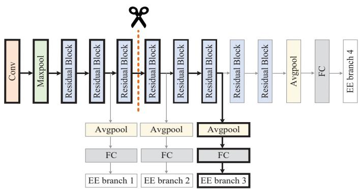  
Fig. 2. Multi-exit ResNet-18 model.

## B. Performance Analysis

Figs. 3(a)∼(c) sequentially illustrate the convergence performance of the proposed Algorithms 1∼3 under three different configurations. In Scenario 1, the flight altitude and the maximum speed of both UAVs are set as 100 m and 20 m/s, respectively. In Scenario 2, the flight altitude remains 100 m, while the maximum speed is set to 15 m/s. In Scenario 3, the flight altitude is 120 m, and the maximum speed is 20 m/s. It can be observed that Fig. 3(a) achieves convergence within a finite number of iterations, demonstrating the effectiveness of the SCA approach. In Fig. 3(b), the fitness values of DWOA under different scenarios rapidly converge. Furthermore, Fig. 3(c) shows that the alternating optimization algorithm converges within a limited number of iterations in all scenarios. These results indicate the robustness of the proposed CI framework in dynamic environments.

We further analyze the trajectories and flight speeds of the two UAVs under different energy weight coefficients in Figs. 4(a)∼(c). We set the weight coefficients as $\omega _ { I } = \omega _ { J } = 1 0 ^ { - 4 }$ $\omega _ { I } = \omega _ { J } = 5 \times 1 0 ^ { - 4 }$ , and $\omega _ { I } = \omega _ { J } = 3 \times 1 0 ^ { - 3 }$ . As shown in Fig. 4(a), the UAV server moves closer to mobile devices to improve split offloading quality, while the UAV jammer approaches the Eve and simultaneously maintains a certain distance from the UAV server to ensure the secure transmission of IFD. As expected, as the energy consumption weight increases, both UAVs tend to adopt more curved trajectories. This trajectory adjustment is directly reflected in their flight speeds, as shown in Figs. 4(b) and 4(c). Specifically, with a higher energy consumption weight, both UAVs maintain lower and more stable flight speeds. This is because higher energy weights in the objective function place a greater emphasis on minimizing propulsion energy consumption, which hinders energy-intensive flight patterns, such as rapid speed variations and high-speed flight. The proposed algorithm can flexibly adjust both the trajectories and flight speeds of the two UAVs according to different energy consumption requirements.

Fig. 5 illustrates the impact of the inference accuracy weight on the average inference accuracy under different accuracy threshold constraints. It can be observed that as the accuracy weight coefficient increases, the average accuracy under each threshold condition exhibits distinct trends. Specifically, a noticeable upward trend appears under low thresholds. This occurs because an increased accuracy weight emphasizes the importance of accuracy in the objective function, thereby motivating the system to select more accurate EE points. In contrast, under a high accuracy threshold, the average accuracy remains unchanged because the system is initially confined to a limited set of high-accuracy EE points, leaving no flexibility for further adjustment.

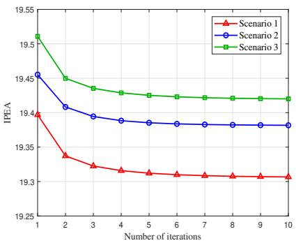  
(a)

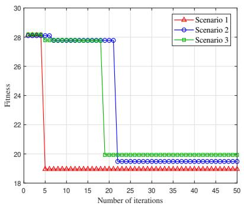  
(b)

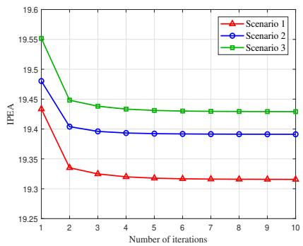  
(c)

Fig. 3. Convergence performance of our proposed algorithms: (a) Algorithm 1. (b) Algorithm 2. (c) Algorithm 3.  
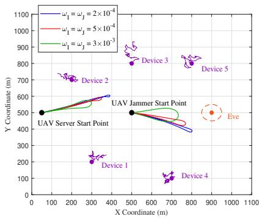  
(a)

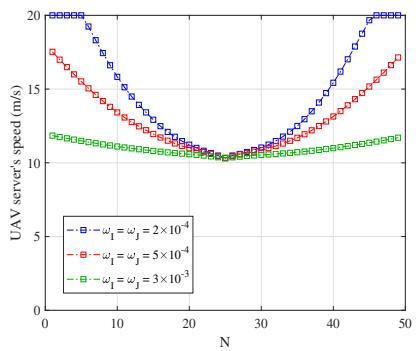  
(b)

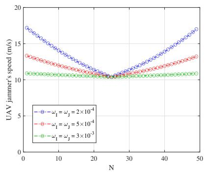  
(c)  
Fig. 4. (a) Trajectories of two UAVs under different energy consumption weight coefficients. (b) Speed of the UAV server. (c) Speed of the UAV jammer.

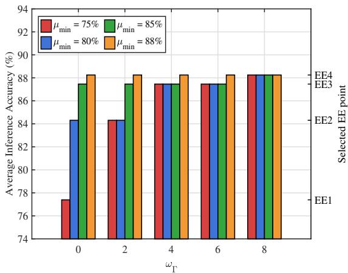  
Fig. 5. Average inference accuracy versus different accuracy weight.

Fig. 6 illustrates the tradeoff between the energy consumption of the UAV jammer and the average secure split offloading rate under different jamming power $P _ { J }$ . Note that the average secure split offloading rate is defined as $\begin{array} { r } { \frac { 1 } { K N } \sum _ { k = 1 } ^ { K } \sum _ { n = 1 } ^ { N } R _ { k , I } ^ { \mathrm { s e c } } [ n ] } \end{array}$ . As $P _ { J }$ increases, the energy consumption of the UAV jammer grows. In contrast, the average secure split offloading rate first increases and then gradually decreases. Specifically, when $P _ { J }$ is small, increasing the jamming power effectively suppresses the eavesdropping link, which leads to a noticeable improvement in the average secure split offloading rate. However, beyond a certain threshold, further increasing $P _ { J }$ provides limited suppression effects while introducing stronger interference to the legitimate link, thereby degrading the average secure split offloading rate. These results indicate that there exists an appropriate range of jamming power that balances the average secure split offloading rate and the energy consumption of the UAV jammer.

## C. Ablation Study and Performance Comparison

In this subsection, we first conduct an ablation study to quantify the contribution of different core components in the proposed framework, and then compare the proposed scheme with several baseline schemes. For the ablation study, the following settings are considered:

• Fixed Dual-UAV Trajectories (FDT): The UAV server and the UAV jammer follow two predefined circular trajectories centered at (50, 500) and (500, 500), respectively. Also, the radius of each UAV trajectory is 30 m.

• Without Early-Exit Mechanism (WEEM): The EE mechanism is not considered, and CI is performed using the full DNN model.

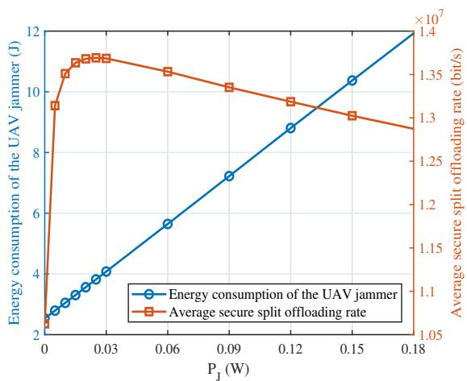  
Fig. 6. Tradeoff between the extra energy consumption of the UAV jammer and the average secure split offloading rate under different jamming power.

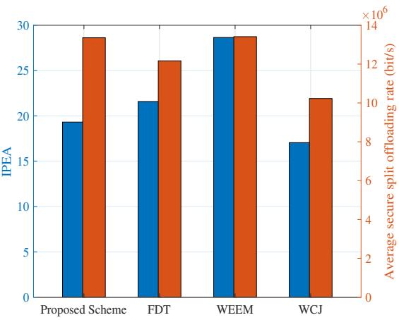  
Fig. 7. Ablation study of the proposed scheme under different settings in terms of IPEA and average secure split offloading rate.

• Without Cooperative Jamming (WCJ): The UAV jammer does not transmit cooperative jamming signals to assist secure split offloading.

Fig. 7 presents ablation results in terms of IPEA and average secure split offloading rate. For the FDT scheme, IPEA is significantly higher and the average secure split offloading rate is lower than the corresponding values of the proposed scheme. This is because fixing the trajectories of the two UAVs limits their ability to adjust flight speeds and directions according to network conditions. For the WEEM scheme, while the average secure split offloading rate remains close to that of the proposed scheme, IPEA becomes much higher. This is because all tasks must be processed by the full DNN model, which leads to higher inference energy consumption. For the WCJ scheme, although IPEA decreases due to the removal of jamming energy consumption, the average secure split offloading rate drops significantly. This is because removing cooperative jamming weakens the suppression of the eavesdropping link. These results indicate that the trajectory design of both UAVs, the EE mechanism, and cooperative jamming play important roles in the proposed framework. Therefore, our joint design is necessary to achieve efficient and secure CI services.

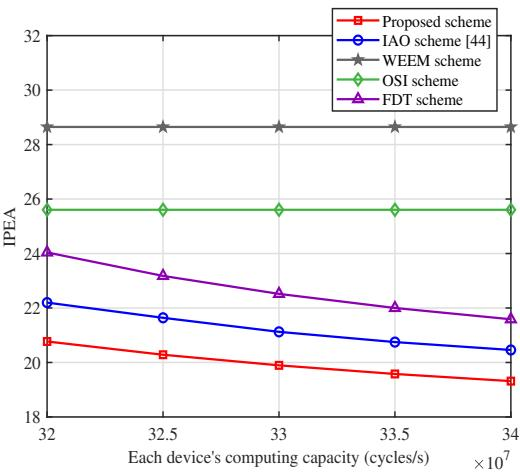  
Fig. 8. IPEA versus each device’s computing capacity.

To further show the performance of the proposed scheme, the following baseline schemes are considered:

• Iterative Alternating Optimization (IAO) [44]: This scheme begins by randomly allocating computational resources to all devices, and then iteratively adjusts the allocation for each device with a given step size until the objective function converges.

• On-Server Inference (OSI): In this scheme, raw tasks are directly uploaded to the UAV server, and all inference tasks are processed by the UAV server.

In addition, FDT and WEEM are also included in the performance comparison. However, WCJ is not included because removing cooperative jamming may violate the minimum secure offloading requirement.

Fig. 8 shows the relationship between IPEA and the computing capacity of each device. Different schemes display distinct trends as the computing capacity increases. It can be observed that OSI exhibits no performance variation because all raw tasks are directly uploaded to the UAV server. WEEM shows a similar trend because disabling the EE mechanism leads to a heavier computation workload, and thus the system tends to directly offload raw tasks to the UAV server under the delay constraint. Besides, the proposed scheme, IAO, and FDT show a similar decreasing trend. This is because, while a higher local computing frequency increases local energy consumption, it significantly reduces local inference latency. This reduction in local processing time increases the available time budget for the subsequent split offloading and UAV inference stages. Consequently, the system can adopt more energy-efficient transmission or processing strategies in later stages, leading to an overall improvement in IPEA.

Fig. 9 illustrates the impact of transmission bandwidth on IPEA. As the bandwidth increases, all schemes exhibit performance gains, as higher data rates significantly reduce both the latency and energy consumption of split offloading. Crucially, the reduced transmission latency increases the available time budget for inference. This allows the system to select deeper DNN partitioning points or higher-accuracy EE points without violating the total delay requirement, which further improves the IPEA. Moreover, our proposed scheme consistently outperforms all baselines, validating the effectiveness of our codesign of split offloading and trajectory planning.

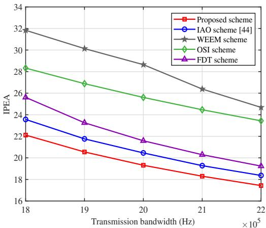  
Fig. 9. IPEA versus transmission bandwidth.

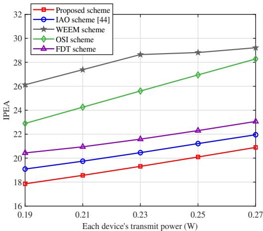  
Fig. 10. IPEA versus each device’s transmit power.

Fig. 10 illustrates the impact of each device’s transmit power on IPEA. As transmit power increases, all schemes exhibit an upward trend, reflecting an inherent trade-off: while higher transmit power improves data transmission rates, the associated surge in energy consumption dominates the overall cost. Furthermore, the diverging trends among the schemes stem from their distinct DNN partitioning strategies. Notably, the performance gap between the proposed scheme and the OSI widens as transmit power rises. This implies that the proposed scheme is less sensitive to power increases. This resilience mainly comes from the fact that the proposed scheme significantly reduces the size of the transmitted IFD through joint optimization of EE selection and DNN partitioning. This result also confirms the necessity and effectiveness of the multidimensional optimization.

To present the performance of secure split offloading under the uncertain location of the Eve, we present Fig. 11 to demonstrate the impact of each device’s transmit power and the estimation error of the Eve on the average secure split offloading rate. It can be observed that as each device’s transmit power increases, the secure split offloading rate also improves. Furthermore, when the estimation error increases from 10 m to 50 m, the secure offloading rates of both the proposed scheme and the FDT scheme decrease. This phenomenon can be attributed to the fact that the larger estimation error introduces greater uncertainty into the channel state information and consequently degrades the system’s security performance. Finally, compared to the FDT scheme, the proposed algorithm exhibits a smaller performance degradation gap as the estimation error increases, demonstrating its superior robustness and effectiveness.

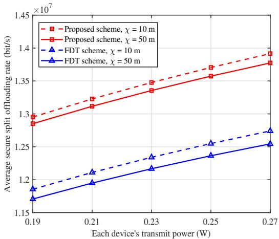  
Fig. 11. Average secure offloading rate versus each device’s transmit power.

## VI. CONCLUSIONS

This paper proposed a novel UAV-assisted CI framework that leverages multi-exit DNNs and cooperative jamming to support efficient and secure inference services. In this framework, a DNN model is split with initial layers processed by each device and subsequent layers handled by a UAV server. On this basis, the EE mechanism is adopted to accelerate inference. Also, a UAV jammer transmits artificial noise to secure split offloading of IFD extracted by each device. By jointly optimizing the trajectories of the UAV server and UAV jammer, the selection of EE points and DNN partitioning points, and the computation resource allocation of the UAV server, we minimized total energy consumption while maximizing inference accuracy, subject to inference delay requirements and secure offloading rate constraints. To solve the resulting problem, we developed an efficient alternating optimization algorithm. Extensive simulation results demonstrated that the proposed scheme outperforms several baselines in balancing energy consumption and inference accuracy across diverse system configurations. Given the heterogeneity of inference tasks, investigating DNN deployment and secure split offloading in UAV-assisted CI would be a promising direction for future research.

## REFERENCES

[1] J. Li, W. Liang, Y. Li et al., “Throughput maximization of delay-aware DNN inference in edge computing by exploring DNN model partitioning and inference parallelism,” IEEE Trans. Mobile Comput., vol. 22, no. 5, pp. 3017-3030, May 2023.

[2] E. Li, L. Zeng, Z. Zhou et al., “Edge AI: On-demand accelerating deep neural network inference via edge computing,” IEEE Trans. Wireless Commun., vol. 19, no. 1, pp. 447-457, Jan. 2020.

[3] X. Xu, K. Yan, S. Han et al., “Learning-based edge-device collaborative DNN inference in IoVT networks,” IEEE Internet Things J., vol. 11, no. 5, pp. 7989-8004, Mar. 2024.

[4] H. Jiang, X. Dai, Z. Xiao et al., “Joint task offloading and resource allocation for energy-constrained mobile edge computing,” IEEE Trans. Mobile Comput., vol. 22, no. 7, pp. 4000-4015, Jul. 2023.

[5] G. Xu, Z. Hao, Y. Luo et al., “DeViT: Decomposing vision transformers for collaborative inference in edge devices,” IEEE Trans. Mobile Comput., vol. 23, no. 5, pp. 5917-5932, May 2024.

[6] M. Gao, R. Shen, L. Shi et al., “Task partitioning and offloading in DNNtask enabled mobile edge computing networks,” IEEE Trans. Mobile Comput., vol. 22, no. 4, pp. 2435-2445, Apr. 2021.

[7] X. Wang, J. Li, Z. Ning et al., “Wireless powered metaverse: Joint task scheduling and trajectory design for multi-devices and multi-UAVs,” IEEE J. Sel. Areas Commun., vol. 42, no. 3, pp. 552-569, Mar. 2024.

[8] J. Xu, H. Yao, R. Zhang et al., “Low latency and accuracy-guaranteed DNN inference for UAV-assisted IoT networks,” IEEE Trans. Cogn. Commun. Netw., early access, DOI: 10.1109/TCCN.2025.3542443.

[9] Z. Ning, Y. Yang, X. Wang et al., “Multi-agent deep reinforcement learning based UAV trajectory optimization for differentiated services,” IEEE Trans. Mobile Comput., vol. 23, no. 5, pp. 5818-5834, May 2024.

[10] M. Odema and M. A. Al Faruque, “Privynas: Privacy-aware neural architecture search for split computing in edge-cloud systems,” IEEE Internet Things J., vol. 11, no. 4, pp. 6638-6651, Feb. 2024.

[11] W. Jiang, H. Han, D. Feng et al., “Energy efficient and accuracy-aware DNN inference with IoT device-edge collaboration,” IEEE Trans. Services Comput., vol. 18, no. 2, pp. 784-797, Mar.-Apr. 2025.

[12] M. Wu, Q. Song, L. Guo et al., “Charge-then-cooperate: Secure resource allocation for wireless-powered relay networks with wireless energy transfer,” IEEE Trans. Veh. Technol., vol. 70, no. 5, pp. 5088-5093, May 2021.

[13] Z. Liu, H. Du, J. Lin et al., “DNN partitioning, task offloading, and resource allocation in dynamic vehicular networks: A Lyapunov-guided diffusion-based reinforcement learning approach,” IEEE Trans. Mobile Comput., vol. 24, no. 3, pp. 1945-1962, Mar. 2025.

[14] X. Li and S. Bi, “Optimal AI model splitting and resource allocation for device-edge co-Inference in multi-user wireless sensing systems,” IEEE Trans. Wireless Commun., vol. 23, no. 9, pp. 11094-11108, Sep. 2024.

[15] Z. Hao, G. Xu, Y. Luo et al., “Multi-agent collaborative inference via DNN decoupling: Intermediate feature compression and edge learning,” IEEE Trans. Mobile Comput., vol. 22, no. 10, pp. 6041-6055, Oct. 2023.

[16] X. Yuan, N. Li, T. Zhang et al., “High efficiency inference accelerating algorithm for NOMA-based edge intelligence,” IEEE Trans. Wireless Commun., vol. 23, no. 11, pp. 17539-17556, Nov. 2024.

[17] F. Dong, H. Wang, D. Shen et al., “Multi-exit DNN inference acceleration based on multi-dimensional optimization for edge intelligence,” IEEE Trans. Mobile Comput., vol. 22, no. 9, pp. 5389-5405, Sep. 2023.

[18] Z. Liu, J. Song, C. Qiu et al., “Hastening stream offloading of inference via multi-exit DNNs in mobile edge computing,” IEEE Trans. Mobile Comput., vol. 23, no. 1, pp. 535-548, Jan. 2024.

[19] Q. Zhang, S. Wang, J. Guan et al., “SatCooper: Enhancing cooperative inference analytics for satellite service via multi-exit DNNs,” IEEE Trans. Mobile Comput., vol. 24, no. 9, pp. 8314-8328, Sep. 2025.

[20] K. Gao, J. Du, C. Jiang et al., “Cooperative DNN partitioning in energyharvesting and MEC-enabled AAV networks,” IEEE Internet Things J., vol. 12, no. 13, pp. 24329-24344, Jul. 2025.

[21] C. Deng, X. Fang, and X. Wang, “Integrated sensing, communication, and computation with adaptive DNN splitting in multi-UAV networks,” IEEE Trans. Wireless Commun., vol. 23, no. 11, pp. 17429-17445, Nov. 2024.

[22] Y. Wei, Z. Wan, Y. Xiao et al., “Joint split offloading and trajectory scheduling for UAV-enabled mobile edge computing in IoT network,” IEEE Trans. Netw. Sci. Eng., vol. 11, no. 6, pp. 6180-6193, Nov.-Dec. 2024.

[23] Y. Lu and J. Li, “Lightweight public key authenticated encryption with keyword search against adaptively-chosen-targets adversaries for mobile Devices,” IEEE Trans. Mobile Comput., vol. 21, no. 12, pp. 4397-4409, Dec. 2022.

[24] S. Han, W. Zhang, X. Xu et al., “S2E-DECI: Secrecy and energyefficient dual-aware device-edge co-inference for AIoT,” IEEE Internet Things J., vol. 11, no. 24, pp. 39142-39157, Dec. 2024.

[25] R. Karmakar, G. Kaddoum, and O. Akhrif, “A novel federated learning based smart power and 3D trajectory control for fairness optimization in secure UAV-assisted MEC services, IEEE Trans. Mobile Comput.,vol.23, no. 5, pp. 4832-4848, May 2024.

[26] Y. Zhang, Z. Kuang, Y. Feng et al., “Task offloading and trajectory optimization for secure communications in dynamic user multi-UAV MEC systems,” IEEE Trans. Mobile Comput., vol. 23, no. 12, pp. 14427- 14440, Dec. 2024.

[27] W. Mao, K. Xiong, Y. Lu et al., “Energy consumption minimization in secure multi-antenna UAV-assisted MEC networks with channel uncertainty,” IEEE Trans. Wireless Commun., vol. 22, no. 11, pp. 7185-7200, Nov. 2023.

[28] M. Zhao, Z. Wang, K. Guo et al., “Against mobile collusive eavesdroppers: Cooperative secure transmission and computation in UAV-assisted MEC networks,” IEEE Trans. Mobile Comput., vol. 24, no. 6, pp. 5280- 5297, Jun. 2025.

[29] E. T. Michailidis, M. -G. Volakaki, N. I. Miridakis et al., “Optimization of secure computation efficiency in UAV-enabled RIS-assisted MEC-IoT networks with aerial and ground eavesdroppers,” IEEE Trans. Commun., vol. 72, no. 7, pp. 3994-4009, Jul. 2024.

[30] M. Wu, H. Wu, W. Lu et al., “Security-aware designs of multi-UAV deployment, task offloading and service placement in edge computing networks,” IEEE Trans. Mobile Comput., vol. 24, no. 10, pp. 11046- 11060, Oct. 2025.

[31] Y. Pan, R. Li, X. Da et al., “Cooperative trajectory planning and resource allocation for UAV-enabled integrated sensing and communication systems,” IEEE Trans. Veh. Technol., vol. 73, no. 5, pp. 6502-6516, May 2024.

[32] Y. Cao, Y. Luo, H. Yang et al., “UAV-based emergency communications: An iterative two-stage multiagent soft actor–critic approach for optimal association and dynamic deployment,” IEEE Internet Things J., vol. 11, no. 16, pp. 26610-26622, Aug. 2024.

[33] S. Hu, Q. Wu, and X. Wang, “Energy management and trajectory optimization for UAV-enabled legitimate monitoring systems,” IEEE Trans. Wireless Commun., vol. 20, no. 1, pp. 142-155, Jan. 2021.

[34] S. Liu, H. Luo, X. Li et al., “AdaKnife: Flexible DNN offloading for inference acceleration on heterogeneous mobile devices,” IEEE Trans. Mobile Comput., vol. 24, no. 2, pp. 736-748, Feb. 2025.

[35] F. Dong, H. Wang, D. Shen et al., “Multi-exit DNN inference acceleration based on multi-dimensional optimization for edge intelligence,” IEEE Trans. Mobile Comput., vol. 22, no. 9, pp. 5389-5405, Sep. 2023.

[36] J. Huang, Y. Gao, and W. Dong, “Elastic DNN inference with unpredictable exit in edge computing,” IEEE Trans. Mobile Comput., vol. 23, no. 12, pp. 14005-14016, Dec. 2024.

[37] Y. Xu, T. Zhang, D. Yang et al., “Joint resource and trajectory optimization for security in UAV-assisted MEC systems,” IEEE Trans. Commun., vol. 69, no. 1, pp. 573-588, Jan. 2021.

[38] R. Zhang, X. Pang, W. Lu et al., “Dual-UAV enabled secure data collection with propulsion limitation,” IEEE Trans. Wireless Commun., vol. 20, no. 11, pp. 7445-7459, Nov. 2021.

[39] F. Pervez, A. Sultana, C. Yang et al., “Energy and latency efficient joint communication and computation optimization in a multi-UAV-assisted MEC network,” IEEE Trans. Wireless Commun., vol. 23, no. 3, pp. 1728- 1741, Mar. 2024.

[40] S. Boyd and L. Vandenberghe, Convex Optimization. Cambridge, U.K.: Cambridge Univ. Press, 2004.

[41] C. You and R. Zhang, “3D trajectory optimization in Rician fading for UAV-enabled data WEEMvesting,” IEEE Trans. Wireless Commun., vol. 18, no. 6, pp. 3192-3207, Jun. 2019.

[42] Q. -V. Pham, S. Mirjalili, N. Kumar et al., “Whale optimization algorithm with applications to resource allocation in wireless networks,” IEEE Trans. Veh. Technol., vol. 69, no. 4, pp. 4285-4297, Apr. 2020.

[43] Y. Zeng, J. Xu, and R. Zhang, “Energy minimization for wireless communication with rotary-wing UAV,” IEEE Trans. Wireless Commun., vol. 18, no. 4, pp. 2329-2345, Apr. 2019.

[44] X. Tang, X. Chen, L. Zeng et al., “Joint multiuser DNN partitioning and computational resource allocation for collaborative edge intelligence,” IEEE Internet Things J., vol. 8, no. 12, pp. 9511-9522, Jun. 2021.