# Secure Computation Offloading for Marine IoT: An Energy-Efficient Design via Cooperative Jamming

Mingqing Li , Li Ping Qian , Senior Member, IEEE, Xinyu Dong, Bin Lin , Senior Member, IEEE, Yuan Wu , Senior Member, IEEE, and Xiaoniu Yang

Abstract—In smart ocean, the Marine Internet of Things (M-IoT) is ubiquitously used for data acquisition, communication connections, task computation, and so on. However, high-efficient energy consumption and secure yet low-latency transmission is subject to IoT devices’ computation capacity and transmit power limitation, as well as wireless communication’s broadcast characteristics. In this paper, we investigate the secure computation offloading in M-IoT with the assistance of unmanned surface vehicles (USVs) subject to the eavesdropping attack. In particular, we consider a scenario in which USVs are firstly scheduled to set up a high-quality communication link to the high altitude platform (HAP) and then exploited to provide cooperative jamming for the communication security at the physical layer when the HAP is performing computation offloading. We jointly optimize the USVs’ positions, the duration of data uploading, the workload offloaded by HAP, the HAP’s transmission power, and each USV’s jamming signal power to minimize the system-wise energy consumption for completing the total workloads under the latency constraint. Despite the non-convexity, we decompose the problem vertically into a top problem that optimizes the USVs’ positions and a bottom problem that optimizes the other variables. The Polyblock outer Approximation and bisection Search based algorithm (PAS-Algorithm) is proposed to alternatively optimize the variables in the bottom problem. And the Code bAsed croSs Entropy algorithm (CASE-Algorithm) is proposed to obtain the suboptimal solution

Manuscript received 1 July 2022; revised 23 November 2022; accepted 13 December 2022. Date of publication 22 December 2022; date of current version 18 May 2023. This work was supported in part by Intergovernmental International Cooperation in Science and Technology Innovation Program under Grant 2019YFE0111600, in part by the National Natural Science Foundation of China under Grants 62122069, 62072490, 62071431, 51939001, and 61971083, in part by the Zhejiang Provincial Natural Science Foundation of China under Grant LR17F010002, in part by Liaoning Revitalization Talents Program under Grant XLYC2002078, in part by the Major Key Project of PCL under Grant PCL2021A03-1, in part by the Science and Technology Development Fund of Macau SAR under Grants 0060/2019/A1 and 0162/2019/A3, in part by FDCT-MOST Joint Project under Grant 0066/2019/AMJ, and in part by the Research Grant of University of Macau under Grant MYRG2020-00107-IOTSC. The review of this article was coordinated by Prof. Nan Cheng. (Corresponding author: Li Ping Qian.)

Mingqing Li, Li Ping Qian, and Xinyu Dong are with the College of Information Engineering, Zhejiang University of Technology, Hangzhou 310023, China (e-mail: 2112103212@zjut.edu.cn; lpqian@zjut.edu.cn; 2112103019@zjut.edu.cn).

Bin Lin is with the Department of Communication Engineering, Dalian Maritime University, Dalian 116026, China (e-mail: binlin@dlmu.edu.cn).

Yuan Wu is with the State Key Laboratory of Internet of Things for Smart City, University of Macau, Macau 999078, China, and also with the Department of Computer Information Science, University of Macau, Macau 999078, China (e-mail: yuanwu@um.edu.mo).

Xiaoniu Yang is with the Institute of Cyberspace Security, Zhejiang University of Technology, Hangzhou 310023, China, and also with the Science and Technology on Communication Information Security Control Laboratory, Jiaxing 314033, China (e-mail: yxn2117@126.com).

Digital Object Identifier 10.1109/TVT.2022.3231295

to the formulated joint optimization problem. Numerical results validate the accuracy and effectiveness of our algorithms as well as the performance of optimizing the total energy consumption compared with the benchmark algorithms.

Index Terms—Computation offloading, collaborative jamming, energy consumption minimization, usvs scheduling,resource allocation.

# I. INTRODUCTION

W ITH the rapid development of smart ocean, the MarineInternet of Things (M-IoT) has been emerging as a Internet of Things (M-IoT) has been emerging as a promising network paradigm in which a large body of unmanned surface vehicles (USVs) are deployed in the offshore area for maritime environmental monitoring, underwater biological monitoring, tactical monitoring, aquaculture monitoring and so on [1], [2], [3]. The ever-increasing marine activities would lead to a massive amount of computation-intensive yet latency-sensitive maritime data. For these USVs, they would suffer severe transmission energy consumption when offloading the computation-intensive tasks to the onshore mobile edge computing (MEC) servers far from USVs, and severe computation energy consumption when computing these tasks locally [4], [5], [6], [7].

To this end, the high altitude platform-aided (HAP-aided) edge computing can be exploited as portable MEC units in close proximity to USVs for the task computation and data acquisition in an energy-efficient and low-latency way [8], [9], [10], [11], [12], [13]. By allocating the computation-intensive tasks from USVs among MEC units equipped in the HAP and onshore base station (BS), the latency in completing the task computation and the transmission energy consumption can be efficiently reduced for USVs. Many studies have been devoted to investigating the computation offloading among multiple heterogeneous MEC units [14], [15], [16], [17], [18], [19], [20].

Considering the orthogonal sharing of radio resources, the individual USVs can separately decode their signals with low complexity in the orthogonal multiple access, at the cost of low spectrum efficiency and a few USVs in service. On the contrary, the non-orthogonal multiple access (NOMA) is proposed as a highly spectrum-efficient approach to enable massive wireless access. In NOMA, USVs apply the successive interference cancellation (SIC) to decode their own signals [21]. By forming a NOMA group, USVs can share the same frequency band simultaneously [22]. Nevertheless, USVs at the edge of the network may suffer from the severe communication loss to the HAP, resulting in the unsatisfactory task offloading and computing. Thanks to the flexibility of USVs, the high-quality data transmission can be achieved by appropriately scheduling USVs to the target positions [23], [24], [25], [26], [27]. Due to the broadcast characteristics of wireless communications, HAPs’ communication is vulnerable to the eavesdropping attack, namely, a malicious user can intentionally collect the radio signal of HAP and decode the signal in a brute-force manner. This eavesdropping attack on wireless systems has attracted lots of interest in past years [28], [29]. As a promising countermeasure to the eavesdropping attack, artificial jamming has attracted growing attention. Specifically, some voluntary nodes send the jamming signal to interfere with the eavesdropper and thus degrade the eavesdropper’s overhearing capability [30], [31], [32]. In various schemes, jamming signals provided by relaying signals, the receivers, and the transmitters, are usually used to interfere with eavesdroppers [19], [33], [34].

Although a significant amount of effort has been spent on the secure computation offloading, there are few existing work on the NOMA-aided secure computation offloading with cooperative jamming for the M-IoT. Thus, we first study how to realize the NOMA-aided secure computation offloading with cooperative jamming when the USVs offload their computationintensive tasks to the onshore BS via the HAP in the M-IoT. Then, we aim to minimize the total energy consumption during the computation offloading by jointly optimizing the USVs’positions, the duration of data uploading, the workload offloaded to the onshore BS, HAP’s transmission power, and each USV’s jamming signal power in the layered framework. In particular, the main contributions of this work are summarized as follows.

- We consider a maritime scenario that a group of USVs with each USV having the tasks to make full use of its flexibility to complete the schedule (i.e., each USV can move from its initial position to the destination location) and to upload its total data to the HAP via NOMA. The HAP serves as an aerial edge server that (i) processes part of the USVs’ uploaded workloads and (ii) further sends the remaining of the USVs’ uploaded workloads to the BS. Considering the malicious eavesdropping on the HAP, we exploit USVs to provide cooperative jamming to improve the communication security at the physical layer.   
- We formulate a joint optimization of the USVs’ positions, the duration of data uploading, the workload offloaded to the onshore BS, HAP’s transmission power, and each USV’s jamming signal power to minimize the system-wise energy consumption of the USVs and the HAP. Efficient algorithms are proposed to solve this problem despite its non-convexity. We exploit the layered feature of the joint optimization problem and decompose it vertically into a top problem and a bottom problem. To be specific, we first propose the Polyblock outer Approximation and bisection Search based algorithm, referred to as PAS-Algorithm, to alternatively optimize the variables in the bottom problem. Then, we propose the Code bAsed croSs Entropy algorithm, referred to as CASE-Algorithm, to obtain the suboptimal solution to the formulated joint optimization

problem by alternatively searching the solution to the top problem based on the cross entropy theory and optimizing the bottom problem by the PAS-Algorithm.

\- Extensive numerical results are conducted to validate the accuracy and efficiency of our proposed algorithms and the advantages of adopting flexible cooperative interference to improve communication security at the physical layer, in comparison with the enumeration method and random selection method.

The rest of this paper is organized as follows. In Section II, we review the related studies. In Section III, we introduce the system model and present the problem formulation. Effective algorithms are proposed to solve the joint optimization problem in Sections IV and V. Section VI presents the numerical results to validate the accuracy and efficiency of our algorithms. In Section VII, we conclude the work of this paper and discuss the future research directions.

# II. RELATED WORK

In this section, we first review the related studies about computation offloading and resource allocation in edge computing. Then, we provide a review of the USVs scheduling and the improvement of communication security at the physical layer.

Computation offloading and resource allocation: There have been many studies investigating the deployment of edge servers in various scenarios and optimizing the computation offloading and resource allocation [7], [14], [15], [16], [17], [20]. In [7], Qian et al. investigated the spectrum sharing assisted computation offloading in which the edge computing users reuse the cellular user’s licensed spectrum sharing for sending the offloaded task to the edge server. In [14], Dai et al. investigated the computing offloading scheme for unmanned aerial vehicles (UAVs) with the assistance of vehicles, in which the Nash bargaining equilibrium is obtained to improve the offloading efficiency and maximize the system utility. In [15], Fang et al. studied the joint optimization of tasks partition ratios and offloading transmit power to obtain the minimal task delay in multi-user NOMA-MEC networks. In [16], Zhao et al. presented a collaborative approach based on MEC and cloud computing, which offloads services to the automobiles in vehicular networks to improve system utility and computation time. In [17], Dai et al. proposed a two-tier computation offloading framework that is used to deal with the multi-task and the dependency relationship of tasks in heterogeneous networks. In [20], Mao et al. studied a green MEC model with energy harvesting technologies, and a Lyapunov optimization-based policy is proposed to jointly optimize offloading decision and computation resource allocation dynamically.

USVs scheduling: Due to the agile maneuverability and flexible deployment of USVs, the scheduling of USVs has attracted a lot of interest. In [23], Zeng et al. investigated the complicated model consisting of kinematics and communication with the consideration of the maritime environment and earth curvature, and an approximation method is proposed to determine the maximum value of the minimum expected throughput among all ships by jointly optimizing the communication resource allocation and USV trajectory. In [24], Hervagault et al. investigated the trajectory generation optimization for multiple USVs when communication constraints are required. In [25], Zhang et al. proposed a model to improve the efficiency of task allocation for USVs, in which the network resource allocation process between USVs and offshore platforms is formulated as a second price sealed auction game, and the Gauss–Markov process is used to describe the movement of USVs. In [26], Yang et al. proposed an integrated space–air-ground–sea communication control system with the consideration of information collection, information fusion, and data distribution, in which USVs are used as the backbone and carried out the control and communication schemes. In [27], Nguyen et al. investigated the path planning for USVs, which contributes to performing tasks efficiently in an obstacle-filled environment.

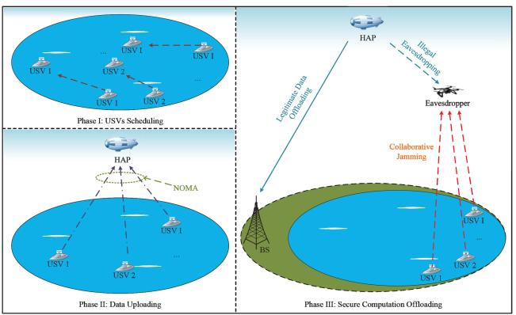

flowchart

Fig. 1. Illustrative system model and detailed Phase I, Phase II and Phase III.

Communication security at the physical layer: There have been many researches to improve communication security at the physical layer. In [28], [31], the authors obtained the maximum secrecy sum rate by applying the optimum power allocation in the NOMA system. In [32], Li et al. investigated the sum secrecy rate with imperfect channel state information when rate requirements are met. In [35], [36], the authors presented surveys of the physical layer security, including massive multiple-input multiple-output, millimeter wave communications, heterogeneous networks, and so on. In [37], Li et al. employed the cooperative rate-splitting technique (i.e., the messages transmitted to users are split into one common part and one private part, then all the common parts are combined into a super common part) to enhance the secrecy sum rate, in which the combined message plays a role in providing collaborative jamming. In [38], Zhang et al. tagged messages that are transmitted by BS with different security levels, and the security of high-level messages is maximized. In contrast, the security of low-level messages is ensured to meet the information secrecy rate constraint by using an artificial-noise-aided beamforming scheme. In [19], Wang et al. considered the cell-edge users’ offloading transmission to provide cooperative jamming, especially when the serves’ relay signals are being eavesdropped.

# III. SYSTEM MODEL AND PROBLEM FORMULATION

We consider a marine HAP-aided MEC-enabled M-IoT network with the assistance of USVs subject to the eavesdropping attack, as shown in Fig. 1, consisting of a HAP, an eavesdropper, an onshore BS, and a group of USVs denoted as $\mathcal { T } = \{ 1 , 2 , \hdots , I \}$ . In particular, each USV i is supposed to move =from its initial position $\pmb { w } _ { i } ^ { o }$ to the target position ${ \pmb w } _ { i }$ before uploading its data $S _ { i }$ i ito the HAP. In addition, we consider ithat there exists a malicious UAV close to the HAP, the UAV intentionally collects the radio signal of HAP and overhears the HAP’s offloading transmission to the onshore BS. Each USV serves as a voluntary node that sends the cooperative jamming signals to the malicious UAV to address the malicious UAV’s eavesdropping attack. To put it simply, we divide this model into three phases, and the detailed modeling and problem formulation are shown as follows.

# A. Modeling in Phase I

As depicted in Fig. 1, in order to establish a high-quality communication link with the HAP, each USV i is supposed to move from its initial position $\pmb { w } _ { i } ^ { o } = ( x _ { i } ^ { o } , y _ { i } ^ { o } , z _ { i } ^ { o } )$ to its target position ${ \pmb w } _ { i } = ( x _ { i } , y _ { i } , z _ { i } )$ i = ( i i i )with a constant speed of $v _ { o }$ and a constant i = ( ipower of $p _ { o }$ i)in Phase I.1 The HAP hovers at $\pmb { q } _ { \mathrm { S } } = ( x _ { \mathrm { S } } , y _ { \mathrm { S } } , z _ { \mathrm { S } } )$ o = ( )to provide the service of communication and computation for USVs that are far from the onshore BS. We define R as the communication coverage radius of the HAP with $( x _ { \mathrm { { S } } } , y _ { \mathrm { { S } } } , 0 )$ as the center, the initial positions $\{ { \pmb w } _ { i } ^ { o } \} _ { i \in \mathbb { Z } }$ ( )and the target positions $\{ w _ { i } \} _ { i \in \mathcal { I } }$ i iare subject to the communication range, which are as i ithe follows,

$$
\left| x _ {i} ^ {o} - x _ {\mathrm{S}} \right| ^ {2} + \left| y _ {i} ^ {o} - y _ {\mathrm{S}} \right| ^ {2} \leq R ^ {2}, \forall i \in \mathcal {I}, \tag {1}
$$

$$
\left| x _ {i} - x _ {\mathrm{S}} \right| ^ {2} + \left| y _ {i} - y _ {\mathrm{S}} \right| ^ {2} \leq R ^ {2}, \forall i \in \mathcal {I}. \tag {2}
$$

In the case of constant speed and power, the moving time required by USVs and the moving energy consumed by USVs can be different, due to the different distance between $\{ { \pmb w } _ { i } ^ { o } \} _ { i \in \mathbb { Z } }$ and $\{ w _ { i } \} _ { i \in \mathcal { I } }$ i. For USV i, we calculate its moving time as $\frac { | \pmb { w } _ { i } ^ { o } - \pmb { w } _ { i } | } { v _ { o } }$ , and its moving energy consumption is

$$
E _ {i o} = p _ {o} \frac {\left| \boldsymbol {w} _ {i} ^ {o} - \boldsymbol {w} _ {i} \right|}{v _ {o}}, i \in \mathcal {I}. \tag {3}
$$

Among all the USVs, the moving time spent in Phase I is denoted as $\operatorname* { m a x } _ { \forall i \in \mathcal { I } } \left\{ \frac { | { \pmb w } _ { i } ^ { o } - { \pmb w } _ { i } | } { { \upsilon } _ { o } } \right\}$ −wi| . For the sake of ensuring USVs arrives at $\{ w _ { i } \} _ { \forall i \in \mathcal { I } }$ efficiently, we set a limitation on the duration of Phase i iI, which is

$$
\max _ {\forall i \in \mathcal {I}} \left\{\frac {| \boldsymbol {w} _ {i} ^ {o} - \boldsymbol {w} _ {i} |}{v _ {o}} \right\} \leq L _ {0}. \tag {4}
$$

# B. Modeling in Phase II

At the end of Phase I, all USVs arrive at their respective target positions. Then, in Phase II, we consider that all USVs form a NOMA group to simultaneously send their data to the HAP with duration t. Compared with the complex terrestrial communication environment, there is no obstruction on the sea. Thus, we model the signal propagation between the aerial equipments (including the HAP and the eavesdropper) and USVs

1In this work, we consider that the USV is moving at a constant speed. Thus, the power consumption of moving the USV can be regarded as a constant.

as the line-of-sight propagation (LOS propagation) in the free space [39], [40], and the channel power gain between USV i and the HAP is shown as

$$
g _ {i \mathrm{S}} = \frac {\beta_ {o}}{\left| \boldsymbol {w} _ {i} - \boldsymbol {q} _ {\mathrm{S}} \right| ^ {2}}, \forall i \in \mathcal {I}, \tag {5}
$$

where $\beta _ { o }$ is the channel power gain between the HAP and USV oi at the reference distance $d _ { o } = 1 \mathrm { m }$ . Since the uplink NOMA o =allows an arbitrary SIC ordering, in this work, we adopt the descending order of channel power gains $\{ g _ { i \mathrm { S } } \} _ { i \in \mathcal { I } }$ to decode isignals. Similar to [41], we use a binary parameter $\delta _ { i j }$ to indicate ijthe relationship between any two different channel power gains, $g _ { i \mathrm { S } }$ and $g _ { j \mathrm { S } }$ , which is further used to determine the transmission i jpower of USVs, and $\delta _ { i j }$ is denoted as

$$
\delta_ {i j} = \left\{ \begin{array}{l l} 1, & d _ {i \mathrm{S}} <   d _ {j \mathrm{S}} \\ 0, & d _ {i \mathrm{S}} > d _ {j \mathrm{S}} \end{array} \forall i, j \in \mathcal {I}, i \neq j, \right. \tag {6}
$$

where $d _ { x \mathrm { S } }$ indicates the distance $| { \pmb w } _ { x } - { \pmb q } _ { \mathrm { S } }$ | between USV x and xthe HAP with $x \in \{ i , j \}$ x. According to the expression of $\delta _ { i j }$ , when $\delta _ { i j } = 1$ ij, it indicates that the distance between USV i and ij =the HAP is closer than the distance between USV j and the HAP. Then, according to (5), it indicates the value of $g _ { i \mathrm { S } }$ is larger than the value of $g _ { j \mathrm { S } } .$ .

Parameter $p _ { i \mathrm S }$ is used to represent USV i’s transmission ipower for its NOMA transmission, and according to [42], $p _ { i \mathrm S }$ is expressed as2 $\mathrm { a s } ^ { 2 }$

$$
p _ {i \mathrm{S}} = \frac {n _ {\mathrm{S}}}{g _ {i \mathrm{S}}} \left(2 ^ {\frac {S _ {i}}{W t}} - 1\right) 2 ^ {\frac {\sum_ {j \in \mathcal {I} , j \neq i} S _ {j} \delta_ {i j}}{W t}}, \tag {7}
$$

where $n _ { \mathrm S }$ denotes the background noise power from the HAP. W is the channel bandwidth between the USV i and the HAP. For USV i, the energy consumption for uploading $S _ { i }$ is calculated as

$$
E _ {i \mathrm{S}} = p _ {i \mathrm{S}} t. \tag {8}
$$

In Phase II, the total data uploaded by USVs are calculated as

$$
S ^ {\mathrm{tot}} = \sum_ {i = 1} ^ {I} S _ {i}. \tag {9}
$$

# C. Modeling in Phase III

In Fig. 1, the HAP processes a part of the total workload $S ^ { \mathrm { t o t } }$ from USVs and offloads the remaining workload S to the onshore BS located at ${ \pmb w } _ { \mathrm { B S } } = ( x _ { \mathrm { B S } } , y _ { \mathrm { B S } } , z _ { \mathrm { B S } } )$ to improve = ( )calculation efficiency for the HAP-aided MEC in the marine IoT network. Due to the broadcast characteristics of the wireless communication, the computation offloading signal is vulnerable to eavesdropping, we consider that the UAV eavesdropper hovering at fixed position $\pmb { q } _ { \mathrm { E } } = \left( x _ { \mathrm { E } } , y _ { \mathrm { E } } , z _ { \mathrm { E } } \right)$ in the air performs = ( )eavesdropping on the computation offloading of the HAP.

To improve the security throughput $R _ { \mathrm { S } } ^ { \mathrm { s e c } }$ between the HAP and the BS, we exploit USVs to transmit jamming signals to the eavesdropper. Suppose that the BS knows the instantaneous channel state information (CSI), and can eliminate the 2The detailed derivation of (7) can be found in our previous work [42], and thus interested readers are please referred to our previous work [42].

co-channel interference with the SIC [43], [44]. The security throughput $R _ { \mathrm { S } } ^ { \mathrm { s e c } }$ from the HAP to the BS thus can be expressed as follows,

$$
R _ {\mathrm{S}} ^ {\mathrm{sec}} = W \left[ \log_ {2} \left(1 + \frac {p _ {\mathrm{S}} g _ {\mathrm{S}}}{n _ {\mathrm{BS}}}\right) - \log_ {2} \left(1 + \frac {p _ {\mathrm{S}} g _ {\mathrm{SE}}}{n _ {\mathrm{E}} + \sum_ {i = 1} ^ {I} p _ {i \mathrm{E}} g _ {i \mathrm{E}}}\right) \right] ^ {+}, \tag {10}
$$

where $[ x ] ^ { + }$ means $\{ x , 0 \}$ , pS is the $\mathrm { H A P } \mathrm { \boldsymbol { s } }$ transmission [ ] maxpower for offloading workload to the BS, p E represents USV ii’s transmission power for sending jamming signals to the eavesdropper, $n _ { \mathrm { B S } }$ and $n _ { \mathrm { E } }$ denote the power of the background noise of BS and the eavesdropper, respectively. Parameters ${ \mathit { g } } _ { \mathrm { { S } } } ,$ gSE and $g _ { i \mathrm { E } }$ indicate the channel power gains between the HAP and $\mathbf { B } \mathbf { S } .$ i, the HAP and the eavesdropper, as well as the USV i and the eavesdropper, respectively. $\textstyle \sum _ { i = 1 } ^ { I } p _ { i \mathrm { E } } g _ { i \mathrm { E } }$ is the cooperative ijamming to the eavesdropper. Similar to $g _ { i \mathrm { S } }$ in Phase II, we model ${ { g } } _ { \mathrm { { S } } } , { { g } } _ { \mathrm { { S E } } }$ and $g _ { i \mathrm { E } }$ ias the LOS propagation, which are shown as

$$
g _ {\mathrm{S}} = \frac {\beta_ {o}}{\left| \boldsymbol {q} _ {\mathrm{S}} - \boldsymbol {w} _ {\mathrm{BS}} \right| ^ {2}}, g _ {\mathrm{SE}} = \frac {\beta_ {o}}{\left| \boldsymbol {q} _ {\mathrm{S}} - \boldsymbol {q} _ {\mathrm{E}} \right| ^ {2}}, g _ {i \mathrm{E}} = \frac {\beta_ {o}}{\left| \boldsymbol {w} _ {i} - \boldsymbol {q} _ {\mathrm{E}} \right| ^ {2}}. \tag {11}
$$

To offload workload S to the BS, we adopt the security throughput $R _ { \mathrm { S } } ^ { \mathrm { s e c } }$ , and the duration of offloading is calculated as $\frac { S ^ { - } } { R _ { \mathrm { s } } ^ { \mathrm { s e c } } }$ . Thus, the $\mathrm { H A P } ^ { \prime } \mathrm { s }$ energy consumption on computation Roffloading is denoted as

$$
E _ {\mathrm{S}, \mathrm{BS}} = \frac {S}{R _ {\mathrm{S}} ^ {\mathrm{sec}}} p _ {\mathrm{S}}, \tag {12}
$$

and the USV i’s energy consumption of jamming is represented as

$$
E _ {i \mathrm{E}} = \frac {S}{R _ {\mathrm{S}} ^ {\mathrm{sec}}} p _ {i \mathrm{E}}, i \in \mathcal {I}. \tag {13}
$$

With the model of CPU power consumption in [45], we have the energy consumption for the local computation at the HAP as

$$
E _ {\mathrm{S}} = \eta_ {\mathrm{S}} (S ^ {\text { tot }} - S) \rho u _ {\mathrm{S}} ^ {2}, \tag {14}
$$

where $\eta _ { \mathrm { S } }$ denotes the CPU power-efficiency of the HAP, $\rho$ describes the number of CPU cycles for processing one-bit data, and $u _ { \mathrm { S } }$ indicates the processing rate of the HAP.

To guarantee the delay sensitivity of computation workload, we set a latency limit on the edge computation. In other words, the time delay experienced by the HAP and the onshore BS to complete the total workload $S ^ { \mathrm { t o t } }$ should be within $L _ { 1 }$ , i.e.,

$$
\max \left\{\frac {S}{R _ {\mathrm{S}} ^ {\mathrm{sec}}} + \frac {S \rho}{u _ {\mathrm{BS}}}, \frac {(S ^ {\mathrm{tot}} - S) \rho}{u _ {\mathrm{S}}} \right\} \leq L _ {1}, \tag {15}
$$

where $u _ { \mathrm { B S } }$ denotes the processing rate of BS, $\frac { S } { R _ { \mathrm { S } } ^ { \mathrm { s e c } } } + \frac { S \rho } { u _ { \mathrm { B S } } }$ c repre-SρBS R usents the total latency of computation offloading and the processing at the BS, and (Stot−S)ρ is the duration of local processing at $\frac { ( \bar { S } ^ { \mathrm { t o t } } - S ) \rho } { u \mathrm { s } }$ S the HAP.

# D. A System-Wise Energy Consumption Minimization

The system-wise energy consumption of the system consists of five parts, i.e., the energy consumption $\{ E _ { i o } \} _ { i \in \mathcal { I } }$ for completing USVs scheduling, the energy consumption $\{ E _ { i \mathrm { S } } \} _ { i \in \mathcal { I } }$ for data uploading, the energy consumption $\{ E _ { i \mathrm { E } } \} _ { i \in \mathbb { Z } }$ for cooperative jamming, the energy consumption $E _ { \mathrm { S , B S } }$ for computation offloading, and the energy consumption $E _ { \mathrm { { S } } }$ for local computation at the HAP. Thus, the total energy consumption can be expressed $\mathrm { a s } ^ { 3 }$

$$
E ^ {\text { tot }} = \left(\sum_ {i = 1} ^ {I} E _ {i o} + E _ {i S} + E _ {i E}\right) + E _ {S, B S} + E _ {S}. \tag {16}
$$

In this paper, we aim at minimizing the system-wise energy consumption, i.e., $E ^ { \mathrm { t o t } }$ , by jointly optimizing the USVs’ positions $\{ w _ { i } \} _ { i \in \mathbb { Z } }$ , the USVs’ data uploading duration t, the i ioffloaded workload S, the HAP’s transmission power $p _ { \mathrm { S } } .$ , and each USV i’s jamming signal power $\{ p _ { i \mathrm { E } } \} _ { i \in \mathcal { I } }$ . The formulation i iof total energy minimization problem, referred to as TEMP, can be represented as follows,

TEMP: Etot

subject to: t > 0, (17)

$$
0 \leq S \leq S ^ {\text { tot }}, \tag {18}
$$

$$
0 \leq p _ {i \mathrm{S}} \leq P _ {i} ^ {\max}, \forall i \in \mathcal {I}, \tag {19}
$$

$$
0 \leq p _ {\mathrm{S}} \leq P _ {\mathrm{S}} ^ {\max}, \tag {20}
$$

$$
0 \leq p _ {i \mathrm{E}} \leq P _ {i} ^ {\max}, \forall i \in \mathcal {I}, \tag {21}
$$

$$
L _ {0} + t + L _ {1} \leq L _ {\mathrm{d}},
$$

constraints  1 , 2 , 4 and 15 ,

$\mathrm { v a r i a b l e s : \quad } \{ \pmb { w } _ { i } \} _ { i \in \mathbb { Z } } , t , S , p _ { \mathrm { S } } , \{ p _ { i \mathrm { E } } \} _ { i \in \mathbb { Z } } .$ (22)

In constraints (19) and (21), $P _ { i } ^ { \mathrm { m a x } }$ denotes USV i’s maximum itransmit power, constraint (20) ensures that the HAP’s transmission power cannot exceed the upper bound of transmission power $P _ { \mathrm { S } } ^ { \mathrm { m a x } }$ . Constraint (22) guarantees a limit $L _ { \mathrm { d } }$ on the total duration of the system.

Table I lists all the important notations used in this paper. Note that Problem TEMP is a non-convex optimization problem, there exists no general algorithm for solving it. Thus, we layer this problem vertically, and the two decomposed subproblems are expressed as follows.

1) Bottom Problem: Given the positions $\{ w _ { i } \} _ { i \in \mathcal { I } }$ of USVs, we jointly optimize the variables $t , S , p _ { \mathrm { S } } , \{ p _ { i \mathrm { E } } \} _ { i \in \mathbb { Z } }$ , and i ithe bottom problem TEMP-Bottom is denoted as follows,

TEMP-Bottom: $E ^ { \mathrm { t o t } }$

subject to: constraints 15 , 17 , 18 , 19 , 20 , 21 , and 22 ,

variables: $t , S , p _ { \mathrm { S } } , \{ p _ { i \mathrm { E } } \} _ { i \in \mathcal { T } } .$ .

2) Top Problem: We further optimize the positions $\{ w _ { i } \} _ { i \in \mathbb { Z } }$ i iof USVs, and the top problem TEMP-Top is denoted as follows,

3In this work, the energy consumption for data processing at the onshore BS is not considered in (16), since we consider that the onshore BS has an always-available energy supply.

TABLE I SUMMARY OF NOTATIONS 

<table><tr><td>Symbols</td><td>Descriptions</td></tr><tr><td> $w_{i}^{o}$ </td><td>The initial position of USV  $i$ </td></tr><tr><td> $w_{i}$ </td><td>The target position of USV  $i$ </td></tr><tr><td> $w_{\text{BS}}$ </td><td>The position of BS</td></tr><tr><td> $W$ </td><td>The channel bandwidth</td></tr><tr><td> $t$ </td><td>The duration of NOMA transmission</td></tr><tr><td> $q_{\text{S}}$ </td><td>The position of HAP</td></tr><tr><td> $q_{\text{E}}$ </td><td>The position of eavesdropper</td></tr><tr><td> $d_{i\text{S}}$ </td><td>The distance between USV  $i$  and HAP</td></tr><tr><td> $\beta_{o}$ </td><td>The reference channel power gain</td></tr><tr><td> $v_{o}$ </td><td>The speed of USVs scheduling</td></tr><tr><td> $p_{o}$ </td><td>The power of USVs scheduling</td></tr><tr><td> $p_{\text{S}}$ </td><td>The computation offloading power of HAP</td></tr><tr><td> $p_{i\text{S}}$ </td><td>The data transmission power of USV  $i$ </td></tr><tr><td> $p_{i\text{E}}$ </td><td>The jamming power of USV  $i$ </td></tr><tr><td> $P_{i}^{\text{max}}$ </td><td>The maximum power of USV  $i$ </td></tr><tr><td> $P_{\text{S}}^{\text{max}}$ </td><td>The maximum power of HAP</td></tr><tr><td> $g_{\text{S}}$ </td><td>The channel power gain between HAP and BS</td></tr><tr><td> $g_{i\text{S}}$ </td><td>The channel power gain between USV  $i$  and HAP</td></tr><tr><td> $g_{i\text{E}}$ </td><td>The channel power gain between USV  $i$  and eavesdropper</td></tr><tr><td> $g_{\text{SE}}$ </td><td>The channel power gain between HAP and eavesdropper</td></tr><tr><td> $S$ </td><td>The offloaded data size of HAP</td></tr><tr><td> $S_{i}$ </td><td>The data size of USV  $i$ </td></tr><tr><td> $S^{\text{tot}}$ </td><td>The total data size from USVs</td></tr><tr><td> $R$ </td><td>The communication coverage radius of HAP</td></tr><tr><td> $R_{\text{S}}^{\text{sec}}$ </td><td>The security throughput from HAP to BS</td></tr><tr><td> $\delta_{ij}$ </td><td>The binary parameter to judge  $d_{i\text{S}}$  and  $d_{j\text{S}}$ </td></tr><tr><td> $n_{\text{S}}$ </td><td>The background noise power of HAP</td></tr><tr><td> $n_{\text{BS}}$ </td><td>The background noise power of BS</td></tr><tr><td> $n_{\text{E}}$ </td><td>The background noise power of eavesdropper</td></tr><tr><td> $L_{0}$ </td><td>The time limitation on Phase I</td></tr><tr><td> $L_{1}$ </td><td>The dealy limitation on Phase III</td></tr><tr><td> $u_{\text{S}}$ </td><td>The computing capacity of HAP</td></tr><tr><td> $u_{\text{BS}}$ </td><td>The computing capacity of BS</td></tr><tr><td> $\rho$ </td><td>The CPU cycles for processing one bit data</td></tr><tr><td> $\eta_{\text{S}}$ </td><td>The energy efficiency constant of HAP</td></tr><tr><td> $E^{\text{tot}}$ </td><td>The system-wise energy consumption</td></tr><tr><td> $E_{io}$ </td><td>The scheduling energy consumption of USV  $i$ </td></tr><tr><td> $E_{i\text{S}}$ </td><td>The data transmission energy consumption of USV  $i$ </td></tr><tr><td> $E_{i\text{E}}$ </td><td>The cooperative jamming energy consumption of USV  $i$ </td></tr><tr><td> $E_{\text{S,BS}}$ </td><td>The computation offloading energy consumption of HAP</td></tr><tr><td> $E_{\text{S}}$ </td><td>The local computation energy consumption of HAP</td></tr></table>

TEMP-Top: $E ^ { \mathrm { t o t } }$

subject to: constraints 1 , 2 , 4 and 15 ,

variables: $\{ w _ { i } \} _ { i \in \mathbb { Z } } .$

# IV. PROPOSED ALGORITHMS FOR THE PROBLEM TEMP-BOTTOM

In this section, we focus on obtaining the optimal solution to Problem TEMP-Bottom. Problem TEMP-Bottom is still a non-convex problem. When analyzing the relationships between the variables t $, S , p _ { \mathrm { S } } , \{ p _ { i \mathrm { E } } \} _ { i \in \mathbb { Z } }$ , and the objective funtion $E ^ { \mathrm { t o t } }$ t , we i ifind that variable t only influences the value of $\{ E _ { i \mathrm { S } } \} _ { i \in \mathcal { I } }$ . Thus, i iwe first obtain the optimization of variable t, as shown in Fig. 2.

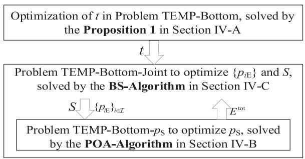

flowchart

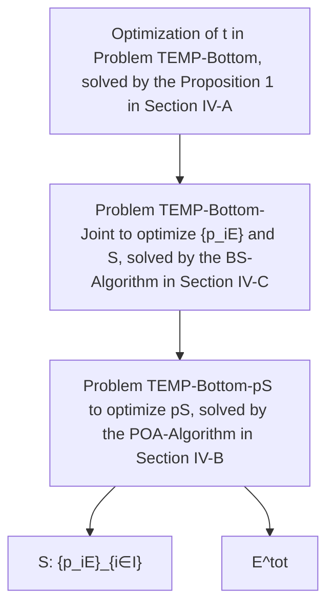

Fig. 2. Methodology of solving Problem TEMP-Bottom.

Then, we further decompose the problem into a top-problem (i.e., Problem TEMP-Bottom-Joint) and a bottom-problem (i.e., Problem TEMP-Bottom-pS). For the solutions of $\{ p _ { i \mathrm { E } } \} _ { i \in \mathcal { I } }$ and i iS, we adopt the bisection search to obtain each USV i’s transmission power for sending jamming signals to the eavesdropper and obtain the offloaded workload S in Section IV-C. Given the values of $\{ p _ { i \mathrm { E } } \} _ { i \in \mathbb { Z } }$ and S, we can transform the Problem TEMP-Bottom- $- p _ { S }$ iinto a canonical monotonic optimization in Section IV-B, which can be solved efficiently.

# A. Solution to Phase II’s Duration T

According to the analysis above, we know the mathematical relationship between energy and variable t: when the values of variables $S , p _ { \mathrm { S } } , \{ p _ { i \mathrm { E } } \} _ { i \in \mathbb { Z } }$ are given, only the energy consumption $E _ { i \mathrm { S } }$ i ifor uploading data $S _ { i }$ changes with the variable t while $\{ E _ { i o } \} _ { i \in \mathcal { T } } , ~ \{ E _ { i \mathrm { E } } \} _ { i \in \mathcal { T } } , ~ E _ { \mathrm { S , B S } }$ and $E _ { \mathrm { { S } } }$ remain the same. Thus, io iminimizing $\{ E _ { i \mathrm { S } } \} _ { i \in \mathcal { I } }$ contributes to minimizing the total energy consumption $E ^ { \mathrm { t o t } }$ i. We present Proposition 1 as follows, which enables us to obtain the optimal t by the monotonic optimization.

Proposition 1: The value of $E _ { i S }$ decreases with the increase iof t, and the optimal value of t can always be achieved at $L _ { \mathrm { d } } -$ $L _ { 0 } - L _ { 1 }$ .

Proof: By (7) and (8), we can get the expression of $E _ { i \mathrm { S } }$ with respect to t as

$$
E _ {i \mathrm{S}} = p _ {i \mathrm{S}} t = \frac {n _ {\mathrm{S}}}{g _ {i \mathrm{S}}} \left(2 ^ {\frac {A + B}{t}} - 2 ^ {\frac {B}{t}}\right) t, \tag {23}
$$

where $\begin{array} { r } { A = \frac { S _ { i } } { W } , B = \frac { \sum _ { j \in { \mathcal { T } } , j \neq i } S _ { j } \delta _ { i j } } { W } } \end{array}$ , and $A + B > B$ . The first = W = Wderivative of (23) with respect to t is

$$
\begin{array}{l} \frac {\partial E _ {i \mathrm{S}}}{\partial t} = \frac {n _ {\mathrm{S}}}{g _ {i \mathrm{S}}} \left[ 2 ^ {\frac {A + B}{t}} \left(1 - \ln 2 \frac {A + B}{t}\right) - 2 ^ {\frac {B}{t}} \left(1 - \ln 2 \frac {B}{t}\right) \right] \\ = \frac {n _ {\mathrm{S}}}{g _ {i \mathrm{S}}} [ h (A + B) - h (B) ], \tag {24} \\ \end{array}
$$

where function $h ( x )$ is defined as

$$
h (x) = 2 ^ {\frac {x}{t}} \left(1 - \ln 2 \frac {x}{t}\right), \quad (x > 0), \tag {25}
$$

and we can get its first derivative with respect to x as follows,

$$
\frac {\partial h (x)}{\partial x} = - x \frac {(\ln 2) ^ {2}}{t ^ {2}} 2 ^ {\frac {x}{t}} <   0, \tag {26}
$$

By (26), we have that function $h ( x )$ monotonically decreases with respect to x. Thus, we have $h ( A + B ) - h ( B ) < 0$ in (24). Thus, we have $\begin{array} { r } { \frac { \partial E _ { i \mathrm { s } } } { \partial t } < 0 . } \end{array}$ iS , which implies that $E _ { i \mathrm { S } }$ monotonically ∂t idecreases with respect to t. Constraint (22) gives the upper bound of t, then $t = L _ { \mathrm { d } } - L _ { 0 } - L _ { 1 }$ is always achieved at the minimum value of Problem TEMP-Bottom. Therefore, Proposition 1 follows.

# B. Monotonic Optimization of pS

In Section IV-A, we have obtained the optimization of t, given the values of S and $\{ p _ { i \mathrm { E } } \} _ { i \in \mathcal { I } }$ , Problem TEMP-Bottom-pS are shown as follows:

$$
\text { TEMP - Bottom- } p _ {\text { S: }} \quad \min E ^ {\text { tot }}
$$

$$
\text { subject   to: } \quad \text { constraints } (1 5), (2 0) \text { and } (2 2),
$$

$$
\text { variables: } p _ {\mathrm{S}}.
$$

Despite the concise form of this problem, we cannot discover the monotonicity in it directly. Thus, we analyze the monotonicity between the energy consumption of different parts in (16) and $p _ { \mathrm { S } }$ . There is an important proposition shown as follows, which enables us to obtain the optimal $p _ { \mathrm { S } }$ by the theory of canonical monotonic optimization.

Proposition 2: The objective function of Problem TEMP-Bottom- $- p _ { S }$ is the difference obetweentwo monotone functions with respect to variable $p _ { \mathrm { S } }$ .

Proof: When the values of $S$ and $\{ p _ { i \mathrm { E } } \} _ { i \in \mathcal { I } }$ are given in Problem TEMP-Bottom-pS, $\{ E _ { i o } \} _ { i \in \mathbb { Z } } , \{ E _ { i \mathrm { S } } \} _ { i \in \mathbb { Z } }$ and $E _ { \mathrm { { S } } }$ , do not change with the variable $p _ { \mathrm { { S } } }$ io i i i. The two parts change, including the energy consumption $\{ E _ { i \mathrm { E } } \} _ { i \in \mathcal { I } }$ for providing cooperative i ijamming to the eavesdropper, and the energy consumption $E _ { \mathrm { S , B S } }$ for offloading partial workload to the BS. We analyze their features as follows.

1) Monotonicity of $E _ { i \mathrm { E } }$ with respect to $p _ { \mathrm { { S } } }$

iBy (10), the security throughput $R _ { \mathrm { S } } ^ { \mathrm { s e c } }$ can be written as

$$
R _ {\mathrm{S}} ^ {\text {sec}} = W \left[ \log_ {2} \left(1 + \frac {p _ {\mathrm{S}} g _ {\mathrm{S}}}{n _ {\mathrm{BS}}}\right) - \log_ {2} \left(1 + \frac {p _ {\mathrm{S}} g _ {\mathrm{SE}}}{n _ {\mathrm{E}} + \sum_ {i = 1} ^ {I} p _ {i \mathrm{E}} g _ {i \mathrm{E}}}\right) \right], \tag {27}
$$

when $\begin{array} { r } { \frac { g _ { \mathrm { S } } } { n _ { \mathrm { B S } } } > \frac { g _ { \mathrm { S E } } } { n _ { \mathrm { E } } + \sum _ { i = 1 } ^ { I } p _ { i \mathrm { E } } g _ { i \mathrm { E } } } } \end{array}$ is feasible, and hence, we can obtain gBS E+Ii=1 iE iE $\begin{array} { r } { \frac { g _ { \mathrm { S } } } { n _ { \mathrm { B S } } + p _ { \mathrm { S } } g _ { \mathrm { S } } } > \frac { - g _ { \mathrm { S E } } ^ { - } } { n _ { \mathrm { E } } + p _ { \mathrm { S } } g _ { \mathrm { S E } } + \sum _ { i = 1 } ^ { I } p _ { i \mathrm { E } } g _ { i \mathrm { E } } } } \end{array}$ . By the first derivative of $R _ { \mathrm { S } } ^ { \mathrm { s e c } }$ n p g nwith respect to $p _ { \mathrm { S } } .$ g p g we can find that

$$
\begin{array}{l} \frac {\partial R _ {\mathrm{S}} ^ {\mathrm{sec}}}{\partial p _ {\mathrm{S}}} = \frac {W}{\ln 2} \left(\frac {g _ {\mathrm{S}}}{n _ {\mathrm{BS}} + p _ {\mathrm{S}} g _ {\mathrm{S}}} - \frac {g _ {\mathrm{SE}}}{n _ {\mathrm{E}} + p _ {\mathrm{S}} g _ {\mathrm{SE}} + \sum_ {i = 1} ^ {I} p _ {i \mathrm{E}} g _ {i \mathrm{E}}}\right) \\ > 0. \tag {28} \\ \end{array}
$$

It follows that $R _ { \mathrm { S } } ^ { \mathrm { s e c } }$ monotonically increases with respect to $p _ { \mathrm { { S } } }$ . Together with the fact that $E _ { i \mathrm { E } }$ decreases with the increase of $R _ { \mathrm { S } } ^ { \mathrm { s e c } }$ in (13), we have that $E _ { i \mathrm { E } }$ monotonically decreases with respect to pS.

2) Monotonicity of $E _ { \mathrm { S , B S } }$ with respect to pS

When (27) is feasible, by eqs. (10) and (12), $E _ { \mathrm { S , B S } }$ can be denoted as follow,

$$
E _ {\mathrm{S}, \mathrm{BS}} = \frac {S}{W \left[ \log_ {2} \left(1 + \frac {p _ {\mathrm{s}}}{C}\right) - \log_ {2} \left(1 + \frac {p _ {\mathrm{s}}}{D}\right) \right]} p _ {\mathrm{s}}, \tag {29}
$$

where $\begin{array} { r } { C = \frac { n _ { \mathrm { B S } } } { g _ { \mathrm { S } } } , D = \frac { n _ { \mathrm { E } } + \sum _ { i = 1 } ^ { I } p _ { i \mathrm { E } } g _ { i \mathrm { E } } } { g _ { \mathrm { S E } } } } \end{array}$ and $C < D$ . Get the first S SE =derivative of $\mathit { \Delta } _ { \vec { E } _ { \mathrm { S } , \mathrm { B S } } } ^ { \mathrm { g _ { \mathrm { s } } } }$ = gwith respect to pS,

$$
\begin{array}{l} \frac {\partial E _ {\mathrm{S} , \mathrm{BS}}}{\partial p _ {\mathrm{S}}} = \frac {S}{W} \frac {\log_ {2} \left(1 + \frac {p _ {\mathrm{S}}}{C}\right) - \frac {p _ {\mathrm{S}}}{\ln 2} \frac {1}{p _ {\mathrm{S}} + C}}{\left[ \log_ {2} \left(1 + \frac {p _ {\mathrm{S}}}{C}\right) - \log_ {2} \left(1 + \frac {p _ {\mathrm{S}}}{D}\right) \right] ^ {2}} \\ - \frac {S}{W} \frac {\log_ {2} \left(1 + \frac {p _ {\mathrm{s}}}{D}\right) - \frac {p _ {\mathrm{s}}}{\ln 2} \frac {1}{p _ {\mathrm{s}} + D}}{\left[ \log_ {2} \left(1 + \frac {p _ {\mathrm{s}}}{C}\right) - \log_ {2} \left(1 + \frac {p _ {\mathrm{s}}}{D}\right) \right] ^ {2}} \\ = \frac {S}{W} \frac {g (C) - g (D)}{\left[ \log_ {2} \left(1 + \frac {p _ {\mathrm{s}}}{C}\right) - \log_ {2} \left(1 + \frac {p _ {\mathrm{s}}}{D}\right) \right] ^ {2}}. \tag {30} \\ \end{array}
$$

As for the function $g ( x )$ , we can get its first derivative with respect to x as

$$
g (x) = \log_ {2} \left(1 + \frac {p _ {\mathrm{S}}}{x}\right) - \frac {p _ {\mathrm{S}}}{\ln 2 (x + p _ {\mathrm{S}})}, \tag {31}
$$

$$
\frac {\partial g (x)}{\partial x} = \frac {- p _ {\mathrm{S}} ^ {2}}{\ln 2 (x + p _ {\mathrm{S}}) ^ {2} x} <   0. \tag {32}
$$

$\mathrm { B y } \left( 3 2 \right)$ , we have that $g ( x )$ monotonically decreases with respect to x. By $C < D$ ( ), we have $g ( C ) - g ( D ) > 0$ . Thus, we have ( ) ( )∂ES,BS > 0, which implies that ES,BS monotonically increases $\frac { \partial E _ { \mathrm { S , B S } } } { \partial p _ { \mathrm { S } } } > 0$ S $E _ { \mathrm { S , B S } }$ ∂p with respect to $p _ { \mathrm { S } }$ .

3) The difference of two monotone functions with respect to variable pS. $p _ { \mathrm { S } }$

With the analysis above, when the values of $S$ and $\{ p _ { i \mathrm { E } } \} _ { i \in \mathbb { Z } }$ are given, we know that $\begin{array} { r } { \sum _ { i = 1 } ^ { I } ( E _ { i o } + E _ { i \mathrm { S } } ) + E _ { \mathrm { S } } } \end{array}$ i iis determined, $\textstyle \sum _ { i = 1 } ^ { I } E _ { i \mathrm { E } }$ i ( io + i ) +monotonically decreases with respect to $p _ { \mathrm { S } } .$ , and $E _ { \mathrm { S , B S } }$ imonotonically increases with respect to pS. As a result, Problem TEMP’s objective function can be denoted as $E ^ { \mathrm { t o t } } =$ $\begin{array} { r } { \big [ \sum _ { i = 1 } ^ { I } ( E _ { i o } + E _ { i \mathrm { S } } ) \stackrel {  } { + } E _ { \mathrm { S } } \big ] + E _ { \mathrm { S } , \mathrm { B } \mathrm { S } } - \big [ - \sum _ { i = 1 } ^ { I } ( E _ { i \mathrm { E } } ) \big ] } \end{array}$ =, which i ( io + i ) + + i ( i )is the difference between two increasing functions with respect to $p _ { \mathrm { S } }$ . Therefore, Proposition 2 follows.

By substituting (27) into constraint (15), we can get a constraint on $p _ { \mathrm { S } }$ ,

$$
p _ {\mathrm{S}} \geq \frac {2 ^ {\frac {S}{W (L _ {1} - l _ {\mathrm{BS}})}} - 1}{\frac {1}{C} - \frac {1}{D} 2 ^ {\frac {S}{W (L _ {1} - l _ {\mathrm{BS}})}}}, \tag {33}
$$

which holds when (27) is feasible and $\begin{array} { r } { l _ { \mathrm { B S } } = \frac { S \rho } { u _ { \mathrm { B S } } } } \end{array}$ Sρ . When $\frac { 2 ^ { \overline { { W ( L _ { 1 } - l _ { \mathrm { B S } } ) } } } - 1 } { \frac { 1 } { C } - \frac { 1 } { D } 2 ^ { \overline { { W ( L _ { 1 } - l _ { \mathrm { B S } } ) } } } }$ 2 W (L1−lBS) −1 S is not larger than $P _ { \mathrm { S } } ^ { \mathrm { m a x } }$ , there is always a feasible solution of $p _ { \mathrm { S } }$ . To exploit the monotonicity in Proposition 2, we transform the Problem TEMP-Bottom-pS into a canonical monotonic optimization [46]. We introduce an auxiliary variable $e ^ { \mathrm { d i f f } }$ and an auxiliary function $F \left( p _ { \mathrm { { S } } } , e ^ { \mathrm { { d i f f } } } \right)$ to complete the transformation, which are shown as follows, respectively.

$$
e ^ {\text { diff }} = E _ {\mathrm{S}, \mathrm{BS}} ^ {\max} - E _ {\mathrm{S}, \mathrm{BS}}, \tag {34}
$$

$$
F \left(p _ {\mathrm{S}}, e ^ {\text { diff }}\right) = - \sum_ {i = 1} ^ {I} E _ {i \mathrm{E}} + e ^ {\text { diff }}. \tag {35}
$$

Here , Emax $E _ { \mathrm { S , B S } } ^ { \mathrm { m a x } }$ is obtained when $p _ { \mathrm { S } }$ takes the value of $P _ { \mathrm { S } } ^ { \mathrm { m a x } }$ and Problem TEMP-Bottom-pS can be transformed equivalently as follows,

$$
\text { TEMP - Bottom - T1: } \quad \max F \left(p _ {\mathrm{S}}, e ^ {\mathrm{diff}}\right)
$$

subject to: constraints 20 , 33 ,

$$
0 \leq e ^ {\text { diff }} \leq E _ {\mathrm{S}, \mathrm{BS}} ^ {\max} - E _ {\mathrm{S}, \mathrm{BS}},
$$

$\mathrm { v a r i a b l e s : } \qquad p _ { \mathrm { S } } , e ^ { \mathrm { d i f f } } .$ pS, ediff. (36)

Remark 1: Similar to [19], we transform (34) into a constraint in the form of an inequality (36) about $e ^ { \mathrm { d i f f } }$ to achieve the transformation as a canonical monotonic optimization problem. In POA-Algorithm, the intersection can be obtained on the upper boundary with bisection search, which means that the maximum value of ediff can always be obtained, such that the transformation between (34) and constraint (36) is reasonable.

We know that function $F \left( p _ { \mathrm { { S } } } , e ^ { \mathrm { { d i f f } } } \right)$ increases with the increase of variables $p _ { \mathrm { { S } } }$ and $e ^ { \mathrm { d i f f } }$ , respectively. When $F \left( p _ { \mathrm { { S } } } , e ^ { \mathrm { { d i f f } } } \right)$ reaches the maximum value, it means that the objective function of Problem TEMP-Bottom-pS achieves the minimum value, and meanwhile the corresponding value of pS is the optimal solution. By the theory in [46], the normal set $\mathcal { G }$ and the conormal set H are determined as follows,

$$
\mathcal {G} = \left\{\left(p _ {\mathrm{S}}, e ^ {\text { diff }}\right) \mid \text { constraints } (2 0) \text { and } (3 6) \right\}, \tag {37}
$$

$$
\mathcal {H} = \left\{\left(p _ {\mathrm{S}}, e ^ {\text { diff }}\right) | \text { constraint } (3 3) \right\}. \tag {38}
$$

The details of our proposed POA-Algorithm are shown in Algorithm 1, and there are three key steps: (i) compute the boundary point $\pi _ { \mathcal { G } } ( \mathbf { z } )$ . (ii) generate the new polyblock from the ( )old one, and (iii) terminate the algorithm when it converges to the optimal solution. For more details, interested readers are referred to our previous work [46].

# C. Joint Optimization of S and $\{ p _ { i E } \} _ { i \in \mathcal { I } }$

In Section IV-A, we have got the optimization of $t , ( \mathrm { i . e . , } L _ { \mathrm { d } } -$ $L _ { 0 } - L _ { 1 } )$ . And we have solved the Problem TEMP-Bottom-pS with the POA-Algorithm when t, S, $\{ p _ { i \mathrm { E } } \} _ { i \in \mathcal { I } }$ are given in i iSection IV-B. In this subsection, we adopt the bisection search to obtain the solutions of S and $\{ p _ { i \mathrm { E } } \} _ { i \in \mathcal { I } }$ , and the Problem i iTEMP-Bottom-Joint is expressed as follows,

TEMP-Bottom-Joint: $E ^ { \mathrm { t o t } }$

$\begin{array} { r l } { \mathrm { s u b j e c t ~ t o : } } & { \displaystyle \frac { g _ { \mathrm { S } } } { n _ { \mathrm { B S } } } > \frac { g _ { \mathrm { S E } } } { n _ { \mathrm { E } } + \sum _ { i = 1 } ^ { I } p _ { i \mathrm { E } } g _ { i \mathrm { E } } } , } \\ & { \mathrm { c o n s t r a i n t s } ( 1 5 ) , \mathrm { ( 1 8 ) a n d } ( 2 1 ) , } \end{array}$

$\mathrm { v a r i a b l e s : } \quad S , \{ p _ { i \mathrm { E } } \} _ { i \in \mathcal { T } } .$ (39)

It’s noted that the constraint (39) is to guarantee the positive $R _ { \mathrm { S } } ^ { \mathrm { s e c } }$ . Due to the coupling relationship between S and $\{ p _ { i \mathrm { E } } \} _ { i \in \mathcal { I } }$ in $R _ { \mathrm { S } } ^ { \mathrm { s e c } }$ i iand the complexity of this problem, we make equivalent transformation on this problem, which enables us to solve the problem with the proposed BS-Algorithm effectively.

With constraint (15), we can derive the feasible range for variable S as

$$
S ^ {\mathrm{tot}} - \frac {L _ {1} u _ {\mathrm{S}}}{\rho} \leq S \leq \frac {L _ {1} R _ {\mathrm{S}} ^ {\mathrm{sec}} u _ {\mathrm{BS}}}{\rho R _ {\mathrm{S}} ^ {\mathrm{sec}} + u _ {\mathrm{BS}}}. \tag {40}
$$

Algorithm 1: Polyblock Outer Approximation Based $\overline { { \mathrm { A l g o - } } }$ rithm (POA-Algorithm) for $p \mathbf { s } .$ .   
1: Initialization: Initialize the vertex set $T_{1}=\{P_{S}^{\max},E_{S,BS}^{\max}\}$ and set the current best value $CBV_{0}=-\infty$ . Set the number of iterations as k=0,
and set the number of iterations as $\Lambda=0$ when CBV remains unchanged. $\delta$ is a small positive number, and $\Lambda_{max}$ is a positive integer.
2: repeat
3: Set $k=k+1$ .
4: From $T_{k}$ , select $z_{k}\in arg\max\{F(\mathbf{z})|\mathbf{z}\in\mathcal{T}_{k}\}$ .
5: Compute $\pi_{\mathcal{G}}(\mathbf{z}_{k})$ with bisection search, the projection of $z_{k}$ on the upper boundary of G.
6: if $\pi_{\mathcal{G}}(\mathbf{z}_{k})=\mathbf{z}_{k}$ , i.e., $z_{k}\in G$ , then $\overline{x}_{k}=z_{k}$ , and $CBV_{k}=F(z_{k})$ .
7: else
8: if $\pi_{\mathcal{G}}(\mathbf{z}_{k})\in\mathcal{G}\cap\mathcal{H}$ and $F(\pi_{\mathcal{G}}(\mathbf{z}_{k}))\geq CBV_{k-1}$ ,
then
9: Set the current best solution $\overline{x}_{k}=\pi_{\mathcal{G}}(\mathbf{z}_{k})$ and $CBV_{k}=F(\pi_{\mathcal{G}}(\mathbf{z}_{k}))$ , and $\Lambda=0$ .
0: else
1: $\overline{x}_{k}=\overline{x}_{k-1}$ and $CBV_{k}=CBV_{k-1}$ , and $\Lambda=\Lambda+1$ .
2: end if
3: Delete the vertex $z_{k}$ from $T_{k}$ .
4: end if
5: until $|F(\mathbf{z}_{k})-\mathbf{CBV}_{k}|\leq\delta$ and $\Lambda\geq\Lambda_{max}$ .
6: Output: $p_{S}^{*}=\overline{x}_{k}$ .

By combining constraint (18) and constraint (40), we can determine that the value range of S should satisfy

$$
\max \left\{0, S ^ {\text { tot }} - \frac {L _ {1} u _ {\mathrm{S}}}{\rho} \right\} \leq S \leq \min \left\{S ^ {\text { tot }}, \frac {L _ {1} R _ {\mathrm{S}} ^ {\text { sec }} u _ {\mathrm{BS}}}{\rho R _ {\mathrm{S}} ^ {\text { sec }} + u _ {\mathrm{BS}}} \right\}. \tag {41}
$$

For the convenience, we use $\underline { S }$ to represent the lower bound of the value of S, i.e., represent the upper $\begin{array} { r } { \underline { { S } } = \operatorname* { m a x } \{ 0 , S ^ { \mathrm { { t o t } } } - \frac { L _ { 1 } u _ { \mathrm { { S } } } } { \rho } \} } \end{array}$ , and use en the equ $S ^ { \mathrm { t o t } }$ toent transformation of Problem TEMP-Bottom-Joint is

TEMP-Bottom-T2: $E ^ { \mathrm { t o t } }$

subject to: constraints 21 , 39 ,

$$
\underline {{S}} \leq S \leq S ^ {\mathrm{tot}}, \tag {42}
$$

$$
\frac {S}{R _ {\mathrm{S}} ^ {\mathrm{sec}}} + l _ {\mathrm{BS}} \leq L _ {1},
$$

variables: {p E} ∈I , S. (43)

Since it also hides constraint on variable $\{ p _ { i \mathrm { E } } \} _ { i \in \mathcal { I } }$ in coni istraint (15), we need to check whether constraints (39) and (43) are feasible when we perform bisection search algorithm (BS-Algorithm) on interval $[ \underline { { S } } , S ^ { \mathrm { t o t } } ]$ for S and interval $[ 0 , P _ { i } ^ { \mathrm { m a x } } ]$

Algorithm 2: The Polyblock Outer Approximation and Bisection Search Based Algorithm (PAS-Algorithm) to Solve Problem TEMP-Bottom.   
1: Initialization: Initialize the lower bound of $\{p_{iE}\}_{\forall i\in I}$ as $\{p_{iE}\} = \{0\}$ , $\hat{E}^{\mathrm{tot}} = +\infty$ , $\{\zeta_i\}_{i\in I}$ and $\zeta$ are small positive numbers, $i = 1$ .

2: while $(i\leq I)$ 3: while $(P_{iE}^{\max} - p_{iE}) > \zeta_i$ 4: Adopt Steps 13-27 to obtain $E^{\mathrm{tot}}$ with $p_{iE} = P_{iE}^{\max}$ and $p_{iE} = p_{iE}$ respectively, denote as $E^{\mathrm{tot}}(P_{iE}^{\max})$ and $E^{\mathrm{tot}}(\underline{p_{iE}})$ .

5: if $E^{\mathrm{tot}}(P_{iE}^{\max}) < E^{\mathrm{tot}}(\underline{p_{iE}})$ , then

6: Set $p_{iE} = P_{iE}^{\max}$ , $\underline{p_{iE}} = (\underline{p_{iE}} + P_{iE}^{\max}) / 2$ and $\hat{E}^{\mathrm{tot}} = E^{\mathrm{tot}}(P_{iE}^{\max})$ .

7: else

8: Set $p_{iE} = p_{iE}^{\max}$ , $P_{iE}^{\max} = (p_{iE} + P_{iE}^{\max}) / 2$ and $\hat{E}^{\mathrm{tot}} = E^{\mathrm{tot}}(\underline{p_{iE}})$ .

9: end if

10: end while

11: Set $i = i + 1$ , and adopt Steps 3-10 to proceed the next cycle.

12: end while

13: while $(S^{\mathrm{tot}} - \underline{S}) > \zeta$ do

14: Compute the corresponding $E^{\mathrm{tot}}$ with $p_S$ obtained by POA-Algorithm, with $S = S^{\mathrm{tot}}$ and $S = \underline{S}$ , respectively, donote as $p_{S1}$ , $E_1^{\mathrm{tot}}$ and $p_{S2}$ , $E_2^{\mathrm{tot}}$ .

15: if $E_1^{\mathrm{tot}} < E_2^{\mathrm{tot}}$ , then

16: Set $E^{\mathrm{cur}} = E_1^{\mathrm{tot}}$ , $S^{\mathrm{cur}} = S^{\mathrm{tot}}$ , $p_S = p_{S1}$ and $\underline{S} = (\underline{S} + S^{\mathrm{tot}}) / 2$ .

17: else

18: Set $E^{\mathrm{cur}} = E_2^{\mathrm{tot}}$ , $S^{\mathrm{cur}} = \underline{S}$ , $p_S = p_{S2}$ and $S^{\mathrm{tot}} = (\underline{S} + S^{\mathrm{tot}}) / 2$ .

19: end if

20: Check the relationship between constraints (20) and (33).

21: if constraints (20) and (33) don't intersect, then

22: Continue.

23: end if

24: if $E^{\mathrm{cur}} < \hat{E}^{\mathrm{tot}}$ , constraints (39) and (43) are feasible, then

25: Set $\hat{S} = S^{\mathrm{cur}}$ , $\hat{p}_S = p_S$ and $\hat{E}^{\mathrm{tot}} = E^{\mathrm{cur}}$ .

26: end if

27: end while

28: Set $\{\hat{p}_{iE}\}_{i\in I} = \{p_{iE}\}_{i\in I}$ .

29: Output: $\hat{S}, \{\hat{p}_{iE}\}_{i\in I}, \hat{p}_S$ .

for $\{ p _ { i \mathrm { E } } \} _ { i \in \mathcal { I } }$ . It is worth noting that $\begin{array} { r } { S \le \frac { L _ { 1 } R _ { \mathrm { S } } ^ { \mathrm { s c c } } u _ { \mathrm { B S } } } { \rho R _ { \mathrm { S } } ^ { \mathrm { s c c } } + u _ { \mathrm { B S } } } } \end{array}$ is equivalent to $\frac { S } { R _ { \mathrm { s } } ^ { \mathrm { s e c } } } + l _ { \mathrm { B S } } \leq L _ { 1 }$ (i.e., constraint (43)).

RRemark 2: With the given target positions $\{ w _ { i } \} _ { i \in \mathbb { Z } }$ of USVs and the closed-form solution to $t ,$ i ithe Problem TEMP-Bottom is tackled by alternatively performing the POA-Algorithm of optimizing $p _ { \mathrm { { S } } }$ and the BS-Algorithm of optimizing $\{ p _ { i \mathrm { E } } \} _ { i \in \mathcal { I } }$ i iand S. For simplicity, the algorithm of solving Problem TEMP-Bottom is referred to as PAS-Algorithm.

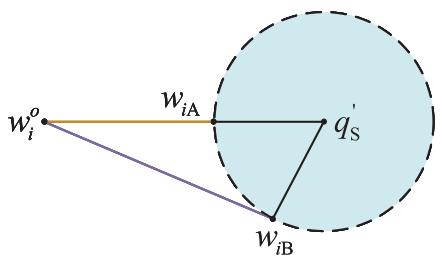

text_image

w_i^o
w_{iA}
q_s'
w_{iB}

Fig. 3. The illustration for USV i to choose w∗ among the feasible positions.

# V. SOLUTION TO THE PROBLEM TEMP

In this section, we focus on obtaining the optimal solution to Problem TEMP. We first analyze the geometric relationship between the initial positions $\{ { \pmb w } _ { i } ^ { o } \} _ { i \in \mathbb { Z } }$ and the target positions $\{ w _ { i } \} _ { i \in \mathbb { Z } }$ i i, and propose an important proposition to determine $\{ w _ { i } \} _ { i \in \mathbb { Z } }$ . Then, we take advantage of the geometric relationship i iand propose a heuristic algorithm, i.e., CASE-Algorithm, to tackle Problem TEMP, which invokes the PAS-Algorithm proposed for the Problem TEMP-Bottom to obtain $E ^ { \mathrm { t o t } }$ and updates the solution to $\{ w _ { i } \} _ { i \in \mathbb { Z } }$ with the cross-entropy criterion.

# A. Geometric Relationship for Obtaining $\{ w _ { i } \} _ { i \in \mathbb { Z } }$

Considering that USVs move to the feasible communication region, there always exists an optimal $\boldsymbol { w } _ { i } ^ { * }$ among the feasible ipositions, we propose an important proposition to determine it.

Proposition $3 ;$ The minimal energy consumption for USVs scheduling is obtained when each USV i moves to the feasible communication range in a straight line to $\mathrm { H A P } ^ { \prime } \mathrm { s }$ projection ${ \pmb q } _ { \mathrm { S } } ^ { \prime }$ on the sea surface.

Proof: In Fig. 3, position ${ w _ { i } } _ { \mathrm { A } }$ is the first intersection with the feasible communication range (i.e., the feasible communication range that meets the constraint (19) for each USV i to upload data) in a straight line from $\pmb { w } _ { i } ^ { o }$ to $q _ { \mathrm { S } } ^ { \prime }$ , while position ${ \pmb w } _ { i \mathrm { B } }$ is any iposition on the same circle that does not coincide with position $w _ { i \mathrm { A } } . \mathrm { B y } \left( 5 \right)$ , the channel power gain $g _ { i \mathrm { S } }$ between the HAP and i iUSV i takes the same value when USV i moves to the position ${ w _ { i \mathrm { A } } }$ or ${ \pmb w } _ { i \mathrm { B } }$ , further by (7), USV i’s transmission power takes i ithe same value too.

With the energy consumption model in (3), at position ${ w _ { i \mathrm { A } } }$ and position ${ \pmb w } _ { i \mathrm { B } }$ i, the energy consumed by USV i to complete ithe scheduling is separately calculated as

$$
E _ {i o \mathrm{A}} = p _ {o} \frac {\left| \boldsymbol {w} _ {i} ^ {o} - \boldsymbol {w} _ {i \mathrm{A}} \right|}{v _ {o}}, \tag {44}
$$

$$
E _ {i o \mathrm{B}} = p _ {o} \frac {\left| \boldsymbol {w} _ {i} ^ {o} - \boldsymbol {w} _ {i \mathrm{B}} \right|}{v _ {o}}. \tag {45}
$$

For the triangle, the lengths of the three sides satisfy

$$
\left| \boldsymbol {w} _ {i} ^ {o} - \boldsymbol {q} _ {\mathrm{S}} ^ {\prime} \right| <   \left| \boldsymbol {w} _ {i} ^ {o} - \boldsymbol {w} _ {i \mathrm{B}} \right| + \left| \boldsymbol {w} _ {i \mathrm{B}} - \boldsymbol {q} _ {\mathrm{S}} ^ {\prime} \right|. \tag {46}
$$

Let $R ^ { \prime }$ be the radius of the feasible communication range, in Fig. 3, the length of side $| \mathbf { \boldsymbol { w } } _ { i } ^ { o } - \mathbf { \boldsymbol { q } } _ { \mathrm { { S } } } ^ { \prime } |$ as well as the sum of side $| { \pmb w } _ { i } ^ { o } - { \pmb w } _ { i \mathrm { B } } | ^ { * } \mathrm { \bf s }$ i length and side $| \pmb { w } _ { i \mathrm { B } } - \pmb { q } _ { \mathrm { S } } ^ { \prime } | ^ { 3 } \mathrm { \bf S }$ length can be irepresented as follows,

$$
\left| \boldsymbol {w} _ {i} ^ {o} - \boldsymbol {q} _ {\mathrm{S}} ^ {\prime} \right| = \left| \boldsymbol {w} _ {i} ^ {o} - \boldsymbol {w} _ {i \mathrm{A}} \right| + R ^ {\prime}, \tag {47}
$$

$$
\left| \boldsymbol {w} _ {i} ^ {o} - \boldsymbol {w} _ {i \mathrm{B}} \right| + \left| \boldsymbol {w} _ {i \mathrm{B}} - \boldsymbol {q} _ {\mathrm{S}} ^ {\prime} \right| = \left| \boldsymbol {w} _ {i} ^ {o} - \boldsymbol {w} _ {i \mathrm{B}} \right| + R ^ {\prime}. \tag {48}
$$

By substituting (47) and (48) into (46) and taking simplification on (46), we have that

$$
\left| \boldsymbol {w} _ {i} ^ {o} - \boldsymbol {w} _ {i \mathrm{A}} \right| <   \left| \boldsymbol {w} _ {i} ^ {o} - \boldsymbol {w} _ {i \mathrm{B}} \right|, \tag {49}
$$

hence, combined with eqs. (44) and (45), we have $E _ { i o \mathrm { A } } <$ $E _ { i o \mathrm { B } }$ io, which implies that the minimization energy consumption $\{ E _ { i o } \} _ { i \in \mathcal { I } }$ for USVs scheduling in Phase I is obtained when each io iUSV moves to the target region in a straight line to ${ \pmb q } _ { \mathrm { S } } ^ { \prime }$ . Therefore, Proposition 3 follows. -

With Proposition 3, there always exists a distance ratio $\alpha _ { i }$ between $( w _ { i } - q _ { \mathrm { S } } ^ { \prime } )$ and $( w _ { i } ^ { o } - \dot { q } _ { \mathrm { S } } ^ { \prime } )$ as follows,

$$
\alpha_ {i} = \frac {\boldsymbol {w} _ {i} - \boldsymbol {q} _ {\mathrm{S}} ^ {\prime}}{\boldsymbol {w} _ {i} ^ {o} - \boldsymbol {q} _ {\mathrm{S}} ^ {\prime}}, i \in \mathcal {I}, \alpha_ {i} \in [ 0, 1 ], \tag {50}
$$

correspondingly, each position ${ \pmb w } _ { i }$ is calculated as follows,

$$
\boldsymbol {w} _ {i} = \alpha_ {i} \boldsymbol {w} _ {i} ^ {o} + (1 - \alpha_ {i}) \boldsymbol {q} _ {\mathrm{S}} ^ {\prime}, i \in \mathcal {I}. \tag {51}
$$

# B. Solutions to Problem TEMP

The target position ${ \pmb w } _ { i }$ is represented with an auxiliary variable $\alpha _ { i } .$ i. Thus, we can obtain the optimal $\{ { \pmb w } _ { i } ^ { * } \} _ { i \in { \mathscr { T } } }$ through ioptimizing $\{ \alpha _ { i } \} _ { i \in \mathbb { Z } }$ i i. Considering the high computational comi iplexity of enumeration, we propose a Code bAsed croSs Entropy algorithm, referred to as CASE-Algorithm, to solve Problem TEMP by alternatively searching the optimal distance ratios $\{ \alpha _ { i } ^ { * } \} _ { i \in \mathcal { I } }$ based on the cross entropy theory and optimizing the i ibottom problem by the PAS-Algorithm.

Referred to [47], the cross entropy based optimization is to obtain the optimal solution by the random sampling in which the sample of every feasible solution is encoded as a binary number. In the following, we first present how to solve Problem TEMP based on the key idea of cross entropy based optimization in detail.

First, we encode each distance ratio $\alpha _ { i }$ as a N -bit binary number $a _ { i 1 } a _ { i 2 } \cdot \cdot \cdot a _ { i N }$ , satisfying

$$
\alpha_ {i} = \frac {\sum_ {l = 1} ^ {N} a _ {i l} 2 ^ {N - l}}{2 ^ {N} - 1}, \forall i \in \mathcal {I}. \tag {52}
$$

Furthermore, each binary element $a _ { i l }$ is modeled as a random ilvariable following a Bernoulli distribution with probability $\phi _ { i l }$ , i.e.,

$$
\operatorname * {P r} (a _ {i l}) = \phi_ {i l} ^ {a _ {i l}} \left(1 - \phi_ {i l}\right) ^ {1 - a _ {i l}}, \forall i \in \mathcal {I}, \forall l \in \mathcal {N}. \tag {53}
$$

Second, we randomly generate K sampling profiles of $\{ \alpha _ { i } \} _ { i \in \mathbb { Z } } \ \mathrm { ~ b y ~ } \ ( 5 3 )$ file of each . $\alpha _ { i }$ $a _ { i 1 } ^ { ( k ) } a _ { i 2 } ^ { ( k ) } \dots a _ { i N } ^ { ( k ) } , \forall k \in \mathcal { K } = \{ 1 , 2 , . . . , K \}$ a k1 a k2

i i iN =Third, for the k-th sampling profile $\big \{ a _ { i 1 } ^ { ( k ) } a _ { i 2 } ^ { ( k ) } \cdot \cdot \cdot a _ { i N } ^ { ( k ) } \big \} _ { i \in \mathcal { T } } ,$ a k2 . . . a k  ∈I , we have {α(k $\{ \alpha _ { i } ^ { ( k ) } \} _ { i \in \mathbb { Z } }$ i i iN iby (52). Then, we obtain the corresponding $E ^ { \mathrm { t o t } }$ ibased on $\{ \alpha _ { i } ^ { ( k ) } \} _ { i \in \mathbb { Z } }$ by PAS-Algorithm.

i iFourth, we sort the sampling profiles according to the corresponding $E ^ { \mathrm { t o t } }$ in the descending order, and select the first $\hat { K }$ best sampling profiles. We then update the $\{ \phi _ { i l } \} _ { i \in \mathbb { Z } , l \in \mathcal { N } }$ for the next-round random sampling by $\hat { K }$ il i ,lsampling profiles.

Algorithm 3: Code bAsed croSs Entropy Algorithm (CASE-Algorithm) to Solve Problem TEMP.   
1: Initialization: Initialize $\phi_{il} = 0.5, \forall i \in \mathcal{I}, \forall l \in \mathcal{N}$ , and set the gap $\epsilon$ as a small positive number.
2: while 1 do
3: Randomly generate $K$ sampling profiles of $\{\alpha_i\}_{i \in \mathcal{I}}$ , with the current $\{\phi_{il}\}_{i \in \mathcal{I}, l \in \mathcal{N}}$ by (53), and the sampling profiles are feasible with respect to constraints (4) and (19).
4: for each sampling profile $\{a_{i1}^{(k)} a_{i2}^{(k)} \ldots a_{iN}^{(k)}\}_{i \in \mathcal{I}}, k \in \mathcal{K}$ do
5: Calculate $\{\alpha_i^{(k)}\}_{i \in \mathcal{I}}$ with sampling profile $\{a_{i1}^{(k)} a_{i2}^{(k)} \ldots a_{iN}^{(k)}\}_{i \in \mathcal{I}}$ by (52), then invoke PAS-Algorithm to obtain $E^{\mathrm{tot}}$ , $S$ , $\{p_{iE}\}_{i \in \mathcal{I}}$ , and $p_S$ .
6: end for
7: Reorder $K$ sampling profiles with the corresponding $E^{\mathrm{tot}}$ in the descending order.
8: With the first $\hat{K}$ best sampling profiles, set and update $\{\phi_{il}^{\mathrm{update}}\}_{i \in \mathcal{I}, l \in \mathcal{N}}$ by (54).
9: if $\max_{\forall i \in \mathcal{I}, \forall l \in \mathcal{N}} |\phi_{il}^{\mathrm{update}} - \phi_{il}| < \epsilon$ , then
10: Break.
11: end if
12: Set $\phi_{il} = \phi_{il}^{\mathrm{update}}, \forall i \in \mathcal{I}, l \in \mathcal{N}$ .
13: end while
14: Set $\{\boldsymbol{w}_i^*\}_{i \in \mathcal{I}}, \{p_{iE}^*\}_{i \in \mathcal{I}}, S^*, p_S^*$ as the solutions to the current sampling profile $\{\alpha_i^{(1)}\}_{i \in \mathcal{I}}$ .
15: Output: $\{\boldsymbol{w}_i^*\}_{i \in \mathcal{I}}, \{p_{iE}^*\}_{i \in \mathcal{I}}, S^*, p_S^*$ .

Specifically, the $\{ \phi _ { i l } \} _ { i \in \mathbb { Z } , l \in \mathcal { N } }$ is updated as follows,

$$
\phi_ {i l} ^ {\text { update }} = (1 - \sigma) \phi_ {i l} + \sigma \phi_ {i l} ^ {*}, \forall i \in \mathcal {I}, \forall l \in \mathcal {N}, \tag {54}
$$

where σ means the weight parameter, and each $\phi _ { i l } ^ { * }$ satisfies

$$
\phi_ {i l} ^ {*} = \frac {1}{\hat {K}} \sum_ {k = 1} ^ {\hat {K}} a _ {i l} ^ {(k)}, \forall i \in \mathcal {I}, \forall l \in \mathcal {N}. \tag {55}
$$

Finally, we check the changes of $\{ \phi _ { i l } \} _ { i \in \mathbb { Z } , l \in \mathcal { N } }$ , and terminate the iteration when the changes are less than the threshold . When the stopping criterion is satisfied, we have the optimal solution to Problem TEMP. Having introduced the key procedures, we present the CASE-Algorithm in Algorithm 3.

# VI. NUMERICAL RESULTS

In this section, we conduct simulations to validate our proposed algorithms, including the POA-Algorithm, PAS-Algorithm and the CASE-Algorithm. The simulation parameters are set as follows. The hovering position of HAP is $\pmb { q } _ { \mathrm { S } } = ( 0 , 0 , 3 0 0 ) \mathrm { m }$ , and its communication range radius R is set = ( )as 500 m. The eavesdropper hovers at $\pmb { q } _ { \mathrm { E } } = ( - 3 5 0 , 2 8 0 , 2 0 0 ) \mathrm { m } ,$ and the BS is located at $\pmb { w } _ { \mathrm { B S } } = ( 4 0 0 , 0 , 5 0 ) \mathrm { n }$ ). We make the = ( )delay of Phase I be within 80 seconds, i.e. $L _ { 0 } = 8 0 \mathrm { s }$ , and in =Phase III of our model, the time delay for edge computation is limited to 5 seconds, i.e. $L _ { 1 } = 5 \mathrm { s }$ . For the system, we require all

TABLE II PARAMETERS DESCRIPTION 

<table><tr><td>Parameters</td><td>Descriptions</td><td>Values</td></tr><tr><td> $v_o$ </td><td>The speed of USVs</td><td>5m/s</td></tr><tr><td> $p_o$ </td><td>The power of USVs</td><td>50W</td></tr><tr><td> $\beta_o$ </td><td>Reference channel power gain</td><td>-30dB</td></tr><tr><td> $W$ </td><td>The channel bandwidth</td><td>4MHz</td></tr><tr><td> $u_S$ </td><td>The computing capacity of HAP</td><td>100Mbps</td></tr><tr><td> $u_{BS}$ </td><td>The computing capacity of BS</td><td>400Mbps</td></tr><tr><td> $\rho$ </td><td>The number for processing one bit</td><td>100cycles</td></tr><tr><td> $\eta_S$ </td><td>Energy efficiency constant of HAP</td><td> $10^{-24}$ </td></tr><tr><td> $P_i^{\max}, i \in \mathcal{I}$ </td><td>The maximum power of USVs</td><td>1W</td></tr><tr><td> $P_S^{\max}$ </td><td>The maximum power of HAP</td><td>5W</td></tr><tr><td> $\{n_S, n_{BS}, n_E\}$ </td><td>The background noise power</td><td> $\{1, 1, 1\} \times 10^{-8} \text{W}$ </td></tr><tr><td> $\{\zeta_i, \zeta\}, i \in \mathcal{I}$ </td><td>The algorithm threshold</td><td> $\{5, 5\} \times 10^{-3}$ </td></tr><tr><td> $\{\delta, \Lambda_{\max}\}$ </td><td>The algorithm threshold</td><td> $\{10^{-3}, 25\}$ </td></tr></table>

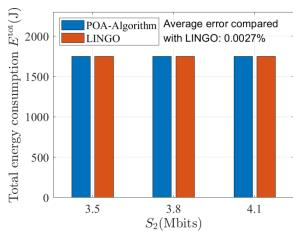

bar

| S2 (Mbits) | POA-Algorithm | LINGO |
|---|---|---|
| 3.5 | 1750 | 1750 |
| 3.8 | 1750 | 1750 |
| 4.1 | 1750 | 1750 |
Average error compared with LINGO: 0.0027%

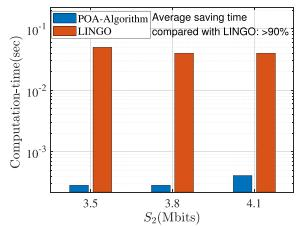

bar

| S2 (Mbits) | POA-Algorithm (sec) | LINGO (sec) |
|---|---|---|
| 3.5 | 0.001 | 0.1 |
| 3.8 | 0.001 | 0.1 |
| 4.1 | 0.003 | 0.1 |

Fig. 4. The optimality and computational efficiency of POA-Algorithm. (a) The comparison of Etot over $S _ { 2 } .$ . (b) The comparison of computational efficiency over $S _ { 2 }$ .

tasks to be completed in 87.5 seconds, i.e. $L _ { \mathrm { d } } = 8 7 . 5 \mathrm { s }$ , and the =value of t is 2.5 s accordingly. The other parameter settings are shown in Table II. Besides, all the numerical results are obtained by a PC of Intel(R) Core(TM) i7-10700 CPU @2.90 GHz.

# A. Numerical Results of Problem TEMP-Bottom

In this subsection, we validate the performance of POA-Algorithm and PAS-Algorithm in terms of optimality, computational efficiency and the convergence. For the performance evaluation, we consider a scenario with 2 USVs, which are initially located in $\pmb { w } _ { 1 } ^ { o } = ( - 3 5 0 , 3 2 0 , 0 ) \mathrm { m }$ and $\pmb { w } _ { 2 } ^ { o } = ( - 3 5 0 , - 3 3 0 , 0 ) \mathrm { m }$ = ( ), and eventually located in $\mathbf { \delta } _ { w _ { 1 } } =$ = ( )−316.93, 289.76, 0 m and $\pmb { w } _ { 2 } = ( - 2 5 6 . 3 0 , - 2 4 1 . 6 5 , 0 ) \mathrm { m } , \mathrm { r e } -$ spectively.

In Fig. 4, we validate the optimality and efficiency of our proposed POA-Algorithm with different $S _ { 2 }$ when the workload $S _ { 1 }$ is set as 3.5Mbits. For the verification target, we use the global solver (LINGO) as a benchmark. As shown in Fig. 4(a), we can find that in comparison with LINGO, the average error of the POA-Algorithm is sufficiently small, i.e., 0.0027%. It implies that the POA-Algorithm can achieve the optimality. Fig. 4(b) shows that the POA-Algorithm can save more than 90% computation time in comparison to LINGO, which implies the computational efficiency of the POA-Algorithm.

Fig. 5 validates the optimality and efficiency of our proposed PAS-Algorithm with different $S _ { 2 }$ . As shown in Fig. 5(a), in comparison with LINGO, the average error of the PAS-Algorithm is sufficiently small, i.e., 0.219%. It implies that the PAS-Algorithm can achieve the optimality. Fig. 5(b) shows that the PAS-Algorithm can save 51.154% computation time on average in comparison to LINGO, which implies the computational efficiency of the PAS-Algorithm.

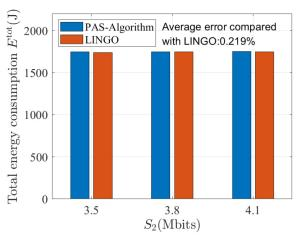

bar

| S2 (Mbits) | PAS-Algorithm | LINGO |
|---|---|---|
| 3.5 | 1750 | 1750 |
| 3.8 | 1750 | 1750 |
| 4.1 | 1750 | 1750 |

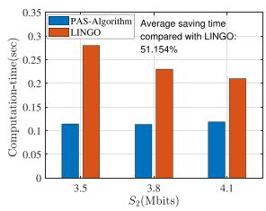

bar

| S2 (Mbits) | PAS-Algorithm | LINGO |
|---|---|---|
| 3.5 | 0.11 | 0.29 |
| 3.8 | 0.11 | 0.23 |
| 4.1 | 0.11 | 0.21 |
Average saving time compared with LINGO: 51.154%

Fig. 5. The optimality and computational efficiency of PAS-Algorithm. (a) The comparison of Etot over $S _ { 2 } .$ . (b) The comparison of computational efficiency over $S _ { 2 }$ .   
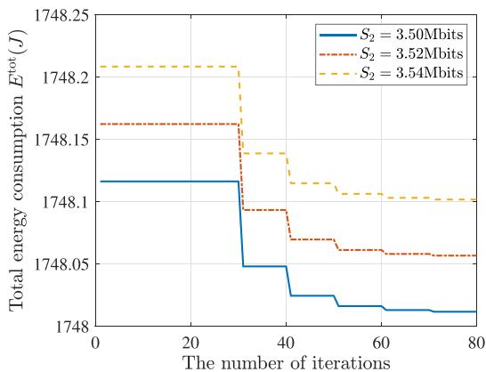

line

| The number of iterations | S₂ = 3.50Mbits | S₂ = 3.52Mbits | S₂ = 3.54Mbits |
| ------------------------ | -------------- | -------------- | -------------- |
| 0                        | 1748.1         | 1748.16        | 1748.2         |
| 20                       | 1748.1         | 1748.16        | 1748.2         |
| 30                       | 1748.05        | 1748.1         | 1748.2         |
| 40                       | 1748.0         | 1748.08        | 1748.15        |
| 60                       | 1748.0         | 1748.06        | 1748.1         |
| 80                       | 1748.0         | 1748.05        | 1748.1         |

Fig. 6. The convergence of PAS-Algorithm.

In Fig. 6, we verify the convergence of PAS-Algorithm with different $S _ { 2 }$ . When $S _ { 2 }$ takes the value as [3.50,3.52,3.54] Mbits in turn, we can find that after about 60 iterations on average, the PAS-Algorithm eventually converges to a fixed value for any $S _ { 2 }$ . It implies that we can obtain the minimal $E ^ { \mathrm { t o t } }$ quickly.

# B. Numerical Results of CASE-Algorithm

In this subsection, we want to validate the performance of CASE-Algorithm. The difference is that the target positions $\{ w _ { i } \} _ { i \in \mathbb { Z } }$ need to be optimized. Also, the parameters are set as i ifollows: $N = 7 , \mathrm { K } = 1 0 0 0 , \hat { K } = 5 , \epsilon = 0 . 0 0 1$ . The remaining = = = =parameter settings are consistent with the Section VI-A.

In Fig. 7, we validate the CASE-Algorithm in terms of optimality and computational efficiency. For comparison, we also evaluate the total energy consumption obtained by the enumeration method and random selection method, and the computation time required by the enumeration method and random selection method. In the enumeration method, we set the step size of $\{ \alpha _ { i } \} _ { i \in \mathbb { Z } }$ as 1/200, and we enumerate all the possible $\{ w _ { i } \} _ { i \in \mathcal { I } }$ i i i iin a brute force. In the random selection method, we randomly generate 2000 sets of feasible $\{ \alpha _ { i } \} _ { i \in \mathbb { Z } }$ , then we convert $\{ \alpha _ { i } \} _ { i \in \mathbb { Z } }$ i i i iinto position samples, and the best one is selected. It is not surprising to see that the total energy consumption $E ^ { \mathrm { t o t } }$ increases

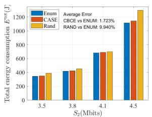

bar

| S2 (Mbits) | Enum | CASE | Rand |
|---|---|---|---|
| 3.5 | 350 | 360 | 400 |
| 3.8 | 410 | 420 | 450 |
| 4.1 | 700 | 710 | 720 |
| 4.5 | 1150 | 1160 | 1280 |
Average Error: CBCE vs ENUM: 1.723%; RAND vs ENUM: 9.940%.

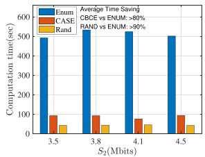

bar

| S2 (Mbits) | Enum | CASE | RAND |
|---|---|---|---|
| 3.5 | 500 | 80 | 40 |
| 3.8 | 500 | 80 | 40 |
| 4.1 | 500 | 70 | 40 |
| 4.5 | 500 | 80 | 40 |
Average Time Saving CBCE vs ENUM: >80% RAND vs ENUM: >90%

Fig. 7. The optimality and computational efficiency of CASE-Algorithm. (a) The comparison of Etot over $S _ { 2 } .$ (b) The comparison of computation time over $S _ { 2 } .$ .   
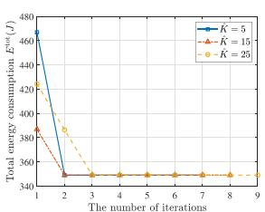

line

| The number of iterations | K = 5 | K = 15 | K = 25 |
| ------------------------ | ----- | ------ | ------ |
| 1                        | 460   | 380    | 380    |
| 2                        | 340   | 340    | 340    |
| 3                        | 340   | 340    | 340    |
| 4                        | 340   | 340    | 340    |
| 5                        | 340   | 340    | 340    |
| 6                        | 340   | 340    | 340    |
| 7                        | 340   | 340    | 340    |
| 8                        | 340   | 340    | 340    |
| 9                        | 340   | 340    | 340    |

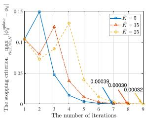

line

| The number of iterations | K = 5 | K = 15 | K = 25 |
| ------------------------ | ----- | ------ | ------ |
| 1                        | 0.1   | 0.1    | 0.1    |
| 2                        | 0.15  | 0.08   | 0.07   |
| 3                        | 0.05  | 0.13   | 0.14   |
| 4                        | 0.02  | 0.04   | 0.06   |
| 5                        | 0.01  | 0.02   | 0.03   |
| 6                        | 0.003 | 0.01   | 0.01   |
| 7                        | 0.003 | 0.003  | 0.003  |
| 8                        | 0.003 | 0.003  | 0.003  |
| 9                        | 0.003 | 0.003  | 0.003  |

Fig. 8. The convergence of CASE-Algorithm over $\hat { K } .$ . (a) Energy consumption Etot over Kˆ . (b) The stopping criterion over $\hat { K }$ .

with the increase of the computation workload size in Fig. 7. Moreover, the average error of the proposed CASE-Algorithm compared with the enumeration method is sufficiently small, i.e., 1.723%, which is smaller than that of random selection method, i.e., 9.940%. It implies that the proposed CASE-Algorithm can obtain the approximately optimal solution. In terms of computation efficiency, the proposed CASE-Algorithm can save more than 80% computation time in comparison with the enumeration method, while random selection method can save more than 90% computation time. It implies that the proposed CASE-Algorithm has high computation efficiency.

In Fig 8, we aim to validate the convergence of CASE-Algorithm over $\hat { K }$ at the threshold $\epsilon$ of 0.001. As shown in Fig. 8(a), we can always obtain the same minimal $E ^ { \mathrm { t o t } }$ under the different settings of $\hat { K }$ . It implies that the value of $\hat { K }$ does not affect the solution. Furthermore, we can find that the convergence speed decreases with the increase of $\hat { K }$ . It is because that with the increase of $\hat { K }$ , more sampling profiles are selected to update probabilities $\{ \phi _ { i , l } \} _ { i \in \mathcal { I } , l \in \mathcal { N } } .$ , however, the variety of i,l i ,lselected sampling profiles would lead to more deviation of the optimal probabilities, and hence slower convergence.

In Fig. 9, we aim to show the cost in computation offloading when the eavesdropper is in different positions. As shown in Fig. 9, for each eavesdropper position, the total energy consumption $E ^ { \mathrm { t o t } }$ increases obviously with respect to $S _ { 2 }$ , while the energy consumption on communication and computation $E$ does not. This is because that when optimizing the total energy consumption $E ^ { \mathrm { t o t } }$ , each part’s energy consumption will not be optimized individually.

In Fig. 10, we aim to study the impact of USVs’ maximum transmission power on the system. Fig. 10(a) shows that the value of $\alpha _ { 2 }$ decreases with the increase of workload size $S _ { 2 }$ , while $\alpha _ { 1 }$ remains almost the same with the unchanged workload size $S _ { 1 }$ , this implies that USV 2 moves farther, while USV 1 moves to almost the same position, to enter the feasible communication area, i.e., the transmission power cannot exceed USV’s capacity in constraint (19). Moreover, Fig. 11(a) and (b) show that the smaller the value of $P _ { i } ^ { \mathrm { m a x } }$ , the more restrictiveness itakes on USVs scheduling, which requires a longer moving distance to meet the communication conditions, i.e., a higher energy consumption.

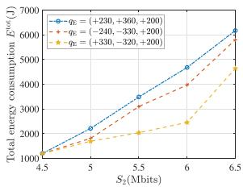

line

| S2 (Mbits) | Total energy consumption (Gw) |
| ---------- | ----------------------------- |
| 4.5        | 1000                          |
| 5.0        | 2000                          |
| 5.5        | 3500                          |
| 6.0        | 4500                          |
| 6.5        | 6000                          |

(a)

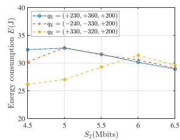

line

| S₂ (Mbits) | qₑ = (+230, +360, +200) | qₑ = (-240, -330, +200) | qₑ = (+330, -320, +200) |
| ---------- | ------------------------ | ------------------------ | ------------------------ |
| 4.5        | 33                       | 31                       | 27                       |
| 5.0        | 33                       | 33                       | 28                       |
| 5.5        | 31                       | 31                       | 29                       |
| 6.0        | 30                       | 31                       | 31                       |
| 6.5        | 29                       | 29                       | 29                       |

(b）

Fig. 9. Energy consumption comparison on different eavesdropper positions. (a) The comparison of Etot over $S _ { 2 } .$ . (b) The comparison of E over $S _ { 2 }$ .   
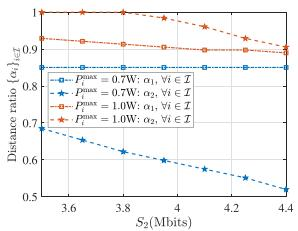

line

| S2 (Mbits) | Pmax=0.7W: α1, vi ∈ I | Pmax=0.7W: α2, vi ∈ I | Pmax=1.0W: α1, vi ∈ I | Pmax=1.0W: α2, vi ∈ I |
|---|---|---|---|---|
| 3.6 | 0.85 | 0.70 | 0.95 | 0.95 |
| 3.8 | 0.85 | 0.65 | 0.95 | 0.95 |
| 4.0 | 0.85 | 0.60 | 0.95 | 0.95 |
| 4.2 | 0.85 | 0.55 | 0.90 | 0.90 |
| 4.4 | 0.85 | 0.50 | 0.85 | 0.85 |

(a)

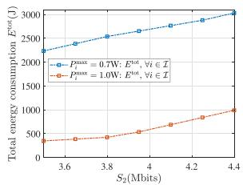

line

| S2 (Mbits) | Total energy consumption E^tot (E^tot) - P_max = 0.7W; E^tot, ∀i ∈ Λ | Total energy consumption E^tot (E^tot) - P_i^max = 1.0W; E^tot, ∀i ∈ Λ |
|---|---|---|
| 3.6 | 2200 | 350 |
| 3.8 | 2450 | 400 |
| 4.0 | 2600 | 500 |
| 4.2 | 2750 | 700 |
| 4.4 | 3000 | 1000 |

(b)

Fig. 10. The restrictiveness of $P _ { i } ^ { \mathrm { m a x } }$ on $\{ \alpha _ { i } \} _ { i \in \mathcal { I } }$ and $E ^ { \mathrm { t o t } }$ . (a) Impact of $P ^ { \mathrm { m a x } }$ . (b) Impact of $P _ { i } ^ { \mathrm { m a x } }$ on E tot . $E ^ { \mathrm { t o t } }$   
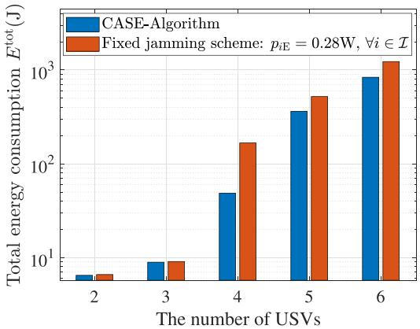

bar

| The number of USVs | CASE-Algorithm | Fixed jamming scheme: pIE = 0.28W, ∀i ∈ I |
|---|---|---|
| 2 | 5 | 6 |
| 3 | 10 | 10 |
| 4 | 50 | 200 |
| 5 | 400 | 600 |
| 6 | 900 | 1300 |

Fig. 11. The minimum total energy consumption comparison of two different jamming schemes versus different numbers of USVs.

Fig. 11 shows the performance of the proposed CASE-Algorithm and the fixed jamming scheme when varying the number of USVs. The initial positions of USVs are generated randomly, and each USV’s workload is set to 1Mbits. We can find that the total energy consumption $E ^ { \mathrm { t o t } }$ increases as the number of USVs increases. Moreover, in comparison with the fixed jamming scheme that $p _ { \mathrm { i E } }$ takes 0.28 W for all i, the total energy consumption $E ^ { \mathrm { t o t } }$ obtained by the joint optimization scheme is reduced by 27.32% on average.

# VII. CONCLUSION

In this paper, we have investigated a marine edge computing system with the assistance of USVs subject to eavesdropping attacks. We optimize the system-wise energy consumption via USVs scheduling and marine edge computation. Considering the malicious eavesdropping on the HAP, we exploit USVs to provide cooperative jamming to improve the communication security at the physical layer. To study this problem, we formulate the system-wise energy consumption and obtain the minimum system-wise energy consumption by jointly optimizing the USVs’ positions, duration of data uploading, the offloaded workload, the $\mathrm { H A P } ^ { \prime } \mathrm { s }$ transmission power, and each USV’s jamming signal power. To solve this problem, we exploit the layered feature of the joint optimization problem and decompose it vertically into a top problem and a bottom problem. We proposed the PAS-Algorithm to alternatively optimize the variables in the bottom problem based on the the theory of monotonic optimization and bisection search. After that, we proposed the CASE-Algorithm to obtain the suboptimal solution to the formulated optimization problem through searching the solution to the top problem based on the cross entropy theory and optimizing the bottom problem in the alternative manner. Numerical results validate the accuracy and the performance of our proposed algorithms. In our future work, complex scenarios involving the fluctuations of seawater and consequent influences will be further studied.

# REFERENCES

[1] J. Liu, Z. Su, and Q. Xu, “UAV-USV cooperative task allocation for smart ocean networks,” in Proc. IEEE 23rd Int. Conf High Perform. Comput. Commun.; 7th Int Conf Data Sci. Syst.; 19th Int Conf Smart City; 7th Int Conf Dependability Sensor, Cloud Big Data Syst. Appl., 2021, pp. 1815–1820.   
[2] C. Hu, Y. Pu, F. Yang, R. Zhao, A. Alrawais, and T. Xiang, “Secure and efficient data collection and storage of IoT in smart ocean,” IEEE Internet Things J., vol. 7, no. 10, pp. 9980–9994, Oct. 2020.   
[3] L. P. Qian, H. Zhang, Q. Wang, Y. Wu, and B. Lin, “Joint multi-domain resource allocation and trajectory optimization in UAV-assisted maritime IoT networks,” IEEE Internet Things J., vol. 10, no. 1, pp. 539–552, Jan. 2023.   
[4] X. Wang, Y. Han, V. C. M. Leung, D. Niyato, X. Yan, and X. Chen, “Convergence of edge computing and deep learning: A comprehensive survey,” IEEE Commun. Surveys Tuts., vol. 22, no. 2, pp. 869–904, Apr.– Jun. 2020.   
[5] A. C. Baktir, A. Ozgovde, and C. Ersoy, “How can edge computing benefit from software-defined networking: A survey, use cases, and future directions,” IEEE Commun. Surveys Tuts., vol. 19, no. 4, pp. 2359–2391, Oct.–Dec. 2017.   
[6] Z. Huang, G. Xia, Z. Wang, and S. Yuan, “Survey on edge computing security,” in Proc. Int. Conf. Big Data, Artif. Intell. Internet of Things Eng., 2020, pp. 96–105.   
[7] L. P. Qian, Y. Wu, N. Yu, F. Jiang, H. Zhou, and T. Q. Quek, “Learning driven NOMA assisted vehicular edge computing via underlay spectrum sharing,” IEEE Trans. Veh. Technol., vol. 70, no. 1, pp. 977–992, Jan. 2021.   
[8] M. Guan et al., “Efficiency evaluations based on artificial intelligence for 5G massive MIMO communication systems on high-altitude platform stations,” IEEE Trans. Ind. Inform., vol. 16, no. 10, pp. 6632–6640, Oct. 2020.   
[9] D. Zhou, S. Gao, R. Liu, F. Gao, and M. Guizani, “Overview of development and regulatory aspects of high altitude platform system,” Intell. Converged Netw., vol. 1, no. 1, pp. 58–78, Jun. 2020.   
[10] D. Wei, X. Li, G. Shen, and H. Yuan, “A high-altitude platform air-ground wireless communication system based on beidou,” J. Commun. Inf. Netw., vol. 6, no. 3, pp. 312–320, Sep. 2021.

[11] N. Cheng et al., “Air-ground integrated mobile edge networks: Architecture, challenges, and opportunities,” IEEE Commun. Mag., vol. 56, no. 8, pp. 26–32, Aug. 2018.   
[12] N. Cheng et al., “Space/aerial-assisted computing offloading for IoT applications: A learning-based approach,” IEEE J. Sel. Areas Commun., vol. 37, no. 5, pp. 1117–1129, May 2019.   
[13] C. Zhou et al., “Deep reinforcement learning for delay-oriented IoT task scheduling in SAGIN,” IEEE Trans. Wireless Commun., vol. 20, no. 2, pp. 911–925, Feb. 2021.   
[14] M. Dai, Z. Su, Q. Xu, and N. Zhang, “Vehicle assisted computing offloading for unmanned aerial vehicles in smart city,” IEEE Trans. Intell. Transp. Sys., vol. 22, no. 3, pp. 1932–1944, Mar. 2021.   
[15] F. Fang, Y. Xu, Z. Ding, C. Shen, M. Peng, and G. K. Karagiannidis, “Optimal resource allocation for delay minimization in NOMA-MEC networks,” IEEE Trans. Commun., vol. 68, no. 12, pp. 7867–7881, Dec. 2020.   
[16] J. Zhao, Q. Li, Y. Gong, and K. Zhang, “Computation offloading and resource allocation for cloud assisted mobile edge computing in vehicular networks,” IEEE Trans. Veh. Technol., vol. 68, no. 8, pp. 7944–7956, Aug. 2019.   
[17] Y. Dai, D. Xu, S. Maharjan, and Y. Zhang, “Joint computation offloading and user association in multi-task mobile edge computing,” IEEE Trans. Veh. Technol., vol. 67, no. 12, pp. 12313–12325, Dec. 2018.   
[18] C.-Y. Li et al., “Transparent AAA security design for low-latency MECintegrated cellular networks,” IEEE Trans. Veh. Technol., vol. 69, no. 3, pp. 3231–3243, Mar. 2020.   
[19] T. Wang, Y. Li, and Y. Wu, “Energy-efficient UAV assisted secure relay transmission via cooperative computation offloading,” IEEE Trans. Green Commun. Netw., vol. 5, no. 4, pp. 1669–1683, Dec. 2021.   
[20] Y. Mao, J. Zhang, and K. B. Letaief, “Dynamic computation offloading for mobile-edge computing with energy harvesting devices,” IEEE J. Sel. Areas Commun., vol. 34, no. 12, pp. 3590–3605, Dec. 2016.   
[21] J. Datta and H.-P. Lin, “Detection of uplink NOMA systems using joint SIC and cyclic FRESH filtering,” in Proc. 27th Wireless Opt. Commun. Conf., 2018, pp. 1–4.   
[22] Y. Qi and M. Vaezi, “Secure spectrum sharing in MIMO-NOMA,” in Proc. IEEE Int. Symp. Dynamic Spectr. Access Netw., 2021, pp. 213–220.   
[23] C. Zeng, J.-B. Wang, C. Ding, H. Zhang, M. Lin, and J. Cheng, “Joint optimization of trajectory and communication resource allocation for unmanned surface vehicle enabled maritime wireless networks,” IEEE Trans. Commun., vol. 69, no. 12, pp. 8100–8115, Dec. 2021.   
[24] Y. Hervagault, I. Prodan, and L. Lefévre, “Motion planning for USVs with communication guarantees: An experimental setup,” in Proc. 18th Eur. Control Conf., 2019, pp. 3984–3989.   
[25] J. Zhang, M. Dai, and Z. Su, “Task allocation with unmanned surface vehicles in smart ocean IoT,” IEEE Internet Things J., vol. 7, no. 10, pp. 9702–9713, Oct. 2020.   
[26] T. Yang, Y. Guo, Y. Zhou, and S. Wei, “Joint communication and control for small underactuated USV based on mobile computing technology,” IEEE Access, vol. 7, pp. 160610–160622, 2019.   
[27] T.-T. Nguyen, N.-H. Tran, T.-M.-D. Ho, and H. Nguyen, “Path planning for unmanned surface vehicle (USV) in obstacle-filled environments,” in Proc. Int. Conf. Adv. Technol. Commun., 2021, pp. 104–108.   
[28] Y. Zhang, H.-M. Wang, Q. Yang, and Z. Ding, “Secrecy sum rate maximization in non-orthogonal multiple access,” IEEE Commun. Lett., vol. 20, no. 5, pp. 930–933, May 2016.   
[29] B. He, A. Liu, N. Yang, and V. K. N. Lau, “On the design of secure non-orthogonal multiple access systems,” IEEE J. Sel. Areas Commun., vol. 35, no. 10, pp. 2196–2206, Oct. 2017.   
[30] J. Tang et al., “Optimization for maximizing sum secrecy rate in SWIPT-enabled NOMA systems,” IEEE Access, vol. 6, pp. 43440–43449, 2018.   
[31] G. He, L. Li, X. Li, W. Chen, L.-L. Yang, and Z. Han, “Secrecy sum rate maximization in NOMA systems with wireless information and power transfer,” in Proc. 9th Int. Conf. Wireless Commun. Signal Process., 2017, pp. 1–6.   
[32] H. Li, S. Zhao, Y. Li, and C. Peng, “Sum secrecy rate maximization in NOMA-based cognitive satellite-terrestrial network,” IEEE Wireless Commun. Lett., vol. 10, no. 10, pp. 2230–2234, Oct. 2021.   
[33] L. P. Qian, Y. Wu, N. Yu, D. Wang, F. Jiang, and W. Jia, “Energy-efficient multi-access mobile edge computing with secrecy provisioning,” IEEE Trans. Mobile Comput., vol. 22, no. 1, pp. 237–252, Jan. 2023.   
[34] L. P. Qian, W. Zhang, Q. Wang, Y. Wu, and X. Yang, “Alternative optimization for secrecy throughput maximization in UAV-aided NOMA networks,” IEEE Wireless Commun. Lett., vol. 11, no. 12, pp. 2580–2584, Dec. 2022.

[35] Y. Wu, A. Khisti, C. Xiao, G. Caire, K.-K. Wong, and X. Gao, “A survey of physical layer security techniques for 5G wireless networks and challenges ahead,” IEEE J. Sel. Areas Commun., vol. 36, no. 4, pp. 679–695, Apr. 2018.   
[36] D. Wang, B. Bai, W. Zhao, and Z. Han, “A survey of optimization approaches for wireless physical layer security,” IEEE Commun. Surveys Tuts., vol. 21, no. 2, pp. 1878–1911, Apr.–Jun. 2019.   
[37] P. Li, M. Chen, Y. Mao, Z. Yang, B. Clerckx, and M. Shikh-Bahaei, “Cooperative rate-splitting for secrecy sum-rate enhancement in multi-antenna broadcast channels,” in Proc. IEEE 31st Annu. Int. Symp. Pers., Indoor Mobile Radio Commun., 2020, pp. 1–6.   
[38] W. Zhang, J. Chen, Y. Kuo, and Y. Zhou, “Artificial-noise-aided optimal beamforming in layered physical layer security,” IEEE Commun. Lett., vol. 23, no. 1, pp. 72–75, Jan. 2019.   
[39] L. Xie, J. Xu, and R. Zhang, “Throughput maximization for UAV-enabled wireless powered communication networks,” IEEE Internet Things J., vol. 6, no. 2, pp. 1690–1703, Apr. 2019.   
[40] Q. Wu, Y. Zeng, and R. Zhang, “Joint trajectory and communication design for multi-UAV enabled wireless networks,” IEEE Trans. Wireless Commun., vol. 17, no. 3, pp. 2109–2121, Mar. 2018.   
[41] Y. Xu, T. Zhang, D. Yang, Y. Liu, and M. Tao, “Joint resource and trajectory optimization for security in UAV-assisted MEC systems,” IEEE Trans. Commun., vol. 69, no. 1, pp. 573–588, Jan. 2021.   
[42] Y. Wu, L. P. Qian, K. Ni, C. Zhang, and X. Shen, “Delay-minimization nonorthogonal multiple access enabled multi-user mobile edge computation offloading,” IEEE J. Sel. Topics Signal Process., vol. 13, no. 3, pp. 392–407, Jun. 2019.   
[43] Y. Huo, Y. Tian, L. Ma, X. Cheng, and T. Jing, “Jamming strategies for physical layer security,” IEEE Wireless Commun., vol. 25, no. 1, pp. 148–153, Feb. 2018.   
[44] N. Zhang, N. Cheng, N. Lu, X. Zhang, J. W. Mark, and X. Shen, “Partner selection and incentive mechanism for physical layer security,” IEEE Trans. Wireless Commun., vol. 14, no. 8, pp. 4265–4276, Aug. 2015.   
[45] F. Wang, J. Xu, X. Wang, and S. Cui, “Joint offloading and computing optimization in wireless powered mobile-edge computing systems,” IEEE Trans. Wireless Commun., vol. 17, no. 3, pp. 1784–1797, Mar. 2018.   
[46] Y. J. A. Zhang et al., “Monotonic optimization in communication and networking systems,” Found. Trends Netw., vol. 7, no. 1, pp. 1–75, 2013.   
[47] P. T. D. Boer, D. P. Kroese, S. Mannor, and R. Y. Rubinstein, “A tutorial on the cross-entropy method,” Ann. Oper. Res., vol. 134, no. 1, pp. 19–67, 2005.

natural_image

Portrait of a man wearing glasses and a black shirt against a blue background (no text or symbols visible)

Mingqing Li received the B.E. degree in communication engineering from the Nanjing University of Information Science and Technology, Nanjing, China, in 2021. He is currently working toward the master’s degree with the College of Information Engineering, Zhejiang University of Technology, Hangzhou, China. His research interest include non-orthogonal multiple access, physical layer security, and mobile edge computing.

natural_image

Portrait of a woman with glasses and dark hair, wearing a light blue collared shirt (no text or symbols visible)

Li Ping Qian (Senior Member, IEEE) received the Ph.D. degree in information engineering from the Chinese University of Hong Hong, Hong Hong, in 2010. During 2010–2011, she was a Postdoctoral Research Associate with the Chinese University of Hong Kong. Since 2011, she has been with the College of Information Engineering, Zhejiang University of Technology, Hangzhou, China, where she is currently a Full Professor. From 2016 to 2017, she was a Visiting Scholar with Broadband Communications Research Group, ECE Department, University

of Waterloo, Waterloo, ON, Canada. Her research interests include wireless communication and networking, resource management in wireless networks, massive IoTs, mobile edge computing, emerging multiple access techniques, and machine learning oriented towards wireless communications. She was the Co-recipient of the IEEE Marconi Prize Paper Award in Wireless Communications in 2011, the Best Paper Award from IEEE ICC 2016, the Best Paper Award from IEEE Communication Society GCCTC 2017, and the Best Paper Award from the Digital Communications and Networking in 2021. She is currently on the Editorial boards of IEEE TRANSACTIONS ON COGNITIVE COMMUNICATIONS AND NETWORKING and IET Communications.

natural_image

Portrait of a person with shoulder-length hair wearing a gray turtleneck (no text or symbols visible)

Xinyu Dong received the B.E. degree in communication engineering from Zhengzhou University, Zhengzhou, China, in 2019. She is currently working toward the master’s degree with the College of Information Engineering, Zhejiang University of Technology, Hangzhou, China. Her research interests include non-orthogonal multiple access and mobile edge computing.

natural_image

Portrait of a man wearing glasses and a light blue shirt (no text or symbols visible)

Yuan Wu (Senior Member, IEEE) received the Ph.D. degree in electronic and computer engineering from the Hong Kong University of Science and Technology, Hong Kong, in 2010. He is currently an Associate Professor with the State Key Laboratory of Internet of Things for Smart City, University of Macau, Zhuhai, China, and also with the Department of Computer and Information Science, University of Macau. During 2016–2017, he was a Visiting Scholar with the Department of Electrical and Computer Engineering, University of Waterloo, Waterloo, ON, Canada. His research interests include resource management for wireless networks, green communications and computing, mobile edge computing, and edge intelligence. He was the recipient of the Best Paper Award from the IEEE International Conference on Communications in 2016, and the Best Paper Award from IEEE Technical Committee on Green Communications and Computing in 2017. He is currently on the Editorial boards of IEEE TRANSACTIONS ON VEHICULAR TECHNOLOGY, IEEE TRANSACTIONS ON NETWORK SCIENCE AND ENGINEERING, IEEE INTERNET OF THINGS JOURNAL, IEEE OPEN JOURNAL OF THE COMMUNICATIONS SOCIETY, and China Communications.

natural_image

Portrait photo of a woman in a black collared shirt (no text or symbols visible)

Bin Lin (Senior Member, IEEE) received the B.S. and M.S. degrees from Dalian Maritime University, Dalian, China, in 1999 and 2003, respectively, and the Ph.D. degree from Broadband Communications Research Group, Department of Electrical and Computer Engineering, University of Waterloo, Waterloo, ON, Canada, in 2009. She is currently a Full Professor with the Department of Information Science and Technology, Dalian Maritime University. From 2016 to 2015, she was a Visiting Scholar with George Washington University, Washington, DC, USA. Her research interests include wireless communications, network dimensioning and optimization, resource allocation, artificial intelligence, maritime communication networks, edge/cloud computing, wireless sensor networks, and Internet of Things. She is an Associate Editor for the IET Communications.

natural_image

Portrait of a man wearing glasses and a suit (no text or symbols visible)

Xiaoniu Yang is currently a Chief Scientist with Science and Technology on Communication Information Security Control Laboratory, Jiaxing, China. He is also an Academician with the Chinese Academy of Engineering and a Ph.D. Supervisor with Xidian University, Xi’an, China. He has authored or coauthored the first software radio book Software, Radio Principles, and Applications (Publishing House of Electronics Industry, 2001, in Chinese) in China, along with C. Lou and J. Xu. He holds more than 40 patents. His research interests include software-defined satellite, Big Data for radio signals, and deep learning-based signal processing. He is a Fellow of the Chinese Institute of Electronics.