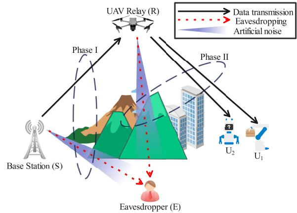
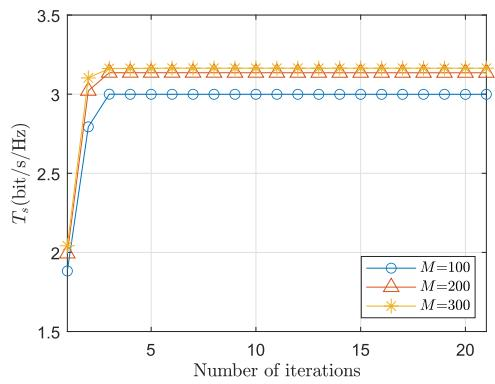
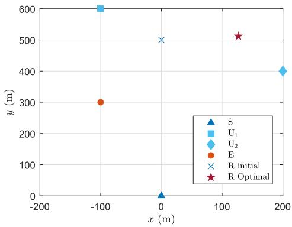
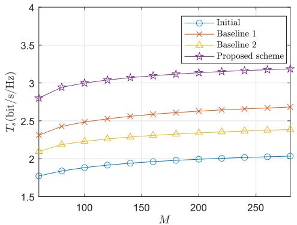
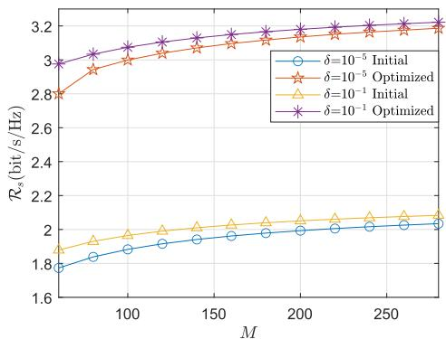
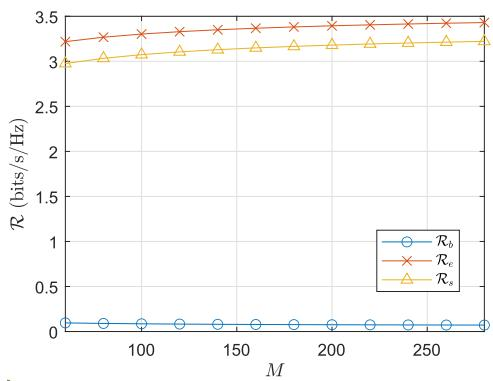
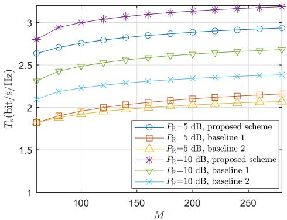
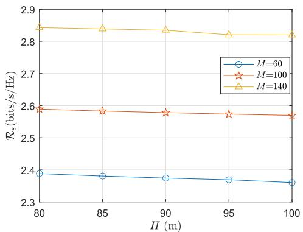
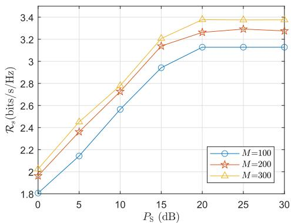

# Secure Short-Packet Transmission of UAV Relaying via NOMA

Zhaoxin Feng , Graduate Student Member, IEEE, Zhutian Yang , Senior Member, IEEE, Huabing Lu , Member, IEEE, Chengwen Xing , Member, IEEE, Nan Zhao , Senior Member, IEEE, and Dusit Niyato , Fellow, IEEE

Abstract—Unmanned aerial vehicles (UAVs) assisted communications have become one of the crucial approaches to enable the reliable and flexible data transmissions, particularly in ultra-reliable and low-latency scenarios, such as remote sensing, emergency response, and military long-range command transmission. In this paper, we investigate the secrecy performance of UAV-assisted short-packet transmission via non-orthogonal multiple access (NOMA), where a UAV serves as an aerial relay to forward mission-critical information from a base station to two remote users in the presence of a ground-based eavesdropper. Both the base station and UAV relay use beamforming for generating the artificial noise to disrupt the eavesdropping and enhance the security, and the UAV operates in half-duplex mode to meet resource constraints and avoid self-interference. The weighted effective secrecy rates of the two users are maximized by jointly optimizing the blocklength, transmission rate, power allocation coefficients, power-sharing factors and UAV position, which is shown to be non-convex and difficult to be solved directly. Accordingly, we decompose the problem into four sub-problems by applying the block coordinate descent (BCD) algorithm to maximize the weighted effective secrecy rate. Then,

slack variables are introduced to further solve the sub-problems via successive convex approximation (SCA). Finally, simulation results are presented to demonstrate the effectiveness of the proposed scheme.

Index Terms—Short-packet communications, physical-layer security, unmanned aerial vehicle, relay, non-orthogonal multiple access.

## I. INTRODUCTION

NMANNED aerial vehicle (UAV) aided communications have garnered significant attention in recent years owing to the distinct features of rapid deployment, high flexibility and low cost, rendering them exceptionally suitable for diverse critical scenarios that are difficult to tackle via conventional approaches [1]. An important application is UAV-assisted relaying, which is crucial for extending the network coverage, enhancing the transmission flexibility, and addressing the communication demands in the complex environment. This is particularly beneficial to the swift disaster response where terrestrial infrastructure is destroyed or in remote areas with limited communication networks [2]. UAV-assisted relaying has become even more indispensable in mission-critical applications with ultra-reliable and low-latency requirements, such as industrial automation, remote sensing, emergency response, and autonomous driving. For instance, in a postdisaster scenario where terrestrial infrastructure is severely damaged, an aerial relay can be rapidly deployed to deliver control messages and sensor data with strict latency and security requirements, enabling timely rescue coordination and situational awareness. However, traditional wireless networks often struggle to meet the stringent requirements of ultrareliable low-latency communication (uRLLC). To support time-sensitive and critical missions applications, short-packet transmission has become increasingly important. By integrating with short-packet communications, UAV relaying can play a pivotal role in ensuring the uRLLC with their flexible deployment and high-quality air-ground channel conditions [3]. In short-packet communications, the blocklength is typically small, which can significantly reduce the transmission latency. Therefore, the UAV relaying-assisted short-packet transmission is becoming a favorable solution to remote uRLLC applications, ensuring fast and accurate data delivery in critical applications.

Unlike conventional communication systems with infinite blocklength, the channel capacity is not suitable for characterizing performance of short-packet communications as the law of large numbers is no longer applicable, making the decoding error probability not negligible [4]. To fulfill this gap, the pioneering work in [5] proposed a tight approximation for the achievable rate and laid a fundamental performance evaluation for the short-packet transmissions. Based on it, the performance of short-packet full-duplex and half-duplex relaying was compared by deriving and analyzing the closedform expressions of block error rate (BLER) by Gu et al. in [6]. They found that the full-duplex relaying is preferable for the systems with lower transmit power constraint, less stringent BLER requirement and more robust loop interference mitigation. In [7], a UAV-relay system for command message delivery was investigated by Pan et al. They proposed a scheme to minimize the decoding error probability by jointly optimizing the UAV location and blocklength. In [8], the average overall BLER performance in a UAV-assisted shortpacket communication system was analyzed by Yuan et al., and the maximal energy efficiency of UAV was obtained by jointly optimizing the blocklength, transmit power and UAV flying height.

Even though the applications of short-packet communications can support the low-latency transmission, it also faces several challenges. On the one hand, spectrum resource is becoming increasingly scarce due to the unavoidable decoding error at the receiver side [9]. As such, non-orthogonal multiple access (NOMA) is becoming to be integrated with shortpacket communications [10]. For the power-domain NOMA, multiple users’ signals can share the same frequency resource but are assigned with different power levels. At each receiver, successive interference cancellation (SIC) is applied to decode the desired signal and hence improve the spectrum efficiency. In [11], Hoang et al. investigated the UAV-assisted NOMA relay transmission of finite blocklength. They derived the closed-form expressions of BLER and throughput, and then formulated the minimum BLER optimization subject to UAV trajectory. In [12], the performance of a short-packet NOMA network with a relay was analyzed by Guo et al., and a novel adaptive hybrid relaying protocol for short-packet cooperative NOMA networks was proposed.

On the other hand, the multiple-antenna technology serves as another effective means to enhance the efficiency of short-packet communications [13]. In [14], the multiple-input multiple-output (MIMO) scheme in the selective decodeand-forward multi-hop relaying network for short-packet communications was investigated by Tu and Lee, and a joint optimization problem was developed to minimize the end-toend block error rate. In [15], Tran et al. analyzed the diversity order, minimum blocklength, and optimal power allocation of short-packet communications for MIMO-NOMA systems. In [16], Ou et al. studied a downlink short-packet communication scheme with multiple-input single-output and multi-carrier NOMA. They proposed a three-step optimization algorithm to maximize the energy efficiency.

Moreover, the high-quality line-of-sight (LoS) channels for UAV relaying make the information security a critical concern [17]. Traditional encryption methods, which depend on cryptographic algorithms, require complex encryption and decryption, making it difficult to satisfy the demand of uRLLC. This can be incredibly challenging in UAV-aided short-packet relaying, where the low-latency demand is crucial and the on-board power is limited. In contrast, physical layer security (PLS) can effectively address these challenges by utilizing the stochastic characteristics of wireless channels to ensure the communication security without increasing the transmission delay [18]. Applying the difference-of-concave programming, Wang et al. developed an iterative algorithm to maximize the secrecy rate in a wireless network with a UAV relay [19]. In [20], by jointly optimizing the blocklength of both hops, transmit power and UAV’s trajectory, the effective average secrecy throughput was maximized by Mamaghani et al. in a short-packet UAV relaying system. In [21], Sun et al. studied the secrecy rate maximization by optimizing the transmit power, power splitting ratio and UAV’s location in a millimeter wave simultaneous wireless information and power transfer UAV relaying network. In [22], Chen et al. studied a secure data collection and transmission scheme in UAV-aided wireless sensor networks. They proposed a scheme to ensure both the freshness and security of data transmission from sensors to a remote ground base station. In addition, by adopting multiple antennas, artificial noise (AN) was generated at the transmitter through spatial diversity by Wang et al., to effectively reduce the signal-to-noise ratio (SNR) at the eavesdroppers without degrading the communication quality of legitimate users [23]. In [24], a novel secrecy beamforming scheme with AN for multiple-input single-output NOMA was investigated by Lv et al. In [25], the security of short-packet communications in the presence of multiple eavesdroppers was studied by Arı et al., where both single-antenna and multipleantenna transmitters with AN were considered.

According to the above analysis, to the best of our knowledge, the PLS in UAV-aided relaying networks with multiple antennas and NOMA has not been thoroughly studied, particularly under finite blocklength and ultra-reliable low-latency communication (uRLLC) constraints. Motivated by the previous research and the above discussion, we investigate a UAV-aided short-packet NOMA relaying scheme that employs beamforming and artificial noise to enhance physical-layer security without incurring additional latency. Moreover, we focus on external eavesdropping as the main threat, reflecting mission-critical settings, where legitimate users operate within a unified security domain and share common objectives.

The primary contributions of this paper are outlined as follows.

1) We investigate a UAV-assisted secure short-packet NOMA communication scheme with both the base station and UAV relaying equipped with multiple antennas. In Phase I and Phase II, the base station and UAV relaying employ the beamforming and artificial noise to enhance communication quality and security, respectively. A passive eavesdropper1is assumed to be able to overhear the information during both phases.

TABLE I  
SUMMARY OF MATHEMATICAL NOTATIONS
<table><tr><td>Symbol  $\overline { { \mathrm { S } , \mathrm { R } } }$ </td><td>Parameter</td></tr><tr><td> $\mathrm { U } _ { i } , \mathrm { E }$   $K _ { \mathrm { L _ { 1 } } }$   $M$   $T _ { \mathrm { m a x } }$   $B$   $d _ { a b }$   $N _ { S } , N _ { R }$   $P _ { S } , P _ { R }$   $\phi _ { \mathrm { I } } , \phi _ { \mathrm { I I } }$   $\alpha _ { i } , \hat { \alpha } _ { i }$   $\mathbf { H } _ { \mathrm { S R } }$   $\mathbf { h } _ { \mathrm { R } i }$   $\mathbf { h } _ { \mathrm { S E } } , \mathbf { h } _ { \mathrm { R E } }$   $\mathbf { v } _ { 1 } , \mathbf { w } _ { 1 }$   $\mathbf { V } _ { 2 } , \mathbf { W } _ { 2 }$   $R _ { i }$   $R _ { b i } , R _ { e i }$   $\varepsilon _ { i }$   $\delta$   $V _ { x }$   $\omega _ { i }$ </td><td>Base station and relaying UAV User i and eavesdropper Rician factor Total blocklength Latency constraint Bandwidth Distance between node a and b Number of antennas at BS and UAV Transmit power of BS and UAV Power-sharing factor for signal and AN Power allocation coefficients for user i Channel from BS to UAV Channel from UAV to user i Channels from BS &amp; UAV to Eve Beamforming vector in Phase I and II AN beamforming matrix in Phase I and II Transmission rate of user ¿ Legitimate and eavesdropping rates Block error rate of user i Information leakage tolerance Channel dispersion Weight coefficient in sum secrecy rate Gaussian Q-function and its inverse</td></tr></table>

2) We present a novel optimization problem to maximize the weighted effective secrecy rate by jointly optimizing the UAV position, blocklength, transmission rate, and power allocation coefficients. However, it is challenging to solve the problem due to its non-convexity and coupled variables.

3) To address this concern, we propose an iterative optimization scheme. By applying the block coordinate descent (BCD) algorithm, we first decompose the nonconvex problem into four sub-problems. Then, we apply the successive convex approximation (SCA) and introduce slack variables to solve the sub-problems.

The rest of this paper is organized as follows. In Section II, the system model is described. In Section III, we introduce the secrecy rate and formulate an optimization problem to maximize the weighted effective secrecy rate. Then, the solution for the problem is proposed in Section IV by adopting the BCD algorithm. Simulations are presented in Section ${ \mathrm { V } } ,$ and the conclusion is drawn in Section VI.

Notations: $[ \cdot ] ^ { \mathrm { T } }$ and $[ \cdot ] ^ { \mathrm { H } }$ denote the matrix transpose and matrix conjugate transpose, respectively. ${ \mathbf I } _ { m }$ represents the m-dimensional identity matrix. $E ( \cdot )$ denotes the expectation operation. | · | indicates the magnitude of a complex number. $\| \cdot \|$ denotes the Euclidean norm of a vector. $\mathbb { C } ^ { a \times \bar { b } }$ denotes the $a \times b$ complex matrix. $\mathcal { C N } \left( 0 , \sigma ^ { 2 } \right)$ is the complex Gaussian distribution with zero mean and variance $\sigma ^ { 2 }$ . Moreover, main mathematical notations used in the paper are listed in Table I.

  
Fig. 1. UAV-assisted secure short-packet relaying via NOMA.

## II. SYSTEM MODEL

Consider a UAV relaying network as shown in Fig. 1, where a base station S with $N _ { \mathrm { S } }$ antennas wants to transmit confidential short-packet information to two legitimate single-antenna users $\mathrm { U } _ { i } , i \in \{ 1 , 2 \} ^ { 2 }$ via NOMA with the existence of a singleantenna eavesdropper E. We assume that the two legitimate users are trusted, which aligns with many mission-critical scenarios, such as industrial automation or military operations, where all users belong to the same authority domain and share common goals. However, due to the obstacles, there is no direct link between the base station and users. $\mathbf { A }$ decode-andforward (DF) relaying UAV R equipped with $N _ { \mathrm { R } }$ antennas is employed to assist the transmission. Considering the strong self-interference inherent in full-duplex operation and the stringent energy and hardware constraints of UAV platforms, we adopt the half-duplex relaying protocol as adopted in [27]. It provides a more practical and energy-efficient solution for size, weight, and power-limited aerial communication systems [28]. Assume that the base station S, the eavesdropper E and user $\mathrm { U } _ { i }$ are located on the ground. For simplification, the 3D Cartesian coordinate system is adopted. Without loss of generality, assume that the base station S is located at the original point $\mathbf { \boldsymbol { q } } _ { \mathrm { { S } } } = ( 0 , 0 , 0 ) ^ { \mathrm { T } }$ , and relaying UAV R hovers at an altitude of H. Thus, the location of eavesdropper E, user $\mathrm { U } _ { i }$ and relaying UAV R can be denoted by $\pmb { q } _ { \mathrm { E } } = ( x _ { \mathrm { E } } , y _ { \mathrm { E } } , 0 ) ^ { \mathrm { T } }$ $\mathbf { q } _ { i } ~ = ~ ( x _ { i } , y _ { i } , 0 ) ^ { \mathrm { T } }$ , and $\mathbf { q } _ { \mathrm { R } } ~ = ~ ( x _ { \mathrm { R } } , y _ { \mathrm { R } } , H ) ^ { \mathrm { T } }$ , respectively. In this work, we focus on ground-based eavesdroppers, as aerial eavesdroppers are generally more exposed and easier to disable due to limited physical cover and open-sky operation. Moreover, with the availability of advanced counter-UAV technologies, aerial eavesdroppers’ eavesdropping ability can be reduced. Nevertheless, the proposed secrecy analysis remains applicable to aerial scenarios with appropriate channel model adaptations [29].

The transmission comprises two phases. In Phase I, the base station S sends the confidential short-packet information to the UAV relay R. In Phase II, the relaying UAV R forwards the decoded information to the trusted users. The short-packet information should be transmitted within $T _ { \mathrm { m a x } }$ to satisfy the low-latency requirements. The blocklength used in each phase is represented by $M / 2$ , and the entire blocklength should satisfy $M \leq B T _ { \mathrm { m a x } } .$ , where B is the bandwidth [7].

Consider that the eavesdropper E can receive the messages from both the base station S and the relaying UAV R. Consequently, it attempts to decode the message for the user $\mathrm { U } _ { i }$ by combining the messages transmitted in both Phase I and Phase II. This represents a worst-case assumption on eavesdropper capability, ensuring that the secrecy performance is evaluated under the most challenging conditions. To improve the security, AN is employed in both phases. Moreover, the quasi-static fading is considered, where the channels remain constant throughout a fading block while exhibiting independent variations over blocks.

## A. Channel Model

Owing to the high altitude of the relaying UAV R, LoS links are adopted from the base station S to the relaying UAV R and from the relaying UAV R to the user $\mathrm { U } _ { i } .$ . Hence, both of them are assumed to follow the Rician fading. The channel coefficient HSR $\in \mathbb { C } ^ { N _ { \mathrm { R } } \times N _ { \mathrm { S } } }$ from the base station S to the relaying UAV R can be expressed as

$$
\mathbf { H } _ { \mathrm { S R } } = \sqrt { \rho d _ { \mathrm { S R } } ^ { - \kappa _ { 1 } } } \left( \sqrt { \frac { K _ { \mathrm { L } _ { 1 } } } { 1 + K _ { \mathrm { L } _ { 1 } } } } \mathbf { g } _ { \mathrm { S R } } ^ { \mathrm { L } } + \sqrt { \frac { 1 } { 1 + K _ { \mathrm { L } _ { 1 } } } } \mathbf { g } _ { \mathrm { S R } } ^ { \mathrm { N L } } \right)\tag{1}
$$

where $\rho$ is the channel gain at the reference distance 1 m, $d _ { \mathrm { S R } } = \lVert \boldsymbol { q } _ { \mathrm { S } } - \boldsymbol { q } _ { \mathrm { R } } \rVert$ is the distance between the base station S and the relaying $\mathrm { U A V } \mathrm { R } , \kappa _ { 1 }$ is the path-loss exponent from the base station S to the relaying UAV R and from the relaying UAV R to the user $\mathrm { U } _ { i } , K _ { \mathrm { L } _ { 1 } }$ denotes the Rician factor, and $\mathbf { g } _ { \mathrm { S R } } ^ { \mathrm { N L } } \in \mathbb { C } ^ { N _ { \mathrm { R } } \times N _ { \mathrm { S } } }$ denotes the non-LoS (NLoS) component with each element following the independent identically distribution (i.i.d.) $\mathcal { C N } \left( 0 , \sigma _ { \mathrm { S R } } ^ { 2 } \right)$ . The LoS component can be denoted by

$$
\mathbf { g } _ { \mathrm { S R } } ^ { \mathrm { L } } = \mathbf { a } _ { \mathrm { R } } \mathbf { a } _ { \mathrm { S } } ^ { \mathrm { T } } \in \mathbb { C } ^ { N _ { \mathrm { R } } \times N _ { \mathrm { S } } } ,\tag{2}
$$

where

$$
\mathbf { a } _ { \mathrm { S } } = \left[ 1 , \cdots , e ^ { - j \frac { 2 \pi } { \lambda } \hat { d } _ { \mathrm { S } } ( N _ { \mathrm { S } } - 1 ) \cos \theta _ { 1 } } \right] ^ { \mathrm { T } } ,\tag{3}
$$

$$
\mathbf { a } _ { \mathrm { R } } = \left[ 1 , \cdots , e ^ { - j { \frac { 2 \pi } { \lambda } } { \hat { d } } _ { \mathrm { R } } ( N _ { \mathrm { R } } - 1 ) \cos \theta _ { 2 } } \right] ^ { \mathrm { T } } .\tag{4}
$$

In (3) and (4), λ is the wavelength, $\hat { d } _ { \mathrm { S } }$ and $\hat { d } _ { \mathrm { R } }$ are the antenna separations at the base station S and the relaying UAV R respectively, $\theta _ { 1 }$ is the angle of departure (AoD), and $\theta _ { 2 }$ is the angle of arrival (AoA). Similarly, the channel coefficient $\mathbf { h } _ { \mathrm { R } i } \in \mathbb { C } ^ { N _ { \mathrm { R } } \times 1 }$ from the relaying UAV R to the user $\mathrm { U } _ { i }$ can be denoted by

$$
{ \bf h } _ { \mathrm { R } i } = \sqrt { \rho d _ { \mathrm { R } i } ^ { - \kappa _ { 1 } } } \left( \sqrt { \frac { K _ { \mathrm { L } _ { 1 } } } { 1 + K _ { \mathrm { L } _ { 1 } } } } { \bf g } _ { \mathrm { R } i } ^ { \mathrm { L } } + \sqrt { \frac { 1 } { 1 + K _ { \mathrm { L } _ { 1 } } } } { \bf g } _ { \mathrm { R } i } ^ { \mathrm { N L } } \right)\tag{5}
$$

where $\mathbf { g } _ { \mathrm { R } i } ^ { \mathrm { L } } = \left\lceil 1 , \cdots , e ^ { - j \frac { 2 \pi } { \lambda } \hat { d } _ { \mathrm { R } } ( N _ { \mathrm { R } } - 1 ) \cos \psi _ { i } } \right\rceil ^ { \mathrm { T } } \in \mathbb { C } ^ { N _ { \mathrm { R } } \times 1 }$ represents the LoS component, $\psi _ { i }$ is the AoD, $\mathbf { g } _ { \mathrm { R } i } ^ { \mathrm { N L } } \in \mathbb { C } ^ { N _ { \mathrm { R } } }$ ×1 represents the NLoS component with each element following the i.i.d. $\mathcal { C N } \left( 0 , \sigma _ { \mathrm { R } i } ^ { 2 } \right)$ , and $d _ { \mathrm { R } i } = \lVert \pmb { q } _ { \mathrm { R } } - \pmb { q } _ { i } \rVert$ is the distance between the relaying UAV R and the user $\mathrm { U } _ { i }$ . Without loss of generality, the users are ranked according to their channel gains as $\| \mathbf { h } _ { \mathrm { R 1 } } \| \leq \| \mathbf { h } _ { \mathrm { R 2 } } \|$ [30].

Moreover, the channel coefficient h between the base station S and the eavesdropper E is assumed to follow the Rayleigh fading as

$$
\mathbf { h } _ { \mathrm { S E } } = \sqrt { \rho d _ { \mathrm { S E } } ^ { - \kappa _ { 2 } } } \mathbf { g } _ { \mathrm { S E } } \in \mathbb { C } ^ { N _ { \mathrm { S } } \times 1 } ,\tag{6}
$$

where $d _ { \mathrm { S E } } = \lVert \pmb { q } _ { \mathrm { S } } - \pmb { q } _ { \mathrm { E } } \rVert$ is the distance between the base station S and the eavesdropper $\mathrm { E } , \kappa _ { 2 }$ is the path-loss exponent from the base station S to the eavesdropper $\mathrm { E } ,$ and $\mathbf { g } _ { \mathrm { S E } } \in$ $\mathbb { C } ^ { N _ { \mathrm { { S } } } \times 1 }$ is the small-scale fading with each element following the i.i.d. $\mathcal { C N } \left( 0 , \sigma _ { \mathrm { S E } } ^ { 2 } \right)$ . The channel from the relaying UAV R to the eavesdropper E follows the Rician fading, which can be denoted by

$$
{ \bf h } _ { \mathrm { R E } } = \sqrt { \rho d _ { \mathrm { R E } } ^ { - \kappa _ { 3 } } } \left( \sqrt { \frac { K _ { \mathrm { L } _ { 2 } } } { 1 + K _ { \mathrm { L } _ { 2 } } } } { \bf g } _ { \mathrm { R E } } ^ { \mathrm { L } } + \sqrt { \frac { 1 } { 1 + K _ { \mathrm { L } _ { 2 } } } } { \bf g } _ { \mathrm { R E } } ^ { \mathrm { N L } } \right)\tag{7}
$$

where $d _ { \mathrm { R E } } = \lVert \pmb { q } _ { \mathrm { R } } - \pmb { q } _ { \mathrm { E } } \rVert$ is the distance between the relaying UAV R and the eavesdropper E, $\kappa _ { 3 }$ is the path-loss exponent from the relaying UAV R to the eavesdropper E, $K _ { \mathrm { L } _ { 2 } }$ denotes the Rician factor, $\mathbf { g } _ { \mathrm { R E } } ^ { \mathrm { L } } = \left\lceil 1 , \cdot \cdot \cdot , e ^ { - j \frac { 2 \pi } { \lambda } \hat { d } _ { \mathrm { R } } ( N _ { \mathrm { S } } - 1 ) \cos \psi _ { e } } \right\rceil ^ { \mathrm { T } } \in$ $\mathbb { C } ^ { N _ { \mathrm { R } } \times 1 }$ represents the LoS component, $\psi _ { e }$ is the $\mathrm { A o D } ,$ and $\mathbf { g } _ { \mathrm { { R E } } } ^ { \mathrm { { N L } } } \in \mathbb { C } ^ { \mathbf { \hat { N } } _ { \mathrm { { R } } } \times 1 }$ denotes the Rayleigh component with each element following the i.i.d. $\mathcal { C N } \big ( 0 , \bar { \sigma } _ { \mathrm { R E } } ^ { 2 } \big )$

## B. Two-Phase Relaying

In Phase I, the normalized beamforming vector $\mathbf { v } _ { 1 } \in \mathbb { C } ^ { N _ { \mathrm { S } } \times 1 }$ is adopted for information transmission, and the normalized beamforming matrix $\mathbf { V } _ { 2 } \ \in \ \mathbb { C } ^ { N _ { \mathrm { S } } \times ( N _ { \mathrm { S } } - 1 ) }$ is applied for AN. Thus, the signal transmitted by the base station S can be described as

$$
\begin{array} { r } { \mathbf { x } = \mathbf { v } _ { 1 } \left( \sqrt { P _ { \mathrm { S } } \phi _ { \mathrm { I } } \alpha _ { 1 } } x _ { 1 } + \sqrt { P _ { \mathrm { S } } \phi _ { \mathrm { I } } \alpha _ { 2 } } x _ { 2 } \right) + \mathbf { V } _ { 2 } \mathbf { x } _ { \mathrm { N } _ { \mathrm { I } } } , } \end{array}\tag{8}
$$

where $P _ { \mathrm { S } }$ denotes the transmit power of $\mathbf { S } , \phi _ { \mathrm { I } } \in ( 0 , 1 )$ is the power sharing factor between the information-carrying signal and AN at the base station $\mathrm { S } , \alpha _ { i } \in ( 0 , 1 )$ ) represents the power allocation coefficient of $x _ { i }$ in Phase I, satisfying $\alpha _ { 1 } + \alpha _ { 2 } = 1$ $x _ { i }$ denotes the message sent to the user $\mathrm { U } _ { i }$ with $E ( | x _ { i } | ^ { 2 } ) = 1$ xN represents $( N _ { \mathrm { S } } - 1 ) \times 1$ AN with each element following the i.i.d. $\mathcal { C N } ( 0 , \sigma _ { \mathrm { N _ { I } } } ^ { 2 } )$ , and $\sigma _ { \mathrm { N _ { I } } } ^ { 2 } = \left( 1 - \phi _ { \mathrm { I } } \right) P _ { \mathrm { S } } / \left( N _ { \mathrm { S } } - 1 \right)$

Furthermore, we assume that the normalized decoding vector $\mathbf { v } _ { b } ~ \in ~ \mathbb { C } ^ { N _ { \mathrm { R } } \times 1 }$ is adopted by the relaying UAV R, the received superposed signal can be given by

$$
\begin{array} { r l } & { y _ { \mathrm { R } } = \mathbf { v } _ { b } ^ { \mathrm { H } } \mathbf { H } _ { \mathrm { S R } } \left( \mathbf { v } _ { 1 } \left( \sqrt { P _ { \mathrm { S } } \phi _ { \mathrm { I } } \alpha _ { 1 } } x _ { 1 } + \sqrt { P _ { \mathrm { S } } \phi _ { \mathrm { I } } \alpha _ { 2 } } x _ { 2 } \right) + \mathbf { V } _ { 2 } \mathbf { x } _ { \mathrm { N } _ { \mathrm { I } } } \right) } \\ & { \qquad + \mathbf { v } _ { b } ^ { \mathrm { H } } n _ { \mathrm { R } } , } \end{array}\tag{9}
$$

where $n _ { \mathrm { R } } \sim \mathcal { C N } ( 0 , \sigma _ { \mathrm { R } } ^ { 2 } )$ represents the additive white Gaussian noise (AWGN) at the relaying UAV R.

To further enhance the channel gain from the base station S to the relaying UAV R, the beamforming vector $\mathbf { v } _ { 1 }$ is designed as the right singular vector of $\mathbf { H } _ { \mathrm { S R } }$ corresponding to the largest singular value. Moreover, the relaying UAV R should adopt $\mathbf { v } _ { b } = \mathbf { H } _ { \mathrm { S R } } \mathbf { v } _ { 1 } / | \mathbf { H } _ { \mathrm { S R } } \mathbf { v } _ { 1 } |$ to enhance the SNR.

Based on the above, to avoid affecting the transmission from the base station S to the relaying UAV R, $\mathbf { V } _ { 2 }$ should consist of the right singular vectors of $\mathbf { H } _ { \mathrm { S R } }$ excluding $\mathbf { v } _ { 1 }$ , satisfying $\mathbf { v } _ { b } \perp \mathbf { H } _ { \mathrm { S R } } \mathbf { V } _ { 2 }$ and $\mathbf { V } _ { 2 } ^ { \mathrm { H } } \mathbf { V } _ { 2 } = \mathbf { I } _ { N _ { \mathrm { S } } - 1 }$ [31].

As per the DF protocol, the relaying UAV R should first decode the received message. When NOMA is adopted, the received signal-to-interference-plus-noise ratio (SINR) to decode the messages $x _ { 1 }$ and $x _ { 2 }$ at the relaying UAV R can be denoted by

$$
\gamma _ { \mathrm { R 1 } } = \frac { P _ { \mathrm { S } } \phi _ { \mathrm { I } } \alpha _ { 1 } | \mathbf { v } _ { b } ^ { \mathrm { H } } \mathbf { H } _ { \mathrm { S R } } \mathbf { v } _ { 1 } | ^ { 2 } } { P _ { \mathrm { S } } \phi _ { \mathrm { I } } \alpha _ { 2 } | \mathbf { v } _ { b } ^ { \mathrm { H } } \mathbf { H } _ { \mathrm { S R } } \mathbf { v } _ { 1 } | ^ { 2 } + \sigma _ { \mathrm { R } } ^ { 2 } } ,\tag{10}
$$

$$
\gamma _ { \mathrm { R 2 } } = \frac { P _ { \mathrm { S } } \phi _ { \mathrm { I } } \alpha _ { 2 } | \mathbf { v } _ { b } ^ { \mathrm { H } } \mathbf { H } _ { \mathrm { S R } } \mathbf { v } _ { 1 } | ^ { 2 } } { \sigma _ { \mathrm { R } } ^ { 2 } } ,\tag{11}
$$

respectively. Meanwhile, the signal received by the eavesdropper E in Phase I can be given by

$$
\begin{array} { r } { y _ { \mathrm { E } } ^ { \mathrm { I } } = \mathbf { h } _ { \mathrm { S E } } \Big ( \mathbf { v } _ { 1 } \left( \sqrt { P _ { \mathrm { S } } \phi _ { \mathrm { I } } \alpha _ { 1 } } x _ { 1 } + \sqrt { P _ { \mathrm { S } } \phi _ { \mathrm { I } } \alpha _ { 2 } } x _ { 2 } \right) + \mathbf { V } _ { 2 } \mathbf { x } _ { \mathrm { N } _ { \mathrm { I } } } \Big ) } \\ { + n _ { \mathrm { E } _ { \mathrm { I } } } , \qquad ( } \end{array}\tag{12}
$$

where $n _ { \mathrm { E I } } \sim \mathcal { C N } ( 0 , \sigma _ { \mathrm { E } _ { \mathrm { I } } } ^ { 2 } )$ represents the AWGN at the eavesdropper E. Considering the worst case that the eavesdropper E can always perform SIC perfectly, the received SINR to decode $x _ { 1 }$ and $x _ { 2 }$ at the eavesdropper E in Phase I can be respectively expressed as

$$
\gamma _ { \mathrm { E 1 } } ^ { \mathrm { I } } = \frac { P _ { \mathrm { S } } \phi _ { \mathrm { I } } \alpha _ { 1 } | \mathbf { h } _ { \mathrm { S E } } ^ { \mathrm { T } } \mathbf { v } _ { 1 } | ^ { 2 } } { { P _ { \mathrm { S } } } \phi _ { \mathrm { I } } \alpha _ { 2 } | \mathbf { h } _ { \mathrm { S E } } ^ { \mathrm { T } } \mathbf { v } _ { 1 } | ^ { 2 } + \frac { P _ { \mathrm { S } } \left( 1 - \phi _ { \mathrm { I } } \right) } { N _ { \mathrm { S } } - 1 } \| \mathbf { h } _ { \mathrm { S E } } ^ { \mathrm { T } } \mathbf { V } _ { 2 } \| ^ { 2 } + \sigma _ { \mathrm { E _ { I } } } ^ { 2 } } ,\tag{13}
$$

$$
\gamma _ { \mathrm { E 2 } } ^ { \mathrm { I } } = \frac { P _ { \mathrm { S } } \phi _ { \mathrm { I } } \alpha _ { 2 } | \mathbf { h } _ { \mathrm { S E } } ^ { \mathrm { T } } \mathbf { v } _ { 1 } | ^ { 2 } } { \frac { P _ { \mathrm { S } } ( 1 - \phi _ { \mathrm { I } } ) } { N _ { \mathrm { S } } - 1 } \| \mathbf { h } _ { \mathrm { S E } } ^ { \mathrm { T } } \mathbf { V } _ { 2 } \| ^ { 2 } + \sigma _ { \mathrm { E _ { I } } } ^ { 2 } } .\tag{14}
$$

In Phase $\mathrm { I I } ,$ the messages for $\mathrm { U } _ { 1 }$ and $\mathrm { { U _ { 2 } } }$ are also transmitted via NOMA. Similar to Phase I, the relaying UAV R adopts the normalized beamforming vector $\mathbf { w } _ { 1 } \in \mathbb { C } ^ { N _ { \mathrm { R } } \times 1 }$ for information transmission and the normalized beamforming matrix $\mathbf { W } _ { 2 } \in \mathbb { C } ^ { N _ { \mathrm { R } } \times ( N _ { \mathrm { R } } - 2 ) }$ for AN to ensure the secure transmission. According to [32], $\mathbf { w } _ { 1 }$ can be designed as

$$
\mathbf { w } _ { 1 } ^ { \mathrm { T } } = \frac { \sqrt { \beta } \mathbf { h } _ { \mathrm { R 1 } } ^ { \mathrm { H } } + \sqrt { 1 - \beta } \mathbf { h } _ { \mathrm { R 2 } } ^ { \mathrm { H } } } { \Vert \sqrt { \beta } \mathbf { h } _ { \mathrm { R 1 } } ^ { \mathrm { H } } + \sqrt { 1 - \beta } \mathbf { h } _ { \mathrm { R 2 } } ^ { \mathrm { H } } \Vert } ,\tag{15}
$$

where $\beta \in [ 0 , 1 ]$ denotes the directionality of the beamforming. According to [24], to ensure the distinct channel gain between the two users and support effective $\mathrm { S I C } , \beta$ can be simply set to zero. Thus, ${ \bf w } _ { 1 } ^ { \mathrm { T } }$ can be simplified as

$$
\mathbf { w } _ { 1 } ^ { \mathrm { T } } = \frac { \mathbf { h } _ { \mathrm { R 2 } } ^ { \mathrm { H } } } { \lVert \mathbf { h } _ { \mathrm { R 2 } } ^ { \mathrm { H } } \rVert } .\tag{16}
$$

Similarly, $\underline { { \mathbf { W } } } _ { 2 }$ should belong to the null space of $\mathbf { H } _ { \mathrm { R \_ } } =$ $\mathbf { \left[ h _ { R 1 } , h _ { R 2 } \right] ^ { T } }$ , satisfying $\mathbf { H } _ { \mathrm { R } } \mathbf { W } _ { 2 } = \mathbf { 0 }$ and $\mathbf { W } _ { 2 } ^ { \mathrm { H } } \mathbf { W } _ { 2 } = \mathbf { I } _ { N _ { \mathrm { R } } - 2 } .$ Thus, the transmitted signal at R can be expressed as

$$
\begin{array} { r } { \mathbf { z } = \mathbf { w _ { 1 } } \left( \sqrt { P _ { \mathrm { R } } \phi _ { \mathrm { I I } } \hat { \alpha } _ { 1 } } x _ { 1 } + \sqrt { P _ { \mathrm { R } } \phi _ { \mathrm { I I } } \hat { \alpha } _ { 2 } } x _ { 2 } \right) + \mathbf { W } _ { 2 } \mathbf { x } _ { \mathrm { N _ { I I } } } , } \end{array}\tag{17}
$$

where $P _ { \mathrm { R } }$ denotes the transmit power of the relaying UAV $\mathrm { R } , \phi _ { \mathrm { I I } } \in \mathsf { \Gamma } ( 0 , 1 )$ refers to the power-sharing factor between the information-bearing signal and AN at the relaying UAV R, $\hat { \alpha } _ { i } ~ \in ~ ( 0 , 1 )$ represents the power allocation coefficient of $x _ { i }$ in Phase II, satisfying $\hat { \alpha } _ { 1 } + \hat { \alpha } _ { 2 } = 1$ , and $\mathbf { x } _ { \mathrm { N _ { I I } } }$ represents the $( N _ { \mathrm { R } } - 2 ) \times 1$ AN with each element following the i.i.d. $\mathcal { C N } ( 0 , \sigma _ { \mathrm { N _ { I I } } } ^ { 2 } )$ , and $\sigma _ { \mathrm { N _ { I I } } } ^ { 2 } = \left( 1 - \phi _ { \mathrm { I I } } \right) P _ { \mathrm { R } } / \left( N _ { \mathrm { R } } - 2 \right)$ . Thus, the received signal at the user Ui can be given by

$$
y _ { i } = \mathbf { h } _ { \mathrm { R } i } ^ { \mathrm { T } } \mathbf { w _ { 1 } } \left( \sqrt { P _ { \mathrm { R } } \phi _ { \mathrm { I I } } \hat { \alpha } _ { 1 } } x _ { 1 } + \sqrt { P _ { \mathrm { R } } \phi _ { \mathrm { I I } } \hat { \alpha } _ { 2 } } x _ { 2 } \right) + n _ { \mathrm { i } } ,\tag{18}
$$

where $n _ { i } \sim \mathcal { C N } \left( 0 , \sigma _ { i } ^ { 2 } \right)$ denotes the AWGN at the user $\mathrm { U } _ { i } .$ Applying SIC, the received SINR to decode $x _ { 1 }$ at the user $\mathrm { U } _ { i }$ can be denoted by

$$
\gamma _ { \mathrm { U } _ { i } , 1 } = \frac { P _ { \mathrm { R } } \phi _ { \mathrm { I I } } \hat { \alpha } _ { 1 } | \mathbf { h } _ { \mathrm { R } i } ^ { \mathrm { T } } \mathbf { w } _ { 1 } | ^ { 2 } } { P _ { \mathrm { R } } \phi _ { \mathrm { I I } } \hat { \alpha } _ { 2 } | \mathbf { h } _ { \mathrm { R } i } ^ { \mathrm { T } } \mathbf { w } _ { 1 } | ^ { 2 } + \sigma _ { 1 } ^ { 2 } } .\tag{19}
$$

After decoding and eliminating $x _ { 1 }$ , the received SINR to decode $x _ { 2 }$ at $\mathrm { { U _ { 2 } } }$ can be expressed as

$$
\gamma _ { \mathrm { U } _ { 2 } , 2 } = \frac { P _ { \mathrm { R } } \phi _ { \mathrm { I I } } \hat { \alpha } _ { 2 } | \mathbf { h } _ { \mathrm { R 2 } } ^ { \mathrm { T } } \mathbf { w } _ { \mathbf { 1 } } | ^ { 2 } } { \sigma _ { 2 } ^ { 2 } } .\tag{20}
$$

Meanwhile, the received signal at the eavesdropper E in Phase II can be denoted by

$$
\begin{array} { r } { y _ { \mathrm { E } } ^ { \mathrm { I I } } = \mathbf { h } _ { \mathrm { R E } } ^ { \mathrm { T } } \left( \mathbf { w } _ { 1 } \sqrt { P _ { \mathrm { R } } \phi _ { \mathrm { I I } } } \left( \sqrt { \hat { \alpha } _ { 1 } } x _ { 1 } + \sqrt { \hat { \alpha } _ { 2 } } x _ { 2 } \right) + \mathbf { W } _ { 2 } \mathbf { x } _ { \mathrm { N _ { I I } } } \right) + n _ { \mathrm { E _ { I I } } } , } \end{array}\tag{21}
$$

where $n _ { \mathrm { E } _ { \mathrm { I I } } } ~ \sim ~ \mathcal { C N } ( 0 , \sigma _ { \mathrm { E } _ { \mathrm { I I } } } ^ { 2 } )$ represents the AWGN at the eavesdropper E in Phase II. Thus, the received SINR to decode messages $x _ { 1 }$ and $x _ { 2 }$ at the eavesdropper E in Phase II can be respectively given by

$$
\gamma _ { \mathrm { E 1 } } ^ { \mathrm { I I } } = \frac { \phi _ { \mathrm { I I } } \hat { \alpha } _ { 1 } | \mathbf { h } _ { \mathrm { R E } } ^ { \mathrm { T } } \mathbf { w } _ { 1 } | ^ { 2 } } { \phi _ { \mathrm { I I } } \hat { \alpha } _ { 2 } | \mathbf { h } _ { \mathrm { R E } } ^ { \mathrm { T } } \mathbf { w } _ { 1 } | ^ { 2 } + \frac { ( 1 - \phi _ { \mathrm { I I } } ) } { N _ { \mathrm { R } } - 2 } \| \mathbf { h } _ { \mathrm { R E } } ^ { \mathrm { T } } \mathbf { W } _ { 2 } \| ^ { 2 } + \frac { \sigma _ { \mathrm { E _ { I I } } } ^ { 2 } } { P _ { \mathrm { R } } } } ,\tag{22}
$$

$$
\gamma _ { \mathrm { E 2 } } ^ { \mathrm { I I } } = \frac { \phi _ { \mathrm { I I } } \hat { \alpha } _ { 2 } \vert \mathbf { h } _ { \mathrm { R E } } ^ { \mathrm { T } } \mathbf { w } _ { 1 } \vert ^ { 2 } } { \frac { ( 1 - \phi _ { \mathrm { I I } } ) } { N _ { \mathrm { R } } - 2 } \Vert \mathbf { h } _ { \mathrm { R E } } ^ { \mathrm { T } } \mathbf { W } _ { 2 } \Vert ^ { 2 } + \frac { \sigma _ { \mathrm { E _ { I I } } } ^ { 2 } } { P _ { \mathrm { R } } } } .\tag{23}
$$

## III. PROBLEM FORMULATION

In this section, the secrecy rate is first derived. Then, a joint optimization problem is formulated to maximize the weighted effective secrecy rate.

## A. Secrecy Rate

Assuming that the eavesdropper E is able to combine the message received in each phase, the received SINR at the eavesdropper E can be expressed as [33]

$$
\gamma _ { \mathrm { E } i } = \gamma _ { \mathrm { E } i } ^ { \mathrm { I } } + \gamma _ { \mathrm { E } i } ^ { \mathrm { I I } } .\tag{24}
$$

In short-packet communications, the achievable secrecy rate for the user $\mathrm { U } _ { i }$ can be denoted by

$$
R _ { i } = R _ { b i } - R _ { e i } ,\tag{25}
$$

where $R _ { b i }$ determines the reliable transmission, and $R _ { e i }$ is associated with the information leakage.

With the specified blocklength $M / 2$ , the tolerance of information leakage δ and the block error rate $\varepsilon _ { i } , R _ { b i }$ and $R _ { e i }$ can be respectively given by

$$
R _ { b i } \triangleq \log _ { 2 } { ( 1 + \gamma _ { b i } ) } - \frac { Q ^ { - 1 } ( \varepsilon _ { i } ) } { \ln { 2 \sqrt { M / 2 } } } \sqrt { V _ { b i } } ,\tag{26}
$$

$$
R _ { e i } \triangleq \log _ { 2 } { ( 1 + \gamma _ { \mathrm { E } i } ) } + \frac { Q ^ { - 1 } ( \delta ) } { \ln { 2 \sqrt { M / 2 } } } \sqrt { V _ { \mathrm { E } i } } ,\tag{27}
$$

where $\gamma _ { b i } \triangleq { \begin{array} { l } { { \underline { { \Delta } } } } \\ { { \overline { { \mathbf { \Lambda } } } } } \end{array} }$ min $\{ \gamma _ { \mathrm { R } , i } , \gamma _ { \mathrm { U } _ { i } , i } \} , \ Q ^ { - 1 } ( \cdot )$ is the inverse of Gaussian Q function, and $V _ { x } \ = \ 1 - \left( 1 + \gamma _ { x } \right) ^ { - 2 }$ represents the channel dispersion. When $\gamma _ { b i }$ is higher than 5 dB, $V _ { b i }$ can be approximated to 1 without loss of accuracy [16]. Thus, $R _ { b i }$ can be simplified as

$$
R _ { b i } \triangleq \log _ { 2 } { ( 1 + \gamma _ { b i } ) } - \frac { Q ^ { - 1 } ( \varepsilon _ { i } ) } { \ln { 2 \sqrt { M / 2 } } } .\tag{28}
$$

Substituting (26) and (27) into (25), the secrecy block error rate of the user $\mathrm { U } _ { i }$ can be expressed as

$$
\begin{array} { l } { \varepsilon \left( \gamma _ { b i } , \gamma _ { \mathrm { E } i } , R _ { i } , M / 2 \right) } \\ { = Q \left( \sqrt { \frac { M } { 2 V _ { b i } } } \left( \ln \frac { 1 + \gamma _ { b i } } { 1 + \gamma _ { \mathrm { E } i } } - \sqrt { \frac { 2 V _ { \mathrm { E } i } } { M } } Q ^ { - 1 } ( \delta ) - R _ { i } \ln 2 \right) \right) } \end{array}\tag{29}
$$

when $\gamma _ { b i } \mathrm { ~  ~ { ~ > ~ } ~ } \gamma _ { \mathrm { E } i }$ . In the case that $\begin{array} { r l r } { \gamma _ { b i } } & { { } \le } & { \gamma _ { \mathrm { E } i } } \end{array}$ $\varepsilon \left( \gamma _ { b i } , \gamma _ { \mathrm { E } i } , R _ { i } , M / 2 \right)$ can be approximated to 1. Subsequently, the effective secrecy rate $\mathcal { R } _ { i }$ can be given by [34]

$$
\mathcal { R } _ { i } = R _ { i } \left( 1 - \varepsilon \left( \gamma _ { b i } , \gamma _ { \mathrm { E } i } , R _ { i } , M / 2 \right) \right) .\tag{30}
$$

Due to the security demands for both $\mathrm { U } _ { 1 }$ and $\mathrm { { U } } _ { 2 } .$ , the weighted effective secrecy rate is introduced to evaluate the overall security performance, expressed as

$$
\mathcal { \hat { R } } = \sum _ { i = 1 } ^ { 2 } \omega _ { i } \mathcal { R } _ { i } ,\tag{31}
$$

where $\omega _ { i }$ is the weight coefficient to adjust the significance of $\mathcal { R } _ { 1 }$ and $\mathcal { R } _ { 2 }$

## B. Problem Formulation

To enhance the security, the objective is to jointly optimize M , ${ \bf R } = \{ R _ { 1 } , R _ { 2 } \} , \alpha = \{ \alpha _ { 1 } , \alpha _ { 2 } , \hat { \alpha } _ { 1 } , \hat { \alpha } _ { 2 } \} , \phi = \{ \phi _ { \mathrm { I } } , \phi _ { \mathrm { I I } } \}$ and $\scriptstyle { { q _ { \mathrm { R } } } }$ to maximize the weighted effective secrecy rate. In this work, we focus on optimizing the UAV’s position $\scriptstyle { q _ { \mathrm { R } } }$ rather than its trajectory. As noted in [35], UAV platforms are subject to strict limitations in payload, power, and onboard processing capability, which makes UAV position optimization also valuable in practice. Consequently, the optimization problem can be formulated as

$$
\mathbf { P 1 } \colon \operatorname* { m a x } _ { \substack { M , R , \alpha , \phi , q _ { \mathrm { R } } } } \hat { \mathcal { R } }\tag{32a}
$$

$$
s . t . \ \varepsilon \left( \gamma _ { b i } , \gamma _ { \mathrm { E } i } , R _ { i } , M / 2 \right) \leq \varepsilon _ { i } ^ { \operatorname* { m a x } } , i \in \{ 1 , 2 \} ,\tag{32b}
$$

$$
R _ { i } \geq R _ { i } ^ { \operatorname* { m i n } } , i \in \left\{ 1 , 2 \right\} ,\tag{32c}
$$

$$
M \leq B T _ { \mathrm { m a x } } ,\tag{32d}
$$

$$
M \in \mathbb { N } ^ { + } ,\tag{32e}
$$

$$
\alpha _ { 1 } + \alpha _ { 2 } = 1 , \alpha _ { 1 } \geq \alpha _ { 2 } ,\tag{32f}
$$

$$
\hat { \alpha } _ { 1 } + \hat { \alpha } _ { 2 } = 1 , \hat { \alpha } _ { 1 } \geq \hat { \alpha } _ { 2 } ,\tag{32g}
$$

$$
\alpha _ { i } > 0 , \hat { \alpha } _ { i } > 0 , 1 > \phi _ { \mathrm { I } } > 0 , 1 > \phi _ { \mathrm { I I } } > 0 ,\tag{32h}
$$

where $\mathbb { N } ^ { + }$ denotes the set of positive integers. (32b) indicates the decoding error probability constraint with $\varepsilon _ { \mathrm { m a x } }$ as the secrecy block error rate tolerance. (32c) is the minimum secrecy rate constraint. (32d) represents the limitation of maximum transmission blocklength. (32f), (32g) and (32h) indicate the constraints of power allocation coefficients.

## C. Problem Transformation

According to (29), the expression of secrecy block error rate is a Gaussian Q function, which makes P1 difficult to solve. For simplification, the decoding error rate instead of the transmission rate can be treated as the variable to be optimized [36]. To be specific, the transmission rate can be rewritten as a function of decoding error rate, given by

$$
\begin{array} { r l r } {  { R _ { i } = \log _ { 2 } \frac { ( 1 + \gamma _ { b i } ) } { ( 1 + \gamma _ { \mathrm { E } i } ) } - \frac { Q ^ { - 1 } ( \varepsilon _ { i } ) } { \ln 2 \sqrt { M / 2 } } - \frac { Q ^ { - 1 } ( \delta ) } { \ln 2 \sqrt { M / 2 } } \sqrt { V _ { \mathrm { E } i } } } } \\ & { } & { \triangleq R ( \gamma _ { b i } , \gamma _ { \mathrm { E } i } , \varepsilon _ { i } ) . \quad \quad \quad \quad ( } \end{array}\tag{33}
$$

Therefore, the effective secrecy rate can be denoted as

$$
\mathcal { R } \left( \gamma _ { b i } , \gamma _ { \mathrm { E } i } , \varepsilon _ { i } \right) = R \left( \gamma _ { b i } , \gamma _ { \mathrm { E } i } , \varepsilon _ { i } \right) \left( 1 - \varepsilon _ { i } \right) ,\tag{34}
$$

and P1 can be transformed into

$$
\mathbf { P 2 } \colon \operatorname* { m a x } _ { M , \varepsilon , \alpha , \phi , q _ { \mathrm { R } } } \sum _ { i = 1 } ^ { 2 } \omega _ { i } \mathcal { R } \left( \gamma _ { b i } , \gamma _ { \mathrm { E } i } , \varepsilon _ { i } \right)\tag{35a}
$$

$$
s . t . \ \varepsilon _ { i } \leq \varepsilon _ { i } ^ { \operatorname* { m a x } } , i \in \left\{ 1 , 2 \right\} ,\tag{35b}
$$

$$
R \left( \gamma _ { b i } , \gamma _ { \mathrm { E } i } , \varepsilon _ { i } \right) \geq R _ { i } ^ { \operatorname* { m i n } } , i \in \left\{ 1 , 2 \right\} ,
$$

$$
( 3 2 \mathrm { d } ) , ( 3 2 \mathrm { e } ) , ( 3 2 \mathrm { f } ) , ( 3 2 \mathrm { g } ) , ( 3 2 \mathrm { h } ) ,\tag{35c}
$$

where $\varepsilon = \{ \varepsilon _ { 1 } , \varepsilon _ { 2 } \}$ . It is obvious that P2 remains non-convex and cannot be solved directly. Moreover, the optimization variables in P2 are coupled with each other, posing challenges for the joint optimization.

## IV. ITERATIVE ALGORITHM FOR SECRECY RATE MAXIMIZATION

In this section, a BCD-based algorithm is introduced to decouple the optimization variables and solve the P2 iteratively to maximize the weighted effective secrecy rate. Subsequently, the non-convex P2 is decomposed into four subproblems and solved by applying SCA with the first-order Taylor expansion.

## A. Blocklength and Decoding Error Rate Optimization

By fixing $\scriptstyle { q _ { \mathrm { R } } }$ , α and φ, P2 can be reformulated as

$$
\mathbf { P 2 . 1 } \mathrm { { : \operatorname* { m a x } _ { M , \varepsilon } \sum _ { i = 1 } ^ { 2 } \omega _ { i } \mathcal { R } \left( \gamma _ { b i } , \gamma _ { E i } , \varepsilon _ { i } \right) } }\tag{36a}
$$

$$
s . t . \ \varepsilon _ { i } \leq \varepsilon _ { i } ^ { \operatorname* { m a x } } , i \in \left\{ 1 , 2 \right\} ,\tag{36b}
$$

$$
R \left( \gamma _ { b i } , \gamma _ { \mathrm { E } i } , \varepsilon _ { i } \right) \geq R _ { i } ^ { \operatorname* { m i n } } , i \in \left\{ 1 , 2 \right\} ,
$$

$$
( 3 2 \mathrm { f } ) , ~ ( 3 2 \mathrm { g } ) .\tag{36c}
$$

According to (33) and (34), $\mathcal { R } \left( \gamma _ { b i } , \gamma _ { \mathrm { E } i } , \varepsilon _ { i } \right)$ is an increasing function with respect to M , since $\varepsilon _ { i }$ and δ are typically small [37]. Therefore, the optimized $M ^ { * }$ can be obtained by $B T _ { \mathrm { m a x } } .$ With the optimized $M ^ { \ast } = B T _ { \mathrm { m a x } }$ , P2.1 can be rewritten as

$$
\mathbf { P 2 . 2 : } \operatorname* { m a x } _ { \varepsilon } \sum _ { i = 1 } ^ { 2 } \omega _ { i } \mathcal { R } \left( \gamma _ { b i } , \gamma _ { \mathrm { E } i } , \varepsilon _ { i } \right)\tag{37a}
$$

$$
s . t . \ \varepsilon _ { i } \leq \varepsilon _ { i } ^ { \operatorname* { m a x } } , i \in \left\{ 1 , 2 \right\} ,\tag{37b}
$$

$$
R \left( \gamma _ { b i } , \gamma _ { \mathrm { E } i } , \varepsilon _ { i } \right) \geq R _ { i } ^ { \operatorname* { m i n } } , i \in \left\{ 1 , 2 \right\} .\tag{37c}
$$

Subsequently, the constraints (37b) and (37c) can be transformed into affine sets. According to (33), the constraint (37c) can be transformed into

$$
\varepsilon _ { i } \geq \varepsilon _ { i } ^ { \mathrm { m i n } } = \varepsilon \left( \gamma _ { b i } , \gamma _ { \mathrm { E } i } , R _ { i } ^ { \mathrm { m i n } } , M / 2 \right) .\tag{38}
$$

Thus, i $\mathbf { \dot { \varepsilon } } \varepsilon _ { i } ^ { \mathrm { m i n } } \le \varepsilon _ { i } ^ { \mathrm { m a x } }$ , the constraints (36b) and (36c) can be simplified as $\varepsilon _ { i } ^ { \mathrm { m i n } } \le \varepsilon _ { i } \le \varepsilon _ { i } ^ { \mathrm { m a x } }$ . However, if $\varepsilon _ { i } ^ { \mathrm { m i n } } > \varepsilon _ { i } ^ { \mathrm { m a x } }$ P2.2 becomes infeasible. In this case, the constraints need to be relaxed to satisfy $\varepsilon _ { i } ^ { \mathrm { m i n } } \leq \varepsilon _ { i } ^ { \mathrm { m a x } }$ . If P2.2 is feasible, it can be transformed into

$$
\mathbf { P } 2 . 2 \mathbf { a } \colon \operatorname* { m a x } _ { \varepsilon _ { 1 } , \varepsilon _ { 2 } } \omega _ { 1 } \mathcal { R } \bigl ( \gamma _ { b 1 } , \gamma _ { \mathrm { E 1 } } , \varepsilon _ { 1 } \bigr ) + \omega _ { 2 } \mathcal { R } \bigl ( \gamma _ { b 2 } , \gamma _ { \mathrm { E 2 } } , \varepsilon _ { 2 } \bigr )\tag{39a}
$$

$$
s . t . \ \varepsilon _ { 1 } ^ { \mathrm { m i n } } \leq \varepsilon _ { 1 } \leq \varepsilon _ { 1 } ^ { \mathrm { m a x } } ,\tag{39b}
$$

$$
\varepsilon _ { 2 } ^ { \mathrm { m i n } } \leq \varepsilon _ { 2 } \leq \varepsilon _ { 2 } ^ { \mathrm { m a x } } .\tag{39c}
$$

Then, it can be solved by applying the following proposition. Proposition 1: When $\varepsilon _ { i } \in \left[ \varepsilon _ { i } ^ { \operatorname* { m i n } } , \varepsilon _ { i } ^ { \operatorname* { m a x } } \right] , \mathcal { R } \left( \gamma _ { b i } , \gamma _ { \mathrm { E } i } , \varepsilon _ { i } \right)$ is concave with respect to $\varepsilon _ { i }$

Proof: Please refer to Appendix A.

Therefore, P2.2a is convex, which can be solved by CVX.

## B. Power Allocation Optimization

With fixed $\scriptstyle { q _ { \mathrm { R } } }$ , M and $\varepsilon ,$ the optimal power allocation coefficients α and $\phi$ can be optimized as

$$
\begin{array} { r l r } {  { \mathbf { P } 2 . 3 \colon \operatorname* { m a x } _ { \boldsymbol { \alpha } , \boldsymbol { \phi } } \sum _ { i = 1 } ^ { 2 } \omega _ { i } \mathcal { R } ( \gamma _ { b i } , \gamma _ { \mathrm { E } i } , \varepsilon _ { i } ) } } \\ & { } & { s . t . \ R ( \gamma _ { b i } , \gamma _ { \mathrm { E } i } , \varepsilon _ { i } ) \geq R _ { i } ^ { \mathrm { m i n } } , i \in \{ 1 , 2 \} , } \\ & { } & { \ ( 3 2 \mathrm { d } ) , \ ( 3 2 \mathrm { e } ) , \ ( 3 2 \mathrm { h } ) . } \end{array}\tag{40a}
$$

(40b)

According to (32d) and (32e), P2.3 depends only on $\phi , \alpha _ { 1 }$ and $\hat { \alpha } _ { 1 }$ , where $\alpha _ { 2 }$ and $\hat { \alpha } _ { 2 }$ can be replaced by $1 - \alpha _ { 1 }$ and $1 - \hat { \alpha } _ { 1 }$ respectively. However, it still remains non-convex on account of (40a). Consequently, by introducing a slack variable Z, P2.3 can be expressed as

P2.4: max Z α,φ,Z

(41a)

$$
s . t . ~ Z \leq \omega _ { 1 } \mathcal { R } \left( \gamma _ { \mathrm { R 1 } } , \gamma _ { \mathrm { E 1 } } , \varepsilon _ { 1 } \right) + \omega _ { 2 } \mathcal { R } \left( \gamma _ { \mathrm { R 2 } } , \gamma _ { \mathrm { E 2 } } , \varepsilon _ { 2 } \right) ,\tag{41b}
$$

$$
Z \le \omega _ { 1 } \mathcal { R } \left( \gamma _ { \mathrm { R 1 } } , \gamma _ { \mathrm { E 1 } } , \varepsilon _ { 1 } \right) + \omega _ { 2 } \mathcal { R } \left( \gamma _ { \mathrm { U } _ { 2 } , 2 } , \gamma _ { \mathrm { E 2 } } , \varepsilon _ { 2 } \right)\tag{41c}
$$

$$
Z \le \omega _ { 1 } \mathcal { R } \left( \gamma _ { \mathrm { U } _ { 1 } , 1 } , \gamma _ { \mathrm { E 1 } } , \varepsilon _ { 1 } \right) + \omega _ { 2 } \mathcal { R } \left( \gamma _ { \mathrm { R 2 } } , \gamma _ { \mathrm { E 2 } } , \varepsilon _ { 2 } \right) ,\tag{41d}
$$

$$
Z \le \omega _ { 1 } \mathcal { R } ( \gamma _ { \mathrm { U } _ { 1 } , 1 } , \gamma _ { \mathrm { E 1 } } , \varepsilon _ { 1 } ) + \omega _ { 2 } \mathcal { R } ( \gamma _ { \mathrm { U } _ { 2 } , 2 } , \gamma _ { \mathrm { E 2 } } , \varepsilon _ { 2 } ) \ ,\tag{41e}
$$

$$
R \left( \gamma _ { \mathrm { R } i } , \gamma _ { \mathrm { E } i } , \varepsilon _ { i } \right) \geq R _ { i } ^ { \operatorname* { m i n } } , i \in \left\{ 1 , 2 \right\} ,\tag{41f}
$$

$$
R \left( \gamma _ { \mathrm { U } _ { i } , i } , \gamma _ { \mathrm { E } i } , \varepsilon _ { i } \right) \geq R _ { i } ^ { \operatorname* { m i n } } , i \in \left\{ 1 , 2 \right\} ,\tag{41g}
$$

$$
\alpha _ { 1 } \in \left( 0 . 5 , 1 \right) , \hat { \alpha } _ { 1 } \in \left( 0 . 5 , 1 \right) ,\tag{41h}
$$

$$
\phi _ { \mathrm { I } } \in \left( 0 , 1 \right) , \phi _ { \mathrm { I I } } \in \left( 0 , 1 \right) ,
$$

$$
( 3 2 \mathrm { d } ) , ( 3 2 \mathrm { e } ) , ( 3 2 \mathrm { h } ) ,\tag{41i}
$$

where $\widetilde { \pmb { \alpha } } = \{ \alpha _ { 1 } , \hat { \alpha } _ { 1 } \}$ . Since $\widetilde { \alpha }$ and $\phi$ are tightly coupled in the expressions of $\gamma _ { \mathrm { R } , i } , ~ \gamma _ { \mathrm { E } , i }$ and $\gamma _ { \mathrm { U } _ { i } , i } ,$ , it is difficult to

optimize them directly. Therefore, P2.4 can be divided into the following two sub-problems as

$$
\begin{array} { r l } { { } } & { { \mathrm { P 2 . 4 a : ~ \operatorname* { m a x } _ { \tilde { \alpha } , Z } ~ Z } } } \\ { { \mathrm { } } } & { { \mathrm { ~ } } } \\ { { \mathrm { } } } & { { \mathrm { ~ } s . t . ~ \mathrm { ~ ( 4 1 b ) , ~ ( 4 1 c ) , ~ ( 4 1 d ) , ~ ( 4 1 e ) , ~ ( 4 1 f ) , ~ ( 4 1 g ) , ~ ( 4 1 h ) . } } } \end{array}\tag{42a}
$$

s.t. (41b), (41c), (41d), (41e), (41f), (41g), (41i).

(43a)

The sub-problem P2.4a is still non-convex because of the nonconvex constraints (41b), (41c), (41d) and (41e). Consequently, the auxiliary variables $\gamma _ { \mathrm { E 1 } } ^ { \mathrm { I } }$ and $\gamma _ { \mathrm { E 1 } } ^ { \mathrm { I I } }$ are introduced, which are subject to the constraints given in the following proposition.

Proposition 2: The constraints of auxiliary variables $\gamma _ { \mathrm { E 1 } } ^ { \mathrm { I } }$ and $\gamma _ { \mathrm { E 1 } } ^ { \mathrm { { \scriptsize { I I } } } }$ can be respectively denoted as

$$
\gamma _ { \mathrm { E 1 } } ^ { \mathrm { I } } \geq \frac { \hat { c } _ { E 1 } ^ { \mathrm { I } } \alpha _ { 1 } } { \hat { c } _ { E 1 } ^ { \mathrm { I } } \alpha _ { 2 } + 1 } ,\tag{44}
$$

$$
\gamma _ { \mathrm { E 1 } } ^ { \mathrm { I I } } \geq \frac { \hat { c } _ { E 1 } ^ { \mathrm { I I } } \hat { \alpha } _ { 1 } } { \hat { c } _ { E 1 } ^ { \mathrm { I I } } \hat { \alpha } _ { 2 } + 1 } ,\tag{45}
$$

where $\begin{array} { r l r } { \hat { c } _ { E 1 } ^ { \mathrm { I } } } & { { } = } & { \frac { P _ { \mathrm { S } } \phi _ { \mathrm { I } } | { \bf h } _ { \mathrm { S E } } ^ { \mathrm { T } } { \bf v } _ { 1 } | ^ { 2 } } { \frac { P _ { \mathrm { S } } \left( 1 - \phi _ { \mathrm { I } } \right) } { N _ { \mathrm { S } } - 1 } \| { \bf h } _ { \mathrm { S E } } ^ { \mathrm { T } } { \bf V } _ { 2 } \| ^ { 2 } + \sigma _ { \mathrm { E _ { I } } } ^ { 2 } } \quad \mathrm { a n d } \quad \hat { c } _ { E 1 } ^ { \mathrm { I I } } \quad = } \end{array}$

Proof: Please refer to Appendix B.

In addition, the constraints (44) and (45) can be respectively transformed into

$$
\begin{array} { r } { C ( \gamma _ { \mathrm { E 1 } } ^ { \mathrm { I } } , \alpha _ { 2 } ) - D ( \gamma _ { \mathrm { E 1 } } ^ { \mathrm { I } } , \alpha _ { 2 } ) \leq - \hat { c } _ { \mathrm { E 1 } } ^ { \mathrm { I } } \alpha _ { 1 } , } \end{array}\tag{46}
$$

$$
C ( \gamma _ { \mathrm { E 1 } } ^ { \mathrm { I I } } , \hat { \alpha } _ { 2 } ) - D ( \gamma _ { \mathrm { E 1 } } ^ { \mathrm { I I } } , \hat { \alpha } _ { 2 } ) \leq - \hat { c } _ { \mathrm { E 1 } } ^ { \mathrm { I I } } \hat { \alpha } _ { 1 } ,\tag{47}
$$

where $\begin{array} { c c l } { C ( \gamma , \alpha ) } & { = } & { - \frac { 1 } { 4 } \left( \gamma + \hat { c } _ { \mathrm { E 1 } } ^ { \mathrm { I } } \alpha + 1 \right) ^ { 2 } } \end{array}$ and $D ( \gamma , \alpha ) \quad = \quad$ $- \textstyle \frac { 1 } { 4 } \left( \gamma - \hat { c } _ { \mathrm { E 1 } } ^ { \mathrm { I } } \alpha - 1 \right) ^ { 2 }$ . (46) and (47) are non-convex due to the concavity of $C ( \gamma , \alpha )$ , which can be handled by SCA. In particular, given the feasible $\gamma _ { \mathrm { E 1 } } ^ { \mathrm { I I } ( i ) }$ and $\hat { \alpha } _ { 2 } ^ { ( i ) }$ in the i-th iteration, the first-order Taylor expansion of $C ( \gamma _ { \mathrm { E 1 } } ^ { \mathrm { I } } , \alpha _ { 2 } )$ can be expressed as

$$
\begin{array} { r l } { C ( \gamma _ { \mathrm { E 1 } } ^ { \mathrm { I } } , \alpha _ { 2 } ) \le \hat { C } ( \gamma _ { \mathrm { E 1 } } ^ { \mathrm { I } } , \alpha _ { 2 } ) } & { } \\ { = - \cfrac { 1 } { 4 } \left( \gamma _ { \mathrm { E 1 } } ^ { \mathrm { I } ( i ) } + \hat { c } _ { \mathrm { E 1 } } ^ { \mathrm { I } } \alpha _ { 2 } ^ { ( i ) } + 1 \right) ^ { 2 } } \\ { - \cfrac { 1 } { 2 } \left( \gamma _ { \mathrm { E 1 } } ^ { \mathrm { I } ( i ) } + \hat { c } _ { \mathrm { E 1 } } ^ { \mathrm { I } } \alpha _ { 2 } ^ { ( i ) } + 1 \right) \left( \gamma _ { \mathrm { E 1 } } ^ { \mathrm { I } } - \gamma _ { \mathrm { E 1 } } ^ { \mathrm { I } ( i ) } \right) } & { } \\ { - \cfrac { \hat { c } _ { \mathrm { E 1 } } ^ { \mathrm { I } } } { 2 } \left( \gamma _ { \mathrm { E 1 } } ^ { \mathrm { I } ( i ) } + \hat { c } _ { \mathrm { E 1 } } ^ { \mathrm { I } } \alpha _ { 2 } ^ { ( i ) } + 1 \right) \left( \alpha _ { 2 } - \alpha _ { 2 } ^ { ( i ) } \right) } \end{array}\tag{48}
$$

Thus, the constraints (46) and (47) can be transformed into

$$
\begin{array} { r } { \hat { C } ( \gamma _ { \mathrm { E 1 } } ^ { \mathrm { I } } , \alpha _ { 2 } ) - D ( \gamma _ { \mathrm { E 1 } } ^ { \mathrm { I } } , \alpha _ { 2 } ) \leq - \hat { c } _ { \mathrm { E 1 } } ^ { \mathrm { I } } \alpha _ { 1 } , } \end{array}\tag{49}
$$

$$
\begin{array} { r } { \hat { C } ( \gamma _ { \mathrm { E 1 } } ^ { \mathrm { I I } } , \hat { \alpha } _ { 2 } ) - D ( \gamma _ { \mathrm { E 1 } } ^ { \mathrm { I I } } , \hat { \alpha } _ { 2 } ) \leq - \hat { c } _ { \mathrm { E 1 } } ^ { \mathrm { I I } } \hat { \alpha } _ { 1 } . } \end{array}\tag{50}
$$

However, it is clear that P2.4a is still non-convex due to the non-convexity of (41b), (41c), (41d) and (41e). Taking $\mathcal { R } ( \gamma _ { \mathrm { R 1 } } , \gamma _ { \mathrm { E 1 } } , \varepsilon _ { 1 } )$ as an example, it can be expressed as

$$
\begin{array} { r l } {  { \mathcal { R } ( \gamma _ { \mathrm { R 1 } } , \gamma _ { \mathrm { E 1 } } , \varepsilon _ { 1 } ) } } \\ & { = ( 1 - \varepsilon _ { 1 } ) R ( \gamma _ { \mathrm { R 1 } } , \gamma _ { \mathrm { E 1 } } , \varepsilon _ { 1 } ) } \end{array}
$$

$$
= ( 1 - \varepsilon _ { 1 } ) \left( \log _ { 2 } \frac { ( 1 + \gamma _ { \mathrm { R 1 } } ) } { ( 1 + \gamma _ { \mathrm { E 1 } } ) } - c _ { 1 } ( \varepsilon _ { 1 } ) - c _ { 2 } \sqrt { V _ { \mathrm { E 1 } } } \right) ,\tag{51}
$$

where $\begin{array} { r } { c _ { 1 } ( \varepsilon _ { 1 } ) ~ = ~ \frac { Q ^ { - 1 } ( \varepsilon _ { 1 } ) } { \ln { 2 \sqrt { M / 2 } } } } \end{array}$ and $\begin{array} { r } { c _ { 2 } ~ = ~ \frac { Q ^ { - 1 } ( \delta ) } { \ln { 2 } \sqrt { M / 2 } } } \end{array}$ . Moreover, the convexity of $R ( \gamma _ { \mathrm { R 1 } } , \dot { \gamma } _ { \mathrm { E 1 } } , \varepsilon _ { 1 } )$ is provided in the following proposition.

Proposition 3: $R ( \gamma _ { \mathrm { R 1 } } , \gamma _ { \mathrm { E 1 } } , \varepsilon _ { 1 } )$ is convex with respect to $\alpha _ { 1 }$ and $\gamma _ { \mathrm { E 1 } }$

Proof: Please refer to Appendix C.

Thus, by using SCA, the first-order Taylor expansion of $R ( \gamma _ { x } , \gamma _ { \mathrm { E 1 } } , \varepsilon _ { 1 } )$ at the given point can be expressed as

$$
\begin{array} { r l } & { R ( \gamma _ { x } , \gamma _ { \mathrm { E 1 } } , \varepsilon _ { 1 } ) } \\ & { \ \geq \hat { R } _ { 1 } \left( \gamma _ { x } \right) } \\ & { \ \triangleq R \Big ( \gamma _ { x } ^ { ( i ) } , \gamma _ { \mathrm { E 1 } } ^ { ( i ) } , \varepsilon _ { 1 } \Big ) + a _ { 1 } \Big ( \gamma _ { \mathrm { E 1 } } ^ { \mathrm { I } } - \gamma _ { \mathrm { E 1 } } ^ { \mathrm { I } ( i ) } \Big ) + a _ { 2 } \Big ( \gamma _ { \mathrm { E 1 } } ^ { \mathrm { I I } } - \gamma _ { \mathrm { E 1 } } ^ { \mathrm { I I } ( i ) } \Big ) + b _ { x } , } \end{array}\tag{52}
$$

where $\begin{array} { r } { a _ { x } = - \frac { 1 } { \ln 2 \left( 1 + \gamma _ { \mathrm { E 1 } } ^ { ( i ) } \right) } - \frac { c _ { 2 } } { \sqrt { V _ { \mathrm { E 1 } } ^ { ( i ) } } \left( 1 + \gamma _ { \mathrm { E 1 } } ^ { ( i ) } \right) ^ { 3 } } , x \in \{ 1 , 2 \} , \gamma _ { 1 } = } \end{array}$ γR1, $\begin{array} { r } { \gamma _ { 2 } = \gamma _ { \mathrm { U } _ { 1 } , 1 } , b _ { 1 } = \frac { P _ { \mathrm { S } } \phi _ { \mathrm { I } } | \mathbf { v } _ { b } ^ { \mathrm { H } } \mathbf { H } _ { \mathrm { S R } } \mathbf { v } _ { 1 } ^ { \prime } | ^ { 2 } \left( \alpha _ { 1 } - \alpha _ { 1 } { } ^ { ( i ) } \right) } { \ln 2 \left( P _ { \mathrm { S } } \phi _ { \mathrm { I } } \left( 1 - \alpha _ { 1 } ^ { ( i ) } \right) | \mathbf { v } _ { b } ^ { \mathrm { H } } \mathbf { H } _ { \mathrm { S R } } \mathbf { v } _ { 1 } | ^ { 2 } + \sigma _ { \mathrm { R } } ^ { 2 } \right) } } \end{array}$ and $\begin{array} { r } { b _ { 2 } = \frac { P _ { \mathrm { R } } \phi _ { \mathrm { I I } } | \mathbf { h } _ { \mathrm { R 1 } } ^ { \mathrm { T } } \mathbf { w } _ { \mathbf { 1 } } | ^ { 2 } \left( \hat { \alpha } _ { 1 } - \hat { \alpha } _ { 1 } ^ { ( i ) } \right) } { \ln 2 \left( P _ { \mathrm { R } } \phi _ { \mathrm { I I } } \left( 1 - \hat { \alpha } _ { 1 } ^ { ( i ) } \right) | \mathbf { h } _ { \mathrm { R 1 } } ^ { \mathrm { T } } \mathbf { w } _ { \mathbf { 1 } } | ^ { 2 } + \sigma _ { 1 } ^ { 2 } \right) } } \end{array}$ . Similarly, the first-order Taylor expansion of $\dot { R } ( \gamma _ { x } , \gamma _ { \mathrm { E 2 } } , \varepsilon _ { 2 } ) ^$ can be denoted by

$$
\begin{array} { r l } & { R \big ( \gamma _ { x } , \gamma _ { \mathrm { E 2 } } , \varepsilon _ { 2 } \big ) } \\ & { = \log _ { 2 } \frac { \big ( 1 + \hat { x } \big ) } { \big ( 1 + \gamma _ { \mathrm { E 2 } } \big ) } - c _ { 1 } \big ( \varepsilon _ { 2 } \big ) - c _ { 2 } \sqrt { V _ { \mathrm { E 2 } } } } \\ & { \geq R \Big ( \gamma _ { x } , \gamma _ { \mathrm { E 2 } } ^ { ( i ) } , \varepsilon _ { 2 } \Big ) + a _ { 3 } \Big ( \alpha _ { 1 } - \alpha _ { 1 } ^ { ( i ) } \Big ) + a _ { 4 } \Big ( \hat { \alpha } _ { 1 } - \hat { \alpha } _ { 1 } ^ { ( i ) } \Big ) } \\ & { \triangleq \hat { R } _ { 2 } \big ( \gamma _ { x } \big ) , } \end{array}\tag{53}
$$

$\begin{array} { r l r } & { } & { \mathrm { w h e r e ~ \textit { x } \in ~ \{ 3 , 4 \} , ~ } \gamma _ { 3 } = \gamma _ { \mathrm { R 2 } } , \gamma _ { 4 } = \gamma _ { \mathrm { U _ { 2 } , 2 } } , a _ { x } = } \\ & { } & { \frac { b _ { x } } { \ln 2 \left( 1 + \gamma _ { \mathrm { E 2 } } ^ { ( i ) } \right) } + \frac { c _ { 2 } b _ { x } } { \sqrt { V _ { \mathrm { E 2 } } ^ { ( i ) } } \left( 1 + \gamma _ { \mathrm { E 2 } } ^ { ( i ) } \right) ^ { 3 } } , b _ { 3 } = \frac { P _ { \mathrm { S } } \phi _ { \mathrm { I } } | \mathbf { h } _ { \mathrm { S E } } ^ { \mathrm { T } } \mathbf { v } _ { 1 } | ^ { 2 } } { \left( \frac { P _ { \mathrm { S } } \left( 1 - \phi _ { \mathrm { I } } \right) } { N _ { \mathrm { S } } - 1 } \| \mathbf { h } _ { \mathrm { S E } } ^ { \mathrm { T } } \mathbf { v } _ { 2 } \| ^ { 2 } + \sigma _ { \mathrm { E } } ^ { 2 } \right) } \mathrm { a n d } } \end{array}$ $\begin{array} { r } { b _ { 4 } = \frac { P _ { \mathrm { R } } \phi _ { \mathrm { I I } } | \mathbf { h } _ { \mathrm { R E } } ^ { \mathrm { T } } \mathbf { w } _ { 1 } | ^ { 2 } } { \left( \frac { P _ { \mathrm { R } } \left( 1 - \phi _ { \mathrm { I I } } \right) } { N _ { \mathrm { R } } - 2 } \Vert \mathbf { h } _ { \mathrm { R E } } ^ { \mathrm { T } } \mathbf { W } _ { 2 } \Vert ^ { 2 } + \sigma _ { \mathrm { E _ { I I } } } ^ { 2 } \right) } . } \end{array}$

With the above approximations, P2.4a can be transformed into

P2.5: $\underset { \boldsymbol { \widetilde { \alpha } } , \gamma _ { \mathrm { E 1 } } ^ { \mathrm { I } } , \gamma _ { \mathrm { E 1 } } ^ { \mathrm { I I } } , Z } { \mathrm { m a x } } Z$

(54a)

$$
s . t . \ Z \leq \omega _ { 1 } \hat { R } _ { 1 } ( \gamma _ { \mathrm { { R 1 } } } ) ( 1 - \varepsilon _ { 1 } ) + \omega _ { 2 } \hat { R } _ { 2 } ( \gamma _ { \mathrm { { R 2 } } } ) ( 1 - \varepsilon _ { 2 } ) ,\tag{54b}
$$

(54c)

$$
Z \le \omega _ { 1 } \hat { R } _ { 1 } ( \gamma _ { \mathrm { U } _ { 1 } , 1 } ) ( 1 - \varepsilon _ { 1 } ) + \omega _ { 2 } \hat { R } _ { 2 } ( \gamma _ { \mathrm { R 2 } } ) ( 1 - \varepsilon _ { 2 } ) ,\tag{54d}
$$

$$
\begin{array} { r l r } {  { Z \le \omega _ { 1 } \hat { R } _ { 1 } \big ( \gamma _ { \mathrm { U } _ { 1 } , 1 } \big ) \big ( 1 - \varepsilon _ { 1 } \big ) + \omega _ { 2 } \hat { R } _ { 2 } \big ( \gamma _ { \mathrm { U } _ { 2 } , 2 } \big ) \big ( 1 - \varepsilon _ { 2 } \big ) , } } \\ & { ( 4 1 \mathrm { f } ) , \ ( 4 1 \mathrm { g } ) , \ ( 4 1 \mathrm { h } ) , \ ( 4 9 ) , \ ( 5 0 ) , } & { ( 5 4 \mathrm { e } ) } \end{array}
$$

which is convex, and can be solved by CVX.

Moreover, P2.4b is also non-convex on account of the non-convexity of (41b), (41c), (41d) and (41e). Similar to Proposition $3 , R ( y , \gamma _ { \mathrm { E 1 } } , \varepsilon _ { 1 } )$ is convex with respect to $\phi _ { \mathrm { I } }$ and $\phi _ { \mathrm { I I } }$ . By applying SCA, its first-order Taylor expansion at the given feasible points $\phi _ { \mathrm { I } } ^ { ( i ) }$ and $\phi _ { \mathrm { I I } } ^ { ( i ) }$ can be expressed as

$$
R ( y , \gamma _ { \mathrm { E 1 } } , \varepsilon _ { 1 } )
$$

$$
\begin{array} { r l } & { = \log _ { 2 } \displaystyle \frac { ( 1 + y ) } { \left( 1 + \gamma _ { \mathrm { E 1 } } \right) } - c _ { 1 } \big ( \varepsilon _ { 1 } \big ) - c _ { 2 } \sqrt { V _ { \mathrm { E 1 } } } } \\ & { \ge R \Big ( y , \gamma _ { \mathrm { E 1 } } ^ { ( i ) } , \varepsilon _ { 1 } \Big ) + a _ { 5 } \left( \phi _ { \mathrm { I } } - \phi _ { \mathrm { I } } ^ { ( i ) } \right) + a _ { 6 } \left( \phi _ { \mathrm { I I } } - \phi _ { \mathrm { I I } } ^ { ( i ) } \right) } \\ & { \triangleq \hat { R } _ { 3 } \left( y \right) , } \end{array}\tag{55}
$$

$$
\begin{array} { r l } { \mathrm { w h e r e } \quad a _ { x } } & { { } = \quad - \frac { b _ { x } } { \ln { 2 ( 1 + \gamma _ { \mathrm { E } } ^ { ( \cdot ) } ) } } \quad - \quad \frac { c _ { 2 } b _ { x } } { \sqrt { V _ { \mathrm { E } } ^ { ( \cdot ) } } ( 1 + \gamma _ { \mathrm { E } } ^ { ( \cdot ) } ) ^ { 3 } } , \quad x \in \mathbb { C } } \\ { \{ 5 , 6 \} , \ b _ { 5 } } & { { } = \quad \frac { P _ { 5 } \alpha _ { 1 } \ln \frac { \Gamma } { \mathrm { E } } \mathbf { v } _ { 1 } | ^ { 2 } ( \frac { P _ { 5 } } { N _ { \mathrm { E } } ^ { ( \cdot ) } } - \frac { [  \mathbf { h } _ { \mathrm { E } } ^ { ( \cdot ) } \mathbf { v } _ { 2 } ] ^ { 2 } + \sigma _ { \mathrm { E } } ^ { 2 } } { ( P _ { 5 } ^ { ( \cdot ) } ) ^ { 3 } } )  } { ( P _ { 5 } \phi _ { 1 } ^ { ( \cdot ) } \alpha _ { 2 }  \mathbf { h } _ { \mathrm { S E } } ^ { \top } \mathbf { v } _ { 1 }  ^ { 2 } + \frac { P _ { 5 } } { N _ { \mathrm { S e } } ^ { ( \cdot ) } - 1 } )  \mathbf { h } _ { \mathrm { S E } } ^ { \top } \mathbf { v } _ { 2 }  ^ { 2 } + \sigma _ { \mathrm { E } } ^ { 2 }  ^ { 2 } } , } \\  b _ { 6 } = \frac  P _ { \mathrm { R } } \hat { \alpha } _ { 1 }  \mathbf { h } _ { \mathrm { R } } ^ { \top } \mathbf { v } _ { 1 }  ^ { 2 } ( \frac { P _ { \mathrm { R } } }  N _ { \mathrm { E } } ^ { ( \cdot ) } - 2  \mathbf { h } _ { \mathrm { R } } ^ { \top } \mathbf { W } _ { 2 }  ^ { 2 } + \sigma _ { \mathrm { E } } ^   \end{array}
$$

$$
\begin{array} { r l r } {  { R \big ( \hat { y } , \gamma _ { \mathrm { E 2 } } , \varepsilon _ { 2 } \big ) } } \\ & { = \log _ { 2 } \frac { \big ( 1 + \hat { y } \big ) } { \big ( 1 + \gamma _ { \mathrm { E 2 } } \big ) } - c _ { 1 } \big ( \varepsilon _ { 2 } \big ) - c _ { 2 } \sqrt { V _ { \mathrm { E 2 } } } }  \\ & { \geq R \Big ( \hat { y } , \gamma _ { \mathrm { E 2 } } ^ { ( i ) } , \varepsilon _ { 2 } \Big ) + a _ { 7 } \Big ( \phi _ { \mathrm { I } } - \phi _ { \mathrm { I } } ^ { ( i ) } \Big ) + a _ { 8 } \Big ( \phi _ { \mathrm { I I } } - \phi _ { \mathrm { I I } } ^ { ( i ) } \Big ) } & \\ & { \triangleq \hat { R } _ { 4 } \big ( \hat { y } \big ) , } & { ( } \end{array}\tag{56}
$$

where $\begin{array} { r l r } { a _ { x } \ = \ - \frac { b _ { x } } { \ln 2 \left( 1 + \gamma _ { \mathrm { E 2 } } ^ { ( i ) } \right) } - \ \frac { c _ { 2 } b _ { x } } { \sqrt { V _ { \mathrm { E 2 } } ^ { ( i ) } } \left( 1 + \gamma _ { \mathrm { E 2 } } ^ { ( i ) } \right) ^ { 3 } } , \ x } & { \in } & { \{ 7 , 8 \} . } \end{array}$ $\begin{array} { r } { \hat { y } \in \left\{ \gamma _ { \mathrm { { R 2 } } } , \gamma _ { \mathrm { { U _ { 2 } } , 2 } } \right\} , b _ { 7 } = \frac { P _ { \mathrm { S } } \alpha _ { 2 } | \mathbf { h } _ { \mathrm { S E } } ^ { \mathrm { T } } \mathbf { v } _ { 1 } | ^ { 2 } \left( \frac { \mathbf { \hat { \rho } } _ { P _ { \mathrm { S } } } } { N _ { \mathrm { S } } - 1 } \| \mathbf { h } _ { \mathrm { S E } } ^ { \mathrm { T } } \mathbf { V } _ { 2 } \| ^ { 2 } + \sigma _ { \mathrm { { E } } _ { 1 } } ^ { 2 } \right) } { \left( \frac { P _ { \mathrm { S } } \left( 1 - \phi _ { \mathrm { { I } } } ^ { ( i ) } \right) } { N _ { \mathrm { S } } - 1 } \| \mathbf { h } _ { \mathrm { S E } } ^ { \mathrm { T } } \mathbf { V } _ { 2 } \| ^ { 2 } + \sigma _ { \mathrm { { E } } _ { \mathrm { I } } } ^ { 2 } \right) ^ { 2 } } } \end{array}$ and $\begin{array} { r } { b _ { 8 } ~ = ~ \frac { P _ { \mathrm { R } } \hat { \alpha } _ { 2 } | \mathbf { h } _ { \mathrm { R E } } ^ { \mathrm { T } } \mathbf { w } _ { 1 } | ^ { 2 } \left( \frac { P _ { \mathrm { R } } } { N _ { \mathrm { R } } - 2 } \| \mathbf { \dot { h } } _ { \mathrm { R E } } ^ { \mathrm { T } } \mathbf { W } _ { 2 } \| ^ { 2 } + \sigma _ { \mathrm { E _ { I I } } } ^ { 2 } \right) } { \left( \frac { P _ { \mathrm { R } } \left( 1 - \phi _ { \mathrm { I I } } ^ { ( i ) } \right) } { N _ { \mathrm { R } } - 2 } \| \mathbf { h } _ { \mathrm { R E } } ^ { \mathrm { T } } \mathbf { W } _ { 2 } \| ^ { 2 } + \sigma _ { \mathrm { E _ { I I } } } ^ { 2 } \right) ^ { 2 } } } \end{array}$ . Thus, P2.4b can be changed into

(57a)

$$
s . t . \ Z \leq \omega _ { 1 } \hat { R } _ { 3 } ( \gamma _ { \mathrm { R 1 } } ) ( 1 - \varepsilon _ { 1 } ) + \omega _ { 2 } \hat { R } _ { 4 } ( \gamma _ { \mathrm { R 2 } } ) ( 1 - \varepsilon _ { 2 } ) ,\tag{57b}
$$

$$
Z \le \omega _ { 1 } \hat { R } _ { 3 } ( \gamma _ { \mathrm { R 1 } } ) ( 1 - \varepsilon _ { 1 } ) + \omega _ { 2 } \hat { R } _ { 4 } ( \gamma _ { \mathrm { U } _ { 2 } , 2 } ) ( 1 - \varepsilon _ { 2 } ) ,\tag{57c}
$$

$$
Z \le \omega _ { 1 } \hat { R } _ { 3 } ( \gamma _ { \mathrm { U } _ { 1 } , 1 } ) ( 1 - \varepsilon _ { 1 } ) + \omega _ { 2 } \hat { R } _ { 4 } ( \gamma _ { \mathrm { R 2 } } ) ( 1 - \varepsilon _ { 2 } ) ,\tag{57d}
$$

$$
Z \leq \omega _ { 1 } \hat { R } _ { 3 } ( \gamma _ { \mathrm { U } _ { 1 } , 1 } ) ( 1 - \varepsilon _ { 1 } ) + \omega _ { 2 } \hat { R } _ { 4 } ( \gamma _ { \mathrm { U } _ { 2 } , 2 } ) ( 1 - \varepsilon _ { 2 } ) ,
$$

$$
( 4 1 \mathrm { f } ) , ( 4 1 \mathrm { g } ) ,\tag{57e}
$$

which is convex and can be solved by utilizing CVX.

## C. UAV Position Optimization

Ultimately, with the fixed M, $\scriptstyle { R , }$ α and $\phi ,$ the optimal $\scriptstyle { q _ { \mathrm { R } } }$ can be obtained from solving

P2.7: max Z qR,Z

(58a)

$$
s . t . ~ Z \leq \omega _ { 1 } \mathcal { R } \big ( \gamma _ { \mathrm { R 1 } } , \gamma _ { \mathrm { E 1 } } , \varepsilon _ { 1 } \big ) + \omega _ { 2 } \mathcal { R } \big ( \gamma _ { \mathrm { R 2 } } , \gamma _ { \mathrm { E 2 } } , \varepsilon _ { 2 } \big ) ,\tag{58b}
$$

$$
Z \le \omega _ { 1 } \mathcal { R } ( \gamma _ { \mathrm { R 1 } } , \gamma _ { \mathrm { E 1 } } , \varepsilon _ { 1 } ) + \omega _ { 2 } \mathcal { R } ( \gamma _ { \mathrm { U } _ { 2 } , 2 } , \gamma _ { \mathrm { E 2 } } , \varepsilon _ { 2 } ) ,\tag{58c}
$$

$$
Z \le \omega _ { 1 } \mathcal { R } ( \gamma _ { \mathrm { U } _ { 1 } , 1 } , \gamma _ { \mathrm { E 1 } } , \varepsilon _ { 1 } ) + \omega _ { 2 } \mathcal { R } ( \gamma _ { \mathrm { R 2 } } , \gamma _ { \mathrm { E 2 } } , \varepsilon _ { 2 } ) ,\tag{58d}
$$

$$
Z \le \omega _ { 1 } \mathcal { R } ( \gamma _ { \mathrm { U } _ { 1 } , 1 } , \gamma _ { \mathrm { E } 1 } , \varepsilon _ { 1 } ) + \omega _ { 2 } \mathcal { R } ( \gamma _ { \mathrm { U } _ { 2 } , 2 } , \gamma _ { \mathrm { E } 2 } , \varepsilon _ { 2 } ) ,\tag{58e}
$$

$$
R \left( \gamma _ { \mathrm { R } , i } , \gamma _ { \mathrm { E } i } , \varepsilon _ { i } \right) \geq R _ { i } ^ { m i n } , i \in \left\{ 1 , 2 \right\} ,\tag{58f}
$$

$$
R \left( \gamma _ { \mathrm { U } _ { i } , i } , \gamma _ { \mathrm { E } i } , \varepsilon _ { i } \right) \geq R _ { i } ^ { m i n } , i \in \left\{ 1 , 2 \right\} .\tag{58g}
$$

It is worth noting that the position optimization can be regarded as a special case of trajectory optimization, where the UAV’s trajectory can be discretized into N time slots and the position in each slot remains constant [38]. The constraints (58b), (58c), (58d) and (58e) are non-convex with respect to $\scriptstyle { q _ { \mathrm { R } } }$ . Similarly, the slack variables $D _ { \mathrm { R E } }$ and $D _ { \mathrm { R } x }$ are introduced, satisfying

$$
D _ { \mathrm { R E } } \leq \Vert \pmb { q } _ { \mathrm { R } } - \pmb { q } _ { \mathrm { E } } \Vert ^ { \kappa _ { 3 } } ,\tag{59}
$$

$$
D _ { \mathrm { R } x } \geq \Vert \pmb { q } _ { \mathrm { R } } - \pmb { q } _ { x } \Vert ^ { \kappa _ { 1 } } ,\tag{60}
$$

where $x \in \{ \mathrm { S } , 1 , 2 \}$ . Similar to Proposition 2, the equality relationships hold in (59) and (60) which correspond to the optimal situation. However, the constraint (59) is non-convex with respect to $\scriptstyle { q _ { \mathrm { R } } }$ . By applying SCA, it can be changed into

$$
\begin{array} { r l } & { D _ { \mathrm { R E } } \leq \Vert \pmb { q } _ { \mathrm { R } } ^ { ( i ) } - \pmb { q } _ { \mathrm { E } } \Vert ^ { \kappa _ { 3 } } + \kappa _ { 3 } \Vert \pmb { q } _ { \mathrm { R } } ^ { ( i ) } - \pmb { q } _ { \mathrm { E } } \Vert ^ { \kappa _ { 3 } - 2 } } \\ & { \qquad \times \left( \pmb { q } _ { \mathrm { R } } ^ { ( i ) } - \pmb { q } _ { \mathrm { E } } \right) ^ { \mathrm { T } } \left( \pmb { q } _ { \mathrm { R } } - \pmb { q } _ { \mathrm { R } } ^ { ( i ) } \right) , } \end{array}\tag{61}
$$

where $\mathbf { \Delta } \mathbf { q } _ { \mathrm { R } } ^ { \left( i \right) }$ is the optimal value in the i-th iteration. Thus, P2.7 can be changed into

P2.7a: $\operatorname* { m a x } _ { \pmb { q } _ { \mathrm { R } } , D _ { \mathrm { R E } } , D _ { \mathrm { R } x } , Z } Z$

(62a)

$$
s . t . \ Z \leq \omega _ { 1 } \mathcal { R } \left( \gamma _ { \mathrm { R 1 } } , \gamma _ { \mathrm { E 1 } } , \varepsilon _ { 1 } \right) + \omega _ { 2 } \mathcal { R } \left( \gamma _ { \mathrm { R 2 } } , \gamma _ { \mathrm { E 2 } } , \varepsilon _ { 2 } \right) ,\tag{62b}
$$

$$
Z \le \omega _ { 1 } \mathcal { R } \left( \gamma _ { \mathrm { R 1 } } , \gamma _ { \mathrm { E 1 } } , \varepsilon _ { 1 } \right) + \omega _ { 2 } \mathcal { R } \left( \gamma _ { \mathrm { U } _ { 2 } , 2 } , \gamma _ { \mathrm { E 2 } } , \varepsilon _ { 2 } \right) ,\tag{62c}
$$

$$
Z \le \omega _ { 1 } \mathcal { R } \left( \gamma _ { \mathrm { U } _ { 1 } , 1 } , \gamma _ { \mathrm { E 1 } } , \varepsilon _ { 1 } \right) + \omega _ { 2 } \mathcal { R } \left( \gamma _ { \mathrm { R 2 } } , \gamma _ { \mathrm { E 2 } } , \varepsilon _ { 2 } \right) ,\tag{62d}
$$

$$
Z \leq \omega _ { 1 } \mathcal { R } \left( \gamma _ { \mathrm { U } _ { 1 } , 1 } , \gamma _ { \mathrm { E } 1 } , \varepsilon _ { 1 } \right)
$$

$$
\omega _ { 2 } \mathcal { R } \left( \gamma _ { \mathrm { U } _ { 2 } , 2 } , \gamma _ { \mathrm { E 2 } } , \varepsilon _ { 2 } \right) ,\tag{62e}
$$

$$
R \left( \gamma _ { \mathrm { R } , i } , \gamma _ { \mathrm { E } i } , \varepsilon _ { i } \right) \geq R _ { i } ^ { m i n } , i \in \left\{ 1 , 2 \right\} ,\tag{62f}
$$

$$
R \left( \gamma _ { \mathrm { U } _ { i } , i } , \gamma _ { \mathrm { E } i } , \varepsilon _ { i } \right) \geq R _ { i } ^ { m i n } , i \in \left\{ 1 , 2 \right\} ,
$$

$$
( 6 0 ) , ~ ( 6 1 ) .\tag{62g}
$$

However, it is still non-convex due to the constraints (62b), (62c), (62d) and (62e). By applying SCA, the first-order Taylor expansion of $R ( \gamma _ { \mathrm { R 1 } } , \gamma _ { \mathrm { E 1 } } , \varepsilon _ { 1 } )$ at the given point $D _ { \mathrm { R E } } ^ { ( i ) }$ and $\dot { D } _ { \mathrm { R S } } ^ { ( i ) }$ can be expressed as

$$
R ( \gamma _ { \mathrm { R 1 } } , \gamma _ { \mathrm { E 1 } } , \varepsilon _ { 1 } )
$$

$$
\geq \hat { R } _ { 5 }
$$

$$
\triangleq \log _ { 2 } { \left( 1 + \gamma _ { \mathrm { R 1 } } ^ { \left( i \right) } \right) } - \log _ { 2 } { \left( 1 + \gamma _ { \mathrm { E 1 } } \right) } - c _ { 1 } ( \varepsilon _ { 1 } ) - c _ { 2 } \sqrt { V _ { \mathrm { E 1 } } ^ { \left( i \right) } }
$$

$$
\sigma _ { \mathrm { R } } ^ { 2 } \rho P _ { \mathrm { S } } \phi _ { \mathrm { I } } \alpha _ { 1 } | { \bf v } _ { b } ^ { \mathrm { H } } { \bf G } _ { \mathrm { S R } } { \bf v _ { 1 } } | ^ { 2 } \Big ( D _ { \mathrm { R S } } - D _ { \mathrm { R S } } ^ { ( i ) } \Big )
$$

$$
\ln 2 \left( 1 + \gamma _ { \mathrm { R 1 } } ^ { ( i ) } \right) \left( \rho P _ { \mathrm { S } } \phi _ { \mathrm { I } } \alpha _ { 2 } \vert { \bf v } _ { b } ^ { \mathrm { H } } { \bf G } _ { \mathrm { S R } } { \bf v } _ { \bf 1 } \vert ^ { 2 } + \sigma _ { \mathrm { R } } ^ { 2 } D _ { \mathrm { R S } } ^ { ( i ) } \right) ^ { 2 }
$$

$$
+ \frac { c _ { 2 } V _ { \mathrm { E 1 } } ^ { ( i ) - \frac { 1 } { 2 } \sigma _ { \mathrm { E 1 } \mathrm { I } } ^ { 2 } \rho P _ { \mathrm { R } } \phi _ { \mathrm { I I } } \hat { \alpha } _ { 1 } } \vert \mathbf { G } _ { \mathrm { R E } } \mathbf { w } _ { 1 } \vert ^ { 2 } \Big ( D _ { \mathrm { R E } } - D _ { \mathrm { R E } } ^ { ( i ) } \Big ) } { \Big ( \rho P _ { \mathrm { R } } \Big ( \phi _ { \mathrm { I I } } \hat { \alpha } _ { 2 } \vert \mathbf { G } _ { \mathrm { R E } } \mathbf { w } _ { 1 } \vert ^ { 2 } + \frac { ( 1 - \phi _ { \mathrm { I I } } ) } { N _ { \mathrm { R } } - 2 } \Vert \mathbf { G } _ { \mathrm { R E } } \mathbf { W } _ { 2 } \Vert ^ { 2 } \Big ) + \sigma _ { \mathrm { E _ { I I } } } ^ { 2 } D _ { \mathrm { R E } } ^ { ( i ) } \Big ) ^ { 2 } } ,\tag{63}
$$

where $\begin{array} { r } { \mathbf { G } _ { \mathrm { S R } } ~ = ~ \sqrt { \frac { K _ { \mathrm { L } _ { 1 } } } { 1 + K _ { \mathrm { L } _ { 1 } } } } \mathbf { g } _ { \mathrm { S R } } ^ { \mathrm { L } } + \sqrt { \frac { 1 } { 1 + K _ { \mathrm { L } _ { 1 } } } } } \end{array}$ gNLSR and ${ \bf G } _ { \mathrm { R E } } \ =$ $\begin{array} { r } { \sqrt { \frac { K _ { \mathrm { L } _ { 2 } } } { 1 + K _ { \mathrm { L } _ { 2 } } } } \mathbf { g } _ { \mathrm { R E } } ^ { \mathrm { L } } + \sqrt { \frac { 1 } { 1 + K _ { \mathrm { L } _ { 2 } } } } \mathbf { g } _ { \mathrm { R E } } ^ { \mathrm { N L } } } \end{array}$ . Similarly, the first-order Taylor expansions of $R ( \gamma _ { \mathrm { R 2 } } , \gamma _ { \mathrm { E 2 } } , \varepsilon _ { 2 } ) , R ( \gamma _ { \mathrm { U 1 } , 1 } , \gamma _ { \mathrm { E 1 } } , \varepsilon _ { 1 } )$ and $R ( \gamma _ { \mathrm { U } _ { 2 } , 2 } , \gamma _ { \mathrm { E 2 } } , \varepsilon _ { 2 } )$ can be respectively given by

$$
R ( \gamma _ { \mathrm { R 2 } } , \gamma _ { \mathrm { E 2 } } , \varepsilon _ { 2 } )
$$

$$
\geq \hat { R } _ { 6 }
$$

$$
\triangleq \log _ { 2 } \Big ( 1 + \gamma _ { \mathrm { R 2 } } ^ { ( i ) } \Big ) - \frac { \rho P _ { \mathrm { S } } \phi _ { \mathrm { I } } \alpha _ { 2 } | { \bf v } _ { b } ^ { \mathrm { H } } { \bf G } _ { \mathrm { S R } } { \bf v } _ { \mathbf { 1 } } | ^ { 2 } } { \ln 2 \left( 1 + \gamma _ { \mathrm { R 2 } } ^ { ( i ) } \right) \sigma _ { \mathrm { R } } ^ { 2 } D _ { \mathrm { R S } } ^ { ( i ) 2 } } \Big ( D _ { \mathrm { R S } } - D _ { \mathrm { R S } } ^ { ( i ) } \Big )
$$

$$
+ \frac { c _ { 2 } \left( D _ { \mathrm { R E } } - D _ { \mathrm { R E } } ^ { ( i ) } \right) \left( 1 + \gamma _ { \mathrm { E 2 } } ^ { ( i ) } \right) ^ { - 3 } \sigma _ { \mathrm { E _ { I I } } } ^ { 2 } \rho P _ { \mathrm { R } } \phi _ { \mathrm { I I } } \hat { \alpha } _ { 2 } | { \bf h } _ { \mathrm { R E } } ^ { \mathrm { T } } { \bf w } _ { 1 } | ^ { 2 } } { \sqrt { V _ { \mathrm { E 2 } } ^ { ( i ) } } \left( \rho \frac { P _ { \mathrm { R } } ( 1 - \phi _ { \mathrm { I I } } ) } { N _ { \mathrm { R } } - 2 } \| { \bf h } _ { \mathrm { R E } } ^ { \mathrm { T } } { \bf W } _ { 2 } \| ^ { 2 } + \sigma _ { \mathrm { E _ { I I } } } ^ { 2 } D _ { \mathrm { R E } } ^ { ( i ) } \right) ^ { 2 } }
$$

$$
- \log _ { 2 } { ( 1 + \gamma _ { \mathrm { E 2 } } ) } - c _ { 1 } ( \varepsilon _ { 2 } ) - c _ { 2 } \sqrt { V _ { \mathrm { E 2 } } ^ { ( i ) } } ,\tag{64}
$$

$$
R ( \gamma _ { \mathrm { U } _ { 1 } , 1 } , \gamma _ { \mathrm { E 1 } } , \varepsilon _ { 1 } ) \geq \hat { R } _ { 7 }
$$

$$
\triangleq \log _ { 2 } \left( 1 + \gamma _ { \mathrm { U } _ { 1 } , 1 } ^ { ( i ) } \right) - \log _ { 2 } \left( 1 + \gamma _ { \mathrm { E } 1 } \right) - c _ { 1 } ( \varepsilon _ { 1 } ) - c _ { 2 } \sqrt { V _ { \mathrm { E } 1 } ^ { ( i ) } }
$$

$$
\begin{array} { r } { + \overline { { \left( \rho P _ { \mathrm { R } } \left( \phi _ { \mathrm { I I } } \hat { \alpha } _ { 2 } | \mathbf { G } _ { \mathrm { R E } } \mathbf { w } _ { 1 } | ^ { 2 } + \frac { ( 1 - \phi _ { \mathrm { I I } } ) } { N _ { \mathrm { R } } - 2 } \| \mathbf { G } _ { \mathrm { R E } } \mathbf { W } _ { 2 } \| ^ { 2 } \right) + \sigma _ { \mathrm { E _ { I I } } } ^ { 2 } D _ { \mathrm { R E } } ^ { ( i ) } \right) ^ { 2 } } } } \end{array}
$$

$$
\sigma _ { 1 } ^ { 2 } \rho P _ { \mathrm { R } } \phi _ { \mathrm { I I } } \hat { \alpha } _ { 1 } | \mathbf { G } _ { \mathrm { R 1 } } \mathbf { w _ { 1 } } | ^ { 2 } \left( D _ { \mathrm { R 1 } } - D _ { \mathrm { R 1 } } ^ { ( i ) } \right)
$$

$$
\ln 2 \left( 1 + \gamma _ { \mathrm { U _ { 1 } , 1 } } ^ { ( i ) } \right) \left( \rho P _ { \mathrm { R } } \phi _ { \mathrm { I I } } \hat { \alpha } _ { 2 } | \mathbf { G } _ { \mathrm { R 1 } } \mathbf { w _ { 1 } } | ^ { 2 } + \sigma _ { 1 } ^ { 2 } D _ { \mathrm { R } i } \right) ^ { 2 } ,\tag{65}
$$

$$
R \left( \gamma _ { \mathrm { U } _ { 2 } , 2 } , \gamma _ { \mathrm { E 2 } } , \varepsilon _ { 2 } \right) \geq \hat { R } _ { 8 }
$$

$$
\triangleq \log _ { 2 } \left( 1 + \gamma _ { \mathrm { U } _ { 2 } , 2 } ^ { ( i ) } \right) - \log _ { 2 } ( 1 + \gamma _ { \mathrm { E } 2 } ) - c _ { 1 } ( \varepsilon _ { 2 } ) - c _ { 2 } \sqrt { V _ { \mathrm { E } 2 } ^ { ( i ) } }
$$

$$
c _ { 2 } \left( D _ { \mathrm { R E } } - D _ { \mathrm { R E } } ^ { ( i ) } \right) \sigma _ { \mathrm { E _ { I I } } } ^ { 2 } \rho P _ { \mathrm { R } } \phi _ { \mathrm { I I } } \hat { \alpha } _ { 2 } | \mathbf { h } _ { \mathrm { R E } } ^ { \mathrm { T } } \mathbf { w } _ { 1 } | ^ { 2 } ( 1 + \gamma _ { \mathrm { E 2 } } ) ^ { - 3 }
$$

$$
\sqrt { V _ { \mathrm { E 2 } } ^ { ( i ) } } \left( \rho \frac { P _ { \mathrm { R } } ( 1 - \phi _ { \mathrm { I I } } ) } { N _ { \mathrm { R } } - 2 } \| \mathbf { h } _ { \mathrm { R E } } ^ { \mathrm { T } } \mathbf { W } _ { 2 } \| ^ { 2 } + \sigma _ { \mathrm { E _ { I I } } } ^ { 2 } D _ { \mathrm { R E } } ^ { ( i ) } \right) ^ { 2 }
$$

$$
- \frac { \rho P _ { \mathrm { R } } \phi _ { \mathrm { I I } } \hat { \alpha } _ { 2 } | \mathbf { G } _ { \mathrm { R 2 } } \mathbf { w } _ { \mathbf { 1 } } | ^ { 2 } } { \ln 2 \left( 1 + \gamma _ { \mathrm { U _ { 2 } , 2 } } ^ { ( i ) } \right) \sigma _ { 2 } ^ { 2 } D _ { \mathrm { R 2 } } ^ { 2 } } \left( D _ { \mathrm { R 2 } } - D _ { \mathrm { R 2 } } ^ { ( i ) } \right) ,\tag{66}
$$

where $\begin{array} { r } { { \bf G } _ { \mathrm { R 1 } } = \sqrt { \frac { K _ { \mathrm { L 1 } } } { 1 + K _ { \mathrm { L 1 } } } } { \bf g } _ { \mathrm { R 1 } } ^ { \mathrm { L } } + \sqrt { \frac { 1 } { 1 + K _ { \mathrm { L 1 } } } } \mathrm {  ~ \Omega ~ } _ { } ^ { } } \end{array}$ gNLR1 and $\mathbf { G } _ { \mathrm { R 2 } } =$ $\begin{array} { r } { \sqrt { \frac { K _ { \mathrm { L 1 } } } { 1 + K _ { \mathrm { L 1 } } } } \mathbf { g } _ { \mathrm { R 2 } } ^ { \mathrm { L } } + \sqrt { \frac { 1 } { 1 + K _ { \mathrm { L 1 } } } } \mathbf { g } _ { \mathrm { R 2 } } ^ { \mathrm { N L } } . } \end{array}$

Thus, P2.7a can be reconstructed as

P2.7b:

$$
\operatorname* { m a x } _ { \pmb { q } _ { \mathrm { R } } , D _ { \mathrm { R E } } , D _ { \mathrm { R } x } , Z } Z\tag{67a}
$$

$$
s . t . ~ Z \le \omega _ { 1 } \hat { R } _ { 5 } ( 1 - \varepsilon _ { 1 } ) + \omega _ { 2 } \hat { R } _ { 8 } ( 1 - \varepsilon _ { 2 } ) ,\tag{67b}
$$

$$
Z \le \omega _ { 1 } \hat { R } _ { 5 } ( 1 - \varepsilon _ { 1 } ) + \omega _ { 2 } \hat { R } _ { 6 } ( 1 - \varepsilon _ { 2 } ) ,\tag{67c}
$$

$$
Z \le \omega _ { 1 } \hat { R } _ { 7 } ( 1 - \varepsilon _ { 1 } ) + \omega _ { 2 } \hat { R } _ { 8 } ( 1 - \varepsilon _ { 2 } ) ,\tag{67d}
$$

$$
Z \le \omega _ { 1 } \hat { R } _ { 7 } ( 1 - \varepsilon _ { 1 } ) + \omega _ { 2 } \hat { R } _ { 6 } ( 1 - \varepsilon _ { 2 } ) ,\tag{67e}
$$

$$
R \left( \gamma _ { \mathrm { R } , i } , \gamma _ { \mathrm { E } i } , \varepsilon _ { i } \right) \geq R _ { i } ^ { m i n } , i \in \left\{ 1 , 2 \right\} ,\tag{67f}
$$

$$
R \left( \gamma _ { \mathrm { U } _ { i } , i } , \gamma _ { \mathrm { E } i } , \varepsilon _ { i } \right) \geq R _ { i } ^ { m i n } , i \in \left\{ 1 , 2 \right\} ,
$$

$$
( 6 0 ) , ( 6 1 ) ,\tag{67g}
$$

which is convex and can be solved by CVX.

Algorithm 1 Iterative Algorithm for P2   
1: Initialization: $k = 0 , q _ { \mathrm { R } } , M , \varepsilon , \alpha , \phi$ and tolerance $\epsilon =$   
$1 0 ^ { - 4 } ;$   
2: Obtain the optimal $M ^ { * } = B T _ { \mathrm { m a x } } ;$   
3: while $\left| Q ^ { k + 1 } - Q ^ { k } \right| > \epsilon$ or $i \leq i _ { \mathrm { m a x } }$ do   
4: With fixed $\begin{array} { r } { q _ { \mathrm { { R } } } ^ { k } , \dot { M ^ { * } } , \alpha ^ { k } } \end{array}$ and $\phi ^ { k } { \mathrm { ~ } } _ { ; }$ , obtain $\varepsilon ^ { k + 1 }$ by solving   
(P2.2a);   
5: With fixed ${ q } _ { \mathrm { R } } ^ { k } , \ M ^ { * } , \ { \phi } ^ { k }$ and $\varepsilon ^ { k + 1 } .$ , obtain $\alpha ^ { k + 1 }$ by   
solving (P2.5);   
6: With fixed $\begin{array} { r } { \pmb q _ { \mathrm { R } } ^ { k } , M ^ { * } , \pmb \alpha ^ { k + 1 } } \end{array}$ and $\varepsilon ^ { k + 1 }$ , obtain $\phi ^ { k + 1 }$ by   
solving (P2.6);   
7: With fixed $M ^ { * } , \alpha ^ { k + 1 } , \phi ^ { k + 1 }$ and $\varepsilon ^ { k + 1 }$ , obtain $\pmb q ^ { k + 1 }$   
by solving (P2.7b);   
8: Let $k = k + 1 ;$   
9: end while   
10: Obtain the optimized $\pmb q _ { \mathrm { R } } ^ { * } = \pmb q _ { \mathrm { R } } ^ { k + 1 } , \pmb \varepsilon ^ { * } = \pmb \varepsilon ^ { k + 1 } , \pmb \alpha ^ { * } = \pmb \alpha ^ { k + 1 }$   
and $\phi ^ { * } = \phi ^ { \mathbf { \bar { k } + 1 } }$

## D. Convergence and Computational Complexity Analysis

Based on the above discussion, the optimization algorithm to maximize the weighted effective secrecy rate by optimizing $M , \varepsilon , \alpha ,$ φ and $\scriptstyle { q _ { \mathrm { R } } }$ can be summarized in Algorithm 1. In this subsection, the convergence and computational complexity of Algorithm 1 are analyzed to verify its efficiency.

1) Convergence Analysis: The algorithm consists of an outer BCD loop and four subproblems. One of the subproblems is convex, ensuring its convergence. By applying SCA, the other subproblems can be solved iteratively, where each iteration involves a convex problem constructed as a local approximation of the original non-convex formulation. The convexity of these problems guarantees that the objective function is non-decreasing within each iteration, leading to the overall convergence. While SCA does not guarantee global optimality, it converges to a Karush-Kuhn-Tucker (KKT) point under certain regularity conditions [39], which corresponds to a locally optimal solution of the original non-convex problem. Although such a solution may not be the global optimum, pursuing the exact global solution would require exhaustive search, which is computationally prohibitive for the resourcelimited UAV platform. Therefore, SCA provides a practical and efficient compromise, striking a balance between solution quality and complexity, and making it a widely adopted approach in wireless communication system designs. Additionally, since each subproblem is convex, the BCD algorithm ensures that each update of a parameter results in a nondecreasing objective function value, thereby guaranteeing the iterative improvement [40]. Moreover, because the optimal value of P1 is finite, the optimization problem is guaranteed to converge.

2) Computational Complexity Analysis: Due to the iterative nature of SCA, the major complexity is due to the internal SCA algorithm. According to [41], a convex optimization problem can be solved within $\mathcal { O } \left( N ^ { 1 . 5 } K ^ { 6 } \right)$ polynomial time, where $N = 1 3 K ^ { 3 } + 5 K + 1$ is the number of constraints. Thus, the complexity of the j-th sub-problem can be expressed as $\mathcal { O } \left( N _ { j } ^ { 1 . 5 } \bar { K _ { j } ^ { 6 } } \right)$ , where $j \in \{ 2 , 3 , 4 \}$ denotes the j-th sub-problem, and $N _ { j }$ is the number of constraints in the j-th sub-problem. Therefore, the complexity of Algorithm 1 can be expressed as $\begin{array} { r l } { \ O \left( I _ { a } \sum _ { j = 2 } ^ { 4 } I _ { j } N _ { j } ^ { 1 . 5 } K _ { j } ^ { 6 } \right) } & { { } } \end{array}$ , where $I _ { a }$ represents the number of BCD iterations, and $I _ { j }$ represents the number of iterations for the j-th sub-problem.

  
Fig. 2. The weighted effective secrecy rate versus the number of iterations.

  
Fig. 3. The locations of each node in the horizontal dimension.

## V. SIMULATION RESULTS

In this section, simulation results are provided to prove the efficiency of the proposed scheme. Unless specified otherwise, we set $N _ { \mathrm { S } } = 4 , N _ { \mathrm { R } } = 4 , { \hat { d } } _ { \mathrm { S } } = { \hat { d } } _ { \mathrm { R } } = { \textstyle { \frac { \lambda } { 7 } } } , B = 1 \ \mathrm { M H z }$ $M = 1 0 0 , \delta = 1 0 ^ { - 5 } , \sigma _ { i } = - 1 2 0 \mathrm { ~ d B } , i \in \mathrm { ~ \bar { \{ } R } , 1 , 2 , E _ { I } , E _ { I I } \} $ $P _ { \mathrm { S } } = 2 0 ~ \mathrm { d B } , \ P _ { \mathrm { R } } = 1 0 ~ \mathrm { d B } , \ H = 1 0 0 ~ \mathrm { m } , \rho = - 3 0 ~ \mathrm { d B }$ $\omega _ { 1 } = 0 . 6 , \omega _ { 2 } = 0 . 4 , \kappa _ { 1 } = 2 , \kappa _ { 2 } = 4 . 2 , \kappa _ { 3 } = 3 , K _ { \mathrm { L } _ { 1 } } = 5$ and $K _ { \mathrm { L } _ { 2 } } = 1 ~ [ 3 6 ]$

In Fig. 2, the relationship between the weighted effective secrecy rate and the number of iterations is depicted to investigate the convergence. It is evident that the weighted effective secrecy rate initially increases with the number of iterations, and then stabilizes, meaning that the proposed scheme is convergent.

Fig. 3 illustrates the random initial positions of each node, where the base station is represented by a triangle, the legitimate users are denoted by square and diamond with ${ \bf q } _ { 1 } =$ $\left( - 1 0 0 , 6 0 0 , 0 \right) ^ { \mathrm { T } }$ and $\pmb { q } _ { 2 } = \left( 2 0 0 , 4 0 0 , 0 \right) ^ { \mathrm { T } }$ in meters, and the eavesdropper is marked by a circle with $\boldsymbol { q } _ { E } = \left( - 1 0 0 , 3 0 0 , 0 \right) ^ { \mathrm { T } }$ in meters. In addition, the initial location of R is set to $\left( 0 , 5 0 0 , 1 0 0 \right) ^ { \mathrm { T } }$ , where its initial and optimized location are marked separately. Based on the result, it is apparent that the location optimization algorithm of the proposed scheme will direct R away from Eve and towards $\mathrm { { U _ { 2 } } }$

Fig. 4. The weighted effective secrecy rate versus the blocklength M.  
  
Fig. 5. The weighted effective secrecy rate versus the blocklength M with different information leakage probability δ.

Fig. 4 demonstrates the relationship between the weighted effective secrecy rate and the blocklength M. The initial location of each node is set according to the topology depicted in Fig. 3. Two sub-optimal baselines are considered for performance comparison. In baseline 1, the position of R is randomly selected. In baseline 2, we set fixed power allocation coefficients with $\alpha _ { 1 } ~ = ~ 0 . 8$ , α2 = 0.9, φI = 0.4 and $\phi _ { \mathrm { I I } } = 0 . 2$ . From the results, it is evident that the performance is better when the location of R or the power allocation is optimized, which demonstrates the effectiveness of the proposed algorithm. Moreover, it is apparent that with the increase of M , the weighted effective secrecy rate will also increase. However, as M increases, the growth of weighted effective secrecy rate slows down, restricted by the capacity of Shannon’s theorem. Moreover, a larger M implies larger transmission latency. Consequently, M should be carefully chosen to satisfy both the secrecy and latency constraints.

In Fig. 5, the relationship between the weighted effective secrecy rate and the blocklength M with different information leakage probability δ is illustrated for the scenario where $\delta \ : = \ : 1 0 ^ { - 5 }$ and $\delta = 1 0 ^ { - 1 }$ . Similarly, the weighted effective secrecy rate increases with M but is also restricted by the Shannon capacity. Moreover, by contrasting the results of randomly initialized position and fixed power allocation with the optimized one, it can be concluded that the proposed optimization scheme leads to substantial performance enhancement. Furthermore, with the increase of $\delta ,$ the weighted effective secrecy rate also increases. The explanation is that higher δ illustrates lower security requirements, thereby facilitating the increase of weighted effective secrecy rate.

  
Fig. 6. The weighted achievable rate ${ \mathcal { R } } _ { b } ,$ eavesdropping rate $\mathcal { R } _ { e }$ and weighted effective secrecy rate $\mathcal { R } _ { s }$ versus the blocklength M.

  
Fig. 7. The weighted effective secrecy rate versus the blocklenght M with different $P _ { \mathrm { R } }$

Fig. 6 demonstrates the weighted achievable rate ${ \mathcal { R } } _ { b } ,$ weighted effective secrecy rate $\mathcal { R } _ { s }$ and eavesdropping achievable rate $\mathcal { R } _ { e }$ versus the blocklength M . It is evident that as M increases, $\mathcal { R } _ { b }$ increases correspondingly, while $\mathcal { R } _ { e }$ decreases. Consequently, Rs increases with respect to M. This is because with the increase of M, more information can be transmitted within a time slot, thus increasing the weighted achievable rate. However, as M increases, the larger amount of information will make it more difficult to overhear the confidential information, thereby reducing the eavesdropping rate.

In Fig. 7, the correlation between weighted effective secrecy rate and M with different $P _ { \mathrm { R } }$ is depicted. From the result, it is evident that with the increasing of both M and $P _ { \mathrm { { R } } } ,$ the weighted effective secrecy rate also increases. However, as M and $P _ { \mathrm { R } }$ increase, the increasing of $\mathcal { R } _ { s }$ slows down. This indicates that there is a limit to the continuous increase of $\mathcal { R } _ { s }$ by indefinitely augmenting M and $P _ { \mathrm { R } }$ . Additionally, the proposed scheme consistently outperforms the baselines, thereby validating its effectiveness.

Fig. 8 conveys the weighted effective secrecy rate versus the altitude of R with different M . From the result, we can see that with the increase of hovering altitude H of R, the weighted effective secrecy rate will decrease. This is because as the altitude of R increases, the distance between it and each node also increases, thereby exacerbating the large-scale fading of wireless channels, consequently leading to a decrease in the weighted effective secrecy rate. Henceforth, it is important to carefully design the altitude of UAV relay to balance the UAV deployment and performance.

Fig. 8. The weighted effective secrecy rate versus the altitude of R with different M .  
  
Fig. 9. The weighted effective secrecy rate versus the power of base station $\bar { P _ { \mathrm { S } } } ^ { \bf \bar { \Psi } }$ with different blocklength M.

In Fig. 9, the weighted effective secrecy rate versus the power of base station $P _ { \mathrm { S } }$ with different blocklength M is depicted. From the result, we can observe that the weighted effective secrecy rate first increases with $P _ { \mathrm { S } }$ in all scenarios. This is because more power at R will enable more efficient data transmission and increase the ability to disrupt the eavesdropping. However, $\mathcal { R } _ { s }$ does not always increase with the growth of $P _ { \mathrm { S } } ,$ , as it is also influenced by Phase II.

## VI. CONCLUSION

In this paper, we have investigated the security of UAVassisted short-packet transmission via NOMA, incorporating AN to enhance security. By utilizing multi-antenna technology and employing an aerial relay, we can extend communications over greater distances while ensuring both efficiency and security. To evaluate the overall security performance for all the legitimate users, the weighted effective secrecy rate has been introduced as the performance metric. Then, a joint optimization scheme has been proposed to maximize the weighted effective secrecy rate, subject to the constraints on transmission rate, power allocation, and UAV location. However, this problem is challenging due to its non-convex nature and too many optimization variables involved. Therefore, we have first converted it into four sub-problems by applying BCD algorithm. Then, auxiliary variables have been introduced for simplification, and SCA algorithm has been employed to derive the solution iteratively. Ultimately, simulation results have validated the effectiveness of the proposed scheme. In the future, a more practical model will be considered with multiple UAVs being served and the presence of multiple eavesdroppers. Based on this work, our future research will focus on extending it to trajectory design for dynamic scenarios, as well as investigating the integration of rate-splitting multiple access to enhance both security and transmission efficiency.

## APPENDIX A PROOF OF PROPOSITION 1

The second partial derivative of R $( \gamma _ { b i } , \gamma _ { \mathrm { E } i } , \varepsilon _ { i } )$ with respect to $\varepsilon _ { i }$ can be obtained by

$$
\frac { \partial ^ { 2 } \mathcal { R } } { \partial \varepsilon _ { i } ^ { 2 } } = \frac { 2 } { \ln 2 \sqrt { \frac { M } { 2 } } } \frac { \partial \left[ Q ^ { - 1 } ( \varepsilon _ { i } ) \right] } { \partial \varepsilon _ { i } } - \frac { 1 - \varepsilon _ { i } } { \ln 2 \sqrt { \frac { M } { 2 } } } \frac { \partial ^ { 2 } \left[ Q ^ { - 1 } ( \varepsilon _ { i } ) \right] } { \partial \varepsilon _ { i } ^ { 2 } } .\tag{68}
$$

Since M is a positive integer, and $\varepsilon _ { i } ~ \in ~ ( 0 , 1 )$ , the sign of $\frac { \partial ^ { 2 } \mathcal { R } } { \partial \varepsilon _ { i } ^ { 2 } }$ only depends on $\frac { \partial \bigl [ Q ^ { - \biggl ] } ( \varepsilon _ { i } ) \bigr ] } { \partial \varepsilon _ { i } }$ and $\boxed { \frac { \partial ^ { 2 } \bigl [ Q ^ { \bigr - 1 } ( \varepsilon _ { i } ) \bigr ] } { \partial \varepsilon ^ { 2 } } }$ . Moreover, deriving the closed-form expression for $Q ^ { - 1 } ( x )$ is challenging. Thus, the implicit differentiation is employed to obtain the first and second partial derivatives of $Q ^ { - 1 } ( \varepsilon _ { i } )$ with respect to $\varepsilon _ { i }$ as

$$
\frac { \partial \left[ Q ^ { - 1 } ( \varepsilon _ { i } ) \right] } { \partial \varepsilon _ { i } } = - \sqrt { 2 \pi } e ^ { \left[ Q ^ { - 1 } ( \varepsilon _ { i } ) \right] ^ { 2 } / 2 } < 0 ,\tag{69}
$$

$$
\frac { \partial ^ { 2 } \left[ Q ^ { - 1 } ( \varepsilon _ { i } ) \right] } { \partial \varepsilon _ { i } ^ { 2 } } = 2 \pi e ^ { \left[ Q ^ { - 1 } ( \varepsilon _ { i } ) \right] ^ { 2 } } Q ^ { - 1 } ( \varepsilon _ { i } ) .\tag{70}
$$

Since $\varepsilon _ { i }$ is small, $Q ^ { - 1 } ( \varepsilon _ { i } ) ~ > ~ Q ^ { - 1 } ( 0 . 5 ) ~ = ~ 0$ can be guaranteed, indicating that $\frac { \partial ^ { 2 } \left[ Q ^ { - 1 } ( \varepsilon _ { i } ) \right] } { \partial \varepsilon _ { i } ^ { 2 } } > 0$ . Consequently, substituting (69) and (70) into (68) yields $\begin{array} { r } { \frac { \partial ^ { 2 } \mathcal { R } } { \partial \varepsilon _ { i } ^ { 2 } } < 0 . } \end{array}$ . Thus, $\mathcal { R } \left( \gamma _ { b i } , \gamma _ { \mathrm { E } i } , \varepsilon _ { i } \right)$ is a concave function with respect to $\varepsilon _ { i }$ where ${ \varepsilon } _ { i } \in \left[ { \varepsilon } _ { i } ^ { \mathrm { m i n } } , { \varepsilon } _ { i } ^ { \mathrm { m a x } } \right]$

## APPENDIX B PROOF OF PROPOSITION 2

Taking the first-order partial derivative of $R _ { e 1 }$ in (27) with respect to $\gamma _ { \mathrm { E 1 } } ^ { \mathrm { I } }$ and $\gamma _ { \mathrm { E 1 } } ^ { \mathrm { I I } }$ as an example, we have

$$
\begin{array} { r } { \frac { \partial R _ { e 1 } } { \partial \gamma _ { \mathrm { E 1 } } ^ { \mathrm { I } } } = \frac { \partial R _ { e 1 } } { \partial \gamma _ { \mathrm { E 1 } } ^ { \mathrm { I I } } } } \\ { = \frac { 1 } { \left( 1 + \gamma _ { \mathrm { E 1 } } \right) \ln 2 } \left( 1 + \frac { Q ^ { - 1 } ( \delta ) } { \sqrt { \frac { M } { 2 } \left( 1 - \frac { 1 } { \left( 1 + \gamma _ { \mathrm { E 1 } } \right) ^ { 2 } } \right) } \left( 1 + \gamma _ { \mathrm { E 1 } } \right) ^ { 2 } } \right) } \\ { > 0 . \qquad ( 7 1 ) } \end{array}
$$

Therefore, $R _ { e 1 }$ is an increasing function with respect to $\gamma _ { \mathrm { E 1 } } ^ { \mathrm { I } }$ and $\gamma _ { \mathrm { E 1 } } ^ { \mathrm { I I } }$ . Furthermore, according to (25) and (34), $\mathcal { R } \left( \gamma _ { b i } , \gamma _ { \mathrm { E 1 } } , \varepsilon _ { i } \right)$ is a decreasing function with respect to $\gamma _ { \mathrm { E 1 } } ^ { \mathrm { I } }$ and $\gamma _ { \mathrm { E 1 } } ^ { \mathrm { I I } } .$

Hence, with other parameters fixed, there is a unique minimum $\gamma _ { \mathrm { E 1 } } ^ { \mathrm { I } }$ and $\gamma _ { \mathrm { E 1 } } ^ { \mathrm { I I } }$ that maximizes $\mathcal { R } \left( \gamma _ { b i } , \gamma _ { \mathrm { E 1 } } , \varepsilon _ { i } \right)$ , where the expressions in (44) and (45) hold corresponding to the optimized solution.

## APPENDIX C

## PROOF OF PROPOSITION 3

According to (51), after derivations, the second-order partial derivative of $R ( \gamma _ { \mathrm { R 1 } } , \gamma _ { \mathrm { E 1 } } , \varepsilon _ { 1 } )$ with respect to $\alpha _ { 1 }$ can be expressed as

$$
\frac { \partial ^ { 2 } R ( \gamma _ { \mathrm { R 1 } } , \gamma _ { \mathrm { E 1 } } , \varepsilon _ { 1 } ) } { \partial \alpha _ { 1 } ^ { 2 } } = \frac { 1 } { \ln 2 \left( ( 1 - \alpha _ { 1 } ) + \Psi _ { 1 } \right) ^ { 2 } } > 0 ,\tag{72}
$$

where $\Psi _ { 1 } = \sigma _ { \mathrm { R } } ^ { 2 } / \left( P _ { \mathrm { S } } \phi _ { \mathrm { I } } | \mathbf { v } _ { b } ^ { \mathrm { H } } \mathbf { H } _ { \mathrm { S R } } \mathbf { v } _ { \mathbf { 1 } } | ^ { 2 } \right)$ . Moreover, the secondorder partial derivative of $R ( \gamma _ { \mathrm { R 1 } } , \gamma _ { \mathrm { E 1 } } , \varepsilon _ { 1 } )$ with respect to γE1 can be expressed as

$$
\begin{array} { r l r } {  { \frac { \partial ^ { 2 } R ( \gamma _ { \mathrm { { R 1 } } } , \gamma _ { \mathrm { E 1 } } , \varepsilon _ { 1 } ) } { \partial \gamma _ { \mathrm { E 1 } } ^ { 2 } } = \frac { 1 } { \ln 2 ( 1 + \gamma _ { \mathrm { E 1 } } ) ^ { 2 } } + \frac { c _ { 2 } V _ { \mathrm { E 1 } } ^ { - \frac { 3 } { 2 } } } { ( 1 + \gamma _ { \mathrm { E 1 } } ) ^ { 6 } } } } \\ & { } & { + \frac { 3 ~ c _ { 2 } V _ { \mathrm { E 1 } } ^ { - \frac { 1 } { 2 } } } { ( 1 + \gamma _ { \mathrm { E 1 } } ) ^ { 4 } } > 0 . ~ } \end{array}\tag{73}
$$

Thus, $R ( \gamma _ { \mathrm { R 1 } } , \gamma _ { \mathrm { E 1 } } , \varepsilon _ { 1 } )$ can be regarded as the sum of two independent convex functions with respect to $\alpha _ { 1 }$ and $\gamma _ { \mathrm { E 1 } }$ respectively. Accordingly, $R ( \gamma _ { \mathrm { R 1 } } , \gamma _ { \mathrm { E 1 } } , \varepsilon _ { 1 } )$ is convex with respect to $\alpha _ { 1 }$ and $\gamma _ { \mathrm { E 1 } }$

## REFERENCES

[1] Y. Zeng, R. Zhang, and T. J. Lim, “Wireless communications with unmanned aerial vehicles: Opportunities and challenges,” IEEE Commun. Mag., vol. 54, no. 5, pp. 36–42, May 2016.

[2] H. Ren, C. Pan, Y. Deng, M. Elkashlan, and A. Nallanathan, “Resource allocation for secure URLLC in mission-critical IoT scenarios,” IEEE Trans. Commun., vol. 68, no. 9, pp. 5793–5807, Sep. 2020.

[3] C. She, C. Liu, T. Q. S. Quek, C. Yang, and Y. Li, “Ultra-reliable and low-latency communications in unmanned aerial vehicle communication systems,” IEEE Trans. Commun., vol. 67, no. 5, pp. 3768–3781, May 2019.

[4] C. Feng and H.-M. Wang, “Secure short-packet communications at the physical layer for 5G and beyond,” IEEE Commun. Standards Mag., vol. 5, no. 3, pp. 96–102, Sep. 2021.

[5] Y. Polyanskiy, H. V. Poor, and S. Verdu, “Channel coding rate in the finite blocklength regime,” IEEE Trans. Inf. Theory, vol. 56, no. 5, pp. 2307–2359, May 2010.

[6] Y. Gu, H. Chen, Y. Li, and B. Vucetic, “Ultra-reliable short-packet communications: half-duplex or full-duplex relaying?,” IEEE Wireless Commun. Lett., vol. 7, no. 3, pp. 348–351, Jun. 2018.

[7] C. Pan, H. Ren, Y. Deng, M. Elkashlan, and A. Nallanathan, “Joint blocklength and location optimization for URLLC-enabled UAV relay systems,” IEEE Commun. Lett., vol. 23, no. 3, pp. 498–501, Mar. 2019.

[8] L. Yuan, N. Yang, F. Fang, and Z. Ding, “Performance analysis of UAVassisted short-packet cooperative communications,” IEEE Trans. Veh. Technol., vol. 71, no. 4, pp. 4471–4476, Apr. 2022.

[9] Z. Ding et al., “Application of non-orthogonal multiple access in LTE and 5G networks,” IEEE Commun. Mag., vol. 55, no. 2, pp. 185–191, Feb. 2017.

[10] J. Baek, S. I. Han, and Y. Han, “Optimal resource allocation for non-orthogonal transmission in UAV relay systems,” IEEE Wireless Commun. Lett., vol. 7, no. 3, pp. 356–359, Jun. 2018.

[11] T. M. Hoang, L. T. Dung, B. C. Nguyen, N. Van Vinh, and T. Kim, “BLER and throughput analysis of power beacon-based energy harvesting UAV-assisted NOMA relay systems for short-packet communications,” IEEE Access, vol. 11, pp. 105115–105129, 2023.

[12] C. Guo, C. Guo, S. Zhang, and Z. Ding, “Adaptive relaying protocol design and analysis for short-packet cooperative NOMA,” IEEE Trans. Veh. Technol., vol. 72, no. 2, pp. 2689–2694, Feb. 2023.

[13] Y. Huang, Q. Wu, R. Lu, X. Peng, and R. Zhang, “Massive MIMO for cellular-connected UAV: Challenges and promising solutions,” IEEE Commun. Mag., vol. 59, no. 2, pp. 84–90, Feb. 2021.

[14] N. H. Tu and K. Lee, “Performance analysis and optimization of multihop MIMO relay networks in short-packet communications,” IEEE Trans. Wireless Commun., vol. 21, no. 6, pp. 4549–4562, Jun. 2022.

[15] D.-D. Tran, S. K. Sharma, S. Chatzinotas, I. Woungang, and B. Ottersten, “Short-packet communications for MIMO NOMA systems over Nakagami-m fading: BLER and minimum blocklength analysis,” IEEE Trans. Veh. Technol., vol. 70, no. 4, pp. 3583–3598, Apr. 2021.

[16] X. Ou, X. Xie, H. Lu, H. Yang, and H. Tang, “Energy-efficient resource allocation for short packet transmission in MISO multicarrier NOMA,” IEEE Trans. Veh. Technol., vol. 71, no. 12, pp. 12797–12810, Dec. 2022.

[17] X. Zhou, Q. Wu, S. Yan, F. Shu, and J. Li, “UAV-enabled secure communications: Joint trajectory and transmit power optimization,” IEEE Trans. Veh. Technol., vol. 68, no. 4, pp. 4069–4073, Apr. 2019.

[18] L. Lv et al., “Safeguarding next-generation multiple access using physical layer security techniques: A tutorial,” Proc. IEEE, vol. 112, no. 9, pp. 1421–1466, Sep. 2024.

[19] Q. Wang, Z. Chen, W. Mei, and J. Fang, “Improving physical layer security using UAV-enabled mobile relaying,” IEEE Wireless Commun. Lett., vol. 6, no. 3, pp. 310–313, Jun. 2017.

[20] M. Tatar Mamaghani, X. Zhou, N. Yang, and A. L. Swindlehurst, “Secure short-packet communications via UAV-enabled mobile relaying: Joint resource optimization and 3D trajectory design,” IEEE Trans. Wireless Commun., vol. 23, no. 7, pp. 7802–7815, Jul. 2024.

[21] X. Sun, W. Yang, Y. Cai, Z. Xiang, and X. Tang, “Secure transmissions in millimeter wave SWIPT UAV-based relay networks,” IEEE Wireless Commun. Lett., vol. 8, no. 3, pp. 785–788, Jun. 2019.

[22] X. Chen, N. Zhao, Z. Chang, T. Ham¨ al¨ ainen, and X. Wang, “UAV-¨ aided secure short-packet data collection and transmission,” IEEE Trans. Commun., vol. 71, no. 4, pp. 2475–2486, Apr. 2023.

[23] W. Wang, X. Chen, L. You, X. Yi, and X. Gao, “Artificial noise assisted secure massive MIMO transmission exploiting statistical CSI,” IEEE Commun. Lett., vol. 23, no. 12, pp. 2386–2389, Dec. 2019.

[24] L. Lv, Z. Ding, Q. Ni, and J. Chen, “Secure MISO-NOMA transmission with artificial noise,” IEEE Trans. Veh. Technol., vol. 67, no. 7, pp. 6700–6705, Jul. 2018.

[25] N. Arı, N. Thomos, and L. Musavian, “Performance analysis of short packet communications with multiple eavesdroppers,” IEEE Trans. Commun., vol. 70, no. 10, pp. 6778–6789, Oct. 2022.

[26] A. Mukherjee and A. L. Swindlehurst, “Detecting passive eavesdroppers in the MIMO wiretap channel,” in Proc. IEEE Int. Conf. Acoust., Speech Signal Process. (ICASSP), Mar. 2012, pp. 2809–2812.

[27] Q. Liu, T. Lv, and Z. Lin, “Energy-efficient transmission design in cooperative relaying systems using NOMA,” IEEE Commun. Lett., vol. 22, no. 3, pp. 594–597, Mar. 2018.

[28] M. Katwe, K. Singh, P. K. Sharma, C.-P. Li, and Z. Ding, “Dynamic user clustering and optimal power allocation in UAV-assisted full-duplex hybrid NOMA system,” IEEE Trans. Wireless Commun., vol. 21, no. 4, pp. 2573–2590, Apr. 2022.

[29] J. Tang, G. Chen, and J. P. Coon, “Secrecy performance analysis of wireless communications in the presence of UAV jammer and randomly located UAV eavesdroppers,” IEEE Trans. Inf. Forensics Security, vol. 14, no. 11, pp. 3026–3041, Nov. 2019.

[30] B. Li, R. Zhang, and L. Yang, “Joint user grouping and power allocation for NOMA-based UAV relaying networks,” in Proc. IEEE Int. Conf. Commun. Workshops, Montreal, QC, Canada, Jun. 2021, pp. 1–5.

[31] S. Goel and R. Negi, “Guaranteeing secrecy using artificial noise,” IEEE Trans. Wireless Commun., vol. 7, no. 6, pp. 2180–2189, Jun. 2008.

[32] F.-S. Tseng, C.-T. Lin, W. Lin, and H. Chung, “A novel common beamforming and superposition coding design for massive MISO-NOMA systems,” in Proc. WCNC, Apr. 2022, pp. 1016–1020.

[33] J. Mo, M. Tao, and Y. Liu, “Relay placement for physical layer security: A secure connection perspective,” IEEE Commun. Lett., vol. 16, no. 6, pp. 878–881, Jun. 2012.

[34] C. Feng, H.-M. Wang, and H. V. Poor, “Reliable and secure shortpacket communications,” IEEE Trans. Wireless Commun., vol. 21, no. 3, pp. 1913–1926, Mar. 2022.

[35] F. Devoti, P. Mursia, V. Sciancalepore, and X. Costa-Perez, “Taming´ aerial communication with flight-assisted smart surfaces in the 6G era: Novel use cases, requirements, and solutions,” IEEE Veh. Technol. Mag., vol. 18, no. 3, pp. 38–47, Sep. 2023.

[36] K. Archana and B. Shoba, “Optimal resource allocation for multicarrier NOMA in short packet communications,” Int. J. Sci. Res. Sci. Technol., vol. 62, no. 2, pp. 469–475, Oct. 2021.

[37] Y. Yu, H. Chen, Y. Li, Z. Ding, and B. Vucetic, “On the performance of non-orthogonal multiple access in short-packet communications,” IEEE Commun. Lett., vol. 22, no. 3, pp. 590–593, Mar. 2018.

[38] F. Lu et al., “Resource and trajectory optimization for UAV-relayassisted secure maritime MEC,” IEEE Trans. Commun., vol. 72, no. 3, pp. 1641–1652, Mar. 2024.

[39] C. Sun, W. Ni, and X. Wang, “Joint computation offloading and trajectory planning for UAV-assisted edge computing,” IEEE Trans. Wireless Commun., vol. 20, no. 8, pp. 5343–5358, Aug. 2021.

[40] S. J. Wright, “Coordinate descent algorithms,” Math. Program., vol. 151, no. 1, pp. 3–34, Jun. 2015.

[41] A. Nemirovskii, Interior-Point Polynomial Algorithms in Convex Programming. Philadelphia, PA, USA: SIAM, 1994, doi: 10.1137/ 1.9781611970791.

Zhaoxin Feng (Graduate Student Member, IEEE) received the B.S. degree from Dalian University of Technology, Dalian, China, in 2023, where he is currently pursuing the D.Eng. degree with the School of Information and Communication Engineering. His current research interests include UAV communications, short-packet communications, and physical layer security.

Zhutian Yang (Senior Member, IEEE) received the Ph.D. degree in information and communication engineering from Harbin Institute of Technology (HIT), Heilongjiang, China, in 2013. He was an Academic Visitor with King’s College London in 2015. He is currently a Professor with the School of Electronics Information Engineering, HIT. His current research interests include machine learning, signal processing, and smart city communications.

Huabing Lu (Member, IEEE) received the B.S. degree in electronics and information engineering, the M.S. degree in information and communication engineering, and the Ph.D. degree in computer science and technology from Chongqing University of Posts and Telecommunications, Chongqing, China, in 2010, 2013, and 2021, respectively. He is currently with the School of Information Engineering, Jiangxi Provincial Key Laboratory of Advanced Signal Processing and Intelligent Communications, Nanchang University, Nanchang, China. From 2022

to 2024, he was a Post-Doctoral Researcher with Dalian University of Technology, Dalian, China. From 2013 to 2016, he was an Engineer with Glodon, Chongqing. His current research interests include NOMA, ultrareliable low-latency communications, UAV communications, physical-layer security, and communication resource management.

Chengwen Xing (Member, IEEE) received the B.Eng. degree from Xidian University, Xi’an, China, in 2005, and the Ph.D. degree from The University of Hong Kong, Hong Kong, China, in 2010. Since September 2010, he has been with the School of Information and Electronics, Beijing Institute of Technology, Beijing, China, where he is currently a Full Professor. His current research interests include machine learning, statistical signal processing, convex optimization, multivariate statistics, and array signal processing.

  
LESS COMMUNICATIONS LETTERS.

Nan Zhao (Senior Member, IEEE) received the Ph.D. degree in information and communication engineering from Harbin Institute of Technology, Harbin, China, in 2011. He is currently a Professor with Dalian University of Technology, China. He won the Best Paper Awards in IEEE VTC 2017 Spring, ICNC 2018, WCSP 2018, and WCSP 2019; and the IEEE Communications Society Asia–Pacific Board Outstanding Young Researcher Award in 2018. He is serving on the editorial boards of IEEE WIRELESS COMMUNICATIONS and IEEE WIRE-

Dusit Niyato (Fellow, IEEE) received the B.Eng. degree from the King Mongkut’s Institute of Technology Ladkrabang (KMITL), Thailand, and the Ph.D. degree in electrical and computer engineering from the University of Manitoba, Canada. He is a Professor with the College of Computing and Data Science, Nanyang Technological University, Singapore. His research interests are in the areas of mobile generative AI, edge general intelligence, quantum computing and networking, and incentive mechanism design.