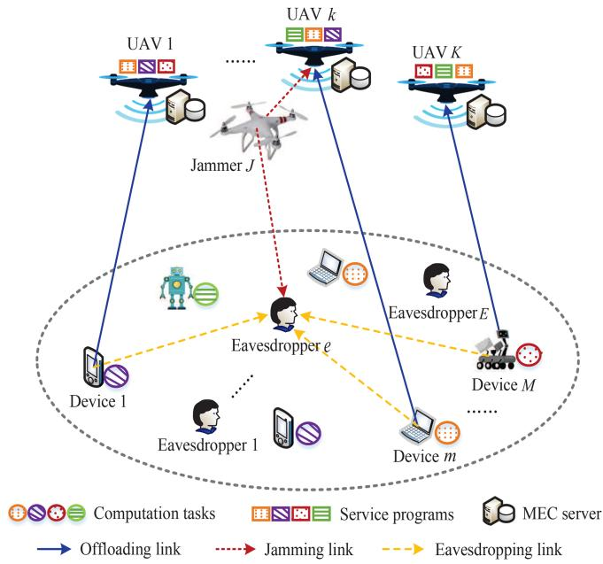
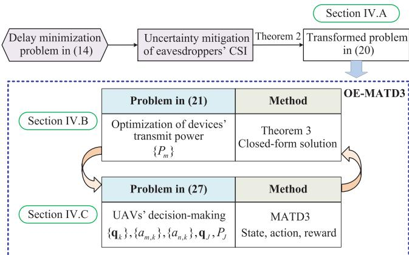
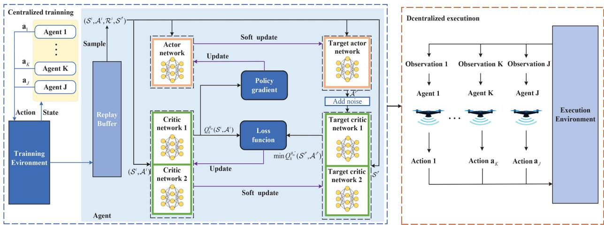
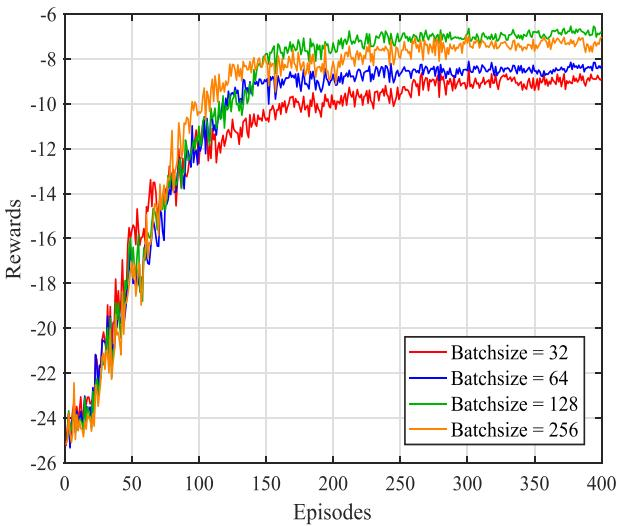
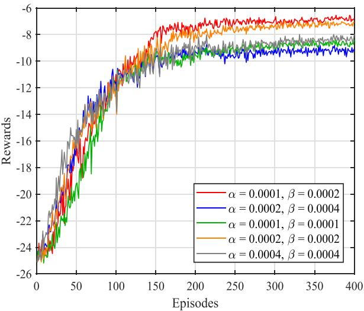
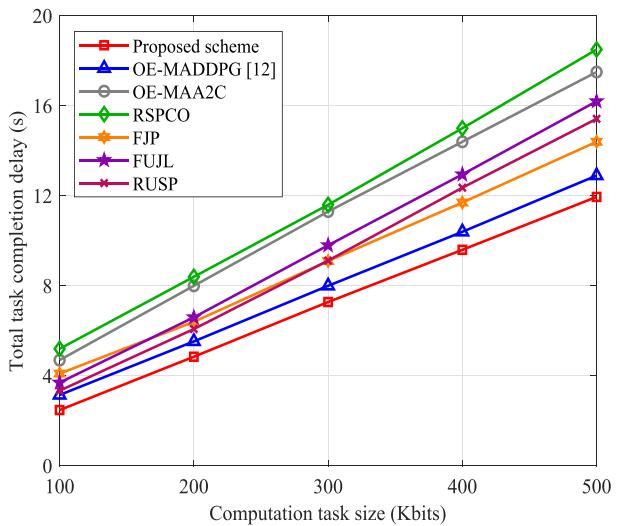
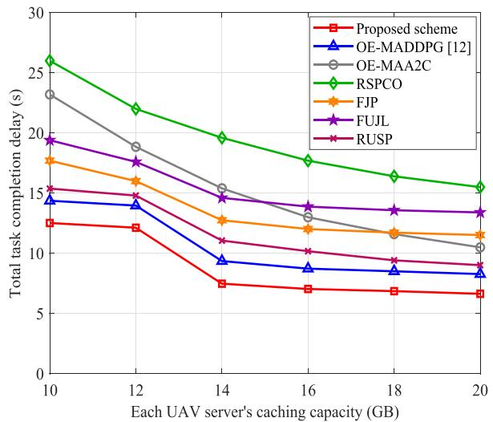
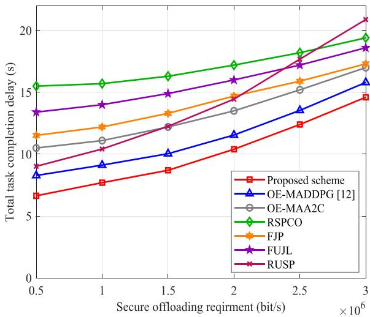
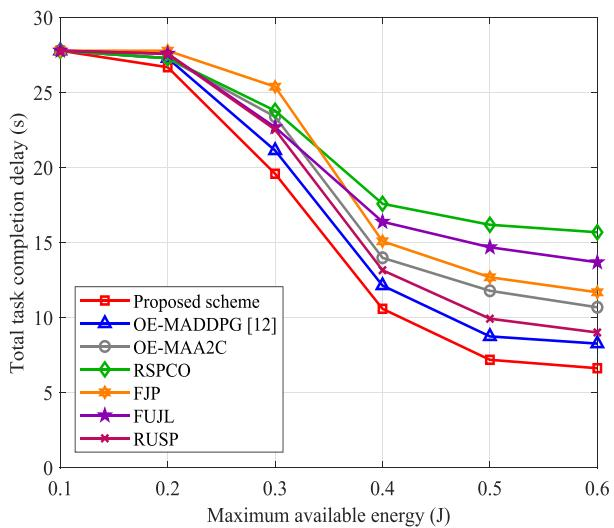
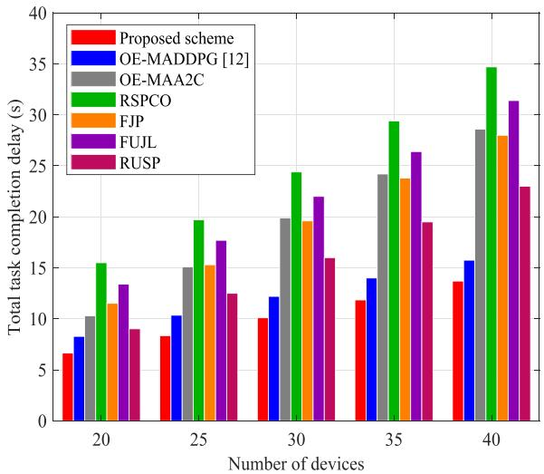

# Security-Aware Designs of Multi-UAV Deployment, Task Offloading and Service Placement in Edge Computing Networks

Mengru Wu , Haonan Wu, Weidang Lu , Senior Member, IEEE, Lei Guo , Member, IEEE, Inkyu Lee , Fellow, IEEE, and Abbas Jamalipour , Fellow, IEEE

Abstract—Unmanned aerial vehicle (UAV)-assisted mobile edge computing (MEC) has emerged as a promising solution to support wireless devices’ computation-intensive services in the absence of terrestrial infrastructures. Nevertheless, the heterogeneous nature of MEC services and the security vulnerability of wireless channels present significant challenges to achieving efficient and secure computation offloading. In this paper, we investigate a multi-UAVassisted MEC network in which wireless devices need to process diverse computation tasks. The devices can perform local computing or offload their computation tasks to UAV servers that have precached relevant service programs in the presence of eavesdroppers. To facilitate secure service provisioning, we propose a cooperative jamming-based scheme in which a UAV jammer transmits jamming signals to interfere with eavesdroppers during devices’ computation offloading processes. Taking into account UAV servers’ constrained caching spaces and secure offloading requirements, we minimize the total task completion delay of devices by jointly optimizing multi-UAV deployment, task offloading decisions, service placement, UAV jammer’s transmit power, and devices’ transmit power. To tackle the formulated mixed-integer nonlinear programming problem, we design an optimization-embedding multi-agent twin delayed deep deterministic policy gradient (OE-MATD3) algorithm. Specifically, the MATD3 approach is leveraged to deal with optimization variables concerning UAVs, while a closed-form solution for devices’ transmit power is derived and guides MATD3- based decision-making. Simulation results demonstrate that the proposed scheme outperforms baselines in terms of devices’ task completion delay.

Index Terms—Mobile edge computing, unmanned aerial vehicles, cooperative jamming, service placement, deep reinforcement learning.

## I. INTRODUCTION

F UTURE internet-of-things networks are expected to sup-port seamless coverage and low-latency services [1], [2]. port seamless coverage and low-latency services [1], [2] To achieve this vision, unmanned aerial vehicles (UAVs) have emerged as a prospective solution to complement terrestrial wireless communications and enhance network coverage [3]. Specifically, the fixed locations of base stations (BSs) in terrestrial networks may result in unfavorable obstructions and poor channel conditions, which can be addressed by leveraging UAVs. With their mobility and line-of-sight (LoS) transmission capabilities, UAVs hold the potential to assist information transmission in a variety of applications, including smart cities and transportation [4]. Meanwhile, mobile edge computing (MEC) has been recognized as a viable technology for handling computation-intensive tasks and providing low-latency services. By placing computing and caching resources close to wireless devices, MEC enables computation offloading from devices to MEC servers, which relieves the limitations of devices’ computing resources [5].

Driven by the advantages of UAV and MEC technologies, UAV-assisted MEC networks have garnered significant attention for their ability to provide efficient services [6], [7]. In these networks, UAVs equipped with MEC servers serve as computing platforms to process computation tasks for wireless devices [8]. However, two key challenges arise in computation offloading and task execution within UAV-assisted MEC networks. First, the LoS transmission and broadcast characteristics of air-ground channels render task offloading susceptible to interception in eavesdropping environments, potentially leading to privacy leakage. This issue prompts the need for cooperative jamming (CJ) to prevent offloaded tasks from being intercepted. Specifically, cooperative jamming leverages friendly jammers to send artificial noise to enlarge the difference between legitimate and eavesdropping channels [9]. Due to the flexibility of UAV deployment, UAVs can also function as friendly jammers to confuse eavesdroppers. In this context, effectively coordinating UAV servers and jammers is crucial to ensure secure service provisioning.

In addition to security concerns, caching resource limitations present another critical challenge in UAV-assisted MEC networks. Due to the diversity of MEC services, executing computation tasks on UAV servers may require different service programs [10], [11]. For example, computation tasks like image classification may need deep learning (DL) models such as VGG16, while image generation tasks necessitate other DL models like Stable Diffusion. These DL models can be seen as service programs that require caching resources to support the execution of computation tasks. However, due to the limited storage capabilities of UAV servers, caching all service programs is not feasible. Thus, decisions regarding service placement on UAV servers directly affect whether devices can perform computation offloading, ultimately influencing computation efficiency [12]. Consequently, it is imperative to jointly design computation offloading and service placement schemes in UAV-assisted MEC networks.

In practical UAV-enabled edge computing environments, it is essential to reduce task completion delay while ensuring the security of computation offloading and the efficiency of task execution. Therefore, it is vital to investigate security-aware designs of multi-UAV deployment, task offloading, and service placement, which have not been explored before. To fill this research gap, we propose an optimization-embedding multi-agent twin delayed deep deterministic policy gradient (OE-MATD3) algorithm to address the co-design problem in a UAV-assisted MEC network, where devices either perform local computing or computation offloading to UAV servers that have pre-cached related service programs for task execution. To summarize, the main contributions of this paper are listed as follows:

CJ-Based Secure Service Provisioning: To enhance the security of computation offloading under the threat of eavesdropping, we develop a CJ-based secure service provisioning scheme that leverages a UAV jammer to transmit jamming signals against eavesdroppers. Our objective is to minimize the total task completion delay of devices through the joint optimization of UAV deployment, computation offloading, service placement, UAV jammer’s transmit power, and devices’ transmit power subject to the limited storage spaces of UAV servers, secrecy offloading requirements, execution delay tolerance, and energy consumption constraints. To the best of our knowledge, this is the first work that explores the security-aware co-design problem in multi-UAV-assisted MEC networks.

\- OE-MATD3 Algorithm Design: Since the formulated problem is mixed-integer nonlinear programming (MINLP), the OE-MATD3 algorithm is developed by exploiting the optimization theory and deep reinforcement learning (DRL). Specifically, we employ MATD3 to determine the optimization variables related to UAVs, including UAV deployment, computation offloading, service placement, and jamming power control. Meanwhile, a closed-form solution for devices’ transmit power is derived, which can offer guidance for decision-making in the MATD3 framework.

\- Performance Evaluation: Comprehensive numerical results validate the effectiveness of the proposed OE-MATD3-based co-design scheme. We demonstrate that the proposed OE-MATD3 algorithm can achieve convergence performance. Also, we conduct a comparative analysis of our scheme against baseline approaches across various factors, which highlights the superior performance of our scheme in minimizing task completion delay.

The remainder of this paper is organized as follows: Related studies are reviewed in Section II. Section III illustrates the system model of the considered multi-UAV-assisted MEC network and presents the security-aware co-design problem. In Section IV, we propose the OE-MATD3 algorithm to deal with the formulated problem, which combines the optimization theory with the MATD3 algorithm. Simulation results are shown in Section V, followed by conclusions in Section VI.

## II. RELATED WORK

In this section, we first review related studies from the perspective of UAV-assisted MEC, secure computation offloading in UAV-assisted MEC, and service placement in UAV-assisted MEC. Then, we summarize the key differences between our work and these existing studies.

## A. UAV-Assisted MEC

Extensive research has explored task offloading and UAV deployment strategies in edge computing networks. The authors in [13] explored multi-server cooperation between a UAV and a BS to enhance computation efficiency. The work in [14] jointly optimized UAV placement, computing resource allocation, and computation task partition in a MEC network, where double deep Q-learning (DDQN) and deep deterministic policy gradient (DDPG) algorithms were designed to solve a delay minimization problem. Considering the stochastic arrivals of task data and energy, an energy harvesting-enabled MEC network was studied in [15]. In [16], task priority was evaluated according to task delay requirements and devices’ remaining energy. On this basis, [16] further developed a service satisfaction-oriented scheme in a UAV-enabled MEC network. Also, [17], [18], [19] proposed multi-UAV-assisted computation offloading schemes by allowing ground devices to offload tasks to MEC servers deployed on multiple UAVs. Specifically, energy consumption was minimized in [17] for a multi-UAV-enabled large-scale MEC network, where user association, UAV deployment, and flight trajectories were jointly optimized. To maintain fairness among UAVs, trajectory control algorithms based on multi-agent deep deterministic policy gradient (MADDPG) were developed in [18] to determine the trajectories of UAVs. In [19], a multi-UAV-enabled hybrid cloud-edge framework was studied, where an improved particle swarm optimization (PSO) method was designed to minimize the weighted cost of delay and energy consumption.

## B. Secure Computation Offloading in UAV-Assisted MEC

While UAV-assisted MEC networks hold the potential to handle computation-intensive and time-sensitive tasks, the inherent broadcast nature of wireless channels poses significant security threats to computation offloading [20]. To address this problem, physical-layer security (PLS) technology has emerged as an efficient approach to enhance offloading security. In [21], the authors utilized PLS to secure computation offloading in a UAV-assisted MEC network, where devices’ secure computing capacity was maximized via resource and trajectory optimization. The authors in [22] studied secure communications, where a full-duplex UAV server and non-offloading devices emitted jamming signals to disturb UAV eavesdroppers. Also, a ground jammer was utilized in [23] to achieve secure computation offloading in the presence of a flying eavesdropper. Aiming to maximize the minimum secure computing capacity, the work in [24] jointly optimized UAV trajectories, devices offloading power, and resource allocation. A dual UAV-assisted MEC network was examined in [25], where a legitimate UAV executed computation tasks while the other UAV acted as a jammer to interfere with ground eavesdroppers. Furthermore, secure computation offloading was introduced in [26] for a multi-UAV-assisted MEC network, where offloading decisions were optimized to maximize system utility.

TABLE I  
COMPARISON BETWEEN OUR WORK AND RELATED WORKS
<table><tr><td rowspan=1 colspan=2>References</td><td rowspan=1 colspan=1>Scenarios</td><td rowspan=1 colspan=1>Serviceplacement</td><td rowspan=1 colspan=1>Secureoffloading</td><td rowspan=1 colspan=1>UAV-assistedjamming</td><td rowspan=1 colspan=1>Method</td></tr><tr><td rowspan=1 colspan=1></td><td rowspan=1 colspan=1>[13]</td><td rowspan=1 colspan=1>Single UAV server</td><td rowspan=1 colspan=1>×</td><td rowspan=1 colspan=1> $\times$ </td><td rowspan=1 colspan=1> $\times$ </td><td rowspan=1 colspan=1>Alternating optimization</td></tr><tr><td rowspan=1 colspan=1></td><td rowspan=1 colspan=1>[14]</td><td rowspan=1 colspan=1>Single UAVserver</td><td rowspan=1 colspan=1>×</td><td rowspan=1 colspan=1>×</td><td rowspan=1 colspan=1>×</td><td rowspan=1 colspan=1>DDPG and DDQN</td></tr><tr><td rowspan=1 colspan=2>[15]</td><td rowspan=1 colspan=1>Single UAVserver</td><td rowspan=1 colspan=1>×</td><td rowspan=1 colspan=1>×</td><td rowspan=1 colspan=1>×</td><td rowspan=1 colspan=1>Lyapunov optimization</td></tr><tr><td rowspan=1 colspan=2>[16]</td><td rowspan=1 colspan=1>Multiple UAVservers</td><td rowspan=1 colspan=1>×</td><td rowspan=1 colspan=1>×</td><td rowspan=1 colspan=1>×</td><td rowspan=1 colspan=1>Alternating optimization</td></tr><tr><td rowspan=1 colspan=2>[17]</td><td rowspan=1 colspan=1>Multiple UAVservers</td><td rowspan=1 colspan=1>×</td><td rowspan=1 colspan=1>×</td><td rowspan=1 colspan=1>×</td><td rowspan=1 colspan=1>Improved fireworks algorithm</td></tr><tr><td rowspan=1 colspan=2>[18]</td><td rowspan=1 colspan=1>Multiple UAV servers</td><td rowspan=1 colspan=1>×</td><td rowspan=1 colspan=1>×</td><td rowspan=1 colspan=1>×</td><td rowspan=1 colspan=1>MADDPG</td></tr><tr><td rowspan=1 colspan=1></td><td rowspan=1 colspan=1>[19]</td><td rowspan=1 colspan=1>Multiple UAVservers</td><td rowspan=1 colspan=1>×</td><td rowspan=1 colspan=1> $\times$ </td><td rowspan=1 colspan=1> $\times$ </td><td rowspan=1 colspan=1>Improved PSO</td></tr><tr><td rowspan=1 colspan=1>[21], [</td><td rowspan=1 colspan=1>22], [23]</td><td rowspan=1 colspan=1>Single UAVserver</td><td rowspan=1 colspan=1>×</td><td rowspan=1 colspan=1> $\overline { { \checkmark } }$ </td><td rowspan=1 colspan=1> $\times$ </td><td rowspan=1 colspan=1>Alternating optimization</td></tr><tr><td rowspan=1 colspan=2>[24]</td><td rowspan=1 colspan=1>Single UAVserver</td><td rowspan=1 colspan=1> $\times$ </td><td rowspan=1 colspan=1> $\checkmark$ </td><td rowspan=1 colspan=1> $\checkmark$ </td><td rowspan=1 colspan=1>Alternating optimization</td></tr><tr><td rowspan=1 colspan=2>[25]</td><td rowspan=1 colspan=1>Multiple UAVservers</td><td rowspan=1 colspan=1> $\times$ </td><td rowspan=1 colspan=1> $\checkmark$ </td><td rowspan=1 colspan=1> $\checkmark$ </td><td rowspan=1 colspan=1>Reinforcement learning</td></tr><tr><td rowspan=1 colspan=1></td><td rowspan=1 colspan=1>[26]</td><td rowspan=1 colspan=1>Multiple UAV servers</td><td rowspan=1 colspan=1> $\times$ </td><td rowspan=1 colspan=1> $\checkmark$ </td><td rowspan=1 colspan=1> $\times$ </td><td rowspan=1 colspan=1>Reinforcement learning</td></tr><tr><td rowspan=1 colspan=1></td><td rowspan=1 colspan=1>[28]</td><td rowspan=1 colspan=1>Multiple UAVservers</td><td rowspan=1 colspan=1> $\overline { { \checkmark } }$ </td><td rowspan=1 colspan=1> $\times$ </td><td rowspan=1 colspan=1> $\times$ </td><td rowspan=1 colspan=1>Alternating optimization</td></tr><tr><td rowspan=1 colspan=1></td><td rowspan=1 colspan=1>[29]</td><td rowspan=1 colspan=1>Multiple UAVservers</td><td rowspan=1 colspan=1> $\overline { { \checkmark } }$ </td><td rowspan=1 colspan=1> $\times$ </td><td rowspan=1 colspan=1> $\times$ </td><td rowspan=1 colspan=1>TLRL</td></tr><tr><td rowspan=1 colspan=2>[30], [31]</td><td rowspan=1 colspan=1>Multiple UAV servers</td><td rowspan=1 colspan=1> $\overline { { \checkmark } }$ </td><td rowspan=1 colspan=1> $\times$ </td><td rowspan=1 colspan=1> $\times$ </td><td rowspan=1 colspan=1>Alternating optimization</td></tr><tr><td rowspan=1 colspan=2>Our work</td><td rowspan=1 colspan=1>Multiple UAVservers</td><td rowspan=1 colspan=1> $\overline { { \checkmark } }$ </td><td rowspan=1 colspan=1> $\checkmark$ </td><td rowspan=1 colspan=1> $\overline { { \checkmark } }$ </td><td rowspan=1 colspan=1>OE-MATD3</td></tr></table>

## C. Service Placement in UAV-Assisted MEC

In practical MEC networks, a wide range of services need to be supported, especially for computation-intensive applications such as augmented reality (AR) and medical care, which require various service programs. To efficiently handle these tasks, it is essential to pre-store necessary service programs or databases on UAV servers [27]. It is worth noting that UAVs have limited storage spaces due to hardware costs, making it impossible to pre-cache all service programs. A few studies have explored service placement and computation offloading schemes in UAV-assisted MEC networks. The authors in [28] jointly designed UAV deployment, service placement, and computation offloading, where multiple UAV servers have pre-cached different service programs. Also, a triple-learner-based reinforcement learning (TLRL) approach was proposed in [29] to jointly adjust energy renewal, UAV trajectory design, and application placement. Moreover, [12] and [30] investigated a joint design of service placement and computation offloading in multi-UAVassisted MEC networks, where UAV servers offered multiple types of services to devices. The authors in [31] studied a quality-of-experience problem in a UAV-enabled MEC network by jointly optimizing content caching, service placement, and task offloading.

## D. Summary

The works in [21], [22], [23], [24], [25], [26] have laid solid foundations for achieving secure service provisioning in UAV-assisted MEC networks. However, these works have overlooked the heterogeneity of MEC services and the significance of service placement. Additionally, studies in [12], [28], [29], [30], [31] failed to address the security issues related to computation offloading, rendering their developed schemes unsuitable for realizing secure service provisioning. Thus, this paper focuses on the joint design of multi-UAV deployment, task offloading, and service placement while considering the caching storage of each UAV and secure offloading requirements. Besides, we develop an OE-MATD3 algorithm by exploiting the optimization theory and DRL to address the joint design problem. To highlight the novelty of our work, we summarize the distinctions between our work and existing studies in Table I.

## III. SYSTEM MODEL AND PROBLEM FORMULATION

## A. System Model

As illustrated in Fig. 1, we consider a UAV-assisted MEC network that comprises K UAVs equipped with MEC servers, M wireless devices, E eavesdroppers, and a UAV jammer.1 The sets of UAV servers, devices, and eavesdroppers are respectively denoted by ${ \mathcal { K } } \triangleq \{ 1 , . . . , K \} , \mathcal { M } \triangleq \{ 1 , . . . , M \}$ , and $\mathcal { E } \triangleq \{ 1 , . . . , E \}$ . Also, we utilize an index J to represent the UAV jammer. Each device generates a computation-intensive task that requires a service program for effective execution.2 Without loss of generality, we assume that service program $n \in \mathcal { N } \overset { \Delta } { = } \{ 1 , . . . , N \}$ is required for processing the computation task of device $m \in \mathcal { M }$ . Consequently, the mapping relationship between device m and service program n can be expressed as $n = \varphi ( m )$ , which is determined by the specific characteristics of computation tasks. Besides, device m operates in the binary offloading manner so that device m can choose to perform local computing or offload its computation task to UAV server $k \in \mathcal { K }$ for edge processing.3 Due to the broadcast nature of wireless channels, computation offloading processes are susceptible to eavesdropping. As a complement to upper-layer encryption technologies, we propose a CJ-based secure service provisioning scheme to ensure secure computation offloading. In this scheme, UAV jammer J can transmit jamming signals to prevent offloaded tasks from eavesdropping. For ease of reference, we provide a summary of key symbols in Table II.

  
Fig. 1. Illustration of a multi-UAV-assisted MEC network.

In this network, a three-dimensional Cartesian coordinate system is leveraged to characterize node locations. Since UAVs can be positioned at a sufficiently high altitude to maintain visibility with devices, we consider LoS transmission. The altitude of UAVs hover is set to $H _ { u }$ [32]. The horizontal coordinates of UAV server k and UAV jammer J can be denoted by $\mathbf { q } _ { k } = [ x _ { k } , y _ { k } ] ^ { T } \in \mathbb { R } ^ { 2 \times 1 }$ and $\mathbf { q } _ { J } ^ { \mathsf { ^ { * } } } = [ x _ { J } , y _ { J } ] ^ { T } \in \mathbb { R } ^ { 2 \times 1 }$ respectively. To avoid collision during the hovering period of UAVs, $| | \mathbf { q } _ { k } - \mathbf { q } _ { \widetilde { k } } | | ^ { 2 } \geq d _ { \operatorname* { m i n } } ^ { 2 }$ for $\boldsymbol { k } \neq \boldsymbol { \tilde { k } }$ and $| | \mathbf { q } _ { k } - \mathbf { q } _ { J } | | ^ { 2 } \geq d _ { \operatorname* { m i n } } ^ { 2 }$ should be maintained, where $d _ { \mathrm { m i n } }$ represents the minimum distance between two UAVs. Besides, the horizontal coordinate of device m is given by $\mathbf { q } _ { m } = [ x _ { m } , y _ { m } ] ^ { T } \in \mathbb { R } ^ { 2 \times 1 }$ . Similar to [22] and [33], we assume that channel state information (CSI) is perfectly known except the CSI of the eavesdropping channels. Specifically, eavesdroppers may hide their locations, and thus it is difficult to determine their exact positions. In this context, we consider that UAVs only detect eavesdroppers’ approximate regions and denote the estimated horizontal location of eavesdropper $e \in { \mathcal { E } }$ as $\tilde { \mathbf { q } } _ { e } = [ \tilde { x } _ { e } , \tilde { y } _ { e } ] ^ { T } \in \mathbb { R } ^ { 2 \times 1 }$ . By defining $\triangle \mathbf { Q } _ { e } = [ \triangle x _ { e } , \triangle y _ { e } ] ^ { T } \in \mathbb { R } ^ { 2 \times 1 }$ as the estimation error, we can obtain the accurate horizontal location of eavesdropper e as $\begin{array} { r } { \mathbf q _ { e } = [ \tilde { x } _ { e } + \triangle x _ { e } , \tilde { y } _ { e } + \triangle y _ { e } ] ^ { T } \in \mathbb { R } ^ { 2 \times 1 } } \end{array}$ , where $| | \triangle \mathbf { Q } _ { e } | | ^ { \bar { 2 } } \leq \chi$ and χ represents the maximum estimation error. On this basis, we adopt the free-space path loss model to describe the channel coefficient from device m to UAV server k, the channel coefficient from UAV jammer J to eavesdropper e, and the channel coefficient from UAV jammer J to UAV server k respectively as

TABLE II SUMMARY OF MAIN NOTATIONS
<table><tr><td>Notation</td><td>Definition</td></tr><tr><td> $\kappa , \mathcal { M } , \mathcal { E } , \mathcal { N }$ </td><td>Sets of UAV servers, devices, eavesdroppers, and service programs</td></tr><tr><td> $k , m , e , n , J$ </td><td>Indices of UAV servers, devices, eavesdroppers, service programs, and a UAV jammer</td></tr><tr><td> $H _ { u }$ </td><td>UAV hovering altitude</td></tr><tr><td> ${ \bf q } _ { k } , { \bf q } _ { J }$ </td><td>Horizontal coordinates of UAV server k and jammer J</td></tr><tr><td> ${ \bf q } _ { m } , { \bf q } _ { e }$ </td><td>Horizontal coordinates of device m and eavesdropper e</td></tr><tr><td> $\tilde { \mathbf { q } } _ { e }$ </td><td>Estimated horizontal location of eavesdropper e</td></tr><tr><td>X</td><td>Maximum estimation error</td></tr><tr><td> $h _ { m , k } , h _ { J , e }$ </td><td>Channel coefficient from device m to UAV server k and that from UAV jammer J to eavesdropper e</td></tr><tr><td> $h _ { J , k } , h _ { m , e }$ </td><td>Channel coefficient from UAV jammer J to UAV server</td></tr><tr><td> $L _ { m }$ </td><td>k and that from device m to eavesdropper e</td></tr><tr><td> $C _ { m }$ </td><td>Device m&#x27;s computation task size CPU cycles to process one bit of device m&#x27;s task</td></tr><tr><td> $a _ { m , k }$ </td><td>Association relationship between device m and UAV</td></tr><tr><td></td><td>server k</td></tr><tr><td> $y _ { n , k }$ </td><td>Caching decision for service program n at UAV server k</td></tr><tr><td> $c _ { n }$   $S ^ { \mathrm { { m a x } } }$ </td><td>Caching space for storing service program n</td></tr><tr><td></td><td>Maximum caching space of UAV server k</td></tr><tr><td> $\boldsymbol { P _ { m } ^ { \mathrm { ' } } }$ </td><td>Device m&#x27;s transmit power for computation offloading</td></tr><tr><td> $B$ </td><td>Transmission bandwidth</td></tr><tr><td> $\beta _ { 0 }$ </td><td>Channel gain at the reference distance of 1 m</td></tr><tr><td> $\alpha _ { m , e }$ </td><td>Path loss exponent between device m and eavesdropper e</td></tr><tr><td> $P _ { J }$ </td><td>Transmit power for sending jamming signals</td></tr><tr><td> $\sigma _ { k } ^ { 2 } , \sigma _ { e } ^ { 2 }$ </td><td>Noise power at UAV server k and eavesdropper e</td></tr><tr><td> $R _ { m , k }$ </td><td>Computation offloading rate from device m to UAV</td></tr><tr><td></td><td>server k</td></tr><tr><td> $R _ { m , e }$   $R _ { m , k } ^ { \mathrm { s e c } }$ </td><td>Eavesdropping rate at eavesdropper e Worst-case secrecy offloading rate of device m</td></tr><tr><td></td><td></td></tr><tr><td> $T _ { m } ^ { \mathrm { u a v } } , E _ { m } ^ { \mathrm { u a v } }$ </td><td>Task completion delay and energy consumption when</td></tr><tr><td> $T _ { m } ^ { \mathrm { l o c } } , E _ { m } ^ { \mathrm { l o c } }$ </td><td>device m performs computation offloading Task completion delay and and energy consumption</td></tr><tr><td></td><td>when device m performs local computing</td></tr><tr><td> $f _ { m , k }$ </td><td>UAV server k&#x27;s computing resources allocated to deal</td></tr><tr><td></td><td>with device m&#x27;s computation task</td></tr><tr><td> $f _ { m } ^ { \mathrm { l o c } }$ </td><td></td></tr><tr><td></td><td>Device m&#x27;s local computing capability</td></tr><tr><td> $\eta _ { k } , \eta _ { m }$ </td><td>Effective capacitance coefficients of UAV server k and device m</td></tr></table>

$$
h _ { m , k } = \sqrt { \frac { \beta _ { 0 } } { | | \mathbf { q } _ { m } - \mathbf { q } _ { k } | | ^ { 2 } + H _ { u } ^ { 2 } } } ,\tag{1}
$$

$$
h _ { J , e } = \sqrt { \frac { \beta _ { 0 } } { | | \mathbf { q } _ { J } - \mathbf { q } _ { e } | | ^ { 2 } + H _ { u } ^ { 2 } } } ,\tag{2}
$$

$$
h _ { J , k } = \sqrt { \frac { \beta _ { 0 } } { | | \mathbf { q } _ { J } - \mathbf { q } _ { k } | | ^ { 2 } } } ,\tag{3}
$$

where $\beta _ { 0 }$ signifies the channel gain at the reference distance of 1m. In contrast, due to terrestrial environments, we employ the large-scale path loss and the small-scale Rayleigh fading to model the channel coefficient between device m and eavesdropper e as

$$
\begin{array} { r } { h _ { m , e } = \sqrt { \frac { \beta _ { 0 } } { \left| \left| \mathbf { q } _ { m } - \mathbf { q } _ { e } \right| \right| ^ { \alpha _ { m , e } } } \xi } , } \end{array}\tag{4}
$$

where $\alpha _ { m , e } > 2$ indicates the path loss exponent and ξ follows an exponential distribution with unit mean.

For the computation task generated by device $m ,$ we utilize $L _ { m }$ and $C _ { m }$ to describe the task profile of device $m ,$ where $L _ { m }$ refers to the task size and $C _ { m }$ represents CPU cycles required to process one bit of the computation task. Since device m can choose to perform local computing or offload its computation task to UAV server k, we introduce a binary variable $a _ { m , k }$ to characterize the association relationship between device m and UAV server k when performing computation offloading. In particular, $a _ { m , k } = 1$ means that the computation task of device m is offloaded to UAV server k, while $a _ { m , k } = 0$ indicates that device m cannot offload its computation task to UAV server k. Besides, we leverage $\textstyle 1 - \sum _ { k = 1 } ^ { K } a _ { m , k }$ to signify the local computing mode at device m. Taking UAV servers’ limited storage capabilities into account, we further employ $y _ { n , k } \in \{ 0 , 1 \}$ to 0 1illustrate the service placement decision for service program n at UAV server k. When $y _ { n , k }$ is equal to 1, it implies that service program n has been cached at UAV server k, otherwise $y _ { n , k } = 0$ Denoting the maximum caching space of UAV server k as $S _ { k } ^ { \mathrm { m a x } }$ we derive the caching space constraint as

$$
\sum _ { n = 1 } ^ { N } y _ { n , k } c _ { n } \leq S _ { k } ^ { \operatorname* { m a x } } ,\tag{5}
$$

where $c _ { n }$ is the caching space required for storing service program n. Owing to the mapping relationship between device m’s computation task and service program n, the service placement status of UAV server k directly influences device m’s computation offloading decisions. Specifically, device m can only offload its computation task to UAV server k for edge processing when the corresponding service program n has been pre-cached at UAV server k. To highlight the interconnected relation between computation offloading and service placement, we have

$$
a _ { m , k } \leq y _ { n , k } , \mathrm { f o r } n = \varphi ( m ) .\tag{6}
$$

When performing computation offloading to UAV servers, devices occupy orthogonal spectrum resources to avoid interference. Meanwhile, UAV jammer J sends jamming signals with the transmit power of $P _ { J }$ to interfere with eavesdroppers. Therefore, the computation offloading rate from device m to UAV server k can be written as

$$
R _ { m , k } = a _ { m , k } B \mathrm { l o g } _ { 2 } \left( 1 + \frac { P _ { m } | h _ { m , k } | ^ { 2 } } { P _ { J } | h _ { J , k } | ^ { 2 } + \sigma _ { k } ^ { 2 } } \right) ,\tag{7}
$$

where B denotes the transmission bandwidth, $P _ { m }$ equals device m’s transmit power for computation offloading, and $\sigma _ { k } ^ { 2 }$ means the noise power at UAV server k. Besides, the eavesdropping rate at eavesdropper e is expressed as

$$
R _ { m , e } = a _ { m , k } B \log _ { 2 } \left( 1 + \frac { P _ { m } | h _ { m , e } | ^ { 2 } } { P _ { J } | h _ { J , e } | ^ { 2 } + \sigma _ { e } ^ { 2 } } \right) ,\tag{8}
$$

where $\sigma _ { e } ^ { 2 }$ indicates the noise power at eavesdropper $e .$ Based on (7) and (8), the worst-case secrecy offloading rate can be given by [34]

$$
R _ { m , k } ^ { \mathrm { s e c } } = \left[ R _ { m , k } - \operatorname* { m a x } _ { e \in \mathscr { E } } R _ { m , e } \right] ^ { + } ,\tag{9}
$$

where $[ x ] ^ { + } = \operatorname* { m a x } \{ 0 , x \}$

Computational results usually have a small size, and thus the time spent on downloading results is negligible [35].4 Therefore, if device m selects to offload its computation task to UAV server k, the corresponding task completion delay can be written as

$$
T _ { m } ^ { \mathrm { u a v } } = \sum _ { k = 1 } ^ { K } a _ { m , k } \left( T _ { m , k } ^ { \mathrm { o f f } } + T _ { m , k } ^ { \mathrm { u a v } } \right) ,\tag{10}
$$

where $\begin{array} { r } { T _ { m , k } ^ { \mathrm { o f f } } = \frac { L _ { m } } { R _ { m , k } } } \end{array}$ means the computation offloading time from device m to UAV server k, $\begin{array} { r } { T _ { m , k } ^ { \mathrm { u a v } } = \frac { L _ { m } C _ { m } } { f _ { m , k } } } \end{array}$ defines the task execution time at UAV server $k ,$ and $f _ { m , k }$ denotes UAV server k’s computing resources allocated for processing device m’s computation task. Moreover, the energy consumption for executing device m’s computation task is expressed as

$$
E _ { m } ^ { \mathrm { u a v } } = \sum _ { k = 1 } ^ { K } a _ { m , k } \left( E _ { m , k } ^ { \mathrm { o f f } } + E _ { m , k } ^ { \mathrm { u a v } } \right) ,\tag{11}
$$

where $\begin{array} { r } { E _ { m , k } ^ { \mathrm { o f f } } = P _ { m } \frac { L _ { m } } { R _ { m , k } } } \end{array}$ refers to the energy consumption for computation offloading, $E _ { m , k } ^ { \mathrm { u a v } } = \eta _ { k } L _ { m } C _ { m } ( f _ { m , k } ) ^ { 2 }$ indicates = (the energy consumption for UAV computing, and $\eta _ { k }$ represents the effective capacitance coefficient of UAV server k.

Since the security issue exists in the offloading process, device m may choose local computing. When device m performs local computing, the task completion delay can be given by

$$
T _ { m } ^ { \mathrm { l o c } } = \left( 1 - \sum _ { k = 1 } ^ { K } a _ { m , k } \right) \frac { L _ { m } C _ { m } } { f _ { m } ^ { \mathrm { l o c } } } ,\tag{12}
$$

where $f _ { m } ^ { \mathrm { l o c } }$ represents device m’s local computing capability. Denoting $\eta _ { m }$ as the effective capacitance coefficient of device $m ,$ , the energy consumption for local computing is written as

$$
E _ { m } ^ { \mathrm { l o c } } = \left( 1 - \sum _ { k = 1 } ^ { K } a _ { m , k } \right) \eta _ { m } L _ { m } C _ { m } ( f _ { m } ^ { \mathrm { l o c } } ) ^ { 2 } .\tag{13}
$$

## B. Problem Formulation

This paper aims to minimize the total task completion delay of devices by taking into account the limited storage spaces of UAV servers, secrecy offloading requirements, execution delay tolerance, and energy consumption constraints. To achieve this objective, we propose a joint optimization framework that designs multi-UAV deployment, devices’ offloading decisions, service placement at UAV servers, UAV jammer’s transmit power, and devices’ transmit power. Consequently, we formulate the problem of delay minimization as5

$$
( { \bf P } ) : \quad \operatorname* { m i n } _ { \{ { \bf q } _ { k } \} , \{ a _ { m , k } \} , \{ y _ { n , k } \} , \atop { \{ { \cal P } _ { m } \} , { \bf q } _ { J } , { \cal P } _ { J } } } \sum _ { m = 1 } ^ { M } \big ( T _ { m } ^ { \mathrm { u a v } } + T _ { m } ^ { \mathrm { l o c } } \big )\tag{14a}
$$

$$
\mathrm { s . t . } \sum _ { k = 1 } ^ { K } a _ { m , k } \leq 1 , \forall m \in \mathcal { M } ,\tag{14b}
$$

$$
\sum _ { n = 1 } ^ { N } y _ { n , k } c _ { n } \leq S _ { k } ^ { \operatorname* { m a x } } , \forall k \in K ,\tag{14c}
$$

$$
a _ { m , k } \leq y _ { n , k } \leq 1 , \mathrm { ~ f o r ~ } n = \varphi ( m ) ,\tag{14d}
$$

$$
R _ { m , k } ^ { \mathrm { s e c } } \geq R _ { m , k } ^ { \mathrm { m i n } } , \mathrm { i f } a _ { m , k } = 1 ,\tag{14e}
$$

$$
E _ { m } ^ { \mathrm { u a v } } + E _ { m } ^ { \mathrm { l o c } } \leq E _ { m } ^ { \mathrm { m a x } } , \forall m \in \mathcal { M } ,\tag{14f}
$$

$$
T _ { m } ^ { \mathrm { u a v } } + T _ { m } ^ { \mathrm { l o c } } \leq T _ { m } ^ { \mathrm { m a x } } , \forall m \in \mathcal { M } ,\tag{14g}
$$

$$
| | \mathbf { q } _ { k } - \mathbf { q } _ { \widetilde { k } } | | ^ { 2 } \geq d _ { \operatorname* { m i n } } ^ { 2 } , \quad \forall k \in \mathcal { K } , k \neq \widetilde { k } ,\tag{14h}
$$

$$
| | \mathbf { q } _ { k } - \mathbf { q } _ { J } | | ^ { 2 } \geq d _ { \operatorname* { m i n } } ^ { 2 } , \quad \forall k \in \mathcal { K } ,\tag{14i}
$$

$$
a _ { m , k } , y _ { n , k } \in \{ 0 , 1 \} , \quad { \mathrm { f o r } } \ n = \varphi ( m ) , \forall k \in \mathcal { K } ,\tag{14j}
$$

$$
0 \leq P _ { m } \leq P _ { m } ^ { \operatorname* { m a x } } , \quad \forall m \in \mathcal { M } ,\tag{14k}
$$

$$
0 \leq P _ { J } \leq P _ { J } ^ { \operatorname* { m a x } } ,\tag{14l}
$$

where $R _ { m , k } ^ { \mathrm { m i n } }$ represents the minimum secrecy offloading rate, $E _ { m } ^ { \mathrm { m a x } }$ and $T _ { m } ^ { \mathrm { m a x } }$ denote the maximum available energy and delay tolerance for processing device m’s task, and $P _ { m } ^ { \mathrm { m a x } }$ and $P _ { J } ^ { \mathrm { m a x } }$ are the maximum transmit power, respectively. Here, (14b) means that device m can offload its computation task to at most one UAV server. (14c) ensures that the storage spaces required for caching service programs do not exceed UAV server k ’s maximum caching capability. (14d) signifies the relationship between computation offloading and service placement. (14e) is imposed to guarantee secure computation offloading. (14f) and (14g) imply energy consumption and task completion delay constraints, respectively.6 (14h) and (14i) are employed to avoid deployment collision among UAVs. Also, (14j), (14k), and (14l) indicate the feasible regions of the optimization variables. We note that the formulated problem in P is an MINLP problem, which is NP-hard.

Theorem 1: The problem of delay minimization in P is NP-hard.

Proof: We analyze the nature of P from the perspective of a multiple knapsack problem (MKP), which is a typical NP-hard problem [36]. Specifically, the MKP involves assigning items to multiple knapsacks based on the weight of each item, and the total capacity of each knapsack does not exceed its maximum capacity while maximizing the total values of the selected items across all knapsacks. In P , each service program corresponds to an item in the MKP, and each UAV can be seen as a knapsack. Since service caching directly influences computation offloading decisions, it also affects devices’ task execution delay. Therefore, $\begin{array} { r } { \sum _ { m = 1 } ^ { M } T _ { m } ^ { \mathrm { u a v } } + T _ { m } ^ { \mathrm { l o c } } } \end{array}$ can reflect the values of items in the MKP. Additionally, constraint (14c) ensures that no knapsack exceeds its maximum capacity. Given that the MKP is inherently embedded in P , the delay minimization problem in P is also NP-hard. -

## IV. PROPOSED OE-MATD3 ALGORITHM

It is apparent that P involves both discrete and continuous ( )variables, and there exist strong coupling relationships among the optimization variables, which poses significant challenges to finding the optimal solution to P . Traditional approaches fail to make timely decisions in time-varying wireless environments due to their inherent limitations. Although DRL can be employed in dynamic environments, relying solely on DRL may not be feasible when dealing with large action dimensions, which may lead to low convergence efficiency. In particular, P involves different types of variables, resulting in large action spaces for DRL.

To address the above issues, we propose an OE-MATD3 algorithm by embedding the model-based optimization theory into the model-free MATD3 algorithm. Specifically, by analyzing the features of P , we divide the optimization variables into two groups. One group pertains to UAVs, including UAV deployment, computation offloading, service placement, and jamming power control. The other group is associated with devices, which optimizes devices’ transmit power for computation offloading. Thus, the MATD3 approach is utilized to optimize variables concerning UAVs. Additionally, we derive a closed-form solution for devices’ transmit power to guide decision-making within the MATD3 framework. Next, we present the details for solving P , and the framework for solving P is illustrated in Fig. 2.

## A. Problem Transformation

Due to the uncertain locations of eavesdroppers, it is challenging to solve the formulated problem. To mitigate this uncertainty, we first derive a worst-case lower bound for the secrecy offloading rate in (9) to secure computation offloading as much as possible.

Theorem 2: Given the estimated horizontal location of eavesdropper e and the maximum estimation error χ, the worst-case lower bound of the secrecy offloading rate can be expressed as

  
Fig. 2. Framework for solving the formulated problem in (P).

$$
\begin{array} { r l r } {  { R _ { m , k } ^ { \mathrm { s e c } } \geq [ a _ { m , k } B \log _ { 2 } ( 1 + \frac { P _ { m } | h _ { m , k } | ^ { 2 } } { P _ { J } | h _ { J , k } | ^ { 2 } + \sigma _ { k } ^ { 2 } } )  } } \\ & { } & {  - \operatorname* { m a x } _ { e \in \mathcal { E } } a _ { m , k } B \log _ { 2 } ( 1 + \frac { P _ { m } | h _ { m , e } ^ { \mathrm { m a x } } | ^ { 2 } } { P _ { J } | h _ { J , e } ^ { \mathrm { m i n } } | ^ { 2 } + \sigma _ { e } ^ { 2 } } ) ] ^ { + } = \tilde { R } _ { m , k } ^ { \mathrm { s e c } } , } \end{array}\tag{15}
$$

where

$$
h _ { m , e } ^ { \operatorname* { m a x } } = \sqrt { \frac { \beta _ { 0 } } { \left( \lvert \lvert { \bf q } _ { m } - { \tilde { \bf q } } _ { e } \rvert \rvert - \chi \right) ^ { \alpha _ { m , e } } } \xi } ,\tag{16}
$$

$$
h _ { J , e } ^ { \mathrm { m i n } } = \sqrt { \frac { \beta _ { 0 } } { ( | | \mathbf { q } _ { J } - \tilde { \mathbf { q } } _ { e } | | + \chi ) ^ { 2 } + H _ { u } ^ { 2 } } } .\tag{17}
$$

Proof: UAVs only determine that the accurate horizontal location of eavesdropper e is bounded by a circle centered at $\tilde { \mathbf { q } } _ { e }$ with a radius of $\chi$ in P. According to the estimated horizontal location of eavesdropper e and the maximum estimation error $\chi ,$ we can obtain the relationship between the accurate and estimated horizontal locations of eavesdropper e as $| | \tilde { \mathbf { q } } _ { e } - \mathbf { q } _ { e } | | \leq \chi .$ By employing the triangle inequality, we derive an upper bound of the distance between jammer J and eavesdropper e as

$$
\begin{array} { r l } & { \| \mathbf { q } _ { J } - \mathbf { q } _ { e } \| \leq \| \mathbf { q } _ { J } - \tilde { \mathbf { q } } _ { e } \| + \| \tilde { \mathbf { q } } _ { e } - \mathbf { q } _ { e } \| } \\ & { \qquad \leq \| \mathbf { q } _ { J } - \tilde { \mathbf { q } } _ { e } \| + \chi . } \end{array}\tag{18}
$$

Inequality (18) illustrates $h _ { J , e } \geq h _ { J , e } ^ { \operatorname* { m i n } }$ . Similarly, a lower bound of the distance between device m and eavesdropper e is given by

$$
\begin{array} { r l } { \| \mathbf { q } _ { m } - \mathbf { q } _ { e } \| \geq \| \mathbf { q } _ { m } - \tilde { \mathbf { q } } _ { e } \| - \| \tilde { \mathbf { q } } _ { e } - \mathbf { q } _ { e } \| } & { } \\ { \geq \| \mathbf { q } _ { m } - \tilde { \mathbf { q } } _ { e } \| - \chi , } & { } \end{array}\tag{19}
$$

which indicates $h _ { m , e } \leq h _ { m , e } ^ { \operatorname* { m a x } }$ . By combining (18) and (19), it is straightforward to verify that the worst-case lower bound of the secrecy offloading rate can be written as $\widetilde { R } _ { m , k } ^ { \mathrm { s e c } }$ -

To make the formulated problem more tractable, (P) can be transformed into the following form by leveraging Theorem 2

as

$$
( { \bf P } ^ { \prime } ) : \quad \operatorname* { m i n } _ { \{ { \bf q } _ { k } \} , { \{ a _ { m } , k } \} , { \{ y _ { n , k } \} } , \atop { \{ P _ { m } \} , { \bf q } _ { J } , P _ { J } } } \sum _ { m = 1 } ^ { M } \big ( T _ { m } ^ { \mathrm { u a v } } + T _ { m } ^ { \mathrm { l o c } } \big )\tag{20a}
$$

$$
\begin{array} { r l } { \mathrm { s . t . } } & { { } ( 1 4 \mathrm { b } ) - ( 1 4 \mathrm { d } ) \mathrm { a n d } ( 1 4 \mathrm { f } ) - ( 1 4 \mathrm { l } ) , } \end{array}\tag{20b}
$$

$$
\tilde { R } _ { m , k } ^ { \mathrm { s e c } } \geq R _ { m , k } ^ { \mathrm { m i n } } , \mathrm { i f } a _ { m , k } = 1 .\tag{20c}
$$

We note that (20c) indicates that the worst-case secrecy offloading rate between device m and UAV server k must exceed a certain threshold to meet secure offloading requirements.

## B. Devices’ Transmit Power Optimization

To deal with the transformed problem $( \mathbf { P ^ { \prime } } )$ , we first focus on the optimization of devices’ transmit power for computation offloading. Accordingly, the resulting optimization problem is given by

$$
( \mathbf { P 1 } ^ { \prime } ) : \quad \operatorname* { m i n } _ { \{ P _ { m } \} } \sum _ { m = 1 } ^ { M } \left( T _ { m } ^ { \mathrm { u a v } } + T _ { m } ^ { \mathrm { l o c } } \right)\tag{21a}
$$

$$
\mathrm { s . t . } ( 1 4 \mathrm { f } ) , ( 1 4 \mathrm { g } ) , ( 1 4 \mathrm { k } ) , ( 2 0 \mathrm { c } ) .\tag{21b}
$$

It is straightforward to verify that the objective function of P1	 ( )decreases as the transmit power of device m increases. In the following theorem, the transmit power can be calculated by exploring the constraints in (21b).

Theorem 3: Given $\{ \mathbf { q } _ { k } \} , \ \{ a _ { m , k } \} , \ \{ y _ { n , k } \} , \ \mathbf { q } _ { J }$ , and $P _ { J }$ , the transmit power for computation offloading can be obtained as

$$
\begin{array} { r } { P _ { m } ^ { * } = \left\{ \begin{array} { l l } { 0 , \quad \mathrm { i f } \sum _ { k = 1 } ^ { K } a _ { m , k } = 0 , } \\ { \operatorname* { m i n } \{ P _ { m } ^ { \operatorname* { m a x } } , \Omega \} , \mathrm { i f } \sum _ { k = 1 } ^ { K } a _ { m , k } = 1 , } \end{array} \right. } \end{array}\tag{22}
$$

$$
\begin{array} { r } { \mathrm { w h e r e } ~ \Omega = \frac { E _ { m } ^ { \mathrm { m a x } } f _ { m , k } - \eta _ { k } L _ { m } C _ { m } ( f _ { m , k } ) ^ { 3 } } { T _ { m } ^ { \mathrm { m a x } } f _ { m , k } - L _ { m } C _ { m } } . } \end{array}
$$

Proof: Since the transmit power of devices directly influences the secrecy offloading rate, we can always set $P _ { m } = 0$ to keep the value of $R _ { m , k } ^ { \mathrm { s e c } }$ non-negative. As a result, we can delete the operation of $[ x ] ^ { + }$ . In particular, $P _ { m } = 0$ means that device m performs local computing. When device m offloads its computation task to UAV server k, i.e., $a _ { m , k } = 1$ , we first derive the feasible region of $P _ { m }$ according to (20c) as

$$
P _ { m } \ge \operatorname* { m a x } _ { e \in \mathcal { E } } \frac { 1 } { \Gamma } \big ( 2 ^ { \frac { R _ { \operatorname* { m i n } } } { B } } - 1 \big ) \big ( P _ { J } | h _ { J , k } | ^ { 2 } + \sigma _ { k } ^ { 2 } \big ) \big ( P _ { J } | h _ { J , e } ^ { \operatorname* { m i n } } | ^ { 2 } + \sigma _ { e } ^ { 2 } \big ) ,\tag{23}
$$

where $\Gamma = | h _ { m , k } | ^ { 2 } ( P _ { J } | h _ { J , e } ^ { \operatorname* { m i n } } | ^ { 2 } + \sigma _ { e } ^ { 2 } ) - | h _ { m , e } ^ { \operatorname* { m a x } } | ^ { 2 } 2 ^ { \frac { \kappa _ { m , k } ^ { \operatorname { m a x } } } { B } } ( P _ { J } | h _ { J , k } | ^ { 2 }$ $+ \sigma _ { k } ^ { 2 } )$ . We note that $\Gamma \geq 0$ must hold, otherwise the secrecy offloading requirement cannot be satisfied. Similarly, the feasible region of $P _ { m }$ can be deduced from (14f) as

$$
P _ { m } \leq ( E _ { m } ^ { \operatorname* { m a x } } - \eta _ { k } L _ { m } C _ { m } ( f _ { m , k } ) ^ { 2 } ) \frac { R _ { m , k } } { L _ { m } } .\tag{24}
$$

Meanwhile, we can derive the feasible region of $R _ { m , k }$ according to (14g) as

$$
R _ { m , k } \geq \frac { f _ { m , k } L _ { m } } { T _ { m } ^ { \operatorname* { m a x } } f _ { m , k } - L _ { m } C _ { m } } .\tag{25}
$$

Combining (23), (24), (25), and (14k), we can determine the feasible region of $P _ { m }$ as

$$
\begin{array} { l } { \displaystyle \operatorname* { m a x } _ { e \in \mathcal { E } } \frac { 1 } { \Gamma } \big ( 2 ^ { \frac { R _ { m , k } ^ { \mathrm { m i n } } } { B } } - 1 ) \big ( P _ { J } | h _ { J , k } | ^ { 2 } + \sigma _ { k } ^ { 2 } \big ) \big ( P _ { J } | h _ { J , e } ^ { \mathrm { m i n } } | ^ { 2 } + \sigma _ { e } ^ { 2 } \big ) \leq P _ { m } } \\ { \leq \operatorname* { m i n } \{ P _ { m } ^ { \mathrm { m a x } } , \Omega \} . } \end{array}
$$

Since the objective function of P1	 is a decreasing function with respect to $P _ { m }$ , we can obtain the solution as $P _ { m } ^ { * } =$ min $\{ P _ { m } ^ { \mathrm { m a x } } , \Omega \}$ 厂

## C. OE-MATD3 for UAVs’ Decision-Making

Now, we jointly design UAV deployment, computation offloading, service placement, and jamming power control with given devices’ transmit power. Accordingly, the problem for UAVs’ decision-making can be formulated as

$$
( \mathbf { P 2 ^ { \prime } } ) : \qquad \operatorname* { m i n } _ { \{ \mathbf { q } _ { k } \} , \{ a _ { m , k } \} , \atop \{ y _ { n , k } \} , \mathbf { q } _ { J } , P _ { J } } \sum _ { m = 1 } ^ { M } \left( T _ { m } ^ { \mathrm { u a v } } + T _ { m } ^ { \mathrm { l o c } } \right)\tag{27a}
$$

$$
\mathrm { s . t . } ( 1 4 \mathsf { b } ) - ( 1 4 \mathsf { d } ) , ( 1 4 \mathsf { f } ) - ( 1 4 \mathsf { j } ) , ( 1 4 \mathsf { l } ) , \mathrm { a n d } ( 2 0 \mathrm { c } ) .\tag{27b}
$$

It is obvious that P2	 is still an NP-hard problem due to the existence of computation offloading and service placement. Traditional approaches for tackling P2	 necessitate numerous iterations to approximate the optimal solution. As a result, we adopt the advanced MATD3 algorithm to facilitate decisionmaking related to UAV deployment, computation offloading, service placement, and jamming power control. Next, we present a comprehensive overview of the OE-MATD3-based UAVs’ decision-making algorithm.

1) MDP Formulation: Since the positions, device connections, caching storage, and jamming power of UAVs will directly affect the task processing of devices, we reorganize P2	 as a multi-agent Markov decision process (MDP) to describe the interactions between UAV agents and MEC environments across discrete time intervals. Note that we treat K UAV servers and a UAV jammer as individual agents responsible for decisionmaking. The MDP can be defined by an observation set , an environment state set S, an action set for UAVs A, and a reward function R, which are detailed as follows.

Observation space : Due to the lack of information exchange between UAVs, each UAV solely observes its location and association relationships with devices. On this basis, the observation spaces of UAV servers and UAV jammer J at time step t can be respectively denoted by

$$
\tilde { \mathbf { o } } ( t ) = \{ \mathbf { q } _ { 1 } ( t - 1 ) , . . . , \mathbf { q } _ { K } ( t - 1 ) , H _ { u } , y _ { 1 , 1 } ( t - 1 ) , . . . , y _ { N , 1 } ( t - 1 ) ,
$$

$$
\dots , y _ { 1 , K } ( t - 1 ) , \dots , y _ { N , K } ( t - 1 ) \} ,\tag{28}
$$

$$
\hat { \mathbf { o } } ( t ) = \{ \mathbf { q } _ { j } ( t - 1 ) , H _ { u } , P _ { j } ( t - 1 ) \} .\tag{29}
$$

Then, the whole observation space in the MEC environments can be given by $\Lambda = \{ \tilde { \mathbf { o } } ( t ) , \hat { \mathbf { o } } ( t ) \}$ }.

State space S: The state space comprises global information, which can be regarded as a collection of observations, caching spaces required for storing service programs, mapping relationships between computation tasks and service programs, and coordinates of devices and eavesdroppers. Therefore, the state space can be expressed as

$$
\mathcal { S } = \left\{ \widetilde { \mathbf { o } } ( t ) , \widehat { \mathbf { o } } ( t ) , c _ { 1 } , \hdots , c _ { N } , \varphi ( 1 ) , \hdots , \varphi ( M ) , \left\{ \mathbf { q } _ { m } \right\} , \left\{ \widetilde { \mathbf { q } } _ { e } \right\} \right\} .\tag{30}
$$

Action space A: Each agent needs to select appropriate actions based on its local observations. Specifically, UAV server k chooses its locations, cached programs, and device connections, while UAV jammer J determines its locations and jamming power to minimize task completion delay. Therefore, the action spaces of server agent k and jammer agent J at time step t can be respectively written as

$$
\begin{array} { r } { { \bf { a } } _ { k } ( t ) = \{ { \bf { q } } _ { k } ( t ) , y _ { 1 , k } ( t ) , . . . , y _ { N , k } ( t ) , { a } _ { 1 , k } ( t ) , . . . , { a } _ { M , k } ( t ) \} , } \end{array}\tag{31}
$$

$$
\mathbf { a } _ { J } ( t ) = \{ \mathbf { q } _ { J } ( t ) , P _ { J } ( t ) \} .\tag{32}
$$

As a result, the entire action space can be expressed as ${ \mathcal { A } } =$ $\{ \mathbf { a } _ { 1 } ( t ) , . . . , \mathbf { a } _ { K } ( t ) , \mathbf { a } _ { J } ( t ) \}$

Optimization-based reward function R: Each agent executes actions based on its local observations to transition to a new state and receives an immediate reward. Therefore, the reward function should capture the quality of the action taken. With our focus on addressing P2	 , the reward function is designed as the negative optimization objective in (27a). Since (27a) is also related to devices’ transmit power for computation offloading, we incorporate the closed-form solution in (22) to guide MATD3-based action taken. Furthermore, penalty terms are incorporated into the reward function to prevent collisions in UAV deployment, avoid overload on UAV capacity, and ensure secrecy offloading requirements as

$$
\mathcal { R } = - \left( \sum _ { m = 1 } ^ { M } T _ { m } ^ { \mathrm { u a v } } { + } T _ { m } ^ { \mathrm { l o c } } \right) - \gamma _ { \mathrm { p e n a l t y } } ,\tag{33}
$$

$$
\gamma _ { \mathrm { p e n a l t y } } = { \left\{ \begin{array} { l l } { 0 , } & { { \mathrm { i f ~ c o n t r a i n t s ~ a r e ~ s a t i s f i e d , } } } \\ { \gamma _ { 1 } + \gamma _ { 2 } + \gamma _ { 3 } , } & { { \mathrm { o t h e r w i s e , } } } \end{array} \right. }\tag{34}
$$

where $\gamma _ { 1 } , \gamma _ { 2 } ,$ and $\gamma _ { 3 }$ represent the penalties associated with violating the UAVs’ storage space constraint (14c), the secure computation offloading constraint (20c), and the UAV deployment collision constraints (14h) and (14i), respectively.

2) OE-MATD3-Based Solution: Considering the highdimensional continuous states and action spaces in the MEC environments, we adopt the OE-MATD3 algorithm to address the above multi-agent MDP, as illustrated in Fig. 3. In the context of the multi-UAV-assisted MEC system, each agent utilizes the TD3 algorithm. In contrast to the commonly employed DDPG method, TD3 demonstrates superior learning performance while mitigating overestimation bias in deep Q-learning [37]. Specifically, TD3 comprises an actor network $\pi _ { k } ^ { \mu }$ with weight parameters $\mu _ { k }$ , alongside two critic networks $\ddot { Q } _ { k } ^ { \theta _ { 1 } }$ and $Q _ { k } ^ { \theta _ { 2 } }$ whose weight parameters are respectively denoted by $\theta _ { k } ^ { 1 }$ and $\theta _ { k } ^ { 2 } .$ . The actor network is responsible for learning a mapping function to derive optimal policies, i.e., it makes decisions based on each agent’s current observations. Also, the two critic networks work independently, and their minimum output values are utilized to estimate Q-values, which can enhance the stability of the learning process and improve the accuracy of Q-value estimates. Besides, TD3 incorporates a target actor network $\pi _ { k } ^ { \mu ^ { \prime } }$ with weight parameters $\mu _ { k } ^ { \prime }$ , along with two target critic networks $Q _ { k } ^ { \theta _ { 1 } ^ { \prime } }$ and $Q _ { k } ^ { \theta _ { 2 } ^ { \prime } }$ with parameters $\theta _ { k } ^ { 1 ^ { \prime } }$ and $\theta _ { k } ^ { 2 ^ { \prime } }$ . These target networks further stabilize the learning process. We also note that inherent non-stationary natures exist in the multi-agent environment, and thus a strategy involving centralized training and decentralized execution is adopted. During the centralized training stage, the critic networks of each agent receive the global environment state S and the entire action space $\mathcal { A }$ as input. This setup allows for the estimation of other agents policies, facilitating the update of weight parameters in all agents’ critic networks [38]. Then, in the distributed execution stage, the actor network of each agent can generate optimal actions solely from its own observations and trained network parameters, enabling distributed control across multiple agents.

  
Fig. 3. Framework of OE-MATD3.

Since the OE-MATD3 algorithm plays a crucial role in this work, we provide detailed descriptions of the training process in Algorithm 1. To eliminate correlations among training samples, we employ the experience replay technique. At each time step of the proposed algorithm, each agent chooses an action based on its observations, and random noise  is added to the action to ensure a certain degree of exploration, where $\epsilon \sim \mathcal { N } ( 0 , \sigma _ { \epsilon } ^ { 2 } )$ is the noise with zero mean and standard deviation $\sigma _ { \epsilon }$ 0 )[39]. Additionally, the clip function is applied to constrain the values of actions to ensure (31) and (32) as ${ \bf a } _ { k } = \mathrm { c l i p } ( \pi _ { k } ^ { \mu } ( \tilde { \bf o } [ k ] ) + \epsilon )$ for server agent k and ${ \bf a } _ { J } = \mathrm { c l i p } ( \pi _ { J } ^ { \mu } ( \hat { \bf o } ) + \epsilon )$ for jammer agent $^ { J , }$ = ( ( ) + ) where the clip function can compress values within the range of [-1, 1] and $\widetilde { \mathbf { o } } [ k ]$ equals the kth element of ˜o. According to the actions taken above, each agent receives the global state $s ,$ the entire action A, the reward $\mathcal { R } _ { : }$ , and the next state $S ^ { \prime }$ . On this basis, each agent stores the experience tuple $( \boldsymbol { S } , \boldsymbol { A } , \mathcal { R } , \boldsymbol { S } ^ { \prime } )$ in the replay buffer D. Once the number of samples in the buffer is sufficient, each agent can randomly sample a mini-batch of $( S ^ { i } , \mathcal { A } ^ { i } , \mathcal { R } ^ { i } , S ^ { i ^ { \prime } } ) _ { i = 1 } ^ { I }$ from D to train the neural networks, where I signifies the number of tuples.

With experiences sampled from the buffer, we can start training all networks of each agent. Given the similarity in the update process of neural networks, we only outline the process for the server agent k for clarity. The primary objective of the actor network is to maximize cumulative rewards. Therefore, the network undergoes updates by maximizing the policy objective function, which can be expressed as

$$
\begin{array} { l } { { J \left( \mu _ { k } \right) = { \mathbb E } _ { \left( { \mathcal S } ^ { i } , { \mathcal A } ^ { i } \right) \sim \mathcal D } \left[ \pi _ { k } ^ { \mu } \left( \tilde { \mathbf { o } } ^ { i } [ k ] | \mu _ { k } \right) Q _ { k } ^ { \theta _ { 1 } } \left( { \mathcal S } ^ { i } , { \mathcal A } ^ { i } | \theta _ { k } ^ { 1 } \right) \right] } } \\ { { \displaystyle = \frac { 1 } { I } \sum _ { i = 1 } ^ { I } \pi _ { k } ^ { \mu } \left( \tilde { \mathbf { o } } ^ { i } [ k ] | \mu _ { k } \right) Q _ { k } ^ { \theta _ { 1 } } \left( { \mathcal S } ^ { i } , { \mathcal A } ^ { i } | \theta _ { k } ^ { 1 } \right) } . } \end{array}\tag{35}
$$

Then, the actor network adjusts its parameters by applying the deterministic policy gradient method as

$$
\begin{array} { r l } { \displaystyle \nabla _ { \mu _ { k } } J \left( \mu _ { k } \right) = \frac { 1 } { I } \sum _ { i = 1 } ^ { I } \nabla _ { \mu _ { k } } \pi _ { k } ^ { \mu } \left( \tilde { \mathbf { o } } ^ { i } [ k ] | \mu _ { k } \right) } & { } \\ { \displaystyle \nabla _ { \mathbf { a } _ { k } ^ { i } } Q _ { k } ^ { \theta _ { 1 } } \left( S ^ { i } , \mathcal { A } ^ { i } | \theta _ { k } ^ { 1 } \right) \Big \vert _ { \mathbf { a } _ { k } ^ { i } = \pi _ { k } ^ { \mu } \left( \tilde { \mathbf { o } } ^ { i } [ k ] \right) } , } \end{array}\tag{36}
$$

where $\nabla _ { \mu _ { k } }$ signifies taking the derivative of $\mu _ { k }$ . If time step mod d is equal to 0, the parameters of the actor network can be updated as

$$
\mu _ { k }  \mu _ { k } - \alpha \nabla _ { \mu _ { k } } J ( \mu _ { k } ) ,\tag{37}
$$

where $\alpha$ is the learning rate of the actor network.

For the critic networks of each agent, a loss function is utilized to minimize the difference between the predicted and actual Qvalues, which follows the mean squared error criterion. Thus, the loss function of server agent k is expressed as

$$
L \left( \theta _ { k } ^ { \omega } \right) = \frac { 1 } { I } \sum _ { i = 1 } ^ { I } \Big [ y _ { i } - Q _ { k } ^ { \theta _ { \omega } } \left( \mathcal { S } ^ { i } , \mathcal { A } ^ { i } \right) \Big ] ^ { 2 } , \mathrm { f o r } \omega = 1 , 2 ,\tag{38}
$$

where $\omega$ is the index of the two critic networks, and yi represents the predicted Q-value that can be obtained by

$$
y _ { i } = \mathcal { R } ^ { i } + \gamma \operatorname* { m i n } _ { \omega = 1 , 2 } Q _ { k } ^ { \theta _ { \omega } ^ { \prime } } \left( S ^ { i ^ { \prime } } , \mathcal { A } ^ { i ^ { \prime } } \right) ,\tag{39}
$$

with $\gamma$ and $\mathcal { A } ^ { i ^ { \prime } }$ being the reward discount factor and the set of target actions, respectively. To avoid the over-fitting of $\mathrm { Q } \mathrm { - }$ values, small random noise $n _ { b } \sim \mathcal N ( 0 , \sigma _ { b } ^ { 2 } )$ with zero mean and

Algorithm 1: Training Algorithm for OE-MATD3.   
1: for each episode do   
2: Initialize training environments and initial states.   
3: for each time step do   
4: UAV agent k and jammer J select its action   
${ \bf a } _ { k } = \mathrm { c l i p } ( \pi _ { k } ^ { \mu } ( \tilde { \bf { o } } [ k ] ) + \epsilon )$ and ${ \bf a } _ { J } = \mathrm { c l i p } ( \pi _ { J } ^ { \mu } ( \hat { \bf o } ) + \epsilon )$   
respectively.   
5: All UAVs receive the reward R, the next   
environment state $S ^ { \prime } { \mathrm { . } }$ , and the joint action A.   
6: Store the tuple $( \boldsymbol { S } , \boldsymbol { A } , \mathcal { R } , \boldsymbol { S } ^ { \prime } )$ into the experience   
replay buffer D for all agents.   
7: Set $s  s ^ { \prime } .$   
8: for each agent do   
9: Sample a random mini-batch of $( S ^ { i } , { \mathcal { A } } ^ { i } , { \mathcal { R } } ^ { i } , S ^ { i ^ { \prime } } )$   
from the experience replay buffer D.   
10: Update parameters of critic networks by   
minimizing the loss function in (38).   
11: if time step mod $d = = 0$ then   
12: Update parameter of the actor network with (37).   
13: Update parameters of the three target networks   
in (41).   
14: end if   
15: end for   
16: end for   
17: end for

standard deviation $\sigma _ { b }$ is added to the target actions. Then, the critic networks update their parameters as

$$
\begin{array} { r } { \theta _ { k } ^ { \omega }  \theta _ { k } ^ { \omega } - \beta \nabla _ { \theta _ { k } ^ { \omega } } L ( \theta _ { k } ^ { \omega } ) , \mathrm { ~ f o r } \omega = 1 , 2 , } \end{array}\tag{40}
$$

where β defines the learning rate of the critic networks.

Finally, to ensure the stability of the training process, the three target networks are updated by duplicating the weight parameters from their respective evaluation networks at every d steps as

$$
\begin{array} { r l } & { \mu _ { k } ^ { \prime } = \tau \mu _ { k } + \left( 1 - \tau \right) \mu _ { k } ^ { \prime } , } \\ & { } \\ & { \theta _ { k } ^ { \omega ^ { \prime } } = \tau \theta _ { k } ^ { \omega } + \left( 1 - \tau \right) \theta _ { k } ^ { \omega ^ { \prime } } , ~ \mathrm { f o r } \omega = 1 , 2 , } \end{array}\tag{41}
$$

where τ denotes the soft updating rate.

## D. Complexity Analysis of OE-MATD3

Subsequently, we analyze the computational complexity of the proposed algorithm. Our algorithm consists of the centralized training and decentralized execution stages. In the centralized training phase, the complexity of the gradient descent method for updating the parameters of actor and critic networks can be expressed as

$$
\begin{array} { l } { { \displaystyle { \mathcal O } \left( I E T \left( K \sum _ { l = 0 } ^ { L - 1 } \Gamma _ { l } \Gamma _ { l + 1 } \right. } \ } \\ { { \displaystyle \left. \ + \sum _ { \tilde { l } = 0 } ^ { \tilde { L } - 1 } \Gamma _ { \tilde { l } } \Gamma _ { \tilde { l } + 1 } + ( K + 1 ) \sum _ { \hat { l } = 0 } ^ { \hat { L } - 1 } \Gamma _ { \hat { l } } \Gamma _ { \hat { l } + 1 } \right) \right) , } } \end{array}
$$

where E and $T$ respectively represent the number of episodes and time steps in the training process, L and L mean the number of fully connected layers in the actor networks of the server agent and the jammer agent, respectively, and L denotes the number of fully connected layers in the critic networks of agents. As for the decentralized execution phase, the complexity can be written as $\begin{array} { r } { \mathcal { O } ( E T ( K \sum _ { l = 0 } ^ { L - 1 } \Gamma _ { l } \Gamma _ { l + 1 } + \sum _ { \tilde { l } = 0 } ^ { \tilde { L } - 1 } \Gamma _ { \tilde { l } } \Gamma _ { \tilde { l } + 1 } ) ) } \end{array}$ . Consequently, the overall computational complexity is given by

$$
\begin{array} { l } { { \displaystyle { \mathcal O } \Bigg ( E T \left( ( I + 1 ) \left( K \sum _ { l = 0 } ^ { L - 1 } \Gamma _ { l } \Gamma _ { l + 1 } + \sum _ { \tilde { l } = 0 } ^ { \tilde { L } - 1 } \Gamma _ { \tilde { l } } \Gamma _ { \tilde { l } + 1 } \right) \right. } } \\ { { \displaystyle \qquad \left. + ( K + 1 ) \sum _ { \tilde { l } = 0 } ^ { \tilde { L } - 1 } \Gamma _ { \hat { l } } \Gamma _ { \hat { l } + 1 } \right) \Bigg ) . } } \end{array}
$$

## V. SIMULATION RESULTS

In this section, we verify the effectiveness of the proposed OE-MATD3-based co-design scheme via simulations. The simulations are carried out within a square-shaped service region, where the length of each side is 400 m. In this area, 20 devices and 4 eavesdroppers are randomly distributed. Besides, 3 UAV servers are deployed to deliver MEC services. Unless stated otherwise, system parameters are configured according to [22], [28], [40]. Specifically, we consider the following configurations: $L _ { m } = [ 0 . 1 , 0 . 6 ]$ Mbits, $C _ { m } = 1 0 0 0$ cycles/bit, $B = 1$ MHz, $\sigma _ { k } ^ { 2 } = - 1 0 0$ 0 6]dBm, $\sigma _ { e } ^ { 2 } = -$ dBm, $\beta _ { 0 } = - 5 0$ =dB, $\alpha _ { m , e } = 3 , f _ { m , k } = 1$ GHz, $f _ { m } ^ { \mathrm { l o c } } = 0 . 2$ 0GHz, $P _ { m } ^ { \mathrm { m a x } } = 0 . 2$ = 3W, P maxj  W, $d _ { \operatorname* { m i n } } = 1 0$ m, $H _ { u } = 1 2 0$ m, $R _ { m , k } ^ { \mathrm { m i n } } = 0 . 5$ Mbit/s, χ m, $E _ { m } ^ { \mathrm { m a x } } = 0 . 6 \ \mathrm { J }$ $T _ { m } ^ { \mathrm { m a x } } = 2 \ \mathrm { s } , \ \eta _ { m } = 1 0 ^ { - 2 6 }$ $\eta _ { k } = 1 0 ^ { - 2 7 } , S _ { k } ^ { m a x } = 2 0 \mathrm { G B }$ , and $c _ { n } = [ 4 , 8 ]$ 2GB.

As for the simulation environments concerning OE-MATD3, we train the proposed learning framework using TensorFlow 2.6.0 in Python 3.8. Under our proposed OE-MATD3-based framework, the actor network of each agent contains two hidden layers with neuron sizes of 128 and 64, while the dual critic network is composed of two hidden layers with neuron sizes of 256 and 128. The learning rates of the actor network and the dual critic network are respectively set as $\alpha = 0 . 0 0 0 1$ and $\beta = 0 . 0 0 0 2$ . Besides, the discount factor, the soft update coefficient, the size of the mini-batches, and the size of the experience replay buffer are configured as γ . , τ . , I , and $| D | = 1 0 0 0 0 .$ , respectively [41], [42].

We first evaluate the convergence performance of the proposed OE-MATD3 algorithm. Fig. 4 shows the rewards attained by OE-MATD3 with various mini-batch sizes. We can observe that the OE-MATD3 algorithm is guaranteed to converge within 400 training episodes regardless of mini-batch sizes. Furthermore, it is worth highlighting that utilizing a mini-batch size of 128 leads to a faster convergence speed and a higher reward compared to other mini-batch sizes. Additionally, we investigate the impact of the learning rates of OE-MATD3 on the convergence performance in Fig. 5. It can be seen that the proposed OE-MATD3 can converge within 400 training episodes. Also, we observe that a higher reward can be obtained when the learning rates of the actor network and the dual critic network are respectively set as $\alpha = 0 . 0 0 0 1$ and $\beta = 0 . 0 0 0 2$ . Based on these observations, we set the mini-batch size as 128 and fix $\alpha = 0 . 0 0 0 1$ and $\beta = 0 . 0 0 0 2$ for the remaining simulations.

  
Fig. 4. Rewards of OE-MATD3 with respect to training episodes under different mini-batch sizes.

  
Fig. 5. Rewards of OE-MATD3 with respect to training episodes under different learning rates.

Next, we compare the proposed OE-MATD3-based co-design scheme with the following baselines to clarify its advantages in minimizing the task completion delay of devices.

Optimization-embedding multi-agent deep deterministic policy gradient algorithm (OE-MADDPG): Theorem 3 is applied to obtain the transmit power of devices, while the actions of UAVs are determined by the MADDPG algorithm described in [12]. In MADDPG, each agent consists of both an actor network and a critic network to explore the actions in (31) and (32).

\- Optimization-embedding multi-agent advantage actorcritic algorithm (OE-MAA2C): Theorem 3 is utilized to obtain the transmit power of devices, while the actions of UAVs are determined by the MAA2C algorithm. In MAA2C, each agent employs an actor network to select actions and a critic network to assess their quality. Also, MAA2C utilizes the advantage function to enhance policy updates.

  
Fig. 6. Total task completion delay with respect to computation task size.

\- Random service placement and computation offloading (RSPCO): Service programs are randomly cached on UAV servers, and devices randomly select their task execution modes.

\- Fixed jamming power (FJP): UAV jammer employs fixed transmit power $P _ { J } = 0 . 5 ~ \mathrm { W }$ to send jamming signals to impede eavesdroppers.

\- Fixed UAV jammer’s location (FUJL): This scheme involves setting the horizontal coordinate of UAV jammer J at a fixed position of (200m, 200m, 120m), while other optimization variables are solved by OE-MATD3.

\- Random UAV server placement (RUSP): The positions of UAV servers are randomly determined within the service region to execute devices’ computation tasks.

Fig. 6 presents a comparison of the total task completion delay of the proposed scheme and the baselines with respect to computation task sizes. It is evident that as the task size of each device increases, the total task completion delay also rises. This trend can be explained by two key reasons. First, a greater volume of data needs to be transmitted, leading to increased computation offloading delay and consequently prolonging the overall task completion time. Second, the augmented workload requires more processing time, including local computing and edge processing. Moreover, the comparison between the proposed scheme and the baselines underscores the superior performance of the former in minimizing the total task completion delay across varying computation task sizes. This advantage stems from the joint optimization of UAV deployment, computation offloading, service placement, and power control in the proposed scheme.

In Fig. 7, we illustrate the impact of the caching capacity of each UAV server on the total task completion delay. As the caching capacity of each UAV server increases, the total task completion delay in all schemes decreases. This reduction can be ascribed to the UAV servers’ enhanced ability to store a larger volume of service programs, consequently reducing the delay in processing devices’ computation tasks. Again, the proposed scheme outperforms the baselines. Particularly, the performance improvements of the proposed scheme are approximately 21% and 67% compared to OE-MADDPG and OE-MAA2C, respectively. This emphasizes the effectiveness of OE-MATD3 in optimizing the variables in P and underscores its capability to enhance system performance. Also, the RSPCO scheme exhibits the worst performance, which highlights the significant impact of computation offloading and service placement decisions on the total task completion delay, thereby emphasizing the need for careful orchestration of these factors.

  
Fig. 7. Total task completion delay with respect to each UAV server’s caching capacity.

  
Fig. 8. Total task completion delay with respect to secure offloading requirement.

We show the task completion delay against the minimum secrecy offloading rate in Fig. 8. As the secure offloading requirement rises, there is a corresponding increase in the overall task completion delay across all schemes. This phenomenon can be attributed to the fact that with the increase of the minimum secrecy offloading rate, more jamming power is necessitated to confuse potential eavesdroppers and ensure the security of computation offloading. Also, an increasing number of devices cannot perform computation offloading due to more stringent secrecy requirements. Therefore, these devices resort to local execution to satisfy security demands, thereby increasing the total task execution delay of devices. Unlike the baselines that focus on optimizing partial variables, the proposed OE-MATD3 algorithm aims to perform multi-dimensional orchestration. This holistic approach ensures that all aspects of multi-UAV-assisted MEC networks are addressed in a coordinated manner, leading to better overall performance. Also, OE-MATD3 performs better than OE-MADDPG and OE-MAA2C. This performance improvement benefits from the neural network framework of MATD3. Specifically, MATD3 utilizes twin critic networks to reduce overestimation bias and incorporates delayed policy updates for improved stability. These enhancements can make the proposed scheme obtain more robust and efficient decisions in multi-UAV-assisted MEC networks.

  
Fig. 9. Total task completion delay with respect to maximum available energy.

In Fig. 9, we evaluate the total task completion delay with respect to different maximum available energy. As can be seen, the total task completion delay in all schemes declines as the maximum available energy increases. This trend occurs because higher energy budgets allow for more transmit power to be utilized for computation offloading, which is beneficial to reducing the delay for task offloading. Besides, when the maximum available energy exceeds 0.5 J, the descending speed of the total task completion delay slows down. This observation suggests that increasing the devices’ transmit power may not always lead to a significant delay reduction in eavesdropping scenarios.

Fig. 10 depicts the relationship between the number of devices and the total task completion delay. It is evident that, as the number of devices varies from 20 to 40, there is a general increase in the task completion delay across all schemes. This can be attributed to the fact that an increasing number of devices results in higher volumes of computation tasks. Consequently, regardless of whether local computing or computation offloading is employed, the overall task completion delay is inevitably prolonged. Moreover, the proposed scheme demonstrates superior performance compared to the baselines.

  
Fig. 10. Total task completion delay with respect to the number of devices.

## VI. CONCLUSION

In this paper, we have investigated security-aware co-design of multi-UAV deployment, task offloading, and service placement in a multi-UAV-assisted MEC network, where wireless devices performed local computing or computation offloading to UAVs in the presence of eavesdroppers. To safeguard the security of computation offloading, we have proposed a CJ-based scheme involving a UAV jammer transmitting jamming signals to disrupt eavesdroppers. By considering the constrained storage spaces of UAV servers, secure offloading requirements, execution delay tolerance, and energy consumption constraints, we have formulated a delay minimization problem that addresses the joint optimization of UAV deployment, computation offloading, service placement, and transmit power. To tackle this problem, we have derived a closed-form solution for devices’ transmit power and employed MATD3 to determine UAV-related optimization variables. Simulation results have confirmed the convergence of our proposed OE-MATD3 algorithm. Also, simulations have demonstrated the superior performance of our scheme compared to the baselines in minimizing task completion delay. Designing multi-time-scale dynamic computation offloading and service placement schemes in satellite-terrestrial integrated networks would be an interesting future direction.

## REFERENCES

[1] S. Hwang, H. Lee, J. Park, and I. Lee, “Decentralized computation offloading with cooperative UAVs: Multi-agent deep reinforcement learning perspective,” IEEE Wireless Commun., vol. 29, no. 4, pp. 24–31, Aug. 2022.

[2] S. Hu, X. Yuan, W. Ni, X. Wang, and A. Jamalipour, “RIS-assisted jamming rejection and path planning for UAV-borne IoT platform: A new deep reinforcement learning framework,” IEEE Internet Things J., vol. 10, no. 22, pp. 20162–20173, Nov. 2023.

[3] J. Zheng, Q. Zhu, and A. Jamalipour, “Content delivery performance analysis of a cache-enabled UAV base station assisted cellular network for metaverse users,” IEEE J. Sel. Areas Commun., vol. 42, no. 3, pp. 643–657, Mar. 2024.

[4] G. Sun et al., “Joint task offloading and resource allocation in aerialterrestrial UAV networks with edge and fog computing for post-disaster rescue,” IEEE Trans. Mobile Comput., vol. 23, no. 9, pp. 8582–8600, Sep. 2024.

[5] E. T. Michailidis, M. -G. Volakaki, N. I. Miridakis, and D. Vouyioukas, “Optimization of secure computation efficiency in UAV-enabled RISassisted MEC-IoT networks with aerial and ground eavesdroppers,” IEEE Trans. Commun., vol. 72, no. 7, pp. 3994–4009, Jul. 2024.

[6] N. Lin, H. Tang, L. Zhao, S. Wan, A. Hawbani, and M. Guizani, “A PDDQNLP algorithm for energy efficient computation offloading in UAV-assisted MEC,” IEEE Trans. Wireless Commun., vol. 22, no. 12, pp. 8876–8890, Dec. 2023.

[7] M. Zhao, R. Zhang, Z. He, and K. Li, “Joint optimization of trajectory, offloading, caching, and migration for UAV-assisted MEC,” IEEE Trans. Mobile Comput., vol. 24, no. 3, pp. 1981–1998, Mar. 2025.

[8] X. Wang, Z. Ning, S. Guo, M. Wen, L. Guo, and H. V. Poor, “Dynamic UAV deployment for differentiated services: A multi-agent imitation learning based approach,” IEEE Trans. Mobile Comput., vol. 22, no. 4, pp. 2131– 2146, Apr. 2023.

[9] M. Wu, Q. Song, L. Guo, and A. Jamalipour, “Charge-then-cooperate: Secure resource allocation for wireless-powered relay networks with wireless energy transfer,” IEEE Trans. Veh. Technol., vol. 70, no. 5, pp. 5088–5093, May 2021.

[10] Q. Liu, H. Zhang, X. Zhang, and D. Yuan, “Joint service caching, communication and computing resource allocation in collaborative MEC systems: A DRL-based two-timescale approach,” IEEE Trans. Wireless Commun., vol. 23, no. 10, pp. 15493–15506, Oct. 2024.

[11] M. Wu, K. Li, L. Qian, Y. Wu, and I. Lee, “Secure computation offloading and service caching in mobile edge computing networks,” IEEE Commun. Lett., vol. 28, no. 2, pp. 432–436, Feb. 2024.

[12] J. Du et al., “MADDPG-based joint service placement and task offloading in MEC empowered air-ground integrated networks,” IEEE Internet Things J., vol. 11, no. 6, pp. 10600–10615, Mar. 2024.

[13] Y. Xu, T. Zhang, Y. Liu, D. Yang, L. Xiao, and M. Tao, “UAV-assisted MEC networks with aerial and ground cooperation,” IEEE Trans. Wireless Commun., vol. 20, no. 12, pp. 7712–7727, Dec. 2021.

[14] H. Wang, H. Zhang, X. Liu, K. Long, and A. Nallanathan, “Joint UAV placement optimization, resource allocation, and computation offloading for THz band: A DRL approach,” IEEE Trans. Wireless Commun., vol. 22, no. 7, pp. 4890–4900, Jul. 2023.

[15] Z. Yang, S. Bi, and Y.-J. A. Zhang, “Dynamic offloading and trajectory control for UAV-enabled mobile edge computing system with energy harvesting devices,” IEEE Trans. Wireless Commun., vol. 21, no. 12, pp. 10515–10528, Dec. 2022.

[16] J. Tian, D. Wang, H. Zhang, and D. Wu, “Service satisfaction-oriented task offloading and UAV scheduling in UAV-enabled MEC networks,” IEEE Trans. Wireless Commun., vol. 22, no. 12, pp. 8949–8964, Dec. 2023.

[17] S. Han et al., “Joint association, deployment and flight trajectory optimization for multi-UAV-enabled large-scale mobile edge computing,” IEEE Trans. Mobile Comput., vol. 23, no. 12, pp. 13207–13221, Dec. 2024.

[18] L. Wang, K. Wang, C. Pan, W. Xu, N. Aslam, and L. Hanzo, “Multi-agent deep reinforcement learning-based trajectory planning for multi-UAV assisted mobile edge computing,” IEEE Trans. Cogn. Commun. Netw., vol. 7, no. 1, pp. 73–84, Mar. 2021.

[19] H. Yuan et al., “Cost-efficient task offloading in mobile edge computing with layered unmanned aerial vehicles,” IEEE Internet Things J., vol. 11, no. 19, pp. 30496–30509, Oct. 2024.

[20] M. Wu, Q. Song, L. Guo, and I. Lee, “Energy-efficient secure computation offloading in wireless powered mobile edge computing systems,” IEEE Trans. Veh. Technol., vol. 72, no. 5, pp. 6907–6912, May 2023.

[21] F. Lu et al., “Resource and trajectory optimization for UAV-relay-assisted secure maritime MEC,” IEEE Trans. Commun., vol. 72, no. 3, pp. 1641– 1652, Mar. 2024.

[22] Y. Zhou et al., “Secure communications for UAV-enabled mobile edge computing systems,” IEEE Trans. Commun., vol. 68, no. 1, pp. 376–388, Jan. 2020.

[23] W. Lu et al., “Secure NOMA-based UAV-MEC network towards a flying eavesdropper,” IEEE Trans. Commun., vol. 70, no. 5, pp. 3364–3376, May 2022.

[24] Y. Xu, T. Zhang, D. Yang, Y. Liu, and M. Tao, “Joint resource and trajectory optimization for security in UAV-assisted MEC systems,” IEEE Trans. Commun., vol. 69, no. 1, pp. 573–588, Jan. 2021.

[25] R. Karmakar, G. Kaddoum, and O. Akhrif, “A novel federated learningbased smart power and 3D trajectory control for fairness optimization in secure UAV-assisted MEC services,” IEEE Trans. Mobile Comput., vol. 23, no. 5, pp. 4832–4848, May 2024.

[26] W. Lu et al., “Secure transmission for multi-UAV-assisted mobile edge computing based on reinforcement learning,” IEEE Trans. Netw. Sci. Eng., vol. 10, no. 3, pp. 1270–1282, May/Jun. 2023.

[27] G. Zhang, S. Zhang, W. Zhang, Z. Shen, and L. Wang, “Joint service caching, computation offloading and resource allocation in mobile edge computing systems,” IEEE Trans. Wireless Commun., vol. 20, no. 8, pp. 5288–5300, Aug. 2021.

[28] G. Zheng, C. Xu, M. Wen, and X. Zhao, “Service caching based aerial cooperative computing and resource allocation in multi-UAV enabled MEC systems,” IEEE Trans. Veh. Technol., vol. 71, no. 10, pp. 10934–10947, Oct. 2022.

[29] J. Li, C. Yi, J. Chen, K. Zhu, and J. Cai, “Joint trajectory planning, application placement, and energy renewal for UAV-assisted MEC: A triple-learner-based approach,” IEEE Internet Things J., vol. 10, no. 15, pp. 13622–13636, Aug. 2023.

[30] Y. Qu et al., “Service provisioning for UAV-enabled mobile edge computing,” IEEE J. Sel. Areas Commun., vol. 39, no. 11, pp. 3287–3305, Nov. 2021.

[31] Y. Zhao et al., “Joint content caching, service placement and task offloading in UAV-enabled mobile edge computing networks,” IEEE J. Sel. Areas Commun., vol. 43, no. 1, pp. 51–63, Jan. 2025.

[32] Q. Zhu, J. Zheng, and A. Jamalipour, “Coverage performance analysis of a cache-enabled UAV base station assisted cellular network,” IEEE Trans. Wireless Commun., vol. 22, no. 11, pp. 8454–8467, Nov. 2023.

[33] G. Sun et al., “UAV-enabled secure communications via collaborative beamforming with imperfect eavesdropper information,” IEEE Trans. Mobile Comput., vol. 23, no. 4, pp. 3291–3308, Apr. 2024.

[34] S. Liu et al., “Satisfaction-maximized secure computation offloading in multi-eavesdropper MEC networks,” IEEE Trans. Wireless Commun., vol. 21, no. 6, pp. 4227–4241, Jun. 2022.

[35] S. Mao et al., “Reconfigurable intelligent surface-assisted secure mobile edge computing networks,” IEEE Trans. Veh. Technol., vol. 71, no. 6, pp. 6647–6660, Jun. 2022.

[36] M. Sheng, D. Zhai, X. Wang, Y. Li, Y. Shi, and J. Li, “Intelligent energy and traffic coordination for green cellular networks with hybrid energy supply,” IEEE Trans. Veh. Technol., vol. 66, no. 2, pp. 1631–1646, Feb. 2017.

[37] X. Luo, Y. Liu, H. -H. Chen, and Q. Guo, “PHY security design for mobile crowd computing in ICV networks based on multi-agent reinforcement learning,” IEEE Trans. Wireless Commun., vol. 22, no. 10, pp. 6810–6825, Oct. 2023.

[38] R. Luo, H. Tian, W. Ni, J. Cheng, and K. -C. Chen, “Deep reinforcement learning enables joint trajectory and communication in internet of robotic things,” IEEE Trans. Wireless Commun., vol. 23, no. 12, pp. 18154–18168, Dec. 2024.

[39] S. Zhou, Y. Cheng, X. Lei, Q. Peng, J. Wang, and S. Li, “Resource allocation in UAV-assisted networks: A clustering-aided reinforcement learning approach,” IEEE Trans. Veh. Technol., vol. 71, no. 11, pp. 12088–12103, Nov. 2022.

[40] B. Liu, C. Liu, and M. Peng, “Computation offloading and resource allocation in unmanned aerial vehicle networks,” IEEE Trans. Veh. Technol., vol. 72, no. 4, pp. 4981–4995, Apr. 2023.

[41] M. Wu et al., “Integrated resource collaboration for RIS-assisted digitaltwin-empowered internet of everything,” IEEE Internet Things J., early access, Mar. 17, 2025, doi: 10.1109/JIOT.2025.3551694.

[42] N. Zhao, Z. Ye, Y. Pei, Y. -C. Liang, and D. Niyato, “Multi-agent deep reinforcement learning for task offloading in UAV-assisted mobile edge computing,” IEEE Trans. Wireless Commun., vol. 21, no. 9, pp. 6949–6960, Sep. 2022.

Mengru Wu received the PhD degree in communication and information systems from Northeastern University, Shenyang, China, in 2022. She is currently with the College of Information Engineering, Zhejiang University of Technology, Hangzhou, China. From 2021 to 2022, she was a visiting scholar with the School of Electrical Engineering, Korea University, Seoul, South Korea. Her current research interests include edge intelligence, UAV communications, and deep reinforcement learning for wireless communications.

Haonan Wu received the BE degree in electronic information engineering from Zhejiang Wanli University, Ningbo, China, in 2023. He is currently working toward the master’s degree with the College of Information Engineering, Zhejiang University of Technology, Hangzhou, China. His current research interests include mobile edge computing, physicallayer security, UAV communications, and resource allocation.

Weidang Lu (Senior Member, IEEE) received the PhD degree in information and communication engineering from the Harbin Institute of Technology, Harbin, China, in 2012. He was a visiting scholar with Nanyang Technology University, Singapore; The Chinese University of Hong Kong, Hong Kong, and Southern University of Science and Technology, Shenzhen, China. He is currently a professor with the College of Information Engineering, Zhejiang University of Technology, Hangzhou, China. His current research interests include UAV communications, secure communications, and mobile edge computing.

Lei Guo (Member, IEEE) received the PhD degree in communication and information systems from the University of Electronic Science and Technology of China, Chengdu, China, in 2006. He is currently a full professor of Communication and Information Systems with the Chongqing University of Posts and Telecommunications, Chongqing, China. He has authored/coauthored more than 200 technical papers in international journals and conferences. He is an editor for several international journals. His research interests include communication networks, optical

communications, and wireless communications.

Inkyu Lee (Fellow, IEEE) received the BS (Hons.) degree in control and instrumentation engineering from Seoul National University, Seoul, South Korea, in 1990, and the MS and PhD degrees in electrical engineering from Stanford University, Stanford, California, in 1992 and 1995, respectively. From 1995 to 2002, he was a member of the technical staff with Bell Laboratories, Lucent Technologies, Murray Hill, New Jersey, where he studied high-speed wireless system designs. Since 2002, he has been with Korea University, Seoul, where he is currently a professor

with the School of Electrical Engineering. He has also served as the Department Head of the School of Electrical Engineering, Korea University from 2019 to 2021. In 2009, he was a visiting professor with the University of Southern California, Los Angeles, California. He has authored/coauthored more than 230 journal articles in IEEE publications and holds 30 U.S. patents granted or pending. His research interests include digital communications and signal processing techniques applied for next-generation wireless systems. He was a recipient of the IT Young Engineer Award from the IEEE/IEEK Joint Award, in 2006, the Best Paper Award from the IEEE Vehicular Technology Conference, in 2009, the Best Research Award from the Korean Institute of Communications and Information Sciences, in 2011, the Best Paper Award from the IEEE International Symposium on Intelligent Signal Processing and Communication Systems, in 2013, the Best Young Engineer Award from the National Academy of Engineering of Korea, in 2013, and the Korea Engineering Award from the National Research Foundation of Korea, in 2017. He served as an associate editor for IEEE Transactions on Communications from 2001 to 2011 and IEEE Transactions on Wireless Communications from 2007 to 2011. He was a chief guest editor of the IEEE Journal on Selected Areas in Communications Special Issue on “4 G wireless systems” in 2006. He was a TPC co-chair for IEEE International Conference on Communications, in 2022. He also served as the co-editor-in-chief for the Journal of Communications and Networks from 2019 to 2024. He was elected as a member of the National Academy of Engineering of Korea, in 2015. He is the director of “Augmented Cognition Meta-Communication” ERC Research Center awarded from the National Research Foundation of Korea. He is a distinguished lecturer of IEEE.

Abbas Jamalipour (Fellow, IEEE) received the PhD degree in electrical engineering from Nagoya University, Nagoya, Japan, in 1996. He is the professor of Ubiquitous Mobile Networking with the University of Sydney and the editor-in-chief of the IEEE Transactions on Vehicular Technology. He has authored nine technical books, eleven book chapters, more than 650 technical papers, and five patents, all in wireless communications and networking. He is a recipient of the number of prestigious awards including 15 Best Paper Awards. He was the president of the IEEE

Vehicular Technology Society (2020–2021). Previously, he held the positions of the executive vice-president and the editor-in-chief of VTS Mobile World and has been an elected member of the Board of Governors of the IEEE Vehicular Technology Society since 2014. He was the editor-in-chief IEEE Wireless Communications, the vice president-conferences, and a member of Board of Governors of the IEEE Communications Society. He is a fellow of the Institute of Electrical, Information, and Communication Engineers (IEICE), the Institution of Engineers Australia, and the International Artificial Intelligence Industry Alliance (AIIA), an ACM professional member, and an IEEE distinguished speaker.