# Seizing Critical Learning Period in UAV-Assisted Hierarchical Personalized Federated Learning

Yanlu Li , Yiming Liu , Member, IEEE, Yuzhen Huang , and Zhi Zhang , Member, IEEE

Abstract—Federated learning (FL) is suitable for unmanned aerial vehicles (UAVs) and ground devices to exchange model parameters periodically and learn a shared model without transmitting raw data. However, the existing UAV-assisted FL systems consider all learning phases to be equally important, which is inconsistent with the critical learning period (CLP) that exists in the FL training process, leading to significant overheads and inefficient resource utilization. Besides, data heterogeneity and insufficiency among devices also affect the performance of the trained models. To address the above issues, in this paper, we propose a CLP-aware FL framework that identifies unequally important learning stages and implements corresponding FL training strategies. Given the significant differences between global and local model parameter distributions in the early training epochs, we introduce a Federated Kullback–Leibler divergence (KLD) Norm (FKN) metric that measures the KLD between these distributions for efficient CLP detection. To capture the data drift caused by environmental shift in UAV swarms, we also develop a computationally efficient Federated Drift Norm (FDN) metric to enable online detection of CLP. We formulate an optimization problem for CLP-based participating device selection, UAV visit frequencies to different devices, and model aggregation period, then adopt a deep reinforcement learning (DRL)-based algorithm to solve it. Simulation results show that our strategy reduces energy consumption while maintaining model accuracy compared to baselines, i.e., CriticalFL, pFedBayes, and FedExp.

Index Terms—Hierarchical federated learning, critical learning period, UAV networks.

## I. INTRODUCTION

U NMANNED Aerial Vehicles (UAVs), with their flexibilityand mobility, have become an integral part of terrestrial and mobility, have become an integral part of terrestrial networks, which gain attention in many applications (e.g., environmental monitoring and traffic management) [1], [2], [3]. In these scenarios, UAVs collect large amounts of data generated by ground devices for model training to enhance the intelligence level and improve the decision-making capabilities of the devices [4]. However, constrained by the limited communication and computational resources of devices, efficiently processing and transmitting large volumes of data to interact with UAVs has become a significant challenge. In this context, the deployment of federated learning (FL) in a UAV-assisted system, where the model parameters are periodically exchanged to collaboratively learn a shared model without transmitting raw data [5], can help alleviate the communication and computational burdens on individual devices and UAVs. Existing studies have explored various methods to improve the efficiency of FL model training, such as participant selection [6] and resource management [7].

However, most previous studies assume that all learning phases are equally important during the FL training process [8], [9], [10]. They implicitly assume that all rounds are treated equally—updates in early rounds are not considered more impactful than later ones. Based on this assumption, most existing works simply select all clients regardless of whether they need to join in each round throughout the entire FL process, resulting in unnecessary resource consumption and inefficient energy usage across the UAV swarm. Unfortunately, this assumption has recently been proven to be invalid due to the existence of critical learning periods (CLP) [11], [12], [13]. The CLP refers to an early phase in FL where a high-quality model can be trained with minimal resource consumption. This is achieved by strategically selecting participants and leveraging high-quality, sufficient training data to accelerate model convergence over the wireless networks [14]. Building on this insightful finding, it is beneficial for resource-limited UAV swarm to improve training efficiency and the model performance. Specifically, the training efficiency will be significantly improved by selecting participating devices and adjusting the frequency of UAVs going to different device clusters for model update based on CLP. In addition, adapting to environmental variations during CLP, where geographically distributed UAVs and devices lead to temporal evolution and data distribution, will achieve personalization and alleviate overfitting.

To address these issues, this paper takes a different viewpoint by leveraging CLP for efficient FL model training. We propose a hierarchical UAV-assisted CLP-aware FL framework, which identifies unequally important learning stages and implements corresponding FL training strategies. In our method, the central server selects devices based on the CLP, and adjusts the frequency of UAV visits for model updates throughout the training process. Devices train local models and periodically aggregate them on the associated UAV guided by the CLP indicators, utilizing a flexible set of participating devices rather than a fixed set for FL in each round. During CLP, there is an increased number of selected devices and UAVs, implying that more devices now participate in improving the global model in the next round. Considering the significant differences between the global and local models in the early epochs, we first develop a metric called Federated Kullback–Leibler divergence (KLD) Norm (FKN) to efficiently detect CLP. In the early training stages, local models tend to deviate significantly from the global model due to random initialization and data heterogeneity, where the deviation can be measured through KLD. Besides, during training, especially in the early epochs, models are more sensitive to environmental changes or temporal shifts in the data stream. Thus, we develop Federated Drift Norm (FDN) based on the training loss variation for data samples to detect CLP in an online manner. The CLP is detected by estimating model gradients according to the data drift. Our contributions can be summarized as follows:

We propose a CLP-aware hierarchical FL framework that identifies unequally important learning stages and implements corresponding FL training strategies, in which participants selection and model update periods are adaptively decided in each round based on the CLP of the individual devices for efficient FL training.

\- Given the significant differences between global and local model parameter distributions in the early training epochs, we develop a Federated KLD Norm (FKN) detection rule that measures the KLD between these distributions for efficient CLP detection. Moreover, to address data drift issues, we propose the Federated Drift Norm (FDN) detection rule to enable online CLP detection.

\- We formulate an optimization problem for CLP-based participant device selection, visit frequency of UAVs to different devices, and the periods of local updates to edge/global model aggregation during FL training, then adopt a deep reinforcement learning (DRL)-based algorithm to solve it.

\- Experimental results on different datasets with different data distributions and sizes show that the proposed scheme and algorithm reduce energy consumption in UAV-assisted hierarchical PFL systems while maintaining model accuracy compared to baseline methods.

The remaining part of this paper is organized as follows. In Section II, related work and methods are reviewed. Section III introduces the proposed framework. Section IV presents the system model and problem formulation. In Section V, the problem is formulated as an MDP, and our algorithm is proposed. Simulation results and performance analysis are provided in Section VI, and conclusions are drawn in Section VII.

## II. RELATED WORKS

In this section, we first explore the current state of research on FL in UAV networks. Then, the concept of CLP in FL is discussed.

## A. Hierarchical Federated Learning in UAV Networks

Recently, the deployment of FL in UAV networks has been extensively studied [15], [16], [17], [18]. Given their mobility and flexibility, UAVs can serve as edge servers for FL model aggregation to enhance the efficiency of wireless networks. Although FL effectively enables decentralized model training across multiple UAVs, it can struggle with challenges such as communication efficiency, data heterogeneity, and resource constraints. Hierarchical FL (HFL) was proposed as an enhancement of the FL framework that can leverage a central server to process the massive training tasks, while each edge UAV performs quick model updates with its local devices, ultimately leading to improved model accuracy and reduced communication costs [15]. In [16], the authors proposed a UAV-assisted hierarchical aggregation framework for the over-the-air FL by adjusting UAV trajectories and global aggregation coefficients to enhance the communication efficiency and model performance of the system. In [17], the authors proposed an HFL framework for semantic model training to minimize the transmitting data size and enhance communication efficiency, addressing the problem of dynamic topology and unstable communication links in the UAV swarm.

## B. Personalized Federated Learning in UAV Networks

Devices and UAVs can be effectively organized to improve communication and model aggregation under the HFL framework, while personalized FL (PFL) tailors models to the specific data distributions of individual devices, ensuring enhanced performance across diverse environments. In [18], the authors proposed an FL scheme that hierarchically aggregates models from UAVs and edge servers, and shares data on edge servers to solve the divergence issue due to statistical heterogeneity among UAV data. In [19], the authors proposed a personalized FL framework that allows UAVs to make real-time resource allocation and position adjustments based on personalized local data to adapt to changing environments. In [20], the authors proposed a hierarchical nested PFL framework for personalized model training, overcoming the problem of time-varying data heterogeneity that exists in device clusters.

However, these studies assume that all learning phases in the FL training process are equally important. Recent findings, however, have invalidated this assumption, highlighting the presence of CLP. This assumption can lead to insufficient resource utilization during CLP and unnecessary resource consumption afterward, ultimately hindering the convergence speed and overall performance of the FL model.

## C. Critical Learning Period in Federated Learning

CLP was first proposed in the centralized neural network in [11], where the early training epochs were identified as crucial for determining the final performance of the model. Subsequent studies [13], [21], [22] further emphasized the significance of the initial training phase in centralized learning. During CLP, insufficient quality or quantity of data can lead to irreversible model degradation, regardless of the extent of additional training performed later. The existence of CLP has also been observed in the FL training process [14], [23], [24]. In [14], the authors validate the existence of CLP in FL through extensive experiments, which reveal the significant impact of the training in

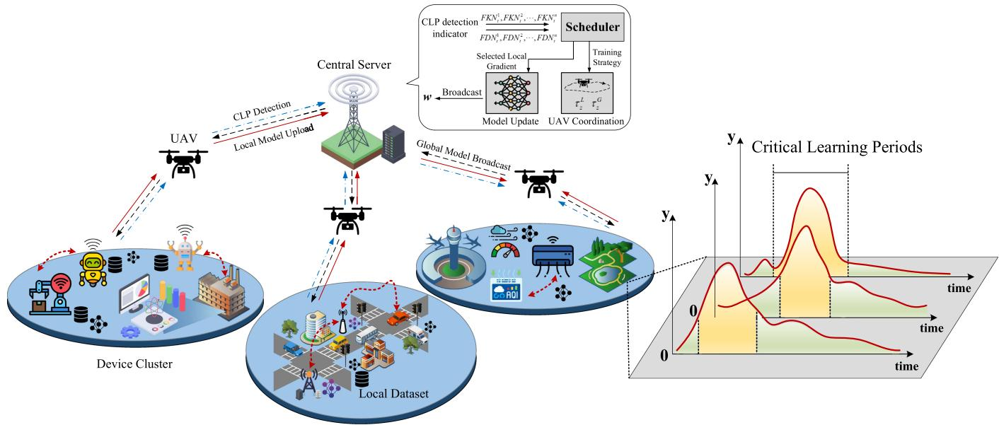  
Fig. 1. An overview of the proposed system.

CLP on model performance, and develop a federated Fisher information matrix to detect CLP. In [23], the authors propose a CLP-augmented FL framework for adaptive client selection at different FL phases based on CLP, which improves model training efficiency. In [24], the authors propose a CLP-aware defense FL framework, which develops a gradient norm vector metric to detect malicious clients and identify CLP, enhancing resilience to attacks and poisoning while improving model performance. Although the statement of CLP in FL is new. However, it bears resemblance with some recent research, where the user participation or global learning rate or gradient collaboration at the server is considered to boost the training at the very beginning phase of the learning. In [25], the authors proposed Flash, which detects data drift based on magnitude of local parameter updates to quickly adapt to drift while simultaneously addressing the statistical heterogeneity issue. In [26], the authors proposed an on-server optimization framework that efficiently aggregate knowledge from all clients to improve the model generalization performance. In [27], the authors developed FedExp to adaptively determine the global learning rate based on the time-varying change made by clients in each round during FL. In [25], [26], [27], their work have indeed recognized the influence of model gradient changes during the training process on FL performance, such as client selection based on data drift [25], gradient collaboration of local knowledge at the server side [26], or global learning rate adaptation [27]. These methods emphasize the dynamic nature of gradients throughout the training process. However, what they do not explicitly highlight is that such gradient changes and their impacts are often more critical in the early stages of training. Building upon these insights, our work focuses on the initial phase of FL that puts more resources on model training during CLP can reduce resource consumption after CLP to improve training efficiency. Besides, there remains a major gap between the detection of CLP and CLP-based online UAVs/devices selection during FL training. Considering the limited communication and computation resources, further research on participating device selection and UAV scheduling according to CLP to improve model accuracy and training efficiency is necessary. Therefore, in this article, a CLP-aware FL framework is proposed that identifies unequally important learning stages, where device selection, UAV visit frequency to different device clusters, and the periods of local updates to model aggregation are jointly considered.

## III. THE PROPOSED CLP-AWARE UAV-ASSISTED HFL FRAMEWORK

As illustrated in Fig. 1, an HFL framework is considered, consisting of a central server, UAV swarms, and device clusters in a large geographic region. The central server s is deployed to coordinate UAVs, aggregate local models of UAVs, and synchronize FL training among the UAV swarms. Each UAV is denoted as $n \in \mathcal { N } = \{ 1 , . . . , N \}$ . There are c device clusters, $c \in \mathcal { C } = \{ 1 , . . . , C \}$ , each device is denoted as i in c. The number of devices is assumed to be much larger than the number of UAVs. The UAV swarm travels between the device clusters. They start training when they arrive at the designated device cluster, end when the UAVs finish the edge model aggregation at the current cluster, and begin traveling to their next destination. In our scenarios, environment and data distributions change temporally, thus the training sequence changes over time. At time slot $t \in { \mathcal { T } } \triangleq \{ 1 , . . . , T \}$ , each device i generates online dataset $\tilde { \mathcal { D } } _ { i } ( t )$ to its own local set. Local models trained by individual devices are first aggregated at UAVs (lower level of the HFL between UAVs and devices) before finally reaching the central server (higher level of the HFL between UAVs and the central server). For the sake of simplicity, all UAVs are connected directly to the central server. Each device is assumed to be able to transmit parameters to nearby UAVs for model training.

## A. Proposed CLP-Aware HFL Framework

As shown in Fig. 2, the proposed framework is presented. In the framework, for the heterogeneity of devices in FL, it comes from two perspectives: (i) the inherent data distribution differences among geographically devices, and (ii) computational heterogeneity of devices (processing power or battery constraints). The data heterogeneity is the main aspect to considered, including the time-varying nature of data distributions caused by environmental changes. In our method, we leverage the CLP of each device and detect the divergence between local and global models to adaptively determine the frequency of model aggregation for different devices. This ensures that devices with different learning procedures and data distributions are treated differently rather than uniformly participating in each round. Additionally, we detect data drift at each device and dynamically adjust the local update and edge/global aggregation period, further mitigating the effects of evolving heterogeneity over time. The CLP-based FL training process is divided into three parts.

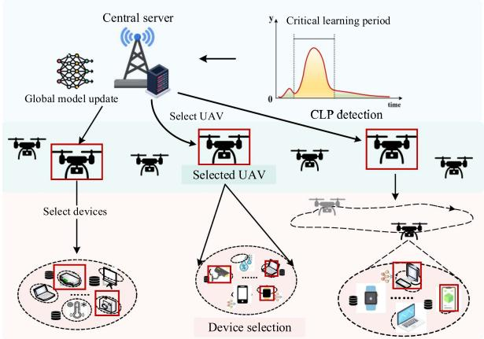  
(a) The framework of CLP-aware HFL system.  
Fig. 2. Proposed CLP-aware HFL framework.

1) Local model training on the devices: During the local training process, each device will use its own local dataset for several local iterations. The device obtains the latest distribution of local model parameters based on online data and local datasets. The devices then transmit the model parameters to nearby UAVs to perform edge model aggregation.

2) Edge model aggregation on the UAVs: In the proposed framework, there are two phases of model aggregation, device-UAV and UAV-central server. Firstly, the UAVs fly to the geographically distributed devices for edge model aggregation. Then the UAVs send their models to the central server for global model aggregation.

3) Global model aggregation and CLP-based UAV selection on the central server: After receiving the parameters from the UAVs, the central server will perform the global model aggregation and balance extreme personalized local distributions and global distribution to achieve personalization and alleviate overfitting simultaneously. Based on the CLP of the previous round for the different devices, the central server decides which UAVs and their number will be selected for the next round of training, and then selected UAVs will decide the participating devices and their numbers.

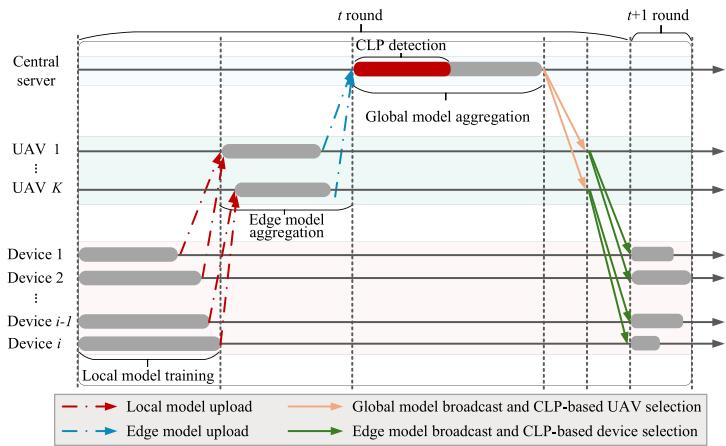  
(b) Time slot diagram of a communication round.

## B. Hierarchical Personalized Federated Learning Via Variational Bayesian Inference

In this paper, model training is divided into two FL processes that support hierarchical aggregations: i) device-UAV, in which the devices carry out the local model training and then transmit the local parameter to the UAVs performing edge model aggregations (lower-level); ii) UAV-server, in which UAVs perform model aggregation and then transmit them to the central server for global model aggregations (higher-level).

Our goal is to collaboratively learn a model defined by a weight space w using the online training datasets, the optimization problem is

$$
\operatorname* { m i n } _ { \pmb { w } } \ \frac { 1 } { N } \sum _ { n = 1 } ^ { N } F _ { n } ( \pmb { w } ) ,\tag{1}
$$

where $\begin{array} { r } { { F } _ { n } ( { \pmb w } ) = \frac { 1 } { | \mathcal { D } _ { n } | } \sum _ { { \pmb x } _ { m } , { y } _ { m } \in \mathcal { D } _ { n } } \nabla f _ { n } ( { \pmb w } ; { x } _ { m } , { y } _ { m } ) , \mathcal { D } _ { n } } \end{array}$ is the n-th UAV’s local dataset, with $f _ { n } ( \pmb { w } ; x _ { m } , y _ { m } )$ being loss function on sample $\left( x _ { m } , y _ { m } \right)$ using model parameter w.

In our scenario, UAVs need to stay over a device cluster for a period of time for local model aggregation to get the edge model, they also need to fly to a good location to transmit the edge model to the central server to get the global model. Then, the staying interval is denoted as $\mathcal { T } _ { s }$ . At each time $t \in \mathcal { T } _ { s }$ , device i conducts its next local model update by applying stochastic gradient descent. Formally, if there are $n _ { c }$ selected devices in c-th device cluster, the update model is as follows

$$
\mathbf { \boldsymbol { w } } _ { t + 1 } ^ { i } = \mathbf { \boldsymbol { w } } _ { t } ^ { i } - \eta _ { 1 } ^ { i } \nabla \tilde { F } _ { i } ( \mathbf { \boldsymbol { w } } _ { t } ^ { i } ) , t + 1 \in \mathcal { T } _ { s } ,\tag{2}
$$

where $\eta _ { 1 } ^ { i } > 0$ is the learning rate of device $\therefore \nabla \tilde { F } _ { i } ( w _ { t } ^ { i } )$ denotes the local gradient of device i, defined as

$$
F _ { i } ( { \pmb w } _ { t } ^ { i } ) = \frac { \sum _ { m \in \mathscr { D } _ { t } ^ { i } } { \nabla f _ { i } \left( { \pmb w } _ { t } ^ { i } ; x _ { i , m } , y _ { i , m } \right) } } { \mathscr { D } _ { t } ^ { i } } ,\tag{3}
$$

where $f _ { i }$ is the local loss function over the local data set $\mathcal { D } _ { t } ^ { i }$ at device i. The updated local parameter $\mathbf { \Delta } w _ { t + 1 } ^ { i }$ is then uploaded to the associated UAV n and edge aggregation performed as

follows

$$
\pmb { w } _ { t + 1 } ^ { n } = \frac { 1 } { n _ { c } } \sum _ { i = 1 } ^ { n _ { c } } \pmb { w } _ { t + 1 } ^ { i } ,\tag{4}
$$

where $n _ { c }$ is the number of devices in cluster c. Then, the UAV n updates the local model according to the

$$
\begin{array} { r } { \pmb { w } _ { t + 1 } ^ { n } = \pmb { w } _ { t } ^ { n } - \eta _ { 2 } ^ { n } \nabla \tilde { F _ { n } } ( \pmb { w } _ { t } ^ { n } ) , } \end{array}\tag{5}
$$

where $\eta _ { 2 } ^ { n } > 0$ is the learning rate and $\nabla \tilde { F } _ { n } ( w _ { t } ^ { n } )$ denotes the 0 ( )local gradient of the UAV n. After several training rounds, each UAV transmits its edge model to the central server for global aggregation

$$
\boldsymbol { w } _ { t + 1 } = \frac { 1 } { N } \sum _ { n = 1 } ^ { N } \boldsymbol { w } _ { t + 1 } ^ { n } .\tag{6}
$$

To conduct CLP-based model training and achieve personalization simultaneously, a personalized Bayesian FL model is proposed based on the previous optimization problem, reconstructing it into a three-level problem.

Suppose each device has the same neural network structure, but has different parameters due to non-i.i.d data. The model output is represented as $f _ { \theta } ( x )$ , where $\pmb \theta \in \mathbb { R } ^ { I }$ denotes the vector containing all parameters and I is the length of θ. Assume that all parameters are bounded. Then the model for the i-th device is $f _ { \theta } ^ { i }$

In the proposed hierarchical framework, the global model on the central server serves as the prior of the local models on the devices. At each iteration, the devices upload their model parameter to the central server and then download the aggregated model from the central server via UAV swarms. After several rounds of model iterations, the trained distribution for each personalized model lies between the global model and totally local models without communication, which balances the generic model and extremely personalized model. Thus, based on variational Bayesian inference [28], which aims to find the closest distribution to the posterior distribution in the variational family of distributions Q, the global problem (1) is decomposed into a three-level optimization problem

$$
\mathrm { S e r v e r : } \operatorname* { m i n } _ { \pmb { w } ( \pmb { \theta } ) \in \mathcal { Q } _ { w } } \frac { 1 } { N } \sum _ { n = 1 } ^ { N } F _ { n } ( \pmb { w } ) ,\tag{7}
$$

$$
\mathrm { U A V : ~ } F _ { n } ( \pmb { w } ) = \frac { 1 } { n _ { c } } \sum _ { i = 1 } ^ { n _ { c } } F _ { i } ( \pmb { w } ) ,\tag{8}
$$

$$
\begin{array} { r l } & { \mathrm { D e v i c e : ~ } F _ { i } ( \pmb { w } ) \triangleq \underset { \pmb { q } ^ { i } ( \pmb { \theta } ) \in \mathcal { Q } ^ { i } } { \operatorname* { m i n } } \left. - \mathbb { E } _ { \pmb { q } ^ { i } ( \pmb { \theta } ) } [ \log p _ { \pmb { \theta } } ^ { i } ( \pmb { D } ^ { i } ) ] \right. } \\ & { ~ \left. ~ + ~ \zeta \mathrm { K L } ( \pmb { q } ^ { i } ( \pmb { \theta } ) | | \pmb { w } ( \pmb { \theta } ) ) \right. . } \end{array}\tag{9}
$$

where $w ( \theta )$ and $\boldsymbol { q } ^ { i } ( \boldsymbol { \theta } )$ represent the global distribution and the local distribution for the i-th device, respectively. $p _ { \theta } ^ { i }$ denotes the likelihood of dataset $D ^ { i } . \mathcal { Q } _ { w }$ and $\mathcal { Q } ^ { i }$ denote the family of distributions for global parameter and the i-th device, respectively. $\zeta ( \geqslant 1 )$ is an extra parameter that balances the degree of personalization and global aggregation considering the modification in β-VAE [29]. The first term of (9) represents the log-likelihood of the dataset $D ^ { i }$ given the model parameters, i.e., the uncertainty of the local distribution, and the goal of this term is to make the global distribution a good likelihood match to the real data, while maintaining the diversity of the local distribution. The second term quantifies the difference between the global and local distributions, with a non-negative value indicating the distributions are identical when the term is zero. The global model seeks the distribution in $\mathcal { Q } _ { w }$ closest to the local distribution by minimizing the KL divergence. Note that the global distribution is set as the prior distribution, as it is difficult to obtain a good prior distribution that aligns with real-world data. With the trained global distribution, a relatively good distribution can be adopted instead of relying on assumptions. The detailed convergence analysis of the three-level optimization problem (7)–(9) are in Appendix A available online.

## IV. SYSTEM MODEL AND PROBLEM FORMULATION

## A. Detecting Critical Learning Periods

According to our discussion on CLP, the early stages of the FL process often have a significant impact on the final performance of the model. [23]. Therefore, it is important to efficiently detect CLP and implement training strategies accordingly. Prior works use the approximating the Hessian using Fisher information as an indicator to detect CLP [11], [14], but this approach is not easy to compute, making it difficult to apply for scenarios where resources are limited and the environment changes in real-time. Thus, in this part, two threshold-based rules are developed to efficiently detect CLP during the training process.

1) FKN-based CLP Detection Rule: Based on the personalized Bayesian model in Section B, CLP is detected by measuring the difference between global and local parameters. The parameters of the neural network are assumed to follow a Gaussian distribution, a common assumption in the literature [30], [31]. Moreover, the mean-field decomposition is adopted, where the joint distribution is assumed to be the product of the individual distributions of each parameter. Specifically, the family of distributions $\mathcal { Q } ^ { i }$ for the i-th device satisfies

$$
\theta _ { i , k } \sim \mathcal { N } ( \mu _ { i , k } , \sigma _ { i , k } ^ { 2 } ) , k = 1 , \ldots , I ,\tag{10}
$$

where $\mu _ { i , k }$ and $\sigma _ { i , k } ^ { 2 }$ denotes the Gaussian mean and variance for k-th parameter of the i-th device, respectively.

The family of distribution of the central server ${ \mathcal { Q } } ^ { w }$ follows

$$
\theta _ { w , k } \sim \mathcal { N } ( \mu _ { w , k } , \sigma _ { w , k } ^ { 2 } ) , k = 1 , \ldots , I ,\tag{11}
$$

where $\mu _ { w , k }$ and $\sigma _ { w , k } ^ { 2 }$ denotes the Gaussian mean and variance for k-th parameter of the central server, respectively. The variational encoder is used to model the distribution of the model parameters. The parameters of the local models from each device are fed into the variational encoder. Then the encoder processes these parameters and outputs the $\mu _ { i , k }$ and $\sigma _ { i , k } ^ { 2 }$ values for the distribution of those parameters.

Based on the distributions, the disparities between global and local models through the calculation of KL divergences can be obtained (Details are in Appendix B available online)

$$
\operatorname { K L } ( q ^ { i } ( \pmb { \theta } ) | | \pmb { w } ( \theta ) )
$$

$$
\begin{array} { l } { \displaystyle = \mathrm { K L } \left( \prod _ { k = 1 } ^ { I } ( \mathcal { N } ( \mu _ { i , k } , \sigma _ { i , k } ^ { 2 } ) ) \Big | \prod _ { k = 1 } ^ { I } ( \mathcal { N } ( \mu _ { w , k } , \sigma _ { w , k } ^ { 2 } ) ) \right) } \\ { \displaystyle = \sum _ { k = 1 } ^ { I } \mathrm { K L } \left( \mathcal { N } ( \mu _ { i , k } , \sigma _ { i , k } ^ { 2 } ) | | \mathcal { N } ( \mu _ { w , k } , \sigma _ { w , k } ^ { 2 } ) \right) } \\ { \displaystyle = \frac { 1 } { 2 } \sum _ { k = 1 } ^ { I } \left[ \log \left( \frac { \sigma _ { w , k } ^ { 2 } } { \sigma _ { i , k } ^ { 2 } } \right) + \frac { \sigma _ { i , k } ^ { 2 } + \left( \mu _ { i , k } - \mu _ { w , k } \right) ^ { 2 } } { \sigma _ { w , k } ^ { 2 } } - 1 \right] . } \end{array}\tag{12}
$$

Then, at the t round, the parameter difference between the global and local models is defined as the federated KL divergence norm (FKN), which can be approximately computed as the weighted average of KL divergence across all selected devices of UAV n

$$
\mathrm { F K N } _ { t } ^ { n } = \sum _ { i = 1 } ^ { n _ { c } } \mathrm { K L } ( \pmb { q } ^ { i } ( \pmb { \theta } ) | | \pmb { w } ( \theta ) ) ,\tag{13}
$$

Then, the rule for detecting CLP based on FKN is as follows: if

$$
\frac { \mathrm { F K N } _ { t } ^ { n } - \mathrm { F K N } _ { t - 1 } ^ { n } } { \mathrm { F K N } _ { t - 1 } ^ { n } } \geqslant \delta ,\tag{14}
$$

then the round t is in CLP, where δ is the threshold based on FKN. FKN-based rule is used to detect CLP by monitoring the significant difference between local and global model distributions. Specifically, the central server aggregates the necessary encoded local parameters, computes the FKNt value for the current round, compares it to the previous round’s value as shown in (14), and then detects if a CLP event has occurred. A significant increase in FKN indicates that the local models have diverged more strongly from the global model, which often occurs during early, unstable training stages or when the data distribution shifts significantly. During CLP, the model is highly sensitive to incoming updates, and even minor changes in data or learning dynamics can cause large shifts in model parameters. Therefore, if the relative change in FKN between round t and t − exceeds a threshold δ, then the round t is during CLP.

2) FDN-based CLP Detection Rule: Then, we focus on data drift that can be utilized to detect CLP based on the current data distribution at a device. In real-world applications, data distributions change temporally, where real-time data often exhibits significant divergence from the training data. Devices with shallower architectures and fewer weights may struggle to generalize to real data distributions or changed environments, decreasing the model performance due to data drift. Device clusters with higher drift values may require frequent model updates of their local models, which would be performed by UAV revisiting. In contrast, devices with lower drift degrees, i.e., small local gradient fluctuations, may not require revisiting, since the return on the energy consumed is minimal (in terms of model performance improvement).

In this paper, data drift can be estimated by computing the historical and current gradients of the device cluster during two UAV visits to it. In particular, for device cluster c, with local gradient $F _ { c } ,$ , the online data drift $\Lambda _ { t } ^ { c } \in \mathbb { R } ^ { + }$ is defined as the largest variation of the gradient for any model parameter w at t

round, which satisfies

$$
\begin{array} { r } { \| \nabla F _ { c } ( \pmb { w } | \mathcal { D } _ { t + 1 } ) - \nabla F _ { c } ( \pmb { w } | \mathcal { D } _ { t } ) \| ^ { 2 } \leqslant \Lambda _ { t } ^ { c } } \end{array}\tag{15}
$$

where $\mathcal { D } _ { t }$ is the updated data at device cluster $c .$ Bounding the squared norm difference of gradients between $\mathcal { D } _ { t }$ and $\mathcal { D } _ { t + 1 }$ by $\Lambda _ { t } ^ { c }$ is a natural regularity assumption, commonly used in Λnon-stationary learning literature. It allows the derivation of meaningful performance bounds

$$
\begin{array} { r l } & { \left\| \nabla F _ { c } \left( \mathbf { w } _ { c } ( t _ { c } ^ { \vee } ) | \widetilde { \mathcal { D } } _ { c } ( t ) \right) \right\| ^ { 2 } } \\ & { \leq ( t - t _ { c } ^ { \vee } + 1 ) \left\| \nabla F _ { c } \left( \mathbf { w } _ { c } ( t _ { c } ^ { \vee } ) | \widetilde { \mathcal { D } } _ { c } ( t _ { c } ^ { \vee } ) \right) \right\| ^ { 2 } } \\ & { \quad + \left( t - t _ { c } ^ { \vee } + 1 \right) \displaystyle \sum _ { t ^ { \prime } = t _ { c } ^ { \vee } + 1 } ^ { t } \Lambda _ { t ^ { \prime } } ^ { c } , } \end{array}\tag{16}
$$

where $\Lambda ^ { c } ( \cdot )$ is defined in (15). Subsequently, assuming an upper bound on the model drift at the device cluster $\Lambda _ { t ^ { \prime } } ^ { c } \leq \Lambda ^ { c } , t ^ { \prime } \in$ $[ t _ { c } ^ { \vee } + 1 , t ]$ , we have

$$
\begin{array} { r l } & { \left\| \nabla F _ { c } \left( \mathbf { w } _ { c } ( t _ { c } ^ { \vee } ) | \widetilde { \mathcal { D } } _ { c } ( t ) \right) \right\| ^ { 2 } } \\ & { \leq ( t - t _ { c } ^ { \vee } + 1 ) \left\| \nabla F _ { c } \left( \mathbf { w } _ { c } ( t _ { c } ^ { \vee } ) | \widetilde { \mathcal { D } } _ { c } ( t _ { c } ^ { \vee } ) \right) \right\| ^ { 2 } } \\ & { \quad + ( t - t _ { c } ^ { \vee } + 1 ) ( t - t _ { c } ^ { \vee } ) \Lambda ^ { c } } \end{array}\tag{17}
$$

which supports model update decisions in systems where the underlying data changes slowly (e.g., due to mobility or evolving user behavior). In our scenario, this inequality is used to design adaptive update period or gradient-based CLP detection strategies, as it helps quantify how outdated a model might be and when UAV retraining or revisiting a device cluster is necessary.

Based on (15), data drift is described as a method to estimate model performance and guide UAV trajectories to the device clusters. Let $\pmb { w } _ { t _ { c } } ^ { c }$ denote the local model and $\nabla F _ { c } ( \pmb { w } _ { t _ { c } } ^ { c } | \mathcal { D } _ { t _ { c } } ^ { c } )$ denote the local gradient of device cluster c at time $t _ { c } .$ ) During the time interval $[ t _ { c } + 1 , t ^ { \prime } ]$ , device cluster c is not visited by [ + 1 ]UAV. For a training sequence s, if device cluster c is visited by UAV during s training, the latest gradient is at the end of s, which can be computed by

$$
G _ { c } ( s ) = \left\| \nabla F _ { c } ( \pmb { w } _ { t + T _ { s } } ^ { c } | \mathscr { D } _ { t + T _ { s } } ^ { c } ) \right\| ^ { 2 } ,\tag{18}
$$

however, if it is not visited, then the gradient is computed by

$$
G _ { c } ( s ) = \left\| \nabla F _ { c } ( \pmb { w } _ { t ^ { \prime } } ^ { c } | \mathcal { D } _ { t ^ { \prime } } ^ { c } ) \right\| ^ { 2 } ,\tag{19}
$$

the two gradients above for the outdated model are upper bounded as

$$
\begin{array} { r } { \left. \nabla F _ { c } ( { \pmb w } _ { t _ { c } } ^ { c } | \mathcal { D } _ { t } ^ { c } ) \right. ^ { 2 } \leqslant ( t - t _ { c } + 1 ) \nabla F _ { c } ( { \pmb w } _ { t _ { c } } ^ { c } | \mathcal { D } _ { t _ { c } } ^ { c } ) } \\ { + ( t - t _ { c } + 1 ) \displaystyle \sum _ { t ^ { \prime } = t _ { c } + 1 } ^ { t } \Lambda _ { t ^ { \prime } } ^ { c } , } \end{array}\tag{20}
$$

Based on (20), the performance of the outdated model is measured through the gradient variation, which illustrates that the model becomes outdated linearly over time and the cumulative data drift is increasing on the device clusters. (18) and (19) can be used as an optimization term to control the frequency and trajectory of UAV visits to the device clusters.

To develop the CLP detection rule for model training, data drift is considered in the model updated for data samples ξ and let $\begin{array} { r } { g ( \theta ; \xi ) = \frac { \partial } { \partial \theta } l ( \theta ; \xi ) } \end{array}$ represent the gradient loss evaluated on $\xi .$ By performing a step stochastic gradient descent on this sample, the data drift can be computed as

$$
\Delta l = l ( \theta - \gamma g ( \theta ; \xi ) ; \xi ) - l ( \theta ; \xi ) ,\tag{21}
$$

Then the data drift can be approximately computed using Taylor expansion by its gradient loss as follows

$$
\begin{array} { r } { \Delta l \approx - \gamma \left. g ( \theta ; \xi ) \right. ^ { 2 } , } \end{array}\tag{22}
$$

Thus, the data drift at t round, defined as the federated drift norm (FDN), can be obtained as follows

$$
\mathrm { F D N } _ { t } ^ { n } = \sum _ { i = 1 } ^ { n _ { c } } \rho _ { i } \Delta l _ { t } ^ { i } ,\tag{23}
$$

where $\rho _ { i } = N _ { c } / \sum _ { N _ { c } \in D _ { t } } N _ { c }$ represents the relative sample size.

Finally, the rule for detecting CLP based on FDN is as follows: if

$$
\frac { \mathrm { F D N } _ { t } ^ { n } - \mathrm { F D N } _ { t - 1 } ^ { n } } { \mathrm { F D N } _ { t - 1 } ^ { n } } \geqslant \varepsilon .\tag{24}
$$

then the round t is in CLP, where ε is the threshold based on FDN.

## B. Communication Model

In our proposed hierarchical architecture, there are two levels of model communication: i) between devices and UAVs, and ii) between UAVs and the central server. Device-to-UAV transmissions utilize ground-to-air (G2A) channels, while UAV-to-server use air-to-ground (A2G) channels. Typically, these channels are dominated by line-of-sight (LoS) or non-line-of-sight (NLoS) modes [32], [33] with probabilities

$$
P _ { L o S } ( t ) = \frac { 1 } { 1 + \rho _ { 1 } \exp { ( - \rho _ { 2 } ( \frac { 1 8 0 } { \pi } \times a r c t a n \frac { H _ { t } } { d _ { t } } - \rho _ { 1 } ) ) } } ,\tag{25}
$$

$$
P _ { N L o S } ( t ) = 1 - P _ { L o S } ( t ) ,\tag{26}
$$

where $\rho _ { 1 }$ and $\rho _ { 2 }$ are the constants related to the environment. At t-th round, the distance between two nodes a and $b ( a , b \in$ ${ \mathcal { N } } \cup { \mathcal { C } } \cup s )$ denotes as $d _ { t }$ (nodes include devices, UAVs and the central server), while $H _ { t }$ is the vertical distance between two nodes. Then, the channel gain of an A2G/G2A link can be obtained as

$$
h ( t ) = \left( P _ { L o S } ( t ) \beta _ { L o S } d _ { t } ^ { - \alpha } + P _ { N L o S } ( t ) \beta _ { N L o S } d _ { t } ^ { - \alpha } \right) ^ { \frac { 1 } { 2 } } ,\tag{27}
$$

where $\beta _ { L o S }$ and $\beta _ { N L o S }$ are the attenuation coefficient of the LoS and NLoS links, respectively. α is the pathloss exponent. In this paper, the orthogonal frequency division multiple access (OFDMA) technique is adopted for model transmission. Device i performs local training to update model parameters from $ { \boldsymbol { w } } _ { t } ^ { i }$ 1 $\mathbf { \nabla } _ { [ 0 } w _ { t + 1 } ^ { i }$ . Then the update model $\mathbf { \Delta } w _ { t + 1 } ^ { i }$ will be sent to the nearby UAV n for the edge model aggregation. The bandwidth allocated to device i for its model update to UAV n denotes as $b _ { t } ^ { n , i }$ at round t, then the uplink rate can be denoted by

$$
r _ { t } ^ { n , i } = b _ { t } ^ { n , i } \log _ { 2 } \left( 1 + \frac { p _ { i , n } h _ { n , i } ( t ) ^ { 2 } } { N _ { 0 } b _ { t } ^ { n , i } } \right) ,\tag{28}
$$

where $p _ { i , n }$ is the transmit power of device i to UAV $n , N _ { 0 }$ is the noise power of additive white Gaussian noise (AWGN).

Then, UAV n updates its model from $\mathbf { \Delta } { \pmb { w } } _ { t } ^ { n }$ to $\mathbf { \Delta } w _ { t + 1 } ^ { n }$ based on the received local models and sends the update to the central server s. The bandwidth allocated to UAV n is $b _ { t } ^ { n , 0 }$ for its model update to the central server s in round t, then the uplink rate can be denoted by

$$
r _ { t } ^ { n , 0 } = b _ { t } ^ { n , 0 } \log _ { 2 } \left( 1 + \frac { p _ { n , 0 } h _ { n , 0 } ( t ) ^ { 2 } } { N _ { 0 } b _ { t } ^ { n , 0 } } \right) ,\tag{29}
$$

where $p _ { n , 0 }$ is the transmit power of UAV n to the central server s.

The downlink rate between the device i and UAV n can be denoted by

$$
R _ { t } ^ { n , i } = B _ { d } \log _ { 2 } \left( 1 + \frac { p _ { n , i } h _ { n , i } ( t ) ^ { 2 } } { N _ { 0 } B _ { d } } \right) ,\tag{30}
$$

and the downlink rate between UAV n and the central server s can be denoted by

$$
R _ { t } ^ { n , 0 } = B _ { d , 0 } \log _ { 2 } \left( 1 + \frac { p _ { n , 0 } h _ { n , 0 } ( t ) ^ { 2 } } { N _ { 0 } B _ { d , 0 } } \right) ,\tag{31}
$$

where $B _ { d }$ and $B _ { d , 0 }$ are the downlink bandwidth occupied by UAV n and the central server s, respectively.

## C. Energy Model

For the selected device i in the t-th round, it incurs energy consumption due to local training and uploading of local updates to the UAV via wireless channels. Denote $E _ { c o m p } ^ { i , t }$ as its energy consumption of local training in the t-th round, which depends on its computing ability and data size. Define $C _ { i }$ as the number of CPU cycles required to train the model on one sample data, $f _ { i }$ as the computation capability of device i, U as the number of local training epochs. Therefore, following [Rev3-R4], the computation energy of device i can be defined as

$$
E _ { c o m p } ^ { i , t } = U \xi _ { i } C _ { i } D _ { i } f _ { i } ^ { 2 } ,\tag{32}
$$

where $\xi _ { i }$ is the effective capacitance factor of the chip for device i. $D _ { i }$ is local dataset of device i.

After local training, the local model weight is transmitted in the uplink sub-channel. The uplink rate $r _ { t } ^ { n , i }$ can be computed by (26) in the paper. Let $S _ { u p } ^ { n , i }$ denote model parameter data uploaded from device i to UAV n. Thus, the energy used for data transmission between device i and UAV n at t-th round is

$$
E _ { c o m m } ^ { i , t } = \frac { S _ { u p } ^ { n , i } } { r _ { t } ^ { n , i } } p _ { n , i } , i \in \mathcal { C } , n \in \mathcal { N }\tag{33}
$$

where $p _ { i , n }$ is the transmit power of device i to UAV n. Then, the total energy consumption of device i is

$$
E _ { d } ^ { i , t } = E _ { c o m m } ^ { i , t } + E _ { c o m p } ^ { i , t }\tag{34}
$$

For the selected UAV n in the t-th round, it incurs energy consumption due to edge training, uploading of local updates to the central server via wireless channels, and its movement. Denote $E _ { c o m p } ^ { n , t }$ as its energy consumption of local training in the t-th round, which depends on its computing ability and data size. Define $C _ { n }$ as the number of CPU cycles required to process on one model parameter data, $f _ { n }$ as the computation capability of UAV n, I as the number of edge training epochs. Therefore, the computation energy of UAV n can be defined as

$$
E _ { c o m p } ^ { n , t } = \sum _ { i \in \mathcal { C } } I \xi _ { n } C _ { n } S _ { u p } ^ { n , i } f _ { n } ^ { 2 }\tag{35}
$$

where $\xi _ { n }$ is the effective capacitance factor of the chip for UAV n.

After edge aggregation, the edge model weight is transmitted to the central server via the uplink sub-channel. The uplink rate $r _ { t } ^ { n , 0 }$ can be computed by (27) in the paper. Let $S _ { u p } ^ { n , 0 }$ denote model parameter data uploaded from UAV n to the central server. Thus, the energy used for data transmission between UAV n and the central server at t-th round is

$$
E _ { c o m m } ^ { n , t } = \frac { S _ { u p } ^ { n , 0 } } { r _ { t } ^ { n , 0 } } p _ { n , 0 } , i \in \mathcal { C } , n \in \mathcal { N }\tag{36}
$$

where $p _ { n , 0 }$ is the transmit power of UAV n to the central server. Then, the total energy consumption of UAV n is

$$
E _ { u } ^ { n , t } = E _ { c o m m } ^ { n , t } + E _ { c o m p } ^ { n , t } .\tag{37}
$$

Besides, the UAV needs to travel between different clusters to assist them in model updates and to implement different strategies based on CLP, i.e., frequent accesses to device clusters that suffer from data drift to improve model accuracy. They also need to fly to the appropriate locations for low latency and efficient communication. Therefore, given the flexibility of rotary-wing UAVs, multi-rotor UAVs are deployed in our scenario, and the flight and energy consumption models are then formulated. The UAV n speed is $v _ { n } \in ( 0 , v _ { m } )$ , where the $v _ { m }$ is the maximum speed. Following [34], the flying power of UAV n is

$$
\begin{array} { l } { { P _ { n } } ( { v _ { n } } ) = { P _ { a } } \left( \sqrt { 1 + \frac { { v _ { n } ^ { 4 } } } { { 4 v _ { 0 } ^ { 4 } } } } - \frac { { v _ { n } ^ { 2 } } } { { 2 v _ { 0 } ^ { 2 } } } \right) ^ { \frac { 1 } { 2 } } } \\ { \displaystyle \qquad + { P _ { b } } \left( 1 + \frac { { 3 v _ { n } ^ { 4 } } } { { U _ { t i p } ^ { 2 } } } \right) + \frac { 1 } { 2 } d _ { 0 } \zeta \varrho A v _ { n } ^ { 3 } , } \end{array}\tag{38}
$$

where $P _ { a }$ and $P _ { b }$ are the induced power and blade profile power, respectively. $U _ { t i p }$ is the speed at the tip of the rotor blade, v0 is the mean velocity induced by the rotor, $d _ { 0 }$ represents the fuselage drag ratio, ζ is the air density,  is rotor solidity, and A denotes the area of the rotor disc. Thus, the flying energy consumption of UAV n in the duration $t _ { d }$ of round t can be calculated as

$$
\begin{array} { r } { E _ { f } ^ { n } = P _ { n } ( v _ { n } ) t _ { d } . } \end{array}\tag{39}
$$

## D. Problem Formulation

Given a training sequence $z \in \mathcal { Z } = \{ 1 , . . . , Z \}$ in training duration $T _ { z }$ , let $X _ { n } ( z )$ denote the location of UAV n, $G _ { c } ( z )$

denote the recent gradient measured at the end of the z at device cluster c (computed by (18) if it was visited by UAV, otherwise by (19)). Also, let $E _ { f } ( z )$ denote the sum of energy of movement ( )of UAV n to travel to its current location in z from the previous location in $z - 1$ (computed by (39)). Considering energy consumption related to communication is typically much smaller than flight energy consumption, the communication energy is disregarded [35]. Thus, given a total of Z training sequences, the problem of determining the optimal UAV trajectory and aggregation period can be expressed as

$$
\mathbf { P } : \operatorname* { m i n } _ { \chi ( z ) , \mathcal { T } ( z ) } \ \frac { 1 } { Z } \sum _ { z = 1 } ^ { Z } c _ { 1 } E _ { f } ( z ) + c _ { 2 } \sum G _ { c } ( z )\tag{40}
$$

$$
\mathrm { s . t . } E _ { n } ( z ) \geqslant E _ { \mathrm { m i n } } ^ { n } , n \in \mathcal { N } , z \in \mathcal { Z }\tag{41}
$$

$$
E _ { n } ( z ) \leqslant E _ { \mathrm { m a x } } ^ { n } , n \in \mathcal { N } , z \in \mathcal { Z }\tag{42}
$$

$$
\begin{array} { r } { \| \nabla F _ { c } ( \pmb { w } | \mathcal { D } _ { t + 1 } ) - \nabla F _ { c } ( \pmb { w } | \mathcal { D } _ { t } ) \| ^ { 2 } \leqslant \Lambda _ { t } ^ { c } } \end{array}
$$

$$
{ T _ { d u r a } ( z ) \leqslant T _ { m a x } ( z ) }\tag{43}
$$

(44)

where ${ \mathcal { X } } ( z ) \triangleq \{ X _ { 1 } ( z ) , \dots , X _ { n } ( z ) \}$ denote the set of UAV locations. $\mathcal { T } ( z ) \triangleq \{ T _ { z } \cup \tau _ { z } ^ { L } \cup \tau _ { z } ^ { G } \}$ includes the duration of training sequence $T _ { z }$ , the edge aggregation period $\tau _ { z } ^ { L }$ , and global aggregation period $\tau _ { z } ^ { G } . c _ { 1 }$ and $c _ { 2 }$ are related coefficients of each term in (40). The objective function in (40) consists of two parts, the energy required for all UAVs to move to their next destination $( E _ { f } ( z ) )$ and the estimated online gradient $( G _ { c } ( z ) )$ caused by data drift at device clusters. $E _ { n } ( z )$ is the total energy consumption of UAV n for data processing, parameter transmission and flying during training sequence z. Constraint (41) ensures that UAV n has sufficient energy to travel between clusters, where UAV n battery level will not drop below $E _ { \mathrm { m i n } } ^ { n } .$ Constraint (42) guarantees that the total energy consumed by each UAV n for flying is less than $E _ { \mathrm { m a x } } ^ { n }$ . Constraint (43) limits the largest gradient variation for any given model parameter w. Constraint (44) ensures that the duration $T _ { d u r a } ( z )$ of data processing, parameter transmission, as well as edge and global model aggregation for sequence z, is completed within a limited time $T _ { m a x } ( z )$ to conduct real-time operations.

## V. THE DRL-BASED SOLUTION

In the following, we first formulate the optimization problem as a Markov decision process (MDP) in the UAV-assisted FL system and then develop a DRL algorithm to solve it.

## A. The DRL-Based Algorithm

To efficiently deploy FL for model training in the proposed framework, considering the different training phases based on CLP, trajectory planning for UAVs, training sequence duration for device clusters, and local and global aggregation periods need to be integrated to maximize FL performance. Given the highly dynamic nature of UAV, channel conditions and training phases, the optimization problem P can be formulated as an MDP which includes state space S, action space A and reward function R to employ DRL methods. Agents select and execute actions based on current environmental states, which influence the transition and updating of the environmental state, determining the reward feedback received by the agents.

1) State of the DRL: The UAV locations, model gradients related to device data drift, and FL training strategies (i.e., local aggregation periods, global aggregation periods, and total training time per UAV visit) are constructed as the state of the DRL. Specifically, the state at the end of the training sequence z can be defined as

$$
S ( z ) = \left\{ \mathcal { U } ( z ) , \mathcal { X } ( z ) , \mathcal { E } ( z ) , \Lambda ( z ) , \mathcal { T } ( z ) \right\} , z \in \mathcal { Z } ,\tag{45}
$$

where $\mathcal { U } ( z )$ denotes the set of active UAVs, and $\mathcal { X } ( z )$ denotes the set of the three-dimensional coordinates of all UAVs. $\mathcal { E } ( z ) = \{ E _ { 1 } ( z ) , \ldots , E _ { N } ( z ) \}$ denotes the energy consumption ( ) =of all UAVs. $\Lambda ( z ) = \{ \Lambda _ { 1 } ( z ) , \ldots , \Lambda _ { C } ( z ) \}$ denotes the newest Λ( ) = Λ (data drift at device clusters.

2) Action of the DRL: The central server, as the DRL agent, determines the active $\mathrm { U A V s } \mathcal { U } ( z + 1 )$ , the location $\mathcal { X } ( z + 1 )$ of ( + 1)UAVs, as well as the FL training characteristics $\mathcal { T } ( z + 1 )$ + 1)of the next training sequence $z + 1$ . Formally, the DRL action can be defined as

$$
A ( z ) = \left\{ \mathcal { U } ( z + 1 ) , \mathcal { X } ( z + 1 ) , \mathcal { T } ( z + 1 ) \right\} , z \in \mathcal { Z } .\tag{46}
$$

3) Reward of the DRL: The agent goal is to maximize the reward for each action $\boldsymbol { \mathcal { A } } ( \boldsymbol { z } )$ in the current state $S ( z )$ based on the target value of P. And the reward function is defined as

$$
\begin{array} { c } { { R ( z ) = r _ { 1 } \displaystyle \left( c _ { 1 } E _ { f } ( z ) + c _ { 2 } \sum G _ { c } ( z ) \right) ^ { - 1 } } } \\ { { - r _ { 2 } \displaystyle \left( \sum _ { n \in \mathcal { N } } \mathbb { 1 } _ { \left\{ E _ { n } \geqslant E _ { \operatorname* { m i n } } ^ { n } \right\} } \right) . } } \end{array}\tag{47}
$$

where the first term represents the value of the object function of P and the second is a penalty with $r _ { 2 } \gg 1$ , where if the UAVs’ battery drops blew a threshold, the indicator takes the value of one for UAV n. The reward in the DRL algorithm guides multiple objectives: it motivates ML training to require less energy while achieving better performance, avoids UAVs not visiting device clusters for long periods, which leads to large data drifts, as well as prevents UAVs from exhausting their battery power.

4) DRL Architecture: The proposed algorithm, as shown in Fig. 3, based on the SAC algorithm, is presented to make decisions for each communication round [36]. Unlike traditional methods, the SAC-based algorithm introduces entropy regularization to achieve an optimal balance between expected rewards and entropy. This not only accelerates the subsequent policy learning process but also effectively reduces the risk of the policy getting stuck in the local optimum. The designed SAC network structure consists of an actor network $\pi _ { \phi } ( \mathbf { a } _ { t } | \mathbf { s } _ { t } )$ two critic networks $Q _ { \theta _ { 1 } } ( \mathbf { s } _ { t } , \mathbf { a } _ { t } ) , Q _ { \theta _ { 2 } } ( \mathbf { s } _ { t } , \mathbf { a } _ { t } )$ and two target critic networks $Q _ { \theta _ { 1 } ^ { \prime } } ( \mathbf { s } _ { t } , \mathbf { a } _ { t } ) , Q _ { \theta _ { 2 } ^ { \prime } } ( \mathbf { s } _ { t } , \mathbf { a } _ { t } )$ , where φ, $\theta _ { 1 } , \theta _ { 2 } , \theta _ { 1 } ^ { \prime }$ and $\theta _ { 2 } ^ { \prime }$ are the parameters of the network, respectively. The $\mathbf { s } _ { t }$ and $\mathbf { a } _ { t }$ denote state space and action space, respectively. Let B represent the experience pool that stores the tuple $( \mathbf { s } _ { t } , \mathbf { a } _ { t } , \mathbf { r } _ { t } , \mathbf { s } _ { t + 1 } )$ . The objective with the expected entropy of the policy over $\rho _ { \pi }$

$$
J ( \pi ) = \arg \operatorname* { m a x } _ { \pi } \sum _ { t } \mathbb { E } _ { ( \mathbf { s } _ { t } , \mathbf { a } _ { t } ) \sim \rho _ { \pi } } [ r ( \mathbf { s } _ { t } , \mathbf { a } _ { t } ) + \varsigma \mathcal { H } ( \pi ( \cdot | \mathbf { s } _ { t } ) ] ,\tag{48}
$$

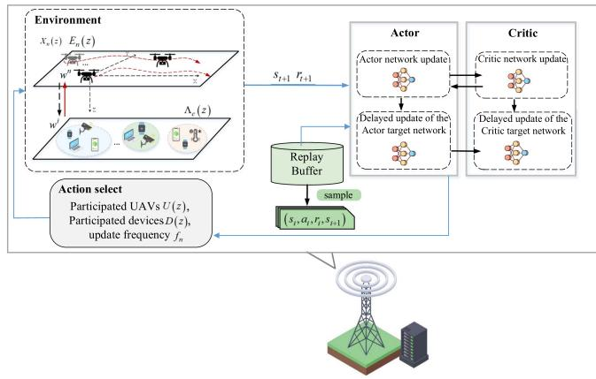  
Fig. 3. The flowchart of the proposed DRL algorithm.

where ς represents the temperature parameter, $\rho _ { \pi }$ denotes the state-action distribution under policy $\pi$ and $\mathcal { H } ( \pi ( \cdot | \mathbf { s } _ { t } ) ) =$ $- \mathbb { E } _ { a _ { t } } [ \log \pi ( a _ { t } | s _ { t } ) ]$ is the entropy. During each update, the two critic networks aim to mitigate overestimation, while the target critic networks are employed to ensure stable training. The loss function of the critic network $\theta _ { j } , j \in \{ 1 , 2 \}$ is represented by

$$
\begin{array} { r l } & { \mathcal { L } _ { Q } ( \theta _ { j } ) = \mathbb { E } _ { ( \mathbf { s } _ { t } , \mathbf { a } _ { t } ) \sim \mathcal { B } } \left[ \frac { 1 } { 2 } ( Q _ { \theta _ { j } } ( \mathbf { s } _ { t } , \mathbf { a } _ { t } ) - ( r ( \mathbf { s } _ { t } , \mathbf { a } _ { t } ) \ } \\ & { \quad \quad \quad \quad + \gamma ( Q _ { \theta _ { j } ^ { \prime } } ( \mathbf { s } _ { t + 1 } , \mathbf { a } _ { t + 1 } ) - \varsigma \log ( \pi _ { \phi } ( \mathbf { a } _ { t + 1 } | \mathbf { s } _ { t + 1 } ) ) ) ) ) ^ { 2 } \right] , } \end{array}\tag{49}
$$

Under the guidance of the critic network output, the actor network parameters are optimized through gradient ascent. Consequently, the loss function of the actor network can be expressed as

$$
\mathcal { L } _ { \pi } ( \phi ) = \mathbb { E } _ { { \mathbf s } _ { t } \sim \mathcal { B } } [ \varsigma \log \pi _ { \phi } ( { \mathbf a } _ { t + 1 } | { \mathbf s } _ { t + 1 } ) - Q _ { \theta _ { j } } ( { \mathbf s } _ { t } , { \mathbf a } _ { t } ) ] ,\tag{50}
$$

The temperature parameter is adjusted by comparing the current entropy with the target entropy ${ \overline { { \mathcal { H } } } } .$ using the chain rule for updates

$$
\mathcal { L } ( \varsigma ) = \mathbb { E } _ { \mathbf { a } _ { t } \sim \pi _ { t } } [ - \varsigma \log \pi _ { t } ( \mathbf { a } _ { t } | \mathbf { s } _ { t } ) - \varsigma \overline { { \mathcal { H } } } ] .\tag{51}
$$

The target critic network is updated utilizing soft updates, denoted as

$$
\theta _ { j } ^ { \prime }  \tau \theta _ { j } ^ { \prime } + ( 1 - \tau ) \theta _ { j } ^ { \prime } , j \in \{ 1 , 2 \} ,\tag{52}
$$

where the soft coefficient $\tau \in ( 0 , 1 )$ defines how quickly the target networks update. The process of the proposed optimization algorithm is summarized in Algorithm 1.

## B. Complexity Analysis and Implemention

The computational complexity of DRL algorithm primarily is $O ( ( N \cdot \bar { d } + C ) ^ { | Z | } )$ . According to [20], we consider both the sizes of the state space and the action space in each state vector to analyze the computational complexity. In the proposed algorithm, we need to calculate the next destination of the UAV swarm, the selected devices and UAVs, and the aggregation period at device cluster. Consequently, the computational complexity of the proposed algorithm is ${ \dot { O } } ( ( N \cdot d + { \bar { C } } ) ^ { | Z | } ) ;$ , where

Algorithm 1: Model Training and Participant Selection   
Algorithm With CLP Detection.   
1: Initialize the policy network $\pi _ { \phi } ( \mathbf { a } _ { t } | \mathbf { s } _ { t } )$ , two critic   
networks $Q _ { \theta _ { 1 } } ( \mathbf { s } _ { t } , \mathbf { a } _ { t } ) , Q _ { \theta _ { 2 } } ( \mathbf { s } _ { t } , \mathbf { a } _ { t } ) .$ , and their   
corresponding target networks $Q _ { \theta _ { 1 } ^ { \prime } } ( \mathbf { s } _ { t } , \mathbf { a } _ { t } ) , Q _ { \theta _ { 2 } ^ { \prime } } ( \mathbf { s } _ { t } , \mathbf { a } _ { t } )$   
Also, initialize the replay buffer $B .$   
2: for each episode do   
3: Set up the active UAVs, last visit information, initial   
UAV positions, and randomly initialize device   
datasets.   
4: repeat   
5: Sample a random action $a _ { t } .$   
6: Obtain the next state $s _ { t + 1 }$ and reward $r _ { t }$   
7: Save the transition $\left( { { s _ { t } } , { a _ { t } } , { r _ { t } } , { s _ { t + 1 } } } \right)$ into the replay   
buffer.   
8: if the replay buffer B contains sufficient samples   
then   
9: Extract a minibatch of transitions b from B;   
10: Update critic networks using (49);   
11: Optimize the actor network parameters using   
(50);   
12: Adjust the temperature parameter based on (51);   
13: Perform a soft update for the target networks   
using (52).   
14: end if   
15: until the maximum number of global iterations is   
reached.   
16: end for

Z is the size of training sequence, N is the number of selected UAVs, d is the coordinate dimension of UAV location (usually $d = 3 )$ , and C is the number of selected device cluster.

## VI. SIMULATION RESULTS AND ANALYSIS

## A. Experimental Setting

In the HFL system, one central server and 5 UAVs are configured, and the 100 devices are divided into 10 clusters. To simulate the differences in the conditional distributions among device clusters, the non-i.i.d setting strategy is adopted in [37]. The non-i.i.d. datasets are generated using two public benchmark datasets, MNIST [38], [39] and CIFAR-10 [40]. In addition, different sizes on each public dataset are split. For MNIST, the small, medium, and large sizes contain 50, 200, and 500 training samples, and 900, 600, and 300 test samples per class, respectively. For CIFAR-10, the small, medium, and large sizes contain 50, 100, and 400 training samples, and 450, 400, and 200 test samples per class, respectively. The uplink bandwidth of UAVs and devices is set to 20 MHz and 10 MHz, respectively. [9]. As for the FL framework, the VGG model [41] is employed for the MNIST dataset, and AlexNet [42] for the CIFAR-10 dataset. Table I lists the main simulation parameters.

## B. Simulation Results of the Proposed Framework

To validate the adaptability of our approach to personalized data distribution, the heterogeneous non-i.i.d. degree is simulated using the Dirichlet distribution, and its effect on the model accuracy is observed, as shown in Fig. 4. As the non-i.i.d degree decreases (as the value increases), the final accuracy increases, which illustrates that the non-i.i.d degree degrades the model accuracy. It is observed that our method guarantees the final model accuracy across all values of the non-i.i.d. degree.

TABLE I SIMULATION PARAMETERS
<table><tr><td>Parameter</td><td>Default value</td><td>Parameter</td><td>Default value</td></tr><tr><td>η1</td><td>0.001</td><td> $\overline { { N _ { 0 } } }$ </td><td>-96 dBm [9]</td></tr><tr><td>η2</td><td>0.001</td><td> $p _ { n , 0 }$ </td><td>40 dBm</td></tr><tr><td>ζ</td><td>10 [43]</td><td> $p _ { n , i }$ </td><td>36 dBm</td></tr><tr><td>δ</td><td>0.01</td><td> $p _ { i , n }$ </td><td>23 dBm [9]</td></tr><tr><td> $\epsilon$ </td><td>0.01</td><td> $P _ { a }$ </td><td>89 W</td></tr><tr><td> $\rho _ { 1 }$ </td><td>11.95 [33]</td><td> $P _ { b }$ </td><td>80 W</td></tr><tr><td> $\rho _ { 2 }$ </td><td>0.14 [33]</td><td> $U _ { \mathrm { t i p } }$ </td><td>120 m/s</td></tr><tr><td> $\beta _ { \mathrm { L o S } }$ </td><td> $7 \times 1 0 ^ { - 5 } ~ [ 4 4 ]$ </td><td> $v _ { 0 }$ </td><td>4.03 m/s</td></tr><tr><td> $\beta _ { \mathrm { N L o S } }$ </td><td> $7 \times 1 0 ^ { - 7 } ~ [ 4 4 ]$ </td><td> $d _ { 0 }$ </td><td>0.6</td></tr><tr><td> $\alpha$ </td><td>2</td><td>ζ</td><td>1.225 kg/m³</td></tr><tr><td> $B _ { d }$ </td><td>8MHz</td><td>Q</td><td>0.05</td></tr><tr><td> $B _ { d , 0 }$ </td><td>16MHz</td><td>A</td><td> $0 . 5 ~ \mathrm { m ^ { 2 } }$ </td></tr></table>

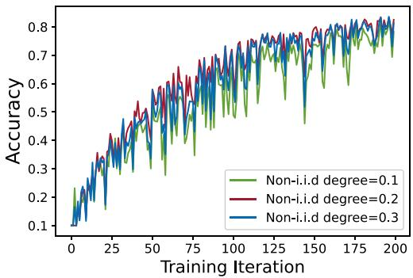  
Fig. 4. Model performance on different non-i.i.d degree.

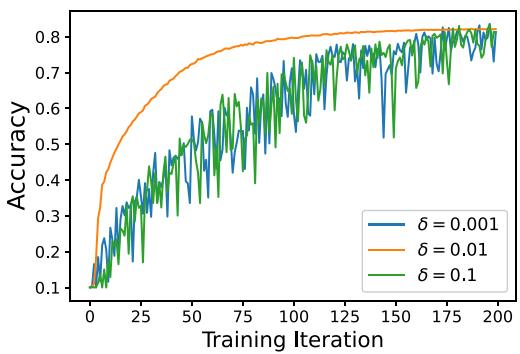  
Fig. 5. Model performance on detection thresholds δ.

The impact of the CLP detection threshold based on the FKN of the proposed method is first analyzed. Fig. 5 shows the trend of model accuracy and loss under different thresholds $\delta = 0 . 0 0 1 , 0 . 0 1 , 0 . 1$ , respectively. If δ (δ . ) is too small, the local and global models become overly sensitive to differences in parameter distributions, causing even minor variations to be identified as CLPs. This can lead to model overfitting and unnecessary energy consumption. Conversely, if δ is too large (δ . ), significant differences between the local and global models may go undetected, making it difficult to find a global distribution that suits all devices, ultimately resulting in a degradation in model performance. Thus, in the following simulations, the moderate threshold $\delta = 0 . 0 1$ is selected.

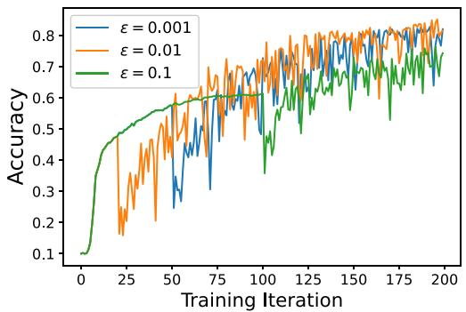  
Fig. 6. Model performance on detection thresholds ε.

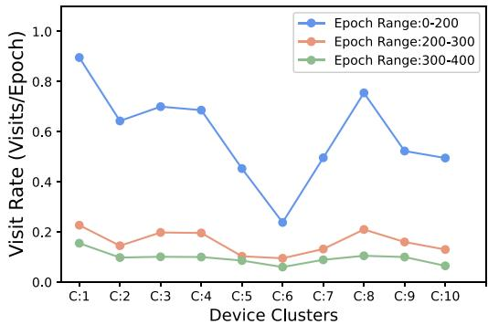  
Fig. 7. UAV visit frequency per hundred epochs to each device cluster at different training stages.

Next, the impact of another CLP detection threshold ε based on the FDN of the proposed method is investigated. Fig. 6 shows the trend of model accuracy and loss under different thresholds $\varepsilon = 0 . 0 0 1 , 0 . 0 1 , 0 . 1$ , respectively. In the Fig. 6, a larger threshold speeds up the convergence, but leads to a worse model accuracy. In contrast, a smaller threshold gives a better model performance with a slower convergence rate. This is because higher thresholds result in fewer periods being in CLP, saving computational overhead but not resulting in high model accuracy, and vice versa. Thus, the moderate threshold ε of 0.01 is chosen for the following simulations.

Fig. 7 illustrates UAV visit frequency to each device cluster at different training stages based on CLP. Device clusters are referred to as $C : 1 , \ldots , C : 1 0$ . Initially, in the first training epochs (epoch range : 0-200), in which deficits such as low quality or quantity of training data will cause irreversible model degradation, it is essential that UAVs have frequent visits to device clusters for adequate training. Thus, in this phase, the frequency of UAV visits to each cluster is the highest during the whole training process. In the next two training stages (epoch range: 200-400), the data distribution may deviate greatly from the training data caused by the changing conditions or new data distributions, which also need to perform continual learning and retraining. However, at this stage, the models have developed the ability to adapt to changing conditions, the frequency of UAV visits is low compared to the first stage, which reduces the energy consumption and communication overhead. It shows that our method can consistently improve the model accuracy while maintaining efficiency.

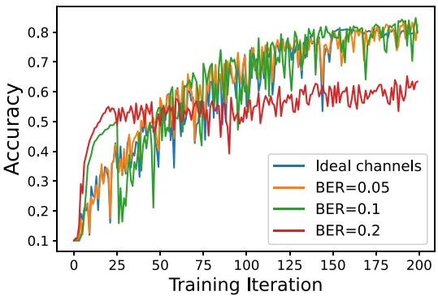  
Fig. 8. Model Performance on CIFAR-10 dataset under different BER.

To simulate potential interference or packet loss during FL communication, we introduce random bit flipping [45]. The bitflipping function simulates physical-layer bit errors caused by interference by randomly flipping tensor values:

$$
F l i p ( x , p ) = x \oplus M , M _ { i , j } \sim B e r n o u l l i ( p )\tag{53}
$$

where x is the encoded vector of the FL parameter, p is the bit-flipping probability, and ⊕ denotes the element-wise XOR operation. Specifically, the training algorithm dynamically determines the encoded vectors, randomly flips the code to observe the effect of anti-jamming. We introduce random bit flipping, where bit error rates (BER) is set as 0.05, 0.1, 0.2 over AWGN channels, respectively. The dataset using in this experiment is CIFAR-10.

As shown in the results in Fig. 8, when the BER is set to 0.05 and 0.1, our method achieves nearly the same performance as under ideal communication conditions. This demonstrates a certain degree of robustness to communication noise. Specifically, during training, we constrain the range of model update gradients from different devices, which helps mitigate the influence of incorrect feature vectors caused by occasional bit errors. However, as BER increases to 0.2, a noticeable performance degradation occurs. This is mainly because higher BER introduces more severe distortions to the transmitted model updates, which accumulate over rounds and eventually harm global model convergence.

To validate the effectiveness of introducing the CLP mechanism in our method, we conducted additional ablation experiments by comparing the performance of our method with and without the CLP-based device selection and UAV scheduling. Specifically, we designed three settings:

1) No-CLP: Devices are randomly selected throughout the entire training process, and the UAV visits each cluster uniformly.

2) CLP-only: During the CLP phase, device selection is guided by their gradient divergence, but UAV visitation remains uniform.

3) Full-CLP (ours): Both device selection and UAV visitation frequency are adjusted based on CLP.

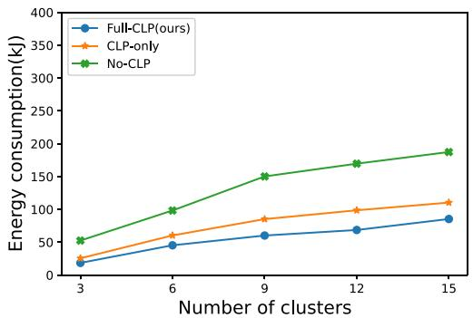  
Fig. 9. The energy consumption when the number of clusters increased on different CLP settings.

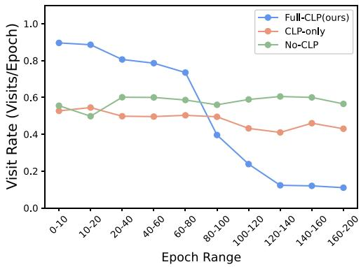  
Fig. 10. UAV visit frequency per hundred epochs to each device cluster at different training stages.

First, we measure energy consumption in terms of the total number of communication rounds, model uploads/downloads, and on-device training steps. As shown in Fig. 9, our method reduces communication overhead by 54% compared to the No-CLP method while achieving comparable or better model accuracy. The early-stage CLP-aware prioritization accelerates convergence, leading to fewer total training rounds and thus lower cumulative energy consumption. In highly resource-constrained scenarios (e.g., low UAV budget), our method shows higher energy efficiency per unit accuracy.

Next, we conduct an ablation test on the UAV visit frequency to the device cluster during different epoch ranges, As shown in Fig. 10. In our method, the visit frequency of the UAV is higher in the early training phases than the CLP-only and No-CLP methods. Since the central server adjusts the model updates frequency based on the CLP of the model, the early training phases need more frequent aggregation to renew the model due to the random initialization and data heterogeneity. But after CLP, the visit frequency drops dramatically than the others, since more model update needs in the initial learning phase, and only a smaller number is needed after CLP. The communication efficiency improves without hurting training the final model accuracy.

## C. Performance Comparison of FL Framework

To show the effectiveness of the proposed hierarchical PFL framework, three baseline schemes are selected for comparison. The descriptions are as follows:

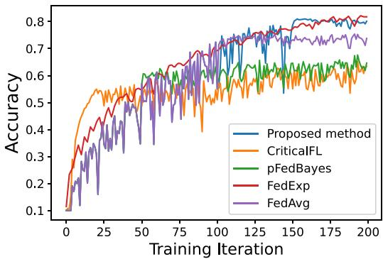  
Fig. 11. Model performance on CIFAR-10 dataset.

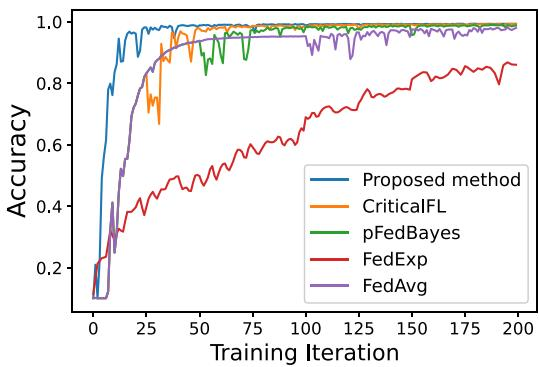  
Fig. 12. Model performance on MNIST dataset.

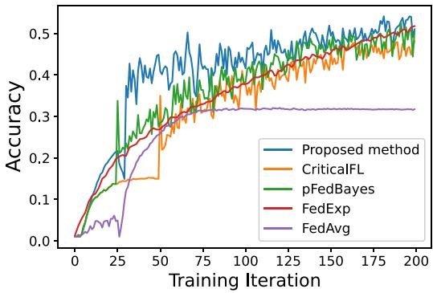  
Fig. 13. Model performance on CIFAR-100 dataset.

1) CriticalFL [23]: randomly double clients and only share the top few local parameters of each client with a server during CLP, randomly halve clients after CLP.

2) pFedBayes [43]: based on a Bayesian two-level optimization, each client owns its personalized Bayesian neural network, and the trained global distribution is used as the prior distribution to realize personalization.

3) FedExp [27]: dynamically adjust the learning step size based on varying gradients throughout the FL process.

4) FedAvg [8]: there is a fixed number of clients and a fixed learning rate in each round.

The model performance on CIFAR-10, MNIST, CIFAR-100 are shown in Figs. 11, 12, and 13, respectively. The proposed method outperforms the baseline schemes with an improved final model accuracy. Considering that all clients join the CLP, CriticalFL showed higher accuracy in the early training phase compared to the other methods. However, its final accuracy is lower than other methods. This is because changes in data distribution and random selection of participants can lead to model degradation during the subsequent training process. pFed-Bayes achieves higher model performance than FedAvg since the trained global model is used as the prior distribution which matches the true distribution. However, pFedBayes and FedAvg do not implement more efficient training strategies by taking into account the different learning phases of the training process and therefore will consume more energy than our approach. FedExp adaptively adapts the server step size according to the local model change made by the clients and the heterogeneity of their local data, thus achieving speedup. Although it converges quickly, it may have some deficits in the initial training phase such as too large or too small step size which can bring irreversible model degradation. The similarity between FedExp and our work is that both select participating clients through gradient changes of local models. But we further balance the divergence between the local and global model to achieve personalization and alleviate overfitting.

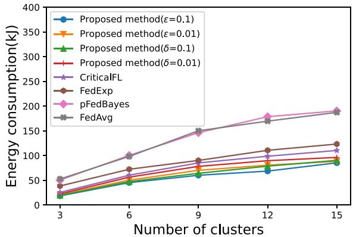  
Fig. 14. Energy consumption as the number of device clusters increases under different strategies.

Fig. 14 shows the energy consumption as the number of device clusters increases on different methods. As shown in Fig. 14, the CLP detection threshold δ and ε are larger, the fewer the CLP are detected, and thus the number of communication rounds both locally and globally are reduced, and the UAVs fly to the device clusters fewer times, hence consuming less energy. Moreover, the performance of our proposed solution consumes less energy than others. Although the “CriticalFL” method is similar to the energy consumed by our proposed method, this method reduces energy consumption by randomly reducing the training devices involved, which does not guarantee that the device clusters have achieved training accuracy or are affected by data drift. As for “pFedBayes” and “FedAvg” methods do not engage in device selection throughout the training process, and therefore both methods consume more energy. “FedExp” does not adjust the frequency of changing learning step size based on their varying gradients of the training process and therefore will consume more energy than our approach. Our method significantly reduces flight energy compared to that of baseline methods. This is due to two intrinsic design properties: (i) the devices during CLP need more UAV visits but fewer visits are required when not during the CLP period; (ii) UAVs only need more frequent visits to device clusters with larger data drift values, which dramatically reduces unnecessary flight energy consumption. Hence, our methods benefit energy costs compared to baseline methods, especially more for the flight part.

## VII. CONCLUSION AND FUTURE WORK

In this paper, we proposed a CLP-aware UAV-assisted HFL framework, which identifies unequally important learning stages during FL training. We introduced two practical and easy-tocompute metrics to enable online detection of CLP, facilitating device selection and UAV scheduling based on CLP for efficient FL training. The personalized Bayesian FL model was also developed to find the closest distribution between the global and local models, achieving personalization while simultaneously alleviating overfitting.

In the future, we will implement a small-scale prototype using real UAVs and IoT devices to further show the effectiveness of the CLP-aware training strategy. Moreover, given the challenges posed by highly dynamic environments and extreme non-i.i.d. data distributions, we aim to investigate more adaptive and lightweight learning strategies that are suitable for real-time deployment in such settings. Finally, to enhance the resilience of the system against adversarial threats, future research will explore secure and robust aggregation methods that can better defend against poisoning attacks and interference, particularly during the CLP.

## REFERENCES

[1] Y. Shi, Y. Zhou, D. Wen, Y. Wu, C. Jiang, and K. B. Letaief, “Taskoriented communications for 6G: Vision, principles, and technologies,” IEEE Wireless Commun., vol. 30, no. 3, pp. 78–85, Jun. 2023.

[2] K. Messaoudi, O. S. Oubbati, A. Rachedi, A. Lakas, T. Bendouma, and N. Chaib, “A survey of UAV-based data collection: Challenges, solutions and future perspectives,” J. Netw. Comput. Appl., vol. 216, 2023, Art. no. 103670.

[3] Y. Li and Y. Liu, “An online federated learning framework via over-the-air computing for UAV object detection,” IEEE Trans. Veh. Technol., vol. 74, no. 1, pp. 1770–1775, Jan. 2025.

[4] M. Mozaffari, W. Saad, M. Bennis, Y.-H. Nam, and M. Debbah, “A tutorial on UAVs for wireless networks: Applications, challenges, and open problems,” IEEE Commun. Surveys Tuts., vol. 21, no. 3, pp. 2334–2360, Third Quarter 2019.

[5] L. Collins, H. Hassani, A. Mokhtari, and S. Shakkottai, “FedAvg with fine tuning: Local updates lead to representation learning,” in Proc. Adv. Neural Inf. Process. Syst., 2022, pp. 10572–10586.

[6] J. Xu and H. Wang, “Client selection and bandwidth allocation in wireless federated learning networks: A long-term perspective,” IEEE Trans. Wireless Commun., vol. 20, no. 2, pp. 1188–1200, Feb. 2021.

[7] H. Peng and X. Shen, “Multi-agent reinforcement learning based resource management in MEC-and UAV-assisted vehicular networks,” IEEE J. Sel. Areas Commun., vol. 39, no. 1, pp. 131–141, Jan. 2021.

[8] B. McMahan, E. Moore, D. Ramage, S. Hampson, and B. A. y Arcas, “Communication-efficient learning of deep networks from decentralized data,” in Proc. Artif. Intell. Statist., 2017, pp. 1273–1282.

[9] Y. Li, X. Qin, H. Chen, K. Han, and P. Zhang, “Energy-aware edge association for cluster-based personalized federated learning,” IEEE Trans. Veh. Technol., vol. 71, no. 6, pp. 6756–6761, Jun. 2022.

[10] T. Wang, X. Huang, Y. Wu, L. Qian, B. Lin, and Z. Su, “UAV swarmassisted two-tier hierarchical federated learning,” IEEE Trans. Netw. Sci. Eng., vol. 11, no. 1, pp. 943–956, Jan./Feb. 2024.

[11] A. Achille, M. Rovere, and S. Soatto, “Critical learning periods in deep networks,” in Proc. Int. Conf. Learn. Representations, 2018.

[12] S. Jastrz ˛ebski, Z. Kenton, N. Ballas, A. Fischer, Y. Bengio, and A. Storkey, “On the relation between the sharpest directions of DNN loss and the SGD step length,” in Proc. Int. Conf. Learn. Representations, New Orleans, LA, USA, 2019.

[13] J. Frankle, D. J. Schwab, and A. S. Morcos, “The early phase of neural network training,” in Proc. Int. Conf. Learn. Representations, Addis Ababa, Ethiopia, 2020.

[14] G. Yan, H. Wang, and J. Li, “Seizing critical learning periods in federated learning,” in Proc. AAAI Conf. Artif. Intell., 2022, pp. 8788–8796.

[15] L. Liu, J. Zhang, S. Song, and K. B. Letaief, “Client-edge-cloud hierarchical federated learning,” in Proc. 2020 IEEE Int. Conf. Commun., 2020, pp. 1–6.

[16] X. Zhong, X. Yuan, H. Yang, and C. Zhong, “UAV-assisted hierarchical aggregation for over-the-air federated learning,” in Proc. 2022 IEEE Glob. Commun. Conf., 2022, pp. 807–812.

[17] J. Xu, H. Yao, R. Zhang, T. Mai, S. Huang, and S. Guo, “Federated learning powered semantic communication for UAV swarm cooperation,” IEEE Wireless Commun., vol. 31, no. 4, pp. 140–146, Aug. 2024.

[18] J. Tursunboev, Y.-S. Kang, S.-B. Huh, D.-W. Lim, J.-M. Kang, and H. Jung, “Hierarchical federated learning for edge-aided unmanned aerial vehicle networks,” Appl. Sci., vol. 12, no. 2, 2022, Art. no. 670.

[19] X. Xu, G. Feng, S. Qin, Y. Liu, and Y. Sun, “Joint UAV deployment and resource allocation: A personalized federated deep reinforcement learning approach,” IEEE Trans. Veh. Technol., vol. 73, no. 3, pp. 4005–4018, Mar. 2024.

[20] S. Wang, S. Hosseinalipour, M. Gorlatova, C. G. Brinton, and M. Chiang, “UAV-assisted online machine learning over multi-tiered networks: A hierarchical nested personalized federated learning approach,” IEEE Trans. Netw. Service Manag., vol. 20, no. 2, pp. 1847–1865, Jun. 2023.

[21] A. S. Golatkar, A. Achille, and S. Soatto, “Time matters in regularizing deep networks: Weight decay and data augmentation affect early learning dynamics, matter little near convergence,” in Proc. Adv. Neural Inf. Process. Syst., 2019, pp. 10678–10688.

[22] S. Jastrzebski et al., “Catastrophic fisher explosion: Early phase fisher matrix impacts generalization,” in Proc. Int. Conf. Mach. Learn., PMLR, 2021, pp. 4772–4784.

[23] G. Yan, H. Wang, X. Yuan, and J. Li, “CriticalFL: A critical learning periods augmented client selection framework for efficient federated learning,” in Proc. 29th ACM SIGKDD Conf. Knowl. Discov. Data Mining, 2023, pp. 2898–2907.

[24] X. Y. Gang Yan, H. Wang, and J. Li, “DEFL: Defending against model poisoning attacks in federated learning via critical learning periods awareness,” in Proc. Conf. Assoc. Advance. Artif. Intell., 2023, pp. 10711–10719.

[25] K. Panchal et al., “Flash: Concept drift adaptation in federated learning,” in Proc. Int. Conf. Mach. Learn., 2023, pp. 26931–26962.

[26] T.-B. Nguyen, M.-D. Nguyen, J. Park, Q.-V. Pham, and W. J. Hwang, “Federated domain generalization with data-free on-server matching gradient,” in Proc. Int. Conf. Learn. Representations, Singapore, 2025.

[27] D. Jhunjhunwala, S. Wang, and G. Joshi, “FedEXP: Speeding up federated averaging via extrapolation,” in Proc. Int. Conf. Learn. Representations, Kigali, Rwanda, 2023.

[28] D. M. Blei, A. Kucukelbir, and J. D. McAuliffe, “Variational inference: A review for statisticians,” J. Amer. Stat. Assoc., vol. 112, no. 518, pp. 859–877, 2017.

[29] I. Higgins et al., “beta-VAE: Learning basic visual concepts with a constrained variational framework,” in Proc. Int. Conf. Learn. Representations, 2017.

[30] H.-Y. Chen and W.-L. Chao, “FedBE: Making Bayesian model ensemble applicable to federated learning,” in Proc. Int. Conf. Learn. Representations, 2021.

[31] A. T. Thorgeirsson and F. Gauterin, “Probabilistic predictions with federated learning,” Entropy, vol. 23, 2021, Art. no. 41.

[32] A. Al-Hourani, S. Kandeepan, and A. Jamalipour, “Modeling air-toground path loss for low altitude platforms in urban environments,” in Proc. 2014 IEEE Glob. Commun. Conf., 2014, pp. 2898–2904.

[33] M. Mozaffari, W. Saad, M. Bennis, and M. Debbah, “Mobile unmanned aerial vehicles (UAVs) for energy-efficient Internet of Things communications,” IEEE Trans. Wireless Commun., vol. 16, no. 11, pp. 7574–7589, Nov. 2017.

[34] Y. Zeng, J. Xu, and R. Zhang, “Energy minimization for wireless communication with rotary-wing UAV,” IEEE Trans. Wireless Commun., vol. 18, no. 4, pp. 2329–2345, Apr. 2019.

[35] Y. Zeng and R. Zhang, “Energy-efficient UAV communication with trajectory optimization,” IEEE Trans. Wireless Commun., vol. 16, no. 6, pp. 3747–3760, Jun. 2017.

[36] T. Haarnoja, A. Zhou, P. Abbeel, and S. Levine, “Soft actor-critic: Offpolicy maximum entropy deep reinforcement learning with a stochastic actor,” in Proc. Int. Conf. Mach. Learn., 2018, pp. 1861–1870.

[37] C. T Dinh, N. Tran, and J. Nguyen, “Personalized federated learning with Moreau envelopes,” in Proc. Adv. Neural Inf. Process. Syst., 2020, pp. 21394–21405.

[38] Y. LeCun, L. Bottou, Y. Bengio, and P. Haffner, “Gradient-based learning applied to document recognition,” Proc. IEEE, vol. 86, no. 11, pp. 2278–2324, Nov. 1998.

[39] Y. LeCun, C. Cortes, and C. Burges, “MNIST handwritten digit database,” ATT Labs, 2010. [Online]. Available: http://yann.lecun.com/exdb/mnist

[40] A. Krizhevsky et al., “Learning multiple layers of features from tiny images,” Univ. Toronto, 2009, pp. 32–91.

[41] K. Simonyan and A. Zisserman, “Very deep convolutional networks for large-scale image recognition,” in Proc. Int. Conf. Learn. Representations, 2015, pp. 1–14.

[42] A. Krizhevsky, I. Sutskever, and G. E. Hinton, “ImageNet classification with deep convolutional neural networks,” in Proc. Adv. Neural Inf. Process. Syst., F. Pereira, C. Burges, L. Bottou, and K. Weinberger, Eds., 2012, pp. 1097–1105.

[43] X. Zhang, Y. Li, W. Li, K. Guo, and Y. Shao, “Personalized federated learning via variational Bayesian inference,” in Proc. Int. Conf. Mach. Learn., 2022, pp. 26293–26310.

[44] X. Hou, J. Wang, C. Jiang, X. Zhang, Y. Ren, and M. Debbah, “UAVenabled covert federated learning,” IEEE Trans. Wireless Commun., vol. 22, no. 10, pp. 6793–6809, Oct. 2023.

[45] J. Dong et al., “One-bit flip is all you need: When bit-flip attack meets model training,” in Proc. IEEE/CVF Int. Conf. Comput. Vis., 2023, pp. 4688–4698.

[46] B. Alzahrani, O. S. Oubbati, A. Barnawi, M. Atiquzzaman, and D. Alghazzawi, “UAV assistance paradigm: State-of-the-art in applications and challenges,” J. Netw. Comput. Appl., vol. 166, 2020, Art. no. 102706.

[47] M. Chen, Z. Yang, W. Saad, C. Yin, H. V. Poor, and S. Cui, “A joint learning and communications framework for federated learning over wireless networks,” IEEE Trans. Wireless Commun., vol. 20, no. 1, pp. 269–283, Jan. 2021.

[48] L. Liu, J. Zhang, S. Song, and K. B. Letaief, “Hierarchical federated learning with quantization: Convergence analysis and system design,” IEEE Trans. Wireless Commun., vol. 22, no. 1, pp. 2–18, Jan. 2023.

[49] Z. Lin et al., “Hierarchical split federated learning: Convergence analysis and system optimization,” IEEE Trans. Mobile Comput., vol. 24, no. 10, pp. 9352–9367, Oct. 2025.

[50] T. Chen, J. Yan, Y. Sun, S. Zhou, D. Gündüz, and Z. Niu, “Mobility accelerates learning: Convergence analysis on hierarchical federated learning in vehicular networks,” IEEE Trans. Veh. Technol., vol. 74, no. 1, pp. 1657–1673, Jan. 2025.

[51] S. Wang et al., “Adaptive federated learning in resource constrained edge computing systems,” IEEE J. Sel. Areas Commun., vol. 37, no. 6, pp. 1205–1221, Jun. 2019.

[52] K. Ding, K. Ma, S. Wang, and E. P. Simoncelli, “Comparison of fullreference image quality models for optimization of image processing systems,” Int. J. Comput. Vis., vol. 129, no. 4, pp. 1258–1281, 2021.

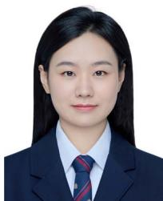  
Yanlu Li received the BE degree from the China Jiliang University (CJLU), Hangzhou, China, in 2022. She is currently working toward the PhD degree with the State Key Laboratory of Networking and Switching Technology, Beijing University of Posts and Telecommunications (BUPT), Beijing, China. Her research interests include wireless federated learning, mobile edge computing, and energy-efficient communication systems.

  
next-generation wireless networks, edge intelligence, semantic communications, and blockchain.

Yiming Liu (Member, IEEE) received the BE degree in communication engineering from Shanghai University, Shanghai, China, in 2014, and the PhD degree in information and communication engineering from the Beijing University of Posts and Telecommunications (BUPT), Beijing, China, in 2019. In 2017 and 2018, she was a visiting PhD degree student with the University of British Columbia, Vancouver, BC, Canada. She is currently an associate professor with the School of Information and Communication Engineering, BUPT. Her research interests include  
  
Zhi Zhang (Member, IEEE) received the BS and PhD degrees from the Beijing University of Posts and Telecommunications (BUPT), Beijing, China, in 1999 and 2004, respectively. He is currently a professor and PhD degree supervisor with the School of Information and Communication Engineering, BUPT, and is also a member with the State Key Laboratory of Networking and Switching Technology. His research interests include key technology of mobile communications, digital signal processing, and communication system design.

Yuzhen Huang received the BS degree in communications engineering and the PhD degree in communications and information systems from the College of Communications Engineering, PLA University of Science and Technology, Nanjing, China, in 2008 and 2013, respectively. He is currently a professor with the Academy of Military Sciences of PLA. He has authored or coauthored nearly 100 research papers in international journals and conferences. His research interests include MIMO communications systems, cooperative communications, physical layer security, and cognitive radio systems. He and his coauthors were the recipient of the Best Paper Award at the WCSP 2013, and IEEE Communications Letters Exemplary Reviewer Certificate for 2014. He is also an associate editor for the KSII Transactions on Internet and Information Systems.