# Semantic Communication in Satellite-Borne Edge Cloud Network for Computation Offloading

Guhan Zheng , Member, IEEE, Qiang Ni , Senior Member, IEEE, Keivan Navaie , Senior Member, IEEE, and Haris Pervaiz , Member, IEEE

Abstract— The low earth orbit (LEO) satellite-borne edge cloud (SEC) and machine learning (ML) based semantic communication (SemCom) are both enabling technologies for 6G systems facilitating computation offloading. Nevertheless, integrating SemCom into the SEC networks for user computation offloading introduces semantic coder updating requirements as well as additional semantic extraction costs. Offloading user computation in SEC networks via SemCom also results in new functional challenges considering, e.g., latency, energy, and privacy. In this paper, we present a novel SemCom-assisted SEC (SemCom-SEC) framework for computation offloading of resource-limited users. We then propose an adaptive pruning-split federated learning (PSFed) method for updating the semantic coder in SemCom-SEC. We further show that the proposed method guarantees training convergence speed and accuracy. This method also improves the privacy of the semantic coder while reducing training delay and energy consumption. In the case of trained semantic coders in service, for the users processing computational tasks, the main objective is to minimise the users’ delay and energy consumption, subject to sustaining users’ privacy and fairness amongst them. This problem is then formulated as an incomplete information mixed integer nonlinear programming (MINLP) problem. A new computational task processing scheduling (CTPS) mechanism is also proposed based on the Rubinstein bargaining game. Simulation results demonstrate the proposed PSFed and game theoretical CTPS mechanism outperforms the baseline solutions reducing delay and energy consumption while enhancing users’ privacy.

Index Terms— Satellite-borne edge cloud, SemCom, computation offloading, delay, energy consumption, privacy.

# I. INTRODUCTION

# A. Background

MULTI-ACCESS edge computing (MEC) is emerging asone of the key techniques for next-generation wireless one of the key techniques for next-generation wireless communication systems [2]. MEC enables the development of

Manuscript received 8 July 2023; revised 15 November 2023; accepted 15 December 2023. Date of publication 26 February 2024; date of current version 9 May 2024. This work was supported in part by the Western O-RAN Deployment (ONE WORD) Project. An earlier version of this paper was presented at the IEEE ICC 2022 DDINS Workshop [DOI: 10.1109/ ICCWorkshops53468.2022.9814494]. (Corresponding author: Qiang Ni.)

Guhan Zheng, Qiang Ni, and Keivan Navaie are with the School of Computing and Communications, Lancaster University, LA1 4WA Lancaster, U.K. (e-mail: g.zheng2@lancaster.ac.uk; q.ni@lancaster.ac.uk; k.navaie@lancaster.ac.uk).

Haris Pervaiz is with the School of Computer Science and Electronic Engineering (CSEE), University of Essex, CO4 3SQ Colchester, U.K. (e-mail: haris.pervaiz@essex.ac.uk).

Color versions of one or more figures in this article are available at https://doi.org/10.1109/JSAC.2024.3365879.

Digital Object Identifier 10.1109/JSAC.2024.3365879

Internet of Things (IoT) applications and improves network performance and quality of service (QoS) [3]. MEC brings cloud services closer to the users at the network edge, e.g., base stations (BSs), and roadside units (RSUs) providing them with abundant computational resources. Therefore, users can offload their computationally intensive tasks to the MEC for faster processing.

Nevertheless, users located in remote areas or disaster zones might not be able to connect to terrestrial edge cloud network infrastructures. Alternatively, such under-served users may offload their computationally intensive tasks to remote core cloud servers via Geosynchronous Equatorial Orbit (GEO) or Medium Earth Orbit (MEO) satellites. In addition to the costs, the corresponding propagation latency to and from the satellite platforms however impedes the delay requirements of these users. Using Low Earth Orbit (LEO) satellites can partly address this issue by providing lower propagation latency as their orbits are much closer to the ground compared to GEO and MEO satellites. Comparing to GEO and MEO, constellations of LEO satellites also provide low-cost, highthroughput services and extensive radio coverage. To further reduce the propagation delay, the satellite-borne edge cloud (SEC) setting was proposed, where the offloaded processing is conducted on board the LEO satellite, hence reducing the propagation delay by a factor of 2 [4], [5].

Adopting SEC for users in remote areas or disaster zones has been recently investigated in [4] and [6]. The authors in [4], and [6] mainly focused on developing offloading decisions that minimise offloading delay or energy consumption for cases where users have direct radio links to the satellites. (e.g., in C-Band). An alternative access scenario is proposed in [7], where the user transmits to the SEC indirectly through an intermediary terrestrial-station-terminal (TST). In this approach, the user transmission to the TST is on a C-band radio link and TST communicates to the SEC through a K-band radio link. Wang et al. [8] also proposed a dual-edge cloud network, where the edge servers are placed on both BSs and LEO satellites. In this approach, a BS acts as a TST to assist users with computation offloading to the SEC. Similarly, [9] proposed an energy-efficient strategy for terrestrial users to offload computing tasks to the SEC via TSTs. Tang et al. [10] further investigated the impact of the core cloud on users’ offloading decisions. They then proposed a minimal energy consumption computing offloading decision method, where users access SEC directly.

# B. Challenges: SEC for User Offloading

The approaches mentioned above frequently confine their investigations to a singular connectivity scenario between users and the SEC. In essence, by concentrating solely on specific performance aspects, such as energy consumption or latency, potential privacy concerns and associated risks to users are disregarded. This poses inherent risks to users. For example, prioritizing latency without considering energy consumption and privacy may lead to a user in the desert swiftly losing the ability to communicate, with this information potentially accessible by a third party. To address this issue, in this paper, we investigate SEC incorporating various access modalities, task processing entities, latency, energy consumption, and privacy of users.

Moreover, in the majority of instances, offloading substantial computing tasks to the SEC demands an exceptionally high transmission rate and substantial throughput. Consequently, alongside considerations of latency, energy efficiency, and data privacy, the computation offloading to SEC encounters a fundamental constraint–the inherent limitation of accessible radio spectrum. Hence, it is imperative to devise techniques that markedly enhance the spectrum efficiency of these systems, all the while upholding the quality of service (QoS) in the offloading process. A promising approach to address this issue is semantic communication (SemCom) based on machine learning (ML) [11].

SemCom leverages ML techniques for information transmission. A goal-oriented semantic encoder, powered by ML, selectively extracts semantic information from the transmitted or offloaded content. Rather than transmitting raw data, only the essential semantic information is conveyed, later decoded by the ML-based semantic decoder. This approach significantly enhances spectrum efficiency by balancing the communication load against the computational load through machine learning. Moreover, it mitigates the impact of unstable radio links, such as variable path loss due to weather conditions commonly observed in high-frequency satellite links. SemCom thus plays a pivotal role in the significant enhancement of the performance and speed of offloading. The integration of SemCom and SEC for computation offloading presents a promising solution to address the challenges of task offloading in the next generation of wireless communications.

# C. Challenges: SemCom for SEC

Integrating SemCom and SEC for computation offloading requires a carefully designed architecture. Such an architecture needs to consider various possible task-processing entities (satellites and terrestrial cloud) and various user access methods (direct and indirect) to the SEC network. Furthermore, goal-oriented ML-based SemCom coders need to be updated in real-time according to new transmission content [12].

In the SEC network, updating the semantic coder presents several emerging challenges, e.g., mobility of SEC, low tolerance of service interruption and energy consumption, and privacy. However, the existing distributed learning frameworks designed for SemComs in generic networks (e.g., [13], [14], [15]) do not seamlessly translate to the SEC network. For instance, Xie and Qin [13] introduced a pruned lite ML model tailored for distributed semantic coders. Their approach focuses on refining models over edges rather than updating goal-oriented coders in a federated training approach. Qin et al. [15] proposed a general SemCom framework involving users and terrestrial base station edge clouds. In [14], the SemCom framework also includes users and terrestrial base station edge clouds, with the distinction that users in [14] must provide information to base stations for semantic extraction. However, these frameworks suffer from prolonged service interruptions, increased energy consumption, and heightened privacy risks within SEC networks. Furthermore, these methods only engage users and the edge cloud. In SEC offloading scenarios, the SemCom for offloading framework necessitates the active participation of all parties including users, terrestrial-station-terminal, satellites, and terrestrial clouds. The aforementioned research underscores the critical need to develop efficient distributed learning methods for updating semantic coders in SemCom SEC networks.

In addition to the above, SemCom alters the transmission paradigm of SEC networks by increasing the computational load while reducing the communication load. Users are therefore required to develop optimal computational task strategies in case trained semantic coders are utilised for computation offloading. Such strategies need to be developed taking into account not only scenarios specific to SemCom in the SEC, but also operational factors that have not been considered in the existing SEC offloading research. Such factors include using both access modalities, the task processing entities, latency, energy consumption and privacy.

# D. Contributions

To tackle the above-mentioned challenges, in this paper, we propose a novel SemCom-assisted SEC (SemCom-SEC) framework for terrestrial users’ computation offloading. In our proposed method, we split the SemCom service into in-maintenance (i.e., semantic coders need updating) and in-service (i.e., trained semantic coders are utilised for computation offloading) scenarios. For the in-maintenance scenario, we investigate real-time updating of deployed semantic coders in SemCom-SEC. A pruning-split federated learning (PSFed) approach is then proposed to update semantic coders considering offloading QoS while privacy-preserving. For the in-service scenario, we study the computational task processing challenge of terrestrial users in the new SemCom paradigm. We then propose a new computational task processing scheduling (CTPS) mechanism based on the Rubinstein bargaining game to minimise the users’ processing delay and energy consumption while preserving users’ privacy. The main contributions of this paper are summarised as follows:

• We integrate the SemCom and SEC networks and propose a novel SemCom-SEC framework enabling task offloading for under-served users. Diverging from current SemCom frameworks, which exclusively factor in users and terrestrial edge clouds, the envisioned framework extends its reach by deploying semantic coders on both the TSTs and satellites. Furthermore, SemCom-SEC accommodates a variety of user task-processing approaches and access modalities. Computational tasks for users can occur locally, at SEC, or in the core cloud server. Additionally, users possess the flexibility to access LEO satellites either directly or through the semantic encoder-equipped TST.

• We then propose a PSFed approach for semantic coder updating for the SemCom-SEC framework enabling computation offloading. PSFed adaptively “splits” and “prunes” the semantic coders for federated aggregation subject to various users’ personalised conditions. In contrast to the conventional “split” and “prunes” models, the semantic coder model components remain intact after updating. PSFed reduces the consumption of training communication resources and improves the privacy of the trained encoder while enhancing the training convergence speed and model accuracy.   
• We introduce an innovative CTPS mechanism, distinct from previous studies that only address partial performance considerations. Our approach takes a comprehensive stance, jointly addressing user privacy, delay, energy consumption, and fairness to tackle the novel challenge of incomplete information task processing scheduling in SemCom-SEC. The CTPS operates in two steps: firstly, a game-theoretic model is crafted to transform this mixed-integer nonlinear programming (MINLP) problem from incomplete information, stemming from privacy concerns, into a complete information problem. In the second step, the converted complete information MINLP problem is decomposed and solved through the application of the Lagrangian dual decomposition method.

The rest of the paper is organised as the following. Section II presents the system model of the proposed SemCom-SEC framework. In Section III and Section IV, we then investigate the unique challenges and corresponding solutions for Sem-Com in-maintenance and in-service scenarios, respectively. The performance of the proposed PSFed and CTPS are then evaluated and analysed by simulations in Section V. Finally, conclusions are drawn in Section VI.

# II. SYSTEM MODEL

In this section, the system model of the proposed SemCom-SEC is introduced. We then provide the computing, communication, path loss and semantic coder training model.

# A. System Description

Consider the SemCom-SEC (Fig. 1), where terrestrial users are located in areas without having access to terrestrial edge service. Users can offload computation-intensive tasks to LEO SEC. In practice, an LEO satellite constellation is similar to a cellular network operating above the ground [16]. Whereas the space cellular network is on the move, while ground users are relatively stationary.

We consider both types of approaches for users to access the SEC for computation offloading [7]. Users can communicate with LEO satellites directly through a C-band user-satellite radio link. Furthermore, they are also allowed to indirectly access the SEC through a TST via a C-band link to TST, and a Ka-band link between TST and SEC. The terrestrial C-band user-TST link spectrum resources are utilised in an orthogonal frequency division multiple access (OFDMA) setting to optimise the utilisation of terrestrial radio resources [9].

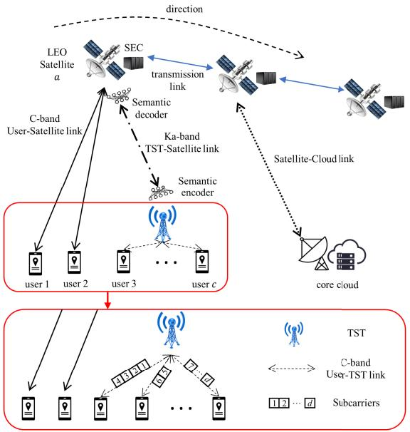

flowchart

```mermaid
graph TD
    A["LEO Satellite a"] -->|C-band User-Satellite link| B["user 1"]
    A -->|C-band User-Satellite link| C["user 2"]
    A -->|C-band User-Satellite link| D["user 3"]
    A -->|C-band User-Satellite link| E["user c"]
    F["SEC"] -->|transmission link| G["Satellite"]
    H["Satellite"] --> I["Satellite-Cloud link"]
    J["Ka-band TST-Satellite link"] --> K["Semantic encoder"]
    L["TST"] --> M["C-band User-TST link"]
    N["Subcarriers"] --> O["..."]
    P["direction"] -.-> G
    Q["User 1"] --> R["Wireless Tower"]
    S["User 2"] --> R
    T["User 3"] --> R
    U["..."] --> R
    V["..."] --> R
    W["..."] --> R
    X["..."] --> R
    Y["..."] --> R
    Z["..."] --> R
```

Fig. 1. The proposed SemCom-SEC framework.

To improve the spectrum efficiency and QoS of SEC networks, semantic coders are deployed on the TSTs and LEO satellites for transmitting offloaded tasks over Ka-band. This is due to TSTs being primarily responsible for transmitting significant amounts of tasks to satellites and requiring extremely high spectral efficiency. Furthermore, their service area is fixed and the content to assist in task offloading (e.g., scene perception task, augmented reality task) only minimally varies. The mobility of the users causes the fact that the offloading content is often variable. For instance, the content of the transmission when offloading a scene perception task varies depending on the scene. The content-oriented semantic coders need to be constantly updated as the user moves. We thus consider factors such as utilisation, and reliability, for which goal-oriented SemCom is most appropriate for the TSTsatellite link in SEC networks. Moreover, due to the dynamic nature of the system and the limited storage resources of LEO satellites, it is not viable to store semantic decoders for all TSTs on the route. The semantic coders are therefore stored on the TST. Similarly, for economic and satellite storage resources considerations, at least the trained decoder of TSTs should be the same for the same transmission task [17]. The TST delivers the related semantic decoders to the corresponding satellite when it needs to perform SemCom.

Furthermore, LEO satellites can alternatively connect to the cloud servers on the terrestrial network via Ka-band backhaul links to provide cloud service for users.

In this model, a user may process indivisible computational tasks in either of the following five scenarios: 1) computing locally; 2) offloading the tasks to SEC over the user-satellite link; 3) offloading the tasks to the SEC via TST; 4) offloading the tasks to terrestrial cloud over the user-satellite link; 5) offloading the tasks to the terrestrial cloud via TST-satellite link.

# B. Computiong Models

Denote the set of LEO satellites as $\begin{array} { l l l } { { \mathcal { A } } } & { { = } } & { { \{ 1 , 2 , . . . , } }  \end{array}$ $a , \ldots , A \}$ and set of TSTs as $B = \{ 1 , 2 , \dotsc , b , \dotsc , B \} . \mathrm { A }$ TST b is on the terrestrial and provides service to C users within the coverage as a small cell in which the set of users in TST b’s service range is denoted by $\mathcal { C } = \{ 1 , 2 , \ldots , c , \ldots , C \}$ . We consider each terrestrial user c to have indivisible computational sensitive tasks with the size in bits of $m _ { c } \in \mathsf { \Gamma }$ $\{ m _ { 1 } , m _ { 2 } , \ldots , m _ { c } , \ldots , m _ { C } \}$ , and the CPU cycles needed to execute one bit of tasks is δ. The local computation task latency of the user c can be given by

$$
t _ {c} ^ {L C} = \frac {\delta m _ {c}}{f _ {c}}, \tag {1}
$$

where $f _ { c }$ is user c’s CPU-cycle frequency with the unit cycles/s. The energy required to calculate locally is hence expressed as [1]:

$$
E _ {c} ^ {L C} = p _ {c} ^ {L C} t _ {c} ^ {L C} = \varepsilon f _ {c} ^ {3} \frac {\delta m _ {c}}{f _ {c}} = \varepsilon \delta m _ {c} f _ {c} ^ {2}, \tag {2}
$$

where $p _ { c } ^ { L C } = \varepsilon f _ { c } ^ { 3 }$ is the power needed to be computing locally and ε is the energy factor related to the electronics [18].

Similarly, if user c chooses to offload the tasks to SEC or the terrestrial cloud, the computational latency can be obtained by

$$
t _ {c} ^ {S E C} = \frac {\delta m _ {c}}{f _ {a}}, \tag {3}
$$

$$
t _ {c} ^ {\text { Cloud }} = \frac {\delta m _ {c}}{f _ {\text { Cloud }}}, \tag {4}
$$

where $f _ { a }$ and $f _ { C l o u d }$ are the CPU-cycle frequency of the LEO satellite a being offloaded to and terrestrial cloud, respectively. Similar to [10] and [19], we assume that all LEO satellites have similar computing capabilities.

# C. Communication Models

There are two options for each user to access LEO satellites, i.e., directly access the LEO satellite or via a semantic encoder deployed on the TST. The total bandwidth of the C-band user-TST link is divided into $D _ { 0 }$ orthogonal sub-carriers based on OFDMA manner [9]. The transmission rate of the user c to the TST b on a sub-carrier $d _ { 0 }$ in this link is

$$
r _ {c, d} ^ {c b} = B _ {d _ {0}} ^ {c b} \log_ {2} (1 + \frac {p _ {c , d _ {0}} ^ {c b} g _ {c , d _ {0}} ^ {c b}}{\sigma_ {0} ^ {2}}), \tag {5}
$$

where Bcbd0 , $B _ { d _ { 0 } } ^ { c b } , p _ { c , d _ { 0 } } ^ { c b }$ and $g _ { c , d _ { 0 } } ^ { c b }$ are bandwidth, transmission power and the channel gain on sub-carrier $d _ { 0 }$ in the user-TST link, separately. Further, in $( 5 ) , \sigma _ { 0 } ^ { 2 }$ is the noise power in this link. Hence, the transmission delay from user c to TST b is

$$
t _ {c} ^ {c b} = \frac {m _ {c}}{\sum_ {d _ {0} = 1} ^ {D _ {0}} x _ {d _ {0}} ^ {c b} r _ {c , d _ {0}} ^ {c b}}, \tag {6}
$$

where $x _ { d _ { 0 } } ^ { c b } \in 0 , 1$ is the allocation indicator of user-TST over the C-band. In the case of a sub-carrier $d _ { 0 }$ in C-band is allocated to user c to offload the tasks, $x _ { d _ { 0 } } ^ { c b } = 1 $ x d ; otherwise, $x _ { d _ { 0 } } ^ { c b } = 0$ 0 . Therefore, the transmission energy is

$$
E _ {c} ^ {c b} = t _ {c} ^ {c b} \sum_ {d _ {0} = 1} ^ {D _ {0}} x _ {d _ {0}} ^ {c b} p _ {c, d _ {0}} ^ {c b}. \tag {7}
$$

If user c chooses to access satellite a directly, due to the ultra-long propagation distance, the propagation delay is not negligible and the round-trip propagation delay is

$$
t _ {c} ^ {p r o a} = \frac {2 h}{c _ {l}}, \tag {8}
$$

where h is the distance between user c and satellite $a , c _ { l }$ is the speed of light. We assume the users in the same TST, this TST and terrestrial cloud have the same distance to the satellite a. Moreover, path loss should be considered when transmitting over long distances. We are not concentrating on the path loss in the user-TST link because they communicate in a small cell range and haven’t got a significant impact on the transmission delay. The transmission rate from the user c to satellite a thus can be denoted by

$$
R _ {c} ^ {c a} = B _ {c} ^ {c a} \log_ {2} (1 + \frac {p _ {c} ^ {c a} g _ {c} ^ {c a}}{\sigma_ {0} ^ {2} P L _ {c} ^ {c a}}), \tag {9}
$$

where $B _ { c } ^ { c a } , \ p _ { c } ^ { c a }$ and $g _ { c } ^ { c a }$ are bandwidth, transmission power, and channel gain from the user c to satellite a, respectively. Furthermore, $P L _ { c } ^ { c a }$ is the path loss. Note that the path loss affects the channel hence the channel gain. Nevertheless, to better demonstrate the advantages of SemCom, similar to [20], we present the path loss separately in the formula to facilitate subsequent analysis. Normally, the path loss $P L$ for the satellite channels mainly consists of free-space path loss $P L _ { f }$ and atmospheric (rainfall) loss $P L _ { r } \ [ 2 0 ]$ . Hence, we assume the total path loss $\begin{array} { r } { P L = P L _ { f } + P L _ { r } } \end{array}$ . We will specify these losses later. We then have the transmission delay and energy consumption when user c accesses the SEC a directly, which are given by

$$
t _ {c} ^ {c a} = \frac {m _ {c}}{R _ {c} ^ {c a}}, \tag {10}
$$

$$
E _ {c} ^ {c a} = t _ {c} ^ {c a} p _ {c} ^ {c a}. \tag {11}
$$

In contrast to users, the transmission process from TST b to satellite a integrates SemCom. It thus increases the computing delay while significantly decreasing the data required to be transmitted. The transmission rate of TST can be expressed as:

$$
R _ {b} ^ {b a} = B _ {b} ^ {b a} \log_ {2} (1 + \frac {p _ {b} ^ {b a} g _ {b} ^ {b a}}{\sigma_ {0} ^ {2} P L _ {b} ^ {b a}}), \tag {12}
$$

where $B _ { b } ^ { b a } , \ P B _ { b } ^ { b a } , \ P _ { b } ^ { b a }$ and $g _ { b } ^ { b a }$ are bandwidth, path loss, transmission power and the channel gain in TST b-satellite a link, respectively. In addition, since antennas of TSTs have good directivity, they can communicate with multiple LEO satellites via Ka-band and the corresponding interference can be ignored [9], [21], [22]. Therefore, the transmission delay of all users’ tasks are transmitted from TST b to satellite a is

$$
t _ {c} ^ {b a} = \frac {\sum_ {j = 1} ^ {F} \psi m _ {j}}{R _ {b} ^ {b a}} + \frac {\sum_ {j = 1} ^ {F} m _ {j}}{R _ {S e m C o m} ^ {b a}}, \tag {13}
$$

where $F$ is the number of users allocated to offloading the task to satellite a and $F \in { \mathcal { C } }$ . Furthermore, $\psi$ is the compression ratio and the $R _ { S e m C o m } ^ { b a }$ is the rate of semantic extraction and semantic parsing, i.e., computing delay during data transmission.

Since the computation task calculation result is often much smaller than the offloaded data, it is reasonable to ignore the backhaul transmission delay (see also [23] and [24]. Moreover, estimating the number of subcarriers provided by satellite a to user c is difficult due to the large number of satellite service users. We assume that the satellite transmits user data to the ground cloud with a constant transmission rate $R _ { c } ^ { a }$ similar to [10]. The transmission delay between satellite and cloud $t _ { a } ^ { C l o u d }$ thus equals $m _ { c } / R _ { c } ^ { a }$ . Due to the mobility of satellites, to precisely inform users, we thus use $h$ to estimate the distance between the satellite and the terrestrial cloud. The propagation delay where user c chooses to offload to the terrestrial cloud is

$$
t _ {c} ^ {\text { proC }} = 2 t _ {c} ^ {\text { proa }} = \frac {4 h}{c _ {l}}. \tag {14}
$$

# D. Path Loss Model

As mentioned in Section II-C, the path loss for the terrestrial-satellite channel is mainly free-space path loss $P L _ { f }$ and atmospheric (rainfall) loss $P L _ { r }$ . Free-space path loss is a basic power loss that increases depending on the communication distance. In dB, $P L _ { f }$ is [25]

$$
P L _ {f} (\mathrm{dB}) = 9 2. 4 4 + 2 0 \log (h) + 2 0 \log (f), \tag {15}
$$

where h is the communication distance unit in km, and $f$ is the operating frequency with the unit of GHz.

Atmospheric loss is a type of signal absorption and scattering due to meteorological causes, i.e., mainly related to rainfall. The rain attenuation is described by [26]

$$
P L _ {r} (d B) = \xi L _ {E}, \tag {16}
$$

where $\xi$ is the frequency-dependent parameter unit in dB/km and $L _ { E }$ is the effective path length unit in km. We first introduce the calculation method of $\xi$ as:

$$
\xi = k (R _ {0. 0 0 1}) ^ {v}, \tag {17}
$$

where $R _ { 0 . 0 0 1 }$ is the rainfall rate, unit in mm/h. Further, k and v are coefficients given as:

$$
k = \left[ k _ {H} + k _ {V} + (k _ {H} - k _ {V}) c o s ^ {2} (\omega) c o s (2 \tau) \right] / 2, \tag {18}
$$

$$
v = \left[ k _ {H} v _ {H} + k _ {V} v _ {V} + \left(k _ {H} v _ {H} - k _ {V} v _ {V}\right) \cos^ {2} (\omega) \cos (2 \tau) \right] / 2, \tag {19}
$$

where $\tau = \pi / 4$ for circular polarization and ω is the elevation angle between terrestrial transmitter and satellite. Moreover, $k _ { H } , \ k _ { V } , \ v _ { H }$ , and $v _ { V }$ are coefficients related to operating frequency f and can be found out the specific value from [27].

$L _ { E } ,$ is therefore

$$
L _ {E} = L _ {R} v _ {0. 0 0 1}, \tag {20}
$$

where $L _ { R }$ is the distance parameter related to rainfall height and $v _ { 0 . 0 0 1 }$ is the adjustment factor. We have

$$
v _ {0. 0 0 1} = \frac {1}{1 + \sqrt {\sin (\omega)} \left(\frac {3 1 (1 - e ^ {- (\frac {\omega}{1 + \chi})}) \sqrt {L R ^ {\xi}}}{f ^ {2}} - 0 . 4 5\right)}, \tag {21}
$$

where χ equals 36- —latitude— in the case of latitude less than $3 6 ^ { o }$ , or equals 0. In most scenarios

$$
L _ {R} = \frac {h _ {R} - h _ {s}}{\sin (\omega)} \tag {22}
$$

where $h _ { R }$ is the rain height relative to the mean sea level and $h _ { s }$ is the altitude of the terrestrial transmitter, all units in km.

# E. Semantic Coder Training Model

In general distributed learning frameworks based on FedAvg [28], the training process requires multiple distributed participants and a federated aggregation node. Participants train their ML models locally and upload them to the federated aggregation node at fixed communication rounds. The federated aggregation node aggregates all the models and then returns the aggregated model to the participants for further training. This enables participants to update the model without sharing private training data. The goal of FL is to collaboratively train a global coder model among multiple TSTs while keeping TSTs’ local data private. We set the $X _ { b } = \{ x _ { i n } ^ { b } \} _ { b = } ^ { s _ { b } }$ 1 as the data set of the TST b, where $x _ { i n } ^ { b }$ is the in-th input sample and $s _ { b }$ is the size of the data set. The objective of FedAvg can be denoted by

$$
\min _ {\Theta} \frac {1}{B} \sum_ {b = 1} ^ {B} L _ {b} (\theta_ {b}), \tag {23}
$$

where $\theta _ { b }$ is the coder model parameter of the TST b and $\Theta =$ $\theta _ { 1 } , \theta _ { 2 } , \ldots , \theta _ { b }$ . Further, $L _ { b } ( \theta _ { b } )$ is the loss function of the TST b trained by $X _ { b }$ . We utilise the mean squared error (MSE) loss as the loss function in this paper. We have

$$
L _ {b} (\theta_ {b}) = \frac {1}{s _ {b}} \sum_ {i n = 1} ^ {s _ {b}} L _ {M S E} (\theta_ {b}; x _ {i n} ^ {b}, \widehat {x _ {i n} ^ {b}}), \tag {24}
$$

where $\widehat { x _ { i n } ^ { b } }$ is the fitting output and $L _ { M S E }$ is the MSE loss.

# III. UPDATING THE SEMANTIC CODERS

Employing general FL frameworks for SemComs, TSTs need to upload encoder and decoder models to the SEC to implement federated aggregation after one communication round of training. Therefore, the federated model must be sent back to TSTs for the next communication round of training. However, uploading and downloading all coder models by TSTs would cause long-term interruptions of the offloadingassisted service, significant energy consumption, and lead to privacy leakage of entire coder models. Previous studies, e.g. [29] show that when reconstructing an ML model, increasing the number of parameters increases the accuracy of the model following a logarithmic function. In SemCom, the accuracy of the SemCom coder represents the accuracy of the received data. Therefore, the privacy of the coder model/parameter is closely tied to the accuracy. We can adopt a general parameter privacy leakage metric as in [30] and assess model parameter leakage by

$$
\Theta_ {b} (\theta_ {b}) = \chi \log_ {2} (1 + e ^ {1 - \frac {N _ {b} + 1}{n _ {b}}}), \tag {25}
$$

where $\chi$ is the weight parameter, $N _ { b }$ is the total number of parameters at the encoder model and $n _ { b }$ is the number of parameters transmitted. In practice, $\Theta _ { b }$ adopts a value in [0,1], where $\Theta _ { b } = 0$ indicates that there is no privacy leakage, while a $\Theta _ { b } = 1$ indicates fully compromised privacy where the same information can be decoded from the leaked model as the original model.

By increasing the number of training epochs the parameters of the training model become closer to the final trained model. Therefore, the model obtained from more training epochs is more important relative to the model obtained from previous training epochs before training is finished. In other words, the private information contained in the parameters is increased over time. More important parameters bear higher sensitivity in terms of privacy. Therefore, we rewrite the privacy leakage for TST b’s encoder training as:

$$
\Theta_ {b} (\theta_ {b}) = \sum_ {r = 1} ^ {R} W _ {r} \chi \log_ {2} (1 + e ^ {1 - \frac {\sum_ {i} ^ {N _ {b}} I _ {i} n _ {b , i} + 1}{\sum_ {i} ^ {N _ {b}} I _ {i} n _ {b , i}}}), \tag {26}
$$

where r is the communication rounds and R is the total rounds. Also, $W _ { r }$ is the model importance weight of training round r. Similarly, $I _ { i }$ is a weight parameter denoting the importance transmitted parameter i.

In the proposed PSFed (Fig. 2), the goal is to collaboratively train semantic coder models among multiple TSTs while reducing network service interruptions, and energy consumption, and decreasing the degree of privacy leakage. Due to the high mobility of satellites, we note that all TSTs are not always within the same satellite service area. TSTs are therefore required to select the most appropriate satellite for each model aggregation round from the multiple satellites based on real-time circumstances. Taking into account TSTs’ training delay and energy consumption jointly, the satellite selection algorithm is denoted by

$$
\min _ {x _ {a}} \sum_ {a = 1} ^ {A} x _ {a} (\alpha \max \left\{\frac {M _ {b , r}}{R _ {b} ^ {b a}} + \frac {2 h ^ {b a}}{c _ {l}} | b \in \mathcal {B} \right\} + \sum_ {b = 1} ^ {B} \beta p _ {b} ^ {b a} \frac {M _ {b , r}}{R _ {b} ^ {b a}}), \tag {27a}
$$

$$
s. t. \quad \sum_ {a = 1} ^ {A} x _ {a} = 1, \forall b \tag {27b}
$$

$$
x _ {a} = \{0, 1 \}, \tag {27c}
$$

$$
\sum_ {r = 1} ^ {R} \frac {M _ {b , r}}{R _ {b} ^ {b a}} \leq t _ {b} ^ {\prime}, \forall b \tag {27d}
$$

$$
\max \left\{\frac {M _ {b , r}}{R _ {b} ^ {b a}} + \frac {2 h ^ {b a}}{c _ {l}} | b \in \mathcal {B} \right\} <   t _ {a} ^ {\prime}, \forall a \tag {27e}
$$

where max $\begin{array} { r } { \{ \frac { M _ { b , r } } { R _ { h } ^ { b a } } + \frac { 2 h ^ { b a } } { c _ { l } } | b \in \mathcal { B } \} } \end{array}$ Mb,r 2hba is the training transmission and propagation delay, identified by the TST with the longest transmission and propagation time. Here, A is the number of accessible satellites of all TSTs, and $h ^ { b a }$ is the distance between TST b and satellite a. Further, $\begin{array} { r } { \sum _ { b = 1 } ^ { B } \beta p _ { b } ^ { b a } \frac { M _ { b , r } } { R _ { b } ^ { b a } } } \end{array}$ Rbab is the total energy consumption of transmission from TSTs to a satellite. In (27a), α and $\beta$ are weight parameters to balance the importance and unit of latency and energy consumption. Furthermore, $p _ { b } ^ { b a }$ is the transmission power of TST b to satellite $^ { a , }$ and $x _ { a }$ is the federated decision for all TSTs. Constraint (27d) ensures that the transmission time of the TST for training the semantic model remains less than the maximum tolerable service interruption time. Also, $M _ { b , r }$ is the coder model size in communication round $r , t _ { b } ^ { \prime }$ is the maximum tolerable service interruption time and $t _ { a } ^ { \prime }$ is the maximum service time of the satellite a in this region. The optimization problem in (27) is a simple 0,1 linear programming and hence can be easily solved.

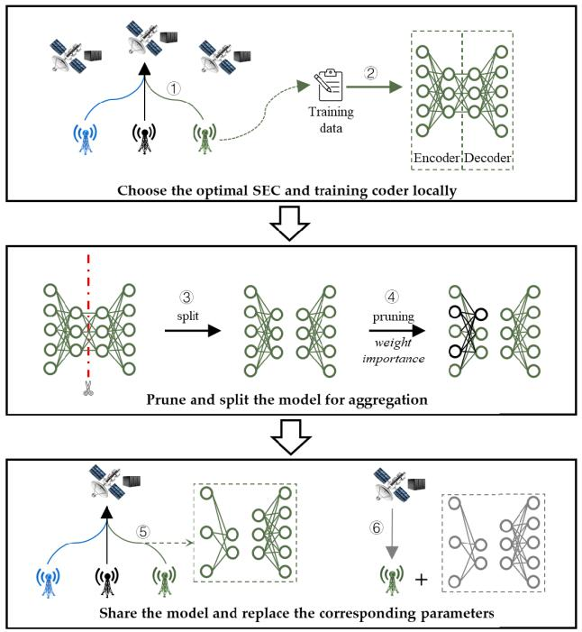

flowchart

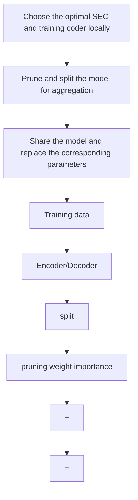

Fig. 2. The schematic of the proposed PSFed in one communication round. The workflow contains the following 6 steps: ➀ TSTs choose optimal SEC for federated aggregation jointly; ➁ local training on private data; ➂ the TST’s coder model is split into the encoder and decoder part; ➃ the TSTs prune the encoder model according to parameter importance; ➄ each TST uploads the model for federated aggregation; ➅ the TSTs download the personalised models and replace the corresponding parameters.

During training in each communication round, we split the coder model into an encoder and a decoder. Only the decoder model needs entire federated aggregation. This is due to LEO satellites having limited storage capacity, it is not practical to use individual decoder models for each task of each TST. The semantic coders are therefore stored on the TST. For economic considerations, we argue that TSTs require a shared decoder model to be used. We then encourage TSTs to assess the importance of the encoder parameters during the local training phase. Inspired by continual learning [31], changes in parameters with different importance have a different impact on the output results. We thus evaluate parameter importance according to the implications of parameter changes on the loss function. We express the change in the loss by

$$
L _ {b} (\theta_ {b} + \delta) - L _ {b} (\theta_ {b}) \approx \sum_ {i = 1} ^ {s _ {b}} g _ {b, i} \delta_ {b, i}, \tag {28}
$$

where $g _ { i }$ is the gradient and $\delta _ { i }$ is the update of parameter i during this parameter assessment period of the TST b. Setting $\begin{array} { r } { g _ { i } = \frac { \partial L _ { b } } { \partial \theta _ { b , i } } } \end{array}$ ∂θb,i ∂Lb during online training, the parameter importance weight is

$$
I _ {i} = - \frac {\partial L _ {b}}{\partial \theta_ {b , i}} \delta_ {b, i}. \tag {29}
$$

Subsequently, to reduce the training communication cost, we prune the encoder models uploaded by TSTs according to parameter importance. Parameters with high importance contain most of the valid information [32] and therefore can provide further valid information to the aggregated model than lower-important parameters. The lower-importance parameters are thus encouraged to be pruned. The pruning here differs from the conventional ML studies. It is not the deletion of the training model parameters, but the non-transmission of the pruned parameters for federated aggregation. The corresponding SEC generates a global encoder model and a global decoder model based on the federated aggregation of the number of the received parameters. Once TST receives the global decoder model and personalised pruned global encoder model, it merely substitutes the local decoder and substitutes important parameters of the local encoder. It trains the individual local coder again based on the personal encoder model and the global decoder model in the next communication round of training.

Furthermore, the closer to the completion of the training, the higher the importance of the parameters. To further reduce the privacy leakage degree, our proposed PSFed progressively increases the pruning ratio according to the number of communication rounds. This is until the coder model is split and only the decoder model is federated aggregated. The more important privacy training models are thus kept local.

The objective of PSFed during training is to minimise the training loss, therefore,

$$
\min _ {\Theta , Y} \sum_ {b = 1} ^ {B} L _ {b} (y _ {b} ^ {1} \theta_ {b, 1}, y _ {b} ^ {2} \theta_ {b, 2}, \dots , y _ {b} ^ {n} \theta_ {b, N _ {b}}), \tag {30a}
$$

$$
s. t. \quad \sum_ {r = 1} ^ {R} \frac {M _ {b , r}}{R _ {b} ^ {b a}} \leq t _ {b} ^ {\prime}, \forall b \tag {30b}
$$

$$
\max \left\{\frac {M _ {b , r}}{R _ {b} ^ {b a}} + \frac {2 h ^ {b a}}{c _ {l}} | b \in \mathcal {B} \right\} <   t _ {a} ^ {\prime}, \forall a \tag {30c}
$$

$$
\sum_ {r = 1} ^ {R} W _ {r} \chi \log_ {2} (1 + e ^ {1 - \frac {\sum_ {i} ^ {N _ {b}} I _ {i} n _ {b , i} + 1}{\sum_ {i} ^ {N _ {b}} I _ {i} n _ {b , i}}}) \leq \Theta_ {b} ^ {\prime}, \forall b \tag {30d}
$$

where $y _ { b } ^ { n } \in [ 0 , 1 ]$ is the aggregation weight vector of parameter i in TST b. It acts similar to the weighted average in FedAvg. Since each TST uploads a different number and location of parameters in the same model, the proportion of each parameter that is weighted is different. The $y _ { b } ^ { n }$ for various parameters also different and $Y ~ = ~ y _ { 1 } , y _ { 2 } , . . . , y _ { b }$ . Further, $\Theta _ { b } ^ { \prime }$ is privacy leakage consideration and $\Theta _ { b } ^ { \prime }$ is the maximum

Algorithm 1 PSFed

Input: dataset $\{ X _ { 1 } , X _ { 2 } , \ldots , X _ { b } \}$ , model size $\{ M _ { 1 } , M _ { 2 } , . . . , M _ { b } \}$ and total communication rounds $R$

Output: trained coder models $\{ \theta _ { 1 } , \theta _ { 2 } , \ldots , \theta _ { b } \}$

Initialize: the TSTs’ model parameters and the importance weight of parameters SECs:

1: for each communication round $r \in R$ :   
$Y _ { b } ^ { r + 1 } , \theta _ { b } ^ { r + 1 } \longleftarrow T S T$ update $\left( \theta _ { b } ^ { r } \right)$   
3: Update $\{ \theta _ { b , 1 } , \theta _ { b , 2 } , \ldots , \theta _ { b , N _ { b } } \}$ according to $Y _ { b } ^ { r + 1 }$ and $\theta _ { b } ^ { r + 1 }$   
4: end for

TSTs:

1: TST b receives $\theta _ { b }$ from the SEC   
2: TSTs choose the optimal SEC for federated aggregation   
3: for each TST in parallel:   
4: for each local training epoch:   
5: Loss $\begin{array} { r l } { ~ } & { { } \longleftarrow ~ \frac { 1 } { s _ { b } } \sum _ { i n = 1 } ^ { s _ { b } } \overline { { L _ { M S E } ( \theta _ { b } ; x _ { i n } ^ { b } , x _ { i n } ^ { b } ) } } } \end{array}$   
6: end for   
7: foreach encoder parameter $i \colon$   
8: Ii = − ∂θ $\begin{array} { r } { I _ { i } = - \frac { \partial L _ { b } } { \partial \theta _ { b , i } } \delta _ { b , i } } \end{array}$ ∂Lb δ   
9: end for   
10: Splitting coder model and pruning encoder model based on $I _ { i }$ in the case of satisfying:   
11: Obtain $\theta _ { b } ^ { r }$ to be shared   
12: return: $\theta _ { b } ^ { r }$   
13: end for

$$
\left\{ \begin{array}{l} \sum_ {r = 1} ^ {R} \frac {M _ {b , r}}{R _ {b} ^ {b a}} \leq t _ {b} ^ {\prime} \\ \Theta_ {b} (\theta_ {b} ^ {r}) \leq \Theta_ {b} ^ {\prime} \end{array} \right.
$$

tolerable leakage The procedure of the PSFed is demonstrated in Algorithm 1.

# IV. THE SEMANTIC CODERS IN SERVICE

In this section, the problem of users’ computational task processing schedule for SemCom-SEC is presented first. We then detail the proposed CTPS.

# A. Computational Task Processing

In service offloading decision-making, we consider the SemCom-SEC with $C$ users severed by one TST b in A satellite coverage. Each user has five task processing choices, 1) local computing; 2) offloading the tasks to SEC directly; 3) offloading the tasks to SEC via the TST; 4) offloading the tasks to the terrestrial cloud only via the satellite; 5) offloading the tasks to the terrestrial cloud via the TST and the satellite. We firstly list the user $c \mathbf { \hat { s } }$ cost functions in terms of processing delay and energy consumption for each option in order as follows based on Section II:

$$
\Phi_ {c 1} = \alpha t _ {c} ^ {L C} + \beta E _ {c} ^ {L C}, \tag {31}
$$

$$
\Phi_ {c 2} = \alpha (t _ {c} ^ {p r o a} + t _ {c} ^ {c a} + t _ {c} ^ {S E C}) + \beta E _ {c} ^ {c a}, \tag {32}
$$

$$
\Phi_ {c 3} = \alpha (t _ {c} ^ {p r o a} + t _ {c} ^ {c b} + t _ {c} ^ {b a} + t _ {c} ^ {S E C}) + \beta E _ {c} ^ {c b}, \tag {33}
$$

$$
\Phi_ {c 4} = \alpha (t _ {c} ^ {p r o a} + t _ {c} ^ {c a} + t _ {c} ^ {C l o u d} + t _ {a} ^ {C l o u d}) + \beta E _ {c} ^ {c a}, \tag {34}
$$

$$
\Phi_ {c 5} = \alpha (t _ {c} ^ {p r o C} + t _ {c} ^ {c b} + t _ {c} ^ {b a} + t _ {c} ^ {C l o u d} + t _ {a} ^ {C l o u d}) + \beta E _ {c} ^ {c b}, \tag {35}
$$

where $\Phi _ { c }$ is the actual processing cost when the user c sizing a task. It is related to user task processing decisions, the transmission power, and the number of subcarriers allocated. In the above, $\overset { \cdot } { t } _ { a } ^ { C l o u d }$ is the transmission delay between satellite $\gamma _ { i c } = \{ 0 , 1 \}$ to represent the offloading decision of user c and $\gamma _ { i c } \in \{ \gamma _ { 1 c } , \gamma _ { 2 c } , \gamma _ { 3 c } , \gamma _ { 4 c } \}$ . If user c chooses one processing strategy, the indicator for the corresponding strategy equals 1, otherwise equals 0. We argue that the optimal decision for a user is to minimise the latency and energy consumption of the processing tasks. Mathematically, the optimisation task processing strategy problem of user c thus can be formulated as a MINLP problem:

$$
\min _ {\gamma_ {c}, f _ {c}, p _ {c, d _ {0}} ^ {c b}, m _ {c, d _ {0}}, p _ {c} ^ {c a}} \sum_ {a = 1} ^ {A} \Phi_ {c} = (1 - \gamma_ {1 c} - \gamma_ {2 c} - \gamma_ {3 c} - \gamma_ {4 c}) \Phi_ {c 1}
$$

$$
+ \gamma_ {1 c} \Phi_ {c 2} + \gamma_ {2 c} \Phi_ {c 3} + \gamma_ {3 c} \Phi_ {c 4} + \gamma_ {4 c} \Phi_ {c 5}, \tag {36a}
$$

$$
s. t. \quad f _ {c l o u d} \geq f _ {a} \geq f _ {c, m a x} \geq 0, \tag {36b}
$$

$$
\gamma_ {1 c}, \gamma_ {2 c}, \gamma_ {3 c}, \gamma_ {4 c} \in \{0, 1 \}, \tag {36c}
$$

$$
\gamma_ {1 c} + \gamma_ {2 c} + \gamma_ {3 c} + \gamma_ {4 c} \leq 1, \tag {36d}
$$

$$
\sum_ {d _ {0} = 1} ^ {D _ {0}} x _ {d _ {0}} ^ {c b} p _ {c, d _ {0}} ^ {c b} \leq P _ {c, m a x}, \tag {36e}
$$

$$
P _ {c} ^ {c a} \leq P _ {c, m a x}, \tag {36f}
$$

$$
x _ {d _ {0}} ^ {c b} \in \{0, 1 \}, \tag {36g}
$$

$$
\sum_ {d _ {0} = 1} ^ {D _ {0}} x _ {d _ {0}} ^ {c b} \leq D _ {0}, \tag {36h}
$$

$$
t ^ {*} <   t _ {a} ^ {\prime}. \tag {36i}
$$

The constraint (36b) guarantees that edge and cloud have strong computing capability that is not less than users’ maximum computing capability $f _ { c , m a x }$ . Constraints (36c) and (36d) show the relationship between $\gamma _ { 1 c } , \gamma _ { 2 c } , \gamma _ { 3 c }$ and $\gamma _ { 4 c }$ . In constraints (36e) and (36f), $P _ { c , m a x }$ is the maximum available transmission power of user c to TSTs or satellites. The constraint (36g) denotes the subcarrier allocation indicator. The constraint (36h) means that the number of allocated subcarriers should not exceed the total number of sub-carriers. The constraint (36i) is to ensure the optimal decision’s transmission time t∗ is less than the time $t _ { a } ^ { \prime }$ available to access satellite a.

The problem in (36) is an MINLP problem with incomplete information due to privacy concerns. This is because users need the allocation of subcarriers to make decisions. Nevertheless, such information is relevant to decisions and privacy information (e.g., local computing capability and transmission power) from other users. This MINLP problem thus is computationally complex and hard to solve.

# B. CTPS

In this paper, we propose a CTPS mechanism (see, Fig. 3) to minimise the delay and energy consumption of users to process computational tasks, while privacy-preserving and equitable. We assume all the participants are trustworthy It is divided into two steps. Firstly, it converts the optimisation task processing strategy problem with privacy considerations into a complete information problem based on the Rubinstein bargaining model [33] equitably. Subsequently, users develop the optimisation task processing strategies by solving the complete information MINLP problem of Eq. (36). We detail our CTPS mechanism as follows.

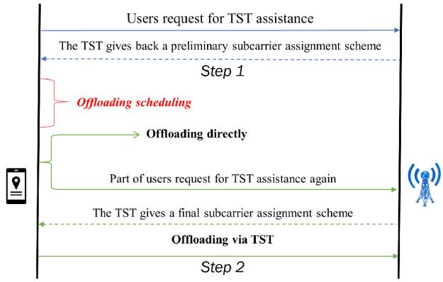

flowchart

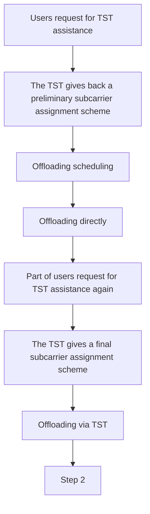

Fig. 3. Proposed CTPS mechanism.

# C. First Step of the CTPS Mechanism

We enable users to communicate/bargain with TST several times so that subcarriers are allocated fairly without privacy leakage based on the Rubinstein bargaining game. TST acts as the bidder and the user has the option to continue the game or leave the game. The gaming process is limited to two periods. In the first period, the users send the offloading request to the TST. Upon receiving users’ offloading requests, without loss of generality and fairness, TST allocates the number of C-band sub-carriers based on the size of the tasks offloaded by users. Further, the transmission delay of the TST to the satellite and semantic extraction delay are also notified via this communication.

To achieve the game-perfect equilibrium, the cost function for user c to assess to continue participating in the game can be denoted by

$$
\mu_ {c} ^ {\prime} = \epsilon \iota \Phi_ {c} ^ {\prime}, \Phi_ {c} ^ {\prime} = \{\Phi_ {c 3}, \Phi_ {c 5} \}, \tag {37}
$$

where $\iota \in \mathsf { \Gamma } ( 0 , 1 )$ is the bargaining discount factor that represents the revenue loss value for the second-period communication due to the bargaining process being time and energy-consuming. Further, $\epsilon \geq 1$ is the weight parameter to evaluate the further possible benefit by applying offloading again via the TST b, i.e., remaining engaged in the game. This is attributable to some users abandoning their requests for TST offloading due to not being allocated a satisfactory number of C-band subcarriers. The actual number of subscribers should eventually be greater than or equal to this allocation. Simultaneously, the strategies of various users also affect the user-satellite link interference for different users. In order to estimate the influence of interference, pricing is a frequently utilised method in the game theory employed studies [34]. We hence rewrite the part of the cost function for user c considering interference pricing as:

$$
\mu_ {c} ^ {\prime \prime} = \Phi_ {c} ^ {\prime \prime} + \alpha \varrho m _ {c} \varpi , \Phi_ {c} ^ {\prime \prime} = \left\{\Phi_ {c 2}, \Phi_ {c 4} \right\}, \tag {38}
$$

where $\varrho$ is the factor for the interference related to the number of users, transmission power, and channel gain. Further, $\varpi \in$ [0, 1] is the proportion to denote the anticipation rate of not performing local computing users, thus predicting the fraction of time in which interference is received.

Finally, the incomplete information MINLP problem is converted to a complete information MINLP problem. Users thus could develop the optimal processing decision based on allocated subcarriers and the calculation frequency or transmitting power in the second step.

# D. Second Step of the CTPS Mechanism

In the second step, users make the decision based on the complete information MINLP problem of Eq. (36) to minimise the latency and energy consumption of the processing tasks. The maximum number of satellites expected to be accessible at the same time is extremely limited [22]. The decision problem Eq. (36) can be considered as 5 · A independent subproblems, where 5 is five offloading decision subproblems and A is $A$ satellite selection subproblems. In case of the local computing, the best user c’s CPU-cycle frequency $f _ { c }$ is only related to local computing costs. We thus can express the $f _ { c }$ optimisation subproblem as:

$$
\min _ {f _ {c}} \Phi_ {c 1} = \alpha \frac {\delta m _ {c}}{f _ {c}} + \beta \varepsilon \delta m _ {c} f _ {c} ^ {2}, \tag {39a}
$$

$$
s. t. \quad (3 6 b). \tag {39b}
$$

We can express the first-order derivative of (39a) as: $\begin{array} { r l } { - \alpha \frac { \delta m _ { c } } { f _ { c } ^ { 2 } } + } \end{array}$ δmc + $2 \beta \varepsilon \delta m _ { c } f _ { c }$ . Eq. (39a) monotonically increases in the constraint (39b), hence $f _ { c } = f _ { c , m a x }$ .

In addition, in case the user needs to employ TSTs, the user needs to derive the optimal subcarrier task allocation strategy $m _ { c , d _ { 0 } }$ and subcarrier transmission power $p _ { c , d _ { 0 } } ^ { c b }$ . To model and optimise the transmission power, in CTPS, we assume each subcarrier in the same link accomplishes the transmission tasks at the same time for fully using spectrum resources in a synchronous manner based on previous studies [23], [35]. As the allocated subcarrier for user c is known, we set η to denote the number of allocated subcarriers. We can simplify the optimisation problem associated with TST as:

$$
\min _ {m _ {c, d _ {0}}, p _ {c, d _ {0}} ^ {c b}} \sum_ {d _ {0} = 1} ^ {D _ {0}} (\frac {\alpha x _ {d _ {0}} ^ {c b} m _ {c , d _ {0}}}{\eta r _ {c , d _ {0}} ^ {c b}} + \frac {\beta p _ {c , d _ {0}} ^ {c b} x _ {d _ {0}} ^ {c b} m _ {c , d _ {0}}}{r _ {c , d _ {0}} ^ {c b}}), \tag {40a}
$$

$$
s. t. \quad (3 6 e), (3 6 g), (3 6 h), \tag {40b}
$$

$$
\sum_ {d _ {0} = 1} ^ {D _ {0}} x _ {d _ {0}} ^ {c b} m _ {c, d _ {0}} = m _ {c}. \tag {40c}
$$

We only need to consider the situation that $x _ { d _ { 0 } } ^ { c b } ~ = ~ 1$ x d . By relaxing constraints, we have the Lagrangian function for Eq. (40a) as:

$$
\begin{array}{l} L = \sum_ {d _ {0} = 1} ^ {D _ {0}} x _ {d _ {0}} ^ {c b} (\frac {\alpha m _ {c , d _ {0}}}{\eta r _ {c , d _ {0}} ^ {c b}} + \frac {\beta p _ {c , d _ {0}} ^ {c b} m _ {c , d _ {0}}}{r _ {c , d _ {0}} ^ {c b}}) \\ + \varphi (\sum_ {d _ {0} = 1} ^ {D _ {0}} x _ {d _ {0}} ^ {c b} p _ {c, d _ {0}} ^ {c b} - P _ {c, m a x}) + \lambda (m _ {c} - \sum_ {d _ {0} = 1} ^ {D _ {0}} x _ {d _ {0}} ^ {c b} m _ {c, d _ {0}}), \tag {41} \\ \end{array}
$$

where $\varphi$ and λ are the Lagrangian multipliers. The dual problem thus is minmc,d0 ,pcbc,d0 $\mathsf { I } _ { m _ { c , d _ { 0 } } , p _ { c , d _ { 0 } } ^ { c b } } L$ . Then, we can observe that Eq. (41) can be further decomposed into $D _ { 0 }$ independent subproblems, and the actual objective function in each $d _ { 0 }$ subproblem can be denoted by

$$
\min _ {m _ {c, d _ {0}}, p _ {c, d _ {0}} ^ {c b}} L _ {d _ {0}} = \frac {\alpha m _ {c , d _ {0}}}{\eta r _ {c , d _ {0}} ^ {c b}} + \frac {\beta p _ {c , d _ {0}} ^ {c b} m _ {c , d _ {0}}}{r _ {c , d _ {0}} ^ {c b}} + \varphi p _ {c, d _ {0}} ^ {c b} + \lambda m _ {c, d _ {0}}. \tag {42}
$$

For simplicity, we define

$$
H _ {d _ {0}} = \frac {\alpha}{\eta r _ {c , d _ {0}} ^ {c b}} + \frac {\beta p _ {c , d _ {0}} ^ {c b}}{r _ {c , d _ {0}} ^ {c b}}. \tag {43}
$$

According to Karustial derivatives of $L _ { d _ { 0 } }$ uhn-Tucker conditio with respect to $p _ { c , d _ { 0 } } ^ { c b }$ aking t0 and $m _ { c , d _ { 0 } }$ respectively. We have

$$
\left\{ \begin{array}{l l} \frac {\partial L _ {d _ {0}}}{\partial p _ {c , d _ {0}} ^ {c b}} = m _ {c, d _ {0}} \frac {\partial H _ {d _ {0}}}{\partial p _ {c , d _ {0}} ^ {c b}} + \varphi = 0 & \text {(44a)} \\ \frac {\partial L _ {d _ {0}}}{\partial m _ {c , d _ {0}}} = H _ {d _ {0}} - \lambda = 0 & \text {(44b)} \\ \varphi (\sum_ {d _ {0} = 1} ^ {D _ {0}} x _ {d _ {0}} ^ {c b} p _ {c, d _ {0}} ^ {c b} - P _ {c, m a x}) = 0. & \text {(44c)} \end{array} \right.
$$

Thus, we have

$$
\left\{ \begin{array}{l} \varphi = 0, \sum_ {d _ {0} = 1} ^ {D _ {0}} x _ {d _ {0}} ^ {c b} p _ {c, d _ {0}} ^ {c b} \leq P _ {c, m a x}, \\ \varphi > 0, \sum_ {d _ {0} = 1} ^ {D _ {0}} x _ {d _ {0}} ^ {c b} p _ {c, d _ {0}} ^ {c b} = P _ {c, m a x}, \end{array} \right. \tag {45a}
$$

where (45) is complementary slackness. For (45a), pcbc,d0 $p _ { c , d _ { 0 } } ^ { c b }$ can be directly solved by (44) causing $m _ { c , d _ { 0 } } \neq 0$ . After deriving the optimal $p _ { c , d _ { 0 } } ^ { c b } , m _ { c , d _ { 0 } }$ can be easily solved as all subcarriers $\begin{array} { r } { \sum _ { d _ { 0 } = 1 } ^ { D _ { 0 } } p _ { c , d _ { 0 } } ^ { c b } = P _ { c , m a x } } \end{array}$ , we need to consider Eq. (45b). In that case, the Lagrangian multipliers can be obtainegradient method and further achieve the optimal $p _ { c , d _ { 0 } } ^ { c b } , m _ { c , d _ { 0 } } .$ Moreover, as we utilise the Lagrangian dual decomposition method, the solution may have a duality gap. However, this gap should approach zero and can be ignored in practical systems as the number of subcarriers $D _ { 0 }$ is large enough [9].

Therefore, users can make the decision based on the computation cost of various alternatives, without compromising privacy. Throughout the CTPS, the user is only communicated externally about the size of the tasks being processed. It also needs to be known by TST during the offloading process. Hence the CTPS protect the privacy of computing power, transmit power, etc. Further, the computational complexity is linearly related to $D _ { 0 }$ and A, whereas both $D _ { 0 }$ and A are finite. CTPS thus can be used in large-scale satellite networks. The CTPS and offloading decision process is summarised as Algorithm 2.

TABLE I THE SETTING OF THE CAE 

<table><tr><td>Encoder</td><td>Neuron num</td><td>Decoder</td><td>Neuron num</td></tr><tr><td>Conv+ReLU</td><td>512</td><td>transConv+ReLU</td><td>10</td></tr><tr><td>Conv+ReLU</td><td>256</td><td>transConv+ReLU</td><td>32</td></tr><tr><td>Conv+ReLU</td><td>128</td><td>transConv+ReLU</td><td>64</td></tr><tr><td>Conv+ReLU</td><td>64</td><td>transConv+ReLU</td><td>128</td></tr><tr><td>Conv+ReLU</td><td>32</td><td>transConv+ReLU</td><td>256</td></tr><tr><td>Conv+Sigmoid</td><td>10</td><td>transConv+Sigmoid</td><td>512</td></tr></table>

TABLE II RAINFALL COEFFICIENTS 

<table><tr><td>C-band</td><td>Value</td><td>Ka-band</td><td>Value</td></tr><tr><td> $k_{H}$ </td><td>0.0001340</td><td> $k_{H}$ </td><td>0.2403</td></tr><tr><td> $k_{V}$ </td><td>0.0002347</td><td> $k_{V}$ </td><td>0.2291</td></tr><tr><td> $v_{H}$ </td><td>1.6948</td><td> $v_{H}$ </td><td>0.9485</td></tr><tr><td> $v_{V}$ </td><td>1.3987</td><td> $v_{V}$ </td><td>0.9129</td></tr></table>

# Algorithm 2 CTPS

Input: Tasks $m _ { c }$ generation

Output: The computation offloading and resource allocation result $\gamma _ { c } , f _ { C } , p _ { c , d _ { 0 } } ^ { c b } , m _ { c , d _ { 0 } } , x _ { d _ { 0 } } ^ { c b }$

1: Initialize the optimal TST transmission power $p _ { b } ^ { b a }$   
2: Obtain necessary information $x _ { d _ { 0 } } ^ { c b }$ after first period game   
3: Obtain the necessary information $x _ { d _ { 0 } } ^ { c b }$ after first period game   
4: Calculate optimally $f _ { c }$   
5: Relax Eq. (40)   
6: if $\varphi = 0 { : }$   
7: $p _ { c , d _ { 0 } } ^ { c b } \longleftarrow \frac { \partial H _ { d _ { 0 } } } { \partial p _ { c , d _ { 0 } } ^ { c b } }$ p c,d0 ∂pcbc,d0 ∂Hd0   
0 cb 8: mc,d0 $\begin{array} { r l } { m _ { c , d _ { 0 } } \longleftarrow } & { { } \frac { m _ { c } p _ { c , d _ { 0 } } ^ { c v } } { \sum _ { d _ { 0 } = 1 } ^ { D _ { 0 } } x _ { d _ { 0 } } ^ { c b } p _ { c , d _ { 0 } } ^ { c b } } } \end{array}$ D0 mcp c,d0 P d0=1 xcb p

9: else:

10: $p _ { c , d _ { 0 } } ^ { c b }  \mathrm { E q . } ( 4 4 )$

$m _ { c , d _ { 0 } } \gets \frac { m _ { c } p _ { c , d _ { 0 } } ^ { c b } } { P _ { c , m a x } }$ mcpc,d cb 11: Pc,max

12: end if

13: Find the maximum $\Phi _ { c }$ and derive $\gamma _ { c }$

14: if $\gamma _ { c 3 } + \gamma _ { c 5 } = 1 :$

15: Obtain the necessary information $x _ { d _ { 0 } } ^ { c b }$ after the second period game

16: Obtain updated $p _ { c , d _ { 0 } } ^ { c b }$ and $m _ { c , d _ { 0 } } ^ { c b }$

17: end if

18: Find the maximum $\Phi _ { c }$ and derive $\gamma _ { c }$

# V. SIMULATION RESULTS

# A. Simulation Setting

In this section, we evaluate the performance of the present PSFed and CTPS. In the simulations, if not specifically mentioned, we set the parameters as follows. The LEO satellites’ coverage radius is 280 km and the vertical altitude is 780km based on the Iridium satellite system [36]. The frequencies of the C-band and the Ka-band are 4.5 GHz and 30 GHz separately based on 3GPP specifications [37]. We assume the number of C-band subcarriers is 128, the maximum transmission power of users is 23 dBm and the transmit power

TABLE III SIMULATION PARAMETERS 

<table><tr><td>Parameters</td><td>Default values</td></tr><tr><td>The coverage radius of LEO satellites</td><td>280 km</td></tr><tr><td>Ka-band carrier frequency</td><td>30 GHZ</td></tr><tr><td>C-band carrier frequency</td><td>4.5GHZ</td></tr><tr><td>Number of C-band subcarriers</td><td>128</td></tr><tr><td>The maximum transmit power of each user</td><td>23dBm</td></tr><tr><td>Transmit power of TST</td><td>30 dBm</td></tr><tr><td>h</td><td>780km</td></tr><tr><td>δ</td><td>120</td></tr><tr><td>ε</td><td> $10^{-26}$ </td></tr><tr><td>fc</td><td> $0.5 \times 10^{9}$  cycles/s</td></tr><tr><td>fa</td><td> $3 \times 10^{9}$  cycles/s</td></tr><tr><td>fCloud</td><td> $10 \times 10^{9}$  cycles/s</td></tr><tr><td>α,β</td><td>0.5</td></tr><tr><td>ι,ε</td><td>1</td></tr></table>

of each TST is 30 dBm [9]. The offloading task is assumed an image recognition task and the semantic coder is considered an autoencoder based on the convolutional autoencoder (CAE) similar to [38].

Communication rounds for the proposed PSFed to aggregate the semantic encoder are 20 rounds. The coder settings are listed in Table I. Furthermore, we set the number of CPU cycles for computing one bit δ as 120 cycles/bit, which is from the real applications [18]. We assume all users have the same CPU frequency $f _ { c } ,$ and set it as $0 . 5 \times 1 0 ^ { 9 }$ cycles/s. The computation capabilities of SEC on satellite a and the cloud server are $3 \times 1 0 ^ { 9 }$ cycles/s and $1 0 \times 1 0 ^ { 9 }$ cycles/s, respectively [10]. The energy factor ε is set as $1 0 ^ { - 2 6 } \ [ 9 ]$ .

Moreover, we assume weight parameters of latency and energy consumption are set as $\alpha = 0 . 5$ and $\beta = 0 . 5 ,$ , and weight parameters in bargain process ι and ϵ are all considered as 1. In addition, the atmospheric loss is adopted, and the related coefficients are shown in Table II [27]. The simulation parameters are also listed in Table III.

# B. Performance Evaluation of PSFed

Fig. 4 illustrates the convergence speed of the different frameworks under different transmission tasks. The TSTs’ images are from CIFAR 10 [39], CIFAR 100 [40] and MNIST [41] image datasets and TSTs perform federated aggregation after every five local epochs. Based on the feasibility in SEC networks, we compare the proposed PSFed with the generalised learning approach for SemCom [14], [15], i.e., FL frameworks based on the FedAvg [28].

Based on the existing FL methods that are potentially for SEC SemCom, FedRep [42] is also compared to demonstrate the effectiveness of our PSFed. The FedRep is based on the Fedavg but only aggregates part of the training model during each communication round. We set it to only aggregate Sem-Com decoder to adapt the SemCom-SEC. Moreover, we set the training sample to 5000 images per TST to reflect the differences between the frameworks more effectively. It can be observed that our PSFed achieves similar convergence rates to the FedAvg and is much better than the FedRep, regardless of the dataset. This is because our method aggregates important weights in the early stages of training and therefore accelerates convergence similarly to the FedAvg with all parameters aggregated.

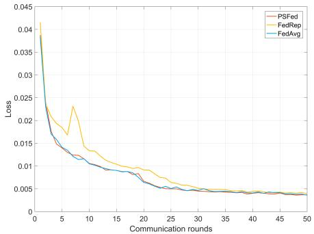

line

| Communication rounds | PSFed  | FedRep | FedAvg |
| -------------------- | ------ | ------ | ------ |
| 0                    | 0.042  | 0.043  | 0.041  |
| 5                    | 0.018  | 0.023  | 0.017  |
| 10                   | 0.012  | 0.014  | 0.011  |
| 15                   | 0.009  | 0.010  | 0.008  |
| 20                   | 0.007  | 0.008  | 0.006  |
| 25                   | 0.006  | 0.007  | 0.005  |
| 30                   | 0.005  | 0.006  | 0.004  |
| 35                   | 0.004  | 0.005  | 0.004  |
| 40                   | 0.004  | 0.004  | 0.004  |
| 45                   | 0.004  | 0.004  | 0.004  |
| 50                   | 0.004  | 0.004  | 0.004  |

(a) CIFAR 10 dataset

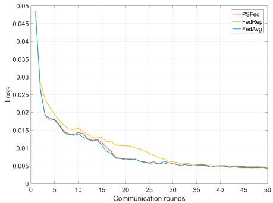

line

| Communication rounds | PSFed  | FedRep | FedAvg |
| -------------------- | ------ | ------ | ------ |
| 0                    | 0.05   | 0.05   | 0.05   |
| 5                    | 0.018  | 0.02   | 0.018  |
| 10                   | 0.014  | 0.014  | 0.014  |
| 15                   | 0.012  | 0.012  | 0.012  |
| 20                   | 0.008  | 0.01   | 0.008  |
| 25                   | 0.006  | 0.008  | 0.006  |
| 30                   | 0.005  | 0.006  | 0.005  |
| 35                   | 0.004  | 0.005  | 0.004  |
| 40                   | 0.004  | 0.004  | 0.004  |
| 45                   | 0.004  | 0.004  | 0.004  |
| 50                   | 0.004  | 0.004  | 0.004  |

(b) CIFAR 100 dataset

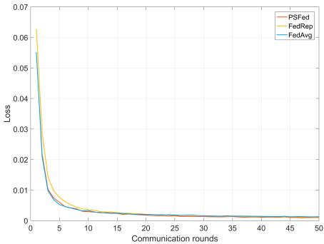

line

| Communication rounds | PSFed | FedRep | FedAvg |
| -------------------- | ----- | ------ | ------ |
| 0                    | 0.062 | 0.063  | 0.055  |
| 5                    | 0.010 | 0.011  | 0.008  |
| 10                   | 0.004 | 0.005  | 0.003  |
| 15                   | 0.002 | 0.002  | 0.001  |
| 20                   | 0.001 | 0.001  | 0.001  |
| 25                   | 0.001 | 0.001  | 0.001  |
| 30                   | 0.001 | 0.001  | 0.001  |
| 35                   | 0.001 | 0.001  | 0.001  |
| 40                   | 0.001 | 0.001  | 0.001  |
| 45                   | 0.001 | 0.001  | 0.001  |
| 50                   | 0.001 | 0.001  | 0.001  |

(c） MNIST dataset

Fig. 4. Convergence speed of various learning algorithms with different datasets.   
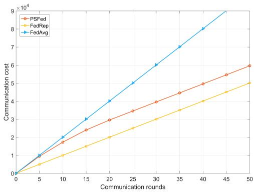

line

| Communication rounds | PSFed  | FedRep | FedAvg |
| -------------------- | ------ | ------ | ------ |
| 0                    | 0      | 0      | 0      |
| 5                    | 10000  | 5000   | 10000  |
| 10                   | 20000  | 10000  | 20000  |
| 15                   | 30000  | 15000  | 30000  |
| 20                   | 40000  | 20000  | 40000  |
| 25                   | 50000  | 25000  | 50000  |
| 30                   | 60000  | 30000  | 60000  |
| 35                   | 70000  | 35000  | 70000  |
| 40                   | 80000  | 40000  | 80000  |
| 45                   | 90000  | 45000  | 90000  |
| 50                   | 100000 | 50000  | 100000 |

Fig. 5. Communication cost of various learning approaches.

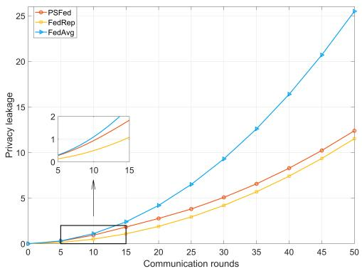

line

| Communication rounds | PSFed | FedRep | FedAvg |
| -------------------- | ----- | ------ | ------ |
| 0                    | 0     | 0      | 0      |
| 5                    | 0     | 0      | 0      |
| 10                   | 1     | 1      | 1      |
| 15                   | 2     | 2      | 2      |
| 20                   | 3     | 3      | 4      |
| 25                   | 4     | 4      | 6      |
| 30                   | 5     | 5      | 9      |
| 35                   | 6     | 6      | 12     |
| 40                   | 8     | 8      | 16     |
| 45                   | 10    | 10     | 21     |
| 50                   | 12    | 12     | 26     |

Fig. 6. Privacy leakage of various learning approaches.

In Fig. 5, we compare the total communication cost of PSFed, FedRep and FedAvg during training. We assume that each neuron transmitted consumes the same amount of communication resources. The communication cost is therefore defined as the number of neurons transmitted during communication. It is seen that the PSFed expenses are approximately the same communication cost as the FedAvg in the early stages of training. The growth then gradually slows down and increases at the same magnitude as the FedAvg after round 20. This is because the PSFed gradually decreases the number of weights aggregated by the encoder model.

It is also seen that in round 20, the number of aggregated weights for the encoder model is 0, the same as the FedRep, only the decoder model is aggregated. Therefore, the PSFed only consumes additional communication resources for the importance weight aggregation than the FedRep. Considering that the FedRep converges much more slowly than the proposed PSFed, the total communication resource consumption can be considered to be similar. However, in comparison to the FedAvg, the communication consumption of our PSFed decreases by 40.50% in round 50.

# C. Performance Evaluation CTPS

We evaluate the total model privacy leakage during training in Fig. 6 according to Eq. (26). We assume that the model in each communication round has the same importance and that each neuron is of equal importance. It can be observed that PSFed is initially similar to FedAvg leakage and subsequently follows the same growth trend as FedRep. This is equally due to the number of PSFed decreasing importance weight aggregations. After training, both the PSFed and the FedRep encoder models are saved locally. It is foreseeable that if the importance of each round of communication changes, the PSFed would be extremely close to the FedRep in terms of total privacy leakage. In addition, the privacy leakage of PSFed should widen the gap with FedAvg, even though the privacy leakage of our PSFed already decreases by 51.43% in round 50 in comparison to FedAvg in the same importance.

In Fig. 7(a), the accuracy of the different frameworks under different transmission tasks is shown. We evaluate the accuracy utilising Peak Signal-to-Noise Ratio (PSNR), a general metric for evaluating image transmission in SemCom [38]. We have

$$
P S N R = 1 0 \log \frac {M A X ^ {2}}{M S E} (d B), \tag {46}
$$

where MAX is the maximum value for a pixel and MSE is the mean squared deviation. Since different datasets have different MAX, we assume that the learning method with the smaller M SE has a higher accuracy. It is seen that the FedRep is significantly the least accurate with different datasets trained. The accuracy of PSFed is similar to FedAvg but slightly FedAvg higher. Because encoder models of both PSFed and FedRep are kept at the TST that are not aggregated when training is completed. Some aggregation information thus is lacking. However, the average training accuracy of the

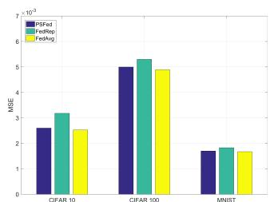

bar

|        | PSFed  | FedRop | FedAvg |
| ------ | ------ | ------ | ------ |
| CIFAR 10 | 2.5    | 3.2    | 2.6    |
| CIFAR 100 | 5.0    | 5.4    | 4.9    |
| MNIST   | 1.7    | 1.8    | 1.7    |

(a)MSE

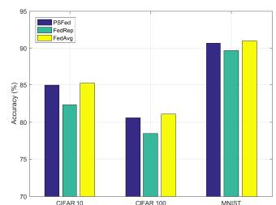

bar

| Dataset | PSFed (%) | FedRep (%) | FedAvg (%) |
| :--- | :--- | :--- | :--- |
| CIFAR 10 | 85 | 82 | 86 |
| CIFAR 100 | 80 | 78 | 81 |
| MNIST | 91 | 90 | 91 |

(b) Recognise accuracy matches after coding   
Fig. 7. Accuracy of various learning algorithms with different datasets.

PSfed decreased by only 0.33% relative to the FedAvg due to the important weight aggregation acting as pre-training. Compared to the FedAvg, the accuracy loss of the PSfed deems acceptable given the significant communication cost and privacy concerns of the former.

Fig. 7(b) further demonstrates the effect of image transmission accuracy on offloading via different approaches. We employed commonly used ML models for image recognition to identify the accuracy of images before/after transmission. The accuracy here is the proportion of the received object/image recognition accuracy to the pre-transmission image recognition accuracy. It can be seen that with the same trend as Fig. 7(b) FedRep has the significantly lowest accuracy while our method is similar to FedAvg but slightly lower. Figs. 5, 6, and 7 collectively suggest that PSFed achieves the fastest convergence rate, the lowest communication cost, and a high accuracy rate.

Fig. 8 illustrates the impact of users in one TST coverage on the total cost. As users are not always able to offload tasks via the TST, the proposed CTPS is compared with the local computing, offloading to the SEC directly, offloading to the cloud directly and CTPS without the game. The task size for each user is randomly generated over a range of 5 kb-300kb and subjected to 200 times replications of the simulation. Fig. 8 shows that the total cost grows with the number of users. This is because raising the number of users increases the corresponding number of computing tasks and thus the total cost of users. The total cost of the proposed CTPS always keeps the total cost to the minimum and the advantage increases as the number of users increases. In addition, in cases where the number of users is small, the proposed CTPS thus maintains almost the same processing cost as “CTPS without game”. By increasing the number of users, TST becomes unable to satisfy all the requests and CTPS starts to show its advantage in reducing the cost. We expect this advantage to increase by further increasing the number of users. This is because the optimal reallocation of resources through our design game scheme increases the efficiency of network resource utilisation.

In Fig. 9, we show the offloading and computing cost of a single user versus the size of generating tasks. It is observed that the cost increases with the data size for all schemes. Our proposed mechanism always has a lower cost compared to the other three approaches. In case the data size is small (10 kb), our CPTS choose local computing as the optimal option. As the data size grows, the local computing latency and energy consumption increase, and CTPS chooses other minimum cost strategies, i.e., offload tasks to the SEC via the TST. After 250kb, the optimal value of our mechanism fluctuates. This is due to the data size being large enough, and the best strategy changes to offload tasks to the cloud via a TST. Therefore, the processing of the single-user tasks can be performed efficiently via our proposed processing strategy.

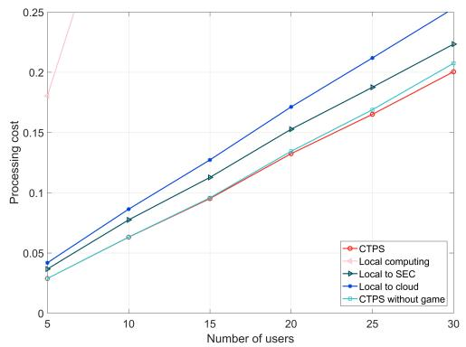

line

| Number of users | CTPS   | Local computing | Local to SEC | Local to cloud | CTPS without game |
| --------------- | ------ | --------------- | ------------ | -------------- | ----------------- |
| 5               | 0.18   | 0.04            | 0.04         | 0.04           | 0.03              |
| 10              | 0.09   | 0.07            | 0.08         | 0.09           | 0.06              |
| 15              | 0.10   | 0.11            | 0.12         | 0.13           | 0.10              |
| 20              | 0.13   | 0.15            | 0.16         | 0.17           | 0.13              |
| 25              | 0.16   | 0.18            | 0.19         | 0.21           | 0.17              |
| 30              | 0.20   | 0.22            | 0.23         | 0.24           | 0.21              |

Fig. 8. The processing cost of the varying number of users.

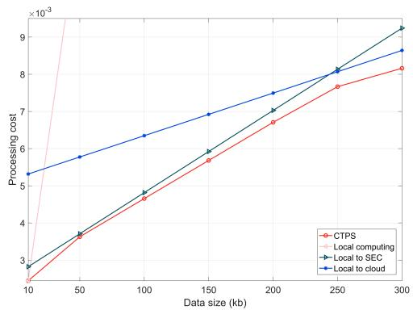

line

| Data size (kb) | CTPS   | Local computing | Local to SEC | Local to cloud |
| -------------- | ------ | --------------- | ------------ | -------------- |
| 10             | 2.8    | 0.009           | 2.8          | 5.3            |
| 50             | 3.7    | 0.009           | 3.7          | 5.8            |
| 100            | 4.7    | 0.009           | 4.7          | 6.3            |
| 150            | 5.7    | 0.009           | 5.7          | 6.9            |
| 200            | 6.7    | 0.009           | 6.7          | 7.5            |
| 250            | 7.7    | 0.009           | 7.7          | 8.1            |
| 300            | 8.1    | 0.009           | 8.1          | 8.7            |

Fig. 9. The processing cost of a single user.

Fig. 10 demonstrates the importance of integrating SemCom into SEC networks in future communication environments. We set the user and the TST to maintain the same status to transmit to LEO satellites in different rainfall environments. It can be observed that as the rainfall probability increases, the task transmission cost of TST without SemCom exhibits a significant increase. Because the Ka-band frequency is extremely high and is strongly influenced by rainfall-induced path loss. In contrast, the processing costs for users transmitting via C-band are only slightly increasing. Since the C-band frequency is smaller than the Ka-band frequency and thus tolerates less path loss. Nevertheless, the TST configuration with the semantic encoder spends the least processing cost. Furthermore, the processing cost did not increase significantly with the increase in rainfall rate. This is because the latency of semantic extraction is not affected by the environment. The improved spectrum efficiency also reduces the impact of rainfall-induced path loss. Therefore, the integration of SemCom in SEC networks is necessary.

In Fig. 11, the influence of α and $\beta$ on user strategies is investigated and the data size is from 5kb to 300kb simulated

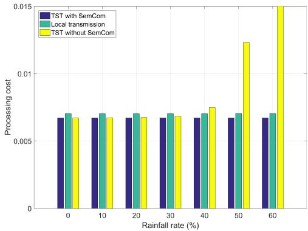

bar

| Rainfall rate (%) | TST with SemCom | Local transmission | TST without SemCom |
| ----------------- | --------------- | ------------------ | ------------------ |
| 0                 | 0.007           | 0.007              | 0.007              |
| 10                | 0.007           | 0.007              | 0.007              |
| 20                | 0.007           | 0.007              | 0.007              |
| 30                | 0.007           | 0.007              | 0.007              |
| 40                | 0.007           | 0.007              | 0.008              |
| 50                | 0.007           | 0.007              | 0.013              |
| 60                | 0.007           | 0.007              | 0.015              |

Fig. 10. The usefulness of SemCom in the network.

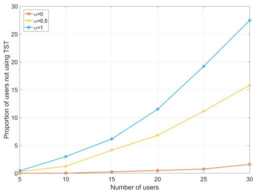

line

| Number of users | α=0   | α=0.5 | α=1   |
| --------------- | ----- | ----- | ----- |
| 5               | 0.0   | 0.0   | 0.0   |
| 10              | 0.0   | 1.0   | 3.0   |
| 15              | 0.0   | 4.0   | 6.0   |
| 20              | 0.0   | 7.0   | 12.0  |
| 25              | 0.0   | 11.0  | 19.0  |
| 30              | 1.0   | 16.0  | 28.0  |

Fig. 11. Impact of α and $\beta$ on strategy developing.

50 times. The energy consumption weight $\beta$ is always set as 0.5. We list the proportion of users that do not choose to offload via TST. It can be noticed that as the number of users increases, the unwillingness to offload increases due to the reduced number of subcarriers being allocated to them. However, users are always more reluctant to offload via TST in case the delay is more important (i.e., bigger α). These provide a criterion for the appropriate α and $\beta$ to be chosen.

# VI. CONCLUSION

In this paper, we investigated the integration of Sem-Com and SEC networks for terrestrial resource-limited users’ computation offloading. We further proposed a novel SemCom-SEC framework for computation offloading. In addition, we examined the challenges that SemCom confronts in the proposed framework. For analysis, we then considered the challenges in two different scenarios. For the in-maintenance SemCom service, we proposed PSFed for the semantic coder update challenge. In the in-service SemCom service, we presented a game theoretical CTPS mechanism for task processing decision challenges of users. Compared with the general learning approach for semantic coder updating in SEC networks, simulation studies indicate that, on average, the proposed PSFed saves 40.50% of communication resources and further reduces privacy risk by 51.43%. Nevertheless, the training accuracy and convergence speed of PSFed and the general learning approach almost remain the same.

# REFERENCES

[1] G. Zheng, Q. Ni, K. Navaie, H. Pervaiz, and C. Zarakovitis, “Efficient pruning-split LSTM machine learning algorithm for terrestrialsatellite edge network,” in Proc. IEEE Int. Conf. Commun. Workshops, May 2022, pp. 307–311.   
[2] P. Rahimi, C. Chrysostomou, H. Pervaiz, V. Vassiliou, and Q. Ni, “Joint radio resource allocation and beamforming optimization for industrial Internet of Things in software-defined networking-based virtual fog-radio access network 5G-and-beyond wireless environments,” IEEE Trans. Ind. Informat., vol. 18, no. 6, pp. 4198–4209, Jun. 2022.   
[3] Y. Xiao, G. Shi, Y. Li, W. Saad, and H. V. Poor, “Toward selflearning edge intelligence in 6G,” IEEE Commun. Mag., vol. 58, no. 12, pp. 34–40, Dec. 2020.   
[4] Z. Zhang, W. Zhang, and F.-H. Tseng, “Satellite mobile edge computing: Improving QoS of high-speed satellite-terrestrial networks using edge computing techniques,” IEEE Netw., vol. 33, no. 1, pp. 70–76, Jan. 2019.   
[5] E. C. Strinati et al., “6G in the sky: On-demand intelligence at the edge of 3D networks (invited paper),” ETRI J., vol. 42, no. 5, Oct. 2020, Art. no. 643657.   
[6] Y. Wang, J. Yang, X. Guo, and Z. Qu, “A game-theoretic approach to computation offloading in satellite edge computing,” IEEE Access, vol. 8, pp. 12510–12520, 2019.   
[7] B. Di, L. Song, Y. Li, and H. V. Poor, “Ultra-dense LEO: Integration of satellite access networks into 5G and beyond,” IEEE Wireless Commun., vol. 26, no. 2, pp. 62–69, Apr. 2019.   
[8] Y. Wang, J. Zhang, X. Zhang, P. Wang, and L. Liu, “A computation offloading strategy in satellite terrestrial networks with double edge computing,” in Proc. IEEE Conf. Commun. Syst., Dec. 2018, pp. 450–455.   
[9] Z. Song, Y. Hao, Y. Liu, and X. Sun, “Energy-efficient multiaccess edge computing for terrestrial-satellite Internet of Things,” IEEE Internet Things J., vol. 8, no. 18, pp. 14202–14218, Sep. 2021.   
[10] Q. Tang, Z. Fei, B. Li, and Z. Han, “Computation offloading in LEO satellite networks with hybrid cloud and edge computing,” IEEE Internet Things J., vol. 8, no. 11, pp. 9164–9176, Jun. 2021.   
[11] Q. Lan et al., “What is semantic communication? A view on conveying meaning in the era of machine intelligence,” J. Commun. Inf. Netw., vol. 6, no. 4, pp. 336–371, 2021.   
[12] Z. Qin, X. Tao, J. Lu, W. Tong, and G. Ye Li, “Semantic communications: Principles and challenges,” 2021, arXiv:2201.01389.   
[13] H. Xie and Z. Qin, “A lite distributed semantic communication system for Internet of Things,” IEEE J. Sel. Areas Commun., vol. 39, no. 1, pp. 142–153, Jan. 2021.   
[14] G. Shi, Y. Xiao, Y. Li, and X. Xie, “From semantic communication to semantic-aware networking: Model, architecture, and open problems,” IEEE Commun. Mag., vol. 59, no. 8, pp. 44–50, Aug. 2021.   
[15] Z. Qin, G. Y. Li, and H. Ye, “Federated learning and wireless communications,” IEEE Wireless Commun., vol. 28, no. 5, pp. 134–140, Oct. 2021.   
[16] L. D. Earley, “Communication in challenging environments: Application of LEO/MEO satellite constellation to emerging aviation networks,” in Proc. Integr. Commun. Navigat. Surveill. Conf. (ICNS), Apr. 2021, pp. 1–8.   
[17] G. Zheng, Q. Ni, K. Navaie, H. Pervaiz, and C. Zarakovitis, “A distributed learning architecture for semantic communication in autonomous driving networks for task offloading,” IEEE Commun. Mag., vol. 61, no. 11, pp. 64–68, Nov. 2023.   
[18] A. P. Miettinen and J. K. Nurminen, “Energy efficiency of mobile clients in cloud computing,” in Proc. USENIX HotCloud, Jun. 2010, pp. 4–11.   
[19] N. Zhang, S. Zhang, P. Yang, O. Alhussein, W. Zhuang, and X. S. Shen, “Software defined space-air-ground integrated vehicular networks: Challenges and solutions,” IEEE Commun. Mag., vol. 55, no. 7, pp. 101–109, Jul. 2017.   
[20] K. Tekbiyik, G. K. Kurt, and H. Yanikomeroglu, “Energy-efficient RISassisted satellites for IoT networks,” IEEE Internet Things J., vol. 9, no. 16, pp. 14891–14899, Aug. 2022.   
[21] J. Du, C. Jiang, H. Zhang, Y. Ren, and M. Guizani, “Auction design and analysis for SDN-based traffic offloading in hybrid satellite-terrestrial networks,” IEEE J. Sel. Areas Commun., vol. 36, no. 10, pp. 2202–2217, Oct. 2018.   
[22] R. Deng, B. Di, S. Chen, S. Sun, and L. Song, “Ultra-dense LEO satellite offloading for terrestrial networks: How much to pay the satellite operator?” IEEE Trans. Wireless Commun., vol. 19, no. 10, pp. 6240–6254, Oct. 2020.

[23] F. Wang, J. Xu, and Z. Ding, “Multi-antenna NOMA for computation offloading in multiuser mobile edge computing systems,” IEEE Trans. Commun., vol. 67, no. 3, pp. 2450–2463, Mar. 2019.   
[24] Y. Wu, K. Ni, C. Zhang, L. P. Qian, and D. H. K. Tsang, “NOMAassisted multi-access mobile edge computing: A joint optimization of computation offloading and time allocation,” IEEE Trans. Veh. Technol., vol. 67, no. 12, pp. 12244–12258, Dec. 2018.   
[25] S. Fu, J. Gao, and L. Zhao, “Integrated resource management for terrestrial-satellite systems,” IEEE Trans. Veh. Technol., vol. 69, no. 3, pp. 3256–3266, Mar. 2020.   
[26] Propagation Data and Prediction Methods Required for the Design of Earth-space Telecommunication Systems, document P.618- 13, Int. Telecommun. Union (ITU), 2017. [Online]. Available: https://www.itu.int/dmspubrec/itu-r/rec/p/R-REC-P.618-13-201712- I!!PDF-E.pdf   
[27] Specific Attenuation Model for Rain for Use in Prediction Methods, document P.838-3, Int. Telecommun. Union (ITU), 2005. [Online]. Available: https://www.itu.int/dmspubrec/itu-r/rec/p/R-REC-P.838-3-200503- I!!PDF-E.pdf   
[28] B. McMahan et al., “Communication-efficient learning of deep networks from decentralized data,” in Proc. 20th Int. Conf. Artif. Intell. Statist., 2017, pp. 1273–1282.   
[29] Z. Chen, T.-B. Xu, C. Du, C.-L. Liu, and H. He, “Dynamical channel pruning by conditional accuracy change for deep neural networks,” IEEE Trans. Neural Netw. Learn. Syst., vol. 32, no. 2, pp. 799–813, Feb. 2021.   
[30] R. Xing, Z. Su, and Y. Wang, “Intrusion detection in autonomous vehicular networks: A trust assessment and Q-learning approach,” in Proc. IEEE Conf. Comput. Commun. Workshops, Paris, France, Apr. 2019, pp. 79–83.   
[31] F. Zenke, B. Poole, and S. Ganguli, “Continual learning through synaptic intelligence,” in Proc. Int. Conf. Mach. Learn., 2017, pp. 3987–3995.

[32] X. Ma, J. Zhang, S. Guo, and W. Xu, “Layer-wised model aggregation for personalized federated learning,” in Proc. IEEE/CVF Conf. Comput. Vis. Pattern Recognit., Jun. 2022, pp. 10092–10101.   
[33] A. Rubinstein, “Perfect equilibrium in a bargaining model,” Econometrica, vol. 50, no. 1, p. 97, Jan. 1982.   
[34] R. Deng, B. Di, and L. Song, “Pricing mechanism design for data offloading in ultra-dense LEO-based satellite-terrestrial networks,” in Proc. IEEE Global Commun. Conf. (GLOBECOM), Dec. 2019, pp. 1–6.   
[35] Y. Pan, M. Chen, Z. Yang, N. Huang, and M. Shikh-Bahaei, “Energyefficient NOMA-based mobile edge computing offloading,” IEEE Commun. Lett., vol. 23, no. 2, pp. 310–313, Feb. 2019.   
[36] K. Maine, C. Devieux, and P. Swan, “Overview of IRIDIUM satellite network,” in Proc. WESCON, Nov. 1995, p. 483.   
[37] Study on New Radio (NR) to Support Non Terrestrial Networks (Release 15), document TR 38.811, 3GPP, 2017.   
[38] E. Bourtsoulatze, D. B. Kurka, and D. Gündüz, “Deep joint sourcechannel coding for wireless image transmission,” IEEE Trans. Cogn. Commun. Netw., vol. 5, no. 3, pp. 567–579, Sep. 2019.   
[39] A. Krizhevsky, V. Nair, and G. Hinton. CIFAR-10 (Canadian Institute for Advanced Research). Accessed: Mar. 1, 2023. [Online]. Available: http://www.cs.toronto.edu/ kriz/cifar.html   
[40] A. Krizhevsky, “Learning multiple layers of features from tiny images,” Univ. Toronto, Toronto, ON, Canada, Tech. Tech. Rep. TR-2009, 2009.   
[41] Y. LeCun, C. Cortes, and C. J. Burges. (1998). The MNIST Database of Handwritten Digits. [Online]. Available: http://yann.lecun. com/exdb/mnist/   
[42] L. Collins, H. Hassani, A. Mokhtari, and S. Shakkottai, “Exploiting shared representations for personalized federated learning,” 2021, arXiv:2102.07078.