# Semantic Communications for UAV Data Aggregation: A Layered Design Against Alterable Hovering Position

Lan Lin , Wenjun Xu , Senior Member, IEEE, Yimeng Zhang , Xin Yuan , Senior Member, IEEE, Jinglin Zhang , Zhu Han , Fellow, IEEE, and Ping Zhang , Fellow, IEEE

Abstract—High-efficiency data aggregation in uncrewed aerial vehicle (UAV)-assisted scenarios is highly anticipated but often restricted by link capacity. Semantic communications provide a feasible solution by focusing on image meaning and removing redundancies. However, the dynamic nature of UAVs complicates the transmission and reconstruction of semantic information. To address this challenge, a novel layered semantic communications (LSemCom) framework is designed, which consists of an image Semantic Feature Extraction (SFE) layer and a UAV Position and signal Processing Coordination (PPC) layer. Furthermore, combining with the orthogonal frequency division multiplexing systems integrating the non-orthogonal multiple access technology, i.e., OFDM-NOMA systems, we propose two algorithms for the PPC layer. Firstly, a Cascade Learning-based position-Adaptive semantic signal Power allocation (CLAP) algorithm is proposed to adapt the different UAV-user distances by training semantic signal processors (SSPs). Secondly, a joint Alternating Optimization algorithm between UAV Position and Power allocation (AOPP) is proposed. Simulation results reveal that both the CLAP and AOPP algorithms significantly outperform the codecs end-to-end training baseline by 3.0 dB and 3.1 dB w.r.t. peak signal-to-noise ratio (PSNR), respectively. Besides, the CLAP algorithm demonstrates enhanced noise resilience at low signal-to-noise ratios (SNRs), while the AOPP algorithm shows greater robustness against varying Rician fading factors.

Index Terms—Semantic communications, UAV position optimization, power allocation, image transmission, NOMA.

## I. INTRODUCTION

U NCREWED aerial vehicles (UAVs) have gained sig- nificant attention and become indispensable in various applications such as surveillance, disaster management, package delivery and serving as base stations (BSs). These applications heavily rely on the high-efficiency transmission of data [1]. Especially in emergency communications, efficient and reliable data aggregation ensures that UAV BS accurately and promptly receives crucial messages sent by post-disaster users. Based on the collected users’ images or other data, UAV quick responses are then carried out and the decisions made by UAV are delivered to the intended recipients for rescuing.

However, the primary challenge in UAV data aggregation lies in the limited link capacity, which poses a significant obstacle to high-quality and low-latency image transmission [2]. The widely used compression technologies (e.g., JPEG [3], BPG [4]) and the channel coding methods (e.g., lowdensity parity check (LDPC) codes [5], Polar codes [6]) are combined to promote the performance of the conventional communication framework. These existing source and channel coding technologies relying on long-block length struggle to meet efficient image compression and low-latency transmission requirements. Innovative solutions are demanded to overcome the limitations imposed by low link capacity in UAV communication systems and meet the needs of efficient data transmission.

Semantic communications [7], which focus on conveying meaningful information instead of raw data, provide a promising solution to address the above challenges faced in UAV data aggregation. As a key technology for semantic communications, deep joint source-channel coding (JSCC) enables a more efficient and compact representation of images and attracts widespread interest [8]. Compared to traditional separationbased approaches [3], [4], [5], [6], JSCC eliminates the “cliff effect” and achieves graceful degradation under varying channel conditions. Furthermore, unlike traditional methods that transmit pixel-level information, semantic communications aim to extract the underlying features and semantics of images. Semantic communications have evolved rapidly in recent years, driven by advancements in deep learning and artificial intelligence [9]. Yang et al. [10] highlight that semantic communication is a revolutionary framework and is expected to become the new core paradigm of the sixth-generation (6G) wireless networks. It achieves impressive results in text transmission [11], image transmission [12], audio transmission [13], multi-tasking [14], etc. An explicit semantic base (Seb) is designed in [15], which is an implementation of Seb first conceived in [7]. Therefore, by reducing the amount of redundant information transmitted, semantic communications can significantly enhance end-to-end capacity [16], thereby making it suitable for integration into UAV data aggregation.

Despite the potential benefits of semantic communications, its research in UAV scenarios is limited. UAV-assisted semantic block transmission for scene classification tasks has been studied in [17], in which the channel gains associated with UAV positions were quantified into seven discrete values, and seven sets of corresponding NN models need to be trained, ignoring the model generalization. In [18], as an edge device, the UAV provides relevant semantic-based data to virtual service providers through auctions. The authors mainly contribute a combinatorial auction approach while ignoring the large-scale fading introduced by the UAV. Reference [19] shows the effects of the distance between the UAV and the user on semantic communications in a form of traversing UAV position rather than optimizing it. These existing UAV-assisted semantic communications works fail to address the adaptation to varying UAV positions, that is, they do not incorporate the dynamic characteristics of UAVs.

The dynamic aspects of UAV movements bring forth unique challenges in semantic communications, particularly in optimizing the position of the UAV and managing the variabilities in large-scale fading that complicate semantic data’s transmission and reconstruction. Despite the crucial role of joint optimization of UAV position and power allocation in conventional communication systems [20], [21], [22], analogous considerations for semantic signal power allocation and position optimization in UAV contexts are equally critical yet underexplored. Besides, the storage and computational resources are limited in UAV devices. Hence the practical feasibility of the methods is required. It is not recommended to quantize channel gains and train and store many semantic codecs at different distances between UAV and users [17]. Some advanced machine learning algorithms, e.g., incremental learning, on-line learning [23], are not well suited to being deployed on UAVs due to limited computational resources and low-latency requirements. Therefore, it is challenging to integrate the mobility of UAVs into the training process of semantic codecs and transmission of semantic signals.

In addition, the non-orthogonal multiple access (NOMA) technology are identified as a promising candidate for multiple access schemes [24]. A specialized asymmetric quantizer for discretizing continuous-valued semantic features to enhance NOMA-based multi-user detection has been developed in [25]. Reference [26] demonstrates the quality improvement of image reconstruction by deep JSCC-based semantic communications for both uplink and downlink NOMA scenarios. Heterogeneous semantic and bit communications with NOMA are studied in [27]. Given these advantages, integrating NOMA technology into UAV-assisted semantic communications presents a viable strategy to address the challenges of limited link capacity in UAV-assisted image transmission processes.

To address the above challenges of the joint tasks of UAV position optimization and corresponding semantic feature transmission, this paper proposes an innovative layered semantic communication (LSemCom) framework, which consists of an image semantic feature extraction (SFE) layer and a UAV Position and semantic signal Processing Coordination (PPC) layer. In this paper, orthogonal frequency division multiplexing systems integrating NOMA technology, i.e., OFDM-NOMA systems, are employed in the proposed LSemCom framework to improve spectrum efficiency. The framework can also integrate with other existing communication systems, such as orthogonal multiple access (OMA) system. In the first SFE layer of the proposed LSemCom framework, the semantic encoder and decoder of images are trained under a fixed position and additive white Gaussian noise (AWGN) channel in preparation, the parameters of which will be frozen in the second PPC layer. Based on the semantic features obtained in the SFE layer, we propose two algorithms for the PPC layer to optimize the UAV position and semantic signal processing, i.e., power allocation in our work, to enhance the quality of image reconstructions. To the best of our knowledge, this is the first work to address the problem of semantic feature transmission against UAV alterable hovering position. The main contributions of this paper are summarized as follows:

• A novel LSemCom framework is proposed to enhance adaptability by incorporating UAV mobility into semantic communications. Since it is challenging to directly train a set of semantic codecs for adaptability at different distances, the LSemCom framework, which consists of an SFE layer and a PPC layer, separates the semantic feature extraction and the UAV position optimization with collaborative semantic signal processing. For the PPC layer of the proposed LSemCom framework, two algorithms are proposed for cooperating UAV position and semantic signal power allocation.

• We first propose a novel Cascade Learning-based position-Adaptive semantic signal Power allocation (CLAP) algorithm within the LSemCom’s PPC layer. This algorithm adapts to the UAV-user distance by dynamically calculating the UAV’s horizontal position and employing a combined loss function. This function, incorporating semantic signal error and image reconstruction distortion, guides the training of Semantic Signal Processors (SSPs) to generalize across different UAV-user distances. The semantic signal error component is critical for the effective convergence of SSP training.

• Next, a joint Alternating Optimization algorithm between UAV Position and semantic signal Power allocation (AOPP) is proposed to minimize semantic signal transmission error. The AOPP algorithm leverages auxiliary variables and the Successive Convex Approximation (SCA) technique for UAV position optimization, followed by Block Coordinate Descent (BCD) for alternating optimization. This algorithm benefits from our prior work on semantic signal power allocation methods [28], ensuring efficient and distortion-minimized semantic signal transmission.

• Simulation results show the excellent performance of the proposed LSemCom framework under both additive white Gaussian noise (AWGN) channels and Rician fading channels. The proposed CLAP and AOPP algorithms for this framework are 3.0 dB and 3.1 dB higher than the baseline under Rician fading channels w.r.t. peak signalto-noise ratio (PSNR), respectively. Besides, the CLAP algorithm is more noise tolerant and performs better at low signal-to-noise ratios (SNRs). The AOPP algorithm is more robust and stable in dealing with random fading of different Rician factors.

The rest of this paper is organized as follows. Section II introduces the UAV-assisted semantic communications system model and presents the LSemCom framework following with the problem formulation for UAV position optimization and semantic signal processing. Section III proposes the CLAP algorithm for UAV-user distance adaptation by training the method of semantic signal power allocation. Section IV proposes the AOPP algorithm to minimize semantic signal error through alternatively optimizing the position of UAV and semantic signal power allocation. Section V evaluates the performance of the LSemCom framework and the two algorithms. Finally, Section VI draws the conclusion.

## II. SYSTEM MODEL AND PROBLEM FORMULATION

## A. UAV-Assisted Semantic Communications System Model Based on OFDM-NOMA

This paper considers UAV-assisted semantic communications based on the multi-subcarrier OFDM-NOMA system to provide communication service for ground users and aggregate their messages. As shown in Fig. 1a, multiple users denoted by $\mathcal { N } = \{ 1 , 2 , \dots , n , \dots , N \}$ transmit their images denoted by $\mathbf { M } = \{ \mathbf { M } _ { 1 } , \dots , \mathbf { M } _ { n } , \dots , \mathbf { M } _ { N } \}$ to the UAV base station (BS) with a non-orthogonal mode. There is a set of K subcarriers denoted by $\mathcal { K } = \{ 1 , 2 , \ldots , k , \ldots , K \}$ . Each subcarrier can access up to $N ^ { \mathrm { m a x } }$ users. Signal interference occurs among users accessing the same subcarrier, while no interference is observed between users accessing different subcarriers. Without loss of generality, users are assumed to be at a fixed height Hu. The horizontal coordinates of users are assumed to be known and denoted by $\mathbf { s } ^ { \mathrm { u } } = \left\{ s _ { 1 } ^ { \mathrm { u } } , \ldots , s _ { n } ^ { \mathrm { u } } , \ldots , s _ { N } ^ { \mathrm { u } } \right\}$ , where $s _ { n } ^ { \mathrm { u } } = ( x _ { n } ^ { \mathrm { u } } , y _ { n } ^ { \mathrm { u } } )$ . The height and horizontal coordinate of the UAV BS are denoted by $H ^ { \mathrm { v } }$ and $\boldsymbol { s } ^ { \mathrm { v } } = ( x ^ { \mathrm { v } } , y ^ { \mathrm { v } } )$ , respectively. The distance between the UAV BS and user n is

$$
d _ { n } = { \sqrt { ( x _ { n } ^ { \mathrm { u } } - x ^ { \mathrm { v } } ) ^ { 2 } + ( y _ { n } ^ { \mathrm { u } } - y ^ { \mathrm { v } } ) ^ { 2 } + ( H ^ { \mathrm { u } } - H ^ { \mathrm { v } } ) ^ { 2 } } } .\tag{1}
$$

In the general UAV-assisted semantic communications system framework shown in Fig. 1b, each user is deployed with a joint source-channel (JSC) encoder, while the UAV BS is deployed with a JSC decoder. Therefore, $N ^ { \mathrm { m a x } }$ encoders and a single decoder are comprised and need to be trained in this framework. While providing services for $N$ users, the UAV-assisted semantic communications system will allocate them into $Q$ groups denoted by $\mathcal { Q } = \{ 1 , 2 , \ldots , q , \ldots , Q \}$ i.e., $\begin{array} { r } { Q = \frac { N } { N ^ { \mathrm { m a x } } } } \end{array}$ , and the signals of each group remain noninterfering due to access to different subcarriers.

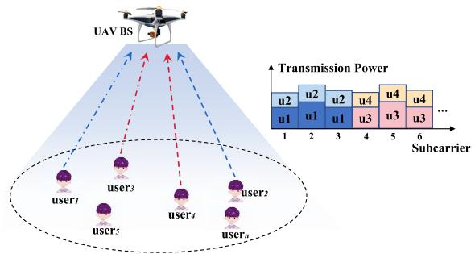  
(a) System model of OFDM-NOMA-based UAV-assisted semantic communications.

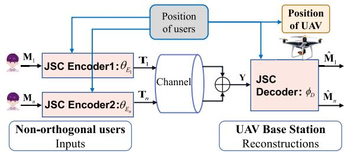  
(b) General framework of OFDM-NOMA-based UAV-assisted semantic communications.  
Fig. 1. UAV-assisted semantic communications system model and general framework based on OFDM-NOMA systems.

The UAV-assisted semantic communications system combines the dynamic UAV BS with the JSC codecs-based semantic communications as shown in Fig. 1, where the semantic feature extraction and signal transmission process are described as follows. The semantic features extracted from the transmitted image ${ { \bf { M } } _ { n } }$ of user n by JSC encoder $\theta _ { E _ { n } }$ are denoted by

$$
\mathbf { X } _ { n } = { \theta } _ { E _ { n } } ( \mathbf { M } _ { n } ) \in \mathbb { C } ^ { L \times K } ,\tag{2}
$$

where K is the number of subcarriers, L is the number of OFDM-NOMA symbols, and a single symbol carries K features for transmission. $x _ { n , l , k } \in \mathbf { X } _ { \tau }$ denotes the feature of user n at the k-th subcarrier of the l-th OFDM-NOMA symbol. Then the semantic features ${ \bf X } _ { n , l }$ of each user’s OFDM-NOMA symbol at all subcarriers are normalized to transmitted signals $\mathbf { T } _ { n , l }$ , which are subject to each user’s own average power constraint $P _ { n } ,$ and represented as

$$
\mathbf { T } _ { n , l } = \frac { \sqrt { P _ { n } } } { \Vert \mathbf { X } _ { n , l } \Vert _ { 2 } } \mathbf { X } _ { n , l } \in \mathbb { C } ^ { K } .\tag{3}
$$

The communication channel gain between the UAV BS and user n on subcarrier k of the l-th OFDM-NOMA symbol is denoted as

$$
g _ { n , l , k } = \sqrt { \rho _ { n } } h _ { n , l , k } \in \mathbf { G } _ { n } \in \mathbb { C } ^ { L \times K } ,\tag{4}
$$

where $\rho _ { n } = \beta _ { 0 } d _ { n } ^ { - \mu }$ is the path loss between the UAV BS and user n, $\beta _ { 0 }$ is the average channel power gain at distance $d _ { n } =$ 1 m, and $\mu$ is the path loss exponent. $\mathbf { \bar { \mathfrak { h } } } _ { n , l , k } \in \mathbf { H } _ { n } \in \mathbb { C } ^ { L \times K }$ is the small-scale fading coefficient from user $n$ to the UAV BS on subcarrier $k ,$ which obeys Rician fading with a K-factor

$K ^ { \mathrm { f } } .$ . Perfect channel state information (CSI) is assumed to be available, in line with prior studies [29], [30].

Via the communication channels, the received superimposed signals of each group q with $N ^ { \mathrm { m a x } }$ non-orthogonal users at UAV can be expressed as

$$
\mathbf { Y } _ { q } = et { } { ' } \sum _ { n = ( q - 1 ) N ^ { \mathrm { m a x } } + 1 } \mathbf { G } _ { n } \mathbf { T } _ { n } + \mathbf { W } _ { q } \in \mathbb { C } ^ { L \times K } ,\tag{5}
$$

where $\mathbf { T } _ { n } ~ = ~ \{ \mathbf { T } _ { n , 1 } , \dotsc , \mathbf { T } _ { n , L } \} , ~ w _ { q , l , k } ~ \in ~ \mathbf { W } _ { q } ~ \in ~ \mathbb { C } ^ { L \times K }$ denotes noise matrix, the element of which is independent and identically distributed complex Gaussian noise term with variance $\sigma _ { \mathrm { e } } ^ { 2 } .$ , and is denoted by $w _ { q , l , k } \sim \mathcal { C N } ( 0 , \sigma _ { \mathrm { e } } ^ { 2 } )$ . Consequently, the received signals of all users are given by

$$
\mathbf { Y } = \{ \mathbf { Y } _ { 1 } , \hdots , \mathbf { Y } _ { q } , \hdots , \mathbf { Y } _ { Q } \} \in \mathbb { C } ^ { \frac { N } { N ^ { \operatorname* { m a x } } } \times L \times K } .\tag{6}
$$

Then the JSC decoder $\phi _ { D }$ deployed at the UAV BS reconstructs the received superimposed signals Y into the transmitted images, which are indicated as

$$
\hat { \mathbf { M } } = \phi _ { D } ( \mathbf { Y } ) \in \mathbb { C } ^ { N \times L \times K } ,\tag{7}
$$

where $\hat { \mathbf { M } } = \{ \hat { \mathbf { M } } _ { 1 } , \hat { \mathbf { M } } _ { 2 } , \hdots , \hat { \mathbf { M } } _ { N } \}$ is the concatenation of all users’ reconstructed images. The distortion loss function is denoted by

$$
d ( \mathbf { M } , { \hat { \mathbf { M } } } ) = \sum _ { n = 1 } ^ { N } \| { \hat { \mathbf { M } } } _ { n } - \mathbf { M } _ { n } \| _ { 2 } ^ { 2 } .\tag{8}
$$

The smaller the distortion $d ( \mathbf { M } , { \hat { \mathbf { M } } } )$ , the higher the quality of image reconstructions.

## B. Layered Semantic Communications Framework and Problem Formulation

The mobility of UAVs stands out as a distinctive characteristic that sets UAV-assisted semantic communications apart from traditional semantic communications. Due to this unique characteristic, the UAV BS needs to adjust its position in response to the movements of mobile users, enhancing communication quality and facilitating the decoding of higherquality images. Moreover, the codecs $\theta _ { E _ { n } }$ and $\phi _ { D }$ must be adaptable to the changing positions of users and UAV BS. Therefore, the general optimization objective of UAV-assisted semantic communications is to minimize the distortion by jointly designing the codecs and the position of the UAV, which is given by

$$
( \Gamma ^ { * } , s ^ { \mathrm { v } * } ) = \underset { \Gamma , s ^ { \mathrm { v } } } { \arg \operatorname* { m i n } } ~ \mathbb { E } _ { p _ { \mathbf { M } } ^ { \flat } } \mathbb { E } _ { p _ { \mathbf { s } ^ { \mathrm { u } } } ^ { \flat } } \mathbb { E } _ { p _ { \hat { \mathbf { M } } | \mathbf { M } , \mathbf { s } ^ { \mathrm { u } } } ^ { \flat } } \left[ d ( \mathbf { M } , \hat { \mathbf { M } } ) \right] ,\tag{9}
$$

where $\Gamma ^ { * } = [ \theta _ { E _ { 1 } } ^ { * } , \dots , \theta _ { E _ { N } \operatorname* { m a x } } ^ { * } , \phi _ { D } ^ { * } ]$ is the optimized parameters of codecs through training, $s ^ { \mathrm { v * } }$ is the optimized position of UAV, E(·) denotes mathematical expectation. $p _ { \mathbf { M } } ^ { \mathbf { b } }$ denotes the probability density function (pdf) of input images M, $p _ { \mathbf { s } ^ { \mathsf { u } } } ^ { \mathsf { b } }$ is the pdf of user positions and $p _ { \hat { \mathbf { M } } | \mathbf { M } , \mathbf { s } ^ { \mathrm { u } } } ^ { \mathrm { b } }$ is the conditional pdf of the reconstruction images Mˆ .

Since the channel gains $\mathbf { G } = [ \mathbf { G } _ { 1 } , \dots , \mathbf { G } _ { n } ]$ are affected by both the position of the UAV and Rician fading, it is difficult to directly design the encoders $\theta _ { E _ { n } }$ and decoder $\phi _ { D }$ to extract and adjust semantic features in response to fluctuating channel gains. To realize the above complex objective in (9), we propose the LSemCom framework, which includes the SFE layer for image semantic feature extraction and the PPC layer for collaboratively dealing with UAV position and semantic signal power allocation, as shown in Fig. 2. As a result, the problem within the LSemCom framework is formulated as

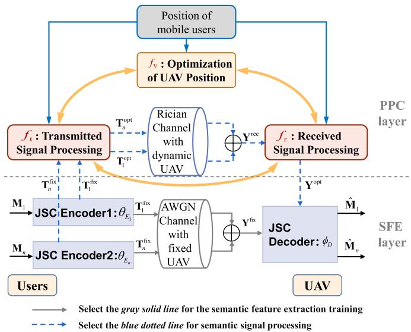  
Fig. 2. Proposed LSemCom framework integrated with multi-user OFDM-NOMA systems.

$$
\begin{array} { r l } & { ( { \bf P 1 } ) \underset { { \Gamma } , f _ { \mathrm { v } } , f _ { \mathrm { t } } , f _ { \mathrm { t } } } { \operatorname* { m i n } } \quad \mathbb { E } _ { p _ { \bf M } ^ { \mathrm { b } } } \mathbb { E } _ { p _ { \bf s } ^ { \mathrm { b } } } \mathbb { E } _ { p _ { \hat { \bf M } | { \bf M } , s ^ { \mathrm { u } } } ^ { \mathrm { b } } } \left[ d ( { \bf M } , \hat { \bf M } ) \right] } \\ & { \quad \mathrm { s . t . } \quad \mathcal { C } _ { 1 } : \| { \bf T } _ { n , l } ^ { \mathrm { o p t } } \| _ { 2 } ^ { 2 } \leq P _ { n } , } \end{array}\tag{10}
$$

where $\Gamma = [ \theta _ { E _ { 1 } } , \dots , \theta _ { E _ { N } \operatorname* { m a x } } , \phi _ { D } ]$ are the codecs need to be trained. Functions $f _ { \mathrm { t } } , f _ { \mathrm { r } } ,$ and $f _ { \mathrm { v } }$ denote the transmitted signal processing, the received signal processing, and the optimization of UAV position, respectively. $\mathbf { T } _ { n , l } ^ { \mathrm { o p t } } \in \mathbf { T } _ { n } ^ { \mathrm { o p t } } \in \mathbf { T } ^ { \mathrm { o p t } }$ denotes the optimized transmitted signals after the signal processing $f _ { \mathrm { t } } ,$ constraint $\mathcal { C } _ { 1 }$ illustrates that the optimized transmission power of each user is also limited to their own maximum power $P _ { n } .$

Furthermore, the two layers of the proposed LSemCom framework are detailed as follows.

1) In the SFE layer, the proposed LSemCom framework aims to obtain a set of good performance codecs $\theta _ { E _ { n } }$ and $\phi _ { D }$ under AWGN channel with the fixed positions of users and UAV. In the training procedure of this layer, the semantic feature extraction, the normalization of transmitted signals $\mathbf { T } _ { n } ^ { \mathrm { f i x } } \in \mathbf { T } ^ { \mathrm { f i x } }$ , and the reconstruction of images are similar to (2), (3), and (7), respectively. However, since the stationary position UAV and the AWGN channel, the superimposed signals $\mathbf { Y } _ { q } ^ { \mathrm { f i x } } \in \mathbf { Y } ^ { \mathrm { f i x } }$ of each group $q$ received at UAV are different from (5), which are denoted by

$$
\mathbf { Y } _ { q } ^ { \mathrm { f i x } } = et { } { ' } \sum _ { n = ( q - 1 ) N ^ { \mathrm { m a x } } + 1 } \sqrt { \rho _ { n } ^ { \mathrm { f i x } } } \mathbf { T } _ { n } ^ { \mathrm { f i x } } + \mathbf { W } _ { q } \in \mathbb { C } ^ { L \times K } ,\tag{11}
$$

where $\rho _ { n } ^ { \mathrm { f i x } } ~ = ~ \beta _ { 0 } \big ( d _ { n } ^ { \mathrm { f i x } } \big ) ^ { - \mu }$ is the path loss under the fixed positions of the UAV BS and user n. The fixed distance is $d _ { n } ^ { \mathrm { f i x } } = \sqrt { ( x _ { n } ^ { \mathrm { u f i x } } - x ^ { \mathrm { v f i x } } ) ^ { 2 } + ( y _ { n } ^ { \mathrm { u f i x } } - y ^ { \mathrm { v f i x } } ) ^ { 2 } + ( H ^ { \mathrm { u } } - H ^ { \mathrm { v } } ) ^ { 2 } }$

During this feature extraction layer, a set of optimized codecs including $N ^ { \mathrm { m a x } }$ encoders and a single decoder, i.e.,

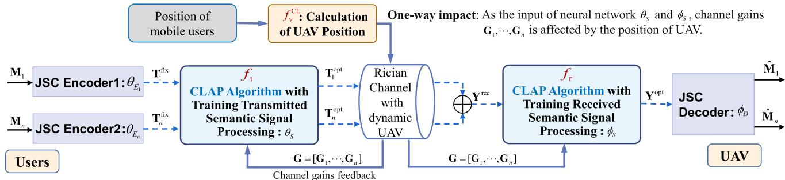  
Fig. 3. Proposed CLAP algorithm for the PPC layer of LSemCom framework.

Γ∗, are obtained through minimizing the loss function given by

$$
\mathcal { L } ( \theta _ { E _ { 1 } } , \dots , \theta _ { E _ { N } \mathrm { m a x } } , \phi _ { D } ) = \sum _ { n = 1 } ^ { N } \| \hat { \mathbf { M } } _ { n } - \mathbf { M } _ { n } \| _ { 2 } ^ { 2 } .\tag{12}
$$

2) In the PPC layer, the optimized codecs $\Gamma ^ { * }$ are then employed for optimizing UAV position and signal power. The codecs $\Gamma ^ { * }$ obtained under fixed user positions cannot be employed directly. The optimization method of UAV position should be carried out. Meanwhile, the transmitted and received signals should be optimized accordingly. Therefore, during this layer, the changing positions of users are accounted for when optimizing the transmitted signal processing $f _ { \mathrm { t } } ,$ the received signal processing $f _ { \mathrm { r } } ,$ and the hovering position of UAV $f _ { \mathrm { v } } .$ . As shown in Fig. 2, the transmission images M are first input to the trained JSC encoders for getting the semantic signals $\mathbf { T } ^ { \mathrm { f i x } }$ which will be optimized to signals ${ \bf T } ^ { \mathrm { o p t } } = f _ { \mathrm { t } } ( { \bf T } ^ { \mathrm { f i x } } , { \bf s } ^ { \mathrm { u } } )$ through signal processing function $f _ { \mathrm { t } } .$ . Under the Rician fading channel, the received signals of the q-th group non-orthogonal users are denoted by

$$
\mathbf { Y } _ { q } ^ { \mathrm { r e c } } = et { } { ' } \sum _ { n = ( q - 1 ) N ^ { \mathrm { m a x } } + 1 } \mathbf { G } _ { n } \mathbf { T } _ { n } ^ { \mathrm { o p t } } + \mathbf { W } _ { q } ^ { \mathrm { n e w } } \in \mathbf { Y } ^ { \mathrm { r e c } } ,\tag{13}
$$

where the element $w _ { q , l , k } ^ { \mathrm { n e w } }$ of $\mathbf { W } _ { q } ^ { \mathrm { n e w } }$ has the same distribution as $w _ { q , l , k } \in \mathbf { W } _ { q } ,$ and is denoted by $w _ { q , l , k } ^ { \mathrm { n e w } } \sim \mathcal { C N } ( 0 , \sigma _ { \mathrm { e } } ^ { 2 } )$ . The received signals $\mathbf { Y } ^ { \mathrm { r e c } }$ are then optimized by function $f _ { \mathrm r }$ for getting signals ${ \bf Y } ^ { \mathrm { o p t } } = f _ { \mathrm { r } } ( { \bf Y } ^ { \mathrm { r e c } } , { \bf s } ^ { \mathrm { u } } )$ , which are input the trained decoder $\phi _ { D }$ for image reconstructions Mˆ .

Therefore, after getting the codecs $\Gamma ^ { * }$ , problem (P1) of the LSemCom framework is reformulated as

$$
\begin{array} { r l } & { ( \mathbf { P 2 } ) \underset { f _ { \mathrm { v } } , f _ { \mathrm { t } } , f _ { \mathrm { r } } } { \operatorname* { m i n } } \quad \mathbb { E } _ { p _ { \mathbf { M } } ^ { \flat } } \mathbb { E } _ { p _ { \mathbf { s } ^ { \flat } } ^ { \flat } } \mathbb { E } _ { p _ { \hat { \mathbf { M } } | \mathbf { M } , \mathbf { s } ^ { \flat } } ^ { \flat } } \left[ d ( \mathbf { M } , \hat { \mathbf { M } } ) \mid \Gamma ^ { * } \right] } \\ & { \quad \quad \mathrm { s . t . } \quad \mathcal { C } _ { 1 } . } \end{array}\tag{14}
$$

To solve problem (P2) in the PPC layer, we propose CLAP and AOPP two algorithms for optimizing the transmitted signal processing $f _ { \mathrm { t } } ,$ the received signal processing $f _ { \mathrm r }$ and the position of UAV $f _ { \mathrm { v } } .$ The CLAP algorithm optimizes UAV position directly through a concise formula, and performs the signal processing by training neural network (NN)-based signal processors. This algorithm requires offline model training before online implementation. In contrast, the AOPP algorithm alternatively optimizes UAV position and signal power based on convex optimization techniques. It operates exclusively in an online mode without the training phases. Both of them require real-time CSI during online deployment. The two algorithms are detailed in the following Sec. III and Sec. IV, respectively.

## III. CASCADE LEARNING-BASED POSITION-ADAPTIVE SEMANTIC SIGNAL POWER ALLOCATION ALGORITHM

In this section, we propose a cascade learning-based signal processing algorithm to realize the user positions adaptation, as shown in Fig. 3. In this CLAP algorithm, the positions of users and the UAV BS will be well integrated into the semantic signal processors (SSPs), serving as an important prompt to influence the signal processing, ultimately ensuring the quality of image transmission. The following describes the NN architectures of SSPs $\Omega = [ \theta _ { s } , \phi _ { s } ]$ and the training strategy for obtaining them.

## A. NN Architectures of Modules in CLAP Algorithm

The JSC encoder $\theta _ { E _ { n } }$ and JSC decoder $\phi _ { D }$ shown in Fig. 3 are trained under AWGN channel with the fixed positions of users and UAV. The NN architectures of these JSC codecs Γ refer to an attention mechanism-based JSCC technology in [31] to adapt to different noise levels. While facing the Rician fading channel and the varying large-scale fading caused by users’ movement, we propose the SSPs $\Omega \ = \ [ \theta _ { s } , \phi _ { s } ]$ and accordingly design a semantic signal transmission-enabled loss function to solve this issue.

The NN architectures of the SSPs Ω and codecs Γ are illustrated in Fig. 4. The notations $s _ { 1 } \times s _ { 2 } \times s _ { 3 } / s _ { 4 }$ denote a convolutional or transpose convolutional layer with an input channel size of $s _ { 1 } .$ , an output channel size of $s _ { 2 } .$ , a kernel size of $s _ { 3 }$ , and a stride of $s _ { 4 }$ . Following the convolutional layer, there is a sequence of a batch normalization layer and an activation function, which is either ReLU or Sigmoid. The notations $L ( s _ { 5 } , s _ { 6 } )$ denotes a linear layer with an input feature size of $s _ { 5 }$ and an output feature size of $s _ { 6 }$

In the UAV-assisted semantic communications, users all desire to be closer to the UAV BS because the channel gain increases as the distance decreases. Consequently, the CLAP algorithm determines the horizontal position of the UAV BS by calculating the weighted centroid of user positions, with transmission power serving as the weight. This position is denoted by

$$
s ^ { \mathrm { v } } = \sum _ { n = 1 } ^ { N } \left( { \frac { P _ { n } } { \sum _ { n = 1 } ^ { N } P _ { n } } } s _ { n } ^ { \mathrm { u } } \right) .\tag{15}
$$

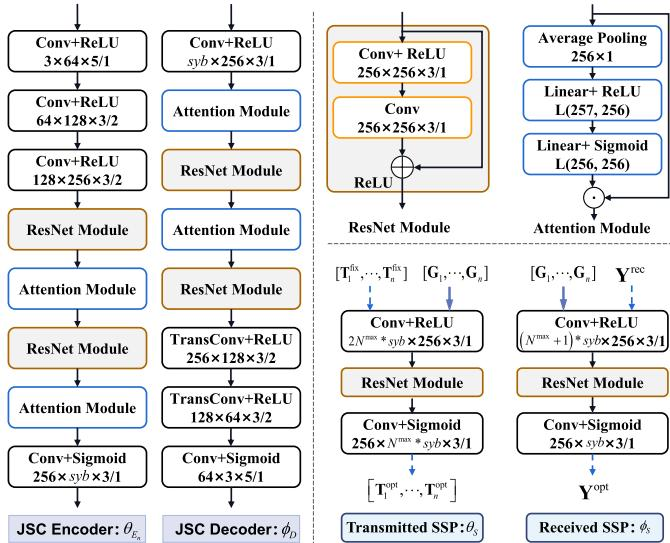  
Fig. 4. Neural network architecture of the semantic signal processors $\Omega =$ $[ \theta _ { s } ^ { - } , \phi _ { s } ]$ and JSC codecs $\Gamma = [ \theta _ { E _ { 1 } } , \dots , \theta _ { E _ { N } \operatorname* { m a x } { } } , \phi _ { D } ]$

Then the path loss of each user is calculated according to (1) and (4). As shown in Fig. 3, the relationship between the UAV position and the SSPs $\Omega = [ \theta _ { s } , \phi _ { s } ]$ is a one-way impact, that is, the position of UAV affects the large-scale fading and thereby influences the SSPs, but is not affected by the SSPs. In general, the positions of users influence the SSPs’ processing results by affecting their input the channel gains $\mathbf { G } = [ \mathbf { G } _ { 1 } , \dots , \mathbf { G } _ { n } ]$ As shown in the transmitted SSP $\theta _ { s }$ and received SSP $\phi _ { s }$ of Fig. 4, the channel gains G are concatenated with the semantic signals $\mathbf { T } ^ { \mathrm { f i x } }$ and $\mathbf { Y } ^ { \mathrm { r e c } }$ respectively as the input features of the convolutional network. The optimized transmitted and received signals are denoted by

$$
\mathbf { T } ^ { \mathrm { o p t } } = \theta _ { s } \left( \mathbf { T } ^ { \mathrm { f i x } } , \mathbf { G } \right)\tag{16}
$$

and

$$
{ { \bf Y } ^ { \mathrm { o p t } } } = { \phi _ { s } } \left( { { \bf Y } ^ { \mathrm { r e c } } } , { \bf G } \right) ,\tag{17}
$$

respectively.

## B. Problem Refinement and Training Strategy of CLAP Algorithm

The CLAP algorithm for the PPC layer determines how the UAV BS follows the mobile users $s ^ { \mathrm { v } } = f _ { \mathrm { v } } ^ { \mathrm { C L } } ( \mathbf { s } ^ { \mathrm { u } } )$ as shown in (15). After this determination of $f _ { \mathrm { v } } ^ { \mathrm { C L } }$ , problem (P2) is reformulated for the proposed CLAP algorithm as follows

$$
\begin{array} { r l } { ( { \bf P 3 } ) \operatorname* { m i n } _ { \theta _ { s } , \phi _ { s } } } & { \mathbb { E } _ { p _ { \bf M } ^ { \flat } } \mathbb { E } _ { p _ { \bf s } ^ { \flat } } \mathbb { E } _ { p _ { \hat { { \bf M } } | { \bf M } , { s } ^ { \mathrm { u } } } ^ { \flat } } \left[ d ( { \bf M } , \hat { { \bf M } } ) \mid \Gamma ^ { * } , f _ { \mathrm { v } } ^ { \mathrm { C L } } \right] } \\ { \mathrm { s . t . } } & { \mathcal { C } _ { 2 } : \| { \bf T } _ { n , l } ^ { \mathrm { o p t } } \| _ { 2 } ^ { 2 } = P _ { n } . } \end{array}\tag{18}
$$

Furthermore, to train the SSPs $\Omega = [ \theta _ { s } , \phi _ { s } ]$ with the parameters of semantic codecs $\Gamma ^ { * }$ frozen, we propose a semantic signal transmission-enabled combined loss function

$$
\begin{array} { l } { { \displaystyle { \mathcal { L } } ( \theta _ { s } , \phi _ { s } ) = w _ { 1 } d ( { \bf M } , \hat { \bf M } ) + w _ { 2 } d ( { \bf Y } ^ { \mathrm { f i x } } , { \bf Y } ^ { \mathrm { o p t } } ) } \ ~ } \\ { { \displaystyle ~ = w _ { 1 } \sum _ { n = 1 } ^ { N } \| \hat { \bf M } _ { n } - { \bf M } _ { n } \| _ { 2 } ^ { 2 } + w _ { 2 } \sum _ { q = 1 } ^ { Q } \| { \bf Y } _ { q } ^ { \mathrm { o p t } } - { \bf Y } _ { q } ^ { \mathrm { f i x } } \| _ { 2 } ^ { 2 } } , } \end{array}\tag{19}
$$

where the first term $\begin{array} { r } { \sum _ { n = 1 } ^ { N } \| \hat { \mathbf { M } } _ { n } - \mathbf { M } _ { n } \| _ { 2 } ^ { 2 } } \end{array}$ is the distortion loss of the image, and the second term $\begin{array} { r } { \sum _ { q = 1 } ^ { Q } \| \mathbf { Y } _ { q } ^ { \mathrm { o p t } } - \mathbf { Y } _ { q } ^ { \mathrm { f i x } } \| _ { 2 } ^ { 2 } } \end{array}$ is the distortion loss of semantic signal transmission. w and w are the weights of two distortions to balance the numerical differences caused by different meanings of the data.

The semantic signal transmission error $d ( \mathbf { Y } ^ { \mathrm { f i x } } , \mathbf { Y } ^ { \mathrm { o p t } } )$ is defined to make the signals $\mathbf { Y } _ { q } ^ { \mathrm { o p t } }$ more appropriate as the input to $\phi _ { D }$ while under different channel conditions. The gradient descent of this distortion does not go through the JSC codecs, thus it can avoid gradient disappearance and better guide the loss convergence during the training process of SPPs. The image reconstruction loss d(M, Mˆ ) is utilized to further facilitate image reconstructions.

The complexity of the CLAP algorithm is closely related to the neural network architecture of the SSPs Ω, which is detailed in Fig. 4. The number of addition and multiplication calculations is utilized to represent the complexity of neural networks. Assume that H and W are the height and width of the output feature map, respectively. The convolution operation is essentially a linear operation, and the number of multiplications in a convolution layer is $s _ { 3 } ^ { 2 } s _ { 1 } s _ { 2 } H W$ and the number of additions is also $s _ { 3 } ^ { 2 } s _ { 1 } s _ { 2 } H W$ . Therefore, the complexity of a convolutional or transpose convolutional layer is denoted by $\mathcal { O } _ { \mathrm { c o n v } } ( 2 s _ { 3 } ^ { 2 } s _ { 1 } s _ { 2 } H W )$ . The complexity of a linear layer is denoted by $\mathcal { O } _ { \mathrm { l i n e a r } } ( 2 s _ { 5 } s _ { 6 } )$ . Therefore, based on the specific architecture shown in Fig. 4, the computation complexity of SSPs Ω, defined as the number of calculations $\boldsymbol { C } \boldsymbol { \bar { N } } ^ { \Omega }$ , is approximately $3 . 4 \times 1 0 ^ { 9 }$ , neglecting the computational effort of the activation function and normalization.

## IV. JOINT ALTERNATING OPTIMIZATION BETWEEN UAVPOSITION AND SEMANTIC SIGNAL POWER ALLOCATION

The position of UAV is specified as the weighted centroid of users in Sec. III since it is difficult to design an NN architecture to combine the training process of SPPs with a UAV position training strategy. However, the weighted centroid may not be the optimal position of the UAV BS. In this section, we propose an AOPP algorithm for the PPC layer to optimize the position of the UAV and process the transmitted and received signals jointly based on the SCA and BCD algorithms. The training procedure and the testing procedure of the proposed AOPP algorithm are detailed in the next subsections.

## A. Training Procedure of AOPP Algorithm

As shown in Fig. $5 ,$ the relationship between the UAV position optimization $f _ { \mathrm { v } }$ and the semantic signal processing functions $f _ { \mathrm { t } }$ and $f _ { \mathrm r }$ is a two-way impact due to the proposed alternating iterative AOPP algorithm. The position of UAV not only influences the signal processing method, but also is affected by the signal processing results. We then formulate a semantic transmission-oriented problem stated in the next Subsection IV-B to obtain the optimized results of power allocation functions $f _ { \mathrm { t } } , f _ { \mathrm { r } } ,$ and position of UAV BS optimization function $f _ { \mathrm { v } }$ . Therefore, after the first image semantic feature extraction layer of training the JSC codecs Γ, there is no need to train other neural networks for the second signal processing layer in the proposed AOPP algorithm.

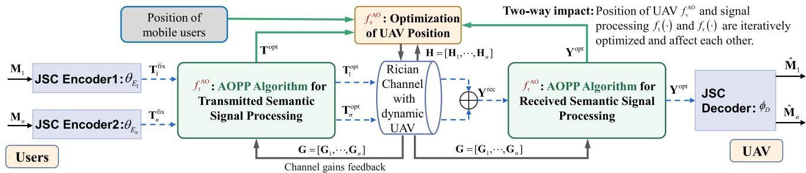  
Fig. 5. Proposed AOPP algorithm for the PPC layer of LSemCom framework.

## B. Testing Procedure of AOPP Algorithm: Joint Optimization of UAV Position and Semantic Signal Power Allocation

In this subsection, the optimized codecs $\Gamma ^ { * }$ will serve as a fixed encoding and decoding method to assist signal power allocation and optimization of UAV position during the testing procedure. Furthermore, we refine problem (P2) and jointly optimize the UAV position and semantic signals power by utilizing the SCA and BCD algorithms.

1) Problem Refinement in AOPP Algorithm: While testing the optimized codecs $\Gamma ^ { * }$ on the multi-subcarrier channels combining large-scale fading that changes with users’ positions with small-scale fading, three optimization functions are designed as follows.

(a) Position of the UAV BS optimization function is denoted by

$$
\begin{array} { r } { s ^ { \mathrm { v } } = f _ { \mathrm { v } } ^ { \mathrm { A O } } \left( \mathbf { T } ^ { \mathrm { o p t } } , \mathbf { Y } ^ { \mathrm { o p t } } , \mathbf { H } , \mathbf { s } ^ { \mathrm { u } } \right) , } \end{array}\tag{20}
$$

where $\mathbf { H } ~ = ~ [ \mathbf { H } _ { 1 } , \mathbf { H } _ { 2 } , \dots , \mathbf { H } _ { N } ] ~ \in ~ \mathbb { C } ^ { L \times K \times N }$ is the small-scale fading coefficient matrix. Through using the optimized position of UAV, the new path loss $\rho _ { n } ^ { \mathrm { { o p t } } }$ is calculated, and the new channel gain $g _ { n , l , k } ^ { \mathrm { o p t } } ~ =$ $\sqrt { \rho _ { n } ^ { \mathrm { o p t } } } h _ { n , l , k } \in { \bf G } _ { n } ^ { \mathrm { o p t } }$ is obtained.

(b) The transmitted signal processing optimization function is designed to adapt $\mathbf { T } ^ { \mathrm { f i x } }$ to new channel gain ${ \bf G } ^ { \mathrm { o p t } } = { }$ $[ \mathbf { G } _ { 1 } ^ { \mathrm { o p t } } , \mathbf { \bar { G } } _ { 2 } ^ { \mathrm { o p t } } , \dots , \mathbf { G } _ { N } ^ { \mathrm { \bar { o p t } } } ]$ , which is changed with positions of users and the optimized position of UAV. Consequently, the transmitted signal processing optimization function is given by

$$
\begin{array} { r } { { \bf T } ^ { \mathrm { o p t } } = f _ { \mathrm { t } } ^ { \mathrm { A O } } ( { \bf T } ^ { \mathrm { f i x } } , { \bf G } ^ { \mathrm { o p t } } ) . } \end{array}\tag{21}
$$

(c) The optimized transmitted signals $\mathbf { T } ^ { \mathrm { o p t } }$ are received through the channel gain $\mathbf { G } ^ { \mathrm { o p t } }$ and the received superimposed signals for each group of Nmax non-orthogonal users are expressed as $\begin{array} { l l } { { \bf Y } _ { q } ^ { \mathrm { r e c } } } & { = } \end{array}$ $\begin{array} { r } { \sum _ { n = ( q - 1 ) N ^ { \mathrm { m a x } } + 1 } ^ { q N ^ { \mathrm { m a x } } } { \mathbf G } _ { n } ^ { \mathrm { o p t } } { \mathbf T } _ { n } ^ { \mathrm { o p t } } + { \mathbf W } _ { q } ^ { \mathrm { n e w } } } \end{array}$ . Furthermore, the received superimposed signals $\mathbf { Y } _ { q } ^ { \mathrm { r e c } }$ should be processed to get the new signals $\mathbf { Y } _ { q } ^ { \mathrm { o p t } }$ to input JSC decoder $\phi _ { D } ^ { * }$ which is given by

$$
{ \bf Y } _ { q } ^ { \mathrm { o p t } } = f _ { \mathrm { r } } ^ { \mathrm { A O } } ( { \bf T } ^ { \mathrm { o p t } } , { \bf G } ^ { \mathrm { o p t } } ) = f _ { \mathrm { r } } ^ { \mathrm { A O } } ( { \bf Y } _ { q } ^ { \mathrm { r e c } } ) .\tag{22}
$$

The optimized signals $\mathbf { Y } ^ { \mathrm { o p t } }$ , as the new inputs of JSC decoder $\phi _ { D } ^ { * }$ , should be as equal as possible to signals Yfix to fit $\phi _ { D } ^ { * }$ for semantic reconstruction, so that higher quality

TABLE I NOTATIONS
<table><tr><td rowspan=1 colspan=1>Matrix</td><td rowspan=1 colspan=1>Element</td><td rowspan=1 colspan=1>Matrix</td><td rowspan=1 colspan=1>Element</td></tr><tr><td rowspan=1 colspan=1> $\mathbf { T } _ { n }$ </td><td rowspan=1 colspan=1> $t _ { n , l , k } = t _ { n , l , k } ^ { \mathrm { r } } + i t _ { n , l , k } ^ { \mathrm { i } }$ </td><td rowspan=1 colspan=1>W</td><td rowspan=1 colspan=1> $w _ { q , l , k } = w _ { q , l , k } ^ { \mathrm { r } } + i w _ { q , l , k } ^ { \mathrm { i } }$ </td></tr><tr><td rowspan=1 colspan=1> $\mathbf { T } _ { n } ^ { \mathrm { { o p t } } }$ </td><td rowspan=1 colspan=1> $t _ { n , l , k } ^ { \mathrm { o p t } } { = } t _ { n , l , k } ^ { \mathrm { n e w r } } { + } i t _ { n , l , k } ^ { \mathrm { n e w i } }$ </td><td rowspan=1 colspan=1>Wnew</td><td rowspan=1 colspan=1> $w _ { q , l , k } ^ { \mathrm { n e w } } = w _ { q , l , k } ^ { \mathrm { n e w r } } + i w _ { q , l , k } ^ { \mathrm { n e w i } }$ </td></tr><tr><td rowspan=1 colspan=1>Y</td><td rowspan=1 colspan=1> $y _ { q , l , k } ^ { \mathrm { f i x } } = y _ { q , l , k } ^ { \mathrm { r } } + i y _ { q , l , k } ^ { \mathrm { i } }$ </td><td rowspan=1 colspan=1>Yrec</td><td rowspan=1 colspan=1> $y _ { q , l , k } ^ { \mathrm { r e c } } = y _ { q , l , k } ^ { \mathrm { r e c r } } + i y _ { q , l , k } ^ { \mathrm { r e c i } }$ </td></tr><tr><td rowspan=1 colspan=1>Yopt</td><td rowspan=1 colspan=1> $y _ { { q , l , k } } ^ { \mathrm { o p t } } = y _ { { q , l , k } } ^ { \mathrm { n e w r } } + i y _ { { q , l , k } } ^ { \mathrm { n e w i } }$ </td><td rowspan=1 colspan=1> ${ \bf G } _ { n } ^ { \mathrm { o p t } }$ </td><td rowspan=1 colspan=1> $g _ { n , l , k } ^ { \mathrm { o p t } } { = } g _ { n , l , k } ^ { \mathrm { o p t r } } { + } i g _ { n , l , k } ^ { \mathrm { o p t i } }$ </td></tr></table>

of reconstructions will be achieved.1 Therefore, based on the trained codecs $\Gamma ^ { * }$ , problem (P2) in (14) for the AOPP algorithm is re-expressed as

$$
\begin{array} { r l r } {  { ( \mathbf { P 4 } ) \operatorname* { m i n } _ { f _ { \mathrm { v } } ^ { \mathrm { A O } } , f _ { \mathrm { t } } ^ { \mathrm { A O } } , f _ { \mathrm { r } } ^ { \mathrm { A O } } } } \quad \Delta _ { 1 } = d ( \mathbf { Y } ^ { \mathrm { f i x } } , \mathbf { Y } ^ { \mathrm { o p t } } ) = \sum _ { q = 1 } ^ { Q } \| \mathbf { Y } _ { q } ^ { \mathrm { o p t } } - \mathbf { Y } _ { q } ^ { \mathrm { f i x } } \| _ { 2 } ^ { 2 } }  \\ & { } & { \mathrm { s . t . } \quad \mathcal { C } _ { 1 } : \| \mathbf { T } _ { n , l } ^ { \mathrm { o p t } } \| _ { 2 } ^ { 2 } \leq P _ { n } . \quad \quad \quad ( 2 3 ) } \end{array}
$$

To further clarify the optimization functions $f _ { \mathrm { v } } ^ { \mathrm { A O } } , f _ { \mathrm { t } } ^ { \mathrm { A O } }$ , and $f _ { \mathrm r } ^ { \mathrm { A O } }$ in problem (P4), we expand the real and imaginary parts of complex signals and channels, which are summarized in Table I. Next, transmitted signals optimization function $f _ { \mathrm { t } } ^ { \mathrm { A O } } ( \cdot )$ in (21) is re-expressed as

$$
t _ { n , l , k } ^ { \mathrm { o p t } } = t _ { n , l , k } ^ { \mathrm { f i x r } } p _ { n , l , k } ^ { \mathrm { r } } + i t _ { n , l , k } ^ { \mathrm { f i x i } } p _ { n , l , k } ^ { \mathrm { i } } \in \mathbf { T } _ { n } ^ { \mathrm { o p t } } ,\tag{24}
$$

where $p _ { n , l , k } ^ { \mathrm { r } }$ and $p _ { n , l , k } ^ { \mathrm i }$ are the results of signal power allocation towards $t _ { n , l , k } ^ { \mathrm { r } }$ and $t _ { n , l , k } ^ { \mathrm { i } } ,$ respectively. The received signals optimization function $f _ { \mathrm { r } } ^ { \mathrm { A O ^ { \prime } } } ( \cdot )$ in (22) is expressed as

$$
y _ { q , l , k } ^ { \mathrm { o p t } } = \alpha _ { q } y _ { q , l , k } ^ { \mathrm { r e c } } ,\tag{25}
$$

where $\alpha _ { q }$ is a scaling factor to adjust the signal amplitude of the q-th group non-orthogonal users at the UAV BS. The objective $\Delta _ { 1 }$ is re-expressed as

$$
\begin{array} { r l } {  { \stackrel {  } { = } \sum _ { q = 1 } ^ { Q } \sum _ { l = 1 } ^ { L } \sum _ { k = 1 } ^ { K } ( { y } _ { q , l , k } ^ { \mathrm { o p t } } - { y } _ { q , l , k } ^ { \mathrm { f x } } ) ^ { 2 } } } \\ & { \stackrel {  } { = } \sum _ { q = 1 } ^ { Q } \displaystyle \sum _ { l = 1 } ^ { L } \sum _ { k = 1 } ^ { K } ( ( \alpha _ { q } { y } _ { q , l , k } ^ { \mathrm { r e c r } } - { y } _ { q , l , k } ^ { \mathrm { f x r } } ) ^ { 2 } + ( \alpha _ { q } { y } _ { q , l , k } ^ { \mathrm { r e c i } } - { y } _ { q , l , k } ^ { \mathrm { f x i } } ) ^ { 2 } ) , } \end{array}\tag{26}
$$

where

$$
y _ { q , l , k } ^ { \mathrm { f i x r } } = \sum _ { n = ( q - 1 ) N ^ { \mathrm { m a x } } + 1 } ^ { q N ^ { \mathrm { m a x } } } \sqrt { \rho _ { n } ^ { \mathrm { f i x } } } t _ { n , l , k } ^ { \mathrm { f i x r } } + w _ { q , l , k } ^ { \mathrm { r } } ,\tag{27}
$$

$$
y _ { q , l , k } ^ { \mathrm { f i x i } } = \sum _ { n = ( q - 1 ) N ^ { \mathrm { m a x } } + 1 } ^ { q N ^ { \mathrm { m a x } } } \sqrt { \rho _ { n } ^ { \mathrm { f i x } } } t _ { n , l , k } ^ { \mathrm { f i x i } } + w _ { q , l , k } ^ { \mathrm { i } } ,\tag{28}
$$

$$
\begin{array} { r l r } {  { y _ { q , l , k } ^ { \mathrm { r e c r } } = \sum _ { n = ( q - 1 ) N ^ { \mathrm { m a x } } + 1 } ^ { q N ^ { \mathrm { m a x } } } } } \\ & { } & { \times ( t _ { n , l , k } ^ { \mathrm { f i x r } } p _ { n , l , k } ^ { \mathrm { r } } g _ { n , l , k } ^ { \mathrm { o p t r } } - t _ { n , l , k } ^ { \mathrm { f i x i } } p _ { n , l , k } ^ { \mathrm { i } } g _ { n , l , k } ^ { \mathrm { o p t i } } ) + w _ { q , l , k } ^ { \mathrm { n e w r } } , } \end{array}\tag{29}
$$

and

$$
\begin{array} { r l r } {  { y _ { q , l , k } ^ { \mathrm { r e c i } } } } \\ & { = } & { \sum _ { n = ( q - 1 ) N ^ { \mathrm { m a x } } + 1 } ^ { q N ^ { \mathrm { m a x } } } ( t _ { n , l , k } ^ { \mathrm { f i x r } } p _ { n , l , k } ^ { \mathrm { r } } g _ { n , l , k } ^ { \mathrm { o p t i } } + t _ { n , l , k } ^ { \mathrm { f i x i } } p _ { n , l , k } ^ { \mathrm { i } } g _ { n , l , k } ^ { \mathrm { o p t r } } ) } \\ & { } & { \quad + w _ { q , l , k } ^ { \mathrm { n e w i } } . } \end{array}\tag{30}
$$

$y _ { q , l , k } ^ { \mathrm { r e c r } }$ and $y _ { q , l , k } ^ { \mathrm { r e c i } }$ are calculated from complex signals $t _ { n , l , k } ^ { \mathrm { o p t } }$ via complex channels $g _ { n , l , k } ^ { \mathrm { o p t } } .$

Furthermore, the noise terms $w _ { q , l , k }$ and $w _ { q , l , k } ^ { \mathrm { n e w } }$ are preprocessed according to their statistical distribution characteristics. Let $\dot { y }$ denotes the non-noise terms of corresponding $y ,$ for example, $y _ { q , l , k } ^ { \mathrm { r e c r } } = \dot { y } _ { q , l , k } ^ { \mathrm { r e c r } } + w _ { q , l , k } ^ { \mathrm { n e w r } }$ . Then the new objective is derived as

$$
\begin{array} { r l } & { \Delta _ { 3 } } \\ & { = \displaystyle \sum _ { q = 1 } ^ { Q } \sum _ { \tau = 1 } ^ { L } \sum _ { k = 1 } ^ { K } } \\ & { \quad \times \left( \mathbb { E } \left( \left( \alpha _ { q } \left( j _ { q , l , k } ^ { \mathrm { r e c } } + w _ { q , l , k } ^ { \mathrm { o u r a } } \right) - \left( j _ { q , l , k } ^ { \mathrm { f i g u t } } + w _ { q , l , k } ^ { \tau } \right) \right) ^ { 2 } \right) \right) } \\ & { \quad \quad \quad \quad \quad \quad \quad \quad \quad \quad \quad \quad \quad \quad \quad \quad \quad \quad \quad \quad \quad \quad } \\ & { = \displaystyle \sum _ { q = 1 } ^ { Q } \sum _ { i = 1 } ^ { L } \sum _ { k = 1 } ^ { K } } \\ & { \quad \quad \quad \quad \quad \quad \quad \quad \quad \quad \quad \quad \quad \quad \quad \quad \quad \quad \quad \quad \quad \quad \quad \quad \quad \quad \quad \quad \quad \quad \quad \quad } \\ & { \quad \quad \quad \quad \quad \times \left( \left( \alpha _ { q } j _ { q , l , k } ^ { \mathrm { r e c } } - j _ { q , l , k } ^ { \mathrm { f i g u t } } \right) ^ { 2 } + \left( \alpha _ { q } j _ { q , l , k } ^ { \mathrm { b e c } } - j _ { q , l , k } ^ { \mathrm { f i g u t } } \right) ^ { 2 } + 2 \left( \alpha _ { q } ^ { 2 } + 1 \right) \sigma _ { \tau , 0 } ^ { 2 } \right) } \end{array}\tag{31}
$$

Ultimately, problem (P4) is further elaborated as

$$
\begin{array} { r l r } { ( \mathbf { P 5 } ) \underset { p _ { n , l , k } ^ { \mathrm { r } } , p _ { n , l , k } ^ { \mathrm { i } } , , \mathbf { k } } { \mathrm { m i n } } } & { \Delta _ { 3 } } & \\ { \alpha _ { q } , s ^ { \mathrm { v } } , } & { } & \\ { \mathrm { s . t . } \quad \mathcal { C } _ { 3 } : \frac { 1 } { K } \displaystyle \sum _ { k = 1 } ^ { K } \left( \left( t _ { n , l , k } ^ { \mathrm { f a x } } p _ { n , l , k } ^ { \mathrm { r } } \right) ^ { 2 } + \left( t _ { n , l , k } ^ { \mathrm { f a x i } } p _ { n , l , k } ^ { \mathrm { i } } \right) ^ { 2 } \right) } & \\ & { } & { \displaystyle \leq P _ { n } , } & \\ & { \forall n \in \mathcal { N } , \forall l \in \mathcal { L } . } & { } & { ( 3 2 } \end{array}
$$

2) AOPP Algorithm Based on SCA and BCD: To solve problem (P5), the BCD algorithm is first utilized for joint optimization of UAV position and semantic signals. The BCD algorithm is widely used for minimizing objectives with multiple block variables. According to its idea of optimizing the variables of one block by fixing other blocks, we alternatively optimize the UAV position and signal power allocation in an iterative manner. Specifically, the first subproblem is to optimize the signal power allocation $p _ { n , l , k } ^ { \mathrm { r } } , p _ { n , l , k } ^ { \mathrm { i } }$ and $\alpha _ { q }$ when fixing the UAV position $s ^ { \mathrm { v } }$ . The second subproblem is to optimize the UAV position $s ^ { \mathrm { v } }$ with fixed the signals power processing method.

(a) The first subproblem: When the position of UAV $s ^ { \mathrm { v } }$ is fixed, users within the group are coupled, while users between groups are decoupled. Therefore, the signals power allocation subproblem for each group of users can be handled independently, which is expressed as

$$
\begin{array} { r l } { ( \mathbf { P 5 - 1 } ) \underset { p _ { n , l , k } ^ { \mathrm { r } } , p _ { n , l , k } ^ { \mathrm { i } } , \alpha _ { q } , } { \mathrm { m i n } } } & { \Delta _ { 3 } } \\ { \mathrm { s . t . } \quad \mathcal { C } _ { 3 } . } \end{array}\tag{33}
$$

This subproblem has been solved in our previous work [28] with new channel state information $g _ { n , l , k } ^ { \mathrm { o p t } }$ feedback. It can be seen that problem (P5-1) is a quadratically constrained quadratic programming (QCQP) problem when $\alpha _ { q }$ is fixed, which can be solved by the interior point method [32]. When $p _ { n , l , k } ^ { \mathrm { r } }$ and $p _ { n , l , k } ^ { \mathrm i }$ are fixed, the optimal $\alpha _ { q }$ can be obtained by $\begin{array} { r } { \frac { \partial \Delta _ { 3 } } { \partial \alpha _ { a } } = 0 } \end{array}$ . Thus, the solutions to subproblem (P5-1) are obtained through finite iterations between power allocation $p _ { n , l , k } ^ { \mathrm { r } } , \ p _ { n , l , k } ^ { \mathrm { i } }$ and power scaling factor $\alpha _ { q } .$ . Since the QCQP problem of power allocation $p _ { n , l , k } ^ { \mathrm { r } } , p _ { n , l , k } ^ { \mathrm { i } }$ and the optimization problem of power scaling factor $\alpha _ { q }$ are both convex, the optimal solution of subproblem (P5-1) will be obtained.

(b) The second subproblem: To clarify the UAV position optimization subproblem with the given variables $p _ { n , l , k } ^ { \mathrm { r } } , p _ { n , l , k } ^ { \mathrm { i } }$ and factor $\alpha _ { q } .$ , we express $\Delta _ { 3 }$ shown in (31) equivalently as

$$
{ \Delta _ { 4 } } = \sum _ { q = 1 } ^ { Q } { \sum _ { l = 1 } ^ { L } { \sum _ { k = 1 } ^ { K } { \left( { \left( { \alpha _ { q } \sum _ { n = ( q - 1 ) N ^ { \mathrm { { m a x } } } } ^ { q N } { \alpha _ { \mathrm { + 1 } } } } \sqrt { { d _ { n } ^ { - \mu } } } { z _ { n , l , k } ^ { \mathrm { r } } } - { \dot { y } _ { q , l , k } ^ { \mathrm { f i x r } } } \right) ^ { 2 } } \right)}  } } + { \left( { \alpha _ { q } \sum _ { n = ( q - 1 ) N ^ { \mathrm { { m a x } } } + 1 } ^ { q N ^ { \mathrm { { m a x } } } } { \sqrt { { d _ { n } ^ { - \mu } } } { z _ { n , l , k } ^ { \mathrm { i } } } - { \dot { y } _ { q , l , k } ^ { \mathrm { f i x i } } } } } \right) } ^ { 2 }\tag{34)√}
$$

where $\begin{array} { r l r } { z _ { n , l , k } ^ { \mathrm { r } } } & { = } & { \left( t _ { n , l , k } ^ { \mathrm { f i x r } } p _ { n , l , k } ^ { \mathrm { r } } h _ { n , l , k } ^ { \mathrm { r } } - t _ { n , l , k } ^ { \mathrm { f i x i } } p _ { n , l , k } ^ { \mathrm { i } } h _ { n , l , k } ^ { \mathrm { i } } \right) } \end{array}$ β0 and $\begin{array} { r l r } { z _ { n , l , k } ^ { \mathrm { i } } = \left( t _ { n , l , k } ^ { \mathrm { f i x r } } p _ { n , l , k } ^ { \mathrm { r } } h _ { n , l , k } ^ { \mathrm { i } } + t _ { n , l , k } ^ { \mathrm { f i x i } } p _ { n , l , k } ^ { \mathrm { i } } h _ { n , l , k } ^ { \mathrm { r } } \right) \sqrt { \beta _ { 0 } } } \end{array}$ are fixed values. The optimization subproblem of the position of the UAV BS is then denoted by

$$
\begin{array} { r l } { ( \mathbf { P 5 - 2 } ) \underset { s ^ { \mathrm { v } } } { \operatorname* { m i n } } } & { { } \Delta _ { 4 } . } \end{array}\tag{35}
$$

Constraint $\mathcal { C } _ { 3 }$ in problem (P5) is unrelated to UAV position and therefore is not included in subproblem (P5-2). The objective function $\Delta _ { 4 }$ is non-convex because the distance variable $\sqrt { d _ { n } ^ { - \mu } }$ , which contains the UAV position variables $\boldsymbol { s } ^ { \mathrm { v } } = ( x ^ { \mathrm { v } } , y ^ { \mathrm { v } } )$ ), is non-convex.

To make the non-convex subproblem (P5-2) more tractable, the auxiliary variables $\xi _ { n }$ , which are related to $\sqrt { d _ { n } ^ { - \mu } }$ , are introduced. Then it is equivalently transformed into

$$
\begin{array} { r l } { \left( \mathbf { P 5 - 3 } \right) \underset { s ^ { \mathrm { v } } , \xi _ { n } } { \operatorname* { m i n } } } & { \Delta _ { 5 } } \\ { \mathrm { s . t . } } & { \mathcal { C } _ { 4 } : \sqrt { d _ { n } ^ { - \mu } } \geq \xi _ { n } , } \end{array}\tag{36}
$$

where

$$
\Delta _ { 5 } = \sum _ { q = 1 } ^ { Q } \sum _ { l = 1 } ^ { L } \sum _ { k = 1 } ^ { K } \left( \left( \alpha _ { q } \sum _ { n = ( q - 1 ) N ^ { \mathrm { m a x } } + 1 } ^ { q N ^ { \mathrm { m a x } } } \xi _ { n } z _ { n , l , k } ^ { \mathrm { r } } - \dot { y } _ { q , l , k } ^ { \mathrm { f i x r } } \right) ^ { 2 } \right) .\tag{37}
$$

$\Delta _ { 5 }$ is obtained by replacing $\sqrt { d _ { n } ^ { - \mu } }$ in $\Delta _ { 4 }$ with $\xi _ { n }$ . The objective function $\Delta _ { 5 }$ is convex with respect to variable $\xi _ { n }$ because

$$
\frac { \partial ^ { 2 } \Delta _ { 5 } } { \partial \xi _ { n } ^ { 2 } } = \sum _ { l = 1 } ^ { L } \sum _ { k = 1 } ^ { K } \Bigl ( 2 \alpha _ { q } ^ { 2 } \left( \left( z _ { n , l , k } ^ { \mathrm { r } } \right) ^ { 2 } + \left( z _ { n , l , k } ^ { \mathrm { i } } \right) ^ { 2 } \right) \Bigr ) > 0\tag{38}
$$

is derived.

However, constraint $\mathcal { C } _ { 4 }$ in subproblem (P5-3) is still nonconvex. Next, we introduce the SCA method, which is effective at obtaining a stationary-point solution to subproblem (P5-3) through successively constructing a convex approximation of non-convex constraint $\mathcal { C } _ { 4 }$ . The non-convex inequality constraint function is re-expressed as

$$
\begin{array} { r l } & { \mathcal { C } _ { 4 } : \sqrt { d _ { n } ^ { - \mu } } } \\ & { \geq \xi _ { n } } \\ & { \Rightarrow \frac { \sqrt { \left( x _ { n } ^ { \mathrm { u } } - x ^ { \mathrm { v } } \right) ^ { 2 } + \left( y _ { n } ^ { \mathrm { u } } - y ^ { \mathrm { v } } \right) ^ { 2 } + \left( H ^ { \mathrm { u } } - H ^ { \mathrm { v } } \right) ^ { 2 } } } { d _ { n } } \underbrace { - \xi _ { n } ^ { - \frac { 2 } { \mu } } } _ { f _ { 1 } \left( \xi _ { n } \right) } \leq 0 } \\ & { \mathrm { c o n v e x } } \end{array}\tag{39}
$$

The first term to the left of the inequality sign is convex, but the second term $f _ { 1 } ( \xi _ { n } )$ is concave. By applying the firstorder Taylor expansion of concave functions $f _ { 1 } ( \xi _ { n } )$ to affine functions

$$
\begin{array} { r l r } {  { f _ { 2 } ( \xi _ { n } ) = f _ { 1 } ( \bar { \xi _ { n } } ) + ( \xi _ { n } - \bar { \xi } _ { n } )  \frac { \partial f _ { 1 } ( \xi _ { n } ) } { \partial \xi _ { n } }  _ { \xi _ { n } = \bar { \xi _ { n } } } } } \\ & { } & { = - \bar { \xi _ { n } } ^ { - \frac { 2 } { \mu } } + \frac { 2 } { \mu } \bar { \xi _ { n } } ^ { - \frac { \mu + 2 } { \mu } } ( \xi _ { n } - \bar { \xi } _ { n } ) , \quad } \end{array}\tag{40}
$$

we have

$$
\mathcal { C } _ { 5 } : d _ { n } + f _ { 2 } ( \xi _ { n } ) \leq 0 .\tag{41}
$$

Therefore, the approximation of subproblem (P5-3) is obtained as

$$
\begin{array} { r l } { ( { \bf P 5 - 4 } ) \underset { s ^ { \vee } , \xi _ { n } } { \operatorname* { m i n } } } & { { } \Delta _ { 5 } } \\ { \mathrm { s . t . } } & { { } \mathcal { C } _ { 5 } , } \end{array}\tag{42}
$$

which is a convex problem and can be solved by the interior point method. It can be seen that constraint $\mathcal { C } _ { 5 }$ is convex and tighter than constraint $\mathcal { C } _ { 4 } ,$ i.e., the feasible region of subproblem (P5-4) is a subset of the feasible region of subproblem (P5-2). Then, it can be obtained that the objective $\Delta _ { 5 }$ of the convex problem (P5-4) is the upper bound of the objective $\Delta _ { 4 }$ of the original problem (P5-2).

The proposed AOPP algorithm for handling the UAV position optimizing and signal processing problem is fulfilled by Algorithm 1. The convergence analysis of AOPP algorithm is proved as follows. The BCD method requires solving each subproblem exactly and achieving optimality in every iteration to ensure convergence. For the subproblem (P5-1), the optimal solution can be obtained as we stated above. However, for the subproblem (P5-2), we only solve the optimal solution of its approximation subproblem(P5-4). Therefore, the convergency analysis for the AOPP algorithm cannot be directly obtained, and is derived in the following.

Algorithm 1 AOPP Algorithm for Problem (P5)   
Initialization: Calculate the weighted centroid of users as the   
initial position of UAV BS $s ^ { \mathrm { v } }$   
1: repeat   
2: Update channel gains $\mathbf { G } ^ { \mathrm { o p t } } .$   
3: Optimize transmission signals power allocation $p _ { n , l , k } ^ { \mathrm { r } }$   
and $p _ { n , l , k } ^ { \mathrm i }$ that make up $f _ { \mathrm { t } }$ and received signals   
amplitude adjustment result $\alpha _ { q }$ that makes up $f _ { \mathrm r }$   
through solving problem (P51).   
4: SCA initialization: Given the feasible auxiliary   
variables $\xi _ { n } ( i )$ , set $s _ { \mathrm { S C A } } ^ { \mathrm { v } } ( i ) ~  ~ s ^ { \mathrm { v } } ,$ and set SCA   
iteration number $i = 0 .$   
5: repeat   
6: Update $s _ { \mathrm { S C A } } ^ { \mathrm { v } } ( i + 1 )$ and $\xi _ { n } ( i { + } 1 )$ through solving the   
convex optimization problem (P54) in case $s _ { \mathrm { S C A } } ^ { \mathrm { v } } ( i )$   
and $\xi _ { n } ( i )$   
7: Set $i  i + 1 .$   
8: until $\Delta _ { 5 }$ meets the convergence criterion.   
9: SCA Output: Obtaine the optimized position of UAV   
BS $s ^ { \mathrm { v } }  s _ { \mathrm { S C A } } ^ { \mathrm { v } } ( i + 1 )$   
10: until $\Delta _ { 3 }$ meets the convergence criterion.   
Output: $p _ { n , l , k } ^ { \mathrm { r } } , p _ { n , l , k } ^ { \mathrm { i } } , \alpha _ { q } ,$ and $s ^ { \mathrm { v } }$ as solution to problem (P5).

At iteration $t ,$ the objective value is denoted as $\Delta _ { 4 } ( P _ { t } , s _ { t } ^ { \mathrm { v } } )$ where $P _ { t }$ represents the set of variables $p _ { n , l , k } ^ { \mathrm { r } } , p _ { n , l , k } ^ { \mathrm { i } }$ and $\alpha _ { q }$ at iteration t. It is worth noting that $\Delta _ { 4 }$ is equal to $\Delta _ { 3 }$ as shown in (34). First, given the fixed UAV position $s _ { t } ^ { \mathrm { v } } ,$ , since the optimal solution to subproblem (P5-1) is obtained, we have

$$
\Delta _ { 4 } ( P _ { t + 1 } , s _ { t } ^ { \mathrm { v } } ) \leq \Delta _ { 4 } ( P _ { t } , s _ { t } ^ { \mathrm { v } } ) .\tag{43}
$$

Next, with $P _ { t + 1 }$ now updated, before optimizing $s ^ { \mathrm { v } }$ , the auxiliary variables $\xi _ { n } ( i = 0 )$ is initialized as $\sqrt { d _ { n } ^ { - \mu } }$ (as described in step 4 of Algorithm 1), which is calculated based on UAV position $s _ { t } ^ { \mathrm { v } } .$ Consequently, the objective $\Delta _ { 4 }$ of subproblem (P5-2) coincides with the objective $\Delta _ { 5 }$ of its approximate subproblem (P5-4) evaluated at $s _ { t } ^ { \mathrm { v } } .$ , which is expressed as

$$
\Delta _ { 5 } ( P _ { t + 1 } , s _ { t } ^ { \mathrm { v } } ) = \Delta _ { 4 } ( P _ { t + 1 } , s _ { t } ^ { \mathrm { v } } ) .\tag{44}
$$

Then, through UAV position $s ^ { \mathrm { v } }$ optimization, the optimal solution to the convex subproblem (P5-4) is obtained, which yields

$$
\Delta _ { 5 } ( P _ { t + 1 } , s _ { t + 1 } ^ { \mathrm { v } } ) \leq \Delta _ { 5 } ( P _ { t + 1 } , s _ { t } ^ { \mathrm { v } } ) .\tag{45}
$$

Moreover, since the objective $\Delta _ { 5 }$ serves as an upper bound for the objective $\Delta _ { 4 }$ of the original problem (P5-2), it follows that

$$
\begin{array} { r } { \Delta _ { 4 } ( P _ { t + 1 } , s _ { t + 1 } ^ { \mathrm { v } } ) \leq \Delta _ { 5 } ( P _ { t + 1 } , s _ { t + 1 } ^ { \mathrm { v } } ) . } \end{array}\tag{46}
$$

Combining the above equations (43)–(46), we conclude that

$$
\Delta _ { 4 } ( P _ { t + 1 } , s _ { t + 1 } ^ { \mathrm { v } } ) \leq \Delta _ { 4 } ( P _ { t } , s _ { t } ^ { \mathrm { v } } ) ,\tag{47}
$$

TABLE II  
FORMULATED PROBLEMS AND ASSOCIATED OPTIMIZATION FUNCTIONS AND COMPLEXITY
<table><tr><td rowspan=1 colspan=1>Steps</td><td rowspan=1 colspan=1>Problems</td><td rowspan=1 colspan=1>Layers inLSemCom framework</td><td rowspan=1 colspan=1>Algorithms</td><td rowspan=1 colspan=1>Optimization functions or variables</td><td rowspan=1 colspan=1>Complexity</td></tr><tr><td rowspan=1 colspan=1>Step 1</td><td rowspan=1 colspan=1>(P1)</td><td rowspan=1 colspan=1>SFE, PPC</td><td rowspan=1 colspan=1>1</td><td rowspan=1 colspan=1> $\Gamma , f _ { \mathrm { t } } , f _ { \mathrm { r } } , f _ { \mathrm { v } }$ </td><td rowspan=1 colspan=1> $\mathcal { O } _ { P 1 } = \mathcal { O } _ { P 2 } + C N ^ { \Gamma } ( 7 . 1 \times 1 0 ^ { 9 } )$ </td></tr><tr><td rowspan=1 colspan=1>Step 2</td><td rowspan=1 colspan=1>(P2)</td><td rowspan=1 colspan=1>PPC</td><td rowspan=1 colspan=1>CLAP, AOPP</td><td rowspan=1 colspan=1> $f _ { \mathrm { t } } , f _ { \mathrm { r } } , f _ { \mathrm { v } }$ </td><td rowspan=1 colspan=1> $\mathcal { O } _ { P 2 } = \mathcal { O } _ { P 3 } \ \mathrm { o r } \ \mathcal { O } _ { P 4 }$ </td></tr><tr><td rowspan=1 colspan=1>Step 3a</td><td rowspan=1 colspan=1>(P3)</td><td rowspan=1 colspan=1>PPC</td><td rowspan=1 colspan=1>CLAP</td><td rowspan=1 colspan=1> $f _ { \mathrm { t } } \gets \theta _ { s } , f _ { \mathrm { r } } \gets \phi _ { s } , f _ { \mathrm { v } } \gets ( 1 5 )$ </td><td rowspan=1 colspan=1> $\mathcal { O } _ { P 3 } = C N ^ { \Omega } ( 3 . 4 \times 1 0 ^ { 9 } )$ </td></tr><tr><td rowspan=1 colspan=1>Step 3b-1</td><td rowspan=1 colspan=1>(P4)</td><td rowspan=1 colspan=1>PPC</td><td rowspan=1 colspan=1>AOPP</td><td rowspan=1 colspan=1> $f _ { \mathrm { t } } \gets f _ { \mathrm { t } } ^ { \mathrm { A O } } , f _ { \mathrm { r } } \gets f _ { \mathrm { r } } ^ { \mathrm { A O } } , f _ { \mathrm { v } } \gets f _ { \mathrm { v } } ^ { \mathrm { A O } }$ </td><td rowspan=1 colspan=1> $\mathcal { O } _ { P 4 } = \mathcal { O } _ { P 5 }$ </td></tr><tr><td rowspan=1 colspan=1>Step 3b-2</td><td rowspan=1 colspan=1>(P5)</td><td rowspan=1 colspan=1>PPC</td><td rowspan=1 colspan=1>AOPP</td><td rowspan=1 colspan=1> $f _ { \mathrm { t } } ^ { \mathrm { A O } } \gets \{ p _ { n , l , k } ^ { \mathrm { r } } , p _ { n , l , k } ^ { \mathrm { i } } \} , f _ { \mathrm { r } } ^ { \mathrm { A O } } \gets \alpha _ { q } , f _ { \mathrm { v } } ^ { \mathrm { A O } } \gets s ^ { \mathrm { v } }$ </td><td rowspan=1 colspan=1> $\begin{array} { r } { \overline { { \mathcal { O } _ { P 5 } } } = \mathcal { O } \left( I ^ { \operatorname* { m a x } } \left( \frac { N } { N ^ { \operatorname* { m a x } } } I _ { q } ^ { \operatorname* { m a x } 1 } \left( L ( 2 N ^ { \operatorname* { m a x } } K ) ^ { 3 } + 1 \right) + I ^ { \operatorname* { m a x } 2 } \left( N + 1 \right) ^ { 3 } \right) \right) } \end{array}$ </td></tr></table>

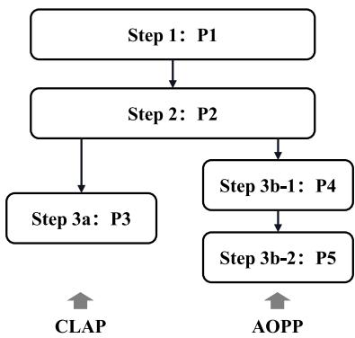  
Fig. 6. Schematic diagram of steps for solving (P1).

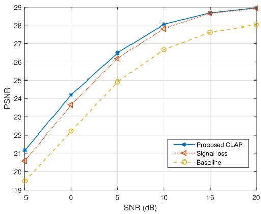  
(a)

which implies that the objective value is non-increasing over iterations. Furthermore, since the objective function $\Delta _ { 4 }$ in (34) is bounded below, the convergence of the proposed AOPP algorithm is established.

The complexity of the iterative algorithm for problem (P5-1) is $\mathcal { \bar { O } } \left( I _ { q } ^ { \operatorname* { m a x } 1 } \left( L ( 2 N ^ { \operatorname* { m a x } } K ) ^ { 3 } + 1 \right) \right)$ regarding the q-th group users, where $\dot { I } _ { q } ^ { \operatorname* { m a x } 1 }$ is the maximum iteration number between power allocation $p _ { n , l , k } ^ { \mathrm { r } } , \ p _ { n , l , k } ^ { \mathrm { i } }$ and power scaling factor $\alpha _ { q }$ . The complexity of the interior method for problem (P5-4) is $\mathcal { O } \left( \left( N + 1 \right) ^ { 3 } \right)$ . Next, the SCA algorithm for UAV position optimization problem (P5-2) is $\mathcal { O } \left( I ^ { \operatorname* { m a x } 2 } \left( N + 1 \right) ^ { 3 } \right)$ where $I ^ { \mathrm { m a x } 2 }$ is the maximum number of position $s _ { \mathrm { S C A } } ^ { \mathrm { v } } ( i )$ updates. Thus the complexity of the proposed AOPP algorithm is $\begin{array} { r l } { ~ } & { { } \mathcal { O } \left( I ^ { \operatorname* { m a x } } \left( \frac { N } { N ^ { \operatorname* { m a x } } } I _ { q } ^ { \operatorname* { m a x } 1 } \left( L ( 2 \dot { N } ^ { \operatorname* { m a x } } K ) ^ { 3 } + 1 \right) + \right. \right. } \end{array}$ $I ^ { \mathrm { m a x } 2 } ( N { + } 1 ) ^ { 3 } ) ,$ , where $I ^ { \mathrm { m a x } }$ is the maximum number of iterations between problems (P5-1) and (P5-2).

In summary, Sec. III and Sec. IV propose the CLAP and AOPP algorithms to solve the problem (P1), respectively. To clarify the procedure of our proposed framework and algorithms, Fig. 6 provides a schematic overview of the overall steps for solving the problem (P1), and the following Table II is further provided to illustrate the complexity and optimization functions of different formulated problems. The problem (P1) involves both SFE and PPC layers and then needs to optimize the codecs Γ and functions $f _ { \mathrm { t } } , \ f _ { \mathrm { r } }$ , and $f _ { \mathrm { v } }$ . Once the codecs Γ are trained under AWGN and fixed positions, (P2) focuses solely on the PPC layer, where the functions $f _ { \mathrm { t } } , \ f _ { \mathrm { r } } ,$ and $f _ { \mathrm { v } }$ need be optimized to adapt different fading channel and different positions of users and UAV. Then, to solve the problem (P2) oriented to the PPC layer, the CLAP and AOPP algorithms are designed, and the problem (P2) are reformulated as the problem (P3) and the problem (P4), respectively. The problem (P5) is another form of (P4), clarifying the optimization variables but not changing the essence of problem.

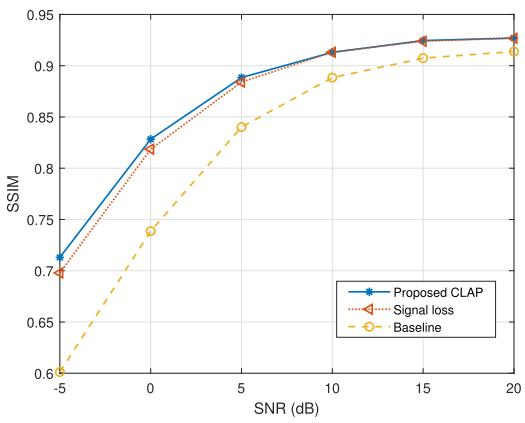  
(b)  
Fig. 7. Average PSNR and SSIM of two users under different training schemes as SNR increases.

## V. SIMULATION RESULTS

In this section, simulation results are exhibited to demonstrate the performance of the proposed LSemCom framework and the CLAP and AOPP algorithms. The simulation parameters and experimental settings are as follows: Users uniformly distributed within a $2 0 0 \times 2 0 0 ~ \mathrm { m ^ { 2 } }$ area at the fixed height $H ^ { \mathrm { u } } ~ = ~ 0$ m perform image transmission based on $K = 6 4$ subcarriers. The UAV BS hovers over the users at the heights ranging from 40 m to 90 m in Fig. 14, while its height is fixed at $H ^ { \mathrm { v } } ~ = ~ 4 0$ m in other figures. Each subcarrier allows two users to access, i.e., $N ^ { \mathrm { m a x } } = 2$ . The transmission power of non-orthogonal users of each group q are limited to $P _ { 2 q - 1 } = 0 . 6 ~ \mathrm { w } , \ P _ { 2 q } = 0 . 4 ~ \mathrm { w }$ . In the first image semantic feature extraction layer for training JSC codecs Γ, the fixed position of the $N ^ { \mathrm { m a x } } \ = \ 2$ users is set to $s _ { 1 } ^ { \mathrm { u } } = [ 8 0 , 8 0 , 0 ]$ and $s _ { 2 } ^ { \mathrm { u } } = [ 1 1 0 , 1 1 0 , 0 ]$ , then the fixed position of the UAV BS is calculated as the power-based weight centroid $s ^ { \mathrm { v } } =$ [92, 92, 40]. Besides, the noise level $\sigma _ { \mathrm { e } } ^ { 2 }$ at the UAV BS is reflected by $\begin{array} { r } { \mathrm { S N R } \ = \ 1 0 \mathrm { l o g } _ { 1 0 } \frac { P _ { 1 } \rho _ { 1 } ^ { \mathrm { f i x } } } { \sigma _ { \mathrm { e } } ^ { 2 } } } \end{array}$ dB. The large-scale path loss is $\rho _ { n } ~ = ~ \beta _ { 0 } d _ { n } ^ { - \mu }$ , where $\bar { \beta _ { 0 } } ~ = ~ - 4 0$ dB is the average channel power gain at distance $d _ { n } = 1 \textrm { m }$ , and $\mu = 2$ is the path loss exponent [33]. It is worth noting that both CLAP and AOPP algorithms require channel gains information at UAV BS side and user side. This differs from current 3GPP feedback procedures [34], which only mandate CSI at BS. The dualside CSI requirement introduces additional uplink feedback overhead in our OFDM-NOMA implementation with 64 subcarriers. Specifically, each UE incurs an extra 256-bit overhead calculated as 4 bits/subcarrier×64 subcarriers = 256 bits, where the 4-bit channel quality indicator (CQI) per subcarrier aligns with 3GPP TS 38.214 specifications [34]. Moreover, the following simulations are based on perfect CSI, and the analysis of imperfect CSI will be conducted in future work by incorporating advanced channel estimation techniques.

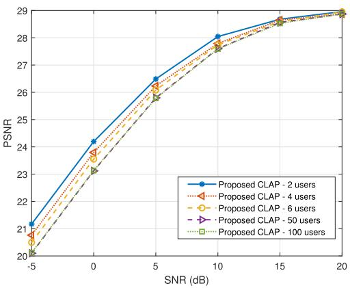  
(a)

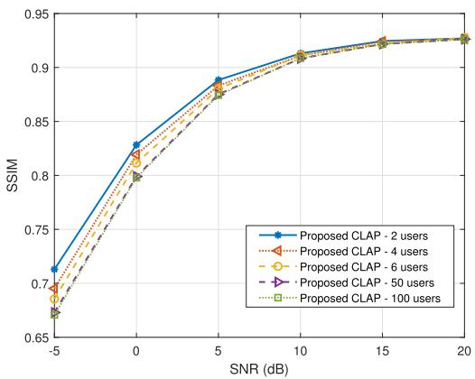  
(b)  
Fig. 8. Average PSNR and SSIM performance of proposed CLAP algorithm under a different number of users and SNR.

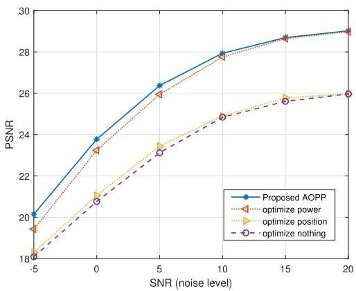  
(a)

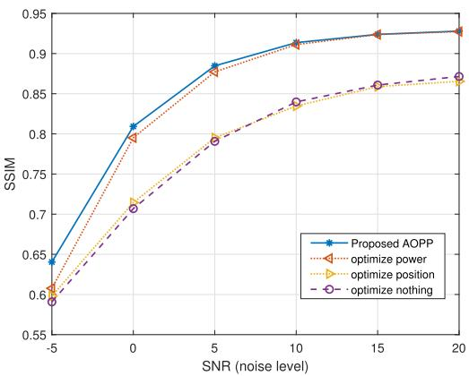  
(b)  
Fig. 9. Average PSNR and SSIM performance of 4 users under different optimization variable blocks of the proposed AOPP algorithm as SNR varies.

The simulations are performed on the Cifar10 dataset [35]. The Adam is employed to perform backpropagation with $\beta _ { 1 } ~ = ~ 0 . 9 , ~ \beta _ { 2 } ~ = ~ 0 . 9 9$ during the training process. PSNR and structural similarity (SSIM) metrics are utilized to measure the image reconstruction performance. PSNR measures the ratio between the maximum possible signal power and the power of distortion, which foucses on pixel-level error. SSIM quantifies the perceptual similarity between the original and reconstructed images through comparing their luminance, contrast, and structural features.

The simulation results under AWGN and Rician fading channels are respectively exhibited as follows to illustrate the performance of the designed LSemCom framework and the proposed CLAP and AOPP algorithms.

## A. Simulation Results Under AWGN Channels

In this subsection, we first exhibit the efficacy of the proposed CLAP algorithm in Figs. 7 and 8 and the performance of the proposed AOPP algorithm in Fig. 9 under AWGN channels. Then Fig. 10 shows the comparative analysis of these two algorithms.

Fig. 7 illustrates the advantages of our proposed CLAP algorithm over other training schemes in terms of average

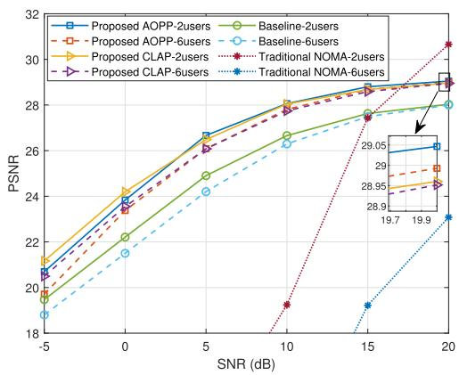  
(a)

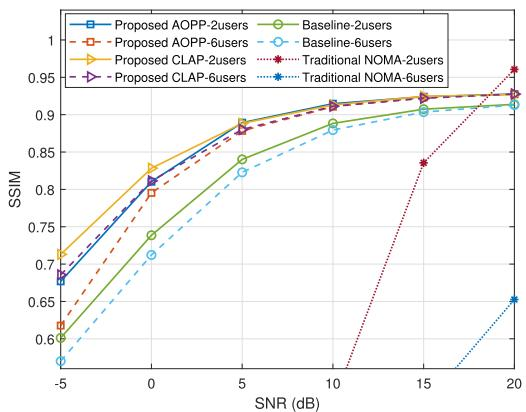  
(b)  
Fig. 10. Performance of the proposed two algorithms varies with the number of users and SNR under AWGN channels.

PSNR and SSIM. The primary cause of signal transmission error, which prevents the direct application of trained codecs Γ, stems from variations in channel coefficients. Thus, enhancing the quality of image reconstructions is possible through optimal signal power allocation. As shown in Fig. 7, signal corrections are achieved by training SSPs $\Omega = [ \theta _ { s } , \phi _ { s } ]$ only with the signal transmission loss function $d ( \mathbf { Y } ^ { \mathrm { f i x } } , \mathbf { Y } ^ { \mathrm { o p t } } )$ (labeled as ‘Signal loss’). The ‘Baseline’ scheme employs a general JSCC framework, which directly trained a set of JSC codecs (with the same structure as the SFE-layer JSC codecs) under dynamic positions and Rician fading channels.

Furthermore, the proposed CLAP algorithm not only focuses on minimizing the loss associated with the main signal transmission, but also reducing the image reconstruction loss $d ( \mathbf { M } , \hat { \mathbf { M } } )$ . It can be seen that the increase in reconstruction loss can further improve the PSNR and SSIM under low SNR. Unlike the loss $d ( \mathbf { Y } ^ { \mathrm { f i x } } , \mathbf { Y } ^ { \mathrm { o p t } } )$ , the PSNR and SSIM are more directly related to the reconstruction loss d(M, Mˆ ). Therefore, in the case of low SNR, the CLAP algorithm improves the noise immunity of end-to-end reconstruction, not just the noise immunity of the signal transmission. While in the case of high SNR, the signal transmission loss is small enough, thus the PSNR and SSIM of the training scheme only with loss $d ( \mathbf { Y } ^ { \mathrm { f i x } } , \mathbf { Y } ^ { \mathrm { o p t } } )$ is similar to the performance of the proposed CLAP scheme. Besides, the training scheme with only the reconstruction loss $d ( \mathbf { M } , \hat { \mathbf { M } } )$ fails to converge, which illustrates that the signal loss is indispensable in guiding the convergence of SSPs training.

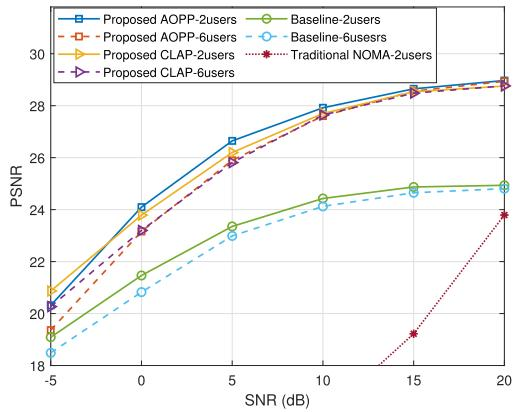  
(a)

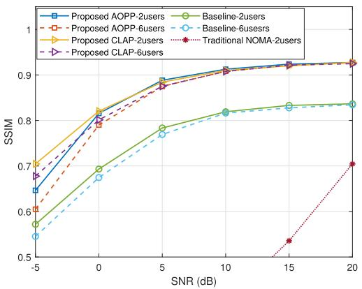  
(b)  
Fig. 11. Performance of the proposed two methods vary with the number of users and SNR under Rician fading factor $K ^ { \mathrm { f } } = 1 0 ~ \mathrm { d B }$

Fig. 8 shows the performance of the proposed CLAP algorithm under different numbers of users and noise levels SNR. The position of UAV BS is defined as the weighted centroid of N users. When the number of users is small, the UAV BS maintains closer distances to the users, enhancing followability. However, as the number of users increases, the average distance of the UAV to all users gradually grows, exacerbating large-scale fading and diminishing channel gains, which in turn impacts image reconstruction quality. When the number of users is large enough, the UAV position approaches the center of the $2 0 0 \times 2 0 0 ~ \mathrm { m ^ { 2 } }$ area. Beyond a certain threshold, the average distance from the UAV to the users stabilizes, preventing further degradation in performance. As evidenced in Fig. 8, the performance curves tend to coincide in the cases of the number of users $N = 5 0$ and $N = 1 0 0$

Fig. 9 illustrates the impact of different optimization variable blocks on image transmission performance of the proposed AOPP algorithm with N = 4 users. As stated in Sec. IV, the proposed AOPP is an alternative iterative algorithm between the position of the UAV and the power of the transmitted and received signals. Compared with the scheme that optimizes nothing, the proposed AOPP algorithm achieves substantial performance by optimizing the two variable blocks, i.e., power and position.

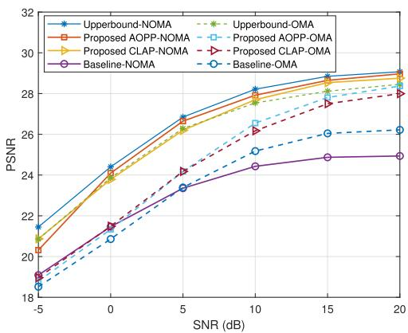  
(a)

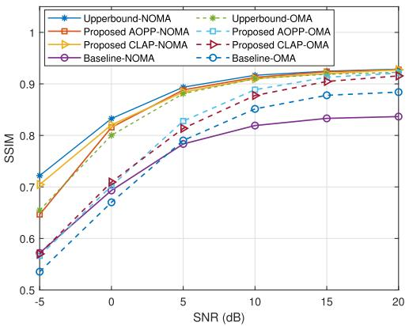  
(b)  
Fig. 12. Performance of the proposed two methods employ to NOMA and OMA vary with SNR under Rician fading factor $K _ { \mathrm { f } } = \bar { 1 0 } \ \mathrm { { d B } }$

Moreover, specific optimizations for these two variable blocks of 4 users are also exhibited in Fig. 9. In the schemes where the position of UAV BS is not optimized, it is defined as the weighted centroid calculated by (15), which is not an optimal position but still an appropriate position. Fig. 9a shows that the PSNR, directly related to mean squared error (MSE), is slightly improved through UAV position optimization. However, the SSIM performs a tiny degradation at higher SNR in Fig. 9b when only optimizing the UAV position, which is due to the fact that the SSIM carries the structural information of the images and is not directly related to MSE. Power allocation optimization allows for more precise signal adjustments, resulting in reduced transmission errors and improved overall performance. Therefore, compared with the UAV position optimization, the power allocation accounts for the main contribution to the performance improvement.

Fig. 10 compares the two proposed CLAP and AOPP algorithms with other schemes for scenarios with $N \ = \ 2$ and $N = 6$ users. The baseline is the same as the baseline scheme in Fig. 7. As shown in Fig. 10a, when $N \ = \ 2 ,$ the PSNR of the CLAP and AOPP algorithms improve the PSNR by an average of 1.44 dB and 1.37 dB, respectively, over the baseline. Both proposed algorithms outperform the baseline, demonstrating the effectiveness of the LSemCom framework. The ‘Traditional NOMA’ represents bit transmission, which is different from semantic signals transmission in other schemes in Fig. 10. Its details refer to the combination of the existing JPEG for image compression and a 3/4 rate Low-Density Parity-Check-Code (LPDC) followed by a 4-QAM digital modulation scheme. After the transmission, the superimposed bit signals of multiple users are received at UAV BS, and then successive interference cancellation (SIC) [36] is employed to decode the bits information of different users. The SIC technology carries the error propagation issue and therefore performs poorly at low SNR. Although the ‘Traditional NOMA’ scheme performs well with two users at high SNR, it is not favored due to its susceptibility to the ‘cliff effect’ [8] and severe performance degradation as the number of users increases.

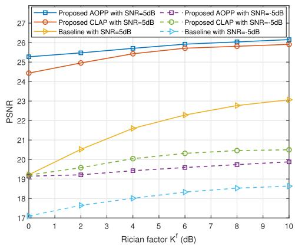  
(a)

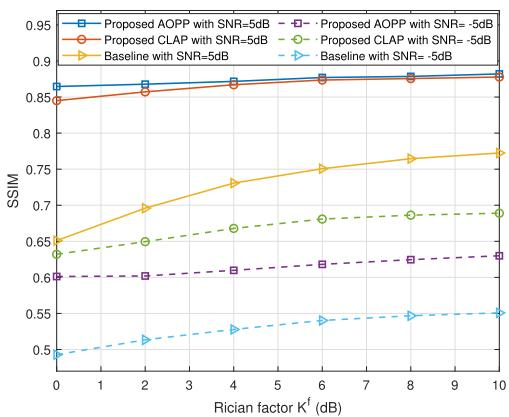  
(b)  
Fig. 13. Performance of two proposed algorithms with four users as Rician factor Kf varies.

As shown in Fig. 10a, the proposed CLAP algorithm exhibits superior noise resistance at low SNR, leading to higher PSNR compared to the AOPP algorithm. It is because that the objective of CLAP has an additional image loss $\begin{array} { r } { \sum _ { n = 1 } ^ { N } \| \hat { \mathbf { M } } _ { n } - \mathbf { M } _ { n } \| _ { 2 } ^ { 2 } } \end{array}$ , which is more directly related to the image reconstruction metrics than the signal loss $\begin{array} { r } { \sum _ { q = 1 } ^ { Q } \| \mathbf { Y } _ { q } ^ { \mathrm { o p t } } - \mathbf { Y } _ { q } ^ { \mathrm { f i x } } \| _ { 2 } ^ { 2 } } \end{array}$ . In other words, the end-to-end reconstruction process of the CLAP algorithm effectively mitigates noise interference. Conversely, at higher SNR, the PSNR of AOPP marginally outperforms the CLAP algorithm. The

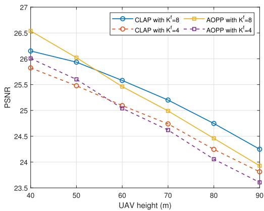  
(a)

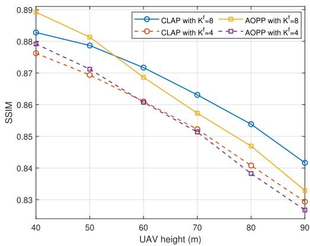  
(b)  
Fig. 14. Performance of the proposed two methods vary with UAV height at SNR = 5 dB.

AOPP algorithm that specifically targets $d ( \mathbf { Y } ^ { \mathrm { f i x } } , \mathbf { Y } ^ { \mathrm { o p t } } )$ as stated in (23) achieves lower signal loss than the CLAP algorithm when the noise level is low. The SSIM of these two proposed algorithms shown in Fig. 10b is almost the same at high SNR. The AOPP algorithm does not have any advantage in measuring SSIM due to the different meanings of metrics.

Overall, although the AOPP algorithm optimizes the UAV position for further signal error minimization, its performance improvement does not match the noise resilience offered by the CLAP algorithm. Fig. 10 also illustrates that it is appropriate and feasible to set the users’ weight centroid to the horizontal position of UAV BS.

## B. Simulation Results Under Rician Fading Channels

This subsection displays the performance of the proposed CLAP and AOPP algorithms under Rician fading channels.

The proposed CLAP and AOPP algorithms for the LSem-Com framework achieve 3.0 dB and 3.1 dB gains, respectively, compared to the baseline scheme w.r.t. PSNR of $N = 2$ users as shown in Fig. 11a. It illustrates that the proposed LSemCom framework possesses higher advantages under Rician fading channels than that under AWGN channels. Besides, the random Rician fading channels pose higher challenges to SIC technology, making interference cancellation impossible and error propagation inevitable. Therefore, the performance of the ‘Traditional NOMA’ scheme suffers break down under Rician fading channels. And its performance when serving $N = 6$ users is so poor that it is not shown in Fig. 11. While traditional NOMA technology falters under these conditions, semanticbased NOMA exhibits remarkable stability, demonstrating the resilience of semantic communications.

Moreover, the performance of the proposed CLAP and AOPP algorithms is analyzed as follows. In comparison, while both Fig. 10 under AWGN and Fig. 11 present similar findings, the CLAP algorithm outperforms AOPP at lower SNR levels. As SNR increases, AOPP begins to show slight advantages. Especially in the case of $N = 2 ,$ , the AOPP algorithm achieves minimal signal loss $d ( \mathbf { Y } ^ { \mathrm { f i x } } , \mathbf { Y } ^ { \mathrm { o p t } } )$ through achieving more desirable UAV position. However, faced with Rician fading channels, the fitting ability of the CLAP’s NN architecture to minimize loss $\mathcal { L } ( \theta _ { s } , \phi _ { s } )$ given in (19) diminishes. Therefore, the PSNR performance of AOPP is higher than the CLAP algorithm when serving N = 2 users, and AOPP possesses a greater advantage under Rician fading channels than that under AWGN channels. When the number of users increases to $N \ = \ 6 ,$ the average distance from UAV BS to each user becomes larger, the signal loss $d ( \mathbf { Y } ^ { \mathrm { f i x } } , \mathbf { Y } ^ { \mathrm { o p t } } )$ cannot be optimized to small enough. The AOPP algorithm no longer occupies the same advantages as the number of users $N = 2$ Thus, the PSNR of AOPP and CLAP algorithms tends to be identical. For the SSIM, the CLAP algorithm shows an absolute advantage at low SNR due to its noise immunity. It is also comparable to the AOPP algorithm at high SNR.

To further demonstrate the effectiveness of the proposed AOPP and CLAP algorithms, the performance of an OMAbased two-user system integrating the proposed algorithms is evaluated, as shown in Fig. 12. It can be observed that ‘Proposed AOPP-OMA’ and ‘Proposed $\mathrm { C L A P  – O M A } ^ { \prime }$ both outperform ‘Baseline-OMA’. Hence, the proposed algorithms can be applied to both NOMA-based and OMA-based systems for better communication quality.

Meanwhile, the NOMA-based systems integrating the proposed algorithms achieve higher performance compared with the OMA-based systems. The underlying reason needs to be analyzed in conjunction with the curves of ‘Upperbound-NOMA/OMA’. ‘Upperbound-NOMA’ and ‘Upperbound-OMA’ are obtained under an ideal case under AWGN channel and fixed user positions. Thus, they represent the performance upper bound of two systems, respectively, which the proposed algorithms are optimized to approach. As ‘Upperbound-NOMA’ surpasses ‘Upperbound-OMA’, ‘Proposed AOPP/CLAP-NOMA’ achieves higher image reconstruction quality than ‘Proposed AOPP/CLAP-OMA’ by targeting a higher goal. This further demonstrates the effectiveness of the proposed LSemCom framework in complex signal processing systems like NOMA.

Furthermore, it can be noticed that ‘Baseline-NOMA’ outperforms ‘Baseline-OMA’ at low SNR while underperforms OMA at high SNR, which is different from that of the systems integrating the proposed algorithms. This is essentially due to the inherent characteristics of NOMA and OMA. It is worth noting that the deep models are trained under a wide range of

SNRs, rather than training individual models for each SNR case. As a result, the models must trade off performance across the entire SNR range. As ‘Baseline-OMA’ is free from handling inter-user interference and only needs to adapt to Rician fading, it achieves better performance at high SNR more readily. These positive feedbacks push the deep model to converge to a point that better adapts to high SNR. In contrast, ‘Baseline-NOMA’ needs to cope with the unneglectable negative effects posed by the combination of inter-user interference and Rician fading, driving the performance to become more flat across the entire SNR range.

Fig. 13 illustrates the PSNR and SSIM with N = 4 users as Rician factor $K ^ { \mathrm { f } }$ varies. $\mathrm { S N R } = - 5$ dB and $\mathrm { S N R } = 5$ dB are chosen to exhibit the superior performance of the proposed algorithms for the LSemCom framework. The Rician factor $K ^ { \bar { \mathrm { f } } }$ represents the ratio of the power associated with the direct component and the scatter components. The sum powers of the direct component and the scatter components under different $K ^ { \mathrm { f } }$ are all set to 1 w. The performance of all schemes is improved as the power of the direct component increases. Under different Rician factors, our proposed two algorithms are both superior to the baseline scheme.

In line with the previous statement regarding Fig. 11, the performance of the CLAP algorithm exhibited in Fig. 13 outperforms the AOPP algorithm at a low SNR = −5 dB. When the SNR grows to 5 dB, the AOPP algorithm performs better. Combined with Fig. 11a, in the case of SNR = 5 dB and $K ^ { \mathrm { f } } = 1 0 ~ \mathrm { d B }$ , the PSNR of the AOPP algorithm exceeds the CLAP algorithm by 0.45 dB, 0.24 dB, and 0.09 dB when the number of users is $N = 2 \AA$ $N = 4 ,$ , and $N = 6 ,$ , respectively. It demonstrates that as the number of users increases, the advantage of AOPP in minimizing signal loss $d ( \mathbf { Y } ^ { \mathrm { { f i x } } }$ , Yopt) gradually degrades. Moreover, it can be seen that the AOPP algorithm exhibits a more gradual variation than that of the CLAP algorithm with changes in the Rician factor $K ^ { \mathrm { f } } .$ , regarding both PSNR and SSIM. This suggests that while AOPP may show limited noise tolerance, it maintains consistent performance across various fading conditions, illustrating its robustness in handling random fading effects.

Fig. 14 shows the PSNR and SSIM as UAV height varies with SNR = 5 dB and $N = 2$ users. As shown in the figure, the image reconstruction quality degrades with increasing height due to the increased path loss, which leads to a reduced SNR at the receiver and exacerbates signal distortion. Meanwhile, the transmission performance improves with stronger LoS path power, i.e., an increase in the Rician factor $K ^ { \mathrm { f } }$ , which aligns with the observations in Fig. 13. Furthermore, Fig. 14 reveals that the AOPP algorithm initially outperforms the CLAP algorithm at lower UAV height, but gradually becomes inferior as UAV height increases. It is because the CLAP algorithm’s superior noise resistance, as discussed in Fig. 11. The SNR reduction caused by increased UAV height amplifies CLAP’s anti-noise advantage.

Overall, both CLAP and AOPP algorithms exhibit comparable performance and consistently surpass the baseline scheme, demonstrating the effectiveness of the proposed LSemCom framework under varying user and UAV positions. Specifically, AOPP performs better at higher SNR and can achieve higher robustness when the Rician factor $K ^ { \mathrm { f } }$ decreases. CLAP algorithm shows significant advantages at low SNR due to its enhanced noise resistance. Moreover, in terms of the computational complexity, the average runtimes of CLAP algorithm and AOPP algorithm on a group of non-orthogonal users’ images are 3.6 ms and 197.0 ms, respectively, based on a system equipped with a 13th Gen Intel(R) Core(TM) i9-13900KF CPU and an NVIDIA GeForce RTX 4090 GPU. CLAP algorithm requires no iterative optimization between variables, resulting in substantially lower computation complexity than AOPP algorithm, and thereby making it more practical for deployment.

## VI. CONCLUSION

In this paper, we focus on the joint optimization of UAV position and semantic signal power allocation for multi-user image transmission semantic communications. A novel LSem-Com framework is proposed to tackle the difficulty of semantic transmission under UAV mobility. The LSemCom framework consists of the SFE layer for image semantic feature extraction and the PPC layer for UAV position optimization combined with semantic signal processing. Furthermore, two algorithms are proposed for the PPC layer. The CLAP algorithm adapts to the UAV-user distance by dynamically calculating the UAV’s hovering position and employing a combined loss function for SSPs training. The AOPP algorithm alternatively optimizes UAV position and semantic signal power allocation to minimize the semantic signal transmission error. Simulation results show that both the two algorithms significantly outperform the conventional end-to-end training scheme by more than 3 dB w.r.t. PSNR. The CLAP algorithm performs better at low SNR and is more noise tolerant, while the AOPP algorithm is more robust and stable in dealing with different Rician fading. The simulations both under AWGN channel and Rician fading channel illustrate that the proposed LSemCom framework possesses superiority in enhancing the robustness and adaptability for UAV data aggregation under semantic communications.

## REFERENCES

[1] J. Zhang et al., “REMT: A real-time end-to-end media data transmission mechanism in UAV-aided networks,” IEEE Netw., vol. 32, no. 5, pp. 118–123, Sep. 2018.

[2] H. Qu, W. Zhang, J. Zhao, Z. Luan, and C. Chang, “Rapid deployment of UAVs based on bandwidth resources in emergency scenarios,” in Proc. Inf. Commun. Technol. Conf. (ICTC), Nanjing, China, May 2020, pp. 86–90.

[3] G. K. Wallace, “The JPEG still picture compression standard,” Commun. ACM, vol. 34, no. 4, pp. 30–44, Apr. 1991.

[4] F. Bellard. BPG Image Format. Accessed: Apr. 21, 2018. [Online]. Available: http://bellard.org/bpg

[5] Y. Fang, G. Bi, Y. L. Guan, and F. C. M. Lau, “A survey on protograph LDPC codes and their applications,” IEEE Commun. Surveys Tuts., vol. 17, no. 4, pp. 1989–2016, 4th Quart., 2015.

[6] I. Tal and A. Vardy, “How to construct polar codes,” IEEE Trans. Inf. Theory, vol. 59, no. 10, pp. 6562–6582, Oct. 2013.

[7] P. Zhang et al., “Toward wisdom-evolutionary and primitive-concise 6G: A new paradigm of semantic communication networks,” Engineering, vol. 8, pp. 60–73, Jan. 2022.

[8] E. Bourtsoulatze, D. Burth Kurka, and D. Gund¨ uz, “Deep joint source-¨ channel coding for wireless image transmission,” IEEE Trans. Cognit. Commun. Netw., vol. 5, no. 3, pp. 567–579, Sep. 2019.

[9] X. Luo, H.-H. Chen, and Q. Guo, “Semantic communications: Overview, open issues, and future research directions,” IEEE Wireless Commun., vol. 29, no. 1, pp. 210–219, Feb. 2022.

[10] W. Yang et al., “Semantic communications for future internet: Fundamentals, applications, and challenges,” IEEE Commun. Surveys Tuts., vol. 25, no. 1, pp. 213–250, 1st Quart., 2023.

[11] X. Peng et al., “A robust deep learning enabled semantic communication system for text,” in Proc. IEEE Global Commun. Conf. (GLOBECOM), Rio de Janeiro, Brazil, Dec. 2022, pp. 2704–2709.

[12] W. Xu, Y. Zhang, F. Wang, Z. Qin, C. Liu, and P. Zhang, “Semantic communication for the Internet of Vehicles: A multiuser cooperative approach,” IEEE Veh. Technol. Mag., vol. 18, no. 1, pp. 100–109, Mar. 2023.

[13] H. Wei, W. Xu, F. Wang, X. Du, T. Zhang, and P. Zhang, “SemAudio: Semantic-aware streaming communications for real-time audio transmission,” in Proc. IEEE Global Commun. Conf. (GLOBE-COM), Rio de Janeiro, Brazil, Dec. 2022, pp. 3965–3970.

[14] J. Hu, F. Wang, W. Xu, H. Gao, and P. Zhang, “Scalable multi-task semantic communication system with feature importance ranking,” in Proc. IEEE Int. Conf. Acoust., Speech Signal Process. (ICASSP), Rhodes Island, Greece, Jun. 2023, pp. 1–5.

[15] Y. Zheng, F. Wang, W. Xu, M. Pan, and P. Zhang, “Semantic communications with explicit semantic base for image transmission,” in Proc. IEEE Global Commun. Conf. (GLOBECOM), Kuala Lumpur, Malaysia, Dec. 2023, pp. 4497–4502.

[16] H. Xie, Z. Qin, G. Y. Li, and B.-H. Juang, “Deep learning enabled semantic communication systems,” IEEE Trans. Signal Process., vol. 69, pp. 2663–2675, 2021.

[17] X. Kang, B. Song, J. Guo, Z. Qin, and F. R. Yu, “Task-oriented image transmission for scene classification in unmanned aerial systems,” IEEE Trans. Commun., vol. 70, no. 8, pp. 5181–5192, Aug. 2022.

[18] Z. Q. Liew, M. Xu, W. Y. B. Lim, Z. Xiong, D. Niyato, and D. I. Kim, “Mechanism design for semantic communication in UAV-assisted metaverse: A combinatorial auction approach,” IEEE Trans. Veh. Technol., vol. 73, no. 2, pp. 2236–2251, Feb. 2024.

[19] J. Kang et al., “Personalized saliency in task-oriented semantic communications: Image transmission and performance analysis,” IEEE J. Sel. Areas Commun., vol. 41, no. 1, pp. 186–201, Jan. 2023.

[20] D. Hu, Q. Zhang, Q. Li, and J. Qin, “Joint position, decoding order, and power allocation optimization in UAV-based NOMA downlink communications,” IEEE Syst. J., vol. 14, no. 2, pp. 2949–2960, Jun. 2020.

[21] L. Lin, W. Xu, W. Chen, F. Wang, G. Li, and M. Pan, “Prioritized delay optimization for NOMA-based multi-UAV emergency networks,” IEEE Trans. Veh. Technol., vol. 71, no. 10, pp. 11222–11227, Oct. 2022.

[22] M. Nikooroo and Z. Becvar, “Optimal positioning of flying base stations and transmission power allocation in NOMA networks,” IEEE Trans Wireless Commun., vol. 21, no. 2, pp. 1319–1334, Feb. 2022.

[23] J. He, R. Mao, Z. Shao, and F. Zhu, “Incremental learning in online scenario,” in Proc. IEEE/CVF Conf. Comput. Vis. Pattern Recognit. (CVPR), Seattle, WA, USA, Jun. 2020, pp. 13926–13935.

[24] Y. Liu et al., “Evolution of NOMA toward next generation multiple access (NGMA) for 6G,” IEEE J. Sel. Areas Commun., vol. 40, no. 4, pp. 1037–1071, Apr. 2022.

[25] W. Li, H. Liang, C. Dong, X. Xu, P. Zhang, and K. Liu, “Non-orthogonal multiple access enhanced multi-user semantic communication,” IEEE Trans. Cogn. Commun. Netw., vol. 9, no. 6, pp. 1438–1453, Dec. 2023.

[26] W. Zhang et al., “DeepMA: End-to-end deep multiple access for wireless image transmission in semantic communication,” IEEE Trans. Cognit. Commun. Netw., vol. 10, no. 2, pp. 387–402, Apr. 2024.

[27] X. Mu, Y. Liu, L. Guo, and N. Al-Dhahir, “Heterogeneous semantic and bit communications: A semi-NOMA scheme,” IEEE J. Sel. Areas Commun., vol. 41, no. 1, pp. 155–169, Jan. 2023.

[28] L. Lin, W. Xu, F. Wang, Y. Zhang, W. Zhang, and P. Zhang, “Channeltransferable semantic communications for multi-user OFDM-NOMA systems,” IEEE Wireless Commun. Lett., vol. 13, no. 3, pp. 721–725, Mar. 2024.

[29] C. You and R. Zhang, “3D trajectory optimization in Rician fading for UAV-enabled data harvesting,” IEEE Trans. Wireless Commun., vol. 18, no. 6, pp. 3192–3207, Jun. 2019.

[30] B. Shang, E. S. Bentley, and L. Liu, “UAV swarm-enabled aerial reconfigurable intelligent surface: Modeling, analysis, and optimization,” IEEE Trans. Commun., vol. 71, no. 6, pp. 3621–3636, Jun. 2023.

[31] J. Xu, B. Ai, W. Chen, A. Yang, P. Sun, and M. Rodrigues, “Wireless image transmission using deep source channel coding with attention modules,” IEEE Trans. Circuits Syst. Video Technol., vol. 32, no. 4, pp. 2315–2328, Apr. 2022.

[32] S. Boyd, S. P. Boyd, and L. Vandenberghe, Convex Optimization. Cambridge, U.K.: Cambridge Univ. Press, 2004.

[33] R. Duan, J. Wang, C. Jiang, H. Yao, Y. Ren, and Y. Qian, “Resource allocation for multi-UAV aided IoT NOMA uplink transmission systems,” IEEE Internet Things J., vol. 6, no. 4, pp. 7025–7037, Aug. 2019.

[34] 3GPP, 5G; NR; Physical Layer Procedures for Data, 3rd Generation Partnership Project (3GPP), document Technical Specification (TS) 38.214, Jul. 2020, Version 16.2.0. [Online]. Available: https://portal.3gpp.org/desktopmodules/Specifications/ SpecificationDetails.aspx?specificationId=3216

[35] A. Krizhevsky and G. Hinton, “Learning multiple layers of features from tiny images,” Univ. Toronto, Toronto, ON, Canada, Tech. Rep., 2009.

[36] K. Higuchi and A. Benjebbour, “Non-orthogonal multiple access (NOMA) with successive interference cancellation for future radio access,” IEICE Trans. Commun., vol. 98, no. 3, pp. 403–414, Mar. 2015.

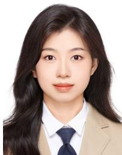

Lan Lin received the B.S. and Ph.D. degrees from Beijing University of Posts and Telecommunications, Beijing, China, in 2019 and 2024, respectively. She is currently with the Department of Wireless and Terminal Technology, China Mobile Research Institute, Beijing. Her research interests include AI-driven wireless communications and networks, semantic communications, non-orthogonal multiple access, and UAV communications and networks.

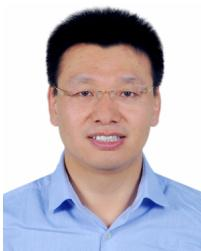

Wenjun Xu (Senior Member, IEEE) received the B.S. and Ph.D. degrees from Beijing University of Posts and Telecommunications (BUPT), Beijing, China, in 2003 and 2008, respectively. He is currently a Professor and a Ph.D. Supervisor with the School of Artificial Intelligence, State Key Laboratory of Network and Switching Technology, BUPT. His research interests include AI-driven networks, semantic communications, UAV communications and networks, and green communications/networking. He is an Editor of China Communications.

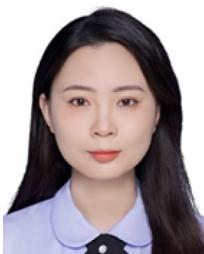

Yimeng Zhang received the B.Eng. degree in communication engineering and the Ph.D. degree in information and communication engineering from Beijing University of Posts and Telecommunications, Beijing, China, in 2018 and 2024, respectively. She is currently with China Mobile Research Institute. Her current research interests include semantic communications and intelligent wireless communications.

  
Xin Yuan (Senior Member, IEEE) received the Ph.D. degree in communication engineering from Beijing University of Posts and Telecommunications (BUPT), China, in 2019. Her research interests include wireless federated learning, distributed computing, and privacy-preserving.

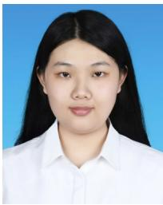

Jinglin Zhang received the B.S. and Ph.D. degrees in communication engineering from Beijing University of Posts and Telecommunications, Beijing, China, in 2017 and 2024, respectively. Her research interests include massive MIMO and mmWave MIMO communications, and AI-driven communications and networks. She was a recipient of the Best Paper Award from IEEE ICC 2019.

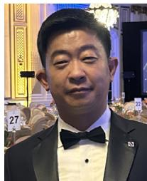

Zhu Han (Fellow, IEEE) received the B.S. degree in electronic engineering from Tsinghua University in 1997 and the M.S. and Ph.D. degrees in electrical and computer engineering from the University of Maryland, College Park, MD, USA, in 1999 and 2003, respectively.

From 2000 to 2002, he was an Research and Development Engineer of JDSU, Germantown, MD, USA. From 2003 to 2006, he was a Research Associate with the University of Maryland. From 2006 to 2008, he was an Assistant Professor with Boise

State University, Boise, ID, USA. Currently, he is a John and Rebecca Moores Professor with the Electrical and Computer Engineering Department as well as the Computer Science Department,University of Houston, Houston, TX, USA.

His main research targets on the novel game-theory related concepts critical to enabling efficient and distributive use of wireless networks with limited resources. His other research interests include wireless resource allocation and management, wireless communications and networking, quantum computing, data science, smart grid, carbon neutralization, and security and privacy. He has been an AAAS Fellow since 2019 and an ACM Fellow since 2024. He received an NSF Career Award in 2010, the Fred W. Ellersick Prize of the IEEE Communication Society in 2011, the EURASIP Best Paper Award for the Journal on Advances in Signal Processing in 2015, the IEEE Leonard G. Abraham Prize in the field of Communications Systems (Best Paper Award in IEEE JOURNAL ON SELECTED AREAS IN COMMUNICATIONS) in 2016, the IEEE Vehicular Technology Society 2022 Best Land Transportation Paper Award, and several best paper awards in IEEE conferences. He is also the Winner of the 2021 IEEE Kiyo Tomiyasu Award (an IEEE Field Award), for outstanding early to mid-career contributions to technologies holding the promise of innovative applications, with the following citation: “for contributions to game theory and distributed management of autonomous communication networks.” Since 2017, he has been a 1% Highly Cited Researcher according to Web of Science. He was an IEEE Communications Society Distinguished Lecturer from 2015 to 2018 and an ACM Distinguished Speaker from 2022 to 2025.

Ping Zhang (Fellow, IEEE) received the Ph.D. degree from Beijing University of Posts and Telecommunications (BUPT) in 1990. He is currently a Professor with the School of Information and Communication Engineering, BUPT, the Director of the State Key Laboratory of Networking and Switching Technology, a member of the IMT-2020 (5G) Experts Panel, and a member of the Experts Panel for China’s 6G development. He is an Academician of the Chinese Academy of Engineering (CAE). He was the Chief Scientist of the National

Basic Research Program (973 Program) and an Expert with the Information Technology Division of National High-Tech Research and Development Program (863 Program). His research interests include the board area of wireless communications. He is a member of the Consultant Committee on International Cooperation of the National Natural Science Foundation of China.