# Semantic Successive Refinement: A Generative AI-Aided Semantic Communication Framework

Kexin Zhang, Student Member, IEEE, Lixin Li , Member, IEEE, Wensheng Lin , Member, IEEE, Yuna Yan , Student Member, IEEE, Rui Li, Wenchi Cheng , Senior Member, IEEE, and Zhu Han , Fellow, IEEE

Abstract—Semantic Communication (SC) is an emerging technology aiming to surpass the Shannon limit. Traditional SC strategies often minimize signal distortion between the original and reconstructed data, neglecting perceptual quality, especially in low Signal-to-Noise Ratio (SNR) environments. To address this issue, we introduce a novel Generative AI Semantic Communication (GSC) system for single-user scenarios. This system leverages deep generative models to establish a new paradigm in SC. Specifically, At the transmitter end, it employs a joint source-channel coding mechanism based on the Swin Transformer for efficient semantic feature extraction and compression. At the receiver end, an advanced Diffusion Model (DM) reconstructs high-quality images from degraded signals, enhancing perceptual details. Additionally, we present a Multi-User Generative Semantic Communication (MU-GSC) system utilizing an asynchronous processing model. This model effectively manages multiple user requests and optimally utilizes system resources for parallel processing. Simulation results on public datasets demonstrate that our generative AI semantic communication systems achieve superior transmission efficiency and enhanced communication content quality across various channel conditions. Compared to CNN-based DeepJSCC, our methods improve the Peak Signal-to-Noise Ratio (PSNR) by 17.75% in Additive White Gaussian Noise (AWGN) channels and by 20.84% in Rayleigh channels.

Received 30 June 2024; revised 14 November 2024; accepted 31 December 2024. Date of publication 7 January 2025; date of current version 9 April 2025. This work was supported in part by National Natural Science Foundation of China under Grants 62001387 and 62101450, in part by the Young Elite Scientists Sponsorship Program by the China Association for Science and Technology under Grant 2022QNRC001, in part by Aeronautical Science Foundation of China under Grants 2022Z021053001 and 2023Z071053007, in part by Shanghai Academy of Spaceflight Technology under Grant SAST2022-052, in part by NSF CNS-2107216, CNS-2128368, CMMI-2222810, ECCS-2302469, US Department of Transportation, Toyota and Amazon. The associate editor coordinating the review of this article and approving it for publication was X. Wang. (Corresponding authors: Lixin Li; Wensheng Lin.)

Kexin Zhang, Lixin Li, Wensheng Lin, and Yuna Yan are with the School of Electronics and Information, Northwestern Polytechnical University, Xi’an 710129, China (e-mail: cocozhang@mail.nwpu.edu.cn; lilixin@nwpu.edu.cn; linwest@nwpu.edu.cn; yanyuna@mail.nwpu.edu.cn).

Rui Li is with Samsung AI Center, CB1 2JH Cambridge, U.K., and also with the School of informatics, The University of Edinburgh, EH8 9AB Edinburgh, U.K. (e-mail: rui.li@samsung.com).

Wenchi Cheng is with the State Key Laboratory of Integrated Services Networks, Xidian University, Xi’an 710071, China (e-mail: wccheng@ xidian.edu.cn).

Zhu Han is with the Department of Electrical and Computer Engineering, University of Houston, Houston, TX 77004 USA, and also with the Department of Computer Science and Engineering, Kyung Hee University, Seoul 446-701, South Korea (e-mail: hanzhu22@gmail.com).

Digital Object Identifier 10.1109/TCCN.2025.3526839

Index Terms—Generative AI, semantic communication, multiuser system, swin transformer, diffusion model.

# I. INTRODUCTION

W ITH the rapid growth of wireless communication tech-nology, data traffic and mobile device connectivity is nology，data traffic and mobile device connectivity is increasing exponentially. Semantic Communications (SC) is playing a pivotal role in this progress [1]. Unlike traditional communication methods that focus on transmitting binary bits, SC emphasizes the context of the information [2], [3]. Recent advancements further highlight SC’s potential. For instance, the semantic interference cancelation (SemantIC) technique enhances information quality by iteratively eliminating noise in both the signal and semantic domains without additional channel resource costs [4]. Similarly, the Semantic-Forward (SF) relaying framework improves network robustness and reduces forwarding payload by extracting and transmitting semantic features, even under adverse channel conditions [5].

Simultaneously, the rapid advancement of generative Artificial Intelligence (AI) models and the widespread adoption of technologies such as ChatGPT, Imagen, Midjourney, and DALL-E have prompted the B5G and 6G communities to synergize with these cutting-edge generative AI technologies. This paradigm shift is particularly beneficial for the vast amount of multimedia content generated by these applications, such as images and videos. Typically, AI models run on powerful cloud servers due to their high computational demands. However, with the growing prevalence of mobile devices, AI companies strive to provide high-quality AI-Generated Content (AIGC) services accessible from anywhere [6], [7]. These innovations lay a solid foundation for further integrating generative AI with SC, which can significantly boost network performance.

By considering the context of the generated content, SC can effectively leverage these advanced generative AI models to enhance overall system performance. For example, consider a user playing an online game on their VR/AR device at home, entering a new virtual scene rendered by a Diffusion Model (DM) in the cloud. The scene is represented by information bits communicated to the VR/AR glasses via mobile networks. A generative AI-aware semantic communication network can utilize the fact that DM generates this content and transmits the latent representation of the content while performing the stable diffusion process on the receiver’s end. In this scenario, the semantic communication network focuses on conveying the meaning (latent representations) of the generative AI content rather than optimizing solely the delivery of the 0s and 1s. This approach allows for quality service metrics that align more closely with human visual perception than traditional bit-wise metrics.

However, directly combining semantic communication with generative AI in fixed structures is inefficient due to the inability to adjust semantic density. In this context, deploying DM in the decoder offers a promising solution to accurately recover the image context. Toward this end, we exploit the potential of the generative model and propose a novel generative AI semantic communication system, which aims to incorporate the robust, stable diffusion algorithm into the semantic decoding process as an initial step towards a fully collaborative generative AI semantic communication system. The main contributions of this paper are as follows:

• To significantly enhance the efficiency and reliability of semantic communication systems in the era of generative AI, we propose a single-user Generative AI Semantic Communication (GSC) system powered by AI-generated content. Specifically, the Base Station (BS) encodes images using a joint source-channel coder based on the Swin Transformer. A diffusion model network is integrated at the receiver end to facilitate rich semantic reconstruction during wireless image transmission.   
• Existing research on semantic communication has predominantly focused on single-user scenarios. A key challenge in multi-user communication is effectively managing the simultaneous transmission and reception of semantic data from different users, particularly in resource-constrained environments. To address this, we scale semantic communication to multi-user scenarios, and this system incorporates asynchronous concurrent processing, task parallel processing, and caching mechanisms to optimize communication efficiency and maintain quality across multiple users.   
Classical diffusion models excel in image synthesis, but they require numerous iterative steps to estimate feature mappings, making them inefficient for direct use in communication systems. To address this concern, we use the strong distribution mapping abilities of diffusion models to guide semantic recovery at the decoding end by estimating a compact conditional vector. This approach significantly advances the connection between semantic communication and cutting-edge generative models, improving the end-to-end perceptual performance of wireless communication systems.   
• Simulation experiments were conducted on public datasets. The results demonstrate that our proposed generative AI semantic communication system surpasses the benchmark communication system in data integrity and communication reliability. Additionally, the simulation results confirm that our designed multi-user communication system efficiently handles requests from multiple users, showcasing excellent performance and scalability.

This paper is structured as follows. Section II provides a concise overview of related literature. Section III provides a more detailed explanation of our system model. Following that, Section IV presents the simulation results and analysis of the proposed model. Finally, Section V summarizes the paper.

# II. RELATED WORKS

Semantic communication systems generally consist of three fundamental components: the semantic encoder at the transmitter, the channel, and the semantic decoder at the receiver. At the transmitter, the semantic encoder extracts key semantic features from the original data and compresses them into low-dimensional representations optimized for wireless transmission. The channel models the wireless environment, accounting for potential noise and interference that may degrade the signal. At the receiver, the semantic decoder reconstructs the original data by decoding the received semantic symbols to maintain high-quality data representation.

Transmitting image-based semantic information demands significantly more communication resources compared to textbased data. Consequently, this section focuses on Image Semantic Communication (ISC), which can be divided into two main directions: semantic-oriented and task-oriented communication. The challenge of semantic-oriented communication lies in extracting and recovering semantics before and after transmission. In contrast, task-oriented communication focuses on completing specific tasks rather than accurately recovering all semantic information. The relevant works for these paradigms are outlined below.

# A. Image Semantic Communication

Deep Joint Source-Channel Coding (DeepJSCC) [8] is a pioneering study in wireless image transmission. This technique simplifies the code design process by integrating source and channel coding into a single mapping and eliminating the need for constellation diagrams used in digital schemes. Building on this foundation, the studies in [9], [10], [11] extended DeepJSCC to various channel conditions. Yang and Kim [10] proposed an adaptive wireless image transmission scheme that dynamically adjusts the transmission rate according to the current channel state and image complexity. Xu et al. [11] introduced a joint source-channel coding method incorporating an attention mechanism (ADJSCC). This framework adapts to noise by dynamically adjusting the number of bits allocated to the channel and source coder to maintain transmission reliability in real-world environments. However, these approaches primarily focus on the distortion of the reconstructed signal at the receiver relative to the source at the transmitter without adequately considering the perceptual quality of the reconstructed image, which may lead to significant perceptual distortion under extreme conditions such as low bandwidth and low Signal-to-Noise Ratio (SNR).

To address this, Kurka and Gündüz [12] proposed DeepJSCC-f, which employs a feedback mechanism that allows the system to acquire real-time channel noise information and mitigate its effects by feeding the received signal back to the transmitter. However, this method assumes that any complex value can be transmitted over the channel, which may hinder the application of these algorithms in scenarios where the hardware or protocol only accepts certain sets of channel inputs (e.g., digital constellations). Additionally, the semantic communication systems proposed in [13], [14], [15], [16] are designed for receivers with powerful computational capabilities, enabling large-scale deep learning networks and single-user communication scenarios. Among them, Zhang et al. [13] developed a system that adaptively identifies and transmits task-specific key semantic features in a changing environment. Yang et al. [14] proposed the WITT framework to enhance CNN performance by introducing a spatial modulation module, which adjusts the scale of potential representation based on channel state information, improving the model’s adaptability to different channel conditions. Yu et al. [15] extended the semantic communication system to bi-directional communication for IoT devices with limited capacity, significantly reducing training overheads by eliminating the need for information feedback and model migration. Nguyen et al. [16] proposed a system that adapts to different computational capabilities by dynamically adjusting the transmission length of the output from the channel coder, combined with hybrid loss optimization, to achieve highquality image reconstruction and avoid network congestion.

Task-oriented approaches optimize resource utilization by delivering information according to specific task requirements. Kadam and Kim [17] designed a keyword-based SC system for transmitting and sharing knowledge recovery data for a specific Data Allocation Problem (DAP) to enhance efficiency and accuracy. Xie et al. [18] developed a multi-user system supporting two unimodal tasks (image retrieval and machine translation) and one multimodal task (a visual quiz combining text and images). Kang et al. [19] created a framework that enables users to retrieve image-related semantic information via text queries. However, this approach fails to fully consider the dynamic changes in the importance of semantic information, which can lead to information loss in resource competition. In [20], researchers employed a course-learning strategy to minimize the length of transmitted messages, aiming to improve communication efficiency for specific tasks.

To address the issue of limited resource blocks from BS to individual users, Wang et al. [21] utilized a reinforcement learning algorithm based on an attention mechanism to prioritize the transmission of the most informative triples during resource allocation. Thomas and Saad [22] emphasized the reasoning capabilities required by both the transmitter and receiver, employing a Generative Flow Network (GFlowNet) to achieve causal reasoning for bursty semantic communication with minimal data. Yoo et al. [23] demonstrated the feasibility of ISC in real-time wireless communication using Field Programmable Gate Array (FPGA) as a hardware platform, comparing its performance with conventional 256 Quadrature Amplitude Modulation (QAM) and showing superior application potential. However, their results were only validated in a simulation environment.

# B. Generative AI Semantic Communication

Generative AI revolutionizes visual computing by allowing users to programmatically create or modify realistic, high-quality images, videos, and 3D models. Neural networkdriven generative models, such as Variational Autoencoders (VAEs), Generative Adversarial Networks (GANs), and Diffusion Models (DMs), have shown exceptional capabilities in generating high-quality data. This highlights their significant potential for application in joint source-channel coding.

Choi et al. [24] was the first to implement a Joint Source-Channel Coding (JSCC) scheme over binary channels using a discrete VAE. Subsequently, Hu et al. [25] employed an adversarial training approach and introduced the Masked Variational Quantized Variational Autoencoder (MVQ-VAE) to enhance the system’s robustness to various noise types. Paper [26] developed an innovative architecture for DeepJSCC that is data-driven and enhanced by adversarial training, with the combined goal of maximizing the reconstruction quality for legitimate receivers while minimizing adversarial losses. Yang et al. [27] combined an autoencoder with Orthogonal Frequency Division Multiplexing (OFDM), using a GANinspired loss function to efficiently train a robust decoder against the effects of multipath fading. The approach described in [28] significantly reduces bandwidth requirements by performing semantic segmentation at the transmitter’s end to extract semantic information from an image and using GAN for image reconstruction at the receiver’s end. However, this reconstruction process may introduce subtle differences between the generated image and the original scene. To this end, Erdemir et al. [29] proposed two schemes: InverseJSCC, which addresses the inverse problem of DeepJSCC, and GenerativeJSCC, an end-to-end optimization scheme based on GANs that can reconstruct perceptual quality under extremely adverse channel conditions like never before.

Recent advancements in DMs have established new benchmarks in density estimation and sample quality, surpassing other generative models. Parametric Markov chains enhance the variational lower bound of the likelihood function, thereby enabling samples to represent the target distribution [30] more accurately. DMs iteratively refine these samples through a methodical denoising process until the desired output is achieved. Niu et al. [31] introduced a strategy based on DeepJSCC, their method initially adds independent Gaussian noise to the input image and then applies a diffusion process to introduce additional information components during decoding. In contrast, other studies [32], [33] utilize the denoising capabilities of DMs to help the receiver mitigate noise interference in the channel or semantic vectors. Furthermore, [34] addresses the communication problem as an inverse problem and proposes a generative AI semantic communication framework that resolves the denoising or colouring issues in the low-dimensional latent representations of samples. Chen et al. [35] proposed CommIN, an innovative framework that combines an Invertible Neural Network (INN) with a DM to model channel characteristics and degradation phenomena introduced by DeepJSCC. Grassucci et al. [36] developed a generative AI semantic communication framework that enhances the quality of inferred images by incorporating semantic chunks for rapid denoising.

Despite the advancements in DMs, they still need practical challenges, such as large network sizes and the iterative nature of the process, which complicates training with limited computational resources. Meanwhile, semantic communication systems encounter additional challenges: first, signal noise during transmission significantly interferes with semantic information, particularly under low SNR conditions, where traditional methods fail to ensure high-quality semantic recovery. Second, existing approaches are often limited to single-user scenarios and lack scalability in multi-user environments. To address these issues, we designed a system focused on semantic-oriented communication, which is particularly beneficial for preserving data integrity and visual fidelity.

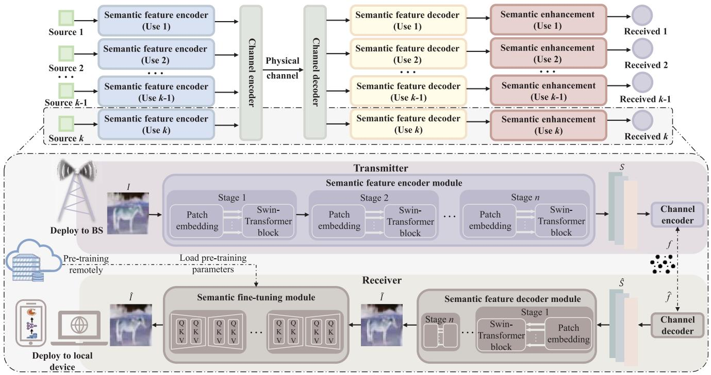

<details>
<summary>flowchart</summary>

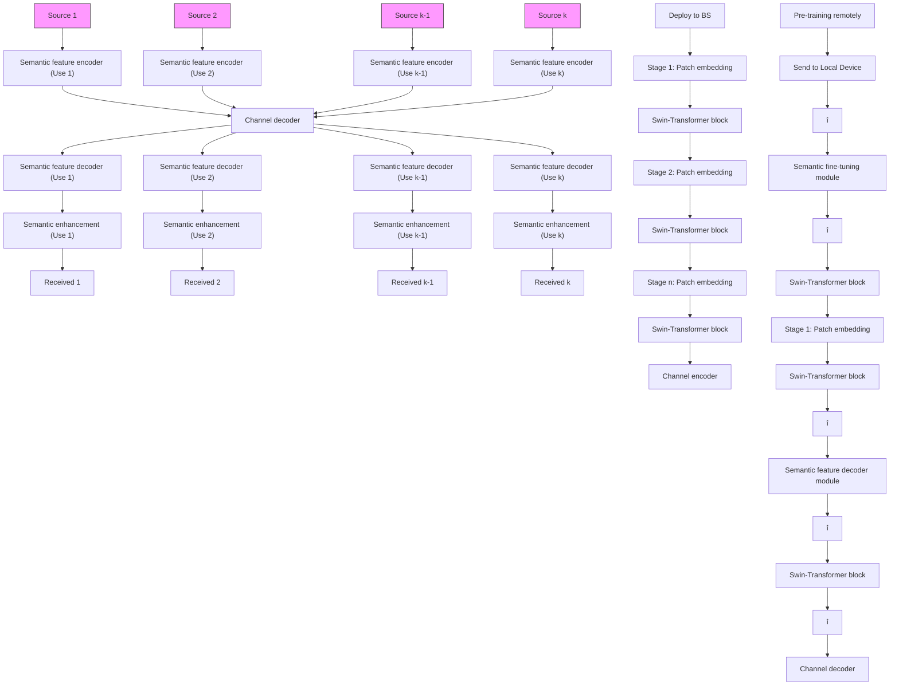
</details>

Fig. 1. The overview of the proposed generative AI semantic communication system.

# III. PROPOSED METHOD

Considering downlink transmission scenarios, this section describes the proposed semantic communication model.

Fig. 1 illustrates the general framework of the proposed approach, which comprises four modules: the semantic feature encoder module, the physical wireless channel module, the semantic feature decoder module, and the semantic finetuning module. Specifically, the system leverages the Swin Transformer encoder to improve the efficiency of semantic feature extraction and compression, enabling the transmitter to generate low-dimensional semantic symbols suitable for wireless transmission. To mitigate the impact of channel noise on semantic information, a Diffusion Model is introduced at the receiver, which, with its powerful noise processing and reconstruction capabilities, effectively restores high-quality semantic information under low SNR conditions. Additionally, to address resource utilization in multi-user scenarios, the proposed GSC system has been extended to a Multi-User Generative Semantic Communication system (MU-GSC).

# A. Semantic Feature Encoder Module

The BS usually consists of two components in semantic communication systems: a semantic feature encoder and a channel coder. The semantic feature encoder, also known as the source encoder, mines information and extracts features from the images based on the knowledge base. Let I be the transmitted image source and S be the extracted semantic symbols. The mathematical description is as follows:

$$
S = \boldsymbol {E} (I; \varphi_ {\alpha}), I \in \mathbb {R} ^ {n}, \tag {1}
$$

where E(·) denotes the semantic coder network, $\varphi _ { \alpha }$ is the parameter set of the corresponding coding network, and n is the dimension of the input images.

In a semantic communication system, the edge server is responsible for training the local model, and the training process requires the encoder and decoder to be coupled alternately and in an end-to-end manner. Here, the semantic encoder is first modeled, and the semantic decoder follows the reverse architecture of the encoder.

The codec network in this paper is constructed based on the state-of-the-art visual Swin Transformer [37]. On the transmitter, given a set of image sets $\pmb { I } = \{ I _ { i } \} _ { i = 1 } ^ { N }$ , where $I _ { i } \in$ $\mathbb { R } ^ { 3 \times H \times W }$ denotes the i-th image, N denotes the size of the image set, H and W denote the height and width of the images, respectively. The patch size is $4 \times 4 ,$ , which is partitioned into non-overlapping patches $\begin{array} { r } { s = \frac { H } { 4 } \times \frac { W } { 4 } } \end{array}$ W by the patch partition 4 module. Then, we perform a linear embedding by arranging these tokens in a sequence $( I _ { 1 } , I _ { 2 } , \ldots , I _ { s } )$ from the top left to the bottom right, which projects the tokens into an embedding representation $\textstyle ( { \frac { H } { 4 } } , { \frac { W } { 4 } } , { \bar { C } } )$ of arbitrary dimension C. After the patch embedding, the s tokens are then input into the Swin Transformer block. This process is called “stage 1”.

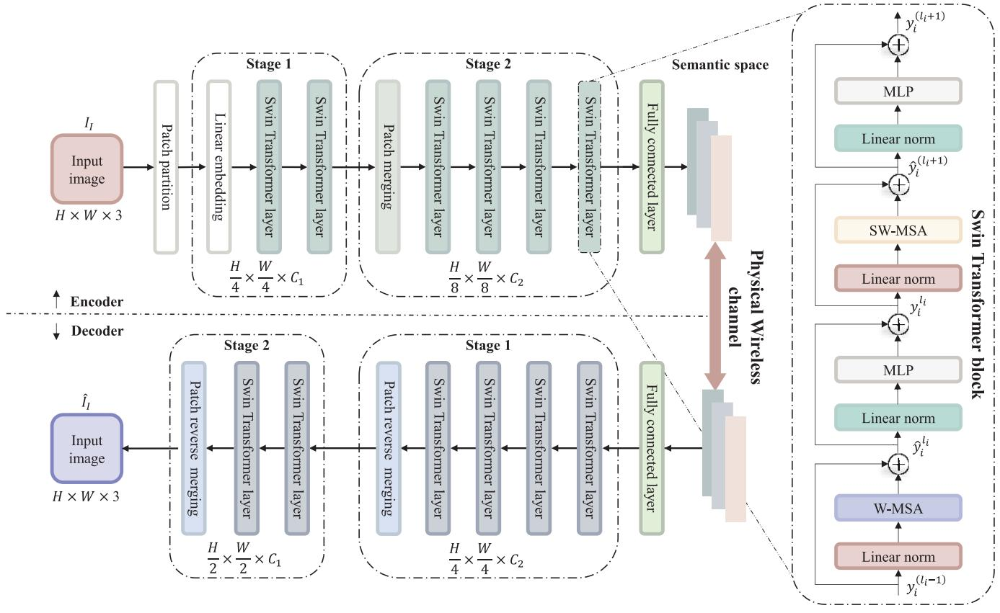

<details>
<summary>flowchart</summary>

```mermaid
graph TD
    A["Input image H × W × 3"] --> B["Patch partition"]
    B --> C["Linear embedding"]
    C --> D["Swin Transformer layer"]
    D --> E["Swin Transformer layer"]
    E --> F["Patch merging"]
    F --> G["Swin Transformer layer"]
    G --> H["Swin Transformer layer"]
    H --> I["Swin Transformer layer"]
    I --> J["Fully connected layer"]
    J --> K["Semantic space"]
    K --> L["MLP"]
    L --> M["Linear norm"]
    M --> N["ŷi^(li+1)"]
    N --> O["+"]
    O --> P["SW-MSA"]
    P --> Q["Linear norm"]
    Q --> R["yi^li"]
    R --> S["+"]
    S --> T["MLP"]
    T --> U["Linear norm"]
    U --> V["ŷi^li"]
    V --> W["W-MSA"]
    W --> X["Linear norm"]
    X --> Y["yi^(li-1)"]
    
    subgraph Stage 1
        B
        C
        D
        E
        F
        G
        H
        I
        J
    end
    
    subgraph Stage 2
        C
        D
        E
        F
        G
        H
        I
        J
    end
    
    subgraph Physical Wireless Channel
        K
        L
        M
        N
        O
        P
        Q
        R
        S
        T
        U
        V
        W
        X
    end
    
    subgraph Encoder
        B
        C
        D
        E
        F
        G
        H
    end
    
    subgraph Decoder
        I
        J
        K
        L
        M
        N
        O
        P
        Q
        R
        S
        T
    end
    
    style Input_image fill:#f9f,stroke:#333
    style Decoder fill:#bbf,stroke:#333
    
    note right of K: Physical Wireless Channel with physical wireless channel channels (e.g., h/4 × w/4 × c1)
```
</details>

Fig. 2. The architectures of the semantic communication network based on Swin Transformer.

From Fig. 2, it can be seen that the first patch merging layer and the Swin Transformer block are merged into “stage 2”. The patch merge layer splices each group of neighboring patches of size $2 \times 2$ so that the number of patch tokens becomes 1/4 of the original one, i.e., $\frac { H } { 8 } \times \frac { W } { 8 }$ W 8 . At the same time, the dimension of the patch token is expanded by a factor of 4, i.e., 4C. In order to reduce the output dimension and realize the downsampling of the feature map, the patch merging layer then performs the fully connected operation. After this process, the dimension of the concatenated feature patch is reduced 2C from 4C. Then, the patch is feature transformed by the Swbecomes $( { \frac { H } { 8 } } , { \frac { W } { 8 } } , C )$ mer block. Finally, the output dimension. Considering the computational power of the hardware and the uncertainty of the input graph, here the semantic decoder contains a two-stage Swin Transformer architecture, and in general, high-resolution images require more stages.

The Swin Transformer module is a sequence-to-sequence function that consists of multiple Swin Transformer layers space. The right side of Fig. 2 shows the structure of the Swin Transformer layers. Each layer consists of a window polytope layer and a moving window polytope layer. Since the two sub-layers have the same dimensions of inputs and outputs, they are sequentially connected of the two sub-layers. The use of the shifted-window partitioning approach can significantly enhance the modeling capability. The successive Swin Transformer blocks $l _ { i }$ layer and $l _ { i } + 1$ layer for “stage $i ^ { \flat }$ are computed as:

$$
\hat {y} _ {i} ^ {l _ {i}} = \mathrm{W} - M S A \left(\mathrm{LN} \left(y _ {i} ^ {l _ {i} - 1}\right)\right) + y _ {i} ^ {l _ {i} - 1},
$$

$$
y _ {i} ^ {l _ {i}} = \mathrm{MLP} \left(\mathrm{LN} \left(\hat {y} _ {i} ^ {l _ {i}}\right)\right) + \hat {y} _ {i} ^ {l _ {i}},
$$

$$
\hat {y} _ {i} ^ {l _ {i} + 1} = \mathrm{SW} - M S A \left(\mathrm{LN} \left(y _ {i} ^ {l _ {i}}\right)\right) + y _ {i} ^ {l _ {i}},
$$

$$
y _ {i} ^ {l _ {i} + 1} = \mathrm{MLP} \left(\mathrm{LN} \left(\hat {y} _ {i} ^ {l _ {i} + 1}\right)\right) + \hat {y} _ {i} ^ {l _ {i} + 1}, \tag {2}
$$

Here, the MLP has two layers, the Window-based Multi-head Self-Attention (W-MSA) and the Shifted Windows Multihead Self-Attention (SW-MSA) are multi-head self-concerned modules with regular and shifted window configurations. LN denotes the layer normalization operation. $\hat { y } _ { i } ^ { l _ { i } }$ and $y _ { i } ^ { l _ { i } }$ represent the output characteristics of the (S)W-MSA module and MLP module of module li at “stage i”, respectively.

In order to protect the transmitted symbols from channel noise and interference in the wireless environment, the output will S be further converted in the channel coder into a complex bit stream (vector) suitable for transmission over the physical channel. Here a non-trainable fully connected layer is used for simulation:

$$
f = \boldsymbol {C} (S; \varphi_ {\beta}) = \boldsymbol {W} _ {n} S + b _ {n}, f \in \mathbb {R} ^ {k}, \tag {3}
$$

where C(·) is the channel coder with parameter set $\varphi _ { \beta }$ and k is the length of f. The weight matrix $W _ { n }$ and the bias matrix $b _ { n }$ determine the mapping relationship of the neural network. Here, $W _ { n }$ represents the channel gain, and $b _ { n }$ simulates the noise in the channel by adding a random variable to the signal, the variance of the random variable represents the power of the channel noise, which is in turn constrained by the SNR and the transmit power.

This conversion process not only improves the signal’s immunity to interference but also realizes an effective mapping from high-dimensional data to low-dimensional data, preserving the integrity and interpretability of the semantic content. The compression ratio is calculated by taking the ratio k/n of the transmitted data size to the original image size. While it is possible to compress the semantic feature vectors further and thus reduce the transmission length, this simultaneously introduces the problem of the trade-off between the compressed size and the received image quality. Based on empirical values, this study selects 1/6 of the experimental conditions.

# B. Physical Wireless Channel Module

Considering the finite transmit power of the transmitting device, a power normalization operation must be used to make the signal f satisfy the average power constraint before sending the transmitted signal to the channel. This implies $\textstyle { \frac { 1 } { k } } \mathbb { E } _ { f } [ \left| \right| f \left| \right| _ { 2 } ^ { 2 } ] \leq P .$ . Since the encoder and decoder are trained end-to-end, the physical channel can be modeled with a frozen neural network. In this paper, we consider the general fading channel model with transfer function ${ \hat { f } } = w \ ( f ; h ) = h \odot$ $f + n$ , where $\odot$ is the element-wise product, h denotes the Channel State Information (CSI) vector, and each component of the noise vector n is independently sampled from a Gaussian distribution, i.e., $n \sim \mathcal { N } ( 0 , \sigma ^ { 2 } I )$ , where $\sigma ^ { 2 }$ is the average noise power.

# C. Semantic Feature Decoder Module

A joint source-channel decoder will be deployed at the receiver of the local device, including two components, the channel decoder and the semantic decoder. The signal is first binary converted by the channel decoder and then sent to the semantic decoder to reduce from a potential representation of noise to a semantic feature map that the user cannot understand.

Channel distortion and noise are critical factors that cannot be avoided when transmitting coded feature vectors in a wireless channel environment. Taking an Additive White Gaussian Noise (AWGN) channel as an example, the received signal vector can be written as:

$$
\hat {f} = f + \varepsilon , \tag {4}
$$

where ε is a noise vector whose elements obey ${ \mathcal { N } } ( 0 , \sigma ^ { 2 } I )$ .

$$
\hat {S} = \boldsymbol {C} ^ {- 1} \Big (\hat {f}; \varphi_ {\phi} \Big), \tag {5}
$$

where $\hat { \boldsymbol f }$ is the estimated feature vector of the transmitted image source $I , C ^ { - 1 } ( \cdot )$ is the channel decoder, and $\hat { \boldsymbol S }$ is the data bits recovered from the code word $\hat { \boldsymbol f }$ received from the channel.

The semantic decoder receives the signal disturbed. This process can be represented as:

$$
\widetilde {I} = \boldsymbol {E} ^ {- 1} \left(\hat {S}; \varphi_ {\gamma}\right), \tag {6}
$$

where ${ \pmb E } ^ { - 1 }$ denotes the semantic decoder network, $\stackrel { \varphi } { \sim } \gamma$ is the parameter set of the corresponding network, and I is the decoded semantic information images.

Most of the existing research on semantic image enhancement has used the MSE loss as the objective for the training process, which has the property of being continuously differentiable across any domain. Therefore, the MSE between the original input images and the user’s received images is used as the loss function in the training phase, and l is the length of the image vector, which is obtained from the product of the height, width and number of channels of the images:

$$
\mathcal {L} _ {d e c} = \mathrm{MSE} = \frac {1}{l} \sum_ {i = 1} ^ {l} \left(I _ {i} - \widetilde {I} _ {i}\right) ^ {2}. \tag {7}
$$

# D. Semantic Fine-Tuning Module

Considering the significant increase in computing power of mobile devices, many user terminals can perform relatively simple fine-tuning operations. In this subsection, the Semantic Fine-Tuning (SFT) module is designed. Specifically, after the semantic features are decoded, they need to be further transferred to the DM with pre-training parameters to perform semantic enhancement. Inspired by image retrieval algorithms, adding precise details to low-quality images avoids the need for the DM to generate complete images. As a result, SFT achieves more accurate estimation with fewer iterations and ensures the stability of the results.

The SFT module consists of two distinct processes: the training process and the testing process. These processes are executed on the cloud server and the local device, respectively. Detailed descriptions of both processes can be found in Alg. 1 and Alg. 2. The training process is discussed first, which primarily involves two networks: the prior extraction network $( N _ { 1 } )$ and the image denoising network $( N _ { 2 } )$ [30], as shown in Fig. 3. The main function of $N _ { 1 }$ is to extract Prior Representations (PRs) in the form of conditional vectors. $N _ { 2 }$ then uses this information to restore and enhance the details.

Specifically, the workflow is as follows: we initially combine the transmitted images with its’ corresponding decoded images through concatenation. Following this, we utilize the PixelUnshuffle operation to downsample the concatenated images. The extracted PRs from this process are denoted as $Z \in \mathbb { R } ^ { 4 C ^ { \prime } }$ :

$$
Z = \boldsymbol {N} _ {1} \left(\text { PixelUnshuffle } (\text { Concat } (\widetilde {I}, I))\right). \tag {8}
$$

Then, $N _ { 2 }$ can use the extracted Z to restore images, which is stacked with dynamic transformer blocks in the Unet shape. The dynamic transformer blocks consists of Dynamic Multi-head Transposed Attention (DMTA) and Dynamic Gated Feed-Forward Network (DGFN), which can use Z as dynamic modulation parameters to add restoration details into feature maps, effectively aggregating both local and global spatial characteristics. The image semantic enhancement is represented as follows:

$$
\hat {I} = \mathbf {N _ {2}} (Z; \varphi_ {\varpi}), Z \in \mathbb {R} ^ {4 C ^ {\prime}}, \tag {9}
$$

where $\varphi _ { \varpi }$ are the parameters of $N _ { 2 }$ .

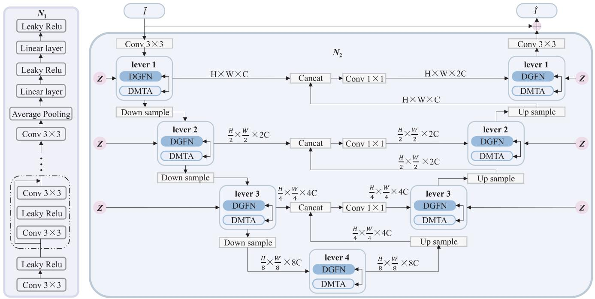

<details>
<summary>flowchart</summary>

```mermaid
graph TD
    subgraph_N1["Neural Network"]
        A["Leaky Relu"] --> B["Linear layer"]
        B --> C["Leaky Relu"]
        C --> D["Linear layer"]
        D --> E["Average Pooling"]
        E --> F["Conv 3×3"]
        F --> G["Conv 3×3"]
        G --> H["Conv 3×3"]
        H --> I["Conv 3×3"]
        I --> J["Conv 3×3"]
        J --> K["Conv 3×3"]
        K --> L["Conv 3×3"]
        L --> M["Conv 3×3"]
        M --> N["Conv 3×3"]
        N --> O["Conv 3×3"]
        O --> P["Conv 3×3"]
    end

    subgraph_N2["Neural Network"]
        Q["lever 1"] --> R["DGFN"]
        R --> S["DMTA"]
        S --> T["Down sample"]
        T --> U["DGFN"]
        U --> V["DMTA"]
        V --> W["Down sample"]
        W --> X["DGFN"]
        X --> Y["DMTA"]
        Y --> Z["Down sample"]
        Z --> AA["DGFN"]
        AA --> AB["DMTA"]
        AB --> AC["DGFN"]
        AC --> AD["Up sample"]
        AD --> AE["DGFN"]
        AE --> AF["DMTA"]
        AF --> AG["DGFN"]
        AG --> AH["Up sample"]
        AH --> AI["DGFN"]
        AI --> AJ["DMTA"]
        AJ --> AK["DGFN"]
        AK --> AL["Up sample"]
        AL --> AM["DGFN"]
        AM --> AN["DMTA"]
        AN --> AO["DGFN"]
        AO --> AP["Up sample"]
        AP --> AQ["DGFN"]
        AQ --> AR["DMTA"]
        AR --> AS["DGFN"]
        AS --> AT["Up sample"]
        AT --> AU["DGFN"]
        AU --> AV["DMTA"]
        AV --> AW["DGFN"]
        AW --> AX["Up sample"]
        AX --> AY["DGFN"]
        AY --> AZ["DMTA"]
        AZ --> BA["DGFN"]
        BA --> BB["Up sample"]
        BB --> BC["DGFN"]
        BC --> BD["DMTA"]
    end

    subgraph_N3["Neural Network"]
        CA["lever 1"] --> CB["DGFN"]
        CB --> CC["DMTA"]
        CC --> DD["Cancat"]
        DD --> DE["Cancat"]
        DE --> CF["Cancat"]
        CF --> CG["Cancat"]
        CG --> CH["Cancat"]
        CH --> CI["Cancat"]
        CI --> CJ["Cancat"]
        CJ --> CK["Cancat"]
    end

    subgraph_N4["Neural Network"]
        DA["lever 2"] --> DB["DGFN"]
        DB --> DC["DMTA"]
        DC --> DD
        DD --> CE["Cancat"]
        CE --> CF
        CF --> CF
        CF --> CE
        CE --> CE
        CE --> CE
    end

    subgraph_N5["Neural Network"]
        DA --> DB
        DB --> DC
        DC --> CE
        CE --> CE
    end

    subgraph_N6["Neural Network"]
        DA --> BE["DGFN"]
        BE --> BF["DMTA"]
        BF --> BG["Cancat"]
        BG --> BH["Cancat"]
        BH --> BI["Cancat"]
    end

    subgraph_N7["Neural Network"]
        BE --> BE
        BE --> BF
    end

    subgraph_N8["Neural Network"]
        BE --> BE
        BE --> BF
    end

    subgraph_N9["Neural Network"]
        BE --> BE
    end

    subgraph_N10["Neural Network"]
        BE --> BE
    end

    subgraph_N11["Neural Network"]
        BE --> BE
    end

    subgraph_N12["Neural Network"]
        BE --> BE
    end

    subgraph_N13["Neural Network"]
        BE --> BE
    end

    subgraph_N14["Neural Network"]
        BE --> BE
    end

    subgraph_N15["Neural Network"]
        BE --> BE
    end

    subgraph_N16["Neural Network"]
        BE --> BE
    end

    subgraph_N17["Neural Network"]
        BE --> BE
    end

    subgraph_N18["Neural Network"]
        BE --> BE
    end

    subgraph_N19["Neural Network"]
        BE --> BE
    end

    subgraph_N20["Neural Network"]
        BE --> BE
    end

    subgraph_N21["Neural Network"]
        BE --> BE
    end

    subgraph_N22["Neural Network"]
        BE --> BE
    end

    subgraph_N23["Neural Network"]
        BE --> BE
    end

    subgraph_N24["Neural Network"]
        BE --> BE
    end

    subgraph_N25["Neural Network"]
        BE --> BE
    end

    subgraph_N26["Neural Network"]
        BE --> BE
    end

    subgraph_N27["Neural Network"]
        BE --> BE
    end

    subgraph_N28["Neural Network"]
        BE --> BE
    end

    subgraph_N29["Neural Network"]
        BE --> BE
    end

    subgraph_N30["Neural Network"]
        BE --> BE
    end

    subgraph_N31["Neural Network"]
        BE --> BE
    end

    subgraph_N32["Neural Network"]
        BE --> BE
    end

    subgraph_N33["Neural Network"]
        BE --> BE
    end

    subgraph_N34["Neural Network"]
        BE --> BE
    end

    subgraph_N35["Neural Network"]
        BE --> BE
    end

    subgraph_N36["Neural Network"]
        BE --> BE
    end

    subgraph_N37["Neural Network"]
        BE --> BE
    end

    subgraph_N38["Neural Network"]
        BE --> BE
    end

    subgraph_N39["Neural Network"]
        BE --> BE
    end

    subgraph_N40["Neural Network"]
        BE --> BE
    end

    subgraph_N41["Neural Network"]
        BE --> BE
    end

    subgraph_N42["Neural Network"]
        BE --> BE
    end

    subgraph_N43["Neural Network"]
        BE --> BE
    end

    subgraph_N44["Neural Network"]
        BE --> BE
    end

    subgraph_N45["Neural Network"]
        BE --> BE
    end

    subgraph_N46["Neural Network"]
        BE --> BE
    end

    subgraph_N47["Neural Network"]
        BE --> BE
    end

    subgraph_N48["Neural Network"]
        BE --> BE
    end

    subgraph_N49["Neural Network"]
        BE --> BE
    end

    subgraph_N50["Neural Network"]
        BE --> BE
    end

    subgraph_N51["Neural Network"]
        BE --> BE
    end

    subgraph_N52["Neural Network"]
        BE --> BE
    end

    subgraph_N53["Neural Network"]
        BE --> BE
    end

    subgraph_N54["Neural Network"]
        BE --> BE
    end

    subgraph_N55["Neural Network"]
        BE --> BE
    end

    subgraph_N56["Neural Network"]
        BE --> BE
    end

    subgraph_N57["Neural Network"]
        BE --> BE
    end

    subgraph_N58["Neural Network"]
        BE --> BE
    end

    subgraph_N59["Neural Network"]
        BE --> BE
    end

    subgraph_N60["Neural Network"]
        BE --> BE
    end

    subgraph_N61["Neural Network"]
        BE --> BE
    end

    subgraph_N62["Neural Network"]
        BE --> BE
    end

    subgraph_N63["Neural Network"]
        BE --> BE
    end

    subgraph_N64["Neural Network"]
        BE --> BE
    end

    subgraph_N65["Neural Network"]
        BE --> BE
    end

    subgraph_N66["Neural Network"]
        BE --> BE
    end

    subgraph_N67["Neural Network"]
        BE --> BE
    end

    subgraph_N68["Neural Network"]
        BE --> BE
    end

    subgraph_N69["Neural Network"]
        BE --> BE
    end

    subgraph_N70["Neural Network"]
        BE --> BE
    end

    subgraph_N71["Neural Network"]
        BE --> BE
    end

    subgraph_N72["Neural Network"]
        BE --> BE
    end

    subgraph_N73["Neural Network"]
        BE --> BE
    end

    subgraph_N74["Neural Network"]
        BE --> BE
    end

    subgraph_N75["Neural Network"]
        BE --> BE
    end

    subgraph_N76["Neural Network"]
        BE --> BE
    end

    subgraph_N77["Neural Network"]
        BE --> BE
    end

    subgraph_N78["Neural Network"]
        BE --> BE
    end

    subgraph_N79["Neural Network"]
        BE --> BE
    end

    subgraph_N80["Neural Network"]
        BE --> BE
    end

    subgraph_N81["Neural Network"]
        BE --> BE
    end

    subgraph_N82["Neural Network"]
        BE --> BE
    end

    subgraph_N83["Neural Network"]
        BE --> BE
    end

    subgraph_N84["Neural Network"]
        BE --> BE
    end

    subgraph_N85["Neural Network"]
        BE --> BE
    end

    subgraph_N86["Neural Network"]
        BE --> BE
    end

    subgraph_N87["Neural Network"]
        BE --> BE
    end

    subgraph_N88["Neural Network"]
        BE --> BE
    end

    subgraph_N89["Neural Network"]
        BE --> BE
    end

    subgraph_N90["Neural Network"]

      direction TB
```
</details>

Fig. 3. The architectures of the prior extraction network $N _ { 1 }$ and the image denoising network $N _ { 2 } .$ .

Algorithm 1 The Training Process on the Cloud Server   
Input: $\beta_{t}(t\in[1,T])$ Output: The trained model M
1: Init: $\alpha_{t}=1-\beta_{t}$ , $\bar{\alpha}_{T}=\prod_{i=0}^{T}\alpha_{i}$ 2: for $(\widetilde{I},I)$ do
3: $Z_{0}=N_{1}(\text{PixelUnshuffle}(\text{Concat}(\widetilde{I},I)))$ 4: Forward Diffusion:
5: We sample $Z_{T}$ by $q(Z_{T}\mid Z_{0})=\mathcal{N}(Z_{T};\sqrt{\bar{\alpha}_{T}}Z_{0},(1-\bar{\alpha}_{T})I)$ 6: Reverse Inference:
7: $\hat{Z}_{T}=Z_{T}$ 8: $D=N_{1}(\text{PixelUnshuffle}(\widetilde{I}))$ 9: for t=T to 1 do
10: $\hat{Z}_{t-1}=\frac{1}{\sqrt{\alpha_{t}}}\left(\hat{Z}_{t}-\frac{1-\alpha_{t}}{\sqrt{1-\bar{\alpha}_{t}}}\epsilon_{\theta}(\text{Concat}(\hat{Z}_{t},t,D))\right)$ 11: end for
12: $\hat{Z}=\hat{Z}_{0}$ 13: $\hat{I}=N_{2}(\widetilde{I},\hat{Z})$ 14: Calculate L loss
15: end for
16: Output the trained model M

Next, $N _ { 1 }$ and $N _ { 2 }$ are jointly optimized. The loss function is defined as follows:

$$
\mathcal {L} _ {p r e} = \left\| I - \hat {I} \right\| _ {1}, \tag {10}
$$

where I and $\hat { \boldsymbol { I } }$ are the transmitted and received images, respectively. $\lVert \cdot \rVert _ { 1 }$ is the $L _ { 1 }$ paradigm.

In the DM training phase, the accurately recovered images are generated from the lossy decoded images mainly through the efficient data estimation function of diffusion model, and this process includes two critical aspects: the forward diffusion and the reverse inference. First, the PRs of the decoded images,

Algorithm 2 The Testing Process on the Local Device   
Input: The trained model M, decoded images $\widetilde{I}$ Output: The received images $\hat{I}$ 1: Init: $\alpha_{t}=1-\beta_{t},\bar{\alpha}_{T}=\prod_{i=0}^{T}\alpha_{i}$ 2: Reverse Inference:
3: Sample $Z_{T}\sim\mathcal{N}(0,O)$ 4: $D=N_{1}(\text{PixelUnshuffle}(\widetilde{I}))$ 5: for t=T to 1 do
6: $\hat{Z}_{t-1}=\frac{1}{\sqrt{\alpha_{t}}}\left(\hat{Z}_{t}-\frac{1-\alpha_{t}}{\sqrt{1-\bar{\alpha}_{t}}}\epsilon_{\theta}\left(\text{Concat}(\hat{Z}_{t},t,D)\right)\right)$ 7: end for
8: $\hat{Z}=\hat{Z}_{0}$ 9: $\hat{I}=N_{2}(\widetilde{I},\hat{Z})$ 10: Output received images $\hat{I}$

denoted as $Z _ { 0 } ,$ are captured using the pre-trained $N _ { 1 }$ , and the forward diffusion process of $Z _ { 0 }$ is applied to the sample $Z _ { T }$ through T iterations. Each iteration is as follows:

$$
q (Z _ {T} \mid Z _ {0}) = \mathcal {N} \big (Z _ {T}; \sqrt {\bar {\alpha} _ {T}} Z _ {0}, (1 - \bar {\alpha} _ {T}) I \big), \tag {11}
$$

where $\begin{array} { r } { \bar { \alpha } _ { t } = \prod _ { i = 1 } ^ { t } \alpha _ { i } } \end{array}$ is the cumulative product of $\alpha _ { t } ,$ , the scheduler gradually adds Gaussian noise at each time step $t \in$ [0, T] until the semantic information of $Z _ { 0 }$ becomes pure noise $Z _ { T }$ , each new image at time step t is sampled from a conditional Gaussian distribution, as follows:

$$
Z _ {t} = \sqrt {1 - \beta_ {t}} Z _ {t - 1} + \sqrt {\beta_ {t}} \varepsilon , \tag {12}
$$

where $0 < \beta _ { 1 } < \beta _ { 2 } < \cdots < \beta _ { T } < 1$ is a variance table with time-dependent constants and $\varepsilon \sim \mathcal { N } ( 0 , O )$ is a Gaussian noise with unit matrix O.

The forward diffusion process introduces noise to the data, while the reverse inference process is a denoising procedure. However, traditional distributed denoising algorithms can only optimize the denoising network by randomly selecting a time step during the iteration process, which significantly increases computational costs. In contrast, since PRs are compact, fewer iterations and smaller model sizes can be used to achieve estimates that are comparable to traditional diffusion models. Here, the noise at each time step t is estimated using $\varepsilon _ { \theta }$ to obtain $\hat { Z } _ { t - 1 } , \mathrm { i . e . }$ .,

$$
\hat {Z} _ {t - 1} = \frac {1}{\sqrt {\alpha_ {t}}} \left(\hat {Z} _ {t} - \frac {1 - \alpha_ {t}}{\sqrt {1 - \bar {\alpha} _ {t}}} \varepsilon_ {\theta}\right), \tag {13}
$$

where $\varepsilon _ { \theta }$ is the prediction noise, $\alpha _ { t } = 1 - \beta _ { t }$ , and $\bar { \sigma } _ { t }$ is also a time-dependent constant for the step.

After T iterations, $\hat { Z } \in \mathbb { R } ^ { 4 C ^ { \prime } }$ is generated. Since the trained model M only adds details for recovery, DM can obtain stable visual results after several iterations. After that, $N _ { 2 }$ utilizes $\hat { Z }$ to recover the semantic information images I .

The diffusion model aims to predict the noise distribution of the conditioned vectors of the decoded images with a loss function denoted as $\begin{array} { r } { \mathcal { L } _ { \mathrm { d i f f } } = \frac { 1 } { 4 C ^ { \prime } } \sum _ { i = 1 } ^ { 4 C ^ { \prime } } | \hat { Z } ( i ) - Z _ { 0 } ( i ) } \end{array}$ |. To achieve efficient generation and propagation of semantic information, $\begin{array} { l l l } { \mathcal { L } } & { = } & { \mathcal { L } _ { p r e } \ + \ \mathcal { L } _ { d i f f } } \end{array}$ is used here for joint optimization.

Notably, unlike in the forward diffusion process, during the reverse inference process, the transmitted image source I is not input into either $N _ { 1 }$ or $N _ { 2 }$ . Instead, $N _ { 1 }$ is employed to obtain the PRs, denoted as $\bar { D } \in \mathbb { R } ^ { 4 C ^ { \prime } }$ , directly from the decoded images, as follows:

$$
D = \boldsymbol {N} _ {1} \left(\text { PixelUnshuffle } (\widetilde {I})\right), \tag {14}
$$

# E. Multi-User Communication System

The multi-user scenario refers to each user transmitting independent semantic information to perform their transmission tasks. As shown in Fig. 1, a multi-user generative AI semantic communication system that consists of k sources and k destinations is considered.

The message of the k-th user’s source is denoted as $I _ { k }$ . Each source transmits semantic information. Similar to the singleuser cognitive semantic communication system, the semantic information is first expressed as the semantic symbols. The semantic symbol $S _ { k }$ is abstracted from the image source $I _ { k }$ by using our proposed semantic feature encoder, given as:

$$
S _ {k} = \boldsymbol {E} (I _ {k}), k = 1, 2, \dots , n. \tag {15}
$$

After the semantic symbols of each source are obtained, they are transmitted by exploiting the conventional non-trainable fully connected layer to simulate. Specifically, the semantic symbol $S _ { k }$ is encoded to improve transmission efficiency, and $f _ { k }$ is obtained, i.e.,

$$
f _ {k} = \boldsymbol {C} (S _ {k}) = \boldsymbol {W} _ {n} S _ {k} + b _ {n}, k = 1, 2, \dots , n, \tag {16}
$$

where C is the channel coding; $f _ { k }$ and $S _ { k }$ are the channel coding and semantic symbols of the k-th source, respectively.

After transmission over the channel, the channel decoding is performed at each user receiver, and the reconstructed semantic symbol $\widetilde { I } _ { k }$ is obtained by exploiting our proposed semantic feature decoder module. Note that the semantic symbols of different users are not distinguished in this process. Thus, the reconstructed semantic symbol of each user is mixed, given as:

$$
\widetilde {I} _ {k} = \boldsymbol {E} ^ {- 1} \left(\boldsymbol {C} ^ {- 1} \left(\hat {f} _ {k}\right)\right), k = 1, 2, \dots , n, \tag {17}
$$

where $C ^ { - 1 }$ is the channel decoding and ${ \pmb E } ^ { - 1 }$ is the semantic feature decoding, $\widetilde { I } _ { k }$ is the reconstructed semantic information images and $\hat { f } _ { k }$ is the channel coding received vector at the k-th user.

Then, the reconstructed semantic symbols of each user need to be fine tuning. All models can be trained in the cloud and then broadcast to users. Similar to the singleuser cognitive semantic communication system, the received images is obtained by exploiting our proposed semantic finetuning module.

To address the challenge of data processing in multiuser scenarios, we first implemented a data segmentation strategy during the pre-processing stage. This approach simulates different user sources generating diverse messages, enabling effective allocation of user tasks to various processing units and allowing these tasks to be executed concurrently. Subsequently, we introduced an asynchronous concurrent processing model. Employing asynchronous task processing functions and event loops ensured that the system’s main thread remained unblocked during I/O operations, thereby facilitating the concurrent execution of multiple user tasks.

To further enhance system performance, we leveraged task parallel processing technology. This technique involves decomposing a single user task into smaller subtasks and executing these subtasks concurrently across multiple processing units. This approach fully utilizes GPU resources to boost system concurrency and performance. Additionally, to optimize system efficiency and reduce computational load, we incorporated a caching mechanism. This mechanism stores previously computed results and reuses them when needed, thus avoiding redundant calculations and enhancing the system’s response speed and throughput. Through implementation, this multi-user communication system based on an asynchronous processing model significantly improves resource utilization, processing speed, and system stability. It is suitable for scenarios requiring parallel processing of a large number of user communication tasks, with a high practical application value.

The single-user and multi-user systems aim to enhance the semantic quality of transmitted data by reducing noise and improving feature reconstruction at the receiver’s end. The commonality between both systems lies in their shared generative AI framework, which enables progressive refinement of semantic information using a diffusion model, ensuring high fidelity and communication efficiency. The primary difference is that the MU-GSC system introduces additional mechanisms to manage multiple users concurrently. While the GSC system is more suited for scenarios where a single user requires high-quality semantic transmission (e.g., realtime image transmission), one of the critical advantages of the MU-GSC system is its scalability.

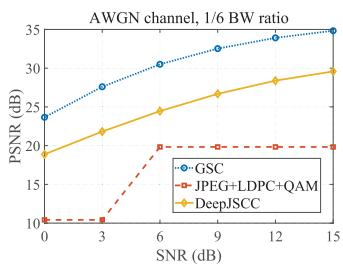

<details>
<summary>line</summary>

| SNR (dB) | GSC   | JPEG+LDPC+QAM | DeepJSCC |
| -------- | ----- | ------------- | -------- |
| 0        | 25.0  | 10.0          | 19.0     |
| 3        | 28.0  | 10.0          | 21.0     |
| 6        | 30.0  | 20.0          | 24.0     |
| 9        | 32.0  | 20.0          | 27.0     |
| 12       | 34.0  | 20.0          | 29.0     |
| 15       | 35.0  | 20.0          | 30.0     |
</details>

(a)

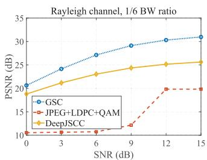

<details>
<summary>line</summary>

| SNR (dB) | GSC   | JPEG+LDPC+QAM | DeepJSCC |
| -------- | ----- | ------------- | -------- |
| 0        | 20.0  | 10.0          | 18.0     |
| 3        | 25.0  | 10.0          | 20.0     |
| 6        | 27.0  | 10.0          | 22.0     |
| 9        | 29.0  | 10.0          | 24.0     |
| 12       | 30.0  | 20.0          | 25.0     |
| 15       | 31.0  | 20.0          | 26.0     |
</details>

(b)

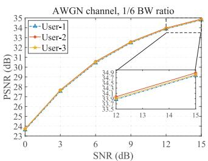

<details>
<summary>line</summary>

| SNR (dB) | User-1 PSNR (dB) | User-2 PSNR (dB) | User-3 PSNR (dB) |
| -------- | ---------------- | ---------------- | ---------------- |
| 0        | 24               | 24               | 24               |
| 3        | 28               | 28               | 28               |
| 6        | 31               | 31               | 31               |
| 9        | 33               | 33               | 33               |
| 12       | 34.9             | 34.7             | 34.5             |
| 15       | 35               | 34.9             | 34.9             |
</details>

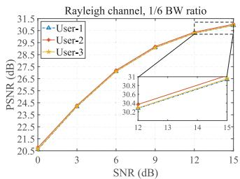

<details>
<summary>line</summary>

| SNR (dB) | User-1 | User-2 | User-3 |
| -------- | ------ | ------ | ------ |
| 0        | 20.5   | 20.5   | 20.5   |
| 3        | 24.0   | 24.0   | 24.0   |
| 6        | 27.0   | 27.0   | 27.0   |
| 9        | 29.0   | 29.0   | 29.0   |
| 12       | 30.5   | 30.5   | 30.5   |
| 15       | 31.0   | 31.0   | 31.0   |
</details>

(d)   
Fig. 4. PSNR (higher the better) versus the SNR over AWGN and Rayleigh channel, respectively. (a) AWGN channel. (b) Rayleigh channel. (c) MU-GSC AWGN channel. (d) MU-GSC Rayleigh channel.

# IV. SIMULATION RESULTS AND DISCUSSIONS

In this section, simulation results are presented to evaluate the performance of our proposed single-user and multi-user generative AI semantic communication systems. They are compared with deep learning-based methods and the traditional communication systems realized by the separate source and channel coding technologies. In addition, to demonstrate the robustness of the proposed method, the simulation experiments are performed under the AWGN channels and Rayleigh fading channels, where the perfect CSI is assumed for all methods. For the MU-GSC, the transceiver is assumed with three single-antenna users and the receiver with three antennas.

# A. Simulation Setup

The training process is divided into two independent parts: semantic feature encoder/decoder and SFT. To comply with the generalization of ISC, the classical communication network based on the Swin Transformer is chosen as the semantic feature coder in this paper. Specifically, this network uses the ReLU activation function between the input layer and the two hidden layers, the hyperparameter C is set to 32, the loss function adopts the MSE, the batch size is set to 32, and the window size is set to 2, and then it is trained using Adam’s optimizer [38] with a learning rate of $1 \times 1 0 ^ { - 4 }$ . During the SFT training process, we adopt a two-step training strategy utilizing a four-level encoder-decoder structure in the DTBN. From level 1 to level 4, the attention heads in DMTA are set to [1, 2, 4, 8], the number of dynamic transformer blocks to [3, 5, 6, 6] and the number of channels $C ^ { \prime }$ of $N _ { 1 }$ is set to 96. Training begins with a patch size of $3 2 \times 3 2$ and a batch size of 16. In the second step, $\beta _ { t }$ linearly increases from 0.10 to 0.99, starting with an initial learning rate of $2 \times 1 0 ^ { - 4 }$ , and the total timesteps T are set at 4.

In this simulation, the experimental platform for training and testing is built on an Ubuntu 20.04 system with CUDA 11.8 support, and the deep learning framework is Pytorch 2.0.0. Note that the training phase of the diffusion model is done at the cloud server of the BS, and the receiver is only involved in the reverse inference process. Compared to the pretraining phase, semantic information generation requires lower computational resources. Therefore, the receiver is sufficient to run these modules with acceptable computational latency.

We compare our proposal with classical separationbased source and semantic communication. The traditional communication model considers the well-established image codec JPEG, an image compression algorithm used in various applications such as Internet content delivery, digital photography, and medical imaging. Many fields include Internet content delivery, digital photography, and medical imaging. The channel noise or fading is then processed using a Low-Density Parity-Check code (LDPC) and Quadrature Amplitude Modulation (QAM) scheme, denoted as JPEG+LDPC+QAM. The modulation order is set to 4. The semantic communication model employs the classical algorithm DeepJSCC. All methods consistently use the CIFAR-10 dataset and are selected to be trained with SNRs between 1 dB and 13 dB.

# B. Performance Comparison

To demonstrate the effectiveness of the proposed method, this section analyzes the quality of the images generated by the three methods under two different channel conditions. Specifically, we present the Peak Signal-to-Noise Ratio (PSNR) of the decoded image obtained using these approaches.

For the proposed method, a single model covers a range of SNR from 0 dB to 15 dB. As expected, the proposed algorithms agree with the trend of PSNR variation in semantic communication with increased SNR. Fig. 4(a) shows the PSNR score versus the SNR achieved by using the proposed GSC and the benchmark systems under the AWGN channels. Note that for the traditional method, i.e., JPEG+LDPC+QAM, When the channel deteriorates beyond a threshold (SNR<3), the receiver cannot decode the channel code and, therefore, cannot transmit any semantic information. Comparatively, when the SNR>6, the PSNR reaches the performance saturation of traditional communication algorithms, and the image similarity score of these methods in Fig. 4 almost converges to 20, and further enhancement will not improve the output quality. However, with the reduction of SNR, the performance of the traditional methods is significantly degraded and is obviously poorer than that of the semantic communication systems. Our proposed system shows the same behavior as the DeepJSCC method. However, since the semantic information can be enhanced by the fine-tuning module, it is clear that the proposed GSC is more competitive than the DeepJSCC in the low SNR regime. Taking SNR=15 as an example, our method achieves a significant improvement in PSNR compared to the benchmark DeepJSCC algorithm, with 17.75% of the enhancement observed in AWGN channel and 20.86% in Rayleigh channels.

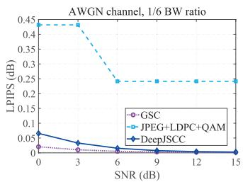

<details>
<summary>line</summary>

| SNR (dB) | GSC    | JPEG+LDPC+QAM | DeepJSCC |
| -------- | ------ | ------------- | -------- |
| 0        | 0.02   | 0.45          | 0.07     |
| 3        | 0.02   | 0.45          | 0.05     |
| 6        | 0.01   | 0.25          | 0.01     |
| 9        | 0.01   | 0.25          | 0.01     |
| 12       | 0.01   | 0.25          | 0.01     |
| 15       | 0.01   | 0.25          | 0.01     |
</details>

(a)

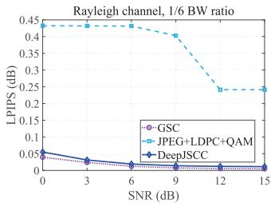

<details>
<summary>line</summary>

| SNR (dB) | GSC    | JPEG+LDPC+QAM | DeepJSCC |
| -------- | ------ | ------------- | -------- |
| 0        | 0.05   | 0.45          | 0.05     |
| 3        | 0.02   | 0.45          | 0.02     |
| 6        | 0.01   | 0.45          | 0.01     |
| 9        | 0.01   | 0.42          | 0.01     |
| 12       | 0.01   | 0.25          | 0.01     |
| 15       | 0.01   | 0.25          | 0.01     |
</details>

(b)

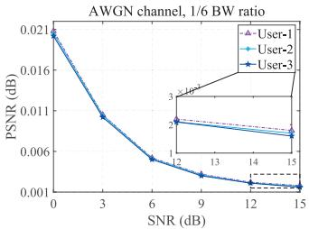

<details>
<summary>line</summary>

| SNR (dB) | User-1 PSNR (dB) | User-2 PSNR (dB) | User-3 PSNR (dB) |
| -------- | ---------------- | ---------------- | ---------------- |
| 0        | 0.021            | 0.021            | 0.021            |
| 3        | 0.011            | 0.011            | 0.011            |
| 6        | 0.006            | 0.006            | 0.006            |
| 9        | 0.004            | 0.004            | 0.004            |
| 12       | 0.003            | 0.003            | 0.003            |
| 15       | 0.002            | 0.002            | 0.002            |
</details>

（c）

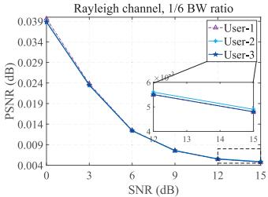

<details>
<summary>line</summary>

| SNR (dB) | User-1 PSNR (dB) | User-2 PSNR (dB) | User-3 PSNR (dB) |
| -------- | ---------------- | ---------------- | ---------------- |
| 0        | 0.039            | -                | -                |
| 3        | 0.024            | -                | -                |
| 6        | 0.014            | -                | -                |
| 9        | 0.009            | 0.05             | -                |
| 12       | 0.005            | 0.04             | -                |
| 15       | 0.004            | 0.03             | -                |
</details>

(d)   
Fig. 5. LPIPS (lower the better) versus the SNR over AWGN and Rayleigh channel, respectively. (a) AWGN channel. (b) Rayleigh channel. (c) MU-GSC AWGN channel. (d) MU-GSC Rayleigh channel.

Fig. 4(b) shows the PSNR score versus the SNR achieved using GSC and the benchmark systems under Rayleigh fading channels. Fig. 4(b) exhibits the same behavior as that of Fig. 4(a). Despite the more demanding harsh Rayleigh channel conditions, the GSC shows advantages in semantic communication. This observation can be attributed to the fact that, although LDPC codes and QAM modulation enhance the robustness of data transmission, JPEG compression algorithms are lossy and may lead to irreversible information loss, which reduces the fault-tolerance of the whole system, resulting in degradation of image quality or data integrity in the presence of transmission errors. Meanwhile, the PSNR of JPEG+LDPC+QAM remains constant when the channel conditions are very bad or substantially improved, which reflects the so-called cliff effect. In addition, in the forward channel, SNR ranges from 0 dB to 6 dB. Compared to the transmission performance of JPEG+LDPC+QAM, the GSC does not degrade rapidly, demonstrating a significant graceful degradation advantage. Compared with DeepJSCC, the proposed method has a lower performance gap at lower SNR, indicating that even if the received semantic information image is severely corrupted, it can still generate a realistic image consistent with the original transmitted semantic information. It is clear that our proposed system is more competitive and robust in poor channel environments.

Figs. 4(c)-4(d) show the PSNR score versus the SNR over the AWGN and Rayleigh channel, respectively, by using the proposed MU-GSC. Using the communication process of three users as an example, it is observed that the PSNR score trends similarly to the GSC. This is because the dataset and simulation setup for the multi-user system are the same as those used for the single-user system and have the same performance advantages in semantic extraction and compression. Our proposed multi-user system outperformed in all regimes and is close to 35 when SNR = 15 dB. Meanwhile, the PSNR score of the MU-GSC means that the semantic information contained in messages is transmitted successfully.

To more accurately assess the visual similarity of the delivered images, Fig. 5 compares the Learned Perceptual Image Patch Similarity (LPIPS) scores versus the SNR achieved by using the proposed method and the benchmark systems under different channel conditions. Unlike the PSNR metric, which primarily measures pixel-level differences, LPIPS focuses on visual perceptual differences, where a lower LPIPS value indicates better visual perceptual quality. Figs. 5(a)-5(b) show that the proposed GSC method outperforms existing methods in terms of LPIPS. Figs. 5(c)-5(d) indicate that the extracted and transmitted semantic information from MU-GSC is highly compact, preserves perceptual content, and proves that the proposed method is highly robust to noise interference. Specifically, compared to the benchmark algorithm DeepJSCC, in the low SNR regime (SNR = 0 dB), the LPIPS score decreased by 68.65% in the AWGN channel and by 28.18% in the Rayleigh channel.

TABLE I RUNTIME COMPARISON OF VARIOUS DEEP LEARNING-BASED SYSTEMS 

<table><tr><td>Models</td><td>GSC</td><td>MU-GSC</td></tr><tr><td>Runtime (s)</td><td>15.66</td><td>8.87</td></tr></table>

To verify the role of the semantic fine-tuning module, we performed ablation tests to corroborate the proposed method, comparing the image transmission performance of the proposed GSC method with Non-Generative Framework (NGF). The NGF provides a direct SemCom receiver, similar to GSC, but with the semantic fine-tuning module turned off. Taking the example in AWGN channel transmission, Fig. 6 allows for a visual inspection of the details of the delivered images produced by the proposed method GSC and NGF at different SNRs of the wireless channel. It is evident that as the SNR improves (From left to right, the SNR ranges from 0 dB to 15 dB), the images from both frameworks transition from a mottled, mosaic-like appearance to a smoother texture. Additionally, the structure of the GSC images becomes nearly identical to the source image. However, images produced by NGF display prominent issues such as spot noise and edge blurring. These issues arise because the semantic fine-tuning module effectively reduces channel noise and preserves valuable semantic information. Meanwhile, the GSC relies heavily on the image communication network, which operates under strict constraints to ensure the reliability of the transmitted images. The results further demonstrate that the proposed algorithm is effective and robust in generating high-quality images.

To evaluate the convergence performance of the proposed algorithm, we set different training epochs during the diffusion model’s training process. As shown in Fig. 7, GSC demonstrates excellent convergence speed. Specifically, the performance of the semantic fine-tuning module begins to improve significantly after seven epochs, indicating that the model has quickly captured key features in the early stages. When the number of epochs exceeds ten, the target loss stabilizes, suggesting that the model has converged. As training progresses beyond fifteenth epochs, the loss shows almost no further change, validating the model’s stability and efficiency. This superior convergence speed can be attributed to executing the DM on a compact one-dimensional vector PR, making it more efficient than traditional DM.

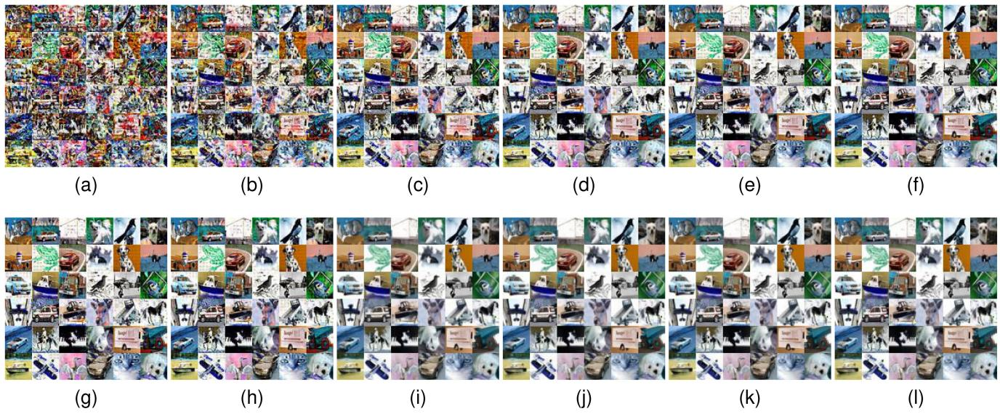

Fig. 6. Image detail delivery of two transmission frameworks under different SNRs in AWGN channel. (a-f) NGF. (b-l) GSC.   
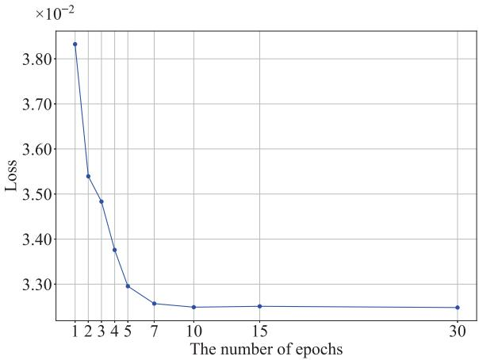

<details>
<summary>line</summary>

| The number of epochs | Loss     |
| -------------------- | -------- |
| 1                    | 0.0385   |
| 2                    | 0.0355   |
| 3                    | 0.0348   |
| 4                    | 0.0338   |
| 5                    | 0.0330   |
| 7                    | 0.0325   |
| 10                   | 0.0325   |
| 15                   | 0.0325   |
| 30                   | 0.0325   |
</details>

Fig. 7. Convergence experiment of the number of epochs in semantic finetuning module.

The computational complexities of the proposed GSC and MU-GSC are compared in Table I in terms of the average processing runtime per image. This simulation is performed with Intel Core i9-13900HX@2.20 GHz and NVIDIA GeForce RTX 4060. Compared to GSC, MU-GSC completes processing multiple user requests in nearly half the time, significantly enhancing system response speed and throughput. This improvement is attributed to the application of critical technologies such as asynchronous task processing, parallel task execution, and caching mechanisms, effectively reducing the system’s computational load. However, the runtime of the proposed method is high, the reason is that the computational complexities of our proposed semantic fine-tuning algorithm increase with the size of the users’ knowledge base, and this marginal cost is offset by the significant performance improvements.

# V. CONCLUSION

This paper proposes a generative AI semantic communication system that introduces an advanced and interpretable semantic fine-tuning module to enhance semantic information. Simulation results demonstrate that our method delivers superior transmission quality compared to traditional separation-based methods and DeepJSCC, significantly improving communication services in resource-limited wireless networks, particularly under low signal-to-noise ratio conditions. Although our method’s running time is slightly higher than that of DeepJSCC, fundamental techniques such as asynchronous processing substantially enhance the system’s response speed and throughput, demonstrating the scalability of the proposed single-user system in multi-user scenarios. Looking ahead, the challenge of adapting to rapidly changing data distributions remains an open and fundamental question in generative AI semantic communication. Future research will aim to explore more dynamic, context-aware solutions to optimize model adaptability and performance in increasingly complex and variable environments.

# REFERENCES

[1] G. Liu et al., “Semantic communications for Artificial Intelligence Generated Content (AIGC) toward effective content creation,” IEEE Netw., vol. 38, no. 5, pp. 295–303, Sep. 2024, doi: 10.1109/MNET.2024.3352917.   
[2] C. Chaccour, W. Saad, M. Debbah, Z. Han, and H. V. Poor, “Less data, more knowledge: Building next generation semantic communication networks,” IEEE Commun. Surveys Tuts., early access, Jun. 11, 2024, doi: 10.1109/COMST.2024.3412852.   
[3] K. Zhang, L. Li, W. Lin, Y. Yan, W. Cheng, and Z. Han, “SC-CDM: Enhancing quality of image semantic communication with a compact diffusion model,” in Proc. IEEE Glob. Commun. Conf. Workshops (GC Wkshps), Cape Town, South Africa, Dec. 2024, pp.1–6.

[4] W. Lin, Y. Yan, L. Li, Z. Han, and T. Matsumoto, “SemantIC: Semantic interference cancellation toward 6G wireless communications,” IEEE Commun. Lett., vol. 28, no. 8, pp. 1810–1814, Aug. 2024, doi: 10.1109/LCOMM.2024.3412973.   
[5] W. Lin, Y. Yan, L. Li, Z. Han, and T. Matsumoto, “Semantic-forward relaying: A novel framework toward 6G cooperative communications,” IEEE Commun. Lett., vol. 28, no. 3, pp. 518–522, Mar. 2024.   
[6] R. Cheng, Y. Sun, D. Niyato, L. Zhang, L. Zhang, and M. A. Imran, “A wireless AI-Generated Content (AIGC) provisioning framework empowered by semantic communication,” 2023, arXiv:2310.17705.   
[7] S. Laskaridis, S. I. Venieris, A. Kouris, R. Li, and N. D. Lane, “The future of consumer edge-AI computing,” 2022, arXiv:2210.10514.   
[8] E. Bourtsoulatze, D. B. Kurka, and D. Gündüz, “Deep joint sourcechannel coding for wireless image transmission,” IEEE Trans. Cogn. Commun. Netw., vol. 5, no. 3, pp. 567–579, Sep. 2019.   
[9] M. Ding, J. Li, M. Ma, and X. Fan, “SNR-adaptive deep joint sourcechannel coding for wireless image transmission,” in Proc. IEEE Int. Conf. Acoust., Speech Signal Process. (ICASSP), Toronto, ON, Canada, Jun. 2021, pp. 1555–1559.   
[10] M. Yang and H.-S. Kim, “Deep joint source-channel coding for wireless image transmission with adaptive rate control,” in Proc. IEEE Int. Conf. Acoust., Speech Signal Process. (ICASSP), Singapore, May 2022, pp. 5193–5197.   
[11] J. Xu, B. Ai, W. Chen, A. Yang, P. Sun, and M. Rodrigues, “Wireless image transmission using deep source channel coding with attention modules,” IEEE Trans. Circuits Syst. Video Technol., vol. 32, no. 4, pp. 2315–2328, Apr. 2022.   
[12] D. B. Kurka and D. Gündüz, “DeepJSCC-f : Deep joint source-channel coding of images with feedback,” IEEE J. Sel. Areas Inf. Theory, vol. 1, no. 1, pp. 178–193, May 2020.   
[13] H. Zhang, S. Shao, M. Tao, X. Bi, and K. B. Letaief, “Deep learningenabled semantic communication systems with task-unaware transmitter and dynamic data,” IEEE J. Sel. Areas Commun., vol. 41, no. 1, pp. 170–185, Jan. 2023.   
[14] K. Yang, S. Wang, J. Dai, K. Tan, K. Niu, and P. Zhang, “WITT: A wireless image transmission transformer for semantic communications,” in Proc. IEEE Int. Conf. Acoust., Speech Signal Process. (ICASSP), Rhodes Island, Greece, Jun. 2023, pp. 1–5.   
[15] K. Yu, Q. He, and G. Wu, “Two-way semantic communications without feedback,” IEEE Trans. Veh. Technol., vol. 73, no. 6, pp. 9077–9082, Jun. 2024.   
[16] L. X. Nguyen et al., “Swin transformer-based dynamic semantic communication for multi-user with different computing capacity,” IEEE Trans. Veh. Technol., vol. 73, no. 6, pp. 8957–8972, Jun. 2024.   
[17] S. Kadam and D. I. Kim, “Knowledge-aware semantic communication system design and data allocation,” IEEE Trans. Veh. Technol., vol. 73, no. 4, pp. 5755–5769, Apr. 2024.   
[18] H. Xie, Z. Qin, X. Tao, and K. B. Letaief, “Task-oriented multi-user semantic communications,” IEEE J. Sel. Areas Commun., vol. 40, no. 9, pp. 2584–2597, Sep. 2022.   
[19] J. Kang et al., “Personalized saliency in task-oriented semantic communications: Image transmission and performance analysis,” IEEE J. Sel. Areas Commun., vol. 41, no. 1, pp. 186–201, Jan. 2023.   
[20] M. K. Farshbafan, W. Saad, and M. Debbah, “Common language for goal-oriented semantic communications: A curriculum learning framework,” in Proc. IEEE Int. Conf. Commun. (ICC), Seoul, South Korea, May 2022, pp. 1710–1715.   
[21] Y. Wang et al., “Performance optimization for semantic communications: An attention-based reinforcement learning approach,” IEEE J. Sel. Areas Commun., vol. 40, no. 9, pp. 2598–2613, Sep. 2022.   
[22] C. K. Thomas and W. Saad, “Neuro-symbolic causal reasoning meets signaling game for emergent semantic communications,” IEEE Trans. Wireless Commun., vol. 23, no. 5, pp. 4546–4563, May 2024.   
[23] H. Yoo, T. Jung, L. Dai, S. Kim, and C.-B. Chae, “Demo: Real-time semantic communications with a vision transformer,” in Proc. IEEE Int. Conf. Commun. Workshops (ICC Wkshps), Seoul, South Korea, May 2022, pp. 1–2.   
[24] K. Choi, K. Tatwawadi, A. Grover, T. Weissman, and S. Ermon, “Neural joint source-channel coding,” in Proc. Int. Conf. Mach. Learn. (ICML), Long Beach, CA, USA, Jun. 2019, pp. 1182–1192.   
[25] Q. Hu, G. Zhang, Z. Qin, Y. Cai, G. Yu, and G. Y. Li, “Robust semantic communications with masked VQ-VAE enabled codebook,” IEEE Trans. Wireless Commun., vol. 22, no. 12, pp. 8707–8722, Dec. 2023.   
[26] T. Marchioro, N. Laurenti, and D. Gündüz, “Adversarial networks for secure wireless communications,” in Proc. IEEE Int. Conf. Acoust., Speech Signal Process. (ICASSP), Barcelona, Spain, May 2020, pp. 8748–8752.

[27] M. Yang, C. Bian, and H.-S. Kim, “OFDM-guided deep joint source channel coding for wireless multipath fading channels,” IEEE Trans. Cogn. Commun. Netw., vol. 8, no. 2, pp. 584–599, Jun. 2022.   
[28] M. U. Lokumarambage, V. S. S. Gowrisetty, H. Rezaei, T. Sivalingam, and N. Rajatheva, “Wireless end-to-end image transmission system using semantic communications,” IEEE Access, vol. 11, pp. 37149–37163, 2023.   
[29] E. Erdemir, T. Y. Tung, P. L. Dragotti, and D. Gündüz, “Generative joint source-channel coding for semantic image transmission,” IEEE J. Sel. Areas Commun., vol. 41, no. 8, pp. 2645–2657, Aug. 2023.   
[30] B. Xia et al., “Diffir: Efficient diffusion model for image restoration,” in Proc. IEEE/CVF Int. Conf. Comput. Vis. (ICCV), Paris, France, Oct. 2023,pp. 13095–13105.   
[31] X. Niu, X. Wang, D. Gündüz, B. Bai, W. Chen, and G. Zhou, “A hybrid wireless image transmission scheme with diffusion,” in Proc. IEEE 24th Int. Workshop Signal Process. Adv. Wireless Commun. (SPAWC), Shanghai, China, Sep. 2023, pp. 86–90.   
[32] T. Wu et al., “CDDM: Channel denoising diffusion models for wireless communications,” in Proc. IEEE Global Commun. Conf., pp. 7429–7434, Kuala Lumpur, Malaysia, Dec. 2023, pp. 7429–7434.   
[33] B. Xu, R. Meng, Y. Chen, X. Xu, C. Dong, and H. Sun, “Latent semantic diffusion-based channel adaptive de-noising semcom for future 6G systems,” in Proc. IEEE Global Commun. Conf., Kuala Lumpur, Malaysia, Dec. 2023, pp. 1229–1234.   
[34] E. Grassucci, C. Marinoni, A. Rodriguez, and D. Comminiello, “Diffusion models for audio semantic communication,” in Proc. IEEE Int. Conf. Acoust., Speech Signal Process. (ICASSP), Seoul, South Korea, Apr. 2024, pp. 13136–13140.   
[35] J. Chen, D. You, D. Gündüz, and P. L. Dragotti, “CommIN: Semantic image communications as an inverse problem with INN-guided diffusion models,” in Proc. IEEE Int. Conf. Acoust., Speech Signal Process. (ICASSP), Seoul, South Korea, Apr. 2024, pp. 6675–6679.   
[36] E. Grassucci, S. Barbarossa, and D. Comminiello, “Generative semantic communication: Diffusion models beyond bit recovery,” 2023, arXiv:2306.04321.   
[37] Z. Liu et al., “Swin transformer: Hierarchical vision transformer using shifted windows,” in Proc. IEEE/CVF Int. Conf. Comput. Vis. (ICCV), Montreal, QC, Canada, Oct. 2021, pp. 9992–10002.   
[38] D. P. Kingma and J. Ba, “Adam: A method for stochastic optimization,” 2014, arXiv:1412.6980.

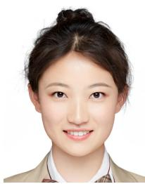

<details>
<summary>natural_image</summary>

Portrait of a woman with dark hair in a bun, wearing a beige collared shirt (no visible text or symbols)
</details>

Kexin Zhang (Student Member, IEEE) is currently pursuing the Ph.D. degree with the School of Electronics and Information, Northwestern Polytechnical University, Xi’an, China, under the supervision of Prof. Li. Her research interests include deep learning, semantic communications, and large language models.

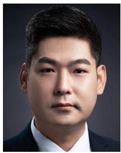

<details>
<summary>natural_image</summary>

Portrait of a man in formal attire (no text or symbols visible)
</details>

Lixin Li (Member, IEEE) received the B.S. (Hons.), M.S. (Hons.), and Ph.D. degrees from Northwestern Polytechnical University (NPU), China, in 2001, 2004, and 2008, respectively, where he was a Postdoctoral Research Fellow from 2009 to 2011. In 2011, he joined the School of Electronics and Information, NPU, where he is currently a Full Professor and the Chair with the Department of Communication Engineering. In 2017, he held the visiting scholar position with the University of Houston, USA. He holds 26 granted patents and has

authored or coauthored five books and more than 200 peer-reviewed papers in many prestigious journals and conferences. His research interests include 5G/6G wireless networks, federated learning, game theory, and machine learning for wireless communications. He was the recipient of the 2016 NPU Outstanding Young Teacher Award, which is the highest research and education honors for young faculties in NPU. He was an Exemplary Reviewer of the IEEE TRANSACTIONS ON COMMUNICATIONS in 2020.

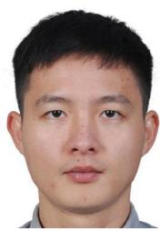

<details>
<summary>natural_image</summary>

Portrait photo of a young man with short black hair (no text or symbols visible)
</details>

Wensheng Lin (Member, IEEE) received the B.Eng. degree in communication engineering, and the M.Eng. degree in electronic and communication engineering from Northwestern Polytechnical University, Xi’an, China, in 2013 and 2016, respectively, and the Ph.D. degree in information science from Japan Advanced Institute of Science and Technology, Ishikawa, Japan, in 2019. His doctoral study was fully funded by the Chinese Government Scholarship awarded from the China Scholarship Council. He is currently an Associate Professor with the School of Electronics and Information, Northwestern Polytechnical University. He was selected into the 8th Young Elite Scientists Sponsorship Program by the China Association for Science and Technology. His research interests include network information theory, distributed source coding, and semantic communications. He was a recipient of the prestigious 2019 Niwa Yasujiro Outstanding Paper Award, and the 2019 IEEE Nagoya Section Conference Presentation Award.


<details>
<summary>natural_image</summary>

Portrait of a man wearing glasses and a suit (no text or symbols visible)
</details>

Wenchi Cheng (Senior Member, IEEE) received the B.S. and Ph.D. degrees in telecommunication engineering from Xidian University, Xi’an, China, in 2008 and 2013, respectively, where he is currently a Full Professor. He was a Visiting Scholar with the Department of Electrical and Computer Engineering, Texas A&M University, College Station, TX, USA, from 2010 to 2011. He has published more than 200 international journal and conference papers in IEEE Journal on Selected Areas in Communications, IEEE MAGAZINES, IEEE Transactions, IEEE INFOCOM, GLOBECOM, and ICC. His current research interests include 6G wireless networks, electromagnetic-based wireless communications, and emergency wireless information. He received the IEEE ComSoc Asia–Pacific Outstanding Young Researcher Award in 2021, the URSI Young Scientist Award in 2019, the Young Elite Scientist Award of CAST, and the Four IEEE journal/conference best papers. He has served or serving as the IEEE GLOBECOM 2026 Tutorial Co-Chair, the Wireless Communications Symposium Co-Chair for IEEE ICC 2022 and IEEE GLOBECOM 2020, the Publicity Chair for IEEE ICC 2019, the Next Generation Networks Symposium Chair for IEEE ICCC 2019, and the Workshop Chair for IEEE ICC 2019/IEEE GLOBECOM 2019/INFOCOM 2020 Workshop on Intelligent Wireless Emergency Communications Networks. He has served or serving as the ComSoc Representative for IEEE Public Safety Technology Initiative, IEEE ComSoc Distinguished Lecturer, an Editor for the IEEE TRANSACTIONS ON WIRELESS COMMUNICATIONS, IEEE SYSTEM JOURNAL, IEEE COMMUNICATIONS LETTERS, and IEEE WIRELESS COMMUNICATIONS LETTERS.

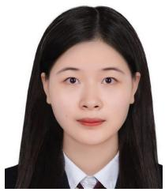

<details>
<summary>natural_image</summary>

Portrait photo of a woman with long dark hair wearing formal attire (no text or symbols visible)
</details>

Yuna Yan (Student Member, IEEE) is currently pursuing the master’s degree with the school of Electronics and Information, Northwestern Polytechnical University. Her research interests include federated learning, deep learning, and semantic communications.

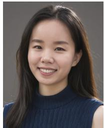

<details>
<summary>natural_image</summary>

Portrait of a smiling woman with long dark hair wearing a blue turtleneck sweater (no text or symbols visible)
</details>

Rui Li received the B.Eng. degree in communications engineering from Northwestern Polytechnical University, China, in 2013, the M.Sc. degree in embedded system and control engineering from the Department of Engineering, University of Leicester, U.K., in 2014, and the Ph.D. degree in informatics from the School of Informatics, University of Edinburgh, U.K., in 2019. Her thesis was on resource optimization in millimeter-wave backhaul networks using deep learning. She was a Visiting Researcher with The National Institute for Research in Digital Science and Technology, Lyon, France. She joined as a Postdoctoral Researcher with Samsung AI Center in Cambridge, U.K., in 2019, and she is currently a Research Scientist. Her research interests include efficient inference of LLM and stable diffusion models, personalization of ML models under resource-constrained environments, and applications of AI in various domains including communications, vision, and natural language processing. She received the Samsung Best Paper Silver Award in 2024. During her study as a Ph.D. student, she received the Brendan Murphy Memorial Prize at the 30th Next Generation Networking Multi-Service Networks conference, U.K., and the Best Student Paper Award at International Conference on Machine Learning for Networking, Paris, France.

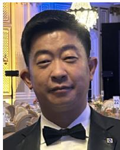

<details>
<summary>natural_image</summary>

Portrait of a man in formal attire with bow tie (no visible text or symbols)
</details>

Zhu Han (Fellow, IEEE) received the B.S. degree in electronic engineering from Tsinghua University, in 1997, and the M.S. and Ph.D. degrees in electrical and computer engineering from the University of Maryland, College Park, in 1999 and 2003, respectively.

From 2000 to 2002, he was a R&D Engineer of JDSU, Germantown, Maryland. From 2003 to 2006, he was a Research Associate with the University of Maryland. From 2006 to 2008, he was an Assistant Professor with Boise State University, Idaho. He is currently a John and Rebecca Moores Professor with the Electrical and Computer Engineering Department, Computer Science Department, University of Houston, Texas. He is a 1% highly cited researcher since 2017 according to Web of Science. His main research targets on the novel gametheory related concepts critical to enabling efficient and distributive use of wireless networks with limited resources. His other research interests include wireless resource allocation and management, wireless communications and networking, quantum computing, data science, smart grid, carbon neutralization, and security and privacy. He received the NSF Career Award in 2010, the Fred W. Ellersick Prize of the IEEE Communication Society in 2011, the EURASIP Best Paper Award for the Journal on Advances in Signal Processing in 2015, the IEEE Leonard G. Abraham Prize in the field of Communications Systems (best paper award in IEEE JSAC) in 2016, the IEEE Vehicular Technology Society 2022 Best Land Transportation Paper Award, and the several best paper awards in IEEE conferences. He is also the winner of the 2021 IEEE Kiyo Tomiyasu Award (an IEEE Field Award), for outstanding early to mid-career contributions to technologies holding the promise of innovative applications, with the following citation: “for contributions to game theory and distributed management of autonomous communication networks.” He was an IEEE Communications Society Distinguished Lecturer from 2015 to 2018 and an ACM Distinguished Speaker from 2022 to 2025, an AAAS Fellow since 2019, and an ACM Fellow since 2024.