# Sensing-Assisted Eavesdropper Estimation: An ISAC Breakthrough in Physical Layer Security

Nanchi Su , Graduate Student Member, IEEE, Fan Liu , Member, IEEE, and Christos Masouros , Senior Member, IEEE

Abstract— In this paper, we investigate the sensing-aided physical layer security (PLS) towards Integrated Sensing and Communication (ISAC) systems. A well-known limitation of PLS is the need to have information about potential eavesdroppers (Eves). The sensing functionality of ISAC offers an enabling role here, by estimating the directions of potential Eves to inform PLS. In our approach, the ISAC base station (BS) firstly emits an omnidirectional waveform to search for potential Eves’ directions by employing the combined Capon and approximate maximum likelihood (CAML) technique. Using the resulting information about potential Eves, we formulate secrecy rate expressions, which is a function of the Eves’ estimation accuracy. We then formulate a weighted optimization problem to simultaneously maximize the secrecy rate with the aid of the artificial noise (AN), and minimize the Cramér-Rao Bound (CRB) of targets’/Eves’ estimation. By taking the possible estimation errors into account, we enforce a beampattern constraint with a wide main beam covering all possible directions of Eves. This implicates that security needs to be enforced in all these directions. By improving estimation accuracy, the sensing and security functionalities provide mutual benefits, resulting in improvement of the mutual performances with every iteration of the optimization, until convergence. Our results avail of these mutual benefits and reveal the usefulness of sensing as an enabler for practical PLS.

Index Terms— Integrated sensing and communication system, sensing aided physical layer security, Cramér-Rao bound, secrecy rate, artificial noise.

Manuscript received 15 October 2022; revised 28 March 2023 and 15 June 2023; accepted 7 August 2023. Date of publication 23 August 2023; date of current version 11 April 2024. This work was supported in part by the Engineering and Physical Sciences Research Council (EPSRC) under Grant EP/S028455/1; in part by the National Natural Science Foundation of China under Grant 62101234, Grant U20B2039, Grant 61831008, and Grant 62027802; in part by the Young Elite Scientist Sponsorship Program by the China Association for Science and Technology (CAST) under Grant YESS20210055; and in part by the China Scholarship Council (CSC). The associate editor coordinating the review of this article and approving it for publication was M. C. Gursoy. (Corresponding author: Fan Liu.)

Nanchi Su is with the Guangdong Provincial Key Laboratory of Aerospace Communication and Networking Technology, Harbin Institute of Technology (Shenzhen), Shenzhen 518055, China, also with the Department of Electronic and Electrical Engineering, Southern University of Science and Technology, Shenzhen 518055, China, and also with the Department of Electronic and Electrical Engineering, University College London, WC1E 7JE London, U.K. (e-mail: nanchi.su.18@ucl.ac.uk).

Fan Liu is with the Department of Electrical and Electronic Engineering, Southern University of Science and Technology, Shenzhen 518055, China (e-mail: liuf6@sustech.edu.cn).

Christos Masouros is with the Department of Electronic and Electrical Engineering, University College London, WC1E 7JE London, U.K. (e-mail: chris.masouros@ieee.org).

Color versions of one or more figures in this article are available at https://doi.org/10.1109/TWC.2023.3306029.

Digital Object Identifier 10.1109/TWC.2023.3306029

# I. INTRODUCTION

# A. Background and Motivation

AS THE 5G wireless networks are being rolled-out world-wide, emerging applications, such as connected cars, wide，emerging applications， such as connected cars, smart factories, and digital twins, highlight the limitations of existing network infrastructures [1]. These applications demand both increasingly high-quality communication as well as high accuracy and robustness of sensing, it is wellrecognized that the cooperation and co-design between communication and radar systems will play a significant role in the upcoming beyond 5G (B5G) and 6G eras.

At the early stage of the radar-communication (RadCom) system studies, the two systems were conceived to spectrally coexist with each other, thus easing the severe competition over the scarce spectrum resources [2], [3]. In the forthcoming B5G/6G eras, radio sensing and communications (S&C) are both evolving towards higher frequency bands and large-scale antenna arrays, which leads to striking similarities between S&C systems in terms of hardware architecture, channel characteristics, and information processing pipeline [4]. In light of this, the research on the coexistence of radar and communication systems has involved into dual-functional radar communication (DFRC) systems. The joint design of the S&C operations, in the form of Integrated Sensing and Communications (ISAC), have been initially proposed in [5]. ISAC systems are expected to achieve higher spectral and energy efficiencies, but most importantly, promote a new paradigm of integration for attaining mutual benefits from a co-design perspective, wherein the S&C functionalities can mutually assist each other. Benefiting from these two advantages, applications of ISAC have been extended to numerous emerging areas, including smart manufacturing, environmental monitoring, vehicular networks, as well as indoor services such as human activity recognition.

With the evolution of cellular networks, the security in mmWave ISAC systems is facing with great challenges because of the shared use of the spectrum and the broadcasting nature of wireless transmission [6]. On one hand, the Rician channels are widely employed in mmWave frequencies, containing the line of sight (LoS) component, which results in an inescapable correlation with the sensing channel. This is different from conventional physical layer security (PLS) studies in communication systems with the independent and identically distributed assumption between legitimate user channels and intercept channels [7], [8], [9]. On the other hand, in dual-functional waveform design, the confidential information intended for communication users (CUs) is embedded in radar probing signals. This makes it susceptible to being eavesdropped by the target of interest. In this case, a unique and interesting conflict arises from the radar functionality side. To be specific, the power is expected to be focused towards targets of interest to improve detectability, while the useful signal information has to be protected from being intercepted by the targets, which are acknowledged as Eves, as each of them is reckoned as a potential eavesdropper (Eve).

To secure confidential information in ISAC systems, existing approaches can be generally divided into the following categories, i.e., 1) Cryptography and 2) PLS. Conventionally, the security of communication systems is regarded as an independent feature and addressed at the upper layers of the protocol stack by deploying cryptographic technologies. The studies of cryptography commonly assume that the physical layer provides an error-free link [10], while the wireless links are vulnerable to attacks in practice, which would result in a high risk of information leakage. It is worth pointing out that 5G has already been a large-scale heterogeneous network with multiple levels and weakly-structured architectures, which makes it difficult to distribute and manage secret keys [11]. Also, complicated encryption/decryption algorithms cannot be straightforwardly applied considering the power consumption in 5G networks. Furthermore, even if the data is encrypted, the detection of a wireless link from a potential eavesdropper can reveal critical information. In contrast to complex cryptographic approaches, signal processing operations of PLS are usually simple with little additional overheads. A major limitation of PLS is the need to obtain some information for the potential Eves. This ranges from full CSI, to an SNR estimate of Eve’s link, or Eve’s direction as a minimum. This difficult-to-obtain information often renders PLS impractical.

To our best knowledge of existing literature, ISAC security has been studied in more complex scenarios in recent years. To be specific, the PLS was concerned with the non-orthogonal multiple access (NOMA)-ISAC system by maximizing the sum secrecy rate for multiple users via artificial jamming, where the superimposed signal for NOMA users can be concurrently employed for target detection [12]. Moreover, Reconfigurable Intelligent Surfaces (RIS) have been applied to enhance ISAC security [13], [14], [15]. In [14], the authors deployed an active RIS and designed the optimization problem to maximize the achievable secrecy rate of the system by jointly designing the radar receive beamformers, the active RIS reflection coefficients matrix, and the transmit beamformers. This work proved that the deployment of active RIS improves the secrecy performance compared with the passive RIS or no-RIS case. Also, the aerial eavesdroppers (AE) were considered in [16], where the ISAC BS emitted waveforms to track and jam the AE, which achieved a higher secrecy rate and better fairness performance. The optimization problem was formulated to jointly design radar signal and receiver beamformer for improving the secrecy performance based on the tracking information.

More relevant to this work, security in ISAC systems was initially studied in [17], where MIMO radar transmits two different signals, carrying desired information and false information, respectively, both of which are employed for sensing. Optimization problems were designed to maximize the secrecy rate for safeguarding communication data. As studied in [18] and [19], the dual-functional base station (BS) detects targets and transmits information to CUs simultaneously, where each of the targets is regarded as a potential eavesdropper. In this scenario, the artificial noise (AN)-aided secure beamforming design enables the secure information transmission from the BS to CUs in ISAC systems. Specifically, AN is generated at the transmitter side to deteriorate the received signal at each target/Eve, thus the decoding capability of which is destructed. To avoid the redundant power consumption caused by the added AN, the research in [20] proposed a symbol-level precoding algorithm to exploit constructive interference (CI) to aid detection from the legitimate users, and destructive interference (DI) to inhibit detection from the target/Eve. More recently, the encryption keys mechanism has been applied in PLS, where the filter band-based PLS algorithm was proposed to enable key generation by decomposing the received signal in parallel sub-bands, namely chirp modulation [21]. This method secured ISAC systems by improving the secret key generation rate efficiently, which however depends on the radio channel characteristics. Additionally, the information-theoretic study in [22] considered mitigating information leakage between sensing and communication operations in the ISAC system, where the inner and outer bounds for the secrecy-distortion region were derived under the assumption of perfect and partial output feedback.

# B. Contributions

We note that in the above works on secure ISAC transmission, the radar and communication systems work individually over separate end-goals rather than cooperating with each other. To further promote the integration of S&C functionalities to improve the security of the ISAC systems, we propose a novel approach to ensure the PLS for communication data transmission, which is assisted by the sensing functionality. At the first stage, the dual-functional access point (AP) emits an omnidirectional waveform for Eve detection, which then receives echoes reflected from both CUs and Eves located within the sensing range. Suppose that all CUs are cooperative users. That is, the location information of each is acknowledged to the AP. Thus, it is possible to obtain angle estimates of Eves contained in the reflected echo by removing known CUs’ angles. The estimation performance is measured by the Cramér-Rao Bound (CRB) [23].

In the next stage, we formulate a weighted optimization problem to minimize the CRB of targets/Eves and maximize the secrecy rate, subject to beampattern constraints as well as a transmit power budget. A key novelty in this setup is that the channel information in the secrecy rates, is a function of the sensing performance. Specifically, to avoid any false dismissal detection, the main lobe of the beampattern is designed to be wide, with a width depending on the estimation accuracy.

Afterwards, by improving estimation accuracy, the sensing and security functionalities provide mutual benefits, resulting in improvement of the mutual performances with every iteration of the optimization, until convergence.

Within this scope, the contributions of our work are summarized as follows:

• We present a sensing-assisted PLS algorithm for the ISAC systems, where the sensing and secrecy performance are measured by the CRB and the secrecy rate, respectively. In particular, we first perform target detection via emitting an omnidirectional waveform. Then, we formulate a beamforming design problem that jointly improves the sensing accuracy and communication secrecy rate.   
• We analyze the lower bound of CRB and the upper bound of the secrecy rate in our proposed ISAC system.   
• We propose an alternative optimization algorithm that iteratively maximizes the determinant of the Fisher Information Matrix (FIM) and the secrecy rate with the aid of the AN. Specifically, the secrecy rate is updated with improved accuracy of the Eves’ angle estimation.   
• To improve the robustness of the proposed method, we further take into account the uncertainty of Eve’s location. In such cases, the main beam of the sensing beampattern is designed to be sufficiently wide to cover the possible angular region where an Eve may appear with high probability. This region is indicated by the CRB value obtained from the previous iteration.   
• We design a fractional programming (FP) algorithm to solve the proposed weighted optimization problem and verify the efficiency of the solver for both single-Eve and multi-Eve detection.

# C. Organization

This paper is organized as follows. Section II gives the system model. Benchmark schemes including AN design techniques with unknown and statistically known Eve channel information are given in Section III. Section IV presents the approach to estimating Eves’ parameters. Bounds for the metrics CRB and secrecy rate are given in Section V and the weighted optimization problem is accordingly designed for Eves’ parameters estimation and communication data security in Section VI. Section VII provides numerical results, and Section VIII concludes the paper.

Notations: Unless otherwise specified, matrices are denoted by bold uppercase letters (i.e., X), vectors are represented by bold lowercase letters (i.e., x), and scalars are denoted by normal font (i.e., α). Subscripts indicate the location of the entry in the matrices or vectors $( \mathrm { i } . \mathrm { e } . , s _ { i , j }$ and $l _ { n }$ are the $( i , j )$ -th and the n-th element in S and l, respectively). tr (·) and vec (·) denote the trace and the vectorization operations. $\left( \cdot \right) ^ { T } , \left( \cdot \right) ^ { H }$ and $( \cdot ) ^ { * }$ stand for transpose, Hermitian transpose and the complex conjugate of the matrices, respectively. diag (·) represents the vector formed by the diagonal elements of the matrices and rank (·) is rank operation. $\| \cdot \| , \ \| \cdot \| _ { \infty }$ and $\left\| \cdot \right\| _ { F }$ denote the $l _ { 2 }$ norm, infinite norm and the Frobenius norm respectively. E {·} denotes the statistical expectation.

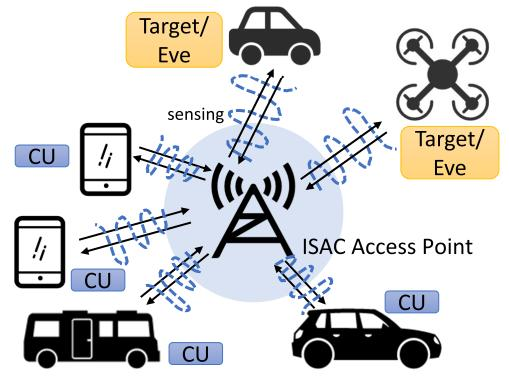

flowchart

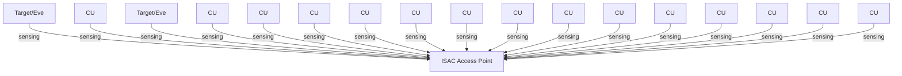

(a) Stage 1-The ISAC AP emits omnibeampatern for Eve estimations

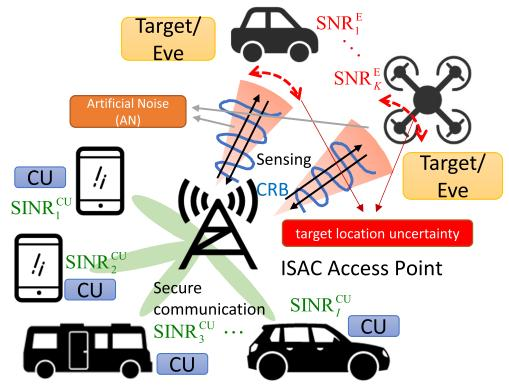

flowchart

```mermaid
graph TD
    A["Target/Eve"] --> B["Artificial Noise (AN)"]
    B --> C["Sensing"]
    C --> D["CRB"]
    D --> E["Target/Eve"]
    E --> F["target location uncertainty"]
    F --> G["ISAC Access Point"]
    G --> H["SINR₁CU ... CU"]
    H --> I["SINR₂CU CU"]
    I --> J["CU"]
    J --> K["Target/Eve"]
    K --> L["SNR₁^E ... SNR_K^E"]
    L --> M["SNR₃^CU ... CU"]
    M --> N["CU"]
    N --> O["Target/Eve"]
    O --> P["SNR₁^E ... SNR_K^E"]
    P --> Q["SNR₃^CU ... CU"]
    Q --> R["CU"]
    R --> S["Target/Eve"]
    S --> T["SNR₁^E ... SNR_K^E"]
    T --> U["SNR₃^CU ... CU"]
    U --> V["CU"]
    V --> W["Target/Eve"]
    W --> X["SNR₁^E ... SNR_K^E"]
    X --> Y["SNR₃^CU ... CU"]
    Y --> Z["CU"]
    Z --> AA["Target/Eve"]
    AA --> AB["SNR₁^E ... SNR_K^E"]
    AB --> AC["SNR₃^CU ... CU"]
    AC --> AD["CU"]
    AD --> AE["Target/Eve"]
    AE --> AF["SNR₁^E ... SNR_K^E"]
    AF --> AG["SNR₃^CU ... CU"]
    AG --> AH["CU"]
    AH --> AI["Target/Eve"]
    AI --> AJ["SNR₁^E ... SNR_K^E"]
    AJ --> AK["SNR₃^CU ... CU"]
    AK --> AL["CU"]
    AL --> AM["Target/Eve"]
    AM --> AN["SNR₁^E ... SNR_K^E"]
    AN --> AO["SNR₃^CU ... CU"]
    AO --> AP["CU"]
    AP --> AQ["Target/Eve"]
    AQ --> AR["SNR₁^E ... SNR_K^E"]
    AR --> AS["SNR₃^CU ... CU"]
    AS --> AT["CU"]
    AT --> AU["Target/Eve"]
    AU --> AV["SNR₁^E ... SNR_K^E"]
    AV --> AW["SNR₃^CU ... CU"]
    AW --> AX["CU"]
    AX --> AY["Target/Eve"]
    AY --> AZ["SNR₁^E ... SNR_K^E"]
    AZ --> BA["SNR₃^CU ... CU"]
    BA --> BB["CU"]
    BB --> BC["Target/Eve"]
    BC --> BD["SNR₁^E ... SNR_K^E"]
    BD --> BE["SNR₃^CU ... CU"]
    BE --> BF["CU"]
    BF --> BG["Target/Eve"]
    BG --> BH["SNR₁^E ... SNR_K^E"]
    BH --> BI["SNR₃^CU ... CU"]
    BI --> BJ["CU"]
    BJ --> BK["Target/Eve"]
    BK --> BL["SNR₁^E ... SNR_K^E"]
    BL --> BM["SNR₃^CU ... CU"]
    BM --> BN["CU"]
    BN --> BO["Target/Eve"]
    BO --> BP["SNR₁^E ... SNR_K^E"]
    BP --> BQ["SNR₃^CU ... CU"]
    BQ --> BR["CU"]
    BR --> BS["Target/Eve"]
    BS --> BT["SNR₁^E ... SNR_K^E"]
    BT --> BU["SNR₃^CU ... CU"]
    BU --> BV["CU"]
    BV --> BW["Target/Eve"]
    BW --> BX["SNR₁^E ... SNR_K^E"]
    BX --> BY["SNR₃^CU ... CU"]
    BY --> BZ["CU"]
    BZ --> CA["Target/Eve"]
    CA --> CB["SNR₁^E ... SNR_K^E"]
    CB --> CC["SINR₃^CU ... CU"]
    CC --> CD["SINR₁^E ... SNR_K^E"]
    CD --> CE["SINR₃^CU ... CU"]
    CE --> CF["SINR₁^E ... SNR_K^E"]
    CF --> CG["SINR₃^CU ... CU"]
    CG --> CH["SINR₁^E ... SNR_K^E"]
    CH --> CI["SINR₃^CU ... CU"]
    CI --> CJ["SINR₁^E ... SNR_K^E"]
    CJ --> CK["SINR₃^CU ... CU"]
```

(b) Stage 2-Sensing-aided secure ISAC system   
Fig. 1. Architecture of the proposed secure ISAC system assisted by the sensing functionality.

# II. SYSTEM MODEL

We consider a mmWave ISAC system equipped with co-located antennas and let $N _ { t }$ and $N _ { r }$ denote the number of transmit antennas and receive antennas, where the base station communicates with I communication users (CUs) and detects K targets/Eves simultaneously as depicted in Fig. 1. Note that the targets of interest are considered to be malicious, which intend to intercept the confidential information from the AP to the CUs. We assume the BS has knowledge of the CUs and their channels, and has no knowledge of the Eves.

# A. Communication Signal Model and Metrics

Let the rows of $\mathbf { X } \in \mathbb { C } ^ { N _ { t } \times L }$ denote the transmit waveforms, where L is the number of time-domain snapshots. By transmitting the dual-functional waveforms to I CUs, the received signal matrix at the receivers can be expressed as

$$
\mathbf {Y} _ {C} = \mathbf {H X} + \mathbf {Z} _ {C}, \tag {1}
$$

where $\mathbf { Z } _ { C } ~ \in ~ \mathbb { C } ^ { I \times L }$ is the additive white Gaussian noise (AWGN) matrix and with the variance of each entry being $\sigma _ { C } ^ { 2 }$ . $\mathbf { H } = [ \mathbf { h } _ { 1 } , \mathbf { h } _ { 2 } , \ldots , \mathbf { h } _ { I } ] ^ { H } \in \mathbb { C } ^ { I \times N _ { t } }$ represents the communication channel matrix, which is assumed to be known to the BS, with each entry being independently distributed. Following the typical mmWave channel model in [20] and [24], we assume that hi is a slow-fading block Rician fading channel. The channel vector of the i-th user can be expressed as

$$
\mathbf {h} _ {i} = \sqrt {\frac {v _ {i}}{1 + v _ {i}}} \mathbf {h} _ {L, i} ^ {\mathrm{LoS}} + \sqrt {\frac {1}{1 + v _ {i}}} \mathbf {h} _ {S, i} ^ {\mathrm{NLoS}}, \tag {2}
$$

where √ $v _ { i } > 0$ is the Rician K-factor of the i-th user, hLoSL,i $\sqrt { N _ { t } } \mathbf { a } _ { t } \left( \omega _ { i , 0 } \right)$ is the LoS deterministic component. $\mathbf { a } \left( \omega _ { i , 0 } \right)$ denotes the array steering vector, where $\begin{array} { r } { \omega _ { i , 0 } \in \left[ \mathrm { ~ - ~ } \frac { \pi } { 2 } , \frac { \pi } { 2 } \right] } \end{array}$  is the angle of departure (AOD) of the LoS component from the BS to the user i [24], [25]. The scattering component $\mathbf { h } _ { S , i } ^ { \mathrm { N L o S } }$ can be expressed as $\begin{array} { r } { \mathbf { h } _ { S , i } ^ { \mathrm { N L o S } } = \sqrt { \frac { N _ { t } } { L _ { p } } } \sum _ { l = 1 } ^ { L _ { p } } c _ { i , l } \mathbf { a } _ { t } \left( \omega _ { i , l } \right) } \end{array}$ Lp t PLpl=1 ci,lat (ωi,l), where $L _ { p }$ denotes the number of propagation paths, $c _ { i , l } \sim \mathcal { C N } \left( 0 , 1 \right)$ is the complex path gain and $\begin{array} { r } { \omega _ { i , l } \in \left[ \mathrm { ~ - ~ } \frac { \pi } { 2 } , \frac { \pi } { 2 } \right] } \end{array}$ is the AOD associated to the (i, l)-th propagation path.

The waveform X in (1) can be expressed as

$$
\mathbf {X} = \mathbf {W S} + \mathbf {N}, \tag {3}
$$

where $\mathbf { W } \in \mathbb { C } ^ { N _ { t } \times I }$ is the dual-functional beamforming matrix to be designed, each row of $\mathbf { S } \in \mathbb { C } ^ { I \times L }$ denotes the i-th unitpower data stream intended to CUs, and $ { \mathbf { N } } \in \mathbb { C } ^ { N _ { t } \times L }$ is the AN matrix generated by the transmitter to interfere potential eavesdroppers. We assume that $\mathbf { N } \ \sim \ { \mathcal { C N } } ( \mathbf { 0 } , \mathbf { R } _ { N } )$ , where $\mathbf { R } _ { N } \succeq \mathbf { 0 }$ denotes the covariance matrix of the AN that is to be designed. We further assume that the data streams are approximately orthogonal to each other, yielding

$$
\frac {1}{L} \mathbf {S} _ {C} \mathbf {S} _ {C} ^ {H} \approx \mathbf {I} _ {I \times I}. \tag {4}
$$

Note that (4) is asymptotically achievable when $L$ is sufficiently large. Then, we denote the beamforming matrix as $\mathbf { W } = [ \mathbf { w } _ { 1 } , \dots , \mathbf { w } _ { I } ]$ , where each column $\mathbf { w } _ { i }$ is the beamformer for the i-th CU. Accordingly, the SINR of the i-th user is given as

$$
\begin{array}{l} \mathrm{SINR} _ {i} ^ {\mathrm{CU}} = \frac {\left| \mathbf {h} _ {i} ^ {H} \mathbf {w} _ {i} \right| ^ {2}}{\sum_ {m = 1 , m \neq i} ^ {I} \left| \mathbf {h} _ {i} ^ {H} \mathbf {w} _ {m} \right| ^ {2} + \left| \mathbf {h} _ {i} ^ {H} \mathbf {R} _ {N} \mathbf {h} _ {i} \right| + \sigma_ {C} ^ {2}} \\ = \frac {\operatorname{tr} \left(\tilde {\mathbf {H}} _ {i} \tilde {\mathbf {W}} _ {i}\right)}{\sum_ {m = 1 , m \neq i} ^ {I} \operatorname{tr} \left(\tilde {\mathbf {H}} _ {i} \tilde {\mathbf {W}} _ {m}\right) + \operatorname{tr} \left(\tilde {\mathbf {H}} _ {i} \mathbf {R} _ {N}\right) + \sigma_ {C} ^ {2}}, \tag {5} \\ \end{array}
$$

where we denote $\tilde { \mathbf { H } } _ { i } = \mathbf { h } _ { i } \mathbf { h } _ { i } ^ { H }$ and $\tilde { \mathbf { W } } _ { i } = \mathbf { w } _ { i } \mathbf { w } _ { i } ^ { H }$ .

# B. Radar Signal Model

We here consider targets of interest associated with a particular range bin. Targets in adjacent range bins contribute as interference to the range bin of interest [26]. By emitting the waveform X to sense Eves, the reflected echo signal matrix at the BS receive array is given as

$$
\mathbf {Y} _ {R} = \sum_ {k = 1} ^ {K} \mathbf {a} \left(\theta_ {k}\right) \beta_ {k} \mathbf {b} ^ {H} \left(\theta_ {k}\right) \mathbf {X} + \mathbf {Z} _ {R}, \tag {6}
$$

where $\mathbf { a } \left( \theta \right) \ \in \ \mathbb { C } ^ { N _ { r } \times 1 }$ and $\mathbf { b } \left( \theta \right) \ \in \ \mathbb { C } ^ { N _ { t } \times 1 }$ represent the steering vectors for the receive and transmit arrays, which are assumed to be a uniform linear array (ULA) with half-wavelength antenna spacing. $\beta _ { k }$ is the complex amplitude of the k-th Eve. We assume the number of antennas is even and define the receive steering vector as

$$
\mathbf {a} (\theta) = \left[ e ^ {- j \frac {N _ {r} - 1}{2} \pi \sin \theta}, e ^ {- j \frac {N _ {r} - 3}{2} \pi \sin \theta}, \dots , e ^ {j \frac {N _ {r} - 1}{2} \pi \sin \theta} \right] ^ {T}. \tag {7}
$$

It is noted that we choose the center of the ULA antennas as the reference point. To this end, it is easy to verify that

$$
\mathbf {a} ^ {H} (\theta) \dot {\mathbf {a}} (\theta) = 0. \tag {8}
$$

Finally, $\mathbf { Z } _ { R }$ denotes the interference and the AWGN term. We assume that the columns of $\mathbf { Z } _ { R }$ are independent and identically distributed circularly symmetric complex Gaussian random vectors with mean zero and a covariance matrix $\mathbf { Q } = \sigma _ { R } ^ { 2 } \mathbf { I }$ .

Similar to the expression in (5), the eavesdropping SINR received at the k-th Eve regarding the i-th CU is written as

$$
\mathrm{SINR} _ {k, i} ^ {\mathrm{E}} = \frac {\left| \alpha_ {k} \right| ^ {2} \mathbf {b} ^ {H} \left(\theta_ {k}\right) \tilde {\mathbf {W}} _ {i} \mathbf {b} \left(\theta_ {k}\right)}{\left| \alpha_ {k} \right| ^ {2} \mathbf {b} ^ {H} \left(\theta_ {k}\right) \left(\sum_ {\substack {\bar {m} = 1, \\ \bar {m} \neq i}} ^ {I} \tilde {\mathbf {W}} _ {\bar {m}} + \mathbf {R} _ {N}\right) \mathbf {b} \left(\theta_ {k}\right) + \sigma_ {0} ^ {2}}, \tag{9}
$$

where $\alpha _ { k }$ denotes the complex path-loss coefficient of the k-th target and $\sigma _ { 0 } ^ { 2 }$ denotes the covariance of AWGN received by each Eve.

For simplicity, the reflected echo signal given in (6) can be recast as

$$
\mathbf {Y} = \mathbf {A} (\boldsymbol {\theta}) \boldsymbol {\Lambda} \mathbf {B} ^ {H} (\boldsymbol {\theta}) \mathbf {X} + \mathbf {Z} _ {R}, \tag {10}
$$

where we denote ${ \bf A } \left( \pmb { \theta } \right) ~ = ~ [ \mathbf { a } \left( \theta _ { 1 } \right) , \ldots , \mathbf { a } \left( \theta _ { K } \right) ] , \ \mathbf { B } \left( \pmb { \theta } \right) \ =$ $\left[ \mathbf { b } \left( \theta _ { 1 } \right) , \ldots , \mathbf { b } \left( \theta _ { K } \right) \right]$ , and $\boldsymbol { \Lambda } = \operatorname { d i a g } \left( \beta _ { k } \right)$ .

# C. CRB and Secrecy Rate

In this subsection, we elaborate on the radar detection and communication security metrics. Particularly, the target/Eve estimation is measured by the CRB, which is a lower bound on the variance of unbiased estimators [27], and the security performance is evaluated by the secrecy rate.

In the multi-Eve detection scenario, the CRB with respect to the unknown Eve parameters $\theta _ { 1 } , \ldots , \theta _ { K }$ and $\beta _ { 1 } , \ldots , \beta _ { K }$ was derived in [28] in detail, and the FIM for $\theta _ { k } , \forall k$ as well as real and imaginary parts of $\beta _ { k } , \forall k$ is given as

$$
\mathbf {J} = 2 L \left[ \begin{array}{c c c} \operatorname{Re} \left(\mathbf {J} _ {1 1}\right) & \operatorname{Re} \left(\mathbf {J} _ {1 2}\right) & - \operatorname{Im} \left(\mathbf {J} _ {1 2}\right) \\ \operatorname{Re} ^ {T} \left(\mathbf {J} _ {1 2}\right) & \operatorname{Re} \left(\mathbf {J} _ {2 2}\right) & - \operatorname{Im} \left(\mathbf {J} _ {2 2}\right) \\ - \operatorname{Im} ^ {T} \left(\mathbf {J} _ {1 2}\right) & - \operatorname{Im} ^ {T} \left(\mathbf {J} _ {2 2}\right) & \operatorname{Re} \left(\mathbf {J} _ {2 2}\right) \end{array} \right], \tag {11}
$$

where the elements of the matrix in (11) are given in (12), shown at the bottom of the next page, with ⊙ denoting the Hadamard (element-wise) matrix product, and $\begin{array} { r l r } { \mathbf { \bar { A } } } & { { } = } & { \left\lceil \frac { \partial \mathbf { a } ( \theta _ { 1 } ) } { \partial \theta _ { 1 } } \frac { \partial \mathbf { a } ( \theta _ { 2 } ) } { \partial \theta _ { 2 } } \dots \frac { \partial \mathbf { a } ( \theta _ { K } ) } { \partial \theta _ { K } } \right\rceil } \end{array}$ ∂θK ， B˙ = $\begin{array} { r } { \left[ \frac { \partial \mathbf { b } ( \theta _ { 1 } ) } { \partial \theta _ { 1 } } \ \frac { \partial \mathbf { b } ( \theta _ { 2 } ) } { \partial \theta _ { 2 } } \ . . . \ \frac { \partial \mathbf { b } ( \bar { \theta _ { K } } ) } { \partial \theta _ { K } } \ \right] } \end{array}$ . Also, the covariance matrix $\mathbf { R } _ { X }$ ∂θK is given as

$$
\begin{array}{l} \mathbf {R} _ {X} = \frac {1}{L} \mathbf {X X} ^ {H} = \mathbf {W W} ^ {H} + \mathbf {R} _ {N} \\ = \sum_ {i = 1} ^ {I} \tilde {\mathbf {W}} _ {i} + \mathbf {R} _ {N}. \tag {13} \\ \end{array}
$$

As per the above, the corresponding CRB matrix is expressed as

$$
\mathrm{CRB} (\boldsymbol {\theta}, \boldsymbol {\beta}) = \mathbf {J} ^ {- 1} \tag {14}
$$

and

$$
\operatorname{CRB} (\boldsymbol {\theta}) = \left[ \mathbf {J} ^ {- 1} \right] _ {1 1}
$$

$$
\operatorname{CRB} (\boldsymbol {\beta}) = \left[ \mathbf {J} ^ {- 1} \right] _ {2 2} + \left[ \mathbf {J} ^ {- 1} \right] _ {3 3}. \tag {15}
$$

Moreover, the achievable secrecy rate at the legitimate user is defined as the difference between the achievable rates at the legitimate receivers and the eavesdroppers. Thus, we give the expression of the worst-case secrecy rate as [19] and [29]

$$
\mathrm{SR} \left(\tilde {\mathbf {W}} _ {i}, \mathbf {R} _ {N}\right) = \min _ {i, k} \left[ R _ {i} ^ {\mathrm{CU}} - R _ {k, i} ^ {\mathrm{E}} \right] ^ {+}, \tag {16}
$$

where $R _ { i } ^ { \mathrm { C U } } , \forall \ : i$ and $R _ { k } ^ { \mathrm { E } } , \forall \ k$ represent the achievable transmission rate of the i-th CU and the k-th Eve, which can be expressed as (17a) and (17b), respectively.

$$
R _ {i} ^ {\mathrm{CU}} \left(\tilde {\mathbf {W}} _ {i}, \mathbf {R} _ {N}\right) = \log \left(1 + \mathrm{SINR} _ {i} ^ {\mathrm{CU}}\right) \tag {17a}
$$

$$
R _ {k, i} ^ {\mathrm{E}} \left(\tilde {\mathbf {W}} _ {i}, \mathbf {R} _ {N}\right) = \log \left(1 + \operatorname{SINR} _ {k, i} ^ {\mathrm{E}}\right). \tag {17b}
$$

# III. BENCHMARK SCHEMES: ISOTROPIC AN-AIDED SECURE BEAMFORMING AND EVE-AWARD AN DESIGN

In the scenario considered with no knowledge of the Eves, a typical method to avoid the information inception is to transmit AN. To be specific, partial transmit power is allocated to emit the AN to interfere with the Eves, where the AN is isotropically distributed on the orthogonal complement subspace of CUs’ channels [30]. To elaborate on this, we firstly take the l-th snapshot as a reference, i.e., (1) is simplified as

$$
\mathbf {y} _ {C} \left[ l \right] = \mathbf {H} \mathbf {x} \left[ l \right] + \mathbf {z} _ {C} \left[ l \right]. \tag {18}
$$

where $\mathbf { x } \left[ l \right] = \mathbf { W } \mathbf { s } \left[ l \right] + \mathbf { n } \left[ l \right]$ . For simplicity, the snapshot index l will be omitted in the following descriptions. We further rewrite the AN vector n as

$$
\mathbf {n} = \mathbf {V} \bar {\mathbf {n}}, \tag {19}
$$

where $\textbf { V } = \mathbf { \nabla } \mathbf { P } _ { \mathbf { H } } ^ { \perp } \ = \ \mathbf { I } _ { N _ { t } } - \mathbf { H } ^ { H } \big [ \mathbf { H } \mathbf { H } ^ { H } \big ] ^ { - 1 } \mathbf { H }$ denotes the orthogonal complement projector of the H, and ¯n is the zero-mean colored noise vector with a covariance matrix ${ \bf R } _ { \bar { n } } ~ = ~ \mathbb { E } \left\{ \bar { \bf n } \bar { \bf n } ^ { H } \right\}$ [31], [32]. Accordingly, the covariance matrix is given as

$$
\bar {\mathbf {R}} _ {x} = \sum_ {i = 1} ^ {I} \tilde {\mathbf {W}} _ {i} + \mathbf {V} \mathbf {R} _ {\bar {n}} \mathbf {V} ^ {H}. \tag {20}
$$

Then, the received signal vector of legitimate CUs is written as

$$
\mathbf {y} _ {C} = \mathbf {H} \mathbf {W} \mathbf {s} + \mathbf {z} _ {C}. \tag {21}
$$

It is noted that the AN does not interfere with the CUs’ channels and the SINR of the i-th user is given as

$$
\overline {{\mathrm{SINR}}} _ {i} ^ {\mathrm{CU}} = \frac {\operatorname{tr} \left(\tilde {\mathbf {H}} _ {i} \tilde {\mathbf {W}} _ {i}\right)}{\sum_ {m = 1 , m \neq i} ^ {I} \operatorname{tr} \left(\tilde {\mathbf {H}} _ {i} \tilde {\mathbf {W}} _ {m}\right) + \sigma_ {C} ^ {2}}. \tag {22}
$$

Likewise, the eavesdropping SINR of the k-th Eve on the i-th CU is given as

$$
\begin{array}{l} \overline{\text{SINR}}_{k,i}^{\text{E}} = \frac{\mathbb{E}\left\{\mathbf{g}_{k}^{H}\mathbf{w}_{i}\mathbf{s}\right\}}{\mathbb{E}\left\{\mathbf{g}_{k}^{H}\sum_{\substack{\tilde{m} = 1,\\ \tilde{m}\neq i}}^{I}\mathbf{w}_{\tilde{m}}\mathbf{s}\right\} + \mathbb{E}\left\{\mathbf{g}_{k}^{H}\mathbf{n}\right\} + \sigma_{0}^{2}} \\ = \frac{\mathbf{g}_{k}^{H}\tilde{\mathbf{W}}_{i}\mathbf{g}_{k}}{\mathbf{g}_{k}^{H}\sum\limits_{\substack{\tilde{m} = 1,\\ \tilde{m}\neq i}}^{I}\tilde{\mathbf{W}}_{\tilde{m}}\mathbf{g}_{k} + \mathbf{g}_{k}^{H}\mathbf{V}\mathbf{R}_{\bar{n}}\mathbf{V}^{H}\mathbf{g}_{k} + \sigma_{0}^{2}} \\ = \frac {\operatorname{tr} \left(\mathbf {G} _ {k} \tilde {\mathbf {W}} _ {i}\right)}{\operatorname{tr} \left(\mathbf {G} _ {k} \sum_ {\substack {\tilde {m} = 1, \\ \tilde {m} \neq i}} ^ {I} \tilde {\mathbf {W}} _ {\tilde {m}}\right) + \operatorname{tr} \left(\mathbf {G} _ {k} \mathbf {V} \mathbf {R} _ {\bar {n}} \mathbf {V} ^ {H}\right) + \sigma_ {0} ^ {2}}, \tag{23} \\ \end{array}
$$

where $\mathbf { g } _ { k }$ denotes the channel from the transmitter to the $k \mathrm { - }$ th Eve. Note that the covariance matrix of the colored noise vector, i.e., ${ \mathbf { R } } _ { \bar { n } }$ , is set as the identity matrix when Eves’ channels are unknown to the ISAC BS.

# A. AN Refinement Based on Eves’ Information

The AN design could be further refined if more information about Eve’s channels $\mathbf { g } _ { k }$ is known to the BS. In this case, we assume that the instantaneous channel realizations of Eves are known to the transmitter, which is defined as $\mathbf { G } _ { k } = \mathbb { E } \left\{ \mathbf { g } _ { k } \mathbf { g } _ { k } ^ { H } \right\} = \bar { \mathbf { g } } _ { k } \bar { \mathbf { g } } _ { k } ^ { H } + \sigma _ { G , k } ^ { 2 } \mathbf { I } _ { N _ { t } }$ , where $\overline { { \bf g } } _ { k }$ and $\sigma _ { G , k } ^ { 2 } \mathbf { I } _ { N _ { i } }$ t denote the mean and covariance matrix of $\mathbf { g } _ { k } ,$ respectively. In particular, to obtain a fair comparison with our approach setting that Gk = σ2g,kINt , σ2g,k > 0. Besides, we assume that assumes no Eves’ information, we consider the extreme ${ \bf G } _ { k } = \sigma _ { g , k } ^ { 2 } { \bf I } _ { N _ { t } } , \sigma _ { g , k } ^ { 2 } > 0 $ that $\mathbf { g } _ { k }$ and s are independent and identically distributed (i.i.d.) [33]. To this end, the expression of the secrecy rate can be accordingly obtained as given in Section II-C, which is written as

$$
\mathrm{SR} _ {\text {IST}} = \min _ {i, k} \left[ \log \left(1 + \overline {{\mathrm{SINR}}} _ {i} ^ {\mathrm{CU}}\right) - \log \left(1 + \overline {{\mathrm{SINR}}} _ {k, i} ^ {\mathrm{E}}\right) \right] ^ {+}. \tag {24}
$$

$$
\begin{array}{l} \mathbf {J} _ {1 1} = \left(\dot {\mathbf {A}} ^ {H} \mathbf {Q} ^ {- 1} \dot {\mathbf {A}}\right) \odot \left(\boldsymbol {\Lambda} ^ {*} \mathbf {B} ^ {H} \mathbf {R} _ {X} ^ {*} \mathbf {B} \boldsymbol {\Lambda}\right) + \left(\dot {\mathbf {A}} ^ {H} \mathbf {Q} ^ {- 1} \mathbf {A}\right) \odot \left(\boldsymbol {\Lambda} ^ {*} \mathbf {B} ^ {H} \mathbf {R} _ {X} ^ {*} \dot {\mathbf {B}} \boldsymbol {\Lambda}\right) + \left(\mathbf {A} ^ {H} \mathbf {Q} ^ {- 1} \dot {\mathbf {A}}\right) \odot \left(\boldsymbol {\Lambda} ^ {*} \dot {\mathbf {B}} ^ {H} \mathbf {R} _ {X} ^ {*} \mathbf {B} \boldsymbol {\Lambda}\right) + \\ \left(\mathbf {A} ^ {H} \mathbf {Q} ^ {- 1} \mathbf {A}\right) \odot \left(\boldsymbol {\Lambda} ^ {*} \dot {\mathbf {B}} ^ {H} \mathbf {R} _ {X} ^ {*} \dot {\mathbf {B}} \boldsymbol {\Lambda}\right) \tag {12a} \\ \end{array}
$$

$$
\mathbf {J} _ {1 2} = \left(\dot {\mathbf {A}} ^ {H} \mathbf {Q} ^ {- 1} \mathbf {A}\right) \odot \left(\boldsymbol {\Lambda} ^ {*} \mathbf {B} ^ {H} \mathbf {R} _ {X} ^ {*} \mathbf {B}\right) + \left(\mathbf {A} ^ {H} \mathbf {Q} ^ {- 1} \mathbf {A}\right) \odot \left(\boldsymbol {\Lambda} ^ {*} \dot {\mathbf {B}} ^ {H} \mathbf {R} _ {X} ^ {*} \mathbf {B}\right) \tag {12b}
$$

$$
\mathbf {J} _ {2 2} = \left(\mathbf {A} ^ {H} \mathbf {Q} ^ {- 1} \mathbf {A}\right) \odot \left(\mathbf {B} ^ {H} \mathbf {R} _ {X} ^ {*} \mathbf {B}\right) \tag {12c}
$$

In light of the above assumptions, the secrecy rate maximization problem with the omnidirectional beampattern design is given as

$$
\max _ {\tilde {\mathbf {W}} _ {i}, \mathbf {R} _ {\bar {n}}} \mathrm{SR} _ {\mathrm{IST}}
$$

$$
\mathrm{s.t.} \bar {\mathbf {R}} _ {X} = \frac {P _ {0}}{N _ {t}} \mathbf {I} _ {N _ {t}}
$$

$$
\tilde {\mathbf {W}} _ {i} \succeq \mathbf {0}, \mathbf {R} _ {\bar {n}} \succeq \mathbf {0}, \quad \forall i. \tag {25}
$$

Note that the non-convexity of the problem above only lies in the objection function, while it can be regarded as a typical secrecy rate maximization problem, which has been solved efficiently as studied in [34] and [35]. We further apply the eigenvalue decomposition or Gaussian randomization procedure to make sure the resulting beamforming matrix $\bar { \bf W } _ { i }$ is rank-1. The simulation results will be given in Section VII as benchmarks.

# IV. EVES’ PARAMETERS ESTIMATION

To avoid redundancy, we briefly present the method to estimate amplitudes and angles of Eves based on our signal models proposed in Section II, namely the combined Capon and approximate maximum likelihood (CAML) approach [36], [37]. Specifically, Capon is initially applied to estimate the peak directions, and then approximate maximum likelihood (AML) is used to estimate the amplitudes of all Eves.

We firstly give the expression of signal model Y [38], where we let $\widehat { \theta } _ { k } , k = 1 , \ldots , K$ denote the estimated Eves’ directions. Similar to the receive signal model in (6), we here have

$$
\mathbf {Y} = \mathbf {A} ^ {*} (\hat {\boldsymbol {\theta}}) \hat {\boldsymbol {\Lambda}} \mathbf {B} ^ {T} (\hat {\boldsymbol {\theta}}) \mathbf {X} + \tilde {\mathbf {Z}}, \tag {26}
$$

where Λˆ = diag $\left\lceil \beta \left( \hat { \theta } _ { 1 } \right) , \dots , \beta \left( \hat { \theta } _ { K } \right) \right\rceil$ and $\tilde { \mathbf { Z } }$ denotes the residual term. By employing the AML algorithm, the estimate of amplitudes can be written in a closed form given as [37]

$$
\boldsymbol {\beta} = \frac {1}{L} \left[ \left(\mathbf {A} ^ {H} \mathbf {T} ^ {- 1} \mathbf {A}\right) \odot \left(\mathbf {B} ^ {H} \hat {\mathbf {R}} _ {X} ^ {*} \mathbf {B}\right) \right] ^ {- 1}
$$

$$
\cdot \operatorname{vecd} \left(\mathbf {A} ^ {H} \mathbf {T} ^ {- 1} \mathbf {Y} \mathbf {X} ^ {H} \mathbf {B} ^ {*}\right), \tag {27}
$$

where vecd(·) denotes a column vector with the elements being the diagonal of a matrix and

$$
\mathbf {T} = L \hat {\mathbf {R}} - \frac {1}{L} \mathbf {Y} \mathbf {X} ^ {H} \mathbf {B} ^ {*} \left(\mathbf {B} ^ {T} \hat {\mathbf {R}} _ {X} \mathbf {B} ^ {*}\right) ^ {- 1} \mathbf {B} ^ {T} \mathbf {X} \mathbf {Y} ^ {H}, \tag {28}
$$

where $\hat { \mathbf { R } }$ is the sample covariance of the observed data samples and $\begin{array} { r } { \hat { \mathbf { R } } = \frac { 1 } { L } \mathbf { Y } \mathbf { Y } ^ { H } } \end{array}$ .

At the first step of the Eve parameter estimation, we design our transmission so that the AP emits an omnidirectional waveform, which is usually employed by the MIMO radar for initial probing. Thus, the covariance matrix is given as $\begin{array} { r } { { \tilde { \bf R } } _ { X } \ = \ \frac { \bar { P _ { 0 } } } { N _ { t } } { \bf I } _ { N _ { t } } } \end{array}$ . The CRBs for angles and amplitudes of targets can be accordingly calculated by substituting $\tilde { \mathbf { R } } _ { X }$ into (12) and (15), where we denote them as $\mathrm { C R B } _ { 0 } \left( \hat { \pmb { \theta } } \right)$ and $\mathrm { C R B } _ { 0 } \left( \hat { \beta } \right)$ . Assume that the probability density function (PDF) of the angle estimated error is modeled as Gaussian distribution, zero mean and a variance of $\mathrm { C R B } _ { 0 } \left( \hat { \pmb { \theta } } \right)$ . That is, $\mathrm { E } _ { e s t , k } \sim \mathcal { C N } \left( 0 , \mathrm { C R B } _ { 0 } \left( \hat { \theta } _ { k } \right) \right)$ , where $\mathrm { E } _ { e s t , k }$ denotes the angle estimation error of the k-th Eve. As a consequence, the probability that the real direction of the k-th Eve falls in the range $\Xi _ { k } ^ { ( 0 ) } = \left\lceil \hat { \theta } _ { k } - 3 \sqrt { \mathbf { C R B } _ { 0 } \left( \hat { \theta } _ { k } \right) } , \hat { \theta } _ { k } + 3 \sqrt { \mathbf { C R B } _ { 0 } \left( \hat { \theta } _ { k } \right) } \right\rceil$  is approximately 0.9973 [39]. Thus, the main lobe width of the radar beampattern will be initially designed $\mathbf { a s } \equiv ^ { ( 0 ) }$ , and then it will be iteratively updated based on the optimized CRB.

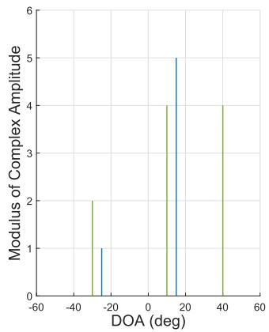

bar

| DOA (deg) | Modulus of Complex Amplitude |
| --------- | ---------------------------- |
| -30       | 2                            |
| -20       | 1                            |
| 10        | 4                            |
| 20        | 5                            |
| 40        | 4                            |

(a)

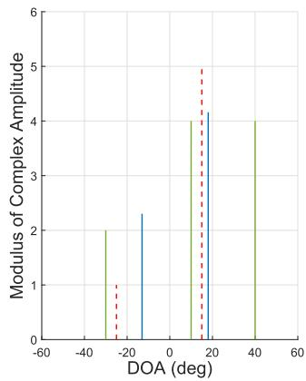

bar

| DOA (deg) | Modulus of Complex Amplitude |
| --------- | ---------------------------- |
| -30       | 2                            |
| -20       | 1                            |
| -10       | 2                            |
| 0         | 0                            |
| 10        | 4                            |
| 20        | 5                            |
| 30        | 4                            |
| 40        | 4                            |

(b）  
Fig. 2. Spatial spectral estimates with CAML approach, when Eves locate at $\theta _ { 1 } ^ {  } = - 2 5 ^ { \circ } , \theta _ { 2 } \stackrel { \cdot } { = } 1 5 ^ { \circ }$ (blue lines), and CUs locate at $\theta _ { 3 } = 4 0 ^ { \circ } , \theta _ { 4 } = 1 0 ^ { \circ }$ and $\theta _ { 5 } = - 3 0 ^ { \circ }$ (green lines). (a) SNR=20 dB. (b) SNR=-15 dB, where the red dashed lines denote Eves’ real directions and amplitudes. Note that the CUs’ information is known to the BS as they are assumed to be cooperative receivers.

For clarity, we present the spatial spectrum of the direction of angle (DOA) estimation by deploying the CAML technique in Fig. 2. It is assumed that two Eves are located at $\theta _ { 1 } =$ $- 2 5 ^ { \circ } , \theta _ { 2 } = 1 5 ^ { \circ }$ (denoted by blue lines) and three CUs locate at $\theta _ { 3 } = 4 0 ^ { \circ } , \theta _ { 4 } = 1 0 ^ { \circ } , \theta _ { 5 } = - 3 0 ^ { \circ }$ (denoted by green lines), with the modulus of complex amplitudes $\beta _ { 1 } = 1 , \beta _ { 2 } = 5 , \beta _ { 3 } =$ $4 , \beta _ { 4 } = 5$ and $\beta _ { 5 } = 2 ,$ , where directions of CUs are known to the transmitter. Fig. 2(a) and Fig. 2(b) demonstrate the CAML performance when SNR = 20dB and SNR = −15dB, respectively. It is noted that the CAML approach estimates the DOA precisely when SNR is 20dB, while errors of the angle estimation happen when the SNR decreases to -15 dB. To further illustrate the performance of the CAML estimation method, the root mean square error (RMSE) versus the SNR of the echo signal is shown in Fig. 3 with the CRB as a baseline. As expected, the CRB is shown as the lower bound of the RMSE obtained by CAML estimation, in particular, the CRB gets tight in the high-SNR regime.

# V. BOUNDS FOR CRB AND SECRECY RATE

The design of a weighted optimization between the radar CRB and the communication secrecy rate presents the challenge that the two performance metrics have different units and potentially different magnitudes. To overcome this challenge we need to normalize them each with their respective upper/lower bound. To obtain these bounds, in this section we present the CRB minimization problem and the secrecy rate maximization problem with the system power budget constraint. Considering the further design of the weighted objective function in the following section, the CRB minimization problem can be approximated as the FIM determinant maximization problem. To this end, the optimal solutions generate the upper bounds of the FIM determinant and the secrecy rate, both of which will be employed to normalize the metrics in Section VI.

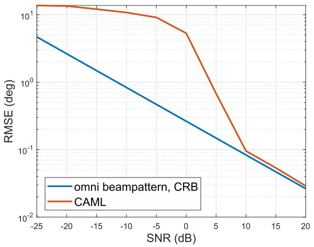

line

| SNR (dB) | omni beampattern, CRB | CAML     |
| -------- | --------------------- | -------- |
| -25      | 10.0                  | 10.0     |
| -20      | 5.0                   | 8.0      |
| -15      | 2.5                   | 6.0      |
| -10      | 1.25                  | 4.0      |
| -5       | 0.625                 | 2.5      |
| 0        | 0.3125                | 1.25     |
| 5        | 0.15625               | 0.625    |
| 10       | 0.078125              | 0.3125   |
| 15       | 0.0390625             | 0.15625  |
| 20       | 0.01953125            | 0.078125 |

Fig. 3. Target/Eve estimation performance by applying CAML method, with the CRB obtained by omnidirectional beampattern design as a benchmark.

# A. Upper-Bound of the FIM Determinant

We denote η as the sensing parameters, thus the MSE can be expressed as M $( \pmb { \eta } ) \triangleq \mathbb { E } \left\{ ( \pmb { \eta } - \pmb { \hat { \eta } } ) \left( \pmb { \eta } - \pmb { \hat { \eta } } \right) ^ { T } \right\} \succeq \mathbf { J } ^ { - 1 }$ . For the m-th parameter $\eta _ { m }$ to be estimated, it has E $\left\{ \left\| \eta _ { m } - \hat { \eta } _ { m } \right\| ^ { 2 } \right\} \geq$ $\left[ \mathbf { J } ^ { - 1 } \right] _ { m m }$ [40]. Thus, it is common to minimize the trace or the determinant of the CRB matrix, i.e., tr J−1 or $\left| \mathbf { J } ^ { - 1 } \right|$ . Since the CRB matrix is the inverse of the FIM matrix, the problem of minimizing $| \mathbf { J } ^ { - 1 } |$ is equivalent to maximizing |J|, which is given as [28]

$$
\max _ {\tilde {\mathbf {W}} _ {i}, \mathbf {R} _ {N}} | \mathbf {J} | \tag {29a}
$$

$$
\text { s.t. } \mathbf {R} _ {N} \succeq \mathbf {0}, \tilde {\mathbf {W}} _ {i} \succeq \mathbf {0}, \quad \forall i \tag {29b}
$$

$$
\operatorname{tr} \left(\sum_ {i = 1} ^ {I} \tilde {\mathbf {W}} _ {i} + \mathbf {R} _ {N}\right) = P _ {0}, \tag {29c}
$$

where $P _ { 0 }$ denotes the power budget of the proposed system. It is noted that the optimization above is convex and can be efficiently solved by CVX toolbox [41], [42]. Consequently, by substituting the optimal $\tilde { \mathbf { W } } _ { i } , \mathbf { R } _ { N }$ in (11), the upper-bound of FIM determinant is obtained.

# B. Secrecy Rate Bound

To derive the upper bound of the secrecy rate, we only consider the communication security metric in this subsection. Assuming that the CSI is perfectly known to the BS, the secrecy rate maximization problem can be formulated as

$$
\mathrm{SR} ^ {\star} = \max _ {\tilde {\mathbf {W}} _ {i}, \mathbf {R} _ {N}} \min _ {i, k} \mathrm{SR} \left(\tilde {\mathbf {W}} _ {i}, \mathbf {R} _ {N}\right) \tag {30a}
$$

$$
\text { s.t. } \quad (2 9 b), (2 9 c). \tag {30b}
$$

It is noted that the non-convexity lies in the objective function of (30), which makes the optimization problem above difficult to solve. To resolve this issue, we introduce an auxiliary variable b, where (30) has the same optimal solutions as the reformulation below

$$
\mathbf {S R} ^ {\star} = \max _ {\tilde {\mathbf {W}} _ {i}, \mathbf {R} _ {N}, b} \min _ {i, k} \left[ R _ {i} ^ {\mathrm{CU}} \left(\tilde {\mathbf {W}} _ {i}, \mathbf {R} _ {N}\right) - \log b \right]
$$

s.t.

$$
\log \left( \right.1 + \frac {\left| \alpha_ {k} \right| ^ {2} \mathbf {b} ^ {H} \left(\theta_ {k}\right) \tilde {\mathbf {W}} _ {i} \mathbf {b} \left(\theta_ {k}\right)}{\left| \alpha_ {k} \right| ^ {2} \mathbf {b} ^ {H} \left(\theta_ {k}\right)\left( \right.\sum_ {\substack {\bar {m} = 1,\\\bar {m} \neq i}} ^ {I} \tilde {\mathbf {W}} _ {\bar {m}} + \mathbf {R} _ {N}\right) \mathbf {b} \left(\theta_ {k}\right) + 1} \leq \log b, \quad \forall k, i \tag{31}
$$

The above problem can be simply relaxed into a convex SDP problem. For brevity, we refer readers to [35] for more details.

# VI. WEIGHTED OPTIMIZATION FOR EVES’ ESTIMATION AND SECURE COMMUNICATION

In this section, we propose a normalized weighted optimization problem that reveals the performance tradeoff between the communication security and Eve parameters estimation. Additionally, recall that the ISAC access point firstly emits an omnidirectional beampattern as given in Section IV, where imprecise angles of Eves have been obtained at the given SNR, with the angular uncertainty interval of the k-th Eve is denoted a s Ξ(0). $\Xi _ { k } ^ { ( 0 ) }$ To reduce angle estimation errors, we also take the wide main beam design into account, which covers all possible directions of Eves.

# A. Problem Formulation

To achieve the desired tradeoff between the communication data security and the radar estimation CRB, while taking the estimation errors of Eves’ angles and the system power budget into account, we formulate the weighted optimization problem as follows

$$
\max _ {\tilde {\mathbf {W}} _ {i}, \mathbf {R} _ {N}} \rho \frac {| \mathbf {J} |}{| \mathbf {J} | _ {U B}} + (1 - \rho) \frac {\mathrm{SR}}{\mathrm{SR} _ {U B}} \tag {32a}
$$

$$
\begin{array}{c} \text {s.t.} \mathbf {b} ^ {H} \left(\vartheta_ {k, 0}\right) \mathbf {R} _ {X} \mathbf {b} \left(\vartheta_ {k, 0}\right) - \mathbf {b} ^ {H} \left(\vartheta_ {k, p}\right) \mathbf {R} _ {X} \mathbf {b} \left(\vartheta_ {k, p}\right) \geq \gamma_ {s}, \\ \forall \vartheta_ {k, p} \in \operatorname{card} \left(\Psi_ {k}\right), \forall k \end{array} \tag {32b}
$$

$$
\begin{array}{l} \mathbf {b} ^ {H} \left(\vartheta_ {k, n}\right) \mathbf {R} _ {X} \mathbf {b} \left(\vartheta_ {k, n}\right) \leq (1 + \alpha) \mathbf {b} ^ {H} \left(\vartheta_ {k, 0}\right) \mathbf {R} _ {X} \mathbf {b} \left(\vartheta_ {k, 0}\right), \\ \forall \vartheta_ {k, n} \in \operatorname{card} (\Omega_ {k}), \forall k \tag {32c} \\ \end{array}
$$

$$
\mathbf {b} ^ {H} \left(\vartheta_ {k, n}\right) \mathbf {R} _ {X} \mathbf {b} \left(\vartheta_ {k, n}\right) \geq (1 - \alpha) \mathbf {b} ^ {H} \left(\vartheta_ {k, 0}\right) \mathbf {R} _ {X} \mathbf {b} \left(\vartheta_ {k, 0}\right),
$$

$$
\forall \vartheta_ {k, n} \in \operatorname{card} (\Omega_ {k}), \forall k \tag {32d}
$$

$$
(2 9 b), (2 9 c), \tag {32e}
$$

where $| \mathbf { J } | _ { U B }$ and $\mathrm { S R } _ { U B }$ denote the upper bounds of the FIM matrix determinant and the secrecy rate which were obtained in Section V, respectively. $\gamma _ { s }$ denotes the given threshold to constrain the power of the sidelobe. $0 ~ \leq ~ \rho ~ \leq ~ 1$ denotes the weighting factor that determines the weights for the Eve estimation performance and the secrecy rate. α denotes a given scalar associated with the wide main beam fluctuation. $\vartheta _ { k , n }$ is the n-th possible direction of the k-th Eve, $\boldsymbol { \vartheta } _ { k , 0 }$ is the angle which was estimated by the algorithm proposed in Section IV. $\Omega _ { k }$ and $\Phi _ { k }$ denote the main beam region and sidelobe region, respectively. Note that card (·) denotes the cardinality of (·).

Algorithm 1 Iterative Optimization of the CRB and the Secrecy Rate   
Initialization: $\Xi_k^{(0)}$ obtained from initial target/Eve estimation and CRB in Section IV; $r = 1$ 1: repeat
2: $\Omega_k^{(r)} = \Xi_k^{(r-1)}, \Psi_k^{(r)}$ is accordingly obtained;
3: substitute $\Omega_k^{(r)}$ and $\Psi_k^{(r)}$ into problem (32);
4: repeat
5: solve problem (32) by FP algorithm;
6: until find the optimal $c \in \left[\left(\min_i 1 + P_0 \| \mathbf{h}_i\|^2\right)^{-1}, 1\right]$ which generates the maximum value of the objective function deploying the golden search;
7: the optimal variables $\tilde{\mathbf{W}}_i^*, \mathbf{R}_N^*$ are obtained;
8: calculate the $\mathrm{CRB}_r\left(\hat{\theta}\right)$ and the secrecy rate in the $r$ -th iteration;
9: $\Xi_k^{(r)}$ can be accordingly obtained;
10: update $r = r + 1$ ,
11: until Convergence.

Remark 1: It is important to highlight that the secrecy rate given by (16) is a function of the estimation accuracy of Eve’s parameters, including $\theta _ { k }$ and $\alpha _ { k } .$ . Accordingly, beyond the tradeoff in the weighted optimization in this section, the improvement in the sensing performance directly results in an improvement in the secrecy performance.

# B. Efficient Solver

To tackle problem (32), we firstly recast the complicated secrecy rate term in the objective function. For simplicity, we denote $\begin{array} { r } { \Sigma _ { i } = \sum _ { m = 1 } ^ { I } \mathrm { t r } \left( \tilde { \mathbf { H } } _ { i } \tilde { \mathbf { W } } _ { m } \right) } \end{array}$ and rewrite the optimization problem as (33), shown at the bottom of the page. According to [35], the weighted optimization problem can be recast as (34), shown at the bottom of the page, by introducing the scalar b.

It is noted that the min operator only applies to the second term of the objective function of problem (34). According to the Fractional Programming (FP) algorithm [43], the optimization problem can be further reformulated by replacing the fraction term with the coefficient z, which is given as

$$
\max _ {\tilde {\mathbf {W}} _ {i}, \mathbf {R} _ {N}, \mathbf {y}, z} \frac {\rho}{| \mathbf {J} | _ {U B}} | \mathbf {J} | + \frac {1 - \rho}{2 ^ {S R _ {U B}}} z \tag {35a}
$$

$$
\text { s.t. } \quad 2 y _ {i} \sqrt {\Sigma_ {i} + \operatorname{tr} \left(\tilde {\mathbf {H}} _ {i} \mathbf {R} _ {N}\right) + 1}
$$

$$
\begin{array}{r} - y _ {i} ^ {2} \left(b \left(\Sigma_ {i} - \operatorname{tr} \left(\tilde {\mathbf {H}} _ {i} \tilde {\mathbf {W}} _ {i}\right) + \operatorname{tr} \left(\tilde {\mathbf {H}} _ {i} \mathbf {R} _ {N}\right) + 1\right)\right) \geq z, \\ \forall i \quad (3 5 b) \end{array}
$$

$$
(3 4 b), (3 2 b), (3 2 c), (3 2 d) \text {   and   } (3 2 e), \tag {35c}
$$

where y denotes a collection of variables $\begin{array} { r l } { \mathbf { y } } & { { } = } \end{array}$ $\{ y _ { 1 } , \ldots , \underline { { y } } _ { I } \}$ . Referring to [35], let $\begin{array} { r l r } { c } & { { } = } & { { \frac { 1 } { b } } . } \end{array}$ , where $\begin{array} { r l r } { c } & { { } \in } & { \bigg \lceil \Big ( \underset { i } { \operatorname* { m i n } } 1 + P _ { 0 } { \left\| \mathbf { h } _ { i } \right\| } ^ { 2 } \Big ) ^ { - 1 } , 1 \bigg \rceil } \end{array}$ , 1 . Thus, problem (35) can be rewritten as (37) (next page) by replacing b with c,

$$
\begin{array}{l} \max_{\tilde{\mathbf{W}}_{i},\mathbf{R}_{N}}\frac{\rho}{|\mathbf{J}|_{UB}}  |\mathbf{J}| + \frac{1 - \rho}{\mathsf{SR}_{UB}}\min_{i,k,n}\left[R_{i}^{\mathrm{CU}}\left(\tilde{\mathbf{W}}_{i},\mathbf{R}_{N}\right) - \log \left(1 + \frac{|\alpha_{k}|^{2}\mathbf{b}^{H}\left(\vartheta_{k,n}\right)\tilde{\mathbf{W}}_{i}\mathbf{b}\left(\vartheta_{k,n}\right)}{|\alpha_{k}|^{2}\mathbf{b}^{H}\left(\vartheta_{k,n}\right)\left(\sum_{\substack{\bar{m} = 1,\\ \bar{m}\neq i}}^{I}\tilde{\mathbf{W}}_{\bar{m}} + \mathbf{R}_{N}\right)\mathbf{b}\left(\vartheta_{k,n}\right) + 1}\right)\right]^{+}, \\ \vartheta_ {k, n} \in \operatorname{card} \left(\Omega_ {k}\right), \forall k, i \tag {33a} \\ \end{array}
$$

$$
\max _ {\tilde {\mathbf {W}} _ {i}, \mathbf {R} _ {N}} \min _ {i} \left(\frac {\rho}{| \mathbf {J} | _ {U B}} | \mathbf {J} | + \frac {1 - \rho}{2 ^ {S R _ {U B}}} \frac {\Sigma_ {i} + \operatorname{tr} \left(\tilde {\mathbf {H}} _ {i} \mathbf {R} _ {N}\right) + 1}{b \left(\Sigma_ {i} - \operatorname{tr} \left(\tilde {\mathbf {H}} _ {i} \tilde {\mathbf {W}} _ {i}\right) + \operatorname{tr} \left(\tilde {\mathbf {H}} _ {i} \mathbf {R} _ {N}\right) + 1\right)}\right) \tag {34a}
$$

$$
\text {s.t.} \frac {\left| \alpha_ {k} \right| ^ {2} \mathbf {b} ^ {H} \left(\vartheta_ {k , n}\right) \tilde {\mathbf {W}} _ {i} \mathbf {b} \left(\vartheta_ {k , n}\right)}{\left| \alpha_ {k} \right| ^ {2} \mathbf {b} ^ {H} \left(\vartheta_ {k , n}\right) \left(\sum_ {\substack {\bar {m} = 1, \\ \bar {m} \neq i}} ^ {I} \tilde {\mathbf {W}} _ {\bar {m}} + \mathbf {R} _ {N}\right) \mathbf {b} \left(\vartheta_ {k, n}\right) + 1} \leq b - 1, \forall \vartheta_ {k, n} \in \operatorname{card} \left(\Omega_ {k}\right), \forall k, i \tag{34b}
$$

$$
(3 2 b), (3 2 c), (3 2 d) \text {   and   } (3 2 e). \tag {34c}
$$

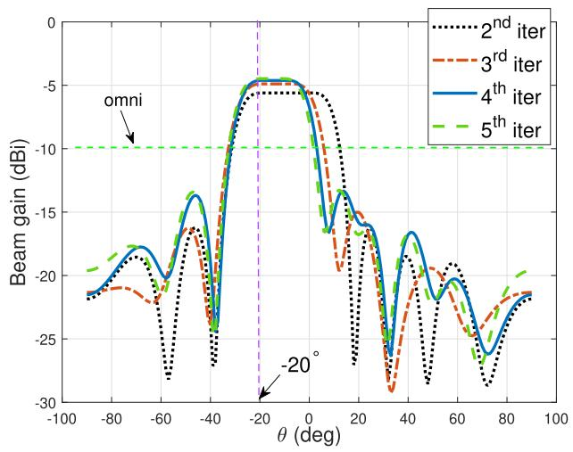

line

| θ (deg) | 2nd iter | 3rd iter | 4th iter | 5th iter |
| ------- | -------- | -------- | -------- | -------- |
| -100    | -22.0    | -21.5    | -21.0    | -20.5    |
| -80     | -18.0    | -19.0    | -18.5    | -19.5    |
| -60     | -28.0    | -27.0    | -26.5    | -25.5    |
| -40     | -16.0    | -15.0    | -14.5    | -13.5    |
| -20     | -5.0     | -4.5     | -4.0     | -3.5     |
| 0       | -5.5     | -5.0     | -4.5     | -4.0     |
| 20      | -15.0    | -14.0    | -13.5    | -12.5    |
| 40      | -28.0    | -27.0    | -26.5    | -25.5    |
| 60      | -19.0    | -18.0    | -17.5    | -16.5    |
| 80      | -22.0    | -21.0    | -20.5    | -19.5    |
| 100     | -21.0    | -20.0    | -19.5    | -18.5    |

Fig. 4. Beampatterns for the scenario of single Eve angle estimation, where the main beam width narrows over each iteration, $\vartheta _ { 1 , 0 } = - 2 5 ^ { \circ } , I = 3 , K = 1 , P _ { 0 } = 3 5 \mathrm { d B m } , \mathrm { S N R } = - 2 2 \mathrm { d B }$ .

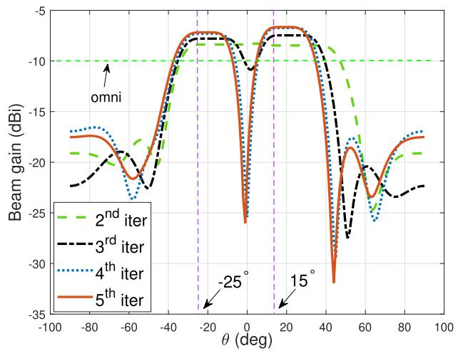

line

| θ (deg) | 2nd iter | 3rd iter | 4th iter | 5th iter |
| ------- | -------- | -------- | -------- | -------- |
| -100    | -10      | -18      | -18      | -18      |
| -80     | -10      | -19      | -19      | -19      |
| -60     | -10      | -20      | -20      | -20      |
| -40     | -10      | -15      | -15      | -15      |
| -20     | -10      | -8       | -8       | -8       |
| 0       | -10      | -8       | -8       | -8       |
| 20      | -10      | -8       | -8       | -8       |
| 40      | -10      | -15      | -15      | -15      |
| 60      | -10      | -25      | -25      | -25      |
| 80      | -10      | -20      | -20      | -20      |
| 100     | -10      | -20      | -20      | -20      |

Fig. 5. Beampatterns for the scenario of two Eves to be estimated, illustrating the circumstance when the main lobes overlap at the first iteration, $\vartheta _ { 1 , 0 } = - 2 5 ^ { \circ } , \vartheta _ { 2 , 0 } = 1 5 ^ { \circ } , I = 3 , K = 2 , P _ { 0 } = 3 5 \mathrm { d } \hat { \mathrm { B m } } , \mathrm { S N R } = - 2 2 \mathrm { d } \mathrm { B m }$ .

and the optimal $y _ { i }$ can be found in the following closed form

$$
y _ {i} = \frac {c \sqrt {\Sigma_ {i} + \operatorname{tr} \left(\tilde {\mathbf {H}} _ {i} \mathbf {R} _ {N}\right) + 1}}{\Sigma_ {i} - \operatorname{tr} \left(\tilde {\mathbf {H}} _ {i} \tilde {\mathbf {W}} _ {i}\right) + \operatorname{tr} \left(\tilde {\mathbf {H}} _ {i} \mathbf {R} _ {N}\right) + 1}. \tag {36}
$$

Note that problem (37), shown at the bottom of the next page, can be efficiently solved by the CVX toolbox [41], [42]. Given the interval of $c ,$ the optimal variables. $\tilde { \mathbf { W } } _ { i } ^ { \star } , \mathbf { R } _ { N } ^ { \star } , z ^ { \star }$ can be consequently obtained by performing a one-dimensional search over $c ,$ such as uniform sampling or the golden search [44]. To this end, the optimal $\mathrm { C R B } ^ { \star }$ and $\mathrm { S R } ^ { \star }$ can be accordingly calculated. The computational complexity of solving problem (37) at each iteration is $\mathcal { O } \left( N _ { t } ^ { 6 . 5 } \right)$ according to [45].

To further generalize the problem above and simplify the objective function, we equivalently consider the determinant minimization problem of $\mathbf { \Delta P } ^ { H } \mathbf { J } ^ { - 1 } \mathbf { \dot { P } }$ by introducing the matrix P, where P associates with activated Eves with the dimension of P is $3 K \times 3$ . For example, when the CRB minimization is only associated with the first Eve, the first, the $( K + 1 ) { \mathsf { - t h } }$ , and the $( 2 K + 1 )$ -th rows are the first, second, and third rows of the identity matrix $\mathbf { I } _ { 3 \times 3 } ,$ , respectively [28]. Then, by noting that the inequality $\mathbf { \Delta } \mathbf { Y } ^ { - 1 } \geq \mathbf { P } ^ { H } \mathbf { J } ^ { - 1 } \mathbf { P }$ is equivalent to $\textbf { \em T } \geq$ $\mathbf { \hat { r } P ^ { \cal H } J ^ { - 1 } P \bar { r } }$ , and based on the Schur-complement condition, problem (32) can be recast as

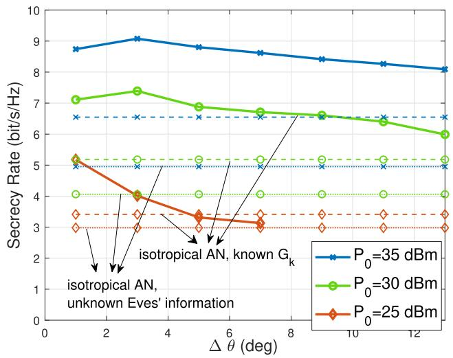

line

| Δ θ (deg) | P₀=35 dBm | P₀=30 dBm | P₀=25 dBm |
| --------- | --------- | --------- | --------- |
| 1         | 8.8       | 7.2       | 5.3       |
| 2         | 9.1       | 7.4       | 4.1       |
| 3         | 9.0       | 7.5       | 4.0       |
| 4         | 8.9       | 7.0       | 3.4       |
| 5         | 8.8       | 6.9       | 3.3       |
| 6         | 8.7       | 6.8       | 3.2       |
| 7         | 8.6       | 6.7       | 3.1       |
| 8         | 8.5       | 6.6       | 3.0       |
| 9         | 8.4       | 6.6       | 3.0       |
| 10        | 8.3       | 6.5       | 3.0       |
| 11        | 8.2       | 6.4       | 3.0       |
| 12        | 8.1       | 6.1       | 3.0       |

Fig. 6. The secrecy rate analysis versus Eve’s location uncertainty with various power budgets, where the AN design techniques with no information of Eves’ channels and with known $\mathbf { G } _ { k }$ are denoted by dotted lines and dashed lines, respectively. $\vartheta _ { 1 , 0 } = - 2 5 ^ { \circ } , I = 3 , K = 1 , \mathrm { { S N R } = - 1 5 ~ d B } .$ .

$$
\max _ {\tilde {\mathbf {W}} _ {i}, \mathbf {R} _ {N}, z, \boldsymbol {\Upsilon}} \frac {\rho}{| \mathbf {J} | _ {U B}} | \boldsymbol {\Upsilon} | + \frac {1 - \rho}{2 ^ {S R _ {U B}}} z
$$

$$
\text { s.t. } \quad \left[ \begin{array}{c c} \Upsilon & \Upsilon \mathbf {P} ^ {H} \\ \mathbf {P} \Upsilon & \mathbf {J} \end{array} \right] \succeq \mathbf {0}
$$

$$
(3 6 b), (3 6 c) \text {   and   } (3 6 d). \tag {38}
$$

Similarly, the determinant maximization problem above is convex and readily solvable. For clarity, the above procedure has been summarized in Algorithm 1.

# VII. NUMERICAL RESULTS

In this section, we provide the numerical results to evaluate the effectiveness of the proposed sensing-aided secure ISAC system design. We assume that both the ISAC BS and the radar receiver are equipped with uniform linear arrays (ULAs) with the same number of elements with half-wavelength spacing between adjacent antennas. In the following simulations, the number of transmit antennas and receive antennas are set as $N _ { t } ~ = ~ N _ { r } ~ = ~ 1 0$ serving $I \ = \ 3$ CUs, the frame length is set as $L ~ = ~ 6 4$ , the noise variance of the communication system is $\sigma _ { C } ^ { 2 } ~ = ~ 0$ dBm. We assume that the complex path-loss coefficient is constant over the observation interval and modeled as a complex Gaussian distributed with mean zero and variance of $\begin{array} { r } { \bar { \sigma } _ { \alpha _ { k } } ^ { 2 } \ \propto \ \frac { 1 } { d _ { k } ^ { 2 } } } \end{array}$ α 1d2k , where dk is the distance $d _ { k }$ between the BS and the k-th target [46].

Resultant beampatterns of the proposed sensing-aided ISAC security technique are shown in Fig. 4 and Fig. 5, which demonstrate the single-Eve (located at $\vartheta _ { 1 , 0 } = - 2 0 ^ { \circ } )$ scenario and multi-Eve scenario (located at $\vartheta _ { 1 , 0 } = - 2 5 ^ { \circ } , \vartheta _ { 2 , 0 } = 1 5 ^ { \circ } )$ , respectively. Note that the Rician factor is set as $v _ { i } = 0 . 1$ for generating a Rician channel with a weak LoS component, aiming to alleviate the impact on the radar beampattern caused by the channel correlation, and α is set as $\begin{array} { l l l } { \alpha } & { = } & { 0 . 0 5 } \end{array}$ . To verify the efficiency of the proposed approach, the received SNR of the echo signal is set as SNR=-22 dB, which is defined as $\begin{array} { r } { \mathrm { S N R } = \frac { | \tilde { \beta | ^ { 2 } } L P _ { 0 } } { \sigma _ { R } ^ { 2 } } } \end{array}$ |β|2LP02 . The ISAC BS first transmits an σ R omnidirectional beampattern for Eve estimation, with the aid of the CAML technique, which is denoted by green dashed lines in Fig. 4 and Fig. 5. It is referred to as the first iteration and the CRB can be accordingly calculated. Then, to ensure that Eves stay within the angle range of main lobes, we design a beampattern with a wide main beam with a beamwidth determined by the CRB obtained from the last iteration, which has been elaborated in Section VI. By updating the CRB iteratively, the main lobes get narrow and point to the directions of Eves, as illustrated by the rest of the lines in Fig. 4 and Fig. 5. In the simulations, we repeat the weighted optimization problem until the CRB and the secrecy rate both convergence to a local optimum. The beampatterns also indicate that the main beam gain grows with the main lobe width getting narrow. Besides, Fig. 5 shows that the power towards Eves of interest gets lower compared with the single-Eve scenario, while it still outperforms the omnidirectional beampattern design.

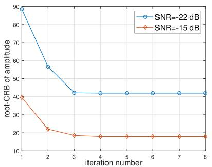

line

| iteration number | SNR=-22 dB | SNR=-15 dB |
| ---------------- | ---------- | ---------- |
| 1                | 90         | 40         |
| 2                | 55         | 20         |
| 3                | 40         | 18         |
| 4                | 40         | 17         |
| 5                | 40         | 17         |
| 6                | 40         | 17         |
| 7                | 40         | 17         |
| 8                | 40         | 17         |

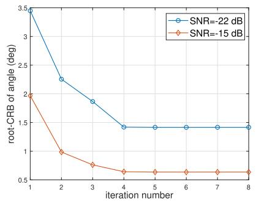

line

| iteration number | SNR=-22 dB | SNR=-15 dB |
| ---------------- | ---------- | ---------- |
| 1                | 3.5        | 2.0        |
| 2                | 2.3        | 1.0        |
| 3                | 1.9        | 0.8        |
| 4                | 1.5        | 0.6        |
| 5                | 1.5        | 0.6        |
| 6                | 1.5        | 0.6        |
| 7                | 1.5        | 0.6        |
| 8                | 1.5        | 0.6        |

(b)

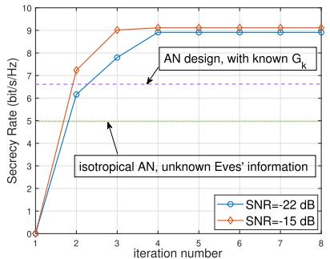

line

| iteration number | SNR=-22 dB | SNR=-15 dB |
| ---------------- | ---------- | ---------- |
| 1                | 0          | 0          |
| 2                | 6.3        | 7.2        |
| 3                | 7.8        | 9.0        |
| 4                | 9.0        | 9.0        |
| 5                | 9.0        | 9.0        |
| 6                | 9.0        | 9.0        |
| 7                | 9.0        | 9.0        |
| 8                | 9.0        | 9.0        |

（c）  
Fig. 7. Convergence with iterations when SNR = −15 dB and SNR = −22 dB. I = 3, K = 1, P0 = 35 dBm. (a) Convergence of root-CRB of amplitude estimation; (b) Convergence of root-CRB of angle estimation; (c) Convergence of the secrecy rate.

In Fig. 6, we investigate the secrecy rate versus the main beam width with different power budget $P _ { 0 } ,$ and the benchmarks are given in dashed lines and dotted lines which are obtained by the AN design techniques with knowledge of $\mathbf { G } _ { k }$ and with no information of Eves’ channels as given in Sec III, respectively. Generally, the secrecy rate gets higher with the increase of the power budget and it is obvious that the proposed algorithm outperforms benchmark methods. It is worthwhile to stress that the proposed weighted optimization (32) is implemented with no information on Eves. Note that the secrecy rate increases first and then decreases with the expansion of Eve’s location uncertainty. The initial increase is because the gain of the beam towards the target/Eve of interest decreases with the growth of the mainthe deterioration of the eavesdropping k,ithe expression in (16), the secrecy rate improves when $\mathrm { S I N R } _ { k , i } ^ { \mathrm { E } }$ 1 idth, resulting in. With respect to $\mathrm { S I N R } _ { k , i } ^ { \mathrm { E } }$ reduces. However, the power budget constraint becomes tight when the main beam keeps being expanded. This indicates that more power is allocated to the Eve estimation, thus, the secrecy rate decreases. Additionally, when the main beam is wider, the transmission needs to secure the data over a wider range of angles, which is reflected in an SR expression with high channel uncertainty. Particularly, when the power budget is low, for example, $P _ { 0 } = 2 5 ~ \mathrm { d B m }$ , we note that the secrecy rate monotonically decreases with the growth of $\Delta \theta ,$ , while the weighted optimization problem is infeasible due to the power budget limit when the ∆θ is larger than 5 degree.

Fig. 7 illustrates the convergence of the CRB and the secrecy rate of the proposed algorithm. The benchmark in Fig. 7 (c) is generated following the AN design techniques in Section III, where the covariance of AWGN received by Eves is set as $\sigma _ { 0 } ^ { 2 } = 0 ~ \mathrm { d B m . ^ { 1 } }$ It is noted that the performance of metrics converges after five iterations when SNR = −22 dB,

1In the isotropical AN designs, i.e., the benchmark schemes, we deploy the omnidirectional waveform to ensure the sensing performance, where we have $\begin{array} { r } { \bar { \bf R } _ { X } = \frac { P _ { 0 } } { N _ { t } } { \bf I } _ { N _ { t } } } \end{array}$ P0 INt according to problem (25). As the CRB matrix is a function tof the covariance matrix, the resultant root-CRB of the benchmark schemes is equal to the value at the first iteration as shown in Fig. 6.

$$
\max _ {\tilde {\mathbf {W}} _ {i}, \mathbf {R} _ {N}, \mathbf {y}, z} \frac {\rho}{| \mathbf {J} | _ {U B}} | \mathbf {J} | + \frac {1 - \rho}{2 ^ {S R _ {U B}}} z \tag {37a}
$$

$$
\text { s.t. } \quad 2 c y _ {i} \sqrt {\Sigma_ {i} + \operatorname{tr} \left(\tilde {\mathbf {H}} _ {i} \mathbf {R} _ {N}\right) + 1} - y _ {i} ^ {2} \left(\Sigma_ {i} - \operatorname{tr} \left(\tilde {\mathbf {H}} _ {i} \tilde {\mathbf {W}} _ {i}\right) + \operatorname{tr} \left(\tilde {\mathbf {H}} _ {i} \mathbf {R} _ {N}\right) + 1\right) \geq c z, \forall i \tag {37b}
$$

$$
c|\alpha_{k}|^{2}\mathbf{b}^{H}\left(\vartheta_{k,n}\right)\tilde{\mathbf{W}}_{i}\mathbf{b}\left(\vartheta_{k,n}\right)\leq (1 - c)  \left(|\alpha_{k}|^{2}\mathbf{b}^{H}\left(\vartheta_{k,n}\right)\left(\sum_{\substack{\bar{m} = 1,\\ \bar{m}\neq i}}^{I}\tilde{\mathbf{W}}_{\bar{m}} + \mathbf{R}_{N}\right)\mathbf{b}\left(\vartheta_{k,n}\right) + 1\right),\\ \forall   \vartheta_{k,n}\in \operatorname{card}\left(\Omega_{k}\right),
$$

$$
\forall k, i \tag {37c}
$$

$$
(3 2 b), (3 2 c), (3 2 d) \text { and } (3 2 e). \tag {37d}
$$

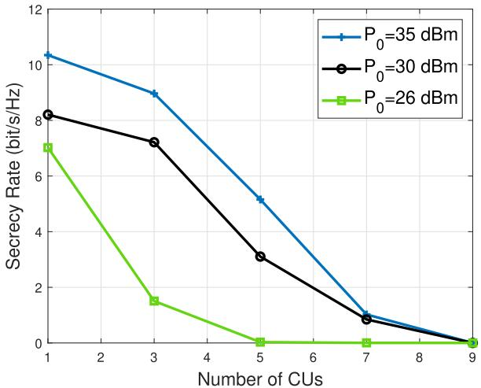

line

| Number of CUs | P₀=35 dBm | P₀=30 dBm | P₀=26 dBm |
| ------------- | --------- | --------- | --------- |
| 1             | 10.5      | 8.2       | 7.0       |
| 3             | 9.0       | 7.2       | 1.5       |
| 5             | 5.0       | 3.0       | 0.0       |
| 7             | 1.0       | 0.8       | 0.0       |
| 9             | 0.0       | 0.0       | 0.0       |

Fig. 8. The secrecy rate analysis versus the number of CUs, with various power budgets. K = 1, SNR = −15 dB.

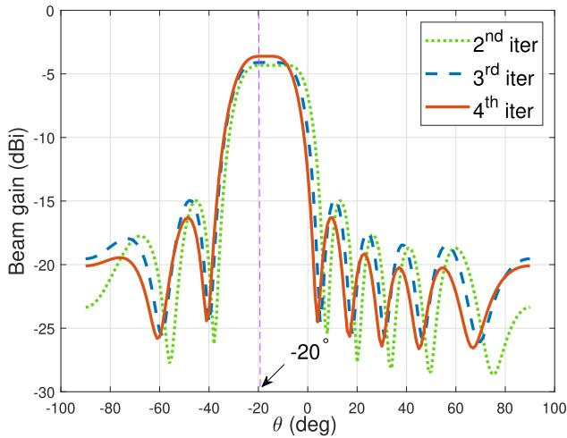

line

| θ (deg) | 2nd iter | 3rd iter | 4th iter |
| ------- | -------- | -------- | -------- |
| -100    | -23      | -20      | -20      |
| -80     | -20      | -19      | -19      |
| -60     | -25      | -25      | -25      |
| -40     | -15      | -15      | -15      |
| -20     | -5       | -5       | -5       |
| 0       | -5       | -5       | -5       |
| 20      | -15      | -15      | -15      |
| 40      | -20      | -20      | -20      |
| 60      | -25      | -25      | -25      |
| 80      | -20      | -20      | -20      |
| 100     | -23      | -20      | -20      |

Fig. 10. Beampatterns for the scenario when the CU and the Eve both locate at $- 2 0 ^ { \circ }$ , narrowing with each iteration until convergence. I = 1, K = 1, SNR = −22 dB, $\bar { P } _ { 0 } = 3 5$ dBm.

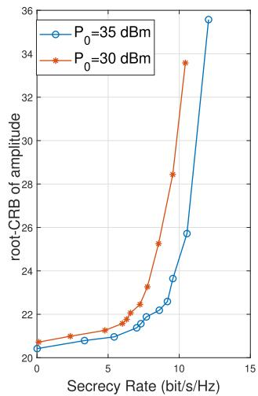

line

| Secrecy Rate (bit/s/Hz) | P₀=35 dBm | P₀=30 dBm |
| ------------------------ | --------- | --------- |
| 0                        | 20.5      | 20.8      |
| 2                        | 21.0      | 21.2      |
| 4                        | 21.5      | 21.8      |
| 6                        | 22.0      | 22.5      |
| 8                        | 23.0      | 24.0      |
| 10                       | 25.5      | 28.5      |
| 12                       | 35.5      | 33.5      |

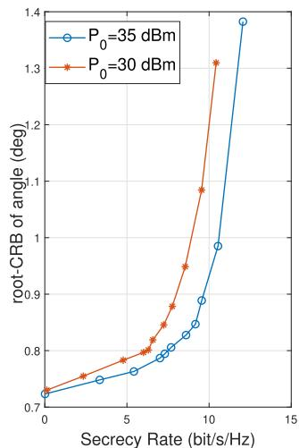

line

| Secrecy Rate (bit/s/Hz) | P₀=35 dBm | P₀=30 dBm |
| ----------------------- | --------- | --------- |
| 0                       | 0.72      | 0.72      |
| 2                       | 0.74      | 0.76      |
| 4                       | 0.76      | 0.78      |
| 6                       | 0.78      | 0.80      |
| 8                       | 0.82      | 0.86      |
| 10                      | 0.90      | 1.10      |
| 12                      | 1.38      | 1.32      |

(b)   
Fig. 9. Tradeoff between the CRB and the secrecy rate with different power budgets. ϑ1,0 = −25◦, I = 3, K = 1, SNR = −15 dB.

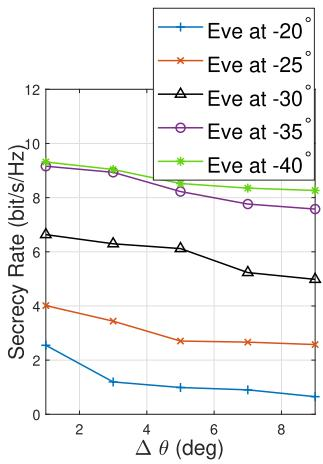

line

| Δθ (deg) | Eve at -20° | Eve at -25° | Eve at -30° | Eve at -35° | Eve at -40° |
| -------- | ----------- | ----------- | ----------- | ----------- | ----------- |
| 0        | 2.5         | 4.0         | 6.5         | 9.5         | 9.5         |
| 2        | 1.0         | 3.5         | 6.0         | 9.0         | 9.0         |
| 4        | 0.8         | 2.8         | 6.0         | 8.5         | 8.5         |
| 6        | 0.7         | 2.5         | 5.5         | 8.0         | 8.0         |
| 8        | 0.6         | 2.5         | 5.0         | 7.8         | 7.8         |

(a)

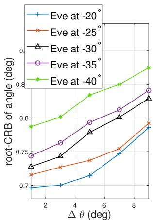

line

| Δ θ (deg) | Eve at -20° | Eve at -25° | Eve at -30° | Eve at -35° | Eve at -40° |
| --------- | ----------- | ----------- | ----------- | ----------- | ----------- |
| 1         | 0.70        | 0.72        | 0.73        | 0.75        | 0.78        |
| 2         | 0.71        | 0.73        | 0.74        | 0.76        | 0.79        |
| 3         | 0.72        | 0.74        | 0.75        | 0.77        | 0.80        |
| 4         | 0.73        | 0.75        | 0.76        | 0.78        | 0.81        |
| 5         | 0.74        | 0.76        | 0.77        | 0.79        | 0.82        |
| 6         | 0.75        | 0.77        | 0.78        | 0.80        | 0.83        |
| 7         | 0.76        | 0.78        | 0.79        | 0.81        | 0.84        |
| 8         | 0.77        | 0.79        | 0.80        | 0.82        | 0.85        |
| 9         | 0.78        | 0.80        | 0.81        | 0.83        | 0.86        |

(b)   
Fig. 11. Secrecy rate and root-CRB of angle performances versus uncertain angular interval of the target/Eve, with various angle differences between the Eve and the CU, where the CU locates at $- 2 0 ^ { \circ }$ . I = 1, K = 1, SNR = −15 dB, $P _ { 0 } = 3 5 $ dBm.

while the convergence requires fewer iterations at higher SNR. Additionally, the secrecy rate obtained by the proposed algorithm converges to 8.9 bit/s/Hz and 9.1 bit/s/Hz when SNR = −22 dB and $\mathrm { S N R } \ = \ - 1 5 \ \mathrm { d B }$ , which outperforms the isotropical AN methods.

Moreover, it is illustrated in Fig. 8 that the secrecy rate decreases with the growth of the CUs’ number, given different power budgets $P _ { 0 }$ . Note that a higher power budget achieves better security performance. Particularly, the secrecy rate cannot be ensured if the ISAC system serves more than 5 CUs when $P _ { 0 } = 2 5 ~ \mathrm { d B m }$ . In Fig. 9, we consider the performance tradeoff between the target/Eve estimation and communication data security with different power budgets by varying the weighting factor $\rho .$ We note that higher $P _ { 0 }$ results in a better performance of the estimation metric, i.e., root-CRB of the amplitude and the angle. Additionally, with the increase in secrecy rate, the CRB grows as well, which demonstrates the deterioration of Eve’s angle estimation accuracy.

Furthermore, we consider a scenario including one CU and one Eve for exploiting impacts on security and sensing metrics resulting from the angle difference between the CU and the Eve. In this case, the Rician channel model with a strong LoS component is deployed, i.e., $v _ { i } ~ = ~ 7$ in (2), and the CU is assumed to locate at $- 2 0 ^ { \circ }$ . Resultant beampatterns are shown in Fig. 10 when the Eve is $\mathrm { a t \_ - 2 0 ^ { \circ } }$ as well. It is demonstrated that the main beam width converges after four iterations and the generated angle root-CRB at the second iteration is lower than the case of a weak Rician channel, which is validated in Fig. 11. Fig.11 illustrates the analysis of the secrecy rate and the root-CRB of angle with various angle difference. Generally speaking, with the expansion of the uncertain angular interval $\Delta \theta ,$ , both of the metrics deteriorated. The secrecy rate decreases when the Eve and the CU directions get closer, while the performance of the CRB improves since the tradeoff is revealed in Fig. 9.

# VIII. CONCLUSION

In this paper, we have considered the sensing-aided secure ISAC systems, where the dual-functional BS emitted waveforms to estimate the amplitudes and the directions of potential eavesdroppers and send confidential communication data to CUs simultaneously. The proposed design has promoted the cooperation between sensing and communication rather than conventionally individual functionalities. The weighted optimization problem has been designed to optimize the normalized CRB and secrecy rate while constraining the system power budget. Our numerical results have demonstrated that the secrecy rate was enhanced with the decreasing CRB in both single and multi-Eve scenarios.

# REFERENCES

[1] X. You et al., “Towards 6G wireless communication networks: Vision, enabling technologies, and new paradigm shifts,” Sci. China Inf. Sci., vol. 64, no. 1, pp. 1–74, Nov. 2020.   
[2] Z. Feng, Z. Fang, Z. Wei, X. Chen, Z. Quan, and D. Ji, “Joint radar and communication: A survey,” China Commun., vol. 17, no. 1, pp. 1–27, Jan. 2020.   
[3] L. Zheng, M. Lops, Y. C. Eldar, and X. Wang, “Radar and communication coexistence: An overview: A review of recent methods,” IEEE Signal Process. Mag., vol. 36, no. 5, pp. 85–99, Sep. 2019.   
[4] F. Liu et al., “Integrated sensing and communications: Toward dualfunctional wireless networks for 6G and beyond,” IEEE J. Sel. Areas Commun., vol. 40, no. 6, pp. 1728–1767, Jun. 2022.   
[5] Y. Cui, F. Liu, X. Jing, and J. Mu, “Integrating sensing and communications for ubiquitous IoT: Applications, trends, and challenges,” IEEE Netw., vol. 35, no. 5, pp. 158–167, Sep. 2021.   
[6] Z. Wei, F. Liu, C. Masouros, N. Su, and A. P. Petropulu, “Toward multifunctional 6G wireless networks: Integrating sensing, communication, and security,” IEEE Commun. Mag., vol. 60, no. 4, pp. 65–71, Apr. 2022.   
[7] Y. Liu, Z. Qin, M. Elkashlan, Y. Gao, and L. Hanzo, “Enhancing the physical layer security of non-orthogonal multiple access in largescale networks,” IEEE Trans. Wireless Commun., vol. 16, no. 3, pp. 1656–1672, Mar. 2017.   
[8] Z. Qin, Y. Liu, Z. Ding, Y. Gao, and M. Elkashlan, “Physical layer security for 5G non-orthogonal multiple access in large-scale networks,” in Proc. IEEE Int. Conf. Commun. (ICC), May 2016, pp. 1–6.   
[9] J. M. Hamamreh, H. M. Furqan, and H. Arslan, “Classifications and applications of physical layer security techniques for confidentiality: A comprehensive survey,” IEEE Commun. Surveys Tuts., vol. 21, no. 2, pp. 1773–1828, 2nd Quart., 2019.   
[10] R. Melki, H. N. Noura, M. M. Mansour, and A. Chehab, “A survey on OFDM physical layer security,” Phys. Commun., vol. 32, pp. 1–30, Feb. 2019.   
[11] L. Sun and Q. Du, “Physical layer security with its applications in 5G networks: A review,” China Commun., vol. 14, no. 12, pp. 1–14, Dec. 2017.   
[12] D. Li, Z. Yang, N. Zhao, Z. Wu, Y. Li, and D. Niyato, “Joint precoding and jamming design for secure transmission in NOMA-ISAC networks,” in Proc. 14th Int. Conf. Wireless Commun. Signal Process. (WCSP), Nov. 2022, pp. 764–769.   
[13] B. Yang et al., “Reconfigurable intelligent computational surfaces: When wave propagation control meets computing,” 2022, arXiv:2208.04509.   
[14] A. A. Salem, M. H. Ismail, and A. S. Ibrahim, “Active reconfigurable intelligent surface-assisted MISO integrated sensing and communication systems for secure operation,” IEEE Trans. Veh. Technol., vol. 72, no. 4, pp. 4919–4931, Apr. 2023.   
[15] A. M. Elbir, K. V. Mishra, M. R. B. Shankar, and S. Chatzinotas, “The rise of intelligent reflecting surfaces in integrated sensing and communications paradigms,” IEEE Netw., early access, Dec. 26, 2022, doi: 10.1109/MNET.128.2200446.   
[16] P. Liu, Z. Fei, X. Wang, J. A. Zhang, Z. Zheng, and Q. Zhang, “Securing multi-user uplink communications against mobile aerial eavesdropper via sensing,” IEEE Trans. Veh. Technol., vol. 72, no. 7, pp. 9608–9613, Jul. 2023.   
[17] A. Deligiannis, A. Daniyan, S. Lambotharan, and J. A. Chambers, “Secrecy rate optimizations for MIMO communication radar,” IEEE Trans. Aerosp. Electron. Syst., vol. 54, no. 5, pp. 2481–2492, Oct. 2018.   
[18] J. Chu, R. Liu, Y. Liu, M. Li, and Q. Liu, “AN-aided secure beamforming design for dual-functional radar-communication systems,” in Proc. IEEE/CIC Int. Conf. Commun. China (ICCC Workshops), Jul. 2021, pp. 54–59.

[19] N. Su, F. Liu, and C. Masouros, “Secure radar-communication systems with malicious targets: Integrating radar, communications and jamming functionalities,” IEEE Trans. Wireless Commun., vol. 20, no. 1, pp. 83–95, Jan. 2021.   
[20] N. Su, F. Liu, Z. Wei, Y.-F. Liu, and C. Masouros, “Secure dualfunctional radar-communication transmission: Exploiting interference for resilience against target eavesdropping,” IEEE Trans. Wireless Commun., vol. 21, no. 9, pp. 7238–7252, Sep. 2022.   
[21] S. Dwivedi, M. Zoli, A. N. Barreto, P. Sen, and G. Fettweis, “Secure joint communications and sensing using chirp modulation,” in Proc. 2nd 6G Wireless Summit (6G SUMMIT), Mar. 2020, pp. 1–5.   
[22] O. Günlü, M. Bloch, R. F. Schaefer, and A. Yener, “Secure joint communication and sensing,” 2022, arXiv:2202.10790.   
[23] S. M. Kay, Fundamentals of Statistical Signal Processing: Estimation Theory. Upper Saddle River, NJ, USA: Prentice-Hall, 1993.   
[24] L. Zhao, G. Geraci, T. Yang, D. W. K. Ng, and J. Yuan, “A tonebased AoA estimation and multiuser precoding for millimeter wave massive MIMO,” IEEE Trans. Commun., vol. 65, no. 12, pp. 5209–5225, Dec. 2017.   
[25] X. Hu, C. Zhong, X. Chen, W. Xu, and Z. Zhang, “Cluster grouping and power control for angle-domain mmWave MIMO NOMA systems,” IEEE J. Sel. Topics Signal Process., vol. 13, no. 5, pp. 1167–1180, Sep. 2019.   
[26] J. Li and P. Stoica, “MIMO radar with colocated antennas,” IEEE Signal Process. Mag., vol. 24, no. 5, pp. 106–114, Sep. 2007.   
[27] F. Liu, Y.-F. Liu, A. Li, C. Masouros, and Y. C. Eldar, “Cramér–Rao bound optimization for joint radar-communication beamforming,” IEEE Trans. Signal Process., vol. 70, pp. 240–253, 2022.   
[28] J. Li, L. Xu, P. Stoica, K. W. Forsythe, and D. W. Bliss, “Range compression and waveform optimization for MIMO radar: A Cramér–Rao bound based study,” IEEE Trans. Signal Process., vol. 56, no. 1, pp. 218–232, Jan. 2008.   
[29] M. F. Hanif, L.-N. Tran, M. Juntti, and S. Glisic, “On linear precoding strategies for secrecy rate maximization in multiuser multiantenna wireless networks,” IEEE Trans. Signal Process., vol. 62, no. 14, pp. 3536–3551, Jul. 2014.   
[30] B. Hassibi and T. L. Marzetta, “Multiple-antennas and isotropically random unitary inputs: The received signal density in closed form,” IEEE Trans. Inf. Theory, vol. 48, no. 6, pp. 1473–1484, Jun. 2002.   
[31] W.-C. Liao, T.-H. Chang, W.-K. Ma, and C.-Y. Chi, “QoS-based transmit beamforming in the presence of eavesdroppers: An optimized artificialnoise-aided approach,” IEEE Trans. Signal Process., vol. 59, no. 3, pp. 1202–1216, Mar. 2011.   
[32] B. Fang, Z. Qian, W. Shao, and W. Zhong, “Precoding and artificial noise design for cognitive MIMOME wiretap channels,” IEEE Trans. Veh. Technol., vol. 65, no. 8, pp. 6753–6758, Aug. 2016.   
[33] Q. Li, Y. Yang, W.-K. Ma, M. Lin, J. Ge, and J. Lin, “Robust cooperative beamforming and artificial noise design for physical-layer secrecy in AF multi-antenna multi-relay networks,” IEEE Trans. Signal Process., vol. 63, no. 1, pp. 206–220, Jan. 2015.   
[34] Z. Chu, H. Xing, M. Johnston, and S. Le Goff, “Secrecy rate optimizations for a MISO secrecy channel with multiple multiantenna eavesdroppers,” IEEE Trans. Wireless Commun., vol. 15, no. 1, pp. 283–297, Jan. 2016.   
[35] Q. Li and W.-K. Ma, “Spatially selective artificial-noise aided transmit optimization for MISO multi-eves secrecy rate maximization,” IEEE Trans. Signal Process., vol. 61, no. 10, pp. 2704–2717, May 2013.   
[36] A. Jakobsson and P. Stoica, “Combining Capon and APES for estimation of spectral lines,” Circuits, Syst., Signal Process., vol. 19, no. 2, pp. 159–169, Mar. 2000.   
[37] L. Xu, J. Li, and P. Stoica, “Target detection and parameter estimation for MIMO radar systems,” IEEE Trans. Aerosp. Electron. Syst., vol. 44, no. 3, pp. 927–939, Jul. 2008.   
[38] J. Li, P. Stoica, and Z. Wang, “On robust Capon beamforming and diagonal loading,” IEEE Trans. Signal Process., vol. 51, no. 7, pp. 1702–1715, Jul. 2003.   
[39] V. Chandola, A. Banerjee, and V. Kumar, “Anomaly detection: A survey,” ACM Comput. Surv., vol. 41, no. 3, pp. 1–58, Jul. 2009.   
[40] P. Tichavsky, “Posterior Cramér–Rao bound for adaptive harmonic retrieval,” IEEE Trans. Signal Process., vol. 43, no. 5, pp. 1299–1302, May 1995.   
[41] M. Grant and S. Boyd. (2014). CVX: MATLAB Software for Disciplined Convex Programming. [Online]. Available: http://cvxr.com/cvx   
[42] S.-P. Wu, L. Vandenberghe, and S. Boyd. (1996). Software for Determinant Maximization Problems—User’s Guild. [Online]. Available: http://www.stanford.edu/\~boyd/maxdet

[43] K. Shen and W. Yu, “Fractional programming for communication systems—Part I: Power control and beamforming,” IEEE Trans. Signal Process., vol. 66, no. 10, pp. 2616–2630, May 2018.   
[44] D. P. Bertsekas, “Nonlinear programming,” J. Oper. Res. Soc., vol. 48, no. 3, p. 334, 1997.   
[45] A. Ben-Tal and A. Nemirovski, Lectures on Modern Convex Optimization: Analysis, Algorithms, and Engineering Applications. Philadelphia, PA, USA: SIAM, 2001.   
[46] Z. Yu, J. Li, Q. Guo, and J. Ding, “Efficient direct target localization for distributed MIMO radar with expectation propagation and belief propagation,” IEEE Trans. Signal Process., vol. 69, pp. 4055–4068, 2021.

Organizer and the Co-Chair of numerous workshops, special sessions, and tutorials in flagship IEEE/ACM conferences, including ICC, GLOBECOM, ICASSP, and MobiCom. He is the TPC Co-Chair of the 2nd–4th IEEE Joint Communication and Sensing Symposium (JC&S), the Track Chair of the ISAC Track of the IEEE GLOBECOM 2023 Selected Areas in Communications Symposium, and the Track Co-Chair of the IEEE WCNC 2024. He was listed in the World’s Top 2% Scientists by Stanford University for citation impact in 2021 and 2022.

natural_image

Portrait of a woman wearing a pink blazer (no text or symbols visible)

Nanchi Su (Graduate Student Member, IEEE) received the B.E. and M.E. degrees from the Harbin Institute of Technology, Heilongjiang, China, in 2015 and 2018, respectively, and the Ph.D. degree from University College London, London, U.K., in 2023. She is currently a Visiting Scholar with the Guangdong Provincial Key Laboratory of Aerospace Communication and Networking Technology, Harbin Institute of Technology (Shenzhen), Shenzhen, China, and with the Department of Electronic and Electrical Engineering, Southern University of Science and Technology, Shenzhen. Her research interests include integrated sensing and communication systems (ISAC), constructive interference design, physical-layer security, radar signal processing, convex optimization, and situational awareness. She is a TPC Member of various flagship IEEE/ACM conferences, such as IEEE ICC and IEEE GLOBECOM.

natural_image

Portrait of a man in business attire (no text or symbols visible)

Fan Liu (Member, IEEE) received the B.Eng. and Ph.D. degrees from the Beijing Institute of Technology (BIT), Beijing, China, in 2013 and 2018, respectively. He is currently an Assistant Professor with the Department of Electronic and Electrical Engineering, Southern University of Science and Technology (SUSTech). He has previously held academic positions with University College London, London, U.K., first as a Visiting Researcher from 2016 to 2018, and then as a Marie Curie Research Fellow from 2018 to 2020. His research interests include the general area of signal processing and wireless communications, and in particular in the area of integrated sensing and communications (ISAC). He is a member of the IMT-2030 (6G) ISAC Task Group. He was a recipient of the 2023 IEEE ComSoc Stephan O. Rice Prize, the 2023 IEEE ICC Best Paper Award, the 2021 IEEE Signal Processing Society Young Author Best Paper Award, the 2019 Best Ph.D. Thesis Award of the Chinese Institute of Electronics, and the 2018 EU Marie Curie Individual Fellowship. He has ten publications selected as the IEEE ComSoc Besting Readings in ISAC. He is the Founding Academic Chair of the IEEE ComSoc ISAC Emerging Technology Initiative (ISAC-ETI), an Associate Editor of the IEEE COMMUNICATIONS LETTERS and the IEEE OPEN JOURNAL OF SIGNAL PROCESSING, and the Guest Editor of the IEEE JOURNAL ON SELECTED AREAS IN COMMUNICATIONS, IEEE WIRELESS COMMUNICATIONS, IEEE Vehicular Technology Magazine, and China Communications. He was also an

natural_image

Portrait of a man with glasses and beard wearing a striped sweater (no text or symbols visible)

Christos Masouros (Senior Member, IEEE) received the Diploma degree in electrical and computer engineering from the University of Patras, Greece, in 2004, and the M.Sc. (by research) and Ph.D. degrees in electrical and electronic engineering from The University of Manchester, U.K., in 2006 and 2009, respectively.

In 2008, he was a Research Intern with Philips Research Labs, U.K. From 2009 to 2010, he was a Research Associate with The University of Manchester. From 2010 to 2012, he was a Research Fellow with Queen’s University Belfast. He has held a Royal Academy of Engineering Research Fellowship from 2011 to 2016. In 2012, he joined University College London, as a Lecturer. Since 2019, he has been a Full Professor of signal processing and wireless communications with the Information and Communication Engineering Research Group, Department of Electrical and Electronic Engineering, and affiliated with the Institute for Communications and Connected Systems, University College London. From 2018 to 2022, he was the Project Coordinator of the e4.2m EU H2020 ITN Project PAINLESS, involving 12 EU partner universities and industries, towards energy-autonomous networks. During 2024–2028, he will be the Scientific Coordinator of the e2.7m EU H2020 DN Project ISLANDS, involving 19 EU partner universities and industries, towards next-generation vehicular networks. His research interests include wireless communications and signal processing with a particular focus on green communications, large scale antenna systems, integrated sensing and communications, interference mitigation techniques for MIMO, and multicarrier communications. He is a founding member and the Vice-Chair of the IEEE Emerging Technology Initiative on Integrated Sensing and Communications (SAC), the Vice Chair of the IEEE Wireless Communications Technical Committee Special Interest Group on ISAC, and the Chair of the IEEE Green Communications & Computing Technical Committee, Special Interest Group on Green ISAC. He is the TPC Chair of the IEEE ICC 2024 Selected Areas in Communications (SAC) Track on ISAC. He was a recipient of the 2023 IEEE ComSoc Stephen O. Rice Prize and the Best Paper Award from the IEEE GLOBECOM 2015 and IEEE WCNC 2019 conferences. He was a co-recipient of the 2021 IEEE SPS Young Author Best Paper Award. He has been recognized as an Exemplary Editor of the IEEE COMMUNICATIONS LETTERS and as an Exemplary Reviewer of the IEEE TRANSACTIONS ON COMMUNICATIONS. He is an Editor of IEEE TRANSACTIONS ON WIRELESS COMMUNICATIONS and the IEEE OPEN JOURNAL OF SIGNAL PROCESSING. He is an Editor-at-Large of IEEE OPEN JOURNAL OF THE COMMUNICATIONS SOCIETY. He has been an Editor of IEEE TRANSACTIONS ON COMMUNICATIONS and IEEE COMMUNICATIONS LETTERS. He has been the Guest Editor of a number of IEEE JOURNAL ON SELECTED TOPICS IN SIGNAL PROCESSING and IEEE JOURNAL ON SELECTED AREAS IN COMMUNICATIONS issues.