# Sensing-Error-Aware UAV Scheduling Based on Generative Diffusion-Driven MADRL for ISAC-Enabled Multi-UAV Systems

Yihao Wu , Hanxiao Yu , Member, IEEE, Yiqing Zhou , Senior Member, IEEE, Ningzhe Shi , Graduate Student Member, IEEE, Qing Cai , and Jinglin Shi

Abstract—In integrated sensing and communication (ISAC) enabled uncrewed aerial vehicle (UAV) systems, based on sensed information such as user positions, UAV scheduling could be optimized to enhance the communication performance. However, sensing errors are inevitable, leading to a performance degradation. This paper proposes a sensing-error-aware (SEA) multi-UAV scheduling scheme (SEA-scheduling). First, the impact of the sensing errors on communication performance is analyzed, and a SEA communication rate is derived. Then, targeting to maximize this SEA rate, multi-UAV collaborative scheduling is jointly optimized with sensing resource allocation. The problem is solved by decomposing into two subproblems, i.e., a joint UAV position schedule, user association and bandwidth allocation optimization subproblem (PUB) and a sensing resource optimization subproblem (SRO), which can be solved iteratively. A generative diffusion(GD)-driven multi-agent reinforcement learning (GD-MADRL) algorithm is proposed to solve PUB, and a classical simulated annealing (SA) algorithm is adopted to solve SRO. The main idea of GD-MADRL is to introduce the GD model in MADRL to generate training data with sensing errors, enhancing the robustness of generated UAV scheduling strategies. Simulation results demonstrate that when there are sensing errors, the proposed SEA-scheduling scheme improves the communication rate by up to 30% compared to existing sensing-error-unaware schemes.

Index Terms—Generative diffusion model, integrated sensing and communication, sensing error, multi-agent reinforcement learning, uncrewed aerial vehicle.

## I. INTRODUCTION

vehicles (UAVs) as aerial base stations to meet the increasing demand for dynamic and flexible communication services.

UAV-assisted communication networks offer enhanced coverage and capacity, particularly in areas with limited terrestrial infrastructure [1], [2], [3], [4]. Meanwhile, integrated sensing and communications (ISAC) has been widely taken as a promising technique for future communication systems, which leverages shared hardware and spectrum resources for sensing and communications functions [5], [6], thus significantly reducing hardware overheads while improving the spectral efficiency of the network. ISAC is especially attractive for UAVs [7], [8], since the stringent constraints regarding their size, weight, and power make it challenging to integrate independent sensing and communication systems on UAVs [9], [10].

Recently, ISAC-enabled UAV networks have been extensively explored to improve the communication and/or sensing performance [11], [12], [13], [14], [15], [16], [17], [18], [19], [20], [21], [22], [23], [24], [25], [26]. In ISAC-enabled UAV networks, UAVs transmit ISAC signals to users and estimate their positions from the echo signals. Based on the sensed position information, UAVs determine their trajectory and resource allocation strategies to provide communication service for users. For example, assuming a single UAV and multiple stationary users, studies have been carried out on ISAC-based UAV scheduling, where the UAV employs multi-point measurements with different time slots along its trajectory to sense user positions [11], [12], [13], [14], [15], [16], [17], [18], [19]. Assuming ideal sensed user positions without error, a joint optimization of UAV position, user association, and transmit power is formulated in [11] to maximize the communication rate, where the Cramer-Rao bound (CRB) of the mean squared´ error (MSE) is taken as the sensing constraint. In [13], the UAV trajectory and bandwidth allocation are jointly optimized to maximize the weighted sum of communication rate and CRB. Similarly, the UAV position and transmit beamforming of the UAV are jointly optimized to maximize the communication rate in [16] and [17], while the user association is further jointly optimized in [18], with the sensing beam gain as the sensing constraint. Moreover, in order to sense user position in one time slot, multi-UAV cooperative sensing approaches have been developed, where multiple UAVs can collaborate to estimate the user’s position thus the position sensing speed can be significantly improved [20], [21], [22], [23], [24], [25], [26]. Assuming ideal sensed user positions without error, the joint optimization of UAV position, transmit beamforming, and user association is performed in [22] and [23] to maximize the communication rate. The research is further extended to the Internet of Vehicles scenario [25], and a joint optimization of UAV position, transmit power, bandwidth allocation, and user association is constructed to maximize the weighted sum of communication rate and sensing rate.

Note that the above studies assume error-free sensed user positions when calculating communication rates and further designing UAV scheduling schemes. However, in practice, the sensing results often suffer from significant inaccuracies, i.e., with sensing errors. These sensing results are then used to facilitate the optimization of communication systems, such as trajectory planning, resource allocation, and beamforming. Nevertheless, sensing errors will impact UAV scheduling decisions and also the communication performance [27], [28], [29], [30]. Moreover, this issue caused by sensing error also arises in base station (BS)-centric ISAC beam tracking, Vehicle-to-Everything (V2X) task offloading, and intelligent reflecting surface (IRS)-aided joint localization and communication (L&C) [31], [32], [33], [34], [35]. For instance, in the IRS-aided L&C system considered in [35], the sensed users positions with errors directly impact the optimization of the transceiver beamformers and IRS phase-shift matrix, thereby reducing the achievable communication rate by up to 50%. Hence, it is necessary to design UAV scheduling algorithms with sensing errors to ensure robust and efficient communication performance in ISAC-enabled multi-UAV systems. This approach also provides useful insights for addressing similar error-aware optimization problems in other communication scenarios.

Moreover, since the performance of sensing highly depends on the resource allocated, UAV scheduling should be jointly optimized with resource allocation in ISAC-enabled multi-UAV systems. To solve such a joint optimization problem, various methods have been proposed, including convex optimization, heuristic or approximation algorithms (e.g., [6], [11], [12], [13], [14], [15], [16], [17], [18], [19], [20], [23] and [24]), and deep reinforcement learning (DRL) based algorithms [21], [22], [25], [26]. DRL empowers autonomous agents to learn optimal strategies by interacting with the environment, enabling adaptation to changing conditions without relying on pre-defined models. This capability makes DRL particularly advantageous in dynamic scenarios such as UAV systems. However, applying centralized DRL algorithms to multi-UAV systems would put all computations on a single UAV, resulting in significant energy consumption and communication overhead. To address this problem, multi-agent deep reinforcement learning (MADRL) is proposed to leverage distributed computation across multiple UAVs, accelerating problem-solving and enhancing scalability. For example, a multi-agent parametrized deep Q-network (MAPDQN) algorithm is proposed in [25], where a distributed two-stage Game method is designed as an action adjuster to improve the algorithm convergence performance. Nevertheless, MADRL relies heavily on accurate sensed user positions during the training process. When the sensed user positions contain random errors, MADRL’s performance will be degraded significantly [28], [36]. Thus, a new MADRL algorithm robust to sensing errors is required. Recently, generative artificial intelligence technologies, especially generative diffusion (GD) model, have shown potential in generating high-quality data with diverse and realistic variations across domains like image synthesis and molecule design [37], and also wireless communications [38], [39], [40]. For example, the diffusion model is used as a decoder for semantic communication system in [38] to recover the original image from the received signal, thereby improving the quality of image transmission. Similarly, a hierarchical MADRL framework with diffusion models is proposed in [39] for the integrated ground-air-space vehicular crowdsensing, where the diffusion models are employed to generate multi-modal navigation data to enrich environmental representation and improve decision-making of MADRL in complex scenarios. Due to their ability to capture complex data distributions and generate high-quality data, diffusion models could generate training data with errors to replicate the effect of sensing errors. It can be expected that combining GD model with MADRL may enable the algorithm to accommodate a broader range of environmental variations and develop more robust UAV scheduling strategies that enhance communication performance with sensing errors.

Considering a practical ISAC-enabled multi-UAV system with imperfect sensing performance, this paper focuses on tackling the problem of sensing-error-aware (SEA) multi-UAV scheduling (SEA-scheduling). First, taking communication rate as a performance criteria of UAV scheduling [16], [17], [18], [19], [20], [21], [22], [23], the challenge is how to evaluate the impact of sensing error on the rate. Next, the sensing performance highly depends on the resource allocated, which should be adaptive in a highly dynamic UAV system. How to incorporate this dynamic sensing resource allocation in SEA scheduling is another challenge. Moreover, when solving the joint UAV scheduling and resource allocation problem, existing algorithms like MADRL are sensitive to sensing errors. How to design a sensing error robust algorithm is also a challenge. This work proposes novel schemes and algorithms to solve these challenges. The main contributions are as follows:

We propose a SEA-scheduling scheme for ISAC-enabled multi-UAV systems. First, the impact of the sensing errors on the communication rate is analyzed and a SEA communication rate is derived. Then, aiming to maximize the SEA communication rate, a joint optimization problem is formulated concerning the sensing resource allocation, UAV position scheduling, user association, and bandwidth allocation schemes.

We develop an iterative optimization framework to solve the NP-hard joint optimization problem, which is decomposed into two subproblems, i.e., a joint UAV position schedule, user association and bandwidth allocation optimization (PUB) subproblem and a sensing resource optimization (SRO) subproblem. PUB and SRO can be solved by the proposed sensing error robust GD-MADRL algorithm and a classical simulated annealing (SA) algorithm, respectively. Then GD-MADRL and SA work iteratively to provide a good solution for the joint optimization problem. Note that the main idea of GD-MADRL is to introduce the GD model in MADRL, which generates training data with sensing errors, thereby enabling the trained model to accommodate environmental uncertainties and enhance the robustness of UAV scheduling strategies.

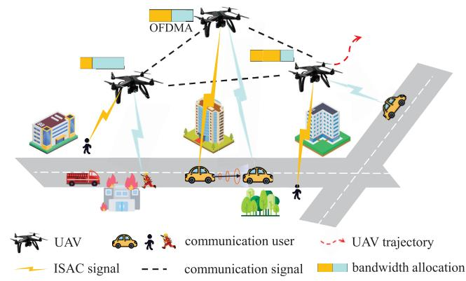  
Fig. 1. An ISAC-enabled multi-UAV system.

• We conduct extensive simulations to verify the effectiveness of the proposed schemes. It will be shown that the proposed SEA-scheduling scheme can increase the communication rate by up to 30% compared with existing sensing-error-unaware methods [6], [25]. In addition, confronting with increasing sensing position errors (e.g., MSE increasing from 0 to $1 0 0 \ m ^ { 2 } )$ , GD-MADRL demonstrates higher robustness, experiencing only a 2.8% performance degradation, while traditional MADRL-based and heuristic UAV scheduling algorithms experience a degradation of over 10%.

The rest of the paper is organized as follows. The system model is presented in Sec. II. In Sec. III, the problem formulation of the SEA-scheduling scheme is described. The proposed GD-MADRL method and the computational complexity analysis are presented in Sec. IV. Then, the simulation results are demonstrated in Sec. V. Finally, conclusions are drawn in Sec. VI.

Notations: Unless otherwise specified, boldface upper-case letters (i.e., Λ) and boldface lowercase letters (i.e., p) denote matrices and vectors, respectively. I denotes an identity matrix. $j ~ = ~ \sqrt { - 1 }$ denotes the imaginary unit. $\left( \cdot \right) ^ { T }$ denotes the transpose operation, $( \cdot ) ^ { * }$ denotes the conjugate operation, and $\left( \cdot \right) ^ { H }$ denotes the conjugate transpose operation. For a vector, k·k denotes its \`2-norm. $x ~ \sim ~ \mathcal { C N } ( \mu , \sigma ^ { 2 } )$ denotes that x follows the complex Gaussian distribution with mean $\mu$ and variance $\sigma ^ { 2 } .$ , and ∼ denotes “distributed as”. $x \sim \mathcal N ( \mu _ { \mathcal N } , \sigma _ { \mathcal N } ^ { 2 } )$ denotes that x follows the normal distribution with mean $\mu _ { \mathcal { N } }$ and variance $\sigma _ { \mathcal { N } } ^ { 2 } . \ x \ \sim \ E \left( \lambda \right)$ denotes that x follows the exponential distribution with parameter λ. E [·] denotes the statistical expectation. log (·) is the logarithm based on e.

## II. SYSTEM MODEL

As shown in Fig. 1, an ISAC-enabled multi-UAV system is considered, where I UAVs each with M antennas are employed as aerial base stations to provide sensing and communication services for K single-antenna users in a time multiplexed way. The set of UAVs and users are denoted as $\mathcal { I } = \{ 1 , \cdots , I \}$ and $\mathcal { K } = \{ 1 , \cdots , K \}$ , respectively. To show the trajectory of the UAVs and users, a three-dimensional (3D) cartesian coordinate system is introduced. Assume that the

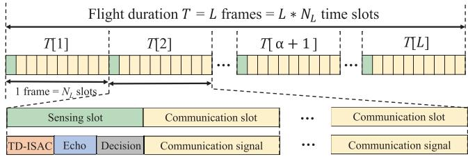

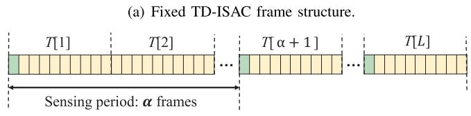  
(b) Flexible TD-ISAC frame structure.  
Fig. 2. The design of ISAC frame structure in a multi-UAV network.

UAVs fly at a constant altitude H due to air traffic control constraints and the need for stable coverage, ignoring minor vertical fluctuations [11], [12], [13], [14], [15], [16], [17], [18], [19], [20], [21], [22], [23], [24], [25], [26]. Thus, the 3D location of the UAV-i is denoted as $\mathbf { v } _ { i } = [ x _ { i } , y _ { i } , H ]$ , and the locations of all UAVs can be represented by the matrix $\mathbf V = [ \mathbf v _ { 1 } ^ { T } , \mathbf v _ { 2 } ^ { T } , \cdot \cdot \cdot , \mathbf v _ { I } ^ { T } ] ^ { T }$ . Similarly, the 3D location of the user-k is denoted as $\mathbf u _ { k } = [ x _ { k } , y _ { k } , 0 ]$ , and the locations of all users are represented by the matrix $\mathbf { \dot { U } } = [ \mathbf { u } _ { 1 } ^ { T } , \mathbf { u } _ { 2 } ^ { T } , \cdots , \mathbf { u } _ { K } ^ { T } ] ^ { T }$ To provide good communication service for users, based on the estimated user locations through the sensing signals, UAVs can collaborate to determine their trajectories and resource allocation in a distributed way. Assume that orthogonal frequency-division multiplexing (OFDM) is employed for communications and sensing. Meanwhile, given the scarcity of aerial spectrum resources, the same spectrum is reused among different UAVs to enhance spectral efficiency and different users access to the same UAV via orthogonal frequencydivision multiple access (OFDMA) [41].

## A. ISAC Frame Structure

In the considered system, communication and sensing share the transmission resource in a time multiplexed way. A timedomain ISAC (TD-ISAC) frame structure is applied [17], [18], [24]. As shown in Fig. 2, consider a duration of T , which is divided into L frames with a duration of $T _ { L }$ . Each frame is composed by $N _ { L }$ time slots with a duration of $T _ { L } / N _ { L }$ The set of frames and slots are denoted by $\mathcal { L } = \{ 0 , 1 , \cdots , L \}$ and $\mathcal { N } = \{ 0 , 1 , \cdots , N \}$ , respectively. In each frame, slots can be divided into sensing time slots and communication time slots. During the considered duration $T ,$ , I UAVs periodically transmit sensing signals to users and estimate their positions, speeds and directions from the echo signals. To enable user localization sensing, at least 3 UAVs are required, i.e., $| I | \geq 3$ [20], [21], [22], [23], [24], [25], [26].

Given the above TD-ISAC frame, the UAV can update the user positions in each sensing time slot for subsequent decision making. Assume that the sensing slots are placed every α frames, where α is defined as the sensing period. Note that one frame is relatively short (e.g., 10 ms in 5G NR [42]), hence user positions do not change significantly in this duration. Given $T = 1 0$ ms and a user moving speed of 1.5 m/s, the user only travels 0.015 meters in one frame, which is negligible. Therefore, one frame is taken as the smallest granularity for sensing resource scheduling. Without loss of generality, let the first slot in duration T be invariably a sensing slot. Thus, the sensing slot set can be denoted as $n _ { s } \in \mathcal { N } _ { s } = \{ 1 , \alpha N _ { L } + 1 , 2 \alpha N _ { L } + 1 , \cdot \cdot \cdot \}$ . Obviously, a smaller α means that more resources are allocated to sensing, thus more frequent sensing can be carried out to achieve more accurate localization performance. Unlike previous works that often assume a fixed value for $\alpha ,$ in this paper, α is taken as a variable that change with the user mobility. Therefore, α is employed to indicate the resource allocated to sensing.

## B. User Mobility Model

Given that the time slot is sufficiently small, the user position change in a time slot is assumed to be negligible [16], [17], [18], [19], [20], [21]. Between time slots, the trajectories of users are generated by Gauss-Markov random mobility model [43], which gradually updates speed and direction based on their previous values, with a controllable balance between randomness and temporal correlation. Initially, the user positions, speeds and directions are randomly assigned. The speed and direction of the user-k in time slot n are given by

$$
s _ { k } [ n ] = p _ { s , k } s _ { k } [ n - 1 ] + ( 1 - p _ { s , k } ) \overline { { s } } _ { k } + \sigma _ { s , k } \sqrt { 1 - p _ { s , k } ^ { 2 } } g _ { s , k } [ n ] ,\tag{1}
$$

and

$$
\varphi _ { k } [ n ] = p _ { \varphi , k } \varphi _ { k } [ n - 1 ] + ( 1 - p _ { \varphi , k } ) \overline { { \varphi } } _ { k } + \sigma _ { \varphi , k } \sqrt { 1 - p _ { \varphi , k } ^ { 2 } } g _ { \varphi , k } [ n ] ,\tag{2}
$$

respectively, where $p _ { s , k }$ and $p _ { \varphi , k }$ are constants [43] that describe the varying degrees of randomness in terms of the speed and direction between the time slot $n - 1$ and $n ,$ respectively. Specifically, $p _ { s , k } ~ = ~ 0$ represents that the user speed follows a fully random process (i.e., the speed between two time slots is not related), while $p _ { s , k } ~ = ~ 1$ represents that the user speed changes smoothly over time (i.e., the speed between two time slots is temporally correlated). s and $\sigma _ { s , k }$ are constants that describe the mean value and standard deviation of the user speed, respectively. $\overline { { \varphi } } _ { k }$ and $\sigma _ { \varphi , k }$ are constants that describe the mean and standard deviations of the user direction, respectively. $g _ { s , k } [ n ]$ and $g _ { \varphi , k } [ n ]$ are both random variables sampled from a Gaussian distribution with mean 0 and standard deviation 1. Then, the coordinates of the user-k in the time slot n can be given by

$$
x _ { k } [ n ] = x _ { k } [ n - 1 ] + s _ { k } [ n - 1 ] \cos ( \varphi _ { k } [ n - 1 ] ) ,\tag{3}
$$

and

$$
y _ { k } [ n ] = y _ { k } [ n - 1 ] + s _ { k } [ n - 1 ] \sin ( \varphi _ { k } [ n - 1 ] ) .\tag{4}
$$

## C. Sensing and Communication Model

Each UAV is equipped with a uniform linear array (ULA) with M antenna elements [16], [17]. Since the air-to-ground communication links between the UAVs and the ground users are dominated by the light-of-sight (LoS) link, the probabilistic LoS channel model is employed for all communication and sensing channels [17], [23], [24], [25], where the LoS occurrence probability between the UAV-i and the user-k in the time slot n can be given by

$$
P _ { i , k } ^ { L o S } [ n ] = \frac { 1 } { 1 + C _ { 1 } \exp ( - C _ { 2 } ( \theta _ { i , k } [ n ] - C _ { 1 } ) ) } ,\tag{5}
$$

where $C _ { 1 }$ and $C _ { 2 }$ are the constant parameters depending on the propagation environment such as rural, urban, or dense urban, respectively. $\theta _ { i , k } [ n ]$ is the elevation angle from UAV-i to user-k, given by

$$
\theta _ { i , k } [ n ] = \arcsin { \frac { H } { \left\| \mathbf { v } _ { i } [ n ] - \mathbf { u } _ { k } [ n ] \right\| } } .\tag{6}
$$

Then, the non-LoS (NLoS) occurrence probability is given by $P _ { i , k } ^ { N L o S } [ n ] = 1 - \dot { P } _ { i , k } ^ { L o S } [ n ]$ . Furthermore, the channel vector between the UAV-i and the user-k in the time slot n is denoted as $\mathbf { h } _ { i , k } [ n ] \in \mathbb { C } ^ { M }$ , constructing the channel matrix $\mathbf { H } [ n ] =$ $\left[ \mathbf { h } _ { 1 , 1 } [ n ] , \ldots , \mathbf { h } _ { 1 , K } [ n ] ; \ldots ; \mathbf { h } _ { I , 1 } [ n ] , \ldots , \mathbf { h } _ { I , K } [ n ] \right] ^ { T }$ between all UAVs and users. $\mathbf { h } _ { i , k } [ n ]$ is given by

$$
\mathbf { h } _ { i , k } [ n ] = \sqrt { P _ { i , k } ^ { L o S } [ n ] } \mathbf { h } _ { i , k } ^ { L o S } [ n ] + \sqrt { P _ { i , k } ^ { N L o S } [ n ] } \mathbf { h } _ { i , k } ^ { N L o S } [ n ] ,\tag{7}
$$

where $\mathbf { h } _ { i , k } ^ { L o S } [ n ]$ and $\mathbf { h } _ { i , k } ^ { N L o S } [ n ]$ are the channel gain of LoS and NLoS, respectively. The NLoS component $\mathbf { \bar { h } } _ { i , k } ^ { N L o S } [ n ]$ is the complex Gaussian random vector with zero mean and unit covariance matrix [17]. The LoS component $\mathbf { h } _ { i , k } ^ { L o S } [ n ]$ is given by

$$
\mathbf { h } _ { i , k } ^ { L o S } [ n ] = \frac { \sqrt { G } \sqrt { M } } { | | \mathbf { v } _ { i } [ n ] - \mathbf { u } _ { k } [ n ] | | } \mathbf { a } _ { i , k } [ n ] ,\tag{8}
$$

where $| | \mathbf { v } _ { i } [ n ] - \mathbf { u } _ { k } [ n ] | \big \rfloor$ is the distance between the UAV-i and the user-k. $\begin{array} { r } { G = \left( \frac { \lambda } { 4 \pi } \right) ^ { 2 } } \end{array}$ is the channel power at the reference distance of 1 m, where λ is the wavelength of the central subcarrier frequency. ${ \bf a } _ { i , k } [ n ]$ is the antenna array response (AAR) between the UAV-i and the user-k, given by

$$
\begin{array} { l } { { { \bf a } _ { i , k } [ n ] ^ { \underline { { \Delta } } } { \bf a } ( \theta _ { i , k } [ n ] ) = { \displaystyle \frac { 1 } { \sqrt { M } } } \left[ 1 , \cdots , e ^ { - j { \frac { 2 \pi d } { \lambda } } ( m - 1 ) \sin \theta _ { i , k } [ n ] } , \right. } } \\ { { \left. \cdots , e ^ { - j { \frac { 2 \pi d } { \lambda } } ( M - 1 ) \sin \theta _ { i , k } [ n ] } \right] ^ { T } , \qquad ( } } \end{array}\tag{9}
$$

where d is the distance between the antenna elements of ULA. In the time slot $n ,$ the signal transmitted from the UAV-i to the user-k can be given by $\mathbf { x } _ { i , k } [ n ] = \mathbf { w } _ { i , k } [ n ] s _ { k } [ n ]$ , where $s _ { k } [ n ] \in \mathbb { C }$ is the information-bearing signal, and ${ \bf w } _ { i , k } [ n ] \in$ $\mathbb { C } ^ { \tilde { M } \times 1 }$ is the corresponding beamforming vector. Particularly, when the beam’s angle of departure (AoD) transmitted by the UAV-i is precisely aligned with the user-k, the optimal beamforming vector is given by ${ \bf w } _ { i , k } [ n ] = { \bf a } ( \theta _ { i , k } [ n ] )$ [16], [17], [18], [19]. However, since the AoD of the transmitted beam is determined based on the sensed user positions with errors, the transmitted beamforming vector $\mathbf { w } _ { i , k } [ n ]$ of the UAV-i cannot be precisely aligned with the user-k. Thus, the actual beamforming vector is given by

$$
\widehat { \mathbf { w } } _ { i , k } [ n ] = \mathbf { a } ( \theta _ { i , k } [ n ] + \Delta \theta _ { i , k } [ n ] ) ,\tag{10}
$$

where $\Delta \theta _ { i , k } [ n ]$ is the deviation angle of the transmitted beam from the optimal direction. $\Delta \theta _ { i , k } [ n ]$ follows a uniform distribution [44], [45], [46], given by

$$
\Delta \theta _ { i , k } [ n ] = \arcsin { \frac { H } { \left\| \mathbf { v } _ { i } [ n ] - \widehat { \mathbf { u } } _ { k } [ n ] \right\| } } - \arcsin { \frac { H } { \left\| \mathbf { v } _ { i } [ n ] - \mathbf { u } _ { k } [ n ] \right\| } } ,\tag{11}
$$

where $\widehat { \mathbf { u } } _ { k } [ n ] = [ \widehat { x } _ { k } [ n ] , \widehat { y } _ { k } [ n ] , 0 ]$ is the estimated 3D coordinates of the user-k. Further, the estimated 3D locations of all users are denoted by a matrix $\widehat { \mathbf { U } } = [ \widehat { \mathbf { u } } _ { 1 } ^ { T } , \widehat { \mathbf { u } } _ { 2 } ^ { T } , \ldots , \widehat { \mathbf { u } } _ { K } ^ { T } ] ^ { T }$ . Given the channel vector and the beamforming vector, the useful signal power at the user-k can be given by

$$
\vert \mathbf { h } _ { i , k } ^ { H } [ n ] \widehat { \mathbf { w } } _ { i , k } [ n ] \vert ^ { 2 } = \vert \mathbf { h } _ { i , k } ^ { H } [ n ] \mathbf { a } ( \theta _ { i , k } [ n ] + \Delta \theta _ { i , k } [ n ] ) \vert ^ { 2 } .\tag{12}
$$

It can be seen that sensing errors $\Delta \theta _ { i , k } [ n ]$ directly affect the signal power, which in turn influences the communication rate. To accurately evaluate the impact of sensing errors on communication rate, it is essential to assess the range of the sensing errors $\Delta \theta _ { i , k } [ n ]$ . For an unbiased (or asymptotically unbiased) parameter estimator, the CRB provides a lower bound for the mean square error (MSE) of the estimation, and is usually employed to evaluate sensing performance [17].

Proposition 1: According to [11], [13], [14], and [20], the CRB for the user-k’s location estimation is adopted as the sensing performance metric, given by

$$
\eta _ { x _ { k } , y _ { k } } ^ { 2 } [ n ] = \frac { ( \mathbf { g } _ { a , k } [ n ] + \mathbf { g } _ { b , k } [ n ] ) ^ { T } \mathbf { p } _ { k } [ n ] } { \mathbf { p } _ { k } ^ { T } [ n ] \Big ( \mathbf { g } _ { a , k } [ n ] \mathbf { g } _ { b , k } ^ { T } [ n ] - \mathbf { g } _ { c , k } [ n ] \mathbf { g } _ { c , k } ^ { T } [ n ] \Big ) \mathbf { p } _ { k } [ n ] } ,\tag{13}
$$

where $\mathbf { p } _ { k } [ n ] \ = \ \left[ p _ { 1 , k } [ n ] , \ldots , p _ { I , k } [ n ] \right] ^ { T } \ \in \ \mathbb { C } ^ { I }$ is the transmission powers of all I UAVs to user-k. $\begin{array} { r l } { \mathbf { g } _ { a , k } [ n ] } & { { } = } \end{array}$ $\big [ g _ { a _ { 1 } , k } [ n ] , \dots , g _ { a _ { I } , k } [ n ] \big ] ^ { T } , \ : \ : \mathbf { g } _ { b , k } [ n ] \ : \ : = \ : \big [ g _ { b _ { 1 } , k } [ n ] , \dots , g _ { b _ { I } , k } [ n ] \big ] ^ { T } ,$ and $\mathbf { g } _ { c , k } [ n ] = [ g _ { c _ { 1 } , k } [ n ] , \ldots , g _ { c _ { I } , k } [ n ] ] ^ { \scriptscriptstyle T }$ are the contributions of the x-coordinate, y-coordinate, and the combined influence on the target localization process, respectively. The i-th element of ${ \bf g } _ { a , k } [ n ]$ , gb,k[n] and ${ \bf g } _ { c , k } [ n ]$ is given by

$$
g _ { a _ { i } , k } [ n ] = \xi \sum _ { j = 1 } ^ { I } | \psi _ { k } h _ { i , j } [ n ] | ^ { 2 } \left( { \frac { x _ { i } [ n ] - x _ { k } [ n ] } { \| \mathbf { v } _ { i } [ n ] - \mathbf { u } _ { k } [ n ] \| } } + { \frac { x _ { j } [ n ] - x _ { k } [ n ] } { \| \mathbf { v } _ { j } [ n ] - \mathbf { u } _ { k } [ n ] \| } } \right) ^ { 2 } ,\tag{14}
$$

$$
g _ { b _ { i } , k } [ n ] = \xi \sum _ { j = 1 } ^ { I } | \psi _ { k } h _ { i , j } [ n ] | ^ { 2 } \left( { \frac { y _ { i } [ n ] - y _ { k } [ n ] } { \| \mathbf { v } _ { i } [ n ] - \mathbf { u } _ { k } [ n ] \| } } + { \frac { y _ { j } [ n ] - y _ { k } [ n ] } { \| \mathbf { v } _ { j } [ n ] - \mathbf { u } _ { k } [ n ] \| } } \right) ^ { 2 } ,\tag{15}
$$

and

$$
g _ { c _ { i } , k } [ n ] = \xi \sum _ { j = 1 } ^ { I } | \psi _ { k } h _ { i , j } [ n ] | ^ { 2 } \left( \frac { x _ { i } [ n ] - x _ { k } [ n ] } { \| \mathbf { v } _ { i } [ n ] - \mathbf { u } _ { k } [ n ] \| } + \frac { x _ { j } [ n ] - x _ { k } [ n ] } { \| \mathbf { v } _ { j } [ n ] - \mathbf { u } _ { k } [ n ] \| } \right)
$$

$$
\times \Big ( \frac { y _ { i } [ n ] - y _ { k } [ n ] } { \lVert \mathbf { v } _ { i } [ n ] - \mathbf { u } _ { k } [ n ] \rVert } + \frac { y _ { j } [ n ] - y _ { k } [ n ] } { \lVert \mathbf { v } _ { j } [ n ] - \mathbf { u } _ { k } [ n ] \rVert } \Big ) ,\tag{16}
$$

respectively, where $\begin{array} { r } { \xi = \frac { 8 \pi ^ { 2 } B ^ { 2 } } { c ^ { 2 } \sigma ^ { 2 } } } \end{array}$ , ψk is the radar cross section of the user-k and B is the signal effective bandwidth.

## Proof. Please refer to Appendix A.

Overall, the received signal at the user-k from the UAV-i in the time slot n is given by (17), shown at the bottom of the page, where $p _ { i , k } \left[ n \right]$ is the power of the signal transmitted from the UAV-i to the user-k, and $n _ { i , k } [ n ] \sim \mathcal { C N } ( 0 , \sigma ^ { 2 } )$ is the complex additive white Gaussian noise (AWGN). Given (8)–(12), the received signal-to-interference-plus-noise ratio (SINR) of the user-k in the time slot n is given by

$$
\Gamma _ { i , k } [ n ] = \frac { p _ { i , k } \left[ n \right] \left| \mathbf { h } _ { i , k } ^ { H } [ n ] \widehat { \mathbf { w } } _ { i , k } [ n ] \right| ^ { 2 } } { \underset { q \in \mathcal { L } \backslash \{ i \} } { \overset { I } { \sum } } \underset { j \in \mathcal { K } \backslash \{ k \} } { \overset { K } { \sum } } p _ { q , j } [ n ] \left| \mathbf { h } _ { i , k } ^ { H } [ n ] \widehat { \mathbf { w } } _ { q , j } [ n ] \right| ^ { 2 } + \sigma ^ { 2 } } .\tag{18}
$$

Then, the instantaneous communication rate between the UAV-i and the user-k is given by

$$
R _ { i , k } [ n ] = B _ { i , k } [ n ] \log \left( 1 + \Gamma _ { i , k } [ n ] \right) ,\tag{19}
$$

where $B _ { i , k } [ n ]$ is the bandwidth allocated to the user-k by the UAV-i. Thus, the bandwidth allocation between all UAVs and users can be denoted as $\begin{array} { r l } { \mathbf { B } [ n ] } & { { } = } \end{array}$ $\left[ B _ { 1 , 1 } [ n ] , \ldots , B _ { 1 , K } [ n ] ; \ldots ; B _ { I , 1 } [ n ] , \ldots , B _ { I , K } [ n ] \right] ^ { T }$

## III. PROBLEM FORMULATION

Existing communication scheduling schemes for ISAC systems always assume that the sensing performance is perfect without error, i.e., $\Delta \theta { \bf \Phi } = { \bf \Phi } 0$ . However, sensing error is inevitable in practice, which will impact the communication performance. As shown in (10), (18) and (19), the sensing error $\Delta \theta$ has an impact on the received SINR and the achievable communication rate. Therefore, when the communication rate is adopted as the optimization objective, inaccurate sensing results may lead to suboptimal decisions in UAV deployment, user association, and resource allocation, ultimately degrading the overall system performance. Thus, it is necessary to investigate the relationship between the communication rate and the sensing error. Based on the results, a SEA UAV scheduling problem can be formulated, aiming to maximize the SEA communication rate by optimizing the sensing resource allocation, and the UAV scheduling strategy.

## A. Sensing-Error-Aware Communication Rate

Firstly, it is necessary to derive the relationship between the communication performance and the sensing errors.

$$
r _ { i , k } [ n ] = \underbrace { p _ { i , k } [ n ] \sqrt { M } \mathbf { h } _ { i , k } ^ { H } [ n ] \widehat { \mathbf { w } } _ { i , k } [ n ] s _ { i , k } [ n ] } _ { \mathrm { d e s i r e d ~ s i g n a l } } + \underbrace { \sum _ { q \in T \backslash \{ i \} } ^ { I } \sum _ { j \in K \backslash \{ k \} } ^ { K } { p _ { q , j } [ n ] \sqrt { M } \mathbf { h } _ { q , k } ^ { H } [ n ] \widehat { \mathbf { w } } _ { q , j } [ n ] s _ { q , j } [ n ] } } _ { \mathrm { m u l t i n s e r ~ i n t e r f e r e n c e } } + n _ { i , k } [ n ] .\tag{17}
$$

$$
\Gamma _ { i , k } [ n ] = \frac { p _ { i , k } \left[ n \right] \frac { G M P _ { 1 , k } ^ { L G s } [ n ] } { \| \mathbf { v } _ { \mathrm { i } } [ n ] - \mathbf { u } _ { k } [ n ] \| ^ { 2 } } \left( 1 - \frac { 1 } { 3 } \left( \frac { \pi d } { \lambda } M \sin \theta _ { i , k } \left[ n \right] \right) ^ { 2 } \left( \Delta \theta _ { i , k } \left[ n \right] \right) ^ { 2 } \right) + p _ { i , k } \left[ n \right] P _ { i , k } ^ { N L o s } \left[ n \right] x _ { N L o s } \left[ n \right] } { \underset { q \in \mathcal { X } \backslash \{ i \} } { \overset { L } { \sum } } \underset { j \in \mathcal { K } \backslash \{ k \} } { \overset { K } { \sum } } \left[ n \right] \left| \mathbf { h } _ { i , k } ^ { H } \left[ n \right] \widehat { \mathbf { w } } _ { q , j } \left[ n \right] \right| ^ { 2 } + \sigma ^ { 2 } } .\tag{20}
$$

Proposition 2: The instantaneous SINR considering the sensing error $\Delta \theta _ { i , k } [ n ]$ can be given by (20), shown at the bottom of the previous page, where $x _ { N L o s } \left[ n \right] \sim E \left( 1 \right)$

Proof. Please refer to Appendix B

Based on (20), it can be observed that the degradation on SINR caused by the sensing error $\Delta \theta _ { i , k }$ is determined by the term $\left( \Delta \theta _ { i , k } [ n ] \right) ^ { 2 }$

Proposition 3: The range of $\Delta \theta _ { i , k } \left[ n \right]$ is defined as $[ \Delta \theta _ { i , k , \operatorname* { m i n } } [ n ] , \Delta \theta _ { i , k , \operatorname* { m a x } } [ n ] ]$ , with the time index omitted for brevity, given by

$$
\Delta \theta _ { i , k , \operatorname* { m i n } } = \arcsin \frac { H } { \sqrt { \left( \left\| \mathbf { u } _ { k } \right\| + \eta _ { \operatorname* { m a x } } \right) ^ { 2 } + H ^ { 2 } } } - \arcsin \frac { H } { \left\| \mathbf { v } _ { i } - \mathbf { u } _ { k } \right\| } ,\tag{21}
$$

and

$$
\Delta \theta _ { i , k , \operatorname* { m a x } } = \arcsin \frac { H } { \sqrt { \left( \left\| \mathbf { u } _ { k } \right\| - \eta _ { \operatorname* { m a x } } \right) ^ { 2 } + H ^ { 2 } } } - \arcsin \frac { H } { \left\| \mathbf { v } _ { i } - \mathbf { u } _ { k } \right\| } .\tag{22}
$$

Proof. Please refer to Appendix C.

With Proposition 2 and Proposition 3, the average communication rate with sensing error between the UAV-i and the user-k in the time slot n is given by

$$
\mathbb E \left[ R _ { i , k } [ n ] \right] = \int _ { R _ { i , k } ^ { l o w } [ n ] } ^ { R _ { i , k } ^ { u p } [ n ] } R _ { i , k } [ n ] f _ { R _ { i , k } [ n ] } d R _ { i , k } [ n ] ,\tag{23}
$$

where $f _ { R _ { i , k } [ n ] }$ is the probability density function (PDF) of $R _ { i , k } [ n ]$ , which can be derived in the following proposition.

Proposition 4: The PDF of $R _ { i , k } [ n ]$ is given by (24), shown at the bottom of the page, where $S I N R _ { i d e a l }$ is the ideal SINR when there is no sensing error and $S I N R _ { l o s s }$ is the loss in SINR caused by sensing errors, given by

$$
S I N R _ { i d e a l } = \frac { p _ { i , k } [ n ] \frac { G M P _ { i , k } ^ { L o s } [ n ] } { \left\| \mathbf { v } _ { i } [ n ] - \mathbf { u } _ { k } [ n ] \right\| ^ { 2 } } + p _ { i , k } [ n ] P _ { i , k } ^ { N L o s } [ n ] x _ { N L o s } [ n ] } { \underset { q \in \mathbb { Z } \backslash \{ i \} } { \overset { I } { \sum } } \underset { j \in K \backslash \{ k \} } { \overset { K } { \sum } } p _ { q , j } [ n ] \left| \mathbf { h } _ { i , k } ^ { H } [ n ] \widehat { \mathbf { w } } _ { q , j } [ n ] \right| ^ { 2 } + \sigma ^ { 2 } } ,\tag{25}
$$

and

$$
S I N R _ { l o s s } = \frac { p _ { i , k } [ n ] \frac { G M } { \left| \left| \mathbf { v } _ { i } [ n ] - \mathbf { u } _ { k } [ n ] \right| \right| ^ { 2 } } \frac { 1 } { 3 } \left( \frac { \pi d } { \lambda } M \cos \theta _ { i , k } [ n ] \right) ^ { 2 } } { \underset { q \in \mathbb { Z } \backslash \{ i \} } { \overset { I } { \sum } } \underset { j \in K \backslash \{ k \} } { \overset { K } { \sum } } p _ { q , j } [ n ] \left| \mathbf { h } _ { i , k } ^ { H } [ n ] \widehat { \mathbf { w } } _ { q , j } [ n ] \right| ^ { 2 } + \sigma ^ { 2 } } ,\tag{26}
$$

respectively. Then, an upper and lower bounds of user communication rate can be given by

$$
R _ { i , k } ^ { l o w } [ n ] = B _ { i , k } [ n ] \log \left( 1 + S I N R _ { i d e a l } - S I N R _ { l o s s } ( \Delta \theta _ { i , k , \operatorname* { m a x } } ) ^ { 2 } \right) ,\tag{27}
$$

and

$$
R _ { i , k } ^ { u p } [ n ] = B _ { i , k } [ n ] \log \left( 1 + S I N R _ { i d e a l } \right) ,\tag{28}
$$

respectively. $R _ { i , k } ^ { t h } [ n ]$ is the threshold value that causes $f _ { R _ { i , k } [ n ] }$ to change, given by

$$
R _ { i , k } ^ { t h } [ n ] = B _ { i , k } [ n ] \log \left( 1 + S I N R _ { i d e a l } - S I N R _ { l o s s } ( \Delta \theta _ { i , k , \operatorname* { m i n } } ) ^ { 2 } \right) .\tag{29}
$$

Proof. Please refer to Appendix D.

Based on the (21)–(29), the SEA communication rate between the UAV-i and the user-k can be calculated.

## B. Optimization Problem Formulation

It is assumed that each user establishes a communication association with one UAV during each time slot. Thus, an indicator matrix $\pmb { \Lambda } \in \mathbb { C } ^ { I \times K }$ is defined to specify the association between the users and UAVs, whose element $\lambda _ { i , k }$ is given by

$$
\lambda _ { i , k } = { \left\{ \begin{array} { l l } { 1 , { \mathrm { ~ i f ~ t h e ~ u s e r - k ~ i s ~ s e r v e d ~ b y ~ t h e ~ U A V - i ; } } } \\ { 0 , { \mathrm { ~ o t h e r w i s e . } } } \end{array} \right. }\tag{30}
$$

The target of this paper is to design a SEA UAV scheduling scheme, which can maximize the SEA communication rate via jointly optimizing the sensing resource (α), the UAV locations (V), the user association (Λ), and the UAV bandwidth allocation (B), given by

$$
\mathbf { P 1 } : \operatorname* { m a x } _ { \boldsymbol { \alpha } , \mathbf { V } , \mathbf { A } , \mathbf { B } } \ \frac { 1 } { N } \sum _ { n = 1 \setminus N _ { s } } ^ { N } \sum _ { k = 1 } ^ { K } \mathbb { E } [ R _ { i , k } [ n ] ]\tag{31}
$$

$$
\mathrm { s . t . } ~ \lambda _ { i , k } [ n ] \in \{ 0 , 1 \} , \quad \forall i , \forall k ,\tag{31a}
$$

$$
\sum _ { i = 1 } ^ { I } \lambda _ { i , k } [ n ] \leq 1 , \quad \forall k ,\tag{31b}
$$

$$
{ \sum } _ { k = 1 } ^ { K } { \lambda } _ { i , k } [ n ] B _ { i , k } [ n ] \leq B _ { i , m a x } , \quad \forall i ,\tag{31c}
$$

$$
{ \frac { 1 } { \alpha N _ { \stackrel { L } { n } } } } \sum _ { { \boldsymbol { n } } = ( l - 1 ) \alpha N _ { L } + 1 } ^ { l \alpha N _ { L } } \lambda _ { i , k } [ { \boldsymbol { n } } ] R _ { i , k } [ { \boldsymbol { n } } ]
$$

$$
\begin{array} { r } { \geq \lambda _ { i , k } [ n ] R _ { i , t h } , \forall i , \forall k , } \end{array}
$$

$$
\eta _ { x _ { k } , y _ { k } } ^ { 2 } \leq \eta _ { \mathrm { m a x } } ^ { 2 } , \quad \forall k ,\tag{31d}
$$

(31e)

$$
x _ { \mathrm { m i n } } \leq x _ { i } \leq x _ { \mathrm { m a x } } , \quad \forall i ,\tag{31f}
$$

$$
y _ { \mathrm { { m i n } } } \leq y _ { i } \leq y _ { \mathrm { { m a x } } } , \quad \forall i ,\tag{31g}
$$

$$
\begin{array} { r }  f _ { R _ { i , k } [ n ] } = \left\{ \begin{array} { l l } { \frac { R _ { i , k } \left[ n \right] } { e ^ { \displaystyle \frac { R _ { i , k } \left[ n \right] } { R _ { i , k } \left[ n \right] } } } } & { R _ { i , k } [ n ] \in \left[ R _ { i , k } ^ { l h } \left[ n \right] , R _ { i , k } ^ { w p } [ n ] \right] ; } \\ { \left( \Delta \theta _ { i , k , \mathrm { m a x } } [ n ] - \Delta \theta _ { i , k , \mathrm { m i n } } [ n ] \right) B _ { i , k } [ n ] \sqrt { 1 \mathrm { S I N R } _ { \mathrm { a s s } } \left( 1 + \mathrm { S I N R } _ { i d e a l } - e ^ { \frac { R _ { i , k } \left[ n \right] } { R _ { i , k } \left[ n \right] } } \right) } } & { R _ { i , k } [ n ] \in \left[ R _ { i , k } ^ { l h } \left[ n \right] , R _ { i , k } ^ { w p } [ n ] \right] ; } \\ { \frac { e ^ { \displaystyle \frac { R _ { i , k } \left[ n \right] } { R _ { i , k } \left[ n \right] } } } & { e ^ { \displaystyle \frac { R _ { i , k } \left[ n \right] } { R _ { i , k } \left[ n \right] } } } \\ { 2 \left( \Delta \theta _ { i , k , \mathrm { m a x } } [ n ] - \Delta \theta _ { i , k , \mathrm { m i n } } [ n ] \right) B _ { i , k } [ n ] \sqrt { 1 \mathrm { S I N R } _ { \mathrm { a s s } } \left( 1 + \mathrm { S I N R } _ { \mathrm { a } d e a l } - e ^ { \frac { R _ { i , k } \left[ n \right] } { R _ { i , k } \left[ n \right] } } \right) } } & { R _ { i , k } [ n ] \in \left[ R _ { i , k } ^ { l \mathrm { o u r } } \left[ n \right] , R _ { i , k } ^ { t h } [ n ] \right] . } \end{array} \right. } \end{array}\tag{24}
$$

$$
\begin{array} { l } { \displaystyle \| \mathbf { v } _ { i } [ n ] - \mathbf { v } _ { i } [ n - 1 ] \| \leq v _ { \operatorname* { m a x } } \frac { T _ { L } } { N _ { L } } , } \\ { \displaystyle \forall n \in \mathcal { N } \backslash \{ 1 \} , \forall i , } \\ { \displaystyle \alpha \in N ^ { + } , } \end{array}\tag{31h}
$$

(31i)

where the constraints (31a) and (31b) specify that each user is served by at most one UAV. (31c) requires that the sum of the bandwidths allocated to the users served by the UAV-i should not exceed the total bandwidth owned by the UAV-i. (31d) ensures that the average communication rate of each user within a sensing period $\alpha N _ { L }$ is not lower than its predefined threshold $R _ { i , t h }$ (31e) imposes a sensing accuracy requirement, where the localization accuracy must meet a predefined threshold $\eta _ { \mathrm { m a x } } ^ { 2 }$ . (31f) and (31g) confine the flight range of UAVs with a region of $[ x _ { \mathrm { m i n } } , x _ { \mathrm { m a x } } ] \ \times \ [ y _ { \mathrm { m i n } } , y _ { \mathrm { m a x } } ]$ (31h) ensures the maximum movement distance between consecutive time slots, where $v _ { \mathrm { m a x } }$ is the maximum flight speed. (31i) specifies that α must be a positive integer. Note that the optimum problem involves a mix of discrete variables α, binary variables Λ, and continuous variables V and B, which is non-convex and difficult to solve. In addition, the complex form of the SEA communication rate further adds complexity to the optimization, making it impossible to be solved by conventional optimization methods.

## C. Problem Decomposition

To solve the problem P1, it is first decomposed into two subproblems, i.e., the PUB subproblem aiming to optimize the UAV locations (V), the user association (Λ), and the UAV bandwidth allocation (B), and the SRO subproblem determining the optimal sensing period (α). Given an initial sensing period $\alpha ^ { * } \left( \mathrm { i . e . , } \alpha ^ { * } = 1 \right)$ , the PUB subproblem can be given by

$$
\mathbf { P 2 } : \operatorname* { m a x } _ { \mathbf { V } , \Lambda , \mathbf { B } } \frac { 1 } { N } \sum _ { n = 1 \backslash \mathcal { N } _ { s } } ^ { N } \sum _ { k = 1 } ^ { K } \mathbb { E } [ R _ { i , k } [ n ] ]
$$

$$
{ \bf s . t . } ~ \alpha = \alpha ^ { * } ,\tag{32}
$$

$$
( 3 1 a ) - ( 3 1 h ) .\tag{32a}
$$

A generative diffusion-driven multi-agent reinforcement learning (GD-MADRL) algorithm is proposed to solve P2. Then, with the optimization results of the PUB subproblem provided by GD-MADRL, the SRO subproblem can be given by

$$
\mathbf { P 3 } : \operatorname* { m a x } _ { \alpha } \frac { 1 } { N } \sum _ { n = 1 \backslash N _ { s } } ^ { N } \sum _ { k = 1 } ^ { K } \mathbb { E } \left[ R _ { i , k } [ n ] \right]\tag{33}
$$

$$
\begin{array} { r l } & { \mathrm { s . t . } \mathbf { V } { = } \mathbf { V } ^ { * } , \pmb { \Lambda } { = } \mathbf { { \Lambda } } ^ { * } , \mathbf { B } { = } \mathbf { B } ^ { * } , } \\ & { ( 3 1 d ) , ( 3 1 e ) , ( 3 1 i ) . } \end{array}\tag{33a}
$$

Note that P3 can be solved by a classical simulated annealing (SA) algorithm. With the optimal sensing period α obtained from P3, P2 can be solved again. In this way, the two subproblems are solved iteratively to find the optimal solution for the problem P1.

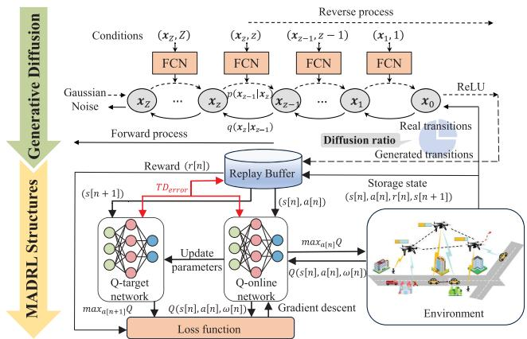  
Fig. 3. Main functions of GD-MADRL in the UAV-i.

## IV. GENERATIVE DIFFUSION-DRIVEN MADRL FOR PUB

Although P1 is decomposed into P2 and P3, the PUB subproblem P2 is still difficult to solve due to the non-convex nature of the objective function and the time-varying characteristics of the ISAC-enabled multi-UAV system. Although MADRL is a promising solution, existing MADRL-based resource allocation approaches typically rely on accurate user position datasets for training, which is difficult to obtain in practice. To address this limitation, a generative diffusiondriven MADRL algorithm (GD-MADRL) is proposed, and the main idea is to integrate the GD model into MADRL to enhance training data diversity under sensing errors. As shown in Fig. 3, MADRL interacts with the environment to generate state-action pairs, serving as input for the GD model to generate training data with sensing errors, thereby augmenting the replay buffer. Note that the GD model is particularly suitable for this task because it can simulate diverse sensing error scenarios by gradually introducing noise into the training process, simulating real-world sensing inaccuracies. MADRL is subsequently trained on the expanded dataset, making more robust UAV scheduling strategies. As the policy improves, the diffusion model generates increasingly refined training samples, creating a self-reinforcing loop. Through iterative training, GD-MADRL develop more robust UAV scheduling strategies in sensing error-aware environments. The detailed algorithm is presented in the following subsections.

## A. Basics of MADRL

In the considered SEA-scheduling scheme, the PUB subproblem can be modeled as a discrete-time Markov decision process (MDP) with continuous state and action spaces. Thus, a multi-agent MDP approach can be employed [21], [22], [25], [26]. In the MDP model, each UAV acts as an independent agent. The resource allocation decisions can be made after interacting with the communication environment. A four-tuple {S, A, Π, R} is defined as follows.

State space S: The state for an agent $i \in \mathcal { Z }$ in the time slot n is the information currently observed by the UAV-i, given by $\mathbf { s } _ { i } \left[ n \right] = \{ \widehat { \mathbf { U } } \left[ n \right] , \mathbf { H } _ { i } \left[ n - 1 \right] \}$

Action space A: Assume that each UAV decides its trajectory, the served user set and the resource allocated scheme independently. Thus, the action space for the UAV-i in the time slot n can be given by $\mathbf { a } _ { i } \left[ n \right] = \left\{ \mathbf { v } _ { i } \left[ n \right] , \mathbf { A } _ { i } \left[ n \right] , \mathbf { B } _ { i } \left[ n \right] \right\}$

Policy Π: $\Pi = \{ \pi _ { 1 } , \pi _ { 2 } , . . . , \pi _ { I } \}$ , where $\pi _ { i }$ is the strategy that the UAV-i follows to select an action ${ \bf a } _ { i } \left[ n \right]$ based on its current state ${ \bf s } _ { i } \left[ n \right]$ . The goal of the policy is to maximize the expected cumulative reward over time, enabling each UAV to make optimal decisions in dynamic environments.

Reward function $\mathcal { R } \colon \mathcal { R } = \{ r _ { 1 } , r _ { 2 } , \ldots , r _ { I } \}$ , where $r _ { i }$ is the reward function of the UAV-i, which is related to the objective of the optimization problem P1, given by

$$
r _ { i } \left[ n \right] = \sum _ { k = 1 } ^ { K } \lambda _ { i , k } \left[ n \right] \mathbb { E } \left[ R _ { i , k } [ n ] \right] .\tag{34}
$$

Algorithm 1 Generative Diffusion-Driven MADRL for ISAC   
Enabled Multi-UAV System   
Initialization:   
1: Set the neural network parameters: replay buffer D, batch   
size $B ,$ global iteration $^ { J , }$ time step N of each iteration,   
diffusion ratio $\rho ,$ and exploration rate $p _ { e } .$   
Iteration:   
2: while the global iteration $j < J$ do   
3: for the time step $n = 1$ to N do   
4: for the $\mathrm { U A V } ~ i = 1$ to I do   
5: Generate a random probability $p ;$   
6: if $p \geq p _ { e }$ then   
7: Perform action $a _ { i } [ n ]$ according to (35);   
8: else   
9: Randomly choose an action $a _ { i } [ n ] ;$   
10: end if   
11: Get reward $r _ { i } [ n ]$ and next state $s _ { i } [ n + 1 ] ;$   
12: Store transition $( s _ { i } [ n ] , a _ { i } [ n ] , r _ { i } [ n ] , s _ { i } [ n + 1 ] ) $ in $\mathcal { D } ;$   
13: Generate synthetic data:   
14: Use the diffusion model to generate new transi   
tions $( \widehat s _ { i } [ n ] , \widehat a _ { i } [ n ] , \widehat r _ { i } [ n ] , \widehat s _ { i } [ \bar { n + 1 } ] ) ;$   
15: Store valid generated transitions in $\mathcal { D } _ { g e n } ;$   
16: Balance real and generated synthetic data:   
17: if $| \mathcal { D } | \geq B$ then   
18: Randomly sample $\lfloor \rho \times B \rfloor$ transitions from   
$\mathcal { D } _ { g e n } ;$   
19: Randomly sample $\lfloor ( 1 - \rho ) \times B \rfloor$ transitions   
from D;   
20: Combine $\mathcal { D } _ { g e n }$ and $\mathcal { D }$ to form batch;   
21: Train the network:   
22: Update diffusion model according to (43);   
23: Calculate target Q value and update Q   
function to minimize (36).   
24: end if   
25: end for   
26: end for   
27: end while

Among various MADRL algorithms, the multi-agent deep Q-network (MADQN) approach is adopted in this paper, which is a value-based reinforcement learning algorithm leveraging deep neural networks to approximate the Q-function. Its advantage lies in its ability to learn optimal policies through experience replay and target network stabilization, making it particularly suitable for dynamic and complex environments. In MADQN, each UAV is equipped with its own DQN network to independently select its appropriate actions, which consists of a Q-online network and a Q-target network. Take UAVi as an example, which observes the state $\mathbf { s } _ { i }$ [n] and selects an action $\mathbf { a } _ { i } \left[ n \right]$ based on ε-greedy strategy, i.e., a random action is selected to explore the environment with probability $p _ { e } .$ , while an action maximizing the Q-function is chosen with probability $1 - p _ { e }$ . The selected action is executed in the environment, yielding a reward $r _ { i } \left[ n \right]$ and transitioning the UAV to the next state $\mathbf { s } _ { i } \left[ n + 1 \right]$ . This transition tuple $\left( { { \bf { s } } _ { i } } \left[ n \right] , { \bf { a } } _ { i } \left[ n \right] , r _ { i } \left[ n \right] , { \bf { s } } _ { i } \left[ n + 1 \right] \right)$ is stored in an experience replay buffer to update network parameters. During each update step, a subset of B tuples (where $\boldsymbol { B }$ is the batch size) is sampled from the buffer, therefore balancing efficiency and stability. From the above steps, it can be seen that the Q-function determines the quality of the action ${ \bf a } _ { i } \left[ n \right]$ . In MADQN, the Q-online network calculates the Q-function $Q ^ { \pi _ { i } } \left( \mathbf { s } _ { i } \left[ n \right] , \mathbf { a } _ { i } \left[ n \right] ; \omega _ { i } \left[ n \right] \right)$ , which is parameterized by $\omega _ { i } \left[ n \right]$ and employs a recursive update based on the Bellman equation to maximize long-term reward, given by

$$
\begin{array} { l } { { \displaystyle Q ^ { \pi _ { i } } \left( { \bf s } _ { i } \left[ n \right] , { \bf a } _ { i } \left[ n \right] ; \omega _ { i } \left[ n \right] \right) = r _ { i } \left[ n \right] + } } \\ { { \displaystyle \gamma \left[ \operatorname* { m a x } _ { { \bf a } _ { i } } Q ^ { \pi _ { i } } \left( { \bf s } _ { i } \left[ n + 1 \right] , { \bf a } _ { i } \left[ n + 1 \right] ; \omega _ { i } \left[ n + 1 \right] \right) \right] , } } \end{array}\tag{35}
$$

where $\gamma \in [ 0 , 1 ]$ is the discount factor, indicating the effect of future rewards on current decisions. Moreover, MADQN introduces a Q-target network to stabilize the training process. The parameters of the Q-target network are periodically copied from the Q-online network and remain fixed for a period of time. During training, the goal of each DQN is to approximate the optimal Q-function by minimizing the loss function, which is given by

$$
\begin{array} { r } { \mathcal { L } = \mathbb { E } _ { \mathcal { D } } \left[ \left( y - Q ^ { \pi _ { i } } \left( \mathbf { s } _ { i } \left[ n \right] , \mathbf { a } _ { i } \left[ n \right] ; \omega _ { i } \left[ n \right] \right) \right) ^ { 2 } \right] , } \end{array}\tag{36}
$$

where D is an experience replay buffer storing transitions, and y is the target Q-function value obtained from the Q-target network, which is given by

$$
y = r _ { i } \left[ n \right] + \gamma \operatorname* { m a x } _ { \mathbf { a } _ { i } } Q ^ { \pi _ { i } } \left( \mathbf { s } _ { i } \left[ n + 1 \right] , \mathbf { a } _ { i } \left[ n + 1 \right] ; \omega _ { i } \left[ n + 1 \right] \right)\tag{37}
$$

$y - Q ^ { \pi _ { i } } \left( \mathbf { s } _ { i } \left[ n \right] , \mathbf { a } _ { i } \left[ n \right] ; \omega _ { i } \left[ n \right] \right)$ is Temporal-Difference error $( T D _ { e r r o r } )$ , using to measure the difference between the current Q-function value estimate and the target Q-function value. By iteratively updating parameters $\omega _ { i } \left[ n \right]$ , the algorithm converges toward an optimal Q-function that maximizes the expected long-term rewards.

## B. Generative Diffusion-Driven MADRL

The GD model is a generative framework designed to learn the underlying distribution of training data by progressively adding and removing noise. As shown in Fig. 3, the GD model is introduced to augment the experience replay buffer of MADQN by generating synthetic samples with uncertain errors, i.e., GD-MADRL. This enriched buffer enables the multi-agent system to learn from a broader range of scenarios, including those with imperfect sensing information. Through this integration, the multi-agent system empowers UAVs to make more robust decisions under realistic sensing imperfections, which are common in real-world ISAC-enabled UAV networks.

In GD-MADRL, the diffusion model employs a two-phase process, i.e., a forward process that progressively adds Gaussian noise to transition samples and a reverse process that reconstructs transitions from noise. Specifically, the forward process begins with an input transition sample $\mathbf { x } _ { 0 } \in \mathcal { D }$ from the experience replay buffer of the MADQN algorithm. Note that $z$ is the step of the diffusion process, with $Z$ being the total steps. At each step z of the forward process, the model injects Gaussian noise into the current sample to generate a progressively noisier sample $\mathbf { x } _ { z }$ . The transition from $\mathbf { x } _ { z - 1 }$ to $\mathbf { x } _ { z }$ is defined as a normal distribution with mean $\sqrt { 1 - \beta _ { z } } \mathbf { x } _ { z - 1 }$ and variance $\beta _ { z } \mathbf { I } ,$ given by

$$
q \left( \mathbf { x } _ { z } | \mathbf { x } _ { z - 1 } \right) = \mathcal { N } \left( \mathbf { x } _ { z } ; \sqrt { 1 - \beta _ { z } } \mathbf { x } _ { z - 1 } , \beta _ { z } \mathbf { I } \right) ,\tag{38}
$$

where $\beta _ { z }$ is the variance of the noise, which usually increases gradually over time. The data sample $\mathbf { x } _ { \mathrm { 0 } }$ gradually loses its distinguishable features and evolves towards a Gaussian noise $\mathbf { x } _ { Z } \sim \mathcal { N } ( 0 , \mathbf { I } )$ as the step $Z$ becomes larger. Since $\mathbf { x } _ { z }$ depends only on $\mathbf { x } _ { z - 1 }$ from the previous step, the forward process can be regarded as a Markov process. Thus, $\mathbf { x } _ { z }$ at each time step can be calculated based on the distribution of $\mathbf { x } _ { \mathrm { 0 } }$ , which is given by

$$
\begin{array} { r l } & { \mathbf { x } _ { z } = \sqrt { \eta _ { z } } \mathbf { x } _ { z - 1 } + \sqrt { 1 - \eta _ { z } } \mathbf { \epsilon } _ { z - 1 } } \\ & { \quad = \sqrt { \eta _ { z } \eta _ { z - 1 } } \mathbf { x } _ { z - 2 } + \sqrt { 1 - \eta _ { z } \eta _ { z - 1 } } \mathbf { \epsilon } _ { z - 2 } } \\ & { \quad = \dots = \sqrt { \bar { \eta _ { z } } } \mathbf { x } _ { 0 } + \sqrt { 1 - \bar { \eta _ { z } } } \mathbf { \epsilon } , } \end{array}\tag{39}
$$

where $\begin{array} { c c l c r } { { \eta _ { z } } } & { { = } } & { { 1 - \beta _ { z } , \ \overline { { { \eta } } } _ { z } } } & { { = } } & { { \prod _ { j = 1 } ^ { z } \eta _ { j } } } \end{array}$ is the cumulative product of $\eta _ { j }$ over previous denoising step $j ~ \left( \forall j \leq z \right)$ , and $\epsilon _ { z - 1 } , \epsilon _ { z - 2 } , \ldots , \epsilon \sim \mathcal { N } ( 0 , \mathbf { I } )$

The above forward process gradually transforms data into noise through a series of iterative steps. However, since the goal of the diffusion model is to generate new synthetic data based on existing samples, i.e., $\mathbf { x } _ { 0 } ,$ a reverse process is required to reconstruct data by iteratively removing noise. Note that this reverse conditional probability is tractable when applying the Bayesian formula conditioned on $\mathbf { x } _ { \mathrm { 0 } }$ , and this calculation of the reverse process can be transformed into the calculation of the forward process, which is given by (40), shown at the bottom of the page, where $C ( \mathbf { x } _ { z } , \mathbf { x } _ { 0 } )$ is the function not involving $\mathbf { x } _ { z - 1 }$ and details are omitted. Recall that $\begin{array} { r } { \eta _ { z } = 1 - \beta _ { z } , \overline { { \eta } } _ { z } = \prod _ { j = 1 } ^ { z } \eta _ { j } } \end{array}$ , and $\begin{array} { r } { \mathbf { x } _ { 0 } = \frac { 1 } { \sqrt { \overline { { \eta } } _ { z } } } \left( \mathbf { x } _ { z } - \sqrt { 1 - \overline { { \eta } } _ { z } } \epsilon \right) } \end{array}$ based on (39). Following the standard Gaussian density function, the variance and mean can be given by

$$
\tilde { \beta } _ { z } = \frac { 1 } { \frac { \eta _ { z } } { \beta _ { z } } + \frac { 1 } { 1 - \overline { { \eta } } _ { z - 1 } } } = \frac { 1 - \overline { { \eta } } _ { z - 1 } } { 1 - \overline { { \eta } } _ { z } } \cdot \beta _ { z } ,
$$

and

(41)

$$
\widetilde { \pmb { \mu } } _ { z } \left( \mathbf { x } _ { z } , \mathbf { x } _ { 0 } \right) = \frac { 1 } { \sqrt { \eta _ { z } } } \left( \mathbf { x } _ { z } - \frac { 1 - \eta _ { z } } { \sqrt { 1 - \overline { { \eta } } _ { z } } } \pmb { \epsilon } \right) ,\tag{42}
$$

respectively. Note that $\beta _ { z }$ is a constant that represents the variance of the forward diffusion process. Thus, $\tilde { \beta } _ { z }$ of the reverse diffusion process is also a constant according to (41). Moreover, $\mathbf { x } _ { z }$ is available as input while training the reverse diffusion network. Therefore, only  is an unknown variable. Usually, a neural network model, e.g., fully connected neural network (FCN), is used to predict the noise , given by $\epsilon _ { \mathbf { o } } \left( \mathbf { x } _ { z } , z \right)$ , where o is the network parameter. Further, the loss function can be designed to minimize the difference between the real noise  and $\epsilon _ { \mathbf { o } } \left( \mathbf { x } _ { z } , z \right)$ , which is given by

$$
\mathcal { L } = \left\| \epsilon - \epsilon _ { \mathbf { o } } \left( \mathbf { x } _ { z } , z \right) \right\| ^ { 2 } .\tag{43}
$$

Algorithm 2 GD-MADRL and SA Iterative Algorithm for   
ISAC Enabled Multi-UAV System   
Initialization:   
1: Set the environmental parameters and GD-MADRL   
parameters according to Algorithm 1.   
2: Set the parameters for $\operatorname { s A } { \mathrm { : } }$ initial temperature $W _ { 0 } ,$ lower   
limit $W _ { m i n } .$ , cooling rate κ.   
Iteration:   
3: Initialize time step $j = 0 ;$   
4: Initialize the sensing period $\alpha _ { j } .$ , current temperature $W _ { j } =$   
$W _ { 0 } ;$   
5: Update GD-MADRL model with $\alpha _ { j }$ according to Algo  
rithm 1;   
6: Calculate the SEA communication rate $R _ { j }$ according to   
(31);   
7: while $W _ { j } > W _ { m i n }$ do   
8: $j  j + 1 ;$   
9: Generate $\alpha _ { j }$ from neighborhood of $\alpha _ { j - 1 } ;$   
10: Update GD-MADRL model with $\alpha _ { j } ;$   
11: Update new $R _ { j }$ based on the new GD-MADRL model   
and $\alpha _ { j } ;$   
12: if $R _ { j } - R _ { j - 1 } \geq 0$ then   
13: Accept $\alpha _ { j } , R _ { j } ;$   
14: else   
15: Accept $\alpha _ { j }$ with probability exp $( R _ { j } - R _ { j - 1 } ) / W _ { j } ) { \mathrm { : } }$   
16: end if   
17: $W _ { j } = \kappa \times W _ { j - 1 }$   
18: end while

In this paper, MADRL is integrated with the GD model to enhance the robustness of decision-making in ISAC-enabled multi-UAV systems. Furthermore, the diffusion ratio $\rho$ is introduced to balance the generated data and real data in the replay buffer, which defines the proportion of generated data used during training. The details of the proposed GD-MADRL are shown in Algorithm 1.

$$
\begin{array} { r l } & { p ( \mathbf { x } _ { z - 1 } | \mathbf { x } _ { z } , \mathbf { x } _ { 0 } ) = q ( \mathbf { x } _ { z } | \mathbf { x } _ { z - 1 } , \mathbf { x } _ { 0 } ) \frac { q ( \mathbf { x } _ { z - 1 } | \mathbf { x } _ { 0 } ) } { q ( \mathbf { x } _ { z } | \mathbf { x } _ { 0 } ) } \propto \exp \left( - \frac { 1 } { 2 } \left( \frac { \left( \mathbf { x } _ { z } - \sqrt { \eta _ { z } } \mathbf { x } _ { z - 1 } \right) ^ { 2 } } { \beta _ { z } } + \frac { \left( \mathbf { x } _ { z - 1 } - \sqrt { \eta _ { z - 1 } } \mathbf { x } _ { 0 } \right) ^ { 2 } } { 1 - \bar { \eta } _ { z - 1 } } - \frac { \left( \mathbf { x } _ { z } - \sqrt { \eta _ { z } } \mathbf { x } _ { 0 } \right) ^ { 2 } } { 1 - \bar { \eta } _ { z } } \right) \right) } \\ & { \quad \quad \quad \quad \quad \quad = \exp \left( - \frac { 1 } { 2 } \left( \left( \frac { \eta _ { z } } { \beta _ { z } } + \frac { 1 } { 1 - \bar { \eta } _ { z - 1 } } \right) \mathbf { x } _ { z - 1 } ^ { 2 } - \left( \frac { 2 \sqrt { \eta _ { z } } } { \beta _ { z } } \mathbf { x } _ { z } + \frac { 2 \sqrt { \eta _ { z - 1 } } } { 1 - \bar { \eta } _ { z - 1 } } \mathbf { x } _ { 0 } \right) \mathbf { x } _ { z - 1 } + C ( \mathbf { x } _ { z } , \mathbf { x } _ { 0 } ) \right) \right) . } \end{array}\tag{40}
$$

## C. SA Algorithm for SRO

SA algorithm is a probabilistic optimization algorithm inspired by the annealing process in metallurgy, where materials are slowly cooled to achieve a stable state. In this paper, the SA algorithm is adopted to address the SRO subproblem by optimizing the sensing period. Specifically, the SA algorithm begins with a high “temperature”, which is a control parameter that determines the exploration range of the search space. A higher temperature allows the algorithm to explore a wider range of potential solutions. At each iteration, the algorithm generates a new sensing period by sampling from the neighborhood of the current sensing period. If this new value results in better performance, i.e., achieving a higher SEA communication rate, it is accepted as the current solution. If the new sensing period is worse, it may still be accepted with a certain probability, which allows the algorithm to explore more solution space. Besides, the cooling rate κ is a crucial parameter (range from 0 to 1) that controls the rate at which the temperature decreases over iterations, influencing the balance between exploration and exploitation during the search process. A higher cooling rate ensures slower cooling, allowing broader exploration, while a lower cooling rate accelerates convergence but may cause premature trapping in suboptimal solutions. As the temperature gradually decreases, the acceptance probability for worse solutions diminishes, refining the search space toward optimal sensing period values. This iterative cooling process continues until SEA communication rate converges, yielding an optimal sensing period. The details of SA are shown in Algorithm 2.

## D. Computational Complexity Analysis

In order to analyze the complexity of the whole algorithm, we first break it into three parts, MADQN, GD model, and SA. In our proposed algorithm, the neural networks of both MADQN and GD model are composed of fully connected networks. Usually, the complexity of the fully connected layer is determined by the number of the network operations, which includes the dimensions of the input, the number of neurons in each layer and the number of neural network layers [21]. Thus, the inference complexity of MADQN can be calculated by $\begin{array} { r } { O \left( I \sum _ { f = 0 } ^ { F _ { Q } - 1 } h _ { f } ^ { Q } h _ { f + 1 } ^ { Q } \right) } \end{array}$ , where I is the number of UAV, $F _ { Q }$ is the number of the fully connected layers in MADQN, and $h _ { f } ^ { Q }$ is the neuron numbers in the f-th layer [47]. The forward diffusion process is relatively simple, with a complexity of O (1) for each step. Thus, the inference complexity of GD model is mainly determined by the reverse diffusion process, which can be calculated by $\begin{array} { r } { O \left( I \sum _ { f = 0 } ^ { F _ { D } - 1 } h _ { f } ^ { D } h _ { f + 1 } ^ { D } \right) } \end{array}$ , where $F _ { D }$ is the number of the fully connected layers, and $h _ { f } ^ { D }$ is the neuron numbers in the f-th layer. The computational complexity of SA can be calculated by $O \left( J _ { S A } \right)$ where $J _ { S A }$ is the number of iterations, which is negligible compared to the other components. Thus, the computational complexity of the overall algorithm can be approximated as $O \left( \hat { I } \sum _ { f = 0 } ^ { F _ { Q } - 1 } h _ { f } ^ { Q } h _ { f + 1 } ^ { Q } + \hat { I } \sum _ { f = 0 } ^ { F _ { D } - 1 } h _ { f } ^ { D } h _ { f + 1 } ^ { D } \right)$

## V. PERFORMANCE EVALUATIONS

In this section, simulations are carried out to verify the effectiveness of the SEA communication rate and the performance of the proposed GD-MADRL algorithm and SA algorithm for the ISAC-enabled UAV network. In the simulation, multiple UAVs are deployed to provide services for massive users, which are distributed in an area of 1 km ×1 km. The user mobility trajectories are generated by the user mobility model described in Section II-B. Considering the diversity in user mobility speeds and directions, the user movement speeds are initialized by randomly selecting from {0 m/s, 1 m/s, 20 m/s}. The initial movement directions of users are uniformly distributed within [0, 2π]. Moreover, when users move to the boundary of the activity area, they are allowed to move out of the area, and new users will enter the activity area to replace those who have left, ensuring that the total number of users remains at 100 in each time slot. Multiple sets of user trajectory data are generated with varying proportions of different mobility speeds to represent scenarios with different levels of dynamicity, where a higher proportion of high-speed users corresponds to a more dynamic scenario. The simulation parameters are summarized in Table I. To evaluate the effectiveness of the proposed GD-MADRL and SA algorithms, the following benchmarks are considered:

TABLE I  
SIMULATION PARAMETERS
<table><tr><td>Parameters</td><td>Value</td></tr><tr><td>UAV number (I)</td><td>5 (Default)</td></tr><tr><td>User number (K)</td><td>100 (Default)</td></tr><tr><td>UAV altitude (H)</td><td>200 m [13]</td></tr><tr><td>Number of antennas (M)</td><td>32</td></tr><tr><td>Degree of randomness in speed  $( p _ { s } )$ </td><td>0.5 [43]</td></tr><tr><td>Degree of randomness in direction  $( p _ { \varphi } )$ </td><td>0.5 [43]</td></tr><tr><td>Carrier frequency</td><td>2.4 GHz [24]</td></tr><tr><td>Bandwidth (B)</td><td>20 MHz</td></tr><tr><td>Transmission power  $( p )$ </td><td>20 dBm [13]</td></tr><tr><td>Radar cross section (ψ)</td><td>1 [11]</td></tr><tr><td>AWGN power density (N0)</td><td>-174 dBm/Hz</td></tr><tr><td>AWGN power  $( \sigma ^ { 2 } )$ </td><td> $N _ { 0 } B$ </td></tr><tr><td>Localization accuracy threshold  $( \eta _ { m a x } ^ { 2 } )$ </td><td>100 m2 [5], [48]</td></tr><tr><td>Whole mission duration (T)</td><td>10 s</td></tr><tr><td>Time slot  $( \delta _ { t } )$ </td><td>1 ms</td></tr><tr><td>Diffusion ratio (ρ)</td><td>0.5 (Default)</td></tr><tr><td>Learning rate</td><td>0.001</td></tr><tr><td>Discount factor</td><td>0.95</td></tr><tr><td>Batch size</td><td>512</td></tr><tr><td>Minimum exploration rate  $( p _ { e } )$ </td><td>0.1</td></tr><tr><td></td><td></td></tr><tr><td>Training episodes</td><td>1000 (Default)</td></tr><tr><td>Cooling rate (κ)</td><td>0.95 (Default)</td></tr><tr><td>Initial temperature  $( W _ { 0 } )$ </td><td>1000 (Default)</td></tr></table>

• Uniform: UAVs are uniformly distributed in the area and maintain fixed positions throughout the flight duration. Meanwhile, all resources of UAVs are used for communication services, i.e., α = 0.

• ε-greedy + Fixed: An ε-greedy algorithm [6] is employed to optimize the PUB subproblem by choosing the action with the highest reward at each step, and a fixed sensing period with α = 1 [17] is performed for SRO subproblem, i.e., sensing is performed in every ISAC frame.

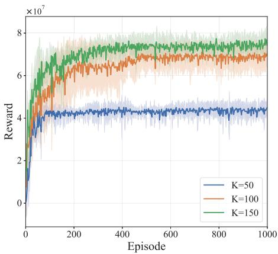  
Fig. 4. Convergence of GD-MADRL.

• MAPDQN + Fixed: A multi-agent parametrized deep Qnetwork (MAPDQN) algorithm [25] is employed to solve the PUB subproblem and a fixed sensing period with α = 1 [17] is utilized.

• MADRL + Fixed: MADRL is employed to solve the PUB subproblem, and a fixed sensing period with $\alpha = 1 ~ [ 1 7 ]$ is utilized.

• MADRL + SA: MADRL is employed to solve the PUB subproblem, and the proposed SA algorithm is applied to solve the SRO subproblem, iteratively.

• GD-MADRL + Fixed: GD-MADRL is employed to solve the PUB subproblem and a fixed sensing period with $\alpha =$ 1 [17] is utilized.

• GD-MADRL + SA: The PUB and SRO subproblems are iteratively optimized using the GD-MADRL and SA algorithms.

## A. Convergence Properties of GD-MADRL

The convergence performance of the proposed GD-MADRL algorithm at different user numbers is illustrated in Fig. 4, where the solid curves is the average of reward function values, and the shadows indicate the range between the maximum and minimum reward function values. Moreover, all simulations use uniformly distributed initialization positions of UAVs. As shown in Fig. 4, the reward increases with the increase of episodes and keeps stable after 200 episodes. This illustrates that the proposed algorithm can converge to a stable policy. Moreover, with a small user number (e.g., K= 50), the algorithm converges slightly faster due to the smaller search space.

## B. Impact of Diffusion Ratio

Fig. 5 illustrates the impact of MSE of the sensed user positions on the communication rate. Notably, the vertical axis represents the actual communication rate calculated using the actual user positions, thereby reflecting the real-world performance of the proposed scheme. The diffusion ratio reflects the proportion of synthetic data generated by the diffusion model within the overall training dataset. As shown in Fig. 5, the user communication rate decreases as sensing error increases, due to the mismatch between the policies and the actual environmental state. Moreover, it can be observed that when diffusion ratio $\rho = 0 . 5$ , the highest communication rate is obtained. The reason is that a low diffusion ratio fails to significantly enhance robustness against sensing errors, whereas a high diffusion ratio generates excessive synthetic data, causing the training process to overly rely on erroneous data and hindering its ability to adapt to real-world scenarios accurately. Hence, selecting an appropriate diffusion ratio is crucial to balancing sensing error resilience and communication performance.

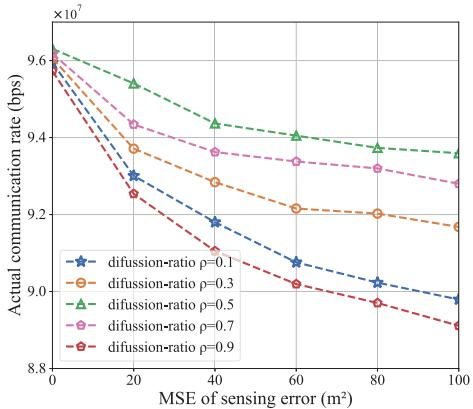  
Fig. 5. The impact of diffusion-ratio.

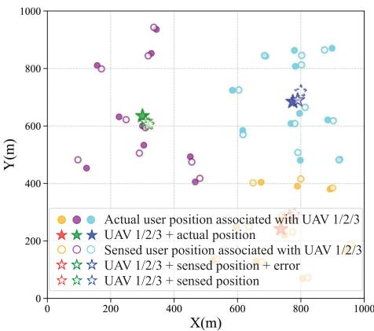

(a) Schematic diagram of UAV scheduling results  
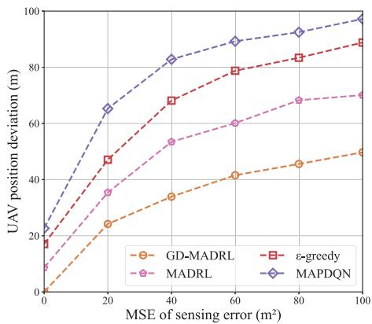  
(b) Position deviation of UAV deployment as a function.  
Fig. 6. Impact of considering sensing errors in system model on UAV deployment and resource allocation results.

## C. Impact of Sensing Errors on UAV Scheduling Positions

To clearly visualize the UAV deployment of the proposed GD-MADRL algorithm, three UAVs are employed to serve

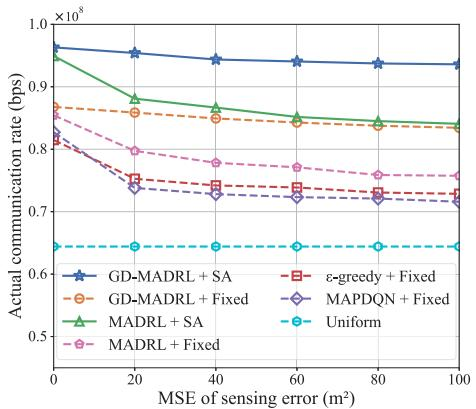  
Fig. 7. Performance as a function of MSE of sensing errors.

30 users as shown in Fig. 6 (a), where solid dots represent accurate user positions, while hollow dots indicate sensed user positions with an error $( \mathrm { M S E } = 1 0 0 ~ m ^ { 2 } )$ . The colors of the dots represent the associated different UAV. The solid five-pointed star is the optimal UAV deployment scheme based on accurate user locations. The hollow solid fivepointed star and hollow dashed five-pointed star represent the UAV deployment scheme with and without considering the sensing errors, respectively. As shown in Fig. 6 (a), the hollow solid five-pointed stars are closer to the optimal deployment, underscoring the benefits of integrating sensing errors into the optimization problem and leveraging SEA communication rates as optimization objectives. Furthermore, to visualize the impact of sensing errors on UAV deployment within a single time slot, Fig. 6 (b) shows the deviation of the UAV deployment position from the optimal deployment position varies with sensing errors. Note that four algorithms are selected for comparison which do not account for resource allocation across time slots $( \mathrm { i . e . } ,$ , “+Fixed” and “+SA”) and static UAV configurations (i.e., Uniform). It can be observed that the proposed GD-MADRL algorithm exhibits minimal deviation in the SEA scenarios, further demonstrating its high robustness.

## D. Performance Comparison of Different Algorithms

Fig. 7 investigates the impact of sensing errors on the actual communication rate across different algorithms. As the MSE increases, the communication rate declines for algorithms except Uniform. Moreover, a steep decline occurs in the low-error range $( \mathbf { e . g . } , 0 \mathbf { - 4 0 } \ m ^ { 2 } )$ , reflecting the system’s high sensitivity to slight location inaccuracies. This is because UAV deployment and resource allocation heavily rely on accurate user positions, and even small errors can cause significant mismatches between decision-making and true positions. Beyond this range $( \mathbf { e . g . , \ M S E } > 4 0 \ m ^ { 2 } )$ , the degradation becomes more gradual, indicating that the system enters an “error saturation” phase where additional sensing uncertainty causes less marginal performance loss. Specifically, algorithms such as MADRL + SA, MADRL + Fixed, ε-Greedy + Fixed, and MAPDQN + Fixed, which rely on accurate data during training or iterative processes, experience significant performance degradation (e.g., when the MSE ranges from 0 to $2 0 \ m ^ { 2 } )$ When the MSE reaches $1 0 0 \ m ^ { 2 }$ , their performance drops by 11.4%, 11.1%, 10.6%, and 13.5%, respectively. In contrast, the proposed GD-MADRL based algorithm demonstrates greater robustness by generating synthetic transitions with uncertain errors to augment the experience replay buffer during training. When the MSE is $1 0 0 \ m ^ { 2 } ,$ , the performance degradation of GD-MADRL+SA is limited to 2.8%, highlighting its superior robustness to sensing errors.

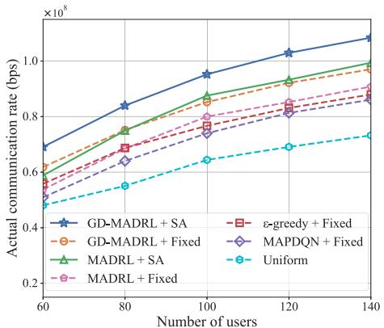

Fig. 8. Performance as a function of number of users.  
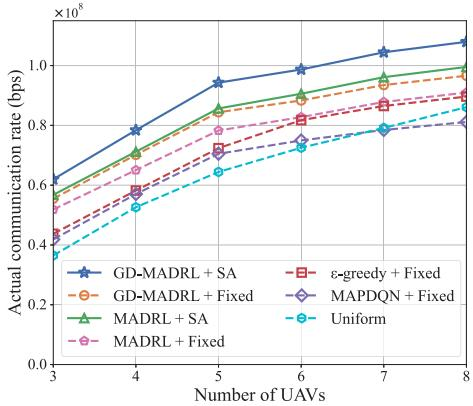  
Fig. 9. Performance as a function of number of UAVs.

Fig. 8 presents the performance of different algorithms as the number of users varies, where five UAVs are employed and the sensing error is set as $4 0 \ m ^ { 2 }$ . It is observed that under a fixed sensing period, GD-MADRL + Fixed consistently outperforms other algorithms, demonstrating its robustness against sensing errors and strong generalization across different user densities. In addition, GD-MADRL + SA algorithm performs best over other algorithms, which indicates that optimizing the sensing period through the SA algorithm further improved the communication performance.

Fig. 9 shows the performance of different algorithms as the number of UAVs varies, with the number of users set to 100 and the sensing error set to 40 $m ^ { 2 }$ . The communication rate improves as the number of UAVs increases. It can be observed that when the number of UAVs increases to more than 6, the increasing speed of the communication rate slows down. Moreover, it is found that the proposed GD-MADRL+SA achieves the highest communication rate across different numbers of UAVs, demonstrating its generalization under varying UAV configurations. In addition, since the increased number of UAVs compensates for Uniform’s lack of adaptation to user distribution, Uniform slightly outperforms MAPDQN when the number of UAVs exceeds 7.

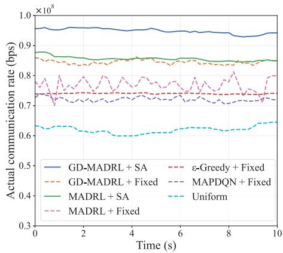  
Fig. 10. Performance as a function of time.

As users move, Fig. 10 demonstrates the variation in communication rates of various algorithms over a 10-second period. Obviously, GD-MADRL+SA achieves the highest total communication rate, improving the average rate by 23.5%, 28.1%, 31.6%, and 49.1% compared to MADRL + Fixed, ε-Greedy + Fixed, MAPDQN + Fixed, and Uniform, respectively. The dynamic adjustment of sensing period obtained by the proposed SA algorithm mitigates fluctuations, as evidenced by the smoother performance of GD-MADRL + SA and MADRL+SA. The ε-Greedy + Fixed algorithm reduces decision shifts through exploration with a small probability ε, relying on previously optimal actions and responding slower to environmental changes, thus resulting in less fluctuating performance, but with poor performance.

## VI. CONCLUSION

Sensing errors are inevitable in ISAC-enabled multi-UAV networks. Yet existing UAV scheduling schemes often overlook the impact of sensing errors, which will result in a significant communication performance degradation. Additionally, most studies assume a fixed allocation of communication and sensing resources, which disregard the asymmetric nature of sensing and communication demands. This paper focuses on these issues and proposes a SEA-scheduling scheme. Firstly, the impact of the sensing errors on the communication rate is analyzed, and the SEA communication rate is derived to guide UAV scheduling. Then, a SEA communication rate maximization problem is formulated by jointly optimizing the sensing resource allocation, UAV position, user association, and bandwidth allocation. Since the problem is difficult to solve due to coupled parameters, it is decomposed into the PUB subproblem and the SRO subproblem, which can be solved iteratively. Specifically, a GD-MADRL algorithm is proposed to address the PUB subproblem and a classical SA algorithm is adopted to address the SRO subproblem. The main idea of GD-MADRL is to introduce the GD model in MADRL to generate training data with sensing errors, enabling the trained model to accommodate environmental uncertainties and enhance the robustness of UAV scheduling strategies. Simulation results show that the proposed SEAscheduling scheme improves the communication rate by up to 30% compared to existing sensing error-unaware methods. Furthermore, the GD-MADRL algorithm demonstrates strong robustness in error-aware scenarios, with performance degradation limited to 2.8%, while traditional MADRL-based and heuristic UAV scheduling algorithms experience over 10% degradation. Moreover, the proposed GD-MADRL algorithm offers a valuable reference for addressing similar error-aware optimization challenges across diverse domains.

## APPENDIX A PROOF OF PROPOSITION 1

Since the 3D coordinates of the user-k located in ${ \mathbf { u } } _ { k } [ n ] =$ [xk[n], yk[n], 0] needs to be determined through measurements of the time delay, the UAV-i transmits signals $s _ { i } ( t )$ , reflected by the target user-k, and received by the $\mathrm { U A V } _ { - } j$ , where $\bar { \int { \left| s _ { i } ( t ) \right| ^ { 2 } } d t } ~ = ~ 1$ . The overall time delay $\tau _ { i , j }$ is given by $\begin{array} { r } { \tau _ { i , j } ~ = ~ \frac { L _ { i , k } + L _ { k , j } } { c } } \end{array}$ , where $L _ { i , k } \ = \ \| \mathbf { v } _ { i } - \mathbf { u } _ { k } \|$ is the distance between the UAV-i and the user-k, and c is the lightspeed. Thus, the time delay of all paths reflected by user-k can be denoted as $\pmb { \tau } = \left[ \tau _ { 1 , 1 } , \tau _ { 1 , 2 } , \dots , \tau _ { i , j } , \dots , \tau _ { I , I } \right] ^ { T }$ , where i and $j$ both serve as indices for UAVs, and different indices are used to distinguish between transmitter (indexed by $i )$ and receiver UAVs (indexed by $j )$ . Therefore, the baseband representation for the signal transmitted from the UAV-i received at the UAV-$j$ can be given by

$$
\begin{array} { r } { r _ { i , j } ( t ) = \sqrt { p _ { i , k } } \psi _ { i , j } h _ { i , j } s _ { i } ( t - \tau _ { i , j } ) + n _ { i , j } ( t ) , } \end{array}\tag{44}
$$

where $n _ { i , j } ( t ) ~ \sim ~ \mathcal { C N } ( 0 , \sigma ^ { 2 } )$ . The CRB provides a lower bound for the MSE of any unbiased estimator for an unknown parameter. Given a vector ${ \mathbf { u } } _ { k } [ n ]$ , the unbiased estimate $\widehat { \mathbf { u } } _ { k } [ n ]$ satisfies the following inequality, with time indices omitted for brevity:

$$
\begin{array} { r } { { E } _ { \mathbf { u } _ { k } } \left\{ ( \widehat { \mathbf { u } } _ { k } - \mathbf { u } _ { k } ) ( \widehat { \mathbf { u } } _ { k } - \mathbf { u } _ { k } ) ^ { T } \right\} \geq \mathbf { J } ^ { - 1 } ( \mathbf { u } _ { k } ) , } \end{array}\tag{45}
$$

where $\mathbf { J } ( \mathbf { u } _ { k } )$ is the Fisher Information matrix (FIM) of $\mathbf { u } _ { k }$ given by

$$
\mathbf { J } ( \mathbf { u } _ { k } ) { = } E _ { \mathbf { r } | \mathbf { u } _ { k } } \left\{ \frac { \partial } { \partial \mathbf { u } _ { k } } { \log } f ( \mathbf { r } | \mathbf { u } _ { k } ) \bigg ( \frac { \partial } { \partial \mathbf { u } _ { k } } \log f ( \mathbf { r } | \mathbf { u } _ { k } ) \bigg ) ^ { T } \right\} ,\tag{46}
$$

where $f ( \mathbf { r } | \mathbf { u } _ { k } )$ is the conditional, joint probability density function (PDF) of the observation $\mathrm { ~ \bf ~ r ~ } =$ $[ r _ { 1 , 1 } , r _ { 1 , 2 } , \ldots , r _ { i , j } , \ldots , r _ { I , I } ]$ . Given the received signal,

$$
f ( \mathbf { r } | \mathbf { u } _ { k } ) = \frac { 1 } { \left( \pi \sigma ^ { 2 } \right) ^ { \frac { I I } { 2 } } } \exp \left\{ - \frac { 1 } { \sigma ^ { 2 } } \sum _ { i = 1 } ^ { I } \sum _ { j = 1 } ^ { I } \int \big | r _ { i , j } ( t ) - \sqrt { p _ { i , k } } \psi _ { i , j } h _ { i , j } s _ { i } ( t - \tau _ { i , j } ) \big | ^ { 2 } d t \right\} .\tag{47}
$$

$$
\frac { \partial \log f ( { \bf r } | { \bf u } _ { k } ) } { \partial \tau _ { i , j } } = - \frac { 1 } { \sigma ^ { 2 } } \frac { \partial } { \partial \tau _ { i , j } } \int | r _ { i , j } ( t ) - \widehat { r } _ { i , j } ( t ) | ^ { 2 } d t = - \frac { 1 } { \sigma ^ { 2 } } \frac { \partial } { \partial \tau _ { i , j } } \int e ^ { * } ( t ) e ( t ) d t .\tag{48}
$$

the conditional PDF $f ( \mathbf { r } \mid \mathbf { u } _ { k } )$ is given by (47), shown at the bottom of the previous page.

It is easier to compute the FIM with respect to another vector and apply the chain rule to derive the original $\mathbf { J } ( \mathbf { u } _ { k } )$ Since the received signal is the function of the time delay τ , by the chain rule, $\mathbf { J } ( \mathbf { u } _ { k } )$ can be given by $\mathbf { J } ( \mathbf { u } _ { k } ) = \mathbf { P } ^ { T } \mathbf { J } ( \pmb { \tau } ) \mathbf { P }$ where matrix $\mathbf { J } ( \tau )$ is the FIM with respect to $\tau _ { \mathrm { { i } } }$ , and P is the Jacobian matrix, given by $\begin{array} { r } { \mathbf { P } = \frac { \partial \tau } { \partial \mathbf { u } _ { k } } } \end{array}$ . To obtain $\mathbf { J } ( \tau )$ , it is necessary to calculate the partial derivative of log $f ( \mathbf { r } | \mathbf { u } _ { k } )$ with respect to $\tau _ { i , j }$ . Let $\widehat { r } _ { i , j } ( t ) = \sqrt { p _ { i , k } } \psi _ { i , j } h _ { i , j } s _ { i } ( t - \tau _ { i , j } )$ and $\begin{array} { r } { \boldsymbol { e } ( t ) = \boldsymbol { r } _ { i , j } ( t ) - \widehat { \boldsymbol { r } } _ { i , j } ( t ) , \frac { \partial \log f ( { \bf r } | \grave { \bf u } _ { k } ^ { * } ) } { \partial \boldsymbol { \tau } _ { i , j } } } \end{array}$ can be given by (48), shown at the bottom of the previous page. Note that $r _ { i , j } ( t )$ is an observation value that is independent of $\tau _ { i , j }$ and $\widehat { r } _ { i , j } ( t )$ depends on $\begin{array} { r } { \tau _ { i , j } , \frac { \partial } { \partial \tau _ { i , j } } \left( e ^ { * } ( t ) e ( t ) \right) } \end{array}$ can be rewritten as

$$
\frac { \partial } { \partial \tau _ { i , j } } ( e ^ { * } ( t ) e ( t ) ) = - \bigg ( \frac { \partial \widehat { r } _ { i , j } ( t ) } { \partial \tau _ { i , j } } \bigg ) ^ { * } e ( t ) - e ^ { * } ( t ) \bigg ( \frac { \partial \widehat { r } _ { i , j } ( t ) } { \partial \tau _ { i , j } } \bigg ) .\tag{49}
$$

Therefore, ∂ log f(r|uk) ∂τi,j can be rewritten as (50), shown at the bottom of the page.

Let $\chi _ { i , j }$ be defined as the elements related to $\tau _ { i , j }$ in FIM $\mathbf { J } ( \tau )$ , given by

$$
\begin{array} { l } { \displaystyle \chi _ { i , j } = \mathbb E \left[ \left( \frac 2 { \sigma ^ { 2 } } \Re \left\{ \int n ( t ) ^ { * } \sqrt { p _ { i , k } } \psi _ { i , j } h _ { i , j } s _ { i } ^ { \prime } ( t - \tau _ { i , j } ) d t \right\} \right) ^ { 2 } \right] } \\ { = \frac { 2 p _ { i , k } | \psi _ { i , j } h _ { i , j } | ^ { 2 } } { \sigma ^ { 4 } } \cdot \mathbb E \left[ \left| \int n ( t ) ^ { * } s _ { i } ^ { \prime } ( t - \tau _ { i , j } ) d t \right| ^ { 2 } \right] . } \end{array}\tag{51}
$$

Given that $n _ { i , j } ( t ) \sim \mathcal { C N } ( 0 , \sigma ^ { 2 } )$ is the complex AWGN, thus $\begin{array} { r } { \mathbb { E } \left[ n ^ { * } ( t ) n ( t ^ { \prime } ) \right] { = } \sigma ^ { 2 } \delta ( t { - } t ^ { \prime } ) , \mathrm { i . e . , \mathbb { E } \left[ \left| \int { } n ^ { * } ( t ) s _ { i } ^ { \prime } ( t { - } \tau _ { i , j } ) d \tau \right| ^ { 2 } \right] = } } \end{array}$

$\begin{array} { r } { \sigma ^ { 2 } \int \left| s _ { i } ^ { \prime } ( t - \tau _ { i , j } ) \right| ^ { 2 } d t . \ \chi _ { i , j } } \end{array}$ can be rewritten as

$$
\chi _ { i , j } = \frac { 2 p _ { i , k } \left| \psi _ { i , j } h _ { i , j } \right| ^ { 2 } } { \sigma ^ { 2 } } \int \left| s _ { i } ^ { \prime } ( t - \tau _ { i , j } ) \right| ^ { 2 } ~ d t .\tag{52}
$$

Lemma 1: Assume that the power spectral density of signal $s ( t )$ is $S ( f )$ , according to Parseval’s theorem, it can be obtained that

$$
\int { | s ^ { \prime } \left( t \right) | ^ { 2 } d t } = \int { { { \left( { 2 \pi f } \right) } ^ { 2 } } | S \left( f \right) | ^ { 2 } d f } .\tag{53}
$$

According to the definition of effective bandwidth, which is given by

$$
B ^ { 2 } = \frac { \int f ^ { 2 } \lvert S \left( f \right) \rvert ^ { 2 } d f } { \int \left. S \left( f \right) \right. ^ { 2 } d f } .\tag{54}
$$

Given that $\begin{array} { r } { \int | S \left( f \right) | ^ { 2 } d f \ = \ \int | s \left( t \right) | ^ { 2 } d t \ = \ 1 } \end{array}$ , the signal energy of $s _ { i } ^ { \prime } ( t )$ can be given by

$$
\int { { \left| { s _ { i } ^ { \prime } \left( t \right) } \right| } ^ { 2 } } d t = 4 { \pi } ^ { 2 } B ^ { 2 } .\tag{55}
$$

Based on (52)–(55), it can be obtained that $\begin{array} { r l } { \chi _ { i , j } } & { { } = } \end{array}$ $\underbrace { 8 \pi ^ { 2 } B ^ { 2 } p _ { i , k } | \psi _ { i , j } h _ { i , j } | ^ { 2 } } _ { \mathrm { ~ o ~ } }$ 2 . The CRB of ${ \mathbf { u } } _ { k } [ n ]$ is defined as ${ { \mathbf { C } } _ { { \mathbf { u } } _ { k } } } \ =$ $\mathbf { J } ^ { - 1 } ( \mathbf { u } _ { k } ) _ { : } ^ { o }$ , given by

$$
\mathbf { C } _ { \mathbf { u } _ { k } } = \left\{ \sum _ { i = 1 } ^ { I } p _ { i , k } \left[ \begin{array} { l } { g _ { a _ { i } , k } \ g _ { c _ { i } , k } } \\ { g _ { c _ { i } , k } \ g _ { b _ { i } , k } } \end{array} \right] \right\} ^ { - 1 } ,\tag{56}
$$

where the i-th element of $\mathbf { g } _ { a , k } [ n ] , \mathbf { g } _ { b , k } [ n ]$ and ${ \bf g } _ { c , k } [ n ]$ are given by (14), (15), and (16), respectively. Thus, the sum of the CRB of $x _ { k }$ and $y _ { k }$ can be given by $\dot { \eta } _ { x _ { k } , y _ { k } } ^ { 2 } [ n ] = \mathrm { t r } \left( \mathbf { C } _ { \mathbf { u } _ { k } } \right)$ . This completes the proof of Proposition 1.

$$
\frac { \partial \log f ( \mathbf { r } | \mathbf { u } _ { k } ) } { \partial \tau _ { i , j } } = \frac { 1 } { \sigma ^ { 2 } } \int \left[ \left( \frac { \partial \widehat { r } _ { i , j } ( t ) } { \partial \tau _ { i , j } } \right) ^ { * } e ( t ) + e ^ { * } ( t ) \left( \frac { \partial \widehat { r } _ { i , j } ( t ) } { \partial \tau _ { i , j } } \right) \right] d t = \frac { 2 } { \sigma ^ { 2 } } \Re \left\{ \int \left( r _ { i , j } ( t ) - \widehat { r } _ { i , j } ( t ) \right) ^ { * } \cdot \frac { \partial \widehat { r } _ { i , j } ( t ) } { \partial \tau _ { i , j } } d t \right\} .\tag{50}
$$

$$
\Gamma _ { i , k } [ n ] = \frac { { p _ { i , k } } \frac { G M P _ { i , k } ^ { L o s } } { \| \mathbf { v } _ { i } - \mathbf { u } _ { k } \| ^ { 2 } } \big | \mathbf { a } ^ { H } ( \theta _ { i , k } ) \mathbf { a } ( \theta _ { i , k } + \Delta \theta _ { i , k } ) \big | ^ { 2 } + { p _ { i , k } } P _ { i , k } ^ { N L o s } \Big | \mathbf { h } _ { i , k } ^ { N L o s } \mathbf { a } ( \theta _ { i , k } + \Delta \theta _ { i , k } ) \Big | ^ { 2 } } { \displaystyle \sum _ { q \in \mathbb { Z } \backslash \{ i \} } ^ { I } \sum _ { j \in K \backslash \{ k \} } ^ { K } { p _ { q , j } } \Big | \mathbf { h } _ { i , k } ^ { H } \widehat { \mathbf { w } } _ { q , j } \Big | ^ { 2 } + \sigma ^ { 2 } } .\tag{57}
$$

$$
\begin{array} { l } { { \displaystyle \left| { \bf a } ^ { H } ( \theta _ { i , k } ) { \bf a } ( \theta _ { i , k } + \Delta \theta _ { i , k } ) \right| ^ { 2 } = \frac { 1 } { M ^ { 2 } } \left| \sum _ { m = 1 } ^ { M } e ^ { j \frac { 2 \pi d } { \lambda } ( m - 1 ) ( \sin ( \theta _ { i , k } + \Delta \theta _ { i , k } ) - \sin \theta _ { i , k } ) } \right| ^ { 2 } = \frac { 1 } { M ^ { 2 } } \left| \frac { 1 - e ^ { j \frac { 2 \pi d } { \lambda } ( M - 1 ) ( \sin ( \theta _ { i , k } + \Delta \theta _ { i , k } ) - \sin \theta _ { i , k } ) } } { 1 - e ^ { j \frac { 2 \pi d } { \lambda } ( \sin ( \theta _ { i , k } + \Delta \theta _ { i , k } ) - \sin \theta _ { i , k } ) } } \right| ^ { 2 } } } \\  { \displaystyle = \frac { 1 } { M ^ { 2 } } \left| \frac { e ^ { j \frac { \pi d } { \lambda } ( m - 1 ) ( \sin ( \theta _ { i , k } + \Delta \theta _ { i , k } ) - \sin \theta _ { i , k } ) } } { e ^ { j \frac { \pi d } { \lambda } ( \sin ( \theta _ { i , k } + \Delta \theta _ { i , k } ) - \sin \theta _ { i , k } ) } } \cdot \frac { e ^ { - j \frac { \pi d } { \lambda } ( M - 1 ) ( \sin ( \theta _ { i , k } + \Delta \theta _ { i , k } ) - \sin \theta _ { i , k } ) } - e ^ { j \frac { \pi d } { \lambda } ( M - 1 ) ( \sin ( \theta _ { i , k } + \Delta \theta _ { i , k } ) - \sin \theta _ { i , k } ) } } { e ^ { - j \frac { \pi d } { \lambda } ( \sin ( \theta _ { i , k } + \Delta \theta _ { i , k } ) - \sin \theta _ { i , k } ) } - e ^ { j \frac { \pi d } { \lambda } ( \sin ( \theta _ { i , k } + \Delta \theta _ { i , k } ) - \sin \theta _ { i , k } ) }  ^ { 2 } } } \\   \right|\displaystyle  \end{array}\tag{58}
$$

## APPENDIX B PROOF OF PROPOSITION 2

By substituting (7)–(12) to (18), the received SINR of the user-k with the time slot index omitted for brevity is given by (57), shown at the bottom of the previous page. Since the antenna array response (AAR) is given by (9), the actual instantaneous directivity gain of ULA can be given by (58), shown at the bottom of the previous page.

Lemma 2: Since the value $o f \quad \Delta \theta _ { i , k }$ is small, $\begin{array} { r } { \frac { \pi d } { \lambda } ( \sin \left( \theta _ { i , k } + \Delta \theta _ { i , k } \right) - \sin \theta _ { i , k } ) \ \to \ \textrm { 0 } } \end{array}$ can be obtained. It follows that

$$
\sin \biggl ( \frac { \pi d } { \lambda } ( \sin ( \theta _ { i , k } + \Delta \theta _ { i , k } ) - \sin \theta _ { i , k } \biggr ) \approx \frac { \pi d } { \lambda } ( \sin ( \theta _ { i , k } + \Delta \theta _ { i , k } ) - \sin \theta _ { i , k } ) .\tag{59}
$$

By substituting (59) into (58) and combining with the Taylor expansion formula of sinc(·), (58) can be written as

$$
\vert { \bf a } ^ { H } ( \theta _ { i , k } ) { \bf a } ( \theta _ { i , k } + \Delta \theta _ { i , k } ) \vert ^ { 2 } = 1 - \frac { 1 } { 3 } \bigg ( \frac { \pi d } { \lambda } M \cos { \theta _ { i , k } } \bigg ) ^ { 2 } ( \Delta \theta _ { i , k } ) ^ { 2 } ,
$$

where the higher order infinitesimal terms are omitted.

(60)

Since $\mathbf { h } _ { i , k } ^ { N \overline { { L } } o s }$ is the complex Gaussian random vector with zero mean and unit covariance matrix, and ${ \bf a } ( \theta _ { i , k } +$ $\Delta \theta _ { i , k } )$ is a deterministic array manifold vector. According to the properties of complex Gaussian random variables, $\mathbf { h } _ { i , k } ^ { N L o s } \mathbf { a } \dot { ( \theta _ { i , k } + \Delta \theta _ { i , k } ) }$ is a complex Gaussian random variable, and $\left| \mathbf { h } _ { i , k } ^ { N L o s } \mathbf { a } ( \theta _ { i , k } + \Delta \theta _ { i , k } ) \right| ^ { 2 }$ follows an exponential distribution. Assume that $\mathbf { h } _ { i , k } ^ { N L o s } = [ h _ { 1 } , \ldots , h _ { M } ]$ , thus $\mathbb { E } \left[ \mathbf { h } _ { i , k } ^ { N L o s } \right] = 0$ and E $[ h _ { m } h _ { n } ^ { * } ] = \delta _ { m n }$ are obtained, where $\delta _ { m n }$ is the Kronecker function. Thus, the NLoS channel gain can be given by

$$
\begin{array} { c } { { \displaystyle \left| { \bf h } _ { i , k } ^ { N L o s } { \bf a } ( \theta _ { i , k } + \Delta \theta _ { i , k } ) \right| ^ { 2 } } } \\ { { = \displaystyle \left( \sum _ { m = 1 } ^ { M } { \bf a } ( \theta _ { i , k } + \Delta \theta _ { i , k } ) h _ { m } \right) \left( \sum _ { n = 1 } ^ { N } { \bf a } ( \theta _ { i , k } + \Delta \theta _ { i , k } ) h _ { n } \right) ^ { * } } } \\ { { = \displaystyle \frac { 1 } { M } \sum _ { m = 1 } ^ { M } { \sum _ { n = 1 } ^ { N } { e ^ { - j \frac { 2 \pi d } { \lambda } ( m - n ) ( \sin \theta _ { i , k } + \sin ( \theta _ { i , k } + \Delta \theta _ { i , k } ) } ) h _ { m } h _ { n } ^ { * } } } \cdot ~ ( 6 ) } } \end{array}\tag{1}
$$

By calculating the expectation of (61), it can be obtained that

$$
\begin{array} { l } { \displaystyle \mathbb { E } \left[ \left| \mathbf { h } _ { i , k } ^ { N L o s } \mathbf { a } ( \theta _ { i , k } + \Delta \theta _ { i , k } ) \right| ^ { 2 } \right] } \\ { \displaystyle = \frac { 1 } { M } \Bigg ( \sum _ { m = 1 } ^ { M } e ^ { - j \frac { 2 \pi d } { \lambda } ( m - 1 ) ( \sin \theta _ { i , k } + \sin ( \theta _ { i , k } + \Delta \theta _ { i , k } } ) ) \Bigg ) ^ { 2 } = 1 . } \end{array}\tag{62}
$$

Based on (62), it can be obtained that the variance of $\left| \mathbf { h } _ { i , k } ^ { N L o s } \mathbf { a } ( \theta _ { i , k } + \Delta \theta _ { i , k } ) \right| ^ { 2 }$ is 1. For simplicity, let $\begin{array} { r l } { x _ { N L o s } } & { { } = } \end{array}$ $\left| \mathbf { h } _ { i , k } ^ { N L o s } \mathbf { a } ( \theta _ { i , k } + \Delta \theta _ { i , k } ) \right| ^ { 2 }$ , thus $x _ { N L o s } \sim E \left( 1 \right)$

Therefore, (57) can be further simplified as (20) and this complete the proof of Proposition 2.

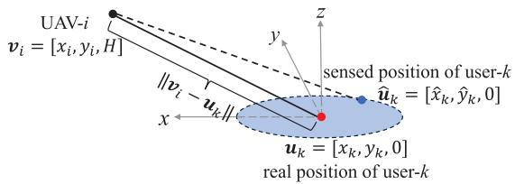  
Fig. 11. Angular error schematic.

## APPENDIX C PROOF OF PROPOSITION 3

Note that the CRB of the 2D coordinates of the user-k is $\eta _ { x _ { k } , y _ { k } } ^ { 2 }$ , which is close to the MSE when the SNR is sufficiently large [11], [13], [14], [20], given by

$$
\left( \widehat { x } _ { k } - x _ { k } \right) ^ { 2 } + \left( \widehat { y } _ { k } - y _ { k } \right) ^ { 2 } = \eta _ { x _ { k } , y _ { k } } ^ { 2 } .\tag{63}
$$

Thus, the sensed position of user-k is located within a circle with the true position of user-k as the center and ηmax as the radius, where $\eta _ { \mathrm { m a x } } ^ { 2 }$ is the predefined threshold of localization accuracy, as shown in Fig. 11. Let $\widehat { \theta } _ { i , k } [ n ] =$ arcsin $\frac { H } { \Vert \mathbf { v } _ { i } [ n ] - \widehat { \mathbf { u } } _ { k } [ n ] \Vert }$ , thus $\Delta \theta _ { i , k } [ n ]$ can be given by $\Delta \theta _ { i , k } [ n ] =$ $\widehat { \theta } _ { i , k } [ n ] \stackrel {  } { - } \dot { \theta _ { i , k } } [ n ]$ . Since $\theta _ { i , k } [ n ]$ is a constant value and the arcsin function is a monotonically increasing function, finding the range of $\Delta \theta _ { i , k } [ n ]$ can be transformed into finding the extremum of $\lVert { \bf v } _ { i } [ n ] - \widehat { { \bf u } } _ { k } [ n ] \rVert$ . The coordinates of $\widehat { \mathbf { u } } _ { k } [ n ]$ can be represented as $[ x _ { k } + \imath$ r cos $\phi , y _ { k } + r \sin \phi , 0 ]$ using a circular coordinate system. According to the auxiliary angle formula, $\lVert \mathbf { v } _ { i } [ n ] - \widehat { \mathbf { u } } _ { k } \tilde { [ n ] } \rVert$ can be given by

$$
\begin{array} { r l r } & { } & { \| \mathbf { v } _ { i } [ n ] - \widehat { \mathbf { u } } _ { k } [ n ] \| = \sqrt { \big ( x _ { k } + r \cos \phi \big ) ^ { 2 } + \big ( y _ { k } + r \sin \phi \big ) ^ { 2 } + H ^ { 2 } } } \\ & { } & { = \sqrt { x _ { k } ^ { 2 } + y _ { k } ^ { 2 } + r ^ { 2 } + 2 r \sqrt { x _ { k } ^ { 2 } + y _ { k } ^ { 2 } } \cos \big ( \phi - \phi _ { 0 } \big ) + H ^ { 2 } } , \qquad ( 6 4 ) } \end{array}
$$

where $\begin{array} { r } { \phi _ { 0 } \ = \ \arctan \left( \frac { y _ { k } } { x _ { k } } \right) } \end{array}$ . It can be obtained that when cos $\left( \phi - \phi _ { 0 } \right) = 1$ and $\begin{array} { r l r } { r } & { { } = } & { \eta _ { \mathrm { { m a x } } } , \| \mathbf { v } _ { i } [ n ] - \widehat { \mathbf { u } } _ { k } [ n ] \| _ { \operatorname* { m a x } } } \end{array}$ holds, and when cos $\smash { \left( \phi - \phi _ { 0 } \right) \ = \ - 1 , \ \left\| \mathbf { v } _ { i } [ n ] - \widehat { \mathbf { u } } _ { k } [ n ] \right\| _ { \operatorname* { m i n } } ^ { \operatorname* { s a c } } }$ holds. Therefore, the range of $\Delta \theta _ { i , k } [ n ]$ can be given by $\Delta \theta _ { i , k } [ n ] \in [ \Delta \theta _ { i , k , \operatorname* { m i n } } [ n ] , \bar { \Delta } \theta _ { i , k , \operatorname* { m a x } } [ n ] ]$ and $| \Delta \theta _ { i , k , \operatorname* { m a x } } [ n ] | >$ $| \Delta \theta _ { i , k , \operatorname* { m i n } } [ n ] |$ , where $\Delta \theta _ { i , k , \operatorname* { m i n } } [ n ]$ and $\Delta \theta _ { i , k , \operatorname* { m a x } } [ n ]$ are given by (21) and (22), respectively. This completes the proof of Proposition 3.

## APPENDIX D PROOF OF PROPOSITION 4

In order to derive the PDF of the user’s communication rate, the simple form of (20) with the time slot index omitted for brevity is given by

$$
R _ { i , k } = B _ { i , k } \log \left( 1 + { \cal S I N R } _ { i d e a l } - { \cal S I N R } _ { l o s s } ( \Delta \theta _ { i , k } ) ^ { 2 } \right) ,\tag{65}
$$

where $S I N R _ { i d e a l }$ and $S I N R _ { l o s s }$ are defined in (25) and (26), respectively. It is obvious from (65) that the value of $R _ { i , k }$ decreases as $\Delta \theta _ { i , k }$ increases. Thus, the range of $R _ { i , k }$ can be given by (27) and (28). According to the definition of SINR, $\bar { S I N R _ { i d e a l } } - S I N R _ { l o s s } ( \Delta \theta _ { i , k } ) ^ { 2 }$ is held. Perform an inverse transformation of (65), it can be obtained that

$$
\left( \Delta \theta _ { i , k } \right) ^ { 2 } = \frac { 1 + S I N R _ { i d e a l } - e ^ { \frac { R _ { i , k } } { B _ { i , k } } } } { S I N R _ { l o s s } } .\tag{66}
$$

Let $f _ { R _ { i , k } }$ be the PDF of $R _ { i , k }$ and $f _ { ( \Delta \theta _ { i , k } ) ^ { 2 } }$ be the PDF of $\left( \Delta \theta _ { i , k } \right) ^ { 2 }$ . According to the transformation formula for the PDF, there is

$$
f _ { R _ { i , k } } = f _ { ( \Delta \theta _ { i , k } ) ^ { 2 } } \left| \frac { d { ( \Delta \theta _ { i , k } ) } ^ { 2 } } { d R _ { i , k } } \right| .\tag{67}
$$

Similar to [44], [45], and [46], assume that $\Delta \theta _ { i , k }$ is uniformly distributed. Thus, $f _ { ( \Delta \theta _ { i , k } ) ^ { 2 } }$ is given by (24) and this complete the proof of Proposition 4.

## REFERENCES

[1] J. Mu, R. Zhang, Y. Cui, N. Gao, and X. Jing, “UAV meets integrated sensing and communication: Challenges and future directions,” IEEE Commun. Mag., vol. 61, no. 5, pp. 62–67, May 2023.

[2] J. Zhang, M. Liu, N. Zhao, Y. Chen, Q. Yang, and Z. Ding, “Spectrum and energy efficient multi-antenna spectrum sensing for green UAV communication,” Digit. Commun. Netw., vol. 9, no. 4, pp. 846–855, Aug. 2023.

[3] N. Ye, S. Miao, J. Pan, Y. Xiang, and S. Mumtaz, “Dancing with chains: Spaceborne distributed multi-user detection under inter-satellite link constraints,” IEEE J. Sel. Topics Signal Process., vol. 19, no. 2, pp. 430–446, Mar. 2025.

[4] B. Kang, N. Ye, and J. An, “Achieving positive rate of covert communications covered by randomly activated overt users,” IEEE Trans. Inf. Forensics Security, vol. 20, pp. 2480–2495, 2025.

[5] Z. Liu, C. Yang, Y. Sun, and M. Peng, “Closed-form model for performance analysis of THz joint radar-communication systems,” IEEE Trans. Wireless Commun., vol. 22, no. 12, pp. 8694–8706, Dec. 2023.

[6] A. Nasser, A. Celik, and A. M. Eltawil, “Joint user-target pairing, power control, and beamforming for NOMA-aided ISAC networks,” IEEE Trans. Cognit. Commun. Netw., vol. 11, no. 1, pp. 316–332, Feb. 2025.

[7] C.-X. Wang et al., “On the road to 6G: Visions, requirements, key technologies, and testbeds,” IEEE Commun. Surveys Tuts., vol. 25, no. 2, pp. 905–974, 2nd Quart. 2023.

[8] C. Yanpeng et al., “Sensing-assisted accurate and fast beam management for cellular-connected mmWave UAV network,” China Commun., vol. 21, no. 6, pp. 271–289, Jun. 2024.

[9] K. Meng et al., “UAV-enabled integrated sensing and communication: Opportunities and challenges,” IEEE Wireless Commun., vol. 31, no. 2, pp. 97–104, Apr. 2024.

[10] W. Yuan et al., “From ground to sky: Architectures, applications, and challenges shaping low-altitude wireless networks,” 2025, arXiv:2506.12308.

[11] X. Wang, Z. Fei, J. A. Zhang, J. Huang, and J. Yuan, “Constrained utility maximization in dual-functional radar-communication multi-UAV networks,” IEEE Trans. Commun., vol. 69, no. 4, pp. 2660–2672, Apr. 2021.

[12] Y. Jiang, Q. Wu, W. Chen, and K. Meng, “UAV-enabled integrated sensing and communication: Tracking design and optimization,” IEEE Commun. Lett., vol. 28, no. 5, pp. 1024–1028, May 2024.

[13] X. Jing, F. Liu, C. Masouros, and Y. Zeng, “ISAC from the sky: UAV trajectory design for joint communication and target localization,” IEEE Trans. Wireless Commun., vol. 23, no. 10, pp. 12857–12872, Oct. 2024.

[14] S. Gu, C. Luo, Y. Luo, and X. Ma, “Jointly optimize throughput and localization accuracy: UAV trajectory design for multiuser integrated communication and sensing,” IEEE Internet Things J., vol. 11, no. 24, pp. 39497–39511, Dec. 2024.

[15] T. Van Chien, M. D. Cong, N. Cong Luong, T. N. Do, D. I. Kim, and S. Chatzinotas, “Joint computation offloading and target tracking in integrated sensing and communication enabled UAV networks,” IEEE Commun. Lett., vol. 28, no. 6, pp. 1327–1331, Jun. 2024.

[16] Z. Lyu, G. Zhu, and J. Xu, “Joint maneuver and beamforming design for UAV-enabled integrated sensing and communication,” IEEE Trans. Wireless Commun., vol. 22, no. 4, pp. 2424–2440, Apr. 2023.

[17] C. Deng, X. Fang, and X. Wang, “Beamforming design and trajectory optimization for UAV-empowered adaptable integrated sensing and communication,” IEEE Trans. Wireless Commun., vol. 22, no. 11, pp. 8512–8526, Nov. 2023.

[18] K. Meng, Q. Wu, S. Ma, W. Chen, K. Wang, and J. Li, “Throughput maximization for UAV-enabled integrated periodic sensing and communication,” IEEE Trans. Wireless Commun., vol. 22, no. 1, pp. 671–687, Jan. 2023.

[19] Y. Gang, Y. Zhang, and X. Wang, “UAV-assisted full-duplex ISAC: Joint communication scheduling, beamforming, and trajectory optimization,” Digit. Commun. Netw., vol. 11, no. 5, pp. 1628–1638, Oct. 2025, doi: 10.1016/j.dcan.2025.03.001.

[20] J. Wu, W. Yuan, and L. Bai, “On the interplay between sensing and communications for UAV trajectory design,” IEEE Internet Things J., vol. 10, no. 23, pp. 20383–20395, Dec. 2023.

[21] T. Zhang, K. Zhu, S. Zheng, D. Niyato, and N. C. Luong, “Trajectory design and power control for joint radar and communication enabled multi-UAV cooperative detection systems,” IEEE Trans. Commun., vol. 71, no. 1, pp. 158–172, Jan. 2023.

[22] Q. Gao, R. Zhong, H. Shin, and Y. Liu, “MARL-based UAV trajectory and beamforming optimization for ISAC system,” IEEE Internet Things J., vol. 11, no. 24, pp. 40492–40505, Dec. 2024.

[23] R. Zhang, Y. Zhang, R. Tang, H. Zhao, Q. Xiao, and C. Wang, “A joint UAV trajectory, user association, and beamforming design strategy for multi-UAV-assisted ISAC systems,” IEEE Internet Things J., vol. 11, no. 18, pp. 29360–29374, Sep. 2024.

[24] Y. Pan et al., “Cooperative trajectory planning and resource allocation for UAV-enabled integrated sensing and communication systems,” IEEE Trans. Veh. Technol., vol. 73, no. 5, pp. 6502–6516, May 2024.

[25] S. Cheng, X. Lin, X. Li, and J. Wang, “Joint UAV trajectory and RadCom task schedule for IVNs: A game-embedding multi-agent deep reinforcement learning approach,” IEEE Trans. Wireless Commun., vol. 24, no. 1, pp. 181–196, Jan. 2025.

[26] Y. Qin, Z. Zhang, X. Li, W. Huangfu, and H. Zhang, “Deep reinforcement learning based resource allocation and trajectory planning in integrated sensing and communications UAV network,” IEEE Trans. Wireless Commun., vol. 22, no. 11, pp. 8158–8169, Nov. 2023.

[27] Z. Xiao et al., “A survey on millimeter-wave beamforming enabled UAV communications and networking,” IEEE Commun. Surveys Tuts., vol. 24, no. 1, pp. 557–610, 1st Quart., 2022.

[28] X. Qian, X. Hu, C. Liu, M. Peng, and C. Zhong, “Sensing-based beamforming design for joint performance enhancement of RIS-aided ISAC systems,” IEEE Trans. Commun., vol. 71, no. 11, pp. 6529–6545, Nov. 2023.

[29] Z. Wei et al., “Integrated sensing and communication enabled multiple base stations cooperative sensing towards 6G,” IEEE Netw., vol. 38, no. 4, pp. 207–215, Jul. 2024.

[30] C. Wang, Z. Wei, W. Jiang, H. Jiang, and Z. Feng, “Cooperative sensing enhanced UAV path-following and obstacle avoidance with variable formation,” IEEE Trans. Veh. Technol., vol. 73, no. 6, pp. 7501–7516, Jun. 2024.

[31] J. Zheng and Y.-C. Wu, “Joint time synchronization and localization of an unknown node in wireless sensor networks,” IEEE Trans. Signal Process., vol. 58, no. 3, pp. 1309–1320, Mar. 2010.

[32] N. Ye et al., “Fly, sense, compress, and transmit: Satellite-aided airborne secure data acquisition in harsh remote area for intelligent transportations,” IEEE Trans. Intell. Transp. Syst., vol. 26, no. 10, pp. 1–14, Oct. 2025.

[33] Q. Ouyang, N. Ye, and J. An, “On the vulnerability of mega-constellation networks under geographical failure,” IEEE Trans. Netw., vol. 33, no. 4, pp. 2049–2062, Aug. 2025.

[34] N. C. Luong et al., “Advanced learning algorithms for integrated sensing and communication (ISAC) systems in 6G and beyond: A comprehensive survey,” IEEE Commun. Surveys Tuts., early access, Jul. 1, 2025, doi: 10.1109/COMST.2025.3584333.

[35] R. Wang, Z. Xing, E. Liu, and J. Wu, “Joint localization and communication study for intelligent reflecting surface aided wireless communication system,” IEEE Trans. Commun., vol. 71, no. 5, pp. 3024–3042, May 2023.

[36] L. Zeng, H. Chen, D. Feng, X. Zhang, and X. Chen, “A3D: Adaptive, accurate, and autonomous navigation for edge-assisted drones,” IEEE/ACM Trans. Netw., vol. 32, no. 1, pp. 713–728, Feb. 2024.

[37] H. Du et al., “Enhancing deep reinforcement learning: A tutorial on generative diffusion models in network optimization,” IEEE Commun. Surveys Tuts., vol. 26, no. 4, pp. 2611–2646, 2024.

[38] T. Wu et al., “CDDM: Channel denoising diffusion models for wireless semantic communications,” IEEE Trans. Wireless Commun., vol. 23, no. 9, pp. 11168–11183, Sep. 2024.

[39] Y. Zhao, C. H. Liu, T. Yi, G. Li, and D. Wu, “Energy-efficient ground-air-space vehicular crowdsensing by hierarchical multi-agent deep reinforcement learning with diffusion models,” IEEE J. Sel. Areas Commun., vol. 42, no. 12, pp. 3566–3580, Dec. 2024.

[40] C. Mingkai, L. Minghao, Z. Zhe, X. Zhiping, and W. Lei, “Task-oriented semantic communication with foundation models,” China Commun., vol. 21, no. 7, pp. 65–77, Jul. 2024.

[41] J. Chen, Y.-C. Wu, S. C. Chan, and T.-S. Ng, “Joint maximum-likelihood CFO and channel estimation for OFDMA uplink using importance sampling,” IEEE Trans. Veh. Technol., vol. 57, no. 6, pp. 3462–3470, Nov. 2008.

[42] NR; Physical Channels and Modulation, document TS 38.211, 3GPP, Sophia Antipolis, France, Dec. 2024.

[43] L. Hou, F. Yan, H. Li, K. Ding, W. Xia, and L. Shen, “Nonstationary low-altitude UAV MIMO A2G channel model with rotation and arbitrary trajectories,” IEEE Trans. Netw. Sci. Eng., vol. 11, no. 2, pp. 1834–1845, Mar. 2024.

[44] J. Ouyang, S. Ni, B. Xu, M. Lin, and W.-P. Zhu, “Robust secure energy efficient beamforming for mmWave UAV communications with jittering,” IEEE Commun. Lett., vol. 26, no. 7, pp. 1638–1642, Jul. 2022.

[45] A. B. M. Adam et al., “Intelligent and robust UAV-aided multiuser RIS communication technique with jittering UAV and imperfect hardware constraints,” IEEE Trans. Veh. Technol., vol. 72, no. 8, pp. 10737–10753, Aug. 2023.

[46] L. Zhu, J. Zhang, Z. Xiao, X.-G. Xia, and R. Zhang, “Multi-UAV aided millimeter-wave networks: Positioning, clustering, and beamforming,” IEEE Trans. Wireless Commun., vol. 21, no. 7, pp. 4637–4653, Jul. 2022.

[47] Y. Liu, J. Yan, and X. Zhao, “Deep reinforcement learning based latency minimization for mobile edge computing with virtualization in maritime UAV communication network,” IEEE Trans. Veh. Technol., vol. 71, no. 4, pp. 4225–4236, Apr. 2022.

[48] L. Xiang, F. Wang, and W. Xu, “Multi-target tracking with dualfunctional radar-communication UAV swarm,” IEEE Commun. Lett., vol. 28, no. 9, pp. 2031–2035, Sep. 2024.

  
Yihao Wu received the B.S. degree in communication engineering from the University of Science and Technology Beijing in 2022. He is currently pursuing the Ph.D. degree in computer science and technology with the Wireless Communication Research Center, Institute of Computing Technology, Chinese Academy of Sciences. His research focuses on integrated sensing and communication, generative AI, and edge intelligence.

Yiqing Zhou (Senior Member, IEEE) received the B.S. degree in communication and information engineering and the M.S. degree in signal and information processing from Southeast University, China, in 1997 and 2000, respectively, and the Ph.D. degree in electrical and electronic engineering from The University of Hong Kong, Hong Kong, in 2004. She is currently a Professor with the Wireless Communication Research Center, Institute of Computing Technology, Chinese Academy of Sciences. She has published over 150 articles and four books/book chapters in the areas of wireless mobile communications. She received the Best Paper Awards from WCSP 2019, IEEE ICC 2018, ISCIT 2016, PIMRC 2015, ICCS 2014, and WCNC 2013. She also received the 2014 Top 15 Editor Award from IEEE TVT and the 2016–2017 Top Editors of ETT. She is the TPC Co-Chair of ChinaCom 2012, the Executive Co-Chair of IEEE ICC 2019, the Symposium Co-Chair of ICC 2015, the Symposium Co-Chair of GLOBECOM 2016 and ICC 2014, the Tutorial Co-Chair of ICCC 2014 and WCNC 2013, and the Workshop Co-Chair of SmartGridComm 2012 and GlobeCom 2011. She is the Associate/Guest Editor of IEEE INTERNET OF THINGS JOURNAL, IEEE TRANSACTIONS ON VEHICULAR TECHNOLOGY (TVT), IEEE JOURNAL ON SELECTED AREAS IN COMMU-NICATIONS (JSAC) Special Issue on “Broadband Wireless Communication for High Speed Vehicles” and “Virtual MIMO,” Transactions on Emerging Telecommunications Technologies (ETT), and Journal of Computer Science and Technology (JCST).

Ningzhe Shi (Graduate Student Member, IEEE) received the B.S. degree in communication engineering from Xidian University, Xi’an, China, in 2021. He is currently pursuing the Ph.D. degree with the Institute of Computing Technology, Chinese Academy of Sciences, Beijing, China. His research interests include mobile edge computing, reinforcement learning, and next-G technologies, such as integrated sensing, computation, and communication (ISCC). He is a Technical Program Committee (TPC) Member of the IEEE International Conference on Communications (ICC) 2026. He has also contributed as a reviewer of several peer-reviewed journals and international conferences.

Qing Cai received the B.S. degree from Nanjing University of Information Science and Technology, China, in 2019. She is currently pursuing the Ph.D. degree in computer science and technology with the Wireless Communication Research Center, Institute of Computing Technology, Chinese Academy of Sciences. Her research focuses on mobile edge computing, semantic communication, and the convergence of communication, computation, and sensing. She has served as a reviewer for a number of refereed journals and international conferences.

Hanxiao Yu (Member, IEEE) received the B.S. and Ph.D. degrees from Beijing Institute of Technology, Beijing, China, in 2015 and 2021, respectively. She was a Post-Doctoral Fellow with the School of Electronic and Information, Beijing Institute of Technology. She is currently an Associate Research Fellow with the Wireless Communication Research Center, Institute of Computing Technology, Chinese Academy of Sciences, Beijing. Her research interests include AI-enhanced communication systems and LEO communication systems.

Jinglin Shi is currently the Director of the Wireless Communication Technology Research Center, ICT/CAS. He has published two books and more than 100 papers in telecommunications journals and conference proceedings, and has more than 30 patents granted. His research interests include wireless communication system architecture, signal processing, and baseband processor design. He was a member of TPC for IEEE WCNC, ICC, AusWireless 2006, ISCIT 2007, and ChinaCom 2007 and 2009. He was the General Co-Chair of ChinaCom’12