# Serv-HU: Service Hand-off for UAV-as-a-Service

Arijit Roy , Member, IEEE, Veera Manikantha Rayudu Tummala , and Vinay Yadam

Abstract—In this work, we propose a UAV Service Hand-off scheme (Serv-HU) for the UAV-as-a-Service (UaaS) platform to provide seamless UAV services to the end-users. Traditionally, a service provider of a UaaS platform serves a limited application area due to the unavailability of adequate resources such as UAVs. Failing to deliver the service by the service providers for the requested entire application area by the end-user affects the reputation ofthe service providers. Consequently, the service delivery for a partial application area impacts the overall business, which is unacceptable for a Service-Oriented Architecture. To address this issue, we design a service hand-off scheme that enables the service providers to serve the entire requested application area by the end users with the help ofother available service providers. We consider the presence oftwo types ofservice providers – Primary (PSP) and Secondary (SSP) in a UaaS platform. We apply a two-stage approach for the UAV service delivery to the end-users. In the first stage, a PSP optimally selects the SSPs for serving the uncovered application area by the PSP. The end-users request the service from the PSP, and on failing to provide the service for the entire application area, the PSP makes the service available from the optimally selected SSPs. In the second stage, we design an optimal pricing strategy that helps in determining the price charged to the end-users considering the involvement of PSPs and SSPs. We apply the Lagrangian multiplier method and Karush-Kuhn-Tucker (KKT) conditions to achieve the outcomes of these two stages. The simulation results depict that the charged price is reduced by 10.3 − 12.7% while we apply the optimal SSP selection strategy as compared to the random selection of SSPs.

Index Terms—Optimal pricing, service hand-off, UAV virtualization, UaaS, unmanned areal vehicles (UAVs).

## I. INTRODUCTION

N THE past few years, the usage of Unmanned Aerial Vehicle (UAV) increased significantly in different fields of applications such as military, agriculture, and transportation [1], [2], [3], [4], [5], [6]. Typically, a user spends a certain amount to procure and maintain a single or multiple UAVs to serve his/her desired applications. On the other hand, these users may not agree to share the service of their owned UAVs with other users. Such a single-user application-specific approach to UAV utilization is not cost-effective. Therefore, Yapp et al. [7] proposed the concept of UaaS with the help of cloud services. Further, Pathak et al. [8] theoretically modeled a UaaS platform and discussed the efficient utilization of UAVs with the help of the concept of UAV virtualization. In a UaaS platform, a UAV serves multiple applications simultaneously, and the platform provides ubiquitous, seamless, and uninterrupted services.

In a typical UaaS platform, three types of actors — end-users, service providers, and UAV owners — are present. The UAV owners procure the homogeneous or heterogeneous UAVs and rent them to the UaaS platform to serve different applications. The service providers manage the platform and provide customized on-demand services to the end-users. The end-users pay the rent for the services based on utilizing the resources in the UaaS. The pricing structure includes the service providers’ profit, the UAV owners’ rental fees, and other operational costs associated with running the platform.

The application regions of the different service providers may overlap with one another. However, not all service providers may be capable of fully serving the application region requested by end-users. In this work, we frequently use the following two terminologies:

Terminology 1: A service provider to which an end-user requests a service for a particular application area is known as a Primary Service Provider (PSP). However, a PSP may not be able to serve the entire application area requested by the end user.

Terminology 2: The eligible service providers who are capable of serving the unserved application area by a PSP are known as the Secondary Service Providers (SSP).

In this work, we propose a service hand-off scheme, Serv-HU, which helps a PSP to select a suitable SSP for serving an unserved application area by the PSP. Additionally, we propose an optimal pricing strategy that determines the charged price from an end-user.

## A. Motivation

In a UaaS platform, a service provider is responsible for delivering the services of a specific application area. However, the end-user may request the service over an area, where a single service provider may not be capable of serving it due to the unavailability of adequate resources. On the other hand, checking with all the available service providers if they are capable of serving the requested application area is a difficult task for an end-user. However, multiple service providers may collaboratively be able to serve the requested application area. Yet, finding suitable service providers for serving the entire application area and registering with all of them is a non-feasible solution for an end-user. In such a situation, an end-user can register with one of the PSPs, which is necessary to design a mechanism through which the end-users may serve a partial application area of the requested application area. An end-user pays the charges to the PSP to avail the UaaS. Therefore, the unavailability of service for a certain region in the requested application region is unacceptable to the end-users. However, multiple service providers may be capable of serving, which is unserved by the PSP with whom the end-user registered. In such a circumstance, designing a mechanism through which the end-users must receive the services for the entire requested application area is an utmost requirement. Therefore, we are motivated to devise a service hand-off scheme that helps in serving a requested application area collaboratively by the PSP and the SSPs. As the mechanism is new for a UaaS platform, and there is no pricing mechanism to determine the charged price from the end users, we design an optimal pricing strategy.

## B. Contribution

In this work, we introduce the concept of service hand-off in UaaS, while ensuring the service provisioning in the entire requested application area by an end-user. The specific contributions of this work are:

A service provider in the UaaS platform may not always have sufficient resources to cover the entire requested application area, leaving parts unserved. Instead of the end-user registering with multiple providers, we propose a service hand-off scheme, Serv-HU, where the end-user registers with a single service provider, who then ensures service for the entire area by leveraging other available providers to cover the uncovered portions.

An end-user registers with a primary service provider (PSP) to obtain service for a requested application area. If the PSP cannot cover the entire area, it seeks secondary service providers (SSPs) to handle the unserved portions. We propose an optimal SSP selection mechanism, allowing the PSP to choose one or multiple SSPs based on availability and service requirements.

Finally, we design an optimal pricing scheme for the endusers to avail of the UaaS, while considering the presence of both the PSP and SSPs. As the proposed approach of service hand-off is new and unique for the UaaS, we analytically analyzed and executed rigorous simulation to measure its performance.

## II. RELATED WORK

For the last decade, the usage of UAVs in different applications has become popular in different application areas. The authors in the existing literature addressed several issues in using UAV architectures for providing efficient services. In this section, we explore the existing literature related to our work. We discuss the existing works considering two aspects – (i) UAV applications and (ii) UAV-as-a-Service

(i) UAV applications: The UAV service drastically reduced manual human efforts and intervention in different applications such as agriculture, healthcare, and transportation. In agricultural fields hogweed is a threat to farming crops and dangerous for the health of the common people. The manual detection of hogweed is a challenging task. Therefore, Menschikov et al. [9] designed a UAV-based approach to accurately detect the hogweed. The authors applied Fully Convolutional Neural Networks (FCNN) that maintains a trade-off between the detection quality and frame rate. Similarly, Tetila et al. [10] proposed a mechanism to detect soybean leaf disease, which helps the farmer to save from the monetary loss. Similar to agriculture, UAVs are used widely for healthcare applications. In another work, Mukhamediev [11] et al. propose a method called mhCPPmp (multi heterogeneous UAVs coverage path planning with moving ground platform) for precision farming, where the authors used a genetic algorithm to plan the flight paths and observed a reduction of 10% in the cost of flyby compared to other algorithms. Faramondi [12] et al. discussed the usability of UAVs for improving efficiency and sustainability in healthcare applications. The authors proposed a UAV-based architecture in which the UAVs carry the medical materials from one to another hospital in an intra-operative consultation environment. For transportation systems, UAVs play a major role in managing vehicles and on-road traffic. In a connected vehicle scenario, the Roadside Unit (RSU) receives data from the on-road vehicles takes dynamic decisions based on the situation, and transmits the data to a centralized location such as a cloud or server. However, due to the presence of obstacles, an RSU may not always be capable of receiving the data from the vehicle. Considering such a situation, Lucic et al. [6] proposed a general RSU/UAV joint planning solution for maximizing the effective coverage of RSU/UAV. The authors presented a mixed-integer quadratically constrained problem for obtaining the optimal placement of RSUs and UAV stations. With the increasing use of UAVs in different application fields such as transportation, healthcare, and agriculture, UAVs are used for providing temporary network infrastructure for ground-level applications. Mozaffari et al. [13] proposed a mechanism to use UAVs as a flying base station for a given geographical area. In this work, the authors develop an analytical framework for coverage considering static and mobile UAVs. Similarly, Cherif et al. [14] addressed the issue of connectivity between an aerial base station and terrestrial users. The authors proposed an optimal placement of UAVs while they used the spectrum-sharing policy between the terrestrial and aerial networks. The authors proposed the idea of using UAVs as base stations. In another work, Nobar et al. [15] discussed the use of cognitive radio-enabled UAVs in wireless communications as a secondary platform of communication when the frequency spectrum is unavailable. To provide a sustainable service, the enhancement of the flight time of UAVs remains a challenging issue to be addressed. Therefore, Dabiri et al. [16] used modulating retro-reflector-free space optical technology to increase the flight time of the UAVs while considering the UAV-to-Ground communications. Similarly, Sarkar et al. [17] attempted to predict the flight time of the UAVs using regression and deep learning-based methods. In this work, the authors considered both the payload and the energy dissipation of a flying UAV.

(ii) UAV-as-a-Service: In the traditional UAV application approach, a single owner procures, hovers, and maintains the UAVs. Such a single-centricity approach to UAV utilization is inefficient, non-cost-effective, and cumbersome for the UAV owner. Therefore, Yapp et al. [7] introduced a framework as UaaS to provide services, similar to the traditional cloud, in the domain of UAV. Considering the same approach, Pathak et al. [8] provided the theoretical model of UaaS and discussed all its essential components. The authors claimed that the proposed architecture of UaaS has a better task completion efficiency as compared to the traditional UAV utilization approach. In another work, Imandi et al. [18] presented an approach that facilitates fog nodes in UAV networks. This approach is designed to reduce service latency for time-sensitive services caused by reliance on cloud infrastructure. In another work, Pathak et al. [19] introduced the blockchain for UaaS while targeting specifically industrial applications. The proposed approach ensures secure, persistent, and autonomous services to end-user applications. Along the same direction, Erel-Özçevik et al. [20] introduced a new concept of UAV-Coin to manage the smart contracts between service providers and UAVs. For such an autonomous UaaS platform, the remote management of UAVs is an essential aspect to consider. Therefore, Moeyersons [21] presented an approach of containerization using Docker while managing the UAVs through a web interface. On the other hand, Roy et al. [22] devised an optimal and dynamic UAV selection scheme for providing seamless service to the end-user in the autonomous UaaS environment. Since these UAVs are resource constraints, they form a swarm to serve an area where the security of these UAVs is essential, Bansal [23] propose a pricing scheme using Stackelberg game for Security-as-a-Service in UAV swarms. In another work by Fonseca [24] et al. a reinforcement algorithm is proposed to dynamically adjust the height of UAVs to ensure better connectivity between base stations and UAVs.

Synthesis: The existing literature reveals that UAVs are widely used in different civilian and non-civilian applications such as military, transportation, healthcare, industry, and agriculture. However, owning and utilizing a UAV for a single application results in its non-cost-effective and inefficient utilization. Therefore, the authors introduced a novel UAV service provisioning model as UaaS, which furnishes UAV services to end-users without procuring the UAVs by them. The service providers play a major role in UAV service provisioning. However, a single service provider may not be capable of serving the entire application region requested by an end-user. The authors in the existing literature overlooked addressing the issues of UAV service provisioning when a single service provider is incapable of providing the services for the requested application area.

## III. PROBLEM DESCRIPTION

## A. Problem Scenario

We consider a UaaS platform, where multiple service providers exist. The UAV owners procure UAVs that host a different set of sensors. These UAVs collaboratively serve an IoT application. On the other hand, an end-user registers with a UaaS platform to receive the UAV services and pay the rent to the service provider. The UaaS architecture serves different end-user applications with the help of multiple UAVs associated with it. UAV owners and sensor owners rent their respective UAV(s) and sensor(s) to a particular service provider to serve different tasks. Consider an end-user who requested service in target area A to a service provider which becomes the primary service provider (PSP). The PSP is incapable of serving A, as requested by the end-user. Therefore, the PSP has access to only a partial area of A, Primary Target Area $A _ { p } .$ In such situations where the PSP is unable meet the demands of end-user within the requested area, it must rely on other service providers, referred to as secondary service providers (SSPs), responsible for the remaining area, termed the Secondary Target Area $( A _ { s } )$ In such cases, the PSP either directly approaches the SSPs or assumes the role of a typical end-user, requesting services over a particular region, a process known as Service-hand-off in UaaS. The PSP then receives the service from the SSP within $A _ { s }$ and acts upon the end-user’s request. Fig. 1 illustrates the system architecture, where end-users receive services from the PSP without knowledge of the underlying back-end processes of the UaaS platform.

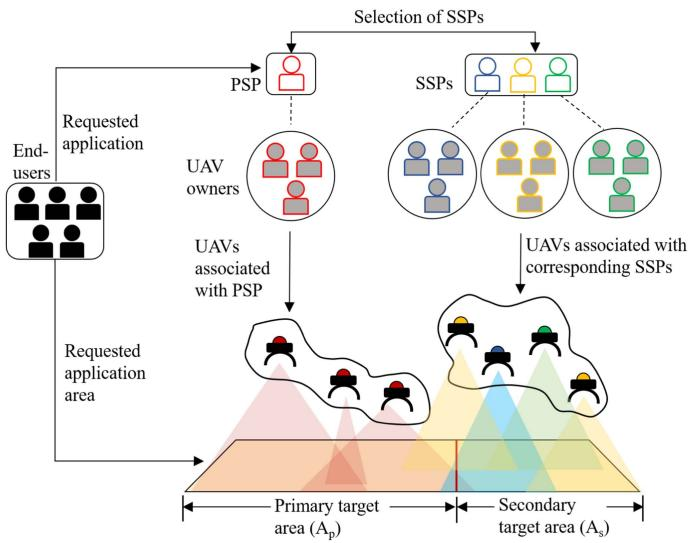  
Fig. 1. Service hand-off for UaaS.

## B. Mathematical Model

In this work, we consider the presence of two kinds of service providers. Primary Service Provider (PSP), who seeks service hand-off, and Secondary Service Provider (SSP), who hands off the service. Let the set of UAVs deployed by the $i ^ { t h }$ Secondary Service Provider, SSPi be $U ^ { \bar { i } } =$ $\{ \dot { U } _ { 1 } ^ { i } , U _ { 2 } ^ { i } , U _ { 3 } ^ { i } , . . . , U _ { N _ { i } } ^ { i } \}$ , where $N _ { i }$ is the number of UAVs deployed by the SSPi. Let the set of heterogeneous sensors hosted by the $j ^ { \dot { t } h }$ UAV deployed by the $i ^ { t h }$ Service Provider, $U _ { j } ^ { i }$ be $\zeta ( U _ { j } ^ { i } ) = \{ \zeta _ { 1 } ( U _ { j } ^ { i } ) , \zeta _ { 2 } ( U _ { j } ^ { i } ) , \zeta _ { 3 } ( U _ { j } ^ { i } ) , \ldots , \zeta _ { \eta _ { i , j } } ( U _ { j } ^ { i } ) \}$ , where $\eta _ { i , j }$ is the number of sensors hosted by $U _ { j } ^ { i }$ . The set of UAV Owners present in the architecture is denoted by $U O$ , while $U O _ { k } ^ { U _ { j } ^ { i } } \in U O$ denotes that the $k ^ { t h }$ UAV Owner owns the $j ^ { t h }$ UAV deployed by the $i ^ { t h }$ service provider. Similarly, the set of sensor owners that rent out their sensors is denoted by $_ { S O }$ while $S O _ { l } ^ { \zeta _ { h } ( U _ { j } ^ { i } ) } \in S O$ represents that the $l _ { t h }$ sensor owner owns the $h ^ { t h }$ sensor hosted by $j ^ { t h }$ UAV deployed by the $i ^ { t h }$ Service Provider.

Argument 1. The relation from the set of UAV owners to the set of UAVs is one-to-many.

Each UAV owner rents one or more than one UAV to a service provider. From this, we conclude that the relation between the set of UAV owners and the set of UAVs is one-to-many.

Argument 2. The relation from the set of PSP to the set of SSPs is one-to-many.

In the given architecture there exists only one PSP therefore, it becomes a singleton set. As per the end-user’s request, PSP has to rely on one or more than one SSP for the service over the $A _ { s } .$ . Thus, we can infer that the single PSP relies on multiple SSPs forming a one-to-many relation.

Argument 3. It is not always necessary that all the sensor nodes hosted by a UAV are being used.

## IV. SOLUTION APPROACH

Multiple actors are associated with the concept of service hand-off in a UaaS platform. In the problem scenario mentioned in Section III-A, we focus on designing proper selection criteria and a pricing scheme where all the actors benefit.

Definition IV.1: Service Pay-off, $S _ { p }$ of the system is defined as the difference between cash inflow, $C _ { i n }$ and cash outflow, $C _ { o u t }$ of that particular system.

$$
S _ {p} = C _ {i n} - C _ {o u t}\tag{1}
$$

Argument 4. For getting maximum profit Service pay-off should be maximum.

## A. Secondary Service Provider Selection

In a UaaS platform, multiple service providers participate to serve the end users. Every service provider has a certain number of UAVs pre-equipped with sensors. For seamless service provisioning, PSP must select the appropriate SSPs based on a selection factor $S F _ { k } .$ , considering three key criteria: eligibility to provide service, quality of service, and cost-efficiency. This ensures proper service hand-off and customer satisfaction.

Service Eligibility Factor (SEF):

The set of UAVs associated with the service provider must have sensors that are suitable to provide the service to the end user’s request and the UAVs must be able to hover over the targeted area. Let the set of sensors hosted by the UAVs of a service provider be $S = \{ S _ { 1 } , S _ { 2 } , S _ { 3 } , \ldots , S _ { a } \}$ where a is the total number of sensors hosted by that service provider and $\zeta = \{ \zeta _ { 1 } , \zeta _ { 2 } , \zeta _ { 3 } , . . . , \zeta _ { b } \}$ be the set of required sensors for providing the services. Such that $( \zeta \subseteq S )$ . Let the $U =$ $\left\{ U _ { 1 } , U _ { 2 } , U _ { 3 } , . . . , U _ { n } \right\}$ be the set of UAVs that are required to provide the service over the secondary target area $A _ { s }$ such that they can hover over the entire secondary target area. The sensors hosted by these UAVs satisfy the relation $\zeta \subseteq S$

Consider that there are n service providers available in the secondary target area. Let the boolean function $e ( S P _ { i } )$ determine whether the service provider, SPi is eligible to provide

service over $A _ { s } \mathrm { : }$

$$
e (S P _ {i}) = \left\{ \begin{array}{l l} 1, & \text { if } U \subseteq U ^ {i} \\ 0, & \text { otherwise } \end{array} \right.\tag{2}
$$

Previous Service hand-off Factor (PSF):

One of the most important factors for the selection of SSPs is knowledge of their reviews. In order to get the reviews of each service provider in $A _ { s } ,$ , every service provider is given a chance to rate every other service provider based on the service they received from that particular service provider earlier.

The matrix representation from the reviews of z service providers with order $z \times z$ can be defined as:

$$
M ^ {R} = \left[ \begin{array}{c c c c c} \times & T _ {1 2} & T _ {1 3} & \ldots & T _ {1 z} \\ T _ {2 1} & \times & T _ {2 3} & \ldots & T _ {2 z} \\ T _ {3 1} & T _ {3 2} & \times & \ldots & T _ {3 z} \\ \vdots & \vdots & \vdots & \ddots & \vdots \\ T _ {z 1} & T _ {z 2} & T _ {z 3} & \ldots & \times \end{array} \right]
$$

Let each element in matrix $M ^ { R }$ be of the form $T _ { i j } ( n )$ , where $T _ { i j } ( n )$ is the exponential moving average of the reviews given by the $S P _ { j }$ to the $S P _ { i }$ after experiencing the n services which were handed-off. $T _ { i j } ( n )$ is computed as:

$$
T _ {i j} (n) = \alpha \cdot R _ {i j} (n) + (1 - \alpha) \cdot T _ {i j} (n - 1)\tag{3}
$$

where $R _ { i j } ( n )$ is the current review in percentage given by the $S P _ { j }$ to the $S P _ { i }$ for the $n ^ { t h }$ service and the value of α is given as

$$
\alpha = \frac {2}{(n + 1)}
$$

Let $\phi ( S P _ { i } )$ be the overall reviews for $S P _ { i }$ and it is defined as:

$$
\phi (S P _ {i}) = \frac {\sum_ {j = 1} ^ {z - 1} T _ {i j} (n)}{z - 1}\tag{4}
$$

Definition IV.2: Effective Secondary Service Area of a service provider SP is defined as the ratio of the area that $S P _ { i }$ can provide its service in the remaining secondary target area to the total remaining secondary target area.

$$
A _ {e f f} ^ {i} = \frac {A ^ {i}}{A _ {s} ^ {r e s}}\tag{5}
$$

where $A ^ { i }$ is the area that $S P _ { i }$ can provide service and it can also be observed that $A ^ { i } \leq A _ { s } ^ { r e s }$ where $A _ { s } ^ { r e s }$ is the total remaining target area.

Definition IV.3: Selectivity $( \lambda ^ { i } )$ of a service provider, $S P _ { i }$ is defined as the satisfaction of PSP provided by $S P _ { i }$ considering the price charged $( C _ { i n } ^ { i } )$ and the effective secondary service area covered.

$$
\lambda^ {i} = \frac {S _ {p} ^ {\mathrm{max}} \times A ^ {i} (1 - \log (A _ {e f f} ^ {i}))}{C _ {i n} ^ {i}}\tag{6}
$$

where $S _ { p } ^ { \mathrm { m a x } }$ is the predefined limit of the maximum price charged by the secondary service provider per unit area for a particular application for a unit of time, such that $\frac { C _ { i n } ^ { i } } { A _ { e f f } ^ { i } } < S _ { p } ^ { \mathrm { m a x } }$ $A _ { s e r v } ^ { i }$ is the fraction of the area already served by the previously

-

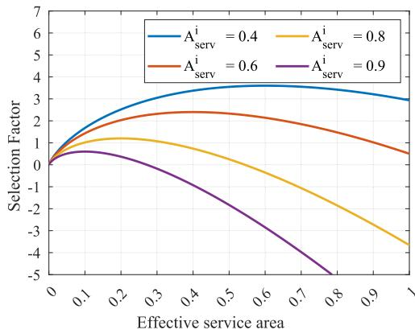  
Fig. 2. Variation in selection factor with the variation of effective service area.

selected SSPs. $C _ { i n } ^ { i }$ is the price charged by the $S P _ { i }$ to the primary service provider.

Definition IV.4: Selection factor $S F _ { i }$ is the measure of the overall satisfaction of the customers of $S P _ { i }$ for handing off the service.

Theorem 1: Selection factor, $S F _ { i }$ of $S P _ { i }$ is mathematically defined as the product of $e ( S P _ { i } ) , \phi ( S P _ { i } )$ ), and $\lambda ^ { i }$

$$
S F _ {i} = e (S P _ {i}) \cdot \phi (S P _ {i}) \cdot \lambda^ {i}
$$

Proof: We obtain $e ( S P _ { i } )$ from $( 2 ) , \phi ( S P _ { i } )$ from (4) and $\lambda ^ { i }$ from (6). For better service-hand-off percentage should be higher. Thus,

$$
S F _ {i} \propto \phi (S P _ {i})\tag{7}
$$

To reduce the cash outflow, PSP looks for those service providers, which charge relatively less. Thus,

$$
S F _ {i} \propto \frac {1}{C _ {i n} ^ {i}}\tag{8}
$$

As the selection factor of a service provider should increase with the increase in the area it can provide and the same should be becoming less dependent on the effective area it can serve.

$$
S F _ {i} \propto A ^ {i} (1 - \log (A _ {e f f} ^ {i}))\tag{9}
$$

Applying transitivity property on (8) and (9)

$$
S F _ {i} \propto \lambda^ {i}\tag{10}
$$

Finally, by combining (7) and (10) we obtain,

$$
S F _ {i} = k \cdot \phi (S P _ {i}) \cdot \lambda^ {i}\tag{11}
$$

As we know $e ( S P _ { i } )$ determines the eligibility ofSP , Therefore, the value of $S F _ { i }$ depends on $e ( S P _ { i } ) { \mathrm { i . e . , k } } = e ( S P _ { i } )$ . Therefore,

$$
S F _ {i} = e (S P _ {i}) \cdot \phi (S P _ {i}) \cdot \lambda^ {i}\tag{12}
$$

From Fig. 2, we observe that the maximum value of the selection factor of a service provider approaches 0 as the value of the effective service area of service providers approaches 1. This indicates that once the residual service area $( A _ { s } ^ { r e s } )$ 1 is fully served, the need to select additional service providers diminishes, effectively halting the search process.

Corollary 1: For selecting the set of most suitable service providers (SSPs) for service hand-off, the selection factor should be calculated for a number of rounds till $A _ { s e r v } ^ { i }  1$

As our objective is to select service providers with maximum selection factor $S F _ { i }$ , while optimizing the area it provides service in the secondary target are $A _ { s } ,$ , we represent the selection factor as:

$$
\arg \max _ {A ^ {i}} (S F _ {i})\tag{13}
$$

subject to

$$
A ^ {i} \leq A _ {r e s} ^ {i}\tag{14a}
$$

$$
\phi (S P _ {i}) \leq 1 0 0\tag{14b}
$$

For solving the maximization function in (13), we use the Lagrangian multiplier and apply the KKT conditions. We express the Lagrangian form, ${ \mathcal { L } } ,$ of (13) as:

$$
\begin{array}{c} \mathcal {L} = S F _ {i} - \mu_ {1} (A ^ {i} - A _ {r e s} ^ {i}) \\ - \mu_ {2} (\phi (S P _ {i}) - 1 0 0) \end{array}\tag{15}
$$

Now applying KKT conditions, we get:

$$
\Delta_ {A ^ {i}} \mathcal {L} = \Delta S F _ {i} - \mu_ {1}\tag{16a}
$$

$$
\mu_ {i} g _ {i} (x) = 0, \text {   and   } \mu_ {i} \geq 0 \quad \forall i = \{1, 2 \}\tag{16b}
$$

where (16a) and (16b) represent dual feasibility and complementary slackness, respectively. Let $g _ { 1 } ( x ) = A ^ { i }$ , and $g _ { 3 } ( x ) =$ $\phi ( S P _ { i } )$ . Now, on differentiating both sides of (15) w.r.t. $A _ { i }$ , we obtain:

$$
\frac {\partial \mathcal {L}}{\partial A ^ {i}} = \frac {\partial S F _ {i}}{\partial A ^ {i}} - \mu_ {1}\tag{17}
$$

By equating the first order derivative of the Lagrangian function (17) to 0, we obtain the optimal remaining area, $A ^ { i * }$ , a service provider can provide its service as:

$$
A ^ {i *} = A _ {r e s} ^ {i} \cdot e x p \left(\frac {- \mu_ {1} \cdot C _ {i n} ^ {i}}{S _ {p} ^ {\max} \cdot \phi (S P _ {i}) \cdot e (S P _ {i})}\right)\tag{18}
$$

However, if any of the selected SSPs fail to provide service, we introduce a fallback mechanism to select another eligible SSP among the available ones using the equation:

$$
\arg \max _ {i} \left(\frac {e (S P _ {i}) \cdot \phi (S P _ {i})}{C _ {i n} ^ {i}}\right)\tag{19}
$$

This ensures that the newly selected SSP is able to cover the area dropped due to failure, with a balance between the $\mathrm { { s s p } } { \cdot } \mathrm { { s } }$ charged price and its reviews.

Communication among SSPs is essential for providing service across large areas. Below is an overview of different techniques that ensure efficient task hand-offs in a large service area while multiple SSPs are present.

Communication among SSPs:

(1) Internet-Based Communications: SSPs can leverage the internet for long-distance communication, enabling coordination across geographically dispersed areas. The data from the UAVs is directly sent to the SSP infrastructure via ground stations and then, SSPs communicate by uploading the data to cloud platforms to communicate and share the data. This approach allows SSPs to offload heavy computational tasks to cloud servers, enhancing efficiency and scalability. However, internet-based communication may face challenges related to latency, bandwidth limitations, and potential connectivity issues in remote regions.

(2) Multi-Hop Communications: For regions where internet connectivity is unreliable, the data need not to be shared to the infrastructure, instead, SSPs can adopt multi-hop communication. In this approach, UAVs of each SSP act as both transmitters and relay nodes, forwarding the data until it reaches to one of the UAVs of PSP. This technique is particularly useful in large deployment areas where direct communication between UAVs may not be feasible due to range limitations.

However, low latency is crucial for real-time applications to ensure timely communication. To achieve this, after selecting the SSPs, we implement multi-hop communication between UAVs deployed by different service providers. We assume the Max-Min Residual Energy AOMDV multipath routing protocol [25] is employed because UAVs have limited energy resources. This technique selects routes based on the maximum residual energy of nodes, helping to conserve energy and extend the UAV network’s lifetime.

## B. Optimal Pricing Strategy

For every service provider, $C _ { i n }$ is always the price paid by the end-user for enjoying its services. But $C _ { o u t }$ depends on various factors, thus we divide the factors into three parts — (i) Rental cost of UAVs and Sensors (ii) Maintenance cost of UAVs and Sensors, and (iii) Cost of Data Management. A. Rental Cost For a given task every service provider deploys a certain number of UAVs equipped with some set of sensors that are needed for the task. Both UAV owners and sensor owners charge some price for their respective UAVs and sensors; they provide basic hardware requirements to the service provider and do not play any role in paying for the maintenance and data processing. Rental cost is the price that owners charge service providers in return for the hardware they provide.

## Rental cost for UAV owners:

Let us consider that the rent paid by $S P _ { i }$ for $U _ { j } ^ { i }$ is denoted by $C _ { r e n t } ^ { U _ { j } ^ { i } }$ . The set of rental cost of all UAVs deployed by $S P _ { i }$ is defined as $C _ { r e n t } ( U ^ { i } ) = \{ C _ { r e n t } ^ { U _ { 1 } ^ { i } } , C _ { r e n t } ^ { U _ { 2 } ^ { i } } , C _ { r e n t } ^ { U _ { 3 } ^ { i } } , \ldots , C _ { r e n t } ^ { U _ { N _ { i } } ^ { i } } \}$ Therefore, the total rental cost of UAVs to be paid by $S P _ { i }$ is:

$$
C _ {r e n t} ^ {U ^ {i}} = \sum_ {j = 1} ^ {N _ {i}} C _ {r e n t} ^ {U _ {j} ^ {i}}\tag{20}
$$

## Rental cost for sensor owners:

Each UAV hosts a set of heterogeneous sensors, and each sensor is owned by its respective owners. Consider that the rent paid by $S P _ { i }$ for $\zeta _ { h } ( U _ { j } ^ { i } )$ is denoted by $C _ { r e n t } ^ { \zeta _ { h } ( U _ { j } ^ { i } ) }$ . The set of rental cost of all Sensors hosted by $U _ { j } ^ { i }$ is $C _ { r e n t } ( \zeta ( U _ { j } ^ { i } ) ) =$ $\{ C _ { r e n t } ^ { \zeta _ { 1 } ( U _ { j } ^ { i } ) } , C _ { r e n t } ^ { \zeta _ { 2 } ( U _ { j } ^ { i } ) } , C _ { r e n t } ^ { \zeta _ { 3 } ( U _ { j } ^ { i } ) } , \ldots , C _ { r e n t } ^ { \zeta _ { \eta _ { i , j } } ( U _ { j } ^ { i } ) } \}$ . The rental cost paid by SPi for the sensors hosted by $U _ { j } ^ { i }$ is represented as,

$$
C _ {r e n t} ^ {\zeta (U _ {j} ^ {i})} = \sum_ {h = 1} ^ {\eta_ {i, j}} C _ {r e n t} ^ {\zeta_ {h} (U _ {j} ^ {i})}\tag{21}
$$

Since there are $N _ { i }$ number of UAVs deployed by $S P _ { i }$ , the service provider pays the rental cost of each sensor on all the UAVs,

$$
C _ {r e n t} ^ {\zeta (U ^ {i})} = \sum_ {j = 1} ^ {N _ {i}} \sum_ {h = 1} ^ {\eta_ {i, j}} C _ {r e n t} ^ {\zeta_ {h} (U _ {j} ^ {i})}\tag{22}
$$

So the total rental cost, $C _ { r e n t } ^ { i } .$ , to be paid by $S P _ { i }$ is represented as,

$$
C _ {r e n t} ^ {i} = \sum_ {j = 1} ^ {N _ {i}} C _ {r e n t} ^ {U _ {j} ^ {i}} + \sum_ {j = 1} ^ {N _ {i}} \sum_ {h = 1} ^ {\eta_ {i, j}} C _ {r e n t} ^ {\zeta_ {h} (U _ {j} ^ {i})}\tag{23}
$$

## B. Maintenance Cost

Every UAV and sensor needs maintenance to give good results while functioning. These maintenance costs include recharging the UAVs and sensors, costs for repairing and replacing damaged UAVs and sensors, and other minimal maintenance costs such as servicing. A service provider must take proper care of all the hardware provided by UAV owners and sensor owners in order to get a good service payoff. The energy of UAVs and sensors is an essential parameter to execute the assigned task to the UaaS platform. Therefore we consider energy as a parameter determining the charged price.

For UAVs:

The energy consumed by a UAV while performing a task has two components, (i) energy consumed while in motion and hovering and (ii) energy consumed to compensate for the heat generated in a UAV in the period of time.

Assume that the total time of flight of a UAV $U _ { j } ^ { i }$ while performing a certain task is $T _ { f } ( i , j )$ such that

$$
T _ {f} (i, j) = T _ {h} (i, j) + T _ {m} (i, j)\tag{24}
$$

where $T _ { h } ( i , j )$ and $T _ { m } ( i , j )$ are the time of hovering and time of motion, respectively.

The energy consumed $( E _ { f } ^ { i , j } )$ by the UAV while in motion and hovering state is given as the product of power consumed and the time of flight.

$$
E _ {f} ^ {i, j} = \int_ {0} ^ {T _ {f} (i, j)} P _ {t} (i, j) \cdot d t\tag{25}
$$

where $P _ { t } ( i , j )$ is the instantaneous power consumed by a UAV $( U _ { j } ^ { i } )$ at a particular time t over the period of flight.

The energy consumed $( E _ { h } ^ { i , j } )$ by the UAV $U _ { j } ^ { i }$ to compensate for the heat loss is given by:

$$
E _ {h} ^ {i, j} = \int_ {0} ^ {T _ {f} (i, j)} \left(I _ {t} (i, j)\right) ^ {2} \cdot R \cdot d t\tag{26}
$$

where $I _ { t } ( i , j )$ is the instantaneous electric current driven by a UAV Ui at a particular time t over the period of flight, and R is the resistance of the electric circuit in the UAV.

The total energy consumed by a UAV can be expressed as the sum of $E _ { f } ^ { i , j } , E _ { h } ^ { i , j }$ , and energy dissipated $( E _ { a } )$ due to air

resistance.

$$
\begin{array}{l} E _ {U} ^ {i, j} = E _ {f} ^ {i, j} + E _ {h} ^ {i, j} + E _ {a} \\ \qquad = \left(\int_ {0} ^ {T _ {f} (i, j)} (P _ {t} (i, j) + I _ {t} (i, j)) ^ {2} \cdot R) \cdot d t\right) + E _ {a} \end{array}\tag{27}
$$

The total cost to be paid by the service provider $S P _ { i }$ to the UAV owners is given by:

$$
C _ {E} ^ {U ^ {i}} = \left(\sum_ {j = 1} ^ {N _ {i}} E _ {U} ^ {i, j} - \sum_ {j = 1} ^ {N _ {i}} (n _ {T} ^ {U _ {j} ^ {i}} \times \epsilon (U _ {j} ^ {i}))\right) \times C _ {E} ^ {U}\tag{28}
$$

where $C _ { E } ^ { U }$ is the cost per unit energy consumed by the UAV, $n _ { T } ^ { i , j }$ is the number of tasks performed by the UAV $( U _ { j } ^ { i } )$ , and $\epsilon _ { j } ^ { i }$ is the energy saved by performing more than one tasks while serving the current task.

Proposition 1: Energy consumed by an UAV moving with constant velocity over a period of time, t varies linearly with t.

$$
E _ {v} = k \cdot t _ {v} + c\tag{29}
$$

Proof: Given that the UAV flies with a constant velocity, which implies that the speed and direction remain unchanged. Then the power consumed $( P _ { t } )$ by the UAV at any instant of time $t \in [ 0 , t _ { v } ]$ remains constant $( P )$ :

$$
P _ {t} = P
$$

The electric current driven by the circuit of the UAV represented as $I _ { t }$ is expressed as:

$$
I _ {t} = \frac {P _ {t}}{V} = \frac {P}{V}
$$

where $V$ is the electromotive force $( e m f )$ of the battery of the UAV. We have the expression for energy consumed by a UAV as:

$$
\begin{array}{c} E _ {U} = \left(\int_ {0} ^ {t _ {v}} (P _ {t} + I _ {t} ^ {2} \cdot R) \cdot d t\right) + E _ {a} \\ = \left(P + \frac {P ^ {2} \cdot R}{V}\right) \cdot t _ {v} + E _ {a} \end{array}\tag{30}
$$

Comparing (29) and (30), we obtain:

$$
k = P + \frac {P ^ {2} \cdot R}{V} \text {   and   } c = E _ {a}
$$

Therefore, $E _ { U }$ varies linearly with $t _ { v }$

For Sensors:

Similar to UAVs, Sensors are hosted for different applications by a particular UAV. Each sensor requires a particular amount of energy to function while in the task. The energy consumed $( E _ { \zeta _ { h } } ^ { i , j } )$ is nothing but the difference between the remaining energy of a sensor node in its final and initial state, i.e. after and before the completion of a given task.

$$
E _ {\zeta_ {h}} ^ {i, j} = E \zeta_ {h} (f i n a l) ^ {i, j} - E \zeta_ {h} (i n i t i a l) ^ {i, j}\tag{31}
$$

where $E \zeta _ { h } ( f i n a l ) ^ { i , j }$ and $E \zeta _ { h } ( i n i t i a l ) ^ { i , j }$ are final and initial energies in a sensor. For a given task, the price to be paid by $S P _ { i }$ for using the sensors is given by

$$
\begin{array}{l} C _ {E} ^ {\zeta (U _ {j} ^ {i})} \\ = \left(\sum_ {j = 1} ^ {N _ {i}} \sum_ {h = 1} ^ {\eta_ {i, j}} E _ {\zeta_ {h}} ^ {i, j} - \sum_ {j = 1} ^ {N _ {i}} \sum_ {h = 1} ^ {\eta_ {i, j}} (n _ {T} ^ {\zeta_ {h} (U _ {j} ^ {i})} \times \epsilon (\zeta_ {h} (U _ {j} ^ {i})))\right) \times C _ {E} ^ {S} \end{array}\tag{32}
$$

where $C _ { E } ^ { S }$ is the cost per unit energy used by the sensor $n _ { T } ^ { \zeta _ { h } ( U _ { j } ^ { i } ) }$ is the number of tasks performed by $\zeta _ { h } ( U _ { j } ^ { i } )$ and $\epsilon \big ( \zeta _ { h } ( \bar { U } _ { j } ^ { i } ) \big )$ is the amount of energy saved by the sensor by performing more than one tasks during the course of the flight.

We compute the total cost of energy consumption to be paid by a service provider $S P _ { i }$ as:

$$
\begin{array}{l} C _ {E} ^ {i} = C _ {E} ^ {U ^ {i}} + C _ {E} ^ {\zeta (U _ {j} ^ {i})} \\ C _ {E} ^ {i} = \left(\sum_ {j = 1} ^ {N _ {i}} E _ {U} ^ {i, j} - \sum_ {j = 1} ^ {N _ {i}} (n _ {T} ^ {U _ {j} ^ {i}} \times \epsilon (U _ {j} ^ {i}))\right) \times C _ {E} ^ {U} \\ \quad + \left(\sum_ {j = 1} ^ {N _ {i}} \sum_ {h = 1} ^ {\eta_ {i, j}} E _ {\zeta_ {h}} ^ {i, j} - \sum_ {j = 1} ^ {N _ {i}} \sum_ {h = 1} ^ {\eta_ {i, j}} (n _ {T} ^ {\zeta_ {h} (U _ {j} ^ {i})} \times \epsilon (\zeta_ {h} (U _ {j} ^ {i})))\right) \times C _ {E} ^ {S} \end{array} \tag {33a}\tag{33b}
$$

Every UAV requires equal attention towards its maintenance like other parameters. After performing multiple tasks, a UAV might need repair considering the physical and tropical conditions. The cost of repairing depends on the damage caused to the UAV due to temperature, rainfall, and other physical objects.

Definition IV.5: Damage Index, $\Delta$ is defined as the probability of the deployed UAVs getting damaged and it is given by the expression:

$$
\Delta^ {i} = \frac {\sum_ {j = 1} ^ {\alpha_ {i}} a _ {j} ^ {i}}{\sum_ {j = 1} ^ {\beta_ {i}} a _ {j} ^ {i}}
$$

In the above expression, $a _ { j } ^ { i }$ is an event to be happening, $\alpha _ { i }$ be the number of cases of $a _ { j } ^ { i }$ being a failure and $\beta _ { i }$ be the overall events.

Definition IV.6: Effective Damage Cost, $C _ { e f f }$ is defined as the price paid by the Service Provider for a unit damage index, $\Delta$

Thus the cost of repairing and replacing the UAVs to be paid by the service provider can be defined as the product of the damage index and effective damage cost:

$$
C _ {d a m a g e} ^ {i} = \Delta^ {i} \times C _ {e f f} ^ {i}
$$

Thus the total maintenance costs of UAV and sensors is given by,

$$
C _ {m} ^ {i} = C _ {E} ^ {i} + C _ {d a m a g e} ^ {i}\tag{34}
$$

C. Cost ofData Management

Unlike Owners, service providers are responsible for deploying UAVs over the target region and managing the data received from the sensors hosted by these UAVs. Data management includes three sections, data storage, data communication, and data transfer. We define the cost of data storage, $C _ { d s } ^ { i }$ as the product of cost per unit memory, $C _ { m e m }$ , and the total amount of data stored by the UAVs.

$$
C _ {d s} ^ {i} = C _ {m e m} \times \sum_ {j = 1} ^ {N _ {i}} M _ {j} ^ {i}\tag{35}
$$

where $M _ { j } ^ { i }$ is the memory collected from the UAV $U _ { j } ^ { i } . C _ { d c } ^ { i } , C _ { d t } ^ { i } ,$ and $C _ { u p } ^ { i }$ denote the costs to communicate between different sensors on different UAVs, data transmission for transmitting from UAV to the base station, and uploading the data to the server from the base station, respectively.

The total price to be paid by the service provider, denoted by $C _ { d m } ^ { i }$ , is given as,

$$
\begin{array}{l} C _ {d m} ^ {i} = C _ {d s} ^ {i} + C _ {d c} ^ {i} + C _ {d t} ^ {i} + C _ {u p} ^ {i} \\ C _ {d m} ^ {i} = C _ {m e m} \times \sum_ {j = 1} ^ {N _ {i}} M _ {j} ^ {i} + C _ {d c} ^ {i} + C _ {d t} ^ {i} + C _ {u p} ^ {i} \end{array}\tag{36}
$$

## C. Charged Price Optimization:

Definition IV.7: Secondary payoff $( C _ { s e r v } )$ is defined as the total amount to be paid by PSP for other secondary service providers

$$
C _ {s e r v} = \sum_ {i = 1} ^ {n} C _ {i n} ^ {i}\tag{37}
$$

where n is the number of secondary service providers that are rendering service to the PSP and $C _ { i n } ^ { i }$ is the amount to be paid by PSP to the $i ^ { t h }$ SSP.

Let PSP be a typical end-user for other SSPs. For a PSP, the cash inflow is denoted by $C _ { i n } ^ { P S P }$ and the cash outflow $C _ { r e n t } ^ { P S P } , C _ { m } ^ { P S P } , C _ { d m } ^ { P S P }$ and $C _ { s e r v } .$ . The set of SSPs is denoted by $S S P ^ { S } = \{ S S P _ { 1 } , S S P _ { 2 } , S S P _ { 3 } , . . . , S S P _ { n } \}$ . The profit gained by the PSP is given as:

$$
\begin{array}{r} S _ {P} ^ {P S P} = C _ {i n} ^ {P S P} - C _ {o u t} ^ {P S P} \\ S _ {P} ^ {P S P} = C _ {i n} ^ {P S P} - C _ {k} ^ {P S P} - C _ {s e r v} \end{array}\tag{38}
$$

where $C _ { k } ^ { P S P } = ( C _ { r e n t } ^ { P S P } + C _ { m } ^ { P S P } + C _ { d m } ^ { P S P } )$

For finding the optimal $C _ { i n } ^ { P \overset { \sim } { S } P }$ , the utility function is given as:

$$
U F _ {P S P} = R _ {E} - l n (\Gamma (R _ {E}))\tag{39}
$$

where $R _ { E }$ is the relative cash outflow such that

$$
R _ {E} = \frac {C _ {o u t} ^ {P S P}}{C _ {i n} ^ {P S P}}
$$

Utility function in (39) follows law of diminishing marginal utility. As shown in Fig. 3, the utility function exhibits a concave downward trend, illustrating that the utility starts to decrease after a certain charged price.

To optimize the chargeable price $C _ { i n } ^ { P S P }$ , we maximize the utility function $U F _ { P S P }$ . Thus,

$$
\operatorname * {a r g m a x} _ {C _ {i n} ^ {P S P}} (\mathrm{UF} _ {\mathrm{PSP}})\tag{40}
$$

subject to

$$
R _ {E} \leq 1\tag{41}
$$

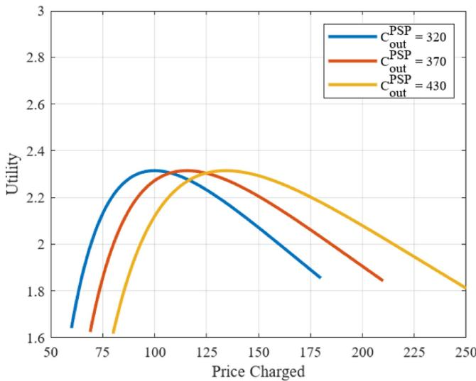  
Fig. 3. Variation in utility with the variation of price charged.

TABLE I SIMULATION PARAMETERS

<table><tr><td>Parameter</td><td>Values</td></tr><tr><td>Simulation area</td><td> $10 \times 10 \text{ unit}^{2}$ </td></tr><tr><td>Number of PSPs</td><td>1</td></tr><tr><td>Number of SSPs available</td><td>2 - 10</td></tr><tr><td>Number of UAVs deployed by PSP</td><td>5 - 25</td></tr><tr><td>Number of end-users</td><td>1</td></tr><tr><td>Number of unique tasks by UAV</td><td>10 - 30</td></tr><tr><td>Max. price charged per unit area by SSP</td><td>10000 units</td></tr><tr><td>Price charged per unit area by SSP</td><td>3000-4000 units</td></tr><tr><td>Number of partitions</td><td>10</td></tr><tr><td>Rent of an UAV</td><td>10000-15000 units</td></tr><tr><td>Rent of a sensor</td><td>50 - 250 units</td></tr><tr><td>Energy consumed per each task by UAV</td><td>70 - 120 units</td></tr><tr><td>Cost per unit memory</td><td>7 - 12 units</td></tr><tr><td>Cost of data communication</td><td>5 units</td></tr><tr><td>Cost of data transmission</td><td>15 units</td></tr><tr><td>Cost of data upload</td><td>50 units</td></tr><tr><td>Cost per unit energy of UAV</td><td>5 units</td></tr><tr><td>Cost per unit energy of sensor</td><td>1 unit</td></tr></table>

For solving the maximization function in (40), we use the Lagrangian multiplier and apply the KKT conditions. The Lagrangian equation of (40), L, is expressed as:

$$
\mathcal {L} = U F _ {P S P} - \mu_ {1} (R _ {E} - 1)\tag{42}
$$

We apply KKT conditions on (42) to obtain:

$$
\Delta_ {A ^ {i}} \mathcal {L} = \Delta U F _ {P S P} - \mu_ {1}\tag{43a}
$$

$$
\mu_ {1} g _ {1} (x) = 0, \mathrm{and} \mu_ {1} \geq 0\tag{43b}
$$

where (43a) and (43b) represents dual feasibility and complementary slackness, respectively.

Algorithm 1: Review Computation.

INPUTS:
1: $S_i = \{SP_1, SP_2, SP_3, \ldots, SP_k\}$ ▷ set of eligible SPs
2: n ▷ Total Service hand-offs received by $SP_j$ from $SP_i$
3: $R_{ij}(n), T_{ij}(n)$
4: $\alpha = \frac{2}{n+1}$
OUTPUT: $\phi(SP_i)$

PROCEDURE:
1: function RECFUN(i,j,n)
2: if n == 1 then return $R_{ij}(n)$
3: else
4: return
$\alpha \cdot R_{ij}(n) + (1 - \alpha) \cdot RecFun(i, j, n-1)$
5: end if
6: end Function
7: $T_{ij}(n) \leftarrow 0$
8: for $i \leftarrow SP_1$ to $SP_k$ do
9: for $j \leftarrow SP_1$ to $SP_k \&amp; i! = j$ do
10: $T_{ij}(n) \leftarrow T_{ij}(n) + RECFUN(i, j, n)$
11: end for
12: $\phi(SP_i) \leftarrow \frac{T_{ij}(n)}{k-1}$
13: end for

Let $g _ { 1 } ( x ) = C _ { o u t } ^ { P S P } - C _ { i n } ^ { P S P }$ . Now, on differentiating both the sides of (42) w.r.t. $C _ { i n } ^ { P S P }$ , we get:

$$
\frac {\partial \mathcal {L}}{\partial C _ {i n} ^ {P S P}} = \frac {\partial (U F _ {P S P} - \mu_ {1} (R _ {E} - 1))}{\partial C _ {i n} ^ {P S P}}\tag{44}
$$

By equating the first order derivative of the Lagrangian function in (44) to 0, we obtain the optimal chargeable price a PSP can charge an end user as:

$$
C _ {i n} ^ {P S P *} = \frac {C _ {o u t} ^ {P S P}}{\psi^ {- 1} (\mu_ {1} - 1)}\tag{45}
$$

From the logarithmic derivative of the gamma function, the following inequality can be obtained:

$$
\frac {2 C _ {o u t} ^ {P S P}}{2 e ^ {\mu_ {1} - 1} + 1} \leq C _ {i n} ^ {P S P *} \leq C _ {o u t} ^ {P S P} \cdot l n (1 + e ^ {1 - \mu_ {1}})\tag{46}
$$

Algorithm 1 represents the procedure to find the overall reviews for a service provider, $S P _ { i }$ using (2) – (4). We use a recursive function to find the exponential moving average of the reviews given by other service providers after experiencing n services handed off by $S P _ { i }$ . Algorithm 2 represents the procedure to find the optimal set of SSPs. Using (2) – (12) and Algorithm 1 computes $S F _ { i }$ for $S P _ { i }$ . Start with an empty set of SSPs iterate till $A _ { e f f } ^ { i }  1$ and in each iteration, $S P _ { i }$ with maximum $S F _ { i }$ is added into SSPs. Algorithm 3 represents the procedure to find the optimal $C _ { i n } ^ { P S P }$ by computing $\dot { C } _ { o u t } ^ { P S P }$ using (23), (33b), (29), (31) and (46).

## V. PERFORMANCE EVALUATION

## A. Simulation Design

In this work, we consider a $1 0 \times 1 0 ~ u n i t ^ { 2 }$ simulation area divided into ten sub-regions. An end-user requests services for any of the regions. However, the PSP may not serve the entire region, as requested by the end-user, alone. In that case, the PSP hands off the service to one of the available SSPs to continue seamless UaaS provisioning to the end-user. Additionally, we consider the presence of one PSP and 2 − 10 SSPs in the system. For simplicity, we consider the unit prices associated with different operations such as communication, rent and maintenance to evaluate the performance of the proposed hand-off mechanism. We assume that in UaaS deployment model, the actual price will vary in the same order as we considered for the different components. The details of simulation parameters are depicted in Table I.

Algorithm 2: Optimal SSP Selection.

INPUTS:
1: $S_i = \{SP_1, SP_2, SP_3, \ldots, SP_k\}$ ▷ set of all SPs available
2: $A^i$ ▷ Current area serving by $SP_i$
3: $A_{res}^i$ ▷ Overall target area excluding $A^i$

OUTPUT: Optimal set of SSPs

PROCEDURE:
1: Initialize an empty set of SSPs
2: for $i \leftarrow SP_1$ to $SP_m$ do
3: Compute $e(SP_i)$ using (2)
4:Compute $\phi(SP_i)$ using (3), (4) and Algorithm 1
5:Compute $A_{eff}^i$ using (5)
6:Compute $\lambda^i$ using (6)
7:Compute $SF_i$ using (12)
8: end for
9: while $!(A_{eff}^i \rightarrow 1)$ do
10: for $i \leftarrow SP_1$ to $SP_m$ do
11: Find $SP_i$ containing maximum $SF_i$
12: Remove $SP_i$ from $S_i$
13: Add $SP_i$ into set SSPs
14: $A_{res}^i \leftarrow A_{res}^i - A_i$
15: end for
16: end while

Algorithm 3: Optimal Pricing in Serv-HU.

INPUTS:
1:  $\Delta^{PSP}, C_{eff}^{PSP}, E_{a}, C_{mem}$ 

OUTPUT: Optimal  $C_{in}^{PSP}$ 

PROCEDURE:
1: Compute  $C_{rent}^{PSP}$  using (23)
2:Compute  $C_{E}^{PSP}$  using (33b)
3:Compute  $C_{M}^{PSP}$  using (29)
4:Compute  $C_{dm}^{PSP}$  using (31)
5: $C_{k}^{PSP} \leftarrow C_{rent}^{PSP} + C_{M}^{PSP} + C_{dm}^{PSP}$ 
6:Compute  $C_{serv}$  using (32)
7: $C_{out}^{PSP} \leftarrow C_{k}^{PSP} + C_{serv}$ 
8:Compute optimal  $C_{in}^{PSP}$  using (46)

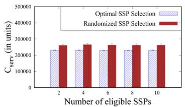  
(a) Service Area = 25%

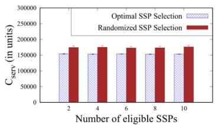  
(b) Service Area = 50%

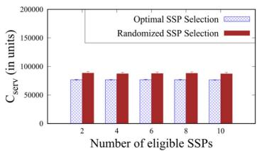  
(c) Service Area = 75%

Fig. 4. Comparison of charged price considering optimal and random SSP selections.  
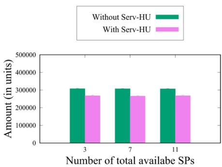  
Fig. 5. Comparison of charged price in traditional UaaS and Serv-HU.

## B. Result and Discussions

We evaluate the performance of the proposed service hand-off scheme considering different metrics. In this section, we depict the obtained results and discuss the same in brief. Fig. 4 indicates the variations in $C _ { s e r v }$ , the total price to be paid by the PSP to SSPs. Fig. 4(a) shows the variation in $C _ { s e r v }$ with the number of SSPs when the PSP covers only 25% of the service area. It is observed that the optimal selection of SSP results in lower $C _ { s e r v }$ and this trend is also evident in Fig. 4(b) and (c) for PSP coverage of 50% and 75%. This cost reduction with optimal selection is due to our optimization model, which considers factors such as SSPs’ per-unit area charges.

In this work, we attempt to design a pricing scheme that reduces the cost for end-users while maintaining high-quality service. Fig. 5 shows the difference in the total price paid by end-users in traditional UaaS compared to our Serv-HU. For this analysis, we considered that one of the available SPs is chosen as PSP with the rest as SSPs, and the PSP deploys 10 UAVs for serving $A _ { p } .$ The total area to be served is 100 square units, and SPs charge based on the area they cover. In both cases, the service payoff remains constant, regardless of the number of service providers. However, the total price is higher in traditional UaaS, where the end-user must separately engage multiple SPs for coverage over an area of A. This is due to the optimized pricing strategy in Serv-HU, which allows the PSP to reduce costs by coordinating the service delivery. From Figs. 4 and 5 it is evident that optimal SSP selection reduces the expenditure of PSP by lowering $C _ { s e r v }$ and also reduces the charged price for the end-user

One of the important contributions of this work is to design an optimal pricing strategy for Serve-HU. Equation (46) determines an optimal charge price by a PSP, considering his/her expenditure. According to (46), the optimal charged price, $C _ { i n } ^ { P \dot { S } P * }$ of PSP lies as $\begin{array} { r } { \frac { 2 C _ { o u t } ^ { P S P } } { 2 e ^ { \mu _ { 1 } - 1 } + 1 } \leq C _ { i n } ^ { P S P * } \leq C _ { o u t } ^ { P S P } \cdot l n ( 1 + e ^ { 1 - \mu _ { 1 } } ) } \end{array}$ Figs. 6 and 7 show the variations in the cash outflow, inflow and service payoff of the PSP while considering the total 2 − 10 UAVs in the networks. For this experiment, we depict the results in Fig. 6(a)-(c) considering the presence of 2, 6, and 10 SSPs in the system and $\begin{array} { r } { C _ { i n } ^ { P S P } = \frac { 2 \bar { C } _ { o u t } ^ { P S P } } { 2 e ^ { \mu _ { 1 } - 1 } + 1 } } \end{array}$ . In all the figures, we notice that the PSP has a significant profit in spite of not providing the service for the entire requested area, and the trend doesn’t change upon varying the number of SSPs. Therefore, we infer that the service hand-off is acceptable for providing UaaS. On the other hand, Fig. 7(a)-(c) depict the variations in the cash outflow, inflow and service payoff of the PSP, with $C _ { i n } ^ { P S P } = C _ { o u t } ^ { P S P } \cdot l n ( 1 + e ^ { 1 - \mu _ { 1 } } )$ and the results are quite similar to what we obtained in Fig. 6. However, on comparing both the figures, we notice that there is a higher service payoff in all the scenarios in Fig. 7 compared to Fig. 6 even though they have the same value of utility function. Therefore we infer that the pricing $C _ { i n \_ } ^ { P S P } = C _ { o u t } ^ { P S P } \cdot l n ( 1 + e ^ { 1 - \mu _ { 1 } } )$ is preferable than $\begin{array} { r } { C _ { i n } ^ { P S P } = \frac { 2 C _ { o u t } ^ { P S P } } { 2 e ^ { \mu _ { 1 } - 1 } + 1 } } \end{array}$ for greater profits.

Similar to Fig. 7, we look into the cash outflow, inflow, and service payoff of the PSP for varying amounts of unique tasks. Figs. 8 and 9 represent the cash outflow, inflow, and service payoff of PSP for 10 − 30 unique tasks performed. The result of this experiment is shown in Fig. 8(a)-(c) considering 5, 7, and 9 UAVs deployed by the PSP and $\begin{array} { r } { C _ { i n } ^ { P S P } = \frac { 2 C _ { o u t } ^ { P S P } } { 2 e ^ { \mu _ { 1 } - 1 } + 1 } } \end{array}$ . In all the figures, the increase in the number of UAVs deployed inflates the cash outflow and inflow. We also observe that adding more tasks for UAVs leads to a proportionally smaller increase in service payoff as the change in the number of unique tasks has a lesser impact on the cash outflow. On the other hand, Fig. 9(a)-(c) represent the same with cash inflow $C _ { i n } ^ { P S P } =$ $C _ { o u t } ^ { \bf \breve { P } S P } \cdot \ln ( 1 + \stackrel { \cdot } { e } ^ { 1 - \mu _ { 1 } } )$ . Now, comparing both the figures, we observe that the profits are higher in Fig. 9 than in Fig. 8 though both have the same value of utility function. Therefore, we conclude that $C _ { i n } ^ { P S P } = C _ { o u t } ^ { P S P } \cdot \ln ( 1 \mathrm { \bar { + } } e ^ { 1 - \mu _ { 1 } } )$ generates a higher profit in comparison to $\begin{array} { r } { C _ { i n } ^ { P S P } = \frac { 2 C _ { o u t } ^ { P S P } } { 2 e ^ { \mu _ { 1 } - 1 } + 1 } } \end{array}$ . Additionally, in Fig. 10(a) and (b), we observe a positive correlation between the number of end-users and the service payoff for the PSP. The reason for this behavior is that as the number of end-users grows, the demand for services increases, resulting in more tasks to be completed, thus, increasing the profit of PSP.

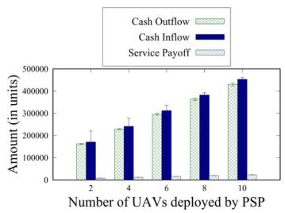  
(a) No. of eligible SSPs = 2

  
(b) No. of eligible SSPs = 6

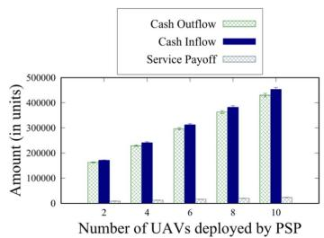  
(c) No. of eligible SSPs = 10

Fig. 6. Cash outflow, inflow and service payoff of PSP using $\begin{array} { r } { C _ { i n } ^ { P S P } = \frac { 2 C _ { o u t } ^ { P S P } } { 2 e ^ { \mu _ { 1 } - 1 } + 1 } } \end{array}$  
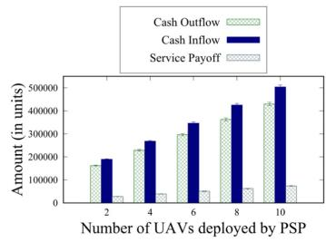  
(a) Number of eligible SSPs = 2

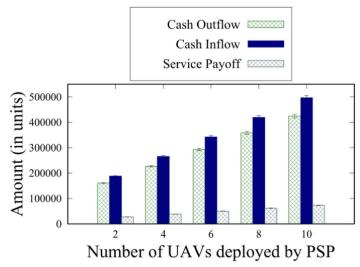  
(b) Number of eligible SSPs = 6

  
(c) Number of eligible SSPs = 10

Fig. 7. Cash outflow, inflow and service payoff of PSP using $C _ { i n } ^ { P S P } = C _ { o u t } ^ { P S P } \cdot l n ( 1 + e ^ { 1 - \mu _ { 1 } } )$  
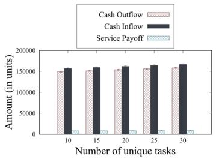  
(a) No. of UAVs deployed by PSP= 5

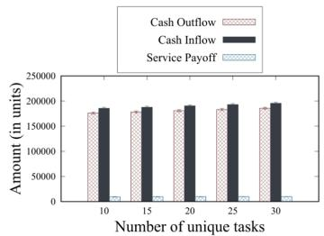  
(b) No. of UAVs deployed by $\mathrm { P S P } = 7$

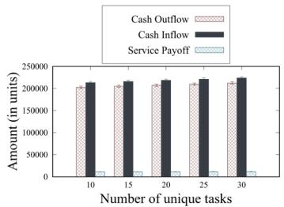  
(c) No. of UAVs deployed by $\mathrm { P S P } = 9$

Fig. 8. Cash outflow, inflow and service payoff of PSP using $\begin{array} { r } { C _ { i n } ^ { P S P } = \frac { 2 C _ { o u t } ^ { P S P } } { 2 e ^ { \mu _ { 1 } - 1 } + 1 } } \end{array}$  
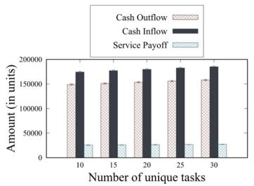  
(a) No. of UAVs deployed by $\mathrm { P S P } = 5$

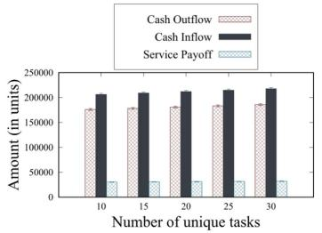  
(b) No. of UAVs deployed by $\mathrm { P S P } = 7$

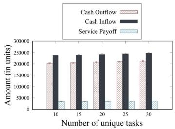  
(c) No. of UAVs deployed by $\mathrm { P S P } = 9$  
Fig. 9. Cash outflow, inflow and service payoff of PSP using $C _ { i n } ^ { P S P } = C _ { o u t } ^ { P S P } \cdot l n ( 1 + e ^ { 1 - \mu _ { 1 } } )$

We also validate the benefits of multi-SSP coordination using multi-hop communication among the UAVs. Fig. 11 compares communication costs for coordinated and non-coordinated SSPs scenarios – multi-hop and direct transmission. As the number of SSPs increases from 2 to 6, the communication cost for multi-hop is significantly lower than that of direct transmission.

One of the reasons for this trend is – the UAVs deployed by different SSPs participate in multi-hop communications. In direct transmission, data from each UAV are transmitted to the base station associated with its designated SSP. However, in multi-hop communications, the data are hopped over multiple UAVs before being transmitted to the base station.

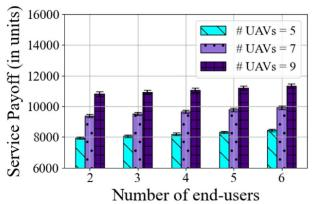  
(a) Service Payoff of PSP using $\begin{array} { r } { C _ { i n } ^ { P S P } = \frac { 2 C _ { o u t } ^ { P S P } } { 2 e ^ { \mu _ { 1 } - 1 } + 1 } } \end{array}$

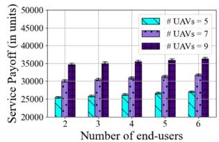  
(b) Service Payoff of PSP using CPSP = CPtP · lIn(1 + e1−µ1) in

Fig. 10. Service Payoff of PSP for varying numbers of end-users.  
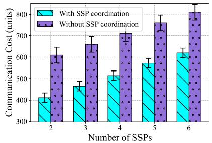  
Fig. 11. Comparison of communication cost in coordinated and noncoordinated SSPs scenarios.

## VI. CONCLUSION

In this paper, we proposed an optimal service provider selection and pricing scheme for UAV Service Hand-off. Using the Lagrange multiplier and Karush-Kuhn-Tucker (KKT) conditions, we designed a pricing scheme that offers end-users UAV services at optimal prices. Our selection process considers parameters like reviews, eligibility, price per unit area, and coverage to elect the best service provider.. Additionally, we designed an optimal pricing scheme that determines the optimal charged price considering the selected service provider. We analyzed the proposed approach rigorously through simulation and compared the results with a random selection of service providers. The proposed approach of Serv-HU is suitable for providing UAV services to the end-users with the optimal amount of charged price.

In the future, we plan to extend our work to focus on multi-hop optimization in the context of task hand-off among heterogeneous UAVs. This enables UAVs to efficiently relay tasks and information in real-time, particularly for delay-sensitive applications, enhancing overall system performance and responsiveness. As, there are multiple actors are participate in the UaaS platform, and these actors are involved with financial transactions, designing an optimal pricing mechanism for UaaS is pertinent. Therefore, we also plan to work on designing an optimal pricing mechanism for UaaS platform.

## REFERENCES

[1] V. Roberge, M. Tarbouchi, and G. Labonté, “Fast genetic algorithm path planner for fixed-wing military UAV using GPU,” IEEE Trans. Aerosp. Electron. Syst., vol. 54, no. 5, pp. 2105–2117, Oct. 2018.

[2] D. Orfanus, E. P. de Freitas, and F. Eliassen, “Self-organization as a supporting paradigm for military UAV relay networks,” IEEE Commun. Lett., vol. 20, no. 4, pp. 804–807, Apr. 2016.

[3] P. Tokekar, J. V. Hook, D. Mulla, and V. Isler, “Sensor planning for a symbiotic UAV and UGV system for precision agriculture,” IEEE Trans. Robot., vol. 32, no. 6, pp. 1498–1511, Dec. 2016.

[4] A. Caruso, S. Chessa, S. Escolar, J. Barba, and J. C. López, “Collection of data with drones in precision agriculture: Analytical model and LoRa case study,” IEEE Internet Things J., vol. 8, no. 22, pp. 16 692–16 704, Nov. 2021.

[5] A. Al-Hilo, M. Samir, C. Assi, S. Sharafeddine, and D. Ebrahimi, “UAVassisted content delivery in intelligent transportation systems-joint trajectory planning and cache management,” IEEE Trans. Intell. Transp. Syst., vol. 22, no. 8, pp. 5155–5167, Aug. 2021.

[6] M. C. Lucic, H. Ghazzai, and Y. Massoud, “A generalized dynamic planning framework for green UAV-assisted intelligent transportation system infrastructure,” IEEE Syst. J., vol. 14, no. 4, pp. 4786–4797, Dec. 2020.

[7] J. Yapp, R. Seker, and R. Babiceanu, “UAV as a service: Enabling on-demand access and on-the-fly re-tasking of multi-tenant UAVs using cloud services,” in Proc. IEEE/AIAA 35th Digit.Avionics Syst. Conf., 2016, pp. 1–8.

[8] N. Pathak, S. Misra, A. Mukherjee, A. Roy, and A. Y. Zomaya, “UAV virtualization for enabling heterogeneous and persistent UAV-as-a-service,” IEEE Trans. Veh. Technol, vol. 69, no. 6, pp. 6731–6738, Jun. 2020.

[9] A. Menshchikov et al., “Real-time detection of hogweed: UAV platform empowered by deep learning,” IEEE Trans. Comput., vol. 70, no. 8, pp. 1175–1188, Aug. 2021.

[10] E. C. Tetila et al., “Automatic recognition of soybean leaf diseases using UAV images and deep convolutional neural networks,” IEEE Geosci. Remote Sens. Lett., vol. 17, no. 5, pp. 903–907, May 2020.

[11] R. I. Mukhamediev et al., “Coverage path planning optimization of heterogeneous UAVs group for precision agriculture,” IEEE Access, vol. 11, pp. 5789–5803, 2023.

[12] L. Faramondi et al., “Use of drone to improve healthcare efficiency and sustainability,” in Proc. 43rd Int. Conv. Inf. Commun. Electron. Technol., 2020, pp. 1783–1788.

[13] M. Mozaffari, W. Saad, M. Bennis, and M. Debbah, “Unmanned aerial vehicle with underlaid device-to-device communications: Performance and tradeoffs,” IEEE Trans. Wireless Commun., vol. 15, no. 6, pp. 3949–3963, Jun. 2016.

[14] N. Cherif, W. Jaafar, H. Yanikomeroglu, and A. Yongacoglu, “On the optimal 3D placement of a UAV base station for maximal coverage of UAV users,” in Proc. IEEE Glob. Commun. Conf., 2020, pp. 1–6.

[15] S. K. Nobar, M. H. Ahmed, Y. Morgan, and S. A. Mahmoud, “Resource allocation in cognitive radio-enabled UAV communication,” IEEE Trans. Cogn. Commun. Netw., vol. 8, no. 1, pp. 296–310, Mar. 2022.

[16] M. T. Dabiri et al., “Modulating retroreflector based free space optical link for UAV-to-ground communications,” IEEE Trans. Wireless Commun., vol. 21, no. 10, pp. 8631–8645, Oct. 2022.

[17] S. Sarkar, M. W. Totaro, and A. Kumar, “An intelligent framework for prediction of a UAV’s flight time,” in Proc. 16th Int. Conf. Distrib. Comput. Sensor Syst., 2020, pp. 328–332.

[18] R. Imandi and A. Roy, “FU-serve: Fog-enabled UAV-as-a-service for IoT applications,” in Proc. IEEE Glob. Commun. Conf., Kuala Lumpur, Malaysia, 2023, pp. 6401–6406.

[19] N. Pathak, A. Mukherjee, and S. Misra, “AerialBlocks: Blockchainenabled UAV virtualization for industrial IoT,” IEEE Internet Things Mag., vol. 4, no. 1, pp. 72–77, Mar. 2021.

[20] M. Erel-Özçevik, “UAV-Coin: Blockchain assisted UAV as a service,” in Proc. Innov. Intell. Syst. Appl. Conf., 2022, pp. 1–6.

[21] J. Moeyersons, M. Gevaert, K.-E. Réculé, B. Volckaert, and F. D. Turck, “UAVs-as-a-service: Cloud-based remote application management for drones,” in Proc. IFIP/IEEE Int. Symp. Integr. Netw. Manage., 2021, pp. 926–931.

[22] A. Roy and P. Bouvry, “Opti-U: Optimal UAV selection for enabling UAVas-a-service,” in Proc. IEEE Int. Conf. Commun., 2022, pp. 1–7.

[23] G. Bansal, V. Chamola, B. Sikdar, and F. R. Yu, “UAV SECaaS: Gametheoretic formulation for security as a service in UAV swarms,” IEEE Syst. J., vol. 16, no. 4, pp. 6209–6218, Dec. 2022.

[24] E. Fonseca, B. Galkin, R. Amer, L. A. DaSilva, and I. Dusparic, “Adaptive height optimization for cellular-connected UAVs: A deep reinforcement learning approach,” IEEE Access, vol. 11, pp. 5966–5980, 2023.

[25] Y. Liu, L. Guo, H. Ma, and T. Jiang, “Energy efficient on-demand multipath routing protocol for multi-hop ad hoc networks,” in Proc. IEEE 10th Int. Symp. Spread Spectr. Techn. Appl., 2008, pp. 572–576.

Arijit Roy (Member, IEEE) received the PhD degree from the Indian Institute of Technology Kharagpur, India. He is an assistant professor with the Indian Institute of Technology, Patna, India. His research interests include IoT, Sensor-cloud, Wireless Sensor Networks, Virtualization, and society 5.0. He is the recipient of different awards such as IEEE TCSC Committee on Scalable Computing (TCSC) Award for Excellence in Scalable Computing - Early Career Researcher (ECR) 2023, and many others. He is a member of ACM. For more details, visit https://arijit-iitkgp.github.io/.

Veera Manikantha Rayudu Tummala is currently working toward the BTech (Hons.) degree in computer science and rngineering with AIML specialization, the Indian Institute of Information Technology Sri City. He served as the assistant head ofConnexIon, the IoT club at his institute, where he was actively involved in various projects in the field of IoT. His research interests include IoT, UAVs, edge computing, and federated learning. Rayudu is dedicated to applying his knowledge and skills through innovative projects, aiming to enhance the integration and functionality of intelligent IoT systems.

Vinay Yadam is currently working toward the BTech degree in computer science and engineering with the Indian Institute of Information Technology Sri City. As a member of his institute’s IoT club, ConnexIon, he actively participated in a number of IoT-related initiatives. His research interests include IoT, UAVs, and Machine Learning.