# Service-Oriented Segmented Trajectory Design for Low-Altitude UAV-Assisted MEC Networks

Pengfei Wu , Member, IEEE, Fu Xiao , Senior Member, IEEE, Chao Sha , and Haiping Huang , Senior Member, IEEE

Abstract—This paper investigates the integration of Uncrewed Aerial Vehicles (UAV) with Internet of Things (IoT) infrastructure to enhance Mobile Edge Computing capabilities in urban environments. While UAVs offer promising solutions for mobile edge computing, their deployment in high-rise urban areas presents significant challenges, particularly in computational resource balancing, energy-efficient trajectory planning, and dynamic IoT service provisioning. We propose a comprehensive low-altitude UAV-assisted mobile edge computing framework that jointly optimizes UAV trajectory planning, the assignment of offloaded tasks to specific UAVs, and the strategic deployment and energy management of the UAV fleet to maximize system utility. We first formulate this as a multi-objective optimization problem and prove its NP-hardness due to its non-convex and integer linear programming nature. To tackle this challenge, we develop a decomposition-based approach that systematically addresses the coupled variables. We then propose a novel Variable Strategy Reinforcement Learning-based Lin-Kernighan-Helsgaun algorithm that synergistically combines Q-learning, Sarsa, and Monte Carlo methods with the LKH algorithm. The proposed solution is further enhanced by incorporating two refined trajectory optimization mechanisms, the Trajectory Refining Algorithm and the Service-Oriented Segmented Trajectory Refining Algorithm, specifically designed to improve the robustness and reliability in solving the Computation Offloading Trajectory Optimization Problem. Extensive simulation results demonstrate that our proposed algorithms consistently outperform state-of-the-art approaches, achieving faster convergence, higher energy efficiency for UAVs, and lower computational latency for IoT devices.

Index Terms—Mobile edge computation, energy consumption, UAV-assisted, reinforcement learning, variable neighborhood search, trajectory planning.

## I. INTRODUCTION

ECENTLY, the integration of Uncrewed Aerial Vehihas rapidly proliferated across diverse applications, including environmental monitoring [1], precision agriculture [2], and smart city operations [3], [4]. UAVs offer distinct advantages, particularly their ability to establish on-demand communication and computing services in areas where traditional groundbased infrastructure is severely limited, damaged, rapidly overwhelmed, or economically unviable to deploy comprehensively. This collaboration between UAVs and IoT enables unprecedented opportunities in data collection, computation, and management, fostering innovative approaches in related applications.

The emergence of low-altitude UAV-assisted Mobile Edge Computing (MEC) networks represents a paradigm shift in distributed computing systems. MEC, as an innovative computing framework, deploys computational resources and data storage at the network edge, proximate to data sources. This architecture not only reduces response latency but also optimizes network bandwidth utilization. The implementation of MEC through aerial platforms, including balloons [5] and UAVs, enables efficient data processing near terrestrial IoT devices. Such systems prove particularly valuable in scenarios requiring rapid deployment and dynamic repositioning capabilities where deploying fixed terrestrial MEC nodes would be slow or impractical, such as large-scale public event management [6] and emergency response coordination [7], [8], [9]. Despite MEC’s significant advantages in latency reduction and network congestion mitigation, it faces notable challenges, including increased energy consumption from additional computational resource deployment and complex management of aerial-terrestrial computing resource interactions.

This paper investigates the trajectory optimization problem for low-altitude UAVs serving as mobile computing servers in smart building environments, with particular emphasis on visual privacy protection constraints. We focus on designing optimal UAV trajectories that jointly maximize IoT device coverage and minimize computational latency while ensuring UAV operational efficiency. The optimization objective is to maximize overall system utility. Furthermore, we devise a trajectory design framework with comprehensive visual privacy protection mechanisms, ensuring the security of sensitive information within smart building environments. Our proposed framework achieves a balance between system performance, computational performance, and privacy preservation in UAV-assisted edge computing deployments.

## A. Motivation

The deployment of UAVs as aerial mobile computing servers offers a compelling solution for smart building environments, particularly for applications involving IoT-enabled windows with intensive computational demands. Modern smart windows often generate substantial data streams requiring real-time environmental analytics or AI-driven surveillance. Such tasks can surpass the processing capabilities of their embedded controllers due to inherent constraints such as strict energy budgets, thermal dissipation limits in glass-integrated electronics, and the prohibitive cost of deploying high-performance computing units within every window. While fixed terrestrial infrastructure can support edge computing, its efficacy in high-rise urban scenarios is often diminished by practical limitations. Cellular signals experience significant penetration loss through modern metallic window coatings. Wired infrastructure alternatives can necessitate invasive building modifications, and static edge servers may struggle to maintain reliable Line-of-Sight (LoS) connections with numerous, vertically distributed smart windows.

Low-altitude UAVs can overcome these challenges by establishing robust LoS links to exterior-facing smart windows, providing computational support, offering temporary service augmentation during fixed infrastructure upgrades, or enabling service trials without requiring permanent installations. This aerial assistance is particularly valuable for window-based IoT networks where conventional solutions inadequately address critical operational requirements. These include: (i) the need for privacy-aware navigation to prevent undesired visual exposure of residential or private interiors; (ii) the demand for energyefficient UAV mobility and service management; and (iii) the complex challenge of efficiently cooperating service delivery. Existing studies on UAV-assisted edge computing [10], [11], [12], while foundational, have often not holistically addressed the joint optimization of energy-efficient trajectories, computation offloading strategies, and stringent privacy-preservation mechanisms within a unified framework tailored for high-rise urban environments.

In this work, we investigate the deployment of multiple UAVs as aerial computing platforms to provide mobile computing services for IoT applications in high-rise building environments. We propose service-oriented segmented trajectory design for UAVs to establish reliable and secure task offloading links with IoT devices requiring computational resources. Considering the UAVs’ operation in proximity to densely populated urban areas, our trajectory optimization framework incorporates strict privacy and safety constraints. Specifically, the proposed trajectories are designed to avoid direct exposure to public view while maintaining efficient flight trajectories adjacent to building walls, thereby minimizing visual privacy intrusion while ensuring operational effectiveness.

Existing research in UAV-assisted edge computing has addressed various optimization objectives, including computing resource allocation [13], data transmission optimization [14], energy efficiency management [15], and security enhancement [16]. While these studies demonstrate the feasibility of performance optimization through parameter tuning, there remains a significant research gap in integrating low-altitude UAVassisted edge computing with IoT devices in high-rise building scenarios.

The inherent energy constraints of UAVs, coupled with the dynamic and unpredictable computational demands from IoT devices, necessitate an intelligent trajectory optimization framework. This framework must be capable of both responding to real-time computing demands and dynamically adjusting UAV trajectories to maximize energy efficiency. Additionally, the operation of camera-equipped UAVs in proximity to high-rise buildings presents significant privacy challenges due to potential exposure of sensitive personal information. To fundamentally address these concerns, we propose a privacy-preserving trajectory optimization approach that incorporates strict spatial constraints on UAV operations. This design ensures the effective delivery of edge computing services while maintaining resident privacy through carefully controlled UAV trajectories. Such a privacy-aware trajectory optimization framework is crucial for the practical deployment of UAV-assisted edge computing systems in dense urban environments.

Therefore, we propose a privacy-aware trajectory optimization framework for low-altitude UAVs that jointly minimizes communication latency for IoT devices and maximizes UAV energy efficiency. The proposed framework incorporates comprehensive privacy protection constraints while ensuring system robustness and scalability. The multi-objective optimization framework include minimizing end-to-end communication delay between UAVs and IoT devices, maximizing UAV energy efficiency through optimized trajectories, and safeguarding sensitive areas through strategic aerial corridors.

## B. Contribution

This paper focuses on privacy-aware trajectory optimization for diverse application scenarios, UAV energy efficiency enhancement, and robust system performance under dynamic environmental conditions. The main contributions of this work are summarized as follows:

We formulate a Computation Offloading Trajectory Optimization Problem (COTOP) to maximize the total system utility while considering privacy constraints. We prove its NP-hardness and develop an efficient decomposition method that iteratively generates sub-optimization problems by fixing variable parameters, thereby reducing computational complexity.

\- We develop a Variable Strategy Reinforcement Learningbased Lin-Kernighan-Helsgaun (VSRL) algorithm that jointly optimizes UAV energy efficiency and IoT computation latency. The algorithm designs a novel cost function that accounts for both IoT device activation patterns and trajectory-based travel efficiency.

\- We propose a Service-Oriented Segmented Trajectory Refining Algorithm (SOS-TRA) that dynamically adapts UAV trajectories based on real-time IoT computational demands while ensuring visual privacy preservation in urban environments. The algorithm effectively balances service quality and privacy protection requirements.

\- Extensive experimental results demonstrate the superior performance of SOS-TRA compared to state-of-the-art benchmark solutions across diverse operational scenarios.

Specifically, for scenarios involving 900 computation requests, our approach achieves a minimum of 25% performance improvement over existing algorithms in terms of system utility and energy efficiency.

The remainder of this paper is organized as follows. Section II reviews related work. Section III describes the system model. Section IV formulates the problem and presents its decomposition. Section V details the proposed trajectory design and provides complexity analysis. Section VI evaluates the performance through extensive simulations against several baseline approaches. Finally, Section VII concludes the paper.

## II. RELATED WORK

In UAV-assisted mobile edge computing for IoT devices, existing research primarily focuses on trajectory optimization and resource allocation. This section presents a comprehensive review of these two critical aspects and examines the emergence of service-oriented system design, identifying critical research gaps in the current literature.

## A. UAV Trajectory Optimization for IoT Devices

The proliferation of IoT devices has necessitated innovative approaches for efficient data collection and processing, leading to the integration of UAVs in edge computing paradigms. Recent studies have extensively investigated UAV trajectory optimization and resource allocation strategies to enhance IoT system performance. Han et al. [17] developed a bilevel optimization framework that jointly optimizes UAV deployment and flight trajectory planning to minimize IoT data collection latency. In a similar vein, Prasad [18] tackled UAV-assisted cooperative communication in emergency scenarios by employing Dijkstra’s algorithm for 3-D deployment and trajectory planning.

The evolution towards multi-UAV systems has introduced additional challenges in trajectory optimization. Khochare et al. [10], [19] explored the co-scheduling of edge analytics and route planning for UAV fleets through heuristic algorithms. Seid et al. [20] integrated blockchain technology with multi-agent deep reinforcement learning to enhance security and optimize task offloading in multi-UAV-assisted IoT networks.

To address the dynamic nature of IoT environments, several studies [13], [20], [21], [22], [23], [24] have leveraged deep reinforcement learning for adaptive trajectory control in UAVassisted MEC. These works demonstrate the potential of adaptive algorithms in providing differentiated services responsive to real-time environmental changes. Furthermore, Qu et al. [25] focused on improving edge coordination in multi-UAV networks through learning algorithms, particularly for video analytics applications.

## B. Resource Allocation

Resource allocation in UAV-assisted edge computing environments encompasses the optimal distribution of computational and communication resources among UAVs, IoT devices, and edge servers. This optimization paradigm involves the strategic allocation of computing resources (e.g., processing capacity and storage) and communication resources (e.g., spectrum bandwidth and transmission power), while considering task priorities, Quality of Service (QoS) requirements, and system-wide efficiency metrics.

Tan et al. [26] proposed an integrated framework for joint task offloading and resource allocation in UAV-assisted mobile edge computing systems. Their approach optimizes offloading decisions and resource distribution to enhance energy efficiency while minimizing task completion latency. In the context of wireless powered mobile edge computing networks, Feng et al. [27] developed a hybrid beamforming architecture coupled with an efficient resource allocation strategy. Their framework incorporates Non-Orthogonal Multiple Access (NOMA) technology to achieve superior communication and energy efficiency. This beamforming-trajectory cooperation further support Integrated Sensing and Communications (ISAC) systems, where joint design enhances dual communication-sensing performance [28]. Additionally, Ning et al. [29] investigated UAV-to-community offloading mechanisms within 5G networks, proposing a joint optimization framework for trajectory design and task scheduling. Their methodology maximizes system throughput by considering spatial distribution of users, implementing communitybased clustering, and allocating resources based on communityspecific characteristics.

## C. Service-Oriented System Design

Service-oriented system design has emerged as a fundamental paradigm in UAV-assisted edge computing, emphasizing modular and adaptive resource allocation to accommodate diverse application requirements.

This architectural framework leverages UAVs as mobile service platforms that dynamically adapt to user demands and environmental dynamics. Recent studies have highlighted the criticality of QoS guarantees in enhancing user experience. Li et al. [30] proposed a comprehensive QoS framework for UAV-supported IoT applications, while Adil et al. [31] systematically analyzed the challenges and QoS metrics specific to UAV-assisted IoT services. To enhance system intelligence, researchers have incorporated advanced learning paradigms. Karmakar et al. [32] developed a federated learning-based service architecture for secure UAV-assisted MEC, while Wang et al. [33] leveraged multi-agent imitation learning for dynamic UAV deployment. The economic viability of service deployment has been extensively analyzed by [12], [34], providing strategic insights into optimizing UAV-assisted MEC services. Recent studies continue to explore the joint optimization of UAV trajectory and system resources in increasingly complex MEC scenarios, including those involving heterogeneous network elements [35].

Despite these significant advances, several critical challenges remain unaddressed. Current approaches often lack scalability, as algorithms validated in small-scale environments may not generalize effectively to large-scale or complex network deployments. Deep reinforcement learning approaches face limitations in highly dynamic environments that demand rapid adaptability. Furthermore, existing studies predominantly focus on bi-objective optimization problems, such as the latencycoverage trade-off, whereas practical implementations require multi-objective optimization considering energy efficiency, operational costs, and system reliability simultaneously. The impact on residential communities during UAV operations presents another significant concern that current solutions inadequately address. These limitations underscore the need for more robust, intelligent systems capable of ensuring optimal performance and QoS across diverse operational scenarios.

TABLE I  
SUMMARY OF MATHEMATICAL NOTATIONS ORDERED BY COMPLEXITY
<table><tr><td>Symbol</td><td>Description</td><td>Symbol</td><td>Description</td></tr><tr><td> $n$ </td><td>Total number of smart windows.</td><td> $K$ </td><td>Total number of UAVs deployed.</td></tr><tr><td> $m$ </td><td>Total number of active computation tasks.</td><td> $h$ </td><td>Constant perpendicular distance of UAV from building facade.</td></tr><tr><td> $E$ </td><td>Total energy capacity of a UAV.</td><td> $\delta$ </td><td>Allocated spectrum bandwidth for W2U links.</td></tr><tr><td> $\sigma ^ { 2 }$ </td><td>AWGN power at the UAV receiver.</td><td> ${ { v } _ { o p t } }$ </td><td>Optimal UAV velocity for minimum horizontal flight power</td></tr><tr><td> $P _ { H }$ </td><td>Propulsive power for UAV horizontal flight.</td><td> $P _ { V }$ </td><td>Propulsive power for UAV hovering or vertical movement.</td></tr><tr><td> $t _ { f }$ </td><td>Total flight/moving time of a UAV.</td><td> $t _ { h }$ </td><td>Total hover duration of a UAV for its assigned tasks.</td></tr><tr><td> $P _ { i }$ </td><td>Uplink transmission power of smart window  $W _ { i } .$ </td><td> $g _ { i , k }$ </td><td>Channel power gain from window  $W _ { i }$  to UAV at waypoint  $p _ { k } .$ </td></tr><tr><td> $\kappa _ { i }$ </td><td>Data volume of computation task  $\alpha _ { i } .$ </td><td> $r _ { i }$ </td><td>Data transmission rate from smart window Wi to UAV.</td></tr><tr><td> $s _ { i }$ </td><td>UAV&#x27;s processing rate for task  $\alpha _ { i } .$ </td><td> $\mathrm { S N R } _ { i , k }$ </td><td>Signal-to-Noise Ratio for W2U link from  $W _ { i }$  to UAV at  $p _ { k }$ </td></tr><tr><td> $x _ { i j }$ </td><td>Binary variable: 1 if UAV flies  $\lambda _ { i } \to \lambda _ { j } ,$  0 otherwise.</td><td> $c _ { i j }$ </td><td>Travel Manhattan distance from location i to j.</td></tr><tr><td> $C _ { k }$ </td><td>Total energy consumption of k-th UAV.</td><td> $\gamma _ { c }$ </td><td>Mean computation delay for tasks.</td></tr><tr><td> $\gamma _ { e }$ </td><td>System energy utilization efficiency.</td><td> $\gamma _ { p }$ </td><td>System trajectory privacy preservation level (see Eq. (11)).</td></tr><tr><td> $\rho _ { E } ^ { k }$ </td><td>Battery Utilization Ratio for UAV k.</td><td> $\xi$ </td><td>Count of privacy-sensitive windows crossed by UAVs.</td></tr><tr><td> $\sigma$ </td><td>Overall system utility.</td><td> $n _ { p s w }$ </td><td>Total number of privacy-sensitive smart windows.</td></tr><tr><td> $\omega _ { 1 } , \omega _ { 2 } , \omega _ { 3 }$ </td><td>Weighting coefficients for system utility</td><td> $\lambda _ { j }$ </td><td>3D coordinates  $( x _ { j } , y _ { j } , 0 )$  of j-th smart window on facade</td></tr><tr><td> $\alpha _ { i }$ </td><td> $\sigma .$  i-th task tuple:  $( \lambda _ { i } , \kappa _ { i } , r _ { i } , s _ { i } , u _ { i } ) .$ </td><td> $W$ </td><td>Set of all IoT-integrated smart windows  $\{ W _ { 1 } , \ldots , W _ { n } \}$ </td></tr><tr><td> $\Lambda$ </td><td>Set of 3D coordinates of all smart windows  $\{ \lambda _ { 1 } , . . . , \lambda _ { n } \} .$ </td><td> $D$ </td><td>Set of offloading decision variables  $\{ d _ { 1 } , \ldots , d _ { n } \} , d _ { i } \in \{ 0 , 1 \}$ </td></tr><tr><td> $\mathcal { A }$ </td><td>Set of active computation tasks  $\{ \alpha _ { 1 } , \ldots , \alpha _ { m } \} ,$ </td><td> $V$ </td><td>Set of unique 3D locations of smart windows with active tasks.</td></tr><tr><td> $\mathcal { P }$ </td><td>Set of potential UAV waypoints  $p _ { j } = ( x _ { j } - x _ { 1 } , y _ { j } - y _ { 1 } , h )$ </td><td> $\tau$ </td><td> $\mathrm { A }$  UAV&#x27;s closed-loop trajectory.</td></tr><tr><td> $\{ \mathcal { T } _ { k } \} _ { k = 1 } ^ { K }$ </td><td>Set of trajectories for K deployed  $\mathrm { U A V s } .$ </td><td> $U$ </td><td>Task execution sequence indices  $\{ u _ { 1 } , \ldots , u _ { m } \} .$ </td></tr></table>

## III. SYSTEM MODEL

This section introduces the network model, IoT-enabled Smart Window Model, UAV model, task computation model, and utility model along with underlying assumptions. To enhance clarity, Table I summarizes the key mathematical notations used throughout this paper.

## A. Network Model

We consider a vertical communication network architecture where a UAV serves as a mobile aerial computing platform, providing data services including network access, computation offloading, and content caching to smart windows distributed along building facades, as illustrated in Fig. 1. The deployment region is constrained to building facades, where n smart windows with integrated IoT capabilities are uniformly arranged in a grid pattern. Let $W = \{ W _ { 1 } , W _ { 2 } , \ldots , W _ { n } \}$ denote the set of IoT-integrated devices on the high-rise buildings. The spatial distribution of these devices in the Cartesian coordinate system is represented by $\boldsymbol { \Lambda } = \{ \lambda _ { 1 } , \ldots , \lambda _ { j } , \ldots , \lambda _ { n } \}$ . In our defined coordinate system, the building facade lies on the XY-plane where the X-axis denotes horizontal position along the facade and the Y-axis denotes vertical height. The Z-axis represents the perpendicular distance from the facade. Consequently, each smart window $W _ { j }$ is located at $\lambda _ { j } = ( x _ { j } , y _ { j } , 0 )$ . The UAVs initiate and terminate their missions at a central ground Base Station (BS), whose coordinates are fixed at the origin, ${ \boldsymbol \lambda } _ { 0 } = ( 0 , 0 , 0 )$

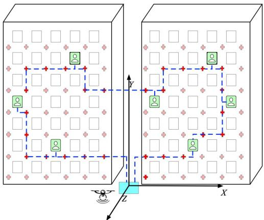  
Fig. 1. An illustration of UAV-assist Low-altitude MEC Networks. Two highrise buildings with seven IoT-enabled smart windows (green) and a UAV ground station (blue). The UAV follows optimized trajectories (dotted lines) to provide sequential computational services while preserving privacy through calculated waypoints.

For analytical tractability, we assume all windows have uniform dimensions with constant inter-window spacing, and LoS channel conditions exist between adjacent smart windows due to the absence of outdoor obstacles, ensuring reliable wireless communications. The system operates in discrete epochs, during which smart windows process and analyze data received from indoor terminals, evaluate computational requirements against local resources, and initiate offloading requests to the UAV only when local computational capabilities are insufficient. This selective offloading mechanism ensures efficient utilization of UAV resources while maintaining system performance.

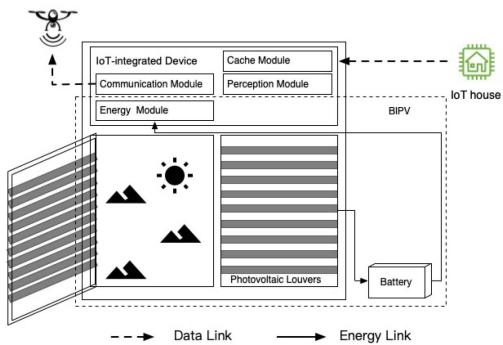  
Fig. 2. System architecture of an IoT-enabled smart window, comprising energy, sensing, caching, and communication modules with data and energy links.

## B. IoT-Enabled Smart Window Model

The smart window represents a sophisticated IoT device integration, incorporating five key components: window body, energy harvesting module, perception module, cache module, and communication module, as illustrated in Fig. 2. The energy harvesting module employs Building-Integrated Photovoltaics (BIPV) technology through photovoltaic louvers to convert solar radiation into electrical power, effectively addressing the energy autonomy challenges inherent in conventional IoT devices. The perception module encompasses multiple environmental sensors that monitor various parameters. The data gathered and subsequently processed or analyzed by these sensors can give rise to the computational tasks that are candidates for offloading in our system model.

The caching module temporarily stores computational tasks generated within the household environment. This module is essential for task management and prioritization, optimizing the allocation of both local and offloaded computational resources. We define an offloading decision variable set $D =$ $\{ d _ { 1 } , \ldots , d _ { n } | d _ { i } \in \{ 0 , 1 \} \}$ , where $d _ { i } = 1$ indicates that smart window $W _ { i }$ has initiated a computation offloading request to the UAV, and $d _ { i } = 0$ otherwise. This paper focuses on scenarios where multiple smart windows simultaneously submit requests within a defined operational period of duration T , specifically when $\textstyle \sum _ { i = 1 } ^ { n } d _ { i } \geq 2$

Nevertheless, the proposed framework can conceptually manage situations with fewer tasks. When there are no tasks $( \sum d _ { i } = 0 )$ , no service trajectory is generated, and the UAV would typically remain at its base or perform other non-service duties. When there is a single task $( \sum d _ { i } = 1 )$ , the trajectory simplifies to a direct round trip between the BS and the task location. In this case, VSRL’s sequencing aspect becomes trivial, TRA would still refine the path for privacy, and SOS-TRA would handle single-UAV assignment and constraint verification.

Each IoT-enabled smart window $W _ { i }$ is equipped with a communication module enabling it to transmit data to a serving UAV for computation offloading. The achievable data transmission rate for this window-to-UAV (W2U) link, denoted $r _ { i }$ is determined by the allocated spectrum bandwidth δ and the signal-to-noise ratio (SNR) at the UAV receiver. When the UAV is at a specific waypoint $p _ { k }$ to serve window $W _ { i }$ , the SNR for this link, $\operatorname { S N R } _ { i , k }$ , can be expressed as:

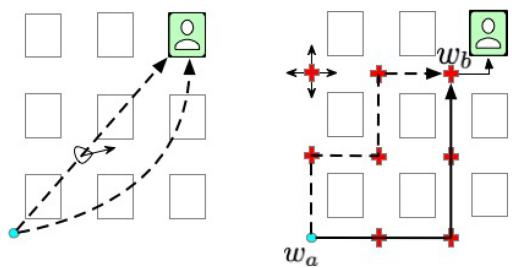  
Fig. 3. Comparison of omnidirectional (left) and directional (right) paradigms with privacy-aware waypoints.

$$
\mathrm { S N R } _ { i , k } = \frac { P _ { i } g _ { i , k } } { \sigma ^ { 2 } } .\tag{1}
$$

Here, $P _ { i }$ is the uplink transmission power of smart window $W _ { i }$ $g _ { i , k } = \beta _ { 0 } \lvert \lvert \lambda _ { i } - p _ { k } \rvert \rvert ^ { - 2 }$ is the channel power gain between smart window $W _ { i }$ and the UAV at waypoint $p _ { k }$ , and $\sigma ^ { 2 }$ is the Additive White Gaussian Noise power at the UAV receiver. Consequently, the data transmission rate $r _ { i }$ for task $\alpha _ { i }$ (when served from waypoint $p _ { k } )$ is given by the Shannon-Hartley theorem:

$$
r _ { i } = \delta \log _ { 2 } ( 1 + \mathrm { { S N R } } _ { i , k } ) = \delta \log _ { 2 } \left( 1 + \frac { P _ { i } g _ { i , k } } { \sigma ^ { 2 } } \right) .\tag{2}
$$

For the scope of this paper, which primarily focuses on UAV trajectory and service optimization, we assume that these W2U transmission powers are predetermined or managed by an underlying protocol, and are not part of the joint optimization problem solved herein.

## C. UAV Model

The UAV executes a closed-loop trajectory $\tau$ comprising finite waypoints. These waypoints are located in a vertical plane parallel to the building facade. Given smart window locations $\lambda _ { j } = ( x _ { j } , y _ { j } , 0 ) \in \Lambda$ on the facade, the UAV maintains a constant perpendicular distance, h, from this facade. The waypoints $p _ { k } \in \mathcal { P }$ are defined using a relative positioning scheme $p _ { j } = \lambda _ { j } - \lambda _ { 1 } + ( 0 , 0 , h )$ , where $\lambda _ { 1 } = ( x _ { 1 } , y _ { 1 } , 0 )$ is a reference window. The UAV’s trajectory optimization thus focuses on its movement in the XY-plane located at $Z = h$ . With total energy capacity E, the UAV’s energy expenditure predominantly originates from propulsion mechanisms, while the power consumption of onboard computational and communication modules is deemed negligible for analytical tractability. The UAV’s operational energy consumption is exhibited in two distinct phases, mobility phase and service phase. The UAV initiates and terminates its mission at the BS for energy replenishment, providing computational offloading services to smart windows at their respective proximate waypoints along the trajectory.

We assume that the UAV maintains equilibrium during flight operations, exhibiting quasi-static motion with negligible acceleration and constant velocity. As depicted in Fig. 3, the UAV’s kinematic behavior encompasses omnidirectional and directional paradigms. The omnidirectional paradigm permits continuous orientation vectors $\theta _ { o } \in [ 0 , 2 \pi ]$ , enabling optimal point-to-point trajectories for minimal energy expenditure. The directional paradigm, maintaining lateral displacement h from the building facade, restricts orientation vectors to cardinal directions $\theta _ { d } \in \{ 0 , { \frac { \pi } { 2 } } , \pi , { \frac { 3 \pi } { 2 } } \}$ , prioritizing occupant privacy over trajectory flexibility. Given that smart windows are arranged in a grid, we can identify a specific smart window $W _ { k }$ by its 2D grid indices $( i , j )$ . For trajectory optimization between an initial smart window, denoted as $W _ { a } .$ , which is located at $( i ^ { \prime } , j ^ { \prime } )$ on the building facade, and a terminal smart window, $W _ { b } ,$ located at $( i ^ { \prime \prime } , j ^ { \prime \prime } )$ , the path indices are defined by $F ( a , b ) =$ $G ( a , b ) \cup H ( a , b )$ , where $G ( a , b )$ and $H ( a , b )$ denote row-wise and column-wise index sets respectively. The trajectory is expressed as

$$
\begin{array} { r } { \mathcal { T } ( a , b ) = \{ \overbrace { ( i ^ { \prime } , j ^ { \prime } ) \to ( i ^ { \prime } , j ^ { \prime } + 1 ) \to \dots \to ( i ^ { \prime } , j ^ { \prime \prime } ) } ^ { G ( a , b ) } \} } \\ { \underbrace { ( i ^ { \prime } + 1 , j ^ { \prime \prime } ) \to ( i ^ { \prime } + 2 , j ^ { \prime \prime } ) \to \dots \to ( i ^ { \prime \prime } , j ^ { \prime \prime } ) } _ { H ( a , b ) } \} , } \end{array}\tag{3}
$$

where $( i ^ { \prime } , j ^ { \prime } )$ and $( i ^ { \prime \prime } , j ^ { \prime \prime } )$ are the indexes of a and b in the twodimensional matrix. Equation (3) illustrates this construction, where the UAV first traverses row-wise segments defined by $G ( a , b )$ and then column-wise segments defined by $H ( a , b )$ (or vice-versa, depending on the specific turn) to reach $W _ { b }$ from $W _ { a }$ following a path with at most one turn. For example, Fig. 3 depicts the $\mathrm { U A V } _ { \mathrm { \Delta } }$ optimal trajectory from $W _ { a }$ to $W _ { b }$ (solid line). Following the energy consumption models established in [36], the propulsive power $P _ { H }$ for horizontal flight at velocity v is expressed as:

$$
P _ { H } = \frac { 1 } { 2 } C S \rho v ^ { 3 } + \frac { M ^ { 2 } } { \rho b ^ { 2 } v } ,\tag{4}
$$

where C denotes the aerodynamic drag coefficient, $S$ represents the frontal area $( m ^ { 2 } )$ , M is the UAV mass (kg), ρ indicates air density $( k g / m ^ { 3 } )$ , and b denotes the UAV wingspan (m). By differentiating (4) with respect to v and solving $\begin{array} { r } { \frac { \dot { d } P _ { H } } { \dot { d } v } \dot { = } \dot { 0 } } \end{array}$ , we obtain the optimal velocity for minimum power consumption, $\begin{array} { r } { v _ { o p t } = ( \frac { 2 \dot { M } ^ { 2 } } { 3 C S ( \rho b ) ^ { 2 } } ) ^ { 0 . 2 5 } } \end{array}$ . Substituting ${ { v } _ { o p t } }$ into (4) yields the minimum propulsive power for horizontal flight, $\begin{array} { r } { P _ { H } ^ { * } = \frac { 4 } { 3 } \big ( \frac { M ^ { 2 } } { \rho b ^ { 2 } v _ { o p t } } \big ) } \end{array}$ The propulsive power during ascent/descent operations equates to hover-state maintenance power at prescribed waypoints expressed as [36]

$$
P _ { V } = \frac { M ^ { \frac { 3 } { 2 } } } { \sqrt { 2 S \rho } } .\tag{5}
$$

For a specific closed-loop trajectory $\tau$ consisting of $N _ { w }$ segments connecting $N _ { w }$ waypoints $\{ p _ { 1 } ^ { \prime } , \ldots , p _ { N _ { w } } ^ { \prime } \}$ with the depot in sequence, where $p _ { m + 1 } ^ { \prime } \equiv \lambda _ { 0 }$ . For the trajectories considered in our model, serving m distinct tasks implies visiting m unique waypoints, each dedicated to one task. Thus, we define the number of these task-specific waypoints as $N _ { w } = m$ . Therefore, the total moving time is

$$
t _ { f } = \sum _ { j = 1 } ^ { m } { \frac { \| p _ { j + 1 } ^ { \prime } - p _ { j } ^ { \prime } \| _ { 1 } } { v _ { \mathrm { o p t } } } } .\tag{6}
$$

## D. Computation Model

Let $\begin{array} { r } { \pmb { \mathcal { A } } = \{ \alpha _ { 1 } , . . . , \alpha _ { m } | m = \sum _ { i = 1 } ^ { n } d _ { i } \} } \end{array}$ denote the computation task set during interval $[ 0 , T ]$ , where each task $\alpha _ { i }$ is characterized by tuple $\left( \lambda _ { i } , \kappa _ { i } , r _ { i } , s _ { i } , u _ { i } \right)$ . Here, $\lambda _ { i }$ represents the 3D Cartesian coordinates of the smart window associated with task $\alpha _ { i }$ $V = \{ \lambda _ { i } | \alpha _ { i } \in \mathcal { A } \}$ denotes the set of unique service locations, and $U = \{ u _ { 1 } , . . . , u _ { m } \}$ collects all task-specific sequence indices with $u _ { 0 }$ representing the $\mathbf { B } \mathbf { S } ^ { \prime } \mathbf { S }$ rank. $\kappa _ { i }$ denotes the total data volume for processing in task $\alpha _ { i } , \ r _ { i }$ represents the data transmission rate from smart window to UAV, and $s _ { i }$ denotes the $\mathrm { U A V } _ { \mathrm { \Delta } }$ processing rate. We assume $s _ { i }$ greatly exceeds local computation rates, promoting complete task offloading to the UAV. The total hover duration is

$$
t _ { h } = \sum _ { i = 1 } ^ { m } \kappa _ { i } \frac { r _ { i } + s _ { i } } { r _ { i } s _ { i } } .\tag{7}
$$

This formulation accounts for cases where task demands exceed local processing capabilities due to computational intensity or specialized resource requirements.

## E. Utility Model

The UAV-assisted MEC framework fuses three primary utility metrics, computation delay, energy efficiency and trajectory privacy protection. The computation delay utility $\gamma _ { c } ^ { i }$ for task $\alpha _ { i }$ represents the time interval between request initiation and task completion. For service sequence $\{ \alpha _ { 1 } , . . . . , \alpha _ { i } , . . . , \alpha _ { m } \} , \gamma _ { c } ^ { i }$ is expressed as

$$
\gamma _ { c } ^ { i } = \sum _ { k = 1 } ^ { i } \frac { \| \lambda _ { k + 1 } - \lambda _ { k } \| _ { 1 } } { v _ { o p t } } + \kappa _ { k } \frac { r _ { k } + s _ { k } } { r _ { k } s _ { k } } .\tag{8}
$$

The mean delay utility $\gamma _ { c }$ along trajectory $\tau$ is defined as $\gamma _ { c } =$ $\begin{array} { r } { \frac { 1 } { m } \sum _ { i = 1 } ^ { m } \gamma _ { c } ^ { i } } \end{array}$

The second metric addresses the minimum energy capacity requirement for UAV operations. While studies in [37], [38], [39], [40] examined energy efficiency in UAV-aided networks, a closed-form threshold remains undefined. The energy consumption $C _ { k } = t _ { f } P _ { H } + t _ { h } P _ { V }$ for UAV k along its trajectory $\mathcal { T } _ { k }$ must satisfy the critical constraint $C _ { k } \leq E .$ . Furthermore, we define the energy utilization efficiency of the k-th UAV as $\gamma _ { e } ^ { k } = C _ { k } / t _ { h } P _ { V }$ to quantify the energy expenditure specifically allocated to computational services, and the average energy utilization efficiency accounting for the entire system is defined as follows

$$
\gamma _ { e } = \sum _ { k = 1 } ^ { K } \gamma _ { e } ^ { k } .\tag{9}
$$

The third metric quantifies trajectory privacy protection. Let $\gamma _ { p }$ denote the privacy preservation level along trajectory $\tau$ expressed as

$$
\gamma _ { p } = 1 - \xi / n _ { p s w } ,\tag{10}
$$

where $\xi$ counts unique privacy-sensitive smart windows whose direct LoS is crossed by the UAV’s trajectory and $n _ { p s w }$ denotes the total number of privacy-sensitive smart windows within the operational area. A larger $\gamma _ { p }$ indicates better privacy protection, with $\gamma _ { p } = 1$ achieving optimal privacy without crossing sensitive windows.

These three metrics are integrated into a comprehensive performance indicator σ that evaluates the framework from multiple perspectives. The system utility is defined as

$$
\sigma = \omega _ { 1 } ( 1 - \gamma _ { c } ) + \omega _ { 2 } ( 1 - \gamma _ { e } ) + \omega _ { 3 } \gamma _ { p } ,\tag{11}
$$

where $\omega _ { 1 } , \omega _ { 2 }$ , and ω represent the weighting coefficients for computation latency, energy consumption, and privacy protection respectively. Specifically, $1 - \gamma _ { c }$ and $1 - \gamma _ { e }$ convert the latency and energy metrics so that smaller values of original metrics yield higher scores, while $\gamma _ { p }$ directly represents the privacy protection level. A lower σ value indicates better overall system performance, as it reflects reduced latency, improved energy efficiency, and enhanced privacy protection.

## IV. PROBLEM FORMULATION AND DECOMPOSITION

The COTOP addresses UAV operations near high-rise buildings. The scenario involves a cluster of buildings with IoTenabled smart windows for generating multi-level computational tasks, UAVs serving as mobile edge computing servers to process data from these windows. The objective is to optimize UAV trajectories and task offloading decisions while satisfying energy and computational constraints to maximize system utility. The formal definition of the problem is presented below.

## A. Problem Description

A swarm of UAVs provides computation services to users inside high-rise buildings. The system periodically updates the trajectory skeleton to optimize task offloading and maximize total utility. Within each period, m computation tasks $\{ \alpha _ { 1 } , . . . . , \alpha _ { m } \}$ accumulate in the smart windows. UAVs start from the BS with full energy, visit the requesting smart windows through a set of turning points $\{ p _ { 1 } ^ { \prime } , p _ { 2 } ^ { \prime } , . . . , p _ { i } ^ { \prime } , . . . \}$ before returning to BS $p _ { 1 } ^ { \prime }$ for recharging. These turning points form trajectories $\{ \mathcal { T } _ { k } \} _ { k = 1 } ^ { K }$ in visiting order. With limited computing and energy capabilities in UAVs, trajectory optimization significantly improves system utility. The computational offloading trajectory optimization problem, considering static computation tasks A over a period, is formulated as follows

$$
\mathbf { ( P 1 ) } \colon \operatorname* { m a x } _ { \{ \mathcal { T } _ { k } \} _ { k = 1 } ^ { K } } \omega _ { 1 } \mathopen { } \mathclose \bgroup \left( 1 - \gamma _ { c } \aftergroup \egroup \right) + \omega _ { 2 } \mathopen { } \mathclose \bgroup \left( 1 - \gamma _ { e } \aftergroup \egroup \right) + \omega _ { 3 } \gamma _ { p }\tag{12}
$$

$$
{ \mathrm { s . t . } } \ C _ { k } \leq E , 1 \leq k \leq K ;\tag{12a}
$$

$$
V - \lambda _ { 1 } + ( 0 , 0 , h ) \subseteq \{ \mathcal { T } _ { k } \} _ { k = 1 } ^ { K } , V \subseteq \Lambda .\tag{12b}
$$

The COTOP goal is formulated as a multi-objective payoff function. Constraint (12a) addresses energy limitations in UAVs, ensuring the designed trajectory stays within energy capacity. Constraint (12b) ensures complete computational service coverage by requiring each computation request to be included in the UAV trajectory. Solving this multi-objective optimization problem P1 directly with conventional algorithms like NSGA-II and SPEA2 [41] is impractical for delay-sensitive large-scale scenarios, where rapid trajectory planning is essential. We strategically decompose (P1) into two sub-problems with relaxed conditions to enable efficient solution, as detailed in subsequent sections.

## B. Problem Decomposition

The system design emphasizes both minimal latency and optimal energy efficiency as specified in Problem P1, where trajectory optimization plays a central role. To make this complex multi-objective problem (P1) tractable, we strategically decompose it by first simplifying its objective under specific, practical assumptions, and then reformulating it into a standard combinatorial optimization problem for which efficient solvers can be adapted.

Our initial step is to simplify the objective of (P1). We assume that Constraint (12a) in P1 is satisfied by a single UAV (i.e., $K = 1$ and $C _ { 1 } \leq E )$ . Under this condition, and by focusing primarily on minimizing operational costs related to flight, we can temporarily set aside the explicit computation delay component $( \gamma _ { c } )$ and the privacy component $( \gamma _ { p } )$ from P1’s objective function. For a given set of m tasks, the total UAV hovering time $( t _ { h } )$ required for computation is constant, as it is determined by fixed data volumes and processing/transmission rates. Therefore, the dominant variable factor in the UAV’s energy consumption $( C _ { k } )$ and the overall time taken excluding on-site service time becomes the total flight traversal time $( t _ { f } )$ . Minimizing $t _ { f }$ is equivalent to minimizing the total travel distance if the UAV operates at its optimal constant velocity ${ { v } _ { o p t } }$ . Thus, under these assumptions, the core of (P1) transforms into a problem of finding a trajectory that minimizes the total travel distance for servicing all m tasks and returning to the BS.

To formalize this simplified problem of minimizing total travel distance, specifically for UAV movement along building facades often following grid-like paths, we first consider Manhattan distance. Let $\boldsymbol { x } _ { i j }$ be a binary decision variable, where $x _ { i j } = 1$ if the UAV travels directly from the location of task $\alpha _ { i }$ $( \mathrm { i } . \mathrm { e } . , \lambda _ { i } )$ to that of task $\alpha _ { j } ~ ( \mathrm { i . e . , } \lambda _ { j } )$ , and $x _ { i j } = 0$ otherwise. Let $c _ { i j } = \| \boldsymbol { \lambda } _ { i } - \boldsymbol { \lambda } _ { j } \| _ { 1 }$ be the Manhattan distance for traversing the segment from $\lambda _ { i } \operatorname { t o } \lambda _ { j }$ . The variable U denotes the task execution sequence (access order) for static computation tasks A during one epoch. This problem of minimizing the total Manhattan travel distance is formulated as (P2):

$$
( \mathbf { P } 2 ) \colon \operatorname* { m i n } _ { \{ U , T \} } \sum _ { i = 1 } ^ { m } \sum _ { \substack { j = 1 , i \neq j } } ^ { m } c _ { i j } x _ { i j }\tag{13}
$$

$$
{ \mathrm { s . t . } } \sum _ { j = 1 , j \neq i } ^ { m } x _ { i j } = 1 ;\tag{13a}
$$

$$
\sum _ { i = 1 , i \neq j } ^ { m } x _ { i j } = 1 ;\tag{13b}
$$

$$
u _ { i } - u _ { j } + m x _ { i j } \leq m - 1 , 2 \leq i \neq j \leq m ;\tag{13c}
$$

$$
0 \leq u _ { i } \leq m - 1 , u _ { i } \in \mathbb { N } ^ { + } ;\tag{13d}
$$

$$
x _ { i j } \in \{ 0 , 1 \} ;\tag{13e}
$$

$$
F ( a , b ) = G ( a , b ) \cup H ( a , b ) , x _ { a b } = 1 ;\tag{13f}
$$

$$
u _ { b } > u _ { a } , u _ { b } = \operatorname* { m i n } \{ u _ { k } | u _ { k } > u _ { a } \} .\tag{13g}
$$

Problem (P2) includes essential flight constraints for operational cost reduction. Constraints (13a), (13b) limit UAV service to one visit per smart window (task location) in each flight cycle. Constraints (13c), (13d) enforce a single-loop trajectory, where $u _ { i }$ indicates the access sequence for task $\alpha _ { i } .$ Constraint (13e) defines $\boldsymbol { x } _ { i j }$ as binary decision variables. Constraint (13g) ensures proper task sequencing.

Constraint (13f), $F ( a , b ) = G ( a , b ) \cup H ( a , b )$ , refers to the composition of path segments between any two consecutively visited locations a and b (i.e., when $x _ { a b } = 1 )$ . As detailed in Section III-C and specifically illustrated in (3), path segments ${ \mathcal { T } } ( a , b )$ in the directional (grid-based) movement paradigm are constructed using a row-wise (horizontal) set of grid indices $G ( a , b )$ and a column-wise (vertical) set of grid indices $H ( a , b )$ Their union, $F ( \boldsymbol { a } , \boldsymbol { b } )$ , represents all unique grid indices in such an L-shaped path segment from a to b. This L-shaped path structure, characterized by at most one turn, inherently minimizes inflection points for movement between two grid locations. The objective function of Problem P2 ( (13)) minimizes the sum of Manhattan distances $c _ { i j }$ , which are precisely the lengths of these L-shaped paths. Thus, constraint (13f) establishes a rigorous mathematical connection to the assumed optimal path structure for individual segments, whose total length is minimized under this structural constraint.

To leverage highly optimized existing solvers, we note that the core task of finding the optimal sequence U in (P2) is structurally equivalent to the Traveling Salesman Problem (TSP). While (P2) is expressed using Manhattan distance $( c _ { i j } )$ , TSP solvers are often implemented using Euclidean distance. Since the fundamental problem is to find the shortest tour visiting all required locations, the choice of distance metric (Manhattan or Euclidean) affects the path lengths but not the inherent nature of the sequencing problem. We can therefore reformulate the sequencing aspect of (P2) as a standard TSP using Euclidean distances. Let $d _ { i j } = \| \lambda _ { i } - \lambda _ { j } \|$ denote the Euclidean distance between the location $\lambda _ { i }$ of task $\alpha _ { i }$ and the location $\lambda _ { j }$ of task $\alpha _ { j } .$ Consequently, the problem of finding the optimal sequence $\bar { U }$ that minimizes the total Euclidean travel distance, subject to the same sequencing and tour constraints as (P2), can be expressed as (P3):

$$
( \mathbf { P 3 } ) \colon \operatorname* { m i n } _ { \{ U \} } \sum _ { i = 1 } ^ { m } \sum _ { j = 1 , i \neq j } ^ { m } d _ { i j } x _ { i j }\tag{14}
$$

$$
\mathrm { s . t . } \quad ( 1 3 \mathrm { - a } ) \mathrm { - } ( 1 3 \mathrm { - g } ) .\tag{14a}
$$

Problem (P3) reduces to a Traveling Salesman Problem (TSP), which aims to find the shortest Euclidean trajecoty visiting all computation-demanding IoT device locations exactly once and returning to the base station. Solving (P3) provides the optimal visitation sequence U. This sequence, along with the privacyaware path generation (TRA, detailed in Section V-D) and multi-UAV coordination (SOS-TRA, detailed in Section V-E), allows us to construct a practical and efficient solution that addresses the broader objectives of the original problem (P1), including energy constraints and computational delays, which were temporarily set aside for this decomposition stage. The detailed solution approach will be presented in Section V.

## C. NP-Hardness of COTOP

Through a series of constraint relaxations, the Computational Offloading Problem (P1) reduces to a canonical Traveling Salesman Problem (P3). Given that (P3) is a well-known NP-hard combinatorial optimization problem with no polynomial-time solution in existing computational frameworks, (P1) inherits this NP-hard classification.

Despite the computational complexity in P1, practical solutions can be obtained through various heuristic and approximation algorithms. While these methods may not guarantee global optimality, they often produce acceptable solutions within reasonable computation time. Traditional approaches like genetic algorithms [42], simulated annealing [43], and particle swarm optimization [44] have proven effective for TSP variants. In this work, we propose the Variable Strategy Reinforcement based Lin-Kernighan-Helsgaun algorithm, which combines $\mathrm { Q } \mathrm { - }$ learning, Sarsa, and Monte Carlo methods with the classical Lin-Kernighan-Helsgaun (LKH) TSP solver [45]. Based on VSRL, we develop TRA and its extension, SOS-TRA. These algorithms demonstrate improved robustness and reliability in solving the COTOP.

## V. ALGORITHM DESIGN

In this section, we first review the fundamental principles of the LKH algorithm, then propose the VSRL algorithm to solve (P3) through constraint relaxation, and finally present the compromise scheme for P 1 by increasing the number of UAVs when the energy constraint or calculation delay cannot be satisfied.

## A. Overview of LKH Algorithm

The heuristic algorithm for solving (P3) consists of two steps, initial trajectory construction and iterative optimization. In LKH, the initial trajectory is constructed based on the minimum 1-tree, which combines a minimum spanning tree with two edges from an unselected node incident to the minimum spanning tree. LKH employs an α-value defined by the minimum spanning tree instead of distance as a metric to construct the candidate set. The candidate set for each node $\lambda _ { i }$ in LKH is denoted as $C _ { \mathrm { c a n d } } ( \lambda _ { i } )$ , where the collection of all such sets for all nodes is referred to as $C _ { \mathrm { c a n d } }$ . This set typically contains five other nodes arranged in ascending order of the α-values, which are computed between $\lambda _ { i }$ and these potential neighbors. These candidate sets represent promising edges for exploration during tour improvement. The α-value for edge $( \lambda _ { i } , \lambda _ { j } )$ between $\lambda _ { i }$ and $\lambda _ { j }$ is calculated by (15), where $L ( T )$ denotes the length of the minimum 1-tree and $L ( T ^ { + } ( \lambda _ { i } , \lambda _ { j } ) )$ represents the length of the minimum 1-tree required to contain edge $( \lambda _ { i } , \lambda _ { j } )$ . The collection of all such α-values, which guide the selection process, can be conceptually referred to as the set $A _ { \alpha } .$ . It is from these $A _ { \alpha }$ values that the candidate sets $C _ { \mathrm { c a n d } } ( \lambda _ { i } )$ are populated.

$$
\alpha ( \lambda _ { i } , \lambda _ { j } ) = L ( T ^ { + } ( \lambda _ { i } , \lambda _ { j } ) ) - L ( T ) .\tag{15}
$$

The minimum 1-tree achieves an optimal solution when all nodes reach a degree of two. Therefore, the LKH algorithm applies the k-opt algorithm to refine the minimum 1-tree structure, thus iteratively optimizing the initial trajectory. To steer the iteration direction, LKH incorporates penalties. Specifically, a π-value, computed through a sub-gradient optimization method, serves as a penalty for each node when calculating the distance between two nodes

$$
C ( \lambda _ { i } , \lambda _ { j } ) = d ( \lambda _ { i } , \lambda _ { j } ) + \pi _ { i } + \pi _ { j } ,\tag{16}
$$

where $C ( \lambda _ { i } , \lambda _ { j } )$ represents the flight cost from $\lambda _ { i }$ to $\lambda _ { j }$ with penalties, $d ( \lambda _ { i } , \lambda _ { j } )$ ) indicates the distance between $\lambda _ { i }$ and $\lambda _ { j }$ . The penalties for $\lambda _ { i }$ and $\lambda _ { j }$ are denoted by $\pi _ { i }$ and $\pi _ { j }$ . Let $L ( T _ { \pi } )$ indicate the length of the minimum 1-tree after penalty adjustments. The lower bound $w ( \pi )$ for the optimal solution is calculated through (17), which depends on the set $\pi = [ \pi _ { 1 } , . . . , \pi _ { m } ]$

$$
w ( \pi ) = L ( T _ { \pi } ) - 2 \sum _ { i = 1 } ^ { m } \pi _ { i } .\tag{17}
$$

## B. Reinforcement Learning Framework

We employ three RL methods Q-learning, Sarsa, and Monte Carlo to replace the rigid traversal operations in LKH during the k-opt process. Each method significantly improves the enhanced LKH algorithm performance. Furthermore, [46] demonstrated the complementary nature of these three methods in enhancing LKH. Drawing from the variable strategy concept in Variable Neighborhood Search (VNS) [47], [48], we propose VSRL, an enhanced LKH algorithm that integrates these three RL methods to improve flexibility and robustness while avoiding local optima convergence.

The proposed VSRL automatically selects appropriate edges to add to the candidate set through reinforcement learning. To effectively augment LKH’s search capability, the RL component learns adaptive edge selection policies, where the definitions of states, actions, and rewards play a crucial role in achieving cooperative performance. The states and actions in our RL framework are edge-dependent. For a state-action pair $( s _ { t } , a _ { t } )$ at iteration t, we have:

\- States: The states is the IoT device $\lambda _ { i }$ where edge addition or deletion occurs. The next state after action execution is the next IoT device requiring edge selection. These states representation directly maps to LKH’s node-centric view for edge modifications.

\- Actions: The actions select another IoT device $\lambda _ { j }$ to connect with $\lambda _ { i }$ , effectively choosing an edge $( \lambda _ { i } , \lambda _ { j } )$ to potentially add to the tour from the LKH candidate set $C _ { \mathrm { c a n d } } ( \lambda _ { i } )$ or an RL-explored alternative.

\- Rewards: The reward function measures trajectory improvement after taking an action in the current state. The reward $r _ { t } ( s _ { t } , a _ { t } )$ for action $a _ { t }$ at state $s _ { t }$ is calculated by $r _ { t } ( s _ { t } , a _ { t } ) = C ( a _ { t - 1 } , s _ { t } ) - C ( s _ { t } , a _ { t } )$ . Designed to provide direct feedback, this reward structure evaluates the quality of the chosen edge $( s _ { t } , a _ { t } )$ relative to the previous edge $( a _ { t - 1 } , s _ { t } )$ based on cost metrics (including LKH penalties, see (16)). Such immediate feedback enables the RL agent to progressively learn edge preferences that yield better local improvements within the LKH framework.

\- State-action Function: We use value iteration to estimate the state-action function $\begin{array} { r } { q ( s , a ) = \sum _ { t = 0 } ^ { \infty } \gamma ^ { t } r ( s _ { t } , a _ { t } ) } \end{array}$ . The initial Q-value $Q ( \lambda _ { i } , \lambda _ { j } )$ for selecting edge $( \lambda _ { i } , \lambda _ { j } )$ , which corresponds to choosing node $\lambda _ { j }$ when at node $\lambda _ { i }$ , is

$$
Q ( \lambda _ { i } , \lambda _ { j } ) = \frac { w ( \pi ) } { \alpha ( \lambda _ { i } , \lambda _ { j } ) + d _ { i j } } .\tag{18}
$$

This initialization scheme combines LKH’s edge preferences through $\alpha ( \lambda _ { i } , \lambda _ { j } )$ values with problem-specific scaling factors $w ( \pi )$ and $d _ { i j }$ . By leveraging these components from the LKH framework, the Q-value initialization effectively bootstraps the learning process while maintaining consistency with the underlying combinatorial optimization approach.

Iterative process: To enhance algorithm adaptability, we incorporate three RL algorithms (Monte Carlo, Sarsa, and Q-learning) to refine the State-action function estimation through precise Q-value updates. Monte Carlo updates Qvalues based on complete sequences, while Sarsa and Qlearning use incremental interactions. Sarsa considers the next state action, while Q-learning assumes optimal action selection in the next state. For state-action pair $( s _ { t } , a _ { t } )$ , the Q-value updates follow [46],

$$
Q _ { M C } ( s _ { t } , a _ { t } ) = \sum _ { i = 0 } ^ { + \infty } \gamma ^ { i } r _ { t } ( s _ { t + i } , a _ { t + i } ) ,\tag{19}
$$

$$
\begin{array} { c } { { Q _ { S } ( s _ { t } , a _ { t } ) = ( 1 - \eta ) \cdot Q _ { S } ( s _ { t } , a _ { t } ) + } } \\ { { \eta \cdot [ r _ { t } ( s _ { t } , a _ { t } ) + \gamma Q _ { S } ( s _ { t + 1 } , a _ { t + 1 } ) ] , } } \end{array}\tag{20}
$$

$$
\begin{array} { c } { { Q \left( s _ { t } , a _ { t } \right) = \left( 1 - \eta \right) \cdot Q ( s _ { t } , a _ { t } ) + } } \\ { { \eta \cdot \left[ r _ { t } ( s _ { t } , a _ { t } ) + \gamma \operatorname* { m a x } _ { a ^ { \prime } } Q ( s _ { t + 1 } , a ^ { \prime } ) \right] , } } \end{array}\tag{21}
$$

where $\gamma$ denotes the reward discount factor and $\eta \in ( 0 , 1 )$ in (20) and (21) represents the learning rate.

## C. Variable Strategy Reinforcement Based LKH Algorithm

We propose the VSRL algorithm that integrates reinforcement learning techniques with the LKH framework to optimize trajectory planning for the TSP derived from our COTOP formulation P3. Since the TSP is well-studied and LKH represents a leading heuristic, VSRL’s primary innovation resides in its hybrid architecture and adaptive learning strategy. The algorithm enhances LKH’s powerful local search by synergistically employing a dynamic ensemble of three distinct RL methods, namely Q-learning, Sarsa and Monte Carlo. Rather than simply applying RL to TSP, VSRL embeds RL within LKH’s k-opt edge exchange process to guide candidate edge selection more intelligently than LKH’s fixed-rule α-value system.

The approach derives its effectiveness from the Variable Strategy mechanism, which draws inspiration from Variable Neighborhood Search [47], [48]. This mechanism dynamically switches between the three RL methods, serving as a sophisticated heuristic that achieves several key objectives. First, it maintains an adaptive balance between exploration and exploitation. Second, it prevents premature convergence to local optima commonly experienced by single-policy RL agents or fixed heuristics. Third, it capitalizes on the complementary strengths inherent to each RL method. Specifically, Q-learning contributes off-policy exploration capabilities, Sarsa provides on-policy stability, while Monte Carlo offers unbiased full-return estimates.

Through this integrated approach, VSRL attains more robust and often superior quality solutions, particularly when addressing the complex instances characteristic of our UAV trajectory problem. As demonstrated in Section VI, the algorithm achieves faster convergence to high-quality solutions compared to standalone LKH implementations or simpler RL hybrid approaches.

Algorithm 1 details the VSRL implementation. The algorithm inputs include the static computing task set ${ \mathcal { A } } ,$ the base station location $\lambda _ { 0 }$ , and key reinforcement learning parameters. These parameters are the initial -greedy exploration rate $\epsilon ,$ its decay factor $\cdot \beta$ which controls the shift from exploration to exploitation, the maximum LKH trials MaxTrials, and the policy switching frequency controller MaxNum that defines how often the RL strategy changes.

Initially, VSRL constructs a minimum 1-tree to establish a lower bound trajectory. It then initializes the primary state parameters $Q , A _ { \alpha } , U ,$ and $C _ { \mathrm { c a n d } } .$ . These are respectively the RL Q-values initialized as per (18), the LKH α-values set $A _ { \alpha } ,$ the task access order $U$ , and the LKH candidate sets $C _ { \mathrm { c a n d } }$ previously defined in Section ${ \mathrm { V } } { \mathrm { - } } \mathrm { A } .$ . During each iteration, the VSRL algorithm employs an -greedy strategy to select edges for modification while maintaining trajectory feasibility. It ensures sufficient exploration of the search space initially then gradually shifts towards exploitation of learned knowledge. The variable strategy mechanism, controlled by MaxNum, periodically switches among the three reinforcement learning policies selected by policy M . It is designed to inject diversity into the search process and help escape local optima that might trap a single fixed RL policy or heuristic rule. When a lower-cost trajectory is found, the algorithm updates both the current best trajectory $\mathcal { T } ^ { \prime }$ and associated state parameters. The inner loop then break to restart the k-opt search from this new promising point. This process continues until reaching the maximum number of iterations MaxTrials or achieving convergence.

## D. Trajectory Refinement Algorithm

While VSRL effectively solves Problem (P3) by generating an optimized access order U for UAV task execution, direct linear trajectories between smart windows could compromise privacy and cause visual disturbances. To address these concerns, we propose the Trajectory Refining Algorithm that transforms the access sequence into privacy-aware UAV trajectories.

Algorithm 2 details the TRA implementation. Given the task set ${ \mathcal { A } } ,$ base station location $\lambda _ { 0 } ,$ access order $U ,$ and a predefined set of safe waypoints $P ,$ TRA constructs a refined trajectory $\tau$ by mapping each task location to its nearest safe waypoint. Specifically, for each pair of consecutive tasks in the access sequence, TRA identifies the closest safe waypoints using Euclidean distance and establishes flight segments between them.

Algorithm 1: Variable Strategy Reinforcement Based LKH   
Algorithm (VSRL).   
Require: Task set A, base station $\lambda _ { 0 } .$ , greedy exploration   
rate $\epsilon ,$ decay factor $\beta ,$ maximum number of trials   
MaxTrials, and policy switching frequency MaxNum.   
Ensure: Optimal access order set $U$   
1: Initialize minimal 1-tree and compute $w ( \pi )$   
2: Initialize $( Q , A _ { \alpha } , U , C _ { \mathrm { c a n d } } )$ and trajectory ${ \dot { \mathcal { T } } } ^ { \prime }$   
3: Set policy index $M = 1$ and counter num $= 0$   
4: for $i = 1 $ MaxTrials do   
5: Update num and $\epsilon { : }$ num ← num $+ 1 , \epsilon  \epsilon \times \beta$   
6: if num $\geq \mathrm { M a x N }$ um then   
7: Switch policy: $M \gets M$ mod $3 + 1$ , num $ 0$   
8: end if   
9: repeat   
10: Select edge $( \lambda _ { 1 } , \lambda _ { 2 } )$ from $\tau ^ { \prime }$   
11: Initialize edge sets: $R _ { e }  \{ ( \lambda _ { 1 } , \lambda _ { 2 } ) \} , A _ { e }  \emptyset$   
12: Set $k \gets 1$   
13: while not converged do   
14: Select $\lambda _ { 2 k + 1 }$ via -greedy from $C _ { c a n d } ( \lambda _ { 2 k } )$   
15: if $\lambda _ { 2 k + 1 }$ satisfies constraints then   
16: Select $\lambda _ { 2 k + 2 }$ minimizing trajectory length   
17: Update Q-value using policy M   
18: Update edge sets $A _ { e }$ and $R _ { e }$   
19: $k \gets k + 1$   
20: end if   
21: end while   
22: i $\begin{array} { r } { \mathsf { f } \sum l e n g t h ( { \cal A } _ { e } ) < \sum l e n g t h ( { \cal R } _ { e } ) } \end{array}$ then   
23: Update trajectory and parameters   
24: break   
25: end if   
26: until all edges in $\mathcal { T } ^ { \prime }$ examined   
27: end for   
28: return $U$

The algorithm concludes by adding a return trajectory to the BS, ensuring a complete privacy-preserving trajectory.

The integration between VSRL and TRA offers a comprehensive solution to Problem (P2), achieving balance between computational efficiency and privacy protection. This combined approach optimizes both the task completion sequence for UAVs and the flight trajectory characteristics. The solution maintains appropriate distances from smart windows, thus preserving privacy for occupants while meeting all computational requirements.

## E. Service-Oriented Segmented Trajectory Planning Algorithm

Energy constraints and computational delay present critical challenges in UAV-assisted IoT systems for low-altitude mobile edge computing. Current battery technology limits UAV service capabilities, as energy capacity and charging efficiency determine effective flight durations. The total flight time to the last smart window inherently relates to the maximum acceptable computational delay, following energy efficiency principles.

Algorithm 2: Trajectory Refining Algorithm (TRA).   
Require: Task set A, base station $\lambda _ { 0 }$ Access order U,   
Safe waypoint set $\mathcal { P }$   
Ensure: Refined trajectory $\tau$   
1: Initialize $\tau  \emptyset$   
2: for each adjacent task pair $\left( \lambda _ { u _ { i } } , \lambda _ { u _ { i + 1 } } \right)$ in $U$ do   
3: start ← FindNearestPoin $\mathbf { \Omega } _ { : } ( \lambda _ { u _ { i } } , \mathcal { P } )$   
4: end ← FindNearestPoin $( \lambda _ { u _ { i + 1 } } , \mathcal { P } )$   
5: $\mathcal { T }  \mathcal { T } \cup \{ ( s t a r t , e n d ) \}$   
6: end for   
7: Add return trajectory: $\mathcal { T }  \mathcal { T } \cup \{ ( \lambda _ { u _ { m } } , \lambda _ { 0 } ) \}$   
8: function FindNearestPoint $( \lambda , \mathcal { P } )$   
9: return arg mi $1 _ { p \in P } \| \lambda - p \| _ { 2 }$

In our system model, all smart windows in high-rise buildings lie within the effective service radius of the depot. Building on [48], which established closed-form solutions for energy capacity and maximum service range, we derive two critical distance constraints that dictate the maximum operational range for a single UAV flight. These constraints simplify the problem by considering only flight energy and a maximum tolerable delay, neglecting hovering energy consumption and service time overhead for the purpose of defining these specific range limits.

1) Maximum Service Range by Energy Capacity $\left( L _ { E } \right) :$ This range is determined by the UAV’s total energy capacity E. Assuming the UAV flies at its optimal velocity ${ { v } _ { o p t } }$ and consumes horizontal flight power $P _ { H } ^ { * }$ , the maximum flight duration is $E / P _ { H } ^ { * }$ . Therefore, the maximum round-trip distance constrained by energy is expressed as $L _ { E } = E \cdot v _ { o p t } / P _ { H } ^ { * }$ , where $L _ { E }$ represents this energy-constrained maximum service range.

2) Maximum Service Range by Computational Delay $( L _ { D } ) .$ This range is constrained by a maximum acceptable computational delay for the furthest task, denoted as $T _ { d } .$ . If we consider a simplified scenario where this deadline must cover the flight time to and from the task, ignoring hover/service time for this specific range calculation, the maximum permissible one-way round-trip flight time would be $T _ { d } / 2$ . Thus, the delay-constrained maximum service range is expressed as $L _ { D } = ( T _ { d } / 2 ) \cdot v _ { o p t }$

To enhance system adaptability in complex environments, we propose the Service-Oriented Segmented Trajectory Refining Algorithm, detailed in Algorithm 3. SOS-TRA extends the VSRL-derived initial trajectory $( \mathcal { T } ^ { \prime } )$ using a coordinated multi-UAV approach that embodies resource allocation and computation offloading optimization. Resource allocation is performed by determining the minimum number of UAVs (K) required. This determination is based on the total length $\left( L _ { \mathrm { t o t a l } } \right)$ of $\mathcal { T } ^ { \prime }$ and per-UAV operational limits, namely the maximum range constrained by energy $( L _ { E } )$ or service delay $( L _ { D } )$ . Let $L _ { \mathrm { m a x } } = \operatorname* { m a x } ( L _ { E } , L _ { D } )$ be the maximum serviceable path length for a single UAV. Computation offloading optimization is then addressed by segmenting the global set of tasks from $\mathcal { T } ^ { \prime }$ into $K$ sub-trajectories and assigning each to one of the K UAVs. Each UAV executes its assigned sub-trajectory, which is subsequently refined by TRA for privacy.

SOS-TRA first obtains the initial global trajectory $\mathcal { T } ^ { \prime }$ (total length $L _ { \mathrm { t o t a l } } )$ from VSRL. If $L _ { \mathrm { t o t a l } } < L _ { \mathrm { m a x } } .$ , a single UAV is sufficient, and its trajectory is directly processed by TRA. Otherwise, for multi-UAV coordination, SOS-TRA calculates the required number of UAVs as $K = \lceil L _ { \mathrm { t o t a l } } / L _ { \mathrm { m a x } } \rceil$ . It then divides $\tau ^ { \prime }$ into $K$ sub-trajectories, ensuring no sub-trajectory’s length exceeds $L _ { \mathrm { m a x } } .$ . Each sub-trajectory is augmented to form a closed loop including the BS, independently optimized using a 2-opt local search, and finally processed by TRA to incorporate privacy constraints while maintaining service quality.

Algorithm 3: Service-Oriented Segmented Trajectory Re  
fining Algorithm (SOS-TRA).   
Require: Maximum service radius max $\{ L _ { E } , L _ { D } \}$ , UAV   
energy capacity $E ,$ , Task set ${ \mathcal { A } } ,$ base station location $\lambda _ { 0 }$   
Ensure: Number of required UAVs K, Set of optimized   
trajectories $\{ \mathcal { T } _ { k } \} _ { k = 1 } ^ { K }$   
$1 \colon T ^ { \prime } \gets \mathrm { V S R L } ( \dot { \mathcal { A } } , \lambda _ { 0 } )$ {Generate initial trajectory}   
2: $L _ { \mathrm { t o t a l } }  \mathrm { C }$ omputeLength $( \mathcal { T } ^ { \prime } )$   
3: $L _ { m a x } \gets \operatorname* { m a x } ( L _ { c } , L _ { d } )$ {Maximum allowed trajectory   
length}   
4: $\mathbf { i f } \ L _ { \mathrm { t o t a l } } < L _ { m a x }$ then   
5: $K \gets 1$   
6: $\mathcal { T }  \mathrm { T R A } ( \mathcal { T } ^ { \prime } )$ {Single UAV solution}   
7: else   
8: $K \gets \lceil L _ { \mathrm { t o t a l } } / L _ { m a x } \rceil$ {Calculate required $\mathrm { U A V s } \}$   
9: Initialize $\{ \mathcal { T } _ { k } ^ { \prime } \} _ { k = 1 } ^ { K }  \emptyset$ {Trajectory segments}   
10: $i \gets 1 , j \gets 1$ {Segment indices}   
11: for each trajectory segment $S _ { j }$ in $\mathcal { T } ^ { \prime }$ do   
12: ${ \mathcal { T } } _ { i } ^ { \prime } \gets { \mathcal { T } } _ { i } ^ { \prime } \cup S _ { j }$   
13: if Length ${ \mathcal { T } } _ { i } ^ { \prime } ) > L _ { m a x }$ then   
14: $\mathcal { T } _ { i } ^ { \prime }  \mathcal { T } _ { i } ^ { \prime } \setminus S _ { j }$ {Remove last segment}   
15: $i  i + 1 , j  j - 1$   
16: end if   
17: end for   
18: for $k = 1$ to K do   
19: Connect $\mathcal { T } _ { k } ^ { \prime }$ to base station $\lambda _ { 0 }$   
20: $\mathcal { T } _ { k _ { n e w } } ^ { \prime }  \overset {  } { 2 } \mathrm { - O p t } ( \mathcal { T } _ { k } ^ { \prime } )$   
21: end for   
22: $\{ \mathcal { T } _ { k } \} _ { k = 1 } ^ { K }  \mathrm { T R A } ( \{ \mathcal { T } _ { k } ^ { \prime } \} _ { k = 1 } ^ { K } )$   
23: end if

## F. Complexity Analysis

1) Complexity Analysis of VSRL: The computational complexity of VSRL can be analyzed through its major components. With n computational tasks and m trajectory edges, the initialization phase requires O(n log n) operations for minimum 1-tree construction and $O ( n ^ { 2 } )$ for computing initial state parameters. In each iteration (bounded by MaxTrials), the algorithm performs edge selection and Q-value updates in $O ( m )$ time, while the k-opt local search requires $O ( n ^ { k } )$ operations. Given $m = O ( n )$ and typically $k = 3 .$ , the overall worst-case time complexity is $O ( \mathrm { M a x T r i a l s \cdot n ^ { 3 } } )$ . The space complexity is $O ( n ^ { 2 } )$ mainly from storing the Q-value matrix and edge information. In practice, VSRL achieves better efficiency through early termination, candidate set restrictions, and the variable strategy mechanism that prevents local optima, making it competitive with traditional genetic algorithms and basic LKH implementations.

2) Complexity Analysis of TRA: The computational complexity of TRA is primarily determined by the nearest waypoint search operations. For each smart window in the access sequence of length $n ,$ the algorithm performs a linear search through the safe waypoint set $\mathcal { P }$ of size $| \mathcal { P } |$ to find the closest point, requiring $O ( | \mathcal { P } | )$ operations per search. With n smart windows in the sequence, the total time complexity for waypoint mapping is $O ( n | \mathcal { P } | )$ . The trajectory construction phase, which connects consecutive waypoints, requires constant time per connection and $O ( n )$ operations overall. Therefore, the total time complexity of TRA is $O ( n | \mathcal { P } | )$ . The space complexity is $O ( n )$ , mainly for storing the refined trajectory segments. Given that typically $| \mathcal { P } | \ll n$ where n is the total number of locations in $\Lambda ,$ , TRA maintains computational efficiency while effectively ensuring privacy-aware trajectory planning.

3) Complexity Analysis of SOS-TRA: The computational complexity of SOS-TRA comprises several key components. The initial VSRL execution requires $O ( \mathrm { M a x T r i a l s \cdot n ^ { 3 } } )$ operations for n locations. The trajectory segmentation process operates in $O ( m )$ time, where m denotes the number of trajectory segments. For each of the $K { \mathrm { ~ U A V s } }$ , the 2-opt optimization requires $O ( n _ { k } ^ { 2 } )$ operations, where $n _ { k }$ represents the number of locations assigned to UAV k, with $\textstyle \sum _ { k = 1 } ^ { K } n _ { k } = n$ . The final TRA refinement for each sub-trajectory contributes an additional $O ( m _ { k } | \mathcal { P } | )$ complexity per UAV, where $m _ { k }$ represents the number of segments in UAV k’s trajectory and $| \mathcal { P } |$ denotes the size of the safe waypoint set. Therefore, the total time complexity of SOS-TRA is O(MaxTrials · $\begin{array} { r } { \mathrm { n } ^ { 3 } + \sum _ { \mathrm { k } = 1 } ^ { \mathrm { K } } ( \mathrm { n } _ { \mathrm { k } } ^ { 2 } + \mathrm { m } _ { \mathrm { k } } | \mathbf { \bar { \mathcal { P } } } | ) ) } \end{array}$ The space complexity remains $O ( n ^ { 2 } )$ , primarily dominated by the VSRL component. This makes SOS-TRA computationally efficient for practical applications while effectively handling multi-UAV coordination and privacy-aware trajectory planning.

## VI. PERFORMANCE EVALUATIONS

In this section, we describe the implementation of our proposed algorithms and present a comprehensive evaluation of their performance across multiple metrics.

## A. Experiment Setup

We establish a simulation scenario featuring a high-rise structure with dimensions of 100 meters in height and 400 meters in width. The width configuration accommodates four adjacent buildings, each spanning 100 meters. The smart windows are uniformly distributed across the building facades in a grid pattern. The initial position for the UAV is set at ground level directly beneath these buildings. At the conclusion of each time slot $T ,$ the base station evaluates the computation requirements from the smart windows. Based on this assessment, the UAV executes the trajectory to provide computation services, with the objective to maximize the overall system utility.

We examine a low-altitude UAV-assisted MEC network where up to 10 UAVs are deployed to offer computational services to 1056 smart windows situated in high-rise buildings. The computational tasks are categorized into three levels based on their data size demands: Light ([5,10] MB), Medium ([20,50] MB), and Heavy ([80,100] MB). The system operates in time slots of 2 minutes each, spanning a total of 45 slots, with computational demands n varying to examine the system’s scalability and efficiency across different deployment densities.

TABLE II  
SIMULATION PARAMETERS AND SETTINGS
<table><tr><td>Parameter</td><td>Symbol</td><td>Value</td></tr><tr><td>Flight velocity</td><td>v</td><td>4m/s</td></tr><tr><td>Horizontal flight power</td><td> $P _ { H }$ </td><td>100 W</td></tr><tr><td>Vertical flight power</td><td> $P _ { V }$ </td><td>150 W</td></tr><tr><td>Battery capacity</td><td> $E$ </td><td>60 Wh (216000 J)</td></tr><tr><td>Computational demands</td><td> $n$ </td><td>100-900</td></tr><tr><td>Computing rate</td><td>ri</td><td>{20, 40, 100} MB/s</td></tr><tr><td>Task data size</td><td> $\kappa _ { i }$ </td><td>Light, Medium, Heavy</td></tr><tr><td>Discount factor</td><td> $\gamma$ </td><td>0.9</td></tr><tr><td>Learning rate</td><td>η</td><td>0.1</td></tr><tr><td>Initial exploration rate</td><td>€</td><td>40</td></tr><tr><td>Exploration decay factor</td><td> $\beta$ </td><td>1</td></tr><tr><td>Policy switching frequency</td><td> $\operatorname { M a x N u m }$ </td><td>100-900</td></tr><tr><td>Maximum trials</td><td>MaxTrials</td><td>100-900</td></tr></table>

Our simulation platform is built upon a custom-developed UAV equipped with stereo cameras, GPS, 3D LIDAR Mid-360, and the ACfly flight controller. The computing infrastructure consists of an OrangePi AIpro (20 T) module, featuring 24 GB LPDDR4X memory and delivering 20 TOPS AI computing power. As shown in Table II, the UAV operates with a battery capacity of 60 Wh and maintains a steady flight velocity of 4 m/s. Power consumption is modeled as 100 W and 150 W for horizontal and vertical flight respectively. Under these power configurations, the system demonstrates an effective flight endurance of approximately 30 minutes and a maximum operational range of 3.5 kilometers. The computing rates are experimentally set to 20, 40, 100 Mb/s, enabling systematic investigation of the system’s performance under varying computational loads.

To evaluate our proposed approach, we selected Genetic Algorithm (GA) [42] and Simulated Annealing (SA) [43] as benchmark algorithms, primarily due to their strong tolerance to environmental dynamics. Both algorithms demonstrate robust adaptability when handling variations in UAV fleet size and computational demand quantities. Their ability to maintain solution quality while accommodating these dynamic changes makes them ideal benchmarks for comprehensive performance evaluation.

\- Single-UAV GA (SGA): A genetic algorithm-based approach that optimizes trajectory planning for individual UAV operation, focusing on single-vehicle trajectory optimization without considering fleet coordination.

\- Single-UAV SA (SSA): A simulated annealing-based method for individual UAV trajectory planning that iteratively improves single-vehicle routes through temperaturecontrolled acceptance of solutions.

\- Multi-UAV GA (MGA): An extended genetic algorithm that simultaneously optimizes trajectory planning for multiple UAVs, incorporating fleet coordination and resource allocation in its chromosome representation.

\- Multi-UAV SA (MSA): A modified simulated annealing algorithm designed for multi-UAV scenarios, which optimizes the collective trajectory planning of UAV fleets while maintaining inter-vehicle coordination.

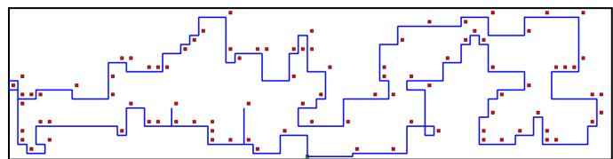  
Fig. 4. Optimized UAV trajectory generated by VSRL-TRA for 100 computational tasks, showing non-crossing path characteristics.

To comprehensively evaluate the performance of proposed algorithms, we focus on three primary metrics which constitute our system utility score σ. These metrics, mathematically detailed in Section III-E, are: (1) Average Service Latency $( \gamma _ { c } )$ , where lower values indicate better performance; (2) Energy Utilization Efficiency $( \gamma _ { e } )$ , where lower values reflect more efficient energy use; and (3) Trajectory Privacy Metric $( \gamma _ { p } )$ , where higher values denote stronger privacy preservation.

These metrics are integrated to form a comprehensive performance score that evaluates the algorithm from multiple perspectives. The system performance score is given as:

$$
\sigma = 0 . 4 ( 1 - \gamma _ { c } ) + 0 . 3 ( 1 - \gamma _ { e } ) + 0 . 3 \gamma _ { p } ,\tag{22}
$$

where the weights are assigned based on the relative importance of service latency (40%), energy efficiency (30%), and privacy preservation (30%). The score transformation ensures that higher values indicate better performance across all dimensions.

In addition to these primary metrics that constitute the utility score σ, to provide a more direct and intuitive understanding of energy consumption relative to the $\mathrm { U A V } _ { \mathrm { \Delta } }$ battery capacity, we also present results using the Battery Utilization Ratio (ρE). For an individual UAV k, this is defined as $\rho _ { E } ^ { k } = C _ { k } / E$ , where $C _ { k }$ is its total energy consumption and E is its total battery capacity. This metric $\rho _ { E } ^ { k }$ relates to the Energy Utilization Efficiency component $\gamma _ { e } ^ { k }$ via the expression $\rho _ { E } ^ { k } = \gamma _ { e } ^ { k } \cdot ( t _ { h } ^ { ( k ) } P _ { V } / E )$ . For $\rho _ { E } ^ { k }$ values less than or equal to 1 indicate feasible operation within the battery limits, with lower values generally being preferable.

## B. Simulation Results of Unconstrained UAV Operation

We first consider a single UAV scenario with varying task demands, without delay or energy constraints. The service environment contains randomly distributed computational tasks that require UAV assistance. This baseline scenario allows us to evaluate the fundamental capability and limitations of a single UAV system. By analyzing performance under different task loads without constraints, we can identify the threshold at which a single UAV becomes insufficient, thus providing a clear transition point for when multi-UAV swarm deployment becomes necessary.

Fig. 4 demonstrates the trajectory planning result generated by the VSRL-TRA method containing 100 distributed computational tasks. The UAV’s trajectory is depicted by the blue line, with red squares representing the locations of computational tasks. Notably, the trajectory exhibits a non-crossing pattern throughout the entire route, which serves as a crucial quality indicator in TSP-variant problems. This characteristic distinguishes VSRL-TRA from SSA-TRA and SGA-TRA, where sub-optimal trajectory intersections frequently occur. The algorithm effectively establishes connections between all task points with smooth transitions, showcasing efficient spatial exploration and task sequencing capabilities. Furthermore, the continuous trajectory reflects an optimal balance between travel distance minimization and comprehensive task coverage, validating the effectiveness of VSRL-TRA’s trajectory optimization strategy.

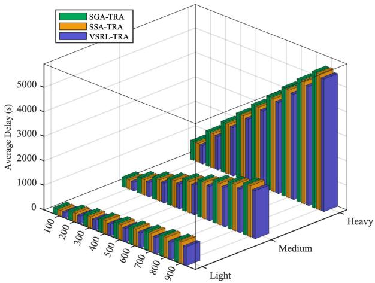  
Fig. 5. Comparative analysis of service delay across algorithms under varying task scales and complexity levels.

Fig. 5 compares the average service delay across VSRL-TRA, SSA-TRA, and SGA-TRA algorithms under varying task scales (100-900 task demands) and complexity levels (Light, Medium, Heavy). The results reveal that service delays increase with both task scale and complexity level. Notably, VSRL-TRA consistently achieves lower delays compared to SSA-TRA and SGA-TRA, with this performance advantage becoming more pronounced at larger scales and higher complexity levels. Service delays increase dramatically under heavy computational tasks, especially when task scales exceed 500 task demands. This suggests that current UAV-assisted computing demonstrates better suitability for light to medium computational tasks with acceptable delay ranges, while heavy computational scenarios may require alternative solutions including ground edge servers, cloud computing infrastructure, or multi-UAV cooperative computing to ensure service quality.

Fig. 6(a) shows the energy consumption and computational efficiency analysis for the three algorithms under varying computational demands. The energy consumption (solid lines) shows a linear increase with growing computational demands, while the computational efficiency (dashed lines) demonstrates an exponential decrease. Specifically, efficiency drops from approximately 1.2 KB/J at 100 task demands to 0.2 KB/J at 900 task demands, revealing a significant trade-off between computational scale and energy efficiency. Among the three algorithms, VSRL-TRA achieves approximately 5-10% lower energy consumption while maintaining comparable computational efficiency, indicating better energy utilization efficiency in task execution. This performance advantage becomes more pronounced as the computational demands increase, suggesting VSRL-TRA’s superior energy management capabilities in large-scale scenarios.

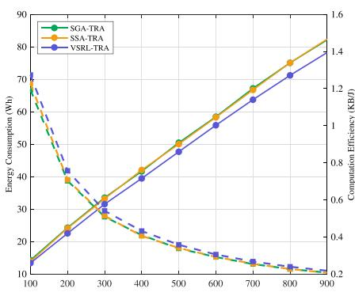  
(a)

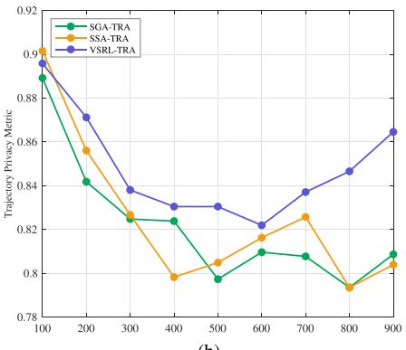  
(b)

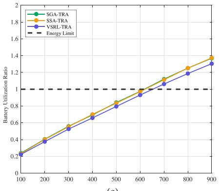  
(c)  
Fig. 6. Performance comparison of algorithms versus varying computational demands (from 100 to 900): (a) Energy consumption and computational efficiency, (b) Privacy protection, and (c) Energy availability analysis.

Fig. 6(b) presents the privacy protection analysis across varying computational demands in a heavy task scenario (80-150 MB data range). All algorithms demonstrate high initial protection rates (approximately 0.90) at 100 task demands, followed by a general declining trend as computational demands increase. VSRL exhibits superior performance, maintaining protection rates above 0.82 throughout all scales, compared to SSA and SGA which decline to around 0.80. Notably, VSRL shows a unique recovery trend after 600 task demands, reaching 0.86 at 900 task demands, while other algorithms remain relatively flat or show minimal improvement. It’s important to note that these results were obtained without implementing the Trajectory Refining Algorithm. When TRA is applied, all algorithms can achieve 100% privacy protection rate through optimized trajectory planning that completely avoids window crossings. However, this baseline comparison without TRA helps evaluate the inherent privacy protection capabilities of each algorithm’s basic trajectory planning mechanisms. This performance advantage indicates VSRL-TRA’s better capability in trajectory optimization that balances task execution efficiency with privacy preservation, particularly crucial in densely populated urban environments where privacy concerns are paramount.

Fig. 6(c) examines the energy availability across computational demands by analyzing the battery utilization ratio (actual consumption to 60 Wh battery capacity). The results reveal three operational regions: a safe zone (100-500 task demands) where utilization remains below 0.8, a critical zone (500-600 task demands) approaching the battery capacity limit (ρE ≈ 1.0), and an unsustainable zone (> 600 task demands) where energy requirements exceed capacity, reaching 1.3-1.4 at 900 task demands. VSRL-TRA maintains approximately 5% lower battery utilization ratio compared to other algorithms, though all face similar sustainability challenges when demands exceed 600 task demands. These findings suggest that current UAV configurations are most effective for computational tasks below

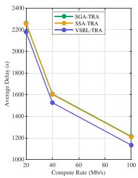  
(a)

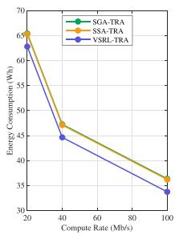  
(b)

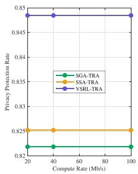  
(c)  
Fig. 7. Impact of computation rates on: (a) Average delay, (b) Energy consumption, and (c) Privacy protection.

600 task demands, beyond which energy constraints become a limiting factor for reliable task completion.

Fig. 7 investigates the impact of computation rates on system performance, with results aggregated across all node scales and data sizes. The analysis reveals that increasing computation rates leads to significant reductions in both average delay and energy consumption across all algorithms. The delay curve shows a sharp initial decrease followed by a more gradual reduction, while energy consumption maintains a steady declining trend throughout the tested range. Notably, VSRL-TRA consistently outperforms other algorithms with lower delay and energy consumption across all computation rates. Regarding privacy protection, all algorithms maintain relatively stable protection rates regardless of computation rate changes, with VSRL-TRA demonstrating marginally better protection performance compared to SSA-TRA and SGA-TRA. These findings suggest that while higher computation rates substantially improve system efficiency in terms of delay and energy usage, they have minimal impact on privacy protection capabilities. The results also confirm VSRL-TRA’s superior overall performance and adaptability across varying computational conditions.

Fig. 8 examines system performance across Light (5-10 MB), Medium (20-50 MB), and Heavy (80-150 MB) task scenarios, with results aggregated across varying node scales and computation rates. Error bars represent performance stability under different operational conditions. Average delay and energy consumption exhibit increasing trends as task intensity grows from light to heavy, with a notable surge in the heavy task scenario. The performance gap between algorithms becomes more pronounced under heavy tasks, where VSRL-TRA demonstrates better efficiency with relatively smaller performance variations, as shown by its shorter error bars. Privacy protection capabilities remain consistent across all task levels, showing only slight degradation under heavier workloads. VSRL-TRA maintains marginally superior protection rates with better stability across all scenarios. This indicates that while task intensity significantly impacts operational efficiency, its influence on privacy protection is limited.

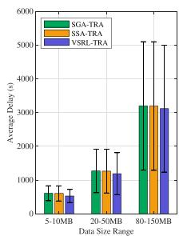  
(a)

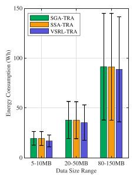  
(b)

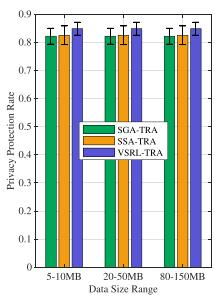  
(c)  
Fig. 8. Performance metrics under different task intensities: (a) Average delay, (b) Energy consumption, and (c) Privacy protection.

## C. Simulation Results of Constrained UAV Swarms

In this section, we investigate UAV swarm scenarios under various constraints. Unlike the single UAV case, we now consider realistic operational limitations including energy constraints, delay requirements, and inter-UAV coordination overhead. This comprehensive analysis helps understand how multiple UAVs collectively handle distributed tasks while satisfying practical constraints, and demonstrates the advantages of swarm cooperation in managing complex service environments. Unless explicitly labeled as evaluating the entire system (e.g., total energy consumption), results for multi-UAV scenarios represent the average performance across all individual UAVs average.

The experimental results illustrated in Fig. 9 demonstrate significant performance variations among the three algorithms across four key metrics. As shown in Fig. 9(a), in lightweight task scenarios, SOS-TRA consistently maintains the lowest delay, while MGA-TRA exhibits substantial delay increase as the network scales up, particularly beyond 500 task demands. Fig. 9(b) reveals that for energy consumption in mediumweight tasks, although all algorithms show increased energy consumption with network expansion, SOS-TRA demonstrates superior energy efficiency, with energy consumption rising at a notably slower rate. The privacy protection performance for heavyweight tasks, depicted in Fig. 9(c), indicates that while all algorithms show declining protection rates with network expansion, SOS-TRA maintains a consistently high protection level above 0.85, whereas MGA-TRA shows the steepest decline. Finally, as illustrated in Fig. 9(d), SOS-TRA achieves the highest battery utilization ratio across all network scales, maintaining stable performance even as node count increases, while both MGA-TRA and MSA-TRA show marked efficiency decline in larger networks.

Fig. 10 illustrates the impact of varying the UAV fleet size. We observe significant impacts of UAV fleet size on system performance. As shown in the left subfigure, the average processing delay demonstrates a notable decreasing trend as the number of UAVs increases, with the SOS-TRA algorithm consistently maintaining superior performance by achieving lower delay values. However, the improvement in latency becomes marginal when the number of UAVs exceeds 12, indicating a performance bottleneck. From the middle subfigure, regarding average energy consumption, the MGA-TRA algorithm exhibits higher energy overhead with increasing UAV numbers, while the SOS-TRA algorithm demonstrates better energy efficiency with relatively stable consumption curves. The right subfigure illustrates that for privacy protection, the SOS-TRA algorithm maintains consistent protection levels across different UAV scales, whereas the MGA-TRA algorithm shows relatively lower privacy preservation effectiveness. The comprehensive evaluation suggests that deploying 8-12 UAVs represents an optimal balance point, where the system achieves the best trade-off among latency, energy consumption, and privacy protection.

In Fig. 11, we analyze the impact of computation rate and data size on system performance. As illustrated in the left subfigure, the average delay exhibits a non-linear decreasing trend with increasing computation rate, where the performance improvement is most significant when the rate increases. The SOS-TRA algorithm maintains consistent performance advantages across different computation rates, though the performance gap among algorithms narrows at higher rates (100 Mb/s), suggesting that computation is no longer a bottleneck. The middle subfigure demonstrates the impact of data size on system delay, showing an approximately linear increase in delay with growing data volume. Notably, the SOS-TRA algorithm demonstrates superior scalability, with its advantages becoming more pronounced in large-data scenarios.

As shown in the right subfigure of Fig. 11, we analyze the overall system effectiveness across different network scales ranging from 100 to 900 task demands. The performance scores demonstrate a general declining trend as the number of task demands increases, reflecting the growing challenges in managing larger-scale networks. Notably, the SOS-TRA algorithm maintains superior performance throughout the entire range, consistently achieving scores above 0.8, while other algorithms show more significant degradation. The performance gap between algorithms becomes most pronounced in medium-scale networks (400-600 task demands), highlighting the critical advantages of the SOS-TRA algorithm in practical deployment scenarios. Although the performance of all algorithms tends to stabilize in large-scale environments, the SOS-TRA algorithm maintains a substantial lead over its counterparts, demonstrating its robust scalability and effectiveness in handling complex network configurations. These results prove the superior design of the SOS-TRA algorithm and its potential for real-world applications across various network scales.

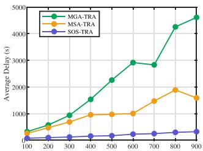  
(a)

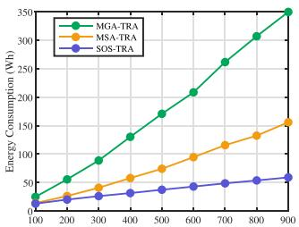  
(b)

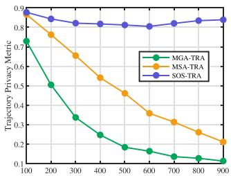  
(c)

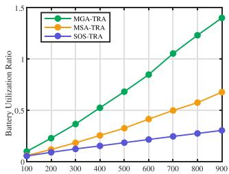  
(d)  
Fig. 9. Performance comparison of algorithms versus varying computational demands (from 100 to 900): (a) Light-task delay, (b) Medium-task energy consumption, (c) Heavy-task privacy protection, and (d) Battery utilization ratio.

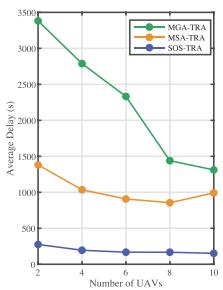  
(a)

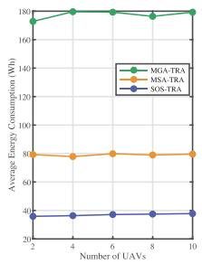  
(b)

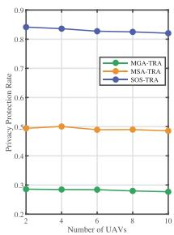  
(c)

Fig. 10. Impact of UAV fleet size on: (a) Average processing delay, (b) Average energy consumption, and (c) Privacy protection.  
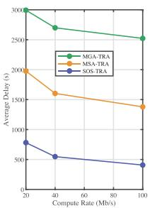  
(a)

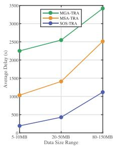  
(b)

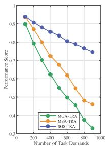  
(c)  
Fig. 11. System performance under varying: (a) Computation rates, (b) Data sizes, and (c) Network scales.

## VII. CONCLUSION

This paper addresses the challenges in UAV-assisted mobile edge computing for high-rise urban environments by proposing a comprehensive service-oriented trajectory optimization framework. The main contributions include formulating the Computation Offloading Trajectory Optimization Problem and proving its NP-hardness, developing the VSRL algorithm that integrates Q-learning, Sarsa, and Monte Carlo methods to enhance trajectory optimization, as well as designing SOS-TRA to effectively coordinate multiple UAVs while ensuring privacy protection. Extensive simulations demonstrate significant improvements over existing solutions, achieving up to 43.86% enhancement in system reliability. The SOS-TRA framework maintains robust performance across different network scales, computation rates, and data sizes. Without the Trajectory Refining Algorithm, the framework maintains privacy protection rates above 85%, while integration with TRA achieves 100% privacy preservation by avoiding window crossings. Future research will focus on developing adaptive task scheduling mechanisms for real-time environmental dynamics and investigating distributed coordination strategies for large-scale UAV swarms. Furthermore, a more general optimization framework that jointly considers dynamic UAV communication transmit power alongside trajectory and offloading policies presents a significant direction for subsequent research.

## REFERENCES

[1] M. Zhang and X. Li, “Drone-enabled Internet-of-Things relay for environmental monitoring in remote areas without public networks,” IEEE Internet Things J., vol. 7, no. 8, pp. 7648–7662, Aug. 2020.

[2] P. I. Radoglou-Grammatikis, P. G. Sarigiannidis, T. Lagkas, and I. D. Moscholios, “A compilation of UAV applications for precision agriculture,” Comput. Netw., vol. 172, 2020, Art. no. 107148.

[3] Z. Chen et al., “UITDE: A UAV-assisted intelligent true data evaluation method for ubiquitous IoT systems in intelligent transportation of smart city,” IEEE Trans. Intell. Transp. Syst., vol. 25, no. 8, pp. 9597–9607, Aug. 2024.

[4] M. W. Akram et al., “A secure and lightweight drones-access protocol for smart city surveillance,” IEEE Trans. Intell. Transp. Syst., vol. 23, no. 10, pp. 19634–19643, Oct. 2022.

[5] S. Sharma et al., “BEAVIS: Balloon enabled aerial vehicle for IoT and sensing,” in Proc. 29th Annu. Int. Conf. Mobile Comput. Netw., Madrid, Spain, 2023, pp. 33:1–33:15.

[6] T. Yin, Z. Gu, and X. Xie, “Observer-based event-triggered sliding mode control for secure formation tracking of multi-UAV systems,” IEEE Trans. Netw. Sci. Eng., vol. 10, no. 2, pp. 887–898, Mar./Apr. 2023.

[7] A. Seth, A. James, E. Kuantama, R. Han, and S. Mukhopadhyay, “Aero-Bridge: Autonomous drone handoff system for emergency battery service,” in Proc. 30th Annu. Int. Conf. Mobile Comput. Netw., 2024, pp. 573–587.

[8] Y. Wang, Z. Su, Q. Xu, R. Li, T. H. Luan, and P. Wang, “A secure and intelligent data sharing scheme for UAV-assisted disaster rescue,” IEEE/ACM Trans. Netw., vol. 31, no. 6, pp. 2422–2438, Dec. 2023.

[9] Z. Yao, W. Cheng, W. Zhang, and H. Zhang, “Resource allocation for 5 G-UAV-based emergency wireless communications,” IEEE J. Sel. Areas Commun., vol. 39, no. 11, pp. 3395–3410, Nov. 2021.

[10] A. Khochare, F. B. Sorbelli, Y. Simmhan, and S. K. Das, “Improved algorithms for co-scheduling of edge analytics and routes for UAV fleet missions,” IEEE/ACM Trans. Netw., vol. 32, no. 1, pp. 17–33, Feb. 2024.

[11] K. Wang, X. Zhang, L. Duan, and J. Tie, “Multi-UAV cooperative trajectory for servicing dynamic demands and charging battery,” IEEE Trans. Mobile Comput., vol. 22, no. 3, pp. 1599–1614, Mar. 2023.

[12] X. Wang and L. Duan, “Economic analysis of unmanned aerial vehicle (UAV) provided mobile services,” IEEE Trans. Mobile Comput., vol. 20, no. 5, pp. 1804–1816, May 2021.

[13] A. M. Seid, G. O. Boateng, S. Anokye, T. Kwantwi, G. Sun, and G. Liu, “Collaborative computation offloading and resource allocation in Multi-UAV-Assisted IoT networks: A deep reinforcement learning approach,” IEEE Internet Things J., vol. 8, no. 15, pp. 12203–12218, Aug. 2021.

[14] L. Zhang, A. Celik, S. Dang, and B. Shihada, “Energy-efficient trajectory optimization for UAV-Assisted IoT networks,” IEEE Trans. Mobile Comput., vol. 21, no. 12, pp. 4323–4337, Dec. 2022.

[15] N. Lin, H. Tang, L. Zhao, S. Wan, A. Hawbani, and M. Guizani, “A PDDQNLP algorithm for energy efficient computation offloading in UAV-assisted MEC,” IEEE Trans. Wireless Commun., vol. 22, no. 12, pp. 8876–8890, Dec. 2023.

[16] P. Wang, Z. Li, B. Guo, S. Long, S. Guo, and J. Cao, “A UAV-assisted truth discovery approach with incentive mechanism design in mobile crowd sensing,” IEEE/ACM Trans. Netw., vol. 32, no. 2, pp. 1738–1752, Apr. 2024.

[17] S. Han, K. Zhu, M. Zhou, and X. Liu, “Joint deployment optimization and flight trajectory planning for UAV assisted IoT data collection: A bilevel optimization approach,” IEEE Trans. Intell. Transp. Syst., vol. 23, no. 11, pp. 21492–21504, Nov. 2022.

[18] N. L. Prasad and B. Ramkumar, “3-D deployment and trajectory planning for relay based UAV assisted cooperative communication for emergency scenarios using Dijkstra’s algorithm,” IEEE Trans. Veh. Technol., vol. 72, no. 4, pp. 5049–5063, Apr. 2023.

[19] A. Khochare, Y. Simmhan, F. B. Sorbelli, and S. K. Das, “Heuristic algorithms for co-scheduling of edge analytics and routes for UAV fleet missions,” in Proc. 40th IEEE Conf. Comput. Commun., Vancouver, BC, Canada, 2021, pp. 1–10.

[20] A. M. Seid, J. Lu, H. N. Abishu, and T. A. Ayall, “Blockchain-enabled task offloading with energy harvesting in Multi-UAV-Assisted IoT networks: A multi-agent DRL approach,” IEEE J. Sel. Areas Commun., vol. 40, no. 12, pp. 3517–3532, Dec. 2022.

[21] L. Wang, K. Wang, C. Pan, W. Xu, N. Aslam, and A. Nallanathan, “Deep reinforcement learning based dynamic trajectory control for UAV-assisted mobile edge computing,” IEEE Trans. Mobile Comput., vol. 21, no. 10, pp. 3536–3550, Oct. 2022.

[22] Z. Ning, Y. Yang, X. Wang, Q. Song, L. Guo, and A. Jamalipour, “Multiagent deep reinforcement learning based UAV trajectory optimization for differentiated services,” IEEE Trans. Mobile Comput., vol. 23, no. 5, pp. 5818–5834, May 2024.

[23] Z. Ren et al., “Intelligent adaptive gossip-based broadcast protocol for UAV-MEC using multi-agent deep reinforcement learning,” IEEE Trans. Mobile Comput., vol. 23, no. 6, pp. 6563–6578, Jun. 2024.

[24] F. Tang, H. Hofner, N. Kato, K. Kaneko, Y. Yamashita, and M. Hangai, “A deep reinforcement learning-based dynamic traffic offloading in spaceair-ground integrated networks (SAGIN),” IEEE J. Sel. Areas Commun., vol. 40, no. 1, pp. 276–289, Jan. 2022.

[25] C. Qu, R. Singh, A. Esquivel-Morel, and P. Calyam, “Learning-based multi-drone network edge orchestration for video analytics,” in Proc. 2022 IEEE Conf. Comput. Commun., London, U.K., 2022, pp. 1219–1228.

[26] T. Tan, M. Zhao, and Z. Zeng, “Joint offloading and resource allocation based on UAV-assisted mobile edge computing,” ACM Trans. Sens. Netw., vol. 18, no. 3, pp. 36:1–36:21, 2022.

[27] W. Feng et al., “Hybrid beamforming design and resource allocation for UAV-aided wireless-powered mobile edge computing networks with NOMA,” IEEE J. Sel. Areas Commun., vol. 39, no. 11, pp. 3271–3286, Nov. 2021.

[28] G. Cheng, X. Song, Z. Lyu, and J. Xu, “Networked ISAC for low-altitude economy: Coordinated transmit beamforming and UAV trajectory design,” IEEE Trans. Commun., vol. 73, no. 8, pp. 5832–5847, Aug. 2025.

[29] Z. Ning et al., “5 G-enabled UAV-to-community offloading: Joint trajectory design and task scheduling,” IEEE J. Sel. Areas Commun., vol. 39, no. 11, pp. 3306–3320, Nov. 2021.

[30] X. Li, P. Xiao, D. Tang, X. Li, Q. Wang, and D. Chen, “UAVs-assisted QoS guarantee scheme of IoT applications for reliable mobile edge computing,” Comput. Commun., vol. 223, pp. 55–67, 2024.

[31] M. Adil et al., “UAV-assisted IoT applications, QoS requirements and challenges with future research directions,” ACM Comput. Surv., vol. 56, no. 10, 2024, Art. no. 251.

[32] R. Karmakar, G. Kaddoum, and O. Akhrif, “A novel federated learningbased smart power and 3D trajectory control for fairness optimization in secure UAV-assisted MEC services,” IEEE Trans. Mobile Comput., vol. 23, no. 5, pp. 4832–4848, May 2024.

[33] X. Wang, Z. Ning, S. Guo, M. Wen, L. Guo, and H. V. Poor, “Dynamic UAV deployment for differentiated services: A multi-agent imitation learning based approach,” IEEE Trans. Mobile Comput., vol. 22, no. 4, pp. 2131–2146, Apr. 2023.

[34] Y. Qu et al., “Service provisioning for UAV-enabled mobile edge computing,” IEEE J. Sel. Areas Commun., vol. 39, no. 11, pp. 3287–3305, Nov. 2021.

[35] W. Liu et al., “Joint trajectory design and resource allocation in UAV-Enabled heterogeneous MEC systems,” IEEE Internet Things J., vol. 11, no. 19, pp. 30817–30832, Oct. 2024.

[36] A. Thibbotuwawa, P. Nielsen, B. Zbigniew, and G. Bocewicz, “Energy consumption in unmanned aerial vehicles: A review of energy consumption models and their relation to the UAV routing,” in Proc. 39th Int. Conf. Inf. Syst. Architecture Technol., Cham, Switzerland, 2019, pp. 173–184.

[37] C. Zhan, H. Hu, S. Mao, and J. Wang, “Energy-efficient trajectory optimization for aerial video surveillance under QoS constraints,” in Proc. 2022 IEEE Conf. Comput. Commun., London, U.K., 2022, pp. 1559–1568.

[38] X. Yuan, Y. Hu, D. Li, and A. Schmeink, “Novel optimal trajectory design in UAV-assisted networks: A mechanical equivalence-based strategy,” IEEE J. Sel. Areas Commun., vol. 39, no. 11, pp. 3524–3541, Nov. 2021.

[39] C. Luo, M. N. Satpute, D. Li, Y. Wang, W. Chen, and W. Wu, “Fine-grained trajectory optimization of multiple UAVs for efficient data gathering from WSNs,” IEEE/ACM Trans. Netw., vol. 29, no. 1, pp. 162–175, Feb. 2021.

[40] L. Shen, “User experience oriented task computation for UAV-assisted MEC system,” in Proc. 2022 IEEE Conf. Comput. Commun., London, U.K., 2022, pp. 1549–1558.

[41] Y. Tian et al., “Evolutionary large-scale multi-objective optimization: A survey,” ACM Comput. Surv., vol. 54, no. 8, pp. 174:1–174:34, 2022.

[42] S. Mirjalili, Genetic Algorithm. Cham, Switzerland: Springer Int. Publishing, 2019, pp. 43–55.

[43] D. Bertsimas and J. Tsitsiklis, “Simulated annealing,” Stat. Sci., vol. 8, no. 1, pp. 10–15, 1993.

[44] T. M. Shami, A. A. El-Saleh, M. Alswaitti, Q. Al-Tashi, M. A. Summakieh, and S. Mirjalili, “Particle swarm optimization: A comprehensive survey,” IEEE Access, vol. 10, pp. 10031–10061, 2022.

[45] K. Helsgaun, “An effective implementation of the Lin-Kernighan traveling salesman heuristic,” Eur. J. Oper. Res., vol. 126, no. 1, pp. 106–130, 2000.

[46] J. Zheng, K. He, J. Zhou, Y. Jin, and C. Li, “Combining reinforcement learning with Lin-Kernighan-Helsgaun algorithm for the traveling salesman problem,” in Proc. 35th AAAI Conf. Artif. Intell., 33rd Conf. Innov. Appl. Artif. Intell., 11th Symp. Educ. Adv. Artif. Intell., 2021, pp. 12445–12452.

[47] P. Hansen, N. Mladenovic, R. Todosijevic, and S. Hanafi, “Variable neighborhood search: Basics and variants,” EURO J. Comput. Optim., vol. 5, no. 3, pp. 423–454, 2017.

[48] P. Wu, F. Xiao, H. Huang, and R. Wang, “Load balance and trajectory design in multi-UAV aided large-scale wireless rechargeable networks,” IEEE Trans. Veh. Technol., vol. 69, no. 11, pp. 13756–13767, Nov. 2020.

  
Pengfei Wu (Member, IEEE) received the PhD degree from the Nanjing University of Posts and Telecommunications, Nanjing, China, in 2020. He is currently an associate professor with the School of Computer Science, Nanjing University of Posts and Telecommunications. His current research interests include Internet of Things, uncrewed aerial vehicles and their applications in wireless networking, mobile computing, and intelligent systems.

Fu Xiao (Senior Member, IEEE) received the PhD degree in computer science and technology from the Nanjing University of Science and Technology, Nanjing, China, in 2007. He is currently a professor and the PhD supervisor with the School of Computer, Nanjing University of Posts and Telecommunications. He has authored papers in research related international conferences and journals, including IN-FOCOM, ICC, IPCCC, IEEE Journal on Selected Areas in Communications, IEEE/ACM Transactions on Networking, IEEE Transactions on Dependable and Secure Computing, IEEE Transactions on Parallel and Distributed Systems, IEEE Transactions on Mobile Computing, ACM Transactions on Embedded Computing Systems, and IEEE Transactions on Vehicular Technology. His research interests include computer networks and Internet of Things.

Chao Sha received the BEng, MEng, and PhD degrees in computer science and technology from the Nanjing University of Posts and Telecommunications, Nanjing, China, in 2005, 2008, and 2010, respectively. He is currently a professor with the School of Computer Science, Software, and Cyberspace Security, Nanjing University of Posts and Telecommunications. He is the supervisor of the Student Xiaojie Bian. His research interests include mobile data collection and energy hole avoidance in wireless rechargeable sensor networks.

Haiping Huang (Senior Member, IEEE) received the BEng and MEng degrees in computer science and technology from the Nanjing University of Posts and Telecommunications, Nanjing, China, in 2002 and 2005, respectively, and the PhD degree in computer application technology from Soochow University, Suzhou, China, in 2009. He is currently a professor with the School of Computer Science, Nanjing University of Posts and Telecommunications. His research interests include information security and privacy protection of wireless sensor networks.