# Service Experience Oriented Cooperative Computing in Cache-Enabled UAVs Assisted MEC Networks

Xingxia Gao , Graduate Student Member, IEEE, and Linbo Zhai , Member, IEEE

Abstract—The unmanned aerial vehicle (UAV)-enabled multiaccess edge computing (MEC) technology is opening up new opportunities in the integrated space-air-ground in the 5G era and beyond. However, providing low-latency services solely from an overall perspective cannot ensure a high quality of experience (QoE) for user equipments (UEs). Therefore, we propose a service experience-oriented cooperative caching framework, where the UAVs can effectively serve each UE by providing communication and computing resources. A novel metric called service experience ratio is defined to reflect the experience at the UEs. Under the constraints of UAV’s energy budget and delay requirements, we consider jointly optimizing task offloading, resource allocation, trajectory planning, and service caching placement to maximize the service experience ratio. Since the original problem is a mixedinteger non-convex programming problem with a fractional structure, it is challenging to be solved in polynomial time. Based on Dinkelbach’s method and convex optimization theory, we simplify the problem model and propose a four-stage alternating iterative service ratio maximization algorithm to solve this problem. Besides, we also analyze the convergence and complexity of our proposed algorithm. Numerical results demonstrate that the service experience ratio achieved by the proposed algorithm is 19–34% higher than the comparative works.

Index Terms—Caching placement, edge computing, resource allocation, task offloading, UAV trajectory.

# I. INTRODUCTION

of mobile communication technology, many new applications such as online video, map navigation, mobile payment, and face recognition have emerged [1]. Subsequently, the proliferation of intelligent devices connected to the network has led to an explosive growth of data. At the same time, in emergencies such as the COVID-19, face-to-face communication between people has become difficult, and dependence on online medicine, online learning and remote work has increased significantly. The above applications are usually delay-sensitive and require enormous communication and computation resources. To support a large number of intelligent devices and process a large amount of data in a timely manner, multiple access edge computing (MEC),

Manuscript received 12 September 2023; revised 8 February 2024; accepted 14 February 2024. Date of publication 19 February 2024; date of current version 3 September 2024. This work was supported by the Key Research and Development Program of Shandong Province, China, under Grant 2017GGX10142. Recommended for acceptance by L. Kong. (Corresponding author: Linbo Zhai.)

The authors are with the School of Information Science and Engineering, Shandong Normal University, Jinan, Shandong 250358, China (e-mail: 2021020960@stu.sdnu.edu.cn; zhai@mail.sdu.edu.cn).

Digital Object Identifier 10.1109/TMC.2024.3366944

formerly known as mobile edge computing, has become a key technology in the next-generation wireless network [2].

Nevertheless, the current edge computing system also has many problems. Terrestrial MEC servers with fixed locations cannot be adjusted according to the requirements of user equipments (UEs). They may have poor channel quality due to the non-Line-of-Sight (NLoS) links, which leads to limited communication rate [3]. Worse still, due to severe obstruction or damage caused by natural disasters, some UEs can be abstained from MEC services [4]. Recently, the unmanned aerial vehicle (UAV) has emerged as a promising technology to improve wireless connectivity and provide extensive coverage in MEC networks thanks to the advantages of flexible deployment and low-cost [5]. Typically, there are two technologies for UAV-enabled MEC networks, where the UAV acts as the aerial relay [6], [7] and the aerial MEC [8]. Besides, with the rapid increase of UEs, single or even multiple UAVs [9] may not be able to meet the demands of massive computation-intensive and delay-sensitive applications, such as virtual reality and intelligent transportation. Therefore, in UAV-assisted MEC networks, terrestrial MEC base stations (BSs) still exist. Given the potential of utilizing the communication and computation resources in both UAVs and ground BSs, the air-ground cooperation model provides new opportunities for the development of real-time applications in future wireless networks.

Although many scholars have studied cooperative MEC networks including multiple UAVs and ground BSs, there are still some unprecedented challenges in improving UE’s service experience: (i) compared to networks that only include ground MEC servers, there are limited computing, bandwidth and energy resources in UAV-assisted MEC networks. Hence, it is necessary to design a collaborative task offloading strategy to efficiently utilize resources; (ii) although the flexibility of UAVs brings more possibilities to MEC networks, the coupling of variables such as task offloading and resource allocation also makes UAV trajectory planning more complex [10], and there is still a paucity of research on joint optimization of task offloading, trajectory planning, caching placement, and resource allocation for cacheenabling UAV networks; (iii) many emerging applications are data-driven, and frequent downloading service contents from cloud servers will bring huge time and cost expenses [11]. The UAVs which cache the related databases and corresponding programs in advance can efficiently execute the computation tasks generated by UEs [12]. Most of the existing works focus on computation content caching in UAV-assisted MEC systems, and some works have studied computation service caching in multi-UAV deployment scenarios, where the location of each UAV is fixed. However, so far only a few works consider computation service caching in the dynamic UAV networks; (iv) a lot of existing optimization goals that only ensure overall service quality may leads to unfair treatment of some UEs, which will result in poor service experience of these UEs.

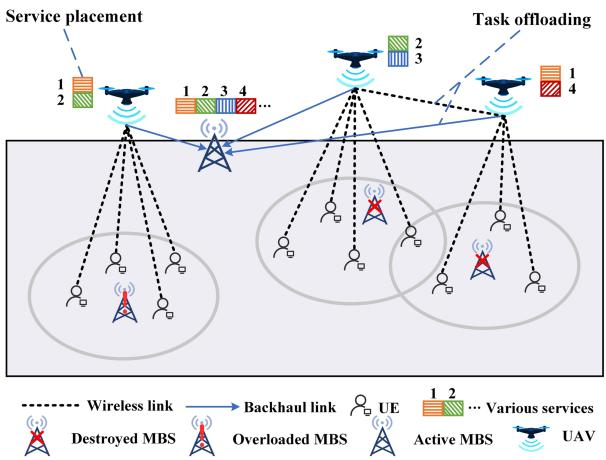

flowchart

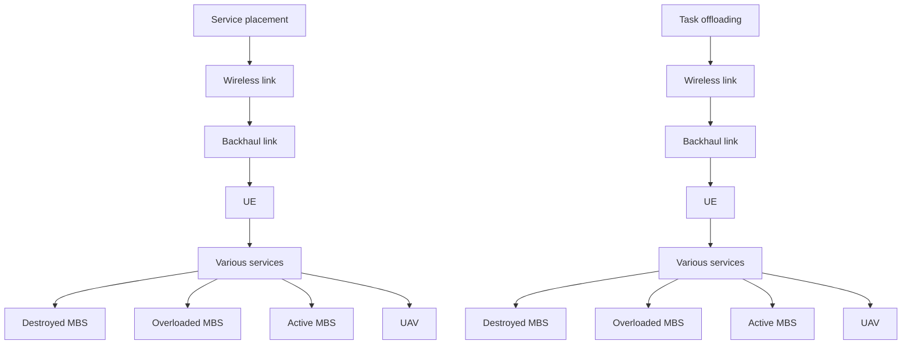

Fig. 1. Illustration of UAV-assisted wireless network.

The aforementioned research works have laid solid foundations on UAV-enabled MEC networks. Motivated by the issues discussed above, we study a multi-UAV-enabled MEC networks where cellular-connected UAVs are considered to provide MEC services or used as relays to fully exploit the system resources. To reduce the service delay while guaranteeing the fairness among UEs, we study the service experience ratio of UEs via supporting both horizontal collaboration among UAVs and vertical collaboration between UAVs and the BS. To maximize the service experience ratio, we jointly optimize the service caching placement, task offloading, computation and communication resources allocation, and UAV trajectory under the constraints of UAV’s energy and multi-dimensional (storage, computation, and communication) resources. The main contributions are summarized as follows.

1) Considering the strict requirements for service delay and the fairness among all UEs, the service experience ratio is designed as the ratio of the fairness index to total service delay. We propose a service experience ratio maximization problem in multi-UAV assisted MEC networks, which is proven to be NP-hard.   
2) We reformulate the service experience ratio maximization problem to a parametric programming form using the Dinkelbach’s method. Then, we decompose the problem into four sub-optimization problems. A joint alternating iterative optimization algorithm is designed to obtain the optimal solution. To be specific, we first propose a satisfaction-based optimization algorithm to solve the task offloading subproblem. Next, a priority-aware optimization algorithm is developed to solve the service caching subproblem. Then, the successive convex approximation (SCA) technique is employed to optimize the UAV’s trajectory. Besides, the computation and communication resources allocation are optimized by employing the standard convex tools.

3) Numerical results show that an appropriate trade-off between service delay and fairness among all UEs can be made, which verifies the effectiveness of our proposed algorithm. Moreover, the proposed algorithm outperforms the other three state-of-art baselines in maximizing the service experience ratio.

We organize the rest of this paper as follows. Section II describes the related work. Section III introduces the system model. In Section IV, we formulate the service experience ratio maximization problem. In Section V, the joint alternating optimization algorithm is proposed to solve the formulated problem. Simulation results and analysis are presented in Section VI. Finally, Section VII concludes this paper.

# II. RELATED WORK

Plenty of research works have been recently devoted to the field of MEC. According to the status of MEC servers, we can categorize them into two types. In particular, one mainly studies the static MEC servers connected with BSs [13], [14], while the other focuses on the mobile MEC servers mounted on dynamic wireless communication platforms, such as UAVs [15]. Recently, UAV-assisted MEC networks have attracted widespread attention due to the advantages of flexibility and operability [16]. The UAV can be integrated with MEC servers [8] and serve as mobile relay [17] for computation offloading, and it can be used as data collector [18].

However, due to the size constraints and limited resources of UAVs, only depending on UAVs to provide MEC services for UEs poses risks. Accordingly, many scholars have studied the networks that simultaneously include ground BSs and multiple UAVs integrating with MEC servers. Zhang et al. [19] proposed a new framework of UAV-assisted MEC system in IoT where the tasks generated by UEs were computed locally or offloaded to the UAV. Deng et al. [20] studied MEC for artificial intelligence (AI) applications in air-ground-integrated wireless networks. The above works either considered a single UAV or only enabled multiple UAVs to work independently in the MEC networks. Instead, excellent collaboration between the UAVs can effectively utilize resources to perform offloading and balance the load among UAVs.

The works of UAV-assisted MEC network mainly focus on task offloading, resource allocation, trajectory planning, and service caching placement. In terms of task offloading, He et al. [21] proposed a multi-hop task offloading with on-the-fly computation scheme, which allowed multiple UAVs to form an aerial computing network. In terms of resource allocation, Liu et al. [22] formulated a fair energy-efficient resource optimization problem. In terms of trajectory planning, Miao et al. [23] raised a multi-UAV-assisted MEC offloading algorithm based on global and local path planning controlled by ground station and onboard computer. Moreover, Li et al. [24] studied an energy efficient scheduling system that allowed UAVs to determine their trajectories. In terms of service caching placement, Zhang et al. [25] studied the joint optimization of UAV deployment, caching placement and user association for maximum quality of experience (QoE) of UEs, and Zhou et al. [26] made caching placement decision every T time slots based on the interior point method to reduce the caching overhead. However, few works considered the joint optimization of task offloading, resource allocation, trajectory planning, and service caching.

Most research works are dedicated to optimizing energy consumption, system throughput, task processing latency, and weighted sum of energy consumption and latency in UAV-aided MEC networks. Mao et al. [27] and Qian et al. [28] proposed energy consumption minimization problem by jointly optimizing the trajectory of UAV and the transmit power of each UE. Ning et al. [29] designed a 5G-enabled UAV-to-community offloading system, with the goal of maximizing the system throughout. Nguyen et al. [30] aimed to minimize the average latency of UEs by jointly controlling the offloading decision for dependent tasks and allocating the communication resources of UAVs. In order to minimize the weighted sum cost of latency and energy consumption, Liu et al. [31] jointly optimized the caching and offloading decisions, the edge UAVs deployment, and the radio and computation resource allocation. Based on the broad overview of existing researches, few works have been dedicated to tackling the service experience ratio. In other words, the research of reducing service latency while ensuring fairness among UEs has rarely been studied.

Different from the existing works, we study a collaborative task offloading framework in which the UAV executes the tasks generated by associated UEs, or further relays them to other collaborative UAVs and the macro base station (MBS). Besides, we develop a service experience ratio maximization problem by jointly optimizing task offloading, resource allocation, trajectory planning, and service caching placement. Then, we decompose the problem into four subproblems and tackle it by a four-stage alternating iterative algorithm.

# III. SYSTEM MODEL

We consider a cellular wireless network as shown in Fig. 1, which consists of one MBS, U rotary-wing UAVs and M UEs, denoted by $b , \ u \in \mathcal { U } = \{ 1 , 2 , . . . , U \}$ and $m \in \mathcal { M } =$ $\{ 1 , 2 , . . . , M \}$ = 1 2 =, respectively. The rotary-wing UAVs are adopted 1 2since they can move flexibly and hover over fixed locations. The UAVs, integrating with MEC servers, have certain communication, computing, and storage (CCS) resources but subject to the size, weight, and power (SWAP) limitations. Unlike UAVs, the MBS, which has more CCS resources, is composed of ground MEC servers. The UEs are unable to establish wireless communication with the MBS due to signal congestion and shadowing, or the low communication quality [32]. Hence, UEs can only establish communication connection with MBS through UAVs. The UAV connects with the MBS through a wireless backhaul link. Each UE transmits offloading data to the UAV via wireless uplink. In Fig. 1, considering the service caching, the task can be offloaded to the UAV only when two conditions are satisfied: i) the corresponding service is cached in the UAV; ii) the UAV can provide sufficient computing and communication resources.

Due to limited computation capacities, UEs do not execute local computing. Thus, the MBS and all UAVs cooperatively provide MEC services for UEs. Let $S = \{ 1 , 2 , . . . , S \}$ denote = 1 2the all services provided by the MBS. Each UAV can only storage partial services in set S because of limited storage space. The connection between UEs and UAVs can remain stable in a sufficiently short period of time. For simplicity, we divide the task period N into T time slots with equal duration $\Delta _ { t }$ , i.e., $N = \Delta _ { t } T$ and $t \in \mathcal { T } = \{ 1 , 2 , . . . , T \}$ Δ. Each UE can generate only one task within one time slot, and each task is atomic and unsplit [29]. Let $V _ { m , s } ^ { t }$ denote the task generated from UE a triplet data siz $< { \cal I } _ { m , s } ^ { t } , W _ { m , s } ^ { t } , D _ { m , s } ^ { t } >$ , where resents t $I _ { m , s } ^ { t }$ denotes the inputotal required com-$W _ { m , s } ^ { t }$ puting resources to accomplish the task, and $D _ { m , s } ^ { t }$ denotes the maximum tolerable delay, beyond which the results are invalid for UE m. Let $V ^ { t }$ denote the set of all UEs’ tasks at time slot t.

In the scheduling process of UAVs, software-defined network (SDN) acts as a control center for UAVs [33]. The global information of the system, including each UAV’s location, speed, and the channel state information between the UAVs, can be obtained through the SDN controller. If some UAVs lose their connection, we can deploy new UAVs to provide support.

# A. UAV Mobility Model

Since the length of each time slot is small enough, each UAV can be considered static within each time slot. Hence, the trajectory of each UAV during the entire task execution cycle can be regarded as a sequence of discrete points. All UAVs fly at a fixed altitude of $h ,$ which allows them to avoid frequent ascent and descent to evade obstacles. Considering a three-dimensional (3D) Cartesian coordinate system, the horizontal coordinate of UAV u at time slot t is denoted by $\boldsymbol { Q } _ { u } ^ { t } = ( x _ { u } ^ { t } , y _ { u } ^ { t } )$ . The trajectory of UAV u can be described as $Q _ { u } = \{ Q _ { u } ^ { 1 } , . . . , Q _ { u } ^ { T } \}$ . Then, let $Q = \{ Q _ { 1 } , . . . , Q _ { U } \}$ =denote the trajectories of all UAVs. =Similarly, the horizontal coordinates of the active MBS b and UE m can be denoted as $Q _ { b } = ( x _ { b } , y _ { b } )$ and $Q _ { m } = ( x _ { m } , y _ { m } )$ , respectively.

To enhance coverage, the flight trajectory of each UAV should be within the target area [34], which is defined as $[ 0 , x _ { \mathrm { m a x } } ] \times$ $[ 0 , y _ { \mathrm { m a x } } ] . \operatorname { L e t } v _ { \mathrm { m a x } }$ represent the UAV’s maximum speed. In time [0 ]slot t, in order to avoid signal interference and ensure collision avoidance among UAVs, any two UAVs should keep a minimal safe distance denoted by $d _ { \mathrm { m i n } }$ . For instance, the distance between UAV u and UAV i is not less than $d _ { \mathrm { m i n } }$ . At the end of a cycle, the UAV returns to its original location. Accordingly, we obtain the following trajectory constraints:

$$
\left\{ \begin{array}{l} 0 \leq x _ {u} ^ {t} \leq x _ {\max}, \quad \forall u \in \mathcal {U}, \forall t \in \mathcal {T}, \\ 0 \leq y _ {u} ^ {t} \leq y _ {\max}, \quad \forall u \in \mathcal {U}, \forall t \in \mathcal {T}, \\ | | Q _ {u} ^ {t + 1} - Q _ {u} ^ {t} | | \leq v _ {\max} \Delta_ {t}, \quad \forall t \in \mathcal {T}, \\ | | Q _ {u} ^ {t} - Q _ {i} ^ {t} | | \geq d _ {\min}, \quad \forall u \in \mathcal {U}, \forall i \in \mathcal {U} \setminus \{u \}, \forall t \in \mathcal {T}, \\ Q _ {u} ^ {1} = Q _ {u} ^ {T}, \quad \forall u \in \mathcal {U}. \end{array} \right. \tag {1}
$$

# B. Communication Model

Based on the Orthogonal Frequency Division Multiple Access (OFDMA) technique [35], the interference among UEs in wireless uplink can be ignored. Due to the distance limitation of signal transmission, UAV u can only provide MEC services to UEs within the coverage range denoted by $R _ { u } .$ . In time slot t, the horizontal distance between UE m and UAV u is $d _ { m , u } ^ { t } = \sqrt { ( x _ { m } ^ { t } - x _ { u } ^ { t } ) ^ { 2 } + ( y _ { m } ^ { t } - y _ { u } ^ { t } ) ^ { 2 } }$ . Similarly, $d _ { u , b } ^ { t } =$ $\sqrt { ( x _ { u } ^ { t } - x _ { b } ^ { t } ) ^ { 2 } + ( y _ { u } ^ { t } - y _ { b } ^ { t } ) ^ { 2 } }$ is the horizontal distance between ( ) + ( )UAV u and MBS b at time slot t.

Let $b _ { m , u } ^ { t } \in [ 0 , 1 ]$ denote the bandwidth resource allocated [0 1]by UAV u to UE m at time slot t. Then, we use the variable $B = \{ b _ { m , u } ^ { t } | m \in \mathcal { M } , u \in \mathcal { U } , t \in \mathcal { T } \}$ to indicate the bandwidth =resource allocation decisions. Due to the obstacles in the environment, the Ground-to-Air (G2A) and Air-to-Ground (A2G) channels may be either Line-of-Sight (LoS) or NLoS. According to [36], the LoS probability between UE m and UAV u is expressed as

$$
\begin{array}{l} P _ {L o S} (d _ {m, u} ^ {t}) \\ = \frac {1}{1 + \beta_ {0} \exp \left(- \beta_ {1} \left(\frac {1 8 0}{\pi} \arcsin \left(\frac {h}{d _ {m , u} ^ {t}}\right) - \beta_ {0}\right)\right)}, \tag {2} \\ \end{array}
$$

where $\beta _ { 0 }$ and $\beta _ { 1 }$ are constants determined by the environment. Accordingly, the NLoS probability is $P _ { N L o S } ( d _ { m , u } ^ { t } ) =$ $1 - P _ { L o S } ( d _ { m , u } ^ { t } )$ ( ) =. Then, the path loss between UE m and UAV 1 ( )u at time slot t is calculated by

$$
P L (d _ {m, u} ^ {t}) = \left\{ \begin{array}{l l} \left(\frac {4 \pi f _ {c} d _ {m , u} ^ {t}}{c}\right) ^ {2} \eta_ {L o S}, & \text { with } P _ {L o S} (d _ {m, u} ^ {t}), \\ \left(\frac {4 \pi f _ {c} d _ {m , u} ^ {t}}{c}\right) ^ {2} \eta_ {N L o S}, & \text { otherwise }, \end{array} \right. \tag {3}
$$

where $f _ { c }$ denotes the carrier frequency, c is the speed of light, and $\eta _ { L o S }$ and $\eta _ { N L o S }$ are the excessive path losses of the LoS and NLoS links $( \eta _ { N L o S } > \eta _ { L o S } > 1 )$ , respectively. Let $p _ { m }$ be the (transmit power of UE m and $\sigma ^ { 2 }$ 1)denote the noise power. Then, the achievable uplink data rate from UE m to UAV u at time slot t can be calculated as

$$
R _ {m, u} ^ {t} = b _ {m, u} ^ {t} W _ {0} \log_ {2} \left(1 + \frac {\alpha \cdot p _ {m}}{P L (d _ {m , u} ^ {t}) \cdot \sigma^ {2}}\right), \tag {4}
$$

where α denotes the channel power gain at the reference distance of 1 m, and $W _ { 0 }$ is the total bandwidth resource.

Similarly, the achievable wireless link data rate from UAV u to MBS b can be given by

$$
R _ {u, b} ^ {t} = b _ {u, b} ^ {t} W _ {1} \log_ {2} \left(1 + \frac {\alpha \cdot p _ {u}}{P L (d _ {u , b} ^ {t}) \cdot \sigma^ {2}}\right), \tag {5}
$$

where $W _ { 1 }$ is the available wireless backhaul link bandwidth, and $p _ { u }$ indicates the transmit power of UAV u.

Let $R _ { u a v }$ denote the communication range of the UAV. Then, if the euclidean distance between two UAVs is not greater than $R _ { u a v }$ , they can communicate with each other. The horizontal distance between UAV u and UAV i at time slot t is $d _ { u , i } ^ { t } = \sqrt { ( x _ { u } ^ { t } - x _ { i } ^ { t } ) ^ { 2 } + ( y _ { u } ^ { t } - y _ { i } ^ { t } ) ^ { 2 } }$ . Consequently, considering = ( ) + ( )the free-space path loss [37], the available data rate between UAV u and UAV i can be given by

$$
R _ {u, i} ^ {t} = W _ {2} \log_ {2} \left(1 + \frac {\alpha \cdot p _ {u}}{(d _ {u , i} ^ {t}) ^ {2}}\right), \tag {6}
$$

where $W _ { 2 }$ is the available wireless link bandwidth between UAV u and UAV i.

# C. Service Caching Placement Model

The UAV which executes tasks generated by UEs requiring corresponding services needs to cache the associated data, such as libraries and databases. Different from the MBS with huge and diverse resources, each UAV only stores a subset of services due to its limited cache capacity [34]. To ensure that all tasks can be executed, we assume that the MBS has S types of services. Let $c _ { s }$ denote the storage space required by service s. When the UE is located in the coverage range of multiple UAVs, caching services can reduce delay in a collaborative manner. Let $K _ { u }$ denote the total storage space of UAV u. $a _ { u , s } ^ { t } \in \{ 0 , 1 \}$ is a binary 0 1decision variable indicating whether service s is cached or not on UAV u at time slot t. If service s is cached on UAV u at time slot $t , a _ { u , s } ^ { t } = 1$ . Otherwise, $a _ { u , s } ^ { t } = 0$ . Let $A = \{ a _ { u , s } ^ { t } | u \in \mathcal { U } , s \in$ $s , t \in { \mathcal { T } } \}$ = 1 = 0 =denote the service caching placement decisions.

# D. Collaborative Computation Offloading Model

Each UAV can be employed as a mobile computing server, or act as a relay to further offload tasks to the MBS or other UAVs. To improve the performance of task execution, UAVs can provide parallel MEC services for UEs [29]. We use $X =$ $\{ { x } _ { m , s , u , i } ^ { t } | m \in \mathcal { M } , s \in \mathcal { S } , u \in \mathcal { U } , i \in \mathcal { U } \cup \{ b \} , t \in \mathcal { T } \}$ =to repre- a binary $x _ { m , s , u , i } ^ { t } \in \{ 0 , 1 \}$ offloading decision variable for task ${ \dot { V } } _ { m , s } ^ { t } .$ 0 1 If task $V _ { m , s } ^ { t }$ is executed by UAV $i , x _ { m , s , u , i } ^ { t } = 1$ m,. Otherwise, $x _ { m , s , u , i } ^ { t } = 0$ ,s . In addition, when the associa $i = u , x _ { m , s , u , i } ^ { t } = 1$ $V _ { m , s } ^ { t }$ uted bymeans $i \in \mathcal { U } \setminus \{ u \} , x _ { m , s , u , i } ^ { t } = 1$ task $V _ { m , s } ^ { t }$ = 1is executed by the non-associated collaborative UAV i. When $i = b , x _ { m , s , u , i } ^ { t } = 1$ means task $V _ { m , s } ^ { t }$ is executed by MBS = = 1b. Each task can only be offloaded to one UAV or the MBS. The task offloading decision should satisfy

$$
\sum_ {i \in \mathcal {U} \cup \{b \}} x _ {m, s, u, i} ^ {t} = 1, \quad \forall m \in \mathcal {M}, s \in \mathcal {S}, u \in \mathcal {U}. \tag {7}
$$

1) Associated UAV Computing: In many computationintensive applications, the delay and energy consumption for sending the results is small enough and can be neglected [19]. The task generated by the UE is first transmitted to one UAV, which serves as the associated UAV for the task. The communication delay from the UE to the associated UAV u can be given by

$$
D _ {m, s, u} ^ {t} = \frac {I _ {m , s} ^ {t}}{R _ {m , u} ^ {t}}. \tag {8}
$$

Let f tm,s,u $f _ { m , s , u } ^ { t }$ denote the percentage of the computing resource allocated to task $V _ { m , s } ^ { t } .$ . Then, we use $F = \{ f _ { m , s , u } ^ { t } | m \in \mathcal { M } , s \in$ $\mathcal { S } , u \in \mathcal { U } , t \in \mathcal { T } \}$ =to denote the computing resource allocation decisions. The computation delay for UAV u can be calculated by

$$
C _ {m, s, u} ^ {t} = \frac {W _ {m , s} ^ {t}}{f _ {m , s , u} ^ {t} \mathcal {F} _ {u}}, \tag {9}
$$

where $\mathcal { F } _ { u }$ denotes the computing capacity of UAV u. Therefore, the service delay of task $V _ { m , s } ^ { t }$ for the associated UAV u is calculated as

$$
F _ {m, s, u, u} ^ {t} = D _ {m, s, u} ^ {t} + C _ {m, s, u} ^ {t}. \tag {10}
$$

2) Non-Associated Collaborative UAV Computing: The service delay of task $V _ { m , s } ^ { t }$ for the non-associated collaborative UAV i includes three parts, the communication delay from the UE to the associated UAV u, the communication delay from the associated UAV u to non-associated collaborative UAV i, and the computation delay for UAV i. The communication delay from the associated UAV u to non-associated collaborative UAV i can be calculated by

$$
D _ {m, s, u, i} ^ {t} = \frac {I _ {m , s} ^ {t}}{R _ {u , i} ^ {t}}. \tag {11}
$$

Then, the computation delay for UAV i can be given by

$$
C _ {m, s, i} ^ {t} = \frac {W _ {m , s} ^ {t}}{f _ {m , s , i} ^ {t} \mathcal {F} _ {i}}. \tag {12}
$$

Consequently, the service delay of task $V _ { m , s } ^ { t }$ for the nonassociated collaborative UAV i can be expressed as

$$
F _ {m, s, u, i} ^ {t} = D _ {m, s, u} ^ {t} + D _ {m, s, u, i} ^ {t} + C _ {m, s, i} ^ {t} \quad i \in \mathcal {U} \setminus \{u \}. \tag {13}
$$

3) MBS Computing: If task $V _ { m , s } ^ { t }$ is offloaded at MBS b, the communication delay from the associated UAV u to MBS b can be given by

$$
D _ {m, s, u, b} ^ {t} = \frac {I _ {m , s} ^ {t}}{R _ {u , b} ^ {t}}. \tag {14}
$$

The computation delay for MBS b can be calculated as

$$
C _ {m, s, b} ^ {t} = \frac {W _ {m , s} ^ {t}}{f _ {b}}, \tag {15}
$$

b service delay of task where $f _ { b }$ denotes the computing capacity of MBS b. Hence, the $V _ { m , s } ^ { t }$ for MBS b can be given by

$$
F _ {m, s, u, b} ^ {t} = D _ {m, s, u} ^ {t} + D _ {m, s, u, b} ^ {t} + C _ {m, s, b} ^ {t}. \tag {16}
$$

Based on the above analysis, the service delay of task $V _ { m , s } ^ { t }$ can be obtained as

$$
\begin{array}{l} F _ {m, s} ^ {t} = a _ {u, s} ^ {t} x _ {m, s, u, u} ^ {t} F _ {m, s, u, u} ^ {t} + a _ {i, s} ^ {t} x _ {m, s, u, i} ^ {t} F _ {m, s, u, i} ^ {t} \\ + x _ {m, s, u, b} ^ {t} F _ {m, s, u, b} ^ {t}. \tag {17} \\ \end{array}
$$

# E. Energy Consumption Model

The energy consumption of the UAV mainly consists of three parts, namely computing, relaying and flying. Based on [37], the energy consumption of UAV u for computing is calculated as

$$
E _ {u, e} = \kappa \sum_ {t \in \mathcal {T}} \sum_ {m \in \mathcal {M}} \sum_ {s \in \mathcal {S}} \sum_ {i \in \mathcal {U}} x _ {m, s, i, u} ^ {t} (f _ {m, s, u} ^ {t} \mathcal {F} _ {u}) ^ {3} C _ {m, s, u} ^ {t}, \tag {18}
$$

where κ is the capacitance coefficient of the CPU in the UAV. The energy consumption of UAV u for relaying to UAV i and MBS b can be expressed as

$$
\begin{array}{l} E _ {u, r c} \\ = \sum_ {t \in \mathcal {T}} \sum_ {m \in \mathcal {M}} \sum_ {s \in \mathcal {S}} p _ {u} \\ \times \left(\sum_ {i \in \mathcal {U} \backslash \{u \}} x _ {m, s, u, i} ^ {t} D _ {m, s, u, i} ^ {t} + x _ {m, s, u, b} ^ {t} D _ {m, s, u, b} ^ {t}\right). \tag {19} \\ \end{array}
$$

As derived in [16], for rotary-wing UAV u flying with speed $v _ { u } ^ { t }$ , the propulsion power consumption can be modeled as

$$
\begin{array}{l} p (v _ {u} ^ {t}) = P _ {0} \left(1 + \frac {3 (v _ {u} ^ {t}) ^ {2}}{U _ {t i p} ^ {2}}\right) + P _ {i} \left(\sqrt {1 + \frac {(v _ {u} ^ {t}) ^ {4}}{4 v _ {0} ^ {4}}} - \frac {(v _ {u} ^ {t}) ^ {2}}{2 v _ {0} ^ {2}}\right) ^ {\frac {1}{2}} \\ + \frac {1}{2} d _ {0} \rho s A _ {r} (v _ {u} ^ {t}) ^ {3}, \tag {20} \\ \end{array}
$$

where $P _ { 0 } , U _ { t i p } , P _ { i } , v _ { 0 } , d _ { 0 } , \rho ,$ s and $A _ { r }$ are constants based on the UAV and environment. We assume that UAV u follows a uniform rectilinear motion. Then, we have

$$
v _ {u} ^ {t} = \frac {\left| \left| Q _ {u} ^ {t + 1} - Q _ {u} ^ {t} \right| \right|}{\Delta_ {t}} \quad \forall t \in \mathcal {T}, \forall u \in \mathcal {U}. \tag {21}
$$

Thus, the flight energy consumption of UAV u at entire task cycle is given by

$$
E _ {u, f} = \sum_ {t \in \mathcal {T}} \Delta_ {t} P (v _ {u} ^ {t}). \tag {22}
$$

Hence, the total energy consumption of UAV u is obtained as

$$
E _ {u} = E _ {u, e} + E _ {u, r c} + E _ {u, f}. \tag {23}
$$

# IV. PROBLEM FORMULATION

# A. Problem Formulation

We jointly optimize the UAV trajectory Q, bandwidth resource allocation B, service caching A, task offloading X, and computing resource allocation F . If we only minimize the total service delay, some UEs may suffer unfair treatment, thereby leading to high service delay of these UEs. To address this issue, we introduce Jain’s fairness index as a quantitative measure of service fairness [38]. Let average service delay of ta $\begin{array} { r } { \bar { F } _ { m , s } = \frac { 1 } { T } \sum _ { t = 1 } ^ { \bar { T } } F _ { m , s } ^ { t } } \end{array}$ T denote theperiod. The $V _ { m , s } ^ { t }$ set of the average service delay for task $V _ { m , s } ^ { t }$ is expressed as $\bar { \mathbf { F } } = \{ \bar { F } _ { m , s } | m \in \mathcal { M } , s \in \mathcal { S } \}$ . The fairness of the average service =delay among UEs is characterized by Jain’s fairness equation, which can be defined as

$$
J (\bar {\mathbf {F}}) = \frac {\left(\sum_ {m = 1} ^ {M} \sum_ {s = 1} ^ {S} \bar {F} _ {m , s}\right) ^ {2}}{M \cdot \sum_ {m = 1} ^ {M} \sum_ {s = 1} ^ {S} (\bar {F} _ {m , s}) ^ {2}}, \tag {24}
$$

where $J ( { \bar { \mathbf { F } } } )$ is continuous and lies in $[ \textstyle { \frac { 1 } { M } } , 1 ]$ . The value of $J ( { \bar { \mathbf { F } } } )$ ( ) [ 1]measures the fairness among all UEs, and a higher value ( )means all UEs have similar service delays and better fairness is achieved. In extreme cases, $\begin{array} { r } { J ( \bar { \mathbf F } ) = \frac { 1 } { M } } \end{array}$ corresponds to the ( ) =most unfair experience in which all UEs have significantly different service delays, and $J ( \bar { \mathbf { F } } ) = 1$ corresponds to the fairest ( ) = 1experience in which all UEs have the same service delay.

Lemma 1: The value of $J ( { \bar { \mathbf { F } } } )$ lies within $[ \textstyle { \frac { 1 } { M } } , 1 ]$

( ) [ 1]Proof: Let C be a constant. Then, according to Cauchy’s inequality, we can obtain

$$
\sum_ {m = 1} ^ {M} \sum_ {s = 1} ^ {S} \left(\bar {F} _ {m, s}\right) ^ {2} \cdot \sum_ {m = 1} ^ {M} C ^ {2} \geq \left(\sum_ {m = 1} ^ {M} \sum_ {s = 1} ^ {S} \bar {F} _ {m, s} \cdot C\right) ^ {2}. \tag {25}
$$

Consequently, we have $\begin{array} { r } { M \sum _ { m = 1 } ^ { M } \sum _ { s = 1 } ^ { S } ( \bar { F } _ { m , s } ) ^ { 2 } \geq ( \sum _ { m = 1 } ^ { M } } \end{array}$ $\textstyle \sum _ { s = 1 } ^ { S } { \bar { F } } _ { m , s } ) ^ { 2 }$ , and thus $J ( \bar { \mathbf { F } } ) \leq 1$ 1 s=1( ¯ ) ( m=1. In addition, the condition equal. Based on the extension of the complete square formula, we obtain $\begin{array} { r } { ( \sum _ { m = 1 } ^ { M } \sum _ { s = 1 } ^ { S } \bar { F } _ { m , s } ) ^ { 2 } \geq \sum _ { m = 1 } ^ { M } \sum _ { s = 1 } ^ { S } ( \bar { F } _ { m , s } ) ^ { 2 } } \end{array}$ , and (thus J F¯ ≥ 1 . $\begin{array} { r } { J ( \mathbf { \bar { F } } ) \geq \frac { 1 } { M } } \end{array}$ -

( )Ulteriorly, considering the limited onboard energy and CCS resources of the UAV, we attempt to reduce the average service delay while guaranteeing the fairness among UEs. If we only maximize the fairness index, the total service delay may be high, resulting in poor overall experience. Thus, we define the objective function as the ratio of the fairness to the average service delay. Consequently, the optimization problem of maximizing the service experience ratio can be formulated as

$$
\mathcal {P} _ {1}: \max _ {Q, B, A, X, F} \frac {J (\bar {\mathbf {F}})}{\frac {1}{T} \sum_ {t = 1} ^ {T} \sum_ {m = 1} ^ {M} \sum_ {s = 1} ^ {S} F _ {m , s} ^ {t}} \tag {26}
$$

$$
s. t. C _ {1}: x _ {m, s, u, i} ^ {t} \leq a _ {u, s} ^ {t}, \forall m \in \mathcal {M}, \forall s \in \mathcal {S}, \forall u \in \mathcal {U},
$$

$$
\forall i \in \mathcal {U} \setminus \{u \},
$$

$$
C _ {2}: \sum_ {m \in \mathcal {M}} \sum_ {i \in \mathcal {U} \cup \{b \}} x _ {m, s, u, i} ^ {t} b _ {m, u} ^ {t} \leq 1, \forall s \in \mathcal {S}, \forall u \in \mathcal {U},
$$

$$
C _ {3}: \sum_ {m \in \mathcal {M}} \sum_ {s \in \mathcal {S}} x _ {m, s, u, i} ^ {t} f _ {m, s, u} ^ {t} \leq 1, \forall u \in \mathcal {U}, \forall i \in \mathcal {U} \setminus \{u \},
$$

$$
C _ {4}: \sum_ {s \in \mathcal {S}} a _ {u, s} ^ {t} c _ {s} \leq K _ {u}, \forall u \in \mathcal {U},
$$

$$
C _ {5}: x _ {m, s, u, u} ^ {t} d _ {m, u} ^ {t} \leq R _ {u}, \forall m \in \mathcal {M}, \forall s \in \mathcal {S}, \forall u \in \mathcal {U},
$$

$$
C _ {6}: | | Q _ {u} ^ {t + 1} - Q _ {u} ^ {t} | | \leq v _ {\max} \Delta_ {t}, Q _ {u} ^ {1} = Q _ {u} ^ {T}, \forall u \in \mathcal {U},
$$

$$
C _ {7}: 0 \leq x _ {u} ^ {t} \leq x _ {\max}, 0 \leq y _ {u} ^ {t} \leq y _ {\max}, \forall u \in \mathcal {U},
$$

$$
C _ {8}: | | Q _ {u} ^ {t} - Q _ {i} ^ {t} | | \geq d _ {\min}, \forall u \in \mathcal {U}, \forall i \in \mathcal {U} \setminus \{u \},
$$

$$
C _ {9}: x _ {m, s, u, i} ^ {t} d _ {u, i} ^ {t} \leq R _ {u a v}, \forall u \in \mathcal {U}, \forall m \in \mathcal {M}, \forall s \in \mathcal {S},
$$

$$
\forall i \in \mathcal {U} \setminus \{u \},
$$

$$
C _ {1 0}: E _ {u} \leq E _ {t h}, \forall u \in \mathcal {U},
$$

$$
C _ {1 1}: F _ {m, s} ^ {t} \leq D _ {m, s} ^ {t}, \forall m \in \mathcal {M}, \forall s \in \mathcal {S},
$$

$$
C _ {1 2}: \sum_ {i \in \mathcal {U} \cup \{b \}} x _ {m, s, u, i} ^ {t} = 1, \forall m \in \mathcal {M}, s \in \mathcal {S}, u \in \mathcal {U},
$$

$$
C _ {1 3}: a _ {u, s} ^ {t} \in \{0, 1 \}, \forall u \in \mathcal {U}, \forall s \in \mathcal {S},
$$

$$
C _ {1 4}: x _ {m, s, u, i} ^ {t} \in \{0, 1 \}, \forall m \in \mathcal {M}, \forall s \in \mathcal {S}, \forall u \in \mathcal {U},
$$

$$
\forall i \in \mathcal {U} \setminus \{u \},
$$

$$
C _ {1 5}: b _ {m, u} ^ {t} \in [ 0, 1 ], f _ {m, s, u} ^ {t} \in [ 0, 1 ], \quad \forall u \in \mathcal {U}, \forall m \in \mathcal {M},
$$

$$
\forall s \in \mathcal {S},
$$

where constraint $C _ { 1 }$ means that task $V _ { m , s } ^ { t }$ only can be offload to UAV u caching service s. Constraint $C _ { 2 }$ represents the bandwidth limitation. Constraint $C _ { 3 }$ denotes the computing resource capacity of each UAV. Constraint $C _ { 4 }$ implies each UAV’s storage space. Constraint $C _ { 5 }$ states that the UE should be within the coverage range of its associated UAVs. Constraint $C _ { 6 }$ and $C _ { 7 }$ capture the position variation constraint of the UAV between any two time slots. Constraint $C _ { 8 }$ ensures collision avoidance among UAVs in each time slot. Constraint $C _ { 9 }$ restricts the horizontal distance between UAV u and its collaborative UAV i to be less than $R _ { u a v }$ . Constraints $C _ { 1 0 }$ illustrates the energy upper bound $E _ { t h }$ of each UAV. Constraints $C _ { 1 1 }$ 1 indicates the maximum tolerable latency requirements. Constraint $C _ { 1 2 }$ denotes that each task can only be offloaded to one of UAVs or the MBS. Constraint $C _ { 1 3 }$ and $C _ { 1 4 }$ respectively indicate that the service caching placement and task offloading variables are binary, while constraint $C _ { 1 5 }$ denotes that the bandwidth and computing resources allocation variables are continuous. Due to the coupling of variables such as task offloading and trajectory planning, Lemma 2 shows the NP-hardness of the above optimization problem.

Lemma 2: The optimization problem (26) is NP-hard.

Proof: The optimization problem jointly optimizes the UAV trajectory, task offloading, and multidimensional resource allocation. Given the UAV trajectory and multidimensional resource allocation, the task offloading in (26) is equivalent to the traveling salesman problem, which is NP-hard. Thus, the optimization problem in (26) is NP-hard. -

Considering the NP-hardness, the original optimization is challenging to solve in general. Therefore, we adopt a transformation approach for solving it in the following section.

# B. Problem Transformation

To solve problem $\mathcal { P } _ { 1 }$ , we equivalently simplify the objective function into the following

$$
\begin{array}{l} \frac {J (\bar {\mathbf {F}})}{\frac {1}{T} \sum_ {t = 1} ^ {T} \sum_ {m = 1} ^ {M} \sum_ {s = 1} ^ {S} F _ {m , s} ^ {t}} = \frac {\frac {(\sum_ {m = 1} ^ {M} \sum_ {s = 1} ^ {S} \bar {F} _ {m , s}) ^ {2}}{M \cdot \sum_ {m = 1} ^ {M} \sum_ {s = 1} ^ {S} (\bar {F} _ {m , s}) ^ {2}}}{\sum_ {m = 1} ^ {M} \sum_ {s = 1} ^ {S} \bar {F} _ {m , s}} \\ = \frac {\sum_ {m = 1} ^ {M} \sum_ {s = 1} ^ {S} \bar {F} _ {m , s}}{M \cdot \sum_ {m = 1} ^ {M} \sum_ {s = 1} ^ {S} (\bar {F} _ {m , s}) ^ {2}}. \tag {27} \\ \end{array}
$$

Therefore, problem $\mathcal { P } _ { 1 }$ can be rewritten as

$$
\mathcal {P} _ {2}: \max _ {Q, B, A, X, F} \frac {\sum_ {m = 1} ^ {M} \sum_ {s = 1} ^ {S} \bar {F} _ {m , s}}{M \cdot \sum_ {m = 1} ^ {M} \sum_ {s = 1} ^ {S} (\bar {F} _ {m , s}) ^ {2}} \tag {28}
$$

$$
s. t. \quad C _ {1} - C _ {1 5}.
$$

Problem $\mathcal { P } _ { 2 }$ is a fractional programming problem. We employ the Dinkelbach’s method [39]. The objective function of problem $\mathcal { P } _ { 2 }$ can be reformulated into the following parametric

programming form

$$
f (\eta) \triangleq \max _ {Q, B, A, X, F} \left\{\sum_ {m = 1} ^ {M} \sum_ {s = 1} ^ {S} \bar {F} _ {m, s} - \eta M \cdot \sum_ {m = 1} ^ {M} \sum_ {s = 1} ^ {S} \left(\bar {F} _ {m, s}\right) ^ {2} \right\}. \tag {29}
$$

Lemma 3: Let η∗ denote the optimal service experience ratio. The optimal solution of problem $\mathcal { P } _ { 2 }$ can be obtained if and only if

$$
f (\eta^ {*}) = 0. \tag {30}
$$

Proof: Please refer to [40].

Therefore, problem $\mathcal { P } _ { 2 }$ can be transformed into an equivalent parametric problem as follows

$$
\mathcal {P} _ {3}: \max _ {Q, B, A, X, F} \left\{\sum_ {m = 1} ^ {M} \sum_ {s = 1} ^ {S} \bar {F} _ {m, s} - \eta M \cdot \sum_ {m = 1} ^ {M} \sum_ {s = 1} ^ {S} (\bar {F} _ {m, s}) ^ {2} \right\} \tag {31}
$$

$$
s. t. \quad C _ {1} - C _ {1 5},
$$

which is a mixed-integer non-convex programming problem. To solve this problem, we propose a four-stage alternating iteration algorithm, which is shown in the next part.

# V. ALGORITHM DESIGN

We decompose problem $\mathcal { P } _ { 3 }$ into four sub-problems, respectively optimizing the task offloading X, service caching placement A, UAV trajectory Q, as well as bandwidth and computing resources allocation $( B , F )$ . After each round of these four ( )sub-optimization stages, the value of η is updated according to $f ( \eta ) \triangleq 0$ defined in (29).

# A. Task Offloading Based on Satisfaction

We first consider to optimize the task offloading X by fixing the other variables $( Q , B , A , F )$ . Then, the task offloading sub-(problem can be formulated as

$$
\mathcal {P} _ {3 - 1}: \max _ {X} \left\{\sum_ {m = 1} ^ {M} \sum_ {s = 1} ^ {S} \bar {F} _ {m, s} - \eta M \cdot \sum_ {m = 1} ^ {M} \sum_ {s = 1} ^ {S} (\bar {F} _ {m, s}) ^ {2} \right\} \tag {32}
$$

$$
s. t. \quad C _ {1}, C _ {3}, C _ {5}, C _ {9} - C _ {1 2}, C _ {1 4}.
$$

In order to better describe the optimization process of task offloading, we drequired by task $V _ { m , s } ^ { t }$ $\mathcal { U } _ { m , s } ^ { c a n }$ f UAVs that cache the services. Each UE sends the task to its associated UAV, and the set of tasks received by the associated UAV is defined as $\mathcal { M } _ { u } ^ { r e q }$ , which includes the tasks offloaded by the associated UEs and the collaborative UAVs. If the associated UAV u belongs to $\mathcal { U } _ { m , s } ^ { c a n }$ , this means that UAV u hits the service required task $V _ { m , s } ^ { t } .$ Then, the hit task is added to the set $\mathcal { M } _ { u } ^ { e x e }$ , and the missed task is added to $\mathcal { M } _ { u } ^ { o f f }$ . In the initial task offloading decision, we assume that all tasks in set $\mathcal { M } _ { u } ^ { e x e }$ are computed by the associated UAV u. The tasks in set Mof f $\mathcal { M } _ { u } ^ { o f f }$ are further offloaded to the collaborative UAV i in set $\mathcal { U } _ { m , s } ^ { c a n }$ or MBS b with the highest value of problem $\mathcal { P } _ { 3 - 1 }$ .

We select the optimal offloading location for tasks based on UE’s satisfaction. First, we calculate the satisfaction of each UE according to (32), and select the task in set $\mathcal { M } _ { u } ^ { e x e }$ with the smallest satisfaction in turn for further offloading. Then, we remove it from set $\mathcal { M } _ { u } ^ { e x e }$ to $\mathcal { M } _ { u } ^ { o f f }$ , until all the tasks in set $\mathcal { M } _ { u } ^ { e x e }$ meet the maximum tolerable delay as well as CSS resources and energy constraints. In set $\mathcal { M } _ { u } ^ { o f f }$ , each task has different satisfactions with different offloading locations. The larger the service experience ratio, the bigger the value of satisfaction. Then, the task $V _ { m , s } ^ { t } ,$ which is rejected by the associated UAV u and needs to be further offloaded, has a satisfactory value for the collaborative UAV i, which can be given by

$$
\varphi_ {m, s, u} ^ {t} (i) = \sum_ {m = 1} ^ {M} \sum_ {s = 1} ^ {S} \bar {F} _ {m, s} - \eta M \cdot \sum_ {m = 1} ^ {M} \sum_ {s = 1} ^ {S} (\bar {F} _ {m, s}) ^ {2}, \tag {33}
$$

$$
\bar {F} _ {m, s} = \frac {1}{T} \sum_ {t = 1} ^ {T} F _ {m, s, u, i} ^ {t}. \tag {34}
$$

Similarly, the task $V _ { m , s } ^ { t }$ has a satisfactory value for MBS $b ,$ which can be expressed as

$$
\varphi_ {m, s, u} ^ {t} (b) = \sum_ {m = 1} ^ {M} \sum_ {s = 1} ^ {S} \bar {F} _ {m, s} - \eta M \cdot \sum_ {m = 1} ^ {M} \sum_ {s = 1} ^ {S} (\bar {F} _ {m, s}) ^ {2}, \tag {35}
$$

$$
\bar {F} _ {m, s} = \frac {1}{T} \sum_ {t = 1} ^ {T} F _ {m, s, u, b} ^ {t}. \tag {36}
$$

The associated UAV sends the task $V _ { m , s } ^ { t }$ to the location with a high satisfaction value. If the offloading location is MBS b, the task will be offloaded directly, and xtm,s,u,b  . If the offloading $x _ { m , s , u , b } ^ { t } = 1$ = 1location is the collaborative UAV i, the permission of UAV i is required. If the offloading request is rejected, the task $V _ { m , s } ^ { t }$ will be sent to the next optimal offloading location in the next iteration until it is permitted. Then, xtm,s,u,i = 1. Repeat the above $x _ { m , s , u , i } ^ { t } = 1$ optimization process until obtaining the offloading locations of all tasks. The task offloading based on satisfaction is shown in Algorithm 1. Each task has different value of satisfactions with different offloading locations. Then, we select the optimal offloading location for tasks based on the value of satisfactions.

# B. Service Caching Based on Priority

In this section, we tackle the service caching placement A optimization sub-problem with fixed the other variables $( Q , B , X , F )$ . Then, the sub-problem of service caching deci-( )sion is formulated as

$$
\mathcal {P} _ {3 - 2}: \max _ {A} \left\{\sum_ {m = 1} ^ {M} \sum_ {s = 1} ^ {S} \bar {F} _ {m, s} - \eta M \cdot \sum_ {m = 1} ^ {M} \sum_ {s = 1} ^ {S} (\bar {F} _ {m, s}) ^ {2} \right\} \tag {37}
$$

$$
s. t. \quad C _ {1}, C _ {4}, C _ {1 0}, C _ {1 1}, C _ {1 3}.
$$

Due to the limited storage space, the UAV cannot cache all services. We determine the service caching decisions to minimize the service delay while guaranteeing fairness. To improve the utilization of storage space, the service required by the task with a higher value of $\mathcal { P } _ { 3 - 2 }$ has a high priority to be cached at the UAV until the storage space is reached. Let $\mathcal { M } _ { i } = \{ m \in$ $\mathcal { M } | x _ { m , s , u , i } ^ { t } = 1 , \forall s \in \mathcal { S } , \forall u , i \in \mathcal { U } , t \in \mathcal { T } \}$ and UAV i, $| \mathcal { M } _ { i } |$ =denoteectively.

Algorithm 1: Satisfaction-Based Task Offloading Algorithm.   
Input: UAV trajectory Q, service caching A, resource allocation B and F, the set of tasks $V^{t}$ .

Output: task offloading decisions X.

1: Initialize $U_{m,s}^{can}$ , $M_{u}^{req}$ , $M_{u}^{exe}$ , $M_{u}^{off}$ equal to $\varnothing$ ;

2: Initial task offloading decisions:

3: for $u \in U$ do

4: $M_{u}^{req} \leftarrow$ received the tasks;

5: $M_{u}^{exe} \rightarrow x_{m,s,u,u}^{t} = 1$ , $M_{u}^{off} \leftarrow$ according to the value of $P_{3-1}$ ;

6: end for

7: for $V_{m,s}^{t} \in V^{t}$ do

8: $M_{u}^{exe} \leftarrow a_{m,s}^{t} = 1$ ;

9: if $F_{m,s}^{t} \leq D_{m,s}^{t}$ , $\sum_{m \in M} \sum_{s \in S} x_{m,s,u,i}^{t} f_{s} \leq f_{u}$ , and $E_{u} \leq E_{th} (\forall u \in U)$ 10: $M_{u}^{exe} = M_{u}^{exe}$ ;

11: $x_{m,s,u,u}^{t} = 1$ ;

12: else

13: Computing the value of $P_{3-1}$ ;

14: Sort $P_{3-1}$ in descending order, select a task $V_{m,s}^{t}$ with the smallest value in turn for further offloading, let $M_{u}^{exe} = M_{u}^{exe} \setminus \{V_{m,s}^{t}\}$ and $M_{u}^{off} = M_{u}^{off} \cup \{V_{m,s}^{t}\}$ ;

15: end if

16: end for

17: for $V_{m,s}^{t} \in M_{u}^{off}$ do

18: Sort $\varphi_{m,s,u}(i)$ and $\varphi_{m,s,u}(b)$ in descending order, select a collaborative UAV i or MBS b with the biggest value to send the task;

19: if i = b do

20: Send the task to MBS b, let $M_{u}^{off} \setminus \{V_{m,s}^{t}\}$ , $x_{m,s,u,b}^{t} = 1$ ;

21: else

22: Send the task to collaborative UAV i until it is allowed, let $M_{u}^{off} \setminus \{V_{m,s}^{t}\}$ , $x_{m,s,u,i}^{t} = 1$ ;

23: end if

24: end for

We denote $s _ { i }$ and $| S _ { i } |$ as the set and the number of the services required by the tservice, we have $\left| S _ { i } \right| < \left| \mathcal { M } _ { i } \right|$ ultiple tasks may require the. The service required by task $V _ { m , s } ^ { t }$ expressed as

$$
\varpi_ {m, s, i} = \sum_ {m = 1} ^ {M} \sum_ {s = 1} ^ {S} \bar {F} _ {m, s} - \eta M \cdot \sum_ {m = 1} ^ {M} \sum_ {s = 1} ^ {S} (\bar {F} _ {m, s}) ^ {2}, \tag {38}
$$

$$
\begin{array}{l} \bar {F} _ {m, s} = \frac {1}{T} \sum_ {t = 1} ^ {T} F _ {m, s} ^ {t} \\ = \left\{ \begin{array}{l l} \frac {1}{T} \sum_ {t = 1} ^ {T} F _ {m, s, u, u} ^ {t}, & x _ {m, s, u, u} ^ {t} = 1, \\ \frac {1}{T} \sum_ {t = 1} ^ {T} F _ {m, s, u, i} ^ {t}, & x _ {m, s, u, i} ^ {t} = 1. \end{array} \right. \tag {39} \\ \end{array}
$$

Algorithm 2: Priority-Based Service Caching Algorithm.   
Input: UAV trajectory Q, task offloading decisions X, resource allocation B and F, the set of tasks $V^{t}$ .

Output: service caching decisions A.

1: Initialize $S_{i}, S_{i}^{\prime}$ equal to $\varnothing$ ;

2: for $i \in U$ do

3: for $V_{m,s}^{t} \in V^{t}$ do

4: if $V_{m,s}^{t} \neq V_{m,s'}^{t}, s = s'$ do

5: Computing the value of $\varpi_{m,s,i}$ , sort $\varpi_{m,s,i}$ in descending order, select the task $V_{m,s}^{t}$ with the biggest value to store, let $S_{i} = S_{i} \cup \{V_{m,s}^{t}\}$ ;

6: else

7: $S_{i} = S_{i}$ ;

8: end if

9: Sort the element of $S_{i}$ in descending order;

10: repeat

11: Select the service required by the task with the biggest value of $P_{3-2}$ to store in turn, let $S_{i}^{\prime} = S_{i}^{\prime} \cup \{s\}$ , and get the service caching placement decision $a_{i,s}^{t}$ by (40);

12: until the maximum cache capacity of the UAV is reached

13: end for

14: end for

Next, we sort the tasks requiring the same service in descending order based on the value of $\varpi _ { m , s , i }$ , and then store the task with the highest value in set ${ \mathcal { S } } _ { i } , { \mathrm { i . e . , } } { \mathcal { S } } _ { i } = \{ m _ { 1 } , m _ { 2 } , . . . , m _ { | { \mathcal { S } } _ { i } | } \}$ where $m = \arg \operatorname* { m a x } _ { m \in \mathcal { M } _ { i } } \varpi _ { m , s , i } .$ = Then, we sort the elements in set $S _ { i }$ = arg maxin descending order based on the value of $\varpi _ { m , s , i }$ , and cache the service with a higher value until reaching the upper limit of the storage space. Let $a _ { i , \mathscr { s } } ^ { t }$ indicate whether the service s is cached at UAV i. We further obtain $S _ { i } ^ { \prime } = \left\{ s _ { 1 } , s _ { 2 } , . . . , s _ { J - 1 } \right\}$ where J  j $\textstyle \sum _ { j = 1 } ^ { J } c _ { j } > K _ { i }$ .

$$
a _ {i, s} ^ {t} = \left\{ \begin{array}{l l} 1, & \text { if   } s \in \mathcal {S} _ {i} ^ {\prime}, \\ 0, & \text { otherwise }, \end{array} \right. \quad \forall i \in \mathcal {U}. \tag {40}
$$

The details are shown in Algorithm 2, and the main process is as follows: First, the service required by the task is cached at the UAV with a priority value based on formula (38). Next, we sort the tasks requiring the same service based on descending order based on the priority value, and store the task with the highest priority value in set S. Then, we sort the elements in set S based on descending order and cache the service with a higher value until reaching the upper limit of the UAV’s storage space.

# C. UAV Trajectory Optimization

In this part, we optimize the UAV’s trajectory with fixed the other variables A, B, X, F , which is expressed as

$$
\begin{array}{l} \mathcal {P} _ {3 - 3}: \\ \max _ {Q} \left\{\frac {1}{T} \sum_ {t = 1} ^ {T} \sum_ {m = 1} ^ {M} \sum_ {s = 1} ^ {S} F _ {m, s} ^ {t} \right. \\ \end{array}
$$

$$
\left. - \eta M \cdot \sum_ {m = 1} ^ {M} \sum_ {s = 1} ^ {S} \left(\frac {1}{T} \sum_ {t = 1} ^ {T} F _ {m, s} ^ {t}\right) ^ {2} \right\} \tag {41}
$$

$$
s. t. \quad C _ {5}, C _ {7}, C _ {9} - C _ {1 1},
$$

$$
C _ {6}: | | Q _ {u} ^ {t + 1} - Q _ {u} ^ {t} | | ^ {2} \leq (v _ {\max} \Delta_ {t}) ^ {2},
$$

$$
C _ {8}: | | Q _ {u} ^ {t} - Q _ {i} ^ {t} | | ^ {2} \geq d _ {\min} ^ {2}.
$$

We remove the constants, $F _ { m , s } ^ { t }$ can be simplified as

$$
\begin{array}{l} \tilde {F} _ {m, s} ^ {t} \\ = a _ {u, s} ^ {t} x _ {m, s, u, u} ^ {t} \frac {I _ {m , s} ^ {t}}{b _ {m , u} ^ {t} W _ {0} \log_ {2} \left(1 + \frac {\alpha p _ {m}}{| | Q _ {u} ^ {t} - Q _ {m} | | ^ {2} + h ^ {2}}\right)} \\ + a _ {i, s} ^ {t} x _ {m, s, u, i} ^ {t} \left(\frac {I _ {m , s} ^ {t}}{b _ {m , u} ^ {t} W _ {0} \log_ {2} \left(1 + \frac {\alpha p _ {m}}{| | Q _ {u} ^ {t} - Q _ {m} | | ^ {2} + h ^ {2}}\right)} \right. \\ \left. + \frac {I _ {m , s} ^ {t}}{W _ {2} \log_ {2} \left(1 + \frac {\alpha p _ {u}}{| | Q _ {u} ^ {t} - Q _ {i} ^ {t} | | ^ {2}}\right)}\right) \\ + x _ {m, s, u, b} ^ {t} \frac {I _ {m , s} ^ {t}}{W _ {1} \log_ {2} \left(1 + \frac {\alpha p _ {u}}{\left| \left| Q _ {u} ^ {t} - Q _ {b} \right| \right| ^ {2} + h ^ {2}}\right)}. \tag {42} \\ \end{array}
$$

It is noted that problem $\mathcal { P } _ { 3 - 3 }$ is non-convex with $\tilde { F } _ { m , s } ^ { t }$ . The left-hand-side of constraints $C _ { 1 0 }$ and $C _ { 1 1 }$ is non-convex w.r.t. the UAV trajectory $Q .$ . Since the domain of convex function is non-empty convex set, constraint $C _ { 8 }$ is non-convex. Then, to tackle this sub-problem, we adopt the SCA method to obtain the local optimal solution of problem $\mathcal { P } _ { 3 - 3 }$ . We define $e _ { m , u } ^ { t }$ as the available spectrum efficiency from UE m to UAV u, which can be written as

$$
e _ {m, u} ^ {t} = \log_ {2} \left(1 + \frac {\alpha p _ {m}}{| | Q _ {u} ^ {t} - Q _ {m} | | ^ {2} + h ^ {2}}\right). \tag {43}
$$

It is obvious that $e _ { m , u } ^ { t }$ is a convex function w.r.t. $| | Q _ { u } ^ { t } - Q _ { m } | | ^ { 2 }$ . Therefore, it can be globally lower-bounded by its first-order Taylor expansion with $\left| \left| Q _ { u } ^ { t } - Q _ { m } \right| \right|$ | at any point [41]. In the k-th iteration, for the given $Q _ { u } ^ { t } ( k )$ , the lower bound of the function $e _ { m , u } ^ { t }$ can be calculated as

$$
\begin{array}{l} \hat {e} _ {m, u} ^ {t} = e _ {m, u} ^ {t} (k) + \nabla e _ {m, u} ^ {t} (k) \\ \times \left(\left| \left| Q _ {u} ^ {t} - Q _ {m} \right| \right| - \left| \left| Q _ {u} ^ {t} (k) - Q _ {m} \right| \right|\right), \tag {44} \\ \end{array}
$$

where $e _ { m , u } ^ { t } ( k )$ and $\nabla e _ { m , u } ^ { t } ( k )$ are the available spectrum effi-( ) ( )ciency from UE m to UAV u in the k-th iteration, and the firstorder derivative of $e _ { m , u } ^ { t } ( k )$ w.r.t. $\vert \vert Q _ { u } ^ { t } ( k ) - Q _ { m } \vert \vert$ , respectively. (They are given as follows

$$
e _ {m, u} ^ {t} (k) = \log_ {2} \left(1 + \frac {\alpha p _ {m}}{| | Q _ {u} ^ {t} (k) - Q _ {m} | | ^ {2} + h ^ {2}}\right), \tag {45}
$$

$$
\nabla e _ {m, u} ^ {t} (k)
$$

$$
= \frac {- \alpha p _ {m} \log_ {2} e}{\left(\left| \left| Q _ {u} ^ {t} (k) - Q _ {m} \right| \right| ^ {2} + h ^ {2}\right) \left(\left| \left| Q _ {u} ^ {t} (k) - Q _ {m} \right| \right| ^ {2} + h ^ {2} + \alpha p _ {m}\right)}. \tag {46}
$$

Similarly, we have the lower bounds of the available spectrum efficiency from UAV u to UAV i and the available spectrum efficiency from UAV u to MBS b, denoted by $\hat { e } _ { u , i } ^ { t }$ etu,i and $\hat { e } _ { u , b } ^ { t }$ tu, respectively.

As a result, the lower bound of $F _ { m , s } ^ { t }$ can be given by

$$
\begin{array}{l} \hat {F} _ {m, s} ^ {t} = a _ {u, s} ^ {t} x _ {m, s, u, u} ^ {t} \left(\frac {I _ {m , s} ^ {t}}{b _ {m , u} ^ {t} W _ {0} \hat {e} _ {m , u} ^ {t}} + C _ {m, s, u} ^ {t}\right) \\ + a _ {i, s} ^ {t} x _ {m, s, u, i} ^ {t} \left(\frac {I _ {m , s} ^ {t}}{b _ {m , u} ^ {t} W _ {0} \hat {e} _ {m , u} ^ {t}} + \frac {I _ {m , s} ^ {t}}{W _ {2} \hat {e} _ {u , i} ^ {t}} + C _ {m, s, i} ^ {t}\right) \\ + x _ {m, s, u, b} ^ {t} \left(\frac {I _ {m , s} ^ {t}}{b _ {m , u} ^ {t} W _ {0} \hat {e} _ {m , u} ^ {t}} + \frac {I _ {m , s} ^ {t}}{W _ {1} \hat {e} _ {u , b} ^ {t}} + C _ {m, s, b} ^ {t}\right). \tag {47} \\ \end{array}
$$

In constraint $C _ { 8 } ,$ since $| | Q _ { u } ^ { t } - Q _ { i } ^ { t } | | ^ { 2 }$ is convex w.r.t. the UAV trajectory $Q ,$ we invoke the SCA method to relax the constraint. By applying the first-order Taylor expansion at any given $Q _ { u } ^ { t } ( k )$ and $Q _ { i } ^ { t } ( k )$ , we have the following inequality

$$
| | Q _ {u} ^ {t} - Q _ {i} ^ {t} | | ^ {2} \geq - | | Q _ {u} ^ {t} (k) - Q _ {i} ^ {t} (k) | | ^ {2} + 2 (Q _ {u} ^ {t} (k)
$$

$$
- Q _ {i} ^ {t} (k)) ^ {T} (Q _ {u} ^ {t} - Q _ {i} ^ {t}). \tag {48}
$$

In constraint $C _ { 1 0 }$ , function $E _ { u }$ is composed of the flight power $p ( v _ { u } ^ { t } )$ . According to formula (20), the first and third terms of this ( )power is convex function about speed $\ v { v } _ { u } ^ { t }$ . Thus, we introduce a slack variable $\vartheta = \{ \vartheta _ { u } ^ { t } \} _ { u \in \mathcal { U } , t \in \mathcal { T } }$ to deal with second term. It becomes to

$$
\vartheta_ {u} ^ {t} \geq \left(\sqrt {1 + \frac {\left(v _ {u} ^ {t}\right) ^ {4}}{4 v _ {0} ^ {4}}} - \frac {\left(v _ {u} ^ {t}\right) ^ {2}}{2 v _ {0} ^ {2}}\right) ^ {\frac {1}{2}}. \tag {49}
$$

Through simplification, we can obtain

$$
\frac {1}{(\vartheta_ {u} ^ {t}) ^ {2}} \leq (\vartheta_ {u} ^ {t}) ^ {2} + \frac {(v _ {u} ^ {t}) ^ {2}}{v _ {0} ^ {2}}. \tag {50}
$$

In the k-th iteration, for given speeds $v _ { u } ^ { t } ( k )$ and $\vartheta _ { u } ^ { t } ( k )$ , we ( ) ( )approximate the right-hand-side of the above inequality as

$$
\begin{array}{l} \frac {1}{(\vartheta_ {u} ^ {t}) ^ {2}} \leq (\vartheta_ {u} ^ {t} (k)) ^ {2} + 2 \vartheta_ {u} ^ {t} (k) [ \vartheta_ {u} ^ {t} - \vartheta_ {u} ^ {t} (k) ] \\ + \frac {(v _ {u} ^ {t} (k)) ^ {2} + 2 v _ {u} ^ {t} (k) [ v _ {u} ^ {t} - v _ {u} ^ {t} (k) ]}{v _ {0} ^ {2}}. \tag {51} \\ \end{array}
$$

Then, we can approximate $P ( v _ { u } ^ { t } )$ by its upper bound as

$$
\begin{array}{l} P (v _ {u} ^ {t}) \leq \hat {P} (v _ {u} ^ {t}) = P _ {0} \left(1 + \frac {3 (v _ {u} ^ {t}) ^ {2}}{U _ {t i p} ^ {2}}\right) + P _ {1} \vartheta_ {u} ^ {t} \\ + \frac {1}{2} d _ {0} \rho s A _ {r} (v _ {u} ^ {t}) ^ {3}. \tag {52} \\ \end{array}
$$

Based on the above discussion, all non-convexity in problem $\mathcal { P } _ { 3 - 3 }$ has been solved. The original problem in the k-th iteration can be reformulated as the following approximate form

$$
\mathcal {P} _ {3 - 3} ^ {\prime} (k): \min _ {Q, \vartheta} \eta M \cdot \sum_ {m = 1} ^ {M} \sum_ {s = 1} ^ {S} \left(\frac {1}{T} \sum_ {t = 1} ^ {T} \hat {F} _ {m, s} ^ {t}\right) ^ {2} \tag {53}
$$

$$
s. t. C _ {5} - C _ {7}, C _ {9},
$$

$$
C _ {8}: d _ {\mathrm{min}} ^ {2} \leq - | | Q _ {u} ^ {t} (k) - Q _ {i} ^ {t} (k) | | ^ {2}
$$

$$
+ 2 (Q _ {u} ^ {t} (k) - Q _ {i} ^ {t} (k)) ^ {T} (Q _ {u} ^ {t} - Q _ {i} ^ {t}), \forall u \in \mathcal {U}, \forall i \in \mathcal {U} \setminus \{u \},
$$

$$
C _ {1 0}: \hat {E} _ {u} = E _ {u, e} + \sum_ {t \in \mathcal {T}} \sum_ {m \in \mathcal {M}} \sum_ {s \in \mathcal {S}} p _ {u} \left(\sum_ {i \in \mathcal {U} \backslash \{u \}} x _ {m, s, u, i} ^ {t} \frac {I _ {m , s} ^ {t}}{W _ {2} \hat {e} _ {u , i} ^ {t}} \right.
$$

$$
\left. + x _ {m, s, u, b} ^ {t} \frac {I _ {m , s} ^ {t}}{W _ {1} \hat {e} _ {u , b} ^ {t}}\right) + \sum_ {t \in \mathcal {T}} \Delta_ {t} P (v _ {u} ^ {t}) \leq E _ {t h}, \forall u \in \mathcal {U},
$$

$$
C _ {1 1}: \hat {F} _ {m, s} ^ {t} \leq D _ {m, s} ^ {t}, \forall m \in \mathcal {M}, \forall s \in \mathcal {S}.
$$

Lemma 4: The subproblem $\mathcal { P } _ { 3 - 3 } ^ { \prime }$ is convex.

Proof: For $\hat { F } _ { m , s } ^ { t } .$ , we can simplify it into $y = [ \kappa ( x ) ] ^ { 2 }$ where $x \geq 0$ . Thus, we can get the second-order derivative of y w.r.t. x, as shown below.

$$
\frac {d ^ {2} y}{d x ^ {2}} = 2 \left(\left(\frac {d \kappa}{d x}\right) ^ {2} + \kappa (x) \frac {d ^ {2} \kappa}{d x ^ {2}}\right). \tag {54}
$$

It is obvious that $\kappa ( x ) > 0 , \forall x \geq 0$ . Since $\kappa ( x )$ is a convex function, we have $d ^ { 2 } \kappa / ( d x ^ { 2 } ) > 0$ 0 ( ). Consequently, we conclude that $d ^ { 2 } y / ( d x ^ { 2 } ) > 0$ ( ) 0, ∀x ≥ . Furthermore, we can find that $( \hat { F } _ { m , s } ^ { t } ) ^ { 2 }$ ) 0 0onvex function, which leads to the convexity of. - $\mathcal { P } _ { 3 - 3 } ^ { \prime } .$

After proving the convexity of this problem, the optimal solution for UAV trajectory can be obtained by CVX. It is noted that the optimal solution obtained from approximate problem $\mathcal { P } _ { 3 - 3 } ^ { \prime }$ is the lower bound of problem $\mathcal { P } _ { 3 - 3 }$ .

# D. Joint Computing and Bandwidth Resource Allocation

In this subsection, we study the joint computing and bandwidth resource allocation optimization with fixed the other variables $( Q , A , X )$ , which is formulated as

$$
\mathcal {P} _ {3 - 4}: \min _ {B, F} \frac {1}{T} \sum_ {t = 1} ^ {T} \sum_ {m = 1} ^ {M} \sum_ {s = 1} ^ {S} F _ {m, s} ^ {t} \tag {55}
$$

$$
s. t. C _ {2}, C _ {3}, C _ {1 0}, C _ {1 1}, C _ {1 5},
$$

$$
\begin{array}{l} C _ {1 0}: E _ {u} = \kappa \sum_ {t \in \mathcal {T}} \sum_ {m \in \mathcal {M}} \sum_ {s \in \mathcal {S}} \sum_ {i \in \mathcal {U}} x _ {m, s, i, u} ^ {t} (f _ {m, s, u} ^ {t} \mathcal {F} _ {u}) ^ {3} C _ {m, s, u} ^ {t} \\ + E _ {u, r c} + E _ {u, f} \leq E _ {t h}, \\ \end{array}
$$

$$
C _ {1 1}:
$$

$$
F _ {m, s} ^ {t} = a _ {u, s} ^ {t} x _ {m, s, u, u} ^ {t}
$$

$$
\times \left(\frac {I _ {m , s} ^ {t}}{b _ {m , s} ^ {t} W _ {0} \log_ {2} \left(1 + \frac {\alpha p _ {m}}{(d _ {m , u} ^ {t}) ^ {2} + h ^ {2}}\right)} + \frac {W _ {m , s} ^ {t}}{f _ {m , s , u} ^ {t} \mathcal {F} _ {u}}\right)
$$

$$
\begin{array}{l} + a _ {i, s} ^ {t} x _ {m, s, u, i} ^ {t} \left(\frac {I _ {m , s} ^ {t}}{b _ {m , s} ^ {t} W _ {0} \log_ {2} \left(1 + \frac {\alpha p _ {m}}{(d _ {m , u} ^ {t}) ^ {2} + h ^ {2}}\right)} \right. \\ \left. + D _ {m, s, u, i} ^ {t} + \frac {W _ {m , s} ^ {t}}{f _ {m , s , i} ^ {t} \mathcal {F} _ {i}}\right) \\ + x _ {m, s, u, b} ^ {t} \left(\frac {I _ {m , s} ^ {t}}{b _ {m , s} ^ {t} W _ {0} \log_ {2} \left(1 + \frac {\alpha p _ {m}}{(d _ {m , u} ^ {t}) ^ {2} + h ^ {2}}\right)} \right. \\ \left. + D _ {m, s, u, b} ^ {t} + C _ {m, s, b} ^ {t}\right) \leq D _ {m, s} ^ {t}. \\ \end{array}
$$

Lemma 5: The subproblem $\mathcal { P } _ { 3 - 4 }$ is convex optimization problem w.r.t $b _ { m , s } ^ { t } > 0$ and $f _ { m , s , u } ^ { t } > 0$ .

0 0Proof: It is obvious that the constraints $C _ { 2 } , C _ { 3 } , C _ { 1 0 }$ and $C _ { 1 5 }$ are convex w.r.t resource allocation variables $( B , F )$ . Next, we prove that the objective function of constraint $C _ { 1 1 }$ )and subproblem $\mathcal { P } _ { 3 - 4 }$ is convex [42]. In constraint $C _ { 1 1 }$ and the objective function, the third term is clearly convex, for the first and second terms, we define $f ( x , y ) = \frac { a } { x } + \frac { b } { y } \left( \forall x , y > 0 \right)$ where $a > 0$ and $b > 0$ are constants. Then, we can obtain its Jacobian matrix as 0follows

$$
\nabla f (x, y) = \left[ \begin{array}{l l} \frac {\partial f}{\partial x} & \frac {\partial f}{\partial y} \end{array} \right] = \left[ \begin{array}{l l} - \frac {a}{x ^ {2}} & - \frac {b}{y ^ {2}} \end{array} \right]. \tag {56}
$$

Thus, we can derive the Hessian of $f ( x , y )$ as

$$
\nabla^ {2} f (x, y) = \left[ \begin{array}{c c} \frac {\partial^ {2} f}{\partial x ^ {2}} & \frac {\partial^ {2} f}{\partial x \partial y} \\ \frac {\partial^ {2} f}{\partial y \partial x} & \frac {\partial^ {2} f}{\partial y ^ {2}} \end{array} \right] = \left[ \begin{array}{c c} \frac {2 a}{x ^ {3}} & 0 \\ 0 & \frac {2 b}{y ^ {3}} \end{array} \right]. \tag {57}
$$

Accordingly, the determinant of the Hessian of $f ( x , y )$ is

$$
\left| \nabla^ {2} f (x, y) \right| = \frac {4 a b}{x ^ {3} y ^ {3}} > 0. \tag {58}
$$

Therefore, constraint $C _ { 1 1 }$ is convex because of the convexity of the sum of convex function. -

Since problem $\mathcal { P } _ { 3 - 4 }$ is convex, we adopt CVX to obtain the solution for bandwidth and computing resources allocation.

# E. Overall Alternating Algorithm, Convergence and Complexity

We propose an alternating optimization to solve the problem $P _ { 3 }$ , as shown in Algorithm 3. The key idea is to iteratively optimize task offloading, service caching, UAV trajectory as well as computing and bandwidth resources allocation until the objective function value converges. The theoretical analysis of convergence and complexity is as follows.

Algorithm 3: Joint Alternating Optimization of Task Offloading, Service Caching, UAV Trajectory and Resource Allocation.   
Input: Set the initial solution $(Q^{0}, A^{0}, X^{0}, B^{0}, F^{0})$ , the tolerance $\epsilon$ .

Output: The optimal solutions $\eta^{*}, \{Q^{*}, A^{*}, X^{*}, B^{*}, F^{*}\}$ to problem $P_{3}$ .

1: Initialize $\eta_{0} = 1$ , and the outer loop index i = 0;

2: repeat

3: Initialize the inter loop index j = 0;

4: repeat

5: Solve problem $P_{3-1}$ for given $Q^{i}, A^{i}, B^{i}, F^{i}$ and $\eta^{i}$ , and obtain the optimal value $X^{i}$ based on Algorithm 1;

6: Update $\{X^{i}\} \leftarrow \{X^{j+1}\}$ ;

7: Solve problem $P_{3-2}$ for given $Q^{i}, X^{i}, B^{i}, F^{i}$ and $\eta^{i}$ , and obtain the optimal value $A^{i}$ based on Algorithm 2;

8: Update $\{A^{i}\} \leftarrow \{A^{j+1}\}$ ;

9: Solve problem $P_{3-3}$ for given $A^{i}, X^{i}, B^{i}, F^{i}$ and $\eta^{i}$ , and obtain the optimal value $Q^{i}$ based on SCA technique;

10: Update $\{Q^{i}\} \leftarrow \{Q^{j+1}\}$ ;

11: Solve problem $P_{3-4}$ for given $Q^{i}, A^{i}, X^{i}$ and $\eta^{i}$ , and obtain the optimal value $B^{i}$ and $F^{i}$ based on CVX method;

12: Update $\{B^{i}, F^{i}\} \leftarrow \{B^{j+1}, F^{j+1}\}$ ;

13: Update $j = j + 1$ ;

14: until $\{Q^{j+1}, A^{j+1}, X^{j+1}, B^{j+1}, F^{j+1}\}$ converge to the anticipant accuracy;

15: Update $\{Q^{i+1}, A^{i+1}, X^{i+1}, B^{i+1}, F^{i+1}\} \leftarrow \{Q^{j+1}, A^{j+1}, X^{j+1}, B^{j+1}, F^{j+1}\}$ ;

16: Update the Dinkelbach auxiliary variable $\eta^{i+1} = \frac{\sum_{m=1}^{M} \sum_{s=1}^{S} \bar{F}_{m,s}^{i+1}}{M \cdot \sum_{m=1}^{M} \sum_{s=1}^{S} (\bar{F}_{m,s}^{i+1})^2}$ ;

17: Update $i = i + 1$ ;

18: until $|f(\eta^{i+1}) - f(\eta^{i})| \leq \epsilon$ ;

19: Update $\eta^{*} \leftarrow \eta^{i+1}, \{Q^{*}, A^{*}, X^{*}, B^{*}, F^{*}\} \leftarrow \{Q^{i+1}, A^{i+1}, X^{i+1}, B^{i+1}, F^{i+1}\}$ .

Lemma 6: The Algorithm 3 is convergent.

Proof: Algorithm 3 solves the fractional programming problem by adopting the Dinkelbach’s method in the outer loop. The convergence of the Dinkelbach’s method is proven in [40]. To verify the convergence performance of Algorithm 3, we need to prove that, when the sequence $( Q ^ { j } , A ^ { j } , \bar { X } ^ { j } )$ is updated, (the objective function value of problem $\mathcal { P } _ { 1 } ( Q ^ { j } , A ^ { j } , X ^ { j } )$ keeps non-decreasing. By Algorithm 3, we have

$$
\begin{array}{l} \mathcal {P} _ {1} ^ {j - 1} = \mathcal {P} _ {1} (Q ^ {j - 1}, A ^ {j - 1}, X ^ {j - 1}, B ^ {j - 1}, F ^ {j - 1}) \\ \leq \mathcal {P} _ {1} (Q ^ {j - 1}, A ^ {j - 1}, X ^ {j}, B ^ {j - 1}, F ^ {j - 1}) \\ \leq \mathcal {P} _ {1} (Q ^ {j - 1}, A ^ {j}, X ^ {j}, B ^ {j - 1}, F ^ {j - 1}) \\ \leq \mathcal {P} _ {1} (Q ^ {j}, A ^ {j}, X ^ {j}, B ^ {j - 1}, F ^ {j - 1}) \\ \end{array}
$$

TABLE I SIMULATION PARAMETERS 

<table><tr><td>Parameters</td><td>Settings</td><td>Parameters</td><td>Settings</td></tr><tr><td> $T$ </td><td>100</td><td> $W_0$ </td><td>20 MHz</td></tr><tr><td> $\Delta_t$ </td><td>0.5 s</td><td> $W_1$ </td><td>10 MHz</td></tr><tr><td> $v_{max}$ </td><td>30 m/s</td><td> $B$ </td><td>20 MHz</td></tr><tr><td> $d_{min}$ </td><td>2 m</td><td> $p_m$ </td><td>0.2 W</td></tr><tr><td> $R_{uav}$ </td><td>150 m</td><td> $p_u$ </td><td>0.5 W</td></tr><tr><td> $h$ </td><td>100 m</td><td> $\mathcal{F}_u$ </td><td>20 GHz</td></tr><tr><td> $R_u$ </td><td>100 m</td><td> $\kappa$ </td><td> $10^{-27}$ </td></tr></table>

$$
\leq \mathcal {P} _ {1} (Q ^ {j}, A ^ {j}, X ^ {j}, B ^ {j}, F ^ {j}) = \mathcal {P} _ {1} ^ {j}, \tag {59}
$$

where the first inequality holds because of the optimality of $X ^ { j }$ by Algorithm 1. The second inequality holds due to the optimality of $A ^ { j }$ by Algorithm 2. The third inequality holds because of the suboptimality of $Q ^ { j }$ by the SCA technique. The fourth inequality holds due to the optimality of $B ^ { j }$ and $F ^ { j }$ by CVX. Therefore, the objective function of original problem is always non-decreasing after each iteration, which is also finitely upper-bounded. -

We suppose that Algorithm 3 runs $I _ { \mathrm { m a x } } \times J _ { \mathrm { m a x } }$ iterations, where the loop for the Dinkelbach’s method repeats $I _ { \mathrm { m a x } }$ times, and $J _ { \mathrm { m a x } }$ is the inner iterations for solving four subproblems. The task offloading decisions can be resolved by Algorithm 1 within $O ( U \times M _ { 1 } )$ iterations. Let $M _ { 1 } = | \mathcal { M } _ { u } ^ { e x e } |$ denote the ( ) =number of UEs served by the UAV u. The service caching decisions can be tackled by Algorithm 2 within $O ( U \times S )$ iter-( )ations. The computational complexity of solving subproblems $\mathcal { P } _ { 3 - 3 }$ and $\mathcal { P } _ { 3 - 4 }$ is roughly $O ( \bar { U } ^ { 3 } M ^ { 3 } )$ . The overall complexity of Algorithm 3 is $O ( \bar { I _ { \mathrm { m a x } } } J _ { \mathrm { m a x } } ( U M _ { 1 } + U S + 2 U ^ { 3 } M ^ { 3 } ) )$ . It is ( ( + + 2obvious that the above complexity is polynomial.

# VI. SIMULATION RESULTS

In this section, we conduct extensive simulations to verify the effectiveness and performance of our proposed algorithm.

# A. Simulation Settings

The setting of simulation parameters follows the existing works [26], [34], [37]. We consider a UAV-assisted cellular network where 20 UEs $( M = 2 0 )$ are randomly distributed in ( = 20)a rectangle-shaped area with the side length of $x _ { \mathrm { m a x } } = 5 0 0$ m and $y _ { \mathrm { m a x } } = 5 0 0 \mathrm { m }$ . There are a static MBS and 5 $\mathrm { \Delta U A V s } \left( U = 5 \right)$ = 500deployed within this area. The MBS can provide $S = 1 0$ = 5)types = 10of services for UEs. For different types of service caches, its required storage size $c _ { s } \in [ 0 . 5 , 1 ]$ , while the storage capacity of each UAV $K _ { u } = 3$ [0 5 1]. We assume that each UAV has the same = 3energy budget and computation capacity. Besides, in time slot t, UE m generates a task requiring service s with input data size $I _ { m , s } ^ { t } \in [ 1 0 , 1 0 0 ]$ KB, required CPU $W _ { m , s } ^ { t } \in [ 2 \times 1 0 ^ { 8 } , 2 \times 1 0 ^ { 9 } ]$ [10 100]cycles, tolerable delay $D _ { m , s } ^ { t } \in [ 4 0 , 5 0 ] \ \mathrm { ~ s ~ }$ [2 10 2 10 ]. Unless otherwise [40 50]stated, other system settings follow the 3GPP specification [34], shown in Table I.

Inspired by [29], to demonstrate the effectiveness and efficiency of our proposed algorithm, we use the following three performance metrics:

Service experience ratio: The ratio of the fairness among UEs to average service delay during task period.   
- Average service delay: The average service delay of each UE and the sum of average service delay of all UEs.   
- Fairness index: The fairness of service delay among UEs based on formula (24).

As mentioned earlier, our system setup involves the interactions among UEs, UAVs, and the MBS. To better evaluate the performance of our proposed algorithm, we provide simulation results and compare it with three baseline methods as follows.

1) Greedy with CVX-based resource optimization algorithm (GCR): Each task is offloaded or relayed to the nearest UAV until the UAV that caches the service required by the task is found. In addition, the computing and bandwidth resources allocation are optimized.   
2) Fixed resource allocation (FRA) [26]: The service caching, task offloading and UAV trajectory are optimized while ignoring the computing and bandwidth optimization.   
3) Non-cooperative offloading algorithm (NCOA) [32]: Without considering UAV collaboration, the UAV executes the tasks generated by associated UEs locally, or further relay them to the MBS. The UAV needs to cache the service required by the task to perform computation.

# B. Numerical Results

This section analyzes the comparison results from aspects such as trajectory planning, convergence performance, number of UEs, computing capacity, coverage range, storage capacity, and communication ability.

Fig. 2 depicts the optimized trajectories of four UAVs projected onto a two-dimensional (2D) plane during different task periods. In this figure, black dots denote the locations of UEs, while black triangle represents the location of MBS. During the task period N , to avoid collisions between UAVs, the trajectories of UAV 1, UAV 2, UAV 3 and UAV 4 do not intersect. When $N = 3 0 ~ \mathrm { s } ,$ the trajectory of each UAV is sampled every 2.5 s, = 30while when $N = 6 0 ~ \mathrm { s }$ and $N = 1 2 0 ~ \mathrm { s }$ , the trajectory of each = 60 = 120UAV is sampled every 5 s. As N increases, the flight trajectory of the UAV becomes closer to UEs. When N is large enough, such as $N = 1 2 0 ~ \mathrm { s }$ , the UAV can visit most UEs in sequence, = 120even keeps stationary above some UEs for several time slots. When N is large enough, the coverage range among UAVs may overlap. Thus, UAVs can adjust their trajectories cover all UEs in a collaborative manner to reduce the service delay and ensure the fairness among UEs.

As described in Fig. 3, we present the convergence performance of our proposed algorithm. We can obvious that our proposed algorithm converges to a stable value after four iterations under different U, which implies that the convergence speed of our proposed algorithm is fast. Specifically, the more UAVs there are, the higher the service experience ratio. This is because more UAVs fully leverage their collaborative effects to provide lower service delay for UEs. Besides, when the number of UAVs is 6, i.e., U  , we find that the service experience of UEs improved = 6by 78.6% compared to $U = 4 ,$ , which confirms the effectiveness = 4of our proposed algorithm in multi-UAV scenario.

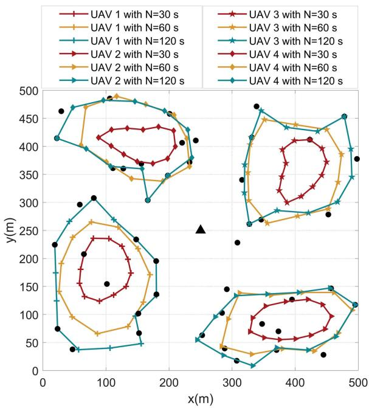  
Fig. 2. Optimized UAV trajectories under different task period N .

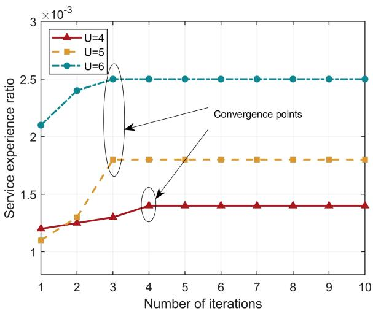

line

| Number of iterations | U=4     | U=5     | U=6     |
| -------------------- | ------- | ------- | ------- |
| 1                    | 1.2e-3  | 1.1e-3  | 2.1e-3  |
| 2                    | 1.25e-3 | 1.3e-3  | 2.4e-3  |
| 3                    | 1.3e-3  | 1.8e-3  | 2.5e-3  |
| 4                    | 1.4e-3  | 1.8e-3  | 2.5e-3  |
| 5                    | 1.4e-3  | 1.8e-3  | 2.5e-3  |
| 6                    | 1.4e-3  | 1.8e-3  | 2.5e-3  |
| 7                    | 1.4e-3  | 1.8e-3  | 2.5e-3  |
| 8                    | 1.4e-3  | 1.8e-3  | 2.5e-3  |
| 9                    | 1.4e-3  | 1.8e-3  | 2.5e-3  |
| 10                   | 1.4e-3  | 1.8e-3  | 2.5e-3  |

Fig. 3. Convergence performance of our proposed algorithm.

We change the number of UEs that the UAVs need to serve. As illustrated in Fig. 4, we show the average fairness index of each UE’s service delay achieved by the GCV, FRA, NCOA and our proposed algorithm. We observe that as the number of UEs increases, the average fairness index decreases. It is evident the distribution of UEs may be more dispersed and less bandwidth and computing resources allocated to each UE. Besides, due to the optimization of resource allocation and UAV trajectory, our proposed algorithm can guarantee high fairness when there are a large number of UEs.

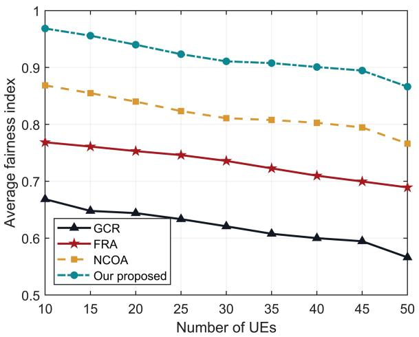

line

| Number of UEs | GCR   | FRA   | NCOA  | Our proposed |
| ------------- | ----- | ----- | ----- | ------------ |
| 10            | 0.67  | 0.77  | 0.87  | 0.98         |
| 15            | 0.65  | 0.76  | 0.86  | 0.97         |
| 20            | 0.64  | 0.75  | 0.85  | 0.96         |
| 25            | 0.63  | 0.74  | 0.83  | 0.94         |
| 30            | 0.62  | 0.73  | 0.82  | 0.92         |
| 35            | 0.61  | 0.72  | 0.81  | 0.91         |
| 40            | 0.60  | 0.71  | 0.81  | 0.90         |
| 45            | 0.59  | 0.70  | 0.80  | 0.89         |
| 50            | 0.57  | 0.69  | 0.77  | 0.87         |

Fig. 4. Average fairness index with different number of UEs.

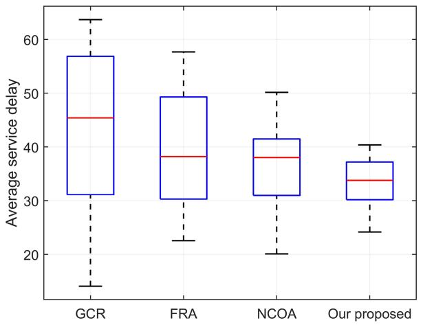

boxplot

| Method       | Average service delay |
| ------------ | --------------------- |
| GCR          | 57                    |
| FRA          | 50                    |
| NCOA         | 42                    |
| Our proposed | 37                    |

Fig. 6. Comparison of average service delay under four approaches.

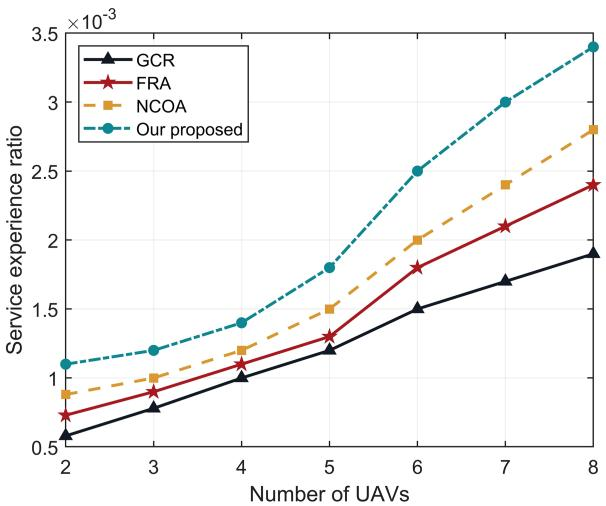

line

| Number of UAVs | GCR    | FRA    | NCOA   | Our proposed |
| -------------- | ------ | ------ | ------ | ------------ |
| 2              | 0.6    | 0.7    | 0.8    | 1.1          |
| 3              | 0.8    | 0.9    | 1.0    | 1.2          |
| 4              | 1.0    | 1.1    | 1.2    | 1.4          |
| 5              | 1.2    | 1.3    | 1.5    | 1.8          |
| 6              | 1.5    | 1.8    | 2.0    | 2.5          |
| 7              | 1.7    | 2.1    | 2.4    | 3.0          |
| 8              | 1.9    | 2.4    | 2.8    | 3.4          |

Fig. 5. Service experience ratio with different number of UAVs.

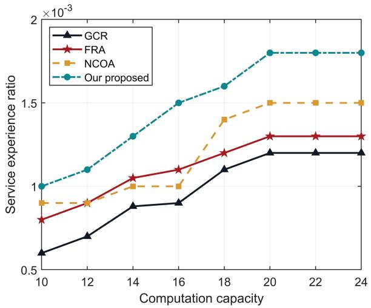

line

| Computation capacity | GCR    | FRA    | NCOA   | Our proposed |
| -------------------- | ------ | ------ | ------ | ------------ |
| 10                   | 0.6    | 0.8    | 0.9    | 1.0          |
| 12                   | 0.7    | 0.9    | 0.9    | 1.1          |
| 14                   | 0.9    | 1.0    | 1.0    | 1.3          |
| 16                   | 0.9    | 1.1    | 1.0    | 1.5          |
| 18                   | 1.1    | 1.2    | 1.4    | 1.6          |
| 20                   | 1.2    | 1.3    | 1.5    | 1.8          |
| 22                   | 1.2    | 1.3    | 1.5    | 1.8          |
| 24                   | 1.2    | 1.3    | 1.5    | 1.8          |

Fig. 7. Service experience ratio versus the computation capacity of each UAV.

From Fig. 5, we can see the performance comparison for different numbers of UAVs. As the number of UAV increases, the service experience ratio achieved by our proposed algorithm monotonically improves, since more UAVs can provide higher coverage. When the number of UAV is over 5, the UAVs cache most of the services required by tasks and have more computing and communication resources.

We study the value of service delay obtained by our proposed algorithm and the other three comparison algorithms. Fig. 6 shows the box plot of the average service delay. The average service delay achieved by our proposed algorithm falls in the interval [24.1, 40.4] s and has an average of 33.4 s. It can be concluded that our proposed algorithm can achieve lower average service delay and smaller fluctuation than the other three comparison algorithms, which further verifies that our proposed algorithm improves the service experience of all UEs. Due to the collaboration of UAVs, there are more reduction in average service delay.

In Fig. 7, we show how service experience ratio of all UEs changes as the UAV’s computation capacity $\mathcal { F } _ { u }$ increases from 10 to 24 GHz. We can find that the service experience ratio increases as the computing capacity increases. Specially, as the UAV’s computation capacity increases, the average service delay reduces, which results in the improvement on the service experience of all UEs. Moreover, the service experience ratio will not increase when the computation capacity exceeds a certain value due to the limitation of the UAV’s storage capacity and energy budget. On average, the service experience ratio achieved by our proposed algorithm is about 54%, 32% and 23% higher than those of the GCR, FRA and NCOA, respectively.

From Fig. 8, we can observe that the service experience ratio increases gradually with the coverage range of each UAV increases. The reason is that enlarging coverage range will lead to more covered UEs, resulting in higher service experience ratio. It can be seen from Fig. 8 that the performance improvement of GCR is slight compared with other algorithms. The reason is that UEs in GCR select the nearest UAV to access. Therefore, the coverage range has a limited influence on the service experience. Our proposed algorithm can greatly improve the service experience ratio by 62%, 36% and 17% compared with the GCR, FRA and NCOA, respectively.

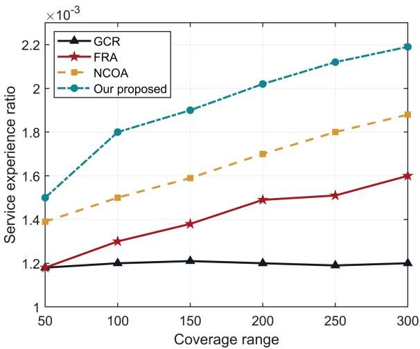

line

| Coverage range | GCR    | FRA    | NCOA   | Our proposed |
| -------------- | ------ | ------ | ------ | ------------ |
| 50             | 1.20   | 1.20   | 1.40   | 1.50         |
| 100            | 1.22   | 1.30   | 1.50   | 1.80         |
| 150            | 1.22   | 1.40   | 1.60   | 1.90         |
| 200            | 1.22   | 1.50   | 1.70   | 2.05         |
| 250            | 1.20   | 1.52   | 1.80   | 2.15         |
| 300            | 1.20   | 1.60   | 1.90   | 2.20         |

Fig. 8. Service experience ratio versus the coverage range of each UAV.

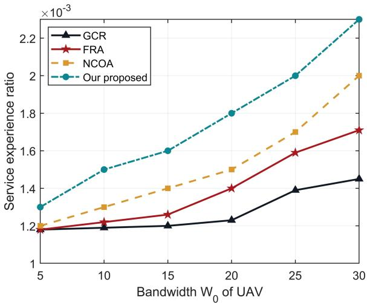

line

| Bandwidth W₀ of UAV | GCR    | FRA    | NCOA   | Our proposed |
| ------------------- | ------ | ------ | ------ | ------------ |
| 5                   | 1.20   | 1.20   | 1.20   | 1.30         |
| 10                  | 1.20   | 1.22   | 1.30   | 1.50         |
| 15                  | 1.22   | 1.26   | 1.40   | 1.60         |
| 20                  | 1.24   | 1.40   | 1.50   | 1.80         |
| 25                  | 1.40   | 1.60   | 1.70   | 2.00         |
| 30                  | 1.45   | 1.70   | 2.00   | 2.30         |

Fig. 10. Service experience ratio versus the bandwidth $W _ { 0 }$ of the UAV.

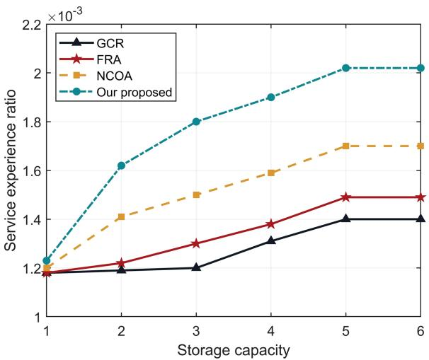

line

| Storage capacity | GCR    | FRA    | NCOA   | Our proposed |
| ---------------- | ------ | ------ | ------ | ------------ |
| 1                | 1.20   | 1.20   | 1.20   | 1.20         |
| 2                | 1.20   | 1.22   | 1.40   | 1.62         |
| 3                | 1.20   | 1.30   | 1.50   | 1.80         |
| 4                | 1.30   | 1.38   | 1.60   | 1.90         |
| 5                | 1.40   | 1.50   | 1.70   | 2.02         |
| 6                | 1.40   | 1.50   | 1.70   | 2.02         |

Fig. 9. Service experience ratio versus the storage capacity of the UAV.

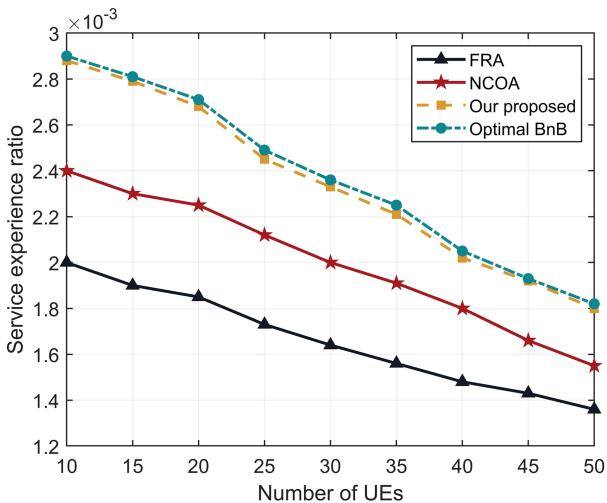

line

| Number of UEs | FRA    | NCOA   | Our proposed | Optimal BnB |
| ------------- | ------ | ------ | ------------ | ----------- |
| 10            | 2.0000 | 2.4000 | 2.9000       | 2.9000      |
| 15            | 1.9000 | 2.3000 | 2.8000       | 2.8000      |
| 20            | 1.8500 | 2.2500 | 2.7000       | 2.7000      |
| 25            | 1.7500 | 2.1500 | 2.5000       | 2.5000      |
| 30            | 1.6500 | 2.0500 | 2.3500       | 2.3500      |
| 35            | 1.5500 | 1.9500 | 2.2500       | 2.2500      |
| 40            | 1.4500 | 1.8500 | 2.1000       | 2.1000      |
| 45            | 1.4000 | 1.7500 | 1.9500       | 1.9500      |
| 50            | 1.3500 | 1.6500 | 1.8500       | 1.8500      |

Fig. 11. Service experience ratio versus different number of UEs.

Fig. 9 displays the impact of the UAV’s storage capacity on the service experience ratio. With the increasing amount of the storage capacity, the service experience ratio of all UEs presents an upward trend. When the number of UEs remains unchanged, the probability of services requested by the UE being stored at the UAV cache increases as the UAV’s storage capacity increases. When the storage capacity is relatively small, the difference in service experience ratio achieved by four approaches is not significant, since most of tasks are offloaded to the MBS. When the storage capacity increases to a certain level so that all services can be stored in the cache, the increase of the storage capacity will not lead to higher service experience ratio. The average service experience ratio of our proposed algorithm is 31% and 16% higher than those of the FRA and NCOA.

Fig. 10 depicts the service experience ratio for different values of the bandwidth $W _ { 0 } .$ In the experiment, the bandwidth of each UAV ranges from [5, 30] MHz. As expected, an increase in the bandwidth leads to a higher service experience ratio. Comparing the results of our proposed algorithm with the other three algorithms, it can be seen that our proposed algorithm outperforms other algorithms. Specially, the GCR is always associated with the nearest UAV, which may cause uplink congestion. There is a big gap between the GCR with the other three algorithms. The average service experience ratio of our proposed algorithm is 55% and 15% higher than those of the GCR and NCOA.

In Fig. 11, we describe the service experience ratio for different number of UEs. We can find that the proposed algorithm outperforms the other two baseline algorithms, FRA and NCOA. The task offloading and service caching subproblems with binary variables are integer linear programming, and the optimal task offloading and service caching placement decisions can be found by the branch and bound (BnB) method. However, the BnB has a high computational complexity of $O ( 2 ^ { M U } + 2 ^ { U S } )$ . (2 + 2 )The computational complexity of the proposed Algorithms 1 and 2 is roughly $O ( M U + U S )$ , which is much lower than BnB. ( + )The performance gap between our proposed algorithm and the optimal algorithm BnB is very small, which can demonstrate the near-optimality of our algorithm.

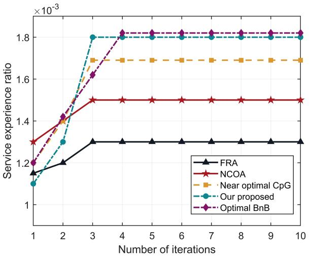

line

| Number of iterations | FRA    | NCOA   | Near optimal CpG | Our proposed | Optimal BnB |
| -------------------- | ------ | ------ | ---------------- | ------------ | ----------- |
| 1                    | 1.15   | 1.30   | 1.20             | 1.10         | 1.20        |
| 2                    | 1.20   | 1.40   | 1.40             | 1.30         | 1.40        |
| 3                    | 1.30   | 1.50   | 1.70             | 1.80         | 1.60        |
| 4                    | 1.30   | 1.50   | 1.70             | 1.80         | 1.80        |
| 5                    | 1.30   | 1.50   | 1.70             | 1.80         | 1.80        |
| 6                    | 1.30   | 1.50   | 1.70             | 1.80         | 1.80        |
| 7                    | 1.30   | 1.50   | 1.70             | 1.80         | 1.80        |
| 8                    | 1.30   | 1.50   | 1.70             | 1.80         | 1.80        |
| 9                    | 1.30   | 1.50   | 1.70             | 1.80         | 1.80        |
| 10                   | 1.30   | 1.50   | 1.70             | 1.80         | 1.80        |

Fig. 12. Performance comparison between the proposed algorithm and other algorithms.

As shown in Fig. 12, we conduct the performance comparison between our proposed algorithm and other algorithms. We also compare our proposed algorithm with the other algorithm, i.e., the near optimal caching placement by greedy algorithm (CpG) [25]. It can be found that the proposed algorithm can reach a near-optimal performance to BnB, and outperform the other two baseline algorithms in improving the service experience ratio. The reason is that our task offloading algorithm and service caching placement algorithm play an important role in multi-UAV collaboration.

# VII. CONCLUSION

This article studies the service experience ratio maximization. We aim to reduce service delay while ensuring fairness between UEs. To maximize the service experience, we consider the joint optimization of task offloading, resource allocation, trajectory planning, and service cache placement under the constraints of UAV’s energy and delay requirements. The original problem is a mixed-integer non-convex programming problem with a fractional structure. We first transform the fractional problem into a parametric programming form based on Dinkelbach’s method. Next, we design a four-stage alternating iteration algorithm to maximize the service experience ratio. Numerical results demonstrate that an appropriate trade-off between service delay and fairness among all UEs.

# REFERENCES

[1] M. Asim, Y. Wang, K. Wang, and P.-Q. Huang, “A review on computational intelligence techniques in cloud and edge computing,” IEEE Trans. Emerg. Topics Comput. Intell., vol. 4, no. 6, pp. 742–763, Dec. 2020.   
[2] P. A. Apostolopoulos, G. Fragkos, E. E. Tsiropoulou, and S. Papavassiliou, “Data offloading in uav-assisted multi-access edge computing systems under resource uncertainty,” IEEE Trans. Mobile Comput., vol. 22, no. 1, pp. 175–190, Jan. 2023.

[3] J. Chen et al., “Deep reinforcement learning based resource allocation in multi-UAV-aided mec networks,” IEEE Trans. Commun., vol. 71, no. 1, pp. 296–309, Jan. 2023.   
[4] Z. Yang, S. Bi, and Y.-J. A. Zhang, “Online trajectory and resource optimization for stochastic UAV-enabled MEC systems,” IEEE Trans. Wireless Commun., vol. 21, no. 7, pp. 5629–5643, Jul. 2022.   
[5] W. Liu, B. Li, W. Xie, Y. Dai, and Z. Fei, “Energy efficient computation offloading in aerial edge networks with multi-agent cooperation,” IEEE Trans. Wireless Commun., vol. 22, no. 9, pp. 5725–5739, Sep. 2023.   
[6] X. Gao, X. Zhu, and L. Zhai, “Minimization of aerial cost and mission completion time in multi-UAV-enabled IoT networks,” IEEE Trans. Commun., vol. 71, no. 9, pp. 5335–5347, Sep. 2023.   
[7] X. Zhu, L. Zhai, N. Li, Y. Li, and F. Yang, “Multi-objective deployment optimization of UAVs for energy-efficient wireless coverage,” IEEE Trans. Commun., early access, Jan. 22, 2024, doi: 10.1109/TCOMM.2024.3356795.   
[8] Y. Liu, K. Xiong, Q. Ni, P. Fan, and K. B. Letaief, “UAV-assisted wireless powered cooperative mobile edge computing: Joint offloading, CPU control, and trajectory optimization,” IEEE Internet Things J., vol. 7, no. 4, pp. 2777–2790, Apr. 2020.   
[9] L. Yang, H. Yao, J. Wang, C. Jiang, A. Benslimane, and Y. Liu, “Multi-UAV-enabled load-balance mobile-edge computing for IoT networks,” IEEE Internet Things J., vol. 7, no. 8, pp. 6898–6908, Aug. 2020.   
[10] Z. Yang, C. Pan, K. Wang, and M. Shikh-Bahaei, “Energy efficient resource allocation in UAV-enabled mobile edge computing networks,” IEEE Trans. Wireless Commun., vol. 18, no. 9, pp. 4576–4589, Sep. 2019.   
[11] V. Farhadi et al., “Service placement and request scheduling for dataintensive applications in edge clouds,” IEEE/ACM Trans. Netw., vol. 29, no. 2, pp. 779–792, Apr. 2021.   
[12] T. Ouyang, Z. Zhou, and X. Chen, “Follow me at the edge: Mobility-aware dynamic service placement for mobile edge computing,” IEEE J. Sel. Areas Commun., vol. 36, no. 10, pp. 2333–2345, Oct. 2018.   
[13] S. Song, S. Ma, X. Zhu, Y. Li, F. Yang, and L. Zhai, “Joint bandwidth allocation and task offloading in multi-access edge computing,” Expert Syst. Appl., vol. 217, 2023, Art. no. 119563. [Online]. Available: https: //www.sciencedirect.com/science/article/pii/S0957417423000647   
[14] Y. Li et al., “Collaborative content caching and task offloading in multiaccess edge computing,” IEEE Trans. Veh. Technol, vol. 72, no. 4, pp. 5367–5372, Apr. 2023.   
[15] Y. Liu, Y. Li, Y. Niu, and D. Jin, “Joint optimization of path planning and resource allocation in mobile edge computing,” IEEE Trans. Mobile Comput., vol. 19, no. 9, pp. 2129–2144, Sep. 2020.   
[16] Y. Zeng, J. Xu, and R. Zhang, “Energy minimization for wireless communication with rotary-wing UAV,” IEEE Trans. Wireless Commun., vol. 18, no. 4, pp. 2329–2345, Apr. 2019.   
[17] S. Tang, K. He, L. Chen, L. Fan, X. Lei, and R. Q. Hu, “Collaborative cache-aided relaying networks: Performance evaluation and system optimization,” IEEE J. Sel. Areas Commun., vol. 41, no. 3, pp. 706–719, Mar. 2023.   
[18] X. Gao, X. Zhu, and L. Zhai, “AoI-sensitive data collection in multi-UAV-assisted wireless sensor networks,” IEEE Trans. Wireless Commun., vol. 22, no. 8, pp. 5185–5197, Aug. 2023.   
[19] T. Zhang, Y. Xu, J. Loo, D. Yang, and L. Xiao, “Joint computation and communication design for UAV-assisted mobile edge computing in IoT,” IEEE Trans. Ind. Informat., vol. 16, no. 8, pp. 5505–5516, Aug. 2020.   
[20] C. Deng, X. Fang, and X. Wang, “UAV-enabled mobile-edge computing for AI applications: Joint model decision, resource allocation, and trajectory optimization,” IEEE Internet Things J., vol. 10, no. 7, pp. 5662–5675, Apr. 2023.   
[21] X. He, R. Jin, and H. Dai, “Multi-hop task offloading with on-the-fly computation for multi-UAV remote edge computing,” IEEE Trans. Commun., vol. 70, no. 2, pp. 1332–1344, Feb. 2022.   
[22] X. Liu, Z. Liu, and M. Zhou, “Fair energy-efficient resource optimization for green multi-NOMA-UAV assisted Internet of Things,” IEEE Trans. Green Commun. Netw., vol. 7, no. 2, pp. 904–915, Jun. 2023.   
[23] Y. Miao, K. Hwang, D. Wu, Y. Hao, and M. Chen, “Drone swarm path planning for mobile edge computing in industrial Internet of Things,” IEEE Trans. Ind. Informat., vol. 19, no. 5, pp. 6836–6848, May 2023.   
[24] J. Li, C. Yi, J. Chen, K. Zhu, and J. Cai, “Joint trajectory planning, application placement and energy renewal for UAV-assisted MEC: A triple-learner based approach,” IEEE Internet Things J., vol. 10, no. 15, pp. 13622–13636, Aug. 2023.   
[25] T. Zhang, Y. Wang, Y. Liu, W. Xu, and A. Nallanathan, “Cache-enabling UAV communications: Network deployment and resource allocation,” IEEE Trans. Wireless Commun., vol. 19, no. 11, pp. 7470–7483, Nov. 2020.

[26] R. Zhou, X. Wu, H. Tan, and R. Zhang, “Two time-scale joint service caching and task offloading for uav-assisted mobile edge computing,” in Proc. IEEE Conf. Comput. Commun., 2022, pp. 1189–1198.   
[27] W. Mao, K. Xiong, Y. Lu, P. Fan, and Z. Ding, “Energy consumption minimization in secure multi-antenna UAV-assisted MEC networks with channel uncertainty,” IEEE Trans. Wireless Commun., vol. 22, no. 11, pp. 7185–7200, Nov. 2023.   
[28] L. P. Qian, H. Zhang, Q. Wang, Y. Wu, and B. Lin, “Joint multi-domain resource allocation and trajectory optimization in UAV-assisted maritime IoT networks,” IEEE Internet Things J., vol. 10, no. 1, pp. 539–552, Jan. 2023.   
[29] Z. Ning et al., “5G-enabled UAV-to-community offloading: Joint trajectory design and task scheduling,” IEEE J. Sel. Areas Commun., vol. 39, no. 11, pp. 3306–3320, Nov. 2021.   
[30] L. X. Nguyen, Y. K. Tun, T. N. Dang, Y. M. Park, Z. Han, and C. S. Hong, “Dependency tasks offloading and communication resource allocation in collaborative UAV networks: A metaheuristic approach,” IEEE Internet Things J., vol. 10, no. 10, pp. 9062–9076, May 2023.   
[31] B. Liu, C. Liu, and M. Peng, “Computation offloading and resource allocation in unmanned aerial vehicle networks,” IEEE Trans. Veh. Technol, vol. 72, no. 4, pp. 4981–4995, Apr. 2023.   
[32] Z. Yu, Y. Gong, S. Gong, and Y. Guo, “Joint task offloading and resource allocation in UAV-enabled mobile edge computing,” IEEE Internet Things J., vol. 7, no. 4, pp. 3147–3159, Apr. 2020.   
[33] L. Zhao et al., “Vehicular computation offloading for industrial mobile edge computing,” IEEE Trans. Ind. Informat., vol. 17, no. 11, pp. 7871– 7881, Nov. 2021.   
[34] J. Ji, K. Zhu, and L. Cai, “Trajectory and communication design for cache- enabled UAVs in cellular networks: A deep reinforcement learning approach,” IEEE Trans. Mobile Comput., vol. 22, no. 10, pp. 6190–6204, Oct. 2022.   
[35] T. Ren et al., “Enabling efficient scheduling in large-scale UAV-assisted mobile-edge computing via hierarchical reinforcement learning,” IEEE Internet Things J., vol. 9, no. 10, pp. 7095–7109, May 2022.   
[36] M. Yi, X. Wang, J. Liu, Y. Zhang, and R. Hou, “Multitask transfer deep reinforcement learning for timely data collection in rechargeable-UAVaided IoT networks,” IEEE Internet Things J., vol. 10, no. 23, pp. 20 545–20 559, Dec. 2023.   
[37] L. Wang, K. Wang, C. Pan, W. Xu, N. Aslam, and A. Nallanathan, “Deep reinforcement learning based dynamic trajectory control for uav-assisted mobile edge computing,” IEEE Trans. Mobile Comput., vol. 21, no. 10, pp. 3536–3550, Oct. 2022.   
[38] C. H. Liu, Z. Chen, and Y. Zhan, “Energy-efficient distributed mobile crowd sensing: A deep learning approach,” IEEE J. Sel. Areas Commun., vol. 37, no. 6, pp. 1262–1276, Jun. 2019.

[39] Y. Xu, T. Zhang, Y. Liu, D. Yang, L. Xiao, and M. Tao, “UAV-assisted MEC networks with aerial and ground cooperation,” IEEE Trans. Wireless Commun., vol. 20, no. 12, pp. 7712–7727, Dec. 2021.   
[40] W. Dinkelbach, “On nonlinear fractional programming,” Manage. Sci., vol. 13, no. 7, pp. 492–498, 1967.   
[41] J. Zhang et al., “Computation-efficient offloading and trajectory scheduling for multi-UAV assisted mobile edge computing,” IEEE Trans. Veh. Technol, vol. 69, no. 2, pp. 2114–2125, Feb. 2020.   
[42] L. Wang, Q. Zhou, and Y. Shen, “Computation efficiency maximization for UAV-assisted relaying and MEC networks in urban environment,” IEEE Trans. Green Commun. Netw., vol. 7, no. 2, pp. 565–578, Jun. 2023.

natural_image

Portrait of a woman wearing a light blue collared shirt and tie (no text or symbols visible)

Xingxia Gao (Graduate Student Member, IEEE) is currently working toward the master’s degree with the School of Information Science and Engineering, Shandong Normal University. Her current research interests include UAV, IoT, edge computing.

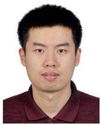

natural_image

Portrait photo of a man in a maroon polo shirt (no text or symbols visible)

Linbo Zhai (Member, IEEE) received the BS and MS degrees from the School of Information Science and Engineering at Shandong University in 2004 and 2007, respectively, and the PhD degree from the School of Electronic Engineering at Beijing University of Posts and Telecommunications in 2010. From then on, he worked as a teacher in Shandong Normal University. His current research interests include cognitive radio, crowdsourcing and distributed network optimization.