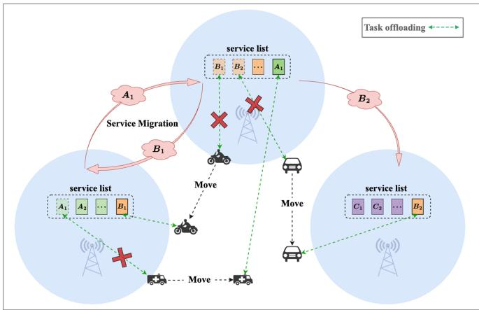
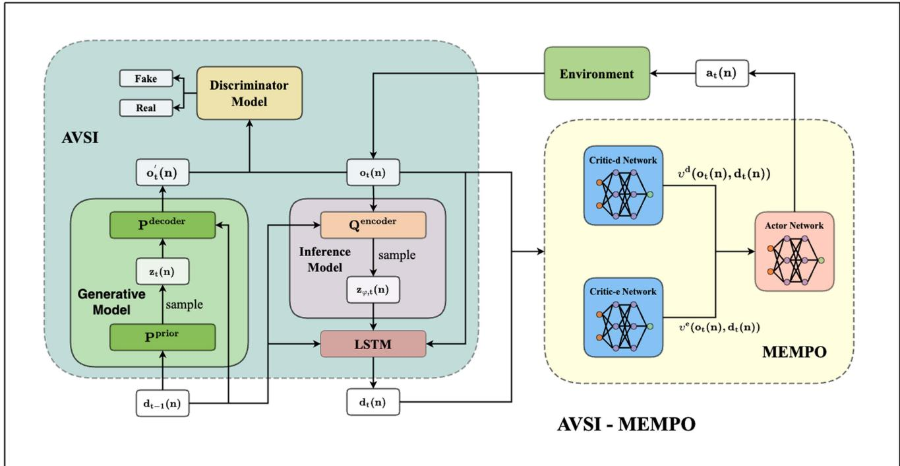
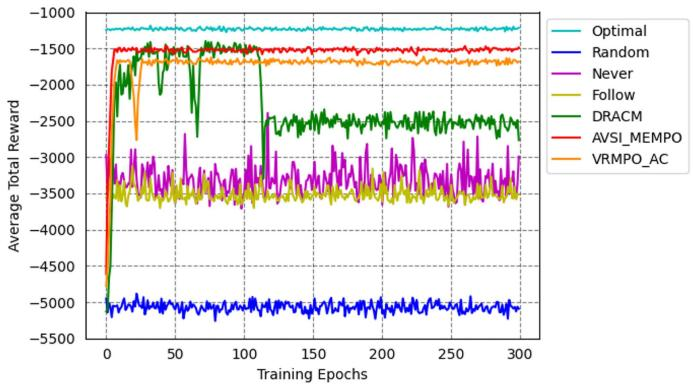
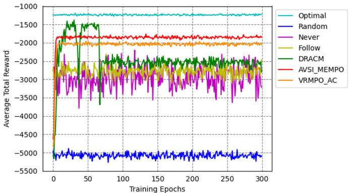
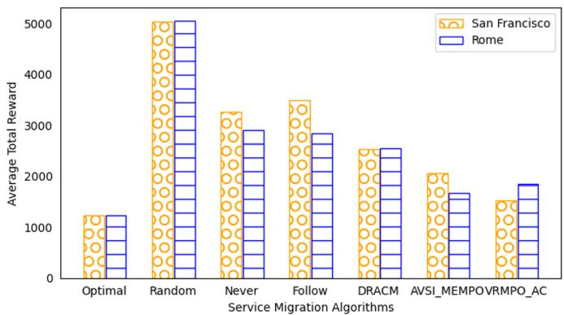
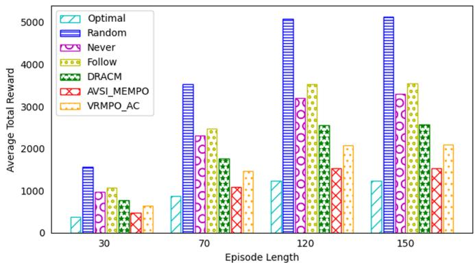
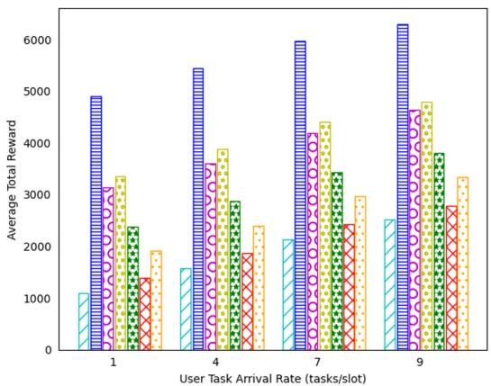
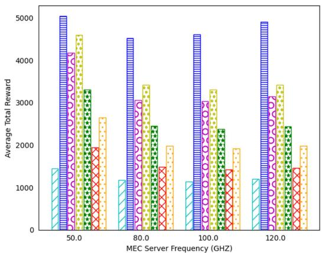

# Service Migration Strategies Based on Partially Observable and Multi-Objective Optimization

Yingzhen Hou , Lei Yang , and Yu Dai

Abstract—Multi-access Edge Computing (MEC) extends cloud computing to the network edge, supporting resource-intensive mobile applications. Service migration ensures seamless continuity and high-quality service (QoS) when users move between MEC servers. In the Internet of Vehicles (IoV), the high mobility of vehicles causes network instability, complicating the collection of system information. In addition, vehicles impose strict latency and green energy requirements, and the search for the Pareto front among conflicting objectives increases the complexity of migration. Existing service migration methods rely on centralized decision making using complete system information, which is not suitable for the user-centric IoV environment. Current multi-objective reinforcement learning approaches lack sufficient exploration randomness, leading to suboptimal performance. We propose the Adversarial Variational State Inference with Maximum Entropy Multi-Objective Policy Optimization (AVSI-MEMPO) algorithm to address the partially observable and multi-objective optimization problem, optimizing migration node selection. The service migration problem is modeled as a partially observable Markov decision process (POMDP). To solve this, we design an encoding network, AVSI, integrating Long Short-Term Memory (LSTM), Variational Autoencoders (VAE) and adversarial learning to extract hidden state. We also introduce the Maximum Entropy Multi-Objective Policy Optimization (MEMPO) algorithm, which enhances exploration randomness through maximum entropy and dynamic weight design. Extensive experiments based on real mobility trajectories show that our method outperforms baseline algorithms and achieves near-optimal results in various MEC scenarios.

Index Terms—Multi-access edge computing, service migration, Internet of Vehicles, partially observable, multi-objective optimization.

## I. INTRODUCTION

T HE advances in 5G and the Internet of Things (IoT) tech-nologies have driven the widespread adoption of mobile nologies have driven the widespread adoption of mobile devices and significantly increased mobile data traffic. This growth has intensified the demand for latency-sensitive and computationally intensive mobile applications, such as real-time gaming, augmented reality, and autonomous driving. However, the limited computational resources of mobile devices often result in bottlenecks during application execution, adversely impacting the quality of user experience (QoE). Traditional methods typically involve offloading data to remote cloud data centers for processing, but the significant distance between cloud servers and end users exacerbates transmission latency issues. To address these challenges, Multi-Access Edge Computing (MEC) has emerged as a transformative solution. By deploying servers at the edge of the network [1], MEC offers more computational resources, allowing mobile devices to offload tasks to the MEC nodes, significantly reducing response times and improving Quality of Service (QoS) [2]. However, with increasing user mobility, the distance between users and their initial edge cloud server increases, often requiring communication through intermediary edge clouds. This scenario not only increases service latency and response times, but also increases the risk of service interruptions [3]. To ensure seamless service continuity, service migration has become a central research topic in the MEC domain [4], [5], [6], [7], [8]. By dynamically relocating services to more suitable MEC servers, service migration mitigates the risk of disruptions or performance degradation, ensuring uninterrupted service delivery and improving user experience.

In the Internet of Vehicles (IoV) scenario, high-speed vehicle movement triggers frequent base station handovers, necessitating the real-time processing of various critical applications. For instance, assisted driving systems require processing LiDAR point clouds and camera data, while AR navigation necessitates rendering high-precision 3D maps. The stringent latency requirements of such applications make dynamic selection of migration nodes a key technology to ensure low latency in realtime vehicle decision-making and a smooth user experience. To meet users’ personalized demands for service performance (e.g., real-time migration for low-latency interactive applications, energy-saving strategies for high-energy-efficiency devices) and overcome the scalability bottlenecks faced by centralized service migration—such as sharply increased state synchronization overhead under surging user numbers—this study adopts a user-centric service migration paradigm [9], [10], deploying lightweight intelligent agents on user terminals. This design enables users to independently optimize migration strategies based on their real-time requirements (task data volume, task complexity) and local environmental states (location, channel quality, etc.), ensuring differentiated service experiences while significantly reducing the state synchronization overhead of centralized systems in massive user scenarios, thereby achieving a co-breakthrough in service performance optimization and system elastic scaling capability.

However, high-speed vehicle movement triggers frequent base station handovers, and users can only make decisions based on partial observations (e.g. local server ID, wireless transmission rate) [9], [11], while global information (e.g., non-local server loads) is unavailable in real-time due to communication overhead. This results in a partial observability problem that adversely affects migration node selection. Specific criteria characterizing partial-observability constraints include: (1) limited observation dimensions and (2) stochastic task demands. To address this issue, previous research [9], [10] has utilized neural networks to approximate hidden states under partial observations to improve migration performance with limited information. However, due to constrained information accessibility, the extraction accuracy of encoding networks for environmental hidden states remains inadequate, constituting a critical challenge that demands further resolution.

Additionally, during the service migration process, vehicles must minimize service interruption latency while reducing energy consumption to address the current emphasis on environmental protection and green energy. However, these two objectives often conflict; for example, reducing latency typically requires increased power consumption, leading to higher energy usage. Balancing these multi-objective demands to identify the Pareto frontier significantly increases the complexity of migration decision-making. Most existing migration decision methods focus primarily on single-objective optimization [9], [12], [13], while some multi-objective optimization approaches adopt single-policy methods [10]. These singlepolicy methods convert multi-objective optimization into singleobjective optimization through pre-defined weights based on prior knowledge but often overlook the interdependence among objectives, potentially resulting in suboptimal performance. In the field of multi-objective reinforcement learning (MORL), multi-policy methods have been proposed to overcome the limitations of single-policy approaches [14], [15] and improve performance. By training neural networks, these methods can generate a set of approximate Pareto-optimal solutions tailored to different objective weights. However, current multipolicy methods are often limited by insufficient exploration randomness, which constrains their performance. Addressing this issue remains a critical challenge that requires further investigation.

Based on the above discussion, the objective of this study is to optimize the selection of migration nodes in user-centric IoV scenarios by addressing the challenges of partial observability and multi-objective optimization. Specifically, this work focuses on two critical issues in service migration: the insufficient capability of extracting partially observable hidden states in a usercentered context, and the inadequate exploration randomness when computing optimal strategy sets for multi-objective optimization. To address these challenges, this paper proposes AVSI to extract hidden states that represent current global information. Additionally, it introduces MEMPO, which integrates entropy and dynamic weights to enhance exploration randomness across different objectives (e.g., latency and energy consumption), thereby optimizing migration strategies. The main contributions of this study are as follows:

  
Fig. 1. System Model Diagram.

We propose the AVSI model, which enhances the accuracy of hidden state extraction by introducing adversarial training. This improvement enables a better representation of global information, addresses the partial observability issue in service migration, and subsequently improves the performance of migration decision algorithms.

Under the combined constraints of latency and energy consumption, propose MEMPO to optimize service migration strategies. Through entropy and dynamic weights, it improves the exploration of randomness for different objectives, achieving strategy optimization.

Based on the San Francisco and Rome datasets, the proposed AVSI-MEMPO algorithm demonstrates a stable training process and high adaptability to various scenarios compared to the baseline algorithms, achieving nearoptimal service migration performance.

The rest of this paper is organized as follows. Section II presents the problem statement with respect to service migration. Section III provides an overview of the AVSI-MEMPO modeling and the specifics of the AVSI-MEMPO algorithm. In Section IV, the performance of AVSI-MEMPO and five baseline algorithms are evaluated on two real-world mobile trajectories featuring various MEC scenarios. Section V conducts a review of related work. Finally, Section VI concludes.

## II. PROBLEM FORMULATION OF SERVICE MIGRATION

As shown in Fig. 1, this paper examines an Internet of Vehicles (IoV) scenario where mobile users move within a geographical area covered by a set of MEC servers, each co-located with a base station. In this MEC system, mobile users can offload computational tasks to the MEC servers. Specifically, the MEC server responsible for executing services for a mobile user is defined as the user’s service server, while the MEC server directly connected to the mobile user is referred to as the user’s local server. The MEC server initially hosting the service for the mobile user is termed the user’s source server. Mobile users can access service servers that are not directly connected to them via multi-hop communication between servers. To ensure satisfactory Quality of Service (QoS) during user mobility, services should dynamically migrate between MEC servers.

The paper adopts a slot-based model, where in the user’s location changes only at the onset of each slot. As users move and alter their positions, they make migration decisions for the current service and subsequently offload computation tasks to service nodes for processing. To depict the system’s dynamics more effectively, the paper considers a continuous-time $T$ represented as a sequence of equal-length slots, denoted by the set of slot indices $\mathcal { T } = \{ 1 , 2 , \dots , T \}$ . The set of user indices is denoted by $\mathcal { N } = \{ 1 , 2 , \dots , N \}$ , and the set of MEC server indices is denoted as $\mathcal { M } = \{ 1 , 2 , \dots , M \}$

At the initial stage of each slot t, the position of mobile user n changes, generating a computation task represented by a triplet $d _ { t } ^ { t a s k n } , \rho _ { t n } , c _ { t n } .$ where $\bar { d } _ { t } ^ { t a s k } ( n )$ denotes the task data volume, $\rho _ { t } ( n )$ denotes the task complexity, and $c _ { t } ( n ) =$ $d _ { t } ^ { t a s k } ( n ) * \rho _ { t } ( n )$ denotes the task computation load. Subsequently, the service migration algorithm makes a migration decision $a _ { t } ( n ) \in \mathcal { M }$ based on the currently observed information, where $a _ { t } ( n )$ can be any MEC server within the coverage area. In this paper, the MEC server within the coverage range of the mobile user n in the slot t is called the local server and denoted as $a _ { t } ^ { l o c a l } ( n ) \in \mathcal { M }$ , the MEC server that provides service to the mobile user n in slot t is referred to as the target server and denoted as $a _ { t } ^ { o b j e c t } ( n ) \in \mathcal { M }$ , and the MEC server that provided service to mobile user n in slot $t - 1 ( t > 1 )$ is referred to as the source server and denoted $a _ { t } ^ { s o u r c e } ( n ) \in \mathcal { M }$

During the service migration process, it involves two parts: upload and transmission of mobile user tasks, and migration of the service data from the source server. For mobile user task upload and transmission: When the service migration algorithm selects the local server as the target server, that is, $\overline { { a _ { t } ^ { o b j e c t } } } ( n ) = a _ { t } ^ { l o c a l } ( n )$ , the user’s task data is uploaded to the local server; when the target server is not the local server, i.e., $a _ { t } ^ { o b j e c t } ( n ) \neq a _ { t } ^ { l o c a l } ( n )$ , the user’s task data is uploaded to the local server, and then the task data is transferred to the target server using the wired network between MEC servers. For source server service data migration: the service data of the source server is transferred to the target server using the wired network between MEC servers. Finally, the target server completes the task of processing user tasks and transmitting the computation results. Consistent with existing work, this paper assumes that the computation tasks generated in slot t are completed in the same slot. Due to the small data volume of computation results, the overhead caused by transmitting computation results back is not considered in this paper.

The primary objective of this paper is to improve the quality of service and the user experience by reducing the latency and migration costs perceived by the user. User-perceived latency is comprised of three components: migration latency, transmission latency, and computation latency [9], [13], [16], while migration costs consist of migration energy consumption, transmission energy consumption, and computation energy consumption [17]. When the service migration algorithm selects the target server, the user source server data need to be migrated to the target server, leading to migration latency and energy consumption. Migration latency and energy consumption are influenced by factors such as migration data volume, network transmission rate, and distance between the source and target servers [9], [18], [19], [20]. Therefore, this paper calculates the migration latency and energy consumption for the mobile user n in the time slot t using the following approach:

$$
T _ {t} ^ {m} (n) = \left\{ \begin{array}{l l} \frac {d _ {t} ^ {\text { migration }} (n)}{v _ {t} (n)} + \tau_ {t} ^ {m} k _ {t} (n), & a _ {t} ^ {\text { object }} (n) \neq a _ {t} ^ {\text { source }} (n) \\ 0, & a _ {t} ^ {\text { object }} (n) = a _ {t} ^ {\text { source }} (n) \end{array} \right.\tag{1}
$$

$$
E _ {t} ^ {m} (n) = \left\{ \begin{array}{l l} T _ {t} ^ {m} (n) P (n), & a _ {t} ^ {\text { object }} (n) \neq a _ {t} ^ {\text { source }} (n) \\ 0, & a _ {t} ^ {\text { object }} (n) = a _ {t} ^ {\text { source }} (n) \end{array} \right.\tag{2}
$$

In the context provided, $d _ { t } ^ { m i g r a t i o n } ( n )$ represents the amount of migration data, $\nu _ { t }$ denotes the network bandwidth, $\tau _ { t } ^ { m }$ signifies the migration coefficient(i.e., the migration time per hop), $k _ { t } ( n )$ indicates the number of hops between the target server and the source server, and $P ( n )$ denotes the transmission power of the MEC server.

Upon making migration decisions, the task data of mobile users needs to be uploaded to the target server. The delay incurred by transmitting task data and the associated energy consumption is referred to as transmission delay and transmission energy consumption, respectively. Transmission energy consumption typically consists of two components: wireless transmission energy consumption and propagation energy consumption. The calculation method for the wireless transmission delay and energy consumption, incurred when uploading task data to the local server via wireless transmission [9], [17], is as follows:

$$
T _ {t} ^ {w} (n) = \frac {d _ {t} ^ {t a s k} (n)}{\omega_ {t} (n)}\tag{3}
$$

$$
E _ {t} ^ {w} (n) = T _ {t} ^ {w} (n) \cdot p (n)\tag{4}
$$

Here, $\omega _ { t } ( n )$ represents the wireless transmission rate, which is influenced by factors such as the wireless channel bandwidth between the mobile device and its local server, channel noise, and the transmission power of the user device. $p ( n )$ denotes the transmission power of the terminal user.

If the local server is not the target server, the task data of mobile users needs to be propagated through the local server to the target server, resulting in propagation delay and propagation energy consumption [9], [17]:

$$
T _ {t} ^ {p} (n) = \left\{ \begin{array}{l l} \frac {d _ {t} ^ {\mathrm{task}} (n)}{v _ {t} (n)} + \tau_ {t} ^ {b} l _ {t} (n), & a _ {t} ^ {\mathrm{object}} (n) \neq a _ {t} ^ {\mathrm{local}} (n) \\ 0, & a _ {t} ^ {\mathrm{object}} (n) = a _ {t} ^ {\mathrm{local}} (n) \end{array} \right.\tag{5}
$$

$$
E _ {t} ^ {p} (n) = \left\{ \begin{array}{l l} T _ {t} ^ {p} (n) P (n), & a _ {t} ^ {\mathrm{object}} (n) \neq a _ {t} ^ {\mathrm{local}} (n) \\ 0, & a _ {t} ^ {\mathrm{object}} (n) = a _ {t} ^ {\mathrm{local}} (n) \end{array} \right.\tag{6}
$$

Here $\tau _ { t } ^ { b }$ represents the propagation coefficient(i.e., per-hop propagation delay) and $l _ { t } ( n )$ denotes the number of hops between the target server and the local server.

The computation delay and energy consumption of user tasks in MEC servers are primarily influenced by the server’s load level and computational capability [9], [21]. They can be calculated as follows:

$$
T _ {t} ^ {c} (n) = \frac {c _ {t} (n) + \eta_ {t} (n)}{f (n)}\tag{7}
$$

$$
E _ {t} ^ {c} (n) = k (f (n)) ^ {2} \cdot (c _ {t} (n) + \eta_ {t} (n))\tag{8}
$$

TABLE I ENVIRONMENT PARAMETER SETTINGS

<table><tr><td>Description</td><td>Value</td></tr><tr><td>Number of Base Stations</td><td> $B = 64$ </td></tr><tr><td>Length of Time Slot</td><td> $T = 100$ </td></tr><tr><td>MEC Server Coverage Radius</td><td> $R = 0.5 \text{ km}$ </td></tr><tr><td>MEC Server Computational Capability</td><td> $f = 128 \text{ GHz}$ </td></tr><tr><td>MEC Server Task Arrival Rate</td><td> $\zeta_t^{\text{server}} \sim U(5, 20)$ </td></tr><tr><td>Network Bandwidth</td><td> $\nu = 500 \text{ MB/s}$ </td></tr><tr><td>Mobile User Task Arrival Rate</td><td> $\zeta_t^{\text{user}} = 2$ </td></tr><tr><td>Task Data Size</td><td> $d_t^{\text{task}}(n),$  $d_t^{\text{service}}(n) \sim U(0.05, 5) \text{ MB}$ </td></tr><tr><td>Task Complexity</td><td> $\rho_t(n) \sim U(200, 10000) \text{ cycles/bit}$ </td></tr><tr><td>Propagation Coefficient</td><td> $\tau_t^b = 0.02 \text{ s/hop}$ </td></tr><tr><td>Migration Coefficient</td><td> $\tau_t^m \sim U(1, 3) \text{ s/hop}$ </td></tr></table>

Here, $\eta _ { t } ( n )$ represents the load level of the target server, and $f ( n )$ denotes the computational capability of the target server. k is an energy coefficient [21] associated with the chip structure.

As indicated in the overview, the user-perceived delay [13] can be expressed as:

$$
T _ {t} ^ {t o t a l} (n) = T _ {t} ^ {m} (n) + T _ {t} ^ {w} (n) + T _ {t} ^ {p} (n) + T _ {t} ^ {c} (n)\tag{9}
$$

The migration cost [17] can be represented as:

$$
E _ {t} ^ {t o t a l} (n) = E _ {t} ^ {m} (n) + E _ {t} ^ {w} (n) + E _ {t} ^ {p} (n) + E _ {t} ^ {c} (n)\tag{10}
$$

Given a finite time horizon T, the service migration problem addressed in this paper aims to determine the optimal migration decisions $\{ a _ { 1 } , a _ { 2 } , \ldots , a _ { T } \}$ that minimize the total cost, encompassing both total delay and migration cost. Formally, this objective can be expressed as follows:

$$
\begin{array}{l l} \min _ {\{a _ {t} (n) \}} & \sum_ {t = 1} ^ {T} r \left(T _ {t} ^ {\text { total }} (n), E _ {t} ^ {\text { total }} (n)\right) \\ \text { s.t. } & \forall t \in \mathcal {T}, \forall n \in \mathcal {N}, a _ {t} (n) \in \mathcal {M} \\ & \forall t \in \mathcal {T}, \sum_ {n \in \mathcal {N}} (c _ {t} (n) + \eta_ {t} (n)) \leq f _ {\max} \end{array}\tag{11}
$$

The function $r ( \cdot , \cdot )$ can represent either of two reward functions, their average, or their sum, depending on the learning objective. where $f _ { \mathrm { m a x } }$ denotes the maximum computational capacity of the MEC server (in GHz). In our experimental setup, this parameter is set to 128 GHz (see Table I for details). This constraint ensures that the sum of the task computational load $c _ { t } ( n )$ and the server’s real-time load $\eta _ { t } ( n )$ for all users within a single time slot does not exceed the server’s maximum processing capability, thus preventing service quality degradation due to resource overload. Due to factors such as the time-varying nature of the system state, user mobility, and the partial observability of state information, solving this optimization problem for the optimal solution directly is not feasible. However, as it fundamentally constitutes a sequential decision-making problem with incomplete observation information, the subsequent sections will employ the POMDP model and reinforcement learning methods to address it.

## III. SERVICE MIGRATION WITH INCOMPLETE INFORMATION

In the realm of MEC, the consideration of multi-objective service migration fundamentally involves addressing a sequential decision-making challenge within a partially observable environment, characterized by incomplete system information. This scenario naturally lends itself to modeling as a Partially Observable Markov Decision Process (POMDP). To facilitate effective migration decision-making, this paper adopts the proposed AVSI-MEMPO method to tackle the intricacies of the POMDP. Before delving into the detailed exposition of the solution, the paper will first elucidate the necessary foundational concepts.

## A. Backgrounds of RL and POMDP

Reinforcement learning: RL is a machine learning paradigm aimed at learning decision-making processes that lead to optimal outcomes through an agent’s interaction with its environment. In RL, the agent observes the state of the environment, selects actions accordingly, and receives feedback rewards, enabling it to adjust its strategy iteratively to maximize long-term cumulative rewards.

Central to RL are value functions and policy functions, which guide decision-making. Value functions estimate the expected long-term rewards of taking specific actions in a given state, while policy functions determine the actions to be taken in each state. Key value functions include the state value function $V ( s )$ and the action value function $Q ( s , a )$

The core concepts of RL are often formalized using Markov Decision Processes (MDPs), which consist of five components: the state space S, action space A, state transition probability function $P ,$ reward function R, and discount factor $\gamma$ . The primary objective in RL is to derive an optimal policy that maximizes cumulative rewards over time. This relationship between the state value function $V ( s )$ and the action value function $Q ( s , a )$ is commonly described using the Bellman equation:

$$
V (s) = E \left[ R (s, a) + \gamma \sum_ {s ^ {\prime}} P \left(s ^ {\prime} \mid s, a\right) V \left(s ^ {\prime}\right) \right]\tag{12}
$$

$$
Q (s, a) = E \left[ R (s, a) + \gamma \sum_ {s ^ {\prime}} P \left(s ^ {\prime} \mid s, a\right) \max _ {a ^ {\prime}} Q \left(s ^ {\prime}, a ^ {\prime}\right) \right]\tag{13}
$$

Through these equations, agents can continuously update their value functions based on feedback from the environment, thereby gradually improving their decision-making policies to achieve optimal behavioral strategies. Reinforcement learning based on value function decision-making selects actions by maximizing the value function to obtain the maximum long-term cumulative reward. It evaluates all possible actions and selects the optimal one. However, when the action space is large, the computational complexity increases significantly. This problem is exacerbated by the complex state space and large action space of the Mobile Edge Computing (MEC) environment, making reinforcement learning based on value function decision-making unsuitable for solving service migration problems. In contrast, policy-based methods can directly learn policies without the need for additional evaluation steps, exhibiting good convergence properties when dealing with complex state and action spaces. However, conventional policy-based methods may encounter issues with searching the policy space, leading to the problem of local optima. To address this issue, for the multiobjective reinforcement learning problem of service migration, this paper proposes the MEMPO algorithm, which introduces dynamic weighting and maximum entropy learning. By extending multiple objectives to multiple critic networks and dynamically learning with optimal weights, and introducing maximum entropy to increase the exploration of the reinforcement learning algorithm, it reduces the likelihood of multi-objective optimization policies falling into poor local optima.

Partially observable markov decision process: POMDP is a classical model for sequential decision-making problems, used to describe the process by which an agent achieves certain objectives through a series of actions in an environment where the state is only partially observable. In a POMDP, the agent faces an incompletely observable environment, requiring it to make optimal decisions based on observed information and prior knowledge. The POMDP model consists of five elements: state space, observation space, action space, transition function, and observation function.

The state space defines all possible states the environment may be in, the observation space defines all the information the agent can observe, and the action space defines all possible actions the agent can take. The transition function describes how the environment’s state transitions based on the agent’s actions, and the observation function describes the information the agent observes given the environment’s state. The objective of a POMDP is to find an optimal policy that allows the agent to choose the best action at each time step, maximizing long-term cumulative rewards.

Various methods are available for addressing partially observable problems. One approach is to use inference methods based on historical information, inferring the current state based on observation sequences and action history. This method typically involves using models such as Recurrent Neural Networks (RNNs) or Long Short-Term Memory Networks (LSTMs) to capture the long-term dependencies in sequence data, thus better understanding the dynamic changes in the environment. By using observation sequences and action history as input, models like LSTMs can learn the hidden state information in the environment and perform state inference in the case of incomplete observation. Another approach is to utilize approximate inference techniques, such as Bayesian filters, to estimate the probability distribution of the current state. These methods have different advantages and applicability in various scenarios and applications. In this paper, we propose a method combining adversarial learning, variational autoencoders, and LSTMs to address the partially observable problem in service migration. This is because LSTMs have excellent capabilities in sequence modeling and learning state representations, variational autoencoders can accurately derive latent variables through precise mathematical derivation, and adversarial learning can generate latent variables more accurately through adversarial training.

Their combination enables effective utilization of historical information for state inference and improves the adaptability and generalization capability of the system.

## B. POMDP Modeling for Multi-Objective Optimization Problem in Service Migration

The migration decisions of mobile users are influenced by factors such as mobility, task profiles, server load, and resource allocation. While users can make optimal decisions with complete information, obtaining such information is challenging, particularly concerning the load information of edge servers. To facilitate effective decision-making, we employ Partially Observable Markov Decision Process (POMDP) modeling, enabling agents to estimate migration outcomes under partially observable conditions. In our POMDP modeling framework, mobile users consider unobserved information (e.g., the workload of Mobile Edge Computing (MEC) servers) as part of hidden states, thus acknowledging the vast state space and intricate dynamics inherent in the service migration problem, which contributes to improved performance. Furthermore, we incorporate considerations of perceived latency and migration costs, factors affecting the quality of migration services, into our modeling approach. By formulating service migration as a multi-objective optimization problem within a partially observable environment, our approach aims to enhance the overall user experience.

This paper formulates the multi-objective optimization problem of user-centralized service migration based on partially observable system information as a POMDP:

Let O denote the observation set, where $o _ { t } ( n ) =$ $( a _ { t } ^ { l o c a l } ( n ) , a _ { t } ^ { s o u r c e } ( n ) , \omega _ { t } ( n ) , c _ { t } ( n ) , d _ { t } ^ { t a s k } ( n ) ) \in O$ represents the observation data of mobile user n at time slot t, comprising the local server ID, source server ID, wireless transmission rate, task computational load, and task data volume.

Let A represent the action set, where $a _ { t } ( n ) \in \mathcal { M }$ denotes the service migration decision of mobile user n at time slot t, where users can migrate services to any server in their area, thus $\mathcal { M } = \{ 1 , 2 , . . . , M \}$

Let R represent the reward set, where $r _ { t } ( n ) \in R$ denotes the reward of the service migration decision of mobile user n at time slot t, defined as the negative sum of perceived latency and migration cost:

$$
r _ {t} (n) = - \left(T _ {t} ^ {\text { total }} (n) + E _ {t} ^ {\text { total }} (n)\right)\tag{14}
$$

Due to the complex dynamics of the Mobile Edge Computing (MEC) environment and continuous state space, solving the aforementioned POMDP is non-trivial. In the next subsection, we will introduce the AVSI-MEMPO algorithm to address this POMDP.

## C. Adversarial Variational LSTM - Multi-Objective Soft Actor Critic

The architecture of the AVSI-MEMPO model proposed in this paper, as depicted in Fig. 2, consists of two main components: the AVSI model and the MEMPO model. The AVSI model effectively captures the hidden states of the Partially Observable

  
Fig. 2. The architecture of the AVSI-MEMPO.

Markov Decision Process (POMDP) through historical learning. Meanwhile, the MEMPO model is responsible for learning to make optimal migration decisions. Together, these components enable the computation of migration decisions $a _ { t } ( n )$ based on the partially observable environmental state $o _ { t } ( n )$

The AVSI model is designed based on Generative Adversarial Networks (GAN), Variational Autoencoder (VAE), and Long Short-Term Memory (LSTM) networks [22], [23], [24]. It utilizes VAE to extract latent variable from each observation data $o _ { t } ( n )$ at time slot $t ,$ and introduces adversarial training to enhance the accuracy oflatent variable extraction. Subsequently, LSTM is employed to improve the understanding of the temporal structure of sequence data by VAE and GAN, accomplishing the encoding ofhidden state. This enables comprehensive extraction and representation ofhidden states in the environment. The AVSI consists mainly of an encoder, a decoder, a discriminator, and an LSTM model.

The decoder is modeled by a neural network p, with parameters denoted by θ. It takes the historical hidden state of the LSTM model, $d _ { t - 1 } ( n )$ , as input and outputs the mean $\mu _ { \theta , t }$ and standard deviation $\sigma _ { \theta , t }$ of the prior distribution for the latent variable $z _ { t } ( n )$

$$
z _ {t} (n) \sim N \left(\mu_ {\theta , t}, \operatorname{diag} \left(\sigma_ {\theta , t} ^ {2}\right)\right), [ \mu_ {\theta , t}, \sigma_ {\theta , t} ] = p ^ {\text { prior }} \left(d _ {t - 1} (n)\right)\tag{15}
$$

Then, the latent variable $z _ { t } ( n )$ is sampled using the reparameterization trick:

$$
z _ {t} (n) = \mu_ {\theta , t} + \sigma_ {\theta , t} \cdot \epsilon\tag{16}
$$

where $\epsilon \sim N ( 0 , I )$

Finally, the observation data $o _ { t } ^ { \prime } ( n )$ is generated using the latent variable $z _ { t } ( n )$ and the hidden state $d _ { t - 1 } ( n )$ :

$$
\begin{array}{c} o _ {t} ^ {\prime} (n) \mid z _ {t} (n) \sim N \left(\mu_ {x, t}, \mathrm{diag} \left(\sigma_ {x, t} ^ {2}\right)\right), \\ [ \mu_ {x, t}, \sigma_ {x, t} ] = p ^ {\mathrm{decoder}} \left(z _ {t} (n), d _ {t - 1} (n)\right) \end{array}\tag{17}
$$

The encoder approximates the neural network q with parameters denoted as $\varphi .$ It takes the current observation data $o _ { t } ( n )$ and the historical hidden state $d _ { t - 1 } ( n )$ from the LSTM model as inputs. By analyzing these input data, it can output the mean $\mu _ { \varphi , }$ and standard deviation $\sigma _ { \varphi , t }$ of the approximate posterior distribution of the latent variables:

$$
\begin{array}{c} z _ {\varphi , t} (n) \mid o _ {t} (n) \sim N \left(\mu_ {\varphi , t}, \mathrm{diag} \left(\sigma_ {\varphi , t} ^ {2}\right)\right), \\ [ \mu_ {\varphi , t}, \sigma_ {\varphi , t} ] = q ^ {e n c o d e r} \left(o _ {t} (n), d _ {t - 1} (n)\right) \end{array}\tag{18}
$$

The LSTM model takes the current observation data $o _ { t } ( n )$ and latent variable $z _ { t }$ as inputs to characterize the environmental hidden states:

$$
d _ {t} (n) = f ^ {L S T M} \left(d _ {t - 1} (n); o _ {t} (n), z _ {t} (n)\right)\tag{19}
$$

This paper employs an adversarial training approach to train the AVSI model with the discriminator. The discriminator takes both the current observation data $o _ { t } ( n )$ and the generated observation data $o _ { t } ^ { \prime } ( n )$ as input, thereby enhancing the accuracy of hidden state extraction through adversarial learning. Here, $o _ { t } ( n )$ is sampled from the unknown real distribution $P _ { d a t a }$ The output of the discriminator is a probability distribution, indicating the degree of support for the input originating from the real distribution $P _ { d a t a }$ or the generated distribution $P _ { g e n }$ . In essence, the discriminator aims to differentiate between real and fake samples. Adversarial training simultaneously competes to train the variational LSTM and discriminator, aiming to achieve a Nash equilibrium. This results in the optimization of the following min-max model:

$$
\begin{array}{l} \min _ {D e c o d e r} \max _ {D} J (D e c o d e r, D, E L B O) \\ = E _ {o _ {t} (n) \sim P _ {d a t a}} [ l o g (D (o _ {t} (n))) + l o g (1 - D (o _ {t} ^ {\prime} (n))) \\ \quad + E L B O ] + E _ {o _ {t} ^ {\prime} (n) \sim P _ {g e n}} [ l o g (1 - D (o _ {t} ^ {\prime} (n))) ] \\ = E _ {o _ {t} (n) \sim P _ {d a t a}} [ l o g (D (o _ {t} (n))) + E L B O ] \\ \quad + E _ {z \sim P _ {n o i s e}} [ l o g (1 - D (D e c o d e r (z _ {t} (n)))) ] \end{array}\tag{20}
$$

The decoder aims to generate data that can deceive the discriminator, thereby seeking to minimize the value of $\log ( 1 -$ $D ( o _ { t } ^ { \prime } ( n ) ) )$ , which implies maximizing $\log ( D ( o _ { t } ^ { \prime } ( n ) ) )$ ). Conversely, the discriminator strives to distinguish real data from generated data by maximizing log $( D ( o _ { t } ( n ) ) ) + \log ( 1 -$ $D ( o _ { t } ^ { \prime } ( n ) ) )$ along with the Evidence Lower Bound (ELBO), ensuring both robust reconstruction capabilities and a coherent latent space structure in the variational LSTM. This objective requires log $( D ( o _ { t } ( n ) ) )$ to be large and log $( D ( o _ { t } ^ { \prime } ( n ) ) )$ to be small. Through alternating adversarial training, the decoder learns to implicitly approximate the data distribution $P _ { d a t a }$ , using generated samples $o _ { t } ^ { \prime } ( n )$ to closely approximate real samples $o _ { t } ( n ) \sim P _ { d a t a }$

Maximizing the Evidence Lower Bound (ELBO) involves optimizing both the log-likelihood of the observed data and the Kullback-Leibler (KL) divergence. This process is equivalent to maximizing the log-likelihood while minimizing the KL divergence. The ELBO is defined as follows:

$$
\begin{array}{l} E L B O = \sum_ {t = 1} ^ {T} \left\{\mathbb {E} _ {q _ {\varphi}} \left[ \log_ {p _ {\theta}} (o _ {t} ^ {\prime} (n) | z _ {1: t} (n), o _ {1: t - 1} (n)) \right] \right. \\ \left. - K L [ q _ {\varphi} (z _ {t} (n) | z _ {1: t - 1} (n), o _ {1: t} (n)) \right. \\ \left. \left\| p _ {\theta} (z _ {t} (n) | z _ {1: t - 1} (n), o _ {1: t - 1} (n)) \right] \right\} \end{array}\tag{21}
$$

The MEMPO model, designed based on the Soft Actor-Critic (SAC) framework [25], addresses two primary objectives that impact user experience in service migration: perceived latency and migration cost. To achieve this, MEMPO extends the critic module in SAC to include multiple critics. Each critic calculates Q-values based on different objectives. The convergence degree of each objective is quantified by comparing the Q-values of the optimal critic module associated with each objective. A larger discrepancy indicates poorer optimization of the objective, necessitating a higher weight adjustment to enhance learning for that objective. Conversely, a smaller discrepancy suggests better optimization, allowing for fine-tuning with a smaller weight. By self-adjusting the optimization direction to suit different training stages, the algorithm performs well across multiple objectives. MEMPO is an advanced model-free offline reinforcement learning algorithm suitable for multi-objective optimization tasks with continuous state and action spaces, capable of identifying policies that simultaneously maximize cumulative reward and entropy:

$$
\pi^ {*} = \arg \max _ {\pi} \mathbb {E} _ {\pi} \left[ \sum_ {t = 1} ^ {T} r (s _ {t}, a _ {t}) + \alpha H (\pi (\cdot | s _ {t})) \right]\tag{22}
$$

The term α represents the entropy regularization coefficient, which is used to control the model’s exploration. $H ( \pi ( \cdot | s _ { t } ) )$ denotes the entropy of the policy π at state $s _ { t } .$ , measuring the randomness of the policy π. It is calculated as follows:

$$
H \left(\pi (\cdot | s _ {t})\right) = - \log \left[ \pi (\cdot | s _ {t}) \right]\tag{23}
$$

In the MEMPO algorithm, two Q-networks, $Q ^ { d e l a y }$ and $Q ^ { e n e r g y }$ , are designed to address the objectives of perception delay and migration cost, respectively. Given the identical structure and definition of the Critic networks and Q-values, we focus on the $Q ^ { d e l a y }$ network for illustration. To mitigate the overestimation of action values, two $Q ^ { d e l a y }$ networks are employed, with parameters denoted by $\phi _ { d 1 }$ and $\phi _ { d 2 }$ . The minimum output from these two networks is used as the estimated action value. The loss function for the $Q ^ { d e l a y }$ network is defined as:

$$
\begin{array}{l} L _ {Q ^ {d e l a y}} \left(\phi_ {d}\right) = \mathbb {E} _ {\left(s _ {t} (n), a _ {t} (n), r _ {t} (n), s _ {t + 1} (n)\right) \sim \mathcal {D}} \left\{\frac {1}{2} [ Q _ {\phi_ {d}} ^ {d e l a y} \right. \\ \left. \left(s _ {t} (n), a _ {t} (n)\right) - \left(r _ {t} ^ {d e l a y} \left(s _ {t} (n), a _ {t} (n)\right) \right. \right. \\ \left. + \gamma V _ {\phi_ {d} ^ {-}} \left(s _ {t + 1} (n)\right)) ] ^ {2} \right\} \end{array}\tag{24}
$$

Here, D represents the data collected by the policy in the past, given that MEMPO operates as an offline policy algorithm. $\overline { { r } } _ { t } ^ { d e l a y }$ signifies the reward function defined in (9) for the delay objective, where the state $s _ { t } ( n )$ is composed of two components: observed data $o _ { t } ( n )$ and the representation $d _ { t } ( n )$ of hidden states according to AVSI. Specifically, $s _ { t } ( n ) = \pi ( o _ { t } ( n ) , d _ { t } ( n ) )$ . $V _ { \phi _ { d } ^ { - } } ( s _ { t + 1 } ( n ) )$ denotes the value of the state at time slot $t + 1$ for mobile user n, calculated as:

$$
\begin{array}{l} V _ {\phi_ {d} ^ {-}} (s _ {t + 1} (n)) = \pi (\cdot | s _ {t + 1} (n)) \\ \left(\min _ {\phi_ {d 1, d 2}} Q _ {\phi_ {d} ^ {-}} (s _ {t + 1} (n)) - \alpha \log \pi (\cdot | s _ {t + 1} (n))\right) \end{array}\tag{25}
$$

To ensure training stability, two target action-value networks $Q ^ { d e l a y ^ { \prime } }$ are employed alongside two action-value networks $Q ^ { d e l a y }$ , with parameters denoted as $\phi _ { d 1 } ^ { - }$ and $\phi _ { d 2 } ^ { - }$ respectively. The parameters of the $Q ^ { d e l a y ^ { \prime } }$ networks are adjusted using a soft update approach:

$$
\phi_ {d} ^ {-} \leftarrow \tau \phi_ {d} + (1 - \tau) \phi_ {d} ^ {-}\tag{26}
$$

Optimal parameters $\phi _ { d , i } ^ { * }$ and $\phi _ { e , i } ^ { * } ,$ , along with Critic networks $Q _ { \phi _ { d } ^ { * } } ^ { d e l a y ^ { * } }$ and $Q _ { \phi _ { e } ^ { * } } ^ { e n e r g y ^ { * } }$ , are defined for the delay and energy objectives, respectively. These are obtained through pre-training the agent to achieve single-objective rewards. The discrepancy ratio for delay objectives is defined as follows:

$$
\begin{array}{c} g _ {t} ^ {d e l a y} = \{(\alpha l o g \pi_ {\beta_ {d} ^ {*}} (\cdot | s _ {t} (n)) - \min _ {\phi_ {d 1, d 2}} Q _ {\phi_ {d} ^ {*}} ^ {d e l a y ^ {*}} (s _ {t} (n))) \\ - (\alpha l o g \pi_ {\beta} (\cdot | s _ {t} (n)) - \min _ {\phi_ {d 1, d 2}} Q _ {\phi_ {d}} ^ {d e l a y} (s _ {t} (n))) \} \\ / (\alpha l o g \pi_ {\beta_ {d} ^ {*}} (\cdot | s _ {t} (n)) - \min _ {\phi_ {d 1, d 2}} Q _ {\phi_ {d} ^ {*}} ^ {d e l a y ^ {*}} (s _ {t} (n))) \end{array}\tag{27}
$$

The energy gap ratio $g _ { t } ^ { e n e r g y }$ can be obtained using a similar approach. Generally, a larger gap ratio indicates suboptimal optimization for the target, requiring a larger update weight to improve optimization. Conversely, a smaller gap ratio suggests relatively better optimization for the target, allowing for finer adjustments with a smaller weight. Therefore, a method for dynamically updating weights is proposed to adaptively adjust the step sizes for the two objectives. This method is learned using the Boltzmann function, as shown in the following formula:

$$
\delta^ {t} = \frac {e x p (g _ {t} ^ {d e l a y} / \sigma)}{e x p (g _ {t} ^ {d e l a y} / \sigma) + e x p (g _ {t} ^ {e n e r g y} / \sigma)}\tag{28}
$$

$$
\eta^ {t} = \frac {e x p (g _ {t} ^ {e n e r g y} / \sigma)}{e x p (g _ {t} ^ {d e l a y} / \sigma) + e x p (g _ {t} ^ {e n e r g y} / \sigma)}\tag{29}
$$

Here, σ is the temperature hyperparameter in the softmax function, which controls the smoothness of the distribution.

The Actor network computes the probabilities of executing various actions based on the given state. Utilizing the two current Critic networks and adaptively updated weights, the Actor network policy is updated to maximize the expected return. The parameters are denoted by $\beta ,$ and the loss function is defined as follows:

$$
\begin{array}{r l} & L _ {\pi} (\beta) = \mathbb {E} _ {s _ {t} (n) \sim \mathcal {D}} [ \delta^ {t} \pi_ {\beta} (\cdot | s _ {t} (n)) (\alpha l o g \pi_ {\beta} (\cdot | s _ {t} (n)) \\ & \qquad - \min _ {\phi_ {d 1, d 2}} Q _ {\phi_ {d}} ^ {d e l a y} (s _ {t} (n))) \\ & \qquad + \eta^ {t} \pi_ {\beta} (\cdot | s _ {t} (n)) (\alpha l o g \pi_ {\beta} (\cdot | s _ {t} (n)) \\ & \qquad - \min _ {\phi_ {e 1, e 2}} Q _ {\phi_ {e}} ^ {e n e r g y} (s _ {t} (n))) ] \end{array}\tag{30}
$$

In the SAC algorithm, the entropy regularization term is utilized to maintain a balance between exploration and exploitation. To ensure stable and efficient training, this study adopts an approach that automatically adjusts the entropy regularization coefficient α. The loss function used for adjusting the entropy is defined as follows:

$$
L (\alpha) = \mathbb {E} _ {s _ {t} (n) \sim \mathcal {D}} [ - \alpha \pi_ {\beta} (\cdot | s _ {t} (n)) \log (\pi_ {\beta} (\cdot | s _ {t} (n))) - \alpha \mathcal {H} _ {0} ]\tag{31}
$$

Algorithm 1 outlines the training process of AVSI-MEMPO, where each training iteration comprises a sampling phase and a target policy update phase. During the sampling phase, model parameters are initialized, followed by sampling a set of trajectories from the environment using the encoding and policy networks. Subsequently, these trajectories are utilized to update the parameters of the encoding network, policy network, and evaluation networks.

The AVSI model innovatively integrates the advantages of Variational Autoencoder (VAE), Long Short-Term Memory (LSTM), and Generative Adversarial Networks (GAN). By introducing an adversarial training mechanism, it significantly enhances the precision of extracting latent variables from partially observable sequences. Simultaneously, it leverages LSTM’s powerful sequence modeling capability to effectively capture temporal dependencies in historical observations, thereby generating a more comprehensive and robust representation of the current environmental hidden state.

In contrast to traditional single-policy methods that rely on predefined fixed weights (e.g., [10]), MEMPO employs independent Critic networks to model objectives separately. Dynamic weights $\delta ^ { t }$ , ηt (26)–(27) adaptively adjust based on the real-time gap ratio $( g _ { t } ^ { \mathrm { d e l a y } } / g _ { t } ^ { \mathrm { e n e r g y } } )$ between objectives, enabling the policy to autonomously capture interdependencies among competing goals. The maximum entropy design (22) enhances the policy’s exploration capability within the latency-energy trade-off space, mitigating the risk of local optima caused by insufficient exploration in fixed-weight approaches.

Algorithm 1: Adversarial Variational State Inference with Maximum Entropy Multi-objective Policy Optimization (AVSI-MEMPO).

Initialize the parameters of the AVSI model, MEMPO model, and the experience replay buffer D.

1: while current training iterations &lt;specified training iterations do

2: if current number of collected sequences &lt;mini_batch then

3: Initialize an episode, set AVSI to its initial state, and obtain initial observation  $o_{1}$ .

4: while episode not done do

5: Select action  $a_{t} = \pi_{\beta}(a_{t}|d_{t}, o_{t})$  based on the current policy,

6: Execute action  $a_{t}$ , receive reward  $r_{t}$ , and obtain next observation  $o_{t+1}$ ,

7: Store  $(o_{t}, a_{t}, r_{t}, o_{t+1}, done_{t})$  in D.

8: end while

9: end if

10: if start training AVSI then

11: Sample a mini_batch of trajectory sequences from D,

12: Update AVSI parameters by maximizing the objective function (20).

13: end if

14: if start training MEMPO then

15: Sample a mini_batch of trajectory sequences from D,

16: Update the parameters of the four Q-networks  $\phi_{d1}$ ,  $\phi_{d2}$ ,  $\phi_{e1}$ , and  $\phi_{e2}$  by minimizing the loss function (24),

17: Update the policy network parameters  $\beta$  by minimizing the loss function (30),

18: Update the entropy regularization coefficient  $\alpha$  by minimizing the loss function (31),

19: Update the parameters of the four target Q-networks  $\phi_{d1}^{-}$ ,  $\phi_{d2}^{-}$ ,  $\phi_{e1}^{-}$ , and  $\phi_{e2}^{-}$ as described in (26).

20: end if

21: end while

## IV. EXPERIMENTS

In this section, we present a comprehensive evaluation of the AVSI-MEMPO algorithm. Our experimental results indicate that: 1) AVSI-MEMPO demonstrates stable and efficient performance during training; 2) AVSI-MEMPO is adaptable to various MEC scenarios, including different user task arrival rates, application processing densities, and migration delay coefficients. We begin by describing the experimental setup based on a real

MEC environment, followed by an introduction of the baseline algorithms used for comparison. Finally, we evaluate the performance of AVSI-MEMPO against these baseline algorithms across different MEC scenarios.

## A. Experiment Settings

This study evaluates AVSI-MEMPO using actual mobility traces from taxis in Rome, Italy [26], and San Francisco, USA [27]. The Rome dataset contains GPS coordinates from approximately 320 taxis collected over 30 days; the San Francisco dataset contains GPS coordinates from approximately 500 taxis collected within the San Francisco Bay Area over 30 days. Both provide authentic urban mobility patterns, thus effectively validating the generalization performance of algorithms under diverse geographical and traffic conditions; as standard datasets widely adopted in mobile edge computing research, they exhibit both high citation rates and reliability.

The parameters for the service migration simulation environment are configured as presented in Table I. In this study, an 8 km × 8 km rectangular area is established, uniformly covered by 64 base stations. Each base station is equipped with a multi-access edge computing (MEC) server featuring a coverage radius of 0.5 km and a computational capacity of 128 GHz (achieved through four 16-core servers operating at 2 GHz per core). This setup aligns with commercial MEC server standards (e.g., Intel Xeon D-2143IT) and satisfies the criteria for an edge node. Task arrival rates (that is, MEC server task arrival rate, representing the total number of tasks a single server needs to process in the time slot t ) follow a uniform distribution of U(5, 20) tasks per time slot, while the wired network bandwidth between MEC servers is 500 MB/s. Mobile user trajectories are simulated using sampled data sequences from experimental datasets. Positions of mobile users and MEC servers are described using Cartesian coordinates. Within each time slot, mobile users experience a task arrival rate (i.e., mobile user task arrival rate $\zeta _ { t } ^ { \mathrm { u s e r } } = 2 ,$ representing the number of tasks generated by a single mobile user in time slot t ) of 2 tasks, with task data sizes uniformly distributed from 0.05 MB to 5 MB, and task complexity uniformly distributed from 200 cycles/bit to 10,000 cycles/bit. The settings for task data volume and complexity cover typical vehicular networking application scenarios, ranging from lightweight sensor data $( d _ { t } ^ { \mathrm { t a s k } } < 0 . 5 \mathrm { M B } )$ to high-complexity AR tasks $( \rho _ { t } > 5 0 0 0$ cycles/bit), validating the scheme’s universality in real-world scenarios. The wireless transmission rate $\omega _ { t } ( n )$ between a mobile user n and its local server $a _ { t } ^ { l o c a l } ( n )$ is determined by the piecewise function: $\begin{array} { r } { \omega _ { t } ( n ) = 1 2 \mathrm { r o u n d } ( \frac { R } { d _ { t } ( n ) } ) } \end{array}$ , where $d _ { t } ( n ) > 0$ denotes the Euclidean distance between mobile user n and its local server $a _ { t } ^ { l o c a l } ( n )$ . Based on existing MEC-related work, we assume a propagation coefficient of 0.02 s/hop [9], [28] and a migration coefficient [9], [19], [20] that follows a uniform distribution between 1 s/hop and 3 s/hop. The MEC server task arrival rate, task data size, task complexity, and migration coefficient are subject to random variations, while the remaining parameters are predetermined.

Table II lists the hyperparameters employed during training. The AVSI-MEMPO algorithm architecture comprises two core components: Adversarial Variational State Inference (AVSI) and Maximum Entropy Multi-objective Policy Optimization (MEMPO), collectively forming an end-to-end deep reinforcement learning framework. For parameter configuration, the AVSI model utilizes an Adam optimizer with learning rate $\mathrm { l r } _ { \mathrm { a v s i } } = 8 \times 1 0 ^ { - 4 }$ , featuring LSTM hidden layer dimensions $\mathrm { d \_ l a y e r s = [ 2 5 6 ] }$ , latent variable layers z\_layers = [64], decoder layers decode\_layers = [128, 128] and discriminator layers dis\_layers = [128, 128]; The MEMPO component implements policy networks policy\_layers = [256, 256] and value networks value\_layers = [256, 256], sharing training parameters with the baseline DRACM including minibatch\_size = 8, seq\_len = 100 and $\gamma = 0 . 9 9$ . Structural innovations include: the AVSI module integrates a variational autoencoder (encoder generating posterior distributions of latent variables $z _ { t } )$ , generative adversarial network (discriminator enhancing feature extraction accuracy), and LSTM (temporal dependency modeling) to construct a three-tier inference mechanism, significantly outperforming DRACM’s single LSTM encoder; the MEMPO module innovatively extends the SAC framework by designing independent Critic networks $( Q ^ { d e l a y }$ and Qenergy) for dual objectives of latency and energy consumption, adaptively balancing optimization directions through a dynamic weighting mechanism (28)–(29), while incorporating maximum entropy regularization (22) to enhance policy exploration capabilities, overcoming DRACM’s limitations in single-objective optimization. During training, a joint optimization strategy is adopted: AVSI jointly optimizes feature extraction by maximizing the Evidence Lower Bound (ELBO, (18)) and adversarial loss, while MEMPO simultaneously updates the policy network (30) and multiobjective Critic networks (24), with dynamic weight calculations relying on the gap ratio (27) relative to predefined optimal policies, ensuring efficient Pareto-optimal solution search.

TABLE II  
CORE HYPERPARAMETERS OF AVSI-MEMPO

<table><tr><td>Module</td><td>Parameter</td><td>Default Value</td></tr><tr><td rowspan="6">AVSI</td><td>d_layers</td><td>[256]</td></tr><tr><td>z_layers</td><td>[64]</td></tr><tr><td>taus</td><td>[1.0]</td></tr><tr><td>dis_layers</td><td>[128,128]</td></tr><tr><td>lr_avsi</td><td>8e-4</td></tr><tr><td>optimizer</td><td>adam</td></tr><tr><td rowspan="8">MEMPO</td><td> $\gamma$ </td><td>0.99</td></tr><tr><td> $\tau$ </td><td>0.005</td></tr><tr><td> $\alpha$ </td><td>auto_0.01</td></tr><tr><td>lr_alpha</td><td>1e-2</td></tr><tr><td>lr_actor</td><td>1e-3</td></tr><tr><td>lr_critic</td><td>1e-2</td></tr><tr><td>actor_layers</td><td>[256,256]</td></tr><tr><td>critic_layers</td><td>[256,256]</td></tr></table>

## B. Baseline Algorithmss

This study compares the performance of AVSI-MEMPO with six benchmark algorithms:

\- Always migrate (Follow): This strategy dictates that mobile users consistently migrate their services to local servers in each time slot.

  
Fig. 3. Average total reward of the DRACM and baseline algorithms with the mobility traces of San Francisco..

\- Never migrate (Never): This policy ensures that services remain stationary relative to user movement throughout the defined time period.

\- Random migrate (Random): Under this approach, mobile users randomly select a target server for service migration in every time slot.

Optimal migrate (Optimal): Assuming prior knowledge of user mobility patterns and comprehensive system-level information over a specified duration, the service migration problem is treated as the shortest path problem [19]. This can be solved using Dijkstra’s algorithm to determine the optimal migration strategy based on shortest path calculations.

DRACM migrate (DRACM): Recent research [9] applies Deep Reinforcement Learning (DRL) to address service migration challenges, modeling them as Markov Decision Processes under partial observability. They propose a migration strategy employing Recurrent Neural Networks and Actor-Critic methods (DRACM).

\- VRMPO\_AC migration (VRMPO\_AC): Building upon the recent VRCCS-AC framework proposed in [7], we restructured the algorithmic architecture for multi-objective optimization scenarios to achieve service migration decisions. This approach simultaneously optimizes latency and migration costs in partially observable edge environments.

## C. Evaluation of the AVSI-MEMPO and Baseline Algorithms

This paper initially evaluates the training performance of the AVSI-MEMPO algorithm in comparison to other service migration strategies using datasets from San Francisco and Rome. Each training dataset consists of 100 randomly selected mobile trajectories, each with 100 time slots, and each time slot lasting three minutes. The AVSI-MEMPO, DRACM and VRMPO\_AC models were trained using identical learning rates, mini-batch sizes, and numbers of gradient update steps.

The training performance is illustrated in Figs. 3 and 4. Since the optimal migration strategy, random migration strategy, never migrate strategy, and follow migration strategy do not involve neural network training, their decision-making capabilities do not improve with additional training iterations. In contrast,

  
Fig. 4. Average total reward of the DRACM and baseline algorithms with the mobility traces of Rome.

AVSI-MEMPO, DRACM, and VRMPO\_AC algorithms are based on deep reinforcement learning, with network parameters initialized randomly. Consequently, in the early training stages, actions are chosen randomly to explore the environment, resulting in poorer performance compared to the baseline algorithms. As shown in the figures, after the 10th training iteration, the average cumulative rewards of this algorithms increase rapidly, surpassing all baseline algorithms except the optimal migration strategy. Notably, the AVSI-MEMPO algorithm achieves more stable and higher average returns than the DRACM and VRMPO\_AC algorithm. This superior performance is attributed to the AVSI-MEMPO algorithm’s use of adversarial learning, which enhances the representation of hidden states under partially observable conditions, and its dynamic weight updating for the multi-objective optimization of delay and energy consumption. Additionally, the incorporation of maximum entropy learning enhances the randomness of the exploration space, improving the accuracy and stability of the decision network. Overall, the AVSI-MEMPO algorithm demonstrates superior learning speed and near-optimal performance compared to other service migration strategies across both datasets.

To evaluate the generalization capability of the AVSI-MEMPO algorithm, we utilized previously unseen mobility trajectories from the San Francisco and Rome datasets, generating 50 test trajectories to assess the performance of AVSI-MEMPO and other baseline algorithms. Detailed test results are shown in Fig. 5. Due to its comprehensive understanding of environmental dynamics and user mobility patterns acquired during training, the AVSI-MEMPO algorithm demonstrated superior decisionmaking abilities compared to other algorithms, achieving performance levels close to the optimal on both test sets.

The service migration problem exhibits long-term dependencies, where past migration decisions significantly influence current outcomes. The number of decisions varies with the length of user movement trajectories, posing a challenge for migration strategy. Fig. 6 demonstrates that the AVSI-MEMPO algorithm significantly outperforms baseline methods such as DRACM and VRMPO\_AC across varying motion trajectory lengths, with particularly prominent advantages in long-trajectory scenarios. This superiority stems from its core innovative designs: First,

  
Fig. 5. Test Results of AVSI-MEMPO Algorithm and Comparative Algorithms on San Francisco and Rome Datasets.

  
Fig. 6. Experimental Results of AVSI-MEMPO Algorithm and Comparative Algorithms Under Different Movement Trajectory Lengths.

the AVSI model integrates a variational autoencoder (VAE), adversarial learning (GAN), and LSTM, substantially enhancing the accuracy and robustness of latent variable extraction from partial observations (15)–(20) while strengthening long-term dependency modeling of historical sequences, thereby generating more comprehensive and accurate hidden state representations compared to DRACM (single LSTM) and VRMPO\_AC (VAE-LSTM without adversarial training). Second, the MEMPO algorithm addresses multi-objective conflicts (latency vs. energy consumption) by employing independent Critic networks $( Q _ { \mathrm { d e l a y } } , Q _ { \mathrm { e n e r g y } } )$ coupled with a dynamic weighting mechanism (28)–(29), which adaptively adjusts optimization directions based on real-time computed objective gap ratios $( g _ { t } ^ { \mathrm { d e l a y } } , g _ { t } ^ { \mathrm { e n e r g y } }$ (27)), autonomously capturing dynamic trade-off relationships between objectives—outperforming DRACM’s fixed-weight summation and VRMPO\_AC’s reliance on preset preference vectors. Concurrently, its maximum entropy exploration design (22)–(23), (30) enhances policy randomness and robustness in both action space (migration node selection) and latency-energy trade-off space (Pareto frontier), effectively avoiding local optima, whereas baseline methods lack such explicit exploration mechanisms. Consequently, when confronted with exponentially increasing decision complexity due to trajectory growth, AVSI-MEMPO exhibits minimal performance degradation and demonstrates continuously expanding decision-making advantages, owing to its more precise state understanding, smarter objective balancing, and stronger exploration capabilities.

  
Fig. 7. Experimental Results of AVSI-MEMPO Algorithm and Comparative Algorithms Under Different User Task Arrival Rates.

  
Fig. 8. Experimental Results of AVSI-MEMPO Algorithm and Comparative Algorithms Under Different MEC Server Computing Capacities.

Fig. 7 illustrates the experimental results of the AVSI-MEMPO algorithm and various baseline algorithms under different user task arrival rates. As the rate of user task arrivals increases, both transmission and computation delays correspondingly rise, leading to increased overall service migration delays across all algorithms. However, owing to its adaptive capabilities to varying user task arrival rates, the AVSI-MEMPO algorithm consistently maintains lower overall service migration delays under these different conditions.

The computational capability of MEC servers significantly impacts computation delay and energy consumption, which are partially conflicting metrics. Therefore, as computational capability increases, the overall average return does not decrease linearly. Fig. 8 illustrates the experimental results of the AVSI-MEMPO algorithm and other baseline algorithms across varying computational capacities of MEC servers. Due to its strong adaptability, the AVSI-MEMPO algorithm effectively addresses the deployment scenarios ofMEC servers with diverse computational capacities under the multi-objective constraints of delay and energy consumption, thereby yielding excellent service migration decisions.

Analysis of Time Complexity and Space Complexity. This paper encompasses multiple networks. For the purpose of conciseness, letters are employed to represent the quantity of networks and the number of layers in each network. Assume the number of networks to be $X ,$ , and x denotes the x-th network within the total network count. The number of layers possessed by each network is indicated as D, which also represents the depth of the network. Here, l stands for the l-th convolutional layer of the network, and the number of output channels of the l-th convolutional layer is denoted as $C _ { l }$ , which is equivalent to the number of convolutional kernels in this layer. For the l-th convolutional layer, its number of input channels is precisely the number of output channels of the $( l - 1 )$ )-th convolutional layer. The width and height of the convolutional kernel are respectively represented as $k _ { w }$ and $k _ { h }$ , while the width and height of the feature map output by the convolutional kernel are denoted as $M _ { w }$ and $M _ { h }$ . Additionally, each layer should contain one Bias parameter; however, for the sake of simplicity, this parameter is omitted in this paper.

The complexity of time refers to the number of operations performed by the model, which significantly influences the duration of the training and prediction of the model. The time complexity of each convolutional layer is solely determined by the area of the output feature map $k _ { w } \cdot k _ { h }$ , the area of the convolutional kernel $M _ { w } \cdot M _ { h }$ , the input $C _ { ( l - 1 ) }$ , and the number of output channels Cl. Consequently, the time complexity in this paper is formulated as Time $\begin{array} { r } { \sim O ( \sum _ { x = 1 } ^ { X } \sum _ { l = 1 } ^ { D } \bar { k _ { w } } \cdot \bar { k _ { h } } \cdot M _ { w } \ \cdot } \end{array}$ $M _ { h } \cdot C _ { l } \cdot C _ { ( l - 1 ) } )$

Space complexity, on the other hand, refers to memory consumption, encompassing the total number of parameters and the output feature maps of each layer. It plays a crucial role in determining the number of parameters within the model. The space complexity in this paper is expressed as Space $\begin{array} { r l r } { \mathrm { ~ } } & { { } } & { \stackrel { } { \sim } { \cal O } ( \stackrel { \cdot } { \sum _ { x = 1 } ^ { X } } \sum _ { l = 1 } ^ { \hat { D } } k _ { w } \cdot k _ { h } \cdot C _ { l } \cdot \stackrel { \cdot } { C } _ { ( l - 1 ) } + } \end{array}$ $\begin{array} { r } { \sum _ { x = 1 } ^ { X } \sum _ { l = 1 } ^ { D } M _ { w } \cdot M _ { h } \cdot C _ { l } ) } \end{array}$

## D. Performance Evaluation in Simulation and Industrial Update Framework

This experiment adopts a cloud-training–edge-inference deployment architecture: the training phase is completed on a cloud server (equipped with NVIDIA Quadro RTX 8000 GPU, CUDA 11.7 / cuDNN 8.9.7), where model training is conducted in a simulation environment based on real trajectory datasets from Rome [26] and San Francisco [27]. In the inference phase, to evaluate the model’s performance in resource-constrained environments, the trained lightweight model (with 0.74 M parameters, module composition detailed in Table III) is deployed and executed in an edge-terminal simulation environment (exemplary configuration: Apple M3 CPU and 16 GB RAM). This design follows industry-standard paradigms (e.g., the model update mechanisms in smart automotive companies), centralizing compute-intensive training in the cloud while the edge is solely responsible for low-overhead inference, thereby utilizing resources efficiently. The following content will present the quantitative results of the model’s inference overhead in the aforementioned simulation environment and, based on this, propose a complete implementation update workflow suggestion applicable to real vehicles.

TABLE III  
PARAMETER DISTRIBUTION OF EDGE INFERENCE MODULES

<table><tr><td>Module</td><td>Parameters</td></tr><tr><td>Policy Network</td><td>149,312</td></tr><tr><td>Encoder</td><td>17,280</td></tr><tr><td>Variational Inference Module ( $\mu_q$  branch)</td><td>57,536</td></tr><tr><td>Variational Inference Module ( $\sigma_q$  branch)</td><td>57,536</td></tr><tr><td>LSTM Temporal Modeling Layer</td><td>458,752</td></tr><tr><td>Total</td><td>740,416</td></tr></table>

TABLE IV

PERFORMANCE BENCHMARK RESULTS OF EDGE INFERENCE OVERHEAD (APPLE M3 CPU)

<table><tr><td>Metric</td><td>Value</td><td>Unit</td><td>Note</td></tr><tr><td>Test Device</td><td>Apple M3</td><td>-</td><td>16 GB RAM</td></tr><tr><td>Number of Tests</td><td>1000</td><td>iterations</td><td>-</td></tr><tr><td>Average Inference Time</td><td>0.18</td><td>ms</td><td>-</td></tr><tr><td>Standard Deviation</td><td>0.01</td><td>ms</td><td>stability metric</td></tr><tr><td>Fastest Inference Time</td><td>0.17</td><td>ms</td><td>-</td></tr><tr><td>Slowest Inference Time</td><td>0.39</td><td>ms</td><td>extreme case</td></tr></table>

Edge inference overhead quantification experiment: To evaluate the model’s actual performance on the edge, we conducted 1000 rigorous tests in a simulation environment based on an Apple M3 terminal configuration, with key results summarized in Table IV. The data show that the model’s average inference time is only 0.18 ms, with a low standard deviation (0.01 ms). This result supports the feasibility of our proposed solution from two aspects: first, millisecond-level inference latency indicates that the computational overhead introduced by the model on the edge side is low, capable of meeting the requirements of real-time applications; second, the low inference time variability demonstrates stable and reliable performance. These data confirm that deploying the trained lightweight model to the edge for inference is feasible.

Industrial update process proposal: Drawing on mature update paradigms from relevant industries (e.g., smart automotive), this paper proposes a two-phase model update mechanism suggestion, as follows:

1) Cloud Iteration Phase: On the cloud side, periodically perform retraining tasks using continuously accumulated new trajectory data, aiming to continuously improve the model’s generalization capability and robustness.

2) Edge Synchronization Phase: After training convergence, every 2–4 weeks, the cloud pushes model update notifications to edge terminals via OTA (Over-the-Air). This update must be triggered after user confirmation, whereupon the terminal device automatically completes the download and deployment of the new model, thereby accomplishing a full iterative update.

This process is designed to ensure that the model can be continuously optimized and safely and efficiently deployed onto vehicles.

## V. RELATED WORK

In recent years, Mobile Edge Computing (MEC) has attracted considerable research attention, particularly regarding service migration. Toumi et al. [3] conducted a thorough investigation into service migration triggered by mobility, categorizing the process into trigger events, selection of migration nodes, and optimization of migration strategies. Proactively triggering migration timing by predicting user mobility or network load surges can minimize service degradation. When selecting migration nodes, factors such as migration cost, network bandwidth, and link latency must be comprehensively considered. Migration strategies should be selected based on Service Level Agreement (SLA) requirements for service availability and various factors that affect the migration duration, such as the size of Virtual Machines (VMs) or containers, network bandwidth, or the probability of unexpected events interfering with the migration process. The choice of appropriate migration nodes directly impacts the success of the migration process, as well as service performance and impact. Therefore, this paper primarily focuses on the issue of migration node selection. Moreover, service migration involves addressing multi-objective optimization problems where objectives may exhibit conflicting or dependent relationships. Thus, a key research focus is on identifying the optimal strategy to resolve such conflicts. Subsequent sections will explore related studies in these two areas.

Service migration: In recent years, there has been a surge in research on service migration within Mobile Edge Computing (MEC). The decision-making centers for selecting service migration nodes are generally categorized into system-centric and user-centric approaches. The former entails situating the decision center in a central location to devise a centralized service migration strategy for all users, while the latter involves placing the decision center at the user end to craft a service migration strategy for each user. Toumi et al. [16] conducted a comprehensive study on mobility-induced service migration in large-scale MEC scenarios. They introduced a data-driven framework called Mobility-aware Service Migration (MSM) aimed at minimizing the sum of average perceived delays of all users. The framework utilizes historical Wi-Fi tracking to uncover correlation patterns and employs a Deep Reinforcement Learning (DRL) algorithm for making informed service migration decisions. On the other hand, literature [12] addresses the centralized global service migration problem considering dynamic computational loads in edge computing. Their proposed Heuristic-based Load-induced Proactive Migration (HLPM) scheme integrates finite state machine models and the MTHG heuristic algorithm to predictively manage dynamic computational loads for migration decisions. Furthermore, studies such as [29] explore service migration in multi-cell mobile edge computing, optimizing strategies for migration/switching between base stations to enhance the weighted sum of offloading rates for MEC users while reducing migration costs. Wang et al. [19] investigate microservice deployment and migration in edge computing, focusing on minimizing task processing latency and loss under known and unknown prior information scenarios. They model the problem as a shortest-path planning problem and a Markov Decision Process (MDP), achieving near-optimal solutions. Liu et al. [18] delve into distributed task migration optimization using multi-agent deep reinforcement learning in mobile edge computing. Their Counterfactual Multi-agent (COMA) reinforcement learning algorithm aims to minimize average task completion time under energy consumption constraints, fostering collaboration among users by reducing computational complexity. Additionally, literature [13] tackles the multi-user online container migration problem in edge-assisted vehicular networks. They employ selfattention encoding networks and deep reinforcement learning algorithms to effectively minimize overall task latency by considering task features and layer dependencies comprehensively. While these studies predominantly focus on centralized global decision-making strategies, realistically gathering complete system information is impractical. Therefore, efforts have also been made to address centralized service migration problems under partially observable environments. Chen et al. [17] emphasized modeling partially observable Markov decision processes to minimize latency and energy consumption. Addressing service scenarios involving multiple users and multiple servers, they proposed a service migration and offloading strategy based on a Deep Recurrent Q-Network (DRQN) algorithm. This strategy leverages LSTM networks to achieve accurate predictions from a subset of observed states. Li et al. [30] model the partially observable environment of centralized MEC server states as a POMDP, proposing a model based on hidden state inference and cross-entropy planning algorithms to jointly optimize service migration and computational offloading decisions.

However, all these discussions emphasize global centralized decision-making, where a central node manages all service migration requests in the system. As request volumes increase, the processing load on the central node escalates rapidly, limiting scalability. Scholars have therefore proposed user-centric decision-making strategies. Ouyang et al. [9] model the usercentric service placement problem as a Multi-Armed Bandit (MAB) problem, optimizing user-perceived latency and service migration costs using a Thompson sampling-based algorithm. Literature [10] introduces an LSTM-based encoding network and an Actor-Critic decision model aimed at minimizing overall system latency by effectively making migration decisions centered around users under incomplete system-level information. However, user-centered service migration strategies typically rely on recurrent neural network (RNN) methods to address issues involving partially observable information. These methods often exhibit limitations in the effective extraction of latent variables. To address this problem, this paper proposes the AVSI approach, which incorporates adversarial learning to enhance the accuracy of latent variable extraction. By providing a more precise representation of hidden states, the proposed method improves the accuracy of user decision-making.

Multiple objective reinforcement learning: Multiple Objective Reinforcement Learning (MORL) research is categorized into single-policy and multi-policy approaches [31] based on the number of policies learned during training. Single-policy methods simplify multi-objective problems by using prior domain knowledge to set preferences for different objectives, effectively transforming them into single-objective problems. In contrast, multi-policy methods aim to obtain a Pareto frontier of approximately optimal solutions. Reference [32] combines sequential approximate optimization with meta-modeling techniques, employing computational intelligence methods to predict target function forms and generate approximate solutions efficiently, thereby reducing experimental iterations and time costs. Reference [33] explores Pareto optimality in multi-objective problem solutions, including scalarization methods under various constraints and proposing new general sufficient conditions. Zhang et al. [34] propose an energy-based offloading scheme using game theory, transforming mobile device energy and task timelines into a weighted single-objective problem and deriving task offloading strategies. Zhou et al. [35] model partial offloading as a non-cooperative game, presenting a low-time complexity local task offloading algorithm to achieve Nash equilibrium, thereby reducing task execution time and energy consumption.

However, these single-policy methods heavily depend on domain-specific knowledge and predefined preferences, which often require dynamic adjustments across diverse scenarios, making them less applicable to real-world demands. Moreover, these approaches assign fixed weights to objectives, disregarding potential conflicts between them, which can result in suboptimal performance. To address these limitations, multi-policy methods have been proposed, aiming to enhance overall performance through more adaptability. Abels et al. [14] introduce a conditional network where Q-networks extend to multi-objective Q-value networks that output weights dependent on the objectives. To train the network effectively, diversified experience replay is introduced to overcome inherent imbalance caused by dynamic weights, enhancing sample efficiency, and reducing bias in the experience replay buffer. Additionally, Yang et al. [36] propose a multi-objective reinforcement learning algorithm with linear preferences enabling agents to quickly adapt to new tasks. By learning policies across multiple competing objectives, where the relative importance of these objectives to the agent is unknown, the dependence on scalar rewards is mitigated. Reference [15] investigates multi-objective reinforcement learning problems, aiming to cover the entire preference space with a single-policy network applicable to continuous robotic tasks. This algorithm, based on multi-objective Q-Learning, approximates Q-values using neural networks with states and preferences as training inputs, achieving comprehensive coverage of the preference space. Reference [37] addresses the intelligent electric vehicle charging recommendation problem using multi agent reinforcement learning to collaboratively solve multiobjective charging station recommendation problems. It employs a multi-agent actor-critic framework, centralized training, and decentralized execution methods, providing improved overall performance. Reference [38] proposes an enhanced Multiple Objective Reinforcement Learning (MORL) algorithm using a tournament selection scheme to effectively select significant preferences while retaining previously learned policies, thereby achieving balanced performance across three optimization objectives. However, these strategies may lack sufficient randomness in exploring complex environments, potentially impacting optimization outcomes. To address this, this paper proposes MEMPO based on maximum entropy and dynamic weight training to enhance robustness and explore agent randomness across different objectives, thereby achieving superior performance.

## VI. CONCLUSION

In the context of partially observable information, this study proposes the AVSI-MEMPO algorithm to address the service migration node selection problem in Mobile Edge Computing (MEC). The system model is initially defined based on the service migration scenario to minimize user-perceived latency and energy consumption. The optimization problem is formulated as a Partially Observable Markov Decision Process (POMDP). Subsequently, an encoding network comprising encoder-decoder, discriminator, and LSTM models is introduced to extract and characterize hidden environmental states. Finally, the MEMPO model executes service migration decisions by incorporating maximum entropy and dynamic weighting. The AVSI-MEMPO algorithm is evaluated on real datasets against four baseline algorithms, demonstrating consistent superiority and achieving near-optimal results across various scenario sets.

## REFERENCES

[1] M. Patel et al., “Mobile-edge computing introductory technical white paper,” White Paper, Mobile-Edge Comput. Ind. Initiative, vol. 29, pp. 854–864, 2014.

[2] N. Abbas, Y. Zhang, A. Taherkordi, and T. Skeie, “Mobile edge computing: A survey,” IEEE Internet Things J., vol. 5, no. 1, pp. 450–465, Feb. 2018.

[3] N. Toumi, M. Bagaa, and A. Ksentini, “Machine learning for service migration: A survey,” IEEE Commun. Surveys Tuts., vol. 25, no. 3, pp. 1991–2020, thirdquarter 2023.

[4] Y. Shi, C. Yi, R. Wang, Q. Wu, B. Chen, and J. Cai, “Service migration or task rerouting: A two-timescale online resource optimization for MEC,” IEEE Trans. Wireless Commun., vol. 23, no. 2, pp. 1503–1519, Feb. 2024.

[5] Y. Peng et al., “Computing and communication cost-aware service migration enabled by transfer reinforcement learning for dynamic vehicular edge computing networks,” IEEE Trans. Mobile Comput., vol. 23, no. 1, pp. 257–269, Jan. 2024.

[6] C. Wang et al., “AI-enabled spatial-temporal mobility awareness service migration for connected vehicles,” IEEE Trans. Mobile Comput., vol. 23, no. 4, pp. 3274–3290, Apr. 2024.

[7] Z. Gao, L. Yang, and Y. Dai, “VRCCS-AC: Reinforcement learning for service migration in vehicular edge computing systems,” IEEE Trans. Serv. Comput., vol. 17, no. 6, pp. 4436–4450, Nov./Dec. 2024.

[8] W. Wang, X. Zhou, T. Qiu, X. He, and S. Ge, “Location privacy-aware service migration against inference attacks in multi-user MEC systems,” IEEE Internet Things J., vol. 11, no. 1, pp. 1413–1426, Jan. 2024.

[9] J. Wang, J. Hu, G. Min, Q. Ni, and T. El-Ghazawi, “Online service migration in mobile edge with incomplete system information: A deep recurrent actor-critic learning approach,” IEEE Trans. Mobile Comput., vol. 22, no. 11, pp. 6663–6675, Nov. 2023.

[10] T. Ouyang, X. Chen, Z. Zhou, R. Li, and X. Tang, “Adaptive usermanaged service placement for mobile edge computing via contextual multi-armed bandit learning,” IEEE Trans. Mobile Comput., vol. 22, no. 3, pp. 1313–1326, Mar. 2023.

[11] R. Avalos, F. Delgrange, A. Nowe, G. Perez, and D. M. Roijers, “The wasserstein believer: Learning belief updates for partially observable environments through reliable latent space models,” in Proc. 12th Int. Conf. Learn. Representations, 2024, pp. 1–40. [Online]. Available: https: //openreview.net/forum?id=KrtGfTGaGe

[12] A. M. Zaki, S. A. Elsayed, K. Elgazzar, and H. S. Hassanein, “Heuristicbased proactive service migration induced by dynamic computation load in edge computing,” in Proc. 2022 IEEE Glob. Commun. Conf., 2022, pp. 5668–5673.

[13] Z. Tang, F. Mou, J. Lou, W. Jia, Y. Wu, and W. Zhao, “Multi-user layeraware online container migration in edge-assisted vehicular networks,” IEEE/ACM Trans. Netw., vol. 32, no. 2, pp. 1807–1822, Apr. 2024.

[14] A. Abels, D. Roijers, T. Lenaerts, A. Nowé, and D. Steckelmacher, “Dynamic weights in multi-objective deep reinforcement learning,” in Proc. Int. Conf. Mach. Learn., 2019, pp. 11–20.

[15] T. Basaklar, S. Gumussoy, and U. Y. Ogras, “PD-MORL: Preferencedriven multi-objective reinforcement learning algorithm,” in Proc. 11th Int. Conf. Learn. Representations, 2023. [Online]. Available: https:// openreview.net/forum?id=zS9sRyaPFlJ

[16] W. Chen et al., “MSM: Mobility-aware service migration for seamless provision: A data-driven approach,” IEEE Internet Things J., vol. 10, no. 17, pp. 15690–15704, Sep. 2023.

[17] W. Chen, Y. Chen, and J. Liu, “Service migration for mobile edge computing based on partially observable Markov decision processes,” Comput. Elect. Eng., vol. 106, 2023, Art. no. 108552.

[18] C. Liu, F. Tang, Y. Hu, K. Li, Z. Tang, and K. Li, “Distributed task migration optimization in MEC by extending multi-agent deep reinforcement learning approach,” IEEE Trans. Parallel Distrib. Syst., vol. 32, no. 7, pp. 1603–1614, Jul. 2021.

[19] M. E. Computing, “Delay-aware microservice coordination in mobile edge computing: A reinforcement learning approach,” IEEE Trans. Mobile Comput., vol. 20, no. 3, pp. 939–951, Mar. 2021.

[20] T. Ouyang, R. Li, X. Chen, Z. Zhou, and X. Tang, “Adaptive usermanaged service placement for mobile edge computing: An online learning approach,” in Proc. 2019 IEEE Conf. Comput. Commun., 2019, pp. 1468–1476.

[21] E. Bozkaya-Aras, “Optimizing service migration in IoT edge networks: Digital twin-based computation and energy-efficient approach,” in Proc. 2025 IEEE Wireless Commun. Netw. Conf., 2025, pp. 1–6.

[22] D. Han, K. Doya, and J. Tani, “Variational recurrent models for solving partially observable control tasks,” 2019, arXiv:1912.10703.

[23] J. Chung, K. Kastner, L. Dinh, K. Goel, A. C. Courville, and Y. Bengio, “A recurrent latent variable model for sequential data,” in Proc. Adv. Neural Inf. Process. Syst., 2015, vol. 28, pp. 2980–2988.

[24] I. Goodfellow et al., “Generative adversarial nets,” in Proc. Adv. Neural Inf. Process. Syst., 2014, vol. 27.

[25] T. Haarnoja, A. Zhou, P. Abbeel, and S. Levine, “Soft actor-critic: Offpolicy maximum entropy deep reinforcement learning with a stochastic actor,” in Proc. Int. Conf. Mach. Learn., 2018, pp. 1861–1870.

[26] L. Bracciale, M. Bonola, P. Loreti, G. Bianchi, R. Amici, and A. Rabuffi, “CRAWDAD roma/taxi,” IEEE Dataport, 2022.

[27] M. Piorkowski, N. Sarafijanovic-Djukic, and M. Grossglauser, “Crawdad epfl/mobility,” 2022. [Online]. Available: https://dx.doi.org/10.15783/ C7J010

[28] Q. Yuan, J. Li, H. Zhou, T. Lin, G. Luo, and X. Shen, “A joint service migration and mobility optimization approach for vehicular edge computing,” IEEE Trans. Veh. Technol., vol. 69, no. 8, pp. 9041–9052, Aug. 2020.

[29] Z. Liang, Y. Liu, T.-M. Lok, and K. Huang, “Service migration for multicell mobile edge computing,” in Proc. 2020 IEEE Glob. Commun. Conf., 2020, pp. 1–6.

[30] X. Li, S. Chen, Y. Zhou, J. Chen, and G. Feng, “Intelligent service migration based on hidden state inference for mobile edge computing,” IEEE Trans. Cogn. Commun. Netw., vol. 8, no. 1, pp. 380–393, Mar. 2022.

[31] D. M. Roijers, P. Vamplew, S. Whiteson, and R. Dazeley, “A survey of multi-objective sequential decision-making,” J. Artif. Intell. Res., vol. 48, pp. 67–113, 2013.

[32] H. Nakayama, Y. Yun, and M. Yoon, Sequential Approximate Multiobjective Optimization Using Computational Intelligence. Berlin, Germany: Springer, 2009.

[33] J. G. Lin, “On min-norm and min-max methods of multi-objective optimization,” Math. Program., vol. 103, no. 1, pp. 1–33, 2005.

[34] J. Zhang, H. Guo, and J. Liu, “Energy-aware task offloading for ultra-dense edge computing,” in Proc. 2018 IEEE Int. Conf. Internet Things IEEE Green Comput. Commun. IEEE Cyber, Phys. Soc. Comput. IEEE Smart Data, 2018, pp. 720–727.

[35] S. Zhou and W. Jadoon, “The partial computation offloading strategy based on game theory for multi-user in mobile edge computing environment,” Comput. Netw., vol. 178, 2020, Art. no. 107334.

[36] R. Yang, X. Sun, and K. Narasimhan, “A generalized algorithm for multi-objective reinforcement learning and policy adaptation,” in Proc. Adv. Neural Inf. Process. Syst., 2019, vol. 32.

[37] W. Zhang et al., “Intelligent electric vehicle charging recommendation based on multi-agent reinforcement learning,” in Proc. Web Conf. 2021, 2021, pp. 1856–1867.

[38] F. Song, H. Xing, X. Wang, S. Luo, P. Dai, and K. Li, “Offloading dependent tasks in multi-access edge computing: A multi-objective reinforcement learning approach,” Future Gener. Comput. Syst., vol. 128, pp. 333–348, 2022.

  
Yingzhen Hou received the MS degree from the School of Mathematics and Information Science, Hebei University, Baoding, China, in 2021. Her research interests include MEC, service migration, and reinforcing learning.

Lei Yang was born in Liaoning province, China, in 1974. He received the Ph.D. degree in computer application and technology from Northeastern University, Shenyang, China, in 2008. He is currently an Associate Professor with the School of Computer Science and Engineering, Northeastern University, China. His research interests include Big Data and cloud computing.

Yu Dai was born in Liaoning province, China, in 1980. She received the PhD degree in computer application and technology from Northeastern University, Shenyang, China, in 2008. She is currently an Associate Professor with the College of Software, Northeastern University, China. Her research interests include Big Data, cloud computing, and intelligent web information system.