# Service Migration or Task Rerouting: A Two-Timescale Online Resource Optimization for MEC

You Shi , Graduate Student Member, IEEE, Changyan Yi , Member, IEEE, Ran Wang , Member, IEEE, Qiang Wu, Member, IEEE, Bing Chen , and Jun Cai , Senior Member, IEEE

Abstract— In this paper, a novel two-timescale resource management framework for mobile edge computing (MEC) is constructed. Unlike existing studies, for providing seamless and cost-efficient MEC services, this work aims to strike the balance between service migration and task rerouting for mobile devices (MDs) whenever handovers occur (i.e., switching access from one edge server to another). Considering the network dynamics (e.g., randomness of MDs’ task generations and time-varying channel conditions) and the asynchronization of different management decisions with different triggers, we formulate an online optimization problem for jointly determining: 1) large-timescale decisions, including which edge server should be selected to access, and whether service migration or task rerouting should be chosen for each MD in each large time frame; and 2) small-time scale decisions, including how computing and communication resources should be allocated among MDs with task offloading requests in each small time slot. Then, we propose an online algorithm based on the improved Lyapunov method, together with an iterative algorithm integrating randomized rounding and Lagrange dual techniques, which solves the problem to asymptotic optimum in terms of the long-term average service delay. Theoretical analyses and simulations evaluate the performance of the proposed solution and show its superiority over counterparts.

Index Terms— MEC, service migration, task rerouting, network dynamics, two-timescale online optimization.

## I. INTRODUCTION

D<sup>RIVEN</sup> <sup>by</sup> <sup>the</sup> <sup>rapid</sup> <sup>development</sup> <sup>of</sup> <sup>6G,</sup> <sup>Web</sup> <sup>3.0,</sup>and their enabling intelligent mobile devices, such as and their enabling intelligent mobile devices, such as autonomous vehicles, smart glasses and haptic suits, various computation-intensive while delay-sensitive high-tech applications have emerged, e.g., vehicle-to-everything (V2X) communication, immersive extended reality (XR) and human digital twin (HDT) [1], [2], [3]. However, MDs themselves can hardly meet the stringent service requirements of these resource-hungry applications due to their infrastructure limitations. Mobile edge computing (MEC) can effectively resolve this conflict by enabling MDs to offload heavy workloads (i.e., computation tasks) to nearby edge servers (ESs) deployed at wireless access points, so that high processing capacities with relatively low response delays can be provided [4].

Because of the great potential in improving both computing and communication efficiencies, MEC has gained substantial research attentions, including recent existing work on access selection and handover [5], [6], service migration and application placement [7], [8], and joint computing and communication resource allocations [9], [10]. Nevertheless, there are still some critical issues, especially those related to how seamless and cost-efficient edge computing services can be guaranteed for MDs with heterogeneous configurations, have not yet been properly addressed. Intuitively, when an MD roams from the wireless coverage of its hosted ES to another, the access handover may be triggered. One way for maintaining continuous edge computing service for this MD is to migrate its required application from its previously accessed ES to the new one. However, as pointed out by European Telecommunications Standards Institute (ETSI) [11], such service migration may not always be feasible or preferable because i) ESs are still capacity-limited, meaning that they cannot store and run all kinds of applications, and ii) moreover service migration itself may lead to potential service interruptions (e.g., the delay requirement of the entrylevel immersive XR is 40 milliseconds, but migrating its supporting application usually takes 2 to 10 seconds [12]). This suggests that, besides service migration, task rerouting should be enabled [11], so that tasks of the roaming MD may be rerouted back to its previously hosted ES. Obviously, although task rerouting can avoid service migration overheads (resulting from the migration of large-size applications), it also suffers from inevitable delay and energy consumption for every task rerouting. Therefore, it is imperative to well strike the balance between service migration and task rerouting in the optimal management of MEC systems, which unfortunately is very challenging due to the following reasons.

i) In order to improve quality-of-service (QoS) of MEC systems, it is necessary to jointly optimize all MDs access selections, service migration, task rerouting, along with computing and communication resource allocation decisions with the aim of maximizing the system-wide performance. However, these decisions highly depend on the caching status vatiation (i.e., applications stored in the buffer) of each ES, which is commonly nonlinear. Furthermore, access selection, service migration and task rerouting decisions are discrete, while computing and communication resource allocations may be continuous, making this optimization problem become a mixed integer nonlinear programming (MINLP).

ii) Due to the time-varying channel conditions, MDs’ mobility and the randomness of task generations in MEC systems, all optimization decisions (i.e., access selection, service migration, task rerouting and resource allocations) should be dynamically adjusted. This results in an online optimization and its long-term performance guarantee requires the statistics of future network dynamics, which is difficult, if not impossible, to be obtained.

iii) For each MD, its service migration and task rerouting decisions are triggered by access handovers (i.e., switching access from one ES to another), which may not vary in real-time because of the considerably large configuration cost [13]. In contrast, each MD’s computing and communication resource allocations are triggered by its task generations, which need to be adapted in a much higher frequency. Obviously, these indicate that decisions in such an online problem should be optimized asynchronously in different timescales rather than a single one as in conventional studies [14].

To fill the gap of the literature by tackling all aforementioned difficulties, in this paper, we design a novel two-timescale online control framework for MEC systems, including the optimization of i) selecting the appropriate ES to access and choosing either service migration or task rerouting for each MD in the large timescale, and ii) determining the computing and communication resource allocations among MDs with task offloading requests in the small timescale. Particularly, we aim to minimize the long-term average service delay of all MDs while ensuring not only the system stability but also the constrained energy consumptions and caching capacities. Besides, the randomness of task generations and the variation of channel conditions caused by MDs’ random mobilities are taken into account. To this end, we propose an online algorithm based on the Lyapunov optimization method but has an improved structure for dealing with two-timescale decision variables. On top of this, by further decoupling decisions into different timescales, we develop an interactive algorithm integrating randomized rounding and Lagrange dual techniques. Theoretical analyses show that the proposed solution can well address the original problem to the asymptotic optimum with a low complexity.

The main contributions of this paper are summarized in the following.

• Considering to guarantee seamless and cost-efficient edge computing services in dynamic MEC environments, we formulate a two-timescale online optimization problem for adaptively choosing either service migration or task rerouting for each MD together with the joint management of its access selection, computing and communication resource allocations, with the objective of minimizing the long-term system-wide average delay.

• Taking an equivalent problem reformulation, we propose a low complexity online algorithm based on the improved Lyapunov optimization method, which decomposes the long-term problem into a series of deterministic ones. Then, we further decouple decisions into two different timescales, and develop an iterative algorithm to reach a near-optimal solution.

• Extensive theoretical analyses and numerical simulations are conducted to examine the feasibility of the proposed solution, and demonstrate its superiority compared to counterparts.

The rest of this paper is organized as follows. Section II reviews the related work. Section III introduces the twotimescale MEC framework. Section IV formulates the online optimization problem for joint access control, service migration, task rerouting and resource management. Sections V show the detail of the proposed solution along with comprehensive performance analyses. Simulation results are given in Section VI, followed by conclusions in Section VII.

## II. RELATED WORK

Dynamic resource management for MEC has attracted a lot research interests from both academia and industry. For instance, Xia et al. [5] studied an access selection optimization for minimizing the communication delay and outage probability while guaranteeing the total energy consumption. Shi et al. [9] introduced an edge-cloud collaboration framework to balance the preprocessing delay and energy consumption of heterogeneous applications for industrial edge computing with reliability constraints. In [4] and [6], the authors proposed a queueing game approach, for deriving MDs’ optimal offloading strategies by considering tradeoffs between wireless features and game interactions among MDs. However, these papers assumed that access connections between MDs and ESs were always stable, and ignored the impact on service continuity caused by potential access handovers due to MDs’ uncertain mobility patterns.

Service migration, i.e., migrating service applications from an MD’s hosted ES to its newly accessed one, is envisioned as a common way to guarantee seamless edge computing services. Chen et al. in [15] proposed a twobranch convolution-based deep Q-network for vehicular edge computing to efficiently minimizing migration cost and travel time. In [7] and [16], Liang et al. presented a relaxation-and-rounding-based algorithm and a decomposition approach-based algorithm, respectively, for service migration decision and transmission power control in multi-cell MEC with the objective of maximizing the sum offloading rate. However, most of them did not fully explore the limitation of service migration. Specifically, service migration (or application relocation) may not always be feasible because ESs are heterogeneous with different hardware/software configurations, and furthermore it may result in relatively large overhead (e.g., service interruptions), making it unsuitable for real-time MEC management.

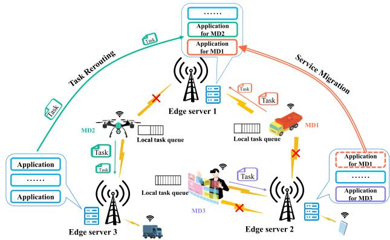  
Fig. 1. An illustration of the considered system.

Task rerouting, which enables MDs to reroute tasks from their currently accessed ESs to previously accessed ones, can largely remedy the defect of service migration. ETSI in [11] proposed an optimal time window scheme to ensure MDs’ service continuity by optimizing task rerouting decision according to the delay sensitivity of MDs’ tasks. In [17], the authors leveraged an interest tags-based data rerouting scheme for selecting the next cooperative forwarding node to minimize the power overhead in the social Internet of vehicles. However, it is worth noting that, instead of the overhead in service migration, task rerouting brings large rerouting delay and energy consumption in offloading each task, and none of existing work has studied the joint optimization of service migration and task rerouting for addressing their inherent tradeoff.

Online optimization is an efficient technique for managing dynamic MEC systems with system uncertainties [7], [9]. Particularly, the two-timescale online optimization for addressing asynchronous decisions has recently been studied in some preliminary works [14], [18], [19]. However, they cannot be directly applied for solving the problem in this paper, because they commonly considered that the system performance can be decomposed to either the large or small timescales with the same form, while in our work, different decisions at the large timescale (i.e., service migration or task rerouting) result in different expressions of system performances (including delay and energy costs) accumulated from small timescales.

In summary, different from all existing work (as demonstrated in Table I), this paper proposes a novel online management framework for MEC systems in striking the balance between service migration and task rerouting, and designs an improved Lyapunov algorithm in solving the formulated two-timescale joint resource optimization problem.

## III. SYSTEM MODEL

## A. Overview of the System

Consider an MEC system, as illustrated in Fig. 1, consisting of multiple geographically distributed ESs, denoted by set M with cardinality of $\mid { \mathcal { M } } \mid = M ,$ , and a variety of MDs each of which has a stream of heterogeneous computation-intensive tasks to be executed, denoted by set I with cardinality of $| \begin{array} { l } { \tau } \end{array} | = I .$ MDs are allowed to access different ESs for computation offloading and may be triggered to handover their access connections dynamically due to their random mobilities. Each ES is deployed on a base station that can provide communication and computing services to a certain group of potentially accessed MDs if i) it has been placed the service applications that exactly fit these MDs’ tasks; ii) it is capable of installing well-matched service applications to support these MDs through service migrations (i.e., migrating the service application from an MD’s previously accessed ES to the newly accessed ES) [7]; or iii) it can reroute these MDs’ tasks to other ESs having placed with demanded service applications [20].

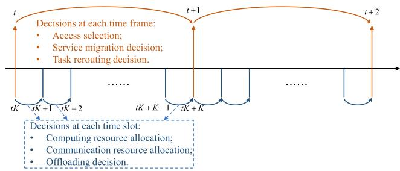  
Fig. 2. Two-timescale optimization for MEC.

To better understand the implementation of service migration and task rerouting, we can take a look at an example: Due to the random mobility, at a certain time instance, the wireless connection of an MD switch ES from ES A to ES B depending on the channel conditions. If this MD is delaytolerant at the service level while delay-sensitive at the task level (e.g., an MD running cloud-based entertainment service, such as live video streaming or online gaming, may accept a certain amount of live broadcast delay or game response delay at the beginning, but cannot stand any stuck or distorted during the live video broadcast process and game progress [21], [22]), when its tasks are generated requesting the edge computing service, service migration will be taken for this MD, i.e., migrating this MD’s corresponding application from ES A to ES B. Although service migration will cause large migration delay, potentially leading to service interruption, the execution of MD A’s tasks on ES B can significantly improve its execution efficiency (including offloading and computation). On the contrary, if this MD is delay-sensitive at the service level while delay-tolerant at the task level (e.g., an MD running the service of human digital twin for health monitoring usually needs to update the digital twin model by collecting status information in real time for guaranteeing uninterrupted service, but its tasks, such as data analysis and health prediction, may be fine with some delays [3]), when its tasks are generated requesting the edge computing service, task rerouting will be taken for this MD, i.e., routing MD A’s tasks from ES B back to ES A for execution. Task rerouting can avoid large migration delay, but it will bring rerouting delay and energy cost in offloading each task.

TABLE I  
A TABLE COMPARING OUR WORK WITH THE EXISTING STUDIES  
TABLE II  
IMPORTANT NOTATIONS IN THIS PAPER
<table><tr><td>Symbol T</td><td>Meaning set of MDs</td></tr><tr><td> $\lambda _ { i } ( \tau )$   $\mathcal { M }$   $x _ { i } ^ { m } ( t )$  vi  $\varpi _ { i } ( t )$   $b _ { i }$   $\vartheta _ { i } ( t )$   $f _ { i } ^ { m d }$   $r _ { i , m } ( \tau )$   $f _ { m } ^ { e s }$   $z _ { i } ( \tau )$   $\rho _ { i } ( \tau )$   $\alpha _ { i } ( \tau )$   $D _ { i } ^ { l o c } ( \tau )$   $D _ { i } ^ { \dot { c } o m } ( \tau )$   $D _ { i } ^ { \check { t } r a } ( \check { \tau } )$   $D _ { i } ^ { \dot { m } i g } ( t )$   $D _ { i } ^ { r o u } ( \tau )$   $e _ { i } ^ { r o u } ( \tau )$   $\dot { D _ { i } ^ { t o l } } ( t )$   $C _ { m } ^ { \tilde { t } }$   $e _ { i } ^ { l o c } ( \tau )$   $e _ { i } ^ { \dot { t } o u } ( t )$   $e _ { i } ^ { \dot { \operatorname { c } } o m } ( \tau )$   $e _ { i } ^ { m i g } ( t )$   $e _ { i } ^ { \dot { t } r a } ( \tau )$  V  $\gamma$ </td><td>number of tasks generated by MD i in time slot τ set of ESs access selection indicator of MD i in time frame t task size of MD i service migration decision for MD ¿ in time frame t service application size of MD i task rerouting decision for MD i in time frame t CPU computation speed of MD i transmission rate between MD i and ES m in slot τ CPU computation speed of ES m offloading decision indicator of MD i in time slot τ CPU resource allocation rate for MD i in slot τ bandwidth allocation ratio for MD i in time slot τ local computing delay for MD ¿ in time slot τ edge computing delay for MD i in time slot τ transmission delay for MD i in time slot τ service migration delay for serving MD i task rerouting delay for serving MD i in slot τ task rerouting energy for serving MD ¿ in time slot τ total service delay for MD ¿ in time frame t caching capacity of ES m in time frame t local computing energy for MD i in time slot τ total energy for serving MD i in time frame t edge computing energy for MD i in time slot τ service migration energy for serving MD i transmission energy for MD i in time slot τ Lyapunov control parameter</td></tr></table>

<table><tr><td rowspan=1 colspan=1>Reference</td><td rowspan=1 colspan=1>Objective</td><td rowspan=1 colspan=1>Method</td><td rowspan=1 colspan=1>System-wide costminimization</td><td rowspan=1 colspan=1>Service migration</td><td rowspan=1 colspan=1>Task rerouting</td></tr><tr><td rowspan=1 colspan=1>[4,6]</td><td rowspan=1 colspan=1>Network utility maximization</td><td rowspan=1 colspan=1>A resource contention gameapproach</td><td rowspan=1 colspan=1> $\checkmark$ </td><td rowspan=1 colspan=1>X</td><td rowspan=1 colspan=1>X</td></tr><tr><td rowspan=1 colspan=1>[5]</td><td rowspan=1 colspan=1>Access selection optimization</td><td rowspan=1 colspan=1>Successive convexapproximation</td><td rowspan=1 colspan=1>X</td><td rowspan=1 colspan=1>X</td><td rowspan=1 colspan=1>x</td></tr><tr><td rowspan=1 colspan=1>[7,17]</td><td rowspan=1 colspan=1>Offloading energy costminimization</td><td rowspan=1 colspan=1>Decomposition-based onlinealgorithm</td><td rowspan=1 colspan=1> $\checkmark$ </td><td rowspan=1 colspan=1>X</td><td rowspan=1 colspan=1>X</td></tr><tr><td rowspan=1 colspan=1>[9]</td><td rowspan=1 colspan=1>Optimization of preprocessingdelay and energy consumption</td><td rowspan=1 colspan=1>Online approximateoptimization approach</td><td rowspan=1 colspan=1> $\checkmark$ </td><td rowspan=1 colspan=1>X</td><td rowspan=1 colspan=1>X</td></tr><tr><td rowspan=1 colspan=1>[10]</td><td rowspan=1 colspan=1>Edge servers&#x27; overheadminimization</td><td rowspan=1 colspan=1>Decentralized online offloadingapproach</td><td rowspan=1 colspan=1> $\checkmark$ </td><td rowspan=1 colspan=1>X</td><td rowspan=1 colspan=1>√</td></tr><tr><td rowspan=1 colspan=1>[16]</td><td rowspan=1 colspan=1>Offloading cost minimization</td><td rowspan=1 colspan=1>Deep learning approach</td><td rowspan=1 colspan=1> $\bigtriangledown$ </td><td rowspan=1 colspan=1>X</td><td rowspan=1 colspan=1>X</td></tr><tr><td rowspan=1 colspan=1>[18]</td><td rowspan=1 colspan=1>Task rerouting costminimization</td><td rowspan=1 colspan=1>Dual mode-based onlineapproach</td><td rowspan=1 colspan=1> $\checkmark$ </td><td rowspan=1 colspan=1> $\checkmark$ </td><td rowspan=1 colspan=1>X</td></tr><tr><td rowspan=1 colspan=1>[12]</td><td rowspan=1 colspan=1>Energy efficiency maximization</td><td rowspan=1 colspan=1>Stochastic optimizationapproach</td><td rowspan=1 colspan=1> $\pmb { x }$ </td><td rowspan=1 colspan=1> $\checkmark$ </td><td rowspan=1 colspan=1>X</td></tr><tr><td rowspan=1 colspan=1>[15]</td><td rowspan=1 colspan=1>Service provider&#x27;s profitmaximization</td><td rowspan=1 colspan=1>Contract-theoretic based onlineapproach</td><td rowspan=1 colspan=1> $\checkmark$ </td><td rowspan=1 colspan=1> $\pmb { x }$ </td><td rowspan=1 colspan=1>X</td></tr><tr><td rowspan=1 colspan=1>[13]</td><td rowspan=1 colspan=1>End-to-end delay minimization</td><td rowspan=1 colspan=1>Cooperative queueing approach</td><td rowspan=1 colspan=1> $\pmb { x }$ </td><td rowspan=1 colspan=1> $\bigtriangledown$ </td><td rowspan=1 colspan=1>√</td></tr><tr><td rowspan=1 colspan=1>[19]</td><td rowspan=1 colspan=1>Satisfy the dynamic QoSrequirements</td><td rowspan=1 colspan=1>Single-timescale onlineoptimization algorithm</td><td rowspan=1 colspan=1> $\checkmark$ </td><td rowspan=1 colspan=1> $\checkmark$ </td><td rowspan=1 colspan=1> $\pmb { x }$ </td></tr><tr><td rowspan=1 colspan=1>Proposed work</td><td rowspan=1 colspan=1>Device-wide execution delayminimization</td><td rowspan=1 colspan=1>Two-timescale onlineoptimization approach</td><td rowspan=1 colspan=1> $\checkmark$ </td><td rowspan=1 colspan=1> $\checkmark$ </td><td rowspan=1 colspan=1> $\checkmark$ </td></tr></table>

Note that, in practice [23], the access selection, service migration and task rerouting may not be able to frequently vary in real-time.<sup>1</sup> In contrast, the inherent task offloading and corresponding computing and communication resource allocations require immediate and frequent responses to accommodate random task generations and time-varying channel states. To this end, we consider that in the online optimization framework, the access selection, service migration and task rerouting are operated at the large timescale, while the task offloading and the communication and computing resource allocations are operated at the small timescale, as shown in Fig. 2.

Specifically, the timeline is divided into $T \in \mathbb { N } ^ { + }$ coarsegrained time frames, and each frame can be further regarded as a combination of $K \in \mathbb { N } ^ { + }$ fine-grained time slots, where the length of each slot is $\gamma .$ . Let $t = \{ 0 , 1 , \ldots , T - 1 \}$ be the index of the t-th time frame, and define $\tau \in \mathsf { \Omega } _ { { \mathsf { T } } _ { t } } \mathsf { \Omega } =$ $\{ t K , t K + 1 , \ldots , t K + K - 1 \}$ as the index of the τ-th time slot in the t-th time frame. In summary, we aim to optimize the long-term performance by determining $i )$ which ES should be selected to access, and whether service migration or task rerouting should be chosen for each MD in each time frame, and ii) how communication and computing resources should be allocated among these MDs with task offloading requests in each time slot in an online manner. For convenience, Table II lists some important notations used in this paper.

## B. Communication Model

Within each time frame t, to enable computation offloading for edge computing, MDs have to transmit tasks to their accessed ESs via uplink communications, and these are further conducted in each time slot $\begin{array} { r l r } { \tau } & { { } \in } & { \tau _ { t } } \end{array}$ . Consider that the MEC system is implemented in a two-dimensional space. The location of $\mathbf { M } \mathbf { D } { \mathrm { ~ } } i \in { \mathrm { ~ } } { \mathcal { T } }$ in time slot $\tau \in \tau _ { t }$ is denoted by $( \mathcal { X } _ { i } ( \tau ) , \mathcal { Y } _ { i } ( \tau ) )$ ), which is a state information depending on its random mobility pattern. Let $( { \mathcal { X } } _ { m } , { \mathcal { Y } } _ { m } )$ be the location of each ES $m \in { \mathcal { M } }$ , which is invariant over the time (as it is deployed on a fixed base station). Then, the distance between any MD $i \in \mathcal { Z }$ and ES $m \in \mathcal { M }$ in time slot $\tau \in \mathcal { T } _ { t }$ can be calculated as $L _ { i , m } ( \tau ) = \sqrt { ( \mathcal { X } _ { i } ( \tau ) - \mathcal { X } _ { m } ) ^ { 2 } + ( \mathcal { Y } _ { i } ( \tau ) - \mathcal { Y } _ { m } ) ^ { 2 } }$

Following the convention in the literature [24], [25], we assume that the radio propagation between any pair of MDs and ESs experiences uncorrelated stationary Rayleigh flatfading. Let $h _ { i , m } ( \tau )$ be the fading amplitude between any MD $i \in \mathcal { T }$ and its potentially accessed ES $m \in \mathcal { M }$ in time slot $\tau \in \mathcal { T } _ { t } .$ , and $| h _ { i , m } ( \tau ) | ^ { 2 }$ obey an exponential distribution having a unity mean. Then, the instantaneous received signal-to-noiseratio (SNR) from MD $i \in \mathcal { T }$ to ES $m \in \mathcal { M }$ in time slot $\tau \in \mathcal { T } _ { t }$ can be expressed as $\begin{array} { r c l } { S N R _ { i , m } ( \tau ) } & { = } & { \frac { p _ { i } | h _ { i , m } ( \tau ) | ^ { 2 } } { L _ { i , m } ( \tau ) ^ { \theta } N _ { 0 } W _ { m } } , \forall i \in \mathrm { ~  ~ \sigma ~ } } \end{array}$ $\mathcal { T } , \forall m \in \mathcal { M }$ , where $W _ { m }$ is the communication bandwidth, $N _ { 0 }$ is the spectral density of the channel noise power, $p _ { i }$ is the pre-determined transmission power of MD $i \in \mathcal { T }$ , and $\theta >$ 2 is the path loss exponent [25]. Obviously, since $| h _ { i , m } ( \tau ) | ^ { 2 }$ and $L _ { i , m } ( \tau )$ are random variables over the time (due to uncertain mobilities), $S N R _ { i , m } ( \tau )$ is a random variable. Given its realization in each time slot $\tau \in \mathsf { \Omega } \tau _ { t }$ , according to the Shannon-Hartley formula, the transmission rate between any MD $i \in \mathcal { T }$ and ES $m \in \mathcal { M }$ can be defined as

$$
r _ { i , m } ( \tau ) = x _ { i } ^ { m } ( t ) \alpha _ { i } ( \tau ) W _ { m } \log _ { 2 } \left( 1 + S N R _ { i , m } ( \tau ) / \alpha _ { i } ( \tau ) \right) .\tag{1}
$$

where $x _ { i } ^ { m } ( t ) \in \{ 0 , 1 \}$ is a large-timescale decision variable indicating whether MD $i \in \mathcal { T }$ selects to access ES $m \in \mathcal { M }$ or not in time frame $t , \mathrm { i . e . , } x _ { i } ^ { m } ( t ) = 1 \mathrm { i f } \mathrm { M D } i \in \mathcal { T }$ is connected to ES $m \in { \mathcal { M } } .$ , and $x _ { i } ^ { m } ( t ) = 0$ otherwise; and $\alpha _ { i } ( \tau ) \in ( 0 , 1 ]$ is a small-timescale decision variable indicating the bandwidth allocation ratio for each MD $i \in \mathcal { Z }$ in time slot $\tau \in \mathcal { T } _ { t }$ . Similar to [6] and [26], we impose a common constraint that at most one ES can be selected to access by each MD in time frame t, and it is intuitive that the total bandwidth allocation ratios for all MDs connected to the same ES cannot exceed one, i.e.,

$$
\sum _ { m = 1 } ^ { M } x _ { i } ^ { m } ( t ) \leq 1 , \sum _ { i = 1 } ^ { I } x _ { i } ^ { m } ( t ) \alpha _ { i } ( \tau ) \leq 1 .\tag{2}
$$

## C. Computation Model

Let $\lambda _ { i } ( \tau )$ be the number of tasks generated by MD $i \in \mathcal { T }$ in each time slot $\tau \in \mathcal { T } _ { t }$ , which is allowed to follow a general random distribution. We characterize the computation task of each MD $i \in \mathcal { T }$ by $\{ v _ { i } , \beta _ { i } \}$ , where $v _ { i }$ denotes its task size (measured by bits), $\beta _ { i }$ stands for the number of CPU cycles required to complete one bit of its task. Define $z _ { i } ( \tau ) \in \{ 0 , 1 \}$ as a small-timescale decision variable indicating whether the tasks of $\mathbf { M D } i \in \mathcal { T }$ should be offloaded or not in each time slot $\tau \in \mathcal { T } _ { t }$ , where $z _ { i } ( \tau ) = 1$ states that computation tasks of MD $i \in \mathcal { T }$ are offloaded to the accessed ES, and $z _ { i } ( \tau ) = 0$ means that these tasks are executed locally.

1) Local Computing Model: Denote the CPU computation speed of MD $i \in \mathcal { T }$ as $f _ { i } ^ { m d }$ (measured by cycles/s). Then, by local computing, the processing delay of MD $i \in \mathcal { T }$ for executing its computation tasks in time slot $\tau \in \tau _ { t }$ can be expressed as

$$
D _ { i } ^ { l o c } ( \tau ) = \lambda _ { i } ( \tau ) v _ { i } \beta _ { i } / f _ { i } ^ { m d } .\tag{3}
$$

For each $\mathrm { M D } \ i \in \mathcal { T } ,$ , the local execution will cause an energy consumption. According to the energy model commonly used in CMOS circuits [27], [28], the energy consumption at MD $i \in \mathcal { T }$ in each time slot $\tau \in \mathcal { T } _ { t }$ can be calculated as

$$
e _ { i } ^ { l o c } ( \tau ) = n _ { i } ^ { m d } ( f _ { i } ^ { m d } ) ^ { 3 } D _ { i } ^ { l o c } ( \tau ) ,\tag{4}
$$

where $n _ { i } ^ { m d }$ is the effective switched capacitance of MD i depending on its chip architecture [28].

Naturally, the generated but not yet executed or offloaded tasks will be queued in the task buffer of MDs [29], and the queue length of the task buffer of each MD $i \in \mathcal { T }$ at the beginning of time slot $\tau \in \mathcal { T } _ { t }$ can be denoted as

$$
\begin{array} { l } { { S _ { i } ( \tau ) = [ S _ { i } ( \tau - 1 ) - \frac { f _ { i } ^ { m d } \gamma } { \beta _ { i } } } } \\ { { - x _ { i } ^ { m } ( t ) z _ { i } ( \tau - 1 ) r _ { i , m } ( \tau - 1 ) \gamma , 0 ] ^ { + } + \lambda _ { i } ( \tau ) v _ { i } , } } \end{array}\tag{5}
$$

where $S _ { i } ( \tau - 1 )$ is the queue length of the task buffer of MD $i \in \mathcal { T }$ at time slot $\begin{array} { r } { \tau - 1 \stackrel { \cdot } { \in } T _ { t } , \frac { f _ { i } ^ { m \tilde { d } } \gamma } { \beta _ { i } } } \end{array}$ is the total size of MD i’s tasks executed locally in time slot $\tau \in \mathcal { T } _ { t }$ , and $x _ { i } ^ { m } ( t ) r _ { i , m } ( \tau ) \gamma$ is the offloaded size of MD $i \ ' s$ tasks in time slot $\tau \in \mathcal { T } _ { t }$ . Here, $[ \mathcal { Z } ] ^ { + } = \mathcal { Z }$ when $\mathcal { Z }$ is non-negative, and 0 otherwise. In order to maintain the stability, we need to bound the time average task buffer queue backlogs over all time slots for each MD:

$$
\operatorname* { l i m } _ { T \to \infty } \operatorname* { s u p } _ { T K } \sum _ { \tau = 0 } ^ { T K - 1 } \mathbb { E } [ S _ { i } ( \tau ) ] < \infty , \forall i \in \mathcal { I } ,\tag{6}
$$

whose initial state is set as $S _ { i } ( 0 ) = 0 .$

2) Edge Computing Model: Recall that transmission rate $r _ { i , m } ( \tau )$ between any MD $i \in \mathcal { T }$ and its potentially accessed ES $m \in \mathcal { M }$ in time slot $\tau \in \mathcal { T } _ { t }$ is defined in (2), then the transmission delay of computation tasks offloaded from MD $i \in \mathcal { T }$ to ES $m \in \mathcal { M }$ in time slot $\tau \in \mathcal { T } _ { t }$ is

$$
D _ { i } ^ { t r a } ( \tau ) = \lambda _ { i } ( \tau ) v _ { i } / r _ { i , m } ( \tau ) ,\tag{7}
$$

and the corresponding transmission energy consumption of MD $i \in \mathcal { T }$ can be expressed as

$$
e _ { i } ^ { t r a } ( \tau ) = p _ { i } D _ { i } ^ { t r a } ( \tau ) .\tag{8}
$$

Each ES $m \in \mathcal { M }$ may receive computation tasks offloaded by various MDs and is required to allocate its edge computing resource for each of them. Denote $\rho _ { i } ( \tau ) \in [ 0 , 1 ]$ as a smalltimescale decision variable indicating the proportion of edge computing resource allocated to MD $i \in \mathcal { T }$ in time slot $\tau \in$ $\boldsymbol { \mathcal { T } } _ { t } .$ . Then the edge processing delay for executing computation tasks from MD $i \in \mathcal { T }$ in time slot $\tau \in \mathcal { T } _ { t }$ can be given by

$$
D _ { i } ^ { c o m } ( \tau ) = \lambda _ { i } ( \tau ) v _ { i } \beta _ { i } / ( \rho _ { i } ( \tau ) f _ { m } ^ { e s } ) ,\tag{9}
$$

where $f _ { m } ^ { e s }$ represents CPU computation speed (measured by cycles/s) of each ES $m \in \mathcal { M }$

Besides, the energy consumption of ES $m \in \mathcal { M }$ in processing computation tasks from MD $i \in \mathcal { T }$ in time slot $\tau \in \mathcal { T } _ { t }$ can be calculated as

$$
e _ { i } ^ { c o m } ( \tau ) = n _ { m } ^ { e s } \rho _ { i } ( \tau ) ( f _ { m } ^ { e s } ) ^ { 3 } D _ { i } ^ { c o m } ( \tau ) ,\tag{10}
$$

where $n _ { m } ^ { e s }$ is the effective switched capacitance of ES $m .$

Note that referring to [7], [19], and [27], we ignore overheads caused by feeding back computation outcomes and exchanging control signals in edge computing. This is because the size of computing outcomes and control signals are much smaller than that of task inputs. Technically, the overheads can be regarded as small constants [4], which will not affect our analyses.

## D. Service Migration and Task Rerouting

As recognized in [18] and [20], besides local computing, the computation tasks of each MD can only be executed at ESs installing with its required service application, and this can be supported by either service migration or task rerouting. Let the large-timescale variable $\varpi _ { i } ( t ) \in \{ 0 , 1 \}$ be the service migration decision for serving $\mathbf { M D } \ i \ \in \ \mathcal { T }$ in time frame t, where $\varpi _ { i } ( t ) = 1$ indicates that MD i’s required service application will be migrated from its previously accessed ES $m ^ { \prime }$ (who has been placed with MD i’s service application in history), and $\varpi _ { i } ( t ) ~ = ~ 0$ otherwise. Similarly, let the large-timescale variable $\vartheta _ { i } ( t ) \in \{ 0 , 1 \}$ be the task rerouting decision for serving each $\mathbf { M D } \ i \in \mathcal { T }$ in time frame t, where $\vartheta _ { i } ( t ) = 1$ indicates that, although ES m is newly accessed (in time frame t), MD $i \mathrm { \ ' } _ { \mathrm { s } }$ tasks will be rerouted to its previously accessed ES $m ^ { \prime }$ (who has been placed with MD $i \ ' s$ service application in history), and $\vartheta _ { i } ( t ) = 0$ otherwise. Obviously, we have $\boldsymbol { \varpi } _ { i } ( t ) + \boldsymbol { \vartheta } _ { i } ( t ) = 1 , \forall i \in \mathcal { T }$

For convenience, we introduce a state variable $A _ { i } ^ { m ^ { \prime } } ( t ) \ \in$ $\{ 0 , 1 \}$ to describe whether the service application required by MD $i \in \mathcal { T }$ was installed on any ES $m ^ { \prime }$ at the beginning of time frame t. Notice that $A _ { i } ^ { m ^ { \prime } } ( t )$ depends on the service migration and task rerouting decision of MD $i \in \mathcal { T }$ in the previous time frame $t - 1$ . Specifically, in case that service migration was chosen for MD $i \in \mathcal { T }$ in time frame $t - 1$ , we have $A _ { i } ^ { m ^ { \prime } } ( t ) = 1$ only if $\varpi _ { i } ( t - 1 ) x _ { i } ^ { m ^ { \prime } } ( t - 1 ) = 1 ;$ and in case that task rerouting was chosen for MD $i \in \mathcal { T }$ in time frame $t - 1$ , we have $A _ { i } ^ { m ^ { \prime } } ( t ) = 1$ only if $A _ { i } ^ { m ^ { \prime } } ( t - 1 ) \vartheta _ { i } ( t - 1 )$ $\begin{array} { r } { \sum _ { m ^ { \prime \prime } \in \mathcal { M } , m ^ { \prime \prime } \not = m ^ { \prime } } x _ { i } ^ { m ^ { \prime \prime } } ( t - 1 ) = 1 } \end{array}$ . Thus, for each MD $i \in \mathcal { Z } ,$ the expression of $A _ { i } ^ { m ^ { \prime } } ( t )$ can be written as

$$
\begin{array} { l } { { A _ { i } ^ { m } } ^ { \prime } ( t ) = { A _ { i } ^ { m } } ^ { \prime } ( t - 1 ) { \vartheta _ { i } } ( t - 1 ) \displaystyle \sum _ { \begin{array} { l } { m ^ { \prime \prime } \in \mathcal { M } , m ^ { \prime \prime } \not = m ^ { \prime } } \\ { 1 } \end{array} } { x _ { i } ^ { m ^ { \prime \prime } } } ( t - 1 ) } \\ { ~ + \varpi _ { i } ( t - 1 ) { x _ { i } ^ { m ^ { \prime } } } ( t - 1 ) . \qquad ( 1 \complement i ( - 1 ) . } \end{array}\tag{1}
$$

Here, for saving $\mathrm { E S s } '$ storage spaces, we assume that, in each certain frame, only one ES among all installs a copy of MD i’s required service application, i.e., $\begin{array} { r } { \sum _ { m ^ { \prime } \in \mathcal { M } } A _ { i } ^ { m ^ { \prime } } ( t ) = 1 } \end{array}$

In the following, we investigate the impacts of service migration and task rerouting on the system delay, energy consumption and caching capacity, separately, in detail.

1) System Delay: In each time frame t, if service migration is chosen for MD $i \in { \mathcal { T } } , { \mathrm { i . e . , ~ } } \varpi _ { i } ( t ) = 1$ , the required service application has to be migrated from its previously accessed ES $m ^ { \prime }$ (with $A _ { i } ^ { m ^ { \prime } } ( t ) = 1 )$ to its newly accessed ES m. However, such process should be done only once at the beginning of t, and thus for each MD $i \in \mathcal { T }$ the corresponding service migration delay $D _ { i } ^ { m i g } ( t )$ can be calculated as

$$
D _ { i } ^ { m i g } ( t ) = \frac { b _ { i } } { r _ { m ^ { \prime } , m } ( t ) } , m ^ { \prime } = \{ m ^ { \prime } \in \mathcal { M } \mid A _ { i } ^ { m ^ { \prime } } ( t ) = 1 \} ,\tag{12}
$$

where $b _ { i }$ stands for the service application size of MD $i \in \mathcal { T }$ and $r _ { m ^ { \prime } , m } ( t )$ is transmission rate from ES m<sup>′</sup> to ES m on a wired link (which is assumed to be invariant within t [30]).

In contrast, in each time frame t, if task rerouting is chosen for MD $i \in { \mathcal { T } } , { \mathrm { i . e . , ~ } } \vartheta _ { i } ( t ) = 1$ , its computation tasks generated in each time slots $\tau \in \tau _ { t }$ have to be rerouted from the newly accessed ES m to the previously accessed ES $m ^ { \prime }$ (with

$A _ { i } ^ { m ^ { \prime } } ( t ) = 1 )$ , and thus the corresponding task rerouting delay is introduced in all time slots within t instead of once at the beginning only:

$$
D _ { i } ^ { r o u } ( \tau ) = \frac { \lambda _ { i } ( \tau ) v _ { i } } { r _ { m , m ^ { \prime } } ( t ) } , m ^ { \prime } = \{ m ^ { \prime } \in \mathcal { M } \mid A _ { i } ^ { m ^ { \prime } } ( t ) = 1 \} .\tag{13}
$$

Taking into account all choices along with the defined decision variables $( \mathrm { i . e . }$ , local or edge computing, service migration or task rerouting), the total service delay for executing computation tasks of MD $i \in \mathcal { T }$ in each time frame t can be derived as

$$
D _ { i } ^ { t o l } ( t ) = \sum _ { \tau = t K } ^ { t K + K - 1 } [ z _ { i } ( \tau ) ( D _ { i } ^ { t r a } ( \tau ) + D _ { i } ^ { c o m } ( \tau ) ) + ( 1 - z _ { i } ( \tau ) )
$$

Note that, (14) reflects the service delay of each MD with different service level and task level requirements. Specifically, if MD i is delay-tolerant at the service level while delaysensitive at the task level, “service migration” will be selected and the corresponding migration delay $D _ { i } ^ { m i g } ( t )$ will be introduced at the beginning of time frame $t , \mathrm { i . e . , } \varpi _ { i } ( t ) = 1$ and $\vartheta _ { i } ( t ) = 0$ . On the contrary, if MD i is delay-sensitive at the service level while delay-tolerant at the task level, “task rerouting” will be selected and the corresponding rerouting delay $D _ { i } ^ { r o u } ( \tau )$ will be introduced in each time slot τ within frame t, while the migration delay $D _ { i } ^ { m i g } ( t )$ can be avoided, i.e., $\vartheta _ { i } ( t ) = 1$ and $\varpi _ { i } ( t ) = 0$

2) System Energy Consumption: In each time frame t, if service migration is chosen for $\mathbf { M D } \ i \in \mathcal { I } ,$ then according to the service migration delay $D _ { i } ^ { m i g } ( t )$ obtained in (12), the service migration energy consumption can be expressed as

$$
\begin{array} { r l r } & { } & { e _ { i } ^ { m i g } ( t ) = p _ { e s } D _ { i } ^ { m i g } ( t ) = \frac { p _ { e s } b _ { i } } { r _ { m ^ { \prime } , m } ( t ) } , } \\ & { } & { m ^ { \prime } = \{ m ^ { \prime } \in \mathcal { M } \mid A _ { i } ^ { m ^ { \prime } } ( t ) = 1 \} , } \end{array}\tag{15}
$$

where $p _ { e s }$ represents a pre-determined transmission power of each ES in service migration.

If task rerouting is chosen for $\mathrm { { M D } } i \in \mathcal { T }$ , the task rerouting energy consumption is introduced in all time slots within t, and according to the task rerouting delay $D _ { i } ^ { r o u } ( \tau )$ obtained in (13), the corresponding energy consumption is

$$
\begin{array} { r l } & { e _ { i } ^ { r o u } ( \tau ) = p _ { e s } D _ { i } ^ { r o u } ( \tau ) = \frac { p _ { e s } \lambda _ { i } ( \tau ) v _ { i } } { r _ { m , m ^ { \prime } } ( t ) } , } \\ & { ~ \forall \tau \in \mathcal { T } _ { t } , m ^ { \prime } = \{ m ^ { \prime } \in \mathcal { M } \mid A _ { i } ^ { m ^ { \prime } } ( t ) = 1 \} . } \end{array}\tag{16}
$$

To sum up, the total energy consumption for executing computation tasks of MD $i \in \mathcal { T }$ in each time frame t can be derived as

$$
\begin{array} { l } { { \displaystyle e _ { i } ^ { t o l } ( t ) = \sum _ { \tau = t K } ^ { t K + K - 1 } [ z _ { i } ( \tau ) ( e _ { i } ^ { t r a } ( \tau ) + e _ { i } ^ { c o m } ( \tau ) ) } } \\ { { \displaystyle ~ + ( 1 - z _ { i } ( \tau ) ) e _ { i } ^ { l o c } ( \tau ) + \vartheta _ { i } ( t ) e _ { i } ^ { r o u } ( \tau ) ] + \varpi _ { i } ( t ) e _ { i } ^ { m i g } ( t ) . } } \end{array}\tag{17}
$$

3) Caching Capacity: For each ES $m \in \mathcal { M }$ in each time frame t, its caching capacity may be occupied by two kinds of service applications.

i) Service applications newly migrated from other ESs in time frame t, denoted by $C _ { m } ^ { A } ( t )$ : Since the number of MDs newly accessed to ES m in time frame t can be computed as $\begin{array} { r } { \sum _ { i = 1 } ^ { I } \sum _ { m ^ { \prime } = 1 } ^ { M } A _ { i } ^ { m ^ { \prime } } ( t ) x _ { i } ^ { m } ( t ) } \end{array}$ , for each ES $m \in \mathcal { M } , C _ { m } ^ { \mathcal { A } } ( t )$ can be expressed as

$$
C _ { m } ^ { A } ( t ) = \sum _ { i = 1 } ^ { I } \sum _ { m ^ { \prime } = 1 } ^ { M } A _ { i } ^ { m ^ { \prime } } ( t ) x _ { i } ^ { m } ( t ) \varpi _ { i } ( t ) b _ { i } .\tag{18}
$$

ii) Service applications installed in previous time frames which are reserved for serving those tasks rerouted back to $i t ,$ denoted by $C _ { m } ^ { B } ( t )$ : Since the number of MDs previously handover to ES m but newly handover to the other ES $m ^ { \prime }$ in time frame t can be computed as $\begin{array} { r } { \sum _ { i = 1 } ^ { I } \sum _ { m ^ { \prime } = 1 } ^ { M } A _ { i } ^ { m } ( t ) x _ { i } ^ { m ^ { \prime } } ( t ) } \end{array}$ for each ES $m \in \mathcal { M } , C _ { m } ^ { \bar { B } } ( t )$ can be expressed as

$$
C _ { m } ^ { \mathcal { B } } ( t ) = \sum _ { i = 1 } ^ { I } \sum _ { m ^ { \prime } = 1 } ^ { M } A _ { i } ^ { m } ( t ) x _ { i } ^ { m ^ { \prime } } ( t ) \vartheta _ { i } ( t ) b _ { i } .\tag{19}
$$

Note that each ES $m \in \mathcal { M }$ may have a caching capacity budget, denoted by $C _ { m } ^ { m a x }$ , which needs to be satisfied [31]:

$$
C _ { m } ^ { \mathcal { A } } ( t ) + C _ { m } ^ { \mathcal { B } } ( t ) \leq C _ { m } ^ { m a x } , \forall m \in \mathcal { M } .\tag{20}
$$

## IV. PROBLEM FORMULATION

For the sake of improving the delay experience of all MDs in the considered MEC system, we aim to minimize the systemwide overall service delay while ensuring that the energy consumption of each MD $i \in \mathcal { T }$ does not exceed a certain threshold. Due to the time-varying characteristics of MEC systems, it is necessary that all decisions in such a problem are optimized in the long-term dynamic perspective. Therefore, we take the average service delay of all MDs over all time frames in the MEC as the performance measurement, which can be expressed as

$$
\mathcal { F } = \frac { 1 } { T } \sum _ { t = 0 } ^ { T - 1 } \sum _ { i = 1 } ^ { I } D _ { i } ^ { t o l } ( t ) .\tag{21}
$$

Then, with the objective of minimizing F, the two-timescale joint optimization of i) each MD i’s access selection decision in any time frame $t , i i )$ service migration decision for each MD i in any time frame $t , i i i )$ task rerouting decision for each MD i in any time frame $t , i v )$ each MD i’s task offloading decision in any time slot $\tau \in \mathcal { T } _ { t }$ , and v) the allocation of both communication and computing resource for each MD i in any time slot $\tau \in \tau _ { t } .$ , denoted in short by $J _ { i } ^ { A } ( t ) ~ =$ $\{ x _ { i } ^ { m } ( t ) , \varpi _ { i } ( t ) , \vartheta _ { i } ( t ) \} , J _ { i } ^ { B } ( \tau ) = \{ z _ { i } ( \tau ) , \rho _ { i } ( \tau ) , \alpha _ { i } ( \tau ) \}$ , can be formulated as

$$
\begin{array} { r l } { \mathscr { P } _ { 1 } : } & { \underset { J _ { i } ^ { A } ( t ) , J _ { i } ^ { B } ( \tau ) } { \operatorname* { m i n } } ~ \underset { t  \infty } { \operatorname* { l i m } } \mathscr { F } } \\ & { \mathrm { s . t . } ~ ( 2 ) , ( 6 ) , ( 2 0 ) , } \end{array}
$$

$$
\operatorname* { l i m } _ { T  \infty } \frac { 1 } { T } \sum _ { t = 0 } ^ { T - 1 } e _ { i } ^ { t o l } ( t ) \leq e _ { i } ^ { t h } ,\tag{22}
$$

$$
\sum _ { i = 1 } ^ { I } \sum _ { m ^ { \prime } = 1 } ^ { M } [ A _ { i } ^ { m ^ { \prime } } ( t ) x _ { i } ^ { m } ( t ) \varpi _ { i } ( t ) \rho _ { i } ( \tau ) +\tag{23}
$$

$$
A _ { i } ^ { m } ( t ) x _ { i } ^ { m ^ { \prime } } ( t ) \vartheta _ { i } ( t ) \rho _ { i } ( \tau ) ] \leq 1 ,
$$

$$
\vartheta _ { i } ( t ) , \varpi _ { i } ( t ) \in \{ 0 , 1 \} , \vartheta _ { i } ( t ) + \varpi _ { i } ( t ) = 1 ,
$$

$$
z _ { i } ( \tau ) \in \{ 0 , 1 \} ,\tag{24}
$$

(25)

where besides the aforementioned constraints (2), (6) and (20), (22) is the long-term average energy consumption constraint (in which $e _ { i } ^ { t h }$ denotes a pre-determined energy consumption threshold of each MD $ { \mathcal { Q } } ^ { } \in  { \mathcal { T } } ) ^ { }$ (23) is the edge computing resource allocation constraint, where the first term $\begin{array} { r } { \sum _ { i = 1 } ^ { I } \sum _ { m ^ { \prime } = 1 } ^ { M } A _ { i } ^ { m ^ { \prime } } ( t ) x _ { i } ^ { m } ( t ) } \end{array}$ $\varpi _ { i } ( t ) \rho _ { i } ( \tau )$ denotes the computing resource allocated for MDs with service migration decisions and the second term $\begin{array} { r } { \sum _ { i = 1 } ^ { I } \sum _ { m ^ { \prime } = 1 } ^ { M } A _ { i } ^ { m } ( t ) x _ { i } ^ { \overline { { m } } ^ { \prime } } ( t ) \vartheta _ { i } ( t ) \rho _ { i } ( \tau ) } \end{array}$ denotes the computing resource allocated for MDs with task rerouting decisions; (24) and (25) describe constraints for the service migration, task rerouting and task offloading, respectively.

Remark 1: 1: Taking into account MD-side service interruptions may also be interesting in the optimization of MEC systems. To be more specific, we can define that each MD $i \in \mathcal { T }$ has an individual delay requirement $D _ { i } ^ { r e q }$ . When the service migration delay $D _ { i } ^ { m i g } ( t )$ and task computation delay $D _ { i } ^ { e x e } ( \tau = t K )$ (including local computing delay and edge computing delay) exceed the delay requirement $D _ { i } ^ { r \dot { e } q }$ , a service interruption occurs and MD i will wait for the service resumption. Let $D _ { i } ^ { i n t } ( t )$ be the service resumption delay of MD $i \in \mathcal { T }$ , which can be expressed as $D _ { i } ^ { i n t } ( t ) \bar { = } \left[ \varpi _ { i } ( t ) [ \dot { D } _ { i } ^ { m i g } ( t ) + \right.$ $D _ { i } ^ { e x e } ( \tau = t K ) ] { - } D _ { i } ^ { r e q } ] ^ { + }$ , where $\varpi _ { i } ( t )$ is the service migration decision. In order to maintain the long-term stability, we can impose a constraint for the service resumption delay $D _ { i } ^ { i n t } ( t )$ as: lim $\begin{array} { r } { \mathsf { l } _ { T \to \infty } \frac { 1 } { T } \sum _ { t = 0 } ^ { T - 1 } D _ { i } ^ { i n t } ( t ) \ \leq \ D _ { i } ^ { t h } } \end{array}$ , where $D _ { i } ^ { t h }$ denotes the pre-determined service interruption tolerance threshold of each MD $i \in \mathcal { T }$ . Introducing such constraint will not fundamentally affect the overall structure of the proposed problem $\mathcal { P } _ { 1 }$ , but may result in a much more complicated solution. Particularly, to decouple the proposed optimization problem for facilitating the solution, we unify the two-timescale longterm performance metrics (i.e., average service delay of all MDs and system-wide energy) into a single timescale by evenly distributing the migration cost (including delay and energy) in each time frame t into all time slots within this frame. Unfortunately, this will no longer work for the modified problem with the service resumption delay constraint because it is tightly coupled over two timescales (as task computation delay $D _ { i } ^ { e x e } ( \tau )$ affects the resumption delay $D _ { i } ^ { i n t } ( t )$ only when $\tau = t K$ , while $D _ { i } ^ { m i g } ( t )$ cannot be distributed to other time slot $\tau \ \in \ [ t K + 1 , \ldots , t K + K - 1 ] )$ , which may require the introduction of more advanced approaches, such as scalespace theory [32], to do the decoupling. Obviously, this is not trivial but beyond the focus of the current paper, and thus we would like to leave such an extension in our future work.

Remark 2: It is obvious that $\mathcal { P } _ { 1 }$ is a two-timescale stochastic optimization problem, in which the access selection, service migration and task rerouting are operated at the large timescale, and the task offloading and communication and computing resource allocations are operated at the small timescale, with the objective of minimizing the long-term system-wide overall service delay under network dynamics (i.e., the randomness of task generations and the variation of channel conditions caused by MDs’ random mobilities). Solving this problem is very challenging because i) the action space and state space grow rapidly with the number of ESs and MDs, and the random mobilities of MDs and their dynamic task generations make the amount of historical information extremely large, all resulting in the system statistics difficult to be obtained; ii) although Lyapunov optimization [33] is well-known as an effective approach to solve such a longterm stochastic optimization problem in general, constraints (2), (24) and (25) indicate the inclusion of discrete decision variables, while constraints (6) and (23) are nonlinear, and moreover $J _ { i } ^ { A } ( t )$ and $J _ { i } ^ { B } ( \tau )$ are operated at different timescales, making $\mathcal { P } _ { 1 }$ become a two-timescale MINLP, so that the traditional Lyapunov method is no longer applicable. To address this issue, in the following sections, we propose a novel solution by constructing a two-timescale Lyapunov optimization framework. Specifically, we first incorporate a two-timescale quadratic Lyapunov function to reflect the congestion of all queues, including the energy consumption deficit queue and local task buffer queue. Then, using the deterministic upper bound on the Lyapunov drift-plus-penalty, we decompose the long-term stochastic optimization problem into a series of deterministic instant problems, each of which is further decoupled into two subproblems in different timescales. Finally, we propose an iterative algorithm that integrates randomized rounding and Lagrange dual techniques to solve these subproblems, respectively.

## V. A TWO-TIMESCALE ONLINE OPTIMIZATIONALGORITHM

In this section, we develop a two-timescale online optimization algorithm for joint access control, service migration, task rerouting and resource management (OASTR) to solve $\mathcal { P } _ { 1 }$

## A. Problem Reformulation

It is observed from $\mathcal { P } _ { 1 }$ that the delay and energy consumptions caused by the service migration are on the large timescale, while those caused by task rerouting are on the small timescale. To facilitate analysis, we evenly distribute the migration delay and energy consumptions in each time frame t into all time slots within this frame. Then, the total service delay and energy consumption of MD $i \in \mathcal { T }$ in any time slot $\tau \in \mathcal { T } _ { t }$ can be converted to

$$
D _ { i } ^ { t o l } ( \tau ) = \sum _ { \tau = t K } ^ { t K + K - 1 } [ z _ { i } ( \tau ) ( D _ { i } ^ { t r a } ( \tau ) + D _ { i } ^ { c o m } ( \tau ) ) + ( 1 - z _ { i } ( \tau ) )
$$

$$
D _ { i } ^ { l o c } ( \tau ) + \vartheta _ { i } ( t ) D _ { i } ^ { r o u } ( \tau ) ] + \varpi _ { i } ( t ) D _ { i } ^ { m e v } ( \tau ) ,\tag{26}
$$

$$
e _ { i } ^ { t o l } ( \tau ) = \sum _ { \tau = t K } ^ { t K + K - 1 } [ z _ { i } ( \tau ) ( e _ { i } ^ { t r a } ( \tau ) + e _ { i } ^ { c o m } ( \tau ) ) + ( 1 - z _ { i } ( \tau ) )
$$

$$
e _ { i } ^ { l o c } ( \tau ) + \vartheta _ { i } ( t ) e _ { i } ^ { r o u } ( \tau ) ] + \varpi _ { i } ( t ) e _ { i } ^ { m e v } ( \tau ) ,\tag{27}
$$

where $D _ { i } ^ { m e v } ( \tau ) = D _ { i } ^ { m i g } ( t ) / K$ and $e _ { i } ^ { m e v } ( \tau ) = e _ { i } ^ { m i g } ( t ) / K$ represent the service migration delay and energy consumption in each time frame t evenly distributed into all $\mid { \mathcal { T } } _ { t } \mid = K$ time

slots, respectively. Substituting (26) and (27) to problem $\mathcal { P } _ { 1 }$ we have

$$
\begin{array} { r l r } { \mathcal { P } _ { 2 } : } & { } & { \displaystyle \operatorname* { m i n } _ { J _ { i } ^ { A } ( t ) , J _ { i } ^ { B } ( \tau ) } \operatorname* { l i m } _ { \tau \to \infty } \frac { 1 } { T K } \sum _ { t = 0 } ^ { T - 1 } \sum _ { \tau = t K } ^ { t K + K - 1 } \sum _ { i = 1 } ^ { I } D _ { i } ^ { t o l } ( \tau ) } \\ & { } & { \mathrm { s . t . } \quad ( 2 ) , ( 6 ) , ( 2 0 ) , ( 2 3 ) - ( 2 5 ) , } \\ & { } & { \displaystyle \operatorname* { l i m } _ { \tau \to \infty } \frac { 1 } { T K } \sum _ { \tau = 0 } ^ { T K - 1 } e _ { i } ^ { t o l } ( \tau ) \leq e _ { i } ^ { t h } / K . \quad ( \displaystyle } \end{array}\tag{28}
$$

Note that the reformulated problem $\mathcal { P } _ { 2 }$ is equivalent to the original problem $\mathcal { P } _ { 1 }$ with exactly the same optimization variables remaining in two different timescales, while all longterm metrics have been unified into a single timescale but will not affect the optimization performance.

Obviously, $\mathcal { P } _ { 2 }$ is still a long-term stochastic optimization problem. The major challenges in solving problem $\mathcal { P } _ { 2 }$ are i) how the long-term average energy consumption and local task buffer queue backlog constraints can be handled; and ii) how the two-timescale decision variables can be optimized simultaneously. To this end, in the next subsection, we employ the idea of Lyapunov optimization method [33] and modify it to accommodate the features of problem $\mathcal { P } _ { 2 }$

## B. Problem Decomposition and Decoupling

First, we define an energy consumption deficit queue to describe the deviation between the energy consumption of the computation task of MD i in time slot τ and the long-term energy consumption budget. The dynamic evolution of such deficit queue is constructed as follows:

$$
Q _ { i } ( \tau + 1 ) = [ e _ { i } ^ { t o l } ( \tau ) - e _ { i } ^ { t h } / K ] ^ { + } + Q _ { i } ( \tau ) , \forall i \in \mathbb { Z } .\tag{29}
$$

Then, we combine the energy consumption deficit queue $Q _ { i } ( \tau )$ and local task buffer queue $S _ { i } ( \tau )$ for all MDs as $\Theta ( \tau ) = [ \mathbf { Q } ( \tau ) , \mathbf { S } ( \tau ) ]$ , and introduce the quadratic Lyapunov function [33]:

$$
L ( \Theta ( \tau ) ) \triangleq \frac 1 2 \sum _ { i \in \mathbb { Z } } [ Q _ { i } ( \tau ) ^ { 2 } + S _ { i } ( \tau ) ^ { 2 } ] .\tag{30}
$$

This Lyapunov function quantitatively reflects the congestion of all queues, which should be persistently pushed towards a minimum value to keep queue stabilities. Following [34], the conditional Lyapunov drift can be written as

$$
\Delta ( \Theta ( \tau ) ) = \mathbb { E } [ L ( \Theta ( \tau + K ) ) - L ( \Theta ( \tau ) ) \mid \Theta ( \tau ) ] ,\tag{31}
$$

which measures the difference of the Lyapunov function between K consecutive time slots. Intuitively, by minimizing the Lyapunov drift in (31), we can prevent the queue backlogs from unbounded growth, and thus preserve $Q _ { i } ( \tau )$ and $S _ { i } ( \tau )$ to not violating the desirable constraints.

Accordingly, the Lyapunov drift-plus-penalty function can be expressed as

$$
\Delta _ { V } ( \Theta ( \tau ) ) = \Delta ( \Theta ( \tau ) ) + V \cdot \mathbb { E } [ \sum _ { i \in \mathcal { I } } { D _ { i } ^ { t o l } ( \tau ) } \ | \ \Theta ( \tau ) ] ,\tag{32}
$$

where $V \in ( 0 , + \infty )$ is a control parameter. The following theorem gives an analytical upper bound of such drift-pluspenalty in each time slot $\tau .$

Theorem 1: Let $V \in ( 0 , + \infty )$ . For an arbitrary $J _ { i } ^ { A } ( t ) , J _ { i } ^ { B } ( \tau ) , \forall i \in \mathcal { T } .$ , the drift-plus-penalty is bounded under any possible decisions in any time slot τ :

$$
\begin{array} { r l } {  { \Delta _ { V } ( \Theta ( \tau ) ) } } \\ & { \le B + \sum _ { i \in I } \mathbb { E } \{ Q _ { i } ( \tau ) [ e _ { i } ^ { t o l } ( \tau ) - \frac { e _ { i } ^ { t h } } { K } ] | \Theta ( \tau ) \} + \sum _ { i \in I } } \\ & { \ \mathbb { E } \{ S _ { i } ( \tau ) [ \lambda _ { i } ( \tau ) v _ { i } - ( \frac { f _ { i } ^ { m d } \gamma } { \beta _ { i } ^ { m d } } + r _ { i , m } ( \tau ) x _ { i } ^ { m } ( t ) \gamma ) ] | \Theta ( \tau ) \} } \\ & { \ + V \cdot \mathbb { E } [ \sum _ { i \in I } D _ { i } ^ { t o l } ( \tau ) \mid \Theta ( \tau ) ] , } \end{array}\tag{33}
$$

where $B = \textstyle { \frac { 1 } { 2 } } [ e _ { i } ^ { m a x } - e _ { i } ^ { t h } / K ] ^ { 2 } + \textstyle { \frac { 1 } { 2 } } [ ( \lambda _ { i } ^ { m a x } v _ { i } ) ^ { 2 } + ( f _ { i } ^ { m d } \gamma / \beta _ { i } ^ { m d } +$ $r _ { i , m } ^ { m a x } \gamma ) ^ { 2 } ]$ is a positive constant that adjusts the tradeoff between the service delay cost and the satisfaction degree of the long-term local task buffer backlog and energy constraints.

Proof: Please see Appendix A.

Theorem 1 shows that the drift-plus-penalty is deterministically upper bounded in each time slot $\tau \ \mathrm { ( i . e . }$ ., the small timescale). Then, with slight mathematical manipulations, the upper bound of the drift-plus-penalty in each time frame t (i.e., the large timescale) can also be derived as

$$
\begin{array} { r l } & { \displaystyle \Delta _ { V } ( \Theta ( t ) ) } \\ & { \displaystyle \quad \le R K + \sum _ { \tau = t K } ^ { t K + K - 1 } \sum _ { i \in I } \mathbb { E } \{ Q _ { i } ( \tau ) [ e _ { i } ^ { t o l } ( \tau ) - \frac { e _ { i } ^ { t h } } { K } ] \mid \Theta ( \tau ) \} } \\ & { \displaystyle \quad + \sum _ { \tau = t K } ^ { t K + K - 1 } \sum _ { i \in I } \mathbb { E } \{ S _ { i } ( \tau ) [ \lambda _ { i } ( \tau ) v _ { i } - ( \frac { f _ { i } ^ { m d } \gamma } { \beta _ { i } ^ { m d } } + r _ { i , m } ( \tau ) } \\ & { \displaystyle \quad \quad + \sum _ { \tau = t K } ^ { t K + K - 1 } \mathbb { E } \{ \left. \Theta ( \tau ) \right\} + V \sum _ { \tau = t K } \mathbb { E } [ \sum _ { i \in I } D _ { i } ^ { t o l } ( \tau ) \mid \Theta ( \tau ) ] . } \end{array}\tag{34}
$$

Following the convention of the Lyapunov optimization method [35], [36], problem $\mathcal { P } _ { 2 }$ can be transformed to opportunistically minimize the right-hand side of (34) subject to (2), (20) and (23)-(25). In other words, the long-term stochastic optimization problem $\mathcal { P } _ { 2 }$ can be decomposed into a series of deterministic instant problem $\mathcal { P } _ { 3 } ,$ , which is given by

$$
\begin{array} { r l } { \mathcal { P } _ { 3 } : \quad \underset { J _ { 4 } ^ { A } ( t ) , J _ { 4 } ^ { B } ( r ) } { \mathrm { m i n } } g _ { i } ( t ) = } & { \underset { r = t K } { t K + K - 1 } \underset { i \in I } { \sum } } \\ & { \mathbb { E } \{ Q _ { i } ( \tau ) [ e _ { i } ^ { t a l } ( \tau ) - \frac { e _ { i } ^ { t h } } { K } ] } \\ & { + S _ { i } ( \tau ) [ \lambda _ { i } ( \tau ) v _ { i } - ( \frac { f _ { i } ^ { m d } \gamma } { \beta _ { m } ^ { m d } } + r _ { i , m } ( \tau ) x _ { i } ^ { m } ( t ) \gamma ) ] \mid \Theta ( \tau ) \} } \\ & { + V \cdot \underset { r = t K } { t K + K - 1 } \mathbb { E } [ \underset { i \in I } { \sum } D _ { i } ^ { t a l } ( \tau ) \mid \Theta ( \tau ) ] } \\ & { \mathrm { s . t . } \quad ( 2 ) , ( 2 0 ) , ( 2 3 ) - ( 2 5 ) . } \end{array}
$$

Note that decisions $J _ { i } ^ { A } ( t ) ~ = ~ \{ x _ { i } ^ { m } ( t ) , \varpi _ { i } ( t ) , \vartheta _ { i } ( t ) \}$ and $J _ { i } ^ { B } ( \tau ) ~ = ~ \{ z _ { i } ( \tau ) , \rho _ { i } ( \tau ) , { \stackrel { . } { \alpha } } _ { i } ( \tau ) \}$ $\forall i \in \mathcal { T }$ , ∀m $\in \mathcal { M }$ remain unchanged, and thus problem $\mathcal { P } _ { 3 }$ is still a two-timescale MINLP. Different from the traditional MINLP problem with single timescale, decision variables of $\mathcal { P } _ { 3 }$ are required to be iterated alternately at two timescales. Fig. 3 describes the detailed flowchart of solving problem ${ \mathcal { P } } _ { 3 }$ . In Section VI, simulation results are provided to show that such a twotimescale iteration process can indeed converge, so that a near-optimal solution can be produced.

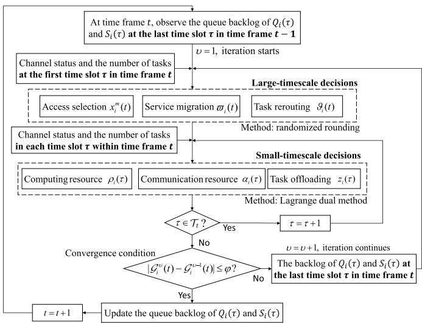  
Fig. 3. Flowchart of OASTR.

## C. Large-Timescale: Joint Access Selection, Service Migration and Task Rerouting Optimization

Since service migration decision $\varpi _ { i } ( t )$ and task rerouting decision $\vartheta _ { i } ( t )$ must satisfy the condition $\varpi _ { i } ( t ) + \vartheta _ { i } ( t ) = 1$ we define a binary mode selection indicator $y _ { i } ( t ) \in \{ 0 , 1 \}$ :

$$
y _ { i } ( t ) = { \left\{ \begin{array} { l l } { 1 , } & { { \mathrm { i f } } \quad \varpi _ { i } ( t ) = 1 \quad { \mathrm { a n d } } \quad \vartheta _ { i } ( t ) = 0 , } \\ { 0 , } & { { \mathrm { i f } } \quad \varpi _ { i } ( t ) = 0 \quad { \mathrm { a n d } } \quad \vartheta _ { i } ( t ) = 1 . } \end{array} \right. }\tag{35}
$$

Given the current backlogs of energy consumption deficit queues and local task buffer queues for all MDs and the instantaneous service delay performance, the joint access selection, service migration and task rerouting problem in each time frame t becomes<sup>2</sup>

$$
\begin{array} { r l } { \mathcal { P } _ { 4 } : } & { \displaystyle \operatorname* { m i n } _ { x _ { i } ^ { m } ( t ) , y _ { i } ( t ) } \sum _ { \tau \in \mathcal { T } _ { t - 1 } } \sum _ { i \in \mathcal { I } } \{ y _ { i } ( t ) \{ Q _ { i } ( \tau ) [ e _ { i } ^ { r o u } ( \tau ) - e _ { i } ^ { m e v } ( \tau ) ] }  \\ & { \quad \quad + V [ D _ { i } ^ { r o u } ( \tau ) - D _ { i } ^ { m e v } ( \tau ) ] \} } \\ & { \quad \quad - \displaystyle \sum _ { \tau \in \mathcal { T } _ { t - 1 } } \sum _ { i \in \mathcal { I } } \{ x _ { i } ^ { m } ( t ) S _ { i } ( \tau ) r _ { i , m } ( \tau ) \gamma \} , } \\ & { \quad \quad \quad \mathrm { s . t . ~ } ( 2 ) , ( 2 0 ) , ( 2 4 ) . } \end{array}
$$

Note that, problem $\mathcal { P } _ { 4 }$ can be solved by relaxing and rounding the discrete decision variables using randmized rounding technique, as it serves as the deterministic instant subproblem of $\mathcal { P } _ { 3 }$ at the large timescale.

In order to solve this integer programming problem ${ \mathcal { P } } _ { 4 } ,$ we adopt randomized rounding technique [37] and design a corresponding solution algorithm for joint access selection, service migration and task rerouting optimization, called

```latex
Algorithm 1 Procedure of JASTO
1 Initialize: At the beginning of time frame t, collect the
state information of all MD $i \in \mathcal { T }$ and ES $m \in { \mathcal { M } } ;$
2 Linear relaxation: $x _ { i } ^ { m } ( t ) \in \{ 0 , 1 \} \to x _ { i } ^ { m } ( t ) \in [ 0 , 1 ]$
$y _ { i } ( t ) \in \{ 0 , 1 \} \to y _ { i } ( t ) \in [ 0 , 1 ] ;$
3 Obtain $\{ \tilde { x } _ { i } ^ { m } ( t ) \}$ and $\{ \tilde { y } _ { i } ( t ) \}$ through linear
programming while satisfying the constraints (36) and
(20);
4 for $i \in \mathcal { T }$ do
5 Set $y _ { i } ( t ) = 1$ with the probability $\tilde { y _ { i } } ( t ) ;$
6 for $m \in \mathcal { M }$ do
7 Define $\tilde { \mathcal { M } }$ as the set of potential ESs for newly
access;
8 if $\tilde { \mathcal { M } } = \emptyset$ then
9 Set $\widehat { x } _ { i } ^ { m } ( t ) = 1$ with the probability $\delta _ { i } ( t ) ;$
10 else
11 Set $\widehat { x } _ { i } ^ { m } ( t ) = 1$ with the probability $\delta _ { i } ^ { \prime } ( t ) ;$
Output: solution of $\mathcal { P } _ { 4 } \colon \widehat { x } _ { i } ^ { m } ( t )$ and ${ \widehat { y } } _ { i } ( t )$ (or $\widehat { \varpi } _ { i } ( t )$
and $\widehat { \vartheta } _ { i } ( t ) )$
```

JASTO, which is summarized in Algorithm 1. First, we relax the constraints of decision variables $x _ { i } ^ { m } ( t )$ and $y _ { i } ( t )$ as

$$
\begin{array} { r l r } & { } & { x _ { i } ^ { m } ( t ) \in \{ 0 , 1 \}  x _ { i } ^ { m } ( t ) \in [ 0 , 1 ] , } \\ & { } & { y _ { i } ( t ) \in \{ 0 , 1 \}  y _ { i } ( t ) \in [ 0 , 1 ] , } \end{array}\tag{36}
$$

and replace constraints (2) and (24) in $\mathcal { P } _ { 4 }$ with (36), respectively. Then, problem $\mathcal { P } _ { 4 }$ can be solved in a polynomial time by using the linear programming solver [38], and denote $\{ \tilde { x } _ { i } ^ { m } ( t ) \}$ and $\{ \tilde { y } _ { i } ( t ) \}$ as the corresponding optimal solutions. Note that, the caching capacity of ESs restricts the access selection $x _ { i } ^ { m } ( t )$ and service migration/task rerouting selection $y _ { i } ( t )$ , i.e., constraint (20) must be checked repeatedly when solving $\mathcal { P } _ { 4 }$ by linear programming solver.

Our remaining issue is to round $\{ \tilde { x } _ { i } ^ { m } ( t ) \}$ and $\{ \tilde { y } _ { i } ( t ) \}$ to obtain integer solutions, denoted by $\{ \widehat { x } _ { i } ^ { m } \}$ and $\{ \widehat { y } _ { i } \}$ . First, we round $\bar { \{ \widehat { y } _ { i } \} }$ to 1 with probability $\{ \tilde { y } _ { i } ( t ) \}$ . Then, based on $\{ \widehat { y } _ { i } \} , \{ \widehat { x } _ { i } ^ { m } \}$ can be given as follows. For each MD $i \in \mathcal { T } ,$ denote M<sup>˜</sup> by the set of potential ESs for newly access. If $\tilde { \mathcal { M } } = \varnothing , \mathrm { M D } i$ will re-access to the previously accessed ES with probability $\delta _ { i } ( t )$ , where $\delta _ { i } ( t ) = 1$ , if $\begin{array} { r } { \tilde { x } _ { i } ^ { m } ( t ) \geq \prod _ { m \in \tilde { \mathcal { M } } } ( 1 - } \end{array}$ $\tilde { y _ { i } } ( t ) )$ , and $\begin{array} { r } { \delta _ { i } ( t ) = \frac { \tilde { x } _ { i } ^ { m } ( t ) } { \prod _ { m \in \tilde { \mathcal { M } } } \left( 1 - \tilde { y _ { i } } ( t ) \right) } } \end{array}$ , else. Otherwise, MD $i \in$ I will access ES m from M<sup>˜</sup> with the probability $\delta _ { i } ^ { \prime } ( t ) \ =$ $\tilde { x } _ { i } ^ { m } ( t ) / \tilde { y } _ { i } ( t )$

Lemma 1: The gap between the solution returned by JASTO, denoted by ${ \ddot { \mathcal { P } } } _ { 4 }$ , and the optimal solution, denoted by $\mathcal { P } _ { 4 } ^ { * }$ , is bounded by

$$
\begin{array} { r } { \tilde { \mathcal { P } } _ { 4 } - \mathcal { P } _ { 4 } ^ { * } \leq \sum _ { \tau \in \mathcal { T } _ { t - 1 } } \sum _ { i \in \mathcal { I } } \mathbb { E } [ \widehat { y } _ { i } ( t ) \xi _ { 1 } + x _ { i } ^ { m ^ { * } } ( t ) \xi _ { 2 } ] = \Lambda , } \end{array}\tag{37}
$$

where $\xi _ { 1 } = Q _ { i } ( \tau ) ( e _ { i } ^ { m e v } ( \tau ) - z _ { i } ( \tau ) e _ { i } ^ { r o u } ( \tau ) ) + V ( { D _ { i } ^ { m e v } ( \tau ) } -$ $z _ { i } ( \tau ) D _ { i } ^ { r o u } ( \tau ) )$ and $\xi _ { 2 } = S _ { i } ( \tau ) r _ { i , m } ( \tau ) \gamma .$

Proof: Please see Appendix B.

Lemma 1 specifies that JASTO can reach asymptotically optimal solutions for access selection, service migration and task rerouting decision for all MDs in each time frame t. These solutions will be used in Section V-D to further determine the optimal task offloading and resource allocations in each time slot $\tau \in \mathcal { T } _ { t }$ within time frame t.

## D. Small-Timescale Decisions: Joint Task Offloading and Resource Allocation Optimization

Given ${ \widehat x } _ { i } ^ { m } ( t )$ and ${ \widehat { y } } _ { i } ( t )$ (or $\widehat { \varpi } _ { i } ( t )$ and $\widehat { \vartheta } _ { i } ( t ) ) , \forall i \in \mathcal { I }$ , ∀m $\in$ $\mathcal { M } ,$ , obtained in Section $\mathrm { V - C } ,$ we now focus on determining the communication and computing resource allocation for all MDs in each time slot τ within frame $t ,$ and their optimal task offloading decisions, as shown below

$$
\begin{array} { r l } { \mathcal { P } _ { 5 } : } & { \quad \displaystyle \operatorname* { m i n } _ { \alpha _ { 1 } ( \tau ) , \rho _ { \ell } ( \tau ) } \sum _ { \tau \in \mathcal { T } _ { i } } \sum _ { i \in \mathcal { X } } \{ Q _ { i } ( \tau ) [ z _ { i } ( \tau ) ( e _ { i } ^ { t r a } ( \tau ) + e _ { i } ^ { c o m } ( \tau ) ) } \\ & { \quad + \left( 1 - z _ { i } ( \tau ) \right) e _ { i } ^ { i \alpha c } ( \tau ) ] + V [ z _ { i } ( \tau ) ( D _ { i } ^ { t r a } ( \tau ) } \\ & { \quad + D _ { i } ^ { c o m } ( \tau ) ) + ( 1 - z _ { i } ( \tau ) ) D _ { i } ^ { l o c } ( \tau ) \} } \\ & { \quad - \widehat { x _ { i } ^ { m } } ( t ) S _ { i } ( \tau ) , \widehat { x _ { i } ^ { m } } ( \tau ) \gamma \} } \\ & { \quad \mathrm { s . t . } \quad \displaystyle \sum _ { i = 1 } ^ { I } \sum _ { m = 1 } ^ { M } \widehat { x _ { i } ^ { m } } ( t ) \alpha _ { i } ( \tau ) \leq 1 , \quad \quad \quad ( 3 8 , } \\ & { \quad \displaystyle \sum _ { i = 1 } ^ { I } \sum _ { m ^ { \prime } = 1 } ^ { M } \eta _ { i } ^ { m } ( t ) \rho _ { i } ( \tau ) \leq 1 , \quad \quad \quad \quad ( 3 9 . } \end{array}
$$

where $\eta _ { i } ^ { m } ( t ) = A _ { i } ^ { m ^ { \prime } } ( t ) \widehat { x } _ { i } ^ { m } ( t ) \widehat { \varpi } _ { i } ( t ) + A _ { i } ^ { m } ( t ) \widehat { x } _ { i } ^ { m ^ { \prime } } ( t ) \widehat { \vartheta } _ { i } ( t )$ . Since communication and computing resource allocation decisions, $\mathrm { i . e . , ~ } \alpha _ { i } ( \tau ) , \rho _ { i } ( \tau ) , \forall i \in \mathcal { I }$ , are independent with each other if task offloading decision $z _ { i } ( \tau ) , \forall i \ \in \ \mathcal { T }$ , is given, in the following, by assuming that $z _ { i } ( \tau ) = 1$ , we first solve $\alpha _ { i } ( \tau )$ and $\rho _ { i } ( \tau )$ separately. Then, we in turn optimize $z _ { i } ( \tau ) , \forall i \in \mathcal { T }$ by comparing the optimal performance of problem ${ \mathcal { P } } _ { 5 }$ under local and edge computing modes.

1) Optimal Communication Resource Allocation: Within each time frame t, if MD $\textit { i } \in \textit { \textbf { Z } }$ decides to offload its computation tasks to the accessed ES $m \in \mathcal { M }$ in a time slot $\tau \in \mathcal { T } _ { t }$ , the optimal bandwidth allocation $\alpha _ { i } ( \tau )$ for $\mathrm { { M D } } i \in \mathcal { T }$ in time slot $\tau \in \mathcal { T } _ { t }$ can be obtained by solving problem ${ \mathcal { P } } _ { 6 } .$ which is given by

$$
\begin{array} { r l } { \mathcal { P } _ { 6 } : } & { \underset { \alpha _ { i } ( \tau ) } { \operatorname* { m i n } } \mathop { \sum } _ { \tau \in \mathcal { T } _ { t } } \sum _ { i \in \mathcal { I } } [ Q _ { i } ( \tau ) e _ { i } ^ { t r a } ( \tau ) + V D _ { i } ^ { t r a } ( \tau ) } \\ & { ~ - \widehat { x } _ { i } ^ { m } ( t ) S _ { i } ( \tau ) r _ { i , m } ( \tau ) \gamma ] } \\ & { \quad \mathrm { s . t . ~ } ( 3 5 ) . } \end{array}
$$

Since ${ \mathcal { P } } _ { 6 }$ is a linear convex programming problem, we define its Lagrangian function as

$$
\begin{array} { r l r } {  { \mathcal { L } ( \alpha _ { i } ( \tau ) , \mu ( \tau ) ) } } \\ & { = \displaystyle \sum _ { \tau \in { \mathcal T } _ { t } } \sum _ { i \in { \mathcal T } } [ Q _ { i } ( \tau ) e _ { i } ^ { t r a } ( \tau ) + V F _ { i } ^ { t r a } ( \tau ) - \widehat { x } _ { i } ^ { m } ( t ) S _ { i } ( \tau ) r _ { i , m } ( \tau ) \gamma ] } \\ & { + \mu ( \tau ) [ \frac { 1 } { \sum _ { i = 1 } ^ { I } \sum _ { m = 1 } ^ { M } \widehat { x } _ { i } ^ { m } ( t ) } - \sum _ { i = 1 } ^ { I } \alpha _ { i } ( \tau ) ] , } & { ( 4 0 ) } \end{array}
$$

where $\mu ( \tau ) > 0$ is the Lagrangian multiplier. The Lagrange dual function $\mathcal { D } ( \alpha _ { i } ( \tau ) , \mu ( \tau ) )$ is

$$
\begin{array} { r l } & { \mathcal { D } ( \alpha _ { i } ( \tau ) , \mu ( \tau ) ) = \operatorname* { m a x } \mathcal { L } ( \alpha _ { i } ( \tau ) , \mu ( \tau ) ) } \\ & { \mathrm { ~ s . t . ~ } \epsilon _ { \alpha } \leq \alpha _ { i } ( \tau ) , \displaystyle \sum _ { i = 1 } ^ { I } \sum _ { m = 1 } ^ { M } \widehat { x } _ { i } ^ { m } ( t ) \alpha _ { i } ( \tau ) \leq 1 , } \end{array}\tag{41}
$$

where $\epsilon _ { \alpha } ~ > ~ 0$ is defined as an arbitrarily small value. According to the Karush-Kuhn-Tucker (KKT) [39] conditions, we have

$$
\left\{ \begin{array} { l l } { \widehat { \alpha } _ { i } ( \tau ) = \operatorname* { m a x } \{ \epsilon _ { \alpha } , \mathcal { R } _ { i } ( \widehat { \mu } ( \tau ) ) \} , \quad i \in \mathbb { Z } , \widehat { \mu } ( \tau ) > 0 } \\ { \sum _ { i \in \mathbb { Z } } \widehat { \alpha } _ { i } ( \tau ) = \frac { 1 } { \sum _ { i = 1 } ^ { I } \sum _ { m = 1 } ^ { M } \widehat { x } _ { i } ^ { m } ( t ) } , } \end{array} \right.\tag{42}
$$

where $\widehat { \alpha } _ { i } ( \tau )$ and $\widehat { \mu } ( \tau )$ are the optimal bandwidth allocation and the optimal Lagrangian multiplier, respectively, and $\textstyle \mathcal { R } _ { i } ( \mu ( \tau ) )$ represents the root of $\frac { \partial \mathcal { L } ( \overset { \mathbf { { i } } } { \alpha } _ { i } ( \tau ) , \overset { \mathbf { { \prime } } } { \mu } ( \tau ) ) } { \partial \alpha _ { i } ( \tau ) }$ , which can be derived as $\begin{array} { r l r } { \mathcal { R } _ { i } ( \mu ( \tau ) ) } & { { } = } & { Q _ { i } ( \tau ) \frac { \partial e _ { i } ^ { \mathrm { \it { t r a } } } ( \tau ) ^ { ' } } { \partial \alpha _ { i } ( \tau ) } + V \frac { \partial D _ { i } ^ { \mathrm { \it { t r a } } } ( \tau ) } { \partial \alpha _ { i } ( \tau ) } - } \end{array}$ $\begin{array} { r } { \widehat { x } _ { i } ^ { m } ( t ) S _ { i } ( \tau ) \gamma \frac { \partial r _ { i , m } ( \tau ) } { \partial \alpha _ { i } ( \tau ) } - \mu ( \tau ) \ } \end{array}$ . Set $\mathcal { R } _ { i } ( \mu ( \tau ) ) ~ = ~ 0$ , and thus $\mu ( \tau )$ can be further written as

$$
\begin{array} { c } { { \mu ( \tau ) = Q _ { i } ( \tau ) \displaystyle \frac { \partial e _ { i } ^ { t r a } ( \tau ) } { \partial \alpha _ { i } ( \tau ) } + V \displaystyle \frac { \partial D _ { i } ^ { t r a } ( \tau ) } { \partial \alpha _ { i } ( \tau ) } } } \\ { { - \widehat { x } _ { i } ^ { m } ( t ) S _ { i } ( \tau ) \gamma \displaystyle \frac { \partial r _ { i , m } ( \tau ) } { \partial \alpha _ { i } ( \tau ) } . } } \end{array}\tag{43}
$$

It can be observed that $\mu ( \tau )$ increases as $\alpha _ { i } ( \tau )$ decreases. This suggests a bisection search over $\left[ \mu ^ { L } ( \tau ) , \mu ^ { U } ( \tau ) \right]$ for obtaining the optimal Lagrangian multiplier $\widehat { \mu } ( \tau )$ . Here, $\mu ^ { L } ( \tau )$ and $\mu ^ { U } ( \tau )$ represent the minimum and maximum values of $\mu ( \tau )$ which can be determined as [40]

$$
\begin{array} { r } { \left\{ { \mu } ^ { L } ( \tau ) = \operatorname* { m a x } _ { i \in \mathcal { T } } { \mu } ( \tau ) | _ { \alpha _ { i } ( \tau ) = \frac { 1 } { \sum _ { m = 1 } ^ { M } \hat { x } _ { i } ^ { m } ( t ) } } , \right. } \\ { \left. { \mu } ^ { U } ( \tau ) = \operatorname* { m a x } _ { i \in \mathcal { T } } { \mu } ( \tau ) | _ { \alpha _ { i } ( \tau ) = \epsilon _ { \alpha } . } \right. } \end{array}\tag{44}
$$

Afterwards, by substituting $\widehat { \mu } ( \tau )$ into $( 4 3 ) , \ \widehat { \alpha } _ { i } ( t )$ can be eventually derived.

2) Optimal Computing Resource Allocation: Similar to problem ${ \mathcal { P } } _ { 6 }$ in Section V-D.1, the optimal computing resource allocation for each MD $i \in \mathcal { T }$ in each time slot $\tau \in \mathcal { T } _ { t }$ can be obtained by solving another linear convex programming problem:

$$
\begin{array} { r l } { \mathcal { P } _ { 7 } : } & { \underset { \rho _ { i } ( \tau ) } { \operatorname* { m i n } } \sum _ { \tau \in \mathcal { T } _ { t } } \sum _ { i \in \mathcal { I } } [ Q _ { i } ( \tau ) e _ { i } ^ { c o m } ( \tau ) + V D _ { i } ^ { c o m } ( \tau ) ] } \\ & { \mathrm { s . t . } \ ( 3 6 ) . } \end{array}
$$

Then, according to Lagrange dual method and KKT conditions, the multiplier $\phi ( \tau ) > 0$ associated with constraint $\begin{array} { r } { \sum _ { i = 1 } ^ { I } \sum _ { m ^ { \prime } = 1 } ^ { M } \rho _ { i } ( \dot { \tau } ) \eta _ { i } ^ { m } ( t ) \dot { \leq } 1 } \end{array}$ can be written as

$$
\phi ( \tau ) = Q _ { i } ( \tau ) \frac { \partial e _ { i } ^ { c o m } ( \tau ) } { \partial \rho _ { i } ( \tau ) } + V \frac { \partial D _ { i } ^ { c o m } ( \tau ) } { \partial \rho _ { i } ( \tau ) } .\tag{45}
$$

Following [40], the minimum and maximum value of $\phi ( \tau )$ can be determined as

$$
\left\{ \begin{array} { l } { { \phi ^ { L } ( \tau ) = \mathrm { m a x } _ { i \in \mathcal { T } } \phi ( \tau ) | _ { \alpha _ { i } ( \tau ) = \frac { 1 } { \sum _ { m = 1 } ^ { M } \eta _ { i } ^ { m } ( t ) } } \ , } } \\ { { \phi ^ { U } ( \tau ) = \mathrm { m a x } _ { i \in \mathcal { T } } \phi ( \tau ) | _ { \alpha _ { i } ( \tau ) = \epsilon _ { \rho } , } } } \end{array} \right.\tag{46}
$$

where ${ \epsilon _ { \rho } } > 0$ is an arbitrarily small value. Finally, by bisection search over $[ \phi ^ { L } ( \tau ) , \phi ^ { U } ( \tau ) ]$ , the optimal Lagrangian multiplier $\widehat { \phi } ( \tau )$ can be obtained, which further implies the optimal value of $\rho _ { i } ( \tau )$ , denoted by $\widehat { \rho } _ { i } ( \tau )$

3) Optimal Task Offloading Decision: If MD i’s computation tasks are executed locally, i.e., $z _ { i } ( \tau ) = 0$ , the optimal solution of problem ${ \mathcal { P } } _ { 5 }$ , denoted by $\mathcal { P } _ { 5 } [ z _ { i } ( \tau ) = 0 ]$ , in each time slot $\tau \in \mathcal { T } _ { t }$ is a constant, which can be expressed as

$$
\begin{array} { r } { \mathcal { P } _ { 5 } [ z _ { i } ( \tau ) = 0 ] = \displaystyle \sum _ { \tau \in \mathcal { T } _ { t } } \displaystyle \sum _ { i \in \mathcal { T } } \{ Q _ { i } ( \tau ) [ \varpi _ { i } ( t ) e _ { i } ^ { l o c } ( \tau ) - \frac { e _ { i } ^ { t h } } K }  \\ { + e _ { i } ^ { m e v } ] + S _ { i } ( \tau ) [ \lambda _ { i } ( \tau ) v _ { i } - \frac { f _ { i } ^ { m d } \gamma } { \beta _ { i } ^ { m d } } ] \} } \\ { + \displaystyle \sum _ { \tau \in \mathcal { T } _ { t } } \displaystyle \sum _ { i \in \mathcal { T } } V \varpi _ { i } ( t ) [ D _ { i } ^ { l o c } + D _ { i } ^ { m e v } ] . } \end{array}\tag{47}
$$

Similarly, denote $\widehat { \mathcal { P } } _ { 5 } [ z _ { i } ( \tau ) = 1 ]$ as the optimal solution of problem ${ \mathcal { P } } _ { 5 }$ if MD i’s computation tasks are offloaded to the accessed ES in time slot $\tau \in \mathcal { T } _ { t }$ . Note that $\widehat { \mathcal { P } } _ { 5 } [ z _ { i } ( \tau ) = 1 ]$ depends on both the optimal communication resource allocation $\widehat { \alpha } _ { i } ( \tau )$ and CPU resource allocation $\widehat { \rho _ { i } } ( \tau )$

Then, by comparing $\mathcal { P } _ { 5 } [ z _ { i } ( \tau ) = 0 ]$ and $\begin{array} { r } { \hat { \mathcal { P } } _ { 5 } [ z _ { i } ( \tau ) = 1 ] . } \end{array}$ , the optimal task offloading decision $z _ { i } ( \tau )$ can be obtained as

$$
\widehat { z } _ { i } ( \tau ) = \left. \begin{array} { l r } { 1 , } & { \mathrm { i f } \quad \mathcal { P } _ { 5 } [ z _ { i } ( \tau ) = 0 ] > \widehat { \mathcal { P } } _ { 5 } [ z _ { i } ( \tau ) = 1 ] , } \\ { 0 , } & { \mathrm { o t h e r w i s e } . } \end{array} \right.\tag{48}
$$

## E. Summary of OASTR

In summary, the proposed OASTR consists of the problem reformulation, problem decomposition, joint access selection, service migration and task rerouting optimization and joint task offloading and resource allocation optimization, as described in Sections V-A-V-D The implementation of OASTR is detailedly illustrated in Algorithm 2. Unlike the performance analysis of single timescale algorithms, we consider a more comprehensive performance analysis of OASTR on two different but dependent timescales.

Theorem 2: (Computational Complexity) The computational complexity of the proposed OASTR is $O [ T$ $\nu ( ( 2 M ) ^ { 2 . 0 5 5 } + 2 K ) ]$ , where M is the number of ESs, T is the number of time frames, K is the number of time slots within each frame, ν is the average number of iterations required for $Q _ { i } ( \tau )$ and $S _ { i } ( \tau )$ to reach a stationary state in each time frame.

Proof: The complexity of OASTR depends on the alternate iterations of JASTO and Lagrange dual method in each time frame. As stated in [37], applying the linear relaxation and linear programming solver for JASTO has an asymptotic computation time complexity of $O ( ( 2 M ) ^ { 2 . 0 5 5 } )$ , where 2 and M represent the number of candidate choices of $x _ { i } ^ { m } ( t )$ and $y _ { i } ( t )$ respectively. Furthermore, according to [38], the complexity of Lagrange dual method is in the linear order with the number of optimization variables. This indicates that, at each frame, the complexity of each iteration is $O [ ( 2 M ) ^ { 2 . 0 5 5 } + 2 K ]$ . Define ν as the average number of iterations required for $Q _ { i } ( \tau )$ and $S _ { i } ( \tau )$ to reach a stationary state in each time frame. Then, the computational complexity of the proposed OASTR can be expressed as $O [ T \cdot \nu ( ( \bar { 2 } M ) ^ { \bar { 2 } . 0 5 5 } + 2 \bar { K } ) ]$

Theorem 3: (Optimality) Given Lyapunov control parameter $V _ { ; }$ , the optimality gap between the solution obtained by the proposed OASTR and the theoretically optimal solution to problem $\mathcal { P } _ { 1 }$ can be expressed as

Algorithm 2 Implementation of OASTR   
1 for each time frame t do   
2 Observe the instantaneous queue set $\Theta ( t )$ , channel   
states and the number of tasks $\lambda _ { i } ( \tau )$ at the first   
time slot;   
3 Set the initial iteration index $\nu = 1 ;$   
4 while $| \mathcal { G } _ { i } ^ { \nu } ( t ) - \mathcal { G } _ { i } ^ { \nu - 1 } ( t ) | > \varphi$ do   
5 for $i \in \mathcal { Z } ,$ m $\in \mathcal { M }$ do   
6 Call Algorithm 1 to obtain $\widehat { x } _ { i } ^ { m } ( t ) , \widehat { \varpi } _ { i } ( t )$   
and $\widehat { \vartheta } _ { i } ( t ) ;$   
7 for each time slot $\tau \in \mathcal { T } _ { t }$ do   
8 Set the initial task offloading decision   
$z _ { i } ( \tau ) = 1 ;$   
9 Observe the channel states and the number   
of tasks $\lambda _ { i } ( \tau )$ in each time slot $\tau ;$   
10 for $i \in \mathcal { Z } ,$ m ∈ M do   
11 Obtain the optimal transmission   
resource allocation $\widehat { \alpha } _ { i } ( \tau )$ by solving   
problem ${ \mathcal { P } } _ { 6 } ;$   
12 Obtain the optimal computing resource   
allocation $\widehat { \rho } _ { i } ( \tau )$ by solving problem   
$\mathcal { P } _ { 7 } ;$   
13 Update the optimal task offloading decision   
as $\widehat { z } _ { i } ( \tau )$ according to (48);   
14 Update the iteration index $\nu = \nu + 1 ;$   
Output: $\widehat { x } _ { i } ^ { m } ( t ) , \widehat { \varpi } _ { i } ( t ) , \widehat { \vartheta } _ { i } ( t ) , \widehat { z } _ { i } ( \tau ) , \widehat { \rho } _ { i } ( \tau ) , \widehat { \alpha } _ { i } ( \tau ) .$

$$
\sum _ { \tau \in \mathcal { T } _ { t } } \sum _ { t = 0 } ^ { t - 1 } \mathbb { E } [ D _ { i } ^ { t o l } ( \tau ) \mid \Theta ( \tau ) ] / K T \le \varepsilon + B / V + \Lambda / V T ,\tag{49}
$$

where $\varepsilon$ represents the theoretically optimal solution, and $B$ is defined in (33). Obviously, when the control parameter $V$ is large enough, the solution obtained by OASTR can approach the optimal solution ε infinitely.

Proof: Based on Theorem 1 and Lemma 1, (32) can be scaled as

$$
\begin{array} { r l } & { \displaystyle \Delta _ { V } ( \Theta ( t ) ) } \\ & { \displaystyle = \Delta ( \Theta ( t ) ) + V \cdot \sum _ { \tau \in \mathcal { T } _ { t } } \mathbb { E } [ D _ { i } ^ { t o l } ( \tau ) \ | \ \Theta ( \tau ) ] } \\ & { \displaystyle \leq B K + \sum _ { \tau \in \mathcal { T } _ { t } } \sum _ { i \in \mathcal { I } } \mathbb { E } \{ Q _ { i } ( \tau ) [ \widehat { e } _ { i } ^ { t o l } ( \tau ) - \frac { e _ { i } ^ { t h } } { K } ] + S _ { i } ( \tau ) [ \lambda _ { i } ( \tau ) v _ { i } } \\ & { \displaystyle ~ - ( \frac { f _ { i } ^ { m d } \gamma } { \beta _ { i } ^ { m d } } + \widehat { x } _ { i } ^ { m } ( t ) \widehat { r } _ { i , m } ( \tau ) \gamma ) ] + V \cdot D _ { i } ^ { t o l } ( \tau ) \ | \ \Theta ( \tau ) \} } \\ & { \displaystyle \leq B K + V \cdot K \varepsilon + \Lambda , } \end{array}
$$

where ε is the theoretically optimal solution.

Then, summing up (50) over T time frames, we can get

$$
\begin{array} { l } { \displaystyle ( B + V \cdot \varepsilon + \frac { 1 } { K } \Lambda ) \cdot K T } \\ { \displaystyle \geq \sum _ { t = 0 } ^ { T - 1 } \mathbb { E } \big [ \Delta _ { V } ( \Theta ( \tau ) ) | \Theta ( \tau ) \big ] } \end{array}
$$

TABLE III  
SIMULATION PARAMETERS
<table><tr><td>Parameter</td><td>Value</td><td>Parameter</td><td>Value</td></tr><tr><td>K</td><td>10  $5 0 0 \ \mathrm { m W } , \thinspace 5 \ \mathrm { W }$ </td><td> $W _ { m }$ </td><td>5MHz 100 Gb</td></tr><tr><td> $p _ { i } , p _ { e s }$   $n _ { i } ^ { m d } , n _ { m } ^ { e s }$ </td><td>10-27</td><td> $C _ { m } ^ { m a x }$   $\gamma$ </td><td>0.1 s</td></tr><tr><td> $b _ { i } ^ { \phantom { \dagger } }$ </td><td>30 Gb</td><td> $\beta _ { i }$ </td><td>300 cycles/bit</td></tr><tr><td> $M$ </td><td>10</td><td> $\dot { I }$ </td><td>40</td></tr><tr><td> $v _ { i }$ </td><td>1Mb</td><td> $\lambda _ { i } ( \tau )$ </td><td>[10,20]</td></tr><tr><td> $f _ { i } ^ { m d }$ </td><td>1 GHz</td><td> $f _ { m } ^ { e s }$ </td><td>20 GHZ</td></tr><tr><td> $\boldsymbol { \theta } ^ { \check { } }$ </td><td>4</td><td> $N _ { 0 }$ </td><td>-174 dBm/Hz</td></tr></table>

$$
\begin{array} { r l } & { = \mathbb { E } [ L ( \Theta ( K T ) ) - L ( \Theta ( 0 ) ) ] + V \displaystyle \sum _ { \tau \in \mathcal { T } _ { t } } \sum _ { t = 0 } ^ { T - 1 } \mathbb { E } [ D _ { i } ^ { t o l } ( \tau ) \mid \Theta ( \tau ) ] } \\ & { = \mathbb { E } [ L ( \Theta ( K T ) ) ] + V \displaystyle \sum _ { \tau \in \mathcal { T } _ { t } } \sum _ { t = 0 } ^ { T - 1 } \mathbb { E } [ D _ { i } ^ { t o l } ( \tau ) \mid \Theta ( \tau ) ] - \mathbb { E } [ L ( \Theta ( 0 ) ) ] . } \end{array}\tag{51}
$$

Finally, by moving $\mathbb { E } [ L ( \Theta ( 0 ) ) ]$ to the left-hand side of (51), and dividing both sides by V and $T ,$ , Theorem 3 can be obtained. ■

Theorem 4: (Stability of Energy Consumption Deficit Queue) For each ES in each time slot, its backlog queue is constrained by a V -dependent upper bound, which is expressed as

$$
\begin{array} { r l } & { \sum _ { \tau = 0 } ^ { T K - 1 } \sum _ { i = 1 } ^ { I } \mathbb { E } \{ Q _ { i } ( \tau ) \} } \\ & { \leq T B ^ { \prime } / \Psi _ { 1 } - \Psi _ { 2 } et { } { ' } \sum _ { i = 1 } ^ { I } ( S _ { m a x } - f _ { i } ^ { m d } \gamma / \beta _ { i } ^ { m d } + \lambda _ { i } ^ { m a x } v _ { i } ) / \Psi _ { 1 } , } \end{array}
$$

where $B ^ { \prime } \triangleq ( B T + V \cdot T \varepsilon _ { m a x } ) , \varepsilon _ { m a x }$ is the maximum value of feasible solutions, $S _ { m a x }$ and $\lambda _ { i } ^ { m a x }$ are the maximum values of $S _ { i } ( \tau )$ and $\lambda _ { i } ( \tau )$ respectively, $\Psi _ { 1 }$ and $\Psi _ { 2 }$ are positive real values meeting the following conditions:

$$
\begin{array} { r l } & { \mathbb { E } [ e _ { i } ^ { t o l } ( \tau ) - e _ { i } ^ { t h } / K ] \leq - \Psi _ { 1 } , } \\ & { \mathbb { E } [ \lambda _ { i } ( \tau ) v _ { i } - ( f _ { i } ^ { m d } \gamma / \beta _ { i } ^ { m d } + x _ { i } ^ { m } ( t ) r _ { i , m } ( \tau ) \gamma ) ] \leq - \Psi _ { 2 } . } \end{array}
$$

Proof: Please see Appendix C.

## VI. SIMULATION RESULTS

## A. Simulation Settings

In this section, simulations are conducted to numerically evaluate the performance of the proposed OASTR. Table III lists the values of main simulation parameters. Similar settings have also been employed in the literature [4], [29], [35]. Furthermore, to show the superiority of the proposed OASTR, the performances of the following schemes are also evaluated as benchmarks.

• JMH [7]: The service migration, communication and computing resource allocations are jointly and dynamically optimized to provide low-latancy services. However, this scheme is executed synchronously in a single timescale, and task rerouting is ignored.

• O2TL [18]: The service migration decision is decided in a large timescale, and the offloading decision and computing resource allocation are decided in a small timescale. However, this scheme evenly distributes communication resources to MDs, and ignores task rerouting.

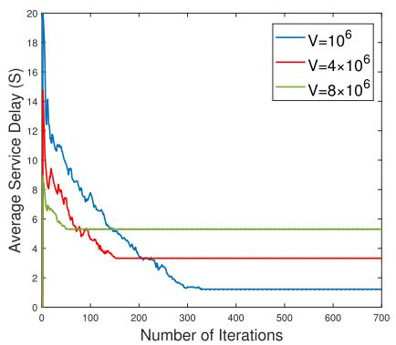

Fig. 4. The convergence of solving problem ${ \mathcal { P } } _ { 3 } .$  
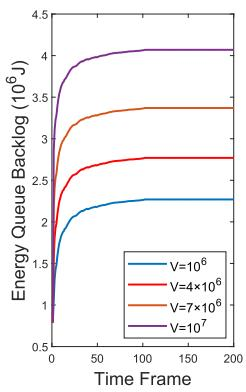

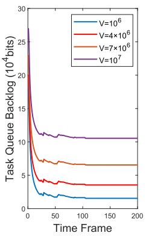  
Fig. 5. Performance of queues backlog with different $V .$

## B. Performance Evaluations

In Fig. 4, we evaluate the convergence property of the proposed OASTR in solving problem $\mathcal { P } _ { 3 }$ under the value of parameter V ranging from $1 0 ^ { 6 } \mathrm { ~ t o ~ } 8 \times 1 0 ^ { 6 }$ . It is shown that the average service delay in the initial phase is very high, because the initial available local computing resource is very rich, making MDs prefer local execution, leading to a huge backlog of local tasks. For each $V ,$ with time elapses, OASTR converges quickly, so that the average service delay tends to be stable, which verifies the stability of the proposed algorithm. In addition, when $V = 8 \times 1 0 ^ { 6 }$ , the convergence of OASTR is faster than that of the other two. The reason is that the decreasing of V means that MEC system needs a higher utilization rate of edge resources, resulting in a lower service delay and a better service continuity.

In Fig. 5, we evaluate the impact of parameter V on the average energy consumption deficit queue backlog and the average local task queue backlog over time. The timeline is divided into $T ~ = ~ 5 0 0$ time frames and each frame has $K = 1 0$ time slots, and the value of $V$ ranges from $1 0 ^ { 6 }$ to $1 0 ^ { 7 }$ We can see from Fig. 5 that the values of the average energy consumption deficit queue backlog and the average local task queue backlog gradually become stable over time with the growth of V. V reflects the tradeoff between queue stability and optimization objective $D _ { i } ^ { t o l } ( \tau )$ . The increase of V means that the considered MEC system needs to obtain a higher utilization rate of local resources, leading to the increase of backlog of energy consumption deficit queue $Q _ { i } ( \tau )$ and local task queue $S _ { i } ( \tau )$ . At the beginning, MDs have abundant computing resources. Therefore, the system prefers to execute computing tasks locally, resulting in a full state of the local task queue. Then, as the system focuses on controlling local task queue backlog, more tasks are offloaded to ESs, making queue backlogs drop rapidly. When $T = [ 2 5 , 7 5 ]$ , both the local task queue and the energy consumption deficit queue fluctuate, and the fluctuation of the local queue is relatively violent. This is because the system tends to balance the computational workload of MDs and ESs, so as to control the stability of service delay and system-wide energy consumption, and thus causing temporary oscillation of the local queue.

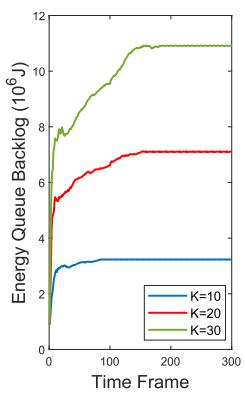

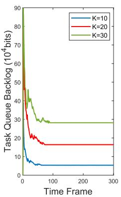  
Fig. 6. Performance of queues backlog with different K.

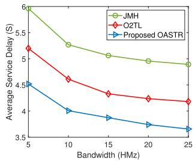

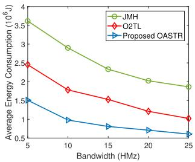  
(a) Service delay w.r.t $W _ { m }$  
(b) Energy w.r.t $W _ { m }$  
Fig. 7. Comparison on average service delay and energy consumption with different bandwidth.

In Fig. 6, we evaluate the impact of parameter K on the average backlog of energy deficit queue and local task queue. We set $V ~ = ~ 4 \times 1 0 ^ { 6 }$ and $K \ = \ 1 0 , 2 0 , 3 0$ . As shown in Fig. 6, when K increases, the backlogs of both local task queue and energy deficit queue increase, and the convergence time increases as well. This is because, with the increase of time frame length $K ,$ , the channel conditions gradually deteriorate, service migration decision $\varpi _ { i } ( t )$ and task rerouting decision $\vartheta _ { i } ( t )$ hence cannot be updated in time, and resource allocation decisions are difficult to adapt to $\mathbf { M D s } ^ { \prime }$ requirements. Intuitively, the values of average energy deficit queue backlog and average local task queue backlog also gradually become stable over time and fluctuate slightly.

Fig. 7 shows the impact of communication bandwidth on the performance of system-wide service delay and energy consumption. We can see that the average service delay and energy consumption decrease with the increase of bandwidth. This is because with the increase of communication bandwidth, the execution delay and execution energy consumption in each time slot remain unchanged, while the communication resource becomes more adequate, which increases the transmission rate $r _ { i , m } ( \tau )$ between MDs and ESs, and thus reducing the transmission delay $D _ { i } ^ { t r a } ( \tau )$ and transmission energy consumption $e _ { i } ^ { t r a } ( \tau )$ . Since the maximum task quantity of each time slot has an upper limit $\lambda _ { i } ^ { m a x } v _ { i }$ , when the bandwidth resource is too large, its influence on system delay and energy consumption gradually degraded, so the slope of each curve gradually decreases. In addition, from these figures, it is observed that JMH method has a poor control effect on both service delay and energy consumption, which is due to its single timescale resource management strategy, whereby the delay and energy consumption of frequent service migration give rise to the system cost. O2TL’s equal allocation of communication resources’ strategy also fails to show advantages when the bandwidth resources increase. In contrast, the proposed OASTR reduces the average service delay and energy cost more effectively due to its two-timescale control over service migration, task rerouting and resource allocation.

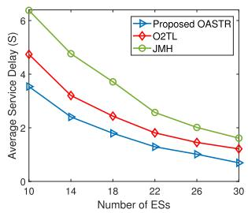  
(a) Service delay w.r.t M.

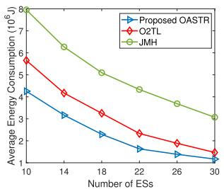  
(b) Energy w.r.t M.  
Fig. 8. Comparison on average service delay and energy with different number of ESs.

In Fig. 8, the performance comparisons of service delay and energy consumption with respect to the number of ESs are illustrated. In this figure, as the number of ESs increases, the service delay and average energy consumption of all algorithms decrease. This is because deploying more ESs significantly increases the computing and caching capacities, which hence reduce the workload of individual ES, thereby reducing the computing delay $D _ { i } ^ { c o m } ( \tau )$ and computing energy consumption $e _ { i } ^ { c o m } ( \tau )$ of each ESs. In addition, we can see from these figures that the proposed OASTR is superior over two benchmark schemes. This is because the single timescale scheme JMH cannot capture time-varying network dynamics and cannot adjust the computing resource allocation strategy in a timely manner. As the computing resources of edge increase, MDs tend to offload tasks to ESs for execution. Although O2TL can adjust the resources allocation in time, it does not consider the adjustment of transmission resources, which makes the transmission efficiency significantly decrease with the increase of tasks. On the contrary, the proposed OASTR can accurately capture network dynamics and adjust the bandwidth allocation ratio $\alpha _ { i } ( \tau )$ and CPU resource allocation ratio $\rho _ { i } ( \tau )$ to fully utilize ESs’ computing capacities.

Fig. 9 shows the performances of service delay and energy consumption with different settings of K. In Fig. 9(a) and Fig. 9(b), as the parameter K increases, the service delay and average energy consumption under all algorithms increase. The reason is that, as the time frame length $K$ increases, the update frequency of access selection and service migration decreases, which affects the control efficiency of task offloading and resource allocation on system-wide service delay and energy consumption. In addition, JMH method has a poor control effect on service delay and energy consumption, because of its single timescale decision, which makes it unable to accurately capture the rapid dynamic changes of the number of tasks and channel states. On the contrary, both O2TL method and the proposed OASTR make decisions at two timescales to adapt to network dynamics, and the proposed OASTR has a better control effect on service delay and energy consumption. This is because O2TL does enable the dynamic allocation of communication resource. Furthermore, OASTR jointly optimizes the task rerouting decision, which can effectively offset the huge delay and energy cost caused by service migration.

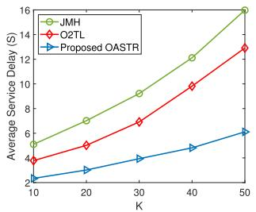  
(a) Service delay w.r.t K.

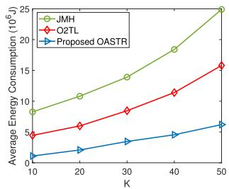  
(b) Energy w.r.t K.

Fig. 9. Comparison on average service delay and energy with different K in each frame.  
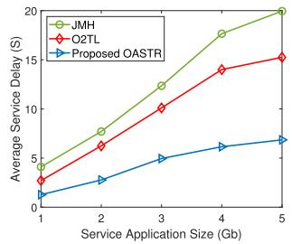

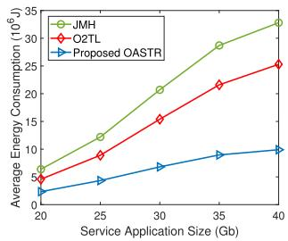  
(a) Service delay w.r.t $b _ { i } .$  
(b) Energy w.r.t $b _ { i } .$  
Fig. 10. Comparison on average service delay and energy with different $b _ { i }$

Fig. 10 illustrates the performance comparisons of service delay and energy consumption with respect to service application size. We set the number of ES $N = 1 0$ , the number of MD $M = 3 0$ , and the maximum caching capacity of each ES $C _ { m } ^ { m a x } = 1 0 0 G b$ . Intuitively, as shown in Fig. 10(a) and Fig. 10(b), when the service application size $b _ { i }$ increases, the service delay and energy consumption under the control of the two benchmark schemes increase significantly. This is because both of them only consider service migration, so the increase of application size $b _ { i }$ will directly increase the migration costs and greatly reduce the service efficiency. Contrarily, OASTR well balances service migration and task rerouting, and thus achieves the best performance.

## VII. CONCLUSION

In this paper, to guarantee seamless and cost-efficient edge computing services for MDs in MEC systems under network dynamics, we study a two-timescale online optimization of choosing either service migration or task rerouting for each MD along with the joint management of its access selection, computing and communication resource allocations. A novel solution based on the improved Lyapunov method, together with an iterative algorithm integrating randomized rounding and Lagrange dual techniques, has been proposed. Theoretical analyses reveal that the proposed solution can converge to asymptotic optimum with a low complexity. Simulation results further examine the feasibility of the proposed scheme, and show that it can outperform counterparts in terms of both average service delay and average energy cost on all MDs.

In the future work, we will further consider the possibility that multiple ESs may install the same copy of an MD’s required service application. Although this may lead to a higher flexibility in optimization, since ESs have limited caching capacities, if too many copies of an MD’s required application are installed, significant redundancy and congestion may occur. In this case, we are required to select an appropriate set of multiple ESs to migrate the application replicas for each MD, and as well as determining the optimal ES for task rerouting. This motivates us to jointly analyze the application caching queue and task queue of each ES and develop an online method to guarantee the long-term stability of both queues.

## APPENDIX A

By squaring both sides of the energy consumption deficit queue in (29), we have

$$
\begin{array} { l } { { Q _ { i } ^ { 2 } ( \tau + 1 ) } } \\ { { = [ [ e _ { i } ^ { t o l } ( \tau ) - { \displaystyle \frac { e _ { i } ^ { t h } } { K } } ] ^ { + } ] ^ { 2 } + Q _ { i } ^ { 2 } ( \tau ) + 2 Q _ { i } ( \tau ) [ e _ { i } ^ { t o l } ( \tau ) - { \displaystyle \frac { e _ { i } ^ { t h } } { K } } ] ^ { + } } } \\ { { \le [ e _ { i } ^ { t o l } ( \tau ) - { \displaystyle \frac { e _ { i } ^ { t h } } { K } } ] ^ { 2 } + Q _ { i } ^ { 2 } ( \tau ) + 2 Q _ { i } ( \tau ) [ e _ { i } ^ { t o l } ( \tau ) - { \displaystyle \frac { e _ { i } ^ { t h } } { K } } ] . ~ ( 5 2 } } \end{array}
$$

By subtracting $Q _ { i } ^ { 2 } ( \tau )$ from both sides, and summing up all inequalities for $i \in \ \mathcal { T }$ , we have

$$
\begin{array} { l } { { \displaystyle \frac { 1 } { 2 } \sum _ { i = 1 } ^ { I } [ Q _ { i } ^ { 2 } ( \tau + 1 ) - Q _ { i } ^ { 2 } ( \tau ) ] } } \\ { { \displaystyle \leq \frac { 1 } { 2 } \sum _ { i = 1 } ^ { I } [ e _ { i } ^ { t o l } ( \tau ) - \frac { e _ { i } ^ { t h } } { K } ] ^ { 2 } + \sum _ { i = 1 } ^ { I } Q _ { i } ( \tau ) [ e _ { i } ^ { t o l } ( \tau ) - \frac { e _ { i } ^ { t h } } { K } ] . } } \end{array}\tag{53}
$$

Similarly, by squaring both sides of the local task buffer queue in (5), we have

$$
\begin{array} { r l } & { S _ { i } ^ { 2 } ( \tau + 1 ) } \\ & { \quad \le S _ { i } ^ { 2 } ( \tau ) + [ \frac { f _ { i } ^ { m d } \gamma } { \beta _ { i } ^ { m d } } + x _ { i } ^ { m } ( t ) r _ { i , m } ( \tau ) \gamma ] ^ { 2 } + ( \lambda _ { i } ( \tau ) v _ { i } ) ^ { 2 } } \\ & { \quad ~ + 2 S _ { i } ( \tau ) [ \lambda _ { i } ( \tau ) v _ { i } - ( \frac { f _ { i } ^ { m d } \gamma } { \beta _ { i } ^ { m d } } + x _ { i } ^ { m } ( t ) r _ { i , m } ( \tau ) \gamma ) ] . } \end{array}\tag{54}
$$

By subtracting $( \lambda _ { i } ( \tau ) v _ { i } ) ^ { 2 }$ from both sides and dividing by 2, and summing up all inequalities for $i \in \ \mathcal { T } ,$ , we have

$$
\frac { 1 } { 2 } \sum _ { i = 1 } ^ { I } [ S _ { i } ^ { 2 } ( \tau + 1 ) - S _ { i } ^ { 2 } ( \tau ) ]
$$

$$
\begin{array} { l } { \displaystyle \leq \frac { 1 } { 2 } [ [ \frac { f _ { i } ^ { m d } \gamma } { \beta _ { i } ^ { m d } } + x _ { i } ^ { m } ( t ) r _ { i , m } ( \tau ) \gamma ] ^ { 2 } + ( \lambda _ { i } ( \tau ) v _ { i } ) ^ { 2 } ] } \\ { + S _ { i } ( \tau ) [ \lambda _ { i } ( \tau ) v _ { i } - ( \frac { f _ { i } ^ { m d } \gamma } { \beta _ { i } ^ { m d } } + x _ { i } ^ { m } ( t ) r _ { i , m } ( \tau ) \gamma ) ] . } \end{array}\tag{55}
$$

Since $e _ { i } ^ { t o l } ( \tau ) , \lambda _ { i } ( \tau ) v _ { i }$ and $r _ { i , m } ( \tau )$ cannot exceed their upper bounds, combining (53) and (55) yields, we have

$$
\begin{array} { r l r } {  { L ( \Theta ( \tau + 1 ) ) - L ( \Theta ( \tau ) ) } } \\ & { \le \frac { 1 } { 2 } [ e _ { i } ^ { m a x } - e _ { i } ^ { t h } ] ^ { 2 } + \frac { 1 } { 2 } [ ( \lambda _ { i } ^ { m a x } v _ { i } ) ^ { 2 } + ( \frac { f _ { i } ^ { m d } \gamma } { \beta _ { i } ^ { m d } } + r _ { i , m } ^ { m a x } \gamma ) ^ { 2 } ] } \\ & { } & { + \sum _ { i = 1 } ^ { I } \{ Q _ { i } ( \tau ) [ e _ { i } ^ { t o l } ( \tau ) - e _ { i } ^ { t h } ] \} + \sum _ { i = 1 } ^ { I } \{ S _ { i } ( \tau ) [ \lambda _ { i } ( \tau ) v _ { i } }  \\ & { } & { - ( \frac { f _ { i } ^ { m d } \gamma } { \beta _ { i } ^ { m d } } + r _ { i , m } ( \tau ) x _ { i } ^ { m } ( t ) \gamma ) ] \} . } \end{array}\tag{56}
$$

Finally, by adding $V \cdot D _ { i } ^ { t o l } ( \tau )$ to both sides of (56) and taking the expectation of both sides of $\Theta ( \tau )$ , (33) can be eventually derived.

## APPENDIX B

Taking subtraction between $\tilde { \mathcal { P } } _ { 4 }$ and $\mathcal { P } _ { 4 } ^ { * }$ , and by some mathematical manipulation, we have

$$
\begin{array} { r l r } {  { \tilde { \mathcal { P } } _ { 4 } - \mathcal { P } _ { 4 } ^ { * } } } \\ & { \leq \sum _ { \tau \in \mathcal { T } _ { t - 1 } } \sum _ { i \in \mathcal { I } } \mathbb { E } \{ \tilde { y } _ { i } ( t ) [ Q _ { i } ( \tau ) ( e _ { i } ^ { m i g } - z _ { i } ( \tau ) e _ { i } ^ { r o u } ( \tau ) ) + V ( D _ { i } ^ { m i g } } \\ & { } & { - z _ { i } ( \tau ) D _ { i } ^ { r o u } ( \tau ) ) ] \} + \sum _ { \tau \in \mathcal { T } _ { t - 1 } } \sum _ { i \in \mathcal { Z } } \mathbb { E } \{ x _ { i } ^ { m ^ { * } } ( t ) S _ { i } ( \tau ) r _ { i , m } ( \tau ) \gamma \} } \\ & { = \sum _ { \tau \in \mathcal { T } _ { t - 1 } } \sum _ { i \in \mathcal { I } } \mathbb { E } [ \tilde { y } _ { i } ( t ) \xi _ { 1 } + x _ { i } ^ { m ^ { * } } ( t ) \xi _ { 2 } ] = \Lambda , \qquad ( 5 7 ) } \end{array}
$$

where $\begin{array} { r c l } { { \xi _ { 1 } } } & { { = } } & { { Q _ { i } ( \tau ) ( e _ { i } ^ { m i g } \ - \ z _ { i } ( \tau ) e _ { i } ^ { r o u } ( \tau ) ) \ + \ V ( D _ { i } ^ { m i g } \ - \ } } \end{array}$ $z _ { i } ( \tau ) D _ { i } ^ { r o u } ( \tau ) )$ and $\xi _ { 2 } ~ = ~ S _ { i } ( \tau ) r _ { i , m } ( \tau ) \gamma , ~ \forall \tau ~ \in ~ \mathcal { T } _ { t - 1 }$ , are known at the beginning of time frame t.

## APPENDIX C

Based on Theorem 1, by substituting (32) into (34), we have

$$
\begin{array} { l } { { \displaystyle \Delta ( \Theta ( t ) ) + V \cdot \sum _ { \tau \in { \cal T } _ { t } } \mathbb { E } [ D _ { i } ^ { t o l } ( \tau ) \mid \Theta ( \tau ) ] } } \\ { { \displaystyle \leq B K + \sum _ { \tau \in { \cal T } _ { t } } \sum _ { i \in { \cal T } } \mathbb { E } \{ Q _ { i } ( \tau ) [ e _ { i } ^ { t o l } ( \tau ) - \frac { e _ { i } ^ { t h } } { K } ] + S _ { i } ( \tau ) [ \lambda _ { i } ( \tau ) v _ { i } } } \\ { { \displaystyle ~ - ( \frac { f _ { i } ^ { m d } \gamma } { \beta _ { i } ^ { m d } } + x _ { i } ^ { m } ( t ) r _ { i , m } ( \tau ) \gamma ) ] \mid \Theta ( \tau ) \} + V \cdot K \varepsilon _ { m a x } , } } \end{array}\tag{58}
$$

where $\varepsilon _ { m a x }$ is the maximum of feasible solutions and the following conclusions can be drawn

$$
\begin{array} { r l } & { \displaystyle \Delta ( \Theta ( t ) ) + V \cdot K \varepsilon _ { m i n } } \\ & { \le B K + \sum _ { \tau \in { \cal T } _ { t } } \sum _ { i \in { \cal T } } \mathbb { E } \{ Q _ { i } ( \tau ) [ e _ { i } ^ { t o l } ( \tau ) - \frac { e _ { i } ^ { t h } } { K } ] + S _ { i } ( \tau ) [ \lambda _ { i } ( \tau ) v _ { i } } \\ & { \quad - ( \frac { f _ { i } ^ { m d } \gamma } { \beta _ { i } ^ { m d } } + x _ { i } ^ { m } ( t ) r _ { i , m } ( \tau ) \gamma ) ] \mid \Theta ( \tau ) \} + V \cdot K \varepsilon _ { m a x } , } \end{array}\tag{59}
$$

where $\varepsilon _ { m i n }$ is the minimum value of feasible solutions.

Next, define $\Psi _ { 1 }$ and $\Psi _ { 2 }$ as positive real values satisfying the following conditions:

$$
\begin{array} { r l } & { \mathbb { E } [ e _ { i } ^ { t o l } ( \tau ) - \displaystyle \frac { e _ { i } ^ { t h } } { K } ] \leq - \Psi _ { 1 } } \\ & { \mathbb { E } [ \lambda _ { i } ( \tau ) v _ { i } - ( \displaystyle \frac { f _ { i } ^ { m d } \gamma } { \beta _ { i } ^ { m d } } + x _ { i } ^ { m } ( t ) r _ { i , m } ( \tau ) \gamma ) ] \leq - \Psi _ { 2 } . } \end{array}\tag{60}
$$

Substituting (60) into (59), we have

$$
\begin{array} { r l r } {  { \Delta ( \Theta ( t ) ) + V \cdot K \varepsilon _ { m i n } } } \\ & { \leq B K + \displaystyle \sum _ { \tau \in T _ { i } } \sum _ { i \in \mathbb { Z } } \mathbb { E } \{ Q _ { i } ( \tau ) [ \epsilon _ { i } ^ { t a l } ( \tau ) - \frac { \epsilon _ { i } ^ { t h } } { K } ] + S _ { i } ( \tau ) [ \lambda _ { i } ( \tau ) v _ { i } }  \\ & { - ( \frac { f _ { j n } ^ { t a d } \gamma } { \beta _ { i } ^ { t n d } } + x _ { i } ^ { m } ( t ) r _ { i , m } ( \tau ) \gamma ) ] \mid \Theta ( \tau ) \} + V \cdot K \varepsilon _ { m a x } } \\ & { \leq B K + V \cdot K \varepsilon _ { m a x } - \Psi _ { 1 } \sum _ { \tau \in T _ { i } } \sum _ { i \in \mathbb { Z } } \mathbb { E } \{ Q _ { i } ( \tau ) \mid \Theta ( \tau ) \} } \\ & { - \Psi _ { 2 } \sum _ { \tau \in T _ { i } } \sum _ { i \in \mathbb { Z } } \mathbb { E } \{ S _ { i } ( \tau ) \mid \Theta ( \tau ) \} . } & { ( 6 1 } \end{array}
$$

Combining (31) and (61), we can obtain the following:

$$
\begin{array} { r l } & { \mathbb { E } [ L ( \boldsymbol { \Theta } ( t + 1 ) ) - L ( \boldsymbol { \Theta } ( t ) ) ] } \\ & { ~ \le \Delta ( \boldsymbol { \Theta } ( t ) ) + V \cdot K \varepsilon _ { m i n } } \\ & { ~ \le B ^ { \prime } - \Psi _ { 1 } \displaystyle \sum _ { \tau \in \mathcal { T } _ { t } } \sum _ { i \in \mathcal { T } } \mathbb { E } \{ Q _ { i } ( \tau ) \mid \boldsymbol { \Theta } ( \tau ) \} } \\ & { ~ - \Psi _ { 2 } \displaystyle \sum _ { \tau \in \mathcal { T } _ { t } } \sum _ { i \in \mathcal { I } } \mathbb { E } \{ S _ { i } ( \tau ) \mid \boldsymbol { \Theta } ( \tau ) \} . } \end{array}\tag{62}
$$

where $B ^ { \prime } \triangleq \left( B K + V \cdot K \varepsilon _ { m a x } \right)$ . Then, by superimposing (62) on all time slots, we have

$$
\begin{array} { r l } & { \mathbb { E } [ L ( \boldsymbol { \Theta } ( T - 1 ) ) - L ( \boldsymbol { \Theta } ( 0 ) ) ] } \\ & { \leq T B ^ { \prime } - \displaystyle \Psi _ { 1 } \sum _ { \tau = 0 } ^ { T K - 1 } \sum _ { i = 1 } ^ { I } \mathbb { E } \{ Q _ { i } ( \tau ) \mid \boldsymbol { \Theta } ( \tau ) \} } \\ & { \phantom { \leq } - \displaystyle \Psi _ { 2 } \sum _ { \tau = 0 } ^ { T - 1 } \sum _ { i = 1 } ^ { I } \mathbb { E } \{ S _ { i } ( \tau ) \mid \boldsymbol { \Theta } ( \tau ) \} } \\ & { \leq T B ^ { \prime } - \displaystyle \Psi _ { 1 } \sum _ { \tau = 0 } ^ { T - 1 } \sum _ { i = 1 } ^ { I } \mathbb { E } \{ Q _ { i } ( \tau ) \mid \boldsymbol { \Theta } ( \tau ) \} } \\ & { \phantom { \leq } - \displaystyle \Psi _ { 2 } \sum _ { i = 1 } ^ { I } ( S _ { m a x } - \frac { f _ { i } ^ { m d } \gamma } { \beta _ { m } ^ { m d } } + \lambda _ { i } ^ { m a x } v _ { i } ) , } \end{array}\tag{63}
$$

where $\begin{array} { r } { S _ { m a x } - \frac { f _ { i } ^ { m d } \gamma } { \beta _ { \cdot } ^ { m d } } + \lambda _ { i } ^ { m a x } v _ { i } } \end{array}$ is the upper bound of local task buffer queue. Finally, Theorem 4 can be proved by some simple mathematical manipulations on (63).

## REFERENCES

[1] X. Shen, J. Gao, W. Wu, M. Li, C. Zhou, and W. Zhuang, “Holistic network virtualization and pervasive network intelligence for 6G,” IEEE Commun. Surveys Tuts., vol. 24, no. 1, pp. 1–30, 1st Quart., 2022.

[2] C. Hackl, D. Lueth, and T. Di Bartolo, Navigating the Metaverse: A Guide to Limitless Possibilities in a Web 3.0 World. Hoboken, NJ, USA: Wiley, 2022.

[3] S. D. Okegbile, J. Cai, C. Yi, and D. Niyato, “Human digital twin for personalized healthcare: Vision, architecture and future directions,” IEEE Netw., early access, Jul. 25, 2022, doi: 10.1109/MNET.118.2200071.

[4] C. Yi, J. Cai, T. Zhang, K. Zhu, B. Chen, and Q. Wu, “Workload reallocation for edge computing with server collaboration: A cooperative queueing game approach,” IEEE Trans. Mobile Comput., vol. 22, no. 5, pp. 3095–3111, May 2023.

[5] J. Xia et al., “Opportunistic access point selection for mobile edge computing networks,” IEEE Trans. Wireless Commun., vol. 20, no. 1, pp. 695–709, Jan. 2021.

[6] C. Yi, J. Cai, and Z. Su, “A multi-user mobile computation offloading and transmission scheduling mechanism for delay-sensitive applications,” IEEE Trans. Mobile Comput., vol. 19, no. 1, pp. 29–43, Jan. 2020.

[7] Z. Liang, Y. Liu, T. Lok, and K. Huang, “Multi-cell mobile edge computing: Joint service migration and resource allocation,” IEEE Trans. Wireless Commun., vol. 20, no. 9, pp. 5898–5912, Sep. 2021.

[8] B. Gao, Z. Zhou, F. Liu, F. Xu, and B. Li, “An online framework for joint network selection and service placement in mobile edge computing,” IEEE Trans. Mobile Comput., vol. 21, no. 11, pp. 3836–3851, Nov. 2022.

[9] Y. Shi, C. Yi, B. Chen, C. Yang, K. Zhu, and J. Cai, “Joint online optimization of data sampling rate and preprocessing mode for edge–cloud collaboration-enabled industrial IoT,” IEEE Internet Things J., vol. 9, no. 17, pp. 16402–16417, Sep. 2022.

[10] J. Li, C. Yi, J. Chen, K. Zhu, and J. Cai, “Joint trajectory planning, application placement and energy renewal for UAV-assisted MEC: A triple-learner based approach,” IEEE Internet Things J., early access, Mar. 28, 2023, doi: 10.1109/JIOT.2023.3262687.

[11] ETSI GR MEC 031 V2.1.1 (2020-10). Accessed: Oct. 23, 2020. [Online]. Available: https://www.etsi.org/deliver/etsi\_gr/MEC/001\_099/031/02. 01.01\_60/gr\_MEC031v020101p.pdf

[12] J. Santos, T. Wauters, B. Volckaert, and F. De Turck, “Towards lowlatency service delivery in a continuum of virtual resources: State-ofthe-art and research directions,” IEEE Commun. Surveys Tuts., vol. 23, no. 4, pp. 2557–2589, 4th Quart., 2021.

[13] R. Chen, W. Long, G. Mao, and C. Li, “Development trends of mobile communication systems for railways,” IEEE Commun. Surveys Tuts., vol. 20, no. 4, pp. 3131–3141, 4th Quart., 2018.

[14] H. Ma, Z. Zhou, and X. Chen, “Leveraging the power of prediction: Predictive service placement for latency-sensitive mobile edge computing,” IEEE Trans. Wireless Commun., vol. 19, no. 10, pp. 6454–6468, Oct. 2020.

[15] J. Chen, C. Yi, R. Wang, K. Zhu, and J. Cai, “Learning aided joint sensor activation and mobile charging vehicle scheduling for energy-efficient WRSN-based industrial IoT,” IEEE Trans. Veh. Technol., vol. 72, no. 4, pp. 5064–5078, Apr. 2023.

[16] Z. Liang, Y. Liu, T. Lok, and K. Huang, “Multiuser computation offloading and downloading for edge computing with virtualization,” IEEE Trans. Wireless Commun., vol. 18, no. 9, pp. 4298–4311, Sep. 2019.

[17] Z. Xia, X. Mao, K. Gu, and W. Jia, “Dual-mode data forwarding scheme based on interest tags for fog computing-based SIoVs,” IEEE Trans. Netw. Service Manage., vol. 19, no. 3, pp. 2780–2797, Sep. 2022.

[18] X. Li, X. Zhang, and T. Huang, “Asynchronous online service placement and task offloading for mobile edge computing,” in Proc. 18th Annu. IEEE Int. Conf. Sens., Commun., Netw. (SECON), Jul. 2021, pp. 1–9.

[19] Y. He et al., “Two-timescale resource allocation for automated networks in IIoT,” IEEE Trans. Wireless Commun., vol. 21, no. 10, pp. 7881–7896, Oct. 2022.

[20] I. V. Duijn et al., “Automata-theoretic approach to verification of MPLS networks under link failures,” IEEE/ACM Trans. Netw., vol. 30, no. 2, pp. 766–781, Apr. 2022.

[21] K. Hughes, “The future of cloud-based entertainment,” Proc. IEEE, vol. 100, no. 2, pp. 1391–1394, May 2012.

[22] Y. Zhang, L. Jiao, J. Yan, and X. Lin, “Dynamic service placement for virtual reality group gaming on mobile edge cloudlets,” IEEE J. Sel. Areas Commun., vol. 37, no. 8, pp. 1881–1897, Aug. 2019.

[23] C. Lee, M. Chuang, M. C. Chen, and Y. S. Sun, “Seamless handover for high-speed trains using femtocell-based multiple egress network interfaces,” IEEE Trans. Wireless Commun., vol. 13, no. 12, pp. 6619–6628, Dec. 2014.

[24] J. Hu, L. Yang, and L. Hanzo, “Delay analysis of social group multicastaided content dissemination in cellular system,” IEEE Trans. Commun., vol. 64, no. 4, pp. 1660–1673, Apr. 2016.

[25] A. Goldsmith, Wireless Communication. Cambridge, U.K.: Cambridge Univ. Press, 2005.

[26] C. Yi, S. Huang, and J. Cai, “Joint resource allocation for device-todevice communication assisted fog computing,” IEEE Trans. Mobile Comput., vol. 20, no. 3, pp. 1076–1091, Mar. 2021.

[27] C. Yi, J. Cai, K. Zhu, and R. Wang, “A queueing game based management framework for fog computing with strategic computing speed control,” IEEE Trans. Mobile Comput., vol. 21, no. 5, pp. 1537–1551, May 2022.

[28] T. D. Burd and R. W. Brodersen, “Processor design for portable systems,” J. VLSI Signal Process. Syst. Signal, Image Video Technol., vol. 13, nos. 2–3, pp. 203–221, Aug. 1996.

[29] H. Ma, P. Huang, Z. Zhou, X. Zhang, and X. Chen, “GreenEdge: Joint green energy scheduling and dynamic task offloading in multi-tier edge computing systems,” IEEE Trans. Veh. Technol., vol. 71, no. 4, pp. 4322–4335, Apr. 2022.

[30] W. Shi, J. Zhang, and R. Zhang, “Share-based edge computing paradigm with mobile-to-wired offloading computing,” IEEE Commun. Lett., vol. 23, no. 11, pp. 1953–1957, Nov. 2019.

[31] H. Zheng, H. Zhou, N. Wang, P. Chen, and S. Xu, “Reinforcement learning for energy-efficient edge caching in mobile edge networks,” in Proc. IEEE Conf. Comput. Commun. Workshops, May 2021, pp. 1–6.

[32] T. Lindeberg, “Scale-space theory: A basic tool for analyzing structures at different scales,” J. Appl. Statist., vol. 21, nos. 1–2, pp. 225–270, Jan. 1994.

[33] M. Neely, Stochastic Network Optimization with Application to Communication and Queueing Systems. San Rafael, CA, USA: Morgan & Claypool Publishers, 2010.

[34] L. Georgiadis, M. J. Neely, and L. Tassiulas, “Resource allocation and cross-layer control in wireless networks,” Found. Trends Netw., vol. 1, no. 1, pp. 1–144, 2006.

[35] Z. Liang, Y. Liu, T. Lok, and K. Huang, “A two-timescale approach to mobility management for multicell mobile edge computing,” IEEE Trans. Wireless Commun., vol. 21, no. 12, pp. 10981–10995, Dec. 2022.

[36] H. Yu, M. H. Cheung, L. Huang, and J. Huang, “Power-delay tradeoff with predictive scheduling in integrated cellular and Wi-Fi networks,” IEEE J. Sel. Areas Commun., vol. 34, no. 4, pp. 735–742, Apr. 2016.

[37] A. Srinivasan, “Approximation algorithms via randomized rounding: A survey,” Advanced Topics in Mathematics (Series in Advanced Topics in Mathematics). Polish Scientific Publishers PWN, 1999, pp. 9–71.

[38] Y. T. Lee and A. Sidford, “Efficient inverse maintenance and faster algorithms for linear programming,” in Proc. IEEE 56th Annu. Symp. Found. Comput. Sci., Oct. 2015, pp. 230–249.

[39] S. Boyd, S. P. Boyd, and L. Vandenberghe, Convex Optimization. Cambridge, U.K.: Cambridge Univ. Press, 2004.

[40] L. Grippo and M. Sciandrone, “On the convergence of the block nonlinear Gauss–Seidel method under convex constraints,” Oper. Res. Lett., vol. 26, no. 3, pp. 127–136, Apr. 2000.

  
You Shi (Graduate Student Member, IEEE) received the M.S. degree from the School of Computer Science and Communication Engineering, Jiangsu University, Zhenjiang, China, in 2020. He is currently pursuing the Ph.D. degree with the College of Computer Science and Technology, Nanjing University of Aeronautics and Astronautics (NUAA), Nanjing, China. His main research interests include mobile edge computing, online optimization, service deployment, resource management, the Internet of Things, 5G, and beyond.


Changyan Yi (Member, IEEE) received the Ph.D. degree from the Department of Electrical and Computer Engineering, University of Manitoba, Winnipeg, MB, Canada, in 2018. From September 2018 to August 2019, he was a Research Associate with the University of Manitoba. He is currently a Professor with the College of Computer Science and Technology, Nanjing University of Aeronautics and Astronautics (NUAA), Nanjing, China. His research interests include stochastic optimization, mechanism design, game theory, queueing schedul-

ing, and machine learning with applications in resource management and decision making for various networking systems and services.


Ran Wang (Member, IEEE) received the B.E. degree in electronic and information engineering from the Honors School, Harbin Institute of Technology (HIT), China, in July 2011, and the Ph.D. degree in computer science and engineering from Nanyang Technological University (NTU), Singapore, in April 2016. He is currently an Associate Professor with the College of Computer Science and Technology, Nanjing University of Aeronautics and Astronautics (NUAA), and the Collaborative Innovation Center of Novel Software Technology and Industrialization,

Nanjing, China. His current research interests include intelligent management and control in smart grids, network performance analysis, and internet of electric vehicles. He was a recipient of the Nanyang Engineering Doctoral Scholarship (NEDS) Award, Singapore, in 2011, and the Innovative and Entrepreneurial Ph.D. Award of Jiangsu Province, China, in 2017.


Qiang Wu (Member, IEEE) is currently a Professor with the College of Computer Science and Technology, Nanjing University of Aeronautics and Astronautics (NUAA). Previously, he worked as an Assistant Professor with the State Key Laboratory of Mobile Networks and Mobile Multimedia Technology, China. He has more than 100 authorized patents, of which nearly 20 contributes to the international standards. His research interests include mobile networks, industrial internet, integration of satellite-terrestrial networks, and cyber

security. He is a fellow of CICC. The Chinese Government honored him with the Second-Class National Science and Technology Progress Award in 2009 and the Second-Class National Technology Innovation Award in 2014.


Bing Chen received the B.S. and M.S. degrees in computer engineering from the Nanjing University of Aeronautics and Astronautics (NUAA), Nanjing, China, in 1992 and 1995, respectively, and the Ph.D. degree from the College of Information Science and Technology, NUAA, in 2008. Since 1998, he has been with NUAA, where he is currently a Professor with the Department of Computer Science and Technology. His main research interests include cloud computing, wireless communications, and cognitive radio networks.


Jun Cai (Senior Member, IEEE) received the Ph.D. degree from the University of Waterloo, ON, Canada, in 2004. From June 2004 to April 2006, he was a Natural Sciences and Engineering Research Council of Canada (NSERC) Post-Doctoral Fellow with McMaster University, Canada. From July 2006 to December 2018, he was with the Department of Electrical and Computer Engineering, University of Manitoba, Canada, where he was a Full Professor and the NSERC Industrial Research Chair. Since January 2019, he has been a Full Professor and the

PERFORM Centre Research Chair with the Department of Electrical and Computer Engineering, Concordia University, Canada. His current research interests include edge/fog computing, eHealth, radio resource management in wireless communication networks, and performance analysis. He served as the Technical Program Committee (TPC) Co-Chair for IEEE GreenCom 2018; the Track/Symposium TPC Co-Chair for the IEEE VTC-Fall 2019, IEEE CCECE 2017, IEEE VTC-Fall 2012, IEEE Globecom 2010, and IWCMC 2008; the Publicity Co-Chair for IWCMC 2010, 2011, 2013, 2014, 2015, 2017, and 2020; and the Registration Chair for QShine in 2005. He was a recipient of the Best Paper Award from Chinacom in 2013, the Rh Award for outstanding contributions to research in applied sciences from the University of Manitoba in 2012, and the Outstanding Service Award from IEEE Globecom 2010.