# Short-Packet NOMA Communication With Assistance of Active RIS and UAV: Analysis and Optimization

Le Thi Thanh Huyen, Tran Manh Hoang , Le The Dung , Member, IEEE, Ba Cao Nguyen , and Xuan Nam Tran , Member, IEEE

Abstract—This paper considers and analyzes the performance of a non-orthogonal multiple access (NOMA) system using finite-size data packets with the assistance of active reconfigurable intelligent surfaces (ARISs) mounted on an uncrewed aerial vehicle (UAV). This work aims to enhance communication efficiency in scenarios that require low latency and high reliability. The exact and asymptotic closed-form expressions for the block error rate (BLER) and average achievable rate (AAR) of the considered UAV-ARIS-NOMA system with short packet communication under imperfect successive interference cancellation (SIC) are derived. The results analysis indicates that the number of reflection elements strongly influences the diversity order. The considered system meets ultra-reliable and low-latency communications (URLLC) demands with 99.999% reliability, and the ARIS model’s BLER reduces by 290% compared to the passive RIS (PRIS). Moreover, the gap between the AAR of ARIS and PRIS is up to 40% when configuring eight reflection elements. The system’s AAR reaches saturation by adjusting the ARIS amplification factor to three power units. When channel uses exceed 300, the system’s transmission rate meets the Shannon rate. Moreover, simulation results are introduced to verify the theoretical analysis and offer insights into optimizing power allocation and UAV altitude to minimize BLER.

Index Terms—Average achievable rate, reconfigurable intelligent surfaces, block error rate, non-orthogonal multiple access, uncrewed aerial vehicles, utra-reliable low latency communications, short packet communication.

## I. INTRODUCTION

of-the-art wireless systems with requirements of latency below

1 ms and transmission reliability of up to 99.999%. In this context, short packet communication (SPC) has emerged as a promising technique and is essential for URLLC in Internet-of-Things (IoT) stands. The SPC was first introduced by Polyanskiy in [1], then continuously attracted much interest from researchers. Unlike the traditional infinite blocklength transmission that ignores decoding errors, SPC transmission acknowledges the inevitability of decoding errors with a non-zero probability, even at lower transmission rates. This paradigm shift is crucial for meeting the stringent latency, energy efficiency, and reliability. It is particularly well-suited for modern wireless systems and IoT applications [2], [3]. Moreover, non-orthogonal multiple access (NOMA) is recognized as an emerging technique poised to meet the increasing connectivity demands of wireless systems in the era of the 5th generation (5 G) and 6 G networks. The works on SPC-NOMA in [4], [5], [6] indicated that the reliability of the SPC scheme is significantly improved. Furthermore, in [5], [6], reconfigurable intelligent surfaces (RISs) were utilized to significantly enhance the BLER performance. Besides, utilizing transceivers mounted on uncrewed aerial vehicles (UAVs) enables the establishment of line-of-sight (LoS) links to improve wireless communication convergence, especially for cell-edge users. The UAV-assisted communication facilitates rapid deployment in emergencies, disaster scenarios, or toxic areas where fixed infrastructure is challenging [7], [8], [9].

More recently, RIS have been an effective solution for enhancing the capability of networks beyond 5 G and 6 G. The potential of combining RIS and NOMA to address the growing demands of next-generation wireless communication systems has been discussed in [10], [11]. The RIS demonstrates potential applications alongside other candidates such as full-duplex communication, rate-splitting multiple access (RSMA), etc [12], [13]. Most research on RIS-assisted communication focused on passive or nearly passive elements [14], [15]. These models only reflects signals via the cascaded channels from transmitters to RIS and from RIS to receivers1. As a result, the signal amplitude is degraded due to double fading attenuation. To address the physical constraints of passive RIS (PRIS), a novel RIS structure termed as active RIS (ARIS) was proposed in [17].

## A. Related Works

Wireless communication with the assistance of UAV and RIS has attracted much attention from researchers in the industry and academic [18], [19], [20], [21]. It is noted that the works in [18], [19], [20], [21] considered the case of PRIS implanted on the buildings, i.e., the location of RISs is fixed. The packet size of these models is infinite. As a result, to reach the reliability, RIS must have a large number of reflection elements. In other works, using UAV-mounted RIS to assist the communication was addressed in [22], [23], [24], [25]. Remarkably, the author in [22] analyzed the average bit error rate (BER) and sum rate of the communication system between a source and a destination with infinite block length. The transmission of long data packets from BS to several vehicles via RIS was introduced in [23], where UAV trajectory was optimized to maximize the system’s data rate. The work in [24] maximized the data rate of the RIS-UAV system, where the locations of ground users and BS are fixed. To meet the energy constraints in IoT devices, the authors in [25] introduced a system with two UAV-mounted RISs to assist simultaneous wireless information and power transfer (SWIPT) from a base stations (BSs) to an IoT device. However, the studies above only concentrated on the orthogonal-multiple access (OMA) scheme, where the communication in infinite block length, and PRIS is used.

To employ the benefits of UAV communication and RIS in NOMA systems, numerous works proposed the integration of these structures into a unified system with comprehensive performance improvement. For instance, the authors in [26], [27] proposed the systems, where the BS were mounted on UAVs to communicate with the ground users in the NOMA technique. The study in [28] derived the outage probability (OP) of the system, where the transmitter mounted on UAV communicates with two ground users in NOMA scheme and using a PRIS implanted on the building. A hybrid system was investigated in [29], where RIS and full-duplex transceiver are attached to UAV to serve ground users using the NOMA technique. The optimization problem for the data rate of the uplink NOMA-RIS-UAV system was successfully solved in [30]. The authors in [31] derived the outage performance and spectral efficiency (SE) of the NOMA-UAV-RIS system. The closed-form expressions of OP and SE were given to evaluate the system performance. Although the works in [26], [27], [28], [29], [30], [31] exploited the advantages of UAV and RIS to enhance the performance of NOMA system, these works had a lack of a new structure of RIS that can improve the performance. Moreover, the packet size used is infinity, resulting in system performance that does not meet the URLLC requirements.

To fulfill the reliability of the UAV-RIS-assisted wireless systems, the works in [32], [33], [34] utilized finite block length for communication. Particularly, the authors in [32] considered a framework for UAV-RIS-enabled machine-type communications (MTC). The block error rate (BLER) of RSMA scheme for a UAV-RIS system was investigated in [33], where the UAV not only mounted the RIS but also operated as a full-duplex relay. The problem of maximizing the sum rate was solved using the block coordinate descent (BCD) method. The study in [34] explored the application of RIS in communication networks with UAVs and energy harvesting (EH). However, these studies only focused on OMA or RSMA schemes and passive RISs.

## B. Motivation and Contributions

The metrics such as transmission rate, energy efficient, secrecy rate have been considered in the context of UAV-RIS systems. Although PRISs installed on buildings can enhance communication between UAVs and ground users [18], [19], [20], [21], but they typically require thousands of reflection elements to achieve performance targets [17]. As a result, the system is highly complex because channel estimation requires one pilot signal for each reflection element. Moreover, the phase of RISs must change continuously with the movement of UAVs to optimize phases between RIS and ground users. Besides, more reflection elements lead to an increase in control bits.

As mentioned above, the studies in [18], [19], [20], [21], [22], [23], [24], [25] unresolved the multiplicative fading inherent and no improvement spectral efficiency. In addition, the researches in [26], [27], [28], [29], [30], [31] falls short of meeting the requirements of URLLC networks. Despite the integration of UAV-enabled SPC [32], [33], [34], there is still a gap in the literature regarding the performance analysis of systems using both UAVs and ARIS in finite block length in NOMA systems. Moreover, comparing the system performance of ARIS and PRIS not yet full studied. This means that prior works, which treat NOMA, ARIS, SPC, or UAVs in isolation, inevitably face significant limitations. Therefore, a joint design that holistically integrates NOMA, SPC, ARIS, and UAVs becomes essential to overcome these shortcomings and to ensure reliable, low-latency communication in practical next-generation networks (please see Table I).

Motivated by the aforementioned review, our study delves into the analysis of SPC assisted by UAVs and ARIS for NOMA systems to fulfill research gaps. The aim of our work is to address the fundamental problem of how to ensure ultra-reliable, low-latency transmission in NOMA systems by employing short packets and UAV-mounted ARIS under strict resource constraints. To the best of author’s knowledge, this is the first work combining ARIS and UAV communications with the NOMA scheme. As a result, our considered system can fully exploit the benefits of ARISs, UAV, and SPC techniques to significantly enhance the NOMA system performance. Furthermore, we first provide a theoretical framework from which important performance evaluation metrics, such as the BLER and AAR of the ARIS-aided SPC-NOMA system. It is worth noting that the closed-form expressions for BLER and AAR are valuable in evaluating system performance and provide insights into the performance gap between active and passive RIS structures. The BLER and AAR expressions in our study take into consideration the active elements’ ability to amplify signals, thereby providing a precise mathematical relationship between amplification factors and system performance improvements. Our considered system can be applied to various scenarios, particularly in sensor and IoT networks operating under extreme environmental conditions, such as during natural disasters or in forests, mountainous areas, and rural connectivity. Moreover, our work is well-suited for environmental monitoring and public safety tasks. The contributions of this paper can be listed as follows.

TABLE I  
LITERATURE REVIEW ON THE UAV-NOMA, UAV-OMA AND SPC SYSTEMS
<table><tr><td>Ref.</td><td>Packet size</td><td>Access scheme</td><td>RIS</td><td>UAV-assisted</td><td>Metrics</td></tr><tr><td>[18], [20], [21] and [22]–[25]</td><td>Infinite</td><td>OMA</td><td>PRIS</td><td>Yes</td><td>Rate, OP and SE</td></tr><tr><td>[19]</td><td>Infinite</td><td>RSMA</td><td>PRIS</td><td>Yes</td><td>OP</td></tr><tr><td>[26]-[31]</td><td>Infinite</td><td>NOMA</td><td>PRIS</td><td>Yes</td><td>OP, SE, Rate</td></tr><tr><td>[32], [34]</td><td>Finite</td><td>OMA</td><td>PRIS</td><td>Yes</td><td>BLER, Throughput</td></tr><tr><td>[33]</td><td>Finite</td><td>RSMA</td><td>PRIS</td><td>Yes</td><td>BLER</td></tr><tr><td>[4]-[6]</td><td>Finite</td><td>NOMA</td><td>PRIS</td><td>No</td><td>BLER</td></tr><tr><td>Our work</td><td>Finite</td><td>NOMA</td><td>ARIS</td><td>Yes</td><td>BLER, Rate</td></tr></table>

Unlike previous studies given in Table I, we propose a UAV-mounted ARIS to assist the communication of a NOMA system with short packet transmissions. Specially, we use ARIS to increase the flexibility of the system. In order to improve the efficiency of spectrum utilization, we transmit the signals through using the NOMA protocol. To address the URLLC requirements, we establish the relationship between transmission blocklength and transmit power, while jointly optimizing the UAV trajectory. The proposed system is motivated by practical use cases such as emergency communications, massive IoT connectivity, and vehicular networks.

To evaluate the system performance, we derive the output signal-to-interference-plus-noise ratio (SINR) under the active RIS and the imperfect SIC. Subsequently, the exact and asymptotic closed-form expressions for the average BLER and the average achievable rate (AAR) of the considered system are derived. Based on these expressions, the users’ diversity order and AAR saturation are also deduced. Besides, various valuable insights into the impact of system parameters on the BLER and AAR behaviors are also highlighted in the remarks. We apply an iterative algorithm to successfully solve the optimization problem for the power allocation coefficient to minimize the BLER.

We investigate the effects of various parameters such as the block length, the UAV altitude, the number of reflection elements, the amplification factor, power allocation coefficients, BLER requirement, and the UAV deployed environment on system performance. Our observations indicate that increasing the number of reflecting elements leads to improved performance. Additionally, more channel uses enhance system performance, although a tradeoff exists between channel uses and latency system.

\- Monte Carlo simulations are introduced to verify the accuracy of theoretical results. The results show that the BLER is very small, which conforms that the considered system can be deployed in practice and meets the reliability requirements. Moreover, there exists an optimum value of the power allocation coefficient of the considered system that provides the minimum BLER. The performance of the considered system is compared with that of the PRIS, no RIS, and OMA systems.

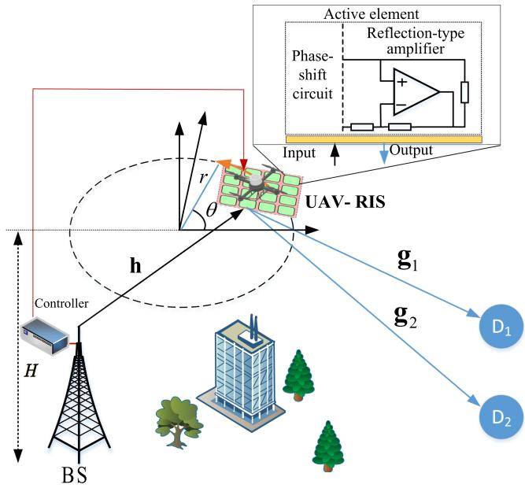  
Fig. 1. The considered NOMA-ARIS-UAV sytem model.

The rest of the paper is organized as follows. Section II presents the system model of NOMA-ARIS-UAV that introduces the signal and channel models as well as the first-order statics of SINR. The mathematical analysis of BLER, average AAR, and the optimal power allocation are given in Section III. Numerical results are provided in Section V. Finally, Section VI concludes the paper.

## II. SYSTEM MODEL

## A. System Descriptions

We consider a downlink NOMA-ARIS-UAV system, which consists of a base station (BS), an ARIS mounted on a UAV, and two ground users $( \mathrm { D } _ { 1 }$ and $\mathrm { D } _ { 2 } ) ^ { 2 }$ as illustrated in Fig. 1. The communication between BS and $\mathrm { D } _ { i } , i \in \{ 1 , 2 \}$ follow the NOMA principle, and the packet size is finite. All nodes are equipped with a single antenna3 and operate in half-duplex mode, the hardware of ARIS is $\mathrm { \ p e r f e c t { , } } ^ { 4 }$ the RIS includes M active reflection elements. Current RIS hardware typically supports tens to a few hundred elements [35]. However, in many scenarios, only a small number of elements is utilized, particularly when a UAV can adjust its position to optimize signal quality and passive beamforming is employed [36]. Herein, we assume that the direct link from BS to $\mathrm { D } _ { i }$ is unavailable due to the far distance or obstacles between BS and $\operatorname { D } _ { i } .$ . Advanced estimation techniques, such as machine learning and compressed sensing, can be combined with cascaded channel estimation in the RIS system. Besides, since UAV flies at a considerable altitude and the CSI is required for allocating power in the NOMA scheme, we assume that the CSI of the considered system is perfect [26], [27], [28], [29], [30], [31].

The fixed locations of BS and $\mathrm { D } _ { i }$ are $\mathbf { q _ { b } }$ and ${ \bf q } _ { \mathrm { D } _ { i } }$ , respectively. These presents in the three-dimensional space. The location of $\mathrm { U A V , } \mathbf { q } _ { \mathbf { u } } = [ r \cos \phi , r \sin \phi , H ]$ , varies corresponding to the UAV trajectory, where r is the radius of the circular trajectory of the UAV, $H \in [ 0 , H _ { \operatorname* { m a x } } ]$ is the altitude of $\mathrm { U A V } ^ { 5 }$ , φ represents the angle formed by the position of UAV with the x-axis at a given moment. Moreover, it is assumed that the velocity of the UAV is constant and denoted by $v = T / N$ , where $T$ is the period for the UAV to complete a circle, and N denotes the number of sub-time slots. The duration of each incremental trajectory of the UAV $\delta _ { t }$ should be small to ensure that the position of the UAV remains approximately constant and denoted by $\delta _ { d } = v \delta _ { t }$ Under this assumption, the impact of wind disturbances on the trajectory can be negligible. Furthermore, the considered system applies adjustment techniques to compensate for the Doppler shift. Therefore, the effect of Doppler due to UAV movement is compensated perfectly [22], [23].

## B. Channel Model and ARIS

Let $\mathbf { h } _ { \mathbf { b r } } = [ h _ { b , 1 } , \ldots , h _ { b , m } , \ldots , h _ { b , M } ] ^ { \dagger } ,$ where $m \in$ $\{ 1 , \dots , M \}$ , be the channel vector between BS and ARIS, while the channel vector between ARIS and $\mathrm { D _ { 1 } }$ is presented by $\mathbf { g _ { r d _ { 1 } } } = [ g _ { d _ { 1 } , 1 } , \dotsc , g _ { d _ { 1 } , m } , \dotsc , g _ { d _ { 1 } , M } ] ^ { \dagger }$ , and the channel vector between ARIS and D2 is $\mathbf { g _ { r d _ { 2 } } } = [ g _ { d _ { 2 } , 1 } , \dotsc , g _ { d _ { 2 } , m } , \dotsc , g _ { d _ { 2 } , M } ] ^ { \dagger }$ Moreover, we denote $h _ { b , m } = \sqrt { \beta d _ { \mathbf { b r } } ^ { - \alpha } \widetilde { h } _ { b , m } } , g _ { d _ { 1 } , m } =$ $\sqrt { \beta d _ { { \bf r } { \bf d } _ { 1 } } ^ { - \alpha } } \tilde { g } _ { d _ { 1 } , m }$ , and $g _ { d _ { 2 } , m } = \sqrt { \beta d _ { { \bf r } { \bf d } _ { 2 } } ^ { - \alpha } } \tilde { g } _ { d _ { 2 } , m }$ , where α is the path-loss exponent, $\begin{array} { r } { \beta = G _ { A } \dot { G } G _ { B } ( \frac { c } { 4 \pi f _ { c } } ) ^ { 2 } } \end{array}$ is the path-loss coefficient which depends on the operation frequency $f _ { c }$ and antenna gains $G _ { A } , G _ { B } ;$ and $d _ { \mathbf { a b } }$ , with $\mathbf { a b } \in \{ \mathbf { b r } , \mathbf { r d } _ { 1 } , \mathbf { r d } _ { 2 } \}$ the component $\beta d _ { \mathbf { a b } } ^ { - \alpha }$ means the large-scale fading. We assume that the channel vectors in small-scale fading follow Rayleigh distributions in each independent block, thus the channel gains of small-scale fading $| \tilde { h } _ { b , m } | ^ { 2 } , \ | \tilde { g } _ { d _ { 1 } , m } | ^ { 2 }$ and $| \tilde { g } _ { d _ { 2 } , m } | ^ { 2 }$ follow exponential distributions, where the average channel gains are given by $\lambda _ { b , m } = \mathbb { E } \{ | \tilde { h } _ { b , m } | ^ { 2 } \} , \lambda _ { d _ { 1 } , m } = \mathbb { E } \{ | \tilde { g } _ { d _ { 1 } , m } | ^ { 2 } \}$ , and $\lambda _ { d _ { 2 } , m } = \mathbb { E } \{ | \tilde { g } _ { d _ { 2 } , m } | ^ { 2 } \}$ , respectively, with $\mathbb { E } \{ \cdot \}$ is the expectation operator.

TABLE II  
PARAMETERS TO CALCULATE THE LOS PROBABILITY [37]
<table><tr><td>Environment</td><td> $e _ { 1 }$ </td><td>e2</td><td>e3</td><td>e4</td><td>e5</td></tr><tr><td>Suburban</td><td>101.6</td><td>0</td><td>0</td><td>3.25</td><td>1.241</td></tr><tr><td>Urban</td><td>120.0</td><td>0</td><td>0</td><td>24.30</td><td>1.229</td></tr><tr><td>Dense Urban</td><td>187.3</td><td>0</td><td>0</td><td>82.10</td><td>1.478</td></tr></table>

Since all ARIS elements are set in small space and fixed mechanism,6 the distance between BS and UAV is $d _ { \mathbf { b } \mathbf { r } } =$ $\sqrt { | \mathbf { q _ { b } } - \mathbf { q _ { u } } | ^ { 2 } + H ^ { 2 } }$ . The distances between UAV and $\mathrm { D _ { 1 } }$ D2 are presented by $d _ { { \bf r } \mathbf { d } _ { 1 } } = \sqrt { | { \bf q } _ { \mathrm { u } } - { \bf q } _ { \mathrm { D } _ { 1 } } | ^ { 2 } + H ^ { 2 } }$ and $d _ { \mathbf { r } \mathbf { d } _ { 2 } } =$ $\sqrt { | \mathbf { q } _ { \mathbf { u } } - \mathbf { q } _ { \mathrm { D } _ { 2 } } | ^ { 2 } + H ^ { 2 } }$ , respectively. Let $\phi _ { \mathrm { b r } }$ denote the elevation angle between the BS and $\mathrm { U A V } , ~ \phi _ { \mathrm { r d } _ { i } }$ is the elevation angle between $\mathrm { D } _ { i }$ and UAV.

$$
\phi _ { \mathrm { b r } } { = } \arctan \left( \frac { H } { \left| \mathbf { q _ { u } } - \mathbf { q _ { b } } \right| } \right) , \phi _ { \mathrm { r d } _ { i } } = \arctan \left( \frac { H } { \left| \mathbf { q _ { u } } - \mathbf { q } _ { \mathrm { D } _ { i } } \right| } \right) .\tag{1}
$$

In this context, it is assumed that the height of the BS antenna can be negligible compared to the UAV altitude. The LoS probability between the UAV and ground nodes (BS, Di) depends on the elevation angle $\phi _ { a b }$ , where $a b \in \{ \mathrm { b r } , \mathrm { r d } _ { i } \}$ . The LoS and non-LoS probabilities are given by

$$
P _ { \mathrm { L } } ( \phi _ { a b } ) = e _ { 1 } - \frac { e _ { 1 } - e _ { 2 } } { 1 + \kappa } , P _ { \mathrm { N L } } ( \phi _ { a b } ) = 1 – P _ { \mathrm { L } } ( \phi _ { a b } ) ,\tag{2}
$$

where $\begin{array} { r } { \kappa = ( \frac { \phi _ { a b } - e _ { 3 } } { e _ { 4 } } ) ^ { e _ { 5 } } } \end{array}$ , and the values of $e _ { 1 } , \ldots , e _ { 5 }$ are given in Table II.

In UAV-aided systems, the path-loss exponent α is a function $\phi _ { a b }$ and depends on the elevation angle of the UAV and horizontal plane [38], i.e., $\alpha ( \phi _ { a b } ) = [ \alpha ( { \textstyle { \frac { \pi } { 2 } } } ) - \alpha ( 0 ) ] \omega + \alpha ( 0 )$ where $\alpha ( \frac { \pi } { 2 } ) = 2$ when the UAV flies at a high altitude or above ground nodes and $\alpha ( 0 ) = 3 . 5 $ when the UAV altitude is zero [39], ω represents the LoS amplitude, Thus, the average channel gain is given by $\Omega _ { a b } = \omega \beta d _ { a b } ^ { - \alpha } \lambda _ { a b }$

Let us denote Φ = diag $\{ p _ { 1 } e ^ { j \theta _ { 1 } } , \dotsc , p _ { m } e ^ { j \theta _ { m } } , \dotsc , p _ { M } e ^ { j \theta _ { M } } \}$ is the reflection matrix of ARIS, where $p _ { m }$ and $\theta _ { m } \in [ 0 , 2 \pi ]$ are the amplification coefficient and phase shifting of the mth reflection element, respectively. It is worth noting that the reflectiontype amplifiers (RTAs) are integrated into ARIS, resulting in $p _ { m } \geq 1$ and thermal noise in the received signal. Moreover, $p _ { m }$ should not be excessively large, this would compromise the stability of the system gain. If it is too small, the insertion loss of the phase shifters would become non-negligible. The core of RIS is the metasurface, which comprises an array of sub-wavelength unit cells or reflective elements. Each element can be independently controlled to adjust its electromagnetic properties such as the phase, amplitude, or polarization. Since the reflection elements of ARIS have similar structures, i.e., $p _ { 1 } = \cdot \cdot \cdot = p _ { M } = p$ . As a result, the reflection vector of ARIS is given by $\mathbf { \Theta } \Theta = p \Phi$ , where $\pmb { \Phi } = \mathrm { d i a g } \{ e ^ { j \theta _ { 1 } } , \dots , e ^ { j \theta _ { m } } , \dots , e ^ { j \theta _ { M } } \}$ represents the properties of the PRIS. The thermal noise is denoted by $\mathbf { n } _ { m } \sim \mathcal { C N } ( \mathbf { 0 } _ { M } , \sigma _ { m } ^ { 2 } \mathbf { I } _ { M } )$ , where $\sigma _ { m } ^ { 2 }$ is the variance of additive white Gaussian noise (AWGN), $\mathbf { I } _ { M } \in \mathbb { C } ^ { M \times M }$ is the unitary matrix.

## C. Signal Model

Since the BS utilizes the NOMA technique, the power allocation for $\mathrm { D _ { 1 } }$ and $\mathrm { D _ { 2 } }$ relies on their priority levels for the quality of service $\left( \mathrm { Q o S } \right)$ or the channel condition [40]. This work assumes that $\mathrm { D _ { 2 } }$ has a poor channel condition, while $\mathrm { D _ { 1 } }$ has a good one. Let $a _ { 1 }$ and $a _ { 2 }$ denote the power allocation coefficients for $x _ { 1 }$ and $x _ { 2 }$ , respectively. Furthermore, the assumption of perfect CSI has also been adopted in [26], [27], [28], [29], [30], [31], and the effective cascaded channel gains from the BS to the RIS and then to the users can be arranged in descending order, i.e., $\| \mathbf { g } _ { \mathbf { r d } _ { 1 } } ^ { H } \Theta \mathbf { h } _ { \mathbf { b r } } \| ^ { 2 } > \| \mathbf { g } _ { \mathbf { r d } _ { 2 } } ^ { H } \Theta \mathbf { h } _ { \mathbf { b r } } \| ^ { 2 }$ . To ensure fairness between power allocation coefficients and channel gains, the following conditions are imposed: $a _ { 2 } > a _ { 1 }$ and $a _ { 1 } + a _ { 2 } = 1$

The received signal at $\mathrm { D } _ { i } .$ , where $i \in \{ 1 , 2 \}$ , is given by

$$
\begin{array} { r l } & { \mathbf { y } _ { \mathrm { D } _ { i } } = \underbrace { \mathbf { g } _ { \mathbf { r } \mathbf { d } _ { i } } ^ { H } \Theta \mathbf { h } _ { \mathrm { b r } } \left( \sqrt { a _ { 1 } P } x _ { 1 } + \sqrt { a _ { 2 } P } x _ { 2 } \right) } _ { \mathrm { D e s i r e d ~ s i g n a l } } } \\ & { ~ + ~ \underbrace { \mathbf { g } _ { \mathbf { r } \mathbf { d } _ { i } } ^ { H } \Theta \mathbf { n } _ { m } } _ { \mathrm { T h e r m a l ~ n o i s e } } + \underbrace { \mathbf { z } _ { \mathrm { D } _ { i } } } _ { \mathrm { A W G N } } , } \end{array}\tag{3}
$$

where $P$ is the transmit power of the UAV and $\mathbf { z } _ { \mathrm { D } _ { i } } \sim$ $\mathcal { C N } ( \mathbf { 0 } _ { M } , \sigma _ { m } ^ { 2 } \mathbf { I } _ { M } )$ is the AWGN at $\mathrm { D } _ { i }$

It is worth noting that the SIC offers efficient short-packet communication but is not optimal for the case of infinite block length communication [41], [42]. Therefore, in our considered system, the SIC technique is used at $\mathrm { D _ { 1 } }$ , i.e., D1 first decodes and removes $x _ { 2 }$ and then decodes its signal $x _ { 1 }$ . Then, the output signal of the SIC structure at $\mathrm { D _ { 1 } }$ is presented by

$$
\hat { x } _ { 2 } { = } \underset { \hat { x } _ { 2 } \in \chi _ { 2 } } { \arg \operatorname* { m i n } } | | \mathbf { y } _ { \mathrm { D } _ { 1 } } { - } \Big ( \mathbf { g } _ { \mathbf { r } \mathbf { d } _ { 1 } } ^ { H } \boldsymbol { \Theta } \mathbf { h } _ { \mathbf { b r } } \sqrt { a _ { 2 } P } x _ { 2 } + \mathbf { g } _ { \mathbf { r } \mathbf { d } _ { 1 } } ^ { H } \boldsymbol { \Theta } \mathbf { n } _ { m } \Big ) | | ^ { 2 } ,\tag{4}
$$

and the output signal of $\mathrm { D _ { 1 } }$ is given by

$$
\hat { x } _ { 1 } = \underset { \hat { x } _ { 1 } \in \chi _ { 1 } } { \arg \operatorname* { m i n } } | | \mathbf { u } - \left( { \mathbf { g } _ { \mathbf { r d } _ { 1 } } ^ { H } \boldsymbol { \Theta } } \mathbf { h } _ { \mathbf { b r } } \sqrt { a _ { 1 } P } x _ { 1 } + { \mathbf { g } _ { \mathbf { r d } _ { 1 } } ^ { H } \boldsymbol { \Theta } } \mathbf { n } _ { m } \right) | | ^ { 2 } .\tag{5}
$$

where $\mathbf { u } = ( \mathbf { y } _ { \mathrm { D _ { 1 } } } - \mathbf { g } _ { \mathbf { r d _ { 1 } } } ^ { H } \Theta \mathbf { h } _ { \mathbf { b r } } \sqrt { a _ { 2 } P } x _ { 2 } )$ , and $\chi _ { 1 } , \chi _ { 2 }$ are the signal constellations that the BS transmits to $\mathrm { D } _ { 1 } , \mathrm { D } _ { 2 }$ , respectively. We also assume that SIC at $\mathrm { D _ { 1 } }$ is imperfect. Thus, SINRs at $\mathrm { D _ { 1 } }$ are calculated as

$$
\Psi _ { \mathrm { D } _ { 1 } } ^ { \hat { x } _ { 2 }  \hat { x } _ { 1 } } = \frac { a _ { 2 } p ^ { 2 } P \| \mathbf { g } _ { \mathbf { r d } _ { 1 } } ^ { H } \Theta \mathbf { h } _ { \mathbf { b r } } \| ^ { 2 } } { a _ { 1 } p ^ { 2 } P \| \mathbf { g } _ { \mathbf { r d } _ { 1 } } ^ { H } \Theta \mathbf { h } _ { \mathbf { b r } } \| ^ { 2 } + \sigma _ { m } ^ { 2 } p ^ { 2 } a _ { 1 } \| \mathbf { g } _ { \mathbf { r d } _ { 1 } } ^ { H } \Phi \| ^ { 2 } + \sigma _ { \mathrm { D } _ { 1 } } ^ { 2 } } ,\tag{6}
$$

$$
\Psi _ { \mathrm { { D } _ { 1 } } } ^ { \hat { x } _ { 1 } } = \frac { a _ { 1 } p ^ { 2 } P \| \mathbf { g } _ { \mathbf { r d } _ { 1 } } ^ { H } \Theta \mathbf { h } _ { \mathbf { b r } } \| ^ { 2 } } { \xi a _ { 2 } p ^ { 2 } P \| \mathbf { g } _ { \mathbf { r d } _ { 1 } } ^ { H } \Theta \mathbf { h } _ { \mathbf { b r } } \| ^ { 2 } + \sigma _ { m } ^ { 2 } p ^ { 2 } a _ { 1 } \| \mathbf { g } _ { \mathbf { r d } _ { 1 } } ^ { H } \Phi \| ^ { 2 } + \sigma _ { \mathrm { { D } _ { 1 } } } ^ { 2 } } ,\tag{7}
$$

where $0 \leq \xi \leq 1$ denotes the level of residual interference after SIC. The output signal of the detector at $\mathrm { D _ { 2 } }$ is

$$
\hat { x } _ { 2 } { = } \underset { x _ { 2 } \in \chi _ { 2 } } { \arg \operatorname* { m i n } } \left\| \mathbf { y } _ { \mathrm { D } _ { 2 } } { - } \Big ( \mathbf { g } _ { \mathbf { r } \mathbf { d } _ { 2 } } ^ { H } \Theta \mathbf { h } _ { \mathbf { b r } } \sqrt { a _ { 2 } P } x _ { 2 } + \mathbf { g } _ { \mathbf { r } \mathbf { d } _ { 2 } } ^ { H } \Theta \mathbf { n } _ { m } \Big ) \right\| ^ { 2 } ,\tag{8}
$$

The SINR at $\mathrm { D _ { 2 } }$ is computed as

$$
\Psi _ { \mathrm { D } _ { 2 } } ^ { \hat { x } _ { 2 } } = \frac { a _ { 2 } P \Vert \mathbf { g } _ { \mathbf { r d } _ { 2 } } ^ { H } \Theta \mathbf { h } _ { \mathbf { b r } } \Vert ^ { 2 } } { a _ { 1 } P \Vert \mathbf { g } _ { \mathbf { r d } _ { 2 } } ^ { H } \Theta \mathbf { h } _ { \mathbf { b r } } \Vert ^ { 2 } + \sigma _ { m } ^ { 2 } p ^ { 2 } \Vert \mathbf { g } _ { \mathbf { r d } _ { 2 } } ^ { H } \Phi \Vert ^ { 2 } + \sigma _ { \mathrm { D } _ { 2 } } ^ { 2 } } .\tag{9}
$$

## D. First-Order Statics of SINR

The random property of the signals at $\mathrm { D } _ { i }$ is expressed by the statics of SINR. It is usually modeled by the first-order statics in terms of the probability density function (PDF) and the cumulative distribution function (CDF). Noting that the cascaded channel with diagonal matrix Θ $\in \mathbb { C } ^ { 1 \times M }$ of the ARIS, $\mathbf { g } _ { \mathbf { r d } _ { i } } ^ { H } \Theta \mathbf { h } _ { \mathbf { b r } }$ can be rewritten as $\begin{array} { r } { \mathbf { g } _ { \mathbf { r d } _ { i } } ^ { H } \Theta \mathbf { h } _ { \mathbf { b r } } = p \sum _ { m = 1 } ^ { M } h _ { b , m } g _ { d _ { i } , m } e ^ { j \theta _ { m } } } \end{array}$ . In coherent phase shifting7, the phase of the RIS is adjusted perfectly and continuously [43]. This implies that the phases of the channel coefficients $h _ { b , m }$ and $g _ { d _ { i } , m }$ match those of the RIS elements [44], [45], i.e., $\theta _ { m } = \theta _ { b , m } + \theta _ { d _ { i } , m } = 0$ . Besides, the thermal noise caused by RTAs, $\| \mathbf { g } _ { \mathbf { r d } _ { i } } ^ { H } \Phi \| ^ { 2 }$ , can be modeled by the sum of M exponential independent random variables, i.e., the power of thermal noise is given by $\sigma _ { m } ^ { 2 } p ^ { 2 } \lVert \mathbf { g } _ { \mathbf { r } \mathbf { d } _ { i } } ^ { H } \boldsymbol { \Phi } \rVert ^ { 2 } =$ $M p ^ { 2 } \sigma _ { m } ^ { 2 } \Omega _ { r d _ { i } } \ [ 4 6 ]$

Let $X _ { m } = h _ { b , m } g _ { d _ { i } , m }$ be the product of two independent Rayleigh random variables8, thus $X _ { m }$ follows the double Rayleigh distribution. However, obtaining the exact CDF and PDF of M double Rayleigh random variables, $X =$ $( \sum _ { m = 1 } ^ { M } X _ { m } ) ^ { 2 }$ , are very challenging. According to [12], [13], X is approximated as the Gamma distribution, where its CDF and PDF are given by

$$
F _ { X } ( { \sqrt { x } } ) \approx { \frac { \gamma \left( M { \hat { k } } , { \sqrt { x / \hat { \theta } } } \right) } { \Gamma ( M { \hat { k } } ) } } ; f _ { X } ( { \sqrt { x } } ) = { \frac { { \sqrt { x } } ^ { M { \hat { k } } - 1 } } { { \hat { \theta } } ^ { M { \hat { k } } } \Gamma ( M { \hat { k } } ) } } e ^ { - { \frac { \sqrt { x } } { \theta } } } ,\tag{10}
$$

where $\begin{array} { r } { \hat { k } = \frac { \pi ^ { 2 } } { 1 6 - \pi ^ { 2 } } , \hat { \theta } = \frac { 1 6 - \pi ^ { 2 } } { 4 \pi } } \end{array}$ , and $\begin{array} { r } { \gamma ( t , x ) = \int _ { 0 } ^ { x } y ^ { t - 1 } e ^ { - y } d y } \end{array}$ is the lower incomplete gamma function.

8Multipath effects can often be neglected for high-altitude air-to-air links. The impact of distance-based path loss, including both LoS and NLoS components, is typically incorporated into large-scale fading models [47], while small-scale fading primarily depends on frequency characteristics. However, UAVs frequently operate at low altitudes in urban environments such as during search and rescue missions or UAV-assisted vehicle-to-vehicle communications [7], [37], [39]. Notably, the Rayleigh fading model has been theoretically validated for cooperative UAV systems [48]. The studies in [49], [50] further confirm the suitability for modeling UAV heading effects and large-elevation-angle propagation in mixed urban environments. Therefore, this work adopts the Rayleigh fading channel model to better capture realistic operational conditions.

## III. PERFORMANCE ANALYSIS

## A. Background of BLER

The analysis of the considered system with finite block length is based on the approximation of the maximum rate under the decoding error constraint [1].

$$
\mathcal { R } = \log _ { 2 } ( 1 + \Psi ) - V ^ { \frac { 1 } { 2 } } ( \Psi ) \frac { Q ^ { - 1 } ( \epsilon ) } { \sqrt { \mathcal { W } } } + O \left( \frac { \log _ { 2 } \mathcal { W } } { \mathcal { W } } \right) ,\tag{11}
$$

where W, and Ψ represent the block length (channel use), and the SINR of the system, respectively. $V ( \Psi ) = ( 1 -$ $\scriptstyle { \frac { 1 } { ( 1 + \Psi ) ^ { 2 } } } ) ( \ln ( 2 ) ) ^ { 2 }$ is the channel dispersion. When SINR $> 5$ dB, $V ( \Psi ) \approx 1$ , i.e., the channel is stable. Since $\mathcal { W } \geq 1 0 0$ $\begin{array} { r } { O ( \frac { \log _ { 2 } \mathcal { W } } { \mathcal { W } } ) \to 0 } \end{array}$ . It means that the number of utilized channels is large enough. Then, from (11), we can rewrite the instantaneous BLER as

$$
\epsilon \approx Q \left( [ \log _ { 2 } ( 1 + \Psi ) - \mathcal { R } ] / \sqrt { V ( \Psi ) / \mathcal { W } } \right) ,\tag{12}
$$

where $Q ^ { - 1 } ( \cdot )$ denotes the inverse Gaussian Q-function. From (12), the average BLER can be rewritten as

$$
\bar { \epsilon } \approx \int _ { 0 } ^ { \infty } Q \left( [ C ( \Psi ) - \mathcal { R } ] / \sqrt { V ( \Psi ) / \mathcal { W } } \right) f _ { \Psi } ( x ) d x ,\tag{13}
$$

where $C ( \Psi ) = \log _ { 2 } ( 1 + \Psi )$ is the Shannon capacity, and $f _ { \Psi } ( x )$ is the PDF of $\Psi .$

By using the linear approximation technique for $Q ( [ C ( \Psi ) -$ $\mathcal { R } ] / \sqrt { V ( \Psi ) / \mathcal { W } } ) = Q ( \mathcal { W } , \Psi )$ at point $\Psi = \varkappa$ as given in, we can rewrite $Q ( \mathcal { W } , \Psi )$ in (13) as

$$
Q ( \mathcal { W } , \Psi ) = \left\{ \begin{array} { l l } { 1 , } & { \Psi \le \rho _ { \operatorname* { m i n } } } \\ { \frac { 1 } { 2 } - \Delta ( \Psi - \varkappa ) , } & { \rho _ { \operatorname* { m i n } } < \Psi < \rho _ { \operatorname* { m a x } } , } \\ { 0 , } & { \Psi \ge \rho _ { \operatorname* { m a x } } } \end{array} \right.\tag{14}
$$

where $\Delta = 1 / \sqrt { 2 \pi ( 2 ^ { \mathcal { R } } - 1 ) / \mathcal { W } } , \varkappa = 2 ^ { \mathcal { R } } - 1 , \rho _ { \operatorname* { m i n } } = \varkappa -$ $1 / ( 2 \Delta )$ and $\rho _ { \mathrm { m a x } } = \varkappa + 1 / ( 2 \Delta )$

Using the partial integration method, the average BLER as

$$
\begin{array} { l } { \displaystyle \bar { \epsilon } = \int _ { 0 } ^ { \infty } Q ( \cdot ) f _ { \Psi } ( x ) d x = [ Q ( \cdot ) F _ { \Psi } ( x ) ] _ { 0 } ^ { \infty } - \int _ { 0 } ^ { \infty } F _ { \Psi } ( x ) d Q ( \cdot ) } \\ { \displaystyle \quad = \Delta \int _ { \rho _ { \mathrm { m i n } } } ^ { \rho _ { \mathrm { m a x } } } F _ { \Psi } ( x ) d x , \quad \quad \quad ( 1 5 ) } \end{array}
$$

where $F _ { \Psi } ( x )$ are the CDFs of the SINRs given in (39), (40), and (41). In the two-user NOMA system, $\mathrm { D _ { 2 } }$ directly decodes $x _ { 2 }$ by treating $x _ { 1 }$ as the interference. Therefore, the decoding error probability of $x _ { 2 }$ at $\mathrm { D _ { 2 } }$ is independent of $x _ { 1 }$ . Moreover, the SIC is used at $\mathrm { D _ { 1 } }$ to remove $x _ { 2 }$ and then detects $x _ { 1 }$ . It means that $\mathrm { D _ { 1 } }$ can decode $x _ { 1 }$ with or without the presence of decoding error of $x _ { 2 }$ , which can be presented by the conditional probability as

$$
\mathrm { P r } \left( \phi _ { \mathrm { D _ { 1 } } } ^ { \hat { x } _ { 1 } } \right) = \mathrm { P r } \left( \phi _ { \mathrm { D _ { 1 } } } ^ { \hat { x } _ { 1 } } | \phi _ { \mathrm { D _ { 1 } } } ^ { \hat { x } _ { 2 } } \right) \mathrm { P r } \left( \phi _ { \mathrm { D _ { 1 } } } ^ { \hat { x } _ { 2 } } \right) + \mathrm { P r } \left( \phi _ { \mathrm { D _ { 1 } } } ^ { \hat { x } _ { 1 } } | \bar { \phi } _ { \mathrm { D _ { 1 } } } ^ { \hat { x } _ { 2 } } \right) \mathrm { P r } \left( \bar { \phi } _ { \mathrm { D _ { 1 } } } ^ { \hat { x } _ { 2 } } \right) ,\tag{16}
$$

where $\phi _ { \mathrm { D _ { 1 } } } ^ { \hat { x } _ { i } }$ and $\bar { \phi } _ { \mathrm { D } _ { 1 } } ^ { \hat { x } _ { i } } , i \in \{ 1 , 2 \}$ , represent the event of decoding error and error-free of $x _ { i }$ at $\mathrm { D _ { 1 } }$ , respectively.

Due to the high interference level from x1 when decoding $x _ { 2 }$ $\mathrm { P r } ( \phi _ { \mathrm { D } _ { 1 } } ^ { \hat { x } _ { 1 } } | \phi _ { \mathrm { D } _ { 1 } } ^ { \hat { x } _ { 2 } } ) \approx 1$ . From (16), the instantaneous BLER when

detecting $x _ { 1 }$ at $\mathrm { D _ { 1 } }$ is given by

$$
\begin{array} { r l } & { \epsilon _ { \mathrm { D } _ { 1 } } = 1 \times \epsilon _ { \mathrm { D } _ { 1 } } ^ { \hat { x } _ { 2 } } + \epsilon _ { \mathrm { D } _ { 1 } } ^ { \hat { x } _ { 1 } } ( 1 - \epsilon _ { \mathrm { D } _ { 1 } } ^ { \hat { x } _ { 2 } } ) } \\ & { \qquad = \epsilon _ { \mathrm { D } _ { 1 } } ^ { \hat { x } _ { 2 } } + \epsilon _ { \mathrm { D } _ { 1 } } ^ { \hat { x } _ { 1 } } - \epsilon _ { \mathrm { D } _ { 1 } } ^ { \hat { x } _ { 1 } } \epsilon _ { \mathrm { D } _ { 1 } } ^ { \hat { x } _ { 2 } } \approx \epsilon _ { \mathrm { D } _ { 1 } } ^ { \hat { x } _ { 1 } } + \epsilon _ { \mathrm { D } _ { 1 } } ^ { \hat { x } _ { 2 } } , } \end{array}\tag{17}
$$

and the probability of error decoding $x _ { 2 }$ at $\mathrm { D _ { 2 } }$ is

$$
\epsilon _ { \mathrm { D } _ { 2 } } = \mathrm { P r } ( \phi _ { \mathrm { D } _ { 2 } } ^ { \hat { x } _ { 2 } } ) = \epsilon _ { \mathrm { D } _ { 2 } } ^ { \hat { x } _ { 2 } } .\tag{18}
$$

Regarding the approximation of (17), since the error in URLLC is usually small, i.e., from $1 0 ^ { - 3 } ~ \mathrm { t o } ~ 1 0 ^ { - 5 }$ , the term $\epsilon _ { \mathrm { D } _ { 1 } } ^ { \hat { x } _ { 1 } } \epsilon _ { \mathrm { D } _ { 1 } } ^ { \hat { x } _ { 2 } }  0$ and can be ignored.

## B. Average BLER of the Considered System

This subsection derives the closed-form expressions for the average BLER of the considered system, taking into account the error probability of SIC. As a result, the average BLER at $\mathrm { D _ { 1 } }$ is $\bar { \epsilon } _ { \mathrm { D } _ { 1 } } = \bar { \epsilon } _ { \mathrm { D } _ { 1 } } ^ { x _ { 1 } } + \bar { \epsilon } _ { \mathrm { D } _ { 1 } } ^ { x _ { 2 } }$ and the average BLER at $\mathrm { D _ { 2 } }$ is $\bar { \epsilon } _ { \mathrm { D _ { 2 } } } = \bar { \epsilon } _ { \mathrm { D _ { 2 } } } ^ { x _ { 2 } }$ where $\bar { \epsilon } _ { \mathrm { D } _ { \mathrm { i } } } ^ { x _ { i } }$ is given in the following Proposition.

Proposition 1: Provided that x ≤ min $\textstyle \left\{ { \frac { a _ { 2 } } { a _ { 1 } } } , { \frac { a _ { 1 } } { \xi a _ { 2 } } } \right\}$ , the closedform expression for BLERs with a finite block length of each terminal in the considered system can be given by

$$
\bar { \epsilon } _ { \mathrm { D } _ { 1 } } ^ { \hat { x } _ { 2 } } = 1 - \Delta \sum _ { m = 0 } ^ { M \hat { k } - 1 } \sum _ { t = 1 } ^ { \infty } \frac { ( - 1 ) ^ { t - 1 } a _ { 2 } } { m ! \hat { \theta } a _ { 1 } } \left( \frac { \beta _ { 1 } } { a _ { 1 } } \right) ^ { \frac { m } { 2 } } \frac { 2 t } { \mu _ { 1 } ^ { m + 2 t } }
$$

$$
\times \left[ \Gamma ( m + 2 t , \mu _ { 1 } \sqrt { \bar { \lambda } _ { 1 , L } } ) - \Gamma ( m + 2 t , \mu _ { 1 } \sqrt { \bar { \lambda } _ { 1 , H } } ) \right] ,\tag{19}
$$

$$
\bar { \epsilon } _ { \mathrm { D } _ { 1 } } ^ { \hat { x } _ { 1 } } = 1 - \Delta \sum _ { m = 0 } ^ { M \hat { k } - 1 } \sum _ { t = 1 } ^ { \infty } \frac { ( - 1 ) ^ { t - 1 } a _ { 1 } } { m ! \hat { \theta } \xi a _ { 2 } } \left( \frac { \beta _ { 1 } } { \xi a _ { 2 } } \right) ^ { \frac { m } { 2 } } \frac { 2 t } { \mu _ { 2 } ^ { m + 2 t } }
$$

$$
\times \left[ \Gamma ( m + 2 t , \mu _ { 2 } \sqrt { \bar { \lambda } _ { 2 , L } } ) - \Gamma ( m + 2 t , \mu _ { 2 } \sqrt { \bar { \lambda } _ { 2 , H } } ) \right] ,\tag{20}
$$

$$
\bar { \epsilon } _ { \mathrm { D } _ { 2 } } ^ { \hat { x } _ { 2 } } = 1 - \Delta \sum _ { m = 0 } ^ { M \hat { k } - 1 } \sum _ { t = 1 } ^ { \infty } \frac { ( - 1 ) ^ { t - 1 } a _ { 2 } } { m ! \hat { \theta } a _ { 1 } } \left( \frac { \beta _ { 2 } } { a _ { 1 } } \right) ^ { \frac { m } { 2 } } \frac { 2 t } { \mu _ { 3 } ^ { m + 2 t } }
$$

$$
\times \left[ \Gamma ( m + 2 t , \mu _ { 3 } \sqrt { \bar { \lambda } _ { 1 , L } } ) - \Gamma ( m + 2 t , \mu _ { 3 } \sqrt { \bar { \lambda } _ { 1 , H } } ) \right] ,\tag{21}
$$

where $\begin{array} { r } { \beta _ { 1 } = \frac { A _ { 1 } + 1 } { \Omega _ { \mathrm { s r } } \Omega _ { \mathrm { r d } _ { 1 } } p ^ { 2 } P } , \beta _ { 2 } = \frac { A _ { 2 } + 1 } { \Omega _ { \mathrm { s r } } \Omega _ { \mathrm { r d } _ { 2 } } p ^ { 2 } P } , \mu _ { 1 } = \frac { 1 } { \hat { \theta } } \sqrt { \frac { \beta _ { 1 } } { a _ { 1 } } } , \mu _ { 2 } = } \end{array}$ $\begin{array} { r } { \frac { 1 } { \hat { \theta } } \sqrt { \frac { \beta _ { 1 } } { \xi a _ { 2 } } } , \mu _ { 3 } = \frac { 1 } { \hat { \theta } } \sqrt { \frac { \beta _ { 2 } } { a _ { 1 } } } , \bar { \lambda } _ { 1 , L } = \frac { 2 a _ { 2 } - a _ { 1 } \rho _ { \mathrm { m i n } } } { a _ { 2 } - a _ { 1 } \rho _ { \mathrm { m i n } } } , \bar { \lambda } _ { 1 , H } = \frac { 2 a _ { 2 } - a _ { 1 } \rho _ { \mathrm { m a x } } } { a _ { 2 } - a _ { 1 } \rho _ { \mathrm { m a x } } } , } \end{array}$ $\begin{array} { r } { \bar { \lambda } _ { 2 , L } = \frac { 2 a _ { 1 } - \xi a _ { 2 } \rho _ { \mathrm { m i n } } } { a _ { 1 } - \xi a _ { 2 } \rho _ { \mathrm { m i n } } } , \bar { \lambda } _ { 2 , H } = \frac { 2 a _ { 1 } - \xi a _ { 2 } \rho _ { \mathrm { m a x } } } { a _ { 1 } - \xi a _ { 2 } \rho _ { \mathrm { m a x } } } } \end{array}$

Proof: The proof is given in Appendix B, available online.- Remark 1: From the derived average BLERs expressions, it is evident that not only M and $a _ { i }$ are the average channel gains, but also the channel use, the transmission bits, and the imperfect SIC coefficient have substantial impacts on BLERs. This feature is validated in Section V.

## C. Asymptotic BLERs

For reducing the complexity of the above BLER expressions and providing an insight into the impact of the system parameters on the BLER performance, the asymptotic BLER expressions are derived in this subsection thanks to the approximate firstorder Riemann integral [51]. Especially, if $f ( x )$ is a differentiable function in a small interval $[ b _ { 1 } , b _ { 2 } ]$ , the approximate firstorder Riemann integral is $\begin{array} { r } { \int _ { b _ { 1 } } ^ { b _ { 2 } } f ( x ) d x = ( b _ { 2 } - b _ { 1 } ) f ( \frac { b _ { 1 } + b _ { 2 } } { 2 } ) } \end{array}$ From (15), the BLER can be given as

$$
\bar { \varepsilon } _ { \mathrm { D } _ { i } } ^ { x _ { i } } \approx \Delta ( \rho _ { \mathrm { m a x } } - \rho _ { \mathrm { m i n } } ) F _ { \Psi _ { \mathrm { D } _ { i } } } ^ { x _ { i } } \left( \frac { \rho _ { \mathrm { m a x } } + \rho _ { \mathrm { m i n } } } { 2 } \right) .\tag{22}
$$

Substituting $\rho _ { \mathrm { m a x } }$ and $\rho _ { \mathrm { m i n } }$ from (14) to (22), the asymptotic BLERs of the considered system can be approximated as

$$
\begin{array} { r } { \bar { \varepsilon } _ { \mathrm { D } _ { i } } ^ { x _ { i } } \approx F _ { \Psi _ { \mathrm { D } _ { i } } } ^ { x _ { i } } ( \varkappa ) . } \end{array}\tag{23}
$$

On the other hand, we utilize the approximation of the incomplete gamma function as $\begin{array} { r } { \gamma ( t , x ) \approx \frac { x ^ { \bar { t } } } { t ! } } \end{array}$ for small values of x [52]. Based on the CDFs given in (39), (40), and (41), the approximate average BLERs at $\mathrm { D _ { 1 } }$ and $\mathrm { D _ { 2 } }$ are, respectively, given by

$$
\bar { \epsilon } _ { \mathrm { D } _ { 1 } } ^ { \hat { x } _ { 2 } , \mathrm { a p p r o x } } \approx \frac { 1 } { \hat { \theta } ^ { M \hat { k } } } \left( \frac { \varkappa ( A _ { 1 } + 1 ) } { \Omega _ { \mathrm { s r } } \Omega _ { \mathrm { r d } 1 } p ^ { 2 } P ( a _ { 2 } - a _ { 1 } \varkappa ) } \right) ^ { \frac { M \hat { k } } { 2 } } \frac { 1 } { ( M \hat { k } ) ! } ,\tag{24}
$$

$$
\hat { \epsilon } _ { \mathrm { D } _ { 1 } } ^ { \hat { x } _ { 1 } , \mathrm { a p p r o x } } \approx \frac { 1 } { \hat { \theta } ^ { M \hat { k } } } \left( \frac { \varkappa ( A _ { 1 } + 1 ) } { \Omega _ { \mathrm { s r } } \Omega _ { \mathrm { r d } _ { 1 } } p ^ { 2 } P ( a _ { 1 } - \xi a _ { 2 } \varkappa ) } \right) ^ { \frac { M \hat { k } } { 2 } } \frac { 1 } { ( M \hat { k } ) ! } ,\tag{25}
$$

$$
\bar { \epsilon } _ { \mathrm { D } _ { 2 } } ^ { \hat { x } _ { 2 } , \mathrm { a p p r o x } } \approx \frac { 1 } { \hat { \theta } ^ { M \hat { k } } } \left( \frac { \varkappa ( A _ { 2 } + 1 ) } { \Omega _ { \mathrm { s r } } \Omega _ { \mathrm { r d } _ { 2 } } p ^ { 2 } P ( a _ { 2 } - a _ { 1 } \varkappa ) } \right) ^ { \frac { M \hat { k } } { 2 } } \frac { 1 } { ( M \hat { k } ) ! } .\tag{26}
$$

From (24) to (26), it can be seen that the BLER of the considered system depends on the number of RIS elements, the power allocation coefficient, the transmission rate, and the channel gains between S and $\mathrm { D } _ { i }$

Remark 2: The diversity order is an important metric to measure the system performance. It indicates the transmit power requirements to achieve the target reliability [38] and the decrease in BLER versus received SNR. The diversity order is calculated as

$$
d _ { \mathrm { D } _ { i } } = - \operatorname* { l i m } _ { \mathrm { S N R } \to \infty } \frac { \log ( \bar { \varepsilon } _ { \mathrm { D } _ { i } } ^ { x _ { i } } ) } { \log ( \mathrm { S N R } ) } , i \in \{ 1 , 2 \} .\tag{27}
$$

From the BLER expressions given in (24) to (26) and let $\mathrm { S N R } = \Omega _ { \mathrm { s r } } \Omega _ { \mathrm { r d _ { 2 } } } p ^ { 2 } a _ { i } \dot { P }$ , it is clear that the average BLER of $x _ { i }$ is a function of $( 1 / \mathrm { S N R } ) ^ { a _ { i } M \hat { k } / 2 }$ . As a result, the diversity order at $\mathrm { D } _ { i }$ of the considered NOMA-ARIS-UAV system is $\lceil \frac { M \hat { k } } { 2 } \rceil$ where · is the ceiling function. This feature will be verified in section V.

## D. Average Achievable Rate

Average achievable rate (AAR) is a metric used to evaluate the performance of wireless systems in the case of long packets. However, in URLLC, a variety of applications need to transmit with maximum data rate, while still guaranteeing the specified decoding error probability, such as automatic traffic controlling, massive machine-type communications (mMTC), e.t.c [53]. In such scenarios, the analysis of the AAR becomes necessary.

Based on (11), the AAR can be approximated in tight bound as follows:

$$
\bar { \mathcal { R } } \approx \bar { \mathcal { C } } ( \Psi ) - \bar { V } ^ { \frac { 1 } { 2 } } ( \Psi ) \left[ 2 \ln ( 2 ) \sqrt { \mathscr { W } } Q ( \epsilon ) \right] ^ { - 1 } , \mathrm { w h e r e }\tag{28}
$$

$$
\bar { \mathcal { C } } ( \Psi ) = \int _ { 0 } ^ { \infty } \log _ { 2 } ( 1 + x ) f _ { \Psi } ( x ) d x = \int _ { 0 } ^ { \infty } \frac { 1 - F _ { \Psi } ( x ) } { \ln ( 2 ) ( 1 + x ) } d x ,\tag{29}
$$

$$
\bar { V } ^ { \frac 1 2 } ( \Psi ) \triangleq 1 - \intop _ { 0 } ^ { \infty } \frac { f _ { \Psi } ( x ) d x } { 2 ( 1 + x ) ^ { 2 } } = 1 + \intop _ { 0 } ^ { \infty } \frac { 1 - F _ { \Psi } ( x ) } { ( 1 + x ) ^ { 3 } } d x ,\tag{30}
$$

where $\triangleq$ is for the case of ${ \sqrt { 1 - z } } \approx 1 - { \frac { 1 } { 2 } } z$ with $| z | < 1$ and the partial integration is utilized.

From the CDFs of Ψ given in Lemma 2 of Appendix A, available online, the closed-form expressions for the AAR are given in the following Proposition.

Proposition 2: Since $\begin{array} { r } { x \leq \frac { a _ { 2 } } { a _ { 1 } } } \end{array}$ or $\begin{array} { r } { x \leq \frac { a _ { 1 } } { \xi a _ { 2 } } } \end{array}$ , the AAR of $x _ { i }$ at $\mathrm { D } _ { i }$ is given by

$$
\bar { \mathcal { R } } _ { \mathrm { D } _ { i } } ^ { x _ { i } } \approx \bar { \mathcal { C } } _ { \mathrm { D } _ { i } } ^ { x _ { i } } - [ \bar { V } _ { \mathrm { D } _ { i } } ^ { x _ { i } } ] ^ { \frac { 1 } { 2 } } \left[ 2 \ln ( 2 ) \sqrt { \mathscr { W } } Q \left( \bar { \epsilon } _ { \mathrm { D } _ { i } } ^ { x _ { i } } \right) \right] ^ { - 1 } ,\tag{31}
$$

where $\bar { \epsilon } _ { \mathrm { D } _ { i } } ^ { x _ { i } } \leq 1 0 ^ { - 4 }$ to the requirements of URLLC.

$$
\bar { \mathcal { C } } _ { \mathrm { D 1 } } ^ { x _ { 2 } } = \sum _ { j = 0 } ^ { J } \frac { \Delta _ { 1 } \sqrt { 1 - y ^ { 2 } } } { J ( 1 + u ) } \Gamma \left( M \hat { k } , \frac { 1 } { \hat { \theta } } \sqrt { \frac { M u ( A _ { 1 } + 1 ) } { A _ { 1 } P ( a _ { 2 } - a _ { 1 } u ) } } \right) ,\tag{32}
$$

$$
\bar { \mathcal { C } } _ { \mathrm { D _ { 1 } } } ^ { x _ { 1 } } = \sum _ { j = 0 } ^ { J } \frac { \Delta _ { 2 } \sqrt { 1 - y ^ { 2 } } } { J ( 1 + \bar { u } ) } \Gamma \left( M \hat { k } , \frac { 1 } { \hat { \theta } } \sqrt { \frac { M \bar { u } ( A _ { 1 } + 1 ) } { A _ { 1 } P ( a _ { 1 } - \xi a _ { 2 } \bar { u } ) } } \right) ,\tag{33}
$$

$$
\bar { \mathcal { C } } _ { \mathrm { D } _ { 2 } } ^ { x _ { 2 } } = \sum _ { j = 0 } ^ { J } \frac { \Delta _ { 1 } \sqrt { 1 - y ^ { 2 } } } { J ( 1 + u ) } \Gamma \left( M \hat { k } , \frac { 1 } { \hat { \theta } } \sqrt { \frac { M u ( A _ { 2 } + 1 ) } { A _ { 2 } P ( a _ { 2 } - a _ { 1 } u ) } } \right) ,\tag{34}
$$

$$
[ \bar { V } _ { \mathrm { D } _ { 1 } } ^ { x _ { 2 } } ] ^ { \frac { 1 } { 2 } } = 1 + \sum _ { j = 0 } ^ { J } \frac { \Delta _ { 1 } \sqrt { 1 - y ^ { 2 } } } { J ( 1 + u ) ^ { 3 } } \Gamma \left( M \hat { k } , \sqrt { \frac { M u ( A _ { 1 } + 1 ) } { \hat { \theta } ^ { 2 } A _ { 1 } P ( a _ { 2 } - a _ { 1 } u ) } } \right) ,\tag{35}
$$

$$
[ \bar { V } _ { \mathrm { D } _ { 1 } } ^ { x _ { 1 } } ] ^ { \frac { 1 } { 2 } } = 1 + \sum _ { j = 0 } ^ { J } \frac { \Delta _ { 2 } \sqrt { 1 - y ^ { 2 } } } { J ( 1 + \bar { u } ) ^ { 3 } } \Gamma \left( M \hat { k } , \sqrt { \frac { M \bar { u } ( A _ { 1 } + 1 ) } { \hat { \theta } ^ { 2 } A _ { 1 } P ( a _ { 1 } - \xi a _ { 2 } \bar { u } ) } } \right) ,\tag{36}
$$

$$
[ \bar { V } _ { \mathrm { D } _ { 2 } } ^ { x _ { 2 } } ] ^ { \frac { 1 } { 2 } } = 1 + \sum _ { j = 0 } ^ { J } \frac { \Delta _ { 1 } \sqrt { 1 - y ^ { 2 } } } { J ( 1 + u ) ^ { 3 } } \Gamma \left( M \hat { k } , \sqrt { \frac { M u ( A _ { 2 } + 1 ) } { \hat { \theta } ^ { 2 } A _ { 2 } P ( a _ { 2 } - a _ { 1 } u ) } } \right) ,\tag{37}
$$

where $\begin{array} { r } { \Delta _ { 1 } = \frac { a _ { 2 } } { 2 a _ { 1 } \ln ( 2 ) } \frac { \pi } { \Gamma ( M \hat { k } ) } , \quad \Delta _ { 2 } = \frac { a _ { 1 } } { 2 \xi a _ { 2 } \ln ( 2 ) } \frac { \pi } { \Gamma ( M \hat { k } ) } } \end{array}$ with new variables $\begin{array} { r } { u = \frac { a _ { 2 } } { 2 a _ { 1 } } y + \frac { a _ { 2 } } { 2 a _ { 1 } } } \end{array}$ $\begin{array} { r } { \bar { u } = \frac { a _ { 1 } } { 2 \xi a _ { 2 } } y + \frac { a _ { 1 } } { 2 \xi a _ { 2 } } } \end{array}$ and $\begin{array} { r } { y = \cos \bigl ( \frac { 2 j - 1 } { 2 J } \pi \bigr ) } \end{array}$

Proof: Substituting the CDFs from Lemma 2 into (29), (30), and applying the approximated Chebyshev–Gauss quadrature [54, Eq. $( 2 \bar { 5 } . 4 . 3 0 ) \bar { ] } ^ { 9 }$ . Moreover, we used $\gamma ( t , x ) = 1 -$ $\textstyle { \frac { \Gamma ( t , x ) } { \Gamma ( t ) } }$ , where $\textstyle \Gamma ( t , x ) = \int _ { x } ^ { \infty } y ^ { t - 1 } e ^ { - y } d y$ denotes the upper bound of the incomplete gamma function. -

## IV. OPTIMIZATION POWER ALLOCATION

Due to the high-reliability requirement of the SPC systems, in this subsection, we address the optimization problem for the power allocation coefficient to minimize the end-to-end (e2e) BLER at $\mathrm { D } _ { i }$ in subject to constraint of the e2e BLER of other users. A larger power allocation for $x _ { 1 }$ results in a lower end-to-end BLER at $\mathrm { D _ { 1 } }$ , but a higher end-to-end BLER at $\mathrm { D _ { 2 } } .$ Moreover, optimal power allocation is essential in NOMA to ensure fairness by allocating more power to the far user to meet QoS requirements, while still allowing the near user to obtain the target performance. Thus, there is an optimal power allocation coefficient that minimizes the e2e BLER of the considered system. Towards this goal, the minimization problem can be formulated as follows.

$$
\mathbf { P 1 } : \operatorname* { m i n } _ { a _ { 1 } } \bar { \epsilon } _ { \mathrm { D 1 } } ,\tag{38}
$$

$$
\mathrm { s . t . } \bar { \epsilon } _ { \mathrm { D _ { 2 } } } \leq \bar { \epsilon } _ { \mathrm { D _ { 2 } } } ^ { \mathrm { t h } }\tag{38a}
$$

$$
0 \leq a _ { 1 } \leq 0 . 5 ,\tag{38b}
$$

The result of solving P1 is shown by Theorem following.

Theorem 1: The e2e BLER of $\mathrm { D _ { 1 } }$ is a quasi-convex function with the power allocation coefficients $\begin{array} { r } { \frac { \varkappa } { 1 + \varkappa } < a _ { 1 } < \frac { 1 } { 1 + \xi \varkappa } } \end{array}$ and $\begin{array} { r } { \frac { \xi \varkappa } { 1 + \xi \varkappa } < a _ { 2 } < \frac { 1 } { 1 + \varkappa } } \end{array}$ . The e2e BLER of $\mathrm { D _ { 2 } }$ is a function that increases linearly in the interval of $\textstyle ( 0 < a _ { 1 } \leq { \frac { 1 } { 1 + \varkappa } } ]$ , and linearly reduces in the interval of $\begin{array} { r } { \left[ \frac { 1 } { 1 + \varkappa } < a _ { 2 } < 1 \right) } \end{array}$ , where $\varkappa = 2 ^ { R _ { i } } - 1$

An iterative algorithm is applied to solve the optimization problem. The output of this algorithm provides an optimal power allocation coefficient. The optimal solution is the point in the solution space where the first derivatives of the objective function in all dimensions equal zero. Various heuristic search algorithms have been designed to find local optimal values, especially when dealing with non-convex expressions. One of them is the golden search algorithm.10 Thanks to the relatively low computation complexity, it is usually employed. The golden search algorithm is summarized as follows.

It is worth noting that when searching with respect to $a _ { 1 }$ , we set $[ \alpha _ { L } = 0 , \alpha _ { U } = 0 . 5 ]$ , and $[ \alpha _ { L } = 0 . 5 , \alpha _ { U } = 1 ]$ while searching with respect to $a _ { 2 }$ to ensure that $\bar { \epsilon } _ { \mathrm { D 1 } }$ is deterministic. The complexity of the optimization approach in Algorithm 1 is computed as follows. Since $\alpha ^ { * }$ is guaranteed to appear in the interval of $[ \alpha _ { L } , \alpha _ { U } ]$ , i.e., $\alpha _ { L } \leq \alpha ^ { * } \leq \alpha _ { U }$ , the length of the interval after k iterations is $2 ^ { k }$ after each step, providing an accuracy of δ. Therefore, the number of iterations to the convergence of Algorithm 1 is $\lceil \log ( 1 / \delta ) \rceil$ , where · denotes the ceiling function. Thus, the complexity of determining the optimal power allocation is ${ \cal O } ( \log ( 1 / \delta ) )$ .

Algorithm 1: Golden Search Algorithm.   
1: Initialization: $\alpha _ { L } = \{ 0 , 0 . 5 \} , \alpha _ { U } = \{ 0 . 5 , 1 \}$   
$\begin{array} { r } { \bar { \epsilon } _ { \mathrm { D _ { 1 } } } = [ \mathbf { \epsilon } ] , \mu = \alpha _ { R } - \alpha _ { L } , \phi = \frac { \sqrt { 5 } - 1 } { 2 } } \end{array}$ (Golden ratio)   
2: $\begin{array} { r } { k = 1 , \beta _ { L } = \alpha _ { L } + \frac { \alpha _ { R } - \alpha _ { L } } { \phi } , \beta _ { R } = \alpha _ { R } - \frac { \alpha _ { L } - \alpha _ { R } } { \phi } } \end{array}$ , error   
tolerance $\delta = 1 0 ^ { - 3 }$   
3: repeat   
4: if $\bar { \epsilon } _ { \mathrm { D } _ { 1 } } ( \beta _ { R } ) < \bar { \epsilon } _ { \mathrm { D } _ { 1 } } ( \beta _ { L } )$ then   
5: $\alpha _ { R } = \beta _ { L } ; \beta _ { L } = \beta _ { R } ; \mu = \phi \mu ; \beta _ { R } = \alpha _ { R } - \phi \mu$   
6: else   
7: $\alpha _ { L } = \beta _ { R } ; \beta _ { R } = \beta _ { L } ; \mu = \phi \mu ; \beta _ { L } = \alpha _ { L } + \phi \mu$   
8: end if   
9: $k = k + 1$   
10: until $| \alpha _ { R } - \alpha _ { L } | < \delta$ (The algorithm converges.)   
11: Return $\alpha ^ { * } = ( \alpha _ { R } + \alpha _ { L } ) / 2 .$

## V. NUMERICAL RESULTS

This section provides the numerical results of the average BLER and AAR of the considered NOMA-ARIS-UAV system. Simulation parameters are set as follows [14], [15], [53]: $1 0 ^ { 7 }$ trials of Monte-Carlo and Rayleigh distribution are used. The locations of ground nodes are $( x _ { \mathrm { B } } , y _ { \mathrm { B } } ) = ( 0 , 0 ) , ( x _ { \mathrm { D _ { 1 } } } , y _ { \mathrm { D _ { 1 } } } ) =$ (100, 100), and $( x _ { \mathrm { D } _ { 2 } } , y _ { \mathrm { D } _ { 2 } } ) = ( 3 0 0 , 3 0 0 )$ . The UAV trajectory is a circle with a radius of $r = 7 0 \ \mathrm { m } , \ v = 1 0$ m/s, and fixed altitude $H = 1 0 0 \mathrm { ~ m ~ }$ . Unless otherwise noted in figures, the block length (channel use) is $\mathcal { W } = 2 5 6$ , and the number of transmission bits is $B = 2 5 6$ . The power allocation coefficients are $a _ { 1 } = 0 . 3 \mathrm { a n d } a _ { 2 } = 0 . 7$ , imperfect SIC with $\xi = 0 . 0 1$ . Similar to the configurations adopted in [22] and [46], this work employs a limited number of ARIS elements (2, 4, or 8). This strategy balances the performance target and the practical constraints of UAV design. The uniform amplification factor in ARIS elements is $p = 3$ . Furthermore, due to the small size and proximity of the reconfigurable elements on ARIS [17], the fading characteristics of the cascaded channels associated with each reconfigurable element exhibit minimal variation. Consequently, all attenuation factors are assigned the same value. The system is deployed in the suburban area. Compared with the OMA system, the bandwidth is normalized by 1 Hz [29], [31], and the same power coefficients are allocated to the two users. When power is not normalized, we set $\sigma _ { \mathrm { D } _ { i } } ^ { 2 } = 1$ , i.e., SNR = P . For comparison, we assume the maximum total power consumptions of PRIS and ARIS-aided system are the same [11], [17], [46]. All wireless channels are influenced by the Rayleigh small-scale fading with the channel gains of $\lambda _ { b , m } = \lambda _ { d _ { 1 } , m } = \lambda _ { d _ { 2 } , m } = 1$ , i.e., the average channel gain of the system is dominated by the largescale fading $\beta d _ { \mathbf { a b } } ^ { - \alpha }$ [34], where $G _ { A } = G _ { B } = 1 , c = 3 . 1 0 ^ { 8 } ~ \mathrm { m / s }$ and $f _ { c } = 2 . 5$ GHz. UAV deployment environment taken from scenarios in [37].

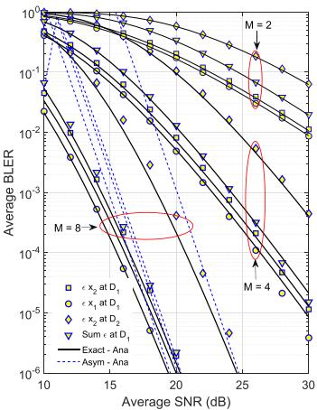  
(a)

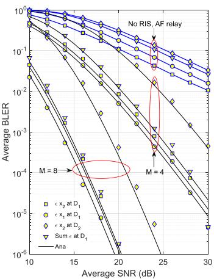  
(b)  
Fig. 2. Average BLERs of $x _ { i }$ at $\mathrm { D } _ { i }$ and sum BLER versus the SNR.

Fig. 2 demonstrates the average BLERs at $\mathrm { D } _ { i }$ and the sum BLER versus the SNR in dB for different numbers of the reflection elements of ARIS. From Fig. 2, we can see that the BLERs rapidly decrease with the increase in the SNR. Moreover, for a given transmission power, the BLERs are reduced when the number of reflection elements of ARIS is increased. In particular, at SNR = 25 dB, the BLERs can reduce 1000 times when M increases from 2 to 4. Besides, the curves in Fig. 2 indicate that the considered system achieves the diversity order of $d _ { \mathrm { D } _ { i } } \approx M \hat { k } / 2$ , where $\begin{array} { r } { \hat { k } = \frac { \pi ^ { 2 } } { 1 6 - \pi ^ { 2 } } \approx 1 . 6 } \end{array}$ . Particularly, when $M = 8$ , the diversity order $d _ { \mathrm { D } _ { i } } = 6$ . In addition, the average BLER is very small when $M \geq 8 ,$ i.e., the considered system can meet the URLLC requirements. Fig. 2(a) shows that the asymptotic BLER expressions closely match the exact results when $\mathrm { S N R } \geq 2 0$ dB. Additionally, Fig. 2(b) indicates that the BLER performance of the UAV-assisted NOMA system with ARIS support is significantly superior to that of the conventional AF relaying scheme. Notably, even when the ARIS is configured with a small number of reflecting elements, the system still achieves considerable BLER improvements. These results confirm the effectiveness of the ARIS scheme in enhancing the reliability of UAV-assisted NOMA systems compared to traditional AF relaying.

Fig. 3(a) depicts the average BLER versus the SNR in dB for both the ARIS- and PRIS-assisted systems. Note that the curves of OMA and PRIS schemes in Fig. 3(a) represent the simulation results only. The BLER of system when using ARIS is significantly lower than that with PRIS. In particular, for SNR ≈ 30 dB and $M = 5$ , the BLER performance of the ARIS is improved by 290% compared to the PRIS. Furthermore, the OMA-ARIS system also outperforms the OMA-PRIS system, since OMA does not introduce interference. However, the BLER of the OMA-ARIS system remains higher than that of the NOMA-ARIS system, as the bandwidth utilization of OMA is smaller than that of NOMA. Finally, Fig. 3(a) confirms that the simulation results match well with the analytical results, thereby validating the accuracy of the derived mathematical expressions.

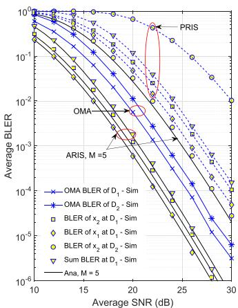

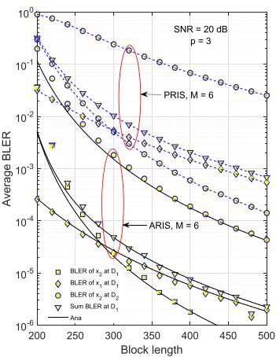  
(b)

(a)  
Fig. 3. Average BLERs of $x _ { i }$ at $\mathrm { D } _ { i }$ and e2e BLER versus the SNR and block length.  
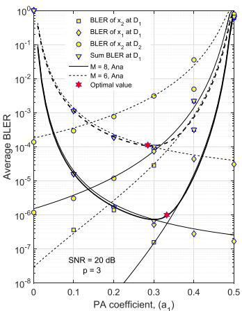  
(a)

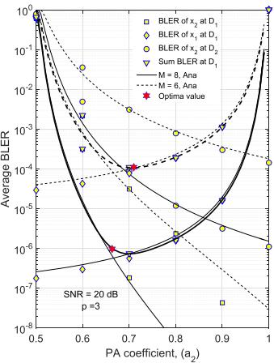  
(b)  
Fig. 4. Average BLERs of $x _ { i }$ at $\mathrm { D } _ { i }$ and sum BLER versus the power allocation coefficients.

Fig. 3(b) compares the average BLERs of the considered NOMA-ARIS-UAV system versus the block length W when using ARIS and PRIS. The SNR is fixed at 20 dB, the number of transmission bits is $B = 2 5 6$ , and the number of reflection elements is $M = 6 .$ . As shown in Fig. 3(b), the BLER decreases when the block length W increases. This is because a higher value of W gives a more perfect channel estimation, leading to a lower error probability. In addition, a large block length makes the system error correction more efficient. Generally, these results indicate the importance of selecting the appropriate block length to achieve the desired transmission reliability for the NOMA-ARIS-UAV system. It is noted that the goal of SPC is to minimize block length. To balance this trade-off, a conservative selection for block length is necessary to fulfill both the minimum latency requirement and the satisfactory BLER performance. In particular, for target BLER of $1 0 ^ { - 5 }$ at $\mathrm { D _ { 1 } }$ , the channel use should be $\mathcal { W } = 4 0 0$ . Moreover, due to the fixed high power allocation for $x _ { 1 }$ , the gap between the BLERs $x _ { 1 }$ and $x _ { 2 }$ is substantial.

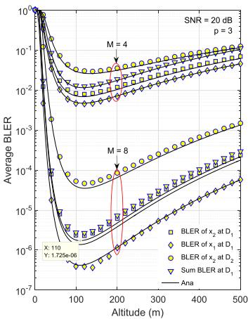

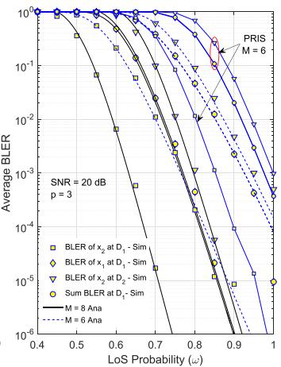  
(a)  
(b)  
Fig. 5. Average BLERs of $x _ { i }$ at $\mathrm { D } _ { i }$ and sum BLER versus H and ω.

Fig. 4(a) and (b) plot the BLERs under the impacts of power allocation coefficients $a _ { 1 }$ and $a _ { 2 } ,$ respectively, for two cases of the number of reflection elements of ARIS, i.e., $M = 6$ and $M = 8$ . As shown in Fig. $4 ( \mathrm { a } )$ , the BLER at $\mathrm { D _ { 1 } }$ first reduces to a minimum value and then increases when $a _ { 1 }$ varies from 0 to 0.5. The reason for this feature is that the BLER at $\mathrm { D _ { 1 } }$ dominates the errors of both the SIC $x _ { 2 }$ and the detection of $x _ { 1 }$ at $\mathrm { D _ { 1 } }$ . In contrast, Fig. 4(b) shows that when $a _ { 2 }$ ranges from 0.5 to 1, the BLER of $x _ { 1 }$ increases constantly, and BLER of $x _ { 2 }$ declines continuously, while the sum BLER at $\mathrm { D _ { 1 } }$ reduces and reaches a minimum value, then continues to rise. This is because, in power-domain NOMA systems, the power allocation coefficient is $a _ { 1 } + a _ { 2 } = 1$ . Thus increasing $a _ { 2 }$ leads to reducing $a _ { 1 }$ , i.e., BLER of $x _ { 1 }$ increases. Moreover, since $\mathrm { D _ { 2 } }$ detects $x _ { 2 }$ directly, $a _ { 2 }$ linearly influences the BLER of $x _ { 2 }$ , while the BLER of $x _ { 1 }$ depends on the error probability of SIC $x _ { 2 }$ at $\mathrm { D _ { 1 } }$ . As a result, there exists a value of $a _ { i }$ that minimizes BLER at $\mathrm { D _ { 1 } } .$ and it is also the optimum power allocation coefficient of the considered NOMA-RIS-UAV system. From Fig. 4, for achieving the best BLER performance of the considered NOMA-RIS-UAV system, the power allocation coefficients for $x _ { 1 }$ and $x _ { 2 }$ are $a _ { 1 } \approx 0 . 3$ and $a _ { 2 } \approx 0 . 7 .$ , respectively.

Fig. 5(a) illustrates the impacts of the UAV altitude on the average BLERs when $M = 4$ and $M = 8$ . The number of transmission bits is $B = 2 5 6$ , the block length is $\mathcal { W } = 2 5 6$ . In Fig. 5(a), the average BLER is depicted as an unimodal convex function of the UAV altitude. When the UAV altitude increases, the average BLER initially decreases to a minimum value and increases constantly. This is because a low UAV altitude leads to a high path loss due to severe blockages that affect the signal propagation between the UAV and ground users. In contrast, when the UAV altitude is high, the communication link becomes longer, the LoS appears, and the path loss is higher. However, the received power is reduced. From Fig. 5(a), we can see that the system attains the best BLER performance when the UAV altitudes are 105 m or 110 m for $M = 4$ and $M = 8 .$ respectively. The UAV altitude can be adjusted based on these characteristics to provide the best system error performance. Moreover, for the transmission power of 20 dB, the achievable

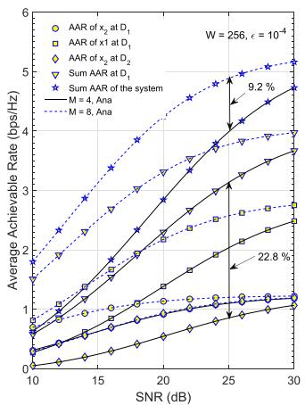

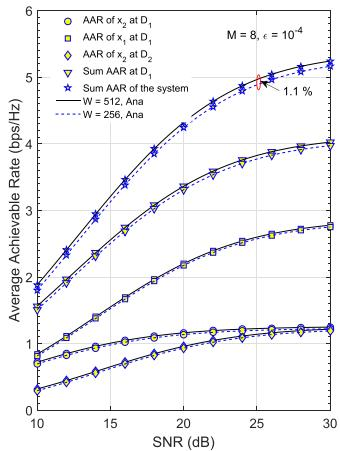  
(a)  
(b)  
Fig. 6. AAR of $x _ { i }$ and the sum AAR of the considered system versus the SNR.

BLER is lower than $1 0 ^ { - 4 }$ when the number of reflection elements is $M = 8$

Fig. 5(b) depicts the average BLERs of the investigated UAV-ARIS-assisted NOMA system versus the LoS probability ω for different numbers of elements of RIS. The SNR is fixed at 20 dB, and the number of transmission bits and channel uses is $B = 2 5 6$ and $\mathcal { W } = 2 5 6$ , respectively. From Fig. 5(b), a higher value of ω provides a smaller average BLER. Note that the LoS communication is always available when the UAV altitude is more than 40m. Moreover, for the same LoS probability, the BLER when using ARIS is significantly smaller than when using PRIS. Besides, the gap between the BLERs of $\mathrm { D _ { 1 } }$ and $\mathrm { D _ { 2 } }$ is small, and the BLER of $x _ { 2 }$ at $\mathrm { D _ { 1 } }$ is smallest. The reason is that the LoS power of the signal is superior compared to the gain of distance.

Fig. 6 plots the AAR of the considered UAV-ARIS-NOMA system versus the SNR in dB for $\epsilon = 1 0 ^ { - 4 }$ and the number of transmission bits is $B = 2 5 6$ . The results in Fig. 6 show that the AAR of $\mathrm { D } _ { i }$ and the whole system rapidly increase when SNR goes from 10 to 25 dB and are then saturated in the high SNR region. It is because the maximal AAR is always the lower bound of Shannon capacity for the finite block-length transmission [1] On the other hand, the AAR at $\mathrm { D _ { 1 } }$ is defined as the correct decoding rate of $x _ { 1 }$ and $x _ { 2 }$ . Consequently, the sum AAR at $\mathrm { D _ { 1 } }$ is higher than that at $\mathrm { D _ { 2 } }$ . In particular, the gap between the AAR performance of $\mathrm { D _ { 1 } }$ and $\mathrm { D _ { 2 } }$ in Fig. 6(a) is 22.8% at $\mathrm { S N R } = 2 5$ dB. Besides, when the number of the reflection elements increases from $M = 4$ to $M = 8 .$ , the gap of the sum AAR of the system increases by 9.2%. Note that the number of pilots to estimate the channel of RIS-assisted wireless communication equals M, and the number of bits for phase shifting is increased linearly with M. Thus, a higher value of M increases the complexity of the considered NOMA-ARIS-UAV system. From Fig. 6(b), we also see that when varying the block length from 256 to 512, the AAR of $\mathrm { D } _ { i }$ and the sum AAR of the whole system change slightly (1.1%). Moreover, a larger block length leads to higher latency and age of information. This feature implies that utilizing a long block length is unnecessary in our considered system.

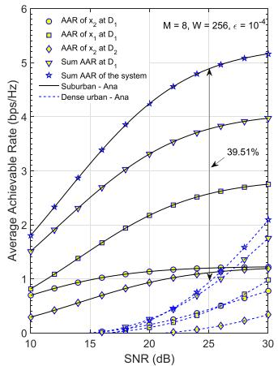  
(a)

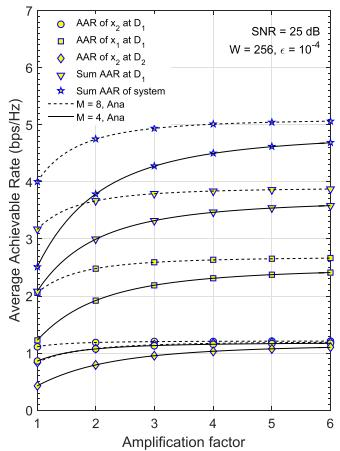  
(b)  
Fig. 7. AAR of $x _ { i }$ at $\mathrm { D } _ { i }$ and sum AAR of the system versus the SNR and amplification factor of ARIS.

Fig. 7(a) shows the AAR of the NOMA-ARIS-UAV system versus the SNR in dB for $\epsilon = 1 0 ^ { - 4 }$ and two different environments. The AARs of $x _ { 2 }$ at $\mathrm { D _ { 1 } }$ and $\mathrm { D _ { 2 } }$ are similar in the high SNR region. Because when the transmit power is high enough, the decoding capabilities of $\mathrm { D _ { 1 } }$ and $\mathrm { D _ { 2 } }$ become independent of the channel properties. Another reason is that the maximum transmission rate limits the AAR due to finite block length and the interference of the NOMA technique. Moreover, as presented in Fig. 7(a), the AAR in suburban is higher than that in dense urban. In particular, the sum AAR of the system in the suburban is more than 39.51% compared with the dense urban. The relationship between the AAR and the amplification factor of ARIS is studied in Fig. 7(b). We can see that the AARs of Di and the whole system are improved when increasing the amplification factor $p$ because p can assist in expanding the power budget of S. Particularly, when increasing $p$ from 1 to 6, the AAR of the considered system first rapidly increases. However, when $p > 3$ the AARs are saturated. The transmission rate of the SPC method causes this trend. On the other hand, a larger value of p also leads to a higher thermal noise. Additionally, in the high SNR region, the AAR in the NOMA scheme with imperfect SIC is always saturated due to interferences from other signals.

In Fig. 8(a), we examine how the channel block length affects the AAR performance for a fixed decoding error probability $\epsilon = 1 0 ^ { - 4 }$ . The block length varies between 100 and 800, corresponding to the latency of 0.1ms to 0.8ms, which satisfies the low-latency requirement. As depicted in Fig. 8(a), the AAR increases with the block length and then approaches the Shannon’s capacity. This property is because increasing the block length results in a convergence with Shannon’s capacity formula. However, when the block length is small, a significant gap occurs between the conventional Shannon’s capacity and the AAR of the finite block length of data packets. These results match with the results given in [55]. Fig. 8(b) illustrates the sum AAR versus the BLER requirement. The graph demonstrates that AAR declines when the BLER requirement decreases. In other words, achieving more reliable communication necessitates lower data rates. That is because the function $Q ^ { - 1 } ( x )$ exhibits a consistent downward trend, serving as a monotonically decreasing function of x. It means that the decoding error probability increases proportionally with the number of transmission bits for fixed channel use and SNR. We can also see that for a given BLER requirement, more reflection elements make the AAR of the considered system unchanged.

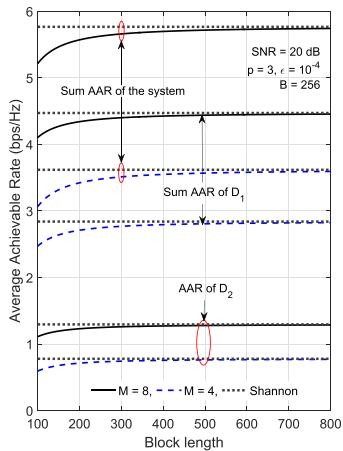  
(a)

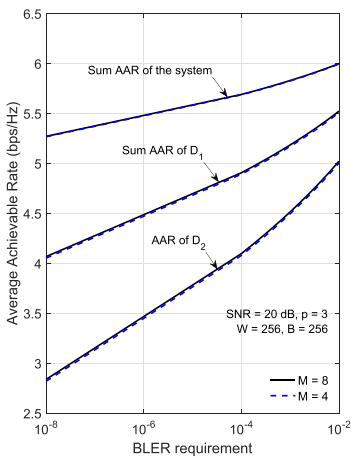  
(b)  
Fig. 8. AAR at $\mathrm { D } _ { i }$ and sum AAR of the whole system versus block length and BLER requirement.

## VI. CONCLUSION

In this paper, we have investigated the performance of the UAV-RIS-assisted NOMA system under finite block length constraints. Besides the ARIS and UAV, the NOMA technique was also applied to the considered system. Based on the first-order statics of the output SNR for the system, we successfully derived the closed-form expressions for the exact and asymptotic BLER and the AAR of the system. These expressions played essential roles in analyzing the diversity gain and providing insight into the impacts of various parameters on the system performance regarding transmission reliability and data rate with the SPC. The results indicated that the system performance was remarkably affected by various factors, such as the number of reflection elements and the amplification factor of RIS, the designed block length, the UAV altitude, and the power allocation coefficient. The Shannon capacity always bounds the data rate of the system. Moreover, we determined the optimum values of the UAV altitude and the power allocation coefficient to minimize BLER. Simulation results verify all analytical results to confirm the accuracy of our mathematical analysis.

## REFERENCES

[1] Y. Polyanskiy, H. V. Poor, and S. Verdú, “Channel coding rate in the finite blocklength regime,” IEEE Trans. Inf. Theory, vol. 56, no. 5, pp. 2307– 2359, May 2010.

[2] A. Saberi, F. Farokhi, and G. N. Nair, “Zero-error feedback capacity for bounded stabilization and finite-state additive noise channels,” IEEE Trans. Inf. Theory, vol. 68, no. 10, pp. 6335–6355, Oct. 2022.

[3] R. Ma, W. Yang, X. Guan, X. Lu, Y. Song, and D. Chen, “Covert mmWave communications with finite blocklength against spatially random wardens,” IEEE Internet Things J., vol. 11, no. 2, pp. 6898–6908, Jan. 2024.

[4] L. Yuan, Z. Zheng, N. Yang, and J. Zhang, “Performance analysis of short-packet non-orthogonal multiple access with alamouti space-time block coding,” IEEE Trans. Veh. Technol., vol. 70, no. 3, pp. 2900–2905, Mar. 2021.

[5] L. Yuan, Q. Du, N. Yang, and F. Fang, “Performance analysis of IRS-aided short-packet NOMA systems over Nakagami-m fading channels,” IEEE Trans. Veh. Technol., vol. 72, no. 6, pp. 8228–8233, Jun. 2023.

[6] J. Xu, L. Yuan, N. Yang, and Y. Guo, “Performance analysis of STAR-IRS aided NOMA short-packet communications with statistical CSI,” IEEE Trans. Veh. Technol., vol. 72, no. 9, pp. 12385–12390, Sep. 2023.

[7] Y. Zeng, Q. Wu, and R. Zhang, “Accessing from the sky: A tutorial on UAV communications for 5G and beyond,” Proc. IEEE, vol. 107, no. 12, pp. 2327–2375, Dec. 2019.

[8] L. Yang, H. Yao, J. Wang, C. Jiang, A. Benslimane, and Y. Liu, “Multi-UAV-enabled load-balance mobile-edge computing for IoT networks,” IEEE Internet Things J., vol. 7, no. 8, pp. 6898–6908, Aug. 2020.

[9] Z. Lin, M. Lin, T. De Cola, J.-B. Wang, W.-P. Zhu, and J. Cheng, “Supporting IoT with rate-splitting multiple access in satellite and aerial-integrated networks,” IEEE Internet Things J., vol. 8, no. 14, pp. 11123–11134, Jul. 2021.

[10] X. Yue, J. Xie, C. Ouyang, Y. Liu, X. Shen, and Z. Ding, “Active simultaneously transmitting and reflecting surface assisted NOMA networks,” IEEE Trans. Wireless Commun., vol. 23, no. 8, pp. 9912–9926, Aug. 2024.

[11] X. Yue, M. Song, C. Ouyang, Y. Liu, T. Li, and T. Hou, “Exploiting active RIS in NOMA networks with hardware impairments,” IEEE Trans. Veh. Technol., vol. 73, no. 6, pp. 8207–8221, Jun. 2024.

[12] P. T. Tran, B. C. Nguyen, T. M. Hoang, X. H. Le, and V. D. Nguyen, “Exploiting multiple RISs and direct link for performance enhancement of wireless systems with hardware impairments,” IEEE Trans. Commun., vol. 70, no. 8, pp. 5599–5611, Aug. 2022.

[13] P. T. Tran, B. C. Nguyen, T. M. Hoang, and T. N. Nguyen, “On performance of low-power wide-area networks with the combining of reconfigurable intelligent surfaces and relay,” IEEE Trans. Mobile Comput., vol. 22, no. 10, pp. 6086–6096, Oct. 2022.

[14] K.-T. Nguyen, T.-H. Vu, and S. Kim, “A unified framework analysis for reconfigurable intelligent surface-aided coordinated NOMA systems,” IEEE Trans. Veh. Technol., vol. 72, no. 11, pp. 15115–15120, Nov. 2023.

[15] T.-H. Vu and S. Kim, “Performance analysis of full-duplex two-way RISbased systems with imperfect CSI and discrete phase-shift design,” IEEE Commun. Lett., vol. 27, no. 2, pp. 512–516, Feb. 2023.

[16] Z. Lin et al., “Refracting RIS-aided hybrid satellite-terrestrial relay networks: Joint beamforming design and optimization,” IEEE Trans. Aerosp. Electron. Syst., vol. 58, no. 4, pp. 3717–3724, Aug. 2022.

[17] Z. Zhang et al., “Active RIS vs. passive RIS: Which will prevail in 6G,” IEEE Trans. Commun., vol. 71, no. 3, pp. 1707–1725, Mar. 2023.

[18] W. Xie, Y. Li, C. Yu, J. Wang, X. Peng, and P. Zhu, “Sum rate maximization for self-sustainable IRS-assisted UAV communications,” IEEE Commun. Lett., vol. 27, no. 2, pp. 640–644, Feb. 2023.

[19] A. Bansal, N. Agrawal, and K. Singh, “Rate-splitting multiple access for UAV-based RIS-enabled interference-limited vehicular communication system,” IEEE Trans. Intell. Veh., vol. 8, no. 1, pp. 936–948, Jan. 2023.

[20] X. Zhang, H. Zhang, W. Du, K. Long, and A. Nallanathan, “IRS empowered UAV wireless communication with resource allocation, reflecting design and trajectory optimization,” IEEE Trans. Wireless Commun., vol. 21, no. 10, pp. 7867–7880, Oct. 2022.

[21] X. Pang, N. Zhao, J. Tang, C. Wu, D. Niyato, and K.-K. Wong, “IRSassisted secure UAV transmission via joint trajectory and beamforming design,” IEEE Trans. Commun., vol. 70, no. 2, pp. 1140–1152, Feb. 2022.

[22] L. Yang, P. Li, F. Meng, and S. Yu, “Performance analysis of RIS-assisted UAV communication systems,” IEEE Trans. Veh. Technol., vol. 71, no. 8, pp. 9078–9082, Aug. 2022.

[23] Y. Yu, X. Liu, and V. C. Leung, “Fair downlink communications for RIS-UAV enabled mobile vehicles,” IEEE Wireless Commun. Lett., vol. 11, no. 5, pp. 1042–1046, May 2022.

[24] X. Song, Y. Zhao, Z. Wu, Z. Yang, and J. Tang, “Joint trajectory and communication design for RIS-assisted UAV networks,” IEEE Wireless Commun. Lett., vol. 11, no. 7, pp. 1538–1542, Jun. 2024.

[25] K. Yu, X. Yu, and J. Cai, “UAVs assisted intelligent reflecting surfaces SWIPT system with statistical CSI,” IEEE J. Sel. Topics Signal Process., vol. 15, no. 5, pp. 1095–1109, Aug. 2021.

[26] X. Mu, Y. Liu, L. Guo, J. Lin, and H. V. Poor, “Intelligent reflecting surface enhanced multi-UAV NOMA networks,” IEEE J. Sel. Areas Commun., vol. 39, no. 10, pp. 3051–3066, Oct. 2021.

[27] W. Feng et al., “Resource allocation for power minimization in RISassisted Multi-UAV networks with NOMA,” IEEE Trans. Commun., vol. 71, no. 11, pp. 6662–6676, Nov. 2023.

[28] Y. Liu, K. Xiong, Y. Zhu, H.-C. Yang, P. Fan, and K. B. Letaief, “Outage analysis of IRS-assisted UAV NOMA downlink wireless networks,” IEEE Internet Things J., vol. 11, no. 6, pp. 9298–9311, Mar. 2024.

[29] S. K. Singh, K. Agrawal, K. Singh, C.-P. Li, and Z. Ding, “NOMA enhanced hybrid RIS-UAV-assisted full-duplex communication system with imperfect SIC and CSI,” IEEE Trans. Commun., vol. 70, no. 11, pp. 7609–7627, Nov. 2022.

[30] J. Zhao, L. Yu, K. Cai, Y. Zhu, and Z. Han, “RIS-aided ground-aerial NOMA communications: A distributionally robust DRL approach,” IEEE J. Sel. Areas Commun., vol. 40, no. 4, pp. 1287–1301, Apr. 2022.

[31] S. Solanki, J. Park, and I. Lee, “On the performance of IRS-aided UAV networks with NOMA,” IEEE Trans. Veh. Technol., vol. 71, no. 8, pp. 9038–9043, Aug. 2022.

[32] S. Lv, X. Xu, S. Han, and P. Zhang, “UAV-RIS assisted coordinated multipoint finite blocklength transmission for MTC networks,” IEEE Internet Things J., vol. 10, no. 23, pp. 20323–20341, Dec. 2023.

[33] S. K. Singh, K. Agrawal, K. Singh, B. Clerckx, and C.-P. Li, “RSMA for hybrid RIS-UAV-aided full-duplex communications with finite blocklength codes under imperfect SIC,” IEEE Trans. Wireless Commun., vol. 22, no. 9, pp. 5957–5975, Sep. 2023.

[34] N. Agrawal, A. Bansal, K. Singh, C.-P. Li, and S. Mumtaz, “Finite block length analysis of RIS-Assisted UAV-Based multiuser IoT communication system with non-linear EH,” IEEE Trans. Commun., vol. 70, no. 5, pp. 3542–3557, May 2022.

[35] M. Najafi, V. Jamali, R. Schober, and H. V. Poor, “Physics-based modeling and scalable optimization of large intelligent reflecting surfaces,” IEEE Trans. Wireless Commun., vol. 69, no. 4, pp. 2673–2691, Apr. 2021.

[36] X. Pang, M. Sheng, N. Zhao, J. Tang, D. Niyato, and K.-K. Wong, “When UAV meets IRS: Expanding air-ground networks via passive reflection,” IEEE Wireless Commun. Lett., vol. 28, no. 5, pp. 164–170, Oct. 2021.

[37] J. Holis and P. Pechac, “Elevation dependent shadowing model for mobile communications via high altitude platforms in built-up areas,” IEEE Trans. Antennas Propag., vol. 56, no. 4, pp. 1078–1084, Apr. 2008.

[38] T. M. Hoang, Q. -N. Van, L. T. Dung, B. C. Nguyen, N. Van Vinh, and T. Kim, “Performance analysis and optimization of multi-antenna UAV-Aided multi-user backscatter SPC systems,” IEEE Trans. Intell. Veh., vol. 9, no. 1, pp. 1028–1039, Jan. 2024.

[39] A. Al-Hourani, S. Kandeepan, and S. Lardner, “Optimal LAP altitude for maximum coverage,” IEEE Commun. Lett., vol. 3, no. 6, pp. 569–572, Dec. 2014.

[40] T. M. Hoang, L. T. T. Huyen, X. N. Tran, and P. T. Hiep, “Outage probability of aerial base station NOMA MIMO wireless communication with RF energy harvesting,” IEEE Internet Things J., vol. 9, no. 22, pp. 22874– 22886, Nov. 2022.

[41] H. Semira, F. Kara, H. Kaya, and H. Yanikomeroglu, “Multi-user joint maximum-likelihood detection in uplink NOMA-IoT networks: Removing the error floor,” IEEE Wireless Commun. Lett., vol. 10, no. 11, pp. 2459– 2463, Nov. 2021.

[42] T. M. Hoang, L. T. Dung, B. C. Nguyen, X. N. Tran, and T. Kim, “Secrecy outage performance of FD-NOMA relay system with multiple non-colluding eavesdroppers,” IEEE Trans. Veh. Technol., vol. 70, no. 12, pp. 12985–12997, Dec. 2021.

[43] Z. Ding, R. Schober, and H. V. Poor, “On the impact of phase shifting designs on IRS-NOMA,” IEEE Wireless Commun. Lett., vol. 9, no. 10, pp. 1596–1600, Oct. 2020.

[44] D. Zhang, Q. Wu, M. Cui, G. Zhang, and D. Niyato, “Throughput maximization for IRS-assisted wireless powered hybrid NOMA and TDMA,” IEEE Wireless Commun. Lett., vol. 10, no. 9, pp. 1944–1948, Sep. 2021.

[45] X. Liu, Y. Liu, Y. Chen, and H. V. Poor, “RIS enhanced massive NonOrthogonal multiple access networks: Deployment and passive beamforming design,” IEEE J. Sel. Areas Commun., vol. 39, no. 4, pp. 1057– 1071, Apr. 2021.

[46] C. Gong, H. Li, S. Hao, K. Long, and X. Dai, “Active RIS enabled secure NOMA communications with discrete phase shifting,” IEEE Trans. Wireless Commun., vol. 23, no. 4, pp. 3493–3506, Apr. 2024.

[47] J. Meredith, “Technical specification group radio access network: Study on enhanced LTE Support for aerial vehicles,” (Release 15), 3GPP TR 36.777 V15.0, 2018.

[48] I. Y. Abualhaol and M. M. Matalgah, “Performance Analysis of Multi-Carrier Relay-Based UAV Network Over Fading Channels,” in Proc. 2010 IEEE Globecom Workshops, 2011, pp. 1811–1815.

[49] F. Jiang and A. L. Swindlehurst, “Optimization of UAV heading for the ground-to-air uplink,” IEEE J. Sel. Areas Commun., vol. 30, no. 5, pp. 993–1005, Jun. 2012.

[50] W. G. Newhall et al., “Wideband air-to-ground radio channel measurements using an antenna array at 2GHz for low-altitude operations,” in Proc. IEEE Mil. Commun. Conf., 2003, pp. 1422–1427.

[51] Y. Yu, H. Chen, Y. Li, Z. Ding, and B. Vucetic, “On the performance of non-orthogonal multiple access in short-packet communications,” IEEE Commun. Lett., vol. 22, no. 3, pp. 590–593, Mar. 2018.

[52] T. M. Hoang et al., “Outage and throughput analysis of UAV-assisted NOMA relay systems with indoor and outdoor users,” IEEE Trans. Aerosp. Electron. Syst., vol. 59, no. 3, pp. 2633–2647, Jun. 2023.

[53] T.-H. Vu, T.-V. Nguyen, Q.-V. Pham, D. B. da Costa, and S. Kim, “Hybrid long-and short-packet based NOMA systems with joint power allocation and beamforming design,” IEEE Trans. Veh. Technol., vol. 72, no. 3, pp. 4079–4084, Mar. 2023.

[54] M. Abramowitz and I. A. Stegun, Handbook of Mathematical Functions: With Formulas, Graphs, and Mathematical Tables, vol. 55. North Chelmsford, MA, USA: Courier Corporation, 1964.

[55] W. Yang, G. Durisi, T. Koch, and Y. Polyanskiy, “Quasi-static multipleantenna fading channels at finite blocklength,” IEEE Trans. Inf. Theory, vol. 60, no. 7, pp. 4232–4265, Jul. 2014.

[56] I. S. Gradshteyn and I. M. Ryzhik, Table of Integrals, Series, and Products, 7th ed. New York, NY, USA: Academic Press, 2014.

  
Le Thi Thanh Huyen received the BEng and MSc degrees in electronic engineering, and the PhD degree from Le Quy Don Technical University, Hanoi, Vietnam, in 2010, 2014, and 2020, respectively. Since 2010, she has been a lecturer with the Le Quy Don Technical University. Her research interests include MIMO, cooperative communications, index modulation, UAV communications.

Tran Manh Hoang received the BS degree in communication command from Telecommunications University, Ministry of Defense, Nha Trang, Vietnam, in 2002, the BEng degree in electrical engineering from Le Quy Don Technical University, Ha Noi, Vietnam, in 2006, the MEng degree in electronics engineering from the Posts and Telecommunications Institute of Technology, Ho Chi Minh City, Vietnam, in 2013, and the PhD degree from Le Quy Don Technical University, Hanoi, Vietnam, in 2018. He is currently working as an associate professor with

Telecommunications University, Khanh Hoa, Vietnam. He has more than 100 papers in referred international journals and conferences. His research interests include energy harvesting, uncrewed aerial vehicle, short packet communication, nonorthogonal multiple access, and multiple-input–multiple-output, reconfigurable intelligent surface, and signal processing for wireless cooperative communications. Dr. Hoang was the recipient of the 2022 IEEE International Conference on Advanced Technologies for Communications, REV-ECIT-2023, and IEEE ICCAIS-2023 Best Paper Award.

Le The Dung (Member, IEEE) received the BS degree in electronics and telecommunication engineering from the Ho Chi Minh City University of Technology, Ho Chi Minh City, Vietnam, in 2008, and the MS and PhD degrees in electronics and computer engineering from Hongik University, Seoul, South Korea, in 2012 and 2016, respectively. From 2007 to 2010, he joined Signet Design Solutions Vietnam, Ho Chi Minh City, as a Hardware Design Engineer. From May 2016 to December 2022, he was a postdoctoral research fellow with Chungbuk National University,

Cheongju, South Korea. From September 2022 to March 2025, he was a Lecturer and Researcher with FPT University, Ho Chi Minh City, Vietnam. Since April 2025, he has been with the Department of Computer and Communications Engineering, Ho Chi Minh City University of Technology and Education, Vietnam. He has more than 90 papers in referred international journals and conferences. His major research interests include wireless cooperative communication, routing protocols, network coding, network stability analysis and optimization in mobile ad hoc networks, cognitive radio ad hoc networks, and visible light communication networks. Dr. Dung was a recipient of the 2016 IEEE International Symposium on Computer, Consumer and Control Best Paper Award.

Ba Cao Nguyen received the BS degree in electrical engineering from Telecommunication University, Khanh Hoa, Vietnam, in 2006 and the MS degree in electrical engineering from the Posts and Telecommunications Institute of Technology (VNPT), Ho Chi Minh City, Vietnam, in 2011, and the PhD degree in electrical engineering from Le Quy Don Technical University, Hanoi, Vietnam, in 2020. He currently works as an associate professor with Telecommunications University, Khanh Hoa, Vietnam. His research interests include energy harvesting, full-duplex, spatial modulation, non-orthogonal multiple access, multiple-input multiple-output, reconfigurable intelligent surface, uncrewed aerial vehicle, and cooperative communication.

Xuan Nam Tran (Member, IEEE) received the Master of Engineering degree in telecommunications engineering from the University of Technology Sydney, Ultimo NSW, Australia, in 1998, and the Doctor of Engineering degree in electronic engineering from the University of Electro-Communications, Chofu, Japan, in 2003. He is currently a full professor and the Head of a strong research group on advanced wireless communications, Le Quy Don Technical University, Hanoi, Vietnam. From November 2003 to March 2006, he was a research associate with the

Information and Communication Systems Group, Department of Information and Communication Engineering, The University of Electro-Communications, Tokyo, Japan. His research interests include MIMO, index modulation, cooperative communications, UAV communications. Prof. Tran was a recipient of the 2003 IEEE AP-S Japan Chapter Young Engineer Award, and a co-recipient of two best papers from the 2012 International Conference on Advanced Technologies for Communications and the 2014 National Conference on Electronics, Communications and Information Technology. He is the Founding Chair and currently the Chapter Chair of the Vietnam Chapter of IEEE Communications Society. He is a member of IEICE and the Radio-Electronics Association of Vietnam.