# Situation-Aware Hybrid Sensing and Position Control for UAV-Assisted ISAC Systems

Ling Lyu , Member, IEEE, Qirui Luo, Yanpeng Dai , Member, IEEE, Nan Cheng , Senior Member, IEEE, Cailian Chen , Senior Member, IEEE, Xinping Guan , Fellow, IEEE, and Xuemin Shen , Fellow, IEEE

Abstract—The high flexibility and controllable mobility of uncrewed aerial vehicles (UAVs) make it possible to construct the line-of-sight transmission link between devices in plant and the remote center, where the channel state condition heavily depends on the position of UAV. In this work, integrated sensing and communication (ISAC) is adopted to simultaneously perform position awareness and data transmission with limited radio resources. In particular, a situation-aware hybrid sensing pattern is proposed to reduce energy consumption and the interference of sensing to communication. In this hybrid pattern, the sensing function is activated on demand based on the channel state condition that is heavily affected by the position of UAV. Besides, the position control of UAV is performed based on the sensing result to further improve the transmission rate. Then, a joint optimization problem of beamforming design and power allocation is formulated to maximize energy efficiency. To solve this mixed integer nonlinear problem, the original problem is decomposed into subproblems in Phase I and Phase II. Finally, the golden-section based Dinkelbach algorithm and the penalty based approximation algorithm are proposed to solve the Phase I subproblem with the fractional objective function and rankone constraints. Moreover, a quadratic transform enabled joint design of remote center beamforming and UAV transmit power is proposed to solve the Phase II subproblem. Simulation results verify that the proposed UAV-assisted integration of sensing,

communication, and control approach outperforms compared approaches regarding data volume and energy efficiency.

Index Terms—UAV-assisted ISAC, situation-aware hybrid sensing, beamforming design, position control, antenna-angle control.

## I. INTRODUCTION

D ROMPTED by the development of information and communication technology, a series of advanced Internet of Things (IoT) services have been conducted, such as smart manufacturing, smart cities, digital twins, and so on [1], [2], and [3]. In these services, tremendous IoT devices are deployed in plant to collect and deliver environment data to the server for further fusion and processing [4], [5], [6]. However, the surrounding obstacles and scatters block the signal propagation, making it hard to guarantee the transmission reliability and timeless [7], [8]. Fortunately, uncrewed aerial vehicle (UAV) has been envisioned as a cost-effective aerial platform to overcome the above limitations, since it has high mobility, flexibility, and controllability and can provide the strong airground line-of-sight (LoS) channels [9], [10], [11]. For the UAV-assisted communication system, the accuracy of UAV’s position is a key index, since it heavily affects the channel condition and then the data rate and transmission reliability [12], [13], [14]. Therefore, it is necessary to achieve both the position sensing and the data transmission with limited radio resources.

Integrated sensing and communication (ISAC) technology aims at improving the data sensing and transmission efficiency by well-designing the dual-functional signals to share the same radio resources and wireless infrastructures [15], [16], [17]. Meng et al. [18] proposed a periodic ISAC method, in which the UAV periodically provides communication services to users while performing target sensing tasks. Ni et al. [19] proposed a communication-centric waveform optimization system, in which the base station detects radar targets while simultaneously communicates with mobile users. The aforementioned studies primarily focus on achieving the original communication functionality of the system while sensing additional targets, without fully exploring the integration and coordination gains of combining the two functions. Moreover, the mutual assistance between communication and sensing functions has not been adequately explored. Currently, there are some works focus on the integrated design approaches for ISAC. Xiao and Zeng [20] proposed a novel full-duplex (FD) ISAC scheme that utilizes the waiting time of conventional pulsed radars to transmit communication signals. Zhang et al. [21] proposed a dynamic frame structure, allowing users to allocate a time-frequency ratio for dual sensing and communication functions according to varying demands. He et al. [22] extended the existing ISAC beamforming design to a general case by considering the FD capability for not only sensing but also communication for optimizing the downlink and uplink transmissions. The above studies on the integrated design approaches for ISAC primarily focus on the periodic integration method. However, in practice, the sensing demand is different and variable. It is necessary to schedule the sensing functions on demand to reduce the interference between communication and sensing. An adaptive ISAC mechanism flexibly configures the sensing duration according to the communication demand [23]. The sensing function adopts an event-triggered approach that senses only when the communication requirements are not met [24]. Therefore, the on-demand scheduling of sensing functions has not been adequately explored.

As the advantage of ISAC technology on loss-of-sight (LoS) links, some recent studies focus on the UAV-assited ISAC system. The existing research on UAV-assisted ISAC systems primarily focuses on resource allocation among sensing and communication [25]. UAV beamforming design and trajectory optimization are the main research interests [26]. The prevailing solution for the joint optimization problem is leveraging an alternating optimization mechanism [27], [28], [29], or deep reinforcement learning mechanisms [30], [31] to strike a balance between sensing and communication performance. The above researches highlight the significance of UAV positioning, which significantly impact sensing and communication performance. Consequently, trajectory or position optimization has emerged as a pivotal domain of ongoing research. However, most works primarily focus on the integration of sensing and communication, without considering how to use the sensing result to improve the communication performance. Moreover, the communication channel between UAV and the ground user is mainly dominated by the LoS link, which will be further determined by the position of UAV [32]. The motion control of UAV was proposed to precisely adjust the position of UAV, ensuring optimal beam alignment and then enhancing the channel state for an improved backhaul rate [33]. A UAV-assisted periodic communication and sensing approach was proposed, where the penalty-based algorithm was utilized to maximize the achievable rate by iteratively optimizing sensing time, user association, UAV trajectory and beamforming vector [18]. Moreover, a dual-function multi UAV wireless network maximizes the network utility by jointly optimizing UAV position, UAV transmit power, and user association subject to the positioning accuracy constraint [34]. Therefore, for UAV-assited ISAC communication systems, it is essential to design the beamforming and transmit power integrating with the trajectory planning and position control, since the transmission rate heavily depends on the position aware channel quality. The above studies mainly focus on the integration of sensing and communication, however, sensing is generally not the ultimate goal, especially for mobile devices [35]. It is essential to study how to use the sensing result to perform the control function to improve the communication performance. Due to the execution of control function will cause addition energy consumption, it is essential to investigate the scheduling of control functions to improve the transmission rate at low energy consumption based on sensing results [36], [37], [38].

In this paper, we have investigated a UAV-assisted integration of sensing, communication, and control, which provides a new option for data transmission in the industrial IoT. In the considered system, the automatic guided vehicle (AGV) transmits data to the remote center (RC) via the UAV, where the channel state condition heavily depends on the position of UAV. In order to provide a high-precision position at a low cost of energy consumption, we investigate the integrated design of antenna-angle control and position control together with the situation-aware hybrid sensing pattern. The main contributions of this paper are summarized as follows.

• The proposed situation-aware hybrid sensing pattern is proposed to activate sensing and control functions on demand according to the channel state condition, which significantly reduces the interference of sensing signals on communication.

• The integrated design of antenna-angle control and position control could enhance the energy efficiency by only performing beam alignment at a low energy cost when the misalignment error is moderate.

The designed golden-section based Dinkelbach and the penalty based successive algorithms could ensure the sensing accuracy and mitigate the sensing-tocommunication interference. Moreover, the designed quadratic transform based reconstructive rank-one algorithm could address the problem of resource allocation with low computational complexity.

The remainder of this paper is organized as follows. The system model is presented in Section II. In Section III, the UAV-assisted integration of sensing, communication and control is presented, along with the formulation of the maximal system energy efficiency problem. In Section IV, the problem decomposition and joint design of beamforming and power allocation are proposed to address the problem. Section V presents numerical results to validate the UAV-assisted integration of sensing, communication and control approach and algorithms’ performance. Finally, Section VI concludes the paper. For the sake of clarity, the main parameters of the notations are listed in Table I.

## II. SYSTEM MODEL

We consider a UAV-assisted ISAC system as shown in Fig. 1, in which AGV with sensors gathers sensory data and then AGV to RC via UAV. The half-duplex UAV works in the decode-and-forward mode, thus the transmission process from AGV to RC compose of two phases within an ISAC frame period T, as shown in Fig. 2. Horn antennas are deployed on both AGV and UAV. RC is equipped with a N<sub>0</sub>-antenna uniform linear array (ULA) for sensing and an omnidirectional antenna for communication. Each ISAC frame consists of K time slots, and the duration of each time slot is ∆.

TABLE I  
LIST OF NOTATIONS FOR MAIN PARAMETERS
<table><tr><td rowspan=1 colspan=1>Parameters</td><td rowspan=1 colspan=1>Notations</td></tr><tr><td rowspan=1 colspan=1> $\overline { { k _ { \mathrm { t h } } } }$ </td><td rowspan=1 colspan=1>The division point of Phase I and Phase II</td></tr><tr><td rowspan=1 colspan=1> $P _ { c , k }$ </td><td rowspan=1 colspan=1>The communication transmission power ofAGV at k-th moment</td></tr><tr><td rowspan=1 colspan=1> $P _ { u , k }$ </td><td rowspan=1 colspan=1>The communication transmission power ofUAV at k-th moment</td></tr><tr><td rowspan=1 colspan=1> $P _ { f , k }$ </td><td rowspan=1 colspan=1>The propulsion power consumption of UAVat k-th moment</td></tr><tr><td rowspan=1 colspan=1> $P _ { t , k }$ </td><td rowspan=1 colspan=1>The RC transmit power of sensing signal atk-th moment</td></tr><tr><td rowspan=1 colspan=1> $P _ { s , k }$ </td><td rowspan=1 colspan=1>The power of RC sensing UAV at k-thmoment</td></tr><tr><td rowspan=1 colspan=1> $\mathbf { w } _ { m , k }$ and $\mathbf { W } _ { m , k }$ </td><td rowspan=1 colspan=1>The RC beamforming vectors of sensingm-th device at k-th moment in Phase I</td></tr><tr><td rowspan=1 colspan=1> $\mathbf { v } _ { k }$ and $\mathbf { V } _ { k }$ </td><td rowspan=1 colspan=1>The RC beamforming vector of sensingUAV at k-th moment in Phase II</td></tr><tr><td rowspan=1 colspan=1> $\mathbf { R } _ { w , k }$ </td><td rowspan=1 colspan=1>The covariance matrix of transmittingbeamformer at k-th moment in Phase I</td></tr><tr><td rowspan=1 colspan=1> $\mathbf { R } _ { v , k }$ </td><td rowspan=1 colspan=1>The covariance matrix of transmittingbeamformer at k-th moment in Phase II</td></tr><tr><td rowspan=1 colspan=1> $\varphi _ { m , k }$ </td><td rowspan=1 colspan=1>The horizontal angle relative to RC ofsensing m-th device at k-th moment</td></tr><tr><td rowspan=1 colspan=1> $\theta _ { k }$ </td><td rowspan=1 colspan=1>The antenna direction angle of UAV at thek-th moment</td></tr><tr><td rowspan=1 colspan=1> $R _ { \mathrm { R } , k }$ </td><td rowspan=1 colspan=1>The achievable transmission rate from AGVto UAV at the k-th moment in Phase I</td></tr><tr><td rowspan=1 colspan=1> $R _ { \mathrm { T } , k }$ </td><td rowspan=1 colspan=1>The achievable transmission rate from UAVto RC at the k-th moment in Phase II</td></tr><tr><td rowspan=1 colspan=1> $R _ { k } ^ { \mathrm { t h } }$ </td><td rowspan=1 colspan=1>The threshold for transmission rate ofsensing activation at the k-th moment</td></tr><tr><td rowspan=1 colspan=1> $\mathbf { h } _ { s , k }$ </td><td rowspan=1 colspan=1>The sensing channel for sensing UAV at thek-th moment</td></tr><tr><td rowspan=1 colspan=1> $e _ { k }$ </td><td rowspan=1 colspan=1>The error between the actual and stateestimates of UAV on the controller at thek-th moment</td></tr><tr><td rowspan=1 colspan=1> $e _ { \theta , k }$ </td><td rowspan=1 colspan=1>The error of horn antenna direction at thek-th moment</td></tr></table>

Phase I: AGV transmits sensory data to UAV. The channel state directly affects the transmission rate, which in turn depends on the position of both AGV and UAV. Since horn antennas are used by both AGV and UAV, smaller position distortions would lead to larger misalignment errors. Thus, RC periodically senses both AGV and UAV, and performs the beam alignment and position control based on the sensing result.

• Phase II: UAV transmits data to RC. Omnidirectional antenna is deployed at the RC. A large communication rate can be obtained by UAV when the beams of the two are aligned within a certain range. Therefore, RC senses the position of UAV in an event-triggered mode. If the triggering condition is satisfied, RC performs the beam alignment and position control based on the sensing result to ensure that the misalignment is in the best situation.

The phased division point for Phase I and Phase II is denoted by $k _ { t h }$ . Consequently, a coefficient representing the first and second periods is introduced as

$$
\psi _ { k } = \left\{ { \begin{array} { l l } { 1 , } & { { \mathrm { i f ~ } } 0 < k \leq k _ { \mathrm { t h } } , } \\ { 0 , } & { { \mathrm { i f ~ } } k _ { \mathrm { t h } } < k \leq K . } \end{array} } \right.\tag{1}
$$

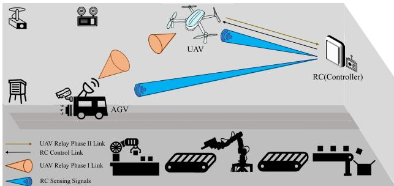

Fig. 1. UAV-assisted integrated system of sensing, communication, and position control.  
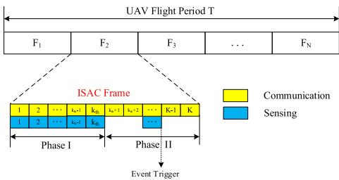  
Fig. 2. Two-phase transmission in an ISAC frame.

## A. Communication Channel

The alignment of communication beams plays a crucial role in enhancing the transmission rate. In the subsequent section, the channel model is presented, with a specific focus on misalignment fading. Under this consideration, the wireless channel undergoes flat fading (i.e., it is LoS-dominant), incorporating path loss and misalignment fading, while the impact of multipath fading is neglected. $h _ { 1 , k }$ and $h _ { 2 , k }$ represent the AGV-to-UAV channel and the UAV-to-RC channel respectively, which are given by

$$
h _ { 1 , k } = h _ { p , k } h _ { m , k } ,\tag{2}
$$

$$
h _ { 2 , k } = h _ { p , k } h _ { a , k } ,\tag{3}
$$

where $h _ { p , k }$ is the path loss at the k-th moment, and $h _ { m , \astrosun }$ k and $h _ { a , k }$ are the misalignment fading of Phase I and Phase II, respectively.

1) Path Loss: The path loss could be described with the free-space propagation model, which is expressed as

$$
h _ { p , k } = { \frac { \sqrt { G _ { t } G _ { r } } \lambda } { 4 \pi d _ { k } } } ,\tag{4}
$$

where $G _ { t }$ and $G _ { r }$ are the gain of transmission and reception, respectively. $\begin{array} { r } { \lambda ~ = ~ \frac { f } { c } } \end{array}$ is the signal wavelength, where c is the speed of light, f is the occupied frequency band. $d _ { k } = \sqrt { \left( g _ { x 2 , k } - g _ { x 0 , k } \right) ^ { 2 } + \left( g _ { y 2 , k } - g _ { y 0 , k } \right) ^ { 2 } + \left( g _ { z 2 , k } - g _ { z 0 , k } \right) ^ { 2 } }$ is the distance between UAV and RC at the k-th moment, where $g _ { x , k } , g _ { y , k } , g _ { z , k }$ expresses the x-axis, y-axis, and z-axis coordinate values at the k-th moment, respectively. Moreover, $g _ { z 2 , k }$ is the flight altitude of UAV at the k-th moment.

2) Misalignment Fading: It is assumed that the radius of area covered by AGV and UAV is R and r at distance $d _ { s } .$ respectively. Additionally, $l _ { k }$ denotes the misalignment error between the beam center of AGV $( O _ { A G V } )$ and the beam center of UAV $( O _ { U A V } )$ at the k-th moment. Fig. 3 shows the three situations of misalignment errors based on $l _ { k }$ versus R. According to the result proposed by [39], the misalignment fading of Phase I is expressed as

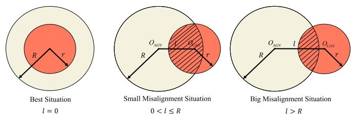  
Fig. 3. Misalignment error l and three situations in Phase I.

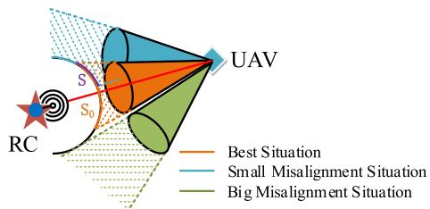  
Fig. 4. Misalignment error and three situations in Phase II.

$$
h _ { m , k } = P _ { 0 } e ^ { - \frac { 2 l _ { k } ^ { 2 } } { R _ { e } ^ { 2 } } } ,\tag{5}
$$

which shows that misalignment fading is the received power at UAV in the area $S$ with distance $d _ { s } , R _ { e }$ is the equivalent beamwidth, and $^ { e _ { \theta , k } }$ is the error of the horn antenna. Therefore, the misalignment errors in Phase I considers only in the tangent plane direction of the optimal direction, i.e., $l _ { k } = { < } \cdot t a n ( e _ { \theta , k } )$ where ς is misalignment error factor. When $l _ { k } ~ = ~ 0$ , the received power is represented by

$$
P _ { 0 } = e r f ( \epsilon ) ^ { 2 } ,\tag{6}
$$

where $e r f ( \cdot )$ is Gauss error function and $= ( \sqrt { \pi } r ) / ( \sqrt { 2 } R _ { m } )$ [40]. Then, $R _ { e }$ could be expressed as

$$
R _ { e } ^ { 2 } = R _ { m } ^ { 2 } \frac { \sqrt { \pi } e r f ( \epsilon ) } { 2 \epsilon e ^ { - \epsilon ^ { 2 } } } ,\tag{7}
$$

where $R _ { m }$ is the maximum radius of the beam at distance $d _ { s } .$ As mentioned before, RC employs an omnidirectional antenna, thus the alignment of UAV’s horn antenna is determined by the projected area of UAV’s horn antenna beam onto the omnidirectional antenna beam of RC [41], as shown in Fig. 4. The misalignment fading $h _ { a , k }$ in Phase II can be expressed as

$$
h _ { a , k } = \frac { P _ { 0 } S _ { k } } { S _ { 0 } } e ^ { - \frac { 2 L _ { k } ^ { 2 } } { R _ { e } ^ { 2 } } } ,\tag{8}
$$

where $S _ { 0 } = 2 \pi r _ { 0 } ^ { 2 } ( 1 - \cos ( \theta _ { 0 } ) )$ is the projected area in the best situation, and $S _ { k } = 2 \pi r _ { 0 } ^ { 2 } ( 1 - \cos ( \theta _ { 0 } - e _ { \theta , k } ) )$ is the projected area of UAV’s beam on RC’s beam, where $r _ { 0 } = \sqrt { r ^ { 2 } + { d _ { s } } ^ { 2 } }$ is the UAV’s beam radius and $\theta _ { 0 } = 2 \arctan ( r / d _ { s } )$ is the UAV’s beam angule. Then, the misalignment error $L _ { k }$ at the k-th moment can be given by

$$
L _ { k } = { \varsigma \cdot \tan ( e _ { \theta , k } ) } .\tag{9}
$$

Note that the appropriate position for UAV is the position where the beam is perfectly aligned, in which UAV could be in the best situations.

## B. Sensing Channel

RC senses the position of AGV and UAV by transmitting sensing signals with ULA. According to [42], the sensing channel of UAV at the k-th moment is expressed as

$$
\mathbf { h } _ { s , k } = \sqrt { \frac { \beta } { g _ { z 2 , k } ^ { 2 } + \| \mathbf { Z } _ { 2 , \mathbf { k } } - \mathbf { Z } _ { 0 , \mathbf { k } } \| } } \mathbf { a } ( \varphi _ { 2 , k } ) ,\tag{10}
$$

where $\beta$ is channel gain at a distance of 1m from RC to AGV or UAV. The position of RC and UAV at the k-th moment is respectively expressed as $\mathbf { G } _ { 0 , k } ( \mathbf { Z _ { 0 , k } } , g _ { z 0 , k } )$ and $\mathbf { G } _ { 2 , k } ( \mathbf { Z _ { 2 , k } } , g _ { z 2 , k } )$ where $\mathbf { Z _ { 0 , k } } ( g _ { x 0 , k } , g _ { y 0 , k } )$ and $\mathbf { Z _ { 2 , k } } ( g _ { x 2 , k } , g _ { y 2 , k } )$

## C. UAV Position Control

The discrete-time control model of UAV is given by

$$
\mathbf { x } _ { k + 1 } = \mathbf { A } _ { d } \mathbf { x } _ { k } + \mathbf { B } _ { d } u _ { k } + \mathbf { w } _ { k } ^ { \mathrm { o } } ,\tag{11}
$$

where $\mathbf { A } _ { d }$ is the state transition matrix, $\mathbf { B } _ { d }$ is the control input matrix, u<sub>k</sub> is the control input, and $\mathbf { w } _ { k } ^ { \mathrm { o } }$ is the perturbation caused by additive gaussian white noise with zero mean and variance $W _ { 0 } .$ . The state information of UAV at the controller can be expressed as

$$
\begin{array} { r } { \mathbf { y } _ { k } = \left\{ \begin{array} { l l } { \mathbf { x } _ { k } , } & { \mathrm { w h e n ~ } \delta _ { k } = 1 , } \\ { \varnothing , } & { \mathrm { w h e n ~ } \delta _ { k } = 0 , } \end{array} \right. } \end{array}\tag{12}
$$

where $\delta _ { k } = ( 1 - \psi _ { k } ) \delta _ { k } ^ { \prime } + \psi _ { k }$ is the sensing activation factor in an ISAC frame, and $\delta _ { k } ^ { \prime }$ is the sensing activation factor in Phase II. $\delta _ { k } = 1$ denotes the activation of sensing, indicating that the embedded controller knows the sensing information at RC, and $\delta _ { k } = 0$ denotes the absence of sensing activation, implying that the controller lacks knowledge of the current state of UAV. According to Eq. (11), the controller can calculate the control input as

$$
u _ { k } = \mathbf { K } _ { u } \mathbf { y } _ { k } ,\tag{13}
$$

where $\begin{array} { r l r } { { \bf K } _ { u } } & { { } = } & { { \bf R } _ { c } ^ { - 1 } { \bf B } _ { d } ^ { \mathrm { T } } { \bf P } _ { k } } \end{array}$ is the control gain, where $\mathbf { P } _ { k }$ can be solved by Ricatti equation ${ \bf B } _ { d } ^ { \mathrm { T } } { \bf P } _ { k } + { \bf P } _ { k } { \bf A } _ { d } -$ ${ \bf P } _ { k } { \bf B } _ { d } { \bf R } _ { c } ^ { - 1 } { \bf B } _ { d } ^ { \mathrm { T } } { \bf P } _ { k } + { \bf Q } _ { k } = - { \bf Q } _ { k - 1 }$ and the detail can be found in [43]. R is the control cost of $u _ { k }$ . The control gain K in Phase I and II, follows the same rule with different parameters $\mathbf { R } _ { c }$

Furthermore, according to [44], for a rotorcraft UAV with speed $\begin{array} { r } { Z _ { k } \ = \ \frac { | \mathbf { G } _ { 1 , k } - \mathbf { G } _ { 1 , k - 1 } | } { \Lambda } } \end{array}$ , where $\mathbf { G } _ { 1 , k } ( \mathbf { Z _ { 1 , k } } , g _ { z 1 , k } )$ is the position of AGV, where $\mathbf { Z _ { 1 , k } } ( g _ { x 1 , k } , g _ { y 1 , k } )$ . Moreover, the UAV’s position control introduces additional propulsion power consumption, which is specifically modeled as

$$
P _ { f , k } ( Z _ { k } ) = P _ { b } \left( 1 + \frac { 3 Z _ { k } ^ { 2 } } { U _ { \mathrm { t i p } } ^ { 2 } } \right) + \frac { P _ { i } v _ { o } } { Z _ { k } } + \frac { 1 } { 2 } d _ { o } \rho s w _ { o } Z _ { k } ^ { 3 } ,\tag{14}
$$

where $U _ { \mathrm { t i p } }$ is the rotor blade tip speed, $v _ { o }$ is the average rotor induced speed, $d _ { o }$ is the body drag ratio, $P _ { b }$ and $P _ { i }$ are respectively the blade profile power and induced power, $\rho ,$ s and $w _ { o }$ are the air density, rotor solidity and blade angular velocity, respectively.

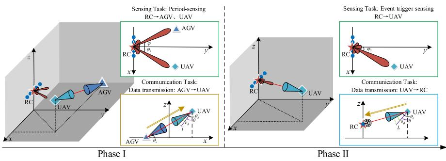  
Fig. 5. Schematic diagram of the phased communication and sensing tasks in 3D and 2D angles.

## D. UAV Antenna-Angle Control

The UAV’s antenna-angle control can be quickly adjusted to ensure beam alignment with less power consumption. The direction of the horn antenna on UAV is characterized by the pitch angle θ and azimuth angle φ. Considering that the antenna angle of AGV is fixed, UAV moves along the intersection line between its trajectory and the optimal angle plane. To simplify the position control model and reduce complexity, it is assumed that the azimuth angle remains constant, and horizontal disturbances are neglected. The angle at which the horn antenna points towards AGV at the k-th moment can be calculated as $\theta _ { d , k }$ , where

$$
\theta _ { d , k } = \tan ^ { - 1 } \left( \frac { g _ { z 1 , k } - g _ { z 2 , k } } { \sqrt { \left( g _ { x 1 , k } - g _ { x 2 , k } \right) ^ { 2 } + \left( g _ { y 1 , k } - g _ { y 2 , k } \right) ^ { 2 } } } \right) .\tag{15}
$$

Then, the error of horn antenna direction at the k-th moment is

$$
e _ { \theta , k } = \theta _ { k } - \theta _ { d , k } ,\tag{16}
$$

where $\theta _ { k }$ is antenna direction angle of UAV at the k-th moment, which can be obtained through UAV’s built-in sensor. The control output at the k-th moment can be expressed as

$$
q _ { k } = K _ { a } \vartheta _ { k } ,\tag{17}
$$

where $K _ { a }$ is the control gain. UAV antenna-angle information can be expressed as

$$
\vartheta _ { k } = \left\{ \begin{array} { l l } { \theta _ { k } , } & { \mathrm { w h e n ~ } \delta _ { k } = 1 , } \\ { \varnothing , } & { \mathrm { w h e n ~ } \delta _ { k } = 0 . } \end{array} \right.\tag{18}
$$

The discrete-time control model for horn antenna angle of UAV is

$$
\theta _ { k + 1 } = A _ { a } \theta _ { k } + B _ { a } q _ { k } + w _ { k } ,\tag{19}
$$

where $A _ { a }$ and $B _ { a }$ are system parameter matrix, $w _ { k }$ is disturbance.

## III. INTEGRATION OF SENSING, COMMUNICATION, AND CONTROL

The integration communication, sensing, and position control of UAV are elaborated in this section. The communication task in Phase I and Phase II is respectively the data transmission from AGV to UAV and data transmission from UAV to RC. RC performs the sensing tasks in a hybrid sensing pattern. In Phase I, RC senses the positions of AGV and UAV in a period pattern, and in Phase II, RC senses the position of UAV in an event-triggered pattern, as shown in Fig. 5. As the remote center is employed on the building at a certain height, it is assumed that the LoS sensing channels from the RC to AGV and UAV. The whole process of sensing and communication include two phases. Firstly, this work introduces the communication and sensing in Phase I in the subsection III-A. Secondly, the communication and sensing in Phase II is introduced in subsection III-B. Finally, the phased integration problem of sensing, communication, and control is formulated in subsection.C.

## A. Communication and Sensing in Phase I

In this subsection, the received signal of UAV and the achievable transmission rate are introduced at first. Then, the sensing performance and sensing power consumption are described.

1) Communication Process in Phase I: In Phase I, AGV and UAV participate in data transmission. Simultaneously, the sensing function of RC is activated, and the control link between RC and UAV is initiated.

For the commuincation in Phase I, the signal received by UAV at the k-th moment can be expressed as

$$
y _ { u , k } = h _ { 1 , k } s _ { a } + \mathbf { h } _ { s , k } ^ { \mathrm { H } } \mathbf { x } + \omega _ { k } ,\tag{20}
$$

where $s _ { a } ~ \in ~ \mathbb { C }$ is the communication signal from AGV, $\mathbf { x } \in \mathbb { C } ^ { N \times 1 }$ is the sensing signal from RC, $h _ { 1 , k } \in \mathbb { C }$ is the LoSdominant fading wireless channel between AGV and UAV at the k-th moment, $\mathbf { h } _ { s , k } \in \mathbb { C } ^ { N \times 1 }$ is RC sensing channel between RC and UAV at the k-th moment, and $\omega _ { k } \in \mathbb { C }$ is additive noise with zero-mean and variance $N _ { 0 } , \mathrm { i . e . , } \omega _ { k } \sim \mathcal { C N } ( 0 , N _ { 0 } )$ Moreover, the successive interference cancellation (SIC) technology is employed to achieve the simultaneous transmission of sensing signals and communication signals on the same channel. Then, the achievable transmission rate from AGV to UAV at the k-th moment in Phase I can be expressed as

$$
R _ { \mathrm { R } , k } = \left\{ \begin{array} { l l } { \displaystyle \log _ { 2 } \left( 1 + \frac { | h _ { 1 , k } | ^ { 2 } P _ { c , k } } { N _ { 0 } } \right) , } & { \mathrm { i f ~ } 0 < | h _ { 1 , k } | ^ { 2 } P _ { c , k } \leq P _ { s , k } , } \\ { \displaystyle \log _ { 2 } \left( 1 + \frac { | h _ { 1 , k } | ^ { 2 } P _ { c , k } } { P _ { s , k } + N _ { 0 } } \right) , } & { \mathrm { o t h e r w i s e } , } \end{array} \right.\tag{21}
$$

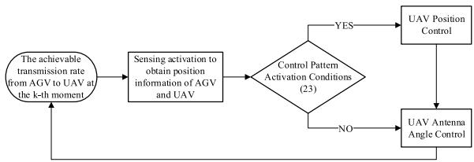  
Fig. 6. Sensing and control period pattern in Phase I.

where $P _ { c , k }$ is the transmit power of communication, $P _ { s , k }$ is the receive power of sensing. If the SIC condition is satisfied, the interference from the sensing signal to the communication signal could be eliminated. Otherwise, the sensing signal could be regarded as an interference for the achievable transmission rate.

2) Sensing Process in Phase I: For the sensing in Phase I, RC acquires the position information of UAV and AGV, based on which the misalignment error l is calculated. As both the AGV and UAV are mobile, the sensing targets in the first stage are the AGV and UAV, and then the periodic sensing pattern is considered to ensure the sensing accuracy. Then, the position control of UAV is performed based on the sensing results. The activation conditions for the control mode are expressed by

$$
\varepsilon _ { k } = { \left\{ \begin{array} { l l } { 1 , } & { { \mathrm { i f ~ } } l _ { k } > R , } \\ { 0 , } & { { \mathrm { i f ~ } } l _ { k } \leq R . } \end{array} \right. }\tag{22}
$$

Subsequently, based on the activation conditions of control mode, either both the UAV position control and antenna-angle control is implemented, or only the antenna-angle control is implemented, as shown in Fig. 6.

The covariance matrix is used to evaluate the sensing performance. According to [45], the covariance matrix is expressed as

$$
\mathbf { R } _ { w , k } = \sum _ { i = 1 } ^ { M } \mathbf { w } _ { i , k } \mathbf { w } _ { i , k } ^ { \mathrm { H } } ,\tag{23}
$$

where $\mathbf { w } _ { m , k }$ is the transmitting beamformer of the sensing signal. Then, the transmit power of sensing signal at RC is

$$
P _ { t , k } = \mathrm { T r } ( { \bf R } _ { w , k } ) .\tag{24}
$$

The sensing beampattern in the direction $\varphi _ { m , k }$ is given by

$$
H _ { 1 } ( \varphi _ { m , k } ) = \mathbf { a } ^ { \mathrm { H } } ( \varphi _ { m , k } ) \mathbf { R } _ { w , k } \mathbf { a } ( \varphi _ { m , k } ) , m \in M ,\tag{25}
$$

where $\mathbf { a } ( \varphi _ { m , k } ) = \left[ 1 , e ^ { j \frac { 2 \pi } { \lambda } d \sin ( \varphi _ { m , k } ) } , \dots , e ^ { j \frac { 2 \pi } { \lambda } d ( N - 1 ) \sin ( \varphi _ { m , k } ) } \right] ^ { \prime }$ T is the steering vector. $\begin{array} { r } { \varphi _ { m , k } = \arcsin { \frac { g _ { x m , k } } { \sqrt { g _ { x m , k } ^ { 2 } + g _ { y m , k } ^ { 2 } } } } , m \in \bar { M } } \end{array}$ is the horizontal angle relative to RC, which is related to the positions of AGV and UAV.

In practical scenarios, the design of the desired sensing beampattern is tailored to meet specific sensing requirements. If the sensing system lacks information about the target and operates in detecting mode, an isotropic beampattern is preferred, where power is uniformly distributed among all directions [46]. However, when the sensing system possesses prior information about targets and operates in tracking mode, the beampattern is anticipated to exhibit dominant peaks in the target directions. Due to the acquisition of priori information about AGV and UAV, RC adopts a tracking mode. Consequently, the power of RC sensing UAV at the k-th moment can be expressed as

$$
\begin{array} { r } { P _ { s , k } = \left| \mathbf { h } _ { s , k } ^ { \mathrm { H } } \mathbf { w } _ { 2 , k } \right| ^ { 2 } = \left| \mathbf { h } _ { s , k } ^ { \mathrm { H } } \mathbf { W } _ { 2 , k } \mathbf { h } _ { s , k } \right| . } \end{array}\tag{26}
$$

According to [47], the mean square error (MSE) is regarded as a beampattern approximation index to evaluate the sensing perference, where the MSE of RC beampattern approximation is defined as $\mathrm { M S E } ( \mathbf { R } ) = \sum _ { m = 1 } ^ { M } \left| P _ { d } ( \varphi _ { m } ) - \mathbf { a } ^ { \mathrm { H } } ( \varphi _ { m } ) \mathbf { R } \mathbf { a } ( \varphi _ { m } ) \right| ^ { 2 } .$ where $P _ { d }$ is the minimum mean square error compared to basic beamforming. According to [48], the beampattern in the target direction can archieve high accuracy sensing when it meets the MSE requirement with the desired beamforming.

## B. Communication and Sensing in Phase II

In this subsection, the received signal at the remote center and the achievable transmission rate are introduced at first. Then, the event-trigger sensing and UAV’s position control are described. Finally, the activation conditions of sensing and control in Phase II are introduced.

1) Communication Process in Phase II: For the communication in Phase II, UAV would forward the data to RC. The signal received at RC can be expressed as

$$
y _ { a , k } = h _ { 2 , k } s _ { u } + \delta _ { k } ^ { \prime } \mathbf { h } _ { s , k } ^ { \mathrm { H } } \mathbf { x } _ { e } + \omega _ { k } ,\tag{27}
$$

where $s _ { u } ~ \in ~ \mathbb { C }$ is the communication signal sent by UAV, $h _ { 2 , k } \in \mathbb { C }$ is the LoS-dominant fading wireless channel between UAV and RC at the k-th moment, $\mathbf { x } _ { e } ~ \in ~ \mathbb { C } ^ { N \times 1 }$ is the echo signal of the sensing signal sent by RC. In general, the echo interference from the RC sensing signal is very small and could be treated as noise [49]. In this case, the achievable transmission rate from UAV to RC at the k-th moment in Phase II can be expressed as

$$
R _ { \mathrm { T } , \mathbf { k } } = \log _ { 2 } \left( 1 + \frac { \left| h _ { 2 , k } \right| ^ { 2 } P _ { u , k } } { N _ { 0 } } \right) ,\tag{28}
$$

where $P _ { u , k }$ is the UAV’s transmit power of communication.

2) Sensing Process in Phase II: For the sensing in Phase II, RC communication function is consistently active to receive data from UAV. The scheduling of sensing function is executed on demand. Thus, the event-triggered sensing pattern is considered to reduce the sensing cost with the overall performance guarantee. For the event-triggered sensing pattern, the remote center (i.e., the receiver) evaluates whether the triggering condition is satisfied and decides whether to activate the sensing function based on the achievable data rate. The data rate serves as the triggering criterion since it directly indicates the wireless channel quality. Thus, the trigger event relies on the feedback from the receiver, which can reduce computational complexity and enhance situation-awareness ability. In this approach, the remote center performs the state estimation of UAV’s position. The estimated state can be expressed as

$$
\hat { x } _ { k + 1 | k } = \mathbf { A } _ { d } \hat { x } _ { k | k } + \mathbf { B } _ { d } u _ { k } .\tag{29}
$$

The actual state of UAV is sensed by RC when the estimate in Eq. (29) cannot maintain the control performance and

guarantee the communication requirements. Then the state estimation at k-th moment is obtained as

$$
\hat { x } _ { k | k } = \left\{ \begin{array} { l l } { x _ { k } , } & { \mathrm { w h e n ~ } \delta _ { k } ^ { \prime } = 1 , } \\ { \hat { x } _ { k | k - 1 } , } & { \mathrm { w h e n ~ } \delta _ { k } ^ { \prime } = 0 . } \end{array} \right.\tag{30}
$$

The covariance matrix in Phase II is given by

$$
\mathbf { R } _ { v , k } = \mathbf { v } _ { k } \mathbf { v } _ { k } ^ { \mathrm { H } } ,\tag{31}
$$

where $\mathbf { v } _ { k }$ is the transmitting beamformer of sensing signal. Then, the transmit power of sensing signal in Phase II is

$$
\begin{array} { r } { P _ { v , k } = \mathrm { T r } ( \mathbf { R } _ { v , k } ) . } \end{array}\tag{32}
$$

The sensing beampattern in the direction $\varphi _ { 2 , k }$ is given by

$$
H _ { 2 } ( \varphi _ { 2 , k } ) = \mathbf { a } ^ { \mathrm { H } } ( \varphi _ { 2 , k } ) \mathbf { R } _ { v , k } \mathbf { a } ( \varphi _ { 2 , k } ) .\tag{33}
$$

3) The Activation Conditions of Sensing and Control in Phase II: For the sake of simplicity, this work assumes that UAV hovers in the horizontal plane. Combining the actual control updates in Eq. (11) and the estimated states in Eq. (29), the error between the actual and state estimates of UAV on the controller can be given by

$$
e _ { k + 1 } = x _ { k + 1 } - { \hat { x } } _ { k + 1 | k } .\tag{34}
$$

According to [50], similar to signal-to-noise ratio in communication, the work adopts the concept of state to noise ratio, i.e., $\begin{array} { r } { \gamma _ { k + 1 } = \frac { \left| \widehat { x } _ { k + 1 | k } \right| ^ { 2 } } { L ^ { 2 } } } \end{array}$ , and then derives the relationship between the sensing-control activation threshold $p _ { t r }$ and the state-to-noise ratio threshold, i.e., $\begin{array} { r } { p _ { t r } = \exp { \left( - \frac { | \widehat { x } _ { k + 1 | k } | ^ { 2 } } { \gamma _ { k + 1 } ^ { t h } } \right) } } \end{array}$ . An excessively high activation probability will trigger the sensing functions more frequently, increasing energy consumption. However, an excessively low probability will fail to ensure the beam alignment, deteriorating the wireless channel quality and reducing the transmission rate. Thus, a threshold for the transmission rate of sensing activation is obtained

$$
R _ { k } ^ { \mathrm { t h } } = \log _ { 2 } \left( 1 + \frac { | h _ { p , k } | ^ { 2 } | h _ { f , k } | ^ { 2 } P _ { u , k } } { N _ { 0 } } \cdot | P _ { 0 } \cdot e ^ { \frac { 2 \ln ( p _ { t r } ) } { R _ { e } ^ { 2 } } } | ^ { 2 } \right)\tag{35}
$$

Then, RC evaluates whether the triggering condition is satisfied and decides whether to activate the sensing function based on the achievable data rate. The triggering condition of sensing function is expressed as

$$
\delta _ { k } ^ { \prime } = \left\{ { \begin{array} { l l } { 1 , } & { { \mathrm { i f ~ } } R _ { \mathrm { T , k } } < R _ { k } ^ { \mathrm { t h } } , } \\ { 0 , } & { { \mathrm { i f ~ } } R _ { \mathrm { T , k } } \geq R _ { k } ^ { \mathrm { t h } } . } \end{array} } \right.\tag{36}
$$

The event-triggered sensing mode is sensitive to both the achievable transmission rate in Phase II and the activation threshold. In particular, a larger activation threshold provide a higher requirement for the wireless data transmission, which in turn is determined by the UAV’s transmit power. Thus, the event-triggered sensing will be more sensitive to the design of UAV’s transmit power when the activation threshold is larger. Moreover, the event-triggered activation threshold is affected by the activation probability, which in turn is determined by the state-to-noise ratio threshold. In this way, it can be inferred that a higher requirement of sensing quality will lead to a larger threshold of state-to-noise ratio, and then a higher activation probability. Thus, the event-triggered sensing is sensitive to the required sensing quality.

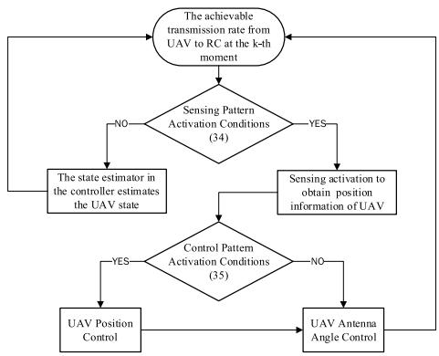  
Fig. 7. Sensing and control event-trigger pattern based on the achievable transmission rate at RC in Phase II.

The control activation approach is judged based on UAV beam projection area, which is expressed as

$$
\varepsilon _ { k } = \left\{ \begin{array} { l l } { { 1 , } } & { { \mathrm { i f } \ S _ { k } = 0 , } } \\ { { 0 , } } & { { \mathrm { i f } \ 0 < S _ { k } \leq S _ { 0 } . } } \end{array} \right.\tag{37}
$$

The detailed activation process of sensing and control is shown as Fig. 7. Firstly, the achievable transmission rate from UAV to RC at the k-th moment is calculated at RC. Based on the event-triggered pattern, it is determined whether the sensing activation or UAV state is estimated by the estimator. Then, if sensing is activated, based on the activation conditions of control mode, either both the UAV position control and antenna-angle control is implemented, or only the antennaangle control is implemented.

## C. Problem Formulation

This work employs the sensing results to control the antenna angle and the UAV’s position to enhance the channel state condition, and then improve the transmission rate of sensory data from AGV to the remote center with low energy consumption. Therefore, the objective function is formulated as the ratio of sum data rate to power consumption, which is generally regarded as the energy efficiency and could balance the performance and cost. Moreover, to prevent the data transmission volumes of the two phases from causing a bottleneck in the final transmission, a reasonable allocation between the two phases will directly impact the system’s communication capacity. The optimization variables of $P _ { 0 }$ includes the transmit power $( \boldsymbol { P _ { c , k } }$ and $P _ { u , k } ) _ { : }$ , the beamforming vector $( \mathbf { w } _ { m , k }$ and $\mathbf { v } _ { k } ) .$ and the phased division point for Phase I and Phase II $\left( k _ { t h } \right)$ . As the achievable data volume between AGV and AP depends on the minimum of data volumes in Phase I and Phase II, the value of division point $k _ { t h }$ affects the achievable data volume (i.e., the numerator of the objective function). Moreover, a larger $k _ { t h }$ will increase the data volume in Phase I, but decrease the data volume in Phase II. Thus, it is necessary to optimize the value of the division point $k _ { t h }$ to balance the data volumes in Phase I and Phase II. Both the transmitting beamformer of sensing signal $\mathbf { w } _ { m , k }$ and the transmit power of communication signal $P _ { c , k }$ are the essential parameters in Phase I, which determines the sensing accuracy and the transmission rate in Phase I, respectively. Similarly, both the transmitting beamformer of sensing signal $\mathbf { v } _ { k }$ and the transmit power of communication signal $P _ { u , k }$ are the essential parameters in Phase II, which determines the sensing accuracy and the transmission rate in Phase II, respectively. Based on the above discussion, the constrained energy efficiency maximization problem is formulated as

$$
\begin{array} { r l } & { \frac { \sum _ { k = \lfloor k \rfloor } ^ { K } \bar { F } _ { i , k } } { 2 } , \qquad \quad } \\ & { \mathrm { s u s } _ { i , k \neq i } , \qquad \quad } \\ & { \mathrm { s u s } _ { i , k \neq i } , \qquad \quad } \\ & { \mathrm { e q u s } _ { i , k \neq i } , \qquad \quad } \\ & { \mathrm { e q u s } _ { i , k \neq i } , \qquad \quad } \\ & { \mathrm { C p } _ { i , k \neq i } , \qquad \mathrm { B i } _ { i , k \neq i } , \qquad \mathrm { B i } _ { i , k \neq i } , \qquad \mathrm { B i } _ { i , k \neq i } , } \\ & { \mathrm { C p } _ { i , k \neq i } , \qquad \mathrm { B i } _ { i , k \neq i } , \qquad \mathrm { B i } _ { i , k \neq i } , \qquad \mathrm { B i } _ { i , k \neq i } , } \\ & { \mathrm { C p } _ { i , k \neq i } , \qquad \mathrm { C p } _ { i , k \neq i } , \qquad \mathrm { B i } _ { i , k \neq i } , \qquad \mathrm { B i } _ { i , k \neq i } , } \\ & { \mathrm { C p } _ { i , k \neq i } , \qquad \mathrm { C p } _ { i , k \neq i } , \qquad \mathrm { B i } _ { i , k \neq i } , \qquad \mathrm { B i } _ { i , k \neq i } , } \\ & { \mathrm { C p } _ { i , k \neq i } , \qquad \mathrm { C p } _ { i , k \neq i } , \qquad \mathrm { B i } _ { i , k \neq i } , \qquad \mathrm { B i } _ { i , k \neq i } , } \\ & { \mathrm { C p } _ { i , k \neq i } , \qquad \mathrm { C p } _ { i , k \neq i } , \qquad \mathrm { B i } _ { i , k \neq i } , \qquad \mathrm { B i } _ { i , k \neq i } , } \\ & { \mathrm { C p } _ { i , k \neq i } , \qquad \mathrm { B i } _ { i , k \neq i } , \qquad \mathrm { B i } _ { i , k \neq i } , } \\ & { \mathrm { C p } _ { i , k \neq i } , \qquad \mathrm { B i } _ { i , k \neq i } , \qquad \mathrm { B i } _ { i , k \neq i } , } \\ &  \mathrm { C p } _ { i , k \neq i } , \qquad \mathrm { B i } _  i , k \neq i \end{array}
$$

where $P ^ { \mathrm { t o t } } = \sum _ { k = 1 } ^ { K } [ \psi _ { k } ( P _ { c , k } + P _ { t , k } ) + ( 1 - \psi _ { k } ) ( P _ { u , k } + { \delta ^ { \prime } } _ { k } P _ { v , k } ) +$ $\varepsilon _ { k } P _ { f , k } ]$ . In addition, C1 and C2 denote RC sensing accuracy constraints corresponding to phase I and phase II. C3 and C4 denote the maximum transmit power of beamforming constraint, where $P _ { l }$ denotes the sensing power budget. C5 is the constraint of the SIC conditions in Phase I. C6 is the constraint of the transmit power of communication in Phase II. C7 is the upper limit of the data volume transmitted in Phase II. C8 denotes the integer constraint on the phased division point. C9 denotes the 0-1 constraint on the sensing and control activation factors.

Note that $\mathcal { P } _ { 0 }$ is a mixed-integer nonlinear programming (MINLP) problem, since it includes the integer variable $k _ { t h }$ and continuous transmit beamformer of the sensing signal variable $\mathbf { w } _ { m , k } , \mathbf { v } _ { k }$ and the transmit power of AGV and UAV $P _ { c , k } , P _ { u , k } .$ The nonlinear objective function cannot be expressed explicitly with decision variables. Thus, it is intractable to solve $\mathcal { P } _ { 0 }$ directly so that the effective decomposition and iterative methods are employed to solve $\mathcal { P } _ { 0 }$

## IV. JOINT BEAMFORMING AND POWER ALLOCATION VIA CONVEX APPROXIMATION AND PROBLEM DECOMPOSITION

In this section, the original problem is decomposed into two subproblems. One is the beamforming and power allocation subproblem in Phase I, and the other is phased division point, beamforming and power allocation subproblem in Phase II. Then, the Golden-section search-based Dinkelbach algorithm and Penalty-based SCA algorithm are proposed to solve the non-convex subproblem in Phase I due to the fractional objective function and rank-one constraints. Moreover, based on quadratic transform, joint RC beamforming and UAV communication power design is proposed to solve the subproblem in Phase II.

## A. Problem Decomposition

The quadratic form of covariance matrix and the fractional form of objective function make it challenging to solve $\mathcal { P } _ { 0 }$ efficiently. Moreover, it can be seen that the beamforming vectors change with UAV and AGV positions and influence communication and sensing power. Therefore, to effectively solve the non-convex problem, it is decomposed into two subproblems based on two phases of relay transmission. Specifically, at the k-th moment, the beamforming and power allocation subproblem in Phase I is expressed as

$$
\begin{array} { r l r } {  { \mathcal { S P } _ { 1 } : \operatorname* { m a x } _ { P _ { c , k } , \mathbf { w } _ { m , k } } \frac { R _ { \mathrm { R , k } } } { P _ { c , k } + P _ { t , k } + \varepsilon _ { k } P _ { f , k } } } } \\ & { } & { \mathrm { s . t . ~ C 1 } , \mathrm { C 3 } , \mathrm { C 5 } , \mathrm { C 9 } . } \end{array}
$$

Thus, the phased division point, beamforming and power allocation subproblem in Phase II is expressed as

$$
\mathcal { S P } _ { 2 } : \operatorname* { m a x } _ { k _ { \mathrm { t h } } , P _ { u , k } , { \bf v } _ { k } } \frac { k = k _ { \mathrm { t h } } } { P ^ { \mathrm { t o t } } }
$$

## B. Solution to Problem $\mathcal { S P } _ { 1 }$

In this section, we propose the golden-section based Dinkelbach algorithm and penalty based SCA algorithm to solve the fractal non-convex subproblem $\mathcal { S P } _ { 1 }$ . As the numerator is a concave function on the communication transmit power of AGV, and the denominator is a convex function on the power. $\mathcal { S P } _ { 1 }$ can be converted into a concave maximization problem by utilizing Dinkelbach method [51], [52]. The transformed subproblem is given by

$$
\begin{array} { r l } & { \mathcal { S P } _ { \mathrm { 1 . 1 } } : \displaystyle \operatorname* { m a x } _ { P _ { c , k } , \mathbf { w } _ { m , k } } f ( \eta _ { k } ) = R _ { \mathrm { R , k } } - \eta _ { k } ( P _ { c , k } + P _ { t , k } + \varepsilon _ { k } P _ { f , k } ) } \\ & { \quad \quad \mathrm { s . t . ~ C 1 , C 3 , C 5 , C 9 , } } \end{array}
$$

where $\eta _ { k } = R _ { \mathrm { R , k } } / P _ { c , k } + P _ { t , k } + \varepsilon _ { k } P _ { f , k } .$

Remark 1: According to [51], the optimization problem $\mathcal { S P } _ { 1 . 1 }$ is equivalent to the optimization problem $\mathcal { S P } _ { 1 }$ if and only if $f ( \eta _ { k } ^ { * } ) = 0$ where $\eta _ { k } ^ { * }$ is the maximum $\eta _ { k }$

It means that if we find $\eta _ { k } ^ { \ast } , f ( \eta _ { k } ^ { \ast } ) = 0$ . Thus, the solution to the optimization problem $\mathcal { S P } _ { 1 }$ can be obtained by solving its equivalent problem $\mathcal { S P } _ { 1 . 1 }$

Then, let $\mathbf { W } _ { m , k } = \mathbf { w } _ { m , k } \mathbf { w } _ { m , k } ^ { \mathrm { H } } , \forall m \in \mathcal { M }$ , where $\mathbf { W } _ { m , k } \succeq _ { }$ 0 and rank $( \mathbf { W } _ { m , k } ) = 1$ . Then, $\mathcal { S P } _ { 1 . 1 }$ can be reformulated as

$$
\begin{array} { r l } & { \mathcal { S P } _ { 1 . 2 } : \underset { P _ { c , k } , \mathbf { W } _ { m , k } } { \mathrm { m a x } } f ( \eta _ { k } ) } \\ & { \mathrm { s . t . } ~ \mathrm { C 1 } , \mathrm { C 3 } , \mathrm { C 5 } , \mathrm { C 9 } , } \\ & { \qquad \mathrm { C 1 0 } : \mathbf { W } _ { m , k } \succeq 0 , \mathbf { W } _ { m , k } = \mathbf { W } _ { m , k } ^ { \mathrm { H } } , } \\ & { \qquad \forall m \in \mathcal { M } , } \\ & { \qquad \mathrm { C 1 1 } : \mathrm { r a n k } ( \mathbf { W } _ { m , k } ) = 1 . } \end{array}
$$

For this optimization problem, the primary non-convex constraint comes from the rank-one constraint, i.e., C11. A SDR approach could be used to deal with the rank-one constraint. Then, the general-rank solution obtained with SDR could be reconstructed as a rank-one solution by using the eigenvalue decomposition or Gaussian randomization method. This may lead to a large performance loss and can not guarantee the feasibility of reconstructed matrix. To deal with this issue, we convert the rank one constraint into a penalty term in the objective function and then solve the reformulated problem with SCA. According to [53], we introduce an equation constraint

$$
\| \mathbf { W } _ { m , k } \| _ { * } - \| \mathbf { W } _ { m , k } \| _ { 2 } = 0 , m \in \mathcal { M } ,\tag{38}
$$

where $\| \cdot \| _ { * }$ is the nuclear norm that is the sum of singular values of the matrix, and $\| \cdot \| _ { 2 }$ is the spectral norm, which is the largest singular value of the matrix. Thus, Eq. (38) will hold if $\mathbf { W } _ { m , k }$ is a rank-one matrix. Otherwise, the sum of singular values is larger than the largest singular value, $\mathrm { i . e . , }$ $\| \mathbf { W } _ { m , k } \| _ { * } - \| \mathbf { W } _ { m , k } \| _ { 2 } > 0$ , since $\mathbf { W } _ { m , k }$ is semidefinite. To obtain a rank-one matrix, we introduce a penalty term to the objective function based on Eq. (38), yielding that

$$
\begin{array} { r l } & { \displaystyle \mathcal { S P } _ { 1 . 3 } : \operatorname* { m a x } _ { P _ { c , k } , \mathbf { W } _ { m , k } } \quad f ( \boldsymbol { \eta } _ { k } ) - \frac { 1 } { \xi } \left( \| \mathbf { W } _ { m , k } \| _ { * } - \| \mathbf { W } _ { m , k } \| _ { 2 } \right) } \\ & { \quad \quad \quad \mathrm { s . t . ~ C l } , \mathrm { C 3 } , \mathrm { C 5 } , \mathrm { C 9 } , \mathrm { C l 0 } , } \\ & { \quad \quad \quad \quad \mathrm { C l 1 } : \mathbf { W } _ { m , k } \succeq 0 , \mathbf { W } _ { m , k } = \mathbf { W } _ { m , k } ^ { H } , } \\ & { \quad \quad \quad \quad \forall m \in \mathcal { M } , } \end{array}
$$

where $\xi$ is the penalty factor. The rank of $\mathbf { W } _ { m , k }$ is closer to 1 when $\xi$ tends to $0 , \mathrm { i . e . , } \frac { 1 } { \xi }$ tends $\mathbf { t o } \infty ,$ . In this case, the main non-convexity of $\mathcal { S P } _ { 1 . 3 }$ comes from the second term of the penalty term, whichcould be replaced with its upper bound replacement, i.e., its first-order Taylor expansion term at the $\mathbf { W } _ { m , k } ^ { n }$ point, which is given by

$$
\begin{array} { r l } & { - \| \mathbf { W } _ { m , k } \| _ { 2 } \leq \tilde { \mathbf { W } } _ { m , k } ^ { n } \triangleq - \| \mathbf { W } _ { m , k } ^ { n } \| _ { 2 } } \\ & { - \left. \mathrm { T r } \big [ \hat { \mathbf { w } } _ { \ast m a x , m , k } ^ { n } \big ( \hat { \mathbf { w } } _ { \ast m a x , m , k } ^ { n } \big ) ^ { H } \big ( \mathbf { W } _ { m , k } - \mathbf { W } _ { m , k } ^ { n } \big ) \right] , } \end{array}\tag{39}
$$

where $\hat { \mathbf { w } } _ { \mathrm { m a x } , m , k } ^ { n }$ is the eigenvector corresponding to the largest eigenvalue of $\mathbf { W } _ { m , k } ^ { n }$ . Thus, the problem $\mathcal { S P } _ { 1 . 3 }$ can be approximated by

$$
\begin{array} { r l r } {  { \mathcal { S P } _ { 1 . 4 } : \operatorname* { m a x } _ { P _ { c , k } , \mathbf { W } _ { m , k } } \ f ( \eta _ { k } ) - \frac { 1 } { \xi } ( \| \mathbf { W } _ { m , k } \| _ { * } + \| \tilde { \mathbf { W } } _ { m , k } ^ { n } \| _ { 2 } ) } } \\ & { } & { \mathrm { s . t . ~ C l } , \mathrm { C 3 } , \mathrm { C 5 } , \mathrm { C 9 } , \mathrm { C 1 0 } . } \end{array}
$$

The problem $\mathcal { S P } _ { 1 . 4 }$ is a quadratic semidefinite program (QSDP), which can be efficiently solved by the CVX toolbox [54] and the MOSEK solver [55]. As mentioned above, the $\xi$ value can only be closer to the rank-one constraint if the penalty term is sufficiently small. However, a problem will arise as the value of the objective function tends to be infinity. It cannot get a value that fits the rule, so a reduction factor  is proposed. By initialising a large value of  and then gradually reducing it to a sufficiently small value via $\xi = \epsilon \xi , 0 < \epsilon < 1$ the overall suboptimal solution is obtained. When the penalty term is small enough, i.e., $\| \mathbf { W } _ { m , k } \| _ { * } - \| \mathbf { W } _ { m , k } \| _ { 2 } \leq \varepsilon _ { 2 }$

```latex
Algorithm 1 Golden-Section Based Dinkelbach Algorithm on
Outer Iterative
1 Input: $\eta _ { l } , \eta _ { h } , \kappa , \varphi _ { m } , \mathcal { M } , \eta , \xi , \delta _ { k } , \varepsilon _ { k } , P _ { f , k } ;$
2 Output: $\eta _ { k } ^ { * }$ $\mathbf { W } _ { m , k } ^ { * } , P _ { c , k } ^ { * } ;$
3 Initialization: $\tau = ( \sqrt { 5 } - 1 ) / 2 , v _ { l } = \eta _ { h } - \tau ( \eta _ { h } - \eta _ { l } ) .$
$\upsilon _ { h } = \eta _ { l } + \tau ( \eta _ { h } - \eta _ { l } ) ;$
4 repeat
5 Solve $\mathcal { S P } _ { 1 . 4 }$ besed on $\eta _ { l }$ and $\eta _ { h }$ with Algorithm 2;
6 Calculate $f ( \eta _ { l } )$ and $f ( \eta _ { h } ) ;$
7 if $f ( \eta _ { l } ) \leq f ( \eta _ { h } )$ then
8 $f ( \eta _ { l } ) \longleftarrow f ( \eta _ { h } ) , \eta _ { l } \longleftarrow v _ { l } , v _ { l } \longleftarrow v _ { h } , v _ { h } \longleftarrow$
$\eta _ { l } + \tau ( \eta _ { h } - \eta _ { l } ) ;$
9 else
10 $\eta _ { h } \longleftarrow v _ { h } , v _ { h } \longleftarrow v _ { l } , v _ { l } \longleftarrow \eta _ { l } + ( 1 - \tau ) ( \eta _ { h } - \eta _ { l } ) ;$
11 end if
12 until $| \eta _ { h } - \eta _ { l } | \leq \kappa ;$
13 $\eta _ { k } ^ { * } \longleftarrow { ( \eta _ { h } + \eta _ { l } ) / 2 } ;$
14 Calculate $\mathbf { W } _ { m , k } ^ { * }$ and $P _ { c , k } ^ { * }$ by solving $\mathcal { S P } _ { 1 . 4 }$ besed on $\eta _ { k } ^ { * }$
with Algorithm 2.
```

Algorithm 2 Penalty-Based SCA Algorithm on Inner Iterative   
1 Input: $\varphi _ { m } , { \mathcal { M } } , \eta , \xi ;$   
2 Output: $\mathbf { W } _ { m , k } , P _ { c , k } ;$   
3 Initialization: feasible $\mathbf { W } _ { m , k } ^ { 0 } , \epsilon , \varepsilon _ { 1 } , \varepsilon _ { 2 } ;$   
4 repeat   
5 $n \longrightarrow 0$   
6 repeat   
7 Solve $\mathcal { S P } _ { 1 . 4 }$ according to $\mathbf { W } _ { m , k } ^ { n } ;$   
8 Update $\mathbf { W } _ { m , k } ^ { n + 1 }$ based on $\mathbf { W } _ { m , k } ^ { n } ;$   
9 $n \longleftarrow n + 1 ;$   
10 until $\begin{array} { r } { l = \frac { | f _ { n } - f _ { n - 1 } | } { f _ { n - 1 } } \le \varepsilon _ { 1 } } \end{array}$   
11 $\mathbf { W } _ { m , k } ^ { 0 } \longleftarrow \mathbf { W } _ { m , k } ^ { n ^ { \ast } } ;$   
12 $\xi  \epsilon \xi ;$   
13 until $\| \mathbf { W } _ { m , k } \| _ { * } - \| \mathbf { W } _ { m , k } \| _ { 2 } \leq \varepsilon _ { 2 } .$

Moreover, a two-layer iterative algorithm based on Dinkelbach-penalty-SCA is designed to solve the energy efficiency maximization problem. The overall solution process of $\mathcal { S P } _ { 1 . 4 }$ is summarised in Algorithm 1 and Algorithm 2. The outer iteration is the golden-section search-based Dinkelbach algorithm, which aims to find $\eta _ { k } ^ { * }$ from $[ 0 , \eta _ { k } ^ { \mathrm { u p } } ]$ , where $\eta _ { k } ^ { \mathrm { u p } }$ is an upper bound on $\eta _ { k }$ . For Algorithm 1, the Dinkelbach algorithm has capability to obtain the optimal solution of convex problems. The inner iteration employs a penalty-based successive convex approximation algorithm, which obtains a sub-optimal solution by analyzing the convergence of the penalty term and the objective function value. In this work, the initial values of $\mathbf { W } _ { m , k }$ and $P _ { c , k }$ are set as 0. Moreover, different initial value selections may affect the algorithm convergence speed, but will not affect the convergence value. The complexity of the Algorithm 1 is $\mathcal { O } ( \log ( \eta _ { h } / \kappa ) \log ( f ( \eta _ { h } ) / \kappa ) )$ , and the complexity of Algorithm 2 is $\mathcal { O } ( I _ { o } I _ { i } M ^ { 6 . 5 } N ^ { 6 . 5 } \log ( 1 / \epsilon ) )$ where $I _ { o }$ and $I _ { i }$ are the numbers of iterations in the outer and inner layers in Algorithm 2. Consequently, the complexity of the algorithm for solving $\mathcal { S P } _ { 1 . 4 }$ is $\mathcal { O } ( \log ( \bar { \eta _ { h } / \kappa } ) \log ( f ( \eta _ { h } ) / \kappa ) ( \bar { I } _ { o } I _ { i } M ^ { 6 . 5 } N ^ { 6 . 5 } \log ( 1 / \bar { \epsilon } ) ) )$

## C. Solution to Problem $\mathcal { S P } _ { 2 }$

In ${ \mathcal { S P } } _ { 2 } .$ , the integer variable $k _ { t h }$ makes it challenging to solve $\mathcal { S P } _ { 2 }$ directly. If the length of an ISAC frame is given, the selections of phased division point are finite, and a search algorithm can be employed to find out the best one. Therefore, in solving the $\mathcal { S P } _ { 2 }$ problem, we fix the value of $k _ { t h }$ for the problem. Moreover, in Phase II, the power consumption for Phase I has already been determined. Consequently, the formulation of the $\mathcal { S P } _ { 2 }$ problem can be rewritten as

$$
\begin{array} { r l } & { \mathcal { S P } _ { 2 . 1 } : \underset { P _ { u , k } , \mathbf { v } _ { k } } { \operatorname* { m a x } } \sum _ { k = k _ { \mathrm { t h } } } ^ { K } \frac { R _ { \mathrm { T } , \mathbf { k } } } { P _ { u , k } + \delta ^ { \prime } { _ k } \left( P _ { v , k } + \varepsilon _ { k } P _ { f , k } \right) } } \\ & { \quad \quad \mathrm { s . t . ~ C 2 } , \mathrm { C 4 } , \mathrm { C 6 - C 9 } . } \end{array}
$$

The optimization objective function of $\mathcal { S P } _ { 2 . 1 }$ has an expression of multiple-ratio fractional form, which makes it intractable. Motivated by the direct fractional form algorithm [56], the quadratic transform is applied to decouple the objective function as

$$
\begin{array} { l } { g ( P _ { u , k } , \mathbf { v } _ { k } , \chi _ { k } ) } \\ { = 2 \chi _ { k } \sqrt { R _ { \mathrm { T } , \mathrm { k } } } - { \chi _ { k } ^ { 2 } } ( P _ { u , k } + { \delta ^ { \prime } } _ { k } ( P _ { v , k } + \varepsilon _ { k } P _ { f , k } ) ) , } \end{array}\tag{40}
$$

where $\chi _ { k }$ is introduced as auxiliary variable and given by

$$
\chi _ { k } = \sqrt { R _ { \mathrm { T , k } } } / ( P _ { u , k } + \delta ^ { \prime } { } _ { k } ( P _ { v , k } + \varepsilon _ { k } P _ { f , k } ) ) .\tag{41}
$$

Then, the original problem $\mathcal { S P } _ { 2 . }$ <sub>1</sub> is equivalently transformed as

$$
\begin{array} { r l } & { \mathcal { S P } _ { 2 . 2 } : \underset { P _ { u , k } , { \mathbf { v } _ { k } } } { \operatorname* { m a x } } \ \underset { k = k _ { \mathrm { t h } } } { \sum } { g } ( P _ { u , k } , { \mathbf { v } _ { k } } , \chi _ { k } ) } \\ & { \quad \quad \mathrm { s . t . ~ C 2 } , \mathrm { C 4 } , \mathrm { C 6 - C 9 } . } \end{array}
$$

Remark 2: According to [56], the optimization problem $\mathcal { S P } _ { 2 . 2 }$ is equivalent to the optimization problem $\mathcal { S P } _ { 2 . \cdot }$ if and only if $\partial g ( P _ { u , k } , \mathbf { v } _ { k } , \chi _ { k } ) / \partial \chi _ { k } ^ { * } = 0$ where $\chi _ { k } ^ { * }$ is the maximum χ<sub>k</sub>.

$$
\chi _ { k } ^ { * } = \frac { \sqrt { R _ { \mathrm { T , k } } } } { P _ { u , k } + \delta ^ { \prime } { _ k } ( P _ { v , k } + \varepsilon _ { k } P _ { f , k } ) } .\tag{42}
$$

In Phase II, RC needs to sense UAV only when the sensing function is activated. Based on this, there is no need to compute the sensing beamforming when the sensing-control system is not activated. Therefore, we rewrite the optimization problem is different cases. The inactivation problem and activation problem is shown in $\mathcal { S P } _ { 2 . 3 . 1 }$ and $\mathcal { S P } _ { 2 . 3 . 2 }$ , respectively.

$$
\begin{array} { r l } & { S \mathcal { P } _ { 2 . 3 . 1 } : \mathop { \operatorname* { m a x } } 2 \chi _ { k } \sqrt { R _ { T , k } } - \chi _ { k } ^ { 2 } P _ { u , k } } \\ & { \qquad \mathrm { s . t . ~ C 6 - C 9 . } } \end{array}
$$

The problem $\mathcal { S P } _ { 2 . 3 . 1 }$ is a convex program, which can be efficiently solved with the CVX toolbox [54] and the MOSEK solver [55].

$$
\begin{array} { r } { S \mathcal { P } _ { 2 . 3 . 2 } : \operatorname* { m a x } _ { P _ { u , k } , { \mathbf { v } _ { k } } } g ( P _ { u , k } , { \mathbf { v } _ { k } } , \chi _ { k } ) } \\ { \mathrm { s . t . ~ C 2 } , \mathrm { C 4 } , \mathrm { C 6 - C 9 } . } \end{array}
$$

The problem $\mathcal { S P } _ { 2 . 3 . 2 }$ is a non-convex problem, and the main non-convexity of $\mathcal { S P } _ { 2 . 3 . 2 }$ are $R _ { T , k }$ and $\mathbf { v } _ { k }$ in the objective

function. Then, we define an auxiliary varaibles $\mathbf { V } _ { k } = \mathbf { v } _ { k } \mathbf { v } _ { k } ^ { H }$ where $\mathbf { V } _ { k } \succeq 0$ and rank $( \mathbf { V } _ { k } ) = 1 . \ S \mathcal { P } _ { 2 . 3 . 2 }$ can be reformu lated as

$$
\begin{array} { r l r } {  { S \mathcal { P } _ { 2 . 4 } : \operatorname* { m a x } _ { P _ { u , k } , \mathbf { V } _ { k } } g ( P _ { u , k } , \mathbf { V } _ { k } , \chi _ { k } ) } } \\ & { } & { \mathrm { s . t . ~ C 2 } , \mathrm { C 4 } , \mathrm { C 6 - C 9 } , } \\ & { } & { \mathrm { C 1 2 } : \mathbf { V } _ { k } \succeq 0 , \mathbf { V } _ { k } = \mathbf { V } _ { k } ^ { \mathrm { H } } , } \\ & { } & { \mathrm { C 1 3 } : \mathrm { r a n k } ( \mathbf { V } _ { k } ) = 1 . } \end{array}
$$

The main non-convex constraint of $\mathcal { S P } _ { 2 . 4 }$ comes from the rank-one constraint of C13. Compared to Phase I, only the UAV is the sensing target in Phase, and it is feasible to select an algorithm with lower complexity. For such problems, a common solution is to ignore the rank-one constraint to find a matrix that does not satisfy rank one and use eigenvalue decomposition to recover a suboptimal solution that satisfies the rank-one constraint [57]. However, this will cost some performance and may result in the new solution not meeting the original constraints. As stated in Theorem 1, it is indicated that there always exists an optimal solution with rank-one for the problem $\mathcal { S P } _ { 2 . 4 }$

Theorem 1: For problem ${ \mathcal { S P } } _ { 2 . 4 } ,$ there always exists a global optimal solution $\tilde { \mathbf { V } } _ { k }$ , with rank $( \tilde { \mathbf { V } } _ { k } ) = 1 , \forall k \in \mathcal { K }$

Proof: Let $\hat { \mathbf { V } } _ { k }$ be the optimal solution for problem $\mathcal { S P } _ { 2 . 4 }$ A new solution can be constructed as

$$
\tilde { \mathbf { v } } _ { k } = ( \mathbf h _ { s , k } ^ { \mathrm { H } } \hat { \mathbf V } _ { k } \mathbf h _ { s , k } ) ^ { - 1 / 2 } \hat { \mathbf V } _ { k } \mathbf h _ { s , k } ,\tag{43}
$$

$$
\begin{array} { r } { \tilde { { \bf V } } _ { k } = \tilde { { \bf v } } _ { k } \tilde { { \bf v } } _ { k } ^ { \mathrm { H } } . } \end{array}\tag{44}
$$

It is evident that $\tilde { \mathbf { V } } _ { k }$ is positive semi-definite, and rank $( \tilde { \mathbf { V } } _ { k } ) = 1$ . Moreover, it can be easily proven that

$$
\begin{array} { r } { \mathbf { h } _ { s , k } ^ { \mathrm { H } } \tilde { \mathbf { V } } _ { k } \mathbf { h } _ { s , k } = \mathbf { h } _ { s , k } ^ { \mathrm { H } } \tilde { \mathbf { v } } _ { k } \tilde { \mathbf { v } } _ { k } ^ { \mathrm { H } } \mathbf { h } _ { s , k } = \mathbf { h } _ { s , k } ^ { \mathrm { H } } \hat { \mathbf { V } } _ { k } \mathbf { h } _ { s , k } . } \end{array}\tag{45}
$$

For constraint C4, substituting (43) and (44) yields

$$
\begin{array} { r l } & { \mathrm { t r } ( \mathbf { R } _ { v , k } ) = \mathrm { t r } ( \tilde { \mathbf { V } } _ { k } ) = \mathrm { t r } ( \tilde { \mathbf { v } } _ { k } \tilde { \mathbf { v } } _ { k } ^ { \mathrm { H } } ) } \\ & { = \mathrm { t r } ( ( \mathbf { h } _ { s , k } ^ { \mathrm { H } } \hat { \mathbf { V } } _ { k } \mathbf { h } _ { s , k } ) ^ { - 1 } \hat { \mathbf { V } } _ { k } \mathbf { h } _ { s , k } \mathbf { h } _ { s , k } ^ { \mathrm { H } } \hat { \mathbf { V } } _ { k } ^ { \mathrm { H } } ) } \\ & { = \mathrm { t r } ( \hat { \mathbf { V } } _ { k } ) . } \end{array}\tag{46}
$$

Therefore, the newly constructed solution $\tilde { \mathbf { V } } _ { k }$ satisfies all the original problem constraints and ensures rank $( \tilde { \mathbf { V } } _ { k } ) = 1$ $\forall k \in \mathcal { K }$ 

Meanwhile, $\mathcal { S P } _ { 2 . 4 }$ can be reformulated as

$$
\begin{array} { r l } & { S \mathcal { P } _ { 2 . 5 } : \operatorname* { m a x } _ { P _ { u , k } , \mathbf { V } _ { k } } g ( P _ { u , k } , \mathbf { V } _ { k } , \chi _ { k } ) } \\ & { ~ \mathrm { s . t . ~ C 2 } , \mathrm { C 4 } , \mathrm { C 6 - C 9 } , \mathrm { C 1 2 } . } \end{array}
$$

The problem $\mathcal { S P } _ { 2 . 5 }$ is a QSDP, which can also be efficiently solved by the CVX toolbox [54] and the MOSEK solver [55].

The detailed solution procedure of $\mathcal { S P } _ { 2 }$ is shown as Algorithm 3, which guarantees optimality. Specifically, the update of the auxiliary variable $\chi _ { k } ^ { * }$ based on the quadratic transformation is firstly determined (Step 4-Step 12). Then, the optimal communication power $P _ { u , k }$ or the optimal beamforming vector $\mathbf { V } _ { k }$ is solved according to the converged auxiliary variable $\chi _ { k } ^ { * }$ (Step 13-Step 17). The corresponding computational complexity is $\mathcal { O } ( ( ( \bar { N } + 1 ) ^ { 3 . 5 } \log ( 1 / \epsilon ) \bar { + } 1 ) ^ { n } \bar { + } ( N + 1 ) ^ { 3 . 5 } \log ( 1 / \epsilon ) \bar { + } 1 )$

Algorithm 3 Quadratic Transform Enabled Joint Design of   
RC Beamforming and UAV Communication Power   
1 Input: ${ \delta ^ { \prime } } _ { k } , { \varepsilon } _ { k } , P _ { f , k } , { \varphi } _ { m } , \zeta ;$   
2 Output: $\chi _ { k } ^ { * } , \mathbf { V } _ { k } ^ { * } , P _ { u , k } ^ { * } ;$   
3 Initialization: $\chi _ { k } , P _ { u , k } , \mathbf { V } _ { k } ;$   
4 while $\chi _ { k }$ is not conbergent do   
5 Update $\chi _ { k } ^ { * }$ by (42);   
6 if $\delta _ { k } ^ { \prime } = 0$ then   
7 Update $\mathrm { U A V } ^ { \ , } \mathbf { s }$ transmit power $P _ { u , k }$ by solving   
${ S } \mathcal { P } _ { 2 . 3 . 1 } ;$   
8 else   
9 Update $\mathbf { V } _ { k }$ and $P _ { u , k }$ by solving ${ \mathcal { S P } } _ { 2 . 5 } ;$   
10 Reconstruct the new solution $\tilde { \mathbf { V } } _ { k }$ according to (43);   
11 end if   
12 end while   
13 if $\delta _ { k } ^ { \prime } = 0$ then   
14 Calculate $\mathrm { U A V } ^ { \ , } \mathbf { s }$ transmit power $P _ { u , k } ^ { * }$ by solving   
$\mathcal { S P } _ { 2 . 3 . 1 }$ with $\chi _ { k } ^ { * } ;$   
15 else   
16 Calculate $\mathbf { V } _ { k } ^ { * }$ and $P _ { u , k } ^ { * }$ by solving $\mathcal { S P } _ { 2 . 5 }$ with $\chi _ { k } ^ { * } .$   
17 end if  
TABLE II

LIST OF VALUES FOR MAIN PARAMETERS
<table><tr><td rowspan=1 colspan=2>Parameters</td><td rowspan=1 colspan=1>Values</td></tr><tr><td rowspan=1 colspan=1>Initial position of AGV</td><td rowspan=1 colspan=1> $\boxed { g _ { x 1 } , g _ { y 1 } , g _ { z 1 } }$ </td><td rowspan=1 colspan=1>[-20, 34.6, 0]</td></tr><tr><td rowspan=1 colspan=1>Initial position of UAV [</td><td rowspan=1 colspan=1>gx2, gy2, gz2]</td><td rowspan=1 colspan=1>[20, 34.6, 5]</td></tr><tr><td rowspan=1 colspan=2>Initial position of $\overline { { \mathrm { R C } \left[ g _ { x 0 } , g _ { y 0 } , g _ { z 0 } \right] } }$ </td><td rowspan=1 colspan=1>[0, 0, 3]</td></tr><tr><td rowspan=1 colspan=2>The state transition matrix of $\overline { { \mathrm { ~ U A V ~ A } _ { d } } }$ </td><td rowspan=1 colspan=1>[1, 0.1; 0, 1]</td></tr><tr><td rowspan=1 colspan=2>The control input matrix of UAV $\overline { { \mathbf { B } _ { d } } }$ </td><td rowspan=1 colspan=1>[0.2; 0.1]</td></tr><tr><td rowspan=1 colspan=2>The control gain in Phase I $\overline { { \mathbf { K } _ { u } \ [ 5 8 ] } }$ </td><td rowspan=1 colspan=1> $\begin{array} { r } { \left[ - 0 . 2 0 6 8 ; - 0 . 6 7 5 6 \right] } \\ { \left[ - 0 . 2 0 6 8 ; - 0 . 3 2 8 1 \right] } \end{array}$ </td></tr><tr><td rowspan=1 colspan=2>The control gain in Phase II $\overline { { { \bf K } _ { u } } }$ [58]</td><td rowspan=1 colspan=1>[-0.2068;-0.3281]</td></tr><tr><td rowspan=1 colspan=2>Number of RC antennas $\overline { { N } }$ </td><td rowspan=1 colspan=1>8</td></tr><tr><td rowspan=1 colspan=2>Noise power $\frac { \sigma _ { n } ^ { 2 } } { \sigma _ { n } }$ </td><td rowspan=1 colspan=1>-120dBm</td></tr><tr><td rowspan=1 colspan=2>Bandwidth B</td><td rowspan=1 colspan=1>180 kHz</td></tr><tr><td rowspan=1 colspan=2>0.65 m</td><td rowspan=1 colspan=1></td></tr><tr><td rowspan=1 colspan=2>The beam radii of AGV R</td><td rowspan=1 colspan=1>0.85 m</td></tr><tr><td rowspan=1 colspan=2>The rotor blade tip speed of UAV $\overline { { U _ { \mathrm { t i p } } } }$ </td><td rowspan=1 colspan=1>120</td></tr><tr><td rowspan=1 colspan=2>The average rotor induced speed of UAV $v _ { o }$ </td><td rowspan=1 colspan=1>4.03</td></tr><tr><td rowspan=1 colspan=2>The body drag ratio of UAV $\overline { { d _ { o } } }$ </td><td rowspan=1 colspan=1>0.6</td></tr><tr><td rowspan=1 colspan=2>The blade profile power $\overline { { P _ { b } } }$ and inducedpower $P _ { i }$ </td><td rowspan=1 colspan=1>79.9 W and 88.6 W</td></tr><tr><td rowspan=1 colspan=2>The probability of activation ofevent-triggered approach ${ { p } _ { t r } }$ </td><td rowspan=1 colspan=1>0.4</td></tr><tr><td rowspan=1 colspan=2>The air density $\rho ,$ rotor solidity s andblade angular velocity wo</td><td rowspan=1 colspan=1>1.225, 0.05 and 0.503</td></tr><tr><td rowspan=1 colspan=2>The initial values of Algorithm 1 ηl, ηhand κ</td><td rowspan=1 colspan=1>1, 50 and 0.1</td></tr><tr><td rowspan=1 colspan=2>The initial values of Algorithm $\overline { { 2 \ \epsilon , \varepsilon _ { 1 } } }$ and $\varepsilon _ { 2 }$ </td><td rowspan=1 colspan=1>0.5, 0.1 and $1 0 ^ { - 4 }$ </td></tr></table>

Therefore, the proposed algorithms can obtain a sub-optimal solution of $\mathcal { P } _ { 0 }$ with low complexity.

## V. SIMULATION RESULTS

In this section, numerical results are provided to verify the feasibility and advantage of the proposed UAV-assisted integration of communication, sensing, and control in industrial IoT. The specific parameter settings are shown in Table II.

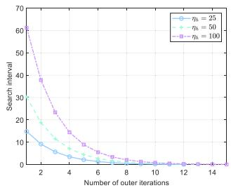

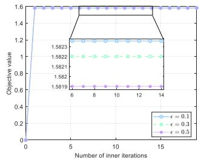  
(a) Convergence of algorithm 1.  
(b) Convergence of objective function of algorithm 2.

Fig. 8. Convergence of the proposed algorithms.  
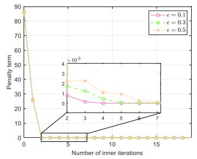

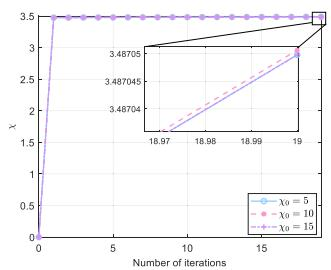  
(a) Convergence of penalty term of (b) Convergence of objective function algorithm 2. of algorithm 3.  
Fig. 9. Convergence of the proposed algorithms.

## A. Convergence of the Proposed Convex Approximation Approach

As shown in Fig. 8(a), the search interval of Algorithm 1 decreases with the growth of the number of iterations. It is almost to 0, while the number of outer iterations is about 10. Moreover, the upper bound of the search interval is smaller, the convergence ratio is faster. As shown in Fig. 8(b), the objective function value of Algorithm 2 converges quickly with different reduction factors in the penalty term. The smaller the reduction factor is, the larger the objective function convergence value is. The corresponding penalty term values all converge to 0, and the smaller the reduction factor, the faster the convergence ratio, as shown in Fig. 9(a).

As shown in Fig. 9(b), the objective function values of Algorithm 3 converge quickly with the growth of the number of iterations with different initial values. Moreover, when the initial value of iteration is closer to the objective function value, the convergence value is larger. This verifies that the convergence of algorithms is affected by the initial value of iteration and the reduction factor. It also demonstrates the feasibility of beamforming and resource allocation in the UAVassisted integration of sensing, communication and control approach for the considered industrial IoT system.

## B. Performance Comparison Among Different Approaches

In this section, we perform extensive simulations to evaluate the performance of proposed approach in terms of data volume and energy efficiency. The data volume is defined as the total data volume received by RC in one ISAC frame. Energy efficiency is defined as the ratio of the total data volume to the total power consumption in one ISAC frame. The length of one ISAC frame is set to 100 time slots in the simulation. It is assumed that AGV moves at a constant speed on a stationary route without considering the effect of disturbances.

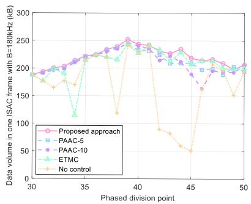  
Fig. 10. Performance Comparison among different approaches with the variation of Phase I and Phase II division points.

Four additional approaches are considered for comparison. The first one is the UAV antenna-angle sensing-control approach with period $N ~ = ~ 5 ~ \mathrm { ( P A A C  – } 5 )$ The communication and sensing model is invariable in the UAV-assisted integration of sensing, communication and control approach. The second one is the UAV antenna-angle sensing-control approach with period $N \ = \ 1 0 ( \mathrm { P A A C } \mathrm { - } 1 0 )$ . The third one is an event-triggered UAV position sensing-control approach (ETMC), where triggering condition is invariable. The fourth one is a communication approach that does not perform any sensing-control operations (No control). After analyzing the performance of sub-problem solving, we will investigate the performance of relay transmission in a single ISAC frame.

1) Performance Comparison With Different Phased Division Points: The data volume comparison among five approaches is shown in Fig. 10. When the phased division point from 30 to 50, the data volume in one ISAC frame first increases and then decreases. Moreover, the proposed approach exhibits a greater amount of data compared to other comparing approaches. The maximum data volume is reached at $k _ { t h } ~ = ~ 3 9$ . This is because that in one ISAC frame, the distance between AGV and UAV is smaller than that between UAV and RC. When the upper bound of communication power is fixed, the transmission rate in Phase I will be slightly higher than that in Phase II, and then the data volume is determined by Phase II. Therefore, we set the phased division point between Phase I and Phase II to 39 when the initial values of the simulation are set as shown in Table II.

2) Performance Comparison Among Different Approaches With the Variation in Communication Power Limitation: The performance comparison among the five compared ones in terms of data volume and energy efficiency is shown in Fig. 11. As shown in Fig. 11(a), the data volume with five approaches in three cases of AGV’s transmit power limitation increases gradually with the growth of UAV’s transmit power budget and finally reaches the maximum value. This is because the data volume of transmission is determined by the data capacity that Phase I can transmit and is thus affected by the communication rate of Phase I, namely the communication power limition constraint of AGV. It is observed that the greater transmit power budget of AGV is, the larger the data volume is. It is also observed that the UAV-assisted integration of sensing, communication and control approach significantly slightly outperforms the compared ones. Moreover, the anomalous data points observed on the yellow lines in Fig. 11(a) can be attributed to the algorithmic limitations of the nocontrol compared approach and the inherent randomness of the wireless channel. Unlike the proposed approach, the compared approach does not incorporate any sensing or control mechanisms, and therefore lacks the capability to dynamically adjust antenna angles or UAV positions in response to changing channel conditions. Consequently, it fails to adapt to variations in the wireless environment, leading to occasional anomalies in the results shown in Fig. 11(a).

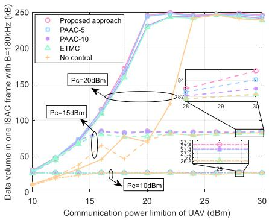

(a) Data volume  
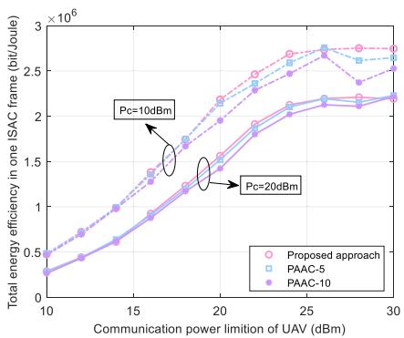  
(b) Energy efficiency  
Fig. 11. Performance comparison among different approaches with the variation of UAV communication power limitation.

Similarly, Fig. 11(b) shows that the energy efficiency increases at first and then stabilizes with the increase of UAV’s transmit power budget. When the UAV’s communication power is limited, the achievable data volume is constrained by that in Phase II. Furthermore, the data volume in Phase II increases significantly as the communication power limitation of the UAV rises, thereby enhancing the overall energy efficiency. As the communication power limitation of the UAV continues to increase, the data volume in Phase II eventually exceeds that in Phase I, making Phase I the new bottleneck. However, the achievable data volume in Phase I does not depend on the UAV’s communication power. As a result, the energy efficiency initially increases but eventually plateaus with further increases in the UAV’s transmit power budget. Moreover, the proposed approach has a certain performance gain over the periodic antenna-angle control approaches. This is due to the fact that the proposed approach is able to increase data volume. Moreover, the event-triggered approach consumes less power because the number of triggers is less than the periodic antenna-angle control approaches.

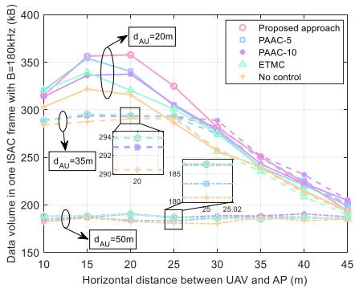  
(a) Data volume

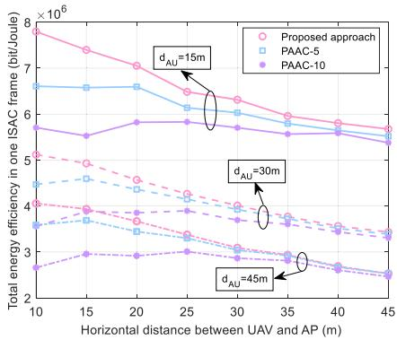  
(b) Energy efficiency  
Fig. 12. Performance comparison among different approaches with the variation of the distance between AGV and UAV.

3) Performance Comparison Among Different Approaches With the Variation in the Distance Between AGV and UAV: The performance comparison in terms of data volume and energy efficiency is shown in Fig. 12, while $d _ { A U }$ is the horizontal distance between AGV and UAV. As shown in Fig. 12(a), the data volume with five compared approaches increases and then decreases gradually with the increase of horizontal distance between UAV and RC when $d _ { A U } = 2 0 m$ and $d _ { A U } = 3 5 m$ . In the scenario where $d _ { A U } \ = \ 2 0 m$ , the overall data volume is limited by Phase II performance, since the wireless channel between AGV and UAV in Phase I is well. When the UAV is closer to the AP, even a slight deviation in its position can lead to significant misalignment error, thereby reducing the data volume achieved in Phase II. Within a certain range, as the UAV-AP distance increases, the data volume in Phase II also increases. However, once the distance becomes larger, path loss becomes the dominant factor, and the data volume begins to decrease with further increases in horizontal distance. Moreover, the data volume converges when the horizontal distance between UAV and RC is greater than 30m. This is because that when AGV and UAV are close, the antenna angles are greatly affected by position adjustment. When there is a long distance between them two, the distance becomes the main factor affecting the transmission rate that achieved with all approaches tend to be same. Meanwhile, when $d _ { A U } = 2 0 m ,$ the data volume improvement of the UAVassisted integration of sensing, communication and control approach against others is 15.33%, 17.64%, 34.43%, and 59.48%, respectively. When $d _ { A U } \ = \ 5 0 m$ , limited by the transmission volume in Phase I, the data volume remains flat as the horizontal distance between UAV and RC changes in Phase II. For the periodic antenna-angle control approaches, the energy efficiency gradually decreases with the increase of horizontal distance between UAV and RC, and eventually converge to a stable value, as shown in Fig. 12(b). Moreover, the larger the period is, the lower the energy efficiency is.

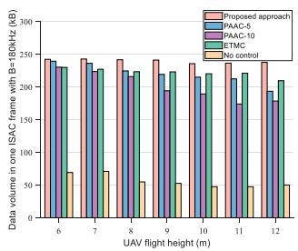  
(a) Data volume

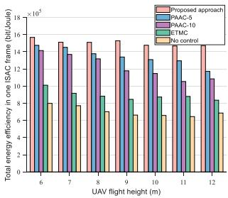  
(b) Energy efficiency  
Fig. 13. Performance comparison among different approaches with the variation of UAV flight height.

4) Performance Comparison Among Different Approaches With the Variation in the UAV Flight Height: The performance comparison among five compared ones in terms of data volume and energy efficiency is shown in Fig. 13. The increase of the flight height of UAV make the transmission rate in Phase I and Phase II decrease. Therefore, the data volume that can be received in one ISAC frame decreases, as shown in Fig. 13(a). Similarly, the energy efficiency in one ISAC frame gradually decreases with the increase of the UAV height, as shown in Fig. 13(b). Moreover, both the proposed and ETMC strategies significantly outperform the no-control baseline in terms of data volume and energy efficiency (shown as Fig. 13), underscoring the critical importance of incorporating sensing and control functions. As shown in Fig. 13(a), the proposed approach could achieve a larger data volume than the compared ETMC strategy. This gain is achieved through a dynamic triggering mechanism that adapts to the current sensing and control performance. Fig. 13(b) compares the energy efficiency of the different strategies. Although all control strategies consume propulsion energy to enhance sensing accuracy and transmission rates, the proposed method outperforms ETMC due to its dynamic adaptation to system requirements. The non-adaptive nature of the ETMC strategy prevents it from translating its energy consumption into proportional performance gains, leading to lower energy efficiency.

## C. Performance Comparison With Different Sensing Beampatterns

Fig. 14 shows the sensing beampatterns comparison with different angles obtained corresponding to Algorithm 2 and Algorithm 3. In Phase I, RC simultaneously senses AGV and UAV, but in Phase II, RC only senses UAV. In Phase I, the beampattern with algorithm 2 has two main lobes that represent different target’s directions, as shown in Fig. 14(a). In Phase II, it can also be observed that the beampattern with algorithm 3 can achieve dominant peaks in the target directions, as shown in Fig. 14(b). Moreover, the proposed approach has a significant power gain in the target direction and low power leakage in the undesired directions, which further verifies the efficiency of the proposed approaches.

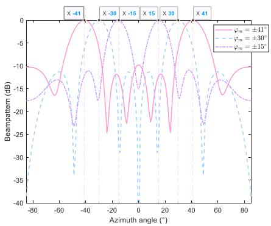

(a) RC beampattern of sensing AGV and UAV in Phase I.  
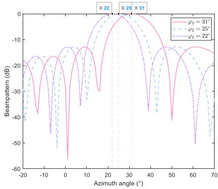  
(b) RC beampattern of sensing UAV in Phase II.

Fig. 14. Performance comparison of beamforming with the variation of the sensing angles.  
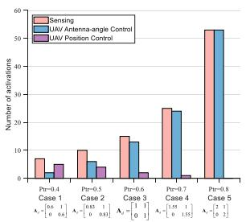  
(a) Number of activations

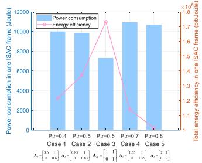  
(b) Power consumption and energy efficiency  
Fig. 15. Performance comparison with different state transition matrices $\mathbf { A } _ { d } .$

## D. Performance Comparison With Different the Spectral Radius of the State Transition Matrix

In this work, the purpose of UAV position control is to correct the UAV’s position to the optimal position when significant deviations occur. As the UAV’s position control is based on the event trigger framework, the event-triggered condition is a key parameter that is related to the activation probability. The definition of activation probability is given by $\begin{array} { r } { \dot { p } _ { t r } = \exp \left( - \frac { | \widehat { x } _ { k + 1 | k } | ^ { 2 } } { \gamma _ { k + 1 } ^ { t h } } \right) } \end{array}$ , where $| \widehat { x } _ { k + 1 | k } | ^ { 2 }$ is the misalignment error, and $\begin{array} { r } { \gamma _ { k + 1 } = \frac { \left| \widehat { x } _ { k + 1 | k } \right| ^ { 2 } } { L ^ { 2 } } } \end{array}$ is the state signal-to-noise ratio. As $\hat { x } _ { k + 1 | k } = \mathbf { A } _ { d } \hat { x } _ { k | k } + \mathbf { \bar { B } } _ { d } u _ { k }$ , the parameter matrix of control system will directly affect the activation probability. As the number of sensing activation and the propulsion power consumption depends on the activation probability, it is important to analyze the impact of parameter matrix on the data volume and energy efficiency. In order to highlight the impact of UAV position control, in this subsection, the misalignment error coefficient is set to be $\varsigma = 2 0 0$ . Moreover, the spectral norm of the parameter matrix of UAV position control is configured as 0.6, 0.83, 1, 1.55 and 2, whose corresponding activation probability respectively is 0.4, 0.5, 0.6, 0.7 and 0.8, regarding as Case 1 to Case 5. The performance comparison among different variables in terms of the number of activation and energy efficiency is shown in Fig. 15.

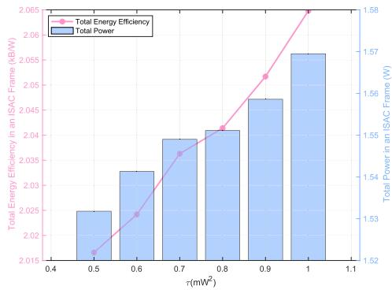  
Fig. 16. The impact of sensing error on energy efficiency.

As shown in Fig. 15(a), with the growth of the activation probability, the activation frequency of sensing and UAV antenna-angle control gradually increases, while the activation frequency of UAV position control gradually decreases. This is because a smaller activation probability will result in a lower activation threshold, directly increasing the number of sensing activation. Fewer number of sensing-control activation will lead to the accumulation of state estimation errors with disturbances, resulting in the significant position deviation that requires performing the UAV position control for correction. As shown in Fig. 15(b), with the growth of activation probability, the overall energy consumption exhibits a trend of first decreasing and then increasing as the number of sensing-control activation rises. Correspondingly, the energy efficiency first increases and then decreases. This is because, when the activation probability is low, the increased frequency of position control raises system energy consumption, while the reduced sensing frequency fails to ensure high transmission rates over a long time duration. Conversely, when the activation probability is high, the excessive sensing operations significantly increase system energy consumption, further leading to a decline in energy efficiency. Moreover, in this simulation, when the activation probability is 0.6, a better balance between energy consumption and transmission rate could be achieved.

E. Performance Analysis About the Impact of Sensing on Energy Efficiency

The impact of sensing error on energy efficiency is shown as Fig. 16. It can be observed that an increase in the value of τ leads to improved energy efficiency. This relationship stems from the fact that a higher τ implies a less stringent requirement on sensing accuracy. As a result, fewer resources are needed to achieve the prescribed accuracy level, thereby enhancing overall energy efficiency.

## VI. CONCLUSION

In this paper, a UAV-assisted integrated system of sensing, communication and control in industrial IoT systems was investigated to improve data transmission performance. Firstly, the situation-aware hybrid sensing pattern was proposed to minimize the interference of sensing signals on communication. Then, the integrated design of antenna-angle control and position control was proposed to ensure beam alignment with low energy consumption. Finally, to maximize system’s energy efficiency, the phased fractional transformation and convex approximation algorithms were designed to improve beamforming accuracy and resource allocation effectiveness. Numerical results demonstrated that the situation-aware hybrid sensing pattern can improve transmission rate with low energy consumption, which is appropriate for applying it into the area of smart manufacturing. In future work, we will study data transmission and path planning for AGVs and UAVs in ISAC systems.

## REFERENCES

[1] B. Yin, J. Tang, and M. Wen, “Connectivity maximization in nonorthogonal network slicing enabled industrial Internet-of-Things with multiple services,” IEEE Trans. Wireless Commun., vol. 22, no. 8, pp. 5642–5656, Aug. 2023.

[2] Q. Li, J. Chen, M. Cheffena, and X. Shen, “Channel-aware latency tail taming in industrial IoT,” IEEE Trans. Wireless Commun., vol. 22, no. 9, pp. 6107–6123, Sep. 2023.

[3] L. Lyu et al., “Adaptive edge sensing for industrial IoT systems: Estimation task offloading and sensor scheduling,” IEEE Internet Things J., vol. 10, no. 1, pp. 391–402, Jan. 2023.

[4] C. Chen, L. Lyu, S. Zhu, and X. Guan, “On-demand transmission for edge-assisted remote control in industrial network systems,” IEEE Trans. Ind. Informat., vol. 16, no. 7, pp. 4842–4854, Jul. 2020.

[5] B. Zhu, E. Bedeer, H. H. Nguyen, R. Barton, and Z. Gao, “UAV trajectory planning for AoI-minimal data collection in UAV-aided IoT networks by transformer,” IEEE Trans. Wireless Commun., vol. 22, no. 2, pp. 1343–1358, Feb. 2023.

[6] L. Lyu, X. Guan, N. Cheng, and X. S. Shen, Advanced Wireless Technologies for Industrial Network Systems. Cham, Switzerland: Springer, 2023.

[7] Y. Zhu, B. Mao, and N. Kato, “IRS-aided high-accuracy positioning for autonomous driving toward 6G: A tutorial,” IEEE Veh. Technol. Mag., vol. 19, no. 1, pp. 85–92, Mar. 2024.

[8] L. Lyu et al., “AGV-assisted adaptive cooperative transmission for state estimation in industrial IoT systems,” IEEE Trans. Veh. Technol., vol. 74, no. 2, pp. 2390–2405, Feb. 2025.

[9] Q. Wu et al., “A comprehensive overview on 5G-and-beyond networks with UAVs: From communications to sensing and intelligence,” IEEE J. Sel. Areas Commun., vol. 39, no. 10, pp. 2912–2945, Oct. 2021.

[10] Y. Cao, S. Xu, J. Liu, and N. Kato, “Toward smart and secure V2X communication in 5G and beyond: A UAV-enabled aerial intelligent reflecting surface solution,” IEEE Veh. Technol. Mag., vol. 17, no. 1, pp. 66–73, Mar. 2022.

[11] Y. Tan, J. Liu, and N. Kato, “Blockchain-based lightweight authentication for resilient UAV communications: Architecture, scheme, and future directions,” IEEE Wireless Commun., vol. 29, no. 3, pp. 24–31, Jun. 2022.

[12] Y. Lin, S. Jin, M. Matthaiou, and X. Yi, “Circular RIS-enabled channel estimation and localization for multi-user ISAC systems,” IEEE Trans. Wireless Commun., vol. 23, no. 8, pp. 8730–8743, Aug. 2024.

[13] L. Lyu, Z. Chu, B. Lin, Y. Dai, and N. Cheng, “Fast trajectory planning for UAV-enabled maritime IoT systems: A Fermat-point based approach,” IEEE Wireless Commun. Lett., vol. 11, no. 2, pp. 328–332, Feb. 2022.

[14] I. Behnke and H. Austad, “Real-time performance of industrial IoT communication technologies: A review,” IEEE Internet Things J., vol. 11, no. 5, pp. 7399–7410, Mar. 2024.

[15] F. Dong, F. Liu, Y. Cui, W. Wang, K. Han, and Z. Wang, “Sensing as a service in 6G perceptive networks: A unified framework for ISAC resource allocation,” IEEE Trans. Wireless Commun., vol. 22, no. 5, pp. 3522–3536, May 2023.

[16] Y. Xiong, F. Liu, Y. Cui, W. Yuan, T. X. Han, and G. Caire, “On the fundamental tradeoff of integrated sensing and communications under Gaussian channels,” IEEE Trans. Inf. Theory, vol. 69, no. 9, pp. 5723–5751, Sep. 2023.

[17] X. Li et al., “Integrated sensing, communication, and computation overthe-air: MIMO beamforming design,” IEEE Trans. Wireless Commun., vol. 22, no. 8, pp. 5383–5398, Aug. 2023.

[18] K. Meng, Q. Wu, S. Ma, W. Chen, K. Wang, and J. Li, “Throughput maximization for UAV-enabled integrated periodic sensing and communication,” IEEE Trans. Wireless Commun., vol. 22, no. 1, pp. 671–687, Jan. 2023.

[19] Z. Ni, J. A. Zhang, K. Yang, X. Huang, and T. A. Tsiftsis, “Multimetric waveform optimization for multiple-input single-output joint communication and radar sensing,” IEEE Trans. Commun., vol. 70, no. 2, pp. 1276–1289, Feb. 2022.

[20] Z. Xiao and Y. Zeng, “Waveform design and performance analysis for full-duplex integrated sensing and communication,” IEEE J. Sel. Areas Commun., vol. 40, no. 6, pp. 1823–1837, Jun. 2022.

[21] Y. Zhang, Y. Liu, G. Sun, J. Li, and A. Wang, “Multi-objective optimization for joint UAV-AGV collaborative beamforming,” in Proc. IEEE Int. Conf. Syst., Man, Cybern. (SMC), Oct. 2022, pp. 150–157.

[22] Z. He, W. Xu, H. Shen, D. W. K. Ng, Y. C. Eldar, and X. You, “Full-duplex communication for ISAC: Joint beamforming and power optimization,” IEEE J. Sel. Areas Commun., vol. 41, no. 9, pp. 2920–2936, Sep. 2023.

[23] C. Deng, X. Fang, and X. Wang, “Beamforming design and trajectory optimization for UAV-empowered adaptable integrated sensing and communication,” IEEE Trans. Wireless Commun., vol. 22, no. 11, pp. 8512–8526, Nov. 2023.

[24] B. Chang, W. Tang, H. Zhang, X. Liao, and Z. Chen, “Communicationaware motion control scheduling of automatic guided vehicles for THz beam alignment in IIoT,” in Proc. IEEE Int. Conf. Commun., May 2022, pp. 4619–4624.

[25] Y. Liu et al., “Secure rate maximization for ISAC-UAV assisted communication amidst multiple eavesdroppers,” IEEE Trans. Veh. Technol., vol. 73, no. 10, pp. 15843–15847, Oct. 2024.

[26] Q. Wang, R. Chai, R. Sun, R. Pu, and Q. Chen, “ISAC-enabled multi-UAV cooperative perception and trajectory optimization,” IEEE Internet Things J., vol. 11, no. 24, pp. 40982–40995, Dec. 2024.

[27] Z. Lyu, G. Zhu, and J. Xu, “Joint maneuver and beamforming design for UAV-enabled integrated sensing and communication,” IEEE Trans. Wireless Commun., vol. 22, no. 4, pp. 2424–2440, Apr. 2023.

[28] A. Khalili, A. Rezaei, D. Xu, F. Dressler, and R. Schober, “Efficient UAV hovering, resource allocation, and trajectory design for ISAC with limited backhaul capacity,” IEEE Trans. Wireless Commun., vol. 23, no. 11, pp. 17635–17650, Nov. 2024.

[29] C. Deng, X. Fang, and X. Wang, “Integrated sensing, communication, and computation with adaptive DNN splitting in multi-UAV networks,” IEEE Trans. Wireless Commun., vol. 23, no. 11, pp. 17429–17445, Nov. 2024.

[30] Y. Qin, Z. Zhang, X. Li, W. Huangfu, and H. Zhang, “Deep reinforcement learning based resource allocation and trajectory planning in integrated sensing and communications UAV network,” IEEE Trans. Wireless Commun., vol. 22, no. 11, pp. 8158–8169, Nov. 2023.

[31] T. Zhang, K. Zhu, S. Zheng, D. Niyato, and N. C. Luong, “Trajectory design and power control for joint radar and communication enabled multi-UAV cooperative detection systems,” IEEE Trans. Commun., vol. 71, no. 1, pp. 158–172, Jan. 2023.

[32] Y. Jiang, Q. Wu, W. Chen, and K. Meng, “UAV-enabled integrated sensing and communication: Tracking design and optimization,” IEEE Commun. Lett., vol. 28, no. 5, pp. 1024–1028, May 2024.

[33] B. Chang, W. Tang, X. Yan, X. Tong, and Z. Chen, “Integrated scheduling of sensing, communication, and control for mmWave/THz communications in cellular connected UAV networks,” IEEE J. Sel. Areas Commun., vol. 40, no. 7, pp. 2103–2113, Jul. 2022.

[34] X. Wang, Z. Fei, J. A. Zhang, J. Huang, and J. Yuan, “Constrained utility maximization in dual-functional radar-communication multi-UAV networks,” IEEE Trans. Commun., vol. 69, no. 4, pp. 2660–2672, Apr. 2021.

[35] Q. Huang, W. Wang, W. Lu, N. Zhao, A. Nallanathan, and X. Wang, “Resource allocation for multi-cluster NOMA-UAV networks,” IEEE Trans. Commun., vol. 70, no. 12, pp. 8448–8459, Dec. 2022.

[36] M. Nikooroo and Z. Becvar, “Optimal positioning of flying base stations and transmission power allocation in NOMA networks,” IEEE Trans Wireless Commun., vol. 21, no. 2, pp. 1319–1334, Feb. 2022.

[37] M. Katwe, K. Singh, P. K. Sharma, C.-P. Li, and Z. Ding, “Dynamic user clustering and optimal power allocation in UAV-assisted full-duplex hybrid NOMA system,” IEEE Trans. Wireless Commun., vol. 21, no. 4, pp. 2573–2590, Apr. 2022.

[38] J. Li, X. B. Zhai, H. Qian, R. Zhang, and X. Liu, “Joint trajectory design and power allocation in NOMA-based UAV networks,” IEEE Trans. Veh. Technol., vol. 73, no. 2, pp. 2345–2357, Feb. 2024.

[39] B. Chang, X. Yan, L. Zhang, Z. Chen, L. Li, and M. A. Imran, “Joint communication and control for mmWave/THz beam alignment in V2X networks,” IEEE Internet Things J., vol. 9, no. 13, pp. 11203–11213, Jul. 2022.

[40] A.-A.-A. Boulogeorgos, E. N. Papasotiriou, and A. Alexiou, “Analytical performance assessment of THz wireless systems,” IEEE Access, vol. 7, pp. 11436–11453, 2019.

[41] A. Molisch, Wireless Communications: From Fundamentals To Beyond 5G. Hoboken, NJ, USA: Wiley, 2022.

[42] Q. Wu, J. Xu, and R. Zhang, “Capacity characterization of UAV-enabled two-user broadcast channel,” IEEE J. Sel. Areas Commun., vol. 36, no. 9, pp. 1955–1971, Sep. 2018.

[43] A. Cuenca, D. J. Antunes, A. Castillo, P. Garcia, B. A. Khashooei, and W. P. M. H. Heemels, “Periodic event-triggered sampling and dual-rate control for a wireless networked control system with applications to UAVs,” IEEE Trans. Ind. Electron., vol. 66, no. 4, pp. 3157–3166, Apr. 2019.

[44] Y. Zeng, J. Xu, and R. Zhang, “Energy minimization for wireless communication with rotary-wing UAV,” IEEE Trans. Wireless Commun., vol. 18, no. 4, pp. 2329–2345, Apr. 2019.

[45] Z. Wang, Y. Liu, X. Mu, Z. Ding, and O. A. Dobre, “NOMA empowered integrated sensing and communication,” IEEE Commun. Lett., vol. 26, no. 3, pp. 677–681, Mar. 2022.

[46] Z. Wang, Y. Liu, X. Mu, and Z. Ding, “NOMA inspired interference cancellation for integrated sensing and communication,” in Proc. IEEE Int. Conf. Commun., May 2022, pp. 3154–3159.

[47] C. Xu, B. Clerckx, S. Chen, Y. Mao, and J. Zhang, “Rate-splitting multiple access for multi-antenna joint radar and communications,” IEEE J. Sel. Topics Signal Process., vol. 15, no. 6, pp. 1332–1347, Nov. 2021.

[48] Y. Li, W. Ni, H. Tian, M. Hua, and S. Fan, “Rate splitting multiple access for joint communication and sensing systems with unmanned aerial vehicles,” in Proc. IEEE/CIC Int. Conf. Commun. China (ICCC Workshops), Jul. 2021, pp. 37–42.

[49] L. Zhao, D. Wu, L. Zhou, and Y. Qian, “Radio resource allocation for integrated sensing, communication, and computation networks,” IEEE Trans. Wireless Commun., vol. 21, no. 10, pp. 8675–8687, Oct. 2022.

[50] B. Chang, W. Tang, X. Yan, and Z. Chen, “State-to-noise-ratio-based transmission scheduling in wireless control systems for IIoT,” IEEE Internet Things J., vol. 9, no. 7, pp. 4949–4957, Apr. 2022.

[51] W. Dinkelbach, “On nonlinear fractional programming,” Manage. Sci., vol. 13, no. 7, pp. 492–498, Mar. 1967.

[52] L. Lyu, C. Chen, S. Zhu, X. Wen, and X. Guan, “Sensing aware opportunistic transmissions for situation monitoring in industrial network systems,” in Proc. IEEE Global Commun. Conf. (GLOBECOM), Dec. 2019, pp. 1–6.

[53] Z. Wang, X. Mu, Y. Liu, and R. Schober, “TTD configurations for nearfield beamforming: Parallel, serial, or hybrid?,” in Proc. IEEE Trans. Commun., vol. 72, Jun. 2024, pp. 3783–3799.

[54] M. Grant and S. Boyd. (Mar. 2014). CVX: MATLAB Software for Disciplined Convex Programming, Version 2.1. [Online]. Available: http://cvxr.com/cvx

[55] M. ApS. (2024). The MOSEK Optimization Toolbox for MAT-LAB Manual. [Online]. Available: https://docs.mosek.com/11.0/toolbox/ index.html

[56] K. Shen and W. Yu, “Fractional programming for communication systems—Part I: Power control and beamforming,” IEEE Trans. Signal Process., vol. 66, no. 10, pp. 2616–2630, May 2018.

[57] Z.-Q. Luo, W.-K. Ma, A. So, Y. Ye, and S. Zhang, “Semidefinite relaxation of quadratic optimization problems,” IEEE Signal Process. Mag., vol. 27, no. 3, pp. 20–34, May 2010.


Ling Lyu (Member, IEEE) received the B.Eng. degree in telecommunication engineering from Jilin University, Changchun, China, in 2013, and the Ph.D. degree in control theory and control engineering from Shanghai Jiao Tong University, Shanghai, China, in 2019. She joined Dalian Maritime University, China, in 2019, where she is currently an Associate Professor with the School of Information Science and Technology. She was a Visiting Student with the University of Waterloo, Canada, from September 2017 to 2018. Her current research

interests include wireless sensor and actuator network and application in industrial automation, the joint design of communication and control in industrial cyber-physical systems, estimation and control over lossy wireless networks, and control-aware integrated sensing and communication.


Qirui Luo received the B.Eng. degree in electronic information science and technology from Henan Agricultural University, Zhengzhou, China, in 2022, and the M.Eng. degree in information and communication engineering from Dalian Maritime University, Dalian, China, in 2025. His master’s research focused on resource allocation in integrated sensing and communication.


Yanpeng Dai (Member, IEEE) received the B.Eng. degree in telecommunication engineering from Shandong Normal University, Jinan, China, in 2014, and the Ph.D. degree in communication and information systems from Xidian University, Xi’an, China, in 2020. He is currently an Associate Professor with the School of Information Science and Technology, Dalian Maritime University, Dalian, China. He was a Visiting Student with the University of Waterloo, Waterloo, ON, Canada. His research interests include resource management and interference coordination for heterogeneous wireless networks and maritime communication systems.


Nan Cheng (Senior Member, IEEE) received the B.E. and M.S. degrees from the Department of Electronics and Information Engineering, Tongji University, Shanghai, China, in 2009 and 2012, respectively, and the Ph.D. degree from the Department of Electrical and Computer Engineering, University of Waterloo, Waterloo, ON, Canada, in 2016. From 2017 to 2019, he was a Post-Doctoral Fellow with the Department of Electrical and Computer Engineering, University of Toronto, Toronto, ON. He is currently a Professor with the State Key

Laboratory of ISN and the School of Telecommunications Engineering, Xidian University, Xi’an, Shaanxi, China. He has authored or co-authored more than 90 journal papers in IEEE TRANSACTIONS and other top journals. His research interests include B5G/6G, AI-driven future networks, and space–air–ground integrated networks. He is an Associate Editor of IEEE TRANSACTIONS ON VEHICULAR TECHNOLOGY, IEEE OPEN JOURNAL OF THE COMMUNICATIONS SOCIETY, and Peer-to-Peer Networking and Applications. He is/was a guest editor of several journals.


Cailian Chen (Senior Member, IEEE) received the B.Eng. and M.Eng. degrees in automatic control from Yanshan University, China, in 2000 and 2002, respectively, and the Ph.D. degree in control and systems from the City University of Hong Kong, Hong Kong, SAR, in 2006.

She has been with the Department of Automation, Shanghai Jiao Tong University, since 2008. She is currently a Distinguished Professor. She has authored three research monographs and over 100 refereed international journal articles. She is the

inventor of more than 30 patents. Her research interests include industrial wireless networks and computational intelligence and the Internet of Vehicles. She received the prestigious IEEE TRANSACTIONS ON FUZZY SYSTEMS Outstanding Paper Award in 2008, the IEEE TCCPS Industrial Technical Excellence Award in 2022, and five conference best paper awards. She was awarded the N2Women Star in Computer Networking and Communications in 2022. She won the Second Prize of National Natural Science Award from the State Council of China in 2018; the First Prize of Natural Science Award from the Ministry of Education of China in 2006 and 2016, respectively; and the First Prize of Technological Invention of Shanghai Municipal, China, in 2017 and 2023, respectively. She was honored with the “National Outstanding Young Researcher” by NSF of China in 2020, the “Changjiang Young Scholar” in 2015, and the prestigious China Young Women Scientists Award in 2024. She has been actively involved in various professional services. She is a Distinguished Lecturer of IEEE VTS. She serves as the Deputy Editor for National Science Open and an Associate Editor for IEEE TRANSACTIONS ON VEHICULAR TECHNOLOGY and IET Cyber-Physical Systems: Theory and Applications.


Xinping Guan (Fellow, IEEE) is currently a Chair Professor with Shanghai Jiao Tong University, Shanghai, China, where he is the Dean of the School of Electronic, Information and Electrical Engineering, and the Director of the Key Laboratory of Systems Control and Information Processing, Ministry of Education of China. Before that, he was the Executive Director of the Office of Research Management, Shanghai Jiao Tong University, and a Full Professor and the Dean of electrical engineering with Yanshan University, Qinhuangdao, China. He is the Leader of the prestigious Innovative Research Team of the National Natural Science Foundation of China (NSFC). He has authored and/or coauthored five research monographs, more than 200 articles in peer-reviewed journals, and numerous conference papers. As a Principal Investigator, he has finished/been working on more than 20 national key projects. His current research interests include industrial network systems, smart manufacturing, and underwater networks.

Dr. Guan is an Executive Committee Member of Chinese Automation Association Council and Chinese Artificial Intelligence Association Council. He received the Second Prize of the National Natural Science Award of China in 2008 and 2018; and the First Prize of Natural Science Award from the Ministry of Education of China and Municipal of Shanghai, China, for four times. He was a recipient of “IEEE TRANSACTIONS ON FUZZY SYSTEMS Outstanding Paper Award” in 2008 and the IEEE TCCPS Industrial Technical Excellence Award in 2022. He was honored with the “National Outstanding Youth” by NSF of China, the “Changjiang Scholar” by the Ministry of Education of China, and the “State-Level Scholar” of the “New Century Bai Qianwan Talent Program” of China.


Xuemin (Sherman) Shen (Fellow, IEEE) received the Ph.D. degree in electrical engineering from Rutgers University, New Brunswick, NJ, USA, in 1990. He is currently a University Professor with the Department of Electrical and Computer Engineering, University of Waterloo, Canada. His research interests include network resource management, wireless network security, the Internet of Things, 5G and beyond, and vehicular networks.

Dr. Shen is a registered Professional Engineer of Ontario, Canada, an Engineering Institute of Canada

Fellow, a Canadian Academy of Engineering Fellow, a Royal Society of Canada Fellow, a Chinese Academy of Engineering Foreign Member, and an International Fellow of the Engineering Academy of Japan. He received the “West Lake Friendship Award” from Zhejiang Province in 2023, the President’s Excellence in Research from the University of Waterloo in 2022, Canadian Award for Telecommunications Research from Canadian Society of Information Theory (CSIT) in 2021, the R. A. Fessenden Award from IEEE, Canada, in 2019, the Award of Merit from the Federation of Chinese Canadian Professionals (Ontario) in 2019, the James Evans Avant Garde Award from the IEEE Vehicular Technology Society in 2018, the Joseph LoCicero Award in 2015 and Education Award in 2017 from the IEEE Communications Society (ComSoc), and the Technical Recognition Award from the Wireless Communications Technical Committee in 2019 and the AHSN Technical Committee in 2013. He has also received the Excellent Graduate Supervision Award from the University of Waterloo in 2006 and the Premier’s Research Excellence Award (PREA) from the Province of Ontario, Canada, in 2003. He serves/served as the General Chair for the 6G Global Conference 2023 and ACM Mobihoc 2015; the Technical Program Committee Chair/Co-Chair for IEEE Globecom 2024, 2016, and 2007, IEEE Infocom 2014, and IEEE VTC 2010 Fall; and the Chair for the IEEE ComSoc Technical Committee on Wireless Communications. He is the Past President of the IEEE ComSoc, the Vice President for Technical and Educational Activities, the Vice President for Publications, the Member-at-Large on the Board of Governors, the Chair of the Distinguished Lecturer Selection Committee, and a member of the IEEE Fellow Selection Committee of the ComSoc. He served as the Editor-in-Chief of IEEE INTERNET OF THINGS JOURNAL, IEEE Network, and PPNA.