# SkyNDN Incentivizer: Enhancing Content Sharing in UAV Named Data Networking

Chenlang Jin , Graduate Student Member, IEEE, Haipeng Yao , Senior Member, IEEE, Ruze Cai , Student Member, IEEE, Tianle Mai , Member, IEEE, Jiaqi Xu , Student Member, IEEE, Zehui Xiong , Senior Member, IEEE, and Dusit Niyato , Fellow, IEEE

Abstract—Recently, Named Data Networking (NDN) has garnered widespread attention in academia as an innovative network architecture, offering solutions to challenges such as the vulnerability of end-to-end connections in IP-based networks. In NDN, nodes utilize a “pull-push” architecture, exchanging Interest and Data packets for communication. This architecture is particularly well-suited for highly dynamic, topology-varying uncrewed aerial vehicle (UAV) swarm networks, known as UAV Named Data Networking (UNDN). However, in UNDN, due to constraints such as the lightweight design and limited energy of UAVs, the UAVs may exhibit selfish behaviors, opting not to share data in order to conserve their own energy consumption. This behavior results in degraded network performance, as the lack of cooperation among UAVs can hinder efficient data sharing and communication. Therefore, an effective incentive mechanism needs to be proposed. In this paper, we formulate the content-sharing process in UNDN as a double auction market for data exchange. To tackle the problem of asymmetric information between content consumers and producers, we propose an Iterative Double Auction algorithm (IDAA). This algorithm introduces a virtual central broker to guide both parties in conducting honest auctions. Furthermore, we develop a diffusion model-based reinforcement learning algorithm (DiffRL-DA) to derive optimal auction policies, with the goal of better capturing market behaviors and overcoming the limitations of the IDAA. Finally, simulation results verify the efficacy of our proposed mechanisms.

Index Terms—UAV named data networking (UNDN), double auction, diffusion model, reinforcement learning (RL).

## I. INTRODUCTION

collaborative network system composed of multiple UAVs that can complete complex tasks through distributed collaboration. Recently, UAV swarm networks have gained widespread attention due to their advantages in coverage, task decomposition and parallel processing, as well as rapid deployment. These benefits have led to their application in various fields, including communication network expansion, disaster response, and military security [1], [2], [3]. Nevertheless, because of the high mobility of UAVs, the network topology experiences frequent changes. Traditional IP routing protocols are inefficient at handling such dynamic shifts and are prone to issues like routing update delays and path instability. In addition, IP networks require complex address resolution and routing decisions, which increase communication delays and affects the efficiency of real-time data transmission.

Recently, named data networking (NDN) [4] has brought solutions to these challenges. In NDN, nodes are classified as content consumers or content producers. Consumers request data by sending Interest packets, while producers respond with Data packets. Communication between nodes relies on content names instead of fixed IP addresses, mitigating the complexities of frequent address changes and the delays caused by routing updates. Additionally, since nodes request data by content name, any node in the network that possesses the requested data can respond. This mechanism can reduce the number of hops in the data transmission path, thereby lowering latency. The advantages mentioned above make NDN particularly well-suited for application in UAV swarm networks. The features of NDN, such as content naming, stateless communication, data caching, and enhanced security, can provide more efficient, reliable, and secure communication solutions for UAV swarm networks. We refer to this architecture as the UAV Named Data Network (UNDN), and its communication paradigm is illustrated in Fig. 1.

However, in UNDN, due to limited communication resources, UAV nodes are motivated to request only the data they need in order to conserve their own resources, and they lack the incentive to act as content producers by providing data to other nodes. Therefore, an incentive mechanism is essential to motivate content producers to join the data market and promote data sharing among UAV nodes. The “pull-push” architecture of NDN naturally involves buyers and sellers of content. Inspired by this, we establish a data trading market based on double auction, where content can be traded between content consumers and content producers. In this market, content consumers announce their demand for content and the price they are prepared to pay (i.e., bidding price). Simultaneously, content producers disclose the amount of content that they can provide and the price they want in return (i.e., asking prices). Then, a virtual central broker matches the both sides to decide how much content that each content producer should provide to each content consumer at what price.

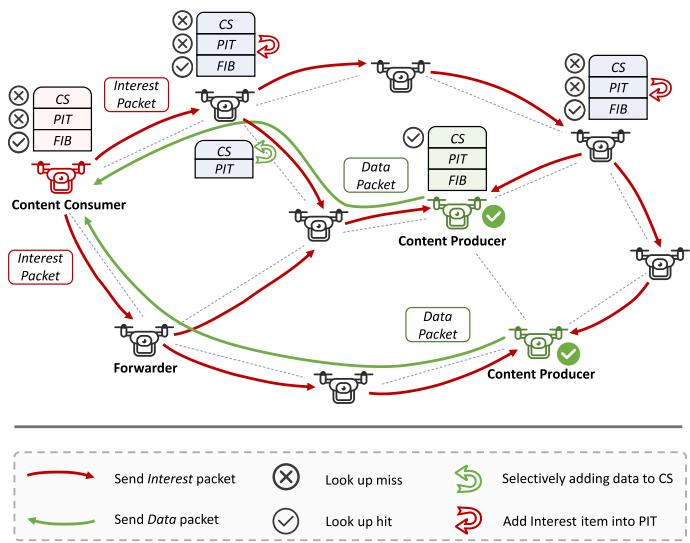  
Fig. 1. The diagram of UAV named data networking.

Nevertheless, due to information asymmetry between content consumers and producers, they may engage in dishonest behavior during the auction process, making it challenging for the broker to effectively guide the market toward maximizing social welfare. In this paper, to address this issue and reveal to the central broker the real information of these two sides, we propose an iterative double auction algorithm (IDAA) [5]. In IDAA, the broker leads content consumers and content producers to truly announce bidding and asking price, and gradually adjusts strategies to steer the market towards the point of maximum social welfare.

Although IDAA offers advantages such as addressing information asymmetry and facilitating rapid convergence to maximum social welfare, it relies on several stringent assumptions regarding the utility functions of market participants. Therefore, we consider using reinforcement learning (RL) to solve the market problem. RL continuously optimizes the decision-making process through exploration and exploitation strategies, finding optimal solutions in complex and uncertain environments [6], [7], [8]. Additionally, it can automatically learn and optimize the decision-making process, reducing the reliance on manual intervention. However, RL may not be effective enough because it relies too much on the balance between exploration and exploitation and may converge to suboptimal policies [9], [10]. Moreover, traditional RL struggles with high-dimensional state spaces, and decision-making AI, such as deep reinforcement learning (DRL), typically relies on repeated exploration and feedback for policy optimization, which often results in a lengthy training process requiring numerous iterations to converge to a stable strategy [11]. For the purpose of addressing the above challenges, we are inspired by the recent popular generative artificial intelligence (AI) technology and introduce the diffusion model into RL, which is termed as DiffRL-DA.

The main contributions of this paper are outlined as follows:   
- We apply the NDN architecture to UAV swarm networks to tackle a range of issues inherent in traditional IP networks. Building on this, we propose a double auction-based incentive mechanism for UNDN, establishing a data trading market between content consumers and producers to encourage content sharing among UAV nodes.

\- We design an Iterative Double Auction Algorithm (IDAA) to address the issue of information asymmetry in the double auction market. By introducing a virtual central broker, the algorithm enables the market to efficiently converge to the optimum social welfare point.

We present the DiffRL-DA algorithm, in which a generative AI technique, i.e., the diffusion model is introduced into reinforcement learning to overcome the challenge of high-dimensional state space and complex constraints in double auction market. As we are aware, our paper is the first application of the diffusion model to double auction market.

## II. RELATED WORK

## A. Named Data Networking

In [4], named data networking (NDN) framework is first proposed and compared with IP-based architecture. Zhang et al. [12] carried out a survey on security mechanisms in NDN, with a primary focus on aspects such as data authenticity and trustworthiness. Khelifi et al. in [13] provided a thorough review of Vehicular Named Data Networking (VNDN) in various aspects. In [14], Chen et al. conducted a survey and classification of transmission control in NDN, compared it with the IP architecture, and proposed future research directions based on their analysis.

Currently, numerous studies are dedicated to apply NDN to Mobile Ad-hoc Networks (MANETs), with the most widespread application found in Vehicular Ad-hoc Networks (VANETs). In [15], authors applied NDN to VANETs, first analyzing the flooding issue in the original NDN framework, and then proposed an algorithm called ‘CODIE’ to control the broadcast storms of Interest packets and Data packets. In [16], Xu et al. addressed the issue of packet loss in VNDN by proposing a name-correlativity-based retransmission timeout algorithm. The experimental results demonstrated that this algorithm enables more efficient content transmission. In [17], Chen et al. performed a thorough survey on caching schemes in VNDN and pointed out the future research directions. In [18], the authors proposed a novel approach for predicting vehicle mobility in real-time, along with a feedback-based congestion control mechanism, to enhance content transmission efficiency in highly dynamic VNDN environments.

Additionally, there has been research on applying NDN to Flying Ad hoc Networks (FANETs). In [19], Araújo et al. addressed the issue of Interest packet flooding in UNDN by proposing a novel multi-criteria forwarding strategy to mitigate such attacks. Qiu et al. [20] presented an innovative routing mechanism that integrates features of both host-centric and content-centric routing to improve the packet transmission success rate. In [21], a security mechanism for NDN-based FANETs was proposed to ensure the security of ad hoc networks.

## B. Auction-Based Incentive Mechanism

Recently, numerous studies across various fields and application scenarios have explored auction-based incentive mechanisms. For instance, in [22], Le et al. proposed a primal-dual greedy auction approach to incentivize mobile users to participate in local training. Yu et al. [23] designed a reputationoriented reverse combination auction to motivate vehicles to collect data in Vehicular crowdsensing (VCS) scenario. In [24], Zhou et al. proposed an incentive scheme based on reverse auction in WiFi offloading problem, where the objective is to optimize the utility of mobile network operator. In [25], Zhang et al. developed a novel auction framework for UAV-assisted mobile edge computing (MEC) to incentivize UAVs to engage in offloading tasks, while ensuring user equipment (UE) privacy.

Double auctions allow buyers and sellers to simultaneously submit the prices they bid and ask. This mechanism facilitates a prompt reflection of supply-demand dynamics in a relatively fair environment, thereby aiding in the determination of the market equilibrium price. Hence, double auctions are well-suited for various complex market environments and trading scenarios. Kang et al. [26] designed a novel Multi-stage Iterative Combinatorial Double Auction (MICDA) approach to tackle the task scheduling challenge in cloud-edge collaborative scenarios. In [27], Gao et al. introduced a price-driven iterative double auction mechanism between charger owners and electric vehicles, aiming to maximize the social welfare. Li et al. [28] developed a dynamic auction model in cloud market, aimed at enhancing resource utilization efficiency.

Reinforcement learning (RL) has been extensively employed to develop dynamic strategies and establish equilibrium in auction based markets. In [29], Tang et al. introduced a federated learning framework based on auctions, utilizing multi-agent reinforcement learning to handle complex interactions between model users and data owners, ultimately generating optimal bidding strategies. In [30], Wu et al. presented a multi-armed bandit-based innovative auction method to incentivize mobile devices to joint model training within a federated learning framework. In [31], Mai et al. modeled the collaboration between the federated learning platform and data owners as a double auction process to incentivize local training by data owners. They further proposed the Experience Weighted Attraction Learning (EWA) algorithm to address this problem.

## C. Generative Diffusion Models

Inspired by thermodynamic diffusion processes, the concept of Generative Diffusion Models (GDM) is first proposed in [32]. As a type of deep generative model, GDM has received extensive attention and research in the field of computer vision. In [33], Croitoru et al. conducted an extensive review of the literature on denoising diffusion models, focusing on their applications in the domain of computer vision. Recently, due to the potential in handling complex, high-dimensional environmental spaces, diffusion model has garnered interest attention in network optimization [34]. In [35], Du et al. introduced a semantic communication-based approach for content sharing, aiming to overcome the computational constraints of mixed reality (MR) devices that impede the implementation of future network services. In this scheme, the authors utilize the diffusion model to generate optimal contracts to incentivize semantic information sharing among users. In [36], Du et al. developed a diffusion model-based framework for AIGC to tackle the difficulties of deploying AI-generated content (AIGC) models on resourcelimited devices. This architecture utilizes device collaboration in wireless networks to enable the efficient execution of AIGC tasks.

## III. SYSTEM MODEL

## A. UAV Named Data Networking Framework

In UNDN, for each specific content $d _ { k } \in D ( k =$ $1 , 2 , . . . , K )$ there is a group of content consumers $\mathcal { M } = \{ 1 , . . . , i , . . . , M \}$ and a group of content producers $\mathcal { N } = \{ 1 , . . . , j , . . . , N \}$ . We regard the process of content sharing between two parties as a data trading market. The amount of content that content consumer i requests from content producer $j$ is denoted by $\theta _ { i j }$ . Thus, the $1 \times N$ demand vector of content consumer i can be represented as $\theta _ { i } .$ . Content consumer i derives utility from obtaining content, and the utility function can thus be expressed as $U _ { i } ( \pmb \theta _ { i } )$

In addition, the amount of content that content producer $j$ can provide to content consumer i is $\omega _ { j i }$ , and the $1 \times M$ supply vector of content producer $j$ is defined as $\omega _ { j }$ . Since content sharing incurs transmission energy costs for content producer $j ,$ the cost function can be defined as $C _ { j } ( \omega _ { j } )$

The subsequent part provides a detailed explanation of the system model discussed in this paper.

1) Mobility Model: In UAV swarm networks, the mobility of nodes is a critical factor influencing the dynamic changes in network topology. To accurately describe the movement trajectories of UAVs in three-dimensional space, we adopts the commonly used 3D Gauss-Markov Mobility Model [37].

This model describes the motion state of each UAV at time t in three-dimensional space through three variables: speed $s ( t )$ direction $c ( t )$ , and vertical pitch angle $p ( t )$ . The mathematical expressions are as follows:

$$
\left\{ \begin{array} { l l } { s ( t ) = \rho \times s ( t - 1 ) + ( 1 - \rho ) \times \overline { { s } } + \sqrt { 1 - \rho ^ { 2 } } \times s _ { g } } \\ { c ( t ) = \rho \times c ( t - 1 ) + ( 1 - \rho ) \times \overline { { c } } + \sqrt { 1 - \rho ^ { 2 } } \times c _ { g } } \\ { p ( t ) = \rho \times p ( t - 1 ) + ( 1 - \rho ) \times \overline { { p } } + \sqrt { 1 - \rho ^ { 2 } } \times p _ { g } } \end{array} \right. ,\tag{1}
$$

where $s _ { g } , c _ { g }$ and $p _ { g }$ are random variables that follow Gaussian distributions. $\rho \in [ 0 , 1 ]$ is the weighting factor that balances the historical state and random perturbations. Based on the above formula, the three-dimensional velocity vector of each UAV at time slot t can be further formulated as:

$$
\left\{ \begin{array} { l l } { v _ { x } ( t ) = s ( t ) \cos [ c ( t ) ] \cos [ p ( t ) ] } \\ { v _ { y } ( t ) = s ( t ) \sin [ c ( t ) ] \cos [ p ( t ) ] } \\ { v _ { z } ( t ) = s ( t ) \sin [ p ( t ) ] } \end{array} \right. .\tag{2}
$$

2) Transmission Energy Consumption: As lightweight flying devices, UAVs have limited energy. Thus, the transmission energy consumption during the data transmission process must be considered. This energy stems from the radio electronics and the power amplifier within the transmitting node [2]. Due to the issue of wireless channel fading, both free space model and multipath fading model are taken into consideration. These two models can switch dynamically based on the distance between the content producer and its next hop. The transmission energy consumption incurred to content producer j due to the provision of content amount $\omega _ { j i }$ can be represented as:

$$
E _ { j r i } = \left\{ { \omega _ { j i } \times E _ { e l e c } + \omega _ { j i } \times \eta _ { f s } \times d ( j , r ) ^ { 2 } , \quad d ( j , r ) < \tau \ , } \right.\tag{3}
$$

where r is the next hop on the route from content producer $j$ to content consumer i, and $E _ { j r i }$ represents the transmission energy consumption between content producer j and relay r. $E _ { e l e c }$ represents the energy required to transmit one bit of data. $\eta _ { f s }$ and $\eta _ { m p }$ are energy consumption factors for the free space and multipath fading models, respectively. $d ( j , r )$ represents the euclidean distance between content producer j and relay $r , \tau$ denotes the threshold distance for switching between the two models, which is defined as:

$$
\tau = \sqrt { \frac { \eta _ { f s } } { \eta _ { m p } } } .\tag{4}
$$

In the original NDN framework, Data packets are routed back to content consumers by retracing the path of the corresponding Interest packets. However, due to the high dynamics of UNDN, the reverse path may no longer be available when returning content, making this mechanism unsuitable for UNDN. Therefore, in this paper, we assume that when returning content, each node selects the nearest available node for transmission.

3) Delay: For content consumers, the delay is defined as the time required to obtain the requested content. We mainly focus on two types of delay: transmission delay $t _ { t d }$ and propagation delay $t _ { p d } .$ Assuming the total number of hops the content traverses between content producer $j$ and content consumer i is $L _ { i j }$ , the delay can be expressed as follows:

$$
t _ { i j } = t _ { t d _ { i j } } + t _ { p d _ { i j } } = L _ { i j } \times \frac { \theta _ { i j } } { R } + \frac { D _ { i j } } { c } ,\tag{5}
$$

where R is the content transmission rate, c is the propagation speed of electromagnetic waves, and $D _ { i j }$ is the sum of all paths that content passes through between content consumer i and content producer j, which can be denoted as:

$$
D _ { i j } = \sum _ { l = 0 } ^ { L _ { i j } - 1 } d ( l , l + 1 ) .\tag{6}
$$

For simplicity, we assume that all content producers are allocated orthogonal sub-channels [31]. In this paper, we assume that all UAV nodes are homogeneous. It is noteworthy that UAVs can be heterogeneous, and the corresponding results can be derived in a similar manner. Based on Shannon’s formula, the maximum achievable transmission rate R for each content producer can be

represented as:

$$
R = B \log _ { 2 } \left( 1 + \frac { p | G | ^ { 2 } } { N _ { n o i s e } } \right) ,\tag{7}
$$

where B denotes the allocated bandwidth, p represents the transmission power, G indicates the average channel gain, and $N _ { n o i s e }$ is the power of Gaussian noise [38]. Therefore, the transmission delay $t _ { t d _ { i j } }$ between content consumer i and content producer j can be further expressed as follows:

$$
t _ { t d _ { i j } } = L _ { i j } \times \frac { \theta _ { i j } } { B \log _ { 2 } ( 1 + \frac { p | G | ^ { 2 } } { N _ { n o i s e } } ) } .\tag{8}
$$

## B. Utility Function Modeling

In this subsection, we design the utility function $U ( \cdot )$ of ( )content consumers to describe their gains concerning the demand vector θ. During the content-sharing process, content consumers seek to request more content from producers to meet their demands. Thus, the utility function should exhibit positive, increasing, and concave with respect to the content amount, which reflects the common assumption of diminishing marginal returns — i.e., the more content is received, the lower the marginal gain. Furthermore, since content consumers aim to obtain content more quickly, the utility function should be inversely correlated with delay. Therefore, both content quantity and latency are integrated into the utility formulation. Based on this, the utility function for content consumer i is formulated as:

$$
\begin{array} { l } { { \displaystyle U _ { i } ( { \pmb \theta } _ { i } ) = \sum _ { j = 1 } ^ { N } a _ { u } \frac { \theta _ { i j } } { t _ { i j } } = \sum _ { j = 1 } ^ { N } a _ { u } \frac { \theta _ { i j } } { \underbrace { L _ { i j } \theta _ { i j } } _ { R } + \frac { D _ { i j } } { c } } } } \\ { { \displaystyle \qquad = \sum _ { j = 1 } ^ { N } \frac { a _ { u } R c \theta _ { i j } } { L _ { i j } \theta _ { i j } c + D _ { i j } R } } , } \end{array}\tag{9}
$$

where $a _ { u } > 0$ is the utility weight factor.

Then, we compute the first and second derivatives of the utility function concerning θ:

$$
\begin{array} { r l } & { \frac { d U } { d \theta } = \frac { a _ { u } R ^ { 2 } c D _ { i j } } { ( L _ { i j } \theta c + D _ { i j } R ) ^ { 2 } } > 0 , } \\ & { \frac { d ^ { 2 } U } { d \theta ^ { 2 } } = \frac { - 2 a _ { u } R ^ { 2 } c ^ { 2 } D _ { i j } L _ { i j } } { ( L _ { i j } \theta c + D _ { i j } R ) ^ { 3 } } < 0 . } \end{array}\tag{10}
$$

We can verify that the utility function $U ( \pmb \theta )$ is strictly increasing and concave. This implies that the utility function of content consumers increases with the amount of content, but the rate of increase in utility diminishes as the amount of content grows.

## C. Cost Function Modeling

In this subsection, the cost function $C ( \cdot )$ of content producers is designed to reflect their transmission-related losses in relation to the supply vector ω. As mentioned above, during the content sharing process, content producer j will generate transmission energy consumption $E _ { j r i }$ when providing content to content consumer i. Therefore, we model the cost function as a strictly increasing and convex function with respect to the amount of content provided, which reflects the rising energy burden faced by producers as supply increases. The cost function is defined as follows:

TABLE I SUMMARY OF KEY NOTATIONS
<table><tr><td rowspan=1 colspan=1>Notation</td><td rowspan=1 colspan=1>Definition</td></tr><tr><td rowspan=1 colspan=1>M</td><td rowspan=1 colspan=1>The set of content consumers, $\mathcal { M } = \{ 1 , . . . , i , . . . , M \}$ </td></tr><tr><td rowspan=1 colspan=1> $\mathcal { N }$ </td><td rowspan=1 colspan=1>The set of content producers, $\mathcal { N } = \{ 1 , . . . , j , . . . , N \}$ </td></tr><tr><td rowspan=1 colspan=1> $\theta _ { i }$ </td><td rowspan=1 colspan=1>The $1 \times N$ demand vector of content consumer $i ,$  $\pmb { \theta _ { i } } = \{ \theta _ { i 1 } , . . . , \theta _ { i j } , . . . , \theta _ { i N } \}$ </td></tr><tr><td rowspan=1 colspan=1> $\omega _ { j }$ </td><td rowspan=1 colspan=1>The $1 \times M$ supply vector of content producer $j ,$  $\omega _ { j } = \{ \omega _ { j 1 } , . . . , \omega _ { j i } , . . . , \omega _ { j M } \}$ </td></tr><tr><td rowspan=1 colspan=1> $U _ { i } ( \pmb \theta _ { i } )$ </td><td rowspan=1 colspan=1>The utility function of content consumer i</td></tr><tr><td rowspan=1 colspan=1> $C _ { j } ( \omega _ { j } )$ </td><td rowspan=1 colspan=1>The cost function of content producer j</td></tr><tr><td rowspan=1 colspan=1> $E _ { j r i }$ </td><td rowspan=1 colspan=1>The transmission energy consumption of content producer jdue to the provision of $\omega _ { j i }$ content</td></tr><tr><td rowspan=1 colspan=1> $t _ { i j }$ </td><td rowspan=1 colspan=1>The delay experienced by content consumer i in receivingcontent from content producer $j ,$ which consists oftransmission delay $t _ { t d _ { i j } }$ and propagation delay $t _ { p d _ { i j } }$ </td></tr><tr><td rowspan=1 colspan=1> $D _ { i j }$ </td><td rowspan=1 colspan=1>The sum of all paths that content passes through betweencontent consumer i and content producer j</td></tr><tr><td rowspan=1 colspan=1> $R$ </td><td rowspan=1 colspan=1>The highest possible transmission rate for content producer</td></tr><tr><td rowspan=1 colspan=1> $a _ { u }$ </td><td rowspan=1 colspan=1>The utility weight factor</td></tr><tr><td rowspan=1 colspan=1> $a _ { c }$ </td><td rowspan=1 colspan=1>The cost weight factor</td></tr><tr><td rowspan=1 colspan=1> $\mathbf { \delta } _ { b _ { i } }$ </td><td rowspan=1 colspan=1>The $1 \times N$ bidding vector submitted by content consumer ito the broker, $\pmb { b _ { i } } = \{ b _ { i 1 } , . . . , \dot { b _ { i j } } , . . . , b _ { i N } \}$ </td></tr><tr><td rowspan=1 colspan=1> $\mathbf { \delta } _ { a _ { j } }$ </td><td rowspan=1 colspan=1>The $1 \times M$ ask vector submitted by content producer $j$ tothe broker, $a _ { j } = \{ a _ { j 1 } , . . . , a _ { j i } , . . . , a _ { j M } \}$ </td></tr><tr><td rowspan=1 colspan=1> $P _ { i } ( b _ { i } )$ </td><td rowspan=1 colspan=1>The price settlement rules for content consumer i</td></tr><tr><td rowspan=1 colspan=1> $S _ { j } ( a _ { j } )$ </td><td rowspan=1 colspan=1>The price collection rules for content producer j</td></tr></table>

$$
\begin{array} { l } { \displaystyle C _ { j } ( \omega _ { j } ) = \sum _ { i = 1 } ^ { M } a _ { c } e ^ { E _ { j r i } } } \\ { = \left\{ \sum _ { i = 1 } ^ { M } a _ { c } e ^ { [ \omega _ { j i } \times E _ { e l e c } + \omega _ { j i } \times \eta _ { f s } \times d ( j , r ) ^ { 2 } ] } , ^ { \sim } d ( j , r ) < \tau \right. } \end{array}\tag{11}
$$

where $a _ { c } > 0$ is the cost weight factor.

Next, we compute the first and second derivatives of the cost function concerning ω:

$$
\begin{array} { r l r } {  { \frac { d C } { d \omega } = \{ \begin{array} { l l } { a _ { c } [ E _ { e l e c } + \eta _ { f s } \times d ( j , r ) ^ { 2 } ] e ^ { [ \omega \times E _ { e l e c } + \omega \times \eta _ { f s } \times d ( j , r ) ^ { 2 } ] } } \\ { a _ { c } [ E _ { e l e c } + \eta _ { m p } \times d ( j , r ) ^ { 4 } ] e ^ { [ \omega \times E _ { e l e c } + \omega \times \eta _ { m p } \times d ( j , r ) ^ { 4 } ] } } \end{array}  } } \\ & { } & { > 0 , } \\ & { \frac { d ^ { 2 } C } { d \omega ^ { 2 } } = \{ \begin{array} { l l } { a _ { c } [ E _ { e l e c } + \eta _ { f s } \times d ( j , r ) ^ { 2 } ] ^ { 2 } e ^ { [ \omega \times E _ { e l e c } + \omega \times \eta _ { f s } \times d ( j , r ) ^ { 2 } ] } } \\ { a _ { c } [ E _ { e l e c } + \eta _ { m p } \times d ( j , r ) ^ { 4 } ] ^ { 2 } e ^ { [ \omega \times E _ { e l e c } + \omega \times \eta _ { m p } \times d ( j , r ) ^ { 4 } ] } } \end{array}  } \\ & { } & { > 0 . } \end{array}
$$

We can observe that the cost function $C ( \omega )$ is a strictly increasing convex function of content supply amount ω. This means that as the supply of content increases, content producers incur higher transmission costs, resulting in higher overall costs.

The main notations employed in this paper are listed in Table I.

## IV. PROBLEM FORMULATION

As discussed earlier, content consumers seek to obtain more content to maximize their utility, while content producers aim to minimize content supply to reduce their costs, creating a conflict between the two parties due to their differing objectives. Therefore, a fair central market broker is required to determine the demand and supply vectors in order to maximize social welfare, thereby achieving an equilibrium between utility and cost. Therefore, the optimization problem P1 can be formulated as:

$$
\mathbf { P 1 } : \quad \operatorname* { m a x } _ { \theta _ { i } , \omega _ { j } } \left\{ \sum _ { i = 1 } ^ { M } U _ { i } \left( \theta _ { i } \right) - \sum _ { j = 1 } ^ { N } C _ { j } \left( \omega _ { j } \right) \right\}\tag{13}
$$

$$
\theta _ { i } ^ { \operatorname* { m i n } } \le \sum _ { j = 1 } ^ { N } \theta _ { i j } = \theta _ { i } \mathbf { 1 } \le \theta _ { i } ^ { \operatorname* { m a x } } ; \tilde { \mathbf { \Omega } } ^ { \sim } i \in \{ 1 , 2 , . . . , M \} ,\tag{13a}
$$

$$
\sum _ { i = 1 } ^ { M } \omega _ { j i } = \omega _ { j } \mathbf { 1 } \leq \omega _ { j } ^ { \operatorname* { m a x } } ; \tilde { \mathbf { \mu } } ^ { \sim } j \in \{ 1 , 2 , . . . , N \} ,\tag{13b}
$$

$$
\theta _ { i j } = \omega _ { j i } ; \tilde { \mathbf { \Gamma } } ^ { \sim } i \in \{ 1 , 2 , . . . , M \} , \tilde { \mathbf { \Gamma } } ^ { \sim } j \in \{ 1 , 2 , . . . , N \} .\tag{13c}
$$

In P1, (13a) indicates that the total content amount requested by content consumer i is between $\theta _ { i } ^ { \mathrm { { m i n } } }$ and $\theta _ { i } ^ { \mathrm { { m a x } } }$ . Equation (13b) denotes that the total content amount provided by content producer $j$ will not exceed its maximum content capacity $\omega _ { j } ^ { \mathrm { { m a x } } }$ Equation (13c) indicates that, after the content transaction is completed, the supply of content must equal the demand for content.

Based on the concavity and convexity analysis of the utility and cost functions in the previous section, we can deduce that the objective problem P1 is strictly concave in terms of $\theta _ { i }$ and $\omega _ { j }$ , with compact and convex constraints. Therefore, P1 can be characterized by the Karush-Kuhn-Tucker (KKT) conditions. The Lagrangian expression $\mathcal { L } _ { 1 }$ corresponding to P1 can be written as:

$$
\begin{array} { l } { { \displaystyle { \mathcal { L } } _ { 1 } ( \theta _ { i } , \omega _ { j } , \alpha _ { i } , \beta _ { i } , \gamma _ { j } , \delta _ { i j } ) = \sum _ { i = 1 } ^ { M } U _ { i } ( \theta _ { i } ) - \sum _ { j = 1 } ^ { N } C _ { j } ( \omega _ { j } ) } } \\ { { \displaystyle ~ + \sum _ { i = 1 } ^ { M } \alpha _ { i } ( \theta _ { i } { \bf 1 } - \theta _ { i } ^ { \operatorname* { m i n } } ) - \sum _ { i = 1 } ^ { M } \beta _ { i } ( \theta _ { i } { \bf 1 } - \theta _ { i } ^ { \operatorname* { m a x } } ) } } \\ { { \displaystyle ~ - \sum _ { j = 1 } ^ { N } \gamma _ { j } ( \omega _ { j } { \bf 1 } - \omega _ { j } ^ { \operatorname* { m a x } } ) - \sum _ { i = 1 } ^ { M } \sum _ { j = 1 } ^ { N } \delta _ { i j } ( \theta _ { i j } - \omega _ { j i } ) , ~ ( \gamma = \omega _ { j } ^ { \operatorname* { m a x } } ) } } \end{array}\tag{14}
$$

where $\alpha , \beta , \gamma$ and $\delta$ are the Lagrange multipliers. The optimal variables for P1 must satisfy the KKT conditions, which can be written as:

$$
\begin{array} { r } { \nabla \theta _ { i } U _ { i } + \alpha _ { i } \mathbf { 1 } - \beta _ { i } \mathbf { 1 } - \delta _ { i } = 0 , } \\ { \bigtriangledown \omega _ { j } C _ { j } + \gamma _ { j } \mathbf { 1 } - \delta _ { j } = 0 , } \\ { \alpha _ { i } ( \theta _ { i } \mathbf { 1 } - \theta _ { i } ^ { \mathrm { m i n } } ) = 0 , } \end{array}
$$

$$
\begin{array} { r l r } & { } & { \beta _ { i } ( \theta _ { i } { \bf 1 } - \theta _ { i } ^ { \mathrm { m a x } } ) = 0 , } \\ & { } & { \gamma _ { j } ( \omega _ { j } { \bf 1 } - \omega _ { j } ^ { \mathrm { m a x } } ) = 0 , } \\ & { } & { \alpha _ { i } \geq 0 , \beta _ { i } \geq 0 , \gamma _ { j } \geq 0 , } \\ & { } & { \theta _ { i j } = \omega _ { j i } , } \\ & { } & { \theta _ { i } ^ { \mathrm { m i n } } \leq \theta _ { i } { \bf 1 } \leq \theta _ { i } ^ { \mathrm { m a x } } , } \\ & { } & { \omega _ { j } { \bf 1 } \leq \omega _ { j } ^ { \mathrm { m a x } } . } \end{array}\tag{15}
$$

## V. ITERATIVE DOUBLE AUCTION MECHANISM

To derive the optimal solution for P1 that satisfies the above conditions, the broker must know the utility and cost functions of all content consumers and producers. However, since UAV nodes do not cooperate with each other, the broker cannot obtain complete information. Therefore, the broker must develop an incentive mechanism to motivate participants in the content sharing market to reveal their hidden information. Generally, an ideal incentive mechanism should satisfy four economic attributes [39], [40], [41]:

\- Economic efficiency: the proposed mechanism can achieve optimal solutions that maximize social welfare.

\- Individual rationality: the proposed mechanism can ensure that all market participants (content consumers and content producers) will benefit from participating in content sharing.

\- Incentive compatibility: the proposed mechanism can encourage market participants to reveal their true requirements and private information.

Budget balance: the proposed mechanism guarantees the stable functioning of the system without requiring additional funds from the broker. In other words, the transaction price negotiated between the broker and the buyers (content consumers) is no less than that between the broker and sellers (content producers).

These four economic properties ensure the effective operation of content sharing, driving efficient and incentive-driven interactions between participants, thereby achieving optimal content allocation. However, these four properties cannot be simultaneously satisfied in existing double auction mechanisms. Therefore, to tackle this problem, we design the Iterative Double Auction Algorithm (IDAA), which satisfies the four economic properties mentioned above and can extract the hidden information of content consumers and producers. In this algorithm, content consumers serve as buyers, while content producers serve as sellers. In the IDAA, the broker facilitates iterative interactions between multiple buyers and sellers, and then gradually adjusts their bidding and ask strategies to ultimately reach an optimal point.

## A. Content Allocation Mechanism

The IDAA consists of two phases, as illustrated in Fig. 2. In the first phase, each content consumer, as a buyer, submits a $1 \times N$ bidding vector $b _ { i } = \{ b _ { i 1 } , . . . , b _ { i j } , . . . , b _ { i N } \}$ to the broker, where $b _ { i j }$ represents the bidding price of content consumer i for content producer $j .$ Simultaneously, each content producer, as a seller, submits a $1 \times M$ ask vector $\pmb { a } _ { j } = \{ a _ { j 1 } , . . . , a _ { j i } , . . . , a _ { j M } \}$ to the 1broker, where $a _ { j i }$ =represents the asking price of content producer j to content consumer i. The bidding price represents the content consumer’s preference for the content demand, while the asking price represents the content producer’s preference for the content supply.

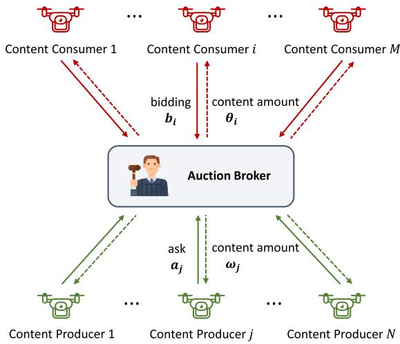  
Fig. 2. The process for content trading in double auction market.

In the second phase, the broker determine the content allocation according to the submitted price vectors from both parties by solving the following optimization problem P2:

$$
\begin{array} { r l r } { \mathbf { P 2 } : } & { \displaystyle \operatorname* { m a x } _ { \theta _ { i } , \omega _ { j } } \left\{ \sum _ { i = 1 } ^ { M } \sum _ { j = 1 } ^ { N } b _ { i j } l n \theta _ { i j } - \frac { 1 } { 2 } a _ { j i } \omega _ { j i } ^ { 2 } \right\} } & { ( 1 } \\ & { } & { \theta _ { i } ^ { \mathrm { m i n } } \leq \displaystyle \sum _ { j = 1 } ^ { N } \theta _ { i j } = \theta _ { i } \mathbf { 1 } \leq \theta _ { i } ^ { \mathrm { m a x } } , \tilde { \mathbf { \Omega } } _ { i } \in \{ 1 , 2 , . . . , M \} ; } \end{array}\tag{6}
$$

(16a)

$$
\begin{array} { l } { { \displaystyle \sum _ { i = 1 } ^ { M } \omega _ { j i } = \omega _ { j } { \bf 1 } \le \omega _ { j } ^ { \operatorname* { m a x } } , \tilde { \mathrm {  ~ \Lambda ~ } } ( \mathrm {  ~ \Lambda ~ } ) } } \\ { { \displaystyle \theta _ { i j } = \omega _ { j i } , \tilde { \mathrm {  ~ \Lambda ~ } } i \in \{ 1 , 2 , . . . , M \} , j \in \{ 1 , 2 , . . . , N \} } . } \end{array}\tag{16b}
$$

(16c)

In P2, $l n \theta _ { i j }$ and $\omega _ { j i } ^ { 2 }$ are adopted to reflect the concave utility function of the content consumer and the convex cost function of the content producer, respectively. The Lagrangian expression $\mathcal { L } _ { 2 }$ corresponding to P2 can be expressed as:

$$
\begin{array} { l } { { \displaystyle { \mathcal { L } } _ { 2 } ( \theta _ { i } , \omega _ { j } , \alpha _ { i } , \beta _ { i } , \gamma _ { j } , \delta _ { i j } ) = \sum _ { i = 1 } ^ { M } \sum _ { j = 1 } ^ { N } ( b _ { i j } l n \theta _ { i j } - \frac { 1 } { 2 } a _ { j i } \omega _ { j i } ^ { 2 } ) } } \\ { { \displaystyle ~ + \sum _ { i = 1 } ^ { M } \alpha _ { i } ( \theta _ { i } { \bf 1 } - \theta _ { i } ^ { \operatorname* { m i n } } ) - \sum _ { i = 1 } ^ { M } \beta _ { i } ( \theta _ { i } { \bf 1 } - \theta _ { i } ^ { \operatorname* { m a x } } ) } } \\ { { \displaystyle ~ - \sum _ { j = 1 } ^ { N } \gamma _ { j } ( \omega _ { j } { \bf 1 } - \omega _ { j } ^ { \operatorname* { m a x } } ) - \sum _ { i = 1 } ^ { M } \sum _ { j = 1 } ^ { N } \delta _ { i j } ( \theta _ { i j } - \omega _ { j i } ) . ~ } } \end{array}\tag{7}
$$

The optimal variables derived from P2 must satisfy the KKT conditions, which can be written as:

$$
\begin{array} { r l } & { \left[ \begin{array} { l } { b _ { i , j } } \\ { \partial _ { i , j } } \end{array} \right] + \alpha _ { i } { \bf 1 } - \beta _ { i } { \bf 1 } - \delta _ { i } = 0 , } \\ & { \left[ \begin{array} { l } { a _ { j , j } \omega _ { i } } \end{array} \right] + \gamma _ { i } { \bf 1 } - \delta _ { j } = 0 , } \\ & { } \\ & { \alpha _ { i } ( \theta _ { i } { \bf 1 } - \theta _ { i } ^ { \mathrm { e f f } } ) = 0 , } \\ & { \delta _ { i } ( \theta _ { i } { \bf 1 } - \theta _ { i } ^ { \mathrm { e f f } } ) = 0 , } \\ & { \gamma _ { j } ( \omega _ { j } { \bf 1 } - \omega _ { j } ^ { \mathrm { e f f } } ) = 0 , } \\ & { \alpha _ { i } \geq 0 , \beta _ { i } \geq 0 , \gamma _ { j } \geq 0 , } \\ & { \theta _ { i , j } = \omega _ { j , i } } \\ & { \beta _ { i } ^ { \mathrm { e f f } } = \omega _ { i } , } \\ & { \beta _ { i } ^ { \mathrm { e f f } } = \theta _ { i } { \bf 1 } \leq \theta _ { i } ^ { \mathrm { e f f } } , } \\ & { \omega _ { j } ^ { \mathrm { e f f } } \leq \omega _ { i } ^ { \mathrm { e f f } } . } \end{array}\tag{18}
$$

According to the KKT conditions mentioned above, we can deduce the rules for content allocation:

$$
\begin{array} { l } { { \theta _ { i j } = \displaystyle \frac { b _ { i j } } { \beta _ { i } - \alpha _ { i } + \delta _ { i j } } , } } \\ { { \omega _ { j i } = \displaystyle \frac { \delta _ { j i } - \gamma _ { j } } { a _ { j i } } . } } \end{array}\tag{19}
$$

## B. Pricing Mechanism

By comparing the KKT conditions of optimization problems P1 and P2, we notice that only the first two terms are different, while the remaining terms are the same. Therefore, the optimal solutions for both P1 and P2 would be equivalent if content consumers and producers submit their prices in the following form:

$$
\nabla _ { \pmb { \theta } _ { i } } U _ { i } ( \pmb { \theta } _ { i } ) = [ \frac { b _ { i j } } { \theta _ { i j } } ]  b _ { i j } = \pmb { \theta } _ { i j } \cdot \frac { \partial U _ { i } ( \pmb { \theta } _ { i } ) } { \partial \theta _ { i j } } ,\tag{20}
$$

$$
\nabla _ { \omega _ { j } } C _ { j } ( \omega _ { j } ) = [ a _ { j i } \omega _ { j i } ]  a _ { j i } = \frac { 1 } { \omega _ { j i } } \cdot \frac { \partial C _ { j } ( \omega _ { j } ) } { \partial \omega _ { j i } } .\tag{21}
$$

In other words, if buyers and sellers submit the bidding and asking prices according to (20) and (21), respectively, the broker can obtain an optimal solution that aligns with the solution for maximizing social welfare.

However, since buyers and sellers are self-interested and they focus only on maximizing their own utility, the broker cannot find an optimal solution for maximizing social welfare [31], [41]. Therefore, it is necessary to design price settlement rules for content consumers and price collection rules for content producers to incentivize them to submit their bids and asks in accordance with (20) and (21).

1) For Content Consumers: Let $P _ { i } ( b _ { i } )$ represent the price settlement rules announced by the broker when it receives the bidding $b _ { i }$ from content consumer i. Thus, the local optimization problem for content consumer i can be described as:

$$
\begin{array} { r l } { \underset { b _ { i } } { \operatorname* { m a x } } } & { \left\{ U _ { i } ( \pmb { \theta _ { i } } ) - P _ { i } ( b _ { i } ) \right\} , } \\ { \mathrm { s . ~ t . } } & { b _ { i j } \geq 0 , \tilde { \forall j } \in \mathcal { N } . } \end{array}\tag{22}
$$

To ensure that IDDA satisfies the property of individual rationality as mentioned at the beginning of Section V, the utility of the content consumer should be non-negative, i.e., $U _ { i } ( \pmb \theta _ { i } ) - P _ { i } ( \pmb b _ { i } ) \geq 0$

By solving the above problem, each content consumer can obtain their optimal bidding vector. Differentiating the objective function with respect to $b _ { i } .$ , the optimal bidding vector should satisfy the following condition:

$$
\frac { \partial U _ { i } ( \pmb \theta _ { i } ) } { \partial b _ { i } } - \frac { \partial P _ { i } ( \pmb b _ { i } ) } { \partial b _ { i } } = 0 ,\tag{23}
$$

which can be simplified to:

$$
\begin{array} { r l r } & { } & { \frac { \partial P _ { i } ( \boldsymbol { b _ { i } } ) } { \partial b _ { i } } = \frac { \partial U _ { i } ( \boldsymbol { \theta _ { i } } ) } { \partial b _ { i } } = \frac { \partial U _ { i } ( \boldsymbol { \theta _ { i } } ) } { \partial \pmb { \theta _ { i } } } \cdot \frac { \partial \pmb { \theta _ { i } } } { \partial b _ { i } } \ } \\ & { } & { = \left[ \frac { b _ { i j } } { \theta _ { i j } } \cdot \frac { 1 } { \beta _ { i } - \alpha _ { i } + \delta _ { i j } } \right] = \left[ 1 \right] . } \end{array}\tag{24}
$$

Then, taking the second derivative of the objective function with respect to bi, we can obtain:

$$
\begin{array} { r l r } {  { \frac { \partial ^ { 2 } P _ { i } ( { \boldsymbol { b } } _ { i } ) } { \partial { \boldsymbol { b } } _ { i } ^ { 2 } } = \frac { \partial ^ { 2 } U _ { i } ( \theta _ { i } ) } { \partial b _ { i } ^ { 2 } } = \frac { \partial } { \partial b _ { i } } ( \frac { \partial U _ { i } ( \theta _ { i } ) } { \partial \theta _ { i } } \cdot \frac { \partial \theta _ { i } } { \partial b _ { i } } ) } } \\ & { } & \\ & { } & { = \frac { \partial ^ { 2 } U ( \theta _ { i } ) } { \partial \theta _ { i } ^ { 2 } } \cdot ( \frac { \partial \theta _ { i } } { \partial b _ { i } } ) ^ { 2 } + \frac { \partial U ( \theta _ { i } ) } { \partial \theta _ { i } } \cdot \frac { \partial ^ { 2 } \theta _ { i } } { \partial b _ { i } ^ { 2 } } } \\ & { } & \\ & { } & { = [ 0 \cdot \frac { \theta _ { i j } } { b _ { i j } } + \frac { b _ { i j } } { \theta _ { i j } } \cdot 0 ] = [ 0 ] . } \end{array}\tag{25}
$$

Therefore, the price settlement rules for content consumers can be written as:

$$
P _ { i } ( b _ { i } ) = \sum _ { j = 1 } ^ { N } b _ { i j } .\tag{26}
$$

2) For Content Producer: Similarly, let $S _ { j } ( \pmb { a } _ { j } )$ represent the price collection rules announced by the broker when it receives the asking price $\mathbf { \delta } _ { a _ { j } }$ from content producer $j .$ Thus, the local optimization problem for content producer $j$ is formulated as:

$$
\begin{array} { r l } { \underset { { \boldsymbol { a } } _ { j } } { \operatorname* { m a x } } } & { \{ S _ { j } ( { \boldsymbol { a } } _ { j } ) - C _ { j } ( \omega _ { j } ) \} , } \\ { \mathrm { s . ~ t . } } & { \{ { \boldsymbol { a } } _ { j i } \geq 0 , \tilde { \setminus } \forall i \in \mathcal { M } . } \end{array}\tag{27}
$$

To guarantee that IDDA meets the individual rationality condition, the utility of the content producer should be non-negative as well, i.e., $S _ { j } ( { \pmb a } _ { j } ) - C _ { j } ( \omega _ { j } ) \geq 0$

By solving the above problem, each content producer can obtain their optimal ask vector. Computing the first derivative of the objective function concerning $\mathbf { \alpha } _ { a _ { j } }$ , the optimal ask vector should satisfy the following condition:

$$
\frac { \partial S _ { j } ( { \bf { a } } _ { j } ) } { \partial { \bf { a } } _ { j } } - \frac { \partial C _ { j } ( \omega _ { j } ) } { \partial { \bf { a } } _ { j } } = 0 ,\tag{28}
$$

which can be simplified to:

$$
\begin{array} { r l r } {  { \frac { \partial S _ { j } ( { \pmb a } _ { j } ) } { \partial { \pmb a } _ { j } } = \frac { \partial C _ { j } ( { \pmb \omega } _ { j } ) } { \partial { \pmb a } _ { j } } = \frac { \partial C _ { j } ( { \pmb \omega } _ { j } ) } { \partial { \pmb \omega } _ { j } } \cdot \frac { \partial \omega _ { j } } { \partial { \pmb a } _ { j } } } } \\ & { } & { = [ a _ { j i } \omega _ { j i } \cdot \frac { \gamma _ { j } - \delta _ { j i } } { ( a _ { j i } ) ^ { 2 } } ] = [ - \frac { ( \gamma _ { j } - \delta _ { j i } ) ^ { 2 } } { ( a _ { j i } ) ^ { 2 } } ] . } \end{array}\tag{29}
$$

Algorithm 1: The Iterative Double Auction Algorithm   
(IDAA).   
1: Initialize bidding price vector $\mathbf { \delta } _ { b } ^ { ( 0 ) }$ and asking price   
vector $\mathbf { \delta } _ { \mathbf { a } } ( 0 )$   
2: Initialize buyer’s demand limit $\theta _ { i } ^ { \mathrm { { m i n } } } , \theta _ { i } ^ { \mathrm { { m a x } } }$ and seller’s   
supply limit $\omega _ { j } ^ { \mathrm { { m a x } } }$   
3: Initialize Lagrange multipliers $\alpha , \beta , \gamma , \delta$ and time   
index $t = 0 ,$ , convergence flag con $v = 0$   
4: =while con $v = 0$ do   
5: $t \gets t + 1$   
6: + 1 Broker computes $\theta _ { i } ^ { t } , \omega _ { j } ^ { t }$ and Lagrange multipliers   
$\alpha _ { i } , \beta _ { i } , \gamma _ { j } , \delta _ { i j }$ by solving P2   
7: Broker announces ${ \boldsymbol { \theta } } _ { i } ^ { t }$ and $\omega _ { j } ^ { t }$   
8: Broker computes pricing mechanisms $P _ { i } ( b _ { i } )$ and   
$S _ { j } ( a _ { j } )$ according to (26) and (31)   
9: ( )for all content consumers do   
10: Update bidding price vector $b _ { i } ^ { ( t ) }$ by solving   
bi $\left\{ U _ { i } ( \pmb \theta _ { i } ) - P _ { i } ( \pmb b _ { i } ) \right\}$   
11: max Submit $\boldsymbol { b } _ { i } ^ { ( t ) }$ to the broker   
12: end for   
13: for all content producer do   
14: Update asking price vector $a _ { j } ^ { ( t ) }$ by solving   
ma $\mathrm { c } _ { { a } _ { j } } \{ S _ { j } ( { a } _ { j } ) - C _ { j } ( \omega _ { j } ) \}$   
15: Submit $P a _ { j } ^ { ( t ) }$ to the broker   
16: end for   
17: Broker announces bidding price vector $\mathbf { \boldsymbol { b } } ^ { ( t ) }$ and   
asking price vector $\mathbf { \pmb { a } } ^ { ( t ) }$   
18: if $| b _ { i j } ^ { ( t ) } - b _ { i j } ^ { ( t - 1 ) } | < \varepsilon$ and $| a _ { i j } ^ { ( t ) } - a _ { i j } ^ { ( t - 1 ) } | < \varepsilon$ then   
19: conv   
20: end if   
21: end while

Similarly, we calculate the second derivative of S relative to a to obtain:

$$
\begin{array} { l } { \displaystyle \frac { \partial ^ { 2 } S _ { j } ( { \boldsymbol { a } } _ { j } ) } { \partial { \boldsymbol { a } } _ { j } ^ { 2 } } = \frac { \partial ^ { 2 } C _ { j } ( { \boldsymbol { \omega } } _ { j } ) } { \partial { \boldsymbol { a } } _ { j } ^ { 2 } } = \frac { \partial } { \partial { \boldsymbol { a } } _ { j } } \left( \frac { \partial C _ { j } ( { \boldsymbol { \omega } } _ { j } ) } { \partial { \boldsymbol { \omega } } _ { j } } \cdot \frac { \partial \omega _ { j } } { \partial { \boldsymbol { a } } _ { j } } \right) } \\ { \displaystyle \ } \\ { \displaystyle = \frac { \partial ^ { 2 } C ( { \boldsymbol { \omega } } _ { j } ) } { \partial \omega _ { j } ^ { 2 } } \cdot \left( \frac { \partial \omega _ { j } } { \partial { \boldsymbol { a } } _ { j } } \right) ^ { 2 } + \frac { \partial C ( \omega _ { j } ) } { \partial \omega _ { j } } \cdot \frac { \partial ^ { 2 } \omega _ { j } } { \partial { \boldsymbol { a } } _ { j } ^ { 2 } } } \\ { \displaystyle \ = \left[ 0 \cdot \frac { ( \gamma _ { j } - \delta _ { j i } ) ^ { 2 } } { ( a _ { j i } ) ^ { 4 } } + ( \delta _ { j i } - \gamma _ { j } ) \cdot \frac { 2 ( \delta _ { j i } - \gamma _ { j } ) } { ( a _ { j i } ) ^ { 3 } } \right] } \\ { \displaystyle \ } \\ { \displaystyle = \left[ \frac { 2 ( \gamma _ { j } - \delta _ { j i } ) ^ { 2 } } { ( a _ { j i } ) ^ { 3 } } \right] . } \end{array}\tag{}
$$

Therefore, the price collection rules for content producers can be written as:

$$
S _ { j } ( { \pmb a } _ { j } ) = \sum _ { i = 1 } ^ { M } \frac { ( \gamma _ { j } - \delta _ { j i } ) ^ { 2 } } { a _ { j i } } .\tag{31}
$$

The procedure of the IDAA described above is outlined in Algorithm 1.

## C. Complexity Analysis

This section evaluates the computational Complexity of the introduced IDAA. First, in the initialization phase, given M content consumers and N content producers, the time complexity is $\mathcal { O } ( 3 M N + 3 M + 2 N )$ . Next, in the iterative loop, since problem P2 is a convex optimization problem, we can use a polynomial time algorithm (such as interior point method or gradient descent method) to solve it. We assume that the algorithm’s complexity is $\mathcal { O } ( n ^ { 3 } )$ , where n is the number of variables. Therefore, in IDAA, the complexity of solving P2 is $\mathcal { O } ( ( M N ) ^ { 3 } )$ . Moreover, the complexity of updating the bidding and ask vectors is $\mathcal { O } ( M + N )$ . Finally, checking whether all biddings and asks have converged requires a complexity of $\mathcal { O } ( M N )$ . Therefore, the complexity of an iteration of the proposed IDAA is $\mathcal { O } ( 3 M N + 3 M + 2 N + ( M N ) ^ { 3 } + M +$ $N + M N ) = \mathcal { O } ( ( M N ) ^ { 3 } )$ . Assuming that the algorithm needs I iterations to converge, the overall complexity of IDAA is $\mathcal { O } ( I \times ( M N ) ^ { 3 } )$

## VI. DIFFUSION MODEL-BASED REINFORCEMENT LEARNING

In Section V, we proposed an iterative double auction algorithm to determine the optimal transaction amounts of content when the content-sharing system maximizes social welfare. However, the IDAA has certain limitations, namely, it requires the utility values of content consumers and content producers to satisfy specific monotonicity, concavity, and convexity conditions, which constitutes a strong assumption [31]. In real-world scenarios, however, agent behaviors and market dynamics often do not strictly follow such assumptions. To improve the robustness and adaptability of the mechanism, we employ reinforcement learning (RL) to relax the dependency on specific function forms. RL enables agents to learn optimal policies through interaction with the environment, even when the utility or cost functions are unknown or non-standard. Therefore, we consider employing RL to address this issue in the double auction market. In this paper, the optimization problem involves high-dimensional state and action spaces as well as multiple complex constraints, which significantly increase the learning difficulty. Traditional decision-based reinforcement learning algorithms often suffer from unstable training, slow convergence, or suboptimal performance in such settings. To overcome these challenges, we propose the Diffusion model-based Reinforcement Learning Double Auction algorithm (denoted as DiffRL-DA), which can handle high-dimensional state and action spaces and derive an optimal policy through an iterative denoising process.

## A. Diffusion Model

As a newly emerging generative model, the diffusion model outperforms other generative methods, including Generative Adversarial Networks (GANs) and Variational Auto Encoders (VAEs), in training stability and generation quality. While GANs can generate samples quickly through adversarial training, they often require the design of complex discriminator networks and are prone to mode collapse. On the other hand, VAEs may produce blurry samples, leading to lower generation quality. Diffusion models, in contrast, directly optimize the generation process by maximizing the data log-likelihood, offering a clear and stable training objective and avoiding these issues [42], [43].

Algorithm 2: The Diffusion Model-Based Reinforcement   
Learning-Double Auction Algorithm (DiffRL-DA).   
1. Training Phase   
Input: The hyperparameters of DiffRL-DA   
Output: The trained actor network parameters $\varepsilon _ { \theta }$ and   
double-critic network parameters $\varepsilon _ { \phi _ { 1 } } , \varepsilon _ { \phi _ { 2 } }$   
1: Initialization the network parameters $\varepsilon _ { \boldsymbol { \theta } } , \varepsilon _ { \boldsymbol { \phi } } ,$ , the target   
network parameters $\hat { \varepsilon } _ { \theta } = \varepsilon _ { \theta } , \hat { \varepsilon } _ { \phi } = \varepsilon _ { \phi }$ and the replay   
buffer;   
2: for Episode to Max\_Episodes do   
3: Initialize a random process for the double auction   
market   
4: for $S t e p \tau = 1$ to Max\_Step do   
5: Observe the current state $s _ { \tau }$ , set Gaussian noise $a _ { \tau } ^ { T }$   
6: Infer noise distribution using a neural network   
7: Calculate the reverse transition distribution   
$p _ { \theta } ( a _ { \tau } ^ { t - 1 } | a _ { \tau } ^ { t } )$ according to (37) and (40)   
8: Denoise $a _ { \tau } ^ { T }$ to $a _ { \tau } ^ { 0 }$ to generate the content amount   
using reparameterization according to (37) and   
(38)   
9: Add exploration noise z to $a _ { \tau } ^ { 0 }$   
10: Calculate the utility and reward by the obtained   
content amount $a _ { \tau } ^ { 0 }$ according to (13) and (43)   
11: Save the record $( s _ { \tau } , a _ { \tau } ^ { 0 } , r _ { \tau } )$ to the replay buffer   
12: Extract a random batch from the replay buffer   
13: Update the parameters of the actor network $\varepsilon _ { \theta }$ and   
the critic network $\varepsilon _ { \phi }$ in accordance with (46) and   
(47), respectively   
14: Update the parameters of the target networks $\hat { \varepsilon } _ { \theta }$   
and $\hat { \varepsilon } _ { \phi }$   
15: end for   
16: end for   
17: returnThe trained network parameters εθ, $\varepsilon _ { \phi _ { 1 } }$ and   
$\varepsilon _ { \phi _ { 2 } }$   
2. Inference Phase   
1: Observe the state vector s   
2: Generate the transaction content amount $a ^ { 0 }$ using $\varepsilon _ { \theta }$   
through the denoising process   
3: returnThe transaction content amount $a ^ { 0 }$

Additionally, diffusion model performs exceptionally well in processing high-dimensional state and action information, which involves two stages: the forward noising stage and the reverse denoising stage [34]. This step-by-step approach enables diffusion model to better handle complex data distributions, making them particularly suitable for tasks requiring robust and high-quality generation.

1) Forward Noising Process: Forward diffusion is the process of introducing noise to the source data. Given the original data $a _ { 0 } \sim q ( a )$ , we assume that there are T time steps from the original data to the final Gaussian noise, get $a _ { 1 } , a _ { 2 } , . . . , a _ { T }$ in turn. Each time step t in forward process is influenced only by the previous time step $t - 1$ , so it can be regarded as a Markov process [44], and the mathematical form is expressed as:

$$
\begin{array} { l } { \displaystyle q ( a _ { t } | a _ { t - 1 } ) = \mathcal { N } ( a _ { t } ; \sqrt { 1 - \beta _ { t } } a _ { t - 1 } , \beta _ { t } { \bf I } ) , } \\ { \displaystyle q ( a _ { 1 : T } | a _ { 0 } ) = \prod _ { t = 1 } ^ { T } q ( a _ { t } | a _ { t - 1 } ) = \prod _ { t = 1 } ^ { T } \mathcal { N } ( a _ { t } ; \sqrt { 1 - \beta _ { t } } a _ { t - 1 } , \beta _ { t } { \bf I } ) , } \end{array}\tag{32}
$$

where $\beta _ { 1 } , . . . , \beta _ { t } , . . . , \beta _ { T } \in ( 0 , 1 )$ are the hyperparameters of the Gaussian distribution variance, controlling the amount of noise added at each step. When T is large enough, $a _ { T }$ converges to standard Gaussian noise $\mathcal { N } ( 0 , \bf { I } )$

In fact, the forward noising stage, while not explicitly implemented, defines the relationship between the original data $a _ { 0 }$ and the data at any given time step $a _ { t }$ [10]:

$$
a _ { t } = \sqrt { \bar { \alpha } _ { t } } a _ { 0 } + \sqrt { 1 - \bar { \alpha } _ { t } } \bar { \varepsilon } _ { t } ,\tag{33}
$$

where $\alpha _ { t } = 1 - \beta _ { t }$ and $\begin{array} { r } { \bar { \alpha } _ { t } = \prod _ { k = 1 } ^ { t } \alpha _ { k } } \end{array}$ . Besides, $\bar { \varepsilon } _ { t } \sim \mathcal { N } ( 0 , \mathbf { I } )$ is the standard normally distributed noise.

2) Reverse Denoising Process: Reverse denoising is the inference process of restoring Gaussian noise $ { \boldsymbol { a } } _ { T } \sim \mathcal { N } ( 0 , \mathbf { I } )$ to original data. The key to successful inference lies in determining the transition probability $p ( a _ { t - 1 } | a _ { t } )$ . Although we cannot directly obtain $p ( a _ { t - 1 } | a _ { t } )$ , given $a _ { 0 }$ during the training process, we can use the Bayesian formula to obtain $p ( a _ { t - 1 } | a _ { t } , a _ { 0 } )$ as follows:

$$
\begin{array} { r l } & { p ( a _ { t - 1 } | a _ { t } , a _ { 0 } ) = q ( a _ { t } | a _ { t - 1 } , a _ { 0 } ) \frac { q ( a _ { t - 1 } | a _ { 0 } ) } { q ( a _ { t } | a _ { 0 } ) } } \\ & { ~ = q ( a _ { t } | a _ { t - 1 } ) \frac { q ( a _ { t - 1 } | a _ { 0 } ) } { q ( a _ { t } | a _ { 0 } ) } . } \end{array}\tag{34}
$$

This converts the posterior probability into the known prior probability, and after sorting, we can get:

$$
\begin{array} { r } { p ( a _ { t - 1 } | a _ { t } , a _ { 0 } ) = \mathcal { N } ( a _ { t - 1 } ; \tilde { \mu } ( a _ { t } , a _ { 0 } ) , \tilde { \beta } _ { t } { \bf I } ) , } \end{array}\tag{35}
$$

where

$$
\begin{array} { c } { { \tilde { \mu } _ { t } ( a _ { t } , a _ { 0 } ) = \displaystyle \frac { \sqrt { \alpha _ { t } } ( 1 - \overline { { { \alpha } } } _ { t - 1 } ) } { 1 - \overline { { { \alpha } } } _ { t } } a _ { t } + \displaystyle \frac { \sqrt { \overline { { { \alpha } } } _ { t - 1 } } \beta _ { t } } { 1 - \overline { { { \alpha } } } _ { t } } a _ { 0 } } } \\ { { \beta _ { t } = \displaystyle \frac { 1 - \overline { { { \alpha } } } _ { t - 1 } } { 1 - \overline { { { \alpha } } } _ { t } } \beta _ { t } \approx \beta _ { t } . } } \end{array}\tag{36}
$$

However, in the reverse denoising process, a0 is unknown, which makes it impossible to obtain $p ( a _ { t - 1 } | a _ { t } , a _ { 0 } )$ through the above process. Therefore, a neural network can be employed to approximate the distribution $p _ { \theta } ( a _ { t - 1 } | a _ { t } )$ , with θ representing the network’s hyperparameters. This transition follows Gaussian distribution, which is denoted as:

$$
\begin{array} { l } { { \displaystyle p _ { \theta } ( a _ { t - 1 } | a _ { t } ) = \mathcal { N } ( a _ { t - 1 } ; \mu _ { \theta } ( a _ { t } , t ) , \sigma _ { \theta } ^ { 2 } ( a _ { t } , t ) { \bf I } ) , } } \\ { { \displaystyle p _ { \theta } ( a _ { 0 : T } ) = p ( a _ { T } ) \prod _ { t = T } ^ { 1 } p _ { \theta } ( a _ { t - 1 } | a _ { t } ) } } \\ { { \displaystyle \qquad = p ( a _ { T } ) \prod _ { t = T } ^ { 1 } \mathcal { N } ( a _ { t - 1 } ; \mu _ { \theta } ( a _ { t } , t ) , \sigma _ { \theta } ^ { 2 } ( a _ { t } , t ) { \bf I } ) . } } \end{array}\tag{37}
$$

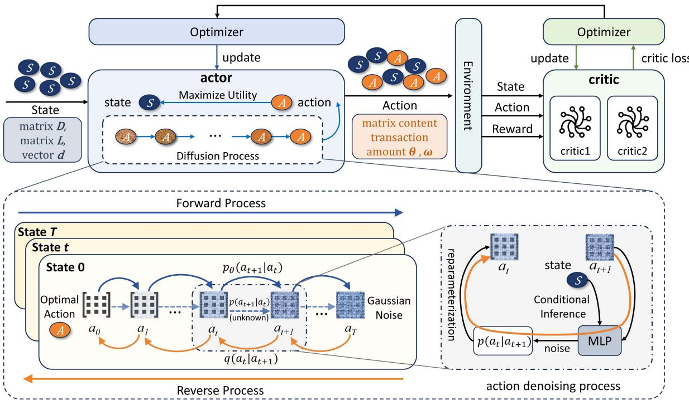  
Fig. 3. The architecture diagram of proposed DiffRL-DA.

Training a neural network involves learning the parameters $\mu _ { \theta } ( a _ { t } , t )$ and $\sigma _ { \theta } ^ { 2 } ( a _ { t } , t )$ in the given equations.

Then, according to (33), we can use the properties of reparameterization to represent a0:

$$
a _ { 0 } = \frac { 1 } { \sqrt { \overline { { \alpha } } _ { t } } } ( x _ { t } - \sqrt { 1 - \overline { { \alpha } } _ { t } } \overline { { \varepsilon } } _ { t } ) .\tag{38}
$$

Substituting (38) into (33), we can obtain:

$$
\tilde { \mu } _ { t } = \frac { 1 } { \sqrt { \alpha _ { t } } } \left( x _ { t } - \frac { \beta _ { t } } { \sqrt { 1 - \overline { { \alpha } } _ { t } } } \overline { { \varepsilon } } _ { t } \right) ,\tag{39}
$$

where $\bar { \varepsilon } _ { t }$ represents the noise predicted by the deep neural network, which can be rewritten as $\varepsilon _ { \boldsymbol { \theta } } ( a _ { t } , t )$ . Therefore, the mean value predicted by the neural network can be expressed as:

$$
\mu _ { \theta } ( a _ { t } , t ) = \frac { 1 } { \sqrt { \alpha _ { t } } } \left( a _ { t } - \frac { \beta _ { t } } { \sqrt { 1 - \overline { { \alpha } } _ { t } } } \varepsilon _ { \theta } ( a _ { t } , t ) \right) .\tag{40}
$$

## B. Markov Decision Process

In this subsection, we model the content auction process as a Markov Decision Process (MDP), which is characterized by a 4-tuple S, A, , R. S is the state space, A is the action space, represents the policy space, and R corresponds to the reward space. The MDP is formally defined as follows.

1) State: The state space of the content-sharing market consists of the distance matrix D between content consumers and content producers, the hop count matrix $L ,$ and the distance matrix d between content producers and their next hop nodes:

$$
S = \{ D _ { M \times N } , L _ { M \times N } , d _ { 1 \times N } \} .\tag{41}
$$

2) Action: In this paper, the broker will eventually negotiate the content transaction amount between content consumers and content producers, which means that when the market reaches convergence, the content consumers receive the same amount of content as the content producers provide. This can be expressed as $\theta _ { i j } = \omega _ { j i }$ , similar to (16c). Therefore, we define the action space as the content transaction amount θ for content consumers:

$$
A = \pmb \theta _ { M \times N } = \left[ \begin{array} { c c c c } { \theta _ { 1 1 } } & { \theta _ { 1 2 } } & { \cdots } & { \theta _ { 1 N } } \\ { \theta _ { 2 1 } } & { \theta _ { 2 2 } } & { \cdots } & { \theta _ { 2 N } } \\ { \vdots } & { \vdots } & { \ddots } & { \vdots } \\ { \theta _ { M 1 } } & { \theta _ { M 2 } } & { \cdots } & { \theta _ { M N } } \end{array} \right] .\tag{42}
$$

3) Reward: Under the condition that all constraints of the optimization problem P1 are satisfied, the reward is defined as the social welfare SW . Otherwise, the reward is defined as the number of unsatisfied constraints, as follows:

$$
\begin{array} { r } { R = \xi \times S W - [ N u m ( U n s a t i s f i e d ^ { \top } C o n s t r a i n t s ) ] , \ } \\ { { \mathrm { w h e r e ~ } } ^ { \sim } \xi = \left\{ \begin{array} { l l } { 1 , } & { a l l ^ { \sim } c o n s t r a i n t s ^ { \sim } a r e ^ { \sim } s a t i s f i e d ; } \\ { 0 , } & { s o m e ^ { \sim } c o n s t r a i n t s ^ { \sim } a r e ^ { \sim } n o t ^ { \sim } s a t i s f i e d . } \end{array} \right. } \end{array}
$$

## C. Diffusion Model-Based Reinforcement Learning

In this subsection, we design the diffusion model-based reinforcement learning algorithm in double auction market (DiffRL-DA). The structure of DiffRL-DA is illustrated in Fig. 3.

The traditional actor-critic architecture is adopted in DiffRL-DA, which consists of one actor network and two critic networks. The key feature of this algorithm is the use of diffusion model in the actor network $\varepsilon _ { \pmb { \theta } } .$ replacing the traditional multi-layer perceptron (MLP) to generate policies. Moreover, The double critic network is employed to evaluate $Q$ value to prevent excessive estimation bias, making the policy more stable and easier to converge during training. Each critic network operates with distinct parameters, represented as $\epsilon _ { \phi _ { 1 } }$ and $\epsilon _ { \phi _ { 2 } }$ , which are updated according to the same target of optimization. In the training process, the actor network is updated by selecting the smallest estimate of the $Q$ value, which can be denoted as:

$$
{ \cal Q } _ { \phi } ( s ) = \mathrm { m i n } \left\{ { \cal Q } _ { \phi _ { 1 } } ( s ) , { \cal Q } _ { \phi _ { 2 } } ( s ) \right\} .\tag{44}
$$

The actor network adjusts the policy based on the estimated $Q$ values, selecting actions that maximize the expected cumulative reward:

$$
\operatorname* { m a x } _ { \pmb { \theta } } \pi \pmb { \theta } ( s ) ^ { T } Q _ { \phi } ( s ) .\tag{45}
$$

To solve this using gradient descent, the reward maximization problem is reformulated as a loss minimization problem, as follows:

$$
\begin{array} { c } { \displaystyle \operatorname* { m i n } _ { \theta } - \pi _ { \pmb { \theta } } ( s ) ^ { T } Q _ { \phi } ( s ) , } \\ { \displaystyle \pi = \arg \operatorname* { m i n } _ { \pi _ { \theta } } \mathcal { L } ( \theta ) = - \mathbb { E } _ { \mathbf { a } ^ { 0 } \sim \pi _ { \theta } } \left[ Q _ { v } \left( \mathbf { s } , \mathbf { a } ^ { 0 } \right) \right] . } \end{array}\tag{46}
$$

The critic network is optimized by minimizing the Bellman operator, expressed as:

$$
\begin{array} { r l } & { \phi = \arg \underset { \phi _ { i } , i = \{ 1 , 2 \} } { \operatorname* { m i n } } \mathcal { L } ( \phi ) = \mathbb { E } _ { \mathbf { a } _ { t + 1 } ^ { 0 } \phi _ { i } } } \\ & { \times \left[ \left\| \left( R ( \mathbf { s } , \mathbf { a } _ { t } ) + \gamma \underset { i = 1 , 2 } { \operatorname* { m i n } } Q _ { \phi _ { i } } ( \mathbf { s } , \mathbf { a } _ { t + 1 } ^ { 0 } ) \right) - Q _ { \phi _ { i } } ( \mathbf { s } , \mathbf { a } _ { t } ) \right\| ^ { 2 } \right] , } \end{array}\tag{47}
$$

where the definition of reward R is given in (43).

The process of DiffRL-DA is summarized in Algorithm 2.

## D. Complexity Analysis

In this section, we analyze the computational complexity of DiffRL-DA. Given that the training process can be conducted on a resource-rich server, the complexity analysis of the algorithm can focus only on the execution process of the trained model, i.e., the denoising process of the diffusion model [46], [47]. Let $F _ { \pi }$ and $F _ { Q }$ denote the hidden layer counts in the policy network (Actor network) and value network (Critic network), respectively. Let $f _ { s }$ denote the dimension of the state space input to the input layer, $f _ { 0 }$ denote the dimension of the output from the input layer, $f _ { a }$ denote the dimension of the action space output from the output layer, $f _ { h i d }$ indicate the neuron quantity in the hidden layers. Then, for each denoising step, the computational complexity of Actor network is: $\begin{array} { r } { \mathcal { O } ( f _ { s } f _ { 0 } + \sum _ { h i d = 1 } ^ { F _ { \pi } } f _ { h i d - 1 } f _ { h i d } + f _ { F _ { \pi } } f _ { a } ) } \end{array}$ In the deployment of the policy, the Critic network continues to provide assistance, and its computational complexity can be expressed as: $\begin{array} { r } { \mathcal { O } ( ( f _ { s } + f _ { a } ) f _ { 0 } + \sum _ { h i d = 1 } ^ { F _ { Q } } f _ { h i d - 1 } f _ { h i d } + f _ { F _ { Q } } ) } \end{array}$ Considering that each episode consists of $T$ steps, the overall computational complexity of DiffRL-DA in the denoising process is $\begin{array} { r } { O ( T ( f _ { s } f _ { 0 } + \sum _ { h i d = 1 } ^ { F _ { \pi } } f _ { h i d - 1 } f _ { h i d } + f _ { F _ { \pi } } f _ { a } + ( f _ { s } + } \end{array}$ $\begin{array} { r } { f _ { a } ) f _ { 0 } + \sum _ { h i d = 1 } ^ { F _ { Q } } f _ { h i d - 1 } f _ { h i d } + f _ { F _ { Q } } ) ) } \end{array}$

In practice, UAV swarm networks are typically organized and managed using a cluster-based structure [48], [49], [50]. To address the resource constraints commonly faced in UAV networks, the cluster head, equipped with relatively higher computational and storage resources [51], can be selected as the broker to deploy and execute the pre-trained DiffRL-DA model for handling content allocation decisions. Member UAVs within the cluster interact with the cluster head to exchange state information and receive content allocation decisions, significantly reducing their computational and communication overhead. This architecture ensures the practical applicability of the proposed algorithm in resource-constrained UAV network scenarios while maintaining system efficiency and performance.

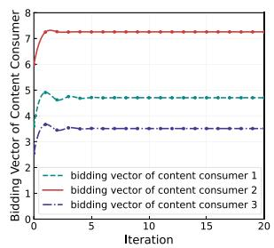  
(a) Bidding

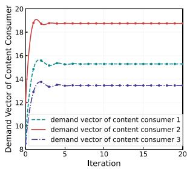  
(b) Demand  
Fig. 4. Bidding and demand of content consumers.

## VII. SIMULATION RESULTS AND ANALYSIS

In this section, we evaluate the feasibility and effectiveness of the proposed IDAA and DiffRL-DA through a series of experiments.

## A. Iterative Double Auction Algorithm (IDAA)

This subsection presents a series of experiments to assess the proposed IDAA. We first verify the algorithms’ convergence. Then, we analyze the bidding situation as well as the economic characteristics of the data market.

In the content sharing market, we assume that within a specific time slot, there are multiple content consumers and content producers for a specific type of content. The minimum requested content amount $\theta ^ { m i n }$ for each content consumer is between M bit and M bit [52], and the maximum requested content amount is the total size of the content, which we assume it as Mbit. The maximum amount of content that each content producer can provide is randomly distributed between Mbit and Mbit. The specific parameters are set as Table II.

1) Convergence Analysis: In this subsection, we validate the convergence performance of the proposed IDAA by analyzing the bidding vectors, demand vectors of content consumers, as well as the ask vectors and supply vectors of content producers. We simulate a content sharing market with 3 content consumers and 3 content producers, i.e., M , N .

= 3 = 3Figs. 4 and 5 show the price strategy and the content amount strategy of both content consumers and content producers. We can observe that after about 10 iterations, the strategies of both content producers and content consumers can rapidly converge to the maximum point of social welfare. Moreover, by observing Figs. 4(b) and 5(b), clearly, after convergence, the demand vectors of content consumers and the supply vectors provided by content producers are always equal. This means that the entire content sharing market has successfully converged to an equilibrium point.

TABLE II PARAMETERS
<table><tr><td>Parameter</td><td>Value</td><td>Parameter</td><td>Value</td></tr><tr><td>Transmission rate R</td><td>4000KB [31]</td><td>Light speed c</td><td> $3 \times 1 0 ^ { 8 } m / s$ </td></tr><tr><td>Energy consumption parameter  $E _ { e l e c }$ </td><td>50nJ/bit [45]</td><td>Energy consumption factor of free space model  $\eta _ { f s }$ </td><td> $1 0 p J / ( b i t * m ^ { 2 } )$  [45]</td></tr><tr><td>Energy consumption factor of multi-path fading model  $\eta _ { m p }$ </td><td> $0 . 0 0 1 3 p J / ( b i t * m ^ { 4 } )$  [45]</td><td>Utility weighting factor  $a _ { u }$ </td><td>5</td></tr><tr><td>Cost weighting factor  $a _ { c }$ </td><td>3.9</td><td>The minimum requested content amount θmin</td><td>[1Mbit, 5Mbit]</td></tr><tr><td>The maximum requested content amount θmax</td><td>20Mbit</td><td>The maximum provided content amount max</td><td> $[ 1 5 M b i t , 2 0 M b i t ]$ </td></tr><tr><td>UAV communication range</td><td>200m</td><td>The distance between two UAVs in one hop</td><td>[20m, 200m]</td></tr></table>

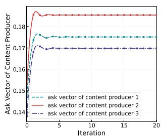

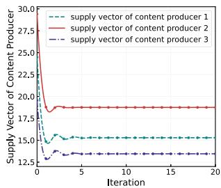  
(a) Ask  
(b) Supply  
Fig. 5. Ask and supply of content producers.

As shown in Figs. 4 and 5, we can obtain that bidding vectors and demand vectors of content consumers have similar numerical relationship, i.e., $b _ { 2 } > b _ { 1 } > b _ { 3 }$ and $\theta _ { 2 } > \theta _ { 1 } > \theta _ { 3 }$ In the same way, ask vectors and supply vectors of content producers have similar numerical relationship as well, which can be represented as $a _ { 2 } > a _ { 1 } > a _ { 3 }$ and $\omega _ { 2 } > \omega _ { 1 } > \omega _ { 3 }$ . This means that content consumers who want to request more content will need to bid higher, and content producers who provide more content will charge higher prices of all transmitted content.

In addition, the curves of bidding vectors $b _ { i }$ and demand vectors $\theta _ { i }$ of content consumers in Fig. 4 have similar changing trends, while the curves of ask vectors ${ \mathbf { } } a _ { j }$ and supply vectors ωj of content producers in Fig. 5 have opposite changing trends, which is consistent with (19).

2) Pricing Rules: The pricing rules of both content consumers and content producers are analyzed in this subsection. Fig. 6 show the price settlement rules of content consumers and price collection rules of content producers. We can observe that the price settlement rules of content consumers have similar trend with the bidding vectors. However, the price collection rules of content producers have the opposite trend with the ask vectors. These results are determined by the pricing rules for content consumers and content producers that we have obtained in (26) and (31). Specifically, (26) indicates that the price settlement rules of content consumers are positively correlated with their biddings, while (31) indicates that the price collection rules of content producers are negatively correlated with their asks. Besides, these two pricing rules $P _ { i }$ and $S _ { j }$ eventually converge to the same values. Table III displays the specific values of the pricing rules.

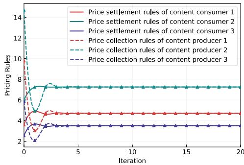  
Fig. 6. Pricing rules of content consumers and content producers.

TABLE III SIMULATION RESULTS
<table><tr><td rowspan=1 colspan=1>Definition</td><td rowspan=1 colspan=1>Parameter</td><td rowspan=1 colspan=1>Agent1</td><td rowspan=1 colspan=1>Agent2</td><td rowspan=1 colspan=1>Agent3</td></tr><tr><td rowspan=2 colspan=1>Content Amount</td><td rowspan=1 colspan=1> $\theta _ { i }$ </td><td rowspan=1 colspan=1>15.289</td><td rowspan=1 colspan=1>18.749</td><td rowspan=1 colspan=1>13.455</td></tr><tr><td rowspan=1 colspan=1> $\omega _ { j }$ </td><td rowspan=1 colspan=1>15.289</td><td rowspan=1 colspan=1>18.749</td><td rowspan=1 colspan=1>13.455</td></tr><tr><td rowspan=2 colspan=1>Bidding and Ask</td><td rowspan=1 colspan=1> $b _ { i }$ </td><td rowspan=1 colspan=1>4.706</td><td rowspan=1 colspan=1>7.259</td><td rowspan=1 colspan=1>3.511</td></tr><tr><td rowspan=1 colspan=1> ${ a } _ { j }$ </td><td rowspan=1 colspan=1>0.175</td><td rowspan=1 colspan=1>0.185</td><td rowspan=1 colspan=1>0.170</td></tr><tr><td rowspan=4 colspan=1>Lagrange Multipliers</td><td rowspan=1 colspan=1> $\alpha _ { i }$ </td><td rowspan=1 colspan=1>0</td><td rowspan=1 colspan=1>0</td><td rowspan=1 colspan=1>0</td></tr><tr><td rowspan=1 colspan=1> $\beta _ { i }$ </td><td rowspan=1 colspan=1>0</td><td rowspan=1 colspan=1>0</td><td rowspan=1 colspan=1>0</td></tr><tr><td rowspan=1 colspan=1> $\gamma _ { j }$ </td><td rowspan=1 colspan=1>0</td><td rowspan=1 colspan=1>0</td><td rowspan=1 colspan=1>0</td></tr><tr><td rowspan=1 colspan=1> $\delta _ { i j }$ </td><td rowspan=1 colspan=1>0.2580.3780.269</td><td rowspan=1 colspan=1>0.2600.4120.197</td><td rowspan=1 colspan=1>0.3800.3690.299</td></tr><tr><td rowspan=1 colspan=1>Utility</td><td rowspan=1 colspan=1> $U _ { i } ( \boldsymbol \theta _ { i } )$ </td><td rowspan=1 colspan=1>29.022</td><td rowspan=1 colspan=1>39.052</td><td rowspan=1 colspan=1>20.818</td></tr><tr><td rowspan=1 colspan=1>Cost</td><td rowspan=1 colspan=1> $C _ { j } ( \omega _ { j } )$ </td><td rowspan=1 colspan=1>3.490</td><td rowspan=1 colspan=1>3.695</td><td rowspan=1 colspan=1>3.383</td></tr><tr><td rowspan=2 colspan=1>Pricing Rules</td><td rowspan=1 colspan=1> $P _ { i } ( b _ { i } )$ </td><td rowspan=1 colspan=1>4.706</td><td rowspan=1 colspan=1>7.259</td><td rowspan=1 colspan=1>3.511</td></tr><tr><td rowspan=1 colspan=1> $S _ { j } ( a _ { j } )$ </td><td rowspan=1 colspan=1>4.706</td><td rowspan=1 colspan=1>7.259</td><td rowspan=1 colspan=1>3.511</td></tr></table>

3) Utility, Cost and Social Welfare: In this part, we assess the utility, cost and social welfare of the content sharing market with different numbers of participants. We conduct experiments on four cases: $M = N = 3 , 5 , 7$ , and 10. The results of the simulation are presented in Fig. 7. Fig. 7(a) shows how the social welfare of the market changes with the algorithm iterations under different cases, while Fig. 7(b) demonstrates the utility, cost, and social welfare of markets after convergence. From these results, we can find that with the growth in the number of market participants, the utility of content consumers, the cost of content producers, and the social welfare of the market are all increasing. Moreover, the convergence speed decreases because the addition of more participants heightens the complexity of the market.

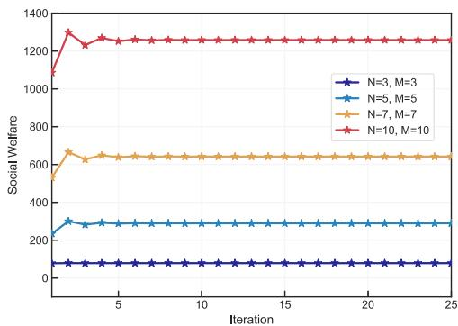  
(a) Social welfare with different cases

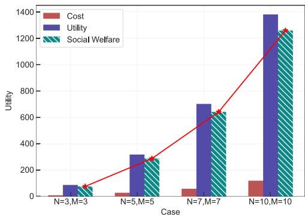  
(b) Social welfare, utility and cost with different cases  
Fig. 7. Impact of market participants on social welfare, utility, and cost.

4) Economic Properties: In this section, we verify the economic properties of IDAA and demonstrate that the algorithm satisfies the four economic characteristics mentioned earlier. The parameter values after market convergence are listed in Table III.

a) Economic Efficiency: As illustrated in Fig. 7, applying IDAA leads the demand and supply vectors to converge, resulting in the maximum social welfare in the content-sharing market. This demonstrates that IDAA satisfies the economic efficiency property.

b) Individual Rationality: From Table III, it can be observed that the utility of each content consumer is always greater than the price paid to the market broker, i.e., $U _ { i } ( \pmb \theta _ { i } ) >$ $P _ { i } ( b _ { i } ) , i \in \mathcal { M }$ . Moreover, the settlement price received by each content producer from the broker is greater than its cost, i.e., $S _ { j } ( \pmb { a } _ { j } ) > C _ { j } ( \omega _ { j } ) , j \in \mathcal { N }$ . These results stem from the requirements outlined in Section V-B, which state that during the design of IDDA, the utility of both content consumers and content producers must be non-negative. This means that all participants in the content sharing market will receive positive feedback, proving that IDAA satisfies individual rationality property.

c) Incentive Compatibility: The results in Fig. 4 show that content consumer 1 submits higher bids for more content.

TABLE IV PARAMETERS
<table><tr><td>Parameter</td><td>Value</td></tr><tr><td>Number of epoches in training</td><td>1000</td></tr><tr><td>Number of steps per epoch</td><td>100</td></tr><tr><td>Learning rate of Actor network</td><td> $1 0 ^ { - 4 }$ </td></tr><tr><td>Learning rate of Critic network</td><td> $1 0 ^ { - 3 }$ </td></tr><tr><td>Weight decay</td><td> $1 0 ^ { - 4 }$ </td></tr><tr><td>Buffer size in training</td><td> $1 0 ^ { 6 }$ </td></tr><tr><td>Batch size</td><td>256</td></tr><tr><td>Soft update Parameter €</td><td>0.01</td></tr><tr><td>Denoising steps</td><td> $3 , 5 , 8 , 1 0$ </td></tr></table>

Moreover, before the algorithm converges, the bid of content consumer 1 increases with each iteration. This demonstrates the incentive compatibility of the proposed IDAA for content consumers, as it encourages them to bid higher to obtain more content. Additionally, Fig. 5 reveals that content producer 1, who can provide the most content, asks for the highest price. Before convergence, the price asked by content producer 1 increases with each iteration, further proving that IDAA is incentive compatible for content producers. This means that the proposed IDAA can incentivize participants to reveal their true requirements.

d) Budget Balance: From Fig. 6 and Table III, it can be observed that the pricing rules for content consumers and producers converge to the same value with an increase in the number of algorithm iterations, i.e., $P _ { i } ( b _ { i } ) = S _ { j } ( a _ { j } )$ . This indicates that no additional investment is required from the broker to maintain the content-sharing market, thereby verifying the budget balance property of IDAA.

## B. DiffRL-DA Algorithm

In this subsection, we conduct extensive experiments to verify the performance of DiffRL-DA algorithm, benchmarking it against four baseline algorithms: Proximal Policy Optimization (PPO) [53], Deep Deterministic Policy Gradient (DDPG) [54], Deep Q-Network (DQN) [55] and Random Policy.

1) Simulation Settings: The hardware environment of the experiment includes a 13th Gen Intel(R) Core(TM) i7-13700H CPU and an NVIDIA GeForce RTX 4060 Laptop GPU. Python 3.10 with PyTorch 2.2.0 is employed, running on the Windows 11 operating system.

In the experiment, we assume that there are 3 content consumers and 3 content producers in the double auction market. The broker acts as the agent of the DiffRL-DA algorithm, guiding market participants to adjust their strategies. The simulation environment used for training is constructed based on the system model presented in Section III, and the corresponding parameter configurations are listed in Table II. The hyperparameters for algorithm training are provided in Table IV. During training, data is not pre-generated but collected online through agentenvironment interaction, which follows the standard paradigm of reinforcement learning. Unless otherwise specified, the denoising step of DiffRL-DA is set to $T = 5$

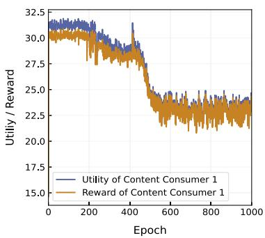  
(a) Content Consumer 1

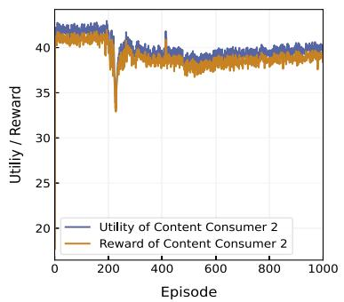  
(b) Content Consumer 2

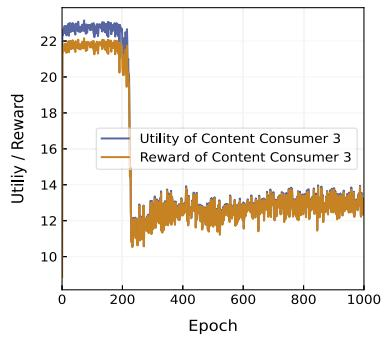  
(c) Content Consumer 3

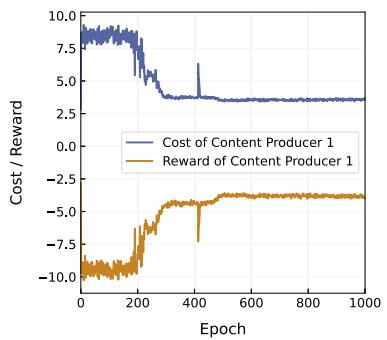  
(d) Content Producer 1

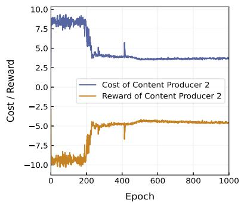  
Fig. 8. Utility and reward for market participants.  
(e) Content Producer 2

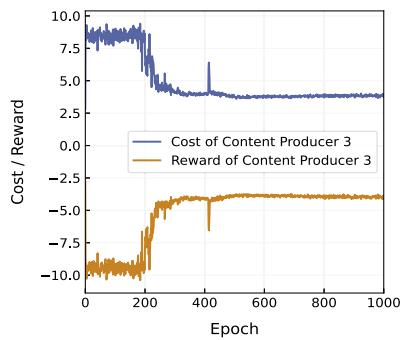  
(f) Content Producer 3

## 2) Baseline Algorithms:

\- Proximal Policy Optimization (PPO): PPO is an advanced reinforcement learning algorithm proposed by OpenAI in 2017 [53]. It uses a policy gradient approach with a clipped objective function to prevent large, potentially destabilizing policy updates. The PPO algorithm belongs to the Policy Optimization Methods, which aims to balance the relationship between exploring new policies and using existing policies, so as to achieve an efficient and stable learning process.

Deep Deterministic Policy Gradient (DDPG): DDPG is a reinforcement learning algorithm designed for continuous action spaces [54], which also employs an actor-critic architecture. To enhance training stability, DDPG employs target networks and experience replay techniques. Additionally, DDPG introduces noise mechanisms to encourage exploration. Through these methods, DDPG can effectively learn and optimize continuous action policies in complex environments.

Deep Q-Network (DQN): DQN is a classic algorithm in reinforcement learning that integrates deep neural networks with Q-learning to address decision-making problems in discrete action spaces [55]. DQN estimates the Q-value function through a neural network, learning the optimal policy from state-action pairs. However, as its action space is discrete, DQN performs poorly in continuous action problems and typically requires discretizing the action space to adapt to such problems.

\- Random Policy: In reinforcement learning, Random Policy is the most basic form of policy, in which the agent randomly explores all possible actions in the environment at each state and chooses actions randomly without considering the feedback from the environment or future rewards.

TABLE V  
SIMULATION RESULTS
<table><tr><td rowspan=1 colspan=1>Definition</td><td rowspan=1 colspan=1>Parameter</td><td rowspan=1 colspan=1>Agent1</td><td rowspan=1 colspan=1>Agent2</td><td rowspan=1 colspan=1>Agent3</td></tr><tr><td rowspan=2 colspan=1>Content Amount</td><td rowspan=1 colspan=1> $\theta _ { i }$ </td><td rowspan=1 colspan=1>14.650</td><td rowspan=1 colspan=1>17.032</td><td rowspan=1 colspan=1>9.792</td></tr><tr><td rowspan=1 colspan=1> $\omega _ { j }$ </td><td rowspan=1 colspan=1>14.650</td><td rowspan=1 colspan=1>17.032</td><td rowspan=1 colspan=1>9.792</td></tr><tr><td rowspan=1 colspan=1>Utility</td><td rowspan=1 colspan=1> $U _ { i } ( \theta _ { i } )$ </td><td rowspan=1 colspan=1>23.134</td><td rowspan=1 colspan=1>39.497</td><td rowspan=1 colspan=1>12.922</td></tr><tr><td rowspan=1 colspan=1>Cost</td><td rowspan=1 colspan=1> $C _ { j } ( \omega _ { j } )$ </td><td rowspan=1 colspan=1>3.555</td><td rowspan=1 colspan=1>3.659</td><td rowspan=1 colspan=1>3.819</td></tr></table>

3) Convergence Performance: In this subsection, we evaluate the convergence performance of DiffRL-DA. Fig. 8 shows the utility and reward of all participants in the double auction market. The DiffRL-DA algorithm exhibits effective convergence, stabilizing after around 400 epochs. Additionally, we give the definition of the reward in (43). From Fig. 8, we can observe that the utility or the cost of market participants is close to the absolute value of the reward after the algorithm converges, indicating that there is basically no violation of the constraints, that is, the content consumers receive the same amount of content as the content producers provide, which is the transaction volume. And the transaction volume is within the range requested by the content consumer and stays below the content producer’s maximum capacity.

Furthermore, the content amounts, the utility of content consumers and the cost of content producers after convergence are listed in Table V, in which the values are very close to those in Table III. This indicates that DiffRL-DA’s convergence results align closely with the optimal equilibrium strategies in the double auction market. The slight discrepancy is because that the policy network and value network in RL are approximate models of deep neural networks. The structure of these models may limit their ability to accurately approximate the optimal solution. Additionally, RL’s performance is frequently influenced by hyperparameters configuration, resulting in a gap between the training results and the theoretical optimal solution.

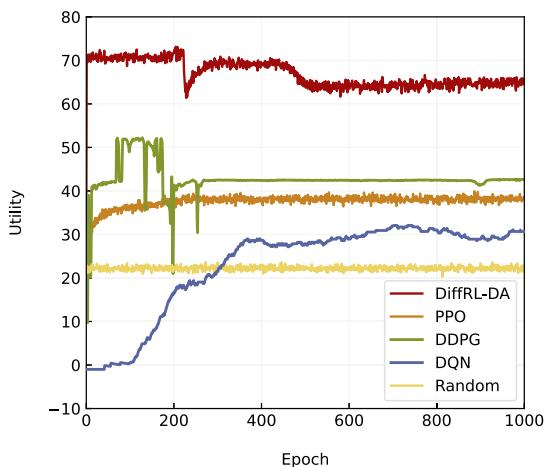  
(a) Comparison in a time slot (Static Scene)

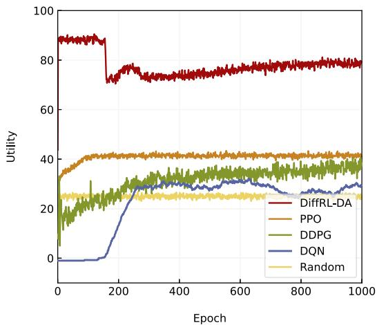  
(b) Comparison in several time slots (Dynamic Scene)  
Fig. 9. Comparison of the utility of different algorithms.

4) Convergence Speed and Utility Comparison: This section provides a comprehensive comparative evaluation of DiffRL-DA and four benchmark reinforcement learning algorithms, including PPO, DDPG, DQN, and a Random policy. We evaluate them in terms of convergence speed and market utility under both static and dynamic environments. Fig. 9 shows the comparison results of DiffRL-DA with PPO, DDPG, DQN and Random Policy, where Fig. 9(a) is the experimental results in one time slot (i.e., static environment), and Fig. 9(b) is the experimental results in multiple consecutive time slots (i.e., dynamic environment). In particular, given that DQN is inherently designed for discrete action spaces, the continuous action space in this study was discretized into five distinct action values, , , , , , to adapt it to the optimization problem considered herein. This discretization allows each consumer-producer pair to select from these predefined options.

As shown in Fig. 9(a), PPO demonstrates the fastest convergence among the compared algorithms in the static environment, achieving stable performance within approximately 200 epochs. DDPG converges next, taking around 300 epochs. DQN requires about 400 epochs to converge. And DiffRL-DA reaches convergence in about 500 rounds. This is because PPO adopts a clipped objective function to limit the range of policy updates, ensuring that the policy is updated more stably and thus accelerate the algorithm convergence. DDPG performs well in handling high-dimensional continuous action spaces, but it is less stable and slower to converge compared to PPO, resulting in a slower convergence speed and greater fluctuations. In addition, DQN relies on the updating of Q-values, and during the exploration phase, it may experience prolonged periods of inefficient learning, leading to slower convergence. Furthermore, DiffRL-DA is based on a probability diffusion model, making the calculation more complicated, which affects the convergence speed of the algorithm. Despite that, DiffRL-DA has a clear advantage over the other four algorithms in terms of market utility. This advantage can be attributed to the strong representation capability of the diffusion model, which captures complex state–action relationships through step-by-step denoising. Additionally, the structured generative process facilitates a better balance between exploration and exploitation. These features allow DiffRL-DA to learn more effective policies, especially in complex and dynamic environments. This effective exploration strategy can lead to better performance in the environment than PPO, DDPG and DQN, resulting in higher utility.

Fig. 9(b) illustrates the performance comparison of the five algorithms in the dynamic environment. In this experiment, we ensure that the position of the UAV is different at each step within an epoch. Additionally, the environment is reset at the start of each epoch to ensure that the UAV’s position at the corresponding steps remains consistent across different epochs. From the figure, it can be observed that, owing to the dynamic characteristics of the environment, the utility values fluctuate more significantly compared to a static scene. The changes in UAV positions at each step lead to variations in parameters such as distance, delay, and energy consumption, resulting in corresponding improvements or decreases in the utility values. Obviously, the proposed DiffRL-DA algorithm still demonstrates the best performance in terms of utility. This result further validates the robustness of DiffRL-DA in non-stationary settings. Its iterative denoising mechanism helps maintain stable utility despite environmental fluctuations, outperforming the baselines under dynamic conditions.

5) Computational Complexity Comparison: Next, we compare the computational complexity of DiffRL-DA with other baseline algorithms in the execution phase. The comparison results are listed in Table VI. It is important to note that for the proposed DiffRL-DA and DDPG, the Critic network is still needed for inference during execution, whereas the PPO algorithm does not require it. Despite its relatively high computational complexity, the DiffRL-DA algorithm’s increased complexity contributes to improved performance and quicker convergence.

TABLE VI  
COMPARISON OF COMPUTATIONAL COMPLEXITY OF DIFFERENT ALGORITHMS
<table><tr><td rowspan=1 colspan=1>Algorithm</td><td rowspan=1 colspan=1>Computation Complexity</td></tr><tr><td rowspan=1 colspan=1>DiffRL-DA</td><td rowspan=1 colspan=1> $\begin{array} { r } { \mathcal { O } ( T ( f _ { s } f _ { 0 } + \sum _ { h i d = 1 } ^ { F _ { \pi } } f _ { h i d - 1 } f _ { h i d } + f _ { F _ { \pi } } f _ { a } + } \end{array}$  $\begin{array} { r } { ( f _ { s } + f _ { a } ) f _ { 0 } + \sum _ { h i d = 1 } ^ { F _ { Q } } f _ { h i d - 1 } f _ { h i d } + f _ { F _ { Q } } ) ) } \end{array}$ </td></tr><tr><td rowspan=1 colspan=1>PPO</td><td rowspan=1 colspan=1> $\begin{array} { r } { \mathcal { O } ( T ( f _ { s } f _ { 0 } + \sum _ { h i d = 1 } ^ { F _ { \pi } } f _ { h i d - 1 } f _ { h i d } + f _ { F _ { \pi } } f _ { a } ) ) } \end{array}$ </td></tr><tr><td rowspan=1 colspan=1>DDPG</td><td rowspan=1 colspan=1> $\begin{array} { r } { \mathcal { O } ( T ( f _ { s } f _ { 0 } + \sum _ { h i d = 1 } ^ { F _ { \pi } } f _ { h i d - 1 } f _ { h i d } + f _ { F _ { \pi } } f _ { a } + } \end{array}$  $\begin{array} { r } { ( f _ { s } + f _ { a } ) f _ { 0 } + \sum _ { h i d = 1 } ^ { F _ { Q } } f _ { h i d - 1 } f _ { h i d } + f _ { F _ { Q } } ) ) } \end{array}$ </td></tr><tr><td rowspan=1 colspan=1>DQN</td><td rowspan=1 colspan=1> $\begin{array} { r } { \mathcal { O } ( T ( f _ { s } f _ { 0 } + \sum _ { h i d = 1 } ^ { F } f _ { h i d - 1 } f _ { h i d } + f _ { F } f _ { a } ) ) } \end{array}$ </td></tr></table>

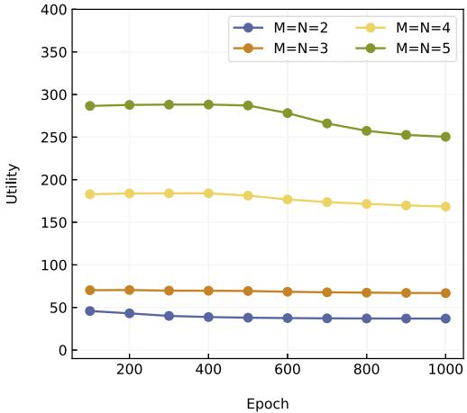  
Fig. 10. The utility of the DiffRL-DA algorithm varies with the number of market participants.

6) The Impact of Market Participant Number on Utility: In this subsection, we assess the utility performance of DiffRL-DA algorithm under varying numbers of market participants, as depicted in Fig. 10. Each data point reflects the average utility value over the preceding epochs. The experimental results demonstrate that, as the training process (epochs) progresses, the utility values under different market scales gradually stabilize, indicating that the algorithm exhibits excellent convergence performance and strong stability across diverse market environments. Additionally, as the number of market participants increases, the utility values significantly improve, suggesting that the proposed DiffRL-DA algorithm can utilize resources more effectively in more complex market scenarios, thereby achieving higher utility. This result is consistent with the utility performance obtained by the IDDA algorithm in Fig. 7, further validating the effectiveness and adaptability of the DiffRL-DA algorithm.

7) The Impact of Denoising Steps on Algorithm Performance: Moreover, we study the impact of changing the number of denoising steps T on the performance of the algorithm. The simulation results are listed in Table VII. From this table, the training time increases as steps T increases. However, the value of the reward and the utility show an increasing trend when T increases from 3 to 5, and when the number of denoising steps T is 8 and 10, the reward and utility are smaller than when the number of denoising steps is 5. This indicates that the algorithm has an optimal denoising step value of 5. To find the optimal denoising steps, we can gradually increase the number of steps in the experiments. Once the reward and utility start to decline, the process should be stopped.

TABLE VII  
COMPARISON OF DIFFERENT DENOISING STEPS
<table><tr><td>Denoising steps</td><td>Reward</td><td>Utility</td><td>Training time</td></tr><tr><td>3</td><td>53.178</td><td>58.131</td><td>4063.06s</td></tr><tr><td>5</td><td>55.597</td><td>64.520</td><td>5953.24s</td></tr><tr><td>8</td><td>48.804</td><td>55.810</td><td>6085.49s</td></tr><tr><td>10</td><td>51.787</td><td>60.592</td><td>7447.56s</td></tr></table>

## VIII. CONCLUSION

In this paper, to incentivize content sharing between UAV nodes in UAV named data networking (UNDN), we modeled the interaction process between content consumers and content producers as a double auction market. To tackle the information asymmetry between the two parties and maximize market social welfare, we proposed an iterative double auction algorithm (IDAA) and introduced a virtual central broker to guide the data-sharing market towards the optimal equilibrium. The experimental results clearly demonstrate that the IDAA satisfies all four economic properties. In addition, we proposed a more general algorithm called Diffusion model-based Reinforcement Learning-Double Auction algorithm (DiffRL-DA). This algorithm does not rely on the strong assumptions typical of traditional auction methods and is capable of efficiently handling high-dimensional state data. DiffRL-DA can learn through ongoing environmental interaction and eventually converges to optimal policies.

In future works, we will explore more complex scenarios where there is no central broker to facilitate content auctions between content consumers and content producers, considering a distributed content trading market. We will also design a distributed algorithm to solve this optimization problem, where market participants learn by engaging in the auction process and directly adjust their strategies.

## REFERENCES

[1] R. Dong, B. Wang, K. Cao, and T. Cheng, “Securing transmission for UAV swarm-enabled communication network,” IEEE Syst. J., vol. 16, no. 4, pp. 5200–5211, Dec. 2022.

[2] Z. Wang et al., “Learning to routing in UAV swarm network: A multi-agent reinforcement learning approach,” IEEE Trans. Veh. Technol, vol. 72, no. 5, pp. 6611–6624, May 2023.

[3] D. S. Lakew, U. Sa’ad, N.-N. Dao, W. Na, and S. Cho, “Routing in flying ad hoc networks: A comprehensive survey,” IEEE Commun. Surveys Tut., vol. 22, no. 2, pp. 1071–1120, Second Quarter 2020.

[4] L. Zhang et al., “Named data networking,” ACM SIGCOMM Comput. Commun. Rev., vol. 44, no. 3, pp. 66–73, 2014.

[5] B. P. Majumder, M. N. Faqiry, S. Das, and A. Pahwa, “An efficient iterative double auction for energy trading in microgrids,” in Proc. IEEE Symp. Comput. Intell. Appl. Smart Grid, 2014, pp. 1–7.

[6] L. P. Kaelbling, M. L. Littman, and A. W. Moore, “Reinforcement learning: A survey,” J. Artif. Intell. Res., vol. 4, pp. 237–285, 1996.

[7] K. Arulkumaran, M. P. Deisenroth, M. Brundage, and A. A. Bharath, “Deep reinforcement learning: A brief survey,” IEEE Signal Process. Mag., vol. 34, no. 6, pp. 26–38, Nov. 2017.

[8] C. Qiu, H. Yao, F. R. Yu, F. Xu, and C. Zhao, “Deep Q-learning aided networking, caching, and computing resources allocation in software-defined satellite-terrestrial networks,” IEEE Trans. Veh. Technol, vol. 68, no. 6, pp. 5871–5883, Jun. 2019.

[9] I. Osband, C. Blundell, A. Pritzel, and B. Van Roy, “Deep exploration via bootstrapped DQN,” in Proc. Int. Conf. Neural Inf. Process. Syst., 2016, pp. 4033–4041.

[10] H. Du et al., “Diffusion-based reinforcement learning for edge-enabled AI-generated content services,” IEEE Trans. Mobile Comput., vol. 23, no. 9, pp. 8902–8918, Sep. 2024.

[11] X. Wang et al., “Generative AI enabled matching for 6G multiple access,” 2024, arXiv:2411.04137.

[12] Z. Zhang et al., “An overview of security support in named data networking,” IEEE Commun. Mag., vol. 56, no. 11, pp. 62–68, Nov. 2018.

[13] H. Khelifi et al., “Named data networking in vehicular ad hoc networks: State-of-the-art and challenges,” IEEE Commun. Surveys Tut., vol. 22, no. 1, pp. 320–351, First Quarter 2020.

[14] Q. Chen, R. Xie, F. R. Yu, J. Liu, T. Huang, and Y. Liu, “Transport control strategies in named data networking: A survey,” IEEE Commun. Surveys Tut., vol. 18, no. 3, pp. 2052–2083, Third Quarter 2016.

[15] S. H. Ahmed, S. H. Bouk, M. A. Yaqub, D. Kim, H. Song, and J. Lloret, “CODIE: Controlled data and interest evaluation in vehicular named data networks,” IEEE Trans. Veh. Technol, vol. 65, no. 6, pp. 3954–3963, Jun. 2016.

[16] Y. Xu, S. Yao, C. Wang, and J. Xu, “CO-RTO: Achieving efficient data retransmission in VNDN by correlations implied in names,” in Proc. IEEE Conf. Comput. Commun. Workshops, 2017, pp. 366–371.

[17] C. Chen, C. Wang, T. Qiu, M. Atiquzzaman, and D. O. Wu, “Caching in vehicular named data networking: Architecture, schemes and future directions,” IEEE Commun. Surveys Tut., vol. 22, no. 4, pp. 2378–2407, Fourth Quarter 2020.

[18] S. A. Khan and H. Lim, “Real-time vehicle tracking-based data forwarding using RLS in vehicular named data networking,” IEEE Trans. Intell. Transp. Syst., vol. 25, no. 10, pp. 14054–14069, Oct. 2024.

[19] F. R. C. Araújo, A. L. R. Madureira, and L. N. Sampaio, “A multicriteriabased forwarding strategy for interest flooding mitigation on named data wireless networking,” IEEE Trans. Mobile Comput., vol. 22, no. 12, pp. 7000–7013, Dec. 2023.

[20] X. Qiu, S. Zhang, Z. Wang, and H. Luo, “Integrated host-and contentcentric routing for efficient and scalable networking of UAV swarm,” IEEE Trans. Mobile Comput., vol. 23, no. 4, pp. 2927–2942, Apr. 2024.

[21] I. A. Kapetanidou, P. Mendes, and V. Tsaoussidis, “Enhancing security in information-centric ad hoc networks,” in Proc. IEEE/IFIP Netw. Operations Manage. Symp., 2023, pp. 1–9.

[22] T. H. T. Le et al., “An incentive mechanism for federated learning in wireless cellular networks: An auction approach,” IEEE Trans. Wireless Commun., vol. 20, no. 8, pp. 4874–4887, Aug. 2021.

[23] H. Yu, Y. Yang, H. Zhang, R. Liu, and Y. Ren, “Reputation-based reverse combination auction incentive method to encourage vehicles to participate in the VCS system,” IEEE Trans. Netw. Sci. Eng., vol. 8, no. 3, pp. 2469–2481, Third Quarter 2021.

[24] H. Zhou, X. Chen, S. He, J. Chen, and J. Wu, “DRAIM: A novel delay-constraint and reverse auction-based incentive mechanism for WiFi offloading,” IEEE J. Sel. Areas Commun., vol. 38, no. 4, pp. 711–722, Apr. 2020.

[25] R. Zhang, R. Zhou, Y. Wang, H. Tan, and K. He, “Incentive mechanisms for online task offloading with privacy-preserving in UAV-assisted mobile edge computing,” IEEE/ACM Trans. Netw., vol. 32, no. 3, pp. 2646–2661, Jun. 2024.

[26] H. Kang, M. Li, L. Lin, S. Fan, and W. Cai, “Bridging incentives and dependencies: An iterative combinatorial auction approach to dependency-aware offloading in mobile edge computing,” IEEE Trans. Mobile Comput., vol. 23, no. 12, pp. 12113–12130, Dec. 2024.

[27] J. Gao, T. Wong, C. Wang, and J. Y. Yu, “A price-based iterative double auction for charger sharing markets,” IEEE Trans. Intell. Transp. Syst., vol. 23, no. 6, pp. 5116–5127, Jun. 2022.

[28] Q. Li, X. Jia, C. Huang, and H. Bao, “A dynamic combinatorial double auction model for cloud resource allocation,” IEEE Trans. Cloud Comput., vol. 11, no. 3, pp. 2873–2884, Third Quarter 2023.

[29] X. Tang and H. Yu, “Efficient large-scale personalizable bidding for multiagent auction-based federated learning,” IEEE Internet Things J., vol. 11, no. 15, pp. 26518–26530, Aug. 2024.

[30] C. Wu, Y. Zhu, R. Zhang, Y. Chen, F. Wang, and S. Cui, “FedAB: Truthful federated learning with auction-based combinatorial multi-armed bandit,” IEEE Internet Things J., vol. 10, no. 17, pp. 15159–15170, Sep. 2023.

[31] T. Mai, H. Yao, J. Xu, N. Zhang, Q. Liu, and S. Guo, “Automatic doubleauction mechanism for federated learning service market in Internet of Things,” IEEE Trans. Netw. Sci. Eng., vol. 9, no. 5, pp. 3123–3135, Sep./Oct. 2022.

[32] J. Sohl-Dickstein, E. Weiss, N. Maheswaranathan, and S. Ganguli, “Deep unsupervised learning using nonequilibrium thermodynamics,” in Proc. Int. Conf. Mach. Learn., 2015, pp. 2256–2265.

[33] F.-A. Croitoru, V. Hondru, R. T. Ionescu, and M. Shah, “Diffusion models in vision: A survey,” IEEE Trans. Pattern Anal. Mach. Intell., vol. 45, no. 9, pp. 10850–10869, Sep. 2023.

[34] H. Du et al., “Enhancing deep reinforcement learning: A tutorial on generative diffusion models in network optimization,” IEEE Commun. Surveys Tut., vol. 26, no. 4, pp. 2611–2646, Fourth Quarter 2024.

[35] H. Du, J. Wang, D. Niyato, J. Kang, Z. Xiong, and D. I. Kim, “AIgenerated incentive mechanism and full-duplex semantic communications for information sharing,” IEEE J. Sel. Areas Commun., vol. 41, no. 9, pp. 2981–2997, Sep. 2023.

[36] H. Du et al., “Exploring collaborative distributed diffusion-based AIgenerated content (AIGC) in wireless networks,” IEEE Netw., vol. 38, no. 3, pp. 178–186, May 2024.

[37] D. Broyles, A. Jabbar, and J. P. Sterbenz, “Design and analysis of a 3-D Gauss-Markov mobility model for highly-dynamic airborne networks,” in Proc. Int. Telemetering Conf., San Diego, CA, USA, 2010, pp. 1–10.

[38] T. Mai, H. Yao, N. Zhang, L. Xu, M. Guizani, and S. Guo, “Cloud mining pool aided blockchain-enabled Internet of Things: An evolutionary game approach,” IEEE Trans. Cloud Comput., vol. 11, no. 1, pp. 692–703, First Quarter 2023.

[39] R. B. Myerson and M. A. Satterthwaite, “Efficient mechanisms for bilateral trading,” J. Econ. Theory, vol. 29, no. 2, pp. 265–281, 1983.

[40] W. Vickrey, “Counterspeculation, auctions, and competitive sealed tenders,” J. Finance, vol. 16, no. 1, pp. 8–37, 1961.

[41] J. Du, C. Jiang, E. Gelenbe, H. Zhang, Y. Ren, and T. Q. Quek, “Double auction mechanism design for video caching in heterogeneous ultra-dense networks,” IEEE Trans. Wireless Commun., vol. 18, no. 3, pp. 1669–1683, Mar. 2019.

[42] H. Cao et al., “A survey on generative diffusion models,” IEEE Trans. Knowl. Data Eng., vol. 36, no. 7, pp. 2814–2830, Jul. 2024.

[43] S. Vivekananthan, “Comparative analysis of generative models: Enhancing image synthesis with VAEs, GANs, and stable diffusion,” 2024, arXiv:2408.08751.

[44] J. Ho, A. Jain, and P. Abbeel, “Denoising diffusion probabilistic models,” in Proc. Int. Conf. Neural Inf. Process. Syst., 2020, pp. 6840–6851.

[45] W. B. Heinzelman, A. P. Chandrakasan, and H. Balakrishnan, “An application-specific protocol architecture for wireless microsensor networks,” IEEE Trans. Wireless Commun., vol. 1, no. 4, pp. 660–670, Oct. 2002.

[46] D. C. Nguyen, M. Ding, P. N. Pathirana, A. Seneviratne, J. Li, and H. V. Poor, “Cooperative task offloading and block mining in blockchain-based edge computing with multi-agent deep reinforcement learning,” IEEE Trans. Mobile Comput., vol. 22, no. 4, pp. 2021–2037, Apr. 2023.

[47] Z. Liu et al., “DNN partitioning, task offloading, and resource allocation in dynamic vehicular networks: A Lyapunov-guided diffusion-based reinforcement learning approach,” 2024, arXiv:2406.06986.

[48] F. Qi, X. Zhu, G. Mang, M. Kadoch, and W. Li, “UAV network and IoT in the sky for future smart cities,” IEEE Netw., vol. 33, no. 2, pp. 96–101, Mar./Apr. 2019.

[49] G. Zhu, H. Yao, T. Mai, Z. Wang, D. Wu, and S. Guo, “Fission spectral clustering strategy for UAV swarm networks,” IEEE Trans. Serv. Comput., vol. 17, no. 2, pp. 537–548, Mar./Apr. 2024.

[50] R. Karmakar, G. Kaddoum, and O. Akhrif, “A blockchain-based distributed and intelligent clustering-enabled authentication protocol for UAV swarms,” IEEE Trans. Mobile Comput., vol. 23, no. 5, pp. 6178–6195, May 2024.

[51] W. You, C. Dong, X. Cheng, X. Zhu, Q. Wu, and G. Chen, “Joint optimization of area coverage and mobile-edge computing with clustering for FANETs,” IEEE Internet Things J., vol. 8, no. 2, pp. 695–707, Jan. 2021.

[52] L. Yao, X. Xu, J. Deng, G. Wu, and Z. Li, “A cooperative caching scheme for VCCN with mobility prediction and consistent hashing,” IEEE Trans. Intell. Transp. Syst., vol. 23, no. 11, pp. 20230–20242, Nov. 2022.

[53] J. Schulman, F. Wolski, P. Dhariwal, A. Radford, and O. Klimov, “Proximal policy optimization algorithms,” 2017, arXiv: 1707.06347.

[54] T. P. Lillicrap et al., “Continuous control with deep reinforcement learning,” 2015, arXiv:1509.02971.

[55] V. Mnih, “Playing Atari with deep reinforcement learning,” 2013, arXiv:1312.5602.

Jiaqi Xu (Student Member, IEEE) received the bachelor’s degree from the Beijing University of Posts and Telecommunications, Beijing, China. She is currently working toward the PhD degree. Her research interests include future network, multiagent system, and game theory.

  
Chenlang Jin (Graduate Student Member, IEEE) received the BS degree from the School of Information and Communication Engineering, Communication University of China, Beijing, China, in 2022. She is currently working toward the PhD degree with the Beijing University of Posts and Telecommunications. Her research interests include future networks, resource optimization, and game theory.

Haipeng Yao (Senior Member, IEEE) received the PhD degree from the Department of Telecommunication Engineering, University of Beijing University of Posts and Telecommunications, in 2011. He is a professor with the Beijing University of Posts and Telecommunications. His research interests include future network architecture, network artificial intelligence, networking, space-terrestrial integrated network, network resource allocation, and dedicated networks. He has published more than 150 papers in prestigious peer-reviewed journals and conferences.

He has served as an associate editor of the IEEE Transactions on Mobile Computing, IEEE Transactions on Sustainable Computing.

Zehui Xiong (Senior Member, IEEE) received the PhD degree from Nanyang Technological University (NTU), Singapore. He is currently an assistant professor with the Singapore University of Technology and Design, and also an honorary adjunct senior research scientist with Alibaba-NTU Singapore Joint Research Institute, Singapore. He was the visiting scholar with Princeton University and the University of Waterloo. His research interests include wireless communications, the Internet of Things, blockchain, edge intelligence, and metaverse. Recognized as a highly cited

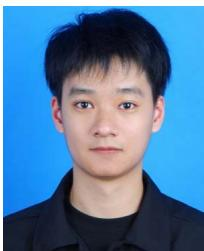

researcher, he has published more than 300 research papers in leading journals, and he has won more than ten Best Paper Awards in international conferences. He is now serving as the editor or guest editor for many leading journals including the IEEE Journal on Selected Areas in Communications, IEEE Transactions on Vehicular Technology, IEEE Internet of Things Journal, IEEE Transactions on Cognitive Communications and Networking, and IEEE Transactions on Network Science and Engineering. He is the recipient of Forbes Asia 30u30, IEEE Asia Pacific Outstanding Young Researcher Award, IEEE Early Career Researcher Award for Excellence in Scalable Computing, IEEE Technical Committee on Blockchain and Distributed Ledger Technologies Early Career Award, IEEE Internet Technical Committee Early Achievement Award, IEEE TCSVC Rising Star Award, IEEE TCI Rising Star Award, IEEE TCCLD Rising Star Award, IEEE ComSoc Outstanding Paper Award, IEEE Best Land Transportation Paper Award, IEEE Asia Pacific Outstanding Paper Award, IEEE CSIM Technical Committee Best Paper Award, IEEE SPCC Technical Committee Best Paper Award, IEEE Big Data Technical Committee Best Influential Conference Paper Award, and IEEE VTS Singapore Best Paper Award. He has served as the associate director of the Future Communications Research and Development Programme, and deputy lead of AI Mega Centre.

Ruze Cai (Student Member, IEEE) received the bachelor’s degree from the School of Telecommunications Engineering, Xidian University, in 2023. He is currently working toward the MS degree with the School of Information and Communication Engineering, Beijing University of Posts and Telecommunications. His research interests include the areas of future network, multi-agent system, and incentive mechanism.

Tianle Mai (Member, IEEE) received the PhD degree from the School of Information and Communication Engineering, Beijing University of Posts and Telecommunications, Beijing. His research interests include uncrewed swarm networks, future network architecture, network artificial intelligence, multi-agent system, space-terrestrial integrated network, network resource allocation, and dedicated networks. He has published more than 30 papers in prestigious peerreviewed journals and conferences.

Dusit Niyato (Fellow, IEEE) received the BEng degree from the King Mongkuts Institute of Technology Ladkrabang (KMITL), Thailand, and the PhD degree in electrical and computer engineering from the University of Manitoba, Canada. He is a professor with the College of Computing and Data Science, Nanyang Technological University, Singapore. His research interests include the areas of mobile generative AI, edge intelligence, decentralized machine learning, and incentive mechanism design.