# Space-Air-Ground Integrated Networks: Spherical Stochastic Geometry-Based Uplink Connectivity Analysis

Yalin Liu , Hong-Ning Dai , Senior Member, IEEE, Qubeijian Wang , Member, IEEE, Om Jee Pandey , Senior Member, IEEE, Yaru Fu , Member, IEEE, Ning Zhang D Senior Member, IEEE, Dusit Niyato , Fellow, IEEE, and Chi Chung Lee , Member, IEEE

Abstract— By integrating the merits of aerial, terrestrial, and satellite communications, the space-air-ground integrated network (SAGIN) is an emerging solution that can provide massive access, seamless coverage, and reliable transmissions for globalrange applications. In SAGINs, the uplink connectivity from ground users (GUs) to the satellite is essential because it ensures global-range data collections and interactions, thereby paving the technical foundation for practical implementations of SAGINs. In this article, we aim to establish an accurate analytical model for the uplink connectivity of SAGINs in consideration of the global distributions of both GUs and aerial vehicles (AVs). Particularly, we investigate the uplink path connectivity of SAGINs, which refers to the probability of establishing the end-to-end path

Manuscript received 13 July 2023; revised 15 November 2023; accepted 15 December 2023. Date of publication 16 February 2024; date of current version 9 May 2024. The work of Yalin Liu was supported by the Hong Kong Metropolitan University Research Grant (Research and Development Fund) under Grant RD/2023/2.22. The work of Qubeijian Wang was supported in part by the Shanghai Sailing Program under Grant 21YF1451100, in part by the Natural Science Basic Research Program of Shaanxi under Grant 2022JQ-625, and in part by the Fundamental Research Funds for the Central Universities under Grant D5000210591. The work of Yaru Fu was supported in part by the Hong Kong Research Matching Grant (RMG) in the Central Pot under Project CP/2022/2.1 and in part by the Research and Development Fund (R&D Fund) under Grant RD/2023/1.8. The work of Dusit Niyato was supported in part by the National Research Foundation, Singapore; in part by the Infocomm Media Development Authority under its Future Communications Research and Development Programme; in part by the Defence Science Organisation (DSO) National Laboratories under the AI Singapore Programme (AISG) under Award AISG2-RP-2020-019 and Award FCP-ASTAR-TG- 2022-003; and in part by MOE Tier 1 under Grant RG87/22. (Corresponding author: Yalin Liu.)

Yalin Liu, Yaru Fu, and Chi Chung Lee are with the School of Science and Technology, Hong Kong Metropolitan University, Hong Kong (e-mail: ylliu@hkmu.edu.hk; yfu@hkmu.edu.hk; cclee@hkmu.edu.hk).

Hong-Ning Dai is with the Department of Computer Science, Hong Kong Baptist University, Hong Kong (e-mail: hndai@ieee.org).

Qubeijian Wang is with the School of Cybersecurity, Northwestern Polytechnical University (NPU), Xi’an 710072, China, and also with the Collaborative Innovation Center, NPU, Shanghai 215400, China (e-mail: qubeijian.wang@nwpu.edu.cn).

Om Jee Pandey is with the Department of Electronics Engineering, Indian Institute of Technology (BHU) Varanasi, Varanasi, Uttar Pradesh 221005, India (e-mail: omjee.ece@iitbhu.ac.in).

Ning Zhang is with the University of Windsor, Windsor, ON N9B 3P4, Canada (e-mail: ning.zhang@uwindsor.ca).

Dusit Niyato is with the School of Computer Science and Engineering, Nanyang Technological University, Singapore 639798 (e-mail: dniyato@ ntu.edu.sg).

Color versions of one or more figures in this article are available at https://doi.org/10.1109/JSAC.2024.3365891.

Digital Object Identifier 10.1109/JSAC.2024.3365891

from GUs to the satellite with or without AV relays. However, such an investigation on SAGINs is challenging because all GUs and AVs are approximately distributed on a spherical surface (instead of the horizontal surface), resulting in the complexity of network modeling. To address this challenge, this paper presents a new analytical approach based on spherical stochastic geometry. Based on this approach, we derive the analytical expression of the path connectivity in SAGINs. Extensive simulations confirm the accuracy of the analytical model.

Index Terms— Aerial vehicles (AVs), space-air-ground integrated networks (SAGINs), spherical stochastic geometry, connectivity analysis.

# I. INTRODUCTION

ATELLITES can support reliable communication services S for global-range GUs. However, implementing satellite communications faces two challenges. First, the satellite undertakes a huge access burden from massive GUs scattered in a wide ground area [1]. Second, GUs (especially sensor devices) can hardly afford long-distance connections with satellites due to their constrained energy [2]. To address the two challenges, a variety of aerial vehicles (AVs), e.g., unmanned aerial vehicles (UAVs) and airships, can be adopted as aerial relays to assist communications between GUs and satellites [3]. Such an AV-assisted terrestrial-satellite solution has been popularly called a space-air-ground integrated network (SAGIN).

In SAGINs, multiple AVs can be flexibly deployed to cover GUs in global regions [4].1 As each AV can cover multiple GUs, the number of required AVs is typically smaller than the number of GUs [7]. In this case, the satellite can receive most of the data from AVs, significantly reducing the access burden at the satellite [8]. Meanwhile, GUs can flexibly choose more paths to transmit their data, i.e., direct transmission to a satellite or transmission via an AV relay. Particularly, if an AV relay is available, the GU can consume much less energy due to the shorter communication distance to AVs compared the satellite [9].

1Advanced AVs have high reliability to realize practical communications. For instance, the RQ-20 Puma drone [5] supports long-endurance services up to 6.5 hours and the Black Swift S2 UAV [6] covers a wide region with a maximum range of 110 km.

# A. Related Work

SAGINs integrate the merits of aerial, terrestrial, and satellite communications, attracting extensive attention in recent years [10], [11], [12], [13], [14], [15]. Benefited by the global coverage and the flexibility, SAGINs can offer reliable and supplementary services to terrestrial networks, such as media content restoration or emergency broadcasts. To support these services, most previous studies of SAGNs focus on downlink transmission scenarios, i.e., the satellite disseminating data to AVs and further to GUs [10], [11], [12]. In contrast, only a few studies focus on the uplink transmissions scenarios, i.e., GUs uploading their data to the satellite [13], [14], [15]. Nevertheless, the uplink transmissions from GUs to satellites are significant as they enable the global-range data interactions, thereby laying the technical foundation for practical implementations of SAGINs.

Existing studies on uplink transmissions of SAIGNs primarily focus on two aspects, i) exploring the resource allocation strategies at GUs, AVs, and satellites [13], [14], [15], [16], [17], and ii) conducting performance analysis for different transmission links in SAGINs [18], [19]. However, these studies typically consider a finite number of network nodes, which is not suitable for a practical SAGIN. A practical SAGIN generally covers a large number of GUs spreading across a wide region. The number of GUs should be significantly increased for the emerging Internet of things (IoT) scenarios [20]. Meanwhile, these GUs also need to be served by a number of AVs [21]. Therefore, it is crucial to investigate the uplink performance of SAGINs by taking into account the wide distributions of both GUs and AVs.

Stochastic geometry (SG) is a promising analytical approach for investigating the uplink performance of SAGINs by considering the wide node distributions. SG is a popular approach to studying network connectivity based on stochastic node distributions [22], [23], [24], [25]. In this approach, network nodes are modeled as point distribution processes, e.g., Poisson Point Processes (PPPs) [22] and Poisson Cluster Processes (PCPs) [23]. Particularly, PCPs are popularly used to model GUs in a close-to-practical scenario, i.e., GUs form clusters in hot-spot regions. However, most previous work on SG assumes that nodes are distributed within a flat plane [24], [25], which is definitely not applicable for the nodes in SAGINs. Because GUs and AVs in SAGINs are generally distributed on spherical surfaces under high-altitude satellites.

To sum up, SG can be utilized to analyze the uplink path connectivity in SAGINs, which refers to the statistical probability of establishing an end-to-end path from GUs to satellites. The uplink path connectivity is a fundamental metric for further investigating other performance metrics, e.g., the outage probability [22].2 Basically, once the path connectivity is calculated, the outage probability of an uplink path can be easily derived by using 1 to subtract the path connectivity. However, to the best of the authors’ knowledge, no study has been conducted on the uplink path connectivity of SAGINs. The lack of studies on the path connectivity of SAGINs may be attributed to the difficulty in accurately modeling the node distributions in SAGINs.

# B. Contributions

This paper aims to utilize SG for investigating the uplink performance of SAGINs, taking into account spherical-based node distributions. However, this work is non-trivial due to several reasons. First, since the previous studies mainly model nodes on the flat plane [24], [25], a new modeling approach is required to investigate the spherical-based node distributions of GUs and AVs. Second, a complex network model must be constructed to analyze multiple transmission links among GUs, AVs, and satellites in SAGINs. Third, a comprehensive analytical model needs to be developed with consideration of both node distributions and multiple transmission links. To this end, we exploit a new analytical approach called spherical stochastic geometry, where all nodes are stochastically distributed on spherical surfaces. Using this new method, we can accurately model different transmission links in SAGIN and further evaluate the connectivity for each link. The main contributions of this paper can be summarized as follows:

1) We build a new distribution model for SAGINs. The new model is built based on spherical coverage regions (of AVs and satellites), stochastic distributions (of GUs and AVs), and a spherical coordinate system (to represent all nodes). This approach enables us to accurately model the practical topology of SAGINs under high-altitude satellites and AVs.   
2) We develop a comprehensive analytical model for SAGINs. Compared with previous studies [18], [19] that mainly investigate the connection performance in SAGINs based on channel fading, our work presents a comprehensive analytical model that analyzes multiple transmission links/paths in SAGINs by taking into account both channel fading as well as node distributions. In contrast, our analytical model applies to more general network scenarios, e.g., widely distributed GUs/AVs initiating connections via different multiple links/paths.   
3) We conduct extensive numerical analysis. The analytical results of the connectivity align with the simulation results, thereby validating the accuracy of our analytical model. Overall, our analytical model can help practitioners in estimating the practical performance of SAGINs in various application scenarios by adjusting system parameters. In addition, the presented analytical model can contribute many practical implementations for future studies, such as constructing objective functions for improving performance in large-scale networks.

The rest of this paper is organized as follows. The system model of a SAGIN is presented in Section II. In Section III, analytical expressions of three connectivity metrics of the SAGIN are derived. Section IV shows the comprehensive numerical results. Section V concludes this paper.

# II. SYSTEM MODEL

We consider a SAGIN that includes satellites (as the space base station), AVs (as the aerial relay), and GUs (as the ground device), as shown in Fig. 1(a). Generally, to ensure

2In SAGINs, it is cumbersome to directly calculate the outage probability on a multi-hop relayed path. Because the outage may occur in several cases, i.e., when only one or few of multiple (hop) links is/are disconnected or when all links are disconnected. In contrast, calculating the path connectivity is much easier since we just need to consider 1 case (i.e., all links are connected).

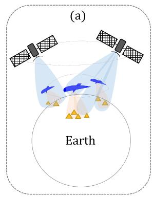

text_image

(a)
Earth

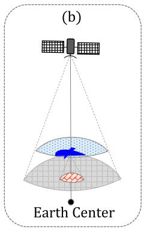

text_image

(b)
Earth Center

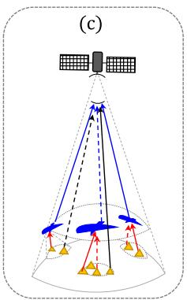

text_image

(c)

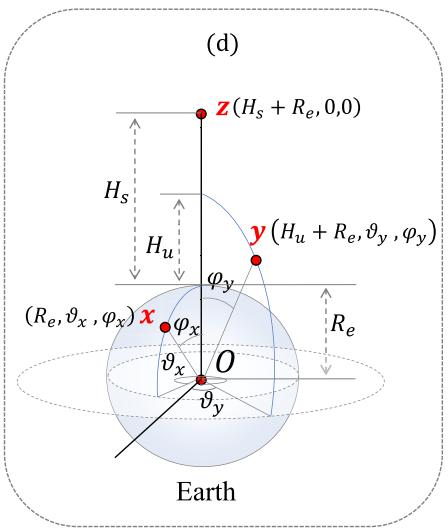

text_image

(d)
z(Hs + Re, 0,0)
Hs
Hu
y(Hu + Re, ∇y, φy)
(Re, ∇x, φx)x φx
θx O
θy
Re
Earth

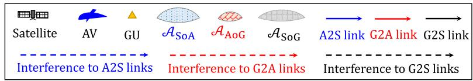

flowchart

Fig. 1. Network Model of a SAGIN, where (a) is a SAGIN network, (b) shows three spherical coverage regions, (c) shows three transmission links, and (d) is the spherical coordinate system. Herein, AAoG, ASoA, and ASoG denote the coverage regions of the AV on the ground, the satellite on the AV-flying plane, and the satellite on the ground, respectively.

global coverage, multiple satellites are deployed according to specific constellation designs in different orbits, i.e., Low Earth Orbit (LEO), Medium Earth Orbit (MEO), or Geostationary Orbit (GEO), to cover the air/ground regions with a single beam or multiple beams. To build a tractable uplink transmission model, we simplify the satellite antenna to a single beam (see Section II-C1).3 Meanwhile, we use one satellite as a reference receiver, and then a group of GUs and AVs under its coverage region may build uplink connections.4 Below we give the specific system model.

# A. Spherical Geometry

1) Node Distributions: GUs generally form clusters in different regions to support different applications [26]. Therefore, we model the distribution of GUs as a PCP, denoted by $\Phi _ { \mathrm { P C P } }$ . The PCP $\Phi _ { \mathrm { P C P } }$ is composed of multiple GU clusters [23]. The centers of GU clusters follow a homogeneous PPP with the density $\lambda _ { p } ,$ and the distribution range is the whole earth’s surface. The GUs in each cluster is a uniformly-distributed point process denoted by $\phi _ { c }$ with the density $\lambda _ { c }$ and the distribution range is a circle area (denoted by $A _ { \mathrm { c l u s t e r } } )$ on the ground. Multiple AVs are deployed to cover all GU clusters with each AV serving for one GU cluster. To serve all GUs in a cluster, each AV needs to fly along several locations in a finite region above the served cluster. Then, all deployed AVs preserve the identical statistical distribution with the GU cluster centers all the time [23]. Therefore, the AV distribution can be modeled as a homogeneous $P P P ~ \Phi _ { p }$ with the density $\lambda _ { p } \ ( i . e .$ , the same density as that of GU clusters).

2) Spherical Coverage: As shown in Fig. 1(b), the earth’s surface (i.e., the ground) can be approximated as a spherical surface with the radius $R _ { e }$ and the earth center $O .$ All AVs are deployed with the same flight height $H _ { \mathrm { u } } . ^ { 5 }$

3Our model can be extended to a multi-beam antenna by incorporating a more accurate geometric analysis of multiple beams.   
4Our model also applies to multi-satellite scenarios by adding connections with multiple visible satellites for each GU/AV. The visible satellites can be modeled by the satellite distribution in the visible region of the GU/AV.   
5The particular height depends on the practical requirements, e.g., coverage demand over the ground.

Thus, The AV-flying plane is deemed a spherical surface with the earth center O. To cover the ground, each AV is equipped with a directional antenna that vertically points toward O. Similarly, the satellite orbits the earth with the altitude $H _ { \mathrm { s } } ,$ , and it is also equipped with a directional antenna that vertically points toward the ground [27]. Based on the above analysis, the SAGIN system includes multiple spherical domes. First, the circle distribution range of each GU cluster, $\mathrm { i . e . , \ : \mathcal { A } _ { c l u s t e r } , }$ is a spherical dome. In addition, the coverage regions of the AV on the ground, the satellite on the AV-flying plane, and the satellite on the ground are all spherical domes, which can be denoted by $\mathcal { A } _ { \mathrm { { A o G } } } , \mathcal { A } _ { \mathrm { { S o A } } }$ , and $\mathcal { A } _ { \mathrm { S o G } }$ , respectively. The areas of the above spherical domes are determined by their vertex angles φcluster, φAoG, φSoA, and φSoG, respectively. The four angles $( \mathrm { i . e . , } \varphi _ { \mathrm { c l u s t e r } } , \varphi _ { \mathrm { A o G } } , \varphi _ { \mathrm { S o A } } , \varphi _ { \mathrm { S o G } } )$ are determined by the angle between the ray from O to the spherical dome’s center and the ray from O to the edge of four spherical domes $( \mathrm { i . e . , \ } \mathcal { A } _ { \mathrm { c l u s t e r } } , \mathcal { A } _ { \mathrm { A o G } } , \mathcal { A } _ { \mathrm { S o A } } , \mathcal { A } _ { \mathrm { S o G } } )$ , respectively.

3) Spherical Coordinations: To model the accurate locations of all nodes in the SAGIN, we build a spherical coordinate system by letting the earth center O be the original point and the orientation from O to the satellite as the zenith direction, as shown in Fig. 1(d). In our coordinate system, each node has a 3-dimension polar coordinate represented by $( r , \vartheta , \varphi )$ , where r is the distance between the node and the original point O. The term ϑ is the azimuth angle of the node, i.e., the angle between the node’s orthogonal projection on a horizontal plane vertical to the zenith direction and a reference direction on the horizontal plane. The term φ is the polar angle of the node, i.e., the angle between the ray from O to this node and the zenith direction.

Let x, y, and z denote a GU, an AV, and the satellite, respectively. The coordinates of x, y and z are denoted by 3-dimensional polar vectors x, y, and z, respectively. As shown in Fig. 1(d), we can express $\textbf { x } : \ ( R _ { e } , \vartheta _ { x } , \varphi _ { x } )$ , $\mathbf { y } : ( R _ { e } + H _ { u } , \vartheta _ { y } , \varphi _ { y } ) , \mathbf { z } : ( R _ { e } + H _ { s } , 0 , 0 )$ , where $R _ { e } , R _ { e } + H _ { u } ,$ and $R _ { e } + H _ { s }$ are the distances between three nodes (i.e., the GU x on the ground, the $\mathrm { ~ A V ~ } y$ and the satellite z) and $O ,$ respectively. Herein, $\vartheta _ { x } , \vartheta _ { y }$ and $\varphi _ { x } , \varphi _ { y } \mathrm { a r e }$ the azimuth angles and the polar angles of x and y, respectively. It is worth noting that the satellite z locates at the zenith direction, both the azimuth angle and the polar angle of z are 0.

# B. Transmission Model

1) Transmission Paths/Links: As shown in Fig. 1(c), each GU can transmit its data to the satellite via two paths. The first path is the ground-air-space (GAS) path that is initiated from the GU to the satellite through an AV relay. The second path is the ground-to-space (G2S) path that is directly initiated from the GU to the satellite. Note that a G2S path is also a G2S link, while a GAS path is composed of two links: i) the ground-to-air (G2A) link that is initiated from the GU to the AV relay, ii) the air-to-space (A2S) link that is initiated from the AV to the satellite. Overall, we have three links, i.e., the G2A link, the A2S link, and the G2S link. We will use the subscript $i , \forall i \in \{ 1 , 2 , 3 \}$ to indicate any variables related to the above three links, where {1, 2, 3} indicate the G2A link, the A2S link, and the G2S link, respectively.

2) Distribution of Transmitters: For each link, given a receiver, all transmitters distributed at the receiver’s coverage region have the potential to be associated with $\mathrm { i t . } ^ { 6 }$ In particular, for the G2A link, given an $\ \mathrm { { A V } } \ y ,$ all GUs under the coverage region of the $\mathrm { A V } \ y$ are associable with it. Then, all associable GUs follow a distribution $\Phi _ { 1 } = \{ x | x \in \phi _ { c } ^ { y } , \mathbf { x } \in \mathcal { A } _ { \mathrm { A o G } } ^ { y } \}$ . Herein, we ignore GUs in other clusters because different GU clusters are generally far away from each other in real scenarios.7 Similarly, for the A2S link, given the satellite z, all associable AVs follow a distribution $\Phi _ { 2 } = \{ y | y \in \Phi _ { p } , \mathbf { y } \in$ $\scriptstyle \mathcal { A } _ { \mathrm { S o A } } \}$ . For the G2S link, given the satellite z, all associable GUs follow a distribution $\Phi _ { 3 } = \{ x | x \in \Phi _ { \mathrm { P C P } } , \mathbf { x } \in \mathcal { A } _ { \mathrm { S o G } } \}$ .

The distribution region of associable transmitters significantly influences the performance of the corresponding link/path. For the G2A link, the distribution area of all associable GUs should be the minimum region among $\phi _ { c } ^ { y }$ and $\mathcal { A } _ { \mathrm { A o G } } ^ { y }$ . Since the region of $\phi _ { c } ^ { y } \ ( \mathrm { i . e . , \mathcal { A } _ { \mathrm { c l u s t e r } } } )$ is generally wider Aothan $\mathcal { A } _ { \mathrm { A o G } } ^ { y } ,$ we use $\mathcal { A } _ { \mathrm { A o G } } ^ { y }$ to model the distribution area of associable GUs. For all three links, the distribution regions of associable transmitters are equal to the coverage regions of the receiver, i.e., $\mathcal { A } _ { \mathrm { A o G } } ^ { y } , \mathcal { A } _ { \mathrm { S o A } }$ , and $\mathcal { A } _ { \mathrm { S o G } }$ . For the GAS path, all GUs distributed in some $\mathrm { A V s } ^ { \prime }$ coverage regions can initiate the path transmission, on the condition that these AVs are covered by the satellite. In this case, the transmitters’ distribution region in the GAS path is a spherical dome $\mathcal { A } _ { \mathrm { S o A + A o G } }$ . The area sizes of the above distribution regions $( \mathrm { i . e . , \ } \mathcal { A } _ { \mathrm { A o G } } , \mathcal { A } _ { \mathrm { S o A } } , \mathcal { A } _ { \mathrm { S o G } } , \mathcal { A } _ { \mathrm { S o A + A o G } } )$ depends on their vertex angles $\mathrm { ( i . e . , ~ } \ \varphi _ { \mathrm { A o G } } , \varphi _ { \mathrm { S o A } } , \varphi _ { \mathrm { S o G } } , \varphi _ { \mathrm { S o A } } \ + \ \varphi _ { \mathrm { A o G } } \mathrm { ) }$ . A detailed model of these vertex angles is given in Appendix A.

# C. Propagation Model

1) Antenna Model: Each GU is equipped with an omnidirectional antenna. Each AV is equipped with two types of antennas: i) a directional antenna that vertically points toward the ground (i.e., AVs serving as high-altitude platforms

6The specific transceiver association scheme for each link is based on some practical conditions/requirements, e.g., the receiver associates with the transmitter according to their distances or communication priorities.

7Even though there is an intersection area between two GU clusters, different carrier frequency bands can be allocated for two clusters to avoid interference with each other.

to cover GUs [28]), and ii) an omnidirectional antenna that connects to the satellite (i.e., AVs serving as users of the satellite [28]). The satellite is also equipped with a directional antenna with a single beam. The single-beam antenna is the fundamental satellite antenna and it is usually a directional antenna with a circular aperture [27]. Let $\theta _ { i } , G _ { i } , \forall i \in \{ 1 , 2 , 3 \}$ denote the 3dB beam widths and the antenna gains of receivers for three links, respectively. The values of $\theta _ { i } , G _ { i }$ are essentially determined by the transmission frequency and the physical design of antennas, which is given by [27] (Formulas (5.3b) and (5.6))

$$
\forall i \in \{1, 2, 3 \}: \theta_ {i} = \frac {\kappa_ {i} c}{f _ {i} D _ {i}} (\text { degrees }), G _ {i} = \iota_ {i} \left(\frac {\pi D _ {i} f _ {i}}{c}\right) ^ {2}, \tag {1}
$$

where c is the light speed and $f _ { i } ( \forall i \in \{ 1 , 2 , 3 \} )$ are carrier frequencies used for three links. In addition, $\{ \mathrm { D } _ { 1 } , \mathrm { D } _ { 2 } , \mathrm { D } _ { 3 } \} =$ $\{ \bar { \mathrm { D _ { u } } } , \mathrm { D _ { s } } , \mathrm { D _ { s } } \} , \{ \kappa _ { 1 } , \kappa _ { 2 } , \kappa _ { 3 } \} = \{ \kappa _ { \mathrm { u } } , \kappa _ { \mathrm { s } } , \kappa _ { \mathrm { s } } \}$ , and $\{ \iota _ { 1 } , \iota _ { 2 } , \iota _ { 3 } \} =$ $\{ \iota _ { \mathrm { u } } , \iota _ { \mathrm { s } } , \iota _ { \mathrm { s } } \}$ , where $\kappa _ { \mathrm { u } } , \kappa _ { \mathrm { s } } , \mathrm { D } _ { \mathrm { u } } , \mathrm { D } _ { \mathrm { s } }$ , and $\iota _ { \mathrm { u } } , \iota _ { \mathrm { s } }$ are antenna illumination coefficients, diameters of reflector antennas, and antenna efficiencies at the AV and the satellite, respectively.8

2) Channel Fading: Due to the propagation from ground/air to air/space, the channel fadings of all three links are dominated by a Line-of-Sight (LoS) component. The Nakagami-m model is able to represent a variety of LoS-dominated channel fadings by adjusting the value of m [29], [30].9 Therefore, we adopt the Nakagami-m channel model for each transmission link. Let $h _ { i } , \forall i \in \{ 1 , 2 , 3 \}$ denote the random Nakagami-m fading of three links. Let $m _ { i } , \Omega _ { i } , \forall i \in \{ 1 , 2 , 3 \}$ denote the Nakagami-m shape parameter and the mean-square values of the three corresponding links, respectively. The values of $m _ { i }$ are positive integers and $h _ { i }$ can be regarded as the summation of $m _ { i }$ orthogonal independent Rayleigh distributed random variables [31]. As all three links are LoS-dominated, $m _ { i } > 1$ always holds true. In this case, the Nakagami-m fading closely approximates Rice fading [30] and $m _ { i }$ can be mapped to Rician K factor. By substituting the value of K in different propagation environments, Nakagami-m can accurately model various fading scenarios.

3) Path Loss: All three links suffer the LoS-dominated path loss, which can be approximately regarded as the free-space path loss model. In addition, the A2S/G2S link also suffers the additional loss (denoted by $L _ { A } )$ caused by atmospheric effects and rain/fog attenuation [27]. Let $L _ { i } , \dot { \forall } i \in \{ \bar { 1 , 2 , 3 } \}$ denote the path loss of three links. Let $( t _ { i } , r _ { i } ) , \forall i \in \{ 1 , 2 , 3 \}$ denote transceiver pairs for three links, which are given by $( t _ { 1 } , r _ { 1 } ) = ( x , y ) , ( t _ { 2 } , r _ { 2 } ) = ( y , z ) , ( t _ { 3 } , r _ { 3 } ) = ( x , z )$ . The path losses of three links can be evaluated as follows,

$$
\forall i \in \{1, 2, 3 \}: L _ {i} (t _ {i}, r _ {i}) = \hat {L} _ {i} \left(\frac {4 \pi f _ {i}}{c}\right) ^ {2} d _ {i} ^ {2}, \tag {2}
$$

where $\hat { L } _ { i } , \forall i \in \{ 1 , 2 , 3 \}$ are additional path loss for three links, $\{ \hat { L } _ { 1 } , \hat { L } _ { 2 } , \hat { L } _ { 3 } \} = \{ 1 , L _ { A } , L _ { A } \} , \{ d _ { 1 } , d _ { 2 } , d _ { 3 } \} = \{ d _ { x y } , d _ { y z } , d _ { x z } \}$ , and $d _ { x y } , d _ { y z } , d _ { x z }$ are the transmission distances between the GU x and the AV y, between the AV y and the satellite z, and between the GU X and the satellite z, respectively. When the

8The value of the antenna efficiency is affected by the illumination law, spill-over loss, and surface impairments [27], [28].

9Given a Nakagami-m fading h, its probability density function (PDF) is written as $\begin{array} { r l r } { \omega \llap { / } } & { { } = } & { 2 \breve { m } ^ { m } h ^ { 2 m - 1 } \exp \left( - m h ^ { 2 } / \bar { \Omega } \right) / ( \Gamma \left( m \right) \Omega ^ { m } ) } \end{array}$ , where m is the Nakagami fading parameter, Ω is the mean-square value, and Γ (·) is the Gamma function [30] (Chapter 2.2.1.4).

GU x locates the coverage region of the AV y and the AV y locates the coverage region of the satellite z, we have

$$
d _ {x y} ^ {2} = \left(H _ {\mathrm{u}} + R _ {e}\right) ^ {2} + R _ {e} ^ {2} - 2 \left(H _ {\mathrm{u}} + R _ {e}\right) R _ {e} \cos (\varphi_ {x} - \varphi_ {y}), \tag {3a}
$$

$$
\begin{array}{l} d _ {y z} ^ {2} = \left(H _ {s} + R _ {e}\right) ^ {2} + \left(H _ {u} + R _ {e}\right) ^ {2} \\ - 2 \left(H _ {s} + R _ {e}\right) \left(H _ {u} + R _ {e}\right) \cos \varphi_ {y}, \tag {3b} \\ \end{array}
$$

$$
d _ {x z} ^ {2} = 2 \left(H _ {\mathrm{s}} + R _ {e}\right) R _ {e} \cos (\varphi_ {x}) - \left(H _ {\mathrm{s}} + R _ {e}\right) ^ {2} - R _ {e} ^ {2}. \tag {3c}
$$

# D. Interference Model

We assume that all three links use frequency division multiple access (FDMA) mechanisms [27] to receive signals from multiple transmitters (i.e., GUs and AVs). Particularly, $N _ { i } ( \forall i \in \{ 1 , 2 , 3 \} )$ orthogonal frequency carriers are allocated to three links. To avoid interference between the three links, three separate frequency bands are used for them. For each link, the transmitter randomly chooses one carrier from the total $N _ { i } ( \forall i \in \{ 1 , 2 , 3 \} )$ ) orthogonal carriers to transmit data and the receiver is capable of decoding signals from $N _ { i }$ orthogonal carriers. It is worth mentioning that the access number of transmitters could be much more than $N _ { i }$ for each link. In this case, multiple transmitters may use the same frequency carrier, then interference occurs. In particular, if a transceiver pair is connected via a link with a specific frequency carrier, interference occurs when other transmitters initiate transmission to the same receiver with the same carrier.

To this end, we present the interference models for three links. Let $I _ { i } , \forall i \in \{ 1 , 2 , 3 \}$ denote the interference of three links. For the reference GU $x _ { 0 }$ , the reference AV $y _ { 0 }$ , and the satellite z, the interference to three links can be given by

$$
\forall i \in \{1, 2, 3 \}: I _ {i} (\hat {t} _ {i}, \hat {r} _ {i}) = \sum_ {t _ {i} \in \Phi_ {i} \backslash \{\hat {t} _ {i} \}} \frac {\eta_ {t _ {i}} P _ {i} G _ {i} | h _ {i} | ^ {2}}{N _ {i} L _ {i} (t _ {i} , r _ {i})}. \tag {4}
$$

where $P _ { i } ( \forall i \in \{ 1 , 2 , 3 \} )$ denote transmission powers of three links. For each link, all transmitters are assumed to use the same power $P _ { i }$ . The terms $\{ \Phi _ { 1 } , \Phi _ { 2 } , \Phi _ { 3 } \}$ represent the distribution of all associable transmitters for three links (see Section II-B). The terms $\eta _ { i } ( \forall i \in \{ 1 , 2 , 3 \} )$ denote transmission probabilities of transmitters at three links. Herein, we use $\eta _ { i }$ to model a practical situation, i.e., only these GUs/AVs having data to transmit can cause the interference. For the G2A/G2S link, we have $\eta _ { i } = \eta _ { x }$ with $\eta _ { x }$ being the probability of a GU having data to transmit. For the A2S link, we have $\eta _ { i } ~ = ~ \eta _ { y }$ with $\eta _ { y }$ being the probability of an AV having data to transmit. For simplification, we assume that all GUs/AVs have the same values of $\eta _ { x } , \eta _ { y }$ .

# III. CONNECTIVITY MODEL

This section presents the uplink path connectivity analysis of SAGIN. First, we define five connectivity metrics.

• The G2A link connectivity (denoted by $p _ { \mathrm { G 2 A } } )$ is defined as the probability of a GU successfully transmitting its data to an AV.   
• The A2S link connectivity (denoted by $ { p _ { \mathrm { A 2 S } } } )$ is defined as the probability of an AV successfully transmitting its data to the satellite.   
• The G2S path/link connectivity (denoted by $p _ { \mathrm { G 2 S } } )$ is defined as the probability of a GU successfully transmitting its data to the satellite.

• The GAS path connectivity (denoted by $p _ { \mathrm { G A S } } )$ is defined as the probability of a GU successfully transmitting its data to the satellite via the relay of an AV. The GAS path is established only when both two links (i.e., the G2A link and the A2S link) are connected.10 Hence, the GAS path connectivity is given by $p _ { \mathrm { G A S } } = p _ { \mathrm { G 2 A } } \times p _ { \mathrm { A 2 S } }$ .

• The overall path connectivity (denoted by $p _ { \mathrm { o v e r a l l } } )$ is defined as the probability of a GU successfully transmitting its data to the satellite. Each GU can transmit its data by choosing the GAS path or the G2S path. Let α denote the GAS path selection ratio, which is the probability of all GUs choosing the GAS path. Then 1−α is the probability of all GUs choosing the G2S path. Then, $p _ { \mathrm { o v e r a l l } }$ can be evaluated by $p _ { \mathrm { o v e r a l l } } = \alpha p _ { \mathrm { G A S } } +$ $( 1 - \alpha ) p _ { \mathrm { G 2 S } } .$

Based on the above definitions, the connectivity of each link/path can be evaluated by giving a reference transceiver pair. Next, we present their detailed analytical expressions.

# A. The G2A Link Connectivity

To ensure an expected data rate of the G2A link, the received signal at the AV needs to reach a minimum SINR threshold [22]. Hence, the G2A link connectivity $p _ { \mathrm { G 2 A } }$ can be evaluated by calculating the probability of the SINR at the receiver being above the minimum threshold. Given the G2A link that is initiated from the reference GU $x _ { 0 }$ to the reference AV y0, let $p _ { \mathrm { G 2 A } } ( x _ { 0 } , y _ { 0 } )$ be the link connectivity and $\gamma _ { \mathrm { G 2 A } } ( x _ { 0 } , y _ { 0 } )$ be the SINR value of this G2A link. We have

$$
p _ {\mathrm{G2A}} (x _ {0}, y _ {0}) = \mathbb {P} \left(\gamma_ {\mathrm{G2A}} (x _ {0}, y _ {0}) \geq \gamma_ {1}\right), \tag {5}
$$

$$
\gamma_ {\mathrm{G2A}} (x _ {0}, y _ {0}) = \frac {| h _ {1} | ^ {2} P _ {1} G _ {1}}{L _ {1} (x _ {0} , y _ {0}) \left(W _ {1} + I _ {1} (x _ {0} , y _ {0})\right)}, \tag {6}
$$

where $\gamma _ { 1 } , W _ { 1 }$ are the SINR threshold and the received noise at the AV, respectively. Substituting (6) to (5), we have Theorem 1.

Theorem 1: The connectivity $p _ { \mathrm { G 2 A } } ( x _ { 0 } , y _ { 0 } )$ is obtained by $p _ { G 2 A } ( x _ { 0 } , y _ { 0 } )$

$$
= \exp \left(- \dot {S} _ {1} - \dot {R} _ {1} \varepsilon_ {1}\right) \sum_ {n = 0} ^ {m _ {1} - 1} \sum_ {l, q, n}
$$

$$
\times \left[ \frac {1}{i ! j ! \ldots q !} \left(\dot {S} _ {1} + \dot {R} _ {1} \varepsilon_ {1} ^ {\prime}\right) ^ {i} \left(\dot {R} _ {1} \varepsilon_ {1} ^ {\prime \prime}\right) ^ {j} \ldots \left(\dot {R} _ {1} \varepsilon_ {1} ^ {(l)}\right) ^ {q} \right],
$$

where

$$
\varepsilon_ {1} = \int_ {d _ {1} ^ {\min}} ^ {d _ {1} ^ {\max}} 1 - \left(1 + \frac {C _ {1}}{d _ {1}}\right) ^ {- m _ {1}} \mathrm{d} d _ {1},
$$

$$
\dot {\varepsilon} _ {1} ^ {(l)} = C _ {l} ^ {m _ {1} + l - 1} \int_ {d _ {1} ^ {\min}} ^ {d _ {1} ^ {\max}} \left(\frac {C _ {1}}{d _ {1}}\right) ^ {l} \left(1 + \frac {C _ {1}}{d _ {1}}\right) ^ {- m _ {1} - l} \mathrm{d} d _ {1},
$$

$$
\dot {S} _ {1} = \frac {1 6 m _ {1} \gamma_ {1} d _ {x _ {0} y _ {0}} ^ {2} W _ {1}}{P _ {1} \iota_ {\mathrm{u}} \mathrm{D} _ {\mathrm{u}} ^ {2} \Omega_ {1}}, \dot {R} _ {1} = \frac {\pi R _ {e} \lambda_ {c}}{R _ {e} + H _ {\mathrm{u}}}, C _ {1} = \frac {\eta_ {x} \gamma_ {1} d _ {x _ {0} y _ {0}} ^ {2}}{N _ {1}},
$$

$$
C _ {m _ {1} + l - 1} ^ {l} = \frac {(m _ {1} + l - 1) !}{(m _ {1} - 1) ! l !}, d _ {1} ^ {\min} = H _ {\mathrm{u}} ^ {2},
$$

$$
d _ {1} ^ {\mathrm{max}} = (R _ {e} + H _ {\mathrm{u}}) ^ {2} + R _ {e} ^ {2} - 2 R _ {e} (R _ {e} + H _ {\mathrm{u}}) \cos (\varphi_ {\mathrm{AoG}}),
$$

10Generally speaking, two links are not simultaneously connected because of either propagation delay or packet queuing delay between them. Thus, in the analyzed path, two links can be connected at any different points in time.

and Pl,q,n $\textstyle \sum _ { l , q , n }$ indicates the summation over all solutions in non-negative integers of the equation $i + 2 j + . . + l q = n$ .

Proof: The proof is given in Appendix B.

According to Theorem 1, we have the following 2 remarks.

Remark $I \colon p _ { \mathrm { G 2 A } } ( x _ { 0 } , y _ { 0 } )$ is determined by several compound formulas as follows.

• $\begin{array} { r l r } { \dot { S } _ { 1 } } & { { } = } & { \frac { 1 6 m _ { 1 } \gamma _ { 1 } d _ { x _ { 0 } y _ { 0 } } ^ { 2 } W _ { 1 } } { P _ { 1 } \iota _ { \mathrm { u } } \mathrm { D } _ { \mathrm { u } } ^ { 2 } \Omega _ { 1 } } } \end{array}$ 16m1γ1d2x0y0 stands for the signal deterioration degree under the given SINR threshold $\gamma _ { 1 }$ . The smaller $\bar { S } _ { 1 }$ indicates the better signal quality, which can be obtained by decreasing $m _ { 1 } , d _ { x _ { 0 } y _ { 0 } } , W _ { 1 }$ or increasing $P _ { 1 } , \iota _ { \mathrm { u } } , \mathrm { D } _ { \mathrm { u } } , \Omega _ { 1 }$ .   
• R˙ 1 = $\begin{array} { r } { \dot { R } _ { 1 } ~ = ~ \frac { \pi R _ { e } \lambda _ { c } } { R _ { e } + H _ { \mathfrak { u } } } } \end{array}$ stands for the clustering degree of GUs under its distribution region. The smaller $\dot { R } _ { 1 }$ indicates a sparser cluster, which can be obtained by decreasing $\lambda _ { c } .$   
• $\begin{array} { r } { \dot { C } _ { 1 } = \frac { \eta _ { x } \gamma _ { 1 } d _ { x _ { 0 } y _ { 0 } } ^ { 2 } } { N _ { 1 } } } \end{array}$ stands for the interfering degree from other GUs to the reference transceiver pair $( x _ { 0 } , y _ { 0 } )$ . The smaller $C _ { 1 }$ represents a less interfering degree, which can be obtained by decreasing $\eta _ { x } , \gamma _ { 1 }$ or increasing $N _ { 1 }$ .   
• $\begin{array} { r } { \varepsilon _ { 1 } = \int _ { d _ { 1 } ^ { \operatorname* { m i n } } } ^ { d _ { 1 } ^ { \operatorname* { m a x } } } 1 - ( 1 + \frac { C _ { 1 } } { d _ { 1 } } ) ^ { - m _ { 1 } } \mathrm { d } d _ { 1 } } \end{array}$ R d min dmax1 calculates the impacts of all interference caused by other GUs. The smaller $\varepsilon _ { 1 }$ indicates fewer impacts from other GUs, which can be obtained by decreasing $d _ { 1 } ^ { \operatorname* { m a x } } , C _ { 1 }$ . The smaller $d _ { 1 } ^ { \operatorname* { m a x } }$ can be further obtained by decreasing $\varphi _ { \mathrm { A o G } }$ .

Remark 2: The monotonic characteristics of Theorem. 1 can be analyzed by two parts.

• The first part is ex $) \big ( - \dot { S } _ { 1 } - \dot { R } _ { 1 } \varepsilon _ { 1 } \big )$ , which indicates the impact of main LoS components of all channels on $p _ { \mathrm { G 2 A } } ( x _ { 0 } , y _ { 0 } )$ . The value of this part increases with the decreasing of $\dot { S } _ { 1 } , \ \dot { R } _ { 1 } , \ { C } _ { 1 } , \ \mathrm { o r } \ \bar { \ } \varepsilon _ { 1 }$ . Refer to Remark 1, we can improve the value of this part by decreasing $H _ { \mathrm { u } } , m _ { 1 } , \gamma _ { 1 } , d _ { x _ { 0 } y _ { 0 } } , W _ { 1 } , \lambda _ { c } , \eta _ { x }$ or increasing $P _ { 1 } , \iota _ { \mathrm { u } } , \mathrm { D _ { u } } , \Omega _ { 1 } , N _ { 1 } , f _ { 1 } .$ .

• The second part is $\textstyle \sum _ { n = 0 } ^ { m _ { 1 } - 1 } ( \cdot )$ , which is similar to a all multi-path components on $p _ { \mathrm { G 2 A } } ( x _ { 0 } , y _ { 0 } )$ . With the increment of $m _ { 1 }$ , more impacts are caused by more multipath components. In addition, three compound formulas $( \mathrm { i . e . , ~ } \dot { S } _ { 1 } , { \bf \bar { \cal R } } _ { 1 } , { \cal C } _ { 1 } )$ have positive impacts on the second part, which is different from their impacts on the first part. Their positive impacts can be increased with the increment of $m _ { 1 }$ . Thereby, we can conclude that, the increment of $m _ { 1 }$ can reduce the negative impacts (as in the first part) of all compound formulas $( \mathrm { i . e . , ~ } \dot { S } _ { 1 } , \ \dot { R } _ { 1 }$ , $C _ { 1 } , \varepsilon _ { 1 } )$ on $p _ { \mathrm { G 2 A } } ( x _ { 0 } , y _ { 0 } )$ .

# B. The A2S Link Connectivity

To ensure an expected data rate, the connectivity pA2S can also be evaluated by calculating the probability of the SINR at the satellite being above the minimum threshold. Given the A2S link that is initiated from the reference AV $y _ { 0 }$ to the satellite z, let $p _ { \mathrm { A 2 S } } ( y _ { 0 } , z )$ and $\gamma _ { \mathrm { A 2 S } } ( y _ { 0 } , z )$ denote the link connectivity and the SINR value, respectively. We have

$$
p _ {\mathrm{A2S}} (y _ {0}, z) = \mathbb {P} \left(\gamma_ {\mathrm{A2S}} (y _ {0}, z) \geq \gamma_ {2}\right), \tag {7}
$$

$$
\gamma_ {\mathrm{A2S}} (x _ {0}, y _ {0}) = \frac {| h _ {2} | ^ {2} P _ {2} G _ {2}}{L _ {2} (y _ {0} , z) \left(W _ {2} + I _ {2} (y _ {0} , z)\right)}, \tag {8}
$$

where $\gamma _ { 2 } , W _ { 2 }$ denote the SINR threshold and the received noise at the satellite in the A2S link, respectively. Substituting (8) into (7), we have Theorem 2.

Theorem 2: The connectivity $p _ { \mathrm { A 2 S } } ( y _ { 0 } , z )$ is obtained by

$$
\begin{array}{l} p _ {A 2 S} (y _ {0}, z) \\ = \exp \left(- \dot {S} _ {2} - \dot {R} _ {2} \varepsilon_ {2}\right) \sum_ {n = 0} ^ {m _ {2} - 1} \sum_ {l, q, n} \\ \times \left[ \frac {1}{i ! j ! \dots q !} \left(\dot {S} _ {2} + \dot {R} _ {2} \varepsilon_ {2} ^ {\prime}\right) ^ {i} \left(\dot {R} _ {2} \varepsilon_ {2} ^ {\prime \prime}\right) ^ {j} \dots \left(\dot {R} _ {2} \varepsilon_ {1} ^ {(l)}\right) ^ {q} \right], \\ \end{array}
$$

where

$$
\varepsilon_ {2} = \int_ {d _ {2} ^ {\min}} ^ {d _ {2} ^ {\max}} 1 - \left(1 + \frac {C _ {2}}{d _ {2}}\right) ^ {- m _ {2}} \mathrm{d} d _ {2},
$$

$$
\dot {\varepsilon} _ {2} ^ {(l)} = C _ {l} ^ {m _ {2} + l - 1} \int_ {d _ {2} ^ {\min}} ^ {d _ {2} ^ {\max}} \left(\frac {C _ {2}}{d _ {2}}\right) ^ {l} \left(1 + \frac {C _ {2}}{d _ {2}}\right) ^ {- m _ {2} - l} \mathrm{d} d _ {2},
$$

$$
\dot {S} _ {1} = \frac {1 6 L _ {A} m _ {2} \gamma_ {2} d _ {y _ {0} z} ^ {2} W _ {2}}{P _ {2} \iota_ {\mathrm{s}} \mathrm{D} _ {\mathrm{s}} ^ {2} \Omega_ {2}}, \dot {R} _ {2} = \frac {\pi (R _ {e} + H _ {\mathrm{u}}) \lambda_ {p}}{R _ {e} + H _ {\mathrm{s}}},
$$

$$
C _ {2} = \frac {\eta_ {y} \gamma_ {2} d _ {y _ {0} z} ^ {2}}{N _ {2}}, C _ {m _ {2} + l - 1} ^ {l} = \frac {(m _ {2} + l - 1) !}{(m _ {2} - 1) ! l !},
$$

$$
\begin{array}{l} d _ {2} ^ {\min} = \left(H _ {\mathrm{s}} - H _ {\mathrm{u}}\right) ^ {2}, d _ {2} ^ {\max} = \left(R _ {e} + H _ {\mathrm{s}}\right) ^ {2} + \left(R _ {e} + H _ {\mathrm{u}}\right) ^ {2} \\ - 2 \left(R _ {e} + H _ {\mathrm{s}}\right) \left(R _ {e} + H _ {\mathrm{u}}\right) \cos \left(\varphi_ {\mathrm{SoA}}\right). \\ \end{array}
$$

Proof: Following the similar derivation processes of Theorem 1.

Since Theorem 2 has a similar expression to Theorem 1, Theorem 2 also has the similar remarks to Theorem 1.

# C. The GAS Path Connectivity

Let $p _ { \mathrm { G A S } } ( x _ { 0 } , z ) | _ { y _ { 0 } }$ denote the GAS path connectivity of the path from the reference $\mathrm { \textbf { G U } } \boldsymbol { x } _ { 0 }$ to the satellite z via the reference $\begin{array} { r } { \begin{array} { r l } \end{array} } \end{array}$ , where $x _ { 0 } ~ \in ~ \phi _ { c }$ and $\phi _ { c }$ is covered by the AV y0. Refer to the definition, the path connectivity $p _ { \mathrm { G A S } } ( x _ { 0 } , z ) | _ { y _ { 0 } }$ can be calculated by the following equation:

$$
\left. p _ {\mathrm{GAS}} \left(x _ {0}, z\right) \right| _ {y _ {0}} = p _ {\mathrm{G2A}} \left(x _ {0}, y _ {0}\right) \cdot p _ {\mathrm{A2S}} \left(y _ {0}, z\right). \tag {9}
$$

Substituting the expressions in Theorem 1 and Theorem 2 into (9), we have Corollary 1.

Corollary 1: The connectivity $p _ { \mathrm { G A S } } ( x _ { 0 } , z ) | _ { y _ { 0 } }$ is obtained by

$$
\begin{array}{l} p _ {\mathrm{GAS}} (x _ {0}, z) | _ {y _ {0}} \\ = \prod_ {t = 1, 2} \exp \left(- \dot {S} _ {t} - \dot {R} _ {t}\right) \sum_ {n = 0} ^ {m _ {t} - 1} \sum_ {l, q, n} \\ \times \left[ \frac {1}{i ! j ! \ldots q !} \left(\dot {S} _ {t} + \dot {R} _ {t} \varepsilon_ {t} ^ {\prime}\right) ^ {i} \left(\dot {R} _ {t} \varepsilon_ {t} ^ {\prime \prime}\right) ^ {j} \ldots \left(\dot {R} _ {t} \varepsilon_ {t} ^ {(l)}\right) ^ {q} \right], \\ \end{array}
$$

where $\dot { S } _ { t } , \dot { R } _ { t } , \varepsilon _ { t } ^ { ( l ) } ( \forall t \in \{ 1 , 2 \} , l \geq 1 )$ are given in Theorem 1 and Theorem 2.

According to Corollary 1, $p _ { \mathrm { G A S } } ( x _ { 0 } , z ) | _ { y _ { 0 } }$ can be improved by adjusting some parameters to improve the link transmission quality, or reduce the link interference. The specific effects of these parameters on $p _ { \mathrm { G A S } } ( x _ { 0 } , z ) | _ { y _ { 0 } }$ can refer to the effects of these parameters on both the G2A link connectivity and the A2S link connectivity (see Remark 1 and Remark 2).

Theorem 3: The connectivity $p _ { \mathrm { G 2 S } } ( x _ { 0 } , z )$ is obtained by

$$
p _ {G 2 S} (x _ {0}, z) = \exp \left(- \dot {S} _ {3} - \dot {R} _ {3} \varepsilon_ {3}\right) \sum_ {n = 0} ^ {m _ {3} - 1} \sum_ {l, q, n} \left[ \frac {1}{i ! j ! \ldots q !} \left(\dot {S} _ {3} + \dot {R} _ {3} \varepsilon_ {3} ^ {\prime}\right) ^ {i} \left(\dot {R} _ {3} \varepsilon_ {3} ^ {\prime \prime}\right) ^ {j} \ldots \left(\dot {R} _ {3} \varepsilon_ {3} ^ {(l)}\right) ^ {q} \right],
$$

where

$$
\varepsilon_ {3} = \int_ {0} ^ {\varphi_ {\mathrm{SoG}}} \left(1 - \exp \left(- \ddot {R} _ {3} \varrho_ {3}\right)\right) \sin (\varphi_ {k}) \mathrm{d} \varphi_ {k}, \quad \varrho_ {3} = \int_ {0} ^ {\varphi_ {\mathrm{cluster}}} 1 - (1 + \frac {C _ {3}}{d _ {(x + k) z} ^ {2}}) ^ {- m _ {3}} \sin (\varphi_ {x}) \mathrm{d} \varphi_ {x},
$$

$$
\varepsilon_ {3} ^ {(l)} = \int_ {0} ^ {\varphi_ {\mathrm{SoG}}} \exp \left(- \ddot {R} _ {3} \varrho_ {3}\right) \sum_ {r, w, l} \left[ \frac {1}{u ! v ! \ldots w !} \left(\ddot {R} _ {3} \varrho_ {3} ^ {\prime}\right) ^ {u} \left(\ddot {R} _ {3} \varrho_ {3} ^ {\prime \prime}\right) ^ {v} \ldots \left(\ddot {R} _ {3} \varrho_ {3} ^ {(r)}\right) ^ {w} \right] \sin (\varphi_ {k}) \mathrm{d} \varphi_ {k},
$$

$$
\varrho_ {3} ^ {(r)} = C _ {r} ^ {m _ {3} + r - 1} \int_ {0} ^ {\varphi_ {\text {cluster}}} \frac {C _ {3}}{d _ {(x + k) z} ^ {2}} ^ {r} \left(1 + \frac {C _ {3}}{d _ {(x + k) z} ^ {2}}\right) ^ {- m _ {3} - r} \sin (\varphi_ {x})   \mathrm{d} \varphi_ {x},
$$

$$
\dot {S} _ {3} = \frac {1 6 L _ {A} m _ {3} \gamma_ {3} d _ {x _ {0} z} ^ {2} W _ {2}}{\Omega_ {3} P _ {3} \iota_ {\mathrm{s}} \mathrm{D} _ {\mathrm{s}} ^ {2}}, \quad \dot {R} _ {3} = \lambda_ {p} 2 \pi R _ {e} ^ {2}, \quad \ddot {R} _ {3} = \lambda_ {c} 2 \pi R _ {e} ^ {2}, \quad C _ {3} = \frac {\eta_ {x} \gamma_ {3} d _ {x _ {0} z} ^ {2}}{N _ {3}},
$$

$$
C _ {r} ^ {m _ {3} + r - 1} = \frac {(m _ {3} + r - 1) !}{(m _ {3} - 1) ! r !}, d _ {(x + k) z} ^ {2} = (H _ {\mathrm{s}} + R _ {e}) ^ {2} + R _ {e} ^ {2} - 2 (H _ {\mathrm{s}} + R _ {e}) R _ {e} \cos (\varphi_ {x} + \varphi_ {k}),
$$

and the symbols $\textstyle \sum _ { l , q , n } , \sum _ { r , w , l }$ indicate summation over all solutions in non-negative integers of the equation $i + 2 j + . . + l q =$ $n , u + 2 v + \ldots , + r w = l ,$ respectively [32] (Formula 0.430.2).

Proof: The detailed proof is given in Appendix D.

# D. The G2S Path/Link Connectivity

Similar to the G2A/A2S link, the connectivity of the G2S link/path can also be evaluated by calculating the probability of the SINR at the satellite being above the minimum threshold. Given the G2S link that is initiated from the reference GU $x _ { 0 }$ to the satellite z, let $p _ { \mathrm { G 2 S } } ( x _ { 0 } , z )$ and $\gamma _ { \mathrm { G 2 S } } ( x _ { 0 } , z )$ denote the link connectivity and the SINR value, respectively. We have

$$
p _ {\mathrm{G2S}} (x _ {0}, z) = \mathbb {P} \left(\gamma_ {\mathrm{G2S}} (x _ {0}, z) \geq \gamma_ {3}\right), \tag {10}
$$

$$
\gamma_ {\mathrm{G2S}} (x _ {0}, z) = \frac {| h _ {3} | ^ {2} P _ {3} G _ {3}}{L _ {3} (x _ {0} , z) \left(W _ {3} + I _ {3} (x _ {0} , z)\right)}, \tag {11}
$$

where $\gamma _ { 3 } , W _ { 3 }$ denote the SINR threshold and the received noise at the satellite in the G2S link, respectively. Substituting (11) into (10), we have Theorem 3 (See the top of page 7). According to Theorem 3, we have the following remarks.

Remark 3: $p _ { \mathrm { G 2 S } } ( x _ { 0 } , z )$ is determined by several compound formulas as follows.

$\begin{array} { r } { \dot { S } _ { 3 } = \frac { 1 6 L _ { A } m _ { 3 } \gamma _ { 3 } d _ { x _ { 0 } z } ^ { 2 } W _ { 2 } } { \Omega _ { 3 } P _ { 3 } \iota _ { \mathrm { s } } \mathrm { D } _ { \mathrm { s } } ^ { 2 } } } \end{array}$ 16LAm3γ3d2x0zW Ω3P3ιsD2s is the signal deterioration degree under the SINR threshold $\gamma _ { 3 }$ . The smaller ${ \dot { S } } _ { 3 }$ indicates the better signal quality, which can be obtained by decreasing $m _ { 3 } , \gamma _ { 3 } , d _ { x _ { 0 } z } , W _ { 3 } , L _ { A }$ or increasing $P _ { 3 } , \iota _ { \mathrm { s } } , \mathrm { D _ { s } } , \Omega _ { 3 }$ .   
• $\dot { R } _ { 3 } = \lambda _ { p } 2 \pi R _ { e } ^ { 2 }$ stands for the clustering degree of GU clusters on the ground. $\ddot { R } _ { 3 } ~ = ~ \lambda _ { c } 2 \pi R _ { e } ^ { \bar { 2 } }$ stands for the clustering degree of GUs on each cluster. Either the smaller ${ \dot { R } } _ { 3 }$ or the smaller $\ddot { R } _ { 3 }$ indicates a sparser GU distribution, which can be obtained by decreasing $\lambda _ { c } , \lambda _ { c } .$   
C3 = $\begin{array} { r } { C _ { 3 } = \frac { \eta _ { x } \gamma _ { 3 } d _ { x _ { 0 } z } ^ { 2 } } { N _ { 3 } } } \end{array}$ is the interfering degree from other GUs to the reference transceiver pair $( x _ { 0 } , z )$ . The smaller $C _ { 3 }$ represents a less interfering degree, which can be obtained by decreasing $\eta _ { x } , \gamma _ { 3 } , d _ { x _ { 0 } z }$ or increasing $N _ { 3 }$ .   
$\begin{array} { r c l } { \varepsilon _ { 3 } } & { = } & { \int _ { 0 } ^ { \varphi _ { \mathrm { S o G } } } \Big ( 1 - \exp \Big ( - \ddot { R } _ { 3 } \varrho _ { 3 } \Big ) \Big ) } \end{array}$ sin $( \varphi _ { k } ) \mathrm { d } \varphi _ { k }$ calculates the impacts of all interference caused by other GUs.

The smaller $\varepsilon _ { 3 }$ indicates less interference, which can be obtained by decreasing $\varphi _ { \mathrm { c l u s t e r } } , \varphi _ { \mathrm { S o G } } , \ddot { R } _ { 3 } , C _ { 3 }$ .

Remark 4: The monotonic characteristics of Theorem. 3 can be analyzed by two parts.

• The first part is exp $\left( - \dot { S } _ { 3 } - \dot { R } _ { 3 } \varepsilon _ { 3 } \right)$ , which indicates the impact of main LoS components of all channels on $p _ { \mathrm { G 2 S } } ( x _ { 0 } , z )$ . The value of this part increases with the decreasing of ${ \dot { S } } _ { 3 } , ~ { \dot { R } } _ { 3 } , ~ { \ddot { R } } _ { 3 } , ~ { \dot { C _ { 3 } } } , ~ \mathrm { o r } ~ { \varepsilon _ { 3 } }$ . Refer to Remark 3, we can improve the value of this part by decreasing $H _ { \mathrm { s } } , m _ { 2 } , \gamma _ { 3 } , d _ { x _ { 0 } z } , W _ { 3 } , \lambda _ { p } , \lambda _ { c } , \eta _ { x }$ or increasing $P _ { 3 } , \iota _ { \mathrm { s } } , \mathrm { D } _ { \mathrm { s } } , \Omega _ { 3 } , N _ { 3 } , f _ { 3 } .$ .   
• The second part is impact of all multi-p $\sum { } _ { n = 0 } ^ { m _ { 3 } - 1 } ( \cdot )$ , whichents on s the. The $p _ { \mathrm { G 2 S } } ( x _ { 0 } , z )$ larger $m _ { 3 }$ indicates more impact caused by more multipath components. In the second part, the increment of $m _ { 3 }$ can reduce the negative impacts (as in the first part) of several compound formulas $( { \mathrm { i . e . , ~ } \dot { S } _ { 3 } } , \ \dot { R } _ { 3 } , \ C _ { 3 } , \ \varepsilon _ { 3 } )$ on $p _ { \mathrm { G 2 S } } ( x _ { 0 } , z )$ . In addition, the expression of $\varepsilon _ { 3 } ^ { ( l ) }$ in the second part shows the negative impacts of $\ddot { R } _ { 3 }$ and $\varrho _ { 3 } ^ { ( r ) }$ .

# E. The Overall Path Connectivity

Let $p _ { \mathrm { o v e r a l l } } ( x _ { 0 } , z )$ denote the overall path connectivity from the reference GU $x _ { 0 }$ to the satellite z. Refer to the definition, $p _ { \mathrm { o v e r a l l } }$ can be evaluated by a weighted summation of pGAS and pG2S, with the weights depending on the GAS path selection ratio $( \mathrm { i } . \mathrm { e } . , \alpha )$ . It is worth noting that, not only the reference ${ \mathrm { ~ G U ~ } } x _ { 0 }$ but also all GUs need to select one path for their data transmission. Then, the transmission probabilities of other GUs need to consider the path selection ratio. Particularly, if other GUs select the $\mathrm { G A S }$ path, their transmission probabilities need to change from $\eta _ { x } \ : { \mathrm { t o } } \ : \alpha \eta _ { x }$ . Likewise, if other GUs select the G2S path, their transmission probabilities need to change from $\eta _ { x }$ to $( 1 - \alpha ) \eta _ { x }$ . To this end, $p _ { \mathrm { o v e r a l l } }$ can be evaluated as in Corollary 2.

TABLE I PARAMETER SETTINGS FOR NUMERICAL RESULTS 

<table><tr><td>Parameters</td><td>Values</td><td>Parameters</td><td>Values</td></tr><tr><td>Illumination coefficient:  $\kappa_i, \forall i \in \{1, 2, 3\}$ </td><td>70</td><td>The earth radius:  $R_e$ </td><td>6371000m</td></tr><tr><td>Antenna efficiency:  $\iota_i, \forall i \in \{1, 2, 3\}$ </td><td>0.8</td><td>The additional path loss:  $L_A$ </td><td> $10^{-9}$ </td></tr><tr><td>Antenna diameter:  $\{D_1, D_2, D_3\}$ </td><td> $\{0.2, 4, 4\} \text{m}$ </td><td>The AV height:  $H_u$ </td><td>1000m</td></tr><tr><td>Frequency bandwidth:  $\{B_1, B_2, B_3\}$ </td><td> $\{20, 100, 100\} \text{MHz}$ </td><td>The satellite:  $z$ </td><td> $(R_e + H_s, 0, 0)$ </td></tr><tr><td>Noise temperature:  $T_i, \forall i \in \{1, 2, 3\}$ </td><td>150K</td><td>The reference AV:  $y_0$ </td><td> $(R_e + H_u, 0, 0)$ </td></tr><tr><td>Transmitting power:  $\{P_1, P_2, P_3\}$ </td><td> $\{0.2, 2, 2\} \text{W}$ </td><td>The reference GU:  $x_0$ </td><td> $(R_e, 0, 0)$ </td></tr></table>

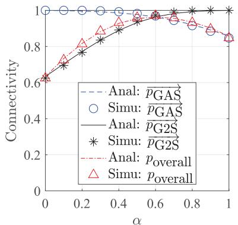

line

| α    | Anal: pGAS | Simu: pGAS | Anal: pG2S | Simu: pG2S | Anal: p_overall | Simu: p_overall |
| ---- | ---------- | ---------- | ---------- | ---------- | ---------------- | ---------------- |
| 0.0  | 1.0        | 1.0        | 0.6        | 0.6        | 0.6              | 0.6              |
| 0.2  | 1.0        | 1.0        | 0.7        | 0.7        | 0.7              | 0.7              |
| 0.4  | 1.0        | 1.0        | 0.9        | 0.9        | 0.9              | 0.9              |
| 0.6  | 1.0        | 1.0        | 0.95       | 0.95       | 0.95             | 0.95             |
| 0.8  | 1.0        | 1.0        | 0.9        | 0.9        | 0.9              | 0.9              |
| 1.0  | 1.0        | 1.0        | 0.85       | 0.85       | 0.85             | 0.85             |

(a) 入c= 50GUs/(km² ·cluster), 入p= 5clusters/km²

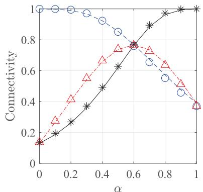

line

| α    | Connectivity (Solid Black) | Connectivity (Dashed Red) | Connectivity (Dotted Blue) |
| ---- | -------------------------- | ------------------------- | -------------------------- |
| 0.0  | 0.15                       | 0.15                      | 1.0                        |
| 0.2  | 0.30                       | 0.40                      | 1.0                        |
| 0.4  | 0.50                       | 0.65                      | 0.95                       |
| 0.6  | 0.75                       | 0.75                      | 0.85                       |
| 0.8  | 0.95                       | 0.65                      | 0.70                       |
| 1.0  | 1.0                        | 0.35                      | 1.0                        |

(b) 入c= 100GUs/(km² ·cluster), Xp= 5clusters/km²

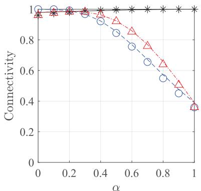

line

| α    | Connectivity (Circle) | Connectivity (Triangle) | Connectivity (Star) |
| ---- | --------------------- | ----------------------- | ------------------- |
| 0.0  | 1.0                   | 1.0                     | 1.0                 |
| 0.2  | 1.0                   | 1.0                     | 1.0                 |
| 0.4  | 0.9                   | 0.95                    | 1.0                 |
| 0.6  | 0.75                  | 0.85                    | 1.0                 |
| 0.8  | 0.6                   | 0.7                     | 1.0                 |
| 1.0  | 0.35                  | 0.35                    | 1.0                 |

(c) λc = 100GUs/(km² ·cluster), 入p =1clusters/km²   
Fig. 2. The overall path connectivity metric $( p _ { \mathrm { o v e r a l l } } )$ versus α, where $\{ \eta _ { x } , \eta _ { y } \} = \{ 0 . 1 , 0 . 1 \}$ , {m1, m2, m3} = {5, 5, 5}, {N1, N2, N3} = {5, 10, 10}, $\{ \bar { \gamma _ { 1 } } , \gamma _ { 2 } , \gamma _ { 3 } \} = \{ 0 , \bar { - 1 0 } , - 1 0 \} \mathrm { d B } ,$ $\{ f _ { 1 } , f _ { 2 } , f _ { 3 } \} = \{ 0 . 9 , 2 0 , 2 0 \}$ GHz, and $H _ { \mathrm { s } } = 6 0 0 \mathrm { k m } .$ .

Corollary 2: The connectivity $p _ { \mathrm { o v e r a l l } } ( x _ { 0 } , z )$ is obtained by

$$
p_{overall}(x_{0},z) = \alpha \times p_{\substack{\text{GAS}\\ \eta_{x}\to \alpha \eta_{x}}} (x_{0},z)|_{y_{0}} + (1 - \alpha)\times p_{\substack{\text{G2S}\\ \eta_{x}\to (1 - \alpha)\eta_{x}}} (x_{0},z),
$$

where $p _ { \mathrm { G A S } } ( x _ { 0 } , z ) | _ { y _ { 0 } }$ and $p _ { \mathrm { G 2 S } } ( x _ { 0 } , z )$ are given in Corollary 1 and Theorem 3, respectively. In addition, $\eta _ { x }  \alpha \eta _ { x }$ is the transformation of changing $\eta _ { x } ~ t o \alpha \eta _ { x }$ and $\eta _ { x }  ( 1 - \alpha ) \eta _ { x }$ is the transformation of changing $\eta _ { x } \ t o \ ( 1 - \alpha ) \eta _ { x }$ .

The specific effects of system parameters on $p _ { \mathrm { o v e r a l l } } ( x _ { 0 } , z )$ can refer to the effects of these parameters on $p _ { \mathrm { G A S } }$ and pG2S (see Remark 1, Remark 2, Remark 3, and Remark 4).

# IV. NUMERICAL RESULTS

This section presents numerical results of five connectivity metrics, i.e., $ { p _ { \mathrm { G 2 A } } } ,  { p _ { \mathrm { A 2 S } } } ,  { p _ { \mathrm { G A S } } } ,  { p _ { \mathrm { G 2 S } } }$ , and $p _ { \mathrm { o v e r a l l } }$ . In our results, we set $A _ { \mathrm { c l u s t e r } }$ as the same size as $\mathcal { A } _ { \mathrm { A 2 G } }$ , that means the GU clustering area size is equal to the coverage size of an AV. In this way, we can compare the performance of two path connectivity metrics (i.e., $p _ { \mathrm { G A S } }$ and $p _ { \mathrm { G 2 S } } )$ under a similar GU distribution. Of course, our model can also be used to analyze any other areas of $A _ { \mathrm { c l u s t e r } } .$ , just need to set a reasonable vertex angle $\varphi _ { \mathrm { c l u s t e r } } .$ . In addition, the thermal noise is used to evaluate the received noise at each link since it is a fundamental noise source at antenna circuits [27]. For each link, we have $W _ { i } = \mathcal { K } T _ { i } B _ { i }$ , where $\mathcal { K } = 1 . 3 8 \times 1 0 ^ { ( - 2 3 ) }$ J/K is the Boltzman constant and $T _ { i } , B _ { i }$ are the noise temperature and the carrier bandwidth at the receiver for the corresponding link, respectively. Detailed system parameters are given in Table I unless other specified.

Next, we will analyze the impacts of some critical system parameters on all connectivity metrics. These parameters include the GAS path selection ratio $\alpha ,$ , Nakagami parameters $m _ { i } .$ , the satellite altitude $H _ { \mathrm { s } }$ , and carrier frequencies $f _ { i } .$ Our results include both analytical results and simulation results, which are calculated and generated by MATLAB. To validate the analytical results, Monte Carlo simulations are conducted by averaging $1 0 { , } 0 0 0$ times realizations. For each simulation, we generate both random distributions of GUs and $\mathrm { A V s }$ and the random channel fading of three links. In all output figures, simulation results are marked by the label Simu and analytical results are marked by the label Anal. For each figure, one legend remains for all subfigures to ensure clarity of the plotted results and prevent overlapping.

# A. Impact of the GAS Path Selection Ratio

Fig. 2 plots three metrics $p _ { \mathrm { o v e r a l l } } , \overrightarrow { p _ { \mathrm { G A S } } } , \overrightarrow { p _ { \mathrm { G 2 S } } }$ versus the GAS path selection ratio $\alpha .$ Herein, −−→pGAS and −−→pG2S are given by $\overrightarrow { p _ { \mathrm { G A S } } } = p _ { \mathrm { G A S } } ( x _ { 0 } , z ) | _ { y _ { 0 } }$ and $\overrightarrow { p _ { \mathrm { G 2 S } } } = p _ { \mathrm { G 2 S } } ( x _ { 0 } , z )$ , respectively. ηx→αηx $\eta _ { x } \longrightarrow ( 1 - \alpha ) \eta _ { x }$

We can see that, with the increase of α, poverall first grows, then reaches a maximum value, and it drops after that. The maximum value is obviously the intersection between the lines of $\overrightarrow { p _ { \mathrm { G A S } } }$ and $\xrightarrow [ { p _ { \mathrm { G 2 S } } } ] { }$ . It means that, the overall path connectivity can reach the maximum when ${ \overrightarrow { p _ { \mathrm { G A S } } } } = { \overrightarrow { p _ { \mathrm { G 2 S } } } }$ . The intersection could be changed by different system parameters, e.g., AV densities.

Fig. 2 shows the different intersection results based on different GU densities $( \lambda _ { p }$ and $\lambda _ { c } )$ . Comparing Fig. 2(a) and Fig. 2(b), the intersection point has a larger connectivity under a smaller $\lambda _ { c }$ (i.e., a sparser GU distribution in each cluster). It means that, a sparser GU distribution can improve the overall path connectivity. Comparing Fig. 2(b) with Fig. 2(c), the intersection point is a larger α when facing a larger $\lambda _ { p }$ (i.e., very dense GU clusters). It means that, more GAS paths should be chosen for data transmission when facing dense GU clusters. Overall, we observe that the maximum value of $p _ { \mathrm { o v e r a l l } }$ can be obtained by choosing an optimal α.1 1

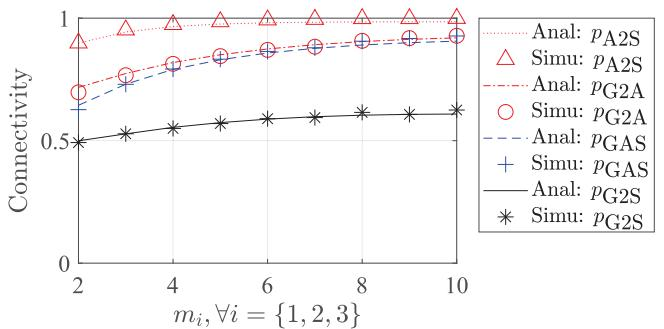

line

| mi, ∀i = {1,2,3} | Anal: pA2S | Simu: pA2S | Anal: pG2A | Simu: pG2A | Anal: pGAS | Simu: pGAS | Anal: pG2S | Simu: pG2S |
| ---------------- | ---------- | ---------- | ---------- | ---------- | ---------- | ---------- | ---------- | ---------- |
| 2                | 0.9        | 0.7        | 0.6        | 0.6        | 0.6        | 0.6        | 0.5        | 0.5        |
| 4                | 0.95       | 0.8        | 0.7        | 0.7        | 0.7        | 0.7        | 0.55       | 0.55       |
| 6                | 0.98       | 0.85       | 0.8        | 0.8        | 0.8        | 0.8        | 0.6        | 0.6        |
| 8                | 0.99       | 0.9        | 0.85       | 0.85       | 0.85       | 0.85       | 0.65       | 0.65       |
| 10               | 1.0        | 0.95       | 0.9        | 0.9        | 0.9        | 0.9        | 0.7        | 0.7        |

(a)λc= 50GUs/(km² ·cluster), Xp = 5clusters/km²

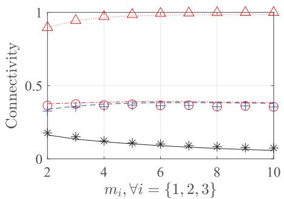

line

| mi, ∀i = {1,2,3} | Connectivity (Red Triangles) | Connectivity (Blue Circles) | Connectivity (Black Stars) |
| ---------------- | ---------------------------- | --------------------------- | -------------------------- |
| 2                | 0.95                         | 0.4                         | 0.2                        |
| 4                | 0.98                         | 0.4                         | 0.15                       |
| 6                | 0.99                         | 0.4                         | 0.1                        |
| 8                | 0.99                         | 0.4                         | 0.08                       |
| 10               | 0.99                         | 0.4                         | 0.05                       |

(b)λc= 100GUs/(km²·cluster), Xp= 5clusters/km²

Fig. 3. Four connectivity metrics (i.e., pG2A, pA2S, pGAS, and pG2S) versus $m _ { i } ( \forall i \in \{ 1 , 2 , 3 \} ) .$ where $\begin{array} { r l r } { \left\{ \eta _ { x } , \eta _ { y } \right\} } & { { } = } & { \left\{ 0 . 1 , 0 . 9 \right\} } \end{array}$ $\{ \breve { N } _ { 1 } , N _ { 2 } , N _ { 3 } \} = \{ 5 , 1 0 , 1 0 \}$ , {γ1, γ2, γ3} = {0, −10, −10}dB, {f1, f2, f3} = {0.9, 20, 20}GHz, and $\dot { H _ { \mathrm { s } } } = 6 0 \dot { 0 } \mathrm { k m }$ .   
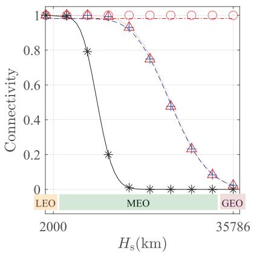

line

| Hs (km) | Connectivity |
| ------- | ------------ |
| 2000    | 1.0          |
| 35786   | 0.0          |

(a){f1,f2,f3}={2,20,20}GHz

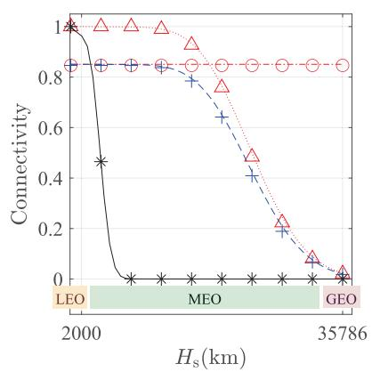

line

| Hs (km) | Connectivity |
| ------- | ------------ |
| 2000    | 1.0          |
| 35786   | 0.0          |

(b){f1,f2,f3}= {0.9,20,20}GHz

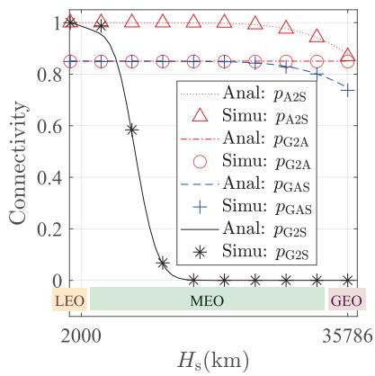

line

| Hs (km) | Analy: pA2S | Simu: pA2S | Anal: pG2A | Simu: pG2A | Anal: pGAS | Simu: pGAS | Anal: pG2S | Simu: pG2S |
| ------- | ----------- | ---------- | ---------- | ---------- | ---------- | ---------- | ---------- | ---------- |
| 2000    | 1.0         | 1.0        | 0.85       | 0.85       | 0.85       | 0.85       | 0.85       | 0.85       |
| 35786   | 0.9         | 0.9        | 0.8        | 0.8        | 0.8        | 0.8        | 0.8        | 0.8        |

(c){fi,f2,f3}={0.9,40,40}GHz   
Fig. 4. Four connectivity metrics (i.e., pG2A, pA2S, pGAS, and pG2S) versus $H _ { \mathrm { s } }$ and $f _ { i } ,$ where $\lambda _ { c } = 5 0 \mathrm { G U s } / ( \mathrm { k m ^ { 2 } }$ · cluster), $\lambda _ { p } = 0 . 1 \mathrm { c l u s t e r s } / \mathrm { k m ^ { 2 } }$ $\{ \bar { \eta _ { x } } , \eta _ { y } \} = \{ 0 . 1 , 0 . 1 \} , \ \{ m _ { 1 } , m _ { 2 } , m _ { 3 } \} = \{ 5 , 5 , 5 \} , \ \{ N _ { 1 } , N _ { 2 } , N _ { 3 } \} = \{ 5 , 1 0 , 1 0 \} , \ \{ \gamma _ { 1 } , \gamma _ { 2 } , \gamma _ { 3 } \} = \{ 0 , - 1 0 , - 1 0 \} \mathrm { d B } .$ and $H _ { \mathrm { u } } = 1 0 0 0 \mathrm { m }$ . Herein, LEO, MEO, and GEO represent three satellite orbits with varying altitudes, i.e., $H _ { \mathrm { s } } \leq 2 0 0 0 \mathrm { k m }$ , 2000km $\leq H _ { \mathrm { s } } \leq$ 35786km, and $H _ { \mathrm { s } } = 3 5 7 8 6 \mathrm { k m }$ , respectively.

# B. Impact of Nakagami Parameters

Fig. 3 shows four connectivity metrics (i.e., pG2A, pA2S, pGAS, and $p _ { \mathrm { G 2 S } } )$ versus Nakagami parameters $m _ { i } ( \forall i \in$ $\{ 1 , 2 , 3 \} )$ . As shown in Fig. 3(a), the values of all four connectivity metrics grow with the increment of $m _ { i } .$ . This phenomenon verifies our analytical observations (see Remark 2 and Remark 4), i.e., the increment of $m _ { i }$ indicates multi-path components, thus improving the channel quality. Compared with Fig. 3(a), Fig. 3(b) show the results by increasing GU densities $\lambda _ { c }$ in each cluster. We can see that $p _ { \mathrm { A 2 S } }$ is not affected because the denser GUs in each cluster do not affect the AVs’ density. Meanwhile, $p _ { \mathrm { G 2 A } }$ is obviously decreased after increasing $\lambda _ { c } ,$ this is because of more interference caused to the G2A link. Likewise, $p _ { \mathrm { G A S } }$ is obviously decreased. Even though, both $p _ { \mathrm { G 2 A } }$ and $p _ { \mathrm { G A S } }$ are still growing with $m _ { i }$ . This is because the increment of $m _ { i }$ can reduce the negative impacts

11The optimal value of α can be found by solving $\overrightarrow { p _ { \mathrm { G A S } } } = \overrightarrow { p _ { \mathrm { G 2 S } } } .$ The analytical expressions of −−→pGAS, −−→pG2S can be obtained by substituting $\eta _ { x } = \alpha \eta _ { x }$ into Thoerem 1 and substituting $\eta _ { x } = ( 1 - \alpha ) \eta _ { x }$ into Thoerem $^ { 2 , }$ respectively. Obviously, solving the above equation is mathematically complex. However, this observation gives us a direction for future studies.

of $\lambda _ { c }$ (see Remark 2 and Remark 4). By contrast, when decreasing $\lambda _ { c } , p _ { \mathrm { G 2 S } }$ totally drops with the increment of $m _ { 3 } .$ . This also verifies our observation in Remark 4, i.e., the increment of $m _ { 3 }$ can increase the negative impacts of $\ddot { R } _ { 3 }$ . The larger $\lambda _ { c }$ leads to larger $\ddot { R } _ { 3 } .$ , which indicate a very dense GU distribution. In this case, the increment of $m _ { i }$ not only improves the channel quality of the reference transceiver pair, but also the channel quality of all interference, thus leading to the dropping of pG2S.

# C. Impact of the Satellite Altitude and the Carrier Frequency

Fig. 4 shows four connectivity metrics (i.e., pG2A, pA2S, pGAS, and pG2S) versus the satellite altitude $H _ { \mathrm { s } }$ and the carrier frequency $f _ { 2 } .$ Herein, $p _ { \mathrm { G 2 A } }$ is unchanged since it is not affected by $H _ { \mathrm { s } } .$ . It can be observed that all three connectivity metrics pA2S, pGAS, pG2S decrease with the increment of $H _ { \mathrm { s } } .$ This is because the higher $H _ { \mathrm { s } }$ indicates not only the more serious path loss but also the more interference caused by more AVs/GUs in the wider coverage regions (i.e., $\mathcal { A } _ { \mathrm { S o A } }$ , $\boldsymbol { \mathcal { A } } _ { \mathrm { S o G } } )$ . In addition, we can compare three connectivity metrics (i.e., pA2S, pGAS, pG2S) for three satellite orbits. Obviously, LEO satellites, due to the lowest altitudes, provide the most stable and highest connectivity for all metrics. In contrast, MEO satellites, with the altitude increasing in a large range, experience a significant decrease in all three connectivities, and GEO satellites exhibit the lowest connectivity.

Fig. 4 also shows the results under three different frequency carriers. All four connectivity metrics (i.e., pG2A, pA2S, pGAS, and $p _ { \mathrm { G 2 S } } )$ increases when increasing $f _ { 1 }$ from 0.9 GHz to 2 GHz, or increasing $f _ { 2 } , f _ { 3 }$ from 20 GHz to 40 GHz. This is because the larger carrier frequency $f _ { i }$ brings less interference, due to fewer GUs/AVs in the smaller coverage region. In addition, it can be seen that both $p _ { \mathrm { G A S } }$ and pG2S decrease with the increment of $H _ { \mathrm { s } }$ and the decrement of $f _ { i } .$ Specifically, pG2S drops more sharply than $p _ { \mathrm { G A S } }$ . The reason is due to the much more interference caused by GUs in the G2S link compared with that in the GAS link. For a GAS link, with the aid of AV relays, the interference is significantly reduced. As a consequence, the GAS link can keep more stable connectivity with varied $H _ { \mathrm { s } }$ and $f _ { i } .$ .

# D. Observations and Insights

Observations: All simulation results match well with analytical results, confirming the accuracy of our models.12 Some important observations can be summarized as follows.

1) The overall path connectivity $p _ { \mathrm { o v e r a l l } }$ can reach the maximum by using the optimal value of the GAS path selection ratio $\alpha .$ The optimal α can be found by solving the equation that two path connectivity metrics (after considering the path selection ratio) are equal. The optimal α could be changed by different system parameters, e.g., GU densities.   
2) All four link/path connectivity metrics (i.e., pG2A, pA2S, pGAS, and pG2S) can be improved when decreasing $\lambda _ { c } , \lambda _ { p } , H _ { \mathrm { s } }$ or increasing $f _ { i } , N _ { i }$ . Particularly, on the condition of a sparse GU distribution, the increasing $m _ { i }$ can also improve all four connectivity metrics. In addition, compared with MEO and GEO satellites, LEO satellites can serve the most stable connectivity.   
3) The GAS path connectivity is more resilient and stable than the G2S path connectivity with varied system parameters. Because the GAS path utilizes the AV relays to mitigate the interference caused by GUs and also reduce the path loss in signal propagation.

Insights: Based on the above observations, our analytical model can help practitioners (e.g., network operators or engineers) in estimating the practical performance of SAGINs across various application scenarios. Below, we summarize two technical insights for practitioners.

1) To analyze various practical scenarios, practitioners can adjust the comprehensive system parameters in our models, including: i) choosing available satellites for a specific application region (e.g., a disastrous area); ii) placing GU clusters with appropriate distributions in this region and deploying AVs for them; iii) configuring transceiver parameters for nodes, e.g., frequency carriers, SINR threshold, and antenna parameters; iv) choosing correct Nakagami-m parameters and additional path loss $L _ { A }$ . Meanwhile, referring to remarks in our analytical model, practitioners can also analyze the detailed impacts of system parameters on

12The very slight difference between some analytical values and simulation values comes from the approximate calculation of integration, which can be overcome by enhancing the calculation algorithm or computing hardware.

multiple compound formulas, e.g., the signal deterioration degree, the clustering degree, and the interfering degree, so as to fine-tune the connectivity in a specific link/path.

2) To enhance uplink transmission performance, practitioners can allocate the path selection strategy for all GUs (i.e., choosing GAS or G2S as the transmission path) to align with an optimal path selection ratio. As shown in Fig. 2, an optimal path selection ratio is associated with AV densities, i.e., if more AVs are deployed (to cover more GU clusters), the optimal ratio prefers choosing more GAS paths. To allocate the ratio, practitioners can consider two methods: i) separating GUs into two groups following the ratio to choose the GAS and G2S paths, respectively; and ii) enabling each GU to choose the GAS/G2S path interchangeably at a frequency following the ratio.

# V. CONCLUSION AND DISCUSSIONS

# A. Conclusion

This paper presents a new analytical model of the uplink connectivity of the SAGIN with the aid of spherical stochastic geometry. Accordingly, analytical expressions of five connectivity metrics are derived, i.e., pG2A, pA2S, pGAS, pG2S, and poverall. Analytical results of all five connectivity metrics align with simulation results, thereby validating the accuracy of our analytical model. We observe that the overall path connectivity can reach a maximum value under the optimal value of the GAS path selection ratio; accordingly, practitioners can allocate the optimal path selection strategy for all GUs in practical implementations. In addition, by configuring comprehensive parameters, our analytical model can help practitioners estimate the practical performance of SAGINs across various application scenarios.

# B. Discussions

From the perspective of technical applications, our model can incorporate some emerging technologies into SAGIN, such as intelligent reflecting surfaces (IRS) and edge artificial intelligence (AI). Upon deploying IRS in a SAGIN, the overall communication quality will be enhanced, and additional IRS-based transmission paths can be integrated into our analytical model for validating the performance. When employing edge AI to optimize the configurations in SAGINs, our analytical model can aid in constructing objective functions for enhancing large-scale performance. Regarding future enhancements, our analytical model can be expanded to more practical SAGIN scenarios. For instance, the current spherical coverage model can be extended to a new one that is covered by multiple tilted beams.

# APPENDIX A

As shown in Fig. 5 (See the top of page 11), the evaluation of $\varphi _ { \mathrm { S o A } }$ includes two following cases.

Case 1: $\mathrm { I f ~ } \frac { \theta _ { 2 } } { 2 } > \arcsin { \left( \frac { R _ { e } + H _ { \mathrm { u } } } { R _ { e } + H _ { \mathrm { s } } } \right) } , \mathrm { { \mathcal { L } S P _ { 2 } O } }$ is a right angle and we have

$$
\varphi_ {\mathrm{SoA}} ^ {\text { Case1 }} = \angle \mathrm{SOP} _ {1} = \arccos \left(\frac {R _ {e} + H _ {\mathrm{u}}}{R _ {e} + H _ {\mathrm{s}}}\right). \tag {12}
$$

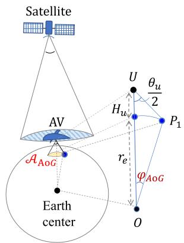

text_image

Satellite
AV
U
θu/2
Hu
P1
re
φAoG
Earth
center
O

(a) $\mathcal { A } _ { \mathrm { A o G } } ~ \mathrm { a n d } \ \triangle \mathrm { U O P } _ { 1 }$

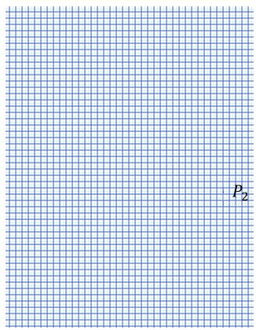

text_image

P₂

(b) $\mathcal { A } _ { \mathrm { S o A } }$ and △SOP2

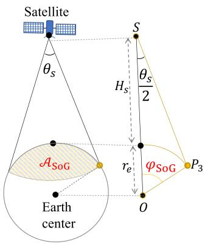

text_image

Satellite
θs
S
Hs
θs/2
ASoG
re
φSoG
P3
Earth
center
O

(c） $\mathcal { A } _ { \mathrm { S o G } }$ and $\triangle \mathrm { S O P _ { 3 } }$   
Fig. 5. Geometry relationship in coverage regions, where S is the satellite, O is the earth center, U is the $\mathbf { A V } ,$ and $P _ { 1 } , P _ { 2 } , P _ { 3 }$ are the points at the edge of $\mathcal { A } _ { \mathrm { { A o G } } } , \mathcal { A } _ { \mathrm { { S o A } } }$ , and $\boldsymbol { A } _ { \mathrm { S o G } }$ , respectively.

Case 2: If $\begin{array} { l } { \frac { \theta _ { 2 } } { 2 } \leq } \end{array}$ arcsin $\left( \frac { R _ { e } + H _ { \mathrm { u } } } { R _ { e } + H _ { \mathrm { s } } } \right) , ~ \mathrm { { \varDelta } \mathrm { { S P } _ { 2 } O } }$ is an obtuse angle and we have

$$
\begin{array}{l} \varphi_ {\mathrm{SoA}} ^ {\mathrm{Case2}} = \arccos \left(\sin^ {2} \left(\frac {\theta_ {2}}{2}\right) \frac {R _ {e} + H _ {\mathrm{s}}}{R _ {e} + H _ {\mathrm{u}}} \right. \\ \left. + \cos \left(\frac {\theta_ {2}}{2}\right) \sqrt {1 - \sin^ {2} \left(\frac {\theta_ {2}}{2}\right) \left(\frac {R _ {e} + H _ {\mathrm{s}}}{R _ {e} + H _ {\mathrm{u}}}\right) ^ {2}}\right). \tag {13} \\ \end{array}
$$

To sum up, we can calculate the vertex angles $\varphi _ { \mathrm { S o A } }$ through the following expressions.

$$
\varphi_ {\mathrm{SoA}} = \left\{ \begin{array}{l l} \varphi_ {\mathrm{SoA}} ^ {\text {Case1}}, & \text {if} \quad \frac {\theta_ {2}}{2} > \arcsin \left(\frac {R _ {e} + H _ {\mathrm{u}}}{R _ {e} + H _ {\mathrm{s}}}\right). \\ \varphi_ {\mathrm{SoA}} ^ {\text {Case2}}, & \text {if} \quad \frac {\theta_ {2}}{2} \leq \arcsin \left(\frac {R _ {e} + H _ {\mathrm{s}}}{R _ {e} + H _ {\mathrm{u}}}\right). \end{array} \right.
$$

Following a similar deriving processes in (12) and (13), $\varphi _ { \mathrm { A o G } }$ and φSoG are given by

$$
\varphi_ {\mathrm{AoG}} = \left\{ \begin{array}{l l} \varphi_ {\mathrm{AoG}} ^ {\text {Case1}}, & \text {if} \quad \frac {\theta_ {1}}{2} > \arcsin \left(\frac {R _ {e}}{R _ {e} + H _ {\mathrm{u}}}\right). \\ \varphi_ {\mathrm{AoG}} ^ {\text {Case2}}, & \text {if} \quad \frac {\theta_ {1}}{2} \leq \arcsin \left(\frac {R _ {e}}{R _ {e} + H _ {\mathrm{u}}}\right). \end{array} \right.
$$

$$
\varphi_ {\mathrm{SoG}} = \left\{ \begin{array}{l l} \varphi_ {\mathrm{SoG}} ^ {\text {Case1}}, & \text {if} \quad \frac {\theta_ {3}}{2} > \arcsin \left(\frac {R _ {e}}{R _ {e} + H _ {\mathrm{s}}}\right). \\ \varphi_ {\mathrm{SoG}} ^ {\text {Case2}}, & \text {if} \quad \frac {\theta_ {3}}{2} \leq \arcsin \left(\frac {R _ {e}}{R _ {e} + H _ {\mathrm{s}}}\right). \end{array} \right.
$$

where $\varphi _ { \mathrm { A o G } } ^ { \mathrm { C a s e 1 } } , \varphi _ { \mathrm { A o G } } ^ { \mathrm { C a s e 2 } } , \varphi _ { \mathrm { S o G } } ^ { \mathrm { C a s e 1 } } , \varphi _ { \mathrm { S o G } } ^ { \mathrm { C a s e 2 } }$ are given by

$$
\varphi_ {\mathrm{AoG}} ^ {\text { Case1 }} = \arccos \left(\frac {R _ {e}}{R _ {e} + H _ {\mathrm{u}}}\right), \tag {14}
$$

$$
\begin{array}{l} \varphi_ {\mathrm{AoG}} ^ {\text { Case2 }} = \arccos \left(\sin^ {2} \left(\frac {\theta_ {1}}{2}\right) \frac {R _ {e} + H _ {\mathrm{u}}}{R _ {e}} \right. \\ \left. + \cos \left(\frac {\theta_ {1}}{2}\right) \sqrt {1 - \sin^ {2} \left(\frac {\theta_ {1}}{2}\right) \left(\frac {R _ {e} + H _ {\mathrm{u}}}{R _ {e}}\right) ^ {2}}\right), \tag {15} \\ \end{array}
$$

$$
\varphi_ {\mathrm{SoG}} ^ {\text { Case1 }} = \arccos \left(\frac {R _ {e}}{R _ {e} + H _ {\mathrm{s}}}\right), \tag {16}
$$

$$
\begin{array}{l} \varphi_ {\mathrm{SoG}} ^ {\mathrm{Case2}} = \arccos \left(\sin^ {2} \left(\frac {\theta_ {3}}{2}\right) \frac {R _ {e} + H _ {\mathrm{s}}}{R _ {e}} \right. \\ \left. + \cos \left(\frac {\theta_ {3}}{2}\right) \sqrt {1 - \sin^ {2} \left(\frac {\theta_ {3}}{2}\right) \left(\frac {R _ {e} + H _ {\mathrm{s}}}{R _ {e}}\right) ^ {2}}\right). \tag {17} \\ \end{array}
$$

We see that each of threes angle $( \mathrm { i . e . , ~ } \varphi _ { \mathrm { A o G } } , \varphi _ { \mathrm { S o A } } , \varphi _ { \mathrm { S o G } } )$ have two different expressions, which depends on six comparative angles. Three antenna beamwidths $( \mathrm { i . e . , ~ } \theta _ { 1 } , \theta _ { 2 } , \theta _ { 3 } )$ can be calculated by (1). Then, we can analyze the numerical ranges of six comparative angles in Fig. 6 (See the top of page 12). As shown in Fig. 6(a),(d), $\theta _ { 1 } / 2 \textrm { ~ \leq ~ }$ arcsin $( \bar { R _ { e } } / ( R _ { e } + H _ { \mathrm { u } } ) )$ always holds when we consider the carrier frequency $f _ { 1 }$ under a generally range from 900 MHz to 2.4 GHz and the AV height $H _ { \mathrm { u } }$ fixed as 1m or 5000 m. In this context, $\varphi _ { \mathrm { A o G } } ~ = ~ \varphi _ { \mathrm { A o G } } ^ { \mathrm { C a s e 2 } }$ always hold. Similarly, $\theta _ { 2 } / 2 \ \leq$ arcsin $( ( R _ { e } + H _ { \mathrm { u } } ) / ( \bar { R _ { e } } + H _ { \mathrm { s } } ) ) , \theta _ { 3 } / 2 \leq$ arcsin $( R _ { e } / ( \bar { R } _ { e } + H _ { \mathrm { s } } ) )$ always hold in the general settings of the carrier frequency $f _ { 2 }$ ranging from 10 GHz to 100 GHz and the satellite altitude in three orbits. Then $\begin{array} { r l } { \varphi _ { \mathrm { S o A } } } & { { } = } \end{array}$ $\begin{array} { r l r } { \varphi _ { \mathrm { S o A } } ^ { \mathrm { C a s e 2 } } , \varphi _ { \mathrm { S o G } } } & { { } = } & { \varphi _ { \mathrm { S o G } } ^ { \mathrm { C a s e 2 } } } \end{array}$ φCaseSoG always hold in general cases. Thereby, we have the final expressions of three vertex angles $\varphi _ { \mathrm { A o G } } , \varphi _ { \mathrm { S o A } } , \varphi _ { \mathrm { S o G } }$ , which are given by

$$
\begin{array}{l} \varphi_ {\mathrm{AoG}} \\ = \arccos \left(\sin^ {2} \left(\frac {\kappa_ {\mathrm{u}} c}{2 f _ {1} D _ {\mathrm{u}}}\right) \frac {R _ {e} + H _ {\mathrm{u}}}{R _ {e}} \right. \\ + \cos \left(\frac {\kappa_ {\mathrm{u}} c}{2 f _ {1} \mathrm{D} _ {\mathrm{u}}}\right) \sqrt {1 - \sin^ {2} \left(\frac {\kappa_ {\mathrm{u}} c}{2 f _ {1} \mathrm{D} _ {\mathrm{u}}}\right) \left(\frac {R _ {e} + H _ {\mathrm{u}}}{R _ {e}}\right) ^ {2}} \Bigg), \\ \end{array}
$$

$$
\begin{array}{l} \varphi_ {\mathrm{SoA}} \\ = \arccos \left(\sin^ {2} \left(\frac {\kappa_ {\mathrm{s}} c}{2 f _ {2} D _ {\mathrm{s}}}\right) \frac {R _ {e} + H _ {\mathrm{s}}}{R _ {e} + H _ {\mathrm{u}}} \right. \\ + \cos \left(\frac {\kappa_ {\mathrm{s}} c}{2 f _ {2} \mathrm{D} _ {\mathrm{s}}}\right) \sqrt {1 - \sin^ {2} \left(\frac {\kappa_ {\mathrm{s}} c}{2 f _ {2} \mathrm{D} _ {\mathrm{s}}}\right) \left(\frac {R _ {e} + H _ {\mathrm{s}}}{R _ {e} + H _ {\mathrm{u}}}\right) ^ {2}}. \\ \end{array}
$$

$$
\begin{array}{l} \varphi_ {\mathrm{SoG}} \\ = \arccos \left(\sin^ {2} \left(\frac {\kappa_ {\mathrm{s}} c}{2 f _ {3} \mathrm{D} _ {\mathrm{s}}}\right) \frac {R _ {e} + H _ {\mathrm{s}}}{R _ {e}} \right. \\ \end{array}
$$

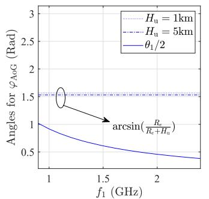

line

| f₁ (GHz) | Angles for φAoG (Rad) |
| -------- | --------------------- |
| 1.0      | 1.0                   |
| 1.5      | 0.7                   |
| 2.0      | 0.5                   |

（a） 1,arcsin $\begin{array} { r } { \left( \frac { R _ { e } } { R _ { e } + H _ { \mathrm { u } } } \right) } \end{array}$ versus $f _ { 1 }$

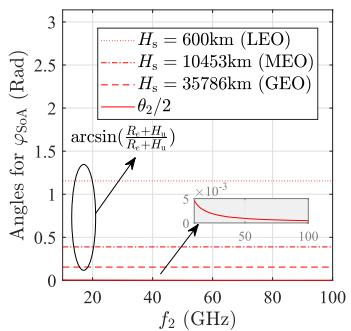

line

| f₂ (GHz) | Angles for φSoA (Rad) |
| -------- | ---------------------- |
| 20       | 0.5                    |
| 40       | 1.0                    |
| 60       | 1.0                    |
| 80       | 1.0                    |
| 100      | 1.0                    |

(b) 2,arcsin $\left( \frac { R _ { e } + H _ { \mathrm { u } } } { R _ { e } + H _ { \mathrm { s } } } \right)$ versus f2

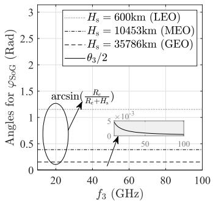

line

| f₃ (GHz) | Angles for φS₀G (Rad) |
| -------- | ---------------------- |
| 20       | 0.0                    |
| 40       | 1.0                    |
| 60       | 0.5                    |
| 80       | 0.5                    |
| 100      | 0.5                    |

（c） ,arcsin $\scriptstyle \left( { \frac { R _ { e } } { R _ { e } + H _ { \mathrm { s } } } } \right)$ versus f3

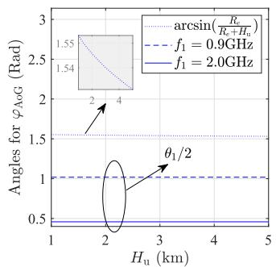

line

| H_u (km) | Angles for φ AoG (Rad) |
| -------- | ---------------------- |
| 1.55     | 2.5                    |
| 1.54     | 2.4                    |
| 1.53     | 2.3                    |
| 1.52     | 2.2                    |
| 1.51     | 2.1                    |
| 1.50     | 2.0                    |
| 1.49     | 1.9                    |
| 1.48     | 1.8                    |
| 1.47     | 1.7                    |
| 1.46     | 1.6                    |
| 1.45     | 1.5                    |
| 1.44     | 1.4                    |
| 1.43     | 1.3                    |
| 1.42     | 1.2                    |
| 1.41     | 1.1                    |
| 1.40     | 1.0                    |
| 1.39     | 0.9                    |
| 1.38     | 0.8                    |
| 1.37     | 0.7                    |
| 1.36     | 0.6                    |
| 1.35     | 0.5                    |
| 1.34     | 0.4                    |
| 1.33     | 0.3                    |
| 1.32     | 0.2                    |
| 1.31     | 0.1                    |
| 1.30     | 0.0                    |
| 1.29     | -0.1                   |
| 1.28     | -0.2                   |
| 1.27     | -0.3                   |
| 1.26     | -0.4                   |
| 1.25     | -0.5                   |
| 1.24     | -0.6                   |
| 1.23     | -0.7                   |
| 1.22     | -0.8                   |
| 1.21     | -0.9                   |
| 1.20     | -1.0                   |
| 1.19     | -1.1                   |
| 1.18     | -1.2                   |
| 1.17     | -1.3                   |
| 1.16     | -1.4                   |
| 1.15     | -1.5                   |
| 1.14     | -1.6                   |
| 1.13     | -1.7                   |
| 1.12     | -1.8                   |
| 1.11     | -1.9                   |
| 1.10     | -2.0                   |
| 1.09     | -2.1                   |
| 1.08     | -2.2                   |
| 1.07     | -2.3                   |
| 1.06     | -2.4                   |
| 1.05     | -2.5                   |
| 1.04     | -2.6                   |
| 1.03     | -2.7                   |
| 1.02     | -2.8                   |
| 1.01     | -2.9                   |
| 1.00     | -3.0                   |

(d) $\frac { \theta _ { 1 } } { 2 }$ ,arcsin $\begin{array} { r } { \left( \frac { R _ { e } } { R _ { e } + H _ { \mathrm { u } } } \right) } \end{array}$ versus $H _ { \mathrm { u } }$

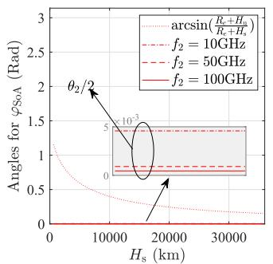

line

| H_s (km) | arcsin(R_e + H_a / R_e + H_r) | f_2 = 10GHz | f_2 = 50GHz | f_2 = 100GHz |
| -------- | ----------------------------- | ----------- | ----------- | ------------ |
| 0        | 1.0                           | 1.0         | 1.0         | 1.0          |
| 10000    | 0.5                           | 0.8         | 1.3         | 1.4          |
| 20000    | 0.3                           | 0.7         | 1.3         | 1.4          |
| 30000    | 0.2                           | 0.6         | 1.3         | 1.4          |

(e)） ,arcsin $\textstyle \left( { \frac { R _ { e } + H _ { \mathrm { u } } } { R _ { e } + H _ { \mathrm { s } } } } \right)$ versus $H _ { \mathrm { s } }$

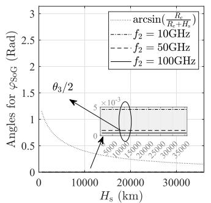

line

| H_s (km) | Arcsin(R_c / R_c + H_c) | f2 = 10GHz | f2 = 50GHz | f2 = 100GHz |
| -------- | ------------------------ | ---------- | ---------- | ----------- |
| 0        | 1.0                      | 1.0        | 1.0        | 1.0         |
| 10000    | 0.5                      | 0.5        | 0.5        | 0.5         |
| 20000    | 0.25                     | 0.25       | 0.25       | 0.25        |
| 30000    | 0.1                      | 0.1        | 0.1        | 0.1         |

(f) $\frac { \theta _ { 3 } } { 2 }$ ,arcsin $\scriptstyle \left( { \frac { R _ { e } } { R _ { e } + H _ { \mathrm { s } } } } \right)$ versus $H _ { \mathrm { s } }$   
Fig. 6. Six angles $( \mathrm { i . e . , } \theta _ { 1 } / 2 , \theta _ { 2 } / 2 , \theta _ { 3 } / 2 .$ , arcsin $( R _ { e } / ( R _ { e } + H _ { \mathrm { u } } ) )$ , arcsin $\left( R _ { e } + H _ { \mathrm { u } } / ( R _ { e } + H _ { \mathrm { s } } ) \right)$ ), and arcsin $( R _ { e } / ( R _ { e } + H _ { \mathrm { s } } ) ) )$ versus carrier frequencies and the AV height/the satellite altitude. Herein, all system parameters (e.g., $\kappa _ { i } , D _ { i } , \iota _ { i } , \forall i \in \{ 1 , 2 , 3 \} \}$ ) are set according to Table I.

$$
+ \cos \left(\frac {\kappa_ {\mathrm{s}} c}{2 f _ {3} \mathrm{D} _ {\mathrm{s}}}\right) \sqrt {1 - \sin^ {2} \left(\frac {\kappa_ {\mathrm{s}} c}{2 f _ {3} \mathrm{D} _ {\mathrm{s}}}\right) \left(\frac {R _ {e} + H _ {\mathrm{s}}}{R _ {e}}\right) ^ {2}}.
$$

# APPENDIX B

The proof of Theorem 1: Substituting $\gamma _ { \mathrm { G 2 A } } ( x _ { 0 } , y _ { 0 } )$ into $p _ { \mathrm { G 2 A } } ( x _ { 0 } , y _ { 0 } )$ , we have

$$
\begin{array}{l} p _ {\mathrm{G2A}} (x _ {0}, y _ {0}) \stackrel {(a)} {=} \mathbb {E} \left[ \frac {\Gamma (m _ {1} , S _ {1} (W _ {1} + I _ {1} (x _ {0} , y _ {0})))}{\Gamma (m _ {1})} \right] \\ \stackrel {(b)} {=} \sum_ {n = 0} ^ {m _ {1} - 1} \frac {\left(- S _ {1}\right) ^ {n}}{n !} \left[ \exp \left(- S _ {1} W _ {1}\right) \mathcal {L} _ {I _ {1}} \left(S _ {1}\right) \right] _ {S _ {1}} ^ {(n)}, \tag {18} \\ \end{array}
$$

where $S _ { 1 } = m _ { 1 } \gamma _ { 1 } L _ { 1 } ( x _ { 0 } , y _ { 0 } ) / \left( \Omega _ { 1 } P _ { 1 } G _ { 1 } \right)$ and $[ \cdot ] _ { s _ { 1 } } ^ { ( n ) }$ s is the nth derivative of $S _ { 1 }$ . The step (a) arises from the complementary cumulative distribution function of the gamma distributed random fading gain $\left| h _ { 1 } \right| ^ { 2 }$ [33], wherein Γ(·) and $\Gamma ( \cdot , \cdot )$ are the gamma and upper incomplete gamma functions [34]. The step (b) follows the similar derivation in [35] (see (30)).

The notation $\begin{array} { r c l } { \mathcal { L } _ { I _ { 1 } } ( s ) } & { = } & { \mathbb { E } \left[ \exp \left( - s I _ { 1 } ( x _ { 0 } , y _ { 0 } ) \right) \right] } \end{array}$ is the Laplace Transform of the interference $I _ { 1 } ( x _ { 0 } , y _ { 0 } )$ with s being the Laplace variable. According to the distribution characteristics of UEs and the channel fading in $I _ { 1 } ( x _ { 0 } , y _ { 0 } ) , \mathcal { L } _ { I _ { 1 } } ( S _ { 1 } )$ can be calculated as follows.

$$
\begin{array}{l} \mathcal {L} _ {I _ {1}} (S _ {1}) \stackrel {(a)} {=} \mathbb {E} \left[ \prod_ {x \in \phi_ {c} \setminus \{x _ {0} \}} \mathbb {E} _ {h} \left[ \exp \left(- \frac {S _ {1} \eta_ {x} P _ {1} G _ {1} | h _ {1} | ^ {2}}{N _ {1} L _ {1} (x , y _ {0})}\right) \right] \right] \\ \stackrel {(b)} {=} \mathbb {E} \left[ \prod_ {x \in \phi_ {c} \backslash \{x _ {0} \}} \left(1 + \frac {Q _ {1} S _ {1}}{L _ {1} (x , y _ {0})}\right) ^ {- m _ {1}} \right] \\ \end{array}
$$

$$
\stackrel {(c)} {=} \mathbb {E} \left[ \prod_ {x \in \phi_ {c}} \left(1 + \frac {Q _ {1} S _ {1}}{L _ {1} (x , y _ {0})}\right) ^ {- m _ {1}} \right]
$$

$$
\stackrel {(d)} {=} \exp \left(- \lambda_ {c} \int_ {\mathcal {A} _ {\mathrm{AoG}}} 1 - \left(1 + \frac {Q _ {1} S _ {1}}{L _ {1} (x , y _ {0})}\right) ^ {- m _ {1}} \mathrm{d} \mathbf {x}\right), \tag {19}
$$

where spheric $Q _ { 1 } = \eta _ { x } \Omega _ { 1 } P _ { 1 } G _ { 1 } / ( m _ { 1 } N _ { 1 } )$ and erence $\mathcal { A } _ { \mathrm { A o G } } ^ { y _ { 0 } }$ is the ground. The step (a) $\mathrm { ~ A V ~ } y _ { 0 }$ is resulted from the distribution of h that is independent of the node distribution $\phi _ { c }$ . The step (b) is resulted from the moment generating function (MGF) of the Nakagami-m fading power $| h _ { 1 } | ^ { 2 }$ , i.e., E -exp $( s _ { m } | h _ { 1 } | ^ { 2 } ) ] = ( 1 - s _ { m } \mathbf { \bar { \Omega } } _ { 1 } / m _ { 1 } ) ^ { - m _ { 1 } }$ with $s _ { m }$ being the MGF variable [30]. The step (c) is resulted from the uniformly-distributed characteristic of $\phi _ { c } , \mathrm { i . e . , } \phi _ { c } \rangle \{ x _ { 0 } \}$ has the same statistical characteristic as $\phi _ { c }$ [36]. The step (d) is resulted from the probability-generating functional of $\phi _ { c } ,$ i.e., $\begin{array} { r } { \mathbb { E } \left[ \prod _ { x \in \phi _ { c } } v ( x ) \right] = \exp \left( - \lambda _ { c } \int _ { A _ { \mathrm { A o G } } } 1 - v ( x ) \mathrm { d } \mathbf { x } \right) } \end{array}$ , where v(x) is any integrable and non-negative functions of the point x in $\phi _ { c }$ [36].

Substituting the polar coordinate of $\mathbf { x } : ( R _ { e } , \vartheta _ { x } , \varphi _ { x } )$ in the spherical dome $\mathcal { A } _ { \mathrm { A o G } }$ , the integral expression in (19) can be further calculated as follows:

$$
\int_ {\mathcal {A} _ {\mathrm{AoG}}} 1 - \left(1 + \frac {Q _ {1} S _ {1}}{L _ {1} (x , y _ {0})}\right) ^ {- m _ {1}} \mathrm{d} \mathbf {x}
$$

$$
\stackrel {(a)} {=} \int_ {\mathcal {A} _ {\mathrm{AoG}}} 1 - \left(1 + \frac {Q _ {1} S _ {1}}{L _ {1} (x , \tilde {y _ {0}})}\right) ^ {- m _ {1}} \mathrm{d} \mathbf {x}
$$

$$
\stackrel {(b)} {=} 2 \pi R _ {e} ^ {2} \int_ {0} ^ {\varphi_ {\mathrm{AoG}}} \left(1 - \left(1 + \frac {Q _ {1} S _ {1}}{L _ {1} (x , \tilde {y _ {0}})}\right) ^ {- m _ {1}}\right) \sin (\varphi_ {x}) \mathrm{d} \varphi_ {x}, \tag {20}
$$

where (a) is obtained by a variable transformation of $\textbf { x } :$ $( R _ { e } , \vartheta _ { x } , \varphi _ { x } ) \mathbf { t o } \mathbf { x } : ( R _ { e } , \vartheta _ { x } - \vartheta _ { y _ { 0 } } , \varphi _ { x } - \varphi _ { y _ { 0 } } )$ . The transformed x belongs to the spherical dome $\mathcal { A } _ { \mathrm { A o G } } ^ { y _ { 0 } }$ covered by the $\mathrm { A V } ~ \tilde { y _ { 0 } }$ between thhas the samfrom the p $\tilde { \mathbf { y _ { 0 } } } : ( R _ { e } + H _ { \mathrm { u } } , 0 , 0 )$ $d _ { x y _ { 0 } }$ al dome step (b) f $\mathrm { A V } ~ \tilde { y _ { 0 } }$ $\mathcal { A } _ { \mathrm { A o G } } ^ { \tilde { y _ { 0 } } }$ $\varphi _ { \mathrm { A o G } }$ $\mathcal { A } _ { \mathrm { A o G } }$ $\mathcal { A } _ { \mathrm { A o G } } ^ { \tilde { y _ { 0 } } } .$

Substituting (19) and (20) into (18), we have

$$
p _ {\mathrm{G2A}} (x _ {0}, y _ {0}) = \sum_ {n = 0} ^ {m _ {1} - 1} \frac {(- S _ {1}) ^ {n}}{n !} \left[ \exp {(- \mathcal {F} _ {1})} \right] _ {S _ {1}} ^ {(n)}, \tag {21}
$$

where $\begin{array} { r } { \mathcal { F } _ { 1 } = S _ { 1 } W _ { 1 } + 2 \pi R _ { e } ^ { 2 } \lambda _ { c } \int _ { 0 } ^ { \varphi _ { \mathrm { A o G } } } \mathcal { Q } _ { 1 } ( S _ { 1 } ) } \end{array}$ sin $( \varphi _ { x } ) \mathrm { d } \varphi _ { x }$ and Q1 = 1 − 1 + S1Q1L1(x,y˜0)  $\begin{array} { r } { \mathcal { Q } _ { 1 } = 1 - \left( 1 + \frac { S _ { 1 } Q _ { 1 } } { L _ { 1 } \left( x , \tilde { y _ { 0 } } \right) } \right) ^ { - m _ { 1 } } } \end{array}$ −m1

According to the nth derivative of a composition function [32] (Formula 0.430.2) and Leibniz integral rule [37], we can expand the expression in (21) to

$$
\begin{array}{l} p _ {\mathrm{G2A}} (x _ {0}, y _ {0}) \\ = \exp (- \mathcal {F} _ {1}) \sum_ {n = 0} ^ {m _ {1} - 1} \left((- S _ {1}) ^ {n} \sum_ {l, q, n} \right. \\ \left. \times \left[ \frac {(- 1) ^ {i + j + \dots + q}}{i ! j ! \dots q !} \left(\frac {\mathcal {F} _ {1} ^ {\prime}}{1 !}\right) ^ {i} \left(\frac {\mathcal {F} _ {1} ^ {\prime \prime}}{2 !}\right) ^ {j} \dots \left(\frac {\mathcal {F} _ {1} ^ {(l)}}{l !}\right) ^ {q} \right]\right), \tag {22} \\ \end{array}
$$

where $( \cdot ) ^ { \prime } , ( \cdot ) ^ { \prime \prime } , ( \cdot ) ^ { ( l ) }$ denote the 1st, 2nd, and lth derivative of functions of $S _ { 1 }$ , respectively. The symbol $\textstyle \sum _ { l , q , n }$ indicates summation over all solutions in non-negative integers of the equation $i + 2 j + . . + l q = n$ . In (22), putting $( { \bar { - } } S _ { 1 } ) ^ { n }$ into $\textstyle \sum _ { l , q , n }$ , putting (−1)i+j+...+q into $\left( \cdot \right) ^ { i } \left( \cdot \right) ^ { j } \ldots ( \cdot ) ^ { q }$ , and putting $1 / l !$ into each $\mathcal { F } _ { 1 } ^ { \mathrm { ~ } ( l ) } ( \forall l )$ , we have

$$
\begin{array}{l} p _ {\mathrm{G2A}} (x _ {0}, y _ {0}) \\ = \exp \left(- \mathcal {F} _ {1}\right) \sum_ {n = 0} ^ {m _ {1} - 1} \\ \times \left(\sum_ {l, q, n} \times \left[ \frac {1}{i ! j ! \dots q !} \left(\dot {\mathcal {F}} _ {1} ^ {\prime}\right) ^ {i} \left(\dot {\mathcal {F}} _ {1} ^ {\prime \prime}\right) ^ {j} \dots \left(\dot {\mathcal {F}} 1 ^ {(l)}\right) ^ {q} \right]\right), \tag {23} \\ \end{array}
$$

where

$$
\dot {\mathcal {F}} _ {1} ^ {\prime} = S _ {1} W _ {1} + 2 \pi R _ {e} ^ {2} \lambda_ {c} \int_ {0} ^ {\varphi_ {\mathrm{AoG}}} \dot {\mathcal {Q}} _ {1} ^ {\prime} \sin (\varphi_ {x}) \mathrm{d} \varphi_ {x},
$$

$$
\forall l > 1: \dot {\mathcal {F}} _ {1} ^ {(l)} = 2 \pi R _ {e} ^ {2} \lambda_ {c} \int_ {0} ^ {\varphi_ {\mathrm{AoG}}} \dot {\mathcal {Q}} _ {1} ^ {(l)} \sin (\varphi_ {x}) \mathrm{d} \varphi_ {x},
$$

$$
\forall l \geq 1: \dot {\mathcal {Q}} _ {1} ^ {(l)} = C _ {l} ^ {m _ {1} + l - 1} \left(\frac {S _ {1} Q _ {1}}{L _ {1} (x , \tilde {y _ {0}})}\right) ^ {l} \left(1 + \frac {S _ {1} Q _ {1}}{L _ {1} (x , \tilde {y _ {0}})}\right) ^ {- m _ {1} - l}.
$$

Herein, $C _ { l } ^ { m _ { 1 } + l - 1 }$ indicates the number of l-combinations for the set with $m _ { 1 } + l - 1$ elements.

The expressions of $S _ { 1 }$ and $S _ { 1 } Q _ { 1 } / L _ { 1 } ( x , \tilde { y _ { 0 } } )$ can be transformed as follows,

$$
S _ {1} = \frac {m _ {1} \gamma_ {1} L _ {1} (x _ {0} , y _ {0})}{\Omega_ {1} P _ {1} G _ {1}} \stackrel {(a)} {=} \frac {1 6 m _ {1} \gamma_ {1} L _ {A} \left(d _ {x _ {0} y _ {0}} ^ {2}\right)}{\Omega_ {1} P _ {1} \iota_ {\mathrm{u}} \mathrm{D} _ {\mathrm{u}} ^ {2}}, \tag {24}
$$

$$
\frac {S _ {1} Q _ {1}}{L _ {1} (x , \tilde {y} _ {0})} = \frac {S _ {1} \eta_ {x} \Omega_ {1} P _ {1} G _ {1}}{N _ {1} m _ {1} L _ {1} (x , \tilde {y} _ {0})} \stackrel {(b)} {=} \frac {\eta_ {x} \gamma_ {1} d _ {x _ {0} y _ {0}} ^ {2}}{N _ {1} \left(d _ {x \tilde {y} _ {0}} ^ {2}\right)}, \tag {25}
$$

where (a) and (b) are derived by substituting the formulations of (1) and (2). Substituting (25) into (23), the integrals in $\mathcal { F } _ { 1 } ( S _ { 1 } )$ and $\dot { \mathcal { F } } _ { 1 } ^ { ( l ) } ( \forall l \ge 0 )$ can be transformed to

$$
\begin{array}{l} \int_ {0} ^ {\varphi_ {\mathrm{AoG}}} \mathcal {Q} _ {1} (S _ {1}) \sin (\varphi_ {x}) \mathrm{d} \varphi_ {x} \stackrel {(a)} {=} \frac {1}{2 R _ {e} (R _ {e} + H _ {\mathrm{u}})} \\ \times \int_ {H _ {\mathrm{u}} ^ {2}} ^ {\max \left(d _ {x y _ {0}} ^ {2}\right)} 1 - \left(1 + \frac {\eta_ {x} \gamma_ {1} d _ {x _ {0} y _ {0}} ^ {2}}{N _ {1} \left(d _ {x y _ {0}} ^ {2}\right)}\right) ^ {- m _ {1}} \mathrm{d} \left(d _ {x y _ {0}} ^ {2}\right), \tag {26} \\ \end{array}
$$

$$
\forall l \geq 1: \int_ {0} ^ {\varphi_ {\mathrm{AoG}}} \dot {\mathcal {Q}} _ {1} ^ {(l)} \sin (\varphi_ {x}) \mathrm{d} \varphi_ {x} \stackrel {(b)} {=} \frac {1}{2 R _ {e} (R _ {e} + H _ {\mathrm{u}})}
$$

$$
\times \int_ {H _ {\mathrm{u}} ^ {2}} ^ {\max \left(d _ {x \tilde {y} _ {0}} ^ {2}\right)} \left(\frac {\eta_ {x} \gamma_ {1} d _ {x _ {0} y _ {0}} ^ {2}}{N _ {1} \left(d _ {x \tilde {y} _ {0}} ^ {2}\right)}\right) ^ {l}
$$

$$
\times \left(1 + \frac {\eta_ {x} \gamma_ {1} d _ {x _ {0} y _ {0}} ^ {2}}{N _ {1} \left(d _ {x \tilde {y} _ {0}} ^ {2}\right)}\right) ^ {- m - l} \mathrm{d} \left(d _ {x \tilde {y} _ {0}} ^ {2}\right), \tag {27}
$$

where (a) and (b) are resulted from the transformation $\int \mathrm { d } \varphi _ { x } \ \dot { \mapsto } \ \stackrel { \cdot } { \int } \mathrm { d } \left( d _ { x \tilde { y _ { 0 } } } ^ { 2 } \right)$ with $d _ { x \tilde { \eta _ { 0 } } } ^ { 2 } = ( R _ { e } + H _ { \mathrm { u } } ) ^ { 2 } + R _ { e } ^ { 2 } - 2 R _ { e }$ $\left( R _ { e } + H _ { \mathrm { u } } \right) \cos \left( \varphi _ { x } \right)$ and max $\tilde { ( d _ { x \bar { y _ { 0 } } } ^ { 2 } ) } = ( R _ { e } + { H _ { \mathrm { u } } } ) ^ { 2 } + R _ { e } ^ { 2 } -$ 2Re $\left( R _ { e } \mathrm { ~ + ~ } H _ { \mathrm { u } } \right)$ cos $\left( \varphi _ { \mathrm { A o G } } \right)$ . Substituting the above integral expressions into (23), we have Theorem 1. ■

# APPENDIX D

Proof of Theorem 3: The connectivity of the G2S link between the reference GU $x _ { 0 }$ and the satellite z can be evaluated as follows:

$$
\begin{array}{l} p _ {\mathrm{G2S}} (x _ {0}, z) = \mathbb {P} \left(\gamma_ {\mathrm{G2S}} (x _ {0}, z) \geq \gamma_ {3}\right) \\ = \sum_ {n = 0} ^ {m _ {3} - 1} \frac {\left(- S _ {3}\right) ^ {n}}{n !} \left[ \exp \left(- S _ {3} W _ {3}\right) \mathcal {L} _ {I _ {3}} (S _ {3}) \right] _ {S _ {3}} ^ {(n)}, \tag {28} \\ \end{array}
$$

where $\begin{array} { c c l } { S _ { 3 } } & { = } & { m _ { 3 } \gamma _ { 3 } L _ { 3 } ( x _ { 0 } , z ) / \left( \Omega _ { 3 } P _ { 3 } G _ { 3 } \right) } \end{array}$ and $\begin{array} { r l } { \mathcal { L } _ { I _ { 3 } } ( s ) } & { { } = } \end{array}$ E [exp $\left( - s I _ { 3 } ( x _ { 0 } , z ) \right)$ is the Laplace Transform of the interference $I _ { 3 } ( x _ { 0 } , z )$ with s being the Laplace variable.

According to the distribution characteristics of the interference $I _ { 3 } ( x _ { 0 } , z )$ , and following the similar derivation process of $( 1 9 ) ( \mathrm { a } , \mathrm { b } , \mathrm { c } ) , \mathscr { L } _ { I _ { 3 } } ( S _ { 3 } )$ can be calculated as follows:

$$
\begin{array}{l} \mathcal {L} _ {I _ {3}} (S _ {3}) = \mathbb {E} \left[ \exp \left(- S _ {3} I _ {3} (x _ {0}, z)\right) \right] \\ = \mathbb {E} \left[ \prod_ {x \in \Phi_ {\mathrm{pcp}}} \left(1 + \frac {Q _ {3} S _ {3}}{L _ {3} (x , z)}\right) ^ {- m _ {3}} \right]. \tag {29} \\ \end{array}
$$

where $Q _ { 3 } \ = \ \eta _ { x } \Omega _ { 3 } P _ { 3 } G _ { 2 } / ( m _ { 3 } N _ { 2 } )$ . (29) can be further calculated according to the probability-generating functional $\begin{array} { r } { \mathbb { E } \left( \prod _ { x \in \Phi _ { \mathsf { p c p } } } v ( x ) \right) } \end{array}$ of $\Phi _ { \mathsf { p c p } }$ [36], [38]. Let $v ( x )$ denote any integrable and non-negative functions of the point x in $\Phi _ { \mathsf { p c p } } .$ We can evaluate $\begin{array} { r } { \mathbb { E } \left( \prod _ { x \in \Phi _ { \mathsf { p c p } } } v ( x ) \right) } \end{array}$ by

$$
\mathbb {E} \left(\prod_ {x \in \Phi_ {\mathrm{pcp}}} v (x)\right) = \exp \left(- \lambda_ {p} \int_ {\mathcal {A} _ {\mathrm{SoG}}} [ 1 - G _ {k} (v (x)) ] \mathrm{d} \mathbf {k}\right), \tag {30}
$$

where $\begin{array} { r } { G _ { k } \left( v ( x ) \right) \ = \ \exp \left( - \bar { c } \left( 1 - \int _ { \mathbb { R } ^ { 2 } } v ( x + k ) f ( x ) \mathrm { d } \mathbf { x } \right) \right) } \end{array}$ is the probability-generating functional of the point distribution in the cluster $\phi _ { k }$ with its center located at k [39], where c¯ is the mean number of points in a cluster and $f ( x )$ is the probability density function of GUs in the cluster. In $\begin{array} { c c c c } { \Phi _ { \mathsf { p c p } } , \mathit { \Pi } \bar { c } } & { = } & { \lambda _ { c } \times \mathrm { A r e a } ( \mathcal { A } _ { \mathrm { A o G } } ) } \end{array}$ and $\begin{array} { r l } { f ( x ) } & { { } = } \end{array}$ $1 / \mathrm { A r e a } \left( \mathcal { A } _ { \mathrm { A o G } } \right)$ , where Area $\left( \mathcal { A } _ { \mathrm { A o G } } \right)$ is the area size of $\mathcal { A } _ { \mathrm { A o G } }$ . Therefore, $G _ { k } \left( v ( x ) \right)$ can be updated to $G _ { k } \left( v ( x ) \right) =$ exp $\begin{array} { r } { \left( - \lambda _ { c } \int _ { \mathrm { A o G } } 1 - v ( x + k ) \mathrm { d } \mathbf { x } \right) } \end{array}$ .

Substituting (30) into (29), we have

$$
\begin{array}{l} \mathcal {L} _ {I _ {3}} (S _ {3}) \\ = \exp \left(- \lambda_ {p} \int_ {\mathcal {A} _ {\mathrm{SoG}}} 1 \right. \\ - \exp \left(- \lambda_ {c} \int_ {\mathcal {A} _ {\text {cluster}}} 1 - \left(1 + \frac {Q _ {3} S _ {3}}{L _ {3} (x + k , z)}\right) ^ {- m _ {3}} \mathrm{d} \mathbf {x}\right) \mathrm{d} \mathbf {k}\left. \right). \tag {31} \\ \end{array}
$$

Substituting the polar coordinate of $\textbf { x } : \left( R _ { e } , \vartheta _ { x } , \varphi _ { x } \right)$ in the spherical domes $\mathcal { A } _ { \mathrm { S o G } }$ and $\mathcal { A } _ { \mathrm { A o G } }$ , the integral expression in (31) can be further calculated as follows:

$$
\begin{array}{l} \mathcal {L} _ {I _ {3}} (S _ {3}) \\ = \exp \left(- 2 \pi R _ {e} ^ {2} \lambda_ {p} \int_ {0} ^ {\varphi_ {\mathrm{SoG}}} 1 - \exp \left(- 2 \pi R _ {e} ^ {2} \lambda_ {c} \int_ {0} ^ {\varphi_ {\mathrm{cluster}}} 1 \right. \right. \\ \left. - \left(1 + \frac {Q _ {3} S _ {3}}{L _ {3} (x + k , z)}\right) ^ {- m _ {3}} \sin \left(\varphi_ {x}\right) \mathrm{d} \varphi_ {x}\right) \sin \left(\varphi_ {k}\right) \mathrm{d} \varphi_ {k}\left. \right). \tag {32} \\ \end{array}
$$

Substituting (32) into (28), we have

$$
p _ {\mathrm{G2S}} (x _ {0}, z) = \sum_ {n = 0} ^ {m _ {3} - 1} \frac {(- S _ {3}) ^ {n}}{n !} \left[ \exp \left(- \mathcal {F} _ {3} (S _ {3})\right) \right] _ {S _ {3}} ^ {(n)}, \tag {33}
$$

where

$$
\begin{array}{l} \mathcal {F} _ {3} (S _ {3}) = S _ {3} W _ {2} + 2 \pi R _ {e} ^ {2} \lambda_ {p} \int_ {0} ^ {\varphi_ {\mathrm{SoG}}} 1 - \exp \left(- 2 \pi R _ {e} ^ {2} \lambda_ {c} \right. \\ \times \left. \int_ {0} ^ {\varphi_ {\text { cluster }}} \mathcal {Q} _ {3} (S _ {3}) \sin (\varphi_ {x}) \mathrm{d} \varphi_ {x}\right) \sin (\varphi_ {k}) \mathrm{d} \varphi_ {k}, \\ \end{array}
$$

$$
\mathcal {Q} _ {3} (S _ {3}) = 1 - \left(1 + \frac {Q _ {3} S _ {3}}{L _ {3} (x + k , z)}\right) ^ {- m _ {3}}.
$$

Following the similar derivation process as our previous work [40] (see Eq. (14)), we have

$$
\begin{array}{l} p _ {\mathrm{G2S}} (x _ {0}, z) = \exp (- \mathcal {F} _ {3}) \sum_ {n = 0} ^ {m _ {3} - 1} \\ \times \left((- S _ {3}) ^ {n} \sum_ {l, q, n} \times \left[ \frac {(- 1) ^ {i + j + \dots + q}}{i ! j ! \dots q !} \left(\frac {\mathcal {F} _ {3} ^ {\prime}}{1 !}\right) ^ {i} \right. \right. \\ \left. \times \left(\frac {\mathcal {F} _ {3} ^ {\prime \prime}}{2 !}\right) ^ {j} \dots \left(\frac {\mathcal {F} _ {3} ^ {(l)}}{l !}\right) ^ {q} \right] \Bigg), \tag {34} \\ \end{array}
$$

where the symbol $\textstyle \sum _ { r , w , l }$ indicates summation over all solutions in non-negative integers of the equation $u \ : + \ : 2 v \ : + \ :$ $\dots , + r w = l \ [ 3 2 ]$ (Formula 0.430.2).

Putting $\left( - S _ { 3 } \right) ^ { n }$ into $\textstyle \sum _ { l , q , n }$ and $\textstyle \sum _ { \boldsymbol { r } , \boldsymbol { w } , l ^ { 3 } }$ putting $( - 1 ) ^ { i + j + \ldots + q }$ into $\left( \cdot \right) ^ { i } \left( \cdot \right) ^ { j } \ldots \left( \cdot \right) ^ { q }$ , and putting $1 / l !$ into each $\mathcal { F } _ { 3 } ^ { \ ( l ) } ( \forall l )$ , (34) can be further transformed to

$$
\begin{array}{l} p _ {\mathrm{G2S}} (x _ {0}, z) = \exp (- \mathcal {F} _ {3}) \sum_ {n = 0} ^ {m _ {3} - 1} \left(\sum_ {l, q, n} \right. \\ \left. \times \left[ \frac {1}{i ! j ! \dots q !} \left(\dot {\mathcal {F}} _ {3} ^ {\prime}\right) ^ {i} \left(\dot {\mathcal {F}} _ {3} ^ {\prime \prime}\right) ^ {j} \dots \left(\dot {\mathcal {F}} _ {3} ^ {(l)}\right) ^ {q} \right]\right), \tag {35} \\ \end{array}
$$

where

$$
\begin{array}{l} \dot {\mathcal {F}} _ {3} ^ {\prime} \\ = S _ {3} W _ {2} + 2 \pi R _ {e} ^ {2} \lambda_ {p} \\ \times \int_ {0} ^ {\varphi_ {\mathrm{SoG}}} \left[ \exp \left(- 2 \pi R _ {e} ^ {2} \lambda_ {c} \int_ {0} ^ {\varphi_ {\mathrm{cluster}}} \mathcal {Q} _ {3} \sin (\varphi_ {x}) \mathrm{d} \varphi_ {x}\right) \right. \\ \left. \times \left(2 \pi R _ {e} ^ {2} \lambda_ {c} \int_ {0} ^ {\varphi_ {\mathrm{cluster}}} \dot {\mathcal {Q}} _ {3} ^ {\prime} \sin (\varphi_ {x}) \mathrm{d} \varphi_ {x}\right) \right] \sin (\varphi_ {k}) \mathrm{d} \varphi_ {k}, \\ \forall l > 1: \dot {\mathcal {F}} _ {3} ^ {(l)} = 2 \pi R _ {e} ^ {2} \lambda_ {p} \int_ {0} ^ {\varphi_ {\mathrm{SoG}}} \\ \left[ \exp \left(- 2 \pi R _ {e} ^ {2} \lambda_ {c} \int_ {0} ^ {\varphi_ {\text { cluster }}} \mathcal {Q} _ {3} \sin (\varphi_ {x}) \mathrm{d} \varphi_ {x}\right) \right. \\ \times \sum_ {r, w, l} \left[ \frac {(2 \pi R _ {e} ^ {2} \lambda_ {c}) ^ {u + v + \ldots + w}}{u ! v ! \ldots w !} \left(\int_ {0} ^ {\varphi_ {\mathrm{cluster}}} \dot {\mathcal {Q}} _ {3} ^ {\prime} \sin (\varphi_ {x}) \mathrm{d} \varphi_ {x}\right) ^ {u} \right. \\ \times \left(\int_ {0} ^ {\varphi_ {\text { cluster }}} \dot {\mathcal {Q}} _ {3} ^ {\prime \prime} \sin (\varphi_ {x}) \mathrm{d} \varphi_ {x}\right) ^ {v} \dots \\ \left. \times \left(\int_ {0} ^ {\varphi_ {\text { cluster }}} \dot {\mathcal {Q}} _ {3} ^ {(r)} \sin (\varphi_ {x}) \mathrm{d} \varphi_ {x}\right) ^ {w} \right] \sin (\varphi_ {k}) \mathrm{d} \varphi_ {k}, \\ \forall r \geq 1: \dot {\mathcal {Q}} _ {3} ^ {(r)} = C _ {r} ^ {m _ {3} + r - 1} \left(\frac {S _ {3} Q _ {3}}{L _ {3} (x + k , z)}\right) ^ {r} \\ \times \left(1 + \frac {S _ {3} Q _ {3}}{L _ {3} (x + k , z)}\right) ^ {- m _ {3} - r}. \\ \end{array}
$$

$$
\begin{array}{l} \left[ \exp \left(- 2 \pi R _ {e} ^ {2} \lambda_ {c} \int_ {0} ^ {\varphi_ {\text { cluster }}} \mathcal {Q} _ {3} \sin (\varphi_ {x}) \mathrm{d} \varphi_ {x}\right) \right. \\ \times \sum_ {r, w, l} \left[ \frac {(2 \pi R _ {e} ^ {2} \lambda_ {c}) ^ {u + v + \ldots + w}}{u ! v ! \ldots w !} \left(\int_ {0} ^ {\varphi_ {\mathrm{cluster}}} \dot {\mathcal {Q}} _ {3} ^ {\prime} \sin (\varphi_ {x}) \mathrm{d} \varphi_ {x}\right) ^ {u} \right. \\ \times \left(\int_ {0} ^ {\varphi_ {\text { cluster }}} \dot {\mathcal {Q}} _ {3} ^ {\prime \prime} \sin (\varphi_ {x}) \mathrm{d} \varphi_ {x}\right) ^ {v} \dots \\ \end{array}
$$

Herein $C _ { r } ^ { m _ { 3 } + r - 1 }$ indicates the number of r-combinations for the set with $m _ { 3 } + r - 1$ elements.

For $S _ { 3 }$ and $S _ { 3 } Q _ { 3 } / L _ { 3 } ( x + k , z )$ , their expressions can be further calculated as follows,

$$
S _ {3} = \frac {m _ {3} \gamma_ {2} L _ {3} (x _ {0} , z)}{\Omega_ {3} P _ {3} G _ {2}} \stackrel {(a)} {=} \frac {1 6 m _ {3} \gamma_ {2} L _ {A} d _ {x _ {0} z} ^ {2}}{\Omega_ {3} P _ {3} \iota_ {\mathrm{s}} \mathrm{D} _ {\mathrm{s}} ^ {2}}, \tag {36}
$$

$$
\frac {S _ {3} Q _ {3}}{L _ {3} (x + k , z)} = \frac {S _ {3} \eta_ {x} \Omega_ {3} P _ {3} G _ {2}}{N _ {2} m _ {3} L _ {3} (x + k , z)} \stackrel {(b)} {=} \frac {\eta_ {x} \gamma_ {2} d _ {x _ {0} z} ^ {2}}{N _ {2} d _ {(x + k) z} ^ {2}}, \tag {37}
$$

where $( a )$ is derived by substituting the formulations of $\theta _ { 2 }$ , $G _ { 2 }$ and $L _ { 3 } ( x , z )$ (see (1) and (2)). Substituting (37) into (35), we have Theorem 3.

# REFERENCES

[1] O. Kodheli et al., “Satellite communications in the new space era: A survey and future challenges,” IEEE Commun. Surveys Tuts., vol. 23, no. 1, pp. 70–109, 1st Quart., 2021.

[2] Y. Liu, H.-N. Dai, Q. Wang, M. Imran, and N. Guizani, “Wireless powering Internet of Things with UAVs: Challenges and opportunities,” IEEE Netw., vol. 36, no. 2, pp. 146–152, Mar./Apr. 2022.

[3] H. Kong, M. Lin, J. Zhang, J. Ouyang, W.-P. Zhu, and M.-S. Alouini, “Beamforming design and performance analysis for satellite and UAV integrated networks in IoRT applications,” IEEE Internet Things J., vol. 9, no. 16, pp. 14965–14977, Aug. 2022.

[4] C. Zhan and Y. Zeng, “Energy-efficient data uploading for cellularconnected UAV systems,” IEEE Trans. Wireless Commun., vol. 19, no. 11, pp. 7279–7292, Nov. 2020.   
[5] AeroVironment: The RQ-20 Puma Long-Endurance (LE) Unmanned Aircraft System. Accessed: Jun. 28, 2022. [Online]. Available: https://www.avinc.com/uas/puma-le   
[6] Black Swift: Specifications of Black Swift S2 UAS. Accessed: Jun. 28, 2022. [Online]. Available: https://bst.aero/black-swift-s2-uas/#more   
[7] J. Liu, P. Tong, X. Wang, B. Bai, and H. Dai, “UAV-aided data collection for information freshness in wireless sensor networks,” IEEE Trans. Wireless Commun., vol. 20, no. 4, pp. 2368–2382, Apr. 2021.   
[8] S. Gu, X. Sun, Z. Yang, T. Huang, W. Xiang, and K. Yu, “Energy-aware coded caching strategy design with resource optimization for satellite-UAV-vehicle-integrated networks,” IEEE Internet Things J., vol. 9, no. 8, pp. 5799–5811, Apr. 2022.   
[9] Z. Jia, M. Sheng, J. Li, and Z. Han, “Toward data collection and transmission in 6G space-air-ground integrated networks: Cooperative HAP and LEO satellite schemes,” IEEE Internet Things J., vol. 9, no. 13, pp. 10516–10528, Jul. 2022.   
[10] P. K. Sharma and D. I. Kim, “Secure 3D mobile UAV relaying for hybrid satellite-terrestrial networks,” IEEE Trans. Wireless Commun., vol. 19, no. 4, pp. 2770–2784, Apr. 2020.   
[11] Q. Huang, M. Lin, J.-B. Wang, T. A. Tsiftsis, and J. Wang, “Energy efficient beamforming schemes for satellite-aerial-terrestrial networks,” IEEE Trans. Commun., vol. 68, no. 6, pp. 3863–3875, Jun. 2020.   
[12] G. Pan, J. Ye, Y. Zhang, and M.-S. Alouini, “Performance analysis and optimization of cooperative satellite-aerial-terrestrial systems,” IEEE Trans. Wireless Commun., vol. 19, no. 10, pp. 6693–6707, Oct. 2020.   
[13] Y. Zhu, W. Bai, M. Sheng, J. Li, D. Zhou, and Z. Han, “Joint UAV access and GEO satellite backhaul in IoRT networks: Performance analysis and optimization,” IEEE Internet Things J., vol. 8, no. 9, pp. 7126–7139, May 2021.   
[14] Z. Jia, M. Sheng, J. Li, D. Niyato, and Z. Han, “LEO-satellite-assisted UAV: Joint trajectory and data collection for Internet of Remote Things in 6G aerial access networks,” IEEE Internet Things J., vol. 8, no. 12, pp. 9814–9826, Jun. 2021.   
[15] T. Ma et al., “UAV-LEO integrated backbone: A ubiquitous data collection approach for B5G Internet of Remote Things networks,” IEEE J. Sel. Areas Commun., vol. 39, no. 11, pp. 3491–3505, Nov. 2021.   
[16] B. Mao, F. Tang, Y. Kawamoto, and N. Kato, “Optimizing computation offloading in satellite-UAV-served 6G IoT: A deep learning approach,” IEEE Netw., vol. 35, no. 4, pp. 102–108, Jul./Aug. 2021.   
[17] S. Mirbolouk, M. Valizadeh, M. C. Amirani, and S. Ali, “Relay selection and power allocation for energy efficiency maximization in hybrid satellite-UAV networks with CoMP-NOMA transmission,” IEEE Trans. Veh. Technol., vol. 71, no. 5, pp. 5087–5100, May 2022.   
[18] Y. Tian, G. Pan, M. A. Kishk, and M.-S. Alouini, “Stochastic analysis of cooperative satellite-UAV communications,” IEEE Trans. Wireless Commun., vol. 21, no. 6, pp. 3570–3586, Jun. 2022.   
[19] D. Singh and R. Swaminathan, “Comprehensive performance analysis of hybrid FSO/RF space-air-ground integrated network,” Opt. Commun., vol. 527, Jan. 2023, Art. no. 128964.   
[20] M. Centenaro, C. E. Costa, F. Granelli, C. Sacchi, and L. Vangelista, “A survey on technologies, standards and open challenges in satellite IoT,” IEEE Commun. Surveys Tuts., vol. 23, no. 3, pp. 1693–1720, 3rd Quart., 2021.   
[21] M. Mozaffari, W. Saad, M. Bennis, Y.-H. Nam, and M. Debbah, “A tutorial on UAVs for wireless networks: Applications, challenges, and open problems,” IEEE Commun. Surveys Tuts., vol. 21, no. 3, pp. 2334–2360, 3rd Quart., 2019.   
[22] J. G. Andrews, R. K. Ganti, M. Haenggi, N. Jindal, and S. Weber, “A primer on spatial modeling and analysis in wireless networks,” IEEE Commun. Mag., vol. 48, no. 11, pp. 156–163, Nov. 2010.   
[23] Z. Gong and M. Haenggi, “Interference and outage in mobile random networks: Expectation, distribution, and correlation,” IEEE Trans. Mobile Comput., vol. 13, no. 2, pp. 337–349, Feb. 2014.   
[24] X. Zhang, B. Zhang, K. An, G. Zheng, S. Chatzinotas, and D. Guo, “Stochastic geometry-based analysis of cache-enabled hybrid satelliteaerial-terrestrial networks with non-orthogonal multiple access,” IEEE Trans. Wireless Commun., vol. 21, no. 2, pp. 1272–1287, Feb. 2022.   
[25] M. Banagar and H. S. Dhillon, “3GPP-inspired stochastic geometrybased mobility model for a drone cellular network,” in Proc. IEEE Global Commun. Conf. (GLOBECOM), Dec. 2019, pp. 1–6.

[26] M. Afshang, H. S. Dhillon, and P. H. J. Chong, “Modeling and performance analysis of clustered device-to-device networks,” IEEE Trans. Wireless Commun., vol. 15, no. 7, pp. 4957–4972, Jul. 2016.   
[27] G. Maral, M. Bousquet, and Z. Sun, Satellite Communications Systems: Systems, Techniques and Technology. Hoboken, NJ, USA: Wiley, 2020.   
[28] Study on New Radio (NR) to Support Non-Terrestrial Networks (Release 15), document TR 38.811, 3GPP, 2020.   
[29] W. Khawaja, I. Guvenc, D. W. Matolak, U.-C. Fiebig, and N. Schneckenburger, “A survey of air-to-ground propagation channel modeling for unmanned aerial vehicles,” IEEE Commun. Surveys Tuts., vol. 21, no. 3, pp. 2361–2391, 4th Quart., 2019.   
[30] B. Sklar and F. J. Harris, Digital Communications: Fundamentals and Applications, vol. 2. Englewood Cliffs, NJ, USA: Prentice-Hall, 1988.   
[31] D. I. Laurensen, “Indoor radio channel propagation modelling by ray tracing techniques,” Ph.D. dissertation, School Eng., Univ. Edinburgh Sanderson Building, Edinburgh, U.K., 1994.   
[32] I. S. Gradshteyn and I. M. Ryzhik, Table of Integrals, Series, and Products. Cambridge, MA, USA: Academic Press, 2014.   
[33] (Jun. 2023). Nakagami Distribution. [Online]. Available: https://en. wikipedia.org/wiki/Nakagami\_distribution   
[34] (May 22, 2023). Gamma Distribution. [Online]. Available: https://www. itl.nist.gov/div898/handbook/eda/section3/eda366b.htm   
[35] B. Galkin, J. Kibilda, and L. A. DaSilva, “A stochastic model for UAV networks positioned above demand hotspots in urban environments,” IEEE Trans. Veh. Technol., vol. 68, no. 7, pp. 6985–6996, Jul. 2019.   
[36] S. N. Chiu, D. Stoyan, W. S. Kendall, and J. Mecke, Stochastic Geometry and Its Applications. Hoboken, NJ, USA: Wiley, 2013.   
[37] H. Flanders, “Differentiation under the integral sign,” Amer. Math. Monthly, vol. 80, no. 6, pp. 615–627, Jun. 1973.   
[38] D. R. Cox and V. Isham, Point Processes, vol. 12. Boca Raton, FL, USA: CRC Press, 1980.   
[39] R. K. Ganti and M. Haenggi, “Interference and outage in clustered wireless ad hoc networks,” IEEE Trans. Inf. Theory, vol. 55, no. 9, pp. 4067–4086, Sep. 2009.   
[40] Y. Liu, Q. Wang, H.-N. Dai, Y. Fu, N. Zhang, and C. C. Lee, “UAV-assisted wireless backhaul networks: Connectivity analysis of uplink transmissions,” IEEE Trans. Veh. Technol., vol. 72, no. 9, pp. 12195–12207, Sep. 2023.

natural_image

Portrait of a young woman wearing a black graduation cap (no text or symbols visible)

Yalin Liu received the Ph.D degree from the Macau University of Science and Technology (MUST) in 2022. She is currently a Lecturer with the School of Science and Technology, Hong Kong Metropolitan University. From January 2022 to May 2022, she was a Research Assistant with The Education University of Hong Kong. Her research interests include the Internet of Things, unmanned aerial vehicles networks, and space-air-terrestrial integrated networks. She has served as a TPC Member for some conferences (such as IEEE WCNC and IEEE VTC)

and a reviewer for various IEEE journals. She is serving as a Co-Guest Editor for a special issue of Electronics (MDPI).

natural_image

Portrait of a man wearing glasses and a suit (no text or symbols visible)

Hong-Ning Dai (Senior Member, IEEE) received the Ph.D. degree in computer science and engineering from the Department of Computer Science and Engineering, The Chinese University of Hong Kong. He is currently with the Department of Computer Science, Hong Kong Baptist University, Hong Kong, as an Associate Professor. He has published more than 250 papers in top-tier journals and conferences with more than 16000 citations. His current research interests include the Internet of Things, big data, and blockchain technology. He is a

Senior Member of the Association for Computing Machinery (ACM). He has served as an Associate Editor for IEEE COMMUNICATIONS SURVEY AND TUTORIALS, IEEE TRANSACTIONS ON INTELLIGENT TRANSPORTATION SYSTEMS, IEEE TRANSACTIONS ON INDUSTRIAL INFORMATICS, IEEE TRANSACTIONS ON INDUSTRIAL CYBER-PHYSICAL SYSTEMS, Ad Hoc Networks, and Connection Science.

natural_image

Portrait of a man wearing glasses and a blue shirt (no text or symbols visible)

Qubeijian Wang (Member, IEEE) received the B.E. degree in electrical engineering from the University of Liverpool, U.K., in 2015, the M.E. degree in telecommunications from The University of Melbourne, Australia, in 2017, and the Ph.D. degree in electronic information technology from the Macau University of Science and Technology, Macau, in 2020. He is currently an Assistant Professor with the School of Cybersecurity, Northwestern Polytechnical University, China. His research interests include UAV-aided communications, physical-layer

security, and large-scale network performance analysis. He serves as a TPC Member for conferences, including GLOBECOM2021-2023 and ICC 2024; and a reviewer for various prestigious IEEE journals.

natural_image

Portrait of a smiling man wearing a plaid shirt against a blurred green background (no text or symbols visible)

Om Jee Pandey (Senior Member, IEEE) received the Ph.D. degree from the Department of Electrical Engineering, Indian Institute of Technology Kanpur, Kanpur, India, in January 2019. He was a Post-Doctoral Fellow with the Communications Theories Research Group, Department of Electrical and Computer Engineering, University of Saskatchewan, Saskatoon, SK, Canada. He is currently an Assistant Professor with the Department of Electronics Engineering, Indian Institute of Technology (BHU) Varanasi, Varanasi, Uttar Pradesh,

India. His research interests include wireless sensor networks, low-power wide-area networks, unmanned aerial vehicle networks, mobile and pervasive computing, cyber-physical systems, the Internet of Things, blockchain-enabled IoT networks, cloud and fog computing, UAV-assisted optical communications, and social networks. He is a fellow of IETE, India. He serves as an Associate Editor for IEEE TRANSACTIONS ON NETWORK AND SERVICE MANAGEMENT.

natural_image

Portrait of a woman wearing glasses and a striped shirt (no text or symbols visible)

Yaru Fu (Member, IEEE) received the Ph.D. degree in electronic engineering from the City University of Hong Kong (CityU) in 2018. She is currently an Assistant Professor with the School of Science and Technology, Hong Kong Metropolitan University (HKMU). Her research interests include intelligent wireless communications and networking, distributed storage systems, and digital twin. She was honored with the 2021 Katie Shu Sui Pui Charitable Trust–Outstanding Research Publication Award (Gold Prize), the 2022 Best Editor Award for

IEEE WIRELESS COMMUNICATIONS LETTERS, the 2022 Katie Shu Sui Pui Charitable Trust–Excellent Research Publication Award, and the 2022 Exemplary Reviewer for IEEE TRANSACTIONS ON COMMUNICATIONS (fewer than 5%). She was listed on the World’s Top 2% Scientists 2023 ranking by Stanford University, USA. She is serving as an Associate Editor for IEEE INTERNET OF THINGS JOURNAL, IEEE WIRELESS COMMUNICA-TIONS LETTERS, IEEE NETWORKING LETTERS, and Computer Science (Springer Nature). She also serves as a Review Editor for the Frontiers in Communications and Networks and a Guest Editor for the Space: Science and Technology.

natural_image

Portrait of a man wearing glasses and a suit (no text or symbols visible)

Ning Zhang (Senior Member, IEEE) received the Ph.D. degree in electrical and computer engineering from the University of Waterloo, Canada, in 2015. After that, he was a Post-Doctoral Research Fellow with the University of Waterloo and the University of Toronto, respectively. Since 2020, he has been an Associate Professor with the Department of Electrical and Computer Engineering, University of Windsor, Canada. His research interests include connected vehicles, mobile edge computing, wireless networking, and security. He received a number of

Best Paper Awards from conferences and journals, such as IEEE Globecom, IEEE ICC, IEEE ICCC, IEEE WCSP, and Journal of Communications and Information Networks. He also received the IEEE TCSVC Rising Star Award and IEEE ComSoc Young Professionals Outstanding Nominee Award. He serves/served as the TPC Chair for IEEE VTC 2021 and IEEE SAGC 2020; the General Chair for IEEE SAGC 2021; and the Chair for track of several international conferences and workshops, including IEEE ICC, VTC, INFOCOM Workshop, and Mobicom Workshop. He serves as the Vice Chair for IEEE Technical Committee on Cognitive Networks and IEEE Technical Committee on Big Data. He serves/served as an Associate Editor for IEEE TRANSACTIONS ON MOBILE COMPUTING, IEEE COM-MUNICATIONS SURVEYS AND TUTORIALS, IEEE INTERNET OF THINGS JOURNAL, and IEEE TRANSACTIONS ON COGNITIVE COMMUNICATIONS AND NETWORKING. He is a Distinguished Lecturer of IEEE ComSoc and a Highly Cited Researcher (Web of Science).

natural_image

Portrait of a man wearing glasses and a dark jacket (no visible text or symbols)

Dusit Niyato (Fellow, IEEE) received the B.Eng. degree from the King Mongkut’s Institute of Technology Ladkrabang (KMITL), Thailand, in 1999, and the Ph.D. degree in electrical and computer engineering from the University of Manitoba, Canada, in 2008. He is a Professor with the School of Computer Science and Engineering, Nanyang Technological University, Singapore. His research interests are in the areas of sustainability, edge intelligence, decentralized machine learning, and incentive mechanism design.

natural_image

Portrait of a man wearing glasses and a suit (no text or symbols visible)

Chi Chung Lee (Member, IEEE) received the B.Eng. degree (Hons.) in electronic and information engineering and the Ph.D. degree from The Hong Kong Polytechnic University, Hong Kong, China, in 2003 and 2008, respectively. He received the professional qualification (C.Eng.) from the Engineering Council of United Kingdom in 2015. He was a Research Assistant with the Department of Electronic and Information Engineering, The Hong Kong Polytechnic University, for one year, after finished the Ph.D. degree. He joined

Hong Kong Metropolitan University as an Assistant Lecturer in 2008, where he is currently an Assistant Professor with the School of Science and Technology. His research interests include electronic product testing, optical communications, network performance monitoring, and the Internet of Things (IoT). He has published over 30 papers in these areas. He is the member of IET, HKIE, and CIE.