# Space-Time Block Codec Based Cooperative Integrated Sensing and Communication System

Lin Wang , Graduate Student Member, IEEE, Zhiyong Feng , Senior Member, IEEE, Zhiqing Wei , Member, IEEE, Xinyi Wang , Member, IEEE, Dingyou Ma , Member, IEEE, and Zesong Fei , Senior Member, IEEE

Abstract—Uncrewed aerial vehicles (UAVs) are poised for explosive growth in the low-altitude economy, causing spectrum congestion and posing a challenge to airspace regulation. Although integrated sensing and communication (ISAC) enables simultaneous communication and sensing, alleviating the spectrum shortage, the capability of one single base station (BS) is generally limited. Therefore, a multi-BS cooperative ISAC system is developed to perceive the status of UAVs at the cell edge. Multiple BSs share the same time-frequency resources and adopt a time-division scheme to avoid mutual interference between communication and sensing functionalities. Specifically, the frame structure of the communication system is modified to accommodate the sensing functionality. A robust interference nulling based beam pattern is first proposed to prevent the line-of-sight (LoS) interference between BSs from overrunning the dynamic range of the analog-to-digital converter (ADC). Moreover, we designed a space-time block codec-based orthogonal frequency division multiplexing (OFDM) to separate echo signals originating from different BSs, which transforms the inter-BS reflected interference into bistatic sensing signals. Furthermore, a data-level fusion method based on the signal-tointerference-plus-noise ratio (SINR) of the range profile is applied to improve the positioning accuracy. The numerical results reveal that the proposed beam pattern greatly avoids LoS interference. The echo signals originating from neighboring BSs can assist in target detection and angle of arrival (AoA) estimation. Compared to soft fusion and single-BS schemes, the proposed fusion method enhances positioning precision by an order of magnitude, and is practically feasible even in the presence of clock synchronization errors.

Index Terms—Uncrewed aerial vehicles, low-altitude economy, integrated sensing and communication, cooperative sensing, spacetime block codec, orthogonal frequency division multiplexing.

## I. INTRODUCTION

## A. Background and Motivations

T <sup>HE</sup> <sup>low-altitude</sup> <sup>economy</sup> <sup>has</sup> <sup>emerged</sup> <sup>as</sup> <sup>an</sup> <sup>innovative</sup>framework that leverages aircraft operating in low-altitude framework that leverages aircraft operating in low-altitude airspace to facilitate transportation, delivery, and tourism activities. In particular, uncrewed aerial vehicles (UAVs) play a crucial role in low-altitude economy and usher in explosive growth [1], [2]. However, the proliferation of UAVs presents significant challenges to communication infrastructure while putting pressure on airspace regulation [2], [3]. As a promising candidate technology for International Mobile Telecommunications (IMT)-2030, integrated sensing and communication (ISAC) aims to achieve communication and sensing functions within a single device, allowing reuse of existing communication infrastructure, improving hardware efficiency, and alleviating spectrum congestion [4], [5]. Consequently, ISAC is considered as a cost-effective solution for simultaneously enabling communication and surveillance of UAVs, fostering the sustainable growth of the low-altitude economy.

## B. Related Works

In ISAC systems, communication and sensing functionalities can be implemented using dedicated communication and sensing waveforms or unified dual-functional waveforms. The latter focuses on designing a waveform with compromised communication and sensing performance, which is inherently complex and demands meticulous design [6], [7], [8]. The former separates two functions on non-overlapped time [9], frequency [10], or beam domain resources [11] to avoid mutual interference. Due to the slot-based frame structure and the timedivision duplex (TDD) operation of cellular communication systems, the time-division ISAC has few modifications to the existing communication architecture, where communication and sensing are achieved by assigning different symbols or slots. Moreover, time-division ISAC allows for higher transmit power during sensing, which enhances target detection and parameter estimation.

Due to limited sensing coverage, a single base station (BS) struggles to continuously perceive low-altitude UAVs. Cooperative ISAC is well suited to achieve seamless sensing coverage due to the widespread distribution of BSs in cellular networks. In the context of cooperative ISAC, multi-BS information fusion

Digital Object Identifier 10.1109/TMC.2026.3655733 is pivotal and typically encompasses signal-level and data-level fusion. Signal-level fusion coherently fuses the echo signal from different BSs, which achieves significant cooperative gains, but requires highly precise clock synchronization [12]. On the other hand, data-level fusion directly combines the sensing results from different BSs. Figueroa et al. [13] proposed a fifth-generation (5G) new radio (NR) based cooperative multimonostatic sensing method for object localization. The maximum likelihood (ML), maximum a posteriori, and nonlinear least squares algorithms were utilized to complete data-level fusion. Shi et al. [14] further proposed an ML-based positioning and BS deployment method to avoid false targets during multi-BS information fusion. In [15], multiple roadside units (RSUs) collaborate to track the millimeter-wave beam. The weighting coefficients of the sensing results from different RSUs are determined by the error between the predicted echo signal and the real echo signal. To compromise processing complexity and accuracy, Wei et al. [16] proposed a novel symbol-level fusion method where BSs perform coarse parameter estimation independently and a refined estimation is conducted by lattice search at the fusion center. However, the above studies rarely took inter-BS interference into account. Thus, these methods are only applicable in scenarios where BSs utilize orthogonal timefrequency resources, which leads to low resource efficiency.

For scenarios where neighboring BSs share the same timefrequency resources, interference management is of critical importance. Babu et al. [17] explored a coordinated beamforming scenario in which each BS designs its transmit precoder to minimize inter-BS interference using globally shared channel state information. However, BSs do not share the transmitted signal, which is not considered as true collaboration. A coordinated multi-point scheme was further investigated in [17], wherein multiple BSs share data and the reflected echo signal from neighboring BSs can be utilized for bistatic sensing. Zhang et al. [18] designed a distributed space-time block orthogonal frequency division multiplexing (OFDM) to separate echo signals from two BSs. Although the aforementioned studies address inter-BS interference, they ignore line-of-sight (LoS) interference. Compared to echo signals, the power of LoS interference is significantly higher, potentially exceeding the dynamic range of the analog-to-digital converter (ADC) and severely degrading sensing performance. Recently, Liu et al. [19] proposed a linearly constrained minimum variance-based adaptive path power allocation (L-APPA) method to reduce power disparity by optimizing the power distribution between LoS and reflected paths. However, the efficacy of this method relies heavily on accurate a priori information, particularly the exact LoS directions. Given that obtaining such perfect parameters is practically challenging, the method’s performance is susceptible to degradation in real-world scenarios.

## C. Our Contributions

This paper considers a cooperative ISAC scenario, where multiple BSs share the same time-frequency resources and transmit space-time block coded sensing signals to detect target at the cell edge. A robust interference nulling based beam pattern is first designed to prevent LoS interference from neighboring BSs. At the receiver, to address the superimposed echo signals, spacetime block decoding is employed to separate them, thereby transforming the inter-BS interference into bistatic sensing and improving target detection as well as angle of arrival (AoA) estimation. The main contributions are summarized as follows.

1) The existing 5G NR structure is modified to accommodate communication and sensing functionalities in a timedivision manner, requiring minimal changes to the communication system while effectively eliminating mutual interference between the two functionalities.

2) We consider that multiple BSs share the same timefrequency resources for cooperative sensing. To prevent LoS interference between BSs from exceeding the dynamic range of ADC, a transmit beam pattern is designed to create nulls in angular regions near the interference directions rather than specific angles, thereby being robust against interference direction estimation errors.

3) A space-time block codec-based method is proposed for the transmitted signal generation and the echo signal separation. Moreover, a data-level fusion method is employed to improve positioning precision, where weighting coefficients are determined by the signal-to-interference-plusnoise ratio (SINR) of the range profile.

4) The detection probability, Cramér-Rao lower bound (CRLB) of AoA estimation, and space-time block decoding gain are derived to analyze the performance of the proposed method. The results reveal that the echo signals can be perfectly separated for the stationary targets. For moving targets, mutual interference between echo signals originating from different BSs may occur, which, nevertheless, has a minimal impact on the sensing results.   
5) Extensive simulations are performed to validate the effectiveness of the proposed method. The results demonstrate that the proposed beam pattern reaches a null depth of −80 dB. Compared to scenarios where multiple BSs occupy orthogonal time-frequency resources, the proposed cooperative sensing method improves detection probability and AoA estimation accuracy, while maintaining comparable performance in range and radial velocity estimation. The root mean square error (RMSE) of positioning for the proposed fusion method is reduced by an order of magnitude.

## D. Organization and Notations

The remainder of this paper is organized as follows. Section II presents the system model. The robust interference nulling based beam pattern is introduced in Section III. Section IV introduces the space-time block decoding-based method to separate echo signals, enabling subsequent sensing tasks. Section V analyzes the detection probability, CRLB of AoA estimation, and spacetime block decoding gain. Extensive simulations are conducted to validate the proposed method in Section VI, while Section VII serves as the conclusion.

Notations: The lowercase, lowercase bold, and uppercase bold letters represent the scalars, column vectors, and matrices, respectively; <sup>I</sup><sub>N</sub> is the identity matrix of dimension $N \times N$ ${ \bf 1 } _ { M \times N }$ represents an all-1 matrix of dimensions $M \times N ; \operatorname { R e } \{ \cdot \}$ and | · | represent the real part and modulo of a complex variable; $( \cdot ) ^ { T } , ( \cdot ) ^ { \ast }$ , and $( \cdot ) ^ { H }$ are the transpose, conjugate, and Hermitian operators, respectively; $\| \cdot \| _ { 2 }$ represents the Euclidean norm of a vector; $( \cdot ) ^ { - 1 } , t r ( \cdot )$ , and eig(·) denote the inverse, trace, and eigenvalue decomposition of a square matrix; $\otimes , \odot , * ,$ and $( \cdot ) ^ { \circ ( - \bar { 1 } \bar { ) } }$ represent the Kronecker product, Hadamard product, Khatri-Rao product, and element-wise inverse, respectively; $d i a g ( \cdot )$ creates a diagonal matrix; ${ \mathcal { C N } } ( 0 , \sigma ^ { 2 } )$ denotes the circularly symmetric complex Gaussian (CSCG) random variable with mean 0 and variance $\sigma ^ { 2 } ; \mathbb { E } \{ \cdot \}$ represents the expectation operator.

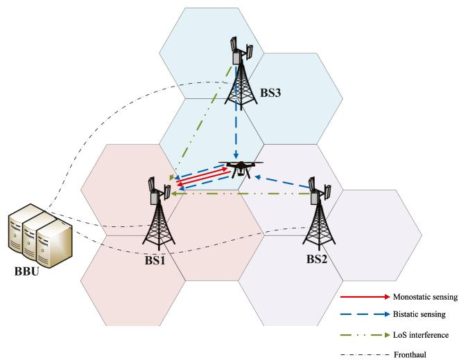  
Fig. 1. Multi-BS cooperative ISAC system. The hexagon represents the coverage area of BS sector.

## II. SYSTEM MODEL

The multi-BS cooperative ISAC system and ISAC frame structure are first presented in this section. Thereafter, the antenna array, transmitted and received signals are modeled for subsequent analysis.

## A. Multi-BS Cooperative ISAC System

A multi-BS cooperative ISAC system is shown in Fig. 1, where multiple BSs are connected to the same baseband unit (BBU) through fronthaul links, forming a centralized radio access network architecture. Considering the hexagonal structure of cellular networks, we focus on three cooperative BSs without loss of generality, whose coordinates are priorly known. Each BS is equipped with spatially well-separated transmit and receive antenna arrays. In 5G NR systems, multiple BSs can cooperate in transmission to improve the communication performance of user equipments (UEs) at the cell edge. Likewise, cooperative sensing is essential for targets located at the cell edge due to the significant round-trip path loss. Specifically, a BS initiates a request for cooperative sensing with neighboring BSs, followed by clock synchronization.<sup>1</sup> The BBU then forwards space-time block coding based ISAC signals to each BS. Subsequently, BSs transmit ISAC signals over the same time-frequency resources and receive echo signals originating from both itself and neighboring BSs. Then, the echo signals originating from different BS are separated by space-time block decoding.

## B. ISAC Frame Structure

To ensure better compatibility with existing cellular communication systems, the 5G NR frame structure is adapted to derive the ISAC frame structure, as shown in Fig. 2. Due to the TDD characteristic, BS can occupy the downlink (DL) communication symbols to execute sensing functions. In Fig. 2, the sensing segment composed of four OFDM symbols is transmitted every $2 . 5 ~ \mathrm { m s } , ^ { 2 }$ which is compatible with the commonly used 5 ms single period, 2.5 ms single period, and 2.5 ms dual period frame structures. By occupying the original DL communication symbols to transmit sensing signals, the BS ensures that there is no interference between sensing and DL communication.

If the sensing symbols are transmitted during the final DL symbols of the flexible slot, they are separated from the uplink (UL) symbols by a guard interval (GI), as shown in case 1 of Fig. 2. In the communication system configuration, the GI is designed to exceed the round-trip propagation delay of the furthest UE within the cell range, along with the UE receivetransmit switching delay [22], as shown in Fig. 3. Therefore, the sensing echoes have no impact on UL communication. For case 2 in Fig. 2, the sensing symbols are transmitted after the UL communication. Although there is no GI between the UL and DL slots, the UE and BS slots are aligned due to the timing advance (TA) [23]. Therefore, the BS receives all UL communication signals within the UL slot, ensuring that these signals do not interfere with the sensing echoes.

In summary, the time-division ISAC effectively leverages the existing 5G NR frame structure while avoiding mutual interference between sensing and communication.

## C. Antenna Array Model

In this paper, vertical uniform rectangular arrays (URAs) are considered, as shown in Fig. 4. The size of the URA is $P _ { b } \times$ $Q _ { b }$ with horizontal and vertical element spacing denoted by $d _ { b }$ Generally, the element spacing is set as half-wavelength, i.e., $d _ { b } = \lambda / 2 ,$ , where $\lambda = c _ { 0 } / f _ { c }$ is the wavelength, $c _ { 0 }$ is the speed of light, and $f _ { c }$ is the carrier frequency. Taking the (0,0)-th antenna element as a reference, the phase of the received signal at the $( p , q )$ -th antenna element is

$$
a _ { p , q } \left( \theta , \varphi \right) = \exp \left[ - j \pi \left( p \sin \theta \sin \varphi + q \cos \theta \right) \right] ,\tag{1}
$$

where $p$ and $q$ are the element indices along the horizontal and vertical directions, $\theta$ and $\varphi$ are the polar and azimuth angles of the incident signal from far-field, respectively, as shown in Fig. 4. The steering vector of URA is obtained as

$$
\mathbf { a } \left( \theta , \varphi \right) = \mathbf { a } _ { r } \left( \theta , \varphi \right) \otimes \mathbf { a } _ { c } \left( \theta \right) \in \mathbb { C } ^ { P _ { b } Q _ { b } \times 1 } ,\tag{2}
$$

synchronization accuracy can reach to nanosecond even sub-nanosecond level, which is sufficient for multi-BS cooperation [20], [21].

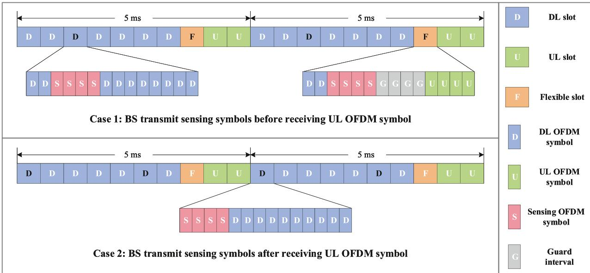  
Fig. 2. The ISAC frame structure modified by 5G NR frame structure (using 5 ms single period as an example). The BS occupies DL communication symbols to transmit four sensing OFDM symbols every 2.5 ms. The sensing OFDM symbols are transmitted in the time slot with black font.

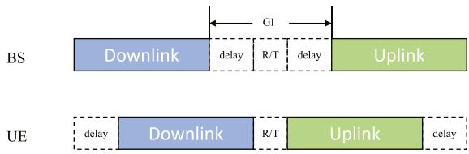  
Fig. 3. The GI between downlink and uplink in the communication system. $\scriptstyle \cdots _ { \mathrm { R } / \mathrm { T } ^ { * } }$ represents the receive-transmit switching delay of UE.

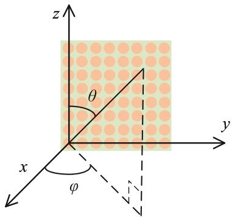  
Fig. 4. URA model.

where $\mathbf { a } _ { r } ( \theta , \varphi ) \in \mathbb { C } ^ { P _ { b } \times 1 } \mathrm { a n d } \mathbf { a } _ { c } ( \theta ) \in \mathbb { C } ^ { Q _ { b } \times 1 }$ represent the steering vector related to the horizontal and vertical directions of URA, which can be expressed, respectively, as

$$
\mathbf { a } _ { r } ( \theta , \varphi ) = \left[ 1 , e ^ { - j \pi \sin \theta \sin \varphi } , \ldots , e ^ { - j \pi ( P _ { b } - 1 ) \sin \theta \sin \varphi } \right] ^ { T } ,\tag{3}
$$

$$
\mathbf { a } _ { c } \left( \theta \right) = \left[ 1 , e ^ { - j \pi \cos \theta } , \ldots , e ^ { - j \pi \left( Q _ { b } - 1 \right) \cos \theta } \right] ^ { T } .\tag{4}
$$

## D. Transmitted Signal Model

In order to reuse the existing communication infrastructure and avoid additional hardware overhead, the OFDM signal is transmitted for sensing. Since multiple BSs share the same time-frequency resource and aligned frame structure, space-time block coding is used to generate orthogonal signals for transmission by different BSs. This method can be extended to a more general case with multiple BSs, which will be elaborated at the end of this section. At the receiver, space-time block decoding only requires linear processing to separate the echo signals originating from different BSs, which will be introduced in Section IV-B. Moreover, either reference signal such as Zadoff-Chu sequence or communication payload can be coded using space-time block coding to generate orthogonal signals. The latter supports the realization of simultaneous cooperative communication and sensing functions, which is particularly beneficial for collaborative targets (e.g., UEs) requiring dual services.

In this paper, a scenario of three BSs is considered to adapt to the hexagonal cellular network. Concretely, the frequency domain symbols transmitted by the l-th BS, $l \in \{ 0 , 1 , 2 \}$ , at the m-th sensing segment take the form of

$$
\mathbf { s } _ { m } ^ { l } = \bigl [ \mathbf { s } _ { m , 0 } ^ { l } \quad \mathbf { s } _ { m , 1 } ^ { l } \quad \mathbf { s } _ { m , 2 } ^ { l } \quad \mathbf { s } _ { m , 3 } ^ { l } \bigr ] \in \mathbb { C } ^ { 1 \times 4 N _ { c } } ,\tag{5}
$$

where $\mathbf { s } _ { m , i } ^ { l } = [ S _ { m , i , 0 } ^ { l } \quad S _ { m , i , 1 } ^ { l } \quad \cdot \cdot \quad S _ { m , i , N _ { c } - 1 } ^ { l } ] \in \mathbb { C } ^ { 1 \times N _ { c } } , i \in$ {0, 1, 2, 3}, represent $N _ { c }$ normalized symbols transmitted by the l-th BS during the i-th OFDM symbol of the m-th sensing segment, and $N _ { c }$ is the number of subcarriers. Therefore, the frequency domain symbols transmitted by different BSs after space-time block coding are given by

$$
\left[ \begin{array} { l } { \mathbf { s } _ { m } ^ { 0 } } \\ { \mathbf { s } _ { m } ^ { 1 } } \\ { \mathbf { s } _ { m } ^ { 2 } } \end{array} \right] = \left[ \begin{array} { l l l l } { \mathbf { s } _ { m , 0 } ^ { 0 } } & { \mathbf { s } _ { m , 1 } ^ { 0 } } & { \mathbf { s } _ { m , 2 } ^ { 0 } } & { \mathbf { 0 } } \\ { - \big ( \mathbf { s } _ { m , 1 } ^ { 0 } \big ) ^ { * } } & { \big ( \mathbf { s } _ { m , 0 } ^ { 0 } \big ) ^ { * } } & { \mathbf { 0 } } & { \mathbf { s } _ { m , 2 } ^ { 0 } } \\ { \big ( \mathbf { s } _ { m , 2 } ^ { 0 } \big ) ^ { * } } & { \mathbf { 0 } } & { - \big ( \mathbf { s } _ { m , 0 } ^ { 0 } \big ) ^ { * } } & { \mathbf { s } _ { m , 1 } ^ { 0 } } \end{array} \right] .\tag{6}
$$

Hereinafter, the superscript to the right of (6) is omitted for brevity. Therefore, the frequency domain sequences transmitted by three BSs are mutually orthogonal, i.e.

$$
\begin{array} { r } { \mathbf { s } _ { m } ^ { l } ( \mathbf { s } _ { m } ^ { l ^ { \prime } } ) ^ { H } = \left\{ \begin{array} { c c } { \| \mathbf { s } _ { m , 0 } \| _ { 2 } ^ { 2 } + \| \mathbf { s } _ { m , 1 } \| _ { 2 } ^ { 2 } + \| \mathbf { s } _ { m , 2 } \| _ { 2 } ^ { 2 } , } & { l = l ^ { \prime } } \\ { 0 , } & { l \neq l ^ { \prime } } \end{array} \right. . } \end{array}\tag{7}
$$

The OFDM baseband sensing signal transmitted by the l-th BS can be expressed as

$$
s _ { l } ( t ) = \frac { 1 } { \sqrt { N _ { c } } } \sum _ { m = 0 } ^ { M - 1 } \sum _ { i = 0 } ^ { I - 1 } \sum _ { k = 0 } ^ { N _ { c } - 1 } S _ { m , i , k } ^ { l } e ^ { j 2 \pi k \Delta f ( t - m T _ { e } - i T ) }\tag{8}
$$

where M is the number of sensing segments, $I = 4$ is the number of sensing OFDM symbols in each sensing segment, $\Delta f$ is the subcarrier spacing, $T _ { e } = 2 . 5$ ms is the interval between adjacent sensing segments, $T = T _ { d } + T _ { c p }$ is the duration of the OFDM block with cyclic prefix $( \mathrm { C P } ) , T _ { c p }$ and $T _ { d }$ are the durations of CP and the elementary OFDM block, respectively, $u ( t ) =$ rect $( t + T _ { c p } - 0 . 5 T )$ is the rectangular function. Therefore, the transmitted radio frequency sensing signal is given by

$$
\begin{array} { r } { \mathbf { x } _ { l } ( t ) = \operatorname { R e } \{ \mathbf { w } _ { t , l } s _ { l } ( t ) e ^ { j 2 \pi f _ { c } t } \} , } \end{array}\tag{9}
$$

where $\mathbf { w } _ { t , l }$ is the precoding vector of the l-th BS. Generally, the precoding vector can be obtained by least squares (LS) method [24]. However, LoS interference between BSs will overrun the dynamic range of the ADC. Therefore, a robust interference nulling based beam pattern is utilized to eliminate LoS interference, which will be introduced in Section III.

The above description clearly indicates that the core of proposed method lies in generating orthogonal signals using space-time block coding. For the case of two BSs, Alamouti coding utilizes two OFDM symbols to generate orthogonal frequency domain symbols [18]. For the case where the number of BSs is greater than 2, i.e. $L \geq 3$ , the orthogonal signals can be generated by generalized space-time block coding, which is based on Hurwitz-Radon family of matrices [25]. The Hurwitz-Radon family of matrices $\left\{ \mathbf { A } _ { 1 } , \mathbf { A } _ { 2 } , \dotsc , \mathbf { A } _ { k } \right\}$ with $\mathbf { A } _ { i } \in \mathbb { C } ^ { n \times n }$ satisfies: $\mathbf { A } _ { i } ^ { T } \dot { = } - \mathbf { A } _ { i } , \mathbf { A } _ { i } ^ { T } \dot { \mathbf { A } } _ { i } = \mathbf { I } _ { n }$ , and $\mathbf { A } _ { i } ^ { T } \mathbf { A } _ { j } =$ $- \mathbf { A } _ { i } ^ { T } \mathbf { A } _ { i } \operatorname { f o r } i \neq j .$ If all entries of $\mathbf { A } _ { i }$ are in the set of $\{ - 1 , 0 , 1 \}$ $\{ \mathbf { A } _ { 1 } , \mathbf { A } _ { 2 } , \dotsc , \mathbf { A } _ { k } \}$ is called Hurwitz-Radon family of integer matrices, whose detailed generation process can be found in Lemma 3.5.1 of [25]. The detailed generation process of multi-BS orthogonal sensing signals for $L \geq 3$ are summarized as Algorithm 1. In particular, there are special cases for $L = 3$ and $L = 4 .$ , where only 4 OFDM symbols are needed to generate orthogonal signals [25].

## E. Received Signal Model

The sensing signal reflects off the targets and carries information about them. Meanwhile, the signals from neighboring BSs directly reach the receiver through the LoS path, as shown in Fig. 1. Therefore, the baseband signal received by the l-th BS

Algorithm 1: Generation of Multi-BS Orthogonal Sensing   
Symbols Using Space-Time Block Coding.   
Input: The number of BSs L.   
Output: Multi-BS orthogonal sensing symbols $\tilde { \bf S } .$   
1: Step 1: Use Radon function to calculate the minimum   
number $2 p$ of OFDM symbols required to generate   
orthogonal signals: $\rho ( p ) = 8 c + 2 ^ { d } \geq L .$ , where $p = 2 ^ { a }$   
$a = 4 c + d ,$ c and d are integers, and $c \geq 0 , 0 \leq d < 4 ;$   
2: Step 2: Construct a Hurwitz-Radon family of integer   
matrices $\left\{ { \bf A } _ { 1 } , { \bf A } _ { 2 } , \ldots , { \bf A } _ { \rho ( p ) - 1 } \right\}$ of dimension $p \times p ,$   
setting $\mathbf { A } _ { 0 } = \mathbf { I } _ { p } ;$   
3: Step 3: Generate frequency-domain sensing symbols   
$\mathbf { s } = [ s _ { 0 } , s _ { 1 } , \ldots , s _ { p } ] \in \mathbb { C } ^ { 1 \times p N _ { c } }$   
4: Step 4: Construct an orthogonal matrix $\mathbf { S } \in \mathbb { C } ^ { p N _ { c } \times L }$   
with the j-th column being $( \mathbf { A } _ { j - 1 } \otimes \mathbf { I } _ { N _ { c } } ) \mathbf { s } ^ { T }$   
$j = 1 , 2 , \dots , L ;$   
5: return $ { \widetilde { \mathbf { S } } } = [  { \mathbf { S } } ^ { T } ,  { \mathbf { S } } ^ { H } ] \in \mathbb { C } ^ { L \times 2 p N _ { c } } ,$

can be expressed as

$$
\begin{array} { l } { { \bf { y } } _ { l } ( t ) = \displaystyle \sum _ { \nu = 0 } ^ { L - 1 } \sum _ { g = 0 } ^ { G } \alpha _ { \nu , g , l } \mathrm { a } ( \theta _ { l , g } , \varphi _ { l , g } ) \mathrm { { \bf { a } } } ^ { T } \big ( \theta _ { \nu , g } , \varphi _ { l , g } \big ) } \\ { ~ \cdot ~ \mathrm { { \bf { w } } } _ { t , l ^ { \prime } } \mathrm { s } _ { l ^ { \prime } } ( t - \tau _ { l ^ { \prime } , g , l } ) e ^ { j 2 \pi \nu _ { \nu , g , l } t } } \\ { ~ + \displaystyle \sum _ { \nu = 0 , l ^ { \prime } \neq l } ^ { L - 1 } \beta _ { \nu , l } \mathrm { a } \big ( \theta _ { l , l ^ { \prime } } , \varphi _ { l , l ^ { \prime } } \big ) \mathrm { { \bf { a } } } ^ { T } \big ( \theta _ { l ^ { \prime } , l } , \varphi _ { l ^ { \prime } , l } \big ) } \\ { ~ \cdot ~ \mathrm { { \bf { w } } } _ { t , \nu } \delta _ { l ^ { \prime } } ( t - \tau _ { l ^ { \prime } , l } ) } \\ { ~ + \displaystyle \mathrm { { \bf { n } } } _ { l } ( t ) , } \end{array}\tag{10}
$$

where L represents the number of BSs, G is the number of targets, $\theta _ { l , g } \left( \theta _ { l , l ^ { \prime } } \right)$ and $\varphi _ { l , g } \left( \varphi _ { l , l ^ { \prime } } \right)$ are the polar and azimuth angles of target g (BS l<sup></sup>) with respect to BS l, respectively, $\mathbf { a } ( \theta _ { l , g } , \varphi _ { l , g } )$ $( \mathbf { a } ( \theta _ { l , l ^ { \prime } } , \varphi _ { l , l ^ { \prime } } ) )$ is the corresponding steering vector, $\tau _ { l ^ { \prime } , g , l } =$ $( d _ { l ^ { \prime } , g } + d _ { l , g } ) / c _ { 0 }$ and $v _ { l ^ { \prime } , g , l } = ( v _ { l ^ { \prime } , g } + v _ { l , g } ) f _ { c } / c _ { 0 }$ are the delay and Doppler shift of path “BS $l _ { \mathrm { ~ \scriptsize ~ - ~ } } ^ { \prime }$ Target ${ \boldsymbol { g } } \mathbin { - } \textup { \textbf { B S } } { \boldsymbol { l } } ^ { \flat } , \ d _ { l , { \boldsymbol { g } } }$ and $v _ { l , g }$ are the range and radial velocity between target g and BS l, respectively, $\tau _ { l ^ { \prime } , l } = d _ { l ^ { \prime } , l } / c _ { 0 }$ is the propagation delay of the LoS path “BS $l ^ { \prime } \cdot \mathbf { B S } ~ l ^ { \prime \prime } , d _ { l ^ { \prime } , l }$ is the distance between BS l<sup></sup> and BS $l , \alpha _ { l ^ { \prime } , g , l } = \tilde { \alpha } _ { l ^ { \prime } , g , l } \beta _ { l ^ { \prime } , g , l } \sqrt { P _ { t , l ^ { \prime } } / P _ { b } Q _ { b } } e ^ { - j 2 \pi f _ { c } \tau _ { l ^ { \prime } , g , l } }$ is the attenuation factor of path “BS l<sup></sup> - Target $g \mathrm { ~ - ~ } { \bf B } { \bf S } \ l ^ { ; , } , \tilde { \alpha } _ { l ^ { \prime } , g , l }$ is the radar cross section (RCS) of target g in the view of path “BS l<sup></sup> - Target $g - \mathbf { B } \mathbf { S } \mathbf { \Lambda } l ^ { \prime }$ , which follows the Swerling I distribution [26]; $P _ { t , l ^ { \prime } }$ is the transmit power of BS l<sup></sup>, $\beta _ { l ^ { \prime } , g , l } = \sqrt { \lambda ^ { 2 } / [ ( 4 \pi ) ^ { 3 } d _ { l ^ { \prime } , g } ^ { 2 } d _ { l , g } ^ { 2 } ] }$ and $\beta _ { l ^ { \prime } , l } = \sqrt { \lambda ^ { 2 } / [ { ( 4 \pi ) } ^ { 2 } d _ { l ^ { \prime } , l } ^ { 2 } ] }$ are the free space path loss of path “BS l<sup></sup> - Target $g \mathrm { ~ - ~ } \mathbf { B } \mathbf { S } \mathrm { ~ } l ^ { \prime }$ and “BS l<sup></sup> - BS l”, respectively, ${ \bf n } _ { l } ( t )$ is the received noise following CSCG random process.

## III. ROBUST INTERFERENCE NULLING BASED BEAM PATTERN

Since neighboring BSs share the same time-frequency resources, inter-BS interference arises during cooperative sensing. Among these, the most fatal one is LoS interference, which is significantly stronger than the sensing echo signal and can overrun the dynamic range of the ADC [27]. Therefore, LoS interference must be eliminated in the analog domain prior to the ADC stage. The interference is reconstructed by passing the prior transmitted signal through a fixed delay line and an adjustable attenuation and phase circuit. This reconstructed interference is then subtracted from the received signal, a process similar to the analog cancellation of self-interference in fullduplex systems [28]. However, significant residual interference remains due to the challenges in accurately estimating delay and attenuation.

Since the deployment of BSs is relatively fixed, LoS interference belongs to static interference, whose AoA and angle of departure (AoD) can be known in advance. The deterministic interference nulling method can be utilized to design the transmit precoding vector, ensuring that the transmit beam pattern is suppressed in the directions of neighboring BSs, thereby mitigating LoS interference. According to the LS method, the transmit precoding vector is designed as $\mathbf { w } _ { t } ^ { s } = \mathbf { a } ^ { * } ( \theta _ { 0 } , \varphi _ { 0 } ) \in \mathbb { C } ^ { P _ { b } Q _ { b } \times 1 }$ to steer the transmit beam toward the target, which is hereafter referred to as the static precoding vector.<sup>3</sup> To generate deterministic nulls in the beam pattern, the following optimization problem can be solved.

$$
\begin{array} { r l } { \underset { \mathbf { w } _ { t } } { \mathrm { m i n } } } & { { } \left\| \mathbf { w } _ { t } - \mathbf { w } _ { t } ^ { s } \right\| _ { 2 } ^ { 2 } } \\ { s . t . } & { { } \mathbf { w } _ { t } ^ { H } \mathbf { A } = \mathbf { 0 } } \end{array} ,\tag{11}
$$

where the optimization objective is to obtain $\mathbf { w } _ { t }$ that maximizes its similarity to the static precoding vector, subject to the constraint of nulling in specific angles. $\mathbf { A } \in \overline { { \mathbb { C } ^ { P _ { b } } \check { Q } _ { b } \times ( L - 1 ) } }$ is the array manifold matrix related to the angles of $L - 1$ static LoS interference, which is given by

$$
\mathbf { A } = \left[ \mathbf { a } \left( \theta _ { 1 } , \varphi _ { 1 } \right) , \mathbf { a } \left( \theta _ { 2 } , \varphi _ { 2 } \right) , \ldots , \mathbf { a } \left( \theta _ { L - 1 } , \varphi _ { L - 1 } \right) \right] .\tag{12}
$$

According to the orthogonal projection technique, the solution for (11) is obtained as [29]

$$
\mathbf { w } _ { t } = \left[ \mathbf { I } _ { P _ { b } Q _ { b } } - \mathbf { A } \left( \mathbf { A } ^ { H } \mathbf { A } \right) ^ { - 1 } \mathbf { A } ^ { H } \right] \mathbf { w } _ { t } ^ { s } ,\tag{13}
$$

which projects the static precoding vector $\mathbf { w } _ { t } ^ { s }$ into the null space of $\mathbf { A } ^ { H }$ . Therefore, zero power illumination can be achieved in the deterministic directions of LoS interference. However, (13) generate nulls at specific angles, whose nulling performance will significantly degrade when angle estimation errors are present.

To address the above issue, the above method is improved to create broad nulls in angular regions near the interference directions, thereby enhancing its robustness against angle estimation errors. Specially, the array manifold matrix <sup>A</sup> can be recast as

$$
\mathbf { A } = [ \mathbf { A } _ { 1 } , \mathbf { A } _ { 2 } , \dotsc , \mathbf { A } _ { L - 1 } ] ,\tag{14}
$$

where $\mathbf { A } _ { l } \in \mathbb { C } ^ { P _ { b } Q _ { b } \times \mathcal { R } _ { l } } , l = 1 , 2 , \dots , L - 1$ , represents the array manifold matrix of the l-th nulling region $\mathcal { R } _ { l } = \{ ( \theta , \varphi ) | \theta \in$ $[ \theta _ { l } ^ { f } , \theta _ { l } ^ { c } ] , \varphi \in [ \varphi _ { l } ^ { f } , \varphi _ { l } ^ { c } ] \}$ . In fact, ${ \bf A } _ { l }$ is named as the quasi-matrix,

which is discrete in one dimension and continuous in the other [30]. Similar to (2), <sup>A</sup><sub>l</sub> can be decomposed as

$$
\mathbf { A } _ { l } = \mathbf { A } _ { l } ^ { r } \otimes \mathbf { A } _ { l } ^ { c } ,\tag{15}
$$

where $\mathbf { A } _ { l } ^ { r } \in \mathbb { C } ^ { P _ { b } Q _ { b } \times \mathcal { R } _ { l } }$ and $\mathbf { A } _ { l } ^ { c } \in \mathbb { C } ^ { P _ { b } Q _ { b } \times [ \varphi _ { l } ^ { f } , \varphi _ { l } ^ { c } ] }$ are quasimatrices that have the same form as (3) and (4), but are continuous in the column dimension. Then, the null space of $\mathbf { A } ^ { H }$ can be determined by performing an eigenvalue decomposition of $\mathbf { R } _ { A } = \mathbf { A } \mathbf { A } ^ { H }$ , which is given by

$$
\mathbf { R } _ { A } = \sum _ { l = 1 } ^ { L - 1 } \mathbf { A } _ { l } \mathbf { A } _ { l } ^ { H } = \sum _ { l = 1 } ^ { L - 1 } \mathbf { R } _ { A _ { l } ^ { r } } \otimes \mathbf { R } _ { A _ { l } ^ { c } } ,\tag{16}
$$

where $\mathbf { R } _ { A _ { l } ^ { r } } = \mathbf { A } _ { l } ^ { r } ( \mathbf { A } _ { l } ^ { r } ) ^ { H }$ , and $\mathbf { R } _ { A _ { l } ^ { c } } = \mathbf { A } _ { l } ^ { c } ( \mathbf { A } _ { l } ^ { c } ) ^ { H }$ . The (i, k)-th element of $\mathbf { R } _ { A _ { l } ^ { r } }$ and $\mathbf { R } _ { A _ { l } ^ { c } }$ can be, respectively, expressed as

$$
\left[ \mathbf { R } _ { A _ { l } ^ { r } } \right] _ { i , k } = \int _ { \theta _ { l } ^ { f } } ^ { \theta _ { l } ^ { c } } \int _ { \varphi _ { l } ^ { f } } ^ { \varphi _ { l } ^ { c } } e ^ { - j \pi ( i - k ) \sin \theta \sin \varphi } d \theta d \varphi ,\tag{17}
$$

$$
\left[ \mathbf { R } _ { A _ { l } ^ { c } } \right] _ { i , k } = \int _ { \theta _ { l } ^ { f } } ^ { \theta _ { l } ^ { c } } e ^ { - j \pi ( i - k ) \cos \theta } d \theta ,\tag{18}
$$

where $i = 0 , 1 , \ldots , P _ { b } Q _ { b } - 1 , k = 0 , 1 , \ldots , P _ { b } Q _ { b } - 1$ . Then, $\mathbf { R } _ { A }$ can be decomposed as

$$
\mathbf { V S V } ^ { H } = \operatorname { e i g } \left( \mathbf { R } _ { A } \right) ,\tag{19}
$$

where $\mathbf { V } = [ \mathbf { V } _ { 1 } , \mathbf { V } _ { 2 } ] , \mathbf { V } _ { 1 }$ and $\mathbf { V } _ { 2 }$ are eigenvectors corresponding to large and small eigenvalues, respectively. As a result, (13) can be approximated as [31]

$$
\begin{array} { r } { \mathbf { w } _ { t } = \left( \mathbf { I } _ { P _ { b } Q _ { b } } - \mathbf { V } _ { 1 } \mathbf { V } _ { 1 } ^ { H } \right) \mathbf { w } _ { t } ^ { s } . } \end{array}\tag{20}
$$

The detailed procedure is described in Algorithm 2. Furthermore, the beam pattern with deterministic interference nulling is given by

$$
\mathbf { B } ( \theta , \varphi ) = \left| { \mathbf { w } } _ { t } ^ { H } \mathbf { a } \left( \theta , \varphi \right) \right| ^ { 2 } .\tag{21}
$$

## IV. SPACE-TIME BLOCK DECODING-BASED MULTI-BS SIGNAL SEPARATION METHOD

In this section, we verify that the proposed cooperative sensing method is beneficial to AoA estimation, and then separate echo signals originating from different BS using space-time block decoding. On this basis, the inter-BS reflected path interference is transformed into bistatic sensing. Then, the multi-BS sensing results are fused to enhance positioning performance.

## A. AoA Estimation

As observed from (10), the echo signals, originating from multiple BSs and reflected by the target g, are superimposed, which is beneficial for target detection. A detailed performance analysis will be performed in Section V-A. Since the target is in the far field, echo signals originating from different BSs can be considered to arrive at BS l from the same direction, sharing an identical receive steering vector. Therefore, echo signals from neighboring BSs can assist in AoA estimation, where the multiple signal classification (MUSIC) algorithm is utilized to achieve greater precision [32]. Based on the precoding vector derived in Section III, the LoS interference in (10) can be neglected, allowing (10) to be recast as

```powershell
Algorithm 2: Robust Interference Nulling Based Beam
Pattern Design.
Input: Target direction $( \theta _ { 0 } , \varphi _ { 0 } )$ , interference direction
$( \theta _ { 1 } , \varphi _ { 1 } ) , ( \theta _ { 2 } , \varphi _ { 2 } ) , \ldots , ( \theta _ { L - 1 } , \varphi _ { L - 1 } )$ , width $w _ { i d }$
of nulling region, threshold € for distinguishing
eigenvalue.
Output: Precoding vector $\mathbf { w } _ { t } .$
1 Initialization: $l = 1 , \mathbf { R } _ { A } = \mathbf { 0 } ;$
2 Calculate the static precoding $\mathbf { w } _ { t } ^ { s }$ using the LS method;
3 while $l \leq L - 1$ do
4 Calculate the polar angle nulling region $[ \theta _ { l } ^ { f } , \theta _ { l } ^ { c } ] ,$
where $\theta _ { l } ^ { f } = \theta _ { l } - w _ { i d } / 2 , \theta _ { l } ^ { c } = \theta _ { l } + w _ { i d } / 2 ;$
5 Calculate the azimuth angle nulling region $[ \varphi _ { l } ^ { f } , \varphi _ { l } ^ { c } ] ,$
where $\varphi _ { l } ^ { f } = \varphi _ { l } - w _ { i d } / 2 , \varphi _ { l } ^ { c } = \varphi _ { l } + w _ { i d } / 2 ;$
6 Calculate $\mathbf { R } _ { A _ { l } ^ { r } }$ and $\mathbf { R } _ { A _ { l } ^ { c } }$ according to (17) and
(18);
7 $\mathbf { R } _ { A }  \mathbf { R } _ { A } + \mathbf { R } _ { A _ { l } ^ { r } } \otimes \mathbf { R } _ { A _ { l } ^ { c } }$
8 $l \gets l + 1 ;$
9 Obtain the main eigenvectors $\mathbf { V } _ { 1 }$ of $\mathbf { R } _ { A }$ whose
corresponding eigenvalues larger than €;
10 Calculate precoding vector $\mathbf { w } _ { t }$ according to (20);
11 return $\mathbf { w } _ { t } .$
```

$$
\mathbf { y } _ { l } ( t ) = \mathbf { A } \left( \pmb { \theta } _ { l } , \pmb { \varphi } _ { l } \right) \mathbf { s } _ { l } ( t ) + \mathbf { n } _ { l } ( t ) ,\tag{22}
$$

where $\mathbf { A } ( \theta _ { l } , \varphi _ { l } ) = [ \mathbf { a } ( \theta _ { l , 0 } , \varphi _ { l , 0 } ) , \dots , \mathbf { a } ( \theta _ { l , G - 1 } , \varphi _ { l , G - 1 } ) ]$ is the array manifold matrix, $\pmb { \theta } _ { l } = \{ \theta _ { l , 0 } , \dots , \theta _ { l , G - 1 } \}$ and $\varphi _ { l } =$ $\left\{ \varphi _ { l , 0 } , \ldots , \varphi _ { l , G - 1 } \right\}$ are the set of polar and azimuth angles, respectively, ${ \bf s } _ { l } ( t )$ represents the composite echo signals from different targets received by BS l, and its g-th row is given by

$$
\begin{array} { r l } & { [ { \bf s } _ { l } ( t ) ] _ { g } = \displaystyle \sum _ { l ^ { \prime } = 0 } ^ { L - 1 } \alpha _ { l ^ { \prime } , g , l } { \bf a } ^ { T } \left( \theta _ { l ^ { \prime } , g } , \varphi _ { l ^ { \prime } , g } \right) { \bf w } _ { t , l ^ { \prime } } } \\ & { ~ \cdot s _ { l ^ { \prime } } \left( t - \tau _ { l ^ { \prime } , g , l } \right) e ^ { j 2 \pi v _ { l ^ { \prime } , g , l } t } . } \end{array}\tag{23}
$$

By sampling (22) with interval $T _ { s } = 1 / B$ and removing CPs, $N = M I N _ { c }$ samples can be stacked as $\mathbf { Y } \in \mathbb { C } ^ { P _ { b } Q _ { b } \times N }$ . Then the covariance matrix of the received signal can be estimated as $\begin{array} { r } { \hat { \mathbf { R } } = \frac { 1 } { N } \mathbf { Y } \mathbf { Y } ^ { H } } \end{array}$ and the eigenvalue decomposition is given by [32]

$$
\mathbf { U } \Sigma \mathbf { U } ^ { H } = \mathrm { e i g } ( \hat { \mathbf { R } } ) ,\tag{24}
$$

where $\mathbf { U } = [ \mathbf { U } _ { S } , \mathbf { U } _ { N } ]$ and $\pmb { \Sigma } = [ \pmb { \Sigma } _ { S } , \pmb { \Sigma } _ { N } ]$ represent the eigenvector and eigenvalue matrices, respectively, $\mathbf { U } _ { S }$ and ${ \mathbf { U } } _ { N }$ represent the signal subspace and noise subspace, respectively, $\Sigma _ { S }$ and $\Sigma _ { N }$ are the corresponding eigenvalues. The angle spectra can be expressed as [32]

$$
P _ { m u s i c } = \frac { 1 } { { \bf { a } } ^ { H } \left( \theta , \varphi \right) { \bf { U } } _ { N } { \bf { U } } _ { N } ^ { H } { \bf { a } } \left( \theta , \varphi \right) } .\tag{25}
$$

Then AoAs can be estimated by locating the peaks of (25), requiring to repeatedly calculate (25) in a loop for $N _ { \theta } \times N _ { \varphi }$ times, where $N _ { \theta }$ and $N _ { \varphi }$ are the number of points in the search

TABLE I SIMULATION PARAMETERS
<table><tr><td>Parameter</td><td>Symbol</td><td>Value</td></tr><tr><td rowspan="3">Position of BS</td><td>BS1</td><td>(0, 0, 30) m</td></tr><tr><td>BS2</td><td>(300, 0, 30) m</td></tr><tr><td>BS3</td><td> $( 1 5 0 , 1 5 0 \sqrt { 3 } , 3 0 )$  m</td></tr><tr><td>Normal vector of BS1 antenna array</td><td></td><td>(1, 0, 0)</td></tr><tr><td>Normal vector of BS2 antenna array</td><td></td><td> $( - 0 . 5 , 0 . 5 \sqrt { 3 } , 0 )$ </td></tr><tr><td>Normal vector of BS3 antenna array</td><td></td><td> $( - 0 . 5 , - 0 . 5 \sqrt { 3 } , 0 )$ </td></tr><tr><td>Size of BS URA</td><td> $P _ { b } \times Q _ { b }$ </td><td> $8 \times 8$ </td></tr><tr><td>Carrier frequency</td><td> $f _ { c }$ </td><td>2.6 GHz</td></tr><tr><td>Subcarrier spacing</td><td> $\Delta f$ </td><td>30 kHz</td></tr><tr><td>Number of subcarriers</td><td> $N _ { c }$ </td><td>1024</td></tr><tr><td>Elementary OFDM symbol duration</td><td> $T _ { d }$ </td><td>33.33  $\mu s$ </td></tr><tr><td>CP duration</td><td> $T _ { c p }$ </td><td>2.34 µs</td></tr><tr><td>Total OFDM symbol duration</td><td> $T$ </td><td>35.67 µs</td></tr><tr><td>Transmit power of BS</td><td> $P _ { t }$ </td><td>46 dBm</td></tr><tr><td>Speed of light</td><td> $c _ { 0 }$ </td><td> $3 \times 1 0 ^ { 8 } ~ \mathrm { m / s }$ </td></tr></table>

space of $\theta$ and $\varphi .$ To circumvent loop calculations and enhance computational efficiency, (25) can be vectorized into a compact form, which is given by

$$
\mathbf { P } _ { m u s i c } = \left\{ \sum _ { i = 0 } ^ { P _ { b } Q _ { b } } \left[ \mathbf { A } ^ { * } \odot \left( \mathbf { U } _ { N } \mathbf { U } _ { N } ^ { H } \mathbf { A } \right) \right] _ { i , j } \right\} ^ { \circ ( - 1 ) } ,\tag{26}
$$

where $\textstyle \sum _ { i = 0 } ^ { P _ { b } Q _ { b } } \left[ \cdot \right] _ { i , j }$ indicates the summation of each column of the matrix, $\mathbf { A } = \tilde { \mathbf { A } } ^ { r } * \mathbf { A } ^ { c }$ , with

$$
\mathbf { A } ^ { r } = \exp \left( - j \pi \sin \pmb { \theta } _ { s } \otimes \sin \varphi _ { s } \otimes \mathbf { d } _ { p } \right) ,\tag{27}
$$

$$
\mathbf { A } ^ { c } = \exp \left( - j \pi \cos \pmb { \theta } _ { s } \otimes \sin \mathbf { 1 } _ { 1 \times N _ { \varphi } } \otimes \mathbf { d } _ { q } \right) ,\tag{28}
$$

where $\pmb { \theta } _ { s } \in \mathbb { R } ^ { 1 \times N _ { \theta } }$ and $\varphi _ { s } \in \mathbb { R } ^ { 1 \times N _ { \varphi } }$ are the sets of $N _ { \theta }$ polar angles and $N _ { \varphi }$ azimuth angles, respectively, ${ \bf d } _ { p } = [ 0 , 1 , \dots , P _ { b } -$ $\bar { 1 } \bar { 2 } ^ { T }$ and $\dot { { \bf d } _ { q } } = [ 0 , 1 , \dots , Q _ { b } - 1 ] ^ { T }$ are the sets of antenna indices in the horizontal and vertical directions of URA, respectively.

With the estimated AoAs, the received signals from different antennas can be combined through the LS method. Beyond that, the linearly constrained minimum variance (LCMV) method can be utilized to separate echo signals reflected from different targets [33] and accommodate errors in the covariance matrix and steering vector [34]. For clarity, we consider the LCMV method in this paper, and the receive combining vector used to separate the echo signal reflected from the target $g$ is denoted as $\mathbf { w } _ { r , l , g } .$ Henceforth, the subsequent sections focus on a description of a single-target scenario.

## B. Echo Separation via Space-Time Block Decoding

As shown in Table I, the echo delay remains within the CP duration, the frequency domain symbol received by BS l at the p-th subcarrier of the i-th OFDM symbol in the m-th sensing segment can be expressed as

$$
\begin{array} { l } { { \displaystyle Y _ { l , g } ( m , i , p ) = \sum _ { l ^ { \prime } = 0 } ^ { L - 1 } \alpha _ { l ^ { \prime } , g , l } \eta _ { l ^ { \prime } , g , l } S _ { m , i , p } ^ { l ^ { \prime } } e ^ { - j 2 \pi p \Delta f \tau _ { l ^ { \prime } , g , l } } } } \\ { { \displaystyle \qquad \cdot e ^ { j 2 \pi v _ { l ^ { \prime } , g , l } ( m T _ { e } + i T ) } } } \\ { { \displaystyle \qquad + N ( m , i , p ) , } } \end{array}\tag{29}
$$

where $\eta _ { l ^ { \prime } , g , l } = \mathbf { w } _ { r , l , g } \mathbf { a } ( \theta _ { l , g } , \varphi _ { l , g } ) \mathbf { a } ^ { T } ( \theta _ { l ^ { \prime } , g } , \varphi _ { l ^ { \prime } , g } ) \mathbf { w } _ { t , l ^ { \prime } }$ is the transmit and receive beamforming gain, $N ( m , i , p )$ is the Fourier transform of noise. According to (5) and (6), the frequency domain symbol received by BS l at the p-th subcarrier of the m-th sensing segment is formulated as

$$
\begin{array} { r } { \mathbf { Y } _ { l , g } \left( m , : , p \right) = \left[ ( \mathbf { S } _ { m , p } ) ^ { T } \odot \mathbf { V } _ { l , g } \right] \mathbf { h } _ { l , g } ^ { m , p } + \mathbf { N } \left( m , : , p \right) , } \end{array}\tag{30}
$$

where $\mathbf { Y } _ { l , g } ( m , : , p ) \in \mathbb { C } ^ { I \times 1 } , \mathbf { S } _ { m , p }$ is the frequency domain symbol transmitted by three BSs at the p-th subcarrier of the m-th sensing segment, which can be expressed according to (6) as

$$
\mathbf { S } _ { m , p } = \left[ \begin{array} { c c c c } { S _ { m , 0 , p } ^ { 0 } } & { S _ { m , 1 , p } ^ { 0 } } & { S _ { m , 2 , p } ^ { 0 } } & { 0 } \\ { - ( S _ { m , 1 , p } ^ { 0 } ) ^ { * } } & { ( S _ { m , 0 , p } ^ { 0 } ) ^ { * } } & { 0 } & { S _ { m , 2 , p } ^ { 0 } } \\ { { ( S _ { m , 2 , p } ^ { 0 } ) ^ { * } } } & { 0 } & { - ( S _ { m , 0 , p } ^ { 0 } ) ^ { * } } & { S _ { m , 1 , p } ^ { 0 } } \end{array} \right] ,\tag{31}
$$

$\mathbf { V } _ { l , g }$ is the Doppler effect of the target g on different OFDM symbols in the same sensing segment, which is given by

$$
\mathbf { V } _ { l , g } = \left[ \begin{array} { c c c c } { 1 } & { 1 } & { 1 } \\ { e ^ { j 2 \pi v _ { 0 , g , l } T } } & { e ^ { j 2 \pi v _ { 1 , g , l } T } } & { e ^ { j 2 \pi v _ { 2 , g , l } T } } \\ { e ^ { j 2 \pi v _ { 0 , g , l } 2 T } } & { e ^ { j 2 \pi v _ { 1 , g , l } 2 T } } & { e ^ { j 2 \pi v _ { 2 , g , l } 2 T } } \\ { e ^ { j 2 \pi v _ { 0 , g , l } 3 T } } & { e ^ { j 2 \pi v _ { 1 , g , l } 3 T } } & { e ^ { j 2 \pi v _ { 2 , g , l } 3 T } } \end{array} \right] ,\tag{32}
$$

$\mathbf { h } _ { l , g } ^ { m , p }$ is the target response vector corresponding to the target g at the p-th subcarrier of m-th sensing segment, which is given by

$$
\mathbf { h } _ { l , g } ^ { m , p } = \left[ \begin{array} { c } { \alpha _ { 0 , g , l } \eta _ { 0 , g , l } e ^ { - j 2 \pi p \Delta f \tau _ { 0 , g , l } } e ^ { j 2 \pi v _ { 0 , g , l } ( m T _ { e } ) } } \\ { \alpha _ { 1 , g , l } \eta _ { 1 , g , l } e ^ { - j 2 \pi p \Delta f \tau _ { 1 , g , l } } e ^ { j 2 \pi v _ { 1 , g , l } ( m T _ { e } ) } } \\ { \alpha _ { 2 , g , l } \eta _ { 2 , g , l } e ^ { - j 2 \pi p \Delta f \tau _ { 2 , g , l } } e ^ { j 2 \pi v _ { 2 , g , l } ( m T _ { e } ) } } \end{array} \right] ,\tag{33}
$$

$\mathbf { N } ( m , : , p )$ is the noise received at the p-th subcarrier of m-th sensing segment, which can be expressed as

$$
\mathbf { N } \left( m , : , p \right) = [ N ( m , 0 , p ) , N ( m , 1 , p ) , \ldots , N ( m , 3 , p ) ] ^ { T } .\tag{34}
$$

Performing space-time block decoding through multiplying (30) by $( \mathbf { S } _ { m , p } ) ^ { * }$ , we can obtain

$$
\tilde { \mathbf { Y } } _ { l , g } ( m , p ) = ( \mathbf { S } _ { m , p } ) ^ { * } \mathbf { Y } _ { l , g } \left( m , : , p \right) = \tilde { \mathbf { S } } _ { m , p } \mathbf { h } _ { l , g } ^ { m , p } + \tilde { \mathbf { N } } ( m , p ) ,\tag{35}
$$

where $\tilde { \mathbf { Y } } _ { l , g } ( m , p ) = [ \tilde { Y } _ { l , g } ^ { 0 } ( m , p ) , \tilde { Y } _ { l , g } ^ { 1 } ( m , p ) , \tilde { Y } _ { l , g } ^ { 2 } ( m , p ) ] ^ { T }$ is the separated echoes, $\tilde { \mathbf { S } } _ { m , p } = ( \mathbf { S } _ { m , p } ) ^ { * } [ ( \mathbf { S } _ { m , p } ) ^ { T } \odot \mathbf { V } _ { g , l } ]$ can be expressed as (36) shown at the bottom of this page, $\tilde { \bf N } ( m , p ) =$ $( \mathbf { S } _ { m , p } ) ^ { * } \mathbf { N } ( m , : , p )$ is the transformed noise with probability distribution $\mathcal { C N } ( 0 , \mathbb { E } \{ { | S _ { m , 0 , p } ^ { 0 } | } ^ { 2 } + { | S _ { m , 1 , p } ^ { 0 } | } ^ { 2 } + { | S _ { m , 2 , p } ^ { 0 } | } ^ { 2 } \} \sigma ^ { 2 } )$

As revealed in (36), when the target is stationary, the elements on the non-diagonal side are 0. In other words, when the sensing channel is time-invariant, the space-time block codec can achieve perfect separation of echo signals originating from different BSs. Even if the target is moving, as long as the Doppler frequency is much smaller than the subcarrier spacing, the off-diagonal elements remain significantly smaller than the diagonal elements, resulting in minimal impact on the parameter estimation. Then, the separated echo signal originating from BS l can be expressed as

$$
\begin{array} { r l r } {  { \tilde { Y } _ { l , g } ^ { r , l } ( m , p ) = ( | S _ { m , 0 , p } ^ { 0 } | ^ { 2 } + | S _ { m , 1 , p } ^ { 0 } | ^ { 2 } + | S _ { m , 2 , p } ^ { 0 } | ^ { 2 } ) \alpha _ { 0 , g , l } \eta _ { 0 , g , l } } } \\ & { } & \\ & { } & { \cdot \ e ^ { - j 2 \pi p \Delta f \tau _ { 0 , g , l } } e ^ { j 2 \pi v _ { 0 , g , l } ( m T _ { e } ) } } \\ & { } & \\ & { } & { + \ \tilde { I } _ { l } ^ { l } ( m , p ) + \tilde { N } _ { l } ^ { l } ( m , p ) , \ ~ \ ~ ( 3 7 ) } \end{array}
$$

where $\tilde { I } _ { l } ^ { l } ( m , p ) = I _ { 0 } ( m , p ) + I _ { 1 } ( m , p ) + I _ { 2 } ( m , p )$ is the interference related to different BSs, which can be given by

$$
\begin{array} { r l } & { I _ { 0 } ( m , p ) = \alpha _ { 0 , g , l } \eta _ { 0 , g , l } e ^ { - j 2 \pi p \Delta f \tau _ { 0 , g , l } } e ^ { j 2 \pi v _ { 0 , g , l } ( m T _ { e } ) } } \\ & { \phantom { a a a a a a a a a a a a a a a a a a a a a a a a a a a a a a a a a a a a a a a a a a a a a } \cdot \left[ \left| S _ { m , 1 , p } ^ { 0 } \right| ^ { 2 } ( e ^ { j 2 \pi v _ { 0 , g , l } T } - 1 ) \right. } \\ & { \phantom { a a a a a a a a a a a a a a a a a a a a a a a a a a a a a a a a a a a a a a a a a a a a a a a a a a a } } \\ & { \left. + \left| S _ { m , 2 , p } ^ { 0 } \right| ^ { 2 } ( e ^ { j 2 \pi v _ { 0 , g , l } 2 T } - 1 ) \right] , } \end{array}\tag{38}
$$

$$
\begin{array} { r l } & { I _ { 1 } ( m , p ) = ( S _ { m , 0 , p } ^ { 0 } ) ^ { * } ( S _ { m , 1 , p } ^ { 0 } ) ^ { * } \left( e ^ { j 2 \pi v _ { 1 , g , l } T } - 1 \right) } \\ & { \phantom { x x x x x x x x x x x x x x x x x x x x x x x x x x x x x x x x x x x x x x x x x x x x x x x x x x } \cdot \alpha _ { 1 , g , l } \eta _ { 1 , g , l } e ^ { - j 2 \pi p \Delta f \tau _ { 1 , g , l } } e ^ { j 2 \pi v _ { 1 , g , l } ( m T _ { e } ) } , } \end{array}\tag{39}
$$

$$
\begin{array} { r l } & { I _ { 2 } ( \boldsymbol { m } , \boldsymbol { p } ) = ( S _ { \boldsymbol { m } , 0 , \boldsymbol { p } } ^ { 0 } ) ^ { * } ( S _ { \boldsymbol { m } , 2 , \boldsymbol { p } } ^ { 0 } ) ^ { * } \left( 1 - e ^ { j 2 \pi v _ { 2 , { g } , { l } } 2 T } \right) } \\ & { \quad \quad \quad \cdot \alpha _ { 2 , { g } , l } \eta _ { 2 , g , l } e ^ { - j 2 \pi p \Delta f \tau _ { 2 , g , l } } e ^ { j 2 \pi v _ { 2 , { g } , l } \left( \boldsymbol { m } T _ { e } \right) } . } \end{array}\tag{40}
$$

The interference in (38)–(40) can be ignored when the target is stationary or quasi-stationary. The target response of path “BS l - target $\textit { g - } \mathrm { B S } ~ l ^ { \prime }$ can be obtained by dividing (37) by $( { | S _ { m , 0 , p } ^ { 0 } } | ^ { 2 } + { | \bar { S } _ { m , 1 , p } ^ { 0 } | ^ { 2 } } + { | S _ { m , 2 , p } ^ { 0 } | ^ { 2 } } )$ , which can be expressed as

$$
\begin{array} { r l } & { H _ { l , g , l } ( m , p ) = \alpha _ { l , g , l } \eta _ { l , g , l } e ^ { - j 2 \pi p \Delta f \tau _ { l , g , l } } e ^ { j 2 \pi v _ { l , g , l } ( m T _ { e } ) } } \\ & { \phantom { h s p a c e } + \bar { I } _ { l } ^ { l } ( m , p ) + \bar { N } _ { l } ^ { l } ( m , p ) , } \end{array}\tag{41}
$$

where $\bar { I } _ { l } ^ { l } ( m , p ) = \tilde { I } _ { l } ^ { l } ( m , p ) / ( { | S _ { m , 0 , p } ^ { 0 } | } ^ { 2 } + { | S _ { m , 1 , p } ^ { 0 } | } ^ { 2 } + { | S _ { m , 2 , p } ^ { 0 } | } ^ { 2 } )$ and $\hat { N } _ { l } ^ { l } ( m , p ) = \tilde { N } _ { l } ^ { l } ( m , p ) / ( { | S _ { m , 0 , p } ^ { 0 } | } ^ { 2 } + { | S _ { m , 1 , p } ^ { 0 } | } ^ { 2 } + { | S _ { m , 2 , p } ^ { 0 } | } ^ { 2 } )$ are the transformed interference and noise, respectively. By

$$
\tilde { \mathbf { S } } _ { m , p } = [ \begin{array} { c c } { [ [ S _ { m , 0 , p } ^ { 0 } ] ^ { 2 } + [ S _ { m , 1 , p } ^ { 0 } ] ^ { 2 } e ^ { 2 j \pi v _ { 0 , s , t } / T } ] } & { ( S _ { m , 0 , p } ^ { 0 } ) ^ { \star } ( S _ { m , 1 , p } ^ { 0 } ) ^ { \star } [ e ^ { j 2 \pi v _ { 1 , 1 , p } T } - 1 ] } & { ( S _ { m , 0 , p } ^ { 0 } ) ^ { \star } ( S _ { m , 2 , p } ^ { 0 } ) ^ { \star } [ 1 - e ^ { j 2 \pi v _ { 2 , s , t } 2 T } ] } \\ { + [ S _ { m , 2 , p } ^ { 0 } ] ^ { 2 } e ^ { j 2 \pi v _ { 0 , s , t } / T } - 1 ] } & { [ [ S _ { m , 0 , p } ^ { 0 } ] ^ { 2 } e ^ { j 2 \pi v _ { 1 , 0 , p } / T } + [ S _ { m , 1 , p } ^ { 0 } ] ^ { 2 } ] } & { S _ { m , 1 , p } ^ { 0 } ( S _ { m , 2 , p } ^ { 0 } ) ^ { \star } [ e ^ { j 2 \pi v _ { 2 , \upsilon } \lambda T } - 1 ] } \\ { S _ { m , 0 , p } ^ { 0 } S _ { m , 1 , p } ^ { 0 } [ e ^ { j 2 \pi v _ { 0 , 0 , t } / T } - 1 ] } &  [ \begin{array} { c c } { [ S _ { m , 2 , p } ^ { 0 } ] ^ { 2 } e ^ { j 2 \pi v _ { 1 , 0 , p } / 2 } + [ S _ { m , 1 , p } ^ { 0 } ] ^ { 2 } } & { 1 } \\ { + [ S _ { m , 2 , p } ^ { 0 } ] ^ { 2 } e ^ { j 2 \pi v _ { 1 , 0 } / 3 T } } & { [ [ S _ { m , 0 , p } ^ { 0 } ] ^ { 2 } e ^ { j 2 \pi v _ { 2 , s , t } / 2 T } ] } \end{array} \end{array}\tag{36}
$$

stacking (41) into an $N _ { c } \times M$ target response matrix, we have

$$
\mathbf { H } _ { l , g , l } = \alpha _ { l , g , l } \eta _ { l , g , l } \mathbf { k } _ { l , g , l } ^ { r } ( \mathbf { k } _ { l , g , l } ^ { v } ) ^ { T } + \bar { \mathbf { I } } _ { l , g , l } + \bar { \mathbf { N } } _ { l , g , l } ,\tag{42}
$$

the $( p , m )$ -th element of which is (41), $, \mathbf { k } _ { l , g , l } ^ { r } = [ 1 , e ^ { - j 2 \pi \Delta f \tau _ { l , g , l } }$ $\ldots , e ^ { - j 2 \pi ( N _ { c } - 1 ) \Delta f \tau _ { l , g , l } } ] ^ { T }$ and $\mathbf { k } _ { l , g , l } ^ { v } = [ 1 , e ^ { j 2 \pi v _ { 0 , g , l } T _ { e } } , \ldots ,$ $e ^ { j 2 \pi \upsilon _ { 0 , g , l } ( M - 1 ) T _ { e } } ] ^ { T }$ are the effect of the target’s range and velocity on the target response, respectively. Moreover, the bistatic target response matrix $\mathbf { H } _ { l ^ { \prime } , g , l }$ of the path “BS l<sup></sup> - target $g \mathrm { ~ - ~ } { \mathrm { B S ~ } } l ^ { \prime }$ can be obtained, which is similar to (42). We omit it for brevity.

## C. Range and Velocity Estimation

Due to the large DL bandwidth, the inverse fast Fourier transform (IFFT)-based method can be utilized to estimate the range of the target. Performing an IFFT along the dimension of the subcarrier, the range can be estimated as [35]

$$
\tilde { r } _ { g , l } = \frac { c _ { 0 } \tilde { k } } { 2 N _ { c } \Delta f } ,\tag{43}
$$

where $\tilde { k }$ is the peak index. In general, a significant number of symbols is necessary to achieve accurate velocity estimation. In the proposed time-division ISAC frame structure, only a few OFDM sensing symbols are available within the coherent processing interval [36], making it challenging to achieve accurate velocity estimation using the FFT-based method. Therefore, the MUSIC method can be utilized to estimate the velocity. According to (42), the covariance matrix can be approximated as [37]

$$
\hat { \mathbf { R } } _ { v } = \frac { 1 } { N _ { c } } \big ( \mathbf { H } _ { l , g , l } ^ { r } \big ) ^ { T } \big ( \mathbf { H } _ { l , g , l } ^ { r } \big ) ^ { * } .\tag{44}
$$

The noise subspace ${ \mathbf { U } } _ { v , N }$ is obtained by eigenvalue decomposition of (44), which is similar to (24). Then, the velocity can be estimated by searching for the peak of

$$
\mathbf { P } _ { v , m u s i c } = \left\{ \sum _ { i = 0 } ^ { M } \left[ \mathbf { K } _ { v } ^ { * } \odot \left( \mathbf { U } _ { v , N } \mathbf { U } _ { v , N } ^ { H } \mathbf { K } _ { v } \right) \right] _ { i , j } \right\} ^ { \circ \left( - 1 \right) } ,\tag{45}
$$

with

$$
\mathbf { K } _ { v } = \exp \left( j \frac { 4 \pi f _ { c } T _ { e } } { c _ { 0 } } \pmb { v } _ { s } \otimes \mathbf { d } _ { v } \right) \in \mathbf { \operatorname { \cal A } } \times \mathbf { \mathit { N } } _ { v } ,\tag{46}
$$

where $\pmb { v } _ { s } \in \mathbb { R } ^ { 1 \times N _ { \tau } }$ is the set of $N _ { v }$ searching velocity values, ${ \bf d } _ { v } = [ 0 , 1 , \dots , M - 1 ] ^ { T }$ is the set of indices in the time dimension of (42).

## D. Multi-BS Cooperative Positioning

In this paper, we consider that multiple BSs achieve timefrequency synchronization after initiating a collaborative perception request. Therefore, the target position can be obtained by combining AoA estimation and range estimation.

1) Monostatic Positioning: For a monostatic ISAC BS, the estimated target coordinates, denoted by $\mathbf p = [ p _ { x } , p _ { y } , p _ { z } ] ^ { T }$ , are expressed as

$$
\mathbf { p } = \mathbf { R } _ { \Delta \varphi } \tilde { \mathbf { p } } + \mathbf { p } _ { b } ,\tag{47}
$$

where <sup>p˜</sup> = [˜r sin $\tilde { \theta }$ cos ˜ϕ, r˜sin $\tilde { \theta }$ sin $\tilde { \varphi } , \tilde { r }$ cos $\tilde { \theta } ] ^ { T }$ is the target position in the local coordinate system of BS, r˜, <sup>˜</sup>θ, and $\tilde { \varphi }$ are the estimated range and angles, respectively, $\mathbf { p } _ { b }$ is the BS position in the global coordinate system, $\mathbf { R } _ { \Delta \varphi }$ is the rotation matrix from the local coordinate system to the global coordinate system and is related to the normal vector of the BS antenna array.

2) Bistatic Positioning: For bistatic ISAC BSs, the positions of the receive and transmit BSs in the global coordinate system are denoted by $\mathbf { p } _ { r }$ and $\mathbf { p } _ { t } .$ . Then, the estimated range r¯ between the receive BS and the target can be obtained by solving the following quadratic equation.

$$
\begin{array} { r l r } & { } & { 4 \big [ \big ( \mathbf { p } _ { \Delta } ^ { T } \mathbf { s } \big ) ^ { 2 } - d ^ { 2 } \big ] \bar { r } ^ { 2 } + 4 \mathbf { p } _ { \Delta } ^ { T } \mathbf { s } \big ( \mathbf { p } _ { \Delta } ^ { T } \mathbf { p } _ { \Delta } - d ^ { 2 } \big ) \bar { r } } \\ & { } & { \qquad + \mathbf { \Gamma } \big ( \mathbf { p } _ { \Delta } ^ { T } \mathbf { p } _ { \Delta } - d ^ { 2 } \big ) ^ { 2 } = 0 , } \end{array}\tag{48}
$$

where $\mathbf { p } _ { \Delta } = \mathbf { p } _ { r } - \mathbf { p } _ { t }$ is the difference between the coordinates of receive and transmit BSs, $\mathbf { s } = [ \sin \bar { \theta }$ cos $\bar { \varphi } ,$ sin $\bar { \theta }$ sin ¯ϕ, sin <sup>¯</sup>θ sin $\bar { \varphi } ] ^ { T }$ is the unit direction vector, $\bar { \theta } = \tilde { \theta } + \Delta \theta$ and $\bar { \varphi } = \tilde { \varphi } + \Delta \varphi$ are the polar and azimuth angles in the global coordinate system, Δθ and $\Delta \varphi$ are the rotation angles of the local coordinate system of BS relative to the global coordinate system, which is determined by the normal vector of the BS antenna array, d is the estimated range of path “transmit BS - target - receive BS”. Then, the position estimated by the bistatic sensing is given by

$$
\mathbf { p } = \left[ { \bar { r } } \sin { \bar { \theta } } \cos { \bar { \varphi } } , { \bar { r } } \sin { \bar { \theta } } \sin { \bar { \varphi } } , { \bar { r } } c o s { \bar { \theta } } \right] ^ { T } .\tag{49}
$$

3) Multi-BS Sensing Results Fusion: Multiple ISAC BSs detect the target from different views, thus the observed RCSs are different, resulting in echo signals with different SINR. As demonstrated in the following simulation results, the accuracy of range estimation is dependent on the SINR of the range profile, which is defined as the power ratio of the range bin corresponding to the target to the interference plus noise [38]. Therefore, the fused position can be determined as a weighted sum of the positions estimated by different BSs, expressed as

$$
\mathbf { p } _ { f } = \sum _ { l = 0 } ^ { L - 1 } \gamma _ { l } \mathbf { p } _ { l } \left/ \sum _ { l = 0 } ^ { L - 1 } \gamma _ { l } \right. ,\tag{50}
$$

where $\mathbf { p } _ { l }$ is the coordinate estimated from the echo signal originating from BS l, γ<sub>l</sub> is the SINR of the related range profile.

## V. PERFORMANCE ANALYSIS

In this section, the detection probability and CRLB of AoA estimation for multi-BS cooperative sensing are theoretically analyzed. Moreover, the space-time block decoding gain is analyzed to validate the energy accumulation effect.

## A. Detection Probability

Due to the various path losses and target RCSs of echo signals from different BSs, spatial diversity gain is achieved, enhancing target detection performance. For simplicity, the detection probability analysis is performed under the assumption of a single-target scenario. The combined echo signal at the l-th BS

is given by

$$
\begin{array} { l } { { \displaystyle y _ { l } ( t ) = \sum _ { l ^ { \prime } = 0 } ^ { L - 1 } \alpha _ { l ^ { \prime } , g , l } { \bf w } _ { r , l } { \bf a } ( \theta _ { l , g } , \varphi _ { l , g } ) { \bf a } ^ { T } \big ( \theta _ { l ^ { \prime } , g } , \varphi _ { l ^ { \prime } , g } \big ) } } \\ { ~ \cdot ~ { \bf w } _ { t , l ^ { \prime } } s _ { l ^ { \prime } } \left( t - \tau _ { l ^ { \prime } , g , l } \right) e ^ { j 2 \pi v _ { l ^ { \prime } , g , l } t } } \\ { ~ + n _ { l } ( t ) , } \end{array}\tag{51}
$$

where $n _ { l } ( t ) = \mathbf { w } _ { r , l } \mathbf { n } _ { l } ( t ) \sim \mathcal { C N } ( 0 , P _ { b } Q _ { b } \sigma _ { n } ^ { 2 } )$ is the combined noise. Therefore, hypothesis testing can be expressed as

$$
\left\{ \begin{array} { r l } { H _ { 1 } : } & { { } ( 5 1 ) , } \\ { H _ { 0 } : } & { { } y _ { l } ( t ) = n _ { l } ( t ) . } \end{array} \right.\tag{52}
$$

In this paper, we consider detecting the target by applying a threshold decision to the echo signal envelope, under the premise of a fixed false alarm probability. For the hypothesis $H _ { 0 }$ , the probability density function of the envelope r is

$$
f ( r ) = \frac { 2 r } { P _ { b } Q _ { b } \sigma _ { n } ^ { 2 } } \exp \left( - \frac { r ^ { 2 } } { P _ { b } Q _ { b } \sigma _ { n } ^ { 2 } } \right) .\tag{53}
$$

The false alarm probability represents the signal envelope under the hypothesis $H _ { 0 }$ exceeding the threshold $V _ { T }$ , which can be expressed as

$$
P _ { f a } = \int _ { V _ { T } } ^ { + \infty } f ( r ) d r = \exp \left( - \frac { V _ { T } ^ { 2 } } { P _ { b } Q _ { b } \sigma _ { n } ^ { 2 } } \right) .\tag{54}
$$

The detection threshold is obtained as

$$
V _ { T } = \sqrt { - P _ { b } Q _ { b } \sigma _ { n } ^ { 2 } \ln { P _ { f a } } } .\tag{55}
$$

Due to fluctuations in the target RCS, the derivation of a closed-form expression for the detection probability becomes challenging. Therefore, we simulate the detection probability by comparing the envelope in (51) with the detection threshold in (55).

## B. CRLB of AoA Estimation

According to (22), the received echo signal after sampling can be expressed as

$$
\begin{array} { l } { { \displaystyle { \bf y } _ { l } = { \bf n } _ { l } + { \bf a } \left( \theta _ { l , g } , \varphi _ { l , g } \right) \sum _ { l ^ { \prime } = 0 } ^ { L - 1 } \tilde { \alpha } _ { l ^ { \prime } , g , l } \beta _ { l ^ { \prime } , g , l } \sqrt { P _ { t , l ^ { \prime } } / P _ { b } Q _ { b } } } } \\ { { \displaystyle \qquad \cdot { \bf a } ^ { T } \left( \theta _ { l ^ { \prime } , g } , \varphi _ { l ^ { \prime } , g } \right) { \bf w } _ { t , l ^ { \prime } } \tilde { s } _ { l ^ { \prime } } } } \\ { { \displaystyle = \chi + { \bf n } _ { l } , } } \end{array}\tag{56}
$$

where $\mathbf { n } _ { l } \sim \mathcal { C N } ( 0 , \sigma _ { n } ^ { 2 } \mathbf { I } _ { P _ { b } Q _ { b } } )$ , s˜  is the sampling of $\tilde { s } _ { l ^ { \prime } } ( t )$ with interval $T _ { s } = 1 / B$ , and $\begin{array} { r } { \bar { s } _ { l ^ { \prime } } ( t ) = s _ { l ^ { \prime } } ( t - \tau _ { l ^ { \prime } , g , l } ) e ^ { - j 2 \pi f _ { c } \tau _ { l ^ { \prime } , g , l } } } \end{array}$ $e ^ { j 2 \pi v _ { l ^ { \prime } , g , l } t }$ . According to Theorem 2 in [39], the complex envelope of the OFDM signal converges to the CSCG distribution. Due to the phase rotation invariance of CSCG and the normalized frequency domain symbols, $\tilde { s } _ { l ^ { \prime } } \sim \mathcal { C N } ( 0 , 1 )$ is obtained. Moreover, the proposed beam pattern closely resembles that of the LS method in the target direction, so we get $\mathbf { a } ^ { T } ( \theta _ { l ^ { \prime } , g } , \varphi _ { l ^ { \prime } , g } ) \mathbf { w } _ { t , l ^ { \prime } }$ ≈ $P _ { b } Q _ { b }$ .

The random variables in (56) can be expressed as

$$
\pmb { \eta } = \left[ \pmb { \eta } _ { u } \quad \pmb { \eta } _ { n } \right] ,\tag{57}
$$

with $\eta _ { u } = [ \theta _ { l , g } , \varphi _ { l , g } ]$ and $\pmb { \eta } _ { n } = [ \widetilde { \alpha } _ { 0 , g , l } , \dotsc , \widetilde { \alpha } _ { L - 1 , g , l } , \ \beta _ { 0 , g , l } ,$ $\ldots , \beta _ { L - 1 , g , l } , \tilde { s } _ { 0 } , \ldots , \tilde { s } _ { L - 1 } ]$ are parameters of interest and nuisance parameters, respectively. The various random variables make it difficult to solve the CRLB. Therefore, the Miller-Chang CRLB is derived as [8]

$$
C R L B ( \theta _ { l , g } , \varphi _ { l , g } ) = \sqrt { \frac { 1 } { 2 } t r \left\{ \left[ \mathbb { E } _ { \eta } \left( \mathbf { J } _ { \eta _ { u } | \eta _ { n } } \right) \right] ^ { - 1 } \right\} } ,\tag{58}
$$

where ${ { J } _ { { \eta } _ { u } | { \eta } _ { n } } }$ is the Fisher information matrix, which is formulated as

$$
\begin{array} { r } { \mathbf { J } _ { \eta _ { u } | \eta _ { n } } = [ J _ { \theta _ { l , g } , \theta _ { l , g } } \quad J _ { \theta _ { l , g } , \varphi _ { l , g } } ] . } \\ { J _ { \varphi _ { l , g } , \theta _ { l , g } } \quad J _ { \varphi _ { l , g } , \varphi _ { l , g } } ] . } \end{array}\tag{59}
$$

The (i, j)-th element of $\mathbf { J } _ { \eta _ { u } | \eta _ { n } }$ can be expressed as [40]

$$
J _ { i , j } = \frac { 2 } { \sigma _ { n } ^ { 2 } } \mathrm { R e } \left[ \left( \frac { \partial \chi } { \partial \pmb { \eta } _ { u } ( i ) } \right) ^ { H } \frac { \partial \chi } { \partial \pmb { \eta } _ { u } ( j ) } \right] .\tag{60}
$$

According to $( 2 ) - ( 4 )$ , the derivatives of $\mathbf { a } ( \theta _ { l , g } , \varphi _ { l , g } )$ with respect to $\theta _ { l , g }$ and $\varphi _ { l , g }$ take the form of

$$
\begin{array} { r l r } {  { \frac { \partial { \bf a } ( \theta _ { l , g } , \varphi _ { l , g } ) } { \partial \theta _ { l , g } } = - j \pi \hat { \Sigma } \sum _ { l ^ { \prime } = 0 } ^ { L - 1 } ( \sqrt { P _ { t , l } P _ { b } Q _ { b } } \alpha _ { l ^ { \prime } , g , l } \beta _ { l ^ { \prime } , g , l } \tilde { s } _ { l ^ { \prime } , k } ) } } \\ & { } & { \cdot { \bf a } ( \theta _ { l , g } , \varphi _ { l , g } ) , \quad \quad \quad ( 6 1 \mathrm { ~ e ~ } \Omega ) } \end{array}\tag{1}
$$

$$
\frac { \partial \mathbf { a } \left( \theta _ { l , g } , \varphi _ { l , g } \right) } { \partial \varphi _ { l , g } } = \mathrm { ~ - ~ } j \pi \tilde { \Sigma } \sum _ { l ^ { \prime } = 0 } ^ { L - 1 } ( \sqrt { P _ { t , l } P _ { b } Q _ { b } } \alpha _ { l ^ { \prime } , g , l } \beta _ { l ^ { \prime } , g , l } \tilde { s } _ { l ^ { \prime } , k } )
$$

$$
\mathbf { \nabla } \cdot \mathbf { a } \left( \theta _ { l , g } , \varphi _ { l , g } \right) ,\tag{62}
$$

where $\hat { \mathbf { \boldsymbol { \Sigma } } } = \mathbf { \boldsymbol { \Sigma } } _ { 1 }$ cos $\theta _ { l , g }$ sin $\varphi _ { l , g } - \pmb { \Sigma } _ { 2 }$ sin $\theta _ { l , g } , \tilde { \Sigma } = \Sigma _ { 1 }$ sin $\theta _ { l , g }$ cos $\varphi _ { l , g } , \pmb { \Sigma } _ { 1 } = d i a g ( 0 , 1 , \ldots , P _ { b } - 1 ) \otimes \mathbf { I } _ { Q _ { b } }$ , and $\Sigma _ { 2 } = \mathbf { I } _ { P _ { b } } \otimes$ dia $g ( 0 , 1 , \ldots , Q _ { b } - 1 )$ ). Then, the expectation of each element of (59) can be expressed as

$$
\mathbb { E } _ { \eta } \left\{ J _ { \theta _ { l , g } , \theta _ { l , g } } \right\} = C \mathbb { E } _ { \mathbf { p } } \left\{ t r ( \hat { \Sigma } ^ { 2 } ) \sum _ { l ^ { \prime } = 0 } ^ { L - 1 } \frac { 1 } { d _ { l , g } ^ { 2 } d _ { l ^ { \prime } , g } ^ { 2 } } \right\} ,\tag{63}
$$

$$
\mathbb { E } _ { \pmb { \eta } } \{ J _ { \theta _ { l , g } , \varphi _ { l , g } } \} = \mathbb { E } _ { \pmb { \eta } } \{ J _ { \theta _ { l , g } , \varphi _ { l , g } } \}
$$

$$
= C \mathbb { E } _ { \mathbf { p } } \left\{ t r ( \hat { \Sigma } \tilde { \Sigma } ) \sum _ { l ^ { \prime } = 0 } ^ { L - 1 } \frac { 1 } { d _ { l , g } ^ { 2 } d _ { l ^ { \prime } . g } ^ { 2 } } \right\} ,\tag{64}
$$

$$
\mathbb { E } _ { \eta } \left\{ J _ { \varphi _ { l , g } , \varphi _ { l , g } } \right\} = C \mathbb { E } _ { \mathbf { p } } \left\{ t r ( \tilde { \Sigma } ^ { 2 } ) \sum _ { l ^ { \prime } = 0 } ^ { L - 1 } \frac { 1 } { d _ { l , g } ^ { 2 } d _ { l ^ { \prime } , g } ^ { 2 } } \right\} ,\tag{65}
$$

where

$$
C = \frac { 2 \lambda ^ { 2 } P _ { t , l } P _ { b } Q _ { b } \pi ^ { 2 } \mathbb { E } \left[ \left| \alpha _ { l ^ { \prime } , t a r , l } \right| ^ { 2 } \right] \mathbb { E } \left[ \left| \tilde { s } _ { l ^ { \prime } , k } \right| ^ { 2 } \right] } { \left( 4 \pi \right) ^ { 3 } \sigma _ { n } ^ { 2 } } .\tag{66}
$$

Since $\theta _ { l , g } , \varphi _ { l , g } , d _ { l , g } .$ , and $d _ { l ^ { \prime } , g }$ are decided by the coordinates <sup>p</sup> of the target, the expectation can be numerically solved based on the distribution of the target’s position. Finally, the CRLB of AoA estimation can be obtained by (58). The CRLB of AoA estimation in the single-BS case can be similarly derived, but is omitted here for brevity.

## C. Gain of Space-Time Block Decoding

As described above, the echo signals from monostatic and bistatic sensing are separated using space-time block decoding, followed by range and velocity estimation. Therefore, the SINR of the separated signals determines the accuracy of the range and velocity estimation. According to (37), the SINR can be expressed as

$$
\Upsilon = \frac { \mathbb { E } \{ \left| \alpha _ { 0 , g , l } \eta _ { 0 , g , l } \right| ^ { 2 } \} G _ { 1 } } { P _ { I } + G _ { 2 } \sigma ^ { 2 } } ,\tag{67}
$$

where $G _ { 1 } = \mathbb { E } \{ ( | S _ { m , 0 , p } ^ { 0 } | ^ { 2 } + | S _ { m , 1 , p } ^ { 0 } | ^ { 2 } + | S _ { m , 2 , p } ^ { 0 } | ^ { 2 } ) ^ { 2 } \}$ $G _ { 2 } =$ $\mathbb { E } \{ | S _ { m , 0 , p } ^ { 0 } | ^ { 2 } \ + \ | S _ { m , 1 , p } ^ { 0 } | ^ { 2 } \ + \ | S _ { m , 2 , p } ^ { 0 } | ^ { 2 } \} \ = \ 3 \mathbb { E } \{ | S _ { m , 0 , p } ^ { 0 } | ^ { 2 } \}$ , E $\{ | S _ { m , 0 , p } ^ { 0 } | ^ { 2 } \} = 1$ due to the normalized frequency domain symbol, $\stackrel { \_ } { P _ { I } } = P _ { I 0 } + P _ { I 1 } + P _ { I 2 }$ is the interference power of (38)– (40), which can be expressed as

$$
P _ { I 0 } = \{ | \alpha _ { 0 , g , l } \eta _ { 0 , g , l } | ^ { 2 } \} E ( | S _ { m , 1 , p } ^ { 0 } | ^ { 4 } )
$$

$$
\cdot \left[ 4 - 2 \cos \left( 2 \pi v _ { 0 , g , l } T \right) - 2 \cos \left( 2 \pi v _ { 0 , g , l } 2 T \right) \right]\tag{68}
$$

$$
+ \left\{ \left| \alpha _ { 0 , g , l } \eta _ { 0 , g , l } \right| ^ { 2 } \right\} \left[ 2 - 2 \cos { \left( 2 \pi v _ { 0 , g , l } 2 T \right) } \right] ,
$$

$$
P _ { I 1 } = \mathbb { E } \{ \vert \alpha _ { 1 , g , l } \eta _ { 1 , g , l } \vert ^ { 2 } \} \left[ 2 - 2 \cos { ( 2 \pi v _ { 1 , g , l } T ) } \right] ,\tag{69}
$$

$$
P _ { I 2 } = \mathbb { E } \{ \left| \alpha _ { 2 , g , l } \eta _ { 2 , g , l } \right| ^ { 2 } \} \left[ 2 - 2 \cos \left( 2 \pi v _ { 2 , g , l } 2 T \right) \right] .\tag{70}
$$

As observed from (68) to (70), the interference power in spacetime block decoding is reduced to zero when the target is stationary. Therefore, the upper bound of the SINR can be expressed as

$$
\Upsilon _ { u p p e r } = \frac { \mathbb { E } \{ | \alpha _ { 0 , g , l } \eta _ { 0 , g , l } | ^ { 2 } \} G _ { 1 } } { G _ { 2 } \sigma ^ { 2 } } ,\tag{71}
$$

As shown in (71), the space-time block decoding achieves a maximum gain of $G _ { 1 } / G _ { 2 }$ when the target is stationary. If the transmitted sensing symbols have a constant modulus, the decoding gain is $^ { 3 , }$ which is equivalent to achieving coherent energy accumulation over three OFDM symbols. In general, when the target is in motion, the time-varying nature of the sensing channel disrupts the orthogonality of signals transmitted by different BSs. This results in imperfect signal separation and increased cross-interference, reducing the actual space-time block decoding gain to less than $G _ { 1 } / G _ { 2 }$

## VI. SIMULATION RESULTS AND ANALYSIS

In this section, extensive simulations are performed to validate the effectiveness of the proposed method. The parameter settings are provided in Table I, where the OFDM signal parameters comply with 3GPP TS 38.211 [22], [41]. In addition, the noise power is set as $\sigma _ { n } ^ { 2 } = k F T B$ , where k is the Boltzmann constant, $F = 1 0$ is the noise factor, T = 290 K is the temperature, and B is the bandwidth [42]. For clarity, the proposed method and other benchmark methods are summarized below unless otherwise specified.

\- The proposed method utilizes three BSs that share the same time-frequency resource to detect the target simultaneously. Communication and sensing functions are performed in a time division manner, as shown in Fig. 2.

The space-time block coding-based sensing signals are transmitted to facilitate the separation of echo signals originating from different BSs. Moreover, the beam patterns are null-constrained in certain angular regions to mitigate LoS interference between BSs.

\- The Scheme 1 utilizes three BSs that share the same time-frequency resources to detect the target. The beam pattern obtained by the LS method is applied, resulting in significant LoS interference between BSs.

\- The Scheme 2 is similar to the proposed method, with the main distinction being the beam pattern obtained by the L-APPA method in [19].

\- The Scheme 3 is similar to the proposed method, with the main distinction being the application of beam pattern nulling at specific angles, i.e. (13).

\- The Scheme 4 utilizes a single BS whose time-frequency resource is the same as that of the proposed method, and the LS method is applied to obtain prceoding vector.

The Scheme 5 utilizes three BS that occupy orthogonal time-frequency resources to detect the target. Therefore, there is no inter-BS interference. To better leverage the spatial diversity, multiple BSs adopt the “or” operation for target detection, i.e., one hit is all it takes.

\- The Scheme 6 is similar to the proposed method. However, it does not separate the echo signals originating from different BSs, treating them instead as inter-BS interference.

In the following simulations, position coordinates are defined in the global coordinate system, while the polar and azimuth angles are defined relative to the local coordinate system of each BS, whose x-axis points along the normal vector of its antenna array.

## A. Performance of Robust Interference Nulling Based Beam Pattern

Fig. 5 shows the beam pattern produced by the LS method (Scheme 1 in Fig. 5(a)), the L-APPA method [19] (Scheme 2 in Fig. 5(b)), the method of nulling at specific angles (Scheme 3 in Fig. 5(c)), and the proposed method of nulling in angular regions (in Fig. 5(d)). The transmit precoding vectors are derived using each method, and the beam patterns are subsequently calculated from (21). In Algorithm 2, the width of nulling region is set as $w _ { i d } = 0 . 6 ^ { \circ }$ , and the threshold  is set to $1 \times 1 0 ^ { - 1 1 }$ . In Fig. 5(a)– (d), the red circles indicate directions of LoS interference and the color bar is in dB. As shown in Fig. 5, Scheme 1 exhibits significant gain in the LoS direction between BSs, causing severe interference. In contrast, while Scheme 2 and Scheme 3 produce similar beam patterns that achieve a nulling effect at specific directions, our proposed method provides a superior result. The proposed method successfully creates a wider null region centered around the LoS interference direction, rather than just a single point. To illustrate the nulling effect more clearly, the beam pattern cross-sections at polar angle $\theta = \pi / 2$ is presented in Fig. 6. The gray angular ranges are the null regions of interest. As shown in Fig. 6, the null depth achieved by Scheme 2 and Scheme 3 can reach approximately −300 dB, and the main lobe is similar to the beam pattern obtained by the LS method. While the proposed method sacrifices partial null depth to broaden the null width, it maintains a null depth of −80 dB. This level is sufficient to effectively mitigate inter-BS LoS interference.

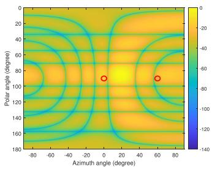  
(a) Scheme 1.

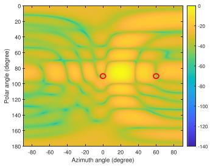  
(b) Scheme 2.

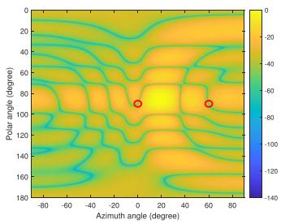  
(c) Scheme 3.

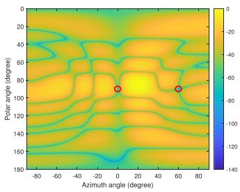  
(d) Proposed method.

Fig. 5. The beam pattern obtained by different methods. The red circles indicate directions of LoS interference.  
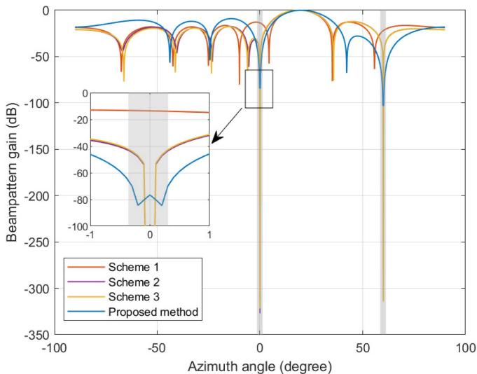  
Fig. 6. The beam pattern cross-sections at polar angle $\theta = \pi / 2$

To verify the LoS interference suppression performance, Fig. 7 shows the interference-to-signal power ratio (ISR), and the color bar in in dB. The UAV is positioned at different locations within the area enclosed by the three BSs, with its altitude fixed at 50 m. For Fig. 7(a), the LS method is applied to form the transmit precoding vector whose beam is directed at the UAV. Fig. 7(b) and (c) generate nulls at specific angles of $\begin{array} { r } { ( \theta , \varphi ) \in \{ ( \frac { \pi } { 2 } , 0 ) , ( \frac { \pi } { 2 } , \frac { \pi } { 3 } ) \} } \end{array}$ , while Fig. 7(d) creates nulls in angular regions of $\begin{array} { r } { \mathcal { R } _ { l } ^ { - } = \{ ( \theta _ { 1 } , \varphi _ { 1 } ) , ( \theta _ { 2 } , \varphi _ { 2 } ) | \theta _ { 1 } \in [ \frac { \pi } { 2 } - \frac { w _ { i d } } { 2 } , } \end{array}$ π $\begin{array} { r } { + \frac { w _ { i d } } { 2 } \big ] , \varphi _ { 1 } \in [ - \frac { w _ { i d } } { 2 } , \frac { w _ { i d } } { 2 } ] , \theta _ { 2 } \in [ \frac { \pi } { 2 } - \frac { w _ { i d } } { 2 } , \frac { \pi } { 2 } + \frac { w _ { i d } } { 2 } ] , \varphi _ { 2 } \in [ \frac { \pi } { 3 } } \end{array}$ $\begin{array} { r } { - \frac { w _ { i d } } { 2 } , \frac { \pi } { 3 } + \frac { w _ { i d } } { 2 } ] \} } \end{array}$ . Moreover, Fig. 7(b)–(d) consider an estimated angular error that is randomly distributed within $[ - 0 . 3 ^ { \circ } , 0 . 3 ^ { \circ } ]$

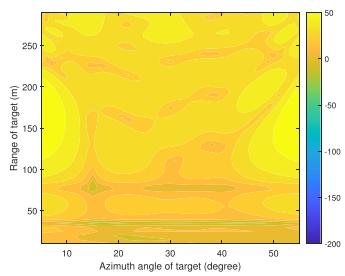  
(a) Scheme 1.

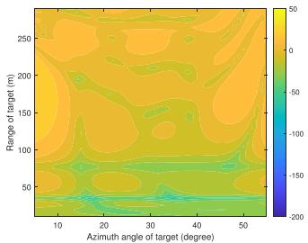  
(b) Scheme 2.

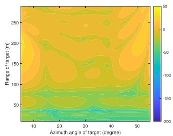  
(c) Scheme 3.

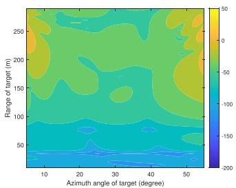  
(d) Proposed method.  
Fig. 7. ISR of various methods with UAV being at different positions.

As illustrated in Fig. 7(a), the LoS interference between BSs is notably significant, with the ISR reaching up to 50 dB. This not only severely degrades the sensing performance, but may also overrun the dynamic range of the ADC. As shown in Fig. 7(b) and (c), angular estimation errors of LoS interference significantly compromise the effectiveness of Scheme 2 and Scheme 3. Therefore, they are highly sensitive to directional errors. In contrast, the proposed method, as shown in Fig. 7(d), retains its ability to effectively mitigate LoS interference, showcasing its robustness to angular estimation errors.

## B. Performance of Target Detection and Parameter Estimation

This section evaluates the detection and parameter estimation performance of the proposed method for targets at the cell edge. The adopted frame structure is Case 2 in Fig. 2. The UAV is located at the junction of three cells, with its coordinates being randomly distributed in the region $\mathcal { R } =$ $\{ ( x , y , z ) \mathrm { m } | x \in ( 1 4 5 , 1 5 5 ) , y \in ( 8 1 . 6 0 , 9 1 . 6 0 ) , z \in ( 4 5 , 5 5 ) \}$ and its velocity being (40,0,0) km/h. The RCSs of UAV observed by different BSs are generated randomly and independently following an exponential distribution with a mean of $0 . 0 1 ~ \mathrm { m ^ { 2 } }$ and remain constant during a coherent processing interval. Monte Carlo simulations are performed to evaluate the detection probability and the RMSE of AoA, range, and velocity estimation.

Fig. 8 shows the detection probability of various methods under different false alarm probability constraints. As depicted in (55), the detection threshold increases with a decrease in the false alarm probability. For the proposed method, the echo signals originating from different BSs are superimposed at the receiver, resulting in increased echo signal power. For Scheme 5, three BSs detect the target from different directions, with the target considered present if at least one BS successfully detects it. Both the proposed method and Scheme 5 leverage the spatial diversity of multiple BSs to different extents. As shown in Fig. 8, the proposed method and Scheme 5 exhibit superior detection performance compared to Scheme 4, particularly under more stringent false alarm probability constraints. Furthermore, the proposed method effectively utilizes the spatial diversity of multiple BSs, achieving the best detection performance. This also implies that the proposed method can achieve the same detection performance as Schemes 4 and 5 with a lower transmit power, thereby reducing power consumption.

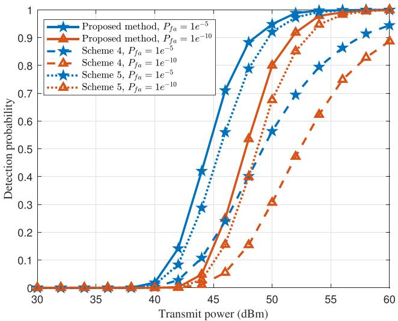

Fig. 8. Detection probability.  
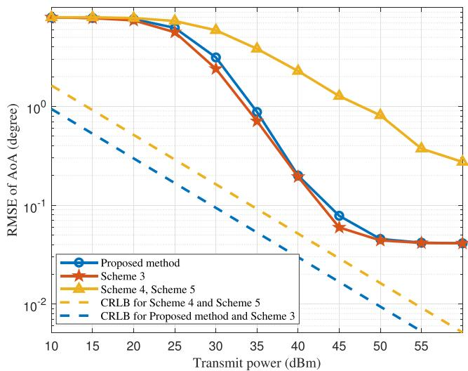  
Fig. 9. RMSE of AoA estimation.

Fig. 9 shows the RMSE of the AoA estimation, which is defined as the sum of the RMSEs of both the polar and azimuth angles. The search step size of MUSIC algorithm is set to 0.1<sup>◦</sup>. As shown in Fig. 9, the RMSE of the AoA estimation decreases with increasing transmit power. In Schemes 4 and 5, each BS receives echo signals that originate exclusively from a single BS. Fluctuating RCS causes a reduction in the power of the echo signal, resulting in a higher RMSE. In both the proposed method and Scheme 3, the BSs simultaneously receive echo signals originating from three BSs, with their powers being incoherently enhanced. As a result, echo signals from neighboring BSs do not interfere with the AoA estimation but rather enhance its accuracy. This fact is further corroborated by the derived CRLB, as indicated by the dotted lines. Although the proposed method sacrifices the null depth for null width, it maintains a main lobe comparable to that of Scheme 3. Consequently, the SINR of the echo signals for both the proposed method and Scheme 3 remains similar, leading to a comparable angular estimation performance. In addition, there is an error platform, which is determined by the search step size of MUSIC.

Fig. 10. SINR of range profile.  
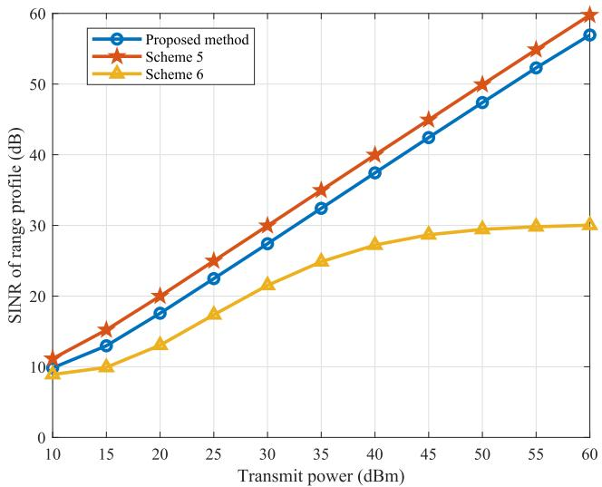

The SINR of the range profile is simulated in Fig. 10, where the SINR increases linearly with increasing transmit power for the proposed method and Scheme 5. As space-time block decoding cannot perfectly separate the echo signals due to the target’s movement, residual interference remains, resulting in a slight decrease in SINR compared to Scheme 5. In Scheme 6, severe inter-BS interference limits the SINR as the transmit power increases, ultimately degrading the sensing performance.

Figs. 11 and 12 depict the RMSE of range and radial velocity estimation, respectively. For velocity estimation based on MUSIC algorithm, the search step size is set to 0.01 m/s. For Scheme 6, three BSs share the same time-frequency resources, but do not perform any interference cancellation operations. Thus, the range and radial velocity cannot be estimated. In Scheme 5, three BSs utilize orthogonal time-frequency resources, ensuring that there is no interference. As such, this scheme offers the best range and velocity estimation. In our proposed method, three BSs share the same time-frequency resources, and space-time block decoding is applied to separate echo signals originating from different BSs. Although perfect separation cannot be achieved when the target is moving, interference is significantly reduced. Therefore, the parameter estimation performance of the proposed method is slightly inferior to that of Scheme 5. However, our proposed method can reduce the occupied time-frequency resource by 66.67%. Compared to Figs. 11 and 10, there is a strong correlation between the accuracy of range estimation and the SINR of the range profile, with a higher SINR corresponding to a lower RMSE in range estimation.

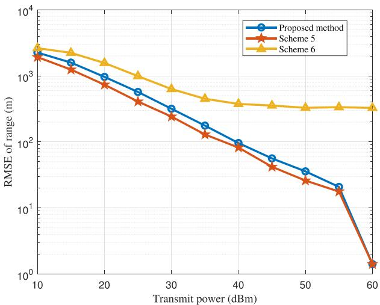  
Fig. 11. RMSE of range estimation.

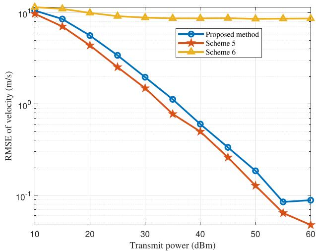  
Fig. 12. RMSE of radial velocity estimation.

## C. Performance of Multi-BS Cooperative Positioning

Based on the analysis above, the RMSEs of position estimates obtained by a single BS and different multi-BS fusion strategies are shown in Fig. 13, where the soft fusion method performs an arithmetic average of the sensing results obtained by different BS [43]. As shown in Fig. 13, the soft fusion method slightly improves positioning performance by equally treating different sensing results. However, the precision of position estimates obtained from different echo signals varies significantly, demonstrating a strong dependence on the SINR of the range profile. Therefore, the proposed method uses the SINR of the range profile as weighted coefficients to fuse sensing results from different BSs. By prioritizing more reliable estimation results with larger weightings, the positioning accuracy is improved by an order of magnitude compared to both the single-BS and soft fusion methods. To evaluate the practical feasibility of proposed method, its performance in the presence of timing error is further investigated. According to 3GPP TR 38.855 [44], the timing error between BSs can be modeled using a truncated Gaussian distribution. In this simulation, the error is drawn from a parent Gaussian distribution with a mean of 0 and a standard deviation of 10 ns [20], and is truncated to the interval of [−20, 20] ns. As shown in Fig. 13, although the positioning performance of the proposed fusion method degrades slightly in the presence of timing errors, it still outperforms the soft fusion scheme (even one with perfect synchronization). Furthermore, the method maintains meter-level accuracy, demonstrating that it can work effectively under the currently achievable clock synchronization precision among BSs.

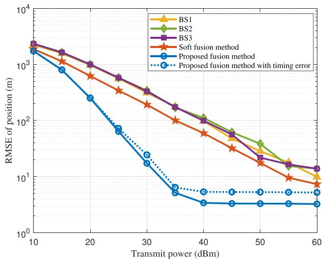  
Fig. 13. RMSE of position estimation.

## VII. CONCLUSION

This paper considers that multiple BSs share the same timefrequency resources to cooperatively detect targets, where the interference between BSs is first solved. For LoS interference, a robust beam pattern that creates nulls in angular regions around the LoS directions is proposed to suppress interference formation, thereby preventing the ADC from exceeding the dynamic range. For inter-BS interference caused by target reflection, a space-time block codec scheme is proposed to generate orthogonal signals and separate echoes, effectively converting inter-BS interference into bistatic sensing echo signals. Furthermore, the target positions estimated from different echo signals are fused on the basis of the SINR of the range profile. The simulation results reveal that the proposed cooperative ISAC method significantly reduces LoS interference and enhances the detection probability and parameter estimation for the target at the cell edge. Among these, the positioning accuracy is improved by an order of magnitude.

In particular, the proposed space-time block codec has linear processing characteristics, scalability to multiple BSs, and capability to generate orthogonal sequences using communication payloads, which holds great potential for simultaneously achieving cooperative communication and cooperative sensing. In the future, the proposed space-time block codec based cooperative ISAC scheme needs to be further improved to adapt to high-speed targets, where the orthogonality of sensing signals will be disrupted by time-varying target response.

## REFERENCES

[1] Y. Jiang et al., “6G non-terrestrial networks enabled low-altitude economy: Opportunities and challenges,” 2023, arXiv:2311.09047.

[2] G. Cheng, X. Song, Z. Lyu, and J. Xu, “Networked ISAC for low-altitude economy: Coordinated transmit beamforming and UAV trajectory design,” IEEE Trans. Commun., vol. 73, no. 8, pp. 5832–5847, Aug. 2025.

[3] Y. Zhang, H. Shan, H. Chen, D. Mi, and Z. Shi, “Perceptive mobile networks for unmanned aerial vehicle surveillance: From the perspective of cooperative sensing,” IEEE Veh. Technol. Mag., vol. 19, no. 2, pp. 60–69, Jun. 2024.

[4] Z. Feng, Z. Fang, Z. Wei, X. Chen, Z. Quan, and D. Ji, “Joint radar and communication: A survey,” China Commun., vol. 17, no. 1, pp. 1–27, Jan. 2020.

[5] Z. Wei et al., “Integrated sensing and communication signals toward 5G-A and 6G: A survey,” IEEE Internet of Things J., vol. 10, no. 13, pp. 11068–11092, Jul. 2023.

[6] X. Yuan et al., “Spatio-temporal power optimization for MIMO joint communication and radio sensing systems with training overhead,” IEEE Trans. Veh. Technol., vol. 70, no. 1, pp. 514–528, Jan. 2021.

[7] Z. Wei et al., “Waveform design for MIMO-OFDM integrated sensing and communication system: An information theoretical approach,” IEEE Trans. Commun., vol. 72, no. 1, pp. 496–509, Jan. 2024.

[8] Y. Xiong, F. Liu, Y. Cui, W. Yuan, T. X. Han, and G. Caire, “On the fundamental tradeoff of integrated sensing and communications under Gaussian channels,” IEEE Trans. Inf. Theory, vol. 69, no. 9, pp. 5723–5751, Sep. 2023.

[9] H. Zhang, Y. Zhang, X. Liu, C. Ren, H. Li, and C. Sun, “Time allocation approaches for a perceptive mobile network using integration of sensing and communication,” IEEE Trans. Wireless Commun., vol. 23, no. 2, pp. 1158–1169, Feb. 2024.

[10] C. Ouyang, Y. Liu, and H. Yang, “MIMO-ISAC: Performance analysis and rate region characterization,” IEEE Wireless Commun. Lett., vol. 12, no. 4, pp. 669–673, Apr. 2023.

[11] J. A. Zhang, X. Huang, Y. J. Guo, J. Yuan, and R. W. Heath, “Multibeam for joint communication and radar sensing using steerable analog antenna arrays,” IEEE Trans. Veh. Technol., vol. 68, no. 1, pp. 671–685, Jan. 2019.

[12] Z. Wei et al., “Integrated sensing and communication enabled multiple base stations cooperative sensing towards 6G,” IEEE Netw., vol. 38, no. 4, pp. 207–215, Jul. 2024.

[13] M. R. Figueroa, P. K. Bishoyi, and M. Petrova, “Cooperative multimonostatic sensing for object localization in 6G networks,” in Proc. IEEE Wireless Commun. Netw. Conf., 2024, pp. 1–6.

[14] Q. Shi, L. Liu, S. Zhang, and S. Cui, “Device-free sensing in OFDM cellular network,” IEEE J. Sel. Areas Commun., vol. 40, no. 6, pp. 1838–1853, Jun. 2022.

[15] K. Chen, D. Liu, and Z. Zhang, “Radar-assisted multiple base station cooperative mmWave beam tracking,” Electronics, vol. 12, no. 7, Apr. 2023, Art. no. 1672.

[16] Z. Wei et al., “Symbol-level integrated sensing and communication enabled multiple base stations cooperative sensing,” IEEE Trans. Veh. Technol., vol. 73, no. 1, pp. 724–738, Jan. 2024.

[17] N. Babu, C. Masouros, C. B. Papadias, and Y. C. Eldar, “Precoding for multi-cell ISAC: From coordinated beamforming to coordinated multipoint and bi-static sensing,” IEEE Trans. Wireless Commun., vol. 23, no. 10, pp. 14637–14651, Oct. 2024.

[18] J. Zhang, Z. Fei, X. Wang, P. Liu, J. Huang, and B. Li, “Cooperative integrated sensing and communication with distributed space-time block coded OFDM,” in Proc. IEEE/CIC Int. Conf. Commun. China, Dalian, China, 2023, pp. 1–6.

[19] G. Liu et al., “Cooperative sensing for ISAC: Challenges, system design, beam management, and performance validation,” IEEE J. Sel. Areas Commun., early access, Sep. 19, 2025, doi: 10.1109/JSAC.2025.3611941.

[20] Microsemi, “IEEE 1588 precise time protocol: The new standard in time synchronization,” Microsemi, Aliso Viejo, CA, USA, White Paper MSCC-0104-WP-01007-1.00-1117, Mar. 2017.

[21] M. Lipi´nski, T. Włostowski, J. Serrano, and P. Alvarez, “White Rabbit: A PTP application for robust sub-nanosecond synchronization,” in Proc. IEEE Int. Symp. Precis. Clock Synchronization Meas. Control Commun., 2011, pp. 25–30.

[22] C. Johnson, 5G New Radio in Bullets, 1st ed. UK: CT Johnson, 2019.

[23] Physical Layer Procedures for Control (Release 18), 3GPP TS 38.213 (V18.4.0), 3rd Generation Partnership Project, Valbonne, France, Sep. 2024.

[24] X. Chen et al., “Downlink and uplink cooperative joint communication and sensing,” IEEE Trans. Veh. Technol., vol. 73, no. 8, pp. 11318–11332, Aug. 2024.

[25] V. Tarokh, H. Jafarkhani, and A. R. Calderbank, “Space-time block codes from orthogonal designs,” IEEE Trans. Inf. Theory, vol. 45, no. 5, pp. 1456–1467, Jul. 1999.

[26] M. Pieraccini, L. Miccinesi, and N. Rojhani, “RCS measurements and ISAR images of small UAVs,” IEEE Aerosp. Electron. Syst. Mag., vol. 32, no. 9, pp. 28–32, Sep. 2017.

[27] X. Zhang, H. Li, J. Liu, and B. Himed, “Joint delay and doppler estimation for passive sensing with direct-path interference,” IEEE Trans. Signal Process., vol. 64, no. 3, pp. 630–640, Feb. 2016.

[28] Z. Liu, S. Aditya, H. Li, and B. Clerckx, “Joint transmit and receive beamforming design in full-duplex integrated sensing and communications,” IEEE J. Sel. Areas Commun., vol. 41, no. 9, pp. 2907–2919, Sep. 2023.

[29] Y. Liu, J. Wang, X. Zhang, G. Li, and Y. Xu, “Spatial anti-jamming based on low complexity robust beamforming via orthogonal projection,” IEEE Trans. Veh. Technol., vol. 74, no. 8, pp. 13190–13195, Aug. 2025.

[30] M. F. Fernandez and K.-B. Yu, “Blocking-matrix and quasimatrix techniques for extended-null insertion in antenna pattern synthesis,” in Proc. IEEE Nat. Radar Conf., 2015, pp. 0198–0203.

[31] M. F. Fernandez and K.-B. Yu, “Determining basis vectors for continuous response regions of a uniform rectangular array with applications to twodimensional nulling,” in Proc. Conf. Rec. Asilomar Conf. Signals Syst. Comput., 2018, pp. 895–899.

[32] R. Schmidt, “Multiple emitter location and signal parameter estimation,” IEEE Trans. Antennas Propag., vol. 34, no. 3, pp. 276–280, Mar. 1986.

[33] W. Jiang, Z. Wei, B. Li, Z. Feng, and Z. Fang, “Improve radar sensing performance of multiple roadside units cooperation via space registration,” IEEE Trans. Veh. Technol., vol. 71, no. 10, pp. 10975–10990, Oct. 2022.

[34] J. Xiong, H. Hong, H. Zhang, N. Wang, H. Chu, and X. Zhu, “Multitarget respiration detection with adaptive digital beamforming technique based on SIMO radar,” IEEE Trans. Microw. Theory Techn., vol. 68, no. 11, pp. 4814–4824, Nov. 2020.

[35] C. Sturm and W. Wiesbeck, “Waveform design and signal processing aspects for fusion of wireless communications and radar sensing,” Proc. IEEE, vol. 99, no. 7, pp. 1236–1259, Jul. 2011.

[36] Z. Ni, J. A. Zhang, K. Wu, and R. P. Liu, “Uplink sensing using CSI ratio in perceptive mobile networks,” IEEE Trans. Signal Process., vol. 71, pp. 2699–2712, 2023.

[37] X. Chen et al., “Multiple signal classification based joint communication and sensing system,” IEEE Trans. Wireless Commun., vol. 22, no. 10, pp. 6504–6517, Oct. 2023.

[38] L. Wang, Z. Wei, X. Chen, and Z. Feng, “Coherent compensation-based sensing for long-range targets in integrated sensing and communication system,” IEEE Trans. Veh. Technol., vol. 74, no. 6, pp. 9134–9148, Jun. 2025.

[39] S. Wei, D. L. Goeckel, and P. A. Kelly, “Convergence of the complex envelope of bandlimited OFDM signals,” IEEE Trans. Inf. Theory, vol. 56, no. 10, pp. 4893–4904, Oct. 2010.

[40] M. Arash, H. Mirghasemi, I. Stupia, and L. Vandendorpe, “Analysis of CRLB for AoA estimation in massive MIMO systems,” in Proc. IEEE 32nd Annu. Int. Symp. Pers. Indoor Mobile Radio Commun., 2021, pp. 1395–1400.

[41] Physical Channels and Modulation (Release 18), 3GPP TS 38.211 V18.7.0, 3rd Generation Partnership Project, Valbonne, France, Jul. 2025.

[42] 5G; General Aspects for Base Station (BS) Radio Frequency (RF) for NR (3GPP TR 38.817-02 version 15.11.0 Release 15), ETSI TR 138 817-2 V15.11.0, European Telecommunication Standards Institute, Sophia Antipolis, France, Oct. 2023.

[43] M. Willame, H. C. Yildirim, L. Storrer, F. Horlin, and J. Louveaux, “Multistatic OFDM radar fusion of MUSIC-based angle estimation,” in Proc. 18th Eur. Conf. Antennas Propag., 2024, pp. 1–5.

[44] Study on NR Positioning Support (Release 16), 3GPP TR 38.855 V16.0.0, 3rd Generation Partnership Project, Valbonne, France, Mar. 2019.

  
Lin Wang (Graduate Student Member, IEEE) received the BE degree from the Beijing University of Posts and Telecommunications (BUPT), Beijing, China, in 2021. He is currently working toward the PhD degree with BUPT. His research interests include stochastic geometry and integrated sensing and communication.


Zhiyong Feng (Senior Member, IEEE) received the BE, ME, and PhD degrees from the Beijing University of Posts and Telecommunications (BUPT), Beijing, China. She is currently a professor with BUPT, and the director of the Key Laboratory of the Universal Wireless Communications, Ministry of Education, P.R.China. She is active in standards development, such as ITU-R WP5A/5C/5D, IEEE 1900, ETSI, and CCSA. Her research interests include joint communication and sensing system design, wireless network architecture design and radio resource management,

spectrum sensing and dynamic spectrum management in cognitive wireless networks, universal signal detection and identification, and network information theory.


Zhiqing Wei (Member, IEEE) received the BE and PhD degrees from the Beijing University of Posts and Telecommunications (BUPT), in 2010 and 2015. Now he is a professor with BUPT. He was granted the Exemplary Reviewer of IEEE Wireless Communications Letters, in 2017, the Best Paper Award of International Conference on Wireless Communications and Signal Processing (WCSP), in 2018 and 2022. He was the registration co-chair of IEEE/CIC International Conference on Communications in China (ICCC) 2018 and the publication co-chair of IEEE/CIC ICCC 2019 and 2020. His research interest is integrated sensing and communication.


Xinyi Wang (Member, IEEE) received the BEng and PhD degrees in information and communication engineering from the Beijing Institute of Technology (BIT), in 2017 and 2022, respectively. From 2023 to 2024, he was a postdoctoral researcher with BIT, where he is currently an associate professor. He was a recipient of the Best Paper Award in WOCC 2019 and a co-receipt of the Excellent Paper Award, in ICSIDP 2024. He was also a recipient of the Nomination Award for Outstanding Doctoral Dissertation by the China Education Society of Electronics (CESE). He

has been recognized as an Exemplary Reviewer for the IEEE Transactions on Communications and listed among the World’s Top 2% Scientists by Stanford University for citation impact, in 2025. His research interests include integrated sensing and communications, multi-carrier modulation techniques, and lowaltitude wireless networks. He is a founding member of the IEEE ComSoc Special Interest Group (SIG) on LAWN, and has served as TPC members for multiple IEEE flagship conferences.


Dingyou Ma (Member, IEEE) received the BSc degree in aerospace science and technology from Xidian University, Xi’an, China, in 2016, and the PhD degree in electronics engineering from Tsinghua University, Beijing, China, in 2022. Since July 2022, he has been with the Key Laboratory of Universal Wireless Communications, Ministry of Education, School of Information and Communication Engineering, Beijing University of Posts and Telecommunications, as a lecturer. His current research interests include communications signal processing, radar signal processing, and dual-function radar-communications system.


Zesong Fei (Senior Member, IEEE) received the PhD degree from the Beijing Institute of Technology (BIT), Beijing, China, in 2004. He is currently a professor with the Research Institute of Communication Technology, BIT. His research interests are in the area of wireless communications and signal processing, including integrated sensing and communications, physical layer security, UAV communications, intelligent reflecting surface, channel coding, and multiple access. He has authored or co-authored more than 200 journal and conference papers, and was the co-receipt

of the Best Paper Award, in WCSP 2012, Chinacom 2012, Chinacom 2013, and PIMRC 2015. He is a fellow of China Institute of Communications. He serves as an associate editor for IEEE Open Journal of the Communications Society.