# Space/Aerial-Assisted Computing Offloading for IoT Applications: A Learning-Based Approach

Nan Cheng Member, IEEE, Feng Lyu, Member, IEEE, Wei Quan, Member, IEEE, Conghao Zhou, Senior Member, IEEE, Hongli He, Student Member, IEEE, Weisen Shi, Senior Member, IEEE, and Xuemin Shen, Fellow, IEEE

Abstract— Internet of Things (IoT) computing offloading is a challenging issue, especially in remote areas where common edge/cloud infrastructure is unavailable. In this paper, we present a space-air-ground integrated network (SAGIN) edge/cloud computing architecture for offloading the computation-intensive applications considering remote energy and computation constraints, where flying unmanned aerial vehicles (UAVs) provide near-user edge computing and satellites provide access to the cloud computing. First, for UAV edge servers, we propose a joint resource allocation and task scheduling approach to efficiently allocate the computing resources to virtual machines (VMs) and schedule the offloaded tasks. Second, we investigate the computing offloading problem in SAGIN and propose a learningbased approach to learn the optimal offloading policy from the dynamic SAGIN environments. Specifically, we formulate the offloading decision making as a Markov decision process where the system state considers the network dynamics. To cope with the system dynamics and complexity, we propose a deep reinforcement learning-based computing offloading approach to learn the optimal offloading policy on-the-fly, where we adopt the policy gradient method to handle the large action space and actor-critic method to accelerate the learning process. Simulation results show that the proposed edge VM allocation and task scheduling approach can achieve near-optimal performance with very low complexity and the proposed learning-based computing offloading algorithm not only converges fast but also achieves a lower total cost compared with other offloading approaches.

Index Terms— Computing offloading, edge computing, spaceair-ground, IoT, reinforcement learning.

I. INTRODUCTION

W ITH the rapid development of 5G networks and Inter-net of things (IoT), a myriad of promising appli- net of things (IoT),a myriad of promising applications and services have emerged, such as virtual reality,

Manuscript received October 10, 2018; revised January 10, 2019 and March 8, 2019; accepted March 13, 2019. Date of publication March 21, 2019; date of current version April 16, 2019. This work was supported in part by the National Natural Science Foundation of China (NSFC) under Grant 91638204 and in part by the Natural Sciences and Engineering Research Council (NSERC) of Canada. (Corresponding author: Wei Quan.)

N. Cheng is with the School of Telecommunication, Xidian University, Xi’an 710071, China, and also with the Electrical and Computer Engineering Department, University of Waterloo, Waterloo, ON N2L3G1, Canada (e-mail: nancheng@xidian.edu.cn).

F. Lyu, C. Zhou, W. Shi, and X. Shen are with the Electrical and Computer Engineering Department, University of Waterloo, Waterloo, ON N2L 3G1, Canada (e-mail: f2lyu@uwaterloo.ca; c89zhou@uwaterloo.ca; w46shi@uwaterloo.ca; sshen@uwaterloo.ca).

W. Quan is with the School of Electronic and Information Engineering, Beijing Jiaotong University, Beijing 100044, China (e-mail: dr.wei.quan@ieee.org).

H. He is with the School of Information Engineering, Zhejiang University, Hangzhou 310027, China (e-mail: hongli\_he@zju.edu.cn).

Color versions of one or more of the figures in this paper are available online at http://ieeexplore.ieee.org.

Digital Object Identifier 10.1109/JSAC.2019.2906789

HD live streaming, autonomous driving, industry automation, smart home, and so forth, which reap the benefits provided by 5G networks, such as ultra-high data rate, low latency, high reliability, and massive connections [1], [2]. However, besides efficient and reliable communication, a wide spectrum of applications also require massive computing capabilities. For example, virtual reality and HD video streaming require a large amount of computing resources for rendering and video encoding/decoding, and the autonomous vehicles rely on computing for artificial intelligence (AI)-based steering control. These computation-intensive applications pose great challenges on the battery and computing capabilities of the resource-constrained end devices, especially the IoT devices, which motivates the cloud computing in which computationintensive applications are offloaded to the cloud servers with centralized and abundant computation resources. Although cloud computing can significantly reduce the computation delay and the energy consumption of the users, it may fail to meet the demands of delay sensitive applications, such as mobile gaming and augmented reality, since the long transmission distances between end users and the cloud servers result in long transmission delays. To address this issue, mobile edge computing (MEC) has been extensively investigated, where the computing resources in the network edge are employed to provide efficient and flexible computing services. In 5G wireless systems, ultra-dense network edge devices will be deployed, such as macro/small cell base stations and WiFi access points which can provide exponentially growing amount of edge computing resources. Many significant issues in MEC have been extensively investigated, including offloading task model [3], [4], energy efficiency [5]–[7], latency reduction [8]–[10], and joint optimization of communication and computing [11], [12].

However, 5G networks may fail to provide ubiquitous coverage to suburban and rural areas, where IoT devices could be widely deployed to execute certain applications with relatively high computing requirements. For example, the fusion of sensing information, especially the handling of high-definition sound or video information, will quickly drain the battery of the sink nodes and result in large processing delays. Due to the lack of terrestrial access network coverage, the typical edge and cloud computing paradigms cannot be applied in such scenarios. To this end, we propose to employ the space-air-ground integrated network (SAGIN) architecture for the computing offloading of remote IoT applications. SAGIN integrates the satellite network and aerial network with the terrestrial network to provide seamless and flexible network coverage and services to large areas, and thus can be applied in many promising fields, such as intelligent transportation system, remote area monitoring, disaster rescue, and large-scale high-speed mobile Internet access [13]. SAGIN is a multidimensional heterogeneous network consisting three network segments, i.e., the satellite network, aerial network, and terrestrial network. Each network segment possesses different resources and is affected by different limitations. The Low Earth Orbit (LEO) and geostationary (GEO) satellites constitute a hierarchical network where LEO satellites provide high-speed access and GEO satellites relay the data between LEO for long distance transmission [14]. The aerial network, including flying unmanned aerial vehicles (UAVs), high latitude platforms (HAPs), and communication balloons, can be deployed on demand at locations with burst data traffic to offer high-speed and dynamic network services, such as dynamic coverage, edge computing, crowdsensing, etc. [15], [16]. In the proposed SAG-IoT computing offloading architecture, the aerial network nodes can serve as the flying edge servers, which provides the IoT devices with the low-delay edge computing. On the other hand, the satellite communication, although may have lower communication rate and higher transmission delay, can provide always-on cloud computing through seamless coverage and satellite backbone networks [17]. However, employing the SAGIN in IoT computing offloading introduces several challenging issues. Firstly, the high mobility of the aerial network results in dynamic channel conditions and coverage, leading to varying server availability and communication delay, which should be carefully handled to guarantee the performance of the SAG-IoT system. Secondly, different network segments in SAGIN possess distinct network conditions and resource constraints, and it is non-trivial to design an efficient computing offloading approach considering the complex and dynamic network conditions and resources.

In this paper, we present a flexible joint communication and computation SAGIN framework to provide powerful edge/cloud computing services to remote IoT users. Under the framework, we propose an efficient computing offloading approach which learns on-the-fly the optimal offloading policy to minimize the weighted sum of delay, energy consumption, and server usage cost, considering the multidimensional network dynamics and resource constraints. Firstly, the UAV edge servers’ computation resources are virtualized as virtual machines (VMs) for parallel execution of the offloaded tasks. We formulate the joint VM resource allocation and task scheduling problem as a mixed-integer programming problem and propose an efficient heuristic algorithm to solve it. Secondly, we investigate the computing offloading problem in SAGIN, which is formulated as a Markov decision process (MDP). To learn the network dynamics, a model-free reinforcement learning (RL)-based approach is proposed, and an actor-critic learning algorithm is designed to handle the large state and action spaces. To the best of our knowledge, our work is the first work to study the computing offloading problem in SAGIN, which validates the feasibility of SAGIN supporting computation-intensive applications for remote IoT users, and can provide useful guidelines for SAGIN network design and remote computing offloading.

The main contributions of the paper can be summarized as follows.

We formulate the SAG-IoT computing offloading problem as an MDP and propose an RL-based approach to efficiently solve the problem. The system state is defined to integrate the historical network information to learn the system dynamics. In addition, a policy gradientbased actor-critic learning algorithm is proposed to cope with problem of dimensionality curse and accelerate the learning speed.   
We adopt network virtulization to flexibly allocate the resources of the edge server. We formulate the joint edge server VM computation resource allocation and task scheduling problem as a mix-integer programming problem, and propose an effective heuristic algorithm to solve it.   
The performance of the proposed approaches are evaluated through extensive simulations. The joint VM allocation and task scheduling can achieve near-optimal performance with low complexity. In addition, the performance of the proposed RL-based computing offloading approach is evaluated with respect to design parameters.

The remainder of the paper is organized as follows. In Section II, we present the related work. Section III describes the system model. In Section IV, the joint edge VM allocation and task scheduling problem is formulated and solved. Section V formulates the SAG-IoT computing offloading problem, followed by the RL-based solution in Section VI. Section VII evaluates the proposed approaches, and Section VIII concludes the paper. Useful notations used throughout the paper are listed in Table I.

# II. RELATED WORK

# A. Mobile Edge Computing

The concept of MEC was originally proposed by ETSI in [18], in which the motivation, definition, architecture, and challenging issues are discussed. In edge computing, the computation task offloading mechanism determines the overall performance of the MEC system. The energy-efficient computation offloading is crucial for energy-constraint IoT devices, and has been studied in [5] and [6]. In [5], Mahmoodi et al. studied the joint scheduling and computation offloading problem and proposed a real data measurement based optimization method to save the energy consumption of the mobile users. In [6], Mao et al. proposed a Lyapunov method-based dynamic computation offloading for devices with energy harvesting. The execution cost which jointly considers the execution latency and task failure is taken as the performance metric. In MEC system, the energy consumption and task delay rely not only on the task processing, but also on the communication of the related data of the task. Therefore, the joint optimization of the communication radio resources and the computing offloading has attracted much research attention [11], [12]. In [11], You et al. studied the resource allocation for multiuser MEC offloading problem considering

TABLE I NOTATIONS USED IN THE PAPER 

<table><tr><td>Notation</td><td>Description</td></tr><tr><td>M</td><td>Number of IoT users</td></tr><tr><td>N</td><td>Number of IoT applications</td></tr><tr><td> $\mathcal{C}^l, \mathcal{C}^e, \mathcal{C}^c$ </td><td>The computation resources of local IoT users, the edge servers, and the cloud server</td></tr><tr><td> $E^l$ </td><td>The local process power consumption of IoT users</td></tr><tr><td> $E_i^e, E_i^c$ </td><td>The transmission power of IoT users to UAV and satellite</td></tr><tr><td> $\mathcal{B}_{ij}^e, \mathcal{B}_{ij}^c$ </td><td>The usage cost of task  $W_{ij}$  in edge server and cloud server</td></tr><tr><td>B</td><td>Bandwidth of UAV-ground communication</td></tr><tr><td> $H_j^{in}, H_j^{out}$ </td><td>The size of input data and output data of j-th application</td></tr><tr><td> $Z_j$ </td><td>The computing requirement of j-th application</td></tr><tr><td> $M(t), m_{ij}(t)$ </td><td>Remaining tasks matrix and the element corresponding to task  $W_{ij}$ </td></tr><tr><td> $X^l(t), X^e(t), X^c(t)$ </td><td>Offloading decision matrix corresponding to local process, offload to UAV, and offload to the cloud</td></tr><tr><td> $x_{ij}^l(t), x_{ij}^e(t), x_{ij}^c(t)$ </td><td>The element of  $X^l(t), X^e(t), X^c(t)$  corresponding to task  $W_{ij}$ </td></tr><tr><td>α, β</td><td>The weight of UAV-edge and cloud server usage cost over the IoT user energy consumption</td></tr><tr><td> $\varpi_i$ </td><td>The weight of delay over energy consumption and server usage cost for IoT user i</td></tr></table>

TDMA and OFDMA scenarios. In [12], Wu et al. studied the multi-access-assisted computing offloading, and presented a joint optimization of computation task scheduling and radio resource allocation. However, these works only focus on the fixed MEC scenario, i.e., the edge computing services are provided by cellular BSes or WiFi APs, which is different from our work where flying UAVs serve as the mobile edge servers. In [19], a mobile edge computing mechanism is proposed via a UAV-Mounted cloudlet. The bit allocation and UAV trajectory are jointly designed to minimize the mobile energy consumption by solving a non-convex optimization problem. Different from [19], we consider both the energy consumption and task processing delay. In addition, the UAV trajectories are learnt instead of designed for the scenarios where the UAVs are not deployed by network operators and the trajectories are unknown in advance.

# B. Space-Air-Ground Integrated Network

SAGIN is envisioned as a promising technology to address many problems in future mobile communication networks, such as remote and large-scale coverage, growth of mobile data, uneven data traffic, and rigid backbone networks, and has recently attracted much attention from both academia and industry. Different SAGIN architecture is discussed in [20], [21]. In [20], Hoang et al. studied the optimal energy allocation problem in SAGIN and proposed a learningbased algorithm to optimize the network performance and maximize the service providers’ revenue. In [21], Zhang et al. proposed a software-defined SAGIN architecture and discussed the challenging issues therein. The edge caching is employed in SAGIN to reduce the content retrieval delay and offload the backbone networks. In [22], Chen et al. proposed an optimal content caching scheme to place content at UAVs by considering the user’s information and the content request distribution. However, the study of edge computing offloading and computation resource allocation considering the cooperation of space, aerial, and ground network segments is still missing in the literature, which is important for supporting a myriad of computing-intensive applications in SAGIN.

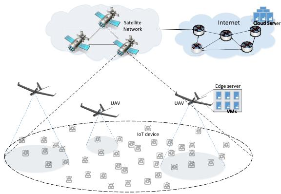

flowchart

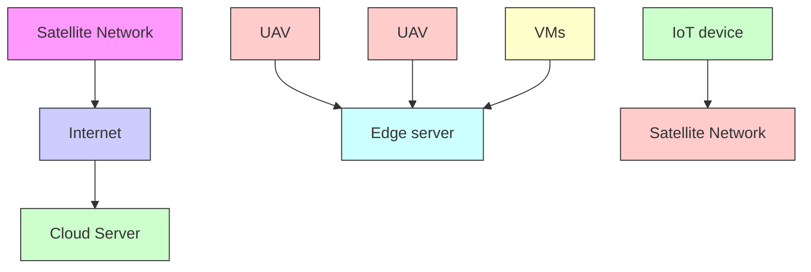

Fig. 1. An overview of the SAG-IoT architecture.

# III. SYSTEM MODEL

# A. Network Model

We consider a remote area where IoT devices are deployed to conduct certain tasks with computation requirements, such as monitoring and video surveillance. In the considered remote area, there is no cellular coverage, and therefore we consider a space-air-ground integrated network (SAGIN) to provide network functions, such as network access, edge computing and caching, to the IoT devices. The overview of the SAG-IoT network is shown in Fig. 1. In the SAG-IoT network, there are three network segments, i.e., the ground segment, the aerial segment, and the space segment. The IoT devices compose the ground segment and have very limited energy and computing capabilities. The applications running at the IoT devices may generate data to upload and computing tasks to execute. In the aerial segment, the flying UAVs can serve as edge servers to provide ground users with edge caching and computing capabilities. The flying UAVs, such as the Facebook Aquila, can fly for months without charging by using solar panels [23]. The UAVs are configured with fixed flying trajectories to serve the considered area. Furthermore, in the space segment, one or more LEO satellites provide the full coverage of the area of interest, and connect the IoT devices with the cloud servers through the satellite backbone network.

For the IoT device (user) $i ,$ it has the local computing capability of $\mathcal { C } ^ { l }$ , which is assumed identical for all users. The energy consumption for locally task computing/processing is denoted by $E ^ { l }$ , which is related to $\mathcal { C } ^ { l }$ . The power consumption for transmission to UAV and satellite is denoted by $E _ { i } ^ { e }$ and $E _ { i } ^ { c }$ , respectively. In the edge servers, i.e., UAVs, the computing resources are virtulized as VMs, each for one specific application [24]. In edge server $k ,$ the total computation resource is ${ \mathcal { C } } ^ { e } ,$ the resources allocated to the computation VM v is denoted by $\mathcal { C } _ { v } ^ { e }$ , and the server usage cost of the computation VM for user i’s task $j$ is denoted by $B _ { i , j } ^ { e }$ . For the UAV-ground communication, since we consider the task offloading decision making, which is with much longer time scale than traditional resource scheduling time (1 ms), only large-scale channel fading is considered. In addition, since the instantaneous channel information is not required, a satellite controlled global decision making is feasible. According to [25], the pathloss between the UAV and the ground users follows

$$
\begin{array}{l} L (r, h) = 2 0 \log \left(\frac {4 \pi f _ {c} (h ^ {2} + r ^ {2}) ^ {\frac {1}{2}}}{c}\right) + P _ {L o S} (r, h) \eta_ {L o S} \\ + (1 - P _ {L o S} (r, h)) \eta_ {N L o S}, \tag {1} \\ \end{array}
$$

where h and r denote the UAV flying altitude and the horizontal distance between the UAV and the ground user, respectively. $\eta _ { L o S }$ and $\eta _ { N L o S }$ denote respectively the additive loss incurred on top of the free space pathloss for LoS and NLoS links [26]. $f _ { c }$ denotes the carrier frequency, and c denotes the speed of light. $P _ { L o S }$ is the line-of-sight probability of UAV-ground link, which can be calculated by

$$
P _ {L o S} (r, h) = \frac {1}{1 + a \exp (- b (\arctan (\frac {h}{r}) - a))}. \tag {2}
$$

$( a , b , \eta _ { L o S } , \eta _ { N L o S } )$ are environment-dependent variables. For ( )instance, in remote areas, their values are (4.88, 0.43, 0.1, 21) [27]. In addition, the UAV-ground communication uses WiFi protocols with total bandwidth B. If n IoT devices communicate with a UAV simultaneously, the bandwidth each IoT device obtains is calculated by

$$
B _ {i} = \rho B \xi (n) \tag {3}
$$

where $\rho$ is the WiFi throughput efficiency factor, and $\xi ( n )$ is ( )the WiFi channel utilization function which is a decreasing function of contenting user number n. Thus, the instant UAV-ground and ground-UAV data rate can be calculated by

$$
r _ {G U} = \rho B \xi (n) \log_ {2} (1 + \frac {E _ {i} ^ {e} 1 0 ^ {- L _ {i} / 1 0}}{\sigma^ {2}}), \tag {4}
$$

and

$$
r _ {U G} = \rho B \xi (n) \log_ {2} (1 + \frac {E _ {i} ^ {e - 1 0 ^ {- L _ {i} / 1 0}}}{\sigma^ {2}}), \tag {5}
$$

respectively, where $E _ { i } ^ { e - }$ denotes the UAV transmit power to ground IoT users, $L _ { i }$ denotes the pathloss for the corresponding IoT user-UAV link, and $\sigma ^ { 2 }$ denotes the power of the Gaussian noise. For the satellite-ground communication, we consider a constant communication data rate $r _ { S G }$ , which is usually smaller than the UAV-ground date rate. The satellite is connected to the Internet/cloud through the satellite backbone network. We denote the transmission rate between the satellite and the cloud by $r _ { S C }$ . The cloud has much higher computing capability than IoT devices and edge servers, and the processing rate for each task is denoted by Cc, and the usage cost for user i’s task j is denoted by $B _ { i , j } ^ { c }$ .

# B. Multi-User Multi-Task SAG-IoT Computing Offloading

We consider that there are M IoT users and N different computation applications, and each user is running all N applications, leading to $M \times N$ computation tasks in the system. We also consider that the N applications have certain priorities, in the way that if multiple tasks are scheduled simultaneously, the task with smaller application number will be transmitted/processed earlier than those with larger application numbers. For j-th application, the size of the input data, the output data, and the workload are denoted by $\bar { H } _ { i } ^ { i n }$ , $H _ { j } ^ { o u t }$ and $Z _ { j } .$ , respectively. These tasks can be executed locally at the IoT devices. However, due to the limited energy and computing capability of IoT devices, the computing tasks can also be offloaded to the UAV edge servers or further to the cloud through the satellites. The offloading decision is made in each time slot until all the $M \times N$ tasks are completed. At the beginning of time slot t, the remaining tasks are denoted by a $M \times N$ matrix M t , where the element $m _ { i , j } ( t ) = 1$ indicates task $W _ { i j }$ ( )has not completed, and $m _ { i , j } ( t ) ~ = ~ 0$ ( ) = 0otherwise. Denote decisions of locally processing the tasks, offloading the tasks to edge, and offloading the tasks to cloud at time slot t by $M \times N$ matrices ${ \bf X } _ { l } ( t ) , { \bf X } _ { e } ( t )$ , and ${ \bf X } _ { c } ( t )$ , respectively, and each binary element $x _ { i j } ^ { l } ( t ) , x _ { i j } ^ { e } ( t )$ , and $x _ { i j } ^ { c } ( t )$ indicates whether task $W _ { i j }$ ( ) ( ) ( )is processed locally, offloaded to the edge, or offloaded to the cloud, respectively. Note that task $W _ { i j }$ can be scheduled to at most one means at time t, i.e., the offloading decision is constrained by

$$
x _ {i j} ^ {l} (t), x _ {i j} ^ {e} (t), x _ {i j} ^ {c} (t) \in \{0, 1 \}, \tag {6}
$$

$$
x _ {i j} ^ {l} (t) + x _ {i j} ^ {e} (t) + x _ {i j} ^ {c} (t) \leq m _ {i j} (t). \tag {7}
$$

The inequality in (7) holds when an unfinished task is not scheduled at time slot t. If the task $W _ { i j }$ is processed locally or offloaded to the cloud at time t, we consider the task can be finished with a certain delay, and $m _ { i , j } ( t + 1 ) = 0$ . However, if $W _ { i j }$ ( + 1) = 0is offloaded to the UAV edge server, it may not be completed and return to user i successfully at the end of $t ,$ which is due to two reasons. Firstly, if multiple tasks are offloaded to one UAV edge server, some of them may not be able to be completed within the time slot; secondly, since the UAVs are moving, when task $W _ { i j }$ is completed in the edge server, the result cannot be transmitted to user i if user i is out of the coverage area of the UAV.

# C. Cost Model

The computing task offloading is to minimize the system cost of executing the $M \times N$ tasks. In the considered SAG-IoT system, the system cost is composed of two parts, i.e., the delay cost and the energy and server usage cost.

1) Delay Cost: If the task $W _ { i j }$ is scheduled at time slot t, the delay can be calculated according to the offloading decision. If the task is scheduled to process locally, the delay is

$$
T _ {i j} ^ {l} = \varepsilon (t - 1) + t _ {r, i} ^ {l} + \frac {Z _ {j}}{\mathcal {C} ^ {l}}, \tag {8}
$$

where ε is the length of the time slot, and $\varepsilon ( t - 1 )$ is the elapsed ( 1)time since the generation of the task. Due to the low computing capability of IoT devices, it is likely that at the beginning of time slot t, there are some tasks which are scheduled to locally process yet not finished. $t _ { r , i } ^ { l }$ is the time for user i to complete the remaining local processing tasks, which can be calculated by the remaining local workload divided by the local processing capability ${ \mathcal { C } } ^ { l } .$ . If the task is offloaded to the UAV edge server, and the result is returned to user i within time slot t, the total delay of the task can be calculated by

$$
T _ {i j} ^ {e} = \varepsilon (t - 1) + d _ {i j} ^ {e} + \frac {\sum_ {a = 1} ^ {j} x _ {i , a} ^ {e} (t) H _ {a} ^ {i n}}{r _ {G U}} + \frac {H _ {j} ^ {o u t}}{r _ {U G}}. \tag {9}
$$

where $d _ { i j } ^ { e }$ denotes the processing delay of $W _ { i j }$ in the UAV edge server, which depends on the offloading decision and VM resource allocation in the server as described in Section IV. If multiple tasks of user i are scheduled to the edge server, $\textstyle \sum _ { a = 1 } ^ { j } x _ { i a } ^ { e } ( \bar { t } ) H _ { a } ^ { i n }$ calculates the time for transmitting $W _ { i j }$ ( )task data to the server considering the transmission of tasks with higher priorities. Similarly, if the task is offloaded to the cloud through the satellite, the delay is calculated by

$$
T _ {i j} ^ {c} = \varepsilon t + \frac {Z _ {j}}{\mathcal {C} ^ {c}} + \frac {H _ {j} ^ {i n} + H _ {j} ^ {o u t}}{r _ {S G}} + \frac {H _ {j} ^ {i n} + H _ {j} ^ {o u t}}{r _ {S C}}. \tag {10}
$$

2) Energy and Server Usage Cost: The energy cost of locally processing $W _ { i j }$ can be calculated by

$$
L _ {i j} ^ {l} = E ^ {l} \frac {Z _ {j}}{\mathcal {C} ^ {l}} \tag {11}
$$

If at time slot t, task $W _ { i j }$ is offloaded to the UAV edge server and the result is successfully transmitted to user i, the energy and server usage cost can be calculated by

$$
L _ {i j} ^ {e} = E _ {i} ^ {e} \sum_ {t = 1} ^ {v} x _ {i j} ^ {e} (t) \frac {H _ {j} ^ {i n}}{r _ {G U} (t)} + \alpha \mathcal {B} _ {i j} ^ {e}, \tag {12}
$$

where α represents the weight of the UAV server usage cost over the IoT user energy consumption. $\begin{array} { r } { \sum _ { t = 1 } ^ { v } x _ { i j } ^ { e } ( t ) \frac { H _ { j } ^ { i n } } { r _ { G U } ( t ) } } \end{array}$ v ( ) calculates the total energy consumption considering the case in which former times of offloading of the task to a UAV edge server failed to return within the scheduling slot. Similarly, if task $W _ { i j }$ is offloaded to the cloud, the energy and server usage cost can be calculated by

$$
L _ {i j} ^ {c} = \frac {E _ {i} ^ {c} H _ {j} ^ {i n}}{r _ {S G}} + \beta \mathcal {B} _ {i j} ^ {c}, \tag {13}
$$

where $\beta$ denotes the weight of cloud server usage cost over the IoT user energy consumption.

# IV. COMPUTATION VM ALLOCATION

In time slot t, multiple tasks may be offloaded to one UAV edge server. In such a scenario, these tasks are executed in different VMs in parallel to reduce the processing latency. One VM executes the tasks belonging to a specific application. We therefore study a VM allocation problem to allocate the edge server computation resources to different VMs considering the tasks offloaded to the edge server. In addition, due to the mobility of UAVs, some users may lose connection

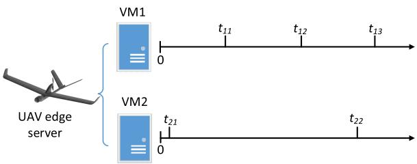

flowchart

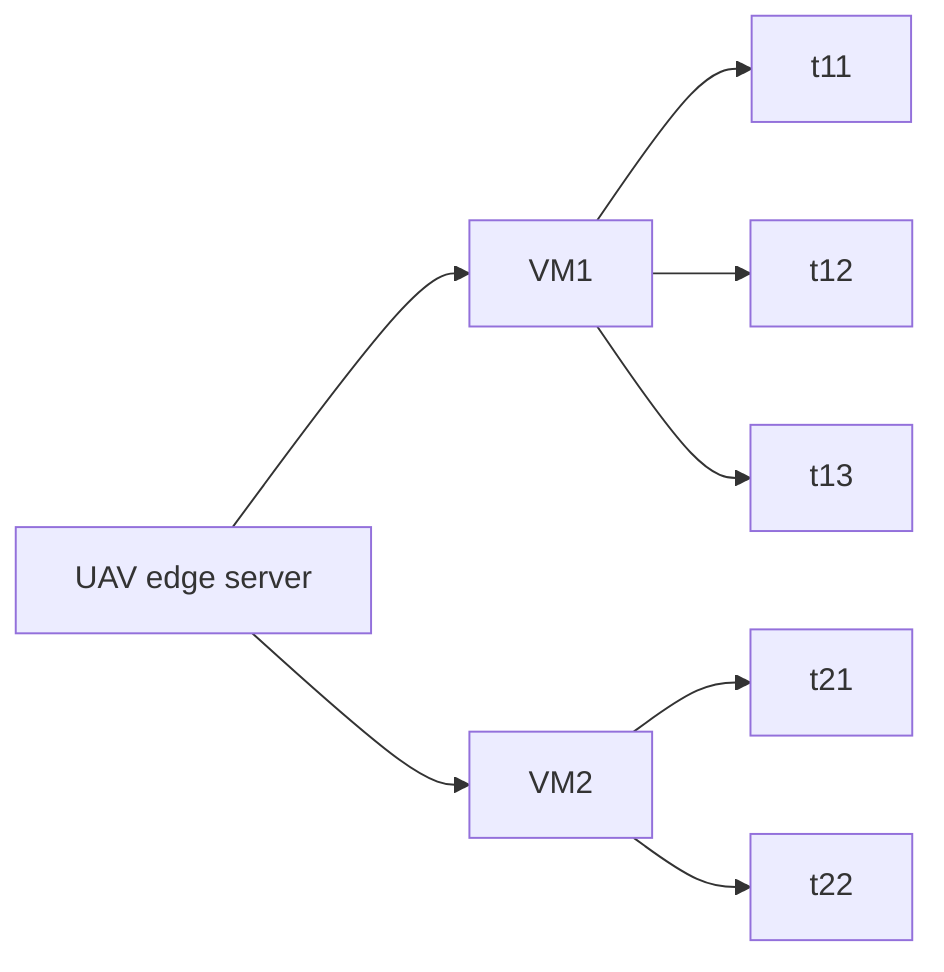

Fig. 2. An example of joint VM allocation and task scheduling for UAV edge server.

with the UAV quickly, and thus executing such tasks may lead to excessive resource allocated to the corresponding VM. For example, in Fig. 2, two VMs are considered to execute the offloaded tasks to the UAV edge server, and $t _ { i , j }$ is the delay requirement of task $j$ in VM i. We can see that the delay requirement $t _ { 2 , 1 }$ is very strict and a larger amount of computation resource should be allocated to VM2 to finish the corresponding task before deadline. However, since the total computation resource of an edge server is fixed, it is likely that little resource allocated to VM1, and none of the three tasks in VM1 can be finished in time. Therefore, we jointly optimize the VM allocation and task scheduling in the UAV edge server to reduce the system sum delay.

In the considered problem, there are multiple kinds of applications (Apps), denoted by $\mathcal { A } = \{ 1 , \ldots , N \}$ , and one = 1UAV edge server with computation capability C cycles/s.1 For m-th App, there might be multiple offloaded tasks, denoted by $T _ { m } = \{ 1 , \dots , N _ { m } \}$ , which has same computation workload = 1but different maximum delay requirements. Note that $Z _ { m }$ denotes the computation workload of m-th App’s tasks. $\mathbf { C } =$ $\{ c _ { m } \mid m \in { \mathcal { A } } \}$ denotes the computation resource variables, where $c _ { m }$ is the computation resource allocated to the VM executing App m. $\textbf { Y } = \ \{ y _ { m , n } \ | \ m \in A , n \in T _ { m } \}$ denotes the =decision variables on task execution, where $y _ { m , n } ~ = ~ 1 ~ \mathrm { i f }$ task n of App m is scheduled and executed, and $y _ { m , n } = 0$ = 0otherwise. Therefore, our sum delay minimization problem can be formulated as follows.

$$
\min _ {\mathbf {C}, \mathbf {Y}} \sum_ {m = 1} ^ {N} \sum_ {n = 1} ^ {N _ {m}} \left[ y _ {m, n} \sum_ {k = 1} ^ {n} y _ {m, k} \frac {Z _ {m}}{c _ {m}} + \varepsilon (1 - y _ {m, n}) \right]
$$

$$
\text { s.t.   C1: } \quad \sum_ {k = 1} ^ {n} y _ {m, k} \frac {Z _ {m}}{c _ {m}} \leqslant t _ {m, n}, \quad \forall m \in \mathcal {A}, \forall n \in \mathcal {T} _ {m}
$$

$$
\text { C2: } \quad \sum_ {m = 1} ^ {M} c _ {m} \leqslant \mathcal {C}
$$

$$
\mathrm{C3:} c _ {m} \geqslant 0
$$

$$
\text { C4: } \quad y _ {m, n} \in \{0, 1 \}, \quad \forall m \in \mathcal {A}, \forall n \in \mathcal {T} _ {m} \tag {14}
$$

where $t _ { m , n }$ is the delay requirement of task n of App m and ε is the length of the time slot. $t _ { m , n }$ can be calculated by

$$
t _ {m, n} = \min (t _ {l c}, \varepsilon) \tag {15}
$$

where $t _ { l c }$ is the time when the user who offloads this task loses connection with the UAV. C1 restricts the maximum delay for

1Here we use C instead of $\mathcal { C } ^ { e }$ for simplicity.

each task if it is executed at current time slot. C2 limits that the total computation resources of VMs cannot exceed C.

It can be seen that Problem (14) is a mixed-integer programming that is difficult to solve. It involves the continuous variable C and 0-1 integer variable Y. Even though we assume C is known, the residual subproblem is still a quadratic problem with 0-1 integer constraints, which is NP-hard with non-definite matrix [28], [29]. This problem is commonly reformulated by specific relaxation approach and then solved by powerful convex optimization techniques. However, this method performs extensive iterations and reveals little insight about scheduling policy. Thus, we are motivated to design an efficient low-complexity algorithm to obtain the suboptimal solution. In the proposed VM allocation and task scheduling algorithm, we assume for each VM m, the delay requirements for $N _ { m }$ tasks have been sorted, i.e., $t _ { m , n } \leq t _ { m , n + 1 }$ . At the beginning, we try to allocate $c _ { m }$ as if all tasks had been scheduled, i.e., $y _ { m , n } = 1 , \forall m \in A , \forall n \in T _ { m }$ . The allocation results would be

$$
c _ {m} = \min \{\frac {n Z _ {m}}{t _ {m , n}} \}, \forall m \in \mathcal {A}, \forall n \in \mathcal {T} _ {m}. \tag {16}
$$

Given the allocation results, $\textstyle \operatorname { i f } \sum _ { m = 1 } ^ { M } c _ { m } > { \mathcal { C } } .$  m=1 cm > C, it means not all tasks can be scheduled. Therefore, we choose not to schedule the task with the most harsh delay requirement, i.e., let

$$
y _ {m, n} = 0, \tag {17}
$$

where

$$
m, n = \underset {m, n} {\arg \max} \frac {n Z _ {m}}{t _ {m , n}}, \forall m \in \mathcal {A}, \forall n \in \mathcal {T} _ {m}. \tag {18}
$$

Then, we calculate the VM allocation $c _ { m }$ again. Repeat this process until the condition $\textstyle \sum _ { m = 1 } ^ { M } c _ { m } \leq { \mathcal { C } }$ is satisfied, and the VM allocation $c _ { m }$ and task scheduling Y is obtained. Note that for a generic Y, the VM allocation is calculated by

$$
c _ {m} = \min \{\frac {\sum_ {n} y _ {m , n} Z _ {m}}{t _ {m , n}} \}, \forall m \in \mathcal {A}, \forall n \in \mathcal {T} _ {m}, \tag {19}
$$

and the unscheduled task selection is calculated by

$$
m, n = \underset {m, n} {\arg \max} \frac {\sum_ {n} y _ {m , n} Z _ {m}}{t _ {m , n}}, \forall m \in \mathcal {A}, \forall n \in \mathcal {T} _ {m}. \tag {20}
$$

The full algorithm of edge server VM allocation and task scheduling is shown in Algorithm 1. From the algorithm, we can see that the worst case (the cloud cannot finish any offloaded task in time) requires $N ^ { \prime } ( N ^ { \prime } + 1 ) / 2$ comparisons where $N ^ { \prime }$ ( + 1) 2is the number of total offloaded tasks to the UAV edge server. Even the worst case complexity $O ( N ^ { \prime 2 } )$ is very ( )low, and therefore the proposed algorithm can work efficiently in the dynamic SAGIN environment.

# V. COMPUTATION OFFLOADING PROBLEM FORMULATION

We design an online computing offloading approach for the SAG-IoT system, in which at each time slot the computing tasks of IoT devices are scheduled to process locally, offloaded to the UAV edge server, or offloaded to the cloud server through the satellite, in order to minimize the total system cost in terms of the delay of the tasks, the energy consumption of the IoT users, and the edge and cloud server usage costs. This can be achieved by modeling the computing offloading decisions as an MDP.

Algorithm 1 VM Allocation and Task Scheduling in Edge Server 

<table><tr><td>1: Input:  $\mathcal{C}$ ,  $\mathcal{T}_{m}$ ,  $t_{m,n}$ ,  $\varepsilon$ .</td></tr><tr><td>2: Output: VM allocation  $c_{m}$ , task scheduling Y.</td></tr><tr><td>3: Initialize  $y_{m,n} = 1$   $\forall m, n$ , and  $c_{m}$  according to (19).</td></tr><tr><td>4: while  $\sum_{m=1}^{M} c_{m} > \mathcal{C}$  do</td></tr><tr><td>5: Update  $y_{m,n}$  according to (17) and (20).</td></tr><tr><td>6: Update  $c_{m}$  according to (19).</td></tr><tr><td>7: end while</td></tr><tr><td>8: return</td></tr></table>

An MDP is defined by a tuple $( S , A , T , R )$ , where S is ( )the set of possible system states, A is the set of actions, $\boldsymbol { T } ~ = ~ \{ p ( s ^ { \prime } | s , a ) \}$ is the set of transition probabilities, and $R : S \times A \mapsto \Re$ is a real-value reward (or cost) function :when the system is at state $s \in \textbf { S }$ and an action $a \in A$ is taken. A policy π is a mapping from S to A. The MDP of the SAG-IoT computing offloading problem is defined as follows.

1) States: at the beginning of time slot t, the network state is defined as ${ \bf M } ( t ) \otimes { \bf T } ^ { r } ( t ) \otimes { \bf P } { \bf L } ( t ) \otimes { \bf P } { \bf L } ( t - 1 ) \otimes { \bf P } { \bf L } ( t - 2 ) \otimes \cdot \cdot \cdot \otimes$ $\mathbf { P L } ( t - t _ { q } )$ ( ), where $\mathbf { T } _ { r } ^ { l } ( t ) = \{ t _ { 1 } ^ { l } ( t ) , t _ { 2 } ^ { l } ( t ) , \ldots t _ { M } ^ { l } ( t ) \}$ 2)} represents ( ) ( ) = ( ) ( ) ( )the remaining time for each user to complete locally processing tasks, and $\mathbf { P L } ( t ) = \{ P L _ { 1 } ( t ) , P L _ { 2 } ( t ) , . . . , P L _ { M } ( t ) \}$ is the vector of pathloss values of all users to their associated UAV. The system state includes the pathloss information of the current and the previous $t _ { q }$ time slots in order to learn and predict the pathloss information.   
2) Actions: at the beginning of time slot t, the system takes the action of scheduling the tasks of the users, i.e., to determine the matrices ${ \bf X } _ { l } ( t ) , { \bf X } _ { e } ( t )$ , and ${ \bf X } _ { c } ( t )$ , or equally, to determine $x _ { i j } ^ { l } , \ x _ { i j } ^ { e } ,$ ( and $x _ { i j } ^ { c } , \ \forall i , j$ ( ). Therefore, we denote $a ( t ) = \{ \mathbf { X } _ { l } ( t ) , \mathbf { \check { X } } _ { e } ( \acute { t } ) , \mathbf { X } _ { c } ( t ) \}$ . Clearly, at time slot 0, there ( )are $\mathbf { \Phi } _ { 4 } M N$ ( ) ( ) ( )possible actions, which is a very large number when 4M and N are large.   
3) Transition probability: since the UAV-user pathloss is not affected by the actions, the system transition probability can be calculated by

$$
p (s _ {t + 1} | s _ {t}, a _ {t}) = p (\mathbf {P L} (t + 1) | \mathbf {P L} (t)) \cdot (\mathbf {T} _ {r} ^ {l} (t + 1) | \mathbf {T} _ {r} ^ {l} (t), a _ {t})
$$

$$
\cdot p (\mathbf {M} (t + 1) | \mathbf {M} (t), a _ {t}). \tag {21}
$$

Specifically, if the UAV trajectory and the flying speed are planned to be fixed, $p ( \mathbf { P L } ( t + 1 ) | \mathbf { P L } ( t ) )$ is 1 with a specific $\mathbf { P L } ( t + 1 )$ ( ( + 1) ( ))and 0 otherwise. However, due to the uncertainties ( + 1)in the UAV mobility, $p ( \mathbf { P L } ( t + 1 ) | \mathbf { P L } ( t ) )$ will be difficult to model. $\mathbf { T } _ { r } ^ { l } ( t + 1 )$ ( ( + 1)can be calculated by

$$
T _ {r, i} ^ {l} (t + 1) = \max \{T _ {r, i} ^ {l} (t) + \sum_ {j = 1} ^ {N} x _ {i j} ^ {l} (t) \frac {Z _ {j}}{\mathcal {C} ^ {l}} - \varepsilon , 0 \}. \tag {22}
$$

For $p ( \mathbf { M } ( t + 1 ) | \mathbf { M } ( t ) , a _ { t } )$ , it is difficult to model accurately. ( ( + 1) ( ) )For example, if a task is offloaded to a UAV edge server, whether the task can be complete within the time slots depends on the UAV data transmission rate, UAV computation resource allocation, other users’ decision, and UAV mobility, which are dynamic and correlated.

4) Reward: To minimize the weighted sum of delay, energy, and server usage cost, we use the cost function $C ( s _ { t } , a _ { t } ) =$ $\begin{array} { r } { \sum _ { i j } C _ { i , j } ( s _ { t } , a _ { t } ) } \end{array}$ at time slot t, where $C _ { i , j } ( s _ { t } , a _ { t } )$ ( ) =is the cost ( )function of task $W _ { i j }$ ( ), which is calculated in the following way.

1) if $m _ { i j } ( t ) = 0$ , the task has already completed, and thus $C _ { i j } ( s _ { t } , a _ { t } ) = 0$ .   
2) if $m _ { i j } ( t ) = 1$ and $x _ { i j } ^ { l } + x _ { i j } ^ { e } + x _ { i j } ^ { c } = 0 .$ , the task is ( ) = 1 + + = 0not scheduled in this time slot, and thus a delay of ε is introduced. We define the cost function $C _ { i j } ( s _ { t } , a _ { t } ) =$ $\varpi _ { i } \varepsilon$ , where $\varpi _ { i }$ is user $i \mathrm { \ ' } _ { \mathrm { s } }$ ( weight on the delay.   
3) if $m _ { i j } ( t ) = 1$ and $x _ { i j } ^ { l } + x _ { i j } ^ { e } + x _ { i j } ^ { c } = 1 , C _ { i j } ( s _ { t } , a _ { t } ) =$ $\begin{array} { r } { \varpi _ { i } ( x _ { i j } ^ { \bar { l } } ( T _ { i j } ^ { l } - \varepsilon t ) + x _ { i j } ^ { e } ( T _ { i j } ^ { e } - \bar { \varepsilon t } ) + x _ { i j } ^ { c } ( T _ { i j } ^ { l } - \varepsilon t ) ) + x _ { i j } ^ { l } L _ { i j } ^ { l } + } \end{array}$ $x _ { i j } ^ { e } L _ { i j } ^ { e } + \bar { x } _ { i j } ^ { c } L _ { i j } ^ { l }$ +.

+Define the value function V of state s as the expected longterm discounted cost starting from s with policy π, i.e.,

$$
V (s | \pi) = \mathbb {E} \left[ \sum_ {t = 0} ^ {\infty} \gamma^ {t} C (s _ {t}, a _ {t}) | s _ {0} = s, \pi \right], \tag {23}
$$

where $\gamma \in [ 0 , 1 ]$ is a discount factor, and the expectation is [0 1]taken over all possible state trajectories starting from s. The online computing offloading approach is to select an optimal policy $\pi ^ { * }$ , which minimizes the value function of each state, i.e.,

$$
\pi^ {*} (s) = \underset {a} {\arg \min} \sum_ {s ^ {\prime}} p (s ^ {\prime} | s, a) [ C (s, a) + \gamma V (s ^ {\prime} | \pi^ {*})) ]. \tag {24}
$$

# VI. RL-BASED OFFLOADING DECISION MAKING

In problem (24), the reward function and transition probabilities are difficult to model accurately due to the UAV mobility and dynamic VM allocation of UAV edge servers. In addition, with the increasing system scale, i.e., M and $N ,$ the exponentially growing system state space makes the system intractable. Therefore, the proposed online computing offloading problem can be solved by model-free RL-based methods, such as Q-learning [30] and policy gradient methods [31]. Although Q-learning methods have shown great potentials in solving RL problems with a large state space, it usually cannot efficiently deal with problems with large or even continuous action spaces, which is the case in problem (24). Therefore, in this paper, we propose an online computing offloading approach for the SAG-IoT system by adapting the policy gradient method.

In the proposed online computing offloading approach, the policy is parameterized by a vector $\pmb { \theta } \in \begin{array} { r l r } { \Re ^ { d } } & { { } \ P ^ { d } } \end{array}$ , i.e., $\pi ( a | s , \pmb \theta ) = P ( a _ { t } = a | s _ { t } = s , \pmb \theta _ { t } = \pmb \theta )$ , for the ( ) = ( = = = )probability that action a is taken when the system is in state s at time t, under the policy with parameter θ. If θ is defined for each feature of the state, i.e., each element in $M ( t )$ , $T ^ { r } ( t )$ , and $P L ( t )$ , the length of vector θ is $M ( N + t _ { q } + 2 )$ . ( ) ( ) ( + + 2)To learn the policy parameter, we first define the performance measure of θ, which is denoted by J θ . Since the online computing offloading problem is episodic (an episode ends when all M N tasks are finished), we define the performance measure as the total discounted cost of the episode of computing all tasks. Denote by τ a trace of state-action sequence $s _ { 0 } , a _ { 0 } , s _ { 1 } , a _ { 1 } , s _ { t _ { m a x } } , a _ { t _ { m a x } }$ in an episode following $\pi ( \cdot | \cdot , \theta ) .$ , where $t _ { m a x }$ ( )denotes the preset value indicating the possible maximum number of time slots for processing all tasks. Then, we can have $J ( \theta )$ as the value function of the start state $s _ { \mathrm { 0 } } \colon$

$$
J (\boldsymbol {\theta}) \doteq V _ {\pi_ {\boldsymbol {\theta}}} (s _ {0}) = \mathbb {E} _ {\pi_ {\boldsymbol {\theta}}} [ \sum_ {k = 0} ^ {t _ {m a x}} \gamma^ {k} C (s _ {k}, a _ {k}) | \pi (\cdot | \cdot , \boldsymbol {\theta}) ]. \tag {25}
$$

To learn the policy parameter θ which minimizes $J ( \theta )$ , intu-( )itively, we can use the gradient descent method to gradually update θ by

$$
\boldsymbol {\theta} _ {t + 1} = \boldsymbol {\theta} _ {t} - \varphi \nabla J (\boldsymbol {\theta} _ {t}). \tag {26}
$$

where ϕ represents the learning rate. According to the policy gradient theorem [32], we have

$$
\begin{array}{l} \nabla J (\boldsymbol {\theta} _ {t}) = \mathbb {E} _ {\pi} [ \sum_ {a} q _ {\pi} (s _ {t}, a) \nabla_ {\boldsymbol {\theta}} \pi (a | s _ {t}, \boldsymbol {\theta}) ] \\ = \mathbb {E} _ {\pi} [ \sum_ {a} \pi (a | s _ {t}, \boldsymbol {\theta}) q _ {\pi} (s _ {t}, a) \frac {\nabla_ {\boldsymbol {\theta}} \pi (a | s _ {t} , \boldsymbol {\theta})}{\pi (a | s _ {t} , \boldsymbol {\theta})} ] \\ = \mathbb {E} _ {\pi} [ q _ {\pi} (s _ {t}, a _ {t}) \frac {\nabla_ {\boldsymbol {\theta}} \pi (a _ {t} | s _ {t} , \boldsymbol {\theta})}{\pi (a _ {t} | s _ {t} , \boldsymbol {\theta})} ] \\ = \mathbb {E} _ {\pi} [ G _ {t} \frac {\nabla_ {\boldsymbol {\theta}} \pi (a _ {t} | s _ {t} , \boldsymbol {\theta})}{\pi (a _ {t} | s _ {t} , \boldsymbol {\theta})} ]. \tag {27} \\ \end{array}
$$

Note that $q _ { \pi } ( s , a )$ is the state-action value function for policy π, and $G _ { t } = C _ { t } + \gamma C _ { t + 1 } + \gamma ^ { 2 } \ C _ { t + 2 } . \nonumber$ . is the discounted = + +return of cost. Using the above, we can then update θ by

$$
\boldsymbol {\theta} _ {t + 1} = \boldsymbol {\theta} _ {t} - \varphi G _ {t} \frac {\nabla_ {\boldsymbol {\theta}} \pi (a _ {t} | s _ {t} , \boldsymbol {\theta})}{\pi (a _ {t} | s _ {t} , \boldsymbol {\theta})}. \tag {28}
$$

However, although such a update method (which is referred to as REINFORCE method [33]) can converge to a local minimum asymptotically, it usually leads to high variance and learns slowly. In the online SAG-IoT computing offloading, both state space and action space are large, and therefore REINFORCE method may not be suitable. To further improve the learning performance, we thus employ the actor-critic method in which the approximations to both policy and value functions are learned [34]. In actor-critic method, the policy is updated in each time slot instead of every episode of the computing offloading. Therefore, the number of samples required to learn the optimal policy can be reduced dramatically, which accelerates the learning process. To achieve this, we need to learn the value function and use it as a critic to guide the update of policy at each time slot. Specifically, denote by $\hat { V } ( s _ { t } , \omega )$ the estimation of the value function of state $s _ { t }$ , where $\omega \in \Re ^ { m }$ is the parameter vector to fit the value function. Then, in each time slot t, the update of θ can be done by

$$
\boldsymbol {\theta} _ {t + 1} = \boldsymbol {\theta} _ {t} - \varphi (C _ {t} + \gamma \hat {V} (s _ {t + 1}, \boldsymbol {\omega}) - \hat {V} (s _ {t}, \boldsymbol {\omega})) \frac {\nabla_ {\boldsymbol {\theta}} \pi (a _ {t} | s _ {t} , \boldsymbol {\theta})}{\pi (a _ {t} | s _ {t} , \boldsymbol {\theta})}. \tag {29}
$$

Note that in each time slot, the parameter vector ω of the estimated value function V is also updated according to

$$
\omega_ {t + 1} = \omega_ {t} - \varphi^ {\prime} \nabla_ {\omega} L (\omega), \tag {30}
$$

where $\varphi ^ { \prime }$ is the learning rate, and the loss function $L ( \omega )$ is defined as

$$
L (\boldsymbol {\omega}) = | \hat {V} (s _ {t}, \boldsymbol {\omega}) - (C _ {t} + \gamma \hat {V} (s _ {t + 1}, \boldsymbol {\omega})) | ^ {2}. \tag {31}
$$

Finally, motivated by the capability of deep neural networks to approximate complex functions, we employ deep learning architecture to learn the policy in terms of θ and the estimated state-value function. The full proposed online computing offloading approach for SAT-IoT is shown in Algorithm 2, where $\varphi$ and $\varphi ^ { \prime }$ are learning rates for the actor and the critic, respectively.

Algorithm 2 Deep Actor-Critic Based Online Computing Offloading   
1: Input: IoT user information: location, $C^{l}$ , $E^{l}$ , $E_{i}^{e}$ , $E_{i}^{e-}$ and $E_{i}^{c}$ UAV edge server information: mobility traces, $C_{v}^{e}$ , $B_{ij}^{e}$ , B Cloud related information: $r_{SG}$ , $r_{SC}$ , $C_{c}$ , $B_{ij}^{c}$ Task information: $H^{in}$ , $H^{out}$ , Z

2: Output: Optimal computing offloading decision $X(t)$ 3: Randomly initialize critic network $\hat{V}(s,\omega)$ and actor network $\pi(s,a|\boldsymbol{\theta})$ 4: for episode = 1, G do

5: Initialize a random vector N as the noise for action exploration

6: Observe the initial state $s_{1}$ 7: for time slot $t = 1$ , $t_{max}$ do

8: select action $a_{r,t} = \pi(s|\boldsymbol{\theta}) + \mathcal{N}_{t}$ 9: execute $a_{t}$ and observe the cost $C_{t}$ and state $s_{t+1}$ 10: $\eta \leftarrow C_{t} + \gamma\hat{V}(s_{t+1},\omega) - \hat{V}(s_{t},\omega)$ 11: update $\omega \leftarrow \omega - \varphi'\eta\nabla_{\omega}\hat{V}(s_{t},\omega)$ 12: update $\theta \leftarrow \theta - \varphi\eta\gamma^{t}\frac{\nabla_{\theta}\pi(a_{t}|s_{t},\boldsymbol{\theta})}{\pi(a_{t}|s_{t},\boldsymbol{\theta})}$ 13: end for

14: end for

15: return

The implementation of the proposed RL-based offloading approach is shown in Fig. 3, which is composed of the SAGIN environment, the computing offloading reward evaluator, an actor network, a critic network, and a temporaldifference component. The system state can be observed from the current SAGIN environment, which is then sent to the input of the actor network and the critic network. The actor network generates the action a according to $a = \pi _ { \theta } ( s )$ , and updates = ( )the policy θ. It can be easily seen that at time slot $t ,$ for an arbitrary task $W _ { i j }$ , the decision $x _ { i j } ( t )$ has four possibilities, ( )i.e., not scheduled, process locally, offload to edge, and offload to cloud. Therefore, we map these four possible decisions of to $x _ { i j }$ integer 0, 1, 2, 3 respectively, and design two output layers of the actor network, i.e., σ and $\mu ,$ which can compose $M \times N$ normal distributed random variables to represent the actions of each task. The critic network estimates the value function $\hat { V } ( s _ { t } , \omega )$ and updates the parameter $\omega .$ The reward ( )of a state-action pair is evaluated by the reward evaluator, and is used to calculate the temporal-difference (TD) $\eta \ : = \ :$ $C _ { t } + \gamma \hat { V } ( s _ { t + 1 } , \omega ) - \hat { V } ( s _ { t } , \omega )$ =, which is used in the update of + ( ) ( )the policy parameter θ and the critic network parameter $\omega .$ .

TABLE II SIMULATION PARAMETERS 

<table><tr><td>Parameter</td><td>Value</td><td>Parameter</td><td>Value</td></tr><tr><td>M</td><td>30</td><td>N</td><td>5</td></tr><tr><td> $\mathcal{C}^l$ </td><td>200 MC/s</td><td> $E^l$ </td><td>141 mW</td></tr><tr><td> $\mathcal{C}^e$ </td><td>3 GC/s</td><td> $E^e,E^{e-},E^c$ </td><td>200 mW</td></tr><tr><td> $\mathcal{C}^c$ </td><td>10 GC/s</td><td>B</td><td>20 MHz</td></tr><tr><td>h</td><td>90 m</td><td> $r_{SG}$ </td><td>10 Mbps</td></tr><tr><td>α</td><td> $10^{-10}$  J/cycle</td><td> $r_{SC}$ </td><td>10 Mbps</td></tr><tr><td>β</td><td> $4\times 10^{-10}$  J/cycle</td><td> $\varpi_i$ </td><td>0.2 J/s</td></tr></table>

# VII. PERFORMANCE EVALUATION

# A. Simulation Configurations

In this section, we evaluate the proposed joint VM resource allocation and task scheduling scheme for the UAV edge server, and the RL-based online computing offloading approach for SAG-IoT system. In the simulation, we consider a remote  km ×  km square area with $M ~ = ~ 3 0$ IoT 1 1 =users fixed deployed in this area. The IoT user runs $N = 5$ = 5different applications and thus each user has 5 tasks to process. We select ARM Cortex-M based IoT devices as the ground users. Referring to [35] and [36], we set the IoT device computing capability $\mathcal { C } ^ { l }$ to  MC/s $( \mathbf { M C } = 1 0 ^ { 6 }$ cycles), and 200 = 10the energy consumption for local task processing is 141 mW. $\mathrm { A s }$ defined in [37], the transmission and reception power of IoT users with UAVs and satellites, i.e., Ee, $E ^ { e - }$ , and $E ^ { c }$ are set to 200 mW. 5 UAVs are serving as the flying edge servers for the IoT computing. UAV movement trajectories are planned to maximize the minimum throughput which follows Wu et $a l . \mathrm { \ ' } _ { \mathrm { s } }$ work [38] with adopting practical UAV-ground propagation channels (1). Referring to [39], the edge server’s computation resource $\mathcal { C } ^ { e }$ is set to  GC/s $( \mathbf { G C } = 1 0 ^ { 9 }$ cycles), while the cloud server’s computation resource assigned to each task, $\mathrm { i . e . , } \mathcal { C } ^ { c }$ , is set to  GC/s. For satellite and remote cloud, we consider within one episode of computing offloading, there is one LEO satellite providing the full coverage to the area, and the satellite-ground communication rate $r _ { S G }$ is set to 10 Mbps which is the average observed transmission rate in the high throughput satellite communication system ViaSat-1. The satellite-cloud data rate is also constrained by the satelliteground transmission rate, and therefore we set $r _ { S C } = r _ { S G } =$ = = Mbps. Different computation tasks may have different 10computation to data ratios; however, for the simulation simplicity we choose x264 VBR encode computation to data ratio, which is 1300 cycles/byte, i.e., $Z = 1 3 0 0 H ^ { i n }$ [40]. $H _ { j } ^ { i n }$ and $H _ { j } ^ { o u t }$ = 1300are randomly chosen between 5 MB and 15 MB, and between 1 MB and 5 MB, respectively. We set the usage cost of edge server/cloud server, i.e., $B _ { i j } ^ { e }$ and $B _ { i j } ^ { c }$ to the CPU cycles to execute tasks $W _ { i j }$ , i.e., $W _ { i j } \ ' \mathrm { s }$ s workload. In addition, $\alpha = 1 0 ^ { - 1 0 }$ J/cycle, $\beta = \hat { 4 } \times 1 0 ^ { - 1 0 }$ J/cycle, and $\varpi _ { i } = 1$ J/s = 10 = 4 10 = 1for each user i. The detailed simulation parameters are shown in Table. II unless otherwise specified.

# B. VM Computing Resource Allocation and Task Scheduling

We first evaluate the proposed VM computing resource allocation and task scheduling algorithm. We compare the heuristic algorithm with ‘Brute-force’ method and ‘Random’ method. In ‘Brute-force’, exhaustive search is used to find the optimal unscheduled tasks, which achieves the upperbound performance but is with high computing complexity. In ‘Random’, unscheduled tasks are randomly selected.

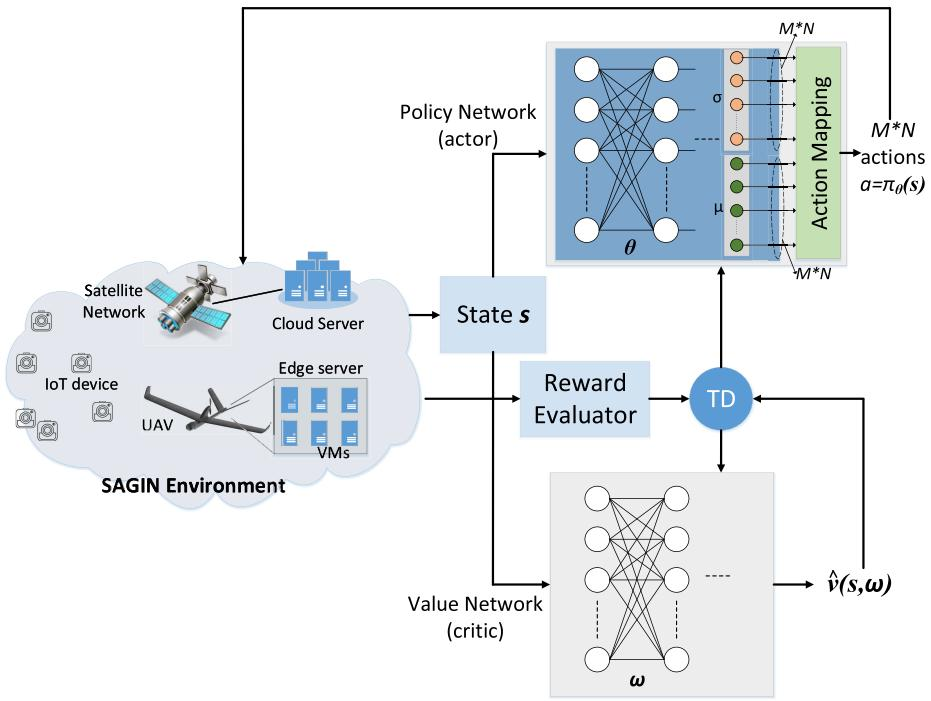

flowchart

```mermaid
graph TD
    A["SAGIN Environment"] --> B["Satellite Network"]
    A --> C["Cloud Server"]
    A --> D["Edge server VMs"]
    A --> E["IoT device"]
    A --> F["UAV"]
    B --> G["State s"]
    C --> G
    D --> G
    E --> G
    F --> G
    G --> H["Policy Network (actor)"]
    H --> I["Action Mapping"]
    I --> J["M*N actions a=π₀(s)"]
    I --> K["M*N"]
    I --> L["θ"]
    I --> M["μ"]
    I --> N["σ"]
    I --> O["σ"]
    I --> P["σ"]
    I --> Q["σ"]
    I --> R["σ"]
    I --> S["σ"]
    I --> T["σ"]
    I --> U["σ"]
    I --> V["σ"]
    I --> W["σ"]
    I --> X["σ"]
    I --> Y["σ"]
    I --> Z["σ"]
    I --> AA["σ"]
    I --> AB["σ"]
    I --> AC["σ"]
    I --> AD["σ"]
    I --> AE["σ"]
    I --> AF["σ"]
    I --> AG["σ"]
    I --> AH["σ"]
    I --> AI["σ"]
    I --> AJ["σ"]
    I --> AK["σ"]
    I --> AL["σ"]
    I --> AM["σ"]
    I --> AN["σ"]
    I --> AO["σ"]
    I --> AP["σ"]
    I --> AQ["σ"]
    I --> AR["σ"]
    I --> AS["σ"]
    I --> AT["σ"]
    I --> AU["σ"]
    I --> AV["σ"]
    I --> AW["σ"]
    I --> AX["σ"]
    I --> AY["σ"]
    I --> AZ["σ"]
    I --> BA["σ"]
    I --> BB["σ"]
    I --> BC["σ"]
    I --> BD["σ"]
    I --> BE["σ"]
    I --> BF["σ"]
    I --> BG["σ"]
    I --> BH["σ"]
    I --> BI["σ"]
    I --> BJ["σ"]
    I --> BK["σ"]
    I --> BL["σ"]
    I --> BM["σ"]
    I --> BN["σ"]
    I --> BO["σ"]
    I --> BP["σ"]
    I --> BQ["σ"]
    I --> BR["σ"]
    I --> BS["σ"]
    I --> BT["σ"]
    I --> BU["σ"]
    I --> BV["σ"]
    I --> BW["σ"]
    I --> BX["σ"]
    I --> BY["σ"]
    I --> BZ["σ"]
    I --> CA["σ"]
    I --> CB["σ"]
    I --> CC["σ"]
    I --> CD["σ"]
    I --> CE["σ"]
    I --> CF["σ"]
    I --> CG["σ"]
    I --> CH["σ"]
    I --> CI["σ"]
    I --> CJ["σ"]
    I --> CK["σ"]
    I --> CZ["σ"]
    I --> DA["σ"]
    I --> DB["σ"]
    I --> DC["σ"]
    I --> DD["σ"]
    I --> DE["σ"]
    I --> DF["σ"]
    I --> DG["σ"]
    I --> DH["σ"]
    I --> DI["σ"]
    I --> DJ["σ"]
    I --> DK["σ"]
    I --> DL["σ"]
    I --> DV["σ"]
    I --> DW["σ"]
    I --> DX["σ"]
    I --> DY["σ"]
    I --> DBD["SDT"]
    D --> DT["Reward Evaluator"]
    DT --> DU["TD"]
    DU <--> DV
```

Fig. 3. RL-based computing offloading approach. The proposed approach implements two components, i.e., one actor network to update the policy, and one critic network to evaluate the value function and guide the update of offloading policy.

Fig. 4 shows the delay performance of the proposed algorithm. In Fig. 4(a), the average delay with respect to the UAV edge server computing resource $\mathcal { C } ^ { e }$ is shown. We can see from the figure that with the increase of Ce, the average delay of the three methods decrease, because with higher computing server capability, the average processing time will be reduced, and thus more tasks can be scheduled to satisfy their delay requirements. In Fig. 4(b), the average delay with respect to the total number of tasks offloaded to the considered edge server is shown, when $\mathcal { C } ^ { e }$ is set to 10 GC. It can be seen that a larger number of tasks lead to increasing average delay, since more tasks contend for the limited computing resources, and fewer tasks can complete in time. In both figures, the proposed heuristic algorithm can achieve a very close performance with that of the ‘Brute-force’ method, which demonstrates the efficiency of the proposed algorithm.

Fig. 5 shows the comparison of the run time between the proposed heuristic algorithm and the ‘Brute-force’ method. We can see from the figure that with the increasing number of total tasks, the run time of ‘Brute-force’ method increases exponentially. This is because ‘Brute-force’ method uses exhaustive search and a larger number of tasks leads to an exponentially growing searching space. In opposite, the run time of the proposed heuristic algorithm remains very small when the number of tasks increases. The zoomed-in run time for the proposed heuristic algorithm shows clearly a quadratic increase on run time when the number of offloaded tasks increase, which validates our analysis in Section IV. To summarize, the proposed VM computing resource allocation and task scheduling algorithm can simultaneously achieve near-optimal performance and very low computational complexity, and therefore is suitable to allocation UAV edge server resources under dynamic network conditions.

# C. Deep RL-Based IoT Computing Offloading

In this part, the performance of the proposed RL-based SAG-IoT computing offloading approach is evaluated and compared. To show the efficiency of our proposed approach, we explicitly compare it with two other computing offloading approaches, i.e., ‘Random’ and ‘Greedy on edge’, which are described as follows.

1) ‘Random’: each task randomly selects a time slot t ∈ $\{ 1 , 2 , \dots , t _ { m a x } \}$ , and an offloading decision (locally, 1 2edge, cloud).   
2) ‘Greedy on edge’: since the edge computing can usually provide a lower computing delay and relatively low price, each user will offload all tasks to the UAV edge server if it is within the coverage of a UAV. Otherwise, the user decides to wait, process locally, or offload to cloud with certain probabilities. In the simulation, we set the probabilities to 0.8, 0.1, and 0.1, respectively.

Fig. 6 shows the convergence performance of the proposed RL-based computing offloading algorithm. The total cost is calculated by the summation of the cost of each task, which is the weighted sum of delay, energy consumption, and server usage cost. It can be seen that the algorithm converges very fast from the fact that at about 10-th episode the algorithm already converges. The high convergence rate stems from the adopted actor-critic algorithm in which the critic network judges and guides the actor network to learn the policy in each time slot, instead of in each episode for non-actor-critic policy gradient methods. The fast convergence of the algorithm can bring many benefits, such as fast reconfiguration if more users and application are deployed, more flexibility in a dynamic environment, and so forth.

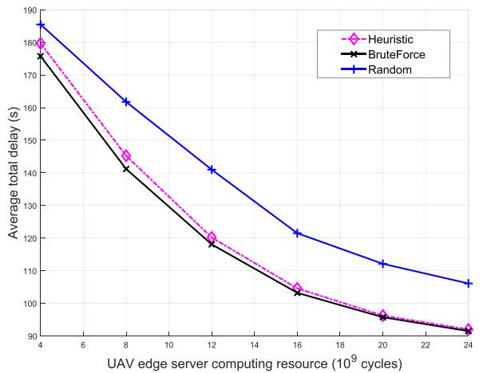

line

| UAV edge server computing resource (10^9 cycles) | Heuristic | BruteForce | Random |
| ------------------------------------------------- | --------- | ---------- | ------ |
| 4                                                 | 180       | 178        | 185    |
| 8                                                 | 145       | 142        | 162    |
| 12                                                | 120       | 118        | 142    |
| 16                                                | 105       | 103        | 122    |
| 20                                                | 97        | 96         | 112    |
| 24                                                | 92        | 92         | 106    |

(a) Average total delay v.s. Ce.

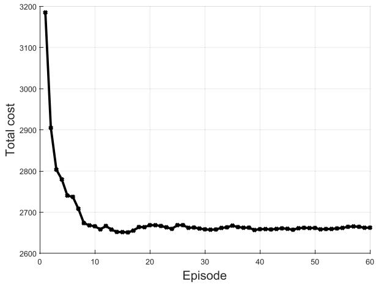

line

| Episode | Total cost |
| ------- | ---------- |
| 0       | 3200       |
| 1       | 2900       |
| 2       | 2800       |
| 3       | 2750       |
| 4       | 2730       |
| 5       | 2710       |
| 6       | 2680       |
| 7       | 2670       |
| 8       | 2665       |
| 9       | 2660       |
| 10      | 2660       |
| 15      | 2660       |
| 20      | 2665       |
| 25      | 2665       |
| 30      | 2665       |
| 35      | 2665       |
| 40      | 2665       |
| 45      | 2665       |
| 50      | 2665       |
| 55      | 2665       |
| 60      | 2665       |

Fig. 6. Convergence performance of our proposed algorithm.

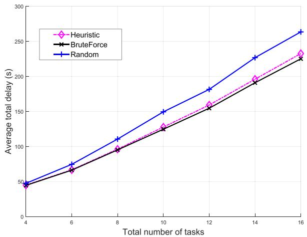

line

| Total number of tasks | Heuristic | BruteForce | Random |
| --------------------- | --------- | ---------- | ------ |
| 4                     | 45        | 45         | 45     |
| 6                     | 65        | 65         | 75     |
| 8                     | 95        | 95         | 110    |
| 10                    | 125       | 125        | 150    |
| 12                    | 160       | 155        | 180    |
| 14                    | 200       | 190        | 225    |
| 16                    | 230       | 220        | 260    |

(b)Average total delay v.s.total number of tasks.

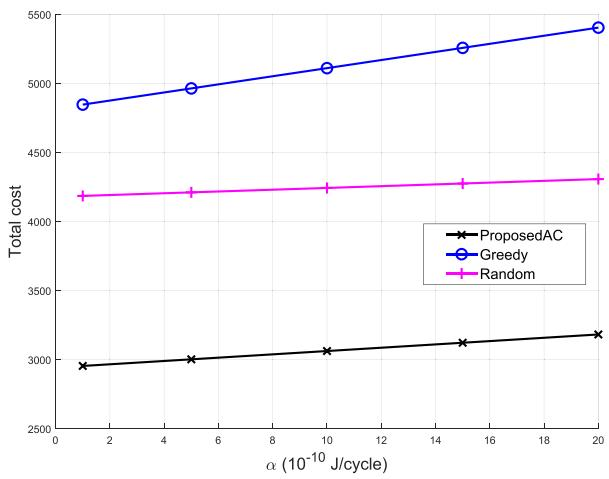

line

| α (10⁻¹⁰ J/cycle) | ProposedAC | Greedy | Random |
| ----------------- | ---------- | ------ | ------ |
| 0                 | 2950       | 4850   | 4150   |
| 5                 | 3000       | 4950   | 4175   |
| 10                | 3050       | 5100   | 4200   |
| 15                | 3100       | 5250   | 4225   |
| 20                | 3150       | 5400   | 4250   |

Fig. 7. Total cost v.s. α.

Fig. 4. Performance of the proposed VM computing resource allocation and task scheduling algorithm.   
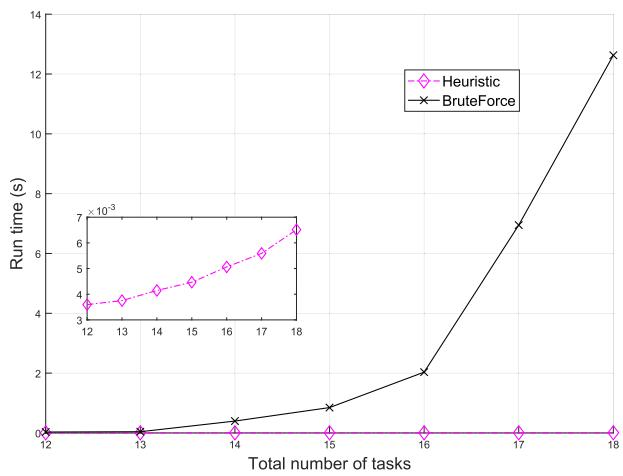

line

| Total number of tasks | Heuristic | BruteForce |
| --------------------- | --------- | ---------- |
| 12                    | 0.0       | 0.0        |
| 13                    | 0.0       | 0.0        |
| 14                    | 0.0       | 0.5        |
| 15                    | 0.0       | 1.0        |
| 16                    | 0.0       | 2.0        |
| 17                    | 0.0       | 7.0        |
| 18                    | 0.0       | 13.0       |

Fig. 5. The run time comparison.

Fig. 7 shows the performance of the proposed computing offloading approach with respect to the UAV server usage cost weight α. It can be seen that the proposed RL-based approach can achieve the lowest total cost than the other approaches since it can learn the optimal offloading policy through interactions with the environments. ‘Greedy’ approach suffers the most total cost among the three approaches. This is because ‘Greedy’ approach forces many tasks content for the UAV channel and edge server computation resources, which increases the times to complete the tasks. In addition, due to the mobility of UAVs, within the time duration in which the task is processing (including the upload, processing, and transmission of the results), the UAV may fly away and the user loses the connection.

In Fig. 8, the main components of the cost, i.e., energy consumption $( E + B \cdot \alpha ( \mathrm { o r } \ \beta ) )$ and weight delay (
T ) are + ( )shown. It can be seen that the proposed computing offloading approach can achieve the lowest energy consumption and the lowest delay due to the learnt optimal offloading policy. The reason that ‘Random’ approach achieves the similar total delay as RL-based scheme is that in RL-based scheme, more energy is consumed in transmitting the tasks to the satellite, and in Random scheme, more energy is consumed in locally processing the tasks due to longer local process delay since more tasks are process locally with ‘Random’ approach (as shown in Fig. 10). However, the ‘Greedy’ approach has very high energy consumption and delay, which is due to that failed execution of tasks in UAV edge servers leads to multiple uploads of the same tasks, and thus it consumes a large amount of energy of the IoT devices and leads to prolonged delay.

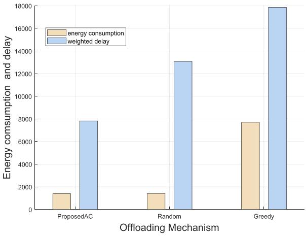

bar

| Offloading Mechanism | energy consumption | weighted delay |
|---|---|---|
| ProposedAC | 1500 | 7900 |
| Random | 1500 | 13100 |
| Greedy | 7800 | 17900 |

Fig. 8. The energy consumption and weighted delay.

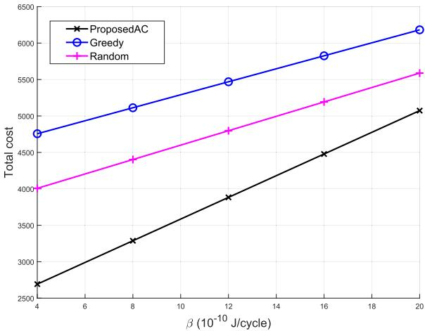

line

| β (10⁻¹⁰ J/cycle) | ProposedAC | Greedy | Random |
| ----------------- | ---------- | ------ | ------ |
| 4                 | 2700       | 4800   | 4000   |
| 8                 | 3300       | 5100   | 4400   |
| 12                | 3900       | 5500   | 4800   |
| 16                | 4500       | 5800   | 5200   |
| 20                | 5100       | 6200   | 5600   |

Fig. 9. Total cost v.s. $\beta .$

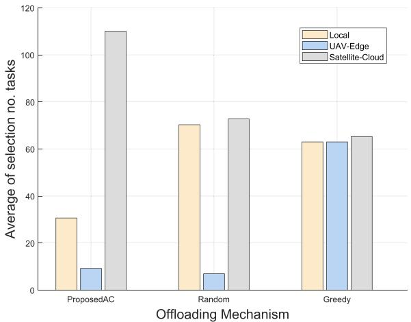

bar

| Offloading Mechanism | Local | UAV-Edge | Satellite-Cloud |
| -------------------- | ----- | -------- | --------------- |
| ProposedAC           | 31    | 9        | 110             |
| Random               | 70    | 7        | 73              |
| Greedy               | 63    | 63       | 65              |

Fig. 10. Offloading means selection.

Fig. 9 shows the total cost with respect to the cloud server usage cost weight β. Comparing the three approaches, it can be seen the proposed RL-based computing offloading approach can achieve the lowest average total cost in an episode. The total cost increases with $\beta$ because the increase of $\beta$ leads to the increase of $\beta  { B ^ { c } }$ which is a component of the total cost. It can also be seen that the total cost of the proposed approach increases faster the other two approaches, which is because in the current setting of the simulation, the satellitecloud offloading can achieve relatively better performance than local processing and UAV, if properly chosen. Therefore, the proposed approach learns the environments and chooses cloud offloading with higher probability. This fact can be seen in Fig. 10, which shows the number of selections of each offloading means for each offloading approach. For the proposed approach, it selects satellite-cloud more frequently over the other two offloading means. Compared to satellitecloud, the local processing results in longer delay due to week local computation capability, while the UAV-edge may suffer the contention problem and high UAV mobility, although it has the benefits of high transmission rate and low server usage cost. The ‘Random’ and ‘Greedy’ approaches select almost the same number of local processing and satellitecloud. The ‘Greedy’ approach selects more times of UAV-edge since it may wait for the future UAV connection with a high probability if the UAV is current unavailable.

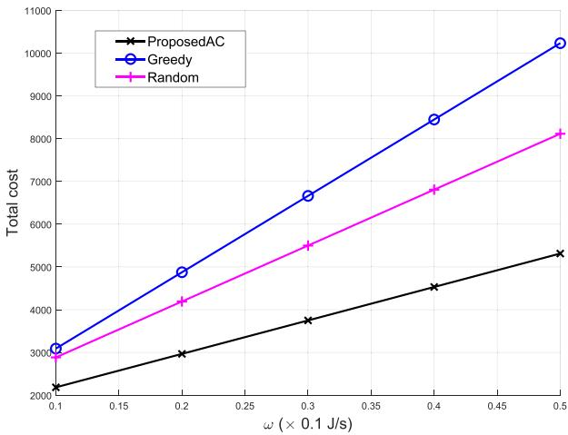

line

| ω (× 0.1 J/s) | ProposedAC | Greedy | Random |
| ------------- | ---------- | ------ | ------ |
| 0.1           | 2200       | 3100   | 2900   |
| 0.2           | 3000       | 4900   | 4200   |
| 0.3           | 3800       | 6700   | 5500   |
| 0.4           | 4600       | 8500   | 6900   |
| 0.5           | 5300       | 10200  | 8100   |

Fig. 11. Total cost v.s. .

Fig. 11 shows the total cost with respect to the weight on the delay, i.e., 
. With the increase of 
, the total cost of all the three offloading approach increase, due to the increase of 
T , which is the delay component of the total cost. However, the proposed offloading approach can achieve the lowest total cost and lower increase rate among the three approaches since it can learn from the environment an optimal policy to reduce the total task delay.

# VIII. CONCLUSION

In this paper, we have investigated the IoT computing offloading problem in SAGIN. We have proposed a joint VM allocation and task scheduling mechanism to efficiently allocate the computing resources to different VMs in the UAV edge server. To offload the computation-intensive tasks, we have proposed an RL-based computing offloading approach to handle the multidimensional SAGIN resources and learns the dynamic network conditions. Deep neural networks, policy gradient, and actor-critic methods have been employed to improve the learning performance. Simulation results have validated the convergency and efficiency of the proposed approaches. Our work can offer valuable insights to the important yet underexplored field of edge/cloud computing in SAGIN. In the future, we will focus on jointly optimizing the communication, caching, and computing resources in SAGIN.

# REFERENCES

[1] M. Shafi et al., “5G: A tutorial overview of standards, trials, challenges, deployment, and practice,” IEEE J. Sel. Areas Commun., vol. 35, no. 6, pp. 1201–1221, Jun. 2017.   
[2] N. Cheng et al., “Big data driven vehicular networks,” IEEE Netw., vol. 32, no. 6, pp. 160–167, Nov./Dec. 2018.   
[3] C. You, K. Huang, and H. Chae, “Energy efficient mobile cloud computing powered by wireless energy transfer,” IEEE J. Sel. Areas Commun., vol. 34, no. 5, pp. 1757–1771, May 2016.   
[4] W. Zhang, Y. Wen, and D. O. Wu, “Collaborative task execution in mobile cloud computing under a stochastic wireless channel,” IEEE Trans. Wireless Commun., vol. 14, no. 1, pp. 81–93, Jan. 2015.   
[5] S. E. Mahmoodi, R. N. Uma, and K. P. Subbalakshmi, “Optimal joint scheduling and cloud offloading for mobile applications,” IEEE Trans. Cloud Comput., to be published.   
[6] Y. Mao, J. Zhang, Z. Chen, and K. B. Letaief, “Dynamic computation offloading for mobile-edge computing with energy harvesting devices,” IEEE J. Sel. Areas Commun., vol. 34, no. 12, pp. 3590–3605, Dec. 2016.   
[7] S. Barbarossa, S. Sardellitti, and P. D. Lorenzo, “Communicating while computing: Distributed mobile cloud computing over 5G heterogeneous networks,” IEEE Signal Process. Mag., vol. 31, no. 6, pp. 45–55, Nov. 2014.   
[8] K. Kumar, J. Liu, Y.-H. Lu, and B. Bhargava, “A survey of computation offloading for mobile systems,” Mobile Netw. Appl., vol. 18, no. 1, pp. 129–140, Feb. 2013.   
[9] Y.-H. Kao, B. Krishnamachari, M.-R. Ra, and F. Bai, “Hermes: Latency optimal task assignment for resource-constrained mobile computing,” IEEE Trans. Mobile Comput., vol. 16, no. 11, pp. 3056–3069, Nov. 2017.   
[10] F. Lyu et al., “SS-MAC: A novel time slot-sharing MAC for safety messages broadcasting in VANETs,” IEEE Trans. Veh. Technol., vol. 67, no. 4, pp. 3586–3597, Apr. 2018.   
[11] C. You, K. Huang, H. Chae, and B.-H. Kim, “Energy-efficient resource allocation for mobile-edge computation offloading,” IEEE Trans. Wireless Commun., vol. 16, no. 3, pp. 1397–1411, Mar. 2017.   
[12] Y. Wu et al., “Secrecy-driven resource management for vehicular computation offloading networks,” IEEE Netw., vol. 32, no. 3, pp. 84–91, May/Jun. 2018.   
[13] J. Liu, Y. Shi, Z. M. Fadlullah, and N. Kato, “Space-air-ground integrated network: A survey,” IEEE Commun. Surveys Tuts., vol. 20, no. 4, pp. 2714–2741, 4th Quart., 2018.   
[14] H. Nishiyama, Y. Tada, N. Kato, N. Yoshimura, M. Toyoshima, and N. Kadowaki, “Toward optimized traffic distribution for efficient network capacity utilization in two-layered satellite networks,” IEEE Trans. Veh. Technol., vol. 62, no. 3, pp. 1303–1313, Mar. 2013.   
[15] Y. Zhou, N. Cheng, N. Lu, and X. Shen, “Multi-UAV-aided networks: Aerial-ground cooperative vehicular networking architecture,” IEEE Veh. Technol. Mag., vol. 10, no. 4, pp. 36–44, Dec. 2015.   
[16] N. Cheng et al., “Air-ground integrated mobile edge networks: Architecture, challenges, and opportunities,” IEEE Commun. Mag., vol. 56, no. 8, pp. 26–32, Aug. 2018.   
[17] Y. Hu and V. O. K. Li, “Satellite-based Internet: A tutorial,” IEEE Commun. Mag., vol. 39, no. 3, pp. 154–162, Mar. 2001.   
[18] M. Patel et al., “Mobile-edge computing introductory technical white paper,” Mobile-edge Comput., Initiative, White Paper, 2014.   
[19] S. Jeong, O. Simeone, and J. Kang, “Mobile edge computing via a UAV-mounted cloudlet: Optimization of bit allocation and path planning,” IEEE Trans. Veh. Technol., vol. 67, no. 3, pp. 2049–2063, Mar. 2018.   
[20] T. H. Dinh, D. Niyato, and N. T. Hung, “Optimal energy allocation policy for wireless networks in the sky,” in Proc. IEEE ICC, Jun. 2015, pp. 3204–3209.   
[21] N. Zhang, S. Zhang, P. Yang, O. Alhussein, W. Zhuang, and X. Shen, “Software defined space-air-ground integrated vehicular networks: Challenges and solutions,” IEEE Commun. Mag., vol. 55, no. 7, pp. 101–109, Jul. 2017.

[22] M. Chen, M. Mozaffari, W. Saad, C. Yin, M. Debbah, and C. S. Hong, “Caching in the sky: Proactive deployment of cache-enabled unmanned aerial vehicles for optimized quality-of-experience,” IEEE J. Sel. Areas Commun., vol. 35, no. 5, pp. 1046–1061, May 2017.   
[23] S. Jagtap, N. Gandhi, and P. Kadam. (2017). Comparative Study of Project Loon and Facebook Aquila. [Online]. Available: http://ijesc. org/upload/4d8ea34db8143025dc7aff3880ed9ba9.Comparative% 20Study%20of%20Project%20Loon%20&%20Facebook%20Aquila.pdf   
[24] W. Quan, Y. Liu, H. Zhang, and S. Yu, “Enhancing crowd collaborations for software defined vehicular networks,” IEEE Commun. Mag., vol. 55, no. 8, pp. 80–86, Aug. 2017.   
[25] W. Shi et al., “Multiple drone-cell deployment analyses and optimization in drone assisted radio access networks,” IEEE Access, vol. 6, pp. 12518–12529, 2018.   
[26] A. Al-Hourani, S. Kandeepan, and S. Lardner, “Optimal LAP altitude for maximum coverage,” IEEE Wireless Commun. Lett., vol. 3, no. 6, pp. 569–572, Dec. 2014.   
[27] R. I. Bor-Yaliniz, A. El-Keyi, and H. Yanikomeroglu, “Efficient 3-D placement of an aerial base station in next generation cellular networks,” in Proc. IEEE ICC, May 2016, pp. 1–5.   
[28] S. Sahni, “Computationally related problems,” SIAM J. Comput., vol. 3, no. 4, pp. 262–279, 1974.   
[29] P. M. Pardalos and S. A. Vavasis, “Quadratic programming with one negative eigenvalue is NP-hard,” J. Global Optim., vol. 1, no. 1, pp. 15–22, 1991.   
[30] H. van Hasselt, A. Guez, and D. Silver, “Deep reinforcement learning with double Q-learning,” in Proc. AAAI, 2016, pp. 1–5.   
[31] R. S. Sutton and F. Bach, Reinforcement Learning—An Introduction. Cambridge, MA, USA: MIT Press, 1998.   
[32] D. Silver, G. Lever, N. Heess, T. Degris, D. Wierstra, and M. Riedmiller, “Deterministic policy gradient algorithms,” in Proc. ICML, 2014, pp. 1–9.   
[33] R. J. Williams, “Simple statistical gradient-following algorithms for connectionist reinforcement learning,” Mach. Learn., vol. 8, nos. 3–4, pp. 229–256, 1992.   
[34] V. Mnih et al., “Asynchronous methods for deep reinforcement learning,” in Proc. ICML, 2016, pp. 1928–1937.   
[35] ARM. (2017). ARM Cortex-M for Beginners. [Online]. Available: https://community.arm.com/cfs-file/\_\_key/telligent-evolutioncomponents-attachments/01-2142-00-00-00-00-52-96/White-Paper-\_2D00\_-Cortex\_2D00\_M-for-Beginners-\_2D00\_-2016-\_2800\_finalv3\_2900\_.pdf   
[36] A. Hussain, “Energy consumption of wireless IoT nodes,” M.S. thesis, Dept. Inf. Secur. Commun. Technol., Norwegian Univ. Sci. Technol., Trondheim, Norway, NTNU, 2017.   
[37] Study on New Radio (NR) to Support Non Terrestrial Networks, document Specification # 38.811, 3GPP, 2018. [Online]. Available: http://www.3gpp.org/DynaReport/38811.htm   
[38] Q. Wu, Y. Zeng, and R. Zhang, “Joint trajectory and communication design for multi-UAV enabled wireless networks,” IEEE Trans. Wireless Commun., vol. 17, no. 3, pp. 2109–2121, Mar. 2018.   
[39] M.-H. Chen, B. Liang, and M. Dong, “Joint offloading and resource allocation for computation and communication in mobile cloud with computing access point,” in Proc. IEEE INFOCOM, May 2017, pp. 1–9.   
[40] A. P. Miettinen and J. K. Nurminen, “Energy efficiency of mobile clients in cloud computing,” in Proc. HotCloud, 2010, pp. 4–11.

natural_image

Portrait photo of a young man in a black shirt (no text or symbols visible)

Nan Cheng (M’16) received the B.E. and M.S. degrees from the Department of Electronics and Information Engineering, Tongji University, and the Ph.D. degree from the Department of Electrical and Computer Engineering, University of Waterloo. He is currently a Joint Professor with the School of Telecommunication, Xidian University. He is also a Joint Post-Doctoral Fellow with the Department of Electrical and Computer Engineering, University of Toronto, and with the Department of Electrical and Computer Engineering, University of Waterloo. His

research interests include performance analysis, MAC, opportunistic communication for vehicular networks, unmanned aerial vehicles, and application of artificial intelligence (AI) for wireless networks.

natural_image

Portrait of a young man with dark hair wearing a gray hoodie, outdoors near water (no text or symbols visible)

Feng Lyu (M’18) received the B.S. degree in software engineering from Central South University, Changsha, China, in 2013, and the Ph.D. degree from the Department of Computer Science and Engineering, Shanghai Jiao Tong University, Shanghai, China, in 2018. Since 2018, he has been a Post-Doctoral Fellow with the BBCR Group, Department of Electrical and Computer Engineering, University of Waterloo, Canada. His research interests include vehicular ad hoc networks, cloud/edge computing, and big data driven application design.

natural_image

Portrait photo of a man wearing a red plaid shirt (no text or symbols visible)

Weisen Shi (SM’15) received the B.S. degree from Tianjin University, Tianjin, China, in 2013, and the M.S. degree from the Beijing University of Posts and Telecommunications, Beijing, China, in 2016. He is currently pursuing the Ph.D. degree with the Department of Electrical and Computer Engineering, University of Waterloo, Waterloo, ON, Canada. His interests include drone communication and networking, network function virtualization, and vehicular networks.

natural_image

Portrait of a man wearing glasses (no text or symbols visible)

Wei Quan (M’14) received the Ph.D. degree in communication and information system from the Beijing University of Posts and Telecommunications (BUPT), Beijing, China, in 2014. He is currently an Associate Professor with the School of Electronic and Information Engineering, BJTU. He has published more than 20 papers in prestigious international journals and conferences including IEEE Communications Magazine, IEEE WIRELESS COMMUNICATIONS, IEEE NETWORK, the IEEE TRANSACTIONS ON VEHICULAR TECHNOLOGY, IEEE COMMUNICATIONS LETTERS, IFIP Networking, IEEE ICC, and IEEE GLOBECOM. His research interests include key technologies for network analytics, future Internet, 5G networks, and vehicular networks. He is a TPC Member of IEEE ICC in 2017 and 2018, ACM MOBIMEDIA in 2015, 2016, and 2017, and IEEE CCIS in 2015 and 2016. He is also a Member of ACM and a Senior Member of the Chinese Association of Artificial Intelligence (CAAI). He serves as an Associate Editor for the Journal of Internet Technology (JIT), Peer-to-Peer Networking and Applications (PPNA), and IET Networks, and as a technical reviewer for many important international journals.

natural_image

Portrait photo of a young man with short dark hair wearing a light blue collared shirt and black jacket (no text or symbols visible)

Conghao Zhou (SM’19) received the B.S. degree from Northeastern University, Shenyang, China, in 2017, and the M.S. degree from the University of Illinois at Chicago, Chicago, IL, USA, in 2018. He is currently pursuing the Ph.D. degree with the Department of Electrical and Computer Engineering, University of Waterloo, Waterloo, ON, Canada. His research interests include space-air-ground integration networks and machine learning in wireless networks.

natural_image

Portrait of a young man wearing glasses and a collared shirt (no text or symbols visible)

Hongli He received the B.Sc. degree in information engineering from Zhejiang University, Hangzhou, China, in 2014, where he is currently pursuing the Ph.D. degree with the Institute of Information and Communication Engineering. His current research interests include video streaming in vehicular ad hoc networks, local thermal equilibrium in unlicensed spectrum, and edge cloud computing.

natural_image

Portrait photo of a middle-aged man in a white shirt (no text or symbols visible)

Xuemin (Sherman) Shen (M’97–SM’02–F’09) received the B.Sc. degree in electrical engineering from Dalian Maritime University, China, in 1982, and the M.Sc. and Ph.D. degrees in electrical engineering from Rutgers University, New Brunswick, NJ, USA, in 1987 and 1990, respectively. He is currently a University Professor and an Associate Chair for Graduate Studies with the Department of Electrical and Computer Engineering, University of Waterloo, Canada. His research focuses on resource management, wireless network security, social networks, smart grid, and vehicular ad hoc and sensor networks. He is a Registered Professional Engineer of ON, Canada, an Engineering Institute of Canada Fellow, a Canadian Academy of Engineering Fellow, a Royal Society of Canada Fellow, and a Distinguished Lecturer of the IEEE Vehicular Technology Society and Communications Society. He was an Elected Member of the IEEE ComSoc Board of Governor and the Chair of the Distinguished Lecturers Selection Committee. He was a recipient of the Excellent Graduate Supervision Award in 2006. He received the Premiers Research Excellence Award (PREA) from the Province of Ontario, Canada, in 2003. He served as the Technical Program Committee Chair/Co-Chair for IEEE Globecom16, Infocom14, IEEE VTC10 Fall, and Globecom07, the Symposia Chair for IEEE ICC10, the Tutorial Chair for IEEE VTC11 Spring and IEEE ICC08, the General Co-Chair for ACM Mobihoc15, Chinacom07, and QShine06, and the Chair for the IEEE Communications Society Technical Committee on Wireless Communications and P2P Communications and Networking. He also serves/served as the Editor-in-Chief for the IEEE INTERNET OF THINGS JOURNAL, IEEE NETWORK, Peer-to-Peer Networking and Application, and IET Communications; a Founding Area Editor for the IEEE TRANSACTIONS ON WIRELESS COMMUNICATIONS; an Associate Editor for the IEEE TRANSACTIONS ON VEHICULAR TECHNOLOGY, Computer Networks, and ACM/Wireless Networks; and the Guest Editor for IEEE JSAC, IEEE WIRELESS COMMUNICATIONS, IEEE Communications Magazine, and ACM Mobile Networks and Applications.