# Sparse XL-MIMO Bi-Static Near-Field ISAC for Low-Altitude UAV Swarm

Hongqi Min , Yong Zeng , Fellow, IEEE, Xinrui Li , Member, IEEE, Suzhi Bi , Senior Member, IEEE, and Jie Xu , Fellow, IEEE

Abstract—Unmanned aerial vehicle (UAV) swarms are expected to play an important role to support low-altitude economy. Different from conventional UAV systems, UAV swarms have unique characteristics such as high density, massive number, and small size, which bring new challenges to design communication and sensing systems to support UAV swarm operations. This paper proposes a novel sparse extremely large-scale multipleinput multiple-output (XL-MIMO) based bi-static integrated sensing and communication (ISAC) system so as to significantly improve the sensing resolution and degree of freedom (DoF) for UAV swarms compared to the conventional compact XL-MIMO that has the same number of antennas. Tailored for the considered bi-static near-field ISAC system, we propose a novel fourth-order virtual array technology for bi-static near-field angle estimation, which constructs virtual arrays at the transmitter and receiver simultaneously, so as to avoid the angle-range coupling effect for near-field ISAC. Furthermore, we demonstrate that by exploiting the near-field effect, 3D localization for UAV swarms is possible by using only 1D linear arrays at both ends of the

Index Terms—OFDM-ISAC, sparse XL-MIMO, near-field, virtual array, bi-static sensing.

bi-static sensing link. Simulation results show that the proposed sparse XL-MIMO ISAC system significantly outperforms conventional compact XL-MIMO in both sensing and communication performance, making it a promising solution for future lowaltitude ISAC systems.

## I. INTRODUCTION

high-performance communication and sensing services for low-altitude airspace [2], [3], [4]. As one of the key usage scenarios for the sixth generation (6G) wireless networks [5], [6], [7], integrated sensing and communication (ISAC) combines communication and radar sensing together by using a unified waveform and hardware platform, resulting in enhanced spectral efficiency and sensing performance. In particular, unmanned aerial vehicle (UAV) swarms, characterized by high density, massive number, and usually small size, demand enhanced communication and sensing performance. Superresolution sensing capabilities are essential for both aerial traffic management to promptly identify and monitor noncooperative or even hostile UAVs, and for cooperative UAVs to sustain accurate positioning and environmental awareness [8]. Meanwhile, the high-density nature of UAV swarms necessitates enhanced spectral efficiency and interference rejection capability.

In response, extremely large-scale MIMO (XL-MIMO) is a promising technology to meet the above requirements. Benefiting from its high spatial resolution, XL-MIMO is able to boost communication and sensing performance simultaneously, making it particularly suitable for low-altitude UAV swarm ISAC [9], [10]. However, for conventional XL-MIMO with adjacent antenna elements fixed to half wavelength, simply increasing the number of antennas usually leads to prohibitive hardware cost, signal processing complexity, and energy consumption. On the other hand, sparse XL-MIMO relaxes the constraints of inter-element spacing, enabling array configuration with flexible architecture [11], [12]. Sparse array architectures can be categorized into the following types: uniform sparse array (USA) [13], nested array (NA) [14], coprime array (CPA) [15], minimum redundancy array (MRA) [16], etc. Compared with the conventional XL-MIMO that has the same number of array elements, sparse XL-MIMO enjoys several appealing characteristics, including enhanced spatial resolution, expanded near-field region, increased sensing degrees of freedom (DoFs)

Digital Object Identifier 10.1109/TWC.2026.3702759 [12], [17]. However, the enlarged inter-element spacing of sparse XL-MIMO introduces undesired grating lobes in beam pattern, potentially causing severe inter-user interference (IUI) for communication and creating ambiguities for sensing. The latter can be addressed by virtual array technology widely applied for wireless localization and sensing [14], [15]. Specifically, by exploiting (conjugate) correlation among signals received on the physical sparse array with M antenna elements, a virtual array with $\mathcal { O } ( M ^ { 2 } )$ elements can be constructed, thereby achieving higher sensing resolution. On the other hand, for wireless communications with densely located users, the narrow mainlobe beamwidth of sparse XL-MIMO enhances the IUI rejection capability [18]. For ISAC systems, [19] proposed a hybrid processing framework, which utilizes physical array for communication while employing virtual array for sensing, and [20] advance this framework to a sparse XL-MIMO ISAC system with mono-static sensing, where virtual array is formed to enhance sensing aperture and resolution [20].

Nevertheless, most of the aforementioned research works on sparse MIMO are based on the far-field assumption with uniform plane wave (UPW) model. Compared with the conventional compact MIMO with the same number of array elements, sparse XL-MIMO substantially expands the nearfield region, where the far-field UPW assumption no longer holds. Instead, spherical wavefront model becomes necessary to accurately characterize the nonlinear phase variations across array elements [10]. This paradigm shift introduces additional spatial dimension for both communication and sensing, which brings both new opportunities and challenge for sparse XL-MIMO ISAC systems. On the one hand, for near-field communication, prior works [12], [20], [21], [22], [23], [24] demonstrate enhanced beam focusing characteristics in the main lobe, resulting in IUI suppression and improved multiuser sum rates. Furthermore, sparse XL-MIMO can increase effective DoFs of transmission links, as established in [13]. On the other hand, for wireless sensing, the second-order Taylor approximation on the spherical wavefront results in angle-range coupling in steering vectors, thereby complicating parameter estimation procedures [25]. To address this issue, high order cumulant method [26] can be employed to decouple the angle- and range-dependent terms in localization applications. A two-stage MUSIC algorithm was proposed in [27] that constructs two special fourth-order cumulant matrices to separately estimate the angles and ranges of mixed near-field and far-field sources using a uniform linear array (ULA). This idea was advanced by introducing sparse arrays, including the symmetric double nested array (SDNA) [28], [29] and symmetric nested array [30], to enhance virtual aperture without increasing the number of physical antennas. However, these methods are developed for localization problem with cooperative nodes, where the receiver collects signals from the cooperative sources and virtual aperture extension is achieved solely on the receiver side. In sparse XL-MIMO bi-static near-field ISAC system for non-cooperative targets, where the transmitter and receiver are spatially separated, it remains unclear whether virtual array methodologies can be effectively implemented.

The new challenges of sparse XL-MIMO bi-static near-field ISAC lie in the following aspects. First, unlike mono-static mode, which usually assumes equal angle of departure (AoD) and angle of arrival (AoA) at the transmitter (TX) and receiver (RX), respectively, the bi-static configuration involves different angles at the two ends. This results in more complicated angular information embedded in the received sensing signals. Meanwhile, misalignment between the orientations of the TX and RX arrays further complicates the utilization of angular information, imposing more stringent requirements for three dimensional (3D) localization of low-altitude UAV swarms. Note that existing 3D localization based on angular informa tion generally adopts two-dimensional (2D) arrays deployed at the TX and/or RX [31], [32], [33]. Second, in conventional mono-static MIMO sensing, the identical AoD and AoA result in a natural (conjugate) multiplication of two identical steering vectors in the received sensing signal. Through matched filtering at the RX, a virtual array can be straightforwardly formed [34]. However, this approach is no longer applicable in bi-static mode due to the mismatch of the angles of the TX and RX steering vectors. While [35] proposed a covariance matrix-based signal processing method to achieve virtual array sensing, it is only applicable to the far-field UPW scenario. Moreover, the shared transmit waveform contains random communication symbols that are mixed in the spatial domain, thereby influencing target parameter estimation. As such, in mono-static MIMO-OFDM ISAC, recent works in [36] and [37] proposed a two-step estimation strategy, i.e., first estimating target angles, followed by range and velocity extraction. For bi-static mode, [38] introduced a sensing technique for bi-static MIMO ISAC with spatial multiplexing. Besides, [39] utilized a compressive sensing approach to reconstruct the channel impulse response by leveraging the inherent sparsity of wireless channels. Subsequently, the AoA and AoD are jointly estimated for every identified propagation path using maximum likelihood estimation.

In this paper, we investigate a sparse XL-MIMO bi-static near-field ISAC system. The ISAC transmitter (ISAC-TX) transmits a common orthogonal frequency division multiplexing (OFDM) waveform to enable multi-user downlink communication while simultaneously performing bi-static sensing and 3D localization of UAV swarm targets. The main contributions of this paper are summarized as follows:

Firstly, we propose a fourth-order cumulant based virtual array technology that is tailored to bi-static sensing for near-field UAV swarm targets, which forms virtual arrays at both ends of the sensing link while avoiding the angle and range coupling effect of the near-field steering vectors. Specifically, by using only M and N physical array elements at the ISAC-TX and Sen-RX, respectively, the virtual array can achieve effective sensing apertures of dimensions $\mathcal { O } ( M ^ { 2 } )$ and $\mathcal { O } ( N ^ { 2 } )$ . Simulation results demonstrate that the proposed virtual array technique outperforms traditional compact arrays in sensing performance for both far-field and near-field targets.

• Secondly, we demonstrate that by deploying only onedimensional (1D) linear arrays at both ends of bi-static sensing link, the near-field UAV swarm targets can be localized in the 3D low-altitude space, which was not possible in conventional far-field UPW scenario. This is realized by combining the capabilities of range and angular estimation simultaneously, where the former contains OFDM sensing in the delay domain and near-field sensing in the spatial domain, and the latter refers to the enhanced bi-static sensing mentioned above based on virtual array technology.

• Thirdly, by integrating sparse XL-MIMO into ISAC systems for low-altitude UAV swarms, the sensing performance is significantly enhanced, while the downlink sum data rate is also increased owing to the finer spatial resolution provided by sparse XL-MIMO, which reduces multiuser interference. Simulation results using maximum ratio transmission (MRT), zero forcing (ZF) and minimum mean square error (MMSE) precoding demonstrate the superiority of sparse XL-MIMO over conventional compact XL-MIMO with the same number of antennas.

The rest of this paper is organized as follows. Section II introduces the sparse XL-MIMO bi-static near-field ISAC system model for low-altitude UAV swarm. Section III presents the fourth-order virtual array based bi-static sensing framework and 3D localization method for near-field UAV targets. Section IV provides numerical simulations to validate the superiority of the proposed sparse XL-MIMO over conventional compact XL-MIMO in terms of both communication and sensing performance, as well as its capability for bi-static 3D localization using only 1D arrays.

Notations: Vectors and matrices are denoted by boldface lower- and upper-case letters, respectively. $\| \cdot \| _ { F }$ denotes the Frobenius norm, while $( \cdot ) ^ { T }$ and $( \cdot ) ^ { H }$ are the matrix transpose and Hermitian transpose operators, respectively. C, N , CN denote the set of complex numbers, Gaussian and circularly symmetric complex Gaussian distribution, respectively. ${ \mathbf I } _ { n }$ represents the $n \times n$ identity matrix. ⊗ and $\odot$ represent the Kronecker product and Khatri-Rao (KR) product, respectively. $E [ \cdot ]$ and var[·] denote the expectation and variance operator, respectively. Linear convolution is represented by ?, and the rectangular window function is denoted by rect(·). ∪ indicates the union of sets, Tr(·) denotes the matrix trace, and $\mathcal { U } ( \cdot )$ refers to the uniform distribution.

## II. SYSTEM MODEL

As illustrated in Fig. 1, we consider a bi-static ISAC system with low-altitude UAV swarm targets, which need to be localized in the 3D air space. Symmetric linear sparse arrays are equipped at the ISAC-TX and Sen-RX with $M = 2 { \bar { M } } + 1$ and $N = 2 { \bar { N } } + 1$ antennas, respectively. Without loss of generality, we assume that the symmetric center of the ISAC-TX locates at the origin $O ,$ with array axis vector being $\delta _ { \mathrm { T } } = [ 0 , 1 , 0 ] ^ { T }$ i.e., it is arranged along the y-axis. The Sen-RX’s symmetric center locates at $\mathbf { p } = [ p _ { x } , p _ { y } , p _ { z } ] ^ { T }$ , whose array axis vector is denoted by $\delta _ { \mathrm { R } } ~ = ~ [ \delta _ { \mathrm { R } x } , \delta _ { \mathrm { R } y } , \delta _ { \mathrm { R } z } ] ^ { T }$ , with $\lvert | \delta _ { \mathrm { R } } \rvert | ~ = ~ 1$ $K _ { c }$ communication user equipments (UEs) are equipped with single antenna, where $K _ { c } \le M$ . Besides, there are $K _ { s }$ lowaltitude UAV targets to be sensed, with their 3D coordinates denoted as $\mathbf { t } _ { k } = [ t _ { k x } , t _ { k y } , t _ { k z } ] ^ { T } , k \in \mathcal { K } _ { s } \triangleq [ K _ { c } + 1 , \hdots , K ]$ where $K = K _ { c } + K _ { s }$ . These targets may appear at any position within the upper half-space satisfying $t _ { k z } > 0$ . The AoD for UAV k from the ISAC-TX is defined as the angle between $\mathbf { t } _ { k }$ and $\delta _ { \mathrm { T } } .$ , given by

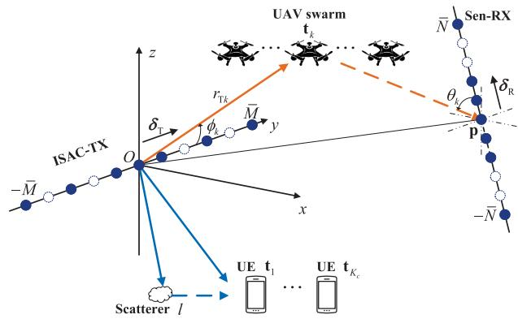  
Fig. 1. Sparse XL-MIMO bi-static near-field ISAC for low-altitude UAV swarm.

$$
\phi _ { k } = \operatorname { a r c c o s } \left( \frac { \mathbf { t } _ { k } ^ { T } \delta _ { \mathrm { T } } } { r _ { \mathrm { T } k } } \right) ,\tag{1}
$$

with $r _ { \mathrm { T } k } ~ = ~ \left\| \mathbf { t } _ { k } \right\|$ being the distance between $\mathbf { t } _ { k }$ and the symmetric center O of the ISAC-TX. Besides, the AoA at the Sen-RX is defined as the angle between $\mathbf { t } _ { k } - \mathbf { p }$ and $\delta _ { \mathrm { R } } .$ i.e.,

$$
\theta _ { k } = \operatorname { a r c c o s } \left( \frac { ( \mathbf { t } _ { k } - \mathbf { p } ) ^ { T } \delta _ { \mathrm { R } } } { r _ { \mathrm { R } k } } \right) ,\tag{2}
$$

where $r _ { \mathrm { R } k } \ = \ \| \mathbf { t } _ { k } \ - \mathbf { p } \|$ is the distance between $\mathbf { t } _ { k }$ and the Sen-RX’s symmetric center p. The dual-hop distance corresponding to the k-th UAV is $r _ { k } = r _ { \mathrm { T } k } + r _ { \mathrm { R } k }$

We consider the downlink ISAC transmissions, where the precoded signal transmitted by the M antennas of the ISAC-TX is denoted by $\mathbf { x } ( t ) \in \mathbb { C } ^ { M \times 1 }$ . At the Sen-RX, the received sensing signal is

$$
\mathbf { r } ( t ) = \sum _ { k \in \mathcal { K } _ { s } } \alpha _ { k } ( t ) e ^ { j 2 \pi f _ { d k } t } \mathbf { a } _ { \mathrm { R } } ( \mathbf { t } _ { k } ) \mathbf { a } _ { \mathrm { T } } ^ { T } ( \mathbf { t } _ { k } ) \mathbf { x } ( t - \tau _ { k } ) + \mathbf { z } ( t ) ,\tag{3}
$$

where $\tau _ { k }$ and $f _ { d k }$ denote the propagation delay and the Doppler frequency corresponding to the k-th UAV target, respectively. $\mathbf z ( t ) \sim \mathcal { C N } ( \mathbf 0 , \sigma _ { s } ^ { 2 } \mathbf I _ { N } )$ is the additive white Gaussian noise (AWGN) at Sen-RX with zero mean and variance $\sigma _ { s } ^ { 2 } ; \mathbf { a } _ { \mathrm { T } } ( \mathbf { t } _ { k } )$ and ${ \bf a } _ { \mathrm { R } } ( { \bf t } _ { k } )$ are the array steering vectors of ISAC-TX and Sen-RX, respectively, which will be defined later. Note that we assume the time-varying complex-valued channel coefficient $\alpha _ { k } ( t )$ following from Swerling model [40], which characterizes the amplitude fluctuation of UAV swarm targets radar cross section (RCS).

## A. Sparse Array Architecture and Virtual Array

As shown in Fig. 2(a), we assume that SDNA with sparse configuration $( M _ { 1 } , M _ { 2 } )$ is equipped at the ISAC-TX, where $M _ { 1 }$ and $M _ { 2 }$ are the numbers of antennas in the inner and outer array of the non-negative part. The SDNA consists of three segments concatenated together: The central section is a $( 2 M _ { 1 } \textrm { -- } 1 )$ -element compact ULA with inter-element spacing being d. Flanking this compact ULA are two $M _ { 2 ^ { - } }$ element sparse ULAs, each with inter-element spacing of $( M _ { 1 } + 1 ) d .$ Let the central antenna of the array be the reference point. The array position index set can be represented by $\mathcal { D } _ { \mathrm { T } } \triangleq \mathcal { D } ( M _ { 1 } , M _ { 2 } ) = \mathcal { D } _ { 1 } \cup \mathcal { D } _ { 2 } \cup \mathcal { D } _ { 3 }$ , with subarrays’ position index sets being

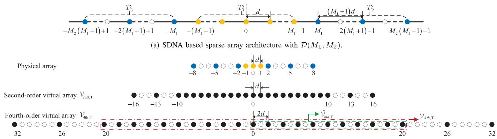  
(b) An example of SDNA at ISAC-TX with $\mathcal { D } _ { \mathrm { T } } = \mathcal { D } ( 2 , 3 )$ , and its corresponding second-order and fourth-order virtual arrays, which are formed by $\nu _ { \mathrm { 2 n d , T } } =$ $\{ u _ { i } - u _ { j } \mid u _ { i } , u _ { j } \in \mathcal { D } _ { \mathrm { T } } \}$ and $\mathcal { V } _ { \mathrm { 4 t h , T } } = \{ 2 ( u _ { i } - u _ { j } ) | u _ { i } , u _ { j } \in \mathcal { D } _ { \mathrm { T } } \}$ , respectively.  
Fig. 2. Illustration of SDNA and its virtual arrays.

$$
\begin{array} { r l } & { \mathcal { D } _ { 1 } = \{ u _ { m } | u _ { m } = m , - M _ { 1 } + 1 \leq m \leq M _ { 1 } - 1 \} , } \\ & { \mathcal { D } _ { 2 } = \{ u _ { m } | u _ { m } = m ( M _ { 1 } + 1 ) - 1 , 1 \leq m \leq M _ { 2 } \} , } \\ & { \mathcal { D } _ { 3 } = \{ u _ { m } | u _ { m } = m ( M _ { 1 } + 1 ) + 1 , - M _ { 2 } \leq m \leq - 1 \} , } \end{array}\tag{4}
$$

where $u _ { m }$ represents the position index of the m-th antenna. Note that $M = 2 M _ { 2 } + 2 M _ { 1 } - 1$ , and $\bar { M } = M _ { 1 } + M _ { 2 } - 1$ Besides, SDNA will degenerate to the conventional compact MIMO when $( M _ { 1 } , M _ { 2 } ) \ = \ ( 0 , \bar { M } ) , \ ( \bar { M } - 1 , 1 )$ , or $( \bar { M } , 0 )$ Similarly, the SDNA at the Sen-RX is configured by $\mathcal { D } _ { \mathrm { R } } \triangleq$ $\mathcal { D } ( N _ { 1 } , N _ { 2 } )$ with $\bar { N } = N _ { 1 } + N _ { 2 } - 1$ and $N = 2 N _ { 2 } + 2 N _ { 1 } - 1$ For example, a SDNA with configuration $\mathcal { D } _ { \mathrm { T } } = \mathcal { D } ( 2 , 3 )$ is illustrated in Fig. 2(b).

In conventional bi-static sensing systems with sparse arrays, virtual array signals are typically realized using covariancebased methods, which rely on second-order statistics of the received data. However, such approaches generally assume that targets are located in the far-field. When targets are in the near-field, these methods become ineffective, because the nearfield effect introduces a range-dependent quadratic phase term, and after the conjugate correlation operation on the signals, it is impossible to obtain the difference co-array structure for these quadratic phase terms. In this paper, we demonstrate that this issue can be effectively resolved by adopting fourthorder cumulant-based processing. For a sparse array with array position index $D _ { \mathrm { T } }$ , we define the far-field second-order and far-/near- field fourth-order virtual array indices as

$$
\mathcal { V } _ { \mathrm { 2 n d , T } } = \left\{ u _ { i } - u _ { j } \vert u _ { i } , u _ { j } \in \mathcal { D } _ { \mathrm { T } } \right\} ,\tag{5}
$$

$$
\mathcal { V } _ { \mathrm { 4 t h , T } } = \left\{ 2 ( u _ { i } - u _ { j } ) \vert u _ { i } , u _ { j } \in \mathcal { D } _ { \mathrm { T } } \right\} ,\tag{6}
$$

where $\nu _ { \mathrm { 2 n d , T } }$ is the difference co-array of the original physical array $D _ { T }$ [35], while $\nu _ { 4 \mathrm { t h , T } }$ is further doubled on $\nu _ { \mathrm { 2 n d , T } }$ This is because $\nu _ { 4 \mathrm { t h , T } }$ is derived using fourth-order statistics, in which the cumulant operation doubles the array element indices, which will become clear in Section III-A and (40).

## B. Array Steering Vector

Based on the sparse array configuration, the coordinate of the m-th element in the ISAC-TX array is expressed as $u _ { m } d \pmb { \delta } _ { \mathrm { T } }$ . As such, the link distance between the array element m and the target $\mathbf { t } _ { k }$ is

$$
\begin{array} { r l } & { r _ { \mathrm { T } k , m } = \Vert \mathbf { t } _ { k } - u _ { m } d \pmb { \delta } _ { \mathrm { T } } \Vert } \\ & { \qquad = \sqrt { r _ { \mathrm { T } k } ^ { 2 } - 2 u _ { m } d \mathbf { t } _ { k } ^ { T } \pmb { \delta } _ { \mathrm { T } } + u _ { m } ^ { 2 } d ^ { 2 } } } \\ & { \qquad = \sqrt { r _ { \mathrm { T } k } ^ { 2 } - 2 u _ { m } d r _ { \mathrm { T } k } \cos \phi _ { k } + u _ { m } ^ { 2 } d ^ { 2 } } . } \end{array}\tag{7}
$$

Then the corresponding array steering vector can be expressed as

$$
\begin{array} { l } { { \bf { a } } _ { \mathrm { { T } } } ( { \bf { t } } _ { k } ) } \\ { = \left[ { e ^ { - j \frac { 2 \pi } { \lambda } ( r _ { \mathrm { T } k , - \bar { M } } - r _ { \mathrm { T } k } ) } , \cdot \cdot \cdot , 1 , \cdot \cdot , e ^ { - j \frac { 2 \pi } { \lambda } ( r _ { \mathrm { T } k , \bar { M } } - r _ { \mathrm { T } k } ) } } \right] . } \end{array}\tag{8}
$$

Under the special case of far-field UPW modeling, (7) is approximated by the first-order Taylor expansion, $\mathrm { i . e . , } r _ { \mathrm { T } k , m }$ ≈ $r _ { \mathrm { T } k , m } ^ { \mathrm { f i r s t } } \triangleq r _ { \mathrm { T } k } - u _ { m } d \cos \phi _ { k }$ . Hence, the far-field array steering vector of ISAC-TX is given by

$$
\begin{array} { r } { \mathsf { a } _ { \mathrm { T } } ( \phi _ { k } ) = \left[ e ^ { j u _ { - \bar { M } } \omega _ { k } } , \cdot \cdot \cdot , 1 , \cdot \cdot \cdot , e ^ { j u _ { \bar { M } } \omega _ { k } } \right] , } \end{array}\tag{9}
$$

where $\omega _ { k } \triangleq { \frac { 2 \pi d } { \lambda } }$ cos $\phi _ { k } ,$ , with λ being the wavelength.

Based on the near-field modeling, (7) is simplified by the second-order Taylor approximation, i.e., $r _ { \mathrm { T } k , m } \approx r _ { \mathrm { T } k , m } ^ { \mathrm { s e c o n d } } \triangleq$ $r _ { \mathrm { T } k } - u _ { m } d$ cos $\phi _ { k } + u _ { m } ^ { 2 } \frac { d ^ { 2 } \sin ^ { 2 } \phi _ { k } } { 2 r _ { \Gamma k } }$ . Therefore, the corresponding near-field array steering vector is expressed by

$$
\begin{array} { r } { \breve { \mathbf { a } } _ { \mathrm { T } } ( r _ { \mathrm { T } k } , \phi _ { k } ) = \left[ e ^ { j \left( u _ { - \bar { M } } \omega _ { k } - u _ { - \bar { M } } ^ { 2 } \chi _ { k } \right) } , \cdot \cdot \cdot , 1 , \right. } \\ { \quad \quad \left. \cdot \cdot , e ^ { j \left( u _ { \bar { M } } \omega _ { k } - u _ { \bar { M } } ^ { 2 } \chi _ { k } \right) } \right] . } \end{array}\tag{10}
$$

where $\begin{array} { r } { \chi _ { k } = - \frac { \pi d ^ { 2 } } { \lambda r _ { \mathrm { T } k } } \sin ^ { 2 } \phi _ { k } } \end{array}$

The array steering vector of Sen-RX corresponding to the target position $\mathbf { t } _ { k }$ can be obtained similarly, by replacing $\mathbf { t } _ { k }$ and $\delta _ { \mathrm { T } }$ in (7) as $\mathbf { t } _ { k } - \mathbf { p }$ and $\delta _ { \mathrm { R } }$ , respectively. Consequently, the far-field and near-field array steering vectors of Sen-RX are $\mathring { \mathbf { a } } _ { \mathrm { R } } ( \theta _ { k } )$ and $\breve { \mathbf { a } } _ { \mathrm { R } } ( r _ { \mathrm { R } k } , \theta _ { k } )$ , respectively, and $\kappa _ { k } \ { \stackrel { \triangle } { = } } \ { \frac { 2 \pi d } { \lambda } }$ cos $\theta _ { k } ,$ $\begin{array} { r } { \xi _ { k } = - \frac { \pi d ^ { 2 } } { \lambda r _ { \mathrm { R } k } } \sin ^ { 2 } \theta _ { k } } \end{array}$ are the first- and second-order approximation phase terms. In the following, $\mathbf { a } _ { \mathrm { T } k } \triangleq \mathbf { a } _ { \mathrm { T } } ( \mathbf { t } _ { k } )$ and $\mathbf { a } _ { \mathrm { R } k } \triangleq { \underline { { \underline { { \Delta } } } } } _ { \mathrm { R } k } =$ $\mathbf { a } _ { \mathrm { R } } ( \mathbf { t } _ { k } )$ denote the exact steering vectors, $\breve { \mathbf { a } } _ { \mathrm { T } k } \triangleq \breve { \mathbf { a } } _ { \mathrm { T } } ( r _ { \mathrm { T } k } , \phi _ { k } )$ and $\breve { \mathbf { a } } _ { \mathrm { R } k } \triangleq \breve { \mathbf { a } } _ { \mathrm { R } } ( r _ { \mathrm { R } k } , \theta _ { k } )$ are used to represent the near-field steering vectors, while $\overset { \circ } { \mathbf { a } } _ { \mathrm { T } k } \triangleq \mathbf { a } _ { \mathrm { T } } ( \phi _ { k } )$ and ${ \dot { \mathbf { a } } } _ { \mathrm { R } k } \triangleq \mathbf { a } _ { \mathrm { R } } ( \theta _ { k } )$ are employed to denote the far-field steering vectors for simplicity.

## C. Communication Signal Model

We use OFDM signal with Q subcarriers, P symbols, subcarrier spacing $\Delta f .$ , elementary symbol duration $T = 1 / \Delta f$ total symbol duration $T _ { s } = T + T _ { c p }$ , and the cyclic prefix (CP) duration $T _ { c p }$ . The hybrid physical-virtual array processing framework proposed in [19] is adopted, where communication processing is based on the signal in physical array domain, while sensing is processed based on the signal in virtual array domain. The transmitted signal is [7]

$$
\mathbf { x } ( t ) = \sum _ { p \in \mathcal { P } } \sum _ { q \in \mathcal { Q } } { \mathbf { W } } \mathbf { b } _ { q , p } e ^ { j 2 \pi q \Delta f ( t - p T _ { s } - T _ { c p } ) } \mathrm { r e c t } \left( \frac { t - p T _ { s } } { T _ { s } } \right) ,\tag{11}
$$

where ${ \mathcal { Q } } \triangleq [ 0 , 1 , \ldots , Q - 1 ] , \mathcal { P } \triangleq [ 0 , 1 , \ldots , P - 1 ]$ are the subcarrier and symbol index sets, respectively; $\mathbf { b } _ { q , p } \in \mathbb { C } ^ { M \times 1 }$ denotes the ISAC modulated data vector, in which the first $K _ { c }$ elements are information-bearing symbols for communication UEs, which are also reused for sensing, while the remaining $K _ { s }$ elements are additional sensing signals to ensure that the covariance matrix of the transmitted signal ${ \bf x } ( t )$ has full rank [41], [42]. Without loss of generality, we assume $\operatorname { E } [ \mathbf { b } _ { q , p } ] =$ ${ \bf 0 } _ { M \times 1 }$ and $\mathrm { E } [ \mathbf { b } _ { q , p } \mathbf { b } _ { q , p } ^ { H } ] = \mathbf { I } _ { M }$ . Moreover, $\mathbf { W } = [ \mathbf { W } _ { c } , \bar { \mathbf { W } } _ { s } ] \in$ $\mathbb { C } ^ { M \times M }$ is the precoding matrix, where $\mathbf { W } _ { c } \in \mathbb { C } ^ { M \times K _ { c } }$ is the communication precoding matrix and $\mathbf { W _ { s } } \in \mathbb { C } ^ { M \times K _ { s } }$ is the dedicated sensing precoding matrix. Note that for simplicity, the same precoding matrix W is used across all subcarriers and OFDM symbols.

For downlink communication, the channel between the ISAC-TX and UE k on the $q \mathrm { . }$ th subcarrier of the p-th symbol is

$$
{ \bf g } _ { k , q , p } = \sum _ { l = 1 } ^ { L _ { k } } \beta _ { k l } { \bf a } _ { \mathrm { T } } \left( \phi _ { k l } , r _ { k l } \right) e ^ { - j 2 \pi q \Delta f \tau _ { k l } }\tag{12}
$$

where $L _ { k }$ is the number of multipath of UE k. The parameters $\beta _ { k l } , \ \phi _ { k l } , \ r _ { k l } , \ \tau _ { k l }$ , and $f _ { d , k l }$ correspond to the multipath coefficient, AoD, range, delay, and Doppler frequency of the l-th path of the k-th UE, respectively.

Since the sensing signals in $\big [ \mathbf { b } _ { q , p } \big ] _ { K _ { c } + 1 : K }$ do not need to convey information, they are assumed to be known to communication UEs and can be removed before communication signal processing. Based on (11) and (12), after sampling, CP removal, and DFT operations, the received signal by UE k at the q-th subcarrier of the p-th OFDM symbol is

$$
y _ { k , q , p } = \mathbf { g } _ { k , q , p } ^ { H } \mathbf { w } _ { k } b _ { k , q , p } + \mathbf { g } _ { k , q , p } ^ { H } \sum _ { i \in K _ { c } , i \neq k } \mathbf { w } _ { i } b _ { i , q , p } + n _ { k , q , p } ,\tag{13}
$$

where $n _ { k , q , p } \sim \mathcal { C N } ( 0 , \sigma _ { c } ^ { 2 } )$ is the AWGN with zero mean and variance $\sigma _ { c } ^ { 2 } . \mathrm { A s }$ such, the SINR of UE k on the q-th subcarrier of the p-th symbol is

$$
\mathrm { S I N R } _ { k , q , p } = \frac { | \mathbf { g } _ { k , q , p } ^ { H } \mathbf { w } _ { k } | ^ { 2 } } { \sum _ { i \in { \mathcal { K } _ { c } } , i \ne k } | \mathbf { g } _ { k , q , p } ^ { H } \mathbf { w } _ { i } | ^ { 2 } + \sigma _ { c } ^ { 2 } } .\tag{14}
$$

Therefore, the average sum rate of the $K _ { c }$ UEs in bits/second/Hz (bps/Hz) can be obtained by

$$
R _ { \mathrm { s u m } } = \frac { 1 } { P Q } \sum _ { p \in \mathcal { P } } \sum _ { q \in \mathcal { Q } } \sum _ { k \in \mathcal { K } _ { c } } \frac { 1 } { \epsilon + 1 } \log _ { 2 } ( 1 + \mathrm { S I N R } _ { k , q , p } ) ,\tag{15}
$$

where $\begin{array} { r } { \epsilon = \frac { T _ { c p } } { T } } \end{array}$ denotes the CP overhead ratio.

## D. Sensing Signal Model

The sensing channel between ISAC-TX and Sen-RX on the q-th sub-carrier and the $p \mathrm { - }$ th symbol in the frequency domain is expressed as

$$
\mathbf { H } _ { q , p } = \sum _ { k \in \mathcal { K } _ { s } } \alpha _ { k , p } \mathbf { a } _ { \mathrm { R } k } \mathbf { a } _ { \mathrm { T } k } ^ { T } e ^ { - j 2 \pi q \Delta f \tau _ { k } } e ^ { j 2 \pi p T _ { s } f _ { d k } } e ^ { j 2 \pi T _ { c p } f _ { d k } } .\tag{16}
$$

By substituting (11) and (16) to (3), the received signal at the Sen-RX at the q-th subcarrier of the p-th OFDM symbol is

$$
\mathbf { r } _ { q , p } = \sum _ { k \in \mathcal { K } _ { s } } \mathbf { a } _ { \mathrm { R } k } \mathbf { a } _ { \mathrm { T } k } ^ { T } \mathbf { s } _ { k , q , p } + \mathbf { z } _ { q , p } ,\tag{17}
$$

where $\mathbf { s } _ { k , q , p } = \sqrt { Q } \alpha _ { k , p } e ^ { - j 2 \pi q \Delta f \tau _ { k } } e ^ { j 2 \pi p T _ { s } f _ { d k } } e ^ { j 2 \pi T _ { c p } f _ { d k } } \mathbf { W } \mathbf { b } _ { q , p } \ \in$ CM×1 and $\mathbf z _ { q , p } \sim \mathcal { C N } ( \mathbf 0 , \sigma _ { s } ^ { 2 } \mathbf I _ { N } )$ represents the AWGN.

1) Delay Estimation: To obtain the propagation delays $\tau _ { k } , k \in { \mathcal { K } } _ { s }$ , we construct the following 1-D spectrum,

$$
S _ { p } ( \tau ) = \frac { 1 } { \sqrt { Q } } \Big \| \sum _ { q \in \mathcal { Q } } e ^ { j 2 \pi q \Delta f \tau } \mathbf { r } _ { q , p } \mathbf { b } _ { q , p } ^ { H } \Big \| _ { F } ,\tag{18}
$$

where the discrete searching variable $\tau$ takes $N _ { \tau }$ values ranging from $\frac { \| \mathbf { p } \| } { c _ { 0 } } \quad \mathrm { t o } \quad \tau _ { \mathrm { m a x } } ,$ with a step size of $\begin{array} { r l } { \Delta \tau } & { { } = } \end{array}$ $\begin{array} { r } { \left( \tau _ { \mathrm { m a x } } - \frac { \| \mathbf { p } \| } { c _ { 0 } } \right) / N _ { \tau } } \end{array}$ , and $c _ { 0 }$ denotes the speed of light. Assume the $K _ { s }$ targets can be grouped into $K _ { \mathrm { c l u s t e r } }$ delay clusters, i. $\begin{array} { r } { \mathrm { e } . , \mathcal { K } _ { s } = \bigcup _ { j = 1 } ^ { K _ { \mathrm { c l u s t e r } } } \mathcal { T } _ { j } } \end{array}$ . Targets within the same cluster share similar propagation delays. Specifically, for the j-th cluster $( 1 \leq j \leq K _ { \mathrm { c l u s t e r } } ) ,$ , we have $\begin{array} { r } { | \tau _ { i } - \tilde { \tau } _ { j } | \leq \frac { \Delta \tau } { 2 } , \forall i \in \mathcal { I } _ { j } } \end{array}$ and $\tilde { \tau } _ { j }$ is the reference delay of the j-th cluster. Let $J _ { j } \ \triangleq | { \mathcal { I } } _ { j } |$ denote the number of targets in the $j \cdot$ -th cluster, so that $\begin{array} { r } { K _ { s } = \sum _ { j = 1 } ^ { K _ { \mathrm { c l u s t e r } } } J _ { j } } \end{array}$ . When the search reaches the vicinity of the j-th cluster, the spectrum in (18) can be approximated as (19) shown at the bottom of the next page, where $\bar { \alpha } _ { k , p } =$ $\alpha _ { k , p } e ^ { j 2 \pi p T _ { s } f _ { d k } } e ^ { j 2 \pi T _ { c p } f _ { d k } } , \bar { \tau } _ { k } = \tau _ { k } - \tau .$ , and (a) is verified in detail in Appendix A. Moreover, the received signals over P OFDM symbols can be exploited to improve the robustness of delay estimation by averaging the delay spectra as

$$
S ( \tau ) = \frac { 1 } { P } \sum _ { p \in \mathcal { P } } S _ { p } ( \tau ) .\tag{20}
$$

Based on (19), if the step size $\Delta \tau$ is sufficiently small, we have $\frac { \sin ( \ule { Q } { \Delta } f \bar { \tau } _ { k } ) } { \sin ( \pi \Delta f \bar { \tau } _ { k } ) }$ ≈ $Q , k \in \mathcal { I } _ { j }$ since $\bar { \tau } _ { k } \ \leq \ \Delta \tau \ \to \ 0$ Meanwhile, for targets not belonging to the j-th cluster, $\begin{array} { r } { \frac { \sin ( \pi Q \Delta f \bar { \tau } _ { k } ) } { \sin ( \pi \Delta f \bar { \tau } _ { k } ) } \ll Q , k \in { \mathcal K } _ { s } , k \not \in { \mathcal I } _ { j } } \end{array}$ holds with high probability. Therefore, (19) is further simplified as

$$
\begin{array} { r } {  S ( \tau ) | _ { \tau  \tilde { \tau } _ { j } } \approx \| \sum _ { k \in \mathcal { I } _ { j } } \mathbf { a } _ { \mathrm { R } k } \mathbf { a } _ { \mathrm { T } k } ^ { T } \mathbf { W } \bar { \alpha } _ { k , p } + \mathbf { Z } _ { j , p } \| _ { F } , } \end{array}\tag{21}
$$

This indicates that when the searched delay $\tau$ matches the delay of a cluster, the resulting search spectrum $S ( \tau ) | _ { \tau  \tau _ { j } }$ will contain energy reflected from the targets within that cluster, leading to a spectral peak. Otherwise, the spectrum consists almost entirely of noise power without prominent peak. As such, by searching the highest J peaks in (18), we can obtain $\hat { \tau } _ { j } , 1 \le j \le K _ { \mathrm { c l u s t e r } }$

Besides, the corresponding dual-hop range of TX-Cluster-RX is expressed as

$$
\hat { r } _ { j } = \hat { \tau } _ { j } c _ { 0 } \mathrm { f o r } 1 \leq j \leq K _ { \mathrm { c l u s t e r } } .\tag{22}
$$

2) Angle Estimation: Before performing angle estimation, transmitting symbols need to be removed to avoid their interference on array manifold matrices containing concerned sensing information. First, based on the estimated delay $\hat { \tau } _ { j }$ of the j-th cluster, the signal correlation between (17) and $e ^ { j 2 \pi q \Delta \hat { f } \hat { \tau } _ { j } } \mathbf { b } _ { q , p }$ is computed in the frequency domain, yielding

$$
\begin{array} { r } { { \bf R } _ { j , p } = \frac { 1 } { \sqrt { Q } } \sum _ { q \in \mathcal { Q } } e ^ { j 2 \pi q \Delta f \hat { \tau } _ { j } } { \bf r } _ { q , p } { \bf b } _ { q , p } ^ { H } } \\ { \approx \sum _ { k \in \mathcal { T } _ { j } } { \bf a } _ { \mathrm { R } k } { \bf a } _ { \mathrm { T } k } ^ { T } { \bf W } \bar { \alpha } _ { k , p } + \hat { \bf Z } _ { j , p } , } \end{array}\tag{23}
$$

where $\begin{array} { r } { \hat { \mathbf { Z } } _ { j , p } = \frac { 1 } { \sqrt { Q } } \sum _ { q \in \mathcal { Q } } \mathbf { z } _ { q , p } ( e ^ { j 2 \pi q \Delta f \hat { \tau } _ { j } } \mathbf { b } _ { q , p } ^ { H } ) \in \mathbb { C } ^ { N \times M } . } \end{array}$

Next, we vectorize $\mathbf { R } _ { j , p }$ to obtain

$$
\begin{array} { r l } & { \bar { \mathbf { r } } _ { j , p } = \mathrm { v e c } ( \mathbf { R } _ { j , p } ) } \\ & { \quad \quad = ( \mathbf { W } ^ { T } \otimes \mathbf { I } _ { N } ) \sum _ { k \in \mathcal { I } _ { j } } ( \mathbf { a } _ { \mathrm { T } k } \otimes \mathbf { a } _ { \mathrm { R } k } ) \bar { \alpha } _ { k , p } + \bar { \mathbf { z } } _ { j , p } , } \end{array}\tag{24}
$$

where $\begin{array} { r } { \sum _ { k \in \mathcal { I } _ { i } } ( \mathbf { W } ^ { T } \otimes \mathbf { I } _ { N } ) ( \mathbf { a } _ { \mathrm { T } k } \otimes \mathbf { a } _ { \mathrm { R } k } ) \bar { \alpha } _ { k , p } } \end{array}$ is the sensing signals corresponding to the j-th cluster’s targets, and $\bar { \bf z } _ { j , p } =$ $\mathrm { v e c } ( \hat { \mathbf { Z } } _ { j , p } ) \in \bar { \mathbb { C } } ^ { M N \times 1 }$

After carefully designing precoding matrix at ISAC-TX, W can satisfy full rank condition, as detailed in Section II-E. Thus, by left-multiplying the inverse matrix of $\mathbf { W } ^ { T } \otimes \mathbf { I } _ { N }$ , the resulting sensing signal is

$$
\mathbf { r } _ { j , p } = ( \mathbf { W } ^ { T } \otimes \mathbf { I } _ { N } ) ^ { - 1 } \bar { \mathbf { r } } _ { j , p } = \mathbf { A } \bar { \alpha } _ { j , p } + \mathbf { z } _ { j , p } ,\tag{25}
$$

where $\mathbf { A } = \mathbf { A } _ { \mathrm { T } } \odot \mathbf { A } _ { \mathrm { R } } \in \mathbb { C } ^ { M N \times J _ { j } }$ , with $\mathbf { A } _ { \mathrm { T } } = [ \mathbf { a } _ { \mathrm { T } k } ] _ { k \in \mathcal { T } _ { i } }$ and $\begin{array} { r } { \mathbf { A } _ { \mathrm { R } } = [ \mathbf { a } _ { \mathrm { R } k } ] _ { k \in \mathcal { I } _ { j } } ; \bar { \alpha } _ { j , p } = [ \bar { \alpha } _ { k , p } ] _ { k \in \mathcal { I } _ { j } } \in \mathbb { C } ^ { J _ { j } \times 1 } ; \mathbf { z } _ { j , p } = } \end{array}$ $( \mathbf { W } ^ { T } \otimes \mathbf { I } _ { N } ) ^ { - 1 } \bar { \mathbf { z } } _ { k , p } \in \mathbb { C } ^ { M \tilde { N } \times 1 }$

Finally, the sensing signal corresponding to the targets in the j-th delay cluster is obtained, the angle of which can be estimated through further signal processing. To obtain the sensing signals for all $K _ { s }$ targets, we repeat (23)-(25) $K _ { \mathrm { c l u s t e r } }$ times.

## E. ISAC Precoding Matrix Design

The total transmit power of ISAC-TX is $P _ { \mathrm { T } }$ , which is equally allocated among the $K _ { c }$ communication UEs and $K _ { s }$ sensing directions to ensure uniform sensing capability across all directions. Accordingly, the communication precoding matrix is constructed as

$$
\mathbf { W } _ { c } = \left[ { \bf w } _ { 1 } , \ldots , { \bf w } _ { K _ { c } } \right] ,\tag{26}
$$

where $\mathbf { w } _ { k } = \sqrt { P _ { \mathrm { T } } / M } \bar { \mathbf { w } } _ { k } / \| \bar { \mathbf { w } } _ { k } \|$ . Three classic linear precoding schemes including regularzied MRT, ZF, MMSE, are considered, where $\bar { \mathbf { w } } _ { k } = \mathbf { G e } _ { k } , \bar { \mathbf { w } } _ { k } = \mathbf { G } ( \mathbf { G } ^ { H } \mathbf { G } ) ^ { - 1 } \mathbf { e } _ { k }$ , and $\bar { \bf w } _ { k } =$ $\begin{array} { r } { \mathbf { G } \left( \mathbf { G } ^ { H } \mathbf { G } + \frac { M \sigma _ { c } ^ { 2 } } { P _ { \mathrm { T } } } \mathbf { I } _ { K _ { c } } \right) ^ { - 1 } \mathbf { e } _ { k } , } \end{array}$ , respectively. Here, $\mathbf { e } _ { k }$ denotes the k-th standard basis vector, and $\textbf { G } = ~ \left[ \bf g _ { 1 } , \dots , \bf g _ { \mathit { K } _ { c } } \right] \in$ $\mathbb { C } ^ { M \times K _ { c } }$ is the channel matrix whose columns are average channel vectors, where $\begin{array} { r } { \mathbf { g } _ { k } = \frac { 1 } { P Q } \sum _ { p \in \mathcal { P } } \sum _ { q \in \mathcal { Q } } \mathbf { g } _ { k , q , p } . } \end{array}$

If $K _ { c } < M$ , we can get the null space $\mathcal { N } ( \mathbf { W } _ { c } )$ , which can be spanned by $M - K _ { c }$ normalized orthogonal basis vectors $\left[ \bar { \mathbf { w } } _ { K _ { c } + 1 } , \ldots , \bar { \mathbf { w } } _ { K } \right]$ with ${ \left\| \bar { \mathbf { w } } _ { k } \right\| } = 1 , k \in \mathcal { K } _ { s }$ . As a result, the precoding vector for sensing is

$$
{ \bf W } _ { s } = \sqrt { P _ { \mathrm { T } } / M } \left[ \bar { \bf w } _ { K _ { c } + 1 } , \dots , \bar { \bf w } _ { K } \right] .\tag{27}
$$

## III. NEAR-FIELD SENSING AND 3D LOCALIZATION FOR LOW-ALTITUDE UAV SWARM

In this section, we assume that the targets are located in the near-field region of either the ISAC-TX or Sen-Rx but at the far-field region of the other. Without loss of generality, we consider all targets to be in the near-field region of the ISAC-TX and the far-field region of the Sen-RX. That is, for target $k \in \mathcal { K } _ { s }$ , the distance from the ISAC-TX satisfies $r _ { \mathrm { T } k } < r _ { \mathrm { R a y l e i g h } }$ , while the distance from the Sen-RX satisfies rRk $\geq r _ { \mathrm { R a y l e i g h } } , k \in \mathcal { K } _ { s }$ . Here, $\begin{array} { r } { r _ { \mathrm { R a y l e i g h } } = { \frac { 2 D ^ { 2 } } { \lambda } } } \end{array}$ denotes the classical Rayleigh distance, where D represents the aperture of the array. First, we decouple range-dependent term in nearfield steering vector by fourth-order cumulant technology, then bi-static virtual array is formed for angular sensing. Subsequently, based on the obtained angular information, the near-field range estimation is conducted. Finally, the 3D localization of UAV swarm targets using 1D arrays is clarified.

$$
\begin{array} { r l } & { S _ { p } ( \tau ) = \frac { 1 } { \sqrt { Q } } \| \sum _ { q \in \mathcal { Q } } e ^ { j 2 \pi q \Delta f \tau } \mathbf { r } _ { q , p } \mathbf { b } _ { q , p } ^ { H } \| _ { F } } \\ & { \qquad = \| \sum _ { k \in \mathcal { G } _ { \tau } } Q \alpha _ { k , p } e ^ { j 2 \pi p _ { T } f _ { q , p } } e ^ { j 2 \pi T _ { \sigma } f _ { q , q } } \mathrm { a n } _ { \mathbf { k \in } \mathbf { a } _ { \mathbf { k \in } } ^ { - 1 } \mathbf { r } _ { \mathbf { k \in } } } \mathbf { W } ( \frac { 1 } { Q } \sum _ { q \in \mathcal { Q } } e ^ { - j 2 \pi q \Delta f \tau _ { \tau } } e ^ { j 2 \pi q \Delta f \tau } \mathbf { b } _ { q , p } \mathbf { b } _ { q , p } ^ { H } )  } \\ & { \qquad +  \sum _ { k \in \mathcal { K } _ { x } , k \in \mathcal { G } _ { \tau } } Q \alpha _ { k , p } e ^ { j 2 \pi q \Delta f \tau } \mathcal { A } _ { k \in \mathcal { G } } e ^ { j 2 \pi T _ { \sigma } f _ { q , p } } \alpha _ { \mathbf { k \in } \mathbf { a } _ { \mathbf { k \in } } \mathbf { a } _ { \mathbf { T } _ { k } } ^ { T } } \mathbf { W } ( \frac { 1 } { Q } \sum _ { q \in \mathcal { Q } } e ^ { - j 2 \pi q \Delta f \tau _ { \tau } } e ^ { j 2 \pi q \Delta f \tau } \mathbf { b } _ { q , p } \mathbf { b } _ { q , p } ^ { H } )  } \\ & { \qquad +  \frac { 1 } { \sqrt { Q } } \sum _ { q \in \mathcal { Q } } z _ { q , p } ( e ^ { j 2 \pi q \Delta f \tau } \mathbf { b } _ { q , p } ^ { H } ) \| _ { F } } \\ &  \overset { ( a ) } { \approx } \| \sum _ { k \in \mathcal { G } _ { \tau } } \bar { \alpha } _ { k , p } e ^  - j \pi ( G + 1 ) \Delta f  \end{array}\tag{19}
$$

## A. Decouple Range-Dependent Phase Term

We consider the j-th delay cluster. For convenience, the cluster index $j$ is ommited, i.e., let ${ \mathcal { I } } _ { j } \triangleq { \mathcal { I } }$ and $J _ { j } \triangleq J ,$ and treat the symbol index as the snapshot index. The signal in (25) is therefore rewritten as

$$
\mathbf { r } [ p ] = \tilde { \mathbf { A } } \bar { \alpha } [ p ] + \mathbf { z } [ p ] ,\tag{28}
$$

where $\tilde { \mathbf { A } } = \breve { \mathbf { A } } _ { \mathrm { T } } \odot \mathring { \mathbf { A } } _ { \mathrm { R } }$ , with $\breve { \mathbf { A } } _ { \mathrm { T } }$ and $\mathring { \mathbf { A } } _ { \mathrm { R } }$ being the near-field and far-field array manifold matrix of ISAC-TX and Sen-RX, respectively. The k-th column of A˜ is $\tilde { \mathbf { a } } _ { k } = \breve { \mathbf { a } } _ { \mathrm { T } k } \otimes \mathring { \mathbf { a } } _ { \mathrm { R } k } \in$ $\mathbb { C } ^ { \dot { M } N \times 1 }$

Due to the computation rule of Kronecker product, the element index c of vector $\tilde { \mathbf { a } } _ { k }$ can be divided to inter-block index $m _ { c } , - \bar { M } \leq m _ { c } \leq \bar { M }$ and inner-block index $n _ { c } , - \bar { N } \leq$ $n _ { c } \leq \bar { N }$ with block length equal to N , i.e.,

$$
c = m _ { c } N + n _ { c } .\tag{29}
$$

Note that $\begin{array} { r } { \bar { M } N + \bar { N } = \frac { M N - 1 } { 2 } } \end{array}$ . As such, the c-th element of $\tilde { \mathbf { a } } _ { k }$ is denoted by

$$
\tilde { a } _ { k , c } = e ^ { j \left( u _ { m _ { c } } \omega _ { k } - u _ { m _ { c } } ^ { 2 } \chi _ { k } \right) } e ^ { j v _ { n _ { c } } \kappa _ { k } } .\tag{30}
$$

As shown in (30), the parameters to be estimated are coupled together in the steering vectors. Specifically, on one hand, the parameters corresponding to ISAC-TX, i.e., ωk, χk and the parameter corresponding to Sen-RX, i.e., $\kappa _ { k } .$ , are coupled. On the other hand, the angle and range parameters corresponding to $\mathrm { I S A C \mathrm { - } T X , ~ i . e . , ~ } \omega _ { k }$ and $\chi _ { k }$ , are coupled. To address this issue, we propose the cumulant matrix based method to decouple the angle and range parameters corresponding to ISAC-TX.

The fourth-order cumulant of zero-mean random variables x is given by [43]

$$
\begin{array} { r l } & { \mathrm { c u m } ( x _ { 1 } , x _ { 2 } , x _ { 3 } , x _ { 4 } ) = \mathbb { E } \left[ x _ { 1 } [ p ] x _ { 2 } [ p ] x _ { 3 } [ p ] x _ { 4 } [ p ] \right] } \\ & { \phantom { x x x x x x x x x x x x x x x x x x x x x x x x x x x x x x x } - \mathbb { E } \left[ x _ { 1 } [ p ] x _ { 2 } [ p ] \right] \mathbb { E } \left[ x _ { 3 } [ p ] x _ { 4 } [ p ] \right] } \\ & { \phantom { x x x x x x x x x x x x x x x x x x x } - \mathbb { E } \left[ x _ { 1 } [ p ] x _ { 3 } [ p ] \right] \mathbb { E } \left[ x _ { 2 } [ p ] x _ { 4 } [ p ] \right] } \\ & { \phantom { x x x x x x x x x x x x x x x x x } - \mathbb { E } \left[ x _ { 1 } [ p ] x _ { 4 } [ p ] \right] \mathbb { E } \left[ x _ { 2 } [ p ] x _ { 3 } [ p ] \right] . } \end{array}\tag{31}
$$

In practice, the cumulant in (31) is approximated by

$$
\begin{array} { l } { \displaystyle \mathrm { c u m } ( x _ { 1 } , x _ { 2 } , x _ { 3 } , x _ { 4 } ) \approx \displaystyle \frac { 1 } { P } \left( \sum _ { p = 1 } ^ { P } x _ { 1 } [ p ] x _ { 2 } [ p ] x _ { 3 } [ p ] x _ { 4 } [ p ] \right. } \\ { \displaystyle ~ - \sum _ { p = 1 } ^ { P } x _ { 1 } [ p ] x _ { 2 } [ p ] \sum _ { p = 1 } ^ { P } x _ { 3 } [ p ] x _ { 4 } [ p ] } \\ { \displaystyle ~ \left. - \sum _ { p = 1 } ^ { P } x _ { 1 } [ p ] x _ { 3 } [ p ] \sum _ { p = 1 } ^ { P } x _ { 2 } [ p ] x _ { 4 } [ p ] \right. } \end{array}
$$

$$
- \sum _ { p = 1 } ^ { P } x _ { 1 } [ p ] x _ { 4 } [ p ] \sum _ { p = 1 } ^ { P } x _ { 2 } [ p ] x _ { 3 } [ p ] \Bigg ) .\tag{32}
$$

Based on (31) and (32), we construct and compute the following cumlant

$$
\begin{array} { r } { \mathcal { C } _ { \mathbf { r } } ( c , d , e , f ) = \mathrm { c u m } ( r _ { c } [ p ] , r _ { d } ^ { * } [ p ] , r _ { e } ^ { * } [ p ] , r _ { f } [ p ] ) , } \end{array}\tag{33}
$$

where $r _ { c } [ p ] , r _ { d } [ p ] , r _ { e } [ p ] , r _ { f } [ p ]$ are the $c , d , e , f$ -th $( - \bar { M } N ~ -$ $\bar { N } \leq c , d , e , f \leq \bar { M } N + \bar { N } )$ array observations in $\mathbf { r } [ p ]$ , respectively. The cumulant in (33) can be rewritten as $( 3 4 )$ , which is shown on the bottom of the page, where $c = m _ { c } N + n _ { c } ,$ $d = m _ { d } N + n _ { d } , e \ = m _ { e } N + n _ { e } , f \ = m _ { f } N + n _ { f } ,$ , and $c _ { 4 , \bar { \alpha } _ { k } } = \mathrm { c u m } ( \bar { \alpha } _ { k , p } , \bar { \alpha } _ { k , p } ^ { * } , \bar { \alpha } _ { k , p } ^ { * } , \bar { \alpha } _ { k , p } )$ is the kurtosis of the $k \mathrm { - }$ th target’s RCS coefficient. In (34), (b) and (c) hold due to the multi-linearity and scaling properties of cumulants, respectively [43].

Let $c = - d$ and $e = - f ,$ that is $m _ { c } = - m _ { d } , m _ { e } = - m _ { f }$ $n _ { c } = - n _ { d } .$ , and $n _ { e } = - n _ { f }$ , the cumulant $\mathcal { C } _ { \bf r } ( c , d , e , f )$ in (34) is simplified as

$$
\begin{array} { l } { \tilde { \mathcal { C } } _ { \bf r } ( c , e ) = \mathcal { C } _ { \bf r } ( c , - c , e , - e ) } \\ { = \sum _ { k \in \mathcal { I } } c _ { 4 , \bar { \alpha } _ { k } } e ^ { j 2 ( u _ { m _ { c } } - u _ { m _ { e } } ) \omega _ { k } } e ^ { j 2 ( v _ { n _ { c } } - v _ { n _ { e } } ) \kappa _ { k } } . } \end{array}\tag{35}
$$

The exponential term in (35) is divided to two parts. One acts like the cross correlation between the $m _ { c } \mathrm { - t h }$ and the $m _ { e } { \cdot } \mathrm { t h }$ elements of ISAC-TX, and the other acts like cross correlation between the $n _ { c } \mathrm { - t h }$ and the $n _ { e } \mathrm { - t h }$ elements at Sen-RX. The position difference, i.e., $u _ { m _ { c } } - u _ { m }$ e and $v _ { n _ { c } } - v _ { n _ { e } } ,$ formed by cross-correlations between different array elements constitute the key points of the co-array in virtual array. Note that the noise is suppressed in this cumulant operation because the cumulant is inherently insensitive to Gaussian noise, and the additive noise in (28) is independent of the signals and follows a Gaussian distribution, resulting in zero kurtosis [27].

Next, we construct cumulant matrix $\textbf { C } ~ \in ~ \mathbb { C } ^ { M N \times M N }$ based on (35), the $( i , j ) \ – \tplus$ entry of which is expressed as $\begin{array} { r l r } { { \bf C } ( i , j ) } & { { } = } & { \tilde { \mathcal { C } } _ { \bf r } \left( i - \frac { \overrightarrow { M } N + 1 } { 2 } , j - \frac { M N + 1 } { 2 } \right) } \end{array}$ , where $\begin{array} { r l } { i , j } & { { } = } \end{array}$ $1 , 2 , \ldots , M N$ . Substituting (35) into C and converting to matrix form yield

$$
\begin{array} { c } { { { \bf C } ( i , j ) = \sum _ { k \in \mathcal { I } } c _ { 4 , \bar { \alpha } _ { k } } e ^ { j 2 \left( { u _ { m _ { i - 1 } - \bar { M } } \omega _ { k } + v _ { n _ { i - 1 } - \bar { N } } \kappa _ { k } } \right) } } } \\ { { e ^ { - j 2 \left( { u _ { m _ { j - 1 } - \bar { M } } \omega _ { k } + v _ { n _ { j - 1 } - \bar { N } } \kappa _ { k } } \right) } } } \\ { { = { \bf B } { \bf C } _ { 4 \bar { \alpha } } { \bf B } ^ { H } = \sum _ { k \in \mathcal { I } _ { j } } c _ { 4 , \bar { \alpha } _ { k } } { \bf b } _ { k } { \bf b } _ { k } ^ { H } , } } \end{array}\tag{36}
$$

$$
\begin{array} { r l } & { \mathcal { C } _ { \mathrm { r } } ( c , d , e , f ) = \mathrm { c u m } ( r _ { m _ { c } N + n _ { c } } [ p ] , r _ { m _ { d } N + n _ { d } } ^ { * } [ p ] , r _ { m _ { c } N + n _ { c } } ^ { * } [ p ] , r _ { m _ { f } N + n _ { f } } [ p ] ) } \\ & { \overset { ( b ) } { = } \mathrm { c u m } ( \sum _ { k \in \mathcal { T } } \bar { \alpha } _ { k , p } e ^ { j ( u _ { m _ { c } } , \omega _ { k } + u _ { m _ { c } , X k } ^ { 2 } ) } e ^ { j v _ { n _ { c } N + k _ { d } } r _ { k } } , ( \sum _ { k \in \mathcal { T } } \bar { \alpha } _ { k , p } e ^ { j ( u _ { m _ { d } } \omega _ { k } + u _ { m _ { d } } ^ { 2 } \chi _ { k } ) } e ^ { j x _ { n _ { d } } \epsilon _ { k } } ) ^ { * } ,  } \\ & {  ( \sum _ { k \in \mathcal { T } } \bar { \alpha } _ { k , p } e ^ { j ( u _ { m _ { c } } \omega _ { k } + u _ { m _ { c } , X k } ^ { 2 } ) } e ^ { j v _ { n _ { c } } \kappa _ { k } } ) ^ { * } , \sum _ { k \in \mathcal { T } } \bar { \alpha } _ { k , p } e ^ { j ( u _ { m _ { f } } \omega _ { k } + u _ { m _ { f } } ^ { 2 } \chi _ { k } ) } e ^ { j v _ { n _ { f } } \kappa _ { k } } ) } \\ &  \overset { ( c ) } { = } \sum _ { k \in \mathcal { T } } c _ { 4 , \bar { \alpha } _ { k } } e ^  j ( [ ( u _ { m _ { c } } - u _ { m _ { d } } ) - ( u _ { m _ { c } } - u _ { m _ { f } } ) ] \omega _ { k } + [ ( u _ { m _ { c } } ^ { 2 } - u _ { m _ { d } } ^ { 2 } ) - ( u _ { m _ { c } } ^  2  \end{array}\tag{34}
$$

where $\mathbf { C } _ { 4 \bar { \alpha } } = \mathrm { d i a g } [ [ c _ { 4 , \bar { \alpha } _ { k } } ] _ { k \in \mathcal { I } } ] \in \mathbb { C } ^ { J \times J }$ denotes the signal cumulant matrix. The matrix $\mathbf { \tilde { B } } = [ \mathbf { b } _ { 1 } , \cdots , \mathbf { b } _ { J } ] \in \mathbb { C } ^ { M N \times \mathbf { \tilde { J } } }$ is composed of columns $\mathbf { b } _ { k } = \mathbf { b } _ { \mathrm { T } k } \otimes \mathbf { b } _ { \mathrm { R } k } \in \mathbb { C } ^ { M N \times 1 }$ , where

$$
\begin{array} { r l } & { { \mathbf b } _ { \mathrm { T } k } = \left[ e ^ { j 2 u _ { - \bar { M } } \omega _ { k } } , \cdot \cdot \cdot , 1 , \cdot \cdot \cdot , e ^ { j 2 u _ { \bar { M } } \omega _ { k } } \right] , } \\ & { { \mathbf b } _ { \mathrm { R } k } = \left[ e ^ { j 2 v _ { - \bar { N } } \kappa _ { k } } , \cdot \cdot \cdot , 1 , \cdot \cdot \cdot , e ^ { - j 2 v _ { \bar { N } } \kappa _ { k } } \right] . } \end{array}\tag{37}
$$

It is observed that the steering vectors in (37) no longer contain range-dependent terms. On the other hand, unlike the conventional far-field steering vectors given in (9), the phase of the fourth-order based steering vectors in (37) is doubled. This is equivalent to doubling the element position indices from $u _ { m }$ to $2 u _ { m }$ . To utilize the enhanced sensing performance of virtual array without introducing ambiguity in angular domain, we set $d = \lambda / 4$ . Note that the effect of mutual coupling arising from this narrower inter-element spacing is not considered in this work, and interested readers may refer to [44] and [45] for comprehensive studies on mutual coupling compensation techniques.

## B. Bi-Static Virtual Array Based Angular Sensing

After eliminating the influence of range-dependent phase term on angular estimation, bi-static virtual array based angular sensing can be realized. First, we vectorize C in (36) to obtain

$$
{ \bf r } _ { 1 } = \mathrm { v e c } ( { \bf C } ) = ( { \bf B } _ { \mathrm { T } } \odot { \bf B } _ { \mathrm { R } } ) ^ { * } \odot ( { \bf B } _ { \mathrm { T } } \odot { \bf B } _ { \mathrm { R } } ) \gamma ,\tag{38}
$$

where $\gamma ~ = ~ [ c _ { 4 , \bar { \alpha } _ { K _ { c } + 1 } } , . . . , c _ { 4 , \bar { \alpha } _ { K } } ] ^ { T }$ represents the effective source vector. Besides, $\mathbf { B } _ { \mathrm { T } } = [ \mathbf { b } _ { \mathrm { T } k } ] _ { k \in \mathcal { I } }$ and $\mathbf { B } _ { \mathrm { R } } = [ \mathbf { b } _ { \mathrm { R } k } ] _ { k \in \mathcal { I } }$ Next, the order of $\mathbf { B } _ { \mathrm { R } } ^ { \ast }$ and $\mathbf { B } _ { \mathrm { T } }$ in (38) is swapped by leftmultiplying a permutation matrix $\mathbf { I I } \ = \ \mathbf { I } _ { M } \otimes \mathbf { I I } _ { p } \otimes \mathbf { I } _ { N } \ \in$ $\mathbb { C } ^ { M ^ { 2 } N ^ { 2 } \times M ^ { 2 } N ^ { 2 } }$ [35]. Here, $\Pi _ { p }$ is given by

$$
\begin{array} { r } { \mathbf { { I } } _ { p } = \left[ \begin{array} { c c c c c } { \mathbf { I } _ { 1 } } & & & & \\ { \mathbf { 0 } _ { M \times 1 } } & & { \mathbf { I } _ { 1 } } & & \\ { \vdots } & & { \vdots } & { \ddots } & \\ { \mathbf { 0 } _ { M \times 1 } } & { \mathbf { 0 } _ { M \times 1 } } & { \ldots } & { \mathbf { I } _ { 1 } } \end{array} \right] ^ { M N \times M N } , } \end{array}\tag{39}
$$

with

$$
\begin{array} { r } { \mathbf { \Pi } \mathbf { { I } } _ { 1 } = \left[ \begin{array} { c c c c c } { 1 } & & & & \\ { \mathbf { 0 } _ { 1 \times N } } & { 1 } & & & \\ { \vdots } & { \vdots } & { \ddots } & \\ { \mathbf { 0 } _ { 1 \times N } } & { \mathbf { 0 } _ { 1 \times N } } & { \dots } & { 1 } \end{array} \right] ^ { M \times ( N ( M - 1 ) + 1 ) } } \end{array} .
$$

Applying this transformation to the signal in (38) yields

$$
\mathbf { r } _ { 2 } = \mathbf { H } \mathbf { r } _ { 1 } = [ ( \mathbf { B } _ { \mathrm { T } } ^ { \ast } \odot \mathbf { B } _ { \mathrm { T } } ) \odot ( \mathbf { B } _ { \mathrm { R } } ^ { \ast } \odot \mathbf { B } _ { \mathrm { R } } ) ] \gamma ,\tag{40}
$$

where $\mathbf { r } _ { 2 } \in \mathbb { C } ^ { M ^ { 2 } N ^ { 2 } \times 1 }$ . Regarding $\mathbf { B } _ { \mathrm { T } } ^ { * } \mathcal { \mathrm { O } } \mathbf { B } _ { \mathrm { T } }$ in (40), its distinct values of the k-th column acts as the steering vector of a longer array with element positions given by $\nu _ { 4 \mathrm { t h , T } }$ in (6). Similarly, ${ \bf B } _ { \mathrm { R } } ^ { * } { \odot } { \bf B } _ { \mathrm { R } }$ can be also regarded as a virtual array formed at Sen-RX, which is represented by $\nu _ { \mathrm { 4 t h , R } }$ . Therefore, the equivalent array manifold $\mathbf { \bar { \Gamma } } ( \mathbf { B } _ { \mathrm { T } } ^ { * } \odot \mathbf { B } _ { \mathrm { T } } ) \odot ( \mathbf { B } _ { \mathrm { R } } ^ { * } \odot \mathbf { B } _ { \mathrm { R } } ) \in \mathbb { C } ^ { M ^ { 2 } \hat { N ^ { 2 } } \times J }$ are the array manifold of bi-static link where virtual arrays are formed at ISAC-TX and Sen-RX simultaneously.

Moreover, to form a virtual array with a continuous aperture without holes [14], we need to eliminate redundant virtual data in (40). This can be realized by left-multiplying selection matrices $\mathbf { F } _ { \mathrm { T } } \otimes \mathbf { F } _ { \mathrm { R } }$ , given by

$$
\mathbf { r } _ { 3 } = ( \mathbf { F } _ { \mathrm { T } } \otimes \mathbf { F } _ { \mathrm { R } } ) \mathbf { r } _ { 2 } = ( \mathbf { B } _ { \mathrm { T } s } \odot \mathbf { B } _ { \mathrm { R } s } ) \boldsymbol { \gamma } ,\tag{41}
$$

where $\mathbf { r } _ { 3 } \in \mathbb { C } ^ { ( 2 \tilde { M } + 1 ) ( 2 \tilde { N } + 1 ) \times 1 }$ . Here, the definition of $\mathbf { F } _ { \mathrm { T } } \in$ $\mathbb { C } ^ { ( 2 \tilde { M } + 1 ) \times M ^ { 2 } }$ and ${ \mathbf { F } _ { \mathrm { { R } } } } \in { \mathbb { C } } ^ { ( 2 \tilde { N } + 1 ) \times \tilde { N ^ { 2 } } }$ can be found in [46]. As a result, the virtual array manifold matrices at ISAC-TX and Sen-RX are rearranged to ${ \bf B } _ { \mathrm { T } s } \ = \ { \bf F } _ { \mathrm { T } } \big ( { \bf B } _ { \mathrm { T } } ^ { * } \odot { \bf B } _ { \mathrm { T } } \big ) \ \in$ $\mathbb { C } ^ { ( 2 \tilde { M } + 1 ) \times J }$ and ${ \bf B } _ { \mathrm { R } s } = { \bf F } _ { \mathrm { R } } ( { \bf B } _ { \mathrm { R } } ^ { \ast } \odot { \bf B } _ { \mathrm { R } } ) \in \mathbb { C } ^ { ( 2 \tilde { N } + 1 ) \times J }$ , where M˜ , N˜ being the maximum positive value in the continuous part of $\nu _ { 4 \mathrm { t h , T } }$ and $\gamma _ { \mathrm { 4 t h , R } } ,$ respectively. As such, the virtual arrays after selection index set are denoted by $\bar { \mathcal { V } } _ { 4 \mathrm { t h , T } } , \bar { \mathcal { V } } _ { 4 \mathrm { t h , R } } ,$ as illustrated in Fig. 2(b).

However, the equivalent source vector γ in (41) behaves like fully coherent sources, spatial smoothing is required for decorrelation [47]. This can be realized by the following $( \tilde { M } +$ $1 ) ( \tilde { N } + 1 ) \times ( \tilde { M } + 1 ) ( \tilde { N } + 1 )$ selection operator [48],

$$
\Gamma _ { m , n } = \Gamma _ { \mathrm { T } , m } \otimes \Gamma _ { \mathrm { R } , n } ,\tag{42}
$$

where ${ \bf { \cal { { T } } } } _ { \mathrm { T } , m } = [ { \bf { 0 } } _ { ( \tilde { M } + 1 ) \times ( \tilde { M } + 1 - m ) } { \bf { \cal { I } } } _ { \tilde { M } + 1 } { \bf { 0 } } _ { ( \tilde { M } + 1 ) \times ( m - 1 ) } ]$ and $\mathbf { T } _ { \mathrm { R } , n } = [ \mathbf { 0 } _ { ( \tilde { N } + 1 ) \times ( \tilde { N } + 1 - n ) } \quad \mathbf { I } _ { \tilde { N } + 1 } \quad \mathbf { 0 } _ { ( \tilde { N } + 1 ) \times ( n - 1 ) } ] ,$ with $1 \ \leq \ m \ \leq \ \tilde { M } + 1 , \ 1 \ \leq \ n \leq \ \tilde { N } + 1$ . Besides, $\mathbf { r } _ { \mathrm { T } , m } \in$ $\mathbb { R } ^ { ( \tilde { M } + 1 ) \times ( 2 \tilde { M } + 1 ) }$ and ${ \Gamma } _ { \mathrm { R } , n } \in \mathbb { R } ^ { ( \tilde { N } + 1 ) \times ( 2 \tilde { N } + 1 ) }$ are the subarray selection matrices, which select $\tilde { M } + 1$ and $\tilde { N } + 1$ continuous antennas from virtual arrays of ISAC-TX and Sen-RX, respectively. Thus, the resulting signal of the $( m , n ) { \cdot } \mathrm { t h }$ subarray is

$$
\begin{array} { r l } & { { \bf r } _ { m , n } = { \bf \delta } \mathbf { { \Gamma } } _ { m , n } { \bf r } _ { 3 } = ( { \bf B } _ { \mathrm { T 0 } } \boldsymbol { \Phi } _ { \mathrm { T } } ^ { m } ) \odot ( { \bf B } _ { \mathrm { R 0 } } \boldsymbol { \Phi } _ { \mathrm { R } } ^ { n } ) \boldsymbol { \gamma } } \\ & { \quad \quad \quad = ( { \bf B } _ { \mathrm { T 0 } } \odot { \bf B } _ { \mathrm { R 0 } } ) \boldsymbol { \Phi } _ { \mathrm { T } } ^ { m } \boldsymbol { \Phi } _ { \mathrm { R } } ^ { n } \boldsymbol { \gamma } , } \end{array}\tag{43}
$$

where $\mathbf { r } _ { m , n } ~ \in ~ \mathbb { C } ^ { ( \tilde { M } + 1 ) ( \tilde { N } + 1 ) \times 1 }$ . Here, $\mathbf { B } _ { \mathrm { T 0 } } ~ \in ~ \mathbb { C } ^ { ( \tilde { M } + 1 ) \times J }$ and $\mathbf { B } _ { \mathrm { R 0 } } ~ \in ~ \mathbb { C } ^ { ( \tilde { N } + 1 ) \times J }$ represent the array manifold of the reference subarrays of the ISAC-TX and Sen-RX, respectively. The matrices $\begin{array} { r l r } { \bar { \Phi _ { \mathrm { T } } } } & { = } & { \left[ e ^ { - j \frac { 1 } { 2 } \pi \sin \phi _ { k } } \right] _ { k \in \mathcal { I } } ~ \in ~ \mathbb { C } ^ { J \times J } , ~ \Phi _ { \mathrm { R } } ~ \bar { \mathbf { \Omega } } = } \end{array}$ $\left[ e ^ { - j \frac { 1 } { 2 } \pi \sin \theta _ { k } } \right] _ { k \in \mathcal { I } } \in \bar { \mathbb { C } } ^ { \bar { J } \times J }$ capture the angular phase shifts. By stacking all observation vectors $\mathbf { r } _ { m , n }$ [35], [48], we have

$$
\begin{array} { r l } & { \mathbf { Y } = [ \mathbf { r } _ { 1 , 1 } , \ldots , \mathbf { r } _ { 1 , \tilde { N } + 1 } , \mathbf { r } _ { 2 , 1 } , \ldots , \mathbf { r } _ { 2 , \tilde { N } + 1 } , \ldots , \mathbf { r } _ { \tilde { M } + 1 , \tilde { N } + 1 } ] } \\ & { \quad = ( \mathbf { B } _ { \mathrm { T 0 } } \odot \mathbf { B } _ { \mathrm { R 0 } } ) [ \Phi _ { \mathrm { T } } \Phi _ { \mathrm { R } } \gamma , \ldots , \Phi _ { \mathrm { T } } \Phi _ { \mathrm { R } } ^ { \tilde { N } + 1 } \gamma , \Phi _ { \mathrm { T } } ^ { 2 } \Phi _ { \mathrm { R } } \gamma } \\ & { \quad \quad \quad \quad \quad \quad \quad \quad \quad \quad \quad \quad \quad \quad \quad \quad \quad \cdot \cdot , \Phi _ { \mathrm { T } } ^ { 2 } \Phi _ { \mathrm { R } } ^ { \tilde { N } + 1 } \gamma ] } \\ & { \quad \stackrel { \Delta } { = } ( \mathbf { B } _ { \mathrm { T 0 } } \odot \mathbf { B } _ { \mathrm { R 0 } } ) \mathbf { X } , } \end{array}\tag{44}
$$

where $\mathbf { Y } ~ \in ~ \mathbb { C } ^ { ( \tilde { M } + 1 ) ( \tilde { N } + 1 ) \times ( \tilde { M } + 1 ) ( \tilde { N } + 1 ) } , \ \mathbf { X } ~ = ~ \mathbf { A } \big ( \mathbf { B } _ { \mathrm { T 0 } } ~ \mathbb { C }$ $\mathbf { B } _ { \mathrm { R 0 } } \mathbf { ) } ^ { H } \ \in \ \mathbb { C } ^ { J \times ( \tilde { M } + 1 ) ( \tilde { N } + 1 ) }$ is regarded as the equivalent received signal matrix, and $\mathbf { \boldsymbol { \Lambda } } = \operatorname { d i a g } ( \gamma )$

The final virtual arrays corresponding to the manifolds ${ \bf { B } } _ { \mathrm { { T 0 } } }$ and ${ \bf { B } } _ { \mathrm { { R 0 } } }$ are expressed by $\hat { \mathcal { V } } _ { 4 \mathrm { t h , T } } , \hat { \mathcal { V } } _ { 4 \mathrm { t h , R } }$ , as illustrated in Fig. 2(b). Once the virtual array based sensing signal (44) is obtained, standard classic sensing algorithms such as MUSIC, Bartlett [49], or FFT can be applied for angle estimation. Without loss of generality, the Bartlett algorithm is adopted in this work.

First, the eigenvalue decomposition (EVD) of (44) is computed as

$$
\mathbf { Y } = \mathbf { U } _ { s } \boldsymbol { \Sigma } _ { s } \mathbf { U } _ { s } ^ { H } + \mathbf { U } _ { z } \boldsymbol { \Sigma } _ { z } \mathbf { U } _ { z } ^ { H } ,\tag{45}
$$

where $\begin{array} { r l r l r l } { \Sigma _ { s } } & { { } } & { \in } & { { } } & { \mathbb { C } ^ { J \times J } } \end{array}$ and $\Sigma _ { z }$ ∈ $\mathbb { C } ^ { ( ( \tilde { M } + 1 ) ( \tilde { N } + \tilde { 1 } ) - J ) \times ( ( \tilde { M } + 1 ) ( \tilde { N } + 1 ) - J ) }$ denote the diagonal matrices containing the J largest and $( \tilde { M } + 1 ) ( \tilde { N } + 1 ) - J$ smallest eigenvalues of Y, respectively. The matrices $\mathbf { U } _ { s } \in$ $\mathbb { C } ^ { ( \tilde { M } + 1 ) ( \tilde { N } + 1 ) \times J }$ and $\mathbf { U } _ { z } \ \in \ \mathring { \mathbb { C } } ^ { ( \tilde { M } + 1 ) ( \tilde { N } + 1 ) \times ( ( \tilde { M } + 1 ) ( \tilde { N } + 1 ) - J ) }$ consist of the eigenvectors corresponding to the J largest and $( \tilde { M } + 1 ) ( \tilde { N } + 1 ) - J$ smallest eigenvalues, respectively.

The AoDs and AoAs $\phi _ { k } , \theta _ { k } , k \ \in \ \mathcal { I }$ for the J targets are estimated by identifying the J highest peaks of the 2D spectrum

$$
P ( \phi , \theta ) = \mathbf { a } ^ { H } ( \phi , \theta ) \mathbf { U } _ { s } \mathbf { U } _ { s } ^ { H } \mathbf { a } ( \phi , \theta ) ,\tag{46}
$$

where $\mathbf { a } ( \phi , \theta ) \ = \ \mathbf { a } ( \phi ) \otimes \mathbf { a } ( \theta )$ is the searching steering vector, with $\mathbf { a } ( \phi ) = [ 1 , e ^ { j \pi \cos \phi } , \cdot \cdot \cdot , e ^ { j \pi \tilde { M } \cos \phi } ] ^ { T }$ and ${ \mathbf a } ( \theta ) =$ $[ 1 , e ^ { j \pi \cos { \theta } } , \cdot \cdot \cdot , e ^ { j \pi \tilde { N } }$ cos $^ { \theta } ] ^ { T }$

## C. Virtual Array Analysis

Based on the final virtual array $\hat { \mathcal { V } } _ { 4 t h , \mathrm { T } }$ and $\hat { \mathcal { V } } _ { 4 t h , \mathrm { R } } .$ , it can be deduced that the non-negative consecutive lags of virtual array corresponding to the $\mathrm { S D N A } ~ \mathcal { D } ( M _ { 1 } , M _ { 2 } )$ is given by $\left[ 0 , 2 , \ldots , 2 \left( M _ { 2 } ( M _ { 1 } + 1 ) + \left( M _ { 1 } - 1 \right) \right) \right]$ , whose effective sensing DoF is $\mathrm { D o F } _ { \mathrm { S D N A } } = M _ { 2 } ( M _ { 1 } + 1 ) + ( M _ { 1 } - 1 )$ . In contrast, the sensing DoF for a compact ULA with the same number of antennas is $\mathrm { D o F _ { U L A } } = M - 1$ . By simple computation, we find that the SDNA’s virtual array implementation offers $\mathrm { D o F _ { S D N A } } - \mathrm { D o F _ { U L A } } = M _ { 1 } M _ { 2 } - ( M _ { 1 } + M _ { 2 } ) + 1$ more sensing DoFs than conventional compact ULA. Moreover, this improvement in DoF becomes more pronounced as M increases, and significantly enhancing the resolution and accuracy of sensing.

## D. Near-Field Range Estimation

Following the estimation of angular parameters $\hat { \phi } _ { k } , \hat { \theta } _ { k } , k \in$ ${ \mathcal { I } } ,$ the range of UAV targets can be estimated through 1D spectral searching. Specifically, based on (28), EVD is applied to the covariance matrix $\tilde { \textbf { R } } ~ = ~ \mathbb { E } [ \mathbf { r } [ p ] \mathbf { r } ^ { H } [ p ] ]$ ≈ $\begin{array} { r } { \frac { \bar { 1 } } { P } \sum _ { p \in \mathcal { P } } \mathbf { r } [ p ] \mathbf { r } ^ { H } [ p ] } \end{array}$ . This decomposition yields

$$
\tilde { \mathbf { R } } = \tilde { \mathbf { U } } _ { s } \tilde { \boldsymbol { \Sigma } } _ { s } \tilde { \mathbf { U } } _ { s } ^ { H } + \tilde { \mathbf { U } } _ { z } \tilde { \boldsymbol { \Sigma } } _ { z } \tilde { \mathbf { U } } _ { z } ^ { H } ,\tag{47}
$$

where $\tilde { \textbf { \textsf { L } } } _ { s } ~ \in ~ \mathbb { C } ^ { J \times J }$ and $\tilde { \mathbf { { \Sigma } } } _ { z } \in \mathrm { ~ \mathbb { C } ^ { ( M N - J ) \times ( M N - J ) } ~ }$ are diagonal matrices containing the J largest and the remaining $M N - J$ smallest eigenvalues of R˜ , respectively. Besides, $\tilde { \mathbf { U } } _ { s } \in \mathbb { C } ^ { M N \times J }$ and $\tilde { \mathbf { U } } _ { z } \in \mathbb { C } ^ { M N \times ( M N - J ) }$ are composed of the eigenvectors of R˜ corresponding to the J largest and $M N - J$ smallest eigenvalues, respectively.

The near-field range $\hat { r } _ {  { \mathrm { T } } k }$ for the k-th target is then estimated by locating the peak of the 1D MUSIC spectrum

$$
P ( r ) = \frac { 1 } { \mathbf { a } ^ { H } ( \hat { \phi } _ { k } , \hat { \theta } _ { k } , r ) \tilde { \mathbf { U } } _ { z } \tilde { \mathbf { U } } _ { z } ^ { H } \mathbf { a } ( \hat { \phi } _ { k } , \hat { \theta } _ { k } , r ) } ,\tag{48}
$$

where $\mathbf { a } ( \hat { \phi } _ { k } , \hat { \theta } _ { k } , r ) = \mathbf { a } _ { \mathrm { T } } ( \hat { \phi } _ { k } , r ) \otimes \mathsf { \bar { a } } _ { \mathrm { R } } ( \hat { \theta } _ { k } )$ denotes the searching steering vector.

Furthermore, it is worth noting that the proposed virtual array based bistatic sensing framework is also applicable to the scenario where the targets are located in the near-field regions of both the ISAC-TX and the Sen-RX simultaneously.

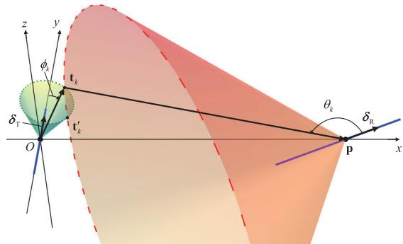  
Fig. 3. 3D localization with near-field estimated parameters.

In this case, the signal processing procedures described in Sections III-A to III-C remain valid. The main difference lies in the range estimation stage in Section III-D, where the distances from the k-th target to both the ISAC-TX and the Sen-RX need to be estimated using near-field range estimation techniques. Such a joint range estimation strategy can further improve the accuracy of range estimation and target localization. However, considering practical wireless network deployment scenarios, the probability that a target simultaneously lies within the nearfield regions of both the ISAC-TX and the Sen-RX is relatively low. Therefore, this case is not elaborated in detail in this paper due to space limitations [50].

## E. 3D Localization for UAV Swarms

This subsection presents a method for localizing $K _ { s }$ lowaltitude UAVs in 3D space using 1D arrays at both the TX and RX. The objective is to determine the position vectors $\mathbf { t } _ { k } , k \in \mathcal { K } _ { s }$ , utilizing known bi-static array placement parameters including, p, $\delta _ { t } , \delta _ { r }$ , along with estimated angle and range parameters such as $\hat { \phi } _ { k } , ~ \hat { \theta } _ { k } , ~ \hat { r } _ { k } .$ , and $\hat { r } _ { t k }$ . The localization is achieved by solving the following system of equations

$$
\lVert \mathbf { t } _ { k } \rVert \cos { \hat { \phi } _ { k } } = \mathbf { t } _ { k } ^ { T } \delta _ { \mathrm { T } } ,\tag{49a}
$$

$$
\| \mathbf { t } _ { k } \| = \hat { r } _ { \mathrm { T } k } ,\tag{49b}
$$

$$
\| \mathbf { t } _ { k } - \mathbf { p } \| \cos { \hat { \theta } _ { k } } = ( \mathbf { t } _ { k } - \mathbf { p } ) ^ { T } \delta _ { \mathrm { R } } ,\tag{49c}
$$

$$
\left\| \mathbf { t } _ { k } - \mathbf { p } \right\| = { \hat { r } } _ { k } - { \hat { r } } _ { \mathrm { T } k } .\tag{49d}
$$

From a geometric perspective, as shown in Fig. 3, (49a) and (49b) define a circle located at distance $r _ { \mathrm { T } k }$ from vertex O of the green cone, represented by the green dashed curve. Similarly, (49c) and (49d) determine a circle at distance rRk from the vertex p of the orange cone, shown as the orange dashed curve. Consequently, the solution corresponds to the intersection of these two circles. In general, provided that $\delta _ { \mathrm { T } } \neq \delta _ { \mathrm { R } }$ , the two circles typically intersect at either one or two points. The estimated position vector $\hat { \mathbf { t } } _ { k } = [ \hat { t } _ { k x } , \hat { t } _ { k y } , \hat { t } _ { k z } ] ^ { T }$

is given by

$$
\begin{array} { r l } & { \left[ \left[ \frac { C _ { k } - \delta _ { \mathrm { R } } \hat { t } _ { k z } } { \delta _ { \mathrm { R } x } } , \hat { r } _ { \mathrm { T } k } \cos \hat { \phi } _ { k } , \frac { C _ { k } \delta _ { \mathrm { R } z } \pm D _ { k } } { \delta _ { \mathrm { R } x } ^ { 2 } x } \right] ^ { T } , } \\ & { \left[ \mathrm { o r } \delta _ { \mathrm { R } x } \neq 0 , \delta _ { \mathrm { R } z } \neq 0 , \right. \right. } \\ & { \left. \left. \left[ \frac { C _ { k } } { \delta _ { \mathrm { R } x } } , \hat { r } _ { \mathrm { T } k } \cos \hat { \phi } _ { k } , \pm E _ { k } \right] ^ { T } , \right. \right. } \\ & { \left. \left. \left[ \pm E _ { k } , \hat { r } _ { \mathrm { T } k } \cos \hat { \phi } _ { k } , \frac { C _ { k } } { \delta _ { \mathrm { R } z } } \right] ^ { T } , \right. \right. } \end{array}\tag{50}
$$

where the auxiliary terms are defined as $\begin{array} { l l l } { C _ { k } } & { \triangleq } & { ( \hat { r } _ { k } \ - } \end{array}$ $\hat { r } _ { \mathrm { T } k } \big ) \cos \hat { \theta } _ { k } - \delta _ { \mathrm { R } y } \hat { r } _ { \mathrm { T } k } \cos \hat { \phi } _ { k } + \delta _ { \mathrm { R } x } p _ { x } + \delta _ { \mathrm { R } y } p _ { y } + \delta _ { \mathrm { R } z } p _ { z } , D _ { k } =$ $\sqrt { C _ { k } ^ { 2 } \delta _ { \mathrm { R } z } ^ { 2 } - ( \delta _ { \mathrm { R } x } ^ { 2 } + \delta _ { \mathrm { R } z } ^ { 2 } ) ( C _ { k } ^ { 2 } - \hat { r } _ { \mathrm { T } k } ^ { 2 } \sin ^ { 2 } \hat { \phi } _ { k } \delta _ { \mathrm { R } x } ^ { 2 } ) }$ , and $\begin{array} { r l } { E _ { k } } & { { } = } \end{array}$ $\begin{array} { r } { \sqrt { \hat { r } _ { \mathrm { T } k } ^ { 2 } \sin ^ { 2 } \hat { \phi } _ { k } - \left( \frac { C _ { k } } { \delta _ { \mathrm { R } x } } \right) ^ { 2 } } } \end{array}$ . Note that when $\delta _ { \mathrm { R } z } = 0 , \delta _ { \mathrm { R } x } = 0 .$ which corresponds to the case where the ISAC-TX and Sen-RX are parallel, the target coordinates cannot be uniquely determined.

Proof: See Appendix B.

By appropriately designing the placement of the Sen-RX, such as setting $\delta _ { \mathrm { R } z } = 0$ , the positions of low-altitude targets become localizable. In this configuration, by discarding the solution where $\hat { t } _ { k z } < 0 .$ , the 3D coordinates of the k-th target can be obtained as

$$
\hat { \mathbf { t } } _ { k } = \left( \frac { C _ { k } } { \delta _ { \mathrm { R } x } } , \hat { r } _ { \mathrm { T } k } \cos \hat { \phi } _ { k } , \sqrt { \hat { r } _ { \mathrm { T } k } ^ { 2 } \sin ^ { 2 } \hat { \phi } _ { k } - \left( \frac { C _ { k } } { \delta _ { \mathrm { R } x } } \right) ^ { 2 } } \right)\tag{51}
$$

## F. Computational Complexity

The overall computational complexity of the proposed sensing framework is analyzed as follows. The delay estimation step computes the delay spectrum $S ( \tau )$ in (20), incurring a complexity of $\mathcal { O } ( P N _ { \tau } Q N M )$ . For the j-th delay cluster, the signal correlation in (23) and the subsequent precoding matrix removal require complexity $\mathcal { O } \left( P \bar { ( Q N M + N M ^ { 2 } ) } \right)$ . The construction of the fourth-order cumulant matrix incurs a complexity of $\mathcal { O } \left( P M ^ { 2 } N ^ { 2 } \right)$ The subsequent vectorization in (38), permutation in (40), and selection-matrix operations in (41), as well as the spatial smoothing procedure, collectively contribute $\mathcal { O } \left( L ^ { 2 } \right)$ where $L \ \triangleq \ ( \tilde { M } + 1 ) ( \tilde { N } + 1 )$ . For the Bartlett-based angle search, the EVD in (45) followed by the 2D spectral search in (46) requires O $\left( L ^ { 3 } + N _ { \phi } N _ { \theta } \bar { L ^ { \jmath } } _ { j } \right)$ , where $N _ { \phi }$ and $N _ { \theta }$ denote the numbers of search points. The near-field range estimation involves an EVD at cost $\mathcal { O } \left( M ^ { 3 } N ^ { 3 } \right)$ followed by a 1D MUSIC search at cost $\mathcal { O } ( J _ { j } N _ { r } \middle ( M N ) ^ { 2 } )$ where $N _ { r }$ denotes the number of search points. Finally, the closed-form 3D localization in (51) requires only $\mathcal { O } ( K _ { s } )$ . In summary, the total computational complexity is $\mathcal { O } \left( P N _ { \tau } Q N M + \dot { K _ { \mathrm { c l u s t e r } } } \left( P Q N M \right) + P M ^ { 2 } N ^ { 2 } + \dot { M } ^ { 3 } N ^ { \overline { { 3 } } } \right) +$ $\begin{array} { r l } { ~ } & { { } \sum _ { j = 1 } ^ { K _ { \mathrm { c l u s t e r } } } \left( N _ { \phi } N _ { \theta } L J _ { j } + J _ { j } N _ { r } M ^ { 2 } N ^ { 2 } \right) } \end{array}$

Although the proposed virtual array implementation for sparse XL-MIMO bistatic near-field sensing largely enhances the sensing resolution, the computational complexity is high. This stems not only from the 2D search required by the bistatic sensing at both the transmitter and receiver, but also from the EVD of the large cumulant matrix. Besides, this method also exhibits greater sensitivity to signal-to-noise ratio (SNR) and number of snapshots due to the increased susceptibility of higher-order statistics.

## IV. SIMULATION RESULTS

In this section, simulation results are presented to validate the performance enhancement in both communication and sensing for sparse XL-MIMO OFDM-ISAC system employing SDNA. The number of subcarriers, number of OFDM symbols, subcarrier spacing, and CP overhead ratio are $Q = 2 5 6 ,$ $P = 2 0 0 0 , 1 2 0 \mathrm { k H z }$ , and $\textstyle \epsilon = { \frac { 1 } { 1 5 } }$ , respectively. We deploy a SDNA with configuration $M \stackrel {  \sim } { = } 2 3 , ( M _ { 1 } , M _ { 2 } ) = ( 6 , 6 )$ at the ISAC-TX while using a compact ULA at the Sen-RX with $N = 3 .$ Note that a SDNA could also be deployed at the Sen-RX to enhance the estimation accuracy of the AoA simultaneously. The position configuration of the ISAC-TX and Sen-RX arrays are $\begin{array} { r } { \mathbf { p } = ( 3 0 0 , 0 , 0 ) \mathrm { m } , \delta _ { \mathrm { R } } = \left( \frac { 1 } { \sqrt { 5 } } , \frac { 2 } { \sqrt { 5 } } , 0 \right) } \end{array}$ The number of communication UEs are $K _ { c } = 5 ,$ and they employ the “one-ring” multi-path channel model, where $L _ { k } =$ 5, $R _ { \mathrm { { r i n g } } } ~ = ~ 5$ m, and $r _ { \mathrm { r i n g } } ~ = ~ 4 0$ m denote the number of multi-path, the radius of each ring, and the range of the center of the ring, respectively [51]. The UEs are uniformly located within a region defined by $\phi _ { k } \sim \mathcal { U } ( - \phi _ { \operatorname* { m a x } } , \phi _ { \operatorname* { m a x } } )$ and rTk $\sim \mathcal { U } ( r _ { \mathrm { m i n } } , r _ { \mathrm { m a x } } )$ , where $\phi _ { \mathrm { m a x } } = 5 ^ { \circ } , r _ { \mathrm { m i n } } = 5 0$ m and $r _ { \operatorname* { m a x } } = 7 0$ m. Unless otherwise stated, $K _ { s } = 5$ low-latitude UAV targets located within the same delay bin are considered to assess the performance of sensing. Besides, the average receive SNR is computed as $\frac { P _ { \mathrm { T } } | \beta _ { k 1 } | ^ { 2 } } { M \sigma _ { c } ^ { 2 } } \ : = \ : 2 0 \ : \mathrm { d B } , \forall k \ : \in \ : \bar { \mathcal { K } } _ { c }$ and $\begin{array} { r } { \frac { P _ { \mathrm { T } } | \alpha _ { k , p } | ^ { 2 } } { M \sigma _ { \mathrm { \it ~ \it ~ \cdot ~ } } ^ { 2 } } = 2 0 ~ \mathrm { d B } , \forall k ~ \in ~ { \mathcal K } _ { s } , } \end{array}$ , where $\beta _ { k 1 }$ denotes the path gain of the LoS channel of UE k and the Rician factor is set to be 20 dB [18]. All simulations are conducted over 100 Monte Carlo trials. For angle estimation, the Bartlett [52] algorithm is adopted with a search step size of $0 . 5 ^ { \circ }$ while the MUSIC algorithm [53] with a step size of 0.1 m is utilized for range estimation. Besides, the root-mean-squared error (RMSE) of angle estimation is defined as $\mathrm { R M S E } _ { \mathrm { A o D } } =$ $\begin{array} { r } { \sqrt { \frac { 1 } { K _ { s } } \sum _ { k = 1 } ^ { K _ { s } } \left( \hat { \phi } _ { k } - \phi _ { k } \right) ^ { 2 } } } \end{array}$ , where $\hat { \phi } _ { k }$ denotes the estimated AoDs for the k-th target. The RMSE for the AoA is defined analogously.

Fig. 4 and Fig. 5 illustrate the delay estimation performance based on (20). Here, we consider 5 low-altitude target clusters with delays that are equally spaced between $\begin{array} { r } { \frac { 1 0 0 } { c _ { 0 } } \mathrm { ~ s ~ } \mathrm { a n d } \ \frac { 2 0 0 } { c _ { 0 } } \mathrm { ~ s } . } \end{array}$ The RMSE of delay estimation is defined as $\mathrm { \Delta R M S E _ { d e l a y } = }$ $\begin{array} { r } { \sqrt { \frac { 1 } { K _ { \mathrm { c l u s t e r } } } \sum _ { j = 1 } ^ { K _ { \mathrm { c l u s t e r } } } \left( \hat { \tau } _ { j } - \tilde { \tau } _ { j } \right) ^ { 2 } } } \end{array}$ , where $\hat { \tau } _ { j }$ denotes the estimated delay of the j-th cluster. In addition, the search step size is set to $\Delta \tau = { \frac { 0 . 1 \mathrm { m } } { c _ { 0 } } }$ . From Fig. 4, it can be observed that the delays of these low-altitude target clusters are accurately estimated. As shown in Fig. 5, the delay estimation error is below $3 . 7 6 \times$ $1 0 ^ { - 1 0 }$ s, corresponding to 0.1128 m in range. This error can be further reduced by increasing the number of subcarriers $Q .$ These results provide an accurate basis for the subsequent angle and range estimation.

TABLE I  
THE POSITION OF TARGETS AND THEIR CORRESPONDING GROUNDTRUTH AODS AND AOAS
<table><tr><td rowspan=1 colspan=1>Targets&#x27; region</td><td rowspan=1 colspan=3>Near-field</td><td rowspan=1 colspan=2>Far-field</td></tr><tr><td rowspan=1 colspan=1>Coordinate (m)</td><td rowspan=1 colspan=1>[20, 8.66, 5]</td><td rowspan=1 colspan=1>[20, 7.07, 7.07]</td><td rowspan=1 colspan=1>[20, 5, 8.66]</td><td rowspan=1 colspan=1>[100, 0, 18.5]</td><td rowspan=1 colspan=1>[100, -18.5, 0]</td></tr><tr><td rowspan=1 colspan=1>AoD (°)</td><td rowspan=1 colspan=1>67.2</td><td rowspan=1 colspan=1>71.6</td><td rowspan=1 colspan=1>77.1</td><td rowspan=1 colspan=1>90</td><td rowspan=1 colspan=1>100.5</td></tr><tr><td rowspan=1 colspan=1>AoA (°)</td><td rowspan=1 colspan=1>114.8</td><td rowspan=1 colspan=1>115.1</td><td rowspan=1 colspan=1>115.5</td><td rowspan=1 colspan=1>116.4</td><td rowspan=1 colspan=1>121.8</td></tr></table>

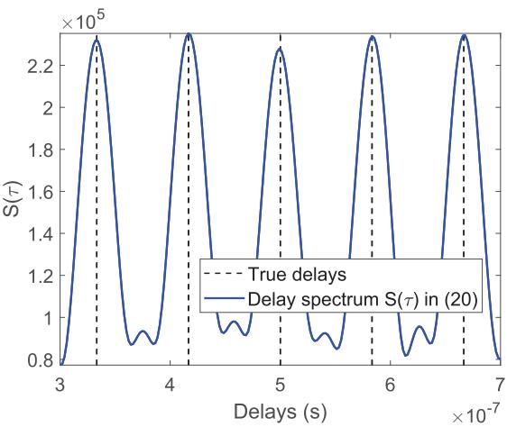  
Fig. 4. Illustration of delay estimation spectrum $S ( \tau )$

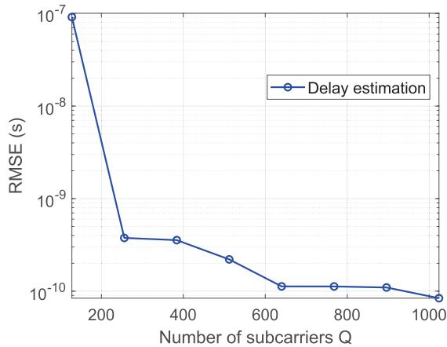  
Fig. 5. RMSE of delay estimation.

Fig. 6 and Fig. 7 compare the far-field and near-field AoD and AoA sensing performance between compact XL-MIMO and sparse XL-MIMO with antenna spacing of $\begin{array} { r } { d = \frac { \lambda } { 2 } } \end{array}$ and $\begin{array} { r } { d = \frac { \lambda } { 4 } } \end{array}$ , respectively. The considered methods include: Using a compact ULA at the ISAC-TX and sensing directly in the physical array domain (ULA-phy); Employing a sparse XL-MIMO, i.e., SDNA, at the ISAC-TX and performing sensing in the physical array domain (SDNA-phy); Adopting a sparse XL-MIMO at the ISAC-TX and performing sensing in the second-order virtual array domain (SDNA-2nd-vir) provided in [35]; Utilizing a sparse XL-MIMO at the ISAC-TX and performing sensing in the fourth-order virtual array domain (SDNA-4th-vir) proposed in Section III. We reiterate that all considered methods employ a compact ULA at the Sen-RX. Here, the position of these targets and their corresponding groundtruth AoDs and AoAs are provided in Table I, and the two-hop distances of targets in the same delay bin are $r _ { k } = \tau _ { k } c = 3 0 2 . 5 \mathrm { m } , k \in \mathcal { K } _ { s }$ . As such, the first 3 targets locate at the near-field region of ISAC-TX, and the rest not. Comparing Fig. 6 and 7 overall, it can be observed that when the adjacent antenna spacing is $d = \lambda / 2$ , the sensing beam is narrower than that of the corresponding algorithm when the unit antenna spacing is $\lambda / 4 .$ This is because, under the same number of antennas and array architecture, the aperture of the former is twice that of the latter. Besides, in Fig. 6, when using an array with half-wavelength spacing, i.e., $d = \lambda / 2$ none of the three near-field targets can be effectively estimated. Specifically, ULA-phy, SDNA-phy, and SDNA-2nd-vir do not deal with the near-field second-order phase term χk, leading to failure of angle estimation. Although SDNA-4thvir decouples the angle and distance dependency, retaining only the first-order angle-related term $\omega _ { k } , \kappa _ { k }$ , the resulting virtual array has a sparse ULA structure with one-wavelength spacing, which introduces angle ambiguity issues in the AoD and AoA domains. On the other hand, by comparing these sensing algorithms horizontally, it can be observed that in terms of sensing beam width, $\mathrm { B W _ { U L A - p h y } \mathrm { ~ > ~ } B W _ { S D N A - p h y } }$ ≈ $\mathrm { B W _ { S D N A - 2 n d - v i r } \mathrm { ~ > ~ } B W _ { S D N A - 4 t h - v i r } }$ . This is because the effective sensing aperture of SDNA is larger than that of the compact ULA, and the 4th-order virtual array technology further extends the aperture. Specifically, for Fig. 6(a) and Fig. 7(a), compact ULA with sensing on physical array can not distinguish the near-field targets due to the limited resolution. For Fig. 6(b) and Fig. 7(b), sensing with SDNA on physical array introduces lots of grating lobes as shown in the spectrum. For Fig. 6(c) and Fig. 7(c), using SDNA with 2nd-order virtual array technology for sensing, the near-field targets can not be estimated effectively due to the influence of second order phase term $\chi _ { k }$ . For Fig. 7(d), adopting SDNA 4th-order virtual array sensing can effective estimate both the far-field and nearfield targets with a relatively high resolution.

Fig. 8(a) and Fig. 8(b) show the RMSE of the AoD and AoA with respect to the SNR for near-field targets when the array’s unit inter-element spacing is $\begin{array} { l l l } { { d } } & { { = } } & { { { \frac { \lambda } { 4 } } } } \end{array}$ . Here, we consider 5 densely located near-field targets located at $\mathbf { t } _ { k } \ = \ \left( r _ { x } , r _ { h } \right.$ sin $\zeta _ { k } , r _ { h }$ cos ζk), ∀k ∈ J , with horizontal distance $r _ { x } ~ = ~ 2 0$ m, vertical radius $r _ { h } ~ = ~ 1 0 ~ \mathrm { m }$ , while $\zeta _ { k } \sim \mathcal { U } ( - \zeta _ { \operatorname* { m a x } } , \zeta _ { \operatorname* { m a x } } )$ and $\zeta _ { \mathrm { m a x } } ~ = ~ \frac { \pi } { 8 }$ . It is easy to find that the RMSE of the ULA-phy, SDNA-phy and SDNA-2ndvir methods are much larger than that of the SDNA-4th-vir. This is because compact ULA has limited aperture, resulting to the limited spatial resolution. Even though SDNA largely extends the aperture, the sensing performance of the SDNAphy will be affected by the grating lobes of SDNA, while the SDNA-2nd-vir method is affected by the range-dependent phase term χk. By contrast, the proposed SDNA-4th-vir method realizes a much better sensing performance due to its enlarged aperture of virtual array without near-field angle and range coupling effect. Fig. 8(b) shows the RMSE of AoA estimation for the same set of targets at the Sen-RX. Since the targets are in the far-field region of Sen-RX, the nearfield coupling effect does not appear at the receiver side. Consequently, all methods achieve reasonably good estimation performance. Furthermore, it is worth noting that the proposed SDNA-4th-vir method still achieves the best AoA estimation performance among all methods. This is because the AoA is estimated jointly with AoD in our framework (as described in Section III-B), and the high-precision AoD estimates obtained from the fourth-order virtual array processing contribute to improved accuracy in the joint angle estimation. In Fig. 8(c), we increase the number of antennas at ISAC-TX to 31 with SDNA configured by ${ \mathcal { D } } ( 8 , 8 )$ and set $\zeta _ { \mathrm { m a x } } ~ = ~ \frac { \pi } { 3 }$ . As such, SDNA-4th-vir still has the best sensing performance, followed by ULA-phy. This is because the sensing of SDNAphy and SDNA-2nd-vir are injured by near-field effect more severely due to their enlarged aperture compared to compact ULA. However, it can also be observed that at low

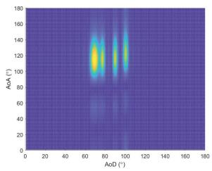  
(a) ULA with physical array.

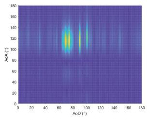  
(b) SDNA with physical array.

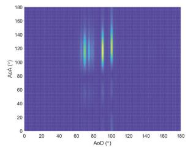

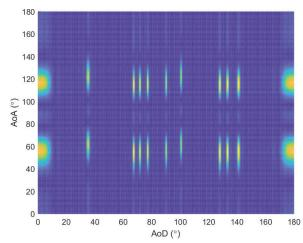  
(c) SDNA with 2nd-order virtual array. (d) SDNA with 4th-order virtual array.

Fig. 6. AoD and AoA sensing performance of compact XL-MIMO and sparse XL-MIMO with $\begin{array} { r } { d = \frac { \lambda } { 2 } } \end{array}$  
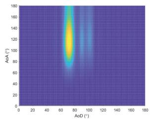  
(a) ULA with physical array

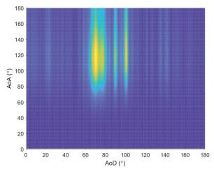  
(b) SDNA with physical array.

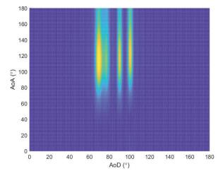

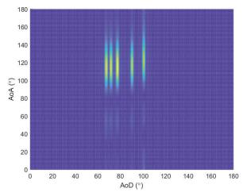  
(c) SDNA with 2nd-order virtual array. (d) SDNA with 4th-order virtual array

Fig. 7. AoD and AoA sensing performance of compact XL-MIMO and sparse XL-MIMO with $\begin{array} { r } { d = \frac { \lambda } { 4 } . } \end{array}$  
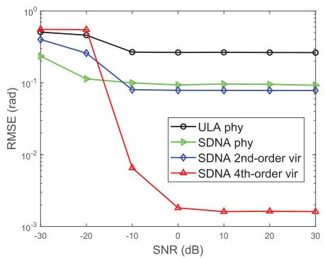  
(a) AoD RMSE with $M = 2 3 .$

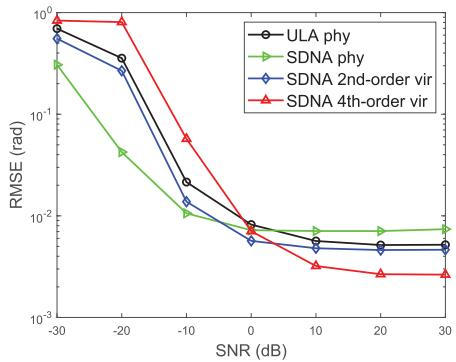  
(b) AoA RMSE with $M = 2 3 .$

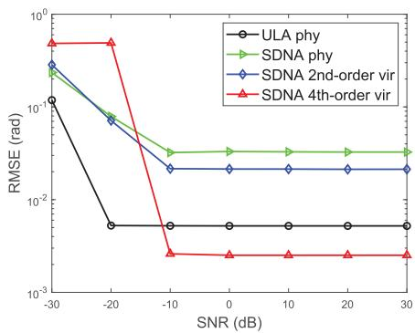  
(c) AoD RMSE with $M = 3 1$  
Fig. 8. AoD and AoA RMSE versus SNR.

SNR, the fourth-order cumulant method may exhibit relatively poor performance. This is because higher-order statistics are inherently more susceptible to noise interference. Moreover, for methods based on higher-order statistics in virtual array processing, the corresponding Cramer-Rao bound does not´ decrease monotonically with increasing SNR, and therefore the RMSE approaches a lower bound as the SNR grows [46], [54].

Fig. 9 presents the communication performance of the sparse XL-MIMO based on SDNA and the conventional compact XL-MIMO versus SNR. The multiple UEs are densely distributed, with $r _ { \mathrm { m i n } } ~ = ~ 1 0 0 ~ \mathrm { m } , ~ r _ { \mathrm { m a x } } ~ = ~ 1 2 0$ m and $\phi _ { \mathrm { m a x } } = 5 ^ { \circ }$ . Firstly, it is observed that the sparse XL-MIMO always achieves a higher sum rate than conventional compact XL-MIMO. This is because sparse MIMO provides superior spatial resolution, enabling more effective suppression of IUI specially in densely distributed multi-user scenarios. Secondly, communication rates achieved through MMSE and ZF precoding methods surpass that of the MRT precoding scheme. This advantage stems from the stronger IUI eliminating capability of MMSE and ZF compared to MRC. Moreover, in the sparse design, the significantly enlarged array aperture provides finer spatial resolution and lower inter-user correlation, which alleviates the noise enhancement issue in ZF and thus narrows the performance gap between ZF and MMSE compared to the compact scenario. Fig. 10 presents the communication performance of the sparse XL-MIMO based on SDNA and the conventional compact XL-MIMO versus the number of transmit antennas M. Results show that the data rates of both compact and sparse XL-MIMO increase as M increases, due to the increased beamforming gain and spatial resolution. Nevertheless, sparse XL-MIMO maintains significantly higher sum rates across all antenna configurations. This gain is attributed to its enhanced spatial resolution and correspondingly better IUI suppression capability compared with compact MIMO.

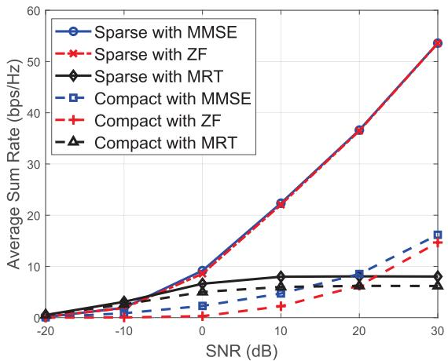  
Fig. 9. Average sum rates of sparse XL-MIMO and compact XL-MIMO vs. SNR.

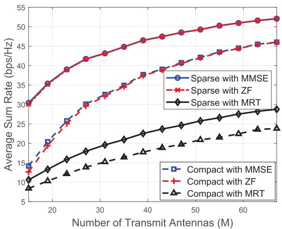  
Fig. 10. Average sum rates of sparse XL-MIMO and compact XL-MIMO vs. number of transmit antennas M.

After obtaining the AoDs and AoAs of the UAV targets, we can estimate their ranges from the ISAC-TX based on (48). To present the results concisely, the range pseudo-spectra of all $K _ { s }$ targets are consolidated into a single plot, as shown in Fig. 11. It can be observed that the near-field ranges corresponding to these targets can be effectively estimated by peak searching on each curve. Fig. 12 shows the 3D localization of targets located at the near-field region of ISAC-TX using 1D linear arrays at both ends of bi-static link. Here we set the 5 targets at the region with $r _ { x } = 2 0 \mathrm { m } , r _ { h } = 2 0$ m and $\zeta _ { \mathrm { m a x } } = \frac { \pi } { 3 }$ . In the figure, the green circle represents the actual position of the targets, and the solid green line is its projection onto the $x - y$ plane. The red dot indicates the estimated position of the targets, and the solid red line shows its projection onto the $x - y$ plane. It can be observed that the five targets achieve effective 3D localization, validating the feasibility of the proposed method in Section III-E.

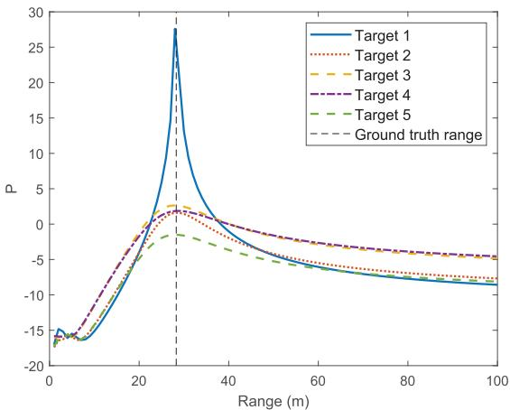  
Fig. 11. Spectrum of near-field range estimation.

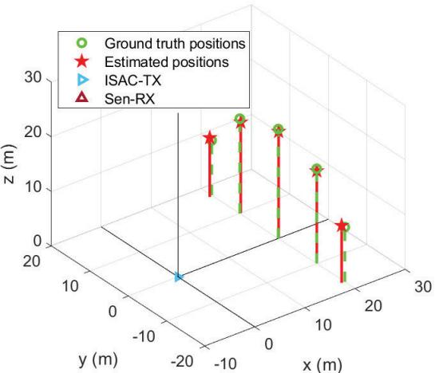  
Fig. 12. 3D Localization using 1D arrays at the ISAC-TX and the Sen-RX based on (51).

Fig. 13 presents the RMSE of the angle estimation versus SNR when sparse arrays are deployed at both the ISAC-TX and Sen-RX, where the array architectures are configured as $( M _ { 1 } , M _ { 2 } ) \ : = \ : ( 3 , 3 )$ and $( N _ { 1 } , N _ { 2 } ) \ = \ ( 2 , 3 )$ . Besides, we set $r _ { x } ~ = ~ 3 0$ m and $r _ { h } ~ = ~ 1$ 100 m, with $\zeta _ { \mathrm { m a x } } ~ = ~ \frac { \pi } { 3 }$ . First, it can be observed that the proposed SDNA-4th-vir method achieves the best sensing performance for both AoD and AoA estimation, significantly outperforming the other methods. Second, the performance of ULA-phy is the worst due to its insufficient spatial resolution. Third, the performance of the SDNA-phy is better than that of SDNA-2nd-vir method, since the latter is degraded by false peaks caused by grating lobes. For AoA estimation, the proposed SDNA-4th-vir also significantly outperforms the others, owing to the enhanced spatial resolution provided by the virtual array.

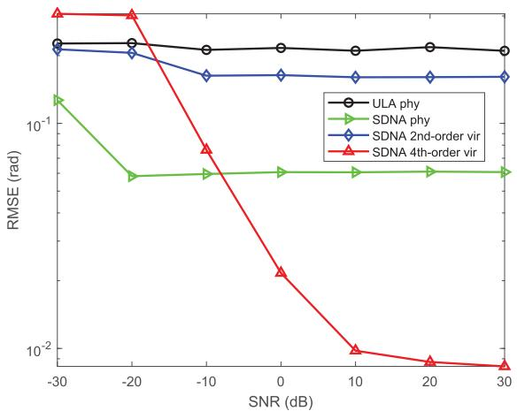

(a) AoD RMSE.  
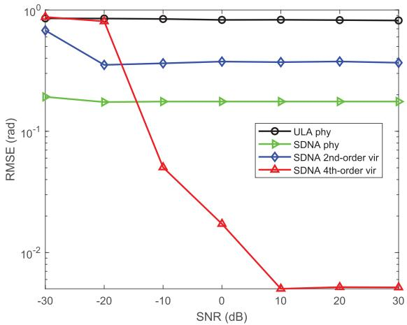  
(b) AoA RMSE.  
Fig. 13. Angle estimation RMSE versus SNR for sparse arrays being deployed at both the ISAC-TX and Sen-RX.

## V. CONCLUSION

In this paper, a sparse XL-MIMO bi-static near-field ISAC system for low-altitude UAV swarm is investigated. A fourthorder bi-static virtual array technology with enhanced sensing and 3D localization capability for near-field UAV swarm is proposed. This technique effectively constructs virtual arrays offering enhanced sensing performance compared to conventional XL-MIMO, while circumventing the angle and range coupling issue inherent in near-field steering vectors. Furthermore, a 3D localization approach is provided, which is capable of estimating the positions of near-field UAV targets using only 1D linear arrays at both ISAC-TX and Sen-RX. Extensive simulations demonstrate the superior performance of the proposed sparse XL-MIMO over conventional compact XL-MIMO in terms of both sensing and communication, highlighting its potential as an effective solution for nextgeneration low-altitude UAV ISAC systems.

APPENDIX A PROOF OF (a) IN (19)

Define ${ \bf G } _ { q } ~ = ~ e ^ { - j 2 \pi q \Delta f \bar { \tau } _ { i } } { \bf b } _ { q , p } { \bf b } _ { q , p } ^ { H } ,$ , we have $\begin{array} { l l } { \operatorname { E } \left[ \mathbf { G } _ { q } \right] } & { = } \end{array}$ $e ^ { - j 2 \pi q \Delta f \bar { \tau } _ { i } } \mathrm { E } ^ { ^ { \prime } } \big [ { \bf b } _ { q , p } { \bf b } _ { q , p } ^ { H } \big ] = e ^ { - j 2 \pi q \Delta f \bar { \tau } _ { i } } \mathrm { \bf I } _ { M }$ and

$$
\begin{array} { r l } & { \mathrm { v a r } [ \mathbf { G } _ { q } ] = \mathrm { E } \left[ \left. \mathbf { G } _ { q } - \mathrm { E } [ \mathbf { G } _ { q } ] \right. _ { F } ^ { 2 } \right] } \\ & { \qquad = \mathrm { E } \left[ \left. e ^ { - j 2 \pi q \Delta f \bar { \tau } _ { i } } ( \mathbf { b } _ { q , p } \mathbf { b } _ { q , p } ^ { H } - \mathbf { I } _ { M } ) \right. _ { F } ^ { 2 } \right] } \\ & { \qquad = \mathrm { E } \left[ \left. \mathbf { b } _ { q , p } \mathbf { b } _ { q , p } ^ { H } - \mathbf { I } _ { M } \right. _ { F } ^ { 2 } \right] , } \end{array}\tag{52}
$$

where $\| \cdot \| _ { F }$ is Frobenius norm. It is easy to obtain that

$$
\| \mathbf { b } _ { q , p } \mathbf { b } _ { q , p } ^ { H } - \mathbf { I } _ { M } \| _ { F } ^ { 2 } = \| \mathbf { b } _ { q , p } \| ^ { 4 } - 2 \| \mathbf { b } _ { q , p } \| ^ { 2 } + M .\tag{53}
$$

As such, (52) can be expressed as

$$
\begin{array} { r l } & { \mathrm { v a r } [ \mathbf { G } _ { q } ] = \mathrm { E } \left[ \Vert \mathbf { b } _ { q , p } \Vert ^ { 4 } - 2 \Vert \mathbf { b } _ { q , p } \Vert ^ { 2 } + M \right] } \\ & { \quad \quad \quad = \mathrm { E } [ \Vert \mathbf { b } _ { q , p } \Vert ^ { 4 } ] - 2 \mathrm { E } [ \Vert \mathbf { b } _ { q , p } \Vert ^ { 2 } ] + M } \\ & { \quad \quad \stackrel { ( d ) } { = } \mathrm { E } [ \Vert \mathbf { b } _ { q , p } \Vert ^ { 4 } ] - M , } \end{array}\tag{54}
$$

where (d) holds due to $\begin{array} { r } { \mathrm { E } [ | | { \bf b } _ { q , p } | | ^ { 2 } ] = \mathrm { t r } ( \mathrm { E } [ { \bf b } _ { q , p } { \bf b } _ { q , p } ^ { H } ] ) = } \end{array}$ $\mathrm { t r } ( \mathbf { I } _ { M } ) = M$

However, we can not obtain the value of $\operatorname { E } [ \| \mathbf { b } _ { q , p } \| ^ { 4 } ]$ in (54) based on the available conditions. To deal with this problem, we further assume that $\mathbf { b } _ { q , p }$ satisfies complex Gaussian distribution, i.e., $\mathbf { b } _ { q , p } \sim \mathcal { C N } ( \mathbf { 0 } , \mathbf { I } _ { M } )$ . Based on this, we have $b _ { k , q , p } \sim \mathcal { C N } ( 0 , 1 )$ and $| b _ { k , q , p } | ^ { 2 } \sim \frac { 1 } { 2 } \chi ^ { 2 } ( 2 ) , k = 1 , \ldots , K$ where $\chi ^ { 2 } ( 2 )$ is chi-square distribution with 2 DoFs. Besides, the factor of $\textstyle { \frac { 1 } { 2 } }$ comes from the normalization of the variances of the real and imaginary Gaussian components. By the additivity of the chi-square distribution, we have

$$
\| \mathbf { b } _ { q , p } \| ^ { 2 } \sim \frac { 1 } { 2 } \chi _ { 2 M } ^ { 2 } .\tag{55}
$$

Then, we have $\begin{array} { r l r } { \mathrm { E } [ \| \mathbf { b } _ { q , p } \| ^ { 2 } ] } & { { } = } & { \frac { 1 } { 2 } \mathrm { E } [ \chi _ { 2 M } ^ { 2 } ] \quad = \quad M } \end{array}$ and var $[ \| \mathbf { b } _ { q , p } \| ^ { 2 } ] \ = \ \textstyle { \frac { 1 } { 4 } } \mathrm { v a r } [ \bar { \chi _ { 2 M } ^ { 2 } } ] \ = \ M . \ \bar { \mathrm {  ~ \ A s ~ } }$ such, we can get $\mathrm { E } [ \| \tilde { \mathbf { b } } _ { q , p } \| ^ { 4 } ] = \mathrm { v a r } [ \| \mathbf { b } _ { q , p } \| ^ { 2 } ] + ( \mathrm { E } [ \| \mathbf { b } _ { q , p } \| ^ { 2 } ] ) ^ { 2 } = M + M ^ { 2 }$ and (54) is further expressed as

$$
\operatorname { v a r } [ \mathbf { G } _ { q } ] = M ^ { 2 } .\tag{56}
$$

This implies that for uncorrelated random variables $\mathbf { G } _ { q } ,$ their variances $\mathrm { v a r } [ \mathbf { G } _ { q } ]$ are bounded, i.e., there exists a constant $C$ satisfying var $[ \mathbf { \ddot { G } } _ { q } ] = M ^ { 2 } \leq C$ for all $q \geq 1$ . Based on the Chebyshev’s law of large numbers [55], the sample mean will converge to the expected mean, i.e.,

$$
\frac { 1 } { Q } \sum _ { q \in \mathcal { Q } } \mathbf { G } _ { q } \xrightarrow [ ] { p } \frac { 1 } { Q } \sum _ { q \in \mathcal { Q } } e ^ { - j 2 \pi q \Delta f \bar { \tau } _ { i } } \mathbf { I } _ { M } ,\tag{57}
$$

where $\xrightarrow { p }$ means convergence in probability. As such, we have

$$
\begin{array} { r c l } { { \displaystyle \frac { 1 } { Q } \sum _ { q \in { \mathcal Q } } { \bf G } _ { q } \approx \frac { 1 } { Q } \sum _ { q \in { \mathcal Q } } e ^ { - j 2 \pi q \Delta f \bar { \tau } _ { i } } { \bf I } _ { M } } } \\ { { } } & { { } } \\ { { } } & { { } } & { { = \frac { e ^ { - j 2 \pi \Delta f \bar { \tau } _ { i } } ( 1 - e ^ { - j 2 \pi Q \Delta f \bar { \tau } _ { i } } ) } { Q ( 1 - e ^ { - j 2 \pi \Delta f \bar { \tau } _ { i } } ) } { \bf I } _ { M } } } \\ { { } } & { { } } \\ { { } } & { { } } & { { = e ^ { - j \pi ( Q + 1 ) \Delta f \bar { \tau } _ { i } } \displaystyle \frac { \sin ( \pi Q \Delta f \bar { \tau } _ { i } ) } { Q \sin ( \pi \Delta f \bar { \tau } _ { i } ) } { \bf I } _ { M } . } } \end{array}\tag{58}
$$

Therefore, the proof of (23) is completed.

First, based on (49a) and (49b), it is easy to obtain $\hat { t } _ { k y } =$ $\hat { r } _ {  { \mathrm { T } } k }$ cos $\hat { \phi } _ { k }$ . Substitute $\hat { t } _ { k y }$ to (49b), we have

$$
\begin{array} { r } { \hat { t } _ { k x } ^ { 2 } + \hat { t } _ { k z } ^ { 2 } = \hat { r } _ { \mathrm { T } k } ^ { 2 } \sin \hat { \phi } _ { k } ^ { 2 } . } \end{array}\tag{59}
$$

Combining (49c), (49d) and $\hat { t } _ { k y } ,$ we obtain the following equation, i.e.,

$$
\begin{array} { r } { \left( \hat { r } _ { k } - \hat { r } _ { \mathrm { T } k } \right) \cos \hat { \theta } _ { k } = \delta _ { \mathrm { R } x } ( \hat { t } _ { k x } - p _ { x } ) + \delta _ { \mathrm { R } y } ( r _ { \mathrm { T } k } \cos \hat { \phi } _ { k } - p _ { y } ) ~ } \\ { + \delta _ { \mathrm { R } z } ( \hat { t } _ { k z } - p _ { z } ) , ~ \ ~ \ ( 6 0 ) } \end{array}
$$

which can be simplified to

$$
\begin{array} { r l } & { \delta _ { \mathrm { R } x } \hat { t } _ { k x } + \delta _ { \mathrm { R } z } \hat { t } _ { k z } = \left( \hat { r } _ { k } - \hat { r } _ { \mathrm { T } k } \right) \cos \hat { \theta } _ { k } - \delta _ { \mathrm { R } y } \hat { r } _ { \mathrm { T } k } \cos \hat { \phi } _ { k } } \\ & { ~ + \delta _ { \mathrm { R } x } p _ { x } + \delta _ { \mathrm { R } y } p _ { y } + \delta _ { \mathrm { R } z } p _ { z } . } \end{array}\tag{61}
$$

Based on (61), for $\delta _ { \mathrm { R } z } \neq 0 , \delta _ { \mathrm { R } x } \neq 0$ , we get

$$
\hat { t } _ { k x } = \frac { C _ { k } - \delta _ { \mathrm { R } z } \hat { t } _ { k z } } { \delta _ { \mathrm { R } x } } ,\tag{62}
$$

where $C _ { k } \ { \overset { \Delta } { = } } \ \left( { \hat { r } } _ { k } - { \hat { r } } _ { \mathrm { T } k } \right)$ cos $\hat { \theta } _ { k } - \delta _ { \mathrm { R } y } \hat { r } _ { \mathrm { T } k }$ cos $\hat { \phi } _ { k } + \delta _ { \mathrm { R } x } p _ { x } +$ $\delta _ { \mathrm { R } y } p _ { y } + \delta _ { \mathrm { R } z } p _ { z }$

Substitute (62) into (59), and we get

$$
( \delta _ { \mathrm { R } x } + \delta _ { \mathrm { R } z } ) \hat { t } _ { k z } ^ { 2 } - 2 C _ { k } \delta _ { \mathrm { R } z } \hat { t } _ { k z } + C _ { k } ^ { 2 } - \hat { r } _ { \mathrm { T } k } ^ { 2 } \sin \hat { \phi } _ { k } ^ { 2 } \delta _ { \mathrm { R } x } ^ { 2 } = 0 .\tag{63}
$$

Solving this equation yields

$$
\hat { t } _ { k z } = \frac { C _ { k } \delta _ { \mathrm { R } z } \pm \sqrt { C _ { k } ^ { 2 } \delta _ { \mathrm { R } z } ^ { 2 } - ( \delta _ { \mathrm { R } x } ^ { 2 } + \delta _ { \mathrm { R } z } ^ { 2 } ) ( C _ { k } ^ { 2 } - \hat { r } _ { \mathrm { T } k } ^ { 2 } \sin ^ { 2 } \hat { \phi } _ { k } \delta _ { \mathrm { R } x } ^ { 2 } ) } } { \delta _ { \mathrm { R } x } ^ { 2 } + \delta _ { \mathrm { R } z } ^ { 2 } } ,\tag{64}
$$

For $\delta _ { \mathrm { R } z } = 0 , \delta _ { \mathrm { R } x } \neq 0$ , we have $\begin{array} { r } { \hat { t } _ { k x } = \frac { C _ { k } } { \delta _ { \mathrm { R } x } } } \end{array}$ , and

$$
\hat { t } _ { k z } = \pm \sqrt { \hat { r } _ { \mathrm { T } k } ^ { 2 } \sin ^ { 2 } \hat { \phi } _ { k } - \left( \frac { C _ { k } } { \delta _ { \mathrm { R } x } } \right) ^ { 2 } } .\tag{65}
$$

For $\delta _ { \mathrm { R } z } \neq 0 , \delta _ { \mathrm { R } x } = 0 .$ , we have $\begin{array} { r } { \hat { t } _ { k z } = \frac { C _ { k } } { \delta _ { \mathrm { R } z } } } \end{array}$ , and

$$
\hat { t } _ { k x } = \pm \sqrt { \hat { r } _ { \mathrm { T } k } ^ { 2 } \sin ^ { 2 } \hat { \phi } _ { k } - \left( \frac { C _ { k } } { \delta _ { \mathrm { R } z } } \right) ^ { 2 } } .\tag{66}
$$

Therefore, the proof of (50) is completed.

## REFERENCES

[1] H. Min, X. Li, and Y. Zeng, “Near-field sparse MIMO bistatic OFDM-ISAC for low-altitude UAV swarm,” in Proc. GLOBECOM-EEE Global Commun. Conf., Dec. 2025, pp. 1920–1925.

[2] Y. Song et al., “An overview of cellular ISAC for low-altitude UAV: New opportunities and challenges,” IEEE Commun. Mag., vol. 63, no. 12, pp. 88–95, Dec. 2025.

[3] Y. Zhang, J. Wang, G. Du, J. Chen, J. Wang, and Q. Li, “ISAC-aided UAV swarms: From networked perception to capability evolution,” IEEE Commun. Mag., vol. 62, no. 9, pp. 60–66, Sep. 2024.

[4] S. Javed et al., “State-of-the-art and future research challenges in UAV swarms,” IEEE Internet Things J., vol. 11, no. 11, pp. 19023–19045, Jun. 2024.

[5] Framework and Overall Objectives of the Future Development of IMT for 2030 and Beyond, ITU-R, Geneva, Switzerland, Jun. 2023.

[6] F. Liu et al., “Integrated sensing and communications: Toward dualfunctional wireless networks for 6G and beyond,” IEEE J. Sel. Areas Commun., vol. 40, no. 6, pp. 1728–1767, Jun. 2022.

[7] Q. Dai et al., “A tutorial on MIMO-OFDM ISAC: From far-field to nearfield,” IEEE Commun. Surveys Tuts., vol. 28, pp. 4319–4358, 2026.

[8] Y. Alqudsi and M. Makaraci, “UAV swarms: Research, challenges, and future directions,” J. Eng. Appl. Sci., vol. 72, no. 1, p. 12, Jan. 2025.

[9] X. Wang, W. Zhai, X. Wang, M. G. Amin, and K. Cai, “Wideband near-field integrated sensing and communication with sparse transceiver design,” IEEE J. Sel. Topics Signal Process., vol. 18, no. 4, pp. 662–677, May 2024.

[10] H. Lu et al., “A tutorial on near-field XL-MIMO communications towards 6G,” IEEE Commun. Surveys Tuts., vol. 26, no. 4, pp. 2213–2257, 4th Quart., 2024.

[11] X. Wang, W. Zhai, X. Zhang, X. Wang, and M. G. Amin, “Enhanced automotive sensing assisted by joint communication and cognitive sparse MIMO radar,” IEEE Trans. Aerosp. Electron. Syst., vol. 59, no. 5, pp. 4782–4799, Oct. 2023.

[12] X. Li et al., “Sparse MIMO for ISAC: New opportunities and challenges,” IEEE Wireless Commun., vol. 32, no. 4, pp. 170–178, Aug. 2025.

[13] H. Wang et al., “Enhancing spatial multiplexing and interference suppression for near- and far-field communications with sparse MIMO,” IEEE Trans. Commun., vol. 74, pp. 5765–5782, 2026.

[14] P. Pal and P. P. Vaidyanathan, “Nested arrays: A novel approach to array processing with enhanced degrees of freedom,” IEEE Trans. Signal Process., vol. 58, no. 8, pp. 4167–4181, Aug. 2010.

[15] P. P. Vaidyanathan and P. Pal, “Sparse sensing with co-prime samplers and arrays,” IEEE Trans. Signal Process., vol. 59, no. 2, pp. 573–586, Feb. 2011.

[16] A. Moffet, “Minimum-redundancy linear arrays,” IEEE Trans. Antennas Propag., vol. AP-16, no. 2, pp. 172–175, Mar. 1968.

[17] H. Min, C. Feng, R. Li, and Y. Zeng, “Integrated sensing and communication with nested array: Beam pattern and performance analysis,” in Proc. 16th Int. Conf. Wireless Commun. Signal Process. (WCSP), Oct. 2024, pp. 764–769.

[18] H. Wang and Y. Zeng, “Can sparse arrays outperform collocated arrays for future wireless communications?,” in Proc. IEEE Globecom Workshops (GC Wkshps), Dec. 2023, pp. 667–672.

[19] H. Min, X. Li, R. Li, and Y. Zeng, “Integrated localization and communication with sparse MIMO: Will virtual array technology also benefit wireless communication?,” IEEE Trans. Signal Process., vol. 73, pp. 5090–5105, 2025.

[20] X. Li, H. Min, X. Xu, and Y. Zeng, “Hybrid physical and virtual array based OFDM-ISAC with sparse MIMO for dense users and targets,” in Proc. IEEE Int. Medit. Conf. Commun. Netw. (MeditCom), Jul. 2025, pp. 1–6.

[21] X. Li, Z. Dong, Y. Zeng, S. Jin, and R. Zhang, “Multi-user modular XL-MIMO communications: Near-field beam focusing pattern and user grouping,” IEEE Trans. Wireless Commun., vol. 23, no. 10, pp. 13766–13781, Oct. 2024.

[22] K. Chen, C. Qi, G. Y. Li, and O. A. Dobre, “Near-field multiuser communications based on sparse arrays,” IEEE J. Sel. Top. Sign. Proces., vol. 18, no. 4, pp. 619–632, May 2024.

[23] C. Zhou, C. You, H. Zhang, L. Chen, and S. Shi, “Sparse array enabled near-field communications: Beam pattern analysis and hybrid beamforming design,” IEEE Trans. Wireless Commun., vol. 24, no. 12, pp. 10261–10277, Dec. 2025.

[24] H. Lu, Y. Zeng, S. Ma, B. Li, S. Jin, and R. Zhang, “Wireless communication for low-altitude economy with UAV swarm enabled twolevel movable antenna system,” IEEE Trans. Wireless Commun., vol. 25, pp. 16463–16479, 2026.

[25] H. Wang, Z. Xiao, and Y. Zeng, “Cramer–Rao bounds for near-´ field sensing with extremely large-scale MIMO,” IEEE Trans. Signal Process., vol. 72, pp. 701–717, 2024.

[26] Y.-D. Huang and M. Barkat, “Near-field multiple source localization by passive sensor array,” IEEE Trans. Antennas Propag., vol. 39, no. 7, pp. 968–975, Jul. 1991.

[27] J. Liang and D. Liu, “Passive localization of mixed near-field and farfield sources using two-stage MUSIC algorithm,” IEEE Trans. Signal Process., vol. 58, no. 1, pp. 108–120, Jan. 2010.

[28] Z. Zheng, M. Fu, W.-Q. Wang, S. Zhang, and Y. Liao, “Localization of mixed near-field and far-field sources using symmetric double-nested arrays,” IEEE Trans. Antennas Propag., vol. 67, no. 11, pp. 7059–7070, Nov. 2019.

[29] B. Wang, Y. Zhao, and J. Liu, “Mixed-order MUSIC algorithm for localization of far-field and near-field sources,” IEEE Signal Process. Lett., vol. 20, no. 4, pp. 311–314, Apr. 2013.

[30] Y. Tian, Q. Lian, and H. Xu, “Mixed near-field and far-field source localization utilizing symmetric nested array,” Digit. Signal Process., vol. 73, pp. 16–23, Feb. 2018.

[31] H. Hua, J. Xu, and Y. C. Eldar, “Near-field 3D localization via MIMO radar: Cramer–Rao bound analysis and estima-´ tor design,” IEEE Trans. Signal Process., vol. 72, pp. 3879–3895, 2024.

[32] L. Khamidullina, I. Podkurkov, and M. Haardt, “Conditional and unconditional Cramer–Rao bounds for near-field localization in bistatic MIMO´ radar systems,” IEEE Trans. Signal Process., vol. 69, pp. 3220–3234, 2021.

[33] J. Li, L. Long, G. Liao, Z. Zhang, and H. Griffiths, “Multiple targets three-dimensional localization for bistatic MIMO radar using transmit circular array,” in Proc. IET Int. Conf. Radar Syst. (Radar), Oct. 2012, pp. 1–4.

[34] J. Li and P. Stoica, “MIMO radar with colocated antennas,” IEEE Signal Process. Mag., vol. 24, no. 5, pp. 106–114, Sep. 2007.

[35] B. Yao, W. Wang, and Q. Yin, “DOD and DOA estimation in bistatic non-uniform multiple-input multiple-output radar systems,” IEEE Commun. Lett., vol. 16, no. 11, pp. 1796–1799, Nov. 2012.

[36] Z. Xu and A. Petropulu, “A bandwidth efficient dual-function radar communication system based on a MIMO radar using OFDM waveforms,” IEEE Trans. Signal Process., vol. 71, pp. 401–416, 2023.

[37] Z. Xiao, R. Liu, M. Li, Q. Liu, and A. L. Swindlehurst, “A novel joint angle-range-velocity estimation method for MIMO-OFDM ISAC systems,” IEEE Trans. Signal Process., vol. 72, pp. 3805–3818, 2024.

[38] H. Jiang, X. Xu, and Y. Zeng, “MIMO-OFDM ISAC with spatial multiplexing,” in Proc. IEEE 101st Veh. Technol. Conf. (VTC-Spring), Jun. 2025, pp. 1–5.

[39] C.-Y. Chen and W.-R. Wu, “Joint AoD, AoA, and channel estimation for MIMO-OFDM systems,” IEEE Trans. Veh. Technol., vol. 67, no. 7, pp. 5806–5820, Jul. 2018.

[40] P. Swerling, “Probability of detection for fluctuating targets,” IEEE Trans. Inf. Theory, vol. IT-6, no. 2, pp. 269–308, Apr. 1960.

[41] H. Hua, J. Xu, and T. X. Han, “Optimal transmit beamforming for integrated sensing and communication,” IEEE Trans. Veh. Technol., vol. 72, no. 8, pp. 10588–10603, Aug. 2023.

[42] R. Li, Z. Xiao, and Y. Zeng, “Toward seamless sensing coverage for cellular multi-static integrated sensing and communication,” IEEE Trans. Wireless Commun., vol. 23, no. 6, pp. 5363–5376, Jun. 2024.

[43] A. Swami and J. M. Mendel, “Cumulant-based approach to harmonic retrieval and related problems,” IEEE Trans. Signal Process., vol. 39, no. 5, pp. 1099–1109, May 1991.

[44] H. T. Hui, “An effective compensation method for the mutual coupling effect in phased arrays for magnetic resonance imaging,” IEEE Trans. Antennas Propag., vol. 53, no. 11, pp. 3576–3583, Nov. 2005.

[45] K. R. Dandekar, H. Ling, and G. Xu, “Experimental study of mutual coupling compensation in smart antenna applications,” IEEE Trans. Wireless Commun., vol. 1, no. 3, pp. 480–487, Jul. 2002.

[46] M. Wang and A. Nehorai, “Coarrays, MUSIC, and the Cramer–Rao´ bound,” IEEE Trans. Signal Process., vol. 65, no. 4, pp. 933–946, Feb. 2017.

[47] C.-L. Liu and P. P. Vaidyanathan, “Remarks on the spatial smoothing step in coarray MUSIC,” IEEE Signal Process. Lett., vol. 22, no. 9, pp. 1438–1442, Sep. 2015.

[48] X. Lai, X. Zhang, W. Zheng, and P. Ma, “Spatially smoothed tensor-based method for bistatic co-prime MIMO radar with hole-free sum-difference co-array,” IEEE Trans. Veh. Technol., vol. 71, no. 4, pp. 3889–3899, Apr. 2022.

[49] M. S. Bartlett, “Periodogram analysis and continuous spectra,” Biometrika, vol. 37, no. 1/2, pp. 1–16, Jun. 1950.

[50] Y. Zhao et al., “Near-field communications: Characteristics, technologies, and engineering,” Frontiers Inf. Technol. Electron. Eng., vol. 25, no. 12, pp. 1580–1626, Jan. 2024.

[51] D.-S. Shiu, G. J. Foschini, M. J. Gans, and J. M. Kahn, “Fading correlation and its effect on the capacity of multielement antenna systems,” IEEE Trans. Commun., vol. 48, no. 3, pp. 502–513, Mar. 2000.

[52] J. Capon, “High-resolution frequency-wavenumber spectrum analysis,” Proc. IEEE, vol. 57, no. 8, pp. 1408–1418, Aug. 1969.

[53] R. Schmidt, “Multiple emitter location and signal parameter estimation,” IEEE Trans. Antennas Propag., vol. AP-34, no. 3, pp. 276–280, Mar. 1986.

[54] M. Wang, Z. Zhang, and A. Nehorai, “Further results on the Cramer–Rao´ bound for sparse linear arrays,” IEEE Trans. Signal Process., vol. 67, no. 6, pp. 1493–1507, Mar. 2019.

[55] P. Billingsley, Convergence of Probability Measures. Hoboken, NJ, USA: Wiley, 2013.

  
MIMO) communications.

Hongqi Min received the B.S. degree in electronic science and technology from Southeast University, Nanjing, China, in 2019, and the M.S. degree from Shanghai Advance Research Institute, Chinese Academy of Sciences, Shanghai, China, in 2023. He is currently pursuing the Ph.D. degree with the National Mobile Communications Research Laboratory, Southeast University. His research interests include sparse array-aided integrated sensing and communications and sparse extremely large-scale multiple-input multiple-output (XL-

Yong Zeng (Fellow, IEEE) received the Bachelor of Engineering (Hons.) and Ph.D. degrees from Nanyang Technological University, Singapore. From 2013 to 2018, he was a Research Fellow and a Senior Research Fellow with the Department of Electrical and Computer Engineering, National University of Singapore. From 2018 to 2019, he was a Lecturer with the School of Electrical and Information Engineering, The University of Sydney, Australia. He is currently a Chief Young Professor with the National Mobile Communications Research Labora-

tory, Southeast University, China; and Purple Mountain Laboratories, Nanjing, China. He proposed the concept of channel knowledge map (CKM) and the transmission method of delay-Doppler alignment modulation (DDAM). He has published more than 200 articles, which have been cited by more than 38 000 times based on Google Scholar. He was listed as a Highly Cited Researcher by Clarivate Analytics for seven consecutive years (2019–2025). He was a recipient of Australia Research Council (ARC) Discovery Early Career Researcher Award (DECRA), the 2020 and 2024 IEEE Marconi Prize Paper Award in Wireless Communications, the 2018 IEEE Communications Society Asia–Pacific Outstanding Young Researcher Award, the 2020 and 2017 IEEE Communications Society Heinrich Hertz Prize Paper Award, the 2021 IEEE ICC Best Paper Award, and the 2021 China Communications Best Paper Award. He serves/served as an Associate Editor for IEEE TRANSACTIONS ON COMMUNICATIONS, IEEE TRANSACTIONS ON MOBILE COMPUTING, IEEE COMMUNICATIONS LETTERS, and IEEE OPEN JOURNAL OF VEHIC-ULAR TECHNOLOGY; and a Leading Guest Editor for IEEE WIRELESS COMMUNICATIONS on “Integrating UAVs into 5G and Beyond” and China Communications on “Network-Connected UAV Communications”. He is the Symposium Chair of IEEE Globecom 2021 Track on Aerial Communications, the Workshop Co-Chair of ICC 2018–2023 Workshop on UAV Communications, the Tutorial Speaker for Globecom 2018/2019 and ICC 2019 Tutorials on UAV Communications. He was elevated to IEEE Fellow “for contributions to unmanned aerial vehicle communications and wireless power transfer.”

Xinrui Li (Member, IEEE) received the B.S. degree in electronic and information engineering and the M.S. degree in information and communication engineering from Nantong University, China, in 2018 and 2021, respectively, and the Ph.D. degree from the National Mobile Communications Research Laboratory, Southeast University, China, in 2025. He is currently with Hohai University. His research interests include extremely large-scale multiple-input multiple-output (XL-MIMO) communications and UAV communications.

Suzhi Bi (Senior Member, IEEE) received the B.E. degree in communications engineering from Zhejiang University, China, in 2009, and the Ph.D. degree in information engineering from The Chinese University of Hong Kong (Shenzhen) in 2013. From 2013 to 2015, he was a Post-Doctoral Research Fellow with the Department of Electrical and Computer Engineering, National University of Singapore. He is currently a Full Professor with the College of Electronics and Information Engineering, Shenzhen University, China. His research interests include optimization and machine learning techniques for wireless resource allocation, mobile computing, and wireless sensing. He received the 2019 IEEE ComSoc Asia–Pacific Outstanding Young Researcher Award, the 2021 IEEE ComSoc Asia–Pacific Outstanding Paper Award, and the Conference Best Paper Awards of IEEE SmartGridComm 2013, IEEE/CIC ICCC 2021, IEEE VTC-Spring 2022, and WCSP 2024. He is an Editor of IEEE TRANSACTIONS ON WIRELESS COMMUNICATIONS and IEEE WIRELESS COMMUNICATIONS LETTERS.

Jie Xu (Fellow, IEEE) received the B.E. and Ph.D. degrees from the University of Science and Technology of China. He is currently an Associate Professor (Tenured) with the School of Science and Engineering, Shenzhen Future Network of Intelligence Institute (FNii-Shenzhen), and Guangdong Provincial Key Laboratory of Future Networks of Intelligence, The Chinese University of Hong Kong (Shenzhen), Shenzhen. His research interests include wireless communications, wireless information and power transfer, UAV communications, edge com-

puting and intelligence, and integrated sensing and communication (ISAC). He was a recipient of the 2017 IEEE Signal Processing Society Young Author Best Paper Award, the IEEE/CIC ICCC 2019 Best Paper Award, the 2019 IEEE Communications Society Asia–Pacific Outstanding Young Researcher Award, and the 2019 Wireless Communications Technical Committee Outstanding Young Researcher Award. He is the Symposium Co-Chair of the IEEE GLOBECOM 2019 Wireless Communications Symposium and the IEEE ICC 2025 Communication Theory Symposium, the Workshop Co-Chair of several IEEE ICC and GLOBECOM workshops, the Tutorial Co-Chair of IEEE/CIC ICCC 2019/2022, the Chair of the IEEE Wireless Communications Technical Committee (WTC), and the Vice Co-Chair of the IEEE Emerging Technology Initiative (ETI) on ISAC. He served or is serving as an Associate Editor-in-Chief for IEEE TRANSACTIONS ON MOBILE COMPUTING; an Editor for IEEE TRANSACTIONS ON WIRELESS COMMUNICATIONS, IEEE TRANSACTIONS ON COMMUNICATIONS, IEEE WIRELESS COMMUNICATIONS LETTERS, and Journal of Communications and Information Networks; an Associate Editor for IEEE ACCESS; and a Guest Editor for IEEE WIRELESS COMMUNICATIONS, IEEE JOURNAL ON SELECTED AREAS IN COMMUNICATIONS, IEEE Internet of Things Magazine, Science China Information Sciences, and China Communications. He is a Clarivate Highly Cited Researcher and a Distinguished Lecturer of IEEE Communications Society.