# Spatiotemporal-Attention-Based Channel Prediction for UAV-RIS-Assisted LEO Satellite MIMO Communications

Mingyi Wang , Yizhou Peng , Graduate Student Member, IEEE, Ruofei Ma , Member, IEEE, Gongliang Liu , Weixiao Meng , Senior Member, IEEE, Carla Fabiana Chiasserini , Fellow, IEEE, and Roberto Garello , Senior Member, IEEE

Abstract—Low Earth orbit (LEO) satellite communications play a critical role in achieving global connectivity, yet they face significant challenges due to high satellite mobility and incomplete channel state information (CSI). Moreover, the integration of reconfigurable intelligent surfaces (RIS) in certain scenarios introduces additional complexities. In this paper, we propose a novel MIMO channel prediction framework tailored for LEO satellite communications involving unmanned aerial vehicle-mounted RIS (UAV-RIS), employing a spatiotemporalattention (ST-attention) mechanism to capture both the spatial correlations among antennas and the temporal dynamics of rapidly varying channels. Furthermore, we leverage masked pretraining to enhance the model’s robustness under scenarios of severe CSI incompleteness, enabling effective reconstruction of missing channel information. Comprehensive simulations demonstrate that our approach outperforms traditional model-based predictors, whether historical CSI is fully available or only partially observed.

Index Terms—LEO satellite communications, MIMO channel prediction, reconfigurable intelligent surfaces (RIS), partial channel state information (pCSI), spatiotemporal-attention.

## I. INTRODUCTION

less global connectivity and low-latency services [1], [2].

Compared to traditional geostationary Earth orbit (GEO) or medium Earth orbit (MEO) systems, LEO satellites operate at much lower altitudes, offering better link quality and reduced propagation delay.

Integrating multiple-input multiple-output (MIMO) techniques and reconfigurable intelligent surfaces (RIS) into LEO satellite networks can further enhance communication quality, spectral efficiency, and coverage flexibility [3]. RIS modify the propagation environment by adjusting the phase shifts of incident signals, thereby enhancing signal strength, mitigating blockages, and improving link reliability. When RIS are dynamically deployed on mobile platforms, such as unmanned aerial vehicle-mounted RIS (UAV-RIS) [4], [5], system flexibility is further increased as their positions can be adapted to the prevailing channel conditions. Nonetheless, these benefits rely on continuously monitoring channel state information (CSI) [6] and accurately predicting future CSI based on historical observations, which is crucial for proactive resource allocation and robust link adaptation. However, achieving high-precision predictions is particularly challenging in dynamic LEO scenarios, where the positions of satellites, users, and mobile RIS fluctuate rapidly [7], [8].

Beyond the inherent challenges of channel prediction based on continuously observed CSI, highly dynamic conditions often lead to incomplete or “partial” CSI (pCSI), where channel measurements at certain time instances are either missing or inadequately captured [9]. As mentioned, the rapid orbital motion of LEO satellites and the mobility of UAV-RIS create rapidly time-varying channels, making it infeasible to obtain full CSI across all observation time slots. Moreover, limited uplink feedback, strict training overhead constraints, and sporadic measurement opportunities make the problem even more serious [10]. While classical methods typically assume sufficiently dense measurements or pilot signals [11], [12], the presence of pCSI in practice substantially complicates both channel estimation and prediction in LEO networks.

Given that channel prediction is crucial for optimizing resource allocation, reducing overhead, and ensuring robust communication performance in highly dynamic LEO satellite networks, it remains imperative to pursue accurate and proactive prediction strategies, particularly under pCSI conditions.

Early deep learning based time series models, such as Long-Short Term Memory (LSTM) networks [13], [14], can effectively capture temporal dependencies over short and medium ranges and have also been used for channel prediction [11], [12]. Zhang et al. [15] proposed a prediction framework that uses LSTM to predict dynamic interference periods and atmospheric attenuation, without estimating precise CSI values. However, these models often struggle with sequences covering long durations and with the increased dimensionality inherent in MIMO channels. In particular, the integration of RIS not only increases the prediction dimension but also introduces complex spatial dependencies, which further complicate the accurate capture of channel charac teristics. Recently, neural architectures incorporating attention mechanisms, such as the Transformer model [16], have been proposed to address these limitations by explicitly modeling dependencies across longer sequences. Unlike traditional recurrent networks, attention mechanisms enable the model to directly access and weigh relevant information from distant positions, effectively capturing complex temporal patterns and long-range relationships within the sequences. In [17], Transformer models were applied to channel prediction in terrestrial mobile networks, where the models can effectively capture the latent dynamics of the channel and mitigate the impact of user mobility on prediction accuracy. Nevertheless, conventional Transformer architectures primarily focus on the temporal dimension and do not explicitly account for spatial correlations, which makes them less effective for scenarios exhibiting rapid variations in both space and time, such as LEO satellite communications where spatial interactions are critical. The Spacetimeformer [18] addresses this limitation by extending the temporal-only Transformer architecture to jointly handle multiple dimensions, explicitly integrating attention mechanisms across both temporal and spatial domains. This multidimensional approach enhances forecasting capabilities, particularly in tasks involving complex interactions, such as traffic and weather prediction. However, applying joint spatial and temporal attention mechanisms to MIMO channel prediction remains unexplored. Another critical challenge arises from the high dimensionality of the channel data introduced by large-scale MIMO arrays and RIS deployments. As the number of satellite transmit antennas, RIS elements, or user antennas increases, the effective channel dimension can grow essentially quadratically, leading to a dimension explosion. This dramatically increases the memory footprint, computational resources, and inference latency required for both training and deployment, thereby severely undermining the timeliness of channel predictions.

Besides the general challenges of channel prediction in highly dynamic environments, pCSI is still a critical issue. Incomplete channel measurements disrupt the temporal structure of historical sequences, thereby degrading the performance of conventional deep learning architectures and limiting their effectiveness in practical LEO satellite scenarios. Furthermore, obtaining comprehensive and high-quality labeled datasets is particularly challenging in LEO satellite communications because rapid orbital motion and limited observation windows often result in channel data that are both incomplete and scarce [19]. The insufficient volume and diversity of data pose a major bottleneck for training machine learning models, especially when addressing the complex missing patterns inherent in pCSI scenarios, which require large-scale and diverse labeled datasets to achieve robust performance.

In summary, LEO satellite channel prediction faces three key challenges: (1) Fast spatiotemporal variation: the coupled motion of the satellite, UAV-RIS, and ground users introduces rapid Doppler shifts and angle drifts, significantly increasing the difficulty of accurate prediction; (2) High-dimensional tensor structure: the composite satellite-RIS-user link yields channel matrices whose size grows quadratically with the numbers of antennas and RIS elements, quickly exhausting computational resources and increasing the burden on model training; (3) pCSI: limited feedback bandwidth, link outages, and intentional undersampling create large temporal gaps in the observed CSI, severely degrading prediction performance.

Recent advances in representation learning have motivated the adoption of pretraining strategies in communication systems to address challenges such as pCSI. One popular approach of pretraining is self-supervised learning (SSL) [20], which projects input sequences into high-dimensional representations, capturing rich latent features without relying on labeled data. This strategy has been validated across various domains using models such as GPT [21], Hubert [22], and data2vec [23], which leverage extensive unsupervised data to enhance downstream tasks. By integrating this SSL-based pretraining technology into channel prediction frameworks, meaningful spatiotemporal features can be extracted even under conditions of incomplete input, thereby improving overall performance and generalizability.

To address pCSI conditions in satellite MIMO channel prediction and enhance both accuracy and robustness, we propose a novel spatiotemporal-attention (ST-attention) based architecture combined with an SSL pretraining strategy. Our main contributions can be summarized as follows:

We propose a systematic modeling framework that unifies satellite mobility, UAV-RIS dynamics, ground user movement, and channel acquisition constraints under a single predictive model. By categorizing pCSI scenarios and addressing them with a holistic approach, this framework can robustly capture the spatiotemporal dependencies inherent in realistic LEO satellite communications. Furthermore, the framework is extensible to various orbital configurations and larger-scale MIMO/RIS systems.

• We introduce a ST-attention mechanism for channel prediction, going beyond conventional LSTM-based or temporal-only attention methods. Specifically, the proposed architecture jointly models spatial and temporal dependencies by decomposing the input sequence into spatial and temporal components and then applying dedicated attention modules. Through spatial embeddings (e.g., the relative positions of satellites and RIS, antenna array structures) and temporal features, the model effectively learns channel variations induced by satellite trajectories, RIS reconfigurations, and user mobility. This integrated approach enhances prediction accuracy for

LEO satellite MIMO channels, even under continuous satellite motion and UAV-RIS mobility.

• Inspired by SSL techniques based on masked language modeling (e.g., BERT [24]), we adopt an SSL pretraining strategy that simulates pCSI by artificially masking random channel entries. The SSL model is trained to reconstruct these missing values based on the observed spatiotemporal context, thereby learning robust representations. Then, the learned parameters of the SSL model are used to initial the subsequent channel prediction model, providing a strong knowledge for fine-tuning on real-world scenarios where CSI may be partially available. This strategy is especially beneficial for small datasets, given that high-quality labeled data are particularly scarce in satellite communications, ultimately yielding more accurate and robust predictions under limited data conditions.

The remainder of this paper is organized as follows. Section II presents the system model. Section III describes the proposed ST-attention based prediction method for MIMO channel prediction. Then Section IV introduces the pretraining strategy designed to handle pCSI. Complexity and scalability are analyzed in Section V. Section VI discusses the simulation setup, experimental evaluations, and comparative results. Finally, Section VII concludes the paper.

## II. SYSTEM MODEL

This section presents the system model for a satellite MIMO communication network with a UAV-RIS. In Section II-A, we outline the overall architecture, including the LEO satellite, the UAV-RIS, and the ground users. Section II-B then describes the channel modeling and dataset construction process, covering path loss, small-scale fading, and Doppler effects. In Section II-C, we examine common pCSI outage patterns, providing insight for developing corresponding solutions.

## A. System Architecture

The considered downlink communication scenario involves an LEO satellite equipped with multiple transmit antennas, a UAV-RIS, and multiple ground users each with receive antennas. The RIS comprises passive reflecting elements that adjust the phase and amplitude of incident signals rather than directly receiving them. The overall system model is illustrated in Fig. 1.

The LEO satellite employs a uniform planar array (UPA) consisting of $N _ { S }$ transmit antennas, and its motion is determined by its orbital trajectory. Let $\mathbf { p } _ { S } ( t )$ denote the satellite’s position vector at time t. The UAV-RIS, composed of $N _ { R }$ reflecting elements, is capable of dynamically adjusting the phase of its incoming signals. Its position at time t is represented by $\mathbf { p } _ { R } ( t )$ . On the ground, there are totally K users and each of them is equipped with a MIMO array comprising $N _ { U }$ receive antennas. The position of the k-th user at time t is denoted by $\mathbf { p } _ { U , k } ( t )$

Transmissions from the LEO satellite to each ground user occur via two distinct paths. One path is enhanced by the UAV-RIS, which reflects and intelligently modifies the signal to extend coverage and improve channel quality, while the other is the direct satellite-to-user link [25]. Both paths include lineof-sight (LOS) and non-line-of-sight (NLOS) components. As the LEO satellite follows its orbital trajectory, both the UAV-RIS and the ground users may move in different directions at varying velocities. This relative motion induces dynamic variations in the channel conditions, leading to time-varying and spatially diverse characteristics that complicate the accurate acquisition and prediction of the channel states.

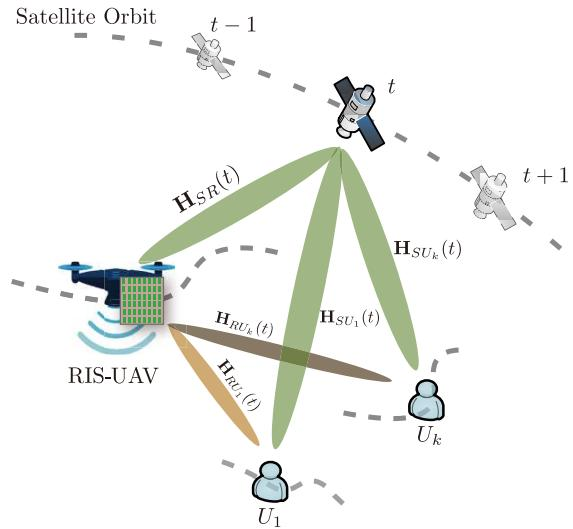  
Fig. 1. System architecture for channel prediction in LEO satellite communications with UAV-RIS.

## B. Channel Modeling and Dataset Construction

This subsection specifies the physical assumptions, mathematical formulation, and fully reproducible pipeline used to create the channel dataset. A compact symbol list is provided in Table I.

1) Geometry and Notation: At every discrete snapshot $t ,$ the Earth-centred-Earth-fixed (ECEF) positions $\mathbf { p } _ { S } ( t )$ of the LEO satellite, $\mathbf { p } _ { R } ( t )$ of the UAV-RIS, and $\mathbf { p } _ { U , k } ( t )$ of the k-th user are recorded. All nodes are treated as three-dimensional rigid bodies, and their instantaneous attitudes are forwarded to the MATLAB Phased Array System Toolbox, so that every planar array is rotated to its true orientation before the steering vector is computed. The satellite adopts the common nadirpointing mode: its body z-axis is fixed toward the Earth’s centre, the x-axis lies in the along-track direction, and no spin is introduced during the short simulation window. The UAV frame varies with its roll, pitch, and yaw angles $( \varphi _ { R } , \theta _ { R } , \psi _ { R } )$ as dictated by its attitude controller. The hand-held user device may also rotate freely in roll, pitch, and yaw, but its antenna array is always kept oriented skyward.

2) Large-Scale Attenuation: The free-space path loss between any two nodes A and B is given by

$$
L _ { \mathrm { F S } , A B } ( t ) = \biggl ( \frac { 4 \pi d _ { A B } ( t ) } { \lambda } \biggr ) ^ { 2 } , ~ d _ { A B } ( t ) = \| \mathbf { p } _ { B } ( t ) - \mathbf { p } _ { A } ( t ) \| .\tag{1}
$$

Additional large-scale losses include atmospheric absorption, denoted with $L _ { \mathrm { a t m } } ( f _ { c } , \vartheta )$ , where ϑ is the elevation angle and the attenuation is obtained from the ITU-R P.676 [30] gas-absorption curves, and rain attenuation $L _ { \mathrm { r a i n } } ( f _ { c } , R _ { 0 . 0 1 } )$ derived from ITU-R P.618 [31] using the 0.01-percentile rain rate $R _ { 0 . 0 1 }$ of the local climate. The overall large-scale power gain is therefore given as

TABLE I  
PHYSICAL-LAYER PARAMETERS USED IN THE CHANNEL GENERATOR
<table><tr><td>Parameter</td><td>Value</td><td>Source</td><td>Parameter</td><td>Value</td><td>Source</td></tr><tr><td>Carrier frequency  $f _ { c }$ </td><td>27 GHz</td><td>Ka band</td><td>Satellite array  $N _ { S }$ </td><td>25/256 UPA</td><td></td></tr><tr><td>Bandwidth B</td><td>100 MHz</td><td></td><td>User antennas  $N _ { U }$ </td><td>1 (handheld)</td><td></td></tr><tr><td>Element spacing</td><td> $\lambda / 2$ </td><td>Std. design</td><td>RIS panel  $N _ { R }$ </td><td> $9 / 8 1$ </td><td></td></tr><tr><td>Rician  $K _ { R } ^ { \mathrm { ~ \bar { ~ } } } \left( \bar { \bf S } { \cdot } \bar { \bf R } , \bar { \bf S } { \cdot } \bar { \bf U } \right)$ </td><td>10 dB</td><td>[33]</td><td>Rician  $K _ { R } \ ( { \bf R - U } )$ </td><td>5dB</td><td>[32]</td></tr><tr><td>RMS delay spread  $\sigma _ { \tau }$ </td><td>30 ns</td><td>[32]</td><td>Angle spreads  $\sigma _ { \mathrm { A O D } } / \sigma _ { \mathrm { A O A } }$ </td><td> $5 ^ { \circ } / 1 0 ^ { \circ }$ </td><td>[32]</td></tr><tr><td>Satellite velocity</td><td>7.4-7.6 km/s</td><td>LEO orbit</td><td>Max Doppler  $f _ { D } ^ { \mathrm { m a x } }$ </td><td> $6 . 8 \times 1 0 ^ { 5 } \dot { \mathrm { H z } } ( @ 2 7 ~ \mathrm { G H z } )$ </td><td>computed</td></tr><tr><td>UAV speed  $v _ { R }$ </td><td>0.5-30 m/s</td><td>Dubins path</td><td>Shadow fading  $\sigma _ { \chi }$ </td><td>5 dB</td><td>ITU-R P.1812 [34]</td></tr></table>

$$
\beta _ { A B } ( t ) = 1 0 ^ { - \left( L _ { \mathrm { F S } } , A B \left( t \right) + L _ { \mathrm { a t m } } \left( f _ { c } , \vartheta \right) + L _ { \mathrm { r a i n } } \left( f _ { c } , R _ { 0 . 0 1 } \right) \right) / 1 0 } .\tag{2}
$$

3) Small-Scale Fading and Doppler: Each elementary link follows the 3GPP TR 38.901 UMi-LoS cluster model [32, Tab. 7.7.1-1]: 12 clusters, 20 rays per cluster, root-meansquare (RMS) delay spread $\sigma _ { \tau } ~ = ~ 3 0 \mathrm { n s }$ , azimuth/elevation angle spreads $\sigma _ { \mathrm { A O D } } = 5 ^ { \circ }$ and $\sigma _ { \mathrm { A O A } } = 1 0 ^ { \circ }$ . The complex baseband channel of the \`-th ray is

$$
{ \bf h } _ { A B } ^ { ( \ell ) } ( t ) = \sqrt { \frac { \kappa _ { \ell } } { K _ { R } + 1 } } e ^ { j 2 \pi f _ { D } ^ { ( \ell ) } t } { \bf a } _ { B } \big ( \theta _ { B } ^ { ( \ell ) } \big ) { \bf a } _ { A } ^ { H } \big ( \theta _ { A } ^ { ( \ell ) } \big ) ,\tag{3}
$$

where $K _ { R }$ is the Rician factor (10 dB for the two satellite-related links, 5 dB for the RIS-user link), $f _ { D } ^ { ( \ell ) } ~ =$ $\frac { v _ { A B } ( t ) } { \lambda } \cos \varphi ^ { ( \ell ) }$ is the ray-level Doppler shift, and $\kappa \ell$ is a normalizer ensuring $\textstyle \sum _ { \ell } \kappa _ { \ell } = 1$ . The MATLAB nrCDLChannel object automatically generates the time evolution of all ray phases; its autocorrelation converges to the classical Clarke-Jakes form $R _ { h h } ( \Delta t ) = J _ { 0 } \left( 2 \pi f _ { \mathit { D } } ^ { \operatorname* { m a x } } \Delta t \right)$

4) Time-and Space-Correlation Models: Temporal: Although nrCDLChannel already realizes Clarke-Jakes fading, we explicitly denote the equivalent first-order Gauss-Markov recurrence for each tap $\mathbf { h } _ { t + 1 } = \alpha _ { t } \mathbf { h } _ { t } + \sqrt { 1 - \alpha _ { t } ^ { 2 } } \mathbf { w } _ { t } ,$ with $\alpha _ { t } = J _ { 0 } ( 2 \pi f _ { D } ^ { \operatorname* { m a x } } \Delta t )$ and $\mathbf { w } _ { t } \sim \mathcal { C N } ( \mathbf { 0 } , \mathbf { I } )$ , so that readers can map the toolbox output to the analytical model.

Spatial: The spatial correlation dictated by the clustered delay line (CDL) angle spreads is retained without any extra exponential filtering. Under this setting, the channel covariance follows standard Kronecker model: it factorizes into the outer product of a transmit-side and a receive-side covariance matrix, each fixed solely by the array geometry and the CDL angle statistics, and is therefore independent of any further spatial filtering or transmit-receive coupling assumptions.

## 5) Dataset Generation Pipeline:

• Trajectory synthesis : Satellite positions are obtained with the simplified general perturbations model 4 (SGP4)

algorithm from the publicly available two-line elements (TLEs) of the international space station (ISS) [35]. This yields a representative LEO orbit whose altitude is on the order of several hundred kilometers, with an orbital period of about 90-100 min. The UAV-RIS operates at an altitude of 50-100 m and follows a Dubins path [36], namely the shortest curvature-constrained trajectory connecting randomly chosen way-points; the horizontal speed is sampled uniformly from 0.5 m/s to 30 m/s, and the minimum turn radius is set to 200 m. Ground users move according to a Gauss-Markov mobility model [37] with memory parameter $\alpha = 0 . 8$ and instantaneous speeds drawn uniformly from 0 m/s to 100 m/s.

• Large-scale parameters : For every snapshot, we compute $L _ { \mathrm { F S } } , L _ { \mathrm { a t m } } , L _ { \mathrm { r a i n } }$ , and an i.i.d. log-normal shadow term $\chi _ { \mathrm { d B } } \sim \mathcal { N } ( 0 , 5 ^ { 2 } )$ dB.

• Cluster initialization : Delay/angle spreads and the Rician $K _ { R }$ factor are drawn once per epoch, guaranteeing intra-window consistency.

• Small-scale realization: At each time step, we invoke nrCDLChannel to generate the three complex MIMO sub-channels $\mathbf { h } _ { S R } ( t )$ $\mathbf { h } _ { R U _ { k } } ( t )$ , and $\mathbf { h } _ { S U _ { k } } ( t )$ Here, $\mathbf { h } _ { S R } ( t ) \in \mathbb { C } ^ { N _ { R } \times N _ { S } }$ denotes the satellite-RIS link, h $\begin{array} { r c l } { \dot { \mathbf { \sigma } } _ { R U _ { k } } ( t ) } & { \in } & { \mathbb { C } ^ { N _ { U } \times N _ { R } } } \end{array}$ is the RIS-user k link, and $\mathbf { h } _ { S U _ { k } } ( t ) \in \mathbb { C } ^ { N _ { U } \times N _ { S } }$ is the direct satellite-user k link. The toolbox internally applies Doppler shifts, angle dispersion, and spatial correlation according to the CDL parameters.

• Storage: Each snapshot is stored as a single row of the dataset matrix in its flattened form, as given by (4), shown at the bottom of the page, where $N = 2 N _ { R } N _ { S } +$ $2 K N _ { U } N _ { R } + 2 K N _ { U } N _ { S }$ is the total feature dimension of each flattened snapshot. Here, each real/imaginary block is obtained by column-major vectorization of the corresponding complex matrix. The real and imaginary parts are stored separately so that the entire dataset is a single real-valued tensor - this avoids complex-number support issues in many machine-learning frameworks and simplifies normalization. All entries are saved as 32-bit floats.

$$
\begin{array} { r l } & { \mathbf { h } ( t ) = \big [ \mathrm { v e c } \big ( \mathbf { R } \mathrm { e } \{ \mathbf { h } _ { S R } ( t ) \} \big ) ^ { \top } , \mathrm { ~ v e c } \big ( \mathbf { I m } \{ \mathbf { h } _ { S R } ( t ) \} \big ) ^ { \top } , \mathrm { ~ } \big \{ \mathrm { v e c } \big ( \mathbf { R e } \{ \mathbf { h } _ { R U _ { k } } ( t ) \} \big ) ^ { \top } \big \} ^ { K } \mathrm { ~ } _ { k = 1 } , } \\ & { \qquad \big \{ \mathrm { v e c } \big ( \mathbf { I m } \{ \mathbf { h } _ { R U _ { k } } ( t ) \} \big ) ^ { \top } \big \} ^ { K } \big ] _ { k = 1 } , \mathrm { ~ } \big \{ \mathrm { v e c } \big ( \mathbf { R e } \{ \mathbf { h } _ { S U _ { k } } ( t ) \} \big ) ^ { \top } \big \} _ { k = 1 } ^ { K } , \mathrm { ~ } \big \{ \mathrm { v e c } \big ( \mathbf { I m } \{ \mathbf { h } _ { S U _ { k } } ( t ) \} \big ) ^ { \top } \big \} _ { k = 1 } ^ { K } \big ] \in \mathbb { R } ^ { 1 \times N } . } \end{array}\tag{4}
$$

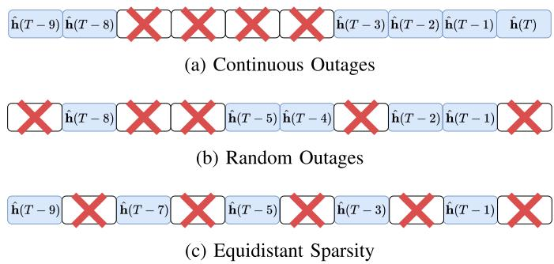  
Fig. 2. Representative pCSI patterns in LEO satellite communication scenarios.

MATLAB R2024a with the Satellite Communications, Phased Array System, and Communications toolboxes generates the requisite snapshots, ensuring the dataset can be reproduced without specialized hardware.

## C. pCSI in LEO Satellite Communications

In LEO satellite communication systems, pCSI often arises due to high mobility and limited feedback bandwidth. Measurements may be lost, corrupted, or deliberately omitted to reduce communication and computational overhead. As LEO satellites move on their orbits at high speeds, limitations in feedback or measurement frequencies and inherent propagation delays, contribute to an increasing prevalence of incomplete CSI. The scarcity of reliable measurements significantly complicates channel estimation and prediction, ultimately degrading overall communication performance.

To organize the discussion of pCSI, we identify three representative patterns, as illustrated in Fig. 2, where hˆ(t) denotes the historical channel observation at time t, whose precise definition is provided in Section III-B. The first two patterns correspond to passive, undesired losses frequently observed in actual deployments, while the third pattern involves deliberate undersampling designed to conserve resources.

1) Continuous Outages: Extended disruptions in CSI acquisition can occur when satellites pass behind obstacles, during abrupt satellite handovers [38], or following a prolonged failure in the downlink feedback link. In these instances, consecutive time steps of CSI measurements are lost, resulting in contiguous gaps that may span a substantial portion of the observation window.

2) Random Outages: CSI measurements may be sporadically lost or corrupted due to sensor malfunctions, brief interference events, or transient communication errors. These intermittent disruptions break the temporal continuity of the CSI data, complicating the application of standard reconstruction and making precise channel modeling and prediction more challenging.

3) Equidistant Sparsity: In satellite channel prediction, reducing the CSI sampling frequency conserves power and bandwidth. This deliberate undersampling creates uniformly spaced gaps in the measurement sequence and reduces data transmission and processing requirements. Although fewer measurements complicate reconstruction, the resource savings often justify the trade-off when structured sparsity is exploited.

These three pCSI patterns may occur individually or in combination. For example, a system that employs intentional undersampling can also suffer from unforeseen link failures. In all cases, missing or incomplete CSI degrades the performance of algorithms tracking time-varying channels. By classifying pCSI as continuous outages, random outages, and equidistant sparsity, we can more effectively address channel data losses under practical LEO communication constraints.

## III. PROPOSED ST-ATTENTON BASED CHANNEL PREDICTION METHOD

In this section, we introduce a ST-attention based framework for predicting future MIMO channel states in LEO satellite communications. The core idea is to employ a transformerstyle encoder-decoder network that simultaneously models spatial correlations across multiple antennas and temporal dynamics driven by orbital motion, RIS reconfiguration, user mobility, and environmental variations. Unlike conventional interpolation or purely time-series approaches, the proposed method applies fine-grained attention over both antennas and time steps, which is particularly valuable in highdimensional satellite communication scenarios. Specifically, in Section III-A we describe the transformer-based spatiotemporal modeling and highlight its advantages over traditional methods. Section III-B details the feature representation and input encoding strategy used to construct the channel observation tokens. Finally, the subsequent subsections present the design of the ST-attention mechanism and the training objective for network optimization.

## A. Transformer-Based Spatiotemporal Modeling

Transformers [16] were originally developed for sequenceto-sequence tasks in natural language processing (NLP) [39] tasks. They employ an attention mechanism to capture longrange dependencies by dynamically adjusting the weights assigned to different parts of the input. This attention mechanism contrasts with earlier recurrent architectures that process inputs sequentially and often fail to preserve long-range context.

Effective forecasting of LEO satellite channels benefits from simultaneously modeling temporal variations, such as satellite movement and user mobility, and spatial interactions across large antenna arrays. Relying solely on time-based attention (T-attention) may not adequately capture these highdimensional dependencies. In contrast, ST-attention applies multi-head self-attention across both time steps and antennas, thereby revealing correlations among antennas at the same time as well as temporal dependencies within each antenna over different time instants.

Specifically, multi-head self-attention projects the input embeddings into query, key, and value representations for each head. By computing attention weights in parallel, each head learns distinct types of correlations, including dependencies among different antennas at a single time step and temporal correlations within each antenna across multiple time instants. The resulting attention weights are then combined to form a comprehensive representation of the input sequence that preserves both spatial and temporal structures. This joint attention mechanism across both temporal and spatial dimensions is particularly beneficial for LEO satellite channels as it enables the model to capture rapid dynamic channel variations caused by high-speed orbital motion, RIS reconfiguration, user mobility, and environmental changes.

## B. Feature Representation and Input Encoding

In our framework, channel measurements are acquired at discrete time instants t. Let T be the current time slot, c be the number of past observations provided to the model, and $g$ be the number of future slots to predict. When $t \in \{ T -$ $c ^ { \prime } , \cdots , T \}$ with $c ^ { \prime } { = } c - 1$ , we write h(t) as hˆ(t) to indicate an observed CSI snapshot; when $t \in \{ T + 1 , \cdot \cdot \cdot , T + g \}$ , we write h(t) as h˜(t) to indicate a CSI value to be predicted. Thus, $\hat { \mathbf { h } } ( t )$ serves as model input, whereas $\tilde { \mathbf { h } } ( t )$ is the network’s prediction target.

A similar definition yields the predicted vectors $\tilde { \mathbf { h } } ( t )$ , which combine the real and imaginary parts of the satellite-to-RIS, satellite-to-user, and RIS-to-user channels into a unified representation. Our objective is to utilize the CSI from the past c time instants to construct $\hat { \mathbf { h } } ( t )$ and feed it into the network shown in Fig. 1 in order to generate the predicted CSI h˜(t) for the subsequent g time instants. Because the transformer network is permutation-invariant, we incorporate temporal ordering via sinusoidal positional encodings [16]. In this way, the model can differentiate between earlier and later time steps, which is an essential feature for accurate timeseries forecasting.

A key contribution of our method is the fine-grained attention mechanism. Rather than assigning a single attention weight per time step, each element of $\hat { \mathbf { h } } ( t )$ is treated as an individual token in the transformer’s self-attention module, as depicted in Fig. 3. Consequently, each attention head learns distinct weighting patterns over these tokens, thereby modeling dependencies both across time steps and among antennas within the same time step. This design enables the model to capture abrupt local changes (e.g., channel fades on specific antennas) as well as global trends (e.g., orbital motion).

## C. ST-Attention Mechanism

Fig. 3 depicts the overall structure of our proposed STattention based framework. In addition, Fig. 4 illustrates the contrast between an attention mechanism that solely focuses on the temporal dimension and one that simultaneously attends to both temporal and spatial dimensions. The temporal-only attention compresses the entire spatial slice of the channel tensor at each time instant into a single high-dimensional token, so the attention weights are distributed only along the temporal axis. By contrast, ST-attention treats each antenna-time pair as an independent token; this fine-grained representation allows the model to assign weights with per-antenna, per-time precision, enabling it to capture abrupt fades on individual antennas as well as the slow drifts induced by satellite motion.

1) Encoder: As illustrated in Fig. 3, the encoder processes past channel observations through stacked layers composed of:

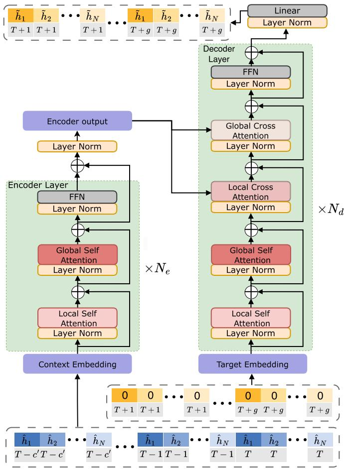  
Fig. 3. Overall architecture of the proposed ST-attention based framework.

• Global Self-Attention: Computes attention across the entire sequence (all time steps and antenna elements), enabling the model to learn broad spatiotemporal relationships.

• Local Self-Attention: Focuses on a smaller time window or antenna subset, capturing fine-grained variations (e.g., abrupt channel fades on specific antennas).

• Position-Wise Feed-Forward Network (FFN): The FFN is a dedicated non-linear module that processes each channel feature token independently. It transforms the raw channel embeddings into a richer representation by capturing complex non-linear propagation effects and subtle spatiotemporal variations.

Let $\scriptstyle { X \in \mathbb { R } ^ { ( c \times N ) \times D } }$ be the embedded input tokens, where (c×N) encompasses all channel pairs over the entire historical period, and D is the embedding dimension. In the multi-head attention mechanism, the input X is first projected into three distinct representations: the queries Q, the keys M , and the values V . These projections serve different roles:

• Queries Q: Represent the elements that seek relevant information from other tokens.

• Keys M: Encode the content of the tokens, acting as indices that the queries use to locate pertinent information.

• Values V : Contain the actual information that will be aggregated based on the attention weights.

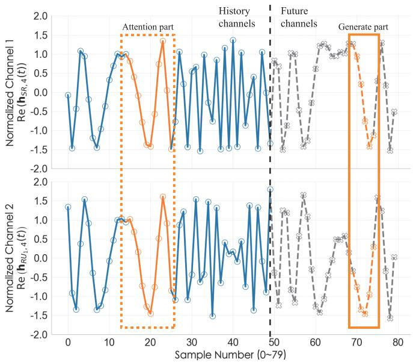  
(a) T-attention  
Fig. 4. Comparison of prediction results under different attention parts.

For each attention head h, these projections are computed as $Q ^ { h } { = } X W _ { O } ^ { h } , ~ M ^ { h } { = } X W _ { M } ^ { h } , ~ V ^ { h } { = } X \mathbf { \bar { W } } _ { V } ^ { h }$ , where $W _ { Q } ^ { \bar { h } } , \ W _ { M } ^ { h } ,$ and $\boldsymbol { W } _ { V } ^ { h }$ are trainable weight matrices. The attention function for each head is defined as

$$
\mathrm { A t t e n t i o n } ( Q ^ { h } , M ^ { h } , V ^ { h } ) = \mathrm { s o f t m a x } \bigg ( \frac { Q ^ { h } ( M ^ { h } ) ^ { \top } } { \sqrt { d _ { m } } } \bigg ) V ^ { h } ,\tag{5}
$$

where $d _ { m }$ is the key dimension and $( \cdot ) ^ { \top }$ denotes transposition. Following the common Transformer design, we set $\begin{array} { r } { d _ { m } = \frac { D } { H } } \end{array}$ with H the number of attention heads. Finally, the outputs from all H heads are concatenated and projected using a weight matrix $W _ { O }$ to yield the final multi-head attention output:

$$
\mathrm { M u l t i H e a d } ( X ) = \bigoplus _ { h = 1 } ^ { H } \mathrm { A t t e n t i o n } ( Q ^ { h } , M ^ { h } , V ^ { h } ) W _ { O } ^ { h } ,\tag{6}
$$

where ⊕ denotes concatenation.

2) Decoder: To generate channel predictions for future time steps $[ T + 1 , \dotsc , T + g ]$ , the decoder employs:

• Masked Self-Attention: Operates over future tokens in a causal manner, ensuring that information from later time steps does not influence earlier predictions.

Global and Local Cross-Attention: Attends to the encoder outputs alongside the partially known future tokens. Global cross-attention captures large-scale dependencies, while local cross-attention refines local details for sudden channel variations.

Each decoder layer also includes a position-wise FFN and normalization layers.

By explicitly assigning attention weights to specific antennas at specific time instants, the ST-attention mechanism captures both large-scale orbital effects and localized fading phenomena. This multi-scale attention design is especially suitable for highly dynamic LEO satellite channels, where accurate forecasting hinges on understanding both global and fine-grained variations.

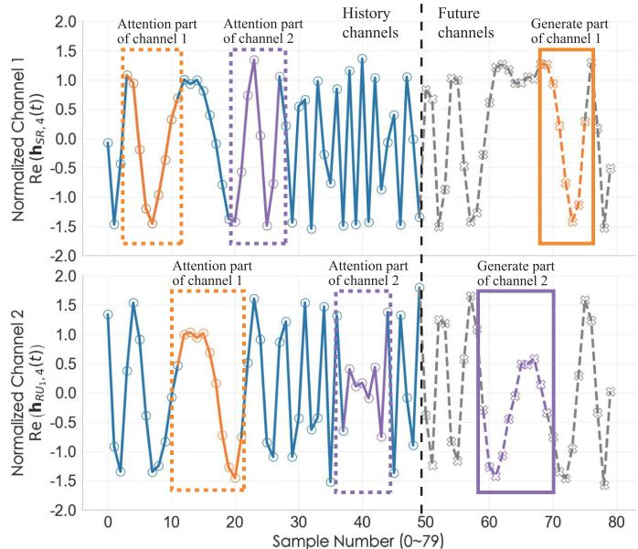  
(b) ST-attention

## D. Prediction Head and Training Objective

The final decoder layer produces hidden states, which are then mapped to channel estimates by a fully connected prediction head. We train the model by minimizing the mean squared error (MSE) between the predicted and the groundtruth channels:

$$
\mathcal { L } _ { \mathrm { p r e d } } = \frac { 1 } { g N B } \sum _ { b = 1 } ^ { B } \sum _ { i = 1 } ^ { N } \sum _ { j = 1 } ^ { g } \lVert \hat { h } _ { i } ^ { \mathrm { p r e d } } ( j ) - \hat { h } _ { i } ^ { \mathrm { t r u e } } ( j ) \rVert ^ { 2 } ,\tag{7}
$$

where B is the batch size. $\hat { h } _ { i } ^ { \mathrm { p r e d } } ( j )$ and $\hat { h } _ { i } ^ { \mathrm { t r u e } } ( j )$ represent the predicted and ground-truth channel coefficients, respectively, for the i-th dimension at the j-th future time step. Minimizing $\mathcal { L } _ { \mathrm { p r e d } }$ encourages the predicted channel coefficients to align closely with their true counterparts, thereby improving forecasting accuracy.

## IV. PRETRAINING STRATEGY FOR PCSI

In realistic LEO satellite communication scenarios, the high mobility of satellites, UAV-RISs, and ground users often leads to pCSI, where certain channel coefficients are intermittently missing or heavily corrupted. Such incomplete observations can significantly degrade prediction performance because many models are incapable of capturing essential spatiotemporal dependencies in sparse or irregular data. To address this challenge, we draw inspiration from the masked language modeling approach widely used in NLP [24] and propose a two-stage channel prediction scheme that can robustly handle missing channel entries. This approach enables accurate future channel predictions under pCSI conditions, particularly when high-quality labeled datasets are limited.

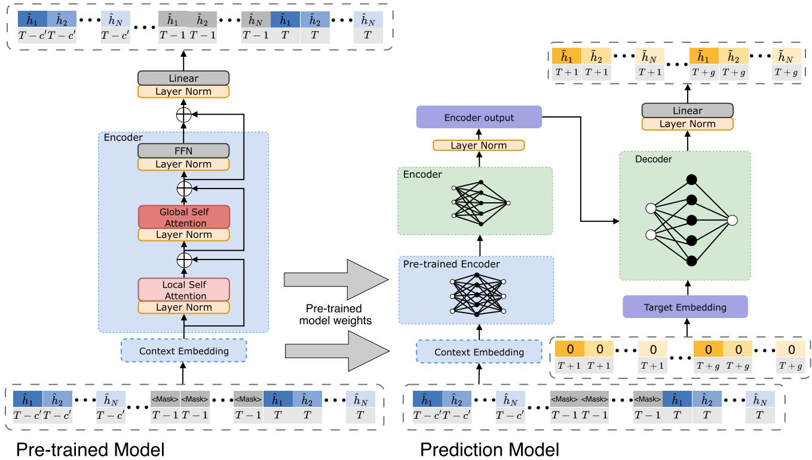  
Fig. 5. Illustration of the proposed two-stage pretraining strategy for handling pCSI. The left module shows the masked reconstruction pretraining, while the right module presents the subsequent channel prediction network.

Specifically, in the first stage we train a network to recover masked channel elements. In this process, a subset of channel entries in the input sequence is deliberately masked and the model is optimized to infer these missing values. Through unsupervised training on a large dataset with actively masked entries, the model learns the underlying missing patterns. The loss function is computed solely on the masked entries, which encourages the model to learn robust and noise-resistant features and enhances its ability to handle the pCSI issue.

After pretraining converges, the model serves as a feature extractor that captures complex and diverse missing patterns in the satellite MIMO channel. Through such a parameter transfer, the predictor inherits the refined knowledge that can provide a better initialization for the subsequent prediction training, thereby improving accuracy and stability under realistic pCSI conditions.

In this section, we first present the masked reconstruction pretraining module and then describe how the pretrained layers are integrated into the channel prediction network. Finally, we outline the fine-tuning process under pCSI conditions and discuss the benefits of the proposed two-stage pretraining strategy.

## A. Masked Reconstruction Pretraining

As shown on the left side of Fig. 5, the pretraining module consists of an embedding layer, multiple transformer encoder layers, and a linear reconstruction head dedicated to recovering masked entries. Let

$$
\mathbf { H } _ { \mathrm { f u l l } } \ = \ \left\{ \mathbf { h } ( t ) \Big | t = T - c ^ { \prime } , . . . , T \right\} \ \in \ \mathbb { C } ^ { ( c N ) \times 1 } ,\tag{8}
$$

denote the stacked channel observations over the past c time instants. To simulate partial observations, we define a binary mask

$$
{ \bf Z } = \Big \{ { \bf z } ( t ) \Big | t = T - c ^ { \prime } , . . . , T \Big \} \in \{ 0 , 1 \} ^ { ( c N ) \times 1 } ,\tag{9}
$$

where each $\mathbf { z } ( t ) \in \{ 0 , 1 \} ^ { N \times 1 }$ satisfies

$$
\mathbf { z } ( t ) = { \boldsymbol { \alpha } } ( t ) \cdot \mathbf { 1 } , \quad { \mathrm { w i t h ~ } } { \boldsymbol { \alpha } } ( t ) \in \{ 0 , 1 \} .\tag{10}
$$

This indicates that at time t, the entire channel vector is fully visible when $\alpha ( t ) { = } 0$ and completely masked when $\alpha ( t ) \mathop { = } 1$

To emulate the three pCSI patterns in Section II-C, a binary mask $\mathbf { Z } \in \{ 0 , 1 \} ^ { c N \times 1 }$ is generated for every training sample as follows:

1) Pattern Selection: one of the three patterns, continuous outage, random outage, or equidistant sparsity, is selected according to the specified probability distribution;

2) Missing-Ratio Sampling: the target ratio is $\rho \sim$ $\mathcal { U } [ \rho _ { \mathrm { m i n } } , \rho _ { \mathrm { m a x } } ]$ , where $( \rho _ { \mathrm { m i n } } , \rho _ { \mathrm { m a x } } ) = ( 0 . 1 , 0 . 9 )$ by default;

3) Mask Construction: according to the selected pattern, exactly $\lfloor \rho c N \rfloor$ entries of Z are set to 1.

The input to the pretraining network is then formed by applying element-wise multiplication

$$
\widehat { \bf H } = ( { \bf 1 } - { \bf Z } ) \odot { \bf H } _ { \mathrm { f u l l } } ,\tag{11}
$$

where $\odot$ denotes the element-wise product and 1 is a vector of ones with the same dimension as Z. This operation preserves the observed entries while setting the masked entries to zero.

Given H , the model outputs a reconstructed version H that aims to fill in the missing components. The binary mask Z plays a crucial role by indicating which elements are masked,

so that the reconstruction loss is computed only on these missing entries. The pretraining loss function is defined as

$$
\mathcal { L } _ { \mathrm { r e c o n } } = \frac { 1 } { B } \sum _ { i = 1 } ^ { B } \Big \| \big ( \widetilde { \mathbf { H } } ^ { ( i ) } - \mathbf { H } _ { \mathrm { f u l l } } ^ { ( i ) } \big ) \odot \mathbf { Z } ^ { ( i ) } \Big \| ^ { 2 } ,\tag{12}
$$

where B is the batch size for pretraining. In this context, each element $h _ { n } ( t )$ of $\mathbf { H } _ { \mathrm { f u l l } } ^ { ( i ) }$ corresponds to $\tilde { h } _ { n } ( t )$ in H˜ and to $\hat { h } _ { n } ( t )$ in Hˆ , respectively. Since the channel coefficients are continuous variables, we adopt MSE as the loss function rather than the cross-entropy (CE) loss used in masked language modeling tasks [24]. Minimizing (12) trains the model to exploit both local correlations among antenna elements and global temporal dependencies induced by motion, thereby learning to reconstruct missing channel states from partial observations. This pretraining not only enhances robustness against incomplete CSI measurements but also fosters generalizable representations for subsequent channel prediction tasks.

## B. Integration With the Prediction Model

After completing the masked reconstruction pretraining, we transfer the learned parameters to initialize the prediction model. In particular, the pretrained embedding layer replaces the original embedding layer, and the pretrained encoder layers are inserted ahead of the existing encoder in the prediction model. As illustrated on the right side of Fig. 5, this arrangement allows the prediction model to inherit the ability to handle the incomplete CSI, since the transferred layers have already captured how to reconstruct the missing channel entries. By integrating these pretrained layers, the model can acquire robust spatiotemporal representations from the outset, eliminating the need to learn such features from scratch. Consequently, the subsequent training phase can converge more rapidly and achieve a higher prediction accuracy than a random initialization.

## C. Fine-Tuning With pCSI

After initialization with pretrained parameters, the model is refined end-to-end to accept incomplete channel observations and produce predictions for future time slots. During this fine-tuning stage, training focuses exclusively on the channel prediction loss $\mathcal { L } _ { \mathrm { p r e d } }$ defined in (7), aligning the learning objective directly with accurate forecasting. This approach allows the model to specialize in predicting future channel states under pCSI conditions, while utilizing the robust representations acquired during pretraining. As a result, the training process emphasizes the core forecasting task and benefits from the pretrained layers’ ability to infer missing CSI entries.

## D. Practical Considerations and Benefits

The proposed two-stage pretraining strategy is designed to robustly handle the various pCSI scenarios outlined in Section II-C. By training on extensive data that reflect a wide range of missing patterns and proportions, the model develops spatiotemporal representations that effectively mitigate the impact of channel interruptions regardless of the underlying missing data distribution. In addition, the pretrained network enables the use of low-frequency CSI measurements to accurately predict high-frequency channel states, thereby reducing feedback overhead while preserving acceptable accuracy. Initializing the prediction model with these pretrained weights accelerates convergence and enhances stability, as the network no longer needs to learn representations from the scratches on incomplete data. Overall, this two-stage pretraining strategy delivers robust performance under pCSI conditions and is well suited for practical satellite communication deployments.

## V. COMPLEXITY REDUCTION AND SCALABILITY ANALYSIS

The ST-attention mechanism captures both fine-grained spatial correlations among satellite, UAV-RIS, and user antennas and the rapid temporal dynamics of LEO channels, but its computation and memory grow quadratically with the product of spatial elements and time steps. In realistic UAV-RISassisted LEO systems, satellite arrays and large RIS panels can each comprise hundreds of elements, making full self-attention over all antenna-time tokens impractical for typical on-board or edge accelerators. To address this issue, we introduce a compact beamspace representation that maps the elementdomain channel onto a sparse angular basis, thereby reducing the spatial token count and substantially lightening the attention workload without compromising prediction accuracy.

## A. DFT-Based Beamspace Projection

Both the LOS satellite path and the RIS-reflected path are dominated by a small number of strong specular components. Consequently, the element-space MIMO channels $\mathbf { h } _ { S R } ( t )$ $\mathbf { h } _ { R U _ { k } } ( t )$ , and $\mathbf { h } _ { S U _ { k } } ( t )$ exhibit intrinsic angle sparsity, with most array elements receiving highly correlated signals. By applying a two-dimensional discrete Fourier transform (DFT), most of the channel power is concentrated into a few dominant angular bins. The beamspace projection reduces the spatial token, enabling the attention mechanism to operate on a much smaller sequence and thereby dramatically lowering both computation and memory costs without sacrificing prediction accuracy.

Let $\mathbf { F } _ { \mathcal { D } }$ be the unitary $\mathcal { D } \times \mathcal { D }$ DFT matrix. For each snapshot t, we obtain the beam-domain representations

$$
\mathbf { b } _ { S R } ( t ) = \mathbf { F } _ { N _ { R } } \mathbf { h } _ { S R } ( t ) \mathbf { F } _ { N _ { S } } ^ { H } ,\tag{13a}
$$

$$
\mathbf { b } _ { R U _ { k } } ( t ) = \mathbf { F } _ { N _ { U } } \mathbf { h } _ { R U _ { k } } ( t ) \mathbf { F } _ { N _ { R } } ^ { H } ,\tag{13b}
$$

$$
\mathbf { b } _ { S U _ { k } } ( t ) = \mathbf { F } _ { N _ { U } } \mathbf { h } _ { S U , k } ( t ) \mathbf { F } _ { N _ { S } } ^ { H } .\tag{13c}
$$

For every matrix in (13), we retain the P strongest coefficients; their linear indices define the set $\mathcal { P } = \{ i _ { 1 } , . . . , i _ { P } \}$ . Taking the satellite-RIS link as an example, each index is mapped to a row-column coordinate on the 2-D DFT grid, denoted with $( u _ { p } , v _ { p } ) \in \{ 0 , \ldots , N _ { R } - 1 \} \times \{ 0 , \ldots , N _ { S } - 1 \}$ , and normalized to [0, 1]: $\begin{array} { r } { \tilde { u } _ { p } = \frac { u _ { p } } { N _ { R } - 1 } } \end{array}$ and $\begin{array} { r } { \tilde { v } _ { p } = \frac { v _ { p } } { N _ { S } - 1 } } \end{array}$

The p-th retained beam delivers

$$
z _ { S R } ^ { ( p ) } ( t ) = \big [ \underbrace { \big | b _ { S R } ^ { ( p ) } ( t ) \big | } _ { \mathrm { m a g n i t u d e } } , \underbrace { \mathcal { L } b _ { S R } ^ { ( p ) } ( t ) } _ { \mathrm { p h a s e } } , \tilde { u } _ { p } , \tilde { v } _ { p } \big ] ^ { T } \in \mathbb { R } ^ { 4 } .\tag{14}
$$

The same procedure is applied to the RIS-user and satelliteuser sub-links, yielding beam tokens $\mathbf { z } _ { R U _ { k } } ^ { ( p ) } ( t )$ and $\mathbf { z } _ { S U _ { k } } ^ { ( p ) } ( t )$ Stacking all P beams of the three sub-links gives a fixedlength real vector

$$
\begin{array} { r } { \mathbf { s } ( t ) = \big [ z _ { S R } ^ { ( 1 ) } ( t ) ^ { T } , . . . , z _ { S R } ^ { ( P ) } ( t ) ^ { T } , z _ { R U _ { 1 } } ^ { ( 1 ) } ( t ) ^ { T } , . . . , \quad } \\ { z _ { R U _ { K } } ^ { ( P ) } ( t ) ^ { T } , z _ { S U _ { 1 } } ^ { ( 1 ) } ( t ) ^ { T } , . . . , z _ { S U _ { K } } ^ { ( P ) } ( t ) ^ { T } \big ] ^ { T } , } \end{array}\tag{15}
$$

with the dimensionality is now $N _ { \mathrm { t o k } } = 4 P \left( 1 + 2 K \right)$

For each sub-link, the decoder outputs $P$ beam tokens $\tilde { \mathbf { z } } _ { \ast } ^ { ( p ) } ( t ) = \left\lceil \tilde { m } ^ { ( p ) } , \tilde { \varphi } ^ { ( p ) } , \tilde { u } _ { p } , \tilde { v } _ { p } \right\rceil$ . We form the complex coefficient $\tilde { b } ^ { ( p ) } ( \dot { t } ) = \tilde { m } ^ { ( p ) } e ^ { j \tilde { \varphi } ^ { ( p ) } }$ and write it at grid index $( u _ { p } , v _ { p } )$ all other beamspace entries are zero. The element-domain channel is then recovered by the inverse DFT, e.g. $\mathbf { \tilde { h } } _ { S R } ( t ) =$ $\mathbf { F } _ { N _ { R } } ^ { H } \tilde { \mathbf { B } } _ { S R } ( t ) \mathbf { F } _ { N _ { S } }$ . The same step is applied to RIS-user and satellite-user sub-links, keeping the sequence length limited to P while preserving perfect invertibility.

## B. Complexity Analysis

This subsection evaluates the computational cost of the network with and without beam-domain compression. The FLOP count includes only the matrix multiplications and softmax operations that dominate self-attention. Point-wise functions such as LayerNorm and nonlinear activations are not considered, because their complexity is $O ( L D )$ , where L denotes the token-sequence length, defined as the product of the history depth c and the number of tokens per snapshot, and is therefore negligible.

As described in Section II-B.5 and Section V-A, a full snapshot comprises $N _ { \mathrm { t o k } } ^ { \mathrm { f u l l } } = 2 N _ { R } N _ { S } + 2 K N _ { U } \big ( N _ { R } + N _ { S } \big )$ whereas beam-domain sparsification reduces the token count to $N _ { \mathrm { t o k } } ^ { \mathrm { b e a m } } = 4 P \big ( 1 + 2 K \big )$

For a token sequence of length L, the global self-attention branch incurs $F _ { g } ( L ) ~ = ~ 2 L ^ { 2 } d _ { m } ~ + ~ 4 L D$ , while the local branch incurs $F _ { l } ( L ) = 2 L w d _ { m } + 4 w D$ , where w denotes the size of the local-attention window. With $L = c N _ { \mathrm { t o k } } ^ { \mathrm { f u l l } }$ , the total cost without compression is

$$
\begin{array} { r l } & { F _ { \mathrm { f u l l } } = ( N _ { e } + N _ { d } ) \Bigl [ 2 \bigl ( c N _ { \mathrm { t o k } } ^ { \mathrm { f u l l } } \bigr ) ^ { 2 } d _ { m } + 4 \bigl ( c N _ { \mathrm { t o k } } ^ { \mathrm { f u l l } } \bigr ) D } \\ & { ~ + 2 \bigl ( c N _ { \mathrm { t o k } } ^ { \mathrm { f u l l } } \bigr ) w d _ { m } + 4 w D \Bigr ] , } \end{array}\tag{16}
$$

Replacing $N _ { \mathrm { t o k } } ^ { \mathrm { f u l l } }$ by $N _ { \mathrm { t o k } } ^ { \mathrm { b e a m } }$ and adding the FFT overhead $c O \big ( \bar { N } _ { \mathrm { t o k } } ^ { \mathrm { f u l l } } \log N _ { \mathrm { t o k } } ^ { \mathrm { f u l l } } \big )$ yields

$$
\begin{array} { r l } { { \cal F } _ { \mathrm { b e a m } } = ( N _ { e } + N _ { d } ) \Big [ 2 \big ( c N _ { \mathrm { t o k } } ^ { \mathrm { b e a m } } \big ) ^ { 2 } d _ { m } + 4 \big ( c N _ { \mathrm { t o k } } ^ { \mathrm { b e a m } } \big ) D } & { } \\ { ~ + 2 \big ( c N _ { \mathrm { t o k } } ^ { \mathrm { b e a m } } \big ) w d _ { m } + 4 w D \Big ] } & { } \\ { ~ + c O \big ( N _ { \mathrm { t o k } } ^ { \mathrm { f u l l } } \log N _ { \mathrm { t o k } } ^ { \mathrm { f u l l } } \big ) . } & { } \end{array}\tag{17}
$$

Because the quadratic term $2 \big ( c N _ { \mathrm { t o k } } ^ { \mathrm { f u l l } } \big ) ^ { 2 } d _ { m }$ is the dominant factor, compressing each snapshot from $N _ { \mathrm { t o k } } ^ { \mathrm { f u l l } }$ to $N _ { \mathrm { t o k } } ^ { \mathrm { b e a m } }$ yields a marked reduction in both FLOPs and memory.

## VI. PERFORMANCE EVALUATION

In this section, the performance of the proposed method is evaluated via simulations. We will first introduce the simulation environment and experimental setup, and then make

TABLE II  
STATISTICAL CONSISTENCY BETWEEN THE THREE DATA SPLITS
<table><tr><td>Segment</td><td>Mean (dB) Std (dB)</td><td>KS p-value</td></tr><tr><td>Train</td><td>16.976 0.314</td><td rowspan="3">0.372 (Train vs. Validation), 0.536 (Train vs. Test), 0.902 (Validation vs. Test).</td></tr><tr><td>Validation</td><td>16.987 0.318</td></tr><tr><td>Test 16.988</td><td>0.320</td></tr></table>

TABLE III

HYPER-PARAMETERS OF BASELINE MODELS. PARAMETER COUNT (PARAMS) IS MEASURED IN THOUSANDS (K) OR MILLIONS (M)
<table><tr><td>Model</td><td>Hidden size</td><td>Layers</td><td>Dropout</td><td>Params</td></tr><tr><td>LSTM</td><td>128</td><td>2 (Bi)</td><td>0.1</td><td>1.27 M</td></tr><tr><td>LSTNet (CNN/RNN)</td><td>64/100</td><td>1/1</td><td>0.2</td><td>0.66 M</td></tr><tr><td>Linear</td><td></td><td></td><td>0</td><td>22 k</td></tr><tr><td>T-attention Transformer</td><td> $d _ { m o d e l } { = } 6 4$ </td><td>2+2</td><td>0.1</td><td>0.53 M</td></tr><tr><td>ST-attention Transformer</td><td> $d _ { m o d e l } { = } 6 4$ </td><td>2+2</td><td>0.1</td><td>0.57M</td></tr></table>

a comparative analysis of our proposal against the selected baselines. Key observations and performance trends under various experimental conditions will be discussed in detail.

## A. Simulation Setup

A dynamic UAV-RIS-assisted LEO satellite MIMO system serving several ground users is simulated. Acquisition of the orbital parameters has been demonstrated in Section II-B. Two array-scale configurations are considered: a small-scale setup with a satellite array of $N _ { S } = 2 5$ antennas and a UAV-RIS of $N _ { R } ~ = ~ 9$ elements, serving $K = 4$ single-antenna users $( N _ { U } = 1 ) ;$ and a large-scale setup with $N _ { S } = 2 5 6$ satellite antennas and $N _ { R } ~ = ~ 8 1$ RIS elements, while K and $N _ { U }$ remain unchanged. Other major parameters can be found in Section II-B and Table I.

CSI matrices ${ \bf h } _ { S R } ( t ) , { \bf h } _ { R U _ { k } } ( t )$ , and $\mathbf { h } _ { S U _ { k } } ( t )$ are generated over distinct orbital time windows in August 2024 to prevent data leakage. The dataset is partitioned by temporal segments: 60% of 10,000 samples are used for training (collected between August 1 and 2, 2024), 20% for validation (August 3-4, 2024), and the remaining 20% for testing (August 5-6, 2024). This temporal separation ensures independence among the subsets. To verify that the time-based split does not introduce distributional bias, we compute descriptive statistics of four key channel metrics (path loss, Rician K-factor, Doppler shift, and SNR) for each segment and perform two-sample Kolmogorov-Smirnov (KS) tests. As summarized in Table II, all KS p-values exceed 0.35, indicating that the three segments are statistically consistent.

All models are trained on eight NVIDIA H100 GPUs [40], each with 80 GB of memory. A constant effective batch size is maintained by fixing the product of the per-GPU batch size B, the number of gradient accumulation steps S, and the number of GPUs G such that

$$
B \times S \times G = { \cal K } ,\tag{18}
$$

with K set to 40. This configuration balances memory usage and computational throughput, ensuring stable convergence and fair comparisons across experiments [41].

TABLE IV  
COMPUTATIONAL EFFICIENCY OF DIFFERENT MODELS AT VARIOUS PREDICTION STEPS. PARAMS IS MEASURED IN THOUSANDS (K), FLOPS IS MEASURED IN MILLION MACS (MMAC), AND SIMULATION CONFIGURATION IS SAME AS THAT OF FIG. 6
<table><tr><td rowspan="2">Model</td><td colspan="2">2 Steps</td><td colspan="2">8 Steps</td><td colspan="2">14 Steps</td><td colspan="2">20 Steps</td><td colspan="2">26 Steps</td></tr><tr><td>Params</td><td>FLOPs</td><td>Params</td><td>FLOPs</td><td>Params</td><td>FLOPs</td><td>Params</td><td>FLOPs</td><td>Params</td><td>FLOPs</td></tr><tr><td>LSTM</td><td>1270</td><td>38.09</td><td>1270</td><td>46.28</td><td>1270</td><td>54.47</td><td>1270</td><td>62.66</td><td>1270</td><td>70.85</td></tr><tr><td>LSTNet</td><td>655.07</td><td>25.13</td><td>655.07</td><td>100.53</td><td>655.07</td><td>175.93</td><td>655.07</td><td>251.33</td><td>655.07</td><td>326.73</td></tr><tr><td>Linear</td><td>22.40</td><td>0.88</td><td>22.40</td><td>3.52</td><td>22.40</td><td>6.17</td><td>22.40</td><td>8.81</td><td>22.40</td><td>11.50</td></tr><tr><td>T-attention Transformer</td><td>525.47</td><td>5.78</td><td>526.63</td><td>6.87</td><td>527.78</td><td>7.96</td><td>528.93</td><td>9.04</td><td>530.08</td><td>10.13</td></tr><tr><td>ST-attention Transformer</td><td>565.06</td><td>4260</td><td>566.21</td><td>4880</td><td>567.36</td><td>5490</td><td>568.51</td><td>6100</td><td>569.66</td><td>6710</td></tr></table>

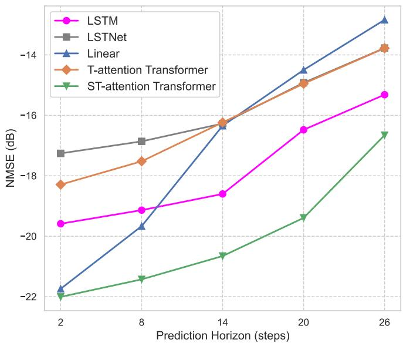  
Fig. 6. Multi-step prediction performance for various methods, where the sampling interval is 1 ms, the history length is $c { = } 3 0$ , and the numbers of antennas and users are $N _ { S } { = } 2 5$ $N _ { R } { \dot { = } } 9$ , K=4, and $N _ { U } { = } 1$

## B. Simulation Results

As illustrated in Fig. 6, we compare the multi-step prediction performance of LSTM [12], LSTNet [42], Linear [43], T-attention Transformer [17], and the proposed ST-attention based channel prediction scheme. The channel acquisition (sampling) interval is set to $1 0 ^ { - 3 }$ s and the history length is 30. The figure reports the normalized MSE (NMSE) for prediction horizons of 2, 8, 14, 20, and 26 steps. Note that if not otherwise specified, the proposed scheme adopts the model configuration of Config 1 in Table V.

It can be observed that all methods exhibit increasing NMSE as the prediction horizon grows, indicating a degradation in accuracy over longer future intervals. Nevertheless, the proposed ST-attention based scheme achieves consistently lower NMSE than the other approaches at every horizon, demonstrating its superior ability to learn both temporal dependencies and spatial correlations. It is also seen that the Linear model performs well at shorter horizons (e.g., c=2), but its accuracy declines rapidly as the horizon increases, reflecting the limitations of an autoregressive linear approach. For longer-range predictions (e.g., beyond 14 steps), LSTM exhibits relatively strong performance, but it remains notably outperformed by our proposed ST-attention based scheme.

TABLE V  
MODEL CONFIGURATIONS AND PREDICTION PERFORMANCE
<table><tr><td>Metric</td><td>Config 1</td><td>Config 2</td><td>Config 3</td></tr><tr><td>Params</td><td>568.51 K</td><td>1.72 M</td><td>3.84 M</td></tr><tr><td>Model Dim.</td><td>64</td><td>96</td><td>128</td></tr><tr><td>Fwd. Dim.</td><td>128</td><td>192</td><td>256</td></tr><tr><td>Enc. Layers</td><td>2</td><td>2</td><td>3</td></tr><tr><td>Dec. Layers</td><td>2</td><td>2</td><td>3</td></tr><tr><td>Attn. Heads</td><td>2</td><td>4</td><td>4</td></tr><tr><td>QK Dim.</td><td>32</td><td>48</td><td>64</td></tr><tr><td>V Dim.</td><td>32</td><td>48</td><td>64</td></tr><tr><td>FLOPs</td><td>6.1 GMac</td><td>21.09 GMac</td><td>53.63 GMac</td></tr><tr><td>Inf. Time (NX)</td><td>0.24 ms</td><td>0.84 ms</td><td>2.15 ms</td></tr><tr><td>Inf. Time (AGX)</td><td>0.09 ms</td><td>0.31 ms</td><td>0.79 ms</td></tr><tr><td>NMSE</td><td>-19.4 dB</td><td>-19.83 dB</td><td>-19.97 dB</td></tr></table>

Notes: Model Dim. and Fwd. Dim. are the model and feedforward dimensions. Enc. Layers and Dec. Layers are the numbers of encoder and decoder layers. Attn. Heads is the count of attention heads. QK Dim. and V Dim. are query/key and value dimensions. FLOPs is measured in GMac (Giga MACs). NX and AGX refer to Jetson Orin NX and Jetson AGX Orin; inference times assume 25 and 68.75 TFLOPS, respectively.

To demonstrate the fairness of the comparisons in Fig. 6, we also summarize all baseline configurations for the two-step prediction in Table III and report model size and computational efficiency in Table IV. In Table III, LSTNet’s “64/100” denotes 64 convolutional filters in its convolutional neural network (CNN) block and a 100-unit hidden state in its recurrent neural network (RNN) block; the LSTM is implemented as a two-layer bidirectional network; and both the T-attention and ST-attention Transformers employ a 2 + 2 architecture, comprising two encoder layers and two decoder layers.

In Table IV, although the parameter count for each model remains unchanged, the computational load (in FLOPs) increases with a longer prediction horizon. The proposed ST attention based scheme has a model size that is smaller than that of LSTM [12] and LSTNet [42], and is comparable to that of the T-attention Transformer [17]. Its size is larger than that of the Linear model [43]; however, this is inherent to the characteristics of the Linear model, which cannot further improve performance by simply increasing its capacity. This indicates that our comparison is fair and does not rely on deliberately reducing the model sizes of other approaches. Notably, our proposed ST-attention based scheme requires a higher FLOPs count compared to other models. This increased cost is primarily due to its ability to jointly capture spatial and temporal attentions, which can be regarded as the price for achieving higher precision in channel prediction. In scenarios where precise channel prediction is critical for link adaptation and resource allocation, the performance gains justify the additional computational expense. Moreover, as hardware performance and optimization techniques continue to improve, the relative computational overhead of our scheme is expected to decrease, further enhancing its feasibility for practical deployment.

To illustrate the impact of model size on prediction performance, Table V summarizes the trade-off between model complexity and prediction accuracy for a history length of 30 and a prediction horizon of 20 steps, evaluated across three configurations. The table reports key metrics and the achieved NMSE. In addition, we report the inference times on the Jetson Orin NX [44] and the Jetson AGX Orin [45] platforms. The Jetson Orin NX is a low-power platform designed for compact and energy-efficient deployments and is well suited for satellite applications with strict power and space constraints. In contrast, the Jetson AGX Orin delivers higher computational performance and serves as a benchmark for scenarios with relaxed power constraints.

As the model scale increases from Config 1 to Config 3, the parameter count, FLOPs, and inference times increase substantially. For example, FLOPs rise from 6.1 GMac in Config 1 to 53.63 GMac in Config 3, with the inference time on the Jetson Orin NX increasing from 0.24 ms to 2.15 ms and on the Jetson AGX Orin from 0.09 ms to 0.79 ms. Meanwhile, the NMSE improves modestly from -19.4 dB to -19.97 dB, indicating that larger models can better capture complex channel dynamics and yield improved prediction accuracy. However, it should be noted that the benefits of increasing model size are subject to diminishing returns, as evidenced by the marginal NMSE improvement despite a substantial increase in computational cost.

These findings underscore the trade-off between computational resource consumption and prediction performance. The inference times on both platforms illustrate the range of hardware environments available for deployment and provide guidance for selecting a configuration that balances efficiency with accuracy in practical satellite communication applications.

As shown in Fig. 7, we further evaluate the NMSE performance of five models at various sampling intervals while keeping the history length fixed at 30 and predicting 20 future steps. Although all methods exhibit increased errors as the sampling interval grows, the proposed ST-attention based scheme shows a significantly slower rise in NMSE. This performance is primarily due to its integrated spatiotemporal attention mechanism, which effectively captures fine-grained channel dynamics even under sparse data conditions.

Furthermore, when the sampling interval exceeds 4 ms, the T-attention based method outperforms the other approaches except for our proposed scheme. This observation confirms that temporal attention alone is effective in extracting critical dependencies from sparser data, but the combination of spatial and temporal attention can further enhance prediction accuracy. These results underscore the advantages of a holistic spatiotemporal attention design for robust channel forecasting in dynamic environments.

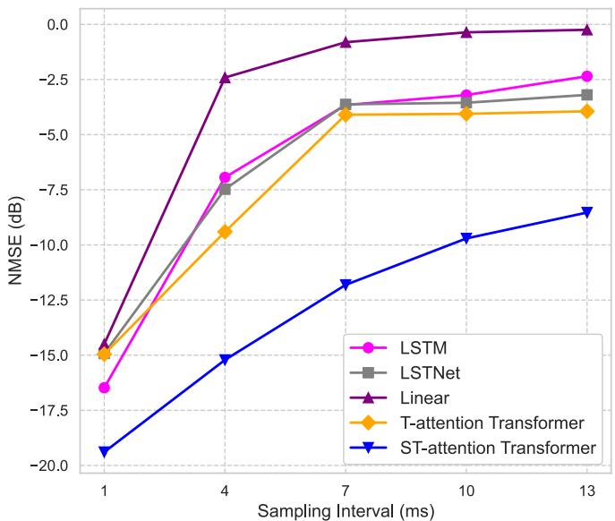  
Fig. 7. Prediction performance under different sampling intervals, where the history length is $\scriptstyle c = 3 0 ,$ the prediction horizon is $g = 2 0 ,$ , and the numbers of antennas and users are $N _ { S } { = } 2 5$ $N _ { R } { = } 9 .$ , K=4, and $N _ { U } { = } 1$

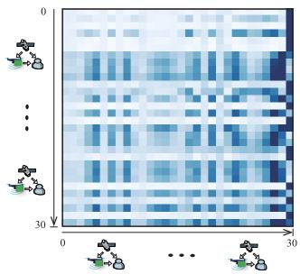  
(a)

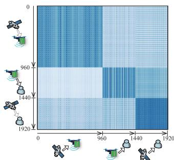  
(b)  
Fig. 8. Visualization of attention mechanisms: (a) T-attention and (b) STattention, where the history length is $\scriptstyle c = 3 0 ,$ the prediction horizon is $g { = } 3 0 ,$ and the numbers of antennas and users are $N _ { S } { = } 4 , \bar { N } _ { R } { = } 4 , K { = } 2 ,$ , and $N _ { U } { = } 1$

To further illustrate why ST-attention outperforms purely Tattention, Fig. 8 compares the two mechanisms by visualizing their attention maps. Under T-attention, the model attends almost exclusively to the temporal dimension, overlooking spatial interactions among antennas or sub-channels and thus missing subtle high-dimensional variations. By contrast, STattention performs joint spatio-temporal reasoning, allowing the network to exploit cross-antenna dependencies in addition to temporal evolution. Concretely, on the same validation split, the average row entropy increases from 1.46 to 2.31 bits, indicating a much broader receptive field. Moreover, ST-attention allocates approximately 37 % of its mass to cross-antenna links, whereas T-attention assigns virtually none. Therefore, the model can now distribute its focus across both time and space, thereby reconstructing missing channel entries more effectively and maintaining higher prediction accuracy over long horizons. This richer spatial modelling ultimately delivers greater robustness in dynamic satellite environments.

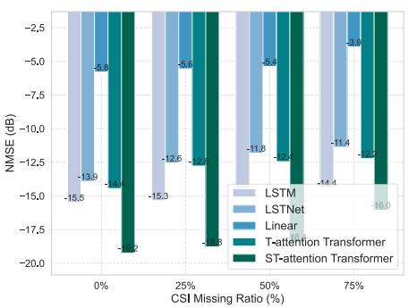  
(a) Continuous Outages

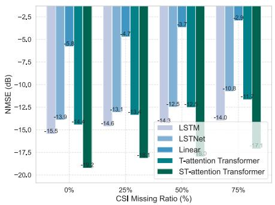  
(b) Random Outages

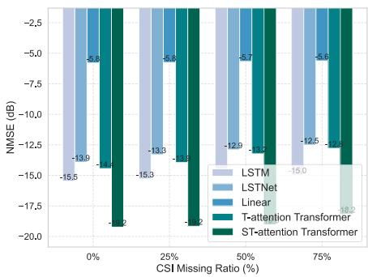  
(c) Equidistant Sparsity  
Fig. 9. Prediction performance under three pCSI scenarios after beamspace compression, where the history length is c=30, the prediction horizon is $g { = } 2 0 .$ the retained-beam count is $P { = } 2 6$ , and the antenna configuration is $N _ { S } { = } 2 5 6 , \hat { N _ { R } } { = } 8 1 , { \cal K } { = } 4 , { \cal N } _ { U } { = } 1 .$

TABLE VI  
PREDICTION ACCURACY AND COMPLEXITY WITH AND WITHOUT BEAMSPACE COMPRESSION
<table><tr><td rowspan="2">Scenario</td><td colspan="2">Full Element Domain</td><td colspan="2">Beamspace Compression</td></tr><tr><td>NMSE (dB)</td><td>FLOPs (GMac)</td><td>NMSE (dB)</td><td>FLOPs (GMac)</td></tr><tr><td>Small arrayª  $P { = } 9$ </td><td>-19.40</td><td>6.06</td><td>-19.35</td><td>1.52</td></tr><tr><td>Large array  $^ \mathrm { b } _ { , } P = 2 6$ </td><td></td><td> $4 . 5 0 \times 1 0 ^ { 5 }$ </td><td>-19.24</td><td>12.63</td></tr></table>

${ } ^ { \mathrm { a } } \ c = 3 0 .$ $g = 2 0 ,$ and the numbers of antennas and users are $N _ { S } { = } 2 5 ,$ $N _ { R } { = } 9 , K { = } 4 ,$ and $N _ { U } { = } 1$  
b c=30, $g { = } 2 0 ,$ , and the numbers of antennas and users are $N _ { S } { = } 2 5 6 .$ $N _ { R } { = } 8 1$ ， $K { = } 4 ,$ and $N _ { U } = 1 .$

Table VI contrasts the element-domain results shown earlier for the small array with a beamspace variant, and then extends the same comparison to a large array. For the small geometry, keeping only $P = 9$ beams cuts the FLOPs from 6.06 GMac to 1.52 GMac while incurring less than 0.1 dB NMSE loss. This is because the most of channel power concentrates in the dominant angular bins captured by those beams, and the discarded beams mainly carry noise and minor scattering components. In the large-array case $( N _ { S } = 2 5 6 , \ N _ { R } = 8 1 )$ , an element-domain implementation would require an impractical $4 . 5 \times 1 0 ^ { 5 }$ GMac and terabytes of intermediate activations, hence we report it only as an analytical estimate. Applying beamspace compression with $P \ = \ 2 6$ reduces the cost to 12.6 GMac while preserving excellent NMSE performance, thereby enabling scalable training and real-time inference even for very large arrays.

Fig. 9 shows the impact of pCSI on prediction accuracy under the three outage patterns introduced in Section II-C. The curves are obtained for the large-array setting after beamspace compression with the retained-beam count $P { = } 2 6 .$ . In each scenario, the outage ratio is varied from 0% to 75%, with a history length of 30 and a prediction horizon of 20. As the outage ratio increases, all methods exhibit an increase in NMSE.

The ST-attention based method consistently achieves the lowest NMSE, highlighting its robustness to incomplete CSI observations. By exploiting global context from both spatial and temporal dimensions, the proposed model can more effectively reconstruct and “fill in” the missing CSI entities. In contrast, conventional time-series models rely primarily on temporal correlations and lack the ability to capture spatial interactions, making them more susceptible to performance degradation at high outage ratios. Moreover, the linear autoregressive baseline suffers the largest drop because its coefficients are fitted in the element domain. After the channel is projected and truncated in beamspace, much of the statistical structure it relies on is removed, which leads to a sharp NMSE increase.

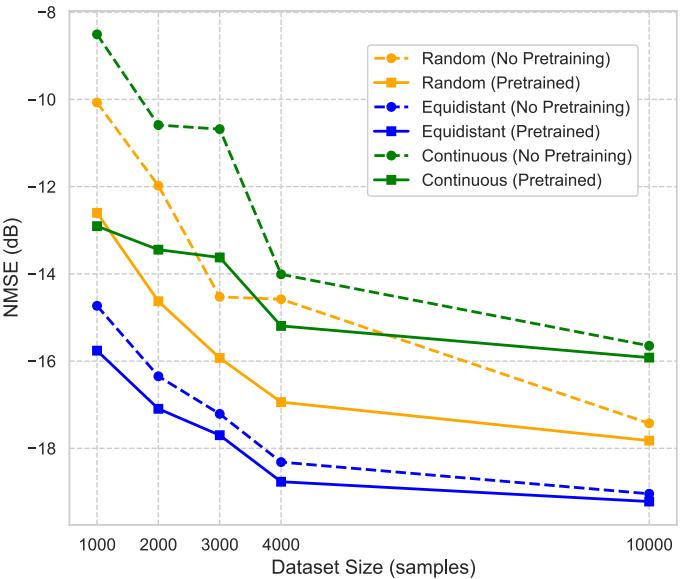  
Fig. 10. Effect of pretraining on pCSI conditions performance improvement under varying dataset sizes after beamspace compression, where the history length is $\scriptstyle { \dot { c } } = { \bar { 3 } } 0 .$ , the prediction horizon is $g { = } 2 0$ , the retained-beam count is $P { = } 2 6$ , and the numbers of antennas and users are $N _ { S } { = } 2 5 6 , N _ { R } { = } 8 1 , K { = } 4 .$ and $N _ { U } { = } 1$

Although the proposed ST-attention based scheme already achieves superior prediction performance under pCSI conditions compared to other benchmark methods, further improvements can be obtained by using a two-stage channel prediction scheme based on pretraining. Fig. 10 illustrates, under beamspace compression, how pretraining improves CSI prediction accuracy across different dataset sizes for the three pCSI patterns. For each pre-training sequence, we first draw a masking pattern according to the probabilities associated with the corresponding curve in Fig. 10. A missing ratio is then sampled from the uniform law $\rho \sim \mathcal { U } [ 0 . 1 0 , 0 . 9 0 ]$ ; exactly $\lfloor \rho c \rfloor$ time steps are masked and zero-filled. The identical masking protocol is applied during fine-tuning so that the encoder is exposed to statistically consistent inputs throughout training.

The horizontal axis indicates the dataset size, while the vertical axis shows the NMSE. For each pCSI pattern, we compare the prediction performance of models trained with and without pretraining. It is worth noting that the dataset comprises 10% samples with channel outages and 90% samples with complete continuous inputs, enabling the trained model to handle both normal CSI and pCSI conditions.

The experimental results indicate that when the dataset is small (e.g., 1,000 samples), the pretraining processing can significantly reduce the NMSE, demonstrating that the pretrained representations effectively facilitate the reconstruction of missing channel information and capture essential spatiotemporal dependencies under limited data conditions. As the dataset size increases, the performance gap between the pretrained and non-pretrained models gradually narrows, suggesting that with sufficient training data the model can learn near-optimal representations directly from the data. However, even when the dataset size reaches 10,000 samples, the pretraining processing still provides measurable performance gains. In addition, the extent of the improvement brought in by the pretraining processing varies among the different outage scenarios. In particular, under limited data conditions, the performance gains offered by pretraining are more pronounced for Continuous Outages and Random Outages compared to Equidistant Sparsity. This difference is due to the regularity of the missing pattern in the Equidistant Sparsity, which enables the prediction model to inherently capture more of the missing structure.

To better reflect realistic operating conditions, Fig. 11 shows, under beamspace compression, the prediction performance in mixed outage scenarios with varying maximum CSI missing ratios. In a mixed outage scenario, the masking pattern may correspond to any of the three outage types. Moreover, the maximum missing ratio indicates that the probability of an outage occurring in the historical sequence is uniformly distributed between 0 and the specified maximum value.

Specifically, we investigate four configurations: Pretrain (Masked), NoPretrain (Masked), Pretrain (Overall), and NoPretrain (Overall). The first two curves evaluate prediction accuracy exclusively under pCSI conditions, while the latter two assess the overall performance across all scenarios, including both pCSI and fully observed CSI cases.

It is observed that as the maximum missing ratio increases, the NMSE becomes larger across all configurations, reflecting the growing challenge of reconstructing the channel with fewer available measurements. Nonetheless, the pretraining-based approach consistently achieves lower NMSE than the nonpretrained model. In particular, the improvement in the masked conditions is more significant than that in capturing the overall performance encompassing both complete and pCSI cases, confirming that the pretrained representations are especially effective in reconstructing missing CSI entries. This result further validates the effectiveness of our framework in scenarios with severe measurement outages or sparse sampling, which are common challenges in dynamic satellite communication systems. The ability to maintain high prediction accuracy even at high outage ratios further highlights the robustness of the proposed ST-attention based scheme combined with pretraining processing.

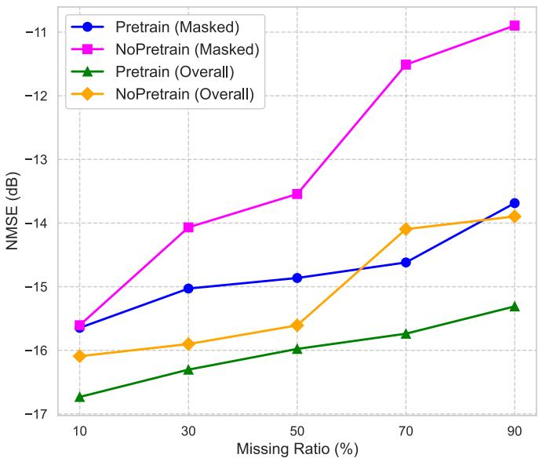  
Fig. 11. Comparison of prediction performance under various mixed missing ratios after beamspace compression, where the history length is $c { = } 3 0$ , the prediction horizon is $g = 2 0 ,$ , the retained-beam count is ${ \overline { { P } } } { = } 2 6 ,$ and the numbers of antennas and users are $N _ { S } { = } 2 5 6 , N _ { R } { = } 8 1$ $K { = } 4 ,$ , and $N _ { U } { = } 1$

TABLE VII  
EFFECT OF CHANNEL PREDICTION ON SPECTRAL EFFICIENCY
<table><tr><td>CSI Setting</td><td> $g { = } 5$  [bps/Hz]</td><td> $g { = } 2 0$  [bps/Hz]</td></tr><tr><td>Perfect CSI (upper bound)</td><td>3.46</td><td>3.46</td></tr><tr><td>Predicted CSI (ST-attention)</td><td>3.15</td><td>2.49</td></tr><tr><td>No Prediction (stale, prev. slot)</td><td>2.67</td><td>1.94</td></tr></table>

Notes: $B { = } 1 0 0 \mathrm { M H z } ;$ SNR is 10 dB dB; $c { = } 3 0 ;$ $N _ { S } { = } 2 5 6 , K { = } 1$ $N _ { U } { = } 1 ;$ maximum-ratio transmission (MRT) precoding. All entries report time-averaged single-user spectral efficiency.

We further quantify prediction gains on a single-user direct satellite-to-user link by fixing all settings and varying only the CSI source: Perfect CSI as a genie-aided upper bound; Predicted CSI using the ST-attention model; and No-Prediction, which designs the next time slot using only the most recently observed CSI without any forecasting. We provide results for two horizons, $g { = } 5$ and $g { = } 2 0$ , with 1 ms per step, as shown in Table VII. It is seen that with a 5 ms horizon, the predictor tracks the perfect-CSI upper bound closely and clearly outperforms stale CSI; at 20 ms, where channel aging is stronger, the benefit is even larger, indicating that forecasting reduces temporal mismatch and preserves a substantial fraction of the ideal rate.

## VII. CONCLUSION

In this paper, we proposed a novel MIMO channel prediction framework for LEO satellite communications involving UAV-RIS. Our proposal leverages a transformerbased ST-attention mechanism to capture both long-range temporal dependencies and spatial correlations. Additionally, we designed a two-stage self-supervised pretraining strategy which uses masked channel observations to reconstruct missing CSI entries and learn robust spatiotemporal features, thereby enhancing the system’s resilience to incomplete CSI. Simulation results show that the proposed ST-attention based approach consistently outperforms conventional methods, including T-attention transformer and LSTM networks, under both perfect and pCSI conditions. Moreover, the designed pretraining strategy plays a critical role in mitigating the adverse effects of severe outages on CSI acquisition, validating the significance of integrating SSL into channel prediction frameworks for dynamic LEO satellite communication environments. Overall, the combination of ST-attention and pretraining offers a promising direction for robust channel prediction in challenging pCSI scenarios.

## ACKNOWLEDGMENT

The authors gratefully acknowledge the National Supercomputing Centre Singapore (NSCC) for providing the computational resources used in this work.

## REFERENCES

[1] O. Kodheli et al., “Satellite communications in the new space era: A survey and future challenges,” IEEE Commun. Surveys Tuts., vol. 23, no. 1, pp. 70–109, 1st Quart., 2021.

[2] X. Luo, H.-H. Chen, and Q. Guo, “LEO/VLEO satellite communications in 6G and beyond networks–technologies, applications, and challenges,” IEEE Netw., vol. 38, no. 5, pp. 273–285, Sep. 2024.

[3] K. Tekbiyik, G. K. Kurt, A. R. Ekti, and H. Yanikomeroglu, “Reconfigurable intelligent surfaces in action for nonterrestrial networks,” IEEE Veh. Technol. Mag., vol. 17, no. 3, pp. 45–53, Sep. 2022.

[4] T. Sun, S. Yin, L. Deng, and F. Richard Yu, “Reinforcement-learningbased trajectory design and phase-shift control in UAV-mounted-RIS communications,” IEEE Trans. Mach. Learn. Commun. Netw., vol. 3, pp. 163–175, 2025.

[5] P. S. Bithas, G. A. Ropokis, G. K. Karagiannidis, and H. E. Nistazakis, “UAV-assisted communications with RIS: A shadowing-based stochastic analysis,” IEEE Trans. Veh. Technol., vol. 73, no. 7, pp. 10000–10010, Jul. 2024.

[6] L. You, K.-X. Li, J. Wang, X. Gao, X.-G. Xia, and B. Ottersten, “Massive MIMO transmission for LEO satellite communications,” IEEE J. Sel. Areas Commun., vol. 38, no. 8, pp. 1851–1865, Aug. 2020.

[7] K. Feng, T. Zhou, T. Xu, X. Chen, H. Hu, and C. Wu, “Reconfigurable intelligent surface-assisted multisatellite cooperative downlink beamforming,” IEEE Internet Things J., vol. 11, no. 13, pp. 23222–23235, Jul. 2024.

[8] J. Shi et al., “OTFS enabled LEO satellite communications: A promising solution to severe Doppler effects,” IEEE Netw., vol. 38, no. 1, pp. 203–209, Jan. 2024.

[9] C.-H. Lin, S.-C. Lin, and L. C. Chu, “A low-overhead dynamic formation method for LEO satellite swarm using imperfect CSI,” IEEE Trans. Veh. Technol., vol. 73, no. 5, pp. 6923–6936, May 2024.

[10] M. Alsenwi, E. Lagunas, and S. Chatzinotas, “Robust beamforming for massive MIMO LEO satellite communications: A risk-aware learning framework,” IEEE Trans. Veh. Technol., vol. 73, no. 5, pp. 6560–6571, May 2024.

[11] Y. Zhang, Y. Wu, A. Liu, X. Xia, T. Pan, and X. Liu, “Deep learning-based channel prediction for LEO satellite massive MIMO communication system,” IEEE Wireless Commun. Lett., vol. 10, no. 8, pp. 1835–1839, Aug. 2021.

[12] M. Ying, X. Chen, Q. Qi, and W. Gerstacker, “Deep learning-based joint channel prediction and multibeam precoding for LEO satellite Internet of Things,” IEEE Trans. Wireless Commun., vol. 23, no. 10, pp. 13946–13960, Oct. 2024.

[13] S. Hochreiter and J. Schmidhuber, “Long short-term memory,” Neural Comput., vol. 9, no. 8, pp. 1735–1780, Nov. 1997.

[14] A. Graves, “Long short-term memory,” in Supervised Sequence Labelling With Recurrent Neural Networks. Berlin, Germany: Springer, 2012, pp. 37–45.

[15] H. Zhang et al., “Intelligent channel prediction and power adaptation in LEO constellation for 6G,” IEEE Netw., vol. 37, no. 2, pp. 110–117, Mar. 2023.

[16] A. Vaswani et al., “Attention is all you need,” in Proc. Adv. Neural Inf. Process. Syst., vol. 30, 2022, pp. 5998–6008.

[17] H. Jiang, M. Cui, D. W. K. Ng, and L. Dai, “Accurate channel prediction based on transformer: Making mobility negligible,” IEEE J. Sel. Areas Commun., vol. 40, no. 9, pp. 2717–2732, Sep. 2022.

[18] J. Grigsby, Z. Wang, N. Nguyen, and Y. Qi, “Long-range transformers for dynamic spatiotemporal forecasting,” 2021, arXiv:2109.12218.

[19] Z. Lin et al., “LEO-split: A semi-supervised split learning framework over LEO satellite networks,” 2025, arXiv:2501.01293.

[20] S. Gidaris, P. Singh, and N. Komodakis, “Unsupervised representation learning by predicting image rotations,” 2018, arXiv:1803.07728.

[21] A. Radford, J. Wu, R. Child, D. Luan, D. Amodei, and I. Sutskever, “Language models are unsupervised multitask learners,” OpenAI Blog, vol. 1, no. 8, p. 9, 2019.

[22] W.-N. Hsu, B. Bolte, Y.-H.-H. Tsai, K. Lakhotia, R. Salakhutdinov, and A. Mohamed, “HuBERT: Self-supervised speech representation learning by masked prediction of hidden units,” IEEE/ACM Trans. Audio, Speech, Language Process., vol. 29, pp. 3451–3460, 2021.

[23] A. Baevski, W.-N. Hsu, Q. Xu, A. Babu, J. Gu, and M. Auli, “Data2vec: A general framework for self-supervised learning in speech, vision and language,” in Proc. Int. Conf. Mach. Learn. (ICML), vol. 162, 2022, pp. 1298–1312.

[24] J. Devlin, M.-W. Chang, K. Lee, and K. Toutanova, “BERT: Pre-training of deep bidirectional transformers for language understanding,” 2018, arXiv:1810.04805.

[25] T. S. Rappaport, Wireless Communications: Principles and Practice, 2nd ed., Upper Saddle River, NJ, USA: Prentice-Hall, 2002.

[26] R. Wang, M. A. Kishk, and M.-S. Alouini, “Ultra-dense LEO satellitebased communication systems: A novel modeling technique,” IEEE Commun. Mag., vol. 60, no. 4, pp. 25–31, Apr. 2022.

[27] D. A. Vallado, Fundamentals of Astrodynamics and Applications. New York, NY, USA: Springer, 2001.

[28] J. Zhu, “Conversion of Earth-centered Earth-fixed coordinates to geodetic coordinates,” IEEE Trans. Aerosp. Electron. Syst., vol. 30, no. 3, pp. 957–961, Jul. 1994.

[29] Propagation Data and Prediction Methods Required for the Design of Earth-Space Telecommunication Systems, document ITU-R P.618-13, International Telecommunication Union, Geneva, Switzerland, 2017.

[30] Attenuation by Atmospheric Gases and Related Effects, document Recommendation ITU-R P.676-13, International Telecommunication Union, Radiocommunication Sector (ITU-R), Aug. 2022.

[31] Propagation Data and Prediction Methods Required for the Design of Earth-Space Telecommunication Systems, document Recommendation ITU-R P.618-15, International Telecommunication Union, Radiocommunication Sector (ITU-R), Sep. 2024.

[32] Study on Channel Model for Frequencies from 0.5 to 100 GHz, Standard TR 38.901, 3rd Generation Partnership Project (3GPP), 2019.

[33] A. Abdi, C. Tepedelenlioglu, M. Kaveh, and G. Giannakis, “On the estimation of the K parameter for the Rice fading distribution,” IEEE Commun. Lett., vol. 5, no. 3, pp. 92–94, Mar. 2001.

[34] A Path-Specific Propagation Prediction Method for Point-to-Area Terrestrial Services in the Frequency Range 30 MHz to 6 000 MHz, document Recommendation ITU-R P.1812-7, International Telecommunication Union, Radiocommunication Sector (ITU-R), Aug. 2023.

[35] International Space Station (ISS) Facts and Figures, NASA, Washington, DC, USA, 2019.

[36] L. E. Dubins, “On curves of minimal length with a constraint on average curvature and with prescribed initial and TerminalPositions and tangents,” Amer. J. Math., vol. 79, no. 3, pp. 497–516, Jul. 1957.

[37] B. Liang and Z. J. Haas, “Predictive distance-based mobility management for multidimensional pcs networks,” IEEE/ACM Trans. Netw., vol. 11, no. 5, pp. 718–732, Oct. 2003.

[38] P. K. Chowdhury, M. Atiquzzaman, and W. Ivancic, “Handover schemes in satellite networks: State-of-the-art and future research directions,” IEEE Commun. Surveys Tuts., vol. 8, no. 4, pp. 2–14, 4th Quart., 2006.

[39] A. Gillioz, J. Casas, E. Mugellini, and O. A. Khaled, “Overview of the transformer-based models for NLP tasks,” in Proc. 15th Conf. Comput. Sci. Inf. Syst. (FedCSIS), Sep. 2020, pp. 179–183.

[40] NVIDIA H100 Tensor Core GPUs, NVIDIA Corporation, Santa Clara, CA, USA, 2024.

[41] P. Goyal et al., “Accurate, large minibatch SGD: Training ImageNet in 1 hour,” 2017, arXiv:1706.02677.

[42] G. Lai, W.-C. Chang, Y. Yang, and H. Liu, “Modeling long{-} and short-term temporal patterns with deep neural networks,” 2017, arXiv:1703.07015.

[43] A. Zeng, M. Chen, L. Zhang, and Q. Xu, “Are transformers effective for time series forecasting?,” 2022, arXiv:2205.13504.

[44] NVIDIA Jetson Orin NX Series Data Sheet, NVIDIA Corporation, Santa Clara, CA, USA, 2022.

[45] NVIDIA Jetson AGX Orin Developer Kit, NVIDIA Corporation, Santa Clara, CA, USA, 2025.

  
Mingyi Wang received the B.Sc. degree in electronic information engineering from Xinjiang University, Ur ¨ umqi, China, in July 2019. He is currently¨ pursuing the joint Ph.D. degree in information and communication engineering with Harbin Institute of Technology, Harbin, China, and Politecnico di Torino, Turin, Italy. His research interests include satellite communication, waveform design, channel prediction, and integrated communication and navigation.

Yizhou Peng (Graduate Student Member, IEEE) received the B.E. degree in electronics and information engineering and the M.S. degree in information and communication engineering from Xinjiang University, Ur¨ umqi, China, in 2019 and 2022, respec-¨ tively. He is currently pursuing the Ph.D. degree with the College of Computing and Data Science, Nanyang Technological University, Singapore. His research interests include speech representation learning, multilingual and full-duplex spoken dialogue modeling, and large speech–language models.

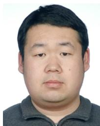

Ruofei Ma (Member, IEEE) received the B.Sc., M.Sc., and Ph.D. degrees in information and communication engineering from Harbin Institute of Technology (HIT), Harbin, China, in 2008, 2010, and 2014, respectively. From February 2015 to December 2016, he was a Post-Doctoral Researcher with the Department of Engineering Science, National Cheng Kung University, Taiwan. He was a Senior Algorithm Engineer with Huawei Technologies Company Ltd., China, from January 2017 to October 2017. He is currently an Associate Professor

with the Department of Communication Engineering, Harbin Institute of Technology, Weihai, China. His research interests include device-to-device (D2D) communications, smart grid communications, intelligent connected-vehicles, satellite communication networks, and underwater-overwater cooperative communications and networks.

Gongliang Liu received the B.Sc. degree in measuring and control technology and instrumentations, and the M.Sc. and Ph.D. degrees in information and communication engineering from Harbin Institute of Technology (HIT), Weihai, China, in 2001, 2003, and 2007, respectively. He was a Visiting Scholar with The University of British Columbia, Canada, from August 2015 to August 2016. He is currently a Professor with HIT. His research interests include wireless communications and networks, satellite communications, and underwater communications.

Weixiao Meng (Senior Member, IEEE) received the B.Eng., M.Eng., and Ph.D. degrees from Harbin Institute of Technology (HIT), Harbin, China, in 1990, 1995, and 2000, respectively. From 1998 to 1999, he was a Senior Visiting Researcher with NTT Docomo on adaptive array antenna and dynamic resource allocation for beyond 3G. He is currently a Full Professor and the Vice Dean of the School of Electronics and Information Engineering, HIT. He has published four books and over 300 papers on journals and international conferences. His research interests include broadband wireless communications, space-air-ground integrated networks and wireless localization technologies. He is a fellow of China Institute of Electronics and a senior member of the IEEE ComSoc and China Institute of Communication. In 2005 he was honored provincial excellent returnee and selected into the New Century Excellent Talents (NCET) plan by the Ministry of Education (MOE), China, in 2008, and the Distinguished Academic Leader of Harbin. Under his leading, Harbin Chapter won the IEEE ComSoc Chapter of the Year Award and Asia Pacific Region Chapter Achievement Award, and he won Member and Global Activities Contribution Award in 2018. He is the Chair of the IEEE Communications Society Harbin Chapter. He was an Editorial Board Member of Wiley’s Wireless Communication and Mobile Computing Journal from 2010 to 2017, an Area Editor of Physical Communication journal from 2014 to 2016, and an Editorial Board of IEEE COMMUNICATIONS SURVEYS AND TUTORIALS from 2014 to 2017. He has been an Editorial Board of IEEE WIRELESS COMMUNICATIONS since 2015.

Carla Fabiana Chiasserini (Fellow, IEEE) is currently a Full Professor with the Politecnico di Torino, Italy, and a Research Associate with Italian National Research Council. Her research interests include 5Gand-beyond networks, NFV, mobile edge computing, connected vehicles, and distributed machine learning at the network edge. She is a Fellow of AAIA. She currently serves as the Editor-in-Chief for Computer Communications and the Associate Editor-in-Chief for IEEE TRANSACTIONS ON NETWORK SCIENCE AND ENGINEERING.

Roberto Garello (Senior Member, IEEE) received the Ph.D. degree in electronic engineering from Politecnico di Torino, Italy, in 1994, with a focus on error correction coding. During his Ph.D. studies, he was a Visiting Student with MIT, Cambridge, and ETH Zurich, Z¨ urich. From 1994 to 1997, he was¨ with Marconi Communications, Genoa. From 1998 to 2001, he was an Associate Professor with the University of Ancona. Since November 2001, he has been an Associate Professor with the Department of Electronics and Telecommunications, Politecnico di

Torino. In 2017, he was an Adjunct Professor with California State University, Los Angeles, CA, USA. On these topics, he has co-authored more than 150 articles and has been the Project Manager for over 40 research projects. His main research interests include space communication systems and channel coding.