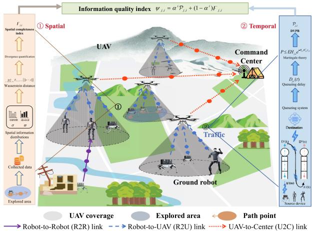
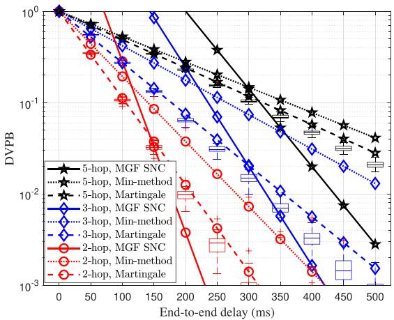
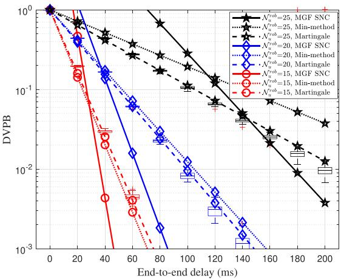
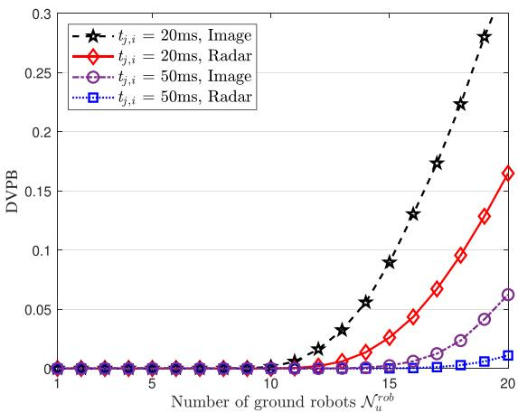
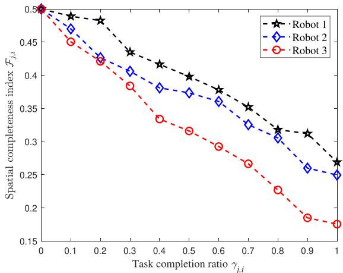
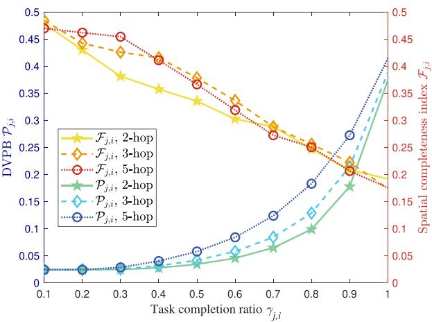
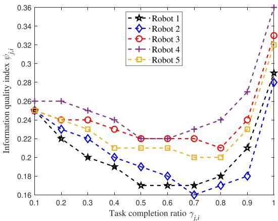
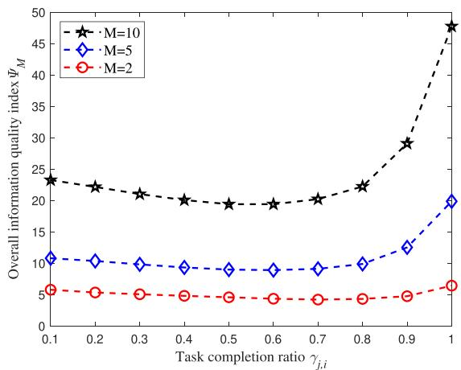

# Spatiotemporal Information Quality Optimization for UAV-Assisted Ground Robot Networks

Shun Guo, Graduate Student Member, IEEE, Jiawen Kang , Senior Member, IEEE, Dusit Niyato , Fellow, IEEE, Qingqing Zhang , Member, IEEE, Weidang Lu , Senior Member, IEEE, and Zhu Han , Fellow, IEEE

Abstract—Uncrewed aerial vehicle (UAV)-assisted ground robot networks (UGRNets) are playing an increasingly critical role in a wide range of time-sensitive and mission-critical applications, such as environmental monitoring, infrastructure inspection, and emergency response. UGRNets require not only low-latency communication but also high spatial awareness to ensure effective coordination and decision-making. This paper proposes a unified spatiotemporal framework that evaluates and enhances the quality of updated information in UGRNets from both temporal and spatial dimensions. On the temporal side, we develop a martingale-theorybased prediction method for the delay violation probability bound (DVPB), coupled with a novel joint decay rate model to accurately characterize latency violations in heterogeneous multi-hop communication UGRNets. On the spatial side, we introduce the use of Wasserstein distance to quantify and improve the spatial completeness of robotic coverage. By integrating these metrics, we formulate a spatiotemporal optimization problem that jointly minimizes DVPB and maximizes spatial completeness, enabling robotic agents to adapt their information collection strategies accordingly. Numerical results demonstrate that the proposed framework significantly improves information timeliness and spatial

Digital Object Identifier 10.1109/TMC.2025.3646651

completeness in heterogeneous and dynamic UGRNets scenarios, thereby providing practical insights for real-world deployment.

Index Terms—Ground robots, UAVs, delay violation probability bound, martingale, Wasserstein distance.

## I. INTRODUCTION

ronments has led to the emergence of uncrewed aerial vehicle (UAV)-assisted ground robot networks (UGRNets) [1]. UGR-Nets leverage the complementary strengths of aerial and ground robotic platforms to overcome the limitations of single-agent or homogeneous systems. UAVs offer rapid deployment, widearea perception, and airborne communication relay capabilities, while ground robots, such as quadruped or tracked systems, provide terrain adaptability, high-resolution situational awareness, and close-proximity task execution. When integrated into a coordinated multi-agent framework, these heterogeneous platforms enable information acquisition, real-time exchange, and distributed task execution, positioning UGRNets as a promising architecture for complex and mission-critical operations, especially in uncertain environments.

A representative and high-impact application scenario for UGRNets is emergency rescue, where autonomous coordination and timely responsiveness are essential. Such missions are typically conducted in hazardous and infrastructure-deficient environments, such as collapsed buildings, obstructed terrain, or regions with disrupted communication infrastructure. In these settings, conventional human-led responses are often infeasible or unsafe. UGRNets enhance operational safety and efficiency by combining ground-level intelligence gathering with aerial coverage and communication relaying. For example, ground robots may perform vital sign monitoring or hazard detection, while UAVs provide real-time mapping and maintain connectivity. This collaborative paradigm ensures persistent situational awareness and supports agile task allocation across the network [2].

The operational effectiveness of UGRNets hinges on the quality of collected and transmitted information, which must be both temporally fresh and spatially comprehensive. From a temporal perspective, the delivery of critical data—such as toxic gas concentrations or biometric signals—must meet stringent latency constraints. Among various delay components, queueing delay often dominates under dynamic load and congested network conditions. To reflect real-world constraints more accurately than average delay, we focus on the delay violation probability (DVP)—the probability that queueing delay exceeds a critical threshold [3]. A low DVP indicates reliable delivery of timesensitive data and improved decision latency, which are essential for effective rescue operations. Therefore, accurate modeling and prediction of the delay violation probability bound (DVPB) is essential for ensuring reliable communication in UGRNets.

  
Fig. 1. Spatiotemporal information quality evaluation in UGRNets. The DVPB prediction evaluation and spatial completeness evaluation are used to ensure comprehensive and reliable decision-making.

Spatially, completeness of sensing coverage is equally vital: missing key environmental data or failing to detect a trapped victim can severely compromise mission outcomes. Conversely, redundant exploration caused by poorly coordinated robotic agents wastes resources and prolongs mission time. Therefore, a principled quantification of spatial coverage, particularly the similarity between the empirical sensing distribution and a target distribution, is essential for guiding agent behavior and optimizing information acquisition.

In this paper, we consider a representative multi-agent communication scenario of UGRNets, which involves ground robots, UAVs, and a centralized command center. As illustrated in Fig. 1, ground robots perform localized sensing tasks such as hazard detection and vital sign monitoring, while UAVs enable broad environmental surveillance and maintain network connectivity through aerial relaying. The main contributions of this work are summarized as follows:

\- Martingale-theory-based delay prediction with joint decay rate model (temporal dimension): We develop a martingale-based method to predict the DVPB in multi-hop UGRNets by modeling the system as a tandem queued heterogeneous system. To handle non-stationary traffic and link heterogeneity, we model data arrival and service processes as Markov chains and employ Markov Chain Monte Carlo (MCMC) techniques for parameter estimation. Furthermore, we introduce a novel joint decay rate model that extends classical single-hop martingale methods to heterogeneous multi-hop environments.

\- Wasserstein distance-based spatial completeness quantification (spatial dimension): We propose a principled spatial information quality metric using Wasserstein distance, which quantifies the divergence between the empirical sensing distribution and a target distribution. This metric supports continuous, differentiable optimization and provides gradient-based guidance for real-time UAV path planning. The proposed method enhances spatial coverage efficiency while minimizing redundancy in exploration.

Unified spatiotemporal information quality framework: We propose an integrated framework that jointly captures the temporal freshness (via DVPB) and spatial completeness (via Wasserstein distance) of sensed information. This dual-perspective formulation enables coordinated adaptation of communication strategies and agent mobility in UGRNets. The resulting cross-layer optimization framework supports intelligent behavior modulation in dynamic, resource-constrained environments.

Comprehensive system validation and practical insights: We conduct comprehensive simulations under diverse heterogeneous multi-hop topologies and realistic traffic conditions to validate the proposed DVPB prediction, spatial completeness quantification, and unified optimization scheme. The results demonstrate high prediction accuracy, improved sensing performance, and enhanced adaptability of the UGRNets. These findings offer concrete design principles for the development of resilient, delay-aware, and coverage-efficient robotic networks in practical deployments.

The remainder of the paper is organized as follows. Section II reviews related work on UGRNets with respect to delay analysis and spatial completeness. Section III presents the system model and formulates the spatiotemporal model for information quality. Section IV presents numerical results and discussions. Finally, Section V concludes the paper.

## II. RELATED WORK

In this section, we first examine existing efforts in modeling and predicting communication delay, with a focus on martingaletheory-based methods. We then discuss research on spatial completeness in multi-robot and UAV-ground cooperative systems.

## A. Delay Analysis for UGRNets

Communication delay is a critical factor affecting the responsiveness and reliability of robotic networks. Recent studies have focused on end-to-end delay in robot communication systems. For example, in [6], in order to maintain system stability under varying delay, a passive control architecture was proposed for robot teleoperation, which could prevent the destabilizing effects of the communication link. In parallel, the authors in [7] developed a machine-learning-based system enabling ultra-reliable low-latency communications for mobile robots. In recent research, the authors in [8] proposed a predictive model to eliminate video delay, thereby mitigating the operational risks associated with communication delay. In [9], the authors designed an integrated optical sensing, communication and computation system that significantly reduced the delay of control signal to 35 ms and further improved the communication quality for robots.

TABLE I  
SUMMARY OF DELAY ANALYSIS METHODS
<table><tr><td rowspan=1 colspan=1>Ref.</td><td rowspan=1 colspan=1>Description</td><td rowspan=1 colspan=1>Method</td><td rowspan=1 colspan=1>Heterogeneity</td><td rowspan=1 colspan=1>multihop</td></tr><tr><td rowspan=1 colspan=1>[10]</td><td rowspan=1 colspan=1>Develops an intelligent information sharing mechanism for UAV formation control,incorporating a reward function that accounts for communication metrics such asdelay and packet loss rate.</td><td rowspan=1 colspan=1>M/G/1</td><td rowspan=1 colspan=1></td><td rowspan=1 colspan=1>×</td></tr><tr><td rowspan=1 colspan=1>[11]</td><td rowspan=1 colspan=1>Proposes a two-layered UAV network architecture incorporating mobile edgecomputing to jointly optimize response delay and computing resources allocation.</td><td rowspan=1 colspan=1>M/M/m</td><td rowspan=1 colspan=1></td><td rowspan=1 colspan=1>×</td></tr><tr><td rowspan=1 colspan=1>[12]</td><td rowspan=1 colspan=1>Introduces a novel method of energy and throughput management indelay-constrained small-world UAV-Internet of Things network.</td><td rowspan=1 colspan=1>M/M/1</td><td rowspan=1 colspan=1>X</td><td rowspan=1 colspan=1>√</td></tr><tr><td rowspan=1 colspan=1>[13]</td><td rowspan=1 colspan=1>Proposes a resonant beam information and power transmission system based onmultiple access time division multiplexing, with a focus on system delay analysis.</td><td rowspan=1 colspan=1>martingale</td><td rowspan=1 colspan=1></td><td rowspan=1 colspan=1>X</td></tr><tr><td rowspan=1 colspan=1>[14]</td><td rowspan=1 colspan=1>Analyzes data exchange mechanisms in the vehicle ad-hoc networks, focusing onmulti-hop end-to-end backlog and delay bounds under various scheduling strategies.</td><td rowspan=1 colspan=1>martingale</td><td rowspan=1 colspan=1>×</td><td rowspan=1 colspan=1>√</td></tr><tr><td rowspan=1 colspan=1>[15]</td><td rowspan=1 colspan=1>Investigates the stochastic effects of wireless channel fading and employs martingaletheory in the signal-to-noise ratio (SNR) domain for delay characterization.</td><td rowspan=1 colspan=1>martingale</td><td rowspan=1 colspan=1>X</td><td rowspan=1 colspan=1>√</td></tr><tr><td rowspan=1 colspan=1>[16]</td><td rowspan=1 colspan=1>Evaluates the end-to-end delay performance in THz wireless networks for supportingultimate virtual reality service.</td><td rowspan=1 colspan=1>martingale</td><td rowspan=1 colspan=1>X</td><td rowspan=1 colspan=1>√</td></tr><tr><td rowspan=1 colspan=1>Thispaper</td><td rowspan=1 colspan=1>Characterizes the stochastic and heterogeneous properties of communication inUGRNets, and derives tight delay violation probability bounds for the multi-agentsystem.</td><td rowspan=1 colspan=1>martingale</td><td rowspan=1 colspan=1></td><td rowspan=1 colspan=1></td></tr></table>

While these studies effectively address robot-level delay, delay in UAV-assisted networks also arises from the dynamic characteristics of UAV relays, making delay prediction more complex. Various analytical methods have been employed for this purpose. Table I presents a comparative overview of delay analysis studies. The authors in [10] modeled UAV information sharing scenarios using an M/G/1 queueing framework based on a generalized Markov process. In [11], the authors utilized an M/M/m queue to model UAV computational delays and formulated a delay-minimizing optimization problem to predict delay. The authors in [12] adopted an M/M/1 model to evaluate data delay in UAV-based small-world networks. However, these classical queueing models often fail to accurately capture the intricate and non-stationary dynamics of UGRNets communications. To address this limitation, martingale theory has gained attention for its ability to characterize stochastic processes in dynamic communication systems. In [13], the authors applied martingale techniques to delay prediction in single-hop resonant beam information and power transfer systems. In [14], martingale theory was used to analyze the end-to-end delay and backlog bound for the multi-hop vehicle ad-hoc network based on the homogeneous premise. In [15], the authors investigated the end-to-end delay of homogeneous networks and employed martingale theory to transform it into a simple delay analysis of all individual nodes, thereby predicting the delay. The authors in [16] extended this by transforming the multi-hop delay analysis of communication in a THz band into a per-node analysis in homogeneous environments. In recent years, martingale theory has achieved significant analytical progress in characterizing delay performance in communication systems. In [17], the authors applied martingale theory to model a mobile edge computing system as a two-hop tandem queuing system and analyzed the probability of delay violation during the task offloading process. In [18], the authors studied 6 G integrated sensing and communication network scenarios and derived the delay performance and violation probability bounds for massive machine-type communication devices using martingale theory.

In [19], the authors constructed a delay model based on martingale theory to calculate the probability that packet transmission delay exceeds a preset threshold, thereby evaluating the data packet transmission delay of each service. Though with these advancements, existing martingale-based models with singlehop or homogeneous assumption, limiting their applicability to multi-hop heterogeneous scenarios such as UGRNets. To overcome this challenge, we propose a novel martingale framework for UGRNets, enabling accurate DVPB prediction across dynamic heterogeneous networks.

## B. Spatial Completeness in UGRNets

Spatial completeness is a key metric for evaluating the quality of collected data, ensuring adequate coverage of a target area for accurate decision-making. In the context of UGRNets, achieving spatial completeness requires coordinated exploration and sensing by both ground and aerial robots. Ground robot-based strategies have been extensively explored for area coverage tasks. The authors in [20] introduced a layered multi-robot architecture for wide-area exploration, achieving large coverage of the target area by robots. In [21], the authors developed an autonomous exploration method based on dynamic partitioning and reinforcement learning to facilitate adaptive coverage in unknown environments. The path generation algorithm in [22] considered energy-constrained mobile robots, which adopted path modeling and distribution optimization methods to maximize the coverage and avoid overlapping paths. In [23], the authors achieved a uniform coverage of the target area for robots through dynamically partitioning regions and planning closed travel routes. These approaches commonly use metrics like integral coverage ratio of the target region to quantify effectiveness. However, limitations in ground robot mobility often result in coverage gaps, which can compromise data completeness and delay mission completion.

UAVs, which can perform a wide range of aerial monitoring and information collection tasks, solve the problem of insufficient spatial completeness of data to a certain extent and show significant advantages in UGRNets. Their use in improving spatial completeness has been studied from multiple perspectives, such as path optimization, wireless coverage, and UAV network optimization. In [24], the authors proposed a distributed learning framework to enhance the coverage area of the UAV swarm. The coverage area of the UAV swarm was taken to assess the overall coverage ratio. In [25], the authors investigated the optimization of the flight path of UAVs in emergency response scenarios. They proposed a path planning algorithm to improve the coverage of UAVs in three-dimensional terrain. In [26], a joint UAV network optimization method was designed to maximize coverage efficiency under delay constraints. The authors defined a coverage efficiency metric accounting for the ratio of the actual coverage size to the coverage size without overlap. While these studies enhance geometric coverage, they typically neglect the data-centric perspective of spatial completeness-namely, whether the collected information adequately represents the spatial distribution of environmental features. Without this, critical details may be omitted, impairing subsequent analyses. Wasserstein distance is a tool for measuring differences in probability distributions [4]. By comparing the collected data distribution with the ideal data distribution, the Wasserstein distance can quantify the spatial completeness of the data and can be used to evaluate the fidelity of maps [5]. In this work, we adopt the Wasserstein distance as a quantitative measure of spatial completeness, enabling data-level evaluation of area coverage.

## III. SYSTEM MODEL

In this section, we model the communication behavior of UGRNets as a multi-hop tandem queueing system and develop a spatiotemporal information quality evaluation framework.

## A. Network Model

We consider a multi-agent heterogeneous network in which ground robots perform intricate ground-level tasks and UAVs mainly serve as high-level coordinators and communication relays. The network comprises a set of ground robots $\mathcal { D } =$ $\{ d _ { 1 } , d _ { 2 } , \dots , d _ { D } \}$ tasked with executing localized missions, a set of $\operatorname { U A V s } \mathcal { U } = \{ u _ { 1 } , u _ { 2 } , . . . , u _ { U } \}$ functioning as communication relays and high-level coordinators, and a command center responsible for decision-making and global coordination. Each $\mathrm { U A V } u _ { u }$ oversees a dynamically defined subset of ground robots $\mathcal { N } _ { u } ^ { r o b } \in \{ 1 , 2 , \dots , D \}$ , where $D$ is the number of ground robots and $\begin{array} { r } { \sum _ { u = 1 } ^ { U } \mathcal { N } _ { u } ^ { r o b } = D } \end{array}$ . To represent the extremely dynamic search and rescue scenario and guarantee the precision and dependability of the rescue operations, a ground robot first uploads the sensed data to the other ground robots with the same coverage, and subsequently relays the data to the corresponding UAV or directly to it. The UAVs can operate autonomously and share necessary information within the UAV cluster and forward relevant information to the central command center in real time.

Each ground robot $d _ { j } \in \mathcal { D }$ in the coverage of UAV $u _ { u }$ generates a set of information packets during its traveling task. The information set is represented by the notation $\mathcal { M } =$ $\{ m _ { 1 } , m _ { 2 } , . . . , m _ { M } \}$ . The information $m _ { i } \in \mathcal { M }$ from ground robot $d _ { j } \in \mathcal { D }$ (denoted as $m _ { j , i } )$ may be forwarded through robot-to-robot (R2R), robot-to-UAV (R2U), or UAV-to-center (U2C) links to enable hierarchical processing. Each robot can generate multiple information during traveling, and a type of information can be contributed by several ground robots. The main notations are listed in Table II.

The data generation rate of $m _ { j , i }$ is governed by its task completion status, represented by the coefficient $\gamma _ { j , i } \in [ 0 , 1 ]$ $\mathrm { A }$ value of $\gamma _ { j , i } = 1$ indicates that the corresponding travel task has been fully completed. The information generation strategy of robot $d _ { j }$ is denoted by the vector $\varepsilon _ { j } \triangleq ( \gamma _ { j , 1 } , \gamma _ { j , 2 } , \ldots , \gamma _ { j , M } ) ^ { T }$ and the collective generation strategy of all robots is represented by the matrix $\Xi \triangleq ( \varepsilon _ { 1 } , \varepsilon _ { 2 } , \ldots , \varepsilon _ { D } )$ , which is a decision variable to be optimized.

The quantity of data generated for information $m _ { j , i }$ is influenced by its sensor configuration, denoted by the number of sensors $\mathcal { N } _ { j , i } ^ { s e n }$ and the per-sensor data rate $r _ { j , i } ^ { s e n }$ . The resulting total data arrival rate is denoted by $\mathcal { R } _ { j , i } ^ { a r r }$ as

$$
\mathcal { R } _ { j , i } ^ { a r r } = \gamma _ { j , i } r _ { j , i } ^ { s e n } \mathcal { N } _ { j , i } ^ { s e n } .\tag{1}
$$

## B. Martingale-Based DVPB

To enable martingale-based DVPB prediction, it is first necessary to characterize the end-to-end queueing behavior of information flows from each ground robot. Traditional martingalebased delay analysis approaches typically assume static or homogeneous systems. However, UGRNets communications are inherently dynamic and heterogeneous due to non-uniform data arrival and service processes. These properties lead to time-varying delays, which must be carefully modeled to model accurate prediction. In this subsection, we introduce a methodology to capture these dynamic and heterogeneous characteristics and construct the corresponding arrival and service martingale models. Then, we describe how the martingale-based DVPB prediction framework—originally designed for homogeneous systems—can be extended to heterogeneous network environments.

1) Traffic Flow: To model the dynamic behaviors of traffic flow, we characterize the stochastic data arrival and service processes using state transition probabilities.

Arrival process: Instantaneous arrival data packet of information $m _ { j , i }$ at time slot τ is represented by $\mathcal { R } _ { j , i } ^ { a r r } ( \tau )$ . The cumulative arrival over an interval $[ \tau _ { b } , \tau _ { e } ]$ is given by

$$
A _ { j , i } ( \tau _ { b } , \tau _ { e } ) = \sum _ { \tau = \tau _ { b } } ^ { \tau _ { e } } \mathcal { R } _ { j , i } ^ { a r r } ( \tau ) .\tag{2}
$$

We abbreviate $A _ { j , i } ( 0 , \tau _ { e } )$ as $A _ { j , i } ( \tau _ { e } )$ when $\tau _ { b } = 0$ . The accuracy of the martingale-based analytical method is based on the Markovian nature of the underlying data processes. To meet this requirement, we employ the MCMC method, which is widely used to construct Markov chains whose stationary distributions approximate arbitrary target distributions. Through MCMC, the ground robot’s data arrival process can be modeled as a Markov chain, thereby enabling the use of martingale theory for delay and backlog analysis. The traffic state space of information $m _ { j , i }$ is denoted as $S _ { j , i } ^ { a } = \{ 1 , 2 , . . . , \epsilon _ { a } \}$ , where $\epsilon _ { a }$ represents the number of discrete packet arrival states. For the sake of system stability, $\mathcal { R } _ { j , i } ^ { a r r } ( \tau )$ is assumed to be in a steady state [13].

TABLE II SUMMARY OF SYMBOLS
<table><tr><td rowspan=1 colspan=1>Notation</td><td rowspan=1 colspan=2>Description</td><td rowspan=1 colspan=1>Notation</td><td rowspan=1 colspan=1>Description</td></tr><tr><td rowspan=1 colspan=1> $\overline { { A _ { j , i } \left( \tau _ { b } , \tau _ { e } \right) } }$ </td><td rowspan=1 colspan=2>Cumulative arrival process during $[ \tau _ { b } , \tau _ { e } ]$ </td><td rowspan=1 colspan=1> $\overline { { B ^ { r r } , B ^ { r u } , B ^ { u c } } }$ </td><td rowspan=1 colspan=1>Bandwidth of R2R, R2U, and U2C links</td></tr><tr><td rowspan=1 colspan=1> $B _ { j , i }$ </td><td rowspan=1 colspan=2>Backlog process of $m _ { j , i }$ </td><td rowspan=1 colspan=1> $\overline { { C _ { j , i } ^ { \kappa _ { x } ^ { j } , \kappa _ { y } ^ { j } } } }$ </td><td rowspan=1 colspan=1>Distribution coefficient of $m _ { j , i }$ from $\kappa _ { x } ^ { j }$ to $\kappa _ { y } ^ { j }$ </td></tr><tr><td rowspan=1 colspan=1> $\overline { { D } }$ </td><td rowspan=1 colspan=2>Maximum number of robots</td><td rowspan=1 colspan=1> $\overline { { \mathcal { D } } }$ </td><td rowspan=1 colspan=1>Set of robots</td></tr><tr><td rowspan=1 colspan=1> $\underline { { \mathcal { F } _ { j , i } } }$ </td><td rowspan=1 colspan=2>spatial completeness index of $\underline { m } _ { j , i }$ </td><td rowspan=1 colspan=1> $\overline { { G ^ { r r } , G ^ { r u } , G ^ { u c } } }$ </td><td rowspan=1 colspan=1>Channel gain of R2R, R2U, and U2C links</td></tr><tr><td rowspan=1 colspan=1> $\overline { { h _ { j , i } ^ { a } , h _ { j , i } ^ { s } } }$ </td><td rowspan=1 colspan=2>Function for arrival and service martingale</td><td rowspan=1 colspan=1> $\overline { { H _ { j , i } } }$ </td><td rowspan=1 colspan=1>Threshold of $\overline { { h _ { j , i } ^ { a } } }$ and $\overline { { h _ { j , i } ^ { s } } }$ </td></tr><tr><td rowspan=1 colspan=1> $\overline { { \mathcal { H } _ { j } ^ { \ i } } }$ </td><td rowspan=1 colspan=2>Total hops when transmitting $m _ { j , i }$ </td><td rowspan=1 colspan=1>i</td><td rowspan=1 colspan=1>The i-th information</td></tr><tr><td rowspan=1 colspan=1>J</td><td rowspan=1 colspan=2>The j-th robot</td><td rowspan=1 colspan=1> $\overline { { K _ { j , i } ^ { a } , K _ { j , i } ^ { s } } }$ </td><td rowspan=1 colspan=1>Average arrival and service rate</td></tr><tr><td rowspan=1 colspan=1> $\underline { m } _ { j , i }$ </td><td rowspan=1 colspan=2>Information contributed by robot $\overline { { d _ { j } \mathrm { ~ t o ~ } m _ { i } } }$ </td><td rowspan=1 colspan=1> $\overline { { M } }$ </td><td rowspan=1 colspan=1>Maximum number of information</td></tr><tr><td rowspan=1 colspan=1> $\overline { { \mathcal { M } } }$ </td><td rowspan=1 colspan=2>Set of information</td><td rowspan=1 colspan=1> $\underline { { \mathbf { 1 } _ { j , i } ^ { A } , M _ { j , i } ^ { S } } }$ </td><td rowspan=1 colspan=1>Arrival and service supermartingale</td></tr><tr><td rowspan=1 colspan=1> $\mathcal { N } _ { u } ^ { r o b } , \mathcal { N } _ { j , i } ^ { s e n }$ </td><td rowspan=1 colspan=2>Number of robots in the coverage of $u _ { u } .$ totalnumber of sensors on $d _ { j }$ </td><td rowspan=1 colspan=1> $N _ { 0 } ^ { r } , N _ { 0 } ^ { u }$ </td><td rowspan=1 colspan=1>AWGN power of robot and UAV</td></tr><tr><td rowspan=1 colspan=1> $\overline { { p _ { p _ { m } p _ { n } } ^ { j , i } } }$ </td><td rowspan=1 colspan=2>Transition probability of arrival process</td><td rowspan=1 colspan=1> $\overline { { \mathrm { P ^ { r } , P ^ { u } } } }$ </td><td rowspan=1 colspan=1>Transmission power of robot and UAV</td></tr><tr><td rowspan=1 colspan=1> $\underline { { \mathcal { P } _ { j , i } } }$ </td><td rowspan=1 colspan=2>The DVPB of $\underline { m } _ { j , i }$ </td><td rowspan=1 colspan=1> $q$ </td><td rowspan=1 colspan=1>Total number of regions</td></tr><tr><td rowspan=1 colspan=1> $\underline { { q _ { q _ { m } q _ { n } } ^ { J , \nu } } }$ </td><td rowspan=1 colspan=2>Transition probability of service process</td><td rowspan=1 colspan=1> $\overline { { r _ { j , i } ^ { s e n } } }$ </td><td rowspan=1 colspan=1>per-sensor data rate of $m _ { j , i }$ </td></tr><tr><td rowspan=1 colspan=1> $\overline { { R ^ { r r } , R ^ { r u } , R ^ { u c } } }$ </td><td rowspan=1 colspan=2>Channel capacity of R2R, R2U, and U2C links</td><td rowspan=1 colspan=1> $\overline { { S _ { j , i } \left( \tau _ { b } , \tau _ { e } \right) } }$ </td><td rowspan=1 colspan=1>Cumulative service process during $[ \tau _ { b } , \tau _ { e } ]$ </td></tr><tr><td rowspan=1 colspan=1> $\overline { { S _ { j , i } ^ { a } , S _ { j , i } ^ { s } } }$ </td><td rowspan=1 colspan=2>Arrival and service state space of $m _ { j , i }$ </td><td rowspan=1 colspan=1> $t _ { j , i }$ </td><td rowspan=1 colspan=1>End-to-end queueing delay of $m _ { j , i }$ </td></tr><tr><td rowspan=1 colspan=1> $\mathbb { T } _ { j , i } ^ { a } , \mathbb { T } _ { j , i } ^ { s }$ </td><td rowspan=1 colspan=2>Transition probability matrices of arrival and serviceprocesses</td><td rowspan=1 colspan=1> $\mathbb { T } _ { j , i } ^ { a , \theta _ { j , i } ^ { a } } , \mathbb { T } _ { j , i } ^ { s , \theta _ { j , i } ^ { s } }$ </td><td rowspan=1 colspan=1>Exponentially transformed matrices of arrival andservice processes</td></tr><tr><td rowspan=1 colspan=1> $u$ </td><td rowspan=1 colspan=2>The u-th UAV</td><td rowspan=1 colspan=1> $\overline { { U } }$ </td><td rowspan=1 colspan=1>Maximum number of UAVs</td></tr><tr><td rowspan=1 colspan=1> $\overline { { \mathcal { U } } }$ </td><td rowspan=1 colspan=2>Set of UAVs</td><td rowspan=1 colspan=1> $\alpha ^ { i }$ </td><td rowspan=1 colspan=1>Weighting parameters of $m _ { i }$ </td></tr><tr><td rowspan=1 colspan=1> $\overline { { \beta ^ { r r } , \beta ^ { r u } , \beta ^ { u c } } }$ </td><td rowspan=1 colspan=2>Path-loss exponent of R2R, R2U, and U2C links</td><td rowspan=1 colspan=1> $\underline { { \gamma _ { j , i } } }$ </td><td rowspan=1 colspan=1>Task completion of robot $\overline { { d _ { j } } }$ for collecting mi</td></tr><tr><td rowspan=1 colspan=1></td><td rowspan=1 colspan=2>Information generation strategy matrix for d</td><td rowspan=1 colspan=1> $\epsilon _ { a } , \epsilon _ { s }$ </td><td rowspan=1 colspan=1>Number of arrival and service states</td></tr><tr><td rowspan=1 colspan=1></td><td rowspan=1 colspan=2>Sensitivity of $m _ { i }$ regarding delay</td><td rowspan=1 colspan=1> $\underline { { \overline { { \theta _ { j , i } ^ { a } } } , \theta _ { j , i } ^ { s } } }$ </td><td rowspan=1 colspan=1>Decay rate of arrival and service martingales</td></tr><tr><td rowspan=1 colspan=1> $\kappa ^ { j }$ </td><td rowspan=1 colspan=2>Uunexplored regions of $\overline { { d _ { j } } }$ </td><td rowspan=1 colspan=1> $\xi ^ { \ i }$ </td><td rowspan=1 colspan=1>Sensitivity of mi regarding spatial</td></tr><tr><td rowspan=1 colspan=1> $\Xi$ </td><td rowspan=1 colspan=2>Strategy matrix for robots</td><td rowspan=1 colspan=1> $\frac { \cdot } { \pi ^ { \kappa _ { x } ^ { j } , \kappa _ { y } ^ { j } } }$  $\pi _ { j , i }$ </td><td rowspan=1 colspan=1>Indicator whether $d _ { j }$ travels from $\kappa _ { x } ^ { j }$ to $\kappa _ { y } ^ { j }$ </td></tr><tr><td rowspan=1 colspan=1> $\rho ^ { 2 }$ </td><td rowspan=1 colspan=2>Threshold of $m _ { i }$ </td><td rowspan=1 colspan=1> $\underline { { \sigma _ { j , i } } }$ </td><td rowspan=1 colspan=1>Spatial distribution of $m _ { j , i }$ </td></tr><tr><td rowspan=1 colspan=1> $\tau$ </td><td rowspan=1 colspan=2>Time slot</td><td rowspan=1 colspan=1> $\phi ^ { \ i }$ </td><td rowspan=1 colspan=1>Upper bound of quality of mi</td></tr><tr><td rowspan=1 colspan=1> $\psi _ { j , i }$ </td><td rowspan=1 colspan=2>Information quality index of $\underline { m } _ { j , i }$ </td><td rowspan=1 colspan=1> $\overline { { \Psi ^ { 2 } } }$ </td><td rowspan=1 colspan=1>Quality index of information $m _ { i }$ </td></tr><tr><td rowspan=1 colspan=1> $\overline { { \Psi _ { \mathcal { M } } } }$ </td><td rowspan=1 colspan=2>Overall information quality index</td><td rowspan=1 colspan=1> $\overline { { \Omega _ { j , i } } }$ </td><td rowspan=1 colspan=1>Departure process of $\underline { m } _ { j , i }$ </td></tr><tr><td rowspan=1 colspan=1> $\underline { { \rho _ { j } ^ { \imath } } }$ </td><td rowspan=1 colspan=1>The $\overline { { \varrho</td><td rowspan=1 colspan=1>_ { j } ^ { 2 } - \mathrm { t h } } }$ hop node</td><td rowspan=1 colspan=1> $\varpi ^ { \ i }$ </td><td rowspan=1 colspan=1>Spatial distribution required for generating mi</td></tr></table>

$$
\mathbb { T } _ { j , i } ^ { a } = \left[ \begin{array} { c c c c } { p _ { 1 1 } ^ { j , i } } & { p _ { 1 2 } ^ { j , i } } & { \ldots } & { p _ { 1 \epsilon _ { a } } ^ { j , i } } \\ { p _ { 2 1 } ^ { j , i } } & { p _ { 2 2 } ^ { j , i } } & { \ldots } & { p _ { 2 \epsilon _ { a } } ^ { j , i } } \\ { \vdots } & { \vdots } & { \ddots } & { \vdots } \\ { p _ { \epsilon _ { a 1 } } ^ { j , i } } & { p _ { \epsilon _ { a 2 } } ^ { j , i } } & { \ldots } & { p _ { \epsilon _ { a } \epsilon _ { a } } ^ { j , i } } \end{array} \right] ,\tag{3}
$$

The transition matrix of the arrival Markov process $A _ { j , i } \big ( \tau _ { b } , \tau _ { e } \big )$ can be defined by the arrival state transition probability as

where $p _ { p _ { m } p _ { n } } ^ { j , i }$ is the transition probability from state $p _ { m }$ to state $p _ { n } . p _ { m }$ and p take values in $p _ { n }$ $\{ 1 , 2 , \ldots , \epsilon _ { a } \}$

$$
\mathbb { T } _ { j , i } ^ { a , \theta _ { j , i } ^ { a } } : = \mathbb { T } _ { j , i } ^ { a } e ^ { \theta _ { j , i } ^ { a } \mathcal { R } _ { j , i } ^ { a r r } } .\tag{4}
$$

This formulation captures the variability of the arrival rates and facilitates the derivation of probabilistic bounds.

Thus, for all $\theta _ { j , i } ^ { a } > 0 \mathrm { . }$ , let $\mathbb { T } _ { j , i } ^ { a , \theta _ { j , i } ^ { a } }$ i indicate the exponentially transformed transition probability matrix of the arrival process $A _ { j , i } \big ( \tau _ { b } , \tau _ { e } \big )$ , which is given by

For the arrival process of the information $m _ { j , i }$ , different states correspond to different data acquisition frequencies, and the transition probability matrix characterizes the state changes during the arrival operation. The arrival process at each node in the communication chain, UAV, or command center, is modeled recursively based on the departure process of its preceding node, which we shall introduce in the sequel.

Service process: The service processes at the ground robots, the UAVs, and the command center can all be modeled within a unified framework, with distinct state spaces and transition probabilities. We first introduce the general framework, followed by the detailed expressions for each specific service process. The cumulative service process of information $m _ { j , i }$ i over time $[ \tau _ { b } , \tau _ { e } ]$ can be represented as

$$
S _ { j , i } ( \tau _ { b } , \tau _ { e } ) = \sum _ { \tau = \tau _ { b } } ^ { \tau _ { e } } \mathcal { R } _ { j , i } ^ { s e r } ( \tau ) ,\tag{5}
$$

where $\mathcal { R } _ { j , i } ^ { s e r } ( \tau )$ signifies the instantaneous service rate at time $\tau .$ To capture the stochastic nature of both data arrivals and service capabilities, we model both processes as discrete-time stochastic processes. For analytical simplicity, we assume statistical independence between arrivals and services, following conventional assumptions in stochastic network calculus [14]. The service process is also modeled via an MCMC-based Markov process with a discrete state space $S _ { j , i } ^ { s } = \{ 1 , 2 , \ldots , \epsilon _ { s } \}$ , where $\epsilon _ { s }$ denotes the number of service states. The steady-state assumption is similarly applied to the service process $\mathcal { R } _ { j , i } ^ { s e r } ( \tau )$ to ensure system stability [13]. The associated transition probabilities can be expressed as $q _ { q _ { m } q _ { n } } ^ { j , i }$ , where $q _ { m }$ and $q _ { n }$ take values in $\{ 1 , 2 , \ldots , \epsilon _ { s } \}$ . The service state transition probability matrix is then defined by the service state transition probability as

$$
\mathbb { T } _ { j , i } ^ { s } = \left[ { \begin{array} { c c c c } { q _ { 1 1 } ^ { j , i } } & { q _ { 1 2 } ^ { j , i } } & { \ldots } & { q _ { 1 \epsilon _ { s } } ^ { j , i } } \\ { q _ { 2 1 } ^ { j , i } } & { q _ { 2 2 } ^ { j , i } } & { \ldots } & { q _ { 2 \epsilon _ { s } } ^ { j , i } } \\ { \vdots } & { \vdots } & { \ddots } & { \vdots } \\ { q _ { \epsilon _ { s 1 } } ^ { j , i } } & { q _ { \epsilon _ { s 2 } } ^ { j , i } } & { \ldots } & { q _ { \epsilon _ { s } \epsilon _ { s } } ^ { j , i } } \end{array} } \right] .\tag{6}
$$

On this basis, the exponentially transformed transition probability matrix of the service process is defined as

$$
\mathbb { T } _ { j , i } ^ { s , \theta _ { j , i } ^ { s } } : = \mathbb { T } _ { j , i } ^ { s } e ^ { \theta _ { j , i } ^ { s } \mathcal { R } _ { j , i } ^ { s e r } } .\tag{7}
$$

For different service processes between each processing node, the instantaneous service rate and the state space vary from each other, which embodies the heterogeneity. From an informationprocessing perspective, the proposed UGRNets architecture can be abstracted as a multi-hop network. The ground robots transmit data either to other robots via R2R link or to UAVs via R2U link. The UAVs subsequently relay the data to the command center through U2C link. To simplify our mathematical analysis of the multi-hop system’s queueing performance, we consider that the service curves are independent of one another [15]. Each service rate depends on the respective link’s physical-layer characteristics, which differ significantly between R2R, R2U, and U2C communications.

We formulate a unified model to describe the achievable data rate of information $m _ { j , i }$ at time $\tau$ as

$$
\mathrm { R } ( \tau ) = { \cal B } \log _ { 2 } \left( 1 + \frac { \mathrm { P } G } { N _ { 0 } ~ d ^ { \beta } ( \tau ) } \right) ,\tag{8}
$$

where B denotes the bandwidth. The bandwidth takes the values $B ^ { r r }$ for R2R communication, $B ^ { r u }$ for R2U communication, and $B ^ { u c }$ for U2C communication. represents the transmission power, and it takes the values $\mathrm { P ^ { r } }$ and $\mathrm { P ^ { u } }$ for ground robot and $\mathrm { U A V } ,$ respectively. $N _ { 0 }$ denotes the power of additive white Gaussian noise (AWGN), and it takes $N _ { 0 } ^ { r }$ and $N _ { 0 } ^ { u }$ accordingly. G represents the channel gain, which is $\dot { G } ^ { r r } , G ^ { r } \dot { { \bf u } }$ , and $G ^ { u c }$ for the three links. $d ^ { \beta } ( \tau )$ is the communication distance at time slot $\tau ,$ and it takes the values $d _ { r r } ^ { \beta } ( \tau ) , d _ { r u } ^ { \beta } ( \tau )$ , and $d _ { u c } ^ { \beta } ( \tau )$ for the three links. $\beta$ denotes the path loss constant, which takes the values $\beta ^ { r r } , \beta ^ { r u }$ , and $\beta ^ { u c }$ , respectively.

This heterogeneity results in varying data service rates across different nodes. To maintain a stable data processing queue of the information $m _ { j , i }$ to the command center and ensure the system operates under non-trivial conditions, we assume that the expected service rate exceeds the expected arrival rate but remains below the peak arrival rate, no matter for ground robots and UAVs [13]. Thus, $\forall i , j$ , the stability condition can be stated as

$$
\mathbb { E } [ \mathcal { R } _ { j , i } ^ { a r r } ( \tau ) ] < \mathbb { E } [ \mathcal { R } _ { j , i } ^ { s e r } ( \tau ) ] < \operatorname* { s u p } \mathcal { R } _ { j , i } ^ { a r r } ( \tau ) ,\tag{9}
$$

where $\mathbb { E } [ \cdot ]$ denotes the expectation operator.

[ ]2) End-to-End Delay Model: In UGRNets, data processing capabilities at various nodes are inherently time-varying. As a result, incoming data may either be processed immediately upon arrival or placed in a queue, awaiting service. Delays arise when the system accumulates data due to insufficient instantaneous processing capacity, leading to backlog. As defined in $[ 1 6 ] ,$ the backlog is the quantity of queued data and reflects the current state of system congestion. The backlog process over $[ 0 , \tau _ { e } ]$ for information $m _ { j , i }$ can be represented as $B _ { j , i } ( \tau _ { e } ) =$ $A _ { j , i } ( \tau _ { e } ) - \Omega _ { j , i } ( \tau _ { e } )$ , where $\Omega _ { j , i } ( \tau _ { e } )$ signifies the departure process of $m _ { j , i }$ . This applies to each node in the network, including the robots and the UAVs. In general, the departure process $\Omega _ { j , i } ( \tau _ { e } )$ is related to the arrival process and the service process with a probabilistic lower bound as $\Omega _ { j , i } ( \tau _ { e } ) = A _ { j , i } ( \tau _ { e } ) -$ $\begin{array} { r } { B _ { j , i } ( \tau _ { e } ) \geq \operatorname* { i n f } _ { \boldsymbol 0 \leq \tau _ { m } \leq \tau _ { e } } \{ A _ { j , i } ( \tau _ { m } ) + S _ { j , i } ( \tau _ { m } , \tau _ { e } ) \} } \end{array}$ . The term $\begin{array} { r } { \operatorname* { i n f } _ { 0 \leq \tau _ { m } \leq \tau _ { e } } \{ A _ { j , i } ( \tau _ { m } ) + S _ { j , i } ( \tau _ { m } , \tau _ { e } ) \} } \end{array}$ represents the minimum amount of tasks that can be successfully served over time interval $[ 0 , \tau _ { e } ]$

In the considered network, the information $m _ { j , i }$ is routed to the next robot or to the UAV, and then to the command center. Since the data processing capability of each node varies, we denote the communication procedure of the information $m _ { j , i }$ as a $\mathcal { H } _ { j } ^ { i }$ -hop heterogeneous network. The departure process at the first hop $\Omega _ { j , i } ^ { 1 } ( \tau _ { e } )$ can be expressed as $\Omega _ { j , i } ^ { 1 } ( \tau _ { e } ) \geq$ $\begin{array} { r } { \operatorname* { i n f } _ { 0 \leq \tau _ { m } \leq \tau _ { e } } \{ A _ { j , i } ( \tau _ { m } ) + S _ { j , i } ^ { 1 } ( \tau _ { m } , \tau _ { e } ) \} } \end{array}$ . Since the propagation loss is assumed being neglectable, the arrival process at the $\varrho _ { j } ^ { i }$ -th hop node $( 2 \leq \varrho _ { j } ^ { i } \leq \mathcal { H } _ { j } ^ { i } )$ is identical to departure process of the $( \varrho _ { j } ^ { i } - 1 )$ -th one, i.e. $A _ { j , i } ^ { \varrho _ { j } ^ { i } } ( \tau _ { e } ) = \Omega _ { j , i } ^ { \varrho _ { j } ^ { i } - 1 } ( \tau _ { e } )$ [27]. Note that the assumption that propagation loss can be ignored refers to omitting its stochastic variability in the martingale-based end-to-end performance bound analysis to ensure analytical tractability [28]. In the multi-hop heterogeneous networks, each node, including ground robots and UAVs, may introduce additional queueing delays. For each node, the departure process is constrained by the arrival and service processes. Specifically, the departure process satisfies the following lower bound

$$
\begin{array} { r l r } & { } & { \langle \delta _ { j , j } ^ { ( k ) } ( \tau _ { k } ^ { \prime \prime } ) \rangle \underset { 0 \leq t \leq r _ { k } } { \operatorname* { m i n } } \langle \Delta _ { j } ^ { ( k ) } , \{ 0 , \tau _ { k - 1 } \} \rangle + S _ { j , j } ^ { ( k ) } \langle \tau _ { k } , \tau _ { k } ^ { \prime } \rangle \rangle } \\ & { } & { = \langle \gamma _ { k } \frac { 1 } { \mathrm { L } } \gamma _ { k } , \quad 0 \rangle } \\ & { } & { = \langle \gamma _ { k } \frac { 1 } { \mathrm { L } } \gamma _ { k } , \quad 0 \rangle } \\ & { } & { + S _ { j , j } ^ { ( k ) } ( \tau _ { k } , \tau _ { k } ^ { \prime \prime } ) \Bigg \} } \\ & { } & { = \langle \gamma _ { k } \frac { 1 } { \mathrm { L } } \gamma _ { k } , \dots , \gamma _ { k } \gamma _ { k } \rangle \Bigg \{ \begin{array} { l } { A _ { j , k } ^ { ( k ) - 2 } ( 0 , \tau _ { k - 1 } ) + S _ { j , j } ^ { ( k ) - 1 } ( \tau _ { k - 1 } , \tau _ { k - 1 } ) } \\ { A _ { j , k } ^ { ( k ) - 1 } ( \tau _ { k - 1 } ) + S _ { j , j } ^ { ( k ) - 1 } ( \tau _ { k - 1 } , \tau _ { k - 1 } ) } \\ { A _ { j , k } ^ { ( k ) - 1 } ( \tau _ { k - 1 } ) + S _ { j , j } ^ { ( k ) - 1 } ( \tau _ { k - 1 } , \tau _ { k } ) \Bigg \} } \\ { \gamma _ { k } , \quad 0 \rangle } \end{array} } \\ & { } &  = \langle \gamma _ { k } \frac { 1 } { \mathrm { L } } \gamma _ { k + r _ { k } , \infty , k } \langle \gamma _ { k } \frac { 1 } { \mathrm { L } } \gamma _ { k } , \dots , \gamma _ { k } \rangle + S _ { j , k } ^ { ( k ) - 1 } ( \tau _ { k - 1 } , \tau _ { k - 1 } ) + S _  j , k  \end{array}\tag{10}
$$

By now, we have described the end-to-end delay generation procedure. To obtain the DVPB, effective envelopes of the arrival and service processes should be constructed with the martingale theory [29]. Since martingale includes supermartingale and submartingale, for the DVPB derivation, we employ the supermartingale method [28], which is defined as follows.

Definition 1 (Arrival Supermartingale): The stochastic arrival flow $A _ { j , i } ( \tau _ { e } )$ of the information $m _ { j , i }$ admits a $( h _ { j , i } ^ { a } , \theta _ { j , i } ^ { a } , K _ { j , i } ^ { a } )$ -supermartingale, if for every decay rate $\theta _ { j , i } ^ { a } > 0$ there exist a $K _ { j , i } ^ { a } \geq 0$ and a function $h _ { a } ^ { i } : r n g ( a ^ { i } ) \to \mathbb { R } ^ { + }$ such that the process

$$
M _ { j , i } ^ { A } ( \tau _ { e } ) : = h _ { j , i } ^ { a } ( \mathcal { R } _ { j , i } ^ { a r r , \tau _ { e } } ) e ^ { \theta _ { j , i } ^ { a } \left[ A _ { j , i } ( \tau _ { e } ) - \tau _ { e } K _ { j , i } ^ { a } \right] } , \tau _ { e } \geq 0\tag{11}
$$

is a supermartingale.

Likewise, the service envelope can be similarly defined as the following.

Definition 2 (Service Supermartingale): A service flow $S _ { j , i }$ admits a $( h _ { j , i } ^ { s } , \theta _ { j , i } ^ { s } , K _ { j , i } ^ { s } )$ -supermartingale, if for every $\theta _ { j , i } ^ { s } > 0$ there exist a $K _ { j , i } ^ { s } \ge 0$ and a function $h _ { s } ^ { i } : r n g ( s ^ { i } ) \to \mathbb { R } ^ { + }$ such that the process

$$
\begin{array} { r } { M _ { j , i } ^ { S } ( \tau _ { e } ) : = h _ { j , i } ^ { s } \left( \mathcal { R } _ { j , i } ^ { s e r , \tau _ { e } } \right) e ^ { \theta _ { j , i } ^ { s } \left[ \tau _ { e } K _ { j , i } ^ { s } - S _ { j , i } ( \tau _ { e } ) \right] } , \tau _ { e } \geq 0 } \end{array}\tag{12}
$$

is a supermartingale.

It is worth noting that the relationships between the arrival and service supermartingales are established by taking a sign change of $\theta _ { j , i } ^ { a }$ and $\theta _ { j , i } ^ { s }$ . For ease of formulation, we denote $\theta _ { j , i } ^ { a }$ as $\theta _ { j , i }$ and $\theta _ { j , i } ^ { s } \mathrm { a s } - \theta _ { j , i } . \mathrm { \stackrel {  } { h } } _ { j , i } ^ { a } , h _ { j , i } ^ { s } , K _ { j , i } ^ { a }$ , and $K _ { j , \cdot } ^ { s }$ are all implicitly dependent on $\theta _ { j , i }$ , which is short for $h _ { j , i } ^ { a } ( \theta _ { j , i } ^ { ' } ) , h _ { j , i } ^ { s } ( \theta _ { j , i } ) , K _ { j , i } ^ { a } ( \theta _ { j , i } )$ , and $K _ { i , i } ^ { s } ( \theta _ { j , i } )$ , respectively, if without any ambiguity. Additionally, $h _ { j , i } ^ { a }$ (and $h _ { j , i } ^ { s }$ are monotonically increasing functions [30].

According to the definition of supermartingales in (11), (12), and the matrices in (4) and (7), we select parameters $K _ { j , i } ^ { a }$ and $K _ { j , i } ^ { s }$ as any value satisfying $\begin{array} { r } { K _ { j , i } ^ { a } \ge \frac { \ln s p ( T _ { j , i } ^ { a , \theta _ { j , i } } ) } { \theta _ { j , i } } } \end{array}$ and $0 \leq K _ { j , i } ^ { s } \leq$ $\frac { \ln s p ( T _ { j , i } ^ { s , - \theta _ { j , i } } ) } { - \theta _ { j , i } }$ , respectively. $s p ( T )$ is the maximum eigenvalue of the corresponding transition matrix.

System stability is ensured under Loynes’ condition, which requires that the average arrival rate is strictly less than the average service rate at each node [31]. Thus, for $\forall \varrho _ { j } ^ { i } , 0 \leq \varrho _ { j } ^ { i } \leq \mathcal { H } _ { j } ^ { i }$ we have

$$
\theta _ { j , i } ^ { * } : = \operatorname* { s u p } _ { \theta _ { j , i } > 0 } \left\{ K _ { j , i } ^ { a } \le K _ { j , i } ^ { s , \varrho _ { j } ^ { i } } \right\} .\tag{13}
$$

Given the independence of arrival and service processes, a composite supermartingale envelope can be constructed by the product of the individual envelopes as

$$
\begin{array} { r l } & { M _ { j , i } ^ { A } ( \tau _ { e } ) M _ { j , i } ^ { S } ( \tau _ { e } ) = h _ { j , i } ^ { a } \left( \mathcal { R } _ { j , i } ^ { a r r , \tau _ { e } } \right) h _ { j , i } ^ { s } \left( \mathcal { R } _ { j , i } ^ { s e r , \tau _ { e } } \right) } \\ & { ~ e ^ { \theta _ { j , i } \left[ A _ { j , i } \left( \tau _ { e } \right) - \tau _ { e } K _ { j , i } ^ { a } + \tau _ { e } K _ { j , i } ^ { s } - S _ { j , i } \left( \tau _ { e } \right) \right] } . } \end{array}\tag{14}
$$

According to the definition of $\theta _ { j , i } ^ { * }$ in (13), $K _ { j , i } ^ { s , \varrho _ { j } ^ { 2 } } - K _ { j , i } ^ { a } \geq 0 .$ thus the arrival and service martingale

$$
\begin{array} { r } { M _ { j , i } ( \tau _ { e } ) : = h _ { j , i } ^ { a } \left( \mathcal { R } _ { j , i } ^ { a r r , \tau _ { e } } \right) h _ { j , i } ^ { s } \left( \mathcal { R } _ { j , i } ^ { s e r , \tau _ { e } } \right) e ^ { \theta _ { j , i } ^ { * } \left[ A _ { j , i } \left( \tau _ { e } \right) - S _ { j , i } \left( \tau _ { e } \right) \right] } } \end{array}\tag{15}
$$

is also a supermartingale. Then, we have the following definition of a threshold, which is of great significance in estimating the delay bound.

Definition 3 (Threshold): By the independent and the monotonicity assumption of $h _ { j , i } ^ { a } ( \mathcal { R } _ { j , i } ^ { \bar { a } r r , \tau } )$ and $h _ { j , i } ^ { s } ( \mathcal { R } _ { j , i } ^ { s e r , \tau } )$ , for $\forall \varrho _ { j } ^ { i }$ we define the threshold as

$$
\begin{array} { r l r } {  { H _ { j , i } ^ { \varrho _ { j } ^ { a } } : = } } \\ & { } & { \operatorname* { m i n } \{ h _ { j , i } ^ { a } ( \mathcal { R } _ { j , i } ^ { a r r , \tau } ) h _ { j , i } ^ { s } ( \mathcal { R } _ { j , i } ^ { s e r , \varrho _ { j } ^ { i } , \tau } ) \vert \mathcal { R } _ { j , i } ^ { a r r , \tau } > \mathcal { R } _ { j , i } ^ { s e r , \varrho _ { j } ^ { i } , \tau } \} . } \end{array}\tag{16}
$$

$H _ { j , i }$ is the smallest value of $h _ { j , i } ^ { a } ( \mathcal { R } _ { j , i } ^ { a r r , \tau } ) h _ { j , i } ^ { s } ( \mathcal { R } _ { j , i } ^ { s e r , \varrho _ { j } ^ { i } , \tau } )$ . The instantaneous arrival $( \mathrm { i . e . , \ } \mathcal { R } _ { j , i } ^ { a r r , \tau } )$ exceeds any value of the stochastic process driving the service process over each server $( \mathrm { i . e . , } \mathcal { R } _ { j , i } ^ { s e r , \varrho _ { j } ^ { i } , \tau } , \forall \varrho _ { j } ^ { i } ) . \ H _ { j , i } ^ { \varrho _ { j } ^ { i } }$ provides a rigorous constraint on the upper bound of the probability of queue backlog and delay violation in a single-hop system, ensuring analytical precision and theoretical completeness in delay performance evaluation. Due to the node heterogeneity, DVPBs differ across nodes. DVPB at a single node can be expressed as the following proposition.

Proposition 1 (Delay Bound of Single Node): For the delay threshold $t _ { j , i } ^ { \varrho _ { j } ^ { i } } \geq 0$ at the $\varrho _ { j } ^ { i } .$ -th node, the delay is bound as

$$
\begin{array} { r l } & { P \left( D _ { j , i } ^ { \varrho _ { j } ^ { i } } ( \tau _ { e } ) \geq t _ { j , i } ^ { \varrho _ { j } ^ { i } } \right) = P \left( A _ { j , i } ^ { \varrho _ { j } ^ { i } } ( \tau _ { e } - t _ { j , i } ^ { \varrho _ { j } ^ { i } } ) \geq \Omega _ { j , i } ^ { \varrho _ { j } ^ { i } } ( \tau _ { e } ) \right) } \\ & { \qquad \leq \frac { \mathbb { E } \left[ h _ { j , i } ^ { a } ( \mathcal { R } _ { j , i } ^ { a r r , 0 } ) \right] \mathbb { E } \left[ h _ { j , i } ^ { s } ( \mathcal { R } _ { j , i } ^ { s e r , \varrho _ { j } ^ { i } , 0 } ) \right] } { H _ { j , i } ^ { \varrho _ { j } ^ { i } } } e ^ { - \theta _ { j , i } ^ { \varrho _ { j } ^ { i } } K _ { j , i } ^ { s , \varrho _ { j } ^ { i } } t _ { j , i } ^ { \varrho _ { j } ^ { i } } } , } \end{array}\tag{17}
$$

where $\theta _ { j , i } ^ { \varrho _ { j } ^ { i } }$ satisfies the critical stability condition $\theta _ { j , i } ^ { \varrho _ { j } ^ { 2 } } =$ $\operatorname* { s u p } _ { \theta _ { \dot { a } } ^ { \varrho _ { j } ^ { i } } > 0 } \{ K _ { j , i } ^ { a } = K _ { j , i } ^ { s , \varrho _ { j } ^ { i } } \}$ , ensuring the tightness of DVPB.

Proof: Please refer to Appendix A, available online.

Existing martingale-based DVPB prediction methods for multi-hop systems either simplify the system as homogeneous system or focus only on the node with the minimum service capacity [27], [29]. This simplification overlooks the contribution of intermediate nodes, which may reduce the accuracy of DVPB prediction. In this paper, we take into account of per-node delay bound and extend the martingale-based prediction framework to fully heterogeneous systems. Since the delay processes of different nodes are assumed to be independent, the end-to-end delay process of the information flow is modeled as the superposition of the delay processes of all per-node delay processes. Based on the definition of end-to-end delay and under the assumption of no transmission loss, the end-to-end DVPB of information $m _ { j , i }$ can be expressed as the sum of DVPBs across all hops [27]. This formulation remains valid even when transmission loss is considered. Therefore, the end-to-end delay is bounded as

$$
P \left( \boldsymbol { D } _ { j , i } ( \tau _ { e } ) \geq t _ { j , i } \right) \leq \operatorname* { i n f } _ { \Sigma _ { \rho _ { j } ^ { i } = 1 } ^ { \tilde { d } _ { j } ^ { i } } t _ { j , i } ^ { e _ { j } ^ { i } } = t _ { j , i } } \sum _ { \varrho _ { j } ^ { i } = 1 } ^ { \mathcal { H } _ { j } ^ { i } } P \left( \boldsymbol { D } _ { j , i } ^ { \varrho _ { j } ^ { i } } ( \tau _ { e } ) \geq t _ { j , i } ^ { \varrho _ { j } ^ { i } } \right) .\tag{18}
$$

Then, we can obtain end-to-end DVPB as the upper bound of $P ( D _ { j , i } ( \tau _ { e } ) \geq t _ { j , i } )$ , which is

$$
\begin{array} { r l } & { P ^ { * } \left( D _ { j , i } \left( \tau _ { \epsilon } \right) \geq { t _ { j , i } } \right) } \\ & { = \quad \underset { { \sum _ { \sigma _ { j = 1 } ^ { k } = 1 } ^ { n _ { j } ^ { k } } } } { \operatorname* { m i n f } } \frac { M _ { j } ^ { k } } { \underset { { \sigma _ { j , i } ^ { k } } } { \sum _ { \sigma _ { j , i } } } } \underset { { \rho _ { j = 1 } ^ { k } } } { \sum _ { \sigma _ { j , i } } } \operatorname* { s u p } \Bigg \{ P \left( D _ { j , i } ^ { \sigma _ { i } ^ { k } } \left( \tau _ { \epsilon } \right) \geq { t _ { j , i } ^ { i } } \right) \Bigg \} } \\ & { = \quad \underset { { \sum _ { \sigma _ { j = 1 } ^ { k } } ^ { n _ { j } ^ { k } } } } { \operatorname* { m i n f } } \frac { M _ { j } ^ { k } } { \underset { { \sigma _ { j , i } ^ { k } } } { \sum _ { \sigma _ { j , i } } } } \sum _ { \sigma _ { j , i } } \Bigg \{ \epsilon ^ { - \sigma _ { j , i } ^ { k } } \kappa _ { \sigma _ { j , i } ^ { k } } ^ { * \sigma _ { i } ^ { k } } \epsilon _ { j , \sigma _ { j } ^ { k } } ^ { * } }  \\ & { = \quad \underset { { \sum _ { \sigma _ { j = 1 } ^ { k } } ^ { k } } } { \sum _ { \sigma _ { j , i } ^ { k } } ^ { k } } \underset { { \rho _ { j , i } ^ { k } } = { t _ { j , i } ^ { k } } } { \operatorname* { m i n } } \frac { M _ { j } ^ { k } } { \underset { { \sigma _ { j , i } ^ { k } } } { \sum _ { \sigma _ { j , i } } } } \Bigg \{ \epsilon ^ { - \sigma _ { j , i } ^ { k } \kappa _ { \sigma _ { j , i } ^ { k } } ^ { * \sigma _ { i } ^ { k } } \delta _ { j , \sigma _ { j } ^ { k } } ^ { * } } } \\ &  \quad \underset  \end{array}\tag{19}
$$

Different from the single-hop or the homogeneous systems, analyzing the threshold of a $\mathcal { H } _ { j } ^ { i }$ -hop composited supermartingale envelope presents a critical and challenging problem. To address this, we refer to Lemma 5.67 in [32], which is

Lemma 1: For any positive numbers $x _ { c } , y _ { c } , c = \{ 1 , \ldots , C \}$ and any $\nu \geq 0$ , we have

$$
\operatorname* { i n f } _ { \nu _ { 1 } + \cdots + \nu _ { C } = \nu } \sum _ { c = 1 } ^ { C } x _ { c } e ^ { - y _ { c } \nu _ { c } } = e ^ { - \frac { \nu } { V } } \prod _ { c = 1 } ^ { C } \left( x _ { c } y _ { c } V \right) ^ { \frac { 1 } { V y _ { c } } } ,\tag{20}
$$

where $\begin{array} { r } { V = \sum _ { c = 1 } ^ { C } \frac { 1 } { y _ { c } } } \end{array}$

A detailed proof is provided in [32], pages 109–110.

We propose to denote threshold of the composited supermartingale as $\begin{array} { r } { \theta _ { j , i } ^ { * } K _ { j , i } ^ { s } = 1 / { \sum _ { \varrho _ { j } ^ { i } = 1 } ^ { \mathcal { H } _ { j } ^ { i } } \frac { 1 } { \theta _ { j , i } ^ { \varrho _ { j } ^ { i } } K _ { j , i } ^ { s , \varrho _ { j } ^ { i } } } } } \end{array}$ . This parameter characterizes the aggregate service capability across heterogeneous nodes and provides a mathematically precise upper bound for the end-to-end delay violation probability. Let $E H _ { j , i } ^ { \varrho _ { j } ^ { i } } =$ $\mathbb { E } [ h _ { j , i } ^ { a } ( \mathcal { R } _ { j , i } ^ { a r r , 0 } ) ] \mathbb { E } [ h _ { j , i } ^ { s } ( \mathcal { R } _ { j , i } ^ { s e r , \varrho _ { j } ^ { i } , 0 } ) ] / H _ { j , i } ^ { \varrho _ { j } ^ { i } }$ , the DVPB can be further derived (19) as

$$
P ^ { * } \left( D _ { j , i } \left( \tau _ { e } \right) \geq t _ { j , i } \right) = e ^ { - \theta _ { j , i } ^ { * } K _ { j , i } ^ { s } t _ { j , i } }
$$

$$
\prod _ { \varrho _ { j } ^ { i } = 1 } ^ { \mathcal { H } _ { j } ^ { i } } \left( E H _ { j , i } ^ { \varrho _ { j } ^ { i } } \frac { \theta _ { j , i } ^ { \varrho _ { j } ^ { i } } K _ { j , i } ^ { s , \varrho _ { j } ^ { i } } } { \theta _ { j , i } ^ { * } K _ { j , i } ^ { s } } \right) ^ { \frac { \theta _ { j , i } ^ { * } K _ { j , i } ^ { s } } { \varrho _ { j , i } ^ { i } } } .\tag{21}
$$

Finally, incorporating the information-specific sensitivity factor $\zeta ^ { i }$ , which is a constant scaling factor reflecting the sensitivity of information $m _ { i }$ regarding to end-to-end delay, the end-to-end DVPB can be further derived as the following corollary.

Proposition 2 (Delay Violation Probability Bound): For the required end-to-end queueing delay $t _ { j , i } \geq 0$ of information $m _ { j , i }$ we have

$$
\begin{array} { r l } & { \mathcal { P } _ { j , i } : = \zeta ^ { i } \cdot P ^ { * } \left( D _ { j , i } ( \tau _ { e } ) \geq t _ { j , i } \right) } \\ & { \quad \quad \quad \quad \quad \quad \quad \quad \quad \mathcal { H } _ { j } ^ { i } } \\ & { \quad \quad \quad \quad \quad \quad \quad \quad \quad \quad \quad \quad \quad \quad \quad \quad \quad \quad \quad \quad \quad \quad \quad \quad \quad \quad \quad \quad \quad \quad \quad \quad \mathcal { E } ^ { i } _ { j , i } \frac { \theta _ { j } ^ { i } } { \theta _ { j , i } ^ { * } } \underset { \theta _ { j , i } ^ { * } } { \underbrace { K _ { j , i } ^ { s , \rho _ { j } ^ { i } } } } \Bigg ) ^ { \frac { \theta _ { j } ^ { * } K _ { j , i } ^ { s } } { \rho _ { j , i } ^ { i } } \underset { s _ { j , i } ^ { * } } { \underbrace { K _ { j , i } ^ { s } } } } } \\ & { \quad \quad \quad \quad \quad \quad \quad \quad \quad \quad \quad \quad \quad \quad \quad \quad \quad \quad \quad \quad \quad \quad \quad \quad \quad \quad \quad \quad \quad \quad \quad \quad \quad \quad \quad \quad \quad \quad \quad \quad \quad \quad \quad \quad \quad \quad \quad \quad } \\ & { \quad \quad \quad \quad \quad \quad \quad \quad \quad \quad \quad \quad \quad \quad \quad \quad \quad \quad \quad \quad \quad \quad \quad \quad \quad \quad \quad \quad \quad \quad \quad \quad \quad \quad \quad \quad \quad \quad \quad \quad \quad \quad \quad \quad \quad \quad \quad } \end{array}\tag{22}
$$

## C. Spatial Quality Model

In addition to temporal reliability, spatial quality is critical in ensuring that collected data adequately reflects the entire area of interest in search operations. Conventional spatial quality evaluation methods, which rely on the coverage ratio between the current and target areas, offer an intuitive representation of spatial completeness during task execution. However, they may neglect critical data elements, resulting in potential omissions. To achieve a more robust and reliable assessment, this paper adopts a data distribution-based method for evaluating spatial completeness. Mobile robots acquire information along continuous trajectories, leading to spatial distributions that evolve over time. These distributions can be naturally modeled as probability measures over a metric space [33]. Let $\varpi$ and σ represent the target and actual spatial distributions of the generated information, respectively. To quantify the discrepancy between these distributions, we employ the Wasserstein distance, a principled and robust metric for comparing probability measures, which supports both discrete and continuous distributions and provides geometric interpretability [5], [34]. We denote the Wasserstein distance between $\varpi$ and σ as Wasserstein $( \varpi , \sigma )$ . A smaller distance indicates a better similarity between the target and actual distributions, reflecting greater information completeness. The definition of spatial completeness index can be defined as

Definition 4 (Spatial Completeness Index): For information generated based on the dataset with a spatial distribution $\sigma _ { j , i } ,$ given the spatial distribution $\varpi ^ { i }$ required for generating the information $m _ { i } .$ , the spatial completeness index $\mathcal { F } _ { j , i }$ of the generated information at ground robot $d _ { j }$ is defined as

$$
\begin{array} { r l } & { \mathcal { F } _ { j , i } : = \xi ^ { i } \cdot W a s s e r s t e i n ( \varpi ^ { i } , \sigma _ { j , i } ) } \\ & { \quad \quad = \xi ^ { i } \cdot \operatorname* { i n f } _ { \gamma \sim \prod ( \varpi ^ { i } , \sigma _ { j , i } ) } \mathbb { E } _ { ( x , y ) \sim \gamma } [ \| x - y \| ] , } \end{array}\tag{23}
$$

where $\xi ^ { i }$ is a constant scaling factor to describe the sensitivity of information $m _ { i }$ regarding to spatial coverage.

This metric provides a unified approach to evaluate spatial quality across heterogeneous and dynamically evolving collection patterns, and can be readily incorporated into joint optimization formulations that balance temporal delay and spatial coverage.

In the considered UGRNets framework, the ground robot $d _ { j }$ under the coverage of its corresponding $\mathrm { U A V } u _ { u } ,$ is tasked with fully exploring a set of q isolated subregions denoted by $\kappa ^ { j } =$ $\{ \kappa _ { 0 } ^ { j } , \kappa _ { 1 } ^ { j } , \ldots , \bar { \kappa _ { q } ^ { j } } \}$ =. To model the traveling behavior of the ground robot, we define a global Boolean variable $\pi _ { j , i } ^ { \kappa _ { x } ^ { j } , \kappa _ { y } ^ { j } } \in \{ 0 , 1 \}$ where $x , y \in \{ 0 , 1 , \dotsc , q \}$ 0 1. This variable indicates whether robot $d _ { j }$ with information $m _ { i }$ travels from region $\kappa _ { x } ^ { j }$ to $\kappa _ { y } ^ { j }$ . The special case $\kappa _ { x } ^ { j } = 0$ indicates that the ground robot stays at its initial position. If the ground robot travels from $\kappa _ { x } ^ { j }$ to $\kappa _ { y } ^ { j } .$ , we set $\pi _ { j , i } ^ { \kappa _ { x } ^ { j } , \kappa _ { y } ^ { j } } = 1$ ; otherwise, it is set to 0. The traveling strategy is then captured by a matrix $\pi _ { j , i } \triangleq ( \pi _ { j , i } ^ { \kappa _ { 0 } ^ { j } , \kappa _ { 1 } ^ { j } } , \pi _ { j , i } ^ { \kappa _ { 1 } ^ { j } , \kappa _ { 2 } ^ { j } } , \dots , \pi _ { j , i } ^ { \kappa _ { q - 1 } ^ { j } , \kappa _ { q } ^ { j } } )$ . The spatial coverage metric $\sigma _ { j , i }$ reflecting the robot’s traveling efficiency, is determined by the selected trajectory. It is calculated as $\begin{array} { r } { \sigma _ { j , i } = \sum _ { y = 1 } ^ { q - 1 } C _ { j , i } ^ { \kappa _ { y - 1 } ^ { j } , \overline { { \kappa _ { y } ^ { j } } } } \pi _ { j , i } ^ { \kappa _ { y - 1 } ^ { j } , \kappa _ { y } ^ { j } } } \end{array}$ , where $C _ { j , i } ^ { \kappa _ { y - 1 } ^ { j } , \kappa _ { y } ^ { j } } \in ( 0 , 1 )$ denotes the information density coefficient associated with the transition from region $\kappa _ { y - 1 } ^ { j }$ to $\kappa _ { y } ^ { j }$ . To quantify the completion status of the traveling mission, we define the task completion ratio as $\gamma _ { j , i } = y / q$ , representing the proportion of subregions successfully scanned by the robot. To avoid redundant scanning or coverage gaps, we impose a one-to-one mapping between robots and real-world subregions: each region should be scanned by exactly one ground robot. Accordingly, constraints are applied to ensure proper region allocation for all $\kappa _ { x } ^ { j }$ and $\kappa _ { y } ^ { j }$ as

$$
\sum _ { j = 1 } ^ { \mathcal { N } _ { u } ^ { r o b } } \sum _ { x = 0 } ^ { q } \pi _ { j , i } ^ { \kappa _ { x } ^ { j } , \kappa _ { y } ^ { j } } = 1 , \sum _ { j = 1 } ^ { \mathcal { N } _ { u } ^ { r o b } } \sum _ { y = 0 } ^ { q } \pi _ { j , i } ^ { \kappa _ { x } ^ { j } , \kappa _ { y } ^ { j } } = 1 .\tag{24}
$$

## D. Spatiotemporal Information Quality Modeling

High-quality information acquisition is critical to ensure timely and effective communication in UGRNets system. The collected information must meet both temporal and spatial requirements. These dimensions are respectively captured by the delay requirement and spatial completeness metrics [35]. Since ${ \mathcal { P } } _ { j , \ l }$ i and $\mathcal { F } _ { j , i }$ respectively represent the DVPB and spatial completeness index of information $m _ { j , i }$ , we define the information quality index as a weighted sum of these two components. Formally, the information quality index is

$$
\psi _ { j , i } = \alpha ^ { i } \mathcal { P } _ { j , i } + ( 1 - \alpha ^ { i } ) \mathcal { F } _ { j , i } ,\tag{25}
$$

where $\alpha ^ { i } ( 0 \leq \alpha ^ { i } \leq 1 )$ reflects the relative importance of temporal vs. spatial quality for information type $m _ { i }$

To model collaborative information gathering, we assume that the total information quality index for information $m _ { i }$ improves with contributions from multiple robots until a threshold $\rho ^ { i }$ is reached. This modeling choice is consistent with the bounded-contribution assumption adopted in [36]. For example, if a specific region’s terrain data has already been contributed by over 30 robots, adding further data does not enhance its effective quality. Given an information generation strategy $\Xi ,$ the aggregate quality index for information $m _ { i }$ is

$$
\begin{array} { r } { \Psi ^ { i } ( \Xi ) = \left\{ \begin{array} { l l } { \frac { \phi ^ { i } } { \rho ^ { i } } \sum _ { \varepsilon _ { j } \in \Xi } \psi _ { j , i } , } & { \sum _ { \varepsilon _ { j } \in \Xi } \psi _ { j , i } \le \rho ^ { i } , } \\ { \phi ^ { i } , } & { \mathrm { o t h e r w i s e } , } \end{array} \right. } \end{array}\tag{26}
$$

where $\textstyle \sum _ { \varepsilon _ { j } \in \Xi } \psi _ { j , i }$ is the total contribution of ground robots made to information $m _ { i } .$ , and $\phi ^ { i }$ is the upper bound quality of information $m _ { i }$ regarding the threshold $\rho ^ { i }$

Since the updated information is constructed through a set of information $\mathcal { M }$ , the overall updated information quality index is the cumulative quality index contribution by each information. Thus, given the generation strategy $\Xi ,$ the overall information quality index for all information types is

$$
\Psi _ { \mathcal { M } } ( \Xi ) = \sum _ { i = 1 } ^ { M } \Psi ^ { i } ( \Xi ) .\tag{27}
$$

Accordingly, our objective is to minimize the overall information quality index by jointly optimizing the spatial coverage and DVP performance across all participating robots as

$$
\begin{array} { r l r } & { } & { \operatorname* { m i n } { \Psi _ { M } ( \Xi ) } } \\ & { } & { s . t . \gamma _ { j , i } \in [ 0 , 1 ] , } \\ & { } & \\ & { } & { 0 \leq \displaystyle \sum _ { j = 1 } ^ { D } \gamma _ { j , i } \leq D , } \\ & { } & \\ & { } & { 0 \leq \displaystyle \sum _ { i = 1 } ^ { M } \gamma _ { j , i } \leq M , } \\ & { } & \\ & { } & { ( 2 4 ) . } \end{array}\tag{28}
$$

Robots must balance task completion to trade off between spatial completeness and transmission delay, as increasing one worsens the other. An optimal $\gamma _ { j , i }$ minimizes the overall information quality index $\Psi _ { \mathcal { M } } ( \Xi )$ .

## IV. NUMERICAL RESULTS

To evaluate the performance of the proposed traveling and information quality optimization framework, we conduct simulations using MATLAB. Each simulation run spans $2 \times 1 0 ^ { 6 }$ time slots and is repeated 50 times to ensure statistical stability. Given the heterogeneous nature of the network, the node with the lowest service capacity typically dominates the end-to-end delay performance. To this end, we introduce the min-method as a comparative baseline [27]. In the min-method, the end-to-end delay in a multi-hop tandem network is dominated by the node with the smallest service capacity [29]. The single-hop DVPB derived in Proposition 1 is applied to the bottleneck node, and the resulting delay bound is taken as the end-to-end delay bound. The moment generating function in stochastic network calculus (MGF SNC) method, based on classical stochastic network calculus, assumes homogeneous nodes and evaluates the multi-hop delay using the product form of MGF SNC [28]. We benchmark the proposed DVPB derived via martingale theory against two approaches: the MGF SNC bound and the min-method bound. Furthermore, we assess how robot mobility influences spatial information quality and summarize the outcomes. Then, the impact of the robots’ movements on spatial quality is validated and summarized. Finally, we solve the optimization problem and characterize the rule of data acquisition of robots in terms of information quality, thereby establishing theoretical design guidelines.

TABLE III SIMULATION PARAMETERS
<table><tr><td>Parameter</td><td>Value</td></tr><tr><td> $B ^ { r r } , B ^ { r u } , B ^ { u c }$ </td><td>1.5, 2.0, 2.5 MHz</td></tr><tr><td> $\mathrm { P ^ { r } , P ^ { u } }$ </td><td>0.1,1 W</td></tr><tr><td> $G ^ { r r } , G ^ { r u } , G ^ { u c }$ </td><td>-40, −44, −50 dB</td></tr><tr><td> $N _ { 0 } ^ { r } , N _ { 0 } ^ { u }$ </td><td>10−13, 10−14W</td></tr><tr><td> $\beta ^ { r r } , \beta ^ { r u } , \beta ^ { u c }$ </td><td>3,2,2</td></tr></table>

## A. Simulation Configuration

Specifically, we consider the heterogeneous UGRNets composed of one command center, multiple UAVs, and distributed ground robots. Each UAV covers a distinct subset of ground robots, which are uniformly deployed. All ground robots are tasked with executing cooperative traveling and information acquisition in response to an emergency communication. Each ground robot is assigned to monitor $q = 1 0$ spatially distinct target regions. Unless otherwise stated, the weight parameter $\alpha ^ { i }$ for balancing DVPB and spatial completeness is fixed at 0.5, giving equal importance to temporal and spatial dimensions for a fair performance evaluation [5]. The sensitivity parameter of delay and spatial is set to $\zeta ^ { i } = 0 . 5$ and $\xi ^ { i } = 0 . 5 ,$ , respectively. These parameter values normalize the temporal and spatial sensitivity of different information types, eliminate the influence of inherent sensitivity differences on the results, and establish a unified evaluation benchmark. The upper bound quality and information contribution threshold for collaboration is $\phi ^ { i } / \rho ^ { i } = 1$ . We consider two commonly encountered types of information: image data (high volume) and radar data (low volume). The peak arrival rates of the two types of data are 265.6 Mbps and 39.2 Mbps, respectively. A maximum number of 25 robots are assumed to collect data concurrently. The parameter settings of communication links are listed in Table III [37], [38], [39]. Meanwhile, we take the information density coefficient $C _ { j , i } ^ { \kappa _ { y - 1 } ^ { j } , \kappa _ { y } ^ { j } } \in ( 0 , 1 )$ (0to simulate the information density in different regions that $d _ { j }$ travels when collecting $m _ { j , i }$ . In the simulation, $C _ { j , i } ^ { \kappa _ { y - 1 } ^ { j } , \kappa _ { y } ^ { j } }$ is independently and randomly generated from a uniform distribution over (0,1). This setting simulates the randomness and diversity of information density present in real task environments.

  
Fig. 2. The DVPB in the 2-hop, 3-hop, and 5-hop communication links. We set $\gamma _ { j , i } = 1$ for robots and $\zeta ^ { i } = \stackrel { \cdot } { 1 }$

## B. Performance Evaluation

In the considered network architecture, ground robots transmit data to a remote command center via a UAV relay, forming a two-hop communication link. However, in environments such as indoor or underground settings where UAV access is obstructed, direct communication with the UAV may be infeasible. In such cases, data must be relayed through other ground robots before reaching the UAV, resulting in a dynamic multi-hop communication network. To evaluate the influence of the number of communication hops on the DVPB and to validate the effectiveness of the proposed martingale-based method, we present simulation results in Fig. 2 for 2-hop, 3-hop, and 5-hop topologies. In these simulations, each robot’s task completion ratio is set to $\gamma _ { j , i } = 1$ and the time sensitivity of the transmitted information is $\zeta ^ { i } = 1$ The delay results are shown using box-plots to represent empirical distributions, while theoretical bounds derived from the martingale-based method, the min-method, and the MGF SNC are plotted as dashed, dotted, and solid lines, respectively.

As observed from Fig. 2, the DVPB exhibits an increasing trend with the number of hops. The box-plots progressively concentrate around the value 1, indicating a higher likelihood of severe DVP. This result is expected as more hops require additional queueing and transmission processes at intermediate nodes, thereby increasing the end-to-end delay variability. To evaluate the accuracy of the proposed martingale-based prediction method under varying hop counts, we compare its performance against two existing approaches: the min-method and the MGF SNC method. The results clearly demonstrate that the martingale-based bounds closely match the simulation outcomes across all hop scenarios, confirming the method’s accuracy and robustness in modeling delay behavior in multi-hop networks. In contrast, the min-method consistently produces loose bounds, with deviations from simulation results becoming increasingly significant as the number of communication hops decreases— indicating its reduced accuracy in lower-hop configurations. The MGF SNC method performs poorly as well, failing to provide bounds that align with observed outcomes under any hop configuration.

  
Fig. 3. The DVPB in 2-hop network, $\mathcal { N } _ { u } ^ { r o b }$ takes values in {15, 20, 25}. We set $\gamma _ { j , i } = 1$ for robots and $\dot { \zeta } ^ { i } = 1$

Since all ground robots in the coverage of same UAV share the bandwidth for communicating with the UAV, an increase in the number of robots reduces the per-robot bandwidth, potentially leading to increased delay, and further to the DVPB. Fig. 3 presents the DVPB for a single robot under different robot population sizes $( \mathcal { N } _ { u } ^ { r o b } = \{ 1 5 , 2 0 , 2 5 \} )$ ), with each robot again operating under $\gamma _ { j , i } = 1$ and $\zeta ^ { i } = 1$ , using a 2-hop link. The results show that as $\mathcal { N } _ { u } ^ { r o b }$ increases, the DVPB moves close to the value 1, suggesting that larger populations significantly increase the DVP. The box-plots of $\mathcal { N } _ { u } ^ { r o b } = 2 5$ are much closer to the value 1 than the other two cases. This is a direct consequence of bandwidth competition: as more robots share the same bandwidth resource, the individual data rates decrease, reducing channel capacity and exacerbating DVP. Once again, the proposed martingale-based method consistently provides the tightest bounds across all robot densities, closely aligning with the simulation results. In contrast, both the min-method and the MGF SNC method exhibit poor alignment in all three cases. Figs. 2 and 3 highlight the superior performance of the proposed martingale-based framework. It reliably captures the temporal dynamics of UGRNets under varying network conditions, including both multi-hop topologies and varying robot densities, offering significantly tighter and more accurate DVPB than existing methods. This underscores the robustness and practical applicability of the proposed approach in heterogeneous and dynamic UGRNets.

In addition to network topology and robot density, the type of transmitted data also impacts delay characteristics. Fig. 4 presents the DVPB for both image and radar data as a function of the number of robots. When the number of robots is below 15, the increase in DVPB is modest, as sufficient bandwidth is still available for each robot. However, beyond 15 robots, the DVPB increases sharply, especially for image data. This is because image data generally have a higher instantaneous arrival rate compared to radar data, due to larger data volume per acquisition cycle. As shown in Figs. 3 and 4, increasing the number of robots collecting data in the area also increase the DVPB. These results suggest that the number of participating robots should be appropriately controlled to maintain acceptable delay levels. In subsequent simulations, image data is used as the primary data type for analysis.

  
Fig. 4. The DVPB at a delay value of 20 ms and 50 ms versus the number of robots. These robots transmit image data and radar data through a 2-hop link. We set $\gamma _ { j , i } = 1$ for robots and $\zeta ^ { i } = 1$

  
Fig. 5. Spatial completeness index $\mathcal { F } _ { j , i }$ versus task completion ratio $\gamma _ { j , \cdot }$ i of three robots when $\xi ^ { i } = 1$

Next, we explore the impact of task completion ratio $\gamma _ { j , i }$ on spatial completeness. Spatial completeness, characterized by the index $\mathcal { F } _ { j , i }$ , reflects how comprehensively a robot has explored and collected data across its designated region. Fig. 5 depicts the relationship between $\gamma _ { j , \cdot }$ and $\mathcal { F } _ { j , i }$ for three robots. When $\gamma _ { j , i } = 0$ , the robot has not initiated any task, and the spatial completeness index is at its maximum (i.e., lowest spatial completeness). $\operatorname { A s } \gamma _ { j , }$ i increases, the robot covers more area and collects more data, reducing the Wasserstein distance between the collected and ideal data distributions, which leads to a reduction in the Wasserstein distance and ultimately improve spatial completeness. However, the rate of improvement varies across robots due to differences in data density $C _ { j , i } ^ { \kappa _ { y - 1 } ^ { j } , \kappa _ { y } ^ { j } }$ . As shown in Fig. 5, the decrease rates of the three curves are inconsistent. When $\gamma _ { j , i } = 1$ , the robots have fully explored the regions, and the spatial completeness indexes are the lowest. However, it is observed that when $\gamma _ { j , i } = 1$ , the spatial completeness indexes are not zero. This is because the interference in the environment leads to a gap between the data distribution collected by the robot and the ideal distribution. It can be noted that the spatial completeness indexes of the three robots are different at $\gamma _ { j , i } = 1$ also due to the difference of $C _ { j , i } ^ { \kappa _ { y - 1 } ^ { j } , \kappa _ { y } ^ { j } }$ between the robots, indicating variations in their performance in the task.

  
Fig. 6. The DVPB $\mathcal { P } _ { j , i }$ and spatial completeness index ${ \mathcal { F } } _ { j , \ l }$ i versus task completion ratio $\gamma _ { j , i }$ of 2-hop, 3-hop, and 5-hop.

To jointly analyze the trade-off between spatial completeness and communication DVPB, we study how both the DVPB $\mathcal { P } _ { j , i }$ and the spatial completeness index $\mathcal { F } _ { j , i }$ vary with $\gamma _ { j , i }$ under different network topologies (2-hop, 3-hop, and 5-hop), as shown in Fig. 6. The horizontal axis represents the task completion ratio, the left vertical axis represents the DVPB, while the right vertical axis represents the spatial completeness index. As $\gamma _ { j , i }$ increases, the DVPB exhibits an exponential growth pattern: it increases slowly at first and then more rapidly. This is expected, as higher $\gamma _ { j , i }$ implies larger volume of data collected and transmitted, which in turn leads to increased queueing delays and higher DVPB. In contrast, the spatial completeness index decreases monotonically as the robot explores more regions and collects more representative data. Notably, the trends in $\mathcal { F } _ { j , i }$ are consistent across different hops, as spatial completeness is independent of communication topology. These results reveal an inherent trade-off: increasing $\gamma _ { j , i }$ improves spatial completeness but exacerbates DVPB. Therefore, joint optimization of these two competing metrics is essential for maintaining a balanced information quality.

To investigate how the information quality index $\psi _ { j , \cdot }$ i evolves with $\gamma _ { j , \cdot }$ i, Fig. 7 illustrates the variation of $\psi _ { j , i }$ i for five robots transmitting image data through a 2-hop link. The information density $C _ { j , i } ^ { \kappa _ { y - 1 } ^ { j } , \kappa _ { y } ^ { j } }$ varies across robots. The information quality index $\psi _ { j , i }$ exhibits a non-monotonic trend: initially decreasing and then increasing as $\gamma _ { j , i }$ grows. The fluctuation of $\psi _ { j , i }$ arises from the trade-off between improving spatial completeness (which decreases $\mathcal { F } j , i )$ and increasing DVPB (which raises $\mathcal { P } j , i )$ . Robot 3 attains its minimum $\psi _ { j , i }$ at $\gamma _ { j , i } = 0 . 8$ , whereas Robot 2 reaches its minimum at $\gamma _ { j , i } = 0 . 7$ = 0 8. The vertical coordinate of the lowest point represents the minimum information quality index of each robot, while the horizontal coordinate denotes the task completion ratio corresponding to the optimal strategy that achieves the minimum information quality index. As shown in Fig. 7, the robots adopt distinct optimal strategies for collecting the same information, indicating the influence of information density on the optimal path strategies. Furthermore, it can be observed that the lowest points are distributed in [0.6,0.8]. This phenomenon can be ascribed to $\alpha ^ { i }$ . If the information is time sensitive $( \alpha ^ { i } \geq 0 . 5 )$ , the robot will be more inclined to formulate a strategy with a lower $\gamma _ { j , i }$ to avoid an increase in DVPB due to the increase in the volume of collected data. In contrast, it is more inclined to formulate a strategy with higher $\gamma _ { j , i }$ to avoid the decrease in spatial completeness caused by smaller exploration regions. Furthermore, due to the variations in $C _ { j , i } ^ { \kappa _ { y - 1 } ^ { j } , \kappa _ { y } ^ { j } }$ along different exploration paths, robots in high-density regions may terminate tasks earlier to control delay while maintaining high information quality, whereas robots in low-density regions require more thorough exploration. Hence, environmental heterogeneity drives adaptive differences in robot behavior and task strategies.

  
Fig. 7. Variation of $\psi _ { j , i }$ versus $\gamma _ { j , i }$ . We set $\alpha ^ { i }$ , ζi, $\xi ^ { i } = 0 . 5 ,$ , the $C _ { j , i } ^ { \kappa _ { y - 1 } ^ { j } , \kappa _ { y } ^ { j } }$ of the five robots varies. The robots collect the same information and transmit by a 2-hop communication link.

The optimal information collection strategy for each robot can be characterized by its task completion ratio $\gamma _ { j , i }$ . To explore the relationship between the overall information quality index $\Psi _ { M }$ and $\gamma _ { j , i }$ across multiple information types, and to verify the existence of a minimum $\Psi _ { M }$ , Fig. 8 illustrates the variation of $\Psi _ { M }$ with respect to $\gamma _ { j , i }$ Ψunder different values of M. To simulate varying sensitivity levels among different information types, we randomly assign $\alpha ^ { i } , \ \zeta ^ { i } , \ \xi ^ { i }$ , and $C _ { j , i } ^ { \kappa _ { y - 1 } ^ { j } , \kappa _ { y } ^ { j } }$ within the range (0,1). As shown in Fig. 8, the growth rate of $\Psi _ { M }$ increases with the number of information types. For $M = 2$ the curve fluctuates slightly around $\Psi _ { M } = 5$ . For $M = 5$ = 2, M increases more noticeably when $\gamma _ { j , i } \geq 0 . 8$ 5. At $M = 1 0 ,$ Ψ $M$ shows minor changes for $\gamma _ { j , i } \leq 0 . 8$ but grows significantly beyond that threshold. These results confirm that $\Psi _ { M }$ does not increase monotonically with $\gamma _ { j , i }$ due to the nonlinear behavior of each individual information quality index $\psi _ { j , \cdot }$ i. Importantly, for each value of $M ,$ there exists an optimal $\gamma _ { j , i }$ i that minimizes $\Psi _ { M }$ validating the feasibility of selecting task completion strategies that ensure maximal overall information quality during robot operations.

  
Fig. 8. The overall information index $\Psi _ { M }$ versus $\gamma _ { j , i } .$ , and M takes values in {2, 5, 10}. The number of robots performing tasks is all 15in three cases, and the data is transmitted through a 2-hop link.

## V. CONCLUSION

In this paper, we have proposed a unified spatiotemporal optimization framework to enhance information quality in multiagent heterogeneous UGRNets. From the temporal perspective, a martingale-theory-based method was developed to predict the DVPB, providing a tractable measure of reliability of information freshness under stochastic queue dynamics. To account for network heterogeneity, a joint decay rate formulation has been introduced to capture the statistical characteristics of delay across diverse nodes. From the spatial perspective, we have established a quantitative connection between traffic distribution and sensing coverage completeness using the Wasserstein distance as a principled metric for spatial completeness evaluation. Integrating both perspectives, we have formulated a cross-layer optimization strategy to jointly minimize DVPB and maximize spatial coverage. Extensive experiments under various topologies and traffic scenarios verified the accuracy, tightness, and robustness of the proposed framework. Future work will further investigate dynamic agent teaming, cooperative learning, and the relaxation of the independence assumption for UGRNets.

## REFERENCES

[1] Z. Gao, D. Mi, C. Jiang, S. Chatzinotas, Q. Wu, and Q. Guo, “Emerging space communication and network technologies for sixth-generation ubiquitous connectivity,” Space: Sci. Technol., vol. 4, Dec. 2024, Art. no. 0239.

[2] Y. Liao, S. Liu, X. Hong, J. Shi, and L. Cheng, “Integration of communication and navigation technologies toward LEO-enabled 6G networks: A survey,” Space: Sci. Technol., vol. 3, Oct. 2023, Art. no. 0092.

[3] H. Yan, X. Chi, W. Yang, Z. Xiong, and Z. Han, “Maximum throughput analysis in hybrid energy harvesting wireless communication systems based on martingale theory,” IEEE Internet Things J., vol. 11, no. 23, pp. 38054–38067, Dec. 2024.

[4] Y. Cai and L. Lim, “Distances between probability distributions of different dimensions,” IEEE Trans. Inf. Theory, vol. 68, no. 6, pp. 4020–4031, Jun. 2022.

[5] S. Shi, C. Hu, D. Wang, Y. Zhu, and Z. Han, “Federated HD map updating through overlapping coalition formation game,” IEEE Trans. Mobile Comput., vol. 23, no. 2, pp. 1641–1654, Feb. 2024.

[6] M. Risiglione, J.-P. Sleiman, M. V. Minniti, B. Cizmeci, D. Dresscher, and M. Hutter, “Passivity-based control for haptic teleoperation of a legged manipulator in presence of time-delays,” in Proc. IEEE Int. Conf. Intell. Rob. Syst., Prague, Czech Republic, 2021, pp. 5276–5281.

[7] K. Sankhe, D. Jaisinghani, and K. Chowdhury, “ReLy: Machine learning for ultra-reliable, low-latency messaging in industrial robots,” IEEE Commun. Mag., vol. 59, no. 4, pp. 75–81, Apr. 2021.

[8] S. Ha, S. Kim, and S.-C. Lim, “Prediction of delay-free scene for quadruped robot teleoperation: Integrating delayed data with user commands,” IEEE Robot. Automat. Lett., vol. 10, no. 3, pp. 2846–2853, Mar. 2025.

[9] C. Zhu, Z. Zhao, J. Bao, Z. Yang, C. Huang, and Z. Zhang, “Integrated optical sensing, communication, and computation system for quadruped robots,” in Proc. Int. Conf. Wireless Commun. Signal Process., Hefei, China, 2024, pp. 789–794,.

[10] Y. Lin, M. Wang, X. Zhou, G. Ding, and S. Mao, “Dynamic spectrum interaction of UAV flight formation communication with priority: A deep reinforcement learning approach,” IEEE Trans. Cogn. Commun. Netw., vol. 6, no. 3, pp. 892–903, Sep. 2020.

[11] Q. Zhang, J. Chen, L. Ji, Z. Feng, Z. Han, and Z. Chen, “Response delay optimization in mobile edge computing enabled UAV swarm,” IEEE Trans. Veh. Technol., vol. 69, no. 3, pp. 3280–3295, Mar. 2020.

[12] S. R. Yeduri, N. S. Chilamkurthy, O. J. Pandey, and L. R. Cenkeramaddi, “Energy and throughput management in delay-constrained small-world UAV-IoT network,” IEEE Internet Things J., vol. 10, no. 9, pp. 7922–7935, May 2022.

[13] Q. Zhang et al., “Resonant beam information and power transfer: Multiple access modeling and delay analysis,” IEEE Trans. Wireless Commun., vol. 23, no. 11, pp. 17651–17665, Nov. 2024.

[14] Y. Hu, H. Li, Z. Chang, and Z. Han, “End-to-end backlog and delay bound analysis for multi-hop vehicular ad hoc networks,” IEEE Trans. Wireless Commun., vol. 16, no. 10, pp. 6808–6821, Jul. 2017.

[15] H. Yan, X. Chi, W. Yang, and Z. Han, “End-to-end delay analysis for multi-hop wireless links based on martingale theory,” IEEE Trans. Veh. Technol., vol. 73, no. 9, pp. 13090–13096, Sep. 2024.

[16] R. Fantacci and B. Picano, “End-to-end delay bound for wireless uVR services over 6G terahertz communications,” IEEE Internet Things J., vol. 8, no. 23, pp. 17090–17099, Dec. 2021.

[17] C. Dong, W. Li, Z. Zhou, X. Chen, Z. Tian, and W. Wen, “Delaysensitive task offloading with edge caching through martingale-based deep reinforcement learning,” IEEE Trans. Mobile Comput., vol. 24, no. 7, pp. 6225–6242, Jul. 2025.

[18] H. Sun, Z. Liao, and X. Liu, “Enhancing massive access in ISAC networks: A non-orthogonal random access scheme with semi-grant-free strategy,” IEEE Trans. Wireless Commun., early access, Aug. 14, 2025, doi: 10.1109/TWC.2025.3596863.

[19] O. Adamuz-Hinojosa, L. Zanzi, V. Sciancalepore, and X. Costa-Pérez, “MAREA: A delay-aware multi-time-scale radio resource orchestrator for 6G O-RAN,” IEEE Trans. Commun., vol. 73, no. 9, pp. 7695–7710, Sep. 2025.

[20] L. Zhu, J. Cheng, H. Zhang, W. Zhang, and Y. Liu, “Multi-robot environmental coverage with a two-stage coordination strategy via deep reinforcement learning,” IEEE Trans. Intell. Transp. Syst., vol. 25, no. 6, pp. 5022–5033, Jun. 2024.

[21] J. Hu, H. Niu, J. Carrasco, B. Lennox, and F. Arvin, “Voronoi-based multi-robot autonomous exploration in unknown environments via deep reinforcement learning,” IEEE Trans. Veh. Technol., vol. 69, no. 12, pp. 14413–14423, Dec. 2020.

[22] K. R. Jensen-Nau, T. Hermans, and K. K. Leang, “Near-optimal areacoverage path planning of energy-constrained aerial robots with application in autonomous environmental monitoring,” IEEE Trans. Autom. Sci. Eng., vol. 18, no. 3, pp. 1453–1468, Jul. 2020.

[23] Y. Wu, M. Li, G. Li, and Y. Savaria, “Persistence region monitor with a pheromone-inspired robot swarm sensor network,” IEEE Internet Things J., vol. 9, no. 14, pp. 12093–12110, Jul. 2021.

[24] N. Gao, L. Liang, D. Cai, X. Li, and S. Jin, “Coverage control for UAV swarm communication networks: A distributed learning approach,” IEEE Internet Things J., vol. 9, no. 20, pp. 19854–19867, Oct. 2022.

[25] Y. Wan, Y. Zhong, A. Ma, and L. Zhang, “An accurate UAV 3-D path planning method for disaster emergency response based on an improved multiobjective swarm intelligence algorithm,” IEEE Trans. Cybern., vol. 53, no. 4, pp. 2658–2671, Apr. 2022.

[26] W. You, C. Dong, X. Cheng, X. Zhu, Q. Wu, and G. Chen, “Joint optimization of area coverage and mobile-edge computing with clustering for FANETs,” IEEE Internet Things J., vol. 8, no. 2, pp. 695–707, Jan. 2021.

[27] H. Peng, C.-C. Hsia, Z. Han, and L.-C. Wang, “A generalized delay and backlog analysis for multiplexing URLLC and eMBB: Reconfigurable intelligent surfaces or decode-and-forward?,” IEEE Trans. Wireless Commun., vol. 23, no. 5, pp. 4049–4068, May 2023.

[28] Q. Zhang et al., “Martingale theory-based delay bound analysis for multihop heterogeneous satellite networks,” IEEE Trans. Commun., vol. 73, no. 7, pp. 5198–5213, Jul. 2025.

[29] B. Yu, X. Chi, S. Li, X. Liu, and S. Ren, “Martingale-based URLLC slice customization for the provisioning of reliability with regard to end-to-end latency,” IEEE Internet Things J., vol. 11, no. 1, pp. 1311–1327, Jan. 2024.

[30] E. Buffet and N. G. Duffield, “Exponential upper bounds via martingales for multiplexers with markovian arrivals,” J. Appl. Probability, vol. 31, no. 4, pp. 1049–1060, Dec. 1994.

[31] R. M. Loynes, “The stability of a queue with non-independent inter-arrival and service times,” Math. Proc. Cambridge Philos. Soc., vol. 58, no. 3, pp. 497–520, Jul. 1962.

[32] Y. Jiang and Y. Liu, Stochastic Network Calculus. Berlin, Germany: Springer, 2008.

[33] L. Chizat, P. Roussillon, F. Léger, F. Vialard, and G. Peyré, “Faster wasserstein distance estimation with the Sinkhorn divergence,” in Proc. Adv. Neural Inf. Process. Syst., 2020, pp. 2257–2269.

[34] T. Vayer, L. Chapel, R. Flamary, R. Tavenard, and N. Courty, “Fused Gromov-Wasserstein distance for structured objects,” Algorithms, vol. 13, no. 9, pp. 212–244, Aug. 2020.

[35] P. D. Mankar, Z. Chen, M. A. Abd-Elmagid, N. Pappas, and H. S. Dhillon, “Throughput and age of information in a cellular-based IoT network,” IEEE Trans. Wireless Commun., vol. 20, no. 12, pp. 8248–8263, Dec. 2021.

[36] B. Di, T. Wang, L. Song, and Z. Han, “Collaborative smartphone sensing using overlapping coalition formation games,” IEEE Trans. Mobile Comput., vol. 16, no. 1, pp. 30–43, Jan. 2017.

[37] Y. Zhang et al., “Joint UAV trajectory and power allocation with hybrid FSO/RF for secure space-air-ground communications,” IEEE Internet Things J., vol. 11, no. 19, pp. 31407–31421, Oct. 2024.

[38] Y. Zeng and J. Tang, “Real-time data acquisition and processing under mobile edge computing-assisted UAV system,” in Proc. IEEE Glob. Commun. Conf., Rio de Janeiro, Brazil, 2022, pp. 5680–5685.

[39] L. Zhu, W. Ma, B. Ning, and R. Zhang, “Movable-antenna enhanced multiuser communication via antenna position optimization,” IEEE Trans. Wireless Commun., vol. 23, no. 7, pp. 7214–7229, Jul. 2024.

  
Shun Guo (Graduate Student Member, IEEE) received the BE degree from Anhui Agricultural University, Hefei, Anhui, China, in 2022. He is currently working toward the MS degree with the Zhejiang University of Technology, Hangzhou, Zhejiang, China. His research interests include the areas of network intelligence and network performance analysis.

Jiawen Kang (Senior Member, IEEE) received the PhD degree from the Guangdong University of Technology, China, in 2018. From 2018 to 2021, he was a postdoctoral researcher with Nanyang Technological University, Singapore. He is currently a full professor with the Guangdong University of Technology, China. His research interests include blockchain, security, and privacy protection in wireless communications and networking.

  
Dusit Niyato (Fellow, IEEE) received the BEng degree from the King Mongkuts Institute of Technology Ladkrabang (KMITL), Thailand, and the PhD degree in electrical and computer engineering from the University of Manitoba, Canada. He is currently a professor with the College of Computing and Data Science, Nanyang Technological University, Singapore. His research interests include the areas of mobile generative AI, edge general intelligence, quantum computing and networking, and incentive mechanism design.

Qingqing Zhang (Member, IEEE) received the PhD degree from the College of Electronics and Information Engineering, Tongji University, Shanghai, China, in 2019. From 2019 to 2022, she was a postdoctor with the School of Electronic Information and Communications, Huazhong University of Science and Technology, Wuhan, Hubei, China. She is currently an associate professor with the School of Information Engineering, Zhejiang University of Technology, Hangzhou, Zhejiang, China. Her research interests include intelligent network performance analysis and Internet of Things.

Weidang Lu (Senior Member, IEEE) received the PhD degree in information and communication engineering from Harbin Institute of Technology, in 2012. He was a visiting scholar with Nanyang Technology University, Singapore, The Chinese University of Hong Kong, Hong Kong, SAR, China, and Southern University of Science and Technology, China. He is currently a professor with the College of Information Engineering, Zhejiang University of Technology, Hangzhou, China. His research interests include UAV communication, secure communication, and mobile edge computing.

Zhu Han (Fellow, IEEE) received the BS degree in electronic engineering from Tsinghua University, in 1997, and the MS and PhD degrees in electrical and computer engineering from the University of Maryland, College Park, in 1999 and 2003, respectively. From 2000 to 2002, he was an R&D engineer with JDSU, Germantown, Maryland. From 2003 to 2006, he was a research associate with the University of Maryland. From 2006 to 2008, he was an assistant professor with Boise State University, Idaho. He is currently a John and Rebecca Moores professor with

Electrical and Computer Engineering Department and also with the Computer Science Department, University of Houston, Texas. His research mainly focuses on novel game-theory related concepts critical to enabling efficient and distributive use of wireless networks with limited resources, and including wireless resource allocation and management, wireless communications and networking, quantum computing, data science, smart grid, carbon neutralization, security, and privacy. Dr. Han was the recipient of the NSF Career Award in 2010, Fred W. Ellersick Prize of the IEEE Communication Society in 2011, EURASIP Best Paper Award for the Journal on Advances in Signal Processing in 2015, IEEE Leonard G. Abraham Prize in the field of Communications Systems (Best Paper Award in IEEE JSAC) in 2016, IEEE Vehicular Technology Society 2022 Best Land Transportation Paper Award, and several Best Paper awards in IEEE conferences, and the winner of the 2021 IEEE Kiyo Tomiyasu Award (an IEEE Field Award), for outstanding early to mid-career contributions to technologies holding the promise of innovative applications, with the following citation: “For Contributions to Game Theory and Distributed Management of Autonomous Communication Networks.” From 2015 to 2018, he was an IEEE Communications Society Distinguished lecturer, and ACM Distinguished speaker from 2022 to 2025, has been a AAAS fellow since 2019, and ACM fellow since 2024. Since 2017, he has been a 1% highly cited researcher, according to Web of Science.