# Stochastic Computation Offloading and Trajectory Scheduling for UAV-Assisted Mobile Edge Computing

Jiao Zhang Li Zhou Qi Tang Edith C.-H. Ngai ：D , Senior Member, IEEE, Xiping Hu Haitao Zhao , Senior Member, IEEE, and Jibo Wei

Abstract—Unmanned aerial vehicle (UAV) has been witnessed as a promising approach for offering extensive coverage and additional computation capability to smart mobile devices (SMDs), especially in the scenario without available infrastructures. In this paper, a UAV-assisted mobile edge computing system with stochastic computation tasks is investigated. The system aims to minimize the average weighted energy consumption of SMDs and the UAV, subject to the constraints on computation offloading, resource allocation, and flying trajectory scheduling of the UAV. Due to nonconvexity of the problem and the time coupling of variables, a Lyapunov-based approach is applied to analyze the task queue, and the energy consumption minimization problem is decomposed into three manageable subproblems. Furthermore, a joint optimization algorithm is proposed to iteratively solve the problem. Simulation results demonstrate that the system performance obtained by the proposed scheme can outperform the benchmark schemes, and the optimal parameter selections are concluded in the experimental discussion.

Index Terms—Mobile edge computing (MEC), stochastic computation offloading, trajectory scheduling, unmanned aerial vehicle (UAV)-assisted.

# I. INTRODUCTION

T HE increasing popularity of smart mobile devices(SMDs) is spurring the development of Internet of Things (SMDs) is spurring the development of Internet of Things and the emergence of new mobile applications with advanced features, such as augmented/visual reality, unmanned driving, automatic navigation, etc. With limited computation capability and battery energy, the quality of experience of computationintensive applications executed at SMDs together with the lifetime of the SMDs is strongly affected [1]. Mobile edge

Manuscript received October 22, 2018; revised December 13, 2018; accepted December 23, 2018. Date of publication December 28, 2018; date of current version May 8, 2019. This work was supported in part by the National Natural Science Foundation of China under Grant 61601482 and Grant 61471376 and in part by the Key Research Plan of Hunan Province under Grant 2016JC2021. (Corresponding authors: Li Zhou; Xiping Hu; Haitao Zhao.)

J. Zhang, L. Zhou, Q. Tang, H. Zhao, and J. Wei are with the College of Electronic Science, National University of Defense Technology, Changsha 410073, China (e-mail: zhangjiao16@nudt.edu.cn; zhouli2035@nudt.edu.cn; q.tang.andy@qq.com; haitaozhao@nudt.edu.cn; wjbhw@nudt.edu.cn).

E. C.-H. Ngai is with the Department of Information Technology, Uppsala University, 75105 Uppsala, Sweden (e-mail: edith.ngai@it.uu.se).

X. Hu is with the Shenzhen Institutes of Advanced Technology, Chinese Academy of Sciences, Shenzhen 518055, China (e-mail: xp.hu@siat.ac.cn).

Digital Object Identifier 10.1109/JIOT.2018.2890133

computing (MEC) [2], [3], as a promising paradigm, deploys cloud servers at the infrastructure-based edge of mobile networks in proximity to SMDs. By offloading the computation tasks to the MEC server, the quality of computation experience, and the lifetime of battery can be improved. However, it is still helpless for the wireless network scenarios with limited available infrastructures, such as disaster response, emergency relief, military maneuver, or rural environments. Fortunately, unmanned aerial vehicles (UAVs) assisted MEC has been proposed and envisioned as a potential technique to tackle the challenges [4]–[6].

Compared with cellular infrastructure-based MEC, UAVassisted MEC possesses more reliable line-of-sight (LoS) links, and controllable mobility management [7], [8], which has been attracting more attention recently. In the research related to the structure design of UAV-assisted MEC, [9] proposed on-demand coverage deployment algorithms for UAVs while [10] proposed distributed algorithms for regular topology formation of UAVs. Dong et al. [11] further proposed that UAVs have the ability of data gathering and processing and they can further enable computation offloading when equipped with the cloud servers [4]. Jeong et al. [5] studied a mobile cloud computing architecture based on a UAVmounted cloudlet and tackled the minimization problem of mobile energy, where both orthogonal access and nonorthogonal access were considered. The hybrid network architecture consisting of the UAV and a mobile base station was presented in [12], so as to achieve a fair common throughput of mobile terminals. In the UAV-assisted MEC, the resource (including energy, computation, and time) consumption of the UAV will be a big concern since they are usually battery-limited. In this thread, [6] jointly adopted MEC and wireless power transfer to minimize the energy consumption of the UAV and [13] focused on the computation rate maximization problem. To minimize the mission completion time of a UAV, the joint UAV trajectory, and computation offloading optimization problem was explored in [14]. In [15], the resource optimization for multiple users are served in the UAV-aided MEC system are studied, in which computation offloading, UAV trajectory and user scheduling are jointly addressed. The game theory was applied in [16] to achieve the tradeoff between execution time and energy consumption, while considering computation offloading in UAV networks. Regarding the security problems in the UAV-assisted MEC, a data driven transportation optimization model was proposed in [17] and a WiFi-based statistical fingerprint analysis was presented in [18], in order to achieve cyber threat detection. To the best of our knowledge, all these existing works are established based on binary or partial computation tasks, and the task streaming for a certain period in UAV-assisted MEC is much less explored.

In practical systems, massive computation intensive tasks are generated in a stochastic model, e.g., multimedia streaming and file backup. For such types of tasks, the existing computation offloading approaches for deterministic tasks (i.e., binary or partial tasks) are far from well solved, and therefore the stochastic computation offloading policies should be further explored. For the single user scenarios, a mobile device with stochastic computation tasks was considered in [19] and [20] at first, where [19] proposed an optimal energy-efficient cloud offloading scheme for multicore mobile device and [20] considered the optimal execution latency and energy consumption of SMD under the optimal order of task offloading. For the multiuser scenarios, [21] investigated a stochastic joint spectrum and computational resource management problem in multiuser MEC systems, in order to minimize the long-term average weighted power computation sum of the system. Liu et al. [22] formulated a computation and transmit power minimization problem in the MEC scenario with multiple users and servers, in which the high order statistics of latency and reliability were taken into account. In [23], a perturbed Lyapunov optimization technique was taken to generate asymptotically optimal offloading schedules for MEC under partial network knowledge. Furthermore, Fang et al. [24] addressed the problem of profit maximization for mobile cloudlet system, where an online control algorithm based on stochastic Lyapunov optimization technique was proposed. Zhou et al. [25] further considered the heterogeneous mobile cloud computing networks, and it proposed an online auction-based stochastic offloading scheme to achieve the near optima system-wide utility. Although the stochastic task model has been considered in the above works, they solve their problems in ground cellular scenarios and the mobility management of MEC servers has not been well studied.

Therefore, a stochastic UAV-assisted MEC system is investigated in this paper. The objective of the system is to minimize the average weighted system energy consumption, where stochastic computation offloading, resource allocation, and trajectory scheduling of the UAV are jointly addressed. The main contributions of this paper are summarized as follows.

1) We consider a stochastic UAV-assisted MEC system with a UAV and multiple SMDs, where the computation tasks are established based on the stochastic queue model and the UAV is equipped with certain computation capability to support the queuing computation tasks of SMDs.   
2) The average weighted energy consumption of SMDs and the UAV is formulated as the performance metric, subject to the constraints on the number of offloading computation tasks, the central processing unit (CPU) cycle frequency of SMDs, and the MEC server as well as the trajectory scheduling of the UAV.   
3) A Lyapunov-based approach is applied to analyze the task queue and a joint optimization algorithm combining

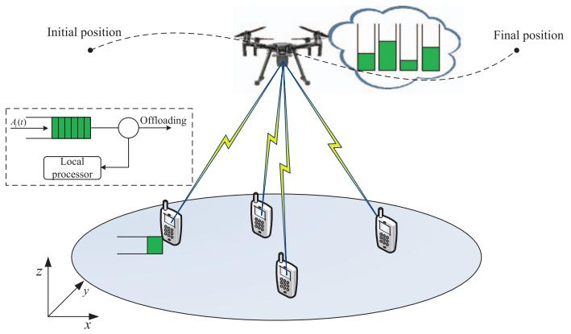

flowchart

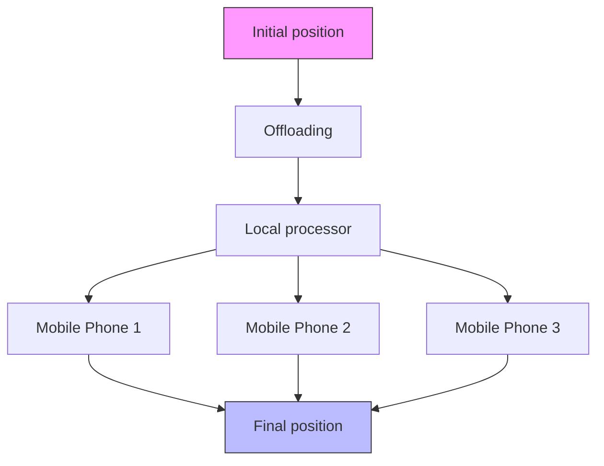

Fig. 1. UAV-assisted MEC system model.

stochastic computation offloading, resource allocation, and trajectory scheduling (JSORT) is proposed to solve the energy minimization problem.

The remaining of the paper is organized as follows. In Section II, the system model and problem formulation are described. Section III presents the problem reformulation and solutions, where Lyapunov optimization is applied to transform the problem and a joint optimization algorithm JSORT is proposed. Simulation results are discussed in Section IV. Section V concludes this paper.

# II. SYSTEM MODEL AND PROBLEM FORMULATION

# A. System Model

We consider a UAV-assisted MEC system as shown in Fig. 1, where a UAV equipped with an MEC server provides the computation capability for the overlaid SMDs. The UAV has a mission to fly from an appointed initial position to a final position, and computation tasks from SMDs can be partially offloaded to the MEC server for execution. Considering a 3-D Cartesian coordinate system, each SMD has a zero altitude and their horizontal positions can be denoted as $\mathbf { p } _ { i } = ( x _ { i } , y _ { i } ) , \ i \in \mathcal { M }$ . Furthermore, we denote the mission completion time as T, which can be divided into N time slots with a slot length τ , namely $T = \tau N$ . The slot length should be sufficiently small to ensure the position of the UAV approximately unchanged during each slot. For convenience, the sets of SMDs and time slots are denoted as $\mathcal { M } \triangleq \{ 1 , \dots , M \}$ and $\mathcal { T } \triangleq \{ 1 , 2 , \dots , N \}$ , respectively. Similarly, we assume the UAV flies at a fixed altitude H, then ${ \bf p } _ { c } ( t ) = ( x _ { c } ( t ) , y _ { c } ( t ) )$ can be used to represent the horizontal coordinate of the UAV at time slot t.

As in [5] and [26], the wireless channels between SMDs and the UAV are dominated by LoS links. Hence, the freespace path loss model is adopted and the channel power gain from SMD i to the UAV can be given by

$$
h _ {i} (t) = g _ {0} (d _ {i} (t)) ^ {- 2} = g _ {0} \Big (H ^ {2} + \| \mathbf {p} _ {c} (t) - \mathbf {p} _ {i} \| ^ {2} \Big) ^ {- 1} \tag {1}
$$

where $g _ { 0 }$ is the channel power gain at the reference distance $d _ { 0 } = 1 m . d _ { i } ( t )$ denotes the Euclidean distance between SMD i and the UAV at time slot t.

# B. Computation Task Queue Model

We assume that computation tasks of SMDs arrive in a stochastic model, and $A _ { i } ( t )$ is the data bits of the arriving task at SMD i during time slot t. The arriving tasks are independent and identically distributed at different time slots with average rate $\lambda _ { i } .$ Through a certain period of time, each SMD can maintain a queue for the arriving tasks, namely task queue. The arrived tasks are queued in the task buffer at SMD, and will be processed on a first-in-first-out basis. They can be executed locally at SMD or/and offloaded to the UAV.

The local computation task and offloading task of SMD i during time slot t are defined as $d _ { i } ( t )$ and $r _ { i } ( t )$ , respectively. The processing density is further denoted as $\rho ,$ which is the number of CPU cycles required to process one bit of computation task. Given the CPU-cycle frequency of SMD i at time slot t as $f _ { l , i } ( t )$ , the computation task executed at SMD can be expressed as

$$
d _ {i} (t) = \frac {f _ {l , i} (t) \tau}{\rho}. \tag {2}
$$

Let $Q _ { i } ( t )$ be the task queue backlog of SMD i at time slot t, the task queue satisfies the following update process, as given by:

$$
Q _ {i} (t + 1) = \max \{Q _ {i} (t) - d _ {i} (t) - r _ {i} (t), 0 \} + A _ {i} (t). \tag {3}
$$

When the partial tasks are offloaded, the MEC server has similar multiple parallel buffers with large capacity to store the tasks. Since the MEC server possesses a faster computation capability, which can be allocated to execute the offloading tasks. Let the total computation capability of the MEC server be $F _ { c } ,$ and $f _ { c , i } ( t )$ is the computation resource allocated to the offloading task of SMD i. At time slot t, ci(t) bits of the offloading task from SMD i is executed by the MEC server. Thus, the evolution of the queue length $L _ { i } ( t )$ for SMD i at the MEC server is derived as

$$
L _ {i} (t + 1) = \max \{L _ {i} (t) - c _ {i} (t), 0 \} + r _ {i} (t) \tag {4}
$$

where $c _ { i } ( t ) = f _ { c , i } ( t ) \tau / \rho$ , similar to the definition of the number of the local computation task. From (3) and (4), it indicates that the current amount of computation tasks for execution or offloading is from the queue backlogs at the previous time slot. The current arriving tasks are stored in the queue buffers and will be executed at the next time slot. Thus, the inequalities of $Q _ { i } ( t + 1 ) \geq A _ { i } ( t )$ and $L _ { i } ( t + 1 ) \geq r _ { i } ( t )$ are held.

# C. System Energy Consumption

In the system, the total energy consumption is considered, which is mainly composed of the following items: 1) computation energy consumption for task execution, not only at SMDs but also at the MEC server; 2) communication energy consumption for offloading the tasks from SMDs to the MEC server; and 3) flying energy consumption for supporting the UAV to move from the initial position to the final position.

1) Energy Consumption for Computation: According to the circuit theories, most of energy consumption for task execution is from the CPU. In particular, the CPU-cycle frequency is approximately linear to the CPU voltage [27]. The CPU-cycle frequency and the CPU energy consumption for task execution can be adjusted by the change of the CPU voltage. In the system, the computation tasks can be executed locally or at the MEC server. Therefore, the energy consumption for task execution at SMD i or the UAV during time slot t can be, respectively, denoted as [28]

$$
e _ {l, i} (t) = \kappa f _ {l, i} ^ {3} (t) \tau \tag {5}
$$

$$
e _ {c, i} (t) = \kappa f _ {c, i} ^ {3} (t) \tau \tag {6}
$$

where κ is the effective switched capacitance of the CPU, and it is determined by the CPU hardware architecture [29].

2) Energy Consumption for Communication: In order to offload $r _ { i } ( t )$ bits of the queue task for edge execution, SMD i needs to deliver the bits to the MEC server with transmit power $p _ { l , i } ( t )$ at time slot t. We assume that there are enough wireless channels offering to SMDs, the bandwidth of each channel is W Hz and each SMD can access only one channel using frequency division multiple access. According to the Shannon–Hartley formula [30], the transmit power of SMD i for offloading the computation task can be obtained as

$$
p _ {l, i} (t) = \left(2 ^ {\frac {r _ {i} (t)}{W \tau}} - 1\right) \frac {\sigma^ {2}}{h _ {i} (t)} \tag {7}
$$

where $\sigma ^ { 2 }$ denotes the noise power. Similar to the existing works [6], [14], the transmit power for the computation outcome from the MEC server to SMDs is ignored. Thus, the energy consumption for offloading the computation tasks at time slot t is given by

$$
e _ {u, i} (t) = p _ {l, i} (t) \tau . \tag {8}
$$

3) Energy Consumption for Flying: As for the energy consumption supporting for the UAV to fly, we consider the simplified model in the existing works, like [5] and [31]. The flying energy consumption is only determined by the velocity vector, which is represented as

$$
e _ {f} (t) = \kappa_ {f} \| v (t) \| ^ {2} \tag {9}
$$

$$
v (t) = \frac {\left\| \mathbf {p} _ {c} (t + 1) - \mathbf {p} _ {c} (t) \right\|}{\tau} \tag {10}
$$

where ${ \kappa _ { f } } ~ = ~ 0 . 5 M _ { g } \tau$ and $M _ { g }$ is the mass of the UAV. The velocity vector of UAV flying is defined as the ratio of the distance increment of the UAV on the horizontal plane to the slot length, due to the fact that the constant-height flight has no effect on the gravitational potential energy consumption.

Therefore, the total energy consumption of the whole system can be calculated by the sum of computation energy, communication energy, and flying energy at time slot t

$$
E _ {s} (t) = w _ {m} \sum_ {i = 1} ^ {M} \left(e _ {l, i} (t) + e _ {u. i} (t)\right) + w _ {c} \left(\sum_ {i = 1} ^ {M} e _ {c, i} (t) + \eta e _ {f} (t)\right) \tag {11}
$$

where $w _ { m } \in [ 0 , 1 ]$ and $w _ { c } \in [ 0 , 1 ]$ are the weight factors of the energy consumption of SMDs and the UAV, respectively, and $w _ { m } + w _ { c } = 1$ . They can be adjusted to address the preferential energy demand according to the practical system, or to achieve the energy consumption balance between SMDs and the UAV.

η is a penalty coefficient to the flying energy consumption, which is set to alleviate the magnitude difference. In fact, real energy consumption of all SMDs at time slot t is $E _ { \mathrm { S M D } } ( t ) =$ $\textstyle \sum _ { i = 1 } ^ { M } ( e _ { l , i } ( t ) + e _ { u . i } ( t ) )$ from (11). The real energy consumption of the UAV can be denoted as $\begin{array} { r } { E _ { \mathrm { U A V } } ( t ) = \sum _ { i = 1 } ^ { M } e _ { c , i } ( t ) + e _ { f } ( t ) } \end{array}$ .

# D. Problem Formulation

To minimize the total energy consumption of the UAVassisted MEC system, we jointly consider computation offloading, CPU-cycle frequency allocation, and flying trajectory optimization. The average weighted energy consumption of communication, computation, and flying per slot is defined as the system performance metric. Therefore, the optimization problem is formulated as

$$
P: \min _ {\mathbf {X} (t)} \frac {1}{T} \sum_ {t = 0} ^ {T - 1} E _ {s} (t)
$$

12)

In problem $P , \mathbf { X } ( t ) = ( \mathbf { f } _ { \mathrm { I } } ( t ) , \mathbf { f } _ { \mathrm { c } } ( t ) , \mathbf { r } ( t ) , \mathbf { p } _ { c } ( t ) )$ is the variable set. C1 and C2 guarantee the maximal local CPU-cycle frequency and offloading task for SMDs. C3 represents the sum of local computation task and offloading task cannot surpass the backlog of the arriving task queue for SMD at each time slot. C4 means that the computation resources allocated to all SMDs cannot exceed the total computation capability of the MEC server. C5 states that the computation tasks at the MEC server cannot more than the backlog of the offloading task queue. C6 denotes that the flying speed of the UAV in each slot should be less than the maximal speed $V _ { \mathrm { m a x } } . \ C 7$ and C8 are the position constraints of the UAV. pI and pF are the initial position and the final position. C7 indicates the history of the UAV trajectory cannot be modified, where $\mathbf { p } _ { c } ^ { \prime } ( t )$ is the trajectory of the UAV obtained at the previous slot. C9 ensures the stability of the task queues.

Due to the task queue model, problem P is a stochastic optimization problem. The channel information are time-varying and cannot be forecasted. Meanwhile, the offloading task ri(t) is coupled with the flying trajectory of the UAV. The stochastic problem is nonconvex and intractable to be handled.

# III. PROBLEM TRANSFORMATION AND JSORT ALGORITHM

In this section, we propose an iterative algorithm based on Lyapunov optimization [32] to solve the stochastic optimization problem. Lyapunov optimization is an effective algorithm to solve a deterministic per time slot problem and find the optimal solution of time average with low complexity. By adopting the Lyapunov function, we analyze the arriving and offloading task queue and transform the original problem P into different manageable subproblems. As a result, the optimal computation offloading, computation resource allocation and flying trajectory scheduling of the UAV at each time slot are iteratively determined.

# A. Queue Analysis and Problem Transformation

To ensure the stability of the task queues, we define the Lyapunov function as follows:

$$
U (\Theta (t)) = \frac {1}{2} \sum_ {i \in \mathcal {M}} \left(Q _ {i} ^ {2} (t) + L _ {i} ^ {2} (t)\right) \tag {13}
$$

where $\Theta ( t ) = [ \mathbf { Q } ( t ) , \mathbf { L } ( t ) ]$ includes all the backlogs of the task queues. Thereafter, a drift-plus-penalty at each time slot can be obtained by

$$
D (\Theta (t)) = \Delta U (\Theta (t)) + V E [ E _ {s} (t) | \Theta (t) ] \tag {14}
$$

where $\Delta U ( \Theta ( t ) ) = E [ U ( \Theta ( t + 1 ) ) - U ( \Theta ( t ) ) | \Theta ( t ) ]$ is the conditional Lyapunov drift. $V ~ \geq ~ 0$ is a control coefficient to gauge the tradeoff between the system utility and queue stability. In order to minimize the drift-plus-penalty, we can instead minimize the upper bound of $D ( \Theta ( t ) )$ ), which is given by Lemma 1.

Lemma 1: For arbitrary variables and queue backlogs, the upper bound of the drift-plus-penalty is derived as

$$
\begin{array}{l} D (\Theta (t)) \leq C + E \left[ \sum_ {i \in \mathcal {M}} \left\{Q _ {i} (t) \left(A _ {i} (t) - d _ {i} (t) - r _ {i} (t)\right) \right\} \right] \\ + E \left[ \sum_ {i \in \mathcal {M}} \left\{L _ {i} (t) \left(r _ {i} (t) - c _ {i} (t)\right) \right\} \right] + V E \left[ E _ {s} (t) \mid \Theta (t) \right] \tag {15} \\ \end{array}
$$

where C is a constant.

Proof: Please refer to the Appendix.

Based on Lemma 1, the original problem is transformed to minimize the upper bound of the drift-plus-penalty function, as shown in following:

$$
\begin{array}{l} P: \min _ {\mathbf {X} (t)} - \sum_ {i \in \mathcal {M}} \left\{Q _ {i} (t) d _ {i} (t) + \left(Q _ {i} (t) - L _ {i} (t)\right) r _ {i} (t) + L _ {i} (t) c _ {i} (t) \right\} \\ + V E _ {s} (t) \\ \end{array}
$$

${ \mathrm { s . t . } } \ C 1 \sim C 8 .$ (16)

It can be observed from (16) that the objective function of the problem is related not only to energy consumption but also to computation task execution, where only the current information on queue lengths and control parameters are required. Therefore, the time coupling of variables in stochastic problem can be successfully eliminated except the position information of the UAV.

# B. Joint Optimization Algorithm of Stochastic Computation Offloading, Resource Allocation, and Trajectory Scheduling

To solve the upper bound minimization problem, we decompose the problem into three optimal subproblems and propose an iterative online algorithm combining alternating direction method of multipliers (ADMMs), interior point method [33], and CVX solver [34] to find the optimal solutions. The three subproblems are established for different optimal variables: 1) SP1 is to find the optimal computation offloading decision and local CPU-cycle frequency; 2) SP2 is to find the optimal CPU-cycle frequency of the UAV; and 3) SP3 is to find the optimal trajectory scheduling of the UAV.

1) Computation Offloading and Local Resource Optimization: Given the flying trajectory of the UAV, offloading task $r _ { i } ( t ) .$ , and the position of the UAV ${ \bf p } _ { c } ( t )$ are decoupled as well as the objective function of P becomes convex [33]. Hence, SP1 is formulated for the given trajectory as follows:

$$
S P 1: \min _ {\mathbf {f} _ {1} (t), \mathbf {r} (t)} - \sum_ {i \in \mathcal {M}} \left\{\frac {Q _ {i} (t) f _ {l , i} (t) \tau}{\rho} + (Q _ {i} (t) - L _ {i} (t)) r _ {i} (t) \right\}
$$

$$
+ V w _ {m} \sum_ {i \in \mathcal {M}} \left(\kappa f _ {l, i} ^ {3} (t) \tau + p _ {l, i} (t) \tau\right)
$$

$$
\text { s.t. } \quad C 1: 0 \leq f _ {l, i} (t) \leq f _ {i, \max}, i \in \mathcal {M}
$$

$$
C 2: 0 \leq r _ {i} (t) \leq W \tau \log_ {2} \left(1 + \frac {p _ {i , \max} (t) h _ {i} (t)}{\sigma^ {2}}\right)
$$

$$
i \in \mathcal {M}
$$

$$
C 3: f _ {l, i} (t) \tau / \rho + r _ {i} (t) \leq Q _ {i} (t), i \in \mathcal {M}. \tag {17}
$$

Obviously, problem SP1 is convex subject to the linear constraints. With the existing of multiple variables, we adopt the ADMM algorithm [35], [36] to solve problem SP1 with low computation complexity.

Thereafter, we introduce a slack vector z(t) and penalty function to convert problem SP1 into the ADMM standard form, as given by

$$
S P 1: \min _ {\mathbf {X} \mathbf {1} (t)} - \sum_ {i \in \mathcal {M}} \left\{Q _ {i} (t) f _ {l, i} (t) \tau / \rho + \left(Q _ {i} (t) - L _ {i} (t)\right) r _ {i} (t) \right\}
$$

$$
+ V w _ {m} \sum_ {i \in \mathcal {M}} \left(\kappa f _ {l, i} ^ {3} (t) \tau + p _ {l, i} (t) \tau\right) + \mathcal {I} _ {+} (z (t))
$$

$$
\begin{array}{c} \text { s.t. } C 1, C 2 \end{array}
$$

$$
C 3: f _ {l} (t) \tau / \rho + r (t) + z (t) = Q (t), (z (t) \geq 0) \tag {18}
$$

where $\mathbf { X 1 } ( t ) = ( f _ { l } ( t ) , r ( t ) , z ( t ) ) . \mathbf { \nabla } \mathcal { T } _ { + } ( z ( t ) )$ is the penalty function to put an infinite penalty on negative components of z(t). According to [36], the associated augmented Lagrangian of problem SP1 can be obtained by

$$
L _ {\beta} (t) = - \sum_ {i \in \mathcal {M}} \left\{Q _ {i} (t) f _ {l, i} (t) \tau / \rho + (Q _ {i} (t) - L _ {i} (t)) r _ {i} (t) \right\}
$$

$$
+ V w _ {m} \sum_ {i \in \mathcal {M}} \left(\kappa f _ {l, i} ^ {3} (t) \tau + p _ {l, i} (t) \tau\right) + \mathcal {I} _ {+} (\mathbf {z} (t))
$$

$$
+ \frac {\beta}{2} \| f _ {l} (t) \tau / \rho + r (t) + z (t) - Q (t) + u (t) \| _ {2} ^ {2} \tag {19}
$$

where $u ( t )$ is the dual variable. $\beta \in R _ { + }$ is the penalty parameter, which can be used to adjust the convergence speed of ADMM.

Therefore, the scaled ADMM performs the following iterations until convergence:

$$
\left(f _ {l} ^ {k + 1} (t), r ^ {k + 1} (t)\right) = \underset {f _ {l} (t), r (t)} {\arg \min} L _ {\beta} \left(f _ {l} (t), r (t), z ^ {k} (t), u ^ {k} (t)\right) \tag {20}
$$

$$
\begin{array}{l} z ^ {k + 1} (t) = \underset {z (t)} {\arg \min} L _ {\beta} \left(f _ {l} ^ {k + 1} (t), r ^ {k + 1} (t), z (t), u ^ {k} (t)\right) \\ = \max \left\{0, Q (t) - f _ {l} ^ {k + 1} (t) \tau / \rho - r ^ {k + 1} (t) - u ^ {k} (t) \right\} \tag {21} \\ \end{array}
$$

$$
u ^ {k + 1} (t) = u ^ {k} (t) + f _ {l} ^ {k + 1} (t) \tau / \rho + r ^ {k + 1} (t) + z ^ {k + 1} (t) - Q (t) \tag {22}
$$

where (20) is the update process of primal variables. The two primal variables $f _ { l } ^ { k + \bar { 1 } } ( t )$ and $r ^ { k + 1 } ( t )$ are updated in an alternative fashion, which accounts for the alternating direction. Equations (21) and (22) are the scale and dual variables updates. Note that the updates of primal variables, dual variable, and scale variable are carried out in parallel through an iteration, which contributes to the low computation complexity.

Furthermore, since problem SP1 is convex, the strong duality holds and the augmented Lagrangian has the saddle point. With the increasing number of iterations, the residual, dual variable, and the objective utility will converge, which means that the primal feasibility and dual feasibility can be achieved. As a result, we employ the rational stop criteria of ADMM as the convergence condition, namely the primal residual, dual residual, and scale residual must be small, which are given by

$$
\left\| r _ {p} ^ {k + 1} \right\| _ {2} = \left\| f _ {l} ^ {k + 1} (t) \tau / \rho + r ^ {k + 1} (t) + z ^ {k + 1} (t) - Q (t) \right\| _ {2} \leq \varepsilon_ {\mathrm{pri}}
$$

$$
\left\| r _ {d} ^ {k + 1} \right\| _ {2} = \left\| u ^ {k + 1} (t) - u ^ {k} (t) \right\| _ {2} \leq \varepsilon_ {\text { dual }}
$$

$$
\left\| r _ {s} ^ {k + 1} \right\| _ {2} = \left\| z ^ {k + 1} (t) - z ^ {k} (t) \right\| _ {2} \leq \varepsilon_ {\text { scal }} \tag {23}
$$

where $\varepsilon _ { \mathrm { p r i } } , \varepsilon _ { \mathrm { d u a l } } .$ , and $\varepsilon _ { \mathrm { s c a l } }$ are small positive constants, which are the feasible tolerance for the primal, dual and scale feasibility conditions, respectively.

Thus, initializing a feasible set $( f _ { l } ^ { k } ( t ) , r ^ { k } ( t ) , z ^ { k } ( t ) , u ^ { k } ( t ) )$ , ADMM is performed and the optimal solutions can be obtained when the stop conditions are satisfied. The optimal computation offloading and local resource allocation via ADMM are implemented in Algorithm 1.

2) Computation Resource Optimization of the UAV: The goal of computation resource allocation of the UAV is to assign larger computation capability at the MEC server to execute the offloading tasks. It is obvious that SP2 is a convex optimization problem in terms of convex objective function and convex constraints

$$
S P 2: \min _ {\mathbf {f} _ {c} (t)} - \sum_ {i \in \mathcal {M}} L _ {i} (t) f _ {c, i} (t) \tau / \rho + V w _ {c} \sum_ {i \in \mathcal {M}} \kappa f _ {c, i} ^ {3} (t) \tau
$$

$$
\text { s.t. } C 4: \sum_ {i = 1} ^ {M} f _ {c, i} (t) \leq F _ {c}, i \in \mathcal {M}
$$

$$
C 5: f _ {c, i} (t) \tau / \rho \leq L _ {i} (t), i \in \mathcal {M}. \tag {24}
$$

Algorithm 1: Optimal Computation Offloading and Local Resource Allocation via ADMM   
1: Initialization: $f_{l}^{0}(t), r^{0}(t), z^{0}(t), u^{0}(t), \mathbf{p}_{c}(t)$ .

2: repeat
3: Update the primal variables $f_{l}^{k+1}(t)$ and $r^{k+1}(t)$ according to (20).
4: Update the scale variable $z^{k+1}(t)$ according to (21).
5: Update the dual variable $u^{k+1}(t)$ according to (22).
6: until $\left\| r_p^{k+1} \right\|_2 \leq \varepsilon_{pri}, \left\| r_d^{k+1} \right\|_2 \leq \varepsilon_{dual}$ and $\left\| r_s^{k+1} \right\|_2 \leq \varepsilon_{scal}$ .

7: Output: the optimal offloading tasks $r^{*}(t)$ and CPU-cycle frequencies $f_{l}^{*}(t)$ .

For problem SP2, a lot of standard convex algorithms can be used. Here, we adopt the classical interior point method to solve the problem [33]. Whereas, it is worthwhile to mention that problem SP2 can be regarded as a multiobjective problem. The objective function of SP2 means minimizing the computation energy consumption and maximizing the computation rate at the same time. The value of V can be adjusted to balance the two objects.

3) Trajectory Scheduling of the UAV: Based on the offloading computation tasks and the CPU-cycle frequencies of SMDs and the UAV obtained from SP1 and SP2, the trajectory optimization problem SP3 can be modeled as

$$
\begin{array}{l} S P 3: \min _ {\mathbf {p} _ {c} (t)} V \left\{w _ {c} \eta \sum_ {t = 1} ^ {N} \kappa_ {f} \| v (t) \| ^ {2} + w _ {m} \sum_ {i \in \mathcal {M}} \left(2 ^ {\frac {r _ {i} (t)}{W \tau}} - 1\right) \sigma^ {2} \tau \right. \\ \left. \times \left(h ^ {2} + \| \mathbf {p} _ {c} (t) - \mathbf {p} _ {i} \| ^ {2}\right) / g _ {0} \right\} \\ C 2: h ^ {2} + \left\| \mathbf {p} _ {c} (t) - \mathbf {p} _ {i} \right\| ^ {2} \leq g _ {0} p _ {i, \max} \left(2 ^ {\frac {r _ {i} (t)}{W \tau}} - 1\right) ^ {- 1} / \sigma^ {2} \tag {25} \\ \end{array}
$$

where the objective of problem SP3 is composed of flying energy consumption and communication energy consumption, which is attributed to the fact that both flying energy and communication energy are affected by the communication channel quality. Besides, since the trajectory scheduling needs to determine the positions of the UAV flying from the initial position to the final position for all slots, the previous part of the objective function is to minimize the sum of the flying energy consumption for all slots instead of the flying energy consumption at one slot. That is to say, a completed flying trajectory can be obtained by solving problem SP3.

Furthermore, with convex objective function and constraints, problem SP3 is convex, which can be easily solved by convex optimization solvers such as CVX. The optimal trajectory scheduling of the UAV via CVX is detailed in Algorithm 2.

By solving problem SP3, the trajectory of the UAV from the initial position to the final position can be derived. However, note that the real effective trajectory of the UAV is the trajectory before time slot t. According to C7 constraint, the history of the flying trajectory cannot be changed. However, at time slot t + 1, the position of the UAV will be estimated again, because of the update of the communication energy consumption. Therefore, in fact, only the current estimated trajectory from the initial position to the current position is effective for the UAV. Until the mission finished, the optimal completed trajectory of the UAV can be obtained.

Algorithm 2: Optimal Trajectory Scheduling of the UAV via CVX   
1: Initialization: $f_{l}^{*}(t), r^{*}(t), f_{c}^{*}(t), t, V_{mas}, \mathbf{P}_{I}, \mathbf{P}_{F}$ .
2: repeat
3:    CVX begin
4:    Solve SP3 to obtain $\mathbf{P}_{c}$ .
5:    CVX end
6:    if $\sum_{t=1}^{N} \| \mathbf{P}_{c}(t) - \mathbf{P}'_{c}(t) \| \leqslant \xi$ then
7: $\mathbf{P}_{c} = \mathbf{P}'_{c}$ .
8:    break;
9:    end if
10:    Update the time slot $t = t + 1$ .
11: until
12: Output: Optimal trajectory of the UAV $\mathbf{P}_{c}$ .

Algorithm 3: Joint Optimization of Computation Offloading, Resource Allocation, and Trajectory Scheduling
1: Initialization: $\Theta(t), A_i(t), \mathbf{p}_I, \mathbf{p}_F, \mathbf{p}_i$ .
2: repeat
3: At SMD $i$ :
4: Acquire $A_i(t), Q_i(t), L_i(t)$ and $\mathbf{p}_c(t)$ .
5: Solve problem SP1 to obtain $f_{l,i}(t)$ and $r_i(t)$ for the given $h_i(t)$ .
6: Feed back $r_i(t)$ to the UAV.
7: Update the backlog of arriving task queue $Q_i(t)$ according to (3).
8: At the UAV:
9: Acquire the task queues and offloading tasks of all SMDs, i.e., $L(t), r(t)$ .
10: Solve problem SP2 and SP3 to obtain $f_c(t)$ and $\mathbf{p}_c(t)$ for the given $r(t)$ .
11: Update the backlogs of offloading task queues $L(t)$ according to (4).
12: Feed back $L(t)$ and $\mathbf{p}_c(t)$ to all SMDs.
13: Update the time slot $t = t + 1$ .
14: until the flying mission is completed at $t = N$ .

In summary, the joint optimization of computation offloading, resource allocation, and trajectory scheduling can be described in Algorithm 3.

At initial, the task buffers are empty, namely $Q ( 0 ) \ =$ $L ( 0 ) \ = \ 0 .$ . Based on the arriving tasks and communication channels, SMDs first perform the local computation decision to obtain the optimal local CPU-cycle frequency and offloading computation tasks. When the UAV acquires the offloading tasks, it can allocate the optimal computation resource to execute the tasks by estimating the backlogs of the offloading task queues. The next flying trajectory can be estimated as well by solving problem SP3. Through a certain number of iterations and information interactions between SMDs and the UAV, the optimal solutions can be determined eventually. Note that the unknown variables are optimized at each time slot, where the prior information at the past slot is not required except the trajectory scheduling. Hence, the proposed model and algorithm are beneficial for the unpredictable environment.

TABLE I SIMULATION PARAMETERS 

<table><tr><td>Parameters</td><td>Value</td></tr><tr><td>Communication bandwidth</td><td>10 MHz</td></tr><tr><td>Channel power gain</td><td>-50 dB</td></tr><tr><td>Maximum transmit power of SMDs</td><td>100 mW</td></tr><tr><td>Noise power</td><td> $10^{-9}$  W</td></tr><tr><td>Process density</td><td> $10^{3}$  cycles/bit</td></tr><tr><td>Effective switched capability</td><td> $10^{-28}$ </td></tr><tr><td>Maximum local CPU-cycle frequency</td><td>1 GHz</td></tr><tr><td>Total edge computation capability</td><td>16 GHz</td></tr><tr><td>The mass of the UAV</td><td>9.65 kg</td></tr><tr><td>The maximum speed of the UAV</td><td>10 m/s</td></tr></table>

# IV. SIMULATION RESULTS AND DISCUSSIONS

In this section, we evaluate the proposed optimization problem on computation offloading, resource allocation, and trajectory scheduling via simulation experiments. Assume that there are $M = 4 ~ \mathrm { S M D s }$ distributed within an area of $1 0 \mathrm { ~ m ~ } \times \mathrm { ~ 1 0 ~ m ~ }$ their positions are: (0, 0), (0, 10), (10, 0), and (10, 10), as shown in Fig. 2. Each SMD has a computation task arrival for each slot, the input date of the task $A _ { i } ( t )$ follows the uniform distribution within $[ 0 , A _ { i , \operatorname* { m a x } } ]$ . The UAV flies with a constant height $H = 1 0$ m from the initial position ${ \bf p } _ { I } = [ 0 , 0 ]$ to the final position ${ \bf p } _ { F } = [ 1 0 , 0 ]$ , which can assist SMDs to execute their computation tasks meanwhile. In addition, the total time for the UAV mission completion is $T = 2 \ : \mathrm { s }$ , which can be averaged into $N = 5 0$ time slots. The remaining communication, computation, and flying parameters used in the simulations are summarized in Table I.

# A. Analysis of the Maximum Data Arrival

In Fig. 2, the optimal flying trajectory projections of the UAV on the horizontal plane are shown to compare the proposed minimizing average weighted energy consumption of SMDs and the UAV per slot (MAWESU) with two benchmark schemes, denoted by minimizing average energy consumption of SMDs (MAES) and minimizing average energy consumption of the UAV (MAEU). The objectives of MAES and MAEU only consider the energy consumption of SMDs and the UAV, respectively. The number of time slots is set as 50 and $A _ { i , \operatorname* { m a x } } ( t ) = 0 . 1 5$ Mb. As shown in Fig. 2, in order to achieve minimum energy of the UAV, the optimal flying trajectory obtained by MAEU is the straight line between the initial position and the final position. Since MAES aims to minimize the average energy consumption (AEC) of SMDs, the UAV first starts to fly as close as possible to provide SMDs with high communication channel quality and computation service. Then, with the limited mission completion time and the final position, the UAV has to return to the final position with high speed and the straight flight after flying a certain distance away from the destination. Under the proposed MAWESU scheme with $w _ { c } = 0 . 5$ , the UAV flies smoothly along with a curve from the initial position to the final position, and the flying distance is less than that obtained by MAES. The reason is that the proposed scheme needs to compromise the energy consumption of SMDs and the UAV.

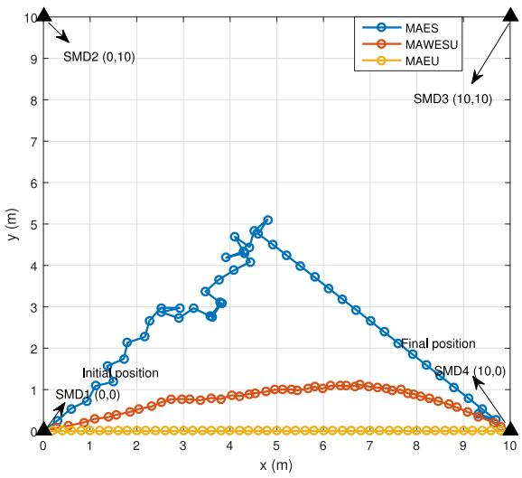

line

| x (m) | MAES  | MAWESU | MAEU |
|-------|-------|--------|------|
| 0     | 0.0   | 0.0    | 0.0  |
| 1     | 1.0   | 0.5    | 0.0  |
| 2     | 2.0   | 0.8    | 0.0  |
| 3     | 3.0   | 1.0    | 0.0  |
| 4     | 4.0   | 1.2    | 0.0  |
| 5     | 5.0   | 1.3    | 0.0  |
| 6     | 4.5   | 1.2    | 0.0  |
| 7     | 4.0   | 1.1    | 0.0  |
| 8     | 3.5   | 1.0    | 0.0  |
| 9     | 2.5   | 0.8    | 0.0  |
| 10    | 0.0   | 0.0    | 0.0  |

Fig. 2. Optimal trajectories of the UAV under different schemes.

Fig. 3 observes the AEC under different schemes (i.e., MAEU, MAES, and MAWESU) with respect to the maximum data arrival, where AEC per slot of SMDs, the UAV and the system are involved. We can see that the minimal AEC of SMDs is achieved by MAES compared with MAEU and MAWESU. Nevertheless, the AEC of the UAV obtained by MAES is higher than other two schemes, due to the fact that MAES and MAEU aim to minimize the energy consumption of SMDs and the UAV, respectively. The AEC obtained by the proposed MAWESU scheme is located between that obtained by MAEU and MAES so as to achieve the tradeoff the energy consumption of SMDs and the UAV. Besides, the AECs of SMDs and the UAV first increases quickly and then tends to stability when the maximum data arrivals achieve 0.2 and 0.05 Mb, respectively, which is attributed to the limited communication and computation resources. The network congests when the offloading tasks are saturate. The AEC of the system shows the same increasing trend as that of the UAV, due to the high proportion of the energy consumption of the UAV in the whole system.

# B. Value of V and Weight Factors

The impact of V and weight factors on the system utility is investigated in Fig. 4. In Lyapunov optimization, the value of V is used to balance the system utility and queue stability. It can be seen that the AEC of SMDs decreases and tends to stability with the increase of V, where the decreasing trends are obscure and seems stable for $V \leq 1 e 1 0$ and $V \geq$ 1e14 . The reason is that the small value of V is too small to achieve the tradeoff between system utility and queue stability, while the system is mainly to minimize the energy consumption but ignore the consideration of queue stability when V is large enough. Obviously, smaller or larger V is not facilitated for the system. We present an optimal selection block of $V ,$ as the square block shown in Fig. 4. With the decrease of $w _ { c } ,$ the weight $w _ { m }$ increases and the system tends to minimize the energy consumption of SMDs, thus the AEC of SMDs decreases. However, there is a growth jump for the AEC of the UAV with the increase of V. The reason is that the computation tasks are limited to be executed and the backlogs of the queue tasks start to accumulate as the value of V increases. The accumulated tasks will be offloaded to the MEC sever with a large transmit rate at a certain slot, leading to the energy jump of the UAV. Hence, the UAV needs to consume more energy to return to the final position. Besides, the AEC of the UAV decreases for the larger V, which is similar to that of the SMDs. For $w _ { c } = 0$ , the AEC of the UAV has the maximum and nearly stay constant, due to the fact that the objective of the system only concentrates on the energy consumption minimization of SMDs.

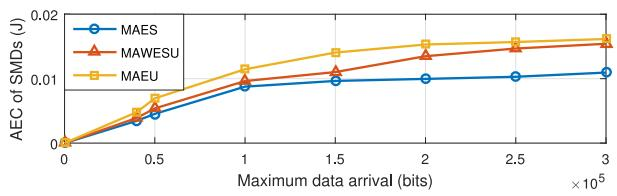

line

| Maximum data arrival (bits) ×10⁵ | MAES   | MAWESU | MAEU   |
| ------------------------------- | ------ | ------ | ------ |
| 0                               | 0.0000 | 0.0000 | 0.0000 |
| 0.5                             | 0.0040 | 0.0060 | 0.0070 |
| 1.0                             | 0.0090 | 0.0100 | 0.0120 |
| 1.5                             | 0.0100 | 0.0120 | 0.0140 |
| 2.0                             | 0.0110 | 0.0140 | 0.0160 |
| 2.5                             | 0.0115 | 0.0150 | 0.0170 |
| 3.0                             | 0.0120 | 0.0160 | 0.0180 |

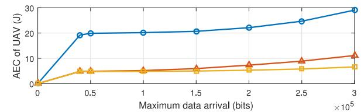

line

| Maximum data arrival (bits) | AEC of UAV (J) |
| --------------------------- | -------------- |
| 0                           | 0              |
| 0.5                         | 20             |
| 1                           | 20             |
| 1.5                         | 20             |
| 2                           | 22             |
| 2.5                         | 25             |
| 3                           | 30             |

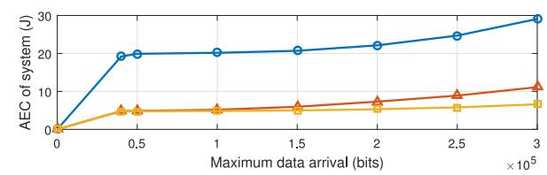

line

| Maximum data arrival (bits) ×10⁵ | AEC of system (J) |
| ------------------------------- | ----------------- |
| 0                               | 0                 |
| 0.5                             | 20                |
| 1                               | 20                |
| 1.5                             | 20                |
| 2                               | 22                |
| 2.5                             | 25                |
| 3                               | 30                |

Fig. 3. AEC under different schemes versus the maximum data arrival, N = 50 and V = 1e11.

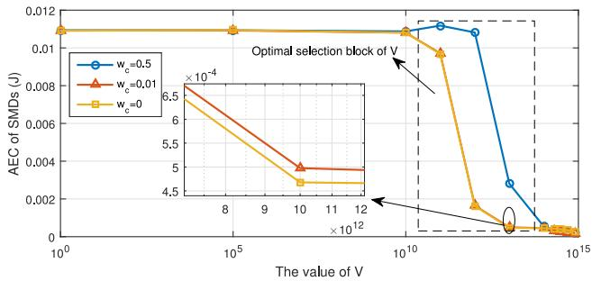

line

| The value of V | AEC of SMDs (J) for w_c=0.5 | AEC of SMDs (J) for w_c=0.01 | AEC of SMDs (J) for w_c=0 |
| -------------- | ---------------------------- | ----------------------------- | ------------------------- |
| 10^0           | 0.012                        | 0.012                         | 0.012                     |
| 10^5           | 0.012                        | 0.012                         | 0.012                     |
| 10^10          | 0.012                        | 0.012                         | 0.012                     |
| 10^15          | 0.002                        | 0.002                         | 0.002                     |

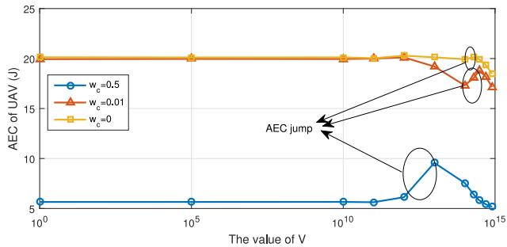

line

| The value of V | AEC of UAV (J) for w_c=0.5 | AEC of UAV (J) for w_c=0.01 | AEC of UAV (J) for w_c=0 |
| -------------- | -------------------------- | --------------------------- | ------------------------ |
| 10^0           | 5                          | 20                          | 20                       |
| 10^5           | 5                          | 20                          | 20                       |
| 10^10          | 5                          | 20                          | 20                       |
| 10^15          | 5                          | 18                          | 20                       |

Fig. 4. AEC of SMDs and the UAV per slot versus V and $w _ { c } .$

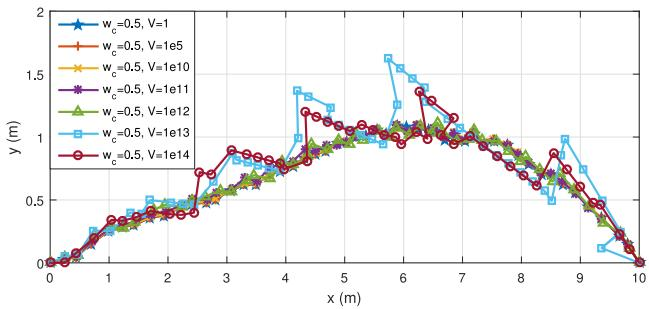

line

| x (m) | w_c=0.5, V=1 | w_c=0.5, V=1e5 | w_c=0.5, V=1e10 | w_c=0.5, V=1e11 | w_c=0.5, V=1e12 | w_c=0.5, V=1e13 | w_c=0.5, V=1e14 |
|-------|--------------|----------------|-----------------|-----------------|-----------------|-----------------|-----------------|
| 0     | 0.0          | 0.0            | 0.0             | 0.0             | 0.0             | 0.0             | 0.0             |
| 1     | 0.2          | 0.2            | 0.2             | 0.2             | 0.2             | 0.2             | 0.2             |
| 2     | 0.4          | 0.4            | 0.4             | 0.4             | 0.4             | 0.4             | 0.4             |
| 3     | 0.6          | 0.6            | 0.6             | 0.6             | 0.6             | 0.6             | 0.6             |
| 4     | 0.8          | 0.8            | 0.8             | 0.8             | 0.8             | 0.8             | 0.8             |
| 5     | 1.0          | 1.0            | 1.0             | 1.0             | 1.0             | 1.0             | 1.0             |
| 6     | 1.2          | 1.2            | 1.2             | 1.2             | 1.2             | 1.2             | 1.2             |
| 7     | 1.4          | 1.4            | 1.4             | 1.4             | 1.4             | 1.4             | 1.4             |
| 8     | 1.6          | 1.6            | 1.6             | 1.6             | 1.6             | 1.6             | 1.6             |
| 9     | 1.8          | 1.8            | 1.8             | 1.8             | 1.8             | 1.8             | 1.8             |
| 10    | 2.0          | 2.0            | 2.0             | 2.0             | 2.0             | 2.0             | 2.0             |

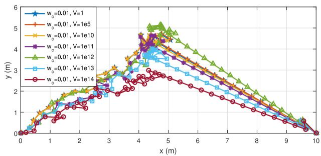

line

| x (m) | w_c=0.01, V=1 | w_c=0.01, V=1e5 | w_c=0.01, V=1e10 | w_c=0.01, V=1e11 | w_c=0.01, V=1e12 | w_c=0.01, V=1e13 | w_c=0.01, V=1e14 |
|-------|---------------|-----------------|------------------|------------------|------------------|------------------|------------------|
| 0     | 0             | 0               | 0                | 0                | 0                | 0                | 0                |
| 1     | ~1.5          | ~1.8            | ~2.0             | ~2.2             | ~2.5             | ~2.3             | ~2.0             |
| 2     | ~2.5          | ~3.0            | ~3.5             | ~4.0             | ~4.5             | ~4.2             | ~3.8             |
| 3     | ~3.5          | ~4.5            | ~5.0             | ~5.5             | ~6.0             | ~5.8             | ~5.2             |
| 4     | ~4.5          | ~5.5            | ~6.0             | ~6.5             | ~7.0             | ~6.8             | ~6.2             |
| 5     | ~5.0          | ~6.0            | ~6.5             | ~7.0             | ~7.5             | ~7.2             | ~6.8             |
| 6     | ~4.5          | ~5.5            | ~6.0             | ~6.5             | ~7.0             | ~6.8             | ~6.2             |
| 7     | ~4.0          | ~5.0            | ~5.5             | ~6.0             | ~6.5             | ~6.2             | ~5.8             |
| 8     | ~3.5          | ~4.5            | ~5.0             | ~5.5             | ~6.0             | ~5.8             | ~5.2             |
| 9     | ~3.0          | ~4.0            | ~4.5             | ~5.0             | ~5.5             | ~5.2             | ~4.8             |
| 10    | 0             | 0               | 0                | 0                | 0                | 0                | 0                |

Fig. 5. Flying trajectory of the UAV under different V and $w _ { c } .$

Fig. 5 depicts the trajectory of the UAV with respect to different $w _ { c }$ and V, where $A _ { i , \operatorname* { m a x } } ( t ) = 0 . 1 5 ~ \mathrm { M b } , N = 5 0$ . For $w _ { c } = 0 . 5$ and $V \leq 1 e 1 2$ , the flying trajectory is a smooth curve, which is consistent with the result of Fig. 2. However, the flying trajectory has many bends and curves for $V \geq 1 e 1 3 ,$ which is caused by the accumulation of the computation tasks in the backlogs of task queues. When a large number of tasks are offloaded to the MEC server at a certain slot, the position hop of the UAV is required. On the other hand, the system aims to optimize the energy consumption of SMDs for $w _ { c } = 0 . 0 1$ . The UAV starts to fly in proximity of SMDs and then return to the final position with high speed and straight trajectory. When the value of V increases, the objective function of problem SP3 has a tilt to the energy consumption of the UAV because of the decrease of the energy consumption of SMDs observed from SP1. Hence, the distance of flying trajectory decreases, like the curves of $V = 1 e 1 3$ and $V = 1 e 1 4$ .

Fig. 6 illustrates the average queue length of system per slot with respect to the value of V. The average queue length is defined as $\textstyle \sum _ { i \in { \mathcal { M } } } \sum _ { t \in T } ( Q _ { i } ( t ) + L _ { i } ( t ) ) / ( M N )$ , which first stays stable and then shows exponential increase. The reason is that the value of V is small and has no effect on the tradeoff between queue stability and system utility for $V \leq 1 e 1 1$ . In order to balance the energy consumption, the backlogs of task queues dramatically increase for V > 1e11 under the constrained offloading tasks and computation resource. Besides, with lower $w _ { c } ,$ the less average queue length is accumulated.

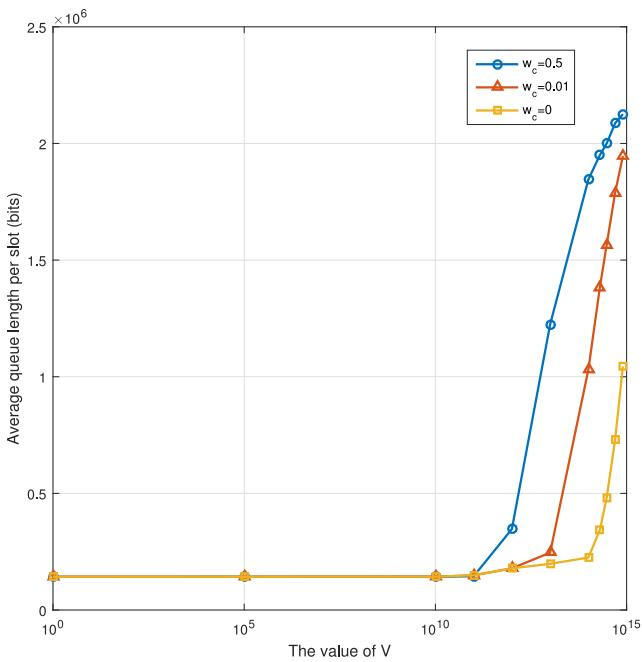

line

| The value of V | w_c=0.5 | w_c=0.01 | w_c=0 |
| -------------- | ------- | -------- | ----- |
| 10^0           | 0       | 0        | 0     |
| 10^5           | 0       | 0        | 0     |
| 10^10          | 0       | 0        | 0     |
| 10^15          | 2.1e6   | 1.9e6    | 1.0e6 |

Fig. 6. Average queue length of SMDs per slot versus V and $w _ { c } .$

The reason is that $w _ { c }$ acts as a compromise factor for the computation rate and energy consumption, which is shown in the objective function of problem SP2. The system tends to maximize the computation rate with the decrease of $w _ { c } .$ , leading to less tasks remaining in task buffers.

# C. Division of Time Slots

Finally, we validate the impact of time slots on the system performance. In Fig. 7, the AEC of the system with respect to the number of time slots is shown, where the total time is $T = 2 \ :$ s. We can observe that the AEC of the system for $w _ { c } ~ = ~ 0 . 5$ has a slow reduction. However, the AEC reduction obtained by $w _ { c } ~ = ~ 0 . 0 1$ is visible with the increase of the number of time slots. It can be explained that the UAV has a smooth flying trajectory for $w _ { c } = 0 . 5$ while the meandering flying trajectory obtained by $w _ { c } ~ = ~ 0 . 0 1$ has more potential uncertainty and diversity, leading to the difference of the AECs of the system. Besides, although the AEC of the system obtained by $V = 1 e 1 3$ is larger than that obtained by $V = 1 e 1 1$ for the same $w _ { c } = 0 . 5$ , the case for $w _ { c } = 0 . 0 1$ has an opposite result. It can be owing to the backward shift on the AEC jump of the UAV, the same as the energy jump in Fig. 4. Note that the AEC of the system shows a decreasing trend with the increase of time slots, which does not have an inevitable relationship with the reduction of the total energy consumption of the system. The total energy consumption of the system is calculated by the product of AEC and the number of time slots. For example, the total energy consumption of the system is 257.7 and 264.6 J for $N = 3 5$ and $N = 7 0$ , respectively, when $w _ { c } = 0 . 5$ and $V = 1 e 1 1$ . Besides, observing the curve of $w _ { c } = 0 . 0 1$ and V = 1e11, the total energy consumption of the system is 1000.3, 994.5, and 993.1 J for $N = 4 0 , N = 5 0$ , and $N = 6 0$ , respectively. The increments of the total energy between neighboring slots are −5.8 and −1.4 J, and we can deduce that the change of the total energy consumption is not linear. Therefore, we can see that time slots should be reasonably divided, neither fewer nor more, so as to ensure energy conservation and task service.

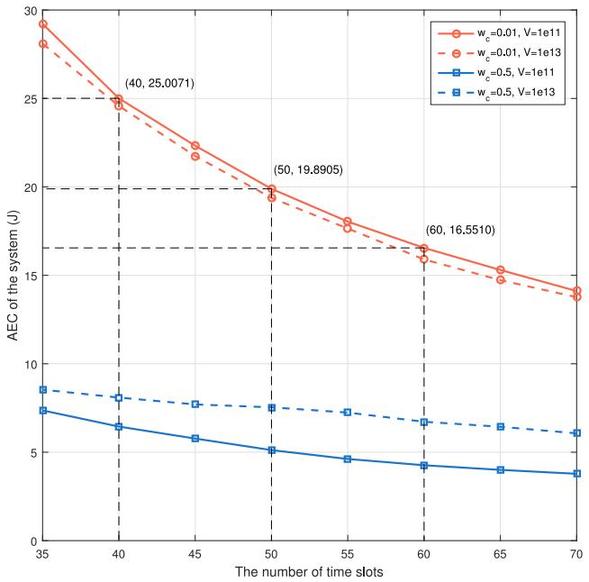

line

| The number of time slots | AEC of the system (J) for w_c=0.01, V=1e11 | AEC of the system (J) for w_c=0.01, V=1e13 | AEC of the system (J) for w_c=0.5, V=1e11 | AEC of the system (J) for w_c=0.5, V=1e13 |
| ------------------------ | ------------------------------------------ | ------------------------------------------ | ------------------------------------------ | ------------------------------------------ |
| 35                       | 29.5                                       | 28.5                                       | 7.5                                        | 8.5                                        |
| 40                       | 24.5                                       | 24.0                                       | 6.5                                        | 8.0                                        |
| 45                       | 22.0                                       | 21.5                                       | 6.0                                        | 7.5                                        |
| 50                       | 20.0                                       | 19.8905                                    | 5.5                                        | 7.0                                        |
| 55                       | 18.0                                       | 17.5                                       | 5.0                                        | 6.5                                        |
| 60                       | 16.5                                       | 16.0                                       | 4.5                                        | 6.0                                        |
| 65                       | 15.0                                       | 14.5                                       | 4.0                                        | 5.5                                        |
| 70                       | 14.0                                       | 13.5                                       | 3.5                                        | 5.0                                        |

Fig. 7. AEC of the system per slot versus the number of time slots.

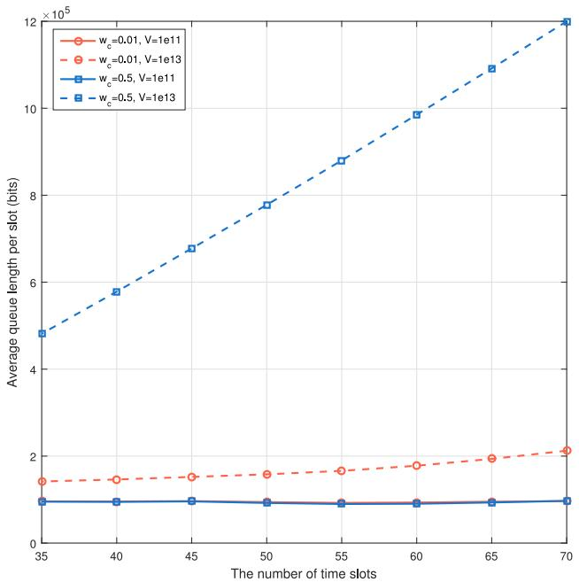

line

| The number of time slots | w_c=0.01, V=1e11 | w_c=0.01, V=1e13 | w_c=0.5, V=1e11 | w_c=0.5, V=1e13 |
| ------------------------ | ---------------- | ---------------- | --------------- | --------------- |
| 35                       | 1.4              | 1.4              | 1.0             | 4.8             |
| 40                       | 1.4              | 1.4              | 1.0             | 5.8             |
| 45                       | 1.4              | 1.4              | 1.0             | 6.8             |
| 50                       | 1.4              | 1.4              | 1.0             | 7.8             |
| 55                       | 1.4              | 1.4              | 1.0             | 8.8             |
| 60                       | 1.4              | 1.4              | 1.0             | 9.8             |
| 65                       | 2.0              | 2.0              | 1.0             | 10.8            |
| 70                       | 2.2              | 2.2              | 1.0             | 12.0            |

Fig. 8. Average queue length of SMDs per slot versus the number of time slots.

Fig. 8 describes the average queue length of SMDs per slot with respect to the number of time slots. As seen from Fig. 8, the curves of average queue length obtained by $w _ { c } = 0 . 5$ and $w _ { c } ~ = ~ 0 . 0 1$ coincide and almost remain the same level for $V = 1 e 1 1$ , which is consistent with the result in Fig. 6. The system tends to maximize the task execution rate instead of minimizing the energy consumption for small V. As a result, the computation task will be effectively processed no matter how much the value of $w _ { c }$ is. For $V = 1 e 1 3$ , the average queue length obtained by $w _ { c } = 0 . 0 1$ shows a slow increase while that obtained by $w _ { c } = 0 . 5$ grows quickly. The reason is that $w _ { c }$ as a tradeoff factor plays an important role on the task execution rate and energy consumption. The system tends to maximize the task execution rate for the small $w _ { c } ,$ leading to less backlogs of task queues.

# V. CONCLUSION

In this paper, we jointly formulate stochastic computation offloading, resource allocation, and trajectory scheduling as an average weighted energy consumption minimization problem in the UAV-assisted MEC system. To tackle the nonconvex problem, a Lyapunov-based approach is applied and the problem is decomposed into three management subproblems. Moreover, a combination of the ADMM algorithm, interior point method and CVX solver is employed to iteratively solve the subproblems. Simulation results show that the average weighted energy consumption minimization scheme can save more energy than MAES and process more backlogs of the task queues compared with MAEU by adjusting various system parameters. Besides, both the value of V and the weight factors show the compromise between the queue stability and system utility. In the future, it would be interesting to extend the work to ad hoc network with multiple UAVs. The issues, such as dynamic access control and interference management, can be further explored.

# APPENDIX

According to the update rules of $Q _ { i } ( t )$ and $L _ { i } ( t )$ together with the inequality of $\left( [ a - b ] ^ { + } + c \right) ^ { 2 } \leq a ^ { 2 } + b ^ { 2 } + c ^ { 2 } + 2 a ( c - b )$ for any $a , b , c \geq 0$ , we can obtain that

$$
\begin{array}{l} Q _ {i} ^ {2} (t + 1) = \left(\max \left\{Q _ {i} (t) - d _ {i} (t) - r _ {i} (t), 0 \right\} + A _ {i} (t)\right) ^ {2} \\ \leq Q _ {i} ^ {2} (t) + A _ {i} ^ {2} (t) + \left(d _ {i} (t) + r _ {i} (t)\right) ^ {2} \\ + 2 Q _ {i} (t) \left(A _ {i} (t) - d _ {i} (t) - r _ {i} (t)\right) (26) \\ L _ {i} ^ {2} (t + 1) = (\max \{L _ {i} (t) - c _ {i} (t), 0 \} + r _ {i} (t)) ^ {2} \\ \leq L _ {i} ^ {2} (t) + r _ {i} ^ {2} (t) + c _ {i} ^ {2} (t) + 2 L _ {i} (t) (r _ {i} (t) - c _ {i} (t)). (27) \\ \end{array}
$$

Hence, the difference of the Lyapunov function between the current and past slots can be calculated as

$$
\begin{array}{l} U (\Theta (t + 1)) - U (\Theta (t)) = \frac {1}{2} \sum_ {i \in \mathcal {M}} \left\{Q _ {i} ^ {2} (t + 1) - Q _ {i} ^ {2} (t) \right\} \\ + \frac {1}{2} \sum_ {i \in \mathcal {M}} \left\{L _ {i} ^ {2} (t + 1) - L _ {i} ^ {2} (t) \right\} \\ \leq C + \sum_ {i \in \mathcal {M}} \left\{Q _ {i} (t) \left(A _ {i} (t) - d _ {i} (t) - r _ {i} (t)\right) \right\} \\ + \sum_ {i \in \mathcal {M}} \{L _ {i} (t) (r _ {i} (t) - c _ {i} (t)) \} \tag {28} \\ \end{array}
$$

where C is a constant, which has the upper bound and satisfying

$$
\begin{array}{l} C = \frac {1}{2} \sum_ {i \in \mathcal {M}} \left\{A _ {i. \max} ^ {2} (t) + \left(d _ {i, \max} (t) + r _ {i, \max} (t)\right) ^ {2} \right. \\ \left. + r _ {i, \max} ^ {2} (t) + c _ {i, \max} ^ {2} (t) \right\} \tag {29} \\ \end{array}
$$

where $\begin{array} { c c c c c } { { d _ { i , \mathrm { m a x } } ( t ) } } & { { = } } & { { f _ { l , \mathrm { m a x } } \tau / \rho , } } & { { c _ { i , \mathrm { m a x } } ( t ) } } & { { = } } & { { F _ { c } \tau / \rho } } \end{array}$ , and $r _ { i , \mathrm { m a x } } ( t ) = W \tau \mathrm { l o g } _ { 2 } ( 1 + [ ( p _ { i , \mathrm { m a x } } h _ { i } ( t ) ) / \sigma ^ { 2 } ] )$ .

Plugging (28) and (29) into the Lyapunov drift-plus-penalty function, the upper bound can be given by

$$
\begin{array}{l} D (\Theta (t)) = \Delta U (\Theta (t)) + V E [ E _ {s} (t) | \Theta (t) ] \\ \leq C + E \left[ \sum_ {i \in \mathcal {M}} \left\{Q _ {i} (t) \left(A _ {i} (t) - d _ {i} (t) - r _ {i} (t)\right) \right\} \right] \\ + E \left[ \sum_ {i \in \mathcal {M}} \left\{L _ {i} (t) \left(r _ {i} (t) - c _ {i} (t)\right) \right\} \right] + V E \left[ E _ {s} (t) \mid \Theta (t) \right]. \tag {30} \\ \end{array}
$$

# REFERENCES

[1] F. Samie et al., “Computation offloading and resource allocation for lowpower IoT edge devices,” in Proc. Internet Things, Reston, VA, USA, 2017, pp. 7–12.   
[2] W. Shi, J. Cao, Q. Zhang, Y. Li, and L. Xu, “Edge computing: Vision and challenges,” IEEE Internet Things J., vol. 3, no. 5, pp. 637–646, Oct. 2016.   
[3] Y. Mao, C. You, J. Zhang, K. Huang, and K. B. Letaief, “A survey on mobile edge computing: The communication perspective,” IEEE Commun. Surveys Tuts., vol. 19, no. 4, pp. 2322–2358, 4th Quart., 2017.   
[4] S. W. Loke, “The Internet of flying-things: Opportunities and challenges with airborne fog computing and mobile cloud in the clouds,” arXiv preprint arXiv:1507.04492, 2015.   
[5] S. Jeong, O. Simeone, and J. Kang, “Mobile edge computing via a UAVmounted cloudlet: Optimization of bit allocation and path planning,” IEEE Trans. Veh. Technol., vol. 67, no. 3, pp. 2049–2063, Mar. 2018.   
[6] F. Zhou, Y. Wu, H. Sun, and Z. Chu, “UAV-enabled mobile edge computing: Offloading optimization and trajectory design,” in Proc. IEEE Int. Conf. Commun. (ICC), Kansas City, MO, USA, 2018, pp. 1–6.   
[7] Y. Zeng, R. Zhang, and T. J. Lim, “Wireless communications with unmanned aerial vehicles: Opportunities and challenges,” IEEE Commun. Mag., vol. 54, no. 5, pp. 36–42, May 2016.   
[8] F. Bonomi, R. Milito, P. Natarajan, and J. Zhu, “Fog computing: A platform for Internet of Things and analytics,” in Big Data and Internet of Things: A Roadmap for Smart Environments. Cham, Switzerland: Springer, 2014, pp. 169–186.   
[9] H. Zhao, H. Wang, W. Wu, and J. Wei, “Deployment algorithms for UAV airborne networks toward on-demand coverage,” IEEE J. Sel. Areas Commun., vol. 36, no. 9, pp. 2015–2031, Sep. 2018.   
[10] H. Zhao, J. Wei, S. Huang, L. Zhou, and Q. Tang, “Regular topology formation based on artificial forces for distributed mobile robotic networks,” IEEE Trans. Mobile Comput., to be published, doi: 10.1109/TMC.2018.2873015.   
[11] M. Dong et al., “UAV-assisted data gathering in wireless sensor networks,” J. Supercomput., vol. 70, no. 3, pp. 1142–1155, 2014.   
[12] J. Lyu, Y. Zeng, and R. Zhang, “UAV-aided offloading for cellular hotspot,” IEEE Trans. Wireless Commun., vol. 17, no. 6, pp. 3988–4001, Jun. 2018.   
[13] F. Zhou, Y. Wu, R. Q. Hu, and Y. Qian, “Computation rate maximization in UAV-enabled wireless powered mobile-edge computing systems,” IEEE J. Sel. Areas Commun., vol. 36, no. 9, pp. 1927–1941, Sep. 2018.   
[14] X. Cao, J. Xu, and R. Zhang, “Mobile edge computing for cellularconnected UAV: Computation offloading and trajectory optimization,” in Proc. 19th Int. Workshop Signal Process. Adv. Wireless Commun. (SPAWC), Kalamata, Greece, 2018, pp. 1–5.   
[15] Q. Hu et al., “Joint offloading and trajectory design for UAV-enabled mobile edge computing systems,” IEEE Internet Things J., to be published, doi: 10.1109/JIOT.2018.2878876.   
[16] M.-A. Messous, H. Sedjelmaci, N. Houari, and S.-M. Senouci, “Computation offloading game for an UAV network in mobile edge computing,” in Proc. IEEE Int. Conf. Commun., Paris, France, 2017, pp. 1–6.   
[17] S. Garg, A. Singh, S. Batra, N. Kumar, and L. T. Yang, “UAVempowered edge computing environment for cyber-threat detection in smart vehicles,” IEEE Netw., vol. 32, no. 3, pp. 42–51, May/Jun. 2018.   
[18] I. Bisio, C. Garibotto, F. Lavagetto, A. Sciarrone, and S. Zappatore, “Unauthorized amateur UAV detection based on WiFi statistical fingerprint analysis,” IEEE Commun. Mag., vol. 56, no. 4, pp. 106–111, Apr. 2018.

[19] Z. Jiang and S. Mao, “Energy delay tradeoff in cloud offloading for multi-core mobile devices,” IEEE Access, vol. 3, pp. 2306–2316, 2015.   
[20] Y. Mao, J. Zhang, and K. B. Letaief, “Joint task offloading scheduling and transmit power allocation for mobile-edge computing systems,” in Proc. Wireless Commun. Netw. Conf., San Francisco, CA, USA, 2017, pp. 1–6.   
[21] Y. Mao, J. Zhang, S. H. Song, and K. B. Letaief, “Stochastic joint radio and computational resource management for multi-user mobileedge computing systems,” IEEE Trans. Wireless Commun., vol. 16, no. 9, pp. 5994–6009, Sep. 2017.   
[22] C.-F. Liu, M. Bennis, and H. V. Poor, “Latency and reliability-aware task offloading and resource allocation for mobile edge computing,” in Proc. IEEE Globecom Workshops (GC Wkshps), Singapore, 2017, pp. 1–7.   
[23] X. Lyu et al., “Optimal schedule of mobile edge computing for Internet of Things using partial information,” IEEE J. Sel. Areas Commun., vol. 35, no. 11, pp. 2606–2615, Nov. 2017.   
[24] W. Fang, X. Yao, X. Zhao, J. Yin, and N. Xiong, “A stochastic control approach to maximize profit on service provisioning for mobile cloudlet platforms,” IEEE Trans. Syst., Man, Cybern., Syst., vol. 48, no. 4, pp. 522–534, Apr. 2018.   
[25] C. Zhou, C.-K. Tham, and M. Motani, “Online auction for truthful stochastic offloading in mobile cloud computing,” in Proc. IEEE Glob. Commun. Conf. GLOBECOM, Singapore, 2018, pp. 1–6.   
[26] Y. Zeng and R. Zhang, “Energy-efficient UAV communication with trajectory optimization,” IEEE Trans. Wireless Commun., vol. 16, no. 6, pp. 3747–3760, Jun. 2017.   
[27] T. D. Burd and R. W. Brodersen, “Processor design for portable systems,” J. VLSI Signal Process. Syst. Signal Image Video Technol., vol. 13, nos. 2–3, pp. 203–221, 1996.   
[28] J. Xu, L. Chen, and S. Ren, “Online learning for offloading and autoscaling in energy harvesting mobile edge computing,” IEEE Trans. Cognit. Commun. Netw., vol. 3, no. 3, pp. 361–373, Sep. 2017.   
[29] A. P. Miettinen and J. K. Nurminen, “Energy efficiency of mobile clients in cloud computing,” in Proc. USENIX Conf. Hot Topics Cloud Comput., Boston, MA, USA, 2010, p. 4.   
[30] T. M. Cover and J. A. Thomas, “Elements of information theory,” Amer. Stat. Assoc., vol. 103, no. 481, pp. 429–429, 1992.   
[31] A. Chakrabarty and J. W. Langelaan, “Energy-based long-range path planning for soaring-capable unmanned aerial vehicles,” J. Guid. Control Dyn., vol. 34, no. 4, pp. 1002–1015, 2011.   
[32] M. J. Neely, “Stochastic network optimization with application to communication and queueing systems,” in Synthesis Lectures on Communication Networks, vol. 3. San Rafael, CA, USA: Morgan & Claypool, 2010, pp. 1–211.   
[33] S. P. Boyd and L. Vandenberghe, Convex Optimization. Cambridge, U.K.: Cambridge Univ. Press, 2004.   
[34] M. Grant, S. Boyd, and Y. Ye. (2008). CVX: MATLAB Software for Disciplined Convex Programming. [Online]. Available: http://cvxr.com/cvx/   
[35] S. Boyd, N. Parikh, E. Chu, B. Peleato, and J. Eckstein, “Distributed optimization and statistical learning via the alternating direction method of multipliers,” Found. Trends Mach. Learn., vol. 3, no. 1, pp. 1–122, 2011.   
[36] E. Ghadimi, A. Teixeira, I. Shames, and M. Johansson, “Optimal parameter selection for the alternating direction method of multipliers (ADMM): Quadratic problems,” IEEE Trans. Autom. Control, vol. 60, no. 3, pp. 644–658, Mar. 2015.

natural_image

Portrait photo of a woman in formal attire (no text or symbols visible)

Jiao Zhang received the B.S. degree from Xiangtan University, Xiangtan, China, in 2013 and the M.S. degree from Xidian University, Xi’an, China, in 2016. She is currently pursuing the Ph.D. degree at the College of Electronic Science, National University of Defense Technology, Changsha, China.

Her current research interests include mobile edge computing and resource allocation in heterogeneous networks.

natural_image

Portrait of a man in formal attire (no visible text or symbols)

Li Zhou received the B.S., M.S., and Ph.D. degrees from the National University of Defense Technology (NUDT), Changsha, China, in 2009, 2011, and 2015, respectively.

From 2013 to 2014, he was a Visiting Scholar with the University of British Columbia, Vancouver, BC, Canada. He is currently an Assistant Professor with the College of Electronic Science, NUDT. His research contributions have been published and presented in over 30 prestigious journals and conferences. His current research interests include software

defined radio, cognitive radio, software defined network, and heterogeneous network.

Dr. Zhou was invited as a Keynote Speaker at China Satellite 2017 and ICWCNT 2016. He served or will serve as a TPC member of IEEE CIT 2018 and IEEE CIT 2017 and the Co-Chair of ITA 2016 and IEEE ICC 2019.

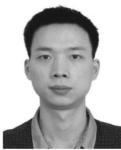

natural_image

Portrait photo of a man with short dark hair and necklace (no text or symbols visible)

Qi Tang received the B.Sc. degree in information engineering and the M.Sc. and Ph.D. degrees in information and communication engineering from the National University of Defense Technology, Changsha, China, in 2009, 2012, and 2016, respectively.

He is currently a Lecturer with the Department of Electronic Science and Engineering, National University of Defense Technology. He was a Visiting Ph.D. Student with the Electronic Systems Group, Electrical Engineering Department,

Eindhoven University of Technology, Eindhoven, The Netherlands, from 2014 to 2015. His current research interests include embedded parallel computing, reconfigurable computing, and software defined radio.

Dr. Tang was the recipient of a scholarship from the China Scholarship Council.

natural_image

Black-and-white portrait of a smiling woman (no text or symbols visible)

Edith C.-H. Ngai (S’02–GS’05–M’07–SM’15) received the Ph.D. degree from the Chinese University of Hong Kong, Hong Kong, in 2007.

She is currently an Associate Professor with the Department of Information Technology, Uppsala University, Uppsala, Sweden. She was a Visiting Researcher with Ericsson Research, Stockholm, Sweden, from 2015 to 2017. She was a Post-Doctoral Fellow with Imperial College London, London, U.K. She has also been a Visiting Researcher with Simon Fraser University, Burnaby,

BC, Canada, Tsinghua University, Beijing, China, and the University of California at Los Angeles, Los Angeles, CA, USA. She was a Project Leader of the National Project, GreenIoT from 2014 to 2017, for open data and sustainable development in Sweden. Her current research interests include Internet-of-Things, mobile cloud computing, network security and privacy, smart cities, and urban computing.

Dr. Ngai was a recipient of the Best Paper Runner-Up Award of IEEE IWQoS 2010 and ACM/IEEE IPSN 2013 for her co-authored papers. She was a VINNMER Fellow awarded by the Swedish governmental agency VINNOVA in 2009. She served as the TPC Co-Chair of IEEE SmartCity 2015, IEEE ISSNIP 2015, and the ICNC 2018 Network Algorithm and Performance Evaluation Symposium. She is an Associate Editor of IEEE ACCESS and the IEEE TRANSACTIONS OF INDUSTRIAL INFORMATICS. She is a Senior Member of the ACM.

natural_image

Portrait photo of a man wearing a plaid shirt (no text or symbols visible)

Xiping Hu received the Ph.D. degree from the University of British Columbia, Vancouver, BC, Canada.

He is currently a Professor with the Shenzhen Institutes of Advanced Technology, Chinese Academy of Sciences, Shenzhen, China. He is also the co-founder and the Chief Scientist of Erudite Education Group Ltd., Hong Kong, a leading language learning mobile application company with over 100 million users, and listed as top 2 language education platform globally. He has had over 70 papers published and presented in prestigious conferences and journals, such as the IEEE TRANSACTIONS ON EMERGING TOPICS IN COMPUTING, the IEEE TRANSACTIONS ON VEHICULAR TECHNOLOGY, the IEEE TRANSACTIONS ON INDUSTRIAL INFORMATICS, IEEE INTERNET OF THINGS JOURNAL, the ACM Transactions on Multimedia Computing, Communications, and Applications, the IEEE COMMUNICATIONS SURVEYS AND TUTORIALS, IEEE Communications Magazine, IEEE Network, HICSS, ACM MobiCom, and WWW. His current research interests include mobile cyber-physical systems, crowdsensing, social networks, and cloud computing.

Dr. Hu has been serving as the Lead Guest Editor for the IEEE TRANSACTIONS ON AUTOMATION SCIENCE AND ENGINEERING and WCMC.

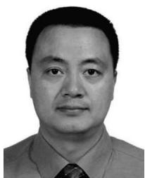

natural_image

Portrait photo of a man in formal attire (no text or symbols visible)

Jibo Wei received the B.S. and M.S. degrees in electronic engineering from the National University of Defense Technology (NUDT), Changsha, China, in 1989 and 1992, respectively, and the Ph.D. degree in electronic engineering from Southeast University, Nanjing, China, in 1998.

He is currently the Director and a Professor of the Department of Communication Engineering, NUDT. His current research interests include wireless network protocol and signal processing in communications, more specially, the areas of MIMO, multicar-

rier transmission, cooperative communication, and cognitive networks.

Dr. Wei is a member of the IEEE Communication Society and IEEE VTS. He is also an Editor of the Journal on Communications and a Senior Member of the China Institute of Communications and Electronics.

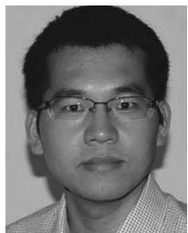

natural_image

Portrait of a man wearing glasses and a checkered shirt (no text or symbols visible)

Haitao Zhao (SM’18) received the B.E., M.Sc., and Ph.D. degrees from the National University of Defense Technology (NUDT), Changsha, China, in 2002, 2004, and 2009, respectively.

He visited the Institute of ECIT, Queen’s University of Belfast, Belfast, U.K., and Hong Kong Baptist University, Hong Kong. He is currently an Associate Professor with the Department of Cognitive Communications, NUDT. His current research interests include cognitive radio networks and self-organized networks.

Dr. Zhao has served as a TPC member of IEEE ICC’14–’17 and Globecom’16–’17, and a Guest Editor for IEEE Communications Magazine.