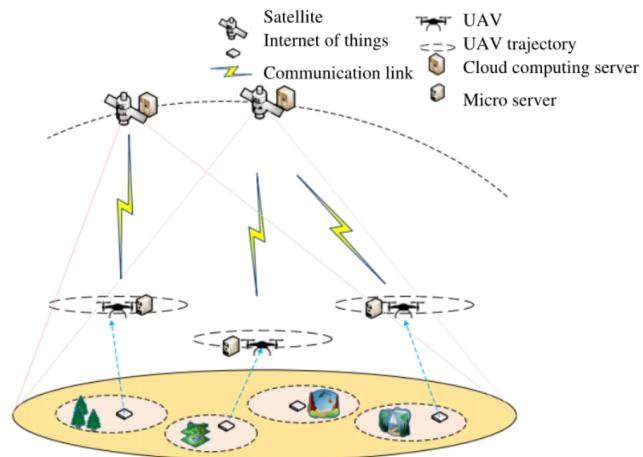
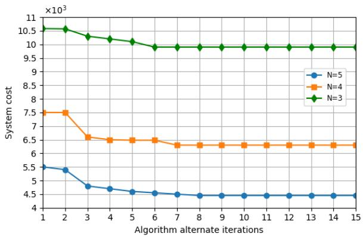
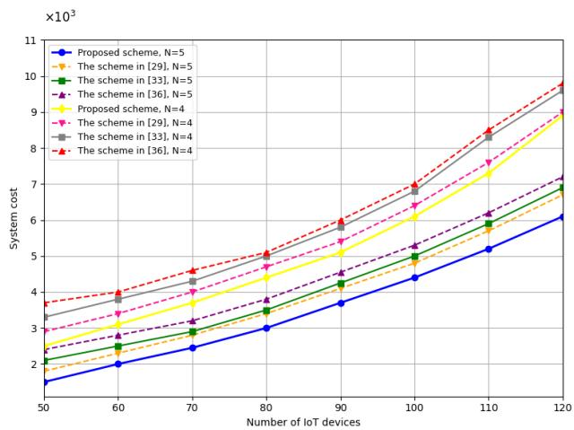
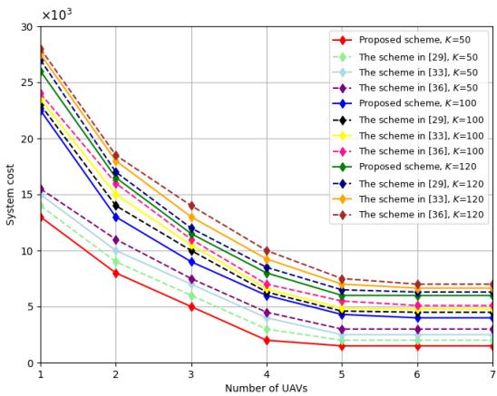
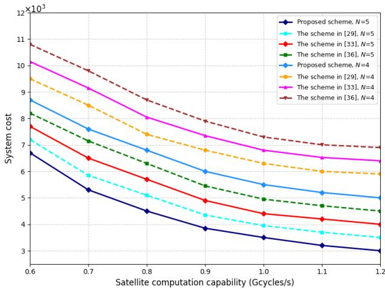
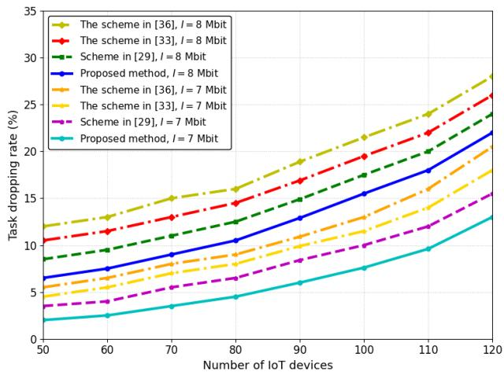

# System Cost Optimization-Based Task Ofloading for UAV-Assisted LEO Satellite Networks

Elhadj Moustapha Diallo , Rong Chai , Senior Member, IEEE, Amayika Kakati , Chao Yang , Mohamed Basher Omer , Linji Ye, Chengchao Liang , Member, IEEE, and Qianbin Chen , Senior Member, IEEE

Abstract—The integration of uncrewed aerial vehicles (UAVs) and low Earth orbit (LEO) satellites is expected to provides flexible, scalable and eficient computing support for Internet of things (IoT) applications. In this paper, we study the task execution problem in a UAV-assisted satellite ofloading network, where UAVs fly over the network coverage region to gather tasks from IoT devices. The collected tasks can be executed at the UAVs or ofloaded to satellites for processing. Jointly considering the energy consumption and task dropping cost, we define system cost function as the weighted sum of the two metrics, and formulate a constrained system cost minimization problem, where the power allocation strategy, task ofloading and scheduling, and UAV flight trajectory planning is jointly optimized. As the formulated problem is a mixed integer nonconvex optimization problem, which cannot be solved conveniently, we decompose it into subproblems, and propose an alternate iteration-based algorithm to solve the subproblems. In particular, to tackle the IoT device task transmission subproblem, we relax binary variables into continuous ones and transform the original problem into a standard linear problem which can be addressed using existing optimization tools. To resolve UAV trajectory design subproblem, we employ successive convex optimization and first order Taylor expansion method to convert the problem into a convex problem which can then be solved conveniently. For the power allocation subproblem, an iterative method and Lagrange dual approach are applied to obtain the optimal result. To obtain task ofloading and computing scheduling strategy, a heuristic approach is proposed. The simulation results reveal that our proposed method achieves superior performance compared to the existing algorithms.

Index Terms—Uncrewed aerial vehicle (UAV), satellite, task ofloading, Lagrange dual method, task execution cost minimization, power allocation, UAV trajectory design.

## I. INTRODUCTION

and industrial automation, etc., by allowing connected devices to communicate and share data. Despite these advancements, IoT devices face notable challenges in performing resourceintensive tasks due to limited computing power and energy constraints [1]. To overcome these limitations, task ofloading has emerged as an efective approach, where tasks are transferred from IoT devices to more powerful external entities, to enhance task execution performance [2]. In this context, uncrewed aerial vehicles (UAVs) have proven to be highly efective due to their flexibility and mobility, as they can operate in remote or hard-to-reach areas while being equipped with medium-performance servers to process tasks locally or ofload them to more capable platforms [3], [4].

Low Earth orbit (LEO) satellites, with their powerful computing resources and broad coverage capability, provide an efective solution for ofering task ofloading services. Unlike traditional ground-based infrastructures, LEO satellites can support high performance data processing and task computing, particularly in remote or underserved regions. When combined with UAVs, LEO satellite ofloading networks allow for the ofloading of more complex or larger-scale tasks. This cooperative framework enables eficient task execution, whether it is performed locally by UAVs or ofloaded to satellites for enhanced processing [5], [6]. Designing resource allocation and task ofloading strategies is crucial for UAV-assisted satellite ofloading networks, as it enhances task execution performance and ensures timely task execution, thereby improving the eficiency and reliability of IoT networks.

## A. Related Work

Extensive studies have been conducted to address the challenges of task ofloading and resource allocation in mobile-edge computing (MEC) systems [7], [8], [9], [10], [11], [12], [13], [14]. Addressing the importance of task execution delay, research work in [7], [8], and [9] designs task ofloading and resource allocation strategies to minimize task execution latency. Aiming to reduce the energy consumption due to task transmission and execution, the authors in [10], [11], [12], [13], and [14] propose task ofloading and resource allocation strategies to achieve energy consumption minimization.

However, these studies primarily focus on ground-based MEC systems and fail to leverage the computing capability of UAVs or satellites.

In recent years, UAV-assisted task ofloading has been explored in several studies [15], [16], [17], [18], [19], [20], [21], [22], [23]. Task ofloading strategies are designed to minimize energy consumption [15], [16], [17], [18]. The authors in [15] and [16] design task ofloading technique to minimize the energy consumption of the UAVs in multi-UAV assisted networks. The authors in [17] and [18] develop computation ofloading and trajectory planning strategies to minimize the energy consumption in UAV-assisted MEC systems. Several studies design task ofloading and trajectory planning strategies to minimize latency and energy consumption [19], [20], [21], [22], [23]. For instance, [19] and [20] focus on reducing processing delay and UAV energy consumption, while [21] and [22] propose schemes that jointly address latency and energy consumption in task ofloading. In [23], a cost function is defined based on task ofloading latency and energy consumption, and a joint task ofloading and resource allocation strategy is introduced to reduce the cost function. However, these approaches often neglect the integration of UAVs with satellite networks, limiting their applicability in global-scale IoT applications.

Task ofloading in satellite networks has been extensively investigated, with studies focusing on delay minimization [24], energy eficiency optimization [25], [26], hybrid delay-energy optimization [27], [28], [29], and privacy-aware cost reduction [30]. Specifically, the research work in [24] addresses the overall task completion delay in satellite communication networks and proposes a delay-optimal task ofloading scheme. In [25] and [26], the authors jointly optimize task ofloading and resource allocation strategies to reduce the energy consumption of the satellite networks. In [27], [28], and [29], the authors explore the challenges of computation ofloading and resource allocation in satellite edge computing systems, and design joint strategies to reduce the weighted sum of service delay and energy consumption. In [30], the authors define the total task ofloading cost as a function of computation delay, communication reliability and user privacy, and develop a privacy-preserving task ofloading scheme to reduce the total ofloading cost. Despite these advancements, existing satellite-focused work often overlooks the role of UAVs as intermediaries, which could enhance flexibility and coverage in remote areas.

The task ofloading problem in space-air-ground integrated networks (SAGINs) has been explored in several studies [29], [31], [32], [33], [34], [35], [36]. In [31] and [32], the authors develop task ofloading and resource allocation strategies to reduce the overall latency. A joint UAV deployment, task ofloading, and resource allocation algorithm is proposed to maximize the system energy eficiency [33]. The research work in [34] explores the edge computing problem in an SAGIN and designs a task ofloading strategy to minimize the energy consumption. In [35], the authors examine the task ofloading and resource allocation issue in SAGINs and devise a joint strategy to reduce the energy consumption and latency for task ofloading. In [29], the authors formulate a joint task ofloading and resource-allocation problem, and develop a dual-network deep reinforcement learning (DRL) framework to minimize the overall system cost. The research work in [36] studies a multi-task joint computation ofloading problem in SAGINs, and proposes a joint ofloading decision and resource allocation strategy to minimize the cost of task execution. While task ofloading and resource allocation problem is addressed in existing work, the joint optimization of task scheduling, resource allocation and UAV trajectory planning has not been explored extensively, which is critical for achieving energy eficiency and reducing task dropping cost in dynamic environments.

## B. Motivations and Contributions

Although the task ofloading problem has been explored in traditional MEC systems [7], [8], [9], [10], [11], [12], [13], [14], UAV-assisted networks [15], [16], [17], [18], [19], [20], [21], [22], [23], and satellite systems [24], [25], [26], [27], [28], [29], [30], a few work considers the UAV-asssited task ofloading in satellite networks, which ofers distinct flexibility and cost-efectiveness. While the task ofloading problem in SAGINs is examined in [29], [31], [32], [33], [34], [35], and [36], the authors fail to jointly consider task scheduling, resource allocation and trajectory planning of the UAVs, which are closely coupled and impact task ofloading performance severely. Furthermore, the existing studies mainly consider the latency and energy consumption optimization in designing task ofloading strategy, they fail to address the joint optimization of system energy consumption and task dropping cost, which is of particular importance in achieving energy consumption minimization and enhancing user quality of experience (QoE).

In this paper, we tackle the task execution issue in a UAV-assisted satellite ofloading scenario. To enhance the task execution performance, we define system cost as the weighted sum of the task transmission and execution energy consumption, the UAV flight energy consumption and the task dropping cost, and formulate the joint power allocation, task ofloading and scheduling, and UAV flight trajectory planning problem as a constrained system cost minimization problem. To address the formulated problem, we decompose it into four subproblems, namely, IoT device task transmission subproblem, UAV trajectory design subproblem, power allocation subproblem and task ofloading and computing scheduling subproblem, and solve the subproblems using an alternate iteration-based algorithm.

The main contributions of this article are summarized as follows.

In this paper, we investigate task execution problem in UAV-assisted satellite ofloading scenario, where satellites are deployed with high-performance computing servers, UAVs are deployed with medium-performance servers, both the satellites and UAVs are capable of executing tasks for the IoT devices. We formulate the joint power allocation, task ofloading and scheduling and UAV flight trajectory planning problem as a constrained system cost minimization problem. Since the formulated problem is a mixed-integer nonlinear programming (MINLP) problem which is challenging to solve, we decompose it into four subproblems, namely, IoT device task transmission subproblem, UAV trajectory design subproblem, power allocation subproblem and task ofloading and computing scheduling subproblem and propose an alternating iterative method to solve the subproblems.

• To tackle the IoT device task transmission subproblem, we relax the integer variables into continuous variables to acquire a linear programming problem and apply optimization tools to solve it. Then, for the UAV trajectory optimization subproblem, a method based on the successive convex approximate (SCA) scheme and the first-order Taylor expansion is applied to determine the flight trajectory of the UAVs. To solve the power allocation subproblem, the Lagrangian algorithm is applied. Based on the obtained local IoT device task transmission strategy, UAV trajectory optimization strategy and power allocation strategy, a virtual time axis-based heuristic algorithm is proposed to determine the task ofloading and computing scheduling strategy.

To verify the efectiveness of our proposed approach, we carry out extensive simulations and compare the proposed algorithm with the existing algorithms. It is demonstrated that the proposed algorithm yields the better performance in terms of system cost compared with the reference algorithms.

## II. SYSTEM MODEL

In this section, we describe the system model used in this study, which includes the network model, channel model and task model.

## A. Network Model

In this paper, we consider a UAV-assisted satellite ofloading network, which consists of M LEO satellites, N UAVs and K IoT devices. It is assumed that the applications of the IoT devices generate various computing tasks, which need to be executed. Since IoT devices are lightweight devices with highly limited computing power, we utilize satellite and UAV-assisted computing ofloading technology. Specifically, the satellites are equipped with high-performance computing servers, and the UAVs are deployed with medium-performance servers, both the satellites and UAVs are capable of executing tasks for the IoT devices. We assume that UAVs fly over the network coverage region to gather tasks from IoT devices, which are then either executed by the UAVs or ofloaded to satellites for processing. Let $\mathrm { \bf S } _ { m }$ represent the m-th LEO satellite, $\mathrm { U } _ { n }$ denote the n-th UAV, and $\mathrm { D } _ { k }$ denote the k-th IoT device, where $1 \leq m \leq M , 1 \leq n \leq N ,$ , and $1 \leq k \leq K$

For simplicity, the total time T is segmented into continuous and equal-length periods. Let denote the length of each time slot. Assuming that is small enough, the satellites and UAVs can be considered stationary in each time slot. The flying height of the UAVs is fixed at H. Let ${ \bf q } _ { m , t } ^ { \mathrm { s } } = \left( x _ { m , t } ^ { \mathrm { s } } , y _ { m , t } ^ { \mathrm { s } } \right)$ and ${ \bf q } _ { n , t } ^ { \mathrm { u } } = \left( x _ { n , t } ^ { \mathrm { u } } , y _ { n , t } ^ { \mathrm { u } } \right)$ <sup>,</sup>indicate the coordinates of $\mathbf { S } _ { m }$ and $\mathrm { U } _ { n }$ <sup>,</sup>at time <sup>, , ,</sup>slot t, respectively. The IoT devices are positioned on the horizontal ground, let the coordinates of $\mathrm { D } _ { k }$ be represented as $\mathbf { q } _ { k } ^ { \mathrm { d } } = \left( x _ { k } ^ { \mathrm { d } } , y _ { k } ^ { \mathrm { d } } \right)$

## B. Channel Model

In this subsection, we examine the channel models of IoT device-UAV links and UAV-satellite links, and then analyse the data rate of the transmission links.

1) Channel Model of IoT Device-UAV Links: The communication links between IoT devices and UAVs are assumed to be dominated by the line-of-sight (LoS) component. Hence, the IoT device-UAV channel follows the free-space path loss model [37]. Let $h _ { k , n , t } ^ { \mathrm { d , u } }$ denote the channel gain between $\mathrm { D } _ { k }$ and $\mathrm { { U } } _ { n }$ <sup>, ,</sup>at time slot t, which can be modeled as

$$
h _ { k , n , t } ^ { \mathrm { d , u } } = \rho _ { 0 } \Big ( d _ { k , n , t } ^ { \mathrm { d , u } } \Big ) ^ { - 2 } ,\tag{1}
$$

where $\rho _ { 0 }$ indicates the reference channel gain at a distance of 1 m, $d _ { k , n , t } ^ { \mathrm { d , u } }$ indicates the distance between $\mathrm { D } _ { k }$ and $\mathrm { U } _ { n }$ at time slot $t ,$ <sup>, ,</sup> which can be expressed as

$$
d _ { k , n , t } ^ { \mathrm { d } , \mathrm { u } } = \sqrt { H ^ { 2 } + \left. \mathbf { q } _ { n , t } ^ { \mathrm { u } } - \mathbf { q } _ { k } ^ { \mathrm { d } } \right. ^ { 2 } } .\tag{2}
$$

Let $R _ { k , n , t }$ denote the transmission rate of $\mathrm { D } _ { k }$ when ofloading task $\mathrm { V } _ { k }$ <sup>, ,</sup>to $\mathrm { { U } } _ { n }$ at time slot t, which can be calculated as

$$
R _ { k , n , t } = B _ { n } ^ { \mathrm { u } } \log \left( 1 + \frac { P _ { k } ^ { \mathrm { d } } h _ { k , n , t } ^ { \mathrm { d } , \mathrm { u } } } { \sigma _ { \mathrm { u } } ^ { 2 } } \right) ,\tag{3}
$$

where $B _ { n } ^ { \mathrm { u } }$ indicates the bandwidth of $\mathrm { U } _ { n } , \sigma _ { \mathrm { u } } ^ { 2 }$ indicates the noise <sup>σ</sup>power of the communication links between IoT devices and UAVs, $P _ { k } ^ { \mathrm { d } }$ is the transmit power of $\mathrm { D } _ { k }$

2) Channel Model of UAV-Satellite Links: Let $h _ { n , m , t } ^ { \mathrm { u , s } }$ indicate the channel gain between $\mathrm { U } _ { n }$ and $\mathrm { \bf S } _ { m }$ <sup>, ,</sup>at time slot t, which can be written as [39]

$$
h _ { n , m , t } ^ { \mathrm { u , s } } = \frac { G _ { n } ^ { \mathrm { t } } G _ { m } ^ { \mathrm { r } } } { L _ { n , m , t } ^ { 0 } L _ { n , m , t } ^ { \mathrm { u , s } } } ,\tag{4}
$$

where $G _ { n } ^ { \mathrm { t } }$ represents the transmitting antenna gain of $\mathrm { U } _ { n } ,$ $G _ { m } ^ { \mathrm { r } }$ denotes the receiving antenna gain of $\mathrm { S } _ { m } , L _ { n , m , t } ^ { 0 }$ indicates the rain attenuation between $\mathrm { U } _ { n }$ and $\mathbf { S } _ { m }$ <sup>, ,</sup>at time slot $t , ~ L _ { n , m , t } ^ { \mathrm { u , s } }$ indicates the path loss between $\mathrm { U } _ { n }$ and $\mathbf { S } _ { m }$ at time slot $t ,$ <sup>, ,</sup> and $L _ { n , m , t } ^ { \mathrm { u , s } }$ can be modeled as

$$
L _ { n , m , t } ^ { \mathrm { u , s } } = \left( \frac { 4 \pi d _ { n , m , t } ^ { \mathrm { u , s } } f _ { \mathrm { c } } ^ { \mathrm { s } } } { c } \right) ^ { 2 } ,\tag{5}
$$

where $f _ { c } ^ { s }$ denotes the satellite carrier’s center frequency, c denotes the speed of light, and $d _ { n , m , t } ^ { \mathrm { u , s } }$ represents the distance between $\mathrm { { U } } _ { n }$ and $\mathrm { \Delta S } _ { m }$ at time slot t.

Let $R _ { k , n , m , i }$ <sub>t</sub> be the transmission rate of $\mathrm { U } _ { n }$ while transmitting task $\mathrm { V } _ { k }$ <sup>, ,</sup>to $\mathrm { \bf S } _ { m }$ at time slot $t , R _ { k , n , m , t }$ can be computed as

$$
R _ { k , n , m , t } = B _ { m } ^ { \mathrm { s } } \mathrm { l o g } _ { 2 } \left( 1 + \frac { P _ { k , n , m , t } h _ { n , m , t } ^ { \mathrm { u , s } } } { \sigma _ { \mathrm { s } } ^ { 2 } } \right) ,\tag{6}
$$

where $B _ { m } ^ { \mathrm { s } }$ is the bandwidth of $\mathrm { S } _ { m } , ~ \sigma _ { \mathrm { s } } ^ { 2 }$ denotes the noise power of the links from UAVs to satellites, $P _ { k , n , m , t }$ denotes the transmit power of $\mathrm { U } _ { n }$ when ofloading task $\mathrm { V } _ { k }$ to $\mathbf { S } _ { m }$ at time slot t.

## TABLE I

<table><tr><td rowspan=1 colspan=1>Parameter</td><td rowspan=1 colspan=1>Description</td></tr><tr><td rowspan=1 colspan=1> $\mathbf { q } _ { m , t } ^ { \mathrm { s } }$ </td><td rowspan=1 colspan=1>Coordinates of $\mathrm { \Delta S } _ { m }$ at time slot t</td></tr><tr><td rowspan=1 colspan=1> $\underline { { \mathbf { q } _ { n , t } ^ { \mathrm { u } } } }$ </td><td rowspan=1 colspan=1>Coordinates of $\mathrm { U } _ { n }$ at time slot t</td></tr><tr><td rowspan=1 colspan=1> $\mathbf { q } _ { k } ^ { \mathrm { d } }$ </td><td rowspan=1 colspan=1>Coordinates of IoT device $\overline { { \mathrm { ~ D } _ { k } } }$ </td></tr><tr><td rowspan=1 colspan=1> $\frac { \not { N } } { \not { N } ^ { \mathrm { d } , \mathrm { u } } }$  $\underline { n } _ { k , n , t }$ </td><td rowspan=1 colspan=1>Channel gain between $\mathrm { D } _ { k }$ and $\mathrm { U } _ { n }$ at time slot t</td></tr><tr><td rowspan=1 colspan=1> $\overline { { h _ { n , m , t } ^ { \mathrm { u , s } } } }$ </td><td rowspan=1 colspan=1>Channel gain between $\overline { { \mathrm { ~ U ~ } _ { n } } }$ and $\overline { { \mathsf { S } _ { m } } }$ at time slot t</td></tr><tr><td rowspan=1 colspan=1> $\overline { { G _ { n } ^ { \mathrm { t } } } }$ </td><td rowspan=1 colspan=1>Transmit antenna gain of $\overline { { \mathrm { ~ U } _ { n } } }$ </td></tr><tr><td rowspan=1 colspan=1> $G _ { m } ^ { \mathrm { r } }$ </td><td rowspan=1 colspan=1>Receiving antenna gain of $\mathrm { \Delta S } _ { m }$ </td></tr><tr><td rowspan=1 colspan=1> $\frac { \prime \prime \epsilon } { T . }$  $\underline { { { L } _ { n , m , t } } }$ </td><td rowspan=1 colspan=1>Path loss between $\overline { { \mathrm { ~ U } _ { n } } }$ and $\mathrm { \Delta } \mathrm { S } _ { m }$ at time slot t</td></tr><tr><td rowspan=1 colspan=1> $R _ { k , n , t }$ </td><td rowspan=1 colspan=1>Transmission rate from $\overline { { \mathbf { D } _ { k } } }$ to $\overline { { \mathrm { ~ U } _ { n } } }$ at time slot t</td></tr><tr><td rowspan=1 colspan=1> $\underline { { R _ { k , n , m , t } } }$ </td><td rowspan=1 colspan=1>Transmission rate from $\overline { { \mathrm { U } _ { n } } }$ to $\mathrm { \Delta S } _ { m }$ for task $\overline { { \mathrm { ~ V ~ } _ { k } } }$ </td></tr><tr><td rowspan=1 colspan=1> $P _ { k , n , m , t }$ </td><td rowspan=1 colspan=1>Transmit power of $\overline { { \mathbf { U } _ { n } } }$ when offloading task $\mathrm { V } _ { k }$ to $\mathrm { \Delta S } _ { m }$ </td></tr><tr><td rowspan=1 colspan=1> $\overline { { P _ { k } ^ { \mathrm { d } } } }$ </td><td rowspan=1 colspan=1>Transmit power of $\mathrm { D } _ { k }$ </td></tr><tr><td rowspan=1 colspan=1> $I _ { k }$ </td><td rowspan=1 colspan=1>Data size of task $\overline { { \mathrm { \Delta V } _ { k } } }$ </td></tr><tr><td rowspan=1 colspan=1> $\xi _ { k }$ </td><td rowspan=1 colspan=1>Computational complexity of task $\overline { { \mathrm { ~ V ~ } _ { k } } }$ </td></tr><tr><td rowspan=1 colspan=1> $\overline { { T _ { \imath } ^ { \mathrm { m a x } } } }$ k</td><td rowspan=1 colspan=1>Maximum tolerable delay for task $\overline { { \mathrm { ~ V ~ } _ { k } } }$ </td></tr><tr><td rowspan=1 colspan=1> $\underline { { \eta _ { k } ^ { \mathrm { d } } } }$ </td><td rowspan=1 colspan=1>Cost penalty for dropping task $\overline { { \mathrm { ~ V ~ } _ { k } } }$ </td></tr><tr><td rowspan=1 colspan=1> $\overline { { E } }$ </td><td rowspan=1 colspan=1>Total system energy consumption</td></tr><tr><td rowspan=1 colspan=1> $\overline { { E _ { k } ^ { \mathrm { t } } } }$ </td><td rowspan=1 colspan=1>Transmission energy consumption</td></tr><tr><td rowspan=1 colspan=1> $\textstyle { \frac { \# } { E ^ { \mathrm { f } } } }$ </td><td rowspan=1 colspan=1>Flight energy consumption of $\overline { { \mathrm { U A V s } } }$ </td></tr><tr><td rowspan=1 colspan=1> $E _ { k } ^ { \mathrm { e } }$ </td><td rowspan=1 colspan=1>Task execution energy consumption</td></tr><tr><td rowspan=1 colspan=1> $\gamma _ { k }$ </td><td rowspan=1 colspan=1>Task execution success indicator</td></tr><tr><td rowspan=1 colspan=1> $\underline { { \lambda _ { k , n , t } } }$ </td><td rowspan=1 colspan=1>Task offloading decision variable $\overline { { ( \mathrm { D } _ { k } } }$ to $\overline { { \mathrm { ~ U ~ } _ { n } ) } }$ </td></tr><tr><td rowspan=1 colspan=1> $\underline { { { x } _ { k , n , m , t } } }$ </td><td rowspan=1 colspan=1>Task scheduling variable from $\overline { { \mathrm { U } _ { n } } }$ to $\overline { { \mathrm { ~ } \mathrm { { S } } _ { m } } }$ </td></tr><tr><td rowspan=1 colspan=1>Tt $\underline { { \boldsymbol { \cdot } \boldsymbol { I } _ { k , n , t } ^ { \mathrm { ~ v ~ } } } }$ </td><td rowspan=1 colspan=1>Transmission delay from $\overline { { \mathrm { D } _ { k } } }$ to $\overline { { \mathrm { ~ U } _ { n } } }$ </td></tr><tr><td rowspan=1 colspan=1>Tt $\underline { { 1 _ { k , n , m , t } ^ { \mathrm { ~ ~ } } } }$ </td><td rowspan=1 colspan=1>Transmission delay from $\mathrm { U } _ { n }$ to $\mathrm { \Delta } \mathrm { S } _ { m }$ </td></tr><tr><td rowspan=1 colspan=1> $y _ { k , n , m , t }$ </td><td rowspan=1 colspan=1>Task execution variable at $\mathrm { \Delta S } _ { m }$ </td></tr><tr><td rowspan=1 colspan=1> $\kappa _ { n } ^ { \mathrm { u } } ~ ( \kappa _ { m } ^ { \mathrm { s } } )$ </td><td rowspan=1 colspan=1>Energy coefficient of $\overline { { \mathrm { U } _ { n } \mathrm { ~ } ( \mathrm { S } _ { m } ) } }$ </td></tr><tr><td rowspan=1 colspan=1>fn $( f _ { m } ^ { \mathrm { s } } )$ </td><td rowspan=1 colspan=1>Computing capability of $\overline { { \mathrm { U } _ { n } \mathrm { ~ } ( \mathrm { S } _ { m } ) } }$ </td></tr></table>

## C. Task Model

In this paper, we assume that each IoT device has a resource-intensive task that needs to be ofloaded. We define $\mathbf { V } _ { k } \ = \ \left. I _ { k } , \xi _ { k } , T _ { k } ^ { \operatorname* { m a x } } \right.$ as the computing task of $\mathrm { D } _ { k }$ , where $I _ { k }$ specifies the amount of data of $\mathrm { V } _ { k } , \xi _ { k }$ denotes task computational complexity, that is, the number of CPU cycles needed to calculate each bit of $\mathrm { V } _ { k } , T _ { k } ^ { \mathrm { m a x } }$ indicates the maximum tolerable delay of the task, and the task cannot be performed after the maximum allowable delay. The summary of the key notations used in this paper is listed in Table I.

## III. OPTIMIZATION PROBLEM FORMULATION

In this section, we define a system cost function that considers both the energy consumption of UAVs and the cost of task discard. We then model the joint power allocation, task ofloading and scheduling, and UAV flight trajectory planing as a constrained system cost minimization problem.

## A. Objective Function

To perform task transmission and execution, IoT devices, UAVs and satellites may consume certain energy. On the other hand, the task execution is subject to the maximum tolerable delay. That is, if a task cannot be executed before its maximum tolerable delay, it will be dropped, resulting in degraded QoE of the users. In this subsection, we jointly consider system energy consumption and task dropping cost, and define system cost function as the weighted sum of the two metrics.

1) System Cost: Let C denote system cost, which is defined as

$$
C = \omega _ { 1 } \eta + \omega _ { 2 } E ,\tag{7}
$$

where $\omega _ { 1 }$ and $\omega _ { 2 }$ are the weight factors of the task drop cost and system energy consumption, respectively. Note that the values of $\omega _ { 1 }$ and $\omega _ { 2 }$ should be chosen properly to ensure that neither component of the cost function dominates excessively, enabling balanced system performance.

In (7),  represents task discard cost, which is given by

$$
\eta = \sum _ { k = 1 } ^ { K } \left( 1 - \gamma _ { k } \right) \eta _ { k } ^ { \mathrm { d } } ,\tag{8}
$$

where $\gamma _ { k } \in \{ 0 , 1 \}$ is the successful execution identifier of tasks, if task $\mathrm { V } _ { k }$ <sup>,</sup>is successfully executed, then $\gamma _ { k } \ = \ 1$ , otherwise, $\gamma _ { k } = 0 , \eta _ { k } ^ { \mathrm { d } }$ <sup>γ</sup>denotes the cost for dropping task $\mathrm { V } _ { k }$

In (7), E denotes system energy consumption which is resulted from task transmission and execution as well as the flight of UAVs. Accordingly, we model E as

$$
E = E ^ { \mathrm { f } } + \sum _ { k = 1 } ^ { K } \gamma _ { k } \left( E _ { k } ^ { \mathrm { t } } + E _ { k } ^ { \mathrm { e } } \right) ,\tag{9}
$$

where $E ^ { \mathrm { f } }$ denotes the flight energy consumption of the UAVs, $E _ { k } ^ { \mathrm { t } }$ and $E _ { k } ^ { \mathrm { e } }$ represent respectively the transmission and execution energy consumption required for task $\mathbf { V } _ { k } . \mathbf { \nabla } E ^ { \mathrm { f } } , E _ { k } ^ { \mathrm { t } } .$ , and $E _ { k } ^ { \mathrm { e } }$ are formulated in the following subsections. It is important to note that the proposed system operates under a centralized control framework, where a central station collects the system parameters from UAVs and IoT devices and determines the ofloading and execution strategies before any task transmission takes place. If a task is predicted to violate its delay constraint, it is discarded at the IoT device level and is not transmitted to the UAVs. Consequently, no transmission energy is consumed for dropped tasks, and the total energy model in (9) accounts only for tasks that are actually transmitted and executed.

2) Flight Energy Consumption: The flight energy consumption of $\mathrm { U } _ { n }$ can be expressed as

$$
E ^ { \mathrm { f } } = \sum _ { n = 1 } ^ { N } \sum _ { t = 1 } ^ { T } P _ { n , t } ^ { \mathrm { f } } \tau ,\tag{10}
$$

where $P _ { n , t } ^ { \mathrm { f } }$ indicates the power consumption of $\mathrm { U } _ { n }$ at time slot $t ,$ <sup>,</sup> which can defined as [39]

$$
\begin{array} { r } { P _ { n , t } ^ { \mathrm { f } } = P ^ { \mathrm { 0 } } \Bigg ( 1 + \frac { 3 \nu _ { n , t } ^ { 2 } } { \nu _ { \mathrm { t i p } } ^ { 2 } } \Bigg ) + \frac { 1 } { 2 } f _ { 0 } \rho s A \nu _ { n , t } ^ { 3 } } \\ { + P ^ { \mathrm { 1 } } \Bigg ( \sqrt { 1 + \frac { \nu _ { n , t } ^ { 4 } } { 4 \nu _ { 0 } ^ { 4 } } } - \frac { \nu _ { n , t } ^ { 2 } } { 2 \nu _ { 0 } ^ { 2 } } \Bigg ) ^ { 1 / 2 } . } \end{array}\tag{11}
$$

where $P ^ { 0 }$ and $P ^ { 1 }$ are constants that reflect, respectively, the blade profile power and induced power in the hovering status, $\nu _ { n , t }$ indicates the velocity of $\mathrm { U } _ { n }$ at time slot t, $\nu _ { \mathrm { t i p } }$ and $\nu _ { 0 }$ indicate respectively the rotor blade tip speed and the mean rotor induced velocity in the hovering status, $f _ { 0 }$ and s indicate respectively the fuselage drag ratio and rotor solidity, $\rho$ and A denote respectively the air density and rotor disc.

3) Task Transmission Energy Consumption: The transmission energy consumption of task $\mathrm { V } _ { k }$ can be computed as

$$
\begin{array} { r l r } {  { E _ { k } ^ { \mathrm { t } } = \sum _ { n = 1 } ^ { N } \sum _ { t = 1 } ^ { T } \lambda _ { k , n , t } P _ { k } ^ { \mathrm { d } } T _ { k , n , t } ^ { \mathrm { t } } } } \\ & { } & { + \sum _ { n = 1 } ^ { N } \sum _ { m = 1 } ^ { M } \sum _ { t = 1 } ^ { T } x _ { k , n , m , t } P _ { k , n , m , t } T _ { k , n , m , t } ^ { \mathrm { t } } . } \end{array}\tag{12}
$$

where $\lambda _ { k , n , t } \in \{ 0 , 1 \}$ indicates the task ofloading variable of $\mathrm { D } _ { k }$ , if $\mathrm { D } _ { k }$ <sup>, ,</sup>ofloads task $\mathrm { V } _ { k }$ to $\mathrm { U } _ { n }$ at time slot t, then $\lambda _ { k , n , t } = 1$ otherwise, $\lambda _ { k , n , t } = 1$ . Similarly, $x _ { k , n , m , t } \in \{ 0 , 1 \}$ indicates the <sup>λ , ,</sup>task scheduling variable of $\mathrm { U } _ { n } ,$ if $\mathrm { U } _ { n }$ <sup>, , ,</sup>ofloads task $\mathrm { V } _ { k }$ to $\mathrm { \bf S } _ { m }$ at time slot t, then $x _ { k , n , m , t } = 1$ , otherwise, $x _ { k , n , m , t } = 0 , 1 \leq m \leq M$ Specifically, if $\mathrm { U } _ { n }$ executes task $\mathrm { V } _ { k }$ locally, we set $x _ { k , n , 0 , t } = 1$ otherwise, $x _ { k , n , 0 , t } ~ = ~ 0 . ~ T _ { k , n , t } ^ { \mathrm { t } }$ denotes the transmission delay when $\mathrm { D } _ { k }$ ofloading task $\mathrm { V } _ { k }$ <sup>,</sup> to $\mathrm { U } _ { n }$ at time slot t, which can be computed as

$$
T _ { { } _ { k , n , t } } ^ { \mathrm { t } } = \frac { I _ { k } } { R _ { k , n , t } } .\tag{13}
$$

In (12), $T _ { k , n , m , t } ^ { \mathrm { t } }$ represents the required transmission delay when $\mathrm { U } _ { n }$ <sup>, , ,</sup>ofloading the task $\mathrm { V } _ { k }$ to $\mathrm { \bf S } _ { m }$ at time slot t, which can be expressed as

$$
T _ { { \bf \Phi } _ { k , n , m , t } } ^ { \mathrm { t } } = \frac { I _ { k } } { R _ { k , n , m , t } } .\tag{14}
$$

4) Task Execution Energy Consumption: The energy consumption required for the UAVs or the satellites to perform task $\mathrm { V } _ { k }$ can be computed as

$$
\begin{array} { c } { { E _ { k } ^ { \mathrm { e } } = \displaystyle \sum _ { n = 1 } ^ { N } \sum _ { t = 1 } ^ { T } x _ { k , n , 0 , t } \kappa _ { n } ^ { \mathrm { u } } \left( f _ { n } ^ { \mathrm { u } } \right) ^ { 2 } \xi _ { k } I _ { k } } } \\ { { + \displaystyle \sum _ { n = 1 } ^ { N } \sum _ { m = 1 } ^ { M } \sum _ { t = 1 } ^ { T } y _ { k , n , m , t } \kappa _ { m } ^ { \mathrm { s } } \left( f _ { m } ^ { \mathrm { s } } \right) ^ { 2 } \xi _ { k } I _ { k } . } } \end{array}\tag{15}
$$

where $y _ { k , n , m , t } \ \in \ \{ 0 , 1 \}$ is the task execution variable of the <sup>, ,</sup>satellites, if $\mathrm { \Delta S } _ { m }$ <sup>,</sup>executes task $\mathrm { V } _ { k }$ ofloaded by $\mathrm { U } _ { n }$ at time slot $t ,$ then $y _ { k , n , m , t } = 1$ , otherwise, $y _ { k , n , m , t } = 0 . \ \kappa _ { n } ^ { \mathrm { u } }$ and $\boldsymbol { \kappa } _ { m } ^ { s }$ respectively represent the energy consumption coeficients of $\mathrm { U } _ { n }$ and $\mathrm { S } _ { m } ,$ $f _ { n } ^ { \mathrm { u } }$ and $f _ { m } ^ { \mathrm { s } }$ respectively indicate the computing capabilities of $\mathrm { U } _ { n }$ and $\mathbf { S } _ { m }$

## B. Optimization Constraints

In this subsection, we discuss the optimization constraints, which should be satisfied when designing the joint power allocation, task ofloading and scheduling, and UAV flight trajectory planning strategy.

1) Task Scheduling Constraints: We assume that in each time slot, a UAV can only collect the task of at most one IoT device, we obtain

$$
{ \mathrm { C 1 : ~ } } \sum _ { k = 1 } ^ { K } \lambda _ { k , n , t } \leq 1 , \forall n , t .\tag{16}
$$

We assume that a UAV can at most process or transmit the task of one IoT device, i.e.

$$
{ \bf C } 2 : \sum _ { k = 1 } ^ { K } \sum _ { m = 0 } ^ { M } x _ { k , n , m , t } \leq 1 , \forall n , t .\tag{17}
$$

In each time slot, a satellite can process the task of at most one IoT device, i.e.,

$$
\mathbf { C 3 } : ~ \sum _ { k = 1 } ^ { K } \sum _ { n = 1 } ^ { N } y _ { k , n , m , t } \leq 1 , \forall t , 1 \leq m \leq M .\tag{18}
$$

In order to execute a task at a time slot, a UAV or a satellite should have received the task in preceding slots, i.e.,

$$
\begin{array} { r } { \mathrm { C } 4 : \mathrm { H f } \gamma _ { k } = 1 \mathrm { a n d } x _ { k , n , 0 , t _ { 1 } } = 1 , } \\ { \mathrm { t h e n } \exists t _ { 0 } < t _ { 1 } , \lambda _ { k , n , t _ { 0 } } = 1 , \forall k , n . } \end{array}\tag{19}
$$

Similarly, if a task is executed at a satellite at a time slot, it should be transmitted to a UAV and then to the satellite in preceding time slots, i.e.,

$$
\begin{array} { r } { \begin{array} { l } { \mathrm { C 5 : ~ I f } \gamma _ { k } = 1 \mathrm { a n d } y _ { k , n , m , t _ { 2 } } = 1 \mathrm { , ~ t h e n } \exists t _ { 0 } < t _ { 1 } < t _ { 2 } , } \\ { \lambda _ { k , n , t _ { 0 } } = 1 , x _ { k , n , m , t _ { 1 } } = 1 , \forall k , n , m . } \end{array} } \end{array}\tag{20}
$$

2) Task Dropping Constraint: If a task of an IoT device is dropped due to timeout, the task will not be ofloaded and executed, we have the following constraint:

$$
\begin{array} { r } { \begin{array} { l } { \mathrm { C 6 } : ~ \lambda _ { k , n , t _ { 1 } } = 0 , { x _ { k , n , m , t _ { 2 } } } = 0 , { y _ { k , n , m , t _ { 2 } } } = 0 , } \\ { ~ \mathrm { i f } \gamma _ { k } = 0 , \forall k , n , m . } \end{array} } \end{array}\tag{21}
$$

3) Transmit Power Constraint: The transmit power of the UAVs is constrained by the maximum transmit power, i.e.,

$$
\mathbf { C } 7 : 0 \leq P _ { k , n , m , t } \leq P _ { n } ^ { \operatorname* { m a x } } , \forall k , n , m , t ,\tag{22}
$$

where $P _ { n } ^ { \mathrm { m a x } }$ indicates the maximum transmit power of $\mathrm { U } _ { n } .$

4) Task Transmission Delay Constraints: It is assumed that the task transmission of IoT devices needs to be completed within a single time slot, we obtain

$$
\begin{array} { r } { \begin{array} { r l } & { \mathbf { C 8 } : T _ { k , n , t } ^ { \mathrm { t } } \ \le \tau , \forall k , n , t . } \\ & { \mathbf { C 9 } : T _ { k , n , m , t } ^ { \mathrm { t } } \ \le \tau , \forall k , n , t , 1 \le m \le M . } \end{array} } \end{array}\tag{23}
$$

(24)

5) Task Transmission Rate Constraints: When an IoT device’s task is ofloaded, the task transmission rate should be greater than the minimum task transmission rate, we obtain

$$
\begin{array} { r } { \mathrm { C } 1 0 : R _ { k , n , t } \geq \lambda _ { k , n , t } R _ { k } ^ { \operatorname* { m i n } } , \forall k , n , t . } \end{array}
$$

$$
\begin{array} { r } { \mathrm { C } 1 1 : R _ { k , n , m , t } \geq x _ { k , n , m , t } R _ { k } ^ { \operatorname* { m i n } } , \forall k , n , t , 1 \leq m \leq M , } \end{array}\tag{25}
$$

(26)

where $R _ { k } ^ { \mathrm { { m i n } } }$ indicates the minimum data transmission rate of $\mathrm { V } _ { k }$

6) Flight Trajectory Constraints: The flight distance of $\mathrm { U } _ { n }$ at each time slot must satisfy the following requirement, i.e.,

$$
\mathbf { C } 1 2 : \left\| \mathbf { q } _ { n , t + 1 } ^ { \mathrm { u } } - \mathbf { q } _ { n , t } ^ { \mathrm { u } } \right\| \leq \nu _ { n } ^ { \operatorname* { m a x } } \tau , \forall n , t ,\tag{27}
$$

where $\nu _ { n } ^ { \mathrm { m a x } }$ is the maximum speed of $\mathrm { U } _ { n }$

To avoid collisions between UAVs during flight, their trajectories should also meet:

$$
\mathrm { C } 1 3 : \left\| \mathbf { q } _ { n , t } ^ { \mathbf { u } } - \mathbf { q } _ { n ^ { \prime } , t } ^ { \mathbf { u } } \right\| ^ { 2 } \geq d _ { \operatorname* { m i n } } ^ { 2 } , n \neq n ^ { \prime } , \forall n , t ,\tag{28}
$$

where $d _ { \mathrm { m i n } }$ is the safe distance of UAVs.

## C. Optimization Problem Formulation

The joint power allocation, task ofloading and scheduling, and UAV flight trajectory planning problem is defined as a constrained system cost minimization problem, i.e.,

$$
\begin{array} { r l } & { \mathrm { P 1 : } \ \underset { \lambda _ { k , n , t } , x _ { k , n , m , t } , y _ { k , n , m , t } , P _ { k , n , m , t } , \ \mathbf { q } _ { n , t } ^ { \mathrm { u } } } { \mathrm { m i n } } C } \\ & { \mathrm { s . t . } \ \mathrm { C 1 } - \mathrm { C 1 } 3 . } \end{array}\tag{29}
$$

## IV. SOLUTION TO THE OPTIMIZATION PROBLEM

In the optimization problem formulated in (29), there are both binary variables $\lambda _ { k , n , t } , ~ x _ { k , n , m , t } , ~ y _ { k , n , m , t }$ and continuous variables $P _ { k , n , m , t } , \ \mathbf { q } _ { n , t }$ . Furthermore, the objective function is nonconvex function of the optimization variables and most of the constraints are nonconvex. Therefore, the formulated problem is an MINP which cannot be solved conveniently using traditional approaches. In order to successfully address the specified problem, the original problem is decomposed into four subproblems, i.e., IoT device task transmission, UAV trajectory optimization, power allocation, task ofloading and satellite computing scheduling, and solved using the alternating optimization method. Specifically, for the given UAV trajectory optimization strategy $\mathbf { q } _ { n , t } ^ { r }$ , UAV transmit power strategy $P _ { k , n , m , t } ^ { * }$ <sup>,</sup>and task ofloading and scheduling strategy $x _ { k , n , m , t } ^ { * } , \ y _ { k , n , m , t } ^ { * } ,$ we solve IoT device task transmission sub-<sup>, , , , , ,</sup>problem, and obtain the IoT device task transmission strategy $\lambda _ { k , n , t } ^ { * }$ . Based on the determined IoT device task transmission <sup>λ , ,</sup>strategy $\lambda _ { k , n , t } ^ { * } ,$ the UAV transmit power strategy $P _ { k , n , m , t } ^ { * }$ and <sup>, ,</sup>the task ofloading and scheduling strategy $x _ { k , n , m , t } ^ { * } , \ y _ { k , n , m , t } ^ { * } ,$ <sup>, , , , , ,</sup>solve the UAV trajectory optimization subproblem and obtain $\mathbf { q } _ { n , t } ^ { \mathrm { u } , * }$ . Based on the determined IoT device task transmission strategy $\lambda _ { k , n , t } ^ { * } ,$ the UAV trajectory optimization strategy $\mathbf { q } _ { n , t } ^ { \mathrm { u } , * }$ <sup>λ , ,</sup>and the given task ofloading and scheduling strategy $x _ { k , n , m , t } ^ { * } ,$ $y _ { k , n , m , t } ^ { * } ,$ <sup>, , ,</sup> solve power allocation subproblem. Based on the <sup>, , ,</sup>determined IoT device task transmission strategy $\lambda _ { k , n , t } ^ { * }$ and UAV trajectory optimization strategy $\mathbf { q } _ { n , t } ^ { \mathrm { u } , * }$ <sup>λ , ,</sup>, the UAV transmit power strategy $P _ { k , n , m , t } ^ { * } ,$ <sup>,</sup>, solve the task ofloading and satellite <sup>, , ,</sup>computing scheduling subproblem.

## A. IoT Device Task Transmission Subproblem

Given the task ofloading and scheduling strategy $x _ { k , n , m , t } ^ { * } ,$ $y _ { k , n , m , t } ^ { * } ,$ , the UAV transmit power strategy $P _ { k , n , m , t } ^ { * } ,$ <sup>, , ,</sup> and the <sup>, , ,</sup>UAV trajectory optimization strategy $\mathbf { q } _ { n , t } ^ { * } ,$ <sup>, , ,</sup> the joint power <sup>,</sup>allocation, task ofloading and scheduling, and UAV flight trajectory planing problem is reduced into task transmission subproblem of the IoT devices. Furthermore, given the joint strategy, minimizing the system cost is equivalent to minimizing the task transmission energy consumption of the IoT devices. Accordingly, the task transmission subproblem can be expressed as

$$
\begin{array} { r l } & { \mathrm { P 2 : ~ } \displaystyle \operatorname* { m i n } _ { \lambda _ { k , n , t } } \sum _ { k = 1 } ^ { K } \sum _ { n = 1 } ^ { N } \sum _ { t = 1 } ^ { T } \gamma _ { k } \lambda _ { k , n , t } P _ { k } ^ { \mathrm { d } } \left( \frac { I _ { k } } { R _ { k , n , t } } \right) } \\ & { \mathrm { ~ s . t ~ . ~ } \mathrm { ~ C 1 } , \mathrm { C 4 } , \mathrm { C 5 } , \mathrm { C 6 } . } \end{array}\tag{30}
$$

Since $\lambda _ { k , n , t }$ is a binary variable, we relax $\lambda _ { k , n , t }$ into a continuous variable between 0 and 1, i.e. $0 ~ \leq ~ \lambda _ { k , n , t } ~ \leq ~ 1 , \forall k , n$ . Then, the formulated problem in (30) becomes a standard linear

problem which can be addressed using existing optimization CVX toolkits.

## B. UAV Trajectory Optimization Subproblem

Based on the obtained IoT device task transmission strategy $\lambda _ { k , n , t } ^ { * } ,$ UAV transmit power strategy $P _ { k , n , m , t } ^ { * }$ as well as <sup>λ , ,</sup>task ofloading and scheduling strategies $x _ { k , n , m , t } ^ { * } , \ y _ { k , n , m , t } ^ { * } ,$ the <sup>, , , , , ,</sup>formulated problem P1 is transformed into UAV trajectory optimization subproblem. Furthermore, since the distances between UAVs and satellites are relatively far, the transmit power of the UAVs when sending tasks to the satellites can be assumed to be approximately equal, thus the transmission energy consumption of the UAVs can be skipped, and minimizing the system cost function is equivalent to minimizing the task transmission energy consumption of the IoT devices. Accordingly, the UAV trajectory optimization subproblem can be formulated as

$$
\begin{array} { r l } & { \mathrm { P 3 } : \displaystyle \operatorname* { m i n } _ { \mathbf { q } _ { n , t } ^ { \mathrm { u } } } \sum _ { k = 1 } ^ { K } \sum _ { n = 1 } ^ { N } \sum _ { t = 1 } ^ { T } \gamma _ { k } \lambda _ { k , n , t } ^ { * } P _ { k } ^ { \mathrm { d } } \left( \frac { I _ { k } } { R _ { k , n , t } } \right) } \\ & { \quad \mathrm { s . t . ~ } . \mathrm { C l } 2 , \mathrm { C l } 3 . } \end{array}\tag{31}
$$

By examining the problem in (31), we can observe that the constraint C13 is nonconvex, and the objective function is a nonconvex function of ${ \bf q } _ { n , t } ^ { \mathrm { u } }$ . As a result, the above problem is a non-convex optimization problem. To tackle this problem, we adopt the SCA technique. Specifically, to deal with the non-convexity of the objective function, we introduce auxiliary variables $r _ { k , n , t }$ and $S _ { k , n , t } .$ such that ${ \mathrm { C 1 ^ { \prime } ~ } } : \ r _ { k , n , t } \ \leq \ R _ { k , n , t }$ and $\mathbf { C } 2 ^ { \prime } : S _ { k , n , t } \leq H ^ { 2 } + \left\| \mathbf { q } _ { n , t } ^ { \mathrm { u } } - \mathbf { q } _ { k } ^ { \mathrm { d } } \right\| ^ { 2 }$ , and obtain

$$
r _ { k , n , t } \leq B _ { n } ^ { \mathrm { u } } \mathrm { l o g } _ { 2 } \left( 1 + \frac { P _ { k } ^ { \mathrm { d } } \rho _ { 0 } } { \sigma _ { \mathrm { u } } ^ { 2 } S _ { k , n , t } } \right) .\tag{32}
$$

It can be proved that $\begin{array} { r } { B _ { n } ^ { \mathrm { u } } \mathrm { l o g } _ { 2 } \left( 1 + \frac { P _ { k } ^ { \mathrm { d } } \rho _ { 0 } } { \sigma _ { \mathrm { u } } ^ { 2 } S _ { k , n , t } } \right) } \end{array}$ is convex with respect to $S _ { k , n , t }$ <sup>σ , ,</sup>. We apply iterative method to expand the first-<sup>, ,</sup>order Taylor formula on the local point $S _ { \boldsymbol { k } , \boldsymbol { n } , t } ^ { l }$ generated in the l-th iteration, we can obtain

$$
\begin{array} { r l } & { B _ { n } ^ { \mathrm { u } } \mathrm { l o g } _ { 2 } \left( 1 + \frac { P _ { k } ^ { \mathrm { d } } \rho _ { 0 } } { \sigma _ { \mathrm { u } } ^ { 2 } S _ { k , n , t } } \right) \ \geq \ B _ { n } ^ { \mathrm { u } } \left( \mathrm { l o g } _ { 2 } \left( S _ { k , n , t } ^ { l } + \frac { P _ { k } ^ { \mathrm { d } } \rho _ { 0 } } { \sigma _ { \mathrm { u } } ^ { 2 } } \right) \right. } \\ & { \quad \left. - \mathrm { l o g } _ { 2 } ( S _ { k , n , t } ^ { l } ) - \left( \frac { 1 } { 1 + \frac { P _ { k } ^ { \mathrm { d } } \rho _ { 0 } } { \sigma _ { u } ^ { 2 } S _ { k , n , t } ^ { l } } } \cdot \frac { P _ { k } ^ { \mathrm { d } } \rho _ { 0 } / \sigma _ { u } ^ { 2 } } { \left( S _ { k , n , t } ^ { l } \right) ^ { 2 } } \right) \right. } \\ & { \quad \left. \cdot \left( S _ { k , n , t } - S _ { k , n , t } ^ { l } \right) \right) \stackrel { \Delta } { = } r _ { k , n , t } ^ { \mathrm { l b } } . } \end{array}\tag{33}
$$

By substituting B<sup>u</sup><sub>n</sub>log $\begin{array} { r } { \left( 1 + \frac { P _ { k } ^ { \mathrm { d } } \rho _ { 0 } } { \sigma _ { \mathrm { u } } ^ { 2 } S _ { k , n , t } } \right) } \end{array}$ by its lower bound $r _ { k , n , t } ^ { \mathrm { l b } }$ <sup>σ , , , ,</sup>in C1<sup>0</sup>, the constraint C1<sup>0</sup> can be converted into a convex one. Additionally, C2<sup>0</sup> is a nonconvex constraint of $\mathbf { q } _ { n , t }$ . To <sup>,</sup>transform the constraint into a convex one, we employ the first-order Taylor approximation at the specified local point ${ \bf q } _ { n , t } ^ { \mathrm u , l }$ generated by the SCA process in the l-th iteration, we can <sup>,</sup>obtain

$$
\begin{array} { r l } & { \left\| \mathbf { q } _ { n , t } ^ { \mathrm { u } } - \mathbf { q } _ { k } ^ { \mathrm { d } } \right\| ^ { 2 } \geq \left\| q _ { n , t } ^ { \mathrm { u } , l } - \mathbf { q } _ { k } ^ { \mathrm { d } } \right\| ^ { 2 } } \\ & { \qquad + \ : 2 \Big ( \mathbf { q } _ { n , t } ^ { \mathrm { u } , l } - \mathbf { q } _ { k } ^ { \mathrm { d } } \Big ) ^ { T } \left( \mathbf { q } _ { n , t } ^ { \mathrm { u } } - \mathbf { q } _ { n , t } ^ { \mathrm { u } , l } \right) . } \end{array}\tag{34}
$$

In P3, C13 is a nonconvex constraint. To transform the constraint into a convex one, the first-order Taylor formula expansion can be performed on the local points $\mathbf { \bar { q } } _ { n , t } ^ { \mathrm { u } , l }$ and $\mathbf { q } _ { n ^ { \prime } , t } ^ { \mathrm { u } , l }$ <sup>, ,</sup>generated by the SCA process in the l-th iteration, we can obtain

$$
\begin{array} { r l } & { \left\| \mathbf { q } _ { n , t } ^ { \mathrm { u } } - \mathbf { q } _ { n ^ { \prime } , t } ^ { \mathrm { u } } \right\| ^ { 2 } \geq - \left\| \mathbf { q } _ { n , t } ^ { \mathrm { u } , l } - \mathbf { q } _ { n ^ { \prime } , t } ^ { \mathrm { u } , l } \right\| ^ { 2 } } \\ & { \qquad + \ : 2 \Big ( \mathbf { q } _ { n , t } ^ { \mathrm { u } , l } - \mathbf { q } _ { n ^ { \prime } , t } ^ { \mathrm { u } , l } \Big ) ^ { T } \left( \mathbf { q } _ { n , t } ^ { \mathrm { u } } - \mathbf { q } _ { n ^ { \prime } , t } ^ { \mathrm { u } } \right) . } \end{array}\tag{35}
$$

Replacing $\left\| \mathbf { q } _ { n , t } ^ { \mathrm { u } } - \mathbf { q } _ { n ^ { \prime } , t } ^ { \mathrm { u } } \right\| ^ { 2 }$ by its lower bound, the constraint <sup>, ,</sup>C13 is transformed into a convex one. The UAV trajectory optimization subproblem can now be expressed as

$$
\begin{array} { r l } {  { \mathrm { P d } : \operatorname* { m i n } _ { ( \mathbf { k } , \mathbf { u } , \mathbf { r } , 0 , \mathbf { k } , \omega , \mathbf { k } , \omega , \mathbf { k } ) \leq \frac { K } { 2 } \leq \frac { N } { \mu _ { k } - 1 } \sum _ { i = 1 } ^ { N } \gamma _ { k } \lambda _ { k , i } ^ { * } P _ { k } ^ { * } \bigg ( \frac { I _ { k } } { r _ { k , n , i } } \bigg ) } } \qquad } \\ & { \leq \lambda _ { 1 } \cdot r _ { k , n , i } r \geq \frac { \lambda _ { 1 } } { 2 } \sum _ { i , k , n , i } r _ { k } } \\ & { r _ { k , n , i } \leq P _ { k , n , i } ^ { * } , } \\ & { S _ { k , n , i } \leq H ^ { 2 } + | \mathbf { q } _ { k , n , i } ^ { \mathrm { u p } } - \mathbf { q } _ { k } ^ { * } | ^ { 2 } } \\ & { + 2 \bigg ( \mathbf { q } _ { k , n ^ { \prime } } ^ { u , i } - \mathbf { q } _ { k } ^ { * } \bigg ) ^ { \mathrm { T } } ( \mathbf { q } _ { k , n ^ { \prime } } ^ { u , i } - \mathbf { q } _ { k , n ^ { \prime } } ^ { u , i } ) } \\ & { d _ { \operatorname* { m i n } } ^ { 2 } \leq | \mathbf { q } _ { k , n ^ { \prime } } ^ { u , i } - \mathbf { q } _ { k , n ^ { \prime } } ^ { u , i } | ^ { 2 } + 2 \bigg ( \mathbf { q } _ { k , n ^ { \prime } } ^ { u , i } - \mathbf { q } _ { k , n ^ { \prime } } ^ { u , i } \bigg ) ^ { \mathrm { T } } } \\ & { \quad \Big ( \mathbf { q } _ { k , n ^ { \prime } } ^ { 3 } - \mathbf { q } _ { k , n ^ { \prime } } ^ { * } \Big ) } \\ &  \Big \| \mathbf { q } _ { k , n ^ { \prime } + 1 } - \mathbf { q } _ { k , n , i } \Big \| \leq ( \nu _ { \mathrm { m a x } } )  \end{array}\tag{36}
$$

As the objective function in (36) is a convex function, and all constraints are convex constraints, the optimization problem is now a convex problem. Therefore, the CVX toolbox can be used directly to tackle the optimization problem.

It should be mentioned that in our considered system model, we assume that UAVs fly at a fixed altitude and the UAV trajectory design subproblem is reduced to a two-dimensional optimization problem. In the case that the flight altitudes of the UAVs may change over time, the UAV trajectory design subproblem becomes a three-dimensional optimization problem. As a matter of fact, our proposed UAV trajectory design algorithm can be extended to tackle this problem. Specifically, the coordinate of $\mathrm { U } _ { n }$ at time slot t can be denoted by ${ \bf q } _ { n , t } ^ { \mathrm { u } } = \left( x _ { n , t } ^ { \mathrm { u } } , y _ { n , t } ^ { \mathrm { u } } , H _ { n , t } ^ { \mathrm { u } } \right)$ . By employing SCA and first order Taylor expansion method, and introducing auxiliary variable $S _ { k , n , t } \ \leq \ \left\| \mathbf { q } _ { n , t } ^ { \mathrm { u } } - \mathbf { q } _ { k } ^ { \mathrm { d } } \right\| ^ { 2 }$ , the original optimization problem can <sup>,</sup>be converted into a convex problem which can be solved accordingly.

## C. Power Allocation Subproblem

Based on the given IoT device task transmission strategy $\lambda _ { k , n , t } ^ { * } ,$ UAV trajectory optimization strategy $\mathbf { q } _ { n , t } ^ { * } ,$ and task <sup>λ , ,</sup>ofloading and scheduling strategy $x _ { k , n , m , t } ^ { * } , y _ { k , n , m , t } ^ { * } ,$ the power <sup>, , ,</sup>allocation subproblem can be formulated as

$$
\begin{array} { r } { \mathrm { P 5 : ~ m i n ~ } E _ { k , n , m , t } ^ { \mathrm { t } } \qquad } \\ { \mathrm { s . t . ~ } 0 \leq P _ { k , n , m , t } \leq P _ { n } ^ { \mathrm { m a x } } } \\ { R _ { k , n , m , t } \ \geq R _ { k } ^ { \mathrm { m i n } } . } \end{array}\tag{37}
$$

Let $\tilde { P } _ { k , n , m , t }$ represent the local optimal transmit power allocation strategy when $\mathrm { U } _ { n }$ transmitting task $\mathrm { V } _ { k }$ to $\mathrm { \bf S } _ { m }$ at time slot t,

$\tilde { E } _ { k , n , m , t } ^ { \mathrm { t } }$ indicate the corresponding local optimal transmission <sup>, , ,</sup>energy consumption, which can be written as

$$
\tilde { E } _ { k , n , m , t } ^ { \mathrm { t } } = \ \operatorname* { m i n } _ { P _ { k , n , m , t } } \frac { I _ { k } } { R _ { k , n , m , t } } P _ { k , n , m , t } .\tag{38}
$$

In (38), it can be seen that $R _ { k , n , m , t }$ can be regarded as a function of $P _ { k , n , m , t }$ , and $\tilde { E } _ { k , n , m , t } ^ { \mathrm { t } }$ can be further expressed as

$$
\tilde { E } _ { k , n , m , t } ^ { \mathrm t } = \frac { I _ { k } \tilde { P } _ { k , n , m , t } } { R _ { k , n , m , t } ( \tilde { P } _ { k , n , m , t } ) } .\tag{39}
$$

It can be obtained through mathematical proof that (39) is equivalent to

$$
I _ { k } \tilde { P } _ { k , n , m , t } - \tilde { E } _ { k , n , m , t } ^ { \mathrm { t } } R _ { k , n , m , t } ( \tilde { P } _ { k , n , m , t } ) = 0 .\tag{40}
$$

Therefore, the power allocation subproblem is remodeled as

$$
\begin{array} { r l } & { \mathrm { P 6 : ~ m i n ~ } I _ { k } P _ { k , n , m , t } - E _ { k , n , m , t } ^ { \mathrm { t } } R _ { k , n , m , t } } \\ & { \qquad \mathrm { s . t . ~ } 0 \leq P _ { k , n , m , t } \leq P _ { n } ^ { \mathrm { m a x } } } \\ & { \qquad R _ { k , n , m , t } \geq R _ { k } ^ { \mathrm { m i n } } . } \end{array}\tag{41}
$$

Given $\tilde { E } _ { k , n , m , t } ^ { \mathrm { t } } ,$ (41) is a convex optimization problem, <sup>, , ,</sup>we present Lagrange dual approach-based power allocation scheme to tackle it. The Lagrangian function can be expressed as

$$
\begin{array} { r l r } & { } & { L \left( P _ { k , n , m , t } , \alpha _ { n , m , k } , \beta _ { n , m , t } \right) = I _ { k } P _ { k , n , m , t } - E _ { k , n , m , t } ^ { \mathrm { t } } R _ { k , n , m , t } } \\ & { } & { + \ \alpha _ { n , m , k } ( P _ { k , n , m , t } - P _ { n } ^ { \mathrm { m a x } } ) + \beta _ { n , m , t } ( R _ { k } ^ { \mathrm { m i n } } - R _ { k , n , m , t } ) , } \end{array}\tag{42}
$$

where $\alpha _ { n , m , k }$ and $\beta _ { n , m , t }$ indicate Lagrange multipliers. The optimization problem in (43) can be converted into the Lagrange dual formulation, which can be stated as

$$
\begin{array} { r l } & { \mathrm { P 7 : ~ } \underset { \alpha _ { n , m , k } , \beta _ { n , m , t } } { \operatorname* { m a x } } \underset { P _ { k , n , m , t } } { \operatorname* { m i n } } L \left( P _ { k , n , m , t } , \alpha _ { n , m , k } , \beta _ { n , m , t } \right) } \\ & { \mathrm { ~ s . t . ~ } \alpha _ { n , m , k } , \beta _ { n , m , t } \geq 0 . } \end{array}\tag{43}
$$

The power allocation strategy can be obtained by solving the optimization problem (43). Particularly, by calculating the Lagrange function’s derivative with regard to $P _ { k , n , m , t }$ and setting it to zero, we can obtain

$$
\begin{array} { l } { \displaystyle \frac { \partial L \left( P _ { k , n , m , t } , \alpha _ { n , m , k } , \beta _ { n , m , t } \right) } { \partial P _ { k , n , m , t } } } \\ { \displaystyle = I _ { k } + \alpha _ { n , m , k } - \frac { B _ { m } h _ { n , m , t } ( \beta _ { n , m , t } + E _ { k , n , m , t } ^ { t } ) } { \left( \sigma ^ { 2 } + h _ { n , m , t } P _ { k , n , m , t } \right) \ln 2 } = 0 . } \end{array}\tag{44}
$$

According to (44), the local optimal transmit power of $\mathrm { U } _ { n }$ when transmitting task $\mathrm { V } _ { k }$ to $\mathrm { \bf S } _ { m }$ at time slot t can be determined

$$
\tilde { P } _ { k , n , m , t } = \left[ \frac { B _ { m } ( \beta _ { n , m , t } + E _ { k , n , m , t } ^ { \mathrm { t } } ) } { ( I _ { k } + \alpha _ { n , m , k } ) \ln 2 } - \frac { \sigma ^ { 2 } } { h _ { n , m , t } } \right] .\tag{45}
$$

To update the Lagrange multiplier in (45), we apply the gradient descent approach based on the derived local optimal UAV transmit power allocation strategy, we obtain

$$
\begin{array} { r l } & { \alpha _ { n , m , k } \left( \lambda _ { 2 } + 1 \right) } \\ & { = \big [ \alpha _ { n , m , k } \left( \lambda _ { 2 } \right) - \kappa _ { 1 } \left( \lambda _ { 2 } \right) \left( \tilde { P } _ { k , n , m , t } - P _ { n } ^ { \operatorname* { m a x } } \right) \big ] ^ { + } , } \end{array}\tag{46}
$$

$$
\beta _ { n , m , t } \left( \lambda _ { 2 } + 1 \right)
$$

$$
= \big [ \beta _ { n , m , t } ( \lambda _ { 2 } ) - \kappa _ { 2 } ( \lambda _ { 2 } ) \big ( R _ { k } ^ { \mathrm { m i n } } - R _ { k , n , m , t } \big ) \big ] ^ { + } ,\tag{47}
$$

where $\lambda _ { 2 }$ is the iteration index, $\kappa _ { 1 } \left( \lambda _ { 2 } \right)$ and $\kappa _ { 2 } \left( \lambda _ { 2 } \right)$ are the <sup>λ</sup>iteration step sizes.

Algorithm 1 Lagrange Dual Approach-Based Power Alloca  
tion Algorithm   
1: Set the maximum number of iterations $T _ { 2 }$ and the maxi  
mum tolerance $\vartheta ,$ initialize the Lagrange multiplier $\alpha , \beta$   
and $\lambda _ { 2 }$   
2: repeat   
3: Given $E _ { k , n , m , t } ^ { \mathrm { t } } ,$ determine the power allocation strategy   
$P _ { k , n , m , t }$ <sup>, , ,</sup>according to (45)   
4: Update the Lagrange multiplier $\alpha , \beta$ according to (46) and   
(47)   
5: if $\left| \alpha _ { n , m , t } \left( \lambda _ { 2 } + 1 \right) - \alpha _ { n , m , t } \left( \lambda _ { 2 } \right) \right|$ +   
$\left| \beta _ { n , m , t } \left( \lambda _ { 2 } + 1 \right) - \dot { \beta } _ { n , m , t } \left( \lambda _ { 2 } \right) \right| < \vartheta$ <sup>α ,</sup>then   
6: The algorithm converges and returns $E _ { k , n , m , t } ^ { \mathrm { t } , * } , \ P _ { k , n , m , t } ^ { * } \ =$   
$P _ { k , n , m , t }$   
7: else   
8: $\lambda _ { 2 } = \lambda _ { 2 } + 1$   
<sup>λ λ</sup>9: end if   
10: Update the energy consumption, i.e., $E _ { k , n , m , t } ^ { \mathrm { t } } = E _ { k , n , m , t } ^ { \mathrm { t , * } }$   
11: Until the algorithm converges

The steps listed above are repeated until the algorithm converges or the maximum number of iterations is achieved. The suggested Lagrange dual approach-based power allocation strategy is illustrated in Algorithm 1.

## D. Task Ofloading and Computing Scheduling Subproblem

In this subsection, we formulate and solve task ofloading and computing scheduling subproblem.

1) Subproblem Formulation: Based on the determined IoT device transmission strategy $\lambda _ { k , n , t } ^ { * } , \mathrm { U A V }$ power allocation strategy $P _ { k , n , m , t } ^ { * }$ <sup>, ,</sup>and UAV trajectory optimization strategy $\mathbf { q } _ { n , t } ^ { * } ,$ the <sup>, , , ,</sup>formulated problem in (29) is reduced into task ofloading and computing scheduling subproblem. In addition, as $E ^ { \mathrm { f } }$ is a constant in term of variables $x _ { k , n , m , t }$ and $y _ { k , n , m , t } ,$ minimizing the system cost function is equivalent to minimizing $C ^ { \prime }$ , which can be expressed as

```csv
K N T
C<sup>0</sup> = <sup>X X X</sup> <sub>k</sub> <sup>∗</sup><sub>k n t</sub> P<sup>0</sup><sub>k</sub> T <sup>t</sup><sub>,</sub><sup>∗</sup><sub>k n t</sub>
k=1 n=1 t=1
K N T
+ X X X <sub>k</sub> x<sub>n 0 k t</sub> <sup>u</sup><sub>n</sub> f <sup>u</sup><sub>n</sub> <sup>2</sup> <sub>k</sub>I<sub>k</sub>
k=1 n=1 t=1
K N M T
+ X X X X <sub>k</sub> x<sub>n m k t</sub> P<sup>∗</sup><sub>k n m t</sub>T <sup>t</sup><sub>,</sub><sup>∗</sup><sub>k n m t</sub> Tt,*
k=1 n=1 m=1 t=1
K N M T
+ X X X X <sub>k</sub>y<sub>n m k t</sub> <sup>s</sup><sub>m</sub> f <sup>s</sup><sub>m</sub><sup>2</sup> <sub>k</sub> I<sub>k</sub> + <sub>1</sub>
k=1 n=1 m=1 t=1
```

(48)

Therefore, the task ofloading and computing scheduling subproblem can be reformulate as

$$
\begin{array} { r } { \operatorname { P 8 } : \underset { x _ { n , m , k , t } , y _ { n , m , k , t } } { \operatorname* { m i n } } C ^ { \prime } } \\ { \mathrm { s . t . } \operatorname { C 2 } - \operatorname { C 6 } . } \end{array}\tag{49}
$$

It can be seen from (49) that the task ofloading variable $x _ { n , m , k , t }$ and the computing scheduling variable $y _ { n , m , k , t }$ are coupled with each other and are not easy to solve directly. In addition, as the channel states between the UAVs and the satellites may change over time and the transmission and computation resource competition among multiple IoT devices may exist, it is extremely dificult to design the task ofloading and computing scheduling strategy for the IoT devices. To tackle this issue, we propose a virtual time axis-based heuristic task ofloading and computing scheduling algorithm. Specifically, the status of the tasks is evaluated in each time slot and the corresponding task ofloading and computing scheduling strategy is designed depending on the available system resource.

2) Task Status Determination: Given the constraint of the maximum tolerable delay of tasks, certain tasks may need to be discarded if they cannot be completed before their deadlines. Additionally, in a particular time slot, for the tasks which have been stored in the UAVs’ local cache, the task ofloading and computing scheduling strategy may have been designed in previous slots. Therefore, we may need to determine the status of the tasks in each time slot.

Suppose the current virtual time slot is $t _ { 1 } .$ , we need to design the task ofloading and computing scheduling strategy for the tasks cached in the UAVs at time slot $t _ { 1 }$ . Without loss of generality, we consider task $\mathrm { V } _ { k }$ and suppose $\mathrm { V } _ { k }$ is ofloaded to $\mathrm { U } _ { n }$ at time slot $t _ { 1 } .$ . Let $F _ { k }$ represent the identifier that the task ofloading and computing scheduling strategy should be designed for $\mathrm { V } _ { k }$ at time slot $t _ { 1 }$ . Initially, we set $F _ { k } = 1$ . If task $\mathrm { V } _ { k }$ is dropped at time slot $t _ { 1 } .$ , we set $F _ { k } = 0$ and $\gamma _ { k } = 0$ as well.

We now estimate the task transmission and execution time so as to check whether a task should be dropped in time slot $t _ { 1 } .$ . Note that the task transmission and execution time is determined by the task ofloading and computing scheduling strategy, thus cannot be computed exactly. However, we may estimate the minimum completion time of a task based on the available transmission and computing resources. In the case that the minimum task completion time is longer than the maximum tolerable time of a task, the task should be dropped.

Let $T _ { k , n } ^ { \mathrm { l o c } }$ denote the task completion time when $\mathrm { V } _ { k }$ is <sup>,</sup>executed at $\mathrm { U } _ { n } .$ we obtain

$$
T _ { k , n } ^ { \mathrm { l o c } } = t _ { 1 } \tau + \frac { \xi _ { k } } { f _ { n } ^ { \mathrm { u } } } .\tag{50}
$$

Let $T _ { k , m } ^ { \mathrm { o f f } }$ denote the task completion time when $\mathrm { V } _ { k }$ is ofloaded <sup>,</sup>to satellite $\mathbf { S } _ { m } ,$ , we obtain

$$
T _ { k , m } ^ { \mathrm { o f f } } = t _ { 1 } \tau + \frac { \xi _ { k } } { f _ { m } ^ { \mathrm { s } } } ,\tag{51}
$$

Let $T _ { k } ^ { \mathrm { m i n } }$ denote the minimum task completion time of task $\mathrm { V } _ { k }$ , we obtain

$$
T _ { k } ^ { \mathrm { m i n } } = \operatorname* { m i n } \left\{ T _ { k , n } ^ { \mathrm { l o c } } , T _ { k , m } ^ { \mathrm { o f f } } \right\} .\tag{52}
$$

If $T _ { k } ^ { \mathrm { m i n } } \ > \ T _ { k } ^ { \mathrm { m a x } }$ , task $\mathrm { V } _ { k }$ cannot be executed before the execution deadline, thus should be dropped, we set $F _ { k } \ = \ 0$ and $\gamma _ { k } = 0$

3) Determining Task Ofloading and Computing Scheduling Strategy for the Remaining Tasks: We now design the task ofloading and computing scheduling strategy for the remaining tasks which have not been dropped. In the case that the number of remaining tasks is greater than 1, the tasks may not be executed before their minimum task completion time due to resource competition. Aiming to meet task execution time requirement for most of the tasks, we assign priorities to the tasks and design the local optimal strategy for the tasks with the highest priority successively.

Let $\Phi _ { t _ { 1 } }$ indicate the set of retained tasks arriving at the UAVs at time slot $t _ { 1 } .$ . For all the tasks in $\Phi _ { t _ { 1 } }$ , they are ranked based on their deadlines and assigned priorities accordingly. Suppose $T _ { k _ { 1 } } ^ { \operatorname* { m a x } } \le T _ { k _ { 2 } } ^ { \operatorname* { m a x } } \le \dots \le T _ { k , i ^ { \prime } } ^ { \operatorname* { m a x } }$ , where $V _ { k } \in \Phi _ { t _ { 1 } } , i ^ { \prime } = \left| \Phi _ { t _ { 1 } } \right| .$ we assign $\dot { \mathrm { \nabla } } { } _ { k _ { 1 } } ^ { }$ <sup>,</sup>the highest priority and $\mathrm { V } _ { k _ { 2 } }$ the second highest priority, etc. For task $\mathrm { V } _ { k _ { 1 } } .$ , we determine the local optimal task ofloading and computing scheduling strategy which minimizes the energy consumption required for task execution.

For convenience, we assume that $\mathrm { V } _ { k _ { 1 } }$ is cached at $\mathrm { U } _ { n } .$ . Let $E _ { k _ { 1 } , n } ^ { \mathrm { l o c } }$ indicate the energy consumption for executing $\mathrm { V } _ { k _ { 1 } }$ locally at $\mathrm { U } _ { n } ,$ , which can be written as

$$
E _ { k _ { 1 } , n } ^ { \mathrm { l o c } } = \kappa _ { n } ^ { \mathrm { u } } ( f _ { n } ^ { \mathrm { u } } ) ^ { 2 } \xi _ { k _ { 1 } } I _ { k _ { 1 } } .\tag{53}
$$

Let $E _ { k _ { 1 } , n , m } ^ { \mathrm { t } }$ denote the energy consumption for transmitting $\mathrm { V } _ { k _ { 1 } }$ from $\mathrm { { U } } _ { n }$ to $\mathbf { S } _ { m } ,$ which can be modeled as

$$
E _ { k _ { 1 } , n , m } ^ { \mathrm { t } } = \operatorname* { m i n } _ { \substack { t > t _ { 1 } , t < T _ { k } ^ { \operatorname* { m a x } } , t \in \psi _ { n , m } ^ { t } } } \frac { I _ { k } p _ { k , n , m , t } } { R _ { k , n , m , t } } ,\tag{54}
$$

where $\Psi _ { n , m } ^ { t }$ is the set of time slots of which the transmission <sup>,</sup>resource of $\mathrm { U } _ { n }$ and $\mathbf { S } _ { m }$ is available.

For convenience, we assume that $\mathrm { V } _ { k _ { 1 } }$ is executed at $\mathbf { S } _ { m } .$ . Let $E _ { k _ { 1 } , m } ^ { \mathrm { e } }$ denote the energy consumption for executing $\mathrm { V } _ { k _ { 1 } }$ locally at $\mathrm { S } _ { m } ,$ which can be computed as

$$
\begin{array} { r } { E _ { k _ { 1 } , m } ^ { \mathrm { e } } = \kappa _ { m } ^ { \mathrm { s } } ( f _ { m } ^ { \mathrm { s } } ) ^ { 2 } \xi _ { k _ { 1 } } I _ { k _ { 1 } } . } \end{array}\tag{55}
$$

The energy consumption for executing $\mathrm { V } _ { k _ { 1 } }$ locally or ofloading to a satellite is compared and the task execution mode ofering the smallest energy consumption is selected as the task ofloading strategy. Specifically, if $E _ { k _ { 1 } , n } ^ { \mathrm { l o c } } \quad \leq$ min<sub>m</sub> $\left\{ E _ { k _ { 1 } , n , m } ^ { \mathrm { t } } + E _ { k _ { 1 } , m } ^ { \mathrm { e } } \right\}$ , the task is executed locally at $\mathrm { U } _ { n } ,$ and we set $x _ { k _ { 1 } , n , 0 , t _ { 1 } } ^ { * } = 1$ <sup>,</sup>, and $x _ { k _ { 1 } , n , m , t _ { 1 } } ^ { * } = 0 , 1 \leq m \leq M$ , otherwise, <sup>, , , , , ,</sup>the task should be ofloaded to the satellite requiring smaller energy consumption. Suppose m = arg min $\left\{ E _ { { k _ { 1 } } , { n , m } } ^ { \mathrm { t } } + E _ { { k _ { 1 } } , { m } } ^ { \mathrm { e } } \right\}$ we set $x _ { k _ { 1 } , n , 0 , t _ { 1 } } ^ { * } = 0 , x _ { k _ { 1 } , n , m _ { 1 } , t _ { 1 } } ^ { * } = 1$ , and $x _ { k _ { 1 } , n , m , t _ { 1 } } ^ { * } = \stackrel { \cdot } { 0 } .$ <sup>,</sup>, ∀m $\neq m _ { 1 } .$

<sup>, , , , , , , , ,</sup>The transmission and computing resources are updated and the task with the second highest priority is tackled in a similar manner. The algorithm repeats until task ofloading and computing scheduling strategy has been designed for all the tasks. The algorithm for joint task ofloading and computing scheduling optimization is summarized in Algorithm 2.

## E. Complexity Analysis

In this work, we formulate the joint power allocation, task ofloading and scheduling, and UAV flight trajectory planning problem as a constrained system cost minimization problem. To tackle the formulated MINP problem, we divide it into four subproblems, namely, IoT device task transmission subproblem, UAV trajectory design subproblem, power allocation subproblem and task ofloading and computing scheduling subproblem, and propose an alternating optimization method to solve the subproblems iteratively.

Algorithm 2 Virtual Time Axis-Based Heuristic Task Ofload  
ing and Scheduling   
1: Input: $\{ \lambda _ { k , n , t } ^ { * } \} , \{ P _ { k , n , m , t } ^ { * } \} , \{ \mathbf { q } _ { n , t } ^ { * } \} , \{ I _ { k } , \xi _ { k } , T _ { k } ^ { \operatorname* { m a x } } \}$   
<sup>λ</sup>2: Initialize: $\gamma _ { k }  1 , F _ { k }  1 $ scheduling decisions   
$\{ x _ { k , n , m , t } , y _ { k , n , m , t } \} \gets 0$   
<sup>, , , , , , ,</sup>3: for each time slot $t _ { 1 } = 1$ to T do   
4: Identify tasks $\mathrm { V } _ { k }$ cached at $\mathrm { U } _ { n }$ at time slot $t _ { 1 }$   
5: for each task $\mathrm { V } _ { k }$ do   
6: Estimate local execution time: $\begin{array} { r } { T _ { k , n } ^ { \mathrm { l o c } }  t _ { 1 } \tau + \frac { \xi _ { k } } { f _ { n } ^ { u } } } \end{array}$   
7: Estimate satellite execution time: $\begin{array} { r } { T _ { k , m } ^ { \mathrm { o f f } }  t _ { 1 } \tau ^ { \mathrm { ~ - ~ } } \frac { \xi _ { k } } { f _ { m } ^ { \mathrm { s } } } } \end{array}$   
8: Compute $T _ { k } ^ { \mathrm { m i n } } \gets \operatorname* { m i n } \{ T _ { k , n } ^ { \mathrm { l o c } } , \operatorname* { m i n } _ { m } T _ { k , m } ^ { \mathrm { o f f } } \}$   
9: if $T _ { k } ^ { \mathrm { m i n } } > T _ { k } ^ { \mathrm { m a x } }$ then   
10: $\gamma _ { k } \gets 0 , F _ { k } \gets 0$ drop task due to deadline violation   
<sup>γ</sup>11: end if   
12: end for   
13: Construct $\Phi _ { t _ { 1 } } \gets \{ V _ { k } \ : | \ : F _ { k } = 1 \}$ and sort by ascending $T _ { k } ^ { \mathrm { m a x } }$   
14: for each $V _ { k } \in \Phi _ { t _ { 1 } }$ (in priority order) do   
15: Compute local energy: $\bar { E _ { k , n } ^ { \mathrm { l o c } } } \gets \kappa _ { n } ^ { \mathrm { u } } ( f _ { n } ^ { \mathrm { u } } ) ^ { 2 } \xi _ { k } I _ { k }$   
16: for each satellite $\mathbf { S } _ { m }$ <sup>, κ ξ</sup>with available resource do   
17: Compute ofloading energy: $\begin{array} { r } { E _ { k , n , m } ^ { \mathrm { o f f } } \  \ P _ { k , n , m , t } ^ { * } \cdot \frac { I _ { k } } { R _ { k , n , m , t } } \ + } \end{array}$   
$\kappa _ { m } ^ { s } ( f _ { m } ^ { s } ) ^ { 2 } \xi _ { k } I _ { k }$   
<sup>κ</sup>18: end for   
19: Select minimum cost option:   
20: if $\begin{array} { r } { E _ { k , n } ^ { \mathrm { l o c } } \leq \operatorname* { m i n } _ { m } E _ { k , n , m } ^ { \mathrm { o f f } } } \end{array}$ then   
21: $x _ { k , n , 0 , t _ { 1 } } \gets 1$ <sup>, ,</sup> execute locally at UAV   
22: <sup>, ,</sup>else   
23: $m ^ { * } \gets$ argmin<sub>m</sub>   
24: $x _ { k , n , m ^ { * } , t _ { 1 } } \gets 1 , y _ { k , n , m ^ { * } , t _ { 1 } } \gets 1$ Ofload to satellite   
25: <sup>, , ,</sup>end if   
26: Update available transmission and computation   
resources   
27: end for   
28: end for   
29: Output: $\{ x _ { k , n , m , t } , y _ { k , n , m , t } , \gamma _ { k } \}$

To solve IoT device task transmission subproblem, we conduct variable relaxation and transform the subproblem into a linear prgramming problem, with KNT variables. Using interior-point method, we obtain the complexity as O((KNT )<sup>3</sup>). To solve UAV trajectory planing subprblem, we employ the SCA method. Let $L _ { 1 }$ denote the number of SCA iterations. In each iteration, a convex quadratic program with NT optimization variables is solved. Thus, the complexity of this subproblem can be expressed as $\mathcal { O } ( L _ { 1 } ( N T ) ^ { 3 } )$

The power allocation subproblem is addressed using a Lagrange dual decomposition method. Let $L _ { 2 }$ represent the number of gradient descent iterations for convergence. For each UAV satellite link, power optimization is performed over K, N, M, and T , the complexity of the power allocation subproblem can be expressed as $\mathcal { O } ( K N T M L _ { 2 } )$ . The task ofloading and scheduling subproblem is solved using a virtual time-axis based heuristic. This involves task prioritization, local and remote execution energy comparisons, and resource updates. Given that tasks are sorted and evaluated over K, N, M, and $T ,$ , the resulting complexity is O(K max log K NT M ).

TABLE II  
SIMULATION PARAMETERS
<table><tr><td rowspan=1 colspan=1>Parameter</td><td rowspan=1 colspan=1>Value</td></tr><tr><td rowspan=1 colspan=1>IoT device transmit power $\overline { { ( P _ { k } ^ { 0 } ) } }$ </td><td rowspan=1 colspan=1>0.1 W</td></tr><tr><td rowspan=1 colspan=1>UAV maximum transmit power $\overline { { ( P _ { n } ^ { \mathrm { m a x } } ) } }$ </td><td rowspan=1 colspan=1>1W</td></tr><tr><td rowspan=1 colspan=1>Satellite channel bandwidth $( B _ { m } ^ { s } )$ </td><td rowspan=1 colspan=1>20 MHz</td></tr><tr><td rowspan=1 colspan=1>Noise power $\overline { { ( \sigma _ { u } ^ { 2 } , \sigma _ { s } ^ { 2 } ) } }$ </td><td rowspan=1 colspan=1>-110 dB, -140 dB</td></tr><tr><td rowspan=1 colspan=1>UAV transmit antenna gain $\overline { { ( G _ { n } ^ { \mathrm { t } } ) } }$ </td><td rowspan=1 colspan=1>7.38 dBi</td></tr><tr><td rowspan=1 colspan=1>Satellite receiving antenna gain $( G _ { m } ^ { \mathrm { r } } )$ </td><td rowspan=1 colspan=1>24 dBi</td></tr><tr><td rowspan=1 colspan=1>UAV flight speed $\overline { { ( V _ { n } ) } }$ </td><td rowspan=1 colspan=1>10 m/s</td></tr><tr><td rowspan=1 colspan=1>Calculate the number of CPU cycles required forcomputing per bit of task $( \xi _ { k } )$ </td><td rowspan=1 colspan=1> $\overline { { 1 0 ^ { 3 } } }$ cycles/bit</td></tr><tr><td rowspan=1 colspan=1>Task data size $( I _ { k } )$ </td><td rowspan=1 colspan=1>{3, 10} Mbit</td></tr></table>

  
Fig. 1. System model.

## V. SIMULATION PERFORMANCE ANALYSIS

In this section, simulations are conducted to verify the efectiveness of our proposed strategy. The simulation environment follows a cooperative computing system composed of UAVs, LEO satellites and IoT devices. We run 500 independent simulation trials using MATLAB simulation software and the STK satellite toolbox, and the experimental results are averaged for analysis. To verify the eficacy of the algorithm provided in this study, it is compared to the approachs described in [29], [33], and [36]. A list of the simulation parameters is shown in Table II.

In Fig. 2, we analyze the convergence behavior and system cost eficiency of our proposed algorithm under diferent number of UAVs while maintaining a constant number of IoT devices (K= 100). The figure reveals that as the number of UAVs rises, the number of alternating iterations of the algorithm decreases. When there are only 3 UAVs in the system, the algorithm converges faster. After 6 alternate iterations, the task execution cost tends to converge. When the number of UAVs in the system increases to $^ { 5 , }$ the algorithm alternates for 9 iterations, the task execution cost tends to converge. In addition, as the number of UAVs increases, the system cost decreases. This is because when the number of the UAVs in the system is small, some tasks of the IoT devices cannot be executed in time, resulting in the task being discarded, which in turn leads to the failure of task execution.



Fig. 2. The system cost versus the algorithm alternate iterations.  
  
Fig. 3. The system cost versus the number of IoT devices.

In Fig. 3, we illustrate the system cost versus the number of IoT devices for various numbers of nodes. To facilitate a performance comparison, we also evaluate the algorithm eficacy presented in [29], [33], and [36]. The figure reveals that when the number of IoT devices increases, the system cost increases accordingly for all the three algorithms. The reason is the increase in the number of IoT devices increases the energy consumption of UAVs and satellites for task execution, and multiple IoT devices compete with each other for communication and computing resources, resulting in the failure of some IoT device tasks to be processed in time and task abandonment. In this scenario, the cost of task discarding increases. Additionally, the figure also depicts that the reduction in the number of UAVs leads to an increase in task execution cost. This is because when fewer UAVs are available, tasks may experience delays either due to queuing or increased travel time to reach UAVs or satellites. This can result in higher latency and ineficiency, raising the overall cost of task execution. Comparing the performance obtained from our proposed method and that from the algorithms proposed in [29], [33], and [36], it is evident that our proposed algorithm ofers lower system cost. The reason is that the algorithms proposed in [29], [33], and [36] fail to consider task dropping issue, thus may lead to higher task execution energy consumption in the system, thereby increasing task execution cost.

  
Fig. 4. The system cost versus the number of UAVs.

  
Fig. 5. The system cost versus the satellite computing capability.

Fig. 4 plots the relationship between system cost and the number of UAVs for various numbers of IoT devices. We can see that the system cost for the strategy described in this paper and the algorithms proposed in [29], [33], and [36] decreases as the number of UAVs rises. The reason is that as the number of UAVs grows, more tasks of IoT devices can be executed eficiently, resulting in lower cost. Additionally, the figure reveals that as the number of IoT devices increases, higher system cost is resulted. The reason is that as the number of IoT devices rises, the resource competition among devices becomes stronger, leading to degraded task execution performance and higher system cost. Furthermore, comparing the performance of the scheme presented in this paper with the algorithms proposed in [29], [33], and [36], it can be observed that the scheme presented in this paper provides lower system cost.

Fig. 5 evaluates the impact of satellite computing capability on mission execution cost for diferent numbers of UAVs. In the figure, the performance of the proposed algorithm is compared with the schemes presented in [29], [33], and [36].

  
Fig. 6. The task dropping rate versus the number of IoT devices.

As shown in the figure, the mission execution cost gradually decreases as the satellite computing capability increases for all considered schemes. This trend occurs because a higher computing capability enables the satellite to process the ofloaded tasks more eficiently, reducing task processing delay and improving the overall utilization of computation resources. Consequently, the system experiences fewer delay and lower task-handling cost. In addition, when the number of UAVs increases, the overall mission execution cost rises slightly across all schemes. This is due to the additional communication and coordination overhead introduced by the larger number of UAVs, which increases the total system energy consumption. Comparing the results obtained from our proposed method and the three schemes presented in [29], [33], and [36], we can observe that our proposed algorithm ofers lower system cost.

In Fig. 6, the performance of our proposed algorithm is compared with the schemes proposed in [29], [33], and [36] in terms of task dropping rate across varying number of IoT devices. It can be observed that the task dropping rate of all four algorithms increases as the number of IoT devices increases. This occurs because a larger number of devices generates more ofloading requests, which intensifies competition for the limited communication bandwidth and computing resources available at both the UAVs and the satellite. Consequently, some tasks cannot be processed within the required time frame, resulting in a higher task dropping rate. Additionally, as shown, our proposed algorithm achieves the lowest task dropping rate across all the amount of data levels, indicating its better adaptability to varying network loads and resource availability. This is because our algorithm adopts a more holistic and adaptive decision-making strategy that jointly optimizes task execution location and communication resource allocation, while also considering the energy states of UAVs.

## VI. CONCLUSION AND FUTURE WORK

## A. Conclusion

In this paper, we have examined task execution challenge in UAV-assisted LEO satellite ofloading networks. We have defined the system cost function, and formulated the joint power allocation, task ofloading and scheduling, and UAV flight trajectory planning problem as a constrained system cost minimization problem. As the formulated problem is a mixed integer nonlinear programming problem which cannot be solved conveniently, we have decomposed it into four subproblems and proposed an alternate iteration-based algorithm to solve the subproblems. We have evaluated the efectiveness of our designed algorithm with the algorithms presented in [29], [33], and [36]. The simulation results show that our proposed algorithm can perform better than the existing algorithms.

## B. Future Work

In our work, we assume that tasks are ofloaded from IoT devices to UAVs and then directly to satellites. In the scenarios where the direct links between UAVs and satellites are unavailable, additional relay UAVs could be introduced to enable multi-hop transmissions. Future work could explore optimal relay selection, routing strategies and resource allocation for such multi-hop scenarios to enhance system reliability and coverage.

In this paper, we consider static IoT devices which generate tasks and transmit to UAVs (or satellites) for task execution. However, in practical applications, e.g., vehicular networks or mobile sensor applications, devices may move dynamically. Future research could incorporate mobility patterns of IoT devices and investigate adaptive UAV trajectory planning and task ofloading strategy to accommodate time-varying device locations.

Our current work considers single-antenna UAVs and satellites. Deploying multiple antennas on UAVs and satellites could improve spectral eficiency and data transmission performance. Future studies could explore multiple antenna and beamforming techniques to further enhance task ofload performance.

## VII. DECLARATIONS

A. Ethical Approval

Not applicable.

## B. Competing Interests

Hereby, the authors declare that we have no known competing financial interests or personal connections that could have potentially influenced this study project.

## C. Declaration of Generative AI in Scientific Writing

During the preparation of this research work, the authors used Chat-GPT in order to fix grammar issues throughput the manuscript. They have examined and made any necessary edits to the text after utilizing this tool/service, and they assume full responsibility for the publication’s content.

## D. Authors’ Contributions

Elhadj Moustapha Diallo and Rong Chai contributed in writing the main manuscript text. Elhadj Moustapha Diallo also contributed in conducting simulations. Amayika Kakati,

Chao Yang, Mohamed Basher Omer, Linji Ye, Chengchao Liang, and Qianbin Chen contributed in providing suggestions and comments on the manuscript. All authors reviewed the manuscript.

E. Availability of Data and Materials Not applicable.

## REFERENCES

[1] M. N. Bhuiyan, M. M. Rahman, M. M. Billah, and D. Saha, “Internet of Things (IoT): A review of its enabling technologies in healthcare applications, standards protocols, security, and market opportunities,” IEEE Internet Things J., vol. 8, no. 13, pp. 10474–10498, Jul. 2021.

[2] F. Vhora and J. Gandhi, “A comprehensive survey on mobile edge computing: Challenges, tools, applications,” in Proc. 4th Int. Conf. Comput. Methodologies Commun. (ICCMC), Apr. 2020, pp. 49–55.

[3] B. Li, Z. Fei, and Y. Zhang, “UAV communications for 5G and beyond: Recent advances and future trends,” IEEE Internet Things J., vol. 6, no. 2, pp. 2241–2263, Apr. 2019.

[4] M. K. Banafaa et al., “A comprehensive survey on 5G-and-beyond networks with UAVs: Applications, emerging technologies, regulatory aspects, research trends and challenges,” IEEE Access, vol. 12, pp. 7786–7826, 2024.

[5] C. Wu et al., “A comprehensive survey on orbital edge computing: Systems, applications, and algorithms,” J. Sensor Actuator Netw., vol. 11, no. 4, pp. 57–72, Jun. 2023.

[6] Y. Qiu et al., “Mobile edge computing in space-air-ground integrated networks: Architectures, key technologies and challenges,” J. Sensor Actuator Netw., vol. 11, no. 4, p. 57, Sep. 2022.

[7] H. Lee, S. Il Choi, S. Hyun Lee, M. Debbah, and I. Lee, “Distributed task ofloading in mobile-edge computing with virtual machines,” IEEE Internet Things J., vol. 11, no. 13, pp. 24083–24097, Jul. 2024.

[8] M. Kim, J. Jang, Y. Choi, and H. J. Yang, “Distributed task ofloading and resource allocation for latency minimization in mobile edge computing networks,” IEEE Trans. Mobile Comput., vol. 23, no. 12, pp. 15149–15166, Dec. 2024.

[9] R. Zhang, L. Yin, Y. Hao, H. Gao, and M. Zhao, “Multi-server assisted task ofloading and resource allocation for latency minimization in thermal-aware MEC networks,” IEEE Trans. Consum. Electron., vol. 71, no. 2, pp. 5994–6006, May 2025.

[10] Z. Song, Y. Liu, and X. Sun, “Joint task ofloading and resource allocation for NOMA-enabled multi-access mobile edge computing,” IEEE Trans. Commun., vol. 69, no. 3, pp. 1548–1564, Mar. 2021.

[11] M. Zhao et al., “Energy-aware task ofloading and resource allocation for time-sensitive services in mobile edge computing systems,” IEEE Trans. Veh. Technol., vol. 70, no. 10, pp. 10925–10940, Oct. 2021.

[12] M. Tajallifar, S. Ebrahimi, M. R. Javan, N. Mokari, and L. Chiaraviglio, “Energy-eficient task ofloading under E2E latency constraints,” IEEE Trans. Commun., vol. 70, no. 3, pp. 1711–1725, Mar. 2022.

[13] L. Tan, Z. Kuang, L. Zhao, and A. Liu, “Energy-eficient joint task ofloading and resource allocation in OFDMA-based collaborative edge computing,” IEEE Trans. Wireless Commun., vol. 21, no. 3, pp. 1960–1972, Mar. 2022.

[14] B. Liang, R. Fan, H. Hu, H. Jiang, J. Xu, and N. Zhang, “Joint task ofloading and resource allocation in multi-user mobile edge computing with continuous spectrum sharing,” IEEE Trans. Veh. Technol., vol. 73, no. 5, pp. 7234–7249, May 2024.

[15] X. Diao, M. Wang, J. Zheng, and Y. Cai, “Fairness-aware ofloading and trajectory optimization for multi-UAV enabled multi-access edge computing,” IEEE Access, vol. 8, pp. 124359–124370, 2020.

[16] Y. He, Y. Gan, H. Cui, and M. Guizani, “Fairness-based 3-D multi-UAV trajectory optimization in multi-UAV-assisted MEC system,” IEEE Internet Things J., vol. 10, no. 13, pp. 11383–11395, Jul. 2023.

[17] C. Peng, X. Huang, Y. Wu, and J. Kang, “Constrained multi-objective optimization for UAV-enabled mobile edge computing: Ofloading optimization and path planning,” IEEE Wireless Commun. Lett., vol. 11, no. 4, pp. 861–865, Apr. 2022.

[18] C. Sun, W. Ni, and X. Wang, “Joint computation ofloading and trajectory planning for UAV-assisted edge computing,” IEEE Trans. Wireless Commun., vol. 20, no. 8, pp. 5343–5358, Aug. 2021.

[19] L. Zhang et al., “Task ofloading and trajectory control for UAVassisted mobile edge computing using deep reinforcement learning,” IEEE Access, vol. 9, pp. 53708–53719, 2021.

[20] F. Song et al., “Evolutionary multi-objective reinforcement learning based trajectory control and task ofloading in UAV-assisted mobile edge computing,” IEEE Trans. Mobile Comput., vol. 22, no. 12, pp. 7387–7405, Dec. 2023.

[21] X. Diao, X. Guan, and Y. Cai, “Joint ofloading and trajectory optimization for complex status updates in UAV-assisted Internet of Things,” IEEE Internet Things J., vol. 9, no. 23, pp. 23881–23896, Dec. 2022.

[22] Z. Gao, J. Fu, Z. Jing, Y. Dai, and L. Yang, “MOIPC-MAAC: Communication-assisted multiobjective MARL for trajectory planning and task ofloading in multi-UAV-assisted MEC,” IEEE Internet Things J., vol. 11, no. 10, pp. 18483–18502, May 2024.

[23] F. Pervez, A. Sultana, C. Yang, and L. Zhao, “Energy and latency eficient joint communication and computation optimization in a multi-UAV-assisted MEC network,” IEEE Trans. Wireless Commun., vol. 23, no. 3, pp. 1728–1741, Mar. 2024.

[24] L. Zhao, Y. Liu, A. Hawbani, N. Lin, W. Zhao, and K. Yu, “QoS-aware multihop task ofloading in satellite–terrestrial edge networks,” IEEE Internet Things J., vol. 11, no. 19, pp. 31453–31466, Oct. 2024.

[25] Z. Tang, H. Zhou, T. Ma, K. Yu, and X. S. Shen, “Leveraging LEO assisted cloud-edge collaboration for energy eficient computation ofloading,” in Proc. IEEE Global Commun. Conf. (GLOBECOM), Dec. 2021, pp. 1–6.

[26] Z. Song, Y. Hao, Y. Liu, and X. Sun, “Energy-eficient multiaccess edge computing for terrestrial-satellite Internet of Things,” IEEE Internet Things J., vol. 8, no. 18, pp. 14202–14218, Sep. 2021.

[27] X. Gao et al., “Hierarchical dynamic resource allocation for computation ofloading in LEO satellite networks,” IEEE Internet Things J., vol. 11, no. 11, pp. 19470–19484, Jun. 2024.

[28] Q. Tang, Z. Fei, B. Li, and Z. Han, “Computation ofloading in LEO satellite networks with hybrid cloud and edge computing,” IEEE Internet Things J., vol. 8, no. 11, pp. 9164–9176, Jun. 2021.

[29] D. Li et al., “Dual network computation ofloading based on DRL for satellite-terrestrial integrated networks,” IEEE Trans. Mobile Comput., vol. 24, no. 3, pp. 2270–2284, Mar. 2025.

[30] W. Lan, K. Chen, Y. Li, J. Cao, and Y. Sahni, “Deep reinforcement learning for privacy-preserving task ofloading in integrated satelliteterrestrial networks,” IEEE Trans. Mobile Comput., vol. 23, no. 10, pp. 9678–9691, Oct. 2024.

[31] S. Mao, S. He, and J. Wu, “Joint UAV position optimization and resource scheduling in space-air-ground integrated networks with mixed cloudedge computing,” IEEE Syst. J., vol. 15, no. 3, pp. 3992–4002, Sep. 2021.

[32] Y. K. Tun, K. T. Kim, L. Zou, Z. Han, G. Dan, and C. S. Hong,´ “Collaborative computing services at ground, air, and space: An optimization approach,” IEEE Trans. Veh. Technol., vol. 73, no. 1, pp. 1491–1496, Jan. 2024.

[33] Y. K. Tun, G. Dan, Y. M. Park, and C. S. Hong, “Joint UAV deployment´ and resource allocation in THz-assisted MEC-enabled integrated spaceair-ground networks,” IEEE Trans. Mobile Comput., vol. 24, no. 5, pp. 3794–3808, May 2025.

[34] Y. Liu, L. Jiang, Q. Qi, and S. Xie, “Energy-eficient space–air–ground integrated edge computing for Internet of Remote Things: A federated DRL approach,” IEEE Internet Things J., vol. 10, no. 6, pp. 4845–4856, Mar. 2023.

[35] C. Huang, G. Chen, P. Xiao, Y. Xiao, Z. Han, and J. A. Chambers, “Joint ofloading and resource allocation for hybrid cloud and edge computing in SAGINs: A decision assisted hybrid action space deep reinforcement learning approach,” IEEE J. Sel. Areas Commun., vol. 42, no. 5, pp. 1029–1043, May 2024.

[36] F. Chai, Q. Zhang, H. Yao, X. Xin, R. Gao, and M. Guizani, “Joint multi-task ofloading and resource allocation for mobile edge computing systems in satellite IoT,” IEEE Trans. Veh. Technol., vol. 72, no. 6, pp. 7783–7795, Jun. 2023.

[37] Q. Wu, Y. Zeng, and R. Zhang, “Joint trajectory and communication design for multi-UAV enabled wireless networks,” IEEE Trans. Wireless Commun., vol. 17, no. 3, pp. 2109–2121, Mar. 2018.

[38] A. E. Drougas, A. D. Panagopoulos, and P. G. Cottis, “Stochastic verification of the first-order Markovian assumption of rain attenuation for satellite channel dynamic modeling,” IEEE Commun. Lett., vol. 12, no. 9, pp. 663–665, Sep. 2008.

[39] Y. Zeng, J. Xu, and R. Zhang, “Energy minimization for wireless communication with rotary-wing UAV,” IEEE Trans. Wireless Commun., vol. 18, no. 4, pp. 2329–2345, Apr. 2019.


Elhadj Moustapha Diallo received the B.Sc. degree in telecommunications from Nongo Conakry University, Guinea, in June 2016, and the M.Sc. and Ph.D. degrees in information and communication engineering from Chongqing University of Posts and Telecommunications, Chongqing, China, in 2021 and 2025, respectively.

He is currently with Ningbo Ciruan Software Development Company Ltd., and Beijing SQUID Quantum Technology Company Ltd., Beijing, China. His research interests include UAV-enabled communication, UAV trajectory design, resource allocation, data collection, wireless caching networks, satellite communications, AI-enabled wireless networks, quantum technology, and machine learning and applications. He was a recipient of the 2025 Outstanding Doctoral Student Award.


Rong Chai (Senior Member, IEEE) the B.E. and M.S. degrees from the University of Electronic Science and Technology of China, Chengdu, China, in 1995 and 1998, respectively, and the Ph.D. degree in electrical engineering from McMaster University, Hamilton, ON, Canada, in 2008.

In 2008, she joined the School of Communication and Information Engineering, Chongqing University of Posts and Technology, Chongqing, China, where she is currently a Professor. She has authored or coauthored more than 90 research articles. Her research

interests include wireless communication and network theory.


Amayika Kakati received the B.Tech. and M.Tech. degrees in wireless communication from Amity University in 2015 and 2017, respectively, and the Ph.D. degree from the School of Communications and Information Engineering, Chongqing University of Posts and Telecommunications, in June 2025. From 2020 to March 2023, she has also gained valuable industry experience, such as the Learner Success Manager, a Process Trainer, and a Transaction Analyst at Simplilearn, Accenture, and Amazon. Her doctoral research explores advanced and emerging

topics in communication engineering, with a particular focus on UAV-assisted networks, secrecy rate optimization, data privacy, and high-altitude platform communications. She holds a strong academic foundation in electronics and communication engineering. Her interdisciplinary work extends across space–air–ground communication systems and examines key dynamics of wireless communication such as channel behavior, distance variation, and network characteristics. By leveraging deep learning, convex optimization, linear matrix inequalities, and diferential privacy techniques, her research aims to enhance the security, eficiency, and overall performance of modern high-speed communication networks.

Chao Yang, is currently a Senior Engineer with China Academy of Industrial Internet, Chongqing Branch. His research interests include data intelligence, data security, and industrial internet platforms.


Mohamed Basher Omer received the B.Sc. degree in electrical engineering from Blue Nile University, Sudan, in 2018, and the M.Sc. degree in information and communication engineering from Chongqing University of Posts and Telecommunications (CQUPT), China, in 2022. He is currently pursuing the Ph.D. degree in computer science and technology with the University of Electronic Science and Technology of China (UESTC). He is afiliated with the National Key Laboratory of Intelligent Collaborative Computing and the Research Institute of Intelligent Computing, UESTC. His research interests include 6G wireless networks, network virtualization, machine learning, reinforcement learning, auction theory, game theory, UAV networks, and resource management.

Linji Ye is currently the Director and a Senior Engineer with China Academy of Industrial Internet, Chongqing Branch. His research interests include industrial internet applications, industrial policy, and digitalization of small and medium-sized enterprises.


Chengchao Liang (Member, IEEE) received the Ph.D. degree in electrical and computer engineering from Carleton University, Ottawa, ON, Canada, in 2017.

He is currently a Full Professor with the School of Communications and Information Engineering, Chongqing University of Posts and Telecommunications, Chongqing, China. His research interests include wireless communications, satellite networks, internet protocols, and optimization theory.

Prof. Liang received the Senate Medal for his

Ph.D. degree. He has served as a reviewer and a TPC member for many IEEE journals and conferences. He is on the editorial boards of EURASIP Journal on Wireless Communication and Networking and Transactions on Emerging Telecommunications Technologies.


Qianbin Chen (Senior Member, IEEE) received the B.S. degree from Sichuan University, Chengdu, China, in 1988, and the Ph.D. degree in electrical engineering from the University of Electronic Science and Technology of China, Chengdu, in 2006.

He joined the School of Communication and Information Engineering, Chongqing University of Posts and Technology, Chongqing, China, where he is currently a Professor. He has been working in the areas of wireless and mobile networking for more than 30 years and has authored more than 150 international journals and conference papers. His research interests include wireless communication, network theory, and multimedia technology.