# TOM: Joint Trajectory, Offloading and Migration Optimization in Stateful Service-Oriented UAV-Enabled VEC System

Qijie Qiu , Lingjie Li , Member, IEEE, Zhijiao Xiao , Qiuzhen Lin , Member, IEEE, Lijia Ma , Member, IEEE, and Zhong Ming

Abstract—With the development of unmanned aerial vehicle (UAV) technology, UAV-enabled vehicular edge computing (VEC) has emerged as a powerful computational paradigm that improves edge resource efficiency. In particular, supporting stateful services, which require persistent context across offloading sessions, introduces new challenges. In the VEC systems, computation offloading, UAV trajectory planning, and service migration must be jointly optimized to maintain quality of service (QoS). However, existing works rarely consider this joint optimization, especially under high mobility scenarios. To fill this gap, this paper first considers the joint computation offloading, UAV trajectory, and service migration problem in the stateful service-oriented UAV-enabled VEC system and then formulates it as a dynamic multi-objective optimization problem, with the purpose of minimizing UAV flight cost, vehicle energy consumption, service migration time, and age of information (AoI). To effectively address the formulated problem, a novel joint Trajectory, Offloading, and Migration optimization approach (TOM) based on a dynamic multifactorial evolutionary algorithm is proposed. In particular, a service migration strategy is designed in TOM to efficiently migrate services in a parallel manner. In addition, an environmental adaptation strategy is triggered to cope with rapid dynamic changes in the environment. Extensive simulations on real-world datasets show that our proposed method outperforms several state-of-the-art peer methods.

Index Terms—Vehicular edge computing, computation offloading, UAV trajectory, service migration, multi-objective optimization.

Received 21 March 2025; revised 24 June 2025; accepted 26 July 2025. Date of publication 7 August 2025; date of current version 11 December 2025. This work was supported in part by the National Natural Science Foundation of China (NSFC) under Grant 62506238, Grant 62376163, Grant 62173236, and Grant 62272315, in part by the Stable Support Project of Shenzhen under Grant 20231120145719001, in part by Guangdong Basic and Applied Basic Research Foundation under Grant 2023A1515011296, in part by Scientific Research Capacity Enhancement Program for Key Construction Disciplines in Guangdong Province under Grant 2024ZDJS063, and in part by Shenzhen Technology University School-level Research Project under Grant 20251061020002,. (Corresponding authors: Lingjie Li; Zhong Ming.)

Digital Object Identifier 10.1109/TSC.2025.3596889

## I. INTRODUCTION

W <sup>ITH</sup> <sup>the</sup> <sup>rapid</sup> <sup>development</sup> <sup>of</sup> <sup>wireless</sup> <sup>communication</sup>and sensor technologies, the Internet of Vehicles (IoV) and sensor technologies, the Internet of Vehicles (IoV) has emerged as a promising concept to drive the popularity of various emerging vehicular applications in the future 6G generation, such as vehicle-to-object (V2X) communication, mobile augmented reality (AR), and autonomous driving [1]. Considering the computation-intensive and latency-sensitive characteristics of 6G services, Vehicular Edge Computing (VEC) has emerged as a new computational paradigm that enables vehicles to offload some or all of their on-board tasks to edge servers, such as base stations and roadside units, thereby reducing processing latency and energy consumption [2]. However, stationary edge servers limit the adaptability and responsiveness of VECs to some extent. Due to the high mobility, flexibility, and rapid deployment capabilities of unmanned aerial vehicles (UAVs), existing studies have shown that UAVs can follow and track the movement of vehicles to provide edge computing capabilities [3]. For example, as reported in [4] and [5], the micro UAVs fly at speeds of 16 to 40 km/h and endurance is about one hour, while the average speed of the vehicle is 35 km/h on urban roads. Therefore, UAV-enabled VEC networks have received significant attention from both academia and industry [6].

Faced with dynamically changing scenarios in UAV-enabled VECs, existing studies typically assume that on-board tasks are stateless, such as content delivery, data query, and advertisement placement services [7]. These stateless services can be re-established on any UAV while the vehicle is moving. However, with the development of 6G, stateful services are becoming dominant in intelligent transport systems to enhance the user experience [8]. Autonomous driving, as a prime example, requires edge computing nodes to continuously track vehicle parameters such as position, speed, and target route, while making real-time decisions based on road conditions and sensory data. In this context, it is not feasible to simply restart an autonomous driving service on different UAVs, as it would disrupt the service and degrade the quality of service. Fortunately, live migration technology enables seamless service migration, providing users with an uninterrupted service experience [9]. Specifically, live migration technology works by continuously transferring dirty pages in the memory of the virtual machine hosting the stateful service [10]. Once most of the memory

Lingjie Li is with the School of Artificial Intelligence, Shenzhen Technology University, Shenzhen 518118, China (e-mail: lilingjie@sztu.edu.cn).

Zhong Ming is with the College of Computer Science and Software Engineering, Shenzhen University, Shenzhen 518060, China, also with the College of Big Data and Internet, Shenzhen Technology University, Shenzhen 518118, China, and also with the Guangdong Laboratory of Artificial Intelligence and Digital Economy (SZ), Shenzhen 518060, China (e-mail: mingz@szu.edu.cn).

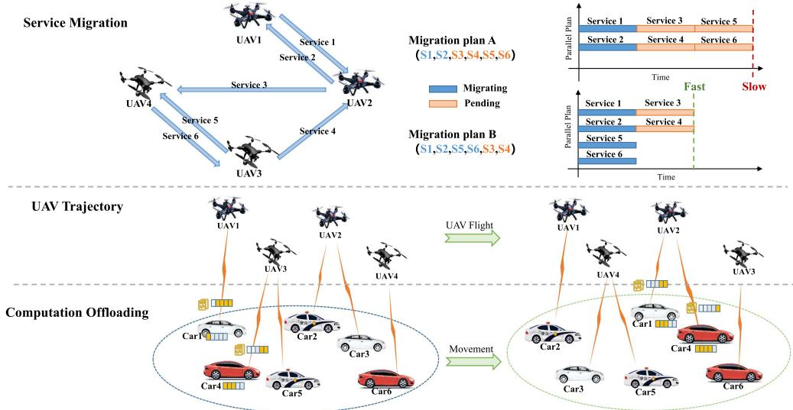  
Fig. 1. The illustration of computation offloading, UAV trajectory and service migration in the stateful service-oriented UAV-enabled VEC system. For example after the movement of the UAV and the vehicle, Service 1 offloaded by Car 1 is transformed from UAV 1 to UAV 2. After determining the direction of migration for all the services, there are two migration plans, i.e., plan A and plan B. It is obvious that plan B has a shorter migration time than that of plan A.

pages are transferred, a final synchronization is performed to ensure consistency, allowing seamless service switching to the new UAV.

Combined with live migration technology, a stateful serviceoriented UAV-enabled VEC system is considered in our work, which ensures seamless service continuity and enhances the overall quality of experience for users. However, it still faces some major challenges, i.e., computation offloading, UAV trajectory planning, and service migration, as shown in Fig. 1. First, given the varying computational demands of different tasks, vehicles must determine how much of the computational load should be offloaded to nearby edge nodes, which is known as the computation offloading problem [11]. This problem requires consideration of constraints such as mission duration, UAV computing power, and network conditions to ensure that computationally intensive tasks of vehicles are handled promptly without overwhelming any single UAV. Second, with the movement of vehicles, each UAV must decide when and where to move in order to maintain reliable connections with vehicles and optimize system performance, which is referred to as the UAV trajectory planning problem [12]. Effective trajectory planning should account for factors such as vehicle mobility patterns, service demand locations, and energy constraints, ensuring that UAVs provide continuous coverage while minimizing energy consumption and latency.

The last challenge is the stateful service migration problem [13], which is rarely discussed in existing research. When vehicles move from the service range of one UAV to another, stateful services need to migrate seamlessly. However, the limited communication range and bandwidth of UAVs restrict the number of services that can be migrated simultaneously between UAVs [14]. As a result, efficiently scheduling the migration of multiple services in parallel to minimize overall migration time becomes a significant challenge. An example is illustrated in the upper part of Fig. 1, where six service applications need to be migrated and two migration plans are presented following the movement of UAVs and vehicles. During the service migration process, it is assumed that each UAV migrates out and in only one service program via uplink and downlink, respectively, which means that some services must wait for the UAV to release communication resources. It is evident that Migration Plan B is better than Migration Plan A in terms of total migration time, achieving faster parallel migration by fully utilising the communication resources of all UAVs.

To tackle with these challenges, existing work primarily focuses on optimizing energy consumption, UAV flight cost, and migration time through various efficient methods [15], [16], [17]. However, a critical optimization objective has often been overlooked, namely the freshness of terminal information. Due to the rapid movement of UAVs and vehicles, the information they generate can quickly become outdated, leading to inefficient resource utilization, delayed responses, and degraded user experience. Since the freshness of data directly impacts the ability of the system to respond in real time, maintaining up-to-date information is crucial for ensuring service reliability. To quantify this aspect, the Age of Information (AoI) is introduced as a key metric that captures both latency and inter-delivery time intervals from the perspective of the data recipient [18]. In the context of VEC systems, where decisions such as computation offloading, service caching, and path planning depend heavily on accurate and timely state information, AoI becomes a vital performance indicator. Specifically, a low AoI ensures that the control and decision-making processes rely on the most recent data, which is essential for time-sensitive applications such as autonomous driving, collision avoidance, and dynamic resource provisioning. Therefore, this paper comprehensively considers energy consumption, UAV flight cost, migration time, and AoI as joint optimization objectives to enhance the overall performance, real-time responsiveness, and reliability of the system.

Through the above analysis, this paper first formulates the joint UAV trajectory, computation offloading, and service migration problem in the stateful service-oriented UAV-enabled VEC system as a dynamic multiobjective optimization problem with the aim of minimizing UAV flight cost, vehicle energy consumption, service migration time, and AoI. Then, a novel joint Trajectory, Offloading, and Migration optimization approach (TOM) based on a dynamic multifactorial evolutionary algorithm is proposed to solve the problem. Compared to previous works, the main innovations and contributions of this paper are summarized below:

1) This paper is the first work to investigate a stateful service-oriented UAV-enabled VEC system. In this system, the joint UAV trajectory, computation offloading, and service migration problem is modeled as a dynamic multiobjective optimization problem with four optimization objectives including UAV flight cost, vehicle energy consumption, service migration time, and AoI.

2) To improve optimization efficiency, a multifactorial optimization algorithm is employed in TOM, where each objective of the original problem is treated as a single optimization subtask, thus simplifying the complexity of the problem. Efficient cultural propagation between tasks is then performed to accelerate convergence.

3) In the designed TOM, heuristic initialization and novel mutation operators are introduced to enhance solution effectiveness. A service migration strategy is designed to efficiently migrate services in parallel. Additionally, an environmental adaptation strategy is triggered to handle environmental changes effectively.

4) To evaluate the performance of TOM, two real-world datasets, i.e., the taxi trajectory dataset and the electric vehicle dataset, are used to model the simulation environment. Extensive simulation results show that TOM outperforms several baseline methods.

The rest of the paper is organized as follows. Section II provides the relevant background and reviews existing work. Section III introduces the problem formulation. Section IV presents the details of the proposed method. Section V provides simulation results and analysis. Section VI gives conclusions and anticipates future work.

## II. BACKGROUND AND RELATED WORK

In this section, we first introduce the concepts of multifactorial evolutionary optimization. Then, we introduce the related work on computation offloading, UAV trajectory planning, and service migration, respectively. Finally, we compare our work with existing work and clarify our motivations.

## A. Multifactorial Evolutionary Optimization

Many real-world problems require the joint optimization of multiple subproblems. To address this challenge, the multifactorial evolutionary optimization (MFEA) [19] provides an effective solution by treating multiple subproblems as distinct optimization tasks. By leveraging a unified optimization framework, MFEA explores the relationships among these tasks to enhance the optimization of each individual task. Specifically, MFEA employs a single population $P$ of individuals to solve K optimization tasks $\left\{ T _ { 1 } , T _ { 2 } , . . . , T _ { K } \right\}$ simultaneously, where each task is seen as an added factor influencing the evolution of the population. The subpopulation associated with the kth task is denoted as $P _ { k }$ . Given this background, certain terminologies commonly encountered in the context of the MFEA are as follows.

Definition 1 (Factorial Rank): For task $T _ { k }$ , the factor rank $r _ { i } ^ { k }$ of $p _ { i }$ is the index of $p _ { i }$ in the list of population members, ordered in decreasing priority with respect to $T _ { k }$

Definition 2 (Skill Factor): The skill factor $\tau _ { i }$ of $p _ { i }$ is one task among all other tasks associated with the individual in the K-element environment. If $p _ { i }$ is evaluated for all tasks then $\tau _ { i } = \mathrm { a r g m i n } _ { k } \{ r _ { i } ^ { k } \}$ , where $k \in \{ 1 , 2 , . . . , K \}$

Definition 3 (Scalar Fitness): The scalar fitness of $p _ { i }$ in a multitasking environment is given by $\varphi _ { i } = 1 / r _ { \tau _ { i } } ^ { i }$

## B. Related Work

1) Computation Offloading: In recent years, numerous studies have focused on optimizing computation offloading in VEC systems, addressing challenges such as latency, energy consumption, and resource allocation through innovative algorithms and models. For example, Wang et al. [20] focused on the optimization of computation offloading decisions in UAV-enabled dynamic MEC networks, and proposed a joint optimization method based on imitation learning to minimize the system latency. By leveraging the idle computational resources in vehicles, Wang et al. [21] introduced a novel task offloading model with deep reinforcement learning in VEC, aiming to minimize the latency and energy consumption of the system. Considering the dynamic change of available computing resources and bandwidth resources, Zhang et al. [22] used the quadratic transformation method and Lagrangian pairwise method to solve the task allocation and bandwidth allocation problems, respectively, aiming to maximize the computational efficiency. In order to minimize the delay in task offloading, Li et al. [23] proposed an improved particle swarm genetic algorithm to achieve the optimal offloading strategy, which designs new acceleration coefficients and inertia weights to improve the particle swarm optimization algorithm, and improves the genetic algorithm by using the adaptive crossover and mutation probabilities. By combining digital twin (DT) and VEC techniques, Zhao et al. [24] proposed an adaptive swarm intelligent offloading scheme based on DT-assisted prediction in VEC, which effectively reduces computational delay and energy consumption.

2) UAV Trajectory: Unmanned Aerial Vehicles (UAVs), with their exceptional mobility and flexible deployment capabilities, have emerged as a transformative technology when integrated with VEC systems. In UAV-enabled VEC scenarios, Song et al. [25] proposed an improved multiobjective reinforcement learning algorithm to opmtize the UAV’s flight trajectories, which aims to maximize the energy efficiency of the UAV and the number of tasks collected. When a dynamic end-user offloads the task to UAVs, eavesdroppers may be able to tap into the channel information. To this end, Zhang et al. [26] proposed a joint dynamic programming and bidding algorithm with the goal of maximizing the minimum secure computational power for the user. Gao et al. [27] proposed a successive convex approximation technique to iteratively handle the joint UAV trajectory and transmit power optimization problem in UAV-assisted MEC networks. Considering the mobility of vehicles and UAVs as well as the dynamic network environment, Yan et al. [28] designed a joint deep reinforcement learning-based trajectory control and offloading assignment algorithm to minimize energy consumption and rental prices.

TABLE I  
COMPARISONS BETWEEN OUR WORK AND THE CURRENT REPRESENTATIVE WORKS

<table><tr><td rowspan="2">Reference</td><td colspan="3">Problems</td><td colspan="4">Objectives</td></tr><tr><td>Computation Offloading</td><td>UAV Trajectory</td><td>Service Migration</td><td>Energy Consumption</td><td>UAV Flight Cost</td><td>Migration Time</td><td>Age of Information</td></tr><tr><td>Wang et al. [20]</td><td>√</td><td></td><td></td><td>√</td><td></td><td></td><td></td></tr><tr><td>Wang et al. [21]</td><td>√</td><td></td><td></td><td>√</td><td></td><td></td><td></td></tr><tr><td>Zhang et al. [22]</td><td>√</td><td></td><td></td><td>√</td><td></td><td></td><td></td></tr><tr><td>Li et al. [23]</td><td>√</td><td></td><td></td><td>√</td><td></td><td></td><td></td></tr><tr><td>Zhao et al. [24]</td><td>√</td><td></td><td></td><td>√</td><td></td><td></td><td></td></tr><tr><td>Song et al. [25]</td><td>√</td><td>√</td><td></td><td>√</td><td>√</td><td></td><td></td></tr><tr><td>Zhang et al. [26]</td><td>√</td><td>√</td><td></td><td>√</td><td>√</td><td></td><td></td></tr><tr><td>Gao et al. [27]</td><td>√</td><td>√</td><td></td><td>√</td><td>√</td><td></td><td></td></tr><tr><td>Yan et al. [28]</td><td>√</td><td>√</td><td></td><td>√</td><td>√</td><td></td><td></td></tr><tr><td>Chen et al. [29]</td><td></td><td></td><td>√</td><td></td><td></td><td>√</td><td></td></tr><tr><td>Hua et al. [30]</td><td></td><td></td><td>√</td><td>√</td><td></td><td>√</td><td></td></tr><tr><td>Ning et al. [17]</td><td>√</td><td></td><td>√</td><td>√</td><td></td><td></td><td></td></tr><tr><td>Bozkaya [31]</td><td>√</td><td></td><td>√</td><td></td><td></td><td>√</td><td></td></tr><tr><td>Our work</td><td>√</td><td>√</td><td>√</td><td>√</td><td>√</td><td>√</td><td>√</td></tr></table>

3) Service Migration: Service migration has been extensively studied as a critical aspect of enhancing the efficiency and reliability of VEC systems, particularly in dynamic and resource-constrained environments. For example, Chen et al. [29] studied service migration for edge collaboration and proposed a dynamic service migration strategy based on the multi-agent proximal policy optimization algorithm, which decreases redundant transmissions for migration. Considering the dynamics of vehicles and the time-varying nature of the network, Hua et al. [30] proposed a mobility-aware deep reinforcement learning framework based on vehicle behavior prediction for service migration to minimize service processing delay, migration latency, and energy consumption of the system. Ning et al. [17] established a cooperative service migration framework in edge networks and proposed a global state-based offline expert policy to optimize service performance and cost by analyzing the optimal migration rate for cooperative service migration. Bozkaya [31] proposed a digital twin (DT)-assisted service migration approach that utilizes real-time and historical data to determine service migration strategies and predicts future user mobility based on a hidden Markov model, which ultimately reduces service migration costs. However, existing works primarily focus on optimizing the migration of a single service by predicting migration locations or selecting optimal migration paths, overlooking the challenges and opportunities associated with parallel migration of multiple services, especially in multi-UAV-enabled VECs.

## C. Motivation of Our Work

The comparisons between our work and current representative works are summarized in Table I, and the following points of analysis can be observed.

1) As summarized in the first three columns of Table I, the existing works in the first two categories focus only on computation offloading and UAV trajectory optimization, but ignores the need to migrate stateful services. The third category of existing works only discusses the migration process of single services, ignoring the parallel migration problem of multiple services for dynamic UAV-enabled VEC scenarios. This limitation may lead to performance instability and decreased efficiency of the current algorithms in practical applications. Therefore, it is necessary to design an efficient optimization algorithm to address the joint UAV trajectory, computation offloading, and service migration problem in the stateful service-oriented UAV-enabled VEC.

2) As summarized in the last four columns of Table I, most existing works prioritize energy consumption, UAV flight cost, and migration time as optimization objectives for VEC systems, while overlooking the crucial metric of the age of information. The high dynamics resulting from UAV mobility and service migration highlight the growing importance of maintaining information freshness at user terminals. Stale or outdated data can significantly degrade the quality of real-time services, posing substantial challenges to the performance and reliability of dynamic VEC systems. Therefore, it is essential to develop a multiobjective optimization algorithm that simultaneously optimizes energy consumption, UAV flight cost, migration time, and age of information within the VEC system.

TABLE II MAIN NOTATIONS

<table><tr><td>Symbol</td><td>Definition</td></tr><tr><td> $UAV, J$ </td><td>a set of UAVs and the number of UAVs</td></tr><tr><td> $V, I$ </td><td>a set of vehicles and the number of vehicles</td></tr><tr><td> $S, K$ </td><td>a set of services and the number of services</td></tr><tr><td> $t, T$ </td><td>the index and number of time slots</td></tr><tr><td> $l_i$ </td><td>the location of  $v_i$ </td></tr><tr><td> $D_i$ </td><td>the task size of  $v_i$ </td></tr><tr><td> $C_i$ </td><td>the CPU cycles for one bit data of  $v_i$ </td></tr><tr><td> $\psi_i$ </td><td>the maximum admissible delay for task of  $v_i$ </td></tr><tr><td> $F_i$ </td><td>the computational resource of  $v_i$ </td></tr><tr><td> $B_{ij}$ </td><td>the channel bandwidth between  $v_i$  and  $uav_j$ </td></tr><tr><td> $f_{ij}$ </td><td>the computational resource allocated by  $uav_j$  to  $v_i$ </td></tr><tr><td> $o_k$ </td><td>the memory size of the VM hosting  $s_k$ </td></tr><tr><td> $R_{jj'}$ </td><td>the bandwidth between UAVs</td></tr><tr><td> $\theta_i$ </td><td>the offloading decision of  $v_i$ </td></tr><tr><td> $L_j$ </td><td>the trajectory decision/location of  $uav_j$ </td></tr><tr><td> $PSG$ </td><td>the service migration plan in parallel</td></tr></table>

## III. SYSTEM MODEL AND PROBLEM FORMULATION

In this section, a 3-dimensional UAV-enabled VEC system model is presented first. Then, UAV trajectory model, computation offloading model, and service migration model are proposed in the system sequentially. Finally, the problem is formulated with four optimization objectives, i.e., UAV flight cost, vehicle energy consumption, age of information, and service migration time. Note that, for ease of description, the main terminologies used in the system are summarized in Table II.

## A. System Scenario

As shown in Fig. 1, there are J UAVs and I vehicles in the UAV-enabled VEC system. Assume that $U A V = \{ u a v _ { 1 } , u a v _ { 2 } , . . . , u a v _ { J } \}$ is the set of UAVs and $V =$ $\{ v _ { 1 } , v _ { 2 } , . . . , v _ { I } \}$ is the set of vehicles. A time division multiple access (TDMA) technique is considered to transmit the tasks generated by the vehicle to the nearest UAV. In order to accurately represent the location of UAVs and vehicles, a 3-D Cartesian coordinate system is employed to model the stereospace of the UAV-enabled VEC. In this case, the location of $v _ { i }$ is denoted as $l _ { i } = ( x _ { i } ^ { v } , y _ { i } ^ { v } , 0 )$ and the location of UAV uav<sub>j</sub> is denoted as $L _ { j } = ( x _ { j } ^ { u a v } , y _ { j } ^ { u a v } , z _ { j } ^ { u a v } )$ . Moreover, assuming that $\boldsymbol { S } = \left\{ s _ { 1 } , s _ { 2 } , . . . , s _ { K } \right\}$ is the set of application services. Note <sup>=</sup>that each vehicle task corresponds to one service. Thus, in the scope of the UAV, a vehicle offloads a task to the UAV, then the corresponding application service is cached on the UAV. Due to the mobility of vehicles and UAVs, all policies should be updated over time in dynamic VEC systems. Therefore, time is divided into a set of discrete time slots, indexed by $\{ 1 , 2 , \ldots , t , \ldots , T \}$

## B. UAV Trajectory Model

In the UAV-enabled VEC, the UAV acts as a mobile edge node to provide computational and storage resources to moving vehicles. However, due to the UAV’s limited batteries, there is a significant financial cost associated with long flights. In this paper, the UAV flight cost depends on the flight duration and flight power.

Assume that each UAV flies to a new position in time slot $\Delta t = ( t - 1 , t ]$ to perform the tasks of all vehicles in range. First, the flight distance of the UAV in time slot t is calculated as follows,

$$
\Delta d _ {j} ^ {u a v} (t) = \left\| L _ {j} (t) - L _ {j} (t - 1) \right\|.\tag{1}
$$

Moreover, the flight cost of all UAVs can be expressed as,

$$
F C = \sum_ {j} ^ {J} \sum_ {t} ^ {T} \left(P ^ {f} \times \frac {\Delta d _ {j} ^ {u a v} (t)}{\nu^ {u a v}}\right),\tag{2}
$$

where $P ^ { f }$ denotes the flight power and $\nu ^ { u a v }$ denotes the flight speed of the UAV. It’s obvious that an efficient UAV flight trajectory should avoid passing through redundant waypoints to reduce the flight cost. This paper assumes that the possible extra flight path length produced while the UAV is at waiting and execution stages is short and negligible [32].

## C. Computation Offloading Model

Since vehicles usually carry limited computational resources that cannot satisfy the demands of latency-sensitive tasks, vehicles need to offload the computational tasks to edge nodes for execution. However, excessive offloading of tasks to edge nodes generates higher communication costs. Therefore, local computing and edge computing are considered simultaneously to balance the computation cost and communication cost for vehicles in this paper. Assume that the offloading decision for vehicles is denoted as $\theta _ { i } \in [ 0 , 1 ]$ , which means the proportion of offloading to the nearest edge nodes. Specifically, $\theta _ { i } = 0$ indicates that all tasks of $v _ { i }$ are local computing, $\theta _ { i } = 1$ indicates that all tasks of $v _ { i }$ are edge computing, and $\theta _ { i } \in ( 0 , 1 )$ represents tasks with both local and edge computing.

Local Computing: For locally computed tasks, the computational energy consumed by their execution in the vehicle is considered. Assume that the computational task for each vehicle is expressed as $\langle D _ { i } , C _ { i } , \psi _ { i } \rangle$ , where $D _ { i }$ denotes the total task size, $C _ { i }$ denotes the CPU cycles for the computation of one bit data, and $\psi _ { i }$ is the maximum admissible delay of the task, following the setting in [33]. The computation delay of a locally computed task on the vehicle is calculated as,

$$
D e l a y _ {i} ^ {l o c a l} (t) = (1 - \theta_ {i} (t)) \times \frac {C _ {i} \times D _ {i}}{F _ {i}},\tag{3}
$$

where $F _ { i }$ is the computational resource of $v _ { i } .$

Moreover, the energy consumption of the vehicle for local computing is as follows,

$$
E C = \sum_ {i} ^ {I} \sum_ {t} ^ {T} \left(P ^ {c} \times D e l a y _ {i} ^ {l o c a l} (t)\right),\tag{4}
$$

where $P ^ { c }$ is the computational power of $v _ { i }$ .

Edge Computing: For the task of edge computing, the main concern of the vehicle is the age of information (AoI), which characterizes latency and inter-delivery time intervals. There will exist delays in the interaction between the vehicle and UAV, including upload delay, computational delay and return delay. Since the output data are typically much smaller than the input task size, the time delay of the output return process can be ignored.

Assume that mobile vehicles communicate with the nearest UAV, named uav<sub>ˆ</sub>, through wireless links. In this case, the pathloss for the channel between the UAV and vehicle is given by,

$$
H _ {i \hat {j}} (t) = \left(\frac {4 \pi \Gamma}{c}\right) ^ {2} \times \left(d _ {i \hat {j}} (t)\right) ^ {\alpha},\tag{5}
$$

where  represents the central frequency, α represents the <sup>Γ</sup>path-loss exponent, c represents the speed of light, and $d _ { i \hat { j } } ( t )$ means the distance between $v _ { i }$ and $u a v _ { \hat { j } }$ in time slot $t . ^ { \check { } }$ <sup>( )</sup><sub>To</sub> facilitate tractable numerical computation, it is assumed that the vehicle and the UAV are relatively stationary within each discrete time slot t, and their positions are updated at the beginning of each slot. Thus, the distance is given as follows,

$$
d _ {i \hat {j}} (t) = \left\| l _ {i} (t) - L _ {\hat {j}} (t) \right\|.\tag{6}
$$

The signal-to-interference plus noise ratio (SINR) [34] of the communication link between $v _ { i }$ and uav<sub>ˆ</sub> is calculated as,

$$
S I N R _ {i \hat {j}} (t) = \frac {P ^ {t} \times g ^ {2}}{N _ {0} \times H _ {i \hat {j}} (t)},\tag{7}
$$

where $P ^ { t }$ represents the transmit power from the UAV to the vehicle, $N _ { 0 }$ is the noise power, and $g$ is the channel fading coefficient. The wireless transmission rate between $v _ { i }$ and uav<sub>ˆ</sub> is calculated based on the Shannon’s formula as follows,

$$
R _ {i \hat {j}} (t) = B _ {i \hat {j}} \times \log_ {2} \left(1 + S I N R _ {i \hat {j}} (t)\right),\tag{8}
$$

where $B _ { i \hat { j } }$ is the channel bandwidth between $v _ { i }$ and uav<sub>ˆj</sub>.

Therefore, the delay of task data uploading from the vehicle to the UAV can be calculated as,

$$
D e l a y _ {i} ^ {u p l o a d} (t) = \frac {\theta_ {i} (t) \times D _ {i}}{R _ {i \hat {j}} (t)}.\tag{9}
$$

Then, after the transmission is completed, the computational delay of the task being executed on uav<sub>ˆ</sub> is calculated as,

$$
D e l a y _ {i} ^ {c o m p u t e} (t) = \frac {\theta_ {i} (t) \times C _ {i} \times D _ {i}}{f _ {i \hat {j}} (t)},\tag{10}
$$

where $f _ { i \hat { j } }$ is the computational resource allocated by uav<sub>ˆ</sub> to $v _ { i } .$ Note that the fair allocation approach mentioned in [35] is employed to allocate computational resources on UAV. Specifically, the computational resource allocated to each vehicle depends on the proportion of its task size and required computation frequency relative to the total workload on the UAV. A larger proportion results in more resources being allocated. The total delay of edge computing for $v _ { i }$ is calculated as,

$$
D e l a y _ {i} ^ {e d g e} (t) = D e l a y _ {i} ^ {u p l o a d} (t) + D e l a y _ {i} ^ {c o m p u t e} (t).\tag{11}
$$

Finally, the AoI of task for the vehicle is as follows:

$$
A o I = \sum_ {i} ^ {I} \sum_ {t} ^ {T} \left(D e l a y _ {i} ^ {e d g e} (t)\right).\tag{12}
$$

Note that the AoI serves as a crucial metric for evaluating QoS, as it reflects the time elapsed from the transmission of a vehicular task to the completion of its computation. To minimize AoI, the optimization strategy adjusts the UAV’s position to be as close as possible to its associated vehicles. A shorter distance improves the data rate, reduces delay, and thus lowers AoI, enhancing QoS.

## D. Service Migration Model

When a vehicle drives from the service range of one UAV to that of another UAV during the time slot t, the data and procedures of the stateful service have to be migrated to maintain the quality of service. In live migration techniques, the migration time of VM hosting a service is often affected by several factors, such as memory size, dirty rate, and minimum dirty memory [36]. For simplification of calculation, this paper adopts the memory size of the VM for calculating the migration time of services, formulated as follows,

$$
M T _ {k} (t) = \frac {o _ {k}}{R _ {j j ^ {\prime}} (t)},\tag{13}
$$

where $O _ { k }$ denotes the memory size of the VM hosting $s _ { k }$ and $R _ { j j ^ { \prime } }$ denotes the bandwidth between UAVs. Please noted that the memory size of the VM is selected as the primary factor because it directly determines the volume of data that must be transferred during migration, offering a tractable and effective approximation of migration overhead [37].

In order to achieve the parallel migration of services under the constraint of limited communication distance and bandwidth between UAVs, the parallel service groups for migration will be generated by Algorithm 3 in Section IV-F, which is denoted to be $P S G = \{ p s g _ { 1 } , p s g _ { 2 } , . . . , p s g _ { M } \}$ . psg<sub>m</sub> denotes that the mth parallel service group and M is the number of service groups. It is defined that services on the same service group are migrated serially, while services in different groups are migrated in parallel. This way of definition is very convenient to calculate the minimum time for all the parallel migration of services. In this context, the migration time of all services on $p s g _ { m }$ is calculated by,

$$
M T _ {m} (t) = \sum_ {k} M T _ {k} (t), s _ {k} \in p s g _ {m}.\tag{14}
$$

Since services in different groups can be migrated in parallel without resource conflicts, the migration time for all services in the system depends on the latest completion time among the service groups. Thus, the total migration time of all services is formulated as follows:

$$
M T = \sum_ {t} ^ {T} \left(\max _ {m \in M} (M T _ {m} (t))\right).\tag{15}
$$

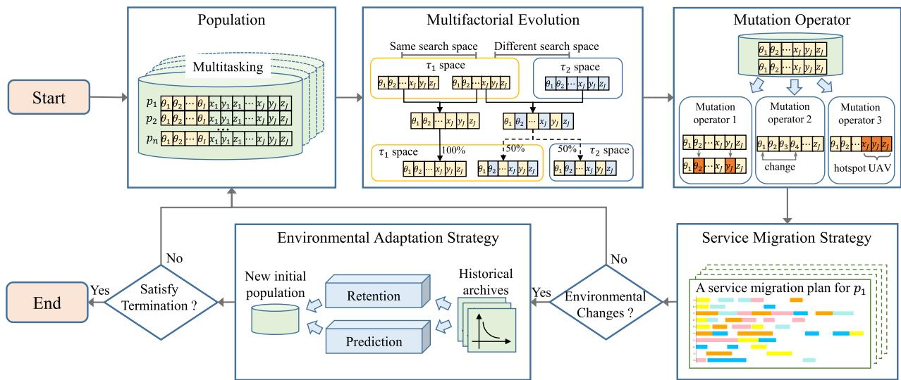  
Fig. 2. The outline of the proposed TOM, consisting of five core conponents. Specifically, the population is first initialized to optimize multiple tasks. Then, the multifactorial evolution, mutation operators, and service migration strategy are used to obtain the optimal solution. Finally, an environmental adaptation strategy is triggered to generate new initial populations if the environment changes.

## E. Problem Formulation

In this paper, the joint UAV trajectory, computation offloading, and service migration optimization problem is modeled as a dynamic multiobjective optimization problem with the purpose of minimizing UAV flight cost, vehicle energy consumption, age of information, and service migration time. Mathematically, the formulated problem is defined as follows:

$$
\mathbb {P} 0 = \min _ {L _ {j}, \theta_ {i}, P S G} \{F C, E C, A o I, M T \},\tag{16}
$$

$$
\begin{array}{l l} \text { s   .   t   . } & \theta_ {\mathrm{i}} \in [ 0, 1 ], \forall \mathrm{i} \in \mathrm{I}, \end{array}\tag{17}
$$

$$
\sum_ {i} ^ {I} f _ {i \hat {j}} \leq O _ {\hat {j}}, \forall \hat {j} \in J,\tag{18}
$$

$$
\sum_ {k} ^ {M _ {j}} o _ {k} \leq F _ {j}, \forall j \in J,\tag{19}
$$

$$
D e l a y _ {i} ^ {l o c a l} (t) + D e l a y _ {i} ^ {e d g e} (t) \leq \psi_ {i}, \forall i \in I,\tag{20}
$$

$$
\Delta d _ {j} ^ {u a v} (t) \leq \Delta t \times \nu^ {u a v}, \forall j \in J,\tag{21}
$$

$$
d _ {i \hat {j}} (t) \leq R a n g e _ {j}, \forall i \in I, \forall \hat {j} \in J.\tag{22}
$$

In the formulated model, the goal is to minimize four optimization goals by optimizing the UAV trajectory decision $L _ { j } .$ , the computation offloading decision $\theta _ { i }$ , and the service migration decision P SG in (16). Constraint (17) guarantees the range of values for $\theta _ { i } .$ Constraints (18) and (19) ensure that the storage and computational resources of each UAV cannot be exceeded. Constraint (20) ensures that each task is completed within the maximum admissible delay. Constraint (21) limits the distance travelled by UAVs in time slot $\Delta t$ with a uniform velocity. Constraint (22) ensures that the vehicle must be within the service range of the nearest UAV.

However, when solving multiobjective optimization problems, the dimensionality of the search space usually increases with the number of optimization objectives. It is obviously difficult to find the global optimal solution quickly in a huge search space. To alleviate this issue, we reconstruct <sup>P</sup> to obtain the following four new optimization tasks/problems with lowdimensional search space: $\mathbb { P } 1 = \operatorname* { m i n } \{ F C \} , \mathbb { P } 2 = \operatorname* { m i n } \{ E C \}$ $\mathbb { P } 3 = \operatorname* { m i n } \{ A o I \}$ , and ${ \mathbb { P } } 4 = \operatorname* { m i n } \{ M T \}$ , each of which optimizes different objectives to reduce the complexity of the problem. In this way, we can address the optimization tasks in a more manageable, lower-dimensional search space.

## IV. ALGORITHM DESIGN

In order to efficiently solve the reconstructed optimization problems, a novel joint Trajectory, Offloading, and Migration optimization approach (TOM) based on a dynamic multifactorial evolutionary algorithm is proposed in this section.

## A. The Overall Framework

The outline of the proposed TOM is provided in Fig. 2. As shown in Fig. 2, the population is first initialized and individuals in the population are assigned to optimize multiple tasks, i.e., <sup>P</sup> , <sup>P</sup> , <sup>P</sup> , and <sup>P</sup> , by carrying different skill factors. Then, <sup>1 2 3 4</sup>multifactorial evolution is employed to generate new offspring using crossover operators for individuals within and across tasks. Subsequently, three mutation operators are applied to guide the population in escaping the local optima. In order to obtain the shortest service migration time when evaluating the quality of an individual, a service migration strategy is designed to customize the parallel service migration plan for each individual. In addition, when the environment changes, an environmental adaptation strategy is triggered to generate new initial populations, significantly reducing the computational overhead associated with re-optimization. Finally, when the termination condition is satisfied, TOM outputs the optimal solutions for task offloading, UAV trajectory, and service migration, thereby achieving comprehensive system optimization.

<table><tr><td> $\theta_{1}$ </td><td> $\theta_{2}$ </td><td> $\cdots$ </td><td> $\theta_{I}$ </td><td> $x_{1}$ </td><td> $y_{1}$ </td><td> $z_{1}$ </td><td> $x_{2}$ </td><td> $y_{2}$ </td><td> $z_{2}$ </td><td> $\cdots$ </td><td> $x_{J}$ </td><td> $y_{J}$ </td><td> $z_{J}$ </td></tr><tr><td colspan="4">Computation offloading decisions</td><td colspan="10">UAV trajectory planning</td></tr></table>

Fig. 3. Chromosome coding for an individual.

The pseudocode of the proposed TOM is given in Algorithm 1, with the population size and the number of tasks as input. First, an initial population $\mathcal { P } _ { t }$ , where t means is the number of environmental changes, is generated through three initialization operations in Line 1, as detailed in Subsection IV-C. In Line 2, an empty archive set A is created to store the Pareto solutions found in each environment. Then, K tasks are constructed based on <sup>P</sup> , <sup>P</sup> , <sup>P</sup> , and <sup>P</sup> in Line 3, where K is set to 4in this paper. In Line 4, the skill factor of each individual is calculated as the index of the most relevant tasks. If the termination condition is not met in Line 5, the evolutionary process is iteratively implemented in Lines 6-16. Specifically, the multifactorial evolutionary search is performed to produce new offspring and store them in the set O in Line 6, which is detailed in Section IV-D. Subsequently, three mutation operators are designed to update the offspring in Line 7 to prevent falling into local optimum, as discussed in Section IV-E. In Line 8, a joint population $\mathcal { T P }$ is generated. Then, the service migration strategy is acquired for each individual of $\mathcal { T P }$ in Line 9, as detailed in Section IV-F. In Line 10, the scalar fitness and skill factors of the individuals are updated. In Line 11, the first N individuals in ${ \mathcal { T P } } _ { : }$ , sorted in ascending order based on fitness, are selected as the next generation of the population. If an environmental change is detected in Line 12, the Pareto solutions in the current population $\mathcal { P } _ { t }$ are stored in A at Line 13. Moreover, an environmental adaptation strategy is triggered to update $\mathcal { P } _ { t }$ for quick adaptation to the changing environment in Line 14, as discussed in Section IV-G. By iteratively running the above process, TOM can return the best solutions for all tasks in different environments.

## B. Encoding

In order to facilitate the subsequent calculations of the algorithm, this paper encodes the computation offloading decisions and UAV trajectory planning as shown in Fig. 3.

In Fig. 3, the first I codes represent the computation offloading decisions for all vehicles at time slot t, i.e., the percentage of offloading to the nearest UAV. The last × J codes represent the 3-dimensional positional decisions of all UAVs at time slot t. By consolidating computation offloading and UAV trajectory planning into a single encoding scheme, the algorithm reduces data redundancy and simplifies the optimization process. The population is made up of N such individuals and its initialization process is discussed in the next section.

## C. Heuristic Initialization

In the initialization phase, three methods are employed to generate the initial population: the random approach, the Circle map [38], and the K-means approach. First, some individuals in the population have their decision variables randomly generated within the corresponding value ranges. Second, a portion of the remaining individuals is generated using the Circle map, a well-known chaotic map that provides better diversity than the random approach. The mathematical model of the Circle map is given by,

<div class="mineru-algorithm" style="white-space: pre-wrap; font-family:monospace;">
Algorithm 1: The Proposed Method: TOM.

Input: Population size N, Tasks number K.
Output: The best solution found for K tasks.
1: Generate the initial population  $P_{t}$ ; t = 0;
2: Generate an empty archive set A = ∅;
3: Construct K tasks according to P1, P2, P3, and P4;
4: Compute the skill factor  $\tau_{i}$  of each individual;
5: while stopping condition is not met do
6:  $O \leftarrow$  Get offspring by multifactorial evolution;
7: Update offspring in O by mutation operators;
8:  $JP_{t} \leftarrow P_{t} \cup O$ ;
9: Get service migration strategies for  $JP_{t}$ ;
10: Update the scalar fitness and skill factor in  $JP_{t}$ ;
11:  $P_{t} \leftarrow$  Select the next population from  $JP_{t}$ ;
12: if environment changes then
13: Update the archive set A using  $P_{t}$ ;
14: Update  $P_{t}$  based on dynamic change perception;
15:  $t = t + 1$ ;
16: end if
17: end while
18: Return the best solutions from A.
</div>

$$
\varphi_ {k + 1} = \operatorname{mod} \left(\varphi_ {k} + 0. 2 - \left(\frac {0 . 5}{2 \pi}\right) \times \sin (2 \pi \varphi_ {k}), 1\right),\tag{23}
$$

where $\varphi _ { k }$ denotes the kth chaotic number. By incorporating randomness and chaotic behavior, the algorithm ensures a diverse initial population, which helps prevent premature convergence to local optima.

Finally, the remaining individuals are generated using the K-means approach. In this method, all vehicles are clustered into K clusters based on their locations, with the center of each cluster serving as the initial location of a UAV. Additionally, the computation offloading decisions for all vehicles are initially set to 0.5 (i.e., $\theta _ { i } = 0 . 5 , \forall i \in I )$ . The K-means clustering method strategically positions UAVs according to vehicle distribution, optimizing initial resource allocation. In conclusion, the combination of these three initialization methods provides a comprehensive starting point for the optimization process, improving the chances of efficiently finding high-quality solutions.

## D. Multifactorial Evolution

In this paper, the joint optimization of UAV trajectory planning, computation offloading, and stateful service migration in dynamic VEC systems poses several unique challenges, including a large-scale decision space, tightly coupled sub-tasks, and high environmental dynamics. These characteristics make traditional single-task or equilibrium-based methods less effective or computationally intractable. In contrast, the multifactorial evolution is particularly well-suited to address such problems due to its ability to solve multiple interrelated optimization tasks simultaneously, exploit knowledge transfer between them, and adapt to dynamic changes through population-based search mechanisms.

<div class="mineru-algorithm" style="white-space: pre-wrap; font-family:monospace;">
Algorithm 2: Multifactorial Evolution.

Input: The current population  $P_{t}$ .

Output: The offspring set O.

1: Generate an empty offspring set O = ∅;

2: for all  $p_{i}$  in  $P_{t}$  do

3: Randomly select a mating partner  $p_{j}(i \neq j)$ ;

4: if  $\tau_{i} == \tau_{j}$  then

5:  $(o_{i}, o_{j}) = \text{SBX\_crossover}(p_{i}, p_{j})$ ;

6:  $o_{i}$  and  $o_{j}$  imitate skill factor of  $p_{i}$  and  $p_{j}$ ;

7: else if  $rand(0, 1) &lt; rmp$  then

8:  $(o_{i}, o_{j}) = \text{SBX\_crossover}(p_{i}, p_{j})$ ;

9:  $o_{i}$  and  $o_{j}$  imitate skill factor of  $p_{i}$  or  $p_{j}$  with 50% probability;

10: else

11:  $o_{i} = \text{Mutation}(p_{i}), o_{j} = \text{Mutation}(p_{j})$ ;

12: end if

13:  $O \leftarrow (o_{i}, o_{j})$ ;

14: end for

15: Return the offspring set O.
</div>

In the TOM, the population is composed of K optimization tasks, each associated with distinct skill factors. The individuals in the population carry valuable solution knowledge tailored to a specific task. During the evolutionary process, multifactorial evolution is applied in a multitask scenario to generate new offspring through both intra-task and cross-task evolution. Specifically, when two paired parents have the same skill factor, a simulated binary crossover (SBX) [39] is performed between them to produce two offspring, facilitating knowledge propagation within the specific task domain. Conversely, if the parents have different skill factors, the SBX operation is conducted with a probability determined by the random mating probability (rmp), which controls the frequency of knowledge interactions across task domains. Through the cross-task evolution, implicit knowledge sharing between tasks is achieved via chromosomal information exchange, enabling the evolutionary process to benefit from valuable insights across multiple tasks. In summary, multifactorial evolution not only achieves fast convergence by exploiting valuable knowledge in specific tasks, but also enhances the diversity of the algorithm by exploring unknown regions through cross-task evolution. This dual capability ensures a more efficient search process that balances exploitation and exploration, thus improving overall performance. To clarify the running process of multifactorial evolution, its pseudocode is given in Algorithm 2.

## E. Mutation Operator

The intelligent optimization method is easy to converge prematurely to local optima during the evolutionary process. Therefore, this paper introduces three mutation operators designed to enhance diversity and prevent the algorithm from stagnating at local optima:

1) Mutation Operator 1: This operator applies polynomial mutation (PM) [40] to the individuals in the population. By introducing small perturbations to the decision variables, PM helps explore the solution space around a given individual. The main advantage of this operator is that it encourages local exploration, thereby helping the algorithm escape local optima and improving the chances of finding a global solution.

2) Mutation Operator 2: This operator modifies the computation offloading decisions between vehicles by randomly swapping the offloading strategies between two vehicles. By diversifying the computation offloading strategies across the population, this mutation encourages exploration of different computation allocation patterns, enabling the algorithm to avoid local optima and find more efficient computation offloading strategies.

3) Mutation Operator 3: This operator targets the UAV trajectory planning of the individuals. Specifically, this operation randomly redistributes the positions of overly clustered UAVs, ensuring a more balanced and uniform UAV deployment across the search area. The benefits of this operation are not only to avoid economic damage caused by the over-concentration of UAVs in specific areas, but also to improve the coverage and adaptability of UAVs to dynamic task demands.

## F. Service Migration Strategy

During population evolution, the computational offloading decisions of vehicles and UAV trajectory planning are progressively optimized. However, an important challenge arises: how can the numerous stateful services deployed on UAVs be migrated in the shortest possible time when the locations of vehicles and UAVs change? While a one-by-one migration strategy offers simplicity, it is inherently inefficient. To address this, this paper designs an efficient service migration strategy in parallel. As a greedy strategy, the main idea of the designed service migration strategy is to migrate as many services as possible in parallel to reduce the overall migration time, which consists of the following three steps. Specifically, the first step is to identify the set of services that can be migrated in parallel and in the largest possible number. Then, the migration start times for all selected services are set to zero, ensuring they begin migration concurrently. For example, in Fig. 1, services such as Service 1, Service 2, Service 5, and Service 6 are migrated in parallel. The second step is to select the next service for migration once the migration of the ongoing services is completed and their associated resources are released, such as Service 3 or Service 4 in Fig. 1. Finally, the third step is to continuously repeat the second step until all services have been successfully migrated.

Algorithm 3 provides the pseudocode for the service migration strategy, with the following inputs: an individual p and a time slot t. First, some key variables are initialized at Line 1. P arallel\_plan represents a service parallel migration plan and contains multiple parallel service groups. group indicates that the index of a service group in P arallel\_plan. P ending\_list is a collection of services waiting to be migrated. Then, in

```txt
Algorithm 3: Service Migration Strategy.

Input: An individual p, Time slot t.

Output: A service migration strategy for p.

1: Parallel_plan ← ∅, group = 0, Pending_list ← ∅;
2: for i : 1 to I do

3: Decode source_UAV(s_i) from p at t - 1;
4: Decode destination_UAV(s_i) from p at t;
5: Pending_list ← s_i;
6: end for

7: for i : 1 to I do

8: if UAV_res(s_i) is not locked then

9: Parallel_plan(group) ← s_i, group = group + 1;
10: Lock UAV_res(s_i);
11: Pending_list ← Pending_list - s_i;
12: end if

13: end for

14: while Pending_list ≠ ∅ do

15: group ← Get first completed group in Parallel_plan;
16: Release UAV_res(s_k), s_k ∈ Parallel_plan(group);
17: Get s_i, s_i ∈ Pending_list &amp; UAV_res(s_i) is no locked;
18: Parallel_plan(group) ← s_i;
19: Lock UAV_res(s_i);
20: Pending_list ← Pending_list - s_i;
21: end while

22: Return the parallel migration plan Parallel_plan.
```

Lines 2-6, the source and destination UAVs for each service are decoded from p and the services are stored in P ending\_list to await migration. In Lines 7-13, all services that can be migrated in parallel for the first time are selected from P ending\_list and placed into different service groups in P arallel\_plan. Note that the resources required for all services migrated in parallel must be guaranteed not to conflict. In Lines 14-21, the remaining services in P ending\_list are scheduled sequentially as soon as the currently migrating services complete and release the necessary resources. Finally, after all services in P ending\_list have been scheduled, the parallel migration plan P arallel\_plan for p is returned.

## G. Environmental Adaptation Strategy

By introducing the multifactorial evolution and the service migration strategy into TOM, high-quality solutions can be effectively obtained in a static VEC system. However, due to the dynamic nature of vehicular networks, these high-quality solutions may become suboptimal or even infeasible when the environment changes, leading to significant computational costs and time delays for re-optimization. To address the challenges posed by environmental changes, an environmental adaptation strategy is designed to rapidly generate high-quality initial individuals for the new environments, which consists of two key components: environmental change detection and environmental change response.

<div class="mineru-algorithm" style="white-space: pre-wrap; font-family:monospace;">
Algorithm 4: Environmental Adaptation Strategy.

Input: Population size N, The archive set A, The original population  $P_{t-1}$ .

Output: The new population  $P_t$ .

1:  $p'_{t-1}, p'_t \leftarrow$  Generate two detection individuals;
2: Calculate  $\alpha_t$  and  $\beta_t$  based on (24) and (25);
3: if  $(\alpha_t + \beta_t)/2 &lt; \xi$  then
4:  $P_t \leftarrow$  Randomly select N/3 individuals from  $P_{t-1}$ ;
5:  $P_t \leftarrow$  Randomly mutate N/3 individuals from  $P_{t-1}$ ;
6:  $P_t \leftarrow$  Randomly generate N/3 initial individuals;
7: else
8:  $p_h, p_l \leftarrow$  Divide A into two groups;
9: MLP  $\leftarrow$  Train an MLP based on  $p_h$  and  $p_l$ ;
10:  $P_t \leftarrow$  Predict (2N)/3 new individuals through MLP.
11:  $P_t \leftarrow$  Randomly generate N/3 initial individuals;
12: end if
13: Return the new population  $P_t$ .
</div>

Environmental Change Detection: In the VEC system, environmental changes mainly refer to variations in the spatial distribution and movement patterns of vehicles, which significantly affect the optimization landscape. Typically, when vehicles follow regular movement patterns, such as moving forward on a straight road, the environment is considered stable or only slightly changed. In order to detect the degree of environmental change, two detection individuals are generated in both the original and new environments using an identical heuristic initialization method. These individuals serve to detect changes in their chromosomal coding and objective function values between the two environments. The degree of change is measured as follows:

$$
\alpha_ {t} = \left\| \frac {p _ {t - 1} ^ {\prime} - p _ {t} ^ {\prime}}{u b (p _ {t} ^ {\prime}) - l b (p _ {t} ^ {\prime})} \right\|,\tag{24}
$$

$$
\beta_ {t} = \left\| \frac {F (p _ {t - 1} ^ {\prime}) - F (p _ {t} ^ {\prime})}{u b (F) - l b (F)} \right\|,\tag{25}
$$

where $p _ { t - 1 } ^ { \prime }$ and $p _ { t } ^ { \prime }$ denote individuals generated in the original and new environments, respectively. $F ( p _ { t } ^ { \prime } )$ denotes the objective function value of $p _ { t } ^ { \prime }$ <sup>( )</sup>, while ub and lb denote the upper and lower bounds of the respective values. According to (24) and (25), the values of $\alpha _ { t }$ and $\beta _ { t }$ range from 0 to 1. This paper proposes that if $( \alpha _ { t } + \beta _ { t } ) / 2 < \xi$ then the environmental change is considered slight, otherwise it is deemed drastic, where ξ is set to 0.3 based on the analysis of parametric experiments in Section V-H. This method enables a quantitative assessment of the extent of environmental change and distinguishes between minor and drastic changes, thereby facilitating more targeted adaptation strategies and improving the overall efficiency of the optimization process.

Environmental Change Response: Based on the degree of environmental change, the algorithm employs different strategies to quickly adapt to the new environment. In this paper, if the environmental change is slight, i.e., $( \alpha _ { t } + \beta _ { t } ) / 2 < \xi$ , then high-quality individuals found in the original environment are either directly retained or undergo mutation as part of the new population. This approach leverages the similarity between the two environments, allowing the high-quality genetic information to be inherited, thus enhancing the convergence speed of the algorithm in the new environment.

Conversely, if the environmental change is drastic, i.e., $( \alpha _ { t } +$ $\beta _ { t } ) / 2 \geq \xi ,$ , directly preserving genetic information becomes <sup>) 2</sup>infeasible, while starting a search from scratch for high-quality individuals is time-consuming. To overcome these challenges, a prediction-based method is introduced, which tracks the changes in high-quality individuals by analyzing the distribution patterns of historical high-quality individuals stored in an archive. Specifically, the individuals in the archive set are equally divided into two groups based on their scalar fitness, i.e., high-quality individuals and low-quality individuals. Then, a multilayer perceptron (MLP) [41] with a three-layer neural network is trained by taking low-quality individuals as inputs and high-quality individuals as target outputs. Finally, the trained MLP is employed to predict some high-quality initial individuals for the new environment, using the individuals of the original environment as input. This predictive mechanism significantly improves the ability of the algorithm to adapt to drastic environmental changes while maintaining efficiency. Algorithm 4 provides the pseudocode of the environmental adaptation strategy, whose time complexity and space complexity are both O N .

## V. PERFORMANCE EVALUATION

In this section, comprehensive experiments are conducted on two real-world datasets to evaluate the performance of TOM and several state-of-the-art algorithms are adopted for performance comparison. In addition, ablation experiments are conducted to validate the effectiveness of the key components proposed in TOM. Furthermore, the effectiveness of the designed service migration strategy is analyzed and discussed. Finally, additional experiments on computational time and parameter sensitivity are conducted to further demonstrate the practicality of TOM.

## A. Dataset Description

To evaluate the performance of the proposed algorithm, two real-world datasets are used in our experiments: the taxi trajectory dataset (TTD) [42] and the electric vehicle dataset (EVD) [43]. Specifically, TTD contains the trajectories of 4000 taxis in Shanghai, China, recorded on February 20, 2007. The trajectories are logged at one-minute intervals, comprising approximately 4,316 distinct trajectories and 606,079 track point records. EVD, on the other hand, includes data from 664 electric vehicles in Shenzhen, China, recorded on October 22, 2014. This dataset features 1,155,654 GPS records, with each record containing the vehicle ID, longitude, latitude, timestamp, and speed, all updated per minute. It is important to highlight the differences in vehicle movement patterns between two datasets. The electric vehicles in EVD charge on average 3.5 times per day, with each session lasting approximately 1.5 hours, which contrasts with the continuous movement patterns seen in the taxi dataset.

## B. Experimental Setup

The simulation experiments are performed to evaluate the performance of TOM, which are implemented in Python 3.11, and run on a PC with i7-12700 CPU and 32.0 GB RAM. There are 60 UAVs, 300 mobile vehicles, and 20 types of services in the simulation experiments. Specifically, these moving vehicles are randomly selected from the real-world dataset and 50 positions of the vehicles are sampled from their trajectories as 50 instances of environmental changes. Additionally, six experimental environments of varying sizes are deployed. For example, the notation 50\_10\_10 indicates an environment comprising 50 vehicles, 10 UAVs, and 10 service types. Referring to [33], [44], the main environmental settings for the VEC system are listed in Table A.1 of supplementary file.

## C. Compared Algorithms and Metrics

In the simulation experiments, three representative algorithms are adopted, including DMOAWPSO [32], CMOEA/D-CDP [45], and NSGA-II [46], which have been proven effective in solving joint UAV trajectory and computation offloading problem by [32], [45], [46]. Specifically, all three comparison algorithms are multiobjective evolutionary algorithms. When the environment changes, 50% of the solutions of the CMOEA/D-CDP and NSGA-II are retained in the new environment and the remaining are randomly generated. In addition, to obtain the metrics of service migration time, the service migration designed in this paper is also embedded in the comparison algorithms.

In order to evaluate the performance of dynamic multiobjective optimization algorithms, three evaluation metrics widely used in academia are adopted: Hypervolume (HV) [47], Number of Pareto Solutions (NPS) [48], and Pure Diversity (PD) [49]. Specifically, HV measures the hypervolume enclosed by the non-dominated solutions in the final solution set relative to a reference point. NPS quantifies the number of Pareto solutions present in the final solution set generated by the multiobjective algorithm. Additionally, PD assesses the diversity of the solution set, calculated as the sum of the euclidean distances between each solution and its nearest neighbor. Furthermore, we introduce a key metric, F, which represents the combined performance of the four optimization objectives [10]. This metric is computed as the sum of the normalized values of the four objectives for the best solution. Note that larger values are better for the first three metrics, while smaller values are better for the last one.

## D. Simulation Results

This section discusses the experimental results of all the compared algorithms at different environmental scales on the EVD and TTD datasets in terms of four evaluation metrics, i.e., HV, NPS, PD, and F. To ensure robustness, each algorithm is executed ten times, and the average results are reported to evaluate their performance.

TABLE III  
COMPARATIVE RESULTS OF ALL ALGORITHMS IN SIX ENVIRONMENTAL SCALES ON THE EVD DATASET

<table><tr><td rowspan="2">EVD</td><td colspan="4">TOM</td><td colspan="4">NSGA-II</td><td colspan="4">CMOEA/D-CDP</td><td colspan="4">DMOAWPSO</td></tr><tr><td>HV</td><td>NPS</td><td>PD</td><td>F</td><td>HV</td><td>NPS</td><td>PD</td><td>F</td><td>HV</td><td>NPS</td><td>PD</td><td>F</td><td>HV</td><td>NPS</td><td>PD</td><td>F</td></tr><tr><td>50_10_10</td><td>8.326</td><td>48.478</td><td>0.144</td><td>1.214</td><td>8.236</td><td>50.000</td><td>0.097</td><td>1.231</td><td>8.286</td><td>46.365</td><td>0.178</td><td>1.316</td><td>5.847</td><td>47.308</td><td>0.111</td><td>1.905</td></tr><tr><td>100_20_12</td><td>9.910</td><td>50.000</td><td>0.117</td><td>1.225</td><td>8.111</td><td>50.000</td><td>0.015</td><td>1.186</td><td>7.222</td><td>44.975</td><td>0.097</td><td>1.466</td><td>5.570</td><td>47.786</td><td>0.098</td><td>1.953</td></tr><tr><td>150_30_14</td><td>9.701</td><td>49.137</td><td>0.148</td><td>1.184</td><td>8.040</td><td>50.000</td><td>0.015</td><td>1.225</td><td>7.171</td><td>49.109</td><td>0.105</td><td>1.497</td><td>5.201</td><td>47.648</td><td>0.064</td><td>2.026</td></tr><tr><td>200_40_16</td><td>9.659</td><td>50.000</td><td>0.177</td><td>1.129</td><td>8.075</td><td>50.000</td><td>0.014</td><td>1.324</td><td>7.110</td><td>46.256</td><td>0.106</td><td>1.551</td><td>5.281</td><td>48.464</td><td>0.055</td><td>2.035</td></tr><tr><td>250_50_18</td><td>9.840</td><td>50.000</td><td>0.198</td><td>1.114</td><td>8.020</td><td>50.000</td><td>0.013</td><td>1.191</td><td>6.677</td><td>49.129</td><td>0.115</td><td>1.601</td><td>5.223</td><td>48.704</td><td>0.072</td><td>2.024</td></tr><tr><td>300_60_20</td><td>10.132</td><td>50.000</td><td>0.143</td><td>1.131</td><td>8.019</td><td>50.000</td><td>0.017</td><td>1.175</td><td>6.921</td><td>49.058</td><td>0.111</td><td>1.458</td><td>5.056</td><td>49.689</td><td>0.082</td><td>2.027</td></tr><tr><td>Average</td><td>9.595</td><td>49.603</td><td>0.155</td><td>1.166</td><td>8.084</td><td>50.000</td><td>0.029</td><td>1.222</td><td>7.231</td><td>47.482</td><td>0.119</td><td>1.482</td><td>5.363</td><td>48.267</td><td>0.080</td><td>1.995</td></tr></table>

TABLE IV

COMPARATIVE RESULTS OF ALL ALGORITHMS IN SIX ENVIRONMENTAL SCALES ON THE TTD DATASET

<table><tr><td rowspan="2">TTD</td><td colspan="4">TOM</td><td colspan="4">NSGA-II</td><td colspan="4">CMOEA/D-CDP</td><td colspan="4">DMOAWPSO</td></tr><tr><td>HV</td><td>NPS</td><td>PD</td><td>F</td><td>HV</td><td>NPS</td><td>PD</td><td>F</td><td>HV</td><td>NPS</td><td>PD</td><td>F</td><td>HV</td><td>NPS</td><td>PD</td><td>F</td></tr><tr><td>50_10_10</td><td>9.913</td><td>50.000</td><td>0.127</td><td>1.155</td><td>8.083</td><td>50.000</td><td>0.046</td><td>1.177</td><td>8.026</td><td>49.375</td><td>0.072</td><td>1.367</td><td>6.638</td><td>46.958</td><td>0.089</td><td>1.704</td></tr><tr><td>100_20_12</td><td>9.630</td><td>50.000</td><td>0.145</td><td>1.087</td><td>8.099</td><td>50.000</td><td>0.019</td><td>1.213</td><td>7.992</td><td>47.756</td><td>0.118</td><td>1.376</td><td>6.223</td><td>45.756</td><td>0.095</td><td>1.765</td></tr><tr><td>150_30_14</td><td>9.571</td><td>50.000</td><td>0.160</td><td>1.112</td><td>8.046</td><td>50.000</td><td>0.022</td><td>1.187</td><td>7.351</td><td>50.000</td><td>0.081</td><td>1.484</td><td>5.986</td><td>48.085</td><td>0.042</td><td>1.802</td></tr><tr><td>200_40_16</td><td>9.916</td><td>47.875</td><td>0.155</td><td>1.051</td><td>8.030</td><td>50.000</td><td>0.016</td><td>1.234</td><td>7.144</td><td>47.973</td><td>0.049</td><td>1.447</td><td>5.877</td><td>44.864</td><td>0.082</td><td>1.825</td></tr><tr><td>250_50_18</td><td>10.088</td><td>49.538</td><td>0.068</td><td>1.059</td><td>8.019</td><td>50.000</td><td>0.017</td><td>1.276</td><td>7.135</td><td>49.350</td><td>0.067</td><td>1.507</td><td>5.790</td><td>48.750</td><td>0.032</td><td>1.844</td></tr><tr><td>300_60_20</td><td>9.590</td><td>50.000</td><td>0.052</td><td>1.078</td><td>8.043</td><td>50.000</td><td>0.014</td><td>1.125</td><td>7.616</td><td>47.419</td><td>0.158</td><td>1.377</td><td>5.613</td><td>46.186</td><td>0.035</td><td>1.834</td></tr><tr><td>Average</td><td>9.785</td><td>49.569</td><td>0.118</td><td>1.090</td><td>8.053</td><td>50.000</td><td>0.022</td><td>1.202</td><td>7.544</td><td>48.646</td><td>0.091</td><td>1.426</td><td>6.021</td><td>46.767</td><td>0.063</td><td>1.793</td></tr></table>

Tables III and IV show the experimental results of all the algorithms on the two datasets EVD and TTD, respectively. From the HV value, TOM outperforms the three compared algorithms, demonstrating better scalability. This advantage can be attributed to the multifactorial evolutionary algorithm in TOM, which explores a broader solution space by sharing knowledge and resources among multiple optimization tasks. Regarding NPS and PD values, TOM excels in PD but shows a slightly lower performance than NSGA-II in NPS. This difference is likely due to the three mutation operators, which assist dominated solutions in exploring uncharted domains, escaping local optima, and enhancing overall diversity. Finally, in terms of F value, TOM achieves better results than the other algorithms, demonstrating superior overall optimization of the four objectives. This success can be largely attributed to the heuristic initialization and environmental adaptation strategys of TOM, which deliver higher-quality solutions at the beginning of the evolutionary process and adapt effectively to changes in the environment. In summary, the results demonstrate that TOM consistently outperforms other algorithms across various evaluation metrics, highlighting its effectiveness for dynamic optimization in VEC systems.

## E. Ablation Analysis

To further validate the effectiveness and impact of several key components in TOM, four variants of TOM are implemented in our ablation experiments. Specifically, TOM\_wFac denotes the absence of the multifactorial evolutionary algorithm, replaced by the evolutionary process of NSGA-II to optimize the four objectives simultaneously. TOM\_wDyn indicates the removal of the environmental adaptation strategy, with all individuals directly retained in the new environment. Moreover, TOM\_wInt means that the heuristic initialization is not used and the initial population is randomly generated. Finally, TOM\_wMut refers to TOM without the three designed mutation operators. For a fair comparison, all relevant parameters for these variants are kept consistent with those of the original TOM. Each algorithm is executed ten times, and the average results are reported to evaluate their performance.

Fig. 4 illustrates the results of the ablation experiments across different metrics at six experimental scales of the TTD dataset. It is evident that TOM\_wFac exhibits significant disadvantages in terms of HV and PD, indicating that the absence of the multifactorial evolutionary algorithm compromises both scalability and population diversity. As shown in Fig. 4(c), TOM\_wDyn performs poorly in terms of NPS, suggesting that TOM\_wDyn fails to adapt appropriately when the environment changes, leading to inefficient re-searching for non-dominated solutions and a marked decrease in search efficiency. TOM\_wInt performs poorly on PD and F values, highlighting that heuristic initialization enhances search efficiency and solution quality through higher-quality initial solutions. Lastly, TOM\_wMut exhibits the worst performance in both HV and F values, as the lack of mutation operators leads to premature convergence to local optima. In summary, the ablation experiments underscore the critical roles of the multifactorial evolutionary algorithm, environmental adaptation strategys, heuristic initialization, and mutation operations in enhancing the performance of TOM.

## F. Effectiveness of Service Migration Strategy

This section focuses on the effectiveness of the designed service migration strategy by comparing it with a strategy based on the first-come-first-served (FCFS) principle. In FCFS approach, services on each UAV are migrated in the order of arrival of the migration request. Note that migration policies wait for a batch of requests to arrive before executing them, enabling batch processing. For a fair comparison, a variant of TOM is implemented where the designed service migration strategy is replaced by FCFS, denoted as TOM\_FCFS. Each algorithm is executed ten times, and the results of the average migration time are reported.

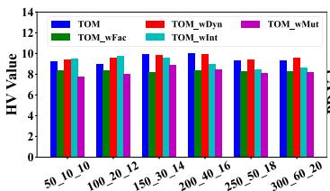  
(a)

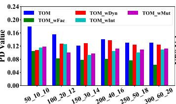  
(b)

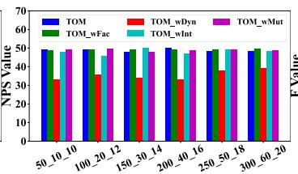  
(c)

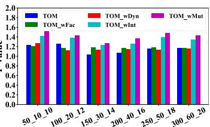  
(d)

Fig. 4. Ablation experimental results for different metrics in six experimental scales of the TTD dataset.  
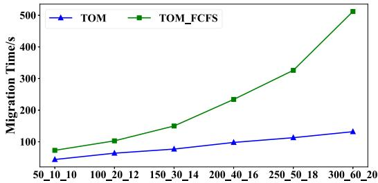  
Fig. 5. Comparison results of TOM and TOM-FCFS in terms of migration time on the TTD dataset.

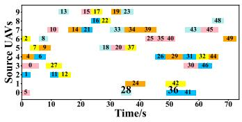  
(a) Source UAVs in FCFS

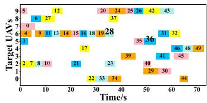  
(b) Target UAVs in FCFS

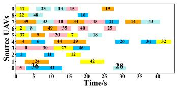  
(c) Source UAVs in our strategy

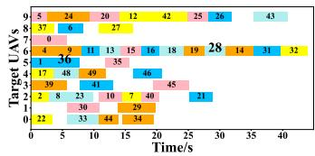  
(d) Target UAVs in our strategy  
Fig. 6. A visualization example for the designed service migration strategy and FCFS implementation in 50\_10\_10 of TTD dataset. (a) and (b) show the move-out and move-in order of services in source/target UAVs after applying FCFS, respectively. (c) and (d) show the results of the designed service migration strategy.

Fig. 5 shows the comparison results of TOM and TOM\_FCFS on the TTD dataset in terms of migration time. It is evident that the migration time for both algorithms increases with the environmental scale. However, TOM exhibits a much gentler growth curve and consistently outperforms TOM\_FCFS at all scales. This is attributed to the designed service migration strategy, which employs a superior parallelism approach by maximizing the number of services that can migrate simultaneously. To visualize more the effectiveness of the designed migration strategy,

Fig. 6 shows a visualization example of the service migration process for the designed strategy and FCFS implementation in the 50\_10\_10 scale of the TTD dataset. From Fig. 6(a) and (b), Services 28 and 36 are successively migrated out of UAV0 and into UAV6 and UAV5, respectively. However, in the FCFS implementation, as UAV6 is continuously receiving incoming services, Service 28 is delayed in moving out and blocking UAV0’s uplink. To avoid link blocking and improve migration efficiency, the designed service migration policy prioritizes the scheduling of Service 36 to complete its migration first, as shown in Fig. 6(c). With this intelligent service migration policy, services are migrated in parallel wherever possible, significantly improving the throughput and migration efficiency of the entire system.

## G. Comparison of Computational Time Performance

This section discusses the computational time performance of TOM and other comparison algorithms at different environmental scales on the TTD dataset. Due to page limitations, the related contents are provided in the supplementary file.

## H. Analysis of Parameter Sensitivity

This section discusses the sensitivity analysis of different parameter ξ, which characterizes the perception of the designed algorithm to the degree of environmental change, under varying environmental scales based on the TTD dataset. Due to page limitations, the related contents are provided in the supplementary file. The experimental results show that ξ . is adopted as the final parameter setting to ensure a balanced trade-off between adaptability and stability.

## VI. CONCLUSION AND FUTURE WORK

In this paper, we studied the joint computational offloading, UAV trajectory, and service migration problem in a stateful service-oriented UAV-enabled VEC system. First, the problem was formulated as a dynamic multiobjective optimization problem aiming at minimizing UAV flight cost, vehicle energy consumption, service migration time, and age of information. Subsequently, a novel joint trajectory, offloading, and migration optimization approach (TOM) was proposed to solve the problem, which based on a dynamic multifactorial evolutionary algorithm. In the designed TOM, heuristic initialization and new mutation operators were used to enhance the quality of solutions. A service migration strategy was designed to efficiently migrate services in parallel. In addition, an environmental adaptation strategy was triggered to handle environmental changes effectively. Finally, extensive simulations on real-world datasets demonstrated that our proposed method outperforms several state-of-the-art methods.

For future work, we plan to explore UAV trajectory planning with obstacle avoidance in UAV-enabled VEC systems. Moreover, while UAVs operate independently in this study, investigating collaborative strategies among UAVs represents a promising direction for further research.

## REFERENCES

[1] H. M. Kamdjou, D. Baudry, V. Havard, and S. Ouchani, “Resourceconstrained extended reality operated with digital twin in industrial Internet of Things,” IEEE Open J. Commun. Soc., vol. 5, pp. 928–950, 2024.

[2] Z. Yu, J. Hu, G. Min, Z. Zhao, W. Miao, and M. S. Hossain, “Mobilityaware proactive edge caching for connected vehicles using federated learning,” IEEE Trans. Intell. Transp. Syst., vol. 22, no. 8, pp. 5341–5351, Aug. 2021.

[3] Y. Chen, Y. Yang, Y. Wu, J. Huang, and L. Zhao, “Joint trajectory optimization and resource allocation in UAV-MEC systems: A lyapunovassisted DRL approach,” IEEE Trans. Services Comput., vol. 18, no. 2, pp. 854–867, Mar./Apr. 2025.

[4] M. Bedford, “Unmanned aircraft system (UAS) service demand 2015– 2035,” U. S. Department of Transportation, Washington, DC, Tech. Rep. DOT-VNTSC-DoD-13-01, 2013.

[5] G. Salvo, L. Caruso, and A. Scordo, “Urban traffic analysis through an UAV,” Procedia-Social Behav. Sci., vol. 111, pp. 1083–1091, 2014.

[6] X. Dai, Z. Xiao, H. Jiang, and J. C. Lui, “UAV-assisted task offloading in vehicular edge computing networks,” IEEE Trans. Mobile Comput., vol. 23, no. 4, pp. 2520–2534, Apr. 2024.

[7] Z. Chen, J. Zhang, G. Min, Z. Ning, and J. Li, “Traffic-aware lightweight hierarchical offloading toward adaptive slicing-enabled SAGIN,” IEEE J. Sel. Areas Commun., vol. 42, no. 12, pp. 3536–3550, Dec. 2024.

[8] Z. Chen, B. Xiong, X. Chen, G. Min, and J. Li, “Joint computation offloading and resource allocation in multi-edge smart communities with personalized federated deep reinforcement learning,” IEEE Trans. Mobile Comput., vol. 23, no. 12, pp. 11604–11619, Dec. 2024.

[9] R. M. Haris, M. Barhamgi, A. Badawy, A. Nhlabatsi, and K. M. Khan, “Enhancing security and performance in live VM migration: A machine learning-driven framework with selective encryption for enhanced security and performance in cloud computing environments,” Expert Syst., vol. 42, no. 2, 2025, Art. no. e13823.

[10] Z. Xiao, Q. Qiu, L. Li, Y. Feng, Q. Lin, and Z. Ming, “An efficient serviceaware virtual machine scheduling approach based on multi-objective evolutionary algorithm,” IEEE Trans. Services Comput., vol. 17, no. 5, pp. 2027–2040, Sep./Oct. 2024.

[11] Q. Luo, C. Li, T. H. Luan, and W. Shi, “Minimizing the delay and cost of computation offloading for vehicular edge computing,” IEEE Trans. Services Comput., vol. 15, no. 5, pp. 2897–2909, Sep./Oct. 2022.

[12] H. Liu, Y. P. Tsang, C. K. M. Lee, and C. H. Wu, “UAV trajectory planning via viewpoint resampling for autonomous remote inspection of industrial facilities,” IEEE Trans. Ind. Informat., vol. 20, no. 5, pp. 7492–7501, May 2024.

[13] Z. Song, Y. Fan, and Y. Cai, “A survey on service migration strategies for vehicular edge computing,” in Proc. Int. Conf. Big Data Secur., 2021, pp. 473–487.

[14] S. Si-Mohammed, A. Ksentini, M. Bouaziz, Y. Challal, and A. Balla, “UAV mission optimization in 5 G: On reducing MEC service relocation,” in Proc. IEEE Glob. Commun. Conf., 2020, pp. 1–6.

[15] Y. Chen, J. Xu, Y. Wu, J. Gao, and L. Zhao, “Dynamic task offloading and resource allocation for NOMA-aided mobile edge computing: An energy efficient design,” IEEE Trans. Services Comput., vol. 17, no. 4, pp. 1492–1503, Jul./Aug. 2024.

[16] M. A. Abdel-Malek and M. Azab, “UAV-fleet management for extended nextg emergency support infrastructure with QoS and cost aware,” Internet Things, vol. 25, 2024, Art. no. 101043.

[17] Z. Ning, H. Chen, E. C. H. Ngai, X. Wang, L. Guo, and J. Liu, “Lightweigh imitation learning for real-time cooperative service migration,” IEEE Trans. Mobile Comput., vol. 23, no. 2, pp. 1503–1520, Feb. 2024.

[18] I. Kahraman, A. Köse, M. Koca, and E. Anarim, “Age of information in Internet of Things: A survey,” IEEE Internet Things J., vol. 11, no. 6, pp. 9896–9914, Mar. 2024.

[19] J. Shen, H. Dong, Y. Tian, X. Wang, W. Chen, and H. Zhu, “Adaptive knowledge transfer based on machine learning method for evolutionary multitasking optimization,” Inf. Sci., vol. 702, 2025, Art. no. 121908.

[20] L. Wang et al., “Joint task offloading and migration optimization in UAVenabled dynamic MEC networks,” IEEE Trans. Services Comput., vol. 18, no. 4, pp. 2143–2157, Jul./Aug. 2025.

[21] B. Wang, D. Tu, and J. Wang, “Cost-efficient computation offloading in VEC using deep reinforcement learning techniques,” in Proc. Int. Wireless Commun. Mobile Comput., 2024, pp. 296–300.

[22] N. Zhang, S. Liang, K. Wang, Q. Wu, and A. Nallanathan, “Computation efficient task offloading and bandwidth allocation in VEC networks,” IEEE Trans. Veh. Technol., vol. 73, no. 10, pp. 15889–15893, Oct. 2024.

[23] C. Li, L. Chai, K. Jiang, Y. Zhang, J. Liu, and S. Wan, “DNN partition and offloading strategy with improved particle swarm genetic algorithm in VEC,” IEEE Trans. Intell. Veh., vol. 9, no. 9, pp. 5532–5542, Sep. 2024.

[24] L. Zhao et al., “Adaptive swarm intelligent offloading based on digital twin-assisted prediction in VEC,” IEEE Trans. Mobile Comput., vol. 23, no. 8, pp. 8158–8174, Aug. 2024.

[25] F. Song, M. Deng, H. Xing, Y. Liu, F. Ye, and Z. Xiao, “Energy-efficient trajectory optimization with wireless charging in UAV-assisted MEC based on multi-objective reinforcement learning,” IEEE Trans. Mobile Comput., vol. 23, no. 12, pp. 10867–10884, Dec. 2024.

[26] Y. Zhang, Z. Kuang, Y. Feng, and F. Hou, “Task offloading and trajectory optimization for secure communications in dynamic user multi-UAV MEC systems,” IEEE Trans. Mobile Comput., vol. 23, no. 12, pp. 14427–14440, Dec. 2024.

[27] Y. Gao, J. Tao, Y. Xu, Z. Wang, Y. Gao, and M. Wang, “Improving user QoE via joint trajectory and resource optimization in multi-UAV assisted MEC,” IEEE Trans. Services Comput., vol. 18, no. 3, pp. 1472–1486, May/Jun. 2025.

[28] J. Yan, X. Zhao, and Z. Li, “Deep-reinforcement-learning-based computation offloading in UAV-assisted vehicular edge computing networks,” IEEE Internet Things J., vol. 11, no. 11, pp. 19882–19897, Jun. 2024.

[29] S. Chen, L. Rui, Z. Gao, Y. Yang, X. Qiu, and S. Guo, “Service migration with edge collaboration: Multi-agent deep reinforcement learning approach combined with user preference adaptation,” Future Gener. Comput. Syst., vol. 165, 2025, Art. no. 107612.

[30] K. Hua, S. Su, and Y. Wang, “Intelligent service migration for the internet of vehicles in edge computing: A mobility-aware deep reinforcemen learning framework,” Comput. Netw., vol. 257, 2025, Art. no. 111021.

[31] E. Bozkaya, “Digital twin-assisted and mobility-aware service migration in mobile edge computing,” Comput. Netw., vol. 231, 2023, Art. no. 109798.

[32] M. Deng, Z. Yao, X. Li, H. Wang, A. Nallanathan, and Z. Zhang, “Dynamic multi-objective AWPSO in DT-assisted UAV cooperative task assignment,” IEEE J. Sel. Areas Commun., vol. 41, no. 11, pp. 3444–3460, Nov. 2023.

[33] Q. Qiu, Y. Ye, L. Li, Z. Xiao, Q. Lin, and Z. Ming, “Joint computation offloading and service caching in vehicular edge computing via a dynamic coevolutionary multiobjective optimization algorithm,” Expert Syst. Appl., vol. 284, 2025, Art. no. 127821.

[34] Y. Qin, M. A. Kishk, and M.-S. Alouini, “On the uplink SINR meta distribution of UAV-assisted wireless networks,” IEEE Wireless Commun. Lett., vol. 12, no. 4, pp. 684–688, Apr. 2023.

[35] J. Zhou and X. Zhang, “Fairness-aware task offloading and resource allocation in cooperative mobile-edge computing,” IEEE Internet Things J., vol. 9, no. 5, pp. 3812–3824, Mar. 2022.

[36] H. Wang, Y. Li, Y. Zhang, and D. Jin, “Virtual machine migration planning in software-defined networks,” IEEE Trans. Cloud Comput., vol. 7, no. 4, pp. 1168–1182, Oct.-Dec. 2021.

[37] G. Sun, D. Liao, D. Zhao, Z. Xu, and H. Yu, “Live migration for multiple correlated virtual machines in cloud-based data centers,” IEEE Trans. Services Comput., vol. 11, no. 2, pp. 279–291, Mar./Apr. 2018.

[38] H. Lu, X. Wang, Z. Fei, and M. Qiu, “The effects of using chaotic map on improving the performance of multiobjective evolutionary algorithms,” Math. Problems Eng., vol. 2014, no. 1, 2014, Art. no. 924652.

[39] L. Pan, W. Xu, L. Li, C. He, and R. Cheng, “Adaptive simulated binary crossover for rotated multi-objective optimization,” Swarm Evol. Comput., vol. 60, 2021, Art. no. 100759.

[40] G.-Q. Zeng et al., “An improved multi-objective population-based extremal optimization algorithm with polynomial mutation,” Inf. Sci., vol. 330, pp. 49–73, 2016.

[41] M.-C. Popescu, V. E. Balas, L. Perescu-Popescu, and N. Mastorakis, “Multilayer perceptron and neural networks,” WSEAS Trans. Circuits Syst., vol. 8, no. 7, pp. 579–588, 2009.

[42] X. Zhao, J. Su, J. Cai, H. Yang, and T. Xi, “Vehicle anomalous trajectory detection algorithm based on road network partition,” Appl. Intell., vol. 52, no. 8, pp. 8820–8838, 2022.

[43] G. Wang, X. Chen, F. Zhang, Y. Wang, and D. Zhang, “Experience: Understanding long-term evolving patterns of shared electric vehicle networks,” in Proc. 25th Annu. Int. Conf. mobile Comput. Netw., 2019, pp. 1–12.

[44] X. Dai et al., “Task offloading for cloud-assisted fog computing with dynamic service caching in enterprise management systems,” IEEE Trans. Ind. Informat., vol. 19, no. 1, pp. 662–672, Jan. 2023.

[45] C. Peng et al., “Joint energy and completion time difference minimization for UAV-enabled intelligent transportation systems: A constrained multiobjective optimization approach,” IEEE Trans. Intell. Transp. Syst., vol. 25, no. 10, pp. 14040–14053, Oct. 2024.

[46] J. Zhu, X. Wang, H. Huang, S. Cheng, and M. Wu, “A NSGA-II algorithm for task scheduling in UAV-enabled MEC system,” IEEE Trans. Intell. Transp. Syst., vol. 23, no. 7, pp. 9414–9429, Jul. 2022.

[47] E. Zitzler and L. Thiele, “Multiobjective evolutionary algorithms: A comparative case study and the strength pareto approach,” IEEE Trans. Evol. Comput., vol. 3, no. 4, pp. 257–271, Nov. 1999.

[48] A. Gharaei and F. Jolai, “A pareto approach for the multi-factory supply chain scheduling and distribution problem,” Oper. Res., vol. 21, no. 4, pp. 2333–2364, 2021.

[49] H. Wang, Y. Jin, and X. Yao, “Diversity assessment in many-objective optimization,” IEEE Trans. Cybern., vol. 47, no. 6, pp. 1510–1522, Jun. 2017.


Zhijiao Xiao received the PhD degree in computer software and theory from Sun Yat-sen University, Guangzhou, China, in 2007. She is currently an associate professor with the College of Computer Science and Software Engineering, Shenzhen University, Shenzhen, China. Her current research interests include cloud computing and intelligent computing.


Qiuzhen Lin (Member IEEE) received the BS degree from Zhaoqing University, Zhaoqing, China, in 2007, and the MS degree from Shenzhen University, Shenzhen, China, in 2010, and the PhD degree from the Department of Electronic Engineering, City University of Hong Kong, Hong Kong, in 2014. He is currently a professor with the College of Computer Science and Software Engineering, Shenzhen University. He has published more than 100 research papers since 2008. His current research interests include artificial immune system, multiobjective optimization, and

dynamic system. Prof. Lin is an associate editor of IEEE Transactions on Evolutionary Computation and the IEEE Transactions on Emerging Topics in Computational Intelligence.

  
Qijie Qiu received the BS degree from the University of South China, Hengyang, China, in 2021. He is currently working toward the PhD degree with the College of Computer Science and Software Engineering, Shenzhen University, Shenzhen, China. His current research interests include evolutionary computation and cloud computing.


Lingjie Li (Member, IEEE) received the BS degree from Shandong Technology and Business University, Yantai, China, in 2017, and the MS degree and PhD degree from the College of Computer Science and Software Engineering, Shenzhen University, Shenzhen, China, in 2020 and 2023, respectively. He is currently an associate professor with the School of Artificial Intelligence, Shenzhen Technology University, Shenzhen. He focuses on research in the area of intelligent optimization and decisions. Specifically, it includes theoretical research on AI algorithms (evo-

lutionary algorithms, evolutionary reinforcement learning, feature selection, LLMs4Algorithms, and intelligent recommender systems) and research on AI applications (cloud computing, hyperspectral image processing, and financial securities).


Lijia Ma (Member IEEE) received the BS degree in communication engineering from Hunan Normal University, Changsha, China, in 2010, and the PhD degree in electronic science and technology from Xidian University, Xi’an, China, in 2015. From 2015 to 2016, he was a postdoctoral fellow with HongKong Baptist University, Hong Kong, and Nanyang Technological University, Singapore, from 2016 to 2017. He is an associate professor in College of Computer and Software Engineering, Shenzhen University. His research interests mainly include evolutionary computation, machine learning, and complex networks.


Zhong Ming received the PhD degree in computer science and technology from Sun Yat-sen University, Guangzhou, China, in 2003. He is currently a professor with the College of Computer Science and Software Engineering, Shenzhen University, Shenzhen, China. He is also currently the vice president of the Shenzhen Technology University, Shenzhen, where he is a chair professor with the College of Big Data and Internet. He has published more than 200 refereed international conference and journal papers (including more than 40 ACM/IEEE Transactions Papers).

His research interests include software engineering and artificial intelligence.